# Advanced Configuration and Power Interface (ACPI) Specification Release 6.6

UEFI Forum, Inc.

May 13, 2025

## CONTENTS

1 Introduction
1.1 Principal Goals . . . . . . . . . . . . . . . . . . . . . . . . . . . . . . . . . . . . . . 1
1.1.1 Principle of Inclusive Terminology . . . . . . . . . . . . . . . . . . . . . . 2
1.2 Power Management Rationale . . . . . . . . . . . . . . . . . . . . 2
1.3 Legacy Support . . . . . . . . . . . . . . . . . . 3
1.4 OEM Implementation Strategy . . . . . . . . . . . . . . 4
1.5 Power and Sleep Buttons . . . . . . . . . . . 4
1.6 ACPI Specification and the Structure of ACPI . 4
1.7 OS and Platform Compliance 6
1.7.1 Platform Implementations of ACPI-defined Interfaces 6
1.7.1.1 Recommended Features and Interface Descriptions for Design Guides 6
1.7.1.2 Terminology Examples for Design Guides 8
1.7.2 OSPM Implementations 10
1.7.3 OS Requirements 11
1.8 Target Audience 12
1.9 Document Organization 12
1.9.1 ACPI Introduction and Overview 12
1.9.2 Programming Models 13
1.9.3 Implementation Details 13
1.9.4 Technical Reference 14
1.9.5 Revision Numbers 14
1.10 Related Documents 14
2 Definition of Terms
2.1 General ACPI Terminology 16
2.2 Global System State Definitions 24
2.3 Device Power State Definitions 25
2.3.1 Device Performance States 27
2.4 Sleeping and Soft-off State Definitions 27
2.5 Processor Power State Definitions 27
2.6 Device and Processor Performance State Definitions 28
3 ACPI Concepts
3.1 System Power Management 30
3.2 Power States 30
3.2.1 Power Button 31
3.2.2 Platform Power Management Characteristics 32
3.2.2.1 Mobile PC 32
3.2.2.2 Desktop PCs 32
3.2.2.3 Multiprocessor and Server PCs 32

3.3 Device Power Management 33
3.3.1 Device Power Management Model 33
3.3.2 Power Management Standards 34
3.3.3 Device Power States 34
3.3.4 Device Power State Definitions 34
3.4 Controlling Device Power 35
3.4.1 Getting Device Power Capabilities 35
3.4.2 Setting Device Power States 35
3.4.3 Getting Device Power Status 36
3.4.4 Waking the System 36
3.4.5 Example: Modem Device Power Management 37
3.4.5.1 Obtaining the Modem Capabilities 38
3.4.5.2 Setting the Modem Power State 38
3.4.5.3 Obtaining the Modem Power Status 39
3.4.5.4 Waking the System 39
3.5 Processor Power Management 39
3.6 Device and Processor Performance States 40
3.7 Configuration and “Plug and Play” 40
3.7.1 Device Configuration Example: Configuring the Modem 41
3.7.2 NUMA Nodes 41
3.8 System Events 41
3.9 Battery Management 42
3.9.1 Battery Communications 42
3.9.2 Battery Capacity 42
3.9.3 Battery Gas Gauge 42
3.9.4 Low Battery Levels 44
3.9.4.1 Emergency Shutdown 45
3.9.5 Battery Calibration 45
3.9.6 Battery Charge Limiting 46
3.10 Thermal Management Concepts 47
3.10.1 Active and Passive Cooling Modes 47
3.10.2 Performance vs. Energy Conservation 48
3.10.3 Acoustics (Noise) 48
3.10.4 Multiple Thermal Zones 48
3.11 Flexible Platform Architecture Support 48
3.11.1 Hardware-reduced ACPI 49
3.11.1.1 Interrupt-based Wake Events 49
3.11.2 Low-Power Idle 49
3.11.2.1 Low Power S0 Idle Capable Flag 49
3.11.3 Connection Resources 50
3.11.3.1 Supported Platforms 50

ACPI Hardware Specification 52
4.1 Hardware-Reduced ACPI 52
4.1.1 Hardware-Reduced Events 53
4.1.1.1 GPIO-Signaled Events or Interrupt Signaled Events 53
4.1.1.2 Interrupt-based Wake Events 53
4.2 Fixed Hardware Programming Model 53
4.3 Generic Hardware Programming Model 54
4.4 Diagram Legend 56
4.5 Register Bit Notation 56
4.6 The ACPI Hardware Model 57
4.6.1 Hardware Reserved Bits 60
4.6.2 Hardware Ignored Bits 60

4.6.3 Hardware Write-Only Bits 60
4.6.4 Cross Device Dependencies 61
4.6.4.1 Example 1: Related Device Interference 61
4.6.4.2 Example 2: Unrelated Device Interference 61
4.7 ACPI Hardware Features 61
4.8 ACPI Register Model 63
4.8.1 ACPI Register Summary 65
4.8.1.1 PM1 Event Registers 66
4.8.1.2 PM1 Control Registers 67
4.8.1.3 PM2 Control Register 67
4.8.1.4 PM Timer Register 67
4.8.1.5 Processor Control Block (P\_BLK) 67
4.8.1.6 General-Purpose Event Registers 68
4.8.2 Fixed Hardware Features 68
4.8.2.1 Power Management Timer 68
4.8.2.2 Console Buttons 69
4.8.2.3 Sleeping/Wake Control 74
4.8.2.4 Real Time Clock Alarm 75
4.8.2.5 Legacy/ACPI Select and the SCI Interrupt 77
4.8.2.6 Processor Control 78
4.8.3 Fixed Hardware Registers 78
4.8.3.1 PM1 Event Grouping 78
4.8.3.2 PM1 Control Grouping 81
4.8.3.3 Power Management Timer (PM\_TMR) 83
4.8.3.4 PM2 Control (PM2\_CNT) 83
4.8.3.5 Processor Register Block (P\_BLK) 84
4.8.3.6 Reset Register 86
4.8.3.7 Sleep Control and Status Registers 86
4.8.4 Generic Hardware Registers 87
4.8.4.1 General-Purpose Event Register Blocks 89
4.8.4.2 Example Generic Devices 91

ACPI Software Programming Model 95
5.1 Overview of the System Description Table Architecture 95
5.1.1 Address Space Translation 98
5.2 ACPI System Description Tables 98
5.2.1 Reserved Bits and Fields 99
5.2.1.1 Reserved Bits and Software Components 99
5.2.1.2 Reserved Values and Software Components 99
5.2.1.3 Reserved Hardware Bits and Software Components 99
5.2.1.4 Ignored Hardware Bits and Software Components 100
5.2.2 Compatibility 100
5.2.3 Address Format 100
5.2.3.1 Functional Fixed Hardware 100
5.2.3.2 Generic Address Structure 101
5.2.4 Universally Unique Identifiers (UUIDs) 103
5.2.5 Root System Description Pointer (RSDP) 103
5.2.5.1 Finding the RSDP on IA-PC Systems 103
5.2.5.2 Finding the RSDP on UEFI Enabled Systems 104
5.2.5.3 Root System Description Pointer (RSDP) Structure 104
5.2.6 System Description Table Header 105
5.2.7 Root System Description Table (RSDT) 109
5.2.8 Extended System Description Table (XSDT) 110
5.2.9 Fixed ACPI Description Table (FADT) 111

5.2.9.1 Preferred PM Profile System Types 124
5.2.9.2 System Type Attributes 125
5.2.9.3 IA-PC Boot Architecture Flags 125
5.2.9.4 ARM Architecture Boot Flags 126
5.2.10 Firmware ACPI Control Structure (FACS) 126
5.2.10.1 Global Lock 129
5.2.11 Definition Blocks 131
5.2.11.1 Differentiated System Description Table (DSDT) 131
5.2.11.2 Secondary System Description Table (SSDT) 132
5.2.11.3 Persistent System Description Table (PSDT) 133
5.2.12 Multiple APIC Description Table (MADT) 133
5.2.12.1 MADT Processor Local APIC / SAPIC Structure Entry Order 135
5.2.12.2 Processor Local APIC Structure 136
5.2.12.3 I/O APIC Structure 137
5.2.12.4 Platforms with APIC and Dual 8259 Support 137
5.2.12.5 Interrupt Source Override Structure 137
5.2.12.6 Non-Maskable Interrupt (NMI) Source Structure 139
5.2.12.7 Local APIC NMI Structure 139
5.2.12.8 Local APIC Address Override Structure 139
5.2.12.9 I/O SAPIC Structure 140
5.2.12.10 Local SAPIC Structure 140
5.2.12.11 Platform Interrupt Source Structure 141
5.2.12.12 Processor Local x2APIC Structure 142
5.2.12.13 Local x2APIC NMI Structure 143
5.2.12.14 GIC CPU Interface (GICC) Structure 144
5.2.12.15 GIC Distributor (GICD) Structure 146
5.2.12.16 GIC MSI Frame Structure 147
5.2.12.17 GIC Redistributor (GICR) Structure 148
5.2.12.18 GIC Interrupt Translation Service (ITS) Structure 149
5.2.12.19 Multiprocessor Wakeup Structure 150
5.2.12.20 Core Programmable Interrupt Controller (CORE PIC) Structure 152
5.2.12.21 Legacy I/O Programmable Interrupt Controller(LIO PIC) Structure 153
5.2.12.22 HyperTransport Programmable Interrupt Controller (HT PIC) Structure 153
5.2.12.23 Extend I/O Programmable Interrupt Controller (EIO PIC) Structure 154
5.2.12.24 MSI Programmable Interrupt Controller (MSI PIC) Structure 154
5.2.12.25 Bridge I/O Programmable Interrupt Controller (BIO PIC) Structure 155
5.2.12.26 LPC Programmable Interrupt Controller (LPC PIC) Structure 155
5.2.12.27 RISC-V Interrupt Controller (RINTC) Structure 156
5.2.12.28 RISC-V Incoming MSI Controller (IMSIC) Structure 157
5.2.12.29 RISC-V Advanced Platform Level Interrupt Controller (APLIC) Structure 158
5.2.12.30 RISC-V Platform Level Interrupt Controller (PLIC) Structure 159
5.2.13 Global System Interrupts 160
5.2.14 Smart Battery Table (SBST) 162
5.2.15 Embedded Controller Boot Resources Table (ECDT) 163
5.2.16 System Resource Affinity Table (SRAT) 165
5.2.16.1 Processor Local APIC/SAPIC Affinity Structure 166
5.2.16.2 Memory Affinity Structure 166
5.2.16.3 Processor Local x2APIC Affinity Structure 168
5.2.16.4 GICC Affinity Structure 169
5.2.16.5 GIC Interrupt Translation Service (ITS) Affinity Structure 170
5.2.16.6 Generic Initiator Affinity Structure 170
5.2.16.7 Generic Port Affinity Structure 171
5.2.16.8 RINTC Affinity Structure 172
5.2.17 System Locality Information Table (SLIT) 173

5.2.18 Corrected Platform Error Polling Table (CPEP) 174
5.2.18.1 Corrected Platform Error Polling Processor Structure 175
5.2.19 Maximum System Characteristics Table (MSCT) 176
5.2.19.1 Maximum Proximity Domain Information Structure 177
5.2.20 ACPI RAS Feature Table (RASF) 178
5.2.20.1 RASF PCC Sub Channel Identifier 179
5.2.20.2 Using PCC registers 179
5.2.20.3 RASF Communication Channel 179
5.2.20.4 Platform RAS Capabilities 180
5.2.20.5 Parameter Block 181
5.2.21 ACPI RAS2 Feature Table (RAS2) 182
5.2.21.1 Common Definitions 183
5.2.21.2 Memory RAS Features – Feature Type 0 185
5.2.22 Memory Power State Table (MPST) 194
5.2.22.1 MPST PCC Sub Channel 196
5.2.22.2 Memory Power State 199
5.2.22.3 Action Sequence 200
5.2.22.4 Memory Power Node 201
5.2.22.5 Memory Power State Structure 203
5.2.22.6 Memory Power State Characteristics structure 203
5.2.22.7 Autonomous Memory Power Management 205
5.2.22.8 Handling BIOS Reserved Memory 205
5.2.22.9 Interaction with NUMA processor and memory affinity tables 205
5.2.22.10 Interaction with Memory Hot Plug 205
5.2.22.11 OS Memory Allocation Considerations 206
5.2.22.12 Platform Memory Topology Table (PMTT) 207
5.2.23 Boot Graphics Resource Table (BGRT) 209
5.2.23.1 Version 211
5.2.23.2 Status 211
5.2.23.3 Image Type 211
5.2.23.4 Image Address 211
5.2.23.5 Image Offset 211
5.2.24 Firmware Performance Data Table (FPDT) 212
5.2.24.1 Performance Record Format 213
5.2.24.2 FPDT Performance Record Types 214
5.2.24.3 Performance Event Record Types 214
5.2.24.4 Host Firmware Boot Performance Table Pointer Record 215
5.2.24.5 S3 Performance Table Pointer Record 215
5.2.24.6 Microcontroller Boot Performance Table Pointer Record 215
5.2.24.7 Timestamp Delta Record 216
5.2.24.8 Host Firmware Boot Performance Table 216
5.2.24.9 Host Firmware Boot Performance Data Record 217
5.2.24.10 S3 Performance Table 217
5.2.24.11 Microcontroller Boot Performance Table (MBPT) 219
5.2.24.12 String Event Record 219
5.2.25 Generic Timer Description Table (GTDT) 220
5.2.25.1 GT Block Structure 222
5.2.25.2 Arm Generic Watchdog Structure 224
5.2.26 NVDIMM Firmware Interface Table (NFIT) 225
5.2.26.1 Overview 225
5.2.26.2 System Physical Address (SPA) Range Structure 228
5.2.26.3 NVDIMM Region Mapping Structure 230
5.2.26.4 Interleave Structure 233
5.2.26.5 SMBIOS Management Information Structure 234

5.2.26.6 NVDIMM Control Region Structure 234
5.2.26.7 NVDIMM Block Data Window Region Structure 237
5.2.26.8 Flush Hint Address Structure 238
5.2.26.9 Platform Capabilities Structure 238
5.2.26.10 NVDIMM Representation Format 239
5.2.27 Non HDAudio Link Table (NHLT) 240
5.2.27.1 Endpoint descriptor 241
5.2.27.2 Configuration space common 243
5.2.27.3 Device configuration space 243
5.2.27.4 Formats configuration space 245
5.2.27.5 Secondary device information 246
5.2.28 Secure Devices (SDEV) ACPI Table 247
5.2.28.1 Secure Device Structures 248
5.2.29 Heterogeneous Memory Attribute Table (HMAT) 252
5.2.29.1 HMAT Overview 252
5.2.29.2 Memory Side Cache Overview 253
5.2.29.3 Memory Proximity Domain Attributes Structure 253
5.2.29.4 System Locality Latency and Bandwidth Information Structure 254
5.2.29.5 Memory Side Cache Information Structure 258
5.2.30 Platform Debug Trigger Table (PDTT) 260
5.2.30.1 PDTT PCC Sub Channel 262
5.2.30.2 PDTT PCC Trigger Order 263
5.2.30.3 Example: OS Invoking Multiple Debug Triggers 264
5.2.31 Processor Properties Topology Table (PPTT) 266
5.2.31.1 Processor hierarchy node structure (Type 0) 266
5.2.31.2 Cache Type Structure - Type 1 270
5.2.32 Platform Health Assessment Table (PHAT) 273
5.2.32.1 Platform Health Assessment Record Format 273
5.2.32.2 Platform Health Assessment Record Type Format 274
5.2.32.3 Firmware Version Data Record Structure 274
5.2.32.4 Firmware Health Data Record Structure 275
5.2.32.5 Reset Reason Health Record 276
5.2.33 Virtual I/O Translation (VIOT) Table 281
5.2.33.1 Virtual I/O Translation (VIOT) Table Header 282
5.2.33.2 VIOT Node Structures 282
5.2.33.3 PCI Range Node Structure 283
5.2.33.4 Single MMIO Endpoint Node Structure 283
5.2.33.5 virtio-iommu based on virtio-pci Node Structure 284
5.2.33.6 virtio-iommu based on virtio-mmioNode Structure 284
5.2.34 Miscellaneous GUIDed Table Entries 284
5.2.35 CC Event Log ACPI Table 285
5.2.36 Storage Volume Key Location Table 286
5.2.37 RISC-V Hart Capabilities Table (RHCT) 287
5.2.38 ISA String Node Structure 288
5.2.38.1 CMO Node Structure 289
5.2.38.2 MMU Node Structure 290
5.2.39 Hart Info Node Structure 290
ACPI Namespace 291
5.3.1 Predefined Root Namespaces 292
5.3.2 Objects 293
Definition Block Encoding 293
5.4.1 AML Encoding 293
5.4.2 Definition Block Loading 295
Control Methods and the ACPI Source Language (ASL) 297

5.5.1 ASL Statements . 298
5.5.2 Control Method Execution . 298
5.5.2.1 Arguments . 298
5.5.2.2 Method Calling Convention . 299
5.5.2.3 Local Variables and Locally Created Data Objects . 299
5.5.2.4 Access to Operation Regions . 300
5.6 ACPI Event Programming Model . 327
5.6.1 ACPI Event Programming Model Components . 327
5.6.2 Types of ACPI Events . 328
5.6.3 Fixed Event Handling . 328
5.6.4 General-Purpose Event Handling . 329
5.6.4.1 \_Exx, \_Lxx, and \_Qxx Methods for GPE Processing . 330
5.6.4.2 GPE Wake Events . 332
5.6.4.3 General Purpose Events in Low-power S0 Idle . 333
5.6.5 GPIO-signaled ACPI Events . 333
5.6.5.1 Declaring GPIO Controller Devices . 333
5.6.5.2 \_AEI Object for GPIO-signaled Events . 334
5.6.5.3 The Event (\_EVT) Method for Handling GPIO-signaled Events . 334
5.6.6 Device Object Notifications . 335
5.6.7 Device Class-Specific Objects . 341
5.6.8 Predefined ACPI Names for Objects, Methods, and Resources . 343
5.6.9 Interrupt-signaled ACPI events . 350
5.6.9.1 Declaring Generic Event Device . 350
5.6.9.2 \_CRS Object for Interrupt-signaled Events . 350
5.6.9.3 The Event (\_EVT) Method for Handling Interrupt-signaled Events . 351
5.6.9.4 GED Wake Events . 352
5.6.10 Managing a Wake Event Using Device \_PRW Objects . 353
5.7 Predefined Objects . 353
5.7.1 \_GL (Global Lock Mutex) . 353
5.7.2 \_OSI (Operating System Interfaces) . 354
5.7.2.1 \_OSI Examples . 355
5.7.3 \_OS (OS Name Object) . 357
5.7.4 \_REV (Revision Data Object) . 357
5.7.5 \_DLM (DeviceLock Mutex) . 357
5.8 System Configuration Objects . 359
5.8.1 \_PIC Method . 359

Device Configuration 360
6.1 Device Identification Objects . 360
6.1.1 \_ADR (Address) . 361
6.1.2 \_CID (Compatible ID) . 362
6.1.3 \_CLS (Class Code) . 363
6.1.4 \_DDN (DOS Device Name) . 364
6.1.5 \_HID (Hardware ID) . 364
6.1.6 \_HRV (Hardware Revision) . 365
6.1.7 \_MLS (Multiple Language String) . 365
6.1.8 \_PLD (Physical Location of Device) . 366
6.1.9 \_SUB (Subsystem ID) . 374
6.1.10 \_STR (String) . 374
6.1.11 \_SUN (Slot User Number) . 374
6.1.12 \_UID (Unique ID) . 375
6.2 Device Configuration Objects . 375
6.2.1 \_CDM (Clock Domain) . 376
6.2.2 \_CRS (Current Resource Settings) . 377

6.2.3 \_DIS (Disable) 377
6.2.4 \_DMA (Direct Memory Access) 377
6.2.5 \_DSD (Device Specific Data) 379
6.2.6 \_FIX (Fixed Register Resource Provider) 382
6.2.7 \_GSB (Global System Interrupt Base) 383
6.2.8 \_HPP (Hot Plug Parameters) 384
6.2.9 \_HPX (Hot Plug Parameter Extensions) 387
6.2.10 \_VDM (Voltage Domain) 388
6.2.10.1 PCI Setting Record (Type 0) 388
6.2.10.2 PCI-X Setting Record (Type 1) 389
6.2.10.3 PCI Express Setting Record (Type 2) 390
6.2.10.4 PCI Express Descriptor Setting Record (Type 3) 391
6.2.10.5 \_HPX Example 398
6.2.11 \_MAT (Multiple APIC Table Entry) 399
6.2.12 \_OSC (Operating System Capabilities) 400
6.2.12.1 Rules for Evaluating \_OSC 402
6.2.12.2 Platform-Wide OSPM Capabilities 403
6.2.12.3 Operating System Capabilities (\_OSC) for USB 405
6.2.13 \_PRS (Possible Resource Settings) 406
6.2.14 \_PRT (PCI Routing Table) 407
6.2.14.1 Example: Using \_PRT to Describe PCI IRQ Routing 408
6.2.15 \_PXM (Proximity) 409
6.2.16 \_SLI (System Locality Information) 409
6.2.17 \_SRS (Set Resource Settings) 413
6.2.18 \_CCA (Cache Coherency Attribute) 413
6.2.18.1 \_CCA Example ASL: 414
6.2.19 \_HMA(Heterogeneous Memory Attributes) 415
6.3 Device Insertion, Removal, and Status Objects 416
6.3.1 \_EDL (Eject Device List) 417
6.3.2 \_EJD (Ejection Dependent Device) 418
6.3.3 \_EJx (Eject) 419
6.3.4 \_LCK (Lock) 420
6.3.5 \_OST (OSPM Status Indication) 420
6.3.5.1 Processing Sequence for Graceful Shutdown Request: 422
6.3.5.2 Processing Sequence for Error Disconnect Recover 425
6.3.6 \_RMV (Remove) 425
6.3.7 \_STA (Device Status) 426
6.4 Resource Data Types for ACPI 427
6.4.1 ASL Macros for Resource Descriptors 427
6.4.2 Small Resource Data Type 427
6.4.2.1 IRQ Descriptor 427
6.4.2.2 DMA Descriptor 429
6.4.2.3 Start Dependent Functions Descriptor 429
6.4.2.4 End Dependent Functions Descriptor 430
6.4.2.5 I/O Port Descriptor 431
6.4.2.6 Fixed Location I/O Port Descriptor 431
6.4.2.7 Fixed DMA Descriptor 432
6.4.2.8 Vendor-Defined Descriptor, Type 0 432
6.4.2.9 End Tag 433
6.4.3 Large Resource Data Type 433
6.4.3.1 24-Bit Memory Range Descriptor 434
6.4.3.2 Vendor-Defined Descriptor, Type 1 435
6.4.3.3 32-Bit Memory Range Descriptor 436
6.4.3.4 32-Bit Fixed Memory Range Descriptor 437

6.4.3.5 Address Space Resource Descriptors 438
6.4.3.6 Extended Interrupt Descriptor 452
6.4.3.7 Generic Register Descriptor 454
6.4.3.8 Connection Descriptors 455
6.4.3.9 Pin Function Descriptor 466
6.4.3.10 Pin Configuration Descriptor 468
6.4.3.11 Pin Group Descriptor 470
6.4.3.12 Pin Group Function Descriptor 471
6.4.3.13 Pin Group Configuration Descriptor 473
6.4.3.14 Clock Input Resource Descriptor 475
6.5 Other Objects and Control Methods 476
6.5.1 \_INI (Init) 476
6.5.2 \_DCK (Dock) 477
6.5.3 \_BDN (BIOS Dock Name) 478
6.5.4 \_REG (Region) 478
6.5.5 \_BBN (Base Bus Number) 480
6.5.6 \_SEG (Segment) 480
6.5.7 \_GLK (Global Lock) 482
6.5.8 \_DEP (Device Dependencies) 482
6.5.9 \_FIT (Firmware Interface Table) 483
6.5.10 NVDIMM Label Methods 484
6.5.10.1 \_LSI (Label Storage Information) 484
6.5.10.2 \_LSR (Label Storage Read) 485
6.5.10.3 \_LSW (Label Storage Write) 485
6.5.11 \_CBR (CXL Host Bridge Register Info) 486

Power and Performance Management 488
7.1 Power Resource Objects and the Power Management Models 488
7.2 Declaring a Power Resource Object 490
7.2.1 Defined Methods for a Power Resource 491
7.2.2 \_OFF 491
7.2.3 \_ON 492
7.2.4 \_STA (Power Resource Status) 492
7.2.5 Passive Power Resources 492
7.3 Device Power Management Objects 493
7.3.1 \_DSW (Device Sleep Wake) 494
7.3.2 \_PS0 (Power State 0) 495
7.3.3 \_PS1 (Power State 1) 495
7.3.4 \_PS2 (Power State 2) 495
7.3.5 \_PS3 (Power State 3) 496
7.3.6 \_PSC (Power State Current) 496
7.3.7 \_PSE (Power State for Enumeration) 496
7.3.8 \_PR0 (Power Resources for D0) 497
7.3.9 \_PR1 (Power Resources for D1) 497
7.3.10 \_PR2 (Power Resources for D2) 498
7.3.11 \_PR3 (Power Resources for D3hot) 498
7.3.12 \_PRE (Power Resources for Enumeration) 499
7.3.13 \_PRW (Power Resources for Wake) 499
7.3.14 \_PSW (Power State Wake) 501
7.3.15 \_IRC (In Rush Current) 501
7.3.16 \_S1D (S1 Device State) 502
7.3.17 \_S2D (S2 Device State) 502
7.3.18 \_S3D (S3 Device State) 503
7.3.19 \_S4D (S4 Device State) 503

7.3.20 \_S0W (S0 Device Wake State) 504
7.3.21 \_S1W (S1 Device Wake State) 504
7.3.22 \_S2W (S2 Device Wake State) 505
7.3.23 \_S3W (S3 Device Wake State) 505
7.3.24 \_S4W (S4 Device Wake State) 505
7.3.25 \_RST (Device Reset) 506
7.3.26 \_PRR (Power Resource for Reset) 506
7.3.27 \_DSC (Deepest State for Configuration) 506

7.4 OEM-Supplied System-Level Control Methods 507
7.4.1 \PTS (Prepare To Sleep) 507
7.4.2 \Sx (System States) 508
7.4.2.1 System \S0 State (Working) 510
7.4.2.2 System \S1 State (Sleeping with Processor Context Maintained) 510
7.4.2.3 System \S2 State 511
7.4.2.4 System \S3 State 511
7.4.2.5 System \S4 State 512
7.4.2.6 System \S5 State (Soft Off) 512
7.4.3 \SWS (System Wake Source) 512
7.4.4 \TTS (Transition To State) 513
7.4.5 \WAK (System Wake) 514

7.5 OSPM usage of \_PTS, \_TTS, and \_WAK 515

Processor Configuration and Control 516
8.1 Processor Power States 516
8.1.1 Processor Power State C0 518
8.1.2 Processor Power State C1 519
8.1.3 Processor Power State C2 520
8.1.4 Processor Power State C3 521
8.1.5 Additional Processor Power States 521
8.2 Flushing Caches 522
8.3 Power, Performance, and Throttling State Dependencies 522
8.4 Declaring Processors 523
8.4.1 Processor Power State Control 524
8.4.1.1 \_CST (C States) 524
8.4.1.2 \_CSD (C-State Dependency) 526
8.4.2 Processor Hierarchy 528
8.4.2.1 Processor Container Device 530
8.4.3 Lower Power Idle States 531
8.4.3.1 Hierarchical Idle States 531
8.4.3.2 Idle State Coordination 532
8.4.3.3 \_LPI (Low Power Idle States) 538
8.4.3.4 \_RDI (Resource Dependencies for Idle) 550
8.4.3.5 Compatibility 553
8.4.4 Processor Throttling Controls 553
8.4.4.1 \_PTC (Processor Throttling Control) 554
8.4.4.2 \_TSS (Throttling Supported States) 555
8.4.4.3 \_TPC (Throttling Present Capabilities) 556
8.4.4.4 \_TSD (T-State Dependency) 557
8.4.4.5 \_TDL (T-state Depth Limit) 560
8.4.5 Processor Performance Control 561
8.4.5.1 \_PCT (Performance Control) 561
8.4.5.2 \_PSS (Performance Supported States) 562
8.4.5.3 \_PPC (Performance Present Capabilities) 563
8.4.5.4 Processor Performance Control Example 564

8.4.5.5 \_PSD (P-State Dependency) 565
8.4.5.6 \_PDL (P-state Depth Limit) 567
8.4.6 Collaborative Processor Performance Control 568
8.4.6.1 \_CPC (Continuous Performance Control) 569
8.4.7 \_PPE (Polling for Platform Errors) 588
8.5 Processor Aggregator Device 588
8.5.1 Logical Processor Idling 589
8.5.1.1 \_PUR (Processor Utilization Request) 589
8.5.2 OSPM\_OST Evaluation 589

ACPI-Defined Devices and Device-Specific Objects 591
9.1 Device Object Name Collision 591
9.1.1 \_DSM (Device Specific Method) 591
9.2 \_SI System Indicators 594
9.2.1 \_SST (System Status) 594
9.2.2 \_MSG (Message) 595
9.2.3 \_BLT (Battery Level Threshold) 595
9.3 Ambient Light Sensor Device 595
9.3.1 Overview 596
9.3.2 \_ALI (Ambient Light Illuminance) 596
9.3.3 \_ALT (Ambient Light Temperature) 597
9.3.4 \_ALC (Ambient Light Color Chromaticity) 597
9.3.5 \_ALR (Ambient Light Response) 598
9.3.6 \_ALP (Ambient Light Polling) 601
9.3.7 Ambient Light Sensor Events 601
9.3.8 Relationship to Backlight Control Methods 602
9.4 Control Method Lid Device 602
9.4.1 \_LID 602
9.5 Control Method Power and Sleep Button Devices 603
9.6 Generic Container Device 603
9.7 ATA Controller Devices 603
9.7.1 Objects for Both ATA and SATA Controllers 604
9.7.1.1 \_GTF (Get Task File) 604
9.7.2 IDE Controller Device 605
9.7.2.1 IDE Controller-specific Objects 606
9.7.3 Serial ATA (SATA) Controller Device 608
9.7.3.1 Definitions 608
9.7.3.2 Overview 608
9.7.3.3 SATA controller-specific control methods 609
9.8 Floppy Controller Device Objects 609
9.8.1 \_FDE (Floppy Disk Enumerate) 609
9.8.2 \_FDI (Floppy Disk Information) 610
9.8.3 \_FDM (Floppy Disk Drive Mode) 611
9.9 GPE Block Device 611
9.9.1 Matching Control Methods for Events in a GPE Block Device 612
9.10 Module Device 613
9.11 Memory Devices 616
9.11.1 Hot-plug Indication 616
9.11.2 Address Decoding 616
9.11.3 Hot-pluggable Memory Description Illustrated 617
9.11.4 Memory Bandwidth Monitoring and Reporting 617
9.11.4.1 \_MBM (Memory Bandwidth Monitoring Data) 617
9.11.4.2 \_MSM (Memory Set Monitoring) 618
9.11.5 \_OSC Definition for Memory Device 619

9.11.6 Example: Memory Device 620
9.12\_UPC (USB Port Capabilities) 620
9.12.1 USB 2.0 Host Controllers and \_UPC and \_PLD 625
9.12.2 SuperSpeed USB Port and Connector Mapping 627
9.12.3 USB4 Port and USB-C Connector Mapping 627
9.13\_PDO (USB Power Data Object) 631
9.14 PC/AT RTC/CMOS Devices 632
9.14.1 PC/AT-compatible RTC/CMOS Devices (PNP0B00) 633
9.14.2 Intel PIIX4-compatible RTC/CMOS Devices (PNP0B01) 633
9.14.3 Dallas Semiconductor-compatible RTC/CMOS Devices (PNP0B02) 634
9.15 User Presence Detection Device 634
9.15.1 \_UPD (User Presence Detect) 635
9.15.2 \_UPP (User Presence Polling) 635
9.15.3 User Presence Sensor Events 636
9.16 I/O APIC Device 636
9.17 Time and Alarm Device 636
9.17.1 Overview 637
9.17.2 \_GCP (Get Capability) 640
9.17.3 \_GRT (Get Real Time) 641
9.17.4 \_SRT (Set Real Time) 641
9.17.5 \_GWS (Get Wake alarm status) 642
9.17.6 \_CWS (Clear Wake alarm status) 643
9.17.7 \_STP (Set Expired Timer Wake Policy) 643
9.17.8 \_STV (Set Timer Value) 644
9.17.9 \_TIP (Expired Timer Wake Policy) 644
9.17.10 \_TIV (Timer Values) 644
9.17.11 ACPI Wakeup Alarm Events 645
9.17.12 Relationship to Real Time Clock Alarm 645
9.17.13 Time and Alarm device as a replacement to the RTC 645
9.17.14 Relationship to UEFI time source 645
9.17.15 Example ASL code 645
9.18 Generic Buttons Device 649
9.18.1 Button Interrupts 650
9.18.2 Button Usages and Collections 650
9.18.3 Generic Buttons Device Example 651
9.19 NVDIMM Devices 653
9.19.1 Overview 653
9.19.2 NVDIMM Root Device 653
9.19.3 NVDIMM Device 653
9.19.4 Example 654
9.19.5 Loading NVDIMM drivers 654
9.19.6 Hot Plug Support 655
9.19.7 NVDIMM Root Device \_DSMs 656
9.19.7.1 Input Parameters: 656
9.19.7.2 Address Range Scrubbing (ARS) Overview 657
9.19.7.3 Address Range Scrub (ARS) Error Injection Overview 658
9.19.7.4 Function Index 1 - Query ARS Capabilities 659
9.19.7.5 Function Index 2 - Start ARS 661
9.19.7.6 Function Index 3 - Query ARS Status 662
9.19.7.7 Function Index 4 - Clear Uncorrectable Error 664
9.19.7.8 Function Index 5 - Translate SPA 665
9.19.7.9 Function Index 7 - ARS Error Inject 667
9.19.7.10 Function Index 8 - ARS Error Inject Clear 668
9.19.7.11 Function Index 9 - ARS Error Inject Status Query 669

9.19.7.12 Function Index 0xA - Query ARS Error Inject Capabilities . . . . . . . . . . . . . . . . . . . . . . . . . . . . . . . . . . . . . . . . . . . . . . . . . . . . . . . . . . . . . . . . . . . . . . . . . . . . . . . . . . .
9.19.8 NVDIMM Device Methods . . . . . . . . . . . . . . . . . . . . . . . . . . . . . . . . . . . . . . . . . . . . . . . . . . . . . . . . . . . . . . . . . . 671
9.19.8.1 \_NCH (Get NVDIMM Current Health Information) 672
9.19.8.2 \_NBS (Get NVDIMM Boot Status) 674
9.19.8.3 \_NIC (Get NVDIMM Health Error Injection Capabilities) 674
9.19.8.4 \_NIH (NVDIMM Inject/Clear Health Errors) 675
9.19.8.5 \_NIG (Get NVDIMM Inject Health Error Status) 678
9.20 Firmware Inventory Device 679
9.20.1 \_DSM (Get Firmware Inventory) 679

Power Source and Power Meter Devices 682
10.1 Smart Battery Subsystems 682
10.1.1 ACPI Smart Battery Status Change Notification Requirements 684
10.1.1.1 Smart Battery Charger 684
10.1.1.2 Smart Battery Charger with optional System Manager or Selector 685
10.1.1.3 Smart Battery System Manager 685
10.1.1.4 Smart Battery Selector 685
10.1.2 Smart Battery Objects 685
10.1.3 \_SBS (Smart Battery Subsystem) 686
10.1.3.1 Example: Single Smart Battery Subsystem 686
10.1.3.2 Multiple Smart Battery Subsystem: Example 687
10.2 Control Method Batteries 689
10.2.1 Battery Events 689
10.2.2 Battery Control Methods 690
10.2.2.1 \_BCT (Battery Charge Time) 691
10.2.2.2 \_BIF (Battery Information) 691
10.2.2.3 \_BIX (Battery Information Extended) 693
10.2.2.4 \_BMA (Battery Measurement Averaging Interval) 696
10.2.2.5 \_BMC (Battery Maintenance Control) 697
10.2.2.6 \_BMD (Battery Maintenance Data) 698
10.2.2.7 \_BMS (Battery Measurement Sampling Time) 701
10.2.2.8 \_BPC (Battery Power Characteristics) 701
10.2.2.9 \_BPS (Battery Power State) 702
10.2.2.10 \_BPT (Battery Power Threshold) 703
10.2.2.11 \_BST (Battery Status) 704
10.2.2.12 \_BTH (Battery Throttle Limit) 706
10.2.2.13 \_BTM (Battery Time) 707
10.2.2.14 \_BTP (Battery Trip Point) 707
10.2.2.15 \_OSC Definition for Control Method Battery 708
10.3 AC Adapters and Power Source Objects 708
10.3.1 \_PSR (Power Source) 709
10.3.2 \_PCL (Power Consumer List) 709
10.3.3 \_PIF (Power Source Information) 709
10.3.4 \_PRL (Power Source Redundancy List) 710
10.3.5 \_PCS (Power Source Current Status) 711
10.3.6 \_PST (Power Status Threshold) 711
10.4 Power Meters 712
10.4.1 \_PMC (Power Meter Capabilities) 712
10.4.2 \_PTP (Power Trip Points) 714
10.4.3 \_PMM (Power Meter Measurement) 715
10.4.4 \_PAI (Power Averaging Interval) 715
10.4.5 \_GAI (Get Averaging Interval) 715
10.4.6 \_SHL (Set Hardware Limit) 716
10.4.7 \_GHL (Get Hardware Limit) 716

10.4.8 \_PMD (Power Metered Devices) 716   
10.5 Wireless Power Controllers 717   
10.5.1 Wireless Power Calibration Device 718   
10.5.2 Wireless Power Calibration (\_WPC) 718   
10.5.3 Wireless Power Polling (\_WPP) 718   
10.6 Wireless Power Calibration Event 718   
10.7 Example: Power Source and Power Meter Namespace 719   
Thermal Management 720   
11.1 Thermal Control 720   
11.1.1 Active, Passive, and Critical Policies 721   
11.1.2 Dynamically Changing Cooling Temperature Trip Points 722   
11.1.2.1 OSPM Change of Cooling Policy 722   
11.1.2.2 Resetting Cooling Temperatures to Adjust to Bay Device Insertion or Removal 723   
11.1.2.3 Resetting Cooling Temperatures to Implement Hysteresis 723   
11.1.3 Detecting Temperature Changes 723   
11.1.3.1 Temperature Change Notifications 724   
11.1.3.2 Polling 725   
11.1.4 Active Cooling 725   
11.1.5 Passive Cooling 725   
11.1.5.1 Processor Clock Throttling 726   
11.1.6 Critical Shutdown 727   
11.2 Cooling Preferences 728   
11.2.1 Evaluating Thermal Device Lists 729   
11.2.2 Evaluating Device Thermal Relationship Information 729   
11.2.3 Fan Device Notifications 730   
11.3 Fan Device 730   
11.3.1 Fan Objects 730   
11.3.1.1 \_FIF (Fan Information) 730   
11.3.1.2 \_FPS (Fan Performance States) 731   
11.3.1.3 \_FSL (Fan Set Level) 733   
11.3.1.4 \_FST (Fan Status) 733   
11.4 Thermal Objects 734   
11.4.1 \_ACx (Active Cooling) 735   
11.4.2 \_ALx (Active List) 735   
11.4.3 \_ART (Active Cooling Relationship Table) 736   
11.4.4 \_CRT (Critical Temperature) 738   
11.4.5 \_CR3 (Warm/Standby Temperature) 738   
11.4.6 \_DTI (Device Temperature Indication) 739   
11.4.7 \_HOT (Hot Temperature) 739   
11.4.8 \_MTL (Minimum Throttle Limit) 739   
11.4.9 \_NTT (Notification Temperature Threshold) 740   
11.4.10 \_PSL (Passive List) 740   
11.4.11 \_PSV (Passive) 740   
11.4.12 \_RTV (Relative Temperature Values) 741   
11.4.13 \_SCP (Set Cooling Policy) 741   
11.4.14 \_STR (String) 744   
11.4.15 \_TC1 (Thermal Constant 1) 745   
11.4.16 \_TC2 (Thermal Constant 2) 745   
11.4.17 \_TFP (Thermal fast Sampling Period) 745   
11.4.18 \_TMP (Temperature) 746   
11.4.19 \_TPT (Trip Point Temperature) 746   
11.4.20 \_TRT (Thermal Relationship Table) 746   
11.4.21 \_TSN (Thermal Sensor Device) 747

11.4.22 \_TSP (Thermal Sampling Period) 747
11.4.23 \_TST (Temperature Sensor Threshold) 748
11.4.24 \_TZD (Thermal Zone Devices) 748
11.4.25 \_TZM (Thermal Zone Member) 749
11.4.26 \_TZP (Thermal Zone Polling) 749
11.5 Native OS Device Driver Thermal Interfaces 749
11.6 Thermal Zone Interface Requirements 750
11.7 Thermal Zone Examples 750
11.7.1 Example: The Basic Thermal Zone 750
11.7.2 Example: Multiple-Speed Fans 752
11.7.3 Example: Thermal Zone with Multiple Devices 754

ACPI Embedded Controller Interface Specification 760
12.1 Embedded Controller Interface Description 761
12.2 Embedded Controller Register Descriptions 763
12.2.1 Embedded Controller Status, EC\_SC (R) 764
12.2.2 Embedded Controller Command, EC\_SC (W) 765
12.2.3 Embedded Controller Data, EC\_DATA (R/W) 765
12.3 Embedded Controller Command Set 765
12.3.1 Read Embedded Controller, RD\_EC (0x80) 765
12.3.2 Write Embedded Controller, WR\_EC (0x81) 765
12.3.3 Burst Enable Embedded Controller, BE\_EC (0x82) 766
12.3.4 Burst Disable Embedded Controller, BD\_EC (0x83) 766
12.3.5 Query Embedded Controller, QR\_EC (0x84) 766
12.4 SMBus Host Controller Notification Header (Optional), OS\_SMB\_EVT 767
12.5 Embedded Controller Firmware 767
12.6 Interrupt Model 767
12.6.1 Event Interrupt Model 768
12.6.2 Command Interrupt Model 768
12.7 Embedded Controller Interfacing Algorithms 769
12.8 Embedded Controller Description Information 769
12.9 SMBus Host Controller Interface via Embedded Controller 770
12.9.1 Register Description 770
12.9.1.1 Status Register, SMB\_STS 770
12.9.1.2 Protocol Register, SMB\_PRTCL 771
12.9.1.3 Address Register, SMB\_ADDR 772
12.9.1.4 Command Register, SMB\_CMD 773
12.9.1.5 Data Register Array, SMB\_DATA[i], i=0-31 773
12.9.1.6 Block Count Register, SMB\_BCNT 773
12.9.1.7 Alarm Address Register, SMB\_ALRM\_ADDR 773
12.9.1.8 Alarm Data Registers, SMB\_ALRM\_DATA[0], SMB\_ALRM\_DATA[1] 774
12.9.2 Protocol Description 774
12.9.2.1 Write Quick 774
12.9.2.2 Read Quick 775
12.9.2.3 Send Byte 775
12.9.2.4 Receive Byte 775
12.9.2.5 Write Byte 776
12.9.2.6 Read Byte 776
12.9.2.7 Write Word 776
12.9.2.8 Read Word 777
12.9.2.9 Write Block 777
12.9.2.10 Read Block 777
12.9.2.11 Process Call 778
12.9.2.12 Block Write-Block Read Process Call 778

12.9.2.13 SMBus Register Set 779
12.10 SMBus Devices 780
12.10.1 SMBus Device Access Restrictions 780
12.10.2 SMBus Device Command Access Restriction 780
12.11 Defining an Embedded Controller Device in ACPI Namespace 780
12.11.1 Example: EC Definition ASL Code 783
12.12 Defining an EC SMBus Host Controller in ACPI Namespace 783
12.12.1 Example: EC SMBus Host Controller ASL-Code 784

13 ACPI System Management Bus Interface Specification 785
13.1 SMBus Overview 785
13.1.1 SMBus Slave Addresses 785
13.1.2 SMBus Protocols 786
13.1.3 SMBus Status Codes 786
13.1.4 SMBus Command Values 787
13.2 Accessing the SMBus from ASL Code 787
13.2.1 Declaring SMBus Host Controller Objects 787
13.2.2 Declaring SMBus Devices 788
13.2.3 Declaring SMBus Operation Regions 788
13.2.4 Declaring SMBus Fields 789
13.2.5 Declaring and Using an SMBus Data Buffer 791
13.3 Using the SMBus Protocols 792
13.3.1 Read/Write Quick (SMBQuick) 793
13.3.2 Send/Receive Byte (SMBSendReceive) 793
13.3.3 Read/Write Byte (SMBByte) 794
13.3.4 Read/Write Word (SMBWord) 795
13.3.5 Read/Write Block (SMBBlock) 795
13.3.6 Word Process Call (SMBProcessCall) 796
13.3.7 Block Process Call (SMBBlockProcessCall) 797

14 Platform Communications Channel (PCC) 798
14.1 Platform Communications Channel Table 798
14.1.1 Platform Communications Channel Global Flags 799
14.1.2 Platform Communications Channel Subspace Structures 799
14.1.3 Generic Communications Subspace Structure (type 0) 800
14.1.4 HW-Reduced Communications Subspace Structure (type 1) 800
14.1.5 HW-Reduced Communications Subspace Structure (type 2) 802
14.1.6 Extended PCC subspaces (types 3 and 4) 803
14.1.7 HW Registers based Communications Subspace Structure (Type 5) 806
14.2 Generic Communications Channel Shared Memory Region 807
14.2.1 Generic Communications Channel Command Field 807
14.2.2 Generic Communications Channel Status Field 808
14.3 Extended PCC Subspace Shared Memory Region 808
14.4 Reduced PCC Subspace Shared Memory Region 809
14.5 Doorbell Protocol 810
14.6 Platform Notification 812
14.6.1 Platform Notification for Subspace Types 0, 1, and 2 812
14.6.2 Platform Notification for Responder PCC subspaces (type 4) 812
14.7 Referencing the PCC address space 814

15 System Address Map Interfaces 815
15.1 INT 15H, E820H - Query System Address Map 817
15.2 E820 Assumptions and Limitations 818
15.3 UEFI GetMemoryMap() Boot Services Function 819

15.4 UEFI Assumptions and Limitations 820
15.5 Example Address Map 821
15.6 Example: Operating System Usage 822

16 Waking and Sleeping 823
16.1 Sleeping States 824
16.1.1 S1 Sleeping State 826
16.1.1.1 Example 1: S1 Sleeping State Implementation 827
16.1.1.2 Example 2: S1 Sleeping State Implementation 827
16.1.2 S2 Sleeping State 827
16.1.2.1 Example: S2 Sleeping State Implementation 827
16.1.3 S3 Sleeping State 828
16.1.3.1 Example: S3 Sleeping State Implementation 828
16.1.4 S4 Sleeping State 829
16.1.4.1 Operating System-Initiated S4 Transition 829
16.1.4.2 The S4BIOS Transition 829
16.1.5 S5 Soft Off State 830
16.1.6 Transitioning from the Working to the Sleeping State 830
16.1.7 Transitioning from the Working to the Soft Off State 831
16.2 Flushing Caches 832
16.3 Initialization 832
16.3.1 Placing the System in ACPI Mode 834
16.3.2 Platform Boot Firmware Initialization of Memory 835
16.3.3 OS Loading 838
16.3.4 Exiting ACPI Mode 838

17 Non-Uniform Memory Access (NUMA) Architecture Platforms 840
17.1 NUMA Node 840
17.2 System Locality 841
17.2.1 System Resource Affinity Table Definition 841
17.2.2 System Resource Affinity Update 841
17.3 System Locality Distance Information 841
17.3.1 Online Hot Plug 842
17.3.2 Impact to Existing Localities 842
17.4 Heterogeneous Memory Attributes Information 842
17.4.1 Online Hot Plug 843
17.4.2 Impact to Existing Localities 843

18 ACPI Platform Error Interfaces (APEI) 844
18.1 Hardware Errors and Error Sources 844
18.2 Relationship between OSPM and System Firmware 845
18.3 Error Source Discovery 845
18.3.1 Boot Error Source 845
18.3.2 ACPI Error Source 846
18.3.2.1 IA-32 Architecture Machine Check Exception 847
18.3.2.2 IA-32 Architecture Corrected Machine Check 849
18.3.2.3 IA-32 Architecture Non-Maskable Interrupt 850
18.3.2.4 PCI Express Root Port AER Structure 850
18.3.2.5 PCI Express Device AER Structure 852
18.3.2.6 PCI Express/PCI-X Bridge AER Structure 854
18.3.2.7 Generic Hardware Error Source 855
18.3.2.8 Generic Hardware Error Source version 2 (GHESv2 - Type 10) 860
18.3.2.9 Hardware Error Notification 862
18.3.2.10 IA-32 Architecture Deferred Machine Check 863

18.3.2.11 Error Source Structure Header (Type 12 Onward) 864
18.4 Firmware First Error Handling 864
18.4.1 Example: Firmware First Handling Using NMI Notification 865
18.5 Error Serialization 865
18.5.1 Serialization Action Table 866
18.5.1.1 Serialization Actions 867
18.5.1.2 Serialization Instruction Entries 869
18.5.1.3 Error Record Serialization Information 872
18.5.2 Operations 872
18.5.2.1 Writing 872
18.5.2.2 Reading 873
18.5.2.3 Clearing 874
18.5.2.4 Usage 875
18.6 Error Injection 876
18.6.1 Error Injection Table (EINJ) 876
18.6.2 Injection Instruction Entries 878
18.6.3 Injection Instructions 879
18.6.4 Error Types 880
18.6.4.1 EINJv2 Error Types 883
18.6.5 Trigger Action Table 885
18.6.6 Error Injection Operation 886
18.7 GHES\_ASSIST Error Reporting 888
18.7.1 GHES\_ASSIST on Machine Check Architecture 888

9 ACPI Source Language (ASL) Reference 889
19.1 ASL 2.0 Symbolic Operators and Expressions 889
19.2 ASL Language Grammar 891
19.2.1 ASL Grammar Notation 891
19.2.2 ASL Name and Pathname Terms 892
19.2.3 ASL Root and Secondary Terms 893
19.2.4 ASL Data and Constant Terms 895
19.2.5 ASL Opcode Terms 897
19.2.6 ASL Primary (Terminal) Terms 898
19.2.7 ASL Parameter Keyword Terms 915
19.2.8 ASL Resource Template Terms 918
19.3 ASL Concepts 928
19.3.1 ASL Names 928
19.3.1.1 \_T\_x Reserved Object Names 928
19.3.2 ASL Literal Constants 928
19.3.2.1 Integers 929
19.3.2.2 Strings 929
19.3.3 ASL Resource Templates 930
19.3.4 ASL Macros 931
19.3.5 ASL Data Types 933
19.3.5.1 Data Type Conversion Overview 934
19.3.5.2 Explicit Data Type Conversions 934
19.3.5.3 Implicit Data Type Conversions 935
19.3.5.4 Implicit Source Operand Conversion 935
19.3.5.5 Implicit Result Object Conversion 936
19.3.5.6 Data Types and Type Conversions 936
19.3.5.7 Data Type Conversion Rules 937
19.3.5.8 Rules for Storing and Copying Objects 940
19.4 ASL Operators Summary 943
19.5 ASL Operator Summary by Type 946

.6 ASL Operator Reference . 950
19.6.1 AccessAs (Change Field Unit Access) . 951
19.6.2 Acquire (Acquire a Mutex) . 952
19.6.3 Add (Integer Add) . 952
19.6.4 Alias (Declare Name Alias) . 952
19.6.5 And (Integer Bitwise And) . 953
19.6.6 Argx (Method Argument Data Objects) . 953
19.6.7 BankField (Declare Bank/Data Field) . 953
19.6.8 Break (Break from While) . 954
19.6.9 BreakPoint (Execution Break Point) . 955
19.6.10 Buffer (Declare Buffer Object) . 955
19.6.11 Case (Expression for Conditional Execution) . 956
19.6.12 Concatenate (Concatenate Data) . 956
19.6.13 ConcatenateResTemplate (Concatenate Resource Templates) . 958
19.6.14 CondRefOf (Create Object Reference Conditionally) . 958
19.6.15 Connection (Declare Field Connection Attributes) . 958
19.6.16 Continue (Continue Innermost Enclosing While) . 959
19.6.17 CopyObject (Copy and Store Object) . 959
19.6.18 CreateBitField (Create 1-Bit Buffer Field) . 960
19.6.19 CreateByteField (Create 8-Bit Buffer Field) . 960
19.6.20 CreateDWordField (Create 32-Bit Buffer Field) . 960
19.6.21 CreateField (Create Arbitrary Length Buffer Field) . 961
19.6.22 CreateQWordField (Create 64-Bit Buffer Field) . 961
19.6.23 CreateWordField (Create 16-Bit Buffer Field) . 961
19.6.24 CSI2Bus (CSI-2 Serial Bus Connection Resource Descriptor Macro) . 961
19.6.25 DataTableRegion (Create Data Table Operation Region) . 962
19.6.26 Debug (Debugger Output) . 963
19.6.27 Decrement (Integer Decrement) . 963
19.6.28 Default (Default Execution Path in Switch) . 963
19.6.29 DefinitionBlock (Declare Definition Block) . 964
19.6.30 DerefOf (Dereference an Object Reference) . 964
19.6.31 Device (Declare Device Package) . 965
19.6.32 Divide (Integer Divide) . 966
19.6.33 DMA (DMA Resource Descriptor Macro) . 966
19.6.34 DWordIO (DWord IO Resource Descriptor Macro) . 967
19.6.35 DWordMemory (DWord Memory Resource Descriptor Macro) . 968
19.6.36 DWordPCC (DWordPCC Resource Descriptor Macro) . 970
19.6.37 DWordSpace (DWord Space Resource Descriptor Macro) . 971
19.6.38 EISAID (EISA ID String To Integer Conversion Macro) . 972
19.6.39 Else (Alternate Execution) . 972
19.6.40 ElseIf (Alternate/Conditional Execution) . 973
19.6.41 EndDependentFn (End Dependent Function Resource Descriptor Macro) . 974
19.6.42 Event (Declare Event Synchronization Object) . 974
19.6.43 ExtendedIO (Extended IO Resource Descriptor Macro) . 974
19.6.44 ExtendedMemory (Extended Memory Resource Descriptor Macro) . 976
19.6.45 ExtendedSpace (Extended Address Space Resource Descriptor Macro) . 977
19.6.46 External (Declare External Objects) . 978
19.6.47 Fatal (Fatal Error Check) . 979
19.6.48 Field (Declare Field Objects) . 979
19.6.49 FindSetLeftBit (Find First Set Left Bit) . 981
19.6.50 FindSetRightBit (Find First Set Right Bit) . 982
19.6.51 FixedDMA (DMA Resource Descriptor Macro) . 982
19.6.52 FixedIO (Fixed IO Resource Descriptor Macro) . 982
19.6.53 For (Conditional Loop) . 983

19.6.54 Fprintf (Create and Store formatted string) . . . . . . . . . . . . . . . . . . . . . . . . . . . . . . . . . . . . . . . . . . . . 984   
19.6.55 FromBCD (Convert BCD To Integer) . . . . . . . . . . . . . . . . . . . . . . . . . . . . . . . . . . . . . . . 984   
19.6.56 Function (Declare Control Method) . . . . . . . . . . . . . . . . . . . . . . . . . . . . . . 985   
19.6.57 GpioInt (GPIO Interrupt Connection Resource Descriptor Macro) 986   
19.6.58 GpioIo (GPIO Connection IO Resource Descriptor Macro) 987   
19.6.59 I2CSerialBusV2 (I2C Serial Bus Connection Resource Descriptor (Version 2) Macro) 988   
19.6.60 If (Conditional Execution) 988   
19.6.61 Include (Include Additional ASL File) 989   
19.6.62 Increment (Integer Increment) 989   
19.6.63 Index (Indexed Reference To Member Object) 990   
19.6.63.1 Index with Packages 990   
19.6.63.2 Index with Buffers 991   
19.6.63.3 Index with Strings 991   
19.6.64 IndexField (Declare Index/Data Fields) 992   
19.6.65 Interrupt (Interrupt Resource Descriptor Macro) 993   
19.6.66 IO (IO Resource Descriptor Macro) 995   
19.6.67 IRQ (Interrupt Resource Descriptor Macro) 995   
19.6.68 IRQNoFlags (Interrupt Resource Descriptor Macro) 996   
19.6.69 LAnd (Logical And) 996   
19.6.70 LEqual (Logical Equal) 997   
19.6.71 LGreater (Logical Greater) 997   
19.6.72 LGreaterEqual (Logical Greater Than Or Equal) 997   
19.6.73 LLess (Logical Less) 998   
19.6.74 LLessEqual (Logical Less Than Or Equal) 998   
19.6.75 LNot (Logical Not) 998   
19.6.76 LNotEqual (Logical Not Equal) 999   
19.6.77 Load (Load Definition Block) 999   
19.6.78 LoadTable (Load Definition Block From XSDT) 1000   
19.6.79 LocalX (Method Local Data Objects) 1000   
19.6.80 LOr (Logical Or) 1001   
19.6.81 Match (Find Object Match) 1001   
19.6.82 Memory24 (Memory Resource Descriptor Macro) 1002   
19.6.83 Memory32 (Memory Resource Descriptor Macro) 1003   
19.6.84 Memory32Fixed (Memory Resource Descriptor Macro) 1003   
19.6.85 Method (Declare Control Method) 1004   
19.6.86 Mid (Extract Portion of Buffer or String) 1006   
19.6.87 Mod (Integer Modulo) 1006   
19.6.88 Multiply (Integer Multiply) 1006   
19.6.89 Mutex (Declare Synchronization/Mutex Object) 1007   
19.6.90 Name (Declare Named Object) 1007   
19.6.91 NAnd (Integer Bitwise Nand) 1008   
19.6.92 NoOp Code (No Operation) 1008   
19.6.93 NOr (Integer Bitwise Nor) 1008   
19.6.94 Not (Integer Bitwise Not) 1008   
19.6.95 Notify (Notify Object of Event) 1009   
19.6.96 Offset (Change Current Field Unit Offset) 1009   
19.6.97 ObjectType (Get Object Type) 1009   
19.6.98 One (Constant One Integer) 1010   
19.6.99 Ones (Constant Ones Integer) 1010   
19.6.100OperationRegion (Declare Operation Region) 1011   
19.6.101Or (Integer Bitwise Or) 1012   
19.6.102Package (Declare Package Object) 1012   
19.6.103PinConfig (Pin Configuration Descriptor Macro) 1014   
19.6.104PinFunction (Pin Function Descriptor Macro) 1017

19.6.105PinGroup (Pin Group Descriptor Macro) 1020
19.6.106PinGroupConfig (Pin Group Configuration Descriptor Macro) 1020
19.6.107PinGroupFunction (Pin Group Function Configuration Descriptor Macro) 1024
19.6.108PowerResource (Declare Power Resource) 1025
19.6.109Printf (Create and Store formatted string) 1025
19.6.110QWordIO (QWord IO Resource Descriptor Macro) 1026
19.6.111QWordMemory (QWord Memory Resource Descriptor Macro) 1027
19.6.112QWordPCC (QWordPCC Resource Descriptor Macro) 1029
19.6.113QWordSpace (QWord Space Resource Descriptor Macro) 1030
19.6.114RawDataBuffer (Raw Data Buffer) 1031
19.6.115ReOf (Create Object Reference) 1031
19.6.116Register (Generic Register Resource Descriptor Macro) 1032
19.6.117Release (Release a Mutex Synchronization Object) 1033
19.6.118Reset (Reset an Event Synchronization Object) 1033
19.6.119ResourceTemplate (Resource To Buffer Conversion Macro) 1033
19.6.120Return (Return from Method Execution) 1034
19.6.121Revision (Constant Revision Integer) 1034
19.6.122Scope (Open Named Scope) 1034
19.6.123ShiftLeft (Integer Shift Left) 1035
19.6.124ShiftRight (Integer Shift Right) 1036
19.6.125Signal (Signal a Synchronization Event) 1036
19.6.126SizeOf (Get Data Object Size) 1036
19.6.127Sleep (Milliseconds Sleep) 1037
19.6.128SPISerialBusV2 (SPI Serial Bus Connection Resource Descriptor (Version 2) Macro) 1037
19.6.129Stall (Stall for a Short Time) 1038
19.6.130StartDependentFn (Start Dependent Function Resource Descriptor Macro) 1038
19.6.131StartDependentFnNoPri (Start Dependent Function Resource Descriptor Macro) 1039
19.6.132Store (Store an Object) 1039
19.6.133Subtract (Integer Subtract) 1040
19.6.134Switch (Select Code To Execute Based On Expression) 1040
19.6.135ThermalZone (Declare Thermal Zone) 1042
19.6.136Timer (Get 64-Bit Timer Value) 1042
19.6.137ToBCD (Convert Integer to BCD) 1043
19.6.138ToBuffer (Convert Data to Buffer) 1043
19.6.139ToDecimalString (Convert Data to Decimal String) 1044
19.6.140ToHexString (Convert Data to Hexadecimal String) 1044
19.6.141ToInteger (Convert Data to Integer) 1044
19.6.142ToPLD (Creates a \_PLD Buffer Object) 1045
19.6.143ToString (Convert Buffer To String) 1047
19.6.144ToUUID (Convert String to UUID Macro) 1047
19.6.145UARTSerialBusV2 (UART Serial Bus Connection Resource Descriptor Version 2 Macro) 1048
19.6.146Unicode (String To Unicode Conversion Macro) 1049
19.6.147VendorLong (Long Vendor Resource Descriptor) 1049
19.6.148VendorShort (Short Vendor Resource Descriptor) 1050
19.6.149Wait (Wait for a Synchronization Event) 1050
19.6.150While (Conditional Loop) 1051
19.6.151WordBusNumber (Word Bus Number Resource Descriptor Macro) 1051
19.6.152WordIO (Word IO Resource Descriptor Macro) 1052
19.6.153WordPCC (WordPCC Resource Descriptor Macro) 1054
19.6.154WordSpace (Word Space Resource Descriptor Macro) 1054
19.6.155XOr (Integer Bitwise Xor) 1055
19.6.156Zero (Constant Zero Integer) 1056
19.6.157ClockInput (Clock Input Resource Descriptor Macro) 1056

20 ACPI Machine Language (AML) Specification 1058
20.1 Notation Conventions 1058
20.2 AML Grammar Definition 1059
20.2.1 Table and Table Header Encoding 1059
20.2.2 Name Objects Encoding 1060
20.2.3 Data Objects Encoding 1061
20.2.4 Package Length Encoding 1062
20.2.5 Term Objects Encoding 1062
20.2.5.1 Namespace Modifier Objects Encoding 1063
20.2.5.2 Named Objects Encoding 1063
20.2.5.3 Statement Opcodes Encoding 1066
20.2.5.4 Expression Opcodes Encoding 1068
20.2.6 Miscellaneous Objects Encoding 1072
20.2.6.1 Arg Objects Encoding 1072
20.2.6.2 Local Objects Encoding 1072
20.2.6.3 Debug Objects Encoding 1072
20.3 AML Byte Stream Byte Values 1073
20.4 AML Encoding of Names in the Namespace 1076

21 ACPI Data Tables and Table Definition Language 1078
21.1 Types of ACPI Data Tables 1078
21.2 ACPI Table Definition Language Specification 1079
21.2.1 Overview of the Table Definition Language (TDL) 1079
21.2.2 TDL Grammar Specification 1080
21.2.3 Data Types 1082
21.2.3.1 Integers 1082
21.2.3.2 Integer Expressions 1082
21.2.3.3 Flags 1083
21.2.3.4 Strings 1083
21.2.3.5 Buffers 1084
21.2.4 Fields Set Automatically by the Compiler 1084
21.2.5 Special Fields 1085
21.2.6 TDL Generic Data Types 1085
21.2.7 Defining a Known ACPI Table in TDL 1085
21.2.8 Defining an Unknown or New ACPI table in TDL 1086
21.2.9 Table Definition Language Examples 1086
21.2.9.1 ECDT Disassembler Output 1086
21.2.9.2 ECDT Definition with Field Comments 1087
21.2.10 Minimal ECDT Definition 1088
21.2.10.1 Generic ACPI Table Definition 1088

A Appendix A: Device Class Specifications 1090
A.1 Overview 1090
A.2 Device Power States 1090
A.2.1 Bus Power Management 1091
A.2.2 Display Power Management 1091
A.2.3 PCMCIA/PCCARD/CardBus Power Management 1091
A.2.4 PCI Power Management 1092
A.2.5 USB Power Management 1092
A.2.6 Device Classes 1092
A.3 Default Device Class 1093
A.3.1 Default Power Management Policy 1093
A.3.2 Default Wake Events 1093
A.3.3 Default Minimum Power Capabilities 1093

A.4 Audio Device Class 1094
A.4.1 Audio Device Power State Definitions 1094
A.4.2 Audio Device Power Management Policy 1094
A.4.3 Audio Device Wake Events 1095
A.4.4 Audio Device Minimum Power Capabilities 1095
A.5 COM Port Device Class 1095
A.5.1 COM Port Power State Definitions 1096
A.5.2 COM Power Power Management Policy 1096
A.5.3 COM Port Wake Events 1096
A.5.4 COM Port Minimum Power Capabilities 1096
A.6 Display Device Class 1097
A.6.1 Display Device Power State Definitions 1097
A.6.1.1 Display Codecs 1100
A.6.2 Display Device Power Management Policy 1100
A.6.3 Display Device Wake Events 1101
A.6.4 Display Device Minimum Power Capabilities 1101
A.6.5 Display Device Performance States 1101
A.6.5.1 Common Requirements for Display Class Performance States 1101
A.6.5.2 Performance states for Full Screen Displays 1101
A.6.5.3 Performance States for Video Controllers/Display Adapters 1102
A.7 Input Device Class 1102
A.7.1 Input Device Power State Definitions 1103
A.7.2 Input Device Power Management Policy 1103
A.7.3 Input Device Wake Events 1104
A.7.4 Input Device Minimum Power Capabilities 1104
A.8 Modem Device Class 1104
A.8.1 Technology Overview 1104
A.8.1.1 Traditional Connections 1105
A.8.1.2 Power-Managed Connections 1105
A.8.1.3 Motherboard Modems 1105
A.8.2 Modem Device Power State Definitions 1105
A.8.3 Modem Device Power Management Policy 1106
A.8.4 Modem Device Wake Events 1106
A.8.5 Modem Device Minimum Power Capabilities 1106
A.9 Network Device Class 1106
A.9.1 Network Device Power State Definitions 1106
A.9.2 Network Device Power Management Policy 1107
A.9.3 Network Device Wake Events 1108
A.9.3.1 Link Status Events 1108
A.9.3.2 Wake Frame Events 1108
A.9.4 Network Device Minimum Power Capabilities 1108
A.10 PC Card Controller Device Class 1108
A.10.1 PC Card Controller Device Power State Definitions 1108
A.10.2 PC Card Controller Device Power Management Policy 1109
A.10.3 PC Card Controller Wake Events 1110
A.10.4 PC Card Controller Minimum Power Capabilities 1110
A.11 Storage Device Class 1110
A.11.1 Storage Device Power State Definitions 1110
A.11.2 Storage Device Power Management Policy 1111
A.11.3 Storage Device Wake Events 1112
A.11.4 Storage Device Minimum Power Capabilities 1112

Appendix B: Video Extensions 1113
B.1 ACPI Extensions for Display Adapters: Introduction 1113

B.2 Video Extension Definitions 1114  
B.3 ACPI Namespace 1114  
B.4 Display-specific Methods 1115  
B.4.1 \_DOS (Enable/Disable Output Switching) 1115  
B.4.2 \_DOD (Enumerate All Devices Attached to the Display Adapter) 1116  
B.4.3 \_ROM (Get ROM Data) 1120  
B.4.4 \_GPD (Get POST Device) 1120  
B.4.5 \_SPD (Set POST Device) 1121  
B.4.6 \_VPO (Video POST Options) 1121  
B.5 Notifications for Display Devices 1122  
B.6 Output Device-specific Methods 1122  
B.6.1 \_ADR (Return the Unique ID for this Device) 1122  
B.6.2 \_BCL (Query List of Brightness Control Levels Supported) 1123  
B.6.3 \_BCM (Set the Brightness Level) 1124  
B.6.4 \_BQC (Brightness Query Current level) 1124  
B.6.5 \_DDC (Return the EDID for this Device) 1124  
B.6.6 \_DCS (Return the Status of Output Device) 1125  
B.6.7 \_DGS (Query Graphics State) 1125  
B.6.8 \_DSS (Device Set State) 1126  
B.7 Notifications Specific to Output Devices 1127  
B.8 Notes on State Changes 1127  
Appendix C: Deprecated Content 1129

Index

## Acknowledgments

The material contained herein is not a license, either expressly or impliedly, to any intellectual property owned or controlled by any of the authors or developers of this material or to any contribution thereto. The material contained herein is provided on an “AS IS” basis and, to the maximum extent permitted by applicable law, this information is provided AS IS AND WITH ALL FAULTS, and the authors and developers of this material hereby disclaim all other warranties and conditions, either express, implied or statutory, including, but not limited to, any (if any) implied warranties, duties or conditions of merchantability, of fitness for a particular purpose, of accuracy or completeness of responses, of results, of workmanlike effort, of lack of viruses and of lack of negligence, all with regard to this material and any contribution thereto. Designers must not rely on the absence or characteristics of any features or instructions marked “reserved” or “undefined.” The Unified EFI Forum, Inc. reserves any features or instructions so marked for future definition and shall have no responsibility whatsoever for conflicts or incompatibilities arising from future changes to them. ALSO, THERE IS NO WARRANTY OR CONDITION OF TITLE, QUIET ENJOYMENT, QUIET POSSESSION, CORRESPONDENCE TO DESCRIPTION OR NON-INFRINGEMENT WITH REGARD TO THE SPECIFICATION AND ANY CONTRIBUTION THERETO.

IN NO EVENT WILL ANY AUTHOR OR DEVELOPER OF THIS MATERIAL OR ANY CONTRIBUTION THERETO BE LIABLE TO ANY OTHER PARTY FOR THE COST OF PROCURING SUBSTITUTE GOODS OR SERVICES, LOST PROFITS, LOSS OF USE, LOSS OF DATA, OR ANY INCIDENTAL, CONSEQUENTIAL, DIRECT, INDIRECT, OR SPECIAL DAMAGES WHETHER UNDER CONTRACT, TORT, WARRANTY, OR OTHERWISE, ARISING IN ANY WAY OUT OF THIS OR ANY OTHER AGREEMENT RELATING TO THIS DOCUMENT, WHETHER OR NOT SUCH PARTY HAD ADVANCE NOTICE OF THE POSSIBILITY OF SUCH DAMAGES.

Copyright © 2024, Unified Extensible Firmware Interface (UEFI) Forum, Inc. All Rights Reserved. The UEFI Forum is the owner of all rights and title in and to this work, including all copyright rights that may exist, and all rights to use and reproduce this work. Further to such rights, permission is hereby granted to any person implementing this specification to maintain an electronic version of this work accessible by its internal personnel, and to print a copy of this specification in hard copy form, in whole or in part, in each case solely for use by that person in connection with the implementation of this Specification, provided no modification is made to the Specification.

## List of Tables

• Table 1.1 Hardware Type vs. OS Type Interaction

• Table 2.1 Summary of Global Power States

• Table 2.2 Summary of Device Power States

• Table 3.1 Low Battery Levels

• Table 3.3 Implementable Platform Types

• Table 4.1 Feature-Programming Model Summary

• Table 4.2 PM1 Event Registers

• Table 4.3 PM1 Control Registers

• Table 4.4 PM2 Control Register

• Table 4.5 PM Timer Register

• Table 4.6 Processor Control Registers

• Table 4.7 General-Purpose Event Registers

• Table 4.8 Power Button Support

• Table 4.9 Sleep Button Support

• Table 4.10 Alarm Field Decodings within the FADT

• Table 4.11 PM1 Status Registers Fixed Hardware Feature Status Bits

• Table 4.12 PM1 Enable Registers Fixed Hardware Feature Enable Bits

• Table 4.13 PM1 Control Registers Fixed Hardware Feature Control Bits

• Table 4.14 PM Timer Bits

• Table 4.15 PM2 Control Register Bits

• Table 4.16 Processor Control Register Bits

• Table 4.17 Processor LVL2 Register Bits

• Table 4.18 Processor LVL3 Register Bits

• Table 4.19 Sleep Control Register

• Table 4.20 Sleep Status Register

• Table 5.1 Generic Address Structure (GAS)

• Table 5.2 Address Space Format

• Table 5.3 RSDP Structure

• Table 5.4 DESCRIPTION\_HEADER Fields

\- Table 5.5 DESCRIPTION\_HEADER Signatures for tables defined by ACPI

\- Table 5.6 DESCRIPTION\_HEADER Signatures for tables reserved by ACPI

• Table 5.7 Root System Description Table Fields (RSDT)

• Table 5.8 Extended System Description Table Fields (XSDT)

• Table 5.9 FADT Format

• Table 5.10 Fixed ACPI Description Table Fixed Feature Flags

• Table 5.11 Fixed ACPI Description Table Boot IA-PC Boot

• Table 5.12 Fixed ACPI Description Table ARM Boot Architecture Flags

• Table 5.13 Firmware ACPI Control Structure (FACS)

• Table 5.14 Firmware Control Structure Feature Flags

• Table 5.15 OSPM Enabled Firmware Control Structure Feature Flags

• Table 5.16 Global Lock Structure within the FACS

• Table 5.17 Differentiated System Description Table Fields (DSDT)

• Table 5.18 Secondary System Description Table Fields (SSDT)

• Table 5.19 Multiple APIC Description Table (MADT) Format

• Table 5.20 Multiple APIC Flags

• Table 5.21 Interrupt Controller Structure Types

• Table 5.22 Processor Local APIC Structure

• Table 5.23 Local APIC Flags

• Table 5.24 I/O APIC Structure

• Table 5.25 Interrupt Source Override Structure

• Table 5.26 MPS INTI Flags

• Table 5.27 NMI Source Structure

• Table 5.28 Local APIC NMI Structure

• Table 5.29 Local APIC Address Override Structure

• Table 5.30 I/O SAPIC Structure

• Table 5.31 Processor Local SAPIC Structure

• Table 5.32 Platform Interrupt Source Structure

• Table 5.33 Platform Interrupt Source Flags

• Table 5.34 Processor Local x2APIC Structure

• Table 5.35 Local x2APIC NMI Structure

• Table 5.36 GICC Structure

• Table 5.37 GICC CPU Interface Flags

• Table 5.38 GICD Structure

• Table 5.39 GIC MSI Frame Structure

• Table 5.40 GIC MSI Frame Flags

• Table 5.41 GICR Structure

• Table 5.43 GIC ITS Structure

• Table 5.45 Multiprocessor Wakeup Structure

• Table 5.46 Multiprocessor Wakeup Mailbox Structure

• Table 5.63 Smart Battery Description Table (SBST) Format

• Table 5.64 Embedded Controller Boot Resources Table Format

• Table 5.65 Static Resource Affinity Table Format

• Table 5.66 Processor Local APIC/SAPIC Affinity Structure

• Table 5.67 Flags - Processor Local APIC/SAPIC Affinity Structure

• Table 5.68 Memory Affinity Structure

• Table 5.69 Flags - Memory Affinity Structure

• Table 5.70 Processor Local x2APIC Affinity Structure

• Table 5.71 GICC Affinity Structure

• Table 5.72 Flags - GICC Affinity Structure

• Table 5.73 Architecture Specific Affinity Structure

• Table 5.74 Generic Initiator Affinity Structure

• Table 5.75 Device Handle - ACPI

• Table 5.76 Device Handle - PCI

• Table 5.78 Flags - Generic Initiator/Port Affinity Structure

• Table 5.81 SLIT Format

• Table 5.82 Corrected Platform Error Polling Table Format

• Table 5.83 Corrected Platform Error Polling Processor Structure

• Table 5.84 Maximum System Characteristics Table (MSCT) Format

• Table 5.85 Maximum Proximity Domain Information Structure

• Table 5.86 RASF Table format

• Table 5.87 RASF Platform Communication Channel Shared Memory Region

• Table 5.88 PCC Command Codes used by RASF Platform Communication Channel

• Table 5.89 Platform RAS Capabilities Bitmap

• Table 5.90 Parameter Block Structure for PATROL\_SCRUB

• Table 5.104 MPST Table Structure

• Table 5.105 PCC Command Codes used by MPST Platform Communication Channel

• Table 5.106 MPST Platform Communication Channel Shared Memory Region

• Table 5.107 Power State Values

• Table 5.108 Command Status

• Table 5.109 Memory Power Node Structure definition

• Table 5.110 Flag format

• Table 5.111 Memory Power State Structure definition

• Table 5.112 Memory Power State Characteristics Structure

• Table 5.113 Flag format of Memory Power State Characteristics Structure

• Table 5.114 Platform Memory Topology Table

• Table 5.115 Common Memory Device

• Table 5.116 Socket Type Data

• Table 5.117 Memory Controller Type Data

• Table 5.118 DIMM Type Specific Data

• Table 5.119 Vendor Specific Type Data

• Table 5.120 Boot Graphics Resource Table Fields

• Table 5.121 Firmware Performance Data Table (FPDT) Format

• Table 5.122 Performance Record Structure

• Table 5.123 FPDT Performance Record Types

• Table 5.124 Performance Event Record Types

• Table 5.125 Host Firmware Boot Performance Table Pointer Record

• Table 5.126 S3 Performance Table Pointer Record

• Table 5.127 Microcontroller Boot Performance Table Pointer Record

• Table 5.128 Timestamp Delta Record

• Table 5.129 Host Firmware Boot Performance Table Header

• Table 5.130 Host Firmware Boot Performance Data Record

• Table 5.131 S3 Performance Table Header

• Table 5.132 Basic S3 Resume Performance Record

• Table 5.133 Basic S3 Suspend Performance Record

• Table 5.134 Microcontroller Boot Performance Table Header

• Table 5.135 String Event Record

• Table 5.136 GTDT Table Structure

\- Table 5.137 Flag Definitions: Secure EL1 Timer, Non-Secure EL1 Timer, EL2 Timer, Virtual EL1 Timer and Virtual EL2 Timer

• Table 5.138 Platform Timer Type Structures

• Table 5.139 GT Block Structure Format

• Table 5.140 GT Block Timer Structure Format

• Table 5.141 Flag Definitions: GT Block Physical Timers and Virtual Timers

• Table 5.142 Flag Definitions - Common Flags

• Table 5.143 Arm Generic Watchdog Structure Format

• Table 5.144 Flag Definitions - Arm Generic Watchdog Timer

• Table 5.145 NVDIMM Firmware Interface Table (NFIT)

• Table 5.146 NFIT Structure Types

• Table 5.147 SPA Range Structure

• Table 5.148 NVDIMM Region Mapping Structure

• Table 5.149 Interleave Structure Index and Interleave Ways definition

• Table 5.150 Interleave Structure

• Table 5.151 SMBIOS Management Information Structure

• Table 5.152 NVDIMM Control Region Structure Mark

• Table 5.153 NVDIMM Block Data Windows Region Structure

• Table 5.154 Flush Hint Address Structure

• Table 5.155 Platform Capabilities Structure

• Table 5.169 SDEV ACPI Table

• Table 5.170 Secure Device Structures

\- Table 5.171 ACPI\_NAMESPACE\_DEVICE based Secure Device Structure

• Table 5.172 Secure Access Component Types

• Table 5.173 Identification Based Secure Access Component

• Table 5.174 Memory-based Secure Access Component

• Table 5.175 PCIe Endpoint Device-based Device Structure

• Table 5.176 PCIe Endpoint Device-based Device Structure Example

• Table 5.177 Heterogeneous Memory Attribute Table Header

• Table 5.178 HMAT Structure Types

• Table 5.179 Memory Proximity Domain Attributes Structure

• Table 5.180 System Locality Latency and Bandwidth Information Structure

• Table 5.181 Memory Side Cache Information Structure

• Table 5.182 PDTT Structure

• Table 5.183 PDTT Platform Communication Channel Identifier Structure

• Table 5.184, Type 5 Platform Communication Channel Shared Memory

• Table 5.185 PCC Command Codes used by Platform Debug Trigger Table

• Table 5.186 PDTT Platform Communication Channel

• Table 5.187 Example: Platform with 4 debug triggers

• Table 5.188 Processor Properties Topology Table

• Table 5.189 Processor Hierarchy Node Structure

• Table 5.190 Processor Structure Flags

• Table 5.191 Cache Type Structure

• Table 5.192 Cache Structure Flags

• Table 5.193 Platform Health Assessment Table (PHAT) Format

• Table 5.194 Platform Health Assessment Record Format

• Table 5.195 Platform Health Assessment Record Type Format

• Table 5.196 PHAT Version Element

• Table 5.197 Firmware Version Data Record

• Table 5.198 Firmware Health Data Record Structure

• Table 5.220 Namespaces Defined Under the Namespace Root

• Table 5.221 Operation Region Address Space Identifiers

• Table 5.222 IPMI Status Codes

• Table 5.223 Accessor Type Values

• Table 5.224 ACPI Event Programming Model Components

• Table 5.225 Fixed ACPI Events

• Table 5.226 Device Object Notification Values

• Table 5.227 System Bus Notification Values

• Table 5.228 Control Method Battery Device Notification Values

• Table 5.229 Power Source Object Notification Values

• Table 5.230 Thermal Zone Object Notification Values

• Table 5.231 Control Method Power Button Notification Values

• Table 5.232 Control Method Sleep Button Notification Values

• Table 5.233 Control Method Lid Notification Values

• Table 5.234 NVDIMM Root Device Notification Values

• Table 5.235 NVDIMM Device Notification Values

• Table 5.236 Processor Device Notification Values

• Table 5.237 User Presence Device Notification Values

• Table 5.238 Ambient Light Sensor Device Notification Values

• Table 5.239 Power Meter Object Notification Values

• Table 5.240 Processor Aggregator Device Notification Values

• Table 5.241 Error Device Notification Values

• Table 5.242 Fan Device Notification Values

• Table 5.243 Memory Device Notification Values

• Table 5.244 ACPI Device IDs

• Table 5.245 Predefined ACPI Names

• Table 5.246 Predefined Object Names

• Table 5.247 Predefined Operating System Vendor String Prefixes

• Table 5.248 Standard ACPI-Defined Feature Group Strings

• Table 5.249 DeviceLockInfo Package Values

• Table 6.1 Device Identification Objects

• Table 6.2 ADR Object Address Encodings

• Table 6.3 Additional Language ID Alias Strings

• Table 6.4 \_PLD Buffer 0 Return Value

• Table 6.5 PLD Back Panel Example Settings

• Table 6.6 Device Configuration Objects

• Table 6.7 HPP Package Contents

• Table 6.8 PCI Setting Record Content

• Table 6.9 PCI-X Setting Record Content

• Table 6.10 PCI Express Setting Record Content

• Table 6.11 PCI Express Descriptor Setting Record Content

• Table 6.12 PCI Express Register Descriptor

• Table 6.13 Platform-Wide \_OSC Capabilities DWORD 2

• Table 6.14 OSPM USB Support Field

• Table 6.15 OSPM USB Control Field

• Table 6.16 Mapping Fields

• Table 6.17 Example Relative Distances Between Proximity Domains

• Table 6.18 Example System Locality Information Table

• Table 6.19 Example Relative Distances Between Proximity Domains - 5 Node

• Table 6.20 Device Insertion, Removal, and Status Objects

• Table 6.21 OST Source Event Codes

• Table 6.22 General Processing Status Codes

• Table 6.23 Operating System Shutdown Processing (Source Events : 0x100) Status Codes

\- Table 6.24 Ejection Request / Ejection Processing (Source Events: 0x03 and 0x103) Status Codes

• Table 6.25 Insertion Processing (Source Event: 0x200) Status Codes

• Table 6.26 Small Resource Data Type Tag Bit Definitions

• Table 6.27 Small Resource Items

• Table 6.28 IRQ Descriptor Definition

• Table 6.29 DMA Descriptor Definition

• Table 6.30 Start Dependent Functions Descriptor Definition

• Table 6.31 Start Dependent Function Priority Byte Definition

• Table 6.32 End Dependent Functions Descriptor Definition

• Table 6.33 I/O Port Descriptor Definition

• Table 6.34 Fixed-Location I/O Port Descriptor Definition

• Table 6.35 Fixed DMA Resource Descriptor

• Table 6.36 Vendor-Defined Resource Descriptor Definition

• Table 6.37 End Tag Definition

• Table 6.38 Large Resource Data Type Tag Bit Definitions

• Table 6.39 Large Resource Items

• Table 6.40 24-bit Memory Range Descriptor Definition

• Table 6.41 Large Vendor-Defined Resource Descriptor Definition

• Table 6.42 32-Bit Memory Range Descriptor Definition

• Table 6.43 32-bit Fixed-Location Memory Range Descriptor Definition

• Table 6.44 Valid Combination of Address Space Descriptor Fields

• Table 6.45 QWORD Address Space Descriptor Definition

• Table 6.46 DWORD Address Space Descriptor Definition

• Table 6.47 WORD Address Space Descriptor Definition

• Table 6.48 Extended Address Space Descriptor Definition

• Table 6.49 Memory Resource Flag (Resource Type = 0) Definitions

• Table 6.50 I/O Resource Flag (Resource Type = 1) Definitions

• Table 6.51 Bus Number Range Resource Flag (Resource Type = 2) Definitions

• Table 6.52 Extended Interrupt Descriptor Definition

• Table 6.53 Generic Register Descriptor Definition

• Table 6.54 GPIO Connection Descriptor Definition

• Table 6.55 GenericSerialBus Connection Descriptors

• Table 6.56 I2C Serial Bus Connection Descriptor

• Table 6.57 SPI Serial Bus Connection Descriptor

• Table 6.58 UART Serial Bus Connection Descriptor

• Table 6.59 CSI-2 Connection Resource Descriptor

• Table 6.60 Pin Function Description Definition

• Table 6.61 Pin Configuration Descriptor Definition

• Table 6.62 Pin Group Descriptor Definition

• Table 6.63 Pin Group Function Descriptor Definition

• Table 6.64 Pin Group Configuration Descriptor Description

• Table 6.66 Other Objects and Methods

• Table 6.67 OSPM\_INI Object Actions

• Table 6.68 NVDIMM Label Methods

• Table 6.69 \_LSI Return Package Values

• Table 6.70 \_LSR Return Package Values

• Table 6.71, \_CBR Return Package Values

• Table 7.1 Power Resource Object Provisions for Information and Control

• Table 7.2 Power Resource Methods

• Table 7.3 Device Power Management Child Objects

• Table 7.4 PSC Device State Codes

• Table 7.5 Power Resource Requirements Package

• Table 7.6 S1 Action / Result Table

• Table 7.7 S2 Action / Result Table

• Table 7.8 S3 Action / Result Table

• Table 7.9 S4 Action / Result Table

• Table 7.10 BIOS-Supplied Control Methods for System-Level Functions

• Table 7.11 System State Package

• Table 8.1 C-state/T-state/P-state Coordination Types

• Table 8.2 Cstate Package Values

• Table 8.3 C-State Dependency Package Values

• Table 8.4 Processor Container Device Objects

• Table 8.5 Valid Local State Combinations in preceding example system

• Table 8.6 OS Initiated Flow

• Table 8.7 Example of incorrect platform state in OS Initiated Request without Dependency Check

• Table 8.8 OS Initiated Request Semantics with Dependency Check

\- Table 8.9 Example of incorrect platform state in OS Initiated Request without Hierarchy Parameter

• Table 8.10 OS Initiated Request Semantics with Hierarchy Parameter

• Table 8.11 Local Power States for the Parent Processor or Processor Container

• Table 8.12 Extended LPI Fields

• Table 8.13 Flags for LPI states

• Table 8.14 Enabled Parent State values for example system

• Table 8.15 Entry method example

• Table 8.16 \_RDI package return values

• Table 8.17\_PTC Package Values

• Table 8.18 TState Package Values

• Table 8.19 T-State Dependency Package Values

• Table 8.20 \_PCT Package Values

• Table 8.21 PState Package Values

• Table 8.22 P-State Dependency Package Values

• Table 8.23 Continuous Performance Control Package Values

• Table 8.26 Performance Limited Register Status Bits

• Table 8.27 PCC Command Codes Used by Collaborative Processor Performance Control

• Table 8.28 Processor Aggregator Device Objects

• Table 9.1 System Indicator Control Methods

• Table 9.2 Control Method Ambient Light Sensor Device

• Table 9.3 Control Method Lid Device

• Table 9.4 ATA Specific Objects

• Table 9.5 GTM Method Result Codes

• Table 9.6 Tape Presence

• Table 9.7 ACPI Floppy Drive Information

• Table 9.8 MBM Package Details

• Table 9.9 MSM Result Encoding

• Table 9.10 Memory Device \_OSC Capabilities DWORD number 2

• Table 9.11 UPC Return Package Values

• Table 9.12 User Presence Detection Device

• Table 9.13 Time and Alarm Device

• Table 9.14 Generic Buttons Device Child Objects

• Table 9.15 Usage Types and Interrupt Polarity

• Table 9.16 Common HID Button Usages

• Table 9.17 NVDIMM Root Device Function Index

• Table 9.18 Status and Extended Status Field Generic Interpretations

• Table 9.19 Query ARS Capabilities - Input Buffer

• Table 9.20 Query ARS Capabilities - Output Buffer

• Table 9.21 Start ARS - Input Buffer

• Table 9.22 Start ARS - Output Buffer

• Table 9.23 Query ARS Status - Output Buffer

• Table 9.24 ARS Data

• Table 9.25 ARS Error Record Format

• Table 9.26 Clear Uncorrectable Error - Input Buffer

• Table 9.27 Clear Uncorrectable Error - Output Buffer

• Table 9.28 Translate SPA - Input Payload Format

• Table 9.29 Translate SPA - Output Payload Format

\- Table 9.30 Translate SPA - Translated NVDIMM Device List Output Payload Format

• Table 9.31 ARS Error Inject - Input Format

• Table 9.32 ARS Error Inject - Output Format

• Table 9.33 ARS Error Inject Clear - Input Format

• Table 9.34 ARS Error Inject Clear - Output Format

• Table 9.35 ARS Error Inject Status Query - Output Format

• Table 9.36 ARS Error Inject Status Query - Error Record Format

• Table 9.37 ARS Error Inject Options Support

• Table 9.38 NVDIMM Device Method Return Status Code

• Table 9.39 NCH Return Value

• Table 9.40 \_NBS Return Value

• Table 9.41 \_NIC Output Buffer

• Table 9.42 \_NIH Input Buffer

• Table 9.43 \_NIH Output Buffer

• Table 9.44 \_NIG Output Buffer

• Table 10.1 Example SMBus Device Slave Addresses

• Table 10.2 Smart Battery Objects

• Table 10.3 Battery Control Methods

• Table 10.4 BIF Return Package Values

• Table 10.5 BIX Return Package Values

• Table 10.6 BMD Return Package Values

• Table 10.7\_BPC Return Package Values

• Table 10.8 Battery Power Threshold Support Capability

• Table 10.9 \_BPS Return Package Values

• Table 10.10 BST Return Package Values

\- Table 10.11 Control Method Battery \_OSC Capabilities DWORD2 Bit Definitions

• Table 10.12 Power Source Objects

• Table 10.13 PIF Method Result Codes

• Table 10.15 Power Meter Objects

• Table 10.16 PMC Method Result Codes

• Table 10.17 Wireless Power Calibration

• Table 10.18 Wireless Power Control Notification Values

• Table 11.1 Fan Specific Objects

• Table 11.2 FIF Package Details

• Table 11.3 FPS FanPState Package Details

• Table 11.4 FST Package Details

• Table 11.5 Thermal Objects

• Table 11.6 Thermal Relationship Package Values 1

• Table 11.7 Thermal Relationship Package Values 2

• Table 12.1 Read Only Register Table

• Table 12.3 Embedded Controller Commands

• Table 12.4 Events for Which Embedded Controller Must Generate SCIs

• Table 12.5 Read Command (3 Bytes)

• Table 12.6 Write Command (3 Bytes)

• Table 12.7 Query Command (2 Bytes)

• Table 12.8 Burst Enable Command (2 Bytes)

• Table 12.9 Burst Disable Command (1 Byte)

• Table 12.10 Status Register, SMB\_STS

• Table 12.11 SMBus Status Codes

• Table 12.12 Protocol Register, SMB\_PRTCL

• Table 12.13 Address Register, SMB\_ADDR

• Table 12.14 Command Register, SMB\_CMD

• Table 12.15 Data Register Array, SMB\_DATA[i], i=0-31

• Table 12.16 Block Count Register, SMB\_BCNT

• Table 12.17 Alarm Address Register, SMB\_ALRM\_ADDR

\- Table 12.18 Alarm Data Registers, SMB\_ALRM\_DATA[0], SMB\_ALRM\_DATA[1]

• Table 12.19 SMB EC Interface

• Table 12.20 Embedded Controller Device Object Control Methods

• Table 12.21 EC SMBus HC Device Objects

• Table 13.1 SMBus Protocol Types

• Table 14.1 Platform Communications Channel Table (PCCT)

• Table 14.2 Platform Communications Channel Global Flags

• Table 14.3 Generic PCC Subspace Structure

• Table 14.4 PCC Subspace Structure type 0 (Generic Communications Subspace)

• Table 14.5 PCC Subspace Structure type 1 (HW-Reduced Communications Subspace)

• Table 14.6 PCC Subspace Structure type 2 (HW-Reduced Communications Subspace)

• Table 14.7 PCC Subspace Structure type 3 and type 4

• Table 14.8 HW Registers based Communications Subspace Structure (Type 5)

• Table 14.9 Generic Communications Channel Shared Memory Region

• Table 14.10 Generic Communications Channel Command Field

• Table 14.11 Generic Communications Channel Status Field

• Table 14.12 Initiator Responder Communications Channel Shared Memory Region

• Table 14.13 Initiator Responder Communications Channel Flags

• Table 14.14 Reduced PCC Subspace Shared Memory Region

• Table 15.1 Address Range Types

• Table 15.2 Input to the INT 15h E820h Call

• Table 15.3 Output from the INT 15h E820h Call

• Table 15.4 Address Range Descriptor Structure

• Table 15.5 Extended Attributes for Address Range Descriptor Structure

• Table 15.6 UEFI Memory Types and mapping to ACPI address range types

• Table 15.7 Sample Memory Map

• Table 18.1 Boot Error Record Table (BERT)

• Table 18.2 Hardware Error Source Table (HEST)

• Table 18.3 IA-32 Architecture Machine Check Exception Structure

• Table 18.4 IA-32 Architecture Machine Check Error Bank Structure

• Table 18.5 IA-32 Architecture Corrected Machine Check Structure

• Table 18.6 IA-32 Architecture NMI Error Structure

• Table 18.7 PCI Express Root Port AER Structure

• Table 18.8 PCI Express Device AER Structure

• Table 18.9 PCI Express/PCI-X Bridge AER Structure

• Table 18.10 Generic Hardware Error Source Structure

• Table 18.11 Generic Error Status Block

• Table 18.12 Generic Error Data Entry

• Table 18.13 Generic Hardware Error Source version 2 (GHESv2) Structure

• Table 18.14 Hardware Error Notification Structure

• Table 18.15 IA-32 Architecture Deferred Machine Check Structure

• Table 18.17 Error Record Serialization Table (ERST)

• Table 18.18 Error Record Serialization Actions

• Table 18.19 Command Status Definition

• Table 18.20 Serialization Instruction Entry

• Table 18.21 Serialization Instructions

• Table 18.22 Instruction Flags

• Table 18.23 Error Record Serialization Info

• Table 18.24 Error Injection Table (EINJ)

• Table 18.25 Error Injection Actions

• Table 18.26 Injection Instruction Entry

• Table 18.27 Instruction Flags

• Table 18.28 Injection Instructions

• Table 18.29 Command Status Definition

• Table 18.30 Error Type Definition

\- Table 18.31 SET\_ERROR\_TYPE\_WITH\_ADDRESS Data Structure

• Table 18.32 Vendor Error Type Extension Structure

• Table 18.36 Trigger Error Action

• Table 19.1 ASL Grammar Notation

• Table 19.2 Named Object Reference Encodings

• Table 19.3 Definition Block Name Modifier Encodings

• Table 19.4 ASL Escape Sequences

• Table 19.5 Summary of ASL Data Types

• Table 19.6 Data Types and Type Conversions

• Table 19.7 Object Conversion Rules

• Table 19.8 Object Storing and Copying Rules

• Table 19.9 Reading from ArgX Objects

• Table 19.10 Writing to ArgX Objects

• Table 19.11 Reading from LocalX Objects

• Table 19.12 Writing to LocalX Objects

• Table 19.13 Reading from Named Objects

• Table 19.14 Writing to Named Objects

• Table 19.15 ASL Operators Summary List

• Table 19.16 ASL compiler controls

• Table 19.17 ACPI table management

• Table 19.18 Miscellaneous named object creation

• Table 19.19 Operation Regions and Fields

• Table 19.20 Buffer Fields

• Table 19.21 Synchronization

• Table 19.22 Object references

• Table 19.23 Integer arithmetic

• Table 19.24 Logical operators

• Table 19.25 Method execution control

• Table 19.26 Data type conversion and manipulation

• Table 19.27 Resource Descriptor macros

• Table 19.28 Constants

• Table 19.29 Control method objects

• Table 19.30 Concatenate Data Types

• Table 19.31 Concatenate Object Types

• Table 19.32 Debug Object Display Formats

• Table 19.33 Field Unit List Entries

• Table 19.34 OperationRegion Address Spaces and Access Types

• Table 19.35 Match Term Operator Meanings

• Table 19.36 Values Returned By the ObjectType Operator

• Table 19.37 Pin Configuration Types and Values

• Table 19.38 Pin Group Configuration Types and Values

• Table 19.39 PLD Keywords and Assignment Types

• Table 19.40 PLD Keywords and assignable String Values

• Table 19.41 UUID Buffer Format

• Table 19.42 UART Serial Bus Connection Resource Descriptor - Version 2 Macro

• Table 20.1 AML Grammar Notation Conventions

• Table 20.2 AML Byte Stream Byte Values

• Table A-1: Default Power State Definitions

• Table A-2: Default Power Management Policy

• Table A-3: Audio Device Power State Definitions

• Table A-4: Audio Device Power Management Policy

• Table A-5: COM Port Device Power State Definitions

• Table A-6: COM Port Device Power Management Policy

• Table A-7: CRT Monitors Power State Definitions

• Table A-8: Internal Flat Panel Displays Power State Definitions

• Table A-9: External Digital Displays Power State Definitions

• Table A-10: Standard TV Devices and Analog HDTVs Power State Definitions

• Table A-11: Other (new) Full Screen Display Devices Power State Definitions

• Table A-12: Video Controllers (Graphics Adapters) Power State Definitions

• Table A-13: Display Device Power Management Policy

• Table A-14: Input Device Power State Definitions

• Table A-15: Input Device Power Management Policy

• Table A-16: Modem Device Power State Definitions

• Table A-17: Modem Device Power Management Policy

• Table A-18: Network Device Power State Definitions

• Table A-19: Network Device Power Management Policy

• Table A-20: PC Card Controller Power State Definitions

• Table A-21: PC Card Controller Power Management Policy

• Table A-22: Hard Disk, CD-ROM and IDE/ATAPI Removable Storage Devices Power State Definitions

• Table A-23: Floppy Disk Devices Power State Definitions

• Table A-24: IDE Channel Devices Power State Definitions

\- Table A-25: Hard Disk, Floppy Disk, CD-ROM and IDE/ATAPI Removable Storage Devices Power Management Policy

• Table A-26: IDE Channel Devices Power Management Policy

• Table B-1: Video Extension Object Requirements

• Table B-2: Video Output Device Attributes

• Table B-3: Example Device IDs

• Table B-4: Notifications for Display Devices

• Table B-5: Output Device Status

• Table B-6: Device State for \_DGS

• Table B-7: Device State for \_DSS

• Table B-8: Notification Values for Output Devices

## List of Figures

• Fig. i-1 - ACPI overview

• Fig. i-2 - ACPI Structure

• Fig. i-3 - ASL and AML

• Fig. i-4 ACPI Initialization

• Fig. i-5 Runtime Thermal Event

• Fig. 1.1 OSPM/ACPI Global System

• Fig. 3.1 Global System Power States and Transitions

• Fig. 3.2 Example Modem and COM Port Hardware

• Fig. 3.3 Reporting Battery Capacity

• Fig. 3.4 Formula for Remaining Battery Percentage

• Fig. 3.5 Formula for the Present Drain Rate

• Fig. 3.6 Low Battery and Warning

• Fig. 4.1 Generic Hardware Feature Model

• Fig. 4.2 Global States and Their Transitions

• Fig. 4.3 Example Event Structure for a Legacy/ACPI Compatible Event Model

• Fig. 4.4 Block Diagram of a Status/Enable Cell

• Fig. 4.5 Example Fixed Hardware Feature Register Grouping

• Fig. 4.6 Register Blocks versus Register Groupings

• Fig. 4.7 Power Management Timer

• Fig. 4.8 Fixed Power Button Logic

• Fig. 4.9 Fixed Hardware Sleep Button Logic

• Fig. 4.10 Sleeping/Wake Logic

• Fig. 4.11 RTC Alarm

• Fig. 4.12 Power Management Events to SMI/SCI Control Logic

• Fig. 4.13 Example of General-Purpose vs. Generic Hardware Events

• Fig. 4.14 Example Generic Address Space Lid Switch Logic

• Fig. 5.1 Root System Description Pointer and Table

• Fig. 5.2 Description Table Structures

• Fig. 5.3 APIC-Global System Interrupts

• Fig. 5.4 8259 - Global System Interrupts

• Fig. 5.5 MPST ACPI Table Overview

• Fig. 5.6 Memory Power State Transitions

• Fig. 5.7 Image Offset

• Fig. 5.8 FPDT Hierarchy Structure

• Fig. 5.9 NVDIMM Firmware Interface Table (NFIT) Overview

• Fig. 5.10 HMAT Representation

• Fig. 5.11 Memory Side Cache Example

• Fig. 5.12, Mapping a PDTT Debug Trigger Table Entry to a PCCT PCC Subspace

• Fig. 5.13 Example: Platform with four debug triggers

• Fig. 5.14 L1 Cache Structure

• Fig. 5.15 Cache Type Structure - Type 1 Example

• Fig. 5.16 Example ACPI NameSpace

• Fig. 5.17 AML Encoding

• Fig. 6.1 System Panel and Panel Origin Positions

• Fig. 6.2 Laptop Panel and Panel Origin Positions

• Fig. 6.3 Default Shape Definitions

• Fig. 6.4 PLD Back Panel Rendering

• Fig. 6.5 System Locality information Table

• Fig. 6.6 Device Ejection Flow Example Using \_OST

• Fig. 7.1 Working / Sleeping State object evaluation flow

• Fig. 8.1 Processor Power States

• Fig. 8.2 Throttling Example

• Fig. 8.3 Equation 1 Duty Cycle Equation

• Fig. 8.4 Example Control for the STPCLK

• Fig. 8.5 ACPI Clock Logic (One per Processor)

• Fig. 8.6 Processor Hierarchy

• Fig. 8.7 Power states for processor hierarchy

• Fig. 8.8 Worst case wake latency

• Fig. 8.9 Energy of states A, B and C versus sleep duration

• Fig. 8.10 Platform performance thresholds

• Fig. 8.11 OSPM performance controls

• Fig. 9.1 A five-point ALS Response Curve

• Fig. 9.2 A two-point ALS Response Curve

• Fig. 9.3 Example Response Curve for a Transflective Display

• Fig. 9.4 USB ports

• Fig. 9.5 Persistence of expired timer events

• Fig. 9.6 System transitions with WakeAlarm — Timer

• Fig. 9.7 System transitions with WakeAlarm — Policy

• Fig. 9.8 Vendor/Device Specific Driver Loading

• Fig. 10.1 Typical Smart Battery Subsystem (SBS)

• Fig. 10.2 Single Smart Battery Subsystem

• Fig. 10.3 Smart Battery Subsystem

• Fig. 10.4 Remaining Battery Percent Formula

• Fig. 10.5 Remaining Battery Life Formula

• Fig. 10.6 Power Meter and Power Source/Docking Namespace Example

• Fig. 11.1 ACPI Thermal Zone

• Fig. 11.2 Thermal Events

• Fig. 11.3 Temperature and CPU Performance Versus Time

• Fig. 11.4 Active and Passive Threshold Values

• Fig. 11.5 Cooling Preferences

• Fig. 12.1 Shared Interface

• Fig. 12.2 Private Interface

• Fig. 12.3 Interrupt Model

• Fig. 13.1 Bit Encoding Example

• Fig. 13.2 Smart Battery Subsystem Devices

• Fig. 13.3 Smart Battery Device Virtual Registers

• Fig. 14.1 Communication flow of the doorbell protocol

• Fig. 14.2 Communication flow for notifications on Responder subspaces

• Fig. 16.1 Example Sleeping States

• Fig. 16.2 Platform Firmware Initialization

• Fig. 16.3 Example Physical Memory Map

• Fig. 16.4 Memory as Configured after Boot

• Fig. 16.5 OS Initialization

• Fig. 18.1 APEI error flow example with external RAS controller

• Fig. B-1 Example Display Architecture

## Revision History

Many people have contributed to the contents of this specification, including the following:

• ACPI Specification Working Group (ASWG)

• Tianocore Community Members

\- Others as noted in the Revision History below

Table 1: Changes in this release

<table><tr><td>Revision#</td><td>Issue / Description / Submitter</td><td>Modified or Added Content</td></tr><tr><td>6.6</td><td>M2344 - RAS2 improvements for patrol scrub</td><td>Table 5.95, Table 5.99</td></tr><tr><td>6.6</td><td>M2348 - RISC-V: Add APIC structure in MADT</td><td>Table 5.21, Section 5.2.12.27</td></tr><tr><td>6.6</td><td>M2353 - Adding new registers to the CPPC interface</td><td>Section 8.4.6.1, Table 8.23, Section 8.4.6.1.2.3, Section 8.4.6.1.2.6, Section 8.4.6.1.2.7, Table 8.24, Section 8.4.6.1.2.8, Table 8.25, Section 8.4.6.1.2.9, Section 8.4.6.1.3.2, Table 8.26</td></tr><tr><td>6.6</td><td>M2354 - Describing hot-pluggable memory</td><td>Section 9.11, Section 9.11.1, Section 9.11.2, Section 9.11.3, Table 6.48, Section 19.6.45</td></tr><tr><td>6.6</td><td>M2355 - Reserve “ASPT” signature (AMD Secure Processor Table)</td><td>Table 5.6</td></tr><tr><td>6.6</td><td>M2349 - RISC-V: Add RHCT table</td><td>Section 5.2.37, Section 5.2.38, Section 5.2.39</td></tr><tr><td>6.6</td><td>M2361 - Code first - Exposing Specific Purpose Memory in SRAT</td><td>Table 5.69</td></tr><tr><td>6.6</td><td>M2366 - Code first - ACPI MADT MPWakeup</td><td>Section 5.2.12.19, Table 5.46</td></tr><tr><td>6.6</td><td>M2374 - Mechanism to describe processor power (voltage) planes</td><td>Section 6.2.10</td></tr><tr><td>6.6</td><td>M2375 - Add a new ACPI Firmware Inventory device to the spec</td><td>Table 5.244, Section 9.20, Section 9.20.1</td></tr><tr><td>6.6</td><td>M2379 - Remove IPF support</td><td>Section 2.1, Table 5.10, Table 5.13, Table 5.15, Table 5.29, Section 15.4, Section 18.3, Section 5.2.12.11</td></tr><tr><td>6.6</td><td>M2381 - RISC-V: Add AIA and PLIC APIC structure in MADT</td><td>Section 5.2.12, Table 5.21, Table 5.55, Section 5.2.12.28, Section 5.2.12.29, Section 5.2.12.30</td></tr><tr><td>6.6</td><td>M2382 - RISC-V: Update RHCT table</td><td>Table 5.5, Section 5.2.37, Table 5.214, Table 5.215, Section 5.2.38.1, Section 5.2.38.2</td></tr><tr><td>6.6</td><td>M2385 - SRAT hot-plug memory clarification</td><td>Table 5.69</td></tr><tr><td>6.6</td><td>M2404 - Support for resetting the Multiprocessor Wakeup Mailbox</td><td>Section 5.2.12.19, Table 5.45, Table 5.46</td></tr><tr><td>6.6</td><td>M2405 - Reserve “RQSC” table signature</td><td>Table 5.6</td></tr><tr><td>6.6</td><td>M2406 - Clarify ResourceUsage Descriptor Argument</td><td>Section 6.2, Table 6.13</td></tr><tr><td>6.6</td><td>M2407 - Clarify_CCA on RISC-V</td><td>Section 6.2.18</td></tr><tr><td>6.6</td><td>M2416 - FPDT Add generic Host firmware and microcontroller boot performance records</td><td>Section 5.2.24.1, Table 5.123, Section 5.2.24.3, Table 5.124, Section 5.2.24.4, Table 5.125, Section 5.2.24.6, Section 5.2.24.7, Section 5.2.24.8, Table 5.129, Table 5.129, Table 5.130, Section 5.2.24.11, Section 5.2.24.12</td></tr></table>

continues on next page

Table 1 – continued from previous page

<table><tr><td>6.6</td><td>M2419 - Clarifying the definition of ResourcePriorityRegisters returned via _CPC</td><td>Section 8.4.6.1, Table 8.23, Section 8.4.6.1.2.7, Table 8.24, Section 8.4.6.1.2.10</td></tr><tr><td>6.6</td><td>M2422 - CodeFirst - MADT new GIC flags for non-coherent components</td><td>Table 5.19, Table 5.37, Table 5.41, Table 5.42, Table 5.43, Table 5.44</td></tr><tr><td>6.6</td><td>M2423 - Table name reservation for I/O Resource Director Technology Table (IRDT)</td><td>Table 5.6</td></tr><tr><td>6.6</td><td>M2425 - MADT GICC - Deprecate Parking Protocol for Arm</td><td>Table 5.36</td></tr><tr><td>6.6</td><td>M2429 - Add support PCC Word/DWord/QWord resources, corresponding macros</td><td>Table 5.2, Table 6.45, Table 6.46, Table 6.47, Section 19.6.36, Section 19.6.112, Section 19.6.153</td></tr><tr><td>6.6</td><td>M2430 - Add NHLT table specification</td><td>Section 5.2.27</td></tr><tr><td>6.6</td><td>M2433 - Add RISC-V RINTC Affinity Structure in SRAT</td><td>Section 5.2.16, Section 5.2.16.8, Table 5.79, Table 5.80</td></tr><tr><td>6.6</td><td>M2434 - Typos in ACPI r6.5</td><td>Section 9.1.1</td></tr><tr><td>6.6</td><td>M2450 - New objects for GPE handling in low-power S0 idle</td><td>Section 5.6.4.3</td></tr><tr><td>6.6</td><td>M2458 - _PIC: Add new codes</td><td>Section 5.8.1</td></tr><tr><td>6.6</td><td>M2459 - “Extended-linear” addressing for direct-mapped memory-side caches</td><td>Table 5.181</td></tr><tr><td>6.6</td><td>M2461 - RISC-V: Minor fixes / clarifications on top of M2381 and M2382</td><td>Section 5.2.12, Section 5.2.12.27, Table 5.55, Table 5.57, Section 5.2.12.29, Table 5.213, Table 5.214</td></tr><tr><td>6.6</td><td>M2463 - RAS2 add ADDRESS_TRANSLATION service</td><td>Section 5.2.21, Table 5.91, Table 5.98, Section 5.2.21.2.3, Table 5.101, Table 5.102, Table 5.103</td></tr><tr><td>6.6</td><td>M2472 - Add signature for RISC-V IOMMU Table</td><td>Table 5.6</td></tr><tr><td>6.6</td><td>M2473 - Add FFH reference for RISC-V</td><td>Section 8.4.3.2</td></tr><tr><td>6.6</td><td>M2474 - RISC-V : Clarify IMSIC related fields</td><td>Table 5.55, Table 5.57</td></tr><tr><td>6.6</td><td>M2478 - Add new _PCS and _PST objects to Power Source definition</td><td>Table 5.229, Section 10.3.5, Table 10.14, Section 10.3.6</td></tr><tr><td>6.6</td><td>M2486 - Add signature for LoongArch IOMMU table</td><td>Table 5.6</td></tr><tr><td>6.6</td><td>M2505 - Typos in ACPI r6.6 draft (part 1)</td><td>Various locations in the specification.</td></tr><tr><td>6.6</td><td>M2506 - Typos in ACPI r6.6 draft (part 2)</td><td>Various locations in the specification.</td></tr></table>

Table 2: Changes in previous releases

<table><tr><td>Revision #</td><td>Issue # / Description</td><td>Modified or Added Content</td></tr><tr><td>6.5A</td><td>2352 - Clarify use of _DMA without resources</td><td>Section 6.2.4</td></tr><tr><td>6.5A</td><td>2358 - Remove extra text from the definition of PCI-EXP_WAKE_DIS in the PM1 Enable Registers</td><td>Table 4.12</td></tr><tr><td>6.5A</td><td>M2383 - Appendix C correction (deprecated content)</td><td>Section C</td></tr><tr><td>6.5A</td><td>2387 - Clarify PCC Type 3 and 4 subspace usage descriptions</td><td>Section 14, Section 14.1.6, Section 14.2, Section 14.3, Table 14.13, Section 14.5, Section 14.6, Section 14.6.2</td></tr><tr><td>6.5A</td><td>2401 - Clarify behavior when _Lxx and _PRW target the same GPE resource</td><td>Section 5.6.4.1, Section 5.6.4.2, Table 6.13, Section 7.3.13</td></tr><tr><td>6.5A</td><td>2402 - ACPI_Sx Support</td><td>Section 4.8, Section 4.8.3.7, Section 7.4.2</td></tr><tr><td>6.5A</td><td>2414 - Clarification of what “Reset End” means</td><td>Section 5.2.24.9</td></tr><tr><td>6.5A</td><td>2420 - Correcting typos in ACPI 6.5</td><td>various locations in spec</td></tr></table>

continues on next page

Table 2 – continued from previous page

<table><tr><td>6.5A</td><td>2432 - Clarify that _IFT and _SRV are used by the DMTF MCTP HI (DSP0256) specification</td><td>Table 5.245</td></tr><tr><td>6.5A</td><td>2435 - EINJv2 Changes</td><td>Table 18.25, Table 18.30, Table 18.31, Table 18.32, Section 18.6.4.1, Table 18.34, Table 18.35, Section 18.6.6</td></tr><tr><td>6.5A</td><td>2442 - Clarifications needed for PDTT section</td><td>Table 5.185, Table 5.186, Section 5.2.30.1</td></tr><tr><td>6.5A</td><td>2444 - Clarify “Global System Interrupt” usage</td><td>Throughout spec: replace “GSIV” with “GSI,” and capitalize Global System Interrupt(s).</td></tr><tr><td>6.5A</td><td>2451 - _STA (Device Status) return value info clarification</td><td>Section 6.3.7</td></tr><tr><td>6.5A</td><td>2452 - Remove OpRegion specific text</td><td>Section 5.5.2.4.6.1, Section 5.6.8, Section 6.5, Section 6.5.8, Section 9.17.15</td></tr><tr><td>6.5A</td><td>2469 - Fix description of the OEM Table ID in PPTT</td><td>Section 5.2.31</td></tr><tr><td>6.5A</td><td>2471 - Typos in ACPI Spec 6.5</td><td>Various locations in spec.</td></tr><tr><td>6.5A</td><td>2479 - Fix the order of column 2 and 3 for bitfields of GTDT</td><td>Table 5.137, Table 5.141, Table 5.142, Table 5.144</td></tr><tr><td>6.5A</td><td>2481 - Fix the grammar of the PkgLength PkgLead-Byte</td><td>Section 20.2.4</td></tr><tr><td>6.5</td><td>2122 DTPR signature reservation</td><td>Table 5.5</td></tr><tr><td>6.5</td><td>2151 Reserve an _SB._OSC bit and an OperationRegion Subtype for Platform Runtime Mechanism (PRM)</td><td>Table 5.221, Table 6.13</td></tr><tr><td>6.5</td><td>2152 Code first: Add the Virtual I/O Translation (VIOT) Table (Al Stone and others)</td><td>Section 5.2.33</td></tr><tr><td>6.5</td><td>2162 Reserve ACPI table signature for SVKL</td><td>Table 5.6</td></tr><tr><td>6.5</td><td>2177 Reserve ACPI table signature for CCEL</td><td>Table 5.6</td></tr><tr><td>6.5</td><td>2188 Code First: Add ‘CXL Root Object’ _HID (Vishal Verma)</td><td>Section 5.2.6, Table 5.244</td></tr><tr><td>6.5</td><td>2195 Remove section 9.7 Embedded Controller Device</td><td>Appendix C: Deprecated Content</td></tr><tr><td>6.5</td><td>2196 Introduce unaccepted memory type - Address-RangeUnaccepted</td><td>Table 15.1</td></tr><tr><td>6.5</td><td>2198 Clarification to Address Space ID</td><td>Table 5.1</td></tr><tr><td>6.5</td><td>2203 Code First: Add APIC Structures for Loongarch in MADT (LV Jianmin)</td><td>Section 5.2.12, Section 5.2.12.20 &amp; sections following.</td></tr><tr><td>6.5</td><td>2206 Add new PERSISTENT_CPU_CACHES bits to FADT Fixed Feature Flags table</td><td>Table 5.10</td></tr><tr><td>6.5</td><td>2210 Update reference link for the PnP BIOS Spec</td><td>Section 6.2.2</td></tr><tr><td>6.5</td><td>2215 Update to S4 language</td><td>Table 5.13, Section 16.1.4.1</td></tr><tr><td>6.5</td><td>2224 Code First - _DSC Deepest State for Configuration (Rafael Wysocki)</td><td>Table 7.3, Section 7.3.27</td></tr><tr><td>6.5</td><td>2228 Code First - RASF Gen2 (Samer El-Haj-Mahmoud)</td><td>Section 5.2, Table 5.5, Section 5.2.21</td></tr><tr><td>6.5</td><td>2233 Connection Sharing update for Serial Bus Connection Descriptor</td><td>Section 6.4.3.8.2.1, Table 6.55, Section 19.6.59</td></tr><tr><td>6.5</td><td>2236 Code First: Generic Port, performance data for hotplug memory (Dan Williams)</td><td>Section 5.2.16, Section 5.2.16.6, Table 5.78, Section 5.2.16.7</td></tr><tr><td>6.5</td><td>2239 Code First - RAS2 Error Record Local Address to System Physical Address Conversion (Samer El-Haj-Mahmoud)</td><td>Table 5.98, Section 5.2.21.2.2</td></tr></table>

continues on next page

Table 2 – continued from previous page

<table><tr><td>6.5</td><td>2241 Reserve ACPI Device ID for Audio Composition Device</td><td>Table 5.244</td></tr><tr><td>6.5</td><td>2245 Code First - DSD property for uefi-clock-frequency (Samer El-Haj-Mahmoud)</td><td>Table 6.39, Section 6.4.3.14, Section 19.6.157</td></tr><tr><td>6.5</td><td>2248 Adding WDDT name reservation into spec</td><td>Table 5.6</td></tr><tr><td>6.5</td><td>2250 Reserve APMT table name</td><td>Table 5.6</td></tr><tr><td>6.5</td><td>2253 Clarification - Time and Alarm Device methods requirements (Samer El-Haj-Mahmoud)</td><td>Section 9.17.2, Section 9.17.5, Section 9.17.6, Section 9.17.7, Section 9.17.8, Section 9.17.9, Section 9.17.10</td></tr><tr><td>6.5</td><td>2258 Deprecate CDIT/CRAT</td><td>Appendix C: Deprecated Content</td></tr><tr><td>6.5</td><td>2261 Reserve KEYP table name</td><td>Table 5.5</td></tr><tr><td>6.5</td><td>2267 Code first - EINJ updates for CXL (Thanunathan Rangarajan)</td><td>Table 18.30</td></tr><tr><td>6.5</td><td>2268 Updated ECR for adding APIC structures for Loongarch in MADT</td><td>Section 5.2.12, Section 5.2.12.20 &amp; sections following.</td></tr><tr><td>6.5</td><td>2272 Code First - Allow FFH OpRegion (Samer El-Haj-Mahmoud)</td><td>Table 5.221, Section 5.5.2.4.2, Table 6.13</td></tr><tr><td>6.5</td><td>2275 MHSP table signature reservation</td><td>Table 5.5</td></tr><tr><td>6.5</td><td>2281 Reserve “AGDI” table signature</td><td>Table 5.5</td></tr><tr><td>6.5</td><td>2285 Code First - MADT GICC new flags (Samer El-Haj-Mahmoud)</td><td>Table 5.37</td></tr><tr><td>6.5</td><td>2287 Code First - EINJv2 (Harb Abdulhamid and others)</td><td>Table 18.25, Section 18.6.2</td></tr><tr><td>6.5</td><td>2293 _ADR and _UPC changes, _PDO addition for USB4 and USB-C</td><td>Section 1.10, Table 6.14, Table 9.11, Section 9.12.1, Section 9.12.2</td></tr><tr><td>6.5</td><td>2294 Reset Reason Health Record</td><td>Section 5.2.32.5</td></tr><tr><td>6.5</td><td>2296 Reserve “NBFT” table signature</td><td>Table 5.5</td></tr><tr><td>6.5</td><td>2297 Miscellaneous GUIDed Table Entries definition</td><td>Section 5.2.4, Table 5.5, Section 5.2.34</td></tr><tr><td>6.5</td><td>2298 Reserve “SWFT” table signature</td><td>Table 5.5</td></tr><tr><td>6.5</td><td>2303 Code First - Armv9 TRBE Support (Thanunathan Rangarajan)</td><td>Table 5.36</td></tr><tr><td>6.5</td><td>2309 Update of FADT Minor Version</td><td>Table 5.9</td></tr><tr><td>6.5</td><td>2312 Update to the HEST table and adding new error source descriptor</td><td>Table 18.2</td></tr><tr><td>6.5</td><td>2314 Code First - Add confidential computing extension for ACPI (Jiewen Yao)</td><td>Section 5.2.35, Section 5.2.36</td></tr><tr><td>6.5</td><td>2316 Add an “attribution” link to the ACPI spec</td><td>See top of this Revision History list.</td></tr><tr><td>6.5</td><td>2322 File name references consistency (upper/lower case)</td><td>throughout the spec</td></tr><tr><td>6.5</td><td>2328 Add ACPI Burst Mode Opt-Out</td><td>Table 12.20</td></tr><tr><td>6.5</td><td>2331 IAPC_BOOT_ARCH’s description in FADT table points to an incorrect table</td><td>Table 5.9</td></tr><tr><td>6.5</td><td>2332 EISAID macro corrections</td><td>Section 6.5.11, Section 19.6.65</td></tr><tr><td>6.5</td><td>2333 USB power data object (_PDO)</td><td>Section 9.13</td></tr><tr><td>6.5</td><td>2334 Power Button Override clarification</td><td>Table 4.1</td></tr><tr><td>6.5</td><td>2335 Comments on review draft</td><td>Section 5.2.32.5, Table 5.200</td></tr><tr><td>6.5</td><td>2338 Table name reservation (IERS)</td><td>Table 5.6</td></tr><tr><td>6.5</td><td>2345 draft spec feedback</td><td>Section 5.2.16.6, Table 5.78, and miscellaneous corrections</td></tr><tr><td>6.5</td><td>2346 Inclusive language update for ACPI spec</td><td>Section 1.1.1</td></tr><tr><td>6.4 A</td><td>2179 _BPT control method: arg2’s description is incomplete in ACPI 6.4 draft</td><td>Section 10.2.2.10</td></tr></table>

continues on next page

Table 2 – continued from previous page

<table><tr><td>6.4 A</td><td>2181 Missing new ACPI 6.4 predefined names in Table 5.173: Predefined ACPI Names</td><td>Table 5.245</td></tr><tr><td>6.4 A</td><td>2187 Some parts of FPDT and SDEV sections should be re-ordered</td><td>Section 5.2.28.1</td></tr><tr><td>6.4 A</td><td>2193 Remove section 9.4</td><td>Appendix C: Deprecated Content</td></tr><tr><td>6.4 A</td><td>2194 Remove deprecated content in section 8.4</td><td>Appendix C: Deprecated Content</td></tr><tr><td>6.4 A</td><td>2195 Remove section 9.7</td><td>Appendix C: Deprecated Content</td></tr><tr><td>6.4 A</td><td>2198 Clarification to Address Space ID</td><td>Table 5.1</td></tr><tr><td>6.4 A</td><td>2211 Two corrections to the Buffer 0 Return Value table</td><td>Table 6.4</td></tr><tr><td>6.4 A</td><td>2216 Incorrect DBPG2 reference</td><td>Table 5.6</td></tr><tr><td>6.4 A</td><td>2219 PPTT is missing in DESCRIPTION_HEADER Signatures for tables defined by ACPI</td><td>Table 5.5</td></tr><tr><td>6.4 A</td><td>2220 Document meaning behind _MEM attributes</td><td>Section 6.4.3.5.4.1</td></tr><tr><td>6.4 A</td><td>2221 Document architecture mapping for extended attributes in Type Specific Attributes</td><td>Section 6.4.3.5.4.1</td></tr><tr><td>6.4 A</td><td>2223 Code First - correct _DMA resource type example</td><td>Section 6.2.4</td></tr><tr><td>6.4 A</td><td>2242 Note misplaced in the Memory Resource Flag Definitions table (resource type=0)</td><td>Table 6.49, plus other sections of chapter 6.</td></tr><tr><td>6.4 A</td><td>2244 shareable (10 used) or sharable (3 used) in ACPI spec 6.4</td><td>Table 5.9, Table 5.245, Section 9.12</td></tr><tr><td>6.4 A</td><td>2254 Incorrect link in 6.4.3.7 Generic Register Descriptor</td><td>Section 6.4.3.7</td></tr><tr><td>6.4 A</td><td>2257 What is meant by handling an error.</td><td>Table 18.3</td></tr><tr><td>6.4 A</td><td>2273 _STA and _DIS Clarifications</td><td>Section 6.2.3, Section 6.3.7</td></tr><tr><td>6.4 A</td><td>2274 Code First - Update HW Error Notification Structure to reference SDEI</td><td>Table 18.14</td></tr><tr><td>6.4 A</td><td>2276 Pin Group Configuration Descriptor: Resource Identifier binary encoding incorrect</td><td>Table 6.64</td></tr><tr><td>6.4 A</td><td>2282 Code first - Fix incorrect reference to “Memory Aggregator Device”</td><td>Table 6.64</td></tr><tr><td>6.4 A</td><td>2283 Code first - BGRT table “valid” field typo</td><td>Table 5.120</td></tr><tr><td>6.4 A</td><td>2284 Inclusive language rename for PCCT sub-space types 3 &amp; 4</td><td>Table 14.7, Table 14.12, Table 14.13, Section 14.5, Section 14.6.1, Section 14.6.2</td></tr><tr><td>6.4 A</td><td>2299 Correction for Device Power Management Objects</td><td>Section 7.3</td></tr><tr><td>6.4 A</td><td>2301 Invalid section reference in CopyObject ASL operator definition</td><td>Section 19.6.17</td></tr><tr><td>6.4 A</td><td>2304 _PLD content missing in table 6.4, spec rev 6.4</td><td>Table 6.4</td></tr><tr><td>6.4 A</td><td>2305 Remove orphaned reference to deprecated PPTT Type 0</td><td>Section 5.2.31.1</td></tr><tr><td>6.4 A</td><td>2307 Missing note numbers in Appendix B table B3</td><td>Appendix B: Video Extensions</td></tr><tr><td>6.4 A</td><td>2308 Update/Clarification to _STA</td><td>Section 6.3.7</td></tr><tr><td>6.4 A</td><td>2310 FADT Format clarifications</td><td>Table 5.9</td></tr><tr><td>6.4 A</td><td>2323 Update of FADT Minor Version for ACPI 6.4 Errata A</td><td>Table 5.9</td></tr><tr><td>6.4</td><td>1933 Remove obsolete DDBHandle data type</td><td>Section 19, Section 20</td></tr><tr><td>6.4</td><td>1975 NFIT PMTT Memory Topology</td><td>Section 5.2.22.12, Section 9.19.3</td></tr><tr><td>6.4</td><td>1988 VDIMM SPA Location Cookie</td><td>Table 5.147</td></tr><tr><td>6.4</td><td>1991 Generic Initiator clarifications</td><td>Table 5.78, Section 5.2.29.1, and Section 5.2.29.4</td></tr></table>

continues on next page

Table 2 – continued from previous page

<table><tr><td>6.4</td><td>1997 Add Fuel Gauge Support to Control Method Battery device</td><td>Section 10.2, Section 10.2.1, Table 10.3, Table 10.11</td></tr><tr><td>6.4</td><td>2006 Add \_SB._OSC bit for native USB 4 support/control</td><td>Section 6.2.12.1.3, Table 6.13, Section 6.2.12.3</td></tr><tr><td>6.4</td><td>2010 Define new PCC Structure (Type 5)</td><td>Section 14.1.7, Section 14.4, Section 5.2.30.1</td></tr><tr><td>6.4</td><td>2044 Query ARS Capabilities Clarification</td><td>Table 9.20</td></tr><tr><td>6.4</td><td>2045 CXL ACPI enumeration</td><td>Table 5.244, Section 6.5.11</td></tr><tr><td>6.4</td><td>2056 Signature Reservation for Regulatory Graphics Resource Table (RGRT)</td><td>Table 5.6</td></tr><tr><td>6.4</td><td>2070 Define Address encoding for PCI BAR Target GAS structure</td><td>Table 5.2, Table 6.13</td></tr><tr><td>6.4</td><td>2075 Add reference to CDAT Structure from ACPI table</td><td>Section 17, https://uefi.org/acpi</td></tr><tr><td>6.4</td><td>2076 Reserve CEDT signature</td><td>Table 5.6, https://uefi.org/acpi</td></tr><tr><td>6.4</td><td>2077 Clarify CXL_CBR enumeration method</td><td>Table 6.71</td></tr><tr><td>6.4</td><td>2081 Add Connection Descriptor definition and macro for MIPI CSI-2</td><td>Table 6.55, Section 6.4.3.8.2.4, Section 19.6.24</td></tr><tr><td>6.4</td><td>2087 Add MultiProcessor Wakeup structure</td><td>Table 5.21, Section 5.2.12.19</td></tr><tr><td>6.4</td><td>2090 ECR for Battery Charge Limiting (BCL) mode support</td><td>Section 3.9.6, Table 6.13, Table 10.10, Table 10.6, Section 10.2.2.5</td></tr><tr><td>6.4</td><td>2094 New platform telemetry data table - PTDT, reservation and definition</td><td>Table 5.5, Section 5.2.32</td></tr><tr><td>6.4</td><td>2104 Reserve ACPI table signature for the PRMT</td><td>Table 5.6</td></tr><tr><td>6.4</td><td>2105 Increase FADT Major &amp; Minor number to match next ACPI release.</td><td>Table 5.9</td></tr><tr><td>6.4</td><td>2108 Add new ACPI device ID for USB4 host routers</td><td>Table 5.244</td></tr><tr><td>6.4</td><td>2111 Add Access Components for Secure ACPI Enumerated Devices in the SDEV table</td><td>Section 5.2.28.1.1</td></tr><tr><td>6.4</td><td>2118 AEST table signature reservation</td><td>Table 5.6</td></tr><tr><td>6.4</td><td>2120 MPAM Table Name Reservation</td><td>Table 5.6</td></tr><tr><td>6.4</td><td>2121 HMAT updates to support systems with heterogeneous memory</td><td>Section 5.2.29.1, Section 5.2.29.4</td></tr><tr><td>6.4</td><td>2126 Rename SBSA Generic Watchdog and move the spec link to the UEFI website</td><td>Section 5.2.25, Table 5.138, and Section 5.2.25.2</td></tr><tr><td>6.4</td><td>2127 BDAT name reservation</td><td>Table 5.6</td></tr><tr><td>6.4</td><td>2133 Remove reference to DMA Protection Policy Table (DPPT)</td><td>Table 5.5</td></tr><tr><td>6.4</td><td>2137 Extend _DDC to support greater than 256 byte buffer return</td><td>_DDC (Return the EDID for this Device)</td></tr><tr><td>6.4</td><td>2138 ACPI-based Identifiers for Caches</td><td>Table 5.188, Section 5.2.31.1, Table 5.191, Table 5.192</td></tr><tr><td>6.4</td><td>2144 Clarify SSDT load order</td><td>Section 5.2.11</td></tr><tr><td>6.4</td><td>2146 Error in the HMAT System Locality Latency and Bandwidth Information Structure</td><td>Table 5.180</td></tr><tr><td>6.4</td><td>2150 Clarify description of CoordType in _PSD object</td><td>Table 8.1, Table 8.3, Table 8.19, Table 8.22</td></tr><tr><td>6.4</td><td>2156 Corrections to the FPDT</td><td>Fig. 5.8, Table 5.121, Section 5.2.24.1, Section 5.2.24.2, Section 5.2.24.3, Section 5.2.24.4, Section 5.2.24.5, Section 5.2.24.8, Section 5.2.24.9, Section 5.2.24.10</td></tr><tr><td>6.4</td><td>2157 Processor object cleanup missed ProcessorObj in ObjectTypeKeyword list</td><td>ObjectTypeKeyword, Table 19.36</td></tr></table>

continues on next page

Table 2 – continued from previous page

<table><tr><td>6.4</td><td>2159 6.3A contains incorrect heading levels for some sections</td><td>various sections</td></tr><tr><td>6.4</td><td>2162 Reserve ACPI table signature for the SVKL</td><td>Table 5.6</td></tr><tr><td>6.4</td><td>2169 IRQ macro description incorrectly refers to the IO macro</td><td>Section 19.6.67</td></tr><tr><td>6.4</td><td>2170 Feedback on the 6.4 draft</td><td>multiple sections; see Mantis for details</td></tr><tr><td>6.4</td><td>2171 Heading changes for consistency in section 19.6</td><td>Section 19.6.103, Section 19.6.104, Section 19.6.105, Section 19.6.106, and Section 19.6.107</td></tr><tr><td>6.4</td><td>2176 EINJ: Correction for GET_COMMAND_STATUS Action.</td><td>Table 18.18</td></tr><tr><td>6.4</td><td>2179_BPT control method: arg2 description is incomplete in ACPI 6.4 draft</td><td>Section 10.2.2.10</td></tr><tr><td>6.4</td><td>2180 New section from ECR M2010 misplaced in ACPI 6.4 draft</td><td>Section 14.1.7</td></tr><tr><td>6.4</td><td>2181 Missing new items in ACPI Predefined Names table</td><td>Table 5.245</td></tr><tr><td>6.4</td><td>2182 Multiprocessor Wakeup Structure misplaced in spec</td><td>Table 5.21, Section 5.2.12.19</td></tr><tr><td>6.4</td><td>2183 Incorrect PHAT reference in Table 5-5</td><td>Table 5.5</td></tr><tr><td>6.4</td><td>2186 Error in sample code</td><td>Section 5.6.9.2, Section 5.6.9.3</td></tr><tr><td>6.4</td><td>2187 Some parts of SDEV sections should be re-ordered</td><td>Section 5.2.28.1</td></tr><tr><td>6.4</td><td>2191 Feedback on ACPI 6.4 draft</td><td>various sections</td></tr><tr><td>6.4</td><td>2197 Typos in the t-state dependency and p-state dependency tables</td><td>Table 8.19, Table 8.22</td></tr><tr><td>6.3 A</td><td>1952 Serious issues with Generic Serial Bus chapters</td><td>Section 5.5</td></tr><tr><td>6.3 A</td><td>1972 Add links to grammar definitions</td><td>Section 19.2, Section 20.2, Section 21.2.2</td></tr><tr><td>6.3 A</td><td>1973 Change name of TypeXOpcodes for clarity</td><td>Section 19.2, Section 20.2</td></tr><tr><td>6.3 A</td><td>1977 Errata for GHES_ASSIST (APEI) feature</td><td>Table 18.3, Table 18.5, Table 18.10, Table 18.15, and Section 18.7</td></tr><tr><td>6.3 A</td><td>1981 Minor issues with BGRT description and field names.</td><td>Table 5.120</td></tr><tr><td>6.3 A</td><td>1985 ASL macro definitions reversed between “For” and “Fprintf”</td><td>Section 19.3.4</td></tr><tr><td>6.3 A</td><td>1990 _PRO fixes</td><td>Section 7.3.8</td></tr><tr><td>6.3 A</td><td>1995 Clarification to the Guaranteed Performance Register implementation</td><td>Section 8.4.6.1.1.6</td></tr><tr><td>6.3 A</td><td>2001 Clarifications for PCI Express AER ownership</td><td>Section 18.3.2.4, Section 18.3.2.5, Section 18.3.2.6</td></tr><tr><td>6.3 A</td><td>2004 Appendices numbering</td><td>Appendix A: Device Class Specifications, Appendix B: Video Extensions, Appendix C: Deprecated Content</td></tr><tr><td>6.3 A</td><td>2011 _DSD link in Generic Buttons Device Child Objects table</td><td>Section 9.18</td></tr><tr><td>6.3 A</td><td>2012 Clarify allowed values for ACPI0007 _UIDs</td><td>Section 5.2.12, Section 6.1.12</td></tr><tr><td>6.3 A</td><td>2021 Typo in PM_TMR_BLK field</td><td>Table 5.9</td></tr><tr><td>6.3 A</td><td>2022 Errors in description of “X_GPE0_BLK”</td><td>Table 5.9</td></tr><tr><td>6.3 A</td><td>2037 Incorrect reference in Real Time Clock Alarm</td><td>Section 4.8.2.4</td></tr><tr><td>6.3 A</td><td>2047 Clarifications and Fixes to the Error Injection (EINJ) section</td><td>Section 18.6</td></tr></table>

continues on next page

Table 2 – continued from previous page

<table><tr><td>6.3 A</td><td>2052 Clarify behavior of PerformanceLimitedRegister in _CPC</td><td>Section 8.4.6.1.3.2</td></tr><tr><td>6.3 A</td><td>2057 Clarify wording of delivered performance constraints in CPPC</td><td>Section 8.4.6.1.3.1</td></tr><tr><td>6.3 A</td><td>2059 EISAID Macro - missing algorithm</td><td>Section 19.3.4</td></tr><tr><td>6.3 A</td><td>2064 Make “DPA” definition more generic</td><td>Device Physical Address (DPA), Section 9.19.7.8, Section 9.19.7.8.3</td></tr><tr><td>6.3 A</td><td>2067 Clarify _HID and _ADR usage</td><td>Section 6, Section 6.1, Section 6.1.1, Section 6.1.2, Section 6.1.5</td></tr><tr><td>6.3 A</td><td>2069 Update figure OSPM/ACPI Global System</td><td>Fig. 1.1</td></tr><tr><td>6.3 A</td><td>2072 Deprecate “PPTT Type 2 - Processor ID” section</td><td>Was section 5.2.29.3 in ACPI Spec 6.3</td></tr><tr><td>6.3 A</td><td>2098 Clarification of supported ACPI platform implementations</td><td>Table 3.3</td></tr><tr><td>6.3 A</td><td>2100 Correction/Clarification of _CBA description</td><td>Table 5.245</td></tr><tr><td>6.3 A</td><td>2109 Incorrect SLIT reference in “DESCRIPTION_HEADER Signatures for tables defined by ACPI”</td><td>Table 5.5</td></tr><tr><td>6.3 A</td><td>2112 _TZP questions and issues</td><td>Section 11.4.26</td></tr><tr><td>6.3 A</td><td>2113 Label tables in the OS Initiated section of Idle State Coordination</td><td>Section 8.4.3.2.2, Section 8.4.3.2.2.1</td></tr><tr><td>6.3 A</td><td>2115 Duplicate definition of RawDataBufferTerm</td><td>Section 19.2.6</td></tr><tr><td>6.3 A</td><td>2123 Interrupt Polarity _LL values do not agree between chapters</td><td>Section 19.6.65 and Section 19.6.67</td></tr><tr><td>6.3 A</td><td>2128 Some changes from ECR 1588 are missing in ACPI 6.3</td><td>Section 19.6.65</td></tr><tr><td>6.3 A</td><td>2140 Incorrect offsets in PCC Subspace Structures type 3 and 4</td><td>Table 14.7</td></tr><tr><td>6.3 A</td><td>2141 Typos in Chapters 5 and 17</td><td>Revision History, Table 5.23, Section 17.3.1, and Section 17.4.1</td></tr><tr><td>6.3 A</td><td>2145 Error in the PCC Type 3 and 4 subspace description</td><td>Table 14.7</td></tr><tr><td>6.3</td><td>1851 Extend GTDT to describe ARMv8.1 architected CNTHV timer</td><td>Section 5.2.24</td></tr><tr><td>6.3</td><td>1855 ARS Error Inject</td><td>Table 9-299, Section 9.20.7.7, Section 9.20.7.9.1, Section 9.20.7.12</td></tr><tr><td>6.3</td><td>1867 Add Trigger order to PCC Identifier structure within PDTT</td><td>Section 5.2.28</td></tr><tr><td>6.3</td><td>1873 Peripheral-attached Memory</td><td>Table 5-132</td></tr><tr><td>6.3</td><td>1883 Reserve the table names “CRAT” and “CDIT”</td><td>http://uefi.org/acpi</td></tr><tr><td>6.3</td><td>1893 New NVDIMM Device methods _NCH and _NBS</td><td>Section 9.20.8.1, Section 9.20.8.2</td></tr><tr><td>6.3</td><td>1898 PCC Operation Region</td><td>Section 5.5.2.4, Section 6.5.4, Section 19.2.7, Section 19.6, Section 20.2.5.2</td></tr><tr><td>6.3</td><td>1900 I3C host controller support</td><td>Table 6-190, Table 6-241</td></tr><tr><td>6.3</td><td>1904 Generic Initiator Affinity Structure</td><td>Section 5.2.16</td></tr><tr><td>6.3</td><td>1910 NVDIMM Address Range Scrubbing (ARS) interface update</td><td>Section 5.6.6, Section 9.20.7</td></tr><tr><td>6.3</td><td>1911 _PRD object in Table 6-186 has no definition</td><td>Appendix C</td></tr><tr><td>6.3</td><td>1913 New NVDIMM Device methods for Health Error Injection</td><td>Section 5.6.6, Section 9.20.8</td></tr><tr><td>6.3</td><td>1914 HMAT Enhancements</td><td>Section 5.2.27</td></tr><tr><td>6.3</td><td>1922 _HPX Enhancements</td><td>Section 6.2.9</td></tr></table>

continues on next page

Table 2 – continued from previous page

<table><tr><td>6.3</td><td>1930 ASL: Make some arguments to ASL operators optional</td><td>Section 19.6.7, Section 19.6.46, Section 19.6.63, Section 19.6.88</td></tr><tr><td>6.3</td><td>1931 ASL: extend Load() operator to allow table load from an ASL buffer</td><td>Section 19.6.76</td></tr><tr><td>6.3</td><td>1932 ASL: deprecate Unload operator</td><td>Section 19.6.146 and related references</td></tr><tr><td>6.3</td><td>1934 SPE support for ARM</td><td>Section 5.2.12.14, Table 5-155</td></tr><tr><td>6.3</td><td>1939 Error Disconnect Recover Notification</td><td>Table 5-165, Section 6.3.5</td></tr><tr><td>6.3</td><td>1944 Outdated copied text from PCI Firmware Spec</td><td>Section 6.2.11.3, Section 6.2.11.4</td></tr><tr><td>6.3</td><td>1946 Generic Initiator _OSC Bit</td><td>Section 5.2.16.6, Table 6-200</td></tr><tr><td>6.3</td><td>1948 Adds an “Online Capable” flag to the Local APIC, Local SPAPIC, and x2APIC structures in MADT</td><td>Tables 5-46, 5-47, 5-55, and 5-58</td></tr><tr><td>6.3</td><td>1958 PCC Operation Region Updates</td><td>Section 5.5.2.4, Section 19.2.7, Table 19-420, Section 20.2.5.2</td></tr><tr><td>6.3</td><td>1959 Update to ECR 1914</td><td>Table 5-146</td></tr><tr><td>6.3</td><td>1978 GT Block Timers table - update the Timer Interrupt Mode description</td><td>Table 5-126</td></tr><tr><td>6.3</td><td>1979 ACPI version change from 6.2 to 6.3</td><td>Table 5-33</td></tr><tr><td>6.3</td><td>1980 Fix link to local APIC flags in the Processor Local APIC Structure table</td><td>Table 5-46</td></tr><tr><td>6.2 B</td><td>1819 Errata: remove support for multiple GICD structures</td><td>Table 5-43</td></tr><tr><td>6.2 B</td><td>1852 Fix Inconsistent TranslateType Language</td><td>Section 19.6.33, Section 19.6.34, Section 19.6.41, Section 19.6.42, Section 19.6.109, Section 19.6.110, Section 19.6.151</td></tr><tr><td>6.2 B</td><td>1870 PPTT Clarifications</td><td>Section 5.2.29.1</td></tr><tr><td>6.2 B</td><td>1881 Incorrect reference “Memory Devices” in “5.2.21.10 Interaction with Memory Hot Plug”</td><td>Section 5.2.21.10</td></tr><tr><td>6.2 B</td><td>1882 Incorrect EINJ table references/link</td><td>Table 18-404</td></tr><tr><td>6.2 B</td><td>1894 SRAT GICC Flags Field Definition Errata</td><td>Table 5-76</td></tr><tr><td>6.2 B</td><td>1905 Missing description in 6.1.9 title in ACPI 6.2a</td><td>Section 6.1.9</td></tr><tr><td>6.2 B</td><td>1909 Update NFIT SPA Range Structure</td><td>Table 5-132</td></tr><tr><td>6.2 B</td><td>1929 Miscellaneous Errata</td><td>Section 19.6.38, Section 19.6.53, Section 19.6.54, Removed redundant Interrupt section (now Section 19.6.63)</td></tr><tr><td>6.2 B</td><td>1945 NFIT_SPA_ECR</td><td>Section 5.2.25.2</td></tr><tr><td>6.2 B</td><td>1951_PXM Clarifications</td><td>Section 5.2.16, Section 5.2.16.6, Section 6.2.14, Section 6.2.15, Section 17.2, Section 17.2.1, Section 17.3, Section 17.3.1, Section 17.4, Section 17.4.1</td></tr><tr><td>6.2 B</td><td>1960 PWR_BUTTON description should say “power button”, not “sleep button”</td><td>Table 5-34</td></tr><tr><td>6.2 B</td><td>1962 Clarifications for the use of _REG methods</td><td>Section 6.5.4</td></tr><tr><td>6.2 B</td><td>1965 Clean up Address Space ID</td><td>Table 5-25, Table 6-238, Section 19.6.114, Section 19.2.7</td></tr><tr><td>6.2 B</td><td>1968 Clarifications for ACPI NamePaths</td><td>Section 5.2</td></tr><tr><td>6.2 A</td><td>1839 Missing space in title of ACPI RAS Feature Table (RASF)</td><td>Section 5.2, Section 5.2.20, Table 5-29</td></tr><tr><td>6.2 A</td><td>1837 Typos in Extended PCC subspaces (types 3 and 4)</td><td>Section 14.1.6</td></tr><tr><td>6.2 A</td><td>1831 Add a new NFIT Platform Capabilities Structure</td><td>Section 5.2.25.1, Figure 5-22, Table 5-131, Section 5.2.25.9</td></tr></table>

continues on next page

Table 2 – continued from previous page

<table><tr><td>6.2 A</td><td>1827 PPTT ID Type Structure offsets</td><td>Section 5.2.29.3</td></tr><tr><td>6.2 A</td><td>1825 Remove bits 2-4 in the Platform RAS Capabilities Bitmap table</td><td>Section 5.2.20.4</td></tr><tr><td>6.2 A</td><td>1820 Region Format Interface Code description</td><td>Section 5.2.25.6</td></tr><tr><td>6.2 A</td><td>1819 Remove support for multiple GICD structures</td><td>Section 5.2.12, Section 5.2.12.1</td></tr><tr><td>6.2 A</td><td>1814 PDTT typos and PPTT reference</td><td>Revision History, Section 5.2, Section 5.2.28</td></tr><tr><td>6.2 A</td><td>1812 Minor correction to Trigger Action Table</td><td>Section 18.6.4</td></tr><tr><td>6.2 A</td><td>1811 General Purpose Event Handling flow</td><td>Section 5.6.4</td></tr><tr><td>6.2</td><td>1795 ACPI Table Signature Reservation</td><td>Table 5-30</td></tr><tr><td>6.2</td><td>1781 Clarify ResourceUsage Descriptor Argument</td><td>Table 6-193</td></tr><tr><td>6.2</td><td>1780 Add DescriptorName to PinFunction and PinConfig Macros</td><td>Section 19.6.102 and Section 19.6.103</td></tr><tr><td>6.2</td><td>1770 Update Revision History</td><td>Revision History</td></tr><tr><td>6.2</td><td>1769 FADT Format: ACPI Version update to reflect 6.2 versus 6.1</td><td>Table 5-33</td></tr><tr><td>6.2</td><td>1755 Deprecate PCC Platform Async Notifications</td><td>Section 14.4, and Section 14.5.1</td></tr><tr><td>6.2</td><td>1743 PinGroupFunctionConfig resource descriptors update</td><td>Section 6.4.3.11, Section 6.4.3.12, Section 6.4.3.13</td></tr><tr><td>6.2</td><td>1738 PCIEXP_WAKE Bits description updates</td><td>Table 4-15, Table 4-16, and Table 5-34</td></tr><tr><td>6.2</td><td>1731 Software Delegated Exception HW error notification</td><td>Section 18-394</td></tr><tr><td>6.2</td><td>1725 NVST Updates - NFIT ARS Error Injection</td><td>Section 9.20.7.9, Section 9.20.7.10, and Section 9.20.7.11</td></tr><tr><td>6.2</td><td>1724 NVST Updates - Platform RAS Capabilities Updates</td><td>Section 5.2.20.4</td></tr><tr><td>6.2</td><td>1723 NVST Updates - Translate SPA DSM Interface</td><td>Section 2.1, Section 9.20.7.8</td></tr><tr><td>6.2</td><td>1722 NVST Updates - ARS Updates</td><td>Section 2.1, Section 9.20.7.2, Section 9.20.7.4, Section 9.20.7.5, and Section 9.20.7.6</td></tr><tr><td>6.2</td><td>1721 NVST Updates - Labels</td><td>Section 2.1, Section 5-184, and Section 6.5.10</td></tr><tr><td>6.2</td><td>1717 ASL Grammar Update for Reference Operators</td><td>Section 19.2</td></tr><tr><td>6.2</td><td>1714 Reserve the table name “SDEI”</td><td>Table 5-30</td></tr><tr><td>6.2</td><td>1705 Add Heterogeneous Memory Attributes Tables (HMAT)</td><td>Section 5.2, Section 5.6.6, Section 5.6.8, Section 6.2, Section 6.2.18, and Section 17.4</td></tr><tr><td>6.2</td><td>1703 Time &amp; Alarm Device_GCP new bits</td><td>Section 9.18.2</td></tr><tr><td>6.2</td><td>1680 Pin Group, Pin Group Function and Pin Group Configuration Descriptors and Macros</td><td>Table 6-224 and Section 6.4.3.10</td></tr><tr><td>6.2</td><td>1679 Pin Configuration Descriptor and Macro</td><td>Table 6-224 and Section 6.4.3.10</td></tr><tr><td>6.2</td><td>1677 CPPC Registers in System Memory</td><td>Section 6.2.11.2 and Section 8.4.7.1</td></tr><tr><td>6.2</td><td>1674 GHES_ASSIST Proposal</td><td>Section 18.3.2</td></tr><tr><td>6.2</td><td>1669 FADT HEADLESS flag should be valid for HW_REDUCED ACPI platforms</td><td>Section 5.2.9</td></tr><tr><td>6.2</td><td>1667 Processor Properties Topology Table (PPTT)</td><td>Section 5.2.29</td></tr><tr><td>6.2</td><td>1659 Master Slave PCC channels</td><td>Chapter 14, Platform Communications Channel (PCC)</td></tr><tr><td>6.2</td><td>1656 SRAT Support for ITS</td><td>Section 5.2.16</td></tr><tr><td>6.2</td><td>1650 CPPC Support for Multiple PCC Channels</td><td>Table 6-200 and Section 8.4.7.1.9</td></tr><tr><td>6.2</td><td>1649 ECR: Minor updates to IA-32 Architecture Deferred Machine Check</td><td>Section 18.3.2.10</td></tr><tr><td>6.2</td><td>1645 Add _STR Support for Thermal Zones</td><td>Section 6.1, Section 6.1.10, Section 11.4, Section 11.4.14, and Section 11.7.1</td></tr></table>

continues on next page

Table 2 – continued from previous page

<table><tr><td>6.2</td><td>1632 Secure Devices Table (SDEV)</td><td>Table 5-30</td></tr><tr><td>6.2</td><td>1611 Add a_PPL object to processor devices</td><td>Section 8.4.7</td></tr><tr><td>6.2</td><td>1597 ASL For() Conditional Loop Macro</td><td>Section 19.6.51, Section 19.2.5, Section 19.2.6, and Section 19.3.4</td></tr><tr><td>6.2</td><td>1588 Clarification on Interrupt Descriptor Usage for “Interrupt Combining”</td><td>Section 6.2.11.2, Section 6.4.3.6, Section 19.6.62</td></tr><tr><td>6.2</td><td>1585 Reserve table signature “WSMT,” with reference to ACPI links page for more details</td><td>Table 5-30</td></tr><tr><td>6.2</td><td>1583 Diverse Highest Processor Performance</td><td>Table 5-158 and Table 6-200</td></tr><tr><td>6.2</td><td>1578 Function Config Descriptor and Macro</td><td>Table 6-213 and Section 6.4.3.9</td></tr><tr><td>6.2</td><td>1576 Platform Debug Trigger Table (PDTT)</td><td>Section 5.2.28</td></tr><tr><td>6.2</td><td>1573 Extensions to the ASL Concatenate operator</td><td>Section 19.2.6 and Section 19.6.12</td></tr><tr><td>6.2</td><td>1569 Add new introduction (background) section</td><td>Background chapter</td></tr><tr><td>6.1 Errata A</td><td>1796 Clarify that Type 1 can never support Level triggered platform interrupt</td><td>Section 14.1.4</td></tr><tr><td>6.1 Errata A</td><td>1785 Lack of clarity on use of System Vector Base on GICD structures</td><td>Section 5.2.12.15</td></tr><tr><td>6.1 Errata A</td><td>1783 Clarification on Interrupt Descriptor Usage for Bit [0] Consumer/Producer</td><td>Table 6-237</td></tr><tr><td>6.1 Errata A</td><td>1760 Typo - incorrect bit offsets in the PM1 Enable Registers Fixed Hardware Feature Enable Bits table.</td><td>Table 4-16</td></tr><tr><td>6.1 Errata A</td><td>1758 Minor Errata in ERST tables, Serialization Instruction Entry and Injection Instruction Entry.</td><td>Table 18-399 and Table 18-405</td></tr><tr><td>6.1 Errata A</td><td>1756 Errata: Ensure non-secure timers are accessible to non-secure in the Flag Definitions: Common Flags table.</td><td>Table 5-126</td></tr><tr><td>6.1 Errata A</td><td>1740 Errata in section 9.13: wrong reference</td><td>Section 9.13</td></tr><tr><td>6.1 Errata A</td><td>1715 0 is a valid GSIV for the secure EL1 physical timer in GTDT</td><td>Table 5-120</td></tr><tr><td>6.1 Errata A</td><td>1687 Typo in the Reserved field of the GIC ITS Structure table.</td><td>Table 5-66</td></tr><tr><td>6.1 Errata A</td><td>1686 Clarification of the FADT HW_REDUCED ACPI flag description in the FADT Format table.</td><td>Table 5-33</td></tr><tr><td>6.1 Errata A</td><td>1676 Clarifications for the ASL Buffer (Declare Buffer Object)</td><td>Section 19.6.10</td></tr><tr><td>6.1 Errata A</td><td>1671 Typo in Memory Affinity Structure table</td><td>Section 5-72</td></tr><tr><td>6.1 Errata A</td><td>1670 Update for _OSI return value</td><td>Section 5.7.2</td></tr><tr><td>6.1 Errata A</td><td>1664 Clarification of the RSDP Structure table, Revision description.</td><td>Table 5-66</td></tr><tr><td>6.1 Errata A</td><td>1662 Clarification of the Generic Communications Channel Command Field table.</td><td>Table 14-370</td></tr><tr><td>6.1 Errata A</td><td>1661 typos in the Generic Communications Channel Status Field table and the Platform Notification section.</td><td>Table 14-371 and Section 14.5</td></tr><tr><td>6.1 Errata A</td><td>1660 type in the Generic Communications Channel Shared Memory Region table</td><td>Table 14-369</td></tr><tr><td>6.1 Errata A</td><td>1651 LPI Clarifications</td><td>Section 8.4.4.3</td></tr></table>

continues on next page

Table 2 – continued from previous page

<table><tr><td>6.1 A</td><td>Errata</td><td>1644 Mismatch of mantis number 1449 vs. change description</td><td>Revision History</td></tr><tr><td>6.1 A</td><td>Errata</td><td>1643 Incorrect row order in GET_EXECUTE_OPERATION_TIMINGS table</td><td>Table 18-397</td></tr><tr><td>6.1 A</td><td>Errata</td><td>1642 Clarifications and fixes to _PSD and _TSD</td><td>Table 5-184</td></tr><tr><td>6.1 A</td><td>Errata</td><td>1639 _WPC and _WPP are missing in the Predefined ACPI Names table.</td><td>Table 5-164</td></tr><tr><td>6.1 A</td><td>Errata</td><td>1616 Clarify which processor ID to use in the EINJ for ARM</td><td>Table 18-403</td></tr><tr><td>6.1 A</td><td>Errata</td><td>1606 Errata: typos in the Interrupt Resource Descriptor Macro definition</td><td>Section 19.6.62</td></tr><tr><td>6.1 A</td><td>Errata</td><td>1602 Updates to the PMC Method Result Codes table</td><td>Table 10-338</td></tr><tr><td>6.1 A</td><td>Errata</td><td>1601 Typos in the _CPC Implementation Example</td><td>Section 8.4.7.1.11</td></tr><tr><td>6.1 A</td><td>Errata</td><td>1600 Typos in PCC Subspace Structure Type 1 and Type 2.</td><td>Table 14-366 and Table 14-367</td></tr><tr><td>6.1 A</td><td>Errata</td><td>1599 Add clarification to existing text (_OSC Control Field via arg3)</td><td>Table 6-202</td></tr><tr><td>6.1 A</td><td>Errata</td><td>1591 ASL grammar clarification for “executable” AML opcodes</td><td>Section 5.4</td></tr><tr><td>6.1 A</td><td>Errata</td><td>1589 Wireless Power Calibration Device ACPI ID not defined</td><td>Section 10.5 (Table 10-292 removed) and Table 5-163</td></tr><tr><td>6.1 A</td><td>Errata</td><td>1582 Clarification for Time and Alarm wake description</td><td>Section 9.18.1</td></tr><tr><td>6.1 A</td><td>Errata</td><td>1581 Processing Sequence for Graceful Shutdown Request - need to update section 6.3.5.1 to reflect change</td><td>Table 5-166 and Section 6.3.5.1</td></tr><tr><td>6.1 A</td><td>Errata</td><td>1579 typos</td><td>Table 5-130 and Table 5-131</td></tr><tr><td>6.1 A</td><td>Errata</td><td>1577 BGRT Image Orientation Offset</td><td>Table 5-107</td></tr><tr><td>6.1 A</td><td>Errata</td><td>1572 Update ASL grammar to support multiple Definition Blocks</td><td>Section 19.2.3</td></tr><tr><td>6.1 A</td><td>Errata</td><td>1571 Update AML Filename description for ASL DefinitionBlock operator</td><td>Section 19.6.28</td></tr><tr><td>6.1 A</td><td>Errata</td><td>1552 GIC Redistributor base address language in GICC leaves room for ambiguity</td><td>Table 5-60</td></tr><tr><td>6.1 A</td><td>Errata</td><td>1549 Errata: wrong offset in Generic Communications Channel Shared Memory Region table.</td><td>Table 14-369</td></tr><tr><td>6.1</td><td>Errata</td><td>1527 Qualcomm feedback on ACPI 6.1 draft 2</td><td>Throughout</td></tr><tr><td>6.1</td><td>Errata</td><td>1524 Strange hotlink</td><td>Section 5.7.5</td></tr><tr><td>6.1</td><td>Errata</td><td>1514 Comments against 6.1 Draft from HPE</td><td>Minor corrections and fixed typos throughout document, especially Section 9.20.7.2</td></tr><tr><td>6.1</td><td>Errata</td><td>1512 Microsoft feedbacks on ACPI 6.1 draft 2</td><td>Section 5.2.25, Section 9.20.7, Section 18.3.2</td></tr><tr><td>6.1</td><td>Errata</td><td>1503 Editorial comments against 6.1 Draft 1</td><td>Throughout-draft corrections &amp; typos</td></tr><tr><td>6.1</td><td>Errata</td><td>1500 ACPI 6.1 - Graceful Shutdown (Device Object Notification)</td><td>Table 5-166</td></tr><tr><td>6.1</td><td>Errata</td><td>1499 FIT and _MAT ASL nits in 6.0 and 6.1 Draft</td><td>Section 6.2.10, Section 6.5.9</td></tr><tr><td>6.1</td><td>Errata</td><td>1490 ACPI Version update to reflect 6.1 versus 6.0</td><td>Table 5-33</td></tr></table>

continues on next page

Table 2 – continued from previous page

<table><tr><td>6.1</td><td>1483 NFIT SPD extensions and clarifications</td><td>Section 5.2.25x, Section 6.5.9, Section 9.20x</td></tr><tr><td>6.1</td><td>1478 Wireless Power Calibration ACPI Device</td><td>Section 10.5 &amp; Section 10.6</td></tr><tr><td>6.1</td><td>1427 Addition to Memory Device State Flags in NFIT</td><td>Table 5-133</td></tr><tr><td>6.1</td><td>1395 _DSM interfaces associated with NVDIMM-N objects</td><td>Section 9.20.2x through Section 9.20.7</td></tr><tr><td>6.1</td><td>1384 ERST/EINJ max wait time</td><td>Table 18-397, Table 18-404</td></tr><tr><td>6.1</td><td>1367 Interrupt-signaled Events</td><td>Section 4.1.1.1 Section 5.6, , Section 5.6.10, Section 5.6.4, Section 5.6.5 Section 5.6.5.2, Section 6.2.11.2, Section 7.3.13, Section 18.3.2.7.2, Section 18.4, and added</td></tr><tr><td>6.1</td><td>1356 ARM APEI extensions</td><td>Section 18.3.2.7, Section 18.3.2.8, Section 18.3.2.9</td></tr><tr><td>6.1</td><td>1326</td><td>Section 2.2, Table 5-37, Section 7.4.2.5, Section 15, Table 15-374, Section 16.1.4</td></tr><tr><td>6.0 Errata</td><td>1488 Typo on description of PkgLength encoding (ACPI v6.0, section 5.4)</td><td>Section 5.4</td></tr><tr><td>6.0 Errata</td><td>1487 The Length of GIC ITS Structure is wrong</td><td>Table 5-66</td></tr><tr><td>6.0 Errata</td><td>1470 Region Format Interface Code clarification</td><td>Table 5-137</td></tr><tr><td>6.0 Errata</td><td>1462 5.2.21 Errata</td><td>Section 5.2.21</td></tr><tr><td>6.0 Errata</td><td>1461 5.2.21.10 Clarification</td><td>Section 5.2.21.10</td></tr><tr><td>6.0 Errata</td><td>1449 Graceful Shutdown Request (Device Object Notification Values)</td><td>Section 2.1, Table 5-44, Section 5.2.12.6, Table 5-51, Section 5.2.12.9, Section 5.2.12.14 through Section 5.2.12.18, Section 5.2.25, Section 5.6, Table 6-193, Table 6.2.10, Table 6-249, Table 6.5.9</td></tr><tr><td>6.0 Errata</td><td>1445 Section 19.6.99 “Package” of the specification needs updating</td><td>Section 19.6.100</td></tr><tr><td>6.0 Errata</td><td>1444 GTDT CntReadBase Physical address should be optional</td><td>Section 5.2.24</td></tr><tr><td>6.0 Errata</td><td>1433 Time and Alarm _GCP changes in support of wakes from S4/S5</td><td>Section 9.18.2</td></tr><tr><td>6.0 Errata</td><td>1432 Errata - Explicit Data Type Conversions</td><td>Section 19.3.4, Section 19.3.5.2, Section 19.3.5.3</td></tr><tr><td>6.0 Errata</td><td>1406 NFIT RAMDisk Update</td><td>Section 5.2.25.2</td></tr><tr><td>6.0 Errata</td><td>1403 Two distinct definitions of the MADT have the same revision number</td><td>Table 5-43</td></tr><tr><td>6.0 Errata</td><td>1393 In FADT: if X_DSDT field is non-zero, DSDT field should be ignored or deprecated</td><td>Table 5-33</td></tr><tr><td>6.0 Errata</td><td>1392 Incorrect length in the GIC ITS Structure</td><td>Table 5-66</td></tr><tr><td>6.0 Errata</td><td>1386 Clarify APEI vs UEFI runtime variable support</td><td>Table 18-397</td></tr><tr><td>6.0 Errata</td><td>1385 ACPI 6.0 typo and table misnumbering</td><td>Section 18.5.2.1</td></tr><tr><td>6.0 Errata</td><td>1380 Unnecessary restrictions to FW vendors in ordering of GIC structures in MADT</td><td>Section 5.2.12.14</td></tr><tr><td>6.0 Errata</td><td>1378 Duplication of table 5-155/156, section mismatch in GIC redistributor</td><td>Table 5-175 &amp; Table 5-180 duplicates removed, Section 5.2.12.17</td></tr><tr><td>6.0 Errata</td><td>1374 section mismatch: _CCA method belongs to section 6.2 Device Configuration Objects?</td><td>Table 6-189/Table 6-193</td></tr><tr><td>6.0 Errata</td><td>1372 Fix inconsistency for _PXM method in section 17</td><td>Section 17.2.1, Section 17.3.2</td></tr></table>

continues on next page

Table 2 – continued from previous page

<table><tr><td>6.0 Errata</td><td>1368 Various errata fixes and clarifications in chapter 18 APEI</td><td>Section 18.3.1, Section 18.3.2.7.1, Section 18.5.1, Section 18.6.1, Section 18.6.2, Section 18.6.4</td></tr><tr><td>6.0 Errata</td><td>1361 Clarify _PIC Method on ARM</td><td>Section 5.8.1</td></tr><tr><td>6.0 Errata</td><td>1289 replace use of the term “BIOS” with more accurate descriptions</td><td>Throughout spec</td></tr><tr><td>6.0 Errata</td><td>1154 Ensure that ACPI and UEFI specs agree on the treatment of “holes” in the memory map</td><td>Section 15.4</td></tr><tr><td>6.0</td><td>1344 Sharing of Connection Resources, NOTE: The changes were included in ACPI 6.0, but was missed in the ACPI 6.0 Revision History</td><td>Section 5.5.2.4.6 through Section 5.5.2.4.6.3.9 Section 19.6.15</td></tr><tr><td>6.0</td><td>1370 Changes needed for ACPI 6.0: persistent memory S4 behavior</td><td>Section 16.3.4</td></tr><tr><td>6.0</td><td>1359 Vendor Range for E820 Address Types and UEFI memory Types</td><td>Table 15-374</td></tr><tr><td>6.0</td><td>1354 Disambiguation of _REV</td><td>Section 5.7.4</td></tr><tr><td>6.0</td><td>1343 Comments against v6.0 Final Draft</td><td>Section 18.6.2, Section 18.6.4</td></tr><tr><td>6.0</td><td>1340 comment against the Final Draft: Minor errata in register fields of LPI example</td><td>Section 8.4.4.3.4</td></tr><tr><td>6.0</td><td>1332 Fixes for ACPI 6.0 Draft March 2</td><td>Table 5-37, Section 5.2.25.2, Table 5-132</td></tr><tr><td>6.0</td><td>1328 ACPI 6.0 Draft feedback - Mantis 1228</td><td>Table 5-62</td></tr><tr><td>6.0</td><td>1337 Missing reference in Extended Address Space Descriptor Definition, Section 6.4.3.5.4</td><td>Section 6.4.3.5.4</td></tr><tr><td>6.0</td><td>1333 ACPI 6.0 March2 Draft Feedback - Bits and NFIT related</td><td>NFIT throughout</td></tr><tr><td>6.0</td><td>1329 ACPI 6.0 Feb 18 Draft - Follow consistent notation for Bits and Bytes ranges</td><td>throughout</td></tr><tr><td>6.0</td><td>1327 ACPI 6.0 Feb 18 draft feedback - NFIT related</td><td>NFIT throughout</td></tr><tr><td>6.0</td><td>1324 ACPI 6.0 Feb 5 Draft1 Feeback2 - Mantis 1250</td><td>Section 5.2, Section 5.2.25, Section 6.1.1, Section 5.6.6</td></tr><tr><td>6.0</td><td>1320 ACPI 6.0 Feb 5 Draft1 Feedback - Mantis 1250</td><td>Section 5.2, Section 5.2.25, Section 6.1.1, Section 5.6.6</td></tr><tr><td>6.0</td><td>1319 Comment against ACPI 6.0 Draft 1 concerning Mantis 1279</td><td>Section 19.1, Section 19.6.3, Section 19.6.5, Section 19.6.26, Section 19.6.31, Section 19.6.60, Section 19.6.61Section 19.6.68 - Section 19.6.74, Section 19.6.78Section 19.6.85, Section 19.6.86, Section 19.6.92</td></tr><tr><td>6.0</td><td>1312 Add USB-C Connection support to _UPC</td><td>Table 9-293, Section 9.14</td></tr><tr><td>6.0</td><td>1306 New ACPI Version Placeholder</td><td>Table 5-33</td></tr><tr><td>6.0</td><td>1302 Errata on reference in section 6.2.11.2 Platform-Wide OSPM Capabilities</td><td>Section 6.2.11.2</td></tr><tr><td>6.0</td><td>1294 Typo in section 5.7.2: “Section” used when “Table” was meant</td><td>Section 5.7.2</td></tr><tr><td>6.0</td><td>1293 Reserve “STAO” and “XENV” table signatures</td><td>Table 5-30</td></tr><tr><td>6.0</td><td>1292 A Missing space in first paragraph of Section 2.4</td><td>Section 2.4</td></tr><tr><td>6.0</td><td>1284 Battery ACPI ECR</td><td>Section 5-184, Section 10.2.2.7, Table 10-329, Section 10.2.2, Table 10-331</td></tr><tr><td>6.0</td><td>1282 AML: Improve Disassembly of Control Method Invocations</td><td>Section 19.6.44, Section 20.2.5.2, Section 20-440</td></tr><tr><td>6.0</td><td>1281 ASL Printf and Fprintf Debug MacrosTable 10-331Table 10-331</td><td>Section 19.2.5, Section 19.2.6, Section 19.3.4, Section 19.3.5.2, Section 19.3, Section 19.4, Section 19.6.52, Section 19.6.107</td></tr></table>

continues on next page

Table 2 – continued from previous page

<table><tr><td>6.0</td><td>1280 ASL Helper Macro for _PLD (Physical Location of Device) - ToPLD()</td><td>Section 19.2.6, Section 19.3.4, Section 19.3.5.2, Section 19.4, Section 19.5, Section 19.6.140</td></tr><tr><td>6.0</td><td>1279 ASL Extensions for Symbolic Operators and Expressions (ASL 2.0)</td><td>Section 19.1, Section 19.6.3, Section 19.6.5, Section 19.6.26, Section 19.6.31, Section 19.6.60, Section 19.6.61, Section 19.6.68 - Section 19.6.74, Section 19.6.78, Section 19.6.85, Section 19.6.86, Section 19.6.92</td></tr><tr><td>6.0</td><td>1265 Missing word in figure 1-1</td><td>Figure 1-1</td></tr><tr><td>6.0</td><td>1264 Device Power Management Clarifications</td><td>Section 2.3, Section 2.3.1, Section 3.3.1, Section 3.3, Section 3.4, Section 3.4.2, Section 3.4.3, Section 3.4.3, Section 3.4.4x), Section 7, Section 7.1, Section 7.2x, Section 7.3</td></tr><tr><td>6.0</td><td>1262 New Thermal Zone Objects</td><td>Table 5-184, Section 11.1.5.1, Section 11.4.8, Section 11.4.21</td></tr><tr><td>6.0</td><td>1261 _OSC, add OS-&gt;Platform information to communicate &gt;16 p-states are supported</td><td>Table 6-200</td></tr><tr><td>6.0</td><td>1258 Standby Thermal Trip</td><td>Section 11.4.5</td></tr><tr><td>6.0</td><td>1253 Clarification of S5 (Soft-Off) and S1~S4 Sleeping States</td><td>Section 2.4, Section 3.9.4, Section 4.7, Section 4.8.2.3, Section 4.8.3.2.1, Section 7.3.1</td></tr><tr><td>6.0</td><td>1252 Incorrect Indentation in first page of Section 3</td><td>Section 3</td></tr><tr><td>6.0</td><td>1250 Support for Non-Volatile Memory Firmware Interfaces</td><td>Section 5.2, Section 5.2.25, Section 6.1.1, Section 5.6.6</td></tr><tr><td>6.0</td><td>1241 PCC and level interrupts for HW reduced platforms</td><td>Section 14.1.2, Section 14.1.5</td></tr><tr><td>6.0</td><td>1232 Deprecate Processor Keyword</td><td>Table 5-46, Table 5-52, Section 5.2.12.10, Section 5.2.12.12, Section 8.4, Section 11.7.1, Section 11.7.2, Section 19.6.30, Section 19.6.108</td></tr><tr><td>6.0</td><td>1231 Adjust max p-states</td><td>Section 2.6</td></tr><tr><td>6.0</td><td>1230 Adding Support for Faster Thermal Sampling</td><td>Table 6-200, Table 5-184, Section 11.4.17, Section 11.4.22, Section 11.6</td></tr><tr><td>6.0</td><td>1229 Reserve IORT and support for ARM GICv3/4 ITS in MADT</td><td>Table 5-29, Table 5-45, Section 5.2.12.18</td></tr><tr><td>6.0</td><td>1206 Clarify _HID/_CID/_CLS usage model</td><td>Section 6.1, Section 6.1.5, Section 6.2x</td></tr><tr><td>6.0</td><td>1203 CPPC heterogeneous performance capabilities</td><td>Section 8.4.7, Section 8.4.7.1.10</td></tr><tr><td>6.0</td><td>1197: MADT Efficiency Classes and wording change for MP Parking update</td><td>Table 5-60</td></tr><tr><td>6.0</td><td>1176 FADT Hypervisor Vendor Identification Support</td><td>Table 5-33</td></tr><tr><td>6.0</td><td>1171 Extend Address Ranger Types and UEFI Memory Type to comprehend persistent memory.</td><td>Table 5-37, Section 6.4.3.5.4.1, Section 15, Table 15-379, Section 15.4, Table 15-380</td></tr><tr><td>6.0</td><td>1152 Support for Platform-specific device reset</td><td>Section 7.3.25 and Section 7.3.26 t, Table 7-255 Table 7-256</td></tr><tr><td>6.0</td><td>1132 Generic Button(s) Abstraction</td><td>Table 5-183, Add new Section 9.19 and following</td></tr><tr><td>6.0</td><td>1125 ACPI Low Power Idle Table (LPIT) and _LPD proposal</td><td>Section 5.6.7, Section 5.6.8, Table 6-200, Section 7.1, Section 7.2.5, Section 7.4.2.1, Section 8.4, Section 8.4.1, Section 8.4.2, Section 8.4.2.1, Section 8.4.3.1</td></tr><tr><td>5.1 Errata</td><td>1265 Missing word in figure 1-1</td><td>Figure 1-1</td></tr><tr><td>5.1 Errata</td><td>1252 Incorrect Indentation in first page of Section 3</td><td>Section 3</td></tr></table>

continues on next page

Table 2 – continued from previous page

<table><tr><td>5.1 Errata</td><td>1243 Clarify whether or not the FACS is optional or not</td><td>Section 5.2.9, Table 5-33</td></tr><tr><td>5.1 Errata</td><td>1233 Fix broken Link and Example for_CLS</td><td>Section 6.1.3</td></tr><tr><td>5.1 Errata</td><td>1228 Present GIC version in MADT table</td><td>Table 5-62</td></tr><tr><td>5.1 Errata</td><td>1196 Table reference in Section 9.8.3.2 is Incorrect</td><td>Section 9.9.3.2</td></tr><tr><td>5.1 Errata</td><td>1193 Parking protocol field link is incorrect</td><td>Section 5.2.12.14, Table 5-60</td></tr><tr><td>5.1 Errata</td><td>1190 Table references in Section 18 - ACPI Platform Error Interfaces (APEI) are incorrect</td><td>Table 18-383, Table 18-385</td></tr><tr><td>5.1 Errata</td><td>1189_CCA attribute default value description does not work for ARM systems</td><td>Section 6.2.17</td></tr><tr><td>5.1</td><td>1181 MADT GICC table definition is wrong</td><td>Table 5-61, 5.2.12.14</td></tr><tr><td>5.1</td><td>1180 FADT minor version byte length is wrong</td><td>May-34</td></tr><tr><td>5.1</td><td>1179 Errors in GTDT Section of 5.1 draft</td><td>5.2.24, 5.2.24.1, Tables 5-115, 5-118, 5-121, 5-122</td></tr><tr><td>5.1</td><td>1175 Bad section reference in ACPI 5.1</td><td>19.2.3</td></tr><tr><td>5.1</td><td>1164 Modifications to UEFI Forum ownership of PNP ID and ACPI ID Registry</td><td>6.1.5</td></tr><tr><td>5.1</td><td>1161 Misc typos in draft documents</td><td>5.2.1.6, 5.2.16.4, 5.2.24, 5.2.12.14, 5.2.24.1.1, Table 5-74, Table 5-115-116, Table 5-118-119, Table 5-121, Table 5-61, 5-61 8.4.5.1, 8.4.5.1.2.3 Table 6-162, Table 8-229, RM duplicates from 1123/1130:8.4.5.1.31.1</td></tr><tr><td>5.1</td><td>1160 ACPI 5.1 draft corrections related to _DSD (SEE #1126)</td><td>6.2.5, Table 5-148 &amp; 6-157</td></tr><tr><td>5.1</td><td>1157 Reserve ACPI Low Power Idle Table Signature “LPIT”</td><td>Table 5-31</td></tr><tr><td>5.1</td><td>1155 Updates to M1133 MADT</td><td>Table 5-63, 5-64</td></tr><tr><td>5.1</td><td>1151 Bug in ASL example code</td><td>PRT3 code example following Figure 9-49</td></tr><tr><td>5.1</td><td>1149 GTDT changes for new GT Configurations</td><td>5.2.24, 5.24.1x</td></tr><tr><td>5.1</td><td>1136 Add a Notification Type for System Resource Affinity Change Event</td><td>Table 5-119 Device Object Notifications, new 17.2.2</td></tr><tr><td>5.1</td><td>1134 FADT changes for PSCI Support on ARM platforms</td><td>Table 5-34, 5-36, New table 5-37</td></tr><tr><td>5.1</td><td>1135 PCC Doorbell Protocol for HW-Reduced Platforms</td><td>14.1.1, 14.1.2-4, 14.2.1-2, 14.3-4</td></tr><tr><td>5.1</td><td>1133 MADT Updates for new GICs</td><td>5.2.12.15-17, Table 5-43, 5.2.12 table 5-45, 5-60, 5-61, 5-63, 5-66</td></tr><tr><td>5.1</td><td>1131 Per-device Cache-coherency Attribute</td><td>6.2, 6.2.16, Was Table 6-142-&gt;Table 6-153</td></tr><tr><td>5.1</td><td>1126 Add _DSD Predefined Object- “DeviceSpecific Data” properties</td><td>Was Table 5-133 &amp; 6-142 now-&gt;5-148 &amp; 6-157</td></tr><tr><td>5.1</td><td>1123 CPPC Performance Feedback Counter Change, 1130 CPPC2, [overlapping/duplicate tickets]</td><td>Tables 5-126, 8.4.5, 8.4.5.1x , 8.4.5.1, 8.4.5.1.3.1-4</td></tr><tr><td>5.1</td><td>1116 Add x2APIC and GIC structure for _MAT method</td><td>6.2.10</td></tr><tr><td>5.0 B</td><td>1145 Support GICs in proximity domain</td><td>5.2.16 5.2. new section 16.4 new tables, 6.2.13 Table 5-65</td></tr><tr><td>5.0 B</td><td>1144 Fix the gap for Notify value description</td><td>5.6.6, new tables: Table 5-132, 5-133</td></tr><tr><td>5.0 B</td><td>1142 Error Source Notifications</td><td>18.3.2.6.2, 18.4, Table 18-290</td></tr><tr><td>5.0 B</td><td>1117 Move http://acpi.info/links.htm content to UEFI Forum Website</td><td>1.10, 5.2.4, 5.2.22.3, 5.2.24, 5.6.7, 9.8.3.2, 13, 13.2.2 A.2.4, A.2.5, Tables 5-31, 5-60, 5-133</td></tr></table>

continues on next page

Table 2 – continued from previous page

<table><tr><td>5.0 B</td><td>1113 Typos in ACPI 5.0a</td><td>Table 6-184</td></tr><tr><td>5.0 B</td><td>1148 Inconsistent BIX object description/example</td><td>Was Table 10-234-&gt;10-250</td></tr><tr><td>5.0 B</td><td>1143 Typos in ACPI 5.0a</td><td>6.1.8, 8.4.1</td></tr><tr><td>5.0 B</td><td>1102 Clarify Use of GPE Block Devices in Hardware-Reduced ACPI</td><td>3.11.1, 4.1, 9.10</td></tr><tr><td>5.0 B</td><td>Mantis 1114 Lack of description on Bit 4 of _STA</td><td>6.3.7</td></tr><tr><td>5.0 A</td><td>Jira 51 incorrect type information</td><td>Table 19-322</td></tr><tr><td>5.0 A</td><td>Jira 50 Misspelling of “management”</td><td>3.1</td></tr><tr><td>5.0 A</td><td>Jira 49 Updated description of DerefOf to specify behavior when attempt is made to de-reference a reference (via Index) to a NULL (empty) package element.</td><td>19.5.29</td></tr><tr><td>5.0 A</td><td>Jira 48 Text changes to change PM Timer from required to optional</td><td>4.8.1.4, 4.8.2.1, 4.8.3.3, 5.2.9</td></tr><tr><td>5.0 A</td><td>Jira 46 Figure 5-29 is a printer killer</td><td>Fig 5-29</td></tr><tr><td>5.0 A</td><td>Jira 45 Typos in Figure 5-30</td><td>Fig 5-30</td></tr><tr><td>5.0 A</td><td>Jira 44 Link issues in table 5-133</td><td>Table 5-133</td></tr><tr><td>5.0 A</td><td>Jira 43 Invalid AddressSpaced keywords in example ASL code, orphan _REG</td><td>6.5.4</td></tr><tr><td>5.0 A</td><td>Jira 42 Serious bug in ASL example code for _OSC</td><td>6.2.10.4</td></tr><tr><td>5.0 A</td><td>Jira 41 Fix problems with PCC address space description</td><td>14.5</td></tr><tr><td>5.0 A</td><td>Jira 40 Issues with _GRT and _SRT Buffer description</td><td>9.18.3, 9.18.4</td></tr><tr><td>5.0 A</td><td>Jira 39 Clarification needed for _CST</td><td>Table 8-206</td></tr><tr><td>5.0 A</td><td>Jira 38 Incorrect field name in “Generic Register Descriptor”.</td><td>6.4.3.7</td></tr><tr><td>5.0 A</td><td>Jira 37 Clarifications for _CPC method</td><td>8.4.5.1.2.1-2</td></tr><tr><td>5.0 A</td><td>Jira 36 Restore legality of module-level executable AML code.</td><td>19.1.3</td></tr><tr><td>5.0 A</td><td>Jira 35 ASL grammar: “UserTerm” is confusing</td><td>19.1</td></tr><tr><td>5.0 A</td><td>Jira 34 Description of _GTM has a bad line with very large font</td><td>9.8.2.1.1</td></tr><tr><td>5.0 A</td><td>Jira 33 Missing information in _CPC description</td><td>8.4.5.1</td></tr><tr><td>5.0 A</td><td>Jira3 2 Error in description of _REG method</td><td>6.5.4</td></tr><tr><td>5.0 A</td><td>Jira 31 Clarify length field for Serial resource descriptor</td><td>6.4.3.8.2, Table 6-190</td></tr><tr><td>5.0 A</td><td>Jira 30 Argument descriptions in incorrect order for resource descriptors</td><td>19.5.41, 19.5.101</td></tr><tr><td>5.0 A</td><td>Jira 29 Issues with memory descriptors (grammar and macros)</td><td>19.1, 19.5</td></tr><tr><td>5.0 A</td><td>Jira 28 Problems with ASL grammar entry for DWord-Memory</td><td>19.1.8</td></tr><tr><td>5.0 A</td><td>Jira 27 Problems with Unicode description for _MLS method</td><td>6.1.7</td></tr><tr><td>5.0 A</td><td>Jira 26 Incorrect grammar for “32-bits” and “64-bits”</td><td>Throughout spec</td></tr><tr><td>5.0 A</td><td>Jira 25 Incorrect table reference in 19.2.5.4</td><td>19.2.5.4</td></tr><tr><td>5.0 A</td><td>Jira 24 Resource Descriptor tables – formatting issues</td><td>6.4</td></tr><tr><td>5.0 A</td><td>Jira 23 Interrupt Descriptors: Wake bit should be split from Share bit</td><td>6.4</td></tr><tr><td>5.0 A</td><td>Jira 22 ASL grammar for ObjectType operator is incorrect</td><td>19.1.6</td></tr><tr><td>5.0 A</td><td>Jira 21 ASL grammar is missing description of type 6 opcodes</td><td>19.1.5</td></tr></table>

continues on next page

Table 2 – continued from previous page

<table><tr><td>5.0 A</td><td>Jira 20 Problems with table 5-31 (reserved ACPI table signatures)</td><td>Table 5-31</td></tr><tr><td>5.0 A</td><td>Jira 19 Clarify description of _BQC method</td><td>B.5.4</td></tr><tr><td>5.0 A</td><td>Jira 18 Fix for EC OpRegion availability example</td><td>5.2.15</td></tr><tr><td>5.0 A</td><td>Jira 17 Clarify meaning of BGRT status field</td><td>Table 5-97</td></tr><tr><td>5.0 A</td><td>Jira 16 Correction to _DSM example</td><td>9.14.1</td></tr><tr><td>5.0 A</td><td>Jira 15 Clarify _DSM backward compatibility requirement and example</td><td>9.15.1</td></tr><tr><td>5.0 A</td><td>Jira 14 Description of _CPC is missing definition of unsupported optional registers</td><td>8.4.5.1</td></tr><tr><td>5.0 A</td><td>Jira 13 Incorrect _PLD name expansion</td><td>Table 5-133, 6.1.8</td></tr><tr><td>5.0 A</td><td>Jira 12 PLD description needs clarification</td><td>6.1.8</td></tr><tr><td>5.0 A</td><td>Jira 11 Errata forwarded from HP</td><td>5.2.24, 5.6.5.3</td></tr><tr><td>5.0 A</td><td>Jira 10 More issues with ACPI table 5-133</td><td>Table 5-133</td></tr><tr><td>5.0 A</td><td>Jira 7 Error in QWordIO, ExtendedIO descriptions</td><td>19.5.41, 19.5.101</td></tr><tr><td>5.0 A</td><td>Jira 6 Appendix A is now misnamed in ACPI 5.0</td><td>Appendix A</td></tr><tr><td>5.0 A</td><td>Jira 5 PARTIAL-Need group agreement-Method _GTS and _BFS are unused, should be removed from ACPI spec.</td><td>7.3, 7.3.3, 16.1, 16.1.6-7, fig. 7-204</td></tr><tr><td>5.0 A</td><td>Jira 4 Table 5-133 - issues with _Sx methods</td><td>Table 5-133</td></tr><tr><td>5.0 A</td><td>Jira 3 Issues with predefined names table (table 5-133)</td><td>Table 5-133</td></tr><tr><td>5.0 A</td><td>Jira 2 Description of new sleep control register incorrect</td><td>Table 4-24</td></tr><tr><td>5.0 A</td><td>Jira 1 SystemCMOS keyword inconsistencies</td><td>Table 5-114, 5.5.2.4.1, 6.5.4 19, 5.96, 9.15.1-2, 19.5.96, 20.2.5.2</td></tr><tr><td>5.0</td><td>Ptec-002</td><td>5.2.6</td></tr><tr><td>5.0</td><td>MSFT-020 Enumeration Power Controls</td><td>7.2.7, 7.2.12</td></tr><tr><td>5.0</td><td>MSFT-019 GTDT table</td><td>5.2.24</td></tr><tr><td>5.0</td><td>MSFT_0018 Locking Targets from AML</td><td>5.7.5</td></tr><tr><td>5.0</td><td>MSFT-0017 PLD clarification for handhelf form factors</td><td>5.1.8</td></tr><tr><td>5.0</td><td>MSFT-0016 Extended GPIO-signaled Event Numbers</td><td>5.6.5.3</td></tr><tr><td>5.0</td><td>MSFT-0015 (0.1) D3 Cold Errata</td><td>7.2.1, 7.2.18 through 7.2.22</td></tr><tr><td>5.0</td><td>MSFT-0014</td><td>5.2.23</td></tr><tr><td>5.0</td><td>MSFT-0013_ADR for SIO</td><td>6.2</td></tr><tr><td>5.0</td><td>MSFT-0012 ROM (Get ROM Data)</td><td>5.6.6, 9.16</td></tr><tr><td>5.0</td><td>MSFT-010 Reserved Table Signatures</td><td>5.2.6</td></tr><tr><td>5.0</td><td>MSFT-0009 (0.4)TimeAndAlarmDevice Modification</td><td>9.18</td></tr><tr><td>5.0</td><td>MSFT-0008 Collaborative Processor Performance Control</td><td>8.4.5</td></tr><tr><td>5.0</td><td>MSFT-0007 Platform Communications Channel added (new ch. 14)</td><td>Ch 14 (new)</td></tr><tr><td>5.0</td><td>MSFT-0007-0008 Platform Communication Channel and CPPC changes</td><td>Ch 14 (new)</td></tr><tr><td>5.0</td><td>MSFT-0006 SPB Abstraction</td><td>3.11.3, 5.5.2.4.5.x, 6.4.3.8.2, 6.5.8, 18.1.3, 18.1.6, 18.1.7, 18.5.44, 18.5.x, 19.2.5.2</td></tr><tr><td>5.0</td><td>MSFT-0005 GPIO Abstraction</td><td>5.5.2.4.x, 5.6, 5.6.5.x, 6.4.3, 6.3.8.x, 18.5.51, 18.5.52, 18.5.89</td></tr><tr><td>5.0</td><td>MSFT-0004 (0.2) Fixed DMA Descriptor</td><td>6.4.2.9, 18.5.50</td></tr><tr><td>5.0</td><td>MSFT-0003 Device identification</td><td>6.1, 6.1.3, 6.1.5, 6.1.6, 6.1.9</td></tr></table>

continues on next page

Table 2 – continued from previous page

<table><tr><td>5.0</td><td>MSFT-0002 Interrupt Descriptors for Generic Interrupt Controller</td><td>5.2.11, 5.2.14-15</td></tr><tr><td>5.0</td><td>MSFT-0001 HW-reduced ACPI</td><td>3.11.x, 4, 4.1.x, 4.3.7, 5.2.9, 5.2.9.1, 6.4.2.1, 6.4.3.6, 7.2.11, 7.3.4, 9.6, 12, 12.1, 12.6, 12.11, 12.11.1, 15, 15.1.x, 15.3, 15.3.1.x, 18.5.55, 18.5.57</td></tr><tr><td>5.0</td><td>INTC-0014 Remove a line (reference) not needed</td><td>A.2.3</td></tr><tr><td>5.0</td><td>INTC-0013</td><td>n/a</td></tr><tr><td>5.0</td><td>INTC-0012 fix AML opcode table</td><td>19.3</td></tr><tr><td>5.0</td><td>INTC-0011 fix table offsets</td><td>18.6.x (tables)</td></tr><tr><td>5.0</td><td>INTC-0010 Update Constant Descriptions</td><td>18.5.88, 18.5.89, 18.5.104, 18.5.136</td></tr><tr><td>5.0</td><td>INTC0009 RASF</td><td>5.2.20.x</td></tr><tr><td>5.0</td><td>INTC-008</td><td>5.2.6</td></tr><tr><td>5.0</td><td>INTC-006 Fixed Example</td><td>6.2.10.4</td></tr><tr><td>5.0</td><td>INTC-005 Update Package Description</td><td>18.5.92</td></tr><tr><td>5.0</td><td>INTC-004 Table Definition Language</td><td>20, 21.x</td></tr><tr><td>5.0</td><td>INTC-003 MPST</td><td>6.1, 6.1.3, 6.1.5, 6.1.6, 6.1.9</td></tr><tr><td>5.0</td><td>INTC-002 EINJ</td><td>17.6.1, 17.6.3, 17.6.5</td></tr><tr><td>5.0</td><td>INTC-001 (0.8) Firmware Performance Data Table (FPDT)</td><td>5.2.20.4, 5.2.20.6</td></tr><tr><td>5.0</td><td>INTC-001 Firmware Performance Data Table (FPDT) (0.4)</td><td>5.2.19- 5.2.20.6</td></tr><tr><td>5.0</td><td>HP-0002 Additional Hardware Error Notification Types</td><td>18.3.2.7</td></tr><tr><td>5.0</td><td>HP-0001 (0.2) BMC Requested Graceful Shutdown</td><td>5.6.5, 6.3.5</td></tr><tr><td>5.0</td><td>ACPI4.0 _DSM function 0 clarification</td><td>9.14.1</td></tr><tr><td>5.0</td><td>AMD-002 0.3 ROM (Get ROM Data)</td><td>B.3.3</td></tr><tr><td>4.0a</td><td>Errata corrected and clarifications added.</td><td>2.2, 5.2.6, 5.2.12.4, 5.2.18, 5.5.2.4.3.1, 5.6.5, 5.6.6, 5.6.7, 6.4.2.8, 6.4.3.5.1-3, 6.5.7, 8.4.3.4, 8.4.4.5, 8.4.5, 9.2.5, 9.8.2.1.1, 9.10, 9.13, 10.4.1, 10.1.3.1, 10.2.2, 10.2.1.1-2, 10.2.2.8, 10.2.2.9, , 10.3, 10.3.3, 10.4, 10.3.4, 10.4.1, 10.5, 15.1, 17.1, 17.3.1, 17.3.2.6.1, 17.3.2.6.2, 17.4, 17.5.1.1, 17.6.1, 17.6.3, 18.1.8, 18.5.44, 18.5.89, 18.5.101</td></tr><tr><td>4.0</td><td>Major specification revision. Clock Domains, x2APIC Support, Logical Processor Idling, Corrected Platform Error Polling Table, Maximum System Characteristics Table, Power Metering and Budgeting, IPMI Operation Region, USB3 Support in _PLD, Re-evaluation of _PPC acknowledgement via _OST, Thermal Model Enhancements, _OSC at _SB, Wake Alarm Device, Battery Related Extensions, Memory Bandwidth Monitoring and Reporting, ACPI Hardware Error Interfaces, D3hot.</td><td>n/a</td></tr><tr><td>3.0b</td><td>Errata corrected and clarifications added.</td><td>n/a</td></tr><tr><td>3.0a</td><td>Errata corrected and clarifications added.</td><td>n/a</td></tr></table>

continues on next page

Table 2 – continued from previous page

<table><tr><td>3.0</td><td>Major specification revision. General configuration enhancements. Inter-Processor power, performance, and throttling state dependency support added. Support for &gt;256 processors added. NUMA Distancing support added. PCI Express support added. SATA support added. Ambient Light Sensor and User Presence device support added. Thermal model extended beyond processor-centric support.</td><td>n/a</td></tr><tr><td>2.0c</td><td>Errata corrected and clarifications added.</td><td>n/a</td></tr><tr><td>2.0b</td><td>Errata corrected and clarifications added.</td><td>n/a</td></tr><tr><td>2.0a</td><td>Errata corrected and clarifications added. ACPI 2.0 Errata Document Revision 1.0 through 1.5 integrated.</td><td>n/a</td></tr><tr><td>2.0 Errata Rev. 1.5</td><td>Errata corrected and clarifications added.</td><td>n/a</td></tr><tr><td>2.0 Errata Rev. 1.4</td><td>Errata corrected and clarifications added.</td><td>n/a</td></tr><tr><td>2.0 Errata Rev. 1.3</td><td>Errata corrected and clarifications added.</td><td>n/a</td></tr><tr><td>2.0 Errata Rev. 1.2</td><td>Errata corrected and clarifications added.</td><td>n/a</td></tr><tr><td>2.0 Errata Rev. 1.1</td><td>Errata corrected and clarifications added.</td><td>n/a</td></tr><tr><td>2.0 Errata Rev. 1.0</td><td>Errata corrected and clarifications added.</td><td>n/a</td></tr><tr><td>2.0</td><td>Major specification revision. 64-bit addressing support added. Processor and device performance state support added. Numerous multiprocessor workstation and server-related enhancements. Consistency and readability enhancements throughout.</td><td>n/a</td></tr><tr><td>1.0b</td><td>Errata corrected and clarifications added. New interfaces added.</td><td>n/a</td></tr><tr><td>1.0a</td><td>Errata corrected and clarifications added. New interfaces added.</td><td>n/a</td></tr><tr><td>1.0</td><td>Original Release.</td><td>n/a</td></tr></table>

## Overview

The following provides a high-level overview of the Advanced Configuration and Power Interface (ACPI). To make it easier to understand ACPI, this section focuses on broad and general statements about ACPI and does not discuss every possible exception or detail about ACPI. The rest of the ACPI specification provides much greater detail about the inner workings of ACPI than is discussed here, and is recommended reading for developers using ACPI.

## History of ACPI

ACPI was developed through collaboration between Intel, Microsoft\*, Toshiba\*, HP\*, and Phoenix\* in the mid-1990s. Before the development of ACPI, operating systems (OS) primarily used BIOS (Basic Input/Output System) interfaces for power management and device discovery and configuration. This power management approach used the OS's ability to call the system BIOS natively for power management. The BIOS was also used to discover system devices and load drivers based on probing input/output (I/O) and attempting to match the correct driver to the correct device (plug and play). The location of devices could also be hard coded within the BIOS because the platform itself was non-enumerable. These solutions were problematic in three key ways. First, the behavior of OS applications could be negatively affected by the BIOS-configured power management settings, causing systems to go to sleep during presentations or other inconvenient times. Second, the power management interface was proprietary on each system. This required developers to learn how to configure power management for each individual system. Finally, the default settings for various devices could also conflict with each other, causing devices to crash, behave erratically, or become undiscoverable.

ACPI was developed to solve these problems and others.

## What is ACPI?

ACPI can first be understood as an architecture-independent power management and configuration framework that forms a subsystem within the host OS. This framework establishes a hardware register set to define power states (sleep, hibernate, wake, etc). The hardware register set can accommodate operations on dedicated hardware and general purpose hardware.

The primary intention of the standard ACPI framework and the hardware register set is to enable power management and system configuration without directly calling firmware natively from the OS. ACPI serves as an interface layer between the operating system and system firmware, as shown in figure i-1.

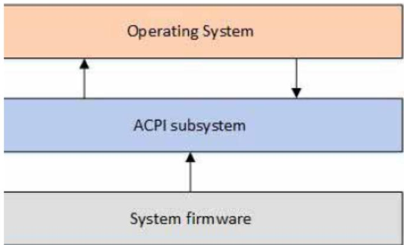  
Fig. 1: Fig. i-1 - ACPI overview

ACPI defines two types of data structures that are shared between system firmware and the OS via the ACPI subsystem: data tables and definition blocks (see figure i-2). These data structures are the primary communication mechanism between the firmware and the OS. Data tables store raw data and are consumed by device drivers. Definition blocks consist of byte code that is executable by an interpreter.

Upon initialization, the AML interpreter extracts byte code in the definition blocks as enumerable objects. This collection of enumerable objects forms an OS construct called the ACPI namespace. Objects in the ACPI namespace can either have a directly defined value, or be evaluated by the AML interpreter. The AML interpreter, directed by the OS, evaluates objects and then interfaces with system hardware to perform necessary operations.

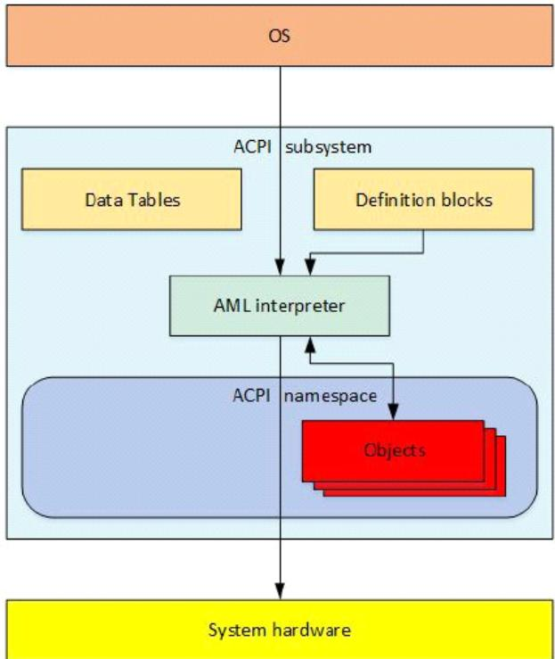  
Fig. 2: Fig. i-2 - ACPI Structure

The definition block byte code is compiled from the ACPI Source Language (ASL) code. ASL is the language used to define ACPI objects and to write control methods. An ASL compiler translates ASL into ACPI Machine Language (AML) byte code. AML is the language processed by the AML interpreter, as shown in figure i-3.

ACPI Source Language (ASL) code is used to define objects and control methods. Then the ASL compiler translates ASL into ACPI Machine Language (AML) byte code contained within ACPI definition Blocks. Definition blocks consist of an identifying table header and byte code that is executable by an AML interpreter.

The AML interpreter executes byte code and evaluates objects in the definition blocks to allow the byte code to perform loop constructs, conditional evaluations, access defined address spaces, and perform other operations that applications require. The AML interpreter has read/write access to defined address spaces, including system memory, I/O, PCI configuration, and more. It accesses these address spaces by defining entry points called objects. Objects can either have a directly defined value or else must be evaluated and interpreted by the AML interpreter.

This collection of enumerable objects is an OS construct called the ACPI namespace. The namespace is a hierarchical representation of the ACPI devices on a system. The system bus is the root of enumeration for these ACPI devices. Devices that are enumerable on other buses, like PCI or USB devices, are usually not enumerated in the namespace. Instead, their own buses enumerate the devices and load their drivers. However, all enumerable buses have an encoding technique that allows ACPI to encode the bus-specific addresses of the devices so they can be found in ACPI, even though ACPI usually does not load drivers for these devices.

Generally, devices that have a \_HID object (hardware identification object) are enumerated and have their drivers loaded by ACPI. Devices that have an \_ADR object (physical address object) are usually not enumerated by ACPI and generally do not have their drivers loaded by ACPI. \_ADR devices usually can perform all necessary functions without involving ACPI, but in cases where the device driver cannot perform a function, or if the driver needs to communicate to system firmware, ACPI can evaluate objects to perform the needed function.

As an example of this, PCI does not support native hotplug. However, PCI can use ACPI to evaluate objects and define

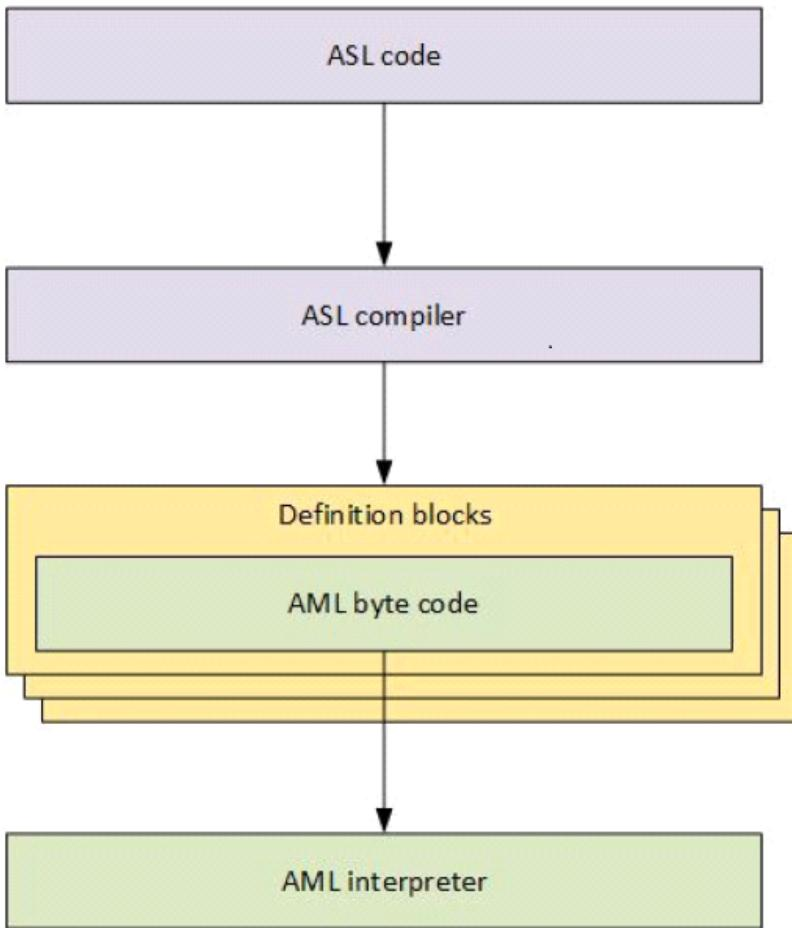  
Fig. 3: Fig. i-3 - ASL and AML

methods that allow ACPI to fill in the functions necessary to perform hotplug on PCI.

An additional aspect of ACPI is a runtime model that handles any ACPI interrupt events that occur during system operation. ACPI continues to evaluate objects as necessary to handle these events. This interrupt-based runtime model is discussed in greater detail in the Runtime model section below.

## ACPI Initialization

The best way to understand how ACPI works is chronologically. The moment the user powers up the system, the system firmware completes its setup, initialization, and self tests.

The system firmware then uses information obtained during firmware initialization to update the ACPI tables as necessary with various platform configurations and power interface data, before passing control to the bootstrap loader. The extended root system description table (XSDT) is the first table used by the ACPI subsystem and contains the addresses of most of the other ACPI tables on the system. The XSDT points to the fixed ACPI description table (FADT) as well as other major tables that the OS processes during initialization. After the OS initializes, the FADT directs the ACPI subsystem to the differentiated system description table (DSDT), which is the beginning of the namespace because it is the first table that contains a definition block.

The ACPI subsystem then processes the DSDT and begins building the namespace from the ACPI definition blocks. The XSDT also points to the secondary system description tables (SSDTs) and adds them to the namespace. The ACPI data tables give the OS raw data about the system hardware.

After the OS has built the namespace from the ACPI tables, it begins traversing the namespace and loading device drivers for all the \_HID devices it encounters in the namespace. See figure i-4.

In the ACPI Initialization diagram above, system firmware updates the ACPI tables as necessary with information only available at runtime, before handing off control to the bootstrap loader. The XSDT is the first table used by the OS's ACPI subsystem, and contains addresses of most other ACPI tables on the system. The XSDT points to the FADT, the SSDTs, and other major ACPI tables. The FADT directs the ACPI subsystem to the DSDT, which is the beginning of the namespace because DSDT is the first table that contains a definition block. The ACPI subsystem then consumes the DSDT and begins building the ACPI namespace from the definition blocks. The XSDT also points to the SSDTs and adds them to the namespace.

## Runtime Model

After the system is up and running, ACPI works with the OS to handle any ACPI events that occur via an interrupt. This interrupt invokes ACPI events in one of two general ways: fixed events and general purpose events (GPEs).

Fixed events are ACPI events that have a predefined meaning in the ACPI specification. These fixed events include actions like pressing the power button or ACPI timer overflows. These events are handled directly by the OS handlers.

GPEs are ACPI events that are not predefined by the ACPI specification. These events are usually handled by evaluating control methods, which are objects in the namespace and can access system hardware. When the ACPI subsystem evaluates the control method with the AML interpreter, the GPE object handles the events according to the OS's implementation. Typically this might involve issuing a notification to a device to invoke the device driver to perform a function.

We discuss a generic example of this runtime model in the next section.

## Thermal Event Example

ACPI includes a thermal model to allow systems to control the system temperature either actively (by performing actions like turning a fan on) or passively by reducing the amount of power the system uses (by performing actions like throttling the processor). We can use an example of a generic thermal event shown in Figure i-5 to demonstrate how the ACPI runtime model works.

The ACPI thermal zone includes control methods to read the current system temperature and trip points.

When the OS initially finds a thermal zone in the namespace, it loads the thermal zone driver, which evaluates the thermal zone to obtain the current temperature and trip points.

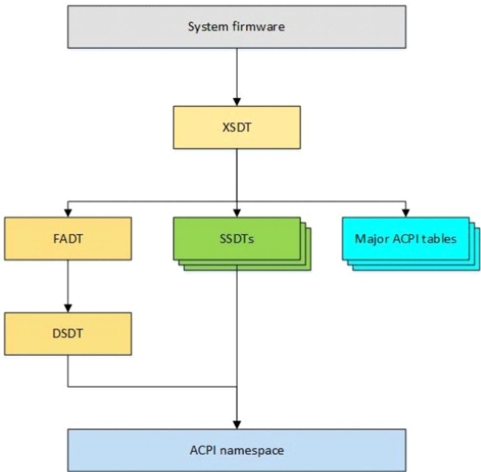  
Fig. 4: Fig. i-4 ACPI Initialization

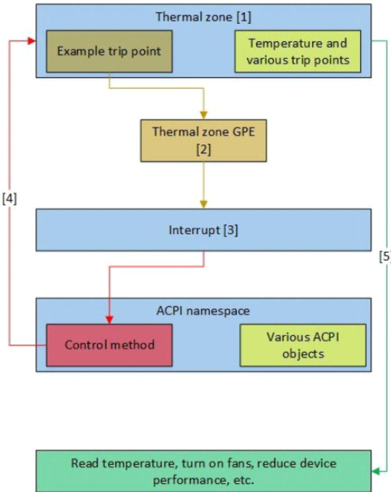  
Fig. 5: Fig. i-5 Runtime Thermal Event

When a system component heats up enough to trigger a trip point, a thermal zone GPE occurs.

The GPE causes an interrupt to occur. When the ACPI subsystem receives the interrupt, it first checks whether any fixed events have occurred. In this example, the thermal zone event is a GPE, so no fixed event has occurred.

The ACPI subsystem then searches the namespace for the control method that matches the GPE number of the interrupt. Upon finding it, the ACPI subsystem evaluates the control method, which might then access hardware and/or notify the thermal zone handler.

The operating system's thermal zone handler then takes whatever actions are necessary to handle the event, including possibly accessing hardware.

ACPI is a very robust interface implementation. The thermal zone trip point could notify the system to turn on a fan, reduce a device's performance, read the temperature, shut down the system, or any combination of these and other actions depending on the need.

This runtime model is used throughout the system to manage all of the ACPI events that occur during system operation.

## Summary

ACPI can best be described as a framework of concepts and interfaces that are implemented to form a subsystem within the host OS. The ACPI tables, handlers, interpreter, namespace, events, and interrupt model together form this implementation of ACPI, creating the ACPI subsystem within the host OS. In this sense, ACPI is the interface between the system hardware/firmware and the OS and OS applications for configuration and power management. This gives various OS a standardized way to support power management and configuration via the ACPI namespace.

The ACPI namespace is the enumerable, hierarchical representation of all ACPI devices on the system and is used to both find and load drivers for ACPI devices on the system. The namespace can be dynamic by evaluating objects and sending interrupts in real time, all without the need for the OS to call native system firmware code. This enables device manufacturers to code their own instructions and events into devices. It also reduces incompatibility and instability by implementing a standardized power management interface.

## INTRODUCTION

The Advanced Configuration and Power Interface (ACPI) specification was developed to establish industry common interfaces enabling robust operating system (OS)-directed motherboard device configuration and power management of both devices and entire systems. ACPI is the key element in Operating System-directed configuration and Power Management (OSPM).

ACPI evolved the existing pre-ACPI collection of power management BIOS code, Advanced Power Management (APM) application programming interfaces (APIs, PNPBIOS APIs, Multiprocessor Specification (MPS) tables and so on into a well-defined power management and configuration interface specification. ACPI provides the means for an orderly transition from existing (legacy) hardware to ACPI hardware, and it allows for both ACPI and legacy mechanisms to exist in a single machine and to be used as needed.

Further, system architectures being built at the time of the original ACPI specification's inception, stretched the limits of historical “Plug and Play” interfaces. ACPI evolved existing motherboard configuration interfaces to support advanced architectures in a more robust, and potentially more efficient manner.

The interfaces and OSPM concepts defined within this specification are suitable to all classes of computers including (but not limited to) desktop, mobile, workstation, and server machines. From a power management perspective, OSPM/ACPI promotes the concept that systems should conserve energy by transitioning unused devices into lower power states including placing the entire system in a low-power state (sleeping state) when possible.

This document describes ACPI hardware interfaces, ACPI software interfaces and ACPI data structures that, when implemented, enable support for robust OS-directed configuration and power management (OSPM).

## 1.1 Principal Goals

ACPI is the key element in implementing OSPM. ACPI-defined interfaces are intended for wide adoption to encourage hardware and software vendors to build ACPI-compatible (and, thus, OSPM-compatible) implementations.

The principal goals of ACPI and OSPM are to:

\- Enable all computer systems to implement motherboard configuration and power management functions, using appropriate cost/function tradeoffs:

\- Computer systems include (but are not limited to) desktop, mobile, workstation, and server machines.

\- Machine implementers have the freedom to implement a wide range of solutions, from the very simple to the very aggressive, while still maintaining full OS support.

\- Wide implementation of power management will make it practical and compelling for applications to support and exploit it. It will make new uses of PCs practical and existing uses of PCs more economical.

\- Enhance power management functionality and robustness:

\- Power management policies too complicated to implement in platform firmware can be implemented and supported in the OS, allowing inexpensive power managed hardware to support very elaborate power management policies.

\- Gathering power management information from users, applications, and the hardware together into the OS will enable better power management decisions and execution.

\- Unification of power management algorithms in the OS will reduce conflicts between the firmware and OS and will enhance reliability.

• Facilitate and accelerate industry-wide implementation of power management:

\- OSPM and ACPI reduces the amount of redundant investment in power management throughout the industry, as this investment and function will be gathered into the OS. This will allow industry participants to focus their efforts and investments on innovation rather than simple parity.

\- The OS can evolve independently of the hardware, allowing all ACPI-compatible machines to gain the benefits of OS improvements and innovations.

\- Create a robust interface for configuring motherboard devices:

\- Enable new advanced designs not possible with existing interfaces.

## 1.1.1 Principle of Inclusive Terminology

The UEFI Forum follows a Principle of Inclusive Terminology in building and maintaining content for specifications. This means efforts are made to ensure that all wording is perceived or likely to be perceived as welcoming by everyone regardless of personal characteristics. In some cases, the Forum acknowledges that wording derived from earlier work, for example references to legacy specifications not controlled by the Forum, may not follow this principle. In order to preserve compatibility for code that reads on legacy specifications, particularly where that specification is no longer under maintenance or development, language in this specification may appear out of sync with this principle. The Forum is resolved to work with other standards development bodies to eliminate such examples over time. In the meanwhile, by acknowledging and calling attention to this issue the hope is to promote discussion and action towards more complete use of Inclusive Language reflective of the diverse and innovative population of the technical community that works on standards.

## 1.2 Power Management Rationale

It is necessary to move power management into the OS and to use an abstract interface (ACPI) between the OS and the hardware to achieve the principal goals set forth above. Because ACPI is abstract, the OS can evolve separately from the hardware and, likewise, the hardware from the OS.

ACPI is by nature more portable across operating systems and processors. ACPI control methods allow for very flexible implementations of particular features.

Issues with older power management approaches include the following:

\- Minimal support for power management inhibits application vendors from supporting or exploiting it.

\- Moving power management functionality into the OS makes it available on every machine on which the OS is installed. The level of functionality (power savings, and so on) varies from machine to machine, but users and applications will see the same power interfaces and semantics on all OSPM machines.

\- This will enable application vendors to invest in adding power management functionality to their products.

\- Legacy power management algorithms were restricted by the information available to the platform firmware that implemented them. This limited the functionality that could be implemented.

\- Centralizing power management information and directives from the user, applications, and hardware in the OS allows the implementation of more powerful functionality. For example, an OS can have a policy of dividing I/O operations into normal and lazy. Lazy I/O operations (such as a word processor saving files in the background) would be gathered up into clumps and done only when the required I/O device is powered up for some other reason. A non-lazy I/O request made when the required device was powered down would cause the device to be powered up immediately, the non-lazy I/O request to be carried out, and any pending lazy I/O operations to be done. Such a policy requires knowing when I/O devices are powered up, knowing which application I/O requests are lazy, and being able to assure that such lazy I/O operations do not starve.

\- Appliance functions, such as answering machines, require globally coherent power decisions. For example, a telephone-answering application could call the OS and assert, “I am waiting for incoming phone calls; any sleep state the system enters must allow me to wake and answer the telephone in 1 second.” Then, when the user presses the “off” button, the system would pick the deepest sleep state consistent with the needs of the phone answering service.

\- Platform firmware has become very complex to deal with power management. It is difficult to make work with an OS and is limited to static configurations of the hardware.

\- There is much less state information for the platform firmware to retain and manage (because the OS manages it).

\- Power management algorithms are unified in the OS, yielding much better integration between the OS and the hardware.

\- Because additional ACPI tables (Definition Blocks) can be loaded, for example, when a mobile system docks, the OS can deal with dynamic machine configurations.

\- Because the platform firmware has fewer functions and they are simpler, it is much easier (and therefore cheaper) to implement and support.

## 1.3 Legacy Support

ACPI provides support for an orderly transition from legacy hardware to ACPI hardware, and allows for both mechanisms to exist in a single machine and be used as needed.

Table 1.1: Hardware Type vs. OS Type Interaction

<table><tr><td>Hardware/OS</td><td>Legacy OS</td><td>ACPI OS with OSPM</td></tr><tr><td>Legacy hardware</td><td>A legacy OS on legacy hardware does what it always did.</td><td>If the OS lacks legacy support, legacy support is completely contained within the hardware functions.</td></tr><tr><td>Legacy and ACPI hard-ware support in machine</td><td>It works just like a legacy OS on legacy hardware.</td><td>During boot, the OS tells the hardware to switch from legacy to OSPM/ACPI mode and from then on, the sys-tem has full OSPM/ACPI support.</td></tr><tr><td>ACPI-only hardware</td><td>There is no power manage-ment.</td><td>There is full OSPM/ACPI support.</td></tr></table>

## 1.4 OEM Implementation Strategy

Any OEM is, as always, free to build hardware as they see fit. Given the existence of the ACPI specification, two general implementation strategies are possible:

\- An original equipment manufacturer (OEM) can adopt the OS vendor-provided ACPI OSPM software and implement the hardware part of the ACPI specification (for a given platform) in one of many possible ways.

\- An OEM can develop a driver and hardware that are not ACPI-compatible. This strategy opens up even more hardware implementation possibilities. However, OEMs who implement hardware that is OSPM-compatible but not ACPI-compatible will bear the cost of developing, testing, and distributing drivers for their implementation.

## 1.5 Power and Sleep Buttons

OSPM provides a new appliance interface to consumers. In particular, it provides for a sleep button that is a “soft” button that does not turn the machine physically off but signals the OS to put the machine in a soft off or sleeping state. ACPI defines two types of these “soft” buttons: one for putting the machine to sleep and one for putting the machine in soft off.

This gives the OEM two different ways to implement machines: A one-button model or a two-button model. The one-button model has a single button that can be used as a power button or a sleep button as determined by user settings. The two-button model has an easily accessible sleep button and a separate power button. In either model, an override feature that forces the machine to the soft-off state without OSPM interaction is also needed to deal with various rare, but problematic, situations.

## 1.6 ACPI Specification and the Structure of ACPI

This specification defines ACPI hardware interfaces, ACPI software interfaces and ACPI data structures. This specification also defines the semantics of these interfaces.

Fig. 1.1 below lays out the software and hardware components for OSPM/ACPI, and how they relate to each other. This specification describes the interfaces between components, the contents of the ACPI System Description Tables, and the related semantics of the other ACPI components. Notice that the ACPI System Description Tables, which describe a particular platform's hardware, are at heart of the ACPI implementation and the role of the ACPI System Firmware is primarily to supply the ACPI Tables (rather than a native instruction API).

ACPI is not a software specification; it is not a hardware specification, although it addresses both software and hardware and how they must behave. ACPI is, instead, an interface specification comprised of both software and hardware elements.

There are three run-time components to ACPI:

## ACPI System Description Tables

Describes the interfaces to the hardware. Some descriptions limit what can be built (for example, some controls are embedded in fixed blocks of registers and the table specifies the address of the register block). Most descriptions allow the hardware to be built in arbitrary ways and can describe arbitrary operation sequences needed to make the hardware function. ACPI Tables containing “Definition Blocks” can make use of a pseudo-code type of language, the interpretation of which is performed by the OS. That is, OSPM contains and uses an interpreter that executes procedures encoded in the pseudo-code language and stored in the ACPI tables containing “Definition Blocks.” The pseudo-code language, known as ACPI Machine Language (AML), is a compact, tokenized, abstract type of machine language.

## ACPI Registers

The constrained part of the hardware interface, described (at least in location) by the ACPI System Description Tables.

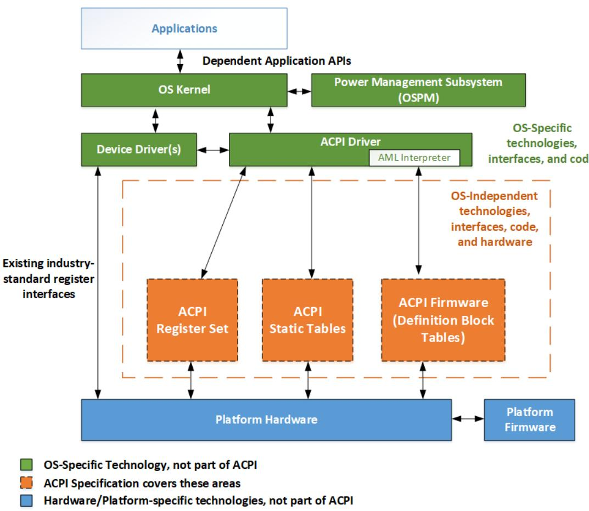  
Fig. 1.1: OSPM/ACPI Global System

## ACPI Platform Firmware

Refers to the portion of the firmware that is compatible with the ACPI specifications. Typically, this is the code that boots the machine (as legacy BIOSs have done) and implements interfaces for sleep, wake, and some restart operations. It is called rarely, compared to a legacy BIOS. The ACPI Description Tables are also provided by the ACPI Platform Firmware.

## 1.7 OS and Platform Compliance

The ACPI specification contains only interface specifications. ACPI does not contain any platform compliance requirements. The following sections provide guidelines for class specific platform implementations that reference ACPI-defined interfaces and guidelines for enhancements that operating systems may require to completely support OSPM/ACPI. The minimum feature implementation requirements of an ACPI-compatible OS are also provided.

## 1.7.1 Platform Implementations of ACPI-defined Interfaces

System platforms implement ACPI-defined hardware interfaces via the platform hardware and ACPI-defined software interfaces and system description tables via the ACPI system firmware. Specific ACPI-defined interfaces and OSPM concepts while appropriate for one class of machine (for example, a mobile system), may not be appropriate for another class of machine (for example, a multi-domain enterprise server). It is beyond the capability and scope of this specification to specify all platform classes and the appropriate ACPI-defined interfaces that should be required for the platform class.

Platform design guide authors are encouraged to require the appropriate ACPI-defined interfaces and hardware requirements suitable to the particular system platform class addressed in a particular design guide. Platform design guides should not define alternative interfaces that provide similar functionality to those defined in the ACPI specification.

## 1.7.1.1 Recommended Features and Interface Descriptions for Design Guides

Common description text and category names should be used in design guides to describe all features, concepts, and interfaces defined by the ACPI specification as requirements for a platform class. Listed below is the recommended set of high-level text and category names to be used to describe the features, concepts, and interfaces defined by ACPI.

Note

The definitions and relational requirements of the interfaces specified below are generally spread throughout the ACPI specification:

• System Address Map Interfaces

• ACPI System Description Tables

\- Root System Description Pointer (RSDP)

\- System Description Table Header

\- Root System Description Table (RSDT)

• Fixed ACPI Description Table (FADT)

\- Firmware ACPI Control Structure (FACS)

• Differentiated System Description Table (DSDT)

• Secondary System Description Table (SSDT)

• Multiple APIC Description Table (MADT)

• Smart Battery Table (SBST)

• Extended System Description Table (XSDT)

\- Embedded Controller Boot Resources Table (ECDT)

• System Resource Affinity Table (SRAT)

• System Locality information Table

\- Corrected Platform Error Polling Table (CPEP)

• Maximum System Characteristics Table (MSCT)

• ACPI RAS Feature Table (RASF)

• ACPI RAS2 Feature Table (RAS2)

• Memory Power State Table (MPST)

\- Platform Memory Topology Table

\- Boot Graphics Resource Table (BGRT)

• Firmware Performance Data Table (FPDT)

\- Generic Timer Description Table (GTDT)

• Fixed ACPI Description Table (FADT)

• Power management timer control/status

\- Power or sleep button with S5 override (also possible in generic space)

• Real time clock wakeup alarm control/status

• SCI /SMI routing control/status for Power Management and General-purpose events

\- System power state controls (sleeping/wake control)

\- Processor power state control (c states)

\- Processor throttling control/status

\- Processor performance state control/status

\- General-purpose event control/status

\- Global Lock control/status

\- System Reset control

\- Embedded Controller control/status

\- SMBus Host Controller (HC) control/status

\- Smart Battery Subsystem

\- ACPI-defined Generic Register Interfaces and object definitions in the ACPI Namespace.

\- General-purpose event processing

\- Motherboard device identification, configuration, and insertion/removal

\- Thermal zones

• Power resource control

• Device power state control

\- System power state control

\- System indicators

• Devices and device controls:

\- Processor

\- Control Method Battery

\- Smart Battery Subsystem

\- Mobile Lid

\- Power or sleep button with S5 override (also possible in fixed space)

\- Embedded controller

\- Fan

\- Generic Bus Bridge

\- ATA Controller

\- Floppy Controller

\- GPE Block

\- Module

\- Memory

\- Global Lock related interfaces

\- ACPI Event programming model

• ACPI-defined Platform Firmware Responsibilities

• ACPI-defined State Definitions:

\- Global system power states (G-states, S0, S5)

\- System sleeping states (S-states S1-S4)

\- Device power states (D-states)

\- Processor power states (C-states)

\- Device and processor performance states (P-states)

## 1.7.1.2 Terminology Examples for Design Guides

The following example shows how a client platform design guide could use the recommended terminology to define ACPI requirements, with a goal of requiring robust configuration and power management for the system class.

## Note

This example is provided as a guideline for how ACPI terminology can be used. It should not be interpreted as a statement of ACPI requirements.

Platforms compliant with this platform design guide must implement the following ACPI defined system features, concepts, and interfaces, along with their associated event models:

\- System Address Map Interfaces

\- ACPI System Description Tables provided in the system firmware

• ACPI-defined Fixed Registers Interfaces:

• Power management timer control/status

\- Power or sleep button with S5 override (may also be implemented in generic register space)

• Real time clock wakeup alarm control/status

\- General-purpose event control/status

\- SCI /SMI routing control/status for Power Management and General-purpose events (control required only if system supports legacy mode)

\- System power state controls (sleeping/wake control)

\- Processor power state control (for C1)

\- Global Lock control/status (if Global Lock interfaces are required by the system)

\- ACPI-defined Generic Register Interfaces and object definitions in the ACPI Namespace:

\- General-purpose event processing

\- Motherboard device identification, configuration, and insertion/removal

\- System power state control (Section 7.3)

\- Devices and device controls:

\* Processor

\* Control Method Battery (or Smart Battery Subsystem on a mobile system)

\* Smart Battery Subsystem (or Control Method Battery on a mobile system)

\* Power or sleep button with S5 override (may also be implemented in fixed register space)

\- Global Lock related interfaces when a logical register in the hardware is shared between OS and firmware environments

• ACPI Event programming model

• ACPI-defined Platform Firmware Responsibilities

• ACPI-defined State Definitions:

\- System sleeping states (At least one system sleeping state, S1-S4, must be implemented)

\- Device power states (D-states must be implemented in accordance with device class specifications)

\- Processor power states (All processors must support the C1 Power State)

The following example shows how a design guide could use the recommended terminology to define ACPI related requirements for systems that execute multiple OS instances, with a goal of requiring robust configuration and continuous availability for the system class.

## Note

This example is provided as a guideline for how ACPI terminology can be used. It should not be interpreted as a statement of ACPI requirements.

Platforms compliant with this platform design guide must implement the following ACPI defined system features and interfaces, along with their associated event models:

\- System Address Map Interfaces

\- ACPI System Description Tables provided in the system firmware

• ACPI-defined Fixed Registers Interfaces:

• Power management timer control/status

\- General-purpose event control/status

• SCI /SMI routing control/status for Power Management and General-purpose events

• (control required only if system supports legacy mode)

\- System power state controls (sleeping/wake control)

\- Processor power state control (for C1)

\- Global Lock control/status (if Global Lock interfaces are required by the system)

\- ACPI-defined Generic Register Interfaces and object definitions in the ACPI Namespace:

\- General-purpose event processing

\- Motherboard device identification, configuration, and insertion/removal (Section 6)

\- System power state control (Section 7.3)

\- System indicators

\- Devices and device controls:

\* Processor

\- Global Lock related interfaces when a logical register in the hardware is shared between OS and firmware environments

• ACPI Event programming model (Section 5.6)

• ACPI-defined Platform Firmware Responsibilities (Section 15)

• ACPI-defined State Definitions:

Processor power states (All processors must support the C1 Power State)

## 1.7.2 OSPM Implementations

OS enhancements are needed to support ACPI-defined features, concepts, and interfaces, along with their associated event models appropriate to the system platform class upon which the OS executes. This is the implementation of OSPM. The following outlines the OS enhancements and elements necessary to support all ACPI-defined interfaces. To support ACPI through the implementation of OSPM, the OS needs to be modified to:

\- Use System Address Map Interfaces.

• Find and consume the ACPI System Description Tables.

\- Interpret ACPI machine language (AML).

\- Enumerate and configure motherboard devices described in the ACPI Namespace.

\- Interface with the power management timer.

\- Interface with the real-time clock wake alarm.

\- Enter ACPI mode (on legacy hardware systems).

\- Implement device power management policy.

\- Implement power resource management.

\- Implement processor power states in the scheduler idle handlers.

• Control processor and device performance states.

\- Implement the ACPI thermal model.

\- Support the ACPI Event programming model including handling SCI interrupts, managing fixed events, general-purpose events, embedded controller interrupts, and dynamic device support.

\- Support acquisition and release of the Global Lock.

\- Use the reset register to reset the system.

\- Provide APIs to influence power management policy.

\- Implement driver support for ACPI-defined devices.

\- Implement APIs supporting the system indicators.

\- Support all system states S1-S5.

## 1.7.3 OS Requirements

The following list describes the minimum requirements for an OSPM/ACPI-compatible OS:

\- Use Section 15 to get the system address map on Intel Architecture (IA) platforms:

\- INT 15H, E820H - Query System Address Map interface (see Section 15)

\- EFI GetMemoryMap() Boot Services Function (see Section 15)

• Find and consume the ACPI System Description Tables (see Section 5).

\- Implementation of an AML interpreter supporting all defined AML grammar elements (see Section 20).

\- Support for the ACPI Event programming model including handling SCI interrupts, managing fixed events, general-purpose events, embedded controller interrupts, and dynamic device support.

\- Enumerate and configure motherboard devices described in the ACPI Namespace.

\- Implement support for the following ACPI devices defined within this specification:

\- Embedded Controller Device (see Section 12)

• GPE Block Device (see Section 9.9)

\- Implementation of the ACPI thermal model (see Section 3.10).

\- Support acquisition and release of the Global Lock.

\- OS-directed power management support (device drivers are responsible for maintaining device context as described by the Device Power Management Class Specifications described in Appendix A: Device Class Specifications).

## 1.8 Target Audience

This specification is intended for the following users:

\- OEMs building hardware containing ACPI-compatible interfaces

\- Operating system and device driver developers

\- All platform system firmware developers

• CPU and chip set vendors

\- Peripheral vendors

## 1.9 Document Organization

The ACPI specification document is organized into the following four parts:

\- The first part of the specification (chapters 1 through 3) introduces ACPI and provides an executive overview.

\- The second part (chapters 4 and 5) defines the ACPI hardware and software programming models.

\- The third part (chapters 6 through 17) specifies the ACPI implementation details; this part of the specification is primarily for developers.

\- The fourth part (chapters 18 and 19) is technical reference material: chapter 18 is the ACPI Source Language (ASL) reference, which is referenced by many other sections in this specification.

\- Appendices contain device class specifications, describing power management characteristics of specific classes of devices, and device class-specific ACPI interfaces.

## 1.9.1 ACPI Introduction and Overview

The first three sections of the specification provide an executive overview of ACPI.

## Chapter 1: Introduction

Discusses the purpose and goals of the specification, presents an overview of the ACPI-compatible system architecture, specifies the minimum requirements for an ACPI-compatible system, and provides references to related specifications.

## Chapter 2: Definition of Terms

Defines the key terminology used in this specification. In particular, the global system states (Mechanical Off, Soft Off, Sleeping, Working, and Non-Volatile Sleep) are defined in this Chapter, along with the device power state definitions: Off (D3), D3hot, D2, D1, and Fully-On (D0). Device and processor performance states (P0, P1, ...Pn) are also discussed.

## Chapter 3: ACPI Overview

Gives an overview of the ACPI specification in terms of the functional areas covered by the specification: system power management, device power management, processor power management, Plug and Play, handling of system events, battery management, and thermal management.

## 1.9.2 Programming Models

Chapters 4 and 5 define the ACPI hardware and software programming models. This part of the specification is primarily for system designers, developers, and project managers.

All of the implementation-oriented, reference, and platform example Chapters of the specification that follow (all the rest of the Chapters of the specification) are based on the models defined in Chapters 4 and 5. These Chapters are the heart of the ACPI specification. There are extensive cross-references between the two Chapters.

## Chapter 4: ACPI Hardware Specification

Defines a set of hardware interfaces that meet the goals of this specification.

## Chapter 5: ACPI Software Programming Model

Defines a set of software interfaces that meet the goals of this specification.

## 1.9.3 Implementation Details

The third part of the specification defines the implementation details necessary to actually build components that work on an ACPI-compatible platform. This part of the specification is primarily for developers.

## Chapter 6: Configuration

Defines the reserved Plug and Play objects used to configure and assign resources to devices, and share resources and the reserved objects used to track device insertion and removal. Also defines the format of ACPI-compatible resource descriptors.

## Chapter 7: Power and Performance Management

Defines the reserved device power-management objects and the reserved-system power-management objects.

## Chapter 8: Processor Configuration and Control

Defines how the OS manages the processors' power consumption and other controls while the system is in the working state.

## Chapter 9: ACPI-Specific Device Objects

Lists the integrated devices that need support for some device-specific ACPI controls, along with the device-specific ACPI controls that can be provided. Most device objects are controlled through generic objects and control methods and have generic device IDs; this Chapter discusses the exceptions.

## Chapter 10: Power Source Devices

Defines the reserved battery device and AC adapter objects.

Chapter 11: Thermal Management
Defines the reserved thermal management objects.

Chapter 12: ACPI Embedded Controller Interface Specification
Defines the interfaces between an ACPI-compatible OS and an embedded controller.

Chapter 13: ACPI System Management Bus Interface Specification
Defines the interfaces between an ACPI-compatible OS and a System Management Bus (SMBus) host controller.

Chapter 14: Platform Communications Channel
Explains the generic mechanism for OSPM to communicate with an entity in the platform defines a new address space type.

## Chapter 15: System Address Map Interfaces

Explains the special INT 15 call for use in ISA/EISA/PCI bus-based systems. This call supplies the OS with a clean memory map indicating address ranges that are reserved and ranges that are available on the motherboard. UEFI-based memory address map reporting interfaces are also described.

## Chapter 16: Waking and Sleeping

Defines in detail the transitions between system working and sleeping states and their relationship to wake events. Refers to the reserved objects defined in Chapters 6, 7, and 8.

## Chapter 17: Non-Uniform Memory Access (NUMA) Architecture Platforms

Discusses in detail how ACPI define interfaces can be used to describe a NUMA architecture platform. Refers to the reserved objects defined in Chapters 5, 6, 8, and 9.

## Chapter 18: ACPI Platform Error Interfaces

Defines interfaces that enable OSPM to processes different types of hardware error events that are detected by platform-based error detection hardware.

## 1.9.4 Technical Reference

The fourth part of the specification contains reference material for developers.

## Chapter 19: ACPI Source Language Reference

Defines the syntax of all the ASL statements that can be used to write ACPI control methods, along with example syntax usage.

Chapter 20: ACPI Machine Language Specification
Defines the grammar of the language of the ACPI virtual machine language. An ASL translator (compiler) outputs AML.

Chapter 21: ACPI Data Tables and Table Language Definition Describes a simple language (the Table Definition Language or TDL) that can be used to generate any ACPI data table.

## Appendix A: Device class specifications

Describes device-specific power management behavior on a per device-class basis.

## Appendix B: Video Extensions

Contains video device class-specific ACPI interfaces

## 1.9.5 Revision Numbers

Updates to the ACPI specification are considered either new revisions or errata as described below:

\- A new revision is produced when there is substantive new content or changes that may modify existing behavior. New revisions are designated by a Major.Minor version number (e.g. 6.3). In cases where the changes are exceptionally minor, we may have a Major.Minor.Minor naming convention (e.g. 6.3.1).

\- An errata is produced when proposed changes or fixes of the specification do not include any significant new material or modify existing behavior. Errata are designated by adding an upper-case letter at the end of the version number, such as 6.2A.

## 1.10 Related Documents

Power management and Plug and Play specifications for legacy hardware platforms are available from Links to ACPI-Related Documents:

\- Advanced Power Management (APM) BIOS Specification

\- Plug and Play BIOS Specification

Intel Architecture specifications are available at http://developer.intel.com and https://software.intel.com/en-us/articles/intel-sdm.

Other UEFI Specifications are available at https://uefi.org/specifications:

\- Unified Extensible Firmware Interface (UEFI) Specification

\- Platform Integration (PI) Specification

Documentation and specifications for the Smart Battery System components and the SMBus are available at the following links:

• Smart Battery System specifications

\- SMBus specifications

USB Power Delivery Specification (Revision 3.1, Version 1.3): see “Links to ACPI-Related Documents” (http://uefi.org/acpi) under the heading “Universal Serial Bus Power Management”

# DEFINITION OF TERMS

This specification uses a particular set of terminology, defined in this section. This section has three parts:

General ACPI terms are defined and presented alphabetically.

The ACPI global system states (working, sleeping, soft off, and mechanical off) are defined. Global system states apply to the entire system, and are visible to the user.

The ACPI device power states are defined. Device power states are states of particular devices; as such, they are generally not visible to the user. For example, some devices may be in the off state even though the system as a whole is in the working state. Device states apply to any device on any bus.

## 2.1 General ACPI Terminology

## Advanced Configuration and Power Interface (ACPI)

As defined in this document, ACPI is a method for describing hardware interfaces in terms abstract enough to allow flexible and innovative hardware implementations and concrete enough to allow shrink-wrap OS code to use such hardware interfaces.

## ACPI Hardware

Computer hardware with the features necessary to support OSPM and with the interfaces to those features described using the Description Tables as specified by this document.

## ACPI Namespace

A hierarchical tree structure in OS-controlled memory that contains named objects. These objects may be data objects, control method objects, bus/device package objects, and so on. The OS dynamically changes the contents of the namespace at run-time by loading definition blocks from the ACPI Tables that reside in the ACPI system firmware. All the information in the ACPI Namespace comes from the Differentiated System Description Table (DSDT), which contains the Differentiated Definition Block, and one or more other definition blocks.

## ACPI Machine Language (AML)

Pseudo-code for a virtual machine supported by an ACPI-compatible OS and in which ACPI control methods and objects are written. The AML encoding definition is provided in section 19, “ACPI Machine Language (AML) Specification.”

## Add-in Card

A generic term used to refer to any device which can be inserted or removed from a platform through a connection bus, such as PCI. Add-in cards are typically inserted within a platform's physical enclosure, rather than residing physically external to a platform. An add-in card will have its own devices and associated firmware, and may have its own Expansion ROM Firmware.

## Advanced Programmable Interrupt Controller (APIC)

An interrupt controller architecture commonly found on Intel Architecture-based 32-bit PC systems. The APIC architecture supports multiprocessor interrupt management (with symmetric interrupt distribution across all processors), multiple I/O subsystem support, 8259A compatibility, and inter-processor interrupt support. The architecture consists of local APICs commonly attached directly to processors and I/O APICs commonly in chip sets.

## ACPI Source Language (ASL)

The programming language equivalent for AML. ASL is compiled into AML images. The ASL statements are defined in section 18, “ACPI Source Language (ASL) Reference.”

## Address Range Scrub (ARS)

Process by which regions of memory can be scrubbed to look for memory locations that contain correctable or uncorrectable errors.

## BIOS

BIOS (Basic Input/Output System) is firmware that provides basic boot capabilities for a platform; it is used here to refer specifically to traditional x86 BIOS, and not as a general term for all firmware, or a replacement term for UEFI Core System BIOS. The ambiguity of this the term is what we are trying to remove. See also: Legacy BIOS, System BIOS.

## Boot Firmware

Generic term to describe any firmware on a platform used during the boot process. Use a more specific term, if possible.

## Component

Synonym for device. Please use the term “device” if possible.

## Control Method

A control method is a definition of how the OS can perform a simple hardware task. For example, the OS invokes control methods to read the temperature of a thermal zone. Control methods are written in an encoded language called AML that can be interpreted and executed by the ACPI-compatible OS. An ACPI-compatible system must provide a minimal set of control methods in the ACPI tables. The OS provides a set of well-defined control methods that ACPI table developers can reference in their control methods. OEMs can support different revisions of chip sets with one version of platform firmware by either including control methods in the platform firmware that test configurations and respond as needed or including a different set of control methods for each chip set revision.

## Central Processing Unit (CPU) or Processor

The part of a platform that executes the instructions that do the work. An ACPI-compatible OS can balance processor performance against power consumption and thermal states by manipulating the processor performance controls. The ACPI specification defines a working state, labeled G0 (S0), in which the processor executes instructions. Processor sleeping states, labeled C1 through C3, are also defined. In the sleeping states, the processor executes no instructions, thus reducing power consumption and, potentially, operating temperatures. The ACPI specification also defines processor performance states, where the processor (while in C0) executes instructions, but with lower performance and (potentially) lower power consumption and operating temperature. For more information, see Section 8.

A definition block contains information about hardware implementation and configuration details in the form of data and control methods, encoded in AML. An OEM can provide one or more definition blocks in the ACPI Tables. One definition block must be provided: the Differentiated Definition Block, which describes the base system. Upon loading the Differentiated Definition Block, the OS inserts the contents of the Differentiated Definition Block into the ACPI Namespace. Other definition blocks, which the OS can dynamically insert and remove from the active ACPI Namespace, can contain references to the Differentiated Definition Block. For more information, see Definition Blocks.

## Device

A generic term used to refer to any computing, input/output or storage element, or any collection of computing, input/output or storage elements, on a platform. An example of a device is a CPU, APU, embedded controller (EC), BMC, Trusted Platform Module (TPM), graphics processing unit (GPU), network interface controller (NIC), hard disk drive (HDD), solid state drive (SSD), Read Only Memory (ROM), flash ROM, or any of the large number of other possible devices. If at all possible, use a more specific term.

## Device Context

The variable data held by the device; it is usually volatile. The device might forget this information when entering or leaving certain states (for more information, see Device Power State Definitions), in which case the OS software is responsible for saving and restoring the information. Device Context refers to small amounts of information held in device peripherals. See System Context.

## Device Firmware

Firmware that is only used by a specific device and cannot be used with any other device. This firmware is typically provided by the device manufacturer.

## Differentiated System Description Table (DSDT)

An OEM must supply a DSDT to an ACPI-compatible OS. The DSDT contains the Differentiated Definition Block, which supplies the implementation and configuration information about the base system. The OS always inserts the DSDT information into the ACPI Namespace at system boot time and never removes it.

## Device Physical Address (DPA)

A Device relative memory address.

## Embedded Controller

The general class of micro-controllers used to support OEM-specific supports embedded controllers in any platform design, as long as the micro-controller conforms to one of the models described in this section. The embedded controller performs complex low-level functions through a simple interface to the host microprocessor(s).

ACPI defines a standard hardware and software communications interface between an OS bus enumerator and an embedded controller. This allows any OS to provide a standard bus enumerator that can directly communicate with an embedded controller in the system, thus allowing other drivers within the system to communicate with and use the resources of system embedded controllers. This in turn enables the OEM to provide platform features that the OS and applications can use.

## Embedded Controller Interface

A standard hardware and software communications interface between an OS driver and an embedded controller. This allows any OS to provide a standard driver that can directly communicate with an embedded controller in the system, thus allowing other drivers within the system to communicate with and use the resources of system embedded controllers (for example, Smart Battery and AML code). This in turn enables the OEM to provide platform features that the OS and applications can use.

## Expansion ROM Firmware

Peripheral Component Interconnect (PCI) term for firmware executed on a host processor which is used by an add-in device during the boot process. This includes Option ROM Firmware and UEFI drivers. Expansion ROM Firmware may be embedded as part of the Host Processor Boot Firmware, or may be separate (e.g., from an add-in card). See also: Option ROM Firmware.

## Firmware

Generic term to describe any BIOS or firmware on a platform; it refers to the general class of things, not a specific type. Use a more specific term, if possible.

## Firmware ACPI Control Structure (FACS)

A structure in read/write memory that the platform runtime firmware uses for handshaking between the firmware and the OS. The FACS is passed to an ACPI-compatible OS via the Fixed ACPI Description Table (FADT). The FACS contains the system's hardware signature at last boot, the firmware waking vector, and the Global Lock.

## Firmware Storage Device

A memory device used to store firmware. This could include Read Only Memory (ROM), flash memory, eMMC, UFS drives, etc.

## Fixed ACPI Description Table (FADT)

A table that contains the ACPI Hardware Register Block implementation and configuration details that the OS needs to directly manage the ACPI Hardware Register Blocks, as well as the physical address of the DSDT, which contains other platform implementation and configuration details. An OEM must provide an FADT to an ACPI-compatible OS in the RSDT/XSDT. The OS always inserts the namespace information defined in the Differentiated Definition Block in the DSDT into the ACPI Namespace at system boot time, and the OS never removes it.

## Fixed Features

A set of features offered by an ACPI interface. The ACPI specification places restrictions on where and how the hardware programming model is generated. All fixed features, if used, are implemented as described in this specification so that OSPM can directly access the fixed feature registers.

## Fixed Feature Events

A set of events that occur at the ACPI interface when a paired set of status and event bits in the fixed feature registers are set at the same time. When a fixed feature event occurs, a system control interrupt (SCI is raised. For ACPI fixed feature events, OSPM (or an ACPI-aware driver) acts as the event handler.

## Fixed Feature Registers

A set of hardware registers in fixed feature register space at specific address locations in system I/O address space. ACPI defines register blocks for fixed features (each register block gets a separate pointer from the FADT). For more information, see ACPI Hardware Features.

## General-Purpose Event Registers

The general-purpose event registers contain the event programming model for generic features. All general-purpose events generate SCIs.

## Generic Feature

A generic feature of a platform is value-added hardware implemented through control methods and general-purpose events.

## Generic Interrupt Controller (GIC)

An interrupt controller architecture for ARM processor-based systems.

## Global System Status

Global system states apply to the entire system, and are visible to the user. The various global system states are labeled G0 through G3 in the ACPI specification. For more information, see Global System State Definitions.

## Host Processor

A host processor is the primary processing unit in a platform, traditionally called a Central Processing Unit (CPU), now also sometimes referred to as an Application Processing Unit (APU), or a System on Chip (SoC). This is the processing unit on which the primary operating system (and/or hypervisor), as well as user applications run. This is the processor that is responsible for loading and executing the Host Processor Boot Firmware. This term and “Boot Processor” should be considered synonyms for this particular text clean-up effort (i.e., making them consistent should probably be part of a different ECR, if needed).

## Host Processor Boot Firmware

Generic term used to describe firmware loaded and executed by the Host Processor which provides basic boot capabilities for a platform. This class of firmware is a reference to Legacy BIOS and UEFI, which were sometimes referred to as System BIOS. Where the distinction between Legacy BIOS and UEFI is not important, the term Host Processor Boot Firmware will be used. Where the distinction is important, it will be referenced appropriately. Expansion ROM firmware may also be considered as part of the Host Processor Boot Firmware. Expansion ROM Firmware may be embedded as part of the Host Processor Boot Firmware, or may be separate from the Host Processor Boot Firmware (e.g., loaded from an add-in card).

## Host Processor Runtime Firmware

Host processor runtime firmware is any runtime firmware which executes on the host processor.

## Ignored Bits

Some unused bits in ACPI hardware registers are designated as “ignored” in the ACPI specification. Ignored bits are undefined and can return zero or one (in contrast to reserved bits, which always return zero). Software ignores ignored bits in ACPI hardware registers on reads and preserves ignored bits on writes.

## Intel Architecture-Personal Computer (IA-PC)

A general descriptive term for computers built with processors conforming to the architecture defined by the Intel processor family based on the Intel Architecture instruction set and having an industry-standard PC architecture.

## I/O APIC

An Input/Output Advanced Programmable Interrupt Controller routes interrupts from devices to the processor's local APIC.

## I/O SAPIC

An Input/Output Streamlined Advanced Programmable Interrupt Controller routes interrupts from devices to the processor's local APIC.

## Label Storage Area

A persistent storage area reserved for Label storage.

## Legacy

A computer state where power management policy decisions are made by the platform hardware/firmware shipped with the system. The legacy power management features found in today's systems are used to support power management in a system that uses a legacy OS that does not support the OS-directed power management architecture.

## Legacy BIOS

One form of Host Processor Boot Firmware used on x86 platforms which uses a legacy x86 BIOS structure. This form of host processor boot firmware has been or is being replaced by UEFI. This term will likely be most useful in distinguishing and comparing older forms of firmware to newer forms (e.g., “it was done this way in legacy BIOS, but is now done another way in UEFI). See also: BIOS, System BIOS.

## Legacy Hardware

A computer system that has no ACPI or OSPM power management support.

## Legacy OS

An OS that is not aware of and does not direct the power management functions of the system. Included in this category are operating systems with APM 1.x support.

## Local APIC

A local Advanced Programmable Interrupt Controller receives interrupts from the I/O APIC.

## Local SAPIC

A local Streamlined Advanced Programmable Interrupt Controller receives interrupts from the I/O SAPIC.

## Management Firmware

Firmware used only by a Baseboard Management Controller (BMC) or other Out-of-Band (OOB) management controller.

## Multiple APIC Description Table (MADT)

The Multiple APIC Description Table (MADT) is used on systems supporting the APIC and SAPIC to describe the APIC implementation. Following the MADT is a list of APIC/SAPIC structures that declare the APIC/SAPIC features of the machine.

## Namespace

A namespace defines a contiguously-addressed range of Non-Volatile Memory, conceptually similar to a SCSI Logical Unit (LUN) or an NVM Express namespace. A namespace can be described by one or more Labels.

## Non-Host Processor

A non-host processor is a generic term used to describe any processing unit on a platform which is not a host processor (e.g. a microcontroller, co-processor, etc). For the purposes of this particular ECR, this should also be considered a synonym for “secondary processor”, those CPUs that might be on an SoC, for example, that are not the host (or “boot”) processor.

## NVDIMM

Non Volatile Dual In-line Memory Module.

## Object

The nodes of the ACPI Namespace are objects inserted in the tree by the OS using the information in the system definition tables. These objects can be data objects, package objects, control method objects, and so on. Package objects refer to other objects. Objects also have type, size, and relative name.

## Object name

Part of the ACPI Namespace. There is a set of rules for naming objects.

## Operating System-directed Power Management (OSPM)

A model of power (and system) management in which the OS plays a central role and uses global information to optimize system behavior for the task at hand.

## Option ROM Firmware

Legacy term for boot firmware typically executed on a host processor which is used by a device during the boot process. Option ROM firmware may be included with the host processor boot firmware or may be carried separately by a device (such as an add-in card). See also: Expansion ROM Firmware

## Package

An array of objects.

## Peripheral

A peripheral (also known as an external device) is a device which resides physically external to a platform and is connected to a platform, either wired or wirelessly. A peripheral is comprised of its own devices which may have their own firmware.

## Persistent Memory (pmem)

Byte-addressable memory that retains its contents across power loss.

## Platform

A platform consists of multiple devices assembled and working together to deliver a specific computing function, but does not include any other software other than the firmware as part of the devices in the platform. Examples of platforms include a notebook, a desktop, a server, a network switch, a blade, etc. - all without and independent of any operating system, user applications, or user data.

## Platform Boot Firmware

The collection of all boot firmware on a platform. This firmware is initially loaded by a platform (such as an SoC, a motherboard, or a complete system) at power-on to do basic initialization of the platform hardware and then hand control to a boot loader or OS. In some cases this will be x86 BIOS, or it may be UEFI Core System BIOS, or it could be something else entirely. Once control has been handed over to a boot loader or an OS, this firmware has no further role.

## Platform Runtime Firmware

The collection of all run-time firmware on a platform. This is firmware that can provide functions that can be invoked by an OS, but those functions are still concerned only with the platform hardware (e.g., PSCI on ARM). The assumption is that platform boot firmware has since been superseded by the OS since the OS is now up and running, but that there is still a need for an OS to access specific features of hardware that may only be possible via firmware.

## Platform Firmware

The collection of platform boot firmware and platform runtime firmware.

## Power Button

A user push button or other switch contact device that switches the system from the sleeping/soft off state to the working state, and signals the OS to transition to a sleeping/soft off state from the working state.

## Power Management

Mechanisms in software and hardware to minimize system power consumption, manage system thermal limits, and maximize system battery life. Power management involves trade-offs among system speed, noise, battery life, processing speed, and alternating current (AC) power consumption. Power management is required for some system functions, such as appliance (for example, answering machine, furnace control) operations.

## Power Resources

Resources (for example, power planes and clock sources) that a device requires to operate in a given power state.

## Power Sources

The battery (including a UPS battery) and AC line powered adapters or power supplies that supply power to a platform.

## Register Grouping

Consists of two register blocks (it has two pointers to two different blocks of registers). The fixed-position bits within a register grouping can be split between the two register blocks. This allows the bits within a register grouping to be split between two chips.

## Reserved Bits

Some unused bits in ACPI hardware registers are designated as “Reserved” in the ACPI specification. For future extensibility, hardware-register reserved bits always return zero, and data writes to them have no side effects. OSPM implementations must write zeros to all reserved bits in enable and status registers and preserve bits in control registers.

## Root System Description Pointer (RSDP)

An ACPI-compatible system must provide an RSDP in the system's low address space. This structure's only purpose is to provide the physical address of the RSDT and XSDT.

## Root System Description Table (RSDT)

A table with the signature ‘RSDT,’ followed by an array of physical pointers to other system description tables. The OS locates that RSDT by following the pointer in the RSDP structure.

## Runtime Firmware

Generic term to describe any firmware on a platform used during runtime (i.e., after the boot process has completed). Use a more specific term, if possible.

## Secondary System Description Table (SSDT)

SSDTs are a continuation of the DSDT. Multiple SSDTs can be used as part of a platform description. After the DSDT is loaded into the ACPI Namespace, each secondary description table listed in the RSDT/XSDT with a unique OEM Table ID is loaded. This allows the OEM to provide the base support in one table, while adding smaller system options in other tables.

## System Physical Address (SPA)

The platform physical address assigned and programmed by the platform and utilized by the OS.

## Sleep Button

A user push button that switches the system from the sleeping/soft off state to the working state, and signals the OS to transition to a sleeping state from the working state.

## Smart Battery Subsystem

A battery subsystem that conforms to the following specifications: Smart Battery and either Smart Battery System Manager or Smart Battery Charger and Selector—and the additional ACPI requirements.

## Smart Battery Table

An ACPI table used on platforms that have a Smart Battery subsystem. This table indicates the energy-level trip points that the platform requires for placing the system into different sleeping states and suggested energy levels for warning the user to transition the platform into a sleeping state.

## SMBus Interface

A standard hardware and software communications interface between an OS bus driver and an SMBus controller.

## Software

Software is comprised of elements required to load the operating system and all user applications and user data

subsequently handled by the operating system.

## System

A system is the entirety of a computing entity, including all elements in a platform (hardware, firmware) and software (operating system, user applications, user data). A system can be thought of both as a logical construct (e.g. a software stack) or physical construct (e.g. a notebook, a desktop, a server, a network switch, etc).

## System BIOS

A term sometimes used in industry to refer to either Legacy BIOS, or to UEFI Core System BIOS, or both. Please use this term only when referring to Legacy BIOS. See also: BIOS, Legacy BIOS.

## System Context

The volatile data in the system that is not saved by a device driver.

## System Control Interrupt (SCI)

A system interrupt used by hardware to notify the OS of ACPI events. The SCI is an active, low, shareable, level interrupt.

## System Management Bus (SMBus)

A two-wire interface based upon the I $^{2}$ C protocol. The SMBus is a low-speed bus that provides positive addressing for devices, as well as bus arbitration.

## System Management Interrupt (SMI)

An OS-transparent interrupt generated by interrupt events on legacy systems. By contrast, on ACPI systems, interrupt events generate an OS-visible interrupt that is shareable (edge-style interrupts will not work). Hardware platforms that want to support both legacy operating systems and ACPI systems must support a way of re-mapping the interrupt events between SMIs and SCIs when switching between ACPI and legacy models.

## Thermal States

Thermal states represent different operating environment temperatures within thermal zones of a system. A system can have one or more thermal zones; each thermal zone is the volume of space around a particular temperature-sensing device. The transitions from one thermal state to another are marked by trip points, which are implemented to generate an SCI when the temperature in a thermal zone moves above or below the trip point temperature.

## UEFI

One form of Host Processor Boot Firmware which uses a Unified Extensible Firmware Interface (UEFI) structure (as defined by the UEFI Forum). This is the current host processor boot firmware structure being adopted as a standard in the industry. This term should be used when referring specifically to UEFI code on a platform.

## UEFI Drivers

Standalone binary executables in PECOFF format which are loaded by UEFI during the boot process to handle specific pieces of hardware.

## eXtended Root System Description Table (XSDT)

The XSDT provides identical functionality to the RSDT but accommodates physical addresses of DESCRIPTION HEADERs that are larger than 32 bits. Notice that both the XSDT and the RSDT can be pointed to by the RSDP structure.

## 2.2 Global System State Definitions

Global system states (Gx states) apply to the entire system and are visible to the user.

Global system states are defined by six principal criteria:

1. Does application software run?

2. What is the latency from external events to application response?

3. What is the power consumption?

4. Is an OS reboot required to return to a working state?

5. Is it safe to disassemble the computer?

6. Can the state be entered and exited electronically?

Following is a list of the system states:

## G3 Mechanical Off

A computer state that is entered and left by a mechanical means (for example, turning off the system's power through the movement of a large red switch). It is implied by the entry of this off state through a mechanical means that no electrical current is running through the circuitry and that it can be worked on without damaging the hardware or endangering service personnel. The OS must be restarted to return to the Working state. No hardware context is retained. Except for the real-time clock, power consumption is zero.

## G2/S5 Soft Off

A computer state where the computer consumes a minimal amount of power. No user mode or system mode code is run. This state requires a large latency in order to return to the Working state. The system's context will not be preserved by the hardware. The system must be restarted to return to the Working state. It is not safe to disassemble the machine in this state.

## G1 Sleeping

A computer state where the computer consumes a small amount of power, user mode threads are not being executed, and the system “appears” to be off (from an end user’s perspective, the display is off, and so on). Latency for returning to the Working state varies on the wake environment selected prior to entry of this state (for example, whether the system should answer phone calls). Work can be resumed without rebooting the OS because large elements of system context are saved by the hardware and the rest by system software. It is not safe to disassemble the machine in this state.

## G0 Working

A computer state where the system dispatches user mode (application) threads and they execute. In this state, peripheral devices (peripherals) are having their power state changed dynamically. The user can select, through some UI, various performance/power characteristics of the system to have the software optimize for performance or battery life. The system responds to external events in real time. It is not safe to disassemble the machine in this state.

## S4 Non-Volatile Sleep

A special global system state that allows system context to be saved and restored (relatively slowly) when power is lost to the motherboard. If the system has been commanded to enter S4, the OS will write all system context to a file on non-volatile storage media and leave appropriate context markers. The machine will then enter the S4 state. When the system leaves the Soft Off or Mechanical Off state, transitioning to Working (G0) and restarting the OS, a restore from a NVS file can occur. This will only happen if a valid non-volatile sleep data set is found, certain aspects of the configuration of the machine have not changed, and the user has not manually aborted the restore. If all these conditions are met, as part of the OS restarting, it will reload the system context and activate it. The net effect for the user is what looks like a resume from a Sleeping (G1) state (albeit slower). The aspects of the machine configuration that must not change include, but are not limited to, disk layout and memory size. It might be possible for the user to swap a PC Card or a Device Bay device, however.

Notice that for the machine to transition directly from the Soft Off or Sleeping states to S4, the system context must be written to non-volatile storage by the hardware; entering the Working state first so that the OS or platform runtime firmware can save the system context takes too long from the user's point of view. The transition from Mechanical Off to S4 is likely to be done when the user is not there to see it.

Because the S4 state relies only on non-volatile storage, a machine can save its system context for an arbitrary period of time (on the order of many years).

Table 2.1: Summary of Global Power States

<table><tr><td>Global system state</td><td>Software runs</td><td>Latency</td><td>Power consumption</td><td>OS restart required</td><td>Safe to dis-assemble computer</td><td>Exit state electronically</td></tr><tr><td>G0 Working</td><td>Yes</td><td>0</td><td>Large</td><td>No</td><td>No</td><td>Yes</td></tr><tr><td>G1 Sleeping</td><td>No</td><td>&gt;0, varies with sleep state</td><td>Smaller</td><td>No</td><td>No</td><td>Yes</td></tr><tr><td>G2/S5 Soft Off</td><td>No</td><td>Long</td><td>Very near 0</td><td>Yes</td><td>No</td><td>Yes</td></tr><tr><td>G3 Mechanical Off</td><td>No</td><td>Long</td><td>RTC battery</td><td>Yes</td><td>Yes</td><td>No</td></tr></table>

Notice that the entries for G2/S5 and G3 in the Latency column of the above table are “Long.” This implies that a platform designed to give the user the appearance of “instant-on,” similar to a home appliance device, will use the G0 and G1 states almost exclusively (the G3 state may be used for moving the machine or repairing it).

## 2.3 Device Power State Definitions

Device power states are states of particular devices; as such, they are generally not visible to the user. For example, some devices may be in the Off state even though the system as a whole is in the Working state.

Device states apply to any device on any bus. They are generally defined in terms of four principal criteria:

\- Power consumption-How much power the device uses.

\- Device context—How much of the context of the device is retained by the hardware. The OS is responsible for restoring any lost device context (this may be done by resetting the device).

\- Device driver–What the device driver must do to restore the device to full on.

\- Restore time–How long it takes to restore the device to full on.

The device power states are defined below, although very generically. Many devices do not have all four power states defined. Devices may be capable of several different low-power modes, but if there is no user-perceptible difference between the modes, only the lowest power mode will be used. The Device Class Power Management Specifications, included in Appendix A of this specification, describe which of these power states are defined for a given type (class) of device and define the specific details of each power state for that device class. For a list of the available Device Class Power Management Specifications, see Appendix A: Device Class Specifications.

## D3 (Off)

Power has been fully removed from the device. Also referred to as D3cold in this and other specs. All device context is lost when this state is entered, so the OS software will reinitialize the device when powering it back on. Since all device context and power are lost, devices in this state do not decode their address lines, and cannot be enumerated by software. Devices in this state have the longest restore times.

## D3hot

The meaning of the D3hot State is defined by each device class. In general, D3hot is expected to save as much power as possible without affecting PNP Enumeration. Devices in D3hot must have enough power to remain enumerable by software. For example, PCI Configuration space access and contents must operate as in shallower power states. Similarly, ACPI identification and configuration objects must operate as in shallower power states. Otherwise, no device functionality is supported, and Driver software is required to restore any lost context, or reinitialize the device, during its transition back to D0.

Devices in this state can have long restore times. All classes of devices define this state.

## Note

For devices that support both D3hot and D3 exposed to OSPM via \_PR3, device software/drivers must always assume OSPM will target D3 and must assume all device context will be lost and the device will no longer be enumerable.

## D2

The meaning of the D2 Device State is defined by each device class. Many device classes may not define D2. In general, D2 is expected to save more power and preserve less device context than D1 or D0. Buses in D2 may cause the device to lose some context (for example, by reducing power on the bus, thus forcing the device to turn off some of its functions).

## D1

The meaning of the D1 Device State is defined by each device class. Many device classes may not define D1. In general, D1 is expected to save less power and preserve more device context than D2.

## D0 (Fully-On)

This state is assumed to be the highest level of power consumption. The device is completely active and responsive, and is expected to remember all relevant context continuously.

Transitions amongst these power states are restricted for simplicity. Power-down transitions (from higher-power, or shallower, to lower-power, or deeper) are allowed between any two states. However, power-up transitions (from deeper to shallower) are required to go through D0; i.e. Dy to Dx<y is illegal for all x !=0.

Table 2.2: Summary of Device Power States

<table><tr><td>Device State</td><td>Power Consumption</td><td>Device Context Retained</td><td>Driver Restoration</td></tr><tr><td>D0 - Fully-On</td><td>As needed for operation</td><td>All</td><td>None</td></tr><tr><td>D1</td><td>D0&gt;D1&gt;D2&gt;D3hot&gt;D3</td><td>&gt;D2</td><td></td></tr><tr><td>D2</td><td>D0&gt;D1&gt;D2&gt;D3hot&gt;D3</td><td>&gt;D1</td><td>&gt;D1</td></tr><tr><td>D3hot</td><td>D0&gt;D1&gt;D2&gt;D3hot&gt;D3</td><td>Optional</td><td>None &lt;-&gt;Full initialization and load</td></tr><tr><td>D3 - Off</td><td>0</td><td>None</td><td>Full initialization and load</td></tr></table>

## Note

Devices often have different power modes within a given state. Devices can use these modes as long as they can automatically transparently switch between these modes from the software, without violating the rules for the current Dx state the device is in. Low-power modes that adversely affect performance (in other words, low speed modes) or that are not transparent to software cannot be done automatically in hardware; the device driver must issue commands to use these modes.

## 2.3.1 Device Performance States

Device performance states (Px states) are power consumption and capability states within the active (D0) device power state. Performance states allow OSPM to make tradeoffs between performance and energy conservation. Device performance states have the greatest impact when the implementation is such that the states invoke different device efficiency levels as opposed to a linear scaling of performance and energy consumption. Since performance state transitions occur in the active device states, care must be taken to ensure that performance state transitions do not adversely impact the system.

Device performance states, when necessary, are defined on a per device class basis (See Appendix A: Device Class Specifications for more information).

## 2.4 Sleeping and Soft-off State Definitions

S1-S4 are types of sleeping states within the global system state, G1, while S5 is a soft-off state associated with the G2 system state. The Sx states are briefly defined below.

For a detailed definition of the system behavior within each Sx state, see \_Sx (System States). For a detailed definition of the transitions between each of the Sx states, see Sleeping States.

## S1 Sleeping State

The S1 sleeping state is a low wake latency sleeping state. In this state, no system context is lost (CPU or chip set) and hardware maintains all system context.

## S2 Sleeping State

The S2 sleeping state is a low wake latency sleeping state. This state is similar to the S1 sleeping state except that the CPU and system cache context is lost (the OS is responsible for maintaining the caches and CPU context). Control starts from the processor's reset vector after the wake event.

## S3 Sleeping State

The S3 sleeping state is a low wake latency sleeping state where all system context is lost except system memory. CPU, cache, and chip set context are lost in this state. Hardware maintains memory context and restores some CPU and L2 configuration context. Control starts from the processor's reset vector after the wake event.

## S4 Sleeping State

The S4 sleeping state is the lowest power, longest wake latency sleeping state supported by ACPI. In order to reduce power to a minimum, it is assumed that the hardware platform has powered off all devices. Platform context is maintained.

## S5 Soft Off State

The S5 state is similar to the S4 state except that the OS does not save any context. The system is in the “soft” off state and requires a complete boot when it wakes. Software uses a different state value to distinguish between the S5 state and the S4 state to allow for initial boot operations within the platform boot firmware to distinguish whether the boot is going to wake from a saved memory image.

## 2.5 Processor Power State Definitions

Processor power states (Cx states) are processor power consumption and thermal management states within the global working state, G0. The Cx states possess specific entry and exit semantics and are briefly defined below. For a more detailed definition of each Cx state, see Processor Power States.

## C0 Processor Power State

While the processor is in this state, it executes instructions.

## C1 Processor Power State

This processor power state has the lowest latency. The hardware latency in this state must be low enough that the operating software does not consider the latency aspect of the state when deciding whether to use it. Aside from putting the processor in a non-executing power state, this state has no other software-visible effects.

## C2 Processor Power State

The C2 state offers improved power savings over the C1 state. The worst-case hardware latency for this state is provided via the ACPI system firmware and the operating software can use this information to determine when the C1 state should be used instead of the C2 state. Aside from putting the processor in a non-executing power state, this state has no other software-visible effects.

## C3 Processor Power State

The C3 state offers improved power savings over the C1 and C2 states. The worst-case hardware latency for this state is provided via the ACPI system firmware and the operating software can use this information to determine when the C2 state should be used instead of the C3 state. While in the C3 state, the processor's caches maintain state but ignore any snoops. The operating software is responsible for ensuring that the caches maintain coherency.

## 2.6 Device and Processor Performance State Definitions

Device and Processor performance states (Px states) are power consumption and capability states within the active/executing states, C0 for processors and D0 for devices. The Px states are briefly defined below. For a more detailed definition of each Px state from a processor perspective, see Processor Performance Control. For a more detailed definition of each Px state from a device perspective see Device and Processor Performance States, and Appendix A: Device Class Specifications.

## P0 Performance State

While a device or processor is in this state, it uses its maximum performance capability and may consume maximum power.

## P1 Performance State

In this performance power state, the performance capability of a device or processor is limited below its maximum and consumes less than maximum power.

## Pn Performance State

In this performance state, the performance capability of a device or processor is at its minimum level and consumes minimal power while remaining in an active state. State n is a maximum number and is processor or device dependent. Processors and devices may define support for an arbitrary number of performance states not to exceed 255.

# ACPI CONCEPTS

Platforms compliant with the ACPI specification provide OSPM with direct and exclusive control over the power management and motherboard device configuration functions of a computer. During OS initialization, OSPM takes over these functions from legacy implementations such as the APM BIOS, SMM-based firmware, legacy applications, and the PNPBIOS. Having done this, OSPM is responsible for handling motherboard device configuration events as well as for controlling the power, performance, and thermal status of the system based on user preference, application requests and OS imposed Quality of Service (QOS) / usability goals. ACPI provides low-level interfaces that allow OSPM to perform these functions. The functional areas covered by the ACPI specification are:

## System power management

ACPI defines mechanisms for putting the computer as a whole in and out of system sleeping states. It also provides a general mechanism for any device to wake the computer.

## Device power management

ACPI tables describe motherboard devices, their power states, the power planes the devices are connected to, and controls for putting devices into different power states. This enables the OS to put devices into low-power states based on application usage.

## Processor power management

While the OS is idle but not sleeping, it will use commands described by ACPI to put processors in low-power states.

## Device and processor performance management

While the system is active, OSPM will transition devices and processors into different performance states, defined by ACPI, to achieve a desirable balance between performance and energy conservation goals as well as other environmental requirements (for example, visibility and acoustics).

## Configuration / Plug and Play

ACPI specifies information used to enumerate and configure motherboard devices. This information is arranged hierarchically so when events such as docking and undocking take place, the OS has precise, a priori knowledge of which devices are affected by the event.

## System Events

ACPI provides a general event mechanism that can be used for system events such as thermal events, power management events, docking, device insertion and removal, and so on. This mechanism is very flexible in that it does not define specifically how events are routed to the core logic chip set.

## Battery management

Battery management policy moves from the APM BIOS to the ACPI OS. An ACPI-compatible battery device needs either a Smart Battery subsystem interface, which is controlled by the OS directly through the embedded controller interface, or a Control Method Battery interface. A Control Method Battery interface is completely defined by AML control methods, allowing an OEM to choose any type of the battery and any kind of communication interface supported by ACPI. The battery must comply with the requirements of its interface, as described either herein or in other applicable standards. The OS may choose to alter the behavior of the battery, for example, by adjusting the Low Battery or Battery Warning trip point. When there are multiple batteries present, the battery subsystem is not required to perform any synthesis of a “composite battery” from the data of the separate batteries. In cases where the battery subsystem does not synthesize a “composite battery” from the separate battery’s data, the OS must provide that synthesis.

## Thermal management

Since the OS controls the power and performance states of devices and processors, ACPI also addresses system thermal management. It provides a simple, scalable model that allows OEMs to define thermal zones, thermal indicators, and methods for cooling thermal zones.

## SMBus Controller

ACPI defines a standard hardware and software communications interface between an OS bus driver and an SMBus Controller. This allows any OS to provide a standard bus driver that can directly communicate with SMBus devices in the system. This in turn enables the OEM to provide platform features that the OS and applications can use.

OSPM's mission is to optimally configure the platform and to optimally manage the system's power, performance, and thermal status given the user's preferences and while supporting OS imposed Quality of Service (QOS) / usability goals. To achieve these goals, ACPI requires that once an ACPI compliant platform is in ACPI mode, the platform's hardware, firmware, or other non-OS software must not manipulate the platform's configuration, power, performance, and thermal control interfaces independently of OSPM. OSPM alone is responsible for coordinating the configuration, power management, performance management, and thermal control policy of the system. Manipulation of these interfaces independently of OSPM undermines the purpose of OSPM/ACPI and may adversely impact the system's configuration, power, performance, and thermal policy goals. There are two exceptions to this requirement. The first is in the case of the possibility of damage to a system from an excessive thermal conditions where an ACPI compatible OS is present and OSPM latency is insufficient to remedy an adverse thermal condition. In this case, the platform may exercise a failsafe thermal control mechanism that reduces the performance of a system component to avoid damage. If this occurs, the platform must notify OSPM of the performance reduction if the reduction is of significant duration (in other words, if the duration of reduced performance could adversely impact OSPM's power or performance control policy - operating system vendors can provide guidance in this area). The second exception is the case where the platform contains Active cooling devices but does not contain Passive cooling temperature trip points or controls,. In this case, a hardware based Active cooling mechanism may be implemented without impacting OSPM's goals. Any platform that requires both active and passive cooling must allow OSPM to manage the platform thermals via ACPI defined active and passive cooling interfaces.

## 3.1 System Power Management

Under OSPM, the OS directs all system and device power state transitions. Employing user preferences and knowledge of how devices are being used by applications, the OS puts devices in and out of low-power states. Devices that are not being used can be turned off. Similarly, the OS uses information from applications and user settings to put the system as a whole into a low-power state. The OS uses ACPI to control power state transitions in hardware.

## 3.2 Power States

From a user-visible level, the system can be thought of as being in one of the states in the following diagram:

See Section 2.2 for detailed definitions of these states.

In general use, computers alternate between the Working and Sleeping states. In the Working state, the computer is used to do work. User-mode application threads are dispatched and running. Individual devices can be in low-power (Dx) states and processors can be in low-power (Cx) states if they are not being used. Any device the system turns off because it is not actively in use can be turned on with short latency. (What “short” means depends on the device. An LCD display needs to come on in sub-second times, while it is generally acceptable to wait a few seconds for a printer to wake.)

  
Fig. 3.1: Global System Power States and Transitions

The net effect of this is that the entire machine is functional in the Working state. Various Working sub-states differ in speed of computation, power used, heat produced, and noise produced. Tuning within the Working state is largely about trade-offs among speed, power, heat, and noise.

When the computer is idle or the user has pressed the power button, the OS will put the computer into one of the sleeping (Sx) states. No user-visible computation occurs in a sleeping state. The sleeping sub-states differ in what events can arouse the system to a Working state, and how long this takes. When the machine must awaken to all possible events or do so very quickly, it can enter only the sub-states that achieve a partial reduction of system power consumption. However, if the only event of interest is a user pushing on a switch and a latency of minutes is allowed, the OS could save all system context into an NVS file and transition the hardware into the S4 sleeping state. In this state, the machine draws almost zero power and retains system context for an arbitrary period of time (years or decades if needed).

The other states are used less often. Computers that support legacy BIOS power management interfaces boot in the Legacy state and transition to the Working state when an ACPI OS loads. A system without legacy support (for example, a RISC system) transitions directly from the Mechanical Off state to the Working state. Users typically put computers into the Mechanical Off state by flipping the computer's mechanical switch or by unplugging the computer.

## 3.2.1 Power Button

In legacy systems, the power button typically either forces the machine into Soft Off or Mechanical Off or, on a laptop, forces it to some sleeping state. No allowance is made for user policy (such as the user wants the machine to “come on” in less than 1 second with all context as it was when the user turned the machine “off”), system alert functions (such as the system being used as an answering machine or fax machine), or application function (such as saving a user file).

In an OSPM system, there are two switches. One is to transition the system to the Mechanical Off state. A mechanism to stop current flow is required for legal reasons in some jurisdictions (for example, in some European countries). The other is the “main” power button. This is in some obvious place (for example, beside the keyboard on a laptop). Unlike legacy on/off buttons, all it does is send a request to the system. What the system does with this request depends on policy issues derived from user preferences, user function requests, and application data.

## 3.2.2 Platform Power Management Characteristics

## 3.2.2.1 Mobile PC

Mobile PCs will continue to have aggressive power management functionality. Going to OSPM/ACPI will allow enhanced power savings techniques and more refined user policies.

Aspects of mobile PC power management in the ACPI specification are thermal management (see Section 3.10).

## 3.2.2.2 Desktop PCs

Power-managed desktops will be of two types, though the first type will migrate to the second over time.

## Ordinary "Green PC"

Here, new appliance functions are not the issue. The machine is really only used for productivity computations. At least initially, such machines can get by with very minimal function. In particular, they need the normal ACPI timers and controls, but don't need to support elaborate sleeping states, and so on. They, however, do need to allow the OS to put as many of their devices/resources as possible into device standby and device off states, as independently as possible (to allow for maximum compute speed with minimum power wasted on unused devices). Such PCs will also need to support wake from the sleeping state by means of a timer, because this allows administrators to force them to turn on just before people are to show up for work.

## Home PC

Computers are moving into home environments where they are used in entertainment centers and to perform tasks like answering the phone. A home PC needs all of the functionality of the ordinary green PC. In fact, it has all of the ACPI power functionality of a laptop except for docking and lid events (and need not have any legacy power management). Note that there is also a thermal management aspect to a home PC, as a home PC user wants the system to run as quietly as possible, often in a thermally constrained environment.

## 3.2.2.3 Multiprocessor and Server PCs

Perhaps surprisingly, server machines often get the largest absolute power savings. Why? Because they have the largest hardware configurations and because it's not practical for somebody to hit the off switch when they leave at night.

## Day Mode

In day mode, servers are power-managed much like a corporate ordinary green PC, staying in the Working state all the time, but putting unused devices into low-power states whenever possible. Because servers can be very large and have, for example, many disk spindles, power management can result in large savings. OSPM allows careful tuning of when to do this, thus making it workable.

## Night Mode

In night mode, servers look like home PCs. They sleep as deeply as they can and are still able to wake and answer service requests coming in over the network, phone links, and so on, within specified latencies. So, for example, a print server might go into deep sleep until it receives a print job at 3 A.M., at which point it wakes in perhaps less than 30 seconds, prints the job, and then goes back to sleep. If the print request comes over the LAN, then this scenario depends on an intelligent LAN adapter that can wake the system in response to an interesting received packet.

## 3.3 Device Power Management

This section describes ACPI-compatible device power management. The ACPI device power states are introduced, the controls and information an ACPI-compatible OS needs to perform device power management are discussed, the wake operation devices use to wake the computer from a sleeping state is described, and an example of ACPI-compatible device management using a modem is given

## 3.3.1 Device Power Management Model

ACPI Device Power Management is based on an integrated model consisting of:

## Distributed device power state policy

For each hardware device on the system, there is a Power Policy Owner in the Operating System that is responsible for continuously determining the best power state for the device. The best device power state is the one that, at any point in time, minimizes the consumption of power by the device consistent with the usage requirements of the device by the system and its user. Policy is typically defined for a class of devices, and incorporates application activity, user scenarios and other operating state as necessary. It is applied to all devices of a given class.

## Layered device power state control

Once power state decisions are made for a device, they must be carried-out by device drivers. The model partitions the control functionality between the device, bus and platform layers. Device drivers at each layer perform control using mechanisms available at that level, coordinated by OSPM. In general, the ordering proceeds from Device/Class level, to Bus level, to Platform level when a device is powering down, and the inverse when powering-up.

For instance, a device-level driver has access, via the device programming interface, to settings and control registers that invoke specific, sometimes proprietary, power control features in the device. The device driver uses these controls as appropriate for the target ACPI-defined power state determined by the policy owner. Similarly, classes of devices may have standardized power features, invoked in standardized ways that Class Drivers might use when entering a target power state.

At the bus level, power management standards come into play to provide bus-specific controls that work for every device connected to the bus, regardless of device class. PCI, for instance, defines fields in the device Configuration Space for setting the device's power state (D0-D3). Bus-level drivers utilize these standards to perform control in addition to that applied by the device-specific or device class driver. Bus-specific mechanisms also enable additional power savings in the system by enabling the bus infrastructure hardware itself to enter lower power states, as defined in the bus standard.

Finally, for platform-level power state control, ACPI defines mechanisms (\_PRx, \_PSx, \_ON, \_OFF) for putting a device into a given power state. The Operating System's Power Management software (OSPM) utilizes these mechanisms to execute the lowest-level, platform-specific control for a given device (such as turning power rails and clocks off and on, resetting hardware, etc.).

## Operating System coordination

Finally, ACPI defines information and behavior requirements that enable OSPM to inform the Power Policy Owner about supported state and wake-up capabilities, and to coordinate the actions of the various levels of device drivers in controlling power. OSPM, in this role, is responsible for ensuring that device power management is coordinated with System Power Management such as entering sleep states (S1-S4) or Low-power Idle states (LPI). Integrated with device power state policy and control, wake-up policy and control are also coordinated by OSPM. Power Policy Owners, which decide when the device might be needed to wake the system, ensure that only device power states that the device can wake from are selected when the platform enters a Sleep or LPI state. Enabling of wake-up hardware is also performed at the device, bus and platform levels and coordinated by OSPM. OSPM ensures further that the Sleep or LPI state selected for the system is compatible with the device state and wake-up capabilities of all the devices currently enabled for wake.

## 3.3.2 Power Management Standards

To manage power of all the devices in the system, the OS needs standard methods for sending commands to a device. These standards define the operations used to manage power of devices on a particular I/O interconnect and the power states that devices can be put into. Defining these standards for each I/O interconnect creates a baseline level of power management support the OS can utilize. Independent Hardware Vendors (IHVs) do not have to spend extra time writing software to manage power of their hardware, because simply adhering to the standard gains them direct OS support. For OS vendors, the I/O interconnect standards allow the power management code to be centralized in the driver for each I/O interconnect. Finally, I/O interconnect-driven power management allows the OS to track the states of all devices on a given I/O interconnect. When all the devices are in a given state (or example, D3 - off), the OS can put the entire I/O interconnect into the power supply mode appropriate for that state (for example, D3 - off).

I/O interconnect-level power management specifications are written for a number of buses including:

\- PCI

\- PCI Express

\- CardBus

\- USB

\- IEEE 1394

## 3.3.3 Device Power States

To unify nomenclature and provide consistent behavior across devices, standard definitions are used for the power states of devices. Generally, these states are defined in terms of the following criteria:

\- Power consumption–How much power the device uses.

\- Device context—How much of the context of the device is retained by the hardware.

\- Device driver–What the device driver must do to restore the device to fully on.

\- Restore latency–How long it takes to restore the device to fully on.

More specifically, power management specifications for each class of device (for example, modem, network adapter, hard disk, and so on) more precisely define the power states and power policy for the class. See Device Power States for a detailed description of the general device power states (D0-D3).

## 3.3.4 Device Power State Definitions

The device power state definitions are device-independent, but classes of devices on a bus must support some consistent set of power-related characteristics. For example, when the bus-specific mechanism to set the device power state to a given level is invoked, the actions a device might take and the specific sorts of behaviors the OS can assume while the device is in that state will vary from device type to device type. For a fully integrated device power management system, these class-specific power characteristics must also be standardized:

## Device Power State Characteristics

Each class of device has a standard definition of target power consumption levels, state-change latencies, and context loss.

## Minimum Device Power Capabilities

Each class of device has a minimum standard set of power capabilities.

## Device Functional Characteristics

Each class of device has a standard definition of what subset of device functionality or features is available in each power state (for example, the net card can receive, but cannot transmit; the sound card is fully functional except that the power amps are off, and so on).

## Device Wakeup Characteristics

Each class of device has a standard definition of its wake policy.

The Device Class power management specifications define these power state characteristics for each class of device. See Appendix A: Device Class Specifications.

## 3.4 Controlling Device Power

ACPI interfaces provide the control methods and information needed to manage device power. OSPM leverages these interfaces to perform tasks like determining the capabilities of a device, executing methods to set a device's power state or get its status, and enabling a device to wake the machine.

\- Other buses enumerate some devices on the main board. For example, PCI devices are reported through the standard PCI enumeration mechanisms. Power management of these devices is handled through their own bus specification (in this case, PCI). All other devices on the main board are handled through ACPI. Specifically, the ACPI table lists legacy devices that cannot be reported through their own bus specification, the root of each bus in the system, and devices that have additional power management or configuration options not covered by their own bus specification.

For more detailed information see Section 7

## 3.4.1 Getting Device Power Capabilities

As the OS enumerates devices in the system, it gets information about the power management features that the device supports. The Differentiated Definition Block given to the OS by the platform boot firmware describes every device handled by ACPI. This description contains the following information:

\- A description of what power resources (power planes and clock sources) the device needs in each power state that the device supports. For example, a device might need a high power bus and a clock in the D0 state but only a low-power bus and no clock in the D2 state.

\- A description of what power resources a device needs in order to wake the machine (or none to indicate that the device does not support wake). The OS can use this information to infer what device and system power states from which the device can support wake.

\- The optional control method the OS can use to set the power state of the device and to get and set resources.

In addition to describing the devices handled by ACPI, the table lists the power planes and clock sources themselves and the control methods for turning them on and off. For detailed information, see Section 7.

## 3.4.2 Setting Device Power States

OSPM uses the Set Power State operation to put a device into one of the four power states.

When a device is put in a lower power state, it configures itself to draw as little power from the bus as possible. The OS tracks the state of all devices on the bus, and will put the bus in the best power state based on the current device requirements on that bus. For example, if all devices on a bus are in the D3 state, the OS will send a command to the bus control chip set to remove power from the bus (thus putting the bus in the D3 state). If a particular bus supports a low-power supply state, the OS puts the bus in that state if all devices are in the D1 or D2 state. Whatever power state a device is in, the OS must be able to issue a Set Power State command to resume the device.

\- The device does not need to have power to do this. The OS must turn on power to the device before it can send commands to the device.

OSPM also uses the Set Power State operation to enable power management features such as wake (described in Power and Performance Management).

For power-down operations (transitions from Dx to some deeper Dy), OSPM first evaluates the appropriate control method for the target state (\_PSx), then turns-off any unused power resources. Notice that this might not mean that power is actually removed from the device. If other active devices are sharing a power resource, the power resource will remain on. In the power-up case (transitions from some Dx back to the shallower D0), the power resources required for D0 are first turned on, and then the control method (\_PS0) is evaluated.

## 3.4.3 Getting Device Power Status

OSPM uses the Get Power Status operation to determine the current power configuration (states and features), as well as the status of any batteries supported by the device. The device can signal an SCI to inform the OS of changes in power status. For example, a device can trigger an interrupt to inform the OS that the battery has reached low power level.

Devices use the ACPI event model to signal power status changes (for example, battery status changes) to OSPM. The platform signals events to the OS via an interrupt, either SCI, or GPIO. An interrupt status bit is set to indicate the event to the OS. The OS runs the control method associated with the event. This control method signals to the OS which device has changed.

ACPI supports two types of batteries: batteries that report only basic battery status information and batteries that support the Smart Battery System Implementers Forum “Smart Battery Specification”. For batteries that report only basic battery status information (such as total capacity and remaining capacity), the OS uses control methods from the battery’s description table to read this information. To read status information for Smart Batteries, the OS can use a standard Smart Battery driver that directly interfaces to Smart Batteries through the appropriate bus enumerator.

## 3.4.4 Waking the System

The wake operation enables devices to wake the system from a sleeping or low-power idle state. This operation must not depend on the CPU because the CPU will not be executing instructions.

The OS ensures any bridges between the device and the core logic are in the lowest power state in which they can still forward the wake signal. When a device with wake enabled decides to wake the system, it sends the defined signal on its bus. Bus bridges must forward this signal to upstream bridges using the appropriate signal for that bus. Thus, the signal eventually reaches the core chip set (for example, an ACPI chip set), which in turn wakes the system.

Before putting the system in a sleeping power state, the OS determines which devices are needed to wake the system based on application requests, and then enables wake on those devices in a device and bus specific manner.

The OS enables the wake feature on devices by setting that device's SCI Enable bit or unmasking its wake interrupt. The location of this control is listed in the device's entry in the description table. Only devices that have their wake feature enabled can wake the system. The OS keeps track of the power states that the wake devices support, and keeps the system in a power state in which the wake can still wake the system (based on capabilities reported in the description table).

When the system is in a Sleeping or low-power idle state and a wake device decides to wake the system, it signals to the core logic. The status bit corresponding to the device waking the system is set, and the core logic resumes the system. After the OS is running again, it determines the device responsible for the wake event by either running a control method (for wake events) or processing the device's ISR (for wake interrupts).

\- Besides using ACPI mechanism to enable a particular device to wake the system, an ACPI platform must also be able to record and report the wake source to OSPM. When a system is woken from certain states (such as the S4 state), it may start out in non-ACPI mode. In this case, the SCI status bit may be cleared when ACPI mode is re-entered. However the platform must still attempt to record the wake source for retrieval by OSPM at a later point.

\- Although the above description explains how a device can wake the system, note that a device can also be put into a low power state during the S0 system state, and that this device may generate a wake signal in the S0 state as the following example illustrates.

## 3.4.5 Example: Modem Device Power Management

To illustrate how these power management methods function in ACPI, consider an integrated modem. (This example is greatly simplified for the purposes of this discussion.) The power states of a modem are defined as follows (from the Modem Device Class Power Management Specification):

## D0

Modem controller on Phone interface on Speaker on Can be on hook or off hook Can be waiting for answer

## D1

Modem controller in low-power mode (context retained by device) Phone interface powered by phone line or in low-power mode Speaker off Must be on hook

## D2

Same as D3

## D3

Modem controller off (context lost) Phone interface powered by phone line or off Speaker off On hook The power policy for the modem is defined as follows:

## D3 D0

COM port opened

## D0, D1 D3

COM port closed

## D0 D1

Modem put in answer mode

## D1 D0

Application requests dial or the phone rings while the modem is in answer mode

The wake policy for the modem is very simple: When the phone rings and wake is enabled, wake the system.

Based on that policy, the modem and the COM port to which it is attached can be implemented in hardware as shown in Figure 3-2. This is just an example for illustrating features of ACPI. This example is not intended to describe how OEMs should build hardware.

## Note

Although not shown above, each discrete part has some isolation logic so that the part is isolated when power is removed from it. Isolation logic controls are implemented as power resources in the ACPI Differentiated Description Block so that devices are isolated as power planes are sequenced off.

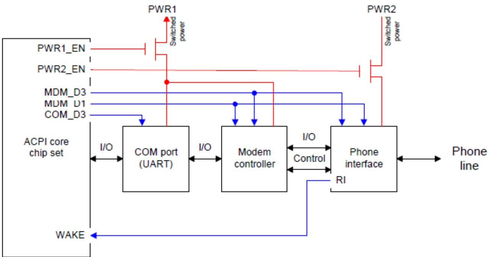  
Fig. 3.2: Example Modem and COM Port Hardware

## 3.4.5.1 Obtaining the Modem Capabilities

The OS determines the capabilities of this modem when it enumerates the modem by reading the modem's entry in the Differentiated Definition Block. In this case, the entry for the modem would report:

The device supports D0, D1, and D3:

\- D0 requires PWR1 and PWR2 as power resources D1 requires PWR1 as a power resource (D3 implicitly requires no power resources)

\- To wake the system, the modem needs no power resources (implying it can wake the system from D0, D1, and D3)

Control methods for setting power state and resources

## 3.4.5.2 Setting the Modem Power State

While the OS is running (G0 state), it switches the modem to different power states according to the power policy defined for modems.

When an application opens the COM port, the OS turns on the modem by putting it in the D0 state. Then if the application puts the modem in answer mode, the OS puts the modem in the D1 state to wait for the call. To make this power-down transition, OSPM first runs a control method (\_PS1) provided in the modem's entry to put the device in the D1 state. In this example, this control method asserts the MDM\_D1 signal that tells the modem controller to go into a low-power mode. OSPM then checks to see what power resources are no longer needed by the modem device. In this case, PWR2 is no longer needed. Then it checks to make sure no other device in the system requires the use of the PWR2 power resource. If the resource is no longer needed, the OSPM uses the \_OFF control method associated with that power resource in the Differentiated Definition Block to turn off the PWR2 power plane. This control method sends the appropriate commands to the core chip set to stop asserting the PWR2\_EN line.

OSPM does not always turn off power resources when a given device is put in a lower power state. For example, assume that the PWR1 power plane also powers an active line printer (LPT) port. Suppose the user terminates the modem application, causing the COM port to be closed, and therefore causing the modem to be shut off (state D3). As always, OSPM begins the state transition process by running the modem's control method to switch the device to the D3 power state. The control method causes the MDM\_D3 line to be asserted. Notice that these registers might not be in the device itself. For example, the control method could read the register that controls MDM\_D3. The modem controller now turns off all its major functions so that it draws little power, if any, from the PWR1 line. OSPM continues by checking to see which power resources are no longer needed. Because the LPT port is still active, PWR1 is in use. OSPM does not turn off the PWR1 resource. Because the COM port is closed, the same sequence of events take place to put it in the D3 state, but the power resource is not turned off due to the LPT dependency.

## 3.4.5.3 Obtaining the Modem Power Status

Integrated modems have no batteries; the only power status information for the device is the power state of the modem. To determine the modem's current power state (D0-D3), OSPM runs a control method (\_PSC) supplied in the modem's entry in the Differentiated Definition Block. This control method reads from the necessary registers to determine the modem's power state.

## 3.4.5.4 Waking the System

As indicated in the modem capabilities, this modem can wake the machine from any device power state. Before putting the system in a Sleep or LPI state, the OS enables wake on any devices that applications have requested to be able to wake the system. Then, it chooses the deepest sleeping or LPI state that can still provide the power resources necessary to allow all enabled wake devices to wake the system. Next, the OS puts each of those devices in the appropriate power state. In this case, the OS puts the modem in the D3 state because it supports wake from that state. Finally, the OS puts the system into a sleep or LPI state.

Waking the system via modem starts with the modem's phone interface asserting its ring indicate (RI) line when it detects a ring on the phone line. This line is routed to the core logic to generate a wake event. The chipset then wakes the system and the hardware will eventually pass control back to the OS (the wake mechanism differs depending on the sleeping state, or LPI). After the OS is running, it puts the device in the D0 state and begins handling interrupts from the modem to process the event.

## 3.5 Processor Power Management

To further save power in the Working state, the OS puts the CPU into low-power states (C1, C2, and C3) when the OS is idle. In these low-power states, the CPU does not run any instructions, and wakes when an interrupt, such as the OS scheduler's timer interrupt, occurs.

The OS determines how much time is being spent in its idle loop by reading the ACPI Power Management Timer. This timer runs at a known, fixed frequency and allows the OS to precisely determine idle time. Depending on this idle time estimate, the OS will put the CPU into different quality low-power states (which vary in power and latency) when it enters its idle loop.

The CPU states are defined in detail in Processor Configuration and Control

## 3.6 Device and Processor Performance States

This section describes the concept of device and processor performance states. Device and processor performance states (Px states) are power consumption and capability states within the active/executing states, C0 for processors and D0 for devices. Performance states allow OSPM to make tradeoffs between performance and energy conservation. Device and processor performance states have the greatest impact when the states invoke different device and processor efficiency levels as opposed to a linear scaling of performance and energy consumption. Since performance state transitions occur in the active/executing device states, care must be taken to ensure that performance state transitions do not adversely impact the system.

Examples of device performance states include:

\- A hard drive that provides levels of maximum throughput that correspond to levels of power consumption.

\- An LCD panel that supports multiple brightness levels that correspond to levels of power consumption.

\- A graphics component that scales performance between 2D and 3D drawing modes that corresponds to levels of power consumption.

\- An audio subsystem that provides multiple levels of maximum volume that correspond to levels of maximum power consumption.

\- A Direct-RDRAMTM controller that provides multiple levels of memory throughput performance, corresponding to multiple levels of power consumption, by adjusting the maximum bandwidth throttles.

Processor performance states are described in Processor Configuration and Control

## 3.7 Configuration and "Plug and Play"

In addition to power management, ACPI interfaces provide controls and information that enable OSPM to configure the required resources of motherboard devices along with their dynamic insertion and removal. ACPI Definition Blocks, including the Differentiated System Description Table (DSDT) and Secondary System Description Tables (SSDTs), describe motherboard devices in a hierarchical format called the ACPI namespace. The OS enumerates motherboard devices simply by reading through the ACPI Namespace looking for devices with hardware IDs.

Each device enumerated by ACPI includes ACPI-defined objects in the ACPI Namespace that report the hardware resources that the device could occupy, an object that reports the resources that are currently used by the device, and objects for configuring those resources. The information is used by the Plug and Play OS (OSPM) to configure the devices.

## Note

When preparing to boot a system, the platform boot firmware only needs to configure boot devices. This includes boot devices described in the ACPI system description tables as well as devices that are controlled through other standards.

## 3.7.1 Device Configuration Example: Configuring the Modem

Returning to the modem device example above, the OS will find the modem and load a driver for it when the OS finds it in the DSDT. This table will have control methods that give the OS the following information:

\- The device can use IRQ 3, I/O 3F8-3FF or IRQ 4, I/O 2E8-2EF

\- The device is currently using IRQ 3, I/O 3F8-3FF

The OS configures the modem's hardware resources using Plug and Play algorithms. It chooses one of the supported configurations that does not conflict with any other devices. Then, OSPM configures the device for those resources by running a control method supplied in the modem's section of the Differentiated Definition Block. This control method will write to any I/O ports or memory addresses necessary to configure the device to the given resources.

## 3.7.2 NUMA Nodes

Systems employing a Non Uniform Memory Access (NUMA) architecture contain collections of hardware resources including processors, memory, and I/O buses, that comprise what is commonly known as a “NUMA node”. Processor accesses to memory or I/O resources within the local NUMA node is generally faster than processor accesses to memory or I/O resources outside of the local NUMA node. ACPI defines interfaces that allow the platform to convey NUMA node topology information to OSPM both statically at boot time and dynamically at run time as resources are added or removed from the system.

## 3.8 System Events

ACPI includes a general event model used for Plug and Play, Thermal, and Power Management events. There are two registers that make up the event model: an event status register and an event enable register.

When an event occurs, the core logic sets a bit in the status register to indicate the event. If the corresponding bit in the enable register is set, the core logic will assert the SCI to signal the OS. When the OS receives this interrupt, it will run the control methods corresponding to any bits set in the event status register. These control methods use AML commands to tell the OS what event occurred.

For example, assume a machine has all of its Plug and Play, Thermal, and Power Management events connected to the same pin in the core logic. The event status and event enable registers would only have one bit each: the bit corresponding to the event pin.

When the system is docked, the core logic sets the status bit and signals the SCI. The OS, seeing the status bit set, runs the control method for that bit. The control method checks the hardware and determines the event was a docking event (for example). It then signals to the OS that a docking event has occurred, and can tell the OS specifically where in the device hierarchy the new devices will appear.

Since the event model registers are generalized, they can describe many different platform implementations. The single pin model above is just one example. Another design might have Plug and Play, Thermal, and Power Management events wired to three different pins so there would be three status bits (and three enable bits). Yet another design might have every individual event wired to its own pin and status bit. This design, at the opposite extreme from the single pin design, allows very complex hardware, yet very simple control methods. Countless variations in wiring up events are possible. However, note that care must be taken to ensure that if events share a signal that the event that generated the signal can be determined in the corresponding event handling control method allowing the proper device notification to be sent.

## 3.9 Battery Management

Battery management policy moves from the APM BIOS to the ACPI-compatible OS. Batteries must comply with the requirements of their associated interfaces, as described either herein or in other applicable standards. The OS may choose to alter the behavior of the battery, for example, by adjusting the Low Battery or Battery Warning trip point. When there are multiple batteries present, the battery subsystem is not required to perform any synthesis of a “composite battery” from the data of the separate batteries. In cases where the battery subsystem does not synthesize a “composite battery” from the separate battery’s data, the OS must provide that synthesis.

An ACPI-compatible battery device needs either a Smart Battery subsystem interface or a Control Method Battery interface.

\- Smart Battery is controlled by the OS directly through the embedded controller (EC). See Section 10.1 and Section 12.9 for more information.

\- Control Method Battery is completely accessed by AML code control methods, allowing the OEM to choose any type of battery and any kind of communication interface supported by ACPI. See Section 10.2 for more information.

This section describes concepts common to all battery types.

## 3.9.1 Battery Communications

Both the Smart Battery and Control Method Battery interfaces provide a mechanism for the OS to query information from the platform's battery system. This information may include full charged capacity, present battery capacity, rate of discharge, and other measures of the battery's condition. All battery system types must provide notification to the OS when there is a change such as inserting or removing a battery, or when a battery starts or stops discharging. Smart Batteries and some Control Method Batteries are also able to give notifications based on changes in capacity. Smart batteries provide extra information such as estimated run-time, information about how much power the battery is able to provide, and what the run-time would be at a predetermined rate of consumption.

## 3.9.2 Battery Capacity

Each battery must report its designed capacity, latest full-charged capacity, and present remaining capacity. Remaining capacity decreases during usage, and it also changes depending on the environment. Therefore, the OS must use latest full-charged capacity to calculate the battery percentage. In addition the battery system must report warning and low battery levels at which the user must be notified and the system transitioned to a sleeping state. See Fig. 3.3 for the relation of these five values.

A system may use either rate and capacity [mA/mAh] or power and energy [mW/mWh] for the unit of battery information calculation and reporting. Mixing [mA] and [mW] is not allowed on a system.

## 3.9.3 Battery Gas Gauge

At the most basic level, the OS calculates Remaining Battery Percentage [%] using the following formula:

Control Method Battery also reports the Present Drain Rate [mA or mW] for calculating the remaining battery life. At the most basic level, Remaining Battery life is calculated by following formula:

Smart Batteries also report the present rate of drain, but since they can directly report the estimated run-time, this function should be used instead as it can more accurately account for variations specific to the battery.

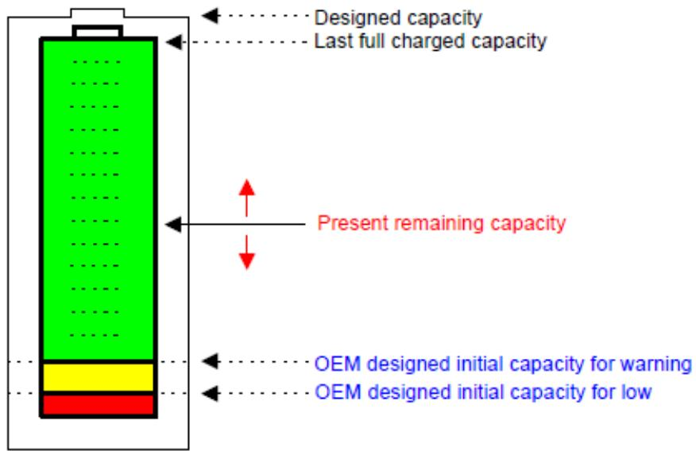  
Fig. 3.3: Reporting Battery Capacity

  
Fig. 3.4: Formula for Remaining Battery Percentage

$$
\text { Remaining   Battery   Life } [ \mathrm{h} ] = \frac {\text { Battery   Remaining   Capacity } [ \mathrm{mAh/mWh} ]}{\text { Battery   Present   Drain   Rate } [ \mathrm{mA/mW} ]}
$$

Fig. 3.5: Formula for the Present Drain Rate

## 3.9.4 Low Battery Levels

A system has an OEM-designed initial capacity for warning, initial capacity for low, and a critical battery level or flag. The values for warning and low represent the amount of energy or battery capacity needed by the system to take certain actions. The critical battery level or flag is used to indicate when the batteries in the system are completely drained. OSPM can determine independent warning and low battery capacity values based on the OEM-designed levels, but cannot set these values lower than the OEM-designed values, as shown in the figure below.

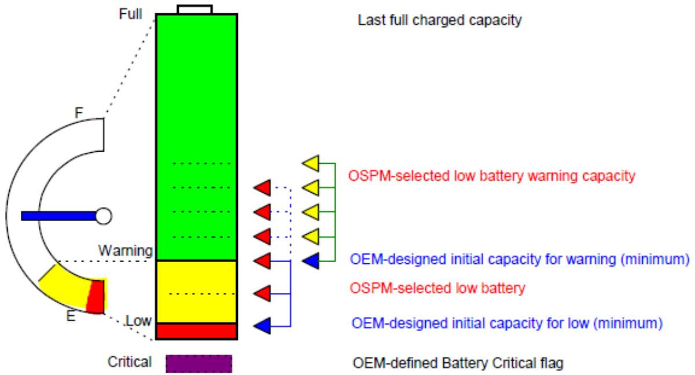  
Fig. 3.6: Low Battery and Warning

Each Control Method Battery in a system reports the OEM-designed initial warning capacity and OEM-designed initial low capacity as well as a flag to report when that battery has reached or is below its critical energy level. Unlike Control Method Batteries, Smart Batteries are not necessarily specific to one particular machine type, so the OEM-designed warning, low, and critical levels are reported separately in a Smart Battery Table described in Smart Battery Table (SBST).

The table below describes how these values should be set by the OEM and interpreted by the OS.

Table 3.1: Low Battery Levels

<table><tr><td>Level</td><td>Description</td></tr><tr><td>Warning</td><td>When the total available energy (mWh) or capacity (mAh) in the batteries falls below this level, the OS will notify the user through the UI. This value should allow for a few minutes of run-time before the “Low” level is encountered so the user has time to wrap up any important work, change the battery, or find a power outlet to plug the system in.</td></tr></table>

continues on next page

Table 3.1 – continued from previous page

<table><tr><td>Low</td><td>This value is an estimation of the amount of energy or battery capacity required by the system to transition to any supported sleeping state. When the OS detects that the total available battery capacity is less than this value, it will transition the system to a user defined system state (S1-S4). In most situations this should be S4 so that system state is not lost if the battery eventually becomes completely empty. The design of the OS should consider that users of a multiple battery system may remove one or more of the batteries in an attempt replace or charge it. This might result in the remaining capacity falling below the “Low” level not leaving sufficient battery capacity for the OS to safely transition the system into the sleeping state. Therefore, if the batteries are discharging simultaneously, the action might need to be initiated at the point when both batteries reach this level.</td></tr><tr><td>Critical</td><td>The Critical battery state indicates that all available batteries are discharged and do not appear to be able to supply power to run the system any longer. When this occurs, the OS must attempt to perform an emergency shutdown as described below.For a smart battery system, this would typically occur when all batteries reach a capacity of 0, but an OEM may choose to put a larger value in the Smart Battery Table to provide an extra margin of safely.For a Control Method Battery system with multiple batteries, the flag is reported per battery. If any battery in the system is in a critically low state and is still providing power to the system (in other words, the battery is discharging), the system is considered to be in a critical energy state. The _BST control method is required to return the Critical flag on a discharging battery only when all batteries have reached a critical state; the ACPI system firmware is otherwise required to switch to a non-critical battery.</td></tr></table>

## 3.9.4.1 Emergency Shutdown

Running until all batteries in a system are critical is not a situation that should be encountered normally, since the system should be put into a sleeping state when the battery becomes low. In the case that this does occur, the OS should take steps to minimize any damage to system integrity. The emergency shutdown procedure should be designed to minimize bad effects based on the assumption that power may be lost at any time. For example, if a hard disk is spun down, the OS should not try to spin it up to write any data, since spinning up the disk and attempting to write data could potentially corrupt files if the write were not completed. Even if a disk is spun up, the decision to attempt to save even system settings data before shutting down would have to be evaluated since reverting to previous settings might be less harmful than having the potential to corrupt the settings if power was lost halfway through the write operation.

## 3.9.5 Battery Calibration

The reported capacity of many batteries generally degrade over time, providing less run time for the user. However, it is possible with many battery systems to provide more usable runtime on an old battery if a calibration or conditioning cycle is run occasionally. The user has typically been able to perform a calibration cycle either by going into the platform boot firmware setup menu, or by running a custom driver and calibration application provided by the OEM. The calibration process typically takes several hours, and the laptop must be plugged in during this time. Ideally the application that controls this should make this as good of a user experience as possible, for example allowing the user to schedule the system to wake up and perform the calibration at some time when the system will not be in use. Since the calibration user experience does not need to be different from system to system it makes sense for this service to be provided by the OSPM. In this way OSPM can provide a common experience for end users and eliminate the need for OEMs to develop custom battery calibration software.

In order for OSPM to perform generic battery calibration, generic interfaces to control the two basic calibration functions are required. These functions are defined in Power Source and Power Meter Devices and \_BST (Battery Status). First, there is a means to detect when it would be beneficial to calibrate the battery. Second there is a means to perform that calibration cycle. Both of those functions may be implemented by dedicated hardware such as a battery controller chip, by firmware in the embedded controller, by the platform firmware, or by OSPM. From here on any function implemented through AML, whether or not the AML code relies on hardware, will be referred to as “AML controlled” since the interface is the same whether the AML passes control to the hardware or not.

Detection of when calibration is necessary can be implemented by hardware or AML code and be reported through the \_BMD method. Alternately, the \_BMD method may simply report the number of cycles before calibration should be performed and let the OS attempt to count the cycles. A counter implemented by the hardware or the platform firmware will generally be more accurate since the batteries can be used without the OS running, but in some cases, a system designer may opt to simplify the hardware or firmware implementation.

When calibration is desirable and the user has scheduled the calibration to occur, the calibration cycle can be AML controlled or OSPM controlled. OSPM can only implement a very simple algorithm since it doesn't have knowledge of the specifics of the battery system. It will simply discharge the battery until it quits discharging, then charge it until it quits charging. In the case where the AC adapter cannot be controlled through the \_BMC, it will prompt the user to unplug the AC adapter and reattach it after the system powers off. If the calibration cycle is controlled by AML, the OS will initiate the calibration cycle by calling \_BMC. That method will either give control to the hardware, or will control the calibration cycle itself. If the control of the calibration cycle is implemented entirely in AML code, the platform runtime firmware may avoid continuously running AML code by having the initial call to \_BMC start the cycle, set some state flags, and then exit. Control of later parts of the cycle can be accomplished by putting code that checks these state flags in the battery event handler (\_Qxx, \_Lxx, or \_Exx).

Details of the control methods for this interface are defined in Control Method Batteries.

## 3.9.6 Battery Charge Limiting

If the Platform is said to support Battery Charge Limiting feature, it must:

1. Advertise true charge level to the OSPM, at all times for all installed batteries

2. Limit the battery from reaching its Full Charge Capacity when Battery Charge Limiting is active

3. Set \_BST.Battery State.Bit[3] when Battery Charge Limiting is active

4. Ensure that \_BST.Battery State (Bit 0 and Bit 1) reflect true charging/discharging state of the battery OSPM must recognize the following settings:

Table 3.2: Battery Charge Limiting States

<table><tr><td>_BST.Battery State.Bit[3]</td><td>_BST.Battery State.Bit[0]</td><td>_BST.Battery State.Bit[1]</td><td>Interpretation</td></tr><tr><td>Cleared</td><td>N/A</td><td>N/A</td><td>Battery Charge Limiting is disengaged</td></tr><tr><td>Set</td><td>Cleared</td><td>Cleared</td><td>Battery Charge Limiting is engaged, and the battery has reached the steady state, it will not be charged or discharged</td></tr><tr><td>Set</td><td>Cleared</td><td>Set</td><td>Battery Charge Limiting is engaged, and the battery has not reached the steady state</td></tr><tr><td>Set</td><td>Set</td><td>Cleared</td><td>Battery Charge Limiting is engaged, and the battery has not reached the steady state</td></tr></table>

## 3.10 Thermal Management Concepts

ACPI allows the OS to play a role in the thermal management of the system while maintaining the platform's ability to mandate cooling actions as necessary. In the passive cooling mode, OSPM can make cooling decisions based on application load on the CPU as well as the thermal heuristics of the system. OSPM can also gracefully shutdown the computer in case of high temperature emergencies.

The ACPI thermal design is based around regions called thermal zones. Generally, the entire PC is one large thermal zone, but an OEM can partition the system into several logical thermal zones if necessary. Thermal Zone is an example mobile PC diagram that depicts a single thermal zone with a central processor as the thermal-coupled device. In this example, the whole notebook is covered as one large thermal zone. This notebook uses one fan for active cooling and the CPU for passive cooling.

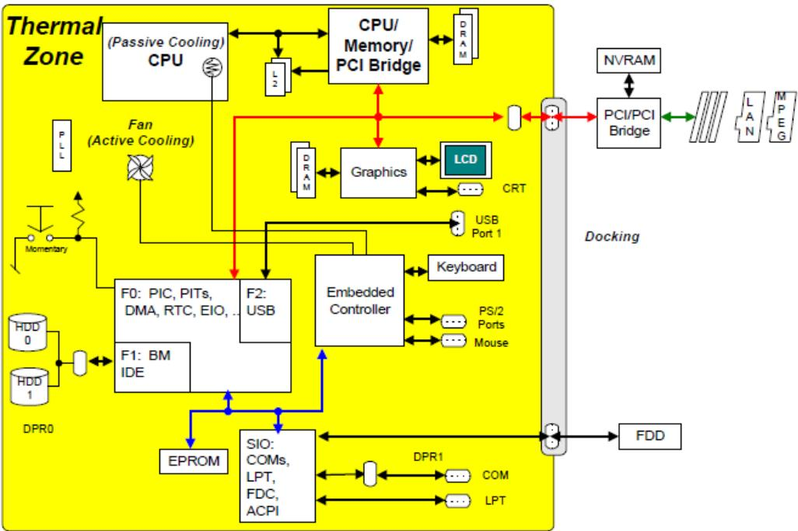  
Fig. 3.7: Thermal Zone

The following sections are an overview of the thermal control and cooling characteristics of a computer. For some thermal implementation examples on an ACPI platform, see Section 11.6

## 3.10.1 Active and Passive Cooling Modes

ACPI defines two cooling modes, Active and Passive:

## Passive cooling

OS reduces the power consumption of devices at the cost of system performance to reduce the temperature of the system.

## Active cooling

OS increases the power consumption of the system (for example, by turning on a fan) to reduce the temperature of the system.

These two cooling modes are inversely related to each other. Active cooling requires increased power to reduce the heat within the system while Passive cooling requires reduced power to decrease the temperature. The effect of this relationship is that Active cooling allows maximum system performance, but it may create undesirable fan noise, while Passive cooling reduces system performance, but is inherently quiet.

## 3.10.2 Performance vs. Energy Conservation

A robust OSPM implementation provides the means for the end user to convey to OSPM a preference (or a level of preference) for either performance or energy conservation. Allowing the end user to choose this preference is most critical to mobile system users where maximizing system run-time on a battery charge often has higher priority over realizing maximum system performance.

A user's preference for performance corresponds to the Active cooling mode while a user's preference for energy conservation corresponds to the Passive cooling mode. ACPI defines an interface to convey the cooling mode to the platform. Active cooling can be performed with minimal OSPM thermal policy intervention. For example, the platform indicates through thermal zone parameters that crossing a thermal trip point requires a fan to be turned on. Passive cooling requires OSPM thermal policy to manipulate device interfaces that reduce performance to reduce thermal zone temperature.

## 3.10.3 Acoustics (Noise)

Active cooling mode generally implies that fans will be used to cool the system and fans vary in their audible output. Fan noise can be quite undesirable given the loudness of the fan and the ambient noise environment. In this case, the end user's physical requirement for fan silence may override the preference for either performance or energy conservation.

A user's desire for fan silence corresponds to the Passive cooling mode. Accordingly, a user's desire for fan silence also means a preference for energy conservation.

For more information on thermal management and examples of platform settings for active and passive cooling, see Section 3.10

## 3.10.4 Multiple Thermal Zones

The basic thermal management model defines one thermal zone, but in order to provide extended thermal control in a complex system, ACPI specifies a multiple thermal zone implementation. Under a multiple thermal zone model, OSPM will independently manage several thermal-coupled devices and a designated thermal zone for each thermal-coupled device, using Active and/or Passive cooling methods available to each thermal zone. Each thermal zone can have more than one Passive and Active cooling device. Furthermore, each zone might have unique or shared cooling resources. In a multiple thermal zone configuration, if one zone reaches a critical state then OSPM must shut down the entire system.

## 3.11 Flexible Platform Architecture Support

ACPI defines mechanisms and models to accommodate platform architectures that deviate from the traditional PC. ACPI provides support for platform technologies that enable lower-power, lower cost, more design flexibility and more device diversity. This support is described in the following sections, and detailed in later chapters.

## 3.11.1 Hardware-reduced ACPI

ACPI offers an alternative platform interface model that removes ACPI hardware requirements for platforms that do not implement the PC Architecture. In the Hardware-reduced ACPI model, the Fixed hardware interface requirements of Chapter 4 are removed, and Generic hardware interfaces are used instead. This provides the level of flexibility needed to innovate and differentiate in low-power hardware designs while enabling support by multiple Operating Systems.

Hardware-reduced ACPI has the following requirements:

\- UEFI firmware interface for boot (Legacy BIOS is not supported).

\- Boot in ACPI mode only (ACPI Enable, ACPI Disable, SMI\_CMD and Legacy mode are not supported)

\- No hardware resource sharing between OSPM and other asynchronous operating environments, such as UEFI Runtime Services or System Management Mode. (The Global Lock is not supported)

\- No dependence on OS-support for maintaining cache coherency across processor sleep states (Bus Master Reload and Arbiter Disable are not supported)

• GPE block devices are not supported

Systems that do not meet the above requirements must implement the ACPI Fixed Hardware interface.

## 3.11.1.1 Interrupt-based Wake Events

On HW-reduced ACPI platforms, wakeup is an attribute of connected interrupts. Interrupts that are designed to wake the processor or the entire platform are defined as wake-capable. Wake-capable interrupts, when enabled by OSPM, wake the system when they assert.

## 3.11.2 Low-Power Idle

Platform architectures may support hardware power management models other than the traditional ACPI Sleep/Resume model. These are typically implemented in proprietary hardware and are capable of delivering low-latency, connected idle while saving as much energy as ACPI Sleep states. To support the diversity of hardware implementations, ACPI provides a mechanism for the platform to indicate to OSPM that such capability is available.

## 3.11.2.1 Low Power S0 Idle Capable Flag

This flag in the FADT informs OSPM whether a platform has advanced idle power capabilities such that S0 idle achieves savings similar to or better than those typically achieved in S3. With this flag, OSPM can keep the system in S0 idle for its low-latency response and its connectedness rather than transitioning to a system sleep state which has neither. The flag enables support for a diversity of platform implementations: traditional Sleep/Resume systems, systems with advanced idle power, systems that support neither, and systems that can support both, depending on the capabilities of the installed OS.

## 3.11.3 Connection Resources

General-purpose I/O (GPIO) and Simple Peripheral Bus (SPB) controllers are hardware resources provided in silicon solutions to enable flexible configuration of a broad range of system designs. These controllers can provide input, output, interrupt and serial communication connections to arbitrary devices in a system. The function to which one of these connections is put depends on the specific device involved and the needs of the platform design. In order to support these platform technologies, ACPI defines a general abstraction for flexible connections.

In order to maintain compatibility with existing software models, ACPI abstracts these connections as hardware resources.

The Connection Resource abstraction mirrors the hardware functionality of GPIO and SPB controllers. Like other resources, these connections are allocated and configured before use. With the resources described by the platform, OSPM abstracts the underlying configuration from device drivers. Drivers, then, can be written for the device's function only, and reused with that functional hardware regardless of how it is integrated into a given system.

The key aspects of the Connection Resource abstraction are:

\- GPIO and SPB controllers are enumerated as devices in the ACPI Namespace.

\- GPIO Connection and SPB Connection resource types are defined.

\- Namespace devices that are connected to GPIO or SPB controllers use Resource Template Macros to add Connection Resources to their resource methods (\_CRS, \_SRS, etc.).

\- GPIO Connection Resources can be designated by the platform for use as GPIO-signaled ACPI Events.

\- Connection Resources can be used by AML methods to access pins and peripherals through GPIO and SPB operation regions.

## 3.11.3.1 Supported Platforms

The HW-reduced ACPI and Low power S0 Idle Capable flags combine to represent 4 platform types that can be implemented. The following table enumerates these, as well as the intended OSPM behavior and specific platform requirements.

Table 3.3: Implementable Platform Types

<table><tr><td>Low Power S0 Idle Capable</td><td>Hardware-reduced ACPI</td><td>OSPM Behavior</td><td>Platform Implementation</td></tr><tr><td>0</td><td>0</td><td>Fixed hardware interface accessed for features, events and system power management. Optionally accesses GPIO-signaled ACPI events if implemented in ACPI FW. Traditional Sleep/Resume power management.</td><td>Implement Fixed-feature hardware interface. Optionally implements GPIO-signaled ACPI events.</td></tr><tr><td>0</td><td>1</td><td>Fixed-feature hardware interface not accessed. Sleep/Resume Power Management using FADT SLEEP_*_REG fields and Interrupt-based wake signaling.</td><td>Implement GPIO-signaled ACPI Events; Implement software alternatives to any ACPI fixed features, including the Sleep registers. Implement wake-capable interrupts for wake events.</td></tr></table>

continues on next page

Table 3.3 – continued from previous page

<table><tr><td>1</td><td>0</td><td>Fixed hardware interface accessed for features and events. Platform-specific Low-power Idle power management. Optionally accesses GPIO-signaled ACPI events if implemented in ACPI FW.</td><td>Implement Fixed-feature hardware interface. Optionally implements GPIO-signaled ACPI events. Implement low-power hardware such that the platform achieves power savings in S0 similar to or better than those typically achieved in S3.</td></tr><tr><td>1</td><td>1</td><td>Fixed-feature hardware interface not accessed. Platform-specific Low-power Idle power management.</td><td>Implement GPIO-signaled ACPI Events; Implement software alternatives to any ACPI fixed features desired; Implement wake-capable interrupts for any wake events. Implement low-power hardware such that the platform achieves power savings in S0 similar to or better than those typically achieved in S3.</td></tr></table>

# ACPI HARDWARE SPECIFICATION

ACPI defines standard interface mechanisms that allow an ACPI-compatible OS to control and communicate with an ACPI-compatible hardware platform. These interface mechanisms are optional (See “Hardware-Reduced ACPI”, below). However, if the ACPI Hardware Specification is implemented, platforms must comply with the requirements in this section.

This section describes the hardware aspects of ACPI.

ACPI defines “hardware” as a programming model and its behavior. ACPI strives to keep much of the existing legacy programming model the same; however, to meet certain feature goals, designated features conform to a specific addressing and programming scheme. Hardware that falls within this category is referred to as “fixed.”

Although ACPI strives to minimize these changes, hardware engineers should read this section carefully to understand the changes needed to convert a legacy-only hardware model to an ACPI/Legacy hardware model or an ACPI-only hardware model.

ACPI classifies hardware into two categories: Fixed or Generic. Hardware that falls within the fixed category meets the programming and behavior specifications of ACPI. Hardware that falls within the generic category has a wide degree of flexibility in its implementation.

## 4.1 Hardware-Reduced ACPI

For certain classes of systems the ACPI Hardware Specification may not be adequate. Examples include legacy-free, UEFI-based platforms with recent processors, and those implementing mobile platform architectures. For such platforms, a Hardware-reduced ACPI mode is defined. Under this definition, the ACPI Fixed Hardware interface is not implemented, and software alternatives for many of the features it supports are used instead. Note, though, that Hardware-reduced ACPI is not intended to support every possible ACPI system that can be built today. Rather, it is intended to introduce new systems that are designed to be HW-reduced from the start. The ACPI HW Specification should be used if the platform cannot be designed to work without it. Specifically, the following features are not supported under the HW-reduced definition:

\- The Global Lock, SMI\_CMD, ACPI Enable and ACPI Disable. Hardware-reduced ACPI systems always boot in ACPI mode, and do not support hardware resource sharing between OSPM and other asynchronous operating environments, such as UEFI Runtime Services or System Management Mode.

\- Bus Master Reload and Arbiter Disable. Systems that depend on OS use of these bits to maintain cache coherency across processor sleep states are not supported.

• GPE block devices are not supported.

Platforms that require the above features must implement the ACPI Hardware Specification.

Platforms that are designed for the Hardware-reduced ACPI definition must implement Revision 5 or greater of the Fixed ACPI Descriptor Table, and must set the HW\_REDUCED ACPI flag in the Flags field.

Note: FFH is permitted and applicable to both full and HW-reduced ACPI implementations.

## 4.1.1 Hardware-Reduced Events

HW-reduced ACPI platforms require alternatives to some of the features supported in the ACPI HW Specification, where none already exists. There are two areas that require such alternatives: The ACPI Platform Event Model, and System and Device Wakeup.

## 4.1.1.1 GPIO-Signaled Events or Interrupt Signaled Events

General Purpose Input/Output (GPIO) hardware can be used for signaling platform events. GPIO HW is a generalization of the GPE model, and is a shared hardware resource used for many applications. ACPI support for GPIO is described in section Connection Resources. ACPI 6.1 introduces the capability to signal events via interrupts. See Interrupt-signaled ACPI events for further details.

GPIO based event signaling is provided through GPIO interrupt connections, which describe the connection to a GPIO controller and pin, and which are mapped to the ACPI Event Handling mechanism via the ACPI Event Information namespace object (\_AEI). OSPM treats GPIO Interrupt Connections listed in \_AEI exactly as it does SCI interrupts: it executes the Event Method associated with the specific event. The name of the method to run is determined by the pin information contained in the GPIO Interrupt Connection resource. See GPIO-signaled ACPI Events for further details.

GPIO-signaled events can also be wake events, just as GPE events can on traditional ACPI platforms. Designating which events are wake events is done through attributes of the GPIO Interrupt Connection resource used.Devices may use \_PRW to manage wake events as described in \_PRW (Power Resources for Wake).

Interrupt based event signaling follows a similar methodology, a generic event device (GED) is declared which in turn describes all interrupts associated with event generation. The interrupts are listed in a \_CRS object. When an interrupt is asserted the OSPM will execute the event method (\_EVT) declared in the GED object specifying the interrupt identifier as a parameter. In this way the interrupt can be associated with specific platform events.

## 4.1.1.2 Interrupt-based Wake Events

Wake events on HW-reduced ACPI platforms are always caused by an interrupt reaching the processor. Therefore, there are two requirements for waking the system from a sleep or low-power idle state, or a device from a low-power state. First, the interrupt line must be Wake-Capable. Wake-capable interrupts are designed to be able to be delivered to the processor from low-power states. This implies that it must also cause the processor and any required platform hardware to power-up so that an Interrupt Service Routine can run. Secondly, an OS driver must enable the interrupt before entering a low-power state, or before OSPM puts the system into a sleep or low-power idle state.

Wake-capable interrupts are designated as such in their Extended Interrupt or GPIO Interrupt Connection resource descriptor.

## 4.2 Fixed Hardware Programming Model

Because of the changes needed for migrating legacy hardware to the fixed category, ACPI limits the features specified by fixed hardware. Fixed hardware features are defined by the following criteria:

• Performance sensitive features

\- Features that drivers require during wake

\- Features that enable catastrophic OS software failure recovery

ACPI defines register-based interfaces to fixed hardware. CPU clock control and the power management timer are defined as fixed hardware to reduce the performance impact of accessing this hardware, which will result in more quickly reducing a thermal condition or extending battery life. If this logic were allowed to reside in PCI configuration space, for example, several layers of drivers would be called to access this address space. This takes a long time and will either adversely affect the power of the system (when trying to enter a low-power state) or the accuracy of the event (when trying to get a time stamp value).

Access to fixed hardware by OSPM allows OSPM to control the wake process without having to load the entire OS. For example, if PCI configuration space access is needed, the bus enumerator is loaded with all drivers used by the enumerator. Defining these interfaces in fixed hardware at addresses with which OSPM can communicate without any other driver's assistance, allows OSPM to gather information prior to making a decision as to whether it continues loading the entire OS or puts it back to sleep.

If elements of the OS fail, it may be possible for OSPM to access address spaces that need no driver support. In such a situation, OSPM will attempt to honor fixed power button requests to transition the system to the G2 state. In the case where OSPM event handler is no longer able to respond to power button events, the power button override feature provides a back-up mechanism to unconditionally transition the system to the soft-off state.

## 4.3 Generic Hardware Programming Model

Although the fixed hardware programming model requires hardware registers to be defined at specific address locations, the generic hardware programming model allows hardware registers to reside in most address spaces and provides system OEMs with a wide degree of flexibility in the implementation of specific functions in hardware. OSPM directly accesses the fixed hardware registers, but relies on OEM-provided ACPI Machine Language (AML) code to access generic hardware registers.

AML code allows the OEM to provide the means for OSPM to control a generic hardware feature's control and event logic.

The section entitled “ACPI Source Language Reference” describes the ACPI Source Language (ASL)—a programming language that OEMs use to create AML. The ASL language provides many of the operators found in common object-oriented programming languages, but it has been optimized to enable the description of platform power management and configuration hardware. An ASL compiler converts ASL source code to AML, which is a very compact machine language that the ACPI AML code interpreter executes.

AML does two things:

• Abstracts the hardware from OSPM

\- Buffers OEM code from the different OS implementations

One goal of ACPI is to allow the OEM “value added” hardware to remain basically unchanged in an ACPI configuration. One attribute of value-added hardware is that it is all implemented differently. To enable OSPM to execute properly on different types of value added hardware, ACPI defines higher level “control methods” that it calls to perform an action. The OEM provides AML code, which is associated with control methods, to be executed by OSPM. By providing AML code, generic hardware can take on almost any form.

Another important goal of ACPI is to provide OS independence. To do this, the OEM AML code has to execute the same under any ACPI-compatible OS. ACPI allows for this by making the AML code interpreter part of OSPM. This allows OSPM to take care of synchronizing and blocking issues specific to each particular OS.

The generic feature model is represented in the following block diagram. In this model the generic feature is described to OSPM through AML code. This description takes the form of an object that sits in the ACPI Namespace associated with the hardware to which it is adding value.

As an example of a generic hardware control feature, a platform might be designed such that the IDE HDD's D3 state has value-added hardware to remove power from the drive. The IDE drive would then have a reference to the AML

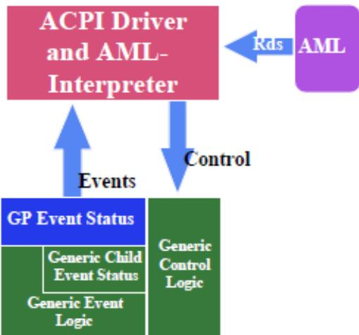  
Fig. 4.1: Generic Hardware Feature Model

PowerResource object (which controls the value added power plane) in its namespace, and associated with that object would be control methods that OSPM invokes to control the D3 state of the drive:

\- \_PS0: A control method to sequence the IDE drive to the D0 state.

\- \_PS3: A control method to sequence the IDE drive to the D3 state.

\- \_PSC: A control method that returns the status of the IDE drive (on or off).

The control methods under this object provide an abstraction layer between OSPM and the hardware. OSPM understands how to control power planes (turn them on or off or to get their status) through its defined PowerResource object, while the hardware has platform-specific AML code (contained in the appropriate control methods) to perform the desired function. In this example, the platform would describe its hardware to the ACPI OS by writing and placing the AML code to turn the hardware off within the \_PS3 control method. This enables the following sequence:

When OSPM decides to place the IDE drive in the D3 state, it calls the IDE driver and tells it to place the drive into the D3 state (at which point the driver saves the device's context).

When the IDE driver returns control, OSPM places the drive in the D3 state.

OSPM finds the object associated with the HDD and then finds within that object any AML code associated with the D3 state.

OSPM executes the appropriate \_PS3 control method to control the value-added “generic” hardware to place the HDD into an even lower power state.

As an example of a generic event feature, a platform might have a docking capability. In this case, it will want to generate an event. Notice that all ACPI events generate an SCI, which can be mapped to any shareable system interrupt. In the case of docking, the event is generated when a docking has been detected or when the user requests to undock the system. This enables the following sequence:

OSPM responds to the SCI and calls the AML code event handler associated with that generic event. The ACPI table associates the hardware event with the AML code event handler.

The AML-code event handler collects the appropriate information and then executes an AML Notify command to indicate to OSPM that a particular bus needs re-enumeration.

The following sections describe the fixed and generic hardware feature set of ACPI. These sections enable a reader to understand the following:

\- Which hardware registers are required or optional when an ACPI feature, concept or interface is required by a design guide for a platform class

• How to design fixed hardware features

\- How to design generic hardware features

• The ACPI Event Model

## 4.4 Diagram Legend

The hardware section uses simplified logic diagrams to represent how certain aspects of the hardware are implemented. The following symbols are used in the logic diagrams to represent programming bits:


Write-only control bit


Enable, control, or status bit


Sticky status bit


Query value

The half round symbol with an inverted “V” represents a write-only control bit. This bit has the behavior that it generates its control function when it is set. Reads to write-only bits are treated as ignore by software (the bit position is masked off and ignored).

The round symbol with an “X” represents a programming bit. As an enable or control bit, software setting or clearing this bit will result in the bit being read as set or clear (unless otherwise noted). As a status bit it directly represents the value of the signal.

The square symbol represents a sticky status bit. A sticky status bit is set by the level (not edge) of a hardware signal (active high or active low). The bit is only cleared by software writing a “1” to its bit position.

The rectangular symbol represents a query value from the embedded controller. This is the value the embedded controller returns to the system software upon a query command in response to an SCI event. The query value is associated with the event control method that is scheduled to execute upon an embedded controller event.

## 4.5 Register Bit Notation

Throughout this section there are logic diagrams that reference bits within registers. These diagrams use a notation that easily references the register name and bit position. The notation is as follows:

Registernname.Bit

Registername contains the name of the register as it appears in this specification

Bit contains a zero-based decimal value of the bit position

For example, the SLP\_EN bit resides in the PM1x\_CNT register bit 13 and would be represented in diagram notation as:

SLP\_EN

PM1x\_CNT.13

## 4.6 The ACPI Hardware Model

The ACPI hardware model is defined to allow OSPM to sequence the platform between the various global system states (G0-G3) as illustrated in the following figure by manipulating the defined interfaces. When first powered on, the platform finds itself in the global system state G3 or “Mechanical Off.” This state is defined as one where power consumption is very close to zero—the power plug has been removed; however, the real-time clock device still runs off a battery. The G3 state is entered by any power failure, defined as accidental or user-initiated power loss.

The G3 state transitions into either the G0 working state or the Legacy state depending on what the platform supports. If the platform is an ACPI-only platform, then it allows a direct boot into the G0 working state by always returning the status bit SCI\_EN set (1) (for more information, see Legacy/ACPI Select and the SCI Interrupt). If the platform supports both legacy and ACPI operations (which is necessary for supporting a non-ACPI OS), then it would always boot into the Legacy state (illustrated by returning the SCI\_EN clear (0)). In either case, a transition out of the G3 state requires a total boot of OSPM.

The Legacy system state is the global state where a non-ACPI OS executes. This state can be entered from either the G3 “Mechanical Off,” the G2 “Soft Off,” or the G0 “Working” states only if the hardware supports both Legacy and ACPI modes. In the Legacy state, the ACPI event model is disabled (no SCIs are generated) and the hardware uses legacy power management and configuration mechanisms. While in the Legacy state, an ACPI-compliant OS can request a transition into the G0 working state by performing an ACPI mode request. OSPM performs this transition by writing the ACPI\_ENABLE value to the SMI\_CMD, which generates an event to the hardware to transition the platform into ACPI mode. When hardware has finished the transition, it sets the SCI\_EN bit and returns control back to OSPM. While in the G0 “working state,” OSPM can request a transition to Legacy mode by writing the ACPI\_DISABLE value to the SMI\_CMD register, which results in the hardware going into legacy mode and resetting the SCI\_EN bit LOW (for more information, see Legacy/ACPI Select and the SCI Interrupt).

The G0 “Working” state is the normal operating environment of an ACPI system. In this state different devices are dynamically transitioning between their respective power states (D0, D1, D2, D3hot, or D3) and processors are dynamically transitioning between their respective power states (C0, C1, C2 or C3). In this state, OSPM can make a policy decision to place the platform into the system G1 “sleeping” state. The platform can only enter a single sleeping state at a time (referred to as the global G1 state); however, the hardware can provide up to four system sleeping states that have different power and exit latencies represented by the S1, S2, S3, or S4 states. When OSPM decides to enter a sleeping state it picks the most appropriate sleeping state supported by the hardware (OS policy examines what devices have enabled wake events and what sleeping states these support). OSPM initiates the sleeping transition by enabling the appropriate wake events and then programming the SLP\_TYPx field with the desired sleeping state and then setting the SLP\_ENx bit. The system will then enter a sleeping state; when one of the enabled wake events occurs, it will transition the system back to the working state (for more information, see Waking and Sleeping).

Another global state transition option while in the G0 “working” state is to enter the G2 “soft off” or the G3 “mechanical off” state. These transitions represent a controlled transition that allows OSPM to bring the system down in an orderly fashion (unloading applications, closing files, and so on). The policy for these types of transitions can be associated with the ACPI power button, which when pressed generates an event to the power button driver. When OSPM is finished preparing the operating environment for a power loss, it will either generate a pop-up message to indicate to the user to remove power, in order to enter the G3 “Mechanical Off” state, or it will initiate a G2 “soft-off” transition by writing the value of the S5 “soft off” system state to the SLP\_TYPx register and setting the SLP\_EN bit.

The G1 sleeping state is represented by four possible sleeping states that the hardware can support. Each sleeping state has different power and wake latency characteristics. The sleeping state differs from the working state in that the user's operating environment is frozen in a low-power state until awakened by an enabled wake event. No work is performed in this state, that is, the processors are not executing instructions. Each system sleeping state has requirements about who is responsible for system context and wake sequences (for more information, see Waking and Sleeping).

The G2 “soft off” state is an OS initiated system shutdown. This state is initiated similar to the sleeping state transition (SLP\_TYPx is set to the S5 value and setting the SLP\_EN bit initiates the sequence). Exiting the G2 soft-off state requires rebooting the system. In this case, an ACPI-only system will re-enter the G0 state directly (hardware returns the SCI\_EN bit set), while an ACPI/Legacy system transitions to the Legacy state (SCI\_EN bit is clear).

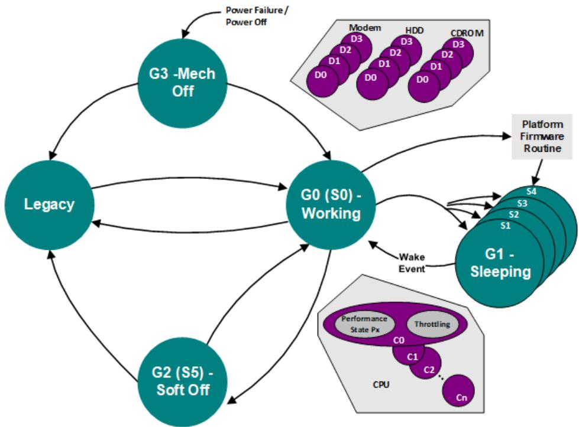  
Fig. 4.2: Global States and Their Transitions

The ACPI architecture defines mechanisms for hardware to generate events and control logic to implement this behavior model. Events are used to notify OSPM that some action is needed, and control logic is used by OSPM to cause some state transition. ACPI-defined events are “hardware” or “interrupt” events. A hardware event is one that causes the hardware to unconditionally perform some operation. For example, any wake event will sequence the system from a sleeping state (S1, S2, S3, and S4 in the global G1 state) to the G0 working state (see Example Sleeping States).

An interrupt event causes the execution of an event handler (AML code or an ACPI-aware driver), which allows the software to make a policy decision based on the event. For ACPI fixed-feature events, OSPM or an ACPI-aware driver acts as the event handler. For generic logic events OSPM will schedule the execution of an OEM-supplied AML control method associated with the event.

For legacy systems, an event normally generates an OS-transparent interrupt, such as a System Management Interrupt, or SMI. For ACPI systems the interrupt events need to generate an OS-visible interrupt that is shareable; edge-style interrupts will not work. Hardware platforms that want to support both legacy operating systems and ACPI systems support a way of re-mapping the interrupt events between SMIs and SCIs when switching between ACPI and legacy models. This is illustrated in the following block diagram.

This example logic illustrates the event model for a sample platform that supports both legacy and ACPI event models. This example platform supports a number of external events that are power-related (power button, LID open/close, thermal, ring indicate) or Plug and Play-related (dock, status change). The logic represents the three different types of events:

## OS Transparent Events

These events represent OEM-specific functions that have no OS support and use software that can be operated in an OS-transparent fashion (that is, SMIs).

## Interrupt Events

These events represent features supported by ACPI-compatible operating systems, but are not supported by legacy operating systems. When a legacy OS is loaded, these events are mapped to the transparent interrupt (SMI# in this example), and when in ACPI mode they are mapped to an OS-visible shareable interrupt (SCI#). This logic is represented by routing the event logic through the decoder that routes the events to the SMI# arbiter when the SCI\_EN bit is cleared, or to the SCI# arbiter when the SCI\_EN bit is set.

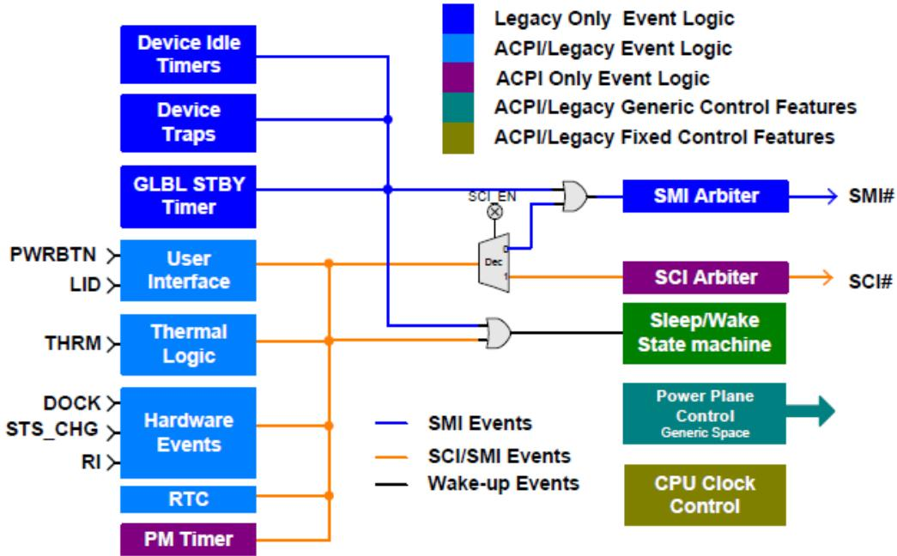  
Fig. 4.3: Example Event Structure for a Legacy/ACPI Compatible Event Model

## Hardware events

These events are used to trigger the hardware to initiate some hardware sequence such as waking, resetting, or putting the system to sleep unconditionally.

In this example, the legacy power management event logic is used to determine device/system activity or idleness based on device idle timers, device traps, and the global standby timer. Legacy power management models use the idle timers to determine when a device should be placed in a low-power state because it is idle—that is, the device has not been accessed for the programmed amount of time. The device traps are used to indicate when a device in a low-power state is being accessed by OSPM. The global standby timer is used to determine when the system should be allowed to go into a sleeping state because it is idle—that is, the user interface has not been used for the programmed amount of time.

These legacy idle timers, trap monitors, and global standby timer are not used by OSPM in the ACPI mode. This work is handled by different software structures in an ACPI-compatible OS. For example, the driver model of an ACPI-compatible OS is responsible for placing its device into a low-power state (D1, D2, D3hot, or D3) and transitioning it back to the On state (D0) when needed. And OSPM is responsible for determining when the system is idle by profiling the system (using the PM Timer) and other knowledge it gains through its operating structure environment (which will vary from OS to OS). When the system is placed into the ACPI mode, these events no longer generate SMIs, as OSPM handles this function. These events are disabled through some OEM-proprietary method.

On the other hand, many of the hardware events are shared between the ACPI and legacy models (docking, the power button, and so on) and this type of interrupt event changes to an SCI event when enabled for ACPI. The ACPI OS will generate a request to the platform runtime firmware to enter into the ACPI mode. The firmware sets the SCI\_EN bit to indicate that the system has successfully entered into the ACPI mode, so this is a convenient mechanism to map the desired interrupt (SMI or SCI) for these events (as shown in Figure 4-3).

The ACPI architecture specifies some dedicated hardware not found in the legacy hardware model: the power management timer (PM Timer). This is a free running timer that the ACPI OS uses to profile system activity. The frequency of this timer is explicitly defined in this specification and must be implemented as described.

Although the ACPI architecture reuses most legacy hardware as is, it does place restrictions on where and how the programming model is generated. If used, all fixed hardware features are implemented as described in this specification so that OSPM can directly access the fixed hardware feature registers.

Generic hardware features are manipulated by ACPI control methods residing in the ACPI Namespace. These interfaces can be very flexible; however, their use is limited by the defined ACPI control methods (for more information, see ACPI-Defined Devices and Device-Specific Objects). Generic hardware usually controls power planes, buffer isolation, and device reset resources. Additionally, “child” interrupt status bits can be accessed via generic hardware interfaces; however, they have a “parent” interrupt status bit in the GP\_STS register. ACPI defines eight address spaces that may be accessed by generic hardware implementations. These include:

\- System I/O space

\- System memory space

\- PCI configuration space

\- Embedded controller space

\- System Management Bus (SMBus) space

\- CMOS

\- PCI BAR Target

\- IPMI space

\- Platform Communication Channel

Generic hardware power management features can be implemented accessing spare I/O ports residing in any of these address spaces. The ACPI specification defines an optional embedded controller and SMBus interfaces needed to communicate with these associated address spaces.

## 4.6.1 Hardware Reserved Bits

ACPI hardware registers are designed such that reserved bits always return zero, and data writes to them have no side affects. OSPM implementations must write zeros to reserved bits in enable and status registers and preserve bits in control registers, and they will treat these bits as ignored.

## 4.6.2 Hardware Ignored Bits

ACPI hardware registers are designed such that ignored bits are undefined and are ignored by software. Hardware-ignored bits can return zero or one. When software reads a register with ignored bits, it masks off ignored bits prior to operating on the result. When software writes to a register with ignored bit fields, it preserves the ignored bit fields.

## 4.6.3 Hardware Write-Only Bits

ACPI hardware defines a number of write-only control bits. These bits are activated by software writing a 1 to their bit position. Reads to write-only bit positions generate undefined results. Upon reads to registers with write-only bits, software masks out all write-only bits.

## 4.6.4 Cross Device Dependencies

Cross Device Dependency is a condition in which an operation to a device interferes with the operation of other unrelated devices, or allows other unrelated devices to interfere with its behavior. This condition is not supportable and can cause platform failures. ACPI provides no support for cross device dependencies and suggests that devices be designed to not exhibit this behavior. The following two examples describe cross device dependencies:

## 4.6.4.1 Example 1: Related Device Interference

This example illustrates a cross device dependency where a device interferes with the proper operation of other unrelated devices. Device A has a dependency that when it is being configured it blocks all accesses that would normally be targeted for Device B. Thus, the device driver for Device B cannot access Device B while Device A is being configured; therefore, it would need to synchronize access with the driver for Device A. High performance, multithreaded operating systems cannot perform this kind of synchronization without seriously impacting performance.

To further illustrate the point, assume that Device A is a serial port and Device B is a hard drive controller. If these devices demonstrate this behavior, then when a software driver configures the serial port, accesses to the hard drive need to block. This can only be done if the hard disk driver synchronizes access to the disk controller with the serial driver. Without this synchronization, hard drive data will be lost when the serial port is being configured.

## 4.6.4.2 Example 2: Unrelated Device Interference

This example illustrates a cross-device dependency where a device demonstrates a behavior that allows other unrelated devices to interfere with its proper operation. Device A exhibits a programming behavior that requires atomic back-to-back write accesses to successfully write to its registers; if any other platform access is able to break between the back-to-back accesses, then the write to Device A is unsuccessful. If the Device A driver is unable to generate atomic back-to-back accesses to its device, then it relies on software to synchronize accesses to its device with every other driver in the system; then a device cross dependency is created and the platform is prone to Device A failure.

## 4.7 ACPI Hardware Features

This section describes the different hardware features defined by the ACPI interface. These features are categorized as the following:

• Fixed Hardware Features

\- Generic Hardware Features

Fixed hardware features reside in a number of the ACPI-defined address spaces at the locations described by the ACPI programming model. Generic hardware features reside in one of four address spaces (system I/O, system memory, PCI configuration, embedded controller, or serial device I/O space) and are described by the ACPI Namespace through the declaration of AML control methods.

Fixed hardware features have exact definitions for their implementation. Although many fixed hardware features are optional, if implemented they must be implemented as described since OSPM manipulates the registers of fixed hardware devices and expects the defined behavior. Functional fixed hardware provides functional equivalents of the fixed hardware feature interfaces as described in Generic Hardware Programming Model

Generic hardware feature implementation is flexible. This logic is controlled by OEM-supplied AML code (for more information, see ACPI Software Programming Model), which can be written to support a wide variety of hardware. Also, ACPI provides specialized control methods that provide capabilities for specialized devices. For example, the Notify command can be used to notify OSPM from a generic hardware event handler (control method) that a docking or thermal event has taken place. A good understanding of this section and ACPI Software Programming Model of this specification will give designers a good understanding of how to design hardware to take full advantage of an ACPI-compatible OS.

Notice that the generic features are listed for illustration only, the ACPI specification can support many types of hardware not listed.

Table 4.1: Feature-Programming Model Summary

<table><tr><td>Feature Name</td><td>Description</td><td>Programming Model</td></tr><tr><td>Power Management Timer</td><td>24-bit or 32-bit free running timer.</td><td>Fixed Hardware Feature Control Logic</td></tr><tr><td>Power Button</td><td>User pushes button to switch the system between the working and sleeping/soft-off states.</td><td>Fixed Hardware Event and Control Logic or Generic Hardware Event and Logic</td></tr><tr><td>Sleep Button</td><td>User pushes button to switch the system between the working and sleeping/soft-off states.</td><td>Fixed Hardware Event and Control Logic or Generic Hardware Event and Logic</td></tr><tr><td>Power Button Over-ride</td><td>User sequence (press the power button for at least 4 seconds) to turn off a hung system.</td><td></td></tr><tr><td>Real Time Clock Alarm</td><td>Programmed time to wake the system.</td><td>Optional Fixed Hardware*</td></tr><tr><td>Sleep/Wake Control Logic</td><td>Logic used to transition the system between the sleeping and working states.</td><td>Fixed Hardware Control and Event Logic</td></tr><tr><td>Embedded Controller Interface</td><td>ACPI Embedded Controller protocol and interface, as described in the ACPI Embedded Controller Interface Specification.</td><td>Generic Hardware Event Logic, must reside in the general-purpose register block</td></tr><tr><td>Legacy/ACPI Select</td><td>Status bit that indicates the system is using the legacy or ACPI power management model (SCI_EN).</td><td>Fixed Hardware Control Logic</td></tr><tr><td>Lid switch</td><td>Button used to indicate whether the system&#x27;s lid is open or closed (mobile systems only)</td><td>Generic Hardware Event Feature</td></tr><tr><td>C1 Power State</td><td>Processor instruction to place the processor into a low-power state.</td><td>Processor ISA</td></tr><tr><td>C2 Power Control</td><td>Logic to place the processor into a C2 power state.</td><td>Fixed Hardware Control Logic</td></tr><tr><td>C3 Power Control</td><td>Logic to place the processor into a C3 power state.</td><td>Fixed Hardware Control Logic</td></tr><tr><td>Thermal Control</td><td>Logic to generate thermal events at specified trip points.</td><td>Generic Hardware Event and Control Logic (See description of thermal logic in Thermal Management Concepts)</td></tr><tr><td>Device Power Man-agement</td><td>Control logic for switching between different device power states.</td><td>Generic Hardware control logic</td></tr><tr><td>AC Adapter</td><td>Logic to detect the insertion and removal of the AC adapter.</td><td>Generic Hardware event logic</td></tr><tr><td>Docking/device insertion and removal</td><td>Logic to detect device insertion and removal events.</td><td>Generic Hardware event logic</td></tr></table>

\* RTC wakeup alarm is required; the fixed hardware feature status bit is optional.

## 4.8 ACPI Register Model

ACPI hardware resides in one of six address spaces:

\- System I/O

\- System memory

\- PCI configuration

\- SMBus

\- Embedded controller

• Functional Fixed Hardware

Different implementations will result in different address spaces being used for different functions. The ACPI specification consists of fixed hardware registers and generic hardware registers. Fixed hardware registers are required to implement ACPI-defined interfaces. The generic hardware registers are needed for any events generated by value-added hardware.

ACPI defines register blocks. An ACPI-compatible system provides an ACPI table (the FADT, built in memory at boot-up) that contains a list of pointers to the different fixed hardware register blocks used by OSPM. The bits within these registers have attributes defined for the given register block. The types of registers that ACPI defines are:

\- Status/Enable Registers (for events)

\- Control Registers

If a register block is of the status/enable type, then it will contain a register with status bits, and a corresponding register with enable bits. The status and enable bits have an exact implementation definition that needs to be followed (unless otherwise noted), which is illustrated by the following diagram:

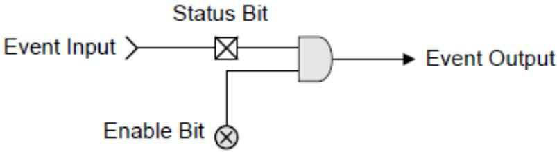  
Fig. 4.4: Block Diagram of a Status/Enable Cell

Notice that the status bit, which hardware sets by the Event Input being set in this example, can only be cleared by software writing a 1 to its bit position. Also, the enable bit has no effect on the setting or resetting of the status bit; it only determines if the SET status bit will generate an “Event Output,” which generates an SCI when set if its enable bit is set.

ACPI also defines register groupings. A register grouping consists of two register blocks, with two pointers to two different blocks of registers, where each bit location within a register grouping is fixed and cannot be changed. The bits within a register grouping, which have fixed bit positions, can be split between the two register blocks. This allows the bits within a register grouping to reside in either or both register blocks, facilitating the ability to map bits within several different chips to the same register thus providing the programming model with a single register grouping bit structure.

OSPM treats a register grouping as a single register; but located in multiple places. To read a register grouping, OSPM will read the “A” register block, followed by the “B” register block, and then will logically “OR” the two results together (the SLP\_TYP field is an exception to this rule). Reserved bits, or unused bits within a register block always return zero for reads and have no side effects for writes (which is a requirement).

The SLP\_TYPx field can be different for each register grouping. The respective sleeping object \_Sx contains a SLP\_TYPa and a SLP\_TYPb field. That is, the object returns a package with two integer values of 0-7 in it. OSPM will always write the SLP\_TYPa value to the "A" register block followed by the SLP\_TYPb value within the field to the "B" register block. All other bit locations will be written with the same value. Also, OSPM does not read the SLP\_TYPx value but throws it away.

If the SLP\_TYP field (or its parent register) is not described by FADT or used for the selected Sx transition, then the relevant \_Sx must still be evaluated (if present), but the return value of the \_Sx shall go unused.

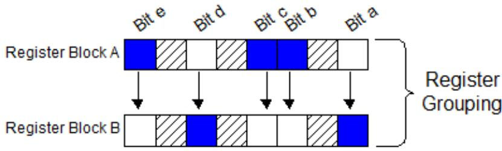  
Fig. 4.5: Example Fixed Hardware Feature Register Grouping

As an example, the above diagram represents a register grouping consisting of register block A and register block b. Bits “a” and “d” are implemented in register block B and register block A returns a zero for these bit positions. Bits “b”, “c” and “e” are implemented in register block A and register block B returns a zero for these bit positions. All reserved or ignored bits return their defined ACPI values.

When accessing this register grouping, OSPM must read register block a, followed by reading register block b. OSPM then does a logical OR of the two registers and then operates on the results.

When writing to this register grouping, OSPM will write the desired value to register group A followed by writing the same value to register group B.

ACPI defines the following fixed hardware register blocks. Each register block gets a separate pointer from the FADT. These addresses are set by the OEM as static resources, so they are never changed–OSPM cannot re-map ACPI resources. The following register blocks are defined:

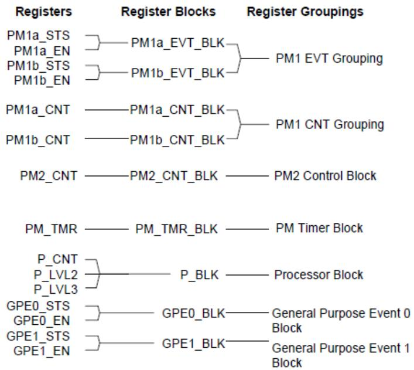  
Fig. 4.6: Register Blocks versus Register Groupings

The PM1 EVT grouping consists of the PM1a\_EVT and PM1b\_EVT register blocks, which contain the fixed hardware feature event bits. Each event register block (if implemented) contains two registers: a status register and an enable register. Each register grouping has a defined bit position that cannot be changed; however, the bit can be implemented in either register block (A or B). The A and B register blocks for the events allow chipsets to vary the partitioning of events into two or more chips. For read operations, OSPM will generate a read to the associated A and B registers, OR the two values together, and then operate on this result. For write operations, OSPM will write the value to the associated register in both register blocks. Therefore, there are two rules to follow when implementing event registers:

\- Reserved or unimplemented bits always return zero (control or enable).

\- Writes to reserved or unimplemented bits have no affect.

The PM1 CNT grouping contains the fixed hardware feature control bits and consists of the PM1a\_CNT\_BLK and PM1b\_CNT\_BLK register blocks. Each register block is associated with a single control register. Each register grouping has a defined bit position that cannot be changed; however, the bit can be implemented in either register block (A or B). There are two rules to follow when implementing CNT registers:

\- Reserved or unimplemented bits always return zero (control or enable).

\- Writes to reserved or unimplemented bits have no affect.

The PM2\_CNT\_BLK register block currently contains a single bit for the arbiter disable function. The general-purpose event register contains the event programming model for generic features. All generic events, just as fixed events, generate SCIs. Generic event status bits can reside anywhere; however, the top-level generic event resides in one of the general-purpose register blocks. Any generic feature event status not in the general-purpose register space is considered a child or sibling status bit, whose parent status bit is in the general-purpose event register space. Notice that it is possible to have N levels of general-purpose events prior to hitting the GPE event status.

General-purpose event registers are described by two register blocks: The GPE0\_BLK or the GPE1\_BLK. Each register block is pointed to separately from within the FADT. Each register block is further broken into two registers: GPEx\_STS and GPEx\_EN. The status and enable registers in the general-purpose event registers follow the event model for the fixed hardware event registers.

## 4.8.1 ACPI Register Summary

The following tables summarize the ACPI registers:

Table 4.2: PM1 Event Registers

<table><tr><td>Register</td><td>Size (Bytes)</td><td>Address (relative to register block)</td></tr><tr><td>PM1a_STS</td><td>PM1_EVT_LEN/2</td><td></td></tr><tr><td>PM1a_EN</td><td>PM1_EVT_LEN/2</td><td>+PM1_EVT_LEN/2</td></tr><tr><td>PM1b_STS</td><td>PM1_EVT_LEN/2</td><td></td></tr><tr><td>PM1b_EN</td><td>PM1_EVT_LEN/2</td><td>+PM1_EVT_LEN/2</td></tr></table>

Table 4.3: PM1 Control Registers

<table><tr><td>Register</td><td>Size (Bytes)</td><td>Address (relative to register block)</td></tr><tr><td>PM1_CNTa</td><td>PM1_CNT_LEN</td><td></td></tr><tr><td>PM1_CNTb</td><td>PM1_CNT_LEN</td><td></td></tr></table>

Table 4.4: PM2 Control Register

<table><tr><td>Register</td><td>Size (Bytes)</td><td>Address (relative to register block)</td></tr><tr><td>PM2_CNT</td><td>PM2_CNT_LEN</td><td></td></tr></table>

Table 4.5: PM Timer Register

<table><tr><td>Register</td><td>Size (Bytes)</td><td>Address (relative to register block)</td></tr><tr><td>PM_TMR</td><td>PM_TMR_LEN</td><td></td></tr></table>

Table 4.6: Processor Control Registers

<table><tr><td>Register</td><td>Size (Bytes)</td><td>Address (relative to register block)</td></tr><tr><td>P_CNT</td><td>4</td><td>Eitheror specified by the PTC object - see Processor Throttling Controls</td></tr><tr><td>P_LVL2</td><td>1</td><td>+4h</td></tr><tr><td>P_LVL3</td><td>1</td><td>+5h</td></tr></table>

Table 4.7: General-Purpose Event Registers

<table><tr><td>Register</td><td>Size (Bytes)</td><td>Address (relative to register block)</td></tr><tr><td>GPE0_STS</td><td>GPE0_LEN/2</td><td></td></tr><tr><td>GPE0_EN</td><td>GPE0_LEN/2</td><td>+GPE0_LEN/2</td></tr><tr><td>GPE1_STS</td><td>GPE1_LEN/2</td><td></td></tr><tr><td>GPE1_EN</td><td>GPE1_LEN/2</td><td>+GPE1_LEN/2</td></tr></table>

## 4.8.1.1 PM1 Event Registers

The PM1 event register grouping contains two register blocks: the PM1a\_EVT\_BLK is a required register block when the following ACPI interface categories are required by a class specific platform design guide:

• Power management timer control/status

\- Processor power state control/status

• Global Lock related interfaces

\- Power or Sleep button (fixed register interfaces)

\- System power state controls (sleeping/wake control)

The PM1b\_EVT\_BLK is an optional register block. Each register block has a unique 32-bit pointer in the Fixed ACPI Table (FADT) to allow the PM1 event bits to be partitioned between two chips. If the PM1b\_EVT\_BLK is not supported, its pointer contains a value of zero in the FADT.

Each register block in the PM1 event grouping contains two registers that are required to be the same size: the PM1x\_STS and PM1x\_EN (where x can be “a” or “b”). The length of the registers is variable and is described by the PM1\_EVT\_LEN field in the FADT, which indicates the total length of the register block in bytes. Hence if a length of “4” is given, this indicates that each register contains two bytes of I/O space. The PM1 event register block has a minimum size of 4 bytes.

## 4.8.1.2 PM1 Control Registers

The PM1 control register grouping contains two register blocks: the PM1a\_CNT\_BLK is a required register block when the following ACPI interface categories are required by a class specific platform design guide:

• SCI/SMI routing control/status for power management and general-purpose events

\- Processor power state control/status

• Global Lock related interfaces

\- System power state controls (sleeping/wake control)

The PM1b\_CNT\_BLK is an optional register block. Each register block has a unique 32-bit pointer in the Fixed ACPI Table (FADT) to allow the PM1 event bits to be partitioned between two chips. If the PM1b\_CNT\_BLK is not supported, its pointer contains a value of zero in the FADT.

Each register block in the PM1 control grouping contains a single register: the PM1x\_CNT. The length of the register is variable and is described by the PM1\_CNT\_LEN field in the FADT, which indicates the total length of the register block in bytes. The PM1 control register block must have a minimum size of 2 bytes.

## 4.8.1.3 PM2 Control Register

The PM2 control register is contained in the PM2\_CNT\_BLK register block. The FADT contains a length variable for this register block (PM2\_CNT\_LEN) that is equal to the size in bytes of the PM2\_CNT register (the only register in this register block). This register block is optional, if not supported its block pointer and length contain a value of zero.

## 4.8.1.4 PM Timer Register

The PM timer register is contained in the PM\_TMR\_BLK register block. It is an optional register block that must be implemented when the power management timer control/status ACPI interface category is required by a class specific platform design guide.

If defined, this register block contains the register that returns the running value of the power management timer. The FADT also contains a length variable for this register block (PM\_TMR\_LEN) that is equal to the size in bytes of the PM\_TMR register (the only register in this register block).

## 4.8.1.5 Processor Control Block (P\_BLK)

There is an optional processor control register block for each processor in the system. As this is a homogeneous feature, all processors must have the same level of support. The ACPI OS will revert to the lowest common denominator of processor control block support. The processor control block contains the processor control register (P\_CNT-a 32-bit performance control configuration register), and the P\_LVL2 and P\_LVL3 CPU sleep state control registers. The 32-bit P\_CNT register controls the behavior of the processor clock logic for that processor, the P\_LVL2 register is used to place the CPU into the C2 state, and the P\_LVL3 register is used to place the processor into the C3 state.

## 4.8.1.6 General-Purpose Event Registers

The general-purpose event registers contain the root level events for all generic features. To facilitate the flexibility of partitioning the root events, ACPI provides for two different general-purpose event blocks: GPE0\_BLK and GPE1\_BLK. These are separate register blocks and are not a register grouping, because there is no need to maintain an orthogonal bit arrangement. Also, each register block contains its own length variable in the FADT, where GPE0\_LEN and GPE1\_LEN represent the length in bytes of each register block.

Each register block contains two registers of equal length: GPEx\_STS and GPEx\_EN (where x is 0 or 1). The length of the GPE0\_STS and GPE0\_EN registers is equal to half the GPE0\_LEN. The length of the GPE1\_STS and GPE1\_EN registers is equal to half the GPE1\_LEN. If a generic register block is not supported then its respective block pointer and block length values in the FADT table contain zeros. The GPE0\_LEN and GPE1\_LEN do not need to be the same size.

## 4.8.2 Fixed Hardware Features

This section describes the fixed hardware features defined by ACPI.

## 4.8.2.1 Power Management Timer

The ACPI specification defines an optional power management timer that provides an accurate time value that can be used by system software to measure and profile system idleness (along with other tasks). The power management timer provides an accurate time function while the system is in the working (G0) state. To allow software to extend the number of bits in the timer, the power management timer generates an interrupt when the last bit of the timer changes (from 0 to 1 or 1 to 0). ACPI supports either a 24-bit or 32-bit power management timer. The PM Timer is accessed directly by OSPM, and its programming model is contained in fixed register space. The programming model can be partitioned in up to three different register blocks. The event bits are contained in the PM1\_EVT register grouping, which has two register blocks, and the timer value can be accessed through the PM\_TMR\_BLK register block. A block diagram of the power management timer is illustrated in the following figure.

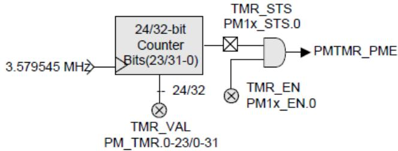  
Fig. 4.7: Power Management Timer

The power management timer is a 24-bit or 32-bit fixed rate free running count-up timer that runs off a 3.579545 MHz clock. The ACPI OS checks the FADT to determine whether the PM Timer is a 32-bit or 24-bit timer. The programming model for the PM Timer consists of event logic, and a read port to the counter value. The event logic consists of an event status and enable bit. The status bit is set any time the last bit of the timer (bit 23 or bit 31) goes from set to clear or clear to set. If the TMR\_EN bit is set, then the setting of the TMR\_STS will generate an ACPI event in the PM1\_EVT register grouping (referred to as PMTMR\_PME in the diagram). The event logic is only used to emulate a larger timer.

OSPM uses the read-only TMR\_VAL field (in the PM TMR register grouping) to read the current value of the timer. OSPM never assumes an initial value of the TMR\_VAL field; instead, it reads an initial TMR\_VAL upon loading OSPM and assumes that the timer is counting. It is allowable to stop the Timer when the system transitions out of the working (G0/S0) state. The only timer reset requirement is that the timer functions while in the working state.

The PM Timer's programming model is implemented as a fixed hardware feature to increase the accuracy of reading the timer.

## 4.8.2.2 Console Buttons

ACPI defines user-initiated events to request OSPM to transition the platform between the G0 working state and the G1 sleeping, G2 soft off and G3 mechanical off states. ACPI also defines a recommended mechanism to unconditionally transition the platform from a hung G0 working state to the G2 soft-off state.

ACPI operating systems use power button events to determine when the user is present. As such, these ACPI events are associated with buttons in the ACPI specification.

The ACPI specification supports two button models:

\- A single-button model that generates an event for both sleeping and entering the soft-off state. The function of the button can be configured using OSPM UI.

\- A dual-button model where the power button generates a soft-off transition request and a sleep button generates a sleep transition request. The type of button implies the function of the button.

Control of these button events is either through the fixed hardware programming model or the generic hardware programming model (control method based). The fixed hardware programming model has the advantage that OSPM can access the button at any time, including when the system is crashed. In a crashed system with a fixed hardware power button, OSPM can make a “best” effort to determine whether the power button has been pressed to transition to the system to the soft-off state, because it doesn’t require the AML interpreter to access the event bits.

## 4.8.2.2.1 Power Button

The power button logic can be used in one of two models: single button or dual button. In the single-button model, the user button acts as both a power button for transitioning the system between the G0 and G2 states and a sleep button for transitioning the system between the G0 and G1 states. The action of the user pressing the button is determined by software policy or user settings. In the dual-button model, there are separate buttons for sleeping and power control. Although the buttons still generate events that cause software to take an action, the function of the button is now dedicated: the sleep button generates a sleep request to OSPM and the power button generates a wake request.

Support for a power button is indicated by a combination of the PWR\_BUTTON flag and the power button device object, as shown in the following:

Table 4.8: Power Button Support

<table><tr><td>Indicated Support</td><td>PWR_BUTTON Flag</td><td>Power Button Device Object</td></tr><tr><td>Fixed hardware power button</td><td>Clear</td><td>Absent</td></tr><tr><td>Control method power button</td><td>Set</td><td>Present</td></tr></table>

The power button can also have an additional capability to unconditionally transition the system from a hung working state to the G2 soft-off state. In the case where OSPM event handler is no longer able to respond to power button events, the power button override feature provides a back-up mechanism to unconditionally transition the system to the soft-off state. This feature can be used when the platform doesn't have a mechanical off button, which can also provide this function. ACPI defines that holding the power button active for four seconds or longer will generate a power button override event.

## 4.8.2.2.1.1 Fixed Power Button

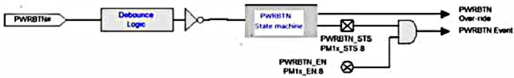  
Fig. 4.8: Fixed Power Button Logic

The fixed hardware power button has its event programming model in the PM1x\_EVT\_BLK. This logic consists of a single enable bit and sticky status bit. When the user presses the power button, the power button status bit (PWRBTN\_STS) is unconditionally set. If the power button enable bit (PWRBTN\_EN) is set and the power button status bit is set (PWRBTN\_STS) due to a button press while the system is in the G0 state, then an SCI is generated. OSPM responds to the event by clearing the PWRBTN\_STS bit. The power button logic provides debounce logic that sets the PWRBTN\_STS bit on the button press “edge.”

While the system is in the G1 or G2 global states (S1, S2, S3, S4 or S5 states), any further power button press after the button press that transitioned the system into the sleeping state unconditionally sets the power button status bit and wakes the system, regardless of the value of the power button enable bit. OSPM responds by clearing the power button status bit and waking the system.

## 4.8.2.2.1.2 Control Method Power Button

The power button programming model can also use the generic hardware programming model. This allows the power button to reside in any of the generic hardware address spaces (for example, the embedded controller) instead of fixed space. If the power button is implemented using generic hardware, then the OEM needs to define the power button as a device with an \_HID object value of “PNP0C0C,” which then identifies this device as the power button to OSPM. The AML event handler then generates a Notify command to notify OSPM that a power button event was generated. While the system is in the working state, a power button press is a user request to transition the system into either the sleeping (G1) or soft-off state (G2). In these cases, the power button event handler issues the Notify command with the device specific code of 0x80. This indicates to OSPM to pass control to the power button driver (PNP0C0C) with the knowledge that a transition out of the G0 state is being requested. Upon waking from a G1 sleeping state, the AML event handler generates a notify command with the code of 0x2 to indicate it was responsible for waking the system.

The power button device needs to be declared as a device within the ACPI Namespace for the platform and only requires an \_HID. An example definition follows.

This example ASL code performs the following:

\- Creates a device named “PWRB” and associates the Plug and Play identifier (through the \_HID object) of “PNP0C0C.”

\- The Plug and Play identifier associates this device object with the power button driver.

\- Creates an operational region for the control method power button's programming model: System I/O space at 0x200.

\- Fields that are not accessed are written as zeros. These status bits clear upon writing a 1 to their bit position, therefore preserved would fail in this case.

\- Creates a field within the operational region for the power button status bit (called PBP). In this case the power button status bit is a child of the general-purpose event status bit 0. When this bit is set, it is the responsibility of the ASL-code to clear it (OSPM clears the general-purpose status bits). The address of the status bit is 0x200.0 (bit 0 at address 0x200).

\- Creates an additional status bit called PBW for the power button wake event. This is the next bit and its physical address would be 0x200.1 (bit 1 at address 0x200).

\- Generates an event handler for the power button that is connected to bit 0 of the general-purpose event status register 0. The event handler does the following:

\- Clears the power button status bit in hardware (writes a one to it).

\- Notifies OSPM of the event by calling the Notify command passing the power button object and the device specific event indicator 0x80.

```swift
// Define a control method power button
Device(\_SB.PWRB)
{
    Name(_HID, EISAID("PNP0C0C"))
    Name(_PRW, Package(){0, 0x4})
    OperationRegion(\PHO, SystemIO, 0x200, 0x1)
    Field(\PHO, ByteAcc, NoLock, WriteAsZeros)
    {
    PBP, 1, // sleep/off request
    PBW, 1 // wakeup request
    }
}

Scope(\_GPE) // Root level event handlers
{
    Method(_L00)
    {
    // uses bit 0 of GP0_STS register
    If (PBP)
    {
    PBP = One // clear power button status
    Notify(\_SB.PWRB, 0x80) // Notify OS of event
    }

    If (\PBW)
    {
    PBW = One
    Notify(\_SB.PWRB, 0x2)
    }
    }
}
```

## 4.8.2.2.1.3 Power Button Override

The ACPI specification also allows that if the user presses the power button for more than four seconds while the system is in the working state, a hardware event is generated and the system will transition to the soft-off state. This hardware event is called a power button override. In reaction to the power button override event, the hardware clears the power button status bit (PWRBTN\_STS).

## 4.8.2.2.2 Sleep Button

When using the two button model, ACPI supports a second button that when pressed will request OSPM to transition the platform between the G0 working and G1 sleeping states. Support for a sleep button is indicated by a combination of the SLEEP\_BUTTON flag and the sleep button device object:

Table 4.9: Sleep Button Support

<table><tr><td>Indicated Support</td><td>SLEEP_BUTTON Flag</td><td>Sleep Button Device Object</td></tr><tr><td>No sleep button</td><td>Set</td><td>Absent</td></tr><tr><td>Fixed hardware sleep button</td><td>Clear</td><td>Absent</td></tr><tr><td>Control method sleep button</td><td>Set</td><td>Present</td></tr></table>

## 4.8.2.2.2.1 Fixed Hardware Sleep Button

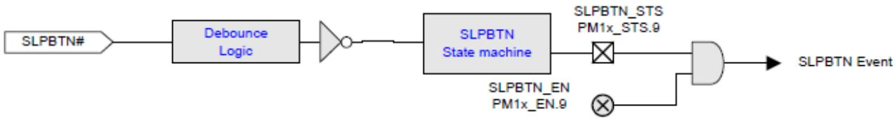  
Fig. 4.9: Fixed Hardware Sleep Button Logic

The fixed hardware sleep button has its event programming model in the PM1x\_EVT\_BLK. This logic consists of a single enable bit and sticky status bit. When the user presses the sleep button, the sleep button status bit (SLPBTN\_STS) is unconditionally set. Additionally, if the sleep button enable bit (SLPBTN\_EN) is set, and the sleep button status bit is set (SLPBTN\_STS, due to a button press) while the system is in the G0 state, then an SCI is generated. OSPM responds to the event by clearing the SLPBTN\_STS bit. The sleep button logic provides debounce logic that sets the SLPBTN\_STS bit on the button press “edge.”

While the system is sleeping (in either the S0, S1, S2, S3 or S4 states), any further sleep button press (after the button press that caused the system transition into the sleeping state) sets the sleep button status bit (SLPBTN\_STS) and wakes the system if the SLP\_EN bit is set. OSPM responds by clearing the sleep button status bit and waking the system.

## 4.8.2.2.2.2 Control Method Sleep Button

The sleep button programming model can also use the generic hardware programming model. This allows the sleep button to reside in any of the generic hardware address spaces (for example, the embedded controller) instead of fixed space. If the sleep button is implemented via generic hardware, then the OEM needs to define the sleep button as a device with an \_HID object value of "PNP0C0E", which then identifies this device as the sleep button to OSPM. The AML event handler then generates a Notify command to notify OSPM that a sleep button event was generated. While in the working state, a sleep button press is a user request to transition the system into the sleeping (G1) state. In these cases the sleep button event handler issues the Notify command with the device specific code of 0x80. This will indicate to OSPM to pass control to the sleep button driver (PNP0C0E) with the knowledge that the user is requesting a transition out of the G0 state. Upon waking-up from a G1 sleeping state, the AML event handler generates a Notify command with the code of 0x2 to indicate it was responsible for waking the system.

The sleep button device needs to be declared as a device within the ACPI Namespace for the platform and only requires an \_HID. An example definition is shown below.

The AML code below does the following:

\- Creates a device named “SLPB” and associates the Plug and Play identifier (through the \_HID object) of “PNP0C0E.”

\- The Plug and Play identifier associates this device object with the sleep button driver.

\- Creates an operational region for the control method sleep button's programming model: System I/O space at 0x201.

\- Fields that are not accessed are written as “1s” (these status bits clear upon writing a “1” to their bit position, hence preserved would fail in this case).

\- Creates a field within the operational region for the sleep button status bit (called PBP). In this case the sleep button status bit is a child of the general-purpose status bit 0. When this bit is set it is the responsibility of the AML code to clear it (OSPM clears the general-purpose status bits). The address of the status bit is 0x201.0 (bit 0 at address 0x201).

\- Creates an additional status bit called PBW for the sleep button wake event. This is the next bit and its physical address would be 0x201.1 (bit 1 at address 0x201).

\- Generates an event handler for the sleep button that is connected to bit 0 of the general-purpose status register 0. The event handler does the following:

\- Clears the sleep button status bit in hardware (writes a “1” to it).

\- Notifies OSPM of the event by calling the Notify command passing the sleep button object and the device specific event indicator 0x80.

```txt
// Define a control method sleep button
Device(\_SB.SLPB)
{
    Name (_HID, EISAID("PNP0C0E"))
    Name (_PRW, Package(){0x01, 0x04})
    OperationRegion (\Boo, SystemIO, 0x201, 0x1)
    Field (\Boo, ByteAcc, NoLock, WriteAsZeros)
    {
    SBP, 1, // sleep request
    SBW, 1 // wakeup request
    }
}
```

(continues on next page)

```txt
Scope (\_GPE)    // Root level event handlers
{
    Method (_L01)    // uses bit 1 of GP0_STS register
    {
    If (\SBP)
    {
    \SBP = One    // clear sleep button status
    Notify(\_SB.SLPB, 0x80)    // Notify OS of event
    }
    If (\SBW)
    {
    \SBW = One
    Notify(\_SB.SLPB, 0x2)
    }
    }
}
```

## 4.8.2.3 Sleeping/Wake Control

The sleeping/wake logic consists of logic that will sequence the system into the defined low-power hardware sleeping state (S1-S4) or soft-off state (S5) and will wake the system back to the working state upon a wake event. Notice that the S4BIOS state is entered in a different manner (for more information, see The S4BIOS Transition).

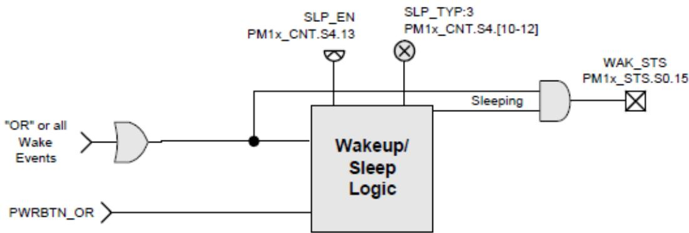  
Fig. 4.10: Sleeping/Wake Logic

The logic is controlled via two bit fields: Sleep Enable (SLP\_EN) and Sleep Type (SLP\_TYPx). The type of sleep or soft-off state desired is programmed into the SLP\_TYPx field and upon assertion of the SLP\_EN the hardware will sequence the system into the defined sleeping state. OSPM gets values for the SLP\_TYPx field from the \_Sx objects defined in the static definition block. If the object is missing OSPM assumes the hardware does not support that sleeping state. Prior to entering the desired sleeping state, OSPM will read the designated \_Sx object and place this value in the SLP\_TYP field.

Additionally ACPI defines a fail-safe Off protocol called the “power button override,” which allows the user to initiate an Off sequence in the case where the system software is no longer able to recover the system (the system has hung). ACPI defines that this sequence be initiated by the user pressing the power button for over 4 seconds, at which point the hardware unconditionally sequences the system to the Off state. This logic is represented by the PWRBTN\_OR signal coming into the sleep logic.

While in any of the sleeping states (G1), an enabled “Wake” event will cause the hardware to sequence the system back to the working state (G0). The “Wake Status” bit (WAK\_STS) is provided for OSPM to “spin-on” after setting the SLP\_EN/SLP\_TYP bit fields. When waking from the S1 sleeping state, execution control is passed backed to OSPM immediately, whereas when waking from the S2-S4 states execution control is passed to the platform boot firmware (execution begins at the CPU's reset vector). The WAK\_STS bit provides a mechanism to separate OSPM's sleeping and waking code during an S1 sequence. When the hardware has sequenced the system into the sleeping state (defined here as the processor is no longer able to execute instructions), any enabled wake event is allowed to set the WAK\_STS bit and sequence the system back on (to the G0 state). If the system does not support the S1 sleeping state, the WAK\_STS bit can always return zero.

If more than a single sleeping state is supported, then the sleeping/wake logic is required to be able to dynamically sequence between the different sleeping states. This is accomplished by waking the system; OSPM programs the new sleep state into the SLP\_TYP field, and then sets the SLP\_EN bit-placing the system again in the sleeping state.

## 4.8.2.4 Real Time Clock Alarm

If implemented, the Real Time Clock (RTC) alarm must generate a hardware wake event when in the sleeping state. The RTC can be programmed to generate an alarm. An enabled RTC alarm can be used to generate a wake event when the system is in a sleeping state. ACPI provides for additional hardware to support OSPM in determining that the RTC was the source of the wake event: the RTC\_STS and RTC\_EN bits. Although these bits are optional, if supported they must be implemented as described here.

If the RTC\_STS and RTC\_EN bits are not supported, OSPM will attempt to identify the RTC as a possible wake source; however, it might miss certain wake events. If implemented, the RTC wake feature is required to work in the following sleeping states: S1-S3. S4 wake is optional and supported through the RTC\_S4 flag within the FADT (if set, then the platform supports RTC wake in the S4 state) \*.

Note

The G2/S5 “soft off” and the G3 “mechanical off” states are not sleeping states. The OS will disable the RTC\_EN bit prior to entering the G2/S5 or G3 states regardless.

When the RTC generates a wake event the RTC\_STS bit will be set. If the RTC\_EN bit is set, an RTC hardware power management event will be generated (which will wake the system from a sleeping state, provided the battery low signal is not asserted).

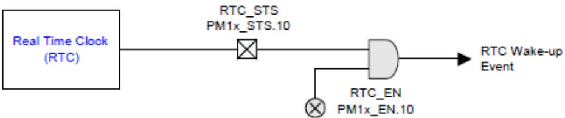  
Fig. 4.11: RTC Alarm

The RTC wake event status and enable bits are an optional fixed hardware feature and a flag within the FADT (FIX\_RTC) indicates if the register bits are to be used by OSPM. If the RTC wake event status and enable bits are implemented in fixed hardware, OSPM can determine if the RTC was the source of the wake event without loading the entire OS. This also gives the platform the capability of indicating an RTC wake source without consuming a GPE bit, as would be required if RTC wake was not implemented using the fixed hardware RTC feature. If the fixed hardware feature event bits are not supported, then OSPM will attempt to determine this by reading the RTC's status field. If the platform implements the RTC fixed hardware feature, and this hardware consumes resources, the \_FIX method can be used to correlate these resources with the fixed hardware. See \_FIX (Fixed Register Resource Provider), for details.

OSPM supports enhancements over the existing RTC device (which only supports a 99 year date and 24-hour alarm). Optional extensions are provided for the following features:

## Day Alarm

The DAY\_ALRM field points to an optional CMOS RAM location that selects the day within the month to generate an RTC alarm.

## Month Alarm

The MON\_ALRM field points to an optional CMOS RAM location that selects the month within the year to generate an RTC alarm.

## Centenary Value

The CENT field points to an optional CMOS RAM location that represents the centenary value of the date (thousands and hundreds of years).

The RTC\_STS bit may be set through the RTC interrupt (IRQ8 in IA-PC architecture systems). OSPM will insure that the periodic and update interrupt sources are disabled prior to sleeping. This allows the RTC's interrupt pin to serve as the source for the RTC\_STS bit generation. Note however that if the RTC interrupt pin is used for RTC\_STS generation, the RTC\_STS bit value may not be accurate when waking from S4. If this value is accurate when waking from S4, the platform should set the S4\_RTC\_STS\_VALID flag, so that OSPM can utilize the RTC\_STS information.

Table 4.10: Alarm Field Decodings within the FADT

<table><tr><td>Field</td><td>Value</td><td>Address (Location) in RTC CMOS RAM (Must be Bank 0)</td></tr><tr><td rowspan="2">DAY_ALRM</td><td></td><td></td></tr><tr><td>Eight bit value that can represent 0x01-0x31 days in BCD or 0x01-0x1F days in binary. Bits 6 and 7 of this field are treated as Ignored by software. The RTC is initialized such that this field contains a “don’t care” value when the platform firmware switches from legacy to ACPI mode. A don’t care value can be any unused value (not 0x1-0x31 BCD or 0x01-0x1F hex) that the RTC reverts back to a 24 hour alarm.</td><td>The DAY_ALRM field in the FADT will contain a non-zero value that represents an offset into the RTC’s CMOS RAM area that contains the day alarm value. A value of zero in the DAY_ALRM field indicates that the day alarm feature is not supported.</td></tr><tr><td rowspan="2">MON_ALRM</td><td></td><td></td></tr><tr><td>Eight bit value that can represent 01-12 months in BCD or 0x01-0xC months in binary. The RTC is initialized such that this field contains a don’t care value when the platform firmware switches from legacy to ACPI mode. A “don’t care” value can be any unused value (not 1-12 BCD or x01-xC hex) that the RTC reverts back to a 24 hour alarm and/or 31 day alarm).</td><td>The MON_ALRM field in the FADT will contain a non-zero value that represents an offset into the RTC’s CMOS RAM area that contains the month alarm value. A value of zero in the MON_ALRM field indicates that the month alarm feature is not supported. If the month alarm is supported, the day alarm function must also be supported.</td></tr></table>

continues on next page

Table 4.10 – continued from previous page

<table><tr><td>Field</td><td>Value</td><td>Address (Location) in RTC CMOS RAM (Must be Bank 0)</td></tr><tr><td rowspan="2">CENTURY</td><td></td><td></td></tr><tr><td>8-bit BCD or binary value. This value indicates the thousand year and hundred year (Centenary) variables of the date in BCD (19 for this century, 20 for the next) or binary (x13 for this century, x14 for the next).</td><td>The CENTURY field in the FADT will contain a non-zero value that represents an offset into the RTC’s CMOS RAM area that contains the Centenary value for the date. A value of zero in the CENTURY field indicates that the Centenary value is not supported by this RTC.</td></tr></table>

## 4.8.2.5 Legacy/ACPI Select and the SCI Interrupt

As mentioned previously, power management events are generated to initiate an interrupt or hardware sequence. ACPI operating systems use the SCI interrupt handler to respond to events, while legacy systems use some type of transparent interrupt handler to respond to these events (that is, an SMI interrupt handler). ACPI-compatible hardware can choose to support both legacy and ACPI modes or just an ACPI mode. Legacy hardware is needed to support these features for non-ACPI-compatible operating systems. When the ACPI OS loads, it scans the platform firmware tables to determine that the hardware supports ACPI, and then if the it finds the SCI\_EN bit reset (indicating that ACPI is not enabled), issues an ACPI activate command to the SMI handler through the SMI command port. The platform firmware acknowledges the switching to the ACPI model of power management by setting the SCI\_EN bit (this bit can also be used to switch over the event mechanism as illustrated below):

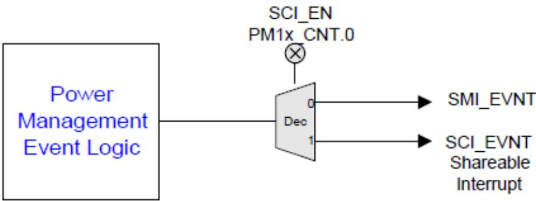  
Fig. 4.12: Power Management Events to SMI/SCI Control Logic

The interrupt events (those that generate SMIs in legacy mode and SCIs in ACPI mode) are sent through a decoder controlled by the SCI\_EN bit. For legacy mode this bit is reset, which routes the interrupt events to the SMI interrupt logic. For ACPI mode this bit is set, which routes interrupt events to the SCI interrupt logic. This bit always returns set for ACPI-compatible hardware that does not support a legacy power management mode (in other words, the bit is wired to read as “1” and ignore writes).

The SCI interrupt is defined to be a shareable interrupt and is connected to an OS visible interrupt that uses a shareable protocol. The FADT has an entry that indicates what interrupt the SCI interrupt is mapped to (see System Description Table Header).

If the ACPI platform supports both legacy and ACPI modes, it has a register that generates a hardware event (for example, SMI for IA-PC processors). OSPM uses this register to make the hardware switch in and out of ACPI mode.

Within the FADT are three values that signify the address (SMI\_CMD) of this port and the data value written to enable the ACPI state (ACPI\_ENABLE), and to disable the ACPI state (ACPI\_DISABLE).

To transition an ACPI/Legacy platform from the Legacy mode to the ACPI mode the following would occur:

\- ACPI driver checks that the SCI\_EN bit is zero, and that it is in the Legacy mode.

\- OSPM does an OUT to the SMI\_CMD port with the data in the ACPI\_ENABLE field of the FADT.

\- OSPM polls the SCI\_EN bit until it is sampled as SET.

To transition an ACPI/Legacy platform from the ACPI mode to the Legacy mode the following would occur:

\- ACPI driver checks that the SCI\_EN bit is one, and that it is in the ACPI mode.

\- OSPM does an OUT to the SMI\_CMD port with the data in the ACPI\_DISABLE field of the FADT.

\- OSPM polls the SCI\_EN bit until it is sampled as RESET.

Platforms that only support ACPI always return a 1 for the SCI\_EN bit. In this case OSPM skips the Legacy to ACPI transition stated above.

## 4.8.2.6 Processor Control

The ACPI specification defines several processor controls including power state control, throttling control, and performance state control. See Processor Configuration and Control for a complete description of the processor controls.

## 4.8.3 Fixed Hardware Registers

The fixed hardware registers are manipulated directly by OSPM. The following sections describe fixed hardware features under the programming model. OSPM owns all the fixed hardware resource registers; these registers cannot be manipulated by AML code. Registers are accessed with any width up to its register width (byte granular).

## 4.8.3.1 PM1 Event Grouping

The PM1 Event Grouping has a set of bits that can be distributed between two different register blocks. This allows these registers to be partitioned between two chips, or all placed in a single chip. Although the bits can be split between the two register blocks (each register block has a unique pointer within the FADT), the bit positions are maintained. The register block with unimplemented bits (that is, those implemented in the other register block) always returns zeros, and writes have no side effects.

## 4.8.3.1.1 PM1 Status Registers

Register Location: <PM1a\_EVT\_BLK / PM1b\_EVT\_BLK> System I/O or Memory Space

Default Value: 00h

Attribute: Read/Write

Size: PM1\_EVT\_LEN / 2

The PM1 status registers contain the fixed hardware feature status bits. The bits can be split between two registers: PM1a\_STS or PM1b\_STS. Each register grouping can be at a different 32-bit aligned address and is pointed to by the PM1a\_EVT\_BLK or PM1b\_EVT\_BLK. The values for these pointers to the register space are found in the FADT. Accesses to the PM1 status registers are done through byte or word accesses.

For ACPI/legacy systems, when transitioning from the legacy to the G0 working state this register is cleared by platform firmware prior to setting the SCI\_EN bit (and thus passing control to OSPM). For ACPI only platforms (where SCI\_EN is always set), when transitioning from either the mechanical off (G3) or soft-off state to the G0 working state this register is cleared prior to entering the G0 working state.

This register contains optional features enabled or disabled within the FADT. If the FADT indicates that the feature is not supported as a fixed hardware feature, then software treats these bits as ignored.

Table 4.11: PM1 Status Registers Fixed Hardware Feature Status Bits

<table><tr><td>Bit</td><td>Name</td><td>Description</td></tr><tr><td>0</td><td>TMR_STS</td><td>This is the timer carry status bit. This bit gets set any time the most significant bit of a 24/32-bit counter changes from clear to set or set to clear. While TMR_EN and TMR_STS are set, an interrupt event is raised.</td></tr><tr><td>1-3</td><td>Reserved</td><td>Reserved</td></tr><tr><td>4</td><td>BM_STS</td><td>This is the bus master status bit. This bit is set any time a system bus master requests the system bus, and can only be cleared by writing a “1” to this bit position. Notice that this bit reflects bus master activity, not CPU activity (this bit monitors any bus master that can cause an incoherent cache for a processor in the C3 state when the bus master performs a memory transaction).</td></tr><tr><td>5</td><td>GBL_STS</td><td>This bit is set when an SCI is generated due to the platform runtime firmware wanting the attention of the SCI handler. Platform runtime firmware will have a control bit (somewhere within its address space) that will raise an SCI and set this bit. This bit is set in response to the platform runtime firmware releasing control of the Global Lock and having seen the pending bit set.</td></tr><tr><td>6-7</td><td>Reserved</td><td>Reserved. These bits always return a value of zero.</td></tr><tr><td>8</td><td>PWRBTN_STS</td><td>This optional bit is set when the Power Button is pressed. In the system working state, while PWRBTN_EN and PWRBTN_STS are both set, an interrupt event is raised. In the sleep or soft-off state, a wake event is generated when the power button is pressed (regardless of the PWRBTN_EN bit setting). This bit is only set by hardware and can only be reset by software writing a “1” to this bit position. ACPI defines an optional mechanism for unconditional transitioning a system that has stopped working from the G0 working state into the G2 soft-off state called the power button override. If the Power Button is held active for more than four seconds, this bit is cleared by hardware and the system transitions into the G2/S5 Soft Off state (unconditionally). Support for the power button is indicated by the PWR_BUTTON flag in the FADT being reset (zero). If the PWR_BUTTON flag is set or a power button device object is present in the ACPI Namespace, then this bit field is ignored by OSPM. If the power button was the cause of the wake (from an S1-S4 state), then this bit is set prior to returning control to OSPM.</td></tr><tr><td>9</td><td>SLPBTN_STS</td><td>This optional bit is set when the sleep button is pressed. In the system working state, while SLPBTN_EN and SLPBTN_STS are both set, an interrupt event is raised. In the sleep or soft-off states a wake event is generated when the sleeping button is pressed and the SLPBTN_EN bit is set. This bit is only set by hardware and can only be reset by software writing a “1” to this bit position. Support for the sleep button is indicated by the SLP_BUTTON flag in the FADT being reset (zero). If the SLP_BUTTON flag is set or a sleep button device object is present in the ACPI Namespace, then this bit field is ignored by OSPM. If the sleep button was the cause of the wake (from an S1-S4 state), then this bit is set prior to returning control to OSPM.</td></tr></table>

continues on next page

Table 4.11 – continued from previous page

<table><tr><td>Bit</td><td>Name</td><td>Description</td></tr><tr><td>10</td><td>RTC_STS</td><td>This optional bit is set when the RTC generates an alarm (asserts the RTC IRQ signal). Additionally, if the RTC_EN bit is set then the setting of the RTC_STS bit will generate a power management event (an SCI, SMI, or resume event). This bit is only set by hardware and can only be reset by software writing a ‘1’ to this bit position. If the RTC was the cause of the wake (from an S1-S3 state), then this bit is set prior to returning control to OSPM. If the RTC_S4 flag within the FADT is set, and the RTC was the cause of the wake from the S4 state), then this bit is set prior to returning control to OSPM.</td></tr><tr><td>11</td><td>Ignore</td><td>This bit field is ignored by software.</td></tr><tr><td>12-14</td><td>Reserved</td><td>Reserved. These bits always return a value of zero.</td></tr><tr><td>14</td><td>PCIEXP_WAKE_STS</td><td>This bit is optional for chipsets that implement PCI Express. This bit is set by hardware to indicate that the system woke due to a PCI Express wakeup event. A PCI Express wakeup event is defined as the PCI Express WAKE# pin being active , one or more of the PCI Express ports being in the beacon state, or receipt of a PCI Express PME message at a root port. This bit should only be set when one of these events causes the system to transition from a non-S0 system power state to the S0 system power state. This bit is set independent of the state of the PCIEXP_WAKE_DIS bit. Software writes a 1 to clear this bit. If the WAKE# pin is still active during the write, one or more PCI Express ports is in the beacon state or the PME message received indication has not been cleared in the root port, then the bit will remain active (i.e. all inputs to this bit are level-sensitive). Note: This bit does not itself cause a wake event or prevent entry to a sleeping state. Thus if the bit is 1 and the system is put into a sleeping state, the system will not automatically wake.</td></tr><tr><td>15</td><td>WAK_STS</td><td>This bit is set when the system is in the sleeping state and an enabled wake event occurs. Upon setting this bit system will transition to the working state. This bit is set by hardware and can only be cleared by software writing a “1” to this bit position.</td></tr></table>

## 4.8.3.1.2 PM1 Enable Registers

Register Location: <<PM1a\_EVT\_BLK / PM1b\_EVT\_BLK> + PM1\_EVT\_LEN / 2 System I/O or Memory Space

Default Value: 00h

Attribute: Read/Write

Size: PM1\_EVT\_LEN / 2

The PM1 enable registers contain the fixed hardware feature enable bits. The bits can be split between two registers: PM1a\_EN or PM1b\_EN. Each register grouping can be at a different 32-bit aligned address and is pointed to by the PM1a\_EVT\_BLK or PM1b\_EVT\_BLK. The values for these pointers to the register space are found in the FADT. Accesses to the PM1 Enable registers are done through byte or word accesses.

For ACPI/legacy systems, when transitioning from the legacy to the G0 working state the enables are cleared by platform firmware prior to setting the SCI\_EN bit (and thus passing control to OSPM). For ACPI-only platforms (where SCI\_EN is always set), when transitioning from either the mechanical off (G3) or soft-off state to the G0 working state this register is cleared prior to entering the G0 working state.

This register contains optional features enabled or disabled within the FADT. If the FADT indicates that the feature is not supported as a fixed hardware feature, then software treats the enable bits as write as zero.

Table 4.12: PM1 Enable Registers Fixed Hardware Feature Enable Bits

<table><tr><td>Bit</td><td>Name</td><td>Description</td></tr><tr><td>0</td><td>TMR_EN</td><td>This is the timer carry interrupt enable bit. When this bit is set then an SCI event is generated anytime the TMR_STS bit is set. When this bit is reset then no interrupt is generated when the TMR_STS bit is set.</td></tr><tr><td>1-4</td><td>Reserved</td><td>Reserved. These bits always return a value of zero.</td></tr><tr><td>5</td><td>GBL_EN</td><td>The global enable bit. When both the GBL_EN bit and the GBL_STS bit are set, an SCI is raised.</td></tr><tr><td>6-7</td><td>Reserved</td><td>Reserved</td></tr><tr><td>8</td><td>PWRBTN_EN</td><td>This optional bit is used to enable the setting of the PWRBTN_STS bit to generate a power management event (SCI or wake). The PWRBTN_STS bit is set anytime the power button is asserted. The enable bit does not have to be set to enable the setting of the PWRBTN_STS bit by the assertion of the power button (see description of the power button hardware). Support for the power button is indicated by the PWR_BUTTON flag in the FADT being reset (zero). If the PWR_BUTTON flag is set or a power button device object is present in the ACPI Namespace, then this bit field is ignored by OSPM.</td></tr><tr><td>9</td><td>SLPBTN_EN</td><td>This optional bit is used to enable the setting of the SLPBTN_STS bit to generate a power management event (SCI or wake). The SLPBTN_STS bit is set anytime the sleep button is asserted. The enable bit does not have to be set to enable the setting of the SLPBTN_STS bit by the active assertion of the sleep button (see description of the sleep button hardware). Support for the sleep button is indicated by the SLP_BUTTON flag in the FADT being reset (zero). If the SLP_BUTTON flag is set or a sleep button device object is present in the ACPI Namespace, then this bit field is ignored by OSPM.</td></tr><tr><td>10</td><td>RTC_EN</td><td>This optional bit is used to enable the setting of the RTC_STS bit to generate a wake event. The RTC_STS bit is set any time the RTC generates an alarm.</td></tr><tr><td>11-13</td><td>Reserved</td><td>Reserved. These bits always return a value of zero.</td></tr><tr><td>14</td><td>PCIEXP_WAKE_DIS</td><td>This bit is optional for chipsets that implement PCI Express. This bit disables the inputs to the PCIEXP_WAKE_STS bit in the PM1 Status register from waking the system. Modification of this bit has no impact on the value of the PCIEXP_WAKE_STS bit.</td></tr><tr><td>15</td><td>Reserved</td><td>Reserved. These bits always return a value of zero.</td></tr></table>

## 4.8.3.2 PM1 Control Grouping

The PM1 Control Grouping has a set of bits that can be distributed between two different registers. This allows these registers to be partitioned between two chips, or all placed in a single chip. Although the bits can be split between the two register blocks (each register block has a unique pointer within the FADT), the bit positions specified here are maintained. The register block with unimplemented bits (that is, those implemented in the other register block) returns zeros, and writes have no side effects.

## 4.8.3.2.1 PM1 Control Registers

Register Location: <PM1a\_CNT\_BLK / PM1b\_CNT\_BLK> System I/O or Memory Space

Default Value: 00h

Attribute: Read/Write

Size: PM1\_CNT\_LEN

The PM1 control registers contain the fixed hardware feature control bits. These bits can be split between two registers: PM1a\_CNT or PM1b\_CNT. Each register grouping can be at a different 32-bit aligned address and is pointed to by the PM1a\_CNT\_BLK or PM1b\_CNT\_BLK. The values for these pointers to the register space are found in the FADT. Accesses to PM1 control registers are accessed through byte and word accesses.

This register contains optional features enabled or disabled within the FADT. If the FADT indicates that the feature is not supported as a fixed hardware feature, then software treats these bits as ignored.

Table 4.13: PM1 Control Registers Fixed Hardware Feature Control Bits

<table><tr><td>Bit</td><td>Name</td><td>Description</td></tr><tr><td>0</td><td>SCI_EN</td><td>Selects the power management event to be either an SCI or SMI interrupt for the following events. When this bit is set, then power management events will generate an SCI interrupt. When this bit is reset power management events will generate an SMI interrupt. It is the responsibility of the hardware to set or reset this bit. OSPM always preserves this bit position.</td></tr><tr><td>1</td><td>BM_RLD</td><td>When set, this bit allows the generation of a bus master request to cause any processor in the C3 state to transition to the C0 state. When this bit is reset, the generation of a bus master request does not affect any processor in the C3 state.</td></tr><tr><td>2</td><td>GBL_RLS</td><td>This write-only bit is used by the ACPI software to raise an event to the platform runtime firmware, that is, generates an SMI to pass execution control to the platform runtime firmware for IA-PC platforms. Platform runtime firmware software has a corresponding enable and status bit to control its ability to receive ACPI events (for example, BIOS_EN and BIOS_STS). The GBL_RLS bit is set by OSPM to indicate a release of the Global Lock and the setting of the pending bit in the FACS memory structure.</td></tr><tr><td>8:3</td><td>Reserved</td><td>Reserved. These bits are reserved by OSPM.</td></tr><tr><td>9</td><td>Ignore</td><td>Software ignores this bit field.</td></tr><tr><td>12:10</td><td>SLP_TYPx</td><td>Defines the type of sleeping or soft-off state the system enters when the SLP_EN bit is set to one. This 3-bit field defines the type of hardware sleep state the system enters when the SLP_EN bit is set. The _Sx object contains 3-bit binary values associated with the respective sleeping state (as described by the object). OSPM takes the two values from the _Sx object and programs each value into the respective SLP_TYPx field.</td></tr><tr><td>13</td><td>SLP_EN</td><td>This is a write-only bit and reads to it always return a zero. Setting this bit causes the system to sequence into the sleeping state associated with the SLP_TYPx fields programmed with the values from the _Sx object.</td></tr><tr><td>15:14</td><td>Reserved</td><td>Reserved. This field always returns zero.</td></tr></table>

## 4.8.3.3 Power Management Timer (PM\_TMR)

Register Location: <PM\_TMR\_BLK> System I/O or Memory Space

Default Value: 00h

Attribute: Read-Only

Size: 32 bits

This optional read-only register returns the current value of the power management timer (PM timer) if it is implemented on the platform. The FADT has a flag called TMR\_VAL\_EXT that an OEM sets to indicate a 32-bit PM timer or reset to indicate a 24-bit PM timer. When the last bit of the timer toggles the TMR\_STS bit is set. This register is accessed as 32 bits.

This register contains optional features enabled or disabled within the FADT. If the FADT indicates that the feature is not supported as a fixed hardware feature, then software treats these bits as ignored.

Table 4.14: PM Timer Bits

<table><tr><td>Bit</td><td>Name</td><td>Description</td></tr><tr><td>TMR_VAL</td><td>23:0</td><td>This read-only field returns the running count of the power management timer. This is a 24-bit counter that runs off a 3.579545-MHz clock and counts while in the S0 working system state. The starting value of the timer is undefined, thus allowing the timer to be reset (or not) by any transition to the S0 state from any other state. The timer is reset (to any initial value), and then continues counting until the system&#x27;s 14.31818 MHz clock is stopped upon entering its Sx state. If the clock is restarted without a reset, then the counter will continue counting from where it stopped.</td></tr><tr><td>E_TMR_VAL</td><td>31:24</td><td>This read-only field returns the upper eight bits of a 32-bit power management timer. If the hardware supports a 32-bit timer, then this field will return the upper eight bits; if the hardware supports a 24-bit timer then this field returns all zeros.</td></tr></table>

## 4.8.3.4 PM2 Control (PM2\_CNT)

Register Location: <PM2\_CNT\_BLK> System I/O, System Memory, or Functional

Fixed Hardware Space

Default Value: 00h

Attribute: Read/Write

Size: PM2\_CNT\_LEN

This register block is naturally aligned and accessed based on its length. For ACPI 1.0 this register is byte aligned and accessed as a byte.

This register contains optional features enabled or disabled within the FADT. If the FADT indicates that the feature is not supported as a fixed hardware feature, then software treats these bits as ignored.

Table 4.15: PM2 Control Register Bits

<table><tr><td>Bit</td><td>Name</td><td>Description</td></tr><tr><td>0</td><td>ARB_DIS</td><td>This bit is used to enable and disable the system arbiter. When this bit is CLEAR the system arbiter is enabled and the arbiter can grant the bus to other bus masters. When this bit is SET the system arbiter is disabled and the default CPU has ownership of the system. OSPM clears this bit when using the C0, C1 and C2 power states.</td></tr><tr><td>&gt;0</td><td>Reserved</td><td>Reserved</td></tr></table>

## 4.8.3.5 Processor Register Block (P\_BLK)

This optional register block is used to control each processor in the system. There is one unique processor register block per processor in the system. For more information about controlling processors and control methods that can be used to control processors, see Processor Configuration and Control This register block is DWORD aligned and the context of this register block is not maintained across S3 or S4 sleeping states, or the S5 soft-off state.

## 4.8.3.5.1 Processor Control (P\_CNT): 32

Register Location: Either <P\_BLK>: System I/O Space

or specified by \_PTC Object: System I/O, System Memory, or

Functional Fixed Hardware Space

Default Value: 00h

Attribute: Read/Write

Size: 32 bits

This register is accessed as a DWORD. The CLK\_VAL field is where the duty setting of the throttling hardware is programmed as described by the DUTY\_WIDTH and DUTY\_OFFSET values in the FADT. Software treats all other CLK\_VAL bits as ignored (those not used by the duty setting value).

Table 4.16: Processor Control Register Bits

<table><tr><td>Bit</td><td>Name</td><td>Description</td></tr><tr><td>3:0</td><td>CLK_VAL</td><td>Possible locations for the clock throttling value.</td></tr><tr><td>4</td><td>THT_EN</td><td>This bit enables clock throttling of the clock as set in the CLK_VAL field. THT_EN bit must be reset LOW when changing the CLK_VAL field (changing the duty setting).</td></tr><tr><td>31:5</td><td>CLK_VAL</td><td>Possible locations for the clock throttling value.</td></tr></table>

## 4.8.3.5.2 Processor LVL2 Register (P\_LVL2): 8

Register Location: Either <P\_BLK> + 4: System I/O Space

or specified by \_CST Object: System I/O, System Memory, or

Functional Fixed Hardware Space

Default Value: 00h

Attribute: Read-Only

Size: 8 bits

This register is accessed as a byte.

Table 4.17: Processor LVL2 Register Bits

<table><tr><td>Bit</td><td>Name</td><td>Description</td></tr><tr><td>7:0</td><td>P_LVL2</td><td>Reads to this register return all zeros; writes to this register have no effect. Reads to this register also generate an “enter a C2 power state” to the clock control logic.</td></tr></table>

## 4.8.3.5.3 Processor LVL3 Register (P\_LVL3): 8

Register Location: Either <P\_BLK> + 5: System I/O Space

or specified by \_CST Object: System I/O, System Memory, or

Functional Fixed Hardware Space

Default Value: 00h

Attribute: Read-Only

Size: 8 bits

This register is accessed as a byte.

Table 4.18: Processor LVL3 Register Bits

<table><tr><td>Bit</td><td>Name</td><td>Description</td></tr><tr><td>7:0</td><td>P_LVL3</td><td>Reads to this register return all zeros; writes to this register have no effect. Readsto this register also generate an “enter a C3 power state” to the clock control logic.</td></tr></table>

## 4.8.3.6 Reset Register

The optional ACPI reset mechanism specifies a standard mechanism that provides a complete system reset. When implemented, this mechanism must reset the entire system. This includes processors, core logic, all buses, and all peripherals. From an OSPM perspective, asserting the reset mechanism is the logical equivalent to power cycling the system. Upon gaining control after a reset, OSPM will perform actions in like manner to a cold boot.

The reset mechanism is implemented via an 8-bit register described by RESET\_REG in the FADT (always accessed via the natural alignment and size described in RESET\_REG). To reset the system, software will write a value (indicated in RESET\_VALUE in FADT) to the reset register. The RESET\_REG field in the FADT indicates the location of the reset register.

The reset register may exist only in I/O space, Memory space, or in PCI Configuration space on a function in bus 0. Therefore, the Address\_Space\_ID value in RESET\_REG must be set to System I/O space, System Memory space, or PCI Configuration space (with a bus number of 0). As the register is only 8 bits, Register\_Bit\_Width must be 8 and Register\_Bit\_Offset must be 0.

The system must reset immediately following the write to this register. OSPM assumes that the processor will not execute beyond the write instruction. OSPM should execute spin loops on the CPUs in the system following a write to this register.

## 4.8.3.7 Sleep Control and Status Registers

The optional ACPI sleep registers (SLEEP\_CONTROL\_REG and SLEEP\_STATUS\_REG) specify a standard mechanism for system sleep state entry on HW-Reduced ACPI systems. When implemented, the Sleep registers are a replacement for the SLP\_TYP, SLP\_EN and WAK\_STS registers in the PM1\_BLK. Use of these registers is at the discretion of OSPM. OSPM can decide whether to enter sleep states on the platform based on the LOW\_POWER\_S0\_IDLE\_CAPABLE flag. Even when these registers are implemented, OSPM may use other provided options for hibernate and shutdown (e.g. UEFI ResetSystem()), but must evaluate \_S4 and/or \_S5, if present, before attempting to enter the system states of S4 or S5. (NOTE: hibernate is an OSPM state; S4 is a system state.)

The HW-reduced Sleep mechanism is implemented via two 8-bit registers described by SLEEP\_CONTROL\_REG and SLEEP\_STATUS\_REG in the FADT (always accessed via the natural alignment and size described in SLEEP\_\*\_REG). To put the system into a sleep state, software will write the HW-reduced Sleep Type value (obtained from the \_Sx object in the DSDT) and the SLP\_EN bit to the sleep control register. The OSPM then polls the WAK\_STS bit of the SLEEP\_STATUS\_REG waiting for it to be one (1), indicating that the system has been transitioned back to the Working state.

The Sleep registers may exist only in I/O space, Memory space, or in PCI Configuration space on a function in bus 0. Therefore, the Address\_Space\_ID value must be set to System I/O space, SystemMemory space, or PCI Configuration space (with a bus number of 0). As the registers are only 8 bits, Register\_Bit\_Width must be 8 and Register\_Bit\_Offset must be 0.

If the SLEEP\_CONTROL\_REG register is not described by FADT or used for the selected Sx transition, the relevant \_Sx must still be evaluated (if present), but the return value of the \_Sx shall go unused.

Table 4.19: Sleep Control Register

<table><tr><td>Field Name</td><td>Bit Length</td><td>Bit Offset</td><td>Description</td></tr><tr><td>Reserved</td><td>1</td><td>0</td><td>Reserved. This bit is reserved by OSPM.</td></tr><tr><td>Ignore</td><td>1</td><td>1</td><td>Software ignores this bit field.</td></tr></table>

continues on next page

Table 4.19 – continued from previous page

<table><tr><td>Field Name</td><td>Bit Length</td><td>Bit Offset</td><td>Description</td></tr><tr><td>SLP_TYPx</td><td>3</td><td>2</td><td>Defines the type of sleeping state the system enters when the SLP_EN bit is set to one. This 3-bit field defines the type of hardware sleep state the system enters when the SLP_EN bit is set. The _Sx object contains 3-bit binary values associated with the respective sleeping state (as described by the object). OSPM takes the HW-reduced Sleep Type value from the _SX object and programs it into the SLP_TYPx field.</td></tr><tr><td>SLP_EN</td><td>1</td><td>5</td><td>This is a write-only bit and reads to it always return a zero. Setting this bit causes the system to sequence into the sleeping state associated with the SLP_TYPx fields programmed with the values from the _Sx object.</td></tr><tr><td>Reserved</td><td>2</td><td>6</td><td>Reserved. This field always returns zero.</td></tr></table>

Table 4.20: Sleep Status Register

<table><tr><td>Field Name</td><td>Bit Length</td><td>Bit Offset</td><td>Description</td></tr><tr><td>Ignore</td><td>4</td><td>0</td><td>Software ignores this bit field.</td></tr><tr><td>Reserved</td><td>2</td><td>4</td><td>Reserved. These bits always return a value of zero.</td></tr><tr><td>Ignore</td><td>1</td><td>6</td><td>Software ignores this bit field.</td></tr><tr><td>WAK_STS</td><td>1</td><td>7</td><td>This bit is set when the system is in the sleeping state and an enabled wake event occurs. Upon setting this bit system will transition to the working state. This bit is set by hardware and can only be cleared by software writing a “1” to this bit position.</td></tr></table>

## 4.8.4 Generic Hardware Registers

ACPI provides a mechanism that allows a unique piece of “value added” hardware to be described to OSPM in the ACPI Namespace. There are a number of rules to be followed when designing ACPI-compatible hardware.

Programming bits can reside in any of the defined generic hardware address spaces (system I/O, system memory, PCI configuration, embedded controller, or SMBus), but the top-level event bits are contained in the general-purpose event registers. The general-purpose event registers are pointed to by the GPE0\_BLK and GPE1\_BLK register blocks, and the generic hardware registers can be in any of the defined ACPI address spaces. A device's generic hardware programming model is described through an associated object in the ACPI Namespace, which specifies the bit's function, location, address space, and address location.

The programming model for devices is normally broken into status and control functions. Status bits are used to generate an event that allows OSPM to call a control method associated with the pending status bit. The called control method can then control the hardware by manipulating the hardware control bits or by investigating child status bits and calling their respective control methods. ACPI requires that the top level “parent” event status and enable bits reside in either the GPE0\_STS or GPE1\_STS registers, and “child” event status bits can reside in generic address space.

The example below illustrates some of these concepts. The top diagram shows how the logic is partitioned into two chips: a chipset and an embedded controller.

\- The chipset contains the interrupt logic, performs the power button (which is part of the fixed register space, and is not discussed here), the lid switch (used in portables to indicate when the clam shell lid is open or closed), and the RI# function (which can be used to wake a sleeping system).

\- The embedded controller chip is used to perform the AC power detect and dock/undock event logic. Additionally, the embedded controller supports some system management functions using an OS-transparent interrupt in the embedded controller (represented by the EXTSMI# signal).

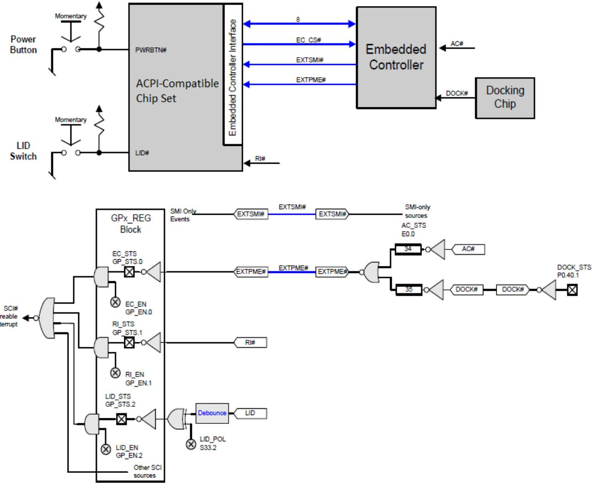  
Fig. 4.13: Example of General-Purpose vs. Generic Hardware Events

At the top level, the generic events in the GPEx\_STS register are the:

\- Embedded controller interrupt, which contains two query events: one for AC detection and one for docking (the docking query event has a child interrupt status bit in the docking chip).

\- Ring indicate status (used for waking the system).

\- Lid status.

The embedded controller event status bit (EC\_STS) is used to indicate that one of two query events is active.

\- A query event is generated when the AC# signal is asserted. The embedded controller returns a query value of 34 (any byte number can be used) upon a query command in response to this event; OSPM will then schedule for execution the control method associated with query value 34.

Another query event is for the docking chip that generates a docking event. In this case, the embedded controller will return a query value of 35 upon a query command from system software responding to an SCI from the embedded controller. OSPM will then schedule the control method associated with the query value of 35 to be executed, which services the docking event.

For each of the status bits in the GPEx\_STS register, there is a corresponding enable bit in the GPEx\_EN register. Notice that the child status bits do not necessarily need enable bits (see the DOCK\_STS bit).

The lid logic contains a control bit to determine if its status bit is set when the LID is open (LID\_POL is set and LID is set) or closed (LID\_POL is clear and LID is clear). This control bit resides in generic I/O space (in this case, bit 2 of system I/O space 33h) and would be manipulated with a control method associated with the lid object.

As with fixed hardware events, OSPM will clear the status bits in the GPEx register blocks. However, AML code clears all sibling status bits in the generic hardware.

Generic hardware features are controlled by OEM supplied control methods, encoded in AML. ACPI provides both an event and control model for development of these features. The ACPI specification also provides specific control methods for notifying OSPM of certain power management and Plug and Play events. ACPI Software Programming Model provides information on the types of hardware functionality that support the different types of subsystems. The following is a list of features supported by ACPI. The list is not intended to be complete or comprehensive.

\- Device insertion/ejection (for example, docking, device bay, A/C adapter)

\- Batteries \*

\- Platform thermal subsystem

\- Turning on/off power resources

\- Mobile lid Interface

\- Embedded controller

\- System indicators

\- OEM-specific wake events

\- Plug and Play configuration

## Note

ACPI operating systems assume the use of the Smart Battery System Implementers Forum defined standard for batteries, called the “Smart Battery Specification” (SBS). ACPI provides a set of control methods for use by OEMs that use a proprietary “control method” battery interface.

## 4.8.4.1 General-Purpose Event Register Blocks

ACPI supports up to two general-purpose register blocks as described in the FADT (see ACPI Software Programming Model), and an arbitrary number of additional GPE blocks described as devices within the ACPI namespace. Each register block contains two registers: an enable and a status register. Each register block is 32-bit aligned. Each register in the block is accessed as a byte. It is up to the specific design to determine if these bits retain their context across sleeping or soft-off states. If they lose their context across a sleeping or soft-off state, then platform boot firmware resets the respective enable bit prior to passing control to the OS upon waking.

## 4.8.4.1.1 General-Purpose Event 0 Register Block

This register block consists of two registers: The GPE0\_STS and the GPE0\_EN registers. Each register's length is defined to be half the length of the GPE0 register block, and is described in the ACPI FADT's GPE0\_BLK and GPE0\_BLK\_LEN operators. OSPM owns the general-purpose event resources and these bits are only manipulated by OSPM; AML code cannot access the general-purpose event registers.

It is envisioned that chipsets will contain GPE event registers that provide GPE input pins for various events.

The platform designer would then wire the GPEs to the various value-added event hardware and the AML code would describe to OSPM how to utilize these events. As such, there will be the case where a platform has GPE events that are not wired to anything (they are present in the chip set), but are not utilized by the platform and have no associated AML code. In such, cases these event pins are to be tied inactive such that the corresponding SCI status bit in the GPE register is not set by a floating input pin.

## 4.8.4.1.1.1 General-Purpose Event 0 Status Register

Register Location: <GPE0\_STS> System I/O or System Memory Space

Default Value: 00h

Attribute: Read/Write

Size: GPE0\_BLK\_LEN/2

The general-purpose event 0 status register contains the general-purpose event status bits in bank zero of the general-purpose registers. Each available status bit in this register corresponds to the bit with the same bit position in the GPE0\_EN register. Each available status bit in this register is set when the event is active, and can only be cleared by software writing a “1” to its respective bit position. For the general-purpose event registers, unimplemented bits are ignored by OSPM.

Each status bit can optionally wake the system if asserted when the system is in a sleeping state with its respective enable bit set. OSPM accesses GPE registers through byte accesses (regardless of their length).

## 4.8.4.1.1.2 General-Purpose Event 0 Enable Register

Register Location: <GPE0\_EN> System I/O or System Memory Space

Default Value: 00h

Attribute: Read/Write

Size: GPE0\_BLK\_LEN/2

The general-purpose event 0 enable register contains the general-purpose event enable bits. Each available enable bit in this register corresponds to the bit with the same bit position in the GPE0\_STS register. The enable bits work similarly to how the enable bits in the fixed-event registers are defined: When the enable bit is set, then a set status bit in the corresponding status bit will generate an SCI bit. OSPM accesses GPE registers through byte accesses (regardless of their length).

## 4.8.4.1.2 General-Purpose Event 1 Register Block

This register block consists of two registers: The GPE1\_STS and the GPE1\_EN registers. Each register's length is defined to be half the length of the GPE1 register block, and is described in the ACPI FADT's GPE1\_BLK and GPE1\_BLK\_LEN operators.

## 4.8.4.1.2.1 General-Purpose Event 1 Status Register

Register Location: <GPE1\_STS> System I/O or System Memory Space

Default Value: 00h

Attribute: Read/Write

Size: GPE1\_BLK\_LEN/2

The general -purpose event 1 status register contains the general-purpose event status bits. Each available status bit in this register corresponds to the bit with the same bit position in the GPE1\_EN register. Each available status bit in this register is set when the event is active, and can only be cleared by software writing a "1" to its respective bit position. For the general-purpose event registers, unimplemented bits are ignored by the operating system.

Each status bit can optionally wake the system if asserted when the system is in a sleeping state with its respective enable bit set.

OSPM accesses GPE registers through byte accesses (regardless of their length).

## 4.8.4.1.2.2 General-Purpose Event 1 Enable Register

Register Location: <GPE1\_EN> System I/O or System Memory Space

Default Value: 00h

Attribute: Read/Write

Size: GPE1\_BLK\_LEN/2

The general-purpose event 1 enable register contains the general-purpose event enable. Each available enable bit in this register corresponds to the bit with the same bit position in the GPE1\_STS register. The enable bits work similarly to how the enable bits in the fixed-event registers are defined: When the enable bit is set, a set status bit in the corresponding status bit will generate an SCI bit.

OSPM accesses GPE registers through byte accesses (regardless of their length).

## 4.8.4.2 Example Generic Devices

This section points out generic devices with specific ACPI driver support.

## 4.8.4.2.1 Lid Switch

The Lid switch is an optional feature present in most “clam shell” style mobile computers. It can be used by the OS as policy input for sleeping the system, or for waking the system from a sleeping state. If used, then the OEM needs to define the lid switch as a device with an \_HID object value of “PNP0C0D”, which identifies this device as the lid switch to OSPM. The Lid device needs to contain a control method that returns its status. The Lid event handler AML code reconfigures the lid hardware (if it needs to) to generate an event in the other direction, clear the status, and then notify OSPM of the event.

Example hardware and ASL code is shown below for such a design.

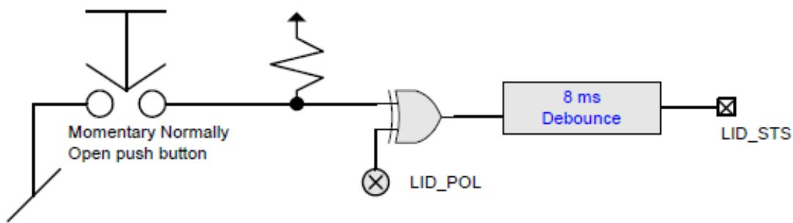  
Fig. 4.14: Example Generic Address Space Lid Switch Logic

This logic will set the Lid status bit when the button is pressed or released (depending on the LID\_POL bit).

The ASL code below defines the following:

\- An operational region where the lid polarity resides in address space System address space in registers 0x201.

\- A field operator to allow AML code to access this bit: Polarity control bit (LID\_POL) is called LPOL and is accessed at 0x201.0.

\- A device named \_SB.LID with the following:

\- A Plug and Play identifier “PNP0C0D” that associates OSPM with this object.

\- Defines an object that specifies a change in the lid's status bit can wake the system from the S4 sleep state and from all higher sleep states (S1, S2, or S3).

\- The lid switch event handler that does the following:

\- Defines the lid status bit (LID\_STS) as a child of the general-purpose event 0 register bit 1.

\- Defines the event handler for the lid (only event handler on this status bit) that does the following:

\- Flips the polarity of the LPOL bit (to cause the event to be generated on the opposite condition).

\- Generates a notify to the OS that does the following:

\- Passes the \_SB.LID object.

\- Indicates a device specific event (notify value 0x80).

```txt
// Define a Lid switch
OperationRegion (\PHO, SystemIO, 0x201, 0x1)
Field (\PHO, ByteAcc, NoLock, Preserve)
{
    LPOL, 1 // Lid polarity control bit
}
```

(continues on next page)

(continued from previous page)

```autohotkey
Device (\_SB.LID)
{
    Name (_HID, EISAID ("PNP0C0D"))
    Method (_LID)
    {
    Return(LPOL)
    }
    Name (_PRW, Package (2){
    1, // bit 1 of GPE to enable Lid wakeup
    0x04}) // can wakeup from S4 state
}

Scope(\_GPE)
{
    Method(_L01) // uses bit 1 of GP0_STS register
    {
    LPOL ~= LPOL // Flip the lid polarity bit
    Notify (\_SB.LID, 0x80) // Notify OS of event
    }
}
```

## 4.8.4.2.2 Embedded Controller

ACPI provides a standard interface that enables AML code to define and access generic logic in “embedded controller space.” This supports current computer models where much of the value added hardware is contained within the embedded controller while allowing the AML code to access this hardware in an abstracted fashion.

\- The embedded controller is defined as a device and must contain a set number of control methods:

\- \_HID with a value of PNP0C09 to associate this device with the ACPI's embedded controller's driver.

\- \_CRS to return the resources being consumed by the embedded controller.

\- \_GPE that returns the general-purpose event bit that this embedded controller is wired to.

Additionally the embedded controller can support up to 255 generic events per embedded controller, referred to as query events. These query event handles are defined within the embedded controller's device as control methods. An example of defining an embedded controller device is shown below:

```cpp
Device(EC0) {
    // PnP ID
    Name(_HID, EISAID("PNP0C09"))
    // Returns the "Current Resources" of EC
    Name (_CRS, ResourceTemplate()
    {
    IO(Decode16, 0x62, 0x62, 0, 1)
    IO(Decode16, 0x66, 0x66, 0, 1)
    })
    // Indicate that the EC SCI is bit 0 of the GP_STS register
    Name (_GPE, 0)    // embedded controller is wired to bit 0 of GPE
    OperationRegion (\EC0, EmbeddedControl, 0, 0xFF)
```

(continues on next page)

(continued from previous page)

```scss
Field (EC0, ByteAcc, Lock, Preserve)
{
    // Field units of EC0
}

// Query methods
Method(_Q00)
{ ... }
Method(_QFF)
{ ... }
}
```

For more information on the embedded controller, see ACPI Embedded Controller Interface Specification

## 4.8.4.2.3 Fan

ACPI has a device driver to control fans (active cooling devices) in platforms. A fan is defined as a device with the Plug and Play ID of “PNP0C0B.” It should then contain a list power resources used to control the fan.

For more information, see ACPI-Defined Devices and Device-Specific Objects.

## ACPI SOFTWARE PROGRAMMING MODEL

ACPI defines a hardware register interface that an ACPI-compatible OS uses to control core power management features of a machine, as described in ACPI Hardware Specification ACPI also provides an abstract interface for controlling the power management and configuration of an ACPI system. Finally, ACPI defines an interface between an ACPI-compatible OS and the platform runtime firmware.

To give hardware vendors flexibility in choosing their implementation, ACPI uses tables to describe system information, features, and methods for controlling those features. These tables list devices on the system board or devices that cannot be detected or power managed using some other hardware standard, plus their capabilities as described in ACPI Concepts They also list system capabilities such as the sleeping power states supported, a description of the power planes and clock sources available in the system, batteries, system indicator lights, and so on. This enables OSPM to control system devices without needing to know how the system controls are implemented.

Topics covered in this section are:

\- The ACPI system description table architecture is defined, and the role of OEM-provided definition blocks in that architecture is discussed.

\- The concept of the ACPI Namespace is discussed.

## 5.1 Overview of the System Description Table Architecture

The Root System Description Pointer (RSDP) structure is located in the system's memory address space and is setup by the platform firmware. This structure contains the address of the Extended System Description Table (XSDT), which references other description tables that provide data to OSPM, supplying it with knowledge of the base system's implementation and configuration (see Root System Description Pointer and Table).

All system description tables start with identical headers. The primary purpose of the system description tables is to define for OSPM various industry-standard implementation details. Such definitions enable various portions of these implementations to be flexible in hardware requirements and design, yet still provide OSPM with the knowledge it needs to control hardware directly.

The Extended System Description Table (XSDT) points to other tables in memory. Always the first table, it points to the Fixed ACPI Description Table (FADT). The data within this table includes various fixed-length entries that describe the fixed ACPI features of the hardware. The FADT table always refers to the Differentiated System Description Table (DSDT), which contains information and descriptions for various system features. The relationship between these tables is shown in Description Table Structures.

OSPM finds the RSDP structure as described in Finding the RSDP on IA-PC Systems (“Finding the RSDP on IA-PC Systems”) or Finding the RSDP on UEFI Enabled Systems (“Finding the RSDP on UEFI Enabled Systems”).

When OSPM locates the structure, it looks at the physical address for the Root System Description Table or the Extended System Description Table. The Root System Description Table starts with the signature “RSDT”, while the Extended System Description Table starts with the signature “XSDT”. These tables contain one or more physical pointers to other system description tables that provide various information about the system. As shown in Description Table Structures, there is always a physical address in the Root System Description Table for the Fixed ACPI Description Table (FADT).

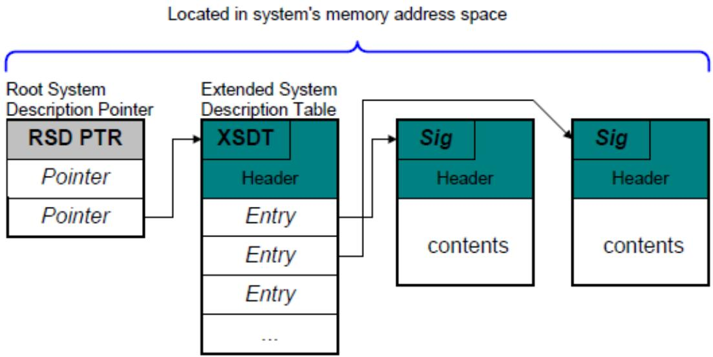  
Fig. 5.1: Root System Description Pointer and Table

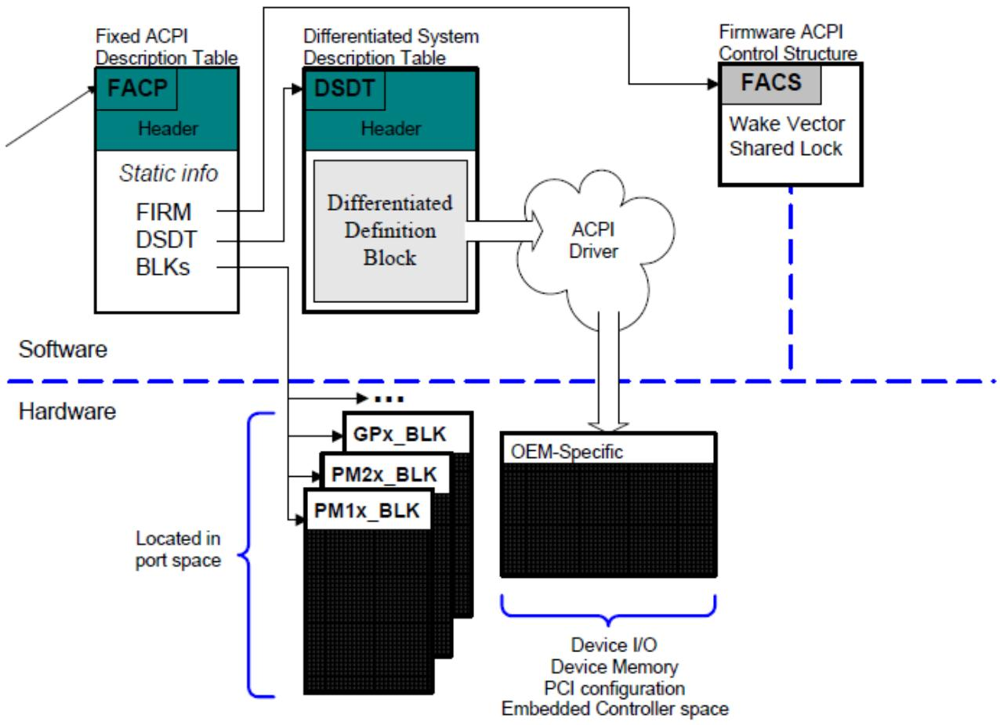  
Fig. 5.2: Description Table Structures

When OSPM follows a physical pointer to another table, it examines each table for a known signature. Based on the signature, OSPM can then interpret the implementation-specific data within the description table.

The purpose of the FADT is to define various static system information related to configuration and power management. The Fixed ACPI Description Table starts with the “FACP” signature. The FADT describes the implementation and configuration details of the ACPI hardware registers on the platform.

For a specification of the ACPI Hardware Register Blocks (PM1a\_EVT\_BLK, PM1b\_EVT\_BLK, PM1a\_CNT\_BLK, PM1b\_CNT\_BLK, PM2\_CNT\_BLK, PM\_TMR\_BLK, GP0\_BLK, GP1\_BLK, and one or more P\_BLKs), see ACPI Register Model The PM1a\_EVT\_BLK, PM1b\_EVT\_BLK, PM1a\_CNT\_BLK, PM1b\_CNT\_BLK, PM2\_CNT\_BLK, and PM\_TMR\_BLK blocks are for controlling low-level ACPI system functions.

The GPE0\_BLK and GPE1\_BLK blocks provide the foundation for an interrupt-processing model for Control Methods. The P\_BLK blocks are for controlling processor features.

Besides ACPI Hardware Register implementation information, the FADT also contains a physical pointer to a data structure known as the Differentiated System Description Table (DSDT), which is encoded in Definition Block format (See Definition Blocks).

A Definition Block contains information about the platform's hardware implementation details in the form of data objects arranged in a hierarchical (tree-structured) entity known as the “ACPI namespace”, which represents the platform's hardware configuration. All definition blocks loaded by OSPM combine to form one namespace that represents the platform. Data objects are encoded in a format known as ACPI Machine Language or AML for short. Data objects encoded in AML are “evaluated” by an OSPM entity known as the AML interpreter. Their values may be static or dynamic. The AML interpreter's dynamic data object evaluation capability includes support for programmatic evaluation, including accessing address spaces (for example, I/O or memory accesses), calculation, and logical evaluation, to determine the result. Dynamic namespace objects are known as “control methods”. OSPM “loads” an entire definition block as a logical unit - adding to or removing the associated objects from the namespace. The DSDT contains a Definition Block named the Differentiated Definition Block that contains implementation and configuration information OSPM can use to perform power management, thermal management, or Plug and Play functionality that goes beyond the information described by the ACPI hardware registers.

Definition Blocks can either define new system attributes or, in some cases, build on prior definitions. A Definition Block can be loaded from system memory address space. One use of a Definition Block is to describe and distribute platform version changes.

Definition blocks enable wide variations of hardware platform implementations to be described to the ACPI-compatible OS while confining the variations to reasonable boundaries. Definition blocks enable simple platform implementations to be expressed by using a few well-defined object names. In theory, it might be possible to define a PCI configuration space-like access method within a Definition Block, by building it from I/O space, but that is not the goal of the Definition Block specification. Such a space is usually defined as a “built in” operator.

Some operators perform simple functions and others encompass complex functions. The power of the Definition Block comes from its ability to allow these operations to be glued together in numerous ways, to provide functionality to OSPM. The operators present are intended to allow many useful hardware designs to be ACPI-expressed, not to allow all hardware designs to be expressed.

## 5.1.1 Address Space Translation

Some platforms may contain bridges that perform translations as I/O and/or Memory cycles pass through the bridges. This translation can take the form of the addition or subtraction of an offset. Or it can take the form of a conversion from I/O cycles into Memory cycles and back again. When translation takes place, the addresses placed on the processor bus by the processor during a read or write cycle are not the same addresses that are placed on the I/O bus by the I/O bus bridge. The address the processor places on the processor bus will be known here as the processor-relative address. And the address that the bridge places on the I/O bus will be known as the bus-relative address. Unless otherwise noted, all addresses used within this section are processor-relative addresses.

For example, consider a platform with two root PCI buses. The platform designer has several choices. One solution would be to split the 16-bit I/O space into two parts, assigning one part to the first root PCI bus and one part to the second root PCI bus. Another solution would be to make both root PCI buses decode the entire 16-bit I/O space, mapping the second root PCI bus's I/O space into memory space. In this second scenario, when the processor needs to read from an I/O register of a device underneath the second root PCI bus, it would need to perform a memory read within the range that the root PCI bus bridge is using to map the I/O space.

\- Industry standard PCs do not provide address space translations because of historical compatibility issues.

## 5.2 ACPI System Description Tables

This section specifies the structure of the system description tables:

\- Generic Address Structure (GAS)

\- Root System Description Pointer (RSDP)

\- System Description Table Header

\- Root System Description Table (RSDT)

• Extended System Description Table (XSDT)

• Fixed ACPI Description Table (FADT)

\- Firmware ACPI Control Structure (FACS)

• Differentiated System Description Table (DSDT)

• Secondary System Description Table (SSDT)

• Multiple APIC Description Table (MADT)

• GIC CPU Interface (GICC) Structure

• Smart Battery Table (SBST)

• Extended System Description Table (XSDT)

\- Embedded Controller Boot Resources Table (ECDT)

\- System Locality Information Table (SLIT)

• System Resource Affinity Table (SRAT)

\- Corrected Platform Error Polling Table (CPEP)

• Maximum System Characteristics Table (MSCT)

• ACPI RAS Feature Table (RASF)

• ACPI RAS2 Feature Table (RAS2)

• Memory Power State Table (MPST)

\- Platform Memory Topology Table (PMTT)

\- Boot Graphics Resource Table (BGRT)

• Firmware Performance Data Table (FPDT)

\- Generic Timer Description Table (GTDT)

• NVDIMM Firmware Interface Table (NFIT)

• Non HDAudio Link Table (NHLT)

• Heterogeneous Memory Attribute Table (HMAT)

\- Platform Debug Trigger Table (PDTT)

\- Processor Properties Topology Table (PPTT)

All numeric values in ACPI-defined tables, blocks, and structures are always encoded in little endian format. Signature values are stored as fixed-length strings.

## 5.2.1 Reserved Bits and Fields

For future expansion, all data items marked as reserved in this specification have strict meanings. This section lists software requirements for reserved fields. Notice that the list contains terms such as ACPI tables and AML code defined later in this section of the specification.

## 5.2.1.1 Reserved Bits and Software Components

\- OEM implementations of software and AML code return the bit value of 0 for all reserved bits in ACPI tables or in other software values, such as resource descriptors.

\- For all reserved bits in ACPI tables and registers, OSPM implementations must:

\- Ignore all reserved bits that are read.

\- Preserve reserved bit values of read/write data items (for example, OSPM writes back reserved bit values it reads).

\- Write zeros to reserved bits in write-only data items.

## 5.2.1.2 Reserved Values and Software Components

\- OEM implementations of software and AML code return only defined values and do not return reserved values.

\- OSPM implementations write only defined values and do not write reserved values.

## 5.2.1.3 Reserved Hardware Bits and Software Components

\- Software ignores all reserved bits read from hardware enable or status registers.

\- Software writes zero to all reserved bits in hardware enable registers.

\- Software ignores all reserved bits read from hardware control and status registers.

\- Software preserves the value of all reserved bits in hardware control registers by writing back read values.

## 5.2.1.4 Ignored Hardware Bits and Software Components

\- Software handles ignored bits in ACPI hardware registers the same way it handles reserved bits in these same types of registers.

## 5.2.2 Compatibility

All versions of the ACPI tables must maintain backward compatibility. To accomplish this, modifications of the tables consist of redefinition of previously reserved fields and values plus appending data to the 1.0 tables. Modifications of the ACPI tables require that the version numbers of the modified tables be incremented. The length field in the tables includes all additions and the checksum is maintained for the entire length of the table.

## 5.2.3 Address Format

Addresses used in the ACPI 1.0 system description tables were expressed as either system memory or I/O space. This was targeted at the IA-32 environment. Newer architectures require addressing mechanisms beyond that defined in ACPI 1.0. To support these architectures ACPI must support 64-bit addressing and it must allow the placement of control registers in address spaces other than System I/O.

## 5.2.3.1 Functional Fixed Hardware

ACPI defines the fixed hardware low-level interfaces as a means to convey to the system OEM the minimum interfaces necessary to achieve a level of capability and quality for motherboard configuration and system power management. Additionally, the definition of these interfaces, as well as others defined in this specification, conveys to OS Vendors (OSVs) developing ACPI-compatible operating systems, the necessary interfaces that operating systems must manipulate to provide robust support for system configuration and power management.

While the definition of low-level hardware interfaces defined by ACPI 1.0 afforded OSPM implementations a certain level of stability, controls for existing and emerging diverse CPU architectures cannot be accommodated by this model as they can require a sequence of hardware manipulations intermixed with native CPU instructions to provide the ACPI-defined interface function. In this case, an ACPI-defined fixed hardware interface can be functionally implemented by the CPU manufacturer through an equivalent combination of both hardware and software and is defined by ACPI as Functional Fixed Hardware.

In IA-32-based systems, functional fixed hardware can be accommodated in an OS independent manner by using System Management Mode (SMM) based system firmware. Unfortunately, the nature of SMM-based code makes this type of OS independent implementation difficult if not impossible to debug. As such, this implementation approach is not recommended. In some cases, Functional Fixed Hardware implementations may require coordination with other OS components. As such, an OS independent implementation may not be viable.

OS-specific implementations of functional fixed hardware can be implemented using technical information supplied by the CPU manufacturer. The downside of this approach is that functional fixed hardware support must be developed for each OS. In some cases, the CPU manufacturer may provide a software component providing this support. In other cases support for the functional fixed hardware may be developed directly by the OS vendor.

The hardware register definition was expanded, in ACPI 2.0, to allow registers to exist in address spaces other than the System I/O address space. This is accomplished through the specification of an address space ID in the register definition (see Generic Address Structure for more information). When specifically directed by the CPU manufacturer, the system firmware may define an interface as functional fixed hardware by indicating 0x7F (Functional Fixed Hardware), in the address space ID field for register definitions. It is emphasized that functional fixed hardware definitions may be declared in the ACPI system firmware only as indicated by the CPU Manufacturer for specific interfaces as the use of functional fixed hardware requires specific coordination with the OS vendor.

Only certain ACPI-defined interfaces may be implemented using functional fixed hardware and only when the interfaces are common across machine designs for example, systems sharing a common CPU architecture that does not support fixed hardware implementation of an ACPI-defined interface. OEMs are cautioned not to anticipate that functional fixed hardware support will be provided by OSPM differently on a system-by-system basis. The use of functional fixed hardware carries with it a reliance on OS specific software that must be considered. OEMs should consult OS vendors to ensure that specific functional fixed hardware interfaces are supported by specific operating systems.

\- FFH is permitted and applicable to both full and HW-reduced ACPI implementations.

## 5.2.3.2 Generic Address Structure

The Generic Address Structure (GAS) provides the platform with a robust means to describe register locations. This structure, described below (Generic Address Structure (GAS)), is used to express register addresses within tables defined by ACPI.

Table 5.1: Generic Address Structure (GAS)

<table><tr><td colspan="2">Field</td><td>Byte Length</td><td>Byte Offset</td><td>Description</td></tr><tr><td colspan="2">Address Space ID</td><td>1</td><td>0</td><td>The address space where the data structure or register exists. Defined values are:0x00 System Memory space0x01 System I/O space0x02 PCI Configuration space0x03 Embedded Controller0x04 SMBus0x05 SystemCMOS0x06 PciBarTarget0x07 IPMI0x08 General PurposeIO0x09 GenericSerialBus0x0A Platform Communications Channel (PCC)0x0B Platform Runtime Mechanism (PRM)0x0C to 0x7E Reserved0x7F Functional Fixed Hardware0x80 to 0xFF OEM Defined</td></tr><tr><td>Register Width</td><td>Bit</td><td>1</td><td>1</td><td>The size in bits of the given register. When addressing a data structure, this field must be zero.</td></tr><tr><td>Register Offset</td><td>Bit</td><td>1</td><td>2</td><td>The bit offset of the given register at the given address. When addressing a data structure, this field must be zero.</td></tr></table>

continues on next page

Table 5.1 – continued from previous page

<table><tr><td>Field</td><td>Byte Length</td><td>Byte Offset</td><td>Description</td></tr><tr><td>Access Size</td><td>1</td><td>3</td><td>Specifies access size. Unless otherwise defined by the Address Space ID:0 Undefined (legacy reasons)1 Byte access2 Word access3 DWord access4 QWord access</td></tr><tr><td>Address</td><td>8</td><td>4</td><td>The 64-bit address of the data structure or register in the given address space (relative to the processor). (See below for specific formats.)</td></tr></table>

Table 5.2: Address Space Format

<table><tr><td>Address Space</td><td>Format</td></tr><tr><td>0-System Memory</td><td>The 64-bit physical memory address (relative to the processor) of the register. 32-bit platforms must have the high DWORD set to 0.</td></tr><tr><td>1-System I/O</td><td>The 64-bit I/O address (relative to the processor) of the register. 32-bit platforms must have the high DWORD set to 0.</td></tr><tr><td>2-PCI Configuration Space</td><td>PCI Configuration space addresses must be confined to devices on PCI Segment Group 0, bus 0. This restriction exists to accommodate access to fixed hardware prior to PCI bus enumeration. The format of addresses are defined as follows:Word Location DescriptionHighest Word Reserved (must be 0)— PCI Device number on bus 0— PCI Function numberLowest Word Offset in the configuration space headerFor example: Offset 23h of Function 2 on device 7 on bus 0 segment 0 would be represented as: 0x0000000700020023.</td></tr><tr><td>6-PCI BAR Target</td><td>PciBarTarget is used to locate a MMIO register on a PCI device BAR space. PCI Configuration space addresses must be confined to devices on a host bus, i.e any bus returned by a _BBN object. This restriction exists to accommodate access to fixed hardware prior to PCI bus enumeration. The format of the Address field for this type of address is:Bits [63:56] – PCI SegmentBits [55:48] – PCI BusBits [47:43] – PCI DeviceBits [42:40] – PCI FunctionBits [39:37] – BAR index#Bits [36:0] – Offset from BAR in DWORDs</td></tr></table>

continues on next page

Table 5.2 – continued from previous page

<table><tr><td>Address Space</td><td>Format</td></tr><tr><td>0x0A-PCC</td><td>PCC is used to locate a platform communication channel resource, described by a PCC Subspace Structure entry in the PCCT.The format for the Address field is the index into the PCCT.</td></tr><tr><td>0x7F-Functional Fixed Hardware</td><td>Use of GAS fields other than Address_Space_ID is specified by the CPU manufacturer. The use of functional fixed hardware carries with it a reliance on OS specific software that must be considered. OEMs should consult OS vendors to ensure that specific functional fixed hardware interfaces are supported by specific operating systems.</td></tr></table>

## 5.2.4 Universally Unique Identifiers (UUIDs)

UUIDs (Universally Unique IDentifiers), also known as GUIDs (Globally Unique IDentifiers) are 128 bit long values that extremely likely to be different from all other UUIDs generated until 3400 A.D. UUIDs are used to distinguish between callers of ASL methods, such as \_DSM and \_OSC. UUIDs are also used to distinguish individual entries in the MISC table.

The format of both the binary and string representations of UUIDs, along with an algorithm to generate them, is specified in ISO/IEC 11578:1996 Information technology - Open Systems Interconnection - Remote Procedure Call (RPC). This can also be found as part of the DCE 1.1: Remote Procedure Call technical standard, and in the Wikipedia entry for UUIDs.

## 5.2.5 Root System Description Pointer (RSDP)

During OS initialization, OSPM must obtain the Root System Description Pointer (RSDP) structure from the platform. When OSPM locates the Root System Description Pointer (RSDP) structure, it then locates the Root System Description Table (RSDT) or the Extended Root System Description Table (XSDT) using the physical system address supplied in the RSDP.

## 5.2.5.1 Finding the RSDP on IA-PC Systems

OSPM finds the Root System Description Pointer (RSDP) structure by searching physical memory ranges on 16-byte boundaries for a valid Root System Description Pointer structure signature and checksum match as follows:

\- The first 1 KB of the Extended BIOS Data Area (EBDA). For EISA or MCA systems, the EBDA can be found in the two-byte location 40:0Eh on the BIOS data area.

\- The BIOS read-only memory space between 0E0000h and 0FFFFH.

## 5.2.5.2 Finding the RSDP on UEFI Enabled Systems

In Unified Extensible Firmware Interface (UEFI) enabled systems, a pointer to the RSDP structure exists within the EFI System Table. The OS loader is provided a pointer to the EFI System Table at invocation. The OS loader must retrieve the pointer to the RSDP structure from the EFI System Table and convey the pointer to OSPM, using an OS dependent data structure, as part of the hand off of control from the OS loader to the OS.

The OS loader locates the pointer to the RSDP structure by examining the EFI Configuration Table within the EFI System Table. EFI Configuration Table entries consist of Globally Unique Identifier (GUID)/table pointer pairs. The UEFI specification defines two GUIDs for ACPI; one for ACPI 1.0 and the other for ACPI 2.0 or later specification revisions.

The EFI GUID for a pointer to the ACPI 1.0 specification RSDP structure is:

• eb9d2d30-2d88-11d3-9a16-0090273fc14d.

The EFI GUID for a pointer to the ACPI 2.0 or later specification RSDP structure is:

• 8868e871-e4f1-11d3-bc22-0080c73c8881.

The OS loader for an ACPI-compatible OS will search for an RSDP structure pointer (RSDP Structure) using the current revision GUID first and if it finds one, will use the corresponding RSDP structure pointer. If the GUID is not found then the OS loader will search for the RSDP structure pointer using the ACPI 1.0 version GUID.

The OS loader must retrieve the pointer to the RSDP structure from the EFI System Table before assuming platform control via the EFI ExitBootServices interface. See the UEFI Specification for more information.

## 5.2.5.3 Root System Description Pointer (RSDP) Structure

The revision number contained within the structure indicates the size of the table structure.

Table 5.3: RSDP Structure

<table><tr><td>Field</td><td>Byte Length</td><td>Byte Offset</td><td>Description</td></tr><tr><td>Signature</td><td>8</td><td>0</td><td>“RSD PTR “ (Notice that this signature must contain a trailing blank character.)</td></tr><tr><td>Checksum</td><td>1</td><td>8</td><td>This is the checksum of the fields defined in the ACPI 1.0 specification. This includes only the first 20 bytes of this table, bytes 0 to 19, including the checksum field. These bytes must sum to zero.</td></tr><tr><td>OEMID</td><td>6</td><td>9</td><td>An OEM-supplied string that identifies the OEM.</td></tr><tr><td>Revision</td><td>1</td><td>15</td><td>The revision of this structure. Larger revision numbers are backward compatible to lower revision numbers. The ACPI version 1.0 revision number of this table is zero. The ACPI version 1.0 RSDP Structure only includes the first 20 bytes of this table, bytes 0 to 19. It does not include the Length field and beyond. The current value for this field is 2.</td></tr><tr><td>RsdtAddress</td><td>4</td><td>16</td><td>32 bit physical address of the RSDT.</td></tr><tr><td>Length*</td><td>4</td><td>20</td><td>The length of the table, in bytes, including the header, starting from offset 0. This field is used to record the size of the entire table. This field is not available in the ACPI version 1.0 RSDP Structure.</td></tr><tr><td>XsdtAd-dress*</td><td>8</td><td>24</td><td>64 bit physical address of the XSDT.</td></tr><tr><td>Extended Checksum*</td><td>1</td><td>32</td><td>This is a checksum of the entire table, including both checksum fields.</td></tr></table>

continues on next page

Table 5.3 – continued from previous page

<table><tr><td>Field</td><td>Byte Length</td><td>Byte Offset</td><td>Description</td></tr><tr><td>Reserved*</td><td>3</td><td>33</td><td>Reserved field</td></tr></table>

\* These fields are only valid when the Revision value is 2 or above.

## 5.2.6 System Description Table Header

All system description tables begin with the structure shown in the DESCRIPTION\_HEADER Fields. The Signature field in this table determines the content of the system description table. Also see Table 5.5.

Table 5.4: DESCRIPTION\_HEADER Fields

<table><tr><td>Field</td><td>Byte Length</td><td>Byte Offset</td><td>Description</td></tr><tr><td>Signature</td><td>4</td><td>0</td><td>The ASCII string representation of the table identifier. Note that if OSPM finds a signature in a table that is not listed in Table 5.5, then OSPM ignores the entire table (it is not loaded into ACPI namespace); OSPM ignores the table even though the values in the Length and Checksum fields are correct.</td></tr><tr><td>Length</td><td>4</td><td>4</td><td>The length of the table, in bytes, including the header, starting from offset 0. This field is used to record the size of the entire table.</td></tr><tr><td>Revision</td><td>1</td><td>8</td><td>The revision of the structure corresponding to the signature field for this table. Larger revision numbers are backward compatible to lower revision numbers with the same signature.</td></tr><tr><td>Checksum</td><td>1</td><td>9</td><td>The entire table, including the checksum field, must add to zero to be considered valid.</td></tr><tr><td>OEMID</td><td>6</td><td>10</td><td>An OEM-supplied string that identifies the OEM.</td></tr><tr><td>OEM Table ID</td><td>8</td><td>16</td><td>An OEM-supplied string that the OEM uses to identify the particular data table. This field is particularly useful when defining a definition block to distinguish definition block functions. The OEM assigns each dissimilar table a new OEM Table ID.</td></tr><tr><td>OEM Revision</td><td>4</td><td>24</td><td>An OEM-supplied revision number. Larger numbers are assumed to be newer revisions.</td></tr><tr><td>Creator ID</td><td>4</td><td>28</td><td>Vendor ID of utility that created the table. For tables containing Definition Blocks, this is the ID for the ASL Compiler.</td></tr><tr><td>Creator Revision</td><td>4</td><td>32</td><td>Revision of utility that created the table. For tables containing Definition Blocks, this is the revision for the ASL Compiler.</td></tr></table>

For OEMs, good design practices will ensure consistency when assigning OEMID and OEM Table ID fields in any table. The intent of these fields is to allow for a binary control system that support services can use. Because many support functions can be automated, it is useful when a tool can programmatically determine which table release is a compatible and more recent revision of a prior table on the same OEMID and OEM Table ID.

Table 5.5 and Table 5.6 contain the system description table signatures defined by this specification. These system description tables may be defined by ACPI and documented within this specification, or they may simply be reserved by ACPI and defined by other industry specifications. This allows OS and platform specific tables to be defined and pointed to by the RSDT/XSDT as needed. For tables defined by other industry specifications, the ACPI specification acts as gatekeeper to avoid collisions in table signatures.

Table signatures will be reserved by the ACPI promoters and posted independently of this specification in ACPI errata and clarification documents on the ACPI web site. Requests to reserve a 4-byte alphanumeric table signature should be sent to the email address info@acpi.info and should include the purpose of the table and reference URL to a document that describes the table format. Tables defined outside of the ACPI specification may define data value encodings in either little endian or big endian format. For the purpose of clarity, external table definition documents should include the endian-ness of their data value encodings.

Since reference URLs can change over time and may not always be up-to-date in this specification, a separate document containing the latest known reference URLs can be found at “Links to ACPI-Related Documents” (http://uefi.org/acpi), which should conspicuously be placed in the same location as this specification.

Table 5.5: DESCRIPTION\_HEADER Signatures for tables defined by ACPI

<table><tr><td>Signature</td><td>Description</td><td>Reference</td></tr><tr><td>“APIC”</td><td>Multiple APIC Description Table</td><td>Section 5.2.12</td></tr><tr><td>“BERT”</td><td>Boot Error Record Table</td><td>Section 18.3.1</td></tr><tr><td>“BGRT”</td><td>Boot Graphics Resource Table</td><td>Section 5.2.23</td></tr><tr><td>“CCEL”</td><td>Virtual Firmware Confidential Computing Event Log Table. See Links to ACPI-Related Documents under the heading “Virtual Firmware Confidential Computing Event Log Table”.</td><td></td></tr><tr><td>“CPEP”</td><td>Corrected Platform Error Polling Table</td><td>Section 5.2.18</td></tr><tr><td>“DSDT”</td><td>Differentiated System Description Table</td><td>Section 5.2.11.1</td></tr><tr><td>“ECDT”</td><td>Embedded Controller Boot Resources Table</td><td>Section 5.2.15</td></tr><tr><td>“EINJ”</td><td>Error Injection Table</td><td>Section 18.6.1</td></tr><tr><td>“ERST”</td><td>Error Record Serialization Table</td><td>Section 18.5</td></tr><tr><td>“FACP”</td><td>Fixed ACPI Description Table (FADT)</td><td>Section 5.2.9</td></tr><tr><td>“FACS”</td><td>Firmware ACPI Control Structure</td><td>Section 5.2.10</td></tr><tr><td>“FPDT”</td><td>Firmware Performance Data Table</td><td>Section 5.2.24</td></tr><tr><td>“GTDT”</td><td>Generic Timer Description Table</td><td>Section 5.2.25</td></tr><tr><td>“HEST”</td><td>Hardware Error Source Table</td><td>Section 18.3.2</td></tr><tr><td>“MISC”</td><td>Miscellaneous GUIDed Table Entries</td><td>Section 5.2.34</td></tr><tr><td>“MSCT”</td><td>Maximum System Characteristics Table</td><td>Section 5.2.19</td></tr><tr><td>“MPST”</td><td>Memory Power StateTable</td><td>Section 5.2.22</td></tr><tr><td>“NFIT”</td><td>NVDIMM Firmware Interface Table</td><td>Section 5.2.26</td></tr><tr><td>“NHLT”</td><td>Non HDAudio Link Table</td><td>Section 5.2.27</td></tr><tr><td>“OEMx”</td><td>OEM Specific Information Tables</td><td>OEM Specific tables. All table signatures starting with “OEM” are reserved for OEM use.</td></tr><tr><td>“PCCT”</td><td>Platform Communications Channel Table</td><td>Section 14.1</td></tr><tr><td>“PHAT”</td><td>Platform Health Assessment Table</td><td>Section 5.2.32</td></tr><tr><td>“PMTT”</td><td>Platform Memory Topology Table</td><td>Section 5.2.22.12</td></tr><tr><td>“PPTT”</td><td>Processor Properties Topology Table</td><td>Section 5.2.31</td></tr></table>

continues on next page

Table 5.5 – continued from previous page

<table><tr><td>“PSDT”</td><td>Persistent System Description Table</td><td>Section 5.2.11.3</td></tr><tr><td>“RASF”</td><td>ACPI RAS Feature Table</td><td>Section 5.2.20</td></tr><tr><td>“RAS2”</td><td>ACPI RAS2 Feature Table</td><td>Section 5.2.21</td></tr><tr><td>“RHCT”</td><td>RISC-V Hart Capabilities Table</td><td>Section 5.2.37</td></tr><tr><td>“RSDT”</td><td>Root System Description Table</td><td>Section 5.2.7</td></tr><tr><td>“SBST”</td><td>Smart Battery Specification Table</td><td>Section 5.2.14</td></tr><tr><td>“SDEV”</td><td>Secure DEVices Table</td><td>Section 5.2.28</td></tr><tr><td>“SLIT”</td><td>System Locality Distance Information Table</td><td>Section 5.2.17</td></tr><tr><td>“SRAT”</td><td>System Resource Affinity Table</td><td>Section 5.2.16</td></tr><tr><td>“SSDT”</td><td>Secondary System Description Table</td><td>Section 5.2.11.2</td></tr><tr><td>“SVKL”</td><td>Storage Volume Key Data table in the Intel Trusted Domain Extensions. See Links to ACPI-Related Documents under the heading “Storage Volume Key Data”.</td><td></td></tr><tr><td>“XSDT”</td><td>Extended System Description Table</td><td>Section 5.2.8</td></tr></table>

Table 5.6: DESCRIPTION\_HEADER Signatures for tables reserved by ACPI

<table><tr><td>Signature</td><td>Description and External Reference</td></tr><tr><td>“AEST”</td><td>Arm Error Source Table. See Links to ACPI-Related Documents under the heading “Arm Error Source Table”.</td></tr><tr><td>“AGDI”</td><td>Arm Generic Diagnostic Dump and Reset Interface. See Links to ACPI-Related Documents under the heading “Arm Generic Diagnostic Dump and Reset Interface”.</td></tr><tr><td>“APMT”</td><td>Arm Performance Monitoring Unit table. See Links to ACPI-Related Documents under the heading “Arm Performance Monitoring Unit table”.</td></tr><tr><td>“ASPT”</td><td>AMD Secure Processor Table. See Links to ACPI-Related Documents under the heading “AMD Secure Processor Table”.</td></tr><tr><td>“BDAT”</td><td>BIOS Data ACPI Table – exposing platform margining data. See Links to ACPI-Related Documents under the heading “BIOS Data ACPI Table”.</td></tr><tr><td>“BOOT”</td><td>Reserved Signature</td></tr><tr><td>“CEDT”</td><td>CXL Early Discovery Table. See “Links to ACPI-Related Documents” (http://uefi.org/acpi) under the heading “CXL Early Discovery Table”.</td></tr><tr><td>“CSRT”</td><td>Core System Resource Table. See Links to ACPI-Related Documents under the heading “Core System Resource Table”.</td></tr><tr><td>“DBGP”</td><td>Debug Port Table. See Links to ACPI-Related Documents under the heading “Debug Port Table”.</td></tr><tr><td>“DBG2”</td><td>Debug Port Table 2. See Links to ACPI-Related Documents under the heading “Debug Port Table 2”.</td></tr><tr><td>“DMAR”</td><td>DMA Remapping Table. See Links to ACPI-Related Documents under the heading “DMA Remapping Table”.</td></tr><tr><td>“DRTM”</td><td>Dynamic Root of Trust for Measurement Table. See Links to ACPI-Related Documents under the heading “TCG D-RTM Architecture Specification”.</td></tr><tr><td>“DTPR”</td><td>Intel® Trusted Execution Technology (Intel® TXT) DMA Protection Ranges. See Links to ACPI-Related Documents under the heading “Intel® TXT DMA Protection Ranges”.</td></tr><tr><td>“ETDT”</td><td>Event Timer Description Table (Obsolete). IA-PC Multimedia Timers Specification. This signature has been superseded by “HPET” (below) and is now obsolete.</td></tr><tr><td>“HPET”</td><td>IA-PC High Precision Event Timer Table. See Links to ACPI-Related Documents under the heading “IA-PC High Precision Event Timer Table”.</td></tr></table>

continues on next page

Table 5.6 – continued from previous page

<table><tr><td>“IBFT”</td><td>iSCSI Boot Firmware Table. See Links to ACPI-Related Documents under the heading “iSCSI Boot Firmware Table”.</td></tr><tr><td>“IERS”</td><td>Inline Encryption Reporting Structure. See Links to ACPI-Related Documents under the heading “Inline Encryption Reporting Structure”</td></tr><tr><td>“IORT”</td><td>I/O Remapping Table. See Links to ACPI-Related Documents under the heading “I/O Remapping Table”.</td></tr><tr><td>“IOVT”</td><td>I/O Virtualization Table. See Links to ACPI-Related Documents under the heading “I/O Virtualization Table”.</td></tr><tr><td>“IRDT”</td><td>I/O Resource Director Technology table. See Links to ACPI-Related Documents under the heading “I/O Resource Director Technology.”</td></tr><tr><td>“IVRS”</td><td>I/O Virtualization Reporting Structure. See Links to ACPI-Related Documents under the heading “I/O Virtualization Reporting Structure”.</td></tr><tr><td>“KEYP”</td><td>Key Programming Interface for Root Complex Integrity and Data Encryption (IDE). See Links to ACPI-Related Documents under the heading “Key Programming Interface for Root Complex Integrity and Data Encryption (IDE)”.</td></tr><tr><td>“LPIT”</td><td>Low Power Idle Table. See Links to ACPI-Related Documents under the heading “Low Power Idle Table”.</td></tr><tr><td>“MCFG”</td><td>PCI Express Memory-mapped Configuration Space base address description table. PCI Firmware Specification, Revision 3.0. See Links to ACPI-Related Documents under the heading “PCI Sig”.</td></tr><tr><td>“MCHI”</td><td>Management Controller Host Interface table. DSP0256 Management Component Transport Protocol (MCTP) Host Interface Specification. See Links to ACPI-Related Documents under the heading “Management Controller Host Interface Table”.</td></tr><tr><td>“MHSP”</td><td>Microsoft Pluton Security Processor Table. See Links to ACPI-Related Documents under the heading “Microsoft Pluton Security Processor Table”.</td></tr><tr><td>“MPAM”</td><td>Arm Memory Partitioning And Monitoring. See Links to ACPI-Related Documents under the heading “Arm Memory Partitioning And Monitoring”.</td></tr><tr><td>“MSDM”</td><td>Microsoft Data Management Table. See Links to ACPI-Related Documents under the heading “Microsoft Software Licensing Tables”.</td></tr><tr><td>“NBFT”</td><td>NVMe-over-Fabric (NVMe-oF) Boot Firmware Table. See Links to ACPI-Related Documents under the heading “NVMe-over-Fabric (NVMe-oF) Boot Firmware Table”.</td></tr><tr><td>“PRMT”</td><td>Platform Runtime Mechanism Table. See Links to ACPI-Related Documents under the heading “Platform Runtime Mechanism Table”.</td></tr><tr><td>“RGRT”</td><td>Regulatory Graphics Resource Table. See Links to ACPI-Related Documents under the heading “Regulatory Graphics Resource Table”.</td></tr><tr><td>“RIMT”</td><td>RISC-V IO Mapping Table. See Links to ACPI-Related Documents under the heading “RISC-V IO Mapping Table”.</td></tr><tr><td>“RQSC”</td><td>RISC-V Quality of Service Controllers table. See Links to ACPI-Related Documents under the heading “RISC-V ACPI Tables”.</td></tr><tr><td>“SDEI”</td><td>Software Delegated Exceptions Interface. See Links to ACPI-Related Documents under the heading “Software Delegated Exceptions Interface.”</td></tr><tr><td>“SLIC”</td><td>Microsoft Software Licensing table. See Links to ACPI-Related Documents under the heading “Microsoft Software Licensing Table Specification”.</td></tr><tr><td>“SPCR”</td><td>Microsoft Serial Port Console Redirection table. See Links to ACPI-Related Documents under the heading “Serial Port Console Redirection Table”.</td></tr><tr><td>“SPMI”</td><td>Server Platform Management Interface table. See Links to ACPI-Related Documents under the heading “Server Platform Management Interface Table”.</td></tr><tr><td>“STAO”</td><td>_STA Override table. See Links to ACPI-Related Documents under the heading “_STA Override Table”.</td></tr><tr><td>“SWFT”</td><td>Sound Wire File Table table. See Links to ACPI-Related Documents under the heading “Sound Wire File Table”.</td></tr></table>

continues on next page

Table 5.6 – continued from previous page

<table><tr><td>“TCPA”</td><td>Trusted Computing Platform Alliance Capabilities Table. TCPA PC Specific Implementation Specification. See Links to ACPI-Related Documents under the heading “Trusted Computing Platform Alliance Capabilities Table”.</td></tr><tr><td>“TPM2”</td><td>Trusted Platform Module 2 Table. See Links to ACPI-Related Documents under the heading “Trusted Platform Module 2 Table”.</td></tr><tr><td>“UEFI”</td><td>Unified Extensible Firmware Interface Specification. See the UEFI Specifications web page.</td></tr><tr><td>“WAET”</td><td>Windows ACPI Emulated Devices Table. See Links to ACPI-Related Documents under the heading “Windows ACPI Emulated Devices Table”.</td></tr><tr><td>“WDAT”</td><td>Watch Dog Action Table. Requirements for Hardware Watchdog Timers Supported by Windows - Design Specification. See Links to ACPI-Related Documents under the heading “Watchdog Action Table (WDAT)”.</td></tr><tr><td>“WDDT”</td><td>Watchdog Descriptor Table. The table passes Watchdog-related information to the OS. See Links to ACPI-Related Documents under the heading “Watchdog Descriptor Table (WDDT)”.</td></tr><tr><td>“WDRT”</td><td>Watchdog Resource Table. Watchdog Timer Hardware Requirements for Windows Server 2003. See Links to ACPI-Related Documents under the heading “Watchdog Timer Resource Table (WDRT)”.</td></tr><tr><td>“WPBT”</td><td>Windows Platform Binary Table. See Links to ACPI-Related Documents under the heading “Windows Platform Binary Table”.</td></tr><tr><td>“WSMT”</td><td>Windows Security Mitigations Table. See Links to ACPI-Related Documents under the heading “Windows SMM Security Mitigations Table (WSMT).”</td></tr><tr><td>“XENV”</td><td>Xen Project. See Links to ACPI-Related Documents under the heading Xen Project Table.</td></tr></table>

## 5.2.7 Root System Description Table (RSDT)

OSPM locates that Root System Description Table by following the pointer in the RSDP structure. The RSDT, shown in Root System Description Table Fields (RSDT), starts with the signature 'RSDT' followed by an array of physical pointers to other system description tables that provide various information on other standards defined on the current system. OSPM examines each table for a known signature. Based on the signature, OSPM can then interpret the implementation-specific data within the table.

Platforms provide the RSDT to enable compatibility with ACPI 1.0 operating systems. The XSDT, described in the next section, supersedes RSDT functionality.

Table 5.7: Root System Description Table Fields (RSDT)

<table><tr><td>Field</td><td>Byte Length</td><td>Byte Offset</td><td>Description</td></tr><tr><td>Signature</td><td>4</td><td>0</td><td>‘RSDT’ Signature for the Root System Description Table.</td></tr><tr><td>Length</td><td>4</td><td>4</td><td>Length, in bytes, of the entire RSDT. The length implies the number of Entry fields (n) at the end of the table.</td></tr><tr><td>Revision</td><td>1</td><td>8</td><td>1</td></tr><tr><td>Checksum</td><td>1</td><td>9</td><td>Entire table must sum to zero.</td></tr><tr><td>OEMID</td><td>6</td><td>10</td><td>OEM ID</td></tr><tr><td>OEM Table ID</td><td>8</td><td>16</td><td>For the RSDT, the table ID is the manufacture model ID.This field must match the OEM Table ID in the FADT.</td></tr></table>

continues on next page

Table 5.7 – continued from previous page

<table><tr><td>Field</td><td>Byte Length</td><td>Byte Offset</td><td>Description</td></tr><tr><td>OEM Revision</td><td>4</td><td>24</td><td>OEM revision of RSDT table for supplied OEM Table ID.</td></tr><tr><td>Creator ID</td><td>4</td><td>28</td><td>Vendor ID of utility that created the table. For tables containing Definition Blocks, this is the ID for the ASL Compiler.</td></tr><tr><td>Creator Revision</td><td>4</td><td>32</td><td>Revision of utility that created the table. For tables containing Definition Blocks, this is the revision for the ASL Compiler.</td></tr><tr><td>Entry</td><td>4*n</td><td>36</td><td>An array of 32-bit physical addresses that point to other DESCRIPTION_HEADERs. OSPM assumes at least the DESCRIPTION_HEADER is addressable, and then can further address the table based upon its Length field.</td></tr></table>

## 5.2.8 Extended System Description Table (XSDT)

The XSDT provides identical functionality to the RSDT but accommodates physical addresses of DESCRIPTION HEADERs that are larger than 32 bits. Notice that both the XSDT and the RSDT can be pointed to by the RSDP structure. An ACPI-compatible OS must use the XSDT if present.

Table 5.8: Extended System Description Table Fields (XSDT)

<table><tr><td>Field</td><td>Byte Length</td><td>Byte Offset</td><td>Description</td></tr><tr><td>Signature</td><td>4</td><td>0</td><td>‘XSDT’. Signature for the Extended System Description Table.</td></tr><tr><td>Length</td><td>4</td><td>4</td><td>Length, in bytes, of the entire table. The length implies the number of Entry fields (n) at the end of the table.</td></tr><tr><td>Revision</td><td>1</td><td>8</td><td>1</td></tr><tr><td>Checksum</td><td>1</td><td>9</td><td>Entire table must sum to zero.</td></tr><tr><td>OEMID</td><td>6</td><td>10</td><td>OEM ID</td></tr><tr><td>OEM Table ID</td><td>8</td><td>16</td><td>For the XSDT, the table ID is the manufacture model ID. This field must match the OEM Table ID in the FADT.</td></tr><tr><td>OEM Revision</td><td>4</td><td>24</td><td>OEM revision of XSDT table for supplied OEM Table ID.</td></tr><tr><td>Creator ID</td><td>4</td><td>28</td><td>Vendor ID of utility that created the table. For tables containing Definition Blocks, this is the ID for the ASL Compiler.</td></tr><tr><td>Creator Revision</td><td>4</td><td>32</td><td>Revision of utility that created the table. For tables containing Definition Blocks, this is the revision for the ASL Compiler.</td></tr><tr><td>Entry</td><td>8*n</td><td>36</td><td>An array of 64-bit physical addresses that point to other DESCRIPTION_HEADERs. OSPM assumes at least the DESCRIPTION_HEADER is addressable, and then can further address the table based upon its Length field.</td></tr></table>

## 5.2.9 Fixed ACPI Description Table (FADT)

The Fixed ACPI Description Table (FADT) defines various fixed hardware ACPI information vital to an ACPI-compatible OS, such as the base address for the following hardware registers blocks: PM1a\_EVT\_BLK, PM1b\_EVT\_BLK, PM1a\_CNT\_BLK, PM1b\_CNT\_BLK, PM2\_CNT\_BLK, PM\_TMR\_BLK, GPE0\_BLK, and GPE1\_BLK.

The FADT also has a pointer to the DSDT that contains the Differentiated Definition Block, which in turn provides variable information to an ACPI-compatible OS concerning the base system design.

All fields in the FADT that provide hardware addresses provide processor-relative physical addresses.

Note

If the HW\_REDUCED ACPI flag in the table is set, OSPM will ignore fields related to the ACPI HW register interface: Fields at offsets 46 through 108 and 148 through 232, as well as FADT Flag bits 1, 2, 3,7,8,13, 14, 16, and 17).

## Note

In all cases where the FADT contains a 32-bit field and a corresponding 64-bit field the 64-bit field should always be preferred by the OSPM if the 64-bit field contains a non-zero value which can be used by the OSPM. In this case, the 32-bit field must be ignored regardless of whether or not it is zero, and whether or not it is the same value as the 64-bit field. The 32-bit field should only be used if the corresponding 64-bit field contains a zero value, or if the 64-bit value can not be used by the OSPM subject to e.g. CPU addressing limitations.

Table 5.9: FADT Format

<table><tr><td>Field</td><td>Byte Length</td><td>Byte Offset</td><td>Description</td></tr><tr><td>Header</td><td></td><td></td><td></td></tr><tr><td>• Signature</td><td>4</td><td>0</td><td>‘FACP’. Signature for the Fixed ACPI Description Table. (This signature predates ACPI 1.0, explaining the mismatch with this table’s name.)</td></tr><tr><td>• Length</td><td>4</td><td>4</td><td>Length, in bytes, of the entire FADT.</td></tr><tr><td>FADT Major Version</td><td>1</td><td>8</td><td>6Major Version of this FADT structure, in “Major.Minor” form, where ‘Minor’ is the value in the Minor Version Field (Byte offset 131 in this table)It is the intention that everything contained in the ACPI table would comply with what is contained in the ACPI specification itself. The FADT Major and Minor version follow in lock-step with the version of the ACPI Specification. Conforming to a given ACPI specification means that each and every ACPI-related table conforms to the version number for that table that is listed in that version of the specification.</td></tr></table>

continues on next page

Table 5.9 – continued from previous page

<table><tr><td>Checksum</td><td>1</td><td>9</td><td>Entire table must sum to zero.</td></tr><tr><td>OEMID</td><td>6</td><td>10</td><td>OEM ID</td></tr><tr><td>OEM Table ID</td><td>8</td><td>16</td><td>For the FADT, the table ID is the manufacture model ID.This field must match the OEM Table ID in the RSDT.</td></tr><tr><td>OEM Revision</td><td>4</td><td>24</td><td>OEM revision of FADT for supplied OEM Table ID.</td></tr><tr><td>Creator ID</td><td>4</td><td>28</td><td>Vendor ID of utility that created the table. For tables containing Definition Blocks, this is the ID for the ASL Compiler.</td></tr><tr><td>Creator Revision</td><td>4</td><td>32</td><td>Revision of utility that created the table. For tables containing Definition Blocks, this is the revision for the ASL Compiler.</td></tr><tr><td>FIRMWARE_CTRL</td><td>4</td><td>36</td><td>Physical memory address of the FACS, where OSPM and Firmware exchange control information. See Section 5.2.10 for more information about the FACS. If the X_FIRMWARE_CTRL field contains a non zero value which can be used by the OSPM, then this field must be ignored by the OSPM. If the HARDWARE_REDUCED ACPI flag is set, and both this field and the X_FIRMWARE_CTRL field are zero, there is no FACS available.</td></tr><tr><td>DSDT</td><td>4</td><td>40</td><td>Physical memory address of the DSDT. If the X_DSDT field contains a non-zero value which can be used by the OSPM, then this field must be ignored by the OSPM.</td></tr><tr><td>Reserved</td><td>1</td><td>44</td><td>ACPI 1.0 defined this offset as a field named INT_MODEL, which was eliminated in ACPI 2.0. Platforms should set this field to zero but field values of one are also allowed to maintain compatibility with ACPI 1.0.</td></tr><tr><td>Preferred_PM_Profile</td><td>1</td><td>45</td><td>This field is set by the OEM to convey the preferred power management profile to OSPM. OSPM can use this field to set default power management policy parameters during OS installation. Field Values:0 Unspecified1 Desktop2 Mobile3 Workstation4 Enterprise Server5 SOHO Server6 Appliance PC7 Performance Server8 Tablet&gt;8 Reserved</td></tr><tr><td>SCI_INT</td><td>2</td><td>46</td><td>System vector the SCI interrupt is wired to in 8259 mode. On systems that do not contain the 8259, this field contains the Global System Interrupt number of the SCI interrupt. OSPM is required to treat the ACPI SCI interrupt as a shareable, level, active low interrupt.</td></tr></table>

continues on next page

Table 5.9 – continued from previous page

<table><tr><td>SMI_CMD</td><td>4</td><td>48</td><td>System port address of the SMI Command Port. During ACPI OS initialization, OSPM can determine that the ACPI hardware registers are owned by SMI (by way of the SCI_EN bit), in which case the ACPI OS issues the ACPI_ENABLE command to the SMI_CMD port. The SCI_EN bit effectively tracks the ownership of the ACPI hardware registers. OSPM issues commands to the SMI_CMD port synchronously from the boot processor. This field is reserved and must be zero on system that does not support System Management mode.</td></tr><tr><td>ACPI_ENABLE</td><td>1</td><td>52</td><td>The value to write to SMI_CMD to disable SMI ownership of the ACPI hardware registers. The last action SMI does to relinquish ownership is to set the SCI_EN bit. During the OS initialization process, OSPM will synchronously wait for the ntransfer of SMI ownership to complete, so the ACPI system releases SMI ownership as quickly as possible. This field is reserved and must be zero on systems that do not support Legacy Mode.</td></tr><tr><td>ACPI_DISABLE</td><td>1</td><td>53</td><td>The value to write to SMI_CMD to re-enable SMI ownership of the ACPI hardware registers. This can only be done when ownership was originally acquired from SMI by OSPM using ACPI_ENABLE. An OS can hand ownership back to SMI by relinquishing use to the ACPI hardware registers, masking off all SCI interrupts, clearing the SCI_EN bit and then writing ACPI_DISABLE to the SMI_CMD port from the boot processor. This field is reserved and must be zero on systems that do not support Legacy Mode.</td></tr><tr><td>S4BIOS_REQ</td><td>1</td><td>54</td><td>The value to write to SMI_CMD to enter the S4BIOS state. The S4BIOS state provides an alternate way to enter the S4 state where the firmware saves and restores the memory context. A value of zero in S4BIOS_F indicates S4BIOS_REQ is not supported. (See Section 5.2.10)</td></tr><tr><td>PSTATE_CNT</td><td>1</td><td>55</td><td>If non-zero, this field contains the value OSPM writes to the SMI_CMD register to assume processor performance state control responsibility.</td></tr><tr><td>PM1a_EVT_BLK</td><td>4</td><td>56</td><td>System port address of the PM1a Event Register Block. See Section 4.8.3.1 for a hardware description layout of this register block. This is a required field. If the X_PM1a_CNT_BLK field contains a non zero value which can be used by the OSPM, then this field must be ignored by the OSPM.</td></tr><tr><td>PM1b_EVT_BLK</td><td>4</td><td>60</td><td>System port address of the PM1b Event Register Block. See Section 4.8.3.1 for a hardware description layout of this register block. This field is optional; if this register block is not supported, this field contains zero. If the X_PM1b_EVT_BLK field contains a non zero value which can be used by the OSPM, then this field must be ignored by the OSPM.</td></tr></table>

continues on next page

Table 5.9 – continued from previous page

<table><tr><td>PM1a_CNT_BLK</td><td>4</td><td>64</td><td>System port address of the PM1a Control Register Block. See Section 4.8.3.1 for a hardware description layout of this register block. This is a required field. If the X_PM1a_CNT_BLK field contains a non zero value which can be used by the OSPM, then this field must be ignored by the OSPM.</td></tr><tr><td>PM1b_CNT_BLK</td><td>4</td><td>68</td><td>System port address of the PM1b Control Register Block. See Section 4.8.3.1 for a hardware description layout of this register block. This field is optional; if this register block is not supported, this field contains zero. If the X_PM1b_CNT_BLK field contains a non zero value which can be used by the OSPM, then this field must be ignored by the OSPM.</td></tr><tr><td>PM2_CNT_BLK</td><td>4</td><td>72</td><td>System port address of the PM2 Control Register Block. See Table 4.4 for a hardware description layout of this register block. This field is optional; if this register block is not supported, this field contains zero. If the X_PM2_CNT_BLK field contains a non zero value which can be used by the OSPM, then this field must be ignored by the OSPM.</td></tr><tr><td>PM_TMR_BLK</td><td>4</td><td>76</td><td>System port address of the Power Management Timer Control Register Block. See the Section 4.8.3.3 for a hardware description layout of this register block. This is an optional field; if this register block is not supported, this field contains zero. If the X_PM_TMR_BLK field contains a non-zero value which can be used by the OSPM, then this field must be ignored by the OSPM.</td></tr><tr><td>GPE0_BLK</td><td>4</td><td>80</td><td>System port address of General-Purpose Event 0 Register Block. See Section 4.8.4.1 for more information. If this register block is not supported, this field contains zero. If the X_GPE0_BLK field contains a nonzero value which can be used by the OSPM, then this field must be ignored by the OSPM.</td></tr><tr><td>GPE1_BLK</td><td>4</td><td>84</td><td>System port address of General-Purpose Event 1 Register Block. See Section 4.8.4.1 for more information. This is an optional field; if this register block is not supported, this field contains zero. If the X_GPE1_BLK field contains a nonzero value which can be used by the OSPM, then this field must be ignored by the OSPM.</td></tr><tr><td>PM1_EVT_LEN</td><td>1</td><td>88</td><td>Number of bytes decoded by PM1a_EVT_BLK and, if supported, PM1b_EVT_BLK. This value is &gt;= 4.</td></tr><tr><td>PM1_CNT_LEN</td><td>1</td><td>89</td><td>Number of bytes decoded by PM1a_CNT_BLK and, if supported, PM1b_CNT_BLK. This value is &gt;= 2.</td></tr><tr><td>PM2_CNT_LEN</td><td>1</td><td>90</td><td>Number of bytes decoded by PM2_CNT_BLK. Support for the PM2 register block is optional. If supported, this value is &gt;= 1. If not supported, this field contains zero.</td></tr><tr><td>PM_TMR_LEN</td><td>1</td><td>91</td><td>Number of bytes decoded by PM_TMR_BLK. If the PM Timer is supported, this field&#x27;s value must be 4. If not supported, this field contains zero.</td></tr></table>

continues on next page

Table 5.9 – continued from previous page

<table><tr><td>GPE0_BLK_LEN</td><td>1</td><td>92</td><td>The length of the register whose address is given by X_GPE0_BLK (if nonzero) or by GPE0_BLK (otherwise) in bytes. The value is a non-negative multiple of 2.</td></tr><tr><td>GPE1_BLK_LEN</td><td>1</td><td>93</td><td>The length of the register whose address is given by X_GPE1_BLK (if nonzero) or by GPE1_BLK (otherwise) in bytes. The value is a non-negative multiple of 2.</td></tr><tr><td>GPE1_BASE</td><td>1</td><td>94</td><td>Offset within the ACPI general-purpose event model where GPE1 based events start.</td></tr><tr><td>CST_CNT</td><td>1</td><td>95</td><td>If non-zero, this field contains the value OSPM writes to the SMI_CMD register to indicate OS support for the _CST object and C States Changed notification.</td></tr><tr><td>P_LVL2_LAT</td><td>2</td><td>96</td><td>The worst-case hardware latency, in microseconds, to enter and exit a C2 state. A value &gt; 100 indicates the system does not support a C2 state.</td></tr><tr><td>P_LVL3_LAT</td><td>2</td><td>98</td><td>The worst-case hardware latency, in microseconds, to enter and exit a C3 state. A value &gt; 1000 indicates the system does not support a C3 state.</td></tr><tr><td>FLUSH_SIZE</td><td>2</td><td>100</td><td>If WBINVD=0, the value of this field is the number of flush strides that need to be read (using cacheable addresses) to completely flush dirty lines from any processor&#x27;s memory caches. Notice that the value in FLUSH_STRIDE is typically the smallest cache line width on any of the processor&#x27;s caches (for more information, see the FLUSH_STRIDE field definition). If the system does not support a method for flushing the processor&#x27;s caches, then FLUSH_SIZE and WBINVD are set to zero. Notice that this method of flushing the processor caches has limitations, and WBINVD=1 is the preferred way to flush the processors caches. This value is typically at least 2 times the cache size. The maximum allowed value for FLUSH_SIZE multiplied by FLUSH_STRIDE is 2 MB for a typical maximum supported cache size of 1 MB. Larger cache sizes are supported using WBINVD=1. This value is ignored if WBINVD=1. This field is maintained for ACPI 1.0 processor compatibility on existing systems. Processors in new ACPI-compatible systems are required to support the WBINVD function and indicate this to OSPM by setting the WBINVD field = 1.</td></tr><tr><td>FLUSH_STRIDE</td><td>2</td><td>102</td><td>If WBINVD=0, the value of this field is the cache line width, in bytes, of the processor&#x27;s memory caches. This value is typically the smallest cache line width on any of the processor&#x27;s caches. For more information, see the description of the FLUSH_SIZE field. This value is ignored if WBINVD=1. This field is maintained for ACPI 1.0 processor compatibility on existing systems. Processors in new ACPI-compatible systems are required to support the WBINVD function and indicate this to OSPM by setting the WBINVD field = 1.</td></tr></table>

continues on next page

Table 5.9 – continued from previous page

<table><tr><td>DUTY_OFFSET</td><td>1</td><td>104</td><td>The zero-based index of where the processor&#x27;s duty cycle setting is within the processor&#x27;s P_CNT register.</td></tr><tr><td>DUTY_WIDTH</td><td>1</td><td>105</td><td>The bit width of the processor&#x27;s duty cycle setting value in the P_CNT register. Each processor&#x27;s duty cycle setting allows the software to select a nominal processor frequency below its absolute frequency as defined by: THTL_EN = 1 BF * DC/(2DUTY_WIDTH) Where: BF-Base frequency DC-Duty cycle setting When THTL_EN is 0, the processor runs at its absolute BF. A DUTY_WIDTH value of 0 indicates that processor duty cycle is not supported and the processor continuously runs at its base frequency.</td></tr><tr><td>DAY_ALRM</td><td>1</td><td>106</td><td>The RTC CMOS RAM index to the day-of-month alarm value. If this field contains a zero, then the RTC day of the month alarm feature is not supported. If this field has a non-zero value, then this field contains an index into RTC RAM space that OSPM can use to program the day of the month alarm. See Section 4.8.2.4 for a description of how this hardware works.</td></tr><tr><td>MON_ALRM</td><td>1</td><td>107</td><td>The RTC CMOS RAM index to the month of year alarm value. If this field contains a zero, then the RTC month of the year alarm feature is not supported. If this field has a non-zero value, then this field contains an index into RTC RAM space that OSPM can use to program the month of the year alarm. If this feature is supported, then the DAY_ALRM feature must be supported also.</td></tr><tr><td>CENTURY</td><td>1</td><td>108</td><td>The RTC CMOS RAM index to the century of data value (hundred and thousand year decimals). If this field contains a zero, then the RTC centenary feature is not supported. If this field has a non-zero value, then this field contains an index into RTC RAM space that OSPM can use to program the centenary field.</td></tr><tr><td>IAPC_BOOT_ARCH</td><td>2</td><td>109</td><td>IA-PC Boot Architecture Flags. See Section 5.2.9.3 for a description of this field.</td></tr><tr><td>Reserved</td><td>1</td><td>111</td><td>Must be 0.</td></tr><tr><td>Flags</td><td>4</td><td>112</td><td>Fixed feature flags. See Table 5.10 for a description of this field.</td></tr><tr><td>RESET_REG</td><td>12</td><td>116</td><td>The address of the reset register represented in Generic Address Structure format (See Section 4.8.3.6 for a description of the reset mechanism.) Note: Only System I/O space, System Memory space and PCI Configuration space (bus #0) are valid for values for Address_Space_ID. Also, Register_Bit_Width must be 8 and Register_Bit_Offset must be 0.</td></tr><tr><td>RESET_VALUE</td><td>1</td><td>128</td><td>Indicates the value to write to the RESET_REG port to reset the system. (See Section 4.8.3.6 for a description of the reset mechanism.)</td></tr><tr><td>ARM_BOOT_ARCH</td><td>2</td><td>129</td><td>ARM Boot Architecture Flags. See Table 5.12 for a description of this field.</td></tr></table>

continues on next page

Table 5.9 – continued from previous page

<table><tr><td>FADT Minor Version</td><td>1</td><td>131</td><td></td></tr><tr><td></td><td></td><td></td><td>5.0 (errata bits 4-7 = 0)Minor Version of this FADT structure, in “Major.Minor” form, where ‘Major’ is the value in the Major Version Field (Byte offset 8 in this table).Bits 0-3 - The low order bits correspond to the minor version of the specification version. For instance, ACPI 6.3 has a major version of 6, and a minor version of 3.Bits 4-7 - The high order bits correspond to the version of the ACPI Specification errata this table complies with. A value of 0 means that it complies with the base version of the current specification. A value of 1 means this is compatible with Errata A, 2 would be compatible with Errata B, and so on.</td></tr><tr><td>X_FIRMWARE_CTRL</td><td>8</td><td>132</td><td>Extended physical address of the FACS. If this field contains a nonzero value which can be used by the OSPM, then the FIRMWARE_CTRL field must be ignored by the OSPM. If the HARDWARE_REDUCED ACPI flag is set, and both this field and the FIRMWARE_CTRL field are zero, there is no FACS available.</td></tr><tr><td>X_DSDT</td><td>8</td><td>140</td><td>Extended physical address of the DSDT. If this field contains a nonzero value which can be used by the OSPM, then the DSDT field must be ignored by the OSPM.</td></tr><tr><td>X_PM1a_EVT_BLK</td><td>12</td><td>148</td><td>Extended address of the PM1a Event Register Block, represented in Generic Address Structure format. See Section 4.8.3.1 for a hardware description layout of this register block. This is a required field. If this field contains a nonzero value which can be used by the OSPM, then the PM1a_EVT_BLK field must be ignored by the OSPM.</td></tr><tr><td>X_PM1b_EVT_BLK</td><td>12</td><td>160</td><td>Extended address of the PM1b Event Register Block, represented in Generic Address Structure format. See Section 4.8.3.1 for a hardware description layout of this register block. This field is optional; if this register block is not supported, this field contains zero. If this field contains a nonzero value which can be used by the OSPM, then the PM1b_EVT_BLK field must be ignored by the OSPM.</td></tr><tr><td>X_PM1a_CNT_BLK</td><td>12</td><td>172</td><td>Extended address of the PM1a Control Register Block, represented in Generic Address Structure format. See Section 4.8.3.2 for a hardware description layout of this register block. This is a required field. If this field contains a nonzero value which can be used by the OSPM, then the PM1a_CNT_BLK field must be ignored by the OSPM.</td></tr></table>

Table 5.9 – continued from previous page

<table><tr><td>X_PM1b_CNT_BLK</td><td>12</td><td>184</td><td>Extended address of the PM1b Control Register Block, represented in Generic Address Structure format. See Section 4.8.3.2 for a hardware description layout of this register block. This field is optional; if this register block is not supported, this field contains zero. If this field contains a nonzero value which can be used by the OSPM, then the PM1b_CNT_BLK field must be ignored by the OSPM.</td></tr><tr><td>X_PM2_CNT_BLK</td><td>12</td><td>196</td><td>Extended address of the PM2 Control Register Block, represented in Generic Address Structure format. See PM2 Control (PM2_CNT) for a hardware description layout of this register block. This field is optional; if this register block is not supported, this field contains zero. If this field contains a nonzero value which can be used by the OSPM, then the PM2_CNT_BLK field must be ignored by the OSPM.</td></tr><tr><td>X_PM_TMR_BLK</td><td>12</td><td>208</td><td>Extended address of the Power Management Timer Control Register Block, represented in Generic Address Structure format. See Section 4.8.3.3 for a hardware description layout of this register block. This field is optional; if this register block is not supported, this field contains zero. If this field contains a nonzero value which can be used by the OSPM, then the PM_TMR_BLK field must be ignored by the OSPM.</td></tr><tr><td>X_GPE0_BLK</td><td>12</td><td>220</td><td>Extended address of the General-Purpose Event 0 Register Block, represented in Generic Address Structure format. See Section 4.8.4.1 for more information. This is an optional field; if this register block is not supported, this field contains zero. If this field contains a nonzero value which can be used by the OSPM, then the GPE0_BLK field must be ignored by the OSPM. Note: Only System I/O space and System Memory space are valid for Address_Space_ID values, and the OSPM ignores Register_Bit_Width, Register_Bit_Offset and Access_Size.</td></tr><tr><td>X_GPE1_BLK</td><td>12</td><td>232</td><td>Extended address of the General-Purpose Event 1 Register Block, represented in Generic Address Structure format. See Section 4.8.4.1 for more information. This is an optional field; if this register block is not supported, this field contains zero. If this field contains a nonzero value which can be used by the OSPM, then the GPE1_BLK field must be ignored by the OSPM. Note: Only System I/O space and System Memory space are valid for Address_Space_ID values, and the OSPM ignores Register_Bit_Width, Register_Bit_Offset and Access_Size.</td></tr><tr><td>SLEEP_CONTROL_REG</td><td>12</td><td>244</td><td>The address of the Sleep register, represented in Generic Address Structure format (see Section 4.8.3.7 for a description of the sleep mechanism). Note: Only System I/O space, System Memory space and PCI Configuration space (bus #0) are valid for values for Address_Space_ID. Also, Register_Bit_Width must be 8 and Register_Bit_Offset must be 0.</td></tr></table>

continues on next page

Table 5.9 – continued from previous page

<table><tr><td>SLEEP_STATUS_REG</td><td>12</td><td>256</td><td>The address of the Sleep status register, represented in Generic Address Structure format (see Section 4.8.3.7 for a description of the sleep mechanism). Note: Only System I/O space, System Memory space and PCI Configuration space (bus #0) are valid for values for Address_Space_ID. Also, Register_Bit_Width must be 8 and Register_Bit_Offset must be 0.</td></tr><tr><td>Hypervisor Vendor Identity</td><td>8</td><td>268</td><td>64-bit identifier of hypervisor vendor. All bytes in this field are considered part of the vendor identity. These identifiers are defined independently by the vendors themselves, usually following the name of the hypervisor product. Version information should NOT be included in this field - this shall simply denote the vendor&#x27;s name or identifier. Version information can be communicated through a supplemental vendor-specific hypervisor API. Firmware implementers would place zero bytes into this field, denoting that no hypervisor is present in the actual firmware.</td></tr></table>

## Note

[Hypervisor Vendor Identity ] A firmware implementer would place zero bytes into this field, denoting that no hypervisor is present in the actual firmware.

## Note

[Hypervisor Vendor Identity] A hypervisor vendor that presents ACPI tables of its own construction to a guest (for ‘virtual’ firmware or its ‘virtual’ platform), would provide its identity in this field.

## Note

[Hypervisor Vendor Identity] If a guest operating system is aware of this field it can consult it and act on the result, based on whether it recognized the vendor and knows how to use the API that is defined by the vendor.

Table 5.10: Fixed ACPI Description Table Fixed Feature Flags

<table><tr><td>FACP - Flag</td><td>Bit Length</td><td>Bit Off-set</td><td>Description</td></tr></table>

continues on next page

Table 5.10 – continued from previous page

<table><tr><td>WBINVD</td><td>1</td><td>0</td><td>Processor properly implements a functional equivalent to the WBINVD IA-32 instruction. If set, signifies that the WBINVD instruction correctly flushes the processor caches, maintains memory coherency, and upon completion of the instruction, all caches for the current processor contain no cached data other than what OSPM references and allows to be cached. If this flag is not set, the ACPI OS is responsible for disabling all ACPI features that need this function. This field is maintained for ACPI 1.0 processor compatibility on existing systems. Processors in new ACPI-compatible systems are required to support this function and indicate this to OSPM by setting this field.</td></tr><tr><td>WBINVD_FLUSH</td><td>1</td><td>1</td><td>If set, indicates that the hardware flushes all caches on the WBINVD instruction and maintains memory coherency, but does not guarantee the caches are invalidated. This provides the complete semantics of the WBINVD instruction, and provides enough to support the system sleeping states. If neither of the WBINVD flags is set, the system will require FLUSH_SIZE and FLUSH_STRIDE to support sleeping states. If the FLUSH parameters are also not supported, the machine cannot support sleeping states S1, S2, or S3.</td></tr><tr><td>PROC_C1</td><td>1</td><td>2</td><td>A one indicates that the C1 power state is supported on all processors.</td></tr><tr><td>P_LVL2_UP</td><td>1</td><td>3</td><td>A zero indicates that the C2 power state is configured to only work on a uniprocessor (UP) system. A one indicates that the C2 power state is configured to work on a UP or multiprocessor (MP) system.</td></tr><tr><td>PWR_BUTTON</td><td>1</td><td>4</td><td>A zero indicates the power button is handled as a fixed feature programming model; a one indicates the power button is handled as a control method device. If the system does not have a power button, this value would be “1” and no power button device would be present. Independent of the value of this field, the presence of a power button device in the namespace indicates to OSPM that the power button is handled as a control method device.</td></tr></table>

continues on next page

Table 5.10 – continued from previous page

<table><tr><td>SLP_BUTTON</td><td>1</td><td>5</td><td>A zero indicates the sleep button is handled as a fixed feature programming model; a one indicates the sleep button is handled as a control method device. If the system does not have a sleep button, this value would be “1” and no sleep button device would be present. Independent of the value of this field, the presence of a sleep button device in the namespace indicates to OSPM that the sleep button is handled as a control method device.</td></tr><tr><td>FIX_RTC</td><td>1</td><td>6</td><td>A zero indicates the RTC wake status is supported in fixed register space; a one indicates the RTC wake status is not supported in fixed register space.</td></tr><tr><td>RTC_S4</td><td>1</td><td>7</td><td>Indicates whether the RTC alarm function can wake the system from the S4 state. The RTC must be able to wake the system from an S1, S2, or S3 sleep state. The RTC alarm can optionally support waking the system from the S4 state, as indicated by this value.</td></tr><tr><td>TMR_VAL_EXT</td><td>1</td><td>8</td><td>A zero indicates TMR_VAL is implemented as a 24-bit value. A one indicates TMR_VAL is implemented as a 32-bit value. The TMR_STS bit is set when the most significant bit of the TMR_VAL toggles.</td></tr><tr><td>DCK_CAP</td><td>1</td><td>9</td><td>A zero indicates that the system cannot support docking. A one indicates that the system can support docking. Notice that this flag does not indicate whether or not a docking station is currently present; it only indicates that the system is capable of docking.</td></tr><tr><td>RESET_REG_SUP</td><td>1</td><td>10</td><td>If set, indicates the system supports system reset via the FADT RESET_REG as described in Section 4.8.3.6.</td></tr><tr><td>SEALED_CASE</td><td>1</td><td>11</td><td>System Type Attribute. If set indicates that the system has no internal expansion capabilities and the case is sealed.</td></tr><tr><td>HEADLESS</td><td>1</td><td>12</td><td>System Type Attribute. If set indicates the system cannot detect the monitor or keyboard / mouse devices.</td></tr><tr><td>CPU_SW_SLP</td><td>1</td><td>13</td><td>If set, indicates to OSPM that a processor native instruction must be executed after writing the SLP_TYPx register.</td></tr><tr><td>PCI_EXP_WAK</td><td>1</td><td>14</td><td>If set, indicates the platform supports the PCI-EXP_WAKE_STS bit in the PM1 Status register and the PCIEXP_WAKE_EN bit in the PM1 Enable register. This bit must be set on platforms containing chipsets that implement PCI Express and supports PM1 PCIEXP_WAK bits.</td></tr></table>

continues on next page

Table 5.10 – continued from previous page

<table><tr><td>USE_PLATFORM_CLOCK</td><td>1</td><td>15</td><td>A value of one indicates that OSPM should use a platform provided timer to drive any monotonically non-decreasing counters, such as OSPM performance counter services. Which particular platform timer will be used is OSPM specific, however, it is recommended that the timer used is based on the following algorithm: If the HPET is exposed to OSPM, OSPM should use the HPET. Otherwise, OSPM will use the ACPI power management timer. A value of one indicates that the platform is known to have a correctly implemented ACPI power management timer. A platform may choose to set this flag if a internal processor clock (or clocks in a multi-processor configuration) cannot provide consistent monotonically non-decreasing counters. Note: If a value of zero is present, OSPM may arbitrarily choose to use an internal processor clock or a platform timer clock for these operations. That is, a zero does not imply that OSPM will necessarily use the internal processor clock to generate a monotonically non-decreasing counter to the system.</td></tr><tr><td>S4_RTC_STS_VALID</td><td>1</td><td>16</td><td>A one indicates that the contents of the RTC_STS flag is valid when waking the system from S4. See Table 4.11 for more information. Some existing systems do not reliably set this input today, and this bit allows OSPM to differentiate correctly functioning platforms from platforms with this errata.</td></tr><tr><td>REMOTE_POWER_ON_CAPABLE</td><td>1</td><td>17</td><td>A one indicates that the platform is compatible with remote power-on. That is, the platform supports OSPM leaving GPE wake events armed prior to an S5 transition. Some existing platforms do not reliably transition to S5 with wake events enabled (for example, the platform may immediately generate a spurious wake event after completing the S5 transition). This flag allows OSPM to differentiate correctly functioning platforms from platforms with this type of errata.</td></tr><tr><td>FORCE_APIC_CLUSTER_MODEL</td><td>1</td><td>18</td><td>A one indicates that all local APICs must be configured for the cluster destination model when delivering interrupts in logical mode. If this bit is set, then logical mode interrupt delivery operation may be undefined until OSPM has moved all local APICs to the cluster model. This bit is intended for xAPIC based machines that require the cluster destination model even when 8 or fewer local APICs are present in the machine.</td></tr></table>

continues on next page

Table 5.10 – continued from previous page

<table><tr><td>FORCE_APIC_PHYSICAL_-DESTINATION_MODE</td><td>1</td><td>19</td><td>A one indicates that all local xAPICs must be configured for physical destination mode. If this bit is set, interrupt delivery operation in logical destination mode is undefined. On machines that contain fewer than 8 local xAPICs or that do not use the xAPIC architecture, this bit is ignored.</td></tr><tr><td>HW_REDUCED ACPI *</td><td>1</td><td>20</td><td>A one indicates that the Hardware-Reduced ACPI (section 4.1) is implemented, therefore software-only alternatives are used for supported fixed-features defined in chapter 4.</td></tr><tr><td>LOW_POWER_S0_IDLE_CAPABLE</td><td>1</td><td>21</td><td>A one informs OSPM that the platform is able to achieve power savings in S0 similar to or better than those typically achieved in S3. In effect, when this bit is set it indicates that the system will achieve no power benefit by making a sleep transition to S3.</td></tr><tr><td>PERSISTENT_CPU_CACHES</td><td>2</td><td>22</td><td>The following values describe whether cpu caches and any other caches that are coherent with them, are considered by the platform to be persistent. The platform evaluates the configuration present at system startup to determine this value. System configuration changes after system startup may invalidate this. 00b - Not reported by the platform. Software should reference the NFIT Platform Capabilities 01b - Cpu caches and any other caches that are coherent with them, are not persistent. Software is responsible for flushing data from cpu caches to make stores persistent. Supersedes NFIT Platform Capabilities. 10b - Cpu caches and any other caches that are coherent with them, are persistent. Supersedes NFIT Platform Capabilities. When reporting this state, the platform shall provide enough stored energy for ALL of the following:- Time to flush cpu caches and any other caches that are coherent with them- Time of all targets of those flushes to complete flushing stored data- If supporting hot plug, the worst case CXL device topology that can be hot plugged11b - Reserved</td></tr><tr><td>Reserved</td><td>8</td><td>24</td><td></td></tr></table>

\* The description of HW\_REDUCED ACPI provided here applies to ACPI specifications 5.0 and later.

## 5.2.9.1 Preferred PM Profile System Types

The following descriptions of preferred power management profile system types are to be used as a guide for setting the Preferred\_PM\_Profile field in the FADT. OSPM can use this field to set default power management policy parameters during OS installation.

## Desktop

A single user, full featured, stationary computing device that resides on or near an individual's work area. Most often contains one processor. Must be connected to AC power to function. This device is used to perform work that is considered mainstream corporate or home computing (for example, word processing, Internet browsing, spreadsheets, and so on).

## Mobile

A single-user, full-featured, portable computing device that is capable of running on batteries or other power storage devices to perform its normal functions. Most often contains one processor. This device performs the same task set as a desktop. However it may have limitations due to its size, thermal requirements, and/or power source life.

## Workstation

A single-user, full-featured, stationary computing device that resides on or near an individual's work area. Often contains more than one processor. Must be connected to AC power to function. This device is used to perform large quantities of computations in support of such work as CAD/CAM and other graphics-intensive applications.

## Enterprise Server

A multi-user, stationary computing device that frequently resides in a separate, often specially designed, room. Will almost always contain more than one processor. Must be connected to AC power to function. This device is used to support large-scale networking, database, communications, or financial operations within a corporation or government.

## SOHO Server

A multi-user, stationary computing device that frequently resides in a separate area or room in a small or home office. May contain more than one processor. Must be connected to AC power to function. This device is generally used to support all of the networking, database, communications, and financial operations of a small office or home office.

## Appliance PC

A device specifically designed to operate in a low-noise, high-availability environment such as a consumer's living rooms or family room. Most often contains one processor. This category also includes home Internet gateways, Web pads, set top boxes and other devices that support ACPI. Must be connected to AC power to function. Normally they are sealed case style and may only perform a subset of the tasks normally associated with today's personal computers.

## Performance Server

A multi-user stationary computing device that frequently resides in a separate, often specially designed room. Will often contain more than one processor. Must be connected to AC power to function. This device is used in an environment where power savings features are willing to be sacrificed for better performance and quicker responsiveness.

## Tablet

A full-featured, highly mobile computing device which resembles writing tablets and which users interact with primarily through a touch interface. The touch digitizer is the primary user input device, although a keyboard and/or mouse may be present. Tablet devices typically run on battery power and are generally only plugged into AC power in order to charge. This device performs many of the same tasks as Mobile; however battery life expectations of Tablet devices generally require more aggressive power savings especially for managing display and touch components.

## 5.2.9.2 System Type Attributes

This set of flags is used by the OS to assist in determining assumptions about power and device management. These flags are read at boot time and are used to make decisions about power management and device settings. For example, a system that has the SEALED\_CASE bit set may take a very aggressive low noise policy toward thermal management. In another example an OS might not load video, keyboard or mouse drivers on a HEADLESS system.

## 5.2.9.3 IA-PC Boot Architecture Flags

This set of flags is used by an OS to guide the assumptions it can make in initializing hardware on IA-PC platforms. These flags are used by an OS at boot time (before the OS is capable of providing an operating environment suitable for parsing the ACPI namespace) to determine the code paths to take during boot. In IA-PC platforms with reduced legacy hardware, the OS can skip code paths for legacy devices if none are present. For example, if there are no ISA devices, an OS could skip code that assumes the presence of these devices and their associated resources. These flags are used independently of the ACPI namespace. The presence of other devices must be described in the ACPI namespace as specified in Section 6 These flags pertain only to IA-PC platforms. On other system architectures, the entire field should be set to 0.

Table 5.11: Fixed ACPI Description Table Boot IA-PC Boot

<table><tr><td>IAPC_BOOT_ARCH</td><td>Bit length</td><td>Bit offset</td><td>Description</td></tr><tr><td>LEGACY_DEVICES</td><td>1</td><td>0</td><td>If set, indicates that the motherboard supports user-visible devices on the LPC or ISA bus. User-visible devices are devices that have end-user accessible connectors (for example, LPT port), or devices for which the OS must load a device driver so that an end-user application can use a device. If clear, the OS may assume there are no such devices and that all devices in the system can be detected exclusively via industry standard device enumeration mechanisms (including the ACPI namespace).</td></tr><tr><td>8042</td><td>1</td><td>1</td><td>If set, indicates that the motherboard contains support for a port 60 and 64 based keyboard controller, usually implemented as an 8042 or equivalent micro-controller.</td></tr><tr><td>VGA Not Present</td><td>1</td><td>2</td><td>If set, indicates to OSPM that it must not blindly probe the VGA hardware (that responds to MMIO addresses A0000h-BFFFFh and IO ports 3B0h-3BBh and 3C0h-3DFh) that may cause machine check on this system. If clear, indicates to OSPM that it is safe to probe the VGA hardware.</td></tr><tr><td>MSI Not Supported</td><td>1</td><td>3</td><td>If set, indicates to OSPM that it must not enable Message Sigaled Interrupts (MSI) on this platform.</td></tr><tr><td>PCIe ASPM Controls</td><td>1</td><td>4</td><td>If set, indicates to OSPM that it must not enable OSPM ASPM control on this platform.</td></tr><tr><td>CMOS RTC Not Present</td><td>1</td><td>5</td><td>If set, indicates that the CMOS RTC is either not implemented, or does not exist at the legacy addresses. OSPM uses the Control Method Time and Alarm Namespace device instead.</td></tr><tr><td>Reserved</td><td>10</td><td>6</td><td>Must be 0.</td></tr></table>

## 5.2.9.4 ARM Architecture Boot Flags

These flags are used by an OS at boot time (before the OS is capable of providing an operating environment suitable for parsing the ACPI namespace) to determine the code paths to take during boot. For the PSCI flags, specifically, the flags describe if the platform is compliant with the PSCI specification. A link to the PSCI specification can be found at “Links to ACPI-Related Documents” at http://uefi.org/acpi.

The ARM Architecture boot flags are described in the following table.

Table 5.12: Fixed ACPI Description Table ARM Boot Architecture

<table><tr><td>ARM_BOOT_ARCH</td><td>Bit Length</td><td>Bit Off-set</td><td>Description</td></tr><tr><td>PSCI_COMPLIANT</td><td>1</td><td>0</td><td>1 if PSCI is implemented.</td></tr><tr><td>PSCI_USE_HVC</td><td>1</td><td>1</td><td>1 if HVC must be used as the PSCI conduit.instead of SMC.</td></tr><tr><td>Reserved</td><td>14</td><td>2</td><td>This value is zero.</td></tr></table>

## 5.2.10 Firmware ACPI Control Structure (FACS)

The Firmware ACPI Control Structure (FACS) is a structure in read/write memory that the platform boot firmware reserves for ACPI usage. This structure is optional if and only if the HARDWARE\_REDUCED ACPI flag in the FADT is set. The FACS is passed to an ACPI-compatible OS using the FADT. For more information about the FADT FIRMWARE\_CTRL field, see Section 5.2.9

The platform boot firmware aligns the FACS on a 64-byte boundary anywhere within the system's memory address space. The memory where the FACS structure resides must not be reported as system AddressRangeMemory in the system address map. For example, the E820 address map reporting interface would report the region as AddressRangeReserved. For more information, see Section 15.

Table 5.13: Firmware ACPI Control Structure (FACS)

<table><tr><td>Field</td><td>Byte Length</td><td>Byte Offset</td><td>Description</td></tr><tr><td>Signature</td><td>4</td><td>0</td><td>‘FACS’</td></tr><tr><td>Length</td><td>4</td><td>4</td><td>Length, in bytes, of the entire Firmware ACPI Control Structure. This value is 64 bytes or larger.</td></tr><tr><td>Hardware Signature</td><td>4</td><td>8</td><td>The value of the system’s “hardware signature at current boot.” The only thing that determines the hardware signature is the ACPI tables. If any content or structure of the ACPI tables has changed, including adding or removing of tables, then the hardware signature must change.</td></tr></table>

continues on next page

Table 5.13 – continued from previous page

<table><tr><td>Field</td><td>Byte Length</td><td>Byte Offset</td><td>Description</td></tr><tr><td>Firmware Waking Vector</td><td>4</td><td>12</td><td>This field is superseded by the X_Firmware_Waking_Vector field. The 32-bit address field where OSPM puts its waking vector. Before transitioning the system into a global sleeping state, OSPM fills in this field with the physical memory address of an OS-specific wake function. During POST, the platform firmware first checks if the value of the X_Firmware_Waking_Vector field is non-zero and if so transfers control to OSPM as outlined in the X_Firmware_Waking_vector field description below. If the X_Firmware_Waking_Vector field is zero then the platform firmware checks the value of this field and if it is non-zero, transfers control to the specified address. On PCs, the wake function address is in memory below 1 MB and the control is transferred while in real mode. OSPM&#x27;s wake function restores the processors&#x27; context. For IA-PC platforms, the following example shows the relationship between the physical address in the Firmware Waking Vector and the real mode address the BIOS jumps to. If, for example, the physical address is 0x12345, then the BIOS must jump to real mode address 0x1234:0x0005. In general this relationship is Real-mode address = Physical address&gt;&gt;4 : Physical address and 0x000F Notice that on IA-PC platforms, A20 must be enabled when the BIOS jumps to the real mode address derived from the physical address stored in the Firmware Waking Vector.</td></tr><tr><td>Global Lock</td><td>4</td><td>16</td><td>This field contains the Global Lock used to synchronize access to shared hardware resources between the OSPM environment and an external controller environment (for example, the SMI environment). This lock is owned exclusively by either OSPM or the firmware at any one time. When ownership of the lock is attempted, it might be busy, in which case the requesting environment exits and waits for the signal that the lock has been released. For example, the Global Lock can be used to protect an embedded controller interface such that only OSPM or the firmware will access the embedded controller interface at any one time. See Section 5.2.10.1 for more information on acquiring and releasing the Global Lock.</td></tr><tr><td>Flags</td><td>4</td><td>20</td><td>Table 5.14</td></tr></table>

continues on next page

Table 5.13 – continued from previous page

<table><tr><td>Field</td><td>Byte Length</td><td>Byte Offset</td><td>Description</td></tr><tr><td>X Firmware Waking Vector</td><td>8</td><td>24</td><td>64-bit physical address of OSPM&#x27;s Waking Vector. Before transitioning the system into a global sleeping state, OSPM fills in this field and the OSPM Flags field to describe the waking vector. OSPM populates this field with the physical memory address of an OS-specific wake function. During POST, the platform firmware checks if the value of this field is non-zero and if so transfers control to OSPM by jumping to this address after creating the appropriate execution environment, which must be configured as follows: For 64 bit execution environment: Interrupts must be disabled EFLAGS.IF set to 0 Long mode enabled Paging mode is enabled and physical memory for waking vector is identity mapped (virtual address equals physical address) Waking vector must be contained within one physical page Selectors are set to be flat and are otherwise not used For 32 bit execution environment: Interrupts must be disabled EFLAGS.IF set to 0 Memory address translation / paging must be disabled 4 GB flat address space for all segment registers</td></tr><tr><td>Version</td><td>1</td><td>32</td><td>3-Version of this table</td></tr><tr><td>Reserved</td><td>3</td><td>33</td><td>This value is zero.</td></tr><tr><td>OSPM Flags</td><td>4</td><td>36</td><td>OSPM enabled firmware control structure flags. Platform firmware must initialize this field to zero. See Table 5.15 for more details.</td></tr><tr><td>Reserved</td><td>24</td><td>40</td><td>This value is zero.</td></tr></table>

Table 5.14: Firmware Control Structure Feature Flags

<table><tr><td>FACS - Flag</td><td>Bit Length</td><td>Bit Off-set</td><td>Description</td></tr><tr><td>S4BIOS_F</td><td>1</td><td>0</td><td>Indicates whether the platform supports S4BIOS_REQ. If S4BIOS_REQ is not supported, OSPM must be able to save and restore the memory state in order to use the S4 state.</td></tr><tr><td>64BIT_WAKE_SUPPORTED_F</td><td>1</td><td>1</td><td>Indicates that the platform firmware supports a 64 bit execution environment for the waking vector. When set and the OSPM additionally set 64BIT_WAKE_F, the platform firmware will create a 64 bit execution environment before transferring control to the X_Firmware_Waking_Vector.</td></tr><tr><td>Reserved</td><td>30</td><td>2</td><td>The value is zero.</td></tr></table>

Table 5.15: OSPM Enabled Firmware Control Structure Feature Flags

<table><tr><td>FACS - Flag</td><td>Bit Length</td><td>Bit Off-set</td><td>Description</td></tr><tr><td>64BIT_WAKE_F</td><td>1</td><td>0</td><td>OSPM sets this bit to indicate to platform firmware that the X_Firmware_Waking_Vector requires a 64 bit execution environment. This flag can only be set if platform firmware sets 64BIT_WAKE_SUPPORTED_F in the FACS flags field.</td></tr><tr><td>Reserved</td><td>31</td><td>1</td><td>The value is zero.</td></tr></table>

## 5.2.10.1 Global Lock

The purpose of the ACPI Global Lock is to provide mutual exclusion between the host OS and the platform runtime firmware. The Global Lock is a 32-bit (DWORD) value in read/write memory located within the FACS and is accessed and updated by both the OS environment and the SMI environment in a defined manner to provide an exclusive lock. Note: this is not a pointer to the Global Lock, it is the actual memory location of the lock. The FACS and Global Lock may be located anywhere in physical memory.

By convention, this lock is used to ensure that while one environment is accessing some hardware, the other environment is not. By this convention, when ownership of the lock fails because the other environment owns it, the requesting environment sets a “pending” state within the lock, exits its attempt to acquire the lock, and waits for the owning environment to signal that the lock has been released before attempting to acquire the lock again. When releasing the lock, if the pending bit in the lock is set after the lock is released, a signal is sent via an interrupt mechanism to the other environment to inform it that the lock has been released. During interrupt handling for the “lock released” event within the corresponding environment, if the lock ownership were still desired an attempt to acquire the lock would be made. If ownership is not acquired, then the environment must again set “pending” and wait for another “lock release” signal.

The table below shows the encoding of the Global Lock DWORD in memory.

Table 5.16: Global Lock Structure within the FACS

<table><tr><td>Field</td><td>Bit Length</td><td>Bit Off-set</td><td>Description</td></tr><tr><td>Pending</td><td>1</td><td>0</td><td>Non-zero indicates that a request for ownership of the Global Lock is pending.</td></tr><tr><td>Owned</td><td>1</td><td>1</td><td>Non-zero indicates that the Global Lock is Owned.</td></tr><tr><td>Reserved</td><td>30</td><td>2</td><td>Reserved for future use.</td></tr></table>

The following code sequence is used by both OSPM and the firmware to acquire ownership of the Global Lock. If non-zero is returned by the function, the caller has been granted ownership of the Global Lock and can proceed. If zero is returned by the function, the caller has not been granted ownership of the Global Lock, the “pending” bit has been set, and the caller must wait until it is signaled by an interrupt event that the lock is available before attempting to acquire access again.

## Note

In the examples that follow, the “GlobalLock” variable is a pointer that has been previously initialized to point to the 32-bit Global Lock location within the FACS.