Table 5.15: OSPM Enabled Firmware Control Structure Feature Flags

<table><tr><td>FACS - Flag</td><td>Bit Length</td><td>Bit Off-set</td><td>Description</td></tr><tr><td>64BIT_WAKE_F</td><td>1</td><td>0</td><td>OSPM sets this bit to indicate to platform firmware that the X_Firmware_Waking_Vector requires a 64 bit execution environment. This flag can only be set if platform firmware sets 64BIT_WAKE_SUPPORTED_F in the FACS flags field.</td></tr><tr><td>Reserved</td><td>31</td><td>1</td><td>The value is zero.</td></tr></table>

## 5.2.10.1 Global Lock

The purpose of the ACPI Global Lock is to provide mutual exclusion between the host OS and the platform runtime firmware. The Global Lock is a 32-bit (DWORD) value in read/write memory located within the FACS and is accessed and updated by both the OS environment and the SMI environment in a defined manner to provide an exclusive lock. Note: this is not a pointer to the Global Lock, it is the actual memory location of the lock. The FACS and Global Lock may be located anywhere in physical memory.

By convention, this lock is used to ensure that while one environment is accessing some hardware, the other environment is not. By this convention, when ownership of the lock fails because the other environment owns it, the requesting environment sets a “pending” state within the lock, exits its attempt to acquire the lock, and waits for the owning environment to signal that the lock has been released before attempting to acquire the lock again. When releasing the lock, if the pending bit in the lock is set after the lock is released, a signal is sent via an interrupt mechanism to the other environment to inform it that the lock has been released. During interrupt handling for the “lock released” event within the corresponding environment, if the lock ownership were still desired an attempt to acquire the lock would be made. If ownership is not acquired, then the environment must again set “pending” and wait for another “lock release” signal.

The table below shows the encoding of the Global Lock DWORD in memory.

Table 5.16: Global Lock Structure within the FACS

<table><tr><td>Field</td><td>Bit Length</td><td>Bit Off-set</td><td>Description</td></tr><tr><td>Pending</td><td>1</td><td>0</td><td>Non-zero indicates that a request for ownership of the Global Lock is pending.</td></tr><tr><td>Owned</td><td>1</td><td>1</td><td>Non-zero indicates that the Global Lock is Owned.</td></tr><tr><td>Reserved</td><td>30</td><td>2</td><td>Reserved for future use.</td></tr></table>

The following code sequence is used by both OSPM and the firmware to acquire ownership of the Global Lock. If non-zero is returned by the function, the caller has been granted ownership of the Global Lock and can proceed. If zero is returned by the function, the caller has not been granted ownership of the Global Lock, the “pending” bit has been set, and the caller must wait until it is signaled by an interrupt event that the lock is available before attempting to acquire access again.

## ò Note

In the examples that follow, the “GlobalLock” variable is a pointer that has been previously initialized to point to the 32-bit Global Lock location within the FACS.

```asm
AcquireGlobalLock:
    mov ecx, GlobalLock ; ecx = Address of Global Lock in FACS
acq10: mov eax, [ecx] ; Get current value of Global Lock

    mov edx, eax
    and edx, not 1 ; Clear pending bit
    bts edx, 1 ; Check and set owner bit
    adc edx, 0 ; If owned, set pending bit

    lock cmpxchg dword ptr[ecx], edx ; Attempt to set new value
    jnz short acq10 ; If not set, try again

    cmp dl, 3 ; Was it acquired or marked pending?
    sbb eax, eax ; acquired = -1, pending = 0

    ret
```

The following code sequence is used by OSPM and the firmware to release ownership of the Global Lock. If non-zero is returned, the caller must raise the appropriate event to the other environment to signal that the Global Lock is now free. Depending on the environment, this signaling is done by setting the either the GBL\_RLS or BIOS\_RLS within their respective hardware register spaces. This signal only occurs when the other environment attempted to acquire ownership while the lock was owned.

```asm
ReleaseGlobalLock:
    mov ecx, GlobalLock ; ecx = Address of Global Lock in FACS
rel10: mov eax, [ecx] ; Get current value of Global Lock

    mov edx, eax
    and edx, not 03h ; Clear owner and pending field

    lock cmpxchg dword ptr[ecx], edx ; Attempt to set it
    jnz short rel10 ; If not set, try again

    and eax, 1 ; Was pending set?

    ; if one is returned (we were pending) the caller must signal that the
    ; lock has been released using either GBL_RLS or BIOS_RLS as appropriate

    ret
```

Although using the Global Lock allows various hardware resources to be shared, it is important to notice that its usage when there is ownership contention could entail a significant amount of system overhead as well as waits of an indeterminate amount of time to acquire ownership of the Global Lock. For this reason, implementations should try to design the hardware to keep the required usage of the Global Lock to a minimum.

The Global Lock is required whenever a logical register in the hardware is shared. For example, if bit 0 is used by ACPI (OSPM) and bit 1 of the same register is used by SMI, then access to that register needs to be protected under the Global Lock, ensuring that the register’s contents do not change from underneath one environment while the other is making changes to it. Similarly if the entire register is shared, as the case might be for the embedded controller interface, access to the register needs to be protected under the Global Lock.

## 5.2.11 Definition Blocks

A Definition Block consists of data in AML format (see Section 5.4 “Definition Block Encoding”) and contains information about hardware implementation details in the form of AML objects that contain data, AML code, or other AML objects. The top-level organization of this information after a definition block is loaded is name-tagged in a hierarchical namespace.

OSPM “loads” or “unloads” an entire definition block as a logical unit. OSPM will load a definition block either as a result of executing the AML Load() or LoadTable() operator or encountering a table definition during initialization. During initialization, OSPM loads the Diferentiated System Description Table (DSDT), which contains the Diferentiated Definition Block, using the DSDT pointer retrieved from the FADT. OSPM will load other definition blocks during initialization as a result of encountering Secondary System Description Table (SSDT) definitions in the RSDT/XSDT. Each SSDT must be loaded in the order presented in the RSDT/XSDT. The DSDT and SSDT are described in the following sections.

As mentioned, the AML Load() and LoadTable() operators make it possible for a Definition Block to load other Definition Blocks, either statically or dynamically, where they in turn can either define new system attributes or, in some cases, build on prior definitions. Although this gives the hardware the ability to vary widely in implementation, it also confines it to reasonable boundaries. In some cases, the Definition Block format can describe only specific and well-understood variances. In other cases, it permits implementations to be expressible only by means of a specified set of “built in” operators. For example, the Definition Block has built in operators for I/O space.

In theory, it might be possible to define something like PCI configuration space in a Definition Block by building it from I/O space, but that is not the goal of the definition block. Such a space is usually defined as a “built in” operator.

Some AML operators perform simple functions, and others encompass complex functions. The power of the Definition block comes from its ability to allow these operations to be glued together in numerous ways, to provide functionality to OSPM.

The AML operators defined in this specification are intended to allow many useful hardware designs to be easily expressed, not to allow all hardware designs to be expressed.

Note: To accommodate addressing beyond 32 bits, the integer type was expanded to 64 bits in ACPI 2.0, see Section 19.3.5 . Existing ACPI definition block implementations may contain an inherent assumption of a 32-bit integer width. Therefore, to maintain backwards compatibility, OSPM uses the Revision field, in the header portion of system description tables containing Definition Blocks, to determine whether integers declared within the Definition Block are to be evaluated as 32-bit or 64-bit values. A Revision field value greater than or equal to 2 signifies that integers declared within the Definition Block are to be evaluated as 64-bit values. The ASL writer specifies the value for the Definition Block table header’s Revision field via the ASL Definition Block’s ComplianceRevision field. See Section 19.6.29 , for more information. It is the responsibility of the ASL writer to ensure the Definition Block’s compatibility with the corresponding integer width when setting the ComplianceRevision field.

## 5.2.11.1 Diferentiated System Description Table (DSDT)

The Diferentiated System Description Table (DSDT) is part of the system fixed description. The DSDT is comprised of a system description table header followed by data in Definition Block format. See Section 5.2.11 for a description of Definition Blocks. During initialization, OSPM finds the pointer to the DSDT in the Fixed ACPI Description Table (using the FADT’s DSDT or X\_DSDT fields) and then loads the DSDT to create the ACPI Namespace.

Table 5.17: Diferentiated System Description Table Fields (DSDT)

<table><tr><td>Field</td><td>Byte Length</td><td>Byte Offset</td><td>Description</td></tr><tr><td>Signature</td><td>4</td><td>0</td><td>‘DSDT’ Signature for the Differentiated System Description Table.</td></tr></table>

continues on next page

Table 5.17 – continued from previous page

<table><tr><td>Field</td><td>Byte Length</td><td>Byte Offset</td><td>Description</td></tr><tr><td>Length</td><td>4</td><td>4</td><td>Length, in bytes, of the entire DSDT (including the header).</td></tr><tr><td>Revision</td><td>1</td><td>8</td><td>2. This field also sets the global integer width for the AML interpreter. Values less than two will cause the interpreter to use 32-bit integers and math. Values of two and greater will cause the interpreter to use full 64-bit integers and math.</td></tr><tr><td>Checksum</td><td>1</td><td>9</td><td>Entire table must sum to zero.</td></tr><tr><td>OEMID</td><td>6</td><td>10</td><td>OEM ID</td></tr><tr><td>OEM Table ID</td><td>8</td><td>16</td><td>The manufacture model ID.</td></tr><tr><td>OEM Revision</td><td>4</td><td>24</td><td>OEM revision of DSDT for supplied OEM Table ID.</td></tr><tr><td>Creator ID</td><td>4</td><td>28</td><td>Vendor ID for the ASL Compiler.</td></tr><tr><td>Creator Revision</td><td>4</td><td>32</td><td>Revision number of the ASL Compiler.</td></tr><tr><td>Definition Block</td><td>n</td><td>36</td><td>n bytes of AML code (see Section 5.4).</td></tr></table>

## 5.2.11.2 Secondary System Description Table (SSDT)

Secondary System Description Tables (SSDT) are a continuation of the DSDT. The SSDT is comprised of a system description table header followed by data in Definition Block format. There can be multiple SSDTs present. After OSPM loads the DSDT to create the ACPI Namespace, each secondary system description table listed in the RSDT/XSDT with a unique OEM Table ID is loaded in the order presented in the RSDT/XSDT.

• Additional tables can only add data; they cannot overwrite data from previous tables.

This allows the OEM to provide the base support in one table and add smaller system options in other tables. For example, the OEM might put dynamic object definitions into a secondary table such that the firmware can construct the dynamic information at boot without needing to edit the static DSDT. A SSDT can only rely on the DSDT being loaded prior to it.

Table 5.18: Secondary System Description Table Fields (SSDT)

<table><tr><td>Field</td><td>Byte Length</td><td>Byte Offset</td><td>Description</td></tr><tr><td>Header</td><td></td><td></td><td></td></tr><tr><td>Signature</td><td>4</td><td>0</td><td>‘SSDT’ Signature for the Secondary System Description Table.</td></tr><tr><td>Length</td><td>4</td><td>4</td><td>Length, in bytes, of the entire SSDT (including the header).</td></tr><tr><td>Revision</td><td>1</td><td>8</td><td>2</td></tr><tr><td>Checksum</td><td>1</td><td>9</td><td>Entire table must sum to zero.</td></tr><tr><td>OEMID</td><td>6</td><td>10</td><td>OEM ID</td></tr><tr><td>OEM Table ID</td><td>8</td><td>16</td><td>The manufacture model ID.</td></tr><tr><td>OEM Revision</td><td>4</td><td>24</td><td>OEM revision of DSDT for supplied OEM Table ID.</td></tr><tr><td>Creator ID</td><td>4</td><td>28</td><td>Vendor ID for the ASL Compiler.</td></tr><tr><td>Creator Revision</td><td>4</td><td>32</td><td>Revision number of the ASL Compiler.</td></tr><tr><td>Definition Block</td><td>n</td><td>36</td><td>n bytes of AML code (see Section 5.4).</td></tr></table>

## 5.2.11.3 Persistent System Description Table (PSDT)

The table signature, “PSDT” refers to the Persistent System Description Table (PSDT) defined in the ACPI 1.0 specification. The PSDT was judged to provide no specific benefit and as such has been deleted from follow-on versions of the ACPI specification. OSPM will evaluate a table with the “PSDT” signature in like manner to the evaluation of an SSDT as described in Section 5.2.11.2

## 5.2.12 Multiple APIC Description Table (MADT)

The ACPI interrupt model describes all interrupts for the entire system in a uniform interrupt model implementation. Supported interrupt models include:

• The PC-AT-compatible dual 8259 interrupt controller.

• For Intel processor-based systems: the Intel Advanced Programmable Interrupt Controller (APIC) and Intel Streamlined Advanced Programmable Interrupt.

• For ARM processor-based systems: the Generic Interrupt Controller (GIC).

• For LoongArch processor-based systems: the LoongArch Programmable Interrupt Controller (LPIC).

• For RISC-V processor-based systems: the RISC-V Interrupt Controller (RINTC).

The choice of interrupt model(s) to support is up to the platform designer. The interrupt model cannot be dynamically changed by system firmware; OSPM will choose which model to use and install support for that model at the time of installation. If a platform supports multiple models, an OS will install support for only one of the models and will not mix models. Multi-boot capability is a feature in many modern operating systems. This means that a system may have multiple operating systems or multiple instances of an OS installed at any one time. Platform designers must allow for this.

This section describes the format of the Multiple APIC Description Table (MADT), which provides OSPM with information necessary for operation on systems with APIC, SAPIC, GIC, or LPIC implementations.

ACPI represents all interrupts as “flat” values known as Global System Interrupts. Therefore to support APICs, SAPICs, GICs, or LPICs on an ACPI-enabled system, each used interrupt input must be mapped to the Global System Interrupt value used by ACPI. See Global System Interrupts for more details.

Additional support is required to handle various multi-processor functions that implementations might support (for example, identifying each processor’s local interrupt controller ID).

All addresses in the MADT are processor-relative physical addresses.

Starting with ACPI Specification 6.3, the use of the Processor() object was deprecated. Only legacy systems should continue with this usage. On the Itanium architecture only, a \_UID is provided for the Processor() that is a string object. This usage of \_UID is also deprecated since it can preclude an OSPM from being able to match a processor to a nonenumerable device, such as those defined in the MADT. From ACPI Specification 6.3 onward, all processor objects for all architectures except Itanium must now use Device() objects with an \_HID of ACPI0007, and use only integer \_UID values.

Table 5.19: Multiple APIC Description Table (MADT) Format

<table><tr><td>Field</td><td>Byte Length</td><td>Byte Offset</td><td>Description</td></tr><tr><td>Header</td><td></td><td></td><td></td></tr><tr><td>Signature</td><td>4</td><td>0</td><td>‘APIC’ Signature for the Multiple APIC Description Table.</td></tr></table>

continues on next page

Table 5.19 – continued from previous page

<table><tr><td>Length</td><td>4</td><td>4</td><td>Length, in bytes, of the entire MADT.</td></tr><tr><td>Revision</td><td>1</td><td>8</td><td>7</td></tr><tr><td>Checksum</td><td>1</td><td>9</td><td>Entire table must sum to zero.</td></tr><tr><td>OEMID</td><td>6</td><td>10</td><td>OEM ID</td></tr><tr><td>OEM Table ID</td><td>8</td><td>16</td><td>For the MADT, the table ID is the manufacturer model ID.</td></tr><tr><td>OEM Revision</td><td>4</td><td>24</td><td>OEM revision of MADT for supplied OEM Table ID.</td></tr><tr><td>Creator ID</td><td>4</td><td>28</td><td>Vendor ID of utility that created the table. For tables containing Definition Blocks, this is the ID for the ASL Compiler.</td></tr><tr><td>Creator Revision</td><td>4</td><td>32</td><td>Revision of utility that created the table. For tables containing Definition Blocks, this is the revision for the ASL Compiler.</td></tr><tr><td>Local Interrupt Controller Address</td><td>4</td><td>36</td><td>The 32-bit physical address at which each processor can access its local interrupt controller.</td></tr><tr><td>Flags</td><td>4</td><td>40</td><td>Multiple APIC flags. See Multiple APIC Flags for a description of this field.</td></tr><tr><td>Interrupt Controller Structure[n]</td><td>-</td><td>44</td><td>A list of interrupt controller structures for this implementation. This list will contain all of the structures from Interrupt Controller Structure Types needed to support this platform. These structures are described in the following sections.</td></tr></table>

Table 5.20: Multiple APIC Flags

<table><tr><td>Multiple APIC Flags</td><td>Bit Length</td><td>Bit Off-set</td><td>Description</td></tr><tr><td>PCAT_COMPAT</td><td>1</td><td>0</td><td>A one indicates that the system also has a PC-AT-compatible dual-8259 setup. The 8259 vectors must be disabled (that is, masked) when enabling the ACPI APIC operation.</td></tr><tr><td>Reserved</td><td>31</td><td>1</td><td>This value is zero.</td></tr></table>

Immediately after the Flags value in the MADT is a list of interrupt controller structures that declare the interrupt features of the machine. The first byte of each structure declares the type of that structure and the second byte declares the length of that structure.

Table 5.21: Interrupt Controller Structure Types

<table><tr><td>Value</td><td>Description</td><td>_MAT for Processor object (a)</td><td>_MAT for an I/O APIC object (b)</td><td>Reference</td></tr><tr><td>0</td><td>Processor Local APIC</td><td>yes</td><td>no</td><td>Section 5.2.12.2</td></tr><tr><td>1</td><td>I/O APIC</td><td>no</td><td>yes</td><td>Section 5.2.12.3</td></tr><tr><td>2</td><td>Interrupt Source Override</td><td>no</td><td>yes</td><td>Section 5.2.12.5</td></tr><tr><td>3</td><td>Non-maskable Interrupt (NMI) Source</td><td>no</td><td>yes</td><td>Section 5.2.12.6</td></tr><tr><td>4</td><td>Local APIC NMI</td><td>yes</td><td>no</td><td>Section 5.2.12.7</td></tr><tr><td>5</td><td>Local APIC Address Override</td><td>no</td><td>no</td><td>Section 5.2.12.8</td></tr><tr><td>6</td><td>I/O SAPIC</td><td>no</td><td>yes</td><td>Section 5.2.12.9</td></tr><tr><td>7</td><td>Local SAPIC</td><td>yes</td><td>no</td><td>Section 5.2.12.10</td></tr><tr><td>8</td><td>Platform Interrupt Sources</td><td>no</td><td>yes</td><td>Section 5.2.12.11</td></tr><tr><td>9</td><td>Processor Local x2APIC</td><td>yes</td><td>no</td><td>Section 5.2.12.12</td></tr><tr><td>0xA</td><td>Local x2APIC NMI</td><td>yes</td><td>no</td><td>Section 5.2.12.13</td></tr><tr><td>0xB</td><td>GIC CPU Interface (GICC)</td><td>yes</td><td>no</td><td>Section 5.2.12.14</td></tr></table>

continues on next page

Table 5.21 – continued from previous page

<table><tr><td>0xC</td><td>GIC Distributor (GICD)</td><td>no</td><td>no</td><td>Section 5.2.12.15</td></tr><tr><td>0xD</td><td>GIC MSI Frame</td><td>no</td><td>no</td><td>Section 5.2.12.16</td></tr><tr><td>0xE</td><td>GIC Redistributor (GICR)</td><td>no</td><td>no</td><td>Section 5.2.12.17</td></tr><tr><td>0xF</td><td>GIC Interrupt Translation Service (ITS)</td><td>no</td><td>no</td><td>Section 5.2.12.18</td></tr><tr><td>0x10</td><td>Multiprocessor Wakeup</td><td>no</td><td>no</td><td>Section 5.2.12.19</td></tr><tr><td>0x11</td><td>Core Programmable Interrupt Controller (CORE PIC)</td><td>no</td><td>no</td><td>Section 5.2.12.20</td></tr><tr><td>0x12</td><td>Legacy I/O Programmable Interrupt Controller (LIO PIC)</td><td>no</td><td>no</td><td>Section 5.2.12.21</td></tr><tr><td>0x13</td><td>HyperTransport Programmable Interrupt Controller (HT PIC)</td><td>no</td><td>no</td><td>Section 5.2.12.22</td></tr><tr><td>0x14</td><td>Extend I/O Programmable Interrupt Controller (EIO PIC)</td><td>no</td><td>no</td><td>Section 5.2.12.23</td></tr><tr><td>0x15</td><td>MSI Programmable Interrupt Controller (MSI PIC)</td><td>no</td><td>no</td><td>Section 5.2.12.24</td></tr><tr><td>0x16</td><td>Bridge I/O Programmable Interrupt Controller (BIO PIC)</td><td>no</td><td>no</td><td>Section 5.2.12.25</td></tr><tr><td>0x17</td><td>Low Pin Count Programmable Interrupt Controller (LPC PIC)</td><td>no</td><td>no</td><td>Section 5.2.12.26</td></tr><tr><td>0x18</td><td>RISC-V Hart Local Interrupt Controller (RINTC)</td><td>yes</td><td>no</td><td>Section 5.2.12.27</td></tr><tr><td>0x19</td><td>RISC-V Incoming MSI Controller (IMSIC)</td><td>no</td><td>no</td><td>Section 5.2.12.28</td></tr><tr><td>0x1A</td><td>RISC-V Advanced Platform Level Interrupt Controller (APLIC)</td><td>no</td><td>no</td><td>Section 5.2.12.29</td></tr><tr><td>0x1B</td><td>RISC-V Platform Level Interrupt Controller (PLIC)</td><td>no</td><td>no</td><td>Section 5.2.12.30</td></tr><tr><td>0x1C-0x7F</td><td>Reserved for OEM use</td><td>no</td><td>no</td><td></td></tr></table>

## Notes:

(a) When \_MAT (see Section 6.2.11 ) appears under a Processor Device object (see Section 8.4 ), OSPM processes the Interrupt Controller Structures returned by \_MAT with the types labeled “yes” and ignores other types.

(b) When \_MAT appears under an I/O APIC Device, OSPM processes the Interrupt Controller Structures returned by \_MAT with the types labeled “yes” and ignores other types.

## 5.2.12.1 MADT Processor Local APIC / SAPIC Structure Entry Order

OSPM implementations may limit the number of supported processors on multi-processor platforms. OSPM executes on the boot processor to initialize the platform including other processors. To ensure that the boot processor is supported post initialization, two guidelines should be followed. The first is that OSPM should initialize processors in the order that they appear in the MADT. The second is that platform firmware should list the boot processor as the first processor entry in the MADT.

The advent of multi-threaded processors yielded multiple logical processors executing on common processor hardware. ACPI defines logical processors in an identical manner as physical processors. To ensure that non multi-threading aware OSPM implementations realize optimal performance on platforms containing multi-threaded processors, two guidelines should be followed. The first is the same as above, that is, OSPM should initialize processors in the order that they appear in the MADT. The second is that platform firmware should list the first logical processor of each of the individual multi-threaded processors in the MADT before listing any of the second logical processors. This approach should be used for all successive logical processors.

Failure of OSPM implementations and platform firmware to abide by these guidelines can result in both unpredictable and non optimal platform operation.

## 5.2.12.2 Processor Local APIC Structure

When using the APIC interrupt model, each processor in the system is required to have a Processor Local APIC record in the MADT, and a processor device object in the DSDT. OSPM does not expect the information provided in this table to be updated if the processor information changes during the lifespan of an OS boot. While in the sleeping state, processors are not allowed to be added, removed, nor can their APIC ID or Flags change. When a processor is not present, the Processor Local APIC information is either not reported or flagged as disabled.

Table 5.22: Processor Local APIC Structure

<table><tr><td>Field</td><td>Byte Length</td><td>Byte Offset</td><td>Description</td></tr><tr><td>Type</td><td>1</td><td>0</td><td>0 Processor Local APIC structure</td></tr><tr><td>Length</td><td>1</td><td>1</td><td>8</td></tr><tr><td>ACPI Processor UID</td><td>1</td><td>2</td><td>The OS associates this Local APIC Structure with a processor object in the namespace when the _UID child object of the processor&#x27;s device object (or the ProcessorId listed in the Processor declaration operator) evaluates to a numeric value that matches the numeric value in this field. Note that the use of the Processor declaration operator is deprecated. See the description at the beginning of this section for more information.</td></tr><tr><td>APIC ID</td><td>1</td><td>3</td><td>The processor&#x27;s local APIC ID.</td></tr><tr><td>Flags</td><td>4</td><td>4</td><td>Local APIC flags. See the following table (Table 5.23) for a description of this field.</td></tr></table>

Table 5.23: Local APIC Flags

<table><tr><td>Local APIC Flags</td><td>Bit Length</td><td>Bit Off-set</td><td>Description</td></tr><tr><td>Enabled</td><td>1</td><td>0</td><td>If this bit is set the processor is ready for use. If this bit is clear and the Online Capable bit is set, system hardware supports enabling this processor during OS runtime. If this bit is clear and the Online Capable bit is also clear, this processor is unusable, and OSPM shall ignore the contents of the Processor Local APIC Structure.</td></tr><tr><td>Online Capable</td><td>1</td><td>1</td><td>The information conveyed by this bit depends on the value of the Enabled bit. If the Enabled bit is set, this bit is reserved and must be zero. Otherwise, if this this bit is set, system hardware supports enabling this processor during OS runtime.</td></tr><tr><td>Reserved</td><td>30</td><td>2</td><td>Must be zero.</td></tr></table>

## 5.2.12.3 I/O APIC Structure

In an APIC implementation, there are one or more I/O APICs. Each I/O APIC has a series of interrupt inputs, referred to as INTIn, where the value of n is from 0 to the number of the last interrupt input on the I/O APIC. The I/O APIC structure declares which Global System Interrupts are uniquely associated with the I/O APIC interrupt inputs. There is one I/O APIC structure for each I/O APIC in the system. For more information on Global System Interrupts see Global System Interrupts.

Table 5.24: I/O APIC Structure

<table><tr><td>Field</td><td>Byte Length</td><td>Byte Offset</td><td>Description</td></tr><tr><td>Type</td><td>1</td><td>0</td><td>1 I/O APIC structure</td></tr><tr><td>Length</td><td>1</td><td>1</td><td>12</td></tr><tr><td>I/O APIC ID</td><td>1</td><td>2</td><td>The I/O APIC&#x27;s ID.</td></tr><tr><td>Reserved</td><td>1</td><td>3</td><td>0</td></tr><tr><td>I/O APIC Address</td><td>4</td><td>4</td><td>The 32-bit physical address to access this I/O APIC. Each I/O APIC resides at a unique address.</td></tr><tr><td>Global System Interrupt Base</td><td>4</td><td>8</td><td>The Global System Interrupt number where this I/O APIC&#x27;s interrupt inputs start. The number of interrupt inputs is determined by the I/O APIC&#x27;s Max Redir Entry register.</td></tr></table>

## 5.2.12.4 Platforms with APIC and Dual 8259 Support

Systems that support both APIC and dual 8259 interrupt models must map Global System Interrupts 0-15 to the 8259 IRQs 0-15, except where Interrupt Source Overrides are provided (see Section 5.2.12.5 below). This means that I/O APIC interrupt inputs 0-15 must be mapped to Global System Interrupts 0-15 and have identical sources as the 8259 IRQs 0-15 unless overrides are used. This allows a platform to support OSPM implementations that use the APIC model as well as OSPM implementations that use the 8259 model (OSPM will only use one model; it will not mix models).

When OSPM supports the 8259 model, it will assume that all interrupt descriptors reporting Global System Interrupts 0-15 correspond to 8259 IRQs. In the 8259 model all Global System Interrupts greater than 15 are ignored. If OSPM implements APIC support, it will enable the APIC as described by the APIC specification and will use all reported Global System Interrupts that fall within the limits of the interrupt inputs defined by the I/O APIC structures. For more information on hardware resource configuration see Section 6

## 5.2.12.5 Interrupt Source Override Structure

Interrupt Source Overrides are necessary to describe variances between the IA-PC standard dual 8259 interrupt definition and the platform’s implementation.

It is assumed that the ISA interrupts will be identity-mapped into the first I/O APIC sources. Most existing APIC designs, however, will contain at least one exception to this assumption. The Interrupt Source Override Structure is provided in order to describe these exceptions. It is not necessary to provide an Interrupt Source Override for every ISA interrupt. Only those that are not identity-mapped onto the APIC interrupt inputs need be described.

• This specification only supports overriding ISA interrupt sources.

For example, if your machine has the ISA Programmable Interrupt Timer (PIT) connected to ISA IRQ 0, but in APIC mode, it is connected to I/O APIC interrupt input 2, then you would need an Interrupt Source Override where the source entry is ‘0’ and the Global System Interrupt is ‘2.’

Table 5.25: Interrupt Source Override Structure

<table><tr><td>Field</td><td>Byte Length</td><td>Byte Offset</td><td>Description</td></tr><tr><td>Type</td><td>1</td><td>0</td><td>2 Interrupt Source Override</td></tr><tr><td>Length</td><td>1</td><td>1</td><td>10</td></tr><tr><td>Bus</td><td>1</td><td>2</td><td>0 Constant, meaning ISA</td></tr><tr><td>Source</td><td>1</td><td>3</td><td>Bus-relative interrupt source (IRQ)</td></tr><tr><td>Global System Interrupt</td><td>4</td><td>4</td><td>The Global System Interrupt that this bus-relative interrupt source will signal.</td></tr><tr><td>Flags</td><td>2</td><td>8</td><td>MPS INTI flags. See the corresponding table below for a description of this field.</td></tr></table>

The MPS INTI flags listed in Table 5.26 are identical to the flags used in the MPS version 1.4 specification, Table 4-10. The Polarity flags are the PO bits and the Trigger Mode flags are the EL bits.

Table 5.26: MPS INTI Flags

<table><tr><td>Local APIC - Flags</td><td>Bit Length</td><td>Bit Off-set</td><td>Description</td></tr><tr><td rowspan="2">Polarity</td><td rowspan="2">2</td><td rowspan="2">0</td><td></td></tr><tr><td>Polarity of the APIC I/O input signals:00 Conforms to the specifications of the bus (for example, EISA is active-low for level-triggered interrupts).01 Active high10 Reserved11 Active low</td></tr><tr><td rowspan="2">Trigger Mode</td><td rowspan="2">2</td><td rowspan="2">2</td><td></td></tr><tr><td>Trigger mode of the APIC I/O Input signals:00 Conforms to specifications of the bus (For example, ISA is edge-triggered)01 Edge-triggered10 Reserved11 Level-triggered</td></tr><tr><td>Reserved</td><td>12</td><td>4</td><td>Must be zero.</td></tr></table>

Interrupt Source Overrides are also necessary when an identity mapped interrupt input has a non-standard polarity.

• You must have an interrupt source override entry for the IRQ mapped to the SCI interrupt if this IRQ is not identity mapped. This entry will override the value in SCI\_INT in FADT. For example, if SCI is connected to IRQ 9 in PIC mode and IRQ 9 is connected to INTIN11 in APIC mode, you should have 9 in SCI\_INT in the FADT and an interrupt source override entry mapping IRQ 9 to INTIN11.

## 5.2.12.6 Non-Maskable Interrupt (NMI) Source Structure

This structure allows a platform designer to specify which I/O (S)APIC interrupt inputs should be enabled as nonmaskable. Any source that is non-maskable will not be available for use by devices.

Table 5.27: NMI Source Structure

<table><tr><td>Field</td><td>Byte Length</td><td>Byte Offset</td><td>Description</td></tr><tr><td>Type</td><td>1</td><td>0</td><td>3 NMI Source</td></tr><tr><td>Length</td><td>1</td><td>1</td><td>8</td></tr><tr><td>Flags</td><td>2</td><td>2</td><td>Same as MPS INTI flags</td></tr><tr><td>Global System Interrupt</td><td>4</td><td>4</td><td>The Global System Interrupt that this NMI will signal.</td></tr></table>

## 5.2.12.7 Local APIC NMI Structure

This structure describes the Local APIC interrupt input (LINTn) that NMI is connected to for each of the processors in the system where such a connection exists. This information is needed by OSPM to enable the appropriate local APIC entry.

Each Local APIC NMI connection requires a separate Local APIC NMI structure. For example, if the platform has 4 processors with ID 0-3 and NMI is connected LINT1 for processor 3 and 2, two Local APIC NMI entries would be needed in the MADT.

Table 5.28: Local APIC NMI Structure

<table><tr><td>Field</td><td>Byte Length</td><td>Byte Offset</td><td>Description</td></tr><tr><td>Type</td><td>1</td><td>0</td><td>4 Local APIC NMI Structure</td></tr><tr><td>Length</td><td>1</td><td>1</td><td>6</td></tr><tr><td>ACPI Processor UID</td><td>1</td><td>2</td><td>Value corresponding to the _UID listed in the processor&#x27;s device object, or the Processor ID corresponding to the ID listed in the processor object. A value of 0xFF signifies that this applies to all processors in the machine. Note that the use of the Processor declaration operator is deprecated. See the compatibility note in Processor Local x2APIC Structure, and see Processor (Declare Processor).</td></tr><tr><td>Flags</td><td>2</td><td>3</td><td>MPS INTI flags. See Table 5.26 for a description of this field.</td></tr><tr><td>Local APIC LINT#</td><td>1</td><td>5</td><td>Local APIC interrupt input LINTn to which NMI is connected.</td></tr></table>

## 5.2.12.8 Local APIC Address Override Structure

This optional structure supports 64-bit systems by providing an override of the physical address of the local APIC in the MADT’s table header, which is defined as a 32-bit field.

If defined, OSPM must use the address specified in this structure for all local APICs (and local SAPICs), rather than the address contained in the MADT’s table header. Only one Local APIC Address Override Structure may be defined.

Table 5.29: Local APIC Address Override Structure

<table><tr><td>Field</td><td>Byte Length</td><td>Byte Offset</td><td>Description</td></tr><tr><td>Type</td><td>1</td><td>0</td><td>5 Local APIC Address Override Structure</td></tr><tr><td>Length</td><td>1</td><td>1</td><td>12</td></tr><tr><td>Reserved</td><td>2</td><td>2</td><td>Reserved (must be set to zero)</td></tr><tr><td>Local APIC Address</td><td>8</td><td>4</td><td>Physical address of Local APIC.</td></tr></table>

## 5.2.12.9 I/O SAPIC Structure

The I/O SAPIC structure is very similar to the I/O APIC structure. If both I/O APIC and I/O SAPIC structures exist for a specific APIC ID, the information in the I/O SAPIC structure must be used.

The I/O SAPIC structure uses the I/O APIC ID field as defined in the I/O APIC table. The Global System Interrupt Base field remains unchanged but has been moved. The I/O APIC Address field has been deleted. A new address and reserved field have been added.

Table 5.30: I/O SAPIC Structure

<table><tr><td>Field</td><td>Byte Length</td><td>Byte Offset</td><td>Description</td></tr><tr><td>Type</td><td>1</td><td>0</td><td>6 I/O SAPIC Structure</td></tr><tr><td>Length</td><td>1</td><td>1</td><td>16</td></tr><tr><td>I/O APIC ID</td><td>1</td><td>2</td><td>I/O SAPIC ID</td></tr><tr><td>Reserved</td><td>1</td><td>3</td><td>Reserved (must be zero)</td></tr><tr><td>Global System Interrupt Base</td><td>4</td><td>4</td><td>The Global System Interrupt number where this I/O SAPIC&#x27;s interrupt inputs start. The number of interrupt inputs is determined by the I/O SAPIC&#x27;s Max Redir Entry register.</td></tr><tr><td>I/O SAPIC Address</td><td>8</td><td>8</td><td>The 64-bit physical address to access this I/O SAPIC. Each I/O SAPIC resides at a unique address.</td></tr></table>

If defined, OSPM must use the information contained in the I/O SAPIC structure instead of the information from the I/O APIC structure.

If both I/O APIC and an I/O SAPIC structures exist in an MADT, the OEM/platform firmware writer must prevent “mixing” I/O APIC and I/O SAPIC addresses. This is done by ensuring that there are at least as many I/O SAPIC structures as I/O APIC structures and that every I/O APIC structure has a corresponding I/O SAPIC structure (same APIC ID).

## 5.2.12.10 Local SAPIC Structure

The Processor local SAPIC structure is very similar to the processor local APIC structure. When using the SAPIC interrupt model, each processor in the system is required to have a Processor Local SAPIC record in the MADT, and a processor device object in the DSDT. OSPM does not expect the information provided in this table to be updated if the processor information changes during the lifespan of an OS boot. While in the sleeping state, processors are not allowed to be added, removed, nor can their SAPIC ID or Flags change. When a processor is not present, the Processor Local SAPIC information is either not reported or flagged as disabled.

Table 5.31: Processor Local SAPIC Structure

<table><tr><td colspan="3">Field</td><td>Byte Length</td><td>Byte Offset</td><td>Description</td></tr><tr><td colspan="3">Type</td><td>1</td><td>0</td><td>7 Processor Local SAPIC structure</td></tr><tr><td colspan="3">Length</td><td>1</td><td>1</td><td>Length of the Local SAPIC Structure in bytes.</td></tr><tr><td colspan="3">ACPI Processor ID</td><td>1</td><td>2</td><td>OSPM associates the Local SAPIC Structure with a processor object declared in the namespace using the Processor statement by matching the processor object&#x27;s ProcessorID value with this field. The use of the Processor statement is deprecated. See the compatibility note in Processor Local x2APIC Structure, and Processor (Declare Processor).</td></tr><tr><td colspan="3">Local SAPIC ID</td><td>1</td><td>3</td><td>The processor&#x27;s local SAPIC ID</td></tr><tr><td colspan="3">Local SAPIC EID</td><td>1</td><td>4</td><td>The processor&#x27;s local SAPIC EID</td></tr><tr><td colspan="3">Reserved</td><td>3</td><td>5</td><td>Reserved (must be set to zero)</td></tr><tr><td colspan="3">Flags</td><td>4</td><td>8</td><td>Local SAPIC flags. See Local APIC Flags for a description of this field.</td></tr><tr><td>ACPI Value</td><td>Processor</td><td>UID</td><td>4</td><td>12</td><td>OSPM associates the Local SAPIC Structure with a processor object declared in the namespace using the Device statement, when the _UID child object of the processor device evaluates to a numeric value, by matching the numeric value with this field.</td></tr><tr><td>ACPI String</td><td>Processor</td><td>UID</td><td>&gt;=1</td><td>16</td><td>OSPM associates the Local SAPIC Structure with a processor object declared in the namespace using the Device statement, when the _UID child object of the processor device evaluates to a string, by matching the string with this field. This value is stored as a null-terminated ASCII string.</td></tr></table>

## 5.2.12.11 Platform Interrupt Source Structure

The Platform Interrupt Source structure is used to communicate which I/O SAPIC interrupt inputs are connected to the platform interrupt sources.

Platform Management Interrupts (PMIs) are used to invoke platform firmware to handle various events (similar to SMI in IA-32). The Intel® ItaniumTM architecture permits the I/O SAPIC to send a vector value in the interrupt message of the PMI type. This value is specified in the I/O SAPIC Vector field of the Platform Interrupt Sources Structure.

INIT messages cause processors to soft reset.

If a platform can generate an interrupt after correcting platform errors (e.g., single bit error correction), the interrupt input line used to signal such corrected errors is specified by the Global System Interrupt field in the following table. Some systems may restrict the retrieval of corrected platform error information to a specific processor. In such cases, the firmware indicates the processor that can retrieve the corrected platform error information through the Processor ID and EID fields in the structure below. OSPM is required to program the I/O SAPIC redirection table entries with the Processor ID, EID values specified by the ACPI system firmware. On platforms where the retrieval of corrected platform error information can be performed on any processor, the firmware indicates this capability by setting the CPEI Processor Override flag in the Platform Interrupt Source Flags field of the structure below. If the CPEI Processor Override Flag is set, OSPM uses the processor specified by Processor ID, and EID fields of the structure below only as a target processor hint and the error retrieval can be performed on any processor in the system. However, firmware is required to specify valid values in Processor ID, EID fields to ensure backward compatibility.

If the CPEI Processor Override flag is clear, OSPM may reject a ejection request for the processor that is targeted for the corrected platform error interrupt. If the CPEI Processor Override flag is set, OSPM can retarget the corrected platform error interrupt to a diferent processor when the target processor is ejected.

Note that the \_MAT object can return a bufer containing Platform Interrupt Source Structure entries. It is allowed for such an entry to refer to a Global System Interrupt that is already specified by a Platform Interrupt Source Structure provided through the static MADT table, provided the value of platform interrupt source flags are identical.

Table 5.32: Platform Interrupt Source Structure

<table><tr><td>Field</td><td>Byte Length</td><td>Byte Offset</td><td>Description</td></tr><tr><td>Type</td><td>1</td><td>0</td><td>8 Platform Interrupt Source structure</td></tr><tr><td>Length</td><td>1</td><td>1</td><td>16</td></tr><tr><td>Flags</td><td>2</td><td>2</td><td>MPS INTI flags. See Table 5.26 for a description of this field.</td></tr><tr><td>Interrupt Type</td><td>1</td><td>4</td><td>1 PMI | 2 INIT | 3 Corrected Platform Error Interrupt. All other values are reserved.</td></tr><tr><td>Processor ID</td><td>1</td><td>5</td><td>Processor ID of destination.</td></tr><tr><td>Processor EID</td><td>1</td><td>6</td><td>Processor EID of destination.</td></tr><tr><td>I/O SAPIC Vector</td><td>1</td><td>7</td><td>Value that OSPM must use to program the vector field of the I/O SAPIC redirection table entry for entries with the PMI interrupt type.</td></tr><tr><td>Global System Interrupt</td><td>4</td><td>8</td><td>The Global System Interrupt that this platform interrupt will signal.</td></tr><tr><td>Platform Interrupt Source Flags</td><td>4</td><td>12</td><td>Platform Interrupt Source Flags. See Platform Interrupt Source Flags for a description of this field</td></tr></table>

Table 5.33: Platform Interrupt Source Flags

<table><tr><td>Platform Source Flags</td><td>Interrupt</td><td>Bit Length</td><td>Bit Off-set</td><td>Description</td></tr><tr><td colspan="2">CPEI Processor Override</td><td>1</td><td>0</td><td>When set, indicates that retrieval of error information is allowed from any processor and OSPM is to use the information provided by the processor ID, EID fields of the Platform Interrupt Source Structure as a target processor hint.</td></tr><tr><td colspan="2">Reserved</td><td>31</td><td>1</td><td>Must be zero.</td></tr></table>

## 5.2.12.12 Processor Local x2APIC Structure

The Processor X2APIC structure is very similar to the processor local APIC structure. When using the X2APIC interrupt model, logical processors are required to have a processor device object in the DSDT and must convey the processor’s APIC information to OSPM using the Processor Local X2APIC structure.

• [Compatibility note] On some legacy OSes, Logical processors with APIC ID values less than 255 (whether in XAPIC or X2APIC mode) must use the Processor Local APIC structure to convey their APIC information to OSPM, and those processors must be declared in the DSDT using the Processor() keyword. Logical processors with APIC ID values 255 and greater must use the Processor Local x2APIC structure and be declared using the Device() keyword.

OSPM does not expect the information provided in this table to be updated if the processor information changes during the lifespan of an OS boot. While in the sleeping state, logical processors must not be added or removed, nor can their X2APIC ID or x2APIC Flags change. When a logical processor is not present, the processor local X2APIC information is either not reported or flagged as disabled.

Table 5.34: Processor Local x2APIC Structure

<table><tr><td>Field</td><td>Byte Length</td><td>Byte Offset</td><td>Description</td></tr><tr><td>Type</td><td>1</td><td>0</td><td>9 Processor Local x2APIC structure</td></tr><tr><td>Length</td><td>1</td><td>1</td><td>16</td></tr><tr><td>Reserved</td><td>2</td><td>2</td><td>Reserved - Must be zero</td></tr><tr><td>X2APIC ID</td><td>4</td><td>4</td><td>The processor&#x27;s local x2APIC ID.</td></tr><tr><td>Flags</td><td>4</td><td>8</td><td>Same as Local APIC flags. See Local APIC Flags for a description of this field.</td></tr><tr><td>ACPI Processor UID</td><td>4</td><td>12</td><td>OSPM associates the X2APIC Structure with a processor object declared in the namespace using the Device statement, when the _UID child object of the processor device evaluates to a numeric value, by matching the numeric value with this field.</td></tr></table>

## 5.2.12.13 Local x2APIC NMI Structure

The Local APIC NMI and Local x2APIC NMI structures describe the interrupt input (LINTn) that NMI is connected to for each of the logical processors in the system where such a connection exists. Each NMI connection to a processor requires a separate NMI structure. This information is needed by OSPM to enable the appropriate APIC entry.

NMI connection to a logical processor with local x2APIC ID 255 and greater requires an X2APIC NMI structure. NMI connection to a logical processor with an x2APIC ID less than 255 requires a Local APIC NMI structure. For example, if the platform contains 8 logical processors with x2APIC IDs 0-3 and 256-259 and NMI is connected LINT1 for processor 3, 2, 256 and 257 then two Local APIC NMI entries and two X2APIC NMI entries must be provided in the MADT.

The Local APIC NMI structure is used to specify global LINTx for all processors if all logical processors have x2APIC ID less than 255. If the platform contains any logical processors with an x2APIC ID of 255 or greater then the Local X2APIC NMI structure must be used to specify global LINTx for ALL logical processors.

Table 5.35: Local x2APIC NMI Structure

<table><tr><td>Field</td><td>Byte Length</td><td>Byte Offset</td><td>Description</td></tr><tr><td>Type</td><td>1</td><td>0</td><td>0A Local x2APIC NMI Structure</td></tr><tr><td>Length</td><td>1</td><td>1</td><td>12</td></tr><tr><td>Flags</td><td>2</td><td>2</td><td>Same as MPS INTI flags. See MPS INTI Flags For a description of this field.</td></tr><tr><td>ACPI Processor UID</td><td>4</td><td>4</td><td>UID corresponding to the ID listed in the processor Device object. A value of 0xFFFFFFFF signifies that this applies to all processors in the machine.</td></tr><tr><td>Local x2APIC LINT#</td><td>1</td><td>8</td><td>Local x2APIC interrupt input LINTn to which NMI is connected.</td></tr><tr><td>Reserved</td><td>3</td><td>9</td><td>Reserved - Must be zero.</td></tr></table>

## 5.2.12.14 GIC CPU Interface (GICC) Structure

In the GIC interrupt model, logical processors are required to have a Processor Device object in the DSDT, and must convey each processor’s GIC information to the OS using the GICC structure.

Table 5.36: GICC Structure

<table><tr><td>Field</td><td>Byte Length</td><td>Byte Offset</td><td>Description</td></tr><tr><td>Type</td><td>1</td><td>0</td><td>0xB GICC structure</td></tr><tr><td>Length</td><td>1</td><td>1</td><td>82</td></tr><tr><td>Reserved</td><td>2</td><td>2</td><td>Reserved - Must be zero</td></tr><tr><td>CPU Interface Number</td><td>4</td><td>4</td><td>GIC&#x27;s CPU Interface Number. In GICv1/v2 implementations, this value matches the bit index of the associated processor in the GIC distributor&#x27;s GICD_ITARGETSR register. For GICv3/4 implementations this field must be provided by the platform, if compatibility mode is supported. If it is not supported by the implementation, then this field must be zero.</td></tr><tr><td>ACPI Processor UID</td><td>4</td><td>8</td><td>The OS associates this GICC Structure with a processor device object in the namespace when the _UID child object of the processor device evaluates to a numeric value that matches the numeric value in this field.</td></tr><tr><td>Flags</td><td>4</td><td>12</td><td>See GICC CPU Interface Flags.</td></tr><tr><td>Parking Protocol Version</td><td>4</td><td>16</td><td></td></tr><tr><td></td><td></td><td></td><td>All systems conforming to MADT version 7 or higher must set this field to 0. All such systems must also support PSCI and set the PSCI_COMPLIANT field in Table 5.12 to 1Version of the ARM-Processor Parking Protocol implemented. See http://uefi.org/acpi. The document link is listed under “Multiprocessor Startup for ARM Platforms” For systems that support PSCI exclusively and do not support the parking protocol, this field must be set to 0.</td></tr><tr><td>Performance Interrupt GSI</td><td>4</td><td>20</td><td>The GSI used for Performance Monitoring Interrupts</td></tr><tr><td>Parked Address</td><td>8</td><td>24</td><td></td></tr><tr><td></td><td></td><td></td><td>All systems conforming to MADT version 7 or higher must set this field to 0. All such systems must also support PSCI and set the PSCI_COMPLIANT field in Table 5.12 to 1The 64-bit physical address of the processor&#x27;s Parking Protocol mailbox</td></tr><tr><td>Physical Base Address</td><td>8</td><td>32</td><td>On GICv1/v2 systems and GICv3/4 systems in GICv2 compatibility mode, this field holds the 64-bit physical address at which the processor can access this GIC CPU Interface. If provided here, the “Local Interrupt Controller Address” field in the MADT must be ignored by the OSPM.</td></tr><tr><td>GICV</td><td>8</td><td>40</td><td>Address of the GIC virtual CPU interface registers. If the platform is not presenting a GICv2 with virtualization extensions this field can be 0.</td></tr></table>

continues on next page

Table 5.36 – continued from previous page

<table><tr><td>GICH</td><td>8</td><td>48</td><td>Address of the GIC virtual interface control block registers. If the platform is not presenting a GICv2 with virtualization extensions this field can be 0.</td></tr><tr><td>VGIC Maintenance interrupt</td><td>4</td><td>56</td><td>GSI for Virtual GIC maintenance interrupt</td></tr><tr><td>GICR Base Address</td><td>8</td><td>60</td><td>On systems supporting GICv3 and above, this field holds the 64-bit physical address of the associated Redistributor. If all of the GIC Redistributors are in the always-on power domain, GICR structures should be used to describe the Redistributors instead, and this field must be set to 0. If a GICR structure is present in the MADT then this field must be ignored by the OSPM.</td></tr><tr><td>MPIDR</td><td>8</td><td>68</td><td>This fields follows the MPIDR formatting of ARM architecture. If ARMv7 architecture is used then the format must be as follows:Bits [63:24] Must be zeroBits [23:16] Aff2 : Match Aff2 of target processor MPIDRBits [15:8] Aff1 : Match Aff1 of target processor MPIDRBits [7:0] Aff0 : Match Aff0 of target processor MPIDRFor platforms implementing ARMv8 the format must be: Bits [63:40] Must be zeroBits [39:32] Aff3 : Match Aff3 of target processor MPIDRBits [31:24] Must be zeroBits [23:16] Aff2 : Match Aff2 of target processor MPIDRBits [15:8] Aff1 : Match Aff1 of target processor MPIDRBits [7:0] Aff0 : Match Aff0 of target processor MPIDR</td></tr><tr><td>Processor Power Efficiency Class</td><td>1</td><td>76</td><td>Describes the relative power efficiency of the associated processor. Lower efficiency class numbers are more efficient than higher ones (e.g. efficiency class 0 should be treated as more efficient than efficiency class 1). However, absolute values of this number have no meaning: 2 isn&#x27;t necessarily half as efficient as 1.</td></tr><tr><td>Reserved</td><td>1</td><td>77</td><td>Must be zero.</td></tr><tr><td>SPE overflow Interrupt</td><td>2</td><td>78</td><td>Statistical Profiling Extension buffer overflow GSI. This interrupt is a level triggered PPI. Zero if SPE is not supported by this processor.</td></tr><tr><td>TRBE Interrupt</td><td>2</td><td>80</td><td>Trace Buffer Extension interrupt GSI. This interrupt is a level triggered PPI. Zero if TRBE feature is not supported by this processor. NOTE: This field was introduced in ACPI Specification version 6.5.</td></tr></table>

Table 5.37: GICC CPU Interface Flags

<table><tr><td>GIC Flags</td><td>Bit Length</td><td>Bit Off-set</td><td>Description</td></tr></table>

continues on next page

Table 5.37 – continued from previous page

<table><tr><td>Enabled</td><td>1</td><td>0</td><td>If this bit is set, the processor is ready for use. If this bit is clear and the Online Capable bit is set, the system supports enabling this processor during OS runtime. If this bit is clear and the Online Capable bit is also clear, this processor is unusable, and the operating system support will not attempt to use it.</td></tr><tr><td>Performance Interrupt Mode</td><td>1</td><td>1</td><td>0 - Level-triggered | 1 - Edge-Triggered</td></tr><tr><td>VGIC Maintenance Interrupt Mode Flags</td><td>1</td><td>2</td><td>0 - Level-triggered | 1 - Edge-Triggered</td></tr><tr><td>Online Capable</td><td>1</td><td>3</td><td>The information conveyed by this bit depends on the value of the Enabled bit. If the Enabled bit is set, this bit is reserved and must be zero. Otherwise, if this bit is set, the system supports enabling this processor later during OS runtime.</td></tr><tr><td>GICR Non-coherent</td><td>1</td><td>4</td><td>On systems supporting GICv3 and above, this field specifies if the GIC Redistributor described in the associated GICC structure is cache coherent with the CPU. The values for this flag are:0x0: This Redistributor is fully coherent. OSPM does not need to perform any Cache Maintenance on the associated tables in memory if the appropriate cacheability and shareability attributes have been configured in the Redistributor.0x1: This Redistributor is not coherent. OSPM needs to perform cache maintenance on the associated tables in memory.If all the GIC Redistributors are in the always-on power domain, then the GICR structure is used to describe this Redistributor and this field must be ignored by OSPM.Note: All GIC CPU Interface structures in the system must have the same value for this flag.</td></tr><tr><td>Reserved</td><td>27</td><td>5</td><td>Must be zero.</td></tr></table>

ò Note

All processors are assumed to be always physically present

## 5.2.12.15 GIC Distributor (GICD) Structure

ACPI represents all wired interrupts as “flat” values known as Global System Interrupts (GSIs) as described in Section 5.2.13 . On ARM-based systems the Generic Interrupt Controller (GIC) manages interrupts on the system. Each interrupt is identified in the GIC by an interrupt identifier (INTID). ACPI GSIs map one to one to GIC INTIDs for peripheral interrupts, whether shared (SPI) or private (PPI). The GIC distributor structure describes the GIC distributor to the OS. One, and only one, GIC distributor structure must be present in the MADT for an ARM based system.

Table 5.38: GICD Structure

<table><tr><td>Field</td><td>Byte Length</td><td>Byte Offset</td><td>Description</td></tr><tr><td>Type</td><td>1</td><td>0</td><td>0xC GICD structure</td></tr><tr><td>Length</td><td>1</td><td>1</td><td>24</td></tr><tr><td>Reserved</td><td>2</td><td>2</td><td>Reserved - Must be zero</td></tr><tr><td>GIC ID</td><td>4</td><td>4</td><td>This GIC Distributor&#x27;s hardware ID</td></tr><tr><td>Physical Base Address</td><td>8</td><td>8</td><td>The 64-bit physical address for this Distributor</td></tr><tr><td>System Vector Base</td><td>4</td><td>16</td><td>Reserved - Must be zero</td></tr><tr><td>GIC version</td><td>1</td><td>20</td><td></td></tr><tr><td></td><td></td><td></td><td>0x00: No GIC version is specified, fall back to hardware discovery for GIC version</td></tr><tr><td></td><td></td><td></td><td>0x01: GICv1</td></tr><tr><td></td><td></td><td></td><td>0x02: GICv2</td></tr><tr><td></td><td></td><td></td><td>0x03: GICv3</td></tr><tr><td></td><td></td><td></td><td>0x04: GICv4</td></tr><tr><td></td><td></td><td></td><td>0x05-0xFF, Reserved for future use.</td></tr><tr><td>Reserved</td><td>3</td><td>21</td><td>Must be zero</td></tr></table>

## 5.2.12.16 GIC MSI Frame Structure

Each GICv2m MSI frame consists of a 4k page which includes registers to generate message signaled interrupts to an associated GIC distributor. The frame also includes registers to discover the set of distributor lines which may be signaled by MSIs from that frame. A system may have multiple MSI frames, and separate frames may be defined for secure and non-secure access. This structure must only be used to describe non-secure MSI frames.

Table 5.39: GIC MSI Frame Structure

<table><tr><td>Field</td><td>Byte Length</td><td>Byte Offset</td><td>Description</td></tr><tr><td>Type</td><td>1</td><td>0</td><td>0xD GIC MSI Frame structure</td></tr><tr><td>Length</td><td>1</td><td>1</td><td>24</td></tr><tr><td>Reserved</td><td>2</td><td>2</td><td>Reserved - Must be zero</td></tr><tr><td>GIC MSI Frame ID</td><td>4</td><td>4</td><td>GIC MSI Frame ID. In a system with multiple GIC MSI frames, this value must be unique to each one.</td></tr><tr><td>Physical Base Address</td><td>8</td><td>8</td><td>The 64-bit physical address for this MSI Frame</td></tr><tr><td>Flags</td><td>4</td><td>16</td><td>GIC MSI Frame Flags. See Table 5.40</td></tr><tr><td>SPI Count</td><td>2</td><td>20</td><td>SPI Count used by this frame. Unless the SPI Count Select flag is set to 1 this value should match the lower 16 bits of the MSI_TYPER register in the frame.</td></tr><tr><td>SPI Base</td><td>2</td><td>22</td><td>SPI Base used by this frame. Unless the SPI Base Select flag is set to 1 this value should match the upper 16 bits of the MSI_TYPER register in the frame.</td></tr></table>

Table 5.40: GIC MSI Frame Flags

<table><tr><td>GIC MSI Frame Flags</td><td>Bit Length</td><td>Bit Off-set</td><td>Description</td></tr><tr><td>SPI Count/Base Select</td><td>1</td><td>0</td><td>0: The SPI Count and Base fields should be ignored, and the actual values should be queried from the MSI_TYPER register in the associated GIC MSI frame.1: The SPI Count and Base values override the values specified in the MSI_TYPER register in the associated GIC MSI frame.</td></tr><tr><td>Reserved</td><td>31</td><td>1</td><td>Must be zero.</td></tr></table>

## 5.2.12.17 GIC Redistributor (GICR) Structure

The GICR Structure enables the discovery of GIC Redistributor base addresses by providing the Physical Base Address of a page range containing the GIC Redistributors. More than one GICR Structure may be presented in the MADT. GICR structures should only be used when describing GIC implementations which conform to version 3 or higher of the GIC architecture and which place all Redistributors in the always-on power domain.When a GICR structure is presented, the OSPM must ignore the GICR Base Address field of the GICC structures.

Table 5.41: GICR Structure

<table><tr><td>Field</td><td>Byte Length</td><td>Byte Offset</td><td>Description</td></tr><tr><td>Type</td><td>1</td><td>0</td><td>0xE GICR structure</td></tr><tr><td>Length</td><td>1</td><td>1</td><td>16</td></tr><tr><td>Flags</td><td>1</td><td>2</td><td>See GICR Flags</td></tr><tr><td>Reserved</td><td>1</td><td>3</td><td>Reserved - Must be zero</td></tr><tr><td>Discovery Range Base Address</td><td>8</td><td>4</td><td>The 64-bit physical address of a page range containing all GIC Redistributors</td></tr><tr><td>Discovery Range Length</td><td>4</td><td>12</td><td>Length of the GIC Redistributor Discovery page range.</td></tr></table>

Table 5.42: GICR Flags

<table><tr><td>GICR Flags</td><td>Bit Length</td><td>Bit Off-set</td><td>Description</td></tr><tr><td>GICR Non-coherent</td><td>1</td><td>0</td><td>This field specifies if the associated GIC Redistributors are cache coherent with the CPU. The values for this flag are: 0x0: The Redistributors are fully coherent. OSPM does not need to perform any Cache Maintenance on the associated tables in memory if the appropriate cacheability and shareability attributes have been configured in the Redistributors.0x1: The Redistributors are not coherent. OSPM needs to perform cache maintenance on the associated tables in memory.Note: If there are multiple GICR structures present in MADT, then all the GICR structures must have the same value for this flag.</td></tr><tr><td>Reserved</td><td>7</td><td>1</td><td>Must be zero.</td></tr></table>

## 5.2.12.18 GIC Interrupt Translation Service (ITS) Structure

The GIC ITS is optionally supported in GICv3/v4 implementations.

Table 5.43: GIC ITS Structure

<table><tr><td>Field</td><td>Byte Length</td><td>Byte Offset</td><td>Description</td></tr><tr><td>Type</td><td>1</td><td>0</td><td>0xF GIC ITS structure</td></tr><tr><td>Length</td><td>1</td><td>1</td><td>20</td></tr><tr><td>Flags</td><td>1</td><td>2</td><td>See GIC ITS Flags</td></tr><tr><td>Reserved</td><td>1</td><td>3</td><td>Reserved - Must be zero</td></tr><tr><td>GIC ITS ID</td><td>4</td><td>4</td><td>GIC ITS ID. In a system with multiple GIC ITS units, this value must be unique to each one.</td></tr><tr><td>Physical Base Address</td><td>8</td><td>8</td><td>The 64-bit physical address for the Interrupt Translation Service</td></tr><tr><td>Reserved</td><td>4</td><td>16</td><td>Reserved - Must be zero</td></tr></table>

Table 5.44: GIC ITS Flags

<table><tr><td>GIC ITS Flags</td><td>Bit Length</td><td>Bit Off-set</td><td>Description</td></tr><tr><td>GIC ITS Non-coherent</td><td>1</td><td>0</td><td>This field specifies if the associated GIC ITS is cache coherent with the CPU. The values for this flag are:0x0: This ITS is fully coherent. OSPM does not need to perform any Cache Maintenance on the associated tables in memory if the appropriate cacheability and shareability attributes have been configured in the ITS.0x1: This ITS is not coherent. OSPM needs to perform cache maintenance on the associated tables in memory.</td></tr><tr><td>Reserved</td><td>7</td><td>1</td><td>Must be zero.</td></tr></table>

## 5.2.12.19 Multiprocessor Wakeup Structure

The platform firmware publishes a multiprocessor wakeup structure to let the bootstrap processor wake up application processors with a mailbox. The mailbox is memory that the firmware reserves so that each processor can have the OS send a message to them.

During system boot, the firmware puts the application processors in a state to check the mailbox. The shared mailbox is a 4K-aligned 4K-size memory block allocated by the firmware in ACPI NVS memory. The firmware is not allowed to modify the mailbox location when the firmware transfer the control to an OS loader. The mailbox is broken down into two 2KB sections: an OS section and a firmware section.

The OS section can only be written by OS and read by the firmware, except the command field. The application processor need clear the command to Noop(0) as the acknowledgement that the command is received. The firmware must cache the content in the mailbox which might be used later before clear the command such as WakeupVector. Only after the command is changed to Noop(0), the OS can send the next command. The firmware section must be considered read-only to the OS and is only to be written to by the firmware. All data communication between the OS and FW must be in little endian format.

The OS section contains command, flags, APIC ID, and a wakeup address. After the OS detects the processor number from the MADT table, the OS may prepare the wakeup routine, fill the wakeup address field in the mailbox, indicate which processor need to be wakeup in the APID ID field, and send wakeup command. Once an application processor detects the wakeup command and its own APIC ID, the application processor will jump to the OS-provided wakeup address.

There are two places where a Wakeup vector address can be located: 1) Mailbox ReservedForOs Region, or 2) below 1MB memory if the system has below 1MB memory reported in memory map. The wakeup vector address pointing to the ReservedForOs area is preferred. The application processor will ignore the command if the APIC ID does not match its own.

For each application processor, the mailbox can be used only once for the wakeup command, unless the MailBoxVersion field value is greater than 0 and the ResetVector field contains a nonzero value.

After the application process takes the action according to the command, this mailbox will no longer be checked by this application processor until the mailbox is reset for it as described below. Other processors can continue using the mailbox for the next command.

In case the mailbox needs to be used once again, for example in order to start a new version of the OS without carrying out a full system reset, the ResetVector field value can be used for making the given application processor enter a state to check the mailbox. For this purpose, the OS needs to set up the mailbox reset environment, as per the ResetVector field description, for the application processor in question and make that application processor jump to the firmware-provided mailbox reset address retrieved from the ResetVector field. This needs to be done for each application processor individually and doing it for one application processor does not afect the other application processors, so they can continue to operate undisturbed. However, if the ResetVector field value is 0, the mailbox cannot be reset and so it can be used only once.

After an application processor has jumped to the reset address, the OS is required to verify that the mailbox responds to commands by sending the test command to it. When it responds by changing the command to noop, the OS is not required to maintain the mailbox reset environment for the given application processor any more.

Table 5.45: Multiprocessor Wakeup Structure

<table><tr><td>Field</td><td>Byte Length</td><td>Byte Offset</td><td>Description</td></tr><tr><td>Type</td><td>1</td><td>0</td><td>0x10 Multiprocessor Wakeup structure</td></tr><tr><td>Length</td><td>1</td><td>1</td><td>24</td></tr><tr><td>MailBoxVersion</td><td>2</td><td>2</td><td>Version of the mailbox. 1 for this version of the spec.</td></tr><tr><td>Reserved</td><td>4</td><td>4</td><td>Must be 0.</td></tr><tr><td>MailBoxAddress</td><td>8</td><td>8</td><td>Physical address of the mailbox. It must be in ACPI NVS memory. It must also be 4K bytes aligned. See Table 5.46 for the Mailbox definition.</td></tr><tr><td>ResetVector</td><td>8</td><td>16</td><td>The mailbox reset vector address for application processor(s). For Intel processors, the mailbox reset environment is:Interrupts must be disabled.RFLAGS.IF set to 0.Long mode enabled.Paging mode is enabled and physical memory for reset vector is identity mapped (virtual address equals physical address). Reset vector must be contained within one physical page.Selectors are set to flat and otherwise not used.</td></tr></table>

Table 5.46: Multiprocessor Wakeup Mailbox Structure

<table><tr><td>Field</td><td>Byte Length</td><td>Byte Offset</td><td>Description</td></tr><tr><td>Command</td><td>2</td><td>0</td><td>0: Noop - no operation.1: Wakeup – jump to the wakeup vector.2: Test - respond by changing the command to Noop.3-0xFFFF: Reserved.</td></tr><tr><td>Reserved</td><td>2</td><td>2</td><td>Must be 0.</td></tr><tr><td>ApicId</td><td>4</td><td>4</td><td>The processor&#x27;s local APIC ID. The application processor shall check if the ApicId field matches its own APIC ID. The application processor shall ignore the command in case of APIC ID mismatch.</td></tr></table>

continues on next page

Table 5.46 – continued from previous page

<table><tr><td>Field</td><td>Byte Length</td><td>Byte Offset</td><td>Description</td></tr><tr><td>WakeupVector</td><td>8</td><td>8</td><td>The wakeup address for application processor(s).For Intel processors, the execution environment is:Interrupts must be disabled.RFLAGS.IF set to 0.Long mode enabled.Paging mode is enabled and physical memory for waking vector is identity mapped (virtual address equals physical address)Waking vector must be contained within one physical page. Waking vector can be in two places: Mailbox ReservedForOS region, or below 1MB memory.Selectors are set to flat and otherwise not used.</td></tr><tr><td>ReservedForOs</td><td>2032</td><td>16</td><td>Reserved for OS use.</td></tr><tr><td>ReservedForFirmware</td><td>2048</td><td>2048</td><td>Reserved for firmware use.</td></tr></table>

## 5.2.12.20 Core Programmable Interrupt Controller (CORE PIC) Structure

Each processor in Loongarch system has a Core Programmable Interrupt Controller record in the MADT, and a processor device object in the DSDT.

Table 5.47: CORE PIC Structure format

<table><tr><td>Field</td><td>Byte Length</td><td>Byte Offset</td><td>Description</td></tr><tr><td>Type</td><td>1</td><td>0</td><td>0x11 Core Programmable Interrupt Controller Structure</td></tr><tr><td>Length</td><td>1</td><td>1</td><td>Length of the Core Programmable Interrupt Controller Structure in bytes.</td></tr><tr><td>Version</td><td>1</td><td>2</td><td>0: Invalid1: CORE PIC v1Other values are reserved</td></tr><tr><td>ACPI Processor ID</td><td>4</td><td>3</td><td>The OS associates this CORE PIC Structure with a processor device object in the namespace when the _UID child object of the processor device evaluates to a numeric value that matches the numeric value in this field.</td></tr><tr><td>Physical Processor ID</td><td>4</td><td>7</td><td>The processor core physical ID. 0xFFFFFFFF is invalid value. If invalid, this processor is unusable, and OSPM shall ignore Core Interrupt Controller Structure.</td></tr><tr><td>Flags</td><td>4</td><td>11</td><td>CORE PIC flags. See CORE PIC Flags for a description of this field.</td></tr></table>

Table 5.48: CORE PIC Flags

<table><tr><td>Field</td><td>Byte Length</td><td>Byte Offset</td><td>Description</td></tr><tr><td>Enabled</td><td>1</td><td>0</td><td>If Physical Processor ID is invalid, OSPM shall ignore this field, and OSPM shall ignore Core Programmable Interrupt Controller Structure.If Physical Processor ID is valid and if this Enabled bit is clear, this processor will be unusable on booting, and can be online during OS runtime.If Physical Processor ID is valid and if this Enabled bit is set, this processor is ready for using.</td></tr><tr><td>Reserved</td><td>31</td><td>1</td><td>Must be zero.</td></tr></table>

## 5.2.12.21 Legacy I/O Programmable Interrupt Controller(LIO PIC) Structure

In early Loongson CPUs, Legacy I/O Programmable Interrupt Controller (LIO PIC) routes interrupts from HT PIC to CORE PIC.

Table 5.49: LIO PIC Structure format

<table><tr><td>Field</td><td>Byte Length</td><td>Byte Offset</td><td>Description</td></tr><tr><td>Type</td><td>1</td><td>0</td><td>0x12 Legacy I/O Programmable Interrupt Controller Structure</td></tr><tr><td>Length</td><td>1</td><td>1</td><td>Length of the Legacy I/O Programmable Interrupt Controller Structure in bytes.</td></tr><tr><td>Version</td><td>1</td><td>2</td><td></td></tr><tr><td></td><td></td><td></td><td>0: Invalid1: LIO PIC v1Other values are reserved</td></tr><tr><td>Base Address</td><td>8</td><td>3</td><td>The base address of LIO PIC registers.</td></tr><tr><td>Size</td><td>2</td><td>11</td><td>The register space size of LIO PIC.</td></tr><tr><td>Cascade vector</td><td>2</td><td>13</td><td>This field described routed vectors on CORE PIC from LIO PIC vectors.</td></tr><tr><td>Cascade vector mapping</td><td>8</td><td>15</td><td>This field described the vectors of LIO PIC routed to the related vector of parent specified by Cascade vector field.</td></tr></table>

## 5.2.12.22 HyperTransport Programmable Interrupt Controller (HT PIC) Structure

In early Loongson CPUs, HT Programmable Interrupt Controller (HT PIC) routes interrupts from BIO PIC and MSI PIC to LIO PIC.

Table 5.50: HT PIC Structure format

<table><tr><td>Field</td><td>Byte Length</td><td>Byte Offset</td><td>Description</td></tr><tr><td>Type</td><td>1</td><td>0</td><td>0x13 HT Programmable Interrupt Controller Structure</td></tr><tr><td colspan="4">continues on next page</td></tr></table>

Table 5.50 – continued from previous page

<table><tr><td>Length</td><td>1</td><td>1</td><td>Length of the HT Programmable Interrupt Controller Structure in bytes.</td></tr><tr><td>Version</td><td>1</td><td>2</td><td>0: Invalid1: HT PIC v1Other values are reserved</td></tr><tr><td>Base Address</td><td>8</td><td>3</td><td>The base address of HT PIC registers.</td></tr><tr><td>Size</td><td>2</td><td>11</td><td>The register space size of HT PIC.</td></tr><tr><td>Cascade vector</td><td>8</td><td>13</td><td>This field described routed vector on LIO PIC from HT PIC vectors.</td></tr></table>

## 5.2.12.23 Extend I/O Programmable Interrupt Controller (EIO PIC) Structure

In newer generation Loongson CPUs, Extend I/O Programmable Interrupt Controller (EIO PIC) replaces the combination of HT PIC and part of LIO PIC, and routes interrupts from BIO PIC and MSI PIC to CORE PIC directly.

Table 5.51: EIO PIC Structure format

<table><tr><td>Field</td><td>Byte Length</td><td>Byte Offset</td><td>Description</td></tr><tr><td>Type</td><td>1</td><td>0</td><td>0x14 Extend I/O Programmable Interrupt Controller Structure</td></tr><tr><td>Length</td><td>1</td><td>1</td><td>Length of the Extend I/O Programmable Interrupt Controller Structure in bytes.</td></tr><tr><td>Version</td><td>1</td><td>2</td><td></td></tr><tr><td></td><td></td><td></td><td>0: Invalid1: EIO PIC v1Other values are reserved</td></tr><tr><td>Cascade vector</td><td>1</td><td>3</td><td>This field describes routed vector on CORE PIC from EIO PIC vectors.</td></tr><tr><td>Node</td><td>1</td><td>4</td><td>The node ID of the node connected to bridge.</td></tr><tr><td>Node Map</td><td>8</td><td>5</td><td>Each bit indicates one node that can receive interrupt routing from the EIO PIC.</td></tr></table>

## 5.2.12.24 MSI Programmable Interrupt Controller (MSI PIC) Structure

MSI Programmable Interrupt Controller Structure is defined to support MSI of PCI/PCIe devices in system.

Table 5.52: MSI PIC Structure format

<table><tr><td>Field</td><td>Byte Length</td><td>Byte Offset</td><td>Description</td></tr><tr><td>Type</td><td>1</td><td>0</td><td>0x15 Message Programmable Interrupt Controller Structure</td></tr><tr><td>Length</td><td>1</td><td>1</td><td>Length of the Message Programmable Interrupt Controller Structure in bytes.</td></tr></table>

continues on next page

Table 5.52 – continued from previous page

<table><tr><td rowspan="4">Version</td><td rowspan="4">1</td><td rowspan="4">2</td><td></td></tr><tr><td>0: Invalid</td></tr><tr><td>1: MSI PIC v1</td></tr><tr><td>Other values are reserved</td></tr><tr><td>Message Address</td><td>8</td><td>3</td><td>The physical address for MSI.</td></tr><tr><td>Start</td><td>4</td><td>11</td><td>The start vector allocated for MSI from global vectors of HT PIC or EIO PIC.</td></tr><tr><td>Count</td><td>4</td><td>15</td><td>The count of allocated vectors for MSI.</td></tr></table>

## 5.2.12.25 Bridge I/O Programmable Interrupt Controller (BIO PIC) Structure

BIO PIC (Bridge I/O Programmable Interrupt Controller) manages legacy IRQs of chipset devices, and routed them to HT PIC or EIO PIC.

Table 5.53: BIO PIC Structure format

<table><tr><td>Field</td><td>Byte Length</td><td>Byte Offset</td><td>Description</td></tr><tr><td>Type</td><td>1</td><td>0</td><td>0x16 Bridge I/O Programmable Interrupt Controller Structure</td></tr><tr><td>Length</td><td>1</td><td>1</td><td>Length of the Bridge I/O Programmable Interrupt Controller Structure in bytes.</td></tr><tr><td>Version</td><td>1</td><td>2</td><td></td></tr><tr><td></td><td></td><td></td><td>0: Invalid1: BIO PIC v1Other values are reserved</td></tr><tr><td>Base Address</td><td>8</td><td>3</td><td>The base address of BIO PIC registers.</td></tr><tr><td>Size</td><td>2</td><td>11</td><td>The register space size of BIO PIC.</td></tr><tr><td>Hardware ID</td><td>2</td><td>13</td><td>The hardware ID of BIO PIC.</td></tr><tr><td>GSI base</td><td>2</td><td>15</td><td>The Global System Interrupt number from which this BIO PIC&#x27;s interrupt inputs start. For GSI of each interrupt input, GSI = GSI base + interrupt input vector of BIO PIC.</td></tr></table>

## 5.2.12.26 LPC Programmable Interrupt Controller (LPC PIC) Structure

LPC PIC (Low Pin Count Programmable Interrupt Controller) is responsible for handling ISA IRQs of old legacy devices such as PS/2 mouse, keyboard and UARTs for Loongarch machines.

Table 5.54: LPC PIC Structure format

<table><tr><td>Field</td><td>Byte Length</td><td>Byte Offset</td><td>Description</td></tr><tr><td>Type</td><td>1</td><td>0</td><td>0x17 LPC Programmable Interrupt Controller Structure</td></tr><tr><td>Length</td><td>1</td><td>1</td><td>Length of the LPC Programmable Interrupt Controller Structure in bytes.</td></tr></table>

continues on next page

Table 5.54 – continued from previous page

<table><tr><td>Version</td><td>1</td><td>2</td><td></td></tr><tr><td></td><td></td><td></td><td>0: Invalid</td></tr><tr><td></td><td></td><td></td><td>1: LPC PIC v1</td></tr><tr><td></td><td></td><td></td><td>Other values are reserved</td></tr><tr><td>Base Address</td><td>8</td><td>3</td><td>The base address of LPC PIC registers.</td></tr><tr><td>Size</td><td>2</td><td>11</td><td>The register space size of LPC PIC.</td></tr><tr><td>Cascade vector</td><td>2</td><td>13</td><td>This field described routed vector on BIO PIC from LPC PIC vectors.</td></tr></table>

## 5.2.12.27 RISC-V Interrupt Controller (RINTC) Structure

The RISC-V platforms need to have a simple, per-hart (hardware thread or logical processor) interrupt controller available to supervisor mode. Each hart in the system is required to have a RINTC record in the MADT, and a processor device object in the DSDT.

All the RINTCs should be probed by the OSPM before any other interrupt controllers.

For RISC-V platforms, the “Local Interrupt Controller Address” field in the MADT must be ignored by the OSPM.

Table 5.55: RISC-V Interrupt Controller(RINTC) Structure

<table><tr><td colspan="2">Field</td><td>Byte Length</td><td>Byte Offset</td><td>Description</td></tr><tr><td colspan="2">Type</td><td>1</td><td>0</td><td>0x18 RISC-V INTC structure</td></tr><tr><td colspan="2">Length</td><td>1</td><td>1</td><td>36 - Length in bytes for this RINTC structure</td></tr><tr><td colspan="2">Version</td><td>1</td><td>2</td><td>For this version of the specification, the revision is 1.</td></tr><tr><td colspan="2">Reserved</td><td>1</td><td>3</td><td>Must be zero.</td></tr><tr><td colspan="2">Flags</td><td>4</td><td>4</td><td>See RISC-V INTC Flags.</td></tr><tr><td colspan="2">Hart ID</td><td>8</td><td>8</td><td>Hart ID (mhartid) of the hart this interrupt controller belongs to.</td></tr><tr><td>ACPI UID</td><td>Processor</td><td>4</td><td>16</td><td>The OS associates this RINTC structure with a processor device object in the namespace when the _UID child object of the processor device evaluates to a numeric value that matches the numeric value in this field.</td></tr><tr><td rowspan="3">External Controller ID</td><td rowspan="3">Interrupt</td><td rowspan="3">4</td><td rowspan="3">20</td><td>The unique ID of the external interrupts connected to this hart.This field is valid only when either PLIC or APLIC is the external interrupt controller of this hart and present in the MADT.</td></tr><tr><td>For APLIC, the format is as follows:Bits [31:24] APLIC IDBits [23:16] Must be zero.Bits [15:0] APLIC IDC ID - This is the index of the Interrupt Delivery Control (IDC) structure.</td></tr><tr><td>For PLIC, the format is as follows:Bits [31:24] PLIC IDBits [23:16] Must be zeroBits [15:0] PLIC S-Mode Context ID for this hart</td></tr></table>

continues on next page

Table 5.55 – continued from previous page

<table><tr><td>IMSIC Base address</td><td>8</td><td>24</td><td>Physical base address of the Incoming MSI Controller (IMSIC) MMIO region of this hart. This field must be ignored by the OSPM when the IMSIC structure is not present in the MADT.</td></tr><tr><td>IMSIC Size</td><td>4</td><td>32</td><td>Size in bytes of the IMSIC MMIO region of this hart. This field must be ignored by the OSPM when the IMSIC structure is not present in the MADT.The size should include supervisor-level and guest-level interrupt files of the hart.</td></tr></table>

Table 5.56: RISC-V INTC Flags

<table><tr><td>RINTC Flags</td><td>Bit Length</td><td>Bit Off-set</td><td>Description</td></tr><tr><td>Enabled</td><td>1</td><td>0</td><td>If this bit is set the processor is ready for use. If this bit is clear and the Online Capable bit is set, system hardware supports enabling this processor during OS runtime. If this bit is clear and the Online Capable bit is also clear, this processor is unusable, and OSPM shall ignore the contents of the RINTC structure.</td></tr><tr><td>Online Capable</td><td>1</td><td>1</td><td>The information conveyed by this bit depends on the value of the Enabled bit. If the Enabled bit is set, this bit is reserved and must be zero. Otherwise, if this bit is set, system hardware supports enabling this processor during OS runtime.</td></tr><tr><td>Reserved</td><td>30</td><td>2</td><td>Must be zero.</td></tr></table>

## 5.2.12.28 RISC-V Incoming MSI Controller (IMSIC) Structure

The RISC-V advanced interrupt architecture (AIA) defines a per-processor incoming MSI controller (IMSIC) for handling MSIs in a RISC-V platform.

The IMSIC is a per-processor (or per-hart) device with a separate interrupt file for each privilege level (machine or supervisor). The configuration of an IMSIC interrupt file is done using AIA CSRs, and it also has a 4KB MMIO space to receive MSIs from devices. Each IMSIC interrupt file supports a fixed number of interrupt identities (to distinguish MSIs from devices) which is the same for a given privilege level across processors (or harts).

Even though IMSIC is a per-processor, a system with IMSICs must have only one IMSIC structure present in the MADT to provide information common across processors. The RINTC structures will provide the per-processor IMSIC information. The format of the IMSIC structure is listed in the table below.

Table 5.57: Incoming MSI Controller (IMSIC) Structure

<table><tr><td>Field</td><td>Byte Length</td><td>Byte Offset</td><td>Description</td></tr><tr><td>Type</td><td>1</td><td>0</td><td>0x19 IMSIC structure</td></tr><tr><td>Length</td><td>1</td><td>1</td><td>16 - Length in bytes of the entire IMSIC structure</td></tr><tr><td>Version</td><td>1</td><td>2</td><td>For this version of the specification, the revision of this structure is 1.</td></tr><tr><td>Reserved</td><td>1</td><td>3</td><td>Must be zero. Reserved for future use.</td></tr><tr><td>Flags</td><td>4</td><td>4</td><td>See IMSIC Flags.</td></tr></table>

continues on next page

Table 5.57 – continued from previous page

<table><tr><td>Number of Supervisor Interrupt Identities</td><td>2</td><td>8</td><td>Specifies how many interrupt identities are supported by the IMSIC supervisor interrupt files. Minimum 63 maximum 2047 (One less than a multiple of 64).</td></tr><tr><td>Number of Guest Interrupt Identities</td><td>2</td><td>10</td><td>Specifies how many interrupt identities are supported by IMSIC guest interrupt files. Minimum 63 maximum 2047 (One less than a multiple of 64). This field is zero if no guest interrupt files are implemented.</td></tr><tr><td>Guest Index Bits</td><td>1</td><td>12</td><td>Specifies the number of guest index bits in the MSI target address. This is the least significant bit of the hart index bits in an MSI target address, minus 12. Values can be in the range of 0 - 7.</td></tr><tr><td>Hart Index Bits</td><td>1</td><td>13</td><td>Specifies the number of hart index bits in the MSI target address. Values can be in the range of 0 - 15.</td></tr><tr><td>Group Index Bits</td><td>1</td><td>14</td><td>Specifies the number of group index bits in the MSI target address. Values can be in the range of 0 - 7.</td></tr><tr><td>Group Index Shift</td><td>1</td><td>15</td><td>Specifies the least significant bit of the group index bits in the MSI target address. Values can be in the range of 0 - 55. If there is an APLIC, value can be in the range 24-55.</td></tr></table>

Table 5.58: IMSIC Flags

<table><tr><td>IMSIC Flags</td><td>Bit Length</td><td>Bit Off-set</td><td>Description</td></tr><tr><td>Reserved</td><td>32</td><td>0</td><td>Must be zero.</td></tr></table>

## 5.2.12.29 RISC-V Advanced Platform Level Interrupt Controller (APLIC) Structure

The RISC-V advanced interrupt architecture (AIA) defines an advanced platform level interrupt controller (APLIC) for handling wired interrupts in a RISC-V platform. In a machine without IMSICs, every RISC-V hart accepts interrupts from exactly one APLIC which is the external interrupt controller for that hart. A hart’s external interrupt controller (the APLIC) signals an interrupt to the hart through a dedicated connection, usually a wire, for each privilege level that the hart may receive interrupts. RISC-V harts that employ IMSICs as their external interrupt controllers receive external interrupts only in the form of MSIs. In that case, the role of an APLIC is to convert wired interrupts into MSIs for harts and APLICs should be probed by the OSPM only after probing the IMSIC.

A system may contain multiple APLICs with each APLIC forwarding interrupts from a diferent subset of devices. Every APLIC exposed to OSPM must have a matching MADT APLIC structure defined.

Table 5.59: APLIC Structure

<table><tr><td>Field</td><td>Byte Length</td><td>Byte Offset</td><td>Description</td></tr><tr><td>Type</td><td>1</td><td>0</td><td>0x1A APLIC structure</td></tr><tr><td>Length</td><td>1</td><td>1</td><td>36 - Length in bytes of the entire APLIC structure</td></tr><tr><td>Version</td><td>1</td><td>2</td><td>For this version of the specification, the revision of this structure is 1.</td></tr><tr><td>APLIC ID</td><td>1</td><td>3</td><td>ID of this APLIC, should be a unique value across all APLICs.</td></tr><tr><td>Flags</td><td>4</td><td>4</td><td>See RISC-V APLIC Flags.</td></tr><tr><td>Hardware ID</td><td>8</td><td>8</td><td>A valid ACPI ID in the form “NNNN#####” where N is an uppercase letter or a digit (‘0’-‘9’) and # is a hex digit. This field is used by the OSPM for any implementation-specific behaviors and quirks.</td></tr></table>

continues on next page

Table 5.59 – continued from previous page

<table><tr><td>Number of IDCs</td><td>2</td><td>16</td><td>Number of Interrupt Delivery Control (IDC) structures. This should be set to 0 when APLIC is used as a “wired-to-MSI” bridge.</td></tr><tr><td>Total External Interrupt Sources Supported</td><td>2</td><td>18</td><td>Number of external interrupts supported in this APLIC. Minimum 1 and Maximum 1023.</td></tr><tr><td>Global System Interrupt Base</td><td>4</td><td>20</td><td>The Global System Interrupt number where this APLIC’s interrupt inputs start.</td></tr><tr><td>APLIC Address</td><td>8</td><td>24</td><td>The 64-bit physical address to access this APLIC. Each APLIC resides at a unique address.</td></tr><tr><td>APLIC size</td><td>4</td><td>32</td><td>Length of the APLIC MMIO space.</td></tr></table>

Table 5.60: RISC-V APLIC Flags

<table><tr><td>RISC-V APLIC Flags</td><td>Bit Length</td><td>Bit Off-set</td><td>Description</td></tr><tr><td>Reserved</td><td>32</td><td>0</td><td>Must be zero.</td></tr></table>

## 5.2.12.30 RISC-V Platform Level Interrupt Controller (PLIC) Structure

The RISC-V Platform-Level Interrupt Controller Specification defines a platform level interrupt controller (PLIC) for handling wired interrupts in a RISC-V platform. A PLIC signals an interrupt to a hart through a dedicated connection, usually a wire, for each privilege level that the hart may receive interrupts. A system may contain multiple PLICs with each PLIC handling interrupts from a diferent subset of devices and signaling a diferent subset of harts. Every PLIC exposed to OSPM must have a matching MADT PLIC structure defined.

Table 5.61: PLIC Structure

<table><tr><td>Field</td><td>Byte Length</td><td>Byte Offset</td><td>Description</td></tr><tr><td>Type</td><td>1</td><td>0</td><td>0x1B PLIC structure</td></tr><tr><td>Length</td><td>1</td><td>1</td><td>36 - Length in bytes of the entire PLIC structure</td></tr><tr><td>Version</td><td>1</td><td>2</td><td>For this version of the specification, the revision of this structure is 1.</td></tr><tr><td>PLIC ID</td><td>1</td><td>3</td><td>ID of this PLIC, should be a unique value across all PLICs.</td></tr><tr><td>Hardware ID</td><td>8</td><td>4</td><td></td></tr><tr><td></td><td></td><td></td><td>A valid ACPI ID in the form “NNNN#####” where N is an uppercase letter or a digit (‘0’-‘9’) and # is a hex digit.This field is used by the OSPM for any implementation-specific behaviors and quirks.</td></tr><tr><td>Total External Interrupt Sources Supported</td><td>2</td><td>12</td><td>Number of external interrupts supported in this PLIC. Minimum 1 and Maximum 1023.</td></tr><tr><td>Max Priority</td><td>2</td><td>14</td><td>Maximum interrupt priority.</td></tr><tr><td>Flags</td><td>4</td><td>16</td><td>See RISC-V PLIC Flags.</td></tr><tr><td>PLIC Size</td><td>4</td><td>20</td><td>Length of the PLIC MMIO space.</td></tr><tr><td>PLIC Address</td><td>8</td><td>24</td><td>The 64-bit physical address to access this PLIC. Each PLIC resides at a unique address.</td></tr></table>

continues on next page

Table 5.61 – continued from previous page

<table><tr><td>Global System Interrupt Base</td><td>4</td><td>32</td><td>The GSI where this PLIC’s interrupt inputs start.</td></tr></table>

Table 5.62: RISC-V PLIC Flags

<table><tr><td>RISC-V APLIC Flags</td><td>Bit Length</td><td>Bit Off-set</td><td>Description</td></tr><tr><td>Reserved</td><td>32</td><td>0</td><td>Must be zero.</td></tr></table>

## 5.2.13 Global System Interrupts

Global System Interrupts can be thought of as ACPI Plug and Play IRQ numbers. They are used to virtualize interrupts in tables and in ASL methods that perform resource allocation of interrupts. Do not confuse Global System Interrupts with ISA IRQs although in the case of the IA-PC 8259 interrupts they correspond in a one-to-one fashion.

There are two interrupt models used in ACPI-enabled systems. The first model is the APIC model. In the APIC model, the number of interrupt inputs supported by each I/O APIC can vary. OSPM determines the mapping of the Global System Interrupts by determining how many interrupt inputs each I/O APIC supports and by determining the Global System Interrupt base for each I/O APIC as specified by the I/O APIC Structure. OSPM determines the number of interrupt inputs by reading the Max Redirection register from the I/O APIC. The Global System Interrupts mapped to that I/O APIC begin at the Global System Interrupt base and extending through the number of interrupts specified in the Max Redirection register. There is exactly one I/O APIC structure per I/O APIC in the system. This mapping is depicted in the following figure.

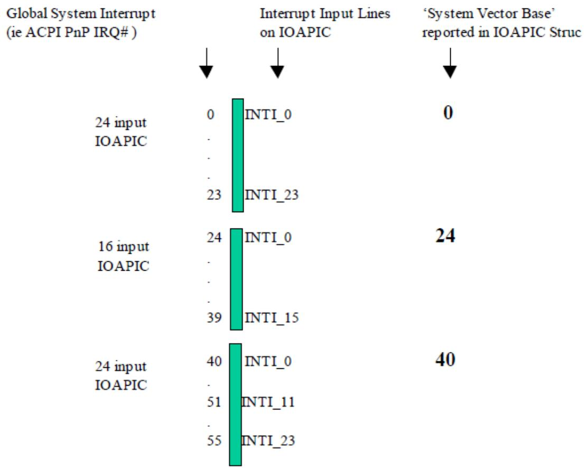  
Fig. 5.3: APIC-Global System Interrupts

The other interrupt model is the standard AT style mentioned above which uses ISA IRQs attached to a master/slave pair of 8259 PICs. The system vectors correspond to the ISA IRQs. The ISA IRQs and their mappings to the 8259 pair are part of the AT standard and are well defined. This mapping is depicted in the following figure.

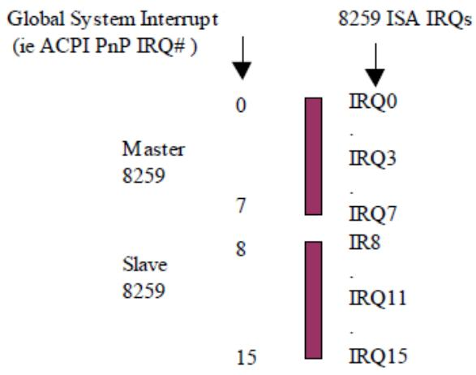  
Fig. 5.4: 8259 - Global System Interrupts

## 5.2.14 Smart Battery Table (SBST)

If the platform supports batteries as defined by the Smart Battery Specification 1.0 or 1.1, then an Smart Battery Table (SBST) is present. This table indicates the energy level trip points that the platform requires for placing the system into the specified sleeping state and the suggested energy levels for warning the user to transition the platform into a sleeping state. Notice that while Smart Batteries can report either in current (mA/mAh) or in energy (mW/mWh), OSPM must set them to operate in energy (mW/mWh) mode so that the energy levels specified in the SBST can be used. OSPM uses these tables with the capabilities of the batteries to determine the diferent trip points. For more precise definitions of these levels, see Section 3.9.

Table 5.63: Smart Battery Description Table (SBST) Format

<table><tr><td>Field</td><td>Byte Length</td><td>Byte Offset</td><td>Description</td></tr><tr><td colspan="4">Header</td></tr><tr><td>Signature</td><td>4</td><td>0</td><td>‘SBST’ Signature for the Smart Battery Description Table.</td></tr><tr><td>Length</td><td>4</td><td>4</td><td>Length, in bytes, of the entire SBST</td></tr><tr><td>Revision</td><td>1</td><td>8</td><td>1</td></tr><tr><td>Checksum</td><td>1</td><td>9</td><td>Entire table must sum to zero.</td></tr><tr><td>OEMID</td><td>6</td><td>10</td><td>OEM ID</td></tr><tr><td>OEM Table ID</td><td>8</td><td>16</td><td>For the SBST, the table ID is the manufacturer model ID.</td></tr><tr><td>OEM Revision</td><td>4</td><td>24</td><td>OEM revision of SBST for supplied OEM Table ID.</td></tr><tr><td>Creator ID</td><td>4</td><td>28</td><td>Vendor ID of utility that created the table. For tables containing Definition Blocks, this is the ID for the ASL Compiler.</td></tr><tr><td>Creator Revision</td><td>4</td><td>32</td><td>Revision of utility that created the table. For tables containing Definition Blocks, this is the revision for the ASL Compiler.</td></tr><tr><td>Warning Energy Level</td><td>4</td><td>36</td><td>OEM suggested energy level in milliWatt-hours (mWh) at which OSPM warns the user.</td></tr><tr><td>Low Energy Level</td><td>4</td><td>40</td><td>OEM suggested platform energy level in mWh at which OSPM will transition the system to a sleeping state.</td></tr></table>

continues on next page

Table 5.63 – continued from previous page

<table><tr><td>Field</td><td>Byte Length</td><td>Byte Offset</td><td>Description</td></tr><tr><td>Critical Energy Level</td><td>4</td><td>44</td><td>OEM suggested platform energy level in mWh at which OSPM performs an emergency shutdown.</td></tr></table>

## 5.2.15 Embedded Controller Boot Resources Table (ECDT)

This optional table provides the processor-relative, translated resources of an Embedded Controller. The presence of this table allows OSPM to provide Embedded Controller operation region space access before the namespace has been evaluated. If this table is not provided, the Embedded Controller region space will not be available until the Embedded Controller device in the AML namespace has been discovered and enumerated. The availability of the region space can be detected by providing a \_REG method object underneath the Embedded Controller device.

Table 5.64: Embedded Controller Boot Resources Table Format

<table><tr><td>Field</td><td>Byte Length</td><td>Byte Offset</td><td>Description</td></tr><tr><td>Header</td><td></td><td></td><td></td></tr><tr><td>Signature</td><td>4</td><td>0</td><td>‘ECDT’ Signature for the Embedded Controller Table.</td></tr><tr><td>Length</td><td>4</td><td>4</td><td>Length, in bytes, of the entire Embedded Controller Table</td></tr><tr><td>Revision</td><td>1</td><td>8</td><td>1</td></tr><tr><td>Checksum</td><td>1</td><td>9</td><td>Entire table must sum to zero.</td></tr><tr><td>OEMID</td><td>6</td><td>10</td><td>OEM ID</td></tr><tr><td>OEM Table ID</td><td>8</td><td>16</td><td>For the Embedded Controller Table, the table ID is the manufacturer model ID.</td></tr><tr><td>OEM Revision</td><td>4</td><td>24</td><td>OEM revision of Embedded Controller Table for supplied OEM Table ID.</td></tr><tr><td>Creator ID</td><td>4</td><td>28</td><td>Vendor ID of utility that created the table. For tables containing Definition Blocks, this is the ID for the ASL Compiler.</td></tr><tr><td>Creator Revision</td><td>4</td><td>32</td><td>Revision of utility that created the table. For tables containing Definition Blocks, this is the revision for the ASL Compiler.</td></tr><tr><td>EC_CONTROL</td><td>12</td><td>36</td><td>Contains the processor relative address, represented in Generic Address Structure format, of the Embedded Controller Command/Status register. | Note: Only System I/O space and System Memory space are valid for values for Address_Space_ID.</td></tr><tr><td>EC_DATA</td><td>12</td><td>48</td><td>Contains the processor-relative address, represented in Generic Address Structure format, of the Embedded Controller Data register. | Note: Only System I/O space and System Memory space are valid for values for Address_Space_ID.</td></tr><tr><td>UID</td><td>4</td><td>60</td><td>Unique ID-Same as the value returned by the _UID under the device in the namespace that represents this embedded controller.</td></tr><tr><td>GPE_BIT</td><td>1</td><td>64</td><td>The bit assignment of the SCI interrupt within the GPEx_STS register of a GPE block described in the FADT that the embedded controller triggers.</td></tr><tr><td>EC_ID</td><td>Variable</td><td>65</td><td>ASCII, null terminated, string that contains a fully qualified reference to the namespace object that is this embedded controller device (for example, “\_SB.PCI0.ISA.EC”). Quotes are omitted in the data field.</td></tr></table>

ACPI OSPM implementations supporting Embedded Controller devices must also support the ECDT. ACPI 1.0 OSPM implementation will not recognize or make use of the ECDT. The following example code shows how to detect whether the Embedded Controller operation regions are available in a manner that is backward compatible with prior versions of ACPI/OSPM.

```autohotkey
Device(EC0)
{
    Name(REGC, Ones)
    Method(_REG, 2)
    {
    If(Arg0 == 3)
    {
    REGC = Arg1
    }
    }
}

Method(ECAV, 0)
{
    If (REGC == Ones)
    {
    If (_REV >= 2)
    {
    Return(One)
    }
    Else
    {
    Return(Zero)
    }
    }
    Else
    {
    Return(REGC)
    }
}
```

To detect the availability of the region, call the ECAV method. For example:

```txt
If (\_SB.PCI0.EC0.ECAV())
{
    //...regions are available...
}
else
{
    //...regions are not available...
}
```

## 5.2.16 System Resource Afinity Table (SRAT)

This optional table provides information that allows OSPM to associate the following types of devices with system locality / proximity domains and clock domains:

• processors,

• memory ranges (including those provided by hot-added memory devices),

• generic initiators (e.g. heterogeneous processors and accelerators, GPUs, and I/O devices with integrated compute or DMA engines), and

• generic ports (e.g. host bridges that can dynamically discover new initiators and instantiate new memory range targets).

On NUMA platforms, SRAT information enables OSPM to optimally configure the operating system during a point in OS initialization when evaluation of objects in the ACPI Namespace is not yet possible.

OSPM evaluates the SRAT only during OS initialization. The Local APIC ID / Local SAPIC ID / Local x2APIC ID / GICC ACPI Processor UID or the RINTC ACPI Processor UID of all processors started at boot time must be present in the SRAT. If the Local APIC ID / Local SAPIC ID / Local x2APIC ID / GICC ACPI Processor UID or the RINTC ACPI Processor UID of a dynamically added processor is not present in the SRAT, a \_PXM object must exist for the processor’s device or one of its ancestors in the ACPI Namespace.

Note: SRAT is the place where proximity domains are defined, and \_PXM provides a mechanism to associate a device object (and its children) to an SRAT-defined proximity domain.

See Section 6.2.15 (\_PXM Proximity) for more information.

Table 5.65: Static Resource Afinity Table Format

<table><tr><td>Field</td><td>Byte Length</td><td>Byte Offset</td><td>Description</td></tr><tr><td>Header</td><td></td><td></td><td></td></tr><tr><td>Signature</td><td>4</td><td>0</td><td>‘SRAT’. Signature for the System Resource Affinity Table.</td></tr><tr><td>Length</td><td>4</td><td>4</td><td>Length, in bytes, of the entire SRAT. The length implies the number of Entry fields at the end of the table</td></tr><tr><td>Revision</td><td>1</td><td>8</td><td>3</td></tr><tr><td>Checksum</td><td>1</td><td>9</td><td>Entire table must sum to zero.</td></tr><tr><td>OEMID</td><td>6</td><td>10</td><td>OEM ID.</td></tr><tr><td>OEM Table ID</td><td>8</td><td>16</td><td>For the System Resource Affinity Table, the table ID is the manufacturer model ID.</td></tr><tr><td>OEM Revision</td><td>4</td><td>24</td><td>OEM revision of System Resource Affinity Table for supplied OEM Table ID.</td></tr><tr><td>Creator ID</td><td>4</td><td>28</td><td>Vendor ID of utility that created the table.</td></tr><tr><td>Creator Revision</td><td>4</td><td>32</td><td>Revision of utility that created the table.</td></tr><tr><td>Reserved</td><td>4</td><td>36</td><td>Reserved to be 1 for backward compatibility</td></tr><tr><td>Reserved</td><td>8</td><td>40</td><td>Reserved</td></tr><tr><td>Static Resource Allocation Structure[n]</td><td>—</td><td>48</td><td>A list of static resource allocation structures for the platform. See Processor Local APIC/SAPIC Affinity Structure, Memory Affinity Structure, Processor Local x2APIC Affinity Structure, and GICC Affinity Structure.</td></tr></table>

## 5.2.16.1 Processor Local APIC/SAPIC Afinity Structure

The Processor Local APIC/SAPIC Afinity structure provides the association between the APIC ID or SAPIC ID/EID of a processor and the proximity domain to which the processor belongs. See the Processor Local APIC/SAPIC Afinity structure.

Table 5.66: Processor Local APIC/SAPIC Afinity Structure

<table><tr><td>Field</td><td>Byte Length</td><td>Byte Offset</td><td>Description</td></tr><tr><td>Type</td><td>1</td><td>0</td><td>0 Processor Local APIC/SAPIC Affinity Structure</td></tr><tr><td>Length</td><td>1</td><td>1</td><td>16</td></tr><tr><td>Proximity Domain [7:0]</td><td>1</td><td>2</td><td>Bit [7:0] of the proximity domain to which the processor be- longs.</td></tr><tr><td>APIC ID</td><td>1</td><td>3</td><td>The processor local APIC ID.</td></tr><tr><td>Flags</td><td>4</td><td>4</td><td>Flags - Processor Local APIC/SAPIC Affinity Structure. See Processor Local APIC/SAPIC Affinity Structure for a descrip- tion of this field.</td></tr><tr><td>Local SAPIC EID</td><td>1</td><td>8</td><td>The processor local SAPIC EID.</td></tr><tr><td>Proximity Domain [31:8]</td><td>3</td><td>9</td><td>Bit [31:8] of the proximity domain to which the processor be- longs.</td></tr><tr><td>Clock Domain</td><td>4</td><td>12</td><td>The clock domain to which the processor belongs. See_CDM (Clock Domain).</td></tr></table>

Table 5.67: Flags - Processor Local APIC/SAPIC Afinity Structure

<table><tr><td>Field</td><td>Bit Length</td><td>Bit Off-set</td><td>Description</td></tr><tr><td>Enabled</td><td>1</td><td>0</td><td>If clear, the OSPM ignores the contents of the Processor Local APIC/SAPIC Affinity Structure. This allows system firmware to populate the SRAT with a static number of structures but only enable them as necessary.</td></tr><tr><td>Reserved</td><td>31</td><td>1</td><td>Must be zero.</td></tr></table>

## 5.2.16.2 Memory Afinity Structure

The Memory Afinity structure provides the following topology information statically to the operating system:

• The association between a memory range and the proximity domain to which it belongs

• Information about whether the memory range can be hot-plugged.

See the table below for more details.

Table 5.68: Memory Afinity Structure

<table><tr><td>Field</td><td>Byte Length</td><td>Byte Offset</td><td>Description</td></tr><tr><td>Type</td><td>1</td><td>0</td><td>1 Memory Affinity Structure</td></tr></table>

Table 5.68 – continued from previous page

<table><tr><td>Field</td><td>Byte Length</td><td>Byte Offset</td><td>Description</td></tr><tr><td>Length</td><td>1</td><td>1</td><td>40</td></tr><tr><td>Proximity Domain</td><td>4</td><td>2</td><td>Integer that represents the proximity domain to which the memory range belongs.</td></tr><tr><td>Reserved</td><td>2</td><td>6</td><td>Reserved</td></tr><tr><td>Base Address Low</td><td>4</td><td>8</td><td>Low 32 Bits of the Base Address of the memory range</td></tr><tr><td>Base Address High</td><td>4</td><td>12</td><td>High 32 Bits of the Base Address of the memory range</td></tr><tr><td>Length Low</td><td>4</td><td>16</td><td>Low 32 Bits of the length of the memory range.</td></tr><tr><td>Length High</td><td>4</td><td>20</td><td>High 32 Bits of the length of the memory range.</td></tr><tr><td>Reserved</td><td>4</td><td>24</td><td>Reserved</td></tr><tr><td>Flags</td><td>4</td><td>28</td><td>Flags - Memory Affinity Structure. Indicates whether the region of memory is enabled and can be hot plugged. See Table 5.69 for more details.</td></tr><tr><td>Reserved</td><td>8</td><td>32</td><td>Reserved</td></tr></table>

Table 5.69: Flags - Memory Afinity Structure

<table><tr><td>Field</td><td>Bit Length</td><td>Bit Off-set</td><td>Description</td></tr><tr><td>Enabled</td><td>1</td><td>0</td><td>If set, it implies that this memory region belongs to the specified Proximity Domain.If clear, the OSPM ignores the contents of the Memory Affinity Structure. This allows system firmware to populate the SRAT with a static number of structures but only enable then as necessary.</td></tr></table>

continues on next page

Table 5.69 – continued from previous page

<table><tr><td>Field</td><td>Bit Length</td><td>Bit Off-set</td><td>Description</td></tr><tr><td rowspan="3">Hot Pluggable</td><td rowspan="3">1</td><td rowspan="3">1</td><td>The information conveyed by this bit depends on the value of the Enabled bit:If the Enabled bit is set and the Hot Pluggable bit is also set, the system hardware supports hot-add and hot-remove of this memory region. If this memory region is not present at boot-time, it shall not be declared in the System Address Map, but it could then be hot-added during OS runtime.If the Enabled bit is set and the Hot Pluggable bit is clear, the system hardware does not support hot-add or hot-remove of this memory region.If the Enabled bit is clear, the OSPM will ignore the contents of the Memory Affinity Structure.</td></tr><tr><td>If this bit is set and there is no native mechanism for hot-plug of the memory ranges described by this structure, there must exist a memory device (see Section 9.11), where the following conditions are satisfied:This memory region must be a part of the memory range described by the memory device.The memory device must satisfy the hot-pluggability conditions outlined in Section 9.11.1.</td></tr><tr><td>Please see Section 9.11.3 for an example of memory that has an associated native hot-plug mechanism.</td></tr><tr><td>NonVolatile</td><td>1</td><td>2</td><td>If set, the memory region represents Non-Volatile memory</td></tr><tr><td>Specific-Purpose</td><td>29</td><td>3</td><td>Indicates whether this memory is intended for specific-purpose usage. This field is functionally analogous to the UEFI EFI_MEMORY_SP attribute. See the UEFI specification for more details on this attribute.</td></tr><tr><td>Reserved</td><td>28</td><td>4</td><td>Must be zero.</td></tr></table>

## 5.2.16.3 Processor Local x2APIC Afinity Structure

The Processor Local x2APIC Afinity structure provides the association between the local x2APIC ID of a processor and the proximity domain to which the processor belongs. Section 5.2.16.3 provides the details of the Processor Local x2APIC Afinity structure.

Table 5.70: Processor Local x2APIC Afinity Structure

<table><tr><td>Field</td><td>Byte Length</td><td>Byte Offset</td><td>Description</td></tr><tr><td>Type</td><td>1</td><td>0</td><td>2 Processor Local x2APIC Affinity Structure</td></tr><tr><td>Length</td><td>1</td><td>1</td><td>24</td></tr></table>

continues on next page

Table 5.70 – continued from previous page

<table><tr><td>Field</td><td>Byte Length</td><td>Byte Offset</td><td>Description</td></tr><tr><td>Reserved</td><td>2</td><td>2</td><td>Reserved - Must be zero</td></tr><tr><td>Proximity Domain</td><td>4</td><td>4</td><td>The proximity domain to which the logical processor belongs.</td></tr><tr><td>X2APIC ID</td><td>4</td><td>8</td><td>The processor local x2APIC ID.</td></tr><tr><td>Flags</td><td>4</td><td>12</td><td>Same as Processor Local APIC/SAPIC Affinity Structure flags. See the corresponding table below for a description of this field.</td></tr><tr><td>Clock Domain</td><td>4</td><td>16</td><td>The clock domain to which the logical processor belongs. See_CDM (Clock Domain).</td></tr><tr><td>Reserved</td><td>4</td><td>20</td><td>Reserved.</td></tr></table>

On x86-based platforms, the OSPM uses the Hot Pluggable bit to determine whether it should shift into PAE mode to allow for insertion of hot-plug memory with physical addresses over 4 GB.

## 5.2.16.4 GICC Afinity Structure

The GICC Afinity Structure provides the association between the ACPI Processor UID of a processor and the proximity domain to which the processor belongs. Section 5.2.16.4 provides the details of the GICC Afinity structure.

Table 5.71: GICC Afinity Structure

<table><tr><td>Field</td><td>Byte Length</td><td>Byte Offset</td><td>Description</td></tr><tr><td>Type</td><td>1</td><td>0</td><td>3 GICC Affinity Structure.</td></tr><tr><td>Length</td><td>1</td><td>1</td><td>18</td></tr><tr><td>Proximity Domain</td><td>4</td><td>2</td><td>The proximity domain to which the logical processor belongs.</td></tr><tr><td>ACPI Processor UID</td><td>4</td><td>6</td><td>The ACPI Processor UID of the associated GICC.</td></tr><tr><td>Flags</td><td>4</td><td>10</td><td>Flags - GICC Affinity Structure. See the corresponding table below for a description of this field.</td></tr><tr><td>Clock Domain</td><td>4</td><td>14</td><td>The clock domain to which the logical processor belongs. See_CDM (Clock Domain).</td></tr></table>

Table 5.72: Flags - GICC Afinity Structure

<table><tr><td>Field</td><td>Bit Length</td><td>Bit Off-set</td><td>Description</td></tr><tr><td>Enabled</td><td>1</td><td>0</td><td>If clear, the OSPM ignores the contents of the GICC Affinity Structure. This allows system firmware to populate the SRAT with a static number of structures but only enable them as necessary.</td></tr><tr><td>Reserved</td><td>31</td><td>1</td><td>Must be zero.</td></tr></table>

## 5.2.16.5 GIC Interrupt Translation Service (ITS) Afinity Structure

The GIC ITS Afinity Structure provides the association between a GIC ITS and a proximity domain. This enables the OSPM to discover the memory that is closest to the ITS, and use that in allocating its management tables and command queue. The ITS is identified using an ID matching a declaration of a GIC ITS in the MADT, see Section 5.2.12.18 for details. The following table provides the details of the GIC ITS Afinity structure.

Table 5.73: Architecture Specific Afinity Structure

<table><tr><td>Field</td><td>Byte Length</td><td>Byte Offset</td><td>Description</td></tr><tr><td>Type</td><td>1</td><td>0</td><td>4 GIC ITS Affinity Structure</td></tr><tr><td>Length</td><td>1</td><td>1</td><td>12</td></tr><tr><td>Proximity domain</td><td>4</td><td>2</td><td>Integer that represents the proximity domain to which the GIC ITS be- longs to.</td></tr><tr><td>Reserved</td><td>2</td><td>6</td><td>Reserved must be zero</td></tr><tr><td>ITS ID</td><td>4</td><td>8</td><td>ITS ID matching a GIC ITS entry in the MADT</td></tr></table>

## 5.2.16.6 Generic Initiator Afinity Structure

The Generic Initiator Afinity Structure provides the association between a generic initiator and the proximity domain to which the initiator belongs.

Support of Generic Initiator Afinity Structures by OSPM is optional, and the platform may query whether the OS supports it via the \_OSC method. See Section 6.2.12.2 for more details.

Table 5.74: Generic Initiator Afinity Structure

<table><tr><td>Field</td><td>Byte Length</td><td>Byte Offset</td><td>Description</td></tr><tr><td>Type</td><td>1</td><td>0</td><td>5 Generic Initiator Structure.</td></tr><tr><td>Length</td><td>1</td><td>1</td><td>32</td></tr><tr><td>Reserved</td><td>1</td><td>2</td><td>Reserved and must be zero.</td></tr><tr><td>Device Handle Type</td><td>1</td><td>3</td><td></td></tr><tr><td></td><td></td><td></td><td>Device Handle Type:0 - ACPI Device Handle1 - PCI Device Handle2-255 - Reserved</td></tr><tr><td>Proximity Domain</td><td>4</td><td>4</td><td>The proximity domain to which the generic initiator belongs.</td></tr><tr><td>Device Handle</td><td>16</td><td>8</td><td>Device Handle of the Generic Initiator. See Device Handle - ACPI for a description of the ACPI Device Handle, and Device Handle - PCI for a description of the PCI Device Handle.</td></tr><tr><td>Flags</td><td>4</td><td>24</td><td>Flags - Generic Initiator/Port Affinity Structure. See Section 5.2.16.7 for a description of this field.</td></tr><tr><td>Reserved</td><td>4</td><td>28</td><td>Reserved and must be zero.</td></tr></table>

Table 5.75: Device Handle - ACPI

<table><tr><td>Field</td><td>Byte Length</td><td>Byte Offset</td><td>Description</td></tr><tr><td>ACPI_HID</td><td>8</td><td>0</td><td>The _HID value</td></tr><tr><td>ACPI_UID</td><td>4</td><td>8</td><td>The _UID value</td></tr><tr><td>Reserved</td><td>4</td><td>12</td><td>Must be zero.</td></tr></table>

Table 5.76: Device Handle - PCI

<table><tr><td>Field</td><td>Byte Length</td><td>Byte Offset</td><td>Description</td></tr><tr><td>PCI Segment</td><td>2</td><td>0</td><td>PCI segment number. For systems with fewer than 255 PCI buses, this number must be 0.</td></tr><tr><td>PCI BDF Number</td><td>2</td><td>2</td><td>PCI Bus Number (Bits 7:0 of Byte 2)PCI Device Number (Bits 7:3 of Byte 3)PCI Function Number (Bits 2:0 of Byte 3)</td></tr><tr><td>Reserved</td><td>12</td><td>4</td><td>Must be zero</td></tr></table>

## 5.2.16.7 Generic Port Afinity Structure

The Generic Port Afinity Structure provides an association between a proximity domain number and a device handle representing a Generic Port (e.g. CXL Host Bridge, or similar device that hosts a dynamic topology of memory ranges and/or initiators).

Support of Generic Port Afinity Structures by an OSPM is optional.

Table 5.77: Generic Port Afinity Structure Table

<table><tr><td>Field</td><td>Byte Length</td><td>Byte Offset</td><td>Description</td></tr><tr><td>Type</td><td>1</td><td>0</td><td>6 Generic Port Structure</td></tr><tr><td>Length</td><td>1</td><td>1</td><td>32</td></tr><tr><td>Reserved</td><td>1</td><td>2</td><td>Reserved and must be zero.</td></tr><tr><td>Device Handle Type</td><td>1</td><td>3</td><td>Device Handle Type: See Section 5.2.16.6 for the possible device handle types and their format.</td></tr><tr><td>Proximity Domain</td><td>4</td><td>4</td><td>The proximity domain to identify the performance of this port in the HMAT.</td></tr><tr><td>Device Handle</td><td>16</td><td>8</td><td>Device Handle of the Generic Port: see Table 5.75 and Table 5.76 for a description of this field.</td></tr><tr><td>Flags</td><td>4</td><td>24</td><td>See Table 5.78 for a description of this field.</td></tr><tr><td>Reserved</td><td>4</td><td>28</td><td>Reserved and must be zero.</td></tr></table>

Table 5.78: Flags - Generic Initiator/Port Afinity Structure

<table><tr><td>Field</td><td>Bit Length</td><td>Bit Off-set</td><td>Description</td></tr></table>

continues on next page

Table 5.78 – continued from previous page

<table><tr><td>Enabled</td><td>1</td><td>0</td><td>If clear, the OSPM ignores the contents of the Generic Initiator/Port Affinity Structure. This allows system firmware to populate the SRAT with a static number of structures, but only enable them as necessary.</td></tr><tr><td>Architectural transactions</td><td>1</td><td>1</td><td>If set, indicates that the Generic Initiator/Port can initiate all transactions at the same architectural level as the host (e.g. full atomicOps, cache coherency, virtual memory, etc.) See implementation note following.</td></tr><tr><td>Reserved</td><td>30</td><td>2</td><td>Must be zero.</td></tr></table>

## ò Note

If a generic device with coherent memory is attached to the system, it is recommended to define afinity structures for both the device and memory associated with the device. They both may have the same proximity domain.

If a generic device is marked with “architectural transactions,” the Generic Initiator supports all applicable architectural mechanisms for cache synchronization, atomicOps and virtual memory, etc. - fully equivalent to the memory model of the host processor (with potentially diferent but equivalent instruction mechanisms in its ISA).

Supporting a subset of architectural transactions would be only permissible if the lack of the feature does not have material consequences to the memory model. One example is lack of cache coherency support on the GI, if the GI does not have any local caches to global memory that require invalidation through the data fabric.

OS is assured that the GI adheres to the memory model as the host processor architecture related to observable transactions to memory for memory fences and other synchronization operations issued on either initiator or host.

## 5.2.16.8 RINTC Afinity Structure

The RINTC Afinity Structure provides the association between the ACPI Processor UID of a RISC-V processor and the proximity domain to which the processor belongs. Table below provides the details of the RINTC Afinity structure.

Table 5.79: RINTC Afinity Structure

<table><tr><td>Field</td><td>Byte Length</td><td>Byte Offset</td><td>Description</td></tr><tr><td>Type</td><td>1</td><td>0</td><td>7 RINTC Affinity Structure</td></tr><tr><td>Length</td><td>1</td><td>1</td><td>20</td></tr><tr><td>Reserved</td><td>2</td><td>2</td><td>Must be zero</td></tr><tr><td>Proximity Domain</td><td>4</td><td>4</td><td>The proximity domain to which the logical processor belongs.</td></tr><tr><td>ACPI Processor UID</td><td>4</td><td>8</td><td>The ACPI Processor UID of the associated RINTC.</td></tr><tr><td>Flags</td><td>4</td><td>12</td><td>Flags - RINTC Affinity Structure. See the corresponding table below for a description of this field.</td></tr><tr><td>Clock Domain</td><td>4</td><td>16</td><td>The clock domain to which the logical processor belongs. See_CDM (Clock Domain).</td></tr></table>

Table 5.80: Flags - RINTC Afinity Structure

<table><tr><td>Field</td><td>Bit Length</td><td>Bit set</td><td>Off-</td><td>Description</td></tr><tr><td>Enabled</td><td>1</td><td>0</td><td></td><td>If clear, the OSPM ignores the contents of the RINTC Affinity Structure. This allows system firmware to populate the SRAT with a static number of structures but only enable them as necessary.</td></tr><tr><td>Reserved</td><td>31</td><td>1</td><td></td><td>Must be zero</td></tr></table>

## 5.2.17 System Locality Information Table (SLIT)

This optional table provides a matrix that describes the relative distance (memory latency) between all System Localities, which are also referred to as Proximity Domains. Systems employing a Non Uniform Memory Access (NUMA) architecture contain collections of hardware resources including for example, processors, memory, and I/O buses, that comprise what is known as a “NUMA node”. Processor accesses to memory or I/O resources within the local NUMA node is generally faster than processor accesses to memory or I/O resources outside of the local NUMA node.

The value of each Entry[i,j] in the SLIT table, where i represents a row of a matrix and j represents a column of a matrix, indicates the relative distances from System Locality / Proximity Domain i to every other System Locality j in the system (including itself).

The i,j row and column values correlate to Proximity Domain values in the System Resource Afinity Table (SRAT), and to values returned by \_PXM objects in the ACPI namespace. See Section 5.2.16 for more information.

The entry value is a one-byte unsigned integer. The relative distance from System Locality i to System Locality j is the i\*N + j entry in the matrix, where N is the number of System Localities. Except for the relative distance from a System Locality to itself, each relative distance is stored twice in the matrix. This provides the capability to describe the scenario where the relative distances for the two directions between System Localities is diferent.

The diagonal elements of the matrix, the relative distances from a System Locality to itself are normalized to a value of 10. The relative distances for the non-diagonal elements are scaled to be relative to 10. For example, if the relative distance from System Locality i to System Locality j is 2.4, a value of 24 is stored in table entry i\*N+ j and in j\*N+ i, where N is the number of System Localities.

If one locality is unreachable from another, a value of 255 (0xFF) is stored in that table entry. Distance values of 0-9 are reserved and have no meaning.

Table 5.81: SLIT Format

<table><tr><td>Field</td><td>Byte Length</td><td>Byte Offset</td><td>Description</td></tr><tr><td colspan="4">Header</td></tr><tr><td>- Signature</td><td>4</td><td>0</td><td>‘SLIT’. Signature for the System Locality Distance Information Table.</td></tr><tr><td>- Length</td><td>4</td><td>4</td><td>Length, in bytes, of the entire System Locality Distance Information Table.</td></tr><tr><td>- Revision</td><td>1</td><td>8</td><td>1</td></tr><tr><td>- Checksum</td><td>1</td><td>9</td><td>Entire table must sum to zero.</td></tr><tr><td>- OEMID</td><td>6</td><td>10</td><td>OEM ID.</td></tr><tr><td>- OEM Table ID</td><td>8</td><td>16</td><td>For the System Locality Information Table, the table ID is the manufacturer model ID.</td></tr><tr><td>- OEM Revision</td><td>4</td><td>24</td><td>OEM revision of System Locality Information Table for supplied OEM Table ID.</td></tr></table>

continues on next page

Table 5.81 – continued from previous page

<table><tr><td>Field</td><td>Byte Length</td><td>Byte Offset</td><td>Description</td></tr><tr><td>- Creator ID</td><td>4</td><td>28</td><td>Vendor ID of utility that created the table. For the DSDT, RSDT, SSDT, and PSDT tables, this is the ID for the ASL Compiler.</td></tr><tr><td>- Creator Revision</td><td>4</td><td>32</td><td>Revision of utility that created the table. For the DSDT, RSDT, SSDT, and PSDT tables, this is the revision for the ASL Compiler.</td></tr><tr><td>Number of System Localities</td><td>8</td><td>36</td><td>Indicates the number of System Localities in the system.</td></tr><tr><td>Entry[0][0]</td><td>1</td><td>44</td><td>Matrix entry (0,0), contains a value of 10.</td></tr><tr><td>...</td><td></td><td></td><td>...</td></tr><tr><td>Entry[0][Number of System Localities-1]</td><td>1</td><td></td><td>Matrix entry (0, Number of System Localities-1)</td></tr><tr><td>Entry[1][0]</td><td>1</td><td></td><td>Matrix entry (1,0)</td></tr><tr><td>...</td><td></td><td></td><td>...</td></tr><tr><td>Entry [Number of System Localities-1] [Number of System Localities-1]</td><td>1</td><td></td><td>Matrix entry (Number of System Localities-1, Number of System Localities-1), contains a value of 10</td></tr></table>

## 5.2.18 Corrected Platform Error Polling Table (CPEP)

Platforms may contain the ability to detect and correct certain operational errors while maintaining platform function. These errors may be logged by the platform for the purpose of retrieval. Depending on the underlying hardware support, the means for retrieving corrected platform error information varies. If the platform hardware supports interrupt-based signaling of corrected platform errors, the MADT Platform Interrupt Source Structure describes the Corrected Platform Error Interrupt (CPEI). See Section 5.2.12.11. Alternatively, OSPM may poll processors for corrected platform error information. Error log information retrieved from a processor may contain information for all processors within an error reporting group. As such, it may not be necessary for OSPM to poll all processors in the system to retrieve complete error information. This optional table provides information that allows OSPM to poll only the processors necessary for a complete report of the platform’s corrected platform error information.

Table 5.82: Corrected Platform Error Polling Table Format

<table><tr><td>Field</td><td>Byte Length</td><td>Byte Offset</td><td>Description</td></tr><tr><td>Header</td><td></td><td></td><td></td></tr><tr><td>- Signature</td><td>4</td><td>0</td><td>‘CPEP’. Signature for the Corrected Platform Error Polling Table.</td></tr><tr><td>- Length</td><td>4</td><td>4</td><td>Length, in bytes, of the entire CPET. The length implies the number of Entry fields at the end of the table</td></tr><tr><td>- Revision</td><td>1</td><td>8</td><td>1</td></tr><tr><td>- Checksum</td><td>1</td><td>9</td><td>Entire table must sum to zero.</td></tr><tr><td>- OEMID</td><td>6</td><td>10</td><td>OEM ID.</td></tr><tr><td>- OEM Table ID</td><td>8</td><td>16</td><td>For the Corrected Platform Error Polling Table, the table ID is the manufacturer model ID.</td></tr><tr><td>- OEM Revision</td><td>4</td><td>24</td><td>OEM revision of Corrected Platform Error Polling Table for supplied OEM Table ID.</td></tr><tr><td>- Creator ID</td><td>4</td><td>28</td><td>Vendor ID of utility that created the table.</td></tr><tr><td>- Creator Revision</td><td>4</td><td>32</td><td>Revision of utility that created the table.</td></tr></table>

continues on next page

Table 5.82 – continued from previous page

<table><tr><td>Field</td><td>Byte Length</td><td>Byte Offset</td><td>Description</td></tr><tr><td>Reserved</td><td>8</td><td>36</td><td>Reserved, must be 0.</td></tr><tr><td>CPEP Processor Structure[n]</td><td>—</td><td>44</td><td>A list of Corrected Platform Error Polling Processor structures for the platform. See corresponding table below.</td></tr></table>

## 5.2.18.1 Corrected Platform Error Polling Processor Structure

The Corrected Platform Error Polling Processor structure provides information on the specific processors OSPM polls for error information. See corresponding table below for details of the Corrected Platform Error Polling Processor structure.

Table 5.83: Corrected Platform Error Polling Processor Structure

<table><tr><td>Field</td><td>Byte Length</td><td>Byte Offset</td><td>Description</td></tr><tr><td>Type</td><td>1</td><td>0</td><td>0 Corrected Platform Error Polling Processor structure for APIC/SAPIC based processors</td></tr><tr><td>Length</td><td>1</td><td>1</td><td>8</td></tr><tr><td>Processor ID</td><td>1</td><td>2</td><td>Processor ID of destination.</td></tr><tr><td>Processor EID</td><td>1</td><td>3</td><td>Processor EID of destination.</td></tr><tr><td>Polling Interval</td><td>4</td><td>4</td><td>Platform-suggested polling interval (in milliseconds)</td></tr></table>

## 5.2.19 Maximum System Characteristics Table (MSCT)

This section describes the format of the Maximum System Characteristic Table (MSCT), which provides OSPM with information characteristics of a system’s maximum topology capabilities. If the system maximum topology is not known up front at boot time, then this table is not present. OSPM will use information provided by the MSCT only when the System Resource Afinity Table (SRAT) exists. The MSCT must contain all proximity and clock domains defined in the SRAT.

Table 5.84: Maximum System Characteristics Table (MSCT) Format

<table><tr><td>Field</td><td>Byte Length</td><td>Byte Offset</td><td>Description</td></tr><tr><td colspan="4">Header</td></tr><tr><td>- Signature</td><td>4</td><td>0</td><td>‘MSCT’ Signature for the Maximum System Characteristics Table.</td></tr><tr><td>Length</td><td>4</td><td>4</td><td>Length, in bytes, of the entire MSCT.</td></tr><tr><td>Revision</td><td>1</td><td>8</td><td>1</td></tr><tr><td>Checksum</td><td>1</td><td>9</td><td>Entire table must sum to zero.</td></tr><tr><td>OEMID</td><td>6</td><td>10</td><td>OEM ID</td></tr><tr><td>OEM Table ID</td><td>8</td><td>16</td><td>For the MSCT, the table ID is the manufacturer model ID.</td></tr><tr><td>OEM Revision</td><td>4</td><td>24</td><td>OEM revision of MSCT for supplied OEM Table ID.</td></tr><tr><td>Creator ID</td><td>4</td><td>28</td><td>Vendor ID of utility that created the table. For tables containing Definition Blocks, this is the ID for the ASL Compiler.</td></tr><tr><td>Creator Revision</td><td>4</td><td>32</td><td>Revision of utility that created the table. For tables containing Definition Blocks, this is the revision for the ASL Compiler.</td></tr><tr><td>Offset to Proximity Domain Information Structure [OffsetProxDomInfo]</td><td>4</td><td>36</td><td>Offset in bytes to the Proximity Domain Information Structure table entry.</td></tr><tr><td>Maximum Number of Proximity Domains</td><td>4</td><td>40</td><td>Indicates the maximum number of Proximity Domains ever possible in the system. The number reported in this field is (maximum domains - 1). For example if there are 0x10000 possible domains in the system, this field would report 0xFFFF.</td></tr><tr><td>Maximum Number of Clock Domains</td><td>4</td><td>44</td><td>Indicates the maximum number of Clock Domains ever possible in the system. The number reported in this field is (maximum domains - 1). See Section 6.2.1.</td></tr><tr><td>Maximum Physical Address</td><td>8</td><td>48</td><td>Indicates the maximum Physical Address ever possible in the system. Note: this is the top of the reachable physical address.</td></tr><tr><td>Proximity Domain Information Structure[Maximum Number of Proximity Domains]</td><td>-</td><td>[OffsetProx-DomInfo]</td><td>A list of Proximity Domain Information for this implementation. The structure format is defined in the Maximum Proximity Domain Information Structure section.</td></tr></table>

## 5.2.19.1 Maximum Proximity Domain Information Structure

The Maximum Proximity Domain Information Structure is used to report system maximum characteristics. It is likely that these characteristics may be the same for many proximity domains, but they can vary from one proximity domain to another. This structure optimizes to cover the former case, while allowing the flexibility for the latter as well. These structures must be organized in ascending order of the proximity domain enumerations. All proximity domains within the Maximum Number of Proximity Domains reported in the MSCT must be covered by one of these structures.

Table 5.85: Maximum Proximity Domain Information Structure

<table><tr><td>Field</td><td>Byte Length</td><td>Byte Offset</td><td>Description</td></tr><tr><td>Revision</td><td>1</td><td>0</td><td>1</td></tr><tr><td>Length</td><td>1</td><td>1</td><td>22</td></tr><tr><td>Proximity Domain Range (low)</td><td>4</td><td>2</td><td>The starting proximity domain for the proximity domain range that this structure is providing information.</td></tr><tr><td>Proximity Domain Range (high)</td><td>4</td><td>6</td><td>The ending proximity domain for the proximity domain range that this structure is providing information.</td></tr><tr><td>Maximum Processor Capacity</td><td>4</td><td>10</td><td>The Maximum Processor Capacity of each of the Proximity Domains specified in the range. A value of 0 means that the proximity domains do not contain processors. This field must be &gt;= the number of processor entries for the domain in the SRAT.</td></tr><tr><td>Maximum Memory Capacity</td><td>8</td><td>14</td><td>The Maximum Memory Capacity (size in bytes) of the Proximity Domains specified in the range. A value of 0 means that the proximity domains do not contain memory.</td></tr></table>

## 5.2.20 ACPI RAS Feature Table (RASF)

The following table describes the structure of ACPI RAS Feature Table.

Table 5.86: RASF Table format

<table><tr><td>Field</td><td>Byte Length</td><td>Byte Offset</td><td>Description</td></tr><tr><td colspan="4">Header</td></tr><tr><td>- Signature</td><td>4</td><td>0</td><td>‘RASF’ is Signature for RAS Feature Table</td></tr><tr><td>- Length</td><td>4</td><td>4</td><td>Length in bytes for entire RASF. The length implies the number of Entry fields at the end of the table</td></tr><tr><td>- Revision</td><td>1</td><td>8</td><td>1</td></tr><tr><td>- Checksum</td><td>1</td><td>9</td><td>Entire table must sum to zero</td></tr><tr><td>- OEMID</td><td>6</td><td>10</td><td>OEM ID</td></tr><tr><td>- OEM Table ID</td><td>8</td><td>16</td><td>The table ID is the manufacturer model ID</td></tr><tr><td>- OEM Revision</td><td>4</td><td>24</td><td>OEM revision of table for supplied OEM Table ID</td></tr><tr><td>- Creator ID</td><td>4</td><td>28</td><td>Vendor ID of utility that created the table</td></tr><tr><td>- Creator Revision</td><td>4</td><td>32</td><td>Revision of utility that created the table</td></tr><tr><td colspan="4">RASF Specific Entries</td></tr><tr><td>- RASF Platform Communication Channel Identifier</td><td>12</td><td>36</td><td>Identifier of the RASF Platform Communication Channel. OSPM should use this value to identify the PCC Sub channel structure in the RASF table</td></tr></table>

## 5.2.20.1 RASF PCC Sub Channel Identifier

RASF PCC Sub Channel Identifier is used by the OSPM to identify the PCC Sub channel structure. RASF table references its PCC Subspace by this identifier as shown in Table 5.86 .

## 5.2.20.2 Using PCC registers

OSPM will write PCC registers by filling in the register value in PCC sub channel space and issuing a PCC Execute command. See Table 5.88.

To minimize the cost of PCC transactions, OSPM should read or write all registers in the same PCC subspace via a single read or write command.

## 5.2.20.3 RASF Communication Channel

RASF Action Entries are defined in the PCC sub channel as below.

Table 5.87: RASF Platform Communication Channel Shared Memory Region

<table><tr><td>Field</td><td>Byte Length</td><td>Byte Offset</td><td>Description</td></tr><tr><td>Signature</td><td>4</td><td>0</td><td>The PCC Signature of 0x52415346 (corresponds to ASCII signature of RASF)</td></tr><tr><td>Command</td><td>2</td><td>4</td><td>PCC command field; see PCC Command Codes used by RASF Platform Communication Channel, and the Platform Communications Channel (PCC).</td></tr><tr><td>Status</td><td>2</td><td>6</td><td>PCC status field. See Platform Communications Channel (PCC).</td></tr><tr><td colspan="4">Communication Space:</td></tr><tr><td>Version</td><td>2</td><td>8</td><td>Byte 0 - Minor Version | Byte 1 - Major Version</td></tr><tr><td>RAS Capabilities</td><td>16</td><td>10</td><td>Bit Map describing the platform RAS capabilities as shown in Platform RAS Capabilities. The Platform pop-ulates this field. The OSPM uses this field to determine the RAS capabilities of the platform.</td></tr><tr><td>Set RAS Capabilities</td><td>16</td><td>26</td><td>Bit Map of the RAS features for which the OSPM is in-voking the command. The Bit Map is described in Section 5.2.20.4. OSPM sets the bit corresponding to a RAS capability to invoke a command on that capability. The bitmap implementation allows OSPM to invoke a com-mand on each RAS feature supported by the platform at the same time.</td></tr><tr><td>Number of RASF Parameter blocks</td><td>2</td><td>42</td><td>The Number of parameter blocks will depend on how many RAS Capabilities the Platform Supports. Typically, there will be one Parameter Block per RAS Fea-ture, using which that feature can be managed by OSPM.</td></tr></table>

continues on next page

Table 5.87 – continued from previous page

<table><tr><td>Field</td><td>Byte Length</td><td>Byte Offset</td><td>Description</td></tr><tr><td>Set RAS Capabilities Status</td><td>4</td><td>44</td><td>Status:0000b = Success0001b = Not Valid0010b = Not Supported0011b = Busy0100b = FailedF0101b = Aborted0110b = Invalid Data</td></tr><tr><td>Parameter Blocks</td><td>Varies (N Bytes)</td><td>48</td><td>Start of the parameter blocks, the structure of which is shown in the Parameter Block Structure for PATROL_SCRUB. These parameter blocks are used as communication mailbox between the OSPM and the platform, and there is 1 parameter block for each RAS feature. NOTE: There can be only on parameter block per type.</td></tr></table>

Table 5.88: PCC Command Codes used by RASF Platform Communication Channel

<table><tr><td>Command</td><td>Description</td></tr><tr><td>0x00</td><td>Reserved</td></tr><tr><td>0x01</td><td>Execute RASF Command.</td></tr><tr><td>0x02-0xFF</td><td>All other values are reserved.</td></tr></table>

## 5.2.20.4 Platform RAS Capabilities

The following table defines the Platform RAS capabilities:

Table 5.89: Platform RAS Capabilities Bitmap

<table><tr><td>Bit</td><td>RAS Feature</td><td>Description</td></tr><tr><td>0</td><td>Hardware based patrol scrub supported</td><td>Indicates that the platform supports hardware based patrol scrub of DRAM memory</td></tr><tr><td>1</td><td>Hardware based patrol scrub supported and exposed to software</td><td>Indicates that the platform supports hardware based patrol scrub of DRAM memory and platform exposes this capability to software using this RASF mechanism</td></tr><tr><td>2-127</td><td>Reserved</td><td>Reserved for future use</td></tr></table>

## 5.2.20.5 Parameter Block

The following table describes the Parameter Blocks. The structure is used to pass parameters for controlling the corresponding RAS Feature.

Each RAS Feature is assigned a TYPE number, which is the bit index into the RAS capabilities bitmap described in Table 5.89 .

Table 5.90: Parameter Block Structure for PATROL\_SCRUB

<table><tr><td colspan="2">Field</td><td>Byte Length</td><td>Byte Offset</td><td>Description</td></tr><tr><td colspan="2">Type</td><td>2</td><td>0</td><td>0x0000 - Patrol scrub</td></tr><tr><td colspan="2">Version</td><td>2</td><td>2</td><td>Byte 0 - Minor Version | Byte 1 - Major Version</td></tr><tr><td colspan="2">Length</td><td>2</td><td>4</td><td>Length, in bytes of the entire parameter block structure</td></tr><tr><td rowspan="2" colspan="2">Patrol Scrub Command (INPUT)</td><td>2</td><td>6</td><td></td></tr><tr><td></td><td></td><td>0x01 - GET_PATROL_PARAMETERS0x02 - START_PATROL_SCRUBBER0x03 - STOP_PATROL_SCRUBBER</td></tr><tr><td>Requested Range(INPUT)</td><td>Address</td><td>16</td><td>8</td><td>OSPM Specifies the BASE (Bytes 7-0) and SIZE (Bytes 15-8) of the address range to be patrol scrubbed. OSPM sets this parameter for the following commands: GET_PATROL_PARAMETERS and START_PATROL_SCRUBBER</td></tr><tr><td colspan="2">Actual Address Range (OUTPUT)</td><td>16</td><td>24</td><td>The platform returns this value in response to GET_PATROL_PARAMETERS. The platform calculates the nearest patrol scrub boundary address from where it can start. This range should be a superset of the Requested Address Range. BASE (Bytes 7-0) and SIZE (Bytes 15-8) of the address</td></tr><tr><td colspan="2">Flags (OUTPUT)</td><td>2</td><td>40</td><td></td></tr><tr><td colspan="2"></td><td></td><td></td><td>The platform returns this value in response to GET_PATROL_PARAMETERS:Bit [0]: Will be set if patrol scrubber is already running for address range specified in “Actual Address Range”Bits [3:1]: Current Patrol Speeds, if Bit [0] is set:000b - Slow100b - Medium111b - FastAll other combinations are reserved.Bits [15:4]: RESERVED</td></tr></table>

continues on next page

Table 5.90 – continued from previous page

<table><tr><td>Requested Speed (INPUT)</td><td>1</td><td>42</td></tr><tr><td></td><td></td><td></td></tr><tr><td></td><td></td><td></td></tr><tr><td></td><td></td><td></td></tr><tr><td></td><td></td><td></td></tr><tr><td></td><td></td><td></td></tr><tr><td></td><td></td><td></td></tr><tr><td></td><td></td><td></td></tr><tr><td></td><td></td><td></td></tr><tr><td></td><td></td><td></td></tr><tr><td></td><td></td><td></td></tr><tr><td></td><td></td><td></td></tr><tr><td></td><td></td><td></td></tr><tr><td></td><td></td><td></td></tr><tr><td></td><td></td><td></td></tr><tr><td></td><td></td><td></td></tr><tr><td></td><td></td><td></td></tr><tr><td></td><td></td><td></td></tr><tr><td></td><td></td><td></td></tr><tr><td></td><td></td><td></td></tr><tr><td></td><td></td><td></td></tr><tr><td></td><td></td><td>The OSPM Sets this field as follows, for the START_PATROL_SCRUBBER command:Bit [0]: Will be set if patrol scrubber is already running for address range specified in “Actual Address Range”Bits [2:0]: Requested Patrol Speeds000b - Slow100b - Medium111b - FastAll other combinations are reserved.Bits [7:3]: RESERVED</td></tr></table>

## 5.2.20.5.1 Sequence of Operations:

The following sequence documents the steps for OSPM to identify whether the platform supports hardware based patrol scrub and invoke commands to request hardware to patrol scrub the specified address range.

1. Identify whether the platform supports hardware based patrol scrub and exposes the support to software by reading the RAS capabilities bitmap in the RASF table.

2. Call GET\_PATROL\_PARAMETERS, by setting the Requested Address Range.

3. Platform Returns Actual Address Range and Flags.

4. Based on the above two data, if the OPSM decides to start the patrol scrubber or change the speed of the patrol scrubber, then the OSPM calls START\_PATROL\_SCRUBBER, by setting the Requested Address Range and Requested Speed.

## 5.2.21 ACPI RAS2 Feature Table (RAS2)

The RAS2 table provides interfaces for platform RAS features. RAS2 ofers the same services as RASF, but is more scalable than the latter. In particular, RAS2 supports independent RAS controls and capabilities for a given RAS feature for multiple instances of the same component in a given system.

Platform firmware can publish RAS2 and RASF table but OSPM should use only one.

Table 5.91: RAS2 Table format

<table><tr><td>Field Header</td><td>Byte Length</td><td>Byte Offset</td><td>Description</td></tr><tr><td>- Signature</td><td>4</td><td>0</td><td>Signature is set to ‘RAS2’ for RAS Feature 2 Table.</td></tr><tr><td>- Length</td><td>4</td><td>4</td><td>Length in bytes for entire RAS2 table.</td></tr><tr><td>- Revision</td><td>1</td><td>8</td><td>1</td></tr><tr><td>- Checksum</td><td>1</td><td>9</td><td>Entire table must sum to zero</td></tr><tr><td>- OEMID</td><td>6</td><td>10</td><td>OEM ID</td></tr><tr><td>- OEM Table ID</td><td>8</td><td>16</td><td>The table ID is the manufacturer model ID</td></tr><tr><td>- OEM Revision</td><td>4</td><td>24</td><td>OEM revision of table for supplied OEM Table ID</td></tr><tr><td>- Creator ID</td><td>4</td><td>28</td><td>Vendor ID of utility that created the table</td></tr></table>

Table 5.91 – continued from previous page

<table><tr><td>- Creator Revision</td><td>4</td><td>32</td><td>Revision of utility that created the table</td></tr><tr><td colspan="4">RAS2 Specific Entries</td></tr><tr><td>- Reserved</td><td>2</td><td>36</td><td>Reserved, should be zero.</td></tr><tr><td>- Number of PCC descriptors</td><td>2</td><td>38</td><td>Number of PCC descriptors.</td></tr><tr><td>- RAS2 Platform Communication Channel (PCC) Descriptor List</td><td>N*8</td><td>40</td><td>List of PCC descriptors.</td></tr></table>

## 5.2.21.1 Common Definitions

## 5.2.21.1.1 RAS2 Platform Communication Channel Descriptor

RAS2 supports multiple PCC channels, where a channel is dedicated to a given component instance. The RAS2 PCC descriptor specifies the PCC sub-space associated with a specific RAS feature. The RAS feature type specifies the RAS feature.

Table 5.92: RAS2 Platform Communication Channel Descriptor format

<table><tr><td>Field</td><td>Byte Length</td><td>Byte Offset</td><td>Description</td></tr><tr><td>PCC Identifier</td><td>1</td><td>0</td><td>Identifier of the RAS2 Platform Communication Channel. OSPM should use this value as an index into the subspace array within the PCCT table.</td></tr><tr><td>Reserved</td><td>2</td><td>1</td><td>Reserved, must be zero.</td></tr><tr><td>Feature Type</td><td>1</td><td>3</td><td>RAS feature type. RAS feature types are defined in Table 5.93.</td></tr><tr><td>Instance</td><td>4</td><td>4</td><td>Identifier for the system component instance that this RAS feature is associated with.</td></tr></table>

Table 5.93: RAS Feature Types

<table><tr><td>RAS Feature Type</td><td>Description</td></tr><tr><td>0x00</td><td>RAS features related to memory.</td></tr><tr><td>0x01-0x7F</td><td>Reserved for future standard RAS feature types defined by this specification.</td></tr><tr><td>0x80-0xFF</td><td>Vendor-defined RAS feature types.</td></tr></table>

## 5.2.21.1.2 Using PCC Registers

OSPM will write PCC registers by filling in the register value in PCC sub channel space and issuing a PCC Execute command (see Table 5.94). To minimize the cost of PCC transactions, OSPM should read or write all registers in the same PCC subspace via a single read or write command.

Table 5.94: PCC Command Codes used by RAS2 Platform Communication Channel

<table><tr><td>Command</td><td>Description</td></tr><tr><td>0x00</td><td>Reserved</td></tr><tr><td>0x01</td><td>Execute RAS2 Command.</td></tr><tr><td>0x02-0xFF</td><td>All other values are reserved.</td></tr></table>

## 5.2.21.1.3 RAS2 Platform Communication Channel

The RAS2 platform communication channel format is defined below (Table 5.95).

Table 5.95: RAS2 Platform Communication Channel Shared Memory Region

<table><tr><td>Field</td><td>Byte Length</td><td>Byte Offset</td><td>Description</td></tr><tr><td>Signature</td><td>4</td><td>0</td><td>The PCC signature. The signature of a subspace is computed by a bitwise-or of the value 0x50434300 with the subspace ID. For example, subspace 3 has the signature 0x50434303.</td></tr><tr><td>Command</td><td>2</td><td>4</td><td>PCC command field; see PCC Command Codes used by RAS2. See Table 5.94 and Section 14.</td></tr><tr><td>Status</td><td>2</td><td>6</td><td>PCC status field. See Section 14.</td></tr><tr><td>Communication Space</td><td></td><td></td><td></td></tr><tr><td>- Version</td><td>2</td><td>8</td><td>Byte 0 - Minor VersionByte 1 - Major VersionFor this revision, this field must be set to 0x0000</td></tr><tr><td>- RAS Features</td><td>16</td><td>10</td><td>Bitmap describing the platform RAS features as shown in Table 5.96. The definition of the bits is system component specific. For example, Table 5.98 shows the bitmap definitions for Memory RAS features. The Platform populates this field to indicate which RAS features for the given feature type are supported for this system component instance. The OSPM uses this field for RAS feature discovery.</td></tr><tr><td>- Set RAS Capabilities</td><td>16</td><td>26</td><td>Bit Map of the RAS features for which the OSPM is invoking the command. The Bit Map is described in Section 5.2.21.1.4. OSPM sets the bit corresponding to a RAS capability to invoke a command on that capability. The bitmap implementation allows OSPM to invoke a command on each RAS feature supported by the platform at the same time. {need links}</td></tr><tr><td>- Number of RAS2 Parameter Blocks</td><td>2</td><td>42</td><td>The Number of parameter blocks will depend on how many RAS Capabilities the Platform Supports. Typically, there will be one Parameter Block per RAS Feature, using which that feature can be managed by OSPM.</td></tr><tr><td>- Set RAS Capabilities Status</td><td>4</td><td>44</td><td>Status:0000b = Success0001b = Not Valid0010b = Not Supported0011b = Busy0100b = Failed0101b = Aborted0110b = Invalid Data</td></tr></table>

continues on next page

Table 5.95 – continued from previous page

<table><tr><td>- Parameter Blocks</td><td>Varies (N bytes)</td><td>48</td><td>Start of the parameter blocks. These parameter blocks are used as communication mailbox between the OSPM and the platform, and there is 1 parameter block for each RAS feature. NOTE: There can be only one parameter block per type.</td></tr></table>

## 5.2.21.1.4 RAS2 Platform RAS Feature Bitmap (generic)

The following table (Table 5.96) shows a generic definition of the Platform RAS features supported for a given system component type. The exact definitions are specific for each system component type. For example, Table 5.98 shows the bitmap definitions for Memory RAS features.

Table 5.96: Platform RAS Feature Bitmap

<table><tr><td>Bit</td><td>RAS feature</td><td>Description</td></tr><tr><td>0</td><td>Feature 1</td><td>RAS Feature 1</td></tr><tr><td>1</td><td>Feature 2</td><td>RAS Feature 2</td></tr><tr><td>...</td><td>...</td><td>...</td></tr><tr><td>127</td><td>Feature 128</td><td>RAS Feature 128</td></tr></table>

## 5.2.21.2 Memory RAS Features – Feature Type 0

Memory RAS features apply to RAS capabilities, controls and operations that are specific to memory. These features might be provided through one or more PCC sub-spaces. RAS2 sub-spaces for memory-specific RAS features have a Feature Type of 0x00 (Memory).

Table 5.97: RAS2 Platform Communication Channel Descriptor for Memory RAS Features

<table><tr><td>Field</td><td>Byte Length</td><td>Byte Offset</td><td>Description</td></tr><tr><td>PCC Identifier</td><td>1</td><td>0</td><td>Identifier of the RAS2 Platform Communication Channel. OSPM should use this value as an index into the subspace array within the PCCT table.</td></tr><tr><td>Reserved</td><td>2</td><td>1</td><td>0</td></tr><tr><td>Feature Type</td><td>1</td><td>3</td><td>0x00: Memory. See Table 5.93</td></tr><tr><td>Instance</td><td>4</td><td>4</td><td>Proximity domain that this RAS feature is associated with. This field must match the ACPI SRAT table definitions. See Section 5.2.16.</td></tr></table>

Table 5.98: Platform RAS Feature Bitmap for Memory RAS

<table><tr><td>Bit</td><td>RAS Feature</td><td>Feature Name</td><td>Description</td></tr><tr><td>0</td><td>Hardware-based memory scrub feature</td><td>PATROL_SCRUB</td><td>Indicates that the platform supports hardware-based memory scrubbing. OSPM must set this bit in the Set RAS Capabilities field to request memory scrubbing service.</td></tr></table>

continues on next page

Table 5.98 – continued from previous page

<table><tr><td>1</td><td>Logical to Physical Address translation feature</td><td>LA2PA_TRANSLATION</td><td>Indicates that the platform supports logical address to physical address translation service. OSPM must set this bit in the Set RAS Capabilities field to request address translation for a logical address.</td></tr><tr><td>2</td><td>Address translation feature</td><td>AD-DRESS_TRANSLATION</td><td>Indicates that the platform supports address translation service. OSPM must set this bit in the Set RAS Capabilities field to request an address translation.</td></tr><tr><td>3-127</td><td>Reserved</td><td></td><td>Reserved for future use</td></tr></table>

## 5.2.21.2.1 Hardware-based Memory Scrubbing

The platform can use this feature to expose controls and capabilities associated with hardware-based memory scrub engines. Modern scalable platforms have complex memory systems with a multitude of memory controllers that are in turn associated with NUMA domains. It is also common for RAS errors related to memory to be associated with NUMA domains, where the NUMA domain functions as a FRU identifier. This feature thus provides memory scrubbing at a NUMA domain granularity.

The following are supported:

• Independent memory scrubbing controls for each NUMA domain, identified using its proximity domain.

• Provision for background (patrol) scrubbing of the entire memory system, as well as on-demand scrubbing for a specific region of memory.

Table 5.99: Parameter Block Structure for PATROL\_SCRUB

<table><tr><td>Field</td><td>Byte Length</td><td>Byte Off-set</td><td>Description</td></tr><tr><td>Type</td><td>2</td><td>0</td><td>0x0000 – Hardware-based memory scrub RAS feature.</td></tr><tr><td>Version</td><td>2</td><td>2</td><td></td></tr><tr><td></td><td></td><td></td><td>Byte 0 - Minor Version</td></tr><tr><td></td><td></td><td></td><td>Byte 1 - Major Version</td></tr><tr><td></td><td></td><td></td><td>For this format of the parameter block, this field should be set to 0x0002.</td></tr><tr><td>Length</td><td>2</td><td>4</td><td>Length, in bytes of the entire parameter block structure. The total length must include the size of the optional Extended data region, if present. OSPM must account for the optional Extended data region when allocating buffers for storing this parameter block, and then use the Length field to indicate or determine validity and presence of the extended data region.</td></tr><tr><td>Patrol Scrub Command (INPUT)</td><td>2</td><td>6</td><td></td></tr><tr><td></td><td></td><td></td><td>0x01 - GET_PATROL_PARAMETERS</td></tr><tr><td></td><td></td><td></td><td>0x02 - START_PATROL_SCRUBBER</td></tr><tr><td></td><td></td><td></td><td>0x03 - STOP_PATROL_SCRUBBER</td></tr></table>

continues on next page

Table 5.99 – continued from previous page

<table><tr><td>Requested Address Range(INPUT)</td><td>16</td><td>8</td><td>OSPM Specifies the BASE (Bytes 7-0) and SIZE (Bytes 15-8) of the address range to be patrol scrubbed. If OSPM requests default scrubbing through Bit 0 of the Configure patrol scrubbing field, then this field must be ignored by the platform.OSPM sets this parameter for the following commands:GET_PATROL_PARAMETERS, START_PATROL_SCRUBBER.</td></tr><tr><td>Actual Address Range (OUTPUT)</td><td>16</td><td>24</td><td>The platform returns this value in response toGET_PATROL_PARAMETERS. The platform calculates the nearest patrol scrub boundary address from where it can start. This range should be a superset of the Requested Address Range.This field must be ignored by the OSPM if it is being returned in response to a request to enable default scrubbing through Bit 0 of the Configure patrol scrubbing field.BASE (Bytes 7-0) and SIZE (Bytes 15-8) of the address.</td></tr><tr><td>Flags (OUTPUT)</td><td>4</td><td>40</td><td>The platform returns this value in response toGET_PATROL_PARAMETERS:Bit [0]: Will be set if memory scrubber is already running for address range specified in “Actual Address Range”.Bits [31:1]: Reserved, must be zero.</td></tr></table>

continues on next page

Table 5.99 – continued from previous page

<table><tr><td rowspan="2">Scrub Parameters OUTPUT</td><td rowspan="2">4</td><td rowspan="2">44</td><td></td></tr><tr><td>The platform returns this value in response toGET_PATROL_PARAMETERS:If additional information in the Extended Data region is not present, the scrub rates returned by the platform in this field must be treated as integer values in the range {Minimum, Maximum}, where:Rate N &lt; Rate N+1and where each value in this range is an abstract value that represents a certain supported scrub rate. OSPM can select a rate from this abstract range based on a heuristics-based assessment of parameters such as power, bandwidth and error rates. For example, if the error rate is high, the OS can choose a higher (more aggressive) scrub rate, and vice versa.The physical scrub rates are not relevant to such schemes.If extended information is returned in the Extended data region, the Minimum and Maximum scrub rate fields must be used as indexes into an array of scrub rate descriptors, where each descriptor provides a set of parameters related to that scrub rate. The Minimum scrub rate field must always be 0 as it points to the first descriptor of the array, and the Maximum scrub rate field represents the index of the highest scrub rate descriptor in the array. The scrub rate descriptors provide additional information about the scrub rates, including their physical values and their impact on bandwidth and power. This format enables OSPM to perform precision-based scrub control.Bits [7:0]: Current scrub rate that is in effect on the memory region specified in “Actual Address Range”. If OSPM requested background scrubbing, then this field will reflect the current background patrol scrubbing rate.Bits [15:8]: Minimum scrub rate supported.Bits [23:16]: Maximum scrub rate supported.Bits [31:24]: Reserved, must be zero.</td></tr><tr><td rowspan="2">Configure Scrub Pa-rameters (INPUT)</td><td rowspan="2">4</td><td rowspan="2">48</td><td></td></tr><tr><td>The OSPM Sets this field as follows, for the START_PATROL_SCRUBBER command:Bit[0]: Request background patrol scrubbing.Bits [7:1]: Reserved, must be zero.Bits [15:8]: Requested scrub rate, must be in the range (minimum scrub rate, maximum scrub rate).Bits [31:16]: Reserved, must be zero.</td></tr></table>

continues on next page

Table 5.99 – continued from previous page

<table><tr><td>Extended Parameters</td><td>Scrub (OUT-PUT)</td><td>4</td><td>52</td><td>This field is valid only for the response toGET_PATROL_PARAMETERS. The platform returns this value in response to GET_PATROL_PARAMETERS.Additionally, OSPM must check the Length field to determine whether this field is present.Bits[7:0]: Nominal scrub rate index.Bits[23:8]: Nominal scrub rate in MB/s, for a maximum nominal scrub rate of 64GB/s.Bits[31:24]: Reserved, must be zero.The Nominal scrub rate index must satisfy the condition:Minimum &lt;= Nominal &lt;= MaximumThe Nominal rate is defined as the rate at which all memory in this proximity domain is scrubbed in a 24-hour period.</td></tr><tr><td rowspan="2" colspan="2">Array of Rate descriptors [N] (OUTPUT)</td><td rowspan="2">256 * sizeof (BYTE)</td><td rowspan="2">56</td><td></td></tr><tr><td>This field is valid only for the response toGET_PATROL_PARAMETERS. The platform returns this value in response to GET_PATROL_PARAMETERS..Additionally, OSPM must check the Length field to determine whether this field is present.Each descriptor in this array is a BYTE that represents the fraction of total memory bandwidth consumed by the scrub engine when operating at that scrub rate, for a duration of 24 hours. Scrub rate fractions are expressed as n/255, where n is the value returned in this descriptor.A maximum of 256 distinct scrub rates can thus be specified.Descriptor[0] to Descriptor[Maximum scrub rate] are valid.The combination of the bandwidth consumed, the index of the nominal rate and the real value of the nominal scrub rate, allows the OS to make informed decisions regarding choice of scrub rates. Lower scrub rates consume less bandwidth at the cost of reliability, while higher scrub rates consume more bandwidth to offer improved reliability.</td></tr></table>

## 5.2.21.2.2 Logical to Physical Address Translation Service

The platform can use this feature to provide support for translation of logical addresses to physical addresses. In some platform implementations, individual components in the platform may be restricted to a local view of memory. When these components detect and log an error, they may be limited to only recording the logical address of the error. However, the OSPM requires addresses in the global, physical address space so that it can perform error recovery and isolation. This service provides the address translation required for this purpose.

<table><tr><td></td><td colspan="3">Table 5.100: Parameter LA2PA_TRANSLATION</td><td>Block</td><td>Structure</td><td>for</td></tr><tr><td>Field</td><td>Byte Length</td><td>Byte Offset</td><td>Description</td><td></td><td></td><td></td></tr></table>

continues on next page

Table 5.100 – continued from previous page

<table><tr><td>Type</td><td>2</td><td>0</td><td>0x0001 - LA to PA address translation service</td></tr><tr><td>Version</td><td>2</td><td>2</td><td>Byte 0 - Minor VersionByte 1 - Major VersionFor this format of the parameter block, this field should be set to 0x0001.</td></tr><tr><td>Length</td><td>2</td><td>4</td><td>Length, in bytes of the entire parameter block structure</td></tr><tr><td>Address Translation Command (INPUT)</td><td>2</td><td>6</td><td>0x01 - GET_LA2PA_TRANSLATION</td></tr><tr><td>Sub-instance Identifier</td><td>8</td><td>8</td><td>If there are multiple constituent components that fall within the proximity domain, this field can be used to point to the specific component to which the LA applies.</td></tr><tr><td>Logical Address (INPUT)</td><td>8</td><td>16</td><td>OSPM specifies the logical address in this field the GET_LA2PA_TRANSLATION command.</td></tr><tr><td>Physical Address (OUTPUT)</td><td>8</td><td>24</td><td>The platform returns the physical address in this field in response to GET_LA2PA_TRANSLATION.</td></tr><tr><td>Status (OUTPUT)</td><td>4</td><td>32</td><td>The platform returns this value in response to GET_LA2PA_TRANSLATION:0x0000_0000: Indicates that the translation succeeded.0x0000_0001: Indicates that the translation failed, and the Physical Address returned by the platform may not be valid.Other values are reserved for future use by this specification.</td></tr></table>

## 5.2.21.2.3 Address Translation Service

The platform can use this feature to provide support for translation of physical addresses to logical addresses and vice versa.

The translation to logical addresses is required when the OSPM intends to inject an error on a component using the local view of memory of that component. The translation of logical address to physical address is required when OSPM only has the capability to inject an error using physical address but wants to target specific locations on a memory component.

Table 5.101: Parameter Block Structure for AD-DRESS\_TRANSLATION

<table><tr><td>Field</td><td>Byte Length</td><td>Byte Offset</td><td>Description</td></tr><tr><td>Type (FIXED OUTPUT)</td><td>2</td><td>0</td><td>0x0002 – Address translation serviceThis field is set by Platform. RO for OSPM / Software.</td></tr><tr><td>Version (FIXED OUTPUT)</td><td>2</td><td>2</td><td>Byte 0 - Minor Version.Byte 1 - Major Version.For this format of the parameter block, this field should be set to 0x0100.This field is set by Platform. RO for OSPM / Software.</td></tr><tr><td>Length (FIXED OUTPUT)</td><td>2</td><td>4</td><td>Length, in bytes of the entire parameter block structure.This field is set by Platform. RO for OSPM / Software. This must be set to the maximum possible output of this parameter block.</td></tr><tr><td>Address Translation Command (INPUT)</td><td>2</td><td>6</td><td>0x01 - GET_PA2LA_TRANSLATION0x02 – GET_LA2PA_TRANSLATIONAll other values are reserved.</td></tr><tr><td>Physical Address(INPUT/OUTPUT)</td><td>8</td><td>8</td><td>When OSPM uses the GET_PA2LA_TRANSLATION command it specifies the system physical address in this field for which it wants the local logical address, SMBIOS info or vendor specific info.When OSPM uses the GET_LA2PA_TRANSLATION command the platform provides the system physical address in this field.</td></tr></table>

continues on next page

Table 5.101 – continued from previous page

<table><tr><td>Status (OUTPUT)</td><td>4</td><td>16</td><td></td></tr><tr><td></td><td></td><td></td><td>The platform returns this value in response to ADDRESS_TRANSLATION:0x0000_0000: Indicates that the translation succeeded.0x0000_0001: Indicates that the translation failed, the Logical Address (in response to GET_PA2LA_TRANSLATION command) or Physical Address (in response to GET_LA2PA_TRANSLATION command) returned by the platform may not be valid.0x1000_0000: Indicates that the translation command (GET_LA2PA_TRANSLATION or GET_PA2LA_TRANSLATION) is not supported by the platform.0x2000_0000: Indicates that the Logical Address Type is not supported when using the GET_LA2PA_TRANSLATION command.Other values are reserved for future use by this specification.</td></tr><tr><td>SMBIOS Locality Info (INPUT/OUTPUT)</td><td>2</td><td>20</td><td></td></tr><tr><td></td><td></td><td></td><td>This field contains the SMBIOS handle for the Type 17 Memory Device Structure that represents the memory module.This field can be optionally used to identify the memory component associated with the physical/logical address.The platform returns the SMBIOS handle of the device associated with this physical address when using the GET_PA2LA_TRANSLATION command.OSPM writes the SMBIOS handle of the device associated with the logical address when using the GET_LA2PA_TRANSLATION command.If the value is 0xFFFF, platform and OSPM shall assume there is no SMBIOS locality information available.In this case, the logical address must explicitly and uniquely identify the memory component.</td></tr><tr><td>Reserved</td><td>2</td><td>22</td><td>Reserved. Must be zero.</td></tr><tr><td>Logical Address Type (INPUT/OUTPUT)</td><td>2</td><td>24</td><td></td></tr><tr><td></td><td></td><td></td><td>This field identifies the type of encoding used for the Logical Address field.0x0 – unused0x1 – DDR4/DDR50xFF – Vendor definedAll other values are reserved.</td></tr><tr><td>Logical Address Length (INPUT/OUTPUT)</td><td>2</td><td>26</td><td>Length of the Logical Address field in bytes.</td></tr></table>

continues on next page

Table 5.101 – continued from previous page

<table><tr><td>Logical Address N 28(INPUT/OUTPUT)</td><td></td></tr><tr><td></td><td>If there are multiple constituent components that fall within the Instance, this field can be used to point to the specific component to which the LA applies.</td></tr><tr><td></td><td>If the LA Type is 0x1, see Table 5.102 – DDR4/DDR5 Logical Address Structure.</td></tr><tr><td></td><td>If the LA Type is 0xFF, see Table 5.103 – Vendor Defined Logical Address Structure.</td></tr></table>

Table 5.102: DDR4/DDR5 Logical Address Structure

<table><tr><td>Field</td><td>Byte Length</td><td>Byte Offset</td><td>Description</td></tr><tr><td>Row</td><td>4</td><td>0</td><td>The row number of the memory location.</td></tr><tr><td>Column</td><td>4</td><td>4</td><td>The column number of the memory location.</td></tr><tr><td>Rank</td><td>4</td><td>8</td><td>The rank number of the memory location.</td></tr><tr><td>Bank</td><td>2</td><td>12</td><td></td></tr><tr><td></td><td></td><td></td><td>The bank number of the memory location.</td></tr><tr><td></td><td></td><td></td><td>Bit 7:0 – Bank Address</td></tr><tr><td></td><td></td><td></td><td>Bit 15:8 – Bank Group</td></tr><tr><td>Byte</td><td>1</td><td>14</td><td>The byte number of the memory location.</td></tr><tr><td>Chip Identification</td><td>1</td><td>15</td><td>The chip identification.</td></tr><tr><td>Node</td><td>2</td><td>16</td><td>In a multi-node system, this value identifies the node containing the memory component.</td></tr><tr><td>Card</td><td>2</td><td>18</td><td>The card number of the memory component.</td></tr><tr><td>Module</td><td>2</td><td>20</td><td>The module of the memory component (Node, Card, and Module should provide the information necessary to identify the FRU being targeted).</td></tr></table>

Note: The definition of the fields in Table 5.102 match the same fields in the CPER Memory Error Section. Refer to UEFI Specification Appendix N – Common Platform Error Record for details.

Table 5.103: Vendor Defined Logical Address Structure

<table><tr><td>Field</td><td>Byte Length</td><td>Byte Offset</td><td>Description</td></tr><tr><td>Vendor ID</td><td>4</td><td>0</td><td>4 letter ACPI ID of the vendor from the ACPI ID Registry.</td></tr><tr><td>Vendor Address Format Identifier</td><td>4</td><td>4</td><td>Vendor-specific value that maps to the vendor-specific Logical Address format. This may include a revision field.</td></tr><tr><td>Vendor defined Logical Address</td><td>N</td><td>8</td><td>Logical Address as defined by the Vendor.The length of field is the Logical Address Length field – 8 bytes.</td></tr></table>

## 5.2.22 Memory Power State Table (MPST)

The following table describes the structure of new ACPI memory power state table (MPST). This table defines the memory power node topology of the configuration, as described earlier in Section 1 . The configuration includes specifying memory power nodes and their associated information. Each memory power node is specified using address ranges, supported memory power states. The memory power states will include both hardware controlled and software controlled memory power states. There can be multiple entries for a given memory power node to support non contiguous address ranges. MPST table also defines the communication mechanism between OSPM and platform runtime firmware for triggering software controlled memory powerstate transitions implemented in platform runtime firmware.

The following figure provides a structured organization overview of MPST table.

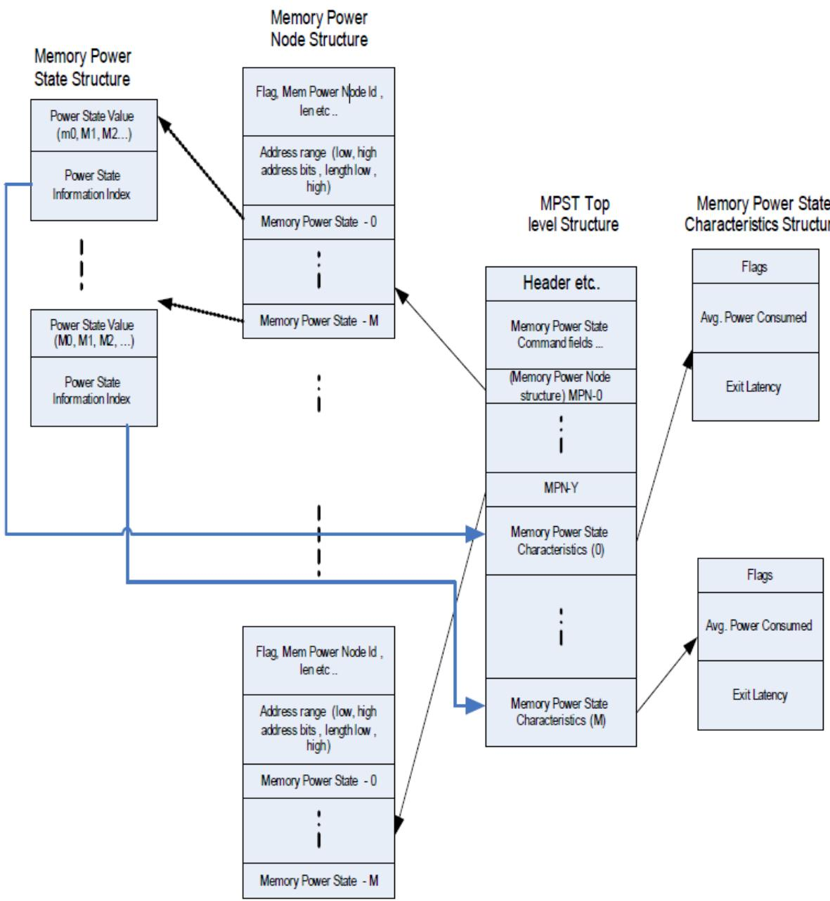  
Fig. 5.5: MPST ACPI Table Overview

Table 5.104: MPST Table Structure

<table><tr><td>Field</td><td>Byte Length</td><td>Byte Offset</td><td>Description</td></tr><tr><td colspan="4">Header</td></tr><tr><td>- Signature</td><td>4</td><td>0</td><td>‘MPST’. Signature for Memory Power State Table</td></tr><tr><td>- Length</td><td>4</td><td>4</td><td>Length in bytes for entire MPST. The length implies the number of Entry fields at the end of the table</td></tr><tr><td>- Revision</td><td>1</td><td>8</td><td>1</td></tr><tr><td>- Checksum</td><td>1</td><td>9</td><td>Entire table must sum to zero</td></tr><tr><td>- OEMID</td><td>6</td><td>10</td><td>OEM ID</td></tr><tr><td>- OEM Table ID</td><td>8</td><td>16</td><td>For the memory power state table, the table ID is the manufacturer model ID</td></tr><tr><td>- OEM Revision</td><td>4</td><td>24</td><td>OEM revision of memory power state Table for supplied OEM Table ID</td></tr><tr><td>- Creator ID</td><td>4</td><td>28</td><td>Vendor ID of utility that created the table</td></tr><tr><td>- Creator Revision</td><td>4</td><td>32</td><td>Revision of utility that created the table</td></tr><tr><td colspan="4">Memory PCC</td></tr><tr><td>- MPST Platform Communication Channel Identifier</td><td>1</td><td>36</td><td>Identifier of the MPST Platform Communication Channel.</td></tr><tr><td>- Reserved</td><td>3</td><td>37</td><td>Reserved</td></tr><tr><td colspan="4">Memory Power Node</td></tr><tr><td>- Memory Power Node Count</td><td>2</td><td>40</td><td>Number of Memory power Node structure entries</td></tr><tr><td>- Reserved</td><td>2</td><td>42</td><td>Reserved</td></tr><tr><td>- Memory Power Node Structure [Memory Power Node Count]</td><td>—</td><td>—</td><td>This field provides information on the memory power nodes present in the system. The information includes memory node ID, power states supported &amp; associated latencies. Further details of this field are specified in Memory Power Node.</td></tr><tr><td colspan="4">Memory Power State Characteristics</td></tr><tr><td>- Memory Power State Characteristics Count</td><td>2</td><td>—</td><td>Number of Memory power State Characteristics Structure entries</td></tr><tr><td>- Reserved</td><td>2</td><td></td><td>Reserved</td></tr><tr><td>- Memory Power State Characteristics Structure [m]</td><td>—</td><td>—</td><td>This field provides information of memory power states supported in the system. The information includes power consumed, transition latencies, relevant flags.</td></tr></table>

## 5.2.22.1 MPST PCC Sub Channel

The MPST PCC Sub Channel Identifier value provided by the platform in this field should be programmed to the Type field of PCC Communications Subspace Structure. The MPST table references its PCC Subspace in a given platform by this identifier, as shown in Table 5.104.

## 5.2.22.1.1 Using PCC registers

OSPM will write PCC registers by filling in the register value in PCC sub channel space and issuing a PCC Execute command. See the table below. All other command values are reserved.

Table 5.105: PCC Command Codes used by MPST Platform Communication Channel

<table><tr><td>Command</td><td>Description</td></tr><tr><td>0x00-0x02</td><td>All other values are reserved.</td></tr><tr><td>0x03</td><td>Execute MPST Command.</td></tr><tr><td>0x04-0xFF</td><td>All other values are reserved.</td></tr></table>

Table 5.106: MPST Platform Communication Channel Shared Memory Region

<table><tr><td>Field</td><td>Byte Length</td><td>Byte Offset</td><td>Description</td></tr><tr><td>Signature</td><td>4</td><td>0</td><td>The PCC signature. The signature of a subspace is computed by a bitwise-or of the value 0x50434300 with the subspace ID. For example, subspace 3 has signature 0x50434303.</td></tr><tr><td>Command</td><td>2</td><td>4</td><td>PCC command field: see Section 14</td></tr><tr><td>Status</td><td>2</td><td>6</td><td>PCC status field: see Section 14</td></tr><tr><td colspan="4">Communication Space</td></tr><tr><td>MEMORY_POWER_-COMMAND_REGISTER</td><td>4</td><td>8</td><td>Memory region for OSPM to write the requested memory power state.Write:1 to this field to GET the memorypower state2 to this field to set the memorypower state3 - GET AVERAGE POWER CONSUMED4 - GET MEMORY ENERGY CONSUMED</td></tr></table>

continues on next page

Table 5.106 – continued from previous page

<table><tr><td>Field</td><td>Byte Length</td><td>Byte Offset</td><td>Description</td></tr><tr><td rowspan="2">MEMORY_POWER_STATUS_REGISTER</td><td rowspan="2">4</td><td rowspan="2">12</td><td>Bits [3:0]: Status (specific to MEMORY_POWER_COMMAND_REGISTER):- 0000b = Success- 0001b = Not Valid- 0010b = Not Supported- 0011b = Busy- 0100b = Failed- 0101b = Aborted- 0110b = Invalid Data- Other values reserved</td></tr><tr><td>Bit [4]: Background Activity specific to the following MEMORY_POWER_COMMAND_REGISTER value:3 - GET AVERAGE POWER CONSUMED4 - GET MEMORY ENERGY CONSUMED0b = inactive1b = background memory activity is_in progressBits [31:5]: Reserved</td></tr><tr><td>POWER_STATE_ID</td><td>4</td><td>16</td><td>On completion of a GET operation, OSPM reads the current platform state ID from this field. Prior to a SET operation, OSPM populates this field with the power state value which needs to be triggered. Power State values will be based on the platform capability.</td></tr><tr><td>MEMORY_POWER_NODE_ID</td><td>4</td><td>20</td><td>This field identifies Memory power node number for the command.</td></tr><tr><td>MEMORY_ENERGY_CONSUMED</td><td>8</td><td>24</td><td>This field returns the energy consumed by the memory that constitutes the MEMORY_POWER_NODE_ID specified in the previous field. A value of all 1s in this field indicates that platform does not implement this field.</td></tr><tr><td>EXPECTED_AVERAGE_POWER_CONSUMED</td><td>8</td><td>32</td><td>This field returns the expected average power consumption for the memory constituted by MEMORY_POWER_NODE_ID. A value of all 1s in this field indicates that platform does not implement this field.</td></tr></table>

## ò Note

OSPM should use the ratio of computed memory power consumed to expected average power consumed in determining the memory power management action.

## 5.2.22.2 Memory Power State

Memory Power State represents the state of a memory power node (which maps to a memory address range) while the platform is in the G0 working state. Memory power node could be in active state named MPS0 or in one of the power manage states MPS1-MPSn.

It should be noted that active memory power state (MPS0) does not preclude memory power management in that state. It only indicates that any active state memory power management in MPS0 is transparent to the OSPM and more importantly does not require assist from OSPM in terms of restricting memory occupancy and activity.

MPS1-MPSn states are characterized by non-zero exit latency for exit from the state to MPS0. These states could require explicit OSPM-initiated entry and exit, explicit OSPM-initiated entry but autonomous exit or autonomous entry and exit. In all three cases, these states require explicit OSPM action to isolate and free the memory address range for the corresponding memory power node.

Transitions to more aggressive memory power states (for example, from MPS1 to MPS2) can be entered on progressive idling but require transition through MPS0 (i.e. $M P S 1  M P S 0  M P S 2 )$ . Power state transition diagram is shown in Fig. 5.6 .

It is possible that after OSPM request a memory power state, a brief period of activity returns the memory power node to MPS0 state . If platform is capable of returning to a memory power state on subsequent period of idle, the platform must treat the previously requested memory power state as a persistent hint.

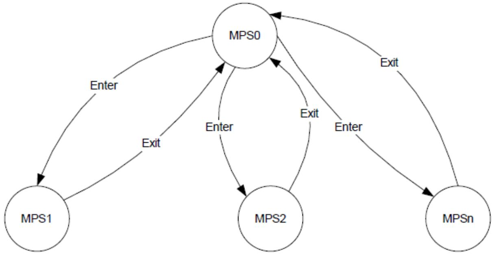  
Fig. 5.6: Memory Power State Transitions  
The following table enumerates the power state values that a node can transition to.

Table 5.107: Power State Values

<table><tr><td>Value</td><td>State Name</td><td>Description</td></tr><tr><td>0</td><td>MPS0</td><td>This state value maps to active state of memory node (Normal operation).OSPM can access memory during this state.</td></tr><tr><td>1</td><td>MPS1</td><td>This state value can be mapped to any memory power state depending on the platform capability. The platform will inform the features of MPS1 state using the Memory Power State Structure. By convention, it is required that low value power state will have lower power savings and lower latencies than the higher valued power states.</td></tr><tr><td>2,3...n</td><td>MPS2, MPS3, ... MPSn</td><td>Same description as MPS1.</td></tr></table>

The following table provides the list of command status options:

Table 5.108: Command Status

<table><tr><td>Field</td><td>Bit Length</td><td>Bit Off-set</td><td>Description</td></tr><tr><td>Command Complete</td><td>1</td><td>0</td><td>If set, the platform has completed processing the last command.</td></tr><tr><td>SCI Doorbell</td><td>1</td><td>1</td><td>If set, then this PCC Sub-Channel has signaled the SCI door bell. In Response to this SCI, OSPM should probe the Command Complete and the Platform Notification fields to determine the cause of SCI.</td></tr><tr><td>Error</td><td>1</td><td>2</td><td>If set, an error occurred executing the last command.</td></tr><tr><td>Platform Notification</td><td>1</td><td>3</td><td>Indicates that the SCI doorbell was invoked by the platform.</td></tr><tr><td>Reserved</td><td>12</td><td>4</td><td>Reserved.</td></tr></table>

## 5.2.22.3 Action Sequence

SetMemoryPowerState: The following sequence needs to be done to set a memory power state.

1. Write target POWER NODE ID value to MEMORY\_POWER\_NODE\_ID register of PCC sub channel. StepNumList-1 Write target POWER NODE ID value to MEMORY\_POWER\_NODE\_ID register of PCC sub channel.

2. Write desired POWER STATE ID value to POWER STATE ID register of PCC sub channel.

3. Write SET (See Table 5.106 ) to MEMORY\_POWER\_STATE register of PCC sub channel.

4. Write PCC EXECUTE (See PCC Command Codes used by MPST Platform Communication Channel)

5. OSPM rings the door bell by writing to Doorbell register.

6. Platform completes the request and will generate SCI to indicate that the command is complete.

7. OSPM reads the Status register for the PCC sub channel and confirms that the command was successfully completed.

GetMemoryPowerState: The following sequence needs to be done to get the current memory power state.

1. Write target POWER NODE ID value to MEMORY\_POWER\_NODE\_ID register of PCC sub channel. StepNumList-1 Write target POWER NODE ID value to MEMORY\_POWER\_NODE\_ID register of PCC sub channel.

2. Write GET (See Table 5.106 ) to MEMORY\_POWER\_STATE register of PCC sub channel.

3. Write PCC EXECUTE (See PCC Command Codes used by MPST Platform Communication Channel)

4. OSPM rings the door bell by writing to Doorbell register.

5. Platform completes the request and will generate SCI to indicate that command is complete.

6. OSPM reads Status register for the PCC sub channel and confirms that the command was successfully completed.

7. OSPM reads POWER STATE from POWER\_STATE\_ID register of PCC sub channel.

## 5.2.22.4 Memory Power Node

Memory Power Node is a representation of a logical memory region that needs to be transitioned in and out of a memory power state as a unit. This logical memory region is made up of one more system memory address range(s). A Memory Power Node is uniquely identified by Memory Power Node ID.

Note that memory power node structure defined in Table 5.109 can only represent a single address range. This address range should be 4K aligned. If a Memory Power Node contains more than one memory address range (i.e. noncontiguous range), firmware must construct a Memory power Node structure for each of the memory address ranges but specify the same Memory Power Node ID in all the structures.

Memory Power Nodes are not hierarchical. However, a given memory address range covered by a Memory power node could be fully covered by another memory power node if that nodes memory address range is inclusive of the other node’s range. For example, memory power node MPN0 may cover memory address range 1G-2G and memory power node MPN1 covers 1-4G. Here MPN1 memory address range also comprehends the range covered by MPN0.

OSPM is expected to identify the memory power node(s) that corresponds to the maximum memory address range that OSPM is able to power manage at a given time. For example, if MPN0 covers 1G-2G and MPN1 covers 1-4G and OSPM is able to power manage 1-4G, it should select MPN1. If MPN0 is in a non-active memory power state, OSPM must move MPN0 to MPS0 (Active state) before placing MPN1 in desired Memory Power State. Further, MPN1 can support more power states than MPN0. If MPN1 is in such a state , say MPS3 , that MPN0 does not support, software must not query MPN0. If queried, MPN0 will return “not Valid” until MPN1 returns to MPS0.

• [Implementation Note] In general, memory nodes corresponding to larger address space ranges correspond to higher memory aggregation (e.g. memory covered by a DIMM vs. memory covered by a memory channel) and hence typically present higher power saving opportunities.

## 5.2.22.4.1 Memory Power Node Structure

The following structure specifies the fields used for communicating memory power node information. Each entry in the MPST table will be having corresponding memory power node structure defined.

This structure communicates address range, number of power states implemented, information about individual power states, number of distinct physical components that comprise this memory power node.

The physical component identifiers can be cross-referenced against the memory topology table entries.

Table 5.109: Memory Power Node Structure definition

<table><tr><td>Field</td><td>Byte Length</td><td>Byte Offset</td><td>Description</td></tr><tr><td>Flag</td><td>1</td><td>0</td><td>The flag describes type of memory node. See the Table 5.110 table below for details.</td></tr><tr><td>Reserved</td><td>1</td><td>1</td><td>For future use</td></tr></table>

continues on next page

Table 5.109 – continued from previous page

<table><tr><td>Field</td><td>Byte Length</td><td>Byte Offset</td><td>Description</td></tr><tr><td>Memory Power Node Id</td><td>2</td><td>2</td><td>This field provides memory power node number. This is a unique identification for Memory Power State Command and creation of freelists/cache lists in OSPM memory manager to bias allocation of non power managed nodes vs. power managed nodes.</td></tr><tr><td>Length</td><td>4</td><td>4</td><td>Length in bytes for Memory Power Node Structure. The length implies the number of Entry fields at the end of the table.</td></tr><tr><td>Base Address Low</td><td>4</td><td>8</td><td>Low 32 bits of Base Address of the memory range.</td></tr><tr><td>Base Address High</td><td>4</td><td>12</td><td>High 32 bits of Base Address of the memory range.</td></tr><tr><td>Length Low</td><td>4</td><td>16</td><td>Low 32 bits of Length of the memory range. This field along with “Length High” field is used to derive the end physical address of this address range.</td></tr><tr><td>Length High</td><td>4</td><td>20</td><td>High 32 bits of Length of the memory range.</td></tr><tr><td>Number of Power States (n)</td><td>4</td><td>24</td><td>This field indicates number of power states supported for this memory power node and in turn determines the number of entries in memory power state structure.</td></tr><tr><td>Number of Physical Components</td><td>4</td><td>28</td><td>This field indicates the number of distinct Physical Components that constitute this memory power node. This field is also used to identify the number of entries of Physical Component Identifier entries present at end of this table.</td></tr><tr><td>Memory Power State Structure [n]</td><td>—</td><td>32</td><td>This field provides information of various power states supported in the system for a given memory power node</td></tr><tr><td>Physical Component Identifier1</td><td>2</td><td>—</td><td>2 byte identifier of distinct physical component that makes up this memory power node</td></tr><tr><td>...</td><td>...</td><td>...</td><td></td></tr><tr><td>Physical Component Identifier m</td><td>2</td><td>—</td><td>2 byte identifier of distinct physical component that makes up this memory power node</td></tr></table>

Table 5.110: Flag format

<table><tr><td>Bit</td><td>Name</td><td>Description</td></tr><tr><td>0</td><td>Enabled</td><td>If clear, the OSPM ignores this Memory Power Node Structure. This allows system firmware to populate the MPST with a static number of structures but enable them as necessary.</td></tr><tr><td>1</td><td>Power Managed Flag</td><td>1 - Memory node is power managed0 - Memory node is not power managed. For non power managed node, OSPM shall not attempt to transition node into low power state. System behavior is undefined if OSPM attempts this. NOTE: If the memory range corresponding to the memory node includes platform firmware reserved memory that cannot be power managed, the platform should indicate such memory as “not power managed” to OSPM. This allows OSPM to ignore such ranges from its power optimization.</td></tr><tr><td>2</td><td>Hot Pluggable</td><td>This flag indicates that the memory node supports the hot plug feature.SeeInteraction with Memory Hot Plugfor details.</td></tr><tr><td>3-7</td><td>Reserved</td><td>Reserved for future use</td></tr></table>

## 5.2.22.5 Memory Power State Structure

Table 5.111: Memory Power State Structure definition

<table><tr><td>Field</td><td>Byte Length</td><td>Byte Offset</td><td>Description</td></tr><tr><td>Power State Value</td><td>1</td><td>0</td><td>This field provides value of power state. The specific value to be used is system dependent. However convention needs to be maintained where higher numbers indicates deeper power states with higher power savings and higher latencies. For example, a power state value of 2 will have higher power savings and higher latencies than a power state value of 1.</td></tr><tr><td>Power State Information Index</td><td>1</td><td>1</td><td>This field provides unique index into the memory power state characteristics entries which will provide details about the power consumed, power state characteristics and transition latencies. The indexing mechanism is to avoid duplication (and hence reduce potential for mismatch errors) of memory power state characteristics entries across multiple memory nodes.</td></tr></table>

## 5.2.22.6 Memory Power State Characteristics structure

The table below describes the power consumed, exit latency and the characteristics of the memory power state. This table is referenced by a memory power node.

Table 5.112: Memory Power State Characteristics Structure

<table><tr><td>Field</td><td colspan="2">Byte Length</td><td>Byte Offset</td></tr><tr><td>Power State Structure ID</td><td>1</td><td>0</td><td>Bit [5:0] = This field describes the format of table Structure Power State Structure ID Value = 1Bit [7:6] = Structure Revision | Current revision is 1</td></tr><tr><td>Flag</td><td>1</td><td>1</td><td>The flag describes the caveats associated with entering the specified power state. Refer to Table 5.113 for details.</td></tr><tr><td>Reserved</td><td>2</td><td>2</td><td>Reserved</td></tr><tr><td>Average Power Consumed in MPS0 state (in milli watts)</td><td>4</td><td>4</td><td>This field provides average power consumed for this memory power node in MPS0 state. This power is measured in milli-Watts and signifies the total power consumed by this memory the given power state as measured in DC watts. Note that this value should be used as guideline only for estimating power savings and not as actual power consumed. Also memory power node can map to single or collection of RANKs/DIMMs. The actual power consumed is dependent on DIMM type, configuration and memory load.</td></tr><tr><td>Relative Power Saving to MPS0 state</td><td>4</td><td>8</td><td>This is a percentage of power saved in MPSx state relative to MPS0 state and should be calculated as %MPS0 power - MPSx power)/MPS0 Power)*100. When this entry is describing MPS0 state itself, OSPM should ignore this field.</td></tr></table>

continues on next page

Table 5.112 – continued from previous page

<table><tr><td>Field</td><td colspan="2">Byte Length</td><td>Byte Offset</td></tr><tr><td>Exit Latency (in ns) (MPSx -&gt; MPS0)</td><td>8</td><td>12</td><td>This field provides latency of exiting out of a power state (MPSx) to active state (MPS0). The unit of this field is nanoseconds.When this entry is describing MPS0 state itself, OSPM should ignore this field.</td></tr><tr><td>Reserved</td><td>8</td><td>20</td><td>Reserved for future use.</td></tr></table>

Table 5.113: Flag format of Memory Power State Characteristics

<table><tr><td>Bit</td><td>Name</td><td>Description</td></tr><tr><td>0</td><td>Memory Content Preserved</td><td>If Bit [0] is set, it indicates memory contents will be preserved in the specified power state If Bit [0] is clear, it indicates memory contents will be lost in the specified power state (e.g. for states such as offline)</td></tr><tr><td>1</td><td>Autonomous Memory Power State Entry</td><td>If Bit [1] is set, this field indicates that given memory power state entry transition needs to be triggered explicitly by OSPM by calling the Set Power State command. If Bit [1] is clear, this field indicates that given memory power state entry transition is automatically implemented in hardware and does not require a OSPM trigger. The role of OSPM in this case is to ensure that the corresponding memory region is idled from a software standpoint to facilitate entry to the state. Not meaningful for MPS0 - write it for this table</td></tr><tr><td>2</td><td>Autonomous Memory Power State Exit</td><td>If Bit [1] is set, this field indicates that given memory power state exit needs to be explicitly triggered by the OSPM before the memory can be accessed. System behavior is undefined if OSPM or other software agents attempt to access memory that is currently in a low power state. If Bit [1] is clear, this field indicates that given memory power state is exited automatically on access to the memory address range corresponding to the memory power node.</td></tr><tr><td>3-7</td><td>Reserved</td><td>Reserved for future use</td></tr></table>

## 5.2.22.6.1 Power Consumed

Average Power Consumed in MPS0 state indicates the power in milli Watts for the MPS0 state. Relative power savings to MPS0 indicates the savings in the MPSx state as a percentage of savings relative to MPS0 state.

## 5.2.22.6.2 Exit Latency

Exit Latency provided in the Memory Power Characteristics structure for a specific power state is inclusive of the entry latency for that state.

Exit latency must always be provided for a memory power state regardless of whether the memory power state entry and/or exit are autonomous or requires explicit trigger from OSPM.

## 5.2.22.7 Autonomous Memory Power Management

Not all memory power management states require OSPM to actively transition a memory power node in and out of the memory power state. Platforms may implement memory power states that are fully handled in hardware in terms of entry and exit transition. In such fully autonomous states, the decision to enter the state is made by hardware based on the utilization of the corresponding memory region and the decision to exit the memory power state is initiated in response to a memory access targeted to the corresponding memory region.

The role of OSPM software in handling such autonomous memory power states is to vacate the use of such memory regions when possible in order to allow hardware to efectively save power. No other OSPM initiated action is required for supporting these autonomously power managed regions. However, it is not an error for OSPM explicitly initiates a state transition to an autonomous entry memory power state through the MPST command interface. The platform may accept the command and enter the state immediately in which case it must return command completion with SUCCESS (00000b) status. If platform does not support explicit entry, it must return command completion with NOT SUPPORTED (00010b) status.

## 5.2.22.8 Handling BIOS Reserved Memory

Platform firmware may have regions of memory reserved for its own use that are unavailable to OSPM for allocation. Memory nodes where all (or a portion) of the memory is reserved by platform firmware may pose a problem for OSPM because it does not know whether the platform firmware reserved memory is in use.

If the platform firmware reserved memory impacts the ability of the memory power node to enter memory power state(s), the platform must indicate to OSPM (by clearing the Power Managed Flag - see Table 5.110 for details) that this memory power node cannot be power managed. This allows OSPM to ignore such ranges from its memory power optimization.

## 5.2.22.9 Interaction with NUMA processor and memory afinity tables

The memory power state table describes address range for each of the memory power nodes specified. OSPM can use the address ranges information provided in MPST table and derive processor afinity of a given memory power node based on the SRAT entries created by the platform boot firmware. The association of memory power node to proximity domain can be used by OSPM to implement memory coalescing taking into account NUMA node topology for memory allocation/release and manipulation of diferent page lists in memory management code (implementation specific).

An example of policy which can be implemented in OSPM for memory coalescing is: OSPM can prefer allocating memory from local memory power nodes before going to remote memory power nodes. The later sections provide sample NUMA configurations and explain the policy for various memory power nodes.

## 5.2.22.10 Interaction with Memory Hot Plug

The hot pluggable memory regions are described using memory device objects (see Section 9.11 ). The memory address ranges of these memory device objects are defined using the \_CRS method.

```txt
Scope (\_SB) {
    Device (MEM0) {
    Name (_HID, EISAID ("PNP0C80"))
    Name (_CRS, ResourceTemplate () {
    QWordMemory (
    ResourceConsumer,
    ,
    MinFixed,
    MaxFixed,
```

(continues on next page)

```txt
Cacheable,
ReadWrite,
0xFFFFFFF,
0x100000000,
0x300000000,
0, ,, , )
})
}
}
```

The memory power state table (MPST) is a static structure created for all memory objects independent of hot plug status (online or ofline) during initialization. The OSPM will populate the MPST table during the boot. If hot-pluggable flag is set for a given memory power node in MPST table, OSPM will not use this node till physical presence of memory is communicated through ACPI notification mechanism.

The association between memory device object (e.g. MEM0) to the appropriate memory power node ID in the MPST table is determined by comparing the address range specified using \_CRS method and address ranges configured in the MPST table entries. This association needs to be identified by OSPM as part of ACPI memory hot plug implementation. When memory device is hot added, as part of existing acpi driver for memory hot plug, OSPM will scan device object for \_CRS method and get the relevant address ranges for the given memory object, OSPM will determine the appropriate memory power node ids based on the address ranges from \_CRS and enable it for power management and memory coalescing.

Similarly when memory is hot removed, the corresponding memory power nodes will be disabled.

## 5.2.22.11 OS Memory Allocation Considerations

OSes (non-virtualized OS or a hypervisor/VMM) may need to allocate non-migratable memory. It is recommended that the OSes (if possible) allocate this memory from memory ranges corresponding to memory power nodes that indicate they are not power manageable. This allows OS to optimize the power manageable memory power nodes for optimal power savings.

OSes can assume that memory ranges that belong to memory power nodes that are power manageable (as indicated by the flag) are interleaved in a manner that does no impact the ability of that range to enter power managed states. For example, such memory is not cacheline interleaved.

Reference to memory in this document always refers to host physical memory. For virtualized environments, this requires hypervisors to be responsible for memory power management. Hypervisors also have the ability to create opportunities for memory power management by vacating appropriate host physical memory through remapping guest physical memory.

OSes can assume that the memory ranges included in MPST always refer to memory store - either volatile or nonvolatile and never to MMIO or MMCFG ranges.

## 5.2.22.12 Platform Memory Topology Table (PMTT)

This table describes the memory topology of the system to OSPM, where the memory topology can be logical or physical. The topology is provided as a hierarchy of memory devices where the top level memory devices (e.g. sockets) are associated with the platform, down to the last level physical components (e.g. DIMMs) associated with a parent memory device.

Table 5.114: Platform Memory Topology Table

<table><tr><td>Field</td><td>Byte Length</td><td>Byte Offset</td><td>Description</td></tr><tr><td colspan="4">Header</td></tr><tr><td>- Signature</td><td>4</td><td>0</td><td>‘PMTT’. Signature for Platform Memory Topology Table.</td></tr><tr><td>- Length</td><td>4</td><td>4</td><td>Length in bytes of the entire PMTT.</td></tr><tr><td>- Revision</td><td>1</td><td>8</td><td></td></tr><tr><td></td><td></td><td></td><td>Revision number of the Platform Memory Topology Table, Common Memory Device, and memory device structures (Table 5.116, Table 5.117, Table 5.118, and Table 5.119) defined in this specification.</td></tr><tr><td></td><td></td><td></td><td>Current value: 2</td></tr><tr><td></td><td></td><td></td><td>Compatibility Note: Revision 1 is deprecated in ACPI Specification 6.4.</td></tr><tr><td>- Checksum</td><td>1</td><td>9</td><td>Entire table must sum to zero.</td></tr><tr><td>- OEMID</td><td>6</td><td>10</td><td>OEM ID</td></tr><tr><td>- OEM Table ID</td><td>8</td><td>16</td><td>For the PMTT, the table ID is the manufacturer model ID</td></tr><tr><td>- OEM Revision</td><td>4</td><td>24</td><td>OEM revision of the PMTT for supplied OEM Table ID.</td></tr><tr><td>- Creator ID</td><td>4</td><td>28</td><td>Vendor ID of utility that created the table.</td></tr><tr><td>- Creator Revision</td><td>4</td><td>32</td><td>Revision of utility that created the table.</td></tr><tr><td>Number of Memory Devices</td><td>4</td><td>36</td><td>The number of top level Memory Device structures that immediately follow. A zero in this field indicates no Memory Device structures follow.</td></tr><tr><td>Memory Device Structure [n]</td><td>—</td><td>40</td><td>A list of memory device structures for the platform. See Table 5.115 below.</td></tr></table>

Table 5.115: Common Memory Device

<table><tr><td>Field</td><td>Byte Length</td><td>Byte Offset</td><td>Description</td></tr><tr><td>Header</td><td></td><td></td><td></td></tr><tr><td>- Type</td><td>1</td><td>0</td><td>This field describes the type of Memory Device:0 - Socket1 - Memory Controller2 - DIMM3 - 0xFE - Reserved, 0xFF - Vendor Specific Type</td></tr></table>

continues on next page

Table 5.115 – continued from previous page

<table><tr><td>Field</td><td>Byte Length</td><td>Byte Offset</td><td>Description</td></tr><tr><td>- Reserved</td><td>1</td><td>1</td><td>Reserved, must be zero.</td></tr><tr><td>- Length</td><td>2</td><td>2</td><td>Length in bytes for this structure. The length includes the Type Specific Data, but not memory devices associated with this device.</td></tr><tr><td>- Flags</td><td>2</td><td>4</td><td></td></tr><tr><td></td><td></td><td></td><td>Bit [0]:0 - Indicates that this is not a top level device.1 - Indicates that this is a top level aggregator device. This device must be counted in the number of top level aggregator devices in PMTT table and must be surfaces via PMTT.Bit [1]:0 indicates a logical element of topology.1 indicates a physical element of the topology.Bits [2] and [3]:01 - Indicates that components aggregated by this device implement both volatile and non-volatile memory10 - Indicates that all components aggregated by this device implement non-volatile memory11 - ReservedBits [15:4] Reserved, must be zero</td></tr><tr><td>Reserved</td><td>2</td><td>6</td><td>Reserved, must be zero.</td></tr><tr><td>Number of Memory Devices</td><td>4</td><td>8</td><td>The number of Memory Devices associated with this device. A zero in this field indicates that no Memory Device structures follow the Type Specific Data.</td></tr><tr><td>Type Specific Data</td><td>—</td><td>12</td><td>Type specific data. Interpretation of this data is specific to the type of the memory device. See Table 5.116, Table 5.117, Table 5.118, and Table 5.119.</td></tr><tr><td>Memory Device Structure [n]</td><td>—</td><td>—</td><td>An optional list of Memory Device structures associated with this device.</td></tr></table>

Table 5.116: Socket Type Data

<table><tr><td>Field</td><td>Byte Length</td><td>Byte Offset</td><td>Description</td></tr><tr><td>Common Memory Device Header</td><td>12</td><td>0</td><td>See Table 5.115. Type = 0 - Socket. Length =16.</td></tr><tr><td>Socket Identifier</td><td>2</td><td>12</td><td>Uniquely identifies the socket in the system.</td></tr><tr><td>Reserved</td><td>2</td><td>14</td><td>Reserved, must be zero.</td></tr><tr><td>Memory Device Structure [n]</td><td>—</td><td>16</td><td>An optional list of Memory Device structures associated with this socket.</td></tr></table>

Table 5.117: Memory Controller Type Data

<table><tr><td>Field</td><td>Byte Length</td><td>Byte Offset</td><td>Description</td></tr><tr><td>Common Memory Device Header</td><td>12</td><td>0</td><td>See Table 5.115. Type = 1 - Memory Controller. Length =16.</td></tr><tr><td>Memory Controller Identifier</td><td>2</td><td>12</td><td>Uniquely identifies the memory controller within its parent memory device type.</td></tr><tr><td>Reserved</td><td>2</td><td>14</td><td>Reserved, must be zero.</td></tr><tr><td>Memory Device Structure [n]</td><td>—</td><td>16</td><td>An optional list of Memory Device structures associated with this memory controller.</td></tr></table>

Table 5.118: DIMM Type Specific Data

<table><tr><td>Field</td><td>Byte Length</td><td>Byte Offset</td><td>Description</td></tr><tr><td>Common Memory Device Header</td><td>12</td><td>0</td><td>See Table 5.115. Type = 2 - DIMM. Length =16.</td></tr><tr><td>SMBIOS Handle</td><td>4</td><td>12</td><td>Refers to Type 17 table handle of corresponding SMBIOS record. The platform indicates that this field is not valid by setting a value of 0xFFFFFFFF. If the platform provides a valid handle, the upper 2 bytes must be 0 (since SMBIOS handles are 2 bytes only). NOTE: The use of this handle is for management software to be able to cross-reference the physical DIMM described in SMBIOS against the topology described in this table. It is not expected that OSPM will utilize this field.</td></tr></table>

Table 5.119: Vendor Specific Type Data

<table><tr><td colspan="2">Field</td><td>Byte Length</td><td>Byte Offset</td><td>Description</td></tr><tr><td>Common Device Header</td><td>Memory</td><td>12</td><td>0</td><td>See Table 5.115. Type = 0xFF - Vendor Specific.</td></tr><tr><td colspan="2">Type UUID</td><td>16</td><td>12</td><td>Vendor specific type unique identifier.</td></tr><tr><td>Vendor Data</td><td>Specific</td><td>—</td><td>28</td><td>Vendor specific type data.</td></tr><tr><td>Memory Structure [n]</td><td>Device</td><td>—</td><td>—</td><td>An optional list of Memory Device structures associated with this device.</td></tr></table>

## 5.2.23 Boot Graphics Resource Table (BGRT)

The Boot Graphics Resource Table (BGRT) is an optional table that provides a mechanism to indicate that an image was drawn on the screen during boot, and some information about the image.

The table is written when the image is drawn on the screen. This should be done after it is expected that any firmware components that may write to the screen are done doing so and it is known that the image is the only thing on the screen. If the boot path is interrupted (e.g., by a key press), the Displayed bit within the status field should be changed to 0 to indicate to the OS that the current image is invalidated.

This table is only supported on UEFI systems.

Table 5.120: Boot Graphics Resource Table Fields

<table><tr><td>Field</td><td>Byte Length</td><td>Byte Offset</td><td>Description</td></tr><tr><td colspan="4">Header</td></tr><tr><td>- Signature</td><td>4</td><td>0</td><td>“BGRT” Signature for the table.</td></tr><tr><td>- Length</td><td>4</td><td>4</td><td>Length, in bytes, of the entire table</td></tr><tr><td>- Revision</td><td>1</td><td>8</td><td>1</td></tr><tr><td>- Checksum</td><td>1</td><td>9</td><td>Entire table must sum to zero.</td></tr><tr><td>- OEMID</td><td>6</td><td>10</td><td>OEM ID</td></tr><tr><td>- OEM Table ID</td><td>8</td><td>16</td><td>The table ID is the manufacturer model ID.</td></tr><tr><td>- OEM Revision</td><td>4</td><td>24</td><td>OEM revision for supplied OEM Table ID.</td></tr><tr><td>- Creator ID</td><td>4</td><td>28</td><td>Vendor ID of utility that created the table.</td></tr><tr><td>- Creator Revision</td><td>4</td><td>32</td><td>Revision of utility that created the table.</td></tr><tr><td>Version</td><td>2</td><td>36</td><td>2-bytes (16 bit) version ID. This value must be 1.</td></tr><tr><td>Status [n]</td><td>1</td><td>38</td><td></td></tr><tr><td></td><td></td><td></td><td>1-byte status field indicating current status of the image:Bits [7:3] = Reserved (must be zero)Bits [2:1] = Orientation Offset. These bits describe the clockwise degree offset from the image&#x27;s default orientation.[00] = 0, no offset[01] = 90[10] = 180[11] = 270Bit [0] = Displayed. A one indicates the boot image graphic is displayed.</td></tr><tr><td>Image Type</td><td>1</td><td>39</td><td></td></tr><tr><td></td><td></td><td></td><td>1-byte enumerated type field indicating format of the image:0 = Bitmap1 - 255 Reserved (for future use)</td></tr><tr><td>Image Address</td><td>8</td><td>40</td><td>8-byte (64 bit) physical address pointing to the firmware&#x27;s in-memory copy of the image bitmap.</td></tr><tr><td>Image Offset X</td><td>4</td><td>48</td><td>A 4-byte (32-bit) unsigned long describing the display X-offset of the boot image. (X, Y) display offset of the top left corner of the boot image. The top left corner of the display is at offset (0, 0).</td></tr><tr><td>Image Offset Y</td><td>4</td><td>52</td><td>A 4-byte (32-bit) unsigned long describing the display Y-offset of the boot image. (X, Y) display offset of the top left corner of the boot image. The top left corner of the display is at offset (0, 0).</td></tr></table>

The BGRT is a dynamic ACPI table that enables boot firmware to provide OPSM with a pointer to the location in memory where the boot graphics image is stored.

## 5.2.23.1 Version

The version field identifies which revision of the BGRT table is implemented. The version field should be set to 1.

## 5.2.23.2 Status

The status field contains information about the current status of the BGRT image (see Table 5.120 above).

## 5.2.23.3 Image Type

The Image type field contains information about the format of the image being returned. If the value is 0, the Image Type is Bitmap. The format for a Bitmap is defined at the reference located in “Links to ACPI-Related Documents” (http://uefi.org/acpi) under the heading “Types of Bitmaps”.

All other values not defined in the table are reserved for future use.

## 5.2.23.4 Image Address

The Image Address contains the location in memory where an in-memory copy of the boot image can be found. The image should be stored in EfiBootServicesData, allowing the system to reclaim the memory when the image is no longer needed.

Implementations must present the image in a 24 bit bitmap with pixel format 0xRRGGBB, or a32-bit bitmap with the pixel format 0xrrRRGGBB, where ‘rr’ is reserved.

## 5.2.23.5 Image Ofset

The Image Ofset contains 2 consecutive 4 byte unsigned longs describing the (X, Y) display ofset of the top left corner of the boot image. The top left corner of the display is at ofset (0, 0).

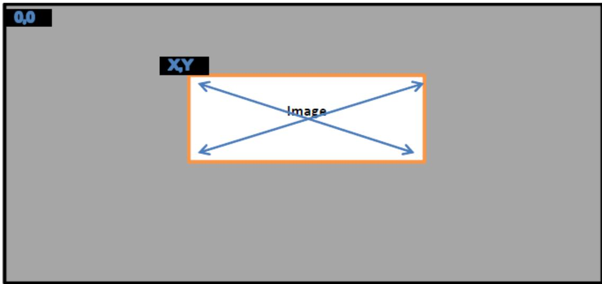  
Fig. 5.7: Image Ofset

## 5.2.24 Firmware Performance Data Table (FPDT)

This section describes the format of the Firmware Performance Data Table (FPDT), which provides suficient information to describe the platform initialization performance records. This information represents the boot performance data relating to specific tasks within the firmware boot process. The FPDT includes only those mileposts that are part of every platform boot process:

• End of reset sequence (Timer value noted at beginning of platform boot firmware initialization - typically at reset vector)

• Handof to OS Loader

This information represents the firmware boot performance data set that would be used to track performance of each UEFI phase, and would be useful for tracking impacts resulting from changes due to hardware/software configuration.

All timer values are express in 1 nanosecond increments. For example, if a record indicates an event occurred at a timer value of 25678, this means that 25.678 microseconds have elapsed from the last reset of the timer measurement. All timer values will be required to have an accuracy of +/- 10%.

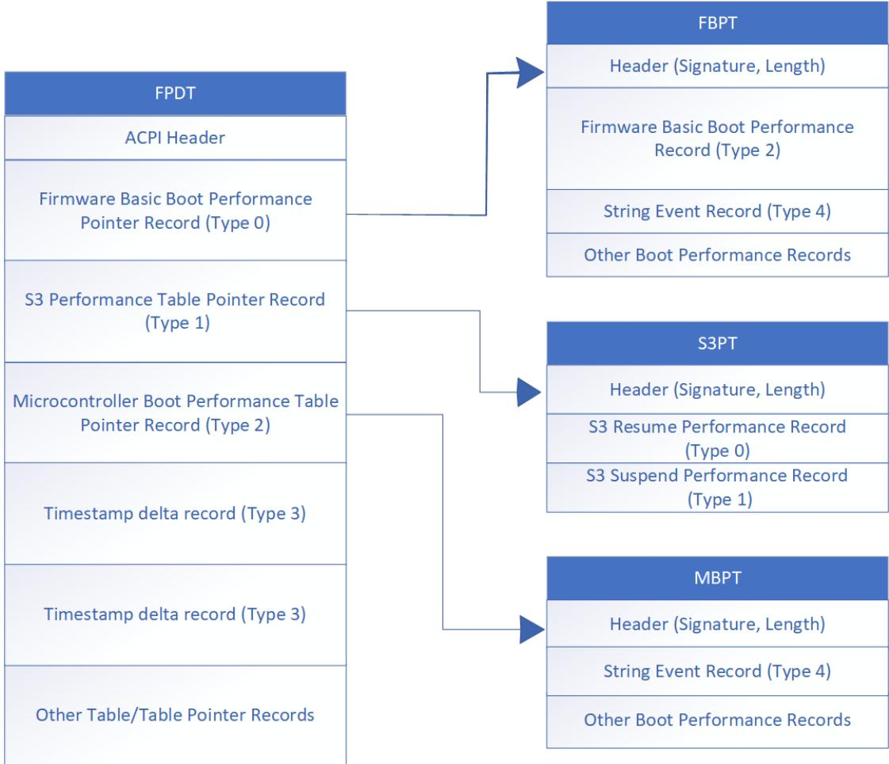  
Fig. 5.8: FPDT Hierarchy Structure

Table 5.121: Firmware Performance Data Table (FPDT) Format

<table><tr><td>Field</td><td>Byte Length</td><td>Byte Offset</td><td>Description</td></tr><tr><td colspan="4">Header</td></tr><tr><td>- Signature</td><td>4</td><td>0</td><td>‘FPDT’ Signature for the Firmware Performance Data Table.</td></tr><tr><td>- Length</td><td>4</td><td>4</td><td>The length of the table, in bytes, of the entire FPDT.</td></tr><tr><td>- Revision</td><td>1</td><td>8</td><td>The revision of the structure corresponding to the signature field for this table. For the Firmware Performance Data Table conforming to this revision of the specification, the revision is 1.</td></tr><tr><td>- Checksum</td><td>1</td><td>9</td><td>The entire table, including the checksum field, must add to zero to be considered valid.</td></tr><tr><td>- OEMID</td><td>6</td><td>10</td><td>An OEM-supplied string that identifies the OEM.</td></tr><tr><td>- OEM Table ID</td><td>8</td><td>16</td><td>An OEM-supplied string that the OEM uses to identify this particular data table.</td></tr><tr><td>- OEM Revision</td><td>4</td><td>24</td><td>An OEM-supplied revision number.</td></tr><tr><td>- Creator ID</td><td>4</td><td>28</td><td>The Vendor ID of the utility that created this table.</td></tr><tr><td>- Creator Revision</td><td>4</td><td>32</td><td>The revision of the utility that created this table.</td></tr><tr><td>Performance Records</td><td>-</td><td>36</td><td>A set of FPDT Performance Records, as defined in Table 5.122</td></tr></table>

## 5.2.24.1 Performance Record Format

A performance record is comprised of a sub-header including a record type and length, and a set of data. The format of the data is specific to the record type. In this manner, records are only as large as needed to contain the specific type of data to be conveyed.

Note that unless otherwise specified, multiple records are permitted for a given type, because some events may occur multiple times during the boot process.

Table 5.122: Performance Record Structure

<table><tr><td>Field</td><td>Byte Length</td><td>Byte Offset</td><td>Description</td></tr><tr><td>Performance Record Type</td><td>2</td><td>0</td><td>This value depicts the format and contents of the performance record.</td></tr><tr><td>Record Length</td><td>1</td><td>2</td><td>This value depicts the length of the performance record, in bytes.</td></tr><tr><td>Revision</td><td>1</td><td>3</td><td>This value is updated if the format of the record type is extended.Any changes to a performance record layout must be backwards-compatible in that all previously defined fields must be maintained if still applicable, but newly defined fields allow the length of the performance record to be increased. Previously defined record fields must not be redefined, but are permitted to be deprecated.</td></tr><tr><td>Data</td><td>-</td><td>4</td><td>The content of this field is defined by the Performance Record Type definition.</td></tr></table>

## 5.2.24.2 FPDT Performance Record Types

The table below describes the various records contained within the FPDT, and their corresponding Record Types.

Table 5.123: FPDT Performance Record Types

<table><tr><td>Record Value</td><td>Type</td><td>Type</td><td>Description</td></tr><tr><td>0x0000</td><td></td><td>Host Firmware Boot Performance Pointer Record</td><td>Record containing a pointer to the Host Firmware Boot Performance Table.</td></tr><tr><td>0x0001</td><td></td><td>S3 Performance Table Pointer Record</td><td>Record containing a pointer to the S3 Performance Table.</td></tr><tr><td>0x0002</td><td></td><td>Microcontroller Boot Performance Table Pointer Record</td><td>Record containing a pointer to the Microcontroller Boot Performance Table.</td></tr><tr><td>0x0003</td><td></td><td>Timestamp Delta Record</td><td>Table describing the time deltas between different controllers in the system. The time delta of the Host, relative to the reference controller, is also represented in this table.</td></tr><tr><td>0x0004 - 0x0FFF</td><td></td><td>Reserved</td><td>Reserved for ACPI specification usage.</td></tr><tr><td>0x1000 - 0x1FFF</td><td></td><td>Reserved</td><td>Reserved for Platform Vendor usage.</td></tr><tr><td>0x2000 - 0x2FFF</td><td></td><td>Reserved</td><td>Reserved for Hardware Vendor usage.</td></tr><tr><td>0x3000 - 0x3FFF</td><td></td><td>Reserved</td><td>Reserved for platform firmware Vendor usage.</td></tr><tr><td>0x4000 - 0xFFFF</td><td></td><td>Reserved</td><td>Reserved for future use</td></tr></table>

## 5.2.24.3 Performance Event Record Types

The table below describes the various Runtime Performance records and their corresponding Record Types. These records are not contained within the FPDT; they are referenced by their respective pointer records in the FPDT.

Table 5.124: Performance Event Record Types

<table><tr><td>Record Type Value</td><td>Type</td><td>Description</td></tr><tr><td>0x0000</td><td>Basic S3 Resume Performance Record</td><td>Performance record describing minimal firmware performance metrics for S3 resume operations.</td></tr><tr><td>0x0001</td><td>Basic S3 Suspend Performance Record</td><td>Performance record describing minimal firmware performance metrics for S3 suspend operations.</td></tr><tr><td>0x0002</td><td>Host Firmware Boot Performance Data Record</td><td>Performance record showing basic performance metrics for critical phases of the firmware boot process.</td></tr><tr><td>0x0003</td><td>Microcontroller Boot Performance Data Record</td><td>Performance record describing the boot process of a microcontroller.</td></tr><tr><td>0x0004</td><td>String Event Record</td><td>Performance record used to represent generic Host firmware events.</td></tr><tr><td>0x0005 - 0x0FFF</td><td>Reserved</td><td>Reserved for ACPI specification usage.</td></tr><tr><td>0x1000 - 0x1FFF</td><td>Reserved</td><td>Reserved for Platform Vendor usage.</td></tr><tr><td>0x2000 - 0x2FFF</td><td>Reserved</td><td>Reserved for Hardware Vendor usage.</td></tr><tr><td>0x3000 - 0x3FFF</td><td>Reserved</td><td>Reserved for platform firmware Vendor usage.</td></tr><tr><td>0x4000 - 0xFFFF</td><td>Reserved</td><td>Reserved for future use</td></tr></table>

## 5.2.24.4 Host Firmware Boot Performance Table Pointer Record

The Host Firmware Boot Performance Table Pointer Record contains a pointer to the Firmware Basic Boot Performance Table. The Firmware Basic Boot Performance Table itself exists in a range of memory described as ACPI Address-RangeReserved in the system memory map. The record pointer is a required entry in the FPDT for any system, and the pointer must point to a valid static physical address. Only one of these records will be produced.

Table 5.125: Host Firmware Boot Performance Table Pointer Record

<table><tr><td>Field</td><td>Byte Length</td><td>Byte Offset</td><td>Description</td></tr><tr><td>Performance Record Type</td><td>2</td><td>0</td><td>0 - Firmware Basic Boot Performance Table Pointer Record</td></tr><tr><td>Record Length</td><td>1</td><td>2</td><td>16 - This value depicts the length of the performance record, in bytes.</td></tr><tr><td>Revision</td><td>1</td><td>3</td><td>1 - Revision of this Performance Record</td></tr><tr><td>Reserved</td><td>4</td><td>4</td><td>Reserved</td></tr><tr><td>FBPT Pointer</td><td>8</td><td>8</td><td>64-bit processor-relative physical address of the Firmware Basic Boot Performance Table</td></tr></table>

## 5.2.24.5 S3 Performance Table Pointer Record

The S3 Performance Table Pointer Record contains a pointer to the S3 Performance Table. The S3 Performance Table itself exists in a range of memory described as ACPI AddressRangeReserved in the system memory map. The record pointer is a required entry in the FPDT for any system supporting the S3 state, and the pointer must point to a valid static physical address. Only one of these records will be produced.

Table 5.126: S3 Performance Table Pointer Record

<table><tr><td>Field</td><td>Byte Length</td><td>Byte Offset</td><td>Description</td></tr><tr><td>Performance Record Type</td><td>2</td><td>0</td><td>1 - S3 Performance Table Pointer Record</td></tr><tr><td>Record Length</td><td>1</td><td>2</td><td>16 - This value depicts the length of the performance record, in bytes.</td></tr><tr><td>Revision</td><td>1</td><td>3</td><td>1 - Revision of this Performance Record</td></tr><tr><td>Reserved</td><td>4</td><td>4</td><td>Reserved</td></tr><tr><td>S3PT Pointer</td><td>8</td><td>8</td><td>64-bit processor-relative physical address of the S3 Performance Table</td></tr></table>

## 5.2.24.6 Microcontroller Boot Performance Table Pointer Record

The Microcontroller Boot Performance Table Pointer contains a pointer to the Microcontroller Boot Performance Table. The Microcontroller Boot Performance Table itself exists in a range of memory described as ACPI AddressRangeReserved in the system memory map. The record pointer is a required entry in the FPDT for any system, and the pointer must point to a valid static physical address. Only one of these records will be produced.

Table 5.127: Microcontroller Boot Performance Table Pointer Record

<table><tr><td>Field</td><td>Byte Length</td><td>Byte Offset</td><td>Description</td></tr><tr><td>Performance Record Type</td><td>2</td><td>0</td><td>2 - Microcontroller Boot Performance Table Pointer Record</td></tr><tr><td>Record Length</td><td>1</td><td>2</td><td>16 - This value depicts the length of the performance record, in bytes.</td></tr><tr><td>Revision</td><td>1</td><td>3</td><td>1 - Revision of this Performance Record</td></tr><tr><td>Reserved</td><td>4</td><td>4</td><td>Reserved</td></tr><tr><td>MBPT Pointer</td><td>8</td><td>8</td><td>64-bit processor-relative physical address of the Microcontroller Boot Performance Table</td></tr></table>

## 5.2.24.7 Timestamp Delta Record

The Timestamp Delta Record is used to describe start time deltas between components logging Boot Performance Event Records, when such time deltas exist. Platforms containing multiple controllers with timestamp clock sources starting from zero at diferent points in time must publish this record to correlate events logged using disparate event timer sources.

Table 5.128: Timestamp Delta Record

<table><tr><td>Field</td><td>Byte Length</td><td>Byte Offset</td><td>Description</td></tr><tr><td>Performance Record Type</td><td>2</td><td>0</td><td>3</td></tr><tr><td>Record Length</td><td>1</td><td>2</td><td>The size in bytes of this table.</td></tr><tr><td>Revision</td><td>1</td><td>3</td><td>1</td></tr><tr><td>Reserved</td><td>4</td><td>4</td><td>Reserved</td></tr><tr><td>TimestampDomainID</td><td>8</td><td>8</td><td>Platform-specific identifier for each unique controller in the system on a separate timestamp domain.</td></tr><tr><td>Timestamp Delta</td><td>8</td><td>16</td><td>The delta between this timestamp domain and the first recorded timestamp domain</td></tr></table>

## 5.2.24.8 Host Firmware Boot Performance Table

The Host Firmware Boot Performance Table resides outside of the FPDT. It includes a header, defined in Table 5.129, and one or more Performance Records.

All event entries will be overwritten during the platform runtime firmware S4 resume sequence. The Host Firmware Boot Performance Table must include the Host Firmware Boot Performance Data Record. Other entries are optional.

Table 5.129: Host Firmware Boot Performance Table Header

<table><tr><td>Field</td><td>Byte Length</td><td>Byte Offset</td><td>Description</td></tr><tr><td>Signature</td><td>4</td><td>0</td><td>‘FBPT’ is the signature to use.</td></tr><tr><td>Length</td><td>4</td><td>4</td><td>Length of the Host Firmware Boot Performance Table. This includes the header and allocated size of the subsequent records. This size would at minimum include the size of the header and the Host Firmware Boot Performance Data Record.</td></tr></table>

## 5.2.24.9 Host Firmware Boot Performance Data Record

The Host Firmware Boot Performance Data Record contains timer information associated with final OS loader activity, as well as data associated with boot time starting and ending information.

Table 5.130: Host Firmware Boot Performance Data Record

<table><tr><td>Field</td><td>Byte Length</td><td>Byte Offset</td><td>Description</td></tr><tr><td>Performance Record Type</td><td>2</td><td>0</td><td>2 - Host Firmware Boot Performance Data Record. Only one of these records will be produced.</td></tr><tr><td>Record Length</td><td>1</td><td>2</td><td>48 - This value depicts the length of the performance record, in bytes.</td></tr><tr><td>Revision</td><td>1</td><td>3</td><td>2 - Revision of this Performance Record</td></tr><tr><td>Reserved</td><td>4</td><td>4</td><td>Reserved</td></tr><tr><td>CPU Reset End</td><td>8</td><td>8</td><td>Timer value logged at the beginning of code execution for the host CPU(s). If not all host CPU(s) start execution at the same time, this is the timer value of the CPU that starts execution first.</td></tr><tr><td>OS Loader LoadImage Start</td><td>8</td><td>16</td><td>Timer value logged just prior to loading the OS boot loader into memory. For non-UEFI compatible boots, this field must be zero.</td></tr><tr><td>OS Loader StartImage Start</td><td>8</td><td>24</td><td>Timer value logged just prior to launching the currently loaded OS boot loader image. For non-UEFI compatible boots, the timer value logged will be just prior to the INT 19h handler invocation.</td></tr><tr><td>ExitBootServices Entry</td><td>8</td><td>32</td><td>Timer value logged at the point when the OS loader calls the ExitBootServices function for UEFI compatible firmware. For non-UEFI compatible boots, this field must be zero.</td></tr><tr><td>ExitBootServices Exit</td><td>8</td><td>40</td><td>Timer value logged at the point just prior to the OS loader gaining control back from the ExitBootServices function for UEFI compatible firmware. For non-UEFI compatible boots, this field must be zero.</td></tr></table>

## 5.2.24.10 S3 Performance Table

The S3 Performance Table resides outside of the FPDT. It includes a header, defined in Table 5.132 , and one or more Performance Records.

All event entries must be initialized to zero during the initial boot sequence, and overwritten during the platform runtime firmware S3 resume sequence. The S3 Performance Table must include the Basic S3 Resume Performance Record. Other entries are optional.

Table 5.131: S3 Performance Table Header

<table><tr><td>Field</td><td>Byte Length</td><td>Byte Offset</td><td>escription</td></tr><tr><td>Signature</td><td>4</td><td>0</td><td>‘S3PT’ is the signature to use.</td></tr><tr><td>Length</td><td>4</td><td>4</td><td>Length of the S3 Performance Table. This includes the header and allocated size of the subsequent records. This size would at minimum include the size of the header and the Basic S3 Resume Performance Record.</td></tr></table>

continues on next page

Table 5.131 – continued from previous page

<table><tr><td>Field</td><td>Byte Length</td><td>Byte Offset</td><td>escription</td></tr></table>

Table 5.132: Basic S3 Resume Performance Record

<table><tr><td>Field</td><td>Byte Length</td><td>Byte Offset</td><td>Description</td></tr><tr><td>Runtime Performance Record Type</td><td>2</td><td>0</td><td>0 - The Basic S3 Resume Performance Record Type. Only one of these records will be produced.</td></tr><tr><td>Record Length</td><td>1</td><td>2</td><td>24 - The value depicts the length of this performance record, in bytes.</td></tr><tr><td>Revision</td><td>1</td><td>3</td><td>1 - Revision of this Performance Record</td></tr><tr><td>Resume Count</td><td>4</td><td>4</td><td>A count of the number of S3 resume cycles since the last full boot sequence.</td></tr><tr><td>FullResume</td><td>8</td><td>8</td><td>Timer recorded at the end of platform runtime firmware S3 resume, just prior to handoff to the OS waking vector. Only the most recent resume cycle&#x27;s time is retained.</td></tr><tr><td>AverageResume</td><td>8</td><td>16</td><td>Average timer value of all resume cycles logged since the last full boot sequence, including the most recent resume. Note that the entire log of timer values does not need to be retained in order to calculate this average. AverageResumenew = (AverageResumeold * (ResumeCount -1) + FullResume) / Resume-Count</td></tr></table>

Table 5.133: Basic S3 Suspend Performance Record

<table><tr><td colspan="2">Field</td><td>Byte Length</td><td>Byte Offset</td><td>Description</td></tr><tr><td>Runtime Record Type</td><td>Performance</td><td>2</td><td>0</td><td>1 - Basic S3 Suspend Performance Record. Zero to one of these records will be produced.</td></tr><tr><td colspan="2">Record Length</td><td>1</td><td>2</td><td>20 - The value depicts the length of this performance record, in bytes.</td></tr><tr><td colspan="2">Revision</td><td>1</td><td>3</td><td>1 - Revision of this Performance Record</td></tr><tr><td colspan="2">SuspendStart</td><td>8</td><td>4</td><td>Timer value recorded at the OS write to SLP_TYP upon entry to S3. Only the most recent suspend cycle&#x27;s timer value is retained.</td></tr><tr><td colspan="2">SuspendEnd</td><td>8</td><td>12</td><td>Timer value recorded at the final firmware write to SLP_TYP (or other mechanism) used to trigger hardware entry to S3. Only the most recent suspend cycle&#x27;s timer value is retained.</td></tr></table>

## 5.2.24.11 Microcontroller Boot Performance Table (MBPT)

The Microcontroller Boot Performance Table resides outside of the FPDT, in a memory location pointer to by the Microcontroller Boot Performance Table Pointer Record. It includes a header, defined in Table 5.134 , and one or more performance records.

Table 5.134: Microcontroller Boot Performance Table Header

<table><tr><td>Field</td><td>Byte Length</td><td>Byte Offset</td><td>Description</td></tr><tr><td>Signature</td><td>4</td><td>0</td><td>‘MBPT’ is the signature to use.</td></tr><tr><td>Length</td><td>4</td><td>4</td><td>Length of the Microcontroller Boot Performance Table. This includes the header and allocated size of the subsequent records. This size would at minimum include the size of the header and the Firmware Basic Boot Performance Data Record.</td></tr><tr><td>ControllerID</td><td>8</td><td>8</td><td>Name string or numeric ID for the Microcontroller</td></tr><tr><td>TimestampDomainID</td><td>8</td><td>16</td><td>Platform-specific identifier for each unique controller in the system on a separate timestamp domain.</td></tr></table>

## 5.2.24.12 String Event Record

The GUID Event Record and String Event Record are generic performance records used by Host Firmware or Microcontrollers to log boot progress events. Each entry is identified by its GUID or string and is responsible for its own list of Progress Identifiers.

Other Performance Records can be interspersed within these records, notably when logging other events occurring in chronological order.

Table 5.135: String Event Record

<table><tr><td>Field</td><td>Byte Length</td><td>Byte Offset</td><td>Description</td></tr><tr><td>Performance Record Type</td><td>2</td><td>0</td><td>4 - String Event Record. Multiple records of this type can exist.</td></tr><tr><td>Record length</td><td>1</td><td>2</td><td>60</td></tr><tr><td>Revision</td><td>1</td><td>3</td><td>1 - Revision of this Performance Record</td></tr><tr><td>ControllerID</td><td>8</td><td>4</td><td>Name string or numeric ID of the controller</td></tr><tr><td>TimestampDomainID</td><td>8</td><td>12</td><td>The timestamp domain ID, matching table Table 5.128</td></tr><tr><td>Timestamp</td><td>8</td><td>20</td><td>Timestamp record of the event</td></tr><tr><td>GUID</td><td>16</td><td>28</td><td>GUID of the module logging the event</td></tr><tr><td>NameString</td><td>24</td><td>44</td><td>ASCII string describing this event. Padding supplied at the end if necessary, with null characters (0x00).</td></tr></table>

## 5.2.25 Generic Timer Description Table (GTDT)

This section describes the format of the Generic Timer Description Table (GTDT), which provides OSPM with information about a system’s Generic Timers configuration. The Generic Timer (GT) is a standard timer interface implemented on ARM processor-based systems. The GT hardware specification can be found at Links to ACPI-Related Documents ( http://uefi.org/acpi ) under the heading ARM Architecture . The GTDT provides OSPM with information about a system’s GT interrupt configurations, for both per-processor timers, and platform (memory-mapped) timers.

The GT specification defines the following per-processor timers:

• Secure EL1 timer

• Non-Secure EL1 timer

• EL2 timer

• Virtual EL1 timer

• Virtual EL2 timer

and defines the following memory-mapped Platform timers:

• GT Block

• Arm Generic Watchdog

Table 5.136: GTDT Table Structure

<table><tr><td colspan="2">Field</td><td>Byte Length</td><td>Byte Offset</td><td>Description</td></tr><tr><td colspan="5">Header</td></tr><tr><td colspan="2">- Signature</td><td>4</td><td>0</td><td>‘GTDT’. Signature for the Generic Timer Description Table.</td></tr><tr><td colspan="2">- Length</td><td>4</td><td>4</td><td>Length, in bytes, of the entire Generic Timer Description Table.</td></tr><tr><td colspan="2">- Revision</td><td>1</td><td>8</td><td>3</td></tr><tr><td colspan="2">- Checksum</td><td>1</td><td>9</td><td>Entire table must sum to zero.</td></tr><tr><td colspan="2">- OEMID</td><td>6</td><td>10</td><td>OEM ID.</td></tr><tr><td colspan="2">- OEM Table ID</td><td>8</td><td>16</td><td>The manufacturer model ID.</td></tr><tr><td colspan="2">- OEM Revision</td><td>4</td><td>24</td><td>OEM revision for supplied OEM Table ID.</td></tr><tr><td colspan="2">- Creator ID</td><td>4</td><td>28</td><td>Vendor ID of utility that created the table.</td></tr><tr><td colspan="2">- Creator Revision</td><td>4</td><td>32</td><td>Revision of utility that created the table.</td></tr><tr><td>CntControlBase Address</td><td>Physical</td><td>8</td><td>36</td><td>The 64-bit physical address at which the Counter Control block is located.This value is optional if the system implements EL3 (Security Extensions). If not provided, this field must be 0xFFFFFFFFFFFFFFFF.</td></tr><tr><td colspan="2">Reserved</td><td>4</td><td>44</td><td>Must be zero</td></tr><tr><td colspan="2">Secure EL1 Timer GSI</td><td>4</td><td>48</td><td>GSI for the secure EL1 timer. This value is optional, as an operating system executing in the non-secure world (EL2 or EL1), will ignore the content of these fields.</td></tr><tr><td colspan="2">Secure EL1 Timer Flags</td><td>4</td><td>52</td><td>Flags for the secure EL1 timer (defined below). This value is optional, as an operating system executing in the non-secure world (EL2 or EL1) will ignore the content of this field.</td></tr><tr><td colspan="2">Non-Secure EL1 Timer GSI</td><td>4</td><td>56</td><td>GSI for the non-secure EL1 timer.</td></tr><tr><td colspan="2">Non-Secure EL1 Timer Flags</td><td>4</td><td>60</td><td>Flags for the non-secure EL1 timer (defined below).</td></tr><tr><td colspan="2">Virtual EL1 Timer GSI</td><td>4</td><td>64</td><td>GSI for the virtual EL1 timer.</td></tr></table>

continues on next page

Table 5.136 – continued from previous page

<table><tr><td>Field</td><td>Byte Length</td><td>Byte Offset</td><td>Description</td></tr><tr><td>Virtual EL1 Timer Flags</td><td>4</td><td>68</td><td>Flags for the virtual EL1 timer (defined below)</td></tr><tr><td>EL2 Timer GSI</td><td>4</td><td>72</td><td>GSI for the EL2 timer.</td></tr><tr><td>EL2 Timer Flags</td><td>4</td><td>76</td><td>Flags for the EL2 timer(defined below).</td></tr><tr><td>CntReadBase Physical Address</td><td>8</td><td>80</td><td>The 64-bit physical address at which the Counter Read block is located. This value is optional if the system implements EL3 (Security Extensions). If not provided, this field must be 0xFFFFFFFFFFFFFFFF.</td></tr><tr><td>Platform Timer Count</td><td>4</td><td>88</td><td>Number of entries in the Platform Timer Structure[] array</td></tr><tr><td>Platform Timer Offset</td><td>4</td><td>92</td><td>Offset to the Platform Timer Structure[] array from the start of this table</td></tr><tr><td>Virtual EL2 Timer GSI</td><td>4</td><td>96</td><td>GSI for the virtual EL2 timer. This field is mandatory for systems implementing ARMv8.1 VHE. For systems not implementing ARMv8.1 VHE, this field is 0.</td></tr><tr><td>Virtual EL2 Timer Flags</td><td>4</td><td>100</td><td>Flags for the virtual EL2 timer (defined below). This field is mandatory for systems implementing ARMv8.1 VHE. For systems not implementing ARMv8.1 VHE, this field is 0.</td></tr><tr><td>Platform Timer Structure[]</td><td>—</td><td>Platform Timer Offset</td><td>Array of Platform Timer Type structures describing memory-mapped Timers available on this platform. These structures are described in the sections below.</td></tr></table>

The following flags each have the same definition, as shown in the table below: Secure EL1 Timer Flags, Non-Secure EL1 Timer Flags, EL2 Timer Flags, Virtual EL1 Timer Flags, and Virtual EL2 Timer Flags.

Table 5.137: Flag Definitions: Secure EL1 Timer, Non-Secure EL1  
Timer, EL2 Timer, Virtual EL1 Timer and Virtual EL2 Timer

<table><tr><td>Bit Field</td><td>Bit Length</td><td>Bit Off-set</td><td>Description</td></tr><tr><td>Timer interrupt Mode</td><td>1</td><td>0</td><td>This bit indicates the mode of the timer interrupt:1: Interrupt is Edge triggered0: Interrupt is Level triggered</td></tr><tr><td>Timer Interrupt polarity</td><td>1</td><td>1</td><td>This bit indicates the polarity of the timer interrupt:1: Interrupt is Active low0: Interrupt is Active high</td></tr></table>

continues on next page

Table 5.137 – continued from previous page

<table><tr><td>Bit Field</td><td>Bit Length</td><td>Bit Off-set</td><td>Description</td></tr><tr><td>Always-on Capability</td><td>1</td><td>2</td><td>This bit indicates the always-on capability of the timer implementation:1: This timer is guaranteed to assert its interrupt and wake a processor, regardless of the processor&#x27;s power state. All of the methods by which an ARM Generic Timer may generate an interrupt must be supported, and must be capable of waking the processor.0: This timer may lose context or may not be guaranteed to assert interrupts when its associated processor enters a low-power state.</td></tr><tr><td>Reserved</td><td>29</td><td>3</td><td>Reserved, must be zero.</td></tr></table>

The GTDT Platform Timer Structure [] field is an array of Platform Timer Type structures, each of which describes the configuration of an available platform timer. These timers are in addition to the per-processor timers described above them in the GTDT.

Table 5.138: Platform Timer Type Structures

<table><tr><td>Value</td><td>Description</td></tr><tr><td>0</td><td>GT Block</td></tr><tr><td>1</td><td>Arm Generic Watchdog</td></tr><tr><td>0x02-0xFF</td><td>Reserved for future use</td></tr></table>

The first byte of each structure declares the type of that structure and the second and third bytes declare the length of that structure.

## 5.2.25.1 GT Block Structure

The GT Block is a standard timer block that is mapped into the system address space. Each GT Block implements up to 8 GTs (GT0 - GT7).

The format of the GT Block structure is shown in the following table.

Table 5.139: GT Block Structure Format

<table><tr><td>Field</td><td>Byte Length</td><td>Byte Offset</td><td>Description</td></tr><tr><td>Type</td><td>1</td><td>0</td><td>0x0 GT Block</td></tr><tr><td>Length</td><td>2</td><td>1</td><td>20+n*40, where n is the number of timers implemented in the GT Block</td></tr><tr><td>Reserved</td><td>1</td><td>3</td><td>Must be zero</td></tr><tr><td>GT Block Physical address (CntCtlBase)</td><td>8</td><td>4</td><td>The 64-bit physical address at which the GT CntCTL-Base Block is located</td></tr><tr><td>GT Block Timer Count</td><td>4</td><td>12</td><td>Number of Timers implemented in this GT Block (&#x27;n&#x27;). Must be less than or equal to 8.</td></tr></table>

continues on next page

Table 5.139 – continued from previous page

<table><tr><td>Field</td><td>Byte Length</td><td>Byte Offset</td><td>Description</td></tr><tr><td>GT Block Timer Offset</td><td>4</td><td>16</td><td>Offset to the Platform Timer Structure array from the start of this structure</td></tr><tr><td>GT Block Timer Structure[]</td><td>n*40</td><td>GT Block Timer Offset</td><td>Array of GT Block Timer Structures. See the GT Block Timer Structure Format table.</td></tr></table>

Table 5.140: GT Block Timer Structure Format

<table><tr><td>Field</td><td>Byte Length</td><td>Byte Offset</td><td>Description</td></tr><tr><td>GT Frame Number</td><td>1</td><td>0</td><td>The frame number (0-7) for this timer (&#x27;x&#x27;)</td></tr><tr><td>Reserved</td><td>3</td><td>1</td><td>Must be zero</td></tr><tr><td>GTx Physical Address (CntBaseX)</td><td>8</td><td>4</td><td>Physical Address at which the CntBase block for GTx is located</td></tr><tr><td>GTx Physical Address (CntEL0BaseX)</td><td>8</td><td>12</td><td>Physical Address at which the CntEL0Base block for GTx is located. If this block is not implemented for GTx, must be 0xFFFFFFFFFFFFFFFF.</td></tr><tr><td>GTx Physical Timer GSI</td><td>4</td><td>20</td><td>GSI for the GTx physical timer</td></tr><tr><td>GTx Physical Timer Flags</td><td>4</td><td>24</td><td>Flags for the GTx physical timer. See Flag Definitions: GT Block Physical Timers and Virtual Timers.</td></tr><tr><td>GTx Virtual Timer GSI</td><td>4</td><td>28</td><td>GSI for the GTx virtual timer If the Virtual Timer is not implemented for GTx, this field must be 0.</td></tr><tr><td>GTx Virtual Timer Flags</td><td>4</td><td>32</td><td>Flags for the GTx virtual timer, if implemented. See Flag Definitions: GT Block Physical Timers and Virtual Timers.</td></tr><tr><td>GTx Common Flags</td><td>4</td><td>36</td><td>See Common Flags.</td></tr></table>

Table 5.141: Flag Definitions: GT Block Physical Timers and Virtual Timers

<table><tr><td>Bit Field</td><td>Bit Length</td><td>Bit Off-set</td><td>Description</td></tr><tr><td>Timer interrupt Mode</td><td>1</td><td>0</td><td>This bit indicates the mode of the timer interrupt:1: Interrupt is Edge triggered.0: Interrupt is Level triggered.</td></tr><tr><td>Timer Interrupt polarity</td><td>1</td><td>1</td><td>This bit indicates the polarity of the timer interrupt:1: Interrupt is Active low0: Interrupt is Active high</td></tr><tr><td>Reserved</td><td>30</td><td>2</td><td>Reserved, must be zero.</td></tr></table>

Flag Definitions: Common Flags

Table 5.142: Flag Definitions - Common Flags

<table><tr><td>Bit Field</td><td>Bit Length</td><td>Bit Off-set</td><td>Description</td></tr><tr><td>Secure Timer</td><td>1</td><td>0</td><td>This bit indicates whether the timer is secure or non-secure:1: Timer is Secure0: Timer is Non-secure</td></tr><tr><td>Always-on Capability</td><td>1</td><td>1</td><td>This bit indicates the always-on capability of the Physical and Virtual Timers implementation:1: This timer is guaranteed to assert its interrupt and wake a processor, regardless of the processor&#x27;s power state. All of the methods by which an ARM Generic Timer may generate an interrupt must be supported, and must be capable of waking the processor.0: This timer may lose context or may not be guaranteed to assert interrupts when its associated processor enters a low-power state.</td></tr><tr><td>Reserved</td><td>30</td><td>2</td><td>Reserved, must be zero.</td></tr></table>

## 5.2.25.2 Arm Generic Watchdog Structure

The Arm Generic Watchdog is a Platform GT with built-in support for use as the Watchdog timer on platforms compliant with the Server Base System Architecture (SBSA) or Base System Architecture (BSA). For more information, see Links to ACPI-Related Documents under the heading Arm Base System Architecture (BSA).

The format of the Arm Generic Watchdog structure is shown in the following table.

Table 5.143: Arm Generic Watchdog Structure Format

<table><tr><td>Field</td><td>Byte Length</td><td>Byte Offset</td><td>Description</td></tr><tr><td>Type</td><td>1</td><td>0</td><td>0x1 Watchdog GT</td></tr><tr><td>Length</td><td>2</td><td>1</td><td>28</td></tr><tr><td>Reserved</td><td>1</td><td>3</td><td>Must be zero</td></tr><tr><td>RefreshFrame Physical Address</td><td>8</td><td>4</td><td>Physical Address at which the RefreshFrame block is located</td></tr><tr><td>WatchdogControlFrame Physical Address</td><td>8</td><td>12</td><td>Physical Address at which the Watchdog Control Frame block is located</td></tr><tr><td>Watchdog Timer GSI</td><td>4</td><td>20</td><td>GSI for the Arm Generic Watchdog timer</td></tr><tr><td>Watchdog Timer Flags</td><td>4</td><td>24</td><td>Flags for the Arm Generic Watchdog timer. See Flag Definitions: Arm Generic Watchdog Timer.</td></tr></table>

Table 5.144: Flag Definitions - Arm Generic Watchdog Timer

<table><tr><td>Bit Field</td><td>Bit Length</td><td>Bit Off-set</td><td>Description</td></tr><tr><td>Timer interrupt Mode</td><td>1</td><td>0</td><td>This bit indicates the mode of the timer interrupt:1: Interrupt is Edge triggered0: Interrupt is Level triggered</td></tr><tr><td>Timer Interrupt polarity</td><td>1</td><td>1</td><td>This bit indicates the polarity of the timer interrupt:1: Interrupt is Active low0: Interrupt is Active high</td></tr><tr><td>Secure Timer</td><td>1</td><td>2</td><td>This bit indicates whether the timer is secure or non-secure:1: Timer is Secure0: Timer is Non-secure</td></tr><tr><td>Reserved</td><td>29</td><td>3</td><td>Reserved, must be zero.</td></tr></table>

## 5.2.26 NVDIMM Firmware Interface Table (NFIT)

## 5.2.26.1 Overview

This optional table provides information that allows OSPM to enumerate NVDIMMs present in the platform and associate system physical address ranges created by the NVDIMMs. NVDIMMs are represented by zero or more NVDIMM devices under a single NVDIMM root device in ACPI namespace.

OSPM evaluates NFIT only during system initialization. Any changes to the NVDIMM state at runtime or information regarding hot added NVDIMMs are communicated using the \_FIT method (See Section 6.5.9 ) of the NVDIMM root device.

## The NFIT consists of the following structures:

1. System Physical Address (SPA) Range Structure(s) (see Section 5.2.26.2) – Describes the SPA ranges occupied by NVDIMMs and the types of the SPA ranges.

2. NVDIMM Region Mapping Structure(s) (see Section 5.2.26.3) – Describes mappings of NVDIMM regions to SPA ranges and NVDIMM region properties.

3. Interleave Structure(s) (see Section 5.2.26.4) – Describes the various interleave options used by NVDIMM regions.

4. SMBIOS Management Information Structure(s) (see Section 5.2.26.5) – Describes SMBIOS Table entries for hot added NVDIMMs.

5. NVDIMM Control Region Structure(s) (see Section 5.2.26.6) – Describes NVDIMM function interfaces, and if applicable, their Block Control Windows.

6. NVDIMM Block Data Window Region Structure(s) (see Section 5.2.26.7) – Describes Block Data Windows for a NVDIMM function interfaces that have Block Control Windows.

7. Flush Hint Address Structure(s) (see Section 5.2.26.8) – Describes special system physical addresses that when written help achieve durability for writes to NVDIMM regions.

8. Platform Capabilities Structure (see Section 5.2.26.9) – Describes the Platform Capabilities to inform OSPM of platform-wide NVDIMM capabilities.

The following figure illustrates the above structures and how they are associated with each other.

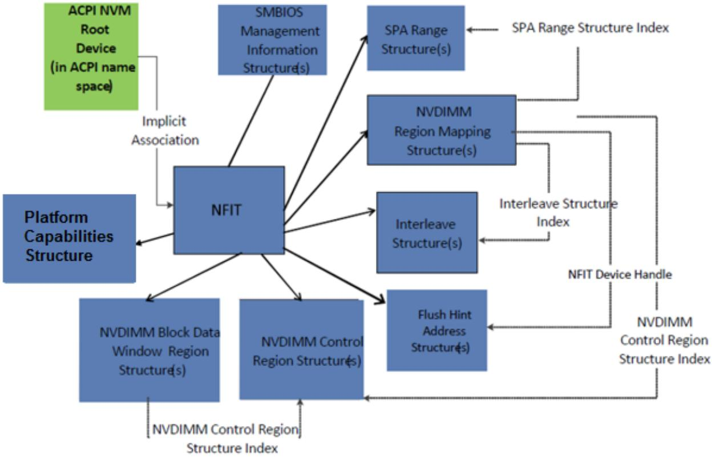  
Fig. 5.9: NVDIMM Firmware Interface Table (NFIT) Overview  
The following table defines the NFIT.

Table 5.145: NVDIMM Firmware Interface Table (NFIT)

<table><tr><td>Field</td><td>Byte Length</td><td>Byte Offset</td><td>Description</td></tr><tr><td colspan="4">Header</td></tr><tr><td>- Signature</td><td>4</td><td>0</td><td>‘NFIT’ is Signature for this table</td></tr><tr><td>- Length</td><td>4</td><td>4</td><td>Length in bytes for entire table.</td></tr><tr><td>- Revision</td><td>1</td><td>8</td><td>1</td></tr><tr><td>- Checksum</td><td>1</td><td>9</td><td>Entire table must sum to zero</td></tr><tr><td>- OEMID</td><td>6</td><td>10</td><td>OEM ID</td></tr><tr><td>- OEM Table ID</td><td>8</td><td>16</td><td>The table ID is the manufacturer model ID</td></tr><tr><td>- OEM Revision</td><td>4</td><td>24</td><td>OEM revision of table for supplied OEM Table ID</td></tr><tr><td>- Creator ID</td><td>4</td><td>28</td><td>Vendor ID of utility that created the table</td></tr><tr><td>- Creator Revision</td><td>4</td><td>32</td><td>Revision of utility that created the table</td></tr><tr><td>Reserved</td><td>4</td><td>36</td><td>NFIT Structure[n]</td></tr><tr><td>—</td><td>40</td><td>A list of NFIT structures for this implementation.</td><td>Each NFIT Structure must start with a 2 byte Type field followed by a 2 byte length field. This allows OSPM to ignore unrecognized types. Supported NFIT Structure types are listed in Table 5.146.</td></tr></table>

Table 5.146: NFIT Structure Types

<table><tr><td>Value</td><td>Description</td></tr><tr><td>0</td><td>System Physical Address (SPA) Range Structure</td></tr><tr><td>1</td><td>NVDIMM Region Mapping Structure</td></tr><tr><td>2</td><td>Interleave Structure</td></tr><tr><td>3</td><td>SMBIOS Management Information Structure</td></tr><tr><td>4</td><td>NVDIMM Control Region Structure</td></tr><tr><td>5</td><td>NVDIMM Block Data Window Region Structure</td></tr><tr><td>6</td><td>Flush Hint Address Structure</td></tr><tr><td>7</td><td>Platform Capabilities Structure</td></tr><tr><td>8-0xFFFF</td><td>Reserved</td></tr></table>

## 5.2.26.2 System Physical Address (SPA) Range Structure

This structure describes the system physical address ranges occupied by NVDIMMs, and their corresponding Region Types.

System physical address ranges described as Virtual CD or Virtual Disk shall be described as AddressRangeReserved in E820, and EFI Reserved Memory Type in the UEFI GetMemoryMap.

Platform is allowed to implement this structure just to describe system physical address ranges that describe Virtual CD and Virtual Disk. For Virtual CD Region and Virtual Disk Region (both volatile and persistent), the following fields - Proximity Domain, SPA Range Structure Index, Flags, and Address Range Memory Mapping Attribute, are not relevant and shall be set to 0.

The default mapping of the NVDIMM Control Region shall be UC memory attributes with AddressRangeReserved type in E820 and EfiMemoryMappedIO type in UEFI GetMemoryMap. The default mapping of the NVDIMM Block Data Window Region shall be WB memory attributes with AddressRangeReserved type in E820 and EfiMemoryMappedIO type in UEFI GetMemoryMap.

Table 5.147: SPA Range Structure

<table><tr><td>Field</td><td>Byte Length</td><td>Byte Offset</td><td>Description</td></tr><tr><td>Type</td><td>2</td><td>0</td><td>0 - SPA Range Structure</td></tr><tr><td>Length</td><td>2</td><td>2</td><td>Length in bytes for entire structure.</td></tr><tr><td>SPA Range Structure Index</td><td>2</td><td>4</td><td>Used by NVDIMM Region Mapping Structure to uniquely refer to this structure. Value of 0 is Reserved and shall not be used as an index.</td></tr><tr><td>Flags</td><td>2</td><td>6</td><td>Bit [0] set to 1 indicates that Control region is strictly for management during hot add/online operation.Bit [1] set to 1 to indicate that data in the Proximity Domain field is valid.Bit [2] set to 1 to indicate that data in the SpaLocationCookie field is valid.Bits [15:3]:Reserved</td></tr></table>

continues on next page

Table 5.147 – continued from previous page

<table><tr><td>Field</td><td>Byte Length</td><td>Byte Offset</td><td>Description</td></tr><tr><td>Reserved</td><td>4</td><td>8</td><td>Reserved</td></tr><tr><td>Proximity Domain</td><td>4</td><td>12</td><td>Integer that represents the proximity domain to which the memory belongs. This number must match with corresponding entry in the SRAT table.</td></tr><tr><td>Address Range Type GUID</td><td>16</td><td>16</td><td>GUID that defines the type of the Address Range Type. The GUID can be any of the values defined in this section, or a vendor defined GUID.</td></tr><tr><td>System Physical Address Range Base</td><td>8</td><td>32</td><td>Start Address of the System Physical Address Range</td></tr><tr><td>System Physical Address Range Length</td><td>8</td><td>40</td><td>Range Length of the region in bytes</td></tr><tr><td>Address Range Memory Mapping Attribute</td><td>8</td><td>48</td><td></td></tr><tr><td></td><td></td><td></td><td>Memory mapping attributes for this address range:EFI_MEMORY_UC = 0x00000001EFI_MEMORY_WC = 0x00000002EFI_MEMORY_WT = 0x00000004EFI_MEMORY_WB = 0x00000008EFI_MEMORY_UCE = 0x00000010EFI_MEMORY_WP = 0x00001000EFI_MEMORY_RP = 0x00002000EFI_MEMORY_XP = 0x00004000EFI_MEMORY_NV = 0x00008000EFI_MEMORY_MORE_RELIABLE = 0x00010000EFI_MEMORY_RO = 0x00020000EFI_MEMORY_SP = 0x00040000</td></tr><tr><td>SpaLocationCookie</td><td>8</td><td>56</td><td>Opaque cookie value set by platform firmware for OSPM use, to detect changes that may impact the readability of the data.</td></tr></table>

The following GUIDs are used to describe the NVDIMM Region Types. Additional GUIDs can be generated to describe additional Address Range Types.

Persistent Memory (PM) Region:

$$
\{0 x 6 6 F 0 D 3 7 9, 0 x B 4 F 3, 0 x 4 0 7 4, 0 x A C, 0 x 4 3, 0 x 0 D, 0 x 3 3, 0 x 1 8, 0 x B 7, 0 x 8 C, 0 x D B \}
$$

NVDIMM Control Region:

$$
\{0 x 9 2 F 7 0 1 F 6, 0 x 1 3 B 4, 0 x 4 0 5 D, 0 x 9 1, 0 x 0 B, 0 x 2 9, 0 x 9 3, 0 x 6 7, 0 x E 8, 0 x 2 3, 0 x 4 C \}
$$

NVDIMM Block Data Window Region:

$$
\{0 x 9 1 A F 0 5 3 0, 0 x 5 D 8 6, 0 x 4 7 0 E, 0 x A 6, 0 x B 0, 0 x 0 A, 0 x 2 D, 0 x B 9, 0 x 4 0, 0 x 8 2, 0 x 4 9 \}
$$

RAM Disk supporting a Virtual Disk Region - Volatile (a volatile memory region that contains a raw disk format):

$$
\{0 x 7 7 A B 5 3 5 A, 0 x 4 5 F C, 0 x 6 2 4 B, 0 x 5 5, 0 x 6 0, 0 x F 7, 0 x B 2, 0 x 8 1, 0 x D 1, 0 x F 9, 0 x 6 E \}
$$

$$
\text { RAM   Disk   supporting   a   Virtual   CD   Region   -   Volatile   (a   volatile   memory   region   that   contains   an   ISO   image): }
$$

$$
\{0 x 3 D 5 A B D 3 0, 0 x 4 1 7 5, 0 x 8 7 C E, 0 x 6 D, 0 x 6 4, 0 x D 2, 0 x A D, 0 x E 5, 0 x 2 3, 0 x C 4, 0 x B B \}
$$

RAM Disk supporting a Virtual Disk Region - Persistent (a persistent memory region that contains a raw disk format): { 0x5CEA02C9,0x4D07,0x69D3,0x26,0x9F,0x44,0x96,0xFB,0xE0,0x96,0xF9 }

RAM Disk supporting a Virtual CD Region - Persistent (a persistent memory region that contains an ISO image): { 0x08018188,0x42CD,0xBB48,0x10,0x0F,0x53,0x87,0xD5,0x3D,0xED,0x3D }

ò Note

The Address Range Type GUID values used in the ACPI NFIT must match the corresponding values in the Disk Type GUID of the RAM Disk device path that describe the same RAM Disk Type. Refer to the UEFI specification for details.

## 5.2.26.3 NVDIMM Region Mapping Structure

The NVDIMM Region Mapping structure describes an NVDIMM region and its mapping, if any, to an SPA range.

Table 5.148: NVDIMM Region Mapping Structure

<table><tr><td>Field</td><td>Byte Length</td><td>Byte Offset</td><td>Description</td></tr><tr><td>Type</td><td>2</td><td>0</td><td>1 - NVDIMM Region Mapping Structure</td></tr><tr><td>Length</td><td>2</td><td>2</td><td>Length in bytes for entire structure.</td></tr><tr><td>NFIT Device Handle</td><td>4</td><td>4</td><td>The _ADR of the NVDIMM device (see Section 9.19.3) containing the NVDIMM region</td></tr><tr><td>NVDIMM Physical ID</td><td>2</td><td>8</td><td>Handle (i.e., instance number) for the SMBIOS Memory Device (Type 17) structure describing the NVDIMM containing the NVDIMM region. See the DSP0134 System Management BIOS (SMBIOS) Reference Specification, Version 3.0.0 (2015-02-12) by the Distributed Management Task Force, Inc. (DMTF) at http://www.dmtf.org/standards/smbios</td></tr><tr><td>NVDIMM Region ID</td><td>2</td><td>10</td><td>Unique identifier for the NVDIMM region. This identifier shall be unique across all the NVDIMM regions in the NVDIMM. There could be multiple regions within the device corresponding to different address types. Also, for a given address type, there could be multiple regions due to interleave discontinuity.</td></tr></table>

continues on next page

Table 5.148 – continued from previous page

<table><tr><td>Field</td><td>Byte Length</td><td>Byte Offset</td><td>Description</td></tr><tr><td>SPA Range Structure Index</td><td>2</td><td>12</td><td>The SPA range, if any, associated with the NVDIMM region:: 0x0000: The NVDIMM region does not map to a SPA range. The following fields are not valid and should be ignored:- NVDIMM Region Size;- Region Offset;- NVDIMM Physical Address Region Base;- Interleave Structure Index; and- Interleave Ways.Fields other than the above (e.g. NFIT Device Handle, NVDIMM Physical ID, NVDIMM Region ID, and NVDIMM State Flags) are valid:- 0x0001 to 0xFFFF: The index of the SPA Range Structure (see Section 5.2.26.2) for the NVDIMM region.</td></tr><tr><td>NVDIMM Control Region Structure Index</td><td>2</td><td>14</td><td>The index of the NVDIMM Control Region Structure (see Section 5.2.26.6) for the NVDIMM region.</td></tr><tr><td>NVDIMM Region Size</td><td>8</td><td>16</td><td>The size of the NVDIMM region, in bytes. If SPA Range Structure Index and Interleave Ways are both non-zero, this field shall match System Physical Address Range Length divided by Interleave Ways. NOTE: the size in SPA Range occupied by the NVDIMM for this region will not be the same as the NVDIMM Region Size when Interleave Ways is greater than 1.</td></tr><tr><td>Region Offset</td><td>8</td><td>24</td><td>In bytes: The Starting Offset for the NVDIMM region in the Interleave Set. This offset is with respect to System Physical Address Range Base in the SPA Range Structure. NOTE: The starting SPA of the NVDIMM region in the NVDIMM is provided by System Physical Address Range Base + Region Offset</td></tr><tr><td>NVDIMM Physical Address Region Base</td><td>8</td><td>32</td><td>In bytes. The base physical address within the NVDIMM of the NVDIMM region.</td></tr><tr><td>Interleave Structure Index</td><td>2</td><td>40</td><td>The Interleave Structure, if any, for the NVDIMM region, as defined in Table 5.149.</td></tr><tr><td>Interleave Ways</td><td>2</td><td>42</td><td>Number of NVDIMMs in the interleave set, including the NVDIMM containing the NVDIMM region, as defined in Table 5.149.</td></tr></table>

continues on next page

Table 5.148 – continued from previous page

<table><tr><td>Field</td><td>Byte Length</td><td>Byte Offset</td><td>Description</td></tr><tr><td>NVDIMM State Flags</td><td>2</td><td>44</td><td></td></tr><tr><td></td><td></td><td></td><td>Bit [0] set to 1 indicates that the previous SAVE operation to the NVDIMM containing the NVDIMM region failed.</td></tr><tr><td></td><td></td><td></td><td>Bit [0] set to 0 indicates that the previous SAVE succeeded, or there was no previous SAVE.</td></tr><tr><td></td><td></td><td></td><td>Bit [1] set to 1 indicates that the last RESTORE operation from the NVDIMM containing the NVDIMM region failed.</td></tr><tr><td></td><td></td><td></td><td>Bit [1] set to 0 indicates that the last RESTORE succeeded or there was no last RESTORE.</td></tr><tr><td></td><td></td><td></td><td>Bit [2] set to 1 indicates that the platform flush of data to the NVDIMM containing the NVDIMM region before the previous SAVE failed. As a result, the restored data content may be inconsistent even if Bit [0] and Bit [1] do not indicate failure.</td></tr><tr><td></td><td></td><td></td><td>Bit [2] set to 0 indicates that the platform flush succeeded, or there was no platform flush.</td></tr><tr><td></td><td></td><td></td><td>Bit [3] set to 1 indicates that the NVDIMM containing the NVDIMM region is not able to accept persistent writes. For an energy-source backed NVDIMM device, Bit [3] is set if it is not armed or the previous ERASE operation did not complete.</td></tr><tr><td></td><td></td><td></td><td>Bit [3] set to 0 indicates that the NVDIMM containing the NVDIMM region is armed.</td></tr><tr><td></td><td></td><td></td><td>Bit [4] set to 1 indicates that the NVDIMM containing the NVDIMM region observed SMART and health events prior to OSPM handoff.</td></tr><tr><td></td><td></td><td></td><td>Bit [5] set to 1 indicates that platform firmware is enabled to notify OSPM of SMART and health events related to the NVDIMM containing the NVDIMM region using Notify codes as specified in NVDIMM Device Notification Values.</td></tr><tr><td></td><td></td><td></td><td>Bit [6] set to 1 indicates that the platform firmware did not map the NVDIMM containing the NVDIMM region into an SPA range. This could be due to various issues such as a device initialization error, device error, insufficient hardware resources to map the device, or a disabled device.</td></tr><tr><td></td><td></td><td></td><td>Implementation Note: In case of device error, Bit [4] might be set along with Bit [6].</td></tr><tr><td></td><td></td><td></td><td>Bit [7] to Bit [15] are reserved.</td></tr><tr><td></td><td></td><td></td><td>Implementation Note: Platform firmware might report several set bits.</td></tr><tr><td>Reserved</td><td>2</td><td>46</td><td>Reserved</td></tr></table>

Table 5.149: Interleave Structure Index and Interleave Ways definition

<table><tr><td>Interleave Structure Index</td><td>Interleave Ways</td><td>Interpretation</td></tr><tr><td>0</td><td>0</td><td>Interleaving, if any, of the NVDIMM region is not reported</td></tr><tr><td>0</td><td>1</td><td>The NVDIMM region is not interleaved with other NVDIMMs (i.e., it is one-way interleaved)</td></tr><tr><td>0</td><td>&gt;1</td><td>The NVDIMM region is part of an interleave set with the number of NVDIMMs indicated in the Interleave Ways field, including the NVDIMM containing the NVDIMM region, but the Interleave Structure is not described.</td></tr><tr><td>&gt;0</td><td>&gt;1</td><td>The NVDIMM region is part of an interleave set with: a) the number of NVDIMMs indicated in the Interleave Ways field, including the NVDIMM containing the NVDIMM region; and b) the Interleave Structure (see Section 5.2.26.4) indicated by the Interleave Structure Index field.</td></tr><tr><td>All other combinations</td><td></td><td>Invalid case</td></tr></table>

## ò Note

Interleave Structure Index=0, Interleave Ways !=1 is to allow a PM range which is interleaved but the actual interleave is not described but only provides the physical Memory Devices (as described by SMBIOS Type 17) that contribute to the PM region. Typically, only block region requires the interleave structure since software has to undo the efect of interleave.

## 5.2.26.4 Interleave Structure

Memory from DIMMs/NVDIMMs could be interleaved across memory channels, memory controller and processor sockets. This structure describes the memory interleave for a given address range. Since interleave is a repeating pattern, this structure only describes the lines involved in the memory interleave before the pattern start to repeat.

Table 5.150: Interleave Structure

<table><tr><td>Field</td><td>Byte Length</td><td>Byte Offset</td><td>Description</td></tr><tr><td>Type</td><td>2</td><td>0</td><td>2 - Interleave Structure</td></tr><tr><td>Length</td><td>2</td><td>2</td><td>Length in bytes for entire structure.</td></tr><tr><td>Interleave Structure Index</td><td>2</td><td>4</td><td>Index Number uniquely identifies the interleave description - this allows reuse of interleave description across multiple NVDIMMs. Index must be non-zero.</td></tr><tr><td>Reserved</td><td>2</td><td>6</td><td></td></tr><tr><td>Number of Lines Described (m)</td><td>4</td><td>8</td><td>Only need to describe the number of lines needed before the inter-leave pattern repeats</td></tr><tr><td>Line Size (in bytes)</td><td>4</td><td>12</td><td>e.g. 64, 128, 256, 4096</td></tr></table>

continues on next page

Table 5.150 – continued from previous page

<table><tr><td>Field</td><td>Byte Length</td><td>Byte Offset</td><td>Description</td></tr><tr><td>Line 1 Offset</td><td>4</td><td>16</td><td>Line 1 Offset refers to the offset of the line, in multiples of Line Size, from the corresponding SPA Range Base for the NVDIMM region. Line 1 SPA = SPA Range Base + Region Offset + (Line 1 Offset*Line Size). Line SPA is naturally aligned to the Line size.</td></tr><tr><td>...</td><td>4</td><td></td><td></td></tr><tr><td>Line m Offset</td><td>4</td><td>16+((m-1)*4)</td><td>Line m Offset refers to the offset of the line, in multiples of Line Size, from the corresponding SPA Range Base for the NVDIMM region. Line m SPA = SPA Range Base + Region Offset + (Line m Offset*Line Size) where m is the last line number before the pattern repeats.</td></tr></table>

## 5.2.26.5 SMBIOS Management Information Structure

This structure enables platform to communicate the additional SMBIOS entries beyond the entries provided by SM-BIOS Table at boot to the OS (e.g. Type 17 entries corresponding to hot added NVDIMMs).

Table 5.151: SMBIOS Management Information Structure

<table><tr><td>Field</td><td>Byte Length</td><td>Byte Offset</td><td>Description</td></tr><tr><td>Type</td><td>2</td><td>0</td><td>3 - SMBIOS Management Information Structure</td></tr><tr><td>Length</td><td>2</td><td>2</td><td>Length in bytes for entire structure.</td></tr><tr><td>Reserved</td><td>4</td><td>4</td><td></td></tr><tr><td>Data</td><td>-</td><td>8</td><td>SMBIOS Table Entries</td></tr></table>

## 5.2.26.6 NVDIMM Control Region Structure

The system shall include an NVDIMM Control Region Structure for every Function Interface in the NVDIMM.

Table 5.152: NVDIMM Control Region Structure Mark

<table><tr><td>Field</td><td>Byte Length</td><td>Byte Offset</td><td>Description</td></tr><tr><td>Type</td><td>2</td><td>0</td><td>4 - NVDIMM Control Region Structure</td></tr><tr><td>Length</td><td>2</td><td>2</td><td>Length in bytes for entire structure. The length of this structure is either 32 bytes or 80 bytes. The length of the structure can be 32 bytes only if the Number of Block Control Windows field has a value of 0.</td></tr><tr><td>NVDIMM Control Region Structure Index</td><td>2</td><td>4</td><td>Index Number uniquely identifies the NVDIMM Control Region Structure.</td></tr><tr><td>Vendor ID</td><td>2</td><td>6</td><td>Identifier indicating the vendor of the NVDIMM. This field shall be set to the value of the NVDIMM SPD Module Manufacturer ID Code field (a) with byte 0 set to DDR4 SPD byte 320 and byte 1 set to DDR4 SPD byte 321.</td></tr></table>

continues on next page

Table 5.152 – continued from previous page

<table><tr><td>Field</td><td>Byte Length</td><td>Byte Offset</td><td>Description</td></tr><tr><td>Device ID</td><td>2</td><td>8</td><td>Identifier for the NVDIMM, assigned by the module vendor. This field shall be set to the value of the NVDIMM SPD Module Product Identifier field (b) with byte 0 set to SPD byte 192 and byte 1 set to SPD byte 193.</td></tr><tr><td>Revision ID</td><td>2</td><td>10</td><td>Revision of the NVDIMM, assigned by the module vendor. Byte 1 of this field is reserved. Byte 0 of this field shall be set to the value of the NVDIMM SPD Module Revision Code field (a) (i.e., SPD byte 349).</td></tr><tr><td>Subsystem Vendor ID</td><td>2</td><td>12</td><td>Vendor of the NVDIMM non-volatile memory subsystem controller (c). This field shall be set to the value of the NVDIMM SPD Non-Volatile Memory Subsystem Controller Vendor ID field (b) with byte 0 set to SPD byte 194 and byte 1 set to SPD byte 195.</td></tr><tr><td>Subsystem Device ID</td><td>2</td><td>14</td><td>Identifier for the NVDIMM non-volatile memory subsystem controller, assigned by the non-volatile memory subsystem controller vendor. This field shall be set to the value of the NVDIMM SPD Non-Volatile Memory Subsystem Controller Device ID field (b) with byte 0 set to SPD byte 196 and byte 1 set to SPD byte 197.</td></tr><tr><td>Subsystem Revision ID</td><td>2</td><td>16</td><td>Revision of the NVDIMM non-volatile memory subsystem controller, assigned by the non-volatile memory subsystem controller vendor. Byte 1 of this field is reserved. Byte 0 of this field shall be set to the value of the NVDIMM SPD Non-Volatile Memory Subsystem Controller Revision Code field (i.e. SPD byte 198).</td></tr><tr><td>Valid Fields</td><td>1</td><td>18</td><td>Valid bits for fields defined after the initial NFIT definition in ACPI 6.0 within the initially defined lengths of 32 and 80 bytes.Bits [7-1]: Reserved. Bit [0]: Manufacturing Location field and Manufacturing Date field.Bit [0] set to one indicates that the Manufacturing Location field and Manufacturing Date field are valid.Bit [0] set to zero indicates that the Manufacturing Location field and Manufacturing Date field are not valid and should be ignored. Systems compliant with this specification shall set Bit [0] to one. Systems that were compliant with ACPI 6.0 had Bit [0] set to zero, meaning they did not have Manufacturing Location and Manufacturing Date fields.</td></tr><tr><td>Manufacturing Location</td><td>1</td><td>19</td><td>Manufacturing location for the NVDIMM, assigned by the module vendor. This field shall be set to the value of the NVDIMM SPD Module Manufacturing Location field (a) (SPD byte 322). Validity of this field is indicated in Valid Fields Bit [0].</td></tr></table>

continues on next page

Table 5.152 – continued from previous page

<table><tr><td>Field</td><td>Byte Length</td><td>Byte Offset</td><td>Description</td></tr><tr><td>Manufacturing Date</td><td>2</td><td>20</td><td>Date the NVDIMM was manufactured, assigned by the module vendor. This field shall be set to the value of the NVDIMM SPD Module Manufacturing Date field (a) with byte 0 set to SPD byte 323 and byte 1 set to SPD byte 324. Validity of this field is indicated in Valid Fields Bit [0].</td></tr><tr><td>Reserved</td><td>2</td><td>22</td><td>Reserved</td></tr><tr><td>Serial Number</td><td>4</td><td>24</td><td>Serial number of the NVDIMM, assigned by the module vendor. This field shall be set to the value of the NVDIMM SPD Module Serial Number field with byte 0 set to SPD byte 325, byte 1 set to SPD byte 326, byte 2 set to SPD byte 327, and byte 3 set to SPD byte 328.</td></tr><tr><td>Region Format Interface Code</td><td>2</td><td>28</td><td>Identifier for the programming interface. This field shall be set to the value of the NVDIMM SPD Function Interface descriptor b for the function interface represented by the NVDIMM Control Region structure, with: a. byte 0 bits 7:5 set to 000b; b. byte 0 bits 4:0 set to the Function Interface field (Function Interface descriptor bits 4:0); c. byte 1 bits 7:5 set to 000b; and d. byte 1 bits 4:0 set to the Function Class field (Function Interface descriptor bits 9:5). EXAMPLE - A Function Interface Descriptor of 0x8021 means: a. Function Interface Descriptor is implemented; b. there is no Extended Function Parameter Block; c. function class is byte-addressable energy backed (0x01); and d. function interface is byte addressable energy backed function interface 1 (0x01)d, and maps to a Region Format Interface Code of 0x0101.</td></tr><tr><td>Number of Block Control Windows</td><td>2</td><td>30</td><td>Number of Block Control Windows must match the corresponding number of Block Data Windows. Fields that follow this field are valid only if the number of Block Control Windows is non-zero.</td></tr><tr><td>Size of Block Control Window</td><td>8</td><td>32</td><td>In Bytes</td></tr><tr><td>Command Register Offset in Block Control Window</td><td>8</td><td>40</td><td>In Bytes. Logical offset. Refer to Note. The start of the subsequent Block Control Windows is calculated by adding Size of Block Control Window.</td></tr><tr><td>Size of Command Register in Block Control Windows</td><td>8</td><td>48</td><td>In Bytes</td></tr><tr><td>Status Register Offset in Block Control Window</td><td>8</td><td>56</td><td>Logical offset in bytes. Refer to Note1. The start of the subsequent Block Control Window is calculated by adding Size of Block Control Window.</td></tr><tr><td>Size of Status Register in Block Control Windows</td><td>8</td><td>64</td><td>In Bytes</td></tr></table>

continues on next page

Table 5.152 – continued from previous page

<table><tr><td>Field</td><td>Byte Length</td><td>Byte Offset</td><td>Description</td></tr><tr><td>NVDIMM Control Region Flag</td><td>2</td><td>72</td><td>Bit [0] set to 1 to indicate that the Block Data Windows implementation is buffered. The content of the data window is only valid when so indicated by Status Register.</td></tr><tr><td>Reserved</td><td>6</td><td>74</td><td>Reserved</td></tr></table>

Notes for above table:

(a) See JEDEC Standard No. 21-C JEDEC Configurations for Solid State Memories , Annex L: Serial Presence Detect (SPD) for DDR4 SDRAM modules, DDR4 SPD Document Release 2.

(b) See JEDEC Standard No. 21-C JEDEC Configurations for Solid State Memories , Annex L: Serial Presence Detect (SPD) for DDR4 SDRAM modules, DDR4 SPD Document Release 3 (forthcoming).

(c) In an NVDIMM, the module contains a non-volatile memory subsystem controller.

(d) See JEDEC Standard No. 2233-22 B yte Addressable Energy Backed Interface, Version 1.0 (forthcoming).

## ò Note

“Logical ofset” in the structure above refers to the ofset from the start of NVDIMM Control Region. The logical ofset is with respect to the device, not with respect to system physical address space. Software should construct the device address space (accounting for interleave) before applying the block control start ofset.

## 5.2.26.7 NVDIMM Block Data Window Region Structure

This structure shall be provided only if the number of Block Data Windows is non-zero.

Table 5.153: NVDIMM Block Data Windows Region Structure

<table><tr><td>Field</td><td>Byte Length</td><td>Byte Offset</td><td>Description</td></tr><tr><td>Type</td><td>2</td><td>0</td><td>5 - NVDIMM Block Data Window Region Structure</td></tr><tr><td>Length</td><td>2</td><td>2</td><td>Length in bytes for entire structure.</td></tr><tr><td>NVDIMM Control Region Structure Index</td><td>2</td><td>4</td><td>Provides association for the corresponding NVDIMM Control Region. Shall be Non-zero.</td></tr><tr><td>Number of Block Data Windows</td><td>2</td><td>6</td><td>Number of Block Data Windows shall match the corresponding number of Block Control Windows.</td></tr><tr><td>Block Data Window Start Offset</td><td>8</td><td>8</td><td>Logical offset in bytes (see note below). The start of the subsequent Block Data Window is calculated by adding Size of Block Data Window.</td></tr><tr><td>Size of Block Data Window</td><td>8</td><td>16</td><td>In Bytes</td></tr><tr><td>Block Accessible Memory Capacity</td><td>8</td><td>24</td><td>In Bytes</td></tr><tr><td>Beginning address of first block in Block Accessible Memory</td><td>8</td><td>32</td><td>In Bytes. The address of the next block is obtained by adding the value of this field to Size of Block Data Window.</td></tr></table>

## ò Note

Logical ofset in table above refers to ofset from the start of NVDIMM Data Window Region. The logical ofset is with respect to the device not with respect to system physical address space. Software should construct the device address space (accounting for interleave) before applying the Block Data Window start ofset.

## 5.2.26.8 Flush Hint Address Structure

Software needs an assurance of durability (i.e. a guarantee that the writes have reached the target NVDIMM) after writing to a NVDIMM region. The Flush Hint feature is platform specific and if supported, the platform exposes this durability mechanism to OSPM by providing a Flush Hint Address Structure.

For a given NVDIMM (as indicated by the NFIT Device Handle in the Flush Hint Address Structure), software can write to any one of these Flush Hint Addresses to cause any preceding writes to the NVDIMM region to be flushed out of the intervening platform bufers to the targeted NVDIMM (to achieve durability). Note that the platform bufers do not include processor cache(s)! Processors typically include ISA to flush data out of processor caches.

Table 5.154: Flush Hint Address Structure

<table><tr><td>Field</td><td>Byte Length</td><td>Byte Offset</td><td>Description</td></tr><tr><td>Type</td><td>2</td><td>0</td><td>6 - Flush Hint Address Structure</td></tr><tr><td>Length</td><td>2</td><td>2</td><td>Length in bytes for entire structure.</td></tr><tr><td>NFIT Device Handle</td><td>4</td><td>4</td><td>Indicates the NVDIMM supported by the Flush Hint Addresses in this structure.</td></tr><tr><td>Number of Flush Hint Addresses in this structure (m)</td><td>2</td><td>8</td><td>Number of Flush Hint Addresses in this structure.</td></tr><tr><td>Reserved</td><td>6</td><td>10</td><td>Reserved</td></tr><tr><td>Flush Hint Address 1</td><td>8</td><td>16</td><td>64-bit system physical address that needs to be written to cause durability flush. Software is allowed to write up to a cache line of data. The content of the data is not relevant to the functioning of the flush hint mechanism.</td></tr><tr><td>...</td><td>8</td><td>24</td><td></td></tr><tr><td>Flush Hint Address m</td><td>8</td><td>16+((m-1)*8)</td><td>64-bit system physical address that needs to be written to cause durability flush. Software is allowed to write up to a cache line of data. The content of the data is not relevant to the functioning of the flush hint mechanism.</td></tr></table>

## 5.2.26.9 Platform Capabilities Structure

This structure informs OSPM of the NVDIMM platform capabilities.

Table 5.155: Platform Capabilities Structure

<table><tr><td>Field</td><td>Byte Length</td><td>Byte Offset</td><td>Description</td></tr><tr><td>Type</td><td>2</td><td>0</td><td>7 - Platform Capabilities Structure</td></tr><tr><td>Length</td><td>2</td><td>2</td><td>Length in bytes for entire structure.</td></tr></table>

continues on next page

Table 5.155 – continued from previous page

<table><tr><td>Field</td><td>Byte Length</td><td>Byte Offset</td><td>Description</td></tr><tr><td>Highest Valid Capability</td><td>1</td><td>4</td><td>The bit index of the highest valid capability implemented by the platform. The subsequent bits shall not be considered to determine the capabilities supported by the platform.</td></tr><tr><td>Reserved</td><td>3</td><td>5</td><td>Reserved (0)</td></tr><tr><td>Capabilities</td><td>4</td><td>8</td><td></td></tr><tr><td></td><td></td><td></td><td>Bit[0] - CPU Cache Flush to NVDIMM Durability on Power Loss Capable. If set to 1, indicates that platform ensures the entire CPU store data path is flushed to persistent memory on system power loss.Bit[1] - Memory Controller Flush to NVDIMM Durability on Power Loss Capable. If set to 1, indicates that platform provides mechanisms to automatically flush outstanding write data from the memory controller to persistent memory in the event of platform power loss. Note: If bit 0 is set to 1 then this bit shall be set to 1 as well.Bit[2] - Byte Addressable Persistent Memory Hardware Mirroring Capable. If set to 1, indicates that platform supports mirroring multiple byte addressable persistent memory regions together. If this feature is supported and enabled, healthy hardware mirrored interleave sets will have the EFI_MEMORY_MORE_RELIABLE Address Range Memory Mapping Attribute set in the System Physical Address Range structure in the NFIT table.Bits[31:3] - Reserved</td></tr><tr><td>Reserved</td><td>4</td><td>12</td><td>Reserved (1)</td></tr></table>

## 5.2.26.10 NVDIMM Representation Format

If software or an NVDIMM manufacturer displays, prints on a label, or otherwise makes available an identifier for an NVDIMM (e.g., to uniquely identify the NVDIMM), then the following hexadecimal format should be used:

• If the Manufacturing Location and Manufacturing Date fields are valid:

C language format string: "%02x%02x-%02x-%02x%02x-%02x%02x%02x%02x"

Format values:

1. Vendor ID byte 0 (including the parity bit)

2. Vendor ID byte 1

3. Manufacturing Location byte

4. Manufacturing Date byte 0 (i.e., the year)

5. Manufacturing Date byte 1 (i.e., the week)

6. Serial Number byte 0

7. Serial Number byte 1

8. Serial Number byte 2

## 9. Serial Number byte 3

• If the Manufacturing Location and Manufacturing Date fields are not valid:

```txt
C language format string: "%02x%02x-%02x%02x%02x%02x"
```

Format values:

1. Vendor ID byte 0 (including the parity bit)

2. Vendor ID byte 1

3. Serial Number byte 0

4. Serial Number byte 1

5. Serial Number byte 2

6. Serial Number byte 3

This format matches the order of SPD bytes 320 to 328 from low to high (i.e., showing the lowest or first byte on the left).

## 5.2.27 Non HDAudio Link Table (NHLT)

Audio data can be transferred over many diferent interfaces: HDAudio, I2S, PDM and more. Process of configuring such transfer difers between the interfaces. In I2S and PDM case, the kernel driver does not have access to relevant hardware registers to program the underlying hardware. The necessary data must be then provided to the AudioDSP firmware which will do the programming on driver’s behalf. NHLT helps facilitate that process.

The NHLT table is comprised of standard ACPI table header followed by list of endpoint descriptors, one for each non-HDAudio endpoint to be supported in the userspace.

Table 5.156: Non HDAudio Link Table structure

<table><tr><td>Field</td><td>Byte Length</td><td>Byte Offset</td><td>Description</td></tr><tr><td>Signature</td><td>4</td><td>0</td><td>‘NHLT’ Signature for the Non HDAudio Link Table.</td></tr><tr><td>Length</td><td>4</td><td>4</td><td>Length, in bytes, of the entire NHLT (including the header).</td></tr><tr><td>Revision</td><td>1</td><td>8</td><td>The revision of the structure corresponding to the signature field for this table. For the Firmware Performance Data Table conforming to this revision of the specification, the revision is 1.</td></tr><tr><td>Checksum</td><td>1</td><td>9</td><td>The entire table, including the checksum field, must add to zero to be considered valid.</td></tr><tr><td>OEMID</td><td>6</td><td>10</td><td>An OEM-supplied string that identifies the OEM.</td></tr><tr><td>OEM Table ID</td><td>8</td><td>16</td><td>An OEM-supplied string that the OEM uses to identify this particular data table.</td></tr><tr><td>OEM Revision</td><td>4</td><td>24</td><td>An OEM-supplied revision number.</td></tr><tr><td>Creator ID</td><td>4</td><td>28</td><td>The Vendor ID of the utility that created this table.</td></tr><tr><td>Creator Revision</td><td>4</td><td>32</td><td>The revision of the utility that created this table.</td></tr><tr><td>Endpoints Count</td><td>1</td><td>36</td><td>Count of elements in the Endpoints array.</td></tr><tr><td>Endpoints[]</td><td>-</td><td>37</td><td>Array of endpoint descriptors. See Section 5.2.27.1.</td></tr></table>

continues on next page

Table 5.156 – continued from previous page

<table><tr><td>Field</td><td>Byte Length</td><td>Byte Offset</td><td>Description</td></tr><tr><td>OED Config</td><td>-</td><td>-</td><td>Opaque data (see Table 5.158) utilized by the Offload Engine Driver (OED) that is part of Intel Smart Sound Technology (SST) stack on Microsoft Windows OS. Ignored on non-Windows configurations. Entirely optional. Whether it is presented is deduced from Length of the table header.</td></tr></table>

## 5.2.27.1 Endpoint descriptor

Each descriptor provides general information about the endpoint. It is followed by description of the device that exposes the endpoint (see Section 5.2.27.3) and configuration data that helps program the hardware for all audio formats supported by the endpoint (see Section 5.2.27.4). Secondary device information (see Section 5.2.27.5) may optionally tail the descriptor.

Table 5.157: Endpoint descriptor (EndpointDescriptor) structure

<table><tr><td>Field</td><td>Byte Length</td><td>Byte Offset</td><td>Description</td></tr><tr><td>Length</td><td>4</td><td>0</td><td>Length, in bytes, of the entire endpoint descriptor. Includes size of DeviceConfig and FormatsConfig structures. If the optional structure, DevicesInfo, is present, includes its size too.</td></tr><tr><td>Link Type</td><td>1</td><td>4</td><td>Type of Link (hardware) that this endpoint facilities transfer over:0 - HD Audio1 - DSP2 - PDM3 - SSP (for I2S)4 - Slimbus5 - SoundWire6 - USB Audio OffloadOnly PDM and SSP are in-use. The rest are reserved to denote other available interfaces but there is no practical usage.</td></tr><tr><td>Instance ID</td><td>1</td><td>5</td><td>Device instance number, unique to Link Type. The first or only device on shall have the field set to 0. All devices with the same Link Type, Device Type and Instance ID will be exposed by the same Intel SST CodecFunctionDriver (CFD).OEMs that want to expose separate CFD for subset of devices with given Device Type on particular Link Type, shall allocate different Instance IDs for the selected devices.</td></tr><tr><td>Vendor ID</td><td>2</td><td>6</td><td>Identification number of the vendor. Used for building PnP address for matching kernel driver to a hardware device.</td></tr></table>

continues on next page

Table 5.157 – continued from previous page

<table><tr><td>Field</td><td>Byte Length</td><td>Byte Offset</td><td>Description</td></tr><tr><td>Device ID</td><td>2</td><td>8</td><td>Identification number of the device. Used for building PnP address for matching kernel driver to a hardware device. For matching with Intel device drivers, it shall be one of the following:0xAE20 – for PDM Digital Microphone0xAE30 – for Bluetooth A2DP/HFP0xAE33 – for Bluetooth LE0xAE34 – for I2S/TDM codecs</td></tr><tr><td>Revision ID</td><td>2</td><td>10</td><td>Identification number of the device&#x27;s revision. Used for building PnP address for matching kernel driver to a hardware device. It is expected that OEM platform revision ID is used here.</td></tr><tr><td>Subsystem ID</td><td>4</td><td>12</td><td>Identification number of the device&#x27;s subsystem. Used for building PnP address for matching kernel driver to a hardware device.</td></tr><tr><td>Device Type</td><td>1</td><td>16</td><td>Type of device, unique to Link Type:SSP Link:0 – Bluetooth A2DP/HFP1 – Frequency Modulation (Radio)2 – Modem3 – Bluetooth LE4 – Analog Codec5-7 – reservedPDM Link:0 – PDM1 – PDM (for Intel SkyLake-based platforms only)</td></tr><tr><td>Direction</td><td>1</td><td>17</td><td>Endpoint&#x27;s stream direction:0 – playback/render1 – capture</td></tr><tr><td>Virtual Bus ID</td><td>1</td><td>18</td><td>Virtual Bus line. For SSP Link Type this is SSP port number. For DMIC this is always 0 as there is only one PDM link seen from driver/firmware point of view.</td></tr><tr><td>Device Config</td><td>-</td><td>19</td><td>Description of the audio device that exposes this endpoint. See Section 5.2.27.3.</td></tr><tr><td>Formats Config</td><td>-</td><td>-</td><td>List of audio formats by this endpoint and their configuration.See Section 5.2.27.4.</td></tr></table>

continues on next page

Table 5.157 – continued from previous page

<table><tr><td>Field</td><td>Byte Length</td><td>Byte Offset</td><td>Description</td></tr><tr><td>Devices Info</td><td>-</td><td>-</td><td>Secondary information about the audio device. Entirely optional. Whether it is presented is deduced from Length of the endpoint descriptor. See Section 5.2.27.5.</td></tr></table>

## 5.2.27.2 Configuration space common

Both the device (Section 5.2.27.3) and audio format (Table 5.165) configuration are represented by a common byte array structure:

Table 5.158: Configuration space structure

<table><tr><td>Field</td><td>Byte Length</td><td>Byte Offset</td><td>Description</td></tr><tr><td>CapabilitiesSize</td><td>4</td><td>0</td><td>Size in bytes of Capabilities array. Does not include size of this field.</td></tr><tr><td>Capabilities[]</td><td>-</td><td>4</td><td>Opaque byte array.</td></tr></table>

## 5.2.27.3 Device configuration space

Body of ‘Capabilities’ field in Configuration space structure. The device configuration layout difers depending on the byte array size, whether it is 1, 2, 3 or more. I2S-transfer is described by either by generic structure composed of VirtualSlot and ConfigType or VirtualSlot alone. In the latter case, the kernel driver must assume ConfigType of default value 0. PDM-transfer descriptor varies depending on the number of microphones and complexity of their layout.

```txt
union DeviceConfig {
    u8 VirtualSlot;    // if CapabilitiesSize = 1
    struct {
    u8 VirtualSlot;
    u8 ConfigType;
    } Gen;    // if CapabilitiesSize = 2
    struct {
    u8 VirtualSlot;
    u8 ConfigType;
    u8 ArrayType;
    } Mic;    // if CapabilitiesSize = 3
    struct {
    u8 VirtualSlot;
    u8 ConfigType;
    u8 ArrayType;
    u8 MicsCount;
    VendorMicConfig Mics[] 
    } VendorMic;    // if CapabilitiesSize > 3
};
```

Table 5.159: Device configuration (DeviceConfig) structure

<table><tr><td>Field</td><td>Byte Length</td><td>Byte Offset</td><td>Description</td></tr><tr><td>Virtual Slot</td><td>1</td><td>4</td><td>Time-slot for multichannel transmission.</td></tr><tr><td rowspan="3">Config Type</td><td rowspan="3">1</td><td rowspan="3">5</td><td>Specifies device type. Optional - if the CapabilitiesSize does not equal 2, software reading this structure must assume default value of 0.</td></tr><tr><td>0 - generic</td></tr><tr><td>1 - microphone array</td></tr><tr><td>Array Type</td><td>1</td><td>6</td><td>Specifies shape of the microphone array. Only bits 0-3 are used, the rest are reserved. See Table 5.160.</td></tr><tr><td>Microphones Count</td><td>1</td><td>7</td><td>Count of elements in the Microphones array.</td></tr><tr><td>Microphones[]</td><td>-</td><td>8</td><td>Array of vendor microphone configurations. See Table 5.161.</td></tr></table>

Table 5.160: Array Type constants

<table><tr><td>Value</td><td>Description</td></tr><tr><td>0xA</td><td>Linear 2-element, small.</td></tr><tr><td>0xB</td><td>Linear 2-element, big.</td></tr><tr><td>0xC</td><td>Linear 4-element, 1st geometry.</td></tr><tr><td>0xD</td><td>Planar L-shaped 4-element.</td></tr><tr><td>0xE</td><td>Linear 4-element, 1st geometry.</td></tr><tr><td>0xF</td><td>Vendor defined.</td></tr></table>

Table 5.161: Vendor Microphone configuration (VendorMicConfig)

<table><tr><td>Field</td><td>Byte Length</td><td>Byte Offset</td><td>Description</td></tr><tr><td>Type</td><td>1</td><td>0</td><td>Type of the microphone. See Table 5.162.</td></tr><tr><td>Panel</td><td>1</td><td>1</td><td>Location of the microphone. See Table 5.163.</td></tr><tr><td>Speaker Position Distance</td><td>2</td><td>2</td><td>In millimeters.</td></tr><tr><td>Horizontal Offset</td><td>2</td><td>4</td><td>In millimeters.</td></tr><tr><td>Vertical Offset</td><td>2</td><td>6</td><td>In millimeters.</td></tr><tr><td>Frequency Low Band</td><td>1</td><td>8</td><td>Result of 5 * frequency (Hz).</td></tr><tr><td>Frequency High Band</td><td>1</td><td>9</td><td>Result of 500 * frequency (Hz).</td></tr><tr><td>Direction Angle</td><td>2</td><td>10</td><td>In -180 - +180 range.</td></tr><tr><td>Elevation Angle</td><td>2</td><td>12</td><td>In -180 - +180 range.</td></tr><tr><td>Work Vertical Angle Begin</td><td>2</td><td>14</td><td>In -180 - +180 range with 2-degree steps.</td></tr><tr><td>Work Vertical Angle End</td><td>2</td><td>16</td><td>In -180 - +180 range with 2-degree steps.</td></tr><tr><td>Work Horizontal Angle Begin</td><td>2</td><td>18</td><td>In -180 - +180 range with 2-degree steps.</td></tr><tr><td>Work Horizontal Angle End</td><td>2</td><td>20</td><td>In -180 - +180 range with 2-degree steps.</td></tr></table>

Table 5.162: Microphone type constants

<table><tr><td>Value</td><td>Description</td></tr><tr><td>0</td><td>KSMICARRAY_MICTYPE_OMNIDIRECTIONAL</td></tr><tr><td>1</td><td>KSMICARRAY_MICTYPE_SUBCARDIOID</td></tr><tr><td>2</td><td>KSMICARRAY_MICTYPE_CARDIOID</td></tr><tr><td>3</td><td>KSMICARRAY_MICTYPE_SUPERCARDIOID</td></tr><tr><td>4</td><td>KSMICARRAY_MICTYPE_HYPERCARDIOID</td></tr><tr><td>5</td><td>KSMICARRAY_MICTYPE_8SHAPED</td></tr><tr><td>6</td><td>Reserved</td></tr><tr><td>7</td><td>KSMICARRAY_MICTYPE_VENDORDEFINED</td></tr></table>

Check out KSMICARRAY\_MICTYPE documentation for more information.

Table 5.163: Microphone location constants

<table><tr><td>Value</td><td>Description</td></tr><tr><td>0</td><td>Top</td></tr><tr><td>1</td><td>Bottom</td></tr><tr><td>2</td><td>Left</td></tr><tr><td>3</td><td>Right</td></tr><tr><td>4</td><td>Front (default)</td></tr><tr><td>5</td><td>Rear</td></tr></table>

## 5.2.27.4 Formats configuration space

All formats supported by given endpoint are found in the formats array:

Table 5.164: Formats configuration array (FormatsConfig) structure

<table><tr><td>Field</td><td>Byte Length</td><td>Byte Offset</td><td>Description</td></tr><tr><td>Formats Count</td><td>1</td><td>0</td><td>Count of elements in the Formats array.</td></tr><tr><td>Formats[]</td><td>-</td><td>1</td><td>Array of supported formats. See Table 5.165.</td></tr></table>

The details about audio format come with the waveform-audio data header followed up by opaque binary data that help program the relevant hardware registers.

Table 5.165: Format configuration (FormatConfig) structure

<table><tr><td>Field</td><td>Byte Length</td><td>Byte Offset</td><td>Description</td></tr><tr><td>Format</td><td>40</td><td>0</td><td>WAVEFORMATEXTENSIBLE structure. Defines the format of waveform-audio data. Check out WAVEFORMATEXTENSIBLE documentation for more information.</td></tr><tr><td>Config</td><td>-</td><td>40</td><td>Data to be forwarded to the AudioDSP firmware to setup a stream in specific audio format. Usually carries information about hardware registers and clocking. See Table 5.158.</td></tr></table>

Table 5.166: Wave Format Extensible structure

<table><tr><td>Field</td><td>Byte Length</td><td>Byte Offset</td><td>Description</td></tr><tr><td>Format Tag</td><td>2</td><td>0</td><td>Type of WAVEFORMAT* structure. Hardcoded to 0xFFFE in WAVEFORMATEXTENSIBLE case.</td></tr><tr><td>Channels</td><td>2</td><td>2</td><td>Number of channels.</td></tr><tr><td>Samples Per Sec</td><td>4</td><td>4</td><td>Sample rate in samples per second.</td></tr><tr><td>Avg Bytes Per Sec</td><td>4</td><td>8</td><td>Average data transfer rate measured in bytes per second.</td></tr><tr><td>Block Align</td><td>2</td><td>12</td><td>Block alignment in bytes. Must be equal to frame size, which is calculated with: Channels * (Bits Per Sample / 8).</td></tr><tr><td>Bits Per Sample</td><td>2</td><td>14</td><td>Size of sample container in bits. Must be larger or equal than actual sample size (Valid Bits Per Sample). Must be multiple of 8.</td></tr><tr><td>Size</td><td>2</td><td>16</td><td>Size of extra format information in bytes. Hardcoded to 22 in WAVEFORMATEXTENSIBLE case.</td></tr><tr><td>Valid Bits Per Sample</td><td>2</td><td>18</td><td>Size of sample data in bits. Must be smaller or equal than the container size (Bits Per Sample).</td></tr><tr><td>Channel Mask</td><td>4</td><td>20</td><td>Bitmask specifying how the channels are laid out in a stream.</td></tr><tr><td>Subformat</td><td>16</td><td>24</td><td></td></tr><tr><td></td><td></td><td></td><td>UUID. Denotes data subtype. For PCM data, set to:{0x00000001, 0x0000, 0x0010, {0x80, 0x00, 0x00, 0xaa, 0x00, 0x38, 0x9b, 0x71}.</td></tr></table>

## 5.2.27.5 Secondary device information

Obsolete. The content is ignored by all production kernel drivers. Initially targeted for Intel CannonLake-based platforms. While ignored, this information may still be present in some NHLTs.

Table 5.167: Devices information array (DevicesInfo) structure

<table><tr><td>Field</td><td>Byte Length</td><td>Byte Offset</td><td>Description</td></tr><tr><td>Devices Count</td><td>1</td><td>0</td><td>Count of elements in the Devices array.</td></tr><tr><td>Devices[]</td><td>-</td><td>1</td><td>Array of DeviceInfo elements. See Table 5.168.</td></tr></table>

Table 5.168: Device information (DeviceInfo) structure

<table><tr><td>Field</td><td>Byte Length</td><td>Byte Offset</td><td>Description</td></tr><tr><td>ID</td><td>16</td><td>0</td><td>HID or ADR of the device that exposes this endpoint.</td></tr><tr><td>Instance ID</td><td>1</td><td>16</td><td>Indicates the instance of the device in mutli-codec environment. In single-codec environments, what is usually the case, set to 0.</td></tr><tr><td>Port ID</td><td>1</td><td>17</td><td>Identifies port number used by the codec driver managing the codec device on the kernel side. The mapping is based on the codec data sheet. For example, if an endpoint is operated by the driver on port described as ‘AIF2’, the ID value would be 2.</td></tr></table>

continues on next page

Table 5.168 – continued from previous page

<table><tr><td>Field</td><td>Byte Length</td><td>Byte Offset</td><td>Description</td></tr></table>

## 5.2.28 Secure Devices (SDEV) ACPI Table

The Secure DEVices (SDEV) table is a list of secure devices known to the system. The table is applicable to systems where a secure OS partition and a non-secure OS partition co-exist. A secure device is a device that is protected by the secure OS, preventing accesses from non-secure OS.

The table provides a hint as to which devices should be protected by the secure OS. The enforcement of the table is provided by the secure OS and any pre-boot environment preceding it. The table itself does not provide any security guarantees. It is the responsibility of the system manufacturer to ensure that the operating system is configured to enable security features that make use of the SDEV table.

There are three options for each device in the system:

1) Device is listed in SDEV. “Allow handof. . . ” flag is clear. This provides a hint that the device should be always protected within the secure OS. For example, the secure OS may require that a device used for user authentication must be protected to guard against tampering by malicious software.

2) Device is listed in SDEV. “Allow handof. . . ” flag is set. This provides a hint that the device should be initially protected by the secure OS, but it is up to the discretion of the secure OS to allow the device to be handed of to the non-secure OS when requested. Any OS component that expected the device to be operating in secure mode would not correctly function after the handof has been completed. For example, a device may be used for variety of purposes, including user authentication. If the secure OS determines that the necessary components for driving the device are missing, it may release control of the device to the non-secure OS. In this case, the device cannot be used for secure authentication, but other operations can correctly function.

3) Device not listed in SDEV. For example, the status quo is that no hints are provided. Any OS component that expected the device to be in secure mode would not correctly function.

The OS vendor provides guidance on which devices can be listed in the SDEV table. In other words, which devices are compatible with the secure OS, and which devices should have the “allow handof” flag set.

See the following table for the SDEV ACPI definition.

Table 5.169: SDEV ACPI Table

<table><tr><td>Field</td><td>Byte Length</td><td>Byte Offset</td><td>Description</td></tr><tr><td colspan="4">Header</td></tr><tr><td>- Signature</td><td>4</td><td>0</td><td>‘SDEV’. Signature for the Table</td></tr><tr><td>- Length</td><td>4</td><td>4</td><td>Length, in bytes, of the entire Table.</td></tr><tr><td>- Revision</td><td>1</td><td>8</td><td>1</td></tr><tr><td>- Checksum</td><td>1</td><td>9</td><td>Entire table must sum to zero.</td></tr><tr><td>- OEM ID</td><td>6</td><td>10</td><td>OEM ID</td></tr><tr><td>- OEM Table ID</td><td>8</td><td>16</td><td>For the SDEV Table, the table ID is the manufacturer model ID.</td></tr><tr><td>- OEM Revision</td><td>4</td><td>24</td><td>OEM revision of SDEV Table for supplied OEM Table ID.</td></tr><tr><td>- Creator ID</td><td>4</td><td>28</td><td>Vendor ID of utility that created the table.</td></tr><tr><td>- Creator Revision</td><td>4</td><td>32</td><td>Revision of utility that created the table.</td></tr><tr><td>Secure Device Structures []</td><td>—</td><td>36</td><td>A list of structures containing one or more Secure Device Structures as defined in next section.</td></tr></table>

## 5.2.28.1 Secure Device Structures

Table 5.170: Secure Device Structures

<table><tr><td>Value</td><td>Description</td></tr><tr><td>0</td><td>ACPI_NAMESPACE_DEVICE based Secure Device.</td></tr><tr><td>1</td><td>PCIe Endpoint Device-based Secure Device.</td></tr><tr><td>All Other Values</td><td>Reserved for future use. For forward compatibility, software skips structures it does not comprehend by skipping the appropriate number of bytes indicated by the Length field. All new device structures must include the Type, Flags, and Length fields as the first 3 fields respectively.</td></tr></table>

## 5.2.28.1.1 ACPI\_NAMESPACE\_DEVICE based Secure Device Structure

Table 5.171: ACPI\_NAMESPACE\_DEVICE based Secure Device Structure

<table><tr><td>Field</td><td>Byte Length</td><td>Byte Offset</td><td>Description</td></tr><tr><td>Type</td><td>1</td><td>0</td><td>0x00: ACPI integrated devices</td></tr><tr><td>Flags</td><td>1</td><td>1</td><td></td></tr><tr><td></td><td></td><td></td><td>Bit 0: Allow handoff to non-secure OS. All other bits are reserved and must be zero.Bit 1: Secure Access Components present.All other bits are reserved and must be zero.</td></tr><tr><td>Length</td><td>2</td><td>2</td><td>Length of this entry in bytes.</td></tr><tr><td>Device Identifier Offset</td><td>2</td><td>4</td><td>Offset, in the Secure ACPI Device structure, of a null terminated ASCII string that contains a fully qualified reference to the ACPI namespace object that is this device. (For example,\$_SB.I2C0 represents the ACPI object name for an embedded I2C Device in southbridge; Quotes are omitted in the data field). Refer to ACPI specification for fully qualified references for ACPI name-space objects.</td></tr><tr><td>Device Identifier Length</td><td>2</td><td>6</td><td>Length of Device Identifier string in bytes, including the termination byte.</td></tr><tr><td>Vendor specific data Offset</td><td>2</td><td>8</td><td>Offset, in Secure ACPI Device Structure, of the data specific to the device supplied by the vendor.</td></tr><tr><td>Vendor specific data Length</td><td>2</td><td>10</td><td>Length of the data specific to the device supplied by the vendor.</td></tr><tr><td>Secure Access Components Offset</td><td>2</td><td>12</td><td>Offset, in ACPI_NAMESPACE_DEVICE based Secure Device Structure, of the list of Secure Access Components needed for device execution in a secure OS. Only present if the “secure access components present” bit is set.</td></tr><tr><td>Secure Access Components Length</td><td>2</td><td>14</td><td>Length of the list of Secure Access Components data. Only present if the “secure access components present” bit is set.</td></tr></table>

Table 5.172: Secure Access Component Types

<table><tr><td>Value</td><td>Description</td></tr><tr><td>0</td><td>Identification Based Secure Access Component. A minimum of one is required for a secure device. When there are multiple Identification Components present, priority is determined by list order. See Table 5.173</td></tr><tr><td>1</td><td>Memory Based Secure Access Component. See Table 5.174</td></tr><tr><td>All other values</td><td>Reserved for future use. For forward compatibility, software skips structures that it does not comprehend by skipping the appropriate number of bytes indicated by the Length field. All new device structures must include the Type, Flags, and Length fields as the first 3 fields, respectively.</td></tr></table>

Table 5.173: Identification Based Secure Access Component

<table><tr><td>Field</td><td>Byte Length</td><td>Byte Offset</td><td>Description</td></tr><tr><td>Type</td><td>1</td><td>0</td><td>0x00: Identification Component. See Table 5.172</td></tr><tr><td>Flags</td><td>1</td><td>1</td><td>Reserved for future use.</td></tr><tr><td>Length</td><td>2</td><td>2</td><td>Length of this Entry in Bytes.</td></tr><tr><td>Hardware Identifier Offset</td><td>2</td><td>4</td><td></td></tr><tr><td></td><td></td><td></td><td>Offset, in Identification Component Structure, of a null terminated ASCII string that contains the Hardware Identifier.The Hardware Identifier is a PNP or ACPI ID. A valid PNP ID must be of the form “AAA####” where A is an uppercase letter and # is a hex digit.A valid ACPI ID must be of the form “NNNN####” where N is an uppercase letter or a digit.The Hardware Identifier is a required field.</td></tr><tr><td>Hardware Identifier Length</td><td>2</td><td>6</td><td>Length of the Hardware Identifier in bytes including the termination byte.</td></tr><tr><td>Subsystem Identifier Offset</td><td>2</td><td>8</td><td></td></tr><tr><td></td><td></td><td></td><td>Offset, in Identification Component Structure, of a null terminated ASCII string that contains the Subsystem Identifier.The Subsystem Identifier is a PNP or ACPI ID. The Hardware Identifier is a PNP or ACPI ID. A valid PNP ID must be of the form “AAA####” where A is an uppercase letter and # is a hex digit.A valid ACPI ID must be of the form “NNNN####” where N is an uppercase letter or a digit.The Subsystem Identifier is optional. If a Subsystem Identifier is not present. This value should be 0.</td></tr><tr><td>Subsystem Identifier Length</td><td>2</td><td>10</td><td>Length of the Subsystem Identifier in bytes including the termination byte.</td></tr><tr><td>Hardware Revision</td><td>2</td><td>12</td><td>The Hardware Revision.</td></tr></table>

continues on next page

Table 5.173 – continued from previous page

<table><tr><td colspan="2">Field</td><td>Byte Length</td><td>Byte Offset</td><td>Description</td></tr><tr><td>Hardware Present</td><td>Revision</td><td>1</td><td>14</td><td>If 0, the Hardware Revision is ignored.</td></tr><tr><td colspan="2">Class Code Present</td><td>1</td><td>15</td><td>If 0, the PCI-Compatible Class code is ignored.</td></tr><tr><td>PCI-Compatible Class</td><td>Base-</td><td>1</td><td>16</td><td>The PCI-Compatible Base-Class code.</td></tr><tr><td>PCI-Compatible Class</td><td>Sub-</td><td>1</td><td>17</td><td>The PCI-Compatible Sub-Class code.</td></tr><tr><td colspan="2">PCI-Compatible Programming Interface</td><td>1</td><td>18</td><td>The PCI-Compatible Programming Interface Code.</td></tr></table>

Table 5.174: Memory-based Secure Access Component

<table><tr><td>Field</td><td>Byte Length</td><td>Byte Offset</td><td>Description</td></tr><tr><td>Type</td><td>1</td><td>0</td><td>0x01: Memory Component.</td></tr><tr><td>Flags</td><td>1</td><td>1</td><td>Reserved for future use.</td></tr><tr><td>Length</td><td>2</td><td>2</td><td>Length of this Entry in Bytes.</td></tr><tr><td>Reserved</td><td>4</td><td>4</td><td>Padding.</td></tr><tr><td>Memory Address Base</td><td>8</td><td>8</td><td>Starting address of the memory component.</td></tr><tr><td>Memory Length</td><td>8</td><td>16</td><td>Length of the memory component in Bytes.</td></tr></table>

## 5.2.28.1.2 PCIe Endpoint Device-based Device Structure

Table 5.175: PCIe Endpoint Device-based Device Structure

<table><tr><td>Field</td><td>Byte Length</td><td>Byte Offset</td><td>Description</td></tr><tr><td>Type</td><td>1</td><td>0</td><td>0x01: PCIe Endpoint device.</td></tr><tr><td>Flags</td><td>1</td><td>1</td><td>Bit 0: Allow handoff to non-secure OS. All other bits are reserved and must be zero.</td></tr><tr><td>Length</td><td>2</td><td>2</td><td>Length of this Entry in Bytes.</td></tr><tr><td>PCI Segment Number</td><td>2</td><td>4</td><td>PCI segment number of the device .</td></tr><tr><td>Start Bus Number</td><td>2</td><td>6</td><td>This field describes the bus number (bus number of the first PCI Bus produced by the PCI Host Bridge) under which the secure device resides.</td></tr></table>

continues on next page

Table 5.175 – continued from previous page

<table><tr><td>Field</td><td>Byte Length</td><td>Byte Offset</td><td>Description</td></tr><tr><td>PCI Path Offset</td><td>2</td><td>8</td><td>Pointer to the PCI path entry offset in the Secure PCI Device Structure data region. A PCI Path describes the hierarchical path from the Host Bridge to the device. For example, a device in an N-deep hierarchy is identified by N {PCI Device Number, PCI Function Number} pairs, where N is a positive integer. Even numbered offsets contain the Device numbers, and odd numbered offsets contain the Function numbers. The first {Device, Function} pair resides on the bus identified by the ‘Start Bus Number’ field. Each subsequent pair resides on the bus directly behind the bus of the device identified by the previous pair. The identity (Bus, Device and Function) of the target device is obtained by recursively walking down these N {Device, Function} pairs.</td></tr><tr><td>PCI Path Length</td><td>2</td><td>10</td><td>Length of the PCI path entry.</td></tr><tr><td>Vendor specific data Off-set</td><td>2</td><td>12</td><td>Offset of the data specific to the device.</td></tr><tr><td>Vendor specific data Length</td><td>2</td><td>14</td><td>Length of the data specific to the device.</td></tr></table>

## Example

The following table is an example for implementing a PCIe Endpoint Device Based Device Structure for a PCIe device (Bus 1, Dev 2, Function 1), that is a child of a PCIe Root Port (Bus 0, Dev 18, Function 0).

Table 5.176: PCIe Endpoint Device-based Device Structure Example

<table><tr><td>Field</td><td>Byte Length</td><td>Byte Offset</td><td>Value</td></tr><tr><td>Type</td><td>1</td><td>0</td><td>0x01: PCIe Endpoint device.</td></tr><tr><td>Flags</td><td>1</td><td>1</td><td>0x01</td></tr><tr><td>Length</td><td>2</td><td>2</td><td>0x18</td></tr><tr><td>PCI Segment Number</td><td>2</td><td>4</td><td>0x0</td></tr><tr><td>Start Bus Number</td><td>2</td><td>6</td><td>0x0</td></tr><tr><td>PCI Path Offset</td><td>2</td><td>8</td><td>0x10 (16 DEC)</td></tr><tr><td>PCI Path Length</td><td>2</td><td>10</td><td>0x4</td></tr><tr><td>Vendor-specific data Off-set</td><td>2</td><td>12</td><td>0x14 (20 DEC)</td></tr><tr><td>Vendor-specific data Length</td><td>2</td><td>14</td><td>0x4</td></tr><tr><td>PCI Path</td><td></td><td></td><td></td></tr><tr><td>PCI Device</td><td>1</td><td>16</td><td>0x12 (18 DEC)</td></tr><tr><td>PCI Function</td><td>1</td><td>17</td><td>0x0</td></tr><tr><td>PCI Device</td><td>1</td><td>18</td><td>0x2</td></tr><tr><td>PCI Function</td><td>1</td><td>19</td><td>0x1</td></tr><tr><td>Vendor specific data</td><td>4</td><td>20</td><td>0xDEADBEEF</td></tr></table>

## 5.2.29 Heterogeneous Memory Attribute Table (HMAT)

## 5.2.29.1 HMAT Overview

The Heterogeneous Memory Attribute Table (HMAT) describes the memory attributes, such as memory side cache attributes and bandwidth and latency details, related to Memory Proximity Domains. The software is expected to use this information as a hint for optimization, or when the system has heterogeneous memory.

OSPM evaluates HMAT only during system initialization. Any changes to the HMAT state at runtime or information regarding HMAT for hot plug are communicated using the \_HMA method.

The HMAT consists of the following structures:

1. Memory Proximity Domain Attributes Structure(s). Describes attributes of memory proximity domains. See Table 5.179.

2. System Locality Latency and Bandwidth Information Structure(s). Describes the memory access latency and bandwidth information from various memory access initiator proximity domains. See Section 5.2.29.4. The optional access mode and transfer size parameters indicate the conditions under which the Latency and Bandwidth are achieved.

3. Memory Side Cache Information Structure(s). Describes memory side cache information for memory proximity domains if the memory side cache is present and the physical device (SMBIOS handle) forms the memory side cache. See Table 5.181.

These structures are illustrated by the following figure.

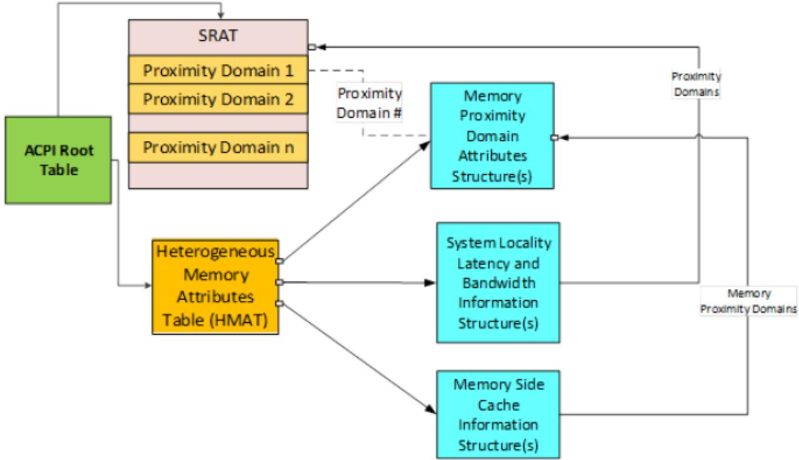  
Fig. 5.10: HMAT Representation

Table 5.177: Heterogeneous Memory Attribute Table Header

<table><tr><td>Field</td><td>Byte Length</td><td>Byte Offset</td><td>Description</td></tr><tr><td colspan="4">Header</td></tr><tr><td>- Signature</td><td>4</td><td>0</td><td>‘HMAT’ is Signature for this table</td></tr><tr><td>- Length</td><td>4</td><td>4</td><td>Length in bytes for entire table.</td></tr><tr><td>- Revision</td><td>1</td><td>8</td><td>2</td></tr><tr><td>- Checksum</td><td>1</td><td>9</td><td>Entire table must sum to zero</td></tr><tr><td>- OEMID</td><td>6</td><td>10</td><td>OEM ID</td></tr><tr><td>- OEM Table ID</td><td>8</td><td>16</td><td>The table ID is the manufacturer model ID</td></tr><tr><td>- OEM Revision</td><td>4</td><td>24</td><td>OEM revision of table for supplied OEM Table ID</td></tr><tr><td>- Creator ID</td><td>4</td><td>28</td><td>Vendor ID of utility that created the table</td></tr><tr><td>- Creator Revision</td><td>4</td><td>32</td><td>Revision of utility that created the table</td></tr><tr><td>Reserved</td><td>4</td><td>36</td><td>To make the structures 8 byte aligned</td></tr><tr><td>HMAT Table Structures[n]</td><td>—</td><td>40</td><td>A list of HMAT table structures for this implementation.</td></tr></table>

Table 5.178: HMAT Structure Types

<table><tr><td>Value</td><td>Description</td></tr><tr><td>0</td><td>Memory Proximity Domain Attributes Structure</td></tr><tr><td>1</td><td>System Locality Latency and Bandwidth Information Structure</td></tr><tr><td>2</td><td>Memory Side Cache Information Structure</td></tr><tr><td>3-0xFFFF</td><td>Reserved</td></tr></table>

## 5.2.29.2 Memory Side Cache Overview

Memory side cache allows to optimize the performance of memory subsystems. Fig. 5.11 shows an example of system physical address (SPA) range with memory side cache in front of actual memory that is seen by the software. When the software accesses an SPA, if it is present in the near memory (hit) it would be returned to the software, if it is not present in the near memory (miss) it would access the next level of memory and so on.

The term “far memory” is used to denote the last level memory (Level 0 Memory) in the memory hierarchy as shown in Fig. 5.11. The Level n Memory acts as memory side cache to Level n-1 Memory and Level n-1 memory acts as memory side cache for Level n-2 memory and so on. If Non-Volatile memory is cached by memory side cache, then platform is responsible for persisting the modified contents of the memory side cache corresponding to the Non-Volatile memory area on power failure, system crash or other faults.

## 5.2.29.3 Memory Proximity Domain Attributes Structure

This structure describes the system physical address (SPA) range occupied by the memory subsystem and its associativity with processor proximity domain as well as hint for memory usage.

Table 5.179: Memory Proximity Domain Attributes Structure

<table><tr><td>Field</td><td>Byte Length</td><td>Byte Offset</td><td>Description</td></tr><tr><td>Type</td><td>2</td><td>0</td><td>0 - Memory Proximity Domain Attributes Structure</td></tr><tr><td>Reserved</td><td>2</td><td>2</td><td></td></tr><tr><td>Length</td><td>4</td><td>4</td><td>40 - Length in bytes for entire structure.</td></tr></table>

continues on next page

Table 5.179 – continued from previous page

<table><tr><td>Field</td><td>Byte Length</td><td>Byte Offset</td><td>Description</td></tr><tr><td>Flags</td><td>2</td><td>8</td><td>Bit [0]: set to 1 to indicate that data in the Proximity Domain for the Attached Initiator field is valid. Bit [1]: Reserved. Previously defined as Memory Proximity Domain field is valid. Deprecated since ACPI 6.3. Bit [2]: Reserved. Previously defined as Reservation Hint. Deprecated since ACPI 6.3. Bits [15:3] : Reserved.</td></tr><tr><td>Reserved</td><td>2</td><td>10</td><td></td></tr><tr><td>Proximity Domain for the At-tached Initiator</td><td>4</td><td>12</td><td>This field is valid only if the memory controller responsible for satisfying the access to memory belonging to the specified memory proximity domain is directly attached to an initiator that belongs to a proximity domain. In that case, this field contains the integer that represents the proximity domain to which the initiator (Generic Initiator or Processor) belongs. This number shall match the corresponding entry in the SRAT table&#x27;s processor affinity structure (e.g., Processor Local APIC/SAPIC Affinity Structure, Processor Local x2APIC Affinity Structure, GICC Affinity Structure) if the initiator is a processor, or the Generic Initiator Affinity Structure if the initiator is a generic initiator. Note: this field provides additional information as to the initiator node that is closest (as in directly attached) to the memory address ranges within the specified memory proximity domain, and therefore should provide the best performance.</td></tr><tr><td>Proximity Domain for the Mem-ory</td><td>4</td><td>16</td><td>Integer that represents the memory proximity domain to which this memory belongs.</td></tr><tr><td>Reserved</td><td>4</td><td>20</td><td></td></tr><tr><td>Reserved</td><td>8</td><td>24</td><td>Previously defined as the Start Address of the System Physical Address Range. Deprecated since ACPI Specification 6.3.</td></tr><tr><td>Reserved</td><td>8</td><td>32</td><td>Previously defined as the Range Length of the region in bytes. Deprecated since ACPI Specification 6.3.</td></tr></table>

## 5.2.29.4 System Locality Latency and Bandwidth Information Structure

This structure provides a matrix that describes the normalized memory read/write latency, the read/write bandwidth between Initiator Proximity Domains (Processor or I/O) and Target Proximity Domains (Memory).

The Entry Base Unit for latency is in picoseconds. The Entry Base Unit for bandwidth is in megabytes per second (MB/s). The Initiator to Target Proximity Domain matrix entry can have one of the following values:

• 1-0xFFFE: the corresponding latency or bandwidth information expressed in multiples of Entry Base Unit.

• 0xFFFF: the initiator and target domains are unreachable from each other.

The represented latency or bandwidth value is determined as follows:

• Represented latency = (Initiator to Target Proximity Domain matrix entry value \* Entry Base Unit) picoseconds.

• Represented bandwidth = (Initiator to Target Proximity Domain matrix entry value \* Entry Base Unit) MB/s.

The following examples show how to report latency and throughput values:

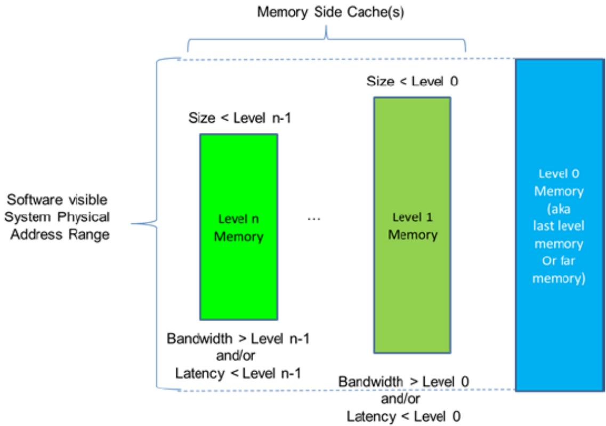  
Fig. 5.11: Memory Side Cache Example

• If the “Entry Base Unit” is 1 for latency and the matrix entry has the value of 10, the latency is 10 picoseconds.

• If the “Entry Base Unit” is 1000 for latency and the matrix entry has the value of 100, the latency is 100 nanoseconds.

• If the “Entry Base Unit” is 1 for BW and the matrix entry has the value of 10, the BW is 10 MB/s.

• If the “Entry Base Unit” is 1024 for BW and the matrix entry has the value of 100, the BW is 100 GB/s.

## ò Note

The lowest latency number represents best performance and the highest bandwidth number represents best performance. The latency and bandwidth numbers represented in this structure correspond to specification rated latency and bandwidth for the platform. The represented latency is determined by aggregating the specification rated latencies of the memory device and the interconnects from initiator to target. The represented bandwidth is determined by the lowest bandwidth among the specification rated bandwidth of the memory device and the interconnects from the initiator to target.

Multiple table entries may be present, based on qualifying parameters, like minimum transfer size, etc. They may be ordered starting from most- to least-optimal performance. Unless specified otherwise in the table, the reported numbers assume naturally aligned data and sequential access transfers. The platform should declare “Minimum transfer size” based on distinct, software observable boundaries for latency or bandwidth, as appropriate for the platform architecture.

Table 5.180: System Locality Latency and Bandwidth Information Structure

<table><tr><td>Field</td><td>Byte Length</td><td>Byte Offset</td><td>Description</td></tr><tr><td>Type</td><td>2</td><td>0</td><td>1 - System Locality Latency and Bandwidth Information Structure</td></tr><tr><td>Reserved</td><td>2</td><td>2</td><td>Reserved</td></tr><tr><td>Length</td><td>4</td><td>4</td><td>Length in bytes for entire structure.</td></tr><tr><td>Flags</td><td>1</td><td>8</td><td></td></tr><tr><td></td><td></td><td></td><td>Bits [3:0] Memory hierarchy:0x00 - Memory: If the memory side cache is not present, this structure represents the memory performance. If memory side cache is present, this structure represents the memory performance when no hits occur in any of the memory side caches associated with the memory.0x01 - 1st level memory side cache0x02 - 2nd level memory side cache0x03 - 3rd level memory side cacheBits [5:4] Access attributes:0x10 – minimum transfer size to achieve values0x20 – non-sequential transfersBits [7:6] Reserved</td></tr><tr><td>Data Type</td><td>1</td><td>9</td><td></td></tr><tr><td></td><td></td><td></td><td>Type of data represented by this structure instance:If Memory Hierarchy = 0:- 0 - Access Latency (if read and write latencies are same)- 1 - Read Latency- 2 - Write Latency- 3 - Access Bandwidth (if read and write bandwidth are same)- 4 - Read Bandwidth- 5 - Write BandwidthIf Memory Hierarchy = 1, 2, or 3:- 0 - Access Hit Latency (if read hit and write hit latencies are same)- 1 - Read Hit Latency- 2 - Write Hit Latency- 3 - Access Hit Bandwidth (if read hit and write hit latency are same)- 4 - Read Hit Bandwidth- 5 - Write Hit BandwidthOther values are reserved.</td></tr></table>

continues on next page

Table 5.180 – continued from previous page

<table><tr><td>Field</td><td>Byte Length</td><td>Byte Offset</td><td>Description</td></tr><tr><td>MinTransferSize</td><td>1</td><td>10</td><td>Transfer size defined as a 5-biased power of 2 exponent, when the bandwidth/latency value is achieved. The values are as follows:0 - byte-aligned (any alignment)1 - 64 Bytes2 - 128 Bytes3 - 256 Bytes...7 - 4096 Bytes8 - 8192 Bytes...11 - 64KiByte...</td></tr><tr><td>Reserved</td><td>1</td><td>11</td><td>Reserved</td></tr><tr><td>Number of Initiator Proximity Domains (s)</td><td>4</td><td>12</td><td>Indicates total number of Proximity Domains that can initiate memory access requests to other proximity domains. This is typically the processor or I/O proximity domains.</td></tr><tr><td>Number of Target Proximity Domains (t)</td><td>4</td><td>16</td><td>Indicates total number of Proximity Domains that can act as target. This is typically the Memory Proximity Domains.</td></tr><tr><td>Reserved</td><td>4</td><td>20</td><td>Reserved</td></tr><tr><td>Entry Base Unit</td><td>8</td><td>24</td><td>Base unit for Matrix Entry Values (latency or bandwidth). Base unit for latency in picoseconds. Base unit for bandwidth in megabytes per second (MB/s). This field shall be non-zero.</td></tr><tr><td>Initiator Proximity Domain List[0]</td><td>4</td><td>32</td><td></td></tr><tr><td>Initiator Proximity Domain List[1]</td><td>4</td><td></td><td></td></tr><tr><td>...</td><td></td><td></td><td></td></tr><tr><td>Initiator Proximity Domain List[s-1]</td><td>4</td><td></td><td></td></tr><tr><td>Target Proximity Domain List[0]</td><td>4</td><td>32 + 4 x s</td><td></td></tr><tr><td>Target Proximity Domain List[1]</td><td>4</td><td></td><td></td></tr><tr><td>...</td><td></td><td></td><td></td></tr><tr><td>Target Proximity Domain List[t-1]</td><td>4</td><td></td><td></td></tr><tr><td>Latency / bandwidth values</td><td></td><td></td><td>Total Number Entry shall be equal to Number of Initiator Proximity Domains * Number of Target Proximity Domains</td></tr><tr><td>Entry[0][0]</td><td>2</td><td>32 + 4 x s + 4 x t</td><td>Matrix entry (Initiator Proximity Domain List[0], Target Proximity Domain List[0])</td></tr><tr><td>Entry[0][1]</td><td>2</td><td></td><td>Matrix entry (Initiator Proximity Domain List[0], Target Proximity Domain List[1])</td></tr></table>

continues on next page

Table 5.180 – continued from previous page

<table><tr><td>Field</td><td>Byte Length</td><td>Byte Offset</td><td>Description</td></tr><tr><td>Entry[0][Number of Target Proximity Domains -1]</td><td>2</td><td></td><td>Matrix entry (Initiator Proximity Domain List[0], Target Proximity Domain List[t-1])</td></tr><tr><td>Entry[1][0]</td><td>2</td><td></td><td>Matrix entry (Initiator Proximity Domain List[1], Target Proximity Domain List[0])</td></tr><tr><td>Entry[1][1]</td><td>2</td><td></td><td>Matrix entry (Initiator Proximity Domain List[1], Target Proximity Domain List[1])</td></tr><tr><td>...</td><td></td><td></td><td></td></tr><tr><td>Entry[1][Number of Target Proximity Domains -1]</td><td></td><td></td><td>Matrix entry (Initiator Proximity Domain List[1], Target Proximity Domain List[t-1])</td></tr><tr><td>...</td><td></td><td></td><td></td></tr><tr><td>Entry[Number of Initiator Proximity Domains - 1][Number of Target Proximity Domains -1]</td><td>2</td><td></td><td>Matrix entry (Initiator Proximity Domain List[s-1], Target Proximity Domain List[t-1])</td></tr></table>

## Implementation notes:

The Flag field in this table allows read latency, write latency, read bandwidth and write bandwidth as well as Memory Hierarchy levels, minimum transfer size and access attributes. Hence this structure could be repeated several times, to express all the appropriate combinations of Memory Hierarchy levels, memory and transfer attributes expressed for each level. If multiple structures are present, they may be ordered starting from most- to least-optimal performance. Unless specified otherwise in the table, the reported numbers assume naturally aligned data and sequential access transfers.

If either latency or bandwidth information is being presented in the HMAT, it is required to be complete with respect to initiator-target pair entries. For example, if read latencies are being included in the SLLBI, then read latencies for all initiator-target pairs must be present. If some pairs are incalculable, then the read latency dataset must be omitted entirely. It is acceptable to provide only a subset of the possible datasets. For example, it is acceptable to provide read latencies but omit write latencies. This provides OSPM a complete picture for at least one set of attributes, and it has the choice of keeping that data or discarding it.

The platform should declare “Minimum transfer size” based on distinct, software-observable boundaries for latency or bandwidth, as appropriate for the platform architecture.

If both SLIT table and the HMAT table with the memory latency information are present, the OSPM should attempt to use the data in the HMAT rather than the data in the SLIT.

## 5.2.29.5 Memory Side Cache Information Structure

System memory hierarchy could be constructed to have a large size of low performance far memory and smaller size of high performance near memory. The Memory Side Cache Information Structure describes memory side cache information for a given memory domain. The software could use this information to efectively place the data in memory to maximize the performance of the system memory that use the memory side cache.

Table 5.181: Memory Side Cache Information Structure

<table><tr><td>Field</td><td>Byte Length</td><td>Byte Offset</td><td>Description</td></tr><tr><td>Type</td><td>2</td><td>0</td><td>2 - Memory Side Cache Information Structure</td></tr></table>

continues on next page

Table 5.181 – continued from previous page

<table><tr><td>Field</td><td>Byte Length</td><td>Byte Offset</td><td>Description</td></tr><tr><td>Reserved</td><td>2</td><td>2</td><td></td></tr><tr><td>Length</td><td>4</td><td>4</td><td>Length in bytes for entire structure.</td></tr><tr><td>Proximity Domain for the Memory</td><td>4</td><td>8</td><td>Integer that represents the memory proximity domain to which the memory side cache information applies. This number shall match the corresponding entry in the SRAT table&#x27;s Memory Affinity Structure</td></tr><tr><td>Reserved</td><td>4</td><td>12</td><td></td></tr><tr><td>Memory Side Cache Size</td><td>8</td><td>16</td><td>Size of memory side cache in bytes for the above memory proximity domain.</td></tr><tr><td>Cache Attributes</td><td>4</td><td>24</td><td></td></tr><tr><td></td><td></td><td></td><td>Bits [3:0] - Total Cache Levels for this Memory Proximity Domain:- 0 - None- 1 - One level cache- 2 - Two level cache- 3 - Three level cache- Other values reservedBits [7:4] - Cache Level described in this structure:- 0 - None- 1 - One level cache- 2 - Two level cache- 3 - Three level cache- Other values reservedBits [11:8] - Cache Associativity:- 0 - None- 1 - Direct Mapped- 2 - Complex Cache Indexing (implementation specific)- Other values reservedBits [15:12] - Write Policy- 0 - None- 1 - Write Back (WB)- 2 - Write Through (WT)- Other values reservedBits [31:16] - Cache Line size in bytes. Number of bytes accessed from next cache level on cache miss.</td></tr><tr><td>Address Mode</td><td>2</td><td>28</td><td></td></tr><tr><td></td><td></td><td></td><td>0 - Reserved (OSPM may assume transparent cache addressing)1 - Extended-linear (N direct-map aliases linearly mapped)2..65535 - Reserved (Unknown Address Mode)</td></tr><tr><td>Number of SMBIOS handles (n)</td><td>2</td><td>30</td><td>Number of SMBIOS handles that contributes to the memory side cache physical devices.</td></tr></table>

Table 5.181 – continued from previous page

<table><tr><td>Field</td><td>Byte Length</td><td>Byte Offset</td><td>Description</td></tr><tr><td>SMBIOS Handles</td><td>2xn</td><td>32</td><td>Refers to corresponding SMBIOS Type-17 Handles Structure that contains Physical Memory Component related information</td></tr></table>

Implementation Note: A proximity domain should contain only one set of memory attributes. If memory attributes difer, represent them in diferent proximity domains. If the Memory Side Cache Information Structure is present, the System Locality Latency and Bandwidth Information Structure shall contain latency and bandwidth information for each memory side cache level. When Address Mode is 1 ‘Extended-Linear’ it indicates that the associated address range (SRAT.MemoryAfinityStructure.Length) is comprised of the backing store capacity extended by the cache capacity. It is arranged such that there are N directly addressable aliases of a given cacheline where N is the ratio of target memor proximity domain size and the memory side cache size. Where the N aliased addresses for a given cacheline all share the same result for the operation ‘address modulo cache size’. This setting is only allowed when ‘Cache Associativity is ‘Direct Map’.”

## 5.2.30 Platform Debug Trigger Table (PDTT)

This section describes the format of the Platform Debug Trigger Table (PDTT) description table, which is an optional table that describes one or more PCC subspace identifiers that can be used to trigger/notify the platform specific debug facilities to capture non-architectural system state. This is intended as a standard mechanism for the OSPM to notify the platform of a fatal crash (e.g. kernel panic or bug check).

This table is intended for platforms that provide debug hardware facilities that can capture system info beyond the normal OS crash dump. This trigger could be used to capture platform specific state information (e.g. firmware state, on-chip hardware facilities, auxiliary controllers, etc.). This type of debug feature could be leveraged on mobile, client, and enterprise platforms.

Certain platforms may have multiple debug subsystems that must be triggered individually. This table accommodates such systems by allowing multiple triggers to be listed.

After triggering debug facilities, the CPU may continue to operate as expected so that the kernel may continue with crash processing/handling (e.g. possibly attempting to attach a debugger or proceed with a full crash dump prior to rebooting the system), depending on the value defined in Trigger order. Please refer to Section 5.2.30.2 for more details.

After triggering debug facilities, the CPU must continue to operate as expected so that the kernel may continue with crash processing/handling (e.g. possibly attempting to attach a debugger or proceed with a full crash dump prior to rebooting the system).

On some platforms, the debug trigger may put some hardware components/peripherals into a frozen non-operational state, and so the debug trigger is not recommended to be used during normal run-time operation.

Other platforms may allow the debug trigger for capture system state to debug run-time behavioral issues (e.g. system performance and power issues), specified by the “Run-time” flag field in Table 5.183.

When multiple triggers exist, the triggers within each of the two groups, defined by trigger order, will be executed in order. OSPM may need to wait for PCC completion before executing next trigger based on the “Wait for Completion” flag field in Table 5.183.

Note: The mechanism by which this system debug state information is retrieved by the user is platform and vendor specific. This will most likely will require special tools and privileges in order to access and parse the platform debug information captured by this trigger.

Table 5.182: PDTT Structure

<table><tr><td>Field</td><td>Byte Length</td><td>Byte Offset</td><td>Description</td></tr><tr><td>Signature</td><td>4</td><td>0</td><td>‘PDTT’</td></tr><tr><td>Length</td><td>4</td><td>4</td><td>Length in bytes of the entire Platform Debug Trigger Table</td></tr><tr><td>Revision</td><td>1</td><td>8</td><td>0</td></tr><tr><td>Checksum</td><td>1</td><td>9</td><td>Entire table must sum to zero.</td></tr><tr><td>OEM ID</td><td>6</td><td>10</td><td>OEM ID</td></tr><tr><td>OEM Table ID</td><td>8</td><td>16</td><td>The table ID is the manufacturer model ID.</td></tr><tr><td>OEM Revision</td><td>4</td><td>24</td><td>OEM revision for supplied OEM Table ID.</td></tr><tr><td>Creator ID</td><td>4</td><td>28</td><td>Vendor ID of utility that created the table.</td></tr><tr><td>Creator Revision</td><td>4</td><td>32</td><td>Revision of utility that created the table.</td></tr><tr><td>Trigger Count</td><td>1</td><td>36</td><td>Number of PDTT Platform Communication Channel Identifiers</td></tr><tr><td>Reserved</td><td>3</td><td>37</td><td>Must be zero</td></tr><tr><td>Trigger Identifier Array Offset</td><td>4</td><td>40</td><td>Offset to the “PDTT Platform Communication Channel Identifiers[]” Array</td></tr><tr><td>PDTT Platform Communication Channel Identifiers []</td><td>—</td><td>Trigger Identifier Array Offset</td><td>Array of PDTT Platform Communication Channel Identifiers to notify various platform debug facilities. This identifier selects the PCC subspace index that must be listed in the PCCT. It also describes per trigger flags. Each Identifier is 2 bytes. Must provide a minimum of one identifier. See Table 5.183 below.</td></tr></table>

Table 5.183: PDTT Platform Communication Channel Identifier Structure

<table><tr><td>Field</td><td>Bit Length</td><td>Bit Off-set</td><td>Description</td></tr><tr><td>PDTT PCC Sub Channel Identifier</td><td>8</td><td>0</td><td>PCC sub channel ID. Note: this must be an index listed in the PCCT</td></tr><tr><td>Run-time</td><td>1</td><td>8</td><td>0: Trigger must only be invoked in fatal crash scenarios. This debug trigger may put some hardware components/peripherals into a frozen non-operational state. | 1: Trigger may be invoked at run-time as well as in fatal crash scenarios.</td></tr><tr><td>Wait for Completion</td><td>1</td><td>9</td><td>0: OSPM may initiate next trigger immediately | 1: OSPM must wait for PCC complete prior to initiating the next trigger in the list</td></tr><tr><td>Trigger Order</td><td>1</td><td>10</td><td>Used in fatal crash scenarios: 0: OSPM must initiate trigger before kernel crash dump processing | 1: OSPM must initiate trigger at the end of crash dump processing.</td></tr><tr><td>Reserved</td><td>5</td><td>11</td><td>Must be zero</td></tr></table>

## 5.2.30.1 PDTT PCC Sub Channel

The PDTT PCC Sub Channel Identifier value provided by the platform in this field is index in the PCCT table (as shown in the picture below). PCC Communications Subspace Structure for PDTT can use any type of PCC communication subspace. PCC Sub Channel entry in PCCT table identified by the PDTT PCC Sub Channel Identifier will have the information on type of PCC Sub channel definition associated with the debug trigger. The PDTT references its PCC Subspace in a given platform by this identifier, as shown in Table 5.183.

Fig. 5.12 shows how the right PCC subspace entry associated with a debug trigger in PDTT can be found from the PCCT table.

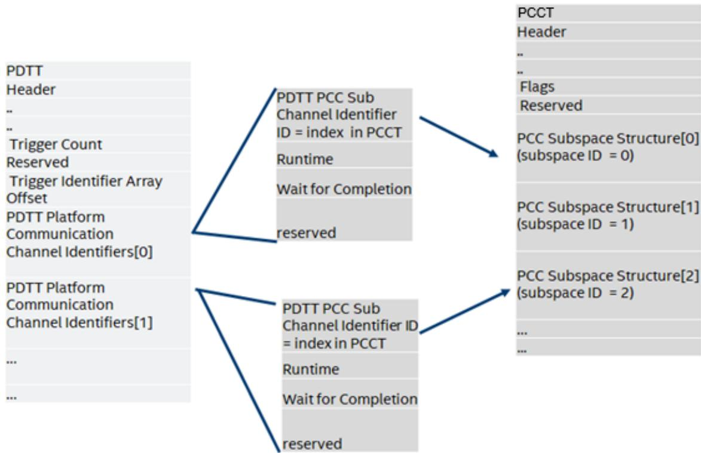  
Fig. 5.12: Mapping a PDTT Debug Trigger Table Entry to a PCCT PCC Subspace

## 5.2.30.1.1 Using PCC registers

A platform debug trigger can choose to use any type of PCC subspace. The definition of the shared memory region for a debug trigger will follow the definition of shared memory region associated with the PCC subspace type used for the debug trigger. For example if a platform debug trigger chooses to use Generic PCC communication subspace (Type 0), then it will use the Generic Communication Channel shared memory region described in Section 14.2. OSPM will write PCC registers by filling in the register values in PCC sub channel space. If a platform debug trigger choose to use a PCC communication subchannel that uses a Generic Communication shared memory region then it will write the debug trigger command in the command field. See Table 5.183 for allowed debug commands. All other command values are reserved.

The platform can also use the PCC sub channel Type 5 for debug a trigger. In this case, OSPM will follow the PCC sub channel definition and write to the doorbell register to trigger a debug log. A platform debug trigger using PCC Communication sub channel Type 5 will use the shared memory region to share vendor-specific debug information.

The following table defines the Type-5 PCC channel shared memory region definition for debug trigger.

Table 5.184: Type 5 Platform Communication Channel Shared Memory

<table><tr><td>Field</td><td>Byte Length</td><td>Byte Offset</td><td>Description</td></tr><tr><td>Signature</td><td>4</td><td>0</td><td>The PCC signature. The signature of a subspace is computed by a bitwise-or of the value 0x50434300 with the subspace ID. For example, subspace 3 has the signature 0x50434303.</td></tr><tr><td>Communication Subspace</td><td></td><td></td><td></td></tr><tr><td>Vendor specific space</td><td>—</td><td>4</td><td>Vendor specific area to share additional information between OSPM and platform. The length of the vendor specified area must be 4 bytes less than the Length field specified in the PCCT entry referring to this shared memory space.</td></tr></table>

Table 5.185: PCC Command Codes used by Platform Debug Trigger Table

<table><tr><td>Command</td><td>Description</td></tr><tr><td>0x00</td><td>Execute Platform Debug Trigger (doorbell only - no command/response).</td></tr><tr><td>0x01</td><td>Execute Platform Debug Trigger (with vendor specific command in communication space).</td></tr><tr><td>0x01-0xFF</td><td>All other values are reserved.</td></tr></table>

Table 5.186: PDTT Platform Communication Channel

<table><tr><td>Field</td><td>Byte Length</td><td>Byte Offset</td><td>Description</td></tr><tr><td>Signature</td><td>4</td><td>0</td><td>The PCC signature. The signature of a subspace is computed by a bitwise-or of the value 0x50434300 with the subspace ID. For example, subspace 3 has signature 0x50434303.</td></tr><tr><td>Command</td><td>2</td><td>4</td><td>PCC command field, see Section 14 and Table 5.185</td></tr><tr><td>Status</td><td>2</td><td>6</td><td>PCC status field (see Section 14)</td></tr><tr><td>Communication Space</td><td>—</td><td>—</td><td>—</td></tr><tr><td>Vendor-specific</td><td>Variable</td><td>8</td><td>Optional vendor specific command/response area written by OSPM - must be zero if not supported</td></tr></table>

## 5.2.30.2 PDTT PCC Trigger Order

The trigger order defines two categories for triggers

Trigger Order 0: Triggers are invoked by OSPM before executing its crash dump processing functions.

Trigger Order 1: Triggers are invoked by OSPM at the end of crash dump processing functions, typically after the kernel has processed crash dumps.

Capturing platform specific debug information from certain IPs would require intrusive mechanism which may limit kernel operations after the operations. Trigger order allows the platform to define such operations that will be invoked at the end of kernel operations by OSPM.

## 5.2.30.3 Example: OS Invoking Multiple Debug Triggers

To illustrate how these debug triggers are intended to be used by the OS, consider this example of a system with 4 independent debug triggers as shown in Fig. 5.13. These triggers are described to the OS via the PDTT example in Table 5.187.

Note: This example assumes no vendor specific communication is required, so only PCC command 0x0 is used.

When the OS encounters a fatal crash, prior to collecting a crash dump and rebooting the system, the OS may choose to invoke the debug triggers in the order listed in the PDTT. The addresses of the doorbell register and the PCC general communication space (if needed) are retrieved from the PCCT, depending on the PCC subspace type (see Table 14.4, Table 14.5, or Table 14.6).

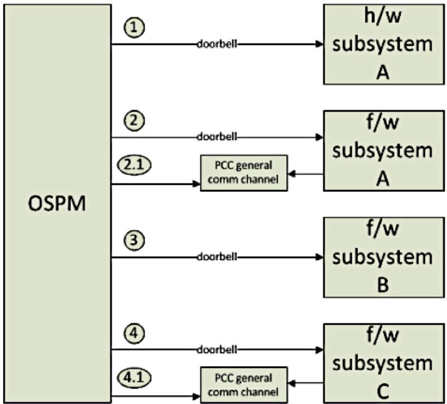  
Fig. 5.13: Example: Platform with four debug triggers

Table 5.187: Example: Platform with 4 debug triggers

<table><tr><td>Field</td><td>Value</td><td>Notes</td></tr><tr><td>Signature</td><td>‘PDTT’</td><td></td></tr><tr><td>...</td><td>...</td><td>...</td></tr><tr><td>Trigger Count</td><td>4</td><td>Describing the 4 triggers illustrated in Fig. 5.13 above</td></tr><tr><td>Reserved</td><td>0</td><td></td></tr><tr><td>Trigger Identifier Array Offset</td><td>44</td><td></td></tr><tr><td>PDTT PCC Identifiers [0]</td><td>0x0004</td><td></td></tr><tr><td></td><td></td><td>[Bits 0:7] - 4 (channel subspace ID 4)</td></tr><tr><td></td><td></td><td>[Bit 8] - 0 (Trigger may only be invoked in fatal crash scenarios)</td></tr><tr><td></td><td></td><td>[Bit 9] - 0 (OSPM may initiate next trigger immediately)</td></tr><tr><td>PDTT PCC Identifiers [1]</td><td>0x0201</td><td></td></tr><tr><td></td><td></td><td>[Bits 0:7] - 1 (channel ID subspace 1)</td></tr><tr><td></td><td></td><td>[Bit 8] - 0 (Trigger may only be invoked in fatal crash scenarios)</td></tr><tr><td></td><td></td><td>[Bit 9] - 1 (OSPM must wait for PCC complete prior to initiating the next trigger in the list)</td></tr><tr><td>PDTT PCC Identifiers [2]</td><td>0x0002</td><td></td></tr><tr><td></td><td></td><td>[Bits 0:7] - 2 (channel ID subspace 2)</td></tr><tr><td></td><td></td><td>[Bit 8] - 0 (Trigger may only be invoked in fatal crash scenarios)</td></tr><tr><td></td><td></td><td>[Bit 9] - 0 (OSPM may initiate next trigger immediately)</td></tr><tr><td>PDTT PCC Identifiers [3]</td><td>0x0203</td><td></td></tr><tr><td></td><td></td><td>[Bits 0:7] - 3 (channel ID subspace 3)</td></tr><tr><td></td><td></td><td>[Bit 8] - 0 (Trigger may only be invoked in fatal crash scenarios)</td></tr><tr><td></td><td></td><td>[Bit 9] - 1 (OSPM must wait for PCC complete prior to initiating the next trigger in the list)</td></tr></table>

Walking through the list of triggers in the PDTT, the OS may execute the following steps:

1. For Trigger 0, retrieves doorbell register address from PCCT per PCC subspace ID 4 and writes to it with appropriate write/preserve mask. Since OS does not need to wait for completion, OS does not need to send a PCC command and should ignore the PCC subspace base addres

2. For Trigger 1, retrieves doorbell register address and PCC subspace address from PCCT per PCC subspace ID 1. Since OS must wait for completion, OS must write PCC command (0x0) and write to the doorbell register per section 14 and poll for the completion bit.

3. For Trigger 2, , retrieves doorbell register address from PCCT per PCC subspace ID 2 and writes to it with appropriate write/preserve mask. Since OS does not need to wait for completion, OS does not need to send a PCC command and should ignore the PCC subspace base address

4. For Trigger 3, retrieves doorbell register address and PCC subspace address from PCCT per PCC subspace ID 3. Since OS must wait for completion, OS must write PCC command (0x0) and write to the doorbell register per section 14 and poll for the completion bit.

## ò Note

When wait for completion is necessary, the OS must poll bit zero (completion bit) of the status field of that PCC channel (see Table 14.6 and the Generic Communications Channel Shared Memory Region.

## 5.2.31 Processor Properties Topology Table (PPTT)

This optional table is used to describe the topological structure of processors controlled by the OSPM, and their shared resources, such as caches. The table can also describe additional information such as which nodes in the processor topology constitute a physical package. The structure of PPTT is described in Table 5.188 .

Table 5.188: Processor Properties Topology Table

<table><tr><td>Field</td><td>Byte Length</td><td>Byte Offset</td><td>Description</td></tr><tr><td colspan="4">Header</td></tr><tr><td>- Signature</td><td>4</td><td>0</td><td>‘PPTT’ Processor Properties Topology Table</td></tr><tr><td>- Length</td><td>4</td><td>4</td><td>Length of entire PPTT table in bytes</td></tr><tr><td>- Revision</td><td>1</td><td>8</td><td>3</td></tr><tr><td>- Checksum</td><td>1</td><td>9</td><td>The entire table must sum to zero.</td></tr><tr><td>- OEMID</td><td>6</td><td>10</td><td>OEM ID.</td></tr><tr><td>- OEM Table ID</td><td>8</td><td>16</td><td>For the PPTT, the table ID is the manufacturer model ID.</td></tr><tr><td>- OEM Revision</td><td>4</td><td>24</td><td>OEM revision of the PPTT for the supplied OEM Table ID.</td></tr><tr><td>- Creator ID</td><td>4</td><td>28</td><td>Vendor ID of utility that created the table</td></tr><tr><td>- Creator Revision</td><td>4</td><td>32</td><td>Revision of utility that created the table</td></tr><tr><td colspan="4">Body</td></tr><tr><td>• Processor topology struc-ture[N]</td><td>—</td><td>36</td><td>List of processor topology structures</td></tr></table>

ò Note

Processor topology structures are described in the following sections.

## 5.2.31.1 Processor hierarchy node structure (Type 0)

The processor hierarchy node structure is described in Table 5.189 . This structure can be used to describe a single processor or a group. To describe topological relationships, each processor hierarchy node structure can point to a parent processor hierarchy node structure. This allows representing tree like topology structures. Multiple trees may be described, covering for example multiple packages. For the root of a tree, the parent pointer should be 0.

If PPTT is present, one instance of this structure must be present for every individual processor presented through the MADT interrupt controller structures. In addition, an individual entry must be present for every instance of a group of processors that shares a common resource described in the PPTT. Resources are described in other PPTT structures such as Type 1 cache structures. Each physical package in the system must also be represented by a processor node structure.

Each processor node includes a list of resources that are private to that node. Resources are described in other PPTT structures such as Type 1 cache structures. The processor node’s private resource list includes a reference to each of the structures that represent private resources to a given processor node. For compactness, separate instances of an identical resource can be represented with a single structure that is listed as a resource of multiple processor nodes.

For example, is expected that in the common case all processors will have identical L1 caches. For these platforms a single L1 cache structure could be listed by all processors, as shown in the following figure.

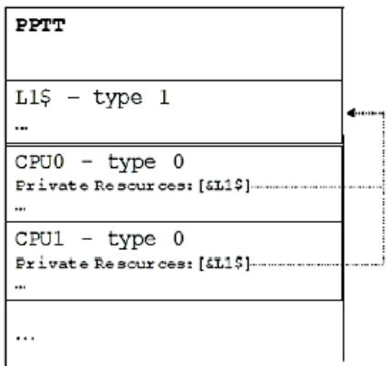  
Fig. 5.14: L1 Cache Structure

Note: though less space eficient, it is also acceptable to declare a node for each instance of a resource. In the example above, it would be legal to declare an L1 for each processor.

Note: Compaction of identical resources must be avoided if an implementation requires any resource instance to be referenced uniquely. For example, in the above example, the L1 resource of each processor must be declared using a dedicated structure to permit unique references to it.

Table 5.189: Processor Hierarchy Node Structure

<table><tr><td>Field</td><td>Byte Length</td><td>Byte Offset</td><td>Description</td></tr><tr><td>Type</td><td>1</td><td>0</td><td>0 - processor structure</td></tr><tr><td>Length</td><td>1</td><td>1</td><td>Length of the local processor structure in bytes</td></tr><tr><td>Reserved</td><td>2</td><td>2</td><td>Must be zero</td></tr><tr><td>Flags</td><td>4</td><td>4</td><td>See Processor Structure Flags.</td></tr><tr><td>Parent</td><td>4</td><td>8</td><td>Reference to parent processor hierarchy node structure. The reference is encoded as the difference between the start of the PPTT table and the start of the parent processor structure entry.A value of zero must be used where a node has no parent.</td></tr><tr><td>ACPI Processor ID</td><td>4</td><td>12</td><td>If the processor structure represents an actual processor, this field must match the value of ACPI processor ID field in the processor&#x27;s entry in the MADT. If the processor structure represents a group of associated processors, the structure might match a processor container in the name space. In that case this entry will match the value of the _UID method of the associated processor container. Where there is a match it must be represented. The flags field, described in Processor Structure Flags, includes a bit to describe whether the ACPI processor ID is valid.</td></tr><tr><td>Number of private resources</td><td>4</td><td>16</td><td>Number of resource structure references in Private Resources (below)</td></tr><tr><td>Private resources[N]</td><td>N*4</td><td>20</td><td>Each resource is a reference to another PPTT structure. The structure referred to must not be a processor hierarchy node. Each resource structure pointed to represents resources that are private the processor hierarchy node. For example, for cache resources, the cache type structure represents caches that are private to the instance of processor topology represented by this processor hierarchy node structure. The references are encoded as the difference between the start of the PPTT table and the start of the resource structure entry.</td></tr></table>

Processor Structure Flags are described in the following table.

Table 5.190: Processor Structure Flags

<table><tr><td>Field</td><td>Bit Length</td><td>Bit Off-set</td><td>Description</td></tr><tr><td>Physical package</td><td>1</td><td>0</td><td>Set to 1 if this node of the processor topology represents the boundary of a physical package, whether socketed or surface mounted. Set to 0 if this instance of the processor topology does not represent the boundary of a physical package. Each valid processor must belong to exactly one package. That is, the leaf must itself be a physical package or have an ancestor marked as a physical package.</td></tr><tr><td>ACPI Processor ID valid</td><td>1</td><td>1</td><td>For non-leaf entries in the processor topology, the ACPI Processor ID entry can relate to a Processor container in the namespace. The processor container will have a matching ID value returned through the _UID method. As not every processor hierarchy node structure in PPTT may have a matching processor container, this flag indicates whether the ACPI processor ID points to valid entry. Where a valid entry is possible the ACPI Processor ID and _UID method are mandatory. For leaf entries in PPTT that represent processors listed in MADT, the ACPI Processor ID must always be provided and this flag must be set to 1.</td></tr><tr><td>Processor is a Thread</td><td>1</td><td>2</td><td>For leaf entries: must be set to 1 if the processing element representing this processor shares functional units with sibling nodes. For non-leaf entries: must be set to 0.</td></tr><tr><td>Node is a Leaf</td><td>1</td><td>3</td><td>Must be set to 1 if node is a leaf in the processor hierarchy. Else must be set to 0.</td></tr><tr><td>Identical Implementation</td><td>1</td><td>4</td><td>A value of 1 indicates that all children processors share an identical implementation revision. This field should be ignored on leaf nodes by the OSPM. Note: this implies an identical processor version and identical implementation reversion, not just a matching architecture revision.</td></tr><tr><td>Reserved</td><td>27</td><td>5</td><td>Must be zero</td></tr></table>

## ò Note

Threads sharing a core must be grouped under a unique Processor hierarchy node structure for each group of threads.

## ò Note

Processors may be marked as disabled in the MADT. In this case, the corresponding processor hierarchy node structures in PPTT should be considered as disabled. Additionally, all processor hierarchy node structures representing a group of processors with all child processors disabled should be considered as being disabled. All resources attached to disabled processor hierarchy node structures in PPTT should also be considered disabled.

## 5.2.31.2 Cache Type Structure - Type 1

The cache type structure is described in Table 5.191. The cache type structure can be used to represent a set of caches that are private to a particular processor hierarchy node structure, that is, to a particular node in the processor topology tree. The set of caches is described as a NULL, or zero, terminated linked list. Only the head of the list needs to be listed as a resource by a processor node (and counted toward Number of Private Resources), as the cache node itself contains a link to the next level of cache

Cache type structures are optional, and can be used to complement or replace cache discovery mechanisms provided by the processor architecture. For example, some processor architectures describe individual cache properties, but do not provide ways of discovering which processors share a particular cache. When cache structures are provided, all processor caches must be described in a cache type structure.

Each cache type structure includes a reference to the cache type structure that represents the next level cache. The level in this context must relate to the CPU architecture’s definition of cache level. The list must include all caches that are private to a processor hierarchy node. It is not permissible to skip levels. That is, a cache node included in a given hierarchy processor node level must not point to a cache structure referred to by a processor node in a diferent level of the hierarchy.

For example, if a node represents a CPU that has a private L1 and private L2 cache, the list would contain both caches (L1->L2->0). If on the other hand the L2 cache was shared, the list would just include the L1 (L1->0), and a parent processor topology node, to all processors that share the L2, would contain the cache type structure that represents the shared L2.

Processors, or higher level nodes within the hierarchy, with separate instruction and data caches must describe the instruction and data caches with separate linked lists of cache type structures both listed as private resources of the relevant processor hierarchy node structure. If the separate instruction and data caches are unified at a higher level of cache then the linked lists should converge.

Consider the example shown in the following figure.

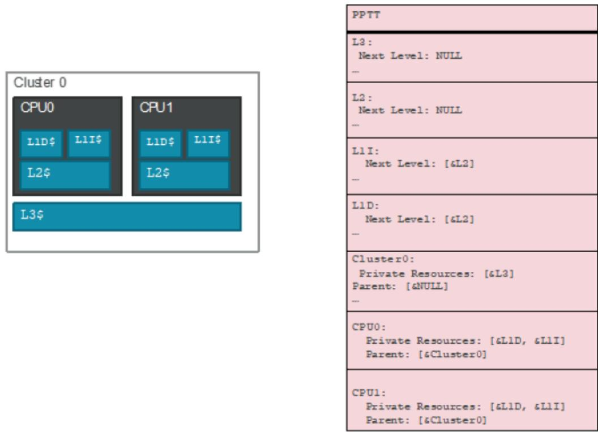  
Fig. 5.15: Cache Type Structure - Type 1 Example

In this Type 1 example:

• Each processor has private L1 data, L1 instruction and L2 caches. The two processors are contained in a cluster which provides an L3 cache.

• Each processor’s hierarchy node has two separate cache type structures as private resources for L1I and L1D

• Both the L1I and L1D cache structures point to the L2 cache structure as their next level of cache

• L2 cache type structure terminates the linked list of the CPU’s caches. The resulting list denotes all private caches at the processor level

• Both processor nodes have their parent pointer pointing to node that represents the cluster.

• The cluster node includes the L3 cache as its private resource. The L3 node in turn has no next level of cache.

An entry in the list indicates primarily that a cache exists at this node in the hierarchy. Where possible, cache properties should be discovered using processor architectural mechanisms, but the cache type structure may also provide the properties of the cache. A flag is provided to indicate whether properties provided in the table are valid, in which case the table content should be used in preference to processor architected discovery. On Arm-based systems, all cache properties must be provided in the table.

Table 5.191: Cache Type Structure

<table><tr><td>Field</td><td>Byte Length</td><td>Byte Offset</td><td>Description</td></tr><tr><td>Type</td><td>1</td><td>0</td><td>1 - Cache type structure</td></tr><tr><td>Length</td><td>1</td><td>1</td><td>28</td></tr><tr><td>Reserved</td><td>2</td><td>2</td><td>Must be zero</td></tr><tr><td>Flags</td><td>4</td><td>4</td><td>See Cache Structure Flags.</td></tr><tr><td>Next Level of Cache</td><td>4</td><td>8</td><td>Reference to next level of cache that is private to the processor topology instance. The reference is encoded as the difference between the start of the PPTT table and the start of the cache type structure entry. This value will be zero if this entry represents the last cache level appropriate to the processor hierarchy node structures using this entry.</td></tr><tr><td>Size</td><td>4</td><td>12</td><td>Size of the cache in bytes.</td></tr><tr><td>Number of sets</td><td>4</td><td>16</td><td>Number of sets in the cache</td></tr><tr><td>Associativity</td><td>1</td><td>20</td><td>Integer number of ways.</td></tr><tr><td>Attributes</td><td>1</td><td>21</td><td></td></tr><tr><td></td><td></td><td></td><td>Bits 1:0: Allocation type:0x0 - Read allocate0x1 - Write allocate0x2 or 0x03 indicate Read and Write allocateBits:3:2: Cache type:0x0 Data0x1 Instruction0x2 or 0x3 Indicate a unified cacheBits 4: Write policy:0x0 Write back0x1 Write throughBits:7:5 Reserved must be zero.</td></tr><tr><td>Line size</td><td>2</td><td>22</td><td>Line size in bytes</td></tr></table>

continues on next page

Table 5.191 – continued from previous page

<table><tr><td>Field</td><td>Byte Length</td><td>Byte Offset</td><td>Description</td></tr><tr><td>Cache ID</td><td>4</td><td>24</td><td>Unique, non-zero identifier for this cache. If Cache ID is valid as indicated by the Flags field, then this structure defines a unique cache in the system. A Cache ID value of 0 indicates a NULL identifier that is not valid.</td></tr></table>

The cache type structure flags are described in the following table.

Table 5.192: Cache Structure Flags

<table><tr><td>Field</td><td>Bit Length</td><td>Bit Off-set</td><td>Description</td></tr><tr><td>Size property valid</td><td>1</td><td>0</td><td>Set to 1 if the size properties described is valid. A value of 0 indicates that, where possible, processor architecture specific discovery mechanisms should be used to ascertain the value of this property.</td></tr><tr><td>Number of sets valid</td><td>1</td><td>1</td><td>Set to 1 if the number of sets property described is valid. A value of 0 indicates that, where possible, processor architecture specific discovery mechanisms should be used to ascertain the value of this property.</td></tr><tr><td>Associativity valid</td><td>1</td><td>2</td><td>Set to 1 if the associativity property described is valid. A value of 0 indicates that, where possible, processor architecture specific discovery mechanisms should be used to ascertain the value of this property.</td></tr><tr><td>Allocation type valid</td><td>1</td><td>3</td><td>Set to 1 if the allocation type attribute described is valid. A value of 0 indicates that, where possible, processor architecture specific discovery mechanisms should be used to ascertain the value of this attribute.</td></tr><tr><td>Cache type valid</td><td>1</td><td>4</td><td>Set to 1 if the cache type attribute described is valid. A value of 0 indicates that, where possible, processor architecture specific discovery mechanisms should be used to ascertain the value of this attribute.</td></tr><tr><td>Write policy valid</td><td>1</td><td>5</td><td>Set to 1 if the write policy attribute described is valid. A value of 0 indicates that, where possible, processor architecture specific discovery mechanisms should be used to ascertain the value of this attribute.</td></tr><tr><td>Line size valid</td><td>1</td><td>6</td><td>Set to 1 if the line size property described is valid. A value of 0 indicates that, where possible, processor architecture specific discovery mechanisms should be used to ascertain the value of this property.</td></tr><tr><td>Cache ID Valid</td><td>1</td><td>7</td><td>Set to 1 if the Cache ID property described is valid. A value of 0 indicates that, where possible, processor architecture specific discovery mechanisms should be used to ascertain the value of this property.</td></tr><tr><td>Reserved</td><td>24</td><td>8</td><td>Must be zero</td></tr></table>

## 5.2.32 Platform Health Assessment Table (PHAT)

This section describes the format of the Platform Health Assessment Table (PHAT), which provides a means by which a platform can expose an extensible set of platform health related telemetry that may be useful for software running within the constraints of an operating system. These elements are typically going to encompass things that are likely otherwise not enumerable during the OS runtime phase of operations, such as version of pre-OS components, or health status of firmware drivers that were executed by the platform prior to launch of the OS. It is not expected that the OSPM would act on the data being exposed.

Table 5.193: Platform Health Assessment Table (PHAT) Format

<table><tr><td>Field</td><td>Byte Length</td><td>Byte Offset</td><td>Description</td></tr><tr><td colspan="4">Header</td></tr><tr><td>- Signature</td><td>4</td><td>0</td><td>PHAT Signature for the Platform Health Assessment Table.</td></tr><tr><td>- Length</td><td>4</td><td>4</td><td>The length of the table, in bytes, of the entire PHAT</td></tr><tr><td>- Revision</td><td>1</td><td>8</td><td>The revision of the structure corresponding to the signature field for this table. For the PHAT confirming to this revision of the specification, the revision is 1.</td></tr><tr><td>- Checksum</td><td>1</td><td>9</td><td>The entire table, including the checksum field, must add to zero to be considered valid.</td></tr><tr><td>- OEMID</td><td>6</td><td>10</td><td>An OEM-supplied string that identifies the OEM.</td></tr><tr><td>- OEM Table ID</td><td>8</td><td>16</td><td>An OEM-supplied string that the OEM uses to identify this particular data table</td></tr><tr><td>- OEM Revision</td><td>4</td><td>24</td><td>OEM-supplied revision number.</td></tr><tr><td>- Creator ID</td><td>4</td><td>28</td><td>The Vendor ID of the utility that created this table.</td></tr><tr><td>- Creator Revision</td><td>4</td><td>32</td><td>The revision of the utility that created this table.</td></tr><tr><td>Platform Telemetry Records</td><td>-</td><td>36</td><td>The set of Platform Telemetry Records</td></tr></table>

## 5.2.32.1 Platform Health Assessment Record Format

A platform health assessment record is comprised of a sub-header including a record type and length, and a set of data. The format of the record layout is specific to the record type. In this manner, records are only as large as needed to contain the specific type of data to be conveyed.

Table 5.194: Platform Health Assessment Record Format

<table><tr><td>Field</td><td>Byte Length</td><td>Byte Offset</td><td>Description</td></tr><tr><td>Platform Health Assessment Record Type</td><td>2</td><td>0</td><td>This value depicts the format and contents of the platform health assessment record.</td></tr><tr><td>Record Length</td><td>2</td><td>2</td><td>This value depicts the length of the platform health assessment record, in bytes.</td></tr><tr><td>Revision</td><td>1</td><td>4</td><td>This value is updated if the format of the record type is extended. Any changes to a platform health assessment record layout must be backwards compatible in that all previously defined fields must be maintained if still applicable, but newly defined fields allow the length of the platform health record to be increased. Previously defined record fields must not be redefined, but are permitted to be deprecated.</td></tr></table>

continues on next page

Table 5.194 – continued from previous page

<table><tr><td>Field</td><td>Byte Length</td><td>Byte Offset</td><td>Description</td></tr><tr><td>Data</td><td>-</td><td>5</td><td>The content of this field is defined by the Platform Health Assessment Record Type definition.</td></tr></table>

## 5.2.32.2 Platform Health Assessment Record Type Format

The table below describes the various types of records contained within the PHAT, and their associated Platform Health Assessment Record Type. Note that unless otherwise specified, multiple platform telemetry records are permitted in the PHAT for a given type.

Table 5.195: Platform Health Assessment Record Type Format

<table><tr><td>Record Value</td><td>Type</td><td>Type</td><td>Description</td></tr><tr><td>0x0000</td><td></td><td>Firmware Version Data Record</td><td>Pre-OS platform health assessment record containing version data for components within the platform firmware, option ROMs, and other pre-OS platform components.</td></tr><tr><td>0x0001</td><td></td><td>Firmware Health Data Record</td><td>Pre-OS platform health assessment record containing health-related information for pre-OS platform components.</td></tr><tr><td>0x0002 – 0x0FFF</td><td></td><td>Reserved</td><td>Reserved for ACPI specification usage.</td></tr><tr><td>0x1000 – 0x1FFF</td><td></td><td>Reserved</td><td>Reserved for Platform Vendor usage.</td></tr><tr><td>0x2000 – 0x2FFF</td><td></td><td>Reserved</td><td>Reserved for Hardware Vendor usage.</td></tr><tr><td>0x3000 – 0x3FFF</td><td></td><td>Reserved</td><td>Reserved for Platform Firmware Vendor usage.</td></tr><tr><td>0x4000 – 0x4FFF</td><td></td><td>Reserved</td><td>Reserved for future use.</td></tr></table>

## 5.2.32.3 Firmware Version Data Record Structure

A platform health assessment record which contains the version-related information associated with pre-OS components in the platform.

Table 5.196: PHAT Version Element

<table><tr><td>Field</td><td>Byte Length</td><td>Byte Offset</td><td>Description</td></tr><tr><td>Component ID</td><td>16</td><td>0</td><td>Unique GUID associated with this component.</td></tr><tr><td>Version Value</td><td>8</td><td>16</td><td>64-bit version value</td></tr><tr><td>Producer ID</td><td>4</td><td>24</td><td></td></tr><tr><td></td><td></td><td></td><td>The ACPI Vendor ID (e.g. ‘ABCD’):0xFFFF – no ID defined0x0000 – invalid value</td></tr></table>

Table 5.197: Firmware Version Data Record

<table><tr><td>Field</td><td>Byte Length</td><td>Byte Offset</td><td>Description</td></tr><tr><td>Platform Record Type</td><td>2</td><td>0</td><td>0 – Firmware Version Data Record</td></tr><tr><td>Record Length</td><td>2</td><td>2</td><td>12+28*RecordCount – This value depicts the length of the version data record, in bytes.</td></tr><tr><td>Revision</td><td>1</td><td>4</td><td>1 – Revision of this Firmware Version Data Record.</td></tr><tr><td>Reserved</td><td>3</td><td>5</td><td>Reserved</td></tr><tr><td>Record Count</td><td>4</td><td>8</td><td>PHAT Version Element Count</td></tr><tr><td>PHAT Version Element</td><td>Varies</td><td>12</td><td>Array of PHAT Version Elements. First entry is the original producer of the component, and if there’s a subsequent entry, that means a second agent modified the original component in some way, and whichever the last entry is, that’s the currently running instance of the component. This allows for IHV/IBV/OEM/others to establish a chain of data records associated with a given component.</td></tr></table>

## 5.2.32.4 Firmware Health Data Record Structure

A platform health assessment record which contains the health-related information associated with pre-OS components in the platform. This structure is intended to be used to identify the barebones state of a pre-OS component in a generic fashion. In addition, the Device Path can give standardized hints of where in the pre-OS the platform resides, whether it’s a well-known hardware node (e.g. storage controller) or some other vendor specific location that may be hanging of another bus.

This structure also provides a means by which a platform could also expose device-specific data that goes beyond the simple healthy and not healthy statement.

Table 5.198: Firmware Health Data Record Structure

<table><tr><td colspan="2">Field</td><td>Byte Length</td><td>Byte Offset</td><td>Description</td></tr><tr><td rowspan="2">Platform Type</td><td>Record</td><td>2</td><td>0</td><td>1 – Firmware Health Data Record</td></tr><tr><td>Record Length</td><td>2</td><td>2</td><td>varies – This value depicts the length of the health data record, in bytes.</td></tr><tr><td colspan="2">Revision</td><td>1</td><td>4</td><td>1 – Revision of this Firmware Health Data Record.</td></tr><tr><td colspan="2">Reserved</td><td>2</td><td>5</td><td>Reserved</td></tr><tr><td colspan="2">AmHealthy</td><td>1</td><td>7</td><td></td></tr><tr><td colspan="2"></td><td></td><td></td><td>Has the device encountered any issues? This allows any agent parsing this record to understand in whether or not the device is healthy without needing to parse the device-specific health data.Any device health state may expose device-specific data:0= Errors found1= No errors found2= Unknown3= Advisory – additional device-specific data exposed</td></tr><tr><td colspan="2">DeviceSignature</td><td>16</td><td>8</td><td>The unique GUID associated with this device.</td></tr></table>

continues on next page

Table 5.198 – continued from previous page

<table><tr><td>Field</td><td>Byte Length</td><td>Byte Offset</td><td>Description</td></tr><tr><td>Device-specific Data Offset</td><td>4</td><td>24</td><td>Offset to the Device-specific Data from the start of this Data Record. If 0, then there is no device-specific data.</td></tr><tr><td>Device Path</td><td>Varies</td><td>28</td><td>The UEFI Device Path associated with the record producer. See the UEFI specification for the EFI_DEVICE_PATH_PROTOCOL definition.</td></tr><tr><td>Device-specific Data</td><td>Varies</td><td>Device-specific Data Offset</td><td>The health record associated with a particular device. Its definition is specific to the given device that produced this record.</td></tr></table>

## 5.2.32.5 Reset Reason Health Record

The Reset Reason Health Record defines a mechanism to describe the cause of the last system reset or boot. The record will be created as a Health Record in the PHAT table. This provides a standard way for system firmware to inform the operating system of the cause of the last reset. This includes both expected and unexpected events to support insights across a fleet of systems by way of collecting the reset reason records on each boot.

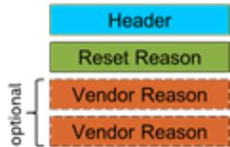

The record provides an optional vendor reason to capture the underlying state used to generate the reset reason (e.g. hardware registers) to support vendor specific details. The reset reason is intended to supplement existing fault reporting mechanisms on the platform (e.g. BERT tables, CPER) or in the operating system (e.g. event logs)

Table 5.199: Reset Reason Health Record Header

<table><tr><td colspan="2">Field</td><td>Byte Length</td><td>Byte Offset</td><td>Description</td></tr><tr><td>Platform Type</td><td>Record</td><td>2</td><td>0</td><td>1 - Firmware Health Data Record. Pre-OS platform health assessment record containing health-related information for pre-OS platform components.</td></tr><tr><td colspan="2">Record Length</td><td>2</td><td>2</td><td>Varies - This value depicts the length of the health data record, in bytes.</td></tr><tr><td colspan="2">Revision</td><td>1</td><td>4</td><td>1 - Revision of this Firmware Health Data Record.</td></tr><tr><td colspan="2">Reserved</td><td>2</td><td>5</td><td>Reserved</td></tr></table>

continues on next page

Table 5.199 – continued from previous page

<table><tr><td>AmHealthy</td><td>1</td><td>7</td><td>Has the device encountered any issues? This allows any agent parsing this record to understand in whether or not the device is healthy without needing to parse the device-specific health data.Any device health state may expose device-specific data:0 = Errors found1 = No errors found2 = Unknown3 = Advisory - additional device-specific data exposedThe Reset Reason should set this value to ‘1’ (no error) for expected resets/boots, and ‘0’ (error) for unexpected conditions.</td></tr><tr><td>DeviceSignature</td><td>16</td><td>8</td><td>The unique GUID associated with this health record type.7a014ce2-f263-4b77-b88a-e6336b782c14{0x7a014ce2, 0xf263, 0x4b77,{0xb8, 0x8a, 0xe6, 0x33, 0x6b, 0x78, 0x2c, 0x14}}This GUID is normative for this record type and must not be changed.</td></tr><tr><td>Device-specific Data Offset</td><td>4</td><td>24</td><td>Offset to the Device-specific Data from the start of this Data Record.Offset = 0x0074</td></tr><tr><td>Device Path</td><td>88</td><td>28</td><td>The UEFI Device Path associated with the record producer. See the UEFI specification (https://uefi.org/specifications) for the EFI_DEVICE_PATH_PROTOCOL definition.VenHw(7A014CE2-F263-4B77-B88A-E6336B782C14)</td></tr><tr><td>Device-specific Data</td><td>116</td><td>Varies</td><td>The reset reason health record associated with this reset/boot event.</td></tr></table>

Table 5.200: Reset Reason Health Record Structure

<table><tr><td>Field</td><td>Byte Length</td><td>Byte Offset</td><td>Description</td></tr></table>

continues on next page

Table 5.200 – continued from previous page

<table><tr><td>Supported Sources</td><td>1</td><td>0</td><td>This field indicates which sources are supported on the platform. A source that is unavailable may still provide insight into interpretation of the reset. For example, a reset due to an operating system fault without the operating system source supported may appear as a warm reset.[0]: Unknown source[1]: Hardware source[2]: Firmware source[3]: Software source[4]: Supervisor source[7:5]: Reserved</td></tr><tr><td>Source</td><td>1</td><td>1</td><td>This field indicates the source of the reset. Only one bit should be set, or the field should be set to zero if unknown.[0]: Unknown source[1]: Hardware source[2]: Firmware source[3]: Software initiated reset[4]: Supervisor initiated reset[7:5]: ReservedA firmware device may include a baseboard management controller (BMC). A supervisor may include devices external to the system such as an uninterruptible power supply or a KVM over IP with power control.</td></tr></table>

continues on next page

Table 5.200 – continued from previous page

<table><tr><td>Sub Source</td><td>1</td><td>2</td></tr><tr><td></td><td></td><td></td></tr><tr><td></td><td></td><td></td></tr><tr><td></td><td></td><td></td></tr><tr><td></td><td></td><td></td></tr><tr><td></td><td></td><td></td></tr><tr><td></td><td></td><td></td></tr><tr><td></td><td></td><td></td></tr><tr><td></td><td></td><td></td></tr><tr><td></td><td></td><td></td></tr><tr><td></td><td></td><td></td></tr><tr><td></td><td></td><td></td></tr><tr><td></td><td></td><td></td></tr><tr><td></td><td></td><td></td></tr><tr><td></td><td></td><td></td></tr><tr><td></td><td></td><td></td></tr><tr><td></td><td></td><td></td></tr><tr><td></td><td></td><td></td></tr><tr><td></td><td></td><td></td></tr><tr><td></td><td></td><td></td></tr><tr><td></td><td></td><td></td></tr><tr><td></td><td></td><td>The sub-source field allows for an optional categorization of the source field. It must be zero if a sub-source is not defined.</td></tr><tr><td></td><td></td><td></td></tr><tr><td></td><td></td><td></td></tr><tr><td></td><td></td><td></td></tr><tr><td></td><td></td><td></td></tr><tr><td></td><td></td><td></td></tr><tr><td></td><td></td><td></td></tr><tr><td></td><td></td><td></td></tr><tr><td></td><td></td><td></td></tr><tr><td></td><td></td><td></td></tr><tr><td></td><td></td><td></td></tr><tr><td></td><td></td><td></td></tr><tr><td></td><td></td><td></td></tr><tr><td></td><td></td><td></td></tr><tr><td></td><td></td><td></td></tr><tr><td></td><td></td><td></td></tr><tr><td></td><td></td><td></td></tr><tr><td></td><td></td><td></td></tr><tr><td></td><td></td><td></td></tr><tr><td></td><td></td><td rowspan="2"></td></tr><tr><td></td><td></td></tr><tr><td></td><td></td><td></td></tr><tr><td></td><td></td><td></td></tr><tr><td></td><td></td><td></td></tr><tr><td></td><td></td><td></td></tr><tr><td></td><td></td><td></td></tr><tr><td></td><td></td><td></td></tr><tr><td></td><td></td><td></td></tr><tr><td></td><td></td><td></td></tr><tr><td></td><td></td><td></td></tr><tr><td></td><td></td><td></td></tr><tr><td></td><td></td><td></td></tr><tr><td></td><td></td><td></td></tr><tr><td></td><td></td><td></td></tr><tr><td></td><td></td><td></td></tr><tr><td></td><td></td><td></td></tr><tr><td></td><td></td><td></td></tr><tr><td></td><td></td><td></td></tr><tr><td></td><td></td><td></td></tr><tr><td></td><td></td><td></td></tr><tr><td></td><td colspan="2"></td></tr><tr><td></td><td></td><td></td></tr><tr><td></td><td></td><td></td></tr><tr><td></td><td></td><td></td></tr><tr><td></td><td></td><td></td></tr><tr><td></td><td></td><td></td></tr><tr><td></td><td></td><td></td></tr><tr><td></td><td></td><td></td></tr><tr><td></td><td></td><td></td></tr><tr><td></td><td></td><td></td></tr><tr><td></td><td></td><td></td></tr><tr><td></td><td></td><td></td></tr><tr><td></td><td></td><td></td></tr><tr><td></td><td></td><td></td></tr><tr><td></td><td></td><td></td></tr><tr><td></td><td></td><td></td></tr><tr><td></td><td></td><td></td></tr><tr><td></td><td></td><td></td></tr><tr><td></td><td></td><td></td></tr><tr><td></td><td></td><td></td></tr><tr><td></td><td></td><td></td></tr><tr><td></td><td></td><td></td></tr><tr><td></td><td></td><td></td></tr><tr><td></td><td></td><td></td></tr><tr><td></td><td></td><td></td></tr><tr><td></td><td></td><td></td></tr><tr><td></td><td></td><td></td></tr><tr><td></td><td></td><td></td></tr><tr><td></td><td></td><td></td></tr><tr><td></td><td></td><td></td></tr><tr><td></td><td></td><td></td></tr><tr><td></td><td></td><td></td></tr><tr><td></td><td></td><td></td></tr><tr><td></td><td></td><td></td></tr><tr><td></td><td></td><td></td></tr><tr><td></td><td></td><td></td></tr><tr><td></td><td></td><td></td></tr><tr><td></td><td></td><td></td></tr><tr><td></td><td></td><td></td></tr><tr><td></td><td></td><td></td></tr></table>

continues on next page

Table 5.200 – continued from previous page

<table><tr><td>Reason</td><td>1</td><td>3</td></tr><tr><td></td><td></td><td></td></tr><tr><td></td><td></td><td></td></tr><tr><td></td><td></td><td></td></tr><tr><td></td><td></td><td></td></tr><tr><td></td><td></td><td></td></tr><tr><td></td><td></td><td></td></tr><tr><td></td><td></td><td></td></tr><tr><td></td><td></td><td></td></tr><tr><td></td><td></td><td></td></tr><tr><td></td><td></td><td></td></tr><tr><td></td><td></td><td></td></tr><tr><td></td><td></td><td></td></tr><tr><td></td><td></td><td></td></tr><tr><td></td><td></td><td></td></tr><tr><td></td><td></td><td></td></tr><tr><td></td><td></td><td></td></tr><tr><td></td><td></td><td></td></tr><tr><td></td><td></td><td></td></tr><tr><td></td><td></td><td></td></tr><tr><td></td><td></td><td></td></tr><tr><td></td><td></td><td>The reset reason represents the best explanation of the last system reset or boot. The implementation should choose the reason that best categorizes the last system reset or boot. The platform implementation may choose which value to use when multiple choices are possible, and should prefer a more specific reason over a generic reason and an error condition over a non-error condition. The reason field is used in conjunction with the Source fields to categorize and interpret the record.</td></tr><tr><td></td><td></td><td></td></tr><tr><td></td><td></td><td></td></tr><tr><td></td><td></td><td></td></tr><tr><td></td><td></td><td></td></tr><tr><td></td><td></td><td></td></tr><tr><td></td><td></td><td></td></tr><tr><td></td><td></td><td></td></tr><tr><td></td><td></td><td></td></tr><tr><td></td><td></td><td></td></tr><tr><td></td><td></td><td></td></tr><tr><td></td><td></td><td></td></tr><tr><td></td><td></td><td></td></tr><tr><td></td><td></td><td></td></tr><tr><td></td><td></td><td></td></tr><tr><td></td><td></td><td></td></tr><tr><td></td><td></td><td></td></tr><tr><td></td><td></td><td></td></tr><tr><td></td><td></td><td></td></tr><tr><td></td><td></td><td rowspan="2"></td></tr><tr><td></td><td></td></tr><tr><td></td><td></td><td></td></tr><tr><td></td><td></td><td></td></tr><tr><td></td><td></td><td></td></tr><tr><td></td><td></td><td></td></tr><tr><td></td><td></td><td></td></tr><tr><td></td><td></td><td></td></tr><tr><td></td><td></td><td></td></tr><tr><td></td><td></td><td></td></tr><tr><td></td><td></td><td></td></tr><tr><td></td><td></td><td></td></tr><tr><td></td><td></td><td></td></tr><tr><td></td><td></td><td></td></tr><tr><td></td><td></td><td></td></tr><tr><td></td><td></td><td></td></tr><tr><td></td><td></td><td></td></tr><tr><td></td><td></td><td></td></tr><tr><td></td><td></td><td></td></tr><tr><td></td><td></td><td></td></tr><tr><td></td><td></td><td></td></tr><tr><td></td><td colspan="2"></td></tr><tr><td></td><td></td><td></td></tr><tr><td></td><td></td><td></td></tr><tr><td></td><td></td><td></td></tr><tr><td></td><td></td><td></td></tr><tr><td></td><td></td><td></td></tr><tr><td></td><td></td><td></td></tr><tr><td></td><td></td><td></td></tr><tr><td></td><td></td><td></td></tr><tr><td></td><td></td><td></td></tr><tr><td></td><td></td><td></td></tr><tr><td></td><td></td><td></td></tr><tr><td></td><td></td><td></td></tr><tr><td></td><td></td><td></td></tr><tr><td></td><td></td><td></td></tr><tr><td></td><td></td><td></td></tr><tr><td></td><td></td><td></td></tr><tr><td></td><td></td><td></td></tr><tr><td></td><td></td><td></td></tr><tr><td></td><td></td><td></td></tr><tr><td></td><td></td><td></td></tr></table>

continues on next page

Table 5.200 – continued from previous page

<table><tr><td>Vendor Count</td><td>2</td><td>4</td><td>The number of Vendor Specific Reset Reason entries.</td></tr><tr><td>Vendor Specific Reset Reason Entry[n]</td><td>Varies</td><td>6</td><td>A series of Vendor Specific Reset Reason Entries.</td></tr></table>

The vendor portion of the record provides an optional means to store the underlying raw data that was interpreted to produce the reset reason. Storing the underlying data associated with a reset may allow for further analysis (e.g. an unexpected reset reason) and insight into the specifics of the reset.

Table 5.201: Reset Reason Health Record Vendor Data Entry

<table><tr><td>Field</td><td>Byte Length</td><td>Byte Offset</td><td>Description</td></tr><tr><td>Vendor Data ID</td><td>16</td><td>0</td><td>A vendor defined GUID that describes this entry type.</td></tr><tr><td>Length</td><td>2</td><td>16</td><td>The length of the vendor data entry.</td></tr><tr><td rowspan="3">Revision</td><td rowspan="3">2</td><td rowspan="3">18</td><td>Minor.Major Version</td></tr><tr><td>Byte 0 (Minor) indicates that changes to the vendor-specific data are backwards compatible with the Vendor Data ID.</td></tr><tr><td>Byte 1 (Major) indicates that changes to the data are not backwards compatible.</td></tr><tr><td>Data</td><td>Varies</td><td>20</td><td>Vendor-specific data payload.</td></tr></table>

## 5.2.33 Virtual I/O Translation (VIOT) Table

The Virtual I/O Translation (VIOT) Table describes the topology of para-virtual I/O translation devices (e.g., virtioiommu in Linux) and the endpoints they manage. This is analogous to the vendor-specific IOMMU tables currently defined: the IORT for the ARM SMMU, the DMAR for Intel VT-d, and the IVRS for the AMD IOMMU. In this case, however, we are defining the topology connecting a hypervisor to a virtual machine through a para-virtualized IOMMU, instead a vendor-specific device. Since this para-virtualized IOMMU is a software component between the hypervisor and a virtual machine, the VIOT can be supported across multiple platforms; by defining the VIOT here, we help ensure consistency across those platforms since a para-virtualized IOMMU cannot be enumerated via any other mechanisms.

This table is optional. If the VIOT table is present, the OSPM should assume this functionality is available for use and must be configured properly.

## 5.2.33.1 Virtual I/O Translation (VIOT) Table Header

The VIOT table starts with a standard ACPI header.

Table 5.202: Virtual I/O Translation (VIOT) Table format

<table><tr><td>Field</td><td>Byte Length</td><td>Byte Offset</td><td>Description</td></tr><tr><td>Signature</td><td>4</td><td>0</td><td>“VIOT”, Virtual I/O Translation Table</td></tr><tr><td>Length</td><td>4</td><td>4</td><td>Length in bytes of the entire VIOT</td></tr><tr><td>Revision</td><td>1</td><td>8</td><td>1</td></tr><tr><td>Checksum</td><td>1</td><td>9</td><td>The entire table must sum to zero.</td></tr><tr><td>OEM ID</td><td>6</td><td>10</td><td>OEM Identifier</td></tr><tr><td>OEM Table ID</td><td>8</td><td>16</td><td>For the VIOT, the table ID is the manufacture model ID</td></tr><tr><td>OEM Revision</td><td>4</td><td>24</td><td>OEM revision of the VIOT for the supplied OEM Table ID</td></tr><tr><td>Creator ID</td><td>4</td><td>28</td><td>The vendor ID of the utility that created the table</td></tr><tr><td>Creator Revision</td><td>4</td><td>32</td><td>The revision of the utility that created the table</td></tr><tr><td>Node Count</td><td>2</td><td>36</td><td>Number of nodes defined in the table</td></tr><tr><td>Node Offset</td><td>2</td><td>38</td><td>Offset from the start of the table to the first node</td></tr><tr><td>Reserved</td><td>8</td><td>40</td><td>Reserved, must be zero</td></tr><tr><td>Node Structure[n]</td><td>—</td><td>48</td><td>A list of Node structures</td></tr></table>

After the Creator Revision, the remainder of the VIOT table is a list of Node Count nodes, each describing either endpoints or translation devices. The first Node Structure is located Node Ofset bytes from the beginning of the table. Each node has a Type and Length field followed by a varying number of additional fields, defined by the Type of the node being described, defined below. The Length field defines the node’s length, and the following node is located Length bytes from the beginning of the current node. Nodes must be aligned on eight byte boundaries.

Each node identifies one or more devices using either their PCI Handle or their base MMIO (Memory-Mapped I/O) address. A PCI Handle is a PCI Segment number and a BDF (Bus-Device-Function) with the following layout:

• Bits 15:8 Bus Number

• Bits 7:3 Device Number

• Bits 2:0 Function Number

This identifier corresponds to the one observed by the operating system when parsing the PCI configuration space for the first time after boot.

Endpoint nodes declare an Output Node that corresponds to the ofset from the beginning of the table to the node describing the next translation device that manages these endpoints. They also declare one or more endpoint IDs that system software uses to identify endpoints when programming the translation device.

## 5.2.33.2 VIOT Node Structures

Each Node in the VIOT table can be one of the following types.

Table 5.203: VIOT Node Structure Types

<table><tr><td>Type</td><td>Description</td></tr><tr><td>0</td><td>Reserved. Do Not Use.</td></tr><tr><td>1</td><td>PCI Range Structure</td></tr><tr><td>2</td><td>MMIO Endpoint Structure</td></tr><tr><td>3</td><td>virtio-pci IOMMU Structure</td></tr></table>

continues on next page

Table 5.203 – continued from previous page

<table><tr><td>4</td><td>virtio-mmio IOMMU Structure</td></tr><tr><td>5-0xFF</td><td>Reserved</td></tr></table>

## 5.2.33.3 PCI Range Node Structure

This structure describes a range of PCI endpoints, identified by their structure and BDF number.

Table 5.204: PCI Range Node Structure format

<table><tr><td>Field</td><td>Byte Length</td><td>Byte Offset</td><td>Description</td></tr><tr><td>Type</td><td>1</td><td>0</td><td>1 – PCI Range</td></tr><tr><td>Reserved</td><td>1</td><td>1</td><td>Reserved</td></tr><tr><td>Length</td><td>2</td><td>2</td><td>Length of this node in bytes (24)</td></tr><tr><td>Endpoint Start</td><td>4</td><td>4</td><td>First endpoint ID</td></tr><tr><td>PCI Segment Start</td><td>2</td><td>8</td><td>First PCI Segment number in the range</td></tr><tr><td>PCI Segment End</td><td>2</td><td>10</td><td>Last PCI Segment number in the range</td></tr><tr><td>PCI BDF Start</td><td>2</td><td>12</td><td>First Bus-Device-Function number in the range</td></tr><tr><td>PCI BDF End</td><td>2</td><td>14</td><td>Last Bus-Device-Function number in the range</td></tr><tr><td>Output Node</td><td>2</td><td>16</td><td>Offset from the start of the table to the next translation element</td></tr><tr><td>Reserved</td><td>6</td><td>18</td><td>Reserved, must be zero</td></tr></table>

The node refers to a PCI endpoint if the endpoint’s segment number is in the range [Segment Start, Segment End] and its BDF number is in the range [BDF Start, BDF End]. The corresponding endpoint ID is obtained by combining segment and BDF:

Endpoint ID = ((segment - Segment Start) << 16) + BDF - BDF Start + Endpoint Start

## 5.2.33.4 Single MMIO Endpoint Node Structure

A single endpoint is identified by its base MMIO address.

Table 5.205: Single MMIO Endpoint Node Structure format

<table><tr><td>Field</td><td>Byte Length</td><td>Byte Offset</td><td>Description</td></tr><tr><td>Type</td><td>1</td><td>0</td><td>2 - MMIO Endpoint</td></tr><tr><td>Reserved</td><td>1</td><td>1</td><td>Reserved, must be zero</td></tr><tr><td>Length</td><td>2</td><td>2</td><td>Length of this node in bytes (24)</td></tr><tr><td>Endpoint ID</td><td>4</td><td>4</td><td>The endpoint ID</td></tr><tr><td>Base Address</td><td>8</td><td>8</td><td>Base MMIO address of the endpoint</td></tr><tr><td>Output Node</td><td>2</td><td>16</td><td>Offset from the start of the table to the next translation element</td></tr><tr><td>Reserved</td><td>6</td><td>18</td><td>Reserved, must be zero</td></tr></table>

## 5.2.33.5 virtio-iommu based on virtio-pci Node Structure

A virtio-iommu device can be based on the virtio-pci transport, and identified by the BDF of the virtio device.

Table 5.206: virtio-iommu based on virtio-pci Node Structure

<table><tr><td>Field</td><td>Byte Length</td><td>Byte Offset</td><td>Description</td></tr><tr><td>Type</td><td>1</td><td>0</td><td>3 - virtio-pci IOMMU</td></tr><tr><td>Reserved</td><td>1</td><td>1</td><td>Reserved, must be zero</td></tr><tr><td>Length</td><td>2</td><td>2</td><td>Length of this node in bytes (16)</td></tr><tr><td>PCI Segment</td><td>2</td><td>4</td><td>The PCI segment number of the virtio-iommu programming interface as returned by _SEG in the ACPI namespace</td></tr><tr><td>PCI BDF Number</td><td>2</td><td>6</td><td>Identifier for the PCI Device</td></tr><tr><td>Reserved</td><td>8</td><td>8</td><td>Reserved, must be zero</td></tr></table>

## 5.2.33.6 virtio-iommu based on virtio-mmioNode Structure

A virtio-iommu device can be based on the virtio-mmio transport, and identified by the base address of the virtio device. Like other virtio-iommu devices, properties of the virtio-iommu are described with an LNRO0005 element in the ACPI namespace.

Table 5.207: virtio-iommu based on virtio-mmio Node Structure format

<table><tr><td>Field</td><td>Byte Length</td><td>Byte Offset</td><td>Description</td></tr><tr><td>Type</td><td>1</td><td>0</td><td>3 - virtio-mmio IOMMU</td></tr><tr><td>Reserved</td><td>1</td><td>1</td><td>Reserved, must be zero</td></tr><tr><td>Length</td><td>2</td><td>2</td><td>Length of this node in bytes (16)</td></tr><tr><td>Reserved</td><td>4</td><td>4</td><td>Reserved, must be zero</td></tr><tr><td>Base Address</td><td>8</td><td>8</td><td>Base MMIO address for the device</td></tr></table>

## 5.2.34 Miscellaneous GUIDed Table Entries

This section describes a means by which a platform can expose data through a GUIDed entry through a single wellknown MISC table signature. The MISC table and each GUIDed entry is defined suficiently in this specification to allow for the discovery of the MISC table and walking the GUIDed entries that it may contain. The format of the data within each GUIDed entry is vendor specific and defined by the Entry GUID ID.

GUIDs in the MISC table shall meet the following expectations:

1. There is no requirement to register a GUID that’s used in an MISC table entry.

2. Optionally, GUIDs in the MISC table can be registered using the same process are ACPI table signatures.

Table 5.208: Miscellaneous GUIDed Table Entries (MISC) Format

<table><tr><td>Field</td><td>Byte Length</td><td>Byte Offset</td><td>Description</td></tr></table>

continues on next page

Table 5.208 – continued from previous page

<table><tr><td>Signature</td><td>4</td><td>0</td><td>“MISC” Signature for the GUIDed Table Entries.</td></tr><tr><td>Length</td><td>4</td><td>4</td><td>The length of the table, in bytes, of the entire MISC.</td></tr><tr><td>Revision</td><td>1</td><td>8</td><td>The revision of the structure corresponding to the signature field for this table. For the Miscellaneous GUIDed Table Entries conforming to this revision of the specification, the revision is 1.</td></tr><tr><td>Checksum</td><td>1</td><td>9</td><td>The entire table, including the checksum field, must add to zero to be considered valid.</td></tr><tr><td>OEMID</td><td>6</td><td>10</td><td>An OEM-supplied string that identifies the OEM.</td></tr><tr><td>OEM Table ID</td><td>8</td><td>16</td><td>An OEM-supplied string that the OEM uses to identify this particular data table.</td></tr><tr><td>OEM Revision</td><td>4</td><td>24</td><td>An OEM-supplied revision number.</td></tr><tr><td>Creator ID</td><td>4</td><td>28</td><td>The Vendor ID of the utility that created this table.</td></tr><tr><td>Creator Revision</td><td>4</td><td>32</td><td>The revision of the utility that created this table.</td></tr><tr><td>GUIDed Entries</td><td>-</td><td>36</td><td>The set of one or more GUIDed Entries.</td></tr></table>

Table 5.209: GUIDed Entry Format

<table><tr><td>Field</td><td>Byte Length</td><td>Byte Offset</td><td>Description</td></tr><tr><td>Entry GUID ID</td><td>16</td><td>0</td><td>This value specifies the format and contents of the GUIDed entry.</td></tr><tr><td>Entry Length</td><td>4</td><td>16</td><td>This value specifies the length of the GUIDed entry, in bytes.</td></tr><tr><td>Revision</td><td>4</td><td>20</td><td>This value is updated every time the entry format specified by the given GUID ID is extended.</td></tr><tr><td>Producer ID</td><td>4</td><td>24</td><td>The ACPI Vendor ID (e.g. ‘ABCD’).</td></tr><tr><td>Data</td><td>-</td><td>28</td><td>The content of this field is defined by the Entry GUID ID.</td></tr></table>

## 5.2.35 CC Event Log ACPI Table

This section describes the format of the confidential computing (CC) event log ACPI table. A virtual firmware with CC capability may set up an ACPI table to pass the CC event log information. The event log created by the virtual firmware owner contains the hashes to reconstruct the CC measurement registers.

Table 5.210: CC Event Log ACPI Table

<table><tr><td>Field</td><td>Byte Length</td><td>Byte Offset</td><td>Description</td></tr><tr><td colspan="4">Header</td></tr><tr><td>Signature</td><td>4</td><td>0</td><td>‘CCEL’ Signature</td></tr><tr><td>- Length</td><td>4</td><td>4</td><td>Length, in bytes, of the entire table.</td></tr><tr><td>- Revision</td><td>1</td><td>8</td><td>1</td></tr><tr><td>- Checksum</td><td>1</td><td>9</td><td>Entire table must sum to zero.</td></tr><tr><td>- OEMID</td><td>6</td><td>10</td><td>Standard ACPI header</td></tr><tr><td>- OEM Table ID</td><td>8</td><td>16</td><td>Standard ACPI header</td></tr><tr><td>- OEM Revision</td><td>4</td><td>24</td><td>Standard ACPI header</td></tr><tr><td>- Creator ID</td><td>4</td><td>28</td><td>Standard ACPI header</td></tr><tr><td>- Creator Revision</td><td>4</td><td>32</td><td>Standard ACPI header</td></tr></table>

continues on next page

Table 5.210 – continued from previous page

<table><tr><td>CC Type</td><td>1</td><td>36</td><td></td></tr><tr><td></td><td></td><td></td><td>Confidential computing (CC) type.</td></tr><tr><td></td><td></td><td></td><td>0: Reserved</td></tr><tr><td></td><td></td><td></td><td>1: AMD SEV</td></tr><tr><td></td><td></td><td></td><td>2: Intel TDX</td></tr><tr><td></td><td></td><td></td><td>3~0xFF: Reserved</td></tr><tr><td>CC Subtype</td><td>1</td><td>37</td><td>Confidential computing (CC) type specific sub type.</td></tr><tr><td>Reserved</td><td>2</td><td>38</td><td>Reserved. Must be 0.</td></tr><tr><td>Log Area Minimum Length (LAML)</td><td>8</td><td>40</td><td>Identifies the minimum length (in bytes) of the system&#x27;s pre-boot CC event log area.</td></tr><tr><td>Log Area Start Address (LASA)</td><td>8</td><td>48</td><td>Contains the 64-bit-physical address of the start of the system&#x27;s pre-boot CC event log area in QWORD format. Note: The log area ranges from address LASA to LASA+(LAML-1).</td></tr></table>

## 5.2.36 Storage Volume Key Location Table

This section describes the format of the confidential computing (CC) storage volume key location ACPI table. In the CC environment, the storage volume will typically be an encrypted volume. In that case, the virtual firmware may need to support quote generation and attestation to be able to fetch a set of storage-volume key(s) from a remote-key server during boot and pass the key to the guest kernel. Typically, the key is stored in memory, and the information of the key is passed from virtual firmware via an ACPI table.

Table 5.211: Storage Volume Key Location Table

<table><tr><td>Field</td><td>Byte Length</td><td>Byte Offset</td><td>Description</td></tr><tr><td colspan="4">Header</td></tr><tr><td>Signature</td><td>4</td><td>0</td><td>‘SKVL’ Signature</td></tr><tr><td>- Length</td><td>4</td><td>4</td><td>Length, in bytes, of the entire table.</td></tr><tr><td>- Revision</td><td>1</td><td>8</td><td>1</td></tr><tr><td>- Checksum</td><td>1</td><td>9</td><td>Entire table must sum to zero.</td></tr><tr><td>- OEMID</td><td>6</td><td>10</td><td>Standard ACPI header</td></tr><tr><td>- OEM Table ID</td><td>8</td><td>16</td><td>Standard ACPI header</td></tr><tr><td>- OEM Revision</td><td>4</td><td>24</td><td>Standard ACPI header</td></tr><tr><td>- Creator ID</td><td>4</td><td>28</td><td>Standard ACPI header</td></tr><tr><td>- Creator Revision</td><td>4</td><td>32</td><td>Standard ACPI header</td></tr><tr><td>Key Count (C)</td><td>4</td><td>36</td><td>The count of key structure</td></tr><tr><td>Key Structure</td><td>16 * C</td><td>40</td><td>The key structure</td></tr></table>

Table 5.212: Storage Volume Key Structure

<table><tr><td>Field</td><td>Byte Length</td><td>Byte Offset</td><td>Description</td></tr></table>

continues on next page

Table 5.212 – continued from previous page

<table><tr><td colspan="4">Table 0.212 - continued from previous page</td></tr><tr><td rowspan="4">Key Type</td><td rowspan="4">2</td><td rowspan="4">0</td><td></td></tr><tr><td>The type of the key.</td></tr><tr><td>0: the main storage volume key.</td></tr><tr><td>1~0xFFFF: reserved.</td></tr><tr><td rowspan="4">Key Format</td><td rowspan="4">2</td><td rowspan="4">2</td><td></td></tr><tr><td>The format of the key.</td></tr><tr><td>0: raw binary.</td></tr><tr><td>1~0xFFFF: reserved.</td></tr><tr><td>Key Size</td><td>4</td><td>4</td><td>The size of the key in bytes.</td></tr><tr><td>Key Address</td><td>8</td><td>8</td><td>The guest-physical address (GPA) of the key. The address must be in ACPI-Reserved Memory.</td></tr></table>

## 5.2.37 RISC-V Hart Capabilities Table (RHCT)

The RHCT is used to describe certain features of RISC-V processors known as harts. The following structure, Table 5.213, is mandatory for RISC-V platforms.

Table 5.213: RISC-V Hart Capabilities Table

<table><tr><td>Field</td><td>Byte Length</td><td>Byte Offset</td><td>Description</td></tr><tr><td colspan="4">Header</td></tr><tr><td>- Signature</td><td>4</td><td>0</td><td>‘RHCT’ - RISC-V Hart Capabilities Table</td></tr><tr><td>- Length</td><td>4</td><td>4</td><td>Length of entire RHCT table in bytes</td></tr><tr><td>- Revision</td><td>1</td><td>8</td><td>The revision of the structure corresponding to the signature field for this table. For this version of the specification, the revision is 1.</td></tr><tr><td>- Checksum</td><td>1</td><td>9</td><td>The entire table must sum to zero.</td></tr><tr><td>- OEMID</td><td>6</td><td>10</td><td>OEM ID.</td></tr><tr><td>- OEM Table ID</td><td>8</td><td>16</td><td>For the RHCT, the table ID is the manufacturer model ID.</td></tr><tr><td>- OEM Revision</td><td>4</td><td>24</td><td>OEM revision of the RHCT for the supplied OEM Table ID.</td></tr><tr><td>- Creator ID</td><td>4</td><td>28</td><td>Vendor ID of utility that created the table</td></tr><tr><td>- Creator Revision</td><td>4</td><td>32</td><td>Revision of utility that created the table</td></tr><tr><td colspan="4">Body</td></tr><tr><td>- Flags</td><td>4</td><td>36</td><td>See RHCT Flags.</td></tr><tr><td>- Time Base Frequency</td><td>8</td><td>40</td><td>The frequency of the system counter. This is the reciprocal (in Hz) of the time unit for the time CSR and same for all harts (processors) in the system.</td></tr><tr><td>- Number of RHCT nodes</td><td>4</td><td>48</td><td>Number of elements in the RHCT Node array</td></tr><tr><td>- Offset to the RHCT node array</td><td>4</td><td>52</td><td>The offset from the start of the table to the first node in the array of RHCT nodes.</td></tr></table>

continues on next page

Table 5.213 – continued from previous page

<table><tr><td>Field</td><td>Byte Length</td><td>Byte Offset</td><td>Description</td></tr><tr><td>- RHCT Node[N]</td><td>—</td><td>56</td><td>List of RHCT nodes. The Hart Info node should be populated after all other types are populated in this array.See Table 5.215 for possible types of RHCT nodes.</td></tr></table>

Table 5.214: RHCT Flags

<table><tr><td>RHCT Flags</td><td>Bit Length</td><td>Bit Off-set</td><td>Description</td></tr><tr><td rowspan="3">Timer cannot wake up CPU capability</td><td rowspan="3">1</td><td rowspan="3">0</td><td></td></tr><tr><td>0: The timer interrupt can wake up the CPU from all suspend/idle states.</td></tr><tr><td>1: The timer interrupt cannot wake up the CPU from one or more suspend/idle states.</td></tr><tr><td>Reserved</td><td>31</td><td>1</td><td>Must be zero.</td></tr></table>

Table 5.215: RHCT Node Structure Types

<table><tr><td>Value</td><td>Description</td></tr><tr><td>0</td><td>ISA string node. See “ISA String Node Structure” below.</td></tr><tr><td>1</td><td>CMO extension node. See “CMO Node Structure” below.</td></tr><tr><td>2</td><td>MMU node. See “MMU Node Structure” below.</td></tr><tr><td>3-65534</td><td>Reserved for future use.</td></tr><tr><td>65535</td><td>Hart Info node. See Section 5.2.39.</td></tr></table>

## ò Note

Any RISC-V system must provide a hart info node for each hart made available to OSPM, at least one ISA node, at least one MMU node, and at least one CMO node for systems with harts implementing CMO extensions.

## 5.2.38 ISA String Node Structure

This structure shall provide the ISA string. At least one ISA string node should exist in the RHCT node array.

Table 5.216: ISA String Node Structure

<table><tr><td>Field</td><td>Byte Length</td><td>Byte Offset</td><td>Description</td></tr><tr><td>- Type</td><td>2</td><td>0</td><td>0</td></tr></table>

continues on next page

Table 5.216 – continued from previous page

<table><tr><td>Field</td><td>Byte Length</td><td>Byte Offset</td><td>Description</td></tr><tr><td>- Length</td><td>2</td><td>2</td><td>8 + N + P: Size of this structure. Should be padded such that it is aligned at 2 bytes.</td></tr><tr><td>- Revision</td><td>2</td><td>4</td><td>For this version of the specification, the revision is 1.</td></tr><tr><td>- ISA Length</td><td>2</td><td>6</td><td>ISA string length in bytes. It includes the string&#x27;s terminating NULL character.</td></tr><tr><td>- ISA string</td><td>N</td><td>8</td><td>Null-terminated ASCII Instruction Set Architecture (ISA) string for this hart. The format of the ISA string is defined in the RISC-V unprivileged specification.</td></tr><tr><td>- Optional Padding</td><td>P</td><td>-</td><td>Padding to make this structure aligned at 2 bytes.</td></tr></table>

## 5.2.38.1 CMO Node Structure

This structure shall provide the Cache Management Operations (CMO) extension-related information.

Table 5.217: CMO Node Structure

<table><tr><td>Field</td><td>Byte Length</td><td>Byte Offset</td><td>Description</td></tr><tr><td>- Type</td><td>2</td><td>0</td><td>1</td></tr><tr><td>- Length</td><td>2</td><td>2</td><td>10: Size of this structure.</td></tr><tr><td>- Revision</td><td>2</td><td>4</td><td>For this version of the specification, the revision is 1.</td></tr><tr><td>- Reserved</td><td>1</td><td>6</td><td>Must be zero.</td></tr><tr><td>- CBOM block size</td><td>1</td><td>7</td><td></td></tr><tr><td></td><td></td><td></td><td>Cache block size defined as a power of 2 exponent for management instructions. The OSPM must ignore this value if the Zicbom extension is not present.</td></tr><tr><td></td><td></td><td></td><td>For example: A value of 6 indicates 64 bytes.</td></tr><tr><td>- CBOP block size</td><td>1</td><td>8</td><td></td></tr><tr><td></td><td></td><td></td><td>Cache block size defined as a power of 2 exponent for prefetch instructions. The OSPM must ignore this value if the Zicbop extension is not present.</td></tr><tr><td></td><td></td><td></td><td>For example: A value of 6 indicates 64 bytes.</td></tr><tr><td>- CBOZ block size</td><td>1</td><td>9</td><td></td></tr><tr><td></td><td></td><td></td><td>Cache block size defined as a power of 2 exponent for zero instructions. The OSPM must ignore this value if the Zicboz extension is not present.</td></tr><tr><td></td><td></td><td></td><td>For example: A value of 6 indicates 64 bytes.</td></tr></table>

## 5.2.38.2 MMU Node Structure

This structure shall provide the Memory Management Unit (MMU) related information.

Table 5.218: MMU Node Structure

<table><tr><td>Field</td><td>Byte Length</td><td>Byte Offset</td><td>Description</td></tr><tr><td>- Type</td><td>2</td><td>0</td><td>2</td></tr><tr><td>- Length</td><td>2</td><td>2</td><td>8: Size of this structure.</td></tr><tr><td>- Revision</td><td>2</td><td>4</td><td>For this version of the specification, the revision is 1.</td></tr><tr><td>- Reserved</td><td>1</td><td>6</td><td>Must be zero.</td></tr><tr><td>- MMU Type</td><td>1</td><td>7</td><td></td></tr><tr><td></td><td></td><td></td><td>Virtual Address Scheme</td></tr><tr><td></td><td></td><td></td><td>0: Sv39</td></tr><tr><td></td><td></td><td></td><td>1: Sv48</td></tr><tr><td></td><td></td><td></td><td>2: Sv57</td></tr><tr><td></td><td></td><td></td><td>All other values are reserved.</td></tr></table>

## 5.2.39 Hart Info Node Structure

This structure shall be provided once for each hart. To match with the processor device in the name space, each structure will have the ACPI processor UID.

This structure should be populated in the RHCT node array after all other types of RHCT nodes are populated since it references other RHCT nodes.

Table 5.219: Hart Info Node Structure

<table><tr><td>Field</td><td>Byte Length</td><td>Byte Offset</td><td>Description</td></tr><tr><td>- Type</td><td>2</td><td>0</td><td>65535</td></tr><tr><td>- Length</td><td>2</td><td>2</td><td>12 + 4 * N:Length of this Hart Info Structure.</td></tr><tr><td>- Revision</td><td>2</td><td>4</td><td>For this version of the specification, the revision is 1.</td></tr><tr><td>- Number of offsets to the RHCT nodes</td><td>2</td><td>6</td><td>Number of elements in the Offsets array</td></tr><tr><td>- ACPI Processor UID</td><td>4</td><td>8</td><td>This ID should be the same _UID value of the processor(hart) device object in the namespace and should also match with ACPI Processor UID in the RINTC table of MADT.</td></tr></table>

continues on next page

Table 5.219 – continued from previous page

<table><tr><td>Field</td><td>Byte Length</td><td>Byte Offset</td><td>Description</td></tr><tr><td>- Offsets[N]</td><td>4 * N</td><td>12</td><td>Each entry in this array contains the address offset of a RHCT node relative to the start of the RHCT.For example: The first element in the array can be the offset between the start of the RHCT table and the start of the appropriate ISA string node structure for this hart.Each hart shall have at least one element in this array which points to an ISA node.The offset shall not point to another Hart Info node type.</td></tr></table>

## 5.3 ACPI Namespace

For all Definition Blocks, the system maintains a single hierarchical namespace that it uses to refer to objects. All Definition Blocks load into the same namespace. Although this allows one Definition Block to reference objects and data from another (thus enabling interaction), it also means that OEMs must take care to avoid any naming collisions. For the most part, since the name space is hierarchical, typically the bulk of a dynamic definition file will load into a diferent part of the hierarchy. The root of the name space and certain locations where interaction is being designed are the areas in which extra care must be taken.

A name collision in an attempt to load a Definition Block is considered fatal. The contents of the namespace changes only on a load operation.

The namespace is hierarchical in nature, with each name allowing a collection of names “below” it. The following naming conventions apply to all names:

• All names are a fixed 32 bits.

• The first byte of a name is inclusive of: $^ { \cdot } \mathrm { A } ^ { \cdot } \mathrm { - } ^ { \cdot } \mathrm { Z } ^ { \cdot } , \stackrel { \cdot } { \mathrm { - } } ^ { \cdot } , ( 0 \mathrm { x } 4 1 \mathrm { - } 0 \mathrm { x } 5 \mathrm { A } , 0 \mathrm { x } 5 \mathrm { F } )$

• The remaining three bytes of a name are inclusive of: $^ { * } \mathrm { A } ^ { * } \mathrm { - } ^ { * } \mathrm { Z } ^ { , ~ * } 0 ^ { * } \mathrm { - } ^ { * } 9 ^ { , ~ * } \mathrm { - } ^ { , ~ } ( 0 \mathrm { x } 4 1 \mathrm { - } 0 \mathrm { x } 5 \mathrm { A } , 0 \mathrm { x } 3 0 \mathrm { - } 0 \mathrm { x } 3 9 , 0 \mathrm { x } 5 \mathrm { F } )$

• By convention, when an ASL compiler pads a name shorter than 4 characters, it is done so with trailing underscores (‘\_’). See the language definition for AML NameSeg in the ASL Reference chapter.

• Names beginning with ‘\_’ are reserved by this specification. Definition Blocks can only use names beginning with ‘\_’ as defined by this specification.

• A name proceeded with ‘' causes the name to refer to the root of the namespace (’' is not part of the 32-bit fixed-length name).

• A name proceeded with ‘^’ causes the name to refer to the parent of the current namespace (‘^’ is not part of the 32-bit fixed-length name).

Except for names preceded with a ‘', the current namespace determines where in the namespace hierarchy a name being created goes and where a name being referenced is found. A name is located by finding the matching name in the current namespace, and then in the parent namespace. If the parent namespace does not contain the name, the search continues recursively upwards until either the name is found or the namespace does not have a parent (the root of the namespace). This indicates that the name is not found - unless the operation being performed is explicitly prepared for failure in name resolution, this is considered an error and may cause the system to stop working.

An attempt to access names in the parent of the root will result in the name not being found.

There are two types of namespace paths: an absolute namespace path (that is, one that starts with a ‘' prefix), and a relative namespace path (that is, one that is relative to the current namespace). The namespace search rules discussed above, only apply to single NameSeg paths, which is a relative namespace path. For those relative name paths that contain multiple NameSegs or Parent Prefixes, ‘^’, the search rules do not apply. If the search rules do not apply to a relative namespace path, the namespace object is looked up relative to the current namespace. For example:

<table><tr><td>ABCD</td><td>//search rules apply</td></tr><tr><td>^ABCD</td><td>//search rules do not apply</td></tr><tr><td>XYZ.ABCD</td><td>//search rules do not apply</td></tr><tr><td>\\XYZ.ABCD</td><td>//search rules do not apply</td></tr></table>

All name references use a 32-bit fixed-length name or use a Name Extension prefix to concatenate multiple 32-bit fixed-length name components together. This is useful for referring to the name of an object, such as a control method, that is not in the scope of the current namespace.

NamePaths are used primarily for two purposes:

• To reference an existing object. In this case, all NameSegs within the NamePath must already exist.

• To create a new object. For example:

```txt
Device (XYZ.ABCD) {...}
OperationRegion (\XYZ.ABCD, SystemMemory, 0, 0x200)
```

Each of these declarations is intended to create a new object with the name ABCD according the following rules:

• Object XYZ must already exist for the ABCD object to be created

• If XYZ does not exist, that will cause a fatal error

In general, it is only the final NameSeg that will be used as the name of the new object. If any other NameSeg along the NamePath does not exist, it is a fatal error. In this sense, the NamePath is similar to a file pathname in a filesystem consisting of some number of existing directories followed by a final filename.

The figure below shows a sample of the ACPI namespace after a Diferentiated Definition Block has been loaded.

Care must be taken when accessing namespace objects using a relative single segment name because of the namespace search rules. An attempt to access a relative object recurses toward the root until the object is found or the root is encountered. This can cause unintentional results. For example, using the namespace described in Figure 5.5, attempting to access a \_CRS named object from within the \_SB\_.PCI0.IDE0 will have diferent results depending on if an absolute or relative path name is used. If an absolute pathname is specified (\_SB\_.PCI0.IDE0.\_CRS) an error will result since the object does not exist. Access using a single segment name (\_CRS) will actually access the \_SB\_.PCI0.\_CRS object. Notice that the access will occur successfully with no errors.

## 5.3.1 Predefined Root Namespaces

The following namespaces are defined under the namespace root.

Table 5.220: Namespaces Defined Under the Namespace Root

<table><tr><td>Name</td><td>Description</td></tr><tr><td>\_GPE</td><td>General events in GPE register block.</td></tr></table>

continues on next page

Table 5.220 – continued from previous page

<table><tr><td>Name</td><td>Description</td></tr><tr><td>\PR</td><td>ACPI 1.0 Processor Namespace. ACPI 1.0 requires all Processor objects to be defined under this namespace. ACPI 2.0 and later allow Processor object definitions under the \SB namespace. Platforms may maintain the \PR namespace for compatibility with ACPI 1.0 operating systems, but it is otherwise deprecated. see the compatibility note in Processor Local x2APIC Structure. An ACPI-compatible namespace may define Processor objects in either the \SB or \PR scope but not both. For more information about defining Processor objects, see Processor Configuration and Control.</td></tr><tr><td>\SB</td><td>All Device/Bus Objects are defined under this namespace.</td></tr><tr><td>\SI</td><td>System indicator objects are defined under this namespace. For more information about defining system indicators, see \SI System Indicators.</td></tr><tr><td>\TZ</td><td>ACPI 1.0 Thermal Zone namespace. ACPI 1.0 requires all Thermal Zone objects to be defined under this namespace. Thermal Zone object definitions may now be defined under the \SB namespace. ACPI-compatible systems may maintain the \TZ namespace for compatibility with ACPI 1.0 operating systems. An ACPI-compatible namespace may define Thermal Zone objects in either the \SB or \TZ scope but not both. For more information about defining Thermal Zone objects, see Thermal Management.</td></tr></table>

## 5.3.2 Objects

All objects, except locals, have a global scope. Local data objects have a per-invocation scope and lifetime and are used to process the current invocation from beginning to end.

The contents of objects vary greatly. Nevertheless, most objects refer to data variables of any supported data type, a control method, or system software-provided functions.

Objects may contain a revision field. Successive ACPI specifications define object revisions so that they are backwards compatible with OSPM implementations that support previous specifications / object revisions. New object fields are added at the end of previous object definitions. OSPM interprets objects according to the revision number it supports including all earlier revisions. As such, OSPM expects that an object’s length can be greater than or equal to the length of the known object revision. When evaluating objects with revision numbers greater than that known by OSPM, OSPM ignores internal object fields values that are beyond the defined object field range for the known revision.

## 5.4 Definition Block Encoding

This section specifies the encoding used in a Definition Block to define names (load time only), objects, and packages.

## 5.4.1 AML Encoding

The Definition Block is encoded as a stream from beginning to end. The lead byte in the stream comes from the AML encoding tables shown in ACPI Source Language (ASL) Reference and signifies how to interpret some number of following bytes, where each following byte can in turn signify how to interpret some number of following bytes. For a full specification of the AML encoding, see ACPI Source Language (ASL) Reference

Within the stream there are two levels of data being defined. One is the packaging and object declarations (load time), and the other is an object reference (package contents/run-time).

All encodings are such that the lead byte of an encoding signifies the type of declaration or reference being made. The type either has an implicit or explicit length in the stream. All explicit length declarations take the form shown below, where PkgLength is the length of the inclusive length of the data for the operation.

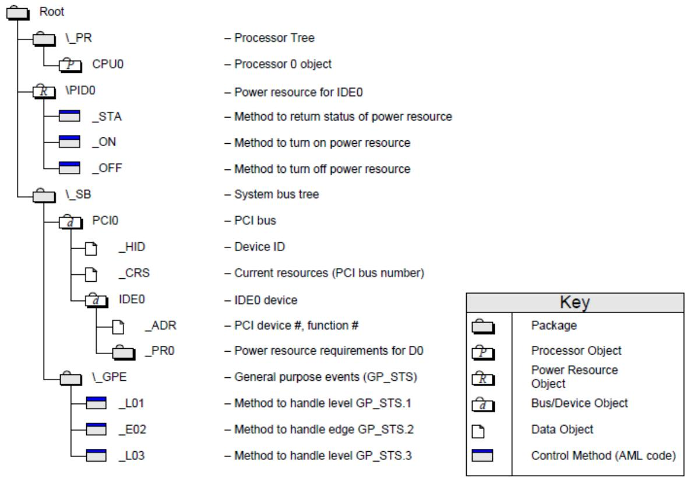  
Fig. 5.16: Example ACPI NameSpace

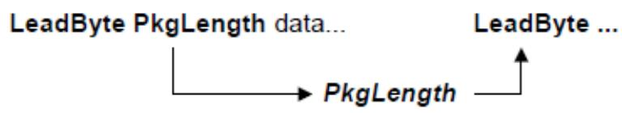  
Fig. 5.17: AML Encoding

Encodings of implicit length objects either have fixed length encodings or allow for nested encodings that, at some point, either result in an explicit or implicit fixed length.

The PkgLength is encoded as a series of 1 to 4 bytes in the stream with the most significant two bits of byte zero, indicating how many following bytes are in the PkgLength encoding. The next two bits are only used in one-byte encodings, which allows for one-byte encodings on a length up to 0x3F. Longer encodings, which do not use these two bits, have a maximum length of the following: two-byte encodings of 0x0FFF, three-byte encodings of 0x0FFFFF, and four-byte length encodings of 0x0FFFFFFFF.

It is fatal for a package length to not fall on a logical boundary. For example, if a package is contained in another package, then by definition its length must be contained within the outer package, and similarly for a datum of implicit length.

## 5.4.2 Definition Block Loading

At some point, the system software decides to “load” a Definition Block. Loading is accomplished when the system makes a pass over the data and populates the ACPI namespace and initializes objects accordingly. The namespace for which population occurs is either from the current namespace location, as defined by all nested packages or from the root if the name is preceded with ‘'.

The first object present in a Definition Block must be a named control method. This is the Definition Block’s initialization control.

Packages are objects that contain an ordered reference to one or more objects. A package can also be considered a vertex of an array, and any object contained within a package can be another package. This permits multidimensional arrays of fixed or dynamic depths and vertices.

Unnamed objects are used to populate the contents of named objects. Unnamed objects cannot be created in the “root.” Unnamed objects can be used as arguments in control methods.

Control method execution may generate errors when creating objects. This can occur if a Method that creates named objects blocks and is reentered while blocked. This will happen because all named objects have an absolute path. This is true even if the object name specified is relative. For example, the following ASL code segments are functionally identical.

(1)

```txt
Method (DEAD)
{
    Scope (\_SB_.FOO)
    {
    Name (BAR, 0x1234) // Run time definition
    }
}
```

(2)

```txt
Scope (\_SB_)
{
    Name (\_SB_. FOO.BAR,) // Load time definition
}
```

Notice that in the above example the execution of the DEAD method will always fail because the object \_SB\_.FOO.BAR is created at load time.

The term of “Definition Block level” is used to refer to the AML byte streams that are not contained in any control method. Such AML byte streams can appear in the “root” scope or in the scopes created/opened by the “Device, PowerResource, Processor, Scope and ThermalZone” operators. Please refer to “ASL Operator Reference , ASL Operator Reference”for detailed descriptions.

Not only the named objects, but all term objects (mathematical, logical, and conditional expressions, etc., see “Term Objects Encoding , Term Object Encoding”) are allowed at the Definition Block level. Allowing such executable AML opcodes at the Definition Block level allows BIOS writers to define dynamic object lists according to the system settings. For example:

```txt
DefinitionBlock ("DSDT.aml", "DSDT", 2, "OEM", "FOOBOOK", 0x1000)
{
    ...
    If (CFG1 () == 1))
    {
    ...
    Scope (_SB.PCI0.XHC.RHUB)
    {
    ...
    If (CFG2 () == 1)
    {
    ...
    Device (HS11)
    {
    ...
    If (CFG3 () == 1)
    {
    ...
    Device (CAM0)
    {
    ...
    }
    ...
    }
    ...
    }
    ...
    }
    ...
    }
}
```

The interpretation of the definition block during the definition block loading is similar to the interpretation of the control method during the control method execution.

## 5.5 Control Methods and the ACPI Source Language (ASL)

OEMs and platform firmware vendors write definition blocks using the ACPI Source Language (ASL) and use a translator to produce the byte stream encoding described in Definition Block Encoding . For example, the ASL statements that produce the example byte stream shown in that earlier section are shown in the following ASL example. For a full specification of the ASL statements, see ACPI Source Language (ASL) Reference.

```txt
DefinitionBlock (
    "forbook.aml",    // Output Filename
    "DSDT",    // Signature
    0x02,    // DSDT Compliance Revision
    "OEM",    // OEMID
    "forbook",    // TABLE ID
    0x1000    // OEM Revision
)
{
    // start of definition block
    OperationRegion(\GIO, SystemIO, 0x125, 0x1)
    Field(\GIO, ByteAcc, NoLock, Preserve)
    {
    CT01, 1,
    }

    Scope(\_SB)
    { // start of scope
    Device(PCI0)
    { // start of device
    PowerResource(FET0, 0, 0)
    { // start of pwr
    Method (_ON)
    {
    CT01 = Ones   // assert power
    Sleep (30)   // wait 30ms
    }

    Method (_OFF)
    {
    CT01 = Zero   // assert reset#
    }

    Method (_STA)
    {
    Return (CT01)
    }
    }    // end of power
    }    // end of device
    }    // end of scope
}    // end of definition block
```

## 5.5.1 ASL Statements

ASL is principally a declarative language. ASL statements declare objects. Each object has three parts, two of which can be null:

```txt
Object := ObjectType FixedList VariableList
```

FixedList refers to a list of known length that supplies data that all instances of a given ObjectType must have. It is written as (a, b, c,), where the number of arguments depends on the specific ObjectType, and some elements can be nested objects, that is (a, b, (q, r, s, t), d). Arguments to a FixedList can have default values, in which case they can be skipped. Some ObjectTypes can have a null FixedList.

VariableList refers to a list, not of predetermined length, of child objects that help define the parent. It is written as {x, y, z, aa, bb, cc}, where any argument can be a nested object. ObjectType determines what terms are legal elements of the VariableList. Some ObjectTypes can have a null variable list.

For a detailed specification of the ASL language, see ACPI Source Language (ASL) Reference

## 5.5.2 Control Method Execution

OSPM evaluates control method objects as necessary to either interrogate or adjust the system-level hardware state. This is called an invocation.

A control method can use other internal, or well defined, control methods to accomplish the task at hand, which can include defined control methods provided by the operating software. Control Methods can reference any objects anywhere in the Namespace. Interpretation of a Control Method is not preemptive, but it can block. When a control method does block, OSPM can initiate or continue the execution of a diferent control method. A control method can only assume that access to global objects is exclusive for any period the control method does not block.

Global objects are those NameSpace objects created at table load time.

## 5.5.2.1 Arguments

Up to seven arguments can be passed to a control method. Each argument is an object that in turn could be a “package” style object that refers to other objects. Access to the argument objects is provided via the ASL ArgTerm (ArgX) language elements. The number of arguments passed to any control method is fixed and is defined when the control method package is created.

Method arguments can take one of the following forms:

• An ACPI name or namepath that refers to a named object. This includes the LocalX and ArgX names. In this case, the object associated with the name is passed as the argument.

• An ACPI name or namepath that refers to another control method. In this case, the method is invoked and the return value of the method is passed as the argument. A fatal error occurs if no object is returned from the method. If the object is not used after the method invocation it is automatically deleted.

• A valid ASL expression. In the case, the expression is evaluated and the object that results from this evaluation is passed as the argument. If this object is not used after the method invocation it is automatically deleted.

## 5.5.2.2 Method Calling Convention

The calling convention for control methods can best be described as call-by-reference-constant. In this convention, objects passed as arguments are passed by “reference”, meaning that they are not copied to new objects as they are passed to the called control method (A calling convention that copies objects or object wrappers during a call is known as call-by-value or call-by-copy).

This call-by-reference-constant convention allows internal objects to be shared across each method invocation, therefore reducing the number of object copies that must be performed as well as the number of bufers that must be copied. This calling convention is appropriate to the low-level nature of the ACPI subsystem within the kernel of the host operating system where non-paged dynamic memory is typically at a premium. The ASL programmer must be aware of the calling convention and the related side efects

However, unlike a pure call-by-reference convention, the ability of the called control method to modify arguments is extremely limited. This reduces aliasing issues such as when a called method unexpectedly modifies a object or variable that has been passed as an argument by the caller. In efect, the arguments that are passed to control methods are passed as constants that cannot be modified except under specific controlled circumstances.

Generally, the objects passed to a control method via the ArgX terms cannot be directly written or modified by the called method. In other words, when an ArgX term is used as a target operand in an ASL statement, the existing ArgX object is not modified. Instead, the new object replaces the existing object and the ArgX term efectively becomes a LocalX term.

The only exception to the read-only argument rule is if an ArgX term contains an Object Reference created via the RefOf ASL operator. In this case, the use of the ArgX term as a target operand will cause any existing object stored at the ACPI name referred to by the RefOf operation to be overwritten.

In some limited cases, a new, writable object may be created that will allow a control method to change the value of an ArgX object. These cases are limited to Bufer and Package objects where the “value” of the object is represented indirectly. For Bufers, a writable Index or Field can be created that refers to the original bufer data and will allow the called method to read or modify the data. For Packages, a writable Index can be created to allow the called method to modify the contents of individual elements of the Package

## 5.5.2.3 Local Variables and Locally Created Data Objects

Control methods can access up to eight local data objects. Access to the local data objects have shorthand encodings. On initial control method execution, the local data objects are NULL. Access to local objects is via the ASL LocalTerm language elements.

Upon control method execution completion, one object can be returned that can be used as the result of the execution of the method. The “caller” must either use the result or save it to a diferent object if it wants to preserve it. See the description of the Return ASL operator for additional details

NameSpace objects created within the scope of a method are dynamic. They exist only for the duration of the method execution. They are created when specified by the code and are destroyed on exit. A method may create dynamic objects outside of the current scope in the NameSpace using the scope operator or using full path names. These objects will still be destroyed on method exit. Objects created at load time outside of the scope of the method are static. For example:

```c
Scope (\XYZ)
{
    Name (BAR, 5)    // Creates \\XYZ.BAR
    Method (FOO, 1)
    {
    CREG = BAR    // same effect as CREG = \XYZ.BAR
    Name (BAR, 7)    // Creates \\XYZ.FOO.BAR
```

(continues on next page)

<table><tr><td></td><td>DREG = BAR</td><td>// same effect as DREG = \XYZ.FOO.BAR</td></tr><tr><td></td><td>Name (\XYZ.FOOB, 3)</td><td>// Creates \\XYZ.FOOB</td></tr><tr><td>}</td><td></td><td>// end method</td></tr><tr><td>}</td><td></td><td>// end scope</td></tr></table>

The object \XYZ.BAR is a static object created when the table that contains the above ASL is loaded. The object \XYZ.FOO.BAR is a dynamic object that is created when the Name (BAR, 7) statement in the FOO method is executed. The object \XYZ.FOOB is a dynamic object created by the \XYZ.FOO method when the Name (XYZ.FOOB, 3) statement is executed. Notice that the \XYZ.FOOB object is destroyed after the \XYZ.FOO method exits.

## 5.5.2.4 Access to Operation Regions

## 5.5.2.4.1 Operation Regions

Control Methods read and write data to locations in address spaces (for example, System memory and System I/O) by using the Field operator (see Declare Field Objects) to declare a data element within an entity known as an “Operation Region” and then performing accesses using the data element name. An Operation Region is a specific region of operation within an address space that is declared as a subset of the entire address space using a starting address (ofset) and a length (see OperationRegion (Declare Operation Region). Control methods must have exclusive access to any address accessed via fields declared in Operation Regions. Control methods may not directly access any other hardware registers, including the ACPI-defined register blocks. Some of the ACPI registers, in the defined ACPI registers blocks, are maintained on behalf of control method execution. For example, the GPEx\_BLK is not directly accessed by a control method but is used to provide an extensible interrupt handling model for control method invocation.

• Accessing an OpRegion may block, even if the OpRegion is not protected by a mutex. For example, because of the slow nature of the embedded controller, an embedded controller OpRegion field access may block.

The following table defines Operation Region spaces.

Table 5.221: Operation Region Address Space Identifiers

<table><tr><td>Value</td><td>Name (RegionSpace Keyword)</td><td>Reference</td></tr><tr><td>0</td><td>SystemMemory</td><td></td></tr><tr><td>1</td><td>SystemIO</td><td></td></tr><tr><td>2</td><td>PCI_Config</td><td></td></tr><tr><td>3</td><td>EmbeddedControl</td><td>See ACPI Embedded Controller Interface Specification</td></tr><tr><td>4</td><td>SMBus</td><td>See ACPI System Management Bus Interface Specification</td></tr><tr><td>5</td><td>SystemCMOS</td><td>See CMOS Protocols</td></tr><tr><td>6</td><td>PciBarTarget</td><td>See PCI Device BAR Target Protocols</td></tr><tr><td>7</td><td>IPMI</td><td>See Declaring IPMI Operation Regions</td></tr><tr><td>8</td><td>GeneralPurposeIO</td><td>See Declaring GeneralPurposeIO Operation Regions</td></tr><tr><td>9</td><td>GenericSerialBus</td><td>See Declaring GenericSerialBus Operation Regions</td></tr><tr><td>0x0A</td><td>PCC</td><td>See Declaring PCC Operation Regions</td></tr><tr><td>0x0B</td><td>PlatformRtMechanism</td><td>Operation Region used by the Platform Runtime Mechanism Table. See Links to ACPI-Related Documents (https://uefi.org/acpi) under the heading “Platform Runtime Mechanism Table”.</td></tr></table>

continues on next page

Table 5.221 – continued from previous page

<table><tr><td>0x0C-0x7E</td><td>Reserved</td><td></td></tr><tr><td>0x07F</td><td>FFixedHW (FFH)</td><td>See Declaring Functional Fixed Hardware (FFH) Operation Regions (Section 5.5.2.4.2).</td></tr><tr><td>0x80 to 0xFF</td><td>OEM defined</td><td></td></tr></table>

## 5.5.2.4.2 Declaring Functional Fixed Hardware (FFH) Operation Regions

The syntax for declaring and using the Functional Fixed Hardware (FFH) Operation Region is architecture specific. Please refer to architecture specific documentation for the definition. For ARM FFixedHW Operation Region definition, see Links to ACPI-Related Documents (https://uefi.org/acpi) under the heading “ARM FFH Specification”.

The use of functional fixed hardware carries with it a reliance on OS specific software that must be considered. OEMs should consult OS vendors to ensure that specific functional fixed hardware interfaces are supported by specific operating systems. The OS and the platform can handshake on support for the FFH Operation Regions using the \_OSC method as described in Platform-Wide OSPM Capabilities.

## 5.5.2.4.3 CMOS Protocols

This section describes how CMOS battery-backed non-volatile memory can be accessed from ASL. Most computers contain an RTC/CMOS device that can be represented as a linear array of bytes of non-volatile memory. There is a standard mechanism for accessing the first 64 bytes of non-volatile RAM in devices that are compatible with the Motorola RTC/CMOS device used in the original IBM PC/AT. Existing RTC/CMOS devices typically contain more than 64 bytes of non-volatile RAM, and no standard mechanism exists for access to this additional storage area. To provide access to all of the non-volatile memory in these devices from AML, PnP IDs exist for each type of extension. These are PNP0B00, PNP0B01, and PNP0B02. The specific devices that these PnP IDs support are described in PC/AT RTC/CMOS Devices, along with field definition ASL example code. The drivers corresponding to these device handle operation region accesses to the SystemCMOS operation region for their respective device types.

All bytes of CMOS that are related to the current time, day, date, month, year and century are read-only.

## 5.5.2.4.4 PCI Device BAR Target Protocols

This section describes how PCI devices’ control registers can be accessed from ASL. PCI devices each have an addres space associated with them called the Configuration Space. At ofset 0x10 through ofset 0x27, there are as many as six Base Address Registers, (BARs). These BARs contain the base address of a series of control registers (in I/O or Memory space) for the PCI device. Since a Plug and Play OS may change the values of these BARs at any time, ASL cannot read and write from these deterministically using I/O or Memory operation regions. Furthermore, a Plug and Play OS will automatically assign ownership of the I/O and Memory regions associated with these BARs to a device driver associated with the PCI device. An ACPI OS (which must also be a Plug and Play operating system) will not allow ASL to read and write regions that are owned by native device drivers.

If a platform uses a PCI BAR Target operation region, an ACPI OS will not load a native device driver for the associated PCI function. For example, if any of the BARs in a PCI function are associated with a PCI BAR Target operation region, then the OS will assume that the PCI function is to be entirely under the control of the ACPI system firmware. No driver will be loaded. Thus, a PCI function can be used as a platform controller for some task (hot-plug PCI, and so on) that the ACPI system firmware performs.

## 5.5.2.4.4.1 Declaring a PCI BAR Target Operation Region

PCI BARs contain the base address of an I/O or Memory region that a PCI device’s control registers lie within. Each BAR implements a protocol for determining whether those control registers are within I/O or Memory space and how much address space the PCI device decodes. (See the PCI Specification for more details.)

PCI BAR Target operation regions are declared by providing the ofset of the BAR within the PCI device’s PCI configuration space. The BAR determines whether the actual access to the device occurs through an I/O or Memory cycle, not by the declaration of the operation region. The length of the region is similarly implied.

In the term OperationRegion(PBAR, PciBarTarget, 0x10, 0x4), the ofset is the ofset of the BAR within the configuration space of the device. This would be an example of an operation region that uses the first BAR in the device.

## 5.5.2.4.4.2 PCI Header Types and PCI BAR Target Operation Regions

PCI BAR Target operation regions may only be declared in the scope of PCI devices that have a PCI Header Type of 0. PCI devices with other header types are bridges. The control of PCI bridges is beyond the scope of ASL.

## 5.5.2.4.5 Declaring IPMI Operation Regions

This section describes the Intelligent Platform Management Interface (IPMI) address space and the use of this address space to communicate with the Baseboard Management Controller (BMC) hardware from AML.

Similar to SMBus, IPMI operation regions are command based, where each ofset within an IPMI address space represent an IPMI command and response pair. Given this uniqueness, IPMI operation regions include restrictions on their field definitions and require the use of an IPMI-specific data bufer for all transactions. The IPMI interface presented in this section is intended for use with any hardware implementation compatible with the IPMI specification, regardless of the system interface type.

Support of the IPMI generic address space by ACPI-compatible operating systems is optional, and is contingent on the existence of an ACPI IPMI device, i.e. a device with the “IPI0001” plug and play ID. If present, OSPM should load the necessary driver software based on the system interface type as specified by the \_IFT (IPMI Interface Type) control method under the device, and register handlers for accesses into the IPMI operation region space.

For more information, refer to the IPMI specification.

Each IPMI operation region definition identifies a single IPMI network function. Operation regions are defined only for those IPMI network functions that need to be accessed from AML. As with other regions, IPMI operation regions are only accessible via the Field term (see Declaring IPMI Fields ).

This interface models each IPMI network function as having a 256-byte linear address range. Each byte ofset within this range corresponds to a single command value (for example, byte ofset 0xC1 equates to command value 0xC1), with a maximum of 256 command values. By doing this, IPMI address spaces appear linear and can be processed in a manner similar to the other address space types.

The syntax for the OperationRegion term (from OperationRegion (Declare Operation Region) ) is described below:

```txt
OperationRegion (
    RegionName, // NameString
    RegionSpace, // RegionSpaceKeyword
    Offset, // TermArg => Integer
    Length // TermArg => Integer
)
```

Where:

• RegionName specifies a name for this IPMI network function (for example, “POWR”).

• RegionSpace must be set to IPMI (operation region type value 0x07).

• Ofset is a word-sized value specifying the network function and initial command value ofset for the target device. The network function address is stored in the high byte and the command value ofset is stored in the low byte. For example, the value 0x3000 would be used for a device with the network function of 0x06, and an initial command value ofset of zero (0).

• Length is set to the 0x100 (256), representing the maximum number of possible command values, for regions with an initial command value ofset of zero (0). The diference of these two values is used for regions with non-zero ofsets. For example, a region with an Ofset value of 0x3010 would have a corresponding Length of 0xF0 (0x100 minus 0x10).

For example, a Baseboard Management Controller will support power metering capabilities at the network function 0x30, and IPMI commands to query the BMC device information at the network function 0x06.

The following ASL code shows the use of the OperationRegion term to describe these IPMI functions:

```txt
Device (IPMI)
{
    Name (_HID, "IPI0001") // IPMI device
    Name (_IFT, 0x1) // KCS system interface type
    OperationRegion (DEVC, IPMI, 0x0600, 0x100) // Device info network function
    OperationRegion (POWR, IPMI, 0x3000, 0x100) // Power network function
}
```

Notice that these operation regions in this example are defined within the immediate context of the ‘owning’ IPMI device. This ensures the correct operation region handler will be used, based on the value returned by the \_IFT object. Each definition corresponds to a separate network function, and happens to use an initial command value ofset of zero (0).

## 5.5.2.4.5.1 Declaring IPMI Fields

As with other regions, IPMI operation regions are only accessible via the Field term. Each field element is assigned a unique command value and represents a virtual command for the targeted network function.

The syntax for the Field term (from Event (Declare Event Synchronization Object) ) is described below:

```txt
Field(
    RegionName,    // NameString => OperationRegion
    AccessType,    // AccessTypeKeyword - BufferAcc
    LockRule,    // LockRuleKeyword
    UpdateRule    // UpdateRuleKeyword - ignored
) {FieldUnitList}
```

## Where:

• RegionName specifies the operation region name previously defined for the network function.

• AccessType must be set to BuferAcc. This indicates that access to field elements will be done using a regionspecific data bufer. For this access type, the field handler is not aware of the data bufer’s contents which may be of any size. When a field of this type is used as the source argument in an operation it simply evaluates to a bufer. When used as the destination, however, the bufer is passed bi-directionally to allow data to be returned from write operations. The modified bufer then becomes the response message of that command. This is slightly diferent than the normal case in which the execution result is the same as the value written to the destination. Note that the source is never changed, since it only represents a virtual register for a particular IPMI command.

• LockRule indicates if access to this operation region requires acquisition of the Global Lock for synchronization. This field should be set to Lock on system with firmware that may access the BMC via IPMI, and NoLock otherwise.

• UpdateRule is not applicable to IPMI operation regions since each virtual register is accessed in its entirety. This field is ignored for all IPMI field definitions.

IPMI operation regions require that all field elements be declared at command value granularity. This means that each virtual register cannot be broken down to its individual bits within the field definition.

Access to sub-portions of virtual registers can be done only outside of the field definition. This limitation is imposed both to simplify the IPMI interface and to maintain consistency with the physical model defined by the IPMI specification.

Since the system interface used for IPMI communication is determined by the \_IFT object under the IPMI device, there is no need for using of the AccessAs term within the field definition. In fact its usage will be ignored by the operation handler.

For example, the register at command value 0xC1 for the power meter network function might represent the command to set a BMC enforced power limit, while the register at command value 0xC2 for the same network function might represent the current configured power limit. At the same time, the register at command value 0xC8 might represent the latest power meter measurement.

The following ASL code shows the use of the OperationRegion, Field, and Ofset terms to represent these virtual registers:

```txt
OperationRegion(POWR, IPMI, 0x3000, 0x100) // Power network function
Field(POWR, BufferAcc, NoLock, Preserve)
{
    Offset(0xC1), // Skip to command value 0xC1
    SPWL, 8, // Set power limit [command value 0xC1]
    GPWL, 8, // Get power limit [command value 0xC2]
    Offset(0xC8), // Skip to command value 0xC8
    GPMM, 8 // Get power meter measurement [command value 0xC8]
}
```

Notice that command values are equivalent to the field element’s byte ofset (for example, SPWL=0xC1, GPWL=0xC2, GPMM=0xC8).

## 5.5.2.4.5.2 Declaring and Using IPMI Request and Response Bufer

Since each virtual register in the IPMI operation region represents an individual IPMI command, and the operation relies on use of bi-directional bufer, a common bufer structure is required to represent the request and response messages. The use of a data bufer for IPMI transactions allows AML to receive status and data length values.

The IPMI data bufer is defined as a fixed-length 66-byte bufer that, if represented using a ‘C’-styled declaration, would be modeled as follows:

```txt
typedef struct
{
    BYTE Status; // Byte 0 of the data buffer
    BYTE Length; // Byte 1 of the data buffer
    BYTE[64] Data; // Bytes 2 through 65 of the data buffer
}
```

Where:

• Status (byte 0) indicates the status code of a given IPMI command. See IPMI Status Code for more information.

• Length (byte 1) specifies the number of bytes of valid data that exists in the data bufer. Valid Length values are 0 through 64. Before the operation is carried out, this value represents the length of the request data bufer. Afterwards, this value represents the length of the result response data bufer.

• Data (bytes 65-2) represents a 64-byte bufer, and is the location where actual data is stored. Before the operation is carried out, this represents the actual request message payload. Afterwards, this represents the response message payload as returned by the IPMI command.

For example, the following ASL shows the use of the IPMI data bufer to carry out a command for a power function. This code is based on the example ASL presented in Declaring IPMI Fields which lists the operation region and field definitions for relevant IPMI power metering commands.

```go
/* Create the IPMI data buffer */
Name(BUFF, Buffer(66) {} )    // Create IPMI data buffer as BUFF
CreateByteField(BUFF, 0x00, STAT)    // STAT = Status (Byte)
CreateByteField(BUFF, 0x01, LENG)    // LENG = Length (Byte)
CreateByteField(BUFF, 0x02, MODE)    // MODE = Mode (Byte)
CreateByteField(BUFF, 0x03, RESV)    // RESV = Reserved (Byte)

LENG = 0x2    // Request message is 2 bytes long
MODE = 0x1    // Set Mode to 1

BUFF = (GPMM = BUFF)    // Write the request into the GPMM command,
    // then read the results

CreateByteField (BUFF, 0x02, CMPC)    // CMPC = Completion code (Byte)
CreateWordField (BUFF, 0x03, APOW)    // APOW = Average power measurement (Word)

If ((STAT == 0x0) && (CMPC == 0x0))    // Successful?
{
    Return (APOW)    // Return the average power measurement
}
Else
{
    Return (Ones)    // Return invalid
}
```

Notice the use of the CreateField primitives to access the data bufer’s sub-elements (Status, Length, and Data), where Data (bytes 65-2) is ‘typecast’ into diferent fields (including the result completion code).

The example above demonstrates the use of the Store() operator and the bi-directional data bufer to invoke the actual IPMI command represented by the virtual register. The inner Store() writes the request message data bufer to the IPMI operation region handler, and invokes the command. The outer Store() takes the result of that command and writes it back into the data bufer, this time representing the response message.

## 5.5.2.4.5.3 IPMI Status Code

Every IPMI command results in a status code returned as the first byte of the response message, contained in the bi-directional data bufer. This status code can indicate success, various errors, and possibly timeout from the IPMI operation handler. This is necessary because it is possible for certain IPMI commands to take up to 5 seconds to carry out, and since an AML Store() operation is synchronous by nature, it is essential to make sure the IPMI operation returns in a timely fashion so as not to block the AML interpreter in the OSPM.

• This status code is diferent than the IPMI completion code, which is returned as the first byte of the response message in the data bufer payload. The completion code is described in the complete IPMI specification.

Table 5.222: IPMI Status Codes

<table><tr><td>Status Code</td><td>Name</td><td>Description</td></tr><tr><td>00h</td><td>IPMI OK</td><td>Indicates the command has been successfully completed.</td></tr><tr><td>07h</td><td>IPMI Unknown Failure</td><td>Indicates failure because of an unknown IPMI error.</td></tr><tr><td>10h</td><td>IPMI Command Operation Timeout</td><td>Indicates the operation timed out.</td></tr></table>

## 5.5.2.4.6 Declaring GeneralPurposeIO Operation Regions

For GeneralPurposeIO Operation Regions, the syntax for the OperationRegion term (from section OperationRegion (Declare Operation Region)) is described below:

```txt
OperationRegion (
    RegionName,    // NameString
    RegionSpace,    // RegionSpaceKeyword
    Offset,    // TermArg => Integer
    Length    // TermArg => Integer
)
```

## Where:

• RegionName specifies a name for this GeneralPurposeIO region (for example, “GPI1”).

• RegionSpace must be set to GeneralPurposeIO (operation region type value 0x08).

• Ofset is ignored for the GeneralPurposeIO RegionSpace.

• Length is the maximum number of GPIO IO pins to be included in the Operation Region, rounded up to the next byte.

GeneralPurposeIO OpRegions must be declared within the scope of the GPIO controller device being accessed.

## 5.5.2.4.6.1 Declaring GeneralPurposeIO Fields

As with other regions, GeneralPurposeIO operation regions are only accessible via the Field term. Each field element represents a subset of the length bits declared in the OpRegion declaration. The pins within the OpRegion that are accessed via a given field name are defined by a Connection descriptor. The total number of defined field bits following a connection descriptor must equal the number of pins listed in the descriptor.

The syntax for the Field term (from Field (Declare Field Objects)) is described below:

```txt
Field(
    RegionName, // NameString => OperationRegion
    AccessType, // AccessTypeKeyword
    LockRule, // LockRuleKeyword
    UpdateRule // UpdateRuleKeyword - ignored
) {FieldUnitList}
```

## Where:

• RegionName specifies the operation region name previously declared.

• AccessType must be set to ByteAcc.

• LockRule indicates if access to this operation region requires acquisition of the Global Lock for synchronization. Note that, on HW-reduced ACPI platforms, this field must be set to NoLock.

• UpdateRule is not applicable to GeneralPurposeIO operation regions since Preserve is always required. This field is ignored for all GeneralPurposeIO field definitions.

The following ASL code shows the use of the OperationRegion, Field, and Ofset terms as they apply to GeneralPurposeIO space.

```txt
Device(DEVA) //An Arbitrary Device Scope
{
    // Other required stuff for this device
    Name (GMOD, ResourceTemplate ()
    //An existing GPIO Connection (to be used later)
    {
    //2 Outputs that define the Power mode of the device
    GpioIo (Exclusive, PullDown, , , , "\$_SB.GPI2") {10, 12}
    })
} //End DEVA

Device (GPI2) //The OpRegion declaration, and the \_REG method,
    //must be in the controller's namespace scope
{
    //Other required stuff for the GPIO controller
    OperationRegion(GPO2, GeneralPurposeIO, 0, 1)
    // Note: length of 1 means region is less than 1 byte (8 pins) long
    Method(_REG,2)
    {
    // Track availability of GeneralPurposeIO space
    }
}

Device (DEVB) //Access some GPIO Pins from this device scope
    //to change the device's power mode
```

(continues on next page)

(continued from previous page)

```txt
{
    //.. Other required stuff for this device
    Name(_DEP, Package() {"\$_SB.GPI2"}) //Device Dependency hint for OSPM Field(\$_SB.GPI2.GPO2, ByteAcc, NoLock, Preserve)
    {
    Connection (GMOD), // Re-Use an existing connection (defined elsewhere)
    MODE, 2,    // Power Mode
    Connection (GpioIo(Exclusive, PullUp, , , , "\$_SB.GPI2") {7}),
    STAT, 1,    // e.g. Status signal from the device
    Connection (GpioIo (Exclusive, PullUp, , , , "\$_SB.GPI2") {9}),
    RSET, 1    // e.g. Reset signal to the device
    }
    Method(_PS3)
    {
    If (1)    // Make sure GeneralPurposeIO OpRegion is available
    {
    MODE = 0x03    //Set both MODE bits. Power Mode 3
    }
    }
} //End DEVB
```

## 5.5.2.4.7 Declaring GenericSerialBus Operation Regions

For GenericSerialBus Operation Regions, the syntax for the OperationRegion term (from OperationRegion (Declare Operation Region) ) is described below:

```txt
OperationRegion (
    RegionName,    // NameString
    RegionSpace,    // RegionSpaceKeyword
    Offset,    // TermArg => Integer
    Length    // TermArg => Integer
)
```

## Where:

• RegionName specifies a name for this region (for example, TOP1).

• RegionSpace must be set to GenericSerialBus (operation region type value 0x09).

• Ofset specifies the initial command value ofset for the target device. For example, the value 0x00 refers to a command value ofset of zero (0). Raw protocols ignore this value.

• Length is set to the 0x100 (256), representing the maximum number of possible command values.

• The Operation Region must be declared within the scope of the Serial Bus controller device.

The following ASL code shows the use of the OperationRegion, Field, and Ofset terms as they apply to SPB space.

```txt
Scope(\_SB.I2C)
{
    Name (SDB0, ResourceTemplate())
    {
```

(continues on next page)

```txt
I2CSerialBusV2(0x4a,,100000,,"
    \\_SB.I2C",,,,,RawDataBuffer(){1,2,3,4,5,6})
)
OperationRegion(TOP1, GenericSerialBus, 0x00, 0x100)
    // GenericSerialBus device at command offset 0x00
Field(TOP1, BufferAcc, NoLock, Preserve)
{
    Connection(SDB0),
    // Use the Resource Descriptor defined above
    AccessAs(BufferAcc, AttribWord),
    // Use the GenericSerialBus Read/Write Word protocol
    FLD0, 8,    // Virtual register at command value 0.
    FLD1, 8    // Virtual register at command value 1.
}
Field(TOP1, BufferAcc, NoLock, Preserve)
{
    Connection(I2CSerialBusV2(0x5a,,100000,,"
    \\_SB.I2C",,,,,RawDataBuffer(){1,6},
    AccessAs(BufferAcc, AttribBytes (16)),
    FLD2, 8    // Virtual register at command value 0.
}
// Create the GenericSerialBus data buffer
Name(BUFF, Buffer(34){})    // Create GenericSerialBus data buffer as BUFF
CreateByteField(BUFF, 0x00, STAT)    // STAT = Status (Byte)
CreateWordField(BUFF, 0x02, DATA)    // DATA = Data (Word)
}
```

The Operation Region in this example is defined within the scope of the target controller device, I2C.

GenericSerialBus regions are only accessible via the Field term (see Declare Field Objects). GenericSerialBus protocols are assigned to field elements using the AccessAs term (see “ASL Macros”) within the field definition.

Table 5.223: Accessor Type Values

<table><tr><td>Accessor Type</td><td>Value</td><td>Description</td></tr><tr><td>AttribQuick</td><td>0x02</td><td>Read/Write Quick Protocol</td></tr><tr><td>AttribSendReceive</td><td>0x04</td><td>Send/Receive Byte Protocol</td></tr><tr><td>AttribByte</td><td>0x06</td><td>Read/Write Byte Protocol</td></tr><tr><td>AttribWord</td><td>0x08</td><td>Read/Write Word Protocol</td></tr><tr><td>AttribBlock</td><td>0x0A</td><td>Read/Write Block Protocol</td></tr><tr><td>AttribBytes</td><td>0x0B</td><td>Read/Write N-Bytes Protocol</td></tr><tr><td>AttribProcessCall</td><td>0x0C</td><td>Process Call Protocol</td></tr><tr><td>AttribBlockProcessCall</td><td>0x0D</td><td>Write Block-Read Block Process Call Protocol</td></tr><tr><td>AttribRawBytes</td><td>0x0E</td><td>Raw Read/Write N-Bytes Protocol</td></tr><tr><td>AttribRawProcessBytes</td><td>0x0F</td><td>Raw Process Call Protocol</td></tr></table>

## 5.5.2.4.7.1 Declaring GenericSerialBus Fields

As with other regions, GenericSerialBus operation regions are only accessible via the Field term. Each field element is assigned a unique command value and represents a virtual register on the targeted GenericSerialBus device.

The syntax for the Field term (see Section 19.6.48) is described below:

```txt
Field(
    RegionName,    // NameString=>OperationRegion
    AccessType,    // AccessTypeKeyword
    LockRule,    // LockRuleKeyword - ignored for Hardware-reduced ACPI platforms
    UpdateRule    // UpdateRuleKeyword - ignored
) {FieldUnitList}
```

## Where:

• RegionName specifies the operation region name previously defined for the device.

• AccessType must be set to BuferAcc. This indicates that access to field elements will be done using a regionspecific data bufer. For this access type, the field handler is not aware of the data bufer’s contents which may be of any size. When a field of this type is used as the source argument in an operation it simply evaluates to a bufer. When used as the destination, however, the bufer is passed bi-directionally to allow data to be returned from write operations. The modified bufer then becomes the execution result of that operation. This is slightly diferent than the normal case in which the execution result is the same as the value written to the destination. Note that the source is never changed, since it could be a read only object (see Declaring and Using a GenericSerialBus Data Bufer).

• LockRule indicates if access to this operation region requires acquisition of the Global Lock for synchronization. This field should be set to Lock on system with firmware that may access the GenericSerialBus, and NoLock otherwise. On Hardware-reduced ACPI platforms, there is not a global lock so this parameter is ignored.

• UpdateRule is not applicable to GenericSerialBus operation regions since each virtual register is accessed in its entirety. This field is ignored for all GenericSerialBus field definitions.

GenericSerialBus operation regions require that all field elements be declared at command value granularity. This means that each virtual register cannot be broken down to its individual bits within the field definition.

Access to sub-portions of virtual registers can be done only outside of the field definition. This limitation is imposed to simplify the GenericSerialBus interface.

GenericSerialBus protocols are assigned to field elements using the AccessAs term within the field definition. The syntax for this term (from ASL Root and Secondary Terms) is described below:

```typescript
AccessAs(
    AccessType, //AccessTypeKeyword
    AccessAttribute //Nothing \ | ByteConst \ | AccessAttribKeyword
)
```

## Where:

• AccessType must be set to BuferAcc.

• AccessAttribute indicates the GenericSerialBus protocol to assign to command values that follow this term. See:ref:using-the-genericserialbus-protocols for a listing of the GenericSerialBus protocols.

An AccessAs term must appear in a field definition to set the initial GenericSerialBus protocol for the field elements that follow. A maximum of one GenericSerialBus protocol may be defined for each field element. Devices supporting multiple protocols for a single command value can be modeled by specifying multiple field elements with the same ofset (command value), where each field element is preceded by an AccessAs term specifying an alternate protocol.

For GenericSerialBus operation regions, connection attributes must be defined for each set of field elements. Generic-SerialBus resources are assigned to field elements using the Connection term within the field definition. The syntax for this term (from Connection (Declare Field Connection Attributes) “Connection (Declare Field Connection Attributes)”) is described below:

```txt
Connection (ConnectionResourceObj)
```

## Where:

• ConnectionResourceObj points to a Serial Bus Resource Connection Descriptor (see GenericSerialBus Connection Descriptors for valid types), or a named object that specifies a bufer field containing the connection resource information.

Each Field definition references the initial command ofset specified in the operation region definition. The ofset is iterated for each subsequent field element defined in that respective Field. If a new connection is described in the same Field definition, the ofset will not be returned to its initial value and a new Field must be defined to inherit the initial command value ofset from the operation region definition. The following example illustrates this point.

```autohotkey
OperationRegion (TOP1, GenericSerialBus, 0x00, 0x100) //Initial offset is 0
Field (TOP1, BufferAcc, NoLock, Preserve)
{
    Connection (I2CSerialBusV2 (0x5a,,100000,","\$_SB.I2C",,,,,RawDataBuffer(){1,6})),
    Offset (0x0),
    AccessAs(BufferAcc, AttribBytes (4)),
    TFK1, 8, //TFK1 at command value offset 0
    TFK2, 8, //TFK2 at command value offset 1
    Connection(I2CSerialBusV2(0x5c,,100000,","\$_SB.I2C",,,,,RawDataBuffer(){3,1})),
    AccessAs(BufferAcc, AttribBytes (12)),
    TS1, 8 //TS1 at command value offset 2
}

Field (TOP1, BufferAcc, NoLock, Preserve)
{
    Connection(I2CSerialBusV2(0x5b,,100000,","\$_SB.I2C",,,,,RawDataBuffer(){2,9})),
    AccessAs(BufferAcc, AttribByte),
    TM1, 8 //TM1 at command value offset 0
}
```

## 5.5.2.4.7.2 Declaring and Using a GenericSerialBus Data Bufer

The use of a data bufer for GenericSerialBus transactions allows AML to receive status and data length values, as well as making it possible to implement the Process Call protocol. The BuferAcc access type is used to indicate to the field handler that a region-specific data bufer will be used.

For GenericSerialBus operation regions, this data bufer is defined as an arbitrary length bufer that, if represented using a ‘C’-styled declaration, would be modeled as follows:

```txt
typedef struct
{
    BYTE Status; // Byte 0 of the data buffer
    BYTE Length; // Byte 1 of the data buffer
```

(continues on next page)

```txt
(continued from previous page)
BYTE[x-1] Data; // Bytes 2-x of the arbitrary length data buffer,
} // where x is the last index of the overall buffer
```

## Where:

• Status (byte 0) indicates the status code of a given GenericSerialBus transaction.

• Length (byte 1) specifies the number of bytes of valid data that exists in the data bufer (bytes 2-x). Use of this field is only defined for the Read/Write Block protocol. For other protocols–where the data length is implied by the protocol–this field is reserved. Since this field is one byte, the maximum length of the data bufer is 255.

• Data (bytes 2-x) represents an arbitrary length bufer, and is the location where actual data is stored.

For example, the following ASL shows the use of the GenericSerialBus data bufer for performing transactions to a Smart Battery device.

```go
/* Create the GenericSerialBus data buffer */

Name (BUFF, Buffer (34) {})    // Create GenericSerialBus data buffer as BUFF
CreateByteField (BUFF, 0x00, STAT)    // STAT = Status (Byte)
CreateByteField (BUFF, 0x01, LEN)    // LEN = Length (Byte)
CreateWordField (BUFF, 0x02, DATW)    // DATW = Data (Word - Bytes 2 & 3)
CreateField (BUFF, 0x10, 256, DBUF)    // DBUF = Data (Block - Bytes 2-33)

/* Read the battery temperature */

BUFF = BTMP // Invoke Read Word transaction

If (STAT == 0x00)    // Successful?
{
    // DATW = Battery temperature in 1/10th degrees Kelvin
}

/* Read the battery manufacturer name */

BUFF = MFGN    // Invoke Read Block transaction

If (STAT == 0x00)    // Successful?
{
    // LEN = Length of the manufacturer name
    // DBUF = Manufacturer name (as a counted string)
}
```

Notice the use of the CreateField primitives to access the data bufer’s sub-elements (Status, Length, and Data), where Data (bytes 2-33) is ‘typecast’ as both word (DATW) and block (DBUF) data.

The example above demonstrates the use of the Store() operator to invoke a Read Block transaction to obtain the name of the battery manufacturer. Evaluation of the source operand (MFGN) results in a 34-byte bufer that gets copied by Store() to the destination bufer (BUFF).

Capturing the results of a write operation, for example to check the status code, requires an additional Store() operator, as shown below:

```txt
BUFF = (MFGN = BUFF)
If (STAT == 0x00) // Transaction successful?
```

(continues on next page)

```txt
(continued from previous page)
{
    ...
}
}
```

Note that the outer Store() copies the results of the Write Block transaction back into BUFF. This is the nature of Bufer-Acc’s bi-directionality. It should be noted that storing (or parsing) the result of a GenericSerialBus Write transaction is not required although useful for ascertaining the outcome of a transaction.

GenericSerialBus Process Call protocols require similar semantics due to the fact that only destination operands are passed bi-directionally. These transactions require the use of the double-Store() semantics to properly capture the return results.

## 5.5.2.4.7.3 Using the GenericSerialBus Protocols

This section provides information and examples on how each of the GenericSerialBus protocols can be used to access GenericSerialBus devices from AML.

## Read/Write Quick (AttribQuick)

The GenericSerialBus Read/Write Quick protocol (AttribQuick) is typically used to control simple devices using a device-specific binary command (for example, ON and OFF). Command values are not used by this protocol and thus only a single element (at ofset 0) can be specified in the field definition. This protocol transfers no data.

The following ASL code illustrates how a device supporting the Read/Write Quick protocol should be accessed:

```txt
OperationRegion (TOP1, GenericSerialBus, 0x00, 0x100)
    // GenericSerialBus device at command value offset 0
Field (TOP1, BufferAcc, NoLock, Preserve)
{
    Connection (I2CSerialBusV2 (0x5a,,100000,","\$_SB.I2C",,,,,RawDataBuffer (){1,6})),
    AccessAs (BufferAcc, AttribQuick),
    // Use the GenericSerialBus Read/Write Quick protocol
    FLD0, 8    // Virtual register at command value 0.
}

/* Create the GenericSerialBus data buffer */

Name (BUFF, Buffer (2){})    // Create GenericSerialBus data buffer as BUFF
CreateByteField (BUFF, 0x00, STAT) // STAT = Status (Byte)

/* Signal device (e.g. OFF) */

BUFF = FLD0    // Invoke Read Quick transaction
If (STAT == 0x00)    // Was the transactions successful?
{
    ...
}

/* Signal device (e.g. ON) */

FLD0 = FLD0 // Invoke Write Quick transaction
```

In this example, a single field element (FLD0) at ofset 0 is defined to represent the protocol’s read/write bit. Access to FLD0 will cause a GenericSerialBus transaction to occur to the device. Reading the field results in a Read Quick, and writing to the field results in a Write Quick. In either case data is not transferred–access to the register is simply used as a mechanism to invoke the transaction.

## Send/Receive Byte (AttribSendReceive)

The GenericSerialBus Send/Receive Byte protocol (AttribSendReceive) transfers a single byte of data. Like Read/Write Quick, command values are not used by this protocol and thus only a single element (at ofset 0) can be specified in the field definition.

The following ASL code illustrates how a device supporting the Send/Receive Byte protocol should be accessed:

```txt
OperationRegion (TOP1, GenericSerialBus, 0x00, 0x100)
    // GenericSerialBus device at command value offset 0
Field (TOP1, BufferAcc, NoLock, Preserve)
{
    Connection (I2CSerialBusV2 (0x5a,,100000,","\$_SB.I2C",,,,,RawDataBuffer (){1,6})), AccessAs(BufferAcc, AttribSendReceive),
    // Use the GenericSerialBus Send/Receive Byte protocol
    FLD0, 8 // Virtual register at command value 0.
}

// Create the GenericSerialBus data buffer

Name (BUFF, Buffer (3) {})    // Create GenericSerialBus data buffer as BUFF
CreateByteField (BUFF, 0x00, STAT)    // STAT = Status (Byte)
CreateByteField (BUFF, 0x02, DATA)    // DATA = Data (Byte)

// Receive a byte of data from the device

BUFF = FLD0 // Invoke a Receive Byte transaction
If (STAT == 0x00)    // Successful?
{
    // DATA = Received byte...
}

// Send the byte '0x16' to the device

DATA = 0x16    // Save 0x16 into the data buffer
FLD0 = BUFF    //Invoke a Send Byte transaction
```

In this example, a single field element (FLD0) at ofset 0 is defined to represent the protocol’s data byte. Access to FLD0 will cause a GenericSerialBus transaction to occur to the device. Reading the field results in a Receive Byte, and writing to the field results in a Send Byte.

## Read/Write Byte (AttribByte)

The GenericSerialBus Read/Write Byte protocol (AttribByte) also transfers a single byte of data. But unlike Send/Receive Byte, this protocol uses a command value to reference up to 256 byte-sized virtual registers.

The following ASL code illustrates how a device supporting the Read/Write Byte protocol should be accessed:

```txt
OperationRegion (TOP1, GenericSerialBus, 0x00, 0x100)
    // GenericSerialBus device at command value offset
Field (TOP1, BufferAcc, NoLock, Preserve)
{
    Connection (I2CSerialBusV2 (0x5a,,100000,","\$_SB.I2C",.,.,RawDataBuffer (){1,6})),
    AccessAs(BufferAcc, AttribByte), // Use the GenericSerialBus Read/Write Byte protocol
(continues on next page)
```

```txt
FLD0, 8, // Virtual register at command value 0.
FLD1, 8, // Virtual register at command value 1.
FLD2, 8 // Virtual register at command value 2.
}

// Create the GenericSerialBus data buffer
Name (BUFF, Buffer (3){$})

// Create GenericSerialBus data buffer as BUFF

CreateByteField (BUFF, 0x00, STAT) // STAT = Status (Byte)
CreateByteField (BUFF, 0x02, DATA) // DATA = Data (Byte)

// Read a byte of data from the device using command value 1

BUFF = FLD1 // Invoke a Read Byte transaction
If (STAT == 0x00) // Successful?
{
    // DATA = Byte read from FLD1...
}

// Write the byte '0x16' to the device using command value 2

DATA = 0x16 // Save 0x16 into the data buffer
FLD2 = BUFF // Invoke a Write Byte transaction
```

In this example, three field elements (FLD0, FLD1, and FLD2) are defined to represent the virtual registers for command values 0, 1, and 2. Access to any of the field elements will cause a GenericSerialBus transaction to occur to the device. Reading FLD1 results in a Read Byte with a command value of 1, and writing to FLD2 results in a Write Byte with command value 2.

## Read/Write Word (AttribWord)

The GenericSerialBus Read/Write Word protocol (AttribWord) transfers 2 bytes of data. This protocol also uses a command value to reference up to 256 word-sized virtual device registers.

The following ASL code illustrates how a device supporting the Read/Write Word protocol should be accessed:

```txt
OperationRegion (TOP1, GenericSerialBus, 0x00, 0x100)
    // GenericSerialBus device at command value offset 0
Field (TOP1, BufferAcc, NoLock, Preserve)
{
    Connection (I2CSerialBusV2 (0x5a,,100000,","\$_SB.I2C",,,,,RawDataBuffer (){1,6})),
    AccessAs (BufferAcc, AttribWord),
    // Use the GenericSerialBus Read/Write Word protocol
    FLD0, 8,    // Virtual register at command value 0.
    FLD1, 8,    // Virtual register at command value 1.
    FLD2, 8    // Virtual register at command value 2.
}

// Create the GenericSerialBus data buffer

Name(BUFF, Buffer(6){})    // Create GenericSerialBus data buffer as BUFF
(continues on next page)
```

(continued from previous page)

```txt
CreateByteField(BUFF, 0x00, STAT) // STAT = Status (Byte)
CreateWordField(BUFF, 0x02, DATA) // DATA = Data (Word)

/* Read two bytes of data from the device using command value 1 */

BUFF = FLD1    // Invoke a Read Word transaction
If (STAT == 0x00)    // Was the transaction successful?
{
    // DATA = Word read from FLD1...
}

/* Write the word '0x5416' to the device using command value 2 */

DATA = 0x5416    // Save 0x5416 into the data buffer
FLD2 = BUFF    // Invoke a Write Word transaction
```

In this example, three field elements (FLD0, FLD1, and FLD2) are defined to represent the virtual registers for command values 0, 1, and 2. Access to any of the field elements will cause a GenericSerialBus transaction to occur to the device. Reading FLD1 results in a Read Word with a command value of 1, and writing to FLD2 results in a Write Word with command value 2.

Notice that although accessing each field element transmits a word (16 bits) of data, the fields are listed as 8 bits each. The actual data size is determined by the protocol. Every field element is declared with a length of 8 bits so that command values and byte ofsets are equivalent.

## Read/Write Block (AttribBlock)

The GenericSerialBus Read/Write Block protocol (AttribBlock) transfers variable-sized data. This protocol uses a command value to reference up to 256 block-sized virtual registers.

The following ASL code illustrates how a device supporting the Read/Write Block protocol should be accessed:

```c
OperationRegion (TOP1, GenericSerialBus, 0x00, 0x100)
Field (TOP1, BufferAcc, NoLock, Preserve)
{
    Connection (I2CSerialBusV2 (0x5a,,100000,","\$_SB.I2C",,,,,RawDataBuffer(){1,6})),
    Offset(0x0),
    AccessAs(BufferAcc, AttribBlock),
    TFK1, 8,
    TFK2, 8
}

// Create the GenericSerialBus data buffer

Name (BUFF, Buffer (34) {}) // Create SerialBus buf as BUFF
CreateByteField (BUFF, 0x00, STAT) // STAT = Status (Byte)
CreateBytefield (BUFF, 0x01, LEN) // LEN = Length (Byte)
CreateWordField (BUFF, 0x03, DATW) // DATW = Data (Word - Bytes 2 & 3, or 16 bits)
CreateField (BUFF, 16, 256, DBUF) // DBUF = Data (Bytes 2-33)
CreateField (BUFF, 16, 32, DATD) // DATD = Data (DWord)

/* Read block of data from the device using command value 0 */
BUFF = TFK1
```

(continues on next page)

(continued from previous page)

```c
If (STAT != 0x00)
{
    Return (0)
}

/* Read block of data from the device using command value 1 */
BUFF = TFK2
If (STAT != 0x00)
{
    Return (0)
}
```

In this example, two field elements (TFK1, and TFK2) are defined to represent the virtual registers for command values 0 and 1. Access to any of the field elements will cause a GenericSerialBus transaction to occur to the device.

Writing blocks of data requires similar semantics, such as in the following example:

```txt
Store (16, LEN) // In bits, so 4 bytes
LEN = 16
BUFF = (TFK1 = BUFF)
If (STAT == 0x00) // Was the transaction successful?
{
    ...
}
```

This accessor is not viable for some SPBs because the bus may not support the appropriate functionality. In cases that variable length bufers are desired but the bus does not support block accessors, refer to the SerialBytes protocol.

## Word Process Call (AttribProcessCall)

The GenericSerialBus Process Call protocol (AttribProcessCall) transfers 2 bytes of data bi-directionally (performs a Write Word followed by a Read Word as an atomic transaction). This protocol uses a command value to reference up to 256 word-sized virtual registers.

The following ASL code illustrates how a device supporting the Process Call protocol should be accessed:

```txt
OperationRegion (TOP1, GenericSerialBus, 0x00, 0x100)
    // GenericSerialBus device at slave address 0x42
Field (TOP1, BufferAcc, NoLock, Preserve)
{
    Connection (I2CSerialBusV2 (0x5a,,100000,","\$_SB.I2C",,,,,RawDataBuffer(){1,6})), AccessAs (BufferAcc, AttribProcessCall),
    // Use the GenericSerialBus Process Call protocol
    FLD0, 8,    // Virtual register at command value 0.
    FLD1, 8,    // Virtual register at command value 1.
    FLD2, 8    // Virtual register at command value 2.
}

// Create the GenericSerialBus data buffer

Name (BUFF, Buffer (6){})    // Create GenericSerialBus data buffer as BUFF
CreateByteField (BUFF, 0x00, STAT)    // STAT = Status (Byte)
CreateWordField (BUFF, 0x02, DATA)    // DATA = Data (Word)
```

(continues on next page)

(continued from previous page)

```txt
/* Process Call with input value '0x5416' to the device using command value 1 */
DATA = 0x5416    // Save 0x5416 into the data buffer
BUFF = (FLD1 = BUFF)    // Invoke a Process Call transaction
If (STAT == 0x00)    // Was the transaction successful?
{
    // DATA = Word returned from FLD1...
}
```

In this example, three field elements (FLD0, FLD1, and FLD2) are defined to represent the virtual registers for command values 0, 1, and 2. Access to any of the field elements will cause a GenericSerialBus transaction to occur to the device. Reading or writing FLD1 results in a Process Call with a command value of 1. Notice that unlike other protocols, Process Call involves both a write and read operation in a single atomic transaction. This means that the Data element of the GenericSerialBus data bufer is set with an input value before the transaction is invoked, and holds the output value following the successful completion of the transaction.

## Block Process Call (AttribBlockProcessCall)

The GenericSerialBus Block Write-Read Block Process Call protocol (AttribBlockProcessCall) transfers a block of data bi-directionally (performs a Write Block followed by a Read Block as an atomic transaction). This protocol uses a command value to reference up to 256 block-sized virtual registers.

The following ASL code illustrates how a device supporting the Process Call protocol should be accessed:

```txt
OperationRegion (TOP1, GenericSerialBus, 0x00, 0x100)
    // GenericSerialBus device at slave address 0x42
Field (TOP1, BufferAcc, NoLock, Preserve)
{
    Connection (I2CSerialBusV2 (0x5a,,100000,","\$_SB.I2C",,,,,RawDataBuffer(){1,6})),
    AccessAs (BufferAcc, AttribBlockProcessCall),
    // Use the Block Process Call protocol
    FLD0, 8,    // Virtual register representing a command value of 0
    FLD1, 8    // Virtual register representing a command value of 1
}

// Create the GenericSerialBus data buffer as BUFF

Name (BUFF, Buffer (35){})    // Create GenericSerialBus data buffer as BUFF
CreateByteField (BUFF, 0x00, STAT)    // STAT = Status (Byte)
CreateByteField (BUFF, 0x01, LEN)    // LEN = Length (Byte)
CreateField (BUFF, 0x10, 256, DATA)    // Data (Block)

/* Process Call with input value "ACPI" to the device using command value 1 */

DATA = "ACPI"    // Fill in outgoing data
LEN = 4    // Length of the valid data not including status (STAT)
    // and length (LEN) bytes.
BUFF = (FLD1 = BUFF)

If (STAT == 0x00) // Test the status
{
    // BUFF now contains information returned from PC
```

(continues on next page)

```txt
(continued from previous page)
// LEN now equals size of data returned
}
```

## Read/Write N Bytes (AttribBytes)

The GenericSerialBus Read/Write N Bytes protocol (AttribBytes) transfers variable-sized data. The read transfer byte length of the bi-directional call specified as a part of the AccessAs attribute.

The following ASL code illustrates how a device supporting the Read/Write N Bytes protocol should be accessed:

```txt
OperationRegion (TOP1, GenericSerialBus, 0x00, 0x100)
Field (TOP1, BufferAcc, NoLock, Preserve)
{
    Connection (I2CSerialBusV2 (0x5a,,100000,","\$_SB.I2C",,,,,RawDataBuffer(){1,6})), AccessAs (BufferAcc, AttribBytes (4)),
    TFK1, 8, //TFK1 at command value 0
    TFK2, 8, //TFK2 at command value 1
    Connection (I2CSerialBus (0x5b,,100000,","\$_SB.I2C",,,,,RawDataBuffer ({2,9})), // same connection attribute, but different vendor data passed to driver AccessAs (BufferAcc, AttribByte),
    TM1, 8 //TM1 at command value 2
}

// Create the GenericSerialBus data buffer

Name (BUFF, Buffer(34) {}) // Create SerialBus buf as BUFF
CreateByteField (BUFF, 0x00, STAT) // STAT = Status (Byte)
CreateBytefield (BUFF, 0x01, LEN) // LEN = Length (Byte)
CreateWordField (BUFF, 0x02, DATW) // DATW = Data (Word - Bytes 2 & 3, or 16 bits)
CreateField (BUFF, 16, 256, DBUF) // DBUF = Data (Bytes 2-34)
CreateField (BUFF, 16, 32, DATD) // DATD = Data (DWord)

// Read block of data from the device using command value 0

BUFF = TFK1
If (STAT != 0x00)
{
    Return (0)
}

// Write block of data to the device using command value 1

BUFF = (TFK2 = BUFF)
If (STAT != 0x00)
{
    Return (0)
}
```

In this example, two field elements (TFK1, and TFK2) are defined to represent the virtual registers for command values 0 and 1. Access to any of the field elements will cause a GenericSerialBus transaction to occur to the device of the length specified in the AccessAttributes.

## Raw Read/Write N Bytes (AttribRawBytes)

The GenericSerialBus Raw Read/Write N Bytes protocol (AttribRawBytes) transfers variable-sized data. The read transfer byte length of the bi- directional transaction specified as a part of the AccessAs attribute. The initial command value specified in the operation region definition is ignored by Raw accesses.

The following ASL code illustrates how a device supporting the Read/Write N Bytes protocol should be accessed:

```txt
OperationRegion (TOP1, GenericSerialBus, 0x00, 0x100)
Field (TOP1, BufferAcc, NoLock, Preserve)
{
    Connection (I2CSerialBusV2 (0x5a,,100000,","\$_SB.I2C",,,,,RawDataBuffer(){1,6})),
    AccessAs(BufferAcc, AttribRawBytes (4)),
    TFK1, 8
}

/* Create the GenericSerialBus data buffer */

Name(BUFF, Buffer (34){}) // Create SerialBus buf as BUFF
CreateByteField (BUFF, 0x00, STAT) // STAT = Status (Byte)
CreateByteField (BUFF, 0x01, LEN) // LEN = Length (Byte)
CreateWordField (BUFF, 0x02, DATW) // DATW = Data (Word - Bytes 2 & 3, or 16 bits)
CreateField (BUFF, 16, 256, DBUF) // DBUF = Data (Bytes 2-34)
CreateField (BUFF, 16, 32, DATD) // DATD = Data (DWord)
DATW = 0x0B // Store appropriate reference data for driver to interpret

/* Read from TFK1 */

BUFF = TFK1
If (STAT != 0x00)
{
    Return (0)
}

/* Write to TFK1 */

BUFF = (TFK1 = BUFF)
If (STAT != 0x00)
{
    Return(0)
}
```

Access to any field elements will cause a GenericSerialBus transaction to occur to the device of the length specified in the AccessAttributes.

Raw accesses assume that the writer has knowledge of the bus that the access is made over and the device that is being accessed. The protocol may only ensure that the bufer is transmitted to the appropriate driver, but the driver must be able to interpret the bufer to communicate to a register

## Raw Block Process Call (AttribRawProcessBytes)

The GenericSerialBus Raw Write-Read Block Process Call protocol (AttribRawProcessBytes) transfers a block of data bi-directionally (performs a Write Block followed by a Read Block as an atomic transaction). The read transfer byte length of the bi-directional transaction specified as a part of the AccessAs attribute. The initial command value specified in the operation region definition is ignored by Raw accesses.

The following ASL code illustrates how a device supporting the Process Call protocol should be accessed:

```txt
OperationRegion (TOP1, GenericSerialBus, 0x00, 0x100)
    // GenericSerialBus device at slave address 0x42
Field (TOP1, BufferAcc, NoLock, Preserve)
{
    Connection (I2CSerialBusV2 (0x5a,,100000,","\$_SB.I2C",,,,,RawDataBuffer ({1,6})),
    AccessAs (BufferAcc, AttribRawProcessBytes (2)),
    // Use the Raw Bytes Process Call protocol
    FLD0, 8
}

// Create the GenericSerialBus data buffer as BUFF

Name (BUFF, Buffer (34) {} )    // Create GenericSerialBus data buffer as BUFF
CreateByteField (BUFF, 0x00, STAT)    // STAT = Status (Byte)
CreateByteField (BUFF, 0x01, LEN)    // LEN = Length (Byte)
CreateWordField (BUFF, 0x02, DATW)    // Data (Bytes 2 and 3)
CreateField (BUFF, 0x10, 256, DATA)    // Data (Block)

DATW = 0x0B    // Store appropriate reference data for driver to interpret

/* Process Call with input value "ACPI" to the device */

DATA = "ACPI"    // Fill in outgoing data
LEN = 4    // Length of the valid data

BUFF = (FLD0 = BUFF)    // Execute the PC
If (STAT == 0x00)    // Test the status
{
    // BUFF now contains information returned from PC
    // LEN now equals size of data returned
}
```

Raw accesses assume that the writer has knowledge of the bus that the access is made over and the device that is being accessed. The protocol may only ensure that the bufer is transmitted to the appropriate driver, but the driver must be able to interpret the bufer to communicate to a register.

## 5.5.2.4.8 Declaring PCC Operation Regions

The Platform Communication Channel (PCC) is described in Chapter 14. The PCC table, described in Platform Communications Channel Table , contains information about PCC subspaces implemented in a given platform, where each subspace is a unique channel.

## 5.5.2.4.8.1 Overview

The PCC Operation Region works in conjunction with the PCC Table (Platform Communications Channel Table ). The PCC Operation Region is associated with the region of the shared memory that follows the PCC signature. PCC Operation Region must not be used for extended subspaces of Type 4 (Responder subspaces). PCC subspaces that are earmarked for use as PCC Operation Regions must not be used as PCC subspaces for standard ACPI features such as CPPC, RASF, PDTT and MPST. These standard features must always use the PCC Table instead.

## 5.5.2.4.8.2 Declaring a PCC OperationRegion

The syntax for the OperationRegion term (OperationRegion (Declare Operation Region)) is described below:

```txt
OperationRegion (
    RegionName, // NameString
    RegionSpace, // RegionSpaceKeyword
    Offset, // TermArg => Integer
    Length // TermArg => Integer
)
```

The PCC Operation Region term in ACPI namespace will be defined as follows:

```txt
OperationRegion ([subspace-name], PCC, [subspace-id], Length)
```

## Where:

• RegionName is set to [subspace-name] , which is a unique name for this PCC subspace.

• RegionSpace must be set to PCC, operation region type 0x0A

• Ofset must be set to [subspace-id] , the subspace ID of this channel, as defined in the PCC table (PCCT).

• Length is the total size of the operation region, and is equal to the total size of the fields that succeed the PCC signature in the shared memory.

## 5.5.2.4.8.3 Declaring message fields within a PCC OperationRegion

For all PCC subspace types, the PCC Operation Region pertains to the region of PCC subspace that succeeds the PCC signature. The layout of the Shared Memory Regions is specific to the PCC subspace. The Operation Region handler must therefore obtain the subspace type first before it can comprehend and access individual fields within the subspace.

Fields within an Operation region are accessed using the Field keyword, and correspond to the fields that succeed the PCC signature in the subspace shared memory. The syntax for the Field term (from Field (Declare Field Objects) ) is as follows:

```txt
Field (
    RegionName,
    AccessType,
    LockRule,
    UpdateRule
) {FieldUnitList}
```

For PCC Operation Regions:

• RegionName specifies the name of the operation region, declared above the field term.

• AccessType must be set to ByteAcc.

• LockRule indicates if access to this operation region requires acquisition of the Global lock for synchronization. This field must be set to NoLock.

• UpdateRule is not applicable to PCC operation regions, since each command region is accessed in its entirety.

The FieldUnitList specifies individual fields within the Shared Memory Region of the subspace, which depends on the type of subspace. The declaration of the fields must match the layout of the subspace. Accordingly, for the Generic Communications subspaces (Types 0-2), the FieldUnitList may be declared as follows:

```txt
Field(NAME, ByteAcc, NoLock, Preserve)
{
    CMD, 16, // Command field
    STAT, 16, // Status field, to be read on completion of the command
    DATA, [Size] // Communication space of size [Size] bits
}
```

Likewise, for the Extended Communication subspaces (Type 3), the FieldUnitList may be declared as follows:

```txt
Field(NAME, ByteAcc, NoLock, Preserve)
{
    FLGS, 32, // Command Flags field
    LEN, 32, // Length field
    CMD, 32, // Command field
    DATA, [Size] // Communication space of size [Size] bits
}
```

## 5.5.2.4.8.4 An Example of PCC Operation Region Declaration

As an example, if a platform feature uses PCC subspace with subspace ID of 0x02 of subspace Type 3 (Extended PCC communication channel), then the caller may declare the operation region as follows:

```txt
OperationRegion(PFRM, PCC, 0x02, 0x10C)
Field(PFRM, ByteAcc, NoLock, Preserve)
{
    Offset (4), // Flags start at offset 4 from beginning of shared memory
    FLGS, 32, // Command Flags field
    LGTH, 32, // Length field
    COMD, 32, // Command field
    COSP, 0x8000 // Communication space of size 256 bytes
}
```

In this example, PFRM is the name of the subspace dedicated to the platform feature, and the size of the shared memory region is 0x10C bytes (256 bytes of communication space and 16 bytes of fields excluding the PCC Signature).

## 5.5.2.4.8.5 Using a PCC OperationRegion

The PCC Operation Region handler begins transmission of the message on the channel when it detects a write to the CMD field. The caller must therefore update all other fields relevant to the operation region first, and then in the final step, write the command itself. As explained in Declaring message fields within a PCC OperationRegion, the fields to be updated are specific to the subspace type.

For the Generic Communication subspace type (Types 0, 1 and 2), the order of Operation Region writes would be as follows:

1. Write the command payload into the DATA field. StepNumList-1 Write the command payload into the DATA field.

2. Write the command into the CMD field.

For the Extended Communication subspace type (Type 3), the order of Operation Region writes would be as follows:

1. Write the command payload, length and flags into the CMD, LEN and FLGS fields, respectively, in any order of preference. StepNumList-1 Write the command payload, length and flags into the CMD, LEN and FLGS fields, respectively, in any order of preference.

2. Write the command into the CMD field.

In the above steps, the fields are as described in Section 5.5.2.4.8.4. When the platform completes processing the command, it uses the same subspace Shared Memory Region to return the response data. The caller can thus read the Operation Region to retrieve the response data.

If channel errors are encountered during transmission of the command or its response, the channel reports an error status in the Channel Status register. The caller must therefore first check the Channel Status register before processing the return data. For the Generic PCC Communication Subspaces, the Channel Status register is located in the Shared Memory Region itself, as described in Generic Communications Channel Status Field. The caller must thus check the STAT field in the Operation Region for the purpose. For the Extended PCC Communication Subspaces, the Channel Status register is located anywhere in system memory or IO, and pointed to by the Error Status register field within the Type 3 PCC Subspace structure, as described in Extended PCC subspaces (types 3 and 4).

## 5.5.2.4.8.6 Using the \_REG Method for PCC Operation Regions

It is possible for the OS to include PCC operation region handlers that only comprehend and support a subset of the possible subspaces defined in this specification. The OS can provide supplementary information in the \_REG method in order to indicate which exact subspaces(s) are supported. To accomplish this, the Arg0 parameter passed to the \_REG method must include both the Address Space ID (PCC) and a qualifying Address Space sub-type in Byte 1, as follows:

$$
\text { Arg0,   Byte } 0 = \text { PCC } = 0 x 0 A \text { Arg0,   Byte } 1 = \text { subspace   type   as   defined   in   Section   14.1.2. }
$$

The OS may now indicate support for handling PCC operation region subspace Type 3 by invoking the \_REG method with Arg0=0x030A and Arg1 = 0x01.

## 5.5.2.4.8.7 Example Use of a PCC OperationRegion

The following sample ACPI Power Meter (Power Meters ) implementation describes how a PCC Operation Region can be used to read a platform power sensor that is exposed through a platform services channel. In this sample system, the platform services channel is implemented as an Extended PCC Communication Channel (Type 3), and assigned a PCC subspace ID of 0x07 in the PCCT. The sample platform implements three sensors - two power sensors, associated with CPU cluster 0 and cluster 1 respectively, and a SoC-level thermal sensor. The power sensors are read using command 0x15 (READ\_POWER\_SENSOR), while the thermal sensor is read using command 0x16 (READ\_THERMAL\_SENSOR), both on the platform services channel. The READ\_POWER\_SENSOR command take two input parameters called SensorInstance and MeasurementFormat, which are appended together to the command as the payload. SensorInstance specifies which power sensor is being referenced. MeasurementFormat specifies the measurement unit (watts or milliwatts) in which the power consumption is expressed. The command payload is thus formatted as follows:

```txt
typedef struct
{
    BYTE SensorInstance; // Which instance of the sensor is being read
    BYTE MeasurementFormat; // 0 = mW, 1 = W
} COMMAND_PAYLOAD;
```

The power sensor for CPU cluster 0 is read by setting SensorInstance to 0x01, while the power sensor for CPU cluster 1 is read by setting SensorInstance to 0x02.

The response to the command from the platform is of the form:

```txt
typedef struct
{
    DWORD Reading; // The sensor value read
    DWORD Status; // Status of the operation - 0: success, non-zero: error
} SENSOR_RESPONSE;
```

Here, the field Status pertains to the success or failure of the requested service. Channel errors can occur independent of the service, during transmission of the request. A generic placeholder register, CHANNEL\_STATUS\_REG, and an associated error status field, ERROR\_STATUS\_BIT, is used as an illustration of how the channel status register may be read to detect channel errors during transit.

The ACPI Power Meter object may now be implemented for this example platform as follows:

```txt
Device (PMT0) // ACPI Power Meter object for CPU Cluster 0 Power Sensor
{
    Name (_HID, "ACPI000D") // ACPI Power Meter device

    // The Operation Region declaration, based on "An Example of PCC Operation
    // Region Declaration" described earlier in this chapter.

    OperationRegion (PFRM, PCC, 0x07, 0x8C)
    Field(PFRM, ByteAcc, NoLock, Preserve)
    {
    FLGS, 32, // Command Flags field
    LEN, 32, // Length field
    CMD, 32, // Command field
    DATA, 0x400 // Communication space of size 128 bytes
    }
```

(continues on next page)

```txt
Method (_REG, 2)    // Check if OS Op region handler is available
{
    /*
    * Check if Arg0.Byte0 = 0xA, PCC Operation Region Supported?
    * Check if Arg0.Byte1 = 0x3, subchannel type 3 as defined in Table 14-357
    * Disallow further processing until support for Type 3 becomes available
    */
}

// Read a Power sensor
Method (_PMM, 0, Serialized)
{
    // Create the command buffer

    Name(BUFF, Buffer(0x80){})    // Create PCC data buffer as BUFF
    Name(PAYL, Buffer(2) {0x02, 0x01}) // Instance = CPU cluster 1

    // Read power in units of Watts

    DATA = PAYL    // Only first two bytes written, the rest default to 0

    // Update the length and status fields

    LEN = 0x06    // 4B (command) + 2B (payload)
    FLGS = 0x01    // Set Notify on Completion

    /*
    * All done. Now write to the command field to begin transmission of
    * the message over the PCC subspace. On receipt, the platform will
    * read power sensor of CPU cluster 0 and return the power consumption
    * reading in the Operation Region itself
    */
    CMD = 0x15    // READ_POWER_SENSOR command = 0x15

    If(LEqual(LAnd (CHANNEL_STATUS_REG, ERROR_STATUS_BIT), 0x01)
    {
    Return (Ones).   // Return invalid, so that the caller can take remedial steps
    }

    BUFF = DATA
    CreateDWordField(BUFF, 0x00, PCL1) // Power consumed by CPU cluster 1
    CreateDWordField(BUFF, 0x01, STAT) // Return status
    If (STAT == 0x0))    // Successful?
    {
    Return (PCL1)   // Return the power measurement for CPU cluster 1
    }
    Else
    {
    Return (Ones)   // Return invalid
    }
}
```

## 5.6 ACPI Event Programming Model

The ACPI event programming model is based on the SCI interrupt and General-Purpose Event (GPE) register. ACPI provides an extensible method to raise and handle the SCI interrupt, as described in this section.

Hardware-Reduced ACPI platforms use GPIO-signaled ACPI Events, or Interrupt-signaled ACPI events. Note that any ACPI platform may utilize GPIO-signaled and/or Interrupts-signaled ACPI events (in other words, these events are not limited to Hardware-reduced ACPIvplatforms).

## 5.6.1 ACPI Event Programming Model Components

The components of the ACPI event programming model are the following:

• OSPM

• FADT

• PM1a\_STS, PM1b\_STS and PM1a\_EN, PM1b\_EN fixed register blocks

• GPE0\_BLK and GPE1\_BLK register blocks

• GPE register blocks defined in GPE block devices

• SCI interrupt

• ACPI AML code general-purpose event model

• ACPI device-specific model events

• ACPI Embedded Controller event model

The role of each component in the ACPI event programming model is described in the following table.

Table 5.224: ACPI Event Programming Model Components

<table><tr><td>Component</td><td>Description</td></tr><tr><td>OSPM</td><td>Receives all SCI interrupts raised (receives all SCI events). Either handles the event or masks the event off and later invokes an OEM-provided control method to handle the event. Events handled directly by OSPM are fixed ACPI events; interrupts handled by control methods are general-purpose events.</td></tr><tr><td>FADT</td><td>Specifies the base address for the following fixed register blocks on an ACPI-compatible platform: PM1x_STS and PM1x_EN fixed registers and the GPEx_STS and GPEx_EN fixed registers.</td></tr><tr><td>PM1x_STS and PM1x_EN fixed registers</td><td>PM1x_STS bits raise fixed ACPI events. While a PM1x_STS bit is set, if the matching PM1x_EN bit is set, the ACPI SCI event is raised.</td></tr><tr><td>GPEx_STS and GPEx_EN fixed registers</td><td>GPEx_STS bits that raise general-purpose events. For every event bit implemented in GPEx_STS, there must be a comparable bit in GPEx_EN. Up to 256 GPEx_STS bits and matching GPEx_EN bits can be implemented. While a GPEx_STS bit is set, if the matching GPEx_EN bit is set, then the general-purpose SCI event is raised.</td></tr><tr><td>SCI interrupt</td><td>A level-sensitive, shareable interrupt mapped to a declared interrupt vector. The SCI interrupt vector can be shared with other low-priority interrupts that have a low frequency of occurrence.</td></tr></table>

continues on next page

Table 5.224 – continued from previous page

<table><tr><td>Component</td><td>Description</td></tr><tr><td>ACPI AML code general-purpose event model</td><td>A model that allows OEM AML code to use GPEx_STS events. This includes using GPEx_STS events as “wake” sources as well as other general service events defined by the OEM (“button pressed,” “thermal event,” “device present/not present changed,” and so on).</td></tr><tr><td>ACPI device-specific model events</td><td>Devices in the ACPI namespace that have ACPI-specific device IDs can provide additional event model functionality. In particular, the ACPI embedded controller device provides a generic event model.</td></tr><tr><td>ACPI Embedded Controller event model</td><td>A model that allows OEM AML code to use the response from the Embedded Controller Query command to provide general-service event defined by the OEM.</td></tr></table>

## 5.6.2 Types of ACPI Events

At the ACPI hardware level, two types of events can be signaled by an SCI interrupt:

• Fixed ACPI events

• General-purpose events

In turn, the general-purpose events can be used to provide further levels of events to the system. And, as in the case of the embedded controller, a well-defined second-level event dispatching is defined to make a third type of typical ACPI event. For the flexibility common in today’s designs, two first-level general-purpose event blocks are defined, and the embedded controller construct allows a large number of embedded controller second-level event-dispatching tables to be supported. Then if needed, the OEM can also build additional levels of event dispatching by using AML code on a general-purpose event to sub-dispatch in an OEM defined manner.

## 5.6.3 Fixed Event Handling

When OSPM receives a fixed ACPI event, it directly reads and handles the event registers itself. The following table lists the fixed ACPI events. For a detailed specification of each event, see the ACPI Hardware Specification

Table 5.225: Fixed ACPI Events

<table><tr><td>Event</td><td>Comment</td></tr><tr><td>Power management timer carry bit set.</td><td>For more information, see the description of the TMR_STS and TMR_EN bits of the PM1x fixed register block inPM1 Event Grouping</td></tr><tr><td>Power button signal</td><td>A power button can be supplied in two ways. One way is to simply use the fixed status bit, and the other uses the declaration of an ACPI power device and AML code to determine the event. For more information about the alternate-device based power button, seeControl Method Power Button. Notice that during the S0 state, both the power and sleep buttons merely notify OSPM that they were pressed. If the system does not have a sleep button, it is recommended that OSPM use the power button to initiate sleep operations as requested by the user.</td></tr><tr><td>Sleep button signal</td><td>A sleep button can be supplied in one of two ways. One way is to simply use the fixed status button. The other way requires the declaration of an ACPI sleep button device and AML code to determine the event.</td></tr></table>

continues on next page