Table 5.224 – continued from previous page

<table><tr><td>Component</td><td>Description</td></tr><tr><td>ACPI AML code general-purpose event model</td><td>A model that allows OEM AML code to use GPEx_STS events. This includes using GPEx_STS events as “wake” sources as well as other general service events defined by the OEM (“button pressed,” “thermal event,” “device present/not present changed,” and so on).</td></tr><tr><td>ACPI device-specific model events</td><td>Devices in the ACPI namespace that have ACPI-specific device IDs can provide additional event model functionality. In particular, the ACPI embedded controller device provides a generic event model.</td></tr><tr><td>ACPI Embedded Controller event model</td><td>A model that allows OEM AML code to use the response from the Embedded Controller Query command to provide general-service event defined by the OEM.</td></tr></table>

## 5.6.2 Types of ACPI Events

At the ACPI hardware level, two types of events can be signaled by an SCI interrupt:

• Fixed ACPI events

• General-purpose events

In turn, the general-purpose events can be used to provide further levels of events to the system. And, as in the case of the embedded controller, a well-defined second-level event dispatching is defined to make a third type of typical ACPI event. For the flexibility common in today’s designs, two first-level general-purpose event blocks are defined, and the embedded controller construct allows a large number of embedded controller second-level event-dispatching tables to be supported. Then if needed, the OEM can also build additional levels of event dispatching by using AML code on a general-purpose event to sub-dispatch in an OEM defined manner.

## 5.6.3 Fixed Event Handling

When OSPM receives a fixed ACPI event, it directly reads and handles the event registers itself. The following table lists the fixed ACPI events. For a detailed specification of each event, see the ACPI Hardware Specification

Table 5.225: Fixed ACPI Events

<table><tr><td>Event</td><td>Comment</td></tr><tr><td>Power management timer carry bit set.</td><td>For more information, see the description of the TMR_STS and TMR_EN bits of the PM1x fixed register block inPM1 Event Grouping</td></tr><tr><td>Power button signal</td><td>A power button can be supplied in two ways. One way is to simply use the fixed status bit, and the other uses the declaration of an ACPI power device and AML code to determine the event. For more information about the alternate-device based power button, seeControl Method Power Button. Notice that during the S0 state, both the power and sleep buttons merely notify OSPM that they were pressed. If the system does not have a sleep button, it is recommended that OSPM use the power button to initiate sleep operations as requested by the user.</td></tr><tr><td>Sleep button signal</td><td>A sleep button can be supplied in one of two ways. One way is to simply use the fixed status button. The other way requires the declaration of an ACPI sleep button device and AML code to determine the event.</td></tr></table>

continues on next page

Table 5.225 – continued from previous page

<table><tr><td>Event</td><td>Comment</td></tr><tr><td>RTC alarm</td><td>ACPI-defines an RTC wake alarm function with a minimum of one-month granularity. The ACPI status bit for the device is optional. If the ACPI status bit is not present, the RTC status can be used to determine when an alarm has occurred. For more information, see the description of the RTC_STS and RTC_EN bits of the PM1x fixed register block in PM1 Event Grouping</td></tr><tr><td>Wake status</td><td>The wake status bit is used to determine when the sleeping state has been completed. For more information, see the description of the WAK_STS and WAK_EN bits of the PM1x fixed register block in PM1 Event Grouping</td></tr><tr><td>System bus master request</td><td>The bus-master status bit provides feedback from the hardware as to when a bus master cycle has occurred. This is necessary for supporting the processor C3 power savings state. For more information, see the description of the BM_STS bit of the PM1x fixed register block in PM1 Event Grouping</td></tr><tr><td>Global Release Status</td><td>This status is raised as a result of the Global Lock protocol, and is handled by OSPM as part of Global Lock synchronization. For more information, see the description of the GBL_STS bit of the PM1x fixed register block in PM1 Event Grouping.</td></tr></table>

## 5.6.4 General-Purpose Event Handling

When OSPM receives a general-purpose event, it either passes control to an ACPI-aware driver, or uses an OEMsupplied control method to handle the event. An OEM can implement up to 128 general-purpose event inputs in hardware per GPE block, each as either a level or edge event. It is also possible to implement a single 256-pin block as long as it’s the only block defined in the system.

An example of a general-purpose event is specified in ACPI Hardware Specification where EC\_STS and EC\_EN bits are defined to enable OSPM to communicate with an ACPI-aware embedded controller device driver. The EC\_STS bit is set when either an interface in the embedded controller space has generated an interrupt or the embedded controller interface needs servicing. Notice that if a platform uses an embedded controller in the ACPI environment, then the embedded controller’s SCI output must be directly and exclusively tied to a single GPE input bit.

Hardware can cascade other general-purpose events from a bit in the GPEx\_BLK through status and enable bits in Operational Regions (I/O space, memory space, PCI configuration space, or embedded controller space). For more information, see the specification of the General-Purpose Event Blocks (GPEx\_BLK) in General-Purpose Event Register Blocks

OSPM manages the bits in the GPEx blocks directly, although the source to those events is not directly known and is connected into the system by control methods. When OSPM receives a general-purpose event (the event is from either a GPEx\_BLK STS bit, a GPIO pin, or an Interrupt), OSPM does the following:

## 1. Disables the interrupt source

2. (GPEx\_BLK EN bit): GPIO interrupt for GPIO-signaled events. | Interrupt for Interrupt-signaled events. | If an edge event, clears the status bit.

3. Performs one of the following: Dispatches to an ACPI-aware device driver. | Queues the matching control method for execution. | Manages a wake event using device \_PRW objects.

4. If a level event, waits for the control method handler to complete and clears the status bit.

5. Enables the interrupt source.

For OSPM to manage the bits in the GPEx\_BLK blocks directly:

• Enable bits must be read/write.

• Status bits must be latching.

• Status bits must be read/clear, and cleared by writing a “1” to the status bit.

## 5.6.4.1 \_Exx, \_Lxx, and \_Qxx Methods for GPE Processing

The OEM AML code can perform OEM-specific functions custom to each event the particular platform might generate by executing a control method that matches the event. For GPE events, OSPM will execute the control method of the name \_GPE.\_TXX where XX is the hex value format of the event that needs to be handled and T indicates the event handling type (T must be either ‘E’ for an edge event or ‘L’ for a level event).

The event values for status bits in GPE0\_BLK start at zero (\_T00) and end at the (GPE0\_BLK\_LEN / 2) - 1. The event values for status bits in GPE1\_BLK start at GPE1\_BASE and end at GPE1\_BASE + (GPE1\_BLK\_LEN / 2) - 1. GPE0\_BLK\_LEN, GPE1\_BASE, and GPE1\_BLK\_LEN are all defined in the FADT.

With the exception of processing the event, the general purpose register bits for XX are expected to always be enabled while the OSPM is in S0 if the corresponding \_Lxx/\_Exx is exposed by platform FW. The behavior outside of S0 is OSPM-specific behavior.

Note: While it is not recommended to do so, if one or more ACPI namespace objects implement \_PRW targeting the same XX referenced by \_Lxx/\_Exx, then the ‘always-enabled GPE’ OSPM logic described above will be overridden by the ‘dynamic GPE Enable’ \_PRW logic described in Section 7.3.13.

The \_Qxx methods are used for the Embedded Controller and SMBus (see below).

## 5.6.4.1.1 Queuing the Matching Control Method for Execution

When a general-purpose event is raised, OSPM uses a naming convention to determine which control method to queue for execution and how the GPE EOI is to be handled. The GPEx\_STS bits in the GPEx\_BLK are indexed with a number from 0 through FF. The name of the control method to queue for an event raised from an enable status bit is always of the form \_GPE.\_Txx where xx is the event value and T indicates the event EOI protocol to use (either ‘E’ for edge triggered, or ‘L’ for level triggered). The event values for status bits in GPE0\_BLK start at zero (\_T00), end at the (GPE0\_BLK\_LEN / 2) - 1, and correspond to each status bit index within GPE0\_BLK. The event values for status bits in GPE1\_BLK are ofset by GPE\_BASE and therefore start at GPE1\_BASE and end at GPE1\_BASE + (GPE1\_BLK\_LEN / 2) - 1.

For example, suppose an OEM supplies a wake event for a communications port and uses bit 4 of the GPE0\_STS bits to raise the wake event status. In an OEM-provided Definition Block, there must be a Method declaration that uses the name \_GPE.\_L04 or \GPE.\_E04 to handle the event. An example of a control method declaration using such a name is the following:

```txt
Method (\_GPE._L04) { // GPE 4 level wake handler
    Notify (\_SB.PCIO.COM0, 2)
}
```

The control method performs whatever action is appropriate for the event it handles. For example, if the event means that a device has appeared in a slot, the control method might acknowledge the event to some other hardware register and signal a change notify request of the appropriate device object. Or, the cause of the general-purpose event can result from more then one source, in which case the control method for that event determines the source and takes the appropriate action.

When a general-purpose event is raised from the GPE bit tied to an embedded controller, the embedded controller driver uses another naming convention defined by ACPI for the embedded controller driver to determine which control method to queue for execution. The queries that the embedded controller driver exchanges with the embedded controller are numbered from 0 through FF, yielding event codes 01 through FF. (A query response of 0 from the embedded controller is reserved for “no outstanding events.”) The name of the control method to queue is always of the form \_Qxx where xx is the number of the query acknowledged by the embedded controller. An example declaration for a control method that handles an embedded controller query is the following:

```txt
Method(_Q34) { // embedded controller event for thermal
    Notify (\_SB.TZ0.THM1, 0x80)
}
```

When an SMBus alarm is handled by the SMBus driver, the SMBus driver uses a similar naming convention defined by ACPI for the driver to determine the control method to queue for execution. When an alarm is received by the SMBus host controller, it generally receives the SMBus address of the device issuing the alarm and one word of data. On implementations that use SMBALERT# for notifications, only the device address will be received. The name of the control method to queue is always of the form \_Qxx where xx is the SMBus address of the device that issued the alarm. The SMBus address is 7 bits long corresponding to hex values 0 through 7F, although some addresses are reserved and will not be used. The control method will always be queued with one argument that contains the word of data received with the alarm. An exception is the case of an SMBus using SMBALERT# for notifications, in this case the argument will be 0. An example declaration for a control method that handles a SMBus alarm follows:

```txt
Method(_Q18, 1) { // Thermal sensor device at address 001 1000
    // Arg0 contains notification value (if any)
    // Arg0 = 0 if device supports only SMBALERT#
    Notify (\_SB.TZ0.THM1, 0x80)
}
```

## 5.6.4.1.2 Dispatching to an ACPI-Aware Device Driver

Certain device support, such as an embedded controller, requires a dedicated GPE to service the device. Such GPEs are dispatched to native OS code to be handled and not to the corresponding GPE-specific control method.

In the case of the embedded controller, an OS-native, ACPI-aware driver is given the GPE event for its device. This driver services the embedded controller device and determines when events are to be reported by the embedded controller by using the Query command. When an embedded controller event occurs, the ACPI-aware driver dispatches the requests to other ACPI-aware drivers that have registered to handle the embedded controller queries or queues control methods to handle each event. If there is no device driver to handle specific queries, OEM AML code can perform OEM-specific functions that are customized to each event on the particular platform by including specific control methods in the namespace to handle these events. For an embedded controller event, OSPM will queue the control method of the name \_QXX, where XX is the hex format of the query code. Notice that each embedded controller device can have query event control methods.

Similarly, for an SMBus driver, if no driver registers for SMBus alarms, the SMBus driver will queue control methods to handle these. Methods must be placed under the SMBus device with the name \_QXX where XX is the hex format of the SMBus address of the device sending the alarm.

## 5.6.4.2 GPE Wake Events

An important use of the general-purpose events is to implement device wake events. The components of the ACPI event programming model interact in the following way:

• When a device asserts its wake signal, the general-purpose status event bit used to track that device is set.

• While the corresponding general-purpose enable bit is enabled, the SCI interrupt is asserted.

• If the system is sleeping, this will cause the hardware, if possible, to transition the system into the S0 state.

• Once the system is running, OSPM will dispatch the corresponding GPE handler.

• The handler needs to determine which device object has signaled wake and performs a wake Notify command on the corresponding device object(s) that have asserted wake.

• In turn OSPM will notify OSPM native driver(s) for each device that will wake its device to service it.

Events that issue a notify for device wake may not be intermixed with non-wake (runtime) events on the same GPE input (packet completions, for example). The only exception to this rule is made for the special devices below. Only the following devices are allowed to utilize a single GPE for both wake and runtime events:

1. Button Devices: PNP0C0C - Power Button Device | PNP0C0D - Lid Device | PNP0C0E - Sleep Button Device

2. PCI Bus Wakeup Event Reporting (PME): PNP0A03 - PCI Host Bridge

All wake events that are not exclusively tied to a GPE input (for example, one input is shared for multiple wake events) must have individual enable and status bits in order to properly handle the semantics used by the system.

## 5.6.4.2.1 Managing a Wake Event Using Device \_PRW Objects

A device’s \_PRW object provides the zero-based bit index into the general-purpose status register block to indicate which general-purpose status bit from either GPE0\_BLK or GPE1\_BLK is used as the specific device’s wake mask. Although the hardware must maintain individual device wake enable bits, the system can have multiple devices using the same general-purpose event bit by using OEM-specific hardware to provide second-level status and enable bits. In this case, the OEM AML code is responsible for the second-level enable and status bits.

OSPM enables or disables the device wake function by enabling or disabling its corresponding GPE and by executing its \_PSW control method (which is used to take care of the second-level enables). When the GPE is asserted, OSPM still executes the corresponding GPE control method that determines which device wakes are asserted and notifies the corresponding device objects. The native OS driver is then notified that its device has asserted wake, for which the driver powers on its device to service it.

If the system is in a sleeping state when the enabled GPE bit is asserted the hardware will transition the system into the S0 state, if possible.

## 5.6.4.2.2 Determining the System Wake Source Using \_Wxx Control Methods

After a transition to the S0 state, OSPM may evaluate the \_SWS object in the \_GPE scope to determine the index of the GPE that was the source of the transition event. When a single GPE is shared among multiple devices, the platform provides a \_Wxx control method, where xx is GPE index as described in Determining the System Wake Source Using \_Wxx Control Methods , that allows the source device of the transition to be determined. If implemented, the \_Wxx control method must exist in the \_GPE scope or in the scope of a GPE block device.

If \_Wxx is implemented, either hardware or firmware must detect and save the source device as described in swssystem-wake-source. During invocation, the \_Wxx control method determines the source device and issues a Notify(<device>,0x2) on the device that caused the system to transition to the S0 state. If the device uses a bus-specific method of arming for wakeup, then the Notify must be issued on the parent of the device that has a \_PRW method.

The \_Wxx method must issue a Notify(<device>,0x2) only to devices that contain a \_PRW method within their device scope. OSPM’s evaluation of the \_SWS and \_Wxx objects is indeterminate. As such, the platform must not rely on \_SWS or \_Wxx evaluation to clear any hardware state, including GPEx\_STS bits, or to perform any wakeup-related actions.

If the GPE index returned by the \_SWS object is only referenced by a single \_PRW object in the system, it is implied that the device containing that \_PRW is the wake source. In this case, it is not necessary for the platform to provide a \_Wxx method.

## 5.6.4.3 General Purpose Events in Low-power S0 Idle

On platforms indicating the low-power S0 idle (LPS0 idle) capability via the LOW\_POWER\_S0\_IDLE\_CAPABLE flag in the FADT, an OSPM may implement a special control flow to reach the minimum power level of the platform in S0. The handling of General Purpose Events (GPEs) in that flow is up to the OSPM, but it at least must ensure that the rules defined in Section 5.6.4.2.1 are followed so that wake GPEs corresponding to wake devices (and listed by their \_PRW objects) are enabled when the wake function is enabled for those devices and disabled otherwise.

Apart from that, the OSPM may need an indication from the platform firmware regarding whether or not to enable the other GPEs in low-power S0 idle. For this purpose, the platform firmware can provide an \_Ixx object, where xx is a GPE index as described in Section 5.6.4.1, in the \_GPE scope (\_GPE.\_Ixx) for each non-wake GPE that needs to be enabled in low-power S0 idle. The presence of \_Ixx for the given GPE indicates to the OSPM that the GPE is needed in low-power S0 idle as well as in regular S0. However, the OSPM is not required to evaluate \_Ixx.

The OSPM is free to disable all of the non-wake GPEs for which \_Ixx is not present in its low-power S0 idle control flow, but the platform firmware must not assume for correctness that they will be disabled. Whether or not to disable them is an OSPM’s policy.

It is generally invalid to provide \_Ixx for a wake GPE, but if that happens, the OSPM must apply the rules regarding wake GPEs to that GPE regardless.

## 5.6.5 GPIO-signaled ACPI Events

On Hardware-reduced ACPI platforms, ACPI events can be signaled when a GPIO Interrupt is received by OSPM, and that GPIO Interrupt Connection is listed in a GPIO controller device’s \_AEI object. OSPM claims all such GPIO interrupts, and maps them to the appropriate event method required by the ACPI event model.

## 5.6.5.1 Declaring GPIO Controller Devices

A GPIO controller is modeled as a device in the namespace, with \_HID or \_ADR and \_CRS objects, at a minimum. Optionally, the GPIO controller device scope may include GeneralPurposeIO OpRegion declarations ( Section5.5.2.4.5) and GPIO interrupt-to-ACPI Event mappings (Section5.6.5.2). Note that for GPIO-signaled ACPI Events, the corresponding event method (e.g. \_Exx, \_Lxx, or \_EVT) must also appear in the target GPIO controller’s scope. For GPIO event numbers larger than 255 (0xFF), the \_EVT method is used.

Each pin on a GPIO Controller has a configuration (e.g. level-sensitive interrupt, de-bounced input, high-drive output, etc.), which is described to OSPM in the GPIO Interrupt or GPIO IO Connection resources claimed by peripheral devices or used in operation region accesses.

## 5.6.5.2 \_AEI Object for GPIO-signaled Events

The \_AEI object designates those GPIO interrupts that shall be handled by OSPM as ACPI events (see Section 5.6.5). This object appears within the scope of the GPIO controller device whose pins are to be used as GPIO-signaled events.

## Arguments:

None

## Return Value:

A resource template Bufer containing only GPIO Interrupt Connection descriptors.

## Example:

```txt
Device (\_SB.GPI2)
{
    Name(_HID, "XYZ0003")
    Name(_UID, 2)    //Third instance of this controller on the platform
    Name(_CRS, ResourceTemplate ()
    {    //Register Interface
    MEMORY32FIXED(ReadWrite, 0x30000000, 0x200, )    //Interrupt line (GSI 21)
    Interrupt(ResourceConsumer, Level, ActiveHigh, Exclusive) {21}
    })
    Name(_AEI, ResourceTemplate ()
    {    //Thermal Zone Event
    GpioInt(Edge, ActiveHigh, Exclusive, PullDown, , " \\$_SB.GPI2") {14}
    //Power Button
    GpioInt(Edge, ActiveLow, ExclusiveAndWake, PullUp, , " \\$_SB.GPI2") {36}
    })
}
```

## 5.6.5.3 The Event (\_EVT) Method for Handling GPIO-signaled Events

GPIO Interrupt Connection Descriptors assign GPIO pins a controller-relative, 0-based pin number. GPIO Pin numbers can be as large as 65, 535. GPIO Interrupt Connections that are assigned by the platform to signal ACPI events are listed in the \_AEI object under the GPIO controller. Since the GPIO interrupt connection descriptor also provides the mode of the interrupt associated with an event, it gives OSPM all the information it needs to invoke a handler method for the event. No naming convention is required to encode the mode and pin number of the event. Instead, a handler for a GPIO-signaled event simply needs to have a well-known name and take the pin number of the event as a parameter. A single instance of the method handles all ACPI events for a given GPIO controller device.

For GPIO-signaled events, the Event (\_EVT) method is used. \_EVT is defined as follows:

## Arguments (1):

Arg0 - EventNumber. An Integer indicating the event number (Controller-relative zero-based GPIO pin number) of the current event. Must be in the range 0x0000 - 0xff.

## Return Value:

None

## Description:

The \_EVT method handles a GPIO-signaled event. It must appear within the scope of the GPIO controller device whose pins are used to signal the event.

OSPM handles GPIO-signaled events as follows:

• The GPIO interrupt is handled by OSPM because it is listed in the \_AEI object under a GPIO controller.

• When the event fires, OSPM handles the interrupt according to its mode and invokes the \_EVT method, passing it the pin number of the event.

• From this point on, handling is exactly like that for GPEs. The \_EVT method does a Notify() on the appropriate device, and OS-specific mechanisms are used to notify the driver of the event.

• For event numbers less than 255, \_Exx and \_Lxx methods may be used instead. In this case, they take precedence and \_EVT will not be invoked.

## ò Note

For event numbers less than 255, \_Exx and \_Lxx methods may be used instead. In this case, they take precedence and \_EVT will not be invoked.

## Example:

```txt
Scope (\_SB.GPI2)
{
    Method (_EVT,1) { // Handle all ACPI Events signaled by GPIO Controller GPI2
    Switch (Arg0)
    {
    Case (300) {
    ...
    Notify (\_SB.DEVX, 0x80)
    }
    Case (1801) {
    ...
    Notify (\_SB.DEVY, 0x80)
    }
    Case (14...) {
    ...
    Notify (\_SB.DEVZ, 0x80)
    }
    ...
    }
} //End of Method
} //End of Scope
```

## 5.6.6 Device Object Notifications

During normal operation, the platform needs to notify OSPM of various device-related events. These notifications are accomplished using the Notify operator, which indicates a target device, thermal zone, or processor object and a notification value that signifies the purpose of the notification. Notification values from 0 through 0x7F are common across all device object types. Notification values of 0xC0 and above are reserved for definition by hardware vendors for hardware specific notifications. Notification values from 0x80 to 0xBF are device-specific and defined by each such device. For more information on the Notify operator, see Section 19.6.95.

Table 5.226: Device Object Notification Values

<table><tr><td>Value</td><td>Description</td></tr><tr><td>0</td><td>Bus Check. This notification is performed on a device object to indicate to OSPM that it needs to perform a Plug and Play re-enumeration operation on the device tree starting from the point where it has been notified. OSPM will typically perform a full enumeration automatically at boot time, but after system initialization it is the responsibility of the ACPI AML code to notify OSPM whenever a re-enumeration operation is required. The more accurately and closer to the actual change in the device tree the notification can be done, the more efficient the operating system&#x27;s response will be; however, it can also be an issue when a device change cannot be confirmed. For example, if the hardware cannot recognize a device change for a particular location during a system sleeping state, it issues a Bus Check notification on wake to inform OSPM that it needs to check the configuration for a device change.</td></tr><tr><td>1</td><td>Device Check. Used to notify OSPM that the device either appeared or disappeared. If the device has appeared, OSPM will re-enumerate from the parent. If the device has disappeared, OSPM will invalidate the state of the device. OSPM may optimize out re-enumeration. If _DCK is present, then Notify(object,1) is assumed to indicate an undock request. If the device is a bridge, OSPM may re-enumerate the bridge and the child bus.</td></tr><tr><td>2</td><td>Device Wake. Used to notify OSPM that the device has signaled its wake event, and that OSPM needs to notify OSPM native device driver for the device. This is only used for devices that support _PRW.</td></tr><tr><td>3</td><td>Eject Request. Used to notify OSPM that the device should be ejected, and that OSPM needs to perform the Plug and Play ejection operation. OSPM will run the _EJx method.</td></tr><tr><td>4</td><td>Device Check Light. Used to notify OSPM that the device either appeared or disappeared. If the device has appeared, OSPM will re-enumerate from the device itself, not the parent. If the device has disappeared, OSPM will invalidate the state of the device.</td></tr><tr><td>5</td><td>Frequency Mismatch. Used to notify OSPM that a device inserted into a slot cannot be attached to the bus because the device cannot be operated at the current frequency of the bus. For example, this would be used if a user tried to hot-plug a 33 MHz PCI device into a slot that was on a bus running at greater than 33 MHz.</td></tr><tr><td>6</td><td>Bus Mode Mismatch. Used to notify OSPM that a device has been inserted into a slot or bay that cannot support the device in its current mode of operation. For example, this would be used if a user tried to hot-plug a PCI device into a slot that was on a bus running in PCI-X mode.</td></tr><tr><td>7</td><td>Power Fault. Used to notify OSPM that a device cannot be moved out of the D3 state because of a power fault.</td></tr><tr><td>8</td><td>Capabilities Check. This notification is performed on a device object to indicate to OSPM that it needs to re-evaluate the _OSC control method associated with the device.</td></tr><tr><td>9</td><td>Device _PLD Check. Used to notify OSPM to reevaluate the _PLD object, as the Device&#x27;s connection point has changed.</td></tr><tr><td>0xA</td><td>Reserved.</td></tr><tr><td>0xB</td><td>System Locality Information Update. Dynamic reconfiguration of the system may cause existing relative distance information to change. The platform sends the System Locality Information Update notification to a point on a device tree to indicate to OSPM that it needs to invoke the _SLI objects associated with the System Localities on the device tree starting from the point notified.</td></tr><tr><td>0x0C</td><td>Reserved.</td></tr><tr><td>0x0D</td><td>System Resource Affinity Update. Dynamic migration of devices may cause existing system resource affinity to change. The platform software issues the System Resource Affinity Update notification to a point on a device tree to indicate to OSPM that it needs to invoke the _PXM object of the notified device to update the resource affinity.</td></tr></table>

continues on next page

Table 5.226 – continued from previous page

<table><tr><td>Value</td><td>Description</td></tr><tr><td>0x0E</td><td>Heterogeneous Memory Attributes Update. Dynamic reconfiguration of the system may cause existing latency, bandwidth or memory side caching attribute to change. The platform software issues the Heterogeneous Memory Attributes Update notification to a point on a device tree to indicate to OSPM that it needs to invoke the _HMA objects associated with the Heterogeneous Memory Attributes on the device tree starting from the point notified.</td></tr><tr><td>0x0F</td><td>Error Disconnect Recover: Used to notify OSPM of asynchronous removal of devices for error containment purposes. The notification is issued on a bus device that is still present, but one or more of its child device have been disconnected from the system due to an error condition. OSPM should invalidate the software state associated with the disconnected child devices without attempting to access these child devices. Subsequently, OSPM can optionally attempt to recover the disconnected child devices and ,if possible, bring them back to functional state via bus specific methods. OSPM communicates the status of these recovery operations to the Firmware via the _OST method. Section 6.3.5.2 describes the associated _OST status codes. OSPM support for Error Disconnect Recover notification for a given type of bus is enumerated via a bus specific mechanism.</td></tr><tr><td>0x10-0xFF</td><td>Reserved.</td></tr></table>

Below are the notification values defined for specific ACPI devices. For more information concerning the object-specific notification, see the section for the corresponding device/object.

Table 5.227: System Bus Notification Values

<table><tr><td>Hex value</td><td>Description</td></tr><tr><td>0x80</td><td>Reserved.</td></tr><tr><td>0x81</td><td>Graceful Shutdown Request. Used to notify OSPM that a graceful shutdown of the operating system has been requested. Once the operating system has finished its graceful shutdown procedure it should initiate a transition to the G2 “soft off” state. The Notify operator must target the System Bus: (_SB). See Section 6.3.5 for a description of shutdown processing.</td></tr></table>

Table 5.228: Control Method Battery Device Notification Values

<table><tr><td>Hex value</td><td>Description</td></tr><tr><td>0x80</td><td>Battery Status Changed. Used to notify OSPM that the Control Method Battery device status has changed.</td></tr><tr><td>0x81</td><td>Battery Information Changed. Used to notify OSPM that the Control Method Battery device information has changed. This only occurs when a battery is replaced.</td></tr><tr><td>0x82</td><td>Battery Maintenance Data Status Flags Check. Used to notify OSPM that the Control Method Battery device battery maintenance data status flags should be checked.</td></tr><tr><td>0x83-0xBF</td><td>Reserved</td></tr></table>

Table 5.229: Power Source Object Notification Values

<table><tr><td>Hex value</td><td>Description</td></tr><tr><td>0x80</td><td>Power Source Status Changed. Used to notify OSPM that the power source status has changed.</td></tr><tr><td>0x81</td><td>Power Source Information Changed. Used to notify OSPM that the power source information has changed.</td></tr><tr><td>0x82</td><td>Reserved</td></tr></table>

Table 5.229 – continued from previous page

<table><tr><td>Hex value</td><td>Description</td></tr><tr><td>0x83</td><td>Power Source Current Status Changed. Used to notify OSPM that the power source current status has changed.</td></tr><tr><td>0x84-0xBF</td><td>Reserved</td></tr></table>

Table 5.230: Thermal Zone Object Notification Values

<table><tr><td>Hex value</td><td>Description</td></tr><tr><td>0x80</td><td>Thermal Zone Status Changed. Used to notify OSPM that the thermal zone temperature has changed.</td></tr><tr><td>0x81</td><td>Thermal Zone Trip points Changed. Used to notify OSPM that the thermal zone trip points have changed.</td></tr><tr><td>0x82</td><td>Device Lists Changed. Used to notify OSPM that the thermal zone device lists (_ALx, _PSL, _TZD) have changed.</td></tr><tr><td>0x83</td><td>Thermal / Active Cooling Relationship Table Changed. Used to notify OSPM that values in the either the thermal relationship table or the active cooling relationship table have changed.</td></tr><tr><td>0x84-0xBF</td><td>Reserved</td></tr></table>

Table 5.231: Control Method Power Button Notification Values

<table><tr><td>Hex value</td><td>Description</td></tr><tr><td>0x80</td><td>S0 Power Button Pressed. Used to notify OSPM that the power button has been pressed while the system is in the S0 state. Notice that when the button is pressed while the system is in the S1-S4 state, a Device Wake notification must be issued instead.</td></tr><tr><td>0x81-0xBF</td><td>Reserved</td></tr></table>

Table 5.232: Control Method Sleep Button Notification Values

<table><tr><td>Hex value</td><td>Description</td></tr><tr><td>0x80</td><td>S0 Sleep Button Pressed. Used to notify OSPM that the sleep button has been pressed while the system is in the S0 state. Notice that when the button is pressed while the system is in the S1-S4 state, a Device Wake notification must be issued instead.</td></tr><tr><td>0x81-0xBF</td><td>Reserved</td></tr></table>

Table 5.233: Control Method Lid Notification Values

<table><tr><td>Hex value</td><td>Description</td></tr><tr><td>0x80</td><td>Lid Status Changed. Used to notify OSPM that the control method lid device status has changed.</td></tr><tr><td>0x81-0xBF</td><td>Reserved</td></tr></table>

Table 5.234: NVDIMM Root Device Notification Values

<table><tr><td>Hex value</td><td>Description</td></tr><tr><td>0x80</td><td>NFIT Update Notification. Used to notify OSPM that it needs to re-evaluate the _FIT method under the NVDIMM root device (see Section 9.19.2).</td></tr></table>

continues on next page

Table 5.234 – continued from previous page

<table><tr><td>Hex value</td><td>Description</td></tr><tr><td>0x81</td><td>Unconsumed Uncorrectable Memory Error Detected. Used to pro-actively notify OSPM of uncorrectable memory errors detected (for example a memory scrubbing engine that continuously scans the NVDIMMs memory). This is an optional notification. Only locations that were mapped in to SPA by the platform will generate a notification.</td></tr><tr><td>0x82</td><td>ARS Stopped Notification. This is an optional notification, used to notify OSPM when the platform completes ARS or when ARS has stopped prematurely for any ARS that was either started by the platform or by OSPM via Start ARS (see Section 9.19.7.5). The OSPM can evaluate Query ARS Status on receiving this event notification.</td></tr><tr><td>0x83-0xBF</td><td>Reserved</td></tr></table>

Table 5.235: NVDIMM Device Notification Values

<table><tr><td>Hex value</td><td>Description</td></tr><tr><td>0x80</td><td>Reserved</td></tr><tr><td>0x81</td><td>NFIT Health Event Notification. Used to notify OSPM of health event(s) for the NVDIMM device (see Section 9.19.3). On receiving the NFIT Health Event Notification, the OSPM is required to determine new health event by re-enumerating the health of the corresponding NVDIMM device. This could be accomplished by evaluating the _NCH method (see Section 9.19.8.1) or _DSM method under the NVDIMM device. This is also used to notify OSPM of a change in the “Overall Health Status Attributes” field reported by the _NCH method.</td></tr><tr><td>0x82-0xBF</td><td>Reserved</td></tr></table>

Table 5.236: Processor Device Notification Values

<table><tr><td>Hex value</td><td>Description</td></tr><tr><td>0x80</td><td>Performance Present Capabilities Changed. Used to notify OSPM that the number of supported processor performance states has changed. This notification causes OSPM to re-evaluate the_PPC object. See Section 8.4.5.3 for more information.</td></tr><tr><td>0x81</td><td>C States Changed. Used to notify OSPM that the number or type of supported processor C States has changed. This notification causes OSPM to re-evaluate the_CST object. See Section 8.4.1.1 for more information.</td></tr><tr><td>0x82</td><td>Throttling Present Capabilities Changed. Used to notify OSPM that the number of supported processor throttling states has changed. This notification causes OSPM to re-evaluate the_TPC object. See Section 8.4.4.3 for more information.</td></tr><tr><td>0x83</td><td>Guaranteed Changed. Used to notify OSPM that the value of the CPPC Guaranteed Register has changed.</td></tr><tr><td>0x84</td><td>Minimum Excursion. Used to notify OSPM that an excursion to CPPC Minimum has occurred.</td></tr><tr><td>0x85</td><td>Highest Performance Changed. Used to notify OSPM that the value of the CPPC Highest Performance Register has changed.</td></tr><tr><td>0x86-0xBF</td><td>Reserved</td></tr></table>

Table 5.237: User Presence Device Notification Values

<table><tr><td>Hex value</td><td>Description</td></tr><tr><td>0x80</td><td>User Presence Changed. Used to notify OSPM that a meaningful change in user presence has occurred, causing OSPM to re-evaluate the _UPD object.</td></tr><tr><td>0x81-0xBF</td><td>Reserved</td></tr></table>

Table 5.237 – continued from previous page

<table><tr><td>Hex value</td><td>Description</td></tr></table>

Table 5.238: Ambient Light Sensor Device Notification Values

<table><tr><td>Hex value</td><td>Description</td></tr><tr><td>0x80</td><td>ALS Illuminance Changed. Used to notify OSPM that a meaningful change in ambient light illuminance has occurred, causing OSPM to re-evaluate the _ALI object.</td></tr><tr><td>0x81</td><td>ALS Color Temperature Changed. Used to notify OSPM that a meaningful change in ambient light color temperature or chromaticity has occurred, causing OSPM to re-evaluate the _ALT and/or _ALC objects.</td></tr><tr><td>0x82</td><td>ALS Response Changed. Used to notify OSPM that the set of points used to convey the ambient light response has changed, causing OSPM to re-evaluate the _ALR object.</td></tr><tr><td>0x83-0xBF</td><td>Reserved</td></tr></table>

Table 5.239: Power Meter Object Notification Values

<table><tr><td>Hex value</td><td>Description</td></tr><tr><td>0x80</td><td>Power Meter Capabilities Changed. Used to notify OSPM that the power meter information has changed.</td></tr><tr><td>0x81</td><td>Power Meter Trip Points Crossed. Used to notify OSPM that one of the power meter trip points has been crossed.</td></tr><tr><td>0x82</td><td>Power Meter Hardware Limit Changed. Used to notify OSPM that the hardware limit has been changed by the platform.</td></tr><tr><td>0x83</td><td>Power Meter Hardware Limit Enforced. Used to notify OSPM that the hardware limit has been enforced by the platform.</td></tr><tr><td>0x84</td><td>Power Meter Averaging Interval Changed. Used to notify OSPM that the power averaging interval has changed.</td></tr><tr><td>0x85-0xBF</td><td>Reserved</td></tr></table>

Table 5.240: Processor Aggregator Device Notification Values

<table><tr><td>Hex value</td><td>Description</td></tr><tr><td>0x80</td><td>Processor Utilisation Request. Used to notify OSPM that OSPM evaluates the _PUR object which indicates to OSPM the number of logical processors to be idled.</td></tr><tr><td>0x81-0xBF</td><td>Reserved</td></tr></table>

Table 5.241: Error Device Notification Values

<table><tr><td>Hex value</td><td>Description</td></tr><tr><td>0x80</td><td>Notification For Generic Error Sources. Used to notify OSPM to respond to this notification by checking the error status block of all generic error sources to identify the source reporting the error.</td></tr><tr><td>0x81-0xBF</td><td>Reserved</td></tr></table>

Table 5.242: Fan Device Notification Values

<table><tr><td>Hex value</td><td>Description</td></tr><tr><td>0x80</td><td>Low Fan Speed. Used to notify OSPM of a low (errant) fan speed. Causes OSPM to re-evaluate the _FSL object.</td></tr><tr><td>0x81-0xBF</td><td>Reserved</td></tr></table>

Table 5.243: Memory Device Notification Values

<table><tr><td>Hex value</td><td>Description</td></tr><tr><td>0x80</td><td>Memory Bandwidth Low Threshold crossed. Used to notify OSPM that bandwidth of memory described by the memory device has been reduced by the platform to less than the low memory bandwidth threshold.</td></tr><tr><td>0x81</td><td>Memory Bandwidth High Threshold crossed. Used to notify OSPM that bandwidth of memory described by the memory device has been increased by the platform to greater than or equal to the high memory bandwidth threshold.</td></tr><tr><td>0x82-0xBF</td><td>Reserved</td></tr></table>

## 5.6.7 Device Class-Specific Objects

Most device objects are controlled through generic objects and control methods and they have generic device IDs. These generic objects, control methods, and device IDs are specified in Section6, through Section11 . Section5.6.8, “Predefined ACPI Names for Objects, Methods, and Resources,” lists all the generic objects and control methods defined in this specification.

However, certain integrated devices require support for some device-specific ACPI controls. This section lists these devices, along with the device-specific ACPI controls that can be provided.

Some of these controls are for ACPI-aware devices and as such have Plug and Play IDs that represent these devices. The table below lists the Plug and Play IDs defined by the ACPI specification.

## ò Note

Plug and Play IDs that are not defined by the ACPI specification are defined and described in the “Links to ACPI-Related Documents” (http://uefi.org/acpi) under the heading “Legacy PNP Guidelines”.

Table 5.244: ACPI Device IDs

<table><tr><td>Plug and Play ID</td><td>Description</td></tr><tr><td>PNP0C08</td><td>ACPI. Not declared in ACPI as a device. This ID is used by OSPM for the hardware resources consumed by the ACPI fixed register spaces, and the operation regions used by AML code. It represents the core ACPI hardware itself.</td></tr><tr><td>PNP0A05</td><td>Generic Container Device. A device whose settings are totally controlled by its ACPI resource information, and otherwise needs no device or bus-specific driver support. This was originally known as Generic ISA Bus Device. This ID should only be used for containers that do not produce resources for consumption by child devices. Any system resources claimed by a PNP0A05 device&#x27;s _CRS object must be consumed by the container itself.</td></tr></table>

continues on next page

Table 5.244 – continued from previous page

<table><tr><td>Plug and Play ID</td><td>Description</td></tr><tr><td>PNP0A06</td><td>Generic Container Device. This device behaves exactly the same as the PNP0A05 device. This was originally known as Extended I/O Bus. This ID should only be used for containers that do not produce resources for consumption by child devices. Any system resources claimed by a PNP0A06 device&#x27;s _CRS object must be consumed by the container itself.</td></tr><tr><td>PNP0C09</td><td>Embedded Controller Device. A host embedded controller controlled through an ACPI-aware driver.</td></tr><tr><td>PNP0C0A</td><td>Control Method Battery. A device that solely implements the ACPI Control Method Battery functions. A device that has some other primary function would use its normal device ID. This ID is used when the devices primary function is that of a battery.</td></tr><tr><td>PNP0C0B</td><td>Fan. A device that causes cooling when “on” (D0 device state).</td></tr><tr><td>PNP0C0C</td><td>Power Button Device. A device controlled through an ACPI-aware driver that provides power button functionality. This device is only needed if the power button is not supported using the fixed register space.</td></tr><tr><td>PNP0C0D</td><td>Lid Device. A device controlled through an ACPI-aware driver that provides lid status functionality. This device is only needed if the lid state is not supported using the fixed register space.</td></tr><tr><td>PNP0C0E</td><td>Sleep Button Device. A device controlled through an ACPI-aware driver that provides power button functionality. This device is optional.</td></tr><tr><td>PNP0C0F</td><td>PCI Interrupt Link Device. A device that allocates an interrupt connected to a PCI interrupt pin. See Section 6.2.14 for more details.</td></tr><tr><td>PNP0C80</td><td>Memory Device. This device is a memory subsystem.</td></tr><tr><td>ACPI0001</td><td>SMBus 1.0 Host Controller. An SMBus host controller (SMB-HC) compatible with the embedded controller-based SMB-HC interface (see Section 12.9), and implementing the SMBus 1.0 Specification.</td></tr><tr><td>ACPI0002</td><td>Smart Battery Subsystem. The Smart battery Subsystem specified in Section10, “Power Source Devices.”</td></tr><tr><td>ACPI0003</td><td>Power Source Device. The Power Source device specified in Section10, “Power Source Devices.” This can represent either an AC Adapter (on mobile platforms) or a fixed Power Supply.</td></tr><tr><td>ACPI0004</td><td>Module Device. This device is a container object that acts as a bus node in a namespace. A Module Device without any of the _CRS,_PRS and _SRS methods behaves the same way as the Generic Container Devices (PNP0A05 or PNP0A06). If the Module Device contains a _CRS method, only these resources described in the _CRS are available for consumption by its child devices. Also, the Module Device can support _PRS and _SRS methods if _CRS is supported.</td></tr><tr><td>ACPI0005</td><td>SMBus 2.0 Host Controller. An SMBus host controller (SMB-HC compatible with the embedded controller-based SMB-HC interface (see Section 12.9), and implementing the SMBus 2.0 Specification.</td></tr><tr><td>ACPI0006</td><td>GPE Block Device. This device allows a system designer to describe GPE blocks beyond the two that are described in the FADT.</td></tr><tr><td>ACPI0007</td><td>Processor Device. This device provides an alternative to declaring processors using the processor ASL statement. See Section 8.4 for more details.</td></tr><tr><td>ACPI0008</td><td>Ambient Light Sensor Device. This device is an ambient light sensor. See Section 9.3.</td></tr><tr><td>ACPI0009</td><td>I/OxAPIC Device. This device is an I/O unit that complies with both the APIC and SAPIC interrupt models.</td></tr><tr><td>ACPI000A</td><td>I/O APIC Device. This device is an I/O unit that complies with the APIC interrupt model.</td></tr><tr><td>ACPI000B</td><td>I/O SAPIC Device. This device is an I/O unit that complies with the SAPIC interrupt model.</td></tr><tr><td>ACPI000C</td><td>Processor Aggregator Device. This device provides a control point for all processors in the platform. See Section 8.5.</td></tr><tr><td>ACPI000D</td><td>Power Meter Device. This device is a power meter. See Section 10.4.</td></tr></table>

continues on next page

Table 5.244 – continued from previous page

<table><tr><td>Plug and Play ID</td><td>Description</td></tr><tr><td>ACPI000E</td><td>Time and Alarm Device. This device is a control method-based real-time clock and wake alarm. See Section 9.17.</td></tr><tr><td>ACPI000F</td><td>User Presence Detection Device. This device senses user presence (proximity). See Section 9.15)</td></tr><tr><td>ACPI0010</td><td>Processor container device. Used to declare hierarchical processor topologies (see Section 8.4.2, and Section 8.4.2.1).</td></tr><tr><td>ACPI0011</td><td>Generic Buttons Device. This device reports button events corresponding to Human Interface Device (HID) control descriptors (see Section 9.18).</td></tr><tr><td>ACPI0012</td><td>NVDIMM Root Device. This device contains the NVDIMM devices. See Section 9.19 and Table 5.145.</td></tr><tr><td>ACPI0013</td><td>Generic Event Device. This device maps Interrupt-signaled events. See Section 5.6.9.</td></tr><tr><td>ACPI0014</td><td>Wireless Power Calibration Device. This device uses user presence and notification.</td></tr><tr><td>ACPI0015</td><td>USB4 host interface device. See Links to ACPI-Related Documents under the heading “USB4 Host Interface Specification”</td></tr><tr><td>ACPI0016</td><td>Compute Express Link Host Bridge. This device is a Compute Express Link Host bridge.</td></tr><tr><td>ACPI0017</td><td>Compute Express Link Root Object. This device represents the root of a CXL capable device hierarchy. It shall be present whenever the platform allows OSPM to dynamically assign CXL endpoints to a platform address space.</td></tr><tr><td>ACPI0018</td><td>Audio Composition Device. This is an ACPI-enumerated device that describes audio component logical connection information within a system.</td></tr><tr><td>ACPI0019</td><td>Firmware Inventory Device. This device object is used to convey version information of firmware installed within the platform. There is only one device of this type in the system.</td></tr></table>

## 5.6.8 Predefined ACPI Names for Objects, Methods, and Resources

The following table summarizes the predefined names for the ACPI namespace objects, control methods, and resource descriptor fields defined in this specification. Provided for each name is a short description and a reference to the section number and page number of the actual definition of the name. ACPI names that are predefined by other specifications are also listed along with their corresponding specification reference.

## ò Note

All names that begin with an underscore are reserved for ACPI use only.

Table 5.245: Predefined ACPI Names

<table><tr><td>Name</td><td>Description</td></tr><tr><td>_ACx</td><td>Active Cooling – returns the active cooling policy threshold values.</td></tr><tr><td>_ADR</td><td>Address: (1) returns the address of a device on its parent bus. (2) returns a unique ID for the display output device. (3) resource descriptor field.</td></tr><tr><td>_AEI</td><td>Designates those GPIO interrupts that shall be handled by OSPM as ACPI events.</td></tr><tr><td>_ALC</td><td>Ambient Light Chromaticity – returns the ambient light color chromaticity.</td></tr><tr><td>_ALI</td><td>Ambient Light Illuminance – returns the ambient light brightness.</td></tr><tr><td>_ALN</td><td>Alignment – base alignment, resource descriptor field.</td></tr><tr><td>_ALP</td><td>Ambient Light Polling – returns the ambient light sensor polling frequency.</td></tr><tr><td>_ALR</td><td>Ambient Light Response – returns the ambient light brightness to display brightness mappings.</td></tr><tr><td>_ALT</td><td>Ambient Light Temperature – returns the ambient light color temperature.</td></tr></table>

continues on next page

Table 5.245 – continued from previous page

<table><tr><td>Name</td><td>Description</td></tr><tr><td>_ALx</td><td>Active List – returns a list of active cooling device objects.</td></tr><tr><td>_ART</td><td>Active cooling Relationship Table – returns thermal relationship information between platform devices and fan devices.</td></tr><tr><td>_ASI</td><td>Address Space Id – resource descriptor field.</td></tr><tr><td>_ASZ</td><td>Access Size – resource descriptor field.</td></tr><tr><td>_ATT</td><td>Type-Specific Attribute – resource descriptor field.</td></tr><tr><td>_BAS</td><td>Base Address – range base address, resource descriptor field.</td></tr><tr><td>_BBN</td><td>Bios Bus Number – returns the PCI bus number returned by the platform firmware.</td></tr><tr><td>_BCL</td><td>Brightness Control Levels – returns a list of supported brightness control levels.</td></tr><tr><td>_BCM</td><td>Brightness Control Method – sets the brightness level of the display device.</td></tr><tr><td>_BCT</td><td>Battery Charge Time – returns time remaining to complete charging battery.</td></tr><tr><td>_BDN</td><td>Bios Dock Name – returns the Dock ID returned by the platform firmware.</td></tr><tr><td>_BIF</td><td>Battery Information – returns a Control Method Battery information block.</td></tr><tr><td>_BIX</td><td>Battery Information Extended – returns a Control Method Battery extended information block.</td></tr><tr><td>_BLT</td><td>Battery Level Threshold – set battery level threshold preferences.</td></tr><tr><td>_BM</td><td>Bus Master – resource descriptor field.</td></tr><tr><td>_BMA</td><td>Battery Measurement Averaging Interval – Sets battery measurement averaging interval.</td></tr><tr><td>_BMC</td><td>Battery Maintenance Control – Sets battery maintenance and control features.</td></tr><tr><td>_BMD</td><td>Battery Maintenance Data – returns battery maintenance, control, and state data.</td></tr><tr><td>_BMS</td><td>Battery Measurement Sampling Time – Sets the battery measurement sampling time.</td></tr><tr><td>_BPC</td><td>Battery Power Characteristics</td></tr><tr><td>_BPS</td><td>Battery Power State</td></tr><tr><td>_BPT</td><td>Battery Power Threshold</td></tr><tr><td>_BQC</td><td>Brightness Query Current – returns the current display brightness level.</td></tr><tr><td>_BST</td><td>Battery Status – returns a Control Method Battery status block.</td></tr><tr><td>_BTH</td><td>Battery Throttle Limit - specifies the thermal throttle limit of battery for the firmware when engaging charging.</td></tr><tr><td>_BTM</td><td>Battery Time – returns the battery runtime.</td></tr><tr><td>_BTP</td><td>Battery Trip Point – sets a Control Method Battery trip point.</td></tr><tr><td>_CBA</td><td>Configuration Base Address – returns the base address of the MMIO range corresponding to the Enhanced Configuration Access Mechanism for a PCI Express or Compute Express Link host bus. The full description for the _CBA object resides in the PCI Firmware Specification. A reference to that specification is found in the “Links to ACPI-Related Documents” (http://uefi.org/acpi) under the heading “PCI SIG”.</td></tr><tr><td>_CBR</td><td>CXL Host Bridge Register Info</td></tr><tr><td>_CCA</td><td>Cache Coherency Attribute – specifies whether a device and its descendants support hardware managed cache coherency.</td></tr><tr><td>_CDM</td><td>Clock Domain – returns a logical processor’s clock domain identifier.</td></tr><tr><td>_CID</td><td>Compatible ID – returns a device’s Plug and Play Compatible ID list.</td></tr><tr><td>_CLS</td><td>Class Code – supplies OSPM with the PCI-defined class, subclass and programming interface for a device. Optional.</td></tr><tr><td>_CPC</td><td>Continuous Performance Control – declares an interface that allows OSPM to transition the processor into a performance state based on a continuous range of allowable values.</td></tr><tr><td>_CRS</td><td>Current Resource Settings – returns the current resource settings for a device.</td></tr><tr><td>_CRT</td><td>Critical Temperature – returns the shutdown critical temperature.</td></tr><tr><td>_CSD</td><td>C State Dependencies – returns a list of C-state dependencies.</td></tr><tr><td>_CST</td><td>C States – returns a list of supported C-states.</td></tr><tr><td>_CWS</td><td>Clear Wake Status – Clears the wake status of a Time and Alarm Control Method Device.</td></tr><tr><td>_DBT</td><td>Debounce Timeout -Debounce timeout setting for a GPIO input connection, resource descriptor field</td></tr></table>

continues on next page

Table 5.245 – continued from previous page

<table><tr><td>Name</td><td>Description</td></tr><tr><td>_DCK</td><td>Dock - sets docking isolation. Presence indicates device is a docking station.</td></tr><tr><td>_DCS</td><td>Display Current Status - returns status of the display output device.</td></tr><tr><td>_DDC</td><td>Display Data Current - returns the EDID for the display output device.</td></tr><tr><td>_DDN</td><td>Dos Device Name - returns a device logical name.</td></tr><tr><td>_DEC</td><td>Decode - device decoding type, resource descriptor field.</td></tr><tr><td>_DEP</td><td>Device Dependencies - evaluates to a package and designates device objects that OSPM should assign a higher priority in start ordering due to dependencies between devices.</td></tr><tr><td>_DGS</td><td>Display Graphics State - returns the current state of the output device.</td></tr><tr><td>_DIS</td><td>Disable - disables a device.</td></tr><tr><td>_DLM</td><td>Device Lock Mutex- Designates a mutex as a Device Lock.</td></tr><tr><td>_DMA</td><td>Direct Memory Access - returns a device&#x27;s current resources for DMA transactions.</td></tr><tr><td>_DOD</td><td>Display Output Devices - enumerate all devices attached to the display adapter.</td></tr><tr><td>_DOS</td><td>Disable Output Switching - sets the display output switching mode.</td></tr><tr><td>_DPL</td><td>Device Selection Polarity - The polarity of the Device Selection signal on a SPISerialBus connection, resource descriptor field</td></tr><tr><td>_DRS</td><td>Drive Strength - Drive strength setting for a GPIO output connection, resource descriptor field</td></tr><tr><td>_DSD</td><td>Device Specific Data- returns device-specific information.</td></tr><tr><td>_DSM</td><td>Device Specific Method - executes device-specific functions.</td></tr><tr><td>_DSS</td><td>Device Set State - sets the display device state.</td></tr><tr><td>_DSW</td><td>Device Sleep Wake - sets the sleep and wake transition states for a device.</td></tr><tr><td>_DTI</td><td>Device Temperature Indication - conveys native device temperature to the platform.</td></tr><tr><td>_Exx</td><td>Edge GPE - method executed as a result of a general-purpose event.</td></tr><tr><td>_EC</td><td>Embedded Controller - returns EC offset and query information.</td></tr><tr><td>_EDL</td><td>Eject Device List - returns a list of devices that are dependent on a device (docking).</td></tr><tr><td>_EJD</td><td>Ejection Dependent Device - returns the name of dependent (parent) device (docking).</td></tr><tr><td>_EJx</td><td>Eject - begin or cancel a device ejection request (docking).</td></tr><tr><td>_END</td><td>Endian-ness - Endian orientation of a UART SerialBus connection, resource descriptor field</td></tr><tr><td>_EVT</td><td>Event Method - Event method for GPIO-signaled events numbered larger than 255.</td></tr><tr><td>_FDE</td><td>Floppy Disk Enumerate - returns floppy disk configuration information.</td></tr><tr><td>_FDI</td><td>Floppy Drive Information - returns a floppy drive information block.</td></tr><tr><td>_FDM</td><td>Floppy Drive Mode - sets a floppy drive speed.</td></tr><tr><td>_FIF</td><td>Fan Information - returns fan device information.</td></tr><tr><td>_FIT</td><td>Firmware Interface Table - returns a list of NFIT Structures.</td></tr><tr><td>_FIX</td><td>Fixed Register Resource Provider - returns a list of devices that implement FADT register blocks.</td></tr><tr><td>_FLC</td><td>Flow Control - Flow Control mechanism for a UART SerialBus connection, resource descriptor field</td></tr><tr><td>_FPS</td><td>Fan Performance States - returns a list of supported fan performance states.</td></tr><tr><td>_FSL</td><td>Fan Set Level - Control method that sets the fan device&#x27;s speed level (performance state).</td></tr><tr><td>_FST</td><td>Fan Status - returns current status information for a fan device.</td></tr><tr><td>_GAI</td><td>Get Averaging Interval - returns the power meter averaging interval.</td></tr><tr><td>_GCP</td><td>Get Capabilities - Returns the capabilities of a Time and Alarm Control Method Device</td></tr><tr><td>_GHL</td><td>Get Hardware Limit - returns the hardware limit enforced by the power meter.</td></tr><tr><td>_GL</td><td>Global Lock - OS-defined Global Lock mutex object.</td></tr><tr><td>_GLK</td><td>Global Lock - returns a device&#x27;s Global Lock requirement for device access.</td></tr><tr><td>_GPD</td><td>Get Post Data - returns the value of the VGA device that will be posted at boot.</td></tr><tr><td>_GPE</td><td>General Purpose Events: (1) predefined Scope (_GPE). (2) Returns the SCI interrupt associated with the Embedded Controller.</td></tr><tr><td>_GRA</td><td>Granularity - address space granularity, resource descriptor field.</td></tr><tr><td>_GRT</td><td>Get Real Time - Returns the current time from a Time and Alarm Control Method Device.</td></tr><tr><td>_GSB</td><td>Global System Interrupt Base - returns the GSB for a I/O APIC device.</td></tr></table>

continues on next page

Table 5.245 – continued from previous page

<table><tr><td>Name</td><td>Description</td></tr><tr><td>_GTF</td><td>Get Task File – returns a list of ATA commands to restore a drive to default state.</td></tr><tr><td>_GTM</td><td>Get Timing Mode – returns a list of IDE controller timing information.</td></tr><tr><td>_GWS</td><td>Get Wake Status – Gets the wake status of a Time and Alarm Control Method Device.</td></tr><tr><td>_HE</td><td>High-Edge – interrupt triggering, resource descriptor field.</td></tr><tr><td>_HID</td><td>Hardware ID – returns a device&#x27;s Plug and Play Hardware ID.</td></tr><tr><td>_HMA</td><td>Heterogeneous Memory Attributes - returns a list of HMAT structures.</td></tr><tr><td>_HOT</td><td>Hot Temperature – returns the critical temperature for sleep (entry to S4).</td></tr><tr><td>_HPP</td><td>Hot Plug Parameters – returns a list of hot-plug information for a PCI device.</td></tr><tr><td>_HPX</td><td>Hot Plug Parameter Extensions – returns a list of hot-plug information for a PCI device. Super-sedes _HPP.</td></tr><tr><td>_HRV</td><td>Hardware Revision– supplies OSPM with the device&#x27;s hardware revision. Optional.</td></tr><tr><td>_IFT</td><td>IPMI Interface Type. See the Intelligent Platform Management Interface Specification at “Links to ACPI-Related Documents” (http://uefi.org/acpi) under the heading “Server Platform Manage-ment Interface Table”. Also used for MCTP Host interface type - see DMTF MCTP Host Inter-face Specification at “Links to ACPI-Related Documents” (http://uefi.org/acpi) under the heading “Management Component Transport Protocol (MCTP) Host Interface Specification”.</td></tr><tr><td>_INI</td><td>Initialize – performs device specific initialization.</td></tr><tr><td>_INT</td><td>Interrupts – interrupt mask bits, resource descriptor field.</td></tr><tr><td>_IOR</td><td>IO Restriction – IO restriction setting for a GPIO IO connection, resource descriptor field</td></tr><tr><td>_IRC</td><td>Inrush Current – presence indicates that a device has a significant inrush current draw.</td></tr><tr><td>_Lxx</td><td>Level GPE – Control method executed as a result of a general-purpose event.</td></tr><tr><td>_LCK</td><td>Lock – locks or unlocks a device (docking).</td></tr><tr><td>_LEN</td><td>Length – range length, resource descriptor field.</td></tr><tr><td>_LID</td><td>Lid – returns the open/closed status of the lid on a mobile system.</td></tr><tr><td>_LIN</td><td>Lines in Use - Handshake lines in use in a UART SerialBus connection, resource descriptor field</td></tr><tr><td>_LL</td><td>Low Level – interrupt polarity, resource descriptor field.</td></tr><tr><td>_LPI</td><td>Low Power Idle States – returns the list of low power idle states supported by a processor or processor container.</td></tr><tr><td>_LSI</td><td>Label Storage Information – Returns information about the Label Storage Area associated with the NVDIMM object, including its size.</td></tr><tr><td>_LSR</td><td>Label Storage Read – Returns label data from the Label Storage Area of the NVDIMM object.</td></tr><tr><td>_LSW</td><td>Label Storage Write – Writes label data in to the Label Storage Area of the NVDIMM object.</td></tr><tr><td>_MAF</td><td>Maximum Address Fixed – resource descriptor field.</td></tr><tr><td>_MAT</td><td>Multiple Apic Table Entry – returns a list of Interrupt Controller Structures.</td></tr><tr><td>_MAX</td><td>Maximum Base Address – resource descriptor field.</td></tr><tr><td>_MBM</td><td>Memory Bandwidth Monitoring Data – returns bandwidth monitoring data for a memory device.</td></tr><tr><td>_MEM</td><td>Memory Attributes – resource descriptor field.</td></tr><tr><td>_MIF</td><td>Minimum Address Fixed – resource descriptor field.</td></tr><tr><td>_MIN</td><td>Minimum Base Address – resource descriptor field.</td></tr><tr><td>_MLS</td><td>Multiple Language String – returns a device description in multiple languages.</td></tr><tr><td>_MOD</td><td>Mode –Resource descriptor field</td></tr><tr><td>_MSG</td><td>Message – sets the system message waiting status indicator.</td></tr><tr><td>_MSM</td><td>Memory Set Monitoring – sets bandwidth monitoring parameters for a memory device.</td></tr><tr><td>_MTL</td><td>Minimum Throttle Limit – returns the minimum throttle limit of a specific thermal.</td></tr><tr><td>_MTP</td><td>Memory Type – resource descriptor field.</td></tr><tr><td>_NTT</td><td>Notification Temperature Threshold – returns a threshold for device temperature change that requires platform notification.</td></tr><tr><td>_OFF</td><td>Off – sets a power resource to the off state.</td></tr><tr><td>_ON</td><td>On – sets a power resource to the on state.</td></tr><tr><td>_OS</td><td>Operating System – returns a string that identifies the operating system.</td></tr></table>

continues on next page

Table 5.245 – continued from previous page

<table><tr><td>Name</td><td>Description</td></tr><tr><td>_OSC</td><td>Operating System Capabilities – inform AML of host features and capabilities.</td></tr><tr><td>_OSI</td><td>Operating System Interfaces – returns supported interfaces, behaviors, and features.</td></tr><tr><td>_OST</td><td>Ospm Status Indication – inform AML of event processing status.</td></tr><tr><td>_PAI</td><td>Power Averaging Interval – sets the averaging interval for a power meter.</td></tr><tr><td>_PAR</td><td>Parity – Parity for a UART SerialBus connection, resource descriptor field</td></tr><tr><td>_PCL</td><td>Power Consumer List – returns a list of devices powered by a power source.</td></tr><tr><td>_PCT</td><td>Performance Control – returns processor performance control and status registers.</td></tr><tr><td>_PDC</td><td>Processor Driver Capabilities – inform AML of processor driver capabilities.</td></tr><tr><td>_PDL</td><td>P-state Depth Limit – returns the lowest available performance P-state.</td></tr><tr><td>_PHA</td><td>Clock Phase – Clock phase for a SPISerialBus connection, resource descriptor field</td></tr><tr><td>_PIC</td><td>PIC – inform AML of the interrupt model in use.</td></tr><tr><td>_PIF</td><td>Power Source Information – returns a Power Source information block.</td></tr><tr><td>_PIN</td><td>Pin List – List of GPIO pins described, resource descriptor field.</td></tr><tr><td>_PLD</td><td>Physical Location of Device – returns a device’s physical location information.</td></tr><tr><td>_PMC</td><td>Power Meter Capabilities – returns a list of Power Meter capabilities info.</td></tr><tr><td>_PMD</td><td>Power Metered Devices – returns a list of devices that are measured by the power meter device.</td></tr><tr><td>_PMM</td><td>Power Meter Measurement – returns the current value of the Power Meter.</td></tr><tr><td>_POL</td><td>Polarity – Resource descriptor field</td></tr><tr><td>PPC</td><td>Performance Present Capabilities – returns a list of the performance states currently supported by the platform.</td></tr><tr><td>_PPE</td><td>Polling for Platform Error – returns the polling interval to retrieve Corrected Platform Error information.</td></tr><tr><td>_PPI</td><td>Pin Configuration – Pin configuration for a GPIO connection, resource descriptor field</td></tr><tr><td>_PR</td><td>Processor – predefined scope for processor objects.</td></tr><tr><td>_PR0</td><td>Power Resources for D0 – returns a list of dependent power resources to enter state D0 (fully on).</td></tr><tr><td>_PR1</td><td>Power Resources for D1 – returns a list of dependent power resources to enter state D1.</td></tr><tr><td>_PR2</td><td>Power Resources for D2 – returns a list of dependent power resources to enter state D2.</td></tr><tr><td>_PR3</td><td>Power Resources for D3hot – returns a list of dependent power resources to enter state D3hot.</td></tr><tr><td>_PRE</td><td>Power Resources for Enumeration - Returns a list of dependent power resources to enumerate devices on a bus.</td></tr><tr><td>_PRL</td><td>Power Source Redundancy List – returns a list of power source devices in the same redundancy grouping.</td></tr><tr><td>_PRR</td><td>Power Resource for Reset – executes a reset on the associated device or devices.</td></tr><tr><td>_PRS</td><td>Possible Resource Settings – returns a list of a device’s possible resource settings.</td></tr><tr><td>_PRT</td><td>PCI Routing Table – returns a list of PCI interrupt mappings.</td></tr><tr><td>_PRW</td><td>Power Resources for Wake – returns a list of dependent power resources for waking.</td></tr><tr><td>_PS0</td><td>Power State 0 – sets a device’s power state to D0 (device fully on).</td></tr><tr><td>_PS1</td><td>Power State 1 – sets a device’s power state to D1.</td></tr><tr><td>_PS2</td><td>Power State 2 – sets a device’s power state to D2.</td></tr><tr><td>_PS3</td><td>Power State 3 – sets a device’s power state to D3 (device off).</td></tr><tr><td>_PSC</td><td>Power State Current – returns a device’s current power state.</td></tr><tr><td>_PSD</td><td>Power State Dependencies – returns processor P-State dependencies.</td></tr><tr><td>_PSE</td><td>Power State for Enumeration</td></tr><tr><td>_PSL</td><td>Passive List – returns a list of passive cooling device objects.</td></tr><tr><td>_PSR</td><td>Power Source – returns the power source device currently in use.</td></tr><tr><td>_PSS</td><td>Performance Supported States – returns a list of supported processor performance states.</td></tr><tr><td>_PSV</td><td>Passive – returns the passive trip point temperature.</td></tr><tr><td>_PSW</td><td>Power State Wake – sets a device’s wake function.</td></tr><tr><td>_PTC</td><td>Processor Throttling Control – returns throttling control and status registers.</td></tr><tr><td>_PTP</td><td>Power Trip Points – sets trip points for the Power Meter device.</td></tr></table>

continues on next page

Table 5.245 – continued from previous page

<table><tr><td>Name</td><td>Description</td></tr><tr><td>_PTS</td><td>Prepare To Sleep – inform the platform of an impending sleep transition.</td></tr><tr><td>_PUR</td><td>Processor Utilization Request – returns the number of processors that the platform would like to idle.</td></tr><tr><td>_PXM</td><td>Proximity – returns a device&#x27;s proximity domain identifier.</td></tr><tr><td>_Qxx</td><td>Query – Embedded Controller query and SMBus Alarm control method.</td></tr><tr><td>_RBO</td><td>Register Bit Offset – resource descriptor field.</td></tr><tr><td>_RBW</td><td>Register Bit Width – resource descriptor field.</td></tr><tr><td>_RDI</td><td>Resource Dependencies for Idle - returns the list of power resource dependencies for system level low power idle states.</td></tr><tr><td>_REG</td><td>Region – inform AML code of an operation region availability change.</td></tr><tr><td>_REV</td><td>Revision – returns the revision of the ACPI specification that is implemented.</td></tr><tr><td>_RMV</td><td>Remove – returns a device&#x27;s removal ability status (docking).</td></tr><tr><td>_RNG</td><td>Range – memory range type, resource descriptor field.</td></tr><tr><td>_ROM</td><td>Read-Only Memory – returns a copy of the ROM data for a display device.</td></tr><tr><td>_RST</td><td>Device Reset – executes a reset on the associated device or devices.</td></tr><tr><td>_RT</td><td>Resource Type – resource descriptor field.</td></tr><tr><td>_RTV</td><td>Relative Temperature Values – returns temperature value information.</td></tr><tr><td>_RW</td><td>Read-Write Status – resource descriptor field.</td></tr><tr><td>_RXL</td><td>Receive Buffer Size - Size of the receive buffer in a UART Serialbus connection, resource descriptor field.</td></tr><tr><td>_S0</td><td>S0 System State – returns values to enter the system into the S0 state.</td></tr><tr><td>_S1</td><td>S1 System State – returns values to enter the system into the S1 state.</td></tr><tr><td>_S2</td><td>S2 System State – returns values to enter the system into the S2 state.</td></tr><tr><td>_S3</td><td>S3 System State – returns values to enter the system into the S3 state.</td></tr><tr><td>_S4</td><td>S4 System State – returns values to enter the system into the S4 state.</td></tr><tr><td>_S5</td><td>S5 System State – returns values to enter the system into the S5 state.</td></tr><tr><td>_S1D</td><td>S1 Device State – returns the highest D-state supported by a device when in the S1 state.</td></tr><tr><td>_S2D</td><td>S2 Device State – returns the highest D-state supported by a device when in the S2 state.</td></tr><tr><td>_S3D</td><td>S3 Device State – returns the highest D-state supported by a device when in the S3 state.</td></tr><tr><td>_S4D</td><td>S4 Device State – returns the highest D-state supported by a device when in the S4 state.</td></tr><tr><td>_S0W</td><td>S0 Device Wake State – returns the lowest D-state that the device can wake itself from S0.</td></tr><tr><td>_S1W</td><td>S1 Device Wake State – returns the lowest D-state for this device that can wake the system from S1.</td></tr><tr><td>_S2W</td><td>S2 Device Wake State – returns the lowest D-state for this device that can wake the system from S2.</td></tr><tr><td>_S3W</td><td>S3 Device Wake State – returns the lowest D-state for this device that can wake the system from S3.</td></tr><tr><td>_S4W</td><td>S4 Device Wake State – returns the lowest D-state for this device that can wake the system from S4.</td></tr><tr><td>_SB</td><td>System Bus – scope for device and bus objects.</td></tr><tr><td>_SBS</td><td>Smart Battery Subsystem – returns the subsystem configuration.</td></tr><tr><td>_SCP</td><td>Set Cooling Policy – sets the cooling policy (active or passive).</td></tr><tr><td>_SDD</td><td>Set Device Data – sets data for a SATA device.</td></tr><tr><td>_SEG</td><td>Segment – returns a device&#x27;s PCI Segment Group number.</td></tr><tr><td>_SHL</td><td>Set Hardware Limit – sets the hardware limit enforced by the Power Meter.</td></tr><tr><td>_SHR</td><td>Shareable - interrupt share status, resource descriptor field.</td></tr><tr><td>_SI</td><td>System Indicators – predefined scope.</td></tr><tr><td>_SIZ</td><td>Size – DMA transfer size, resource descriptor field.</td></tr><tr><td>_SLI</td><td>System Locality Information – returns a list of NUMA system localities.</td></tr><tr><td>_SLV</td><td>Slave Mode – Slave mode setting for a SerialBus connection, resource descriptor field.</td></tr></table>

continues on next page

Table 5.245 – continued from previous page

<table><tr><td>Name</td><td>Description</td></tr><tr><td>_SPD</td><td>Set Post Device - sets which video device will be posted at boot.</td></tr><tr><td>_SPE</td><td>Connection Speed - Connection speed for a SerialBus connection, resource descriptor field</td></tr><tr><td>_SRS</td><td>Set Resource Settings - sets a device&#x27;s resource allocation.</td></tr><tr><td>_SRT</td><td>Set Real Time - Sets the current time to a Time and Alarm Control Method Device.</td></tr><tr><td>_SRV</td><td>IPMI Spec Revision. See the Intelligent Platform Management Interface Specification at &quot;Links to ACPI-Related Documents&quot; (http://uefi.org/acpi) under the heading &quot;Server Platform Management Interface Table&quot;. Also used for MCTP Base Specification revision - see DMTF MCTP Host Interface Specification at &quot;Links to ACPI-Related Documents&quot; (http://uefi.org/acpi) under the heading &quot;Management Component Transport Protocol (MCTP) Host Interface Specification&quot;.</td></tr><tr><td>_SST</td><td>System Status - sets the system status indicator.</td></tr><tr><td>_STA</td><td>Status: (1) returns the current status of a device. (2) Returns the current on or off state of a Power Resource.</td></tr><tr><td>_STB</td><td>Stop Bits - Number of stop bits used in a UART SerialBus connection, resource descriptor field</td></tr><tr><td>_STM</td><td>Set Timing Mode - sets an IDE controller transfer timings.</td></tr><tr><td>_STP</td><td>Set Expired Timer Wake Policy - sets expired timer policies of the wake alarm device.</td></tr><tr><td>_STR</td><td>String - returns a device&#x27;s description string.</td></tr><tr><td>_STV</td><td>Set Timer Value - set timer values of the wake alarm device.</td></tr><tr><td>_SUB</td><td>Supplies OSPM with the device&#x27;s Subsystem ID. Optional.</td></tr><tr><td>_SUN</td><td>Slot User Number - returns the slot unique ID number.</td></tr><tr><td>_SWS</td><td>System Wake Source - returns the source event that caused the system to wake.</td></tr><tr><td>_T_x</td><td>Temporary - reserved for use by ASL compilers.</td></tr><tr><td>_TC1</td><td>Thermal Constant 1 - returns TC1 for the passive cooling formula.</td></tr><tr><td>_TC2</td><td>Thermal Constant 2 - returns TC2 for the passive cooling formula.</td></tr><tr><td>_TDL</td><td>T-State Depth Limit - returns the _TSS entry number of the lowest power throttling state.</td></tr><tr><td>_TFP</td><td>Thermal Fast Sampling Period - returns the thermal sampling period for passive cooling.</td></tr><tr><td>_TIP</td><td>Expired Timer Wake Policy - returns timer policies of the wake alarm device.</td></tr><tr><td>_TIV</td><td>Timer Values - returns remaining time of the wake alarm device.</td></tr><tr><td>_TMP</td><td>Temperature - returns a thermal zone&#x27;s current temperature.</td></tr><tr><td>_TPC</td><td>Throttling Present Capabilities - returns the current number of supported throttling states.</td></tr><tr><td>_TPT</td><td>Trip Point Temperature - inform AML that a devices&#x27; embedded temperature sensor has crossed a temperature trip point.</td></tr><tr><td>_TRA</td><td>Translation - address translation offset, resource descriptor field.</td></tr><tr><td>_TRS</td><td>Translation Sparse - sparse/dense flag, resource descriptor field.</td></tr><tr><td>_TRT</td><td>Thermal Relationship Table - returns thermal relationships between platform devices.</td></tr><tr><td>_TSD</td><td>Throttling State Dependencies - returns a list of T-state dependencies.</td></tr><tr><td>_TSF</td><td>Type-Specific Flags - resource descriptor field.</td></tr><tr><td>_TSN</td><td>Thermal Sensor Device - returns a reference to the thermal sensor reporting a zone temperature</td></tr><tr><td>_TSP</td><td>Thermal Sampling Period - returns the thermal sampling period for passive cooling.</td></tr><tr><td>_TSS</td><td>Throttling Supported States - returns supported throttling state information.</td></tr><tr><td>_TST</td><td>Temperature Sensor Threshold - returns the minimum separation for a device&#x27;s temperature trip points.</td></tr><tr><td>_TTP</td><td>Translation Type - translation/static flag, resource descriptor field.</td></tr><tr><td>_TTS</td><td>Transition To State - inform AML of an S-state transition.</td></tr><tr><td>_TXL</td><td>Transmit Buffer Size - Size of the transmit buffer in a UART Serialbus connection, resource descriptor field</td></tr><tr><td>_TYP</td><td>Type - DMA channel type (speed), resource descriptor field.</td></tr><tr><td>_TZ</td><td>Thermal Zone - predefined scope: ACPI 1.0.</td></tr><tr><td>_TZD</td><td>Thermal Zone Devices - returns a list of device names associated with a Thermal Zone.</td></tr><tr><td>_TZM</td><td>Thermal Zone Member - returns a reference to the thermal zone of which a device is a member.</td></tr><tr><td>_TZP</td><td>Thermal Zone Polling - returns a Thermal zone&#x27;s polling frequency.</td></tr></table>

continues on next page

Table 5.245 – continued from previous page

<table><tr><td>Name</td><td>Description</td></tr><tr><td>_UID</td><td>Unique ID – return a device&#x27;s unique persistent ID.</td></tr><tr><td>_UPC</td><td>USB Port Capabilities – returns a list of USB port capabilities.</td></tr><tr><td>_UPD</td><td>User Presence Detect – returns user detection information.</td></tr><tr><td>_UPP</td><td>User Presence Polling – returns the recommended user presence polling interval.</td></tr><tr><td>_VEN</td><td>Vendor-defined Data – Vendor-defined data for a GPIO or SerialBus connection, resource descriptor field</td></tr><tr><td>_VPO</td><td>Video Post Options – returns the implemented video post options.</td></tr><tr><td>_WAK</td><td>Wake – inform AML that the system has just awakened.</td></tr><tr><td>_WPC</td><td>Wireless Power Calibration - returns the notifier to wireless power controller.</td></tr><tr><td>_WPP</td><td>Wireless Power Polling - returns the recommended polling frequency</td></tr><tr><td>_Wxx</td><td>Wake Event – method executed as a result of a wake event.</td></tr></table>

## 5.6.9 Interrupt-signaled ACPI events

ACPI 6.1introduces support for generating ACPI events when an interrupt is received by the OSPM, and that interrupt is listed in the Generic Event Device (GED) \_CRS object. OSPM claims all such interrupts, and maps them to the appropriate event method required by the ACPI event model.

## 5.6.9.1 Declaring Generic Event Device

The Generic Event Device (GED) is modelled as a device in the namespace with a \_HID defined to be ACPI0013. The GED must also provide one \_CRS and \_EVT object for claiming interrupts and mapping them to ACPI events, as described in the following sections. The platform declare its support for the GED, and query whether an OS supports it, via the \_OSC method, see Section 6.2.12.2.

## 5.6.9.2 \_CRS Object for Interrupt-signaled Events

The \_CRS object designates those interrupts that shall be handled by OSPM as ACPI events. This object appears within the scope of the GED whose interrupts sources are to be used as Interrupt-signaled events.

Arguments:

None

Return Value:

A resource template Bufer containing only Interrupt Resource descriptors.

• For event numbers less than 255, \_Exx and \_Lxx methods may be used instead. In this case, they take precedence and \_EVT will not be invoked.

Example:

```txt
Device (\_SB.GED1)
{
    Name(_HID,"ACPI0013")
    Name(_CRS, ResourceTemplate ()
    {
    Interrupt(ResourceConsumer, Level, ActiveHigh, Exclusive) {41}
    Interrupt(ResourceConsumer, Level, ActiveHigh, Shared) {42}
    Interrupt(ResourceConsumer, Level, ActiveHigh, ExclusiveAndWake) {43}
```

(continues on next page)

```txt
})  
...  
} //End of Scope
```

(continued from previous page)

## 5.6.9.3 The Event (\_EVT) Method for Handling Interrupt-signaled Events

Interrupts that are assigned by the platform to signal ACPI events are listed in the \_CRS object under the GED device. Since the interrupt descriptor also provides the mode of the interrupt associated with an event, it gives OSPM all the information it needs to invoke a handler method for the event. A single instance of the method handles all ACPI events for a given GED.

• Please refer to Section 5.6.4 for the OSPM requirements of handling an event (steps 1-5).

For Interrupt-signaled events, the Event (\_EVT) method is used.

\_EVT is defined as follows:

## Arguments: (1)

Arg0 - EventNumber. An Integer indicating the event number (GSI number) of the current event. Must be in the range 0x00000000 - 0xffff.

## Return Value:

## None

## Description

The \_EVT method handles an Interrupt-signaled event. It must appear within the scope of the GED whose interrupts are used to signal the event.

OSPM handles Interrupt-signaled events as follows:

• The interrupt is handled by OSPM because it is listed in the \_CRS object under a GED.

• When the event fires, OSPM handles the interrupt according to its mode and invokes the \_EVT method, passing it the interrupt number of the event. In the case of level interrupts, the ASL within the \_EVT method must be responsible for clearing the interrupt at the device.

• From this point on, handling is exactly like that for GPEs. The \_EVT method may optionally call Notify() on the appropriate device, and OS-specific mechanisms are used to notify the driver of the event.

## Example:

```c
Device (\_SB.GED1)
{
    Name(_HID,"ACPI0013")
    Name(_CRS, ResourceTemplate ()
    {
    Interrupt(ResourceConsumer, Level, ActiveHigh, Exclusive) {41}
    Interrupt(ResourceConsumer, Edge, ActiveHigh, Shared) {42}
    Interrupt(ResourceConsumer, Level, ActiveHigh, ExclusiveAndWake) {43}
    }
    Method (_EVT,1) { // Handle all ACPI Events signaled by the Generic Event Device(GED1)
    Switch (Arg0) // Arg0 = GSI of the interrupt
    {
    Case (41) { // interrupt 41
```

(continues on next page)

```csv
Store(One, ISTS) // clear interrupt status register at device X
// which is mapped via an operation region
Notify (\_SB.DEVX, 0x0) // insertion request
}
Case (42) { // interrupt 42
Notify (\_SB.DEVX, 0x3) // ejection request
}
Case (43) { // interrupt 43
Store(One, ISTS) // clear interrupt status register at device X
// which is mapped via an operation region
Notify (\_SB.DEVX, 0x2) // wake event
}
}
} //End of Method
} //End of GED1 Scope
Device (\_SB.DEVX)
{
...
Name(_PRW,Package()
{
Package(2){ // EventInfo
\SB.GED1, // device reference
0x2 // event (zero-based CRS index) = 2 (maps to interrupt 43)
},
0x03, // Can wake up from S3 state
PWRA // PWRA must be ON for DEVX to wake system
})
...
} //End of DEVX Scope
```

## 5.6.9.4 GED Wake Events

An important use of the interrupt-signaled events is to implement device wake events. Interrupt-based Wake Events are described in Section4.1.1.2. Note that the interrupt associated with that wake event must be wake-capable per the Extended Interrupt resource descriptor listed under the \_CRS object.

Consider the ASL example in the previous section, note that the interrupts that map to the wake event for DEVX are wake-capable. The components of the Interrupt-signaled ACPI event programming model interact in the following way:

• When a device asserts its wake signal and the interrupt has been enabled by the GED driver, the interrupt is asserted.

• If the system is sleeping, this will cause the hardware, if possible, to transition the system into the S0 state.

• Once the system is running, OSPM will dispatch the GED interrupt service routine.

• The GED needs to determine which interrupt has been asserted and may perform a Notify command on the corresponding device object(s) that have asserted wake.

• In turn OSPM will notify OSPM native driver(s) for each device that will wake its device to service it.

Wake events must be exclusively tied to a GED interrupt (for example, one interrupt cannot be shared by multiple wake events) in order to properly handle the semantics used by the system

Note that any ACPI platform may utilize GPIO-signaled and/or Interrupts-signaled ACPI events (i.e. they are not limited to Hardware-reduced ACPI platforms).

## 5.6.10 Managing a Wake Event Using Device \_PRW Objects

A device’s \_PRW object provides the zero-based bit index into the general-purpose status register block to indicate which general-purpose status bit from either GPE0\_BLK or GPE1\_BLK is used as the specific device’s wake mask. Although the hardware must maintain individual device wake enable bits, the system can have multiple devices using the same general-purpose event bit by using OEM-specific hardware to provide second-level status and enable bits. In this case, the OEM AML code is responsible for the second-level enable and status bits.

A device’s \_PRW object provides the zero-based index into the \_AEI object of a GPIO controller device or zero-based index into the \_CRS object of a Generic Event Device (GED).

OSPM enables or disables the device wake function by enabling or disabling its corresponding event and by executing its \_PSW control method (which is used to take care of the second-level enables). When the event is asserted, OSPM still executes the corresponding event control method that determines which device wakes are asserted and notifies the corresponding device objects. The native OS driver is then notified that its device has asserted wake, for which the driver powers on its device to service it.

If the system is in a sleeping state when the enabled event is asserted the hardware will transition the system into the S0 state, if possible.

## 5.7 Predefined Objects

The AML interpreter of an ACPI compatible operating system supports the evaluation of a number of predefined objects. The objects are considered “built in” to the AML interpreter on the target operating system.

A list of predefined object names are shown in the following table.

Table 5.246: Predefined Object Names

<table><tr><td>Name</td><td>Description</td></tr><tr><td>\_GL</td><td>Global Lock mutex</td></tr><tr><td>\_OS</td><td>Name of the operating system</td></tr><tr><td>\_OSI</td><td>Operating System Interface support</td></tr><tr><td>\_REV</td><td>Revision of the ACPI specification that is implemented</td></tr></table>

## 5.7.1 \_GL (Global Lock Mutex)

This predefined object is a Mutex object that behaves like a Mutex as defined in Section19.6.87, “Mutex (Declare Synchronization/Mutex Object),” with the added behavior that acquiring this Mutex also acquires the shared environment Global Lock defined in Section5.2.10.1, “Global Lock.” This allows Control Methods to explicitly synchronize with the Global Lock if necessary.

## 5.7.2 \_OSI (Operating System Interfaces)

This method is used by the system firmware to query OSPM about interfaces and features that are supported by the host operating system. The usage and implementation model for this method is as follows:

• The \_OSI method is implemented within the operating system.

• OSI is called by the firmware AML code, usually during initialization (such as via \_INI method). Thus, \_OSI is actually an “up-call” from the firmware AML to the OS – exactly the opposite of other control methods.

• An \_OSI invocation by the firmware is a request to the operating system: “Do you support this interface/feature?”

• The host responds to this \_OSI request with a simple yes or no (Ones/Zero, TRUE/FALSE, Supported/NotSupported).

The \_OSI method requires one argument and returns an integer. The argument is a string that contains an optional ACPI-defined OsVendorString followed by a required FeatureGroupString. The feature group string can be either ACPI-defined or OS vendor defined.

\_OSI cannot and should not be used by the firmware in an attempt to identify the host operating system; rather, this method is intended to be used to identify specific features and interfaces that are supported by the OS. The example below illustrates this:

```txt
\_OSI ("Windows 2009")
```

In the \_OSI invocation above, “Windows” is the OsVendorString, and “2009” is the vendor-defined FeatureGroupString. A return value of TRUE (Ones) from this call does NOT indicate that the executing operating system is Windows. It simply indicates that the actual OS conforms to “Windows 2009” features and interfaces, and is thus compatible with Windows 2009. ACPI implementations other than Windows often reply TRUE to all Windows \_OSI requests.

The OsVendorString should always be accompanied by a FeatureGroupString. However, the OsVendorString itself is optional and can be omitted if the feature group string applies to all operating systems. The ACPI-defined feature group strings may be used in this standalone manner. For feature group strings may be used in this standalone manner. For example:

```txt
\_OSI ("3.0 Thermal Model")
```

## Arguments: (1)

Arg0 – A String containing the optional OS vendor prefix (as defined in Table5-186) and/or the required Feature Group string (as ACPI-defined in Table5-187 , or a vendor-defined custom feature/interface string). The optional OS vendor string is not needed in the case of the ACPI-defined feature group strings.

## Return Value:

An Integer containing a Boolean that indicates whether the requested feature is supported:

0x0 (Zero) – The interface, behavior, or feature is not supported

Ones (-1) – The interface, behavior, or feature is supported. Note: The value of Ones is 0xFFFFFFFF in 32-bit mode (DSDT revision 1) or 0xFFFFFFFFFFFFFFFF in 64-bit mode (DSDT revision 2 and greater).

Table 5.247: Predefined Operating System Vendor String Prefixes

<table><tr><td>Operating System Vendor String Prefix</td><td>Description</td></tr><tr><td>“FreeBSD”</td><td>Free BSD OS features/interfaces</td></tr><tr><td>“HP-UX”</td><td>HP Unix Operating Environment OS features/interfaces</td></tr><tr><td>“Linux”</td><td>GNU/Linux Operating system OS features/interfaces</td></tr></table>

continues on next page

Table 5.247 – continued from previous page

<table><tr><td>Operating System Vendor String Prefix</td><td>Description</td></tr><tr><td>“OpenVMS”</td><td>HP OpenVMS Operating Environment OS features/interfaces</td></tr><tr><td>“Windows”</td><td>Microsoft Windows OS features/interfaces</td></tr></table>

Table 5.248: Standard ACPI-Defined Feature Group Strings

<table><tr><td>Feature Group String</td><td>Description</td></tr><tr><td>“Module Device”</td><td>OSPM supports the declaration of module device (ACPI0004) in the namespace and will enumerate objects under the module device scope.</td></tr><tr><td>“Processor Device”</td><td>OSPM supports the declaration of processors in the namespace using the ACPI0007 processor device HID.</td></tr><tr><td>“3.0 Thermal Model”</td><td>OSPM supports the extensions to the ACPI thermal model in Revision 3.0.</td></tr><tr><td>“Extended Address Space Descriptor”</td><td>OSPM supports the Extended Address Space Descriptor</td></tr><tr><td>“3.0 _SCP Extensions”</td><td>OSPM evaluates _SCP with the additional acoustic limit and power limit arguments defined in ACPI 3.0.</td></tr><tr><td>“Processor Aggregator Device”</td><td>OSPM supports the declaration of the processor aggregator device in the namespace using the ACPI000C processor aggregator device HID.</td></tr></table>

OSPM may indicate support for multiple OS interface / behavior strings if the operating system supports the behaviors. For example, a newer version of an operating system may indicate support for strings from all or some of the prior versions of that operating system.

\_OSI provides the platform with the ability to support new operating system versions and their associated features when they become available. OSPM can choose to expose new functionality based on the \_OSI argument string. That is, OSPM can use the strings passed into \_OSI to ensure compatibility between older platforms and newer operating systems by maintaining known compatible behavior for a platform. As such, it is recommended that \_OSI be evaluated by the \_SB.INI control method so that platform compatible behavior or features are available early in operating system initialization.

Since feature group functionality may be dependent on OSPM implementation, it may be required that OS vendordefined strings be checked before feature group strings.

Platform developers should consult OS vendor specific information for OS vendor defined strings representing a set of OS interfaces and behaviors. ACPI defined strings representing an operating system and an ACPI feature group are listed in the following tables.

## 5.7.2.1 \_OSI Examples

Use of standard ACPI-defined feature group strings::

```txt
Scope (_SB)
{
    Name (PAD1, 0)
    Name (MDEV, 0)
    Method (_INI)
    {
    If (CondRefOf (\_OSI) // Ensure \_OSI exists in the OS
    {
    If (\_OSI ("Processor Aggregator Device")
    {
```

(continues on next page)

(continued from previous page)

```txt
Store (1, PAD1)
}
If (\_OSI ("Module Device")
{
    // Expose PCI Root Bridge under Module Device -
    // OS support Module Device
    Store (0, MDEV1)
    LoadTable ("OEM1", "OEMID", "Table1")
}
Else
{
    // Expose PCI Root Bridge under \\_SB -
    // OS does not support Module Device
    Store (1, MDEV1)
    LoadTable ("OEM2", "OEMID", "Table2")
}
}
```

Use of OS vendor-defined feature group strings:

```swift
//
// In this example, "Windows" is the OsVendorString, and the year strings
// (2009, 2012, and 2105) are the vendor-defined FeatureGroupStrings
//
Scope (_SB)
{
    Name (OSYS, 0x7D0) // Type of OS indicating supported features
    Method (_INI)
    {
    If (CondRefOf (\_OSI) // Ensure \_OSI exists in the OS
    {
    If (\_OSI ("Windows 2009")
    {
    Store (0x7D1, OSYS)
    }
    If (\_OSI ("Windows 2012")
    {
    Store (0x7D1, OSYS)
    }
    If (\_OSI ("Windows 2015")
    {
    Store (0x7D1, OSYS)
    }
    }
    }
}
```

## 5.7.3 \_OS (OS Name Object)

This predefined object evaluates to a string that identifies the operating system. In robust OSPM implementations, \_OS evaluates diferently for each OS release. This may allow AML code to accommodate diferences in OSPM implementations. This value does not change with diferent revisions of the AML interpreter.

## Arguments:

None

Return Value:

A String containing the operating system name.

## 5.7.4 \_REV (Revision Data Object)

This predefined object evaluates to an Integer (DWORD) representing the revision of the ACPI Specification implemented by the specified \_OS.

## Arguments:

None

## Return Value:

An Integer representing the revision of the currently executing ACPI implementation.

1. Only ACPI 1 is supported, only 32-bit integers.

2. ACPI 2 or greater is supported. Both 32-bit and 64-bit integers are supported.

Actual integer width depends on the revision of the DSDT (revision < 2 means 32-bit. >= 2 means 64-bit).

Other values - Reserved

## 5.7.5 \_DLM (DeviceLock Mutex)

This object appears in a device scope when AML access to the device must be synchronized with the OS environment. It is used in conjunction with a standard Mutex object. With \_DLM, the standard Mutex provides synchronization within the AML environment as usual, but also synchronizes with the OS environment.

\_DLM evaluates to a package of packages, each containing a reference to a Mutex and an optional resource template protected by the Mutex, If only the Mutex name is specified, then the sharing rules (i.e. which resources are protected by the lock) are defined by a predefined contract between the AML and the OS device driver. If the resource template is specified, then only those resources within the resource template are protected.

## Arguments:

None

## Return Value:

A variable-length Package containing sub-packages of Mutex References and resource templates. The resource template in each subpackage is optional.

Return Value Information:

```go
Package {
    DeviceLockInfo [0] // **Package**
}
```

(continues on next page)

```txt
(continued from previous page)
DeviceLockInfo [n] **// Package**
}
```

Each variable-length DeviceLockInfo sub-Package contains either one element or 2 elements, as described below:

```go
Package {
    DeviceLockMutex // **Reference** to a Mutex object
    Resources // **Buffer** or **Reference** (Resource Template)
}
```

Table 5.249: DeviceLockInfo Package Values

<table><tr><td>Element</td><td>Object Type</td><td>Description</td></tr><tr><td>DeviceLockMutex</td><td>Reference</td><td>A reference to the mutex that is to be shared between the AML code and the host operating system.</td></tr><tr><td>Resources</td><td>Buffer* (or reference to a Buffer)</td><td>Optional. Contains a Resource Template that describes the resources that are to be protected by the Device Lock Mutex.</td></tr></table>

## Example:

```asm
Device (DEV1)
{
    Mutex (MTX1, 0)
    Name (RES1, ResourceTemplate ()
    {
    I2cSerialBusV2 (0x0400, DeviceInitiated, 0x00001000,
    AddressingMode10Bit, "\"$_SB.DEV1",
    0, ConsumerConsumer, I2C1)
    })
Name (_DLM, Package (1)
{
    Package (2)
    {
    MTX1,
    RES1
    }
})
}

Device (DEV2)
{
    Mutex (MTX2, 0)
    Mutex (MTX3, 0)
    Name (_DLM, Package (2)
    {
    Package (2)
    {
    \DEV2.MTX2,
```

(continued from previous page)

```go
ResourceTemplate ()
{
    I2cSerialBusV2 (0x0400, DeviceInitiated, 0x00001000,
    AddressingMode10Bit, "\"$_SB.DEV2",
    0, ResourceConsumer, I2C2)
}
},
Package (1) // Optional resource not needed
{
    \\
    DEV2.MTX3
}
})
}
```

## 5.8 System Configuration Objects

## 5.8.1 \_PIC Method

The \_PIC optional method is used to report to the platform runtime firmware the current interrupt model used by the OS. This control method returns nothing. The argument passed into the method signifies the interrupt model OSPM has chosen. Notice that calling this method is optional for OSPM. If the platform CPU architecture supports PIC model and the method is never called, the platform runtime firmware must assume PIC model. It is important that the platform runtime firmware save the value passed in by OSPM for later use during wake operations.

## Arguments: (1)

Arg0 – An Integer containing a code for the current interrupt model:

```csv
0 - PIC mode
1 - APIC mode
2 - SAPIC mode
3 - Reserved
4 - GIC model
5 - LPIC model
6 - RINTC model
Other values - Reserved
```

## Return Value:

None

# DEVICE CONFIGURATION

This section specifies the objects OSPM uses to configure devices. There are three types of configuration objects:

• Device identification objects associate platform devices with Plug and Play IDs.

• Device configuration objects declare and configure hardware resources and characteristics for devices enumerated via ACPI.

• Device insertion and removal objects provide mechanisms for handling dynamic insertion and removal of devices. There are two types of Device objects:

• A Full Device Descriptor, which contains the complete description of a devices that cannot be discovered through any other standard Bus enumeration mechanism. This type of Device object is enumerated by the ACPI subsystem (OSPM), and contains a Hardware ID object (\_HID).

• An Augmented Device Descriptor, which contains additional device information that is not provided from the Device itself, yet is needed by the Device or Bus driver in order to properly configure and use the device. This type of device is enumerated by a bus-specific enumeration mechanism, and OSPM uses the Address (\_ADR) to match the ACPI Device object in the Namespace to the device discovered through bus enumeration.

This section also defines the ACPI device-resource descriptor formats. Device-resource descriptors are used as parameters by some of the device configuration objects.

## 6.1 Device Identification Objects

Device identification objects associate each platform device with a Plug and Play device ID for each device. All the device identification objects are listed in the table below:

## Table 6.1: Device Identification Objects

<table><tr><td>Object</td><td>Description</td></tr><tr><td>_ADR</td><td>Object that evaluates to a device&#x27;s address on its parent bus.</td></tr><tr><td>_CID</td><td>Object that evaluates to a device&#x27;s Plug and Play-compatible ID list.</td></tr><tr><td>_CLS</td><td>Object that evaluates to a package of coded device-class information.</td></tr><tr><td>_DDN</td><td>Object that associates a logical software name (for example, COM1) with a device.</td></tr><tr><td>_HID</td><td>Object that evaluates to a device&#x27;s Plug and Play hardware ID.</td></tr><tr><td>_HRV</td><td>Object that evaluates to an integer hardware revision number.</td></tr><tr><td>_MLS</td><td>Object that provides a human readable description of a device in multiple languages.</td></tr><tr><td>_PLD</td><td>Object that provides physical location description information.</td></tr><tr><td>_SUB</td><td>Object that evaluates to a device&#x27;s Plug and Play subsystem ID.</td></tr><tr><td>_SUN</td><td>Object that evaluates to the slot-unique ID number for a slot.</td></tr><tr><td>_STR</td><td>Object that contains a Unicode identifier for a device. Can also be used for thermal zones.</td></tr></table>

continues on next page

Table 6.1 – continued from previous page

<table><tr><td>_UID</td><td>Object that specifies a device&#x27;s unique persistent ID, or a control method that generates it.</td></tr></table>

For any device that is on a non-enumerable type of bus (for example, an ISA bus), OSPM enumerates the devices’ identifier(s) and the ACPI system firmware must supply an \_HID object (plus one or more optional objects such as \_CID, \_CLS, \_HRV, \_SUB) for each device to enable OSPM to do that. For devices on an enumerable type of bus, such as a PCI bus, the ACPI system must identify which device on the enumerable bus is identified by a particular address; the ACPI system firmware must supply an \_ADR object for each device to enable this. A device object must contain either an \_HID object or an \_ADR object, but must not contain both.

If any of these objects are implemented as control methods, these methods may depend on operation regions. Since the control methods may be evaluated before an operation region provider becomes available, the control method must be structured to execute in the absence of the operation region provider. (\_REG methods notify the platform runtime firmware of the presence of operation region providers.) When a control method cannot determine the current state of the hardware due to a lack of operation region provider, it is recommended that the control method should return the condition that was true at the time that control passed from the platform boot firmware to the OS. (The control method should return a default, boot value).

## 6.1.1 \_ADR (Address)

This object is used to supply OSPM with the address of a device on its parent bus. An \_ADR object must be used when specifying the address of any device on a bus that has a standard enumeration algorithm (see Configuration and “Plug and Play”, for the situations when these devices do appear in the ACPI namespace). The \_ADR object is valid only within an Augmented Device Descriptor.

## Arguments:

None

## Return Value:

An Integer containing the address of the device

An \_ADR object can be used to provide capabilities to the specified address even if a device is not present. This allows the system to provide capabilities to a slot on the parent bus.

OSPM infers the parent bus and segment from the location of the \_ADR object’s device package in the ACPI namespace. For more information about the positioning of device packages in the ACPI namespace, see Device (Declare Device Package)

\_ADR object information must be static and can be defined for the following bus types listed in ADR Object Address Encodings.

Table 6.2: ADR Object Address Encodings

<table><tr><td>BUS</td><td>Address Encoding</td></tr><tr><td>EISA</td><td>EISA slot number 0-F</td></tr><tr><td>Floppy Bus</td><td>Drive select values used for programming the floppy controller to access the specified INT13 unit number. The _ADR Objects should be sorted based on drive select encoding from 0-3.</td></tr><tr><td>I3C</td><td>Bits [63:52] - ReservedBits [51:48] - Master InstanceBits [47:0] - I3C Device Provisional ID, following encoding defined in the MIPI Specification for I3C.If an I3C device supports a static address instead of a Provisional ID, then bits [47:7] are Reserved (zero), and bits [6:0] are the 7-bit static address.</td></tr></table>

continues on next page

Table 6.2 – continued from previous page

<table><tr><td>IDE Controller</td><td>0-Primary Channel, 1-Secondary Channel</td></tr><tr><td>IDE Channel</td><td>0-Master drive, 1-Slave drive</td></tr><tr><td>Intel® High Definition Audio</td><td>High word - SDI (Serial Data In) ID of the codec that contains the function group. Low word - Node ID of the function group.</td></tr><tr><td>PCI</td><td>High word-Device #, Low word-Function #. (for example, device 3, function 2 is 0x00030002). To refer to all the functions on a device #, use a function number of FFFF).</td></tr><tr><td>PCMCIA</td><td>Socket #; 0-First Socket</td></tr><tr><td>PC CARD</td><td>Socket #; 0-First Socket</td></tr><tr><td>Serial ATA</td><td>SATA Port: High word-Root port #, Low word-port number off of a SATA port multiplier, or 0xFFFF if no port multiplier attached. (For example, root port 2 would be 0x0002FFFF. If instead a port multiplier had been attached to root port 2, the ports connected to the multiplier would be encoded 0x00020000, 0x00020001, etc.) The value 0xFFFFFFFF is reserved.</td></tr><tr><td>SMBus</td><td>Lowest Slave Address</td></tr><tr><td>USB Root HUB</td><td>Only one child of the host controller. It must have an _ADR of 0. No other children or values of _ADR are allowed.</td></tr><tr><td>USB Ports</td><td>Port number (1-n)</td></tr><tr><td>SDIO Bus</td><td>High word - Slot number (0-First Slot) Low word - Function number (see SD specification for definitions.)</td></tr><tr><td>NVDIMM</td><td>NFIT Device handle as defined by the NVDIMM Region Mapping Structure</td></tr></table>

## 6.1.2 \_CID (Compatible ID)

This optional object is used to supply OSPM with a device’s Plug and Play-Compatible Device ID. Use \_CID objects when a device has no other defined hardware standard method to report its compatible IDs. The \_CID object is valid only within a Full Device Descriptor. An \_HID object must also be present.

## Arguments:

None

## Return Value:

An Integer or String containing a single CID or a Package containing a list of CIDs

A \_CID object evaluates to either:

• A single Compatible Device ID

• A package of Compatible Device IDs for the device – in the order of preference, highest preference first.

Each Compatible Device ID must be either:

• A valid HID value (a 32-bit compressed EISA type ID or a string such as “ACPI0004”).

• A string that uses a bus-specific nomenclature. For example, \_CID can be used to specify the PCI ID. The format of a PCI ID string is one of the following:

```txt
"PCI\CC_ccss"
"PCI\CC_ccsspp"
"PCI\VEN_vvvv&DEV_dddd&SUBSYS_ssssssss&REV_rr"
"PCI\VEN_vvvv&DEV_dddd&SUBSYS_ssssssss"
"PCI\VEN_vvvv&DEV_dddd&REV_rr"
"PCI\VEN_vvvv&DEV_dddd"
```

Where:

```txt
cc - hexadecimal representation of the Class Code byte
ss - hexadecimal representation of the Subclass Code byte
pp - hexadecimal representation of the Programming Interface byte
vvv - hexadecimal representation of the Vendor ID
dddd - hexadecimal representation of the Device ID
sssssssss - hexadecimal representation of the Subsystem ID
rr - hexadecimal representation of the Revision byte
```

A compatible ID retrieved from a \_CID object is only meaningful if it is a non-NULL value.

## Example ASL:

```txt
Device (XYZ) {
    Name (_HID, EISAID ("PNP0303")) // PC Keyboard Controller
    Name (_CID, EISAID ("PNP030B"))
}
```

## 6.1.3 \_CLS (Class Code)

This object is used to supply OSPM with the PCI-defined base-class, sub-class and programming interface for a device. This object is optional. However, it may be useful for loading generic drivers on hardware that is compatible with PCI -defined device classes, but that is not implemented on the PCI bus (and is therefore enumerated by ACPI.)

## Arguments:

None

## Return Value:

A Package containing the PCI -defined class information as a list of Integers:

```txt
Package(3) {<base-class code>, <sub-class code>, <Programming Interface code>}
```

A list of available class codes and programming interface codes is provided by the PCI SIG. See “PCI Code and ID Assignment Specification”, available from “Links to ACPI-Related Documents” (http://uefi.org/acpi ) under the heading “PCI Code and ID Assignment Specification

## Example ASL:

```txt
Device(SATA) // AHCI- compatible SATA controller
{
    Name(_HID, "...")
    Name(_CLS, Package (3)
    {
    0x01, // Base Class (01h == Mass Storage)
    0x06, // Sub-Class (06h == SATA)
    0x01, // Programming Interface (01h == AHCI)
    })
    Name(_CRS, ResourceTemplate()
    {
    ... // AHCI-defined system resources
    })
}
```

## 6.1.4 \_DDN (DOS Device Name)

This object is used to associate a logical name (for example, COM1) with a device. This name can be used by applications to connect to the device.

Arguments:

None

## Return Value:

A String containing the DOS device name

## 6.1.5 \_HID (Hardware ID)

This object is used to supply OSPM with the device’s PNP ID or ACPI ID.

## ã See also

PNP ID and ACPI ID Registry is at http://www.uefi.org/PNP\_ACPI\_Registry .

When describing a platform, use of any \_HID objects is optional. However, a \_HID object must be used to describe any device that will be enumerated by OSPM. OSPM only enumerates a device when no bus enumerator can detect the device ID. For example, devices on an ISA bus are enumerated by OSPM. Use the \_ADR object to describe devices enumerated by bus enumerators other than OSPM. The \_HID object is valid only within a Full Device Descriptor.

## Arguments:

None

## Return Value:

An Integer or String containing the HID

A \_HID object evaluates to either a numeric 32-bit compressed EISA type ID or a string. If a string, the format must be an alphanumeric PNP or ACPI ID with no asterisk or other leading characters.

A valid PNP ID must be of the form “AAA####” where A is an uppercase letter and # is a hex digit. A valid ACPI ID must be of the form “NNNN####” where N is an uppercase letter or a digit (‘0’-‘9’) and # is a hex digit. This specification reserves the string “ACPI” for use only with devices defined herein. It further reserves all strings representing 4 HEX digits for exclusive use with PCI-assigned Vendor IDs.

## Example ASL:

```c
Name (_HID, EISAID ("PNP0C0C")) // Control-Method Power Button
Name (_HID, EISAID ("INT0800")) // Firmware Hub
Name (_HID, "ACPI0003") // AC adapter device
Name (_HID, "MSFT0003") // Vendor-defined device
Name (_HID, "80860003") // PCI-assigned device identifier
```

## 6.1.6 \_HRV (Hardware Revision)

This object is used to supply OSPM with the device’s hardware revision. The use of \_HRV is optional.

Arguments:

Example ASL:

```txt
Name (_HRV, 0x0003) // Revision number 3 of this hardware device
```

## 6.1.7 \_MLS (Multiple Language String)

The \_MLS object provides OSPM a human readable description of a device in multiple languages. This information may be provided to the end user when the OSPM is unable to get any other information about this device. Although this functionality is also provided by the \_STR object, \_MLS expands that functionality and provides vendors with the capability to provide multiple strings in multiple languages. The \_MLS object evaluates to a package of packages. Each sub-package consists of a Language identifier and corresponding unicode string for a given locale. Specifying a language identifier allows OSPM to easily determine if support for displaying the Unicode string is available. OSPM can use this information to determine whether or not to display the device string, or which string is appropriate for a user’s preferred locale.

It is assumed that OSPM will always support the primary English locale to accommodate English embedded in a non-English string, such as a brand name.

If OSPM doesn’t support the specific sub-language ID it may choose to use the primary language ID for displaying device text.

## Arguments:

None

## Return Value:

A variable-length Package containing a list of language descriptor Packages as described below.

Return Value Information:

```txt
Package {
    LanguageDescriptor[0] // Package
    LanguageDescriptor[n] // Package
}
```

Each Language Descriptor sub-Package contains the elements described below:

```txt
Package {
    LanguageId // String
    UnicodeDescription // Buffer
}
```

LanguageId is a string identifying the language. This string follows the format specified in the Internet RFC 3066 document (Tags for the Identification of Languages). In addition to supporting the existing strings in RFC 3066, the table below lists aliases that are also supported.

Table 6.3: Additional Language ID Alias Strings

<table><tr><td>RFC String</td><td>Supported Alias String</td></tr><tr><td>zh-Hans</td><td>zh-chs</td></tr><tr><td>zh-Hant</td><td>zh-cht</td></tr></table>

UnicodeDescription is a Bufer containing a Unicode (UTF-16) string. This string contains the language-specific description of the device corresponding to the LanguageID. The Unicode() ASL macro can be used to create this Bufer.

Example:

```groovy
Device (XYZ) {
    Name (_ADR, 0x00020001)
    Name (\_MLS, Package() {(2) { "en", Unicode("ACME super DVD controller")}})
}
```

## 6.1.8 \_PLD (Physical Location of Device)

This optional object is a method that conveys to OSPM a general description of the physical location of a device’s external connection point. The \_PLD may be child object for any ACPI Namespace object the system wants to describe. This information can be used by system software to describe to the user which specific connector or device input mechanism may be used for a given task or may need user intervention for correct operation. The \_PLD should only be evaluated when its parent device is present as indicated by the device’s presence mechanism (i.e. \_STA or other)

An externally exposed device connection point can reside on any surface of a system’s housing. The respective surfaces of a system’s housing are identified by the “Panel” field (described below). The \_PLD method returns data to describe the location of where the device’s connection point resides and a Shape (described below) that may be rendered at that position. One physical device may have several connection points. A \_PLD describes the ofset and rotation of a single device connection point from an “origin” that resides in the lower left hand corner of its Panel.

All Panel references (Top, Bottom, Right, Left, etc.) are interpreted as though the user is facing the front of the system. For handheld mobile devices, the front panel is the one holding the display screen, and its origin is in the lower-left corner when the display is viewed in the Portrait orientation. For example, the Right Panel is the right side of the system as viewed from the front.

All “origin” references for a Panel are interpreted as its lower left corner when the user is facing the respective Panel. The Top Panel shall be viewed with the system is viewed resting on its Front Panel, and the Bottom Panel shall be viewed with the system resting on its Back Panel. All other Panels shall be viewed with the system resting on its Bottom Panel. See System Panel and Panel Origin Positions for more information.

The data bits also assume that if the system is capable of opening up like a laptop that the device may exist on the base of the laptop system or on the lid. In the case of the latter, the “Lid” bit (described below) should be set indicating the device connection point is on the lid. If the device is on the lid, the description describes the device’s connection point location when the system is opened with the lid up. If the device connection point is not on the lid, then the description describes the device’s connection point location when the system with the lid closed.

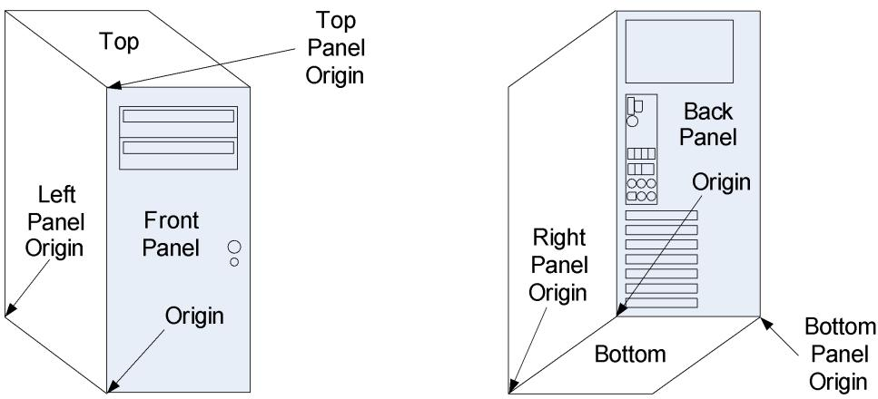  
Fig. 6.1: System Panel and Panel Origin Positions

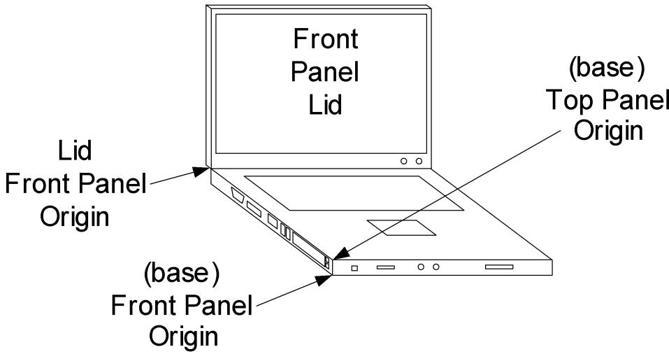  
Fig. 6.2: Laptop Panel and Panel Origin Positions

To render a view of a system Panel, all \_PLDs that define the same Panel and Lid values are collected. The \_PLDs are then sorted by the value of their Order field and the view of the panel is rendered by drawing the shapes of each connection point (in their correct Shape, Color, Horizontal Ofset, Vertical Ofset, Width, Height, and Orientation) starting with all Order = 0 \_PLDs first. Refer to PLD Back Panel Rendering for an example.

The location of a device connection point may change as a result of the system connecting or disconnecting to a docking station or a port replicator. As such, Notify event of type 0x09 will cause OSPM to re-evaluate the \_PLD object residing under the particular device notified. If a platform is unable to detect the change of connecting or disconnecting to a docking station or port replicator, a \_PLD object should not be used to describe the device connection points that will change location after such an event.

## Arguments:

None

## Return Value:

## A variable-length Package containing a list of Bufers

This method returns a package containing a single or multiple bufer entries. At least one bufer entry must be returned using the bit definitions below.

Table 6.4: \_PLD Bufer 0 Return Value

<table><tr><td>Name</td><td>Definition</td><td>DWORD</td><td>Bit Offset (DWORD)</td><td>Bit Offset (Buffer)</td><td>Length (bits)</td></tr><tr><td>Revision</td><td>The current Revision is 0x2</td><td>0</td><td>0</td><td>0</td><td>7</td></tr><tr><td>Ignore Color</td><td>If this bit is set, the Color field is ignored, as the color is unknown.</td><td>0</td><td>7</td><td>7</td><td>1</td></tr><tr><td rowspan="2">Color</td><td></td><td>0</td><td>8</td><td>8</td><td>24</td></tr><tr><td>24-bit RGB value for the color of the device connection point:Bits [7:0]=red valueBits [15:8]=green valueBits [23:16]=blue value</td><td></td><td></td><td></td><td></td></tr><tr><td>Width</td><td>Width of the widest point of the device connection point, in millimeters</td><td>1</td><td>0</td><td>32</td><td>16</td></tr><tr><td>Height</td><td>Height of the tallest point of the device connection point, in millimeters</td><td>1</td><td>16</td><td>48</td><td>16</td></tr><tr><td>User Visible</td><td>Set if the device connection point can be seen by the user without disassembly.</td><td>2</td><td>0</td><td>64</td><td>1</td></tr><tr><td>Dock</td><td>Set if the device connection point resides in a docking station or port replicator.</td><td>2</td><td>1</td><td>65</td><td>1</td></tr><tr><td>Lid</td><td>Set if this device connection point resides on the lid of laptop system.</td><td>2</td><td>2</td><td>66</td><td>1</td></tr><tr><td rowspan="2">Panel</td><td></td><td>2</td><td>3</td><td>67</td><td>3</td></tr><tr><td>Describes which panel surface of the system&#x27;s housing the device connection point resides on:0 - Top1 - Bottom2 - Left3 - Right4 - Front5 - Back6 - Unknown (Vertical Position and Horizontal Position will be ignored)</td><td></td><td></td><td></td><td></td></tr><tr><td rowspan="2">Vertical Position on the panel where the device connection point resides</td><td></td><td>2</td><td>6</td><td>70</td><td>2</td></tr><tr><td>0 - Upper1 - Center2 - Lower</td><td></td><td></td><td></td><td></td></tr><tr><td rowspan="2">Horizontal Position on the panel where the device connection point resides.</td><td></td><td>2</td><td>8</td><td>72</td><td>2</td></tr><tr><td>0 - Left1 - Center2 - Right</td><td></td><td></td><td></td><td></td></tr></table>

continues on next page

Table 6.4 – continued from previous page

<table><tr><td rowspan="12">Shape</td><td></td><td>2</td><td>10</td><td>74</td><td>4</td></tr><tr><td colspan="5">Describes the shape of the device connection point. The Width and Height fields may be used to distort a shape, e.g. A Round shape will look like an Oval shape if the Width and Height are not equal. And a Vertical Rectangle or Horizontal Rectangle may look like a square if Width and Height are equal. See Default Shape Definitions:</td></tr><tr><td>0 - Round</td><td></td><td></td><td></td><td></td></tr><tr><td>1 - Oval</td><td></td><td></td><td></td><td></td></tr><tr><td>2 - Square</td><td></td><td></td><td></td><td></td></tr><tr><td>3 - Vertical Rectangle</td><td></td><td></td><td></td><td></td></tr><tr><td>4 - Horizontal Rectangle</td><td></td><td></td><td></td><td></td></tr><tr><td>5 - Vertical Trapezoid</td><td></td><td></td><td></td><td></td></tr><tr><td>6 - Horizontal Trapezoid</td><td></td><td></td><td></td><td></td></tr><tr><td>7 - Unknown - Shape rendered as a Rectangle with dotted lines</td><td></td><td></td><td></td><td></td></tr><tr><td>8 - Chamfered</td><td></td><td></td><td></td><td></td></tr><tr><td>15:9 - Reserved</td><td></td><td></td><td></td><td></td></tr><tr><td>Group Orientation</td><td>if Set, indicates vertical grouping, otherwise horizontal is assumed.</td><td>2</td><td>14</td><td>78</td><td>1</td></tr><tr><td>Group Token</td><td>Unique numerical value identifying a group.</td><td>2</td><td>15</td><td>79</td><td>8</td></tr><tr><td>Group Position</td><td>Identifies this device connection point&#x27;s position in the group (i.e. 1st, 2nd)</td><td>2</td><td>23</td><td>87</td><td>8</td></tr><tr><td>Bay</td><td>Set if describing a device in a bay or if device connection point is a bay.</td><td>2</td><td>31</td><td>95</td><td>1</td></tr><tr><td>Ejectable</td><td>Set if the device is ejectable. Indicates ejectability in the absence of _EJx objects.</td><td>3</td><td>0</td><td>96</td><td>1</td></tr><tr><td>OSPM Ejection required</td><td>OSPM Ejection required: Set if OSPM needs to be involved with ejection process. User-operated physical hardware ejection is not possible.</td><td>3</td><td>1</td><td>97</td><td>1</td></tr><tr><td>Cabinet Number</td><td>For single cabinet system, this field is always 0.</td><td>3</td><td>2</td><td>98</td><td>8</td></tr><tr><td>Card Cage Number</td><td>For single card cage system, this field is always 0.</td><td>3</td><td>10</td><td>106</td><td>8</td></tr><tr><td>Reference</td><td>if Set, this _PLD defines a “reference” shape that is used to help orient the user with respect to the other shapes when rendering _PLDs.</td><td>3</td><td>18</td><td>114</td><td>1</td></tr></table>

continues on next page

Table 6.4 – continued from previous page

<table><tr><td rowspan="2">Rotation</td><td></td><td>3</td><td>19</td><td>115</td><td>4</td></tr><tr><td>Rotates the Shape clockwise in 45 degree steps around its origin where:0 - 0°1 - 45°2 - 90°3 - 135°4 - 180°5 - 225°6 - 270°7 - 315°</td><td></td><td></td><td></td><td></td></tr><tr><td rowspan="2">Order</td><td></td><td>3</td><td>23</td><td>119</td><td>5</td></tr><tr><td>Identifies the drawing order of the connection point described by a _PLD:Order = 0 connection points are drawn before Order = 1 connection points.Order = 1 before Order = 2, and so on.Order = 31 connection points are drawn last.Order should always start at 0 and be consecutively assigned.</td><td></td><td></td><td></td><td></td></tr><tr><td>Reserved</td><td>Reserved, must contain a value of 0.</td><td>3</td><td>28</td><td>124</td><td>4</td></tr><tr><td>Vertical Offset</td><td>Offset of Shape Origin from Panel Origin (0.1 mm / 100 microns). A value of 0xFFFFFFFF indicates that this field is not supplied.</td><td>4</td><td>0</td><td>128</td><td>16</td></tr><tr><td>Horizontal Offset</td><td>Offset of Shape Origin from Panel Origin (0.1 mm / 100 microns). A value of 0xFFFFFFFF indicates that this field is not supplied.</td><td>4</td><td>16</td><td>144</td><td>16</td></tr></table>

## ò Note

All additional bufer entries returned may contain OEM-specific data, but must begin in a {GUID, data} pair. These additional data may provide complimentary physical location information specific to certain systems or class of machines.

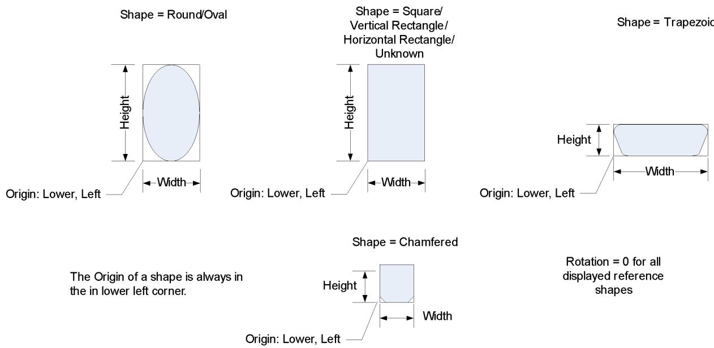  
Fig. 6.3: Default Shape Definitions

## Bufers 1–N Return Value (Optional):

• Bufer 1 Bit [127:0] - GUID 1

• Bufer 2 Bit [127:0] - Data 1

• Bufer 3 Bit [127:0] - GUID 2

• Bufer 4 Bit [127:0] - Data 2

• etc.

PLD Back Panel Rendering provides an example of a rendering of the external device connection points that may be conveyed to the user by \_PLD information. Note that three \_PLDs (System Back Panel, Power Supply, and Motherboard (MB) Connector Area) that are associated with the System Bus tree (\_SB) object. Their Reference flag is set indicating that are used to provide the user with visual queues for identifying the relative locations of the other device connection points.

The connection points (C1 through C16) are defined by \_PLD objects found in the System bus tree.

The following connection points all have their Panel and Lid fields set to Back and 0, respectively. And the Reference flag of the System Back Panel, Power Supply, and MB Connector Area connection points are set to 1. in this example are used to render PLD Back Panel Rendering:

Table 6.5: PLD Back Panel Example Settings

<table><tr><td>Name</td><td>Ignore Color</td><td>R</td><td>G</td><td>B</td><td>Width</td><td>Height</td><td>VOff</td><td>HOff</td><td>Shape</td><td>Notation</td><td>Group Position</td><td>Position</td><td>Rotation</td></tr><tr><td>Back Panel</td><td>Yes</td><td>0</td><td>0</td><td>0</td><td>203</td><td>432</td><td>0</td><td>0</td><td>V Rect</td><td></td><td>1</td><td></td><td>0</td></tr><tr><td>MB Conn area</td><td>Yes</td><td>0</td><td>0</td><td>0</td><td>45</td><td>156</td><td>159</td><td>13</td><td>V Rect</td><td></td><td>2</td><td></td><td>0</td></tr></table>

continues on next page

Table 6.5 – continued from previous page

<table><tr><td>Power Supply</td><td>Yes</td><td>0</td><td>0</td><td>0</td><td>152</td><td>890</td><td>330</td><td>13</td><td>H Rect</td><td></td><td>2</td><td>0</td></tr><tr><td>USB Port 1</td><td>No</td><td>0</td><td>0</td><td>0</td><td>13</td><td>5</td><td>222</td><td>16</td><td>H Rect</td><td>C1</td><td>3</td><td>90</td></tr><tr><td>USB Port 2</td><td>No</td><td>0</td><td>0</td><td>0</td><td>13</td><td>5</td><td>222</td><td>25</td><td>H Rect</td><td>C2</td><td>3</td><td>90</td></tr><tr><td>USB Port 3</td><td>No</td><td>0</td><td>0</td><td>0</td><td>13</td><td>5</td><td>222</td><td>35</td><td>H Rect</td><td>C3</td><td>3</td><td>90</td></tr><tr><td>USB Port 4</td><td>No</td><td>0</td><td>0</td><td>0</td><td>13</td><td>5</td><td>222</td><td>45</td><td>H Rect</td><td>C4</td><td>3</td><td>90</td></tr><tr><td>USB Port 5</td><td>No</td><td>0</td><td>0</td><td>0</td><td>13</td><td>5</td><td>201</td><td>16</td><td>H Rect</td><td>C5</td><td>3</td><td>90</td></tr><tr><td>USB Port 6</td><td>No</td><td>0</td><td>0</td><td>0</td><td>13</td><td>5</td><td>201</td><td>25</td><td>H Rect</td><td>C6</td><td>3</td><td>90</td></tr><tr><td>Ether-net</td><td>No</td><td>0</td><td>0</td><td>0</td><td>16</td><td>17</td><td>201</td><td>35</td><td>V Rect</td><td>C7</td><td>3</td><td>90</td></tr><tr><td>Audio 1</td><td>No</td><td>FF</td><td>FF</td><td>FF</td><td>13</td><td>13</td><td>195</td><td>15</td><td>Round</td><td>C8</td><td>3</td><td>90</td></tr><tr><td>Audio 2</td><td>No</td><td>151</td><td>247</td><td>127</td><td>13</td><td>13</td><td>195</td><td>29</td><td>Round</td><td>C9</td><td>3</td><td>90</td></tr><tr><td>Audio 3</td><td>No</td><td>0</td><td>0</td><td>0</td><td>13</td><td>13</td><td>195</td><td>48</td><td>Round</td><td>C10</td><td>3</td><td>90</td></tr><tr><td>SPDIF</td><td>No</td><td>0</td><td>0</td><td>0</td><td>11</td><td>13</td><td>176</td><td>18</td><td>V Trap</td><td>C11</td><td>3</td><td>90</td></tr><tr><td>Audio 4</td><td>No</td><td>0</td><td>FF</td><td>0</td><td>13</td><td>13</td><td>177</td><td>29</td><td>Round</td><td>C12</td><td>3</td><td>90</td></tr><tr><td>Audio 5</td><td>No</td><td>0</td><td>0</td><td>FF</td><td>13</td><td>13</td><td>177</td><td>43</td><td>Round</td><td>C13</td><td>3</td><td>90</td></tr><tr><td>SATA</td><td>No</td><td>0</td><td>0</td><td>0</td><td>24</td><td>9</td><td>309</td><td>16</td><td>H Rect</td><td>C14</td><td>3</td><td>90</td></tr><tr><td>1394</td><td>No</td><td>0</td><td>0</td><td>0</td><td>11</td><td>16</td><td>289</td><td>25</td><td>H Trap</td><td>C15</td><td>3</td><td>0</td></tr><tr><td>Coax</td><td>No</td><td>0</td><td>0</td><td>0</td><td>16</td><td>16</td><td>284</td><td>14</td><td>Round</td><td>C16</td><td>3</td><td>90</td></tr><tr><td>PCI 1</td><td>No</td><td>0</td><td>0</td><td>0</td><td>102</td><td>13</td><td>13</td><td>13</td><td>H Rect</td><td>1</td><td>3</td><td>0</td></tr><tr><td>PCI 2</td><td>No</td><td>0</td><td>0</td><td>0</td><td>102</td><td>13</td><td>33</td><td>13</td><td>H Rect</td><td>2</td><td>3</td><td>0</td></tr><tr><td>PCI 3</td><td>No</td><td>0</td><td>0</td><td>0</td><td>102</td><td>13</td><td>54</td><td>13</td><td>H Rect</td><td>3</td><td>3</td><td>0</td></tr><tr><td>PCI 4</td><td>No</td><td>0</td><td>0</td><td>0</td><td>102</td><td>13</td><td>75</td><td>13</td><td>H Rect</td><td>4</td><td>3</td><td>0</td></tr><tr><td>PCI 5</td><td>No</td><td>0</td><td>0</td><td>0</td><td>102</td><td>13</td><td>95</td><td>13</td><td>H Rect</td><td>5</td><td>3</td><td>0</td></tr><tr><td>PCI 6</td><td>No</td><td>0</td><td>0</td><td>0</td><td>102</td><td>13</td><td>116</td><td>13</td><td>H Rect</td><td>6</td><td>3</td><td>0</td></tr><tr><td>PCI 7</td><td>No</td><td>0</td><td>0</td><td>0</td><td>102</td><td>13</td><td>137</td><td>13</td><td>H Rect</td><td>7</td><td>3</td><td>0</td></tr></table>

Note that the origin is in the lower left hand corner of the Back Panel, where positive Horizontal and Vertical Ofset values are to the right and up, respectively.

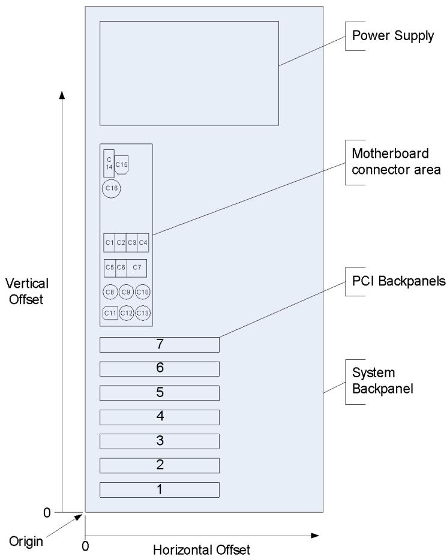  
Fig. 6.4: PLD Back Panel Rendering

## 6.1.9 \_SUB (Subsystem ID)

This object is used to supply OSPM with the device’s Subsystem ID. The use of \_SUB is optional.

Arguments:

None

Return Value:

A String containing the SUB

A \_SUB object evaluates to a string and the format must be a valid PNP or ACPI ID with no asterisk or other leading characters.

See the definition of \_HID (\_HID (Hardware ID) ) for the definition of PNP and ACPI ID strings.

Example ASL:

```txt
Name (_SUB, "MSFT3000") // Vendor-defined subsystem
```

## 6.1.10 \_STR (String)

The \_STR object evaluates to a Unicode string that describes the device or thermal zone. It may be used by an OS to provide information to an end user. This information is particularly valuable when no other information is available.

Arguments:

None

Return Value:

A Bufer containing a Unicode string that describes the device

Example ASL:

```txt
Device (XYZ) {
    Name (_ADR, 0x00020001)
    Name (_STR, Unicode ("ACME super DVD controller"))
}
```

Then, when all else fails, an OS can use the info included in the \_STR object to describe the hardware to the user.

## 6.1.11 \_SUN (Slot User Number)

\_SUN is an object that evaluates to the slot-unique ID number for a slot. \_SUN is used by OSPM UI to identify slots for the user. For example, this can be used for battery slots, PCI slots, PCMCIA slots, or swappable bay slots to inform the user of what devices are in each slot. \_SUN evaluates to an integer that is the number to be used in the user interface.

## Arguments:

None

Return Value:

An Integer containing the slot’s unique ID

The \_SUN value is required to be unique among the slots of the same type. It is also recommended that this number match the slot number printed on the physical slot whenever possible.

## 6.1.12 \_UID (Unique ID)

This object provides OSPM with a logical device ID that does not change across reboots. This object is optional, but is required when the device has no other way to report a persistent unique device ID. The \_UID must be unique across all devices with either a common \_HID or \_CID. This is because a device needs to be uniquely identified to the OSPM, which may match on either a \_HID or a \_CID to identify the device. The uniqueness match must be true regardless of whether the OSPM uses the \_HID or the \_CID. OSPM typically uses the unique device ID to ensure that the devicespecific information, such as network protocol binding information, is remembered for the device even if its relative location changes. For most integrated devices, this object contains a unique identifier.

In general, a \_UID object evaluates to either a numeric value or a string. However, when defining an object with an \_HID of ACPI0007 (processor definition objects), the \_UID object must return an integer. This integer is used as an identifier in the MADT, PPTT and other tables to connect non-enumerable devices to a processor object. When a string is used in these cases, there is no mechanism for connecting these devices.

Arguments:

None

Return Value:

An Integer or String containing the Unique ID

## 6.2 Device Configuration Objects

This section describes objects that provide OSPM with device specific information and allow OSPM to configure device operation and resource utilization.

OSPM uses device configuration objects to configure hardware resources for devices enumerated via ACPI. Device configuration objects provide information about current and possible resource requirements, the relationship between shared resources, and methods for configuring hardware resources.

ò Note

these objects must only be provided for devices that cannot be configured by any other hardware standard such as PCI, PCMCIA, and soon.

When OSPM enumerates a device, it calls \_PRS to determine the resource requirements of the device. It may also call \_CRS to find the current resource settings for the device. Using this information, the Plug and Play system determines what resources the device should consume and sets those resources by calling the device’s \_SRS control method.

In ACPI, devices can consume resources (for example, legacy keyboards), provide resources (for example, a PCI(e) bridge describing (MM)IO apertures or bus ranges), or do both. For a given resource descriptor, the ResourceUsage argument is to be used by OSPM to distinguish between consumer and producer roles. Unless otherwise specified, resources for a device are assumed to be taken from the nearest matching resource above the device in the device hierarchy.

Note: for legacy implementation reasons, OSPM must negotiate proper support for the ResourceUsage argument via the relevant platform-wide \_OSC capability.

Some resources, however, may be shared amongst several devices. To describe this, devices that share a resource (resource consumers) must use the extended resource descriptors (0x7-0xA) described in Large Resource Data Type. These descriptors point to a single device object (resource producer) that claims the shared resource in its \_PRS. This allows OSPM to clearly understand the resource dependencies in the system and move all related devices together if it needs to change resources. Furthermore, it allows OSPM to allocate resources only to resource producers when devices that consume that resource appear.

The device configuration objects are listed in the table below.

Table 6.6: Device Configuration Objects

<table><tr><td>Object</td><td>Description</td></tr><tr><td>_CCA</td><td>Cache Coherency Attribute – specifies whether a device and its descendants support hardware managed cache coherency.</td></tr><tr><td>_CDM</td><td>Object that specifies a clock domain for a processor.</td></tr><tr><td>_CRS</td><td>Object that specifies a device&#x27;s current resource settings, or a control method that generates such an object.</td></tr><tr><td>_DIS</td><td>Control method that disables a device.</td></tr><tr><td>_DMA</td><td>Object that specifies a device&#x27;s current resources for DMA transactions.</td></tr><tr><td>_DSD</td><td>Object that evaluates to device specific information</td></tr><tr><td>_FIX</td><td>Object used to provide correlation between the fixed-hardware register blocks defined in the FADT and the devices that implement these fixed-hardware registers.</td></tr><tr><td>_GSB</td><td>Object that provides the Global System Interrupt Base for a hot-plugged I/O APIC device.</td></tr><tr><td>_HMA</td><td>Object that provides updated HMAT structures.</td></tr><tr><td>_HPP</td><td>Object that specifies the cache-line size, latency timer, SERR enable, and PERR enable values to be used when configuring a PCI device inserted into a hot-plug slot or initial configuration of a PCI device at system boot.</td></tr><tr><td>_HPX</td><td>Object that provides device parameters when configuring a PCI device inserted into a hot-plug slot or initial configuration of a PCI device at system boot. Supersedes _HPP.</td></tr><tr><td>_MAT</td><td>Object that evaluates to a buffer of Interrupt Controller Structures.</td></tr><tr><td>_OSC</td><td>An object OSPM evaluates to convey specific software support / capabilities to the platform allowing the platform to configure itself appropriately.</td></tr><tr><td>_PRS</td><td>An object that specifies a device&#x27;s possible resource settings, or a control method that generates such an object.</td></tr><tr><td>_PRT</td><td>Object that specifies the PCI interrupt routing table.</td></tr><tr><td>_PXM</td><td>Object that specifies a proximity domain for a device.</td></tr><tr><td>_SLI</td><td>Object that provides updated distance information for a system locality.</td></tr><tr><td>_SRS</td><td>Control method that sets a device&#x27;s settings.</td></tr></table>

## 6.2.1 \_CDM (Clock Domain)

This optional object conveys the processor clock domain to which a processor belongs. A processor clock domain is a unique identifier representing the hardware clock source providing the input clock for a given set of processors. This clock source drives software accessible internal counters, such as the Time Stamp Counter, in each processor. Processor counters in the same clock domain are driven by the same hardware clock source. In multi-processor platforms that utilize multiple clock domains, such counters may exhibit drift when compared against processor counters on diferent clock domains.

The \_CDM object evaluates to an integer that identifies the device as belonging to a specific clock domain. OSPM assumes that two devices in the same clock domain are connected to the same hardware clock.

## Arguments:

None

## Return Value:

An Integer (DWORD) containing a clock domain identifier.

In the case the platform does not convey any clock domain information to OSPM via the SRAT or the \_CDM object, OSPM assumes all logical processors to be on a common clock domain. If the platform defines \_CDM object under a logical processor then it must define \_CDM objects under all logical processors whose clock domain information is not provided via the SRAT.

## 6.2.2 \_CRS (Current Resource Settings)

This required object evaluates to a byte stream that describes the system resources currently allocated to a device. Additionally, a bus device must supply the resources that it decodes and can assign to its children devices. If a device is disabled, then \_CRS returns a valid resource template for the device, but the actual resource assignments in the return byte stream are ignored. If the device is disabled when \_CRS is called, it must remain disabled.

The format of the data contained in a \_CRS object follows the formats defined in Resource Data Types for ACPI, which is a compatible extension of the Plug and Play BIOS Specification (see reference below). The resource data is provided as a series of data structures, with each of the resource data structures having a unique tag or identifier. The resource descriptor data structures specify the standard PC system resources, such as memory address ranges, I/O ports, interrupts, and DMA channels.

Arguments:

None

## Return Value:

A Bufer containing a resource descriptor byte stream

A link to the Plug and Play BIOS Specification can be found at http://uefi.org/acpi under the heading “Plug and Play BIOS Specification.”

Also see the related link on the above website for the Windows Generic Device IDs and Plug and Play BIOS device type codes.

## 6.2.3 \_DIS (Disable)

This control method disables a device. When the device is disabled, it must not be decoding any hardware resources. Prior to running this control method, OSPM will have already put the device in the D3 state.

When a device is disabled via \_DIS, the \_STA control method for this device must return with the Enabled bit (Bit 1) clear.

Arguments:

None

Return Value:

None

## 6.2.4 \_DMA (Direct Memory Access)

This optional object returns a byte stream in the same format as a \_CRS object. \_DMA is only defined under devices that represent buses. It specifies the ranges the bus controller (bridge) decodes on the child-side of its interface. (This is analogous to the \_CRS object, which describes the resources that the bus controller decodes on the parent-side of its interface.) Any ranges described in the resources of a \_DMA object can be used by child devices for DMA or bus arbiter transactions.

The presence of an empty \_DMA object, one with no resources specified in it, is an indication that DMA generation capability is disabled for the device and its children. For instance, an empty \_DMA might be used for a set of devices that are DMA capable by themselves, but do not have a DMA path in the current system.

The \_DMA object is only valid if a \_CRS object is also defined. OSPM must re-evaluate the \_DMA object after an \_SRS object has been executed because the \_DMA ranges resources may change depending on how the bridge has been configured.

If the \_DMA object is not present for a bus device, the OS assumes that any address placed on a bus by a child device will be decoded either by a device on the bus or by the bus itself, (in other words, all address ranges can be used for DMA).

For example, if a platform implements a PCI bus that cannot access all of physical memory, it has a \_DMA object under that PCI bus that describes the ranges of physical memory that can be accessed by devices on that bus.

A \_DMA object is not meant to describe any “map register” hardware that is set up for each DMA transaction. It is meant only to describe the DMA properties of a bus that cannot be changed without reevaluating the \_SRS method

## Arguments:

None

## Return Value:

A Bufer containing a resource descriptor byte stream

\_DMA Example ASL:

```txt
Device(BUS0)
{
    //
    // The _DMA method returns a resource template describing the
    // addresses that are decoded on the child side of this
    // bridge. The contained resource descriptors thus indicate
    // the address ranges that bus masters living below this
    // bridge can use to send accesses through the bridge toward a
    // destination elsewhere in the system (e.g. main memory).
    //
    // In our case, any bus master addresses need to fall between
    // 0 and 0x80000000 and will have 0x200000000 added as they
    // cross the bridge. Furthermore, any child-side accesses
    // falling into the range claimed in our _CRS will be
    // interpreted as a peer-to-peer traffic and will not be
    // forwarded upstream by the bridge.
    //
    // Our upstream address decoder will only claim one range from
    // 0x20000000 to 0x5ffffff in the _CRS. Therefore _DMA
    // should return two QWordMemory descriptors, one describing
    // the range below and one describing the range above this
    // "peer-to-peer" address range.
    //
Method(_DMA, ResourceTemplate()
{
    QWordMemory(
    ResourceProducer,
    PosDecode, // _DEC
    MinFixed, // _MIF
    MaxFixed, // _MAF
    Prefetchable, // _MEM
    ReadWrite, // _RW
    0, // _GRA
    0, // _MIN
    0x1ffffff, // _MAX
    0x200000000, // _TRA
    0x20000000, // _LEN
```

(continued from previous page)

```swift
,
,
,
)
QWordMemory(
ResourceProducer,
PosDecode, // _DEC
MinFixed, // _MIF
MaxFixed, // _MAF
Prefetchable, // _MEM
ReadWrite, // _RW
0, // _GRA
0x600000000, // _MIN
0x7ffffff, // _MAX
0x200000000, // _TRA
0x200000000, // _LEN
,
,
,
)
})
}
```

## 6.2.5 \_DSD (Device Specific Data)

This optional object is used to provide device drivers (via OSPM) with additional device properties and information. \_DSD returns a variable-length package containing a list of Device Data Descriptor structures each consisting of a UUID (see Universally Unique Identifiers (UUIDs)) and a package (Data Structure). The UUID is all that is needed to define the Data Structure. The UUID itself may place a restriction based on \_HID or the optional \_CID, \_CLS, \_HRV, \_SUB objects, or \_HID and one of those optional objects. However, it also may not place such a restriction.

New UUIDs may be created by OEMs and IHVs or other interface or device governing bodies (e.g. the PCI SIG or the UEFI Forum), as long as the UUID is diferent from other published UUIDs.

The list of well-known UUIDs allocated for \_DSD and the definition of data formats associated with them is available in an auxiliary document hosted on the UEFI Forum: http://www.uefi.org/acpi .

## Arguments:

None

## Return Value:

A variable-length Package containing a list of Device Data Descriptor structures as described below.

Return Value Information:

```txt
Package ()
{
    Device Data Descriptor 0
    ...
    Device Data Descriptor n
}
```

Each Device Data Descriptor structure consists of two elements, as follows:

```txt
UUID // Buffer (16 bytes)
Data Structure // Package (depending on UUID)
```

UUID uniquely determines the format of Data Structure.

Data Structure is a set of device specific data items the format of which is uniquely determined by the UUID and the meaning of which is uniquely determined by the UUID possibly in combination with a PNP or ACPI device ID.

Multiple Device Data Descriptor structures with the same UUID are not permitted.

\_DSD must return the same data each time it is evaluated. Firmware should not expect it to be evaluated every time (in case it is implemented as a method).

## Examples:

## ò Note

The UUID used in the following examples is assumed to define the data format for Data Structure as a list of packages of length 2 (Properties) whose first element (Key) must be a String and the second element is a Value associated with that key. The set of valid Keys and the format and interpretation of the Values associated with them is then dependent on the PNP or ACPI device ID of the device.

```txt
Device (MDEV) {
Name (_HID, "PNP#####")

Name (_DSD, Package () {
    ToUUID("daffd814-6eba-4d8c-8a91-bc9bbf4aa301"),
    Package () {
    Package (2) {...}, // Property 1
    ...
    Package (2) {...} // Property n
    }
    })
}

// PWM controller with two pins that can be driven and a device using
// those pins with the periods of 5000000 and 4500000 nanoseconds,
// respectively.
//
Device (\_SB.PCI0.PWM) {
    Name (_HID, "PNP#####")

    Name (_DSD, Package () {
    ToUUID("daffd814-6eba-4d8c-8a91-bc9bbf4aa301"),
    Package () {
    Package (2) { "#pwm-cells", 2}
    }
    })
}
Device (\_SB.PCI0.BL) {
    Name (_HID, "ACPI#####")
```

(continues on next page)

(continued from previous page)

```txt
Name (_DSD, Package () {
    ToUUID("daffd814-6eba-4d8c-8a91-bc9bbf4aa301"),
    Package () {
    Package (2) {
    "pwms",
    Package () {
    $_SB.PCI0.PWM, 0, 5000000,
    $_SB.PCI0.PWM, 1, 4500000
    }
    }
    }
    })
// SPI controller using a fixed frequency clock represented by the CLK0
// device object.
// Device (\_SB_.PCI0) {
    Device (CLK0) {
    Name (_HID, "PNP#####")
    Name (_DSD, Package () {
    ToUUID("daffd814-6eba-4d8c-8a91-bc9bbf4aa301"),
    Package () {
    Package (2) { "#clock-cells", 0},
    Package (2) { "clock-frequency", 120000000}
    }
    })
    }
    Device (SPI0) {
    Name (_HID, "PNP#####")
    Name (_DSD, Package () {
    ToUUID("daffd814-6eba-4d8c-8a91-bc9bbf4aa301"),
    Package () {
    Package (2) { "clocks", Package () {1, ^CLK0}}
    }
    })
    ...
    }
}
```

## 6.2.6 \_FIX (Fixed Register Resource Provider)

This optional object is used to provide a correlation between the fixed-hardware register blocks defined in the FADT and the devices in the ACPI namespace that implement these fixed-hardware registers. This object evaluates to a package of Plug and Play-compatible IDs (32-bit compressed EISA type IDs) that correlate to the fixed-hardware register blocks defined in the FADT. The device under which \_FIX appears plays a role in the implementation of the fixed-hardware (for example, implements the hardware or decodes the hardware’s address). \_FIX conveys to OSPM whether a given device can be disabled, powered of, or should be treated specially by conveying its role in the implementation of the ACPI fixed-hardware register interfaces. This object takes no arguments.

The \_CRS object describes a device’s resources. That \_CRS object may contain a superset of the resources in the FADT, as the device may actually decode resources beyond what the FADT requires. Furthermore, in a machine that performs translation of resources within I/O bridges, the processor-relative resources in the FADT may not be the same as the bus-relative resources in the \_CRS.

## Arguments:

None

## Return Value:

A variable-length Package containing a list of Integers, each containing a PNP ID

Each of fields in the FADT has its own corresponding Plug and Play ID, as shown below:

```c
PNP0C20 - SMI_CMD
PNP0C21 - PM1a_EVT_BLK / X\_ PM1a_EVT_BLK
PNP0C22 - PM1b_EVT_BLK / X_PM1b_EVT_BLK
PNP0C23 - PM1a_CNT_BLK / X_PM1a_CNT_BLK
PNP0C24 - PM1b_CNT_BLK / X\_ PM1b_CNT_BLK
PNP0C25 - PM2_CNT_BLK / X\_ PM2_CNT_BLK
PNP0C26 - PM_TMR_BLK / X\_ PM_TMR_BLK
PNP0C27 - GPE0_BLK / X_GPE0_BLK
PNP0C28 - GPE1_BLK / X\_ GPE1_BLK
PNP0B00 - FIXED_RTC
PNP0B01 - FIXED_RTC
PNP0B02 - FIXED_RTC
```

## Example ASL for \_FIX usage:

```txt
Scope(\_SB) {
    Device(PCI0) {    // Root PCI Bus
    Name(_HID, EISAID("PNP0A03"))    // Need \_HID for root device
    Method (_CRS,0){    // Need current resources for root device
    // Return current resources for root bridge 0
    }
    Name(_PRT, Package() {    // Need PCI IRQ routing for PCI bridge
    // Package with PCI IRQ routing table information
    })
    Name(_FIX, Package(1) {
    EISAID("PNP0C25")}    // PM2 control ID
    )
    Device (PX40) {    // ISA
    Name(_ADR,0x00070000)
    Name(_FIX, Package(1) {
    EISAID("PNP0C20")}    // SMI command port
    )
```

(continues on next page)

(continued from previous page)

```c
Device (NS17) {    // NS17 (Nat. Semi 317, an ACPI part)
    Name(_HID, EISAID("PNP0C02"))
    Name(_FIX, Package(3) {
    EISAID("PNP0C22"),    // PM1b event ID
    EISAID("PNP0C24"),    // PM1b control ID
    EISAID("PNP0C28")}    // GPE1 ID
    }
    }    // end PX40
Device (PX43) {    // PM Control
    Name(_ADR,0x00070003)
    Name(_FIX, Package(4) {
    EISAID("PNP0C21"),    // PM1a event ID
    EISAID("PNP0C23"),    // PM1a control ID
    EISAID("PNP0C26"),    // PM Timer ID
    EISAID("PNP0C27")}    // GPE0 ID
    }
    }    // end PX43
    }    // end PCI0
}    // end scope SB
```

## 6.2.7 \_GSB (Global System Interrupt Base)

\_GSB is an optional object that evaluates to an integer that corresponds to the Global System Interrupt Base for the corresponding I/O APIC device. The I/O APIC device may either be bus enumerated (e.g. as a PCI device) or enumerated in the namespace as described in I/O APIC Device. Any I/O APIC device that either supports hot-plug or is not described in the MADT must contain a \_GSB object.

If the I/O APIC device also contains a \_MAT object, OSPM evaluates the \_GSB object first before evaluating the \_MAT object. By providing the Global System Interrupt Base of the I/O APIC, this object enables OSPM to process only the \_MAT entries that correspond to the I/O APIC device. See \_MAT (Multiple APIC Table Entry). Since \_MAT is allowed to potentially return all the MADT entries for the entire platform, \_GSB is needed in the I/O APIC device scope to enable OSPM to identify the entries that correspond to that device.

If an I/O APIC device is activated by a device-specific driver, the physical address used to access the I/O APIC will be exposed by the driver and cannot be determined from the \_MAT object. In this case, OSPM cannot use the \_MAT object to determine the Global System Interrupt Base corresponding to the I/O APIC device and hence requires the \_GSB object.

The Global System Interrupt Base is a 64-bit value representing the corresponding I/OAPIC device as defined in Global System Interrupts.

## Arguments:

None Return Value: An Integer containing the interrupt base

Example ASL for \_GSB usage for a non-PCI based I/O APIC Device:

```cpp
Scope(\_SB) {
    ...
    Device(APIC) { // I/O APIC Device
    Name(_HID, "ACPI0009") // ACPI ID for I/O APIC
    Name(_CRS, ResourceTemplate()
    { ...}) // only one resource pointing to I/O APIC register base
    Method(_GSB) {
```

(continues on next page)

```txt
(continued from previous page)
    Return (0x10) // Global System Interrupt Base for I/O APIC starts at 16
}
} // end APIC
} // end scope SB
```

Example ASL for \_GSB usage for a PCI-based I/O APIC Device:

```cpp
Scope(\_SB) {
    Device(PCI0) // Host bridge
    Name(_HID, EISAID("PNP0A03")) // Need \_HID for root device
    Device(PCI1) { // I/O APIC PCI Device
    Name(_ADR, 0x00070000)
    Method(_GSB){
    Return (0x18) // Global System Interrupt Base for I/O APIC
    → starts at 24
    }
    } // end PCI1
    } // end PCI0
} // end scope SB
```

## 6.2.8 \_HPP (Hot Plug Parameters)

This optional object evaluates to a package containing the cache-line size, latency timer, SERR enable, and PERR enable values to be used when configuring a PCI device inserted into a hot-plug slot or for performing configuration of a PCI devices not configured by the platform boot firmware at system boot. The object is placed under a PCI bus where this behavior is desired, such as a bus with hot-plug slots. \_HPP provided settings apply to all child buses, until another \_HPP object is encountered.

## Arguments:

None

Return Value:

A Package containing the Integer hot-plug parameters

Example:

```txt
Method (_HPP, 0) {
    Return (Package(4){
    0x08, // CacheLineSize in DWORDS
    0x40, // LatencyTimer in PCI clocks
    0x01, // Enable SERR (Boolean)
    0x00 // Enable PERR (Boolean)
    })
}
```

Table 6.7: HPP Package Contents

<table><tr><td>Field</td><td>Object Type</td><td>Definition</td></tr><tr><td>Cache-line size</td><td>Integer</td><td>Cache-line size reported in number of DWORDs.</td></tr><tr><td>Latency timer</td><td>Integer</td><td>Latency timer value reported in number of PCI clock cycles.</td></tr></table>

continues on next page

(continues on next page)

Table 6.7 – continued from previous page  
```txt
Enable SERR Integer When set to 1, indicates that action must be performed to enable SERR in the command register.
Enable PERR Integer When set to 1, indicates that action must be performed to enable PERR in the command register.
```

## Example: Using \_HPP

```txt
Scope(\_SB) {
    Device(PCI0) { // Root PCI Bus
    Name(_HID, EISAID("PNP0A03"))    // \_HID for root device
    Method (_CRS, 0) {    // Need current resources for root dev
    // Return current resources for root bridge 0
    }
    Name(_PRT, Package() {    // Need PCI IRQ routing for PCI bridge
    // Package with PCI IRQ routing table information
    })
    Device (P2P1) { // First PCI-to-PCI bridge (No Hot Plug slots)
    Name(_ADR, 0x000C0000)    // Device#Ch, Func#0 on bus PCI0
    Name(_PRT, Package() {    // Need PCI IRQ routing for PCI bridge
    // Package with PCI IRQ routing table information
    })
    }    // end P2P1
    Device (P2P2) {
    // Second PCI-to-PCI bridge (Bus contains Hot plug
    →slots)
    Name(_ADR, 0x000E0000)    // Device#Eh, Func#0 on bus PCI0
    Name(_PRT, Package() {    // Need PCI IRQ routing for PCI bridge
    // Package with PCI IRQ routing table information
    })
    Name(_HPP, Package() { 0x08, 0x40, 0x01, 0x00})
    // Device definitions for Slot 1- HOT PLUG SLOT
    Device (S1F0) {    // Slot 1, Func#0 on bus P2P2
    Name(_ADR, 0x00020000)
    Method(_EJ0, 1) {    // Remove all power to device}
    }
    Device (S1F1) {    // Slot 1, Func#1 on bus P2P2
    Name(_ADR, 0x00020001)
    Method(_EJ0, 1) {    // Remove all power to device}
    }
    Device (S1F2) {    // Slot 1, Func#2 on bus P2P2
    Name(_ADR, 0x000200 02)
    Method(_EJ0, 1) {    // Remove all power to device}
    }
    Device (S1F3) {    // Slot 1, Func#3 on bus P2P2
    Name(_ADR, 0x00020003)
    Method(_EJ0, 1) {    // Remove all power to device}
    }
    Device (S1F4) {    // Slot 1, Func#4 on bus P2P2
    Name(_ADR, 0x00020004)
    Method(_EJ0, 1) {    // Remove all power to device}
    }
    Device (S1F5) {    // Slot 1, Func#5 on bus P2P2
```

(continued from previous page)

<table><tr><td>Name(_ADR,0x00020005)Method(_EJ0,1) { // Remove all power to device}</td></tr><tr><td>}Device (S1F6) { // Slot 1, Func#6 on bus P2P2Name(_ADR,0x00020006)Method(_EJ0,1) { // Remove all power to device}</td></tr><tr><td>}Device (S1F7) { // Slot 1, Func#7 on bus P2P2Name(_ADR,0x00020007)Method(_EJ0,1) { // Remove all power to device}</td></tr><tr><td>}// Device definitions for Slot 2- HOT PLUG SLOTDevice (S2F0) { // Slot 2, Func#0 on bus P2P2Name(_ADR,0x00030000)Method(_EJ0,1) { // Remove all power to device}</td></tr><tr><td>}Device (S2F1) { // Slot 2, Func#1 on bus P2P2Name(_ADR,0x00030001)Method(_EJ0,1) { // Remove all power to device}</td></tr><tr><td>}Device (S2F2) { // Slot 2, Func#2 on bus P2P2Name(_ADR,0x00030002)Method(_EJ0,1) { // Remove all power to device}</td></tr><tr><td>}Device (S2F3) { // Slot 2, Func#3 on bus P2P2Name(_ADR,0x00030003)Method(_EJ0,1) { // Remove all power to device}</td></tr><tr><td>}Device (S2F4) { // Slot 2, Func#4 on bus P2P2Name(_ADR,0x00030004)Method(_EJ0,1) { // Remove all power to device}</td></tr><tr><td>}Device (S2F5) { // Slot 2, Func#5 on bus P2P2Name(_ADR,0x00030005)Method(_EJ0,1) { // Remove all power to device}</td></tr><tr><td>}Device (S2F6) { // Slot 2, Func#6 on bus P2P2Name(_ADR,0x00030006)Method(_EJ0,1) { // Remove all power to device}</td></tr><tr><td>}Device (S2F7) { // Slot 2, Func#7 on bus P2P2Name(_ADR,0x00030007)Method(_EJ0,1) { // Remove all power to device}</td></tr><tr><td>} // end P2P2</td></tr><tr><td>} // end PCI0</td></tr><tr><td>} // end Scope (\_SB)</td></tr></table>

OSPM will configure a PCI device on a card hot-plugged into slot 1 or slot 2, with a cache line size of 32 (Notice this field is in DWORDs), latency timer of 64, enable SERR, but leave PERR alone.

## 6.2.9 \_HPX (Hot Plug Parameter Extensions)

This optional object provides platform-specific information to the OSPM PCI driver component responsible for configuring PCI, PCI-X, or PCI Express Functions. The information conveyed applies to the entire hierarchy downward from the scope containing the \_HPX object. If another \_HPX object is encountered downstream, the settings conveyed by the lower-level object apply to that scope downward.

OSPM uses the information returned by \_HPX to determine how to configure PCI Functions that are hot-plugged into the system, to configure Functions not configured by the platform firmware during initial system boot, and to configure Functions any time they lose configuration space settings (e.g. OSPM issues a Secondary Bus Reset/Function Level Reset or Downstream Port Containment is triggered). The \_HPX object is placed within the scope of a PCI-compatible bus where this behavior is desired, such as a bus with hot-plug slots. It returns a single package that contains one or more sub-packages, each containing a single Setting Record. Each such Setting Record contains a Setting Type (INTEGER), a Revision number (INTEGER) and type/revision specific contents.

The format of data returned by the \_HPX object is extensible. The Setting Type and Revision number determine the format of the Setting Record. OSPM ignores Setting Records of types that it does not understand. A Setting Record with higher Revision number supersedes that with lower revision number, however, the \_HPX method can return both together, OSPM shall use the one with highest revision number that it understands. Type 3 records may have multiple records with the same revision or diferent revision (refer to the Revision field in PCI Express Descriptor Setting Record Content. Out of all the Type 3 records, the OSPM shall determine the highest revision number that it understands and use all Type 3 records with that revision.

\_HPX may return multiple types or Record Settings (each setting in a single sub-package.) OSPM is responsible for detecting the type of Function and for applying the appropriate settings. OSPM is also responsible for detecting the device / port type of the PCI Express Function and applying the appropriate settings provided. For example, the Secondary Uncorrectable Error Severity and Secondary Uncorrectable Error Mask settings of Type 2 record are only applicable to PCI Express to PCI-X/PCI Bridge whose device / port type is 1000b. Similarly, AER settings are only applicable to hot plug PCI Express devices that support the optional AER capability.

## Arguments:

None

## Return Value:

A variable-length Package containing a list of Packages, each containing a single PCI, PCI-X, PCI Express, or PCI Express Descriptor Record Setting as described below

The \_HPX object supersedes the \_HPP object. If the \_HPP and \_HPX objects exist within a device’s scope, OSPM will only evaluate the \_HPX object.

ò Note

OSPM may override the settings provided by the \_HPX object’s Type2 record (PCI Express Settings) or Type3 record (PCI Express Descriptor Settings) when OSPM has assumed native control of the corresponding feature. For example, if OSPM has assumed ownership of AER (via \_OSC), OSPM may override AER related settings returned by \_HPX.

ò Note

Since error status registers do not drive error signaling, OSPM is not required to clear error status registers as part of \_HPX handling.

continues on next page

## ò Note

There are other mechanisms besides \_HPX that provide platform-specific information to the OSPM PCI driver component responsible for configuring PCI, PCI-X, or PCI Express Functions (e.g., \_DSM Definitions for Latency Tolerance Reporting as defined in the PCI Firmware Specification). System firmware should only provide platform-specific information via one of these mechanisms for any given register or feature (i.e., if Latency Tolerance Reporting information is provided via \_DSM Definitions for Latency Tolerance Reporting then no information related to Latency Tolerance Reporting should be provided by \_HPX and vice versa). Failure to do so will result in undefined behavior from the OSPM.

## 6.2.10 \_VDM (Voltage Domain)

This optional object conveys the voltage domain to which a processor belongs. A processor voltage domain is a unique identifier representing the voltage plane for a given set of processors.

OSPM assumes that two or more processors in the same voltage domain are connected to the same voltage plane. Processors sharing the same voltage plane share the same input voltage level, and certain electrical limits such as maximum current delivery. In multi-processor platforms that utilize multiple voltage domains, OSPM may use \_VDM as a hint for task placement optimization, such as:

• Running tasks with similar frequency requirements on processors sharing a common voltage plane may increase power eficiency due to the shared voltage level across the processors of the plane.

• Running no tasks on one voltage plane may facilitate a reduction of voltage level on that plane, thereby reducing leakage power.

• Distributing tasks evenly across processors on diferent voltage planes may reduce the chance that an electrical limit such as maximum current delivery will lead to throttling of the tasks.

The \_VDM object must be contained within a:

• Processor device (ACPI007).

• Processor Container (ACPI0010) or Device Module (ACPI0004), in which case the specified domain value is inherited by all processors within the Processor Container or Device Module, but where any individual Processor device may override its domain by including a \_VDM object.

The \_VDM object evaluates to an integer that identifies the processor as belonging to a specific voltage domain.

## Arguments:

None

## Return Value:

An Integer (DWORD) containing a voltage domain identifier.

## 6.2.10.1 PCI Setting Record (Type 0)

The PCI setting record contains the setting type 0, the current revision 1 and the type/revision specific content: cacheline size, latency timer, SERR enable, and PERR enable values

Table 6.8: PCI Setting Record Content

<table><tr><td>Field Header</td><td>Object Type</td><td>Definition</td></tr><tr><td>- Type</td><td>Integer</td><td>0x00: Type 0 (PCI) setting record.</td></tr><tr><td>- Revision</td><td>Integer</td><td>0x01: Revision 1, defining the set of fields below.</td></tr></table>

Table 6.8 – continued from previous page

<table><tr><td>Cache-line size</td><td>Integer</td><td>Cache-line size reported in number of DWORDs.</td></tr><tr><td>Latency timer</td><td>Integer</td><td>Latency timer value reported in number of PCI clock cycles.</td></tr><tr><td>Enable SERR</td><td>Integer</td><td>When set to 1, indicates that action must be performed to enable SERR in the command register.</td></tr><tr><td>Enable PERR</td><td>Integer</td><td>When set to 1, indicates that action must be performed to enable PERR in the command register.</td></tr></table>

If the hot plug device includes bridge(s) in the hierarchy, the above settings apply to the primary side (command register) of the hot plugged bridge(s). The settings for the secondary side of the bridge(s) (Bridge Control Register) are assumed to be provided by the bridge driver.

The Type 0 record is applicable to hot plugged PCI, PCI-X and PCI Express devices. OSPM will ignore settings provided in the Type0 record that are not applicable (for example, Cache-line size and Latency Timer are not applicable to PCI Express).

## 6.2.10.2 PCI-X Setting Record (Type 1)

The PCI-X setting record contains the setting type 1, the current revision 1 and the type/revision specific content: the maximum memory read byte count setting, the average maximum outstanding split transactions setting and the total maximum outstanding split transactions to be used when configuring PCI-X command registers for PCI-X buses and/or devices.

Table 6.9: PCI-X Setting Record Content

<table><tr><td>Field</td><td>Object Type</td><td>Definition</td></tr><tr><td colspan="3">Header</td></tr><tr><td>- Type</td><td>Integer</td><td>0x01: Type 1 (PCI-X) setting record.</td></tr><tr><td>- Revision</td><td>Integer</td><td>0x01: Revision 1, defining the set of fields below.</td></tr><tr><td>Maximum memory read byte count</td><td>Integer</td><td>Maximum memory read byte count reported: Value 0: Maximum byte count 512 Value 1: Maximum byte count 1024 Value 2: Maximum byte count 2048 Value 3: Maximum byte count 4096</td></tr><tr><td>Average maximum outstanding split transactions</td><td>Integer</td><td>The following values are defined: Value 0: Maximum outstanding split transaction 1 Value 1: Maximum outstanding split transaction 2 Value 2: Maximum outstanding split transaction 3 Value 3: Maximum outstanding split transaction 4 Value 4: Maximum outstanding split transaction 8 Value 5: Maximum outstanding split transaction 12 Value 6: Maximum outstanding split transaction 16 Value 7: Maximum outstanding split transaction 32</td></tr><tr><td>Total maximum outstanding split transactions</td><td>Integer</td><td>See the definition for the average maximum outstanding split transactions.</td></tr></table>

For simplicity, OSPM could use the Average Maximum Outstanding Split Transactions value as the Maximum Outstanding Split Transactions register value in the PCI-X command register for each PCI-X device. Another alternative is to use a more sophisticated policy and the Total Maximum Outstanding Split Transactions Value to gain even more performance. In this case, the OS would examined each PCI-X device that is directly attached to the host bridge, determine the number of outstanding split transactions supported by each device, and configure each device accordingly. The goal is to ensure that the aggregate number of concurrent outstanding split transactions does not exceed the Total Maximum Outstanding Split Transactions Value: an integer denoting the number of concurrent outstanding split transactions the host bridge can support (the minimum value is 1).

This object does not address providing additional information that would be used to configure registers in bridge devices, whether architecturally-defined or specification-defined registers or device specific registers. It is expected that a driver for a bridge would be the proper implementation mechanism to address both of those issues. However, such a bridge driver should have access to the data returned by the \_HPX object for use in optimizing its decisions on how to configure the bridge. Configuration of a bridge is dependent on both system specific information such as that provided by the \_HPX object, as well as bridge specific information.

## 6.2.10.3 PCI Express Setting Record (Type 2)

The PCI Express setting record contains the setting type 2, the current revision 1 and the type/revision specific content (the control registers as listed in the table below) to be used when configuring registers in the Advanced Error Reporting Extended Capability Structure or PCI Express Capability Structure for the PCI Express devices.

The Type 2 Setting Record allows a PCI Express-aware OS that supports native hot plug to configure the specified registers of the hot plugged PCI Express device. A PCI Express-aware OS that has assumed ownership of native hot plug (via \_OSC) but does not support or does not have ownership of the AER register set must use the data values returned by the \_HPX object’s Type 2 record to program the AER registers of a hot-added PCI Express device. However, since the Type 2 record also includes register bits that have functions other than AER, OSPM must ignore values contained within this setting record that are not applicable.

To support PCIe RsvdP semantics for reserved bits, two values for each register are provided: an “AND mask” and an “OR mask”. Each bit understood by firmware to be RsvdP shall be set to 1 in the “AND mask” and 0 in the “OR mask”. Each bit that firmware intends to be configured as 0 shall be set to 0 in both the “AND mask” and the “OR mask”. Each bit that firmware intends to be configured a 1 shall be set to 1 in both the “AND mask” and the “OR mask”.

When configuring a given register, OSPM uses the following algorithm:

1. Read the register’s current value, which contains the register’s default value.

2. Perform a bit-wise AND operation with the “AND mask” from the table below.

3. Perform a bit-wise OR operation with the “OR mask” from the table below.

4. Override the computed settings for any bits if deemed necessary. For example, if OSPM is aware of an architected meaning for a bit that firmware considers to be RsvdP, OSPM may choose to override the computed setting for that bit. Note that firmware sets the “AND value” to 1 and the “OR value” to 0 for each bit that it considers to be RsvdP.

5. Write the end result value back to the register.

Note that the size of each field in the following table matches the size of the corresponding PCI Express register.

Table 6.10: PCI Express Setting Record Content

<table><tr><td>Field</td><td>Object Type</td><td>Definition</td></tr><tr><td>Header</td><td></td><td></td></tr><tr><td>- Type</td><td>Integer</td><td>0x02: Type 2 (PCI Express) setting record.</td></tr><tr><td>- Revision</td><td>Integer</td><td>0x01: Revision 1, defining the set of fields below.</td></tr><tr><td>Uncorrectable Error Mask Register AND Mask</td><td>Integer</td><td>Bits [31:0] contain the “AND mask” to be used in the OSPM algorithm described above.</td></tr><tr><td>Uncorrectable Error Mask Register OR Mask</td><td>Integer</td><td>Bits [31:0] contain the “OR mask” to be used in the OSPM algorithm described above.</td></tr><tr><td>Uncorrectable Error Severity Register AND Mask</td><td>Integer</td><td>Bits [31:0] contain the “AND mask” to be used in the OSPM algorithm described above.</td></tr><tr><td>Uncorrectable Error Severity Register OR Mask</td><td>Integer</td><td>Bits [31:0] contain the “OR mask” to be used in the OSPM algorithm described above.</td></tr><tr><td>Correctable Error Mask Register AND Mask</td><td>Integer</td><td>Bits [31:0] contain the “AND mask” to be used in the OSPM algorithm described above.</td></tr></table>

continues on next page

Table 6.10 – continued from previous page

<table><tr><td>Correctable Error Mask Register OR Mask</td><td>Integer</td><td>Bits [31:0] contain the “OR mask” to be used in the OSPM algorithm described above.</td></tr><tr><td>Advanced Error Capabilities and Control Register AND Mask</td><td>Integer</td><td>Bits [31:0] contain the “AND mask” to be used in the OSPM algorithm described above.</td></tr><tr><td>Advanced Error Capabilities and Control Register OR Mask</td><td>Integer</td><td>Bits [31:0] contain the “OR mask” to be used in the OSPM algorithm described above.</td></tr><tr><td>Device Control Register AND Mask</td><td>Integer</td><td>Bits [15 :0] contain the “AND mask” to be used in the OSPM algorithm described above.</td></tr><tr><td>Device Control Register OR Mask</td><td>Integer</td><td>Bits [15:0] contain the “OR mask” to be used in the OSPM algorithm described above.</td></tr><tr><td>Link Control Register AND Mask</td><td>Integer</td><td>Bits [15 :0] contain the “AND mask” to be used in the OSPM algorithm described above.</td></tr><tr><td>Link Control Register OR Mask</td><td>Integer</td><td>Bits [15 :0] contain the “OR mask” to be used in the OSPM algorithm described above.</td></tr><tr><td>Secondary Uncorrectable Error Severity Register AND Mask</td><td>Integer</td><td>Bits [31 :0] contain the “AND mask” to be used in the OSPM algorithm described above</td></tr><tr><td>Secondary Uncorrectable Error Severity Register OR Mask</td><td>Integer</td><td>Bits [31 :0] contain the “OR mask” to be used in the OSPM algorithm described above</td></tr><tr><td>Secondary Uncorrectable Error Mask Register AND Mask</td><td>Integer</td><td>Bits [31 :0] contain the “AND mask” to be used in the OSPM algorithm described above</td></tr><tr><td>Secondary Uncorrectable Error Mask Register OR Mask</td><td>Integer</td><td>Bits [31 :0] contain the “OR mask” to be used in the OSPM algorithm described above</td></tr></table>

## 6.2.10.4 PCI Express Descriptor Setting Record (Type 3)

The PCI Express Descriptor setting record contains the setting type 3, the current revision 1 and the type/revision specific content (the control registers as listed in the tables below) to be used when configuring registers in PCI Express Functions. There may be multiple PCI Express Descriptor setting records in a single \_HPX object with the same or diferent revision. Each PCI Express Descriptor setting record shall contain at least one, and may contain more than one, PCI Express Register Descriptors as defined in PCI Express Register Descriptor.

The Type 3 Setting Record allows a PCI Express-aware OS to configure the indicated registers of the PCI Express Function. A PCI Express-aware OS that does not support or does not have ownership of a register in this record must use the data values returned by the \_HPX object’s Type 3 record to program that register of a PCI Express Function that has lost its configuration space settings (e.g. a hot-added device, a device not configured by the platform firmware during initial system boot, a Device/Function that was reset via Secondary Bus Reset/Function Level Reset, Downstream Port Containment was triggered, etc.).

To support PCIe RsvdP semantics for reserved bits, two values for each register indicated by Write Register Ofset are provided: a Write AND Mask and a Write OR Mask. Each bit understood by firmware to be RsvdP shall be set to 1 in the Write AND Mask and 0 in the Write OR Mask. Each bit that firmware intends to be configured as 0 shall be set to 0 in both the Write AND Mask and the Write OR Mask. Each bit that firmware intends to be configured a 1 shall be set to 1 in both the Write AND Mask and the Write OR Mask.

OSPM evaluates each PCI Express Register Descriptor in order starting with the first PCI Express Register Descriptor and continuing through the Nth PCI Express Register Descriptor as shown in PCI Express Descriptor Setting Record Content for each PCI Express Function that has lost its configuration space settings (e.g. a hot-added device, a device not configured by the platform firmware during initial system boot, a Device/Function that was reset via Secondary Bus Reset/Function Level Reset, Downstream Port Containment was triggered, etc.) in the scope of the \_HPX method using the following algorithm:

1. Verify the PCI Express Register Descriptor applies to the PCI Express Function.

a. Read the PCI Express Function’s Device Type/Port from its PCI Express Capabilities Register.

b. Read the bit corresponding to the PCI Express Function’s Device Port/Type in the Device/Port Type from PCI Express Register Descriptor below.

If set to 0b, then the PCI Express Register Descriptor does not apply to the PCI Express Function and OSPM moves to the next Function in the scope of the \_HPX method or the next PCI Express Register Descriptor if there are no more Functions.

If set to 1b, then continue to the next step.

c. Determine if the PCI Express Function is a non-SR-IOV Function, an SR-IOV Physical Function, or an SR-IOV Virtual Function.

d. Read the bit corresponding to the PCI Express Function’s type in the Function Type from PCI Express Register Descriptor below.

If set to 0b, then the PCI Express Register Descriptor does not apply to the PCI Express Function and OSPM moves to the next Function in the scope of the \_HPX method or to the next PCI Express Register Descriptor if there are no more Functions.

If set to 1b, then the PCI Express Register Descriptor applies to the PCI Express Function and OSPM continues to the next step.

2. Read the Configuration Space Location from PCI Express Register Descriptor below.

a. If Configuration Space Location is 0, then the Match Register Ofset and Write Register Ofset field’s byte ofset is relative to ofset 0 of the Function’s configuration space.

b. If Configuration Space Location is 1, then the Match Register Ofset and Write Register Ofset field’s byte ofset is relative to the starting ofset of the Capability Structure indicated by PCIe Capability ID.

If the Capability ID is 01h (PCI Power Management Capability Structure) or 10h (PCI Express Capability Structure) then OSPM shall check the Capability Version of the Function’s Capability Structure against the PCIe Capability ID field. In the event that there are more than one PCI Express Register Descriptors for a given PCIe Capability ID with diferent PCIe Capability Versions, OSPM shall use the PCI Express Register Descriptors with the highest PCIe Capability Version supported by the Function.

There may be more than one instance of a Capability Structure that matches the indicated PCIe Capability ID. Continue to step 3 for each such instance. If no Capability Structures indicated by PCIe Capability ID are found, then start back at step 1 above for the next Function in the scope of the \_HPX method or the next PCI Express Register Descriptor if there are no more Functions.

c. If Configuration Space Location is 2, then the Match Register Ofset and Write Register Ofset field’s byte ofset is relative to the starting ofset of the Extended Capability Structure indicated by PCIe Capability ID and PCIe Capability Version.

In the event that there are more than one PCI Express Register Descriptors for a given PCIe Capability ID with diferent PCIe Capability Versions, OSPM shall use the PCI Express Register Descriptors with the highest PCIe Capability Version supported by the Function.

There may be more than one instance of an Extended Capability Structure that matches the indicated PCIe Capability ID and PCIe Capability Version. Continue to step 3 for each such instance. If no Extended Capability Structures indicated by PCIe Capability ID and PCIe Capability Version are found, then start back at step 1 above for the next Function in the scope of the \_HPX method or the next PCI Express Register Descriptor if there are no more Functions.

d. If Configuration Space Location is 3, then the Match Register Ofset and Write Register Ofset field’s byte ofset is relative to the starting ofset of the Extended Capability Structure indicated by PCIe Capability ID, PCIe Capability Version, PCIe Vendor ID, VSEC ID, and VSEC Rev.

In the event that there are more than one PCI Express Register Descriptors for a given PCIe Capability ID with diferent PCIe Capability Versions, OSPM shall use the PCI Express Register Descriptors with the highest PCIe Capability Version supported by the Function.

Once the PCI Express Register Descriptors that match the PCIe Capability ID with the highest PCIe Capability Version supported by the Function are found, the OSPM shall use PCI Express Register Descriptors among those with the highest VSEC Rev supported by the Function.

There may be more than one instance of an Extended Capability Structure that matches the indicated PCIe Capability ID, PCIe Capability Version, PCIe Vendor ID, VSEC ID, and VSEC Rev. Continue to step 3 for each such instance. If no Extended Capability Structures indicated by PCIe Capability ID, PCIe Capability Version, PCIe Vendor ID, VSEC ID, and VSEC Rev are found, then start back at step 1 above for the next Function in the scope of the \_HPX method or the next PCI Express Register Descriptor if there are no more Functions.

e. If Configuration Space Location is 4, then the Match Register Ofset and Write Register Ofset field’s byte ofset is relative to the starting ofset of the Extended Capability Structure indicated by PCIe Capability ID, PCIe Capability Version, PCIe Vendor ID, DVSEC ID, and DVSEC Rev.

In the event that there are more than one PCI Express Register Descriptors for a given PCIe Capability ID with diferent PCIe Capability Versions, OSPM shall use the PCI Express Register Descriptors with the highest PCIe Capability Version supported by the Function.

Once the PCI Express Register Descriptors that match the PCIe Capability ID with the highest PCIe Capability Version supported by the Function are found, the OSPM shall use PCI Express Register Descriptors among those with the highest DVSEC Rev supported by the Function.

There may be more than one instance of an Extended Capability Structure that matches the indicated PCIe Capability ID, PCIe Capability Version, PCIe Vendor ID, DVSEC ID, and DVSEC Rev. Continue to step 3 for each such instance. If no Extended Capability Structures indicated by PCIe Capability ID, PCIe Capability Version, PCIe Vendor ID, DVSEC ID, and DVSEC Rev are found, then start back at step 1 above for the next Function in the scope of the \_HPX method or the next PCI Express Register Descriptor if there are no more Functions.

3. Check the Match Register to see if the Write Register should be updated.

a. Read the current value from the register indicated by the Match Register Ofset.

b. Perform a bit-wise AND operation on the result of step 3a with the Match AND Mask.

c. Compare the result of step 3b with the Match Value. If they are equal then continue to step 4, else start back at step 1 above for the next Function

d. In the scope of the \_HPX method or the next PCI Express Register Descriptor if there are no more Functions. 4. Update the Write Register.

a. Read the current value from the register indicated by the Write Register Ofset.

b. Perform a bit-wise AND operation on the result of step 4a with the Write AND Mask.

c. Perform a bit-wise OR operation on the result of step 4b with the Write OR Mask.

d. Override the computed settings from step 4c for any bits if deemed necessary. For example, if OSPM is aware of an architected meaning for a bit that firmware considers to be RsvdP, OSPM may choose to override the computed setting for that bit. Note that firmware sets the Write AND Mask to 1 and the Write OR Mask to 0 for each bit that it considers to be RsvdP.

e. Write the result of step 4d back to the register indicated by the Write Register Ofset.

Table 6.11: PCI Express Descriptor Setting Record Content

<table><tr><td>Field Header</td><td>Object Type</td><td>Definition</td></tr><tr><td>- Type</td><td>Integer</td><td>0x03: Type 3 (PCI Express Descriptor) setting record.</td></tr></table>

continues on next page

Table 6.11 – continued from previous page

<table><tr><td>- Revision</td><td>Integer</td><td>0x01: Revision 1, defining the set of fields below.</td></tr><tr><td>PCI Express Register Descriptor Count</td><td>Integer</td><td>Number of Register Descriptors in this setting record.</td></tr><tr><td>First PCI Express Register Descriptor</td><td>PCI Express Register Descriptor</td><td>The first PCI Express Register Descriptor as described in Table 6.12</td></tr><tr><td>Second PCI Express Register Descriptor</td><td>PCI Express Register Descriptor</td><td>The second PCI Express Register Descriptor as described in Table 6.12</td></tr><tr><td>...</td><td>...</td><td>...</td></tr><tr><td>Nth PCI Express Register Descriptor</td><td>PCI Express Register Descriptor</td><td>The Nth PCI Express Register Descriptor as described in Table 6.12</td></tr></table>

Table 6.12: PCI Express Register Descriptor

<table><tr><td>Field</td><td>Object Type</td><td>Definition</td></tr><tr><td>Device/Port Type</td><td>Integer</td><td>This field is a bitmask of Device/Port Types to which the PCI Express Register Descriptor applies. A bit is set to 1 to indicate the PCI Express Register Descriptor applies to the corresponding Device/Port Type and is set to 0 to indicate it does not apply to the corresponding Device/Port Type. At least one bit shall be set. More than one bit may be set.Bit [0]: PCI Express EndpointBit [1]: Legacy PCI Express EndpointBit [2]: RCiEP Bit [3]: Root Complex Event CollectorBit [3]: Root Complex Event CollectorBit [4]: Root Port of PCI Express Root ComplexBit [5]: Upstream Port of PCI Express SwitchBit [6]: Downstream Port of PCI Express SwitchBit [7]: PCI Express to PCI/PCI-X BridgeBit [8]: PCI/PCI-X to PCI Express BridgeAll other bits are reserved.</td></tr><tr><td>Function Type</td><td>Integer</td><td>This field is a bitmask of Function Types to which the PCI Express Register Descriptor applies. A bit is set to 1 to indicate the PCI Express Register Descriptor applies to the corresponding Function Type and is set to 0 to indicate it does not apply to the corresponding Function Type. At least one bit shall be set. More than one bit may be set.Bit [0]: Non-SR-IOV FunctionBit [1]: SR-IOV Physical FunctionBit [2]: SR-IOV Virtual FunctionAll other bits are reserved</td></tr></table>

continues on next page

Table 6.12 – continued from previous page

<table><tr><td>Configuration Space Location</td><td>Integer</td><td>A value of 0 indicates the Match Register Offset and Write Register Offset fields are relative to offset 0 of the Function&#x27;s configuration space.A value of 1 indicates the Match Register Offset and Write Register Offset fields are located in a Capability Structure within the first 256 bytes of PCIe configuration space and are relative to offset 0 of the Capability Structure.A value of 2 indicates the Match Register Offset and Write Register Offset fields are located in an Extended Capability Structure beyond the first 256 bytes of PCI configuration space and are relative to offset 0 of the Extended Capability Structure.A value of 3 indicates the Match Register Offset and Write Register fields are located in a PCI Express Vendor-Specific Extended Capability and are relative to offset 0 of the Vendor-Specific Extended Capability.A value of 4 indicates the Match Register Offset and Write Register Offset fields are located in a PCI Express Designated Vendor-Specific Extended Capability and are relative to offset 0 of the Designated Vendor-Specific Extended Capability.All other values are reserved.</td></tr><tr><td>PCIe Capability ID</td><td>Integer</td><td>PCIe Capability ID indicates the capability ID to which the PCI Express Register Descriptor applies: Capability Structure (if Configuration Space Location is 1) or Extended Capability Structure (if Configuration Space Location is 2).This field only applies if Configuration Space Location is 1 (Capability Structure), 2 (Extended Capability Structure), 3 (Vendor-Specific Extended Capability), or 4 (Designated Vendor-Specific Extended Capability).</td></tr></table>

continues on next page

Table 6.12 – continued from previous page

<table><tr><td>PCIe Capability Version</td><td>Integer</td></tr><tr><td></td><td></td></tr><tr><td></td><td></td></tr><tr><td></td><td></td></tr><tr><td></td><td></td></tr><tr><td></td><td></td></tr><tr><td></td><td></td></tr><tr><td></td><td></td></tr><tr><td></td><td></td></tr><tr><td></td><td></td></tr><tr><td></td><td></td></tr><tr><td></td><td></td></tr><tr><td></td><td></td></tr><tr><td></td><td></td></tr><tr><td></td><td></td></tr><tr><td></td><td></td></tr><tr><td></td><td></td></tr><tr><td></td><td></td></tr><tr><td></td><td></td></tr><tr><td></td><td></td></tr><tr><td></td><td></td></tr><tr><td></td><td></td></tr><tr><td></td><td></td></tr><tr><td></td><td></td></tr><tr><td></td><td></td></tr><tr><td></td><td></td></tr><tr><td></td><td>This field contains information about the Capability Version/Extended Capability Version and applies in the following conditions:- Configuration Space Location is 1 (Capability Structure) and Capability ID is 01h (PCI Power Management Capability Structure); or- Configuration Space Location is 1 (Capability Structure) and Capability ID is 10h (PCI Express Capability Structure); or- Configuration Space Location is 2 (Extended Capability Structure); or- Configuration Space Location is 3 (Vendor-Specific Extended Capability); or- Configuration Space Location is 4 (Designated Vendor-Specific Extended Capability).Bit [4] indicates the applicability of the Capability Version/Extended Capability Version in bits [3:0]. Defined values are:- 0b: The PCI Express Register Descriptor applies to Capability Structures/Extended Capability Structures with Capability Versions that are equal to the version in bits [3:0].- 1b: The PCI Express Register Descriptor applies to Capability Structures/Extended Capability Structures with Capability Versions that are greater than or equal to the version in bits [3:0].Bits [3:0] indicate the Capability Version of the Capability Structures/Extended Capability Structure. Note that the version of the Capability Structure/Extended Capability Structure is always 4 bits except for the PCI Power Management Capability Structure whose Version field is only 3 bits. For the PCI Power Management Capability structure, this field shall contain the Version in bits [2:0] and bit [3] shall be 0b.All other bits are reserved.</td></tr><tr><td>PCIe Vendor ID</td><td>Integer</td></tr><tr><td></td><td></td></tr><tr><td></td><td></td></tr><tr><td></td><td></td></tr><tr><td></td><td></td></tr><tr><td></td><td></td></tr><tr><td></td><td></td></tr><tr><td></td><td></td></tr><tr><td></td><td></td></tr><tr><td></td><td></td></tr><tr><td></td><td></td></tr><tr><td></td><td></td></tr><tr><td></td><td></td></tr><tr><td></td><td></td></tr><tr><td></td><td></td></tr><tr><td></td><td></td></tr><tr><td></td><td></td></tr><tr><td></td><td></td></tr><tr><td></td><td></td></tr><tr><td></td><td></td></tr><tr><td></td><td></td></tr><tr><td></td><td></td></tr><tr><td></td><td></td></tr><tr><td></td><td></td></tr><tr><td></td><td></td></tr></table>

continues on next page

Table 6.12 – continued from previous page

<table><tr><td rowspan="4">VSEC/DVSEC ID</td><td rowspan="4">Integer</td><td></td></tr><tr><td>If Configuration Space Location is 3 (Vendor-Specific Extended Capability Structure), this field indicates the vendor-defined ID number (VSEC ID) of the Vendor-Specific Extended Capability Structure to which the PCI Express Register Descriptor applies.</td></tr><tr><td>If Configuration Space Location is 4 (Designated Vendor-Specific Extended Capability Structure), this field indicates the DVSEC ID of the Designated Vendor-Specific Extended Capability Structure to which the PCI Express Register Descriptor applies.</td></tr><tr><td>This field only applies if Configuration Space Location is 3 (Vendor-Specific Extended Capability Structure) or 4 (Designated Vendor-Specific Extended Capability Structure).</td></tr><tr><td rowspan="3">VSEC/DVSEC Rev</td><td rowspan="3">Integer</td><td></td></tr><tr><td>This field contains information about the VSEC/DVSEC Rev and only applies if Configuration Space Location is 3 (Vendor-Specific Extended Capability Structure) or 4 (Designated Vendor-Specific Extended Capability Structure).</td></tr><tr><td>Bit [4] indicates the applicability of the VSEC/DVSEC Rev in bits [3:0]. Defined values are:- 0b: The PCI Express Register Descriptor applies to Vendor Specific Extended Capabilities/Designated Vendor-Specific Capabilities with VSEC/DVSEC Revs that are equal to the revision in bits [3:0].- 1b: The PCI Express Register Descriptor applies to Vendor Specific Extended Capabilities/Designated Vendor-Specific Capabilities with VSEC/DVSEC Revs that are greater than or equal to the revision in bits [3:0].Bits [3:0] - If Configuration Space Location is 3 (Vendor-Specific Extended Capability Structure), this field indicates the VSEC Rev of the Vendor-Specific Extended Capability Structure. If Configuration Space Location is 4 (Designated Vendor-Specific Extended Capability Structure), this field indicates the DVSEC Revision of the Designated Vendor-Specific Extended Capability Structure.All other bits are reserved.</td></tr><tr><td>Match Register Offset</td><td>Integer</td><td>Byte offset of the PCIe configuration space register that is checked before the write. This offset shall be dword aligned (i.e. bits [1:0] are 00b).</td></tr><tr><td>Match AND Mask</td><td>Integer</td><td>Bits 0 to 31 contain the AND mask to be used by the operating system engine during the check.</td></tr><tr><td>Match Value</td><td>Integer</td><td>Bits 0 to 31 contain the value to be compared by Operating system engine before the write.</td></tr><tr><td>Write Register Offset</td><td>Integer</td><td>Byte offset of the PCIe configuration space register to be modified. This offset shall be dword aligned (i.e. bits [1:0] are 00b).</td></tr><tr><td>Write AND Mask</td><td>Integer</td><td>Bits 0 to 31 contain the AND mask to be used by the operating system engine to modify the value to be written to the register indicated by Write Register Offset.</td></tr><tr><td>Write OR Mask</td><td>Integer</td><td>Bits 0 to 31 contain the OR mask to be used by the operating system engine to modify the value to be written to the register indicated by Write Register Offset.</td></tr></table>

## 6.2.10.5 \_HPX Example

```txt
Method (_HPX, 0) {
    Return (Package(2){
    Package(6){    // PCI Setting Record
    0x00,    // Type 0
    0x01,    // Revision 1
    0x08,    // CacheLineSize in DWORDS
    0x40,    // LatencyTimer in PCI clocks
    0x01,    // Enable SERR (Boolean)
    0x00    // Enable PERR (Boolean)
    },
    Package(5){    // PCI-X Setting Record
    0x01,    // Type 1
    0x01,    // Revision 1
    0x03,    // Maximum Memory Read Byte Count
    0x04,    // Average Maximum Outstanding Split Transactions
    0x07    // Total Maximum Outstanding Split Transactions
    }
    Package(17){    // PCI Express Descriptor setting Record (Type 3)
    0x03,    // Type 3
    0x01,    // Revision 1
    0x01,    // Number of Register Descriptors
    0x01FF,    // Device/Port Type - All types in PCIe 4.0
    0x03,    // Function Type - All but VFs
    0x01,    // Configuration Space Location - Capability Structure
    0x10,    // PCIe Capability ID - PCI Express Cap Struct
    0x12,    // PCIe Capability Version - Applies to rev 2 and higher
    0x0000,    // PCIe Vendor ID - N/A
    0x00,    // VSEC/DVSEC ID - N/A
    0x00,    // VSEC/DVSEC Rev - N/A
    0x24,    // Match Register Offset - Device Cap 2
    0x00000002,    // Match AND Mask - Check Range B
    0x00000002   // Match Value - CTO Range B supported?
    0x28,    // Write Register Offset - Device Ctrl 2
    0xFFFFFFF0,    // Write AND Mask - Clear CTO Range
    0x00000006   // Write OR Mask - Set CTO range 65 ms to 210 ms
}
Package(17){    // PCI Express Descriptor setting Record (Type 3)
    0x03,    // Type 3
    0x01,    // Revision 1
    0x01,    // Number of Register Descriptors
    0x01FF,    // Device/Port Type - All types in PCIe 4.0
    0x03,    // Function Type - All but VFs
    x0x01,    // Configuration Space Location - Capability Structure
    x10,    // PCIe Capability ID - PCI Express Cap Struct
    x12,    // PCIe Capability Version - Applies to rev 2 and higher
    x0x000,    // PCIe Vendor ID - N/A
    x0x00,    // VSEC/DVSEC ID - N/A
    x24,    // Match Register Offset - Device Cap 2
    x0x0000006,    // Match AND Mask - Check Range B/C
    x0x0000004   // Match Value - CTO Range B not supported but C is?
(continues on next page)
```

(continued from previous page)

```txt
0x28, // Write Register Offset - Device Ctrl 2
0xFFFFFFF0, // Write AND Mask - Clear CTO Range
0x00000009 // Write OR Mask - Set CTO range 260 to 900 ms
}
Package(17){ // PCI Express Descriptor setting Record (Type 3)
0x03, // Type 3
0x01, // Revision 1
0x01, // Number of Register Descriptors
0x01FF, // Device/Port Type - All types in PCIe 4.0
0x03, // Function Type - All but VFs
0x01, // Configuration Space Location - Capability Structure
0x10, // PCIe Capability ID - PCI Express Cap Struct
0x12, // PCIe Capability Version - Applies to rev 2 and higher
0x0000, // PCIe Vendor ID - N/A
0x00, // VSEC/DVSEC ID - N/A
0x00, // VSEC/DVSEC Rev - N/A
0x24, // Match Register Offset - Device Cap 2
0x00000016, // Match AND Mask - Check Range B/C and CTO Disable
0x00000010 // Match Value - CTO Disable support but no range B/C?
0x28, // Write Register Offset - Device Ctrl 2
0xFFFFFFF, // Write AND Mask - Don't mask anything
0x00000010 // Write OR Mask - Set CTO Disable
}
})
}
```

## 6.2.11 \_MAT (Multiple APIC Table Entry)

This optional object evaluates to a bufer returning data in the format of a series of Multiple APIC Description Table (MADT) APIC Structure entries. This object can appear under an I/O APIC or processor object definition as processors may contain Local APICs. Specific types of MADT entries are meaningful to (in other words, processed by) OSPM when returned via the evaluation of this object as described in Table 5.21. Other entry types returned by the evaluation of \_MAT are ignored by OSPM.

When \_MAT appears under a Processor object, OSPM uses the ACPI processor ID in the entries returned from the object’s evaluation to identify the entries corresponding to either the ACPI processor ID of the Processor object or the value returned by the \_UID object under a Processor device.

## Arguments:

None

## Return Value:

A Bufer containing a list of Interrupt Controller Structures.

Example ASL for \_MAT usage:

```txt
Scope(\_SB) {
    Device(PCI0) { // Root PCI Bus
    Name(_HID, EISAID("PNP0A03")) // Need \_HID for root device
    Device (P64A) { // P64A ACPI
    Name (_ADR,0)
    OperationRegion (OPRM, SystemMemory,
}
```

(continues on next page)

(continued from previous page)

```txt
Offset in system memory of Interrupt Controller Structures,
Length in bytes)
Field (OPRM, ByteAcc, NoLock, Preserve) {
MATD, Length in bits
}
Method(_MAT, 0){
Return (MATD)
}
...
} // end P64A
...
} // end PCI0
...
} // end scope SB
```

## 6.2.12 \_OSC (Operating System Capabilities)

This optional object is a control method that is used by OSPM to communicate to the platform the feature support or capabilities provided by a device’s driver. This object is a child object of a device and may also exist in the \_SB scope, where it can be used to convey platform wide OSPM capabilities. When supported, \_OSC is invoked by OSPM immediately after placing the device in the D0 power state. Device specific objects are evaluated after \_OSC invocation. This allows the values returned from other objects to be predicated on the OSPM feature support / capability information conveyed by \_OSC. OSPM may evaluate \_OSC multiple times to indicate changes in OSPM capability to the device but this may be precluded by specific device requirements. As such, \_OSC usage descriptions in ACPI-Defined Devices and Device-Specific Objects, or other governing specifications describe superseding device specific \_OSC capabilities and / or preclusions.

\_OSC enables the platform to configure its ACPI namespace representation and object evaluations to match the capabilities of OSPM. This enables legacy operating system support for platforms with new features that make use of new namespace objects that if exposed would not be evaluated when running a legacy OS. \_OSC provides the capability to transition the platform to native operating system support of new features and capabilities when available through dynamic namespace reconfiguration. \_OSC also allows devices with Compatible IDs to provide superset functionality when controlled by their native (For example, \_HID matched) driver as appropriate objects can be exposed accordingly as a result of OSPM’s evaluation of \_OSC.

## Arguments: (4)

Arg0 - A Bufer containing a UUID

Arg1 - An Integer containing a Revision ID of the bufer format

Arg2 - An Integer containing a count of entries in Arg3

Arg3 - A Bufer containing a list of DWORD capabilities

## Return Value:

A Bufer containing a list of capabilities

## Argument Information

Arg0: UUID - used by the platform in conjunction with Revision ID to ascertain the format of the Capabilities bufer.

Arg1: Revision ID - The revision of the Capabilities Bufer format. The revision level is specific to the UUID.

Arg2: Count - Number of DWORDs in the Capabilities Bufer in Arg3

Arg3: Capabilities Bufer - Bufer containing the number of DWORDs indicated by Count. The first DWORD of this bufer contains standard bit definitions as described below. Subsequent DWORDs contain UUID-specific bits that convey to the platform the capabilities and features supported by OSPM. Successive revisions of the Capabilities Bufer must be backwards compatible with earlier revisions. Bit ordering cannot be changed.

Capabilities Bufers are device-specific and as such are described under specific device definitions. See ACPI-Defined Devices and Device-Specific Objects for any \_OSC definitions for ACPI devices. The format of the Capabilities Bufer and behavior rules may also be specified by OEMs and IHVs for custom devices and other interface or device governing bodies for example, the PCI SIG.

The first DWORD in the capabilities bufer is used to return errors defined by \_OSC. This DWORD must always be present and may not be redefined/reused by unique interfaces utilizing \_OSC.

• Bit [0]- Query Support Flag. If set, the \_OSC invocation is a query by OSPM to determine or negotiate with the platform the combination of capabilities for which OSPM may take control. In this case, OSPM sets bits in the subsequent DWORDs to specify the capabilities for which OSPM intends to take control. If clear, OSPM is attempting to take control of the capabilities corresponding to the bits set in subsequent DWORDs. OSPM may only take control of capabilities as indicated by the platform by the result of the query.

• Bit [1] - Always clear (0).

• Bit [2] - Always clear (0).

• Bit [3] - Always clear (0).

• All others - reserved.

## Return Value Information

Capabilities Bufer (Bufer) - The platform acknowledges the Capabilities Bufer by returning a bufer of DWORDs of the same length. Set bits indicate acknowledgment that OSPM may take control of the capability and cleared bits indicate that the platform either does not support the capability or that OSPM may not assume control.

The first DWORD in the capabilities bufer is used to return errors defined by \_OSC. This DWORD must always be present and may not be redefined/reused by unique interfaces utilizing \_OSC.

• Bit [0] - Reserved (not used)

• Bit [1] - \_OSC failure. Platform Firmware was unable to process the request or query. Capabilities bits may have been masked.

• Bit [2] - Unrecognized UUID. This bit is set to indicate that the platform firmware does not recognize the UUID passed in via Arg0. Capabilities bits are preserved.

• Bit [3] - Unrecognized Revision. This bit is set to indicate that the platform firmware does not recognize the Revision ID passed in via Arg1. Capabilities bits beyond those comprehended by the firmware will be masked.

• Bit [4] - Capabilities Masked. This bit is set to indicate that capabilities bits set by driver software have been cleared by platform firmware.

• All others - reserved.

## ò Note

OSPM must not use the results of \_OSC evaluation to choose a compatible device driver. OSPM must use \_HID, \_CID, or native enumerable bus device identification mechanisms to select an appropriate driver for a device.

The platform may issue a Notify\*\*(device, 0x08) to inform OSPM to re-evaluate \_OSC when the availability of feature control changes. Platforms must \*\*not \*\*rely, however, on OSPM to evaluate \_OSC after issuing a \*\*Notify for proper operation as OSPM cannot guarantee the presence of a target entity to receive and process the Notify for the device. For example, a device driver for the device may not be loaded at the time the Notify is signaled.

Further, the issuance and processing rules for notification of changes in the Capabilities Bufer is device specific. As such, the allowable behavior is governed by device specifications either in ACPI-Defined Devices and Device-Specific Objects , for ACPI-define devices, or other OEM, IHV, or device governing body’s’ device specifications.

It is permitted for \_OSC to return all bits in the Capabilities Bufer cleared. An example of this is when significant time is required to disable platform-based feature support. The platform may then later issue a Notify to tell OSPM to re-evaluate \_OSC to take over native control. This behavior is also device specific but may also rely on specific OS capability.

In general, platforms should support both OSPM taking and relinquishing control of specific feature support via multiple invocations of \_OSC but the required behavior may vary on a per device basis.

Since platform context is lost when the platform enters the S4 sleeping state, OSPM must re-evaluate \_OSC upon wake from S4 to restore the previous platform state. This requirement will vary depending on the device specific \_OSC functionality.

## 6.2.12.1 Rules for Evaluating \_OSC

This section defines when and how the OS must evaluate \_OSC, as well as restrictions on firmware implementation.

## 6.2.12.1.1 Query Flag

If the Query Support Flag (Capabilities DWORD 1, bit 0 ) is set by the OS when evaluating \_OSC, no hardware settings are permitted to be changed by firmware in the context of the \_OSC call. It is strongly recommended that the OS evaluate \_OSC with the Query Support Flag set until \_OSC returns the Capabilities Masked bit clear, to negotiate the set of features to be granted to the OS for native support; a platform may require a specific combination of features to be supported natively by an OS before granting native control of a given feature. After negotiation with the query flag set, the OS should evaluate without it so that any negotiated values can be made efective to hardware.

## 6.2.12.1.2 Evaluation Conditions

The OS must evaluate \_OSC under the following conditions:

During initialization of any driver that provides native support for features described in the section above. These features may be supported by one or many drivers, but should only be evaluated by the main bus driver for that hierarchy. Secondary drivers must coordinate with the bus driver to install support for these features. Drivers may not relinquish control of features previously obtained (i.e., bits set in Capabilities DWORD3 after the negotiation process must be set on all subsequent negotiation attempts.)

When a Notify(<device>, 8) is delivered to the PCI Host Bridge device.

Upon resume from S4. Platform firmware will handle context restoration when resuming from S1-S3.

## 6.2.12.1.3 Sequence of \_OSC Calls

The following rules govern sequences of calls to \_OSC that are issued to the same host bridge and occur within the same boot.

• The OS is permitted to evaluate \_OSC an arbitrary number of times.

• If the OS declares support of a feature in the Support Field in one call to \_OSC, then it must preserve the set state of that bit (declaring support for that feature) in all subsequent calls.

• If the OS is granted control of a feature in the Control Field in one call to \_OSC, then it must preserve the set state of that bit (requesting that feature) in all subsequent calls.

• Firmware may not reject control of any feature it has previously granted control to.

• There is no mechanism for the OS to relinquish control of a feature previously requested and granted.

## 6.2.12.2 Platform-Wide OSPM Capabilities

OSPM evaluates \_SB.\_OSC to convey platform-wide OSPM capabilities to the platform. Argument definitions are as follows:

Arguments(4):

• Arg0 - UUID (Bufer): 0811B06E-4A27-44F9-8D60-3CBBC22E7B48

• Arg1 - Revision ID (Integer): 1

• Arg2 - Count of Entries in Arg3 (Integer): 2

• Arg3 - DWORD capabilities (Bufer):

– First DWORD: as described in Section 6.2.12

– Second DWORD: see the following table.

Table 6.13: Platform-Wide \_OSC Capabilities DWORD 2

<table><tr><td>Bits</td><td>Field Name</td><td>Definition</td></tr><tr><td>0</td><td>Processor Aggregator Device Support</td><td>This bit is set if OSPM supports the Processor Aggregator device as described in Section 8.5</td></tr><tr><td>1</td><td>_PPC_OST Processing Support</td><td>This bit is set if OSPM will evaluate the _OST object defined under a processor as a result of _PPC change notification (Notify 0x80).</td></tr><tr><td>2</td><td>_PR3 Support</td><td>This bit is set if OSPM supports reading _PR3 and using power resources to switch power. Note this handshake translates to an operating model that the platform and OSPM supports both the power model containing both D3hot and D3.</td></tr><tr><td>3</td><td>Insertion / Ejection _OST Processing Support</td><td>This bit is set if OSPM will evaluate the _OST object defined under a device when processing insertion and ejection source event codes.</td></tr><tr><td>4</td><td>APEI Support</td><td>This bit is set if OSPM supports the ACPI Platform Error Interfaces. See Section 18</td></tr><tr><td>5</td><td>CPPC Support</td><td>This bit is set if OSPM supports controlling processor performance via the interfaces described in the _CPC object.</td></tr><tr><td>6</td><td>CPPC 2 Support</td><td>This bit is set if OSPM supports revision 2 of the _CPC object.</td></tr><tr><td>7</td><td>Platform Coordinated Low Power Idle Support</td><td>This bit is set if OSPM supports platform coordinated low power idle states (see note below)*.</td></tr><tr><td>8</td><td>OS Initiated Low Power Idle Support</td><td>This bit is set if OSPM supports OS initiated low power idle states. (see note below)*.</td></tr><tr><td>9</td><td>Fast Thermal Sampling support</td><td>This bit is set if OSPM supports _TFP.</td></tr><tr><td>10</td><td>Greater Than 16 P-state support</td><td>This bit is set if OSPM supports more than 16 P-states. If clear, no more than 16 P-states are supported.</td></tr><tr><td>11</td><td>Generic Event Device support</td><td>This bit is set if OSPM supports parsing of the generic event device.</td></tr></table>

continues on next page

Table 6.13 – continued from previous page

<table><tr><td>12</td><td>Diverse CPPC Highest Optimization Support</td><td>This bit is set if OSPM can process processor device notifications for changes in CPPC Highest Performance. It also indicates support for optimizing for performance domains with diverse Highest Performance capabilities.Potential OS optimizations for diverse CPPC highest performance include but are not limited to placement of work on specific logical processors yielding a performance or power benefit.Note: These optimizations are independent of the platform&#x27;s existing ability to expose diverse Highest Performance to OSPM as well as OSPM support for the MADT GICC&#x27;s Processor Power Efficiency Class.</td></tr><tr><td>13</td><td>Interrupt ResourceSource support</td><td>This bit is set if OSPM supports the usage of the ResourceSource in the extended interrupt descriptor. As part of the handshake provided through _OSC, the platform will indicate to the OS whether or not it supports usage of ResourceSource. If not set, the OS may choose to ignore the ResourceSource parameter in the extended interrupt descriptor.</td></tr><tr><td>14</td><td>Flexible Address Space for CPPC Registers</td><td>This bit is set if OSPM supports any CPPC register being located in PCC, SystemMemory, SystemIO, or Functional Fixed Hardware address spaces. If not set, per-register restrictions described in ACPI Specification 6.1 apply.</td></tr><tr><td>15</td><td>GHES_ASSIST Support</td><td>This bit is set if OSPM supports the GHES_ASSIST Flag in HEST Error Structures. See Section 18</td></tr><tr><td>16</td><td>Multi PCC channel support for CPPC</td><td>The OSPM sets this bit when it supports multiple PCC channels for the CPPC protocol.</td></tr><tr><td>17</td><td>Generic Initiator Support</td><td>This bit is set if OSPM supports the Generic Initiator Affinity Structure in SRAT.</td></tr><tr><td>18</td><td>Native USB4 Support</td><td>The OS sets this bit to indicate support for an OSPM-native USB4 Connection Manager, which handles USB4 connection events and link management.</td></tr><tr><td>19</td><td>Battery Charge Limiting Support</td><td>The OS sets this bit to indicate support for Battery Charge Limiting. This bit promises that the platform will advertise “true” state of charge to the OSPM at all times.</td></tr><tr><td>20</td><td>PCI BAR Target GAS Support</td><td>The OS sets this bit to indicate support for the PCI BAR Target GAS structure, as described in Table 5.2.</td></tr><tr><td>21</td><td>Platform Runtime Mechanism Support</td><td>The OS sets this bit to indicate support for the Platform Runtime Mechanism (PRM). See Links to ACPI-Related Documents (https://uefi.org/acpi) under the heading “Platform Runtime Mechanism Table”.</td></tr><tr><td>22</td><td>Functional Fixed Hardware</td><td>The OS sets this bit to indicate support for the usage of Functional Fixed Hardware (FFixedHW) Operation Regions.</td></tr><tr><td>23</td><td>Dynamic GPE Cap</td><td>The OS sets this bit to indicate conformity to the ‘Dynamic GPE Cap’ logic described in Section 7.3.13 for GPE Processing.</td></tr><tr><td>24</td><td>Honor ResourceUsage</td><td>This bit is set if OSPM honours the ResourceUsage argument in all device resource descriptors, properly differentiating between resources consumed by a device and resources produced for its children. If this bit is not set, OSPM ignores the ResourceUsage argument and employs device-specific behaviour.</td></tr></table>

continues on next page

continues on next page

Table 6.13 – continued from previous page

<table><tr><td>31:25</td><td>Reserved (must be 0)</td></tr></table>

## ò Note

As part of the handshake provided through \_OSC, the OS will pass in flags to indicate whether it supports Platform Coordinated Low Power Idle or OS Initiated Low Power Idle or both (see Section 8.4.3.2), through flags 7 and 8. The platform will indicate which of the modes it supports in its response by clearing flags that are not supported. If both are supported, the default is platform coordinated and OSPM can switch the platform to OS Initiated via a processor architecture specific mechanism. By setting either flag 7 or 8 or both, the OSPM is asserting it supports any objects associated with Low Power Idle states (see Section 8.4.3.3, Table 8.16, and Section 7.2.5), and supports a Processor Container Device.

## Return Value Information

Capabilities Bufer (Bufer) - The platform acknowledges the Capabilities Bufer by returning a bufer of DWORDs of the same length. Set bits indicate acknowledgment and cleared bits indicate that the platform does not support the capability.

## 6.2.12.3 Operating System Capabilities (\_OSC) for USB

Platform hardware and operating systems with support for USB4 require a few controls for passing information back and forth. The following definition is used to convey this information.

Along with the Platform-Wide OSPM Capabilities defined in Section 6.2.12.2, this \_OSC interface is implemented within the same scope, and therefore the same \_OSC Control Method, using a diferent UUID value. If the platform does not support USB4, the UUID defined in this section should not be supported.

Note that if control of any features described in Table 6.15 are granted to OSPM, system firmware must not attempt to control any other features not granted to OSPM; only one Connection Manager is permitted to be active at any point in time. OSPM evaluates \_SB.\_OSC to manage USB capabilities within the platform. Argument definitions are as follows.

Arguments (4):

Arg0 – UUID (Bufer): 23A0D13A-26AB-486C-9C5F-0FFA525A575A

Arg1 – Revision ID (Integer): 1

Arg2 – Count of entries (DWORDS) in Arg3 (Integer): 3

Arg3 – DWORD capabilities bufer:

• First DWORD: As described in Section 6.2.12.1

• Second DWORD: OSPM Support Field for USB. See Table 6.14 for details.

• Third DWORD: OSPM Control Field for USB. See Table 6.15 for details.

Note:: OSPM must re-invoke \_OSC during S4 resume.

Table 6.14: OSPM USB Support Field

<table><tr><td>Support Field Bit Interpretation Offset</td></tr></table>

Table 6.14 – continued from previous page

<table><tr><td>5:0</td><td>OS-Supported USB4 Version: The revision of the USB4 specification supported by OSPM.0: USB4 Version 1.0All other values are reserved.</td></tr><tr><td>31:6</td><td>Reserved</td></tr></table>

Table 6.15: OSPM USB Control Field

<table><tr><td>Bits</td><td>Field Name</td><td>Definition</td></tr><tr><td>0</td><td>USB Tunneling</td><td>OSPM requests control of USB tunneling across USB4 connections via the OSPM-native Connection Manager. Once OSPM receives control of this feature, it must not relinquish support to the platform.</td></tr><tr><td>1</td><td>DisplayPort Tunneling</td><td>OSPM requests control of DisplayPort tunneling across USB4 connections via the OSPM-native Connection Manager. Once OSPM receives control of this feature, it must not relinquish support to the platform.</td></tr><tr><td>2</td><td>PCI Express Tunneling</td><td>OSPM requests control of PCI Express tunneling across USB4 connections via the OSPM-native Connection Manager. Once OSPM receives control of this feature, it must not relinquish support to the platform.</td></tr><tr><td>3</td><td>Inter-domain USB4</td><td>Inter-domain USB4 protocol: OSPM requests control of inter-domain USB4 connections via the OSPM-native Connection Manager. Once OSPM receives control of this feature, it must not relinquish support to the platform.</td></tr><tr><td>31:4</td><td>Reserved</td><td></td></tr></table>

## Return Value Information

Capabilities Bufer (Bufer): The platform acknowledges the Capabilities Bufer by returning a bufer of DWORDs of the same length. Preserved bits in the Control Field convey control from the platform to OSPM, while masked/cleared bits in the Control Field indicate that the platform does not permit OSPM control of the respective capability or feature.

## 6.2.13 \_PRS (Possible Resource Settings)

This optional object evaluates to a byte stream that describes the possible resource settings for the device. When describing a platform, specify a \_PRS for all the configurable devices. Static (non-configurable) devices do not specify a \_PRS object. The information in this package is used by OSPM to select a conflict-free resource allocation without user intervention. This method must not reference any operation regions that have not been declared available by a \_REG method.

The format of the data in a \_PRS object follows the same format as the \_CRS object (for more information, see Section 6.2.2).

If the device is disabled when \_PRS is called, it must remain disabled.

Arguments:

None

Return Value:

A Bufer containing a Resource Descriptor byte stream

## 6.2.14 \_PRT (PCI Routing Table)

PCI interrupts are inherently non-hierarchical. PCI interrupt pins are wired to interrupt inputs of the interrupt controllers. The \_PRT object provides a mapping from PCI interrupt pins to the interrupt inputs of the interrupt controllers. The \_PRT object is required under all PCI root bridges. \_PRT evaluates to a package that contains a list of packages, each of which describes the mapping of a PCI interrupt pin.

Arguments:

None

Return Value:

A Package containing variable-length list of PCI interrupt mapping packages, as described below

ò Note

The PCI function number in the Address field of the \_PRT packages must be 0xFFFF, indicating “any” function number or “all functions”.

The \_PRT mapping packages have the fields listed in the table below.

Table 6.16: Mapping Fields

<table><tr><td>Field</td><td>Type</td><td>Description</td></tr><tr><td>Address</td><td>DWORD</td><td>The address of the device (uses the same format as _ADR).</td></tr><tr><td>Pin</td><td>Byte</td><td>The PCI pin number of the device (0-INTA, 1-INTB, 2-INTC, 3-INTD).</td></tr><tr><td>Source</td><td>NamePath Or Byte</td><td>Name of the device that allocates the interrupt to which the above pin is connected. The name can be a fully qualified path, a relative path, or a simple name segment that utilizes the namespace search rules. Note: This field is a NamePath and not a String literal, meaning that it should not be surrounded by quotes. If this field is the integer constant Zero (or a Byte value of 0), then the interrupt is allocated from the global interrupt pool.</td></tr><tr><td>Source Index</td><td>DWORD</td><td>Index that indicates which resource descriptor in the resource template of the device pointed to in the Source field this interrupt is allocated from. If the Source field is the Byte value zero, then this field is the Global System Interrupt number to which the pin is connected.</td></tr></table>

There are two ways that \_PRT can be used. Typically, the interrupt input that a given PCI interrupt is on is configurable. For example, a given PCI interrupt might be configured for either IRQ 10 or 11 on an 8259 interrupt controller. In this model, each interrupt is represented in the ACPI namespace as a PCI Interrupt Link Device.

These objects have \_PRS, \_CRS, \_SRS, and \_DIS control methods to allocate the interrupt. Then, OSPM handles the interrupts not as interrupt inputs on the interrupt controller, but as PCI interrupt pins. The driver looks up the device’s pins in the \_PRT to determine which device objects allocate the interrupts. To move the PCI interrupt to a diferent interrupt input on the interrupt controller, OSPM uses \_PRS, \_CRS, \_SRS, and \_DIS control methods for the PCI Interrupt Link Device.

In the second model, the PCI interrupts are hardwired to specific interrupt inputs on the interrupt controller and are not configurable. In this case, the Source field in \_PRT does not reference a device, but instead contains the value zero, and the Source Index field contains the Global System Interrupt to which the PCI interrupt is hardwired.

## 6.2.14.1 Example: Using \_PRT to Describe PCI IRQ Routing

The following example describes two PCI slots and a PCI video chip. Notice that the interrupts on the two PCI slots are wired diferently (barber-poled):

```txt
Scope(\_SB) {
    Device(LNKA){
    Name(_HID, EISAID("PNP0C0F"))    // PCI interrupt link
    Name(_UID, 1)
    Name(_PRS, ResourceTemplate(){
    Interrupt(ResourceProducer,...) {10,11} // IRQs 10,11
    })
    Method(_DIS) {...}
    Method(_CRS) {...}
    Method(_SRS, 1) {...}
    }
    Device(LNKB){
    Name(_HID, EISAID("PNP0C0F"))    // PCI interrupt link
    Name(_UID, 2)
    Name(_PRS, ResourceTemplate(){
    Interrupt(ResourceProducer,...) {11,12} // IRQs 11,12
    })
    Method(_DIS) {...}
    Method(_CRS) {...}
    Method(_SRS, 1) {...}
    }
    Device(LNKC){
    Name(_HID, EISAID("PNP0C0F"))    // PCI interrupt link
    Name(_UID, 3)
    Name(_PRS, ResourceTemplate(){
    Interrupt(ResourceProducer,...) {12,14} // IRQs 12,14
    })
    Method(_DIS) {...}
    Method(_CRS) {...}
    Method(_SRS, 1) {...}
    }
    Device(LNKD){
    Name(_HID, EISAID("PNP0C0F"))    // PCI interrupt link
    Name(_UID, 4)
    Name(_PRS, ResourceTemplate(){
    Interrupt(ResourceProducer,...) {10,15} // IRQs 10,15
    })
    Method(_DIS) {...}
    Method(_CRS) {...}
    Method(_SRS, 1) {...}
    }
    Device(PCI0){
    ...
    Name(_PRT, Package{ // A fully qualified pathname can be used, or a simple name segment utilizing the search rule
    Package{0x0004FFFF, 0, \\_SB_.LNKA, 0}, // Slot 1, INTA
    Package{0x0004FFFF, 1, \\_SB_.LNKB, 0}, // Slot 1, INTB
    Package{0x0004FFFF, 2, \\_SB_.LNKC, 0}, // Slot 1, INTC
```

(continues on next page)

(continued from previous page)

```go
Package{0x0004FFFF, 3, \\SB_.LNKD, 0}, // Slot 1, INTD
Package{0x0005FFFF, 0, LNKB, 0}, // Slot 2, INTA
Package{0x0005FFFF, 1, LNKC, 0}, // Slot 2, INTB
Package{0x0005FFFF, 2, LNKD, 0}, // Slot 2, INTC
Package{0x0005FFFF, 3, LNKA, 0}, // Slot 2, INTD
Package{0x0006FFFF, 0, LNKC, 0} // Video, INTA
})
```

## 6.2.15 \_PXM (Proximity)

This optional object is used to describe proximity domain associations within a machine. \_PXM evaluates to an integer that identifies a device as belonging to a Proximity Domain defined in the System Resource Afinity Table (SRAT). OSPM assumes that two devices in the same proximity domain are tightly coupled. OSPM could choose to optimize its behavior based on this. For example, in a system with four processors and six memory devices, there might be two separate proximity domains (0 and 1), each with two processors and three memory devices. In this case, the OS may decide to run some software threads on the processors in proximity domain 0 and others on the processors in proximity domain 1. Furthermore, for performance reasons, it could choose to allocate memory for those threads from the memory devices inside the proximity domain common to the processor and the memory device rather than from a memory device outside of the processor’s proximity domain.

Children of a device belong to the same proximity domain as their parent unless they contain an overriding \_PXM. Proximity domains do not imply any ejection relationships.

OSPM shall make no assumptions about the proximity or nearness of diferent proximity domains. The diference between two integers representing separate proximity domains does not imply distance between the proximity domains (in other words, proximity domain 1 is not assumed to be closer to proximity domain 0 than proximity domain 6).

If the Local APIC ID / Local SAPIC ID / Local x2APIC ID or the GICC ACPI Processor UID of a dynamically added processor is not present in the System Resource Afinity Table (SRAT), a \_PXM object must exist for the processor’s device or one of its ancestors in the ACPI Namespace. See Section 5.2.16 for more information.

## Arguments:

None

## Return Value:

An Integer (DWORD) containing a proximity domain identifier.

## 6.2.16 \_SLI (System Locality Information)

The System Locality Information Table (SLIT) table defined in Generic Initiator Afinity Structure provides relative distance information between all System Localities for use during OS initialization.

The value of each Entry[i,j] in the SLIT table, where i represents a row of a matrix and j represents a column of a matrix, indicates the relative distances from System Locality / Proximity Domain i to every other System Locality j in the system (including itself).

The i,j row and column values correlate to the value returned by the \_PXM object in the ACPI namespace. See \_PXM (Proximity) for more information.

Dynamic runtime reconfiguration of the system may cause the distance between System Localities to change.

\_SLI is an optional object that enables the platform to provide the OS with updated relative System Locality distance information at runtime. \_SLI provide OSPM with an update of the relative distance from System Locality i to all other System Localities in the system.

Arguments:

None

## Return Value:

A Bufer containing a system locality information table

If System Locality i >= N, where N is the number of System Localities, the \_SLI method returns a bufer that contains these relative distances:

<div class="mineru-algorithm" style="white-space: pre-wrap; font-family:monospace;">
$\left[(i,0),(i,1),\ldots,(i,i-1),(i,i),(0,i),(1,i),\ldots(i-1,i),(i,i)\right]$
</div>

If System Locality i < N, the \_SLI method returns a bufer that contains these relative distances:

```txt
[(i, 0), (i, 1), ..., (i, i), ..., (i, N-1), (0, i), (1, i), ... (i, i), ..., (N-1, i)]
```

## ò Note

(i, i) is always a value of 10.

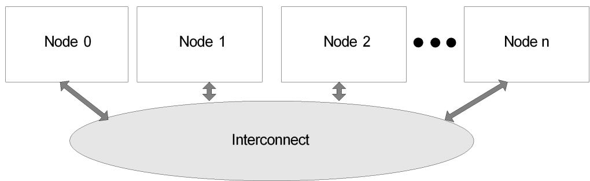  
Fig. 6.5: System Locality information Table

The System Locality Information Table diagrams a 4-node system where the nodes are numbered 0 through 3 (Node n = Node 3) and the granularity is at the node level for the NUMA distance information. In this example we assign System Localities / Proximity Domain numbers equal to the node numbers (0-3). The NUMA relative distances between proximity domains as implemented in this system are described in the matrix represented in Example Relative Distances Between Proximity Domains. Proximity Domains are represented by the numbers in the top row and left column. Distances are represented by the values in cells internal in the table from the domains.

Table 6.17: Example Relative Distances Between Proximity Domains

<table><tr><td>ProximityDomain</td><td>0</td><td>1</td><td>2</td><td>3</td></tr><tr><td>0</td><td>10</td><td>15</td><td>20</td><td>18</td></tr><tr><td>1</td><td>15</td><td>10</td><td>16</td><td>24</td></tr><tr><td>2</td><td>20</td><td>16</td><td>10</td><td>12</td></tr><tr><td>3</td><td>18</td><td>24</td><td>12</td><td>10</td></tr></table>

An example of these distances between proximity domains encoded in a System Locality Information Table for consumption by OSPM at boot time is described in the table below.

Table 6.18: Example System Locality Information Table

<table><tr><td>Field</td><td>Byte Length</td><td>Byte Offset</td><td>Description</td></tr><tr><td colspan="4">Header</td></tr><tr><td>Signature</td><td>4</td><td>0</td><td>‘SLIT’.</td></tr><tr><td>Length</td><td>4</td><td>4</td><td>60</td></tr><tr><td>Revision</td><td>1</td><td>8</td><td>1</td></tr><tr><td>Checksum</td><td>1</td><td>9</td><td>Entire table must sum to zero.</td></tr><tr><td>OEMID</td><td>6</td><td>10</td><td>OEM ID.</td></tr><tr><td>OEM Table ID</td><td>8</td><td>16</td><td>For the System Locality Information Table, the table ID is the manufacturer model ID.</td></tr><tr><td>OEM Revision</td><td>4</td><td>24</td><td>OEM revision of System Locality Information Table for supplied OEM Table ID.</td></tr><tr><td>Creator ID</td><td>4</td><td>28</td><td>Vendor ID of utility that created the table. For the DSDT, RSDT, SSDT, and PSDT tables, this is the ID for the ASL Compiler.</td></tr><tr><td>Creator Revision</td><td>4</td><td>32</td><td>Revision of utility that created the table. For the DSDT, RSDT, SSDT, and PSDT tables, this is the revision for the ASL Compiler.</td></tr><tr><td colspan="4">Creator Revision</td></tr><tr><td>Number of System Localities</td><td>8</td><td>36</td><td>4</td></tr><tr><td>Entry[0][0]</td><td>1</td><td>44</td><td>10</td></tr><tr><td>Entry[0][1]</td><td>1</td><td>45</td><td>15</td></tr><tr><td>Entry[0][2]</td><td>1</td><td>46</td><td>20</td></tr><tr><td>Entry[0][3]</td><td>1</td><td>47</td><td>18</td></tr><tr><td>Entry[1][0]</td><td>1</td><td>48</td><td>15</td></tr><tr><td>Entry[1][1]</td><td>1</td><td>49</td><td>10</td></tr><tr><td>Entry[1][2]</td><td>1</td><td>50</td><td>16</td></tr><tr><td>Entry[1][3]</td><td>1</td><td>51</td><td>24</td></tr><tr><td>Entry[2][0]</td><td>1</td><td>52</td><td>20</td></tr><tr><td>Entry[2][1]</td><td>1</td><td>53</td><td>16</td></tr><tr><td>Entry[2][2]</td><td>1</td><td>54</td><td>10</td></tr><tr><td>Entry[2][3]</td><td>1</td><td>55</td><td>12</td></tr><tr><td>Entry[3][0]</td><td>1</td><td>56</td><td>18</td></tr><tr><td>Entry[3][1]</td><td>1</td><td>57</td><td>24</td></tr><tr><td>Entry[3][2]</td><td>1</td><td>58</td><td>12</td></tr><tr><td>Entry[3][3]</td><td>1</td><td>59</td><td>10</td></tr></table>

If a new “Node 4” is added, then the following table represents the updated system’s NUMA relative distances of proximity domains.

Table 6.19: Example Relative Distances Between Proximity Domains - 5 Node

<table><tr><td>Proximity Domain</td><td>0</td><td>1</td><td>2</td><td>3</td><td>4</td></tr><tr><td>0</td><td>10</td><td>15</td><td>20</td><td>18</td><td>17</td></tr><tr><td>1</td><td>15</td><td>10</td><td>16</td><td>24</td><td>21</td></tr><tr><td>2</td><td>20</td><td>16</td><td>10</td><td>12</td><td>14</td></tr><tr><td>3</td><td>18</td><td>24</td><td>12</td><td>10</td><td>23</td></tr><tr><td>4</td><td>17</td><td>21</td><td>14</td><td>23</td><td>10</td></tr></table>

The new node’s \_SLI object would evaluate to a bufer containing [17,21,14,23,10,17,21,14,23,10].

ò Note

Some systems support interleave memory across the nodes. The SLIT representation of these systems is implementation specific.

## 6.2.17 \_SRS (Set Resource Settings)

This optional control method takes one byte stream argument that specifies a new resource allocation for a device. The resource descriptors in the byte stream argument must be specified exactly as listed in the \_CRS byte stream - meaning that the identical resource descriptors must appear in the identical order, resulting in a bufer of exactly the same length. Optimizations such as changing an IRQ descriptor to an IRQNoFlags descriptor (or vice-versa) must not be performed. Similarly, changing StartDependentFn to StartDependentFnNoPri is not allowed. A \_CRS object can be used as a template to ensure that the descriptors are in the correct format. For more information, see the \_CRS object definition.

The settings must take efect before the \_SRS control method returns.

This method must not reference any operation regions that have not been declared available by a \_REG method.

If the device is disabled, \_SRS enables the device at the specified resources. \_SRS is not used to disable a device; use the \_DIS control method instead

Arguments: (1)

Arg0 - A Bufer containing a Resource Descriptor byte stream

## Return Value:

None

## 6.2.18 \_CCA (Cache Coherency Attribute)

The \_CCA object returns whether or not a bus-master device supports hardware managed cache coherency. Expected values are 0 to indicate it is not supported, and 1 to indicate that it is supported. All other values are reserved.

On platforms for which existing default cache-coherency behavior of the OS is not adequate, \_CCA enables the OS to adapt to the diferences. If used, \_CCA must be included under all bus-master-capable devices defined as children of \_SB, to ensure that the operating system knows when it can rely on hardware managed cache coherency. The value of \_CCA is inherited by all descendants of these devices, so it need not be repeated for their children devices and will be ignored by OSPM if it is provided there. This includes slave devices on a shared DMA controller; thus these DMA controllers must also be defined in the namespace under the System Bus and include a \_CCA object.

If a device indicates it does not have hardware cache coherency support, then OSPM must use a software cache flushing algorithm to ensure stale or invalid data is not accessed from the caches.

\_CCA objects are only relevant for devices that can access CPU-visible memory, such as devices that are DMA capable. On ARM based systems, the \_CCA object must be supplied for all such devices. On Intel and RISC-V platforms, if the \_CCA object is not supplied the OSPM will assume the devices are hardware cache coherent.

## Arguments:

None

## Return Value:

An Integer indicating the device’s support for hardware cache coherency:

```txt
0 - The device does not have hardware managed cache coherency
1 - The device has hardware managed cache coherency
Other Values - Reserved
```

## ò Note

There are restrictions related to when this object is evaluated which have implications for implementing this object as a control method. The \_CCA method must only access Operation Regions that have been indicated to be available as defined by the \_REG method. The \_REG method is described in \_REG (Region).

## 6.2.18.1 \_CCA Example ASL:

```awk
Scope (\_SB) {
    ...
    Device (XHCI) {
    ...
    Name (_CCA, ZERO)    // Cache-incoherent bus-master, child of \_\SB
    ...
    }
    ...
    Device (PCI0) {    // Root PCI Bus
    ...
    Name (_CCA, ONE)    // Cache-coherent bus-master, child of \_\SB
    ...
    Device (PRT0) {
    ...    // Bus-master-capable, not a child of \_\SB
    ...    // Will inherit coherency from PCI0, no \_CCA required
    Device (NIC0) {
    ...    // Bus-master-capable, not a child of \_\SB
    ...    // Will inherit coherency from PRT0, no \_CCA required
    }
    }
}
...
Device (SDHC) {
    ...
    Name (_CCA, ONE)    // Cache-coherent bus-master-capable, child of \_\SB
}
```

(continues on next page)

(continued from previous page)

```txt
}
...
Device (GPIO) {
    ... // Not bus-master-capable
    ... // \_CCA not valid
}
...
Device (DMAC) {
    ... // DMA controller; \_CCA must be specified
    Name (_CCA, ONE) // Cache coherent bus-master, child of \\_SB
    ...
}
...
Device (SPI1) {
    ...
    Name (_CRS, ResourceTemplate()
    {
    FixedDMA(...) // Sharing the DMA, thus inherits coherency from it
    ...
    ...
    })
    ... // \_CCA not valid
}
```

## 6.2.19 \_HMA(Heterogeneous Memory Attributes)

The Heterogeneous Memory Attributes Table (HMAT) defined in Heterogeneous Memory Attribute Table (HMAT) provides Heterogeneous Memory Attributes. Dynamic runtime reconfiguration of the system may cause proximities domains or memory attributes to change. If the “Reservation Hint” is set, new HMAT update shall not reset the “Reservation Hint” unless the memory range is removed.

\_HMA is an optional object that enables the platform to provide the OS with updated Heterogeneous Memory Attributes information at runtime. \_HMA provides OSPM with the latest HMAT in entirety overriding existing HMAT.

## Arguments:

None

Return Value:

A Bufer containing entire HMAT.

Example ASL for \_HMA usage:

```txt
Scope (\_SB) {
    Device (Dev1) {
    ...
    }
    Device (Dev2) {
    ...
    }
    Method (_HMA, 0) {
    Return (HMAD)
```

(continues on next page)

<table><tr><td></td><td>(continued from previous page)</td></tr><tr><td>}</td><td></td></tr><tr><td>}</td><td>// end of \\_SB scope</td></tr></table>

## 6.3 Device Insertion, Removal, and Status Objects

The objects defined in this section provide mechanisms for handling dynamic insertion and removal of devices and for determining device and notification processing status.

Device insertion and removal objects are also used for docking and undocking mobile platforms to and from a peripheral expansion dock. These objects give information about whether or not devices are present, which devices are physically in the same device (independent of which bus the devices live on), and methods for controlling ejection or interlock mechanisms.

The system is more stable when removable devices have a software-controlled, VCR-style ejection mechanism instead of a “surprise-style” ejection mechanism. In this system, the eject button for a device does not immediately remove the device, but simply signals the operating system. OSPM then shuts down the device, closes open files, unloads the driver, and sends a command to the hardware to eject the device.

1. If the device is physically inserted while the system is in the working state (in other words, hot insertion), the hardware generates a general-purpose event.

2. The control method servicing the event uses the Notify(device,0) command to inform OSPM of the bus that the new device is on or the device object for the new device. If the Notify command points to the device object for the new device, the control method must have changed the device’s status returned by \_STA to indicate that the device is now present. The performance of this process can be optimized by having the object of the Notify as close as possible, in the namespace hierarchy, to where the new device resides. The Notify command can also be used from the \_WAK control method (see Section 7.4.5) to indicate device changes that may have occurred while the system was sleeping. For more information about the Notify command, see Section 5.6.6.

3. OSPM uses the identification and configuration objects to identify, configure, and load a device driver for the new device and any devices found below the device in the hierarchy.

4. If the device has a \_LCK control method, OSPM may later run this control method to lock the device.

The new device referred to in step 2 need not be a single device, but could be a whole tree of devices. For example, it could point to the PCI-PCI bridge docking connector. OSPM will then load and configure all devices it found below that bridge. The control method can also point to several diferent devices in the hierarchy if the new devices do not all live under the same bus. (in other words, more than one bus goes through the connector).

For removing devices, ACPI supports both hot removal (system is in the S0 state), and warm removal (system is in a sleep state: S1-S4). This is done using the \_EJx control methods. Devices that can be ejected include an \_EJx control method for each sleeping state the device supports (a maximum of 2 \_EJx objects can be listed). For example, hot removal devices would supply an \_EJ0; warm removal devices would use one of \_EJ1-EJ4. These control methods are used to signal the hardware when an eject is to occur.

The sequence of events for dynamically removing a device goes as follows:

1. The eject button is pressed and generates a general-purpose event. (If the system was in a sleeping state, it should wake the system)

2. The control method for the event uses the Notify(device, 3) command to inform OSPM which specific device the user has requested to eject. Notify does not need to be called for every device that may be ejected, but for the top-level device. Any child devices in the hierarchy or any ejection-dependent devices on this device (as described by \_EJD, below) are automatically removed.

3. The OS shuts down and unloads devices that will be removed.

4. If the device has a \_LCK control method, OSPM runs this control method to unlock the device.

5. The OS looks to see what \_EJx control methods are present for the device. If the removal event will cause the system to switch to battery power (in other words, an undock) and the battery is low, dead, or not present, OSPM uses the lowest supported sleep state \_EJx listed; otherwise it uses the highest state \_EJx. Having made this decision, OSPM runs the appropriate \_EJx control method to prepare the hardware for eject.

6. Warm removal requires that the system be put in a sleep state. If the removal will be a warm removal, OSPM puts the system in the appropriate Sx state. If the removal will be a hot removal, OSPM skips to step 8, below.

7. For warm removal, the system is put in a sleep state. Hardware then uses any motors, and so on, to eject the device. Immediately after ejection, the hardware transitions the system to S0. If the system was sleeping when the eject notification came in, the OS returns the system to a sleeping state consistent with the user’s wake settings.

8. OSPM calls \_STA to determine if the eject successfully occurred. (In this case, control methods do not need to use the Notify(device,3) command to tell OSPM of the change in \_STA) If there were any mechanical failures, \_STA returns 3: device present and not functioning, and OSPM informs the user of the problem.

## ò Note

This mechanism is the same for removing a single device and for removing several devices, as in an undock.

ACPI does not disallow surprise-style removal of devices; however, this type of removal is not recommended because system and data integrity cannot be guaranteed when a surprise-style removal occurs. Because the OS is not informed, its device drivers cannot save data bufers and it cannot stop accesses to the device before the device is removed. To handle surprise-style removal, a general-purpose event must be raised. Its associated control method must use the Notify command to indicate which bus the device was removed from.

The device insertion and removal objects are listed in the table below.

Table 6.20: Device Insertion, Removal, and Status Objects

<table><tr><td>Object</td><td>Description</td></tr><tr><td>_EDL</td><td>Object that evaluates to a package of namespace references of device objects that depend on the device containing _EDL.</td></tr><tr><td>_EJD</td><td>Object that evaluates to the name of a device object on which a device depends. Whenever the named device is ejected, the dependent device must receive an ejection notification.</td></tr><tr><td>_EJx</td><td>Control method that ejects a device.</td></tr><tr><td>_LCK</td><td>Control method that locks or unlocks a device.</td></tr><tr><td>_OST</td><td>Control method invoked by OSPM to convey processing status to the platform.</td></tr><tr><td>_RMV</td><td>Object that indicates that the given device is removable.</td></tr><tr><td>_STA</td><td>Control method that returns a device&#x27;s status.</td></tr></table>

## 6.3.1 \_EDL (Eject Device List)

This object evaluates to a package of namespace references containing the names of device objects that depend on the device under which the \_EDL object is declared. This is primarily used to support docking stations. Before the device under which the \_EDL object is declared may be ejected, OSPM prepares the devices listed in the \_EDL object for physical removal.

Arguments:

None

Return Value:

A variable-length Package containing a list of namespace references

Before OSPM ejects a device via the device’s \_EJx methods, all dependent devices listed in the package returned by \_EDL are prepared for removal. Notice that \_EJx methods under the dependent devices are not executed.

When describing a platform that includes a docking station, an \_EDL object is declared under the docking station device. For example, if a mobile system can attach to two diferent types of docking stations, \_EDL is declared under both docking station devices and evaluates to the packaged list of devices that must be ejected when the system is ejected from the docking station.

An ACPI-compliant OS evaluates the \_EDL method just prior to ejecting the device.

## 6.3.2 \_EJD (Ejection Dependent Device)

This object is used to specify the name of a device on which the device, under which this object is declared, is dependent. This object is primarily used to support docking stations. Before the device indicated by \_EJD is ejected, OSPM will prepare the dependent device (in other words, the device under which this object is declared) for removal.

Arguments:

None

Return Value:

A String containing the device name

\_EJD is evaluated once when the ACPI table loads. The EJx methods of the device indicated by \_EJD will be used to eject all the dependent devices. A device’s dependents will be ejected when the device itself is ejected.

ò Note

OSPM will not execute a dependent device’s \_EJx methods when the device indicated by \_EJD is ejected.

When describing a platform that includes a docking station, usually more than one \_EJD object will be needed. For example, if a dock attaches both a PCI device and an ACPI-configured device to a mobile system, then both the PCI device description package and the ACPI-configured device description package must include an \_EJD object that evaluates to the name of the docking station (the name specified in an \_ADR or \_HID object in the docking station’s description package). Thus, when the docking connector signals an eject request, OSPM first attempts to disable and unload the drivers for both the PCI and ACPI configured devices.

ò Note

An ACPI 1.0 OS evaluates the \_EJD methods only once during the table load process. This greatly restricts a table designer’s freedom to describe dynamic dependencies such as those created in scenarios with multiple docking stations. This restriction is illustrated in the example below; the \_EJD information supplied via and ACPI 1.0- compatible namespace omits the IDE2 device from DOCK2’s list of ejection dependencies. Starting in ACPI 2.0, OSPM is presented with a more in-depth view of the ejection dependencies in a system by use of the \_EDL methods.

Example

An example use of \_EJD and \_EDL is as follows:

```txt
Scope(\_SB.PCI0) {
Device(DOCK1) {
Name(_ADR, ...)
```

// Pass through dock - DOCK1

(continues on next page)

```txt
Method(_EJ0, 0) {...}
Method(_DCK, 1) {...}
Name(_BDN, ...)
Method(_STA, 0) {0xF}
Name(_EDL, Package() { // DOCK1 has two dependent devices - IDE2 and CB2
\\_SB.PCI0.IDE2,
\\_SB.PCI0.CB2})
}
Device(DOCK2) { // Pass through dock - DOCK2
Name(_ADR, ...)
Method(_EJ0, 0) {...}
Method(_DCK, 1) {...}
Name(_BDN, ...)
Method(_STA, 0) {0x0}
Name(_EDL, Package() { // DOCK2 has one dependent device - IDE2
\\_SB.PCI0.IDE2})
}
Device(IDE1) { // IDE Drive1 not dependent on the dock
Name(_ADR, ...)
}
Device(IDE2) { // IDE Drive2
Name(_ADR, ...)
Name(_EJD,"\\_SB.PCI0.DOCK1") // Dependent on DOCK1
}
Device(CB2) { // CardBus Controller
Name(_ADR, ...)
Name(_EJD,"\\_SB.PCI0.DOCK1") // Dependent on DOCK1
}
} // end \\_SB.PCI0
```

## 6.3.3 \_EJx (Eject)

These control methods are optional and are supplied for devices that support a software-controlled VCR-style ejection mechanism or that require an action be performed such as isolation of power/data lines before the device can be removed from the system. To support warm (system is in a sleep state) and hot (system is in S0) removal, an \_EJx control method is listed for each sleep state from which the device supports removal, where x is the sleeping state supported. For example, \_EJ0 indicates the device supports hot removal; \_EJ1-EJ4 indicate the device supports warm removal.

## Arguments: (1)

Arg0 - An Integer containing a device ejection control

0 - Cancel a mark for ejection request (EJ0 will never be called with this value)

1 - Hot eject or mark for ejection

## Return Value:

None

For hot removal, the device must be immediately ejected when OSPM calls the \_EJ0 control method. The \_EJ0 control method does not return until ejection is complete. After calling \_EJ0, OSPM verifies the device no longer exists to determine if the eject succeeded. For \_HID devices, OSPM evaluates the \_STA method. For \_ADR devices, OSPM checks with the bus driver for that device.

For warm removal, the \_EJ1-\_EJ4 control methods do not cause the device to be immediately ejected. Instead, they set proprietary registers to prepare the hardware to eject when the system goes into the given sleep state. The hardware ejects the device only after OSPM has put the system in a sleep state by writing to the SLP\_EN register. After the system resumes, OSPM calls \_STA to determine if the eject succeeded.

A device object may have multiple \_EJx control methods. First, it lists an EJx control method for the preferred sleeping state to eject the device. Optionally, the device may list an EJ4 control method to be used when the system has no power (for example, no battery) after the eject. For example, a hot-docking notebook might list \_EJ0 and \_EJ4.

## 6.3.4 \_LCK (Lock)

This control method is optional and is required only for a device that supports a software-controlled locking mechanism. When the OS invokes this control method, the associated device is to be locked or unlocked based upon the value of the argument that is passed. On a lock request, the control method must not complete until the device is completely locked.

## Arguments:

Arg0 - An Integer containing a device lock control

0 - Unlock the device

1 - Lock the device

## Return Value:

None

When describing a platform, devices use either a \_LCK control method or an \_EJx control method for a device.

## 6.3.5 \_OST (OSPM Status Indication)

This object is an optional control method that is invoked by OSPM to indicate processing status to the platform. During device ejection, device hot add, Error Disconnect Recover, or other event processing, OSPM may need to perform specific handshaking with the platform. OSPM may also need to indicate to the platform its inability to complete a requested operation; for example, when a user presses an ejection button for a device that is currently in use or is otherwise currently incapable of being ejected. In this case, the processing of the ACPI Eject Request notification by OSPM fails. OSPM may indicate this failure to the platform through the invocation of the \_OST control method. As a result of the status notification indicating ejection failure, the platform may take certain action including reissuing the notification or perhaps turning on an appropriate indicator light to signal the failure to the user.

## Arguments: (3)

Arg0 - An Integer containing the source event

Arg1 - An Integer containing the status code

Arg2 - A Bufer containing status information

## Return Value:

None

Argument Information:

Arg0 - source\_event: DWordConst

If the value of source\_event is <= 0xFF, this argument is the ACPI notification value whose processing generated the status indication. This is the value that was passed into the Notify operator.

If the value of source\_event is 0x100 or greater then the OSPM status indication is a result of an OSPM action as indicated in OST Source Event Codes. For example, a value of 0x103 will be passed into \_OST for this argument upon the failure of a user interface invoked device ejection.

If OSPM is unable to identify the originating notification value, OSPM invokes \_OST with a value that contains all bits set (ones) for this parameter.

Arg1 – Status Code: DWordConst. OSPM indicates a notification value specific status. See Table 6.22, Table 6.23, and Table 6.25 for status code descriptions.

Arg2 - A bufer containing detailed OSPM-specific information about the status indication. This argument may be null.

Table 6.21: OST Source Event Codes

<table><tr><td>Source Event Code</td><td>Description</td></tr><tr><td>0-0xFF</td><td>Reserved for Notification Values</td></tr><tr><td>0x100</td><td>Operation System Shutdown Processing</td></tr><tr><td>0x101-0x102</td><td>Reserved</td></tr><tr><td>0x103</td><td>Ejection Processing</td></tr><tr><td>0x104-0x1FF</td><td>Reserved</td></tr><tr><td>0x200</td><td>Insertion Processing</td></tr><tr><td>0x201-0xFFFFFFF</td><td>Reserved</td></tr></table>

Table 6.22: General Processing Status Codes

<table><tr><td>Status Code</td><td>Description</td></tr><tr><td>0</td><td>Success</td></tr><tr><td>1</td><td>Non-specific failure</td></tr><tr><td>2</td><td>Unrecognized Notify Code</td></tr><tr><td>3-0x7F</td><td>Reserved</td></tr><tr><td>0x80-</td><td>Notification value specific status codes</td></tr><tr><td>0xFFFFFFF</td><td></td></tr></table>

Table 6.23: Operating System Shutdown Processing (Source Events : 0x100) Status Codes

<table><tr><td>Status Code</td><td>Description</td></tr><tr><td>0x80</td><td>OS Shutdown Request denied</td></tr><tr><td>0x81</td><td>OS Shutdown in progress</td></tr><tr><td>0x82</td><td>OS Shutdown completed</td></tr><tr><td>0x83</td><td>OS Graceful Shutdown not supported</td></tr><tr><td>0x84-</td><td>Reserved</td></tr><tr><td>0xFFFFFFF</td><td></td></tr></table>

## 6.3.5.1 Processing Sequence for Graceful Shutdown Request:

Following receipt of the Graceful Shutdown Request (see Table 5.227, value 0x81), the OS will be responsible for responding with one of the following status codes:

• 0x80 (OS Shutdown Request denied) - This value will be sent if the OS is not capable of performing a graceful shutdown.

• 0x81 (OS Shutdown in progress) - The OS has initiated the graceful shutdown procedure.

• 0x83 (OS Graceful Shutdown not supported) - The OS does not support the Graceful Shutdown Request.

If the OS does initiate a graceful shutdown it should continue to generate the “OS Shutdown in progress” message (\_OST source event 0x100 status code 0x81) every 10 seconds. This functions as a heartbeat so that the service which requested the graceful shutdown knows that the request is currently being processed. The platform should assume that the OS shutdown is not proceeding if it does not receive the “OS Shutdown in progress” message for 60 seconds.

When the graceful shutdown procedure has completed the OSPM will send the “OS Shutdown completed” message and then transition the platform to the G2 “soft-of” power state.

Table 6.24: Ejection Request / Ejection Processing (Source Events:  
0x03 and 0x103) Status Codes

<table><tr><td>Status Code</td><td>Description</td></tr><tr><td>0x80</td><td>Device ejection not supported by OSPM</td></tr><tr><td>0x81</td><td>Device in use by application</td></tr><tr><td>0x82</td><td>Device Busy</td></tr><tr><td>0x83</td><td>Ejection dependency is busy or not supported for ejection by OSPM</td></tr><tr><td>0x84</td><td>Ejection is in progress (pending)</td></tr><tr><td>0x85-</td><td>Reserved</td></tr><tr><td>0xFFFFFFF</td><td></td></tr></table>

Table 6.25: Insertion Processing (Source Event: 0x200) Status Codes

<table><tr><td>Status Code</td><td>Description</td></tr><tr><td>0x80</td><td>Device insertion in progress (pending)</td></tr><tr><td>0x81</td><td>Device driver load failure</td></tr><tr><td>0x82</td><td>Device insertion not supported by OSPM</td></tr><tr><td>0x83-0x8F</td><td>Reserved</td></tr><tr><td>0x90-0x9F</td><td>Insertion failure - Resources Unavailable as described by the following bit encodings: Bit [3] Bus or Segment Numbers Bit [2] Interrupts Bit [1] I/O Bit [0] Memory</td></tr><tr><td>0xA0-0xFFFFFFF</td><td>Reserved</td></tr></table>

It is possible for the platform to issue multiple notifications to OSPM and for OSPM to process the notifications asynchronously. As such, OSPM may invoke \_OST for notifications independent of the order the notification are conveyed by the platform or by software to OSPM.

The figure below provides and example event flow of device ejection on a platform employing the \_OST object.

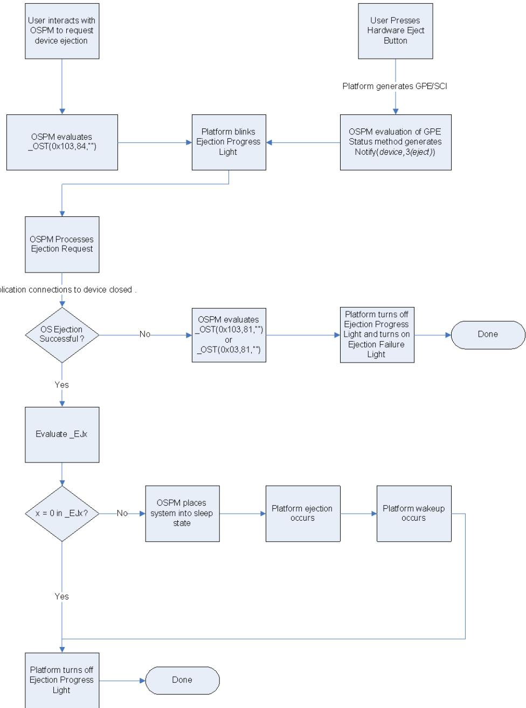  
Fig. 6.6: Device Ejection Flow Example Using \_OST

## ò Note

To maintain compatibility with OSPM implementations of previous revisions of the ACPI specification, the platform must not rely on OSPM’s evaluation of the \_OST object for proper platform operation.

## Example ASL for \_OST usage:

```asm
External (\_SB.PCI4, DeviceObj)
Scope(\_SB.PCI4) {
OperationRegion(LED1, SystemIO, 0x10C0, 0x20)
Field(LED1, AnyAcc, NoLock, Preserve)
{
    // LED controls
    S0LE, 1,    // Slot 0 Ejection Progress LED
    S0LF, 1,    // Slot 0 Ejection Failure LED
    S1LE, 1,    // Slot 1 Ejection Progress LED
    S1LF, 1,    // Slot 1 Ejection Failure LED
    S2LE, 1,    // Slot 2 Ejection Progress LED
    S2LF, 1,    // Slot 2 Ejection Failure LED
    S3LE, 1,    // Slot 3 Ejection Progress LED
    S3LF, 1    // Slot 3 Ejection Failure LED
}
Device(SLT3) { // hot plug device
Name(_ADR, 0x000C0003)
Method(_OST, 3, Serialized) { // OS calls \_OST with notify code 3 or 0x103
    // and status codes 0x80-0x83
    // to indicate a hot remove request failure.
    // to indicate a hot remove request failure.
    // Status code 0x84 indicates an ejection
    // request pending.
    If(LEqual(Arg0,Ones))    // Unspecified event
    {
    // Perform generic event processing here
    }
Switch(And(Arg0,0xFF))    // Mask to retain low byte
{
    Case(0x03)    // Ejection request
    {
    Switch(Arg1)
    {
    Case(Package(){0x80, 0x81, 0x82, 0x83})
    {    // Ejection Failure for some reason
    Store(Zero, ^S3LE)    // Turn off Ejection Progress LED
    Store(One, ^S3LF)    // Turn on Ejection Failure LED
    }
    Case(0x84)    // Eject request pending
    {
    Store(One, ^S3LE)    // Turn on Ejection Request LED
    Store(Zero, ^S3LF)    // Turn off Ejection Failure LED
    }
    }
    }
}
}    // end \_OST
Method(_EJ0, 1)    // Successful ejection sequence
{
    Store(Zero, ^S3LE)    // Turn off Ejection Progress LED
}
}    // end SLT3
```

(continues on next page)

(continued from previous page)

```txt
}    // end scope \\_SB.PCI4
Scope (\_GPE)
{
    Method(_E13)
    {
    Store(One, \\_SB.PCI4.S3LE)    // Turn on ejection request LED
    Notify(\_SB.PCI4.SLT3, 3)    // Ejection request driven from GPE13
    }
}
```

## 6.3.5.2 Processing Sequence for Error Disconnect Recover

If the OS attempts recovery operation following the receipt of the Error Disconnect Recover Request (see IPMI Status Codes , value 0x0F) the OS will be responsible for invoking \_OST with one of the following status codes in the lower word of Arg1:

• 0x80 (Success) -This value will be sent if the OS successfully recovers all the child devices afected by Error Disconnect Recover, reconfigures then and brings them back to functional state. All child devices are accessible at the time \_OST is evaluated.

• 0x81 (Not recovered) - The OS did not successfully recover one or more child devices that were afected by Error Disconnect Recover. Access to the child devices afected by Error Disconnect Recover may be unreliable.

The upper word of Arg1 can be used to communicate bus-specific status information.

## 6.3.6 \_RMV (Remove)

The optional \_RMV object indicates to OSPM whether the device can be removed while the system is in the working state and does not require any ACPI system firmware actions to be performed for the device to be safely removed from the system (in other words, any device that only supports surprise-style removal). Any such removable device that does not have \_LCK or \_EJx control methods must have an \_RMV object. This allows OSPM to indicate to the user that the device can be removed and to provide a way for shutting down the device before removing it. OSPM will transition the device into D3 before telling the user it is safe to remove the device.

This method is reevaluated after a device-check notification.

## Arguments:

None

## Return Value:

An Integer containing the device removal status:

```txt
0 - The device cannot be removed
1 - The device can be removed
```

## ò Note

Operating Systems implementing ACPI 1.0 interpret the presence of this object to mean that the device is removable.

## 6.3.7 \_STA (Device Status)

This object returns the current status of a device, which can be one of the following: enabled, disabled, or removed.

OSPM evaluates the \_STA object before it evaluates a device \_INI method. The return values of the Present and Functioning bits determines whether \_INI should be evaluated and whether children of the device should be enumerated and initialized. See \_INI (Init). If \_INI is not present within the scope of a Device, it is unspecified whether \_STA is evaluated prior to other objects within the Device scope.

Evaluation of \_STA must not cause any change to platform context - it should be viewed as a “read only” operation.

If a device object describes a device that is not on an enumerable bus and the device object does not have an \_STA object, then OSPM assumes that the device is present, enabled, shown in the UI, and functioning.

This method must not reference any operation regions that have not been declared available by a \_REG method.

## Arguments:

None

## Return Value:

An Integer containing a device status bitmap:

• Bit [0] - Set if the device is present.

• Bit [1] - Set if the device is enabled and decoding its resources.

• Bit [2] - Set if the device should be shown in the UI.

• Bit [3] - Set if the device is functioning properly (cleared if device failed its diagnostics).

• Bit [4] - Set if the battery is present.

• Bits [31:5] - Reserved (must be cleared).

## Return Value Information

If bit [0] is cleared, then bit 1 must also be cleared (in other words, a device that is not present cannot be enabled). Any devices for which \_STA returns bit [0] cleared and bit 1 set should be disregarded by the OSPM as invalid.

A device can only decode its hardware resources if both bits 0 and 1 are set. If the device is not present (bit [0] cleared) or not enabled (bit [1] cleared), then the device must not decode its resources.

If a device is present in the machine, but should not be displayed in OSPM user interface, bit 2 is cleared. For example, a notebook could have joystick hardware (thus it is present and decoding its resources), but the connector for plugging in the joystick requires a port replicator. If the port replicator is not plugged in, the joystick should not appear in the UI, so bit [2] is cleared.

\_STA may return bit 0 clear (not present) and bit 1 clear (not enabled) with with bit [3] set (device is functional). This case is used to indicate a valid device for which no device driver should be loaded (for example, a bridge device.) Children of this device may be present and valid. OSPM should continue enumeration below a device whose \_STA returns this bit combination. Otherwise it is generally invalid to return bit 1 clear and bit [3] set, so the OSPM should disregard any devices whose \_STA returns this combination of bits except for the one defined above.

Bit [4] of \_STA applies only to the Control Method Battery Device (PNP0C0A). For all other devices, OSPM must ignore this bit.

If a device object (including the processor object) does not have an \_STA object, then OSPM assumes that all of the above bits are set (i.e., the device is present, enabled, shown in the UI, and functioning).

If a device is present on an enumerable bus, then \_STA must not return 0. In that case, bit[0] must be set and if the status of the device can be determined through a bus-specific enumeration and discovery mechanism, it must be reflected by the values of bit[1] and bit[3], even though the OSPM is not required to take them into account.

## 6.4 Resource Data Types for ACPI

The \_CRS, \_PRS, and \_SRS control methods use packages of resource descriptors to describe the resource requirements of devices.

## 6.4.1 ASL Macros for Resource Descriptors

ASL includes some macros for creating resource descriptors. The ASL syntax for these macros is defined in ASL Operator Reference, along with the other ASL operators

## 6.4.2 Small Resource Data Type

A small resource data type may be 2 to 8 bytes in size and adheres to the following format:

Table 6.26: Small Resource Data Type Tag Bit Definition

<table><tr><td>Offset</td><td>Field Description</td></tr><tr><td>Byte 0</td><td>Tag Bit [7]: Type-0 (Small item) || Tag Bits [6:3]: Small item name || Tag Bits [2:0]: Length- n bytes</td></tr><tr><td>Bytes 1 to n</td><td>Data bytes (Length 0 - 7)</td></tr></table>

The following small information items are currently defined for Plug and Play devices:

Table 6.27: Small Resource Items

<table><tr><td>Small Item Name</td><td>Value</td></tr><tr><td>Reserved</td><td>0x00-0x03</td></tr><tr><td>IRQ Format Descriptor</td><td>0x04</td></tr><tr><td>DMA Format Descriptor</td><td>0x05</td></tr><tr><td>Start Dependent Functions Descriptor</td><td>0x06</td></tr><tr><td>End Dependent Functions Descriptor</td><td>0x07</td></tr><tr><td>I/O Port Descriptor</td><td>0x08</td></tr><tr><td>Fixed Location I/O Port Descriptor</td><td>0x09</td></tr><tr><td>Fixed DMA Descriptor</td><td>0x0A</td></tr><tr><td>Reserved</td><td>0x0B-0x0D</td></tr><tr><td>Vendor Defined Descriptor</td><td>0x0E</td></tr><tr><td>End Tag Descriptor</td><td>0x0F</td></tr></table>

## 6.4.2.1 IRQ Descriptor

## Type 0, Small Item Name 0x4, Length = 2 or 3

The IRQ data structure indicates that the device uses an interrupt level and supplies a mask with bits set indicating the levels implemented in this device. For standard PC-AT implementation there are 15 possible interrupts so a two-byte field is used. This structure is repeated for each separate interrupt required.

Table 6.28: IRQ Descriptor Definition

<table><tr><td>Offset</td><td>Field Name</td></tr><tr><td>Byte 0</td><td>Value = 0x22 or 0x23 (0010001nB) - Type = 0, Small item name = 0x4, Length = 2 or 3</td></tr></table>

continues on next page

Table 6.28 – continued from previous page

<table><tr><td>Byte 1</td><td>IRQ mask bits[7:0], _INT Bit [0] represents IRQ0, bit[1] is IRQ1, and so on.</td></tr><tr><td>Byte 2</td><td>IRQ mask bits[15:8], _INT Bit [0] represents IRQ8, bit[1] is IRQ9, and so on.</td></tr><tr><td>Byte 3</td><td></td></tr><tr><td></td><td>IRQ Information. Each bit, when set, indicates this device is capable of driving a certain type of interrupt. (Optional-if not included then assume edge sensitive, high true interrupts.) These bits can be used both for reporting and setting IRQ resources. Note: This descriptor is meant for describing interrupts that are connected to PIC-compatible interrupt controllers, which can only be programmed for Active-High-Edge-Triggered or Active-Low-Level-Triggered interrupts. Any other combination is invalid. The Extended Interrupt Descriptor can be used to describe other combinations:Bit [7:6] Reserved (must be 0)Bit [5] Wake Capability, _WKC0x0 = Not Wake Capable: This interrupt is not capable of waking the system.0x1 = Wake Capable: This interrupt is capable of waking the system from a low-power idle state or a system sleep state.Bit [4] Interrupt Sharing, _SHR0x0 = Exclusive: This interrupt is not shared with other devices.0x1 = Shared: This interrupt is shared with other devices.Bit [3] Interrupt Polarity, _LL0 Active-High - This interrupt is sampled when the signal is high, or true1 Active-Low - This interrupt is sampled when the signal is low, or false.Bit [2:1] IgnoredBit [0] Interrupt Mode, _HE0 Level-Triggered - Interrupt is triggered in response to signal in a low state.1 Edge-Triggered - Interrupt is triggered in response to a change in signal state from low to high.</td></tr></table>

## ò Note

Low true, level sensitive interrupts may be electrically shared, but the process of how this might work is beyond the scope of this specification.

## ò Note

If byte 3 is not included, High true, edge sensitive, non-shareable is assumed.

See IRQ (Interrupt Resource Descriptor Macro) for a description of the ASL macros that create an IRQ descriptor.

## 6.4.2.2 DMA Descriptor

## Type 0, Small Item Name 0x5, Length = 2

The DMA data structure indicates that the device uses a DMA channel and supplies a mask with bits set indicating the channels actually implemented in this device. This structure is repeated for each separate channel required.

Table 6.29: DMA Descriptor Definition

<table><tr><td>Offset</td><td>Field Name</td></tr><tr><td>Byte 0</td><td>Value = 0x2A (00101010B) - Type = 0, Small item name = 0x5, Length = 2</td></tr><tr><td>Byte 1</td><td>DMA channel mask bits [7:0] (channels 0 - 7), _DMA - Bit [0] is channel 0, etc.</td></tr><tr><td>Byte 2</td><td></td></tr><tr><td></td><td>Bit [7] Reserved (must be 0)</td></tr><tr><td></td><td>Bits [6:5] DMA channel speed supported, _TYP:</td></tr><tr><td></td><td>00 Indicates compatibility mode</td></tr><tr><td></td><td>01 Indicates Type A DMA as described in the EISA</td></tr><tr><td></td><td>10 Indicates Type B DMA</td></tr><tr><td></td><td>11 Indicates Type F</td></tr><tr><td></td><td>Bits [4:3] Ignored</td></tr><tr><td></td><td>Bit [2] Logical device bus master status, _BM:</td></tr><tr><td></td><td>0 Logical device is not a bus master</td></tr><tr><td></td><td>1 Logical device is a bus master</td></tr><tr><td></td><td>Bits [1:0] DMA transfer type preference, _SIZ:</td></tr><tr><td></td><td>00 8-bit only</td></tr><tr><td></td><td>01 8- and 16-bit</td></tr><tr><td></td><td>10 16-bit only</td></tr><tr><td></td><td>11 Reserved</td></tr></table>

See DMA (DMA Resource Descriptor Macro) for a description of the ASL macro that creates a DMA descriptor.

## 6.4.2.3 Start Dependent Functions Descriptor

## Type 0, Small Item Name 0x6, Length = 0 or 1

Each logical device requires a set of resources. This set of resources may have interdependencies that need to be expressed to allow arbitration software to make resource allocation decisions about the logical device. Dependent functions are used to express these interdependencies. The data structure definitions for dependent functions are shown here. For a detailed description of the use of dependent functions refer to the next section.

Table 6.30: Start Dependent Functions Descriptor Definition

<table><tr><td>Offset</td><td>Field Name</td></tr><tr><td>Byte 0</td><td></td></tr><tr><td></td><td>Value = 0x30 or 0x31 (0011000nB)</td></tr><tr><td></td><td>Type = 0, small item name = 0x6</td></tr><tr><td></td><td>Length = 0 or 1</td></tr></table>

Start Dependent Function fields may be of length 0 or 1 bytes. The extra byte is optionally used to denote the compatibility or performance/robustness priority for the resource group following the Start DF tag. The compatibility priority is a ranking of configurations for compatibility with legacy operating systems. This is the same as the priority used in the PNPBIOS interface. For example, for compatibility reasons, the preferred configuration for COM1 is IRQ4, I/O 3F8-3FF. The performance/robustness performance is a ranking of configurations for performance and robustness reasons. For example, a device may have a high-performance, bus mastering configuration that may not be supported by legacy operating systems. The bus-mastering configuration would have the highest performance/robustness priority while its polled I/O mode might have the highest compatibility priority.

If the Priority byte is not included, this indicates the dependent function priority is ‘acceptable’. This byte is defined as:

Table 6.31: Start Dependent Function Priority Byte Definition

<table><tr><td>Bits</td><td>Definition</td></tr><tr><td>1:0</td><td></td></tr><tr><td></td><td>Compatibility priority. Acceptable values are:0 Good configuration: Highest Priority and preferred configuration1 Acceptable configuration: Lower Priority but acceptable configuration2 Sub-optimal configuration: Functional configuration but not optimal3 Reserved</td></tr><tr><td>3:2</td><td></td></tr><tr><td></td><td>Performance/robustness. Acceptable values are:0 Good configuration: Highest Priority and preferred configuration1 Acceptable configuration: Lower Priority but acceptable configuration2 Sub-optimal configuration: Functional configuration but not optimal3 Reserved</td></tr><tr><td>7:4</td><td>Reserved (must be 0)</td></tr></table>

Notice that if multiple Dependent Functions have the same priority, they are further prioritized by the order in which they appear in the resource data structure. The Dependent Function that appears earliest (nearest the beginning) in the structure has the highest priority, and so on.

See StartDependentFn (Start Dependent Function Resource Descriptor Macro) for a description of the ASL macro that creates a Start Dependent Function descriptor.

## 6.4.2.4 End Dependent Functions Descriptor

## Type 0, Small Item Name 0x7, Length = 0

Only one End Dependent Function item is allowed per logical device. This enforces the fact that Dependent Functions cannot be nested.

Table 6.32: End Dependent Functions Descriptor Definition

<table><tr><td>Offset</td><td>Field Name</td></tr><tr><td>Byte 0</td><td>Value = 0x38 (00111000B) - Type = 0, Small item name = 0x7, Length =0</td></tr></table>

See EndDependentFn (End Dependent Function Resource Descriptor Macro) for a description of the ASL macro that creates an End Dependent Functions descriptor.

## 6.4.2.5 I/O Port Descriptor

## Type 0, Small Item Name 0x8, Length = 7

There are two types of descriptors for I/O ranges. The first descriptor is a full function descriptor for programmable devices. The second descriptor is a minimal descriptor for old ISA cards with fixed I/O requirements that use a 10-bit ISA address decode. The first type descriptor can also be used to describe fixed I/O requirements for ISA cards that require a 16-bit address decode. This is accomplished by setting the range minimum base address and range maximum base address to the same fixed I/O value.

Table 6.33: I/O Port Descriptor Definition

<table><tr><td>Offset</td><td>Field Name</td><td>Definition</td></tr><tr><td>Byte 0</td><td>I/O Port Descriptor</td><td>Value = 0x47 (01000111B) - Type = 0, Small item name = 0x8, Length = 7</td></tr><tr><td>Byte 1</td><td>Information</td><td>Bits [7:1] Reserved and must be 0 Bit [0] (_DEC) 1 The logical device decodes 16-bit addresses 0 The logical device only decodes address bits[9:0]</td></tr><tr><td>Byte 2</td><td>Range minimum base address, _MIN bits[7:0]</td><td>Address bits [7:0] of the minimum base I/O address that the card may be configured for.</td></tr><tr><td>Byte 3</td><td>Range minimum base address, _MIN bits[15:8]</td><td>Address bits [15:8] of the minimum base I/O address that the card may be configured for.</td></tr><tr><td>Byte 4</td><td>Range maximum base address, _MAX bits[7:0]</td><td>Address bits [7:0] of the maximum base I/O address that the card may be configured for.</td></tr><tr><td>Byte 5</td><td>Range maximum base address, _MAX bits[15:8]</td><td>Address bits [15:8] of the maximum base I/O address that the card may be configured for.</td></tr><tr><td>Byte 6</td><td>Base alignment, _ALN</td><td>Alignment for minimum base address, increment in 1-byte blocks.</td></tr><tr><td>Byte 7</td><td>Range length, _LEN</td><td>The number of contiguous I/O ports requested.</td></tr></table>

See IO (IO Resource Descriptor Macro) for a description of the ASL macro that creates an I/O Port descriptor.

## 6.4.2.6 Fixed Location I/O Port Descriptor

## Type 0, Small Item Name 0x9, Length = 3

This descriptor is used to describe 10-bit I/O locations.

Table 6.34: Fixed-Location I/O Port Descriptor Definition

<table><tr><td>Offset</td><td>Field Name</td><td>Definition</td></tr><tr><td>Byte 0</td><td>Fixed Location I/O Port Descriptor</td><td>Value = 0x4B (01001011B) - Type = 0, Small item name = 0x9, Length = 3</td></tr><tr><td>Byte 1</td><td>Range base address, _BAS bits[7:0]</td><td>Address bits [7:0] of the base I/O address that the card may be configured for. This descriptor assumes a 10-bit ISA address decode.</td></tr><tr><td>Byte 2</td><td>Range base address, _BAS bits[9:8]</td><td>Address bits [9:8] of the base I/O address that the card may be configured for. This descriptor assumes a 10-bit ISA address decode.</td></tr></table>

continues on next page

Table 6.34 – continued from previous page

<table><tr><td>Byte 3</td><td>Range length, _LEN</td><td>The number of contiguous I/O ports requested.</td></tr></table>

See FixedIO (Fixed IO Resource Descriptor Macro) for a description of the ASL macro that creates a Fixed I/O Port descriptor.

## 6.4.2.7 Fixed DMA Descriptor

## Type 0, Small Item Name 0xA, Length = 5

The Fixed DMA descriptor provides a means for platforms to statically assign DMA request lines and channels to devices connected to a shared DMA controller. This descriptor difers from the DMA descriptor in that it supports many more DMA request lines and DMA controller channels, as well as a flexible mapping between the two. The width of the bus used for transfers to the device is also provided. This structure is repeated for each separate request line/channel pair required, and can only be used in the \_CRS object. (Dynamic arbitration of Fixed DMA resource is not supported.)

Table 6.35: Fixed DMA Resource Descriptor

<table><tr><td>Offset</td><td>Field Name</td></tr><tr><td>Byte 0</td><td>Value = 0x55 (01010101B) - Type = 0, Small item name = 0xA, Length = 0x5</td></tr><tr><td>Byte 1</td><td>DMA Request Line bits [7:0] _DMA[7:0]. A platform-relative number uniquely identifying the request line assigned. Request line-to-Controller mapping is done in a controller-specific OS driver.</td></tr><tr><td>Byte 2</td><td>DMA Request Line bits [15:8] _DMA[15:8]</td></tr><tr><td>Byte 3</td><td>DMA Channel bits[7:0] _TYP[7:0]. A controller-relative number uniquely identifying the controller&#x27;s logical channel assigned. Channel numbers can be shared by multiple request lines.</td></tr><tr><td>Byte 4</td><td>DMA Channel bits[15:8] _TYP[15:8]</td></tr><tr><td>Byte 5</td><td>DMA Transfer Width. _SIZ. Bus width that the device connected to this request line supports. 0x00 8-bit 0x01 16-bit 0x02 32-bit 0x03 64-bit 0x04 128-bit 0x05 256-bit 0x06-0xFF Reserved</td></tr></table>

## 6.4.2.8 Vendor-Defined Descriptor, Type 0

## Type 0, Small Item Name 0xE, Length = 1 to 7

The vendor defined resource data type is for vendor use.

Table 6.36: Vendor-Defined Resource Descriptor Definition

<table><tr><td>Offset</td><td>Field Name</td></tr><tr><td>Byte 0</td><td>Value = 0x71 - 0x77 (01110nnnB) - Type = 0, small item name = 0xE, Length = 1-7</td></tr><tr><td>Byte 1 to 7</td><td>Vendor defined</td></tr></table>

See VendorShort (Short Vendor Resource Descriptor) for a description of the ASL macro that creates a short vendordefined resource descriptor.

## 6.4.2.9 End Tag

## Type 0, Small Item Name 0xF, Length = 1

The End tag identifies an end of resource data.

<table><tr><td>i Note</td></tr><tr><td>If the checksum field is zero, the resource data is treated as if the checksum operation succeeded. Configuration proceeds normally.</td></tr></table>

Table 6.37: End Tag Definition

<table><tr><td>Offset</td><td>Field Name</td></tr><tr><td>Byte 0</td><td>Value = 0x79 (01111001B) - Type = 0, Small item name = 0xF, Length = 1</td></tr><tr><td>Byte 1</td><td>Checksum covering all resource data after the serial identifier. This checksum is generated such that adding it to the sum of all the data bytes will produce a zero sum.</td></tr></table>

The End Tag is automatically generated by the ASL compiler at the end of the ResourceTemplate statement.

## 6.4.3 Large Resource Data Type

To allow for larger amounts of data to be included in the configuration data structure the large format is shown below. This includes a 16-bit length field allowing up to 64 KB of data.

Table 6.38: Large Resource Data Type Tag Bit Definitions

<table><tr><td>Offset</td><td>Field Name</td></tr><tr><td>Byte 0</td><td></td></tr><tr><td></td><td>Value = 1xxxxxxxxB</td></tr><tr><td></td><td>Type = 1 (Large item)</td></tr><tr><td></td><td>Large item name = xxxxxxxxB</td></tr><tr><td>Byte 1</td><td>Length of data items bits[7:0]</td></tr><tr><td>Byte 2</td><td>Length of data items bits[15:8]</td></tr><tr><td>Bytes 3 to (Length + 2)</td><td>Actual data items</td></tr></table>

The following large information items are currently defined:

Table 6.39: Large Resource Items

<table><tr><td>Large Item Name</td><td>Value</td></tr><tr><td>Reserved</td><td>0x00</td></tr><tr><td>24-Bit Memory Range Descriptor</td><td>0x01</td></tr><tr><td>Generic Register Descriptor</td><td>0x02</td></tr><tr><td>Reserved</td><td>0x03</td></tr><tr><td>Vendor-Defined Descriptor</td><td>0x04</td></tr><tr><td>32-Bit Memory Range Descriptor</td><td>0x05</td></tr><tr><td>32-Bit Fixed Memory Range Descriptor</td><td>0x06</td></tr><tr><td>Address Space Resource Descriptors</td><td>0x07</td></tr></table>

continues on next page

Table 6.39 – continued from previous page

<table><tr><td>Word Address Space Descriptor</td><td>0x08</td></tr><tr><td>Extended Interrupt Descriptor</td><td>0x09</td></tr><tr><td>QWord Address Space Descriptor</td><td>0x0A</td></tr><tr><td>Extended Address Space Descriptor</td><td>0x0B</td></tr><tr><td>GPIO Connection Descriptor</td><td>0x0C</td></tr><tr><td>Pin Function Descriptor</td><td>0x0D</td></tr><tr><td>GenericSerialBus Connection Descriptors</td><td>0x0E</td></tr><tr><td>Pin Configuration Descriptor</td><td>0x0F</td></tr><tr><td>Pin Group Descriptor</td><td>0x10</td></tr><tr><td>Pin Group Function Descriptor</td><td>0x11</td></tr><tr><td>Pin Group Configuration Descriptor</td><td>0x12</td></tr><tr><td>Clock Input Resource Descriptor</td><td>0x13</td></tr><tr><td>Reserved</td><td>0x14-0x7F</td></tr></table>

## 6.4.3.1 24-Bit Memory Range Descriptor

## Type 1, Large Item Value 0x1

The 24-bit memory range descriptor describes a device’s memory range resources within a 24-bit address space

Table 6.40: 24-bit Memory Range Descriptor Definition

<table><tr><td>Offset</td><td>Field Name, ASL Field Name</td><td>Definition</td></tr><tr><td>Byte 0</td><td>24-bit Memory Range Descriptor</td><td>Value = 0x81 (10000001B) - Type = 1, Large item name = 0x01</td></tr><tr><td>Byte 1</td><td>Length, bits[7:0]</td><td>Value = 0x09 (9)</td></tr><tr><td>Byte 2</td><td>Length, bits[15:8]</td><td>Value = 0x00</td></tr><tr><td>Byte 3</td><td>Information</td><td></td></tr><tr><td></td><td></td><td>This field provides extra information about this memory:Bit [7:1] IgnoredBit [0] Write status, _RW:1 writeable (read/write)0 non-writeable (read-only)</td></tr><tr><td>Byte 4</td><td>Range minimum base address, _MIN, bits[7:0]</td><td>Address bits [15:8] of the minimum base memory address for which the card may be configured.</td></tr><tr><td>Byte 5</td><td>Range minimum base address, _MIN, bits[15:8]</td><td>Address bits [23:16] of the minimum base memory address for which the card may be configured</td></tr><tr><td>Byte 6</td><td>Range maximum base address, _MAX, bits[7:0]</td><td>Address bits [15:8] of the maximum base memory address for which the card may be configured.</td></tr><tr><td>Byte 7</td><td>Range maximum base address, _MAX, bits[15:8]</td><td>Address bits [23:16] of the maximum base memory address for which the card may be configured</td></tr><tr><td>Byte 8</td><td>Base alignment, _ALN, bits[7:0]</td><td>This field contains the lower eight bits of the base alignment. The base alignment provides the increment for the minimum base address. (0x0000 = 64 KB)</td></tr><tr><td>Byte 9</td><td>Base alignment, _ALN, bits[15:8]</td><td>This field contains the upper eight bits of the base alignment. The base alignment provides the increment for the minimum base address. (0x0000 = 64 KB)</td></tr></table>

continues on next page

Table 6.40 – continued from previous page

<table><tr><td>Byte 10</td><td>Range length, _LEN, bits[7:0]</td><td>This field contains the lower eight bits of the memory range length. The range length provides the length of the memory range in 256 byte blocks.</td></tr><tr><td>Byte 11</td><td>Range length, _LEN, bits[15:8]</td><td>This field contains the upper eight bits of the memory range length. The range length field provides the length of the memory range in 256 byte blocks.</td></tr></table>

## ò Note

Address bits [7:0] of memory base addresses are assumed to be 0.

## ò Note

A Memory range descriptor can be used to describe a fixed memory address by setting the range minimum base address and the range maximum base address to the same value.

ò Note

24-bit Memory Range descriptors are used for legacy devices.

<table><tr><td>i Note</td></tr><tr><td>Mixing of 24-bit and 32-bit memory descriptors on the same device is not allowed.</td></tr></table>

See Memory24 (Memory Resource Descriptor Macro) for a description of the ASL macro that creates a 24-bit Memory descriptor.

## 6.4.3.2 Vendor-Defined Descriptor, Type 1

## Type 1, Large Item Value 0x4

The vendor defined resource data type is for vendor use.

Table 6.41: Large Vendor-Defined Resource Descriptor Definition

<table><tr><td>Offset</td><td>Field Name</td><td>Definition</td></tr><tr><td>Byte 0</td><td>Vendor Defined Descriptor</td><td>Value = 0x84 (10000100B) - Type = 1, Large item name = 0x04</td></tr><tr><td>Byte 1</td><td>Length, bits [7:0]</td><td>Lower eight bits of data length (UUID and vendor data)</td></tr><tr><td>Byte 2</td><td>Length, bits [15:8]</td><td>Upper eight bits of data length (UUID and vendor data)</td></tr><tr><td>Byte 3</td><td>UUID specific descriptor sub type</td><td>UUID specific descriptor sub type value</td></tr><tr><td>Byte 4-19</td><td>UUID</td><td>UUID Value</td></tr><tr><td>Byte 20-(Length+20)</td><td>Vendor Defined Data</td><td>Vendor defined data bytes</td></tr></table>

This specification (ACPI) defines the UUID specific descriptor subtype field and the UUID field to address potential collision of the use of this descriptor. It is strongly recommended that all newly defined vendor descriptors use these fields prior to Vendor Defined Data.

See VendorLong for a description of the ASL macro that creates a long vendor-defined resource descriptor.

## 6.4.3.3 32-Bit Memory Range Descriptor

## Type 1, Large Item Value 0x5

This memory range descriptor describes a device’s memory resources within a 32-bit address space.

Table 6.42: 32-Bit Memory Range Descriptor Definition

<table><tr><td>Offset</td><td>Field Name</td><td>Definition</td></tr><tr><td>Byte 0</td><td>32-bit Memory Range Descriptor</td><td>Value = 0x85 (10000101B) - Type = 1, Large item name = 0x05</td></tr><tr><td>Byte 1</td><td>Length, bits [7:0]</td><td>Value = 0x11 (17)</td></tr><tr><td>Byte 2</td><td>Length, bits [15:8]</td><td>Value = 0x00</td></tr><tr><td>Byte 3</td><td>Information</td><td>This field provides extra information about this memory:Bit [7:1] IgnoredBit [0] Write status, _RW:1 writeable (read/write)0 non-writeable (read-only)</td></tr><tr><td>Byte 4</td><td>Range minimum base address,_MIN, bits [7:0]</td><td>Address bits [7:0] of the minimum base memory address for which the card may be configured.</td></tr><tr><td>Byte 5</td><td>Range minimum base address,_MIN, bits [15:8]</td><td>Address bits [15:8] of the minimum base memory address for which the card may be configured.</td></tr><tr><td>Byte 6</td><td>Range minimum base address,_MIN, bits [23:16]</td><td>Address bits [23:16] of the minimum base memory address for which the card may be configured.</td></tr><tr><td>Byte 7</td><td>Range minimum base address,_MIN, bits [31:24]</td><td>Address bits [31:24] of the minimum base memory address for which the card may be configured.</td></tr><tr><td>Byte 8</td><td>Range maximum base address,_MAX, bits [7:0]</td><td>Address bits [7:0] of the maximum base memory address for which the card may be configured.</td></tr><tr><td>Byte 9</td><td>Range maximum base address,_MAX, bits [15:8]</td><td>Address bits [15:8] of the maximum base memory address for which the card may be configured.</td></tr><tr><td>Byte 10</td><td>Range maximum base address,_MAX, bits [23:16]</td><td>Address bits [23:16] of the maximum base memory address for which the card may be configured.</td></tr><tr><td>Byte 11</td><td>Range maximum base address,_MAX, bits [31:24]</td><td>Address bits [31:24] of the maximum base memory address for which the card may be configured.</td></tr><tr><td>Byte 12</td><td>Base alignment,_ALN bits [7:0]</td><td>This field contains bits [7:0] of the base alignment. The base alignment provides the increment for the minimum base address.</td></tr><tr><td>Byte 13</td><td>Base alignment,_ALN bits [15:8]</td><td>This field contains bits [15:8] of the base alignment. The base alignment provides the increment for the minimum base address.</td></tr><tr><td>Byte 14</td><td>Base alignment,_ALN bits [23:16]</td><td>This field contains bits [23:16] of the base alignment. The base alignment provides the increment for the minimum base address.</td></tr></table>

continues on next page

Table 6.42 – continued from previous page

<table><tr><td>Byte 15</td><td>Base alignment, _ALN bits [31:24]</td><td>This field contains bits [31:24] of the base alignment. The base alignment provides the increment for the minimum base address.</td></tr><tr><td>Byte 16</td><td>Range length, _LEN bits [7:0]</td><td>This field contains bits [7:0] of the memory range length. The range length provides the length of the memory range in 1-byte blocks.</td></tr><tr><td>Byte 17</td><td>Range length, _LEN bits [15:8]</td><td>This field contains bits [15:8] of the memory range length. The range length provides the length of the memory range in 1-byte blocks.</td></tr><tr><td>Byte 18</td><td>Range length, _LEN bits [23:16]</td><td>This field contains Bits [23:16] of the memory range length. The range length provides the length of the memory range in 1-byte blocks.</td></tr><tr><td>Byte 19</td><td>Range length, _LEN bits [31:24]</td><td>This field contains Bits [31:24] of the memory range length. The range length provides the length of the memory range in 1-byte blocks.</td></tr></table>

<table><tr><td>i Note</td></tr><tr><td>Mixing of 24-bit and 32-bit memory descriptors on the same device is not allowed.</td></tr></table>

See Memory32 (Memory Resource Descriptor Macro) for a description of the ASL macro that creates a 32-bit Memory descriptor.

## 6.4.3.4 32-Bit Fixed Memory Range Descriptor

## Type 1, Large Item Value 0x6

This memory range descriptor describes a device’s memory resources within a 32-bit address space.

Table 6.43: 32-bit Fixed-Location Memory Range Descriptor Definition

<table><tr><td>Offset</td><td>Field Name</td><td>Definition</td></tr><tr><td>Byte 0</td><td>32-bit Fixed Memory Range Descriptor</td><td>Value = 0x86 (10000110B) - Type = 1, Large item name = 0x06</td></tr><tr><td>Byte 1</td><td>Length, bits [7:0]</td><td>Value = 0x09 (9)</td></tr><tr><td>Byte 2</td><td>Length, bits [15:8]</td><td>Value = 0x00</td></tr><tr><td>Byte 3</td><td>Information</td><td>This field provides extra information about this memory. Bit [7:1] Ignored Bit [0] Write status, _RW 1 writeable (read/write) 0 non-writeable (read-only))</td></tr><tr><td>Byte 4</td><td>Range base address, _BAS bits [7:0]</td><td>Address bits [7:0] of the base memory address for which the card may be configured.</td></tr><tr><td>Byte 5</td><td>Range base address, _BAS bits [15:8]</td><td>Address bits [15:8] of the base memory address for which the card may be configured.</td></tr><tr><td>Byte 6</td><td>Range base address, _BAS bits [23:16]</td><td>Address bits [23:16] of the base memory address for which the card may be configured.</td></tr><tr><td>Byte 7</td><td>Range base address, _BAS bits [31:24]</td><td>Address bits [31:24] of the base memory address for which the card may be configured.</td></tr></table>

continues on next page

Table 6.43 – continued from previous page

<table><tr><td>Byte 8</td><td>Range length, _LEN bits [7:0]</td><td>This field contains bits [7:0] of the memory range length. The range length provides the length of the memory range in 1-byte blocks.</td></tr><tr><td>Byte 9</td><td>Range length, _LEN bits[15:8]</td><td>This field contains bits [15:8] of the memory range length. The range length provides the length of the memory range in 1-byte blocks.</td></tr><tr><td>Byte 10</td><td>Range length, _LEN bits [23:16]</td><td>This field contains bits [23:16] of the memory range length. The range length provides the length of the memory range in 1-byte blocks.</td></tr><tr><td>Byte 11</td><td>Range length, _LEN bits [31:24]</td><td>This field contains bits [31:24] of the memory range length. The range length provides the length of the memory range in 1-byte blocks.</td></tr></table>

## ò Note

Mixing of 24-bit and 32-bit memory descriptors on the same device is not allowed.

See Memory32Fixed (Memory Resource Descriptor Macro) for a description of the ASL macro that creates a 32-bit Fixed Memory descriptor.

## 6.4.3.5 Address Space Resource Descriptors

The QWORD, DWORD, WORD, and Extended Address Space Descriptors are general-purpose structures for describing a variety of types of resources. These resources also include support for advanced server architectures (such as multiple root buses), and resource types found on some RISC processors. These descriptors can describe various kinds of resources. The following table defines the valid combination of each field and how they should be interpreted.

Table 6.44: Valid Combination of Address Space Descriptor Fields

<table><tr><td>_LEN</td><td>_MIF</td><td>_MAF</td><td>Definition</td></tr><tr><td>0</td><td>0</td><td>0</td><td>Variable size, variable location resource descriptor for _PRS.If _MIF is set, _MIN must be a multiple of (_GRA+1). If _MAF is set, _MAX must be (a multiple of (_GRA+1))-1.OS can pick the resource range that satisfies following conditions:If _MIF is not set, start address is a multiple of (_GRA+1) and greater or equal to _MIN. Otherwise, start address is _MIN.If _MAF is not set, end address is (a multiple of (_GRA+1))-1 and less or equal to _MAX. Otherwise, end address is _MAX.</td></tr><tr><td>0</td><td>0</td><td>1</td><td>Variable size, variable location resource descriptor for _PRS.If _MIF is set, _MIN must be a multiple of (_GRA+1). If _MAF is set, _MAX must be (a multiple of (_GRA+1))-1.OS can pick the resource range that satisfies following conditions:If _MIF is not set, start address is a multiple of (_GRA+1) and greater or equal to _MIN. Otherwise, start address is _MIN.If _MAf is not set, end address is (a multiple of (_GRA+1))-1 and less or equal to _MAX. Otherwise, end address is _MAX.</td></tr></table>

continues on next page

Table 6.44 – continued from previous page

<table><tr><td>0</td><td>1</td><td>0</td><td>Variable size, variable location resource descriptor for _PRS.If _MIF is set,_MIN must be a multiple of (_GRA+1). If _MAF is set,_MAX must be (a multiple of (_GRA+1))-1.OS can pick the resource range that satisfies following conditions:If _MIF is not set, start address is a multiple of (_GRA+1) and greater or equal to _MIN. Otherwise, start address is _MIN.If _MAF is not set, end address is (a multiple of (_GRA+1))-1 and less or equal to _MAX. Otherwise, end address is _MAX.</td></tr><tr><td>0</td><td>1</td><td>1</td><td>(Invalid combination)</td></tr><tr><td>&gt;0</td><td>0</td><td>0</td><td>Fixed size, variable location resource descriptor for _PRS._LEN must be a multiple of (_GRA+1).OS can pick the resource range that satisfies following conditions:Start address is a multiple of (_GRA+1) and greater or equal to _MIN.End address is (start address+_LEN-1) and less or equal to _MAX.</td></tr><tr><td>&gt;0</td><td>0</td><td>1</td><td>(Invalid combination)</td></tr><tr><td>&gt;0</td><td>1</td><td>0</td><td>(Invalid combination)</td></tr><tr><td>&gt;0</td><td>1</td><td>1</td><td>Fixed size, fixed location resource descriptor._GRA must be 0 and _LEN must be (_MAX - _MIN +1).</td></tr></table>

## 6.4.3.5.1 QWord Address Space Descriptor

## Type 1, Large Item Value 0xA

The QWORD address space descriptor is used to report resource usage in a 64-bit address space (like memory and I/O).

Table 6.45: QWORD Address Space Descriptor Definition

<table><tr><td>Offset</td><td>Field Name</td><td>Definition</td></tr><tr><td>Byte 0</td><td>QWORD Address Space Descriptor</td><td>Value = 0x8A (10001010B) - Type = 1, Large item name = 0x0A</td></tr><tr><td>Byte 1</td><td>Length, bits[7:0]</td><td>Variable length, minimum value = 0x2B (43)</td></tr><tr><td>Byte 2</td><td>Length, bits[15:8]</td><td>Variable length, minimum value = 0x00</td></tr><tr><td>Byte 3</td><td>Resource Type</td><td></td></tr><tr><td></td><td></td><td>Indicates which type of resource this descriptor describes. Defined values are:0 Memory range1 I/O range2 Bus number range3-9 Reserved10 Platform Communication Channel11-191 Reserved192-255 Hardware Vendor Defined</td></tr></table>

continues on next page

Table 6.45 – continued from previous page

<table><tr><td>Byte 4</td><td>General Flags</td><td>Flags that are common to all resource types:Bits [7:4] Reserved (must be 0)Bit [3] Max Address Fixed, _MAF:1 The specified maximum address is fixed0 The specified maximum address is not fixed and can be changedBit [2] Min Address Fixed,_MIF:1 The specified minimum address is fixed0 The specified minimum address is not fixed and can be changedBit [1] Decode Type, _DEC:1 This bridge subtractively decodes this address (top level bridges only)0 This bridge positively decodes this address Bit [0] Ignored</td></tr><tr><td>Byte 5</td><td>Type Specific Flags</td><td>Flags that are specific to each resource type. The meaning of the flags in this field depends on the value of the Resource Type field (see above).</td></tr><tr><td>Byte 6</td><td>Address space granularity,_GRA bits[7:0]</td><td>A set bit in this mask means that this bit is decoded. All bits less significant than the most significant set bit must be set. That is, the value of the full Address Space Granularity field (all 64 bits) must be a number (2n-1).</td></tr><tr><td>Byte 7</td><td>Address space granularity,_GRA bits[15:8]</td><td></td></tr><tr><td>Byte 8</td><td>Address space granularity,_GRA bits[23:16]</td><td></td></tr><tr><td>Byte 9</td><td>Address space granularity,_GRA bits[31:24]</td><td></td></tr><tr><td>Byte 10</td><td>Address space granularity,_GRA bits[39:32]</td><td></td></tr><tr><td>Byte 11</td><td>Address space granularity,_GRA bits[47:40]</td><td></td></tr><tr><td>Byte 12</td><td>Address space granularity,_GRA bits[55:48]</td><td></td></tr><tr><td>Byte 13</td><td>Address space granularity,_GRA bits[63:56]</td><td></td></tr><tr><td>Byte 14</td><td>Address range minimum,_MIN bits[7:0]</td><td>For bridges that translate addresses, this is the address space on the secondary side of the bridge.</td></tr><tr><td>Byte 15</td><td>Address range minimum,_MIN bits[15:8]</td><td></td></tr><tr><td>Byte 16</td><td>Address range minimum,_MIN bits[23:16]</td><td></td></tr><tr><td>Byte 17</td><td>Address range minimum,_MIN bits[31:24]</td><td></td></tr><tr><td>Byte 18</td><td>Address range minimum,_MIN bits[39:32]</td><td></td></tr><tr><td>Byte 19</td><td>Address range minimum,_MIN bits[47:40]</td><td></td></tr><tr><td>Byte 20</td><td>Address range minimum,_MIN bits[55:48]</td><td></td></tr><tr><td>Byte 21</td><td>Address range minimum,_MIN bits[63:56]</td><td></td></tr></table>

continues on next page

Table 6.45 – continued from previous page

<table><tr><td>Byte 22</td><td>Address range maximum, _MAX bits[7:0]</td><td>For bridges that translate addresses, this is the address space on the secondary side of the bridge.</td></tr><tr><td>Byte 23</td><td>Address range maximum, _MAX bits[15:8]</td><td></td></tr><tr><td>Byte 24</td><td>Address range maximum, _MAX bits[23:16]</td><td></td></tr><tr><td>Byte 25</td><td>Address range maximum, _MAX bits[31:24]</td><td></td></tr><tr><td>Byte 26</td><td>Address range maximum, _MAX bits[39:32]</td><td>For bridges that translate addresses, this is the address space on the secondary side of the bridge.</td></tr><tr><td>Byte 27</td><td>Address range maximum, _MAX bits[47:40]</td><td></td></tr><tr><td>Byte 28</td><td>Address range maximum, _MAX bits[55:48]</td><td></td></tr><tr><td>Byte 29</td><td>Address range maximum, _MAX bits[63:56]</td><td></td></tr><tr><td>Byte 30</td><td>Address Translation offset, _TRA bits[7:0]</td><td>For bridges that translate addresses across the bridge, this is the offset that must be added to the address on the secondary side to obtain the address on the primary side. Non-bridge devices must list 0 for all Address Translation offset bits.</td></tr><tr><td>Byte 31</td><td>Address Translation offset, _TRA bits[15:8]</td><td></td></tr><tr><td>Byte 32</td><td>Address Translation offset, _TRA bits[23:16]</td><td></td></tr><tr><td>Byte 33</td><td>Address Translation offset, _TRA bits[31:24]</td><td></td></tr><tr><td>Byte 34</td><td>Address Translation offset, _TRA bits[39:32]</td><td></td></tr><tr><td>Byte 35</td><td>Address Translation offset, _TRA bits[47:40]</td><td></td></tr><tr><td>Byte 36</td><td>Address Translation offset, _TRA bits[55:48]</td><td></td></tr><tr><td>Byte 37</td><td>Address Translation offset, _TRA bits[63:56]</td><td></td></tr><tr><td>Byte 38</td><td>Address length, _LEN bits[7:0]</td><td></td></tr><tr><td>Byte 39</td><td>Address length, _LEN, bits[15:8]</td><td></td></tr><tr><td>Byte 40</td><td>Address length, _LEN bits[23:16]</td><td></td></tr><tr><td>Byte 41</td><td>Address length, _LEN bits[31:24]</td><td></td></tr><tr><td>Byte 42</td><td>Address length, _LEN bits[39:32]</td><td></td></tr><tr><td>Byte 43</td><td>Address length, _LEN bits[47:40]</td><td></td></tr><tr><td>Byte 44</td><td>Address length, _LEN bits[55:48]</td><td></td></tr><tr><td>Byte 45</td><td>Address length, _LEN bits[63:56]</td><td></td></tr></table>

continues on next page

Table 6.45 – continued from previous page

<table><tr><td>Byte 46</td><td>Resource Source Index</td><td>Reserved. If the platform specifies “Interrupt ResourceSource support” in bit 13 of Platform-Wide _OSC Capabilities DWORD 2, then this field must be zero.</td></tr><tr><td>String</td><td>Resource Source</td><td>(Optional) If present, the device that uses this descriptor consumes its resources from the resources produced by the named device object. If not present, the device consumes its resources out of a global pool.</td></tr></table>

See QWordIO, QWordMemory, and ASL\_QWordAddressSpace for a description of the ASL macros that creates a QWORD Address Space descriptor.

## 6.4.3.5.2 DWord Address Space Descriptor

## Type 1, Large Item Value 0x7

The DWORD address space descriptor is used to report resource usage in a 32-bit address space (like memory and I/O).

Table 6.46: DWORD Address Space Descriptor Definition

<table><tr><td>Offset</td><td>Field Name</td><td>Definition</td></tr><tr><td>Byte 0</td><td>DWORD Address Space Descriptor</td><td>Value = 0x87 (10000111B) - Type = 1, Large item name = 0x07</td></tr><tr><td>Byte 1</td><td>Length, bits [7:0]</td><td>Variable: Value = 23 (minimum)</td></tr><tr><td>Byte 2</td><td>Length, bits [15:8]</td><td>Variable: Value = 0 (minimum)</td></tr><tr><td>Byte 3</td><td>Resource Type</td><td></td></tr><tr><td></td><td></td><td>Indicates which type of resource this descriptor describes. Defined values are:0 Memory range1 I/O range2 Bus number range3-9 Reserved10 Platform Communication Channel11-191 Reserved192-255 Hardware Vendor Defined</td></tr></table>

continues on next page

Table 6.46 – continued from previous page

<table><tr><td>Byte 4</td><td>General Flags</td><td>Flags that are common to all resource types:Bits [7:4] Reserved (must be 0)Bit [3] Max Address Fixed, _MAF:1 The specified maximum address is fixed0 The specified maximum address is not fixed and can be changedBit [2] Min Address Fixed,_MIF:1 The specified minimum address is fixed0 The specified minimum address is not fixed and can be changedBit [1] Decode Type, _DEC:1 This bridge subtractively decodes this address (top level bridges only)0 This bridge positively decodes this addressBit [0] Ignored</td></tr><tr><td>Byte 5</td><td>Type Specific Flags</td><td>Flags that are specific to each resource type. The meaning of the flags in this field depends on the value of the Resource Type field (see above).</td></tr><tr><td>Byte 6</td><td>Address space granularity,_GRA bits[7:0]</td><td>A set bit in this mask means that this bit is decoded. All bits less significant than the most significant set bit must be set. (in other words, the value of the full Address Space Granularity field (all 32 bits) must be a number (2n-1).</td></tr><tr><td>Byte 7</td><td>Address space granularity,_GRA bits[15:8]</td><td></td></tr><tr><td>Byte 8</td><td>Address space granularity,_GRA bits [23:16]</td><td></td></tr><tr><td>Byte 9</td><td>Address space granularity,_GRA bits [31:24]</td><td></td></tr><tr><td>Byte 10</td><td>Address range minimum,_MIN bits [7:0]</td><td>For bridges that translate addresses, this is the address space on the secondary side of the bridge.</td></tr><tr><td>Byte 11</td><td>Address range minimum,_MIN bits [15:8]</td><td></td></tr><tr><td>Byte 12</td><td>Address range minimum,_MIN bits [23:16]</td><td></td></tr><tr><td>Byte 13</td><td>Address range minimum,_MIN bits [31:24]</td><td></td></tr><tr><td>Byte 14</td><td>Address range maximum,_MAX bits [7:0]</td><td>For bridges that translate addresses, this is the address space on the secondary side of the bridge.</td></tr><tr><td>Byte 15</td><td>Address range maximum,_MAX bits [15:8]</td><td></td></tr><tr><td>Byte 16</td><td>Address range maximum,_MAX bits [23:16]</td><td></td></tr><tr><td>Byte 17</td><td>Address range maximum,_MAX bits [31:24]</td><td></td></tr><tr><td>Byte 18</td><td>Address Translation offset,_TRA bits [7:0]</td><td>For bridges that translate addresses across the bridge, this is the offset that must be added to the address on the secondary side to obtain the address on the primary side. Non-bridge devices must list 0 for all Address Translation offset bits.</td></tr><tr><td>Byte 19</td><td>Address Translation offset,_TRA bits [15:8]</td><td></td></tr></table>

continues on next page

Table 6.46 – continued from previous page

<table><tr><td>Byte 20</td><td>Address Translation offset, _TRA bits [23:16]</td><td></td></tr><tr><td>Byte 21</td><td>Address Translation offset, _TRA bits [31:24]</td><td></td></tr><tr><td>Byte 22</td><td>Address Length, _LEN, bits [7:0]</td><td></td></tr><tr><td>Byte 23</td><td>Address Length, _LEN, bits [15:8]</td><td></td></tr><tr><td>Byte 24</td><td>Address Length, _LEN, bits [23:16]</td><td></td></tr><tr><td>Byte 25</td><td>Address Length, _LEN, bits [31:24]</td><td></td></tr><tr><td>Byte 26</td><td>Resource Source Index</td><td>(Optional) Only present if Resource Source (below) is present. This field gives an index to the specific resource descriptor that this device consumes from in the current resource template for the device object pointed to in Resource Source.</td></tr><tr><td>String</td><td>Resource Source</td><td>(Optional) If present, the device that uses this descriptor consumes its resources from the resources produced by the named device object. If not present, the device consumes its resources out of a global pool. If not present, the device consumes this resource from its hierarchical parent.</td></tr></table>

See DWordIO, DWordMemory and ASL\_DWordAddressSpace for a description of the ASL macro that creates a DWORD Address Space descriptor

## 6.4.3.5.3 Word Address Space Descriptor

## Type 1, Large Item Value 0x8

The WORD address space descriptor is used to report resource usage in a 16-bit address space (like memory and I/O).

## ò Note

This descriptor is exactly the same as the DWORD descriptor specified in End Dependent Functions Descriptor; the only diference is that the address fields are 16 bits wide rather than 32 bits wide.

Table 6.47: WORD Address Space Descriptor Definition

<table><tr><td>Offset</td><td>Field Name</td><td>Definition</td></tr><tr><td>Byte 0</td><td>WORD Address Space Descriptor</td><td>Value = 0x88 (10001000B) - Type = 1, Large item name = 0x08</td></tr><tr><td>Byte 1</td><td>Length, bits [7:0]</td><td>Variable length, minimum value = 0x0D (13)</td></tr><tr><td>Byte 2</td><td>Length, bits [15:8]</td><td>Variable length, minimum value = 0x00</td></tr></table>

continues on next page

Table 6.47 – continued from previous page

<table><tr><td>Byte 3</td><td>Resource Type</td><td>Indicates which type of resource this descriptor describes. Defined values are:0 Memory range1 I/O range2 Bus number range3-9 Reserved10 Platform Communication Channel11-191 Reserved192-255 Hardware Vendor Defined</td></tr><tr><td>Byte 4</td><td>General Flags</td><td>Flags that are common to all resource types:Bit [3] Max Address Fixed, _MAF:1 The specified maximum address is fixed0 The specified maximum address is not fixed and can be changedBit [2] Min Address Fixed,_MIF:1 The specified minimum address is fixed0 The specified minimum address is not fixed and can be changedBit [1] Decode Type, _DEC:1 This bridge subtractively decodes this address (top level bridges only)0 This bridge positively decodes this addressBit [0] Ignored</td></tr><tr><td>Byte 5</td><td>Type Specific Flags</td><td>Flags that are specific to each resource type. The meaning of the flags in this field depends on the value of the Resource Type field (see above).</td></tr><tr><td>Byte 6</td><td>Address space granularity,_GRA bits[7:0]</td><td>A set bit in this mask means that this bit is decoded. All bits less significant than the most significant set bit must be set. (In other words, the value of the full Address Space Granularity field (all 16 bits) must be a number (2n-1).</td></tr><tr><td>Byte 7</td><td>Address space granularity,_GRA bits[15:8]</td><td></td></tr><tr><td>Byte 8</td><td>Address range minimum,_MIN, bits [7:0]</td><td>For bridges that translate addresses, this is the address space on the secondary side of the bridge.</td></tr><tr><td>Byte 9</td><td>Address range minimum,_MIN, bits [15:8]</td><td></td></tr><tr><td>Byte 10</td><td>Address range maximum,_MAX, bits [7:0]</td><td>For bridges that translate addresses, this is the address space on the secondary side of the bridge.</td></tr><tr><td>Byte 11</td><td>Address range maximum,_MAX, bits [15:8]</td><td></td></tr><tr><td>Byte 12</td><td>Address Translation offset,_TRA, bits [7:0]</td><td>For bridges that translate addresses across the bridge, this is the offset that must be added to the address on the secondary side to obtain the address on the primary side. Non-bridge devices must list 0 for all Address Translation offset bits.</td></tr><tr><td>Byte 13</td><td>Address Translation offset,_TRA, bits [15:8]</td><td></td></tr></table>

continues on next page

Table 6.47 – continued from previous page

<table><tr><td>Byte 14</td><td>Address Length, _LEN, bits [7:0]</td><td></td></tr><tr><td>Byte 15</td><td>Address Length, _LEN, bits [15:8]</td><td></td></tr><tr><td>Byte 16</td><td>Resource Source Index</td><td>(Optional) Only present if Resource Source (below) is present. This field gives an index to the specific resource descriptor that this device consumes from in the current resource template for the device object pointed to in Resource Source.</td></tr><tr><td>String</td><td>Resource Source</td><td>(Optional) If present, the device that uses this descriptor consumes its resources from the resources produced by the named device object. If not present, the device consumes its resources out of a global pool. If not present, the device consumes this resource from its hierarchical parent.</td></tr></table>

See WordIO, WordBusNumber, and ASL\_WordAddressSpace for a description of the ASL macros that create a Word address descriptor.

## 6.4.3.5.4 Extended Address Space Descriptor

## Type 1, Large Item Value 0xB

The Extended Address Space descriptor is used to report resource usage in the address space (like memory and I/O).

Table 6.48: Extended Address Space Descriptor Definition

<table><tr><td>Offset</td><td>Field Name</td><td>Definition</td></tr><tr><td>Byte 0</td><td>Extended Address Space Descriptor</td><td>Value = 0x8B (10001011B) - Type = 1, Large item name = 0x0B</td></tr><tr><td>Byte 1</td><td>Length, bits[7:0]</td><td>Value = 0x35 (53)</td></tr><tr><td>Byte 2</td><td>Length, bits[15:8]</td><td>Value = 0x00</td></tr><tr><td>Byte 3</td><td>Resource Type</td><td></td></tr><tr><td></td><td></td><td>Indicates which type of resource this descriptor describes. Defined values are:0 Memory range1 I/O range2 Bus number range3-191 Reserved192-255 Hardware Vendor Defined</td></tr></table>

continues on next page

Table 6.48 – continued from previous page

<table><tr><td>Byte 4</td><td>General Flags</td><td>Flags that are common to all resource types:Bits [7:4] Reserved (must be 0)Bit [3] Max Address Fixed, _MAF:1 The specified maximum address is fixed0 The specified maximum address is not fixed and can be changedBit [2] Min Address Fixed,_MIF:1 The specified minimum address is fixed0 The specified minimum address is not fixed and can be changedBit [1] Decode Type, _DEC:1 This bridge subtractively decodes this address (top level bridges only)0 This bridge positively decodes this addressBit [0] Consumer/Producer:1-This device consumes this resource0-This device produces and consumes this resource</td></tr><tr><td>Byte 5</td><td>Type Specific Flags</td><td>Optional flags that are specific to each resource type. The meaning of the flags in this field depends on the value of the Resource Type field (see above). For the Memory Resource Type, the definition is defined inResource Type Specific Flags. For other Resource Types, refer to the existing definitions for the Address Space Descriptors.</td></tr><tr><td>Byte 6</td><td>Revision ID</td><td>Indicates the revision of the Extended Address Space descriptor. For ACPI 3.0, this value is 1.</td></tr><tr><td>Byte 7</td><td>Reserved</td><td>0</td></tr><tr><td>Byte 8</td><td>Address space granularity,_GRA bits[7:0]</td><td>A set bit in this mask means that this bit is decoded. All bits less significant than the most significant set bit must be set. That is, the value of the full Address Space Granularity field (all 64 bits) must be a number (2n-1).</td></tr><tr><td>Byte 9</td><td>Address space granularity,_GRA bits[15:8]</td><td></td></tr><tr><td>Byte 10</td><td>Address space granularity,_GRA bits[23:16]</td><td></td></tr><tr><td>Byte 11</td><td>Address space granularity,_GRA bits[31:24]</td><td></td></tr><tr><td>Byte 12</td><td>Address space granularity,_GRA bits[39:32]</td><td></td></tr><tr><td>Byte 13</td><td>Address space granularity,_GRA bits[47:40]</td><td></td></tr><tr><td>Byte 14</td><td>Address space granularity,_GRA bits[55:48]</td><td></td></tr><tr><td>Byte 15</td><td>Address space granularity,_GRA bits[63:56]</td><td></td></tr><tr><td>Byte 16</td><td>Address range minimum,_MIN bits[7:0]</td><td>For bridges that translate addresses, this is the address space on the secondary side of the bridge.</td></tr><tr><td>Byte 17</td><td>Address range minimum,_MIN bits[15:8]</td><td></td></tr><tr><td>Byte 18</td><td>Address range minimum,_MIN bits[23:16]</td><td></td></tr></table>

continues on next page

Table 6.48 – continued from previous page

<table><tr><td>Byte 19</td><td>Address range minimum,_MIN bits[31:24]</td><td></td></tr><tr><td>Byte 20</td><td>Address range minimum,_MIN bits[39:32]</td><td></td></tr><tr><td>Byte 21</td><td>Address range minimum,_MIN bits[47:40]</td><td></td></tr><tr><td>Byte 22</td><td>Address range minimum,_MIN bits[55:48]</td><td></td></tr><tr><td>Byte 23</td><td>Address range minimum,_MIN bits[63:56]</td><td></td></tr><tr><td>Byte 24</td><td>Address range maximum,_MAX bits[7:0]</td><td>For bridges that translate addresses, this is the address space on the secondary side of the bridge.</td></tr><tr><td>Byte 25</td><td>Address range maximum,_MAX bits[15:8]</td><td></td></tr><tr><td>Byte 26</td><td>Address range maximum,_MAX bits[23:16]</td><td></td></tr><tr><td>Byte 27</td><td>Address range maximum,_MAX bits[31:24]</td><td></td></tr><tr><td>Byte 28</td><td>Address range maximum,_MAX bits[39:32]</td><td>For bridges that translate addresses, this is the address space on the secondary side of the bridge.</td></tr><tr><td>Byte 29</td><td>Address range maximum,_MAX bits[47:40]</td><td></td></tr><tr><td>Byte 30</td><td>Address range maximum,_MAX bits[55:48]</td><td></td></tr><tr><td>Byte 31</td><td>Address range maximum,_MAX bits[63:56]</td><td></td></tr><tr><td>Byte 32</td><td>Address Translation offset,_TRA bits[7:0]</td><td>For bridges that translate addresses across the bridge, this is the offset that must be added to the address on the secondary side to obtain the address on the primary side. Non-bridge devices must list 0 for all Address Translation offset bits.</td></tr><tr><td>Byte 33</td><td>Address Translation offset,_TRA bits[15:8]</td><td></td></tr><tr><td>Byte 34</td><td>Address Translation offset,_TRA bits[23:16]</td><td></td></tr><tr><td>Byte 35</td><td>Address Translation offset,_TRA bits[31:24]</td><td></td></tr><tr><td>Byte 36</td><td>Address Translation offset,_TRA bits[39:32]</td><td></td></tr><tr><td>Byte 37</td><td>Address Translation offset,_TRA bits[47:40]</td><td></td></tr><tr><td>Byte 38</td><td>Address Translation offset,_TRA bits[55:48]</td><td></td></tr><tr><td>Byte 39</td><td>Address Translation offset,_TRA bits[63:56]</td><td></td></tr><tr><td>Byte 40</td><td>Address length,_LEN bits[7:0]</td><td></td></tr><tr><td>Byte 41</td><td>Address length,_LEN, bits[15:8]</td><td></td></tr><tr><td>Byte 42</td><td>Address length,_LEN bits[23:16]</td><td></td></tr><tr><td>Byte 43</td><td>Address length,_LEN bits[31:24]</td><td></td></tr></table>

continues on next page

Table 6.48 – continued from previous page

<table><tr><td>Byte 44</td><td>Address length, _LEN bits[39:32]</td><td></td></tr><tr><td>Byte 45</td><td>Address length, _LEN bits[47:40]</td><td></td></tr><tr><td>Byte 46</td><td>Address length, _LEN bits[55:48]</td><td></td></tr><tr><td>Byte 47</td><td>Address length, _LEN bits[63:56]</td><td></td></tr><tr><td>Byte 48</td><td>Type Specific Attribute,_ATT bits[7:0]</td><td>Optional attributes that are specific to each resource type. The meaning of the attributes in this field depends on the value of the Resource Type field (see above). For the Memory Resource Type definition, see Type Specific Attributes. For other Resource Types, this field is reserved to 0.</td></tr><tr><td>Byte 49</td><td>Type Specific Attribute,_ATT bits[15:8]</td><td></td></tr><tr><td>Byte 50</td><td>Type Specific Attribute,_ATT bits[23:16]</td><td></td></tr><tr><td>Byte 51</td><td>Type Specific Attribute,_ATT bits[31:24]</td><td></td></tr><tr><td>Byte 52</td><td>Type Specific Attribute,_ATT bits[39:32]</td><td></td></tr><tr><td>Byte 53</td><td>Type Specific Attribute,_ATT bits[47:40]</td><td></td></tr><tr><td>Byte 54</td><td>Type Specific Attribute,_ATT bits[55:48]</td><td></td></tr><tr><td>Byte 55</td><td>Type Specific Attribute,_ATT bits[63:56]</td><td></td></tr></table>

See ExtendedSpace (Extended Address Space Resource Descriptor Macro) for a description of the ASL macro that creates an Extended Address Space descriptor.

## 6.4.3.5.4.1 Type Specific Attributes

The meaning of the Type Specific Attributes field of the Extended Address Space Descriptor depends on the value of the Resource Type field in the descriptor. When Resource Type = 0 (memory resource), the Type Specific Attributes field values are defined per Memory Attribute Definitions in the UEFI Specification under section titled GetMemoryMap(). This is the only well-defined and OS-agnostic mechanism for describing specific resource descriptor mapping attributes. For the architectural meaning behind the Memory Attribute Definitions, please see the ISA-specific binding in the Calling Conventions section of the UEFI Specification at https://uefi.org/specifications.

Note: EFI\_MEMORY\_WC is treated as equivalent to MEM == 3 for the purpose of describing PCI(e) RC resources matching prefetchable BAR requirements

## 6.4.3.5.5 Resource Type Specific Flags

The meaning of the flags in the Type Specific Flags field of the Address Space Descriptors depends on the value of the Resource Type field in the descriptor. The flags for each resource type are defined in the following tables:

Table 6.49: Memory Resource Flag (Resource Type = 0) Definitions

<table><tr><td>Bits</td><td>Meaning</td></tr><tr><td>Bits [7:6]</td><td>Reserved (must be 0)</td></tr><tr><td>Bit [5]</td><td></td></tr><tr><td></td><td>Memory to I/O Translation, _TTP:1 TypeTranslation: This resource, which is memory on the secondary side of the bridge, is I/O on the primary side of the bridge.0 TypeStatic: This resource, which is memory on the secondary side of the bridge, is also memory on the primary side of the bridge.</td></tr><tr><td>Bits [4:3]</td><td></td></tr><tr><td></td><td>Memory attributes, _MTP. These bits are only defined if this memory resource describes system RAM (see System Address Map Interfaces):0 - AddressRangeMemory1 - AddressRangeReserved2 - AddressRangeACPI3 - AddressRangeNVS</td></tr></table>

continues on next page

## Table 6.49 – continued from previous page

```txt
Bits [2:1]

Memory attributes, _MEM:
0 - The memory is non-cacheable:
- To mean “uncached access” as defined below.
1 - The memory is cacheable
2 - The memory is cacheable and supports write combining:
- Values 1 and 2 are deprecated. If they exist, they are interpreted as follows:
- In the context of describing PCI/PCIe MMIO apertures, be treated equivalently to _MEM == 3.
- In other contexts, to mean an “uncached access” (potentially equivalent to _MEM == 0)
3 - The memory is prefetchable:
- In the context of describing PCI/PCIe MMIO apertures, this is used to define resources matching prefetchable BAR requirements. In this case, the value is interpreted to mean an “uncached access”, as defined below.
- In other contexts, to mean an “uncached access” (potentially equivalent to _MEM == 0)

Note: For all above definitions, an “uncached access” is defined to be without any specific constraints, and made in an OS, driver, platform and architecture specific manner, where different uncached access types exist including reordering, prefetching, combining/grouping and early-acknowledgement.

Note: OSPM ignores this field in the Extended address space descriptor. Instead, it uses the Type Specific Attributes field to determine memory attributes.

Bit [0]

Write status, _RW:
1 - This memory range is read-write
0 - This memory range is read-only
```

Table 6.50: I/O Resource Flag (Resource Type = 1) Definitions

<table><tr><td>Bits</td><td>Meaning</td></tr><tr><td>Bits [7:6]</td><td>Reserved (must be 0)</td></tr><tr><td>Bit [5]</td><td>Sparse Translation, _TRS. This bit is only meaningful if Bit [4] is set. 1 SparseTranslation: The primary-side memory address of any specific I/O port within the secondary-side range can be found using the following function. address = (((port &amp; 0xFFc) &lt;&lt; 10) || (port &amp; 0xFFFF)) + _TRA In the address used to access the I/O port, bits[11:2] must be identical to bits[21:12], this gives four bytes of I/O ports on each 4 KB page. 0 DenseTranslation: The primary-side memory address of any specific I/O port within the secondary-side range can be found using the following function. address = port + _TRA</td></tr><tr><td>Bit [4]</td><td>I/O to Memory Translation, _TTP 1 TypeTranslation: This resource, which is I/O on the secondary side of the bridge, is memory on the primary side of the bridge. 0 TypeStatic: This resource, which is I/O on the secondary side of the bridge, is also I/O on the primary side of the bridge.</td></tr><tr><td>Bit [3:2]</td><td>Reserved (must be 0)</td></tr></table>

continues on next page

Table 6.50 – continued from previous page

<table><tr><td>Bit [1:0]</td><td>_RNG 3 Memory window covers the entire range 2 ISARangesOnly. This flag is for bridges on systems with multiple bridges. Setting this bit means the memory window specified in this descriptor is limited to the ISA I/O addresses that fall within the specified window. The ISA I/O ranges are: n000-n0FF, n400-n4FF, n800-n8FF, nC00-nCFF. This bit can only be set for bridges entirely configured through ACPI namespace. 1 NonISARangesOnly. This flag is for bridges on systems with multiple bridges. Setting this bit means the memory window specified in this descriptor is limited to the non-ISA I/O addresses that fall within the specified window. The non-ISA I/O ranges are: n100-n3FF, n500-n7FF, n900-nBFF, nD00-nFFF. This bit can only be set for bridges entirely configured through ACPI namespace. 0 Reserved</td></tr></table>

Table 6.51: Bus Number Range Resource Flag (Resource Type = 2) Definitions

<table><tr><td>Bits</td><td>Meaning</td></tr><tr><td>Bit [7:0]</td><td>Reserved (must be 0)</td></tr></table>

## 6.4.3.6 Extended Interrupt Descriptor

## Type 1, Large Item Value 0x9

The Extended Interrupt Descriptor is necessary to describe interrupt settings and possibilities for systems that support interrupts above 15.

To specify multiple interrupt numbers, this descriptor allows vendors to list an array of possible interrupt numbers, any one of which can be used.

Table 6.52: Extended Interrupt Descriptor Definition

<table><tr><td>Offset</td><td>Field Name</td><td>Definition</td></tr><tr><td>Byte 0</td><td>Extended Interrupt Descriptor</td><td>Value = 0x89 (10001001B) - Type = 1, Large item name = 0x09</td></tr><tr><td>Byte 1</td><td>Length, bits [7:0]</td><td>Variable length, minimum value = 0x06</td></tr><tr><td>Byte 2</td><td>Length, bits [15:8]</td><td>Variable length, minimum value = 0x00</td></tr></table>

continues on next page

Table 6.52 – continued from previous page

<table><tr><td>Byte 3</td><td>Interrupt Vector Flags</td><td>Interrupt Vector Information:Bit [7:5] Reserved (must be 0)Bit [4] Wake Capability, _WKC:0x0 = Not Wake Capable: This interrupt is not capable of waking the system.0x1 = Wake Capable: This interrupt is capable of waking the system from a low-power idle state or a system sleep state.Bit [3] Interrupt Sharing, _SHR:0x0 = Exclusive: This interrupt is not shared with other devices.0x1 = Shared: This interrupt is shared with other devices.Bit [2] Interrupt Polarity, _LL:0 Active-High: This interrupt is sampled when the signal is high, or true.1 Active-Low: This interrupt is sampled when the signal is low, or false.Bit [1] Interrupt Mode, _HE:0 Level-Triggered: Interrupt is triggered in response to the signal being in either a high or low state.1 Edge-Triggered: This interrupt is triggered in response to a change in signal state, either high to low or low to high.Bit [0] Consumer/Producer:1 This device consumes this resource0 This device produces this resource</td></tr><tr><td>Byte 4</td><td>Interrupt table length</td><td>Indicates the number of interrupt numbers that follow. When this descriptor is returned from _CRS, or when OSPM passes this descriptor to _SRS, this field must be set to 1.</td></tr><tr><td>Byte 4 n +5</td><td>Interrupt Number, _INT bits [7:0]</td><td>Interrupt number</td></tr><tr><td>Byte 4 n +6</td><td>Interrupt Number, _INT bits [15:8]</td><td></td></tr><tr><td>Byte 4 n +7</td><td>Interrupt Number, _INT bits [23:16]</td><td></td></tr><tr><td>Byte 4 n +8</td><td>Interrupt Number, _INT bits [31:24]</td><td></td></tr><tr><td>...</td><td>...</td><td>Additional interrupt numbers</td></tr><tr><td>Byte x</td><td>Resource Source Index</td><td>Reserved. If the platform specifies “Interrupt ResourceSource support” in bit 13 of Platform-Wide _OSC Capabilities DWORD 2, then this field must be zero.</td></tr><tr><td>String</td><td>Resource Source</td><td>(Optional) If present, the device that uses this descriptor consumes its resources from the resources produces by the named device object. If not present, the device consumes its resources out of a global pool.</td></tr></table>

<table><tr><td>i Note</td></tr></table>

Low true, level sensitive interrupts may be electrically shared, the process of how this might work is beyond the scope of this specification.

If the OS is running using the 8259 interrupt model, only interrupt number values of 0-15 will be used, and interrupt numbers greater than 15 will be ignored. See the Interrupt section for a description of the ASL macro that creates an Extended Interrupt descriptor.

## 6.4.3.7 Generic Register Descriptor

## Type 1, Large Item Value 0x2

The generic register descriptor describes the location of a fixed width register within any of the ACPI-defined address spaces. See Generic Register Descriptor for details.

Table 6.53: Generic Register Descriptor Definition

<table><tr><td>Offset</td><td>Field Name, ASL Field Name</td><td>Definition</td></tr><tr><td>Byte 0</td><td>Generic Register Descriptor</td><td>Value = 0x82 (10000010B) Type = 1, Large item name = 0x02</td></tr><tr><td>Byte 1</td><td>Length, bits[7:0]</td><td>Value = 0x0C (12)</td></tr><tr><td>Byte 2</td><td>Length, bits[15:8]</td><td>Value = 0x00</td></tr><tr><td>Byte 3</td><td>Address Space ID, _ASI</td><td>The address space where the data structure or register exists. Defined values are:0x00 System Memory0x01 System I/O0x02 PCI Configuration Space0x03 Embedded Controller0x04 SMBus0x05 SystemCMOS0x06 PciBarTarget0x07 IPMI0x08 GeneralPurposeIO0x09 GenericSerialBus0x0A PCC0x7F Functional Fixed Hardware</td></tr><tr><td>Byte 4</td><td>Register Bit Width, _RBW</td><td>Indicates the register width in bits.</td></tr><tr><td>Byte 5</td><td>Register Bit Offset, _RBO</td><td>Indicates the offset to the start of the register in bits from the Register Address.</td></tr></table>

continues on next page

Table 6.53 – continued from previous page

<table><tr><td>Byte 6</td><td>Access Size, _ASZ</td><td></td></tr><tr><td></td><td></td><td>Specifies access size:0 - Undefined (legacy reasons)1 - Byte access2 - Word access3 - DWord access4 - QWord access</td></tr><tr><td>Byte 7</td><td>Register Address, _ADR bits[7:0]</td><td>Register Address</td></tr><tr><td>Byte 8</td><td>Register Address, _ADR bits[15:8]</td><td></td></tr><tr><td>Byte 9</td><td>Register Address, _ADR bits[23:16]</td><td></td></tr><tr><td>Byte 10</td><td>Register Address, _ADR bits[31:24]</td><td></td></tr><tr><td>Byte 11</td><td>Register Address, _ADR bits[39:32]</td><td></td></tr><tr><td>Byte 12</td><td>Register Address, _ADR bits[47:40]</td><td></td></tr><tr><td>Byte 13</td><td>Register Address, _ADR bits[55:48]</td><td></td></tr><tr><td>Byte 14</td><td>Register Address, _ADR bits[63:56]</td><td></td></tr></table>

See Section 19.6.116 for a description of the Generic Register Resource Descriptor Macro.

## 6.4.3.8 Connection Descriptors

General-purpose I/O (GPIO) and Simple Peripheral Bus (SPB) controllers are hardware resources provided in silicon solutions to enable flexible configuration of a broad range of system designs. These controllers can provide input, output, interrupt and serial communication connections to arbitrary devices in a system. The function to which one of these connections is put depends on the specific device involved and the needs of the platform design. In order to support mobile platform architectures, ACPI abstracts these connections as resources.

## 6.4.3.8.1 GPIO Connection Descriptor

## Type 1, Large Item Name 0xC

The GPIO Connection Descriptor describes connections between GPIO controllers and peripheral devices. Two types of GPIO connections can be described: IO connections and Interrupt connections, distinguished by the GPIO Connection Type value in the descriptor. GPIO controllers and the devices that connect to them may be located anywhere in the namespace, but the connection must be described in the peripheral device’s resource objects (PRS, \_CRS, etc.).

Table 6.54: GPIO Connection Descriptor Definition

<table><tr><td>Offset</td><td colspan="3">Field Name</td><td>Definition</td></tr><tr><td>Byte 0</td><td>GPIO</td><td>Connection</td><td>Descriptor</td><td>Value = 0x8C, (10001100B) - Type = 1, Large item name = 0x0C</td></tr></table>

continues on next page

Table 6.54 – continued from previous page

<table><tr><td>Byte 1</td><td>Length, bits[7:0]</td><td>Variable length, minimum value = 0x16 + L (22 + length of the Resource Source Name string)</td></tr><tr><td>Byte 2</td><td>Length, bits[15:8]</td><td>Variable length, minimum value = 0x00</td></tr><tr><td>Byte 3</td><td>Revision ID</td><td>Indicates the revision for the GPIO interrupt descriptor. This value must be 1.</td></tr><tr><td>Byte 4</td><td>GPIO Connection Type</td><td>Indicates the type of the descriptor: 0x00 = Interrupt Connection 0x01 = IO Connection 0x02 - 0xFF Reserved</td></tr><tr><td>Byte 5</td><td>General Flags, bits [7:0]</td><td>Flags. Bit [7:1] Reserved (must be 0) Bit [0] Consumer/Producer: 0x0 = This device produces and consumes this resource 0x1 = This device consumes this resource</td></tr><tr><td>Byte 6</td><td>General Flags, bits [15:8]</td><td>Bit [15:8] Reserved (must be 0).</td></tr><tr><td>Byte 7</td><td>Interrupt and IO Flags, bits [7:0] for Interrupt Connections</td><td>Bit [7:5] Reserved (must be 0)Bit [4] Wake Capability, _WKC:0x0 = Not Wake Capable: This interrupt is not capable of waking the system.0x1 = Wake Capable: This interrupt is capable of waking the system from a low-power idle state or a system sleep state.Bit [3] Interrupt Sharing, _SHR:0x0 = Exclusive: This interrupt is not shared with other devices.0x1 = Shared: This interrupt is shared with other devices.Bit [2:1] Interrupt Polarity, _POL:0x0 = Active-High: This interrupt is sampled when the signal is high, or true.0x1 = Active-Low: This interrupt is sampled when the signal is low, or false.0x2 = Active-Both: This interrupt is sampled on both rising and falling edges. Interrupt mode must be set to Edge-triggered.0x3 - Reserved (do not use)Bit [0] Interrupt Mode, _MOD0x0 = Level-Triggered: Interrupt is triggered in response to the signal being in either a high or low state.0x1 = Edge-Triggered: This interrupt is triggered in response to a change in signal state, either high to low or low to high.</td></tr></table>

continues on next page

Table 6.54 – continued from previous page

<table><tr><td>Byte 7</td><td>Interrupt and IO Flags, bits [7:0] for IO Connections</td><td>Bit [7:4] Reserved (must be 0)Bit [3] IO Sharing, _SHR:0x0 = Exclusive: This IO connection is used exclusively by one device.0x1 = Shared: This IO connection is shared by two or more devices.Bit [2] Reserved (must be 0)Bit [1:0] IO Restriction _IOR:0x0 = This pin or pins can be used for either Input or Output.0x1 = This pin or pins can only be used for Input, and the pin configuration must be preserved while not in use.0x2 = This pin or pins can only be used for Output, and the pin configuration must be preserved while not in use.0x3 = This pin or pins can be used for either input or output, but the configuration must be preserved until explicitly changed.</td></tr><tr><td>Byte 8</td><td>Interrupt and IO Flags, bits [15:8]</td><td>Bit [15:8] Reserved (must be 0)</td></tr><tr><td>Byte 9</td><td>Pin Configuration</td><td>_PPI:0x00 = Default Configuration (no configuration is applied)0x01 = Pull-up0x02 = Pull-down0x03 = No Pull0x04 - 0x7F; Reserved (do not use)0x80 - 0xFF; Vendor-defined values</td></tr><tr><td>Byte 10</td><td>Output Drive Strength, bits [7:0]</td><td>The output-drive capability, in hundredths of milliamperes, to be applied when configuring the pin for output (high byte). _DRS[7:0]</td></tr><tr><td>Byte 11</td><td>Output Drive Strength, bits [15:8]</td><td>The output-drive capability, in hundredths of milliamperes, to be applied when configuring the pin for output (high byte). _DRS[15:8]</td></tr><tr><td>Byte 12</td><td>Debounce timeout, bits [7:0]</td><td>The debounce timeout, in hundredths of milliseconds, to be applied when configuring the pin for interrupt (low byte). _DBT[7:0]</td></tr><tr><td>Byte 13</td><td>Debounce timeout, bits [15:8]</td><td>The debounce timeout, in hundredths of milliseconds, to be applied when configuring the pin for interrupt (high byte). _DBT [15:8]</td></tr><tr><td>Byte 14</td><td>Pin Table Offset[7:0]</td><td>Offset to the start of the pin table (low byte). The offset is relative to the start of this descriptor. NOTE: The number of pins in the table can be calculated from PinCount = (Resource Source Name Offset - Pin Table Offset) / 2</td></tr><tr><td>Byte 15</td><td>Pin Table Offset[15:8]</td><td>Offset to the start of the pin table (high byte). The offset is relative to the start of this descriptor.</td></tr><tr><td>Byte 16</td><td>Resource Source Index</td><td>Reserved for future use. This field must be 0.</td></tr><tr><td>Byte 17</td><td>Resource Source Name Offset[7:0]</td><td>Offset to the start of the resource source name (low byte). The offset is relative to the start of this descriptor. NOTE: The length of the ResourceSource name string can be calculated from Length L = Vendor Data Offset - Resource Source Name Offset. The length includes the string&#x27;s terminating NULL character (if present)</td></tr></table>

Table 6.54 – continued from previous page

<table><tr><td>Byte 18</td><td>Resource Source Name Offset[15:8]</td><td>Offset to the start of the resource source name (high byte). The offset is relative to the start of this descriptor.</td></tr><tr><td>Byte 19</td><td>Vendor Data Offset[7:0]</td><td>(low byte) Offset to the start of the Vendor-defined Data (the last byte of the ResourceSource + 1). This value must always be valid to allow for length calculations. In the case where there is no Vendor Data, this offset still must refer to the last byte of the ResourceSource + 1. The offset is relative to the start of this descriptor.</td></tr><tr><td>Byte 20</td><td>Vendor Data Offset[15:8]</td><td>(high byte) Offset to the start of the Vendor-defined Data .(the last byte of the ResourceSource + 1). This value must always be valid to allow for length calculations. In the case where there is no Vendor Data, this offset still must refer to the last byte of the ResourceSource + 1. The offset is relative to the start of this descriptor.</td></tr><tr><td>Byte 21</td><td>Vendor Data Length [7:0]</td><td>Length of Vendor-defined Data (low-byte).</td></tr><tr><td>Byte 22</td><td>Vendor Data Length [15:8]</td><td>Length of Vendor-defined Data (high-byte).</td></tr><tr><td>Byte PinTable-Offset[15:0]+ 2n (n is the index into the pin table)</td><td>Pin Number, bits [7:0]</td><td>GPIO controller-relative pin number (low byte): _PIN[7:0]. Pin numbers are zero-based.Pin number 0xFFFF = No Pin. OSPM will ignore this pin number.</td></tr><tr><td>Byte PinTable-Offset[15:0]+ 2n + 1 (n is the index into the pin table)</td><td>Pin Number, bits [15:8]</td><td>GPIO controller-relative pin number (high byte): _PIN[15:8]. Pin numbers are zero-based.Pin number 0xFFFF = No Pin. OSPM will ignore this pin number.</td></tr><tr><td>Byte DataSource-NameOffset[15:0]</td><td>Resource Source (length = L)</td><td>Name of the GPIO controller device to which this descriptor applies. The name can be a fully-qualified name, a relative name or a name segment that utilizes the namespace search rules.</td></tr><tr><td>Byte VendorDataOffset[15:0]</td><td>Vendor-defined Data</td><td>(Optional) Data specific to the GPIO controller device supplied by a vendor. This data is provided to the device driver for this GPIO Controller. _VEN.</td></tr></table>

## 6.4.3.8.2 GenericSerialBus Connection Descriptors

## Type 1, Large Item Value 0x0E

All Serial Bus Resource descriptors utilize the following format. For specific bus types, the type-specific fields are used.

Table 6.55: GenericSerialBus Connection Descriptors

<table><tr><td>Offset</td><td>Field Name</td><td>Definition</td></tr><tr><td>Byte 0</td><td>Serial Bus Type</td><td>Value = 0x8E (10001110B) - Type = 1, Large item name = 0x0E</td></tr><tr><td>Byte 1</td><td>Length, bits[7:0]</td><td>Variable length, minimum value = 0x09 + L(9 + ResourceSource string length)”</td></tr><tr><td>Byte 2</td><td>Length, bits[15:8]</td><td>Variable length, minimum value = 0x00</td></tr><tr><td>Byte 3</td><td>Revision ID</td><td>Indicates the revision of the Serial Bus Connection Descriptor. This value is 2.</td></tr></table>

continues on next page

Table 6.55 – continued from previous page

<table><tr><td>Byte 4</td><td>Resource Source Index</td><td>Resource Connection Instance. If the device specified in the Resource Source field in this structure supports more than one connection (e.g. port), this field describes the instance of the connection to which this Device is connected.</td></tr><tr><td>Byte 5</td><td>Serial Bus Type</td><td>Indicates which type of serial bus connection this descriptor describes. Defined values are:0 - Reserved1 - I2C2 - SPI3 - UART4 - CSI-25-191 - Reserved192-255 - Hardware Vendor Defined</td></tr><tr><td>Byte 6</td><td>General Flags [7:0]</td><td>Flags that are common to all serial bus connection types:Bits[7:3] Reserved. Must be 0.Bit[2] Connection Sharing, _SHR:0x0: Exclusive: This Serial Bus connection is used exclusively by one device. If Serial Bus Type is CSI, UART, or SPI then Bit 2 must be 0.Bit[1] Consumer/Producer:0x1: This device consumes this resource0x0: This device produces and consumes this resourceBit[0] Slave Mode:0x1: The communication over this connection is initiated by the device.0x0: The communication over this connection is initiated by the controller.</td></tr><tr><td>Byte 7</td><td>Type Specific Flags, Bits[7:0]</td><td>Flags specific to the indicated Serial Bus Type (see above).</td></tr><tr><td>Byte 8</td><td>Type Specific Flags, bits[15:8]</td><td>Flags specific to the indicated Serial Bus Type (see above).</td></tr><tr><td>Byte 9</td><td>Type Specific Revision ID</td><td>Revision ID for the data describing the serial bus connection specified by Serial Bus Type (see above).</td></tr><tr><td>Byte 10</td><td>Type Data Length, bits[7:0]</td><td>Variable length, minimum size depends on the indicated Serial Bus Type (see above).</td></tr><tr><td>Byte 11</td><td>Type Data Length, bits [15:8]</td><td>Variable length, minimum size depends on the indicated Serial Bus Type (see above).</td></tr><tr><td>Byte 12</td><td>Type Specific Data</td><td>(Optional) Data specific to the serial bus connection type indicated in Serial Bus Type (see above).</td></tr><tr><td>...</td><td>...</td><td>Additional data specific to the serial bus connection type.</td></tr><tr><td>String</td><td>Resource Source</td><td>Name of the serial bus controller device to which this connection descriptor applies. The name can be a fully qualified path, a relative path, or a simple name segment that utilizes the namespace search rules.</td></tr></table>

## 6.4.3.8.2.1 I2C Serial Bus Connection Resource Descriptor

Table 6.56: I2C Serial Bus Connection Descriptor

<table><tr><td>Offset</td><td>Field Name</td><td>Definition</td></tr><tr><td>Byte 0</td><td>I2C Bus Connection Descriptor</td><td>Value = 0x8E (10001110B) - Type = 1, Large item name = 0x0E</td></tr><tr><td>Byte 1</td><td>Length, bits [7:0]</td><td>Variable length, minimum value = 0xF + L (15 + ResourceSource string length)</td></tr><tr><td>Byte 2</td><td>Length, bits [15:8]</td><td>Variable, length minimum value = 0x00</td></tr><tr><td>Byte 3</td><td>Revision ID</td><td>Indicates the revision for the I2C Resource Descriptor. This value is 2.</td></tr><tr><td>Byte 4</td><td>Resource Source Index</td><td>Master Instance. If the controller device specified in the Resource Source field in this structure supports more than one Master, this field describes the instance of the Master to which the I2C Slave is connected. The first Master Instance is 0.</td></tr><tr><td>Byte 5</td><td>Serial Bus Type</td><td>Serial Bus Type value must be 1 for I2C</td></tr><tr><td>Byte 6</td><td>General Flags [7:0]</td><td></td></tr><tr><td></td><td></td><td>Flags that are common to all serial bus connection types:Bits [7:3] Reserved. Must be 0.Bit [2] Connection Sharing, _SHR:0x1: Shared: This Serial Bus connection is shared by two or more devices.0x0: Exclusive: This Serial Bus connection is used exclusively by one device.Bit [1] Consumer/Producer:0x1: This device consumes this resource.0x0: This device produces and consumes this resource.Bit [0] Slave Mode, _SLV:0x1: This device consumes this resource.0x0: The communication over this connection is initiated by the control</td></tr><tr><td>Byte 7</td><td>Type Specific Flags, Bits[7:0]:</td><td>Bits[7:1] Reserved. Must be 0.Bit[0] 10-bit addressing mode, _MOD:0x1: The connection uses 10-bit addressing0x0: The connection uses 7-bit addressing.Note: If this device is connected to an I3C Host Controller, _MOD must be 0.</td></tr><tr><td>Byte 8</td><td>Type Specific Flags, bits[15:8]</td><td>Legacy Virtual Register, _LVR This field is used to provide LVR data as specified in the MIPI I3C Specification for an I2C device connected to an I3C Host Controller. For I2C devices on an I2C bus, this field is Reserved and unused.</td></tr><tr><td>Byte 9</td><td>Type Specific Revision ID</td><td>Indicates the revision of the I2C-specific Serial Bus Connection Descriptor Data. This value is 1.</td></tr><tr><td>Byte 10</td><td>Type Data Length, bits[7:0]</td><td>Variable length, minimum value = 0x6 (6).</td></tr><tr><td>Byte 11</td><td>Type Data Length, bits [15:8]</td><td>Variable length, minimum size = 0x0 (0)</td></tr><tr><td>Byte 12</td><td>Connection Speed, bits [7:0]</td><td>Connection speed bits [7:0] of the maximum speed in hertz supported by this connection. _SPE[7:0]</td></tr></table>

Table 6.56 – continued from previous page

<table><tr><td>Byte 13</td><td>Connection Speed, bits [15:8]</td><td>Connection speed bits [15:8] of the maximum speed in hertz supported by this connection. _SPE[15:8]</td></tr><tr><td>Byte 14</td><td>Connection Speed, bits [23:16]</td><td>Connection speed bits [23:16] of the maximum speed in hertz supported by this connection. _SPE[23:16]</td></tr><tr><td>Byte 15</td><td>Connection Speed, bits [31:24]</td><td>Connection speed bits [31:24] of the maximum speed in hertz supported by this connection. _SPE[31:24]</td></tr><tr><td>Byte 16</td><td>Slave Address, bits [7:0]</td><td>Lower eight bits of the I2C bus address for this connection, _ADR[7:0]: Bits[6:0] The lowest 7 bits of the address. In 7-bit addressing mode this represents the complete address.</td></tr><tr><td>Byte 17</td><td>Slave Address, bits[15:8]</td><td>Upper eight bits of the I2C bus address for this connection. The upper eight bits are to support 10-bit addressing and should be set to 0 if 7-bit addressing is being used. _ADR[15:8]:Bits [15:10] Reserved. Must be 0.Bits [9:8] In 7-bit addressing mode these are reserved and must be 0. In 10-bit addressing mode these are the highest two bits of the address.</td></tr><tr><td>Byte 18</td><td>Vendor-defined Data</td><td>(Optional) Data specific to the controller device supplied by a vendor. The number of bytes in this field is Type Data Length - 6.</td></tr><tr><td>...</td><td>...</td><td>(Optional) Additional vendor supplied data.</td></tr><tr><td>String</td><td>Resource Source (Length = L)</td><td>Name of the serial bus controller device to which this connection descriptor applies. The name can be a fully qualified path, a relative path, or a simple name segment that utilizes the namespace search rules</td></tr></table>

## 6.4.3.8.2.2 SPI Serial Bus Connection Resource Descriptor

Table 6.57: SPI Serial Bus Connection Descriptor

<table><tr><td>Offset</td><td>Field Name</td><td>Definition</td></tr><tr><td>Byte 0</td><td>SPI Bus Connection Descriptor</td><td>Value = 0x8E (10001110B) - Type = 1, Large item name = 0x0E</td></tr><tr><td>Byte 1</td><td>Length, bits[7:0]</td><td>Variable length, minimum value = 0x12 + L (18 + Resource Source string length)</td></tr><tr><td>Byte 2</td><td>Length, bits[15:8]</td><td>Variable length, minimum value = 0x00</td></tr><tr><td>Byte 3</td><td>Revision ID</td><td>Indicates the revision of the Serial Bus Connection Descriptor. This value is 1.</td></tr><tr><td>Byte 4</td><td>Resource Source Index</td><td>Reserved (must be 0)</td></tr><tr><td>Byte 5</td><td>Serial Bus Type</td><td>Serial Bus Type value must be 2 for SPI</td></tr></table>

continues on next page

Table 6.57 – continued from previous page

<table><tr><td>Byte 6</td><td>General Flags[7:0]</td><td>Flags that are common to all serial bus connection types.Bits[7:2] Reserved. Must be 0.Bit[1] Consumer/Producer:0x1: This device consumes this resource0x0: This device produces and consumes this resourceBit[0] Slave Mode, _SLV:0x0: The communication over this connection is initiated by the controller.0x1: The communication over this connection is initiated by the device.</td></tr><tr><td>Byte 7</td><td>Type Specific Flags, bits[7:0]</td><td>Bits [7:2] Reserved (must be 0)Bit[1]: Device Polarity, _DPL1 - The device selection line is active high0 - The device selection line is active lowBit[0]: Wire Mode. _MOD1 - The connection is over 3 wires0 - The connection is over 4 wires</td></tr><tr><td>Byte 8</td><td>Type Specific Flags, bits[15:8]</td><td>Reserved. Must be 0.</td></tr><tr><td>Byte 9</td><td>Type Specific Revision ID</td><td>Indicates the revision of the SPI-specific Serial Bus Connection Descriptor Data.This value must be 1.</td></tr><tr><td>Byte 10</td><td>Type Data Length, bits[7:0]</td><td>Variable length, minimum value = 0x9 (9).</td></tr><tr><td>Byte 11</td><td>Type Data Length, bits [15:8]</td><td>Variable length, minimum size = 0x0 (0)</td></tr><tr><td>Byte 12</td><td>Connection Speed, bits [7:0]</td><td>Connection speed bits [7:0] of the maximum speed in hertz supported by this connection. _SPE[7:0]</td></tr><tr><td>Byte 13</td><td>Connection Speed, bits [15:8]</td><td>Connection speed bits [15:8] of the maximum speed in hertz supported by this connection. _SPE[15:8]</td></tr><tr><td>Byte 14</td><td>Connection Speed, bits [23:16]</td><td>Connection speed bits [23:16] of the maximum speed in hertz supported by this connection. _SPE[23:16]</td></tr><tr><td>Byte 15</td><td>Connection Speed, bits [31:24]</td><td>Connection speed bits [31:24] of the maximum speed in hertz supported by this connection. _SPE[31:24]</td></tr><tr><td>Byte 16</td><td>Data Bit Length</td><td>The size in bits of the smallest transfer unit. _LEN</td></tr><tr><td>Byte 17</td><td>Phase</td><td>The phase (CPHA) of the clock pulse on which to capture data (the other being used to transmit), _PHA:0 - First phase1 - Second phase</td></tr></table>

continues on next page

Table 6.57 – continued from previous page

<table><tr><td>Byte 18</td><td>Polarity</td><td></td></tr><tr><td></td><td></td><td>The polarity of the clock (CPOL). This value indicates if the clock is low or high during the first phase (see Phase above). _POL0-Start Low1 -Start High</td></tr><tr><td>Byte 19</td><td>Device Selection, bits [7:0]</td><td>Lower eight bits of the device selection value. This value is specific to the device and may refer to a chip-select line, GPIO line or other line selection mechanism._ADR[7:0]</td></tr><tr><td>Byte 20</td><td>Device Selection, bits [15:8]</td><td>Upper eight bits of the device selection value. This value is specific to the device and may refer to a chip-select line, GPIO line or other line selection mechanism._ADR[15:8]</td></tr><tr><td>Byte 21</td><td>Vendor Defined Data...</td><td>(Optional) Data specific to the controller device supplied by a vendor. The number of bytes in this field is Type Data Length - 9.(Optional) Additional vendor supplied data.</td></tr><tr><td>String</td><td>Resource Source (Length = L)</td><td>Name of the serial bus controller device to which this connection descriptor applies. The name can be a fully qualified path, a relative path, or a simple name segment that utilizes the namespace search rules.</td></tr></table>

## 6.4.3.8.2.3 UART Serial Bus Connection Resource Descriptor

Table 6.58: UART Serial Bus Connection Descriptor

<table><tr><td>Offset</td><td>Field Name</td><td>Definition</td></tr><tr><td>Byte 0</td><td>Serial Bus Connection Descriptor</td><td>Value = 0x8E (10001110B) - Type = 1, Large item name = 0x0E</td></tr><tr><td>Byte 1</td><td>Length, bits[7:0]</td><td>Variable length, minimum value = 0x13 + L (17 + Resource Source string length)</td></tr><tr><td>Byte 2</td><td>Length, bits[15:8]</td><td>Variable length, minimum value = 0x00</td></tr><tr><td>Byte 3</td><td>Revision ID</td><td>Indicates the revision of the Serial Bus Connection Descriptor. This value is 1.</td></tr><tr><td>Byte 4</td><td>Resource Source Index</td><td>Reserved (must be 0)</td></tr><tr><td>Byte 5</td><td>Serial Bus Type</td><td>Serial Bus Type value must be 3 for UART</td></tr><tr><td>Byte 6</td><td>General Flags [7:0]</td><td></td></tr><tr><td></td><td></td><td>Flags that are common to all serial bus connection types.Bits[17:2] Reserved. Must be 0.Bit[1] Consumer/Producer:0x1: This device consumes this resource0x0: This device produces and consumes this resourceBit[0] Slave Mode. _SLV 0x0: The communication over this connection is initiated by the controller:0x1: The communication over this connection is initiated by the device.</td></tr></table>

continues on next page

Table 6.58 – continued from previous page

<table><tr><td>Byte 7</td><td>Type Specific Flags, bits[7:0]</td><td>Bit [7] - Endian-ness. _ENDLittle Endian = 0Big Endian = 1Bit [6:4] - Data bits. Number of bits per byte. _LEN000B - 5 bits001B - 6 bits010B - 7 bits011B - 8 bits100B - 9 bitsBits [3:2] - Stop Bits. Number of stop bits per character. _STB00B (0) - none01B (1) - 110B (2) - 1.511B (3) - 2 Bits [1:0] - Flow control. Indicates type of flow control for the connection. _FLC00B (0) - None01B (1) - Hardware flow control10B (2) - XON/XOFF</td></tr><tr><td>Byte 8</td><td>Type Specific Flags, bits[15:8]</td><td>Reserved. Must be 0.</td></tr><tr><td>Byte 9</td><td>Type Specific Revision ID</td><td>Indicates the revision of the UART-specific Serial Bus Connection Descriptor Data. This value must be 1.</td></tr><tr><td>Byte 10</td><td>Type Data Length, bits[7:0]</td><td>Variable length, minimum value = 0x0A (10).</td></tr><tr><td>Byte 11</td><td>Type Data Length, bits [15:8]</td><td>Variable length, minimum size = 0x0 (0)</td></tr><tr><td>Byte 12</td><td>Default Baud rate, bits[7:0]</td><td>Default baud rate of connection, in bits-per-second. _SPE[7:0] Bits [7:0]</td></tr><tr><td>Byte 13</td><td>Default Baud rate, bits[15:8]</td><td>Default baud rate of connection, in bits-per-second. _SPE[15:8] Bits [15:8]</td></tr><tr><td>Byte 14</td><td>Default Baud rate, bits[23:16]</td><td>Default baud rate of connection, in bits-per-second. _SPE[23:16] Bits [23:16]</td></tr><tr><td>Byte 15</td><td>Default Baud rate, bits[31:24]</td><td>Default baud rate of connection, in bits-per-second. _SPE[31:24] Bits [31:24].</td></tr><tr><td>Byte 16</td><td>Rx FIFO, bits[7:0]</td><td>Maximum receive buffer, in bytes, supported by this connection. _RXL[7:0] Bits [7:0]</td></tr><tr><td>Byte 17</td><td>Rx FIFO, bits[15:8]</td><td>Maximum receive buffer, in bytes, supported by this connection. _RXL[15:8] Bits [15:8]</td></tr><tr><td>Byte 18</td><td>Tx FIFO, bits[7:0]</td><td>Maximum receive buffer, in bytes, supported by this connection. _TXL[7:0] Bits [7:0]</td></tr><tr><td>Byte 19</td><td>Tx FIFO, bits[15:8]</td><td>Maximum receive buffer, in bytes, supported by this connection. _TXL[15:8] Bits [15:8]</td></tr><tr><td>Byte 20</td><td>Parity</td><td>Parity. _PAR None = 0x00 Even = 0x01 Odd = 0x02 Mark = 0x03 Space = 0x04</td></tr></table>

continues on next page

Table 6.58 – continued from previous page

<table><tr><td>Byte 21</td><td>Serial Lines Enabled</td><td></td></tr><tr><td></td><td></td><td>Serial lines enabled (Enabled = 1, Disabled = 0), _LIN:Bit [7] - Request to Send (RTS)Bit [6] - Clear to Send (CTS)Bit [5] - Data Terminal Ready (DTR)Bit [4] - Data Set Ready (DSR)Bit [3] - Ring Indicator (RI)Bit [2] - Data Carrier Detect (DTD)Bit [1] - Reserved. Must be 0.Bit [0] - Reserved. Must be 0.</td></tr><tr><td>Byte 22</td><td>Vendor Defined Data</td><td>(Optional) Data specific to the controller device supplied by a vendor. The number of bytes in this field is Type Data Length - 10.</td></tr><tr><td>...</td><td>...</td><td>(Optional) Additional vendor supplied data.</td></tr><tr><td>String</td><td>Resource Source (Length = L)</td><td>Name of the serial bus controller device to which this connection descriptor applies. The name can be a fully qualified path, a relative path, or a simple name segment that utilizes the namespace search rules.</td></tr></table>

## 6.4.3.8.2.4 Camera Serial Interface (CSI-2) Connection Resource Descriptor

Table 6.59: CSI-2 Connection Resource Descriptor

<table><tr><td>Offset</td><td>Field Name</td><td>Definition</td></tr><tr><td>Byte 0</td><td>CSI-2 Connection Descriptor</td><td>Value = 0x8E (10001110B) – Type = 1, Large item name = 0x0E</td></tr><tr><td>Byte 1</td><td>Length, bits [7:0]</td><td>Variable length, minimum value = 0xF + L (15 + ResourceSource string length)</td></tr><tr><td>Byte 2</td><td>Length, bits [15:8]</td><td>Variable, length minimum value = 0x00</td></tr><tr><td>Byte 3</td><td>Revision ID</td><td>Indicates the revision for the CSI Resource Descriptor. This value is 1.</td></tr><tr><td>Byte 4</td><td>Resource Source Index</td><td>Remote Port Instance. If the controller device specified in the Resource Source field in this structure supports more than one Port, this field describes the instance of the Port to which the CSI sensor is connected. The first Port instance is 0.</td></tr><tr><td>Byte 5</td><td>Serial Bus Type</td><td>Serial Bus Type value must be 4 for CSI-2</td></tr></table>

continues on next page

Table 6.59 – continued from previous page

<table><tr><td>Byte 6</td><td>General Flags [7:0]</td><td>Flags that are common to all serial bus connection types:Bits [7:2] Reserved. Must be 0.Bit [1] Consumer/Producer:0x0: This device produces and consumes this resource0x1: This device consumes this resourceBit [0] Slave Mode. _SLV0x0: The communication over this connection is initiated by the controller.0x1: The communication over this connection is initiated by the device.</td></tr><tr><td>Byte 7</td><td>Type Specific Flags, bits[7:0]</td><td>Bits [7:2] Local Port Instance _PRT. If this device supports more than one local CSI-2 Port,this value reflects the index of the local Port for this connection. The first Port instance is 0.Bits [1:0] PHY Type _PHY:00b - C-PHY01b - D-PHYOther values Reserved</td></tr><tr><td>Byte 8</td><td>Type Specific Flags, bits[15:8]</td><td>Reserved. Must be 0.</td></tr><tr><td>Byte 9</td><td>Type Specific Revision ID</td><td>Indicates the revision of the CSI-specific Serial Bus Connection Descriptor Data. This value is 1.</td></tr><tr><td>Byte 10</td><td>Type Data Length, bits[7:0]</td><td>Variable length, minimum size = 0.</td></tr><tr><td>Byte 11</td><td>Type Data Length, bits [15:8]</td><td>Variable length, minimum size = 0.</td></tr><tr><td>Byte 12</td><td>Vendor-defined Data</td><td>(Optional) Data specific to the controller device supplied by a vendor. The number of bytes in this field is Type Data Length. _VEN</td></tr><tr><td>...</td><td>...</td><td>(Optional) Additional vendor supplied data.</td></tr><tr><td>Byte 12 + Type Data Length (String)</td><td>Resource Source (Length = L)</td><td>Name of the CSI-2 controller device to which this connection descriptor applies. The name can be a fully qualified path, a relative path, or a simple name segment that utilizes the namespace search rules.</td></tr></table>

## 6.4.3.9 Pin Function Descriptor

Table 6.60: Pin Function Description Definition

<table><tr><td>Byte Offset</td><td>Field Name</td><td>Description</td></tr><tr><td>Byte 0</td><td>Resource Identifier</td><td>Value = 0x8D, (10001101B) - Type = 1, Large item name = 0x0D</td></tr><tr><td>Byte 1</td><td>Length, bits[7:0]</td><td>Variable length, minimum value = 0x0F + L (15 + length of the Resource Source Name string)</td></tr></table>

continues on next page

Table 6.60 – continued from previous page

<table><tr><td>Byte 2</td><td>Length, bits[15:8]</td><td>Variable length, minimum value = 0x00</td></tr><tr><td>Byte 3</td><td>Revision ID</td><td>Indicates the revision for the Pin Function Descriptor. This value is 1</td></tr><tr><td>Byte 4</td><td>Flags [7:0]</td><td>Bit [7:1] - Reserved. Must be 0.Bit [0] - IO Sharing, _SHR0x0 = Exclusive: This function is used exclusively by one device.0x1 = Shared: This function is shared by two or more devices.</td></tr><tr><td>Byte 5</td><td>Flags [15:8]</td><td>Reserved. Must be 0.</td></tr><tr><td>Byte 6</td><td>Pin pull configuration</td><td>Can be one of PullDefault, PullUp, Pull-Down, PullNone or a vendor-supplied value in the range 128-255.</td></tr><tr><td>Byte 7</td><td>Function number (low byte)</td><td>The function number in which the pin is configured. This number is provider-specific.</td></tr><tr><td>Byte 8</td><td>Function number (high byte)</td><td>The function number in which the pin is configured. This number is provider-specific.</td></tr><tr><td>Byte 9</td><td>Pin table offset (low byte)</td><td>Offset to the start of the pin table (low byte). The offset is relative to the start of this descriptor.</td></tr><tr><td>Byte 10</td><td>Pin table offset (high byte)</td><td>Offset to the start of the pin table (high byte). The offset is relative to the start of this descriptor.</td></tr><tr><td>Byte 11</td><td>Resource source index</td><td>Reserved for future use. This field must be 0.</td></tr><tr><td>Byte 12</td><td>Resource source name index (low byte)</td><td>Offset to the start of the resource source name (low byte). The offset is relative to the start of this descriptor.</td></tr><tr><td>Byte 13</td><td>Resource source name index (high byte)</td><td>Offset to the start of the resource source name (high byte). The offset is relative to the start of this descriptor.</td></tr><tr><td>Byte 14</td><td>Vendor data offset (low byte)</td><td>(low byte) Offset to the start of the Vendor-defined Data (the last byte of the Resource-Source + 1). This value must always be valid to allow for length calculations. In the case where there is no Vendor Data, this offset still must refer to the last byte of the ResourceSource + 1. The offset is relative to the start of this descriptor.</td></tr><tr><td>Byte 15</td><td>Vendor data offset (high byte)</td><td>(high byte) Offset to the start of the Vendor-defined Data (the last byte of the Resource-Source + 1). This value must always be valid to allow for length calculations. In the case where there is no Vendor Data, this offset still must refer to the last byte of the ResourceSource + 1. The offset is relative to the start of this descriptor.</td></tr><tr><td>Byte 16</td><td>Vendor data length (low byte)</td><td>Length of Vendor-defined Data (low-byte).</td></tr><tr><td>Byte 17</td><td>Vendor data length (high byte)</td><td>Length of Vendor-defined Data (high-byte).</td></tr></table>

continues on next page

Table 6.60 – continued from previous page

<table><tr><td>Byte PinTableOffset[15:0] + 2n (n is the index into the pin table)Byte PinTableOffset[15:0] + 2n + 1 (n is the index into the pin table)</td><td>Pin Number, bits [15:8]</td><td>Provider-relative pin number (high byte). _PIN[15:8]. Pin numbers are zero-based.</td></tr><tr><td>Byte PinTableOffset[15:0] + 2n + 1 (n is the index into the pin table) Byte ResourceSource-NameOff set[15:0]</td><td>Resource Source (length = L)</td><td>Name of the function config provider to which this descriptor applies. The name can be a fully-qualified name, a relative name or a name segment that utilizes the namespace search</td></tr><tr><td>Byte VendorDataOffset[15:0]</td><td>Vendor-defined Data</td><td>(Optional) Data specific to the GPIO controller device supplied by a vendor. This data is provided to the device driver for this GPIO Controller. _VEN.</td></tr></table>

## 6.4.3.10 Pin Configuration Descriptor

Table 6.61: Pin Configuration Descriptor Definition

<table><tr><td>Byte Offset</td><td>Field Name</td><td>Description</td></tr><tr><td>Byte 0</td><td>Resource Identifier</td><td>Value = 0x8F, (10001110B) - Type = 1, Large item name = 0x0F</td></tr><tr><td>Byte 1</td><td>Length, bits[7:0]</td><td>Variable length, minimum value = 0x13 + L (19 + length of the Resource Source Name string)</td></tr><tr><td>Byte 2</td><td>Length, bits[15:8]</td><td>Variable length, minimum value = 0x00</td></tr><tr><td>Byte 3</td><td>Revision ID</td><td>Indicates the revision for the Function Configuration Descriptor. This value is 1</td></tr><tr><td>Byte 4</td><td>Flags [7:0]</td><td></td></tr><tr><td></td><td></td><td>Bit [7:2] - Reserved. Must be 0. Bit [1] - Consumer/Producer 0x1: This device consumes this resource 0x0: This device produces and consumes this resource Bit [0] - IO Sharing, _SHR 0x0 = Exclusive: This function is used exclusively by one device. 0x1 = Shared: This function is shared by two or more devices.</td></tr><tr><td>Byte 5</td><td>Flags [15:8]</td><td>Reserved. Must be 0.</td></tr><tr><td>Byte6</td><td>Pin Configuration Type, _TYP</td><td>The pin configuration type (see Pin Configuration Types and Values).</td></tr><tr><td>Byte 7</td><td>Pin Configuration Value, _VAL, bits [7:0]</td><td>The pin configuration value associated with the pin configuration type (see Pin Configuration Types and Values).</td></tr></table>

continues on next page

Table 6.61 – continued from previous page

<table><tr><td>Byte 8</td><td>Pin Configuration Value, _VAL, bits [15:8]</td><td>The pin configuration value associated with the pin configuration type (see Pin Configuration Types and Values).</td></tr><tr><td>Byte 9</td><td>Pin Configuration Value, _VAL, bits [23:16]</td><td>The pin configuration value associated with the pin configuration type (see Pin Configuration Types and Values).</td></tr><tr><td>Byte 10</td><td>Pin Configuration Value, _VAL, bits [31:24]</td><td>The pin configuration value associated with the pin configuration type (see Pin Configuration Types and Values).</td></tr><tr><td>Byte 11</td><td>Pin Table Offset[7:0]</td><td>Offset to the start of the pin table (low byte). The offset is relative to the start of this descriptor.</td></tr><tr><td>Byte 12</td><td>Pin Table Offset[15:8]</td><td>Offset to the start of the pin table (high byte). The offset is relative to the start of this descriptor.</td></tr><tr><td>Byte 13</td><td>Resource Source Index</td><td>Reserved for future use. This field must be 0.</td></tr><tr><td>Byte 14</td><td>Resource Source Name Offset[7:0]</td><td>Offset to the start of the resource source name (low byte). The offset is relative to the start of this descriptor.</td></tr><tr><td>Byte 15</td><td>Resource Source Name Offset[15:8]</td><td>Offset to the start of the resource source name (high byte). The offset is relative to the start of this descriptor.</td></tr><tr><td>Byte 16</td><td>Vendor Data Offset[7:0]</td><td>(low byte) Offset to the start of the Vendor-defined Data (the last byte of the Resource-Source + 1). This value must always be valid to allow for length calculations. In the case where there is no Vendor Data, this offset still must refer to the last byte of the ResourceSource + 1. The offset is relative to the start of this descriptor.</td></tr><tr><td>Byte 17</td><td>Vendor Data Offset[15:8]</td><td>(high byte) Offset to the start of the Vendor-defined Data (the last byte of the Resource-Source + 1). This value must always be valid to allow for length calculations. In the case where there is no Vendor Data, this offset still must refer to the last byte of the ResourceSource + 1. The offset is relative to the start of this descriptor.</td></tr><tr><td>Byte 18</td><td>Vendor Data Length [7:0]</td><td>Length of Vendor-defined Data (low-byte).</td></tr><tr><td>Byte 19</td><td>Vendor Data Length [15:8]</td><td>Length of Vendor-defined Data (high-byte).</td></tr><tr><td>Byte PinTableOffset[15:0] + 2n (n is the index into the pin table)</td><td>Pin Number, _PIN, bits [7:0]</td><td>Provider-relative pin number (low byte). Pin numbers are zero-based.</td></tr><tr><td>Byte PinTableOffset[15:0] + 2n + 1 (n is the index into the pin table)</td><td>Pin Number, _PIN, bits [15:8]</td><td>Provider-relative pin number (high byte). Pin numbers are zero-based.</td></tr><tr><td>Byte ResourceSourceNameOffset[15:0]</td><td>Resource Source (length = L)</td><td>Name of the pin controller to which this descriptor applies. The name can be a fully-qualified name, a relative name or a name segment that utilizes the namespace search</td></tr></table>

continues on next page

Table 6.61 – continued from previous page

<table><tr><td>Byte VendorDataOffset[15:0]</td><td>Vendor-defined Data, _VEN</td><td>(Optional) Data specific to the pin controller device supplied by a vendor. This data is provided to the device driver for this pin controller.</td></tr></table>

## 6.4.3.11 Pin Group Descriptor

Table 6.62: Pin Group Descriptor Definition

<table><tr><td>Byte Offset</td><td>Field Name</td><td>Description</td></tr><tr><td>Byte 0</td><td>Resource Identifier</td><td>Value = 0x90, (10010000B) - Type = 1, Large item name = 0x10</td></tr><tr><td>Byte 1</td><td>Length [7:0]</td><td>Variable length, minimum value = 0x0B + L (11 + length of the Resource Label)</td></tr><tr><td>Byte 2</td><td>Length [15:8]</td><td>Value = 0x00</td></tr><tr><td>Byte 3</td><td>Revision ID</td><td>Indicates the revision for the Pin Group Descriptor. This value is 1.</td></tr><tr><td>Byte 4</td><td>Flags [7:0]</td><td>Bits [7:1] Reserved. Must be 0.Bit [0] - Consumer/Producer:0x1: This device consumes this resource0x0: This device produces and consumes this resource</td></tr><tr><td>Byte 5</td><td>Flags [15:8]</td><td>Reserved. Must be 0.</td></tr><tr><td>Byte 6</td><td>Pin table offset [7:0]</td><td>Offset to the start of the pin table (low byte). The offset is relative to the start of this descriptor.</td></tr><tr><td>Byte 7</td><td>Pin table offset [15:8]</td><td>Offset to the start of the pin table (high byte). The offset is relative to the start of this descriptor.</td></tr><tr><td>Byte 8</td><td>Resource label offset [7:0]</td><td>Offset to the start of the resource label (low byte). The offset is relative to the start of this descriptor. The length of the resource label string can be calculated from length L = Vendor data offset - Resource label offset. The length includes the string&#x27;s terminating ‘0’ character.</td></tr><tr><td>Byte 9</td><td>Resource label offset [15:8]</td><td>Offset to the start of the resource label (high byte). The offset is relative to the start of this descriptor.</td></tr></table>

continues on next page

Table 6.62 – continued from previous page

<table><tr><td>Byte 10</td><td>Vendor data offset [7:0]</td><td>(low byte) Offset to the start of the Vendor-defined Data (the last byte of the Resource label offset (high byte) + 1). This value must always be valid to allow for length calculations. In the case where there is no Vendor Data, this offset still must refer to the last byte of the Resource label offset (high byte) + 1. The offset is relative to the start of this descriptor.</td></tr><tr><td>Byte11</td><td>Vendor data offset [15:8]</td><td>(high byte) Offset to the start of the Vendor-defined Data (the last byte of the Pin table offset (high byte) + 1). This value must always be valid to allow for length calculations. In the case where there is no Vendor Data, this offset still must refer to the last byte of the Pin table offset (high byte) + 1. The offset is relative to the start of this descriptor.</td></tr><tr><td>Byte 12</td><td>Vendor data length [7:0]</td><td>Length of Vendor-defined Data (low-byte).</td></tr><tr><td>Byte 13</td><td>Vendor data length [15:8]</td><td>Length of Vendor-defined Data (high-byte).</td></tr><tr><td>Byte PinTableOffset[15:0] + 2n (n is the index into the pin table)</td><td>Pin Number, _PIN [7:0]</td><td>Provider-relative pin number (low byte). Pin numbers are zero-based.</td></tr><tr><td>Byte PinTableOffset[15:0] + 2n + 1 (n is the index into the pin table)</td><td>Pin Number, _PIN [15:8]</td><td>Provider-relative pin number (high byte). Pin numbers are zero-based.</td></tr><tr><td>Byte ResourceLabelOffset[15:0]</td><td>Resource Label (length = L)</td><td>Label for the resource (string). Can be any non-empty string and is used by resource consumers to refer to this resource by name. Always terminated by ‘0’.</td></tr><tr><td>Byte VendorDataOffset[15:0]</td><td>Vendor-defined Data, _VEN</td><td>(Optional) Data specific to the GPIO controller device supplied by a vendor. This data is provided to the device driver for this GPIO Controller.</td></tr></table>

## 6.4.3.12 Pin Group Function Descriptor

Table 6.63: Pin Group Function Descriptor Definition

<table><tr><td>Byte Offset</td><td>Field Name</td><td>Description</td></tr><tr><td>Byte 0</td><td>Resource Identifier</td><td>Value = 0x91, (10010001B) - Type = 1, Large item name = 0x11</td></tr><tr><td>Byte 1</td><td>Length [7:0]</td><td>Variable length, minimum value = 0x0E + L1 + L2 (14 + length of the Resource Source Name string + length of the Resource Source Label string)</td></tr><tr><td>Byte 2</td><td>Length [15:8]</td><td>Variable length, minimum value = 0x00</td></tr><tr><td>Byte 3</td><td>Revision ID</td><td>Indicates the revision for the Pin Function Descriptor. This value is 1</td></tr></table>

continues on next page

Table 6.63 – continued from previous page

<table><tr><td>Byte 4</td><td>Flags [7:0]</td><td>Bits [7:2] - Reserved. Must be 0.Bit [1] - Consumer/Producer0x1: This device consumes this resource0x0: This device produces and consumes this resourceBit [0] - IO Sharing, _SHR0x0 = Exclusive: This function is used exclusively by one device0x1 = Shared: This function is shared by two or more devices.</td></tr><tr><td>Byte 5</td><td>Flags [15:8]</td><td>Reserved. Must be 0.</td></tr><tr><td>Byte 6</td><td>Function number, _FUN [7:0]</td><td>The function number in which the pin is configured. This number is provider-specific.</td></tr><tr><td>Byte 7</td><td>Function number, _FUN [15:8]</td><td>The function number in which the pin is configured. This number is provider-specific.</td></tr><tr><td>Byte 8</td><td>Resource source index</td><td>Reserved for future use. This field must be 0.</td></tr><tr><td>Byte 9</td><td>Resource source name index [7:0]</td><td>Offset to the start of the resource source name (low byte). The offset is relative to the start of this descriptor.</td></tr><tr><td>Byte 10</td><td>Resource source name index [15:8]</td><td>Offset to the start of the resource source name (high byte). The offset is relative to the start of this descriptor.</td></tr><tr><td>Byte 11</td><td>Resource source label offset [7:0]</td><td>Offset to the start of the Resource source label (low byte). The offset is relative to the start of this descriptor. The length of the resource source label string can be calculated from length L2 = Vendor data offset - Resource source label offset. The length includes the string&#x27;s terminating ‘0’ character.</td></tr><tr><td>Byte 12</td><td>Resource source label offset [15:8]</td><td>Offset to the start of the resource source label (high byte). The offset is relative to the start of this descriptor.</td></tr><tr><td>Byte 13</td><td>Vendor data offset [7:0]</td><td>(low byte) Offset to the start of the Vendor-defined Data (the last byte of the Resource-Source + 1). This value must always be valid to allow for length calculations. In the case where there is no Vendor Data, this offset still must refer to the last byte of the ResourceSource + 1. The offset is relative to the start of this descriptor.</td></tr></table>

continues on next page

Table 6.63 – continued from previous page

<table><tr><td>Byte 14</td><td>Vendor data offset [15:8]</td><td>(high byte) Offset to the start of the Vendor-defined Data (the last byte of the Resource-Source + 1). This value must always be valid to allow for length calculations. In the case where there is no Vendor Data, this offset still must refer to the last byte of the ResourceSource + 1. The offset is relative to the start of this descriptor.</td></tr><tr><td>Byte 15</td><td>Vendor data length [7:0]</td><td>Length of Vendor-defined Data (low-byte).</td></tr><tr><td>Byte 16</td><td>Vendor data length [15:8]</td><td>Length of Vendor-defined Data (high-byte).</td></tr><tr><td>Byte ResourceSourceNameOffset[15:0]</td><td>Resource Source (length = L1)</td><td>Name of the function config provider to which this descriptor applies. The name can be a fully-qualified name, a relative name or a name segment that utilizes the namespace search</td></tr><tr><td>Byte ResourceSourceLabelOffset[15:0]</td><td>Resource Source Label (length = L2)</td><td>This name refers to the PinGroup resource in the current resource template buffer of the GPIO controller. The PinGroup resource is matched by comparing its ResourceLabel string to this field. Always terminated by ‘0’.</td></tr><tr><td>Byte VendorDataOffset[15:0]</td><td>Vendor-defined Data, _VEN</td><td>(Optional) Data specific to the GPIO controller device supplied by a vendor. This data is provided to the device driver for this GPIO Controller.</td></tr></table>

## 6.4.3.13 Pin Group Configuration Descriptor

Table 6.64: Pin Group Configuration Descriptor Description

<table><tr><td>Byte Offset</td><td>Field Name</td><td>Description</td></tr><tr><td>Byte 0</td><td>Resource Identifier</td><td>Value = 0x92, (10010010B) - Type = 1, Large item name = 0x12</td></tr><tr><td>Byte 1</td><td>Length, bits[7:0]</td><td>Variable length, minimum value = 0x11 + L1 + L2 (17 + length of the Resource Source Name string + length of the Resource Source Label string)</td></tr><tr><td>Byte 2</td><td>Length, bits[15:8]</td><td>Variable length, minimum value = 0x00</td></tr><tr><td>Byte 3</td><td>Revision ID</td><td>Indicates the revision for the Function Configuration Descriptor. This value is 1</td></tr><tr><td>Byte 4</td><td>Flags [7:0]</td><td>Bit [7:2] - Reserved. Must be 0.Bit [1] - Consumer/Producer0x1: This device consumes this resource0x0: This device produces and consumes this resourceBit [0] - IO Sharing, _SHR0x0 = Exclusive: This function is used exclusively by one device.0x1 = Shared: This function is shared by two or more devices.</td></tr><tr><td>Byte 5</td><td>Flags [15:8]</td><td>Reserved. Must be 0.</td></tr></table>

Table 6.64 – continued from previous page

<table><tr><td>Byte6</td><td>Pin Configuration Type,_TYP</td><td>The pin configuration type (see Pin Group Configuration Types and Values).</td></tr><tr><td>Byte 7</td><td>Pin Configuration Value,_VAL, bits [7:0]</td><td>The pin configuration value associated with the pin configuration type (see Pin-Group-Configuration-Types-and-Values).</td></tr><tr><td>Byte 8</td><td>Pin Configuration Value,_VAL, bits [15:8]</td><td>The pin configuration value associated with the pin configuration type (see Pin-Group-Configuration-Types-and-Values).</td></tr><tr><td>Byte 9</td><td>Pin Configuration Value,_VAL, bits [23:16]</td><td>The pin configuration value associated with the pin configuration type (see Pin-Group-Configuration-Types-and-Values).</td></tr><tr><td>Byte 10</td><td>Pin Configuration Value,_VAL, bits [31:24]</td><td>The pin configuration value associated with the pin configuration type (see Pin-Group-Configuration-Types-and-Values).</td></tr><tr><td>Byte 11</td><td>Resource Source Index</td><td>Reserved for future use. This field must be 0.</td></tr><tr><td>Byte 12</td><td>Resource Source Name Offset[7:0]</td><td>Offset to the start of the resource source name (low byte). The offset is relative to the start of this descriptor.</td></tr><tr><td>Byte 13</td><td>Resource Source Name Offset[15:8]</td><td>Offset to the start of the resource source name (high byte). The offset is relative to the start of this descriptor.</td></tr><tr><td>Byte 14</td><td>Resource source label offset (low byte)</td><td>Offset to the start of the resource source label (low byte). The offset is relative to the start of this descriptor. The length of the resource source label string can be calculated from length L2 = Vendor data offset - Resource source label offset. The length includes the string&#x27;s terminating ‘0’ character.</td></tr><tr><td>Byte 15</td><td>Resource source label offset (high byte)</td><td>Offset to the start of the resource source label (high byte). The offset is relative to the start of this descriptor.</td></tr><tr><td>Byte 16</td><td>Vendor Data Offset[7:0]</td><td>(low byte) Offset to the start of the Vendor-defined Data (the last byte of the ResourceSource + 1). This value must always be valid to allow for length calculations. In the case where there is no Vendor Data, this offset still must refer to the last byte of the ResourceSource + 1. The offset is relative to the start of this descriptor.</td></tr><tr><td>Byte 17</td><td>Vendor Data Offset[15:8]</td><td>(high byte) Offset to the start of the Vendor-defined Data (the last byte of the ResourceSource + 1). This value must always be valid to allow for length calculations. In the case where there is no Vendor Data, this offset still must refer to the last byte of the ResourceSource + 1. The offset is relative to the start of this descriptor.</td></tr><tr><td>Byte 18</td><td>Vendor Data Length [7:0]</td><td>Length of Vendor-defined Data (low-byte).</td></tr><tr><td>Byte 19</td><td>Vendor Data Length [15:8]</td><td>Length of Vendor-defined Data (high-byte).</td></tr><tr><td>Byte Resource-SourceNameOffset[15:0]</td><td>Resource Source (length = L1)</td><td>Name of the pin controller to which this descriptor applies. The name can be a fully-qualified name, a relative name or a name segment that utilizes the namespace search</td></tr><tr><td>Byte Resource-SourceLabelOffset[15:0]</td><td>Resource Source Label (length = L2)</td><td>This name refers to the PinGroup resource in current resource template buffer of the GPIO controller. The PinGroup resource is matched by comparing its ResourceLabel string to this field. Always terminated by ‘0’.</td></tr><tr><td>Byte Vendor-DataOffset[15:0]</td><td>Vendor-defined Data,_VEN</td><td>(Optional) Data specific to the pin controller device supplied by a vendor. This data is provided to the device driver for this pin controller.</td></tr></table>

## 6.4.3.14 Clock Input Resource Descriptor

A Clock Input Resource Descriptor is used to describe the frequency and source device of a clock input supplied by the platform to this Device. For a clock signal with a fixed frequency, a Clock Source entry is not required. If a Clock Source is provided, control of the clock is managed by that Clock Source Device. The frequency of the input clock is determined by Numerator and Divisor values along with a Scale value used for units. For example, a PCI clock could be described by a numerator of 100, a divisor of 3, and a Scale of MHz.

Table 6.65: Clock Resource Descriptor Definition

<table><tr><td>Byte Offset</td><td>Field Name</td><td>Description</td></tr><tr><td>Byte 0</td><td>Resource Identifier</td><td>Value = 0x93, (10010011B) - Type = 1, Large item name = 0x13</td></tr><tr><td>Byte 1</td><td>Length [7:0]</td><td>Variable length, minimum value = 0x0C + L (12 + length of the Resource Source)</td></tr><tr><td>Byte 2</td><td>Length [15:8]</td><td>Value = 0x00</td></tr><tr><td>Byte 3</td><td>Revision ID</td><td>Indicates the revision for the Clock Resource Descriptor. This value is 1.</td></tr><tr><td>Byte 4</td><td>Flags [7:0]</td><td>Bits [7:4] Reserved. Must be 0.Bits [3:1] Scale of value described in Clock Frequency00b: Hz01b: kHz10b: MHz11b: ReservedBit [0] – Fixed/Variable:0x1: The clock input frequency is variable and managed by the Clock Source specified by ResourceSource0x0: The clock input frequency is fixed.</td></tr><tr><td>Byte 5</td><td>Flags [15:8]</td><td>Reserved. Must be 0.</td></tr><tr><td>Byte 6</td><td>Clock Frequency Divisor_FQD value, bits [7:0]</td><td>Clock frequency divisor value, bits [7:0]. This value is used to calculate the clock frequency. This value must not be zero.</td></tr><tr><td>Byte 7</td><td>Clock Frequency Divisor_FQD value, bits [15:8]</td><td>Clock frequency divisor value, bits [15:8]. This value is used to calculate the clock frequency. This value must not be zero.</td></tr><tr><td>Byte 8</td><td>Clock Frequency Numerator _FQN value, bits [7:0]</td><td>Clock frequency numerator, bits [7:0]. This value is used to calculate the clock frequency..Scale/unit is determined by Flags [3:1]</td></tr><tr><td>Byte 9</td><td>Clock Frequency Numerator _FQN value, bits [15:8]</td><td>Clock frequency for this clock input, bits [15:8]. This value is used to calculate the clock frequency. Scale/unit is determined by Flags [3:1]</td></tr><tr><td>Byte 10</td><td>Clock Frequency Numerator _FQN value, bits [23:16]</td><td>Default frequency for this clock input, bits [23:16]. This value is used to calculate the clock frequency. Scale/unit is determined by Flags [3:1]</td></tr><tr><td>Byte 11</td><td>Clock Frequency Numerator _FQN value, bits [31:24]</td><td>Default frequency for this clock input, bits [31:24]. This value is used to calculate the clock frequency. Scale/unit is determined by Flags [3:1]</td></tr></table>

continues on next page

Table 6.65 – continued from previous page

<table><tr><td>Byte 12</td><td>Clock Source Index</td><td>Clock Source Instance. If the Device specified in the Clock Source field in this structure supports more than one connection (e.g. clock output), this field describes the instance of the connection to which this Device is connected. If the Resource Source provides a single clock signal, or the clock source device is not specified, this field contains 0.</td></tr><tr><td>Byte 13</td><td>Clock Source (length = L)</td><td>Name of the Clock Source Device which supplies this clock signal. The name can be a fully qualified path, a relative path, or a simple name segment that utilizes the namespace search rules. This field is optional for a clock input with a fixed frequency (L = 0).</td></tr></table>

## 6.5 Other Objects and Control Methods

## Table 6.66: Other Objects and Methods

<table><tr><td>Object</td><td>Description</td></tr><tr><td>_BBN</td><td>PCI bus number set up by the platform boot firmware.</td></tr><tr><td>_BDN</td><td>Correlates a docking station between ACPI and legacy interfaces.</td></tr><tr><td>_DCK</td><td>Indicates that the device is a docking station.</td></tr><tr><td>_DEP</td><td>Indicates device objects that OSPM should assign a higher priority in start ordering, due to dependencies between devices.</td></tr><tr><td>_FIT</td><td>Object that evaluates to a buffer of NFIT Structures.</td></tr><tr><td>_GLK</td><td>Indicates the Global Lock must be acquired when accessing a device.</td></tr><tr><td>_INI</td><td>Device initialization method that is run shortly after ACPI has been enabled.</td></tr><tr><td>_LSI</td><td>Label Storage Information - Returns information about the Label Storage Area associated with the NVDIMM object, including its size.</td></tr><tr><td>_LSR</td><td>Label Storage Read - Returns label data from the Label Storage Area of the NVDIMM object.</td></tr><tr><td>_LSW</td><td>Label Storage Write - Writes label data in to the Label Storage Area of the NVDIMM object.</td></tr><tr><td>_REG</td><td>Notifies AML code of a change in the availability of an operation region.</td></tr><tr><td>_SEG</td><td>Indicates a bus segment location.</td></tr></table>

## 6.5.1 \_INI (Init)

\_INI is a device initialization object that performs device specific initialization. This control method is located under a device object and is run only when OSPM loads a description table. There are restrictions related to when this method is called and governing writing code for this method. The \_INI method must only access Operation Regions that have been indicated to available as defined by the \_REG method. The \_REG method is described in \_REG (Region). This control method is run before \_ADR, \_CID, \_HID, \_SUN, and \_UID are run.

## Arguments:

None

## Return Value:

None

Before evaluating the \_INI object, OSPM evaluates the \_STA object for the device. If the \_STA object does not exist for the device, the device is assumed to be both present and functional. If the \_STA method indicates that the device is present, OSPM will evaluate the \_INI for the device (if the \_INI method exists) and will examine each of the children of the device for \_INI methods. If the \_STA method indicates that the device is not present and is not functional, OSPM will not run the \_INI and will not examine the children of the device for \_INI methods. If the \_STA object evaluation indicates that the device is not present but is functional, OSPM will not evaluate the \_INI object, but will examine each of the children of the device for \_INI objects (see the description of \_STA for the explanation of this special case.) If the device becomes present after the table has already been loaded, OSPM will not evaluate the \_INI method, nor examine the children for \_INI methods.

The OSPM performed \_INI object actions based upon the \_STA Present and Functional bits are summarized in the table below.

Table 6.67: OSPM \_INI Object Actions

<table><tr><td>_STA Present Bit</td><td>_STA Functional Bit</td><td>Actions</td></tr><tr><td>0</td><td>0</td><td>Do not run _INI, do not examine device children</td></tr><tr><td>0</td><td>1</td><td>Do not run _INI, examine device children</td></tr><tr><td>1</td><td>0</td><td>Run _INI, examine device children</td></tr><tr><td>1</td><td>1</td><td>Run _INI, examine device children</td></tr></table>

The \_INI control method is generally used to switch devices out of a legacy operating mode. For example, platform boot firmware often configures CardBus controllers in a legacy mode to support legacy operating systems. Before enumerating the device with an ACPI operating system, the CardBus controllers must be initialized to CardBus mode. For such systems, the vendor can include an \_INI control method under the CardBus controller to switch the device into CardBus mode.

In addition to device initialization, OSPM unconditionally evaluates an \_INI object under the \_SB namespace, if present, at the beginning of namespace initialization.

## 6.5.2 \_DCK (Dock)

This control method is located in the device object that represents the docking station (that is, the device object with all the \_EJx control methods for the docking station). The presence of \_DCK indicates to the OS that the device is really a docking station.

\_DCK also controls the isolation logic on the docking connector. This allows an OS to prepare for docking before the bus is activated and devices appear on the bus.

## Arguments: (1)

Arg0 - An Integer containing a docking action code

0 - Undock (isolate from connector)

1 - Dock (remove isolation from connector)

## Return Value:

An Integer containing the docking status code

1 - Successful

0 - Failed

## ò Note

When \_DCK is called with 0, OSPM will ignore the return value. The \_STA object that follows the \_EJx control method will notify whether or not the portable has been ejected.

## 6.5.3 \_BDN (BIOS Dock Name)

\_BDN is used to correlate a docking station reported via ACPI and the same docking station reported via legacy interfaces. It is primarily used for upgrading over non-ACPI environments.

Arguments:

None

Return Value:

An Integer that contains the EISA Dock ID

\_BDN must appear under a device object that represents the dock, that is, the device object with \_Ejx methods. This object must return a DWORD that is the EISA-packed DockID returned by the Plug and Play BIOS Function 5 (Get Docking Station Identifier) for a dock.

ò Note

If the machine does not support PNPBIOS, this object is not required.

## 6.5.4 \_REG (Region)

The OS runs \_REG control methods to inform AML code of a change in the availability of an operation region. When an operation region handler is unavailable, AML cannot access data fields in that region. (Operation region writes will be ignored and reads will return indeterminate data.)

Arguments: (2)

Arg0 – An Integer containing the Operation Region address space ID and optional supplementary qualifier (See Section 5.5.2.4 and Table 5.1.)

Arg1 - An Integer containing the handler connection code:

0 – disconnect the handler

1 – connect the handler

## Return Value:

None

Except for the cases shown below, control methods must assume all operation regions are inaccessible until the \_REG(RegionSpace, 1) method is executed, where RegionSpace is the address space ID, or the address space ID with an additional qualifier, depending on the operation region. For more information on which operation regions have address space qualifiers, see Access to Operation Regions. Once \_REG has been executed for a particular operation region, indicating that the operation region handler is ready, a control method can access fields in the operation region. Conversely, control methods must not access fields in operation regions when \_REG method execution has not indicated that the operation region handler is ready.

For example, until the Embedded Controller driver is ready, the control methods cannot access the Embedded Controller. Once OSPM has run \_REG(EmbeddedControl, 1), the control methods can then access operation regions in Embedded Controller address space. Furthermore, if OSPM executes \_REG(EmbeddedControl, 0), control methods must stop accessing operation regions in the Embedded Controller address space.

The exceptions for the above rule are:

1. OSPM must guarantee that the following operation regions are always accessible:

• PCI\_Config operation regions on a PCI root bus containing a \_BBN object.

• SystemIO operation regions.

• SystemMemory operation regions when accessing memory returned by the System Address Map Interfaces.

## ò Note

Since the region types above are permanently available, no \_REG methods are required, nor will OSPM evaluate any \_REG methods that appear in the same scope as the operation region declaration(s) of these types.

2. OSPM must make Embedded Controller operation regions, accessed via the Embedded Controllers described in ECDT, available before executing any control method. These operation regions may become inaccessible after OSPM runs \_REG(EmbeddedControl, 0).

Place \_REG in the same scope as operation region declarations. The OS will run the \_REG in a given scope when the operation regions declared in that scope are available for use.

## Example:

```txt
Scope(\_SB.PCI0) {
OperationRegion(OPR1, PCI_Config, ...)
Method(_REG, 2) {...} // OSPM executes this when PCIO operation region handler
// status changes
Device(PCI1) {
Method(_REG, 2) {...}
Device(ETH0) {
OperationRegion(OPR2, PCI_Config, ...)
Method(_REG, 2) {...}
}
}
Device(EC0) {
Name(_HID, EISAID("PNP0C09"))
OperationRegion(OPR4, EmbeddedControl, ...)
Method(_REG, 2) {...} // OSPM executes this when EC operation region
// handler status changes
}
}
```

When the PCI0 operation region handler is ready, OSPM will run the \_REG method declared in PCI0 scope to indicate that PCI Config space operation region access is available within the PCI0 scope (in other words, OPR1 access is allowed). Finally, when the Embedded Controller operation region handler is ready, OSPM will run the \_REG method in the EC0 scope to indicate that EC space operation region access is available within the EC0 scope (in other words, OPR4 access is allowed). It should be noted that PCI Config Space Operation Regions are ready as soon the host controller or bridge controller has been programmed with a bus number. PCI1’s \_REG method would not be run until the PCI-PCI bridge has been properly configured. At the same time, the OS will also run ETH0’s \_REG method since its PCI Config Space would be also available. The OS will again run ETH0’s \_REG method when the ETH0 device is started. Also, when the host controller or bridge controller is turned of or disabled, PCI Config Space Operation Regions for child devices are no longer available. As such, ETH0’s \_REG method will be run when it is turned of and will again be run when PCI1 is turned of.

## ò Note

The OS only runs \_REG methods that appear in the same scope as operation region declarations that use the operation region type that has just been made available. For example, \_REG in the EC device would not be run when the PCI bus driver is loaded since the operation regions declared under EC do not use any of the operation region types made available by the PCI driver (namely, config space, I/O, and memory).

## 6.5.5 \_BBN (Base Bus Number)

For multi-root PCI platforms, the \_BBN object evaluates to the PCI bus number that the platform boot firmware assigns. This is needed to access a PCI\_Config operation region for the specific bus. The \_BBN object is located under a PCI host bridge and must be unique for every host bridge within a segment since it is the PCI bus number.

## Arguments:

None

## Return Value:

An Integer that contains the PCI bus number. The lower 8 bits of \_BBN returned integer is the PCI Base Bus number. Other bits are reserved.

## 6.5.6 \_SEG (Segment)

The optional \_SEG object is located under a PCI host bridge and evaluates to an integer that describes the PCI Segment Group (see PCI Firmware Specification v3.0). If \_SEG does not exist, OSPM assumes that all PCI bus segments are in PCI Segment Group 0.

## Arguments:

None

## Return Value:

PCI Segment Group is purely a software concept managed by system firmware and used by OSPM. It is a logical collection of PCI buses (or bus segments). There is no tie to any physical entities. It is a way to logically group the PCI bus segments and PCI Express Hierarchies. \_SEG is a level higher than \_BBN.

PCI Segment Group supports more than 256 buses in a system by allowing the reuse of the PCI bus numbers. Within each PCI Segment Group, the bus numbers for the PCI buses must be unique. PCI buses in diferent PCI Segment Group are permitted to have the same bus number.

A PCI Segment Group contains one or more PCI host bridges.

The lower 16 bits of \_SEG returned integer is the PCI Segment Group number. Other bits are reserved.

## Example:

```txt
Device(ND0) {    // this is a node 0
    Name(_HID, "ACPI0004")

    // Returns the "Current Resources"
    Name(_CRS,
    ResourceTemplate() {
    ...
    }
    )
    Device(PCI0) {
```

(continues on next page)

```txt
Name(_HID, EISAID("PNP0A03"))
Name(_ADR, 0x00000000)
Name(_SEG, 0)    // The buses below the host bridge belong to PCI segment 0
...
Name(_BBN, 0)
...
}
Device(PCI1) {
...
Name(_SEG, 0)    // The buses below the host bridge belong to PCI segment 0
...
Name(_BBN, 16)
...
}
...
}
Device(ND1) {    // this is a node 1
Name(_HID, "ACPI0004")

// Returns the "Current Resources"
Name(_CRS,
ResourceTemplate() {
...
}
)
Device(PCI0) {
Name(_HID, EISAID("PNP0A03"))
Name(_ADR, 0x00000000)
Name(_SEG, 1)    // The buses below the host bridge belong to PCI segment 1
...
Name(_BBN, 0)
...
}
Device(PCI1) {
...
Name(_SEG, 1)    // The buses below the host bridge belong to PCI segment 1
...
Name(_BBN, 16)
...
}
}
```

## 6.5.7 \_GLK (Global Lock)

This optional named object is located within the scope of a device object. This object returns a value that indicates to any entity that accesses this device (in other words, OSPM or any device driver) whether the Global Lock must be acquired when accessing the device. OS-based device accesses must be performed while in acquisition of the Global Lock when potentially contentious accesses to device resources are performed by non-OS code, such as System Management Mode (SMM)-based code in Intel architecture-based systems.

## ò Note

Default behavior: if \_GLK is not present within the scope of a given device, then the Global Lock is not required for that device.

## Arguments:

None

Return Value:

An Integer that contains the Global Lock requirement code:

```txt
0 - The Global Lock is not required for this device
1 - The Global lock is required for this device
```

An example of device resource contention is a device driver for an SMBus-based device contending with SMM-based code for access to the Embedded Controller, SMB-HC, and SMBus target device. In this case, the device driver must acquire and release the Global Lock when accessing the device to avoid resource contention with SMM-based code that accesses any of the listed resources.

## 6.5.8 \_DEP (Device Dependencies)

\_DEP evaluates to a package and designates device objects that OSPM should assign a higher priority in start ordering due to dependencies between devices (for example, related to future operation region accesses).

To increase the likelihood that an SPB operation region handler is available when needed, OSPM needs to know in advance which methods will access it – \_DEP provides OSPM with this information. While the \_DEP keyword may be used to determine start ordering, only the \_REG method (\_REG (Region)) callbacks can be relied upon to determine whether a region is accessible at a given point in time.

## Arguments:

None.

Return Value:

A variable-length Package containing object references.

Example:

```txt
Device(\_SB.TC3) {
    ...
    OperationRegion(OPRG, GenericSerialBus, 0x00, 0x100)
    ...
}
```

(continues on next page)

```txt
}
Device(\_SB.TP1) {
    ...
    Name (_DEP, Package() { \_SB.TC3})
    ...
}
```

(continued from previous page)

## 6.5.9 \_FIT (Firmware Interface Table)

This method evaluates to a bufer returning data in the format of a series of NFIT Structures (See NVDIMM Firmware Interface Table (NFIT)). This method may appear under the NVDIMM root device (see NVDIMM Root Device). The \_FIT method, when present, is always evaluated by OSPM.

\_FIT returns all the entries in the NFIT.

The NFIT Update Notification notification value for the NVDIMM root device (see NVDIMM Root Device Notification Values) notifies OSPM that it needs to re-evaluate the \_FIT method.

## ò Note

NFIT is an ACPI table enumerated at OS boot. In case of hot plug of NVDIMMs, the corresponding NFIT structures will not be present in NFIT. \_FIT method is also used to provide these structures dynamically during hot plug.

## Arguments:

None

## Return Value:

A Bufer containing a list of NFIT Structures

## Example ASL for \_FIT usage:

```cpp
Scope (\_SB) {
    Device (NVDR) {
    Name(_HID, "ACPI0012")
    OperationRegion (OPRN, SystemMemory,
    Offset in system memory of NFIT Structures, Length in bytes)
    Field (OPRN, ByteAcc, NoLock, Preserve) {
    FITD, Length in bits
    }
    Method (_FIT, 0) {
    Return (FITD)
    }
    ...
    } // end NVDR
    ...
} // end scope \\_SB
```

```txt
Package {
    Status // Integer (DWORD)
    SizeOfLabelStorageArea // Integer (DWORD)
    MaxTransferLength // Integer (DWORD)
}
```

## 6.5.10 NVDIMM Label Methods

The following table outlines the NVDIMM Label methods that are attached to the NVDIMM object.

Table 6.68: NVDIMM Label Methods

<table><tr><td>Object</td><td>Description</td></tr><tr><td>_LSI</td><td>Label Storage Information - Returns information about the Label Storage Area associated with the NVDIMM object, including its size.</td></tr><tr><td>_LSR</td><td>Label Storage Read - Returns label data from the Label Storage Area of the NVDIMM object.</td></tr><tr><td>_LSW</td><td>Label Storage Write - Writes label data in to the Label Storage Area of the NVDIMM object.</td></tr></table>

## 6.5.10.1 \_LSI (Label Storage Information)

This optional object returns information about the Label Storage Area for the requested device.

Arguments:

None.

Return Value:

A Package containing the Label Storage Area information as described below

Return Value Information:

\_LSI returns a package in the format below:

Table 6.69: \_LSI Return Package Values

<table><tr><td>Field</td><td>Format</td><td>Description</td></tr><tr><td>Status</td><td>Integer (DWORD)</td><td>Indicates the status of the _LSI request.0x00000000 - Success - Returned package is valid0x00000001 - Failure - The rest of the returned package is not valid</td></tr><tr><td>SizeOfLabelStorageArea</td><td>Integer (DWORD)</td><td>Size of the Label Storage Area in bytes</td></tr><tr><td>MaxTransferLength</td><td>Integer (DWORD)</td><td>Maximum amount of data in bytes supported by a single call to the _LSR and _LSW methods. This is the minimum of the platform supported transfer size and the transfer size supported by the NVDIMM.0x00000000 - the NVDIMM does not support label storage.A non-zero value - the NVDIMM supports label storage.</td></tr></table>

## 6.5.10.2 \_LSR (Label Storage Read)

This optional object returns label data from the Label Storage Area starting at the specified ofset.

## Arguments:

Arg0 - Ofset (Integer(DWORD) the byte ofset in the Label Storage Area to start reading from Arg1 - TransferLength (Integer(DWORD) the number of bytes to transfer from the Label Storage Area. A TransferLength of 0 reads no data.

## Return Value:

A Package containing label data from the Label Storage Area as described below

## Return Value Information:

\_LSR returns a package in the format below:

```go
Package {
    Status    // Integer (DWORD)
    LabelData    // Buffer
}
```

Table 6.70: \_LSR Return Package Values

<table><tr><td>Field</td><td>Format</td><td>Description</td></tr><tr><td>Status</td><td>Integer (DWORD)</td><td>Indicates the status of the _LSR request:0x00000000 - Success0x00000001 - Failure0x00000002 - Invalid Input Parameters- Offset &gt; SizeOfLabelStorageArea reported with _LSI- Offset + TransferLength &gt; SizeOfLabelStorageArea reported with _LSI- TransferLength &gt; MaxTransferLength reported with _LSI0x00000003 - Label Storage Area is locked and cannot be accessed0x00000004 - HW failure prevented data from being readNote: Any other non-zero values reflect a failure.</td></tr><tr><td>Data</td><td>Buffer</td><td>Contains the returned label storage data. The size of the output is equal to Transfer-Length if Status is Success; otherwise, the contents of the output buffer shall be 0. The format of the Label Storage Area data is defined in UEFI.</td></tr></table>

## 6.5.10.3 \_LSW (Label Storage Write)

This optional object writes label data to the Label Storage Area starting at the specified ofset.

## Arguments:

• Arg0 - Ofset (Integer(DWORD) the byte ofset in the Label Storage Area to which the Label Data is to be written to the target NVDIMM

• Arg1 - TransferLength (Integer(DWORD) the number of bytes to transfer to the Label Storage Area. A Transfer-Length of 0 writes no data.

• Arg2 - LabelData (Bufer) the label data to write in to the Label Storage Area. The size of the LabelData is as indicated by TransferLength field above. The format of the Label Storage Area data is defined in UEFI.

## Return Value:

An Integer (DWORD) containing the status of the \_LSW as follows:

• 0x00000000 - Success

• 0x00000001 - Failure

• 0x00000002 - Invalid Input Parameters:

– Ofset > SizeOfLabelStorageArea reported with \_LSI

– Ofset + TransferLength > SizeOfLabelStorageArea reported with \_LSI

– TransferLength > MaxTransferLength reported with \_LSI

• 0x00000003 - Label Storage Area is locked and cannot be accessed

• 0x00000004 - HW failure prevented data from being written

Note: Any other non-zero values indicate a failure.

## 6.5.11 \_CBR (CXL Host Bridge Register Info)

This object is an optional control method that is invoked by OSPM to determine the memory location of CXL Host Bridge Registers and the version that represents the register layout. The \_CBR object is located under a CXL Host Bridge Device and must return unique value for every CXL Host Bridge instance within a system.

For CXL host bridges that are present at boot time, CEDT shall provide the Host bridge register base address. The \_UID object is required in the Host Bus Device in order to allow OSPM to match entries in the CEDT to devices present in the ACPI namespace.

For more information on CEDT, see http://uefi.org/acpi for the heading “CXL Early Discovery Table”.

## Arguments:

None

## Return Value:

A package containing the CXL Host Bridge Register Information as described below:

<table><tr><td>Package {Version, //Integer (DWORD)Base, //Integer (QWORD)Length //Integer (DWORD)}</td></tr></table>

Table 6.71: \_CBR Return Package Values

<table><tr><td>Field</td><td>Format</td><td>Description</td></tr><tr><td>Version</td><td>Integer (DWORD)</td><td>The version number that represents the layout of Host Bridge Register Block:0x00000000: Follow the CXL 1.1 Specification0x00000001: Follow the CXL 2.0 Specification</td></tr></table>

continues on next page

Table 6.71 – continued from previous page

```txt
Base Integer (QWORD) 64-bit memory address of the Host Bridge Register block: If Version = 0, this represents the base address of CXL 1.1 downstream port RCRB If Version = 1, this represents the base address of the CXL 2.0 Host Bridge Component Registers (CHBCR) Length of the Host Bridge Register Block in bytes: If Version = 0, this field must be set to 8 KB (0x2000) If Version = 1, this field must be set to 64 KB (0x10000)
```

Note: Links to the CXL 1.1 and CXL 2.0 Specifications can be found at http://uefi.org/acpi, under the corresponding headings for each spec.

## Example:

```txt
Device(CXL0) {
    Name(_HID, "ACPI0016") // New HID to indicate CXL hierarchy
    Name(_CID, EISAID ("PNP0A08")) // To support legacy OSs that understands PCIe
    // but not the new HID
    Name(_UID, 0)
    Method (_CBR, 0) {
    Return(0x00, DP_RCRB_BASE, 0x2000)
    }
    // Standard PCIe methods like _BBN, _CRS.
    // PCIe _CRS describes .IO resources. PCIe _BBN describes bus number of CXL RCiEP
    // PCIe _OSC is used to negotiate control of CXL.IO capabilities
    ...
}
```

## POWER AND PERFORMANCE MANAGEMENT

This section specifies the objects that support the device power management and system power management models described in ACPI Concepts. OSPM uses these objects to manage the platform by achieving a desirable balance between performance and energy conservation goals.

The system state indicator objects are also specified in this section.

## 7.1 Power Resource Objects and the Power Management Models

A Power Resource object refers to a software-controllable power plane, clock plane, or other resource upon which an ACPI power-managed device might rely. The unique way that these power resources are distributed to the devices across a given system sets the constraints within which OSPM must optimize the use of power, by individual devices as well as by the system as a whole. ACPI defines objects that reference power resources (or device states that, in turn, reference power resources) to enable OSPM to discover the constraints and capabilities of a given system. As power is managed during system operation, power savings are obtained by turning power resources of and on at the appropriate times. The following table describes how objects from this section provide the information and control required by OSPM to implement and coordinate the power management models.

Table 7.1: Power Resource Object Provisions for Information and Control

<table><tr><td>Power mgmt function to be performed</td><td>System entity performing it</td><td>Platform info required</td><td>Object providing information</td><td>Comments</td></tr><tr><td>Choose a supported device state to save power while device is idle</td><td>Device Power Policy Owner</td><td>List of states (D0 through D3hot, and D3cold) supported by the device</td><td>_PRx, PSx</td><td>D3cold support is indicated by explicitly providing _PR3. D3hot is assumed to be supported in all cases.</td></tr></table>

continues on next page

Table 7.1 – continued from previous page

<table><tr><td>Power mgmt function to be performed</td><td>System entity performing it</td><td>Platform info required</td><td>Object providing information</td><td>Comments</td></tr><tr><td>Choose a supported device state to enable a targeted system sleep or Low-power Idle state</td><td>Device Power Policy Owner</td><td>List of states (D0 through D3hot, and D3cold) supported by the device in the targeted system sleep state</td><td>_PRx, Power Resource Declaration, _SxD</td><td>_PRx maps device states to Power Resources, Power Resource definition maps Power Resources to system states. _SxD provides the system state-to-device state mapping explicitly in case power resources do not produce the information (*see note below).</td></tr><tr><td>Choose a device state that supports Wake</td><td>Device Power Policy Owner</td><td>List of supported states, filtered by ability to cause a wake event</td><td>_PRW, _SxW</td><td>Addition of the requirement for additional power resources listed in _PRW cause wake-incapable states to be removed from the list of supported states (above) SxW defines the mapping of wake capable device states to system states</td></tr><tr><td>Arm a device for wake</td><td>OSPM</td><td>Control mechanisms for enabling wake at the platform level</td><td>_PRW, Wake-capable device interrupt, _DSW</td><td>_PRW specifies the GPE bit to enable for wake. On HW-reduced platforms, the wake-capable attribute of a device interrupt indicates which interrupt to enable for wake _DSW is optional, depending on the needs of the platform wake hardware</td></tr><tr><td>Enter a selected device state</td><td>OSPM</td><td>Control mechanisms for power resources</td><td>_ON, _OFF, _PSx</td><td>_ON and _OFF control the power resources PSx controls other platform hardware relevant to state changes but not exposed to OSPM as power resources (*see note below).</td></tr><tr><td>Choose a targeted system sleep state</td><td>System Policy Owner</td><td>List of supported system Sleep states (S1-S4)</td><td>_Sx</td><td>S0 and S5 are assumed to be supported in all cases</td></tr></table>

continues on next page

Table 7.1 – continued from previous page

<table><tr><td>Power mgmt function to be performed</td><td>System entity performing it</td><td>Platform info required</td><td>Object providing information</td><td>Comments</td></tr><tr><td>Enter a selected system state</td><td>OSPM</td><td>Control mechanisms for system states</td><td>_PTS, _TTS and _WAK</td><td>If _S5 exists, ACPI uses the SLP_TYP/SLP_EN bit fields in the PM1 Control Register (or the SLEEP_CONTROL/SLEEP_STATUS registers specified in the FADT). If _S5 is not specified, alternative methods are used to turn-off the system.</td></tr></table>

ò Note

Support for Low-power Idle states requires the use of power resources to describe the device state and wake dependencies. See Processor Aggregator Device and \_LPI (Low Power Idle States).

## 7.2 Declaring a Power Resource Object

An ASL PowerResource statement is used to declare a PowerResource object. A Power Resource object refers to a software-controllable power plane, clock plane, or other resource upon which an integrated ACPI power-managed device might rely. Power resource objects can appear wherever is convenient in the namespace.

The syntax of a PowerResource statement is:

PowerResource (resourcename, systemlevel, resourceorder) {TermList}

where the systemlevel parameter is a number and the resourceorder parameter is a numeric constant (a WORD). For a formal definition of the PowerResource statement syntax, see Section 7.2.

Systemlevel is the deepest system sleep level OSPM must maintain to keep this power resource on (0 equates to S0, 1 equates to S1, and so on).

Each power-managed ACPI device lists the resources it requires for its supported power states. OSPM multiplexes this information from all devices and then enables and disables the required Power Resources accordingly. The resourceorder field in the Power Resource object is a value per Power Resource that provides the system with the order in which Power Resources must be enabled or disabled. Each unique resourceorder value represents a level, and any number of power resources may have the same level. Power Resource levels are enabled from low values to high values and are disabled from high values to low values. The operating software enables or disables all Power Resources in any one resourceorder level at a time before moving on to the next ordered level. Putting Power Resources in diferent order levels provides power sequencing and serialization where required. Note that no ordering is guaranteed within each level (i.e. between Power Resources with the same resourceorder value).

A Power Resource can have named objects under its Namespace location. For a description of the ACPI-defined named objects for a Power Resource, see Device Power Management Objects

The power management object list is encoded as TermList, so that rather than describing a static power management object list, it is possible to describe a dynamic power management object list according to the system settings. See “Definition Block Loading.

The following ASL code block example demonstrates the use of a PowerResource:

```txt
PowerResource(PIDE, 0, 0) {
    Method(_STA) {
    Return (Xor (GIO.IDEI, One, Zero)) // inverse of isolation
    }
    Method(_ON) {
    Store (One, GIO.IDEP) // assert power
    Sleep (10) // wait 10ms
    Store (One, GIO.IDER) // de-assert reset#
    Stall (10) // wait 10us
    Store (Zero, GIO.IDEI) // de-assert isolation
    }
    Method(_OFF) {
    Store (One, GIO.IDEI) // assert isolation
    Store (Zero, GIO.IDER) // assert reset#
    Store (Zero, GIO.IDEP) // de-assert power
    }
}
```

## 7.2.1 Defined Methods for a Power Resource

The Power Resource Methods table below lists the control methods that may be defined under a power resource. \_ON, \_OFF and \_STA are required to allow basic control of each power resource. \_RST is required in cases where reset of devices is managed through a shared power resource. As OSPM changes the state of device objects in the system, the power resources that are needed will also change, causing OSPM to turn power resources on and of. To determine the initial power resource settings the \_STA method can be used. \_RST is required in cases where reset of devices is controlled through a shared Power Resource (see \_RST (Device Reset)).

Table 7.2: Power Resource Methods

<table><tr><td>Object</td><td>Description</td></tr><tr><td>_OFF</td><td>Set the resource off.</td></tr><tr><td>_ON</td><td>Set the resource on.</td></tr><tr><td>_RST</td><td>Object that executes a platform level reset of all devices that list this resource in their _PRR object.(See _RST (Device Reset) for a description of this object.)</td></tr><tr><td>_STA</td><td>Object that evaluates to the current on or off state of the Power Resource. 0-OFF, 1-ON</td></tr></table>

## 7.2.2 \_OFF

This power resource control method puts the power resource into the OFF state. The control method must not complete until the power resource is of, including any required sequencing delays between, or after, operations on the power resource. OSPM is required to turn on or of only one resource at a time. The AML code can use Stall or Sleep within the method to cause the proper sequencing delays. OSPM is not required to run the \_STA method to confirm that the resource has been successfully turned of, and may run the \_OFF method repeatedly, even if the resource is already of.

## Arguments:

None

Return Value:

None

## 7.2.3 \_ON

This power resource control method puts the power resource into the ON state. The control method must not complete until the power resource is on, including any required sequencing delays between, or after, operations on the power resource. OSPM is required to turn on or of only one resource at a time. The AML code can use Stall or Sleep within the method to cause the proper sequencing delays. OSPM is not required to run the \_STA method to confirm that the resource has been successfully turned on, and may run the \_ON method repeatedly, even if the resource is already on

Arguments:

None

Return Value:

None

## 7.2.4 \_STA (Power Resource Status)

Returns the current ON or OFF status for the power resource.

Arguments:

None

Return Value:

An Integer containing the current power status of the device:

• 0 - The power resource is currently of

• 1 - The power resource is currently on

## 7.2.5 Passive Power Resources

In some platforms, certain power resources may be shared between devices and processors, requiring both to be in specific idle states before they can be turned of. Direct OSPM control of such resources is not possible while the OS is running because the processors depend on the resources being enabled whilst they are running. It is only when processors go idle that it may be possible to turn of these shared resources. For a given resource of this type this is only possible if, in addition to the processors being idle, any other devices that depend on the resource are in a state that allows powering it down. In these cases, the platform can manage the power resource as part of entry/exit from a Low Power Idle (LPI) state and OSPM can guide the decision on whether or not to turn of the resources with its LPI state request. In those cases the power resource \_ON/\_OFF/\_STA methods are completely redundant.

Passive power resources, which are just like traditional power resources except they do not include \_ON, \_OFF, or \_STA, are introduced to support this case. Omission of these methods reduces overhead by avoiding redundant evaluations and saves the platform from having to supply (working) methods which it does not need. Since OSPM cannot manage passive power resources directly via \_ON/\_OFF, passive power resources must be listed as a dependency of at least one LPI state where the platform will manipulate them. The dependencies between LPI states and power resources are described in the \_RDI object. See \_RDI (Resource Dependencies for Idle) for additional details.

## 7.3 Device Power Management Objects

For a device that is power-managed using ACPI, a Definition Block contains one or more of the objects found in the table below. Power management of a device is done using Power Resource control.

Power Resources are resources that could be shared amongst multiple devices. The operating software will automatically handle control of these devices by determining which particular Power Resources need to be in the ON state at any given time. This determination is made by considering the state of all devices connected to a Power Resource. At all times, OSPM ensures that any Power Resources no longer referenced by any device in the system is in the OFF state.

For systems that do not control device power states through power resource management (i.e. \_PSx controls power transitions), but whose devices support multiple D-states, more information is required by the OS to determine the S-state to D-state mapping for the device. The ACPI firmware can give this information to OSPM by way of the \_SxD methods. These methods tell OSPM for S-state “x”, the shallowest D-state supported by the device is “y.” OSPM is allowed to pick a deeper D-state for a given S-state, but OSPM is not allowed to go shallower than the given D-state.

Additional rules that apply to device power management objects are:

• A device cannot be in a shallower D-state than its parent device.

• If there exists an ACPI Object to set a device to D0 (either through \_PSx or \_PRx objects), then the corresponding object to set the device into a deeper Dx must also be declared, and vice versa.

• If any ACPI Object that controls power (\_PSx or \_PRx, where x =0, 1, 2, or 3) exists, then methods to set the device into D0 and D3 device states (at least) must be present.

• If a mixture of \_PSx and \_PRx methods is declared for the device, then the device states supported through \_PSx methods must be identical to the device states supported through \_PRx methods.

## ò Note

For non-ACPI devices (bus-enumerated devices like USB or PCI), architectural bus definitions may have more stringent requirements.

When controlling power to devices which must wake the system during a system sleeping state:

• The device must declare its ability to wake the system by declaring either the \_PRW or \_PSW object.

• After OSPM has called \_PTS, it must call the device’s \_PSW to enable wake.

• OSPM must transition a device into a D-state which is deeper than or equal to that specified by the device’s \_SxD object (if present) to enable entry into Sx, but shallower than or equal to that specified by the device’s \_SxW object so that it can still wake the system.

• OSPM may transition the system to the specified sleep state.

Table 7.3: Device Power Management Child Objects

<table><tr><td>Object</td><td>Description</td></tr><tr><td>_DSW</td><td>Control method that enables or disables the device&#x27;s wake function for device-only wake.</td></tr><tr><td>_PS0</td><td>Control method that puts the device in the D0 device state (device fully on).</td></tr><tr><td>_PS1</td><td>Control method that puts the device in the D1 device state.</td></tr><tr><td>_PS2</td><td>Control method that puts the device in the D2 device state.</td></tr><tr><td>_PS3</td><td>Control method that puts the device in the D3 device state (device off).</td></tr><tr><td>_PSC</td><td>Object that evaluates to the device&#x27;s current power state.</td></tr><tr><td>_PR0</td><td>Object that evaluates to the device&#x27;s power requirements in the D0 device state (device fully on).</td></tr></table>

continues on next page

Table 7.3 – continued from previous page

<table><tr><td>Object</td><td>Description</td></tr><tr><td>_PR1</td><td>Object that evaluates to the device&#x27;s power requirements in the D1 device state. The only devices that supply this level are those that can achieve the defined D1 device state according to the related device class.</td></tr><tr><td>_PR2</td><td>Object that evaluates to the device&#x27;s power requirements in the D2 device state. The only devices that supply this level are those that can achieve the defined D2 device state according to the related device class.</td></tr><tr><td>_PR3</td><td>Object that evaluates to the device&#x27;s power requirements in the D3hot device state.</td></tr><tr><td>_PRW</td><td>Object that evaluates to the device&#x27;s power requirements in order to wake the system from a system sleeping state.</td></tr><tr><td>_PSW</td><td>Control method that enables or disables the device&#x27;s wake function.</td></tr><tr><td>_IRC</td><td>Object that signifies the device has a significant inrush current draw.</td></tr><tr><td>_S1D</td><td>Shallowest D-state supported by the device in the S1 state</td></tr><tr><td>_S2D</td><td>Shallowest D-state supported by the device in the S2 state</td></tr><tr><td>_S3D</td><td>Shallowest D-state supported by the device in the S3 state</td></tr><tr><td>_S4D</td><td>Shallowest D-state supported by the device in the S4 state</td></tr><tr><td>_S0W</td><td>Deepest D-state supported by the device in the S0 state which can wake the device</td></tr><tr><td>_S1W</td><td>Deepest D-state supported by the device in the S1 state which can wake the system.</td></tr><tr><td>_S2W</td><td>Deepest D-state supported by the device in the S2 state which can wake the system.</td></tr><tr><td>_S3W</td><td>Deepest D-state supported by the device in the S3 state which can wake the system.</td></tr><tr><td>_S4W</td><td>Deepest D-state supported by the device in the S4 state which can wake the system.</td></tr><tr><td>_RST</td><td>Control method that executes a function level reset of the device.</td></tr><tr><td>_PRR</td><td>Object that evaluates to the device&#x27;s platform level reset requirements.</td></tr><tr><td>_DSC</td><td>Object that evaluates to the device&#x27;s deepest power state for configuration.</td></tr></table>

## 7.3.1 \_DSW (Device Sleep Wake)

In addition to \_PRW, this control method can be used to enable or disable the device’s ability to wake a sleeping system. This control method can only access Operation Regions that are either always available while in a system working state or that are available when the Power Resources referenced by the \_PRW object are all ON. For example, do not put a power plane control for a bus controller within configuration space located behind the bus. The method should enable the device only for the last system state/device state combination passed in by OSPM. OSPM will only pass in combinations allowed by the \_SxD and \_SxW objects.

The arguments provided to \_DSW indicate the eventual Device State the device will be transitioned to and the eventual system state that the system will be transitioned to. The target system state is allowed to be the system working state (S0). The \_DSW method will be run before the device is placed in the designated state and also before the system is placed in the designated system state.

Compatibility Note: The \_PSW method was deprecated in ACPI 3.0. The \_DSW method should be used instead. OSPM will only use the \_PSW method if OSPM does not support \_DSW or if the \_DSW method is not present.

Arguments (3):

• Arg0 - An Integer that contains the device wake capability control

– 0 - Disable the device’s wake capabilities

– 1 - Enable the device’s wake capabilities

• Arg1 - An Integer that contains the target system state (0-4)

• Arg2 - An Integer that contains the target device state

– 0 - The device will remain in state D0

– 1 - The device will be placed in either state D0 or D1

– 2 - The device will be placed in either state D0, D1, or D2

– 3 - The device will be placed in either state D0, D1, D2, or D3

Return Value:

None

## 7.3.2 \_PS0 (Power State 0)

This Control Method is used to put the specific device into its D0 state. This Control Method can only access Operation Regions that are either always available while in a system working state or that are available when the Power Resources referenced by the \_PR0 object are all ON.

Arguments:

None

Return Value:

None

## 7.3.3 \_PS1 (Power State 1)

This control method is used to put the specific device into its D1 state. This control method can only access Operation Regions that are either always available while in the system working state (S0) or that are available when the Power Resources referenced by the \_PR0 object are all ON.

Arguments:

None

Return Value:

None

## 7.3.4 \_PS2 (Power State 2)

This control method is used to put the specific device into its D2 state. This control method can only access Operation Regions that are either always available while in the system working state (S0) or that are available when the Power Resources referenced by the \_PR0 and \_PR1 objects are all ON.

Arguments:

None

Return Value:

None

## 7.3.5 \_PS3 (Power State 3)

This control method is used to put the specific device into its D3 state. This control method can only access Operation Regions that are either always available while in the system working state (S0) or that are available when the Power Resources referenced by the \_PR0, \_PR1 and PR2 objects are all ON.

Arguments:

None

Return Value:

None

## 7.3.6 \_PSC (Power State Current)

This control method evaluates to the current device state. This control method is not required if the device state can be inferred by the Power Resource settings. This would be the case when the device does not require a \_PS0, \_PS1, \_PS2, or \_PS3 control method.

## Arguments:

None

Return Value:

An Integer that contains a code for the current device state. The device state codes are shown in :the following table.

Table 7.4: PSC Device State Codes

<table><tr><td>0</td><td>D0</td></tr><tr><td>1</td><td>D1</td></tr><tr><td>2</td><td>D2</td></tr><tr><td>3</td><td>D3</td></tr></table>

## 7.3.7 \_PSE (Power State for Enumeration)

This control method is used to put a device into a powered mode appropriate for enumeration by its parent bus. This control method can only access Operation Regions that are either always available while in a system working state or that are available when the Power Resources referenced by the \_PRE object are all ON.

Arguments:

Arg1 - An Integer indicating whether Enumeration power has been turned ON or will be turned OFF:

• 0 - OFF

• 1 - ON

Return Value:

None

## 7.3.8 \_PR0 (Power Resources for D0)

This object evaluates to a list of power resources upon which this device is dependent when it is operating in the D0 state. For OSPM to put the device into the D0 device state, the following must occur in this order:

1. All Power Resources referenced by elements 1 through N must be in the ON state.

2. All Power Resources no longer referenced by any device in the system must be in the OFF state.

3. If present, the \_PS0 control method is executed to set the device into the D0 device state.

None

## Return Value:

A variable-length Package containing a list of References to power resources.

This object returns a package as defined below:

Table 7.5: Power Resource Requirements Package

<table><tr><td>Element</td><td>Object</td><td>Description</td></tr><tr><td>1</td><td>object reference</td><td>Reference to required Power Resource #0</td></tr><tr><td>N</td><td>object reference</td><td>Reference to required Power Resource #N</td></tr></table>

\_PR0 must return the same data each time it is evaluated. All power resources referenced must exist in the namespace.

## 7.3.9 \_PR1 (Power Resources for D1)

This object evaluates to a list of power resources upon which this device is dependent when it is in the D1 state. For OSPM to transition the device from the D0 state into the D1 state, the following must occur, in order:

1. If present, the \_PS1 control method is executed to set the device into the D1 device state.

2. All Power Resources referenced by elements 1 through N must be in the ON state.

3. All Power Resources no longer referenced by any device in the system must be in the OFF state.

None

## Return Value:

A variable-length Package containing a list of References to power resources.

This object evaluates to a package as defined in Power Resource Requirements Package.

\_PR1 must return the same data each time it is evaluated. All power resources referenced must exist in the namespace.

## 7.3.10 \_PR2 (Power Resources for D2)

This object evaluates to a list of power resources upon which this device is dependent when it is in the D2 state. For OSPM to transition the device into the D2 state, the following must occur, in order:

1. If present, the \_PS2 control method is executed to set the device into the D2 device state.

2. All Power Resources referenced by elements 1 through N must be in the ON state.

3. All Power Resources no longer referenced by any device in the system must be in the OFF state.

## Arguments:

None

## Return Value:

A variable-length Package containing a list of References to power resources.

\_PR2 must return the same data each time it is evaluated. All power resources referenced must exist in the namespace.

## 7.3.11 \_PR3 (Power Resources for D3hot)

This object evaluates to a list of power resources upon which this device is dependent when it is in the D3hot state. For OSPM to transition the device into the D3hot state, the following must occur, in order:

1. If present, the \_PS3 control method is executed to set the device into the D3hot device state.

2. All Power Resources referenced by elements 1 through N must be in the ON state.

3. All Power Resources no longer referenced by any device in the system must be in the OFF state.

## Arguments:

None

## Return Value:

A variable-length Package containing a list of References to power resources.

\_PR3 must return the same data each time it is evaluated. All power resources referenced must exist in the namespace. Interaction between \_PR3 and entry to D3/D3hot (only applicable if platform and OSPM have performed the necessary handshake via \_OSC):

• Platform/drivers must assume that the device will have power completely removed when the device is placed into D3 via \_PS3

• It is up to OSPM to determine whether to use D3 or D3hot. If there is a \_PR3 for the device, it is up to OSPM to decide whether to keep those power resources on or of after executing \_PS3. The decision may be based on other factors (e.g., being armed for wake).

## 7.3.12 \_PRE (Power Resources for Enumeration)

This object appears under a device and evaluates to a list of power resources that are required for enumeration of the device by its parent bus. For the bus driver to enumerate any devices while they are in the D3Cold device state, OSPM must ensure that the following occur:

1. All Power Resources referenced by elements 1 through N must be in the ON state.

2. If present, the \_PSE control method is executed to perform any actions on the device to make it accessible for enumeration.

## Arguments:

None

## Return Value:

A variable-length Package containing a list of References to power resources.

\_PRE must return the same data each time it is evaluated. All power resources referenced must exist in the namespace.

## 7.3.13 \_PRW (Power Resources for Wake)

This object evaluates to a list of power resources upon which this device depends for wake. It also contains additional information needed for wake, including wake events and sleep or soft-of state information. \_PRW is only required for devices that have the ability to wake the system from a system sleeping state.

Four types of general purpose events are supported:

• GPEs that are defined by a GPE block described within the FADT.

• GPEs that are defined by a GPE Block Device.

• GPIO-signaled events that are defined by \_AEI object of the GPIO controller device

• Interrupt-signaled events that are defined by \_CRS object of the Generic Event Device (GED)

The four types of events are diferentiated by the type of the EventInfo object in the returned package. For FADT-based GPEs, EventInfo is an Integer containing a bit index. For Block Device-based GPEs, EventInfo is a Package containing a Reference to the parent block device and an Integer containing a bit index. For GPIO-signaled events, EventInfo is a Package containing a Reference to the GPIO controller device and an Integer containing the index of the event in the \_AEI object (starting from zero). For Interrupt-signaled events, EventInfo is a Package containing a Reference to the GED and an Integer containing the index of the event in the \_CRS object (starting from zero).

For HW-Reduced ACPI platforms that do not support wake on GPIO-signaled or Interrupt-signaled events, the EventInfo structure is an Integer with value of zero, and is ignored by OSPM. Therefore, \_PRW is only required on such platforms if power resources for wakeup must be managed by OSPM (e.g. the \_PRW provides a list of Power Resources). Instead, for a device to wake the system, its interrupt must be wake-capable and enabled by the driver. See Interrupt-based Wake Events.

## Arguments:

None

## Return Value:

A variable-length Package containing wake information and a list of References to power resources.

## Return Value Information

<table><tr><td colspan="2">Package {</td></tr><tr><td>EventInfo</td><td>// Integer or Package</td></tr><tr><td>DeepestSleepState</td><td>// Integer</td></tr><tr><td>PowerResource [0]</td><td>// Reference</td></tr><tr><td>...</td><td></td></tr><tr><td>PowerResource [n]</td><td>// Reference</td></tr><tr><td>}</td><td></td></tr></table>

If EventInfo is a Package, it contains event block device information as described below:

<table><tr><td>Package {DeviceName // ReferenceIndex // Integer}</td></tr></table>

EventInfo may be either an Integer or a Package, depending on the event type:

• If it is an Integer, then it contains the bit index of the wake event within the FADT-based GPE enable register.

• If it is a Package, then the package contains event info for an event within either a GPE block device, GPIO controller device, or a GED. It contains a Reference to the device and an Integer . If EventInfo references a GPE block device, the integer contains the bit index of the wake GPE within the Block Device-based GPE enable register. If the EventInfo references a GPIO controller device, the integer contains the zero-based index of the event within the \_AEI object. If the EventInfo references a GED, the integer contains the zero-based index of the event within the \_CRS object.

DeepestSleepState is an Integer that contains the deepest power system sleeping state that can be entered while still providing wake functionality.

PowerResource 0-n are References to required power resource objects.

## Additional Information

For OSPM to have the defined wake capability properly enabled for the device, the following must occur:

1. All Power Resources referenced by elements 2 through N are put into the ON state.

a. If present, the \_DSW control method is executed to set the device-specific registers to enable the wake functionality of the device.

b. The D-state being entered must be deeper than or equal to that specified in the \_SxD state but shallower than or equal to that specified in the \_SxW state.

Then, if the system enters a sleeping state OSPM must ensure:

2. Device interrupts are disabled.

3. The sleeping state being entered must be less than or equal to the power state declared in element 1 of the \_PRW object.

4. The proper general-purpose register bits are enabled.

If multiple elements utilize a common general-purpose register (GPE XX) defined by \_PRW, the OSPM must ensure that the proper general-purpose register bits are enabled once a single element has satisfied step 1.b above. Once one or more element(s) utilizing a general-purpose register (GPE XX) defined by \_PRW enters a D-state shallower than that specified in the respective \_SxD, the OSPM must ensure that:

5. Device Interrupts for the elements entering the shallower D-state are re-enabled.

Only once all elements utilizing a general-purpose register (GPE XX) defined by \_PRW enter(s) a D-state shallower than that specified in the respective \_SxD, the OSPM must ensure:

6. The proper general-purpose register bits are returned to disabled.

Note: If \_Lxx or \_Exx is defined targeting the same GPE vector utilized by \_PRW, OSPM shall use the dynamic GPE Enable behavior previously described in this section (Section 7.3.13). This will override the ‘always enabled’ behavior described in Section 5.6.4.1. OSPM implementations conforming to this behavior must request and be granted control via platform \_OSC for the ‘Dynamic GPE Cap’ capability described in Section 6.2.12.2.

If OSPM intends to utilize the Dynamic GPE Cap \_OSC bit, the following must be adhered to during boot:

OSPM shall avoid enabling a GPE until after the platform \_OSC has been invoked and the ‘Dynamic GPE Cap’ has been granted or not granted.

If the ‘Dynamic GPE Cap’ capability is not or has not yet been granted by platform FW, OSPM handling of GPE enable in this scenario is undefined and OSPM-specific.

The system sleeping state specified must be a state that the system supports (in other words, a corresponding \_Sx object must exist in the namespace).

\_PRW must return the same data each time it is evaluated. All power resources referenced must exist in the namespace.

## 7.3.14 \_PSW (Power State Wake)

In addition to the \_PRW control method, this control method can be used to enable or disable the device’s ability to wake a sleeping system. This control method can only access Operation Regions that are either always available while in a system working state or that are available when the Power Resources referenced by the \_PRW object are all ON. For example, do not put a power plane control for a bus controller within configuration space located behind the bus.

ò Note

Regarding compatability–The \_PSW method was deprecated in ACPI 3.0. OSPM must use \_DSW if it is present. Otherwise, it may use \_PSW.

## Arguments: (1)

Arg0 - An Integer containing a wake capability control:

0 - Disable the device’s wake capabilities

1 - Enable the device’s wake capabilities

Return Value

None

## 7.3.15 \_IRC (In Rush Current)

Indicates that this device can cause a significant in-rush current when transitioning to state D0.

Arguments:

None

Return Value:

None

The presence of this object signifies that transitioning the device to its D0 state causes a system-significant in-rush current load. In general, such operations need to be serialized such that multiple operations are not attempted concurrently. Within ACPI, this type of serialization can be accomplished with the ResourceOrder parameter of the device’s Power

Resources; however, this does not serialize ACPI-controlled devices with non-ACPI controlled devices. \_IRC is used to signify this fact outside of OSPM to OSPM such that OSPM can serialize all devices in the system that have in-rush current serialization requirements

OSPM can only transition one device containing an \_IRC object within its device scope to the D0 state at a time.

It is important to note that OSPM does not evaluate the \_IRC object. It has no defined input arguments nor does it return any value. OSPM derives meaning simply from the existence of the \_IRC object.

## 7.3.16 \_S1D (S1 Device State)

This object evaluates to an integer that conveys to OSPM the shallowest D-state supported by this device in the S1 system sleeping state. \_S1D must return the same integer each time it is evaluated. This value overrides an S-state to D-state mapping OSPM may ascertain from the device’s power resource declarations. See PSC Device State Codes for valid return values.

## Arguments:

None

## Return Value:

## An Integer containing the shallowest D-state supported in state S2

If the device can wake the system from the S1 system sleeping state (see \_PRW) then the device must support wake in the D-state returned by this object. However, OSPM cannot assume wake from the S1 system sleeping state is supported in any deeper D-state unless specified by a corresponding \_S1W object. The table below provides a mapping from Desired Actions to Resultant D-state entered based on the values returned from the \_S1D, \_PRW, and \_S1W objects if they exist . (D/C means Don’t Care - evaluation is irrelevant, and N/A means Non Applicable - object does not exist).

Table 7.6: S1 Action / Result Table

<table><tr><td>Desired Action</td><td>_S1D</td><td>_PRW</td><td>_S1W</td><td>Resultant D-state</td></tr><tr><td>Enter S1</td><td>D/C</td><td>D/C</td><td>D/C</td><td>OSPM decides</td></tr><tr><td>Enter S1, No Wake</td><td>2</td><td>D/C</td><td>D/C</td><td>Enter D2 or D3</td></tr><tr><td>Enter S1, Wake</td><td>2</td><td>1</td><td>N/A</td><td>Enter D2</td></tr><tr><td>Enter S1, Wake</td><td>2</td><td>1</td><td>3</td><td>Enter D2 or D3</td></tr><tr><td>Enter S1, Wake</td><td>N/A</td><td>1</td><td>2</td><td>Enter D0,D1 or D2</td></tr></table>

## 7.3.17 \_S2D (S2 Device State)

This object evaluates to an integer that conveys to OSPM the shallowest D-state supported by this device in the S2 system sleeping state. \_S2D must return the same integer each time it is evaluated. This value overrides an S-state to D-state mapping OSPM may ascertain from the device’s power resource declarations. See PSC Device State Codes for valid return values.

## Arguments:

None

## Return Value:

## An Integer containing the shallowest D-state supported in state S2

If the device can wake the system from the S2 system sleeping state (see \_PRW) then the device must support wake in the D-state returned by this object. However, OSPM cannot assume wake from the S2 system sleeping state is supported in any deeper D-state unless specified by a corresponding \_S2W object. The table below provides a mapping from

Desired Actions to Resultant D-state entered based on the values returned from the \_S2D, \_PRW, and \_S2W objects if they exist . (D/C means Don’t Care - evaluation is irrelevant, and N/A means Non Applicable - object does not exist).

Table 7.7: S2 Action / Result Table

<table><tr><td>Desired Action</td><td>_S2D</td><td>_PRW</td><td>_S2W</td><td>Resultant D-state</td></tr><tr><td>Enter S2</td><td>D/C</td><td>D/C</td><td>D/C</td><td>OSPM decides</td></tr><tr><td>Enter S2, No Wake</td><td>2</td><td>D/C</td><td>D/C</td><td>Enter D2 or D3</td></tr><tr><td>Enter S2, Wake</td><td>2</td><td>2</td><td>N/A</td><td>Enter D2</td></tr><tr><td>Enter S2, Wake</td><td>2</td><td>2</td><td>3</td><td>Enter D2 or D3</td></tr><tr><td>Enter S2, Wake</td><td>N/A</td><td>2</td><td>2</td><td>Enter D0,D1 or D2</td></tr></table>

## 7.3.18 \_S3D (S3 Device State)

This object evaluates to an integer that conveys to OSPM the shallowest D-state supported by this device in the S3 system sleeping state. \_S3D must return the same integer each time it is evaluated. This value overrides an S-state to D-state mapping OSPM may ascertain from the device’s power resource declarations. See PSC Device State Codes for valid return values.

Arguments:

None

Return Value:

An Integer containing the shallowest D-state supported in state S3

If the device can wake the system from the S3 system sleeping state (see \_PRW) then the device must support wake in the D-state returned by this object. However, OSPM cannot assume wake from the S3 system sleeping state is supported in any deeper D-state unless specified by a corresponding \_S3W object. The table below provides a mapping from Desired Actions to Resultant D-state entered based on the values returned from the \_S3D, \_PRW, and \_S3W objects if they exist . (D/C means Don’t Care - evaluation is irrelevant, and N/A means Non Applicable - object does not exist).

Table 7.8: S3 Action / Result Table

<table><tr><td>Desired Action</td><td>_S3D</td><td>_PRW</td><td>_S3W</td><td>Resultant D-state</td></tr><tr><td>Enter S3</td><td>N/A</td><td>D/C</td><td>N/A</td><td>OSPM decides</td></tr><tr><td>Enter S3, No Wake</td><td>2</td><td>D/C</td><td>D/C</td><td>Enter D2 or D3</td></tr><tr><td>Enter S3, Wake</td><td>2</td><td>3</td><td>N/A</td><td>Enter D2</td></tr><tr><td>Enter S3, Wake</td><td>2</td><td>3</td><td>3</td><td>Enter D2 or D3</td></tr><tr><td>Enter S3, Wake</td><td>N/A</td><td>3</td><td>2</td><td>Enter D0, D1, or D2</td></tr></table>

## 7.3.19 \_S4D (S4 Device State)

This object evaluates to an integer that conveys to OSPM the shallowest D-state supported by this device in the S4 system sleeping state. \_S4D must return the same integer each time it is evaluated. This value overrides an S-state to D-state mapping OSPM may ascertain from the device’s power resource declarations. See Table 7.9 for valid return values.

Arguments:

None

Return Value:

## An Integer containing the shallowest D-state supported in state S4.

If the device can wake the system from the S4 system sleeping state (see \_PRW) then the device must support wake in the D-state returned by this object. However, OSPM cannot assume wake from the S4 system sleeping state is supported in any deeper D-state unless specified by a corresponding \_S4W object. The table below provides a mapping from Desired Actions to Resultant D-state entered based on the values returned from the \_S4D, \_PRW, and \_S4W objects if they exist. (D/C means Don’t Care - evaluation is irrelevant, and N/A means Non Applicable - object does not exist).

Table 7.9: S4 Action / Result Table

<table><tr><td>Desired Action</td><td>_S4D</td><td>_PRW</td><td>_S4W</td><td>Resultant D-state</td></tr><tr><td>Enter S3</td><td>N/A</td><td>D/C</td><td>N/A</td><td>OSPM decides</td></tr><tr><td>Enter S4, No Wake</td><td>2</td><td>D/C</td><td>D/C</td><td>Enter D2 or D3</td></tr><tr><td>Enter S4, Wake</td><td>2</td><td>4</td><td>N/A</td><td>Enter D2</td></tr><tr><td>Enter S4, Wake</td><td>2</td><td>4</td><td>3</td><td>Enter D2 or D3</td></tr><tr><td>Enter S4, Wake</td><td>N/A</td><td>4</td><td>2</td><td>Enter D0, D1, or D2</td></tr></table>

## 7.3.20 \_S0W (S0 Device Wake State)

This object evaluates to an integer that conveys to OSPM the deepest D-state supported by this device in the S0 system sleeping state where the device can wake itself.

## Arguments:

None

## Return Value:

An Integer containing the deepest D-state that supports wake in state S0. If OSPM has not indicated that it supports \_PR3 through the OSPM Platform-Wide Capabilities (see Platform-Wide OSPM Capabilities), then the value “3” corresponds to D3. If it has indicated \_PR3 support, the value “3” represents D3hot and the value “4” represents D3cold.

\_S0W must return the same integer each time it is evaluated. This value allows OSPM to choose the deepest power D-state and still achieve wake functionality. If object evaluates to zero, then the device cannot wake itself from any deeper D state.

## 7.3.21 \_S1W (S1 Device Wake State)

This object evaluates to an integer that conveys to OSPM the deepest D-state supported by this device in the S1 system sleeping state that can wake the system.

## Arguments:

None

## Return Value:

An Integer containing the deepest D-state that supports wake in state S1. If OSPM has not indicated that it supports \_PR3 through the OSPM Platform-Wide Capabilities (see Platform-Wide OSPM Capabilities), then the value “3” corresponds to D3. If it has indicated \_PR3 support, the value “3” represents D3hot and the value “4” represents D3cold.

\_S1W must return the same integer each time it is evaluated. This value allows OSPM to choose a deeper S-state to D-state mapping than specified by \_S1D. This value must always be greater than or equal to \_S1D, if \_S1D is present.

## 7.3.22 \_S2W (S2 Device Wake State)

This object evaluates to an integer that conveys to OSPM the deepest D-state supported by this device in the S2 system sleeping state that can wake the system.

## Arguments:

None

## Return Value:

An Integer containing the deepest D-state that supports wake in state S2. If OSPM has not indicated that it supports \_PR3 through the OSPM Platform-Wide Capabilities (see Platform-Wide OSPM Capabilities), then the value “3” corresponds to D3. If it has indicated \_PR3 support, the value “3” represents D3hot and the value “4” represents D3cold.

\_S2W must return the same integer each time it is evaluated. This value allows OSPM to choose a deeper S-state to D-state mapping than specified by \_S2D. This value must always be greater than or equal to \_S2D, if \_S2D is present.

## 7.3.23 \_S3W (S3 Device Wake State)

This object evaluates to an integer that conveys to OSPM the deepest D-state supported by this device in the S3 system sleeping state that can wake the system.

## Arguments:

None

## Return Value:

An Integer containing the deepest D-state that supports wake in state S3. If OSPM has not indicated that it supports \_PR3 through the OSPM Platform-Wide Capabilities (see Platform-Wide OSPM Capabilities), then the value “3” corresponds to D3. If it has indicated \_PR3 support, the value “3” represents D3hot and the value “4” represents D3cold.

\_S3W must return the same integer each time it is evaluated. This value allows OSPM to choose a deeper S-state to D-state mapping than specified by \_S3D. This value must always be greater than or equal to \_S3D, if \_S3D is present.

## 7.3.24 \_S4W (S4 Device Wake State)

This object evaluates to an integer that conveys to OSPM the deepest D-state supported by this device in the S4 system sleeping state that can wake the system.

## Arguments:

None

## Return Value:

An Integer containing the deepest D-state that supports wake in state S4. If OSPM has not indicated that it supports \_PR3 through the OSPM Platform-Wide Capabilities (see Platform-Wide OSPM Capabilities), then the value “3” corresponds to D3. If it has indicated \_PR3 support, the value “3” represents D3hot and the value “4” represents D3cold.

\_S4W must return the same integer each time it is evaluated. This value allows OSPM to choose a deeper S-state to D-state mapping than specified by \_S4D. This value must always be greater than or equal to \_S4D, if \_S4D is present.

## 7.3.25 \_RST (Device Reset)

This object executes a reset on the associated device or devices. If included in a device context, the reset must not afect any other ACPI-described devices; if included in a power resource for reset (\_PRR), the reset must afect all ACPI-described devices that reference it.

When this object is described in a device context, it executes a function level reset that only afects the device it is associated with; neither parent nor children should be afected by the execution of this reset. Executing this must only result in this device resetting without the device appearing as if it has been removed from the bus altogether, to prevent OSPM re-enumeration of devices on hot-pluggable buses (e.g. USB).

If a device reset is supported by the platform, but cannot meet the function level and bus requirement, the device should instead implement a \_PRR (\_PRR (Power Resource for Reset)).

Devices can define both an \_RST and a \_PRR if supported by the hardware.

Arguments:

None

## Return Value:

None

## 7.3.26 \_PRR (Power Resource for Reset)

This object evaluates to a single reference to a power resource. The power resource that this references must implement a \_RST method (\_RST (Device Reset)).

Arguments:

None

## Return Value:

A single element Package containing a Reference to the power reset resource.

## 7.3.27 \_DSC (Deepest State for Configuration)

This optional object evaluates to an integer that conveys to OSPM the deepest D-state the device can be in before evaluating the \_CRS, \_PRS and \_SRS configuration objects for it.

If \_DSC is present and the current power state of the device is not deeper than the one represented by its return value, the device’s \_CRS, \_PRS (if present) and \_SRS (if present) configuration objects (see Device Configuration Objects) can be safely evaluated without putting the device into D0.

Therefore, when present, the \_DSC object allows the OSPM to optimize device power management by avoiding an unnecessary change to device power state that would be otherwise made before evaluating configuration objects for the device.

## Arguments:

None

## Return Value:

An Integer representing the deepest D-state the device can be in during configuration. If OSPM has not indicated that it supports \_PR3 through the OSPM Platform-Wide Capabilities (see Platform-Wide OSPM Capabilities), then the value “3” corresponds to D3. If it has indicated \_PR3 support, the value “3” represents D3hot and the value “4” represents D3cold.

The \_DSC return value must represent a D-state that is supported by the device. In particular, “4” (D3cold) can be returned only if \_PR3 is present.

\_DSC must return the same integer each time it is evaluated.

The \_DSC return value must not represent a D-state shallower then the one resulting from turning ON all of the power resources listed by \_PRE (if present) and evaluating \_PSE (if present).

## 7.4 OEM-Supplied System-Level Control Methods

An OEM-supplied Definition Block provides some number of controls appropriate for system-level management. These are used by OSPM to integrate to the OEM-provided features. The following table lists the defined OEM system controls that can be provided.

Table 7.10: BIOS-Supplied Control Methods for System-Level Func-

<table><tr><td>Object</td><td>Description</td></tr><tr><td>\_PTS</td><td>Control method used to notify the platform of impending sleep transition.</td></tr><tr><td>\_S0</td><td>Package that defines system \_S0 state mode.</td></tr><tr><td>\_S1</td><td>Package that defines system \_S1 state mode.</td></tr><tr><td>\_S2</td><td>Package that defines system \_S2 state mode.</td></tr><tr><td>\_S3</td><td>Package that defines system \_S3 state mode.</td></tr><tr><td>\_S4</td><td>Package that defines system \_S4 state mode.</td></tr><tr><td>\_S5</td><td>Package that defines system \_S5 state mode.</td></tr><tr><td>\_TTS</td><td>Control method used to prepare to sleep and run once awakened</td></tr><tr><td>\_WAK</td><td>Control method run once awakened.</td></tr></table>

## ò Note

Compatibility issue: The \_BFS (Back From Sleep) and \_GTS (Going To Sleep) methods were deprecated in ACPI 5.0A.

## 7.4.1 \_PTS (Prepare To Sleep)

The \_PTS control method is executed by the OS during the sleep transition process for S1, S2, S3, S4, and for orderly S5 shutdown. The sleeping state value (For example, 1, 2, 3, 4 or 5 for the S5 soft-of state) is passed to the \_PTS control method. This method is called after OSPM has notified native device drivers of the sleep state transition and before the OSPM has had a chance to fully prepare the system for a sleep state transition. Thus, this control method can be executed a relatively long time before actually entering the desired sleeping state. If OSPM aborts the sleep state transition, OSPM should run the \_WAK method to indicate this condition to the platform.

## Arguments (1):

Arg0 - An Integer containing the value of the sleeping state (1 for S1, 2 for S2, etc.)

## Return Value:

None

The \_PTS control method cannot modify the current configuration or power state of any device in the system. For example, \_PTS would simply store the sleep type in the embedded controller in sequencing the system into a sleep state when the SLP\_EN bit is set.

The platform must not make any assumptions about the state of the machine when \_PTS is called. For example, operation region accesses that require devices to be configured and enabled may not succeed, as these devices may be in a non-decoding state due to plug and play or power management operations.

## 7.4.2 \_Sx (System States)

All system states supported by the system must provide a package containing the DWORD value of the following format in the static Definition Block. The system states, known as S0-S5, are referenced in the namespace as \_S0-\_S5, and for clarity the short Sx names are used unless specifically referring to the named \_Sx object. For S1-S4 system states, the absence of any \_Sx definition indicates that the platform does not support the corresponding Sx state and will result in the OSPM not utilizing the corresponding platform Sx state. S0 and S5 system states must always be supported regardless of the presence of \_S0 and \_S5. For each Sx state, there is a defined system behavior. If the corresponding platform sleep register is undefined, the return value of \_Sx shall go unused by the OSPM.

## Arguments:

## None

## Return Value:

A Package containing an Integer containing register values for sleeping

Table 7.11: System State Package

<table><tr><td>Byte Length</td><td>Byte Offset</td><td>Description</td></tr><tr><td>1</td><td>0</td><td>Value for PM1a_CNT.SLP_TYP register to enter this system state. On HW-reduced platforms, this is the HW-reduced Sleep Type value for SLEEP_CONTROL_REG.SLP_TYP.</td></tr><tr><td>1</td><td>1</td><td>Value for PM1b_CNT.SLP_TYP register to enter this system state. To enter any given state, OSPM must write the PM1a_CNT.SLP_TYP register before the PM1b_CNT.SLP_TYP register. On HW-reduced platforms, this value is ignored.</td></tr><tr><td>2</td><td>2</td><td>Reserved</td></tr></table>

States S1-S4 represent some system sleeping state. The S0 state is the system working state. Transition into the S0 state from some other system state (such as sleeping) is automatic, and, by virtue that instructions are being executed, OSPM assumes the system to be in the S0 state. Transition into any system sleeping state is only accomplished by the operating software directing the hardware to enter the appropriate state, and the operating software can only do this within the requirements defined in the Power Resource and Bus/Device Package objects.

All run-time system state transitions (for example, to and from the S0 state), except S4 and S5, are done similarly such that the code sequence to do this is the following:

```txt
/*
* Intel Architecture SetSleepingState example
*/

ULONG
SetSystemSleeping (
    IN ULONG NewState
)
{
    PROCESSOR_CONTEXT Context;
    ULONG PowerSequence;
    BOOLEAN FlushCaches;
```

(continues on next page)

```asm
USHORT SlpTyp;

// Required environment: Executing on the system boot
// processor. All other processors stopped. Interrupts
// disabled. All Power Resources (and devices) are in
// corresponding device state to support NewState.

// Get h/w attributes for this system state
FlushCaches = SleepType[NewState].FlushCache;
SlpTyp = SleepType[NewState].SlpTyp & SLP_TYP_MASK;

_asm {
lea eax, OsResumeContext
push eax ; Build real mode handler the resume
push offset sp50 ; context, with eip = sp50
call SaveProcessorState

mov eax, ResumeVector ; set firmware's resume vector
mov [eax], offset OsRealModeResumeCode

mov edx, PM1a_STS ; Make sure wake status is clear
mov ax, WAK_STS ; (cleared by asserting the bit
out dx, ax ; in the status register)

mov edx, PM1b_STS ;

out dx, ax ;

and eax, not SLP_TYP_MASK
or eax, SlpTyp ; set SLP_TYP
or ax, SLP_EN ; set SLP_EN

cmp FlushCaches, 0
jz short sp10 ; If needed, ensure no dirty data in

call FlushProcessorCaches ; the caches while sleeping

sp10: mov edx, PM1a_SLP_TYP ; get address for PM1a_SLP_TYP
out dx, ax ; start h/w sequencing
mov edx, PM1b_SLP_TYP ; get address for PM1b_SLP_TYP
out dx, ax ; start h/w sequencing

mov edx, PM1a_STS ; get address for PM1x_STS
mov ecx, PM1b_STS

sp20: in ax, dx ; wait for WAK status
xchg edx, ecx
test ax, WAK_STS
jz short sp20

sp50:
}

// Done..
```  
(continues on next page)

```txt
(continued from previous page)
*ResumeVector = NULL;
return 0;
}
```

On HW-reduced ACPI platforms all run-time system state transitions (for example, to and from the S0 state) are done similarly, but include the following instead of PM1\*\_BLK register bit manipulation:

After ensuring that any desired wake-capable interrupts are enabled, OSPM writes the HW-reduced Sleep Type value to the Sleep Control Register and spins waiting for the WAK\_STS bit of the Sleep Status Register to be set, indicating a platform transition to the Working state.

## Implementation Note:

OSPM implementation-specific flows for OSPM states are independent of platform system states. Example: S4 is a platform FW mechanism to achieve ‘hibernate-like’ behavior and is not equivalent to OSPM’s hibernate. The platform FW must advertise \_S4 if it supports the system S4 state.

## 7.4.2.1 System \_S0 State (Working)

While the system is in the S0 state, it is in the system working state. The behavior of this state is defined as:

• The processors are either running, or in a C-state, or in an LPI state. The processor-complex context is maintained and instructions are executed as defined by any of these processor states.

• Dynamic RAM context is maintained and is read/write by the processors.

• Devices states are individually managed by the operating software and can be in any device state (D0, D1, D2, D3hot, or D3).

• Power Resources are in a state compatible with the current device states.

Transition into the S0 state from some system sleeping state is automatic, and by virtue that instructions are being executed OSPM, assumes the system to be in the S0 state.

## 7.4.2.2 System \_S1 State (Sleeping with Processor Context Maintained)

While the system is in the S1 sleeping state, its behavior is the following:

• The processors are not executing instructions. The processor-complex context is maintained.

• Dynamic RAM context is maintained.

• Power Resources are in a state compatible with the system S1 state. All Power Resources that supply a System-Level reference of S0 are in the OFF state.

• Devices states are compatible with the current Power Resource states. Only devices that solely reference Power Resources that are in the ON state for a given device state can be in that device state. In all other cases, the device is in the D3 (of) state. (Or it is at least assumed to be in the D3 state by its device driver. For example, if the device doesn’t explicitly describe how it can stay in some non-of state while the system is in a sleeping state, the operating software must assume that the device can lose its power and state.)

• Devices that are enabled to wake the system and that can do so from their current device state can initiate a hardware event that transitions the system state to S0. This transition causes the processor to continue execution where it left of.

To transition into the S1 state, the OSPM must flush all processor caches.

## 7.4.2.3 System \_S2 State

The S2 sleeping state is logically deeper than the S1 state and is assumed to conserve more power. The behavior of this state is defined as:

• The processors are not executing instructions. The processor-complex context is not maintained.

• Dynamic RAM context is maintained.

• Power Resources are in a state compatible with the system S2 state. All Power Resources that supply a System-Level reference of S0 or S1 are in the OFF state.

• Devices states are compatible with the current Power Resource states. Only devices that solely reference Power Resources that are in the ON state for a given device state can be in that device state. In all other cases, the device is in the D3 (of) state.

• Devices that are enabled to wake the system and that can do so from their current device state can initiate a hardware event that transitions the system state to S0. This transition causes the processor to begin execution at its boot location. The platform runtime firmware performs initialization of core functions as needed to exit an S2 state and passes control to the firmware resume vector. See Platform Boot Firmware Initialization of Memory for more details on platform firmware initialization.

Because the processor context can be lost while in the S2 state, the transition to the S2 state requires that the operating software flush all dirty cache to dynamic RAM (DRAM).

## 7.4.2.4 System \_S3 State

The S3 state is logically deeper than the S2 state and is assumed to conserve more power. The behavior of this state is defined as follows:

• The processors are not executing instructions. The processor-complex context is not maintained.

• Dynamic RAM context is maintained.

• Power Resources are in a state compatible with the system S3 state. All Power Resources that supply a System-Level reference of S0, S1, or S2 are in the OFF state.

• Devices states are compatible with the current Power Resource states. Only devices that solely reference Power Resources that are in the ON state for a given device state can be in that device state. In all other cases, the device is in the D3 (of) state.

• Devices that are enabled to wake the system and that can do so from their current device state can initiate a hardware event that transitions the system state to S0. This transition causes the processor to begin execution at its boot location. The platform runtime firmware performs initialization of core functions as necessary to exit an S3 state and passes control to the firmware resume vector. See Platform Boot Firmware Initialization of Memory for more details on platform firmware initialization.

From the software viewpoint, this state is functionally the same as the S2 state. The operational diference can be that some Power Resources that could be left ON to be in the S2 state might not be available to the S3 state. As such, additional devices may need to be in a deeper state for S3 than S2. Similarly, some device wake events can function in S2 but not S3.

Because the processor context can be lost while in the S3 state, the transition to the S3 state requires that the operating software flush all dirty cache to DRAM.

## 7.4.2.5 System \_S4 State

While the system is in this state, it is in the system S4 sleeping state. The state is logically deeper than the S3 state and is assumed to conserve more power. The behavior of this state is defined as follows:

• The processors are not executing instructions. The processor-complex context is not maintained.

• DRAM context is not maintained.

• Power Resources are in a state compatible with the system S4 state. All Power Resources that supply a System-Level reference of S0, S1, S2, or S3 are in the OFF state.

• Devices states are compatible with the current Power Resource states. In other words, all devices are in the D3 state when the system state is S4.

• Devices that are enabled to wake the system and that can do so from their device state in S4 can initiate a hardware event that transitions the system state to S0. This transition causes the processor to begin execution at its boot location.

After OSPM has executed the \_PTS control method and has put the entire system state into main memory, there are two ways that OSPM may handle the next phase of the S4 state transition; saving and restoring main memory. The first way is to use the operating system’s drivers to access the disks and file system structures to save a copy of memory to disk and then initiate the hardware S4 sequence by setting the SLP\_EN register bit. When the system wakes, the firmware performs a normal boot process and transfers control to the OS via the firmware\_waking\_vector loader. The OS then restores the system’s memory and resumes execution.

The alternate method for entering the S4 state is to utilize the platform runtime firmware via the S4BIOS transition. The platform runtime firmware uses firmware to save a copy of memory to disk and then initiates the hardware S4 sequence. When the system wakes, the firmware restores memory from disk and wakes OSPM by transferring control to the FACS waking vector.

The S4BIOS transition is optional, but any system that supports this mechanism must support entering the S4 state via the direct OS mechanism. Thus the preferred mechanism for S4 support is the direct OS mechanism as it provides broader platform support. The alternate S4BIOS transition provides a way to achieve S4 support on operating systems that do not have support for the direct method.

## 7.4.2.6 System \_S5 State (Soft Of)

The S5 state is similar to the S4 state except that OSPM does not save any context. The system is in the soft of state and requires a complete boot when awakened (platform boot firmware and OS). Software uses a diferent state value to distinguish between this state and the S4 state to allow for initial boot operations within the platform boot firmware to distinguish whether or not the boot is going to wake from a saved memory image. OSPM does not disable wake events before setting the SLP\_EN bit when entering the S5 system state. This provides support for remote management initiatives by enabling Remote Start capability. An ACPI-compliant OS must provide an end user accessible mechanism for disabling all wake devices, with the exception of the system power button, from a single point in the user interface.

## 7.4.3 \_SWS (System Wake Source)

This object provides a means for OSPM to definitively determine the source of an event that caused the system to enter the S0 state. General-purpose event and fixed-feature hardware registers containing wake event sources information are insuficient for this purpose as the source event information may not be available after transitions to the S0 state from all other system states (S1-S5).

To determine the source event that caused the system to transition to the S0 state, OSPM will evaluate the \_SWS object, when it exists, under the \_GPE scope (for all fixed-feature general-purpose events from the GPE Blocks), under the \_SB scope (for fixed-feature hardware events), and within the scope of a GPE Block device (for GPE events from this device). \_SWS objects may exist in any or all of these locations as necessary for the platform to determine the source event that caused the system to transition to the S0 state.

## Arguments:

## None

## Return Value:

An Integer containing the Source Event as described below

The value of the Source Event is dependent on the location of the \_SWS object:

1. If \_SWS is evaluated under the \_GPE scope, Source Event is the index of the GPE that caused the system to transition to S0. StepNumList-1 If \_SWS is evaluated under the \_GPE scope, Source Event is the index of the GPE that caused the system to transition to S0.

2. If \_SWS is evaluated within the scope of a GPE block device, Source Event is the index of the GPE that caused the system to transition to S0. In this case, the index is relative to the GPE block device and is not unique system-wide.

3. If \_SWS is evaluated under the \_SB scope, Source Event is the index in the PM1 status register that caused the system to transition to S0.

In all cases above, if the cause of the S0 transition cannot be determined, \_SWS returns Ones (-1).

To enable OSPM to determine the source of the S0 state transition via the \_SWS object,the hardware or firmware should detect and save the event that caused the transition so that it can be returned during \_SWS object evaluation. The single wake source for the system may be latched in hardware during the transition so that no false wake events can be returned by \_SWS. An implementation that does not use hardware to latch a single wake source for the system and instead uses firmware to save the wake source must do so as quickly as possible after the wakeup event occurs, so that \_SWS does not return values that correspond to events that occurred after the sleep-to-wake transition. Such an implementation must also take care to ensure that events that occur subsequent to the wakeup source being saved do not overwrite the original wakeup source.

The source event data returned by \_SWS must be determined for each transition into the S0 state. The value returned by \_SWS must also be persistent during the system’s residency in the S0 state as OSPM may evaluate \_SWS multiple times. In this case, the platform must return the same source event information for each invocation.

After evaluating an \_SWS object within the \_GPE scope or within the scope of a GPE block device, OSPM will invoke the \_Wxx control method corresponding to the GPE index returned by \_SWS if it exists. This allows the platform to further determine source event if the GPE is shared among multiple devices. See Determining the System Wake Source Using \_Wxx Control Methods for details.

## 7.4.4 \_TTS (Transition To State)

The \_TTS control method is executed by the OSPM at the beginning of the sleep transition process for S1, S2, S3, S4, and orderly S5 shutdown. OSPM will invoke \_TTS before it has notified any native mode device drivers of the sleep state transition. The sleeping state value (For example, 1, 2, 3, 4 or 5 for the S5 soft-of state) is passed to the \_TTS control method.

The \_TTS control method is also executed by the OSPM at the end of any sleep transition process when the system transitions to S0 from S1, S2, S3, or S4. OSPM will invoke \_TTS after it has notified any native mode device drivers of the end of the sleep state transition. The working state value (0) is passed to the \_TTS control method.

## Arguments:

Arg0 - An Integer containing the value of the sleeping state (1 for S1, 2 for S2, etc.)

## Return Value

None

If OSPM aborts the sleep transition process, OSPM will still run \_TTS for an S0 transition to indicate the OSPM has returned to the S0 state. The platform must assume that if OSPM invokes the \_TTS control method for an S1, S2, S3, or S4 transition, that OSPM will invoke \_TTS control method for an S0 transition before returning to the S0 state.

The platform must not make any assumptions about the state of the machine when \_TTS is called. For example, operation region accesses that require devices to be configured and enabled may not succeed, as these devices may be in a non-decoding state due to plug and play or power management operations.

## 7.4.5 \_WAK (System Wake)

After the system wakes from a sleeping state, it will invoke the \_WAK method and pass the sleeping state value that has ended. This operation occurs asynchronously with other driver notifications in the system and is not the first action to be taken when the system wakes. The AML code for this control method issues device, thermal, and other notifications to ensure that OSPM checks the state of devices, thermal zones, and so on, that could not be maintained during the system sleeping state. For example, if the system cannot determine whether a device was inserted or removed from a bus while in the S2 state, the \_WAK method would issue a devicecheck type of notification for that bus when issued with the sleeping state value of 2 (for more information about types of notifications, see Device Object Notifications.

Notice that a device check notification from the \_SB node will cause OSPM to re-enumerate the entire tree. Only buses that support hardware-defined enumeration methods are done automatically at run-time. This would include ACPI-enumerated devices.

Hardware is not obligated to track the state needed to supply the resulting status; however, this method must return status concerning the last sleep operation initiated by OSPM. The return values can be used to provide additional information to OSPM or user.

## Arguments:

Arg0 - An Integer containing the value of the sleeping state (1 for S1, 2 for S2, etc.)

## Return value:

A Package containing two Integers containing status and the power supply S-state

## Return Value Information

\_WAK returns a package with the following format:

Element 0 - An Integer containing a bitfield that represents conditions that occurred during sleep:

• 0x00000000 - Wake was signaled and was successful

• 0x00000001 - Wake was signaled but failed due to lack of power

• 0x00000002 - Wake was signaled but failed due to thermal condition

• Other values - Reserved

Element 1 - An Integer containing the power supply S-state:

If non-zero, this is the efective S-state the power supply that was actually entered. This value is used to detect when the targeted S-state was not entered because of too much current being drawn from the power supply. For example, this might occur when some active device’s current consumption pushes the system’s power requirements over the low power supply mark, thus preventing the deeper system sleeping state from being entered as desired.

## 7.5 OSPM usage of \_PTS, \_TTS, and \_WAK

OSPM will invoke \_PTS, \_TTS,and \_WAK in the following order:

1. OSPM decides (through a policy scheme) to place the system into a sleeping state StepNumList-1 OSPM decides (through a policy scheme) to place the system into a sleeping state

2. \_TTS(Sx) is run, where Sx is the desired sleep state to enter

3. OSPM notifies all native device drivers of the sleep state transition

4. \_PTS is run

5. OSPM readies system for the sleep state transition

6. OSPM writes the sleep vector and the system enters the specified Sx sleep state

7. System Wakes up

8. OSPM readies system for the return from the sleep state transition

9. \_WAK is run

10. OSPM notifies all native device drivers of the return from the sleep state transition

11. \_TTS(0) is run to indicate the return to the S0 state

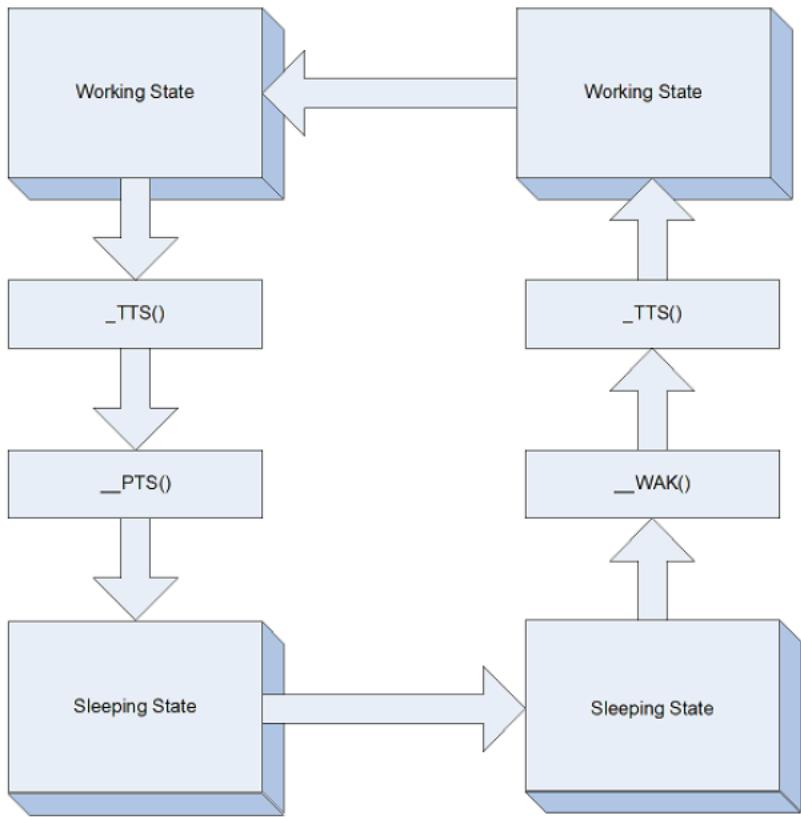  
Fig. 7.1: Working / Sleeping State object evaluation flow

# PROCESSOR CONFIGURATION AND CONTROL

This section describes the configuration and control of the processor’s power and performance states. The major controls over the processors are:

• Processor power states: C0, C1, C2, C3, . . . Cn

• Processor clock throttling

• Processor performance states: P0, P1, . . . Pn

These controls are used in combination by OSPM to achieve the desired balance of the following sometimes conflicting goals:

• Performance

• Power consumption and battery life

• Thermal requirements

• Noise-level requirements

Because the goals interact with each other, the operating software needs to implement a policy as to when and where tradeofs between the goals are to be made (see note below). For example the operating software would determine when the audible noise of the fan is undesirable and would trade of that requirement for lower thermal requirements, which can lead to lower processing performance. Each processor configuration and control interface is discussed in the following sections along with how controls interacts with the various goals.

## ò Note

A thermal warning leaves room for operating system tradeofs (to start the fan or reduce performance), without issuing a critical thermal alert.

## 8.1 Processor Power States

ACPI defines the power state of system processors while in the G0 working state as being either active executing or sleeping (not executing) - see note below. Processor power states include are designated C0, C1, C2, C3, . . . Cn. The C0 power state is an active power state where the CPU executes instructions. The C1 through Cn power states are processor sleeping states where the processor consumes less power and dissipates less heat than leaving the processor in the C0 state. While in a sleeping state, the processor does not execute any instructions. Each processor sleeping state has a latency associated with entering and exiting that corresponds to the power savings. In general, the longer the entry/exit latency, the greater the power savings when in the state. To conserve power, OSPM places the processor into one of its supported sleeping states when idle. While in the C0 state, ACPI allows the performance of the processor to be altered through a defined “throttling” process and through transitions into multiple performance states (P-states). A diagram of processor power states is provided below.

## ò Note

These CPU states map into the G0 working state, and the Cx states only apply to the G0 state. In the G3 sleeping state, the state of the CPU is undefined.

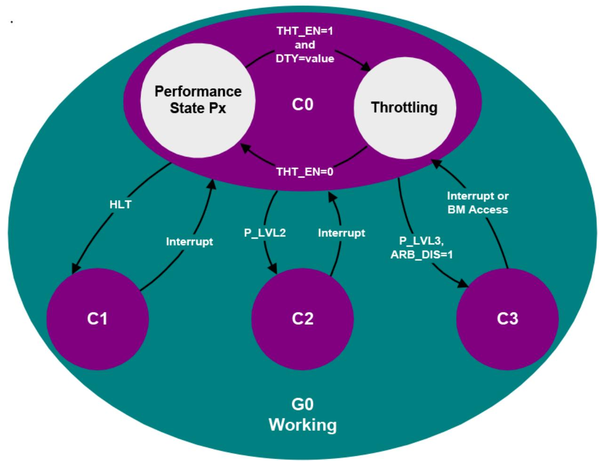  
Fig. 8.1: Processor Power States

ACPI defines logic on a per-CPU basis that OSPM uses to transition between the diferent processor power states. This logic is optional, and is described through the FADT table and processor objects (contained in the hierarchical namespace). The fields and flags within the FADT table describe the symmetrical features of the hardware, and the processor object contains the location for the particular CPU’s clock logic (described by the P\_BLK register block and \_CST objects).

The P\_LVL2 and P\_LVL3 registers provide optional support for placing the system processors into the C2 or C3 states. The P\_LVL2 register is used to sequence the selected processor into the C2 state, and the P\_LVL3 register is used to sequence the selected processor into the C3 state. Additional support for the C3 state is provided through the bus master status and arbiter disable bits (BM\_STS in the PM1\_STS register and ARB\_DIS in the PM2\_CNT register). System software reads the P\_LVL2 or P\_LVL3 registers to enter the C2 or C3 power state. The Hardware must put the processor into the proper clock state precisely on the read operation to the appropriate P\_LVLx register. The platform may alternatively define interfaces allowing OSPM to enter C-states using the \_CST object, which is defined in \_CST (C States).

Processor power state support is symmetric when presented via the FADT and P\_BLK interfaces; OSPM assumes all processors in a system support the same power states. If processors have non-symmetric power state support, then the platform runtime firmware will choose and use the lowest common power states supported by all the processors in the system through the FADT table. For example, if the CPU0 processor supports all power states up to and including the C3 state, but the CPU1 processor only supports the C1 power state, then OSPM will only place idle processors into the C1 power state (CPU0 will never be put into the C2 or C3 power states). Notice that the C1 power state must be supported. The C2 and C3 power states are optional (see the PROC\_C1 flag in the FADT table description in System Description Table Header).

The following sections describe processor power states in detail.

## 8.1.1 Processor Power State C0

While the processor is in the C0 power state, it executes instructions. While in the C0 power state, OSPM can generate a policy to run the processor at less than maximum performance. The clock throttling mechanism provides OSPM with the functionality to perform this task in addition to thermal control. The mechanism allows OSPM to program a value into a register that reduces the processor’s performance to a percentage of maximum performance.

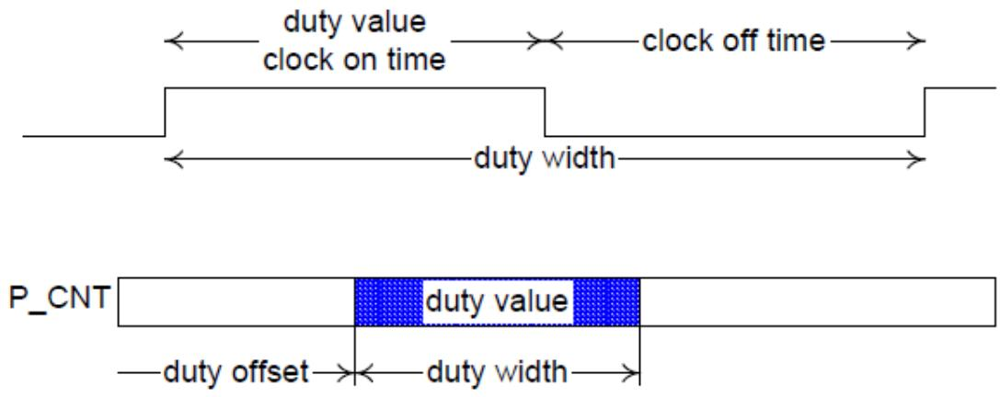  
Fig. 8.2: Throttling Example

The FADT contains the duty ofset and duty width values. The duty ofset value determines the ofset within the P\_CNT register of the duty value. The duty width value determines the number of bits used by the duty value (which determines the granularity of the throttling logic). The performance of the processor by the clock logic can be expressed with the following equation:

$$
\% \text {Performance} = \frac {\text {dutysetting}}{2 ^ {\text {dutywidth}}} * 100 \%
$$

Fig. 8.3: Equation 1 Duty Cycle Equation

Nominal performance is defined as “close as possible, but not below the indicated performance level.” OSPM will use the duty ofset and duty width to determine how to access the duty setting field. OSPM will then program the duty setting based on the thermal condition and desired power of the processor object. OSPM calculates the nominal performance of the processor using the equation expressed in Equation 1. Notice that a dutysetting of zero is reserved.For example, the clock logic could use the stop grant cycle to emulate a divided processor clock frequency on an IA processor (through the use of the STPCLK# signal). This signal internally stops the processor’s clock when asserted LOW. To implement logic that provides eight levels of clock control, the STPCLK# pin could be asserted as follows (to emulate the diferent frequency settings):

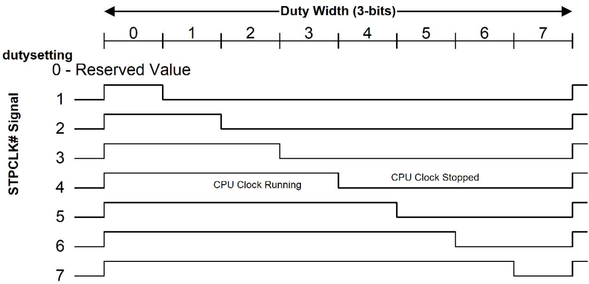  
Fig. 8.4: Example Control for the STPCLK

To start the throttling logic OSPM sets the desired duty setting and then sets the THT\_EN bit HIGH. To change the duty setting, OSPM will first reset the THT\_EN bit LOW, then write another value to the duty setting field while preserving the other unused fields of this register, and then set the THT\_EN bit HIGH again.

The example logic model is shown below:

Implementation of the ACPI processor power state controls minimally requires the support a single CPU sleeping state (C1). All of the CPU power states occur in the G0/S0 system state; they have no meaning when the system transitions into the sleeping state(S1-S4). ACPI defines the attributes (semantics) of the diferent CPU states (defines four of them). It is up to the platform implementation to map an appropriate low-power CPU state to the defined ACPI CPU state.

ACPI clock control is supported through the optional processor register block (P\_BLK). ACPI requires that there be a unique processor register block for each CPU in the system. Additionally, ACPI requires that the clock logic for multiprocessor systems be symmetrical when using the P\_BLK and FADT interfaces; if the P0 processor supports the C1, C2, and C3 states, but P1 only supports the C1 state, then OSPM will limit all processors to enter the C1 state when idle.

The following sections define the diferent ACPI CPU sleeping states.

## 8.1.2 Processor Power State C1

All processors must support this power state. This state is supported through a native instruction of the processor (HLT for IA 32-bit processors), and assumes no hardware support is needed from the chipset. The hardware latency of this state must be low enough that OSPM does not consider the latency aspect of the state when deciding whether to use it. Aside from putting the processor in a power state, this state has no other software-visible efects. In the C1 power state, the processor is able to maintain the context of the system caches.

The hardware can exit this state for any reason, but must always exit this state when an interrupt is to be presented to the processor.

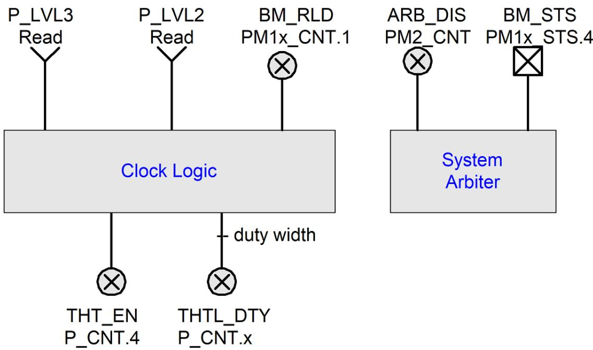  
Fig. 8.5: ACPI Clock Logic (One per Processor)

## 8.1.3 Processor Power State C2

This processor power state is optionally supported by the system. If present, the state ofers improved power savings over the C1 state and is entered by using the P\_LVL2 command register for the local processor or an alternative mechanism as indicated by the \_CST object. The worst-case hardware latency for this state is declared in the FADT and OSPM can use this information to determine when the C1 state should be used instead of the C2 state. Aside from putting the processor in a power state, this state has no other software-visible efects. OSPM assumes the C2 power state has lower power and higher exit latency than the C1 power state.

The C2 power state is an optional ACPI clock state that needs chipset hardware support. This clock logic consists of an interface that can be manipulated to cause the processor complex to precisely transition into a C2 power state. In a C2 power state, the processor is assumed capable of keeping its caches coherent; for example, bus master and multiprocessor activity can take place without corrupting cache context.

The C2 state puts the processor into a low-power state optimized around multiprocessor and bus master systems. OSPM will cause an idle processor complex to enter a C2 state if there are bus masters or Multiple processor activity (which will prevent OSPM from placing the processor complex into the C3 state). The processor complex is able to snoop bus master or multiprocessor CPU accesses to memory while in the C2 state.

The hardware can exit this state for any reason, but must always exit this state whenever an interrupt is to be presented to the processor.

## 8.1.4 Processor Power State C3

This processor power state is optionally supported by the system. If present, the state ofers improved power savings over the C1 and C2 state and is entered by using the P\_LVL3 command register for the local processor or an alternative mechanism as indicated by the \_CST object. The worst-case hardware latency for this state is declared in the FADT, and OSPM can use this information to determine when the C1 or C2 state should be used instead of the C3 state. While in the C3 state, the processor’s caches maintain state but the processor is not required to snoop bus master or multiprocessor CPU accesses to memory.

The hardware can exit this state for any reason, but must always exit this state when an interrupt is to be presented to the processor or when BM\_RLD is set and a bus master is attempting to gain access to memory.

OSPM is responsible for ensuring that the caches maintain coherency. In a uniprocessor environment, this can be done by using the PM2\_CNT.ARB\_DIS bus master arbitration disable register to ensure bus master cycles do not occur while in the C3 state. In a multiprocessor environment, the processors’ caches can be flushed and invalidated such that no dynamic information remains in the caches before entering the C3 state.

There are two mechanisms for supporting the C3 power state:

• Having OSPM flush and invalidate the caches prior to entering the C3 state.

• Providing hardware mechanisms to prevent masters from writing to memory (uniprocessor-only support).

In the first case, OSPM will flush the system caches prior to entering the C3 state. As there is normally much latency associated with flushing processor caches, OSPM is likely to only support this in multiprocessor platforms for idle processors. Flushing of the cache is accomplished through one of the defined ACPI mechanisms (described below in Flushing Caches).

In uniprocessor-only platforms that provide the needed hardware functionality (defined in this section), OSPM will attempt to place the platform into a mode that will prevent system bus masters from writing into memory while the processor is in the C3 state. This is accomplished by disabling bus masters prior to entering a C3 power state. Upon a bus master requesting an access, the CPU will awaken from the C3 state and re-enable bus master accesses.

OSPM uses the BM\_STS bit to determine the power state to enter when considering a transition to or from the C2/C3 power state. The BM\_STS is an optional bit that indicates when bus masters are active. OSPM uses this bit to determine the policy between the C2 and C3 power states: a lot of bus master activity demotes the CPU power state to the C2 (or C1 if C2 is not supported), no bus master activity promotes the CPU power state to the C3 power state. OSPM keeps a running history of the BM\_STS bit to determine CPU power state policy.

The last hardware feature used in the C3 power state is the BM\_RLD bit. This bit determines if the Cx power state is exited as a result of bus master requests. If set, then the Cx power state is exited upon a request from a bus master. If reset, the power state is not exited upon bus master requests. In the C3 state, bus master requests need to transition the CPU back to the C0 state (as the system is capable of maintaining cache coherency), but such a transition is not needed for the C2 state. OSPM can optionally set this bit when using a C3 power state, and clear it when using a C1 or C2 power state.

## 8.1.5 Additional Processor Power States

ACPI introduced optional processor power states beyond C3 starting in ACPI 2.0. These power states, C4. . . Cn, are conveyed to OSPM through the \_CST object defined in \_CST (C States) These additional power states are characterized by equivalent operational semantics to the C1 through C3 power states, as defined in the previous sections, but with diferent entry/exit latencies and power savings. See \_CST (C States) for more information.

## 8.2 Flushing Caches

To support the C3 power state without using the ARB\_DIS feature, the hardware must provide functionality to flush and invalidate the processors’ caches (for an IA processor, this would be the WBINVD instruction). To support the S1, S2 or S3 sleeping states, the hardware must provide functionality to flush the platform caches. Flushing of caches is supported by one of the following mechanisms:

• Processor instruction to write back and invalidate system caches (WBINVD instruction for IA processors).

• Processor instruction to write back but not invalidate system caches (WBINVD instruction for IA processors and some chipsets with partial support; that is, they don’t invalidate the caches).

The ACPI specification expects all platforms to support the local CPU instruction for flushing system caches (with support in both the CPU and chipset), and provides some limited “best efort” support for systems that don’t currently meet this capability. The method used by the platform is indicated through the appropriate FADT fields and flags indicated in this section.

ACPI specifies parameters in the FADT that describe the system’s cache capabilities. If the platform properly supports the processor’s write back and invalidate instruction (WBINVD for IA processors), then this support is indicated to OSPM by setting the WBINVD flag in the FADT.

If the platform supports neither of the first two flushing options, then OSPM can attempt to manually flush the cache if it meets the following criteria:

• A cache-enabled sequential read of contiguous physical memory of not more than 2 MB will flush the platform caches.

• There are two additional FADT fields needed to support manual flushing of the caches:

• FLUSH\_SIZE, typically twice the size of the largest cache in the system.

• FLUSH\_STRIDE, typically the smallest cache line size in the system.

## 8.3 Power, Performance, and Throttling State Dependencies

Cost and complexity trade-of considerations have driven into the platform control dependencies between logical processors when entering power, performance, and throttling states. These dependencies exist in various forms in multiprocessor, multi-threaded processor, and multi-core processor-based platforms. These dependencies may also be hierarchical. For example, a multi-processor system consisting of processors containing multiple cores containing multiple threads may have various dependencies as a result of the hardware implementation.

Unless OSPM is aware of the dependency between the logical processors, it might lead to scenarios where one logical processor is implicitly transitioned to a power, performance, or throttling state when it is unwarranted, leading to incorrect / non-optimal system behavior. Given knowledge of the dependencies, OSPM can coordinate the transitions between logical processors, choosing to initiate the transition when doing so does not lead to incorrect or non-optima system behavior. This OSPM coordination is referred to as Software (SW) Coordination. Alternately, it might be possible for the underlying hardware to coordinate the state transition requests on multiple logical processors, causing the processors to transition to the target state when the transition is guaranteed to not lead to incorrect or non-optimal system behavior. This scenario is referred to as Hardware (HW) coordination. When hardware coordinates transitions, OSPM continues to initiate state transitions as it would if there were no dependencies. However, in this case it is required that hardware provide OSPM with a means to determine actual state residency so that correct / optimal control policy can be realized.

Platforms containing logical processors with cross-processor dependencies in the power, performance, or throttling state control areas use ACPI defined interfaces to group logical processors into what is referred to as a dependency domain. The Coordination Type characteristic for a domain specifies whether OSPM or underlying hardware is responsible for the coordination. When OSPM coordinates, the platform may require that OSPM transition ALL (0xFC) or ANY ONE (0xFD) of the processors belonging to the domain into a particular target state. OSPM may choose at its discretion to perform coordination even though the underlying hardware supports hardware coordination. In this case, OSPM must transition all logical processors in the dependency domain to the particular target state.

Table 8.1: C-state/T-state/P-state Coordination Types

<table><tr><td>Value</td><td>Description</td></tr><tr><td>0xFC</td><td>SW_ALL: The OSPM coordinates the state for all processors in the domain by making the same state request on the control interface of each processor in the domain. ALL refers to the requirement that all processors in the domain must agree on the requested state for the domain to enter that state.</td></tr><tr><td>0xFD</td><td>SW_ANY: The OSPM coordinates the state for all processors in the domain by making a state request on the control interface of only one processor in the domain. ANY refers to the hardware requirement for all processors in the domain to transition to the last requested state on any processor in the domain.</td></tr><tr><td>0xFE</td><td>HW_ALL: As the OSPM requests a state transition on the control interface of any processor in the domain, hardware coordinates the state for all processors in the domain and transitions all processors in the domain to the coordinated state. ALL refers to the requirement for hardware maintaining coordination as OPSM makes independent state requests on any processor in the domain. Unlike SW_ALL, OSPM can make different state requests for processors in the domain, while hardware determines the resulting state for all processors in the domain. Note: The hardware coordination policy is implementation-defined.</td></tr></table>

There are no dependencies implied between a processor’s C-states, P-states or T-states. Hence, for example it is possible to use the same dependency domain number for specifying dependencies between P-states among one set of processors and C-states among another set of processors without any dependencies being implied between the P-State transitions on a processor in the first set and C-state transitions on a processor in the second set.

## 8.4 Declaring Processors

Each processor in the system must be declared in the ACPI namespace in the \_SB scope. A Device definition for a processor is declared using the ACPI0007 hardware identifier (HID). Processor configuration information is provided exclusively by objects in the processor device’s object list.

When the platform uses the APIC interrupt model, UID object values under a processor device are used to associate processor devices with entries in the MADT.

Processor-specific objects may be declared within the processor device’s scope. These objects serve multiple purposes including processor performance state control. Other ACPI-defined device-related objects are also allowed under the processor device’s scope (for example, the unique identifier object \_UID mentioned above).

With device-like characteristics attributed to processors, it is implied that a processor device driver will be loaded by OSPM to, at a minimum, process device notifications. OSPM will enumerate processors in the system using the ACPI Namespace, processor-specific native identification instructions, and the \_HID method.

For more information on the declaration of the processor device object, see Device (Declare Device Package). Processor-specific child objects are described in the following sections.

ACPI 6.0 introduces the notion of processor containers. Processor containers are declared using the Processor Container Device. A processor container can be used to describe a collection of associated processors that share common resources, such as shared caches, and which have power states that afect the processors in the collection. For more information see Processor Container Device.

## 8.4.1 Processor Power State Control

ACPI defines multiple processor power state (C state) control interfaces. These are:

1. The Processor Register Block’s (P\_BLK’s) P\_LVL2 and P\_LVL3 registers coupled with FADT P\_LVLx\_LAT values and

2. The \_CST object in the processor’s object list.

3. The \_LPI objects for processors and processor containers.

P\_BLK based C state controls are described in ACPI Hardware Specification. \_CST based C state controls expand the functionality of the P\_BLK based controls allowing the number and type of C states to be dynamic and accommodate CPU architecture specific C state entry and exit mechanisms as indicated by registers defined using the Functional Fixed Hardware address space.

\_CST is an optional object that provides:

• The Processor Register Block’s (P\_BLK’s) P\_LVL2 and P\_LVL3 registers coupled with FADT P\_LVLx\_LAT values.

• The \_CST object in the processor’s object list.

ACPI 6.0 introduces \_LPI, the low power idle state object. \_LPI provides more detailed power state information and can describe idle states at multiple levels of hierarchy in conjunction with Processor Containers. See \_LPI (Low Power Idle States) for details.

## 8.4.1.1 \_CST (C States)

\_CST is an optional object that provides an alternative method to declare the supported processor power states (C States). Values provided by the \_CST object override P\_LVLx values in P\_BLK and P\_LVLx\_LAT values in the FADT. The \_CST object allows the number of processor power states to be expanded beyond C1, C2, and C3 to an arbitrary number of power states. The entry semantics for these expanded states, (in other words), the considerations for entering these states, are conveyed to OSPM by the C state Type field and correspond to the entry semantics for C1 C2 and C3 as described in Section 8.1.2 through Section 8.1.4. \_CST defines ascending C-states characterized by lower power and higher entry/exit latency.

Arguments:

None

Return Value:

A variable-length Package containing a list of C-state information Packages as described below

## Return Value Information

\_CST returns a variable-length Package that contains the following elements:

• Count An Integer that contains the number of CState sub-packages that follow

• CStates[] A list of Count CState sub-packages

<table><tr><td>Package { Count // Integer CStates[0] // Package ... CStates[Count-1] // Package}</td></tr></table>

Each fixed-length Cstate sub-Package contains the elements described below:

```go
Package {
    Register    // Buffer (Resource Descriptor)
    Type    // Integer (BYTE)
    Latency    // Integer (WORD)
    Power    // Integer (DWORD)
}
```

Table 8.2: Cstate Package Values

<table><tr><td>Element</td><td>Object Type</td><td>Description</td></tr><tr><td>Register</td><td>Buffer</td><td>Contains a Resource Descriptor with a single Register() descriptor that describes the register that OSPM must read to place the processor in the corresponding C state.</td></tr><tr><td>Type</td><td>Integer (BYTE)</td><td>The C State type (1=C1, 2=C2, 3=C3). This field conveys the semantics to be used by OSPM when entering/exiting the C state. Zero is not a valid value.</td></tr><tr><td>Latency</td><td>Integer (WORD)</td><td>The worst-case latency to enter and exit the C State (in microseconds). There are no latency restrictions.</td></tr><tr><td>Power</td><td>Integer (DWORD)</td><td>The average power consumption of the processor when in the corresponding C State (in milliwatts).</td></tr></table>

The platform must expose a \_CST object for either all or none of its processors. If the \_CST object exists, OSPM uses the C state information specified in the \_CST object in lieu of P\_LVL2 and P\_LVL3 registers defined in P\_BLK and the P\_LVLx\_LAT values defined in the FADT. Also notice that if the \_CST object exists and the \_PTC object does not exist, OSPM will use the Processor Control Register defined in P\_BLK and the C\_State\_Register registers in the \_CST object.

The platform may change the number or type of C States available for OSPM use dynamically by issuing a Notify event on the processor object with a notification value of 0x81. This will cause OSPM to re-evaluate any \_CST object residing under the processor object notified. For example, the platform might notify OSPM that the number of supported C States has changed as a result of an asynchronous AC insertion / removal event.

The platform must specify unique C\_State\_Register addresses for all entries within a given \_CST object.

\_CST eliminates the ACPI 1.0 restriction that all processors must have C State parity. With \_CST, each processor can have its own characteristics independent of other processors. For example, processor 0 can support C1, C2 and C3, while processor 1 supports only C1.

The fields in the processor structure remain for backward compatibility.

## Example

```txt
Processor (
    $_SB.CPU0, // Processor Name
    1, // ACPI Processor number
    0x120, // PBlk system IO address
    6 // PBlkLen
)
{
    Name(_CST, Package()
    {
    4, // There are four C-states defined here with three semantics
    // The third and fourth C-states defined have the same C3 entry semantics
    Package() {ResourceTemplate() {Register(FFixedHW, 0, 0, 0)}, 1, 20, 1000},
```

(continues on next page)

```go
package(){ResourceTemplate(){Register(SystemIO, 8, 0, 0x161)}, 2, 40, 750},
 Package(){ResourceTemplate(){Register(SystemIO, 8, 0, 0x162)}, 3, 60, 500},
 Package(){ResourceTemplate(){Register(SystemIO, 8, 0, 0x163)}, 3, 100, 250}
}
}
```

Notice in the example above that OSPM should anticipate the possibility of a \_CST object providing more than one entry with the same C\_State\_Type value. In this case OSPM must decide which C\_State\_Register it will use to enter that C state.

## Example

This is an example usage of the \_CST object using the typical values as defined in ACPI 1.0.

```txt
Processor (
    \\_SB.CPU0,    // Processor Name
    1,    // ACPI Processor number
    0x120,    // PBLK system IO address
    6)    // PBLK Len
{
    Name(_CST, Package()
    {
    2,    // There are two C-states defined here - C2 and C3
    Package(){ResourceTemplate(){Register(SystemIO, 8, 0, 0x124)}, 2, 2, 750},
    Package(){ResourceTemplate(){Register(SystemIO, 8, 0, 0x125)}, 3, 65, 500}
    })
}
```

The platform will issue a Notify (\_SB.CPU0, 0x81) to inform OSPM to re-evaluate this object when the number of available processor power states changes.

## 8.4.1.2 \_CSD (C-State Dependency)

This optional object provides C-state control cross logical processor dependency information to OSPM. The \_CSD object evaluates to a packaged list of information that correlates with the C-state information returned by the \_CST object. Each packaged list entry identifies the C-state for which the dependency is being specified (as an index into the \_CST object list), a dependency domain number for that C-state, the coordination type for that C-state and the number of logical processors belonging to the domain for the particular C-state. It is possible that a particular C-state may belong to multiple domains. That is, it is possible to have multiple entries in the \_CSD list with the same CStateIndex value.

## Arguments:

None

Return Value:

A variable-length Package containing a list of C-state dependency Packages as described below.

## Return Value Information

```txt
Package {
    CStateDependency[0] // Package
}
```

(continues on next page)

<table><tr><td></td><td>(continued from previous page)</td></tr><tr><td>CStateDependency[n]</td><td>// Package</td></tr><tr><td>}</td><td></td></tr></table>

Each CStateDependency sub-Package contains the elements described below:  
```txt
Package {
NumEntries // Integer
Revision // Integer (BYTE)
Domain // Integer (DWORD)
CoordType // Integer (DWORD)
NumProcessors // Integer (DWORD)
Index // Integer (DWORD)
}
```

Table 8.3: C-State Dependency Package Values

<table><tr><td>Element</td><td>Object Type</td><td>Description</td></tr><tr><td>NumEntries</td><td>Integer</td><td>The number of entries in the CStateDependency package including this field. Current value is 6.</td></tr><tr><td>Revision</td><td>Integer (BYTE)</td><td>The revision number of the CStateDependency package format. Current value is 0.</td></tr><tr><td>Domain</td><td>Integer (DWORD)</td><td>The dependency domain number to which this C state entry belongs.</td></tr><tr><td>CoordType</td><td>Integer (DWORD)</td><td>See Table 8.1 for supported C-state coordination types.</td></tr><tr><td>Num Processors</td><td>Integer (DWORD)</td><td>The number of processors belonging to the domain for the particular C-state. OSPM will not start performing power state transitions to a particular C-state until this number of processors belonging to the same domain for the particular C-state have been detected and started.</td></tr><tr><td>Index</td><td>Integer (DWORD)</td><td>Indicates the index of the C-State entry in the _CST object for which the dependency applies.</td></tr></table>

Given that the number or type of available C States may change dynamically, ACPI supports Notify events on the processor object, with Notify events of type 0x81 causing OSPM to re-evaluate any \_CST objects residing under the particular processor object notified. On receipt of Notify events of type 0x81, OSPM should re-evaluate any present \_CSD objects also.

## Example

This is an example usage of the \_CSD structure in a Processor structure in the namespace. The example represents a two processor configuration. The C1-type state can be independently entered on each processor. For the C2-type state, there exists dependence between the two processors, such that one processor transitioning to the C2-type state, causes the other processor to transition to the C2-type state. A similar dependence exists for the C3-type state. OSPM will be required to coordinate the C2 and C3 transitions between the two processors. Also OSPM can initiate a transition on either processor to cause both to transition to the common target C-state.

```txt
Processor (
    \_SB.CPU0,    // Processor Name
    1,    // ACPI Processor number
    0x120,    // PBlk system IO address
    6 )    // PBlkLen
{
```

(continues on next page)