<table><tr><td></td><td>(continued from previous page)</td></tr><tr><td>CStateDependency[n]</td><td>// Package</td></tr><tr><td>}</td><td></td></tr></table>

Each CStateDependency sub-Package contains the elements described below:  
```txt
Package {
NumEntries // Integer
Revision // Integer (BYTE)
Domain // Integer (DWORD)
CoordType // Integer (DWORD)
NumProcessors // Integer (DWORD)
Index // Integer (DWORD)
}
```

Table 8.3: C-State Dependency Package Values

<table><tr><td>Element</td><td>Object Type</td><td>Description</td></tr><tr><td>NumEntries</td><td>Integer</td><td>The number of entries in the CStateDependency package including this field. Current value is 6.</td></tr><tr><td>Revision</td><td>Integer (BYTE)</td><td>The revision number of the CStateDependency package format. Current value is 0.</td></tr><tr><td>Domain</td><td>Integer (DWORD)</td><td>The dependency domain number to which this C state entry belongs.</td></tr><tr><td>CoordType</td><td>Integer (DWORD)</td><td>See Table 8.1 for supported C-state coordination types.</td></tr><tr><td>Num Processors</td><td>Integer (DWORD)</td><td>The number of processors belonging to the domain for the particular C-state. OSPM will not start performing power state transitions to a particular C-state until this number of processors belonging to the same domain for the particular C-state have been detected and started.</td></tr><tr><td>Index</td><td>Integer (DWORD)</td><td>Indicates the index of the C-State entry in the _CST object for which the dependency applies.</td></tr></table>

Given that the number or type of available C States may change dynamically, ACPI supports Notify events on the processor object, with Notify events of type 0x81 causing OSPM to re-evaluate any \_CST objects residing under the particular processor object notified. On receipt of Notify events of type 0x81, OSPM should re-evaluate any present \_CSD objects also.

## Example

This is an example usage of the \_CSD structure in a Processor structure in the namespace. The example represents a two processor configuration. The C1-type state can be independently entered on each processor. For the C2-type state, there exists dependence between the two processors, such that one processor transitioning to the C2-type state, causes the other processor to transition to the C2-type state. A similar dependence exists for the C3-type state. OSPM will be required to coordinate the C2 and C3 transitions between the two processors. Also OSPM can initiate a transition on either processor to cause both to transition to the common target C-state.

```txt
Processor (
    \_SB.CPU0,    // Processor Name
    1,    // ACPI Processor number
    0x120,    // PBlk system IO address
    6 )    // PBlkLen
{
```

(continues on next page)

```txt
Name (_CST, Package()
{
    3, // There are three C-states defined here with three
    semantics
    Package() {ResourceTemplate() {Register(FFixedHW, 0, 0, 0)}, 1, 20, 1000},
    Package() {ResourceTemplate() {Register(SystemIO, 8, 0, 0x161)}, 2, 40, 750},
    Package() {ResourceTemplate() {Register(SystemIO, 8, 0, 0x162)}, 3, 60, 500}
})
Name(_CSD, Package()
{
    Package() {6, 0, 0, 0xFD, 2, 1}, // 6 entries, Revision 0, Domain 0, OSPM Coordinate
    // Initiate on Any Proc, 2 Procs, Index 1 (C2-type)
    Package() {6, 0, 0, 0xFD, 2, 2}, // 6 entries, Revision 0 Domain 0, OSPM Coordinate
    // Initiate on Any Proc, 2 Procs, Index 2 (C3-type)
})
}
Processor (
    $_SB.CPU1, // Processor Name
    2, // ACPI Processor number
    , // PBlk system IO address
    ) // PBlkLen
{
    Name(_CST, Package()
    {
    3, // There are three C-states defined here with three semantics
    Package() {ResourceTemplate() {Register(FFixedHW, 0, 0, 0)}, 1, 20, 1000},
    Package() {ResourceTemplate() {Register(SystemIO, 8, 0, 0x161)}, 2, 40, 750},
    Package() {ResourceTemplate() {Register(SystemIO, 8, 0, 0x162)}}, 3, 60, 500}
})
Name(_CSD, Package()
{
    Package() {6, 0, 0, 0xFD, 2, 1}, // 6 entries, Revision 0, Domain 0, OSPM Coordinate
    // Initiate on any Proc, 2 Procs, Index 1 (C2-type)
    Package() {6, 0, 0, 0xFD, 2, 2}, // 6 entries, Revision 0, Domain 0, OSPM Coordinate
    // Initiate on any Proc, 2 Procs, Index 2 (C3-type)
})
}
```

When the platform issues a Notify (\_SB.CPU0, 0x81) to inform OSPM to re-evaluate \_CST when the number of available processor power states changes, OSPM should also evaluate \_CSD.

## 8.4.2 Processor Hierarchy

It is very typical for computing platforms to have a multitude of processors that share common resources, such as caches, and which have common power states that afect groups of processors. These are arranged in a hierarchical manner. For example, a system may contain a set of NUMA nodes, each with a number of sockets, which may contain multiple groups of processors, each of which may contain individual processor cores, each of which may contain multiple hardware threads. Diferent architectures use diferent terminology to denominate logically associated processors, but terms such as package, cluster, module, and socket are typical examples. ACPI uses the term processor container to describe a group of associated processors. Processors are said to belong to a container if they are associated in some way, such as a shared cache or a low power mode which afects them all.

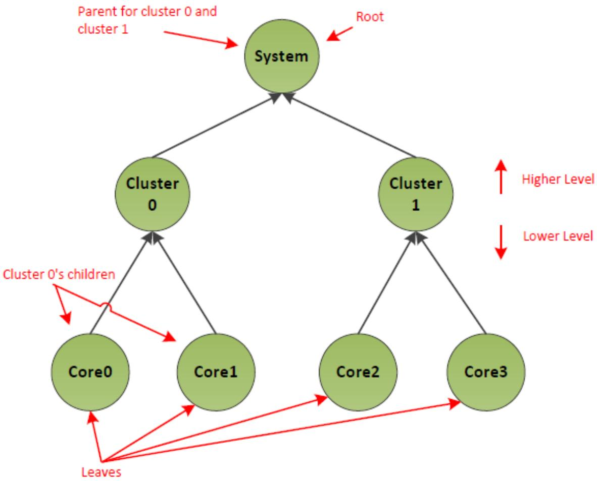  
Fig. 8.6: Processor Hierarchy

The figure above depicts an example system, which comprises a system level processor container, which in turn contains two cluster processor containers, each of which contains two processors. The overall collection is called the processor hierarchy and standard tree terminology is used to refer to diferent parts of it. For example, an individual processor or container is called a node, the nodes which reside within a processor container are called children of that parent, etc. This example is symmetric but that is not a requirement. For example, a system may contain a diferent number of processors in diferent containers or an asymmetric hierarchy where one side of the topology tree is deeper than another. Also note that while this example includes a single top level processor container encompassing all processors, this is not a requirement. It is legal for a system to be described using a collection of trees. (See Note below)

ò Note

The processor hierarchy can be used to describe a number of diferent characteristics of system topology. The main example is shared power states, see the Low Power Idle states in Lower Power Idle States for details.

## 8.4.2.1 Processor Container Device

This optional device is a container object that acts much like a bus node in a namespace. It may contain child objects that are either processor devices or other processor containers. This allows representing hierarchical processor topologies. Each processor container or processor in the hierarchy is herein referred to as a node. The processor container device is declared using the hardware identifier (\_HID) ACPI0010.

To aid support of operating systems which do not parse processor containers, a container can carry a Compatible ID (\_CID) of PNP0A05, which represents a generic container device (see Device Class-Specific Objects)

A processor container declaration must supply a \_UID method returning an ID that is unique in the processor container hierarchy. A processor container must contain either other processor containers or other processor devices declared within its scope. In addition, a processor container may also contain the following methods in its scope:

Table 8.4: Processor Container Device Objects

<table><tr><td>Object</td><td>Description</td></tr><tr><td>_LPI</td><td>Declares local power states for the hierarchy node represented by the processor container</td></tr><tr><td>_RDI</td><td>Declares power resource dependencies that affect system level power states</td></tr><tr><td>_STA</td><td>Determines the status of a processor container. See Device Class-Specific Objects.</td></tr></table>

\_LPI may be present under a processor device, and is described in \_LPI (Low Power Idle States). RDI can only be present under a singular top level processor container object, and is described below.

ACPI allows the definition of more than one root level processor container. In other words, it is possible to define multiple top level containers. For example, in a NUMA system if there are no idle states or other objects that need to be encapsulated at the system level, multiple NUMA-node level processor containers may be defined at the top level of the hierarchy.

Processor Container Device objects are only valid for implementations conforming to ACPI 6.0 or higher. A platform can ascertain whether an operating system supports parsing of processor container objects via the \_OSC method (see Platform-Wide OSPM Capabilities).

## 8.4.3 Lower Power Idle States

ACPI 6.0 introduces Lower Power Idle states (LPI). This extends the specification to allow expression of idle states that, like C-states, are selected by the OSPM when a processor goes idle, but which may afect more than one processor, and may afect other system components. LPI extensions in the specification leverage the processor container device, and in this way can express which parts of the system are afected by a given LPI state.

LPI states are defined via the following objects:

• \_LPI objects define the states themselves, and may be declared inside a processor or a processor container device

• \_RDI allows expressing constraints on LPI usage borne out of device usage

## 8.4.3.1 Hierarchical Idle States

Processor containers (Processor Container Device) can be used in conjunction with \_LPI (\_LPI (Low Power Idle States)) to describe idle states in a hierarchical manner. Within the processor hierarchy, each node has low power states that are specific to that node. ACPI refers to states that are specific to a node in the hierarchy as Local Power States. For example in the system depicted in Power states for processor hierarchy, the local power states of CPU0 are clock gate, retention and power down.

When the OS running on a given processor detects there is no more work to schedule on that processor, it needs to select an idle state. The state may afect more than just that processor. A processor going idle could be the last one in the system, or in a processor container, and therefore may select a power state what afects multiple processors. In order to select such a state, the OS needs to choose a local power state for each afected level in the processor hierarchy.

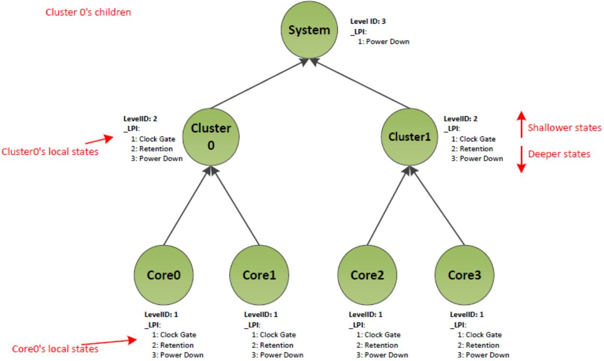  
Fig. 8.7: Power states for processor hierarchy

Consider a situation where Core 0 is the last active core depicted in the example system, Power states for processor hierarchy. It may put the system into the lowest possible idle state. To do so, the OS chooses local state 3 (Power Down) for Core0, local state 3 (Power Down) for Cluster0, and local state 1 (Power Down) for the system. However, most HW architectures only support a single power state request from the OS to the platform. That is, it is not possible to make a separate local power state request per hierarchy node to the platform. Therefore, the OS must combine the per level local power states into a single Composite power state. The platform then acts on the Composite power state request.

A platform can only support a limited set of Composite power states, and not every combination of Local Power states across levels is valid. The valid power states in our example system are depicted in the following table.

Table 8.5: Valid Local State Combinations in preceding example system

<table><tr><td>System Level Processor Container</td><td>Cluster level Processor Container</td><td>Processor</td></tr><tr><td>Running</td><td>Running</td><td>Clock Gated</td></tr><tr><td>Running</td><td>Running</td><td>Retention</td></tr><tr><td>Running</td><td>Running</td><td>Power Down</td></tr><tr><td>Running</td><td>Clock Gated</td><td>Clock Gated</td></tr><tr><td>Running</td><td>Clock Gated</td><td>Retention</td></tr><tr><td>Running</td><td>Clock Gated</td><td>Power Down</td></tr><tr><td>Running</td><td>Retention</td><td>Retention</td></tr><tr><td>Running</td><td>Retention</td><td>Power Down</td></tr><tr><td>Running</td><td>Power Down</td><td>Power Down</td></tr><tr><td>Power Down</td><td>Power Down</td><td>Power Down</td></tr></table>

## 8.4.3.2 Idle State Coordination

With hierarchical idle states, multiple processors afect the idle state for any non-leaf hierarchy node. Taking our example system in Power states for processor hierarchy, for cluster 0 to enter a low power state, both Core 0 and Core 1 must be idle. In addition, the power state selection done for Core 0 and Core 1 as they go idle has bearing on the state that can be used for Cluster 0. This requires coordination of idle state requests between the two processors. ACPI supports two diferent coordination schemes (detailed in subsections following):

• Platform coordinated

• OS initiated.

The OS and the platform can handshake on support for OS Initiated Idle or Platform Coordinated Idle using the \_OSC method as described in Platform-Wide OSPM Capabilities. Note that an Architecture specific command may be required to enter OS Initiated mode, in which case please refer to architecture specific documentation. (For PSCI documentation see http://uefi.org/acpi under the heading “PSCI Specification”; for ARM FFH documentation, see http://uefi.org/acpi under the heading “ARM FFH Specification”.)

For RISC-V based systems please refer to links to ACPI-Related Documents ( https://uefi.org/acpi ) under the heading “RISC-V FFH Specification”.

## 8.4.3.2.1 Platform Coordinated

With the Platform Coordinated scheme, the platform is responsible for coordination of idle states across processors. OSPM makes a request for all levels of hierarchy from each processor meaning that each processor makes a vote by requesting a local power state for itself, its parent, its parent’s parent, etc. (In some cases, the vote for a particular hierarchy level may be implicit - see the autopromotion discussion below for more details). When choosing idle states at higher levels, the OSPM on a processor may opt to keep a higher level node in a running state - this is still a vote for that node which the platform must respect. The vote expressed by the OSPM sets out the constraints on the local power state that the platform may choose for processor, and any parent nodes afected by the vote. In particular the vote expresses that the platform must not enter:

1. A deeper (lower power) local state than the requested one.

2. A local power state with a higher wake up latency than the requested one.

3. A local power state with power resource dependencies that the requested state does not have.

The platform looks across the votes for each hierarchy node from all underlying cores and chooses the deepest local state which satisfies all of the constraints associated with all of the votes. Normally, this just means taking the shallowest state that one of the cores voted for, since shallower states have lower wakeup latencies, lower minimum residencies, and fewer power resource dependencies. However, this may not always be the true, as state depth and latencies do not always increase together. For the sake of eficiency, the platform should generally not enter a power state with a higher minimum residency than the requested one. However, this is not a strict functional requirement. The platform may resolve to a state with higher minimum residency if it believes that is the most eficient choice based on the specific states and circumstances.

Using the above example in Power states for processor hierarchy, a simple flow would look like this:

• Core0 goes idle - OS requests Core0 Power Down, Cluster0 Retention

• Platform receives Core0 requests - place Core0 in the Power Down state

• Core1 goes idle - OS requests Core1 Power Down, Cluster0 Power Down

• Platform receives Core1 request - puts Core1 in the Power Down state, and takes shallowest vote for Cluster0, thus placing it into the Retention state

If the OSPM wanted to request power states beyond the cluster level, then Core0 and Core1 would both vote for an idle state at System level too, and the platform would resolve the final state selection across their votes and votes from any other processors under the System hierarchy via the method described above

As mentioned above, certain platforms support a mechanism called autopromotion where the votes for higher level states may be implicit rather than explicit. In this scheme, the platform provides OSPM with commands to request idle states at a lower level of the processor hierarchy which automatically imply a specific idle state request at the respective higher level of the hierarchy. There is no command to explicitly request entry into the higher level state, only the implicit request based on the lower level state.

For example, if the platform illustrated in Power states for processor hierarchy uses autopromotion for the Cluster0 Clock Gated state, neither Core0 nor Core1 can explicitly request it. However, a core level Clock Gate request from either Core0 or Core1 would imply a Cluster0 Clock Gate request. Therefore, if both cores request core clock gating (or deeper), Cluster0 will be clock gated automatically by the platform. Additional details on how autopromotion is supported by ACPI can be found in Entry Method and Composition.

## 8.4.3.2.2 OS Initiated

In the OS Initiated coordination scheme, OSPM only requests an idle state for a particular hierarchy node when the last underlying processor goes to sleep. Obviously a processor always selects an idle state for itself, but idle states for higher level hierarchy nodes like clusters are only selected when the last processor in the cluster goes idle. The platform only considers the most recent request for a particular node when deciding on its idle state.

The main motivations for OS Initiated coordination are:

1. Avoid overhead of OSPM evaluating selection for higher level idle states which will not be used since other processors are still awake

2. Allow OSPM to make higher level idle state selections based on the latest information by taking only the most recent request for a particular node and ignoring requests from processors which went to sleep in the past (and may have been based on information which is now stale)

Using the above example in a simple flow would look like the following.

Table 8.6: OS Initiated Flow

<table><tr><td>Step</td><td></td><td>OS View of power states</td><td>Platform view of power states</td></tr><tr><td>0:</td><td>Cores 0 and 1 are both awake and running code</td><td>Core0: RunningCore1: RunningCluster0: Running</td><td>Core0: RunningCore1: RunningCluster0: Running</td></tr><tr><td>1</td><td>OS on Core0 requests Core0 PowerDown</td><td>Core0: PowerDownCore1: RunningCluster0: Running</td><td>Core0: RunningCore1: RunningCluster0: Running</td></tr><tr><td>2</td><td>Platform observes request and places Core0 into power down</td><td>Core0: PowerDownCore1: RunningCluster0: Running</td><td>Core0: PowerDownCore1: RunningCluster0: Running</td></tr><tr><td>3</td><td>OS on Core1 requests Core1 PowerDown and Cluster0 PowerDown</td><td>Core0: PowerDownCore1: PowerDownCluster0: PowerDown</td><td>Core0: PowerDownCore1: RunningCluster0: Running</td></tr><tr><td>4</td><td>Platform observes requests for Core1 and Cluster0 and processes them</td><td>Core0: PowerDownCore1: PowerDownCluster0: PowerDown</td><td>Core0: PowerDownCore1: PowerDownCluster0: PowerDown</td></tr></table>

Note that Core1 is making a cluster decision which afects both Core0 and Core1 so OSPM should consider expected sleep duration, wake up latency requirements, device dependencies, etc. for both cores and not just Core1 when requesting the cluster state.

The platform is still responsible for ensuring functional correctness. For example, if Core0 wakes back up, the cluster state requested by Core1 in the above example should be exited or the entry into the state should be aborted. OSPM has no responsibility to guarantee that the last core down is also the first core up, or that a core does not wake up just as another is requesting a higher level sleep state.

## 8.4.3.2.2.1 OS Initiated Request Semantics

With OS Initiated coordination, the ordering of requests from diferent cores is critically important since the platform acts upon the latest one. If the platform does not process requests in the order the OS intended then it may put the platform into the wrong state. Consider this scenario in our example system in Power states for processor hierarchy, as shown in the following table.

Table 8.7: Example of incorrect platform state in OS Initiated Request without Dependency Check

<table><tr><td>Step</td><td></td><td>OS View of power states</td><td>Platform view of power states</td></tr><tr><td rowspan="3">0:</td><td rowspan="3">Core0 in PowerDown, and Core1 is running</td><td>Core0: PowerDown</td><td>Core0: PowerDown</td></tr><tr><td>Core1: Running</td><td>Core1: Running</td></tr><tr><td>Cluster0: Running</td><td>Cluster0: Running</td></tr><tr><td rowspan="3">1</td><td rowspan="3">Core1 goes idle – the OSPM requests Core1 PowerDown and Cluster0 Retention</td><td>Core0: PowerDown</td><td>Core0: PowerDown</td></tr><tr><td>Core1: PowerDown</td><td>Core1: Running</td></tr><tr><td>Cluster0: Retention</td><td>Cluster0: Running</td></tr><tr><td rowspan="3">2</td><td rowspan="3">Core0 receives an interrupt and wakes up into platform</td><td>Core0: PowerDown</td><td>Core0: Running</td></tr><tr><td>Core1: PowerDown</td><td>Core1: Running</td></tr><tr><td>Cluster0: Retention</td><td>Cluster0: Running</td></tr><tr><td rowspan="3">3</td><td rowspan="3">Core0 moves into OSPM and starts processing interrupt</td><td>Core0: Running</td><td>Core0: Running</td></tr><tr><td>Core1: PowerDown</td><td>Core1: Running</td></tr><tr><td>Cluster0: Running</td><td>Cluster0: Running</td></tr></table>

continues on next page

Table 8.7 – continued from previous page

<table><tr><td>Step</td><td></td><td>OS View of power states</td><td>Platform view of power states</td></tr><tr><td>4</td><td>Core0 goes idle and OSPM request Core0 Power Down, Cluster0 Power Down</td><td>Core0: PowerDownCore1: PowerDownCluster0: PowerDown</td><td>Core0: RunningCore1: RunningCluster0: Running</td></tr><tr><td>5</td><td>Core0&#x27;s idle request “passes” Core1&#x27;s request. Platform puts Core0 to Power Down but ignores cluster request since Core1 is still running</td><td>Core0: PowerDownCore1: PowerDownCluster0: PowerDown</td><td>Core0: PowerDownCore1: RunningCluster0: Running</td></tr><tr><td>6</td><td>Core1&#x27;s request is observed by the platform. Platform puts Core1 to Power Down and Cluster0 to retention.</td><td>Core0: PowerDownCore1: PowerDownCluster0: PowerDown!! (See Note below)</td><td>Core0: PowerDownCore1: PowerDownCluster0: Retention!! (See Note below)</td></tr></table>

## ò Note

In the last row of the table above, the Cluster0 values are mismatched.

The key issue here is the race condition between the requests from the two cores; there is no guarantee that they reach the platform in the same order the OS made them. It is not expected to be common, but Core0’s request could “pass” Core1’s for a variety of potential reasons - lower frequency, diferent cache behavior, handling of some non-OS visible event, etc. This sequence of events results in the platform incorrectly acting on the stale Cluster0 request from Core1 rather than the latest request from Core0. The net result is that Cluster0 is left in the wrong state until the next wakeup.

To address such race conditions and ensure that the platform and OS have a consistent view of the request ordering, OS Initiated idle state request semantics are enhanced to include a hierarchical dependency check. When the platform receives a request, it is responsible for checking whether the requesting core is really the last core down in the requested domain and rejecting the request if not. Note that even if OSPM and the platform are behaving correctly, they may not always agree on the state of the system due to various races. For example, the platform may see a core waking up before OSPM, and therefore see that core as running, whilst the OSPM still sees it as sleeping. The platform can start treating a particular core as being in a low power state, for the sake of the dependency check, once it has seen the core’s request (so that it can be correctly ordered versus other OS requests). The platform must start treating a core as running before returning control to the OS after it wakes up from an idle state.

With this dependency check, the above example would change as follows:

Table 8.8: OS Initiated Request Semantics with Dependency Check

<table><tr><td>Step:</td><td></td><td>OS View of power states</td><td>Platform view of power states</td></tr><tr><td>0-4:</td><td>Same as above</td><td>Core0: PowerDownCore1: PowerDownCluster0: PowerDown</td><td>Core0: RunningCore1: RunningCluster0: Running</td></tr><tr><td>5</td><td>Core0&#x27;s idle request “passes” Core1&#x27;s request. Platform rejects Core0&#x27;s request since it includes Cluster0 but Core1 is still awake.</td><td>Core0: PowerDownCore1: PowerDownCluster0: PowerDown</td><td>Core0: RunningCore1: RunningCluster0: Running</td></tr></table>

continues on next page

Table 8.8 – continued from previous page

<table><tr><td>Step:</td><td></td><td>OS View of power states</td><td>Platform view of power states</td></tr><tr><td>6</td><td>Core1&#x27;s request is observed by the platform. Platform rejects Core1&#x27;s request since it includes Cluster0 but Core0 is still awake.</td><td>Core0: PowerDownCore1: PowerDownCluster0: PowerDown</td><td>Core0: RunningCore1: RunningCluster0: Running</td></tr><tr><td>7</td><td>OS resumes on Core0</td><td>Core0: RunningCore1: PowerDownCluster0: Running</td><td>Core0: RunningCore1: RunningCluster0: Running</td></tr><tr><td>8</td><td>OS resumes on Core1</td><td>Core0: RunningCore1: RunningCluster0: Running</td><td>Core0: RunningCore1: RunningCluster0: Running</td></tr></table>

Once control is returned to the OS, it can handle as it sees fit - likely just re-evaluating the idle state on both cores. When requests are received out of order, some overhead is introduced by rejecting the command and forcing the OS to re-evaluate, but this is expected to be rare. Requests sent by the OS should be seen by the platform in the same order the vast majority of the time, and in this case, the idle command will proceed as normal.

It is possible that the OS may choose to keep a particular hierarchy node running even if all CPUs underneath it are asleep. This gives rise to another potential corner case - see below

Table 8.9: Example of incorrect platform state in OS Initiated Request without Hierarchy Parameter

<table><tr><td>Step</td><td></td><td>OS View of power states</td><td>Platform view of power states</td></tr><tr><td>0:</td><td>Core0 in PowerDown, and Core1 is running</td><td>Core0: PowerDownCore1: RunningCluster0: Running</td><td>Core0: PowerDownCore1: RunningCluster0: Running</td></tr><tr><td>1</td><td>Core1 goes idle – the OSPM OS requests Core1 PowerDown and Cluster0 Retention</td><td>Core0: PowerDownCore1: PowerDownCluster0: Retention</td><td>Core0: PowerDownCore1: RunningCluster0: Running</td></tr><tr><td>2</td><td>Core0 receives an interrupt and wakes up into platform</td><td>Core0: PowerDownCore1: PowerDownCluster0: Retention</td><td>Core0: RunningCore1: RunningCluster0: Running</td></tr><tr><td>3</td><td>Core0 moves into OSPM and starts processing interrupt</td><td>Core0: RunningCore1: PowerDownCluster0: Running</td><td>Core0: RunningCore1: RunningCluster0: Running</td></tr><tr><td>4</td><td>Core0 goes idle and OSPM request Core0 Power Down and requests Cluster0 to stay running</td><td>Core0: PowerDownCore1: PowerDownCluster0: Running</td><td>Core0: RunningCore1: RunningCluster0: Running</td></tr><tr><td>5</td><td>Core0’s idle request “passes” Core1’s request. Platform puts Core0 to PowerDown. Even though the OS made a request for the cluster to run, Platform does not know to reject Core0’s request since it doesn’t include a Cluster idle state</td><td>Core0: PowerDownCore1: PowerDownCluster0: Running</td><td>Core0: PowerDownCore1: RunningCluster0: Running</td></tr></table>

continues on next page

continues on next page

Table 8.9 – continued from previous page

<table><tr><td>Step</td><td></td><td>OS View of power states</td><td>Platform view of power states</td></tr><tr><td>6</td><td>Core1&#x27;s request is observed by the platform. Platform puts Core1 to Power Down and Cluster0 to retention.</td><td>Core0: PowerDownCore1: PowerDownCluster0: Running!! (See Note, below)</td><td>Core0: PowerDownCore1: PowerDownCluster0: Retention!! (See Note below)</td></tr></table>

## ò Note

In the last row of the table above, the Cluster0 values are mismatched.

The fundamental issue is that the platform cannot infer what hierarchy level a request is for, based on what levels are being placed into a low power mode. To mitigate this, each idle state command must include a hierarchy parameter specifying the highest level hierarchy node for which the OS is making a request in addition to the normal idle state identifier. Even if the OS does not want some higher level hierarchy node to enter an idle state, it should indicate if the core is the last core down for that node. This allows the platform to understand the OS’s view of the state of the hierarchy and ensure ordering of requests even if the OS requests a particular node to stay running.

This enhancement is illustrated in the following table.

Table 8.10: OS Initiated Request Semantics with Hierarchy Parameter

<table><tr><td>Step</td><td></td><td>OS View of power states</td><td>Platform view of power states</td></tr><tr><td>0:</td><td>Core0 in PowerDown, and Core1 is running</td><td>Core0: PowerDownCore1: RunningCluster0: Running</td><td>Core0: PowerDownCore1: RunningCluster0: Running</td></tr><tr><td>1</td><td>Core1 goes idle – the OSPM OS requests Core1 Power-Down and Cluster0 Retention and identifies itself as last down in Cluster0</td><td>Core0: PowerDownCore1: PowerDownCluster0: Retention</td><td>Core0: PowerDownCore1: RunningCluster0: Running</td></tr><tr><td>2</td><td>Core0 receives an interrupt and wakes up into platform</td><td>Core0: PowerDownCore1: PowerDownCluster0: Retention</td><td>Core0: RunningCore1: RunningCluster0: Running</td></tr><tr><td>3</td><td>Core0 moves into OSPM and starts processing interrupt</td><td>Core0: RunningCore1: PowerDownCluster0: Running</td><td>Core0: RunningCore1: RunningCluster0: Running</td></tr><tr><td>4</td><td>Core0 goes idle and OSPM request Core0 Power Down and requests Cluster0 to stay running and identifies itself as last down in Cluster0</td><td>Core0: PowerDownCore1: PowerDownCluster0: Running</td><td>Core0: RunningCore1: RunningCluster0: Running</td></tr><tr><td>5</td><td>Core0’s idle request “passes” Core1’s request. Platform rejects Core0’s request since it is a request for Cluster0 but Core1 is still awake.</td><td>Core0: PowerDownCore1: PowerDownCluster0: Power-Down</td><td>Core0: RunningCore1: RunningCluster0: Running</td></tr><tr><td>6</td><td>Core1’s request is observed by the platform. Platform rejects Core1’s request since it is a request for Cluster0 but Core0 is still awake.</td><td>Core0: PowerDownCore1: PowerDownCluster0: Power-Down</td><td>Core0: RunningCore1: RunningCluster0: Running</td></tr><tr><td>7</td><td>OS resumes on Core0</td><td>Core0: RunningCore1: PowerDownCluster0: Running</td><td>Core0: RunningCore1: RunningCluster0: Running</td></tr></table>

Table 8.10 – continued from previous page

<table><tr><td>Step</td><td></td><td>OS View of power states</td><td>Platform view of power states</td></tr><tr><td>8</td><td>OS resumes on Core1</td><td>Core0: RunningCore1: RunningCluster0: Running</td><td>Core0: RunningCore1: RunningCluster0: Running</td></tr></table>

As before, once control is returned to the OS, it can handle as it sees fit - likely just re-requesting the idle state on both cores.

## 8.4.3.3 \_LPI (Low Power Idle States)

\_LPI is an optional object that provides a method to describe Low Power Idle states that defines the local power states for each node in a hierarchical processor topology. The OSPM uses the \_LPI object to select a local power state for each level of processor hierarchy in the system. These local state selections are then used to produce a composite power state request that is presented to the platform by the OSPM.

This object may be used inside a Processor Container or a processor declaration. \_LPI takes the following format:

Arguments:

None

Return Value:

A variable-length Package containing the local power states for the parent Processor or Processor Container device as described in the table below. \_LPI evaluation returns the following format:

<table><tr><td>Package { Revision, // Integer (WORD) LevelID, // Integer (QWORD) Count, // Integer (WORD) LPI[1], // Package ... LPI[N] // Package }</td></tr></table>

Table 8.11: Local Power States for the Parent Processor or Processor Container

<table><tr><td>Element</td><td>Object Type</td><td>Description</td></tr><tr><td>Revision</td><td>Integer (WORD)</td><td>The revision number of the _LPI object. Current revision is 0.</td></tr><tr><td>LevelID</td><td>Integer (QWORD)</td><td>A platform defined number that identifies the level of hierarchy of the processor node to which the LPI states apply. This is used in composition of IDs for OS Initiated states described in Entry Method and Composition. In a platform that only supports platform coordinated mode, this field must be 0.</td></tr><tr><td>Count</td><td>Integer (WORD)</td><td>The count of following LPI packages.</td></tr><tr><td>LPI[1]</td><td>Package</td><td>A Package containing the definition of LPI state 1.</td></tr><tr><td>LPI[N]</td><td>Package</td><td>A Package containing the definition of LPI state N.</td></tr></table>

Each LPI sub-Package contains the elements described below:

<table><tr><td colspan="2">Package() {</td></tr><tr><td>Min Residency,</td><td>// Integer (DWORD)</td></tr><tr><td>Worst case wakeup latency,</td><td>// Integer (DWORD)</td></tr><tr><td>Flags,</td><td>// Integer (DWORD)</td></tr><tr><td>Arch. Context Lost Flags,</td><td>// Integer (DWORD)</td></tr><tr><td>Residency Counter Frequency,</td><td>// Integer (DWORD)</td></tr><tr><td>Enabled Parent State,</td><td>// Integer (DWORD)</td></tr><tr><td>Entry Method,</td><td>// Buffer (ResourceDescriptor) or</td></tr><tr><td></td><td>// Integer (QWORD)</td></tr><tr><td>Residency Counter Register</td><td>// Buffer (ResourceDescriptor)</td></tr><tr><td>Usage Counter Register</td><td>// Buffer (ResourceDescriptor)</td></tr><tr><td>State Name</td><td>// String (ASCII)</td></tr><tr><td>}</td><td></td></tr></table>

Table 8.12: Extended LPI Fields

<table><tr><td>Element</td><td>Object Type</td><td>Description</td></tr><tr><td>Min Residency</td><td>Integer (DWORD)</td><td>Minimum Residency - time in microseconds after which a state becomes more energy efficient than any shallower state. See Power, Minimum Residency, and Worst Case Wakeup Latency.</td></tr><tr><td>Worst case wakeup latency</td><td>Integer (DWORD)</td><td>Worst case time in microseconds from a wake interrupt being asserted to the return to a running state of the owning hierarchy node (processor or processor container). See Power, Minimum Residency, and Worst Case Wakeup Latency.</td></tr><tr><td>Flags</td><td>Integer (DWORD)</td><td>Valid flags are described in Flags for LPI states.</td></tr><tr><td>Arch. Context Lost Flags</td><td>Integer (DWORD)</td><td>Architecture specific context loss flags. These flags may be used by a processor architecture to indicate processor context that may be lost by the power state and must be handled by OSPM. See Architecture Specific Context Loss Flags for more details.</td></tr><tr><td>Residency Counter Frequency</td><td>Integer (DWORD)</td><td>Residency counter frequency in cycles-per-second (Hz). Value 0 indicates that counter runs at an architectural-specific frequency. Valid only if a Residency Counter Register is defined.</td></tr><tr><td>Enabled Parent State</td><td>Integer (DWORD)</td><td>Every shallower power state in the parent is also enabled. 0 implies that no local idle states may be entered at the parent node.</td></tr><tr><td>Entry Method</td><td>Buffer or Integer (QWORD)</td><td>This may contain a resource descriptor or an integer. A Resource Descriptor with a single Register() descriptor may be used to describe the register that must be read in order to enter the power state. Alternatively, an integer may be provided in which case the integer would be used in composing the final Register Value that must be used to enter this state. This composition process is described below in Entry Method and Composition.</td></tr></table>

continues on next page

Table 8.12 – continued from previous page

<table><tr><td>Element</td><td>Object Type</td><td>Description</td></tr><tr><td>Residency Counter Register</td><td>Buffer</td><td>Optional residency counter register which provides the amount of time the owning hierarchy node has been in this local power state. The time is provided in a frequency denoted by the Residency counter frequency field (see above). The register is optional. If the platform does not support it, then the following NULL register descriptor should be used: ResourceTemplate() {Register {(SystemMemory, 0, 0, 0, 0)}}.</td></tr><tr><td>Usage Counter Register</td><td>Buffer</td><td>Optional register that provides the number of times the owning hierarchy node has been in this local power state. If the platform does not support this register, then the following NULL register descriptor should be used: ResourceTemplate() {Register {(SystemMemory, 0, 0, 0, 0)}}</td></tr><tr><td>State Name</td><td>String (ASCII)</td><td>String containing a human-readable identifier of this LPI state. This element is optional and an empty string (a null character) should be used if this is not supported.</td></tr></table>

Table 8.13: Flags for LPI states

<table><tr><td>Element</td><td>Bits</td><td>Description</td></tr><tr><td>Enabled</td><td>0</td><td>1 if the power state is enabled for use | 0 if the power state is disabled</td></tr></table>

It is not required that all processors or processor containers include \_LPI objects. However, if a processor container includes an \_LPI object, then all children processors or processor containers must have \_LPI objects.

The following sections describe the more complex properties of LPI in more detail, as well as rules governing wakeup for LPI states.

## 8.4.3.3.1 Disabling a State

When a local state is disabled by clearing the Enabled bit in the Flags field, any deeper states for that node are not renumbered. This allows other properties which rely on indexing into the state list for that node (Enabled Parent State for example) to not change.

Disabled states should not be requested by the OS and values returned by Residency/Usage Counter Registers are undefined.

## 8.4.3.3.2 Enabled Parent State

As mentioned above, LPI represent local states, which must be combined into a composite state. However not every combination is possible. Consider the example system described in Power states for processor hierarchy. In this system it would not be possible to simultaneously select clock gating as local state for Core0 and power down as local state for Cluster0. As Core0 is physically in Cluster0, power gating the cluster would imply power gating the core. The correct combinations of local states for this example system are described in Valid Local State Combinations in preceding example system. LPI states support enumeration of the correct combinations through the Enabled Parent State (EPS) property.

LPI States are 1-indexed. Much like C and S states, LPI0 is considered to be a running state. For a given LPI, the EPS is a 1-based index into the processor containers’ \_LPI states. The index points at the deepest local power state of the parent processor that the given LPI state enables. Every shallower power state in the parent is also enabled. Taking the system described in Fig. 8.7, the states and EPS value for the states is described in Table 8.14 below.

Table 8.14: Enabled Parent State values for example system

<table><tr><td>Category / Bit Value</td><td>State</td><td>Enabled Parent State</td></tr><tr><td>System Level ProcessorContainer LPI States</td><td></td><td></td></tr><tr><td>0</td><td>Running</td><td>N/A</td></tr><tr><td>1</td><td>Power Down</td><td>0</td></tr><tr><td>Cluster Level ProcessorContainer LPI States</td><td></td><td></td></tr><tr><td>0</td><td>Running</td><td>N/A</td></tr><tr><td>1</td><td>Clock Gating</td><td>0 – System must be running if cluster is clock gated</td></tr><tr><td>2</td><td>Retention</td><td>0 – System must be running if cluster is in retention</td></tr><tr><td>3</td><td>Power Down</td><td>1 – System may be in power down if cluster is in power down</td></tr><tr><td>Core Level ProcessorContainer LPI States</td><td></td><td></td></tr><tr><td>0</td><td>Running</td><td>N/A</td></tr><tr><td>1</td><td>Clock Gating</td><td>1 – Cluster may be clock gated or running of core is clock gated</td></tr><tr><td>2</td><td>Retention</td><td>2 – Cluster may running, or clock gated, or in retention if core is in retention</td></tr><tr><td>3</td><td>Power Down</td><td>3 – All states at cluster level are supported if the core is powered down</td></tr></table>

## 8.4.3.3.3 Power, Minimum Residency, and Worst Case Wakeup Latency

Power is not included in \_LPI since relative power of diferent states (along with minimum residency to comprehend transition energy), and not absolute power, drive OSPM idle state decisions. To correctly convey relative power, local states in \_LPI must be declared in power consumption order. That is, the local states for a particular hierarchy node must be listed from highest power (shallowest) to lowest power (deepest).

The worst case wakeup latency (WCWL) for a particular local state is the longest time from when a wake interrupt is asserted, to when the hierarchy node can return to execution. Generally, the WCWL will be the idle state’s exit latency plus some portion of its entry latency. How much of the entry flow is included depends on where (and if) the platform supports checking for pending wake events and aborting the idle state entry. For any given power state there will be a “point of no return” after which the entry into the power state cannot be reversed. This is illustrated in Worst case wake latency below. The WCWL must include the time period from the point of no return to the time at which a wake up interrupt can be handled.

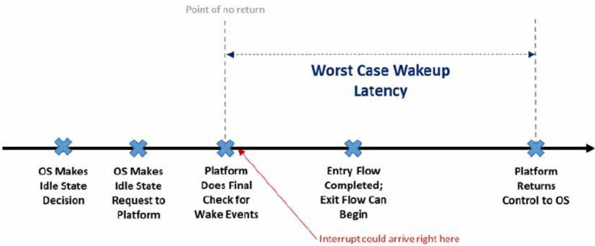  
Fig. 8.8: Worst case wake latency

Note that other worst case paths could end up determining the WCWL, but what is described above is expected to be the most common. For example, there could be another period between the OS making the idle request and the point of no return where the platform does not check for wake up events, and which is longer than the time taken to enter and exit the power state. In that case that period would become the worst case wakeup latency.

Minimum residency (MR) is the time after which a state becomes more energy eficient than any shallower state. This parameter answers the fundamental question: how long does the hierarchy node need to stay in the idle state to overcome the energy cost of transitioning in/out, and make choosing that state a net win relative to shallower alternatives? Note that this also includes comparing against not entering an idle state and keeping the node running. This is illustrated in Energy of states A,B and C versus sleep duration, which shows the energy associated with three diferent state choices as a function of the sleep duration. Note that State A’s MR relative to keeping the node running is not pictured.

Generally, minimum residency and worst case wakeup latency will be larger for deeper states, however this may not always be the case. Taking a diferent example to the above, consider two system level states, StateY and StateZ, with similar entry overhead but where StateZ saves more power than StateY. An abstract state list might look like:

```txt
StateX: MR = 100 us
StateY: MR = 1000 us
StateZ: MR = 800 us, power resource A must be OFF
```

From an energy perspective, StateZ is always preferred, but in this example, StateZ is only available when certain device dependencies are met. This makes StateY attractive when the dependencies cannot be met. Despite being the deeper (lower power) state, StateZ has a lower MR than StateY since the entry overheads are similar and StateZ’s lower power more quickly amortizes the transition cost. Although the crossover, which sets MR, should generally be versus the next shallowest state, MR is defined relative to any shallower (higher power) state to deal with cases like this. In this case, StateZ’s MR is set by the crossover with StateX since StateZ (if allowed based on device dependencies) is always preferred to StateY. To achieve the lowest energy, OSPM must select the deepest (lowest power) state for which all entry constraints are satisfied and should not assume that deeper states are not viable just because a shallower state’s WCWL/MR threshold was not met.

Since WCWL may be used by OSPM to restrict idle state selection and guarantee response times to critical interrupts, it should be set conservatively (erring on the high side) so that OSPM is not surprised with worse than specified interrupt response time. On the other hand, MR helps OSPM make eficient decisions. If MR is inaccurate in a certain scenario and OSPM chooses a state which is deeper or shallower than optimal for a particular idle period, there may be some wasted energy but the system will not be functionally broken. This is not to say that MR doesn’t matter -energy eficiency is important - just that the platform may choose to optimize MR based on the typical case rather than the worst case.

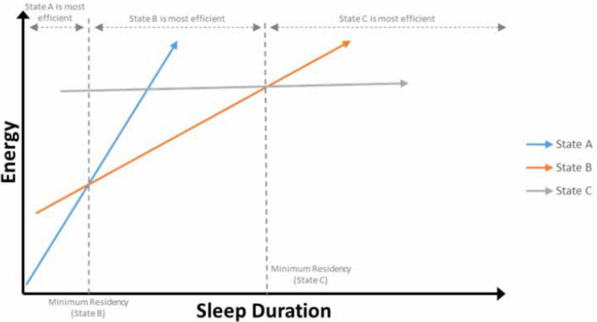  
Fig. 8.9: Energy of states A,B and C versus sleep duration

## 8.4.3.3.3.1 Minimum Residency and Worst Case Wakeup Latency Combination Across Hierarchy Levels

The WCWL in \_LPI is for a particular local state. When evaluating composite state choices versus system latency tolerance as part of idle state selection, OSPM will add wakeup latencies across hierarchy levels. For example, if a system has core powerdown with WCWL = 50 us and cluster powerdown with WCWL = 20 us then the core powerdown + cluster powerdown composite state latency is calculated as 70 us.

MRs defined in \_LPI apply to a particular hierarchy node. The implicit assumption is that each hierarchy node represents an independent power manageable domain and can be considered separately. For example, assume that a cluster retention state is legal if the underlying cores are in core powerdown or core retention. The MR for cluster retention is based on the energy cost of taking shared logic outside of the cores in and out of retention versus the steady state power savings achieved in that shared logic while in that state. The key is that the specific state chosen at the core level does not fundamentally afect the cluster level decision since it is tied to properties of shared logic outside the core. The energy cost of entering/exiting the cluster state and the power savings it provides are independent of whether the core is in retention or powerdown. Based on this, MRs are considered independent per level in ACPI. That is, when comparing MR for diferent states to expected sleep duration for a particular node, OSPM uses the MRs defined in that node’s \_LPI as is with no adjustment based on states at lower levels of hierarchy (though of course the state must be legal based on the lower level state’s Enabled Parent State property).

## 8.4.3.3.3.2 Known Limitations with Minimum Residency and Worst Case Wakeup Latency

Note that the WCWL and MR parameters are not perfect. For example, they do not scale with frequency, voltage, temperature, and various other factors which may afect them. Nor are the rules for how they combine across levels perfect. For example, cluster level MRs may move slightly based on core state choice since the entry latency of the core state will delay entry into the cluster state, derating the expected sleep duration. The cluster level MR can be adjusted to comprehend this, but if multiple core level states with diferent entry latencies enable the same cluster state, then its MR cannot perfectly comprehend them all. With that said, this set of parameters and combination scheme is believed to strike a good balance between simplicity/usability and accuracy.

## 8.4.3.3.4 Entry Method and Composition

The OSPM combines Local LPI states to create an overall composite power state. Each LPI state provides an entry method field. These fields, for the selected local power states, are combined to create the entry method register that must be read in order to enter a given composite power state.

To derive the appropriate register address from the local states’ entry methods, the following approach is used:

1. Local states for Processors always declare a register based entry method. This provides a base register.

2. Higher levels may use an integer or a register. If an Integer is used, then its value must be added to the base register obtained in step 1. If a register is used, then this becomes the new base register, overriding any previous value. Note that in this case, the selected LPI must imply specific local LPI selections for all lower level nodes.

3. In OS Initiated mode it is also necessary for the OSPM to tell the platform on which hierarchy level the calling processor is the last to go idle. This is done by adding the Level ID property of the hierarchy node’s LPI to the base register.

The basic composition algorithm for entry state is shown in the pseudo-code below for a platform coordinated system:

```vba
Reg = SelectedLocalState(CurrentProcessor).EntryMethod
WCWL = SelectedLocalState(CurrentProcessor).WCWL
MR = SelectedLocalState(CurrentProcessor).MR

for level = Parent(CurrentProcessor) to system
    LocalState = SelectedLocalState(level)
    If LocalState == Run
    break
    EM = LocalState.EntryMethod
    WCWL = WCWL+ LocalState.WCWL
    MR = LocalState.MR
    If IsInteger(EM)
    Reg.Addr = Reg.Addr+ZeroExtend(EM)
    Else
    // Entry method here overrides any previous method
    Reg = EM
CompositeState.EntryMethod = Reg
CompositeState.WCWL=WCWL
CompositeState.MR=MR
```

In OS Initiated mode it is also necessary for the OSPM to tell the platform on which hierarchy level the calling processor is the last to go idle and request a power state. To do this, the algorithm above is modified as follows:

```txt
Reg = SelectedLocalState(CurrentProcessor).EntryMethod
WCWL = SelectedLocalState(CurrentProcessor).WCWL
```

(continues on next page)

(continued from previous page)

```txt
MR = SelectedLocalState(CurrentProcessor).MR

RegDecided = False
    // Retrieve Level Index from Processor's \_LPI object
LastLevel = GetLevelIDOfLevel(CurrentProcessor)

for level = Parent(CurrentProcessor) to system
    LocalState = SelectedLocalState(level)

    If LocalState == Run
    break
    EM = LocalState.EntryMethod
    WCWL = WCWL + LocalState.WCWL

    EM = LocalState.EntryMethod
    If IsInteger(EM)
    Reg_ADDR = Reg_ADDR+ZeroExtend(EM)
    Else
    // Entry method is register
    Reg = EM

If IsProcessorLastInLevel(CurrentProcessor,level)
    // If calling processor is last one to go idle in
    // current level, retrieve Level Index from
    // the container's \_LPI object
    LastLevel = GetLevelIDOfLevel(level)

Reg_ADDR = Reg_ADDR+LastLevel
CompositeState.EntryMethod = Reg
CompositeState.WCWL=WCWL
CompositeState.MR=MR
```

In a platform coordinated system, it is possible for an LPI belonging to a hierarchy node above the processor level to use an integer value of zero as its entry method. Since entry method composition is done by addition, this results in the entry command for that state being the same as for a composite state which only includes its children. An entry value of 0 essentially identifies a state as “autopromotable.” This means that the OS does not explicitly request entry into this state, but that the platform can automatically enter it when all children have entered states which allow the parent state based on their EPS properties. OSPM should follow normal composition procedure for other parameters (worst case wakeup latency, minimum residency, etc.) when including composite states involving autopromotable local states.

This is described in the following example:

```txt
Device (SYSM) {    // System level states
    Name (_HID, "ACPI0010")
    Name (_UID, 0)
    Name (_LPI,
    Package() {
    0,    // Version
    0,    // Level ID
    1,    // Count

    Package () {    // Power gating state for system
    900,    // Min residency (uS)
```

(continues on next page)

(continued from previous page)

```asm
400, // Wake latency (uS)
0, // Enabled Parent State
... // (skipped fields)...
ResourceTemplate () {
    // Register Entry method
    Register(FFH, 0x20, 0x00, 0x00000000DECEA5ED, 0x3)
},
... // (skipped fields)...
}
)

Device (CLU0) { // Package0 state
Name (_HID, "ACPI0010")
Name (_UID, 1)
Name (_LPI,
Package() {
    0, // Version
    0, // Level ID
    2, // Count
    Package () { // Retention state for Cluster
    40, // Min residency (uS)
    20, // Wake latency (uS)
    ... // (skipped fields)...
    0, // System must be running
    0, // Integer Entry method
    ... // (skipped fields)...
    },
    Package () { // Power Gating state for Cluster
    100, // Min residency (uS)
    80, // Wake latency (uS)
    ... // (skipped fields)...
    1, // System may power down
    0x1020000, // Integer Entry method
    ... // (skipped fields)...
    }
}
)

Name(PLPI,
Package() {
    0, // Version
    0, // Level ID
    2, // Count
    Package () { // Retention state for CPU
    40, // Min residency (uS)
    20, // Wake latency (uS)
    ... // (skipped fields)...
    1, // Parent node can be
    in retention or running
    ResourceTemplate () {
    // Register Entry method
    Register(FFH,
    0x20, 0x00,
```

(continues on next page)

```txt
0x000000000000DEAF, 0x3),
    }
    ...    // (skipped fields)...
},
Package () {    // Power Gating state for CPU
100,    // Min residency (uS)
80,    // Wake latency (uS)
...    // (skipped fields)...
2,    // Parent node can be in any state
ResourceTemplate () {
    // Register Entry method
Register(FFH,
    0x20, 0x00,
    0x0000000000000DEAD, 0x3),
    }
    ...    // (skipped fields)...
}
}

Device (CPU0) {    // Core0
Name (_HID, "ACPI0007")
Method (_LPI, 0, NotSerialized)
{
    return(PLPI)
}
}

Device (CPU1) { // Core1
Name (_HID, "ACPI0007")
Method (_LPI, 0, NotSerialized)
{
    return(PLPI)
}
}

// end of NOD0
Device (CLU1) {    // Package1 state
Name (_HID, "ACPI0010")
Name (_UID, 2)
.....
}
} // End of SYM
```

In the example above, the OSPM on CPU0 and CPU1 would be able to select the following composite states:

Table 8.15: Entry method example

<table><tr><td>Core LPI</td><td>Cluster LPI</td><td>System LPI</td><td>Composite State Entry Method</td></tr><tr><td>Retention Register: 0xDEAF</td><td>Run</td><td>Run</td><td>Core Retention Register: 0xDEAF</td></tr><tr><td>Power Down Register: 0xDEAD</td><td>Run</td><td>Run</td><td>Core Power Down Register: 0xDEAD</td></tr><tr><td>Retention Register: 0xDEAF</td><td>Retention Integer: 0x0</td><td>Run</td><td>Core Retain Retention Register 0xDEAF+0x0 = 0xDEAF</td></tr></table>

Table 8.15 – continued from previous page

<table><tr><td>Core LPI</td><td>Cluster LPI</td><td>System LPI</td><td>Composite State Entry Method</td></tr><tr><td>Power Down Register: 0xDEAD</td><td>Retention Integer: 0x0</td><td>Run</td><td>Core Power Down Retention Register 0xDEAD+0x102000 0 = 0xDEAD</td></tr><tr><td>Power Down Register: 0xDEAD</td><td>Power Down Integer: 0x1020000</td><td>Run</td><td>Core Power Down Power Down Register 0xDEAD+0x102000 0 = 0x102DEAD</td></tr><tr><td>Power Down Register: 0xDEAD</td><td>Power Down Integer: 0x1020000</td><td>Power Down Register : 0xDECEA5ED</td><td>System Power Down Register 0xDECEA5ED</td></tr></table>

As can be seen in the example, the cluster level retention state defines the integer value of 0 as its entry method. By virtue of composition, this means that the entry methods for the composite states Core Power Down and Core Power Down|Cluster Retention are the same (FFH register 0xDEAD). Similarly the composite states for Core Retention and Core Retention|Cluster Retention are the same (FFH register 0xDEAF). Consequently, if both CPU0 and CPU1 are in either Power Down or Power Retention, then the platform may enter cluster CLU0 into Retention.

The example also shows how a register based entry method at a high level overrides entry method definitions of lower levels. As pointed above this is only possible if the selected LPI implies specific LPIs at all lower levels. In this example the System Power Down LPI, entered through FFH register 0xDECEA5ED, implies Power Down LPIs at core and cluster level since based on EPS, no other core/cluster local states could enable System Power Down.

## 8.4.3.3.5 Architecture Specific Context Loss Flags

For Intel based systems the value of this flags register is 0.

For ARM based systems please refer to links to ACPI-Related Documents ( http://uefi.org/acpi ) under the heading “ARM FFH Specification”.

## 8.4.3.3.6 Residency and Entry Counter Registers

LPI state descriptions may optionally provide Residency and Usage Count registers to allow the OSPM to gather statistics about the platform usage of a given local state. Both registers provide running counts of their respective statistics. To measure a statistic over some time window, OSPM should sample at the beginning and end and calculate the delta. Whether the counters restart from 0 on various flavors of reset/S-state exit is implementation defined so OSPM should resynchronize its baseline on any reset or Sx exit.

The registers are optional, and if the feature is not present the platform must use a NULL register of the following form:

ResourceTemplate() {Register {(SystemMemory, 0, 0, 0, 0)}}

The Usage Count register counts how many times the local state has been used. Whether it counts entries or exits is implementation defined.

The Residency register counts how long the hierarchy node has been in the given LPI state, at a rate given by LPI’s Residency Counter Frequency field. A frequency of 0 indicates that the counter runs at an architecture-specific frequency. Whether the Residency counter runs continuously while in a local state or updates only on exit is implementation defined. If OSPM wants to guarantee that the reading for a particular state is current, it should read from that processor itself (or one of the underlying child processors in the case of a higher level idle state).

## 8.4.3.3.7 Wake from LPI States

With \_LPI, the platform can describe deep S0-idle states which may turn of fundamental resources like bus clocks, interrupt controllers, etc. so special care must be taken to ensure that the platform can be woken from these states. This section describes handling for device initiated wakes. There are other wake sources such as timers, which are described elsewhere.

For device wakes, the requirement is that OSPM must not enter any LPI state that would prevent a device enabled for wake from waking the system. This means not entering any LPI state for which any Power Resource listed in \_RDI (see the \_RDI section \_RDI (Resource Dependencies for Idle)) is required to be ON. Note that on a platform coordinated system, the OSPM may choose to enter an \_LPI state even if there are resources listed in its companion RDI that are still on. However, if the OSPM has already enabled a device for wake, and ensured the power resources needed for wake are on, the platform will demote the LPI state to one where said resources remain on.

The wake device uses the standard \_PRx and \_PRW methods to describe power resources it requires to be ON based on its D-state and wake enabled status. This further implies that any device enabled for wake which depends on a resource which may be turned of as part of an LPI state must describe that dependency via \_PRx/\_PRW => \_RDI => \_LPI.

This is illustrated in the following example:

```txt
PowerResource(PWRA,0,0) {...}
PowerResource(PWRB,0,0) {...}
PowerResource(PWRC,0,0) {...}
PowerResource(PWRD,0,0) {...}
PowerResource(PWRE,0,1) {...}

Device (FOO) {
    Name(_SOW, 4) // Device in D3Cold can wake system from S0-idle
    Name(_PR0,Package(){PWRA, PWRB, PWRC})
    Name(_PR2,Package(){PWRA, PWRB})
    Name(_PR3,Package(){PWRA})
    Name(_PRE,Package(){PWRD})
    Name(_PRW,Package(){0, 0, PWRD} // PWRD must be ON for FOO to wake system
}

Device (BAR) {
    Name(_SOW, 3) // Device in D3Hot can wake system from S0-idle
    Name(_PR0,Package(){PWRA, PWRB})
    Name(_PR3,Package(){PWRC})
    Name(_PRW,Package(){PWRC}) // PWRC must be ON for BAR to wake system
}

Device (BAH) {
    Name(_SOW, 0) // This device can only wake the system from
    // S0-idle if it is in D0
    Name(_PR0,Package(){PWRA, PWRB, PWRC})
}

Device (SYM) {
    Name(_RDI,
    Package() {
    0,    // Version
    Package() {}    // Local State 1 is Shallow;
    // Devices FOO, BAR and BAH can wake
    // the system if enabled for wake
    Package(){PWRA, PWRB}    // RDI for Local State 2. State is deeper
}
```

(continues on next page)

```verilog
(continued from previous page)

// Device BAH cannot wake the system if this
// state is used, as it needs PWRA and PWRB
// to be able to wake the system

Package() {PWRA, PWRB, PWRC} // RDI for Local State 3.
// Devices BAH and BAR cannot wake
// the system, BAH needs PWRA, PWRB
// and PWRC, and BAR needs PWRC
// for all devices

Package() {PWRA, PWRB, PWRC, PWRD} // None of the devices listed
// above could wake the system
})

...
```

The example above declares a set of power resources (PWRA/B/C/D). Additionally, it has four system level local states that have the following dependencies:

• LPI 1: Has no power resources dependencies

• LPI 2: Requires PWRA and PWRB to be of

• LPI 3: Requires PWRA, PWRB and PWRC to be of

• LPI 4: Requires all of the power resources in the example to be of

Device BAH can only wake the system if it is in the D0 state. To be in D0 it requires PWRA, PWRB and PWRC to be on. Therefore device BAH could only wake the system from LPI 1. If this device is enabled for wake, then the platform must not enter LPI 2 or deeper.

Device BAR can wake the system in whilst it is in any device state other than D3Cold. However, to do so, it requires PWRC to be on. Therefore it can only wake the system from LPI 1 or LPI 2. If this device is enabled for wake, then the platform must not enter LPI 3 or deeper.

Device FOO can wake the system whilst it is in any device state. However to do so, it requires PWRD to be on. Therefore it can only wake the system from LPI 1 or LPI 2 or LPI 3. If this device is enabled for wake, then the platform must not enter LPI 4.

## 8.4.3.3.8 Default Idle State

The shallowest idle state for each leaf node in the hierarchy is the “default” idle state for that processor and is assumed to always be enterable. The worst case wakeup latency and minimum residency for this state must be low enough that OSPM need not consider them when deciding whether to use it. Aside from putting the processor in a power state, this state has no other software-visible efects. For example, it does not lose any context that OSPM must save/restore or have any device dependencies.

## 8.4.3.4 \_RDI (Resource Dependencies for Idle)

Some platforms may have power resources that are shared between devices and processors. Abstractly, these resources are managed in two stages. First, the OS does normal power resource reference counting to detect when all device dependencies have been satisfied and the resource may be power managed from the device perspective. Then, when the processors also go idle, the OS requests entry into specific LPI states and the platform physically power manages the resources as part of the transition. The dependency between the power resources and the LPI state is described in \_RDI.

\_RDI objects may only be present at the root processor container that describes the processor hierarchy of the system. \_RDI is not supported in a system that has more than one root node. \_RDI is valid only in a singular top level container which encompasses all processors in the system.

The OSPM will ignore \_RDI objects that are present at any node other than the root node. This simplification avoids complicated races between processors in one part of the hierarchy choosing idle states with resource dependencies while another processor is changing device states/power resources.

## Arguments:

None

Return Value:

A variable-length Package containing the resource dependencies with the following format:

Return Value Information

```go
Package {
Revision, // Integer (WORD)
RDI[1], // Package
...
RDI[N] // Package
}
```

Table 8.16: \_RDI package return values

<table><tr><td>Element</td><td>Object Type</td><td>Description</td></tr><tr><td>Revision</td><td>Integer (WORD)</td><td>The revision number of the _RDI object. Current revision is 0.</td></tr><tr><td>RDI[1]</td><td>Package</td><td>A variable length Package containing the power resource dependencies of system level power state 1.</td></tr><tr><td>RDI[N]</td><td>Package</td><td>A variable length Package containing the power resource dependencies of system level power state N.</td></tr></table>

Each RDI[x] sub-Package contains a variable number of References to power resources:

```go
Package {
    Resource[0], // Object Reference to a Power Resource Object
    ...
    Resource[M] // Object Reference to a Power Resource Object
}
```

The Package contains as many RDI packages as there are system level power states in the root processor container node’s \_LPI object. The indexing of LPI power states in this \_LPI object matches the indexing of the RDI packages in the \_RDI object. Thus the nth LPI state at the system level has resource dependencies listed in the nth RDI. Each RDI package returns a list of the power resource objects (passive or standard power resources) that must be in an OFF state to allow the platform to enter the LPI state. If a system level LPI does not have any resource dependencies, the corresponding RDI should be an empty Package.

Both traditional and passive power resources can be listed as dependencies in \_RDI. For traditional power resources, OSPM should ensure that the resource is OFF before requesting a dependent LPI state. For passive power resources, there are no \_ON/\_OFF/\_STA methods so the only requirement is to check that the reference count is 0 before requesting a dependent LPI state.

OSPM requirements for ordering between device/power resource transitions and power resource dependent LPI states difer based on the coordination scheme.

In a platform coordinated system the platform must guarantee correctness and demote the requested power state to one that will satisfy the resource and processor dependencies. OSPM may use the dependency info in \_RDI as it sees fit, and may select a dependent LPI state even if resources remain ON.

In an OS initiated system, OSPM must guarantee that all power resources are of (or reference counts are 0, for passive power resources) before requesting a dependent LPI state.

## \_RDI Example

The following ASL describes a system that uses \_RDI to describe the dependencies between three power resources and system level power states:

```txt
PowerResource(PWRA,0,0) {    // power rail local to DEVA
    Method(_ON) {...}    // active power resource (_OFF turns rail off)
    Method(_OFF) {...}
    Method(_STA) {...}
}

PowerResource(PWRB,0,0) {    // power rail shared between DEVB and the processor
    Method(_ON) {...}    // active power resource (_OFF drives platform vote)
    Method(_OFF) {...}
    Method(_STA) {...}
}

PowerResource(PWRC,0,0) {}    // clock rail shared between DEVC and the processor
    // passive power resource

Device (DEVA) {
    Name(_PRO,Package(){PWRA})
}

Device (DEVB) {
    Name(_PRO,Package(){PWRB})
}

Device (DEVC) {
    Name(_PRO,Package(){PWRC})
}

Device (SYM) {
    Name(_RDI,
    Package() {
    0,    // Revision
    Package() {}    // Local State 1 has no power resource
    // dependencies
    Package(){PWRA}    // Local State 2 cannot be entered if DEVA
    // is in D0 due to PWRA
    Package(){PWRA, PWRB, PWRC}    // Local State 3 cannot be entered if
    // DEVA is in D0 (due to PWRA), DEVB is in
    // D0 (due to PWRB) or DEVC is in D0
    // (due to PWRC)
    })
...
...
```

OSPM will turn the traditional power resource (PWRA) ON or OFF by waiting for the reference count to reach 0 (meaning DEVA has left D0) and running the \_OFF method. Similarly, PWRB is turned ON or OFF based on the state of DEVB. Note that because the CPUs require the shared power rail to be ON while they are running, PWRB’s \_ON and \_OFF drive a vote rather than the physical HW controls for the power rail. In this case, \_STA reflects the status of the vote rather than the physical state of PWRB.

OSPM guarantees ordering between PWRA/PWRB’s \_ON and \_OFF transitions and DEVA/DEVB’s D-state transitions. That is, PWRA can only be turned OFF after DEVA has left D0, and must be turned ON before transitioning DEVA to D0. However, the OS requirements for ordering between power resource transitions and power resource dependent LPI states difer based on the coordination scheme.

In a platform coordinated system, OSPM may or may not track the power state of PWRA before selecting local state 2 or 3. The platform must independently guarantee that PWRA is OFF before entering local state 2 or 3, and must demote to a shallower state if OSPM selects local state 2 or 3 when PWRA is still on. Note that because OSPM is required to correctly sequence power resource transitions with device power transitions, the platform does not need to check the state of DEVA; it can rely on the state of PWRA to infer that DEVA is in an appropriate D-state.

Similarly, OSPM may or may not track the state of PWRB and PWRC before selecting local state 3, and the platform must independently guarantee that PWRB is of before entering either state. Because PWRC is a passive power resource, the platform does not know when the reference count on the power resource reaches 0 and instead must track DEVC’s state itself. Unless the platform has other mechanisms to track the state of DEVC, PWRC should be defined as a traditional power resource so that the platform can use its \_ON and \_OFF methods to guarantee correctness of operation.

In an OS initiated system, OSPM is required to guarantee that PWRA is OFF before selecting either local state 2 or 3. OSPM may meet this guarantee by waiting until it believes a processor is the last man down in the system, before checking the state of PWRA, and only selecting local state 2 or 3 in this case. If the processor was the last man down, then the request to enter local state 2 or 3 is legal and the platform can honor it. If another processor woke up in the meantime and turned PWRA on, then this becomes a race between processors which is addressed in the OS Initiated Request Semantics section (OS Initiated Request Semantics). Similarly, OSPM must guarantee PWRB is of and PWRC’s reference count is 0 before selecting local state 3.

In an OS initiated system, because OSPM guarantees that power resources are in their correct states before selecting system power states, the platform should use passive power resources unless there is additional runtime power savings to turning a power resource OFF. On a platform that only supports OS Initiated transitions, PWRB should be defined as a passive power resource because it is shared with processors and can only be turned of when the system power state is entered.

## 8.4.3.5 Compatibility

In order to support older operating systems which do not support the new idle management infrastructure, the \_OSC method can be used to detect whether the OSPM supports parsing processor containers and objects associated with LPIs and (\_LPI, \_RDI). This is described in Rules for Evaluating \_OSC.

A platform may choose to expose both \_CST and \_LPI for backward compatibility with operating systems which do not support \_LPI. In this case, if OSPM supports \_LPI, then it should be used in preference to \_CST. At run time only one idle state methodology should be used across the entire processor hierarchy - \_LPI or \_CST, but not a mixture of both.

## 8.4.4 Processor Throttling Controls

ACPI defines two processor throttling (T state) control interfaces. These are:

• The Processor Register Block’s (P\_BLK’s) P\_CNT register.

• The combined $\_ \mathrm { P T C } , \_ \mathrm { T S S } ,$ , and \_TPC objects in the processor’s object list.

P\_BLK based throttling state controls are described in ACPI Hardware Specification. Combined \_PTC, \_TSS, and \_TPC based throttling state controls expand the functionality of the P\_BLK based control allowing the number of T states to be dynamic and accommodate CPU architecture specific T state control mechanisms as indicated by registers defined using the Functional Fixed Hardware address space. While platform definition of the \_PTC, \_TSS, and \_TPC objects is optional, all three objects must exist under a processor for OSPM to successfully perform processor throttling via these controls.

## 8.4.4.1 \_PTC (Processor Throttling Control)

\_PTC is an optional object that defines a processor throttling control interface alternative to the I/O address spacedbased P\_BLK throttling control register (P\_CNT) described in ACPI Hardware Specification

OSPM performs processor throttling control by writing the Control field value for the target throttling state (T-state), retrieved from the Throttling Supported States object (\_TSS), to the Throttling Control Register (THROTTLE\_CTRL) defined by the \_PTC object. OSPM may select any processor throttling state indicated as available by the value returned by the \_TPC control method.

Success or failure of the processor throttling state transition is determined by reading the Throttling Status Register (THROTTLE\_STATUS) to determine the processor’s current throttling state. If the transition was successful, the value read from THROTTLE\_STATUS will match the “Status” field in the \_TSS entry that corresponds to the targeted processor throttling state.

Arguments:

None

Return Value:

A Package as described below

Return Value Information

```go
Package
{
    ControlRegister // Buffer (Resource Descriptor)
    StatusRegister // Buffer (Resource Descriptor)
}
```

Table 8.17: \_PTC Package Values

<table><tr><td>Element</td><td>Object Type</td><td>Description</td></tr><tr><td>Control Register</td><td>Buffer</td><td>Contains a Resource Descriptor with a single Register() descriptor that describes the throttling control register.</td></tr><tr><td>Status Register</td><td>Buffer</td><td>Contains a Resource Descriptor with a single Register() descriptor that describes the throttling status register.</td></tr></table>

The platform must expose a \_PTC object for either all or none of its processors. Notice that if the \_PTC object exists, the specified register is used instead of the P\_CNT register specified in the Processor term. Also notice that if the \_PTC object exists and the \_CST object does not exist, OSPM will use the processor control register from the \_PTC object and the P\_LVLx registers from the P\_BLK.

## Example

This is an example usage of the \_PTC object in a Processor object list:

```txt
Processor (
    \_SB.CPU0,    // Processor Name
    1,    // ACPI Processor number
    0x120,    // PBlk system IO address
    6)    // PBlkLen
```

(continues on next page)

```cpp
{
    Name(_PTC, Package () // Object List
    {
    ResourceTemplate(){Register(FFixedHW, 0, 0, 0)}, // Throttling_CTRL
    ResourceTemplate(){Register(FFixedHW, 0, 0, 0)} // Throttling_STATUS
    })
    // End of \PTC object
    }
    // End of Object List
```

## Example

This is an example usage of the \_PTC object using the values defined in ACPI 1.0. This is an illustrative example to demonstrate the mechanism with well-known values.

```cpp
Processor (
    \\_SB.CPU0,    // Processor Name
    1,    // ACPI Processor number
    0x120,    // PBLK system IO address
    6 )    // PBLK Len
    {
    Name(_PTC, Package ()    // Processor Throttling Control object -    // 32 bit wide IO space-based register at the <p_blk> address
    {
    ResourceTemplate(){Register(SystemIO, 32, 0, 0x120)},    // Throttling_CTRL
    ResourceTemplate(){Register(SystemIO, 32, 0, 0x120)}    // Throttling_STATUS
    })    // End of \_PTC object
    }
    // End of Object List
```

## 8.4.4.2 \_TSS (Throttling Supported States)

This optional object indicates to OSPM the number of supported processor throttling states that a platform supports. This object evaluates to a packaged list of information about available throttling states including percentage of maximum internal CPU core frequency, maximum power dissipation, control register values needed to transition between throttling states, and status register values that allow OSPM to verify throttling state transition status after any OSinitiated transition change request. The list is sorted in descending order by power dissipation. As a result, the zeroth entry describes the highest performance throttling state (no throttling applied) and the ‘nth’ entry describes the lowest performance throttling state (maximum throttling applied).

When providing the \_TSS, the platform must supply a \_TSS entry whose Percent field value is 100. This provides a means for OSPM to disable throttling and achieve maximum performance.

Arguments:

None

Return Value:

A variable-length Package containing a list of TState sub-packages as described below.

Return Value Information

```txt
Package {
    TState [0] // Package - Throttling state 0
    ....
    TState [n] // Package - Throttling state n
}
```

Each TState sub-Package contains the elements described below.

<table><tr><td colspan="2">Package {</td></tr><tr><td>Percent</td><td>// Integer (DWORD)</td></tr><tr><td>Power</td><td>// Integer (DWORD)</td></tr><tr><td>Latency</td><td>// Integer (DWORD)</td></tr><tr><td>Control</td><td>// Integer (DWORD)</td></tr><tr><td>Status</td><td>// Integer (DWORD)</td></tr><tr><td colspan="2">}</td></tr></table>

Table 8.18: TState Package Values

<table><tr><td>Element</td><td>Object Type</td><td>Description</td></tr><tr><td>Percent</td><td>Integer (DWORD)</td><td>Indicates the percent of the core CPU operating frequency that will be available when this throttling state is invoked. The range for this field is 1-100. This percentage applies independent of the processor&#x27;s performance state (P-state). That is, this throttling state will invoke the percentage of maximum frequency indicated by this field as applied to the CoreFrequency field of the _PSS entry corresponding to the P-state for which the processor is currently resident.</td></tr><tr><td>Power</td><td>Integer (DWORD)</td><td>Indicates the throttling state&#x27;s maximum power dissipation (in milliWatts). OSPM ignores this field on platforms the support P-states, which provide power dissipation information via the _PSS object.</td></tr><tr><td>Latency</td><td>Integer (DWORD)</td><td>Indicates the worst-case latency in microseconds that the CPU is unavailable during a transition from any throttling state to this throttling state.</td></tr><tr><td>Control</td><td>Integer (DWORD)</td><td>Indicates the value to be written to the Processor Control Register (THROTTLE_CTRL) in order to initiate a transition to this throttling state.</td></tr><tr><td>Status</td><td>Integer (DWORD)</td><td>Indicates the value that OSPM will compare to a value read from the Throttle Status Register (THROTTLE_STATUS) to ensure that the transition to the throttling state was successful. OSPM may always place the CPU in the lowest power throttling state, but additional states are only available when indicated by the _TPC control method. A value of zero indicates the transition to the Throttling state is asynchronous, and as such no status value comparison is required.</td></tr></table>

## 8.4.4.3 \_TPC (Throttling Present Capabilities)

This optional object is a method that dynamically indicates to OSPM the number of throttling states currently supported by the platform. This method returns a number that indicates the \_TSS entry number of the highest power throttling state that OSPM can use at a given time. OSPM may choose the corresponding state entry in the \_TSS as indicated by the value returned by the \_TPC method or any lower power (higher numbered) state entry in the \_TSS.

## Arguments:

None

## Return Value:

An Integer containing the number of states supported:

0 - states 0 . . . nth state available (all states available)

1 - state 1 . . . nth state available

2 - state 2 . . . nth state available

n - state n available only

In order to support dynamic changes of \_TPC object, Notify events on the processor object of type 0x82 will cause OSPM to reevaluate any \_TPC object in the processor’s object list. This allows AML code to notify OSPM when the number of supported throttling states may have changed as a result of an asynchronous event. OSPM ignores \_TPC Notify events on platforms that support P-states unless the platform has limited OSPM’s use of P-states to the lowest power P-state. OSPM may choose to disregard any platform conveyed T-state limits when the platform enables OSPM usage of other than the lowest power P-state.

## 8.4.4.4 \_TSD (T-State Dependency)

This optional object provides T-state control cross logical processor dependency information to OSPM. The \_TSD object evaluates to a packaged list containing a single entry that expresses the T-state control dependency among a set of logical processors.

Arguments:

None

Return Value:

A Package containing a single entry consisting of a T-state dependency Package as described below.

Return Value Information

```go
Package {
    TStateDependency[0] // Package
}

The TStateDependency sub-Package contains the elements described below:
Package {
    NumEntries // Integer
    Revision // Integer (BYTE)
    Domain // Integer (DWORD)
    CoordType // Integer (DWORD)
    NumProcessors // Integer (DWORD)
}
```

Table 8.19: T-State Dependency Package Values

<table><tr><td>Element</td><td>Object Type</td><td>Description</td></tr><tr><td>NumEntries</td><td>Integer</td><td>The number of entries in the TStateDependency package including this field. Current value is 5.</td></tr><tr><td>Revision</td><td>Integer (BYTE)</td><td>The revision number of the TStateDependency package format. Current value is 0.</td></tr><tr><td>Domain</td><td>Integer (DWORD)</td><td>The dependency domain number to which this T state entry belongs.</td></tr><tr><td>CoordType</td><td>Integer (DWORD)</td><td>See Table 8.1 for supported T-state coordination types.</td></tr><tr><td>Num Processors</td><td>Integer (DWORD)</td><td>The number of processors belonging to the domain for this logical processor&#x27;s T-states. OSPM will not start performing power state transitions to a particular T-state until this number of processors belonging to the same domain have been detected and started.</td></tr></table>

Example

This is an example usage of the \_TSD structure in a Processor structure in the namespace. The example represents a two processor configuration with three T-states per processor. For all T-states, there exists dependence between the two processors, such that one processor transitioning to a particular T-state, causes the other processor to transition to the same T-state. OSPM will be required to coordinate the T-state transitions between the two processors and can initiate a transition on either processor to cause both to transition to the common target T-state.

```txt
Processor (
    $_SB.CPU0, // Processor Name
    1, // ACPI Processor number
    0x120, // PBlk system IO address
    6) // PBlkLen
    { // Object List

Name(_PTC, Package() // Processor Throttling Control object - 
// 32 bit wide IO space-based register at the <p_blk> address
{
    ResourceTemplate(){Register(SystemIO, 32, 0, 0x120)}, // Throttling_CTRL
    ResourceTemplate(){Register(SystemIO, 32, 0, 0x120)} // Throttling_STATUS
}) // End of $_PTC object

Name (_TSS, Package()
{
    Package() {
    0x64, // Frequency Percentage (100%, Throttling OFF state)
    0x0, // Power
    0x0, // Transition Latency
    0x7, // Control THT_EN:0 THTL_DTY:111
    0x0, // Status
    }

    Package() {
    0x58, // Frequency Percentage (87.5%)
    0x0, // Power
    0x0, // Transition Latency
    0xF, // Control THT_EN:1 THTL_DTY:111
    0x0, // Status
    }

    Package() {
    0x4B, // Frequency Percentage (75%)
    0x0, // Power
    0x0, // Transition Latency
    0xE, // Control THT_EN:1 THTL_DTY:110
    0x0, // Status
    }
})
Name (_TSD, Package()
{
    Package(){5, 0, 0, 0xFD, 2} // 5 entries, Revision 0, Domain 0,
    // OSPM Coordinate, 2 Procs
}) // End of $_TSD object
```

(continues on next page)

```txt
Method (_TPC, 0)    // Throttling Present Capabilities method
{
    If (\_SB.AC)
    {
    Return(0)    // All Throttle States are available for use.
    }
    Else
    {
    Return(2)    // Throttle States 0 an 1 won't be used.
    }
    }    // End of \_TPC method
}    // End of processor object list

Processor (
    \_SB.CPU1,    // Processor Name
    2,    // ACPI Processor number
    ,    // PBlk system IO address
    )    // PBlkLen
{ //Object List

Name(_PTC, Package ()    // Processor Throttling Control object -
    // 32 bit wide IO space-based register at the
    // <p_blk> address
    {

ResourceTemplate(){Register(SystemIO, 32, 0, 0x120)}, // Throttling_CTRL
ResourceTemplate(){Register(SystemIO, 32, 0, 0x120)} // Throttling_STATUS
})    // End of \_PTC object

Name (_TSS, Package())
{
    Package() {
    0x64,    // Frequency Percentage (100%, Throttling OFF state)
    0x0,    // Power
    0x0,    // Transition Latency
    0x7,    // Control THT_EN:0 THTL_DTY:111
    0x0,    // Status
    }

    Package() {
    0x58,    // Frequency Percentage (87.5%)
    0x0,    // Power
    0x0,    // Transition Latency
    0xF,    // Control THT_EN:1 THTL_DTY:111
    0x0,    // Status
    }\'

Package() {
    0x4B,    // Frequency Percentage (75%)
    0x0,    // Power
    0x0,    // Transition Latency
    0xE,    // Control THT_EN:1 THTL_DTY:110
```

```txt
0x0,    // Status
}
}) 

Name (_TSD, Package()
{
    Package(){5, 0, 0, 0xFD, 2}    // 5 entries, Revision 0, Domain 0,
    // OSPM Coordinate, 2 Procs
}) // End of \_TSD object

Method (_TPC, 0)    // Throttling Present Capabilities method
{
    If (\_SB.AC)
    {
    Return(0)    // All Throttle States are available for use.
    }
    Else
    {
    Return(2)    // Throttle States 0 an 1 won't be used.
    }
    }    // End of \_TPC method
}    // End of processor object list
```

## 8.4.4.5 \_TDL (T-state Depth Limit)

This optional object evaluates to the \_TSS entry number of the lowest power throttling state that OSPM may use. \_TDL enables the platform to limit the amount of performance reduction that OSPM may invoke using processor throttling controls in an attempt to alleviate an adverse thermal condition. OSPM may choose the corresponding state entry in the \_TSS as indicated by the value returned by the \_TDL object or a higher performance (lower numbered) state entry in the \_TSS down to and including the \_TSS entry number returned by the \_TPC object or the first entry in the table (if \_TPC is not implemented). The value returned by the \_TDL object must be greater than or equal to the value returned by the \_TPC object or the corresponding value to the last entry in the \_TSS if \_TPC is not implemented. In the event of a conflict between the values returned by the evaluation of the \_TDL and \_TPC objects, OSPM gives precedence to the \_TPC object, limiting power consumption.

## Arguments:

None

## Return Value:

An Integer containing the Throttling Depth Limit \_TSS entry number:

0 - throttling disabled.

1 - state 1 is the lowest power T-state available.

2 - state 2 is the lowest power T-state available.

n - state n is the lowest power T-state available.

In order for the platform to dynamically indicate the limit of performance reduction that is available for OSPM use, Notify events on the processor object of type 0x82 will cause OSPM to reevaluate any \_TDL object in the processor’s object list. This allows AML code to notify OSPM when the number of supported throttling states may have changed as a result of an asynchronous event. OSPM ignores \_TDL Notify events on platforms that support P-states unless the platform has limited OSPM’s use of P-states to the lowest power P-state. OSPM may choose to disregard any platform conveyed T-state depth limits when the platform enables OSPM usage of other than the lowest power P-state.

## 8.4.5 Processor Performance Control

Processor performance control is implemented through three optional objects whose presence indicates to OSPM that the platform and CPU are capable of supporting multiple performance states. The platform must supply all three objects if processor performance control is implemented. The platform must expose processor performance control objects for either all or none of its processors. The processor performance control objects define the supported processor performance states, allow the processor to be placed in a specific performance state, and report the number of performance states currently available on the system.

In a multiprocessing environment, all CPUs must support the same number of performance states and each processor performance state must have identical performance and power-consumption parameters. Performance objects must be present under each processor object in the system for OSPM to utilize this feature.

Processor performance control objects include the ‘\_PCT’ package, ‘\_PSS’ package, and the ‘\_PPC’ method as detailed below.

## 8.4.5.1 \_PCT (Performance Control)

This optional object declares an interface that allows OSPM to transition the processor into a performance state. OSPM performs processor performance transitions by writing the performance state-specific control value to a Performance Control Register (PERF\_CTRL).

OSPM may select a processor performance state as indicated by the performance state value returned by the \_PPC method, or any lower power (higher numbered) state. The control value to write is contained in the corresponding \_PSS entry’s “Control” field.

Success or failure of the processor performance transition is determined by reading a Performance Status Register (PERF\_STATUS) to determine the processor’s current performance state. If the transition was successful, the value read from PERF\_STATUS will match the “Status” field in the \_PSS entry that corresponds to the desired processor performance state.

Arguments:

None

Return Value:

A Package as described below

Return Value Information

```go
Package
{
    ControlRegister // Buffer (Resource Descriptor)
    StatusRegister // Buffer (Resource Descriptor)
}
```

Table 8.20: \_PCT Package Values

<table><tr><td>Element</td><td>Object Type</td><td>Description</td></tr><tr><td>Control Register</td><td>Buffer</td><td>Contains a Resource Descriptor with a single Register() descriptor that describes the performance control register.</td></tr><tr><td>Status Register</td><td>Buffer</td><td>Contains a Resource Descriptor with a single Register() descriptor that describes the performance status register.</td></tr></table>

Example

```cpp
Name (_PCT, Package()
{
    ResourceTemplate(){Perf_Ctrl_Register}, //Generic Register Descriptor
    ResourceTemplate(){Perf_Status_Register} //Generic Register Descriptor
}) // End of \_PCT
```

## 8.4.5.2 \_PSS (Performance Supported States)

This optional object indicates to OSPM the number of supported processor performance states that any given system can support. This object evaluates to a packaged list of information about available performance states including internal CPU core frequency, typical power dissipation, control register values needed to transition between performance states, and status register values that allow OSPM to verify performance transition status after any OS-initiated transition change request. The list is sorted in descending order by typical power dissipation. As a result, the zeroth entry describes the highest performance state and the ‘nth’ entry describes the lowest performance state.

## Arguments:

None

Return Value:

A variable-length Package containing a list of PState sub-packages as described below

Return Value Information

```txt
Package {
    PState [0]    // Package - Performance state 0
    ....
    PState [n]    // Package - Performance state n
}
```

Each PState sub-Package contains the elements described below:

```go
Package {
    CoreFrequency // Integer (DWORD)
    Power // Integer (DWORD)
    Latency // Integer (DWORD)
    BusMasterLatency // Integer (DWORD)
    Control // Integer (DWORD)
    Status // Integer (DWORD)
}
```

Table 8.21: PState Package Values

<table><tr><td>Element</td><td>Object Type</td><td>Description</td></tr><tr><td>Core Frequency</td><td>Integer (DWORD)</td><td>Indicates the core CPU operating frequency (in MHz).</td></tr><tr><td>Power</td><td>Integer (DWORD)</td><td>Indicates the performance state&#x27;s maximum power dissipation (in milliwatts).</td></tr><tr><td>Latency</td><td>Integer (DWORD)</td><td>Indicates the worst-case latency in microseconds that the CPU is unavailable during a transition from any performance state to this performance state.</td></tr><tr><td>Bus Master Latency</td><td>Integer (DWORD)</td><td>Indicates the worst-case latency in microseconds that Bus Masters are prevented from accessing memory during a transition from any performance state to this performance state.</td></tr><tr><td>Control</td><td>Integer (DWORD)</td><td>Indicates the value to be written to the Performance Control Register (PERF_CTRL) in order to initiate a transition to the performance state.</td></tr><tr><td>Status</td><td>Integer (DWORD)</td><td>Indicates the value that OSPM will compare to a value read from the Performance Status Register (PERF_STATUS) to ensure that the transition to the performance state was successful. OSPM may always place the CPU in the lowest power state, but additional states are only available when indicated by the_PPC method.</td></tr></table>

## 8.4.5.3 \_PPC (Performance Present Capabilities)

This optional object is a method that dynamically indicates to OSPM the number of performance states currently supported by the platform. This method returns a number that indicates the \_PSS entry number of the highest performance state that OSPM can use at a given time. OSPM may choose the corresponding state entry in the \_PSS as indicated by the value returned by the \_PPC method or any lower power (higher numbered) state entry in the \_PSS.

## Arguments:

None

## Return Value:

An Integer containing the range of states supported

0 - States 0 through nth state are available (all states available)

1 - States 1 through nth state are available

2 - States 2 through nth state are available

n - State n is available only

In order to support dynamic changes of \_PPC object, Notify events on the processor object are allowed. Notify events of type 0x80 will cause OSPM to reevaluate any \_PPC objects residing under the particular processor object notified. This allows AML code to notify OSPM when the number of supported states may have changed as a result of an asynchronous event (AC insertion/removal, docked, undocked, and so on).

## 8.4.5.3.1 OSPM \_OST Evaluation

When processing of the \_PPC object evaluation completes, OSPM evaluates the \_OST object, if present under the Processor device, to convey \_PPC evaluation status to the platform. \_OST arguments specific to \_PPC evaluation are described below.

## Arguments: (2)

Arg0 - Source Event (Integer) : 0x80 Arg1 - Status Code (Integer) : see below

## Return Value:

None

## Argument Information:

Arg1 - Status Code 0: Success - OSPM is now using the performance states specified 1: Failure - OSPM has not changed the number of performance states in use.

## 8.4.5.4 Processor Performance Control Example

This is an example of processor performance control objects in a processor object list.

In this example, a uniprocessor platform that has processor performance capabilities with support for three performance states as follows:

1. 500 MHz (8.2W) supported at any time

2. 600 MHz (14.9W) supported only when AC powered

3. 650 MHz (21.5W) supported only when docked

It takes no more than 500 microseconds to transition from one performance state to any other performance state.

During a performance transition, bus masters are unable to access memory for a maximum of 300 microseconds.

The PERF\_CTRL and PERF\_STATUS registers are implemented as Functional Fixed Hardware.

The following ASL objects are implemented within the system:

\_SB.DOCK: Evaluates to 1 if system is docked, zero otherwise.

\_SB.AC: Evaluates to 1 if AC is connected, zero otherwise.

```txt
Processor (
    $_SB.CPU0, // Processor Name
    1, // ACPI Processor number
    0x120, // PBlk system IO address
    6) // PBlkLen
{
    Name(_PCT, Package () // Performance Control object
    {
    ResourceTemplate(){Register(FFixedHW, 0, 0, 0)}, // PERF_CTRL
    ResourceTemplate(){Register(FFixedHW, 0, 0, 0)} // PERF_STATUS
    }) // End of _PCT object

    Name (_PSS, Package())
    {
    Package(){650, 21500, 500, 300, 0x00, 0x08}, // Performance State zero (P0)
    Package(){600, 14900, 500, 300, 0x01, 0x05}, // Performance State one (P1)
```

(continues on next page)

```txt
Package(){500, 8200, 500, 300, 0x02, 0x06} // Performance State two (P2)
}) // End of _PSS object
Method (_PPC, 0) // Performance Present Capabilities method
{
    If (\_SB.DOCK)
    {
    Return(0) // All _PSS states available (650, 600, 500).
    }
    If (\_SB.AC)
    {
    Return(1) // States 1 and 2 available (600, 500).
    }
    Else
    {
    Return(2) // State 2 available (500)
    }
}
// End of _PPC method
// End of processor object list
```

The platform will issue a Notify(\_SB.CPU0, 0x80) to inform OSPM to re-evaluate this object when the number of available processor performance states changes.

## 8.4.5.5 \_PSD (P-State Dependency)

This optional object provides performance control, P-state or CPPC, logical processor dependency information to OSPM. The \_PSD object evaluates to a packaged list containing a single entry that expresses the performance control dependency among a set of logical processors.

Arguments:

None

Return Value:

A Package with a single entry consisting of a P-state dependency Package as described below.

Return Value Information

```txt
Package {
    PStateDependency[0] // Package
}
```

The PStateDependency sub-Package contains the elements described below:

```txt
Package {
NumEntries // Integer
Revision // Integer (BYTE)
Domain // Integer (DWORD)
CoordType // Integer (DWORD)
NumProcessors // Integer (DWORD)
}
```

Table 8.22: P-State Dependency Package Values

<table><tr><td>Element</td><td>Object Type</td><td>Description</td></tr><tr><td>NumEntries</td><td>Integer</td><td>The number of entries in the PStateDependency package including this field. Current value is 5.</td></tr><tr><td>Revision</td><td>Integer (BYTE)</td><td>The revision number of the PStateDependency package format. Current value is 0.</td></tr><tr><td>Domain</td><td>Integer (DWORD)</td><td>The dependency domain number to which this P state entry belongs.</td></tr><tr><td>CoordType</td><td>Integer (DWORD)</td><td>See Table 8.1 for supported P-state coordination types.</td></tr><tr><td>Num Processors</td><td>Integer (DWORD)</td><td>The number of processors belonging to the domain for this logical processor&#x27;s P-states. OSPM will not start performing power state transitions to a particular P-state until this number of processors belonging to the same domain have been detected and started.</td></tr></table>

## Example

This is an example usage of the \_PSD structure in a Processor structure in the namespace. The example represents a two processor configuration with three performance states per processor. For all performance states, there exists dependence between the two processors, such that one processor transitioning to a particular performance state, causes the other processor to transition to the same performance state. OSPM will be required to coordinate the P-state transitions between the two processors and can initiate a transition on either processor to cause both to transition to the common target P-state.

```txt
Processor (
    $_SB.CPU0, // Processor Name
    1, // ACPI Processor number
    0x120, // PBlk system IO address
    6) // PBlkLen
{
    Name(_PCT, Package() // Performance Control object
    {
    ResourceTemplate(){Register(FFixedHW, 0, 0, 0)}, // PERF_CTRL
    ResourceTemplate(){Register(FFixedHW, 0, 0, 0)} // PERF_STATUS
    }) // End of $_PCT object

    Name (_PSS, Package()
    {
    Package(){650, 21500, 500, 300, 0x00, 0x08}, // Performance State zero (P0)
    Package(){600, 14900, 500, 300, 0x01, 0x05}, // Performance State one (P1)
    Package(){500, 8200, 500, 300, 0x02, 0x06} // Performance State two (P2)
    }) // End of $_PSS object

    Method (_PPC, 0) // Performance Present Capabilities method
    {
    } // End of $_PPC method

    Name (_PSD, Package()
    {
    Package(){5, 0, 0, 0xFD, 2} // 5 entries, Revision 0), Domain 0, OSPM
    // Coordinate, Initiate on any Proc, 2 Procs
    }) // End of $_PSD object
    }
    // End of processor object list
```

(continues on next page)

```txt
(continued from previous page)

Processor (
    $_SB.CPU1,    // Processor Name
    2,    // ACPI Processor number
    ,    // PBlk system IO address
    )    // PBlkLen
{
    Name(_PCT, Package ()    // Performance Control object
    {
    ResourceTemplate(){Register(FFixedHW, 0, 0, 0)},    // PERF_CTRL
    ResourceTemplate(){Register(FFixedHW, 0, 0, 0)}    // PERF_STATUS
    })    // End of $_PCT object

    Name (_PSS, Package())
    {
    Package(){650, 21500, 500, 300, 0x00, 0x08},    // Performance State zero (P0)
    Package(){600, 14900, 500, 300, 0x01, 0x05},    // Performance State one (P1)
    Package(){500, 8200, 500, 300, 0x02, 0x06}    // Performance State two (P2)
    })    // End of $_PSS object

    Method (_PPC, 0)    // Performance Present Capabilities method
    {
    }    // End of $_PPC method

    Name (_PSD, Package())
    {
    Package(){5, 0, 0, 0xFD, 2}    // 5 entries, Revision 0, Domain 0, OSPM
    // Coordinate, Initiate on any Proc, 2 Procs
    })    // End of $_PSD object
    }
}
```

## 8.4.5.6 \_PDL (P-state Depth Limit)

This optional object evaluates to the \_PSS entry number of the lowest performance P-state that OSPM may use when performing passive thermal control. OSPM may choose the corresponding state entry in the \_PSS as indicated by the value returned by the \_PDL object or a higher performance (lower numbered) state entry in the \_PSS down to and including the \_PSS entry number returned by the \_PPC object or the first entry in the table (if \_PPC is not implemented). The value returned by the \_PDL object must be greater than or equal to the value returned by the \_PPC object or the corresponding value to the last entry in the \_PSS if \_PPC is not implemented. In the event of a conflict between the values returned by the evaluation of the \_PDL and \_PPC objects, OSPM gives precedence to the \_PPC object, limiting power consumption.

## Arguments:

None

## Return Value:

An Integer containing the P-state Depth Limit \_PSS entry number:

0 - P0 is the only P-state available for OSPM use

1 - state 1 is the lowest power P-state available

2 - state 2 is the lowest power P-state available

## n - state n is the lowest power P-state available

In order for the platform to dynamically indicate a change in the P-state depth limit, Notify events on the processor object of type 0x80 will cause OSPM to reevaluate any \_PDL object in the processor’s object list. This allows AML code to notify OSPM when the number of supported performance states may have changed as a result of an asynchronous event.\

## 8.4.6 Collaborative Processor Performance Control

Collaborative processor performance control defines an abstracted and flexible mechanism for OSPM to collaborate with an entity in the platform to manage the performance of a logical processor. In this scheme, the platform entity is responsible for creating and maintaining a performance definition that backs a continuous, abstract, unit-less performance scale. During runtime, OSPM requests desired performance on this abstract scale and the platform entity is responsible for translating the OSPM performance requests into actual hardware performance states. The platform may also support the ability to autonomously select a performance level appropriate to the current workload. In this case, OSPM conveys information to the platform that guides the platform’s performance level selection.

Prior processor performance controls (P-states and T-states) have described their efect on processor performance in terms of processor frequency. While processor frequency is a rough approximation of the speed at which the processor completes work, workload performance isn’t guaranteed to scale with frequency. Therefore, rather than prescribe a specific metric for processor performance, Collaborative Processor Performance Control leaves the definition of the exact performance metric to the platform. The platform may choose to use a single metric such as processor frequency, or it may choose to blend multiple hardware metrics to create a synthetic measure of performance. In this way the platform is free to deliver the OSPM requested performance level without necessarily delivering a specific processor frequency. OSPM must make no assumption about the exact meaning of the performance values presented by the platform, or how they may correlate to specific hardware metrics like processor frequency.

Platforms must use the same performance scale for all processors in the system. On platforms with heterogeneous processors, the performance characteristics of all processors may not be identical. In this case, the platform must synthesize a performance scale that adjusts for diferences in processors, such that any two processors running the same workload at the same performance level will complete in approximately the same time. The platform should expose diferent capabilities for diferent classes of processors, so as to accurately reflect the performance characteristics of each processor.

The control mechanisms are abstracted by the \_CPC object method, which describes how to control and monitor processor performance in a generic manner. The register methods may be implemented in the Platform Communications Channel (PCC) interface (see Platform Communications Channel (PCC)). This provides suficient flexibility that the entity OSPM communicates with may be the processor itself, the platform chipset, or a separate entity (e.g., a BMC).

In order to provide backward compatibility with existing tools that report processor performance as frequencies, the \_CPC object can optionally provide processor frequency range values for use by the OS. If these frequency values are provided, the restrictions on \_CPC information usage still remain: the OSPM must make no assumption about the exact meaning of the performance values presented by the platform, and all functional decisions and interaction with the platform still happen using the abstract performance scale. The frequency values are only contained in the \_CPC object to allow the OS to present performance data in a simple frequency range, when frequency is not discoverable from the platform via another mechanism.

## 8.4.6.1 \_CPC (Continuous Performance Control)

This optional object declares an interface that allows OSPM to transition the processor into a performance state based on a continuous range of allowable values. OSPM writes the desired performance value to the Desired Performance Register, and the platform maps the desired performance to an internal performance state.. If supported by the platform, OSPM may alternatively enable autonomous performance level selection while specifying minimum and maximum performance requirements.

Optional \_CPC package fields that are not supported by the platform should be encoded as follows:

• Integer fields: Integer 0

• Register fields: the following NULL register descriptor should be used:

ResourceTemplate() {Register {(SystemMemory, 0, 0, 0, 0)}}

• Package fields: empty package:

Package() { }

Arguments:

None

Return Value:

A Package containing the performance control information.

The performance control package contains the elements described below:

<table><tr><td colspan="2">Package{NumEntries, // IntegerRevision, // IntegerHighestPerformance, // Integer or Buffer (Resource Descriptor)NominalPerformance, // Integer or Buffer (Resource Descriptor)LowestNonlinearPerformance, // Integer or Buffer (Resource Descriptor)LowestPerformance, // Integer or Buffer (Resource Descriptor)GuaranteedPerformanceRegister, // Buffer (Resource Descriptor)DesiredPerformanceRegister, // Buffer (Resource Descriptor)MinimumPerformanceRegister, // Buffer (Resource Descriptor)MaximumPerformanceRegister, // Buffer (Resource Descriptor)PerformanceReductionToleranceRegister, // Buffer (Resource Descriptor)TimeWindowRegister, // Buffer (Resource Descriptor)CounterWraparoundTime, // Integer or Buffer (Resource Descriptor)ReferencePerformanceCounterRegister, // Buffer (Resource Descriptor)DeliveredPerformanceCounterRegister, // Buffer (Resource Descriptor)PerformanceLimitedRegister, // Buffer (Resource Descriptor)CPPCEnableRegister // Buffer (Resource Descriptor)AutonomousSelectionEnable, // Integer or Buffer (Resource Descriptor)AutonomousActivityWindowRegister, // Buffer (Resource Descriptor)EnergyPerformancePreferenceRegister, // Buffer (Resource Descriptor)ReferencePerformance // Integer or Buffer (Resource Descriptor)LowestFrequency, // Integer or Buffer (Resource Descriptor)NominalFrequency // Integer or Buffer (Resource Descriptor)OSPMNominalPerformanceRegister, // Buffer (Resource Descriptor)ResourcePriorityRegisters // Package</td></tr></table>

(continues on next page)

<table><tr><td></td><td>(continued from previous page)</td></tr><tr><td>}</td><td></td></tr></table>

Table 8.23: Continuous Performance Control Package Values

<table><tr><td>Element</td><td>Object Type</td><td>Description</td></tr><tr><td>NumEntries</td><td>Integer</td><td>The number of entries in the_CPC package, including this one. Current value is 25.</td></tr><tr><td>Revision</td><td>Integer (BYTE)</td><td>The revision number of the_CPC package format. Current value is 4.</td></tr><tr><td>Highest Performance</td><td>Integer (DWORD) or Buffer</td><td>Indicates the highest level of performance the processor is theoretically capable of achieving, given ideal operating conditions. If this element is an Integer, OSPM reads the integer value directly. If this element is a Buffer, it must contain a Resource Descriptor with a single Register() to read the value from.</td></tr><tr><td>Nominal Performance</td><td>Integer (DWORD) or Buffer</td><td>Indicates the highest sustained performance level of the processor. If this element is an Integer, OSPM reads the integer value directly. If this element is a Buffer, it must contain a Resource Descriptor with a single Register() to read the value from.</td></tr><tr><td>Lowest Nonlinear Performance</td><td>Integer (DWORD) or Buffer</td><td>Indicates the lowest performance level of the processor with non-linear power savings. If this element is an Integer, OSPM reads the integer value directly. If this element is a Buffer, it must contain a Resource Descriptor with a single Register() to read the value from.</td></tr><tr><td>Lowest Performance</td><td>Integer (DWORD) or Buffer</td><td>Indicates the lowest performance level of the processor. If this element is an Integer, OSPM reads the integer value directly. If this element is a Buffer, it must contain a Resource Descriptor with a single Register() to read the value from.</td></tr><tr><td>Guaranteed Performance Register</td><td>Buffer</td><td>Optional. If supported, contains a resource descriptor with a single Register() descriptor that describes the register to read the current guaranteed performance from. See the section “Performance Limiting” for more details.</td></tr><tr><td>Desired Performance Register</td><td>Buffer</td><td>Contains a resource descriptor with a single Register() descriptor that describes the register to write the desired performance level. This register is optional when OSPM indicates support for CPPC2 in the platform-wide _OSC capabilities and the Autonomous Selection Enable register is Integer 1</td></tr><tr><td>Minimum Performance Register</td><td>Buffer</td><td>Optional. If supported, contains a resource descriptor with a single Register() descriptor that describes the register to write the minimum allowable performance level to. The value 0 is equivalent to Lowest Performance (no limit).</td></tr><tr><td>Maximum Performance Register</td><td>Buffer</td><td>Optional. If supported, contains a resource descriptor with a single Register() descriptor that describes the register to write the maximum allowable performance level to. All 1s is equivalent to Highest Performance (no limit).</td></tr></table>

continues on next page

Table 8.23 – continued from previous page

<table><tr><td>Element</td><td>Object Type</td><td>Description</td></tr><tr><td>Performance Reduction Tolerance Register</td><td>Buffer</td><td>Optional. If supported, contains a resource descriptor with a single Register() descriptor that describes the register to write the performance reduction tolerance.</td></tr><tr><td>Time Window Register</td><td>Buffer</td><td>Optional. If supported, contains a resource descriptor with a single Register() descriptor that describes the register to write the nominal length of time (in ms) between successive reads of the platform&#x27;s delivered performance register. See the section “Time Window Register” for more details.</td></tr><tr><td>Counter Wraparound Time</td><td>Integer (DWORD) or Buffer</td><td>Optional. If supported, indicates the minimum time to counter wraparound, in seconds. If this element is an Integer, OSPM reads the integer value directly. If this element is a Buffer (and supported), it must contain a Resource Descriptor with a single Register() to read the value from.</td></tr><tr><td>Reference Performance Counter Register</td><td>Buffer</td><td>Contains a resource descriptor with a single Register() descriptor that describes the register to read a counter that accumulates at a rate proportional the reference performance of the processor.</td></tr><tr><td>Delivered Performance Counter Register</td><td>Buffer</td><td>Contains a resource descriptor with a single Register() descriptor that describes the register to read a counter that accumulates at a rate proportional to the delivered performance of the processor.</td></tr><tr><td>Performance Limited Register</td><td>Buffer</td><td>Contains a resource descriptor with a single Register() descriptor that describes the register to read to determine if performance was limited. A nonzero value indicates performance was limited. This register is sticky, and will remain set until reset or OSPM clears it by writing 0. See the section “Performance Limiting” for more details.</td></tr><tr><td>CPPC EnableRegister</td><td>Buffer</td><td>Optional. If supported, contains a resource descriptor with a single Register() descriptor that describes a register to which OSPM writes a One to enable CPPC on this processor. Before this register is set, the processor will be controlled by legacy mechanisms (ACPI P-states, firmware, etc.).</td></tr><tr><td>Autonomous Selection Enable</td><td>Integer (DWORD) or Buffer</td><td>Optional. If supported, contains a resource descriptor with a single Register() descriptor that describes a register to which OSPM writes a One to enable autonomous performance level selection. Platforms that exclusively support Autonomous Selection must populate this field as an Integer with a value of 1.</td></tr><tr><td>AutonomousActivity-WindowRegister</td><td>Buffer</td><td>Optional. If supported, contains a resource descriptor with a single Register() descriptor that describes a register to which OSPM writes a time value that indicates a moving utilization sensitivity window for the autonomous selection policy.</td></tr></table>

continues on next page

Table 8.23 – continued from previous page

<table><tr><td>Element</td><td>Object Type</td><td>Description</td></tr><tr><td>EnergyPerformance-PreferenceRegister</td><td>Buffer</td><td>Optional. If supported, contains a resource descriptor with a single Register() descriptor that describes a register to which OSPM writes a value to control the Energy vs. Performance preference of the platform&#x27;s energy efficiency and performance optimization policies when Autonomous Selection is enabled</td></tr><tr><td>Reference Performance</td><td>Integer (DWORD) or Buffer</td><td>Optional. If supported, indicates the performance level at which the Reference Performance Counter accumulates. If not supported, The Reference Performance Counter accumulates at the Nominal performance level. If this element is an Integer, OSPM reads the integer value directly. If this element is a Buffer (and supported), it must contain a Resource Descriptor with a single Register() to read the value from</td></tr><tr><td>Lowest Frequency</td><td>Integer (DWORD) or Buffer</td><td>Optional. If supported, indicates the lowest frequency for this processor in MHz. It should correspond roughly to the Lowest Performance value, but is not guaranteed to have any precise correlation. This value should only be used for the purpose of reporting processor performance in absolute frequency rather than on an abstract scale, and not for functional decisions or platform communication. If this element is an Integer, OSPM reads the integer value directly. If this element is a Buffer (and supported), it must contain a Resource Descriptor with a single Register() to read the value from.</td></tr><tr><td>Nominal Frequency</td><td>Integer (DWORD) or Buffer</td><td>Optional. If supported, indicates the nominal frequency for this processor in MHz. It should correspond roughly to the Nominal Performance value, but is not guaranteed to have any precise correlation. This value should only be used for the purpose of reporting processor performance in absolute frequency rather than on an abstract scale, and not for functional decisions or platform communication. If this element is an Integer, OSPM reads the integer value directly. If this element is a Buffer (and supported), it must contain a Resource Descriptor with a single Register() to read the value from.</td></tr><tr><td>OSPMNominalPerformanceRegister</td><td>Buffer</td><td>Optional. If supported, contains a resource descriptor with a single Register() descriptor that describes the register to write the requested nominal performance of the processor.</td></tr><tr><td>ResourcePriorityRegisters</td><td>Package</td><td>Optional. If supported, contains a package that provides a list of Resource Priority Register Descriptor packages. See the section “Resource Priority Registers” for more details.</td></tr></table>

The \_CPC object provides OSPM with platform-specific performance capabilities / thresholds and control registers that OSPM uses to control the platform’s processor performance settings. These are described in the following sections. While the platform may specify register sizes within an allowable range, the size of the capabilities / thresholds registers must be compatible with the size of the control registers. If the platform supports CPPC, the \_CPC object must exist under all processor objects. That is, OSPM is not expected to support mixed mode (CPPC & legacy PSS, \_PCT, \_PPC) operation.

Starting with ACPI Specification 6.2, all \_CPC registers can be in PCC, System Memory, System IO, or Functional Fixed Hardware address spaces. OSPM support for this more flexible register space scheme is indicated by the “Flexible Address Space for CPPC Registers” \_OSC bit.

## 8.4.6.1.1 Performance Capabilities / Thresholds

Performance-based controls operate on a continuous range of processor performance levels, not discrete processor states. As a result, platform capabilities and OSPM requests are specified in terms of performance thresholds. Platform performance thresholds outlines the static performance thresholds of the platform and the dynamic guaranteed performance threshold.

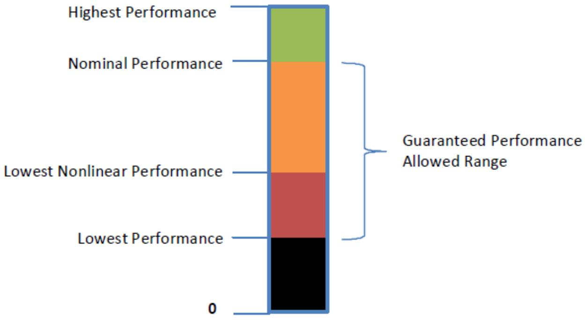

Fig. 8.10: Platform performance thresholds

<table><tr><td>i Note</td></tr><tr><td>Not all performance levels need be unique. A platform’s nominal performance level may also be its highest performance level, for example.</td></tr></table>

## 8.4.6.1.1.1 Highest Performance

<table><tr><td>Register or DWORD Attribute:</td><td>Read</td></tr><tr><td>Size:</td><td>8-32 bits</td></tr></table>

Highest performance is the absolute maximum performance an individual processor may reach, assuming ideal conditions. This performance level may not be sustainable for long durations, and may only be achievable if other platform components are in a specific state; for example, it may require other processors be in an idle state.

Notify events of type 0x85 to the processor device object cause OSPM to re-evaluate the Highest Performance Register, but only when it is encoded as a bufer. Note: OSPM will not re-evaluate the \_CPC object as a result of the notification.

## 8.4.6.1.1.2 Nominal Performance

```txt
Register or DWORD Attribute: Read Size: 8-32 bits
```

Nominal Performance is the maximum sustained performance level of the processor, assuming ideal operating conditions. In absence of an external constraint (power, thermal, etc.) this is the performance level the platform is expected to be able to maintain continuously. All processors are expected to be able to sustain their nominal performance state simultaneously.

## 8.4.6.1.1.3 Reference Performance

```txt
Optional Register or DWORD Attribute: Read Size: 8-32 bits
```

If supported by the platform, Reference Performance is the rate at which the Reference Performance Counter increments. If not implemented (or zero), the Reference Performance Counter increments at a rate corresponding to the Nominal Performance level.

## 8.4.6.1.1.4 Lowest Nonlinear Performance

```txt
Register or DWORD Attribute: Read Size: 8-32 bits
```

Lowest Nonlinear Performance is the lowest performance level at which nonlinear power savings are achieved, for example, due to the combined efects of voltage and frequency scaling. Above this threshold, lower performance levels should be generally more energy eficient than higher performance levels. In traditional terms, this represents the P-state range of performance levels.

This register efectively conveys the most eficient performance level to OSPM.

## 8.4.6.1.1.5 Lowest Performance

```txt
Register or DWORD Attribute: Read Size: 8-32 bits
```

Lowest Performance is the absolute lowest performance level of the platform. Selecting a performance level lower than the lowest nonlinear performance level may actually cause an eficiency penalty, but should reduce the instantaneous power consumption of the processor. In traditional terms, this represents the T-state range of performance levels.

## 8.4.6.1.1.6 Guaranteed Performance Register

<table><tr><td colspan="2">Optional Attribute: ReadSize: 8-32 bits</td></tr></table>

Guaranteed Performance Register conveys to OSPM a Guaranteed Performance level, which is the current maximum sustained performance level of a processor, taking into account all known external constraints (power budgeting, thermal constraints, AC vs DC power source, etc.). All processors are expected to be able to sustain their guaranteed performance levels simultaneously. The guaranteed performance level is required to fall in the range [Lowest Performance, Nominal performance], inclusive.

If this register is not implemented, OSPM assumes guaranteed performance is always equal to nominal performance.

Notify events of type 0x83 to the processor device object will cause OSPM to re-evaluate the Guaranteed Performance Register. Changes to guaranteed performance should not be more frequent than once per second. If the platform is not able to guarantee a given performance level for a sustained period of time (greater than one second), it should guarantee a lower performance level and opportunistically enter the higher performance level as requested by OSPM and allowed by current operating conditions.

## 8.4.6.1.1.7 Lowest Frequency and Nominal Frequency

If supported by the platform, Lowest Frequency and Nominal Frequency values convey are the lowest and nominal CPU frequencies of the platform, respectively, in megahertz (MHz). They should correspond roughly to Lowest Performance and Nominal Performance on the CPPC abstract performance scale but precise correlation is not guaranteed. See Lowest Performance and Nominal Performance for more details.

These values should not be used for functional decision making or platform communication which are based on the CPPC abstract performance scale. They are only intended to enable CPPC platforms to be backwards compatible with OSs that report performance as CPU frequencies. The OS should use Lowest Frequency/Performance and Nominal Frequency/Performance as anchor points to create a linear mapping of CPPC abstract performance to CPU frequency, interpolating between Lowest and Nominal, and extrapolating from Nominal to Highest. Note that this mapping is not guaranteed to be accurate since CPPC abstract performance is not required to be based purely on CPU frequency, but it is better than no data if the OS must report performance as CPU frequency. Platforms should provide these values when they must work with OSs which need to report CPU frequency, and there is no alternate mechanism to discover this information.

## 8.4.6.1.2 Performance Controls

Under CPPC, OSPM has several performance settings it may use in conjunction to control/influence the performance of the platform. These control inputs are outlined in the following figure.

OSPM may select any performance value within the continuous range of values supported by the platform. Internally, the platform may implement a small number of discrete performance states and may not be capable of operating at the exact performance level desired by OSPM. If a platform-internal state does not exist that matches OSPM’s desired performance level, the platform should round desired performance as follows:

• If OSPM has selected a desired performance level greater than or equal to guaranteed performance, the platform may round up or down. The result of rounding must not be less than guaranteed performance.

• If OSPM has selected a desired performance level less than guaranteed performance and a maximum performance level not less than guaranteed performance, the platform must round up.

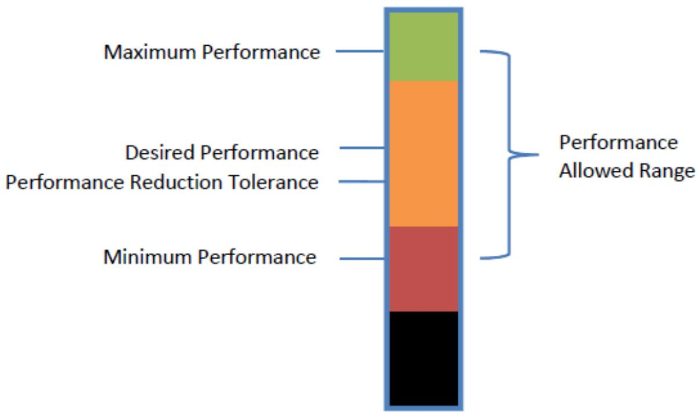  
Fig. 8.11: OSPM performance controls

If OSPM has selected both desired performance level and maximum performance level less than guaranteed performance, the platform must round up if rounding up does not violate the maximum performance level. Otherwise, round down. OSPM must tolerate the platform rounding down if it chooses to set the maximum performance level less than guaranteed performance.This approach favors performance, except in the case where performance has been limited due to a platform or OSPM constraint.

When Autonomous Selection is enabled, OSPM limits the processor’s performance selection by writing appropriate constraining values to the Minimum and Maximum Performance registers. Setting Minimum and Maximum to the same value efectively disables Autonomous selection.

Note: When processors are within the same dependency domain, Maximum performance may only be actually limited when allowed by hardware coordination.

## 8.4.6.1.2.1 Maximum Performance Register

<table><tr><td>Optional Attribute:</td><td>Read/Write</td></tr><tr><td>Size:</td><td>8-32 bits</td></tr></table>

Maximum Performance Register conveys the maximum performance level at which the platform may run. Maximum performance may be set to any performance value in the range [Lowest Performance, Highest Performance], inclusive.

The value written to the Maximum Performance Register conveys a request to limit maximum performance for the purpose of energy eficiency or thermal control and the platform limits its performance accordingly as possible. However, the platform may exceed the requested limit in the event it is necessitated by internal package optimization. For Example, hardware coordination among multiple logical processors with interdependencies.

OSPM’s use of this register to limit performance for the purpose of thermal control must comprehend multiple logical processors with interdependencies. i.e. the same value must be written to all processors within a domain to achieve the desired result.

The platform must implement either both the Minimum Performance and Maximum Performance registers or neither register. If neither register is implemented and Autonomous Selection is disabled, the platform must always deliver the desired performance.

## 8.4.6.1.2.2 Minimum Performance Register

```txt
Optional Attribute: Read/Write
Size: 8-32 bits
```

The Minimum Performance Register allows OSPM to convey the minimum performance level at which the platform may run. Minimum performance may be set to any performance value in the range [Lowest Performance, Highest Performance], inclusive but must be set to a value that is less than or equal to that specified by the Maximum Performance Register.

In the presence of a physical constraint, for example a thermal excursion, the platform may not be able to successfully maintain minimum performance in accordance with that set via the Minimum Performance Register. In this case, the platform issues a Notify event of type 0x84 to the processor device object and sets the Minimum\_Excursion bit within the Performance Limited Register.

The platform must implement either both the Minimum Performance and Maximum Performance registers or neither register. If neither register is implemented and Autonomous Selection is disabled, the platform must always deliver the desired performance.

## 8.4.6.1.2.3 Desired Performance Register

```txt
Optional Attribute: Write
Size: 8-32 bits
```

When Autonomous Selection is disabled, the Desired Performance Register is required and conveys the performance level OSPM is requesting from the platform. Desired performance may be set to any performance value in the range [Minimum Performance, Maximum Performance], inclusive. Desired performance may take one of two meanings, depending on whether the desired performance is above or below the minimum of the guaranteed performance level and the OSPM nominal performance level.

• Below this level, desired performance expresses the average performance level the platform must provide subject to the Performance Reduction Tolerance.

• Above this level, the platform must provide the minimum of the guaranteed performance level. The platform should attempt to provide up to the desired performance level, if current operating conditions allow for it, but it is not required to do so

When Autonomous Selection is enabled, it is not necessary for OSPM to assess processor workload performance demand and convey a corresponding performance delivery request to the platform via the Desired Register. If the Desired Performance Register exists, OSPM may provide an explicit performance requirement hint to the platform by writing a non-zero value. In this case, the delivered performance is not bounded by the Performance Reduction Tolerance Register, however, OSPM can influence the delivered performance by writing appropriate values to the Energy Performance Preference Register. Writing a zero value to the Desired Performance Register or the non-existence of the Desired Performance Register causes the platform to autonomously select a performance level appropriate to the current workload.

ò Note

<table><tr><td>Optional Attribute:</td><td>Read/Write</td></tr><tr><td>Size:</td><td>8-32 bits</td></tr></table>

The Desired Performance Register is optional only when OPSM indicates support for CPPC2 in the platform-wide \_OSC capabilities and the Autonomous Selection Enable field is encoded as an Integer with a value of 1.

## 8.4.6.1.2.4 Performance Reduction Tolerance Register

The Performance Reduction Tolerance Register is used by OSPM to convey the deviation below the Desired Performance that is tolerable. It is expressed by OSPM as an absolute value on the performance scale. Performance Tolerance must be less than or equal to the Desired Performance. If the platform supports the Time Window Register, the Performance Reduction Tolerance conveys the minimal performance value that may be delivered on average over the Time Window. If this register is not implemented, the platform must assume Performance Reduction Tolerance = Desired Performance.

When Autonomous Selection is enabled, values written to the Performance Reduction Tolerance Register are ignored.

## 8.4.6.1.2.5 Time Window Register

<table><tr><td colspan="2">Optional Attribute: Read/Write</td></tr><tr><td>Size:</td><td>8-32 bits</td></tr><tr><td>Units:</td><td>milliseconds</td></tr></table>

When Autonomous Selection is not enabled, OSPM may write a value to the Time Window Register to indicate a time window over which the platform must provide the desired performance level (subject to the Performance Reduction Tolerance). OSPM sets the time window when electing a new desired performance The time window represents the minimum time duration for OSPM’s evaluation of the platform’s delivered performance (see Performance Counters “Performance Counters” for details on how OSPM computes delivered performance). If OSPM evaluates delivered performance over an interval smaller than the specified time window, it has no expectations of the performance delivered by the platform. For any evaluation interval equal to or greater than the time window, the platform must deliver the OSPM desired performance within the specified tolerance bound.

If OSPM specifies a time window of zero or if the platform does not support the time window register, the platform must deliver performance within the bounds of Performance Reduction Tolerance irrespective of the duration of the evaluation interval.

When Autonomous Selection is enabled, values written to the Time Window Register are ignored. Reads of the Time Window register indicate minimum length of time (in ms) between successive reads of the platform’s performance counters. If the Time Window register is not supported then there is no minimum time requirement between successive reads of the platform’s performance counters.

## 8.4.6.1.2.6 OSPM Nominal Performance Register

<table><tr><td>Optional</td><td>Attribute:</td><td>Write</td></tr><tr><td>Size:</td><td></td><td>8-32 bits</td></tr></table>

The OSPM Nominal Performance Register conveys the desired nominal performance level at which the platform may run. This register provides write ability for the Nominal Performance register and allows OSPM to request a lower nominal performance level than what the platform has specified as being possible. The required semantics between this register and other performance control registers (such as minimum, maximum, and desired) match the required semantics with the Nominal Performance register. This register may be set to any performance value in the range [Lowest Performance, Nominal Performance]. This register may be set to any value with relation to the Minimum, Maximum, and Desired performance values.

The value written to the OSPM Nominal Performance Register conveys a hint to the platform in what performance levels OSPM considers to be “throttled” or “boosted”. Performance levels above the programmed register value are to be considered “boosted” and performance levels below the programmed register value are to be considered “throttled”.

If the OSPM nominal performance level is programmed to a value below the guaranteed performance level, the platform should treat this as a cap to the performance level used for rounding and performance limiting notifications. The platform does not need to reflect this capping in the guaranteed performance register.

If the OSPM nominal performance level is programmed to a value below the guaranteed performance level, and the desired performance level is higher than OSPM nominal performance or the guaranteed performance level, the platform must provide the OSPM nominal performance level and is not required to provide the guaranteed performance level.

The platform should ensure that all processors are running at least at the minimum of OSPM nominal performance level, or desired performance level, before any processor is allowed to boost to performance levels above OSPM nominal performance level.

If this register is not provided, then OSPM must assume that the OSPM Nominal Performance value is equal to the Nominal Performance value.

## 8.4.6.1.2.7 Resource Priority Registers

<table><tr><td>Optional Attribute: Package</td></tr></table>

The optional Resource Priority Registers package conveys to OSPM a list of the available priority control registers that can be used to tune the shared resources that are allocated to each processor. Each element in the Resource Priority Registers package must be a Resource Priority Register Descriptor package as defined in Table 8.24.

All processors must report the same set of Resource Priority Register Descriptors that contain the same Controlled Resources list and Priority Count. Processors are allowed to provide a diferent EnableValue, EnableRegister, and PriorityRegister.

If OSPM decides to enable a Resource Priority Register and the EnableRegister is provided, OSPM must ensure that EnableValue is written to EnableRegister on each processor. OSPM is not allowed to only enable a Resource Priority Register for a subset of described processors.

OSPM’s use of resource priorities to afect performance must comprehend multiple resource domains and logical processors with interdependencies. OSPM must consider that priorities for resources are not enforced across resource domains. Meaning that a processor with a lower priority for a resource may have a larger allocation of that resource than a processor with a higher priority if that resource is not shared between the two processors.

OSPM must also consider that processors with a lower priority may adversely afect the overall performance level of the processor. Meaning that a processor with a low priority for some resources may be unable to achieve the requested desired performance level due to resources being reduced for the processor.

This spec does not provide a requirement for how resources are allocated between processors within a domain, and only requires that the platform should prioritize resources for specific processors over other processors. Exactly how those resources are divided is left up to the platform.

Platforms are allowed to implement as many or as little priority registers as desired. A platform is allowed to define a single priority register that controls all resources and can be used as an overall performance priority register for the processor. A platform is also allowed to specify individual priority registers for each resource and OSPM can configure priorities for those resources in any way.

A platform may expose a platform specific interface for controlling resources that may also be controlled through the CPPC registers. OSPM should choose to control each unique resource using only one of the CPPC interface, or the platform specific interface. If OSPM uses both interfaces a platform should, but is not required, to prioritize the information coming from the platform specific interface over the information provided through the CPPC interface.

Table 8.24: Resource Priority Register Descriptor Package Values

<table><tr><td>Element</td><td>Object Type</td><td>Description</td></tr><tr><td>ControlledResources</td><td>Package (Integer Array)</td><td>Provides an array of Resource Type IDs that inform OSPM what shared system resources are controlled by this register. A Resource Type ID must only be present in a single Resource Priority Register Descriptor.</td></tr><tr><td>EnableValue</td><td>Integer (DWORD) or Buffer</td><td>Optional. Provides the value that OSPM must write into the EnableRegister to enable this resource priority register. If this element is an Integer, OSPM reads the value directly. If this element is a Buffer, it must contain a resource descriptor with a single Register() to read the value from.</td></tr><tr><td>EnableRegister</td><td>Buffer</td><td>Optional. If supported, contains a resource descriptor with a single Register() descriptor that describes the register in which to write the EnableValue. If provided, then EnableValue must also be provided.</td></tr><tr><td>PriorityCount</td><td>Integer (DWORD) or Buffer</td><td>Contains the total number of distinct priorities that are available for this resource priority register. If this element is an Integer, OSPM reads the value directly. If this element is a Buffer, it must contain a resource descriptor with a single Register() to read the value from. This value must be greater than or equal to 2.</td></tr><tr><td>PriorityRegister</td><td>Buffer</td><td>Contains a resource descriptor with a single Register() in which to write the desired priority for this processor.</td></tr></table>

## 8.4.6.1.2.8 Controlled Resources

This package contains a list of Resource Type IDs that inform OSPM what shared system resources are controlled by this Resource Priority Register. The valid Resource Type IDs are defined in Table 8.25. OSPM should not consider any Resource Type ID that is unknown and should only make priority decisions based on known Resource Type IDs. For example, if the platform describes a Resource Priority Register with both a known and an unknown Resource Type ID, OSPM should ignore the unknown Resource Type ID and only make decisions on the known Resource Type ID. Similarly, if the platform describes a Resource Priority Register with only unknown Resource Type IDs, OSPM should not enable or use that Resource Priority Register.

Table 8.25: Resource Type IDs

<table><tr><td>Resource Type</td><td>Resource Type ID</td><td>Description</td></tr><tr><td>Processor Boost</td><td>0x00000001</td><td>This resource type indicates that the register controls this processor&#x27;s priority for receiving additional boost frequencies above the OSPM Nominal Performance level. Processors with a higher priority should be given additional boost first.</td></tr><tr><td>Processor Throttle</td><td>0x00000002</td><td>This resource type indicates that the register controls this processor&#x27;s priority for being frequency throttled below the OSPM Nominal Performance level. Processors with a higher priority should be throttled last.</td></tr></table>

continues on next page

Table 8.25 – continued from previous page

<table><tr><td>Resource Type</td><td>Resource Type ID</td><td>Description</td></tr><tr><td>L2 Cache</td><td>0x00000003</td><td>This resource type indicates that the register controls this processor&#x27;s priority for L2 cache allocation. Processors with higher priority should be allocated more L2 cache relative to processors with lower priority.</td></tr><tr><td>L3 Cache</td><td>0x00000004</td><td>This resource type indicates that the register controls this processor&#x27;s priority for L3 cache allocation. Processors with higher priority should be allocated more L3 cache relative to processors with lower priority.</td></tr><tr><td>Memory Bandwidth</td><td>0x00000005</td><td>This resource type indicates that the register controls this processor&#x27;s priority for memory bandwidth allocation. Processors with higher priority should be allocated more memory bandwidth relative to processors with lower priority.</td></tr></table>

## 8.4.6.1.2.9 Priority Register

```txt
Optional Attribute: Write Size: 8-32 bits
```

The priority value of a processor determines its priority in being allocated the shared system resources described by the Controlled Resources element. OSPM uses this register to inform the platform what order OSPM would like shared resources allocated to each processor.

The platform should interpret a smaller value in this register as having a higher priority than processors with a higher value in this register. For example, a processor with a priority value of 0 would have a higher priority than a processor with a priority value of 1. All processors with the same priority value should be allocated resources evenly.

When a Resource Priority Register is enabled, either when the platform is initialized if EnableRegister is not provided or when OSPM writes the EnableValue into the EnableRegister, all processors should be initialized as having an equal priority value of 0. Meaning all processors should be initialized as running the highest available priority group.

Valid values for OSPM to write into this register are in the range [0, PriorityCount – 1].

## 8.4.6.1.2.10 Resource Priority Registers Implementation Example

This example shows a Resource Priority Registers package containing two Resource Priority Register Descriptors. The first descriptor describes a register that controls processor boost priority and must be explicitly enabled, while the second describes a register that controls processor throttle priority that is always enabled.

```txt
Package() \\ Resource Priority Registers
{
    Package() \\ Resource Priority Register Descriptor
    {
    Package() { 1 }, \\ Controlled Resources
    1, \\ Enable Value
    ResourceTemplate() {Register(PCC, 32, 0, 0x110, 2)}, \\ Enable Register
    ResourceTemplate() {Register(PCC, 32, 0, 0x111, 2)}, \\ Priority Count
    ResourceTemplate() {Register(PCC, 32, 0, 0x112, 2)}, \\ Priority Register
},
```

(continues on next page)

(continued from previous page)

```txt
Package() \\ Resource Priority Register Descriptor
{
    Package() { 2 }, \\ Controlled Resources
    0, \\ Enable Value
    ResourceTemplate() {Register(SystemMemory, 0, 0, 0, 0)}, \\ Enable Register
    4, \\ Priority Count
    ResourceTemplate() {Register(PCC, 32, 0, 0x113, 2)}, \\ Priority Register
}
```

## 8.4.6.1.3 Performance Feedback

The platform provides performance feedback via set of performance counters, and a performance limited indicator.

## 8.4.6.1.3.1 Performance Counters

To determine the actual performance level delivered over time, OSPM may read a set of performance counters from the Reference Performance Counter Register and the Delivered Performance Counter Register.

OSPM calculates the delivered performance over a given time period by taking a beginning and ending snapshot of both the reference and delivered performance counters, and calculating:

∆delivered performance counter

∆reference performance counter

The delivered performance should always fall in the range [Lowest Performance, Highest Performance], inclusive. OSPM may use the delivered performance counters as a feedback mechanism to refine the desired performance state it selects.

When Autonomous Selection is not enabled, there are constraints that govern how and when the performance delivered by the platform may deviate from the OSPM Desired Performance. Corresponding to OSPM setting a Desired Performance: at any time after that, the following constraints on delivered performance apply

• Delivered performance can be higher than the OSPM requested desired performance if the platform is able to deliver the higher performance at same or lower energy than if it were delivering the desired performance.

• Delivered performance may be higher or lower than the OSPM desired performance if the platform has discrete performance states and needed to round down performance to the nearest supported performance level in accordance to the algorithm prescribed in the OSPM controls section.

• Delivered performance may be lower than the OSPM desired performance if the platform’s eficiency optimizations caused the delivered performance to be less than desired performance. However, the delivered performance should never be lower than the OSPM specified Performance Reduction Tolerance. The Performance Reduction Tolerance provides a bound to the platform on how aggressive it can be when optimizing performance delivery. The platform should not perform any optimization that would cause delivered performance to be lower than the OSPM specified Performance Reduction Tolerance.

Reference Performance Counter Register

```yaml
Attribute: Read
Size: 32 or 64 bits
```

The Reference Performance Counter Register counts at a fixed rate any time the processor is active. It is not afected by changes to Desired Performance, processor throttling, etc. If Reference Performance is supported, the Reference Performance Counter accumulates at a rate corresponding to the Reference Performance level. Otherwise, the Reference Performance Counter accumulates at the Nominal performance level.

Delivered Performance Counter Register:

```yaml
Attribute: Read
Size: 32 or 64 bits
```

The Delivered Performance Counter Register increments any time the processor is active, at a rate proportional to the current performance level, taking into account changes to Desired Performance. When the processor is operating at its reference performance level, the delivered performance counter must increment at the same rate as the reference performance counter.

Counter Wraparound Time:

```txt
Optional Register or DWORD Attribute: Read
Size: 32 or 64 bits
Units: seconds
```

Counter Wraparound Time provides a means for the platform to specify a rollover time for the Reference/Delivered performance counters. If greater than this time period elapses between OSPM querying the feedback counters, the counters may wrap without OSPM being able to detect that they have done so.

If not implemented (or zero), the performance counters are assumed to never wrap during the lifetime of the platform.

## 8.4.6.1.3.2 Performance Limited Register

```txt
Attribute: Read/Write
Size: >=2 bit(s)
```

In the event that the platform constrains the delivered performance to less than the minimum performance or the desired performance (or, less than the minimum of OSPM nominal performance and guaranteed performance level, if desired performance is greater) due to an unpredictable event, the platform sets the performance limited indicator to a nonzero value. This indicates to OSPM that an unpredictable event has limited processor performance, and the delivered performance may be less than desired /minimum performance. If the platform does not support signaling performance limited events, this register is permitted to always return zero when read.

Table 8.26: Performance Limited Register Status Bits

<table><tr><td>Bit</td><td>Name</td><td>Description</td></tr><tr><td>0</td><td>Desired_Excursion</td><td>Set when Delivered Performance has been constrained to less than Desired Performance (or, less than the minimum of OSPM nominal performance and the guaranteed performance level, if desired performance is greater). This bit is not utilized when Autonomous Selection is enabled.</td></tr><tr><td>1</td><td>Minimum_Excursion</td><td>Set when Delivered Performance has been constrained to less than Minimum Performance</td></tr><tr><td>2-n</td><td>Reserved</td><td>Reserved</td></tr></table>

Bits within the Performance Limited Register are sticky, and will remain non-zero until OSPM clears the bit. The platform should only issue a Notify when Minimum Excursion transitions from 0 to 1 to avoid repeated events when there is sustained or recurring limiting but OSPM has not cleared the previous indication.

## ò Note

All accesses to the Performance Limited Register must be made using interlocked operations, by both accessing entities.

The performance limited register should only be used to report short term, unpredictable events (e.g., PROCHOT being asserted). If the platform is capable of identifying longer term, predictable events that limit processor performance, it should use the guaranteed performance register to notify OSPM of this limitation. Changes to guaranteed performance should not be more frequent than once per second. If the platform is not able to guarantee a given performance level for a sustained period of time (greater than one second), it should guarantee a lower performance level and opportunistically enter the higher performance level as requested by OSPM and allowed by current operating conditions.

## 8.4.6.1.4 CPPC Enable Register

```txt
Optional Attribute: Read/Write
Size: >=1 bit(s)
```

If supported by the platform, OSPM writes a one to this register to enable CPPC on this processor.

If not implemented, OSPM assumes the platform always has CPPC enabled.

## 8.4.6.1.5 Autonomous Selection Enable Register

```txt
Optional Register or DWORD Attribute: Read/Write Size: >=1 bit(s)
```

If supported by the platform, OSPM writes a one to this register to enable Autonomous Performance Level Selection on this processor. CPPC must be enabled via the CPPC Enable Register to enable Autonomous Performance Level Selection. Platforms that exclusively support Autonomous Selection must populate this field as an Integer with a value of 1.

When Autonomous Selection is enabled, the platform is responsible for selecting performance states. OSPM is not required to assess processor workload performance demand and convey a corresponding performance delivery request to the platform via the Desired Performance Register.

## 8.4.6.1.6 Autonomous Activity Window Register

```txt
Optional Attribute: Read/Write
Size: 10 bit(s)
Units: Bits 06:00 - Significant,
Bits 09:07 - Exponent, Base_Time_Unit = 1E-6 seconds (1 microsecond)
```

If supported by the platform, OSPM may write a time value (10^3-bit exp \* 7-bit mantissa in 1µsec units: 1us to 1270 sec) to this field to indicate a moving utilization sensitivity window to the platform’s autonomous selection policy. Combined with the Energy Performance Preference Register value, the Activity Window influences the rate of performance increase / decrease of the platform’s autonomous selection policy. OSPM writes a zero value to this register to enable the platform to determine an appropriate Activity Window depending on the workload.

Writes to this register only have meaning when Autonomous Selection is enabled.

## 8.4.6.1.7 Energy Performance Preference Register

<table><tr><td>Optional Attribute: Read/WriteSize: 4-8 bit(s</td></tr></table>

If supported by the platform, OSPM may write a range of values from 0 (performance preference) to 0xFF (energy eficiency preference) that influences the rate of performance increase /decrease and the result of the hardware’s energy eficiency and performance optimization policies.This provides a means for OSPM to limit the energy eficiency impact of the platform’s performance-related optimizations / control policy and the performance impact of the platform’s energy eficiency-related optimizations / control policy.

Writes to this register only have meaning when Autonomous Selection is enabled.

## 8.4.6.1.8 OSPM Control Policy

## 8.4.6.1.8.1 In-Band Thermal Control

A processor using performance controls may be listed in a thermal zone’s \_PSL list. If it is and the thermal zone engages passive cooling as a result of passing the \_PSV threshold, OSPM will apply the $\Delta P [ \% ]$ to modify the value in the desired performance register. Any time that passive cooling is engaged, OSPM must also set the maximum performance register equal to the desired performance register, to enforce the platform does not exceed the desired performance opportunistically.

Note: In System-on-Chip-based platforms where the SoC is comprised of multiple device components in addition to the processor, OSPM’s use of the Desired and Maximum registers for thermal control may not produce an optimal result because of SoC device interaction. The use of proprietary package level thermal controls (if they exist) may produce more optimal results.

## 8.4.6.1.9 Using PCC Registers

If the PCC register space is used, then all PCC registers for all processors in the same performance domain (as defined by \_PSD), must be defined to be in the same subspace. If \_PSD is not used, the restriction applies to all registers within a given \_CPC object.

OSPM will write registers by filling in the register value and issuing a PCC write command. It may also read static registers, counters, and the performance limited register by issuing a read command (see Table 8.27).

To amortize the cost of PCC transactions, OSPM should read or write all PCC registers via a single read or write command when possible.

Table 8.27: PCC Command Codes Used by Collaborative Processor Performance Control

<table><tr><td>Command</td><td>Description</td></tr><tr><td>0x00</td><td>Read registers. Executed to request the platform update all registers for all enabled processors with their current value.</td></tr><tr><td>0x01</td><td>Write registers. Executed to notify the platform one or more read/write registers for an enabled processor has been updated.</td></tr><tr><td>0x02-0xFF</td><td>All other values are reserved.</td></tr></table>

## 8.4.6.1.10 Relationship to other ACPI-defined Objects and Notifications

If \_CPC is present, its use supersedes the use of the following existing ACPI objects:

• The P\_BLK P\_CNT register

• \_PTC

• \_TSS

• \_TPC

• \_TSD

• \_TDL

• \_PCT

• \_PSS

• \_PPC

• \_PDL

• Notify 0x80 on the processor device

• Notify 0x82 on the processor device

The \_PSD object may be used to specify domain dependencies between processors. On a system with heterogeneous processors, all processors within a single domain must have the same performance capabilities.

## 8.4.6.1.11 \_CPC Implementation Example

This example shows a two processor implementation of the \_CPC interface via the PCC interface, in PCC subspace 2. This implementation uses registers to describe the processor’s capabilities, and does not support the Minimum Performance, Maximum Performance, or Time Window registers.

```cpp
Processor (\_SB.CPU0, 1, 0, 0)
{
    Name(_CPC, Package()
    {
    21, // NumEntries
    2, // Revision
    ResourceTemplate(){Register(PCC, 32, 0, 0x120, 2)},
    // Highest Performance
    ResourceTemplate(){Register(PCC, 32, 0, 0x124, 2)},
    // Nominal Performance
    ResourceTemplate(){Register(PCC, 32, 0, 0x128, 2)},
    // Lowest Nonlinear Performance
    ResourceTemplate(){Register(PCC, 32, 0, 0x12C, 2)},
    // Lowest Performance
    ResourceTemplate(){Register(PCC, 32, 0, 0x130, 2)},
    // Guaranteed Performance Register
    ResourceTemplate(){Register(PCC, 32, 0, 0x110, 2)},
    // Desired Performance Register
    ResourceTemplate(){Register(SystemMemory, 0, 0, 0, 0)},
    // Minimum Performance Register
    ResourceTemplate(){Register(SystemMemory, 0, 0, 0, 0)},
```

(continues on next page)

(continued from previous page)

```cpp
// Maximum Performance Register
ResourceTemplate(){Register(SystemMemory, 0, 0, 0, 0)},
// Performance Reduction Tolerance Register
ResourceTemplate(){Register(SystemMemory, 0, 0, 0, 0)},
// Time Window Register
ResourceTemplate(){Register(PCC, 8, 0, 0x11B, 2)},
// Counter Wraparound Time
ResourceTemplate(){Register(PCC, 32, 0, 0x114, 2)},
// Reference Performance Counter Register
ResourceTemplate(){Register(PCC, 32, 0, 0x116, 2)},
// Delivered Performance Counter Register
ResourceTemplate(){Register(PCC, 8, 0, 0x11A, 2)},
// Performance Limited Register
ResourceTemplate(){Register(PCC, 1, 0, 0x100, 2)},
// CPPC Enable Register
ResourceTemplate(){Register(SystemMemory, 0, 0, 0, 0)},
// Autonomous Selection Enable
ResourceTemplate(){Register(SystemMemory, 0, 0, 0, 0)},
// Autonomous Activity Window Register
ResourceTemplate(){Register(SystemMemory, 0, 0, 0, 0)},
// Energy Performance Preference Register
ResourceTemplate(){Register(SystemMemory, 0, 0, 0, 0)}
// Reference Performance
})
}

Processor (\_SB.CPU1, 2, 0, 0)
{
    Name(_CPC, Package()
    {
    21, // NumEntries
    2, // Revision
    ResourceTemplate(){Register(PCC, 32, 0, 0x220, 2)},
    // Highest Performance
    ResourceTemplate(){Register(PCC, 32, 0, 0x224, 2)},
    // Nominal Performance
    ResourceTemplate(){Register(PCC, 32, 0, 0x228, 2)},
    // Lowest Nonlinear Performance
    ResourceTemplate(){Register(PCC, 32, 0, 0x22C, 2)},
    // Lowest Performance
    ResourceTemplate(){Register(PCC, 32, 0, 0x230, 2)},
    // Guaranteed Performance Register
    ResourceTemplate(){Register(PCC, 32, 0, 0x210, 2)},
    // Desired Performance Register
    ResourceTemplate(){Register(SystemMemory, 0, 0, 0, 0)},
    // Minimum Performance Register
    ResourceTemplate(){Register(SystemMemory, 0, 0, 0, 0)},
    // Maximum Performance Register
    ResourceTemplate(){Register(SystemMemory, 0, 0, 0, 0)},
    // Performance Reduction Tolerance Register
    ResourceTemplate(){Register(SystemMemory, 0, 0, 0, 0)},
    // Time Window Register
```  
(continues on next page)

(continued from previous page)

```cpp
ResourceTemplate(){Register(PCC, 8, 0, 0x21B, 2)},
    // Counter Wraparound Time
ResourceTemplate(){Register(PCC, 32, 0, 0x214, 2)},
    // Reference Performance Counter Register
ResourceTemplate(){Register(PCC, 32, 0, 0x216, 2)},
    // Delivered Performance Counter Register
ResourceTemplate(){Register(PCC, 8, 0, 0x21A, 2)},
    // Performance Limited Register
ResourceTemplate(){Register(PCC, 1, 0, 0x200, 2)},
    // CPPC Enable Register
ResourceTemplate(){Register(SystemMemory, 0, 0, 0, 0)},
    // Autonomous Selection Enable
ResourceTemplate(){Register(SystemMemory, 0, 0, 0, 0)},
    // Autonomous Activity Window Register
ResourceTemplate(){Register(SystemMemory, 0, 0, 0, 0)},
    // Energy Performance Preference Register
ResourceTemplate(){Register(SystemMemory, 0, 0, 0, 0)}
    // Reference Performance
})
```

## 8.4.7 \_PPE (Polling for Platform Errors)

This optional object, when present, is evaluated by OSPM to determine if the processor should be polled to retrieve corrected platform error information. This object augments /overrides information provided in the CPEP, if supplied. See Corrected Platform Error Polling Table (CPEP).

Arguments:

None

## Return Value:

An Integer containing the recommended polling interval in milliseconds.

0 - OSPM should not poll this processor.

Other values - OSPM should poll this processor at <= the specified interval.

OSPM evaluates the \_PPE object during processor object initialization and Bus Check notification processing.

## 8.5 Processor Aggregator Device

The following section describes the definition and operation of the optional Processor Aggregator device. The Processor Aggregator Device provides a control point that enables the platform to perform specific processor configuration and control that applies to all processors in the platform

The Plug and Play ID of the Processor Aggregator Device is ACPI000C.

Table 8.28: Processor Aggregator Device Objects

<table><tr><td>Object</td><td>Description</td></tr><tr><td>_PUR</td><td>Requests a number of logical processors to be placed in an idle state</td></tr></table>

## 8.5.1 Logical Processor Idling

In order to reduce the platform’s power consumption, the platform may direct OSPM to remove a logical processor from the operating system scheduler’s list of processors where non-processor afinitized work is dispatched. This capability is known as Logical Processor Idling and provides a means to reduce platform power consumption without undergoing processor ejection / insertion processing overhead. Interrupts directed to a logical processor and processor afinitized workloads will impede the efectiveness of logical processor idling in reducing power consumption as OSPM is not expected to re-target this work when a logical processor is idled.

## 8.5.1.1 \_PUR (Processor Utilization Request)

The \_PUR object is an optional object that may be declared under the Processor Aggregator Device and provides a means for the platform to indicate to OSPM the number of logical processors to be idled. OSPM evaluates the \_PUR object as a result of the processing of a Notify event on the Processor Aggregator device object of type 0x80.

Arguments:

None

Return Value:

A Package as described below.

Return Value Information

```txt
Package
{
RevisionID // Integer: Current value is 1
NumProcessors // Integer
}
```

The NumProcessors package element conveys the number of logical processors that the platform wants OSPM to idle. This number is an absolute value. OSPM increments or decrements the number of logical processors placed in the idle state to equal the NumProcessors value as possible. A NumProcessors value of zero causes OSPM to place all logical processor in the active state as possible.

OSPM uses internal logical processor to physical core and package topology knowledge to idle logical processors successively in an order that maximizes power reduction benefit from idling requests. For example, all SMT threads constituting logical processors on a single processing core should be idled to allow the core to enter a low power state before idling SMT threads constituting logical processors on another core.

## 8.5.2 OSPM \_OST Evaluation

When processing of the \_PUR object evaluation completes, OSPM evaluates the \_OST object, if present under the Processor Aggregator device, to convey \_PUR evaluation status to the platform. \_OST arguments specific to \_PUR evaluation are described below.

Arguments: (3)

Arg0 - Source Event (Integer) : 0x80

Arg1 - Status Code (Integer) : see below

Arg2 - Idled Procs (Bufer) : see below

Return Value:

## None

## Argument Information:

Arg1 - Status Code:

0 -success - OSPM idled the number of logical processors indicated by the value of Arg2

1: no action was performed

Arg2 - A 4-byte bufer that represents a DWORD that is the number of logical processors that are now idled)

The platform may request a number of logical processors to be idled that exceeds the available number of logical processors that can be idled from an OSPM context for the following reasons:

• The requested number is larger than the number of logical processors currently defined.

• Not all the defined logical processors were onlined by the OS (for example. for licensing reasons)

Logical processors critical to OS function (for example, the BSP) cannot be idled.

# ACPI-DEFINED DEVICES AND DEVICE-SPECIFIC OBJECTS

This chapter describes ACPI defined devices and device-specific objects, plus the system status indicator objects declared under the \_SI scope in the ACPI Namespace.

## 9.1 Device Object Name Collision

Devices containing both \_HID and \_CID may have device specific control methods pertaining to both the device ID in the \_HID and the device ID in the \_CID. These device specific control methods are defined by the device owner (a standard body or a vendor or a group of vendor partners). Since these object names are not controlled by a central authority, there is a likelihood that the names of objects will conflict between two defining parties. The \_DSM object described in the next section solves this conflict.

## 9.1.1 \_DSM (Device Specific Method)

This optional object is a control method that enables devices to provide device specific control functions that are consumed by the device driver.

Arguments: (4)

Arg0 - A Bufer containing a UUID

Arg1 - An Integer containing the Revision ID

Arg2 - An Integer containing the Function Index

Arg3 - A Package that contains function-specific arguments

## Return Value:

If Function Index = 0, a Bufer containing a function index bitfield. Otherwise, the return value and type depends on the UUID and revision ID (see below).

## Argument Information:

Arg0: UUID - A Bufer containing the 16-byte UUID (see Universally Unique Identifiers (UUIDs))

Arg1: Revision ID - the function’s revision. This revision is specific to the UUID.

Arg2: Function Index - Represents a specific function whose meaning is specific to the UUID and Revision ID. Function indices should start with 1. Function number zero is a query function (see the special return code defined below).

Arg3: Function Arguments - a package containing the parameters for the function specified by the UUID, Revision ID and Function Index.

Successive revisions of Function Arguments must be backward compatible with earlier revisions. New UUIDs may also be created by OEMs and IHVs for custom devices and other interface or device governing bodies (e.g. the PCI SIG), as long as the UUID is diferent from other published UUIDs. Only the issuer of a UUID can authorize a new Function Index, Revision ID or Function Argument for that UUID.

## Return Value Information:

If Function Index is zero, the return is a bufer containing one bit for each function index, starting with zero. Bit 0 indicates whether there is support for any functions other than function 0 for the specified UUID and Revision ID. If set to zero, no functions are supported (other than function zero) for the specified UUID and Revision ID. If set to one, at least one additional function is supported. For all other bits in the bufer, a bit is set to zero to indicate if that function index is not supported for the specific UUID and Revision ID. (For example, bit 1 set to 0 indicates that function index 1 is not supported for the specific UUID and Revision ID.)

If the bit representing a particular function index would lie outside of the bufer, it should be assumed to be 0 (that is, not supported).

If Function Index is non-zero, the return is any data object. The type and meaning of the returned data object depends on the UUID, Revision ID, Function Index, and Function Arguments.

## ò Note

For backward compatibility \_DSM requires that each Revision ID support all of the functions defined by all previous Revision IDs for the same UUID.

## Implementation Note

Since the purpose of the \_DSM method is to avoid the namespace collision, the implementation of this method shall not use any other method or data object which is not defined in this specification unless its driver and usage is completely under the control of the platform vendor.

## Example:

```txt
// _DSM - Device Specific Method
//
// Arg0: UUID Unique function identifier
// Arg1: Integer Revision Level
// Arg2: Integer Function Index (0 = Return Supported Functions)
// Arg3: Package Parameters
Function(_DSM, {IntObj, BuffObj}, {BuffObj, IntObj, IntObj, PkgObj})
{
    //
    // Switch based on which unique function identifier was passed in
    //
    switch(Arg0)
    {
    //
    // First function identifier
    //
    case(ToUUID("893f00a6-660c-494e-bcfd-3043f4fb67c0"))
    {
    switch(Arg2)
    {
    //
    // Function 0: Return supported functions, based on revision
    //
```

(continues on next page)

(continued from previous page)

```txt
case(0)
{
    switch(Arg1)
    {
    // revision 0: functions 1-4 are supported
    case(0) {return (Buffer() {0x1F})
    // revision 1: functions 1-5 are supported
    case(1) {return (Buffer() {0x3F})
    }
    // revision 2+: functions 1-7 are supported
    return (Buffer() {0xFF})
    }
    //
    // Function 1:
    //
    case(1)
    {
    ... function 1 code ...
    Return (Zero)
    }
    //
    // Function 2:
    //
    case(2)
    {
    ... function 2 code ...
    Return (Buffer() {0x00})
    }
    case(3) { ... function 3 code ...}
    case(4) { ... function 4 code ...}
    case(5) { if (LLess(Arg1,1) BreakPoint; ... function 5 code ... }
    case(6) { if (LLess(Arg1,2) BreakPoint; ... function 6 code ... )
    case(7) { if (LLess(Arg1,2) BreakPoint; ... function 7 code ... )
    default {BreakPoint }
    }
    }
    //
    // Second function identifier
    //
    case (ToUUID("107ededd-d381-4fd7-8da9-08e9a6c79644"))
    {
    //
    // Function 0: Return supported functions (there is only one revision)
    //
    if (LEqual(Arg2,Zero))
    return (Buffer() {0x3}) // only one function supported
    //
    // Function 1
    //
    if (LEqual(Arg2,One))
    {
    ... function 1 code ...
```

```txt
(continued from previous page)
    Return(Unicode("text"))
    }
    //
    // Function 2+: Runtime Error
    //
    else
    BreakPoint;
    }
    }
    //
    // If not one of the UUIDs we recognize, then return a buffer
    // with bit 0 set to 0 indicating no functions supported.
    //
    return(Buffer(){0})
}
```

## 9.2 \_SI System Indicators

ACPI provides an interface for a variety of simple and icon-style indicators on a system. All indicator controls are in the \_SI portion of the namespace. The following table lists all defined system indicators. (Notice that there are also per-device indicators specified for battery devices).

Table 9.1: System Indicator Control Methods

<table><tr><td>Object</td><td>Description</td></tr><tr><td>_SST</td><td>System status indicator</td></tr><tr><td>_MSG</td><td>Messages waiting indicator</td></tr><tr><td>_BLT</td><td>Battery Level Threshold</td></tr></table>

## 9.2.1 \_SST (System Status)

This optional object is a control method that OSPM invokes to set the system status indicator as desired.

## Arguments:(1)

Arg0 - An Integer containing the system status indicator identifier:

0 - No system state indication. Indicator of

1 - Working

2 - Waking

3 - Sleeping. Used to indicate system state S1, S2, or S3

4 - Sleeping with context saved to non-volatile storage

## Return Value:

None

## 9.2.2 \_MSG (Message)

This control method sets the system’s message-waiting status indicator.

Arguments:(1)

Arg0 - An Integer containing the number of waiting messages

Return Value:

None

## 9.2.3 \_BLT (Battery Level Threshold)

This optional control method is used by OSPM to indicate to the platform the user’s preference for various battery level thresholds. This method allows platform battery indicators to be synchronized with OSPM provided battery notification levels. Note that if \_BLT is implemented on a multi-battery system, it is required that the power unit for all batteries must be the same (see Section 10.2 for more details on battery levels.

## Arguments:(3)

Arg0 - An Integer containing the preferred threshold for the battery warning level

Arg1 - An Integer containing the preferred threshold for the battery low level

Arg2 - An Integer containing the preferred threshold for the battery wake level

## Return Value:

None

## Additional Information

The battery warning level in the range 0x00000001 - 0x7FFFFFFF (in units of mWh or mAh, depending on the Power Units value) is the user’s preference for battery warning. If the level specified is less than the design capacity of warning, it may be ignored by the platform so that the platform can ensure a successful wake on low battery.

The battery low level in the range 0x00000001 - 0x7FFFFFFF (in units of mWh or mAh, depending on the Power Units value) is the user’s preference for battery low. If this level is less than the design capacity of low, it may be ignored by the platform.

The battery wake level in the range 0x00000001 - 0x7FFFFFFF (in units of mWh or mAh, depending on the Power Units value) is the user’s preference for battery wake. If this level is less than the platform’s current wake on low battery level, it may be ignored by the platform. If the platform does not support a configurable wake on low battery level, this may be ignored by the platform.

## 9.3 Ambient Light Sensor Device

The following section illustrates the operation and definition of the control method-based Ambient Light Sensor (ALS) device.

The ambient light sensor device can optionally support power management objects (e.g. \_PS0, \_PS3) to allow the OS to manage the device’s power consumption.

The Plug and Play ID of an ACPI control method ambient light sensor device is ACPI0008.

Table 9.2: Control Method Ambient Light Sensor Device

<table><tr><td>Object</td><td>Description</td></tr><tr><td>_ALI</td><td>The current ambient light illuminance reading in lux (lumen per square meter). [Required]</td></tr><tr><td>_ALC</td><td>The current ambient light color chromaticity reading, specified using x and y coordinates per the CIE Yxy color model. [Optional]</td></tr><tr><td>_ALT</td><td>The current ambient light color temperature reading in degrees Kelvin. [Optional]</td></tr><tr><td>_ALR</td><td>Returns a set of ambient light illuminance to display brightness mappings that can be used by an OS to calibrate its ambient light policy. [Required]</td></tr><tr><td>_ALP</td><td>Ambient light sensor polling frequency in tenths of seconds. [Optional]</td></tr></table>

## 9.3.1 Overview

This definition provides a standard interface by which the OS may query properties of the ambient light environment the system is currently operating in, as well as the ability to detect meaningful changes in these values when the environment changes. Two ambient light properties are currently supported by this interface: illuminance and color.

Ambient light illuminance readings are obtained via the \_ALI method. Illuminance readings indicate the amount of light incident upon (falling on) a specified surface area. Values are specified in lux (lumen per square meter) and give an indication of how “bright” the environment is. For example, an overcast day is roughly 1000 lux, a typical ofice environment 300-400 lux, and a dimly-lit conference room around 10 lux.

A possible use of ambient light illuminance data by the OS is to automatically adjust the brightness (or luminance) of the display device - e.g. increase display luminance in brightly-lit environments and decrease display luminance in dimly-lit environments. Note that Luminance is a measure of light radiated (reflected, transmitted, or emitted) by a surface, and is typically measured in nits. The \_ALR method provides a set of ambient light illuminance to display luminance mappings that can be used by an OS to calibrate its policy for a given platform configuration.

Ambient light color readings are obtained via the \_ALT and/or \_ALC methods. Two methods are defined to allow varying types/complexities of ambient light sensor hardware to be used. \_ALT returns color temperature readings in degrees Kelvin. Color temperature values correlate a light source to a standard black body radiator and give an indication of the type of light source present in a given environment (e.g. daylight, fluorescent, incandescent). ALC returns color chromaticity readings per the CIE Yxy color model. Chromaticity x and y coordinates provide a more straightforward indication of ambient light color characteristics. Note that the CIE Yxy color model is defined by the International Commission on Illumination (abbreviated as CIE from its French title Commission Internationale de l’Eclairage) and is based on human perception instead of absolute color.

A possible use of ambient light color data by the OS is to automatically adjust the color of displayed images depending on the environment the images are being viewed in. This may be especially important for reflective/transflective displays where the type of ambient light may have a large impact on the colors perceived by the user.

## 9.3.2 \_ALI (Ambient Light Illuminance)

This control method returns the current ambient light illuminance reading in lux (lumen per square meter). Expected values range from \~1 lux for a dark room, \~300 lux for a typical ofice environment, and 10,000+ lux for daytime outdoor environments - although readings may vary depending on the location of the sensor to the light source. Special values are reserved to indicate out of range conditions (see below).

Arguments:

None

Return Value:

An Integer containing the ambient light brightness in lux (lumens per square meter)

0 - The current reading is below the supported range or sensitivity of the sensor.

Ones (-1) - The current reading is above the supported range or sensitivity of the sensor.

Other values - The current ambient light brightness in lux (lumens per square meter)

## 9.3.3 \_ALT (Ambient Light Temperature)

This optional control method returns the current ambient light color temperature reading in degrees Kelvin (°K). Lower color temperatures imply warmer light (emphasis on yellow and red); higher color temperatures imply a colder light (emphasis on blue). This value can be used to gauge various properties of the lighting environment - for example, the type of light source. Expected values range from \~1500°K for candlelight, \~3000°K for a 200-Watt incandescent bulb, and \~5500°K for full sunlight on a summer day - although readings may vary depending on the location of the sensor to the light source. Special values are reserved to indicate out of range conditions (see below).

## Arguments:

None

## Return Value:

An Integer containing the ambient light temperature in degrees Kelvin

0 - The current reading is below the supported range or sensitivity of the sensor

Ones (-1) - The current reading is above the supported range or sensitivity of the sensor

Other values - The current ambient light temperature in degrees Kelvin

## 9.3.4 \_ALC (Ambient Light Color Chromaticity)

This optional control method returns the current ambient light color chromaticity readings per the CIE Yxy color model. The x and y (chromaticity) coordinates are specified using a fixed 10-4 notation due to the lack of floating point values in ACPI. Valid values are within the range 0 (0x0000) through 1 (0x2710). A single 32-bit integer value is used, where the x coordinate is stored in the high word and the y coordinate in the low word. For example, the value 0x0C370CDA would be used to specify the white point for the CIE Standard Illuminant D65 (a standard representation of average daylight) with x = 0.3127 and y = 0.3290. Special values are reserved to indicate out of range conditions (see below).

## Arguments:

None

## Return Value:

An Integer containing the ambient light temperature in degrees Kelvin

0 - The current reading is below the supported range or sensitivity of the sensor

Ones (-1) - The current reading is above the supported range or sensitivity of the sensor

Other values - The current ambient light color chromaticity x and y coordinate values, per the CIE Yxy color model

## 9.3.5 \_ALR (Ambient Light Response)

This object evaluates to a package of ambient light illuminance to display luminance mappings that can be used by an OS to calibrate its ambient light policy for a given sensor configuration. The OS can use this information to extrapolate an ALS response curve - noting that these values may be treated diferently depending on the OS implementation but should be used in some form to calibrate ALS policy.

## Arguments:

None

## Return Value:

A variable-length Package containing a list of luminance mapping Packages. Each mapping package consists of two Integers.

The return data is specified as a package of packages, where each tuple (inner package) consists of the pair of Integer values of the form:

{<display luminance adjustment>, <ambient light illuminance>}

Package elements should be listed in monotonically increasing order based upon the ambient light illuminance value (the Y-coordinate on the graph) to simplify parsing by the OS.

Ambient light illuminance values are specified in lux (lumens per square meter). Display luminance (or brightness) adjustment values are specified using relative percentages in order simplify the means by which these adjustments are applied in lieu of changes to the user’s display brightness preference. A value of 100 is used to indicate no (0%) display brightness adjustment given the lack of signed data types in ACPI. Values less than 100 indicate a negative adjustment (dimming); values greater than 100 indicate a positive adjustment (brightening). For example, a display brightness adjustment value of 75 would be interpreted as a -25% adjustment, and a value of 110 as a +10% adjustment.

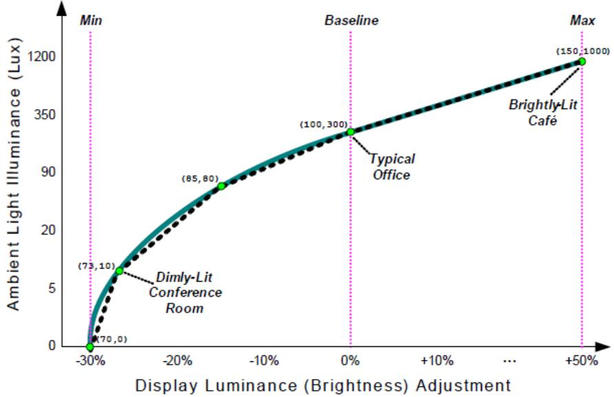  
Fig. 9.1: A five-point ALS Response Curve

The figure above illustrates the use of five points to approximate an example response curve, where the dotted line represents an approximation of the desired response (solid curve). Extrapolation of the values between these points is OS-specific - although for the purposes of this example we’ll assume a piecewise linear approximation. The ALS response curve (\_ALR) would be specified as follows:

Display Luminance (Brightness) Adjustment

<table><tr><td colspan="3">Name(_ALR, Package() {</td></tr><tr><td>Package{70, 0},</td><td>// Min</td><td>(-30% adjust at 0 lux)</td></tr><tr><td>Package{73, 10},</td><td>//</td><td>(-27% adjust at 10 lux)</td></tr><tr><td>Package{85, 80},</td><td>//</td><td>(-15% adjust at 80 lux)</td></tr><tr><td>Package{100,300},</td><td>// Baseline</td><td>(0% adjust at 300 lux)</td></tr><tr><td>Package{150,1000}</td><td>// Max</td><td>(+50% adjust at 1000 lux)</td></tr><tr><td colspan="3">})</td></tr></table>

Within this data set exist three points of particular interest: baseline, min, and max. The baseline value represents an ambient light illuminance value (in lux) for the environment where this system is most likely to be used. When the system is operating in this ambient environment the ALS policy will apply no (0%) adjustment to the default display brightness setting. For example, given a system with a 300 lux baseline, operating in a typical ofice ambient environment (\~300 lux), configured with a default display brightness setting of 50% (e.g. 60 nits), the ALS policy would apply no backlight adjustment, resulting in an absolute display brightness setting of 60 nits.

Min and max are used to indicate cutof points in order to prevent an over-zealous response by the ALS policy and to influence the policy’s mode of operation. For example, the min and max points from the figure above would be specified as (70,0) and (150,1000) respectively - where min indicates a maximum negative adjustment of 30% and max represents a maximum positive adjustment of 50%. Using a large display brightness adjustment for max allows an ALS response that approaches a fully-bright display (100% absolute) in very bright ambient environments regardless of the user’s display brightness preference. Using a small value for max (e.g. 0% @ 300 lux) would influence the ALS policy to limit the use of this technology solely as a power-saving feature (never brighten the display). Conversely, setting min to a 0% adjustment instructs ALS policy to brighten but never dim.

A minimum of two data points are required in the return package, interpreted as min and max. Note that the baseline value does not have to be explicitly stated; it can be derived from the response curve. Addition elements can be provided to fine-tune the response between these-points. The following figure illustrates the use of two data points to achieve a response similar to (but simpler than) that described in the five-point ALS response curve example.

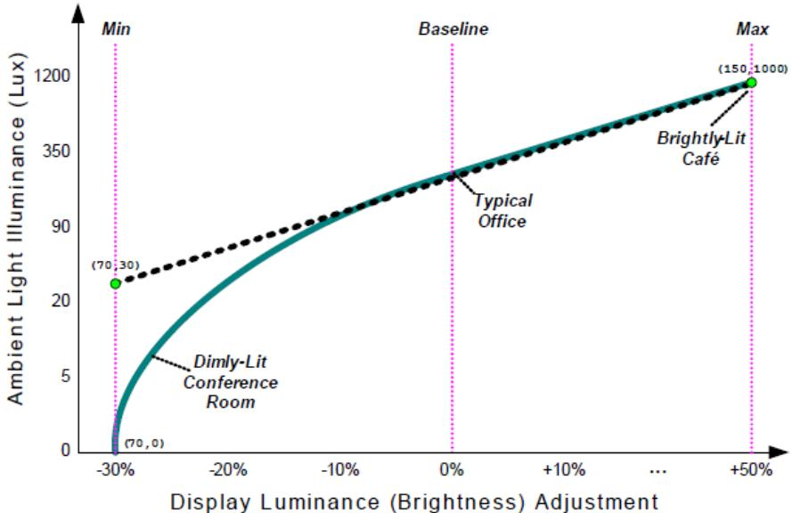  
Fig. 9.2: A two-point ALS Response Curve

This example lacks an explicit baseline and includes a min with an ambient light value above 0 lux. The baseline can easily be extrapolated by ALS Policy (e.g. 0% adjustment at \~400 lux). All ambient light brightness settings below min (20 lux) would be treated in a similar fashion by ALS policy (e.g. -30% adjustment). This two-point response curve would be modeled as:

```txt
Name(_ALR, Package() {
    Package{70, 30}, // Min (-30% adjust at 30 lux)
    Package{150, 1000} // Max (+50% adjust at 1000 lux)
})
```

This model can be used to convey a wide range of ambient light to display brightness responses. For example, a transflective display - a technology where illumination of the display can be achieved by reflecting available ambient light, but also augmented in dimly-lit environments with a backlight - could be modeled as illustrated in the following figure.

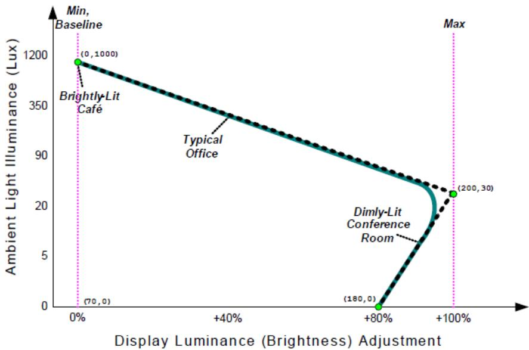  
Fig. 9.3: Example Response Curve for a Transflective Display

This three-point approximation would result in an ALS response that allows the backlight to increase as the ambient lighting decreases. In this example, no backlight adjustment is needed in bright environments (1000+ lux), maximum backlight may be needed in dim environments (\~30 lux), but a lower backlight setting may be used in a very-dark room (\~0 lux) - resulting in an elbow around 30 lux. This response would be modeled in \_ALR as follows:

```autohotkey
Name(_ALR, Package() {
    Package{180, 0} ( +80% adjust at 0 lux)
    Package{200, 30}, // Max (+100% adjust at 30 lux)
    Package{0, 1000}, // Min ( 0% adjust at 1,000 lux)
})
```

Note the ordering of package elements: monotonically increasing from the lowest ambient light value (0 lux) to the highest ambient light value (1000 lux).

The transflective display example also highlights the need for non-zero values for the user’s display brightness preference - which we’ll refer to as the reference display brightness value. This requirement is derived from the model’s use of relative adjustments. For example, applying any adjustment to a 0% reference display brightness value always results in a 0% absolute display brightness setting. Likewise, using a very small reference display brightness (e.g. 5%) results in a muted response (e.g. +30% of 5% = 6.5% absolute). The solution is to apply a reasonably large value (e.g. 50%) as the reference display brightness setting - even in the case where no backlight is applied. This allows relative adjustments to be applied in a meaningful fashion while conveying to the user that the display is still usable (via reflected light) under typical ambient conditions.

The OS derives the user’s display brightness preference (this reference value) either from the Brightness Control Levels

(\_BCL) object or another OS-specific mechanism (see Section 9.3.8).

## 9.3.6 \_ALP (Ambient Light Polling)

This optional object evaluates to a recommended polling frequency (in tenths of seconds) for this ambient light sensor. A value of zero - or the absence of this object when other ALS objects are defined - indicates that OSPM does not need to poll the sensor in order to detect meaningful changes in ambient light (the hardware is capable of generating asynchronous notifications).

The use of polling is allowed but strongly discouraged by this specification. OEMs should design systems that asynchronously notify OSPM whenever a meaningful change in the ambient light occurs–relieving the OS of the overhead associated with polling.

This value is specified as tenths of seconds. For example, a value of 10 would be used to indicate a 1 second polling frequency. As this is a recommended value, OSPM will consider other factors when determining the actual polling frequency to use.

## Arguments:

None

## Return Value:

An Integer containing the recommended polling frequency in tenths of seconds

0 - Polling by the host OS is not required

Other - The recommended polling frequency in tenths of seconds

## 9.3.7 Ambient Light Sensor Events

To communicate meaningful changes in ALS illuminance to OSPM, AML code should issue a Notify(als\_device, 0x80) whenever the lux reading changes more than 10% (from the last reading that resulted in a notification). OSPM receives this notification and evaluates the \_ALI control method to determine the current ambient light status. The OS then adjusts the display brightness based upon its ALS policy (derived from \_ALR).

The definition of what constitutes a meaningful change is left to the system integrator, but should be at a level of granularity that provides an appropriate response without overly taxing the system with unnecessary interrupts. For example, an ALS configuration may be tuned to generate events for all changes in ambient light illuminance that result in a minimum ±5% display brightness response (as defined by \_ALR).

To communicate meaningful changes in ALS color temperature to OSPM, AML code should issue a Notify(als\_device, 0x81) whenever the lux reading changes more than 10% (from the last reading that resulted in a notification). OSPM receives this notification and evaluates the \_ALT and \_ALC control method to determine the current ambient light color temperature.

To communicate meaningful changes in ALS response to OSPM, AML code should issue a Notify(als\_device, 0x82) whenever the set of points used to convey ambient light response has changed. OSPM receives this notification and evaluates the \_ALR object to determine the current response points.

## 9.3.8 Relationship to Backlight Control Methods

The Brightness Control Levels (\_BCL) method - described in section 0 - can be used to indicate user-selectable display brightness levels. The information provided by this method indicates the available display brightness settings, the recommended default brightness settings for AC and DC operation, and the absolute maximum and minimum brightness settings. These values indirectly influence the operation of the OSPM’s ALS policy.

Display brightness adjustments produced by ALS policy are relative to the current user backlight setting, and the resulting absolute value must be mapped (rounded) to one of the levels specified in \_BCL. This introduces the requirement for fine-grain display brightness control in order to achieve a responsive ALS system - which typically materializes as a need for additional entries in the \_BCL list in order to provide reasonable resolution to the OS (e.g. 3-10% granularity). Note that user brightness controls (e.g. hotkeys) are not required to make use of all levels specified in \_BCL.

## 9.4 Control Method Lid Device

Platforms containing lids convey lid status (open / closed) to OSPM using a Control Method Lid Device.

To implement a control method lid device, AML code should issue a Notify(lid\_device, 0x80) for the device whenever the lid status has changed. The \_LID control method for the lid device must be implemented to report the current state of the lid as either opened or closed.

The lid device can support \_PRW and \_PSW methods to select the wake functions for the lid when the lid transitions from closed to opened.

The Plug and Play ID of an ACPI control method lid device is PNP0C0D.

Table 9.3: Control Method Lid Device

<table><tr><td>Object</td><td>Description</td></tr><tr><td>_LID</td><td>Returns the current status of the lid.</td></tr></table>

## 9.4.1 \_LID

Evaluates to the current status of the lid.

Arguments:

None

Return Value:

An Integer containing the current lid status:

0 - The lid is closed Non-zero - The lid is open

## 9.5 Control Method Power and Sleep Button Devices

The system’s power or sleep button can either be implemented using the fixed register space as defined in Console Buttons or implemented in AML code as a control method power button device. In either case, the power button override function or similar unconditional system power or reset functionality is still implemented in external hardware.

To implement a control method power-button or sleep-button device, implement AML code that delivers two types of notifications concerning the device. The first is Notify(Object, 0x80) to signal that the button was pressed while the system was in the S0 state to indicate that the user wants the machine to transition from S0 to some sleeping state. The other notification is Notify(Object, 0x2) to signal that the button was pressed while the system was in an S1 to S4 state and to cause the system to wake. When the button is used to wake the system, the wake notification (Notify(Object, 0x2)) must occur after OSPM actually wakes, and a button-pressed notification (Notify(Object, 0x80)) must not occur.

The Wake Notification indicates that the system is awake because the user pressed the button and therefore a complete system resume should occur (for example, turn on the display immediately, and so on).

## 9.6 Generic Container Device

A generic container device is a bridge that does not require a special OS driver because the bridge does not provide or require any features not described within the normal ACPI device functions. The resources the bridge requires are specified via normal ACPI resource mechanisms. Device enumeration for child devices is supported via ACPI namespace device enumeration and OS drivers require no other features of the bus. Such a bridge device is identified with the Plug and Play ID of PNP0A05 or PNP0A06.

A generic bus bridge device is typically used for integrated bridges that have no other means of controlling them and that have a set of well-known devices behind them. For example, a portable computer can have a “generic bus bridge” known as an EIO bus that bridges to some number of Super-I/O devices. The bridged resources are likely to be positively decoded as either a function of the bridge or the integrated devices. In this example, a generic bus bridge device would be used to declare the bridge then child devices would be declared below the bridge; representing the integrated Super-I/O devices.

## 9.7 ATA Controller Devices

There are two types of ATA Controllers: IDE controllers (also known as ATA controllers) and Serial ATA (SATA) controllers. IDE controllers are those using the traditional IDE programming interface, and may support Parallel ATA (P-ATA) or SATA connections. SATA controllers may be designed to operate in emulation mode only, native mode only, or they may be designed to support both native and non-native SATA modes. Regardless of the mode supported, SATA controllers are designed to work solely with drives supporting the Serial ATA physical interface. As described below, SATA controllers are treated similarly but not identically to traditional IDE controllers.

Platforms that contain controllers that support native and non-native SATA modes must take steps to ensure the proper objects are placed in the namespace for the mode in which they are operating.

Table 9.4: ATA Specific Objects

<table><tr><td>Object</td><td>Description</td><td>Controller Type</td></tr><tr><td>_GTF</td><td>Optional object that returns the ATA task file needed to re-initialize the drive to boot up defaults.</td><td>Both</td></tr><tr><td>_GTM</td><td>Optional object that returns the IDE controller timing information.</td><td>IDE-only</td></tr><tr><td>_STM</td><td>Optional control method that sets the IDE controller&#x27;s transfer timing settings.</td><td>IDE-only</td></tr></table>

continues on next page

Table 9.4 – continued from previous page

<table><tr><td>Object</td><td>Description</td><td>Controller Type</td></tr><tr><td>_SDD</td><td>Optional control method that informs the platform of the type of device attached to a port.</td><td>SATA-only</td></tr></table>

## 9.7.1 Objects for Both ATA and SATA Controllers

## 9.7.1.1 \_GTF (Get Task File)

This optional object returns a bufer containing the ATA commands used to restore the drive to boot up defaults (that is, the state of the drive after POST). The returned bufer is an array with each element in the array consisting of seven 8-bit register values (56 bits) corresponding to ATA task registers 1F1 thru 1F7. Each entry in the array defines a command to the drive.

## Arguments:

None

## Return Value:

A Bufer containing a byte stream of ATA commands for the drive

This object may appear under SATA port device objects or under IDE channel objects.

ATA task file array definition:

• Seven register values for command 1

– Reg values: (1F1, 1F2, 1F3, 1F4, 1F5, 1F6, 1F7)

• Seven register values for command 2

– Reg values: (1F1, 1F2, 1F3, 1F4, 1F5, 1F6, 1F7)

• Seven register values for command 3

– Reg values: (1F1, 1F2, 1F3, 1F4, 1F5, 1F6, 1F7)

• Etc.

After powering up the drive, OSPM will send these commands to the drive, in the order specified. On SATA HBAs, OSPM evaluates \_SDD before evaluating \_GTF. The IDE driver may modify some of the feature commands or append its own to better tune the drive for OSPM features before sending the commands to the drive.

This Control Method is listed under each drive device object. OSPM must evaluate the \_STM object or the \_SDD object before evaluating the \_GTF object.

Example of the return from \_GTF:

```autohotkey
Method(_GTF, 0x0, NotSerialized)
{
    Return(GTF0)
}
Name(GTF0, Buffer(0x1c)
{
    0x03, 0x00, 0x00, 0x00, 0x00, 0xa0, 0xef, 0x03, 0x00, 0x00, 0x00, 0x00, 0xa0, 0xef, 0x00, 0x10, 0x00, 0x00, 0x00, 0xa0, 0xc6, 0x00, 0x00, 0x00, 0x00, 0x00, 0x91
}
```

## 9.7.2 IDE Controller Device

Most device drivers can save and restore the registers of their device. For IDE controllers and drives, this is not true because there are several drive settings for which ATA does not provide mechanisms to read. Further, there is no industry standard for setting timing information for IDE controllers. Because of this, ACPI interface mechanisms are necessary to provide the operating system information about the current settings for the drive and channel, and for setting the timing for the channel.

OSPM and the IDE driver will follow these steps when powering of the IDE subsystem:

1. The IDE driver will call the \_GTM control method to get the current transfer timing settings for the IDE channel. This includes information about DMA and PIO modes.

2. The IDE driver will call the standard OS services to power down the drives and channel.

3. As a result, OSPM will execute the appropriate \_PS3 methods and turn of unneeded power resources.

To power on the IDE subsystem, OSPM and the IDE driver will follow these steps:

1. The IDE driver will call the standard OS services to turn on the drives and channel.

2. As a result, OSPM will execute the appropriate \_PS0 methods and turn on required power resources.

3. The IDE driver will call the \_STM control method passing in transfer timing settings for the channel, as well as the ATA drive ID block for each drive on the channel. The \_STM control method will configure the IDE channel based on this information.

4. For each drive on the IDE channel, the IDE driver will run the \_GTF to determine the ATA commands required to reinitialize each drive to boot up defaults.

5. The IDE driver will finish initializing the drives by sending these ATA commands to the drives, possibly modifying or adding commands to suit the features supported by the operating system.

The following shows the namespace for these objects:

<table><tr><td>$_SB</td><td>// System bus</td></tr><tr><td>PCI0</td><td>// PCI bus</td></tr><tr><td>IDE1</td><td>// First IDE channel</td></tr><tr><td>_ADR</td><td>// Indicates address of the channel on the PCI bus</td></tr><tr><td>_GTM</td><td>// Control method to get current IDE channel settings</td></tr><tr><td>_STM</td><td>// Control method to set current IDE channel settings</td></tr><tr><td>_PRO</td><td>// Power resources needed for D0 power state</td></tr><tr><td>DRV1</td><td>// Drive 0</td></tr><tr><td>_ADR</td><td>// Indicates address of master IDE device</td></tr><tr><td>_GTF</td><td>// Control method to get task file</td></tr><tr><td>DRV2</td><td>// Drive 1</td></tr><tr><td>_ADR</td><td>// Indicates address of slave IDE device</td></tr><tr><td>_GTF</td><td>// Control method to get task file</td></tr><tr><td>IDE2</td><td>// Second IDE channel</td></tr><tr><td>_ADR</td><td>// Indicates address of the channel on the PCI bus</td></tr><tr><td>_GTM</td><td>// Control method to get current IDE channel settings</td></tr><tr><td>_STM</td><td>// Control method to set current IDE channel settings</td></tr><tr><td>_PRO</td><td>// Power resources needed for D0 power state</td></tr><tr><td>DRV1</td><td>// Drive 0</td></tr><tr><td>_ADR</td><td>// Indicates address of master IDE device</td></tr><tr><td>_GTF</td><td>// Control method to get task file</td></tr><tr><td></td><td></td></tr><tr><td></td><td></td></tr><tr><td></td><td></td></tr></table>

The sequential order of operations is as follows:

## Powering down

• Call \_GTM.

• Power down drive (calls \_PS3 method and turns of power planes).

## Powering up

• Power up drive (calls \_PS0 method if present and turns on power planes).

• Call \_STM passing info from \_GTM (possibly modified), with ID data from each drive.

• Initialize the channel.

• May modify the results of \_GTF.

• For each drive:

– Call \_GTF.

– Execute task file (possibly modified).

## 9.7.2.1 IDE Controller-specific Objects

## 9.7.2.1.1 \_GTM (Get Timing Mode)

This Control Method exists under each channel device object and returns the current settings for the IDE channel.

## Arguments:

None

Return Value:

A Bufer containing the current IDE channel timing information block as described in the GTM Method Result Codes table below.

\_GTM returns a bufer with the following format  
```lisp
Buffer () {
    PIO Speed 0 //DWORD
    DMA Speed 0 //DWORD
    PIO Speed 1 //DWORD
    DMA Speed 1 //DWORD
    Flags //DWORD
}
```

Table 9.5: GTM Method Result Codes

<table><tr><td>Field</td><td>Format</td><td>Description</td></tr><tr><td>PIO Speed 0</td><td>DWORD</td><td>The PIO bus-cycle timing for drive 0 in nanoseconds. 0xFFFFFFF indicates that this mode is not supported by the channel. If the chipset cannot set timing parameters independently for each drive, this field represents the timing for both drives.</td></tr></table>

continues on next page

Table 9.5 – continued from previous page

<table><tr><td>Field</td><td>Format</td><td>Description</td></tr><tr><td>DMA Speed 0</td><td>DWORD</td><td>The DMA bus-cycle for drive 0 timing in nanoseconds. If bit 0 of the Flags register is set, this DMA timing is for UltraDMA mode, otherwise the timing is for multi-word DMA mode. 0xFFFFFFFF indicates that this mode is not supported by the channel. If the chipset cannot set timing parameters independently for each drive, this field represents the timing for both drives.</td></tr><tr><td>PIO Speed 1</td><td>DWORD</td><td>The PIO bus-cycle timing for drive 1 in nanoseconds. 0xFFFFFFFF indicates that this mode is not supported by the channel. If the chipset cannot set timing parameters independently for each drive, this field must be 0xFFFFFFFF.</td></tr><tr><td>DMA Speed 1</td><td>DWORD</td><td>The DMA bus-cycle timing for drive 1 in nanoseconds. If bit 0 of the Flags register is set, this DMA timing is for UltraDMA mode, otherwise the timing is for multi-word DMA mode. 0xFFFFFFFF indicates that this mode is not supported by the channel. If the chipset cannot set timing parameters independently for each drive, this field must be 0xFFFFFFFF.</td></tr><tr><td>Flags</td><td>DWORD</td><td>Mode flags Bit [0]: 1 indicates using UltraDMA on drive 0 Bit [1]: 1 indicates IOChannelReady is used on drive 0 Bit [2]: 1 indicates using UltraDMA on drive 1 Bit [3]: 1 indicates IOChannelReady is used on drive 1 Bit [4]: 1 indicates chipset can set timing independently for each drive Bits [31:5]: reserved (must be 0)</td></tr></table>

## 9.7.2.1.2 \_STM (Set Timing Mode)

This Control Method sets the IDE channel’s transfer timings to the setting requested. The AML code is required to convert and set the nanoseconds timing to the appropriate transfer mode settings for the IDE controller. \_STM may also make adjustments so that \_GTF control methods return the correct commands for the current channel settings.

This control method takes three arguments: Channel timing information (as described in Table 9-6), and the ATA drive ID block for each drive on the channel. The channel timing information is not guaranteed to be the same values as returned by \_GTM; the OS may tune these values as needed.

## Arguments:(3)

Arg0 - A Bufer containing a channel timing information block (described in Table 9-6)

Arg1 - A Bufer containing the ATA drive ID block for channel 0

Arg2 - A Bufer containing the ATA drive ID block for channel 1

## Return Value:

None

The ATA drive ID block is the raw data returned by the Identify Drive ATA command, which has the command code “0ECh.” The \_STM control method is responsible for correcting for drives that misreport their timing information.

## 9.7.3 Serial ATA (SATA) Controller Device

## 9.7.3.1 Definitions

## HBA

Host Bus Adapter

## Native SATA aware

Refers to system software (platform firmware, option ROM, operating system, etc) that comprehends a particular SATA HBA implementation and understands its programming interface and power management behavior.

## Non-native SATA aware

Refers to system software (platform firmware, option ROM, operating system, etc) that does not comprehend a particular SATA HBA implementation and does not understand its programming interface or power management behavior. Typically, non-native SATA aware software will use a SATA HBA’s emulation interface (e.g. task file registers) to control the HBA and access its devices.

## Emulation mode

Optional mode supported by a SATA HBA. Allows non-native SATA aware software to access SATA devices via traditional task file registers.

## Native mode

Optional mode supported by a SATA HBA. Allows native SATA aware software to access SATA devices via registers that are specific to the HBA.

## Hybrid Device

Refers to a SATA HBA that implements both an emulation and a native programming interface.

## 9.7.3.2 Overview

A SATA HBA difers from an IDE controller in a number of ways. First, it can save its complete device context. Second, it replaces IDE channels, which may support up to 2 attached devices, with ports, which support only a single attached device, unless a port multiplier is present. See the SATA spec at “Links to ACPI-Related Documents” ( http://uefi.org/acpi ) under the heading “SATA Specification”for more information. Finally, SATA does not require timing information from the platform, allowing a simplification in how SATA controllers are represented in ACPI. (\_GTM and \_STM are replaced by the simpler \_SDD method.)

All ports, even those attached of a port multiplier, are represented as children directly under the SATA controller device. This is practical because the SATA specification does not allow a port multiplier to be attached to a port multiplier. Each port’s \_ADR indicates to which root port they are connected, as well as the port multiplier location, if applicable (see Table 6.2)

Since this specification only covers the configuration of motherboard devices, it is also the case that the control methods defined in this section cannot be used to send taskfiles to devices attached via either an add-in SATA HBA, or attached via a motherboard SATA HBA, if used with a port multiplier that is not also on the motherboard.

The following shows an example SATA namespace:

```txt
$_SB - System bus
PCI0 - PCI bus
SATA - SATA Controller device
ADR - Indicates address of the controller on the PCI bus
PRO - Power resources needed for DO power state
PRT0 - Port 0 device
_ADR - Indicates physical port and port multiplier topology
_SDD - Identify information for drive attached to this port
```

(continues on next page)

(continued from previous page)

```txt
_GTF - Control method to get task file
PRTn - Port n device
_ADR - Indicates physical port and port multiplier topology
_SDD - Identify information for drive attached to this port
_GTF - Control method to get task file
```

## 9.7.3.3 SATA controller-specific control methods

In order to ensure proper interaction between OSPM, the firmware, and devices attached to the SATA controller, it is a requirement that OSPM execute the \_SDD and \_GTF control methods when certain events occur. OSPM’s response to events must be as follows:

## COMRESET, Initial OS load, device insertion, HBA D3 to D0 transition, asynchronous loss of signal:

1. OSPM sends IDENTIFY DEVICE or IDENTIFY PACKET DEVICE command to the attached device.

2. OS executes \_SDD. \_SDD control method requires 1 argument that consists of the data block received from an attached device as a result of a host issued IDENTIFY DEVICE or IDENTIFY PACKET DEVICE command.

3. After the \_SDD method completes, the OS executes the \_GTF method. Using the task file information provided by \_GTF, the OS then sends the \_GTF taskfiles to the attached device.

## Device removal and HBA D0 to D3 transition:

1. No OSPM action required.

## 9.7.3.3.1 \_SDD (Set Device Data)

This optional object is a control method that conveys to the platform the type of device connected to the port. The \_SDD object may exist under a SATA port device object. The platform typically uses the information conveyed by the \_SDD object to construct the values returned by the \_GTF object.

OSPM conveys to the platform the ATA drive ID block, which is the raw data returned by the Identify (Packet) Device, ATA command (command code “0ech.”). Please see the ATA/ATAPI-6 specification for more details.

Arguments:(1)

Arg0 - A Bufer containing an ATA drive identify block, contents described by the ATA specification

Return Value:

None

## 9.8 Floppy Controller Device Objects

## 9.8.1 \_FDE (Floppy Disk Enumerate)

Enumerating devices attached to a floppy disk controller is a time-consuming function. In order to speed up the process of floppy enumeration, ACPI defines an optional enumeration object that is defined directly under the device object for the floppy disk controller. It returns a bufer of five 32-bit values. The first four values are Boolean values indicating the presence or absence of the four floppy drives that are potentially attached to the controller. A non-zero value indicates that the floppy device is present. The fifth value returned indicates the presence or absence of a tape controller. Definitions of the tape presence value can be found in Tape Presence.

## Arguments:

None

## Return Value:

A Bufer containing a floppy drive information block, as described below:

```txt
Buffer () {
    Floppy 0 // Boolean DWORD
    Floppy 1 // Boolean DWORD
    Floppy 2 // Boolean DWORD
    Floppy 3 // Boolean DWORD
    Tape // DWORD - See the Tape Presence table below
}
```

Table 9.6: Tape Presence

<table><tr><td>Value</td><td>Description</td></tr><tr><td>0</td><td>Device presence is unknown or unavailable</td></tr><tr><td>1</td><td>Device is present</td></tr><tr><td>2</td><td>Device is never present</td></tr><tr><td>&gt;2</td><td>Reserved</td></tr></table>

## 9.8.2 \_FDI (Floppy Disk Information)

This object returns information about a floppy disk drive. This information is the same as that returned by the INT 13 Function 08H on IA-PCs.

## Arguments:

None

## Return Value:

A Package containing the floppy disk information as a list of Integers:

```verilog
Package {
Drive Number // Integer (BYTE)
Device Type // Integer (BYTE)
Maximum Cylinder Number // Integer (WORD)
Maximum Sector Number // Integer (WORD)
Maximum Head Number // Integer (WORD)
disk_specify_1 // Integer (BYTE)
disk_specify_2 // Integer (BYTE)
disk_motor_wait // Integer (BYTE)
disk_sector_siz // Integer (BYTE)
disk_eot // Integer (BYTE)
disk_rw_gap // Integer (BYTE)
disk_dtl // Integer (BYTE)
disk_formt_gap // Integer (BYTE)
disk_fill // Integer (BYTE)
disk_head_sttl // Integer (BYTE)
disk_motor_strt // Integer (BYTE)
}
```

Table 9.7: ACPI Floppy Drive Information

<table><tr><td>Package Element</td><td>Element Object Type</td><td>Actual Valid Data Width</td></tr><tr><td>00 - Drive Number</td><td>Integer</td><td>BYTE</td></tr><tr><td>01 - Device Type</td><td>Integer</td><td>BYTE</td></tr><tr><td>02 - Maximum Cylinder Number</td><td>Integer</td><td>WORD</td></tr><tr><td>03 - Maximum Sector Number</td><td>Integer</td><td>WORD</td></tr><tr><td>04 - Maximum Head Number</td><td>Integer</td><td>WORD</td></tr><tr><td>05 - Disk_specify_1</td><td>Integer</td><td>BYTE</td></tr><tr><td>06 - Disk_specify_2</td><td>Integer</td><td>BYTE</td></tr><tr><td>07 - Disk_motor_wait</td><td>Integer</td><td>BYTE</td></tr><tr><td>08 - Disk_sector_siz</td><td>Integer</td><td>BYTE</td></tr><tr><td>09 - Disk_eot</td><td>Integer</td><td>BYTE</td></tr><tr><td>10 - Disk_rw_gap</td><td>Integer</td><td>BYTE</td></tr><tr><td>11 - Disk_dtl</td><td>Integer</td><td>BYTE</td></tr><tr><td>12 - Disk_formt_gap</td><td>Integer</td><td>BYTE</td></tr><tr><td>13 - Disk_fill</td><td>Integer</td><td>BYTE</td></tr><tr><td>14 - Disk_head_sttl</td><td>Integer</td><td>BYTE</td></tr><tr><td>15 - Disk_motor_strt</td><td>Integer</td><td>BYTE</td></tr></table>

## 9.8.3 \_FDM (Floppy Disk Drive Mode)

This control method switches the mode (300 RPM or 360 RPM) of all floppy disk drives attached to this controller. If this control method is implemented, the platform must reset the mode of all drives to 300RPM mode after a Dx to D0 transition of the controller.

## Arguments:(1)

Arg0 - An Integer containing the new drive mode

0 - Set the mode of all drives to 300 RPM mode

1 - Set the mode of all drives to 360 RPM mode

Return Value:

None

## 9.9 GPE Block Device

The GPE Block device is an optional device that allows a system designer to describe GPE blocks beyond the two that are described in the FADT. Control methods associated with the GPE pins of GPE block devices exist as children of the GPE Block device, not within the \_GPE namespace. Because GPE block devices are meant as an extension to the GPE blocks defined in the FADT, and that portion of the FADT is to be ignored in hardware-reduced ACPI, GPE block devices are not supported in hardware-reduced ACPI.

A GPE Block device consumes I/O or memory address space, as specified by its \_PRS or \_CRS child objects. The interrupt vector used by the GPE block does not need to be the same as the SCI\_INT field. The interrupt used by the GPE block device is specified in the \_CRS and \_PRS methods associated with the GPE block. The \_CRS of a GPE Block device may only specify a single register address range, either I/O or memory. This range contains two registers: the GPE status and enable registers. Each register’s length is defined as half of the length of the \_CRS-defined register address range.

A GPE Block device must have a \_HID or a \_CID of “ACPI0006.”

## ò Note

A system designer must describe the GPE block necessary to bootstrap the system in the FADT as a GPE0/GPE1 block. GPE Block devices cannot be used to implement these GPE inputs.

A GPE Block Device must contain the \_Lxx, \_Exx, \_Wxx, \_CRS, \_PRS, and \_SRS methods required to use and program that block.

To represent the GPE block associated with the FADT, the system designer should include in the namespace a Device object with the ACPI0006 \_HID that contains no \_CRS, \_PRS, \_SRS, \_Lxx, \_Exx, or \_Wxx methods. OSPM assumes that the first such ACPI0006 device is the GPE Block Device that is associated with the FADT GPEs. (See the example below).

```txt
// ASL example of a standard GPE block device
Device(\_SB.PCI0.GPE1) {
    Name(_HID, "ACPI0006")
    Name(_UID, 2)
    Name(_CRS, Buffer () {
    IO(Decode16, FC00, FC03, 4, 4,)
    IRQ( Level, ActiveHigh, Shared,) { 5 }
})
Method(_L02) { ... }
Method(_E07) { ... }
Method(_W04) { ... }
}
// ASL example of a GPE block device that refers to the FADT GPEs.
// Cannot contain any \_Lxx, \_Exx, \_Wxx, \_CRS, \_PRS, or. \_SRS methods.
Device(\_SB.PCI0.GPE0) {
    Name(_HID,"ACPI0006")
    Name(_UID,1)
}
```

Notice that it is legal to replace the I/O descriptors with Memory descriptors if the register is memory mapped.

If the system must run any GPEs to bootstrap the system (for example, when Embedded Controller events are required), the associated block of GPEs must be described in the FADT. This register block is not relocatable and will always be available for the life of the operating system boot.

A GPE block associated with the ACPI0006 \_HID can be stopped, ejected, reprogrammed, and so on. The system can also have multiple such GPE blocks.

## 9.9.1 Matching Control Methods for Events in a GPE Block Device

When a GPE Device raises an interrupt, OSPM executes a corresponding control method (see Queuing the matching control method for execution). These control methods for GPE Devices (of the form \_Lxx, \_Exx, and \_Wxx) are not within the \_GPE namespace. They are children of the GPE Block device.

For example:

```txt
Device(GPE5) {
Name(_HID, "ACPI0006")
```

(continues on next page)

```txt
(continued from previous page)
Method(_L02) { ... }
Method(_E07) { ... }
Method(_W04) { ... }
}
```

## 9.10 Module Device

This optional device is a container object that acts as a bus node in a namespace. It may contain child objects that are devices or buses. The module device is declared using the ACPI0004 hardware identifier (HID)

If the module device contains a \_CRS object, the bus described by this object is assumed to have these resources available for consumption by its child devices. If a \_CRS object is present, any resources not produced in the module device’s \_CRS object may not be allocated to child devices.

Providing a \_CRS object is undesirable in some module devices. For example, consider a module device used to describe an add-in board containing multiple host bridges without any shared resource decoding logic. In this case the resource ranges available to the host bridges are not controlled by any entity residing on the add-in board, implying that a \_CRS object in the associated module device would not describe any real feature of the underlying hardware. A module device must contain a \_CRS object if the device contains any PCI host bridge devices.

To account for cases like this, the system designer may optionally omit the module device’s \_CRS object. If no \_CRS object is present, OSPM will assume that the module device is a simple container object that does not produce the resources consumed by its child devices. In this case, OSPM will assign resources to the child devices as if they were direct children of the module device’s parent object.

For an example with a module device \_CRS object present, consider a Module Device containing three child memory devices. If the \_CRS object for the Module Device contains memory from 2 GB through 6 GB, then the child memory devices may only be assigned addresses within this range.

## Example:

```txt
Device (\_SB.NOD0) {
    Name (_HID, "ACPI0004") // Module device
    Name (_UID, 0)
    Name (_PRS, ResourceTemplate() {
    WordIO (
    ResourceProducer,
    MinFixed, // \_MIF
    MaxFixed,,, // \_MAF
    0x0000, // \_GRA
    0x0000, // \_MIN
    0x7FFF, // \_MAX
    0x0, // \_TRA
    0x8000) // \_LEN
    DWordMemory (
    ResourceProducer,, // For Main Memory + PCI
    MinNotFixed, // _MIF
    MaxNotFixed, // _MAF
    Cacheable, // _MEM
    ReadWrite, // _RW
    0x0FFFFFFF, // _GRA
    0x40000000, // _MIN
```

(continues on next page)

```txt
0x7FFFFFFF,    // _MAX
0x0,    // _TRA
0x00000000)    // _LEN

})
Method (_SRS, 1) { ... }
Method (_CRS, 0) { ... }

Device (MEM0) {    // Main Memory (256MB module)
Name (_HID, EISAID("PNP0C80"))
Name (_UID, 0)
Method (_STA, 0) {    // If memory not present --> Return(0x00),
    // Else if memory is disabled --> Return(0x0D),
    // Else --> Return(0x0F)
}
Name (_PRS, ResourceTemplate () {
DWordMemory (,,,,
    Cacheable,    // _MEM
    ReadWrite,    // _RW
    0x0FFFFFFF,    // _GRA
    0x40000000,    // _MIN
    0x7FFFFFFF,    // _MAX
    0x0,    // _TRA
    0x10000000)    // _LEN
})
Method (_CRS, 0) { ... }
Method (_SRS, 1) { ... }
Method (_DIS, 0) { ... }
}
Device (MEM1) {    // Main Memory (512MB module)
Name (_HID, EISAID("PNP0C80"))
Name (_UID, 1)
Method (_STA, 0) {    // If memory not present --> Return(0x00)
    // Else if memory is disabled --> Return(0x0D)
    // Else --> Return(0x0F)
}
Name (_PRS, ResourceTemplate () {
DWordMemory (,,,,
    Cacheable,    // _MEM
    ReadWrite,    // _RW
    0x1FFFFFFF,    // _GRA
    0x40000000,    // _MIN
    0x7FFFFFFF,    // _MAX
    0x0,    // _TRA
    0x20000000)    // _LEN
})
Method (_CRS, 0) { ... }
Method (_SRS, 1) { ... }
Method (_DIS, 0) { ... }
}
Device (PCI0) { // PCI Root Bridge
Name (_HID, EISAID("PNP0A03"))
Name (_UID, 0)
```

(continued from previous page)

```csv
Name (_BBN, 0x00)
Name (_PRS, ResourceTemplate () {
WordBusNumber (
ResourceProducer,
MinFixed,    // _MIF
MaxFixed,,    // _MAF
0x00,    // _GRA
0x00,    // _MIN
0x7F,    // _MAX
0x0,    // _TRA
0x80)    // _LEN
WordIO (
ResourceProducer,
MinFixed,    // _MIF
MaxFixed,,    // _MAF
0x0000,    // _GRA
0x0000,    // _MIN
0x0CF7,    // _MAX
0x0,    // _TRA
0x0CF8)    // _LEN
WordIO (
ResourceProducer,
MinFixed,    // _MIF
MaxFixed,,    // _MAF
0x0000,    // _GRA
0x0D00,    // _MIN
0x7FFF,    // _MAX
0x0,    // _TRA
0x7300)    // _LEN

DWordMemory (
ResourceProducer.,
MinNotFixed,    // _MIF
MaxNotFixed,    // _MAF
NonCacheable,    // _MEM
ReadWrite,    // _RW
0x0FFFFFFF,    // _GRA
0x40000000,    // _MIN
0x7FFFFFFF,    // _MAX
0x0,    // _TRA
0x00000000)    // _LEN
})
Method (_CRS, 0) { ... }
Method (_SRS, 1) { ... }
}
```

## 9.11 Memory Devices

Memory devices allow a platform to convey dynamic properties of memory to OSPM, and are required when a platform supports the addition or removal of memory while the system is active, or when the platform supports memory bandwidth monitoring and reporting (see Section 9.11.4). Memory devices are assigned a PNPID of PNP0C80.

For the active memory additional and removal use-case, the memory device object is only required if there is no other native mechanism for performing the hot-add or hot-remove operations. For example, hot-plug of CXL-attached memory employs CXL-defined mechanisms and, as such, a memory device object is not required for such memory.

Memory devices may describe exactly the same physical memory that the System Address Map interfaces describe (see Section 15). They do not describe how that memory is, or has been, used. If a region of physical memory is marked in the System Address Map interface as AddressRangeReserved or AddressRangeNVS and it is also described in a memory device, then it is the responsibility of the OS to guarantee that the memory device is never disabled.

It is not necessary to describe all memory in the system with memory devices if there is some memory in the system that is static in nature. If, for instance, the memory that is used for the first 16 MB of system RAM cannot be ejected, inserted, or disabled, that memory may only be represented by the System Address Map interfaces. But if memory can be ejected, inserted, or disabled, or if the platform supports memory bandwidth monitoring and reporting, the memory must be represented by a memory device.

## 9.11.1 Hot-plug Indication

If the memory device is created for the purpose of describing hot-pluggable memory, it must always carry the \_STA, as well as either \_EJ0 or \_DIS methods, or both. OS can use the presence of these methods as an indication that the memory range is hot-pluggable. In addition, there must be a matching memory afinity structure in the SRAT table that has the Hot-pluggable flag set. See Section 5.2.16.2 for further details on this flag. The expression for confirming hot-pluggable property is as follows:

Is Hot-pluggable = \_STA && (\_EJ0 || \_DIS);

## 9.11.2 Address Decoding

Memory devices must provide a \_CRS object that describes the physical address space that the memory decodes. If the memory can decode alternative ranges in physical address space, the devices may also provide \_PRS, \_SRS and \_DIS objects. Other device objects may also apply if the device can be ejected.

The physical address space described by \_CRS object must be described using the Extended Address Space Resource Descriptor macro. The TypeSpecificAttributes (\_ATT) field of the descriptor might then be used to set the EFI memory attributes that apply to the memory. In the case of memory hot-add, the OS can then use the \_ATT field information to understand how the memory must be used after it has been added. This enables hot-plug support for specific-purpose memory (SPM) and persistent memory. Since the \_ATT field is optional, the OS must consider its absence to mean that the memory is by default cacheable memory with EFI attributes set to EFI\_MEMORY\_WB.

The default UEFI memory type for memory described by memory devices is AddressRangeMemory. Please see the UEFI specification for more information on this memory type.

Hot-pluggable persistent memory ranges must not be described using this mechanism. They should instead be described using the NFIT table and related methods specific to persistent memory.

## 9.11.3 Hot-pluggable Memory Description Illustrated

The following is an example that shows a hot-pluggable memory module that is mapped at ofset 0x10000000, and can decode up to 0x20000000 bytes of memory. The memory module has its TypeSpecificAttributes field set to EFI\_MEMORY\_SP, to indicate to the OS that it is meant for specific-purpose usage.

```txt
Scope (\_SB){
    Device (MEM0) {
    Name (_HID, EISAID ("PNP0C80"))
    Method (_STA) {Return (ST01)} // Status stored in local Variable called ST01
    Method (_EJ0) {}
    Method (_OST) {}
    Name (_CRS, ResourceTemplate () {
    ExtendedSpace (
    0x00,    // 0x00 = Normal Memory Range
    Consumer,
    Bits[4:3] = 00b,    // AddressRangeMemory
    MinFixed,
    MaxFixed,
    Cacheable,
    0xFFFFFFF,
    0x10000000,
    0x30000000,
    0,
    0x20000000,
    EFI_MEMORY_SP,    // Specific-purpose memory
    )
    }
    )
    }
}
```

## 9.11.4 Memory Bandwidth Monitoring and Reporting

During platform operation, an adverse condition external to the platform may arise whose remedy requires a reduction in the platform’s available memory bandwidth. For example, a server management controller’s detection of an adverse thermal condition or the need to reduce the total power consumption of platforms in the data center to stay within acceptable limits. Providing OSPM with knowledge of a platform induced reduction of memory bandwidth enables OSPM to provide more robust handling of the condition. The following sections describe objects OSPM uses to configure platform-based memory bandwidth monitoring and to ascertain available memory bandwidth when the platform performs memory bandwidth throttling.

## 9.11.4.1 \_MBM (Memory Bandwidth Monitoring Data)

The optional \_MBM object provides memory bandwidth monitoring information for the memory device.

## Arguments:

None

## Return Value:

A Package containing memory device status information as described in the MBM Package Details below.

## Return Value Information:

## \_MBM evaluation returns a package of the following format:

```txt
Package () {
    Revision, // Integer
    WindowSize, // Integer DWORD
    SamplingInterval, // Integer DWORD
    MaximumBandwidth, // Integer DWORD
    AverageBandwidth, // Integer DWORD
    LowBandwidth, // Integer DWORD
    LowNotificationThreshold, // Integer DWORD
    HighNotificationThreshold // Integer DWORD
}
```

Table 9.8: MBM Package Details

<table><tr><td>Field</td><td>Format</td><td>Description</td></tr><tr><td>Revision</td><td>Integer</td><td>Current revision is: 0</td></tr><tr><td>Window Size</td><td>Integer (DWORD)</td><td>This field indicates the size of the averaging window (in seconds) that the platform uses to report average bandwidth.</td></tr><tr><td>Sampling Interval</td><td>Integer (DWORD)</td><td>This field indicates the sampling interval (in seconds) that the platform uses to record bandwidth during the averaging window.</td></tr><tr><td>Maximum Bandwidth</td><td>Integer (DWORD)</td><td>This field indicates the maximum memory bandwidth (in megabytes per second) for the memory described by this memory device.</td></tr><tr><td>Average Bandwidth</td><td>Integer (DWORD)</td><td>This field indicates the moving average memory bandwidth (in percent) for the averaging window.</td></tr><tr><td>Low Bandwidth</td><td>Integer (DWORD)</td><td>This field indicates the lowest memory bandwidth (in percent) recorded for the averaging window.</td></tr><tr><td>Low Notification Threshold</td><td>Integer (DWORD)</td><td>The platform to issues a Notify (0x80) on the memory device when the moving average memory bandwidth value (in percent) falls below the value indicated by this field.</td></tr><tr><td>High Notification Threshold</td><td>Integer (DWORD)</td><td>The platform to issues a Notify (0x81) on the memory device when the moving average memory bandwidth value (in percent) increases to or exceeds the value indicated by this field.</td></tr></table>

## 9.11.4.2 \_MSM (Memory Set Monitoring)

This optional object sets the memory bandwidth monitoring parameters described in Section 9.11.4.1 above.

## Arguments(4)

Arg0 - WindowSize (Integer(DWORD)): indicates the window size in seconds.

Arg1 - SamplingInterval (Integer(DWORD)): indicates the sampling interval in seconds.

Arg2 - LowNotificationThreshold (Integer(DWORD)): indicates the low notification threshold in percent. Must be <= HighNotificationThreshold.

Arg3 - HighNotificationThreshold (Integer(DWORD)): indicates the high notification threshold in percent. Must be >= LowNotificationThreshold.

## Return Value

An Integer (DWORD) containing a bit encoded result code as follows:

0x00000000 - Succeeded to set all memory bandwidth monitoring parameters.

Non-Zero - At least one memory bandwidth monitoring parameter value could not be set as follows:

Table 9.9: MSM Result Encoding

<table><tr><td>Bits</td><td>Definition</td></tr><tr><td>0</td><td>If clear indicates WindowSize was set successfully. If set, indicates invalid WindowSize argument.</td></tr><tr><td>1</td><td>If clear indicates SamplingInterval was set successfully. If set, indicates invalid SamplingInterval argument.</td></tr><tr><td>2</td><td>If clear indicates LowNotificationThreshold was set successfully. If set, indicates invalid LowNotificationThreshold argument.</td></tr><tr><td>3</td><td>If clear indicates HighNotificationThreshold was set successfully. If set, indicates invalid High-NotificationThreshold argument.</td></tr><tr><td>31:4</td><td>Reserved (must be 0)</td></tr></table>

## 9.11.5 \_OSC Definition for Memory Device

OSPM evaluates \_OSC under the Memory Device to convey OSPM capabilities to the platform. Argument definitions are as follows

## Arguments(4)

Arg0 - UUID (Bufer): 03B19910-F473-11DD-87AF-0800200C9A66

Arg1 - Revision ID (Integer): 1

Arg2 - Count of Entries in Arg3 (Integer): 2

Arg3 - DWORD capabilities (Bufer):

• First DWORD: Described in Section 6.2.11

• Second DWORD: See Section 6.4.3.5.2.

## Return Value

A Bufer containing platform capabilities

Table 9.10: Memory Device \_OSC Capabilities DWORD number 2

<table><tr><td>Bits</td><td>Field Name</td><td>Definition</td></tr><tr><td>0</td><td>Memory Bandwidth Change Notifications</td><td>This bit is set if OSPM supports the processing of memory bandwidth change notifications. If the platform supports the ability to issue a notification when Memory Bandwidth changes, it may only do so after _OSC has been evaluated with this bit set. _OSC evaluation with this bit clear will cause the platform to cease issuing notifications if previously enabled.</td></tr><tr><td>31:1</td><td></td><td>Reserved (must be 0)</td></tr></table>

## Return Value Information

Capabilities Bufer (Bufer) - The platform acknowledges the Capabilities Bufer by returning a bufer of DWORDs of the same length. Set bits indicate acknowledgement and cleared bits indicate that the platform does not support the capability.

## 9.11.6 Example: Memory Device

```txt
Scope (\_SB){
    Device (MEMO) {
    Name (_HID, EISAID ("PNP0C80"))
    Name (_CRS, ResourceTemplate () {
    QWordMemory
    ResourceConsumer,
    ,
    MinFixed,
    MaxFixed,
    Cacheable,
    ReadWrite,
    0xFFFFFFF,
    0x10000000,
    0x30000000,
    0,
    ,,)
    }
    }
}
```

## 9.12 \_UPC (USB Port Capabilities)

This optional object is a method that allows the platform to communicate to the operating system, certain USB port capabilities that are not provided for through current USB host bus adaptor specifications (e.g. UHCI, OHCI and EHCI). If implemented by the platform, this object will be present for each USB port (child) on a given USB host bus adaptor; operating system software can examine these characteristics at boot time in order to gain knowledge about the system’s USB topology, available USB ports, etc. This method is applicable to USB root hub ports as well as ports that are implemented through integrated USB hubs.

## Arguments

None

## Return Value

A Package as described below

Return Value Information  
```go
Package {
    Connectable // Integer (BYTE)
    Type // Integer (BYTE)
    Reserved0 // Integer
    Reserved1 // Integer)
}
```

Table 9.11: UPC Return Package Values

<table><tr><td>Element</td><td>Object Type</td><td>Description</td></tr><tr><td>Connectable</td><td>Integer (BYTE)</td><td>If this value is non-zero, then the port is connectable. If this value is zero, then the port is not connectable.</td></tr><tr><td>Type</td><td>Integer (BYTE)</td><td>Specifies the host connector type. It is ignored by OSPM if the port is not user visible:0x00: Type ‘A’ connector0x01: Mini-AB connector0x02: ExpressCard0x03: USB 3 Standard-A connector0x04: USB 3 Standard-B connector0x05: USB 3 Micro-B connector0x06: USB 3 Micro-AB connector0x07: USB 3 Power-B connector0x08: USB-C connector - USB2-only0x09: USB-C connector - USB2 and SS with Switch0x0A: USB-C connector - USB2 and SS without Switch0x0B- 0xFE: Reserved0xFF: Proprietary connector</td></tr><tr><td>USB-C Port Capabilities</td><td>Integer</td><td>Fields in this entry are valid only for a USB-C port (values 0x08, 0x09, or 0x0A) described by the host connector Type (above):- Bits [1:0]: Retimer Count- number of retimer devices present on the board between the Host Router and this Port (connector) The maximum value is 2 (10b). If present, the retimer devices apply to USB4, USB 3, and any Alternate Modes supported.- Bit [2]: PCI Express Tunneling supported. This bit is valid only for ports that support USB4 or TBT3. If PCI Express Tunneling for USB4 is not supported via the USB4 _OSC mechanism, then the value of this bit is indeterminate.- Bit [3]: DisplayPort Alternative Mode (DP Alt Mode) supported. This bit is required to be set for ports that support USB4 or ThunderboltTM 3.- Bit [4]: USB4 Supported.- Bit [5] ThunderboltTM 3 Alternate Mode (TBT3) supported.All other bits Reserved and set to zero (0).</td></tr><tr><td>Reserved1</td><td>Integer</td><td>This value is reserved for future use and must be zero.</td></tr></table>

## Additional Notes:

The definition of a connectable port is dependent on the implementation of the USB port within a particular platform. For example:

• If a USB port is user visible (as indicated by the \_PLD object) and connectable, then an end user can freely connect and disconnect USB devices to the USB port.

• If a USB port is not user visible and is connectable, then an end user cannot freely connect and disconnect USB devices to the USB port. A USB device that is directly “hard-wired” to a USB port is an example of a USB port that is not user visible and is connectable.

• If a USB port is not user visible and is not connectable, then the USB port is physically implemented by the USB host controller, but is not being used by the platform and therefore cannot be accessed by an end user.

A USB port cannot be specified as both visible and not connectable.

The pins of a Type-C connector support one USB2 signal pair (D+/D-) and two SuperSpeed signal pairs (SSTXp1/SSTXn1 and SSRXp2/SSRXn2). The use of two SS signal pairs allows the CC wire and USB SuperSpeed data bus wires to be used for signaling within the cable track without regard to the orientation and twist of the cable.

Type C connector - USB2 USB2-only receptacles

These only implement the USB2 signal pair, and do not implement the SS signal pairs.

Type C connector - USB2 and SS with Switch receptacles

These implement the USB2 signal pair, and a Functional Switch with a physical Multiplexer that is used to dynamically connect one of the two receptacle SuperSpeed signal pairs to a single USB Host Controller port as function of the Type-C plug orientation.

## Type C connector - USB2 and SS \*without\* Switch receptacles

These implement the USB2 signal pair and a Functional Switch by connecting each receptacle SuperSpeed signal pair to a separate USB Host Controller port.

## ò Note

See the USB Type-C Specification at https://www.usb.org/documents for more information.

## Example

The following is an example of a port characteristics object implemented for a USB host controller’s root hub where:

• Three Ports are implemented; Port 1 is not user visible/not connectable and Ports 2 and 3 are user visible and connectable.

• Port 2 is located on the back panel

• Port 3 has an integrated 2 port hub. Note that because this port hosts an integrated hub, it is therefore not shareable with another host controller (e.g. If the integrated hub is a USB2.0 hub, the port can never be shared with a USB1.1 companion controller).

• The ports available through the embedded hub are located on the front panel and are adjacent to one another.

```txt
//
// Root hub device for this host controller.
// This controller implements 3 root hub ports.
//
Device( RHUB) {
    Name( \_ADR, 0x00000000)    // Value of 0 is reserved for root HUB
    //
    // Root hub, port 1
    //
    Device( PRT1) {
    // Address object for port 1. This value must be 1.
    Name( \_ADR, 0x00000001)
    // USB port capabilities object. This object returns the system
    // specific USB port configuration information for port number 1
    // Because this port is not connectable it is assumed to be not visible.
    // Therefore a \_PLD descriptor is not required.
```

(continues on next page)

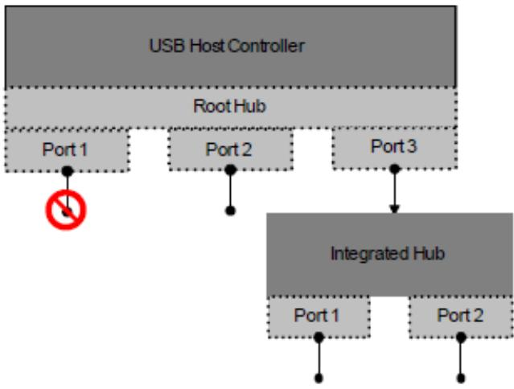  
Fig. 9.4: USB ports

```txt
Name( \_UPC, Package() {
    0x00, // Port is not connectable
    0xFF, // Connector type (N/A for non-visible ports)
    0x000000000, // Reserved 0 - must be zero
    0x000000000) // Reserved 1 - must be zero
} // Device( PRT1)
//
// Root Hub, Port 2
//
Device( PRT2) {
    // Address object for port 2. This value must be 2
    Name(_ADR, 0x00000002)
    Name( \_UPC, Package() {
    0xFF, // Port is connectable
    0x00, // Connector type - Type 'A'
    0x00000000, // Reserved 0 - must be zero
    0x00000000}) // Reserved 1 - must be zero
    // provide physical port location info
    Name( \_PLD, Package(1) {
    Buffer(0x14) {
    0x82, 0x00, 0x00, 0x00, // Revision 2, Ignore color
    // Color (ignored), width and height not
    0x00, 0x00, 0x00, 0x00, // required as this is a standard USB 'A' type
    // connector
    0x69, 0x0c, 0x00, 0x00, // User visible, Back panel, Vertical
    // Center, shape = vert. rectangle
    0x03, 0x00, 0x00, 0x00, // ejectable, requires OPSM eject assistance
    0xFF, 0xFF, 0xFF, 0xFF}) // Vert. and Horiz. Offsets not supplied
}
// Root Hub, Port 3
//
Device( PRT3) { // This device is the integrated USB hub.
```

```asm
// Address object for port 3. This value must be 3
Name(_ADR, 0x00000003)
// Because this port is not connectable it is assumed to be not visible.
// Therefore a \_PLD descriptor is not required.
Name( \_UPC, Package(){
0xFF,    // Port is connectable
0xFF,    // Connector type (N/A for non-visible ports)
0x00000000,    // Reserved 0 - must be zero
0x00000000})    // Reserved 1 - must be zero
//
// Integrated hub, port 1
//
Device( PRT1) {
// Address object for the port. Because the port is implemented on
// integrated hub port #1, this value must be 1
Name( \_ADR, 0x00000001)
// USB port characteristics object. This object returns the system
// specific USB port configuration information for integrated hub port
// number 1
Name( \_UPC, Package(){
0xFF,    // Port is connectable
0x00,    // Connector type - Type 'A'
0x00000000,    // Reserved 0 - must be zero
0x00000000})    // Reserved 1 - must be zero
// provide physical port location info
Name( \_PLD, Package(1) {
Buffer(0x14) {
0x82, 0x00, 0x00, 0x00,,    // Revision 2, Ignore color
// Color (ignored), width and height not
0x00, 0x00, 0x00, 0x00,    // required as this is a standard USB 'A' type
// connector
0xa1, 0x10, 0x00, 0x00,    // User visible, front panel, Vertical
// lower, horz. Left, shape = horz. rectangle
0x03, 0x00, 0x00, 0x00,    // ejectable, requires OPSM eject assistance
0xFF, 0xFF, 0xFF, 0xFF})}    // Vert. and Horiz. Offsets not supplied
}
// Integrated hub, port 2
//
Device( PRT2) {
// Address object for the port. Because the port
// is implemented on integrated hub port #2,
// this value must be 2
Name( \_ADR, 0x00000002)
// USB port characteristics object. This object
// returns the system-specific USB port configuration
// information for integrated hub port number 2
Name( \_UPC, Package(){
0xFF,    // Port is connectable
0x00,    // Connector type - Type 'A'
0x00000000,    // Reserved 0 - must be zero
0x00000000})    // Reserved 1 - must be zero
Name( \_PLD, Package(1) {
```

```txt
Buffer(0x14) {
    0x82, 0x00, 0x00, 0x00, // Revision 2, Ignore color
    // Color (ignored), width and height not
    0x00, 0x00, 0x00, 0x00, // required as this is a standard USB 'A' type
    // connector
    0xa1, 0x12, 0x00, 0x00, // User visible, front panel, Vertical
    // lower, horz. right, shape = horz. rectangle
    0x03, 0x00, 0x00, 0x00, // ejectable, requires OPSM eject assistance
    0xFF, 0xFF, 0xFF, 0xFF}) // Vert. and Horiz. Offsets not supplied
    } // Device( PRT2)
    } // Device( PRT3)
} // Device( RHUB)
```

## 9.12.1 USB 2.0 Host Controllers and \_UPC and \_PLD

Platforms implementing USB2.0 host controllers that consist of one or more USB1.1 compliant companion controllers (e.g. UHCI or OHCI) must implement a \_UPC and a \_PLD object for each port USB port that can be routed between the EHCI host controller and its associated companion controller. This is required because a USB Port Capabilities object implemented for a port that is a child of an EHCI host controller may not be available if the OSPM disables the parent host controller. For example, if root port 1 on an EHCI host controller is routable to root port 1 on its companion controller, then the namespace must provide a \_UPC and a \_PLD object under each host controller’s associated port 1 child object.

Example

```txt
Scope(\_SB) {
...
Device(PCI0) {
...
    // Host controller (EHCI)
Device(USB0) {
    // PCI device#/Function# for this HC. Encoded as specified in the ACPI
    // specification
Name(_ADR, 0xyyyyzzzz)
    // Root hub device for this HC #1.
Device(RHUB) {
Name(_ADR, 0x00000000) // must be zero for USB root hub
    // Root hub, port 1
Device(PRT1) {
Name(_ADR, 0x00000001)
    // USB port configuration object. This object returns the system
    // specific USB port configuration information for port number 1
    // Must match the \_UPC declaration for USB1.RHUB.PRT1 as it is this
    // host controller's companion
Name(\_UPC, Package() {
0xFF,    // Port is connectable
0x00,    // Connector type - Type 'A'
0x00000000,    // Reserved 0 - must be zero
0x00000000})    // Reserved 1 - must be zero
```

```txt
// provide physical port location info for port 1
// Must match the \UPC declaration for USB1.RHUB.PRT1 as it is this
// host controller's companion

Name( \PLD, Package(1) {
Buffer(0x14) {
0x82,0x00,0x00,0x00, // Revision 2, Ignore color
// Color (ignored), width and height not
0x00,0x00,0x00,0x00, // required as this is a standard USB 'A'
// type connector

0xa1,0x10,0x00,0x00, // User visible, front panel, Vertical
// lower, horz. Left, shape = horz. Rect.
0x03,0x00,0x00,0x00, // ejectable, needs OPSM eject assistance
0xFF,0xFF,0xFF,0xFF})} // Vert. and Horiz. Offsets not supplied

} // Device( PRT1)
//
// Define other ports, control methods, etc
...
}
// Device( RHUB)
// Device( USB0)

// Companion Host controller (OHCI or UHCI)

Device( USB1) {
// PCI device#/Function# for this HC. Encoded as specified in the ACPI
// specification

Name(_ADR, 0xyyyyzzzz)
// Root hub device for this HC #1.

Device(RHUB) {
Name(_ADR, 0x00000000) // must be zero for USB root hub
// Root hub, port 1

Device(PRT1) {
Name(_ADR, 0x00000001)
// USB port configuration object. This object returns the system
// specific USB port configuration information for port number 1
// Must match the \UPC declaration for USB0.RHUB.PRT1 as this host
// controller is a companion to the EHCI host controller
// provide physical port location info for port 1

Name( \UPC, Package() {
0xFF, // Port is connectable
0x00, // Connector type - Type 'A'
0x00000000, // Reserved 0 - must be zero
0x00000000} // Reserved 1 - must be zero

// Must match the \PLD declaration for USB0.RHUB.PRT1 as this host
// controller is a companion to the EHCI host controller

Name( \PLD, Package(1) {
Buffer( 0x14) {
0x82,0x00,0x00,0x00, // Revision 2, Ignore color
```

(continues on next page)

(continued from previous page)

```c
// Color (ignored), width and height not
0x00, 0x00, 0x00, 0x00, // required as this is a standard USB 'A'
// type connector

0xa1, 0x10, 0x00, 0x00, // User visible, front panel, Vertical
// lower, horz. Left, shape = horz. Rect.
0x03, 0x00, 0x00, 0x00, // ejectable, requires OPSM eject assistance
0xFF, 0xFF, 0xFF, 0xFF})} // Vert. and Horiz. Offsets not supplied
} // Device( PRT1)
//
// Define other ports, control methods, etc
...
}
// Device( RHUB)
} // Device( USB1)
} // Device( PCI0)
} // Scope( _\SB)
```

## 9.12.2 SuperSpeed USB Port and Connector Mapping

This also applies to USB 3.x host controllers. They may have USB 2.0 companion controllers with the switching capability and without, or Low/Full/High-speed ports in conjunction with SuperSpeed ports on the same Root Hub. Each USB port implementing \_UPC and a \_PLD as a child of the xHCI controller will indicate to OSPM which Super Speed USB and ports are electrically connected to the same connector as Low/Full/High-Speed USB ports on the same or other controllers.

## 9.12.3 USB4 Port and USB-C Connector Mapping

USB-C connectors support multiple electrical protocols, including SuperSpeed USB, DisplayPort Alternative Mode, Thunderbolt™ 3, and USB4. The \_PLD objects within the port Device scope for each connected controller port (e.g. SS USB, DP, PCIe) that are routed to the same USB connector must return the same value, even if no connector is user-accessible. USB4 tunnels other protocols based on the USB4 specification: SS USB and DP are required; PCI Express is optional. The \_UPC object describes to OSPM whether PCIe is tunneled on that port or not.

```txt
Scope (\_SB)
{
    Device (PLDS) // Device container for board-specific _PLD objects
    {
    Name (_HID, EISAID ("PNP0A05"))
    Name (_UID, "_PLD Object Container")

    Name(PLD0, Package () { // USB-C Connector, Left Panel ToPLD(
    PLD_Revision = 2,
    PLD_IgnoreColor = 1,
    PLD_Width = 8,
    PLD_Height = 3,
    PLD_UserVisible = 1,
    PLD_Panel = "LEFT",
    PLD_HorizontalPosition = "CENTER",
```

(continues on next page)

```txt
PLD_VerticalPosition = "CENTER",
PLD_Shape = "OVAL",
PLD_Ejectable = 1,
PLD_EjectRequired = 1
)
})
Name(PLD1, Package () { // USB-C Connector, Right Panel
    ToPLD(
    PLD_Revision = 2,
    PLD_IgnoreColor = 1,
    PLD_Width = 8,
    PLD_Height = 3,
    PLD_UserVisible = 1,
    PLD_Panel = "RIGHT",
    PLD_HorizontalPosition = "CENTER",
    PLD_VerticalPosition = "CENTER",
    PLD_Shape = "OVAL",
    PLD_Ejectable = 1,
    PLD_EjectRequired = 1
    )
})
Name (PLDP, Package () { // Mini DisplayPort connector, Right Panel
    ToPLD(
    PLD_Revision = 2,
    PLD_IgnoreColor = 1,
    PLD_Width = 8,
    PLD_Height = 5,
    PLD_UserVisible = 1,
    PLD_Panel = "RIGHT",
    PLD_HorizontalPosition = "RIGHT",
    PLD_VerticalPosition = "CENTER",
    PLD_Shape = "HORIZONTALTRAPEZOID",
    PLD_Ejectable = 1,
    )
)) // End PLDP
} // End PLDS
Device (UPCS)    // Device container for board-specific _UPC objects
{
    Name (_HID, EISAID ("PNP0A05"))
    Name (_UID, "_UPC Object Container")
}
Name (UPC0, Package () { // Left USB-C connector properties
    1,    // Connectable
    9,    // USB-C, USB 2 and SS, no switch
    0x0D,    // Retimers: 1; PCIe Tunneling, DP AltMode, USB4
    0    // Reserved
})
```

```txt
(continued from previous page)
Name (UPC1, Package () { // Right USB-C connector properties
    1,    // Connectable
    9,    // USB-C, USB 2 and SS, no switch
    0x0C,    // Retimers: 0; PCIe Tunneling, DP AltMode, USB4
    0    // Reserved
    })
} // End UPCS
}
```

```txt
Scope(\_SB.HB0) // PCI Express Host Bus
{
    Device (XHC0) // XHCI controller 0
    {
    Name (_ADR, 0x00030000) // Dev3, Fn0

    Device (RHUB) // USB Root Hub
    {
    Name (_ADR, 0)
    Device (PRT1) // Port 1 on Root Hub, Low/Full/High Speed
    {
    Name (_ADR, 1)
    Method (_PLD, 0) { Return (\_SB.PLDS.PLD0) } // Left USB-C Connector
    Method (_UPC, 0) { Return (\_SB.UPCS.UPC0) } // USB Capabilities
    }
    Device (PRT2) // Port 2 on Root Hub, Low/Full/High Speed
    {
    Name (_ADR, 2)
    Method (_PLD, 0) { Return (\_SB.PLDS.PLD1) } // Right USB-C Connector
    Method (_UPC, 0) { Return (\_SB.UPCS.UPC1) } // USB Capabilities
    }
    Device (PRT3) // Port 3 on Root Hub, SuperSpeed
    {
    Name (_ADR, 3)
    Method (_PLD, 0) { Return (\_SB.PLDS.PLD0) } // Left USB-C Connector
    Method (_UPC, 0) { Return (\_SB.UPCS.UPC0) } // USB Capabilities
    }
    Device (PRT4) // Port 4 on Root Hub, SuperSpeed
    {
    Name (_ADR, 4)
    Method (_PLD, 0) { Return (\_SB.PLDS.PLD1) } // Right USB-C Connector
    Method (_UPC, 0) { Return (\_SB.UPCS.UPC1) } // USB Capabilities
    }
    Device (PRT5) // Port 5 on Root Hub, SuperSpeed Tunneled over USB4
    {
    Name (_ADR, 5)
    Method (_PLD, 0) { Return (\_SB.PLDS.PLD0) } // Left USB-C Connector
    Method (_UPC, 0) { Return (\_SB.UPCS.UPC0) } // USB Capabilities
    }
    Device (PRT6) // Port 2 on Root Hub, SuperSpeed Tunneled over USB4
    {
    Name (_ADR, 6)
    Method (_PLD, 0) { Return (\_SB.PLDS.PLD1) } // Right USB-C Connector
    {
```

```txt
Method (_UPC, 0) { Return (\_SB.UPCS.UPC1) } // USB Capabilities
}

Device (PRP0)    // PCI Express Root Port 0
{
    Name (_ADR, 0x00050000)    // Dev5, Fn0

    // Describe routing to Left USB-C connector, USB4 Tunneling
    Method (_PLD){ Return (\_SB.PLDS.PLD0) }

    Device (PRP1)    // PCI Express Root Port 1
{
    Name (_ADR, 0x00050001)    // Dev5, Fn1

    // Describe routing to Right USB-C connector, USB4 Tunneling
    Method (_PLD, 0) { Return (\_SB.PLDS.PLD1) }
}

Device(GFX)    // Graphics Controller
{
    Name(_ADR, 0x00080000)    // Dev8, Fn0
    // ...
    Device(DPR)    // Mini DisplayPort Right Connector
    {
    Name(_ADR, 0)
    Method (_PLD, 0) { Return (\_SB.PLDS.PLDP) }
    }
    Device(UCAL)    // USB-C DP AltMode Left
    {
    Name(_ADR, 1)
    Method (_PLD, 0) { Return (\_SB.PLDS.PLD0) }
    }
    Device(UCAR)    // USB-C DP AltMode Right
    {
    Name(_ADR, 2)
    Method (_PLD, 0) { Return (\_SB.PLDS.PLD1) }
    }
    Device(UCNL)    // USB-C Native USB4 Left
    {
    Name(_ADR, 3)
    Method (_PLD, 0) { Return (\_SB.PLDS.PLD0) }
    }
    Device(UCNR)    // USB-C Native USB4 Right
    {
    Name(_ADR, 4)
    Method (_PLD, 0) { Return (\_SB.PLDS.PLD1) }
    }
}
```

(continued from previous page)

```txt
Device(PDC0) // USB-C PD Controller (UCSI 0)
{
    Name(_HID, EISAID ("PNP0CA0"))
    Name(_UID, 0)
    Method (_PLD, 0) { Return (\_SB.PLDS.PLD0) } // Left USB-C connector
}

Device(PDC1) // USB-C PD Controller (UCSI 1)
{
    Name(_HID, EISAID ("PNP0CA0"))
    Name(_UID, 1)
    Method (_PLD, 0) { Return (\_SB.PLDS.PLD1) } // Right USB-C connector
}
```

## 9.13 \_PDO (USB Power Data Object)

Location:

This object is provided within the scope of a Device representing a USB-C connector.

Arguments:

None

Return Value:

A Package as follows:

```txt
Package {
    Revision, // Integer (WORD)
    Flags, // Integer (DWORD)
    SourcePDOList, // Package
    SinkPDOList // Package
}

The Revision field describes the revision of the USB PD Specification upon which the PDOList entries are defined.
The Revision field is encoded as an integer, where the MSB is the major version, and the LSB is the minor version.
For example, the PD 3.1 specification is represented as the value 0x0301.

The Flags integer is encoded as follows:

Bits [2:0]: Preferred Power Role:
000b: Power Source Only
001b: Power Sink Only
010b: Dual Role Power - with a preference to be a Source
011b: Dual Role Power - with a preference to be a Sink
100b: Dual Role Power with no Source/Sink preference
101b-111b: Reserved
Bit[3]: PPS Supported:
```

(continues on next page)

```verilog
If set, this USB-C connector supports Programmable Power Supply (PPS) as specified in the USB PD Specification.
All other bits: Reserved, and must be 0.

The SourcePDOList and SinkPDOList are defined as follows:

Package {
PDO[0], // Integer (DWORD)
...
PDO[N] // Integer (DWORD)
}
```

If the USB-C connector does not support either Source or Sink power role, the corresponding SourcePDOList or SinkPDOList may be omitted. However, if \_PDO is implemented, it’s required to have at least one entry in either of them. Each entry in the list of PDOs is a 32-bit Integer. The encoding for these entries is defined in the USB Power Delivery Specification.

Here is a sample:

```txt
Device(UCM0) {USB Connector Manager device
Device(CON0) // USB-C connector 0 {
...
...
Name(_PDO, Package(){
0x0301,    // USB PD Spec Revision
0x0000000A,    // 0011b- PPS Not Supported, Dual Role Power, Prefers to be a Sink
Package(){
    // SourcePDOList
    0x2C2F012C    // Fixed Supply Source PDO
},
Package(){
    // SinkPDOList
    0x3503C12C    // Fixed Supply Sink PDO
}
})
}
}
```

## 9.14 PC/AT RTC/CMOS Devices

Most computers contain an RTC device which also contains battery-backed RAM represented as a linear array of bytes. There is a standard mechanism for accessing the first 64 bytes of non-volatile RAM in devices that are compatible with the Motorola RTC/CMOS device that was in the IBM PC/AT. Newer devices usually contain at least 128 bytes of battery-backed RAM. New PNP IDs were assigned for these devices.

Certain bytes within the battery-backed RAM have pre-defined values. In particular, the time, date, month, year, century, alarm time and RTC periodic interrupt are read-only.

## 9.14.1 PC/AT-compatible RTC/CMOS Devices (PNP0B00)

The standard PC/AT-compatible RTC/CMOS device is denoted by the PnP ID PNP0B00. If an ACPI platform uses a device that is compatible with this device, it may describe this in its ACPI namespace. ASL may then read and write this as a linear 64-byte array. If PNP0B00 is used, ASL and ACPI operating systems may not assume that any extensions to the CMOS exist.

## ò Note

This means that the CENTURY field in the Fixed ACPI Description Table may only contain values between 0 and 63.

## Example:

The following is an example of how this device could be described:

```txt
Device (RTC0) {
    Name(_HID, EISAID("PNP0B00"))
    Name (_FIX, Package(1) { EISAID("PNP0B00") })
    Name(_CRS, ResourceTemplate() {
    IO(Decode16, 0x70, 0x70, 0x1, 0x2)
    }

OperationRegion(CMS1, SystemCMOS, 0, 0x40)

Field(CMS1, ByteAcc, NoLock, Preserve) {
    CM00, 8,
    , 256,
    CM01, 8,
    CM02, 16,
    , 216,
    CM03, 8
    }
}
```

## 9.14.2 Intel PIIX4-compatible RTC/CMOS Devices (PNP0B01)

The Intel PIIX4 contains an RTC/CMOS device that is compatible with the one in the PC/AT. But it contains 256 bytes of non-volatile RAM. The first 64 bytes are accessed via the same mechanism as the 64 bytes in the PC/AT. The upper 192 bytes are accessed through an interface that is only used on Intel chips. (See the Intel® 82371AB PIIX4 specification for details.)

Any platform containing this device or one that is compatible with it may use the PNP ID PNP0B01. This will allow an ACPI-compatible OS to recognize the RTC/CMOS device as using the programming interface of the PIIX4. Thus, the array of bytes that ASL can read and write with this device is 256 bytes long.

## ò Note

This also means that the CENTURY field in the Fixed ACPI Description Table may contain values between 0 and 255.

## Example:

This is an example of how this device could be described:

```autohotkey
Device (RTC0) {
    Name(_HID, EISAID("PNP0B01"))
Name (_FIX, Package(1) {
EISAID("PNP0B01") }
)
Name(_CRS, ResourceTemplate() {
    IO(Decode16, 0x70, 0x70, 0x1, 0x2)
    IO(Decode16, 0x72, 0x72, 0x1, 0x2)
}
OperationRegion(CMS1, SystemCMOS, 0, 0x100)

Field(CMS1, ByteAcc, NoLock, Preserve) {
    AccessAs(ByteAcc, 0),
    CM00, 8,
    ,256,
    CM01, 8,
    CM02, 16,
    , 224,
    CM03, 8,
    , 184,
    CENT, 8
}
```

## 9.14.3 Dallas Semiconductor-compatible RTC/CMOS Devices (PNP0B02)

Dallas Semiconductor RTC/CMOS devices are compatible with the one in the PC/AT, but they contain 256 bytes of non-volatile RAM or more. The first 64 bytes are accessed via the same mechanism as the 64 bytes in the PC/AT. The upper bytes are accessed through an interface that is only used on Dallas Semiconductor chips.

Any platform containing this device or one that is compatible with it may use the PNP ID PNP0B02. This will allow an ACPI-compatible OS to recognize the RTC/CMOS device as using the Dallas Semiconductor programming interface. Thus, the array of bytes that ASL can read and write with this device is 256 bytes long.

Description of these devices is similar to the PIIX4 example above, and the CENTURY field of the FADT may also contain values between 0 and 255.

## 9.15 User Presence Detection Device

The following section illustrates the operation and definition of the control method-based User Presence Detection (UPD) device.

The user presence detection device can optionally support power management objects (e.g. \_PS0, \_PS3) to allow the OS to manage the device’s power consumption.

The Plug and Play ID of an ACPI control method user presence detection device is ACPI000F.

Table 9.12: User Presence Detection Device

<table><tr><td>Object</td><td>Description</td></tr><tr><td>_UPD</td><td>The current user presence detection reading. [Required]</td></tr><tr><td>_UPP</td><td>User presence detection polling frequency in tenths of seconds. [Optional]</td></tr></table>

## 9.15.1 \_UPD (User Presence Detect)

This control method returns the user presence detection reading, indicating whether or not the user is currently present from the perspective of this sensor. Three states are currently defined for UPD sensor readings: absent, present, and unknown, represented by the values 0x00, 0x01, and 0xFF respectively. The unknown state is used to convey that the sensor is currently unable to determine user presence due to some environmental or other transient factor. All other values are reserved.

## Arguments:

None

## Return Value:

An Integer containing the user presence code:

0x00 - Absent: A user is not currently detected by this sensor.

0x01 - Present: A user is currently detected by this sensor.

0xFF - Unknown: The sensor is currently unable to determine if a user is present or absent.

## 9.15.2 \_UPP (User Presence Polling)

This optional object evaluates to a recommended polling frequency (in tenths of seconds) for this user presence sensor. A value of zero - or the absence of this object when other UPD objects are defined - indicates that the OS does not need to poll the sensor in order to detect meaningful changes in user presence (the hardware is capable of generating asynchronous notifications).

## Arguments:

None

## Return Value:

An Integer containing the recommended polling frequency in tenths of seconds. A value of zero indicates that polling is not required.

The use of polling is allowed but strongly discouraged by this specification. OEMs should design systems that asynchronously notify OSPM whenever a meaningful change in user presence occurs–relieving the OS of the overhead associated with polling.

This value is specified as tenths of seconds. For example, a value of 10 would be used to indicate a 1 second polling frequency. As this is a recommended value, OSPM will consider other factors when determining the actual polling frequency to use.

## 9.15.3 User Presence Sensor Events

To communicate changes in user presence to OSPM, AML code should issue a Notify(upd\_device, 0x80) whenever a change in user presence has occurred. The OS receives this notification and calls the \_UPD control method to determine the current user presence status.

UPD notifications should be generated whenever a transition occurs between one of the user presence states (absent, present, or unknown) - but at a level of granularity that provides an appropriate response without overly taxing the system with unnecessary interrupts.

## 9.16 I/O APIC Device

This optional device describes a discrete I/O APIC device that is not bus enumerated (e.g., as a PCI device). Describing such a device in the ACPI namespace is only necessary if hot plug of this device is supported. If hot plug of this device is not supported, an MADT I/O APIC entry is suficient to describe this device.

An I/O APIC device is an I/O unit that complies with either of the APIC interrupt models supported by ACPI. These interrupt models are described in Section 5.2.12.3 and Section 5.2.12.9.

If the device is an I/O unit that complies with the APIC interrupt model, it is declared using the ACPI000A identifier. If this device is an I/O unit that complies with the SAPIC interrupt model, it is declared using the ACPI000B identifier. If this device complies with both the APIC and SAPIC interrupt models (I/OxAPIC), it is declared using the ACPI0009 identifier.

An I/O APIC device declared using any of the above identifiers must contain a \_GSB object to report its \_GSB (Global System Interrupt Base). It must also contain a \_CRS object that reports the base address of the I/O APIC device. The \_CRS object is required to contain only one resource, a memory resource pointing to the I/O APIC register base.

ò Note

Because the \_CRS and \_GSB methods provide suficient information, it is not necessary to provide \_MAT under an I/O APIC device.

For an I/O APIC device that is described both in the MADT and in the namespace, the base address described in the MADT entry must be the same as the base address in the IO APIC device \_CRS at boot time. OSPM must use the information from the MADT until such a time as the \_CRS and \_GSB methods in the namespace device can be processed. At this point OSPM must ignore the MADT entry.

## 9.17 Time and Alarm Device

The following sections define the operation and definition of the optional control method-based Time and Alarm device, which provides a hardware independent abstraction and a more robust alternative to the Real Time Clock (RTC) (See PC/AT RTC/CMOS Devices.)

The time capabilities of the time and alarm device maintain the time of day information across platform power transitions, and keep track of time even when the platform is turned of. It is expected that the time on the platform will be consistent when diferent firmware interfaces are used to query the platform time. For example, a UEFI call to get the time should return the same time as if the OSPM used the time and alarm device at the same point in time.

The Time and Alarm device can optionally support power management objects (e.g. \_PS0, \_PS3) to allow the OS to manage the device’s power consumption.

The Time and Alarm device must support control method \_PRW for being enabled to wake up the system. It might support \_DSW or \_PSW to provide the functionality to enable or disable the device’s ability to wake a sleep system. On Hardware-reduced ACPI platforms, \_PRW is only required if the device depends on ACPI-defined power resources. \_PRW’s GPEInfo structure is ignored by OSPM. For enabling Wakeup, \_DSW and \_SxW are used, and the wakeup event is signaled by the GPIO-signaled ACPI event mechanism (see Section 5.6.5).

The Plug and Play ID of the Time and Wake Alarm device is ACPI000E.

Table 9.13: Time and Alarm Device

<table><tr><td>Object</td><td>Description</td></tr><tr><td>_GCP</td><td>Get the capabilities of the time and alarm device</td></tr><tr><td>_GRT</td><td>Get the Real time</td></tr><tr><td>_SRT</td><td>Set the Real time</td></tr><tr><td>_GWS</td><td>Get Wake status</td></tr><tr><td>_CWS</td><td>Clear Wake Status</td></tr><tr><td>_STP</td><td>Sets expired timer wake policy for the specified timer.</td></tr><tr><td>_STV</td><td>Sets the value in the specified timer.</td></tr><tr><td>_TIP</td><td>Returns the current expired timer policy setting of the specified timer.</td></tr><tr><td>_TIV</td><td>Returns the remaining time of the specified timer.</td></tr></table>

## 9.17.1 Overview

The Time and Alarm device provides an alternative to the real time clock (RTC), which is defined as a fixed feature hardware device. The wake timers allow the system to transition from the S3 (or optionally S4/S5) state to S0 state after a time period elapses. In comparison with the Real Time Clock (RTC) Alarm, the Time and Alarm device provides a larger scale of flexibility in the operation of the wake timers, and allows the implementation of the time source to be abstracted from the OSPM.

Time and Alarm device provides the OSPM with a firmware abstraction of time and alarm services that can be applicable to a variety of hardware designs. The methods for setting and getting real time provide an alternative to the (RTC).

Time and Alarm devices that implement AC/DC wake service contain two programmable timers that can be configured to wake the system depending on the platform’s current power source (AC or DC) when the timers expire. The two timers, which are referred to as the AC timer and the DC timer, are independent in that they are individually programmable and applicable without interfering each other. Each of the timers can be programmed with the number of seconds to elapse from the time the timer is programmed until a wake is requested. When a timer expires, the Time and Alarm device decides whether to wake the system based on the current power source. If the current power source is consistent with the timer type that expired, a wake signal will be asserted. Otherwise, the wake signal will not be asserted.

Time and Alarm devices that implement the AC only (power independent) wake contain one programmable timer that can be configured to wake up the system regardless of the platform’s power source when the timer expires. To simplify the programming interface the AC wake will use the AC timer portion of the AC/DC wake; writes to the DC timer when AC only wake is supported will be ignored.

To simplify the programming interface for the time and alarm device, timer expiration events will persist. This means that if the OSPM programs a wake timer that expires before the OSPM completes the transition into S3 (or S4/S5 if supported) the time and alarm device will wake the system immediately after the OSPM completes the transition. Fig. 9.6 illustrates this behavior.

The time and alarm device will provide the OSPM with an interface to query the status of the wake timers and discover what timers have expired. This interface enables the OSPM to discover the wake source. The status of wake timers can be reset by setting the wake alarm; the OSPM may clear the alarm status using the clear wake status method. All expired wake timer must be cleared if the OSPM requires the platform to stay in S3 (S4/S5), otherwise the expired timers will immediately wake up the system.

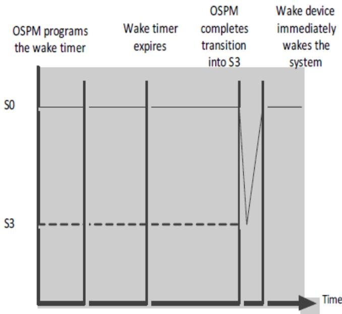  
Fig. 9.5: Persistence of expired timer events

For the AC/DC wake services, and in case the current power source is inconsistent with the timer type that expires, an expired timer wake policy value, in units of seconds, is defined that enables the time and alarm device to wake the system when the power source corresponding to the expired timer becomes active (wake either immediately, after some time period, or never). The expired timer wake policy is applicable only on devices that support AC/DC wake and only when the timer expires and the power source is not consistent with the timer type. The expired timer policy is applied in conjunction with expired timer persistence described earlier.

For example, if a mobile platform programs the AC timer to be 2 hours long and DC timer to be 4 hours long and then transitions from the S0 state to S3 state at 1:00 AM, the AC timer is set to expire at 3:00 AM and the DC timer is set to expire at 5:00 AM. For the AC Timer, a expired timer wake policy value is programmed as 60 seconds.

If the platform is unplugged from AC power at 1:40 AM and remains unplugged, the Time and Alarm Device will not wake up the system at 3:00 AM. If the platform remains on DC power until 5:00 AM when the DC timer expires, a wake signal will then be asserted. The following graph illustrates the above example.

If the AC power is plugged in again at 4:00 AM, then the system will be woken up at 4:01 AM due to the AC expired timer wake policy value setting. The following graph illustrates this.

The Time and Alarm device can support a range of services, the OSPM evaluates the \_GCP object to get the supported capabilities of the device. If the capabilities indicate that the device supports time services, the OSPM evaluates the \_GRT and \_SRT objects to get and set time respectively.

If alarm services are supported by the device, the OSPM evaluates the \_STV object to program both the AC and DC timer values. The values, which are in units of seconds, indicate the elapsed time before the timer expires. OSPM evaluates the \_TIV object to read the current AC and DC timer values (seconds remaining until expiration).

OSPM evaluates the \_STP object to set timer policies for both the AC and DC timers OSPM reads the current timer policy by evaluating the \_TIP object, which return policy settings for both the AC and DC timer.

The OSPM evaluates the \_GWS object to identify expired timers that may have waked the platform. The OSPM must evaluate the \_CWS object to clear any expired timer events that can prevent the system from performing a sleep transition according the expired timer wake policy, and the expired timer persistence described above

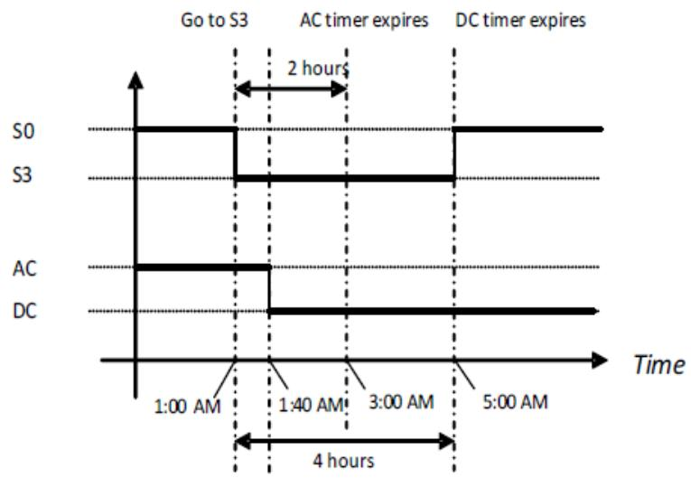  
Fig. 9.6: System transitions with WakeAlarm — Timer

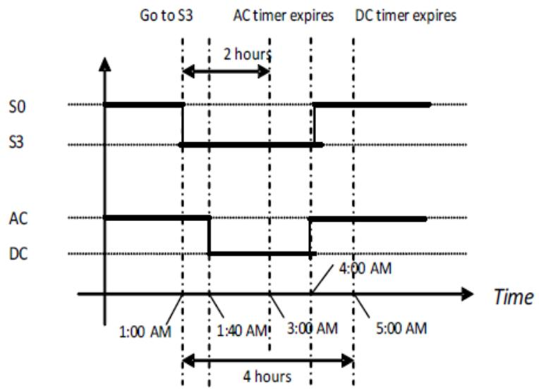  
Fig. 9.7: System transitions with WakeAlarm — Policy

The Time and Alarm device, if implemented with wake support, must support waking up the system from S3. Waking from S4/S5 support is optional.

## 9.17.2 \_GCP (Get Capability)

This object is required and provides the OSPM with a bit mask of the device capabilities. The device can implement the time function in addition to the wake function. The capabilities bitmask will indicate to the OSPM what support is implemented. If the platform implements both AC and DC timers then it is capable of waking up based on the power source.

## Arguments:(0)

## Return Value:

A 32-bit integer containing a result bitmask as follows:

Bit [0] - 1 = AC wake implemented, 0 = not supported

Bit [1] - 1 = DC wake implemented, 0 = not supported

Bit [2] - 1 = Get/Set real time features implemented, 0 = not supported

Bit [3] - 1 = Real time accuracy in milliseconds, 0 = Real time accuracy in seconds

Bit [4] - 1 = \_GWS returns correct values for wakes from S4/S5 caused by timer. 0 = not supported

Bit [5] - 1 = Wake supported from S4 on AC, 0 = Wake not supported from S4 on AC

Bit [6] - 1 = Wake supported from S5 on AC, 0 = Wake not supported from S5 on AC

Bit [7] - 1 = Wake supported from S4 on DC, 0 = Wake not supported from S4 on DC

Bit [8] - 1 = Wake supported from S5 on DC, 0 = Wake not supported from S5 on DC

Bit [9] to Bit [31] are reserved and must be 0.

Note: The following rules apply for the \_GCP returned value:

• If wake on DC is supported (bit 1), then wake from AC (bit 0) must be supported

• If wake on AC from S5 is supported (bit 6), then wake on AC from S4 must be supported (bit 5)

• If wake on AC from S4 is supported (bit 5), then wake on AC must be supported (bit 0)

• If wake on DC from S5 is supported (bit 8), then wake on DC from S4 must be supported (bit 7)

• If wake on DC from S4 is supported (bit 7), then wake on DC must be supported (bit 1)

• If wake on DC from S4 is supported (bit 7), then wake on AC from S4 must be supported (bit 5)

• If wake on DC from S5 is supported (bit 8), then wake on AC from S5 must be supported (bit 6)

• If wake from S4/S5 is supported (bits 5-8), then \_GWS must be supported (bit 4)

## 9.17.3 \_GRT (Get Real Time)

This object is required if the capabilities bit 2 is set to 1. The OSPM can use this object to get time. The return value is a bufer containing the time information as described below.

## Arguments: (0)

## Return Value:

A bufer containing the time information, in the following format:

```c
Buffer() {
WORD Year; // 1900 - 9999
BYTE Month; // 1 - 12
BYTE Day; // 1 - 31
BYTE Hour; // 0 - 23
BYTE Minute; // 0 - 59
BYTE Second: // 0 - 59
BYTE Valid; // 0 - Time is not valid (request failed); 1 - Time is valid
WORD milliseconds, // 1-1000
WORD TimeZone; // -1440 to 1440 or 2047 (unspecified)
BYTE Daylight;
BYTE Pad2[3]; // Reserved, must be zero
}
```

## 9.17.4 \_SRT (Set Real Time)

This object is required if the capabilities bit 2 is set to 1. The OSPM can use this object to set the time. The argument is a bufer containing the time information, as defined above.

## Arguments: (1)

A bufer containing the time information, in the following format:

```solidity
Buffer() {
WORD Year; // 1900 - 9999
BYTE Month; // 1 - 12
BYTE Day; // 1 - 31
BYTE Hour; // 0 - 23
BYTE Minute; // 0 - 59
BYTE Second; // 0 - 59
BYTE Pad1;
WORD milliseconds, // 1-1000
WORD TimeZone; // -1440 to 1440 or 2047 (unspecified)
BYTE Daylight;
BYTE Pad2[3]; // Reserved, must be zero
}
```

## Return Value:

An Integer:

0 - success 0xFFFFFFFF- Failed

## ò Note

Time is maintained using a battery backed time device (e.g. a real time clock).

The time will always be local time; the time zone value can be used to determine the ofset from UTC. Time zone field is the number of minutes that the local time lags behind the UTC time. (i.e. time zone = UTC - local time). The time zone is in 2’s complement format.

Time zone value of 2047, means that time zone value is not specified, and no relation to UTC can be inferred. Daylight is a bitmask containing the daylight savings time information for the time, as follows:

Bit [0]: 1 = the time is afected by daylight savings time, 0= time is not afected by daylight savings. This value does not indicate that the time has been adjusted for daylight savings time. It indicates only that it should be adjusted when the time enters daylight savings time.

Bit [1]: 1= the time has been adjusted for daylight savings time, 0= the time hasn’t been adjusted for daylight savings.

All other bits must be zero.

When entering daylight saving time, if the time is afected, but hasn’t been adjusted (DST = 1), use the new calculation:

• The date/time should be increased by the appropriate amount.

• The TimeZone should be decreased by the appropriate amount (EX: +480 changes to +420 when moving from PST to PDT).

• The Daylight value changes to 3.

When exiting daylight saving time, if the time is afected and has been adjusted (DST = 3), use the new calculation:

• The date/time should be decreased by the appropriate amount.

• The TimeZone should be increased by the appropriate amount.

• The Daylight value changes to 1.

## 9.17.5 \_GWS (Get Wake alarm status)

This object is required if the capabilities bit 0 is set to 1. It enables the OSPM to read the status of wake alarms. Expired wake timers will wake the platform even if the transition to a sleep state was completed after the wake timer has expired. This method enables the OSPM to retrieve the status of wake timers and clear any of them if needed.

Arguments: (1)

Arg0 - Timer Identifier (Integer (DWORD)): indicates the timer to be cleared:

0x00000000 - AC Timer

0x00000001 - DC Timer

## Return Value:

An Integer (DWORD) containing current expired timers in bit field

Bit [0]- 1 = timer expired, 0 = timer did not expired

Bit [ 1]- 1= timer caused a platform wake, 0 = timer did not cause a platform wake

Bit [31:2] reserved and should be 0.

## 9.17.6 \_CWS (Clear Wake alarm status)

This object is required if the capabilities bit 0 is set to 1. It enables the OSPM to clear the status of wake alarms. Expired wake timers will wake the platform even if the transition to a sleep state was completed after the wake timer has expired. This method enables the OSPM to clear the status of expired wake timers.

## Arguments:(1)

Arg0 - Timer Identifier (Integer (DWORD)): indicates the timer to be cleared:

0x00000000 - AC Timer

0x00000001 - DC Timer

## Return Value:

An Integer (DWORD) containing current expired timer wake policy:

0x00000000 - Success

0x00000001 - Failure

## 9.17.7 \_STP (Set Expired Timer Wake Policy)

This object is required if the capabilities bit 0 is set to 1. It sets the expired timer wake policy. The policy is applied when a corresponding timer expired but the wake signal was not asserted as a result of the power source. The platform accumulates elapsed time on the power source and asserts the wake signal when the elapsed timer on the power source exceeds the expired timer wake policy value. Power source transitions do not reset the expired timer wake policy values. When the Wake Alarm device asserts the wake, the expired timer wake policy values of both the AC timer and DC timer are reset to 0xFFFFFFFF automatically by hardware.

## Arguments:(2)

Arg0 - TimerIdentifier (Integer(DWORD)): indicates the timer to be set:

0x00000000 - AC Timer

0x00000001 - DC Timer

Arg1 - ExpiredTimerWakePolicy (Integer(DWORD)): indicates the expired timer wake policy:

0x00000000 - The timer will wake up the system instantly after the power source changes.

0x00000001 - 0xFFFFFFFE: time between the power source changes and the timer wakes up the system (in units of second).

0xFFFFFFFF - The timer will never wake up the system after the power source changes.

## Return Value:

An Integer containing a result code as follows:

0x00000000 - Succeeded to set the expired timer wake policy.

0x00000001 - Failed to set the timer policy. Actual timer policy unknown.

## 9.17.8 \_STV (Set Timer Value)

This object is required if the capabilities bit 0 is set to 1. It sets the timer to the specified value. As defined in \_TIV, the value indicates the number of seconds between the time when the timer is programmed and the time when it expires. When the Wake Alarm device asserts the wake signal, the timer value is automatically reset to 0xFFFFFFFF (disabled).

## Arguments:(2)

Arg0 - TimerIdentifier (Integer (DWORD)): indicates the timer to be set:

0x00000000 - AC Timer

0x00000001 - DC Timer

Arg1 - TimerValue (Integer): indicates the value to be set.

## Return Value:

An Integer containing a result code as follows:

0x00000000 - Succeeded to set timer value.

0x00000001 - Failed to set timer value. Actual timer value unknown.

## 9.17.9 \_TIP (Expired Timer Wake Policy)

This object is required if the capabilities bit 0 is set to 1. It returns the current expired timer wake policy setting of the specified timer.

## Arguments:(1)

Arg0 - TimerIdentifier (Integer (DWORD)): indicates the timer to be read:

0x00000000 - AC Timer

0x00000001 - DC Timer

## Return Value:

An Integer (DWORD) containing current expired timer wake policy:

0x00000000 - The timer will wake up the system instantly after the power source changes

0x00000001 - 0xFFFFFFFE: Time between the power source changes and the timer wakes up the system ( in units of seconds)

0xFFFFFFFF - The timer will never wake up the system after the power source changes

## 9.17.10 \_TIV (Timer Values)

This object is required if the capabilities bit 0 is set to 1. It returns the remaining time of the specified timer before that expires.

## Arguments:(1)

Arg0 - TimerIdentifier (Integer(DWORD)): indicates the timer to be read:

0x00000000 - AC Timer

0x00000001 - DC Timer

## Return Value:

An Integer containing the current timer value. A value of 0xFFFFFFFF indicates that the timer is disabled.

## 9.17.11 ACPI Wakeup Alarm Events

The Wake Alarm, device as a generic hardware, supports control methods \_PSW and \_PRW to wake up the system and issues a Notify(<device>, 0x2) on the wakeup alarm device.

## 9.17.12 Relationship to Real Time Clock Alarm

Though both of the devices support wakeup timers to wake up system from sleeping state, they work independently. The Real Time Clock Alarm is defined as a fixed feature hardware whereas Time and Alarm device is defined as a generic hardware and can replace or coexist with the real time clock. OSPM may choose which device to utilize to provide timed wake capability.

## 9.17.13 Time and Alarm device as a replacement to the RTC

The Time and Alarm device can be an alternative to the RTC on some platforms where the legacy RTC hardware is not available, on these platforms the OSPM can use the Time and Alarm device to obtain time and set wake alarms. For platforms that don’t require AC/DC wake service (e.g. a platform that have one power source only) the AC timer can be used to provide all the functions that were traditionally provided by the RTC. Using the capabilities object the Time and Alarm device can provide a scalable range of services to the OSPM.

## 9.17.14 Relationship to UEFI time source

The Time and Alarm device must be driven from the same time source as UEFI time services. This ensures that the platform has a consistent value of real time (time of day) and wake alarms. The OSPM can interact with this value using either ACPI or UEFI.

• OSPM must use only one runtime interface to configure/query the platform alarm(s); undefined behavior may occur if the two wakeup interfaces are used on the same hardware.

• If OSPM is trying to set an alarm using EFI runtime services, the alarm should be honored regardless of the power source (i.e. if the platform has an independent timer for each power source, they should both be configured with that alarm).

## 9.17.15 Example ASL code

The following ASL code serves as an example of how the Time and Alarm Device could be implemented. It is beyond the capability and the scope of this specification to provide a complete hardware implementation example.

## Example 1: Define an ACPI Wake Alarm device

```txt
Device(\_SB.AWAK){
    Name(_HID, "ACPI000E") //device ID
    Name(_PRW, Package(){...}) //enable or disable to wake up the system
    OperationRegion(CMOP, EmbeddedControl, ...)
    Field(CMOP, ByteAcc, ...){
    // timer status and policies
    }
    Method(_GCP) {
    Return (0x03) // Both AC and DC alarms are implemented;
    // Time capability is NOT supported
    }
```

(continues on next page)

(continued from previous page)

```autohotkey
Method(_STP, 2){
    If(LEqual(Arg0, 0) {
    Store(Arg1, ...) // Set AC timer policy
    }
    Else {
    Store(Arg1, ...) // Set DC timer policy
    }
    Return(0)
}
Method(_TIP, 1){
    If(LEqual(Arg0, 1) {
    Store(..., Local0) // Get DC timer policy
    }
    Else {
    Store(..., Local0) // Get AC timer policy
    }
    Return (Local0)
}
Method(_STV, 2){
    If(LEqual(Arg0, 0) {
    Store(Arg1, ...) // Set AC timer value
    }
    Else {
    Store(Arg1, ...) //Set DC timer value
    }
    Return(0)
}
Method(_TIV, 1){
    If(LEqual(Arg0, 1) {
    Store(..., Local0) //Get DC timer value
    }
    Else {
    Store(..., Local0) //Get AC timer value
    }
    Return (Local0)
}
Method(_GWS, 1){
    If(LEqual(Arg0, 1) {
    Store(..., Local0) //Get DC timer wake status
    }
    Else {
    Store(..., Local0) //Get AC timer wake status
    }
    Return (Local0)
}
Method(_CWS, 2){
    If(LEqual(Arg0, 0) {
    Store(0, ...) //Clear AC Wake status
    }
    Else {
    Store(0, ...) //Clear DC Wake status
    }
```  
(continues on next page)

```txt
(continued from previous page)
    Return(0)
}
} // end of ACPI Wake Alarm device object
Scope(\_GPE) { // Root level event handlers
Method(_Lxx){
Store(One, ...)
Notify(\_SB.AWA, 0x2) //notify the OSPM of device wake
}
} // end of \_GPE scope
```

## Example 2: Define an ACPI Real Time device on a HW-Reduced ACPI platform

```txt
Device(\_SB.I2C1)    //The controller used to access the RTC hardware
{
    Name (_HID, ...)
    ...    // Other objects required for this I2C controller
    // Track status of SPB OpRegion availability for this controller
    Name(AVBL, 0)
    Method(_REG,2)
    {
    /* 9 is the OpRegion type for SPB. (8 == GPIO, etc) */
    If (Lequal(Arg0, 9))
    1{
    Store(Arg1, ^AVBL)
    }
    }
}
Device(\_SB.TAAD) {    //The Time and Alarm Device
    Name (_HID, "ACPI000E")
    Scope(\_SB.I2C1)    //OpRegion declaration must appear under the
controller
    {
    OperationRegion(TOP1, GenericSerialBus, 254, 0x100)
    Field(TOP1, BufferAcc, NoLock, Preserve)
    {
    Connection(I2CSerialBusV2(0x4a,,400000,","\$_SB.I2C1",.,.,,)),
    //Connection to the controller for the following field accesses
    AccessAs(BufferAcc, AttribWord), //AccessProtocol for the following field(s)
    Y, 8,
    AccessAs(BufferAcc, AttribByte),
    M, 8,
    D, 8,
    H, 8,
    Mi,8,
    S, 8,
    P, 8,
    AccessAs(BufferAcc, AttribWord),
    Ms, 8,
    Tz, 8,
    AccessAs(BufferAcc, AttribByte),
    D1, 8,
    P2, 8
```

(continues on next page)

(continued from previous page)

```txt
}
    // End of Field
}
    // End of Scope
Method (_GCP, 0x0, NotSerialized)
{
    Return(0x4)    // Implements Real Time interface, but no alarms
}
Method(_GRT, 0x0, NotSerialized)
{
    If(LNotEqual(\_SB.TC1.AVBL, 1))    // Verify that SPB OpRegion is available
    // for this access
    {
    Return(0)
    }
    Name(BUFF, Buffer(4){})    // Create SerialBus data buffer as BUFF
    CreateByteField(BUFF, 0x00, STAT)    // STAT = Status (Byte)
    CreateWordField(BUFF, 0x02, DATA)    // DATA = Data (Byte)
    Name(BUF2,Buffer(0x10){})    // Create buffer to hold the Real Time structure
    // as BUF2
    CreateWordField(BUF2, 0x0,Y)    // Year
    CreateByteField(BUF2,0x2,M)    // Month
    ...
    CreateByteField(BUF2,0xc,Dl)    // Dl
    CreateByteField(BUF2,0xd,P2)    // Pad2
    Store(\_SB.I2C1.Y, BUFF)    // Get each member from the OpRegion and store
    // in the structure
    Store(DATA,Y)
    Store(\_SB.I2C1.M, BUFF)
    Store(DATA,M)
    ...
    Store(\_SB.I2C1.Dl, BUFF)
    Store(DATA,Dl)
    Store(\_SB.I2C1.P2, BUFF)
    Store(DATA,P2)
    Return(BUF2)    // Success -> return what was last in buffer
}
Method(_SRT,0x1, NotSerialized)
{
    Name(BUFF, Buffer(4){})    // Create SerialBus data buffer as BUFF
    CreateByteField(BUFF, 0x00, STAT)    // STAT = Status (Byte)
    CreateWordField(BUFF, 0x02, DATA)    // DATA = Data (Byte)
    // Verify that SPB OpRegion is available for this access
    If(LNotEqual(\_SB.I2C1.AVBL, 1))
    {
    Return(0)
    }
    CreateWordField(Arg0,0x0,Y)    // Create Fields to access each member of the
    // input data
    ...
    CreateByteField(Arg0,0xd,P2)
    Store(Store(Y, \_SB.I2C1.Y), BUFF)  // Store each input member into the hardware,
    // and set the transaction status into BUFF
    If(LEqual(STAT, 0x00))    // transaction was *NOT* successful
```

(continues on next page)

```txt
(continued from previous page)
{
    Return(0xFFFFFFFFF)
}
...
Store(Store(P2, \\_SB.I2C1.P2), BUFF)
If(LEqual(STAT, 0x00)) // Transaction was \_NOT-successful
{
    Return(0xFFFFFFFFF)
}
}
Name(_DEP, Package() {\"\\_SB.I2C1`}) // Identify the dependency for this device
} // End of Time and Alarm Device definition
```

## 9.18 Generic Buttons Device

The-Generic-Button device is a standard device for reporting button events via hardware interrupts, and mapping those interrupts to specific usages defined in the Human Interface Device (HID) specification. In order to express the functionality of a button to the OS, two pieces of information are required: Usage of the HID Control, and Usage of the HID Collection that the Control belongs to. A Usage is a combination of a Usage Page and Usage ID. For example, the Volume Up button is identified as the Volume Up Usage (Usage Page 0x0C, Usage Id 0xE9) in the Consumer Control Collection (Usage Page 0x0C, Usage Id 0x01).

The Plug and Play ID of the Generic Button device is ACPI0011.

## ò Note

If the Power button is described using this device, it must also support the Power Button Override feature defined in Section 4.8.2.2.1.3.

Table 9.14: Generic Buttons Device Child Objects

<table><tr><td>Object</td><td>Description</td></tr><tr><td>_CRS</td><td>Lists the resources consumed by the Generic Button device. Only interrupt resources (GpioInt() and Interrupt() ) are valid for this device. Each interrupt listed must signal one distinct button event.</td></tr><tr><td>_DSD</td><td>Provides a list of HID Button Descriptors, as defined by UUID FA6BD625-9CE8-470D-A2C7-B3CA36C4282E. Only HID 2-state button usages are valid for the descriptors returned for this device.</td></tr></table>

## ò Note

If there are more HID Button Descriptors returned by \_DSD than there are interrupts listed in \_CRS, behavior is OS-specific.

## 9.18.1 Button Interrupts

Interrupts for the Generic Buttons Device are required to be edge-triggered and not level-triggered since there is no interface defined for the driver to quiesce the interrupt line once the interrupt is received. The polarity (ActiveLow/High vs. ActiveBoth) of the interrupt is determined by the Usage Type of the HID Usage associated with the interrupt, as described in the table below.

Table 9.15: Usage Types and Interrupt Polarity

<table><tr><td>Usage Type</td><td>Interrupt Polarity</td><td>Explanation</td></tr><tr><td>OSC - One Shot Control</td><td>ActiveHigh/ ActiveLow</td><td>An interrupt should be triggered on a button press. This is for a toggle button. On every such event (interrupt), the Operating System will toggle the internal property of the entity that it controls. Example: Mute button</td></tr><tr><td>MC - Momentary Control</td><td>ActiveBoth</td><td>An interrupt should be triggered on both the button press and release. Example: Left mouse button.</td></tr><tr><td>RTC - Re-trigger Control</td><td>ActiveBoth</td><td>An interrupt should be triggered on both the button press and release. While the button is pressed, the Operating System will repeatedly re-execute the action that it would take when the button is pressed. Example: A Volume Up button when pressed and held, will repeatedly increment the Volume.</td></tr><tr><td>OOC - On/Off Control</td><td>ActiveHigh/ ActiveLow OR ActiveBoth</td><td>ActiveHigh/ActiveLow polarity should be specified if implemented as a button that goes back to its initial state automatically. E.g. A Push Button or a spring-loaded Slider switch. Only one interrupt should be fired for press/release pair. Example: A spring-loaded Wireless Radio Slider Switch. ActiveBoth polarity should be specified if implemented as a button that stays in its state until the user moves it again. E.g. A button that stays in pressed state, or a Slider switch that sticks to its position. Example: Wireless Radio Slider Switch.</td></tr></table>

## 9.18.2 Button Usages and Collections

The HID Usage tables have an extensive list of Standardized Usages for various kinds of buttons. Some of the common buttons found on Computing devices and their Usages are listed in the table below.

For the full list, see “HID Usage Tables”, available from “Links to ACPI-Related Documents” (http://uefi.org/acpi) under the heading “HID Usage Tables”.

Buttons are grouped under an HID Collection. Several HID Collections are commonly understood by Operating Systems, e.g., Keyboard Collection, Consumer Controls Collection, Wireless Radio Controls Collection, etc

Table 9.16: Common HID Button Usages

<table><tr><td>Button</td><td>Usage Page / Usage</td><td>Usage Type</td><td>Interrupt Polarity</td><td>Spec Reference</td></tr><tr><td>Power</td><td>Generic Desktop Page (0x01) System Power Down (0x01)</td><td>OSC</td><td>ActiveBoth *</td><td>USB HID Usage Tables, version 1.2: see https://www.usb.org/hid, under the heading HID Usage Tables</td></tr></table>

continues on next page

Table 9.16 – continued from previous page

<table><tr><td>Button</td><td>Usage Page / Usage</td><td>Usage Type</td><td>Interrupt Polarity</td><td>Spec Reference</td></tr><tr><td>Volume Up</td><td>Consumer Page (0x0C) Volume Increment (0xE9)</td><td>RTC</td><td>ActiveBoth</td><td>USB HID Usage Tables, version 1.2: see https://www.usb.org/hid, under the heading HID Usage Tables</td></tr><tr><td>Volume Down</td><td>Consumer Page (0x0C) Volume Decrement (0xEA)</td><td>RTC</td><td>ActiveBoth</td><td>USB HID Usage Tables, version 1.2: see https://www.usb.org/hid, under the heading HID Usage Tables</td></tr><tr><td>Camera Shut-ter</td><td>Camera Control Page (0x90) Camera Shutter (0x21)</td><td>OSC</td><td>Active High/ Active Low</td><td>USB Review Request 49: Camera Controls - see https://www.usb.org/hid, under the heading Approved Us-age Table Review Requests</td></tr><tr><td>Display Brightness Up</td><td>Consumer Page (0x0C) Dis-play Brightness Increment (0x6F)</td><td>RTC</td><td>ActiveBoth</td><td>USB Review Request 41: Display Brightness Controls - see https:// www.usb.org/hid, under the heading Approved Usage Table Review Requests</td></tr><tr><td>Display Brightness Down</td><td>Consumer Page (0x0C) Dis-play Brightness Decrement (0x6F)</td><td>RTC</td><td>ActiveBoth</td><td>USB Review Request 41: Display Brightness Controls - see https:// www.usb.org/hid, under the heading Approved Usage Table Review Requests</td></tr><tr><td>Wireless Radio Button</td><td>Generic Desktop Page (0x01) Wireless Radio Button (0xC6)</td><td>OOC</td><td>ActiveHigh/ ActiveLow</td><td>USB Review Request 40: HID Radio On/Off Usages - see https:// www.usb.org/hid, under the heading Approved Usage Table Review Requests</td></tr><tr><td>Wireless Radio Slider Switch</td><td>Generic Desktop Page (0x01) Wireless Radio Slider Switch (0xC8)</td><td>OOC</td><td>ActiveBoth</td><td>USB Review Request 40: HID Radio On/Off Usages - see https:// www.usb.org/hid, under the heading Approved Usage Table Review Requests</td></tr></table>

## ò Note

The System Power Down Usage (Page:01, ID: 81) has Type OSC, although its interrupt must be ActiveBoth in order to allow drivers to perform functions based on “hold-down” timing. This is an exception to the Usage Type Rules for Interrupt Polarity (see Table 9.15).

## 9.18.3 Generic Buttons Device Example

```txt
Device(BTNS)
{
Name(_HID, "ACPI0011")
Name(_CRS, ResourceTemplate() {
GpioInt(Edge, ActiveBoth...) {pin} //Vol Down
GpioInt(Edge, ActiveBoth...) {pin} //Vol Up
GpioInt(Edge, ActiveBoth,...) {pin} //Power (MUST BE ACTIVEBOTH!)
```

(continues on next page)

(continued from previous page)

```go
})
Name(_DSD, Package(2) {
    //UUID for HID Button Descriptors:
    //ToUUID("FA6BD625-9CE8-470D-A2C7-B3CA36C4282E"),
    //Data structure for this UUID:
Package() {
    Package(5) {
    0,    //Declare a Collection
    1,    //Unique ID for this collection
    0,    //It is a top-level collection
    0x0c,    //Usage Page ("Consumer")
    0x01    //Usage ("Consumer Control")
    },
    Package(5) {
    0,    //Declare another Collection
    2,    //Unique ID for this collection
    0,    //Also a top-level collection
    0x01,    //Usage Page ("Generic Desktop")
    0x80    //Usage ("System Control")
    },
Package(5) {
    1,    //Declare a Control
    0,    //Interrupt index in \_CRS for Vol Down
    1,    //In the "Consumer Control" collection
    0x0c,    //Usage Page ("Consumer")
    0xEA    //Usage ("Volume Decrement")
    },
Package(5) {
    1,    //Declare another Control
    2,    //Interrupt index for the Power Button
    2,    //In the "System Control" collection
    0x01,    //Usage Page ("Generic Desktop")
    0x81    //Usage ("System Power Down")
    },
Package(5) {
    1,    //Declare another Control
    1,    //Interrupt index for the Vol Up button
    1,    //In the "Consumer Control" collection
    0x0c,    //Usage Page ("Consumer")
    0xE9    //Usage ("Volume Increment")
    },
Package(5) {
    1,    //Another Control
0xFF,    //No Interrupt for this one... e.g. OS-
// specific signaling for Rotation Lock
1,    //In the "Consumer Control" collection
0x0C,    //Usage Page ("Consumer")
0x245    //Usage ("AC Rotate")
}
}
})
}// End Device
```

## 9.19 NVDIMM Devices

## 9.19.1 Overview

In order to handle NVDIMMs, the OS must first be able to detect and enumerate the NVDIMMs. To facilitate the plug and play discovery of NVDIMM and driver loading, ACPI namespace devices are used.

## 9.19.2 NVDIMM Root Device

The NVDIMM root device is represented by an ACPI namespace device with an \_HID of “ACPI0012” (see Section 6.1.5 and Table 5.244). If the platform supports NVDIMMs, then platform firmware shall report one NVDIMM root device in the SB scope (see Section 5.3.1). This device allows the OS to trigger enumeration of NVDIMMs through NFIT (see Table 5.145) at boot time and re-enumeration at root level via the Section 6.5.9 during runtime.

For each NVDIMM present or intended to be supported by platform, platform firmware also exposes an NVDIMM device (see Section 9.19.3) under the NVDIMM root device.

## 9.19.3 NVDIMM Device

Each NVDIMM is represented by an ACPI namespace device under the NVDIMM root device (see Section 9.19.2) with an \_ADR (see Section 6.1.1) containing the NFIT Device Handle. The NFIT Device Handle is a 32-bit value. Bit [31] indicates the format of the NFIT Device Handle.

If Bit [31] is clear, then Bits [30:0] are defined as follows:

• Bits [3:0] DIMM number within the memory channel

• Bits [7:4] memory channel number within the memory controller

• Bits [11:8] memory controller ID within the socket

• Bits [15:12] socket ID within the node controller, if any

• Bits [27:16] node controller ID, if any

• Bits [31:28] Reserved

If Bit [31] is set, then Bits [30:0] are defined as follows:

• Bits [30:0] platform unique value assigned by the platform firmware that is consistent across boots when the NVDIMM is in the same physical location but may change if the NVDIMM is in a diferent physical location.

NOTE: Bit 31 was introduced in ACPI Specification 6.4, so software compliant with previous versions of ACPI might parse the structure as if bit [31] is set to zero.

Table 5.235 defines NVDIMM Device Notification Values for an NVDIMM device.

Information about the Label Storage Area on the NVDIMM is provided by the \_LSI (see Section 6.5.10.1) method. The OSPM uses the methods \_LSR (see Section 6.5.10.2) and \_LSW (see Section 6.5.10.3) to read and write to the Label Storage Area. The format of the Label Storage Area data is defined in UEFI.

## 9.19.4 Example

An example name space is shown below for a platform containing one NVDIMM:

```txt
Scope (\_SB){
Device (NVDR)    // NVDIMM root device
{
    Name (_HID, "ACPI0012")
    Method (_STA) {...}
    Method (_FIT) {...}
    Method (_DSM, ...) {
    ...
    }
    Device (NVD)    // NVDIMM device
    {
    Name(_ADR, h)    //where h is NFIT Device Handle for this NVDIMM
    Method (_DSM, ...) {
    ...
    }
    }
}
```

## 9.19.5 Loading NVDIMM drivers

While using ACPI namespace devices allows for OS handling of NVDIMMs in a standard manner, the format of the address ranges described by this scheme may still vary depending on the vendor (or even diferent NVDIMM version of the vendor). For example, the command and status values supported by a Block Control Window are vendor specific and possibly even vary for a given vendor.

The NVDIMM Control Region Structure (see Section 5.2.26.6) includes a Vendor ID, Device ID, and Revision ID. Because an NVDIMM could be a combination device consisting of diferent region types (e.g. Persistent Memory and Block), a Region Format Interface Code is also included to indicate the region type as well as the specific implementation within that type. This allows for variability across vendors as well as within vendor oferings.

These fields enable loading of drivers for managing the NVDIMM as well as for handling the address ranges supported by the NVDIMM. The Region Format Interface Code is used to load generic drivers for the following: management driver, persistent memory driver and block driver. A vendor specific driver for each of the above can be loaded by matching on Vendor ID, Device ID and Revision ID (in addition to the Region Format Interface Code).

Region Format Interface Code requirements shall be met by all compliant NVDIMMs. Any Vendor specific extensions are only allowed to extend on top of the Region Format Interface Code requirements.

It is assumed that the OSPM is capable of loading the Region Format Interface Code specific driver or vendor specific drivers based on such discovery. This scheme is as shown in the following figure.

The Subsystem Vendor ID, Subsystem Device ID and Subsystem Revision ID fields allow selection of specific solution provider drivers that may span across devices from multiple vendors.

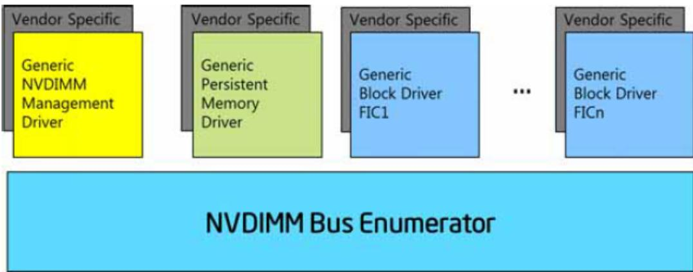  
Fig. 9.8: Vendor/Device Specific Driver Loading

## 9.19.6 Hot Plug Support

The NVDIMM memory hot plug representation of the ACPI Name Space is described in this section. The NVDR device is the NVDIMM root device, the NVD1 and NVD2 are NVDIMM devices, the MEM0 is memory module device corresponding to the NVD1 and NVD2 devices. The \_FIT method under NVDR device returns all NFIT entries including the hot added devices.

```txt
Device (NVDR)    // Root device
{
    Name (_HID, "ACPI0012")
    Method (_STA) {...}
    Method (_FIT) {...}
    Method (_DSM, ...) {
    ...
    }
    Device (NVD1)    // NVDIMM1
    {
    Name(_ADR, h1)    // where h1 is NFIT Device Handle for this NVDIMM1
    Method (_DSM, ...) {
    ...
    }
    }
    Device (NVD2)    // NVDIMM2
    {
    Name(_ADR, h2)    // where h2 is NFIT Device Handle for this NVDIMM2
    Method (_DSM, ...) {
    ...
    }
    }
}

Device (MEM0)    // Memory module
{
    Name (_HID, EISAID ("PNP0C80"))
    Method (_STA) {...}
    Method (_CRS) {...}
```

```txt
(continued from previous page)
}
Scope (\_GPE)
{
    Method (_L00) {
    Notify (\_SB.NVDR, 0x80) // Notify to NVDIMM root device
    Notify (\_SB.MEM0, 1) // Device Check to Memory Module
    }
}
```

Hot Plugged memory is indicated to OS using ACPI Name Space device with PNPID of PNP0C80. The NFIT entries created by the hot plug NVDIMM are communicated by the ACPI Name Space device with ACPI0012.

NVDIMM hot add flow:

1. Prior to hot add of the NVDIMM, the corresponding ACPI Name Space devices, NVD1, NVD2 return an address from \_ADR object (NFIT Device handle) which does not match any entries present in NFIT (either the static or from \_FIT) indicating that the corresponding NVDIMM is not present. Further ACPI Name Space Device MEM0 returns \_STA status of 0 indicating that the devices are not present, not enabled and not functioning.

2. On hot add:

a. Send Notify 0x80 to NVDR to cause NVDIMM bus driver to enumerate all the devices under the root hierarchy

b. NVDIMM bus driver evaluates the \_FIT method under the NVDR device and identifies the changes to the NVDIMM devices present (by identifying new NFIT Device handles that have been added).

c. NVDIMM bus driver now finds matching entries for addresses returned by \_ADR objects of NVD1 and NVD2 and loads the corresponding drivers.

d. Send Notify Device Check to MEM0 to cause re-enumeration of device causing the memory manager to add \_CRS range to the memory pool.

3. MEM0 will now report all the memory ranges now created and made visible.

## 9.19.7 NVDIMM Root Device \_DSMs

A device specific method (\_DSM) for an NVDIMM root device is described below.

## 9.19.7.1 Input Parameters:

Arg0 - UUID (set to 2f10e7a4-9e91-11e4-89d3-123b93f75cba)

Arg1 - Revision ID (set to 1)

Arg2 - Function Index

Table 9.17: NVDIMM Root Device Function Index

<table><tr><td>Function Index</td><td>Description</td></tr><tr><td>0</td><td>Query command implemented (see Section 9.1.1)</td></tr><tr><td>1</td><td>Query Address Range Scrub (ARS) Capabilities (see Section 9.19.7.4)</td></tr><tr><td>2</td><td>Start Address Range Scrub (ARS) (see Section 9.19.7.5)</td></tr><tr><td>3</td><td>Query Address Range Scrub (ARS) Status (see Section 9.19.7.6)</td></tr></table>

continues on next page

Table 9.17 – continued from previous page

<table><tr><td>Function Index</td><td>Description</td></tr><tr><td>4</td><td>Clear Uncorrectable Error (see Section 9.19.7.7)</td></tr><tr><td>5</td><td>Translate SPA</td></tr><tr><td>6</td><td>Reserved</td></tr><tr><td>7</td><td>ARS Error Inject</td></tr><tr><td>8</td><td>ARS Error Inject Clear</td></tr><tr><td>9</td><td>ARS Error Inject Status Query</td></tr><tr><td>0xA</td><td>Query ARS Error Inject Capabilities</td></tr><tr><td>0xB - 0xFFFF</td><td>Reserved</td></tr></table>

Arg3 - a package containing parameters for the function specified by the UUID, Revision ID, and Function Index. The layout of the package for each command along with the corresponding output is illustrated in the following tables. The input and output package are a list of bytes (Bufer).

## 9.19.7.2 Address Range Scrubbing (ARS) Overview

ARS allows the platform to communicate memory errors to system software. This capability allows system software to prevent accesses to addresses with uncorrectable errors in memory.

The ARS functions are system scope and are not specific to a single NVDIMM, i.e., they manage all NVDIMMs present in the system.

The Query ARS Capabilities function indicates if ARS is supported for an address range and to discover system-wide attributes, such as the maximum amount of data that can be returned from a Query ARS Status function and whether the platform provides an asynchronous ACPI notification that a new uncorrectable error has been discovered.

Only one scrub can be in progress system wide at any given time. OSPM should first issue a Query ARS Status function and ensure no ARS is in progress before issuing a Start ARS function. If a successful status is returned, the extended status of the Query ARS Status function indicates to OSPM one of the following:

• An ARS has been completed and ARS results are returned. These results should be processed by OSPM before issuing another Start ARS function. When a new address range scrub operation is started, the previous ARS results are lost.

• An ARS is in progress and no ARS results are returned. A Start ARS function fails while an ARS is in progress. OSPM should periodically issue Query ARS Status functions until the ARS is no longer in progress.

• There has been no ARS since the platform was booted so there are no ARS results returned. A new Start ARS function may be issued.

• An ARS stopped prematurely and partial results are returned. If the platform has more data to return than will fit in the Max Query ARS Status Output Bufer Size (see Section 9.19.7.4). OSPM may issue Start ARS and Query ARS Status functions in a loop and retrieve all of the ARS Error Records, modifying the ARS Start SPA Address and length with each iteration.

If a Start ARS function is issued, the OSPM provides the ARS Start SPA Address and ARS Length for the range to be scrubbed. If the previous ARS stopped prematurely, these fields should be set to the values from the Restart ARS Start SPA Address and Restart ARS Length from the previous Query ARS Status output bufer. For any Start ARS function, OSPM may optionally set the Flags Bit[0] to indicate to the platform that the ARS is a priority and may cause delays in other processing, such as when booting. The output from a successful Start ARS function provides an estimated time for the scrub to complete as a hint to the OSPM regarding when to issue a Query ARS Status function

As indicated in the Query ARS Capabilities function output, a platform may issue the asynchronous event notification 0x81 (Unconsumed Uncorrectable Memory Error Detected Notification) when new uncorrectable errors are detected. Upon receiving the notification, the OSPM may decide to issue a Start ARS with Flags Bit [1] set to prepare for the retrieval of existing records and issue the Query ARS Status function to retrieve the records. The OSPM can pass the entire range of persistent memory as ‘ARS Start SPA Address’ and ‘ARS Length’ for Start ARS, even if the persistent memory range is not contiguous. Alternatively, the OSPM may decide to ignore event notification 0x81. If the memory range is accessed before OSPM can process the ARS data, default platform error handing sequences, such as Machine Check, may occur.

Platforms may support the ability for OSPM to clear an error previously reported from an ARS. OSPM should only issue the Clear Uncorrectable Error function for a memory address range if that the address range has been retired from further use or if valid error-free data is written to the range before those locations are read. If the Clear Uncorrectable Error function is not supported by the platform or if a Clear Uncorrectable Error function for an address range fails, the OSPM should continue to prevent accesses to the address ranges.

The ARS related functions use the following convention for the Status and Extended Status fields.

## 9.19.7.3 Address Range Scrub (ARS) Error Injection Overview

The expected OSPM ARS Error Injection flow is:

1. Inject an error with ARS Error Inject.

2. Optionally and if ARS Unconsumed Uncorrectable Memory Error Detected Notification is supported by the host, system firmware triggers an ACPI NVDIMM root device notification 0x81 for the OSPM.

3. Use Start ARS with Flags Bit[1] set for OSPM acknowledgment of the notification to system firmware and use ARS Query Status to query ARS status.

4. Optionally, use ARS Error Inject Status Query to query the error injected ranges.

5. Use ARS Error Inject Clear to clear the ARS error injected ranges. Until the error is cleared, system firmware will report the error in the ARS Query Status output bufer.

Table 9.18: Status and Extended Status Field Generic Interpretations

<table><tr><td>Bytes</td><td>Field Name</td><td>Description</td></tr><tr><td rowspan="9">1-0</td><td rowspan="9">Status</td><td></td></tr><tr><td>0 - Success</td></tr><tr><td>1 - Function Not Supported</td></tr><tr><td>2 - Invalid Input Parameters</td></tr><tr><td>3 - Hardware Error</td></tr><tr><td>4 - Retry Suggested; it is up to the OSPM regarding the number of retries to perform.</td></tr><tr><td>5 - Error - Unknown Reason</td></tr><tr><td>6 - Function-Specific Error Code</td></tr><tr><td>7 - FFFFh Reserved for errors</td></tr><tr><td>3-2</td><td>Extended Status</td><td>Function Specific</td></tr></table>

## ò Note

If Status is nonzero, the Output Bufer for all the functions in the \_DSM (Device Specific Method) is limited to only the Status and Extended Status fields.

## 9.19.7.4 Function Index 1 - Query ARS Capabilities

This function provides ARS capabilities for a given address range. The format of the input and output for this function is given below.

## 9.19.7.4.1 Function Input

Table 9.19: Query ARS Capabilities - Input Bufer

<table><tr><td>Field</td><td>Byte Length</td><td>Byte Offset</td><td>Description</td></tr><tr><td>ARS Start SPA Address</td><td>8</td><td>0</td><td>Starting of System Physical Address of ARS</td></tr><tr><td>ARS Length</td><td>8</td><td>8</td><td></td></tr></table>

## 9.19.7.4.2 Function Output

Table 9.20: Query ARS Capabilities - Output Bufer

<table><tr><td>Field</td><td>Byte Length</td><td>Byte Offset</td><td>Description</td></tr><tr><td>Status</td><td>2</td><td>0</td><td>Defined in Table 9.18. All other fields in this structure are Reserved if Status is not set to 0 (Success).</td></tr><tr><td>Extended Status</td><td>2</td><td>2</td><td>Bit[0] - If set to 1, indicates scrub of Volatile Memory is supported. Volatile memory is any region that is not marked as Persistent Memory in UEFI or in an ACPI Address Range Type.Bit[1] - If set to 1, indicates scrub of Persistent Memory is supported. Persistent Memory is any region that has one of the following memory range types:- UEFI memory type of EfiPersistentMemory- Any UEFI memory type that has the EFI_MEMORY_N V memory attribute set- ACPI Address Range Type of AddressRangePersistentMemoryBits[15:2] - Reserved</td></tr><tr><td>Max Query ARS Status Output Buffer Size</td><td>4</td><td>4</td><td>In bytes. Maximum size of buffer (including the Status and Extended Status fields) returned by the Query ARS Status function. This can be used to calculate the maximum number of ARS Error Records that are supported. This value shall be a constant for the platform, independent of the input SPA range. As long as a valid input SPA range is specified, the value returned for this shall always be the same.</td></tr></table>

continues on next page

Table 9.20 – continued from previous page

<table><tr><td>Field</td><td>Byte Length</td><td>Byte Offset</td><td>Description</td></tr><tr><td>Clear Uncorrectable Error Range Length Unit Size</td><td>4</td><td>8</td><td>In bytes.- This field describes the uncorrectable error clearing unit size. This value shall be a power of two.- The Clear Uncorrectable Error Range Length argument to the Clear Uncorrectable Errors LSM function shall be an integer multiple of this unit size.- The Query ARS Status ARS Error Record Format “Length” field shall be an integer multiple of this unit size.- The ARS Error Inject SPA Range Length argument to the ARS Error Inject DSM function shall be an integer multiple of this unit size.- This value shall be a constant for the platform, independent of the input SPA range.</td></tr><tr><td>Flags</td><td>2</td><td>12</td><td>Bit[0] - Unconsumed Uncorrectable Memory Error Detected Notification flag. If set to 1, indicates platform supports the ACPI NVDIMM Root Device Unconsumed Error Notification (0x81) as described in nvgdimm-root-device-notification-values. If set to 0, the platform doesn’t support this notification mechanism.Bit[1] - ARS Stopped Notification flag. If set to 1, indicates the platform supports ARS Stopped Notification (0x82) as described inNVDIMM Root Device Notification Values. If set to 0, the platform does not support this notification.Bit[15-2] - Reserved.</td></tr><tr><td>Reserved</td><td>2</td><td>14</td><td></td></tr><tr><td>Clear Uncorrectable Error Max Range Length</td><td>4</td><td>16</td><td>In bytes.- Allows the platform to report max number of bytes that can be cleared of uncorrectable errors at a time.- This value shall be an integer multiple of the unit size, Query ARS Capabilities Clear Uncorrectable Error Range Length Unit Size</td></tr><tr><td>Reserved1</td><td>4</td><td>20</td><td></td></tr></table>

## 9.19.7.5 Function Index 2 - Start ARS

The Start ARS function triggers an Address Range Scrub for the given memory range. Address scrubbing can be done for volatile memory, persistent memory, or both. For the given input ARS Start SPA and length, there may be one or more ranges, including gaps between them for the given Type parameter.

## 9.19.7.5.1 Function Input

Table 9.21: Start ARS - Input Bufer

<table><tr><td>Field</td><td>Byte Length</td><td>Byte Offset</td><td>Description</td></tr><tr><td>ARS Start SPA Address</td><td>8</td><td>0</td><td>In bytes</td></tr><tr><td>ARS Length</td><td>8</td><td>8</td><td>In bytes</td></tr><tr><td>Type</td><td>2</td><td>16</td><td></td></tr><tr><td></td><td></td><td></td><td>Bit[0] - If set to 1, Scrub Volatile MemoryBit[1] - If set to 1, Scrub Persistent MemoryBits[15:2] Reserved - Note: If the range provided includes both volatile and persistent sub-ranges, only the types indicated here will be scrubbed.</td></tr><tr><td>Flags</td><td>1</td><td>18</td><td></td></tr><tr><td></td><td></td><td></td><td>Bit[0] - If set to 1 specifies that the platform may cause delays in processing other operations while performing the ARS (e.g., for use during system boot). If set to 0 specifies that the platform shall not cause delays in processing other operations while performing the ARS (e.g., for use during run time).Bit[1]: If set to 1 the firmware shall return data from a previous scrub, if any, without starting a new scrub. If set to 0 firmware shall start a new ARS.</td></tr><tr><td>Reserved</td><td>5</td><td>19</td><td></td></tr></table>

## 9.19.7.5.2 Function Output

Table 9.22: Start ARS - Output Bufer

<table><tr><td>Field</td><td>Byte Length</td><td>Byte Offset</td><td>Description</td></tr><tr><td>Status</td><td>2</td><td>0</td><td>6 - ARS already in progress All other values defined in Status and Extended Status Field Generic Interpretations</td></tr><tr><td>Extended Status</td><td>2</td><td>2</td><td>Reserved</td></tr><tr><td>Estimated Time for Scrub</td><td>4</td><td>4</td><td>In seconds Estimated time to scrub the given address range.</td></tr></table>

## 9.19.7.6 Function Index 3 - Query ARS Status

The Query ARS Status command allows software to get the status of ARS.

If the platform supports ARS error injection, then it shall also include injected errors as part of its payload.

## 9.19.7.6.1 Function Input

None

## 9.19.7.6.2 Function Output

Table 9.23: Query ARS Status - Output Bufer

<table><tr><td>Field</td><td>Byte Length</td><td>Byte Offset</td><td>Interpretation</td></tr><tr><td>Status</td><td>2</td><td>0</td><td>Defined in Status and Extended Status Field Generic Interpretations</td></tr><tr><td>Extended Status</td><td>2</td><td>2</td><td></td></tr><tr><td></td><td></td><td></td><td>0 - ARS complete1 - ARS in progress. Any returned ARS data shall be all zeros.2 - No ARS performed for current boot. Any returned ARS data shall be all zeros.3 - ARS Stopped Prematurely - This may occur when the implementation reaches the maximum number of errors that can be reported.4 ..0xFFFF- Reserved. Any returned ARS Data shall be all zeros.</td></tr><tr><td>ARS Data</td><td>Varies</td><td>4</td><td>See ARS Data.</td></tr></table>

The output SPA range return indicates the scope of the ARS scrub for the specified type.

Table 9.24: ARS Data

<table><tr><td>Field</td><td>Byte Length</td><td>Byte Offset</td><td>Interpretation</td></tr><tr><td>Output (Size)</td><td>4</td><td>0</td><td>Size of Output Buffer in bytes, including this field.</td></tr><tr><td>Start SPA</td><td>8</td><td>4</td><td>In bytes</td></tr><tr><td>Length</td><td>8</td><td>12</td><td>In bytes ARS performed range is from Start SPA to Start SPA + Length</td></tr><tr><td>Restart ARS Start SPA Address</td><td>8</td><td>20</td><td>Starting SPA to restart the ARS if Status is Success and Extended Status was reported as ARS Stopped Prematurely. The value specified here is used without modification as the ARS Start SPA Address when calling Start ARS to continue an ARS that stopped prematurely before completing the requested ARS Length. Note: It is not required to continue an ARS that has stopped prematurely.</td></tr></table>

continues on next page

Table 9.24 – continued from previous page

<table><tr><td>Field</td><td>Byte Length</td><td>Byte Offset</td><td>Interpretation</td></tr><tr><td>Restart ARS Length</td><td>8</td><td>28</td><td>SPA Length to restart the ARS if Status is Success and Extended Status was reported as ARS Stopped Prematurely. The value specified here is used without modification as the ARS Length when calling Start ARS to continue an ARS that stopped prematurely before completing the requested ARS Length.</td></tr><tr><td>Type</td><td>2</td><td>36</td><td>Bit[0] - Volatile Memory range if set to 1Bit[1] - Persistent Memory range if set to 1. If both bit[0] and bit[1] are set, both Persistent Memory and volatile memory are in this range.Bits[15:2] - Reserved</td></tr><tr><td>Flags</td><td>2</td><td>38</td><td>Bit[0] - If set to 1, indicates an overflow condition has occurred.This means that more errors were reported in the error log than will fit in the maximum total buffer size of Max Query ARS Status Data Size from the Query ARS Capabilities. The returned Extended Status should be ARS Stopped Prematurely when this bit is set to 1.Bits[15:1] Reserved</td></tr><tr><td>Number of Error Records</td><td>4</td><td>40</td><td>Number of ARS Error Record structures reported</td></tr><tr><td>ARS Error Records</td><td>Varies</td><td>44</td><td>See the next table below for the format of the ARS error record.</td></tr></table>

Table 9.25: ARS Error Record Format

<table><tr><td>Field</td><td>Byte Length</td><td>Byte Offset</td><td>Description</td></tr><tr><td>NFIT Handle</td><td>4</td><td>0</td><td>NFIT Handle indicates the specific NVDIMM at Start SPA of Error Location (offset 8)</td></tr><tr><td>Reserved</td><td>4</td><td>4</td><td>Reserved</td></tr><tr><td>Start SPA of Error Location</td><td>8</td><td>8</td><td>Start of System Physical Address of the error.</td></tr><tr><td>Length</td><td>8</td><td>16</td><td>Length indicates the consecutive bytes from Start SPA of Error Location that are in error. Due to interleaving, the range covered by Start SPA of Error Location and Length may include addresses that are present in other NVDIMMs in an interleave set. In case of overflow, the address range indicated by Start SPA of Error Location and Length will cover the NVDIMM interleave set that is impacted by the error. The range covered by Start SPA of Error Location and Length may exceed the requested scrub range due to platform limitations.</td></tr></table>

## 9.19.7.7 Function Index 4 - Clear Uncorrectable Error

The Clear Uncorrectable Error Function allows system software to clear uncorrectable errors from the NVDIMM based on System Physical Address (SPA). Uncorrectable errors reported by the Query ARS Status function can be cleared utilizing this mechanism.

For each uncorrectable error range length covered by the specified SPA range that contains an uncorrectable error, platform software shall clear the error and may modify the data at those addresses. For each uncorrectable error range length covered by the specified SPA range that does not contain an uncorrectable error, platform software shall do nothing.

The Clear Uncorrectable Error SPA Range Base shall be aligned to the Clear Uncorrectable Error Range Length Unit Size and the Clear Uncorrectable Error Range Length must be an integer multiple of the Clear Uncorrectable Error Range Length Unit Size. The Clear Uncorrectable Error request shall result in an Invalid Parameter error status if these rules are not followed.

Attempting to clear an error with a range length that overruns the end of a region shall result in an Invalid Parameter error status.

Attempting to clear an error with a range length that is greater than the range of uncorrectable errors is not considered a failure.

Attempting to clear an error from an address that does not currently have an uncorrectable error is not considered a failure.

## ò Note

The data contained in the locations that are cleared with this command are indeterminate. Care must be taken when using this command since once the error has been cleared, subsequent reads of those cleared locations will cause silent data corruption if software is unaware that the original contents were lost. Software should only utilize this command if it can guarantee that the locations have been retired from further use or will be written with valid data before the locations are read.

OSPM may call Clear Uncorrectable Error on an ARS error range that was injected via the ARS Error Inject function. If the platform supports this, it should ultimately treat it as if the ARS Error Inject Clear function was called. If the platform does not support this, it should fail with an Invalid Input Parameter error.

## 9.19.7.7.1 Function Input

Table 9.26: Clear Uncorrectable Error - Input Bufer

<table><tr><td>Field</td><td>Byte Length</td><td>Byte Offset</td><td>Description</td></tr><tr><td>Clear Uncorrectable Error SPA Range Base</td><td>8</td><td>0</td><td>In bytes Starting location from which to clear the uncorrectable error. This address should be aligned to the Clear Uncorrectable Error Range Length Unit Size reported in the Query ARS Capabilities function (see Function Index 1 - Query ARS Capabilities.</td></tr><tr><td>Clear Uncorrectable Error Range Length</td><td>8</td><td>8</td><td>In bytes Length of the region to clear the uncorrectable error from. This length should be an integer multiple of the Clear Uncorrectable Error Range Length Unit Size reported in the Query ARS Capabilities function (see Function Index 1 - Query ARS Capabilities).</td></tr></table>

## 9.19.7.7.2 Function Output

Table 9.27: Clear Uncorrectable Error - Output Bufer

<table><tr><td>Field</td><td>Byte Length</td><td>Byte Offset</td><td>Description</td></tr><tr><td>Status</td><td>2</td><td>0</td><td>Defined in Status and Extended Status Field Generic Interpretations.</td></tr><tr><td>Extended Status</td><td>2</td><td>2</td><td>Reserved</td></tr><tr><td>Reserved</td><td>4</td><td>4</td><td>Reserved</td></tr><tr><td>Cleared Uncorrectable Error Range Length</td><td>8</td><td>8</td><td>The range of errors actually cleared by the platform, starting from the requested Clear Uncorrectable Error SPA Range Base. This length shall be an integer multiple of the Clear Uncorrectable Error Range Length Unit Size reported in the Query ARS Capabilities function (see Function Index 1 - Query ARS Capabilities Note: This range length may be smaller than the length requested by the input range length.</td></tr></table>

## 9.19.7.8 Function Index 5 - Translate SPA

This command instructs the platform to translate the requested System Physical Address (SPA) in to one or more NVDIMM devices consisting of an NFIT Device Handle and Device Physical Address (DPA) on that device.

• The SPA address to translate must lie within one of the SPA ranges described in the NFIT System Physical Address Range table.

• For non-mirrored interleave sets, the SPA address will translate to a single NVDIMM and single DPA.

• For a HW mirrored interleave set, the Flags Bit[0] - Mirrored SPA Location bit is set and all NVDIMM Devices the SPA translates to are included in the returned NVDIMM Device List.

## 9.19.7.8.1 Function Input

The following table outlines the expected input payload for this command.

Table 9.28: Translate SPA - Input Payload Format

<table><tr><td>Field</td><td>Byte Length</td><td>Byte Offset</td><td>Description</td></tr><tr><td>SPA</td><td>8</td><td>0</td><td>System Physical Address to translate. This is a byte aligned address and all bits are considered valid. No masking or shifting occurs.</td></tr></table>

## 9.19.7.8.2 Function Output

The following tables outline the expected output payload for this command.

Table 9.29: Translate SPA - Output Payload Format

<table><tr><td>Field</td><td>Byte Length</td><td>Byte Offset</td><td>Description</td></tr><tr><td>Status</td><td>2</td><td>0</td><td>Defined in Status and Extended Status Field Generic Interpretations. If the SPA does not lie within one of the SPA ranges described in the NFIT System Physical Address Range table, a status of 2, Invalid Input Parameter, is returned. All other fields in this structure are Reserved if Status is not set to 0 (i.e., Success).</td></tr><tr><td>Extended Status</td><td>2</td><td>2</td><td>Extended Status Field (Vendor Defined)</td></tr><tr><td>Flags</td><td>1</td><td>4</td><td>Bit[0] - Mirrored SPA Location - If set to 1, indicates the SPA location maps to one or more NVDIMMs that are mirrored together and contributing to a single SPA range. All NVDIMMs currently contributing to the HW Mirror shall be reported and the Number of NVDIMMs shall report all of the devices in the Mirrored SPA range.</td></tr><tr><td>Reserved</td><td>3</td><td>5</td><td>Must be 0</td></tr><tr><td>Translated Length</td><td>8</td><td>8</td><td>The number of bytes the returned SPA translation applies to. The SPA range defined by the input SPA + output Translated Length -1 will yield an address translation with a constant Translated NVDIMM Device List containing a constant set of NFIT Device Handles.</td></tr><tr><td>Number of NVDIMMs</td><td>4</td><td>16</td><td>The number of NVDIMM devices being returned in the list of Translated NVDIMM Devices. This is typically 1 for a given SPA location but for Mirrored SPA Locations, it is possible to have multiple NVDIMMs that provide the same SPA.</td></tr><tr><td>Translated NVDIMM Device List</td><td>Varies</td><td>20</td><td>List of one or more Translated NVDIMM Devices</td></tr></table>

## 9.19.7.8.3 Translated NVDIMM Device

Table 9.30: Translate SPA - Translated NVDIMM Device List Output Payload Format

<table><tr><td>Field</td><td>Byte Length</td><td>Byte Offset</td><td>Description</td></tr><tr><td>NFIT Device Handle</td><td>4</td><td>0</td><td>Handle to physical NVDIMM that the SPA maps to. This handle can be utilized to retrieve other NFIT table data that further describes the physical device.</td></tr><tr><td>Reserved</td><td>4</td><td>4</td><td>Returned as zero</td></tr><tr><td>DPA</td><td>8</td><td>8</td><td>Device Physical Address that the SPA translates to.</td></tr></table>

## 9.19.7.9 Function Index 7 - ARS Error Inject

ARS Error Inject allows the injection of an error for the memory range in the defined input payload. Input is a package containing a single bufer, where the bufer is formatted as shown in ARS Error Inject - Input Format.

## 9.19.7.9.1 Input (Arg3)

Table 9.31: ARS Error Inject - Input Format

<table><tr><td>Field</td><td>Byte Length</td><td>Byte Offset</td><td>Description</td></tr><tr><td>ARS Error Inject SPA Range Base</td><td>8</td><td>0</td><td>Starting location from which to inject the error.</td></tr><tr><td>ARS Error Inject SPA Range Length</td><td>8</td><td>8</td><td>In bytes Length of the region to inject the error from. If Length makes the range cross NVDIMM SPA ranges, the system firmware implementation may report more than one ARS error record in the output buffer of the ARS Query Status _DSM function.</td></tr><tr><td>ARS Error Inject Options</td><td>1</td><td>16</td><td>Bit 0: Unconsumed Uncorrectable Memory Error Detected Notification. Set to 1 Firmware shall notify the OSPM. Set to 0 the notification will not occur.Bit 1: Force Overflow. Set to 1 to trigger a Query ARS Status overflow condition with this range. A value of 0 is ignored. See below for details.Bit 2: Persistent Error. Set to 1 to persist this error across reboots. These are uncorrectable errors injected to specified memory locations. Set to 0 to ensure this error is cleared on reboot.Bits 7-3: Reserved.</td></tr></table>

OSPM can trigger a Query ARS Status overflow condition by setting the Force Overflow bit (bit 1) in the ARS Error Inject Options in the input structure.

If the Force Overflow bit is set to 0 then the platform may still trigger an overflow condition if necessary (e.g. the number of error records to return from Query ARS Status exceeds Query ARS Status Data Size).

The typical sequence to force an overflow condition is as follows:

1. OSPM calls ARS Error Inject to inject an error for a particular range and sets the following fields in the input structure:

a. ARS Error Inject Options bit 0 to 0 so that the Unconsumed Uncorrectable Memory Error Detected notification does not occur for this range.

b. ARS Error Inject Options bit 1 set to 1 to indicate system firmware should force an overflow condition when it encounters this range.

2. OSPM injects a second error with ARS Error inject, setting ARS Error Inject Options bit 0 to 1 and clearing bit 1 to 0.

3. System firmware notifies the OSPM of the new errors with the Unconsumed Uncorrectable Memory Error Detected notification.

4. OSPM calls Query ARS Status in response to the notification.

5. When system firmware encounters the first injected range, it sees that ARS Error Inject Options bit 1 was set and sets Flags bit 0 to 1 in the output ARS Data to indicate an overflow condition. System firmware also sets the Restart ARS Start SPA Address and Restart ARS Length accordingly.

6. OSPM calls Start ARS with the following fields set in the input structure:

a. Flags bit 1 set to 1 to indicate it does not want to initiate a new scrub.

b. ARS Start SPA Address set to the Restart ARS Start SPA Address from the Query ARS Status output.

c. ARS Length set to the Restart ARS Length from the Query ARS Status output.

7. OSPM calls Query ARS Status.

8. System firmware returns the second injected range.

When the Persistent Error bit is set, the error range and the ARS Error Inject Options bits should persist across reboots.

## 9.19.7.9.2 Output

Return Value for this function is a bufer formatted as shown in the table below.

Table 9.32: ARS Error Inject - Output Format

<table><tr><td>Field</td><td>Byte Length</td><td>Byte Offset</td><td>Description</td></tr><tr><td>Status</td><td>2</td><td>0</td><td>Bytes[1-0]0 - Success1 - Not Supported. The ARS Error Inject method is not supported by the platform.2 - Invalid Input Parameters. Platform reports that the SPA range parameters passed to the ARS Error Inject method are invalid or if notification is not supported.</td></tr><tr><td>Extended Status</td><td>2</td><td>2</td><td>Reserved</td></tr></table>

## 9.19.7.10 Function Index 8 - ARS Error Inject Clear

ARS Error Clear allows the clearing of the injected error state in the persistent memory range in the defined input payload.

## 9.19.7.10.1 Input (Arg3)

Input is a package containing a single bufer, where the bufer is formatted as shown in the table below.

Table 9.33: ARS Error Inject Clear - Input Format

<table><tr><td>Field</td><td>Byte Length</td><td>Byte set</td><td>Off-</td><td>Description</td></tr><tr><td>ARS Error Inject Clear SPA Range Base</td><td>8</td><td>0</td><td></td><td></td></tr></table>

Table 9.33 – continued from previous page

<table><tr><td>Field</td><td>Byte Length</td><td>Byte Off-set</td><td>Description</td></tr><tr><td>ARS Error Inject Clear SPA Range Length</td><td>8</td><td>8</td><td>In bytes</td></tr></table>

## 9.19.7.10.2 Output

Return Value for this function is a bufer formatted as shown in the table below.

Table 9.34: ARS Error Inject Clear - Output Format

<table><tr><td>Field</td><td>Byte Length</td><td>Byte Offset</td><td>Description</td></tr><tr><td>Status</td><td>2</td><td>0</td><td>Bytes[1-0]0 - Success1 - Not Supported. The ARS Error Inject Clear method is not supported by the platform.2 - Invalid Input Parameters. Platform reports that the SPA range parameters passed to the ARS Error Inject method are invalid or the specified range does not have an injected error.</td></tr><tr><td>Extended Status</td><td>2</td><td>2</td><td>Reserved</td></tr></table>

## 9.19.7.11 Function Index 9 - ARS Error Inject Status Query

The maximum bufer size returned by the ARS Error Inject Status Query function is the same as the Max Query ARS Status Output Bufer Size reported by the Query ARS Capabilities function.

This ARS Error Inject Status Query allows the OSPM to list the currently active injected errors in the persistent memory ranges presented in the output bufer payload.

## 9.19.7.11.1 Input (Arg3)

None.

## 9.19.7.11.2 Output

Return Value for this function is a bufer, formatted as shown below.

Table 9.35: ARS Error Inject Status Query - Output Format

<table><tr><td>Field</td><td>Byte Length</td><td>Byte Offset</td><td>Description</td></tr><tr><td>Status</td><td>2</td><td>0</td><td>Bytes[1-0]0 - Success.1 - Not Supported. The ARS Error Inject Status Query method is not supported by the platform.</td></tr><tr><td>Extended Status</td><td>2</td><td>2</td><td>Reserved</td></tr><tr><td>Injected Error Record Count</td><td>4</td><td>4</td><td>Number of Error Records in the following array of Error Records. If no ARS injected error, the Injected Error Count field is 0.</td></tr><tr><td>ARS Error Inject Status Query Error Records</td><td>Varies</td><td>8</td><td>See the next table below for the format of the ARS Error Inject Status Query Error Record.</td></tr></table>

Table 9.36: ARS Error Inject Status Query - Error Record Format

<table><tr><td colspan="2">Field</td><td>Byte Length</td><td>Byte Offset</td><td>Description</td></tr><tr><td>ARS</td><td>Error Inject</td><td>8</td><td>0</td><td>Starting SPA range of an injected error.</td></tr><tr><td>Status</td><td>Query Error</td><td></td><td></td><td></td></tr><tr><td>Record</td><td>SPA Range</td><td></td><td></td><td></td></tr><tr><td colspan="2">Base</td><td></td><td></td><td></td></tr><tr><td>ARS</td><td>Error Inject</td><td>8</td><td>8</td><td>Length in bytes of the injected error starting at the SPA range.</td></tr><tr><td>Status</td><td>Query Error</td><td></td><td></td><td></td></tr><tr><td>Record</td><td>SPA Range</td><td></td><td></td><td></td></tr><tr><td colspan="2">Length</td><td></td><td></td><td></td></tr></table>

## 9.19.7.12 Function Index 0xA - Query ARS Error Inject Capabilities

Query ARS Error Inject Capabilities is used by software to detect the system platforms capabilities related to injecting ARS errors.

## 9.19.7.12.1 Function Input (Arg3)

None.

## 9.19.7.12.2 Function Output

Table 9.37: ARS Error Inject Options Support

<table><tr><td>Field</td><td>Byte Length</td><td>Byte Offset</td><td>Description</td></tr><tr><td>Status</td><td>2</td><td>0</td><td>Defined inNVDIMM Root Device Function Index</td></tr><tr><td>Extended Status</td><td>2</td><td>2</td><td>Reserved</td></tr></table>

continues on next page

Table 9.37 – continued from previous page

<table><tr><td>Field</td><td>Byte Length</td><td>Byte Offset</td><td>Description</td></tr><tr><td>Platform Support</td><td>4</td><td>4</td><td>Bit 0: Injected ARS Error Persistence. This bit only applies if Bit 2 of the ARS Error Inject Options Support, Persistent Error Support, is 0. If set to 1, all injected ARS errors persist across reboots and the OSPM must explicitly clear them. These are uncorrectable errors injected to specified memory locations. If set to 0, all injected ARS errors are cleared on reboot.Bits 31-1: Reserved</td></tr><tr><td>ARS Error Inject Options Support</td><td>1</td><td>8</td><td>Bit 0: Unconsumed Uncorrectable Memory Error Detected Notification Support. If set to 1, indicates system platform supports Bit 0 in the ARS Error Inject Options field in the ARS Error Inject input structure.Bit 1: Force Overflow Support. If set to 1, indicates system platform supports Bit 1 in the ARS Error Inject Options field in the ARS Error Inject input structure.Bit 2: Persistent Error Support. If set to 1, indicates system platform supports Bit 2 in the ARS Error Inject Options field in the ARS Error Inject input structure.Bits 7-3: Reserved</td></tr></table>

## 9.19.8 NVDIMM Device Methods

The return status codes for NVDIMM device methods is described in the following table.

Table 9.38: NVDIMM Device Method Return Status Code

<table><tr><td>Field</td><td>Byte Length</td><td>Byte Offset</td><td>Description</td></tr><tr><td>Status</td><td>2</td><td>0</td><td>0 - Success1 - Not Implemented2 - Invalid Input Parameters3 - Hardware Error4 - Retry Suggested5 - Error - Unknown Reason6 - Method Specific Error Code7 - FFFFh Reserved</td></tr><tr><td>Extended Status</td><td>2</td><td>2</td><td>Method Specific</td></tr></table>

## 9.19.8.1 \_NCH (Get NVDIMM Current Health Information)

This method provides current health information of the NVDIMM device. The platform notifies OSPM by NVDIMM Device NFIT Health Event Notification (see Table 5.235) whenever anything happens that can impact health of NVDIMM device (see Table 9.39). When OSPM receives the notification, it can get the current health information by calling this method. Regardless of health notification, OSPM can call this method at any time to get the current health of the NVDIMM device.

During boot time, the OSPM can call this method to get the current health of NVDIMM device and take appropriate action. During OSPM runtime, if a health problem gets corrected then also the platform shall notify OSPM by the NVDIMM Device NFIT Health Event Notification.

## Arguments:

None

## Return Value:

A bufer containing the current health information as described below

## Return Value Information:

Table 9.39: NCH Return Value

<table><tr><td>Field</td><td>Byte Length</td><td>Byte Off-set</td><td>Description</td></tr><tr><td>Status</td><td>2</td><td>0</td><td>See NVDIMM Device Method Return Status Code</td></tr><tr><td>Extended Status</td><td>2</td><td>2</td><td>Reserved</td></tr><tr><td>Validation Flags</td><td>2</td><td>4</td><td></td></tr><tr><td></td><td></td><td></td><td>Bit [0] - Set to 1 to indicate that the Overall Health Status Flags field is valid. This bit is set to 1.</td></tr><tr><td></td><td></td><td></td><td>Bit [1] - Set to 1 to indicate that the Overall Health Status Attributes field is valid.</td></tr><tr><td></td><td></td><td></td><td>Bit [2-15] - Reserved</td></tr></table>

continues on next page

Table 9.39 – continued from previous page

<table><tr><td>Field</td><td>Byte Length</td><td>Byte Off-set</td><td>Description</td></tr><tr><td>Overall Health Status Flags</td><td>4</td><td>6</td><td>Multiple bits may be set as appropriate. A bit set to 0 means the respective health problem does not exist or the bit is not applicable to the NVDIMM. If all bits are 0, the NVDIMM is healthy.Bit [0] - MAINTENANCE NEEDED. This bit is set to 1 to indicate that maintenance is required - e.g. temperature alarm tripped, energy source lifetime alarm tripped.Bit [1] - PERFORMANCE DEGRADED. This bit is set to 1 to indicate that performance is degraded.Bits [2-7] - Reserved Following bits indicate situations where the OSPM should assume write persistency loss but reads still function properly.Bit [8] - WRITE PERSISTENCY LOSS IN EVENT OF POWER LOSS. This bit is set to 1 to indicate that the OSPM should assume that all the writes since last time the NVDIMM was brought online may be lost in event of power loss.Bit [9] - WRITE PERSISTENCY LOSS IN EVENT OF OFFLINE. This bit is set to 1 to indicate that the OSPM should assume that all the writes since last time the NVDIMM was brought online may be lost when any subsequent offline operation is attempted.Bit [10] - WRITE PERSISTENCY LOSS IMMINENT. This bit is set to 1 to indicate that the OSPM should assume that subsequent writes may not persist.Bit [11-15] - Reserved The following bits indicate situations where the OSPM should assume all data loss.Bit [16] - ALL DATA LOSS IN THE EVENT OF POWER LOSS. This bit is set to 1 to indicate that the OSPM should assume that all data may be lost in the event of power loss.Bit [17] - ALL DATA LOSS IN THE EVENT OF OFFLINE. This bit is set to 1 to indicate that the OSPM should assume that all data may be lost when any subsequent offline operation is attempted.Bit [18] - ALL DATA LOSS IMMINENT. This bit is set to 1 to indicate that the OSPM should assume that subsequent reads may fail or return invalid data and subsequent writes may not persist.Bit [19-31] - Reserved</td></tr><tr><td>Overall Health Status Attributes</td><td>4</td><td>10</td><td>Bit [0] - PERMANENT HEALTH CONDITION - This bit is set to 1 to indicate that the health problem(s) reported in Overall Health Status Flags are permanent. If all the bits of Overall Health Status Flags are 0&#x27;s, then NVDIMM is healthy and this bit shall be ignored by OSPM.Bit [1-31] - Reserved</td></tr><tr><td>Reserved</td><td>50</td><td>14</td><td>Reserved</td></tr></table>

<table><tr><td>i Note</td></tr><tr><td>These fields do not track data loss during the previous shutdown or any failures during boot time. If the condition</td></tr></table>

that caused those failures still exists when \_NCH method is called, then platform shall reflect appropriately in the fields of this method.

## 9.19.8.2 \_NBS (Get NVDIMM Boot Status)

This method provides information about NVDIMM device’s status at boot time. The information provided by this method is updated by the platform during boot and remains unchanged during runtime.

Arguments:

None

Return Value:

A bufer containing device boot status information as described below

Return Value Information:

Table 9.40: \_NBS Return Value

<table><tr><td>Field</td><td>Byte Length</td><td>Byte Offset</td><td>Description</td></tr><tr><td>Status</td><td>2</td><td>0</td><td>See Table 9.38</td></tr><tr><td>Extended Status</td><td>2</td><td>2</td><td>Reserved</td></tr><tr><td>Validation Flags</td><td>2</td><td>4</td><td></td></tr><tr><td></td><td></td><td></td><td>Bit [0] - Set to 1 to indicate that Data Loss Count field is valid.This bit is set to 1.Bit [1-15] - Reserved</td></tr><tr><td>Data Loss Count</td><td>4</td><td>6</td><td>A monotonically increasing counter which is incremented whenever the NVDIMM device fails to save and/or flush data to the persistent media. This also includes any data corruption or loss which is not signaled to the OSPM by any other architected means. This counter is intended for the OSPM to compare against one previously saved by the OSPM in determining the possibility of catastrophic data loss. For example, since data loss counter is monotonically increasing, OSPM can detect data loss if another OSPM was booted on the machine between the shutdown and boot of the original OSPM.</td></tr><tr><td>Reserved</td><td>54</td><td>10</td><td>Reserved</td></tr></table>

## 9.19.8.3 \_NIC (Get NVDIMM Health Error Injection Capabilities)

This method reports health error injection capabilities that are supported by the platform. The health errors mentioned in table 9-320 are same as those mentioned in the \_NCH method.

Arguments:

None

Return Value:

See Table 9.41 below.

Table 9.41: \_NIC Output Bufer

<table><tr><td>Field</td><td>Byte Length</td><td>Byte Offset</td><td>Description</td></tr><tr><td>Status</td><td>2</td><td>0</td><td>See Table 9.38</td></tr><tr><td>Extended Status</td><td>2</td><td>2</td><td>Reserved</td></tr><tr><td>Health Error Injection Capabilities</td><td>4</td><td>4</td><td></td></tr><tr><td></td><td></td><td></td><td>A bit is set to 1 if the respective health error injection is supported, otherwise the bit is set to 0:</td></tr><tr><td></td><td></td><td></td><td>Bit [0] - MAINTENANCE NEEDED</td></tr><tr><td></td><td></td><td></td><td>Bit [1] - PERFORMANCE DEGRADED</td></tr><tr><td></td><td></td><td></td><td>Bits [2-7] - Reserved</td></tr><tr><td></td><td></td><td></td><td>Bit [8] - WRITE PERSISTENCY LOSS IN EVENT OF POWER LOSS</td></tr><tr><td></td><td></td><td></td><td>Bit [9] - WRITE PERSISTENCY LOSS IN EVENT OF OFFLINE</td></tr><tr><td></td><td></td><td></td><td>Bit [10] - WRITE PERSISTENCY LOSS IMMINENT</td></tr><tr><td></td><td></td><td></td><td>Bit [11-15] - Reserved</td></tr><tr><td></td><td></td><td></td><td>Bit [16] - ALL DATA LOSS IN THE EVENT OF POWER LOSS</td></tr><tr><td></td><td></td><td></td><td>Bit [17] - ALL DATA LOSS IN THE EVENT OF OFFLINE</td></tr><tr><td></td><td></td><td></td><td>Bit [18] - ALL DATA LOSS IMMINENT</td></tr><tr><td></td><td></td><td></td><td>Bits [19-31] - Reserved</td></tr><tr><td>Overall Health Status Attributes Capabilities</td><td>4</td><td>8</td><td></td></tr><tr><td></td><td></td><td></td><td>Bit [0] - PERMANENT HEALTH CONDITION. This bit is set to 1 if permanent health errors can be injected, otherwise the bit is set to 0.</td></tr><tr><td></td><td></td><td></td><td>Bit [1-31] - Reserved</td></tr><tr><td>Reserved</td><td>52</td><td>12</td><td></td></tr></table>

## 9.19.8.4 \_NIH (NVDIMM Inject/Clear Health Errors)

This method has two modes: Inject mode and Clear mode. The OSPM should use this method for health error injection only after verifying that the NVDIMM device has no real health errors.

In Inject mode, the OSPM can request the platform to:

• inject one or more health errors

• set one or more “Overall Health Status Attributes”

The OSPM can request either or both the items mentioned above in a single call. Unless errors are cleared, the platform shall accumulate the injected errors and attributes through subsequent calls of this method.

If a platform can inject at least one error or set at least one attribute, then the platform shall send NVDIMM Device Health Event Notification if supported (see Table 5.235). The OSPM can call \_NCH (see Table 9.39) and the platform shall report the currently injected errors and attributes in the return bufer.

If a platform can inject only a subset of OSPM requested errors or set only a subset of OSPM requested attributes, then the platform shall return an output bufer with Status set to 6 (see Table 9.38) and Extended Status set to 1 (see Table 9.43). At that time, the OSPM can call the \_NIG method (see Section 9.19.8.5) to get currently injected errors. If the OPSM requests to inject errors which is already injected, then the platform shall return Success. If the OSPM requests to inject an error or set an attribute which is not supported by method \_NIC, then that method shall return output bufer with Status set to 2 (see Table 9.38).

The impact of the injected errors on fields reported by the method \_NCH, NVDIMM State Flags of NVDIMM Region Mapping Structure (see Section 5.2.26.3) and on fields reported by NVDIMM device method \_NBS (see Section 9.19.8.2) after a reset is implementation specific.

In Clear mode, the OSPM can request the platform to:

• clear one or more currently injected errors

• clear one or more “Overall Health Status Attributes” of currently injected error(s)

• The OSPM can request either or both the items mentioned above in a single call.

If platform can clear at least one error or one attribute, then it shall send NVDIMM Device Health Event Notification (see Table 5.235) if supported. The OSPM can call \_NCH (see Table 9.39) and the platform shall report any remaining injected errors and the attributes in the return bufer.

If a platform can clear only a subset of OSPM requested errors and attributes, then the platform shall return an output bufer with Status set to 6 (see Table 9.38) and Extended Status set to 1 (see:numref:nih-output-bufer). At that time, the OSPM can call \_NIG method (see Section 9.19.8.5) to get currently injected errors. If the OPSM requests to clear error(s) which are not currently injected or requests to clear attribute(s) which are not currently set, then the platform shall return Success. If the OSPM requests to clear an error or clear an attribute which is not supported by method \_NIC, then this method shall return output bufer with Status set to 2 (see Table 9.38).

One implementation of the health error injection is to emulate at firmware level without injecting any errors in real hardware.

## Arguments:

Table 9.42: \_NIH Input Bufer

<table><tr><td>Field</td><td>Byte Length</td><td>Byte Offset</td><td>Description</td></tr><tr><td>Mode</td><td>1</td><td>0</td><td>0 - Reserved1 - Inject error(s)2 - Clear error(s)3 - 255 - Reserved</td></tr><tr><td>Reserved</td><td>3</td><td>1</td><td>Reserved</td></tr></table>

continues on next page

Table 9.42 – continued from previous page

<table><tr><td>Field</td><td>Byte Length</td><td>Byte Offset</td><td>Description</td></tr><tr><td>Overall Health Status Errors</td><td>4</td><td>4</td><td>These bits are used to inject/clear health error(s) reported by _NIC method (see Section 9.19.8.4). If Mode is set to 1, a bit is set to 1 to inject the respective error. OSPM can set one or more error bits to 1. If Mode is set to 2, a bit is set to 1 to clear the respective error. OSPM can set one or more error bits to 1 (see below).Bit [0] - MAINTENANCE NEEDEDBit [1] - PERFORMANCE DEGRADEDBit [2-7] - ReservedBit [8] - WRITE PERSISTENCY LOSS IN EVENT OF POWER LOSSBit [9] - WRITE PERSISTENCY LOSS IN EVENT OF OFFLINEBit [10] - WRITE PERSISTENCY LOSS IMMINENTBit [11-15] - ReservedBit [16] - ALL DATA LOSS IN THE EVENT OF POWER LOSSBit [17] - ALL DATA LOSS IN THE EVENT OF OFFLINEBit [18] - ALL DATA LOSS IMMINENTBit [19-31] - Reserved</td></tr><tr><td>Overall Health Status Attributes</td><td>4</td><td>8</td><td>Bit [0] - PERMANENT HEALTH CONDITION. If Mode is set to 1, this bit is set to 1 to inject health errors as permanent errors, otherwise the bit is set to 0. If Mode is set to 2, this bit is set to 1 to clear the “Permanent Health Condition” of the injected errors.Bit [1-31] - Reserved</td></tr><tr><td>Reserved</td><td>52</td><td>12</td><td>Reserved</td></tr></table>

Return Value:

Table 9.43: \_NIH Output Bufer

<table><tr><td>Field</td><td>Byte Length</td><td>Byte Offset</td><td>Description</td></tr><tr><td>Status</td><td>2</td><td>0</td><td>Set :ref: nvdimm-device-method-return-status-code</td></tr><tr><td>Extended Status</td><td>2</td><td>2</td><td></td></tr><tr><td></td><td></td><td></td><td>0 - Reserved1 - If Mode is 1, only a subset of requested errors is injected or only a subset of requested attributes is set. If Mode is 2, only a subset of requested errors is cleared or only a subset of requested attributes is cleared.2 - FFFFh Reserved</td></tr></table>

## 9.19.8.5 \_NIG (Get NVDIMM Inject Health Error Status)

This method reports currently active health errors and their error attributes that are injected by NVDIMM device method \_NIH.

Arguments:

None

Return Value:

Table 9.44: \_NIG Output Bufer

<table><tr><td>Field</td><td>Byte Length</td><td>Byte Offset</td><td>Description</td></tr><tr><td>Status</td><td>2</td><td>0</td><td>See NVDIMM Device Method Return Status Code</td></tr><tr><td>Extended Status</td><td>2</td><td>2</td><td>Reserved</td></tr><tr><td>Validation Flags</td><td>2</td><td>4</td><td></td></tr><tr><td></td><td></td><td></td><td>Bit [0] - Set to 1 to indicate that the Injected Overall Health Status Flags field is valid. This bit is set to 1.</td></tr><tr><td></td><td></td><td></td><td>Bit [1] - Set to 1 to indicate that the Overall Health Status Attributes of Injected Errors field is valid.</td></tr><tr><td></td><td></td><td></td><td>Bit [2-15] - Reserved</td></tr><tr><td>Injected Overall Health Status Errors</td><td>4</td><td>6</td><td></td></tr><tr><td></td><td></td><td></td><td>If a bit is set to 1 then the respective error is currently injected:</td></tr><tr><td></td><td></td><td></td><td>Bit [0] - MAINTENANCE NEEDED</td></tr><tr><td></td><td></td><td></td><td>Bit [1] - PERFORMANCE DEGRADED</td></tr><tr><td></td><td></td><td></td><td>Bit [2-7] - Reserved</td></tr><tr><td></td><td></td><td></td><td>Bit [8] - WRITE PERSISTENCY LOSS IN EVENT OF POWER LOSS</td></tr><tr><td></td><td></td><td></td><td>Bit [9] - WRITE PERSISTENCY LOSS IN EVENT OF OFFLINE</td></tr><tr><td></td><td></td><td></td><td>Bit [10] - WRITE PERSISTENCY LOSS IMMINENT</td></tr><tr><td></td><td></td><td></td><td>Bit [11-15] - Reserved</td></tr><tr><td></td><td></td><td></td><td>Bit [16] - ALL DATA LOSS IN THE EVENT OF POWER LOSS</td></tr><tr><td></td><td></td><td></td><td>Bit [17] - ALL DATA LOSS IN THE EVENT OF OFFLINE</td></tr><tr><td></td><td></td><td></td><td>Bit [18] - ALL DATA LOSS IMMINENT</td></tr><tr><td></td><td></td><td></td><td>Bit [19-31] - Reserved</td></tr><tr><td>Overall Health Status Attributes of Injected Errors</td><td>4</td><td>10</td><td></td></tr><tr><td></td><td></td><td></td><td>Bit [0] - PERMANENT HEALTH CONDITION. This bit is set to 1 to indicate that the injected error(s) are permanent health error(s), otherwise the bit is set to 0.</td></tr><tr><td></td><td></td><td></td><td>Bit [1-31] - Reserved</td></tr><tr><td>Reserved</td><td>50</td><td>14</td><td>Reserved</td></tr></table>

## 9.20 Firmware Inventory Device

The Firmware Inventory device is used to convey version information for firmware currently running on various devices within the system. These may include system boot firmware (e.g. UEFI), as well as firmware on any other processors or microcontrollers within the system (e.g. ACPI Embedded Controller, Baseboard Management Controller). This Device object is located directly within the \_SB scope. Note that one or more of these devices may support a runtime firmware update that does not require a full system reboot- therefore this Device reports the current set of firmware, as well as providing runtime notifications to OSPM in the event of a firmware update so that the list may be reacquired.

The ACPI Hardware ID of the Firmware Inventory device is ACPI0019.

The firmware inventory list is returned by the \_DSM Object, described in Section 9.20.1

When a firmware update occurs, AML code issues a Notify(<Firmware Device>, 0x80). The OSPM handler for the notification should re-evaluate the \_DSM upon receipt of such a notification and update any OSPM internal data structures with the new information as needed.

## 9.20.1 \_DSM (Get Firmware Inventory)

The Firmware Inventory Device must contain a \_DSM method that returns an inventory of platform firmware binaries. This may include boot firmware that was executed during the current boot cycle and may also include runtime firmware that is currently in use. \_DSM can return one of three inventory sets:

1. Firmware binaries that were used to boot the system, including any runtime binaries, for the most recent system boot cycle.

2. Firmware binaries that are currently in use. This includes binaries used for the most recent system boot cycle, as well as any runtime binaries that have been updated and put into use (applied) since the most recent system boot cycle.

3. Firmware binaries that will be in efect after the next system boot cycle.

If no firmware update event has occurred, all 3 sets will be the same. If a firmware entity has been updated, set 2 and/or set 3 will difer from set 1. It is recommended that the updating of a runtime binary that afects set 2 also apply to set 3 (the new runtime binary will be persistent and used for the next boot), however it is possible that a diferent version of that runtime binary may be used for the next system boot cycle. The \_DSM must support all three values for Arg3.

The layout of the inventory, returned by the \_DSM method is identified by a “type” parameter.

The supported layouts, as a function of the type are:

• type == 0 : subset of the fields in SMBIOS type 45, supported since \_DSM revision 1.

All other “type” values are reserved.

Arguments: Arg3: Function ID: 0- Get number of supported functions

1- Requests the inventory of firmware images used for the most recent boot cycle.

2- Requests the inventory of firmware images currently in use. This may difer from the boot set if any elements were updated and applied during runtime.

3- Requests the inventory of firmware images for the next boot cycle. This may difer from either of the previous sets if the application of an image that has been updated will not take efect until the next boot.

All other values: Reserved.

Return Value: A Package of Packages. The outer package must contain a Type field, (integer) followed by a sequence of firmware inventory packages, each representing a firmware image.

The type field determines the layout of the firmware inventory packages.

Below is the list of supported firmware inventory layouts as a function of type.

Type 0 (subset of SMBIOS type 45):

• Handle (Integer). This value references the SMBIOS Type 45 Handle value in the SMBIOS table matching this entry.

• Firmware Component Name

• Firmware Version (String)

• Firmware Release Date (String)

• Lowest Supported Firmware Version (String)

• Image Size (Integer)

All fields above are formatted as defined in the SMBIOS Specification. Other entries within each SMBIOS Table Type 45 Structure are unchanged.

For invalid values of Arg3, Package () {Zero} is returned.

Table 9.45 Example Code

```txt
Scope (\_SB)
{
    Device (FINV)
    {
    Name (_HID, "ACPI0019")

    Name (SMB0, Package() { // Boot FW inventory
    Name (TYPE, <type>)
    Package () { ... }, // Firmware Image #1 info
    Package () { ... }, // Firmware Image #2 info
    Package () { ... }, // Firmware Image #3 info
    })

    Name (SMB1, Package() { // In-use FW inventory
    Name (TYPE, <type>)
    Package () { ... }, // Firmware Image #1 info
    Package () { ... }, // Firmware Image #2 info
    Package () { ... }, // Firmware Image #3 info
    })

    Name (SMB2, Package() { // Next Boot FW inventory
    Name (TYPE, <type>)
    Package () { ... }, // Firmware Image #1 info
    Package () { ... }, // Firmware Image #2 info
    Package () { ... }, // Firmware Image #3 info
    })

    Method (_DSM, 4, serialized)
    {
    // The code must check for UUID validity.
```

```swift
// Arg0 UUID: 70010ee4-bb7b-48e2-99c6-f520292716d1
// Arg1 Revision
// Arg2 Function Index
// Arg3 Argument

// select inventory return based on function ID
// FID == 0 -> Return supported functions
// FID == 1 -> boot inventory
// FID == 2 -> current inventory
// FID == 3 -> next boot inventory

Switch (Arg2) {
    Case (0) { Return (0xF) }
    Case (1) { Return (SMB0) }
    Case (2) { Return (SMB1) }
    Case (3) { Return (SMB2) }
    Default { Return (Package () {0}) }
}
}

Device (GED0)
{
    Name(_HID, "ACPI0013")

    Name (_CRS, ResourceTemplate() {
    // Post-live activation event
    Interrupt (ResourceConsumer, Level, ActiveHigh, Exclusive) {32}
    // Firmware Store updated event
    Interrupt (ResourceConsumer, Level, ActiveHigh, Exclusive) {33}
    }

    Method (_EVT, 1) {
    // Update the firmware inventory packages
    // Source of new info is implementation-defined
    Switch (Arg0) {
    Case (32) Store (Package () {... }, $_SB.FINV.SMB1)
    Case (33) Store (Package () {... }, $_SB.FINV.SMB2)
    }

    // Indicate to OSPM that new FW inventory is available
    Notify (\_SB.FINV, 0x80)
}
```

# POWER SOURCE AND POWER METER DEVICES

This section specifies the battery, AC adapter, and power source device objects OSPM uses to manage power resources, as well as the power meter device objects OSPM uses to measure power consumption.

A battery device is required to either have a Smart Battery subsystem or a Control Method Battery interface as described in this section. OSPM is required to be able to connect and manage a battery on either of these interfaces. This section describes these interfaces.

In the case of a compatible ACPI Smart Battery Table, the Definition Block needs to include a Bus/Device package for the SMB-HC. This will install an OS-specific driver for the SMBus, which in turn will locate the components of the Smart Battery subsystem. In addition to the battery or batteries, the Smart Battery subsystem includes a charger and a manager device to handle subsystems with multiple batteries.

The Smart Battery System Manager is one implementation of a manager device that is capable of arbitrating among the available power sources (AC power and batteries) for a system. It provides a superset of the Smart Battery Selector functionality, such as safely responding to power events (AC versus battery power), inserting and removing batteries and notifying the OS of all such changes. Additionally, the Smart Battery System Manager is capable of handling configurations including simultaneous charging and discharging of multiple batteries. Unlike the Smart Battery Selector that shares responsibility for configuring the battery system with OSPM, the Smart Battery System Manager alone controls the safe configuration of the battery system and simply issues status changes to OSPM when the configuration changes. Smart Battery System Manager is the recommended solution for handling multiple-battery systems.

A Power Meter device is the logical representation of a platform sensor that measures the power consumption of one or more devices in the system. A basic platform implementation implements interfaces that query the current power consumption and get the currently configured power consumption hardware limit, while more advance power meter device implementations provide interfaces that support OSPM configurable power consumption trip points that trigger SCI events, or enable configuration of the underlying hardware to enforce a hard limit on the maximum amount of power that can be consumed.

## 10.1 Smart Battery Subsystems

The Smart Battery subsystem is defined by the:

• System Management Bus Specification (SMBS)

• Smart Battery Data Specification (SBDS)

• Smart Battery Charger Specification (SBCS)

• Smart Battery System Manager Specification (SBSM)

• Smart Battery Selector Specification (SBSS)

An ACPI-compatible Smart Battery subsystem consists of:

• An SMB-HC (CPU to SMB-HC) interface

• At least one Smart Battery

• A Smart Battery Charger

• Either a Smart Battery System Manager or a Smart Battery Selector if more than one Smart Battery is supported

In such a subsystem, a standard way of communicating with a Smart Battery and Smart Battery Charger is through the SMBus physical protocols. The Smart Battery System Manager or Smart Battery Selector provides event notification (battery insertion/removal, and so on) and charger SMBus routing capability for any Smart Battery subsystem. A typical Smart Battery subsystem is illustrated below:

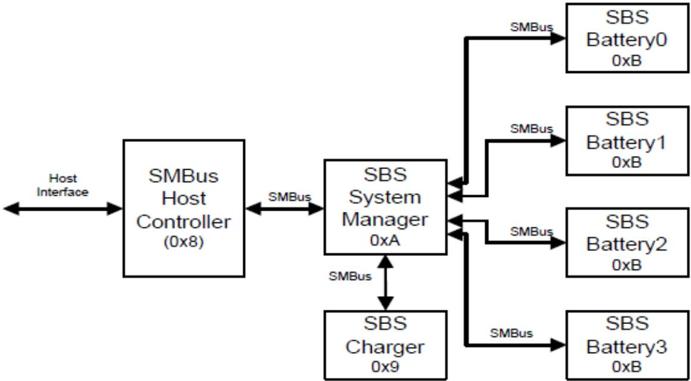  
Fig. 10.1: Typical Smart Battery Subsystem (SBS)

SMBus defines a fixed 7-bit slave address per device. This means that all batteries in the system have the same address (defined to be 0xB). The slave addresses associated with Smart Battery subsystem components are shown in the following table.

Table 10.1: Example SMBus Device Slave Addresses

<table><tr><td>SMBus Device Description</td><td>SMBus Slave Address (A0-A6)</td></tr><tr><td>SMBus Host Slave Interface</td><td>0x8</td></tr><tr><td>Smart Battery Charger/Charger Selector or Charger System Manager</td><td>0x9</td></tr><tr><td>Smart Battery System Manager or Smart Battery Selector</td><td>0xA</td></tr><tr><td>Smart Battery</td><td>0xB</td></tr></table>

Each SMBus device has up to 256 registers that are addressed through the SMBus protocol’s Command value. SMBus devices are addressed by providing the slave address with the desired register’s Command value. Each SMBus register can have non-linear registers; that is, command register 1 can have a 32-byte string, while command register 2 can have a byte, and command register 3 can have a word.

The SMBus host slave interface provides a standard mechanism for the host CPU to generate SMBus protocol commands that are required to communicate with SMBus devices (in other words, the Smart Battery components). ACPI defines such an SMB-HC that resides in embedded controller address space; however, an OS can support any SMB-HC that has a native SMB-HC device driver.

• Event notification for battery insertion and removal

• Event notification for AC power connected or disconnected

• Status of which Smart Battery is communicating with the SMB-HC

• Status of which Smart Battery(s) are powering the system

• Status of which Smart Battery(s) are connected to the charger

• Status of which Smart Batteries are present in the system

• Event notification when the Smart Battery System Manager switches from one power source to another

• Hardware-switching to an alternate Smart Battery when the Smart Battery supplying power runs low

• Hardware switching between battery-powered and AC-powered powered operation

The Smart Battery System Manager function can reside in a standalone SMBus slave device (Smart Battery System Manager that responds to the 0xA slave address), may be present within a smart charger device (Smart Battery Charger that responds to the 0x9 slave address), or may be combined within the embedded controller (that responds to the 0xA slave address). If both a Smart Battery Charger and a standalone Smart Battery System Manager are present in the same Smart Battery subsystem, then the driver assumes that the standalone Smart Battery System Manager is wired to the batteries.

The Smart Battery charger is an SMBus device that provides a standard programming model to control the charging of Smart Batteries present in a Smart Battery subsystem. For single battery systems, the Smart Battery Charger is also responsible for notifying the system of the battery and AC status.

The Smart Battery provides intelligent chemistry-independent power to the system. The Smart Battery is capable of informing the Smart Battery charger of its charging requirements (which provides chemistry independence) and providing battery status and alarm features needed for platform battery management.

## 10.1.1 ACPI Smart Battery Status Change Notification Requirements

The Smart Battery System Manager, the Smart Battery Selector, and the Smart Battery Charger each have an optional mechanism for notifying the system that the battery configuration or AC status has changed. ACPI requires that this interrupt mechanism be through the SMBus Alarm Notify mechanism.

For systems using an embedded controller as the SMBus host, a battery system device issues a status change notification by either mastering the SMBus to send the notification directly to the SMBus host, or by emulating it in the embedded controller. In either case, the process is the same. After the notification is received or emulated, the embedded controller asserts an SCI. The source of the SCI is identified by a GPE that indicates the SCI was caused by the embedded controller. The embedded controller’s status register alarm bit is set, indicating that the SMBus host received an alarm message. The Alarm Address Register contains the address of the SMBus device that originated the alarm and the Alarm Data Registers contain the contents of that device’s status register.

## 10.1.1.1 Smart Battery Charger

This requires a Smart Battery Charger, on a battery or AC status change, to generate an SMBus Alarm Notify. The contents of the Smart Battery Charger’s ChargerStatus() command register (0x13) is placed in the embedded controller’s Alarm Data Registers, the Smart Battery Charger’s slave address (See Note Below) (0x09) is placed in the embedded controller’s Alarm Address Register and the EC’s Status Register’s Alarm bit is set. The embedded controller then asserts an SCI.

## ò Note

The 1.0 SMBus protocol specification is ambiguous about the definition of the “slave address” written into the command field of the host controller. In this case, the slave address is actually the combination of the 7-bit slave address and the Write protocol bit. Therefore, bit 0 of the initiating device’s slave address is aligned to bit 1 of the host controller’s slave command register, bit 1 of the slave address is aligned to bit 2 of the controller’s slave command register, and so on.

## 10.1.1.2 Smart Battery Charger with optional System Manager or Selector

A Smart Battery Charger that contains the optional System Manager or Selector function (as indicated by the ChargerSpecInfo() command register, 0x11, bit 4) is required to generate an SMBus Alarm Notify on a battery or AC status change. The content of the Smart Battery Charger with an optional System Manager, the BatterySystemState() command register (0x21) (or in the case of an optional Selector, the SelectorState() (0x01) ), is placed in the EC’s Alarm Data Registers, the Smart Battery Charger’s slave address (0x09) is placed in the embedded controller’s Alarm Address Register, and the embedded controller’s Status Register’s Alarm bit is set. The embedded controller then asserts an SCI.

## 10.1.1.3 Smart Battery System Manager

The Smart Battery System Manager is required to generate an SMBus Alarm Notify on a battery or AC status change. The content of the Smart Battery System Manager’s BatterySystemState() command register (0x01) is placed in the EC’s Alarm Data Registers, the Smart Battery System Manager’s slave address (0x0A) is placed in the EC’s Alarm Address Register, and the embedded controller’s Status Register’s Alarm bit is set. The embedded controller then asserts an SCI.

## 10.1.1.4 Smart Battery Selector

The requirements for the Smart Battery Selector are the same as the requirements for the Smart Battery System Manager, with the exception that the contents of the SelectorState() command register (0x01) are used instead of BatterySystem-State(). The Smart Battery Selector is a subset of the Smart Battery System Manager and does not have the added support for simultaneous charge/discharge of multiple batteries. The System Manager is the preferred implementation.

## 10.1.2 Smart Battery Objects

The Smart Battery subsystem requires a number of objects to define its interface. These are summarized below:

Table 10.2: Smart Battery Objects

<table><tr><td>Object</td><td>Description</td></tr><tr><td>_HID</td><td>This is the hardware ID named object that contains a string. For Smart Battery subsystems, this object returns the value of “ACPI0002.” This identifies the Smart Battery subsystem to the Smart Battery driver.</td></tr><tr><td>_SBS</td><td>This is the Smart Battery named object that contains a DWORD. This named object returns the configuration of the Smart Battery.</td></tr></table>

## 10.1.3 \_SBS (Smart Battery Subsystem)

The \_SBS control method returns the configuration of the Smart Battery subsystem. This named object returns a DWORD value with a number from 0 to 4. If the number of batteries is greater than 0, then the Smart Battery driver assumes that a Smart Battery System Manager or Smart Battery Selector is present. If 0, then the Smart Battery driver assumes a single Smart Battery and neither a Smart Battery System Manager nor Smart Battery Selector is present.

## Arguments:

None

## Return Value:

The DWORD returned by \_SBS is an Integer containing the Smart Battery subsystem configuration:

• 0 - Maximum of one Smart Battery and no Smart Battery System Manager or Smart Battery Selector.

• 1 - Maximum of one Smart Battery and a Smart Battery System Manager or Smart Battery Selector.

• 2 - Maximum of two Smart Batteries and a Smart Battery System Manager or Smart Battery Selector.

• 3 - Maximum of three Smart Batteries and a Smart Battery System Manager or Smart Battery Selector.

• 4 - Maximum of four Smart Batteries and a Smart Battery System Manager or Smart Battery Selector.

The maximum number of batteries is for the entire system. Therefore, if the platform is capable of supporting four batteries, but only two are normally present in the system, then this field should return 4. Notice that a value of 0 indicates a maximum support of one battery and there is no Smart Battery System Manager or Smart Battery Selector present in the system

As the SMBus is not an enumerable bus, all devices on the bus must be declared in the ACPI name-space. As the Smart Battery driver understands Smart Battery, Smart Battery Charger, and Smart Battery System Manager or Smart Battery Selector; only a single device needs to be declared per Smart Battery subsystem. The driver gets information about the subsystem through the hardware ID (which defines a Smart Battery subsystem) and the number of Smart Batteries supported on this subsystem (\_SBS named object). The ACPI Smart Battery table indicates the energy levels of the platform at which the system should warn the user and then enter a sleeping state. The Smart Battery driver then reflects these as threshold alarms for the Smart Batteries.

A Smart Battery device declaration in the ACPI namespace requires the \_GLK object if potentially contentious accesses to device resources are performed by non-OS code. See \_GLK (Global Lock) for details about the \_GLK object.

## 10.1.3.1 Example: Single Smart Battery Subsystem

This section illustrates how to define a Smart Battery subsystem containing a single Smart Battery and charger. The platform implementation is illustrated below:

In this example, the platform is using an SMB-HC that resides within the embedded controller and meets the ACPI standard for an embedded controller interface and SMB-HC interface. The embedded controller interface sits at system I/O port addresses 0x62 and 0x66. The SMB-HC is at base address 0x80 within embedded controller address space (as defined by the ACPI embedded controller specification) and responds to events on query value 0x30.

In this example the Smart Battery subsystem only supports a single Smart Battery. The ASL code for describing this interface is shown below:

```txt
Device (EC0) {
    Name (_HID, EISAID("PNP0C09"))
    Name (_CRS,
    ResourceTemplate () { // port 0x62 and 0x66
    IO (Decode16, 0x62, 0x62, 0, 1),
    IO (Decode16, 0x66, 0x66, 0, 1)
```

(continues on next page)

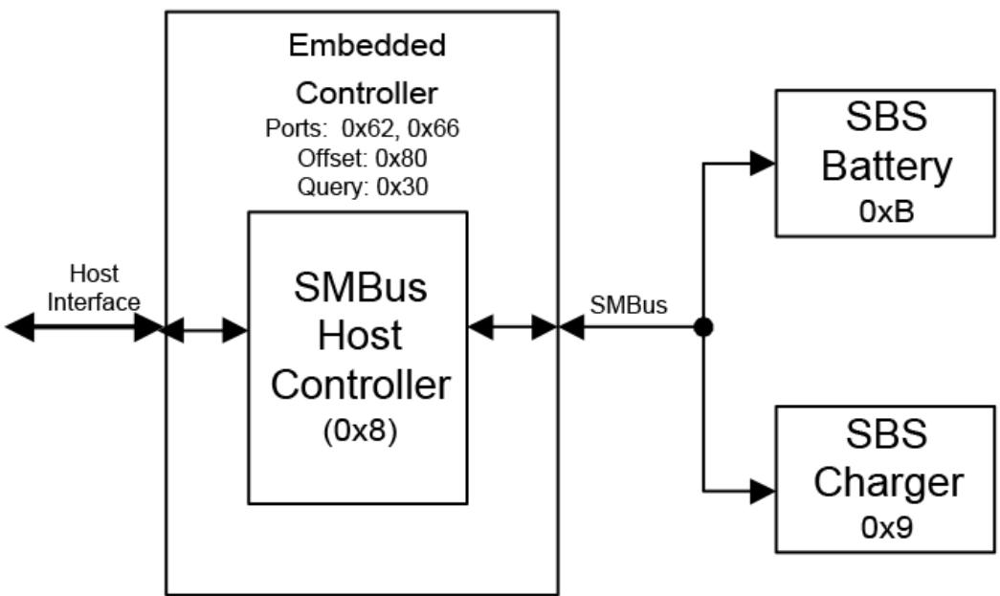  
Fig. 10.2: Single Smart Battery Subsystem

```c
(continued from previous page)
}
)
Name (_GPE, 0)
Device (SMB0) {
    Name (_HID, "ACPI0001") // Smart Battery Host Controller
    Name (_EC, 0x8030) // EC offset (0x80), Query (0x30)
    Device (SBS0) { // Smart Battery Subsystem
    Name (_HID, "ACPI0002") // Smart Battery Subsystem ID
    Name (_SBS, 0x1) // Indicates support for one battery
    } // end of SBS0
}
// end of SMB0
// end of EC
```

## 10.1.3.2 Multiple Smart Battery Subsystem: Example

This section illustrates how to define a Smart Battery subsystem that contains three Smart Batteries, a Smart Battery System Manager, and a Smart Battery Charger. The platform implementation is illustrated below:

In this example, the platform is using an SMB-HC that resides within the embedded controller and meets the ACPI standard for an embedded controller interface and SMB-HC interface. The embedded controller interface sits at system I/O port addresses 0x100 and 0x101. The SMB-HC resides at base address 0x90 within embedded controller address space (as defined by the ACPI embedded controller specification) and responds to events on query value 0x31.

In this example the Smart Battery subsystem supports three Smart Batteries. The Smart Battery Charger and Smart Battery System Manager reside within the embedded controller, meet the Smart Battery System Manager and Smart Battery Charger interface specification, and respond to their 7-bit addresses (0xA and 0x9 respectively). The ASL code for describing this interface is shown below:

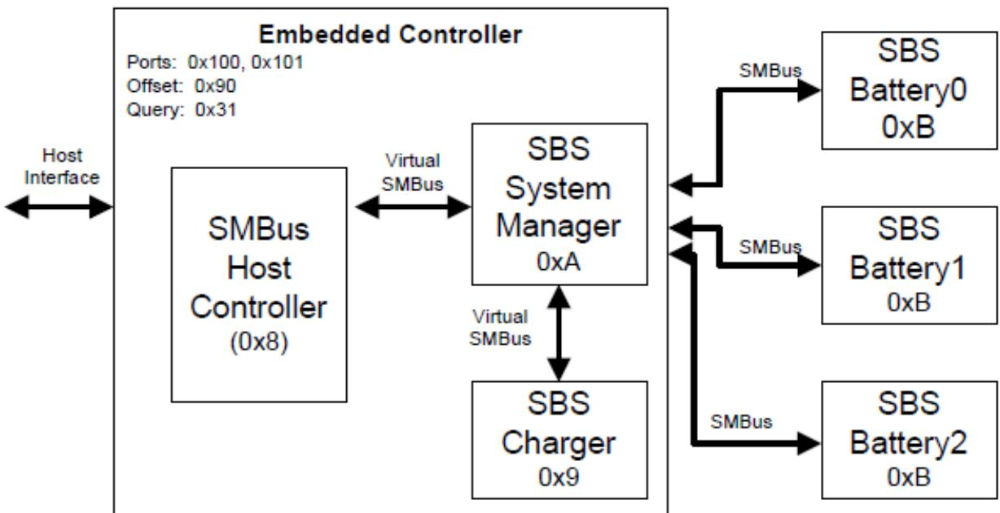

Fig. 10.3: Smart Battery Subsystem  
```c
Device (EC1) {
Name (_HID, EISAID("PNP0C09"))
Name (_CRS,
ResourceTemplate () {    // port 0x100 and 0x101
IO(Decode16, 0x100, 0x100, 0, 2)
}
)
Name (_GPE, 1)
Device (SMB1) {
Name (_HID, "ACPI0001")    // Smart Battery Host Controller
Name (_EC, 0x9031)    // EC offset (0x90), Query (0x31)
Device (SBS1){
Name (_HID, "ACPI0002")    // Smart Battery Subsystem ID
Name (_SBS, 0x3)    // Indicates support for three batteries
}
}    // end of SBS1
}    // end of SMB1
}    // end of EC
```

## 10.2 Control Method Batteries

The following section illustrates the operation and definition of the Control Method Battery.

The Hardware ID for a Control Method Battery is PNP0C0A.

## 10.2.1 Battery Events

The AML code handling an SCI for a battery event notifies the system of which battery’s status may have changed. The OS uses the \_BST control method to determine the current status of the batteries and what action, if any, should be taken (for more information about the \_BST control method, see Battery Control Methods ). The typical action is to notify applications monitoring the battery status to provide the user with an up-to-date display of the system battery state. But in some cases, the action may involve generating an alert or even forcing a system into a sleeping state. In any case, any changes in battery status should generate an SCI in a timely manner to keep the system power state UI consistent with the actual state of the system battery (or batteries).

Unlike most other devices, when a battery is inserted or removed from the system, the device itself (the battery bay) is still considered to be present in the system. For most systems, the \_STA for this device will always return a value with bits 0-3 set and will toggle bit 4 to indicate the actual presence of a battery (see Section 7.2.4 ). When this insertion or removal occurs, the AML code handler for this event should issue a Notify(battery\_device, 0x81) to indicate that the static battery information has changed. For systems that have battery slots in a docking station or batteries that cannot be surprise-removed, it may be beneficial or necessary to indicate that the entire device has been removed. In this case, the standard methods and notifications described in Device Insertion, Removal, and Status Objects should be used.

When the present state of the battery has changed or when the trip point set by the \_BTP control method is reached or crossed, the hardware will assert a general purpose event. The AML code handler for this event issues a Notify(battery\_device, 0x80) on the battery device. This notification is also sent when the Status Flags returned from \_BMD change.

In the case where the remaining battery capacity becomes critically low, the AML code handler issues a Notify(battery\_device, 0x80) and reports the battery critical flag in the \_BST object. The OS performs an emergency shutdown. For a full description of the critical battery state, see Low Battery Levels.

Sometimes the value to be returned from \_BST or \_BIF will be temporarily unknown. In this case, the method may return the value 0xFFFFFFFF as a placeholder. When the value becomes known, the appropriate notification (0x80 for \_BST or 0x81 for BIF) should be issued, in like manner to any other change in the data returned by these methods. This will cause OSPM to re-evaluate the method–obtaining the correct data value.

When one or more of the status flags returned by the \_BMD control method change, AML code issues a Notify(battery\_device, 0x82) on the battery device unless this change occurs during a call to \_BMC and the value of the status flags in \_BMD match the value passed in to \_BMC. If the value of the status bits cannot be set to reflect the action requested by the executing \_BMC, the AML code will issue this notification. For example, calling \_BMC with bit 0 set to initiate a calibration cycle while AC power is not available will cause AML to issue a Notify(battery\_device, 0x82).

A user can program peak power delivery thresholds in the \_BPT control method for each battery. When a threshold is crossed, the platform firmware such as the embedded controller will assert an SCI interrupt. The AML event handler for this interrupt issues a Notify(<battery\_device>, 0x83) on the battery device.

## 10.2.2 Battery Control Methods

The Control Method Battery is a battery with an AML code interface between the battery and the host PC. The battery interface is completely accessed by AML code control methods, allowing the OEM to use any type of battery and any kind of communication interface supported by ACPI. OSPM requires accurate battery data to perform optimal power management policy and to provide the end user with a meaningful estimation of remaining battery life. As such, control methods that return battery information should calculate this information rather than return hard coded data.

A Control Method Battery is described as a device object. Each device object supporting the Control Method Battery interface contains the following additional control methods. When there are two or more batteries in the system, each battery will have an independent device object in the namespace.

Table 10.3: Battery Control Methods

<table><tr><td>Object</td><td>Description</td></tr><tr><td>_BCT</td><td>Returns battery estimated charging time.</td></tr><tr><td>_BIF</td><td>Returns static information about a battery (in other words, model number, serial number, design voltage, and so on).</td></tr><tr><td>_BIX</td><td>Returns extended static information about a battery (in other words, model number, serial number, design voltage, and so on).</td></tr><tr><td>_BMA</td><td>Sets the averaging interval of the battery capacity measurement, in milliseconds.</td></tr><tr><td>_BMC</td><td>Control calibration and charging.</td></tr><tr><td>_BMD</td><td>Returns battery information related to battery recalibration and charging control.</td></tr><tr><td>_BMS</td><td>Sets the sampling time of the battery capacity measurement, in milliseconds.</td></tr><tr><td>_BPC</td><td>Returns static variables that are associated with system power characteristics on the battery path and power threshold support settings.</td></tr><tr><td>_BPS</td><td>Returns the power delivery capabilities of the battery at the present time.</td></tr><tr><td>_BPT</td><td>Control method to set a Battery Power Threshold.</td></tr><tr><td>_BST</td><td>Returns the current battery status (in other words, dynamic information about the battery, such as whether the battery is currently charging or discharging, an estimate of the remaining battery capacity, and so on).</td></tr><tr><td>_BTH</td><td>Communicates battery thermal throttle limit set by battery thermal zone.</td></tr><tr><td>_BTM</td><td>Returns battery estimated runtime at the present average rate of drain, or the runtime at a specified rate.</td></tr><tr><td>_BTP</td><td>Sets the Battery Trip point, which generates an SCI when batterycapacity reaches the specified point.</td></tr><tr><td>_OSC</td><td>OSPM Capabilities conveyance for batteries.</td></tr><tr><td>_PCL</td><td>List of pointers to the device objects representing devices powered by the battery - see Section 10.3.2</td></tr><tr><td>_STA</td><td>Returns general status of the battery - see Section 6.3.7.</td></tr></table>

A Control Method Battery device declaration in the ACPI namespace requires the \_GLK object if potentially contentious accesses to device resources are performed by non-OS code. See \_GLK (Global Lock) for details about the \_GLK object.

## 10.2.2.1 \_BCT (Battery Charge Time)

When the battery is charging, this optional object returns the estimated time from present to when it is charged to a given percentage of Last Full Charge Capacity.

## Arguments:

Arg0 - ChargeLevel (Integer (DWORD)): The queried charge level in units of percent of Last Full Charge Capacity. For example: 96 refers to 96% of Last Full Charge Capacity. Valid values are 1 - 100 (0x00000001 - 0x00000064).

## Return Value:

An Integer (DWORD) containing a result code as follows:

0x00000000 - Specified targeted charging capacity is smaller than the current remaining capacity or larger than 100% of Last Full Charge Capacity. 0x00000001 - 0xFFFFFFFE - Estimated charging time in seconds 0xFFFFFFFF - Charging time is unknown

## 10.2.2.2 \_BIF (Battery Information)

This object returns the static portion of the Control Method Battery information. This information remains constant until the battery is changed. This object is deprecated in ACPI 4.0. The \_BIX object provides expanded battery information and includes all of the information provide by \_BIF. See \_BIX (Battery Information Extended) ).

## Arguments:

None

## Return Value:

A Package containing the battery information as described below.

## Return Value Information:

\_BIF returns a package in the format shown below:

<table><tr><td colspan="2">Package {</td></tr><tr><td>Power Unit</td><td>// Integer (DWORD)</td></tr><tr><td>Design Capacity</td><td>// Integer (DWORD)</td></tr><tr><td>Last Full Charge Capacity</td><td>// Integer (DWORD)</td></tr><tr><td>Battery Technology</td><td>// Integer (DWORD)</td></tr><tr><td>Design Voltage</td><td>// Integer (DWORD)</td></tr><tr><td>Design Capacity of Warning</td><td>// Integer (DWORD)</td></tr><tr><td>Design Capacity of Low</td><td>// Integer (DWORD)</td></tr><tr><td>Battery Capacity Granularity 1</td><td>// Integer (DWORD)</td></tr><tr><td>Battery Capacity Granularity 2</td><td>// Integer (DWORD)</td></tr><tr><td>Model Number</td><td>// String (ASCIIZ)</td></tr><tr><td>Serial Number</td><td>// String (ASCIIZ)</td></tr><tr><td>Battery Type</td><td>// String (ASCIIZ)</td></tr><tr><td>OEM Information</td><td>// String (ASCIIZ)</td></tr><tr><td colspan="2">}</td></tr></table>

Table 10.4: BIF Return Package Values

<table><tr><td>Field</td><td>Format</td><td>Description</td></tr><tr><td>Power Unit</td><td>Integer (DWORD)</td><td>Indicates the units used by the battery to report its capacity and charge/discharge rate information to the OS.0x00000000 - Capacity information is reported in [mWh] and charge/discharge rate information in [mW].0x00000001 - Capacity information is reported in [mAh] and charge/discharge rate information in [mA].</td></tr><tr><td>Design Capacity</td><td>Integer (DWORD)</td><td>Battery&#x27;s design capacity. Design Capacity is the nominal capacity of a new battery. The Design Capacity value is expressed as power [mWh] or current [mAh] depending on the Power Unit value.0x000000000 - 0x7FFFFFFF (in [mWh] or [mAh])0xFFFFFFFF - Unknown design capacity</td></tr><tr><td>Last Full Charge Capacity</td><td>Integer (DWORD)</td><td>Predicted battery capacity when fully charged. The Last Full Charge Capacity value is expressed as power (mWh) or current (mAh) depending on the Power Unit value.0x000000000h - 0x7FFFFFFF (in [mWh] or [mAh])0xFFFFFFFF - Unknown last full charge capacity</td></tr><tr><td>Battery Technology</td><td>Integer (DWORD)</td><td>0x00000000 - Primary (for example, non-rechargeable)0x00000001 - Secondary (for example, rechargeable)</td></tr><tr><td>Design Voltage</td><td>Integer (DWORD)</td><td>Nominal voltage of a new battery.0x000000000 - 0x7FFFFFFF in [mV]0xFFFFFFFF - Unknown design voltage</td></tr><tr><td>Design capacity of Warning</td><td>Integer (DWORD)</td><td>OEM-designed battery warning capacity. See Low Battery Levels0x000000000 - 0x7FFFFFFF in [mWh] or [mAh]</td></tr><tr><td>Design Capacity of Low</td><td>Integer (DWORD)</td><td>OEM-designed low battery capacity. See Low Battery Levels0x000000000 - 0x7FFFFFFF in [mWh] or [mAh]</td></tr><tr><td>Battery Capacity Granularity 1</td><td>Integer (DWORD)</td><td>Battery capacity granularity between low and warning in [mAh] or [mWh]. That is, this is the smallest increment in capacity that the battery is capable of measuring. See note below for more details</td></tr></table>

continues on next page

Table 10.4 – continued from previous page

<table><tr><td>Field</td><td>Format</td><td>Description</td></tr><tr><td>Battery Capacity Granularity 2</td><td>Integer (DWORD)</td><td>Battery capacity granularity between warning and Full in [mAh] or [mWh]. That is, this is the smallest increment in capacity that the battery is capable of measuring. This may be a different value than Battery Capacity Granularity 1 to accommodate systems where the granularity accuracy may change depending on the battery level. See note below for more details.</td></tr><tr><td>Model Number</td><td>String (ASCIIZ)</td><td>OEM-specific Control Method Battery model number</td></tr><tr><td>Serial Number</td><td>String (ASCIIZ)</td><td>OEM-specific Control Method Battery serial number</td></tr><tr><td>Battery Type</td><td>String (ASCIIZ)</td><td>The OEM-specific Control Method Battery type</td></tr><tr><td>OEM Information</td><td>String (ASCIIZ)</td><td>OEM-specific information for the battery that the UI uses to display the OEM information about the Battery. If the OEM does not support this information, this field should contain a NULL string.</td></tr></table>

## Additional Notes:

• A secondary-type battery should report the corresponding capacity (except for Unknown).

• On a multiple-battery system, all batteries in the system should return the same granularity.

• Operating systems prefer these control methods to report data in terms of power (watts).

• On a multiple-battery system, all batteries in the system must use the same power unit.

• The definition of battery capacity granularity has been clarified. For OSPM to determine if systems support the clarified definition of battery capacity granularity, OSPM may evaluate an \_OSC method at

• the battery scope to indicate support for this capability, and for the platform to indicate if it supports these extended capabilities.

## 10.2.2.3 \_BIX (Battery Information Extended)

The \_BIX object returns the static portion of the Control Method Battery information. This information remains constant until the battery is changed. The \_BIX object returns all information available via the \_BIF object plus additional battery information. The \_BIF object is deprecated in lieu of \_BIX in ACPI 4.0.

## Arguments:

None

## Return Value:

A Package containing the battery information as described below

Return Value Information:

\_BIX returns a package in the format below.

```go
Package {
    // ASCIIZ is ASCII character string terminated with a 0x00.
    Revision    // Integer
    Power Unit    // Integer (DWORD)
    Design Capacity    // Integer (DWORD)
    Last Full Charge Capacity    // Integer (DWORD)
    Battery Technology    // Integer (DWORD)
    Design Voltage    // Integer (DWORD)
    Design Capacity of Warning    // Integer (DWORD)
```

(continues on next page)

(continued from previous page)

<table><tr><td>Design Capacity of Low</td><td>//Integer (DWORD)</td></tr><tr><td>Cycle Count</td><td>//Integer (DWORD)</td></tr><tr><td>Measurement Accuracy</td><td>//Integer (DWORD)</td></tr><tr><td>Max Sampling Time</td><td>//Integer (DWORD)</td></tr><tr><td>Min Sampling Time</td><td>//Integer (DWORD)</td></tr><tr><td>Max Averaging Interval</td><td>//Integer (DWORD)</td></tr><tr><td>Min Averaging Interval</td><td>//Integer (DWORD)</td></tr><tr><td>Battery Capacity Granularity 1</td><td>//Integer (DWORD)</td></tr><tr><td>Battery Capacity Granularity 2</td><td>//Integer (DWORD)</td></tr><tr><td>Model Number</td><td>//String (ASCIIZ)</td></tr><tr><td>Serial Number</td><td>//String (ASCIIZ)</td></tr><tr><td>Battery Type</td><td>//String (ASCIIZ)</td></tr><tr><td>OEM Information</td><td>//String (ASCIIZ)</td></tr><tr><td>Battery Swapping Capability</td><td>//Integer (DWORD)</td></tr><tr><td>}</td><td></td></tr></table>

Table 10.5: BIX Return Package Values

<table><tr><td>Field</td><td>Format</td><td>Description</td></tr><tr><td>Revision</td><td>Integer</td><td>Current revision is: 1</td></tr><tr><td>Power Unit</td><td>Integer (DWORD)</td><td></td></tr><tr><td></td><td></td><td>Indicates the units used by the battery to report its capacity and charge/discharge rate information to the OS.0x00000000 - Capacity information is reported in [mWh] and charge/discharge rate information in [mW].0x00000001 - Capacity information is reported in [mAh] and charge/discharge rate information in [mA].</td></tr><tr><td>Design Capacity</td><td>Integer (DWORD)</td><td></td></tr><tr><td></td><td></td><td>Battery&#x27;s design capacity. Design Capacity is the nominal capacity of a new battery. The Design Capacity value is expressed as power [mWh] or current [mAh] depending on the Power Unit value.0x000000000 - 0x7FFFFFFF (in [mWh] or [mAh])0xFFFFFFFF - Unknown design capacity</td></tr><tr><td>Last Full Charge Ca-pacity</td><td>Integer (DWORD)</td><td></td></tr><tr><td></td><td></td><td>Predicted battery capacity when fully charged. The Last Full Charge Capacity value is expressed as power (mWh) or current (mAh) depending on the Power Unit value.0x000000000h - 0x7FFFFFFF (in [mWh] or [mAh])0xFFFFFFFF - Unknown last full charge capacity</td></tr><tr><td>Battery Technology</td><td>Integer (DWORD)</td><td></td></tr><tr><td></td><td></td><td>0x00000000 - Primary (for example, non-rechargeable)0x00000001 - Secondary (for example, rechargeable)</td></tr></table>

continues on next page

Table 10.5 – continued from previous page

<table><tr><td>Field</td><td>Format</td><td>Description</td></tr><tr><td>Design Voltage</td><td>Integer (DWORD)</td><td>Nominal voltage of a new battery.0x000000000 - 0x7FFFFFFF in [mV]0xFFFFFFFF - Unknown design voltage</td></tr><tr><td>Design capacity of Warning</td><td>Integer (DWORD)</td><td>OEM-designed battery warning capacity. See Low Battery Levels0x000000000 - 0x7FFFFFFF in [mWh] or [mAh]</td></tr><tr><td>Design Capacity of Low</td><td>Integer (DWORD)</td><td>OEM-designed low battery capacity. See Low Battery Levels0x000000000 - 0x7FFFFFFF in [mWh] or [mAh]</td></tr><tr><td>Cycle Count</td><td>Integer (DWORD)</td><td>The number of cycles the battery has experienced. A cycle is defined as: An amount of discharge approximately equal to the value of Design Capacity.0x000000000 - 0xFFFFFFFF0xFFFFFFFF - Unknown cycle count</td></tr><tr><td>Measurement Accuracy</td><td>Integer (DWORD)</td><td>The accuracy of the battery capacity measurement, in thousandth of a percent. (0% - 100.000%) For example, The value 80000 would mean 80% accuracy.</td></tr><tr><td>Max Sampling Time</td><td>Integer (DWORD)</td><td>The sampling time is the duration between two consecutive measurements of the battery&#x27;s capacities specified in _BST, such as present rate and remaining capacity. If the OSPM makes two succeeding readings through _BST beyond the duration, two different results will be returned. The Max Sampling Time is the maximum sampling time the battery can support, in milliseconds. 0xFFFFFFFF is returned if the information is unavailable.</td></tr><tr><td>Min Sampling Time</td><td>Integer (DWORD)</td><td>The Min Sampling Time is the minimum sampling time the battery can support, in milliseconds. 0xFFFFFFFF is returned if the information is unavailable.</td></tr><tr><td>Max Averaging Interval</td><td>Integer (DWORD)</td><td>The Average Interval is the length of time (in milliseconds) within which the battery averages the capacity measurements specified in _BST, such as remaining capacity and present rate. The Sampling time specifies the frequency of measurements, and the average interval specifies the width of the time window of every measurement. This field indicates the maximum Average Interval that the battery supports.</td></tr><tr><td>Min Averaging Interval</td><td>Integer (DWORD)</td><td>This field indicates the minimum Average Interval that the battery supports</td></tr><tr><td>Battery Capacity Granularity 1</td><td>Integer (DWORD)</td><td>Battery capacity granularity between low and warning in [mAh] or [mWh]. That is, this is the smallest increment in capacity that the battery is capable of measuring. See note below for more details</td></tr></table>

continues on next page

Table 10.5 – continued from previous page

<table><tr><td>Field</td><td>Format</td><td>Description</td></tr><tr><td>Battery Capacity Granularity 2</td><td>Integer (DWORD)</td><td>Battery capacity granularity between warning and Full in [mAh] or [mWh]. That is, this is the smallest increment in capacity that the battery is capable of measuring. This may be a different value than Battery Capacity Granularity 1 to accommodate systems where the granularity accuracy may change depending on the battery level. See note below for more details.</td></tr><tr><td>Model Number</td><td>String (ASCIIZ)</td><td>OEM-specific Control Method Battery model number</td></tr><tr><td>Serial Number</td><td>String (ASCIIZ)</td><td>OEM-specific Control Method Battery serial number</td></tr><tr><td>Battery Type</td><td>String (ASCIIZ)</td><td>The OEM-specific Control Method Battery type</td></tr><tr><td>OEM Information</td><td>String (ASCIIZ)</td><td>OEM-specific information for the battery that the UI uses to display the OEM information about the Battery. If the OEM does not support this information, this field should contain a NULL string.</td></tr><tr><td>Battery Swapping Capability</td><td>Integer (DWORD)</td><td>0x00000000 Non swappable battery (for example, sealed internal battery not accessible to user)0x00000001 Cold swappable battery, i.e. batteries that require system to be shut down in order to replace the battery while on DC power (for example, phone and laptop batteries accessible to user)0x00000010 Hot swappable battery, i.e. batteries that do not require the system to be shut down in order to replace/remove the battery while on DC power (for example, accessory batteries, cd tray batteries, external batteries, dock batteries, keyboard batteries)</td></tr></table>

## ò Note

A secondary-type battery should report the corresponding capacity (except for Unknown).

On a multiple-battery system, all batteries in the system should return the same granularity.

Operating systems prefer these control methods to report data in terms of power (watts).

On a multiple-battery system, all batteries in the system must use the same power unit.

The definition of battery capacity granularity has been clarified. For OSPM to determine if systems support the clarified definition of battery capacity granularity, OSPM may evaluate an \_OSC method at the battery scope to indicate support for this capability, and for the platform to indicate if it supports these extended capabilities.

## 10.2.2.4 \_BMA (Battery Measurement Averaging Interval)

This object is used to set the averaging interval of the battery capacity measurement, in milliseconds. The Battery Measurement Averaging Interval is the length of time within which the battery averages the capacity measurements specified in \_BST, such as remaining capacity and present rate.

The OSPM may read the Max Average Interval and Min Average Interval with \_BIX during boot time, and set a specific average interval within the range with \_BMA.

Arguments:(1)

Arg0 - AveragingInterval (Integer(DWORD)) the averaging interval of battery capacity measurement:

$$
0 x 0 0 0 0 0 0 0 1 - 0 x F F F F F F F F (i n u n i t s o f m i l l i s e c o n d)
$$

## Return Value:

An Integer (DWORD) containing a result code as follows:

0x00000000 - Success.

0x00000001 - Failure to set Battery Measurement Averaging Interval because it is out of the battery’s measurement capability.

0x00000002 - 0xFFFFFFFF - Reserved.

## 10.2.2.5 \_BMC (Battery Maintenance Control)

This object is used to initiate calibration cycles or to control the charger and whether or not a battery is powering the system. This object is only present under a battery device if the \_BMD Capabilities Flags field has bit 0, 1, 2, or 5 set.

## Arguments:(1)

Arg0 - An Integer containing feature control flags:

Bit [0] - Set to initiate an AML controlled calibration cycle. Clear to end the calibration cycle

Bit [1] - Set to disable charging. Clear to enable charging

Bit [2] - Set to allow the battery to discharge while AC power is available. Clear to prevent discharging while AC power is available

Bit [3] – Set to request suspension of Battery Charge Limiting mode

## Return Value:

None

See Battery Calibration for more information.

Evaluating this object with bit0 set will initiate an AML controlled recalibration cycle if \_BMD indicates that this is supported. The calibration cycle is controlled by the platform and will typically include disabling the AC adapter and discharging the battery, then charging the battery. While the battery is charging, the platform runtime firmware should set Bit [4] of the Status flags returned by \_BMD if it is possible to put the system into standby during calibration to speed up charging. Evaluating this with Bit [0] equal to 0 will abort the calibration cycle if one is in process. If the platform runtime firmware determines that the calibration cycle must be aborted (for example AC power is lost), or the calibration completes successfully, the platform runtime firmware will end the cycle automatically, clear the \_BMD Status Flag Bit [0], and send a notify 0x82. While the calibration cycle is in process, the battery will report data normally, so the OS must disable battery alarms.

Bit [1], Bit [2], and Bit [3] may not be used in conjunction with the AML controlled calibration cycle. Having Bit [0] set will override Bit [1], Bit [2], and Bit [3]. Bit [1] will prevent the battery from charging even though AC power is connected. Bit [2] will allow the system to draw its power from the battery even though AC power is available. When the battery is no longer capable of delivering current, this setting is automatically cleared, and the system will continue running of AC power without interruption. In addition, if AC power is lost this bit will be cleared. When AC power comes back, the OS must set the bit again if the user wants to continue discharging. When the system clears this bit automatically, it will result in a change in the Status Flags returned by \_BMD. This will cause a notify 0x82. Bit [1] is only cleared automatically if an AML controlled calibration cycle is initiated.

When a battery is discharging because Bit [2] is set, the \_PSR method of the AC adapter device will report that AC is ofline because the system is not running of of the AC adapter. If the batteries are controlled individually (Bit [3] of the \_BMD Capabilities Flags), setting either battery to discharge will cause \_PSR to report AC ofline. If more than one battery in the system has Bit [2] set to discharge the battery, it is up to the system to decide which battery to discharge, so only on a system that discharges the batteries one at a time, a battery with Bit2 set may not be discharging if another battery in the system is being discharged.

If Batteries are not controlled individually, calling \_BMC will initiate calibration, disable charge, and/or allow discharge on all batteries in the system. The state of these batteries will be reflected in the \_BMD Status Flags for all batteries.

Bit [3] is set to request temporary suspension of Battery Charge Limiting. This bit may not be set unless Bit [6] of the \_BMD Capabilities Flags is also set.

## 10.2.2.6 \_BMD (Battery Maintenance Data)

This optional object returns information about the battery’s capabilities and current state in relation to battery calibration and charger control features. If the \_BMC object (defined below) is present under a battery device, this object must also be present. Whenever the Status Flags value changes, AML code will issue a Notify(battery\_device, 0x82). In addition, AML will issue a Notify(battery\_device, 0x82) if evaluating \_BMC did not result in causing the Status Flags to be set as indicated in that argument to \_BMC. AML is not required to issue Notify(battery\_device, 0x82) if the Status Flags change while evaluating \_BMC unless the change does not correspond to the argument passed to \_BMC.

## Arguments:

None

## Return Value:

A Package containing the battery maintenance data as described below

## Return Value Information:

\_BMD returns a package in the format below:

<table><tr><td colspan="2">Package {</td></tr><tr><td>Status Flags</td><td>// Integer (DWORD)</td></tr><tr><td>Capability Flags</td><td>// Integer (DWORD)</td></tr><tr><td>Recalibrate Count</td><td>// Integer (DWORD)</td></tr><tr><td>Quick Recalibrate Time</td><td>// Integer (DWORD)</td></tr><tr><td>Slow Recalibrate Time</td><td>// Integer (DWORD)</td></tr><tr><td>}</td><td></td></tr></table>

Table 10.6: BMD Return Package Values

<table><tr><td>Field</td><td>Format</td><td>Description</td></tr><tr><td>Status Flags</td><td>Integer (DWORD)</td><td>Bit values.Bit [0] is mutually exclusive with bit [1] and bit [2]. If the charger is being manually controlled, there cannot be an AML controlled calibration cycle.Bit[0] - 1 indicates the battery is running an AML controlled calibration cycleBit[1] - 1 indicates that charging has been disabled.Bit[2] - 1 indicates the battery is configured to discharge while AC power is available.Bit[3] - 1 indicates that the battery should be recalibrated.Bit[4] - 1 indicates that the OS should put the system into standby to speed charging during a calibration cycle. This is optional (based on user preference) if “Slow Recalibrate Time” is not equal to 0x00000000.Bit[5] – 1 indicates that Battery Charge Limiting cannot be suspended due to Thermal Conditions.Bit[6] – 1 indicates that Battery Charge Limiting cannot be suspended for Battery Protection reasons.Bit [31:7] - reserved.</td></tr><tr><td>Capability Flags</td><td>Integer (DWORD)</td><td>Bit values that describe the capabilities of the battery system. These bits allows a battery system with more limited capabilities to still be calibrated by OSPM.Bit[0] - 1 indicates that an AML controlled calibration cycle is supported.Bit[1] - 1 indicates that disabling the charger is supported.Bit[2] - 1 indicates that discharging while running on AC is supported.Bit[3] - 1 indicates that calling_BMC for one battery will affect the state of all batteries in the system. This is for battery systems that cannot control batteries individually.Bit[4] - 1 indicates that calibration should be done by first fully charging the battery and then discharging it. Not setting this bit will indicate that calibration can be done by simply discharging the battery.Bit[5] – 1 indicates that Battery Charge Limiting suspension is supported.Bits[31:6] - Reserved</td></tr></table>

continues on next page

Table 10.6 – continued from previous page

<table><tr><td colspan="2">Field</td><td>Format</td><td>Description</td></tr><tr><td colspan="2">Recalibrate Count</td><td>Integer (DWORD)</td><td>This is used by battery systems that can&#x27;t detect when calibration is required, but wish to recommend that the battery should be calibrated after a certain number of cycles. Counting the number of cycles and partial cycles is done by the OS.0x00000000 - Only calibrate when Status Flag bit [3] is set.0x00000000-0xFFFFFFF - calibrate battery after detecting this many battery cycles.</td></tr><tr><td>Quick Time</td><td>Recalibrate</td><td>Integer (DWORD)</td><td>Returns the estimated time it will take to calibrate the battery if the system is put into standby whenever Status Flags bit [4] is set.While the AML controlled calibration cycle is in progress, this returns the remaining time in the calibration cycle.0x000000000 - indicates that standby while calibrating the battery is not supported. The system should remain in S0 until calibration is completed.0x00000001 - 0xFFFFFFF - estimated recalibration time in seconds.0xFFFFFFF - indicates that the estimated time to recalibrate the battery is unknown.</td></tr><tr><td>Slow Time</td><td>Recalibrate</td><td>Integer (DWORD)</td><td>Returns the estimated time it will take to calibrate the battery if Status Flag Bit [4] is ignored. While the AML controlled calibration cycle is in progress, this returns the remaining time in the calibration cycle.0x000000000 - indicates that battery calibration may not be successful if Status Flags Bit [4] is ignored.0x00000001 - 0xFFFFFFF - estimated recalibration time in seconds.0xFFFFFFF - indicates that the estimated time to recalibrate the battery is unknown.</td></tr></table>

See Battery Calibration for more information.

The Capability Flags and Recalibration Count are used to indicate what functions are controlled by AML and what functions are controlled by OSPM as described in section 3.9.5, “Battery Calibration”. If the system does not implement an AML controlled calibration cycle (bit [0]), it may indicate using bit [1] and bit [2] that the OS can control a generic calibration cycle without prompting the user to remove the power cord. Recalibration Count may be used to indicate that the platform runtime firmware cannot determine when calibration should be performed so bit 3 of the Status Flags will never be set. In that case, OSPM will attempt to count the number of cycles.

Bit [3] is used by systems that do not have individual control over the batteries and can only perform calibration on all batteries in the system at once. On such a system, if one battery requests calibration and another battery does not, the OS may suggest that the user remove the battery that doesn’t need calibration, before initiating the calibration cycle. When this bit is set, reading the Recalibrate Time from either battery should give the time to recalibrate all batteries present in the system.

## 10.2.2.7 \_BMS (Battery Measurement Sampling Time)

This object is used to set the sampling time of the battery capacity measurement, in milliseconds.

The Sampling Time is the duration between two consecutive measurements of the battery’s capacities specified in \_BST, such as present rate and remaining capacity. If the OSPM makes two succeeding readings through \_BST beyond the duration, two diferent results will be returned.

The OSPM may read the Max Sampling Time and Min Sampling Time with \_BIX during boot time, and set a specific sampling time within the range with \_BMS.

## Arguments:(1)

Arg0 - SamplingTime (Integer(DWORD)) the sampling time of battery capacity measurement:

```txt
0x00000001 - 0xFFFFFFF (in units of millisecond)
```

## Return Value:

An Integer (DWORD) containing a result code as follows:

• 0x00000000 - Success.

• 0x00000001 - Failure to set Battery Measurement Sampling Time because it is out of the battery’s measurement capability.

• 0x00000002 - 0xFFFFFFFF - Reserved.

## 10.2.2.8 \_BPC (Battery Power Characteristics)

This optional object returns static values that are used to configure power threshold support in the platform firmware. OSPM can use the information to determine the capabilities of power delivery and threshold support for each battery in the system.

## Arguments:

None

## Return Value:

A Package containing the system power characteristics on the battery path and the power threshold support in the platform firmware like the Embedded Controller.

## Return Value Information:

\_BPC returns a package in the format below:

```txt
Package () {
Revision, // Integer
Power Threshold Support, // Integer
Max Instantaneous Peak Power Threshold, // Integer
Max Sustainable Peak Power Threshold // Integer
}
```

Table 10.7: \_BPC Return Package Values

<table><tr><td>Field</td><td>Format</td><td>Description</td></tr><tr><td>Revision</td><td>Integer</td><td>Current revision is 1</td></tr></table>

continues on next page

Table 10.7 – continued from previous page

<table><tr><td>Field</td><td>Format</td><td>Description</td></tr><tr><td>Power Threshold Support Capability</td><td>Integer</td><td>This is the power threshold support capability that must be declared by the platform firmware to indicate what power threshold it supports. Refer to the table below for more details.</td></tr><tr><td>Maximum Instantaneous Peak Power Threshold Value</td><td>Integer</td><td>The maximum threshold for instantaneous peak output power of the battery. This defines the maximum threshold setting for use as an input to _BPT. The unit for this value is mW or mA, based on the Power Unit value returned by _BIX.</td></tr><tr><td>Maximum Sustainable Peak Power Threshold Value</td><td>Integer</td><td>The maximum threshold for sustainable peak output power of the battery. This defines the maximum threshold setting for use as an input to _BPT. The unit for this value is mW or mA, based on the Power Unit value returned by _BIX.</td></tr></table>

Table 10.8: Battery Power Threshold Support Capability

<table><tr><td>Bit</td><td>Interpretation</td></tr><tr><td>[1:0]</td><td></td></tr><tr><td></td><td>0 – The platform firmware does not support thresholds for the battery Peak Power.</td></tr><tr><td></td><td>1 – The platform firmware supports the threshold for the battery Instantaneous Peak Power.</td></tr><tr><td></td><td>2 – The platform firmware supports the threshold for the battery Sustainable Peak Power.</td></tr><tr><td></td><td>3 – The platform firmware supports the threshold for both the battery Instantaneous Peak Power and the Sustainable Peak Power.</td></tr><tr><td>[31:2]</td><td></td></tr><tr><td></td><td>Reserved (must be 0)</td></tr></table>

## 10.2.2.9 \_BPS (Battery Power State)

This optional object returns the power delivery capabilities of the battery at the present time. If multiple batteries are present within the system, the sum of peak power levels from each battery can be used to determine the total available power.

None

Return Value:

A Package containing the battery power delivery capabilities as described below

<table><tr><td colspan="2">Package () {</td></tr><tr><td>Revision,</td><td>// Integer</td></tr><tr><td>Instantaneous Peak Power Level,</td><td>// Integer</td></tr><tr><td>Instantaneous Peak Power Period,</td><td>// Integer</td></tr><tr><td>Sustainable Peak Power Level,</td><td>// Integer(continued from previous page)</td></tr><tr><td>Sustainable Peak Power Period, // Integer</td><td></td></tr><tr><td>}</td><td></td></tr></table>

Table 10.9: \_BPS Return Package Values

<table><tr><td colspan="2">Field</td><td>Format</td><td>Description</td></tr><tr><td colspan="2">Revision</td><td>Integer</td><td>Current revision is 1</td></tr><tr><td>Instantaneous Power Level</td><td>Peak</td><td>Integer</td><td>The instantaneous peak output power of the battery in mW or mA, based on the Power Unit value returned by_BIX. The time period is specified in the “Instantaneous Peak Power Period” variable. This value shall account for the battery resistances, and the minimum system voltage. If this feature is not supported, then the platform firmware shall report Zero for this field.</td></tr><tr><td>Instantaneous Power Period</td><td>Peak</td><td>Integer</td><td>The time period in milliseconds that the battery can supply as specified in the “Instantaneous Peak Power Level” variable. If this feature is not supported, then the platform firmware shall report Zero for this field.</td></tr><tr><td>Sustainable Power Level</td><td>Peak</td><td>Integer</td><td>The sustainable peak output power of the battery in mW or mA, based on the Power Unit value returned by_BIX. The time period is specified by the “Sustainable Peak Power Period” variable. This value shall account for the battery resistances, and the minimum system voltage. If this feature is not supported, then the platform firmware shall report Zero for this field.</td></tr><tr><td>Sustainable Power Period</td><td>Peak</td><td>Integer</td><td>The time period in milliseconds that the battery can supply as specified in the “Sustainable Peak Power Level” variable. If this feature is not supported, then the platform firmware shall report Zero for this field.</td></tr></table>

## 10.2.2.10 \_BPT (Battery Power Threshold)

This optional object may be present under a battery device. OSPM must read \_BPC first to determine the power delivery capability threshold support in the platform firmware and invoke this Method in order to program the threshold accordingly. If the platform does not support battery peak power thresholds, this Method should not be included in the namespace.

OSPM can call this object to set a relative battery peak power capability change threshold. A notification must be issued when the value from the fuel gauge has changed by the amount that is greater than or equal to the last argument passed to \_BPT. For example, if the last threshold passed to \_BPT is 250mW and ID is 0x1 (Instantaneous Peak Power), the platform must generate a GPE when the battery instantaneous peak power delivery capability has changed by 250mW or more since the threshold was last set. The AML handler for the SCI interrupt should issue a Notify (<battery\_device>, 0x83). This will cause the OSPM to re-evaluate \_BPS to obtain the current battery power delivery capability, and may call \_BPT to set a new threshold value or re-arm the threshold crossing event for the same relative threshold value.

OSPM determines an appropriate threshold value for the battery device based on the power delivery capability from the battery and the requirements of the power control algorithm. The upper bound of instantaneous peak power or sustainable peak power can be queried through \_BPS when the battery state of charge is 100%. If the battery power delivery capability is used to adjust the peak system performance, then a low threshold will be desired. If it is used for fail-safe protection, then a high threshold value can be used.

OSPM checks the power threshold support capability of the firmware through \_BPC before it programs the power threshold through \_BPT. The power threshold ID selected must be supported by the platform firmware. If the platform firmware does not support the power threshold for the Instantaneous Peak Power of the battery, setting a threshold for the Instantaneous Peak Power through \_BPT will be ignored by the platform firmware. The firmware should set the return value 0x00000004 to indicate that the threshold request is not supported. If the threshold ID matches and the firmware is able to process the request, the return value should be 0x00000000. Otherwise, a proper return value should be set.

## Arguments: (3)

Arg0 – Revision, Integer. For this version of the specification, this version is 1.

Arg1 – Threshold ID, Integer:

• 0: Clear all threshold trip points

• 1: Set Instantaneous Peak Power Threshold

• 2: Set Sustainable Peak Power Threshold

Arg2 – Threshold value, integer. This is the value in mW or mA, based on the Power Unit field returned by \_BIX, used to set a threshold. A value of 0 disables the selected threshold. The value for either threshold must not be greater than the maximum values reported by \_BPC.

## Return Value:

An Integer containing the status of the operation:

• 0x00000000 – Success

• 0x00000001 – Failure, invalid threshold value

• 0x00000002 – Failure, hardware timeout

• 0x00000003 – Failure, unknown hardware error

• 0x00000004 – Failure, unsupported threshold type

• 0x00000005 – Failure, unsupported revision

• 0x00000006 and above - Reserved

## 10.2.2.11 \_BST (Battery Status)

This object returns the present battery status. Whenever the Battery State value changes, the system will generate an SCI to notify the OS.

Arguments:

None

## Return Value:

A Package containing the battery status as described below

## Return Value Information:

\_BST returns a package in the format below

```go
Package {
Battery State // Integer (DWORD)
Battery Present Rate // Integer (DWORD)
Battery Remaining Capacity // Integer (DWORD)
Battery Present Voltage // Integer (DWORD)
}
```

Table 10.10: BST Return Package Values

<table><tr><td>Element</td><td>Format</td><td>Description</td></tr><tr><td>Battery State</td><td>Integer (DWORD)</td><td>Bit values. Notice that the Charging bit and the Discharging bit are mutually exclusive and must not both be set at the same time. Even in critical state, hardware should report the corresponding charging/discharging state.Bit [0] - 1 indicates the battery is discharging.Bit [1] - 1 indicates the battery is charging.Bit [2] - 1 indicates the battery is in the critical energy state (see Low Battery Levels). This does not mean battery failure.Bit [3] – 1 indicates the battery is in the Battery Charge Limiting state (see Section 3.9.6).</td></tr><tr><td>Battery Present Rate</td><td>Integer (DWORD)</td><td>Returns the power or current being supplied or accepted through the battery&#x27;s terminals (direction depends on the Battery State value). The Battery Present Rate value is expressed as power [mWh] or current [mAh] depending on the Power Unit value.Batteries that are rechargeable and are in the discharging state are required to return a valid Battery Present Rate value.0x00000000 - 0x7FFFFFFF in [mW] or [mA] 0xFFFFFFFF - Unknown rate</td></tr><tr><td>Battery Remaining Capacity</td><td>Integer (DWORD)</td><td>Returns the estimated remaining battery capacity. The Battery Remaining Capacity value is expressed as power [mWh] or current [mAh] depending on the Power Unit value. Batteries that are rechargeable are required to return a valid Battery Remaining Capacity value.0x00000000 - 0x7FFFFFFF in [mWh] or [mAh]0xFFFFFFFF - Unknown capacity</td></tr><tr><td>Battery Present Voltage</td><td>Integer (DWORD)</td><td>Returns the voltage across the battery&#x27;s terminals. Batteries that are rechargeable must report Battery Present Voltage.0x00000000 - 0x7FFFFFFF in [mV]0xFFFFFFFF - Unknown voltage Note: Only a primary battery can report unknown voltage.</td></tr></table>

Note that when the battery is a primary battery (a non-rechargeable battery such as an Alkaline-Manganese battery) and cannot provide accurate information about the battery to use in the calculation of the remaining battery life, the Control Method Battery can report the percentage directly to OS. It does so by reporting the Last Full Charged Capacity =100 and BatteryPresentRate=0xFFFFFFFF. This means that Battery Remaining Capacity directly reports the battery’s remaining capacity [%] as a value in the range 0 through 100 as follows:

$$
\text { Remaining   Battery   Percentage} [ \% ] = \frac {\text { Battery   Remaining   Capacity } [ = 0 \sim 100 ]}{\text { Last   Full   Charged   Capacity } [ = 100 ]} * 100
$$

# Fig. 10.4: Remaining Battery Percent Formula

$$
\text { Remaining   Battery   Life } [ \mathrm{h} ] = \frac {\text { Battery   Remaining   Capacity } [ \mathrm{mAh/mWh} ]}{\text { Battery   Present   Rate } [ = 0 x F F F F F F F F ]} = \text { unknown }
$$

## Fig. 10.5: Remaining Battery Life Formula

## 10.2.2.12 \_BTH (Battery Throttle Limit)

This method will communicate to the platform firmware the thermal throttle limit set by on the battery.

## Arguments:

Arg0 - An integer from 0 to 100 containing the battery thermal throttle limit in percentage. At 100%, the battery can be charged at maximum current.

## Return Value:

None.

Note:: Firmware is responsible for taking the current thermal throttle limit into account when engaging charging

## Example:

```txt
Scope(\_SB.PCI0.ISA0) {
    Device(EC0) {
    Name(_HID, EISAID("PNP0C09"))    // ID for this EC
    // current resource description for this EC
    Name(_CRS, ResourceTemplate() {
    IO(Decode16,0x62,0x62,0,1)
    IO(Decode16,0x66,0x66,0,1)
    })
    Name(_GPE, 0)    // GPE index for this EC
    // create EC's region and field for thermal support
    OperationRegion(EC0, EmbeddedControl, 0, 0xFF)
    Field(EC0, ByteAcc, Lock, Preserve) {
    TMP, 16,    // current temp
    PSV, 16,    // passive cooling temp
    BTH 16,    // battery charge rate limit
    }
    // following is a method that OSPM will schedule after
    // it receives an SCI and queries the EC to receive value 7
    Method(_Q07) {
    Notify (\_SB.PCI0.ISA0.EC0.TZ0, 0x80) }    // end of Notify method
    // create a thermal zone
    ThermalZone (TZ0) {
    Method(_TMP) { Return (\_SB.PCI0.ISA0.EC0.TMP) } // get current temp
    Method(_PSV) { Return (\_SB.PCI0.ISA0.EC0.PSV) } // passive cooling temp
    Name(_TZD, Package (){\_SB.PCI0.ISA0.EC0.BAT0}) // passive cooling devices
```

(continues on next page)

```txt
Name(_TC1, 4)    // bogus example constant
Name(_TC2, 3)    // bogus example constant
Name(_TSP, 150)    // passive sampling = 15 sec
}
Device (BATO) {
    Name(_HID, "PNP0C0A")
    Name(_UID, One)
    Method (_BTH, 0x1, NotSerialized) {
    Store(Arg0, \_SB.PCI0.ISA0.EC0.BTH)
    }
    // additional battery objects
}
}    // end of ECO
}    // end of \\_SB.PCI0.ISA0 scope
}    // end of \\_SB scope
```

## 10.2.2.13 \_BTM (Battery Time)

This optional object returns the estimated runtime of the battery while it is discharging.

## Arguments:(1)

Arg0 - An Integer containing the rate at which the battery is expected to discharge

0 - Indicates that the battery will continue discharging at the current rate. The rate should be based on the average rate of drain, not the current rate of drain.

1 - 0x7FFFFFFF The discharge rate (in mA or mW)

## Return Value:

An Integer containing the estimated remaining runtime:

0 - The input discharge rate (Arg0) is too large for the battery or batteries to supply. If the input argument was 0, this value indicates that the battery is critical. 1 - 0xFFFFFFFE - Estimated runtime in seconds 0xFFFFFFFF - Runtime is unknown

## 10.2.2.14 \_BTP (Battery Trip Point)

This object is used to set a trip point to generate an SCI whenever the Battery Remaining Capacity reaches or crosses the value specified in the \_BTP object. Specifically, if Battery Remaining Capacity is less than the last argument passed to \_BTP, a notification must be issued when the value of Battery Remaining Capacity rises to be greater than or equal to this trip-point value. Similarly, if Battery Remaining Capacity is greater than the last argument passed to \_BTP, a notification must be issued when the value of Battery Remaining Capacity falls to be less than or equal to this trip-point value. The last argument passed to \_BTP will be kept by the system.

If the battery does not support this function, the \_BTP control method is not located in the namespace. In this case, the OS must poll the Battery Remaining Capacity value.

## Arguments:(1)

## Arg0 - An Integer containing the new battery trip point

0 - Clear the trip point 1 - 0x7FFFFFFF - New trip point, in units of mWh or mAh depending on the Power Units value

## Return Value:

None

## 10.2.2.15 \_OSC Definition for Control Method Battery

\_OSC for a control method battery is uniquely identified by the following UUID:

F18FC78B-0F15-4978-B793-53F833A1D35B

The Revision 1 capabilities described under this \_OSC are defined in the table below.

Table 10.11: Control Method Battery \_OSC Capabilities DWORD2

<table><tr><td>Capabilities DWORD2 bits</td><td>Interpretation</td></tr><tr><td>0</td><td></td></tr><tr><td></td><td>0 - OS does not support revised battery granularity definition.1 - OS supports revised battery granularity definition.</td></tr><tr><td>1</td><td></td></tr><tr><td></td><td>0 - OS does not support specifying wake on low battery user preference.1 - OS supports specifying wake on low battery user preference, See _BLT (Battery Level Threshold) for more information.</td></tr><tr><td>2</td><td></td></tr><tr><td></td><td>0 - OS does not support battery power delivery capability threshold notifications.1 - OS supports battery power delivery capability threshold notifications.</td></tr><tr><td>3-31</td><td>Reserved</td></tr></table>

Bits defined in Capabilities DWORD2 provide information regarding OS supported features. Contents in DWORD2 are passed one-way; the OS will disregard the corresponding bits of DWORD2 in the Return Code.

## 10.3 AC Adapters and Power Source Objects

The Power Source objects describe the system’s power source. These objects may be defined under a Power Source device which is declared using a hardware identifier (\_HID) of “ACPI0003”. Typically there will be a power source device for each physical power supply contained within the system. However, in cases where the power supply is shared, as in a blade server configuration, this may not be possible. Instead the firmware can choose to expose a virtual power supply that represents one or more of the physical power supplies.

Table 10.12: Power Source Objects

<table><tr><td>Object</td><td>Description</td></tr><tr><td>_PSR</td><td>Returns whether this power source device is currently online.</td></tr><tr><td>_PCL</td><td>List of pointers to devices this power source is powering.</td></tr><tr><td>_PIF</td><td>Returns static information about a power source.</td></tr></table>

continues on next page

Table 10.12 – continued from previous page

<table><tr><td>Object</td><td>Description</td></tr><tr><td>_PRL</td><td>List of pointers to all the other power source devices that belong in the same redundancy group of which the power supply device is a member.</td></tr></table>

## 10.3.1 \_PSR (Power Source)

Returns whether the power source device is currently in use. This can be used to determine if system is running of this power supply or adapter. On mobile systes this will report that the system is not running on the AC adapter if any of the batteries in the system is being forced to discharge. In systems that contains multiple power sources, this object reports the power source’s online or ofline status.

Arguments:

None

Return Value:

An Integer containing the power source status:

0 - Of-line (not on AC power) 1 - On-line

## 10.3.2 \_PCL (Power Consumer List)

This object evaluates to a list of pointers, each pointing to a device or a bus powered by the power source device. Pointing to a bus indicates that all devices under the bus are powered by the power source device.

Arguments:

None

Return Value:

A variable-length Package containing a list of References to devices or buses

## 10.3.3 \_PIF (Power Source Information)

This object returns information about the Power Source, which remains constant until the Power Source is changed. When the power source changes, the platform issues a Notify(0x0) (Bus Check) to the Power Source device to indicate that OSPM must re-evaluate the \_PIF object.

Arguments:

None

Return Value:

A Package with the following format:

```groovy
Package {
    Power Source State    // Integer (DWORD)
    Maximum Output Power    // Integer (DWORD)
    Maximum Input Power    // Integer (DWORD)
    Model Number    // String (ASCIIZ)
    Serial Number    // String (ASCIIZ)
    OEM Information    // String (ASCIIZ)
}
```

Table 10.13: PIF Method Result Codes

<table><tr><td>Element</td><td>Object Type</td><td>Description</td></tr><tr><td>Power Source State</td><td>Integer (DWORD)</td><td>Bit values that describe the type of this Power Source. These bits are especially useful in server scenarios.Bit [0] - indicates the power source is a redundant one. If this bit is set, this Power Source device should have a _PRL object.Bit [1] - indicates the power source is being shared across multiple machines.Bit [31:2] - Reserved.</td></tr><tr><td>Maximum Output Power</td><td>Integer (DWORD)</td><td>The maximum rated output wattage of the power source device. [mW] 0xFFFFFFFF is returned if the information is unavailable.</td></tr><tr><td>Maximum Input Power</td><td>Integer (DWORD)</td><td>The maximum rated input wattage of the power source device. [mW] 0xFFFFFFFF is returned if the information is unavailable.</td></tr><tr><td>Model Number</td><td>String (ASCII)</td><td>OEM-specific Power Source model number. This element is optional and an empty string (a null character) should be used if this is not supported.</td></tr><tr><td>Serial Number</td><td>String (ASCII)</td><td>OEM-specific Power Source serial number. This element is optional and an empty string (a null character) should be used if this is not supported.</td></tr><tr><td>OEM Information</td><td>String (ASCII)</td><td>OEM-specific information that the UI uses to display about the Power Source device. This element is optional and a NULL string should be used if this is not supported.</td></tr></table>

## 10.3.4 \_PRL (Power Source Redundancy List)

This optional object evaluates to a list of Power Source devices that are in the same redundancy grouping as Power Source device under which this object is defined. A redundancy grouping is a group of power supplies that together provide redundancy. For example, on a system that contains two power supplies that each could independently power the system, both power supplies would be part of the same redundancy group. This is used in conjunction with the Power Source State values specified by the \_PIF object.

The entries should be in the format of a fully qualified ACPI namespace path.

## Arguments:

None

## Return Value:

A variable-length Package containing a list of References to power source devices. It has the following format:

<table><tr><td>Package {Power source[0], // ReferencePower source[1], // ReferencePower source[n] // Reference}</td></tr></table>

## 10.3.5 \_PCS (Power Source Current Status)

This object returns the current status of the power source device, which can be changed at runtime. When the status changes, the platform issues a Notify(device, 0x83) to the Power Source to indicate that OSPM must re-evaluate the \_PCS object.

## Arguments:

None

Return Value:

A Package containing the power source current status as described below.

Return Value Information:

\_PCS returns a package in the format below:

```go
Package () {
Revision, // Integer 1 byte
Reserved, // Integer 3 bytes
Current Output Power // Integer 4 bytes
}
```

Table 10.14: \_PCS Method Result Codes.

<table><tr><td colspan="2">Element</td><td>Object Type</td><td>Description</td></tr><tr><td>Revision</td><td></td><td>Integer (BYTE)</td><td>Current value is 1.</td></tr><tr><td>Reserved</td><td></td><td>Integer (3 BYTES)</td><td>Reserved, should be 0.</td></tr><tr><td>Current Power</td><td>Output</td><td>Integer (4 BYTES)</td><td>The current rated output wattage of the power source device. [mW] 0xFFFFFFF is returned if the information is unavailable.</td></tr></table>

## 10.3.6 \_PST (Power Status Threshold)

This optional object may be present under a power source device. OSPM can call this object to set a lower threshold of the \_PCS Current Output Power in mW. For example, OSPM sets the threshold to 10000mW, once the current output power falls below this threshold, the platform should issue a Notify (device, 0x83) to inform the OSPM to reevaluate \_PCS to get the latest Current Output Power.

## Arguments: (3)

Arg0 – Revision, Integer. The value is 1.

Arg1 – Threshold ID, Integer:

0: Clear all threshold trip points.

1: Set Current Output Power Threshold.

Other Values: Reserved.

Arg2 – Threshold value, integer. This is the value in mW for the threshold. A value of 0 disables the selected threshold. The value must not be greater than the maximum output power reported by \_PIF.

## Return Value:

An integer containing the status of the operation:

• 0x00000000 – Success

• 0x00000001 – Failure, invalid threshold value

• 0x00000002 – Failure, hardware timeout

• 0x00000003 – Failure, unknown hardware error

• 0x00000004 – Failure, unsupported threshold type

• 0x00000005 – Failure, unsupported revision

• 0x00000006 and above – Reserved

## 10.4 Power Meters

The following section describes Power Metering objects. These objects may be defined under a Power Meter device which is declared using the ACPI000D hardware identifier (\_HID).

Table 10.15: Power Meter Objects

<table><tr><td>Object</td><td>Description</td></tr><tr><td>_GAI</td><td>Gets the averaging interval used by the power meter.</td></tr><tr><td>_GHL</td><td>Gets the hardware power consumption limit that is enforced by the Power Meter.</td></tr><tr><td>_PAI</td><td>Sets the power averaging interval used by the Power Meter.</td></tr><tr><td>_PMC</td><td>Returns Power Meter capabilities.</td></tr><tr><td>_PMD</td><td>Returns a list of devices whose power consumption is measured by the Power Meter.</td></tr><tr><td>_PMM</td><td>Returns the power consumption measured by the Power Meter.</td></tr><tr><td>_PTP</td><td>Sets Power Meter device trip points.</td></tr><tr><td>_SHL</td><td>Sets the hardware power consumption limit that is enforced by the Power Meter.</td></tr></table>

## 10.4.1 \_PMC (Power Meter Capabilities)

This object returns the capabilities of a power meter. This information remains constant unless either the power meter’s firmware or the BMC hardware changes, at which time the platform is required to send Notify(power\_meter, 0x80) for the OSPM to re-evaluate \_PMC.

## Arguments:

None

Return Value:

A Package with the following format:

<table><tr><td colspan="2">Package {</td></tr><tr><td>Supported Capabilities</td><td>// Integer (DWORD)</td></tr><tr><td>Measurement Unit</td><td>// Integer (DWORD)</td></tr><tr><td>Measurement Type</td><td>// Integer (DWORD)</td></tr><tr><td>Measurement Accuracy</td><td>// Integer (DWORD)</td></tr><tr><td>Measurement Sampling Time</td><td>// Integer (DWORD)</td></tr><tr><td>Minimum Averaging Interval</td><td>// Integer (DWORD)</td></tr><tr><td>Maximum Averaging Interval</td><td>// Integer (DWORD)</td></tr><tr><td>Hysteresis Margin</td><td>// Integer (DWORD)</td></tr><tr><td>Hardware Limit Is Configurable</td><td>// Boolean (DWORD)</td></tr></table>

(continues on next page)

<table><tr><td></td><td>(continued from previous page)</td></tr><tr><td>Min Configurable Hardware Limit</td><td>// Integer (DWORD)</td></tr><tr><td>Max Configurable Hardware Limit</td><td>// Integer (DWORD)</td></tr><tr><td>Model Number</td><td>// String</td></tr><tr><td>Serial Number</td><td>// String</td></tr><tr><td>OEM Information</td><td>// String</td></tr><tr><td>}</td><td></td></tr></table>

Table 10.16: PMC Method Result Codes

<table><tr><td>Element</td><td>Object Type</td><td>Description</td></tr><tr><td>Supported Capabilities</td><td>Integer (DWORD)</td><td>A bitmask that represents the capability flags:Bit [0] - indicates the power meter supports measurement.Bit [1] - indicates the power meter supports trip points.Bit [2] - indicates the power meter supports hardware enforced limit.Bit [3]- indicates that the power meter supports notifications when the hardware limit is enforced.Bit [7:4] - reserved.Bit [8] - indicates the power meter only reports data when discharging. This applies to power meters that are battery-type devices.Bit [9:31] Reserved</td></tr><tr><td>Measurement Unit</td><td>Integer (DWORD)</td><td>The units used by the power meter to report measurement and configure trip points and hardware enforced limits. 0x00000000 - indicates measurements are reported in [mW].</td></tr><tr><td>Measurement Type</td><td>Integer (DWORD)</td><td>The type of measurement the power meter is measuring. A power meter may measure either input or output power, not both.0x00000000 - indicates the power meter is measuring input power.0x00000001 - indicates the power meter is measuring output power.</td></tr><tr><td>Measurement Accuracy</td><td>Integer (DWORD)</td><td>The accuracy of the power meter device, in thousandth of a percent.(0% - 100.000%) For example, The value 80000 would mean 80% accuracy.</td></tr><tr><td>Measurement Sampling Time</td><td>Integer (DWORD)</td><td>The sampling time of the power meter device, in milliseconds. This is the minimum amount of time at which the measurement value will change. In other words, the same reading will be returned by_PMM if OSPM makes 2 consecutive reads within a measurement sampling time. 0xFFFFFFFF is returned if the information is unavailable.</td></tr><tr><td>Minimum Averaging Interval</td><td>Integer (DWORD)</td><td>This is the minimum length of time (in milliseconds) within which the power meter firmware is capable of averaging the measurements within it.</td></tr><tr><td>Maximum Averaging Interval</td><td>Integer (DWORD)</td><td>This is the maximum length of time (in milliseconds) within which the power meter firmware is capable of averaging the measurements within it.</td></tr></table>

continues on next page

Table 10.16 – continued from previous page

<table><tr><td>Element</td><td>Object Type</td><td>Description</td></tr><tr><td>Hysteresis Margin</td><td>Integer (DWORD)</td><td>The margin used by the BMC for hysteresis, in the unit of [Measurement Unit / Measurement Sampling Time]. This indicates the margin built around the trip points and hardware limit notifications. This margin prevents unnecessary notifies to the OSPM when the reading is fluctuating very close to one of the trip points or the hardware limit. 0xFFFFFFFF is returned if the information is unavailable.</td></tr><tr><td>Hardware Limit Is Configurable</td><td>Integer (DWORD)</td><td>This boolean value represents whether hardware enforced limit is configurable by the OSPM:0x00000000 (zeros) - indicates the limit is read-only.0xFFFFFFFF (ones) - indicates the limit is writable.</td></tr><tr><td>Minimum Configurable Hardware Limit</td><td>Integer (DWORD)</td><td>The minimum value that can be configured into the hardware enforced limit, expressed in the units as specified by Measurement Unit.</td></tr><tr><td>Maximum Configurable Hardware Limit</td><td>Integer (DWORD)</td><td>The maximum value that can be configured into the hardware enforced limit, expressed in the units as specified by Measurement Unit.</td></tr><tr><td>Model Number</td><td>String (ASCIIZ)</td><td>OEM-specific Power meter model number. This element is optional and an empty string (a null character) should be used if this is not supported.</td></tr><tr><td>Serial Number</td><td>String (ASCIIZ)</td><td>OEM-specific Power meter serial number. This element is optional and an empty string (a null character) should be used if this is not supported.</td></tr><tr><td>OEM Information</td><td>String (ASCIIZ)</td><td>OEM-specific information that the UI uses to display about the Power meter device. This element is optional and a NULL string should be used if this is not supported.</td></tr></table>

## 10.4.2 \_PTP (Power Trip Points)

This object sets the upper and lower trip points for the power meter device. These 2 trip points define a hysteresis range for which the OSPM can tolerate without re-reading the current measurement via \_PMM. When the power meter draw goes outside the range, a Notify(power\_meter, 0x81) should be sent to notify the OSPM, at which time the OSPM should re-evaluate \_PMM and also set a pair of trip points around the newest reading. If the latest value measured by the power meter is outside of the range defined by the trip points by the time \_PTP is called, a result code is returned.

Arguments:(2)

Arg0 (Integer) : Upper Trip Point

Arg1 (Integer) : Lower Trip Point

## Return Value:

An Integer containing the status of the operation:

• 0x00000000 - Success

• 0x00000001 - Failure to set trip points because latest measurement is out of range

• 0x00000002 - Failure to set trip points due to hardware timeout

• 0x00000003 - Failure to set trip points due to unknown hardware error

• 0x00000004 - 0xFFFFFFFF - Reserved

## 10.4.3 \_PMM (Power Meter Measurement)

This object returns the latest measurement reading from the power meter device. The value returned represents real power (i.e. power factor is included in the value). In most cases this is a rolling average value that is computed by the firmware over an averaging interval. On systems where this interval can be configured, the \_PAI object should be present under the power meter device (see Section 10.4.4).

## Arguments

None

## Return Value

An Integer is returned to represent the latest measurement reading from the power meter device. This value should be in the unit specified in the power meter capabilities (typically in milliwatts), and is required to be the RMS value if the power meter is measuring in AC. If an error occurs while obtaining the meter reading or if the value is not available then an Integer with all bits set is returned.

## 10.4.4 \_PAI (Power Averaging Interval)

This object sets the averaging interval used by the power meter. The averaging interval is the total time the power meter will take instantaneous measurement samples for, before averaging them to produce the average power measurement as returned by \_PMM. If the platform changes the averaging interval independently from OSPM, the platform must issue a Notify(power\_meter, 0x84) to indicate the change to the OSPM. Upon receiving the notification, OSPM evaluates the \_GAI object to read the new averaging interval.

## Arguments:(1)

Arg0 - An Integer that represents the desired value OSPM chose to be the power averaging interval, in milliseconds. This value needs to be within the minimum and maximum averaging interval as specified by \_PMC. Otherwise, a failure result code is returned.

## Return Value:

An Integer containing the status of the operation:

• 0x00000000 - Success

• 0x00000001 - Failure to set power averaging interval because it is out of range

• 0x00000002 - Failure to set power averaging interval due to hardware timeout

• 0x00000003 - Failure to set power averaging interval due to unknown hardware error

• 0x00000004 - 0xFFFFFFFF - Reserved

## 10.4.5 \_GAI (Get Averaging Interval)

This object gets the averaging interval used by the power meter. The averaging interval is the total time the power meter will take instantaneous measurement samples for, before averaging them to produce the average power measurement as returned by \_PMM. If the platform changes the averaging interval independently from OSPM, the platform must issue a Notify(power\_meter, 0x84) to indicate the change to the OSPM. Upon receiving the notification, OSPM evaluates the \_GAI object to read the new averaging interval.

## Arguments:

None

## Return Value:

An Integer containing the currently configured power averaging interval,in milliseconds. If an error occurs while obtaining the averaging interval or if the value is not available then an Integer with all bits set is returned.

## 10.4.6 \_SHL (Set Hardware Limit)

This object sets the hardware limit enforced by the power meter. This limit, if supported, will be enforced by the circuitry on the platform hardware, to the best of its efort. This value is typically also configurable via other out-ofband management mechanism. When the enforcement happens, the platform should send a Notify(power\_meter, 0x83) to the OSPM.

## Arguments:(1)

Arg0 - An Integer value that represent the desired value OSPM chose as the hardware enforced limit of this power meter, in the unit specified in \_PMC. This value needs to be within the minimum and maximum hardware limit as specified by \_PMC. Otherwise, a failure result code is returned.

## Return Value:

An Integer containing the status of the operation:

```txt
- 0x00000000 - Success
- 0x00000001 - Failure to set hardware limit because it is out of range
- 0x00000002 - Failure to set hardware limit due to the hardware timeout
- 0x00000003 - Failure to set hardware limit due to unknown hardware error
- 0x00000004 - 0xFFFFFFFF - Reserved
```

## 10.4.7 \_GHL (Get Hardware Limit)

This object gets the hardware limit enforced by the power meter. This limit can be changed by either the OSPM or by the platform through some out-of-band mechanism. When this value is changed, a Notify(power\_meter, 0x82) should be sent to notify the OSPM to re-read the hardware limit. If an error occurs while obtaining the hardware limit or if the value is not available then an Integer with all bits set is returned.

## Arguments:

None

## Return Value:

An Integer is returned to represent the currently configured hardware enforced limit of the power meter, in the unit specified in \_PMC.

## 10.4.8 \_PMD (Power Metered Devices)

This object evaluates to a package of device names. Each name corresponds to a device in the ACPI namespace that is being measured by the power meter device. The measurement reported by the power meter is roughly correspondent to the total power draw of all the devices returned.

If this control method is present, the package needs to contain at least 1 device. On a system that supports power metering, a system power meter that measures the power draw of the entire system should always be present and have a \_PMD that contains \_SB as its sole entry.

## Arguments:

None

## Return Value:

A variable-length Package consisting of references to devices being measured by the power meter:

<table><tr><td>Package {Power Meter[0] // NamePathPower Meter[1] // NamePath...Power Meter[n] // NamePath}</td></tr></table>

## 10.5 Wireless Power Controllers

FCC regulations dictate reduced output power levels for wireless devices in the presence of a human body. To get platform certifications and for regulatory compliance, wireless devices put static transmit power limit data in device memory (either EEPROM or flash) and apply it on a per band/country basis. FCC regulations allow devices to dynamically reduce Efective Isotropically Radiated Power (EIRP) when in close proximity to a human body to mitigate its adverse efects.

On current platforms, a dedicated Specific Absorption Rate (SAR) sensor for each wireless device is used for notifying the wireless device that the system is in close proximity to a human body. This solution requires multiple SAR sensors for systems that have multiple wireless devices, and doesn’t provide any mechanism for the wireless devices to collaborate for better eficiency.

The idea is to create a well-defined Wireless Power Calibration ACPI device with an ACPI event which can constitute the basis for notifying the Operating System (OS) and all other wireless devices on a given system. Wireless Power Calibration device event can be triggered from any proximity sensor device or by wireless device to mitigate interference from other wireless devices as well. The OS can then map specific notifications to each wireless device to invoke specific actions.

## 1. Define Plug and play ID for Wireless Power Calibration device(ACPI0014)

Wireless Power Calibration Device. This device can have a control method to sense proximity using platform defined sensor such as SAR, depth camera, touch device etc.

Device can also have control method to broadcast other wireless device notifying the user proximity change or in band interference.

## 2. Define a notification value for the device

Notifying the Wireless Power Calibration device with specific ACPI notify event ID will enable wireless device or platform drivers to notify if EIRP needs to be regulated.

Table 10.17: Wireless Power Calibration

<table><tr><td>Object</td><td>Description</td></tr><tr><td>_WPC</td><td>Indicate the WPC device current operational state.[Required]</td></tr><tr><td>_WPP</td><td>Evaluate the WPC object and return the status of last operational state.[Optional]</td></tr></table>

## 10.5.1 Wireless Power Calibration Device

The following sections illustrate the operation and definition of the control method based Wireless Power Calibration Device (WPC).

## 10.5.2 Wireless Power Calibration (\_WPC)

The wireless power calibration can support the \_WPC methods per participant device to calibrate power and notify the participant device as the case me be. (i.e. Either direct proximity based power calibration or notification for interference mitigation).

The \_WPC method of the WPC device functions as a notifier to the participant wireless devices and indicates either the messaging is for interference mitigation or direct power calibration.

## Return Value:

0x00 - Direct Proximity Power Control

0x01 - Interference Mitigation Control

0x02 - Operational Band Change Control

0xFF - Reserved

## 10.5.3 Wireless Power Polling (\_WPP)

This optional method evaluates the recommended polling frequency (in tenths of seconds) for this Wireless Power Calibration device. A value of zero - or the absence of this object when other WPC objects are defined - indicates that the OS does not need to poll the WPC device in order to detect meaningful changes in Wireless power calibration (the hardware is capable of generating asynchronous notifications).

## Argument:

None

## Return:

An Integer containing the recommended polling frequency in tenths of seconds. A value of zero indicates that polling is not required.

## 10.6 Wireless Power Calibration Event

To communicate the changes in wireless power transmission or interference mitigation to the OSPM. AML code should issue a Notify (wpc\_device, 0xXX) whenever a change in power calibration or interference mitigation is required to happen. The OS receives this notification and may call the \_WPD control method to determine the notification action associated with it. Event generated may contain the information related to associate action that recipient devices need to take.

WPD notification should occur whenever a change in power transmission needed either as a result of human proximity or interference mitigation. The granularity of the interference mitigation and power transmission can be address as per the operational device characteristics.

The WPC notification for interference mitigation will generate pairwise event among participant devices or multicast is if the interference is observed in all the bands of operations involving the wireless devices.

Table 10.18: Wireless Power Control Notification Values

<table><tr><td>Hex Value</td><td>Description</td></tr><tr><td>0x80</td><td>Proximity based power calibration</td></tr><tr><td>0x81</td><td>Interference mitigation between Wifi (802.11) and Bluetooth devices</td></tr><tr><td>0x82-85</td><td>Reserved for Wifi/BT interference mitigation for later use</td></tr><tr><td>0x86</td><td>Interference mitigation between Wifi (802.11) and LTE/3GPP bands</td></tr><tr><td>0x87-90</td><td>Reserved for Wifi/LTE/3GPP interference mitigation for later use</td></tr><tr><td>0x91</td><td>Interference mitigation between Bluetooth and LTE/3GPP devices</td></tr><tr><td>0x92-0x95</td><td>Reserved for Bluetooth and LTE/3GPP interference mitigation for later use</td></tr></table>

## 10.7 Example: Power Source and Power Meter Namespace

Figure below-shows the ACPI namespace for a computer with a power meter, AC adapter and two batteries associated with a docking station which itself has an AC adapter.

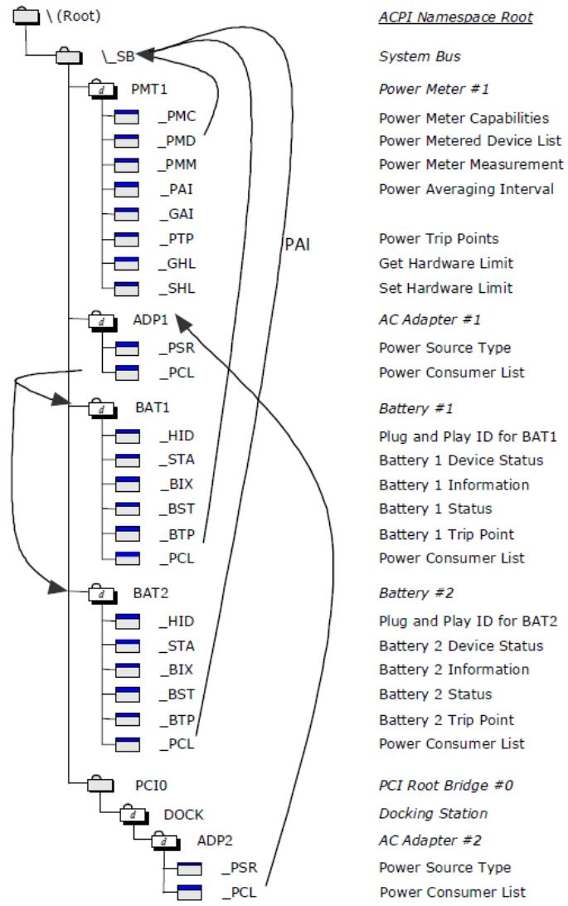  
Fig. 10.6: Power Meter and Power Source/Docking Namespace Example

# THERMAL MANAGEMENT

This chapter describes the ACPI thermal model and specifies the ACPI Namespace objects OSPM uses for thermal management of the platform.

## 11.1 Thermal Control

ACPI defines interfaces that allow OSPM to be proactive in its system cooling policies. With OSPM in control of the operating environment, cooling decisions can be made based on the system’s application load, the user’s preference towards performance or energy conservation, and thermal heuristics. Graceful shutdown of devices or the entire system at critical heat levels becomes possible as well. The following sections describe the ACPI thermal model and the ACPI Namespace objects available to OSPM to apply platform thermal management policy.

The ACPI thermal model is based around conceptual platform regions called thermal zones that physically contain devices, thermal sensors, and cooling controls. Generally speaking, the entire platform is one large thermal zone, but the platform can be partitioned into several ACPI thermal zones if necessary to enable optimal thermal management.

ACPI Thermal zones are a logical collection of interfaces to temperature sensors, trip points, thermal property information, and thermal controls. Thermal zone interfaces apply either thermal zone wide or to specific devices, including processors, contained within the thermal zone. ACPI defines namespace objects that provide the thermal zone-wide interfaces in Section 11.4. A subset of these objects may also be defined under devices. OS implementations compatible with the ACPI 3.0 thermal model, interface with these objects but also support OS native device driver interfaces that perform similar functions at the device level. This allows the integration of devices with embedded thermal sensors and controls, perhaps not accessible by AML, to participate in the ACPI thermal model through their inclusion in the ACPI thermal zone. OSPM is responsible for applying an appropriate thermal policy when a thermal zone contains both thermal objects and native OS device driver interfaces for thermal control.

Some devices in a thermal zone may be comparatively large producers of thermal load in relation to other devices in the thermal zone. Devices may also have varying degrees of thermal sensitivity. For example, some devices may tolerate operation at a significantly higher temperature than other devices. As such, the platform can provide OSPM with information about the platform’s device topology and the resulting influence of one device’s thermal load generation on another device. This information must be comprehended by OSPM for it to achieve optimal thermal management through the application of cooling controls.

ACPI expects all temperatures to be represented in tenths of degrees. This resolution is deemed suficient to enable OSPM to perform robust platform thermal management.

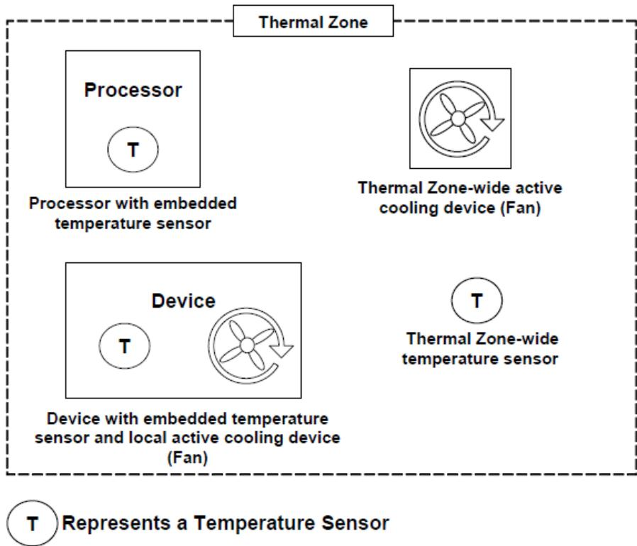  
Fig. 11.1: ACPI Thermal Zone

## 11.1.1 Active, Passive, and Critical Policies

There are three cooling policies that OSPM uses to control the thermal state of the hardware. The policies are active, passive and critical.

• Active Cooling. OSPM takes a direct action such as turning on one or more fans. Applying active cooling controls typically consume power and produce some amount of noise, but are able to cool a thermal zone without limiting system performance. Active cooling temperature trip points declare the temperature thresholds OSPM uses to decide when to start or stop diferent active cooling devices.

• Passive Cooling. OSPM reduces the power consumption of devices to reduce the temperature of a thermal zone, such as slowing (throttling) the processor clock. Applying passive cooling controls typically produces no usernoticeable noise. Passive cooling temperature trip points specify the temperature thresholds where OSPM will start or stop passive cooling.

• Critical Trip Points. These are threshold temperatures at which OSPM performs an orderly, but critical, shutdown of a device or the entire system. The \_HOT object declares the critical temperature at which OSPM may choose to transition the system into the S4 sleeping state, if supported, The \_CRT object declares the critical temperature at which OSPM must perform a critical shutdown.

When a thermal zone appears in the ACPI Namespace or when a new device becomes a member of a thermal zone, OSPM retrieves the temperature thresholds (trip points) at which it executes a cooling policy. When OSPM receives a temperature change notification, it evaluates the thermal zone’s temperature interfaces to retrieve current temperature values. OSPM compares the current temperature values against the temperature thresholds. If any temperature is greater than or equal to a corresponding active trip point then OSPM will perform active cooling . If any temperature is greater than or equal to a corresponding passive trip point then OSPM will perform passive cooling. If the \_TMP object returns a value greater than or equal to the value returned by the \_HOT object then OSPM may choose to transition the system into the S4 sleeping state, if supported. If the \_TMP object returns a value greater than or equal to the value returned by the \_CRT object then OSPM must shut the system down. Embedded Hot and Critical trip points may also be exposed by individual devices within a thermal zone. Upon passing of these trip points, OSPM must decide whether to shut down the device or the entire system based upon device criticality to system operation. OSPM must also evaluate the thermal zone’s temperature interfaces when any thermal zone appears in the namespace (for example, during system initialization) and must initiate a cooling policy as warranted independent of receipt of a temperature change notification. This allows OSPM to cool systems containing a thermal zone whose temperature has alread exceeded temperature thresholds at initialization time.

An optimally designed system that uses several thresholds can notify OSPM of thermal increase or decrease by raising an event every several degrees. This enables OSPM to anticipate thermal trends and incorporate heuristics to better manage the system’s temperature.

To implement a preference towards performance or energy conservation, OSPM can request that the platform change the priority of active cooling (performance) versus passive cooling (energy conservation/silence) by evaluating the \_SCP (Set Cooling Policy) object for the thermal zone or a corresponding OS-specific interface to individual devices within a thermal zone.

## 11.1.2 Dynamically Changing Cooling Temperature Trip Points

The platform or its devices can change the active and passive cooling temperature trip points and notify OSPM to reevaluate the trip point interfaces to establish the new policy threshold settings. The following are the primary uses for this type of thermal notification:

• When OSPM changes the platform’s cooling policy from one cooling mode to another.

• When a swappable bay device is inserted or removed. A swappable bay is a slot that can accommodate several diferent devices that have identical form factors, such as a CD-ROM drive, disk drive, and so on. Many mobile PCs have this concept already in place.

• After the crossing of an active or passive trip point is signaled to implement hysteresis.

In each situation, OSPM must be notified to re-evaluate the thermal zone’s trip points via the AML code execution of a Notify(thermal\_zone, 0x81) statement or via an OS specific interface invoked by device drivers for zone devices participating in the thermal model.

## 11.1.2.1 OSPM Change of Cooling Policy

When OSPM changes the platform’s cooling policy from one cooling mode to the other, the following occurs:

1. OSPM notifies the platform of the new cooling mode by running the Set Cooling Policy (\_SCP) control method in all thermal zones and invoking the OS-specific Set Cooling Policy interface to all participating devices in each thermal zone.

2. Thresholds are updated in the hardware and OSPM is notified of the change.

3. OSPM re-evaluates the active and passive cooling temperature trip points for the zone and all devices in the zone to obtain the new temperature thresholds.

## 11.1.2.2 Resetting Cooling Temperatures to Adjust to Bay Device Insertion or Removal

The platform can adjust the thermal zone temperature to accommodate the maximum operating temperature of a bay device as necessary. For example:

1. Hardware detects that a device was inserted into or removed from the bay, updates the temperature thresholds, and then notifies OSPM of the thermal policy change and device insertion events.

2. OSPM re-enumerates the devices and re-evaluates the active and passive cooling temperature trip points.

## 11.1.2.3 Resetting Cooling Temperatures to Implement Hysteresis

An OEM can build hysteresis into platform thermal design by dynamically resetting cooling temperature thresholds. For example:

1. When the temperature increases to the designated threshold, OSPM will turn on the associated active cooling device or perform passive cooling.

2. The platform resets the threshold value to a lower temperature (to implement hysteresis) and notifies OSPM of the change. Because of this new threshold value, the fan will be turned of at a lower temperature than when it was turned on (therefore implementing a negative hysteresis).

3. When the temperature hits the lower threshold value, OSPM will turn of the associated active cooling device or cease passive cooling. The hardware will reset \_ACx to its original value and notify OSPM that the trip points have once again been altered.

## 11.1.3 Detecting Temperature Changes

The ability of the platform and its devices to asynchronously notify an ACPI-compatible OS of meaningful changes in the thermal zone’s temperature is a highly desirable capability that relieves OSPM from implementing a poll-based policy and generally results in a much more responsive and optimal thermal policy implementation. Each notification instructs OSPM to evaluate whether a trip point has been crossed and allows OSPM to anticipate temperature trends for the thermal zone.

It is recognized that much of the hardware used to implement thermal zone functionality today is not capable of generating ACPI-visible notifications (SCIs) or only can do so with wide granularity (for example, only when the temperature crosses the critical threshold). In these environments, OSPM must poll the thermal zone’s temperature periodically to implement an efective policy.

While ACPI specifies a mechanism that enables OSPM to poll thermal zone temperature, platform reliance on thermal zone polling is strongly discouraged by this specification. OEMs should design systems that asynchronously notify OSPM whenever a meaningful change in the zone’s temperature occurs - relieving OSPM of the overhead associated with polling. In some cases, embedded controller firmware can overcome limitations of existing thermal sensor capabilities to provide the desired asynchronous notification.

Notice that the \_TZP (thermal zone polling) object is used to indicate whether a thermal zone must be polled by OSPM, and if so, a recommended polling frequency. See \_TZP (Thermal Zone Polling) for more information.

## 11.1.3.1 Temperature Change Notifications

Thermal zone-wide temperature sensor hardware that supports asynchronous temperature change notifications does so using an SCI. The AML code that responds to this SCI must execute a Notify(thermal\_zone, 0x80) statement to inform OSPM that a meaningful change in temperature has occurred. Alternatively, devices with embedded temperature sensors may signal their associated device drivers and the drivers may use an OS-specific interface to signal OSPM’s thermal policy driver. A device driver may also invoke a device specific control method that executes a Notify(thermal\_zone, 0x80) statement. When OSPM receives this thermal notification, it will evaluate the thermal zone’s temperature interfaces to evaluate the current temperature values. OSPM will then compare the values to the corre sponding cooling policy trip point values (either zone-wide or device-specific). If the temperature has crossed over any of the policy thresholds, then OSPM will actively or passively cool (or stop cooling) the system, or shut the system down entirely.

Both the number and granularity of thermal zone trip points are OEM-specific. However, it is important to notice that since OSPM can use heuristic knowledge to help cool the system, the more events OSPM receives the better understanding it will have of the system’s thermal characteristic.

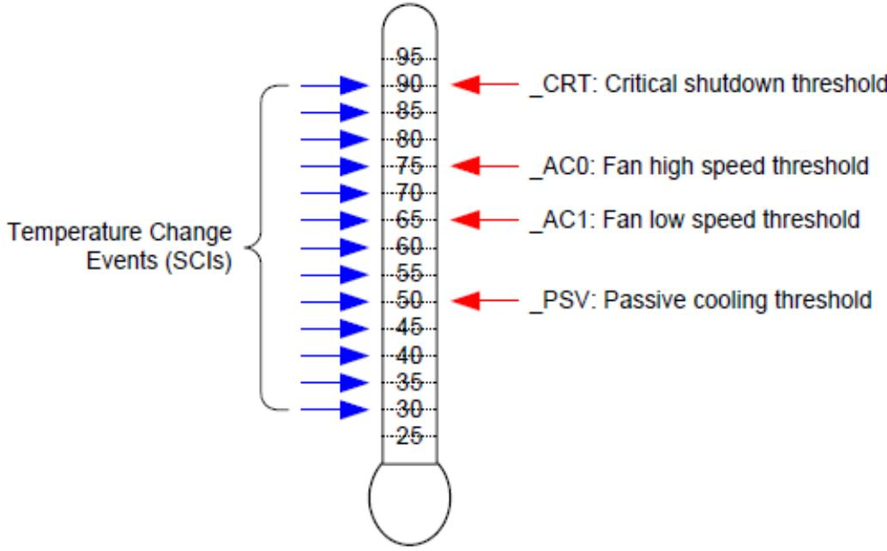  
Fig. 11.2: Thermal Events

For example, the simple thermal zone illustrated above includes hardware that will generate a temperature change notification using a $5 ^ { \circ }$ Celsius granularity. All thresholds (\_PSV, \_AC1, \_AC0, and \_CRT) exist within the monitored range and fall on 5 boundaries. This granularity is appropriate for this system as it provides suficient opportunity for OSPM to detect when a threshold is crossed as well as to understand the thermal zone’s basic characteristics (temperature trends).

Note: The ACPI specification defines Kelvin as the standard unit for absolute temperature values. All thermal zone objects must report temperatures in Kelvin when reporting absolute temperature values. All figures and examples in this section of the specification use Celsius for reasons of clarity. ACPI allows Kelvin to be declared in precision of 1/10th of a degree (for example, 310.5).

Kelvin is expressed as follows:

$$
\theta / K = T / (d e g r e e s C e l s i u s) + 2 7 3. 2
$$

## 11.1.3.2 Polling

Temperature sensor hardware that is incapable of generating thermal change events, or that can do so for only a few thresholds should inform OSPM to implement a poll-based policy. OSPM does this to ensure that temperature changes across threshold boundaries are always detectable.

Polling can be done in conjunction with hardware notifications. For example, thermal zone hardware that only supports a single threshold might be configured to use this threshold as the critical temperature trip point. Assuming that hardware monitors the temperature at a finer granularity than OSPM would, this environment has the benefit of being more responsive when the system is overheating.

A thermal zone advertises the need to be polled by OSPM via the \_TZP object. See \_TZP (Thermal Zone Polling) for more information.

## 11.1.4 Active Cooling

Active cooling devices typically consume power and produce some amount of noise when enabled. These devices attempt to cool a thermal zone through the removal of heat rather than limiting the performance of a device to address an adverse thermal condition

The active cooling interfaces in conjunction with the active cooling lists or the active cooling relationship table (\_ART) allow the platform to use an active device that ofers varying degrees of cooling capability or multiple cooling devices. The active cooling temperature trip points designate the temperature where Active cooling is engaged or disengaged (depending upon the direction in which the temperature is changing). For thermal zone-wide active cooling controls, the \_ALx object evaluates to a list of devices that actively cool the zone or the \_ART object evaluates to describe the entire active cooling relationship of various devices. For example:

• If a standard single-speed fan is the Active cooling device, then \_AC0 evaluates to the temperature where active cooling is engaged and the fan is listed in \_AL0.

• If the zone uses two independently controlled single-speed fans to regulate the temperature, then \_AC0 will evaluate to the maximum cooling temperature using two fans, and \_AC1 will evaluate to the standard cooling temperature using one fan.

• If a zone has a single fan with a low speed and a high speed, the \_AC0 will evaluate to the temperature associated with running the fan at high-speed, and \_AC1 will evaluate to the temperature associated with running the fan at low speed. \_AL0 and \_AL1 will both point to diferent device objects associated with the same physical fan, but control the fan at diferent speeds.

• If the zone uses two independently controlled multiple-speed fans to regulate the temperature, \_AC0 of the target devices evaluates to the temperature at which OSPM will engage fan devices described by the \_ART object as needed up to a maximum capability level.

For ASL coding examples that illustrate these points, see Thermal Zone Interface Requirements and Thermal Zone Examples.

## 11.1.5 Passive Cooling

Passive cooling controls are able to cool a thermal zone without creating noise and without consuming additional power (actually saving power), but do so by decreasing the performance of the devices in the zone .

## 11.1.5.1 Processor Clock Throttling

The processor passive cooling threshold (\_PSV) in conjunction with the processor list (\_PSL) allows the platform to indicate the temperature at which a passive control, for example clock throttling, will be applied to the processor(s) residing in a given thermal zone. Unlike other cooling policies, during passive cooling of processors OSPM may take the initiative to actively monitor the temperature in order to cool the platform.

On an ACPI-compatible platform that properly implements CPU throttling, the temperature transitions will be similar to the following figure, in a coolable environment, running a coolable workload:

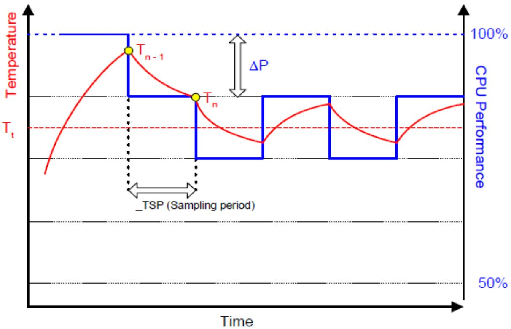  
Fig. 11.3: Temperature and CPU Performance Versus Time

The following equation should be used by OSPM to assess the optimum CPU performance change necessary to lower the thermal zone’s temperature:

Equation #1

$$
\Delta P[\% ] = \_ TC1*(T_{n} - T_{n - 1}) + \_ TC2*(T_{n} - T_{t})
$$

Where:

$\mathrm { { T } _ { n } }$ = current temperature

T<sub>t</sub> = target temperature (\_PSV)

The two coeficients \_TC1 and \_TC2 and the sampling period \_TSP are hardware-dependent constants the OEM must supply to OSPM (for more information, see Section 11.4). The \_TSP object contains a time interval that OSPM uses to poll the hardware to sample the temperature. Whenever the time value returned by \_TSP has elapsed, OSPM will evaluate \_TMP to sample the current temperature (shown as $\mathrm { { T } _ { n } }$ in the above equation). Then OSPM will use the