## 11.1.5.1 Processor Clock Throttling

The processor passive cooling threshold (\_PSV) in conjunction with the processor list (\_PSL) allows the platform to indicate the temperature at which a passive control, for example clock throttling, will be applied to the processor(s) residing in a given thermal zone. Unlike other cooling policies, during passive cooling of processors OSPM may take the initiative to actively monitor the temperature in order to cool the platform.

On an ACPI-compatible platform that properly implements CPU throttling, the temperature transitions will be similar to the following figure, in a coolable environment, running a coolable workload:

  
Fig. 11.3: Temperature and CPU Performance Versus Time

The following equation should be used by OSPM to assess the optimum CPU performance change necessary to lower the thermal zone’s temperature:

Equation #1

$$
\Delta P[\% ] = \_ TC1 * (T_n - T_{n - 1}) + \_ TC2 * (T_n - T_t)
$$

Where:

$\mathrm { { T } _ { n } }$ = current temperature

T<sub>t</sub> = target temperature (\_PSV)

The two coeficients \_TC1 and \_TC2 and the sampling period \_TSP are hardware-dependent constants the OEM must supply to OSPM (for more information, see Section 11.4). The \_TSP object contains a time interval that OSPM uses to poll the hardware to sample the temperature. Whenever the time value returned by \_TSP has elapsed, OSPM will evaluate \_TMP to sample the current temperature (shown as $\mathrm { { T } _ { n } }$ in the above equation). Then OSPM will use the sampled temperature and the passive cooling temperature trip point (\_PSV) (which is the target temperature T ) to evaluate the equation for $\Delta P$ . The granularity of $\Delta P$ is determined by the CPU duty width of the system.

Note: Equation #1 has an implied formula.

Equation #2:

$$
P _ {n} = P _ {n - 1} + H W [ -? P ]
$$

where:

?? ????????????% $< = P _ { n } < = 1 0 0 \%$

For this equation, whenever Pn-1 + ?P lies outside the range Minimum0-100%, then Pn will be truncated to Minimum0- 100%. Minimum% is the \_MTL limit, or 0% if \_MTL is not defined. For hardware that cannot assume all possible values of Pn between Minimum0 and 100%, a hardware specific mapping function HW is used.

In addition, the hardware mapping function in Equation #2 should be interpreted as follows.

For absolute temperatures:

1. If the right hand side of Equation #1 is negative, ???? [∆?? ] is rounded to the next available higher setting of frequency.

2. If the right hand side of Equation #1 is positive, ???? [∆?? ] is rounded to the next available lower setting of frequency.

For relative temperatures:

1. If the right hand side of Equation #1 is positive, ???? [∆?? ] is rounded to the next available higher setting of frequency.

2. If the right hand side of Equation #1 is negative, ???? [∆?? ] is rounded to the next available lower setting of frequency.

• The calculated Pn becomes Pn-1 during the next sampling period.

• For more information about CPU throttling, see Processor Power State C0. A detailed explanation of this thermal feedback equation is beyond the scope of this specification.

## 11.1.6 Critical Shutdown

When the thermal zone-wide temperature sensor value reaches the threshold indicated by \_CRT, OSPM must immediately shut the system down. The system must disable the power either after the temperature reaches some hardwaredetermined level above \_CRT or after a predetermined time has passed. Before disabling power, platform designers should incorporate some time that allows OSPM to run its critical shutdown operation. There is no requirement for a minimum shutdown operation window that commences immediately after the temperature reaches \_CRT. This is because:

• Temperature might rise rapidly in some systems and slowly on others, depending on casing design and environmental factors.

• Shutdown can take several minutes on a server and only a few seconds on a hand-held device.

Because of this indistinct discrepancy and the fact that a critical heat situation is a remarkably rare occurrence, ACPI does not specify a target window for a safe shutdown. It is entirely up to the OEM to build in a safe bufer that it sees fit for the target platform.

## 11.2 Cooling Preferences

A robust OSPM implementation provides the means for the end user to convey a preference (or a level of preference) for either performance or energy conservation to OSPM. Allowing the end user to choose this preference is most critical to mobile system users where maximizing system run-time on a battery charge often has higher priority over realizing maximum system performance. For example, if a user is taking notes on her PC in a quiet environment, such as a library or a corporate meeting, she may want the system to emphasize passive cooling so that the system operates quietly, even at the cost of system performance.

A user preference towards performance corresponds to the Active cooling mode while a user’s preference towards energy conservation or quiet corresponds to the Passive cooling mode. ACPI defines an interface to convey the cooling mode to the platform. Active cooling can be performed with minimal OSPM thermal policy intervention. For example, the platform indicates through thermal zone parameters that crossing a thermal trip point requires a fan to be turned on. Passive cooling requires OSPM thermal policy to manipulate device interfaces that reduce performance to reduce thermal zone temperature.

Either cooling mode will be activated only when the thermal condition requires it. When the thermal zone is at an optimal temperature level where it does not warrant any cooling, both modes result in a system operating at its maximum potential with all fans turned of.

Thermal zones supporting the Set Cooling Policy interface allow the user to switch the system’s cooling mode emphasis. See \_SCP (Set Cooling Policy) for more information.

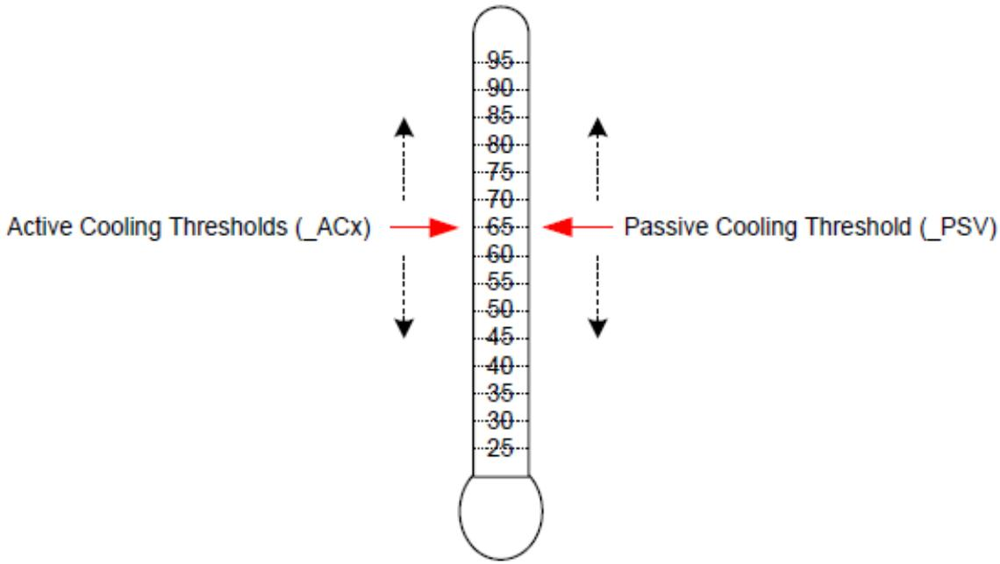  
Fig. 11.4: Active and Passive Threshold Values

As illustrated in Active and Passive Threshold Values, the platform must convey the value for each threshold to instruct OSPM to initiate the cooling policies at the desired target temperatures. The platform can emphasize active or passive cooling modes by assigning diferent threshold values. Generally, if \_ACx is set lower than \_PSV, then the system emphasizes active cooling. Conversely, if \_PSV is set lower than \_ACx, then the emphasis is placed on passive cooling.

For example, a thermal zone that includes a processor and one single-speed fan may use \_PSV to indicate the temperature value at which OSPM would enable passive cooling and \_AC0 to indicate the temperature at which the fan would be turned on. If the value of \_PSV is less than \_AC0 then the system will favor passive cooling (for example, CPU clock throttling). On the other hand, if \_AC0 is less than \_PSV the system will favor active cooling (in other words, using the fan). See the figure below for more details.

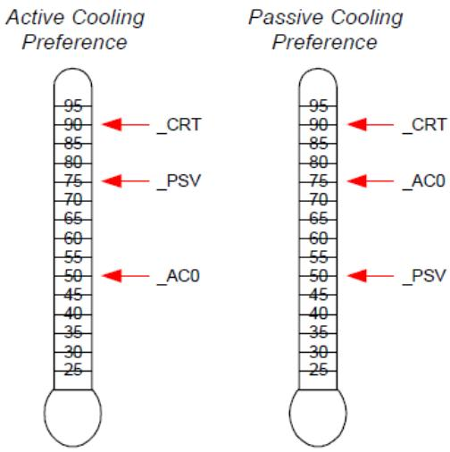  
Fig. 11.5: Cooling Preferences

The example on the left enables active cooling (for example, turn on a fan) when OSPM detects the temperature has risen above 50°. If for some reason the fan does not reduce the system temperature, then at 75° OSPM will initiate passive cooling (for example, CPU throttling) while still running the fan. If the temperature continues to climb, OSPM will quickly shut the system down when the temperature reaches 90°C. The example on the right is similar but the \_AC0 and \_PSV threshold values have been swapped to emphasize passive cooling.

The ACPI thermal model allows flexibility in the thermal zone design. An OEM that needs a less elaborate thermal implementation may consider using only a single threshold (for example, \_CRT). Complex thermal implementations can be modeled using multiple active cooling thresholds and devices, or through the use of additional thermal zones.

## 11.2.1 Evaluating Thermal Device Lists

The Notify(thermal\_zone, 0x82) statement is used to inform OSPM that a change has been made to the thermal zone device lists. This thermal event instructs OSPM to re-evaluate the \_ALx, \_PSL, and \_TZD objects.

For example, a system that supports the dynamic insertions of processors might issue this notification to inform OSPM of changes to \_PSL following the insertion or removal of a processor. OSPM would re-evaluate all thermal device lists and adjust its policy accordingly.

Notice that this notification can be used with the Notify(thermal\_zone, 0x81) statement to inform OSPM to both reevaluate all device lists and all thresholds.

Alternatively, devices may include the \_TZM (Thermal Zone Member) object their device scope to convey their thermal zone association to OSPM. See \_TZM (Thermal Zone Member) below for more information.

## 11.2.2 Evaluating Device Thermal Relationship Information

The Notify(thermal\_zone, 0x83) statement is used to inform OSPM that a change has been made to the thermal relationship information. This thermal event instructs OSPM to re-evaluate the \_TRT and \_ART objects. The thermal influence between devices may change when active cooling moves air across device packages as compared to when only passive cooling controls are applied. Similarly, the active cooling relationship may change as various fans are engaged to actively cool a platform or if user preferences change.

## 11.2.3 Fan Device Notifications

Notify events of type 0x80 will cause OSPM to evaluate the \_FST object to evaluate the fan’s current speed.

## 11.3 Fan Device

ACPI 1.0 defined a simple fan device that is assumed to be in operation when it is in the D0 state. Thermal zones reference fan device(s) as being responsible primarily for cooling within that zone. Notice that multiple fan devices can be present for any one thermal zone. They might be actual diferent fans, or they might be used to implement one fan of multiple speeds (for example, by turning both “fans” on the one fan will run full speed).

ACPI 4.0 defines additional fan device interface objects enabling OSPM to perform more robust active cooling thermal control. These objects are summarized (see Table 11.1 below). OSPM requires that all of the objects listed in the table below be defined under a fan device to enable advanced active cooling control. The absence of any of these objects causes OSPM to perform ACPI 1.0 style simple fan control .

The Plug and Play ID of a fan device is PNP0C0B.

Table 11.1: Fan Specific Objects

<table><tr><td>Object</td><td>Description</td></tr><tr><td>_FIF</td><td>Returns fan device information.</td></tr><tr><td>_FPS</td><td>Returns a list of supported fan performance states.</td></tr><tr><td>_FSL</td><td>Control method that sets the fan device&#x27;s speed level (performance state).</td></tr><tr><td>_FST</td><td>Returns current status information for a fan device.</td></tr></table>

While the Fan Device and its associated objects are optional, if the Fan Device is implemented by the platform, all objects listed in the table above are required and must be provided.

## 11.3.1 Fan Objects

## 11.3.1.1 \_FIF (Fan Information)

The optional \_FIF object provides OSPM with fan device capability information.

Arguments:

None

Return Value:

A Package containing the fan device parameters as described in the table below

\_FIF evaluation returns a package of the following format:

```go
Package () {
    Revision, // Integer
    FineGrainControl, // Integer Boolean
    StepSize // Integer DWORD
    LowSpeedNotificationSupport // Integer Boolean
}
```

Table 11.2: FIF Package Details

<table><tr><td>Field</td><td>Format</td><td>Description</td></tr><tr><td>Revision</td><td>Integer</td><td>Current revision is: 0</td></tr><tr><td>Fine Grain Control</td><td>Integer (Boolean)</td><td>A non zero value in this field indicates OSPM may evaluate the fan device&#x27;s _FSL object with a Level argument value in the range of 0-100, which represents a percentage of maximum speed. A zero value in this field indicates that OSPM may evaluate the fan device&#x27;s _FSL object with a Level argument value that is a Control field value from a package in the _FPS object&#x27;s package list only.</td></tr><tr><td>Step Size</td><td>Integer (DWORD)</td><td>The recommended minimum step size in percentage points to be used when OSPM performs fine-grained fan speed control. OSPM may utilize the value of this field if the FineGrainControl field is non-zero the value in this field is between 1 and 9.</td></tr><tr><td>Low Speed Notification Support</td><td>Integer (Boolean)</td><td>A non zero value in this field indicates that the platform will issue a Notify (0x80) to the fan device if a low (errant) fan speed is detected.</td></tr></table>

If a fan device supports fine-grained control, OSPM may evaluate a fan device’s \_FSL object with any Level argument value that is less than or equal to the Control field value specified in the package of the \_FPS object’s package list that corresponds to the active cooling trip point that has been exceeded. This capability provides OSPM access to one hundred fan speed settings thus enabling fine-grained fan speed control. The platform uses the StepSize field to help OSPM optimize its fan level selection policy by fine-grained fan speed control. The platform uses the StepSize field to help OSPM optimize its fan level selection policy by indicating recommended increments in the fan speed level value that are appropriate for the fan when one percent increments are not optimal. In the event OSPM’s incremental selections of Level using the StepSize field value do not sum to 100%, OSPM may select an appropriate ending Level increment to reach 100%. OSPM should use the same residual step value first when reducing Level.

## 11.3.1.2 \_FPS (Fan Performance States)

The optional \_FPS object evaluates to a variable-length package containing a list of packages that describe the fan device’s performance states. A temperature reading above an active cooling trip point defined by an \_ACx object in a thermal zone or above a native active cooling trip point of a device within the thermal zone causes OSPM thermal control to engage the appropriate corresponding fan performance state from the list of fan performance states described by the \_FPS object if the fan device is present in the corresponding \_ALx device list or if an entry exists for the fan and trip point in the active cooling relationship table (\_ART).

OSPM assumes a linear relationship for the acoustic impact and power consumption values between successive entries in the fan performance state list. Notice that the acoustic impact measurement unit (Decibels) is inherently non-linear. As such, the platform should populate \_FPS entries as necessary to enable OSPM to achieve optimal results.

## Arguments:

None

## Return Value:

A variable-length Package containing a Revision ID and a list of Packages that describe the fan device’s performance states as described in the table below.

Return Value Information

```go
Package {
Revision, // Integer - Current revision is: 0
FanPState[0], // Package
...
```

(continues on next page)

<table><tr><td></td><td colspan="2">(continued from previous page)</td></tr><tr><td>FanPState[n]</td><td>// Package</td><td></td></tr><tr><td>}</td><td></td><td></td></tr></table>

Each FanPState sub-Package contains the elements described below:

<table><tr><td>Package ()</td><td>// Fan P-State</td></tr><tr><td>{</td><td></td></tr><tr><td>Control,</td><td>// Integer DWORD</td></tr><tr><td>TripPoint,</td><td>// Integer DWORD</td></tr><tr><td>Speed,</td><td>// Integer DWORD</td></tr><tr><td>NoiseLevel,</td><td>// Integer DWORD</td></tr><tr><td>Power</td><td>// Integer DWORD</td></tr><tr><td>}</td><td></td></tr></table>

Table 11.3: FPS FanPState Package Details

<table><tr><td>Field</td><td>Format</td><td>Description</td></tr><tr><td>Control</td><td>Integer (DWORD)</td><td>Indicates the value to be used to set the fan speed to a specific level using the _FSL object. If the fan device supports fine-grained control as indicated by the _FIF object, this value is a percentage (0-100) of maximum speed level. If the fan device does not support fine-grained control, this field is an opaque value that OSPM must simply use in its evaluation of the _FSL object to set the level to this performance state.</td></tr><tr><td>TripPoint</td><td>Integer (DWORD)</td><td>0-9: The active cooling trip point number that corresponds to this performance state. If the _ART object is defined, OSPM may optionally use information provided by the _ART object and _FPS objects to select alternative fan performance states. Only one entry per unique trip point number is allowed in the _FPS. 0x0A-0xFFFFFFF: Reserved 0x0FFFFFFF: Indicates that this performance state does not correspond with a specific active cooling trip point.</td></tr><tr><td>Speed</td><td>Integer (DWORD)</td><td>Indicates the speed of the fan in revolutions per minute in this performance state.</td></tr><tr><td>NoiseLevel</td><td>Integer (DWORD)</td><td>This optional field indicates the audible noise emitted by the fan in this performance state. The value represents the noise in 10ths of decibels. For example, if the fan emits noise at 28.3dB in this performance state, the value of this field would be 283. A value of 0xFFFFFFF indicates that this field is not populated.</td></tr><tr><td>Power</td><td>Integer (DWORD)</td><td>This optional field indicates the power consumption (in milliwatts) of the fan in this performance state. For example, if the fan consumes .5W in this performance state, the value of this field would be 500. A value of 0xFFFFFFF indicates that this field is not populated.</td></tr></table>

## 11.3.1.3 \_FSL (Fan Set Level)

The optional \_FSL object is a control method that OSPM evaluates to set a fan device’s speed (performance state) to a specific level

Arguments:(1)

Arg0 - Level (Integer): conveys to the platform the fan speed level to be set.

Return Value:

None

## Argument Information

Arg0: Level. If the fan supports fine-grained control, Level is a percentage of maximum level (0-100) that the platform is to engage the fan. If the fan does not support fine-grained control, Level is a Control field value from a package in the \_FPS object’s package list. A Level value of zero causes the platform to turn of the fan.

## 11.3.1.4 \_FST (Fan Status)

The optional \_FST object provides status information for the fan device.

Arguments:

None

Return Value:

A Package containing fan device status information as described in the table below

\_FST evaluation returns a package of the following format:

<table><tr><td>Package (){ Revision, // Integer Control, // Integer DWORD Speed // Integer DWORD}</td></tr></table>

Table 11.4: FST Package Details

<table><tr><td>Field</td><td>Format</td><td>Description</td></tr><tr><td>Revision</td><td>Integer</td><td>Current revision is: 0</td></tr><tr><td>Control</td><td>Integer (DWORD)</td><td>The current control value used to operate the Fan. If the fan is not operating Control will be zero. If the fan is operating, Control is the Level argument passed in the evaluation of the _FSL object.</td></tr><tr><td>Speed</td><td>Integer (DWORD)</td><td>The current fan speed in revolutions per minute at which the fan is rotating. A value of 0xFFFFFFFF indicates that the fan does not support speed reporting.</td></tr></table>

## 11.4 Thermal Objects

Objects related to thermal management are listed in the following table.

Table 11.5: Thermal Objects

<table><tr><td>Object</td><td>Description</td></tr><tr><td>_ACx</td><td>Returns active cooling policy threshold values in tenths of degrees.</td></tr><tr><td>_ALx</td><td>List of active cooling device objects.</td></tr><tr><td>_ART</td><td>Table of values that convey the Active Cooling Relationship between devices</td></tr><tr><td>_CRT</td><td>Returns critical trip point in tenths of degrees where OSPM must perform a critical shutdown.</td></tr><tr><td>_HOT</td><td>Returns critical trip point in tenths of degrees where OSPM may choose to transition the system into S4.</td></tr><tr><td>_MTL</td><td>Returns the minimum throttle limit of a zone, when defined under a thermal zone. T</td></tr><tr><td>_NTT</td><td>Returns the temperature change threshold for devices containing native temperature sensors to cause evaluation of the _TPT object</td></tr><tr><td>_PSL</td><td>List of processor device objects for clock throttling.</td></tr><tr><td>_PSV</td><td>Returns the passive cooling policy threshold value in tenths of degrees.</td></tr><tr><td>_RTV</td><td>Conveys whether temperatures are expressed in terms of absolute or relative values.</td></tr><tr><td>_SCP</td><td>Sets platform cooling policy (active or passive).</td></tr><tr><td>_STR</td><td>String name for this thermal zone.</td></tr><tr><td>_TC1</td><td>Thermal constant for passive cooling.</td></tr><tr><td>_TC2</td><td>Thermal constant for passive cooling.</td></tr><tr><td>_TFP</td><td>Thermal fast sampling period for Passive cooling in milliseconds.</td></tr><tr><td>_TMP</td><td>Returns the thermal zone&#x27;s current temperature in tenths of degrees.</td></tr><tr><td>_TPT</td><td>Conveys the temperature of a devices internal temperature sensor to the platform when a temper-ature trip point is crossed or a meaningful change in temperature occurs.</td></tr><tr><td>_TRT</td><td>Table of values that convey the Thermal Relationship between devices</td></tr><tr><td>_TSN</td><td>Returns a reference to the thermal sensor device used to monitor the temperature of the thermal zone (when defined under a thermal zone).</td></tr><tr><td>_TSP</td><td>Thermal sampling period for Passive cooling in tenths of seconds.</td></tr><tr><td>_TST</td><td>Conveys the minimum separation for a devices&#x27; programmable temperature trip points.</td></tr><tr><td>_TZD</td><td>List of devices whose temperature is measured by this thermal zone.</td></tr><tr><td>_TZM</td><td>Returns the thermal zone for which a device is a member.</td></tr><tr><td>_TZP</td><td>Thermal zone polling frequency in tenths of seconds.</td></tr></table>

With the exception of \_TPT, \_TST, and the \_TZM objects, the objects described in the following sections may exist under a thermal zone. Devices with embedded thermal sensors and controls may contain static cooling temperature trip points or dynamic cooling temperature trip points that must be programmed by the device’s driver. In this case, thermal objects defined under a device serve to convey the platform specific values for these settings to the devices driver.

## 11.4.1 \_ACx (Active Cooling)

This optional object, if present under a thermal zone, returns the temperature trip point at which OSPM must start or stop Active cooling, where x is a value between 0 and 9 that designates multiple active cooling levels of the thermal zone. If the Active cooling device has one cooling level (that is, “on”) then that cooling level must be defined as \_AC0. If the cooling device has two levels of capability, such as a high fan speed and a low fan speed, then they must be defined as \_AC0 and \_AC1 respectively. The smaller the value of x, the greater the cooling strength \_ACx represents. In the above example, \_AC0 represents the greater level of cooling (the faster fan speed) and \_AC1 represents the lesser level of cooling (the slower fan speed). For every \_ACx method, there must be a matching \_ALx object or a corresponding entry in an \_ART object’s active cooling relationship list.

If this object it present under a device, the device’s driver evaluates this object to determine the device’s corresponding active cooling temperature trip point. This value may then be used by the device’s driver to program an internal device temperature sensor trip point. When this object is present under a device, the device must contain a native OS device driver interface supporting a corresponding active cooling control, a matching \_ALx object under the thermal zone of which the device is a member must exist, or a corresponding entry in an \_ART object’s active cooling relationship list must.

## Arguments:

None

## Return Value:

An Integer containing the active cooling temperature threshold in tenths of degrees Kelvin

The return value is an integer that represents tenths of degrees Kelvin. For example, 300.0K is represented by the integer 3000.

## 11.4.2 \_ALx (Active List)

This object is defined under a thermal zone and evaluates to a list of Active cooling devices to be turned on when the corresponding \_ACx temperature threshold is exceeded. For example, these devices could be fans.

## Arguments:

None

## Return Value:

A variable-length Package containing a list of References to active cooling devices

The return value is a package consisting of references to all active cooling devices that should be engaged when the associated active cooling threshold (\_ACx) is exceeded.

When the returned package consists of references to an active cooling device that is a fan device and the fan device implements \_FPS and \_FSL objects, OSPM activates the identified fan at a capability level matching the level identified by this object. For example, if the system has a fan that implements \_FPS object with 5 levels, and if \_AL3 is evaluated by the OSPM causing it to return this fan’s reference, then the fan is activated by evaluating \_FSL with the value from the Control field of an \_FPS entry whose TripPoint field value equals 3.

If a thermal zone has the \_ART object defined, then it is not necessary to have any \_ALx objects implemented.

## ò Note

If a thermal zone has \_ART object defined as well as \_ALx defined, the OSPM ignores \_ALx objects and uses \_ART exclusively.

## 11.4.3 \_ART (Active Cooling Relationship Table)

The optional \_ART object evaluates to a variable-length package containing a list of packages each of which describes the active cooling relationship between a device within a thermal zone and an active cooling device. OSPM uses the combined information about the active cooling relationships of all devices in the thermal zone to make active cooling policy decisions.

If \_ART is implemented within a thermal zone, OSPM ignores all \_ALx objects as \_ART conveys a mapping for each of the \_ACx trip points to active cooling devices.

The platform can dynamically change the \_ART object by notifying the thermal zone object with a Notify code of 0x83, which will cause OSPM to re-evaluate both the \_TRT and \_ART objects. This allows the platform to change the capability level mapping to various \_ACx trip points dynamically at run time.

Arguments:

None

Return Value:

A variable-length Package containing a Revision ID and a list of Active Relationship Packages as described below:

## Return Value Information

```txt
Package {
    Revision, // Integer - Current revision is: 0
    ActiveRelationship[0] // Package
    ....
    ActiveRelationship[n] // Package
}
```

Each ActiveRelationship sub-Package contains the elements described below:

```go
Package {
SourceDevice,    // Object Reference to a Fan Device Object
TargetDevice,    // Object Reference to a Device Object
Weight,    // Integer
AC0MaxLevel,    // Integer
AC1MaxLevel,    // Integer
AC2MaxLevel,    // Integer
AC3MaxLevel,    // Integer
AC4MaxLevel,    // Integer
AC5MaxLevel,    // Integer
AC6MaxLevel,    // Integer
AC7MaxLevel,    // Integer
AC8MaxLevel,    // Integer
AC9MaxLevel    // Integer
}
```

Table 11.6: Thermal Relationship Package Values 1

<table><tr><td>Element</td><td>Object Type</td><td>Description</td></tr><tr><td>SourceDevice</td><td>Reference (to a device)</td><td>The fan device that has an impact on the cooling of the device indicated by TargetDevice.</td></tr></table>

continues on next page

Table 11.6 – continued from previous page

<table><tr><td>Element</td><td>Object Type</td><td>Description</td></tr><tr><td>TargetDevice</td><td>Reference (to a device)</td><td>The device that is impacted by the fan device indicated by SourceDevice.</td></tr><tr><td>Weight</td><td>Integer</td><td>Indicates the SourceDevice&#x27;s contribution to the platform&#x27;s TargetDevice total cooling capability when the fans of all entries in the _ART with the same target device are engaged at their highest (maximum capability) performance state. This is represented as a percentage value (0-100).</td></tr><tr><td>AC0MaxLevel</td><td>Integer (DWORD)</td><td>Indicates the maximum fans speed level in percent (0-100) that OSPM may engage on the SourceDevice when a temperature exceeds the _AC0 trip point value. A value of 0xFFFFFFFF in this field indicates that the SourceDevice is not to be engaged for the trip point.</td></tr><tr><td>AC1MaxLevel</td><td>Integer (DWORD)</td><td>Indicates the maximum fans speed level in percent (0-100) that OSPM may engage on the SourceDevice when a temperature exceeds the _AC1 trip point value. A value of 0xFFFFFFFF in this field indicates that the SourceDevice is not to be engaged for the trip point.</td></tr><tr><td>AC2MaxLevel</td><td>Integer (DWORD)</td><td>Indicates the maximum fans speed level in percent (0-100) that OSPM may engage on the SourceDevice when a temperature exceeds the _AC2 trip point value. A value of 0xFFFFFFFF in this field indicates that the SourceDevice is not to be engaged for the trip point.</td></tr><tr><td>AC3MaxLevel</td><td>Integer (DWORD)</td><td>Indicates the maximum fans speed level in percent (0-100) that OSPM may engage on the SourceDevice when a temperature exceeds the _AC3 trip point value. A value of 0xFFFFFFFF in this field indicates that the SourceDevice is not to be engaged for the trip point.</td></tr><tr><td>AC4MaxLevel</td><td>Integer (DWORD)</td><td>Indicates the maximum fans speed level in percent (0-100) that OSPM may engage on the SourceDevice when a temperature exceeds the _AC4 trip point value. A value of 0xFFFFFFFF in this field indicates that the SourceDevice is not to be engaged for the trip point.</td></tr><tr><td>AC5MaxLevel</td><td>Integer (DWORD)</td><td>Indicates the maximum fans speed level in percent (0-100) that OSPM may engage on the SourceDevice when a temperature exceeds the _AC5 trip point value. A value of 0xFFFFFFFF in this field indicates that the SourceDevice is not to be engaged for the trip point.</td></tr><tr><td>AC6MaxLevel</td><td>Integer (DWORD)</td><td>Indicates the maximum fans speed level in percent (0-100) that OSPM may engage on the SourceDevice when a temperature exceeds the _AC6 trip point value. A value of 0xFFFFFFFF in this field indicates that the SourceDevice is not to be engaged for the trip point.</td></tr><tr><td>AC7MaxLevel</td><td>Integer (DWORD)</td><td>Indicates the maximum fans speed level in percent (0-100) that OSPM may engage on the SourceDevice when a temperature exceeds the _AC7 trip point value. A value of 0xFFFFFFFF in this field indicates that the SourceDevice is not to be engaged for the trip point.</td></tr></table>

Table 11.6 – continued from previous page

<table><tr><td>Element</td><td>Object Type</td><td>Description</td></tr><tr><td>AC8MaxLevel</td><td>Integer (DWORD)</td><td>Indicates the maximum fans speed level in percent (0-100) that OSPM may engage on the SourceDevice when a temperature exceeds the _AC8 trip point value. A value of 0xFFFFFFFF in this field indicates that the SourceDevice is not to be engaged for the trip point.</td></tr><tr><td>AC9MaxLevel</td><td>Integer (DWORD)</td><td>Indicates the maximum fans speed level in percent (0-100) that OSPM may engage on the SourceDevice when a temperature exceeds the _AC9 trip point value. A value of 0xFFFFFFFF in this field indicates that the SourceDevice is not to be engaged for the trip point.</td></tr></table>

In the case multiple active cooling trip points have been exceeded and \_ART entries indicate various maximum limits for the same SourceDevice, OSPM may operate the SourceDevice up to the highest ACxMaxLevel value indicated for all exceeded trip points.

## 11.4.4 \_CRT (Critical Temperature)

This object, when defined under a thermal zone, returns the critical temperature at which OSPM must shutdown the system. If this object it present under a device, the device’s driver evaluates this object to determine the device’s critical cooling temperature trip point. This value may then be used by the device’s driver to program an internal device temperature sensor trip point.

## Arguments:

None

## Return Value:

An Integer containing the critical temperature threshold in tenths of degrees Kelvin

The result is an integer value that represents the critical shutdown threshold in tenths of degrees. For example, 300.0K is represented by the integer 3000.

## 11.4.5 \_CR3 (Warm/Standby Temperature)

This object, when defined under a thermal zone, returns the critical temperature at which OSPM may choose to transition the system into a low power state with a faster exit latency than S4 sleeping state (e.g. S3, or an equivalent low power state if the LOW\_POWER\_S0\_IDLE\_CAPABLE FADT flag is set). The platform vendor should define \_CR3 to be suficiently below \_CRT so as to allow enough time to transition the system into this low power state. It may be suficient to define either \_CR3 or \_HOT depending on the type and thermal characteristics of the specific thermal zone under consideration. If this object it present under a device, the device’s driver evaluates this object to determine the device’s warm/standby cooling temperature trip point. This value may then be used by the device’s driver to program an internal device temperature sensor trip point.

## Arguments:

None

## Return Value:

An Integer containing the critical temperature threshold in tenths of degrees Kelvin

The result is an integer value that represents the critical shutdown threshold in tenths of degrees. For example, 300.0K is represented by the integer 3000.

## 11.4.6 \_DTI (Device Temperature Indication)

This optional object may be present under a device and is evaluated by OSPM when the device’s native (driver managed) temperature sensor has crossed a cooling temperature trip point or when a meaningful change in temperature (as indicated by evaluation of the \_NTT object) has occurred. OSPM evaluation of the \_DTI object enables the platform to take action as a result of these events. For example, the platform may choose to implement fan control hysteresis based on the conveyed value or signal the revaluation of the \_TDL or \_PDL objects.

Arguments:(1)

Arg0 - An Integer containing the current value of the temperature sensor (in tenths Kelvin)

Return Value:

None

## 11.4.7 \_HOT (Hot Temperature)

This optional object, when defined under a thermal zone, returns the critical temperature at which OSPM may choose to transition the system into the S4 sleeping state. The platform vendor should define \_HOT to be far enough below \_CRT so as to allow OSPM enough time to transition the system into the S4 sleeping state. While dependent on the amount of installed memory, on typical platforms OSPM implementations can transition the system into the S4 sleeping state in tens of seconds. If this object it present under a device, the device’s driver evaluates this object to determine the device’s hot cooling temperature trip point. This value may then be used by the device’s driver to program an internal device temperature sensor trip point.

## Arguments:

None

## Return Value:

An Integer containing the critical temperature threshold in tenths of degrees Kelvin

The return value is an integer that represents the critical sleep threshold tenths of degrees Kelvin. For example, 300.0K is represented by the integer 3000.

## 11.4.8 \_MTL (Minimum Throttle Limit)

This object, when defined under a thermal zone, returns the minimum throttle limit of a zone. This will determine how much a thermal zone limits the performance of its controlled devices. This value can be used by OSPM to calculate the changes in performance limits it applies to the devices of the thermal zone.

Arguments:

None

Return Value:

An Integer value with the current minimum throttle limit, expressed as a percentage

## 11.4.9 \_NTT (Notification Temperature Threshold)

This optional object may be defined under devices containing native temperature sensors and evaluates to the temperature change threshold for the device where the platform requires notification of the change via evaluation of the \_TPT object.

## Arguments:

None

## Return Value:

An Integer containing the temperature threshold in tenths of degrees Kelvin.

The return value is an integer that represents the amount of change in device temperature that is meaningful to the platform and for which the platform requires notification via evaluation of the \_TPT object.

## 11.4.10 \_PSL (Passive List)

This object is defined under a thermal zone and evaluates to a list of processor objects to be used for passive cooling.

## Arguments:

None

## Return Value:

A variable-length Package containing a list of References to processor objects

The return value is a package consisting of references to all processor objects that will be used for passive cooling when the zone’s passive cooling threshold (\_PSV) is exceeded.

## 11.4.11 \_PSV (Passive)

This optional object, if present under a thermal zone, evaluates to the temperature at which OSPM must activate passive cooling policy.

## Arguments:

None

## Return Value:

An Integer containing the passive cooling temperature threshold in tenths of degrees Kelvin

The return value is an integer that represents tenths of degrees Kelvin. For example, 300.0 Kelvin is represented by 3000.

If this object it present under a device, the device’s driver evaluates this object to determine the device’s corresponding passive cooling temperature trip point. This value may then be used by the device’s driver to program an internal device temperature sensor trip point. When this object is present under a device, the device must contain a native OS device driver interface supporting a passive cooling control.

## 11.4.12 \_RTV (Relative Temperature Values)

This optional object may be present under a device or a thermal zone and is evaluated by OSPM to determine whether the values returned by temperature trip point and current operating temperature interfaces under the corresponding device or thermal zone represent absolute or relative temperature values.

## Arguments:

None

## Return Value:

An Integer containing a relative versus absolute indicator:

0 Temperatures are absolute Other Temperatures are relative

The return value is an integer that indicates whether values returned by temperature trip point and current operating temperature interfaces represent absolute or relative temperature values.

If the \_RTV object is not present or is present and evaluates to zero then OSPM assumes that all values returned by temperature trip point and current operating temperature interfaces under the device or thermal zone represent absolute temperature values expressed in tenths of degrees Kelvin.

If the \_RTV object is present and evaluates to a non zero value then all values returned by temperature trip point and current operating temperature interfaces under the corresponding device or thermal zone represent temperature values relative to a zero point that is defined as the maximum value of the device’s or thermal zone’s critical cooling temperature trip point. In this case, temperature trip point and current operating temperature interfaces return values in units that are tenths of degrees below the zero point.

OSPM evaluates the \_RTV object before evaluating any other temperature trip point or current operating temperature interfaces.

## 11.4.13 \_SCP (Set Cooling Policy)

This optional object is a control method that OSPM invokes to set the platform’s cooling mode policy setting. The platform may use the evaluation of \_SCP to reassign \_ACx and \_PSV temperature trip points according to the mode or limits conveyed by OSPM. OSPM will automatically evaluate \_ACx and \_PSV objects after executing \_SCP. This object may exist under a thermal zone or a device.

## Arguments:(3)

Arg0 - Mode An Integer containing the cooling mode policy code

Arg1 - AcousticLimit An Integer containing the acoustic limit

Arg2 - PowerLimit An Integer containing the power limit

## Return Value:

None

Argument Information:

Mode - 0 = Active, 1 = Passive

Acoustic Limit - Specifies the maximum acceptable acoustic level that active cooling devices may generate. Values are 1 to 5 where 1 means no acoustic tolerance and 5 means maximum acoustic tolerance.

Power Limit - Specifies the maximum acceptable power level that active cooling devices may consume. Values are from 1 to 5 where 1 means no power may be used to cool and 5 means maximum power may be used to cool.

```txt
Example:
// Fan Control is defined as follows:

//    Speed 1 (Fan is Off): Acoustic Limit 1, Power Limit 1, <= 64C
//    Speed 2: Acoustic Limit 2, Power Limit 2, 65C - 74C
//    Speed 3: Acoustic Limit 3, Power Limit 3, 75C - 84C
//    Speed 4: Acoustic Limit 4, Power Limit 4, 85C - 94C
//    Speed 5: Acoustic Limit 5, Power Limit 5, >= 95C

// _SCP Notifies the platform the current cooling mode.
//    Arg0 = Mode
//    0 - Active cooling
//    1 - Passive cooling
//    Arg1 = Acoustic Limit
//    1 = No acoustic tolerance
//    ...
//    5 = maximum acoustic tolerance
//    Arg2 = Power Limit
//    1 = No power may be used to cool
//    ...
//    5 = maximum power may be used to cool

Method(_SCP,3,Serialized)
{
    // Store the Cooling Mode in NVS and use as needed in
    // the rest of the ASL Code.
    Store(Arg0, CTYP)

    // Set PSVT to account for a Legacy OS that does not pass
    // in either the acoustic limit or Power Limit.
    If(Arg0)
    {
    Store(60,PSVT)
    }
    Else
    {
    Store(97,PSVT)
    }
    If (CondRefOf (_OSI,Local0))
    {
    If (\_OSI ("3.0 _SCP Extensions"))
    {
    // Determine Power Limit.
    //
    // NOTE1: PSVT = Passive Cooling Trip Point stored
    // in NVS in Celsius.
    //
    // NOTE2: 4 Active Cooling Trips Points correspond to 5
    // unique Power Limit regions and 5 unique acoustic limit
    // regions.
    //
    //
```

(continues on next page)

```txt
// NOTE3: This code will define Passive cooling so that
// CPU throttling will be initiated within the Power Limit
// Region passed in such that the next higher Power Limit
// Region will not be reached.
Switch(Arg2)
{
    Case(1) // Power Limit = 1.
    {
    // Stay in Acoustic Limit 1.
    Store(60,PSVT) // Passive = 60C.
    }
    Case(2) // Power Limit = 2.
    {
    // Store Highest supported Acoustic Level
    // at this Power Limit (1 or 2).
    Store(70,PSVT)
    If(Lequal(Arg1,1))
    {
    // Stay in Acoustic Level 1.
    Store(60,PSVT)
    }
    }
    Case(3) // Power Limit = 3.
    {
    // Store Highest supported Acoustic Level
    // at this Power Limit (1, 2, or 3).
    Store(80,PSVT)
    If(Lequal(Arg1,2))
    {
    // Stay in Acoustic Level 1 or 2.
    Store(70,PSVT)
    }
    If(Lequal(Arg1,1))
    {
    // Stay in Acoustic Level 1.
    Store(60,PSVT)
    }
    }
    Case(4) // Power Limit = 4.
    {
    // Store Highest supported Acoustic Level
    // at this Power Limit (1, 2, 3, or 4).
    Store(90,PSVT)
    If(Lequal(Arg1,3))
    {
    // Stay in Acoustic Level 1 or 2.
    Store(80,PSVT)
    }
    If(Lequal(Arg1,2))
    {
    // Stay in Acoustic Level 1 or 2.
```

(continues on next page)

(continued from previous page)

```txt
Store(70,PSVT)
}
If(Lequal(Arg1,1))
{
    // Stay in Acoustic Level 1.
    Store(60,PSVT)
}
}
Case(5) // Power Limit = 5.
{
    // Store Highest supported Acoustic Level
    // at this Power Limit (1, 2, 3, 4, or 5).
    Store(97,PSVT)
    If(Lequal(Arg1,4))
    {
    // Stay in Acoustic Level 1 or 2.
    Store(90,PSVT)
    }
    If(Lequal(Arg1,3))
    {
    // Stay in Acoustic Level 1 or 2.
    Store(80,PSVT)
    }
    If(Lequal(Arg1,2))
    {
    // Stay in Acoustic Level 1 or 2.
    Store(70,PSVT)
    }
    If(Lequal(Arg1,1))
    {
    // Stay in Acoustic Level 1.
    Store(60,PSVT)
    }
} // Case 5
} // Switch Arg 2
} // $_OSI - Extended $_SCP
} // CondRefOf $_OSI
} // Method $_SCP
```

## 11.4.14 \_STR (String)

This optional object, when defined under a thermal zone, returns a string name for this thermal zone. See below for more details.

## 11.4.15 \_TC1 (Thermal Constant 1)

This object evaluates to the constant \_TC1 for use in the Passive cooling formula:

$$
\Delta \text {Performance} [ \% ] = \_ T C 1 * (T _ {n} - T _ {n - 1}) + \_ T C 2 * (T _ {n} - T _ {t})
$$

Arguments:

None

## Return Value:

An Integer containing Thermal Constant #1

## 11.4.16 \_TC2 (Thermal Constant 2)

This object evaluates to the constant \_TC2 for use in the Passive cooling formula:

$$
\Delta \text {Performance} [ \% ] = \_ T C 1 * (T _ {n} - T _ {n - 1}) + \_ T C 2 * (T _ {n} - T _ {t})
$$

Arguments:

None

Return Value:

An Integer containing Thermal Constant #2

## 11.4.17 \_TFP (Thermal fast Sampling Period)

This object evaluates to a thermal sampling period (in milliseconds) used by OSPM to implement the Passive cooling equation. This value, along with \_TC1 and \_TC2, will enable OSPM to provide the proper hysteresis required by the system to accomplish an efective passive cooling policy.

## Arguments:

None

## Return Value:

## An Integer containing the sampling period in milliseconds

The granularity of the sampling period is 1 milliseconds. For example, if the sampling period is 30.0 seconds, then \_TFP needs to report 30,000; if the sampling period is 0.5 seconds, then it will report 500. OSPM can normalize the sampling over a longer period if necessary.

If both \_TFP and \_TSP are present in a Thermal Zone, \_TFP overrides \_TSP. Platforms which need to support legacy operating systems from before \_TFP in ACPI 6.0, must specify $\mathbf { a } _ { \mathrm { ~ - ~ } } \mathrm { T S P }$ if a sampling period is required. OS support for \_TFP can be discovered via \_OSC See Platform-Wide \_OSC Capabilities DWORD 2.

## 11.4.18 \_TMP (Temperature)

This control method returns the thermal zone’s current operating temperature.

## Arguments:

None

Return Value:

An Integer containing the current temperature of the thermal zone (in tenths of degrees Kelvin)

The return value is the current temperature of the thermal zone in tenths of degrees Kelvin. For example, 300.0K is represented by the integer 3000.

## 11.4.19 \_TPT (Trip Point Temperature)

This optional object may be present under a device and is invoked by OSPM to indicate to the platform that the devices’ embedded temperature sensor has crossed a cooling temperature trip point. After invocation, OSPM immediately evaluates the devices’ Active and Passive cooling temperature trip point values. This enables the platform to implement hysteresis.

## Arguments:(1)

Arg0 - An Integer containing the current value of the temperature sensor (in tenths Kelvin)

## Return Value:

None

The \_TPT object is deprecated in ACPI 4.0. The \_DTI object should be used instead (see \_DTI (Device Temperature Indication)).

## 11.4.20 \_TRT (Thermal Relationship Table)

This object evaluates to a package of packages each of which describes the thermal relationship between devices within a thermal zone. OSPM uses the combined information about the thermal relationships of all devices in the thermal zone to make thermal policy decisions.

## Arguments:

None

Return Value:

A variable-length Package containing a list of Thermal Relationship Packages as described below

Return Value Information

```txt
Package {
    ThermalRelationship[0] // Package
    ....
    ThermalRelationship[n] // Package
}
```

Each ThermalRelationship sub-Package contains the elements described below:

```go
Package {
SourceDevice,    // Object Reference to a Device Object
TargetDevice,    // Object Reference to a Device Object
Influence,    // Integer
SamplingPeriod,    // Integer
Reserved1,    // Integer
Reserved2,    // Integer
Reserved3,    // Integer
Reserved4    // Integer
},
```

Table 11.7: Thermal Relationship Package Values 2

<table><tr><td>Element</td><td>Object Type</td><td>Description</td></tr><tr><td>Source Device</td><td>Reference (to a device)</td><td>The device that is influencing the device indicated by TargetDevice.</td></tr><tr><td>Target Device</td><td>Reference (to a device)</td><td>The device that is influenced by the device indicated by SourceDevice.</td></tr><tr><td>Influence</td><td>Integer</td><td>The thermal influence of SourceDevice on TargetDevice - represented as tenths of degrees Kelvin that the device indicated by SourceDevice raises the temperature of the device indicated by TargetDevice per watt of thermal load that SourceDevice generates.</td></tr><tr><td>Sampling Period</td><td>Integer</td><td>The minimum period of time in tenths of seconds that OSPM should wait after applying a passive control to the device indicated by SourceDevice to detect its impact on the device indicated by TargetDevice.</td></tr><tr><td>Reserved (1-4)</td><td>Integer</td><td>Reserved for future use.</td></tr></table>

## 11.4.21 \_TSN (Thermal Sensor Device)

This object, when defined under a thermal zone, returns a reference to the thermal sensor device used to monitor the temperature of the thermal zone. See Native OS Device Driver Thermal Interfaces.

Arguments:

None

## Return Value:

A single Reference to the namespace device object that monitors the temperature of the thermal zone.

## 11.4.22 \_TSP (Thermal Sampling Period)

This object evaluates to a thermal sampling period (in tenths of seconds) used by OSPM to implement the Passive cooling equation. This value, along with \_TC1 and \_TC2, will enable OSPM to provide the proper hysteresis required by the system to accomplish an efective passive cooling policy.

Arguments:

None

Return Value:

An Integer containing the sampling period in tenths of seconds

The granularity of the sampling period is 0.1 seconds. For example, if the sampling period is 30.0 seconds, then \_TSP needs to report 300; if the sampling period is 0.5 seconds, then it will report 5. OSPM can normalize the sampling over a longer period if necessary.

If both \_TFP and \_TSP are present in a Thermal Zone, \_TFP overrides \_TSP. Platforms which need to support legacy operating systems from before \_TFP in ACPI 6.0 must specify a \_TSP if a sampling period is required. OS support for \_TFP can be discovered via \_OSC (see Platform-Wide \_OSC Capabilities DWORD 2).

## 11.4.23 \_TST (Temperature Sensor Threshold)

This optional object may be present under a device and is evaluated by OSPM to determine the minimum separation for a devices’ programmable temperature trip points. When a device contains multiple programmable temperature trip points, it may not be necessary for OSPM to poll the device’s temperature after crossing a temperature trip point when performing passive cooling control policy.

## Arguments:

None

## Return Value:

## An Integer containing the sensor threshold (in tenths of degrees Kelvin)

To eliminate polling, the device can program intermediate trip points of interest (higher or lower than the current temperature) and signal the crossing of the intermediate trip points to OSPM. The distance between the current temperature and these intermediate trip points may be platform specific and must be set far enough away from the current temperature so as to not to miss the crossing of a meaningful temperature point. The \_TST object conveys the recommended minimum separation between the current temperature and an intermediate temperature trip point to OSPM.

## 11.4.24 \_TZD (Thermal Zone Devices)

This optional object evaluates to a package of device names. Each name corresponds to a device in the ACPI namespace that is associated with the thermal zone. The temperature reported by the thermal zone is roughly correspondent to that of each of the devices.

## Arguments:

None

## Return Value:

## A variable-length Package containing a list of References to thermal zone devices

The list of devices returned by the control method need not be a complete and absolute list of devices afected by the thermal zone. However, the package should at least contain the devices that would uniquely identify where this thermal zone is located in the machine. For example, a thermal zone in a docking station should include a device in the docking station, a thermal zone for the CD-ROM bay, should include the CD-ROM.

## 11.4.25 \_TZM (Thermal Zone Member)

This optional object may exist under any device definition and evaluates to a reference to the thermal zone of which the device is a member.

## Arguments:

None

## Return Value:

A Reference to the parent device

## 11.4.26 \_TZP (Thermal Zone Polling)

This optional object evaluates to a recommended polling frequency (in tenths of seconds) for this thermal zone. A value of zero indicates that OSPM does not need to poll the temperature of this thermal zone in order to detect temperature changes (the hardware is capable of generating asynchronous notifications).

## Arguments:

None

## Return Value:

An Integer containing the recommended polling frequency in tenths of seconds

The return value contains the recommended polling frequency, in tenths of seconds. A value of zero indicates that polling is not necessary.

The \_TZP value is specified as tenths of seconds with a 1 second granularity. For example, a \_TZP value of 300 equals 30 seconds, while a value of 3000 equals 5 minutes. This is only a recommended value, and OSPM will consider other factors when determining the actual polling frequency to use.

The use of polling is allowed but strongly discouraged by this specification. OEMs should design systems that asynchronously notify OSPM whenever a meaningful change in the zone’s temperature occurs–relieving the OS of the overhead associated with polling (see Detecting Temperature Changes for more details).

## 11.5 Native OS Device Driver Thermal Interfaces

OS implementations compatible with the ACPI 3.0 thermal model, interface with the thermal objects of a thermal zone but also comprehend the thermal zone devices’ OS native device driver interfaces that perform similar functions to the thermal objects at the device level.

The recommended native OS device driver thermal interfaces that enable OSPM to perform optimal performance / thermal management include:

• Reading a value from a device’s embedded thermal sensor

• Reading a value that indicates whether temperature and trip point values are reported in absolute or relative temperatures

• Setting the platform’s cooling mode policy setting

• Reading the embedded thermal sensor’s threshold

• Reading the device’s active and passive cooling temperature trip points

• Reading the device’s association to a thermal zone

• Signaling the crossing of a thermal trip point

• Reading the desired polling frequency at which to check the devices temperature if the device cannot signal OSPM or signal OSPM optimally (both before and after a temperature trip point is crossed)

• Setting / limiting a device’s performance / throttling states

• Engaging / disengaging a device’s active cooling controls

These interfaces are OS specific and as such the OS vendor defines the exact interface definition for each target operating system.

## 11.6 Thermal Zone Interface Requirements

While not all thermal zone interfaces are required to be present in each thermal zone, OSPM levies conditional requirements for the presence of specific thermal zone interfaces based on the existence of other related thermal zone interfaces. These interfaces may be implemented by thermal zone-wide objects or by OS-specific device driver exposed thermal interfaces. The requirements are outlined below:

• A thermal zone must contain at least one temperature interface; either the \_TMP object or a member device temperature interface.

• A thermal zone must contain at least one trip point (critical, near critical, active, or passive).

• If \_ACx is defined then an associated \_ALx must be defined (e.g. defining \_AC0 requires \_AL0 also be defined).

• If \_PSV is defined then either the \_PSL or \_TZD objects must exist. The \_PSL and \_TZD objects may both exist.

• If \_PSL is defined then:

– If a linear performance control register is defined (via either P\_BLK or the \_PTC, \_TSS, \_TPC objects) for a processor defined in \_PSL or for a processor device in the zone as indicated by \_TZM then the \_TC1, \_TC2, and objects must exist. A\_TFP or \_TSP object must also be defined if the device requires polling.

– If a linear performance control register is not defined (via either P\_BLK or the \_PTC, \_TSS, \_TPC objects) for a processor defined in \_PSL or for a processor device in the zone as indicated by \_TZM then the processor must support processor performance states (in other words, the processor’s processor object must include \_PCT, \_PSS, and \_PPC).

• If \_PSV is defined and \_PSL is not defined then at least one device in thermal zone, as indicated by either the \_TZD device list or devices’ \_TZM objects, must support device performance states.

• \_SCP is optional.

• \_TZD is optional outside of the \_PSV requirement outlined above.

• If \_HOT is defined then the system must support the S4 sleeping state.

## 11.7 Thermal Zone Examples

## 11.7.1 Example: The Basic Thermal Zone

The following ASL describes a basic configuration where the entire system is treated as a single thermal zone. Cooling devices for this thermal zone consist of a processor and one single-speed fan. This is an example only.

Notice that this thermal zone object (TZ0) is defined in the \_SB scope. Thermal zone objects should appear in the namespace under the portion of the system that comprises the thermal zone. For example, a thermal zone that is isolated to a docking station should be defined within the scope of the docking station device. Besides providing for a wellorganized namespace, this configuration allows OSPM to dynamically adjust its thermal policy as devices are added or removed from the system.

```c
Scope(\_SB) {
    Device(CPU0) {
    Name(_HID, "ACPI0007")
    Name(_UID, 1) // unique number for this processor
    }
<...>
Scope(\_SB.PCI0.ISA0) {
    Device(EC0) {
    Name(_HID, EISAID("PNP0C09")) // ID for this EC
    // current resource description for this EC
    Name(_CRS, ResourceTemplate() {
    IO(Decode16,0x62,0x62,0,1)
    IO(Decode16,0x66,0x66,0,1)
    })
    Name(_GPE, 0) // GPE index for this EC
    // create EC's region and field for thermal support
    OperationRegion(EC0, EmbeddedControl, 0, 0xFF)
    Field(EC0, ByteAcc, Lock, Preserve) {
    MODE, 1, // thermal policy (quiet/perform)
    FAN, 1, // fan power (on/off)
    , 6, // reserved
    TMP, 16, // current temp
    AC0, 16, // active cooling temp (fan high)
    , 16, // reserved
    PSV, 16, // passive cooling temp
    HOT 16, // critical S4 temp
    CRT, 16 // critical temp
    }
    // following is a method that OSPM will schedule after
    // it receives an SCI and queries the EC to receive value 7
    Method(_Q07) {
    Notify (\_SB.PCI0.ISA0.EC0.TZ0, 0x80)
    } // end of Notify method
    // fan cooling on/off - engaged at AC0 temp
    PowerResource(PFAN, 0, 0) {
    Method(_STA) { Return (\_SB.PCI0.ISA0.EC0.FAN) } // check power state
    Method(_ON) { Store (One, \_SB.PCI0.ISA0.EC0.FAN) } // turn on fan
    Method(_OFF) { Store ( Zero, \_SB.PCI0.ISA0.EC0.FAN) } // turn off fan
    }

    // Create FAN device object
    Device (FAN) {
    // Device ID for the FAN
    Name(_HID, EISAID("PNP0C0B"))
    // list power resource for the fan
    Name(_PR0, Package({PFAN})
    }
    // create a thermal zone
    ThermalZone (TZ0) {
    Method(_TMP) { Return (\_SB.PCI0.ISA0.EC0.TMP) } // get current temp
    Method(_AC0) { Return (\_SB.PCI0.ISA0.EC0.AC0) } // fan high temp
    Name(_AL0, Package({\_SB.PCI0.ISA0.EC0.FAN}) // fan is act cool dev
    Method(_PSV) { Return (\_SB.PCI0.ISA0.EC0.PSV) } // passive cooling temp
```

```txt
Name(_PSL, Package (){$SB.CPU0}) // passive cooling devices
Method(_HOT) { Return (\_SB.PCI0.ISA0.EC0.HOT) } // get critical S4 temp
Method(_CRT) { Return (\_SB.PCI0.ISA0.EC0.CRT) } // get critical temp
Method(_SCP, 1) { Store (Arg1, \\_SB.PCI0.ISA0.EC0.MODE) } // set cooling mode
Name(_TC1, 4) // bogus example constant
Name(_TC2, 3) // bogus example constant
Name(_TSP, 150) // passive sampling = 15 sec
Name(_TZP, 0) // polling not required
Name (_STR, Unicode ("System thermal zone"))
} // end of TZ0
} // end of ECO
} // end of \\_SB.PCI0.ISA0 scope-
} // end of \\_SB scope
```

## 11.7.2 Example: Multiple-Speed Fans

The following ASL describes a thermal zone consisting of a processor and one dual-speed fan. As with the previous example, this thermal zone object (TZ0) is defined in the \_SB scope and represents the entire system. This is an example only.

```txt
Scope(\_SB) {
    Device(CPU0) {
    Name(_HID, "ACPI0007")
    Name(_UID, 1) // unique number for this processor
    }
<...>
Scope(\_SB.PCI0.ISA0) {
    Device(EC0) {
    Name(_HID, EISAID("PNP0C09")) // ID for this EC
    // current resource description for this EC
    Name(_CRS, ResourceTemplate() {
    IO(Decode16,0x62,0x62,0,1)
    IO(Decode16,0x66,0x66,0,1)
    })
    Name(_GPE, 0) // GPE index for this EC
    // create EC's region and field for thermal support
    OperationRegion(EC0, EmbeddedControl, 0, 0xFF)
    Field(EC0, ByteAcc, Lock, Preserve) {
    MODE, 1, // thermal policy (quiet/perform)
    FAN0, 1, // fan strength high/off
    FAN1, 1, // fan strength low/off
    , 5, // reserved
    TMP, 16, // current temp
    AC0, 16, // active cooling temp (high)
    AC1, 16, // active cooling temp (low)
    PSV, 16, // passive cooling temp
    HOT 18, // critical S4 temp
    CRT, 16 // critical temp
    }
    // following is a method that OSPM will schedule after it
    // receives an SCI and queries the EC to receive value 7
```

(continues on next page)

(continued from previous page)

```txt
Method(_Q07) {
    Notify (\_SB.PCI0.ISA0.EC0.TZ0, 0x80)
} end of Notify method
// fan cooling mode high/off - engaged at AC0 temp
PowerResource(FN10, 0, 0) {
    Method(_STA) { Return (\_SB.PCI0.ISA0.EC0.FAN0) } // check power state
    Method(_ON) { Store (One, \_SB.PCI0.ISA0.EC0.FAN0) } // turn on fan at high
    Method(_OFF) { Store (Zero, \_SB.PCI0.ISA0.EC0.FAN0) } // turn off fan
}
// fan cooling mode low/off - engaged at AC1 temp
PowerResource(FN11, 0, 0) {
    Method(_STA) { Return (\_SB.PCI0.ISA0.EC0.FAN1) } // check power state
    Method(_ON) { Store (One, \_SB.PCI0.ISA0.EC0.FAN1) } // turn on fan at low
    Method(_OFF) { Store (Zero, \_SB.PCI0.ISA0.EC0.FAN1) } // turn off fan
}
// Following is a single fan with two speeds. This is represented
// by creating two logical fan devices. When FN2 is turned on then
// the fan is at a low speed. When FN1 and FN2 are both on then
// the fan is at high speed.
//
// Create FAN device object FN1
Device (FN1) {
    // Device ID for the FAN
    Name(_HID, EISAID("PNP@C0B"))
    Name(_UID, 0)
    Name(_PRO, Package(){FN10, FN11})
}
// Create FAN device object FN2
Device (FN2) {
    // Device ID for the FAN
    Name(_HID, EISAID("PNP@C0B"))
    Name(_UID, 1)
    Name(_PRO, Package(){FN10})
}
// create a thermal zone
ThermalZone (TZ0) {
    Method(_TMP) { Return (\_SB.PCI0.ISA0.EC0.TMP) } // get current temp
    Method(_AC0) { Return (\_SB.PCI0.ISA0.EC0.AC0) } // fan high temp
    Method(_AC1) { Return (\_SB.PCI0.ISA0.EC0.AC1) } // fan low temp
    Name(_AL0, Package() { \_SB.PCI0.ISA0.EC0.FN1}) // active cooling (high)
    Name(_AL1, Package() { \_SB.PCI0.ISA0.EC0.FN2}) // active cooling (low)
    Method(_PSV) { Return (\_SB.PCI0.ISA0.EC0.PSV) } // passive cooling temp
    Name(_PSL, Package() { \_SB.CPU0}) // passive cooling devices
    Method(_HOT) { Return (\_SB.PCI0.ISA0.EC0.HOT) } // get critical S4 temp
    Method(_CRT) { Return (\_SB.PCI0.ISA0.EC0.CRT) } // get crit. temp
    Method(_SCP, 1) { Store (Arg1, \_SB.PCI0.ISA0.EC0.MODE) } // cooling mode
    Name(_TC1, 4) // bogus example constant
    Name(_TC2, 3) // bogus example constant
    Name(_TSP, 150) // passive sampling = 15 sec
    Name(_TZP, 0) // polling not required
} // end of TZ0
} // end of ECO
```

(continues on next page)

```txt
} // end of \\_SB.PCI0.ISA0 scope
} // end of \\_SB scope
```

(continued from previous page)

## 11.7.3 Example: Thermal Zone with Multiple Devices

```txt
Scope(\_SB) {
    Device(CPU0) {
    Name(_HID, "ACPI0007")
    Name(_UID, 0)
    //
    // Load additional objects if 3.0 Thermal model support is available
    //
    Method(_INI, 0) {
    If (\_OSI("3.0 Thermal Model")) {
    LoadTable("OEM1", "PmRef", "Cpu0", "\\_SB.CPU0") // 3.0 Thermal Model
    }
    }
    // For brevity, most processor objects have been excluded
    // from this example (such as \_PSS, \_CST, \_PCT, \_PPC, etc.)
    // Processor Throttle Control object
    Name(_PTC, ResourceTemplate() {
    Register(SystemIO, 32, 0, 0x120) // Processor Control
    Register(SystemIO, 32, 0, 0x120) // Processor Status
    })
    // Throttling Supported States
    // The values shown are for exemplary purposes only
    Name(_TSS, Package() {
    // Read: freq percentage, power, latency, control, status
    Package() {0x64, 1000, 0x0, 0x7, 0x0}, // Throttle off (100%)
    Package() {0x58, 800, 0x0, 0xF, 0x0}, // 87.5%
    Package() {0x4B, 600, 0x0, 0xE, 0x0}, // 75%
    Package() {0x3F, 400, 0x0, 0xD, 0x0} // 62.5%
    })
    // Throttling Present Capabilities
    // The values shown are for exemplary purposes only
    Method(_TPC) {
    If(\_SB.AC) {
    Return(0) // All throttle states available
    } Else {
    Return(2) // Throttle states >= 2 are available
    }
    }
    } // end of CPU0 scope
    Device(CPU1) {
    Name(_HID, "ACPI0007")
    Name(_UID, 1)
    //
    // Load additional objects if 3.0 Thermal model support is available
    //
    Method(_INI, 0) {
```

(continues on next page)

(continued from previous page)

```txt
If (\_OSI("3.0 Thermal Model")) {
    LoadTable("OEM1", "PmRef", "Cpu1", "\\_SB.CPU1") // 3.0 Thermal Model
}
// For brevity, most processor objects have been excluded
// from this example (such as \_PSS, \_CST, \_PCT, \_PPC, \_PTC, etc.)
// Processor Throttle Control object
Name(_PTC, ResourceTemplate() {
    Register(SystemIO, 32, 0, 0x120) // Processor Control
    Register(SystemIO, 32, 0, 0x120) // Processor Status
})
// Throttling Supported States
// The values shown are for exemplary purposes only
Name(_TSS, Package() {
    // Read: freq percentage, power, latency, control, status
    Package() {0x64, 1000, 0x0, 0x7, 0x0}, // Throttle off (100%)
    Package() {0x58, 800, 0x0, 0xF, 0x0}, // 87.5%
    Package() {0x4B, 600, 0x0, 0xE, 0x0}, // 75%
    Package() {0x3F, 400, 0x0, 0xD, 0x0} // 62.5%
})
// Throttling Present Capabilities
// The values shown are for exemplary purposes only
Method(_TPC) {
    If(\_SB.AC)
    {Return(0) // All throttle states available
    } Else {
    Return(2) // Throttle states >= 2 are available
    }
}
// end of CPU1 scope
Scope(\_SB.PCI0.ISA0) {
    Device(EC0) {
    Name(_HID, EISAID("PNPOC09")) // ID for this EC
    //
    // Load additional objects if 3.0 Thermal model support is available
    //
    Method(_INI, 0) {
    If (\_OSI("3.0 Thermal Model")) {
    LoadTable("OEM1", "PmRef", "Tz3", "\\_SB.PCI0.ISA0.EC0") // 3.0 Tz
    }
    }
    // Current resource description for this EC
    Name(_CRS,
    ResourceTemplate() {
    IO(Decode16, 0x62, 0x62, 0, 1)
    IO(Decode16, 0x66, 0x66, 0, 1)
    })
    Name(_GPE, 0) // GPE index for this EC
    // Create EC's region and field for thermal support
    OperationRegion(EC0, EmbeddedControl, 0, 0xFF)
    Field(EC0, ByteAcc, Lock, Preserve) {
    MODE, 1, // thermal policy (quiet/perform)
```

(continues on next page)

(continued from previous page)

```go
FAN0, 1, // fan strength high/off
, 6, // reserved
TMP, 16, // current temp
AC0, 16, // active cooling temp
PSV, 16, // passive cooling temp
HOT, 16, // critical S4 temp
CRT, 16 // critical temp
}
// Following is a method that OSPM will schedule after it
// fan cooling mode high/off - engaged at AC0 temp
PowerResource(FN10, 0, 0) {
Method(_STA) { Return (\_SB.PCI0.ISA0.EC0.FAN0) } // check power state
Method(_ON) { Store (One, \_SB.PCI0.ISA0.EC0.FAN0) } // turn on fan at high
Method(_OFF) { Store (Zero, \_SB.PCI0.ISA0.EC0.FAN0) } // turn off fan
}
// Following is a single fan with one speed.
// Create FAN device object FN1
Device (FN1) {
// Device ID for the FAN
Name(_HID, EISAID("PNP0C0B"))
Name(_UID, 0)
Name(_PRO, Package(){FN10})
}
// Receives an SCI and queries the EC to receive value 7
Method(_Q07) {
Notify (\_SB.PCI0.ISA0.EC0.TZ0, 0x80)
} // end of Notify method
// Create standard specific thermal zone
ThermalZone (TZ0) {
Method(_TMP) { Return (\_SB.PCI0.ISA0.EC0.TMP) } // get current temp
Name(_PSL, Package() { \_SB.CPU0, \_SB.CPU1}) // passive cooling devices
Name(_AL0, Package() { \_SB.PCI0.ISA0.EC0.FN1}) // active cooling
Method(_AC0) { Return (\_SB.PCI0.ISA0.EC0.AC0) } // fan temp (high)
Method(_AC1) { Return (\_SB.PCI0.ISA0.EC0.AC1) } // fan temp (low)
Method(_PSV) { Return (\_SB.PCI0.ISA0.EC0.PSV) } // passive cooling temp
Method(_HOT) { Return (\_SB.PCI0.ISA0.EC0.HOT) } // get critical S4 temp
Method(_CRT) { Return (\_SB.PCI0.ISA0.EC0.CRT) } // get crit. temp
Name(_TC1, 4) // bogus example constant
Name(_TC2, 3) // bogus example constant
Method(_SCP, 1) { Store (Arg0, \_SB.PCI0.ISA0.EC0.MODE) } // set cooling mode
Name(_TSP, 150) // passive sampling = 15 sec
} // end of TZ0
} // end of ECO
} // end of \_SB.PCI0.ISA0 scope
} // end of \_SB scope
//
// ACPI 3.0 Thermal Model SSDT
//
DefinitionBlock (
"TZASSDT.aml",
"OEM1",
```

(continued from previous page)

```txt
0x01,
    "PmRef",
    "Tz3",
    0x3000
)
{
    External(\_SB.PCI0.ISA0.EC0, DeviceObj)
    External(\_SB.CPU0, DeviceObj)
    External(\_SB.CPU1, DeviceObj)
    Scope(\_SB.PCI0.ISA0.EC0)
    {
    // Create an ACPI 3.0 specific thermal zone
    ThermalZone (TZ0) {
    // This TRT is for exemplary purposes only
    Name(_TRT, Package() {
    // Thermal relationship package data. A package is generated for
    // each permutation of device sets. 2 devices = 4 entries.
    // Read: source, target, thermal influence, sampling period, 4 reserved
    Package () { \_SB.CPU0, \\_SB.CPU0, 20, 1, 0, 0, 0, 0},
    Package () { \_SB.CPU0, \\_SB.CPU1, 10, 15, 0, 0, 0, 0},
    Package () { \_SB.CPU1, \\_SB.CPU0, 10, 15, 0, 0, 0, 0},
    Package () { \_SB.CPU1, \\_SB.CPU1, 20, 1, 0, 0, 0, 0}
    }) // end of TRT
    } // end of TZ0
    } // end of EC0 Scope
} // end of SSDT

// CPU0 3.0 Thermal Model SSDT
// DefinitionBlock (
    "CPU0SSDT.aml",
    "OEM1",
    0x01,
    "PmRef",
    "CPU0",
    0x3000
)
{
    External(\_SB.CPU0, DeviceObj)
    External(\_SB.PCI0.ISA0.TZ0, ThermalZoneObj)
    Scope(\_SB.CPU0)
    {
    //
    // Add the objects required for 3.0 extended thermal support
    //
    // Create a region and fields for thermal support; the platform
    // fills in the values and traps on writes to enable hysteresis.
    // The Operation Region location is invalid
    OperationRegion(CP00, SystemMemory, 0x00000000, 0xA)
    Field(CP00, ByteAcc, Lock, Preserve) {
    SCP, 1, // thermal policy (passive/active)
```

(continues on next page)

(continued from previous page)

```txt
RTV, 1, // absolute or relative temperature
, 6, // reserved
AC0, 16, // active cooling temp
PSV, 16, // passive cooling temp
CRT, 16, // critical temp
TPT, 16, // Temp trip point crossed
TST, 8 // Temp sensor threshold
}
Method(_TZM, 0) { Return(\_SB.PCI0.ISA0.TZ0) } // thermal zone member
// Some thermal zone methods are now located under the
// thermal device participating in the 3.0 thermal model.
// These methods provide device specific thermal information
Method(_SCP, 1) { Store (Arg0, \\_SB.CPU0.SCP) } // set cooling mode
Method(_RTV) { Return (\_SB.CPU0.RTV) } // absolute or relative temp
Method(_AC0) { Return (\_SB.CPU0.AC0) } // active cooling (fan) temp
Method(_PSV) { Return (\_SB.CPU0.PSV) } // passive cooling temp
Method(_CRT) { Return (\_SB.CPU0.CRT) } // critical temp
Name(_TC1, 4) // thermal constant 1 (INVALID)
Name(_TC2, 3) // thermal constant 2 (INVALID)
Method(_TPT, 1) { Store (Arg0, \\_SB.CPU0.TPT) } // trip point temp
Method(_TST) { Return (\_SB.CPU0.TST) } // temp sensor threshold
} // end of CPU0 scope
} // end of SSDT
//
// CPU1 3.0 Thermal Model SSDT
//
DefinitionBlock (
"CPU1SSDT.aml",
"OEM1",
0x01,
"PmRef",
"CPU1",
0x3000
)
{
External(\_SB.CPU1, DeviceObj)
External(\_SB.PCI0.ISA0.TZ0, ThermalZoneObj)
Scope(\_SB.CPU1)
{
    //
    // Add the objects required for 3.0 extended thermal support
    //
    // Create a region and fields for thermal support; the platform
    // fills in the values and traps on writes to enable hysteresis.
    // The Operation Region location is invalid
OperationRegion(CP01, SystemIO, 0x00000008, 0xA)
Field(CP01, ByteAcc, Lock, Preserve) {
    SCP, 1, // thermal policy (passive/active)
    RTV, 1, // absolute or relative temperature
    , 6, // reserved
    AC0, 16, // active cooling temp
    PSV, 16, // passive cooling temp
```

(continues on next page)

(continued from previous page)

```txt
CRT, 16, // critical temp
TPT, 16, // Temp trip point crossed
TST, 8 // Temp sensor threshold
}
Method(_TZM, 0) { Return(\_SB.PCI0.ISA0.TZ0) } // thermal zone member
// Some thermal zone methods are now located under the
// thermal device participating in the 3.0 thermal model.
// These methods provide device specific thermal information
Method(_SCP, 1) { Store (Arg0, \_SB.CPU1.SCP) } // set cooling mode
Method(_RTV) { Return (\_SB.CPU1.RTV) } // absolute or relative temp
Method(_AC0) { Return (\_SB.CPU1.AC0) } // active cooling (fan) temp
Method(_PSV) { Return (\_SB.CPU1.PSV) } // passive cooling temp
Method(_CRT) { Return (\_SB.CPU1.CRT) } // critical temp
Name(_TC1, 4) // thermal constant 1 (INVALID)
Name(_TC2, 3) // thermal constant 2 (INVALID)
Method(_TPT, 1) { Store (Arg0, \_SB.CPU1.TPT) } // trip point temp
Method(_TST) { Return (\_SB.CPU1.TST) } // temp sensor threshold
} // end of CPU1 scope
// end of SSDT
```

## ACPI EMBEDDED CONTROLLER INTERFACE SPECIFICATION

ACPI defines a standard hardware and software communications interface between an OS driver and an embedded controller. This allows any OS to provide a standard driver that can directly communicate with an embedded controller in the system, thus allowing other drivers within the system to communicate with and use the resources of system embedded controllers. This in turn enables the OEM to provide platform features that the OS OSPM and application can take advantage of.

ACPI also defines a standard hardware and software communications interface between an OS driver and an Embedded Controller-based SMB-HC (EC-SMB-HC).

The ACPI standard supports multiple embedded controllers in a system, each with its own resources. Each embedded controller has a flat byte-addressable I/O space, currently defined as 256 bytes. Features implemented in the embedded controller have an event “query” mechanism that allows feature hardware implemented by the embedded controller to gain the attention of an OS driver or ASL/AML code handler. The interface has been specified to work on the most popular embedded controllers on the market today, only requiring changes in the way the embedded controller is “wired” to the host interface.

Two interfaces are specified:

• A private interface, exclusively owned by the embedded controller driver.

• A shared interface, used by the embedded controller driver and some other driver.

This interface is separate from the traditional PC keyboard controller. Some OEMs might choose to implement the ACPI Embedded Controller Interface (ECI) within the same embedded controller as the keyboard controller function, but the ECI requires its own unique host resources (interrupt event and access registers).

This interface does support sharing the ECI with an inter-environment interface (such as SMI) and relies on the ACPIdefined “Global Lock” protocol. Note, however, that HW-reduced ACPI platforms, which do not support the Global Lock, cannot share the EC interface. For information about the Global Lock interface, see Section 6.5.7.

Both the shared and private EC interfaces are described in the following sections.

The ECI has been designed such that a platform can use it in either the legacy or ACPI modes with minimal changes between the two operating environments. This is to encourage standardization for this interface to enable faster development of platforms as well as opening up features within these controllers to higher levels of software.

## 12.1 Embedded Controller Interface Description

Embedded controllers are the general class of microcontrollers used to support OEM-specific implementations. The ACPI specification supports embedded controllers in any platform design, as long as the microcontroller conforms to one of the models described in this section. The embedded controller is a unique feature in that it can perform complex low-level functions through a simple interface to the host microprocessor(s).

Although there is a large variety of microcontrollers in the market today, the most commonly used embedded controllers include a host interface that connects the embedded controller to the host data bus, allowing bi-directional communications. A bi-directional interrupt scheme reduces the host processor latency in communicating with the embedded controller.

Currently, the most common host interface architecture incorporated into microcontrollers is modeled after the standard IA-PC architecture keyboard controller. This keyboard controller is accessed at 0x60 and 0x64 in system I/O space. Port 0x60 is termed the data register, and allows bi-directional data transfers to and from the host and embedded controller. Port 0x64 is termed the command/status register; it returns port status information upon a read, and generates a command sequence to the embedded controller upon a write. This same class of controllers also includes a second decode range that shares the same properties as the keyboard interface by having a command/status register and a data register. The following diagram graphically depicts this interface.

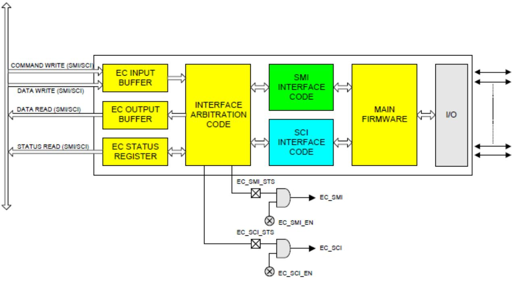  
Fig. 12.1: Shared Interface

The diagram above depicts the general register model supported by the ACPI Embedded Controller Interface.

The first method uses an embedded controller interface shared between OSPM and the system management code, which requires the Global Lock semaphore overhead to arbitrate ownership. The second method is a dedicated embedded controller decode range for sole use by OSPM driver. The following diagram illustrates the embedded controller architecture that includes a dedicated ACPI interface.

The private interface allows OSPM to communicate with the embedded controller without the additional software overhead associated with using the Global Lock. Several common system configurations can provide the additional embedded controller interfaces:

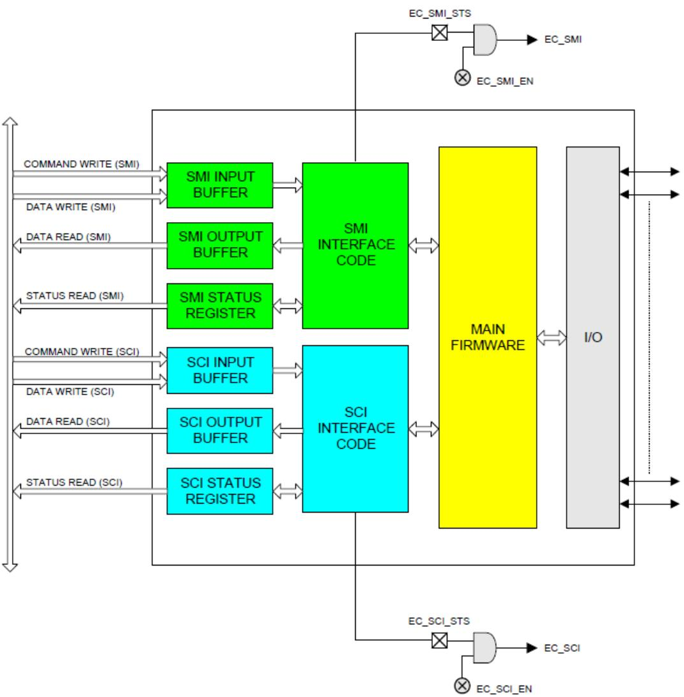  
Fig. 12.2: Private Interface

• Non-shared embedded controller. This will be the most common case where there is no need for the system management handler to communicate with the embedded controller when the system transitions to ACPI mode. OSPM processes all normal types of system management events, and the system management handler does not need to take any actions.

• Integrated keyboard controller and embedded controller. This provides three host interfaces as described earlier by including the standard keyboard controller in an existing component (chip set, I/O controller) and adding a discrete, standard embedded controller with two interfaces for system management activities.

• Standard keyboard controller and embedded controller. This provides three host interfaces by providing a keyboard controller as a distinct component, and two host interfaces are provided in the embedded controller for system management activities.

• Two embedded controllers. This provides up to four host interfaces by using two embedded controllers; one controller for system management activities providing up to two host interfaces, and one controller for keyboard controller functions providing up to two host interfaces.

• Embedded controller and no keyboard controller. Future platforms might provide keyboard functionality through an entirely diferent mechanism, which would allow for two host interfaces in an embedded controller for system management activities.

To handle the general embedded controller interface (as opposed to a dedicated interface) model, a method is available to make the embedded controller a shareable resource between multiple tasks running under the operating system’s control and the system management interrupt handler. This method, as described in this section, requires several changes:

• Additional external hardware

• Embedded controller firmware changes

• System management interrupt handler firmware changes

• Operating software changes

Access to the shared embedded controller interface requires additional software to arbitrate between the operating system’s use of the interface and the system management handler’s use of the interface. This is done using the Global Lock as described in Section 6.5.7, but is not supported on HW-reduced ACPI platforms.

This interface sharing protocol also requires embedded controller firmware changes, in order to ensure that collisions do not occur at the interface. A collision could occur if a byte is placed in the system output bufer and an interrupt is then generated. There is a small window of time when the incorrect recipient could receive the data. This problem is resolved by ensuring that the firmware in the embedded controller does not place any data in the output bufer until it is requested by OSPM or the system management handler.

More detailed algorithms and descriptions are provided in the following sections.

## 12.2 Embedded Controller Register Descriptions

The embedded controller contains three registers at two address locations: EC\_SC and EC\_DATA. The EC\_SC, or Embedded Controller Status/Command register, acts as two registers: a status register for reads to this port and a command register for writes to this port. The EC\_DATA (Embedded Controller Data register) acts as a port for transferring data between the host CPU and the embedded controller.

## 12.2.1 Embedded Controller Status, EC\_SC (R)

This is a read-only register that indicates the current status of the embedded controller interface.

Table 12.1: Read Only Register Table

<table><tr><td>Bit7</td><td>Bit6</td><td>Bit5</td><td>Bit4</td><td>Bit3</td><td>Bit2</td><td>Bit1</td><td>Bit0</td></tr><tr><td>IGN</td><td>SMI_EVT</td><td>SCI_EVT</td><td>BURST</td><td>CMD</td><td>IGN</td><td>IBF</td><td>OBF</td></tr></table>

## Where:

<table><tr><td>IGN</td><td>Ignored</td></tr><tr><td>SMI_EVT:</td><td>1 - Indicates SMI event is pending (requesting SMI query).0 - No SMI events are pending.</td></tr><tr><td>SCI_EVT:</td><td>1 - Indicates SCI event is pending (requesting SCI query).0 - No SCI events are pending.</td></tr><tr><td>BURST:</td><td>1 - Controller is in burst mode for polled command processing.0 - Controller is in normal mode for interrupt-driven command processing.</td></tr><tr><td>CMD:</td><td>1 - Byte in data register is a command byte (only used by controller).0 - Byte in data register is a data byte (only used by controller).</td></tr><tr><td>IBF:</td><td>1 - Input buffer is full (data ready for embedded controller).0 - Input buffer is empty.</td></tr><tr><td>OBF:</td><td>1 - Output buffer is full (data ready for host).0 - Output buffer is empty.</td></tr></table>

The Output Bufer Full (OBF) flag is set when the embedded controller has written a byte of data into the command or data port but the host has not yet read it. After the host reads the status byte and sees the OBF flag set, the host reads the data port to get the byte of data that the embedded controller has written. After the host reads the data byte, the OBF flag is cleared automatically by hardware. This signals the embedded controller that the data has been read by the host and the embedded controller is free to write more data to the host.

The Input Bufer Full (IBF) flag is set when the host has written a byte of data to the command or data port, but the embedded controller has not yet read it. After the embedded controller reads the status byte and sees the IBF flag set, the embedded controller reads the data port to get the byte of data that the host has written. After the embedded controller reads the data byte, the IBF flag is automatically cleared by hardware. This is the signal to the host that the data has been read by the embedded controller and that the host is free to write more data to the embedded controller.

The SCI event (SCI\_EVT) flag is set when the embedded controller has detected an internal event that requires the operating system’s attention. The embedded controller sets this bit in the status register, and generates an SCI to OSPM. OSPM needs this bit to diferentiate command-complete SCIs from notification SCIs. OSPM uses the query command to request the cause of the SCI\_EVT and take action. For more information, see Embedded Controller Command Set.

The SMI event (SMI\_EVT) flag is set when the embedded controller has detected an internal event that requires the system management interrupt handler’s attention. The embedded controller sets this bit in the status register before generating an SMI.

The Burst (BURST) flag indicates that the embedded controller has received the burst enable command from the host, has halted normal processing, and is waiting for a series of commands to be sent from the host. This allows OSPM or system management handler to quickly read and write several bytes of data at a time without the overhead of SCIs between the commands.

## 12.2.2 Embedded Controller Command, EC\_SC (W)

This is a write-only register that allows commands to be issued to the embedded controller. Writes to this port are latched in the input data register and the input bufer full flag is set in the status register. Writes to this location also cause the command bit to be set in the status register. This allows the embedded controller to diferentiate the start of a command sequence from a data byte write operation.

## 12.2.3 Embedded Controller Data, EC\_DATA (R/W)

This is a read/write register that allows additional command bytes to be issued to the embedded controller, and allows OSPM to read data returned by the embedded controller. Writes to this port by the host are latched in the input data register, and the input bufer full flag is set in the status register. Reads from this register return data from the output data register and clear the output bufer full flag in the status register.

## 12.3 Embedded Controller Command Set

The embedded controller command set allows OSPM to communicate with the embedded controllers. ACPI defines the commands and their byte encodings for use with the embedded controller that are shown in the following table.

Table 12.3: Embedded Controller Commands

<table><tr><td>Embedded Controller Command</td><td>Command Byte Encoding</td></tr><tr><td>Read Embedded Controller (RD_EC)</td><td>0x80</td></tr><tr><td>Write Embedded Controller (WR_EC)</td><td>0x81</td></tr><tr><td>Burst Enable Embedded Controller (BE_EC)</td><td>0x82</td></tr><tr><td>Burst Disable Embedded Controller (BD_EC)</td><td>0x83</td></tr><tr><td>Query Embedded Controller (QR_EC)</td><td>0x84</td></tr></table>

## 12.3.1 Read Embedded Controller, RD\_EC (0x80)

This command byte allows OSPM to read a byte in the address space of the embedded controller. This command byte is reserved for exclusive use by OSPM, and it indicates to the embedded controller to generate SCIs in response to related transactions (that is, IBF=0 or OBF=1 in the EC Status Register), rather than SMIs. This command consists of a command byte written to the Embedded Controller Command register (EC\_SC), followed by an address byte written to the Embedded Controller Data register (EC\_DATA). The embedded controller then returns the byte at the addressed location. The data is read at the data port after the OBF flag is set.

## 12.3.2 Write Embedded Controller, WR\_EC (0x81)

This command byte allows OSPM to write a byte in the address space of the embedded controller. This command byte is reserved for exclusive use by OSPM, and it indicates to the embedded controller to generate SCIs in response to related transactions (that is, IBF=0 or OBF=1 in the EC Status Register), rather than SMIs. This command allows OSPM to write a byte in the address space of the embedded controller. It consists of a command byte written to the Embedded Controller Command register (EC\_SC), followed by an address byte written to the Embedded Controller Data register (EC\_DATA), followed by a data byte written to the Embedded Controller Data Register (EC\_DATA); this is the data byte written at the addressed location.

## 12.3.3 Burst Enable Embedded Controller, BE\_EC (0x82)

This command byte allows OSPM to request dedicated attention from the embedded controller and (except for criti cal events) prevents the embedded controller from doing tasks other than receiving command and data from the host processor (either the system management interrupt handler or OSPM). This command is an optimization that allows the host processor to issue several commands back to back, in order to reduce latency at the embedded controller interface. When the controller is in the burst mode, it should transition to the burst disable state if the host does not issue a command within the following guidelines:

• First Access - 400 microseconds

• Subsequent Accesses - 50 microseconds each

• Total Burst Time - 1 millisecond

In addition, the embedded controller can disengage the burst mode at any time to process a critical event. If the embedded controller disables burst mode for any reason other than the burst disable command, it should generate an SCI to OSPM to indicate the change.

While in burst mode, the embedded controller follows these guidelines for OSPM driver:

SCIs are generated as normal, including IBF=0 and OBF=1.

Accesses should be responded to within 50 microseconds.

Burst mode is entered in the following manner:

OSPM driver writes the Burst Enable Embedded Controller, BE\_EC (0x82) command byte and then the Embedded Controller will prepare to enter the Burst mode. This includes processing any routine activities such that it should be able to remain dedicated to OSPM interface for \~ 1 microsecond.

The Embedded Controller sets the Burst bit of the Embedded Controller Status Register, puts the Burst Acknowledge byte (0x90) into the SCI output bufer, sets the OBF bit, and generates an SCI to signal OSPM that it is in Burst mode.

Burst mode is exited the following manner:

OSPM driver writes the Burst Disable Embedded Controller, BD\_EC (0x83) command byte and then the Embedded Controller will exit Burst mode by clearing the Burst bit in the Embedded Controller Status register and generating an SCI signal (due to IBF=0).

The Embedded Controller clears the Burst bit of the Embedded Controller Status Register.

## 12.3.4 Burst Disable Embedded Controller, BD\_EC (0x83)

This command byte releases the embedded controller from a previous burst enable command and allows it to resume normal processing. This command is sent by OSPM or system management interrupt handler after it has completed its entire queued command sequence to the embedded controller.

## 12.3.5 Query Embedded Controller, QR\_EC (0x84)

OSPM driver sends this command when the SCI\_EVT flag in the EC\_SC register is set. When the embedded controller has detected a system event that must be communicated to OSPM, it first sets the SCI\_EVT flag in the EC\_SC register, generates an SCI, and then waits for OSPM to send the query (QR\_EC) command. OSPM detects the embedded controller SCI, sees the SCI\_EVT flag set, and sends the query command to the embedded controller. Upon receipt of the QR\_EC command byte, the embedded controller places a notification byte with a value between 0-255, indicating the cause of the notification. The notification byte indicates which interrupt handler operation should be executed by OSPM to process the embedded controller SCI. The query value of zero is reserved for a spurious query result and indicates “no outstanding event.”

## 12.4 SMBus Host Controller Notification Header (Optional), OS\_SMB\_EVT

This query command notification header is the special return code that indicates events with an SMBus controller implemented within an embedded controller. These events include:

• Command completion

• Command error

• Alarm reception

The actual notification value is declared in the EC-SMB-HC device object in the ACPI Namespace.

## 12.5 Embedded Controller Firmware

The embedded controller firmware must obey the following rules in order to be ACPI-compatible:

• SMI Processing. Although it is not explicitly stated in the command specification section, a shared embedded controller interface has a separate command set for communicating with each environment it plans to support. In other words, the embedded controller knows which environment is generating the command request, as well as which environment is to be notified upon event detection, and can then generate the correct interrupts and notification values. This implies that a system management handler uses commands that parallel the functionality of all the commands for ACPI including query, read, write, and any other implemented specific commands.

• SCI/SMI Task Queuing. If the system design is sharing the interface between both a system management interrupt handler and OSPM, the embedded controller should always be prepared to queue a notification if it receives a command. The embedded controller only sets the appropriate event flag in the status (EC\_SC) register if the controller has detected an event that should be communicated to the OS or system management handler. The embedded controller must be able to field commands from either environment without loss of the notification event. At some later time, the OS or system management handler issues a query command to the embedded controller to request the cause of the notification event.

• Notification Management. The use of the embedded controller means using the query (QR\_EC) command to notify OSPM of system events requiring action. If the embedded controller is shared with the operating system, the SMI handler uses the SMI\_EVT flag and an SMI query command (not defined in this document) to receive the event notifications. The embedded controller doesn’t place event notifications into the output bufer of a shared interface unless it receives a query command from OSPM or the system management interrupt handler.

## 12.6 Interrupt Model

The EC Interrupt Model uses pulsed interrupts to speed the clearing process. The Interrupt is firmware generated using an EC general-purpose output and has the waveform shown in Interrupt Model . The embedded controller SCI is always wired directly to a GPE input or a GPIO pin, and OSPM driver treats this as an edge event (the EC SCI cannot be shared).

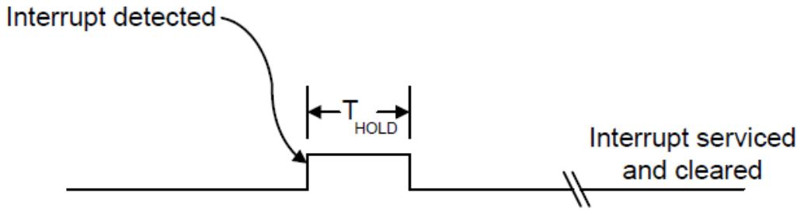  
Fig. 12.3: Interrupt Model

## 12.6.1 Event Interrupt Model

The embedded controller must generate SCIs for the events listed in the following table.

Table 12.4: Events for Which Embedded Controller Must Generate SCIs

<table><tr><td>Event</td><td>Description</td></tr><tr><td>IBF=0</td><td>Signals that the embedded controller has read the last command or data from the input buffer and the host is free to send more data.</td></tr><tr><td>OBF=1</td><td>Signals that the embedded controller has written a byte of data into the output buffer and the host is free to read the returned data.</td></tr><tr><td>SCI_EVT=1</td><td>Signals that the embedded controller has detected an event that requires OS attention. OSPM should issue a query (QR_EC) command to find the cause of the event.</td></tr></table>

## 12.6.2 Command Interrupt Model

The embedded controller must generate SCIs for commands as follows:

Table 12.5: Read Command (3 Bytes)

<table><tr><td>Byte #1</td><td>(Command byte Header)</td><td>Interrupt on IBF=0</td></tr><tr><td>Byte #2</td><td>(Address byte to read)</td><td>No Interrupt</td></tr><tr><td>Byte #3</td><td>(Data read to host)</td><td>Interrupt on OBF=1</td></tr></table>

Table 12.6: Write Command (3 Bytes)

<table><tr><td>Byte #1</td><td>(Command byte Header)</td><td>Interrupt on IBF=0</td></tr><tr><td>Byte #2</td><td>(Address byte to write)</td><td>Interrupt on IBF=0</td></tr><tr><td>Byte #3</td><td>(Data to read)</td><td>Interrupt on IBF=0</td></tr></table>

Table 12.7: Query Command (2 Bytes)

<table><tr><td>Byte #1</td><td>(Command byte Header)</td><td>No Interrupt</td></tr><tr><td>Byte #2</td><td>(Query value to host)</td><td>Interrupt on OBF=1</td></tr></table>

Table 12.8: Burst Enable Command (2 Bytes)

<table><tr><td>Byte #1</td><td>(Command byte Header)</td><td>No Interrupt</td></tr><tr><td>Byte #2</td><td>(Burst acknowledge byte)</td><td>Interrupt on OBF=1</td></tr></table>

Table 12.9: Burst Disable Command (1 Byte)

<table><tr><td>Byte #1</td><td>(Command byte Header)</td><td>Interrupt on IBF=0</td></tr></table>

## 12.7 Embedded Controller Interfacing Algorithms

To initiate communications with the embedded controller, OSPM or system management handler acquires ownership of the interface. This ownership is acquired through the use of the Global Lock, or is owned by default by OSPM as a non-shared resource (and the Global Lock is not required for accessibility).

After ownership is acquired, the protocol always consists of the passing of a command byte. The command byte will indicate the type of action to be taken. Following the command byte, zero or more data bytes can be exchanged in either direction. The data bytes are defined according to the command byte that is transferred.

The embedded controller also has two status bits that indicate whether the registers have been read. This is used to ensure that the host or embedded controller has received data from the embedded controller or host. When the host writes data to the command or data register of the embedded controller, the input bufer flag (IBF) in the status register is set within 1 microsecond. When the embedded controller reads this data from the input bufer, the input bufer flag is reset. When the embedded controller writes data into the output bufer, the output bufer flag (OBF) in the status register is set. When the host processor reads this data from the output bufer, the output bufer flag is reset.

## 12.8 Embedded Controller Description Information

Certain aspects of the embedded controller’s operation have OEM-definable values associated with them. The following is a list of values that are defined in the software layers of the ACPI specification:

• Status flag indicating whether the interface requires the use of the Global Lock.

• Bit position of embedded controller interrupt in general-purpose status register.

• Decode address for command/status register.

• Decode address for data register.

• Base address and query value of any EC-SMBus controller.

For implementation details of the above information, see Defining an Embedded Controller Device in ACPI Namespace and Defining an EC SMBus Host Controller in ACPI Namespace.

An embedded controller will require the inclusion of the GLK method in its ACPI namespace if potentially contentious accesses to device resources are performed by non-OS code. See \_GLK (Global Lock) for details about the \_GLK method.

## 12.9 SMBus Host Controller Interface via Embedded Controller

This section specifies a standard interface that an ACPI-compatible OS can use to communicate with embedded controller-based SMBus host controllers (EC-SMB-HC). This interface allows the host processor (under control of OSPM) to manage devices on the SMBus. Typical devices residing on the SMBus include Smart Batteries, Smart Battery Chargers, contrast/backlight control, and temperature sensors.

The EC-SMB-HC interface consists of a block of registers that reside in embedded controller space. These registers are used by software to initiate SMBus transactions and receive SMBus notifications. By using a well-defined register set, OS software can be written to operate with any vendor’s embedded controller hardware.

Certain SMBus segments have special requirements that the host controller filters certain SMBus commands (for example, to prevent an errant application or virus from potentially damaging the battery subsystem). This is most easily accomplished by implementing the host interface controller through an embedded controller–as embedded controller can easily filter out potentially problematic commands.

Notice that an EC-SMB-HC interface will require the inclusion of the GLK method in its ACPI namespace if potentially contentious accesses to device resources are performed by non-OS code. See \_GLK (Global Lock) for details on using the \_GLK method.

## 12.9.1 Register Description

The EC-SMBus host interface is a flat array of registers that are arranged sequentially in the embedded controller address space.

## 12.9.1.1 Status Register, SMB\_STS

This register indicates general status on the SMBus. This includes SMB-HC command completion status, alarm received status, and error detection status (the error codes are defined later in this section). This register is cleared to zeroes (except for the ALRM bit) whenever a new command is issued using a write to the protocol (SMB\_PRTCL) register. This register is always written with the error code before clearing the protocol register. The SMB-HC quer event (that is, an SMB-HC interrupt) is raised after the clearing of the protocol register.

## ò Note

OSPM must ensure the ALRM bit is cleared after it has been serviced by writing $\cdot _ { 0 0 } ,$ to the SMB\_STS register.

Table 12.10: Status Register, SMB\_STS

<table><tr><td>Bit7</td><td>Bit6</td><td>Bit5</td><td>Bit4</td><td>Bit3</td><td>Bit2</td><td>Bit1</td><td>Bit0</td></tr><tr><td>Done</td><td>ALRM</td><td>RES</td><td></td><td></td><td>STATUS</td><td></td><td></td></tr></table>

Where:

<table><tr><td>DONE:</td><td>Indicates the last command has completed and no error.</td></tr><tr><td>ALRM:</td><td>Indicates an SMBus alarm message has been received.</td></tr><tr><td>RES:</td><td>Reserved</td></tr><tr><td>STATUS:</td><td>Indicates SMBus communication status for one of the reasons listed in the following table.</td></tr></table>

Table 12.11: SMBus Status Codes

<table><tr><td>Status Code</td><td>Name</td><td>Description</td></tr><tr><td>00h</td><td>SMBus OK</td><td>Indicates the transaction has been successfully completed.</td></tr><tr><td>07h</td><td>SMBus Unknown Failure</td><td>Indicates failure because of an unknown SMBus error.</td></tr><tr><td>10h</td><td>SMBus Device Address Not Acknowledged</td><td>Indicates the transaction failed because the slave device address was not acknowledged.</td></tr><tr><td>11h</td><td>SMBus Device Error Detected</td><td>Indicates the transaction failed because the slave device signaled an error condition.</td></tr><tr><td>12h</td><td>SMBus Device Command Access Denied</td><td>Indicates the transaction failed because the SMBus host does not allow the specific command for the device being addressed. For example, the SMBus host might not allow a caller to adjust the Smart Battery Charger&#x27;s output.</td></tr><tr><td>13h</td><td>SMBus Unknown Error</td><td>Indicates the transaction failed because the SMBus host encountered an unknown error.</td></tr><tr><td>17h</td><td>SMBus Device Access Denied</td><td>Indicates the transaction failed because the SMBus host does not allow access to the device addressed. For example, the SMBus host might not allow a caller to directly communicate with an SMBus device that controls the system&#x27;s power planes.</td></tr><tr><td>18h</td><td>SMBus Timeout</td><td>Indicates the transaction failed because the SMBus host detected a timeout on the bus.</td></tr><tr><td>19h</td><td>SMBus Host Unsupported Protocol</td><td>Indicates the transaction failed because the SMBus host does not support the requested protocol.</td></tr><tr><td>1Ah</td><td>SMBus Busy</td><td>Indicates that the transaction failed because the SMBus host reports that the SMBus is presently busy with some other transaction. For example, the Smart Battery might be sending charging information to the Smart Battery Charger.</td></tr><tr><td>1Fh</td><td>SMBus PEC (CRC-8) Error</td><td>Indicates that a Packet Error Checking (PEC) error occurred during the last transaction.</td></tr></table>

All other error codes are reserved.

## 12.9.1.2 Protocol Register, SMB\_PRTCL

This register determines the type of SMBus transaction generated on the SMBus. In addition to indicating the protocol type to the SMB-HC, a write to this register initiates the transaction on the SMBus. Notice that bit 7 of the protocol value is used to indicate whether packet error checking should be employed. A value of 1 (one) in this bit indicates that PEC format should be used for the specified protocol, and a value of 0 (zero) indicates the standard (non-PEC) format should be used.

Table 12.12: Protocol Register, SMB\_PRTCL

<table><tr><td>Bit7</td><td>Bit6 to Bit0</td></tr><tr><td>PEC</td><td>PROTOCOL</td></tr></table>

Where the PROTOCOL values are as follows:

<table><tr><td>0x00</td><td>Controller Not In Use</td></tr><tr><td>0x01</td><td>Reserved</td></tr><tr><td>0x02</td><td>Write Quick Command</td></tr><tr><td>0x03</td><td>Read Quick Command</td></tr><tr><td>0x04</td><td>Send Byte</td></tr><tr><td>0x05</td><td>Receive Byte</td></tr><tr><td>0x06</td><td>Write Byte</td></tr><tr><td>0x07</td><td>Read Byte</td></tr><tr><td>0x08</td><td>Write Word</td></tr><tr><td>0x09</td><td>Read Word</td></tr><tr><td>0x0A</td><td>Write Block</td></tr><tr><td>0x0B</td><td>Read Block</td></tr><tr><td>0x0C</td><td>Process Call</td></tr><tr><td>0x0D</td><td>Block Write-Block Read Process Call</td></tr></table>

For example, the protocol value of 0x09 would be used to communicate to a device that supported the standard read word protocol. If this device also supported packet error checking for this protocol, a value of 0x89 (read word with PEC) could optionally be used. See the SMBus specification for more information on packet error checking.

When OSPM initiates a new command such as write to the SMB\_PRTCL register, the SMBus controller first updates the SMB\_STS register and then clears the SMB\_PRTCL register. After the SMB\_PRTCL register is cleared, the host controller query value is raised.

All other protocol values are reserved.

## 12.9.1.3 Address Register, SMB\_ADDR

This register contains the 7-bit address to be generated on the SMBus. This is the first byte to be sent on the SMBus for all of the diferent protocols.

Table 12.13: Address Register, SMB\_ADDR

<table><tr><td>Bit7 to Bit1</td><td>Bit0</td></tr><tr><td>ADDRESS (A6:A0)</td><td>RES</td></tr></table>

Where:

<table><tr><td>RES:</td><td>Reserved</td></tr><tr><td>ADDRESS:</td><td>7-bit SMBus address. This address is not zero-aligned (in other words, it is only a 7-bit address (A6:A0) that is aligned from bit 1-7).</td></tr></table>

## 12.9.1.4 Command Register, SMB\_CMD

This register contains the command byte that will be sent to the target device on the SMBus and is used for the following protocols: send byte, write byte, write word, read byte, read word, process call, block read and block write. It is not used for the quick commands or the receive byte protocol, and as such, its value is a “don’t care” for those commands.

Table 12.14: Command Register, SMB\_CMD

<table><tr><td>Bit7 to Bit0</td><td>COMMAND</td></tr></table>

Where:

<table><tr><td>COMMAND</td><td>Command byte to be sent to SMBus device.</td></tr></table>

## 12.9.1.5 Data Register Array, SMB\_DATA[i], i=0-31

This bank of registers contains the remaining bytes to be sent or received in any of the diferent protocols that can be run on the SMBus. The SMB\_DATA[i] registers are defined on a per-protocol basis and, as such, provide eficient use of register space.

Table 12.15: Data Register Array, SMB\_DATA[i], i=0-31

<table><tr><td>Bit7 to Bit0</td><td>DATA</td></tr></table>

Where:

DATA One byte of data to be sent or received (depending upon protocol).

## 12.9.1.6 Block Count Register, SMB\_BCNT

This register contains the number of bytes of data present in the SMB\_DATA[i] registers preceding any write block and following any read block transaction. The data size is defined on a per protocol basis.

Table 12.16: Block Count Register, SMB\_BCNT

<table><tr><td>Bit7 to Bit5</td><td>Bit4 to Bit0</td></tr><tr><td>RES</td><td>BCNT</td></tr></table>

## 12.9.1.7 Alarm Address Register, SMB\_ALRM\_ADDR

This register contains the address of an alarm message received by the host controller, at slave address 0x8, from the SMBus master that initiated the alarm. The address indicates the slave address of the device on the SMBus that initiated the alarm message. The status of the alarm message is contained in the SMB\_ALRM\_DATAx registers. Once an alarm message has been received, the SMB-HC will not receive additional alarm messages until the ALRM status bit is cleared.

Table 12.17: Alarm Address Register, SMB\_ALRM\_ADDR

<table><tr><td>Bit7 to Bit1</td><td>Bit0</td></tr><tr><td>ADDRESS (A6:A0)</td><td>RES</td></tr></table>

Where:

<table><tr><td>RES:</td><td>Reserved</td></tr><tr><td>ADDRESS:</td><td>Slave address (A6:A0) of the SMBus device that initiated the SMBus alarm message.</td></tr></table>

## 12.9.1.8 Alarm Data Registers, SMB\_ALRM\_DATA[0], SMB\_ALRM\_DATA[1]

These registers contain the two data bytes of an alarm message received by the host controller, at slave address 0x8, from the SMBus master that initiated the alarm. These data bytes indicate the specific reason for the alarm message, such that OSPM can take actions. Once an alarm message has been received, the SMB-HC will not receive additional alarm messages until the ALRM status bit is cleared.

Table 12.18: Alarm Data Registers, SMB\_ALRM\_DATA[0],  
SMB\_ALRM\_DATA[1]

<table><tr><td>Bit7 to Bit0</td><td>DATA (D7:D0)</td></tr></table>

Where:

<table><tr><td>DATA</td><td>Data byte received in alarm message.</td></tr></table>

The alarm address and alarm data registers are not read by OSPM until the alarm status bit is set. OSPM driver then reads the 3 bytes, and clears the alarm status bit to indicate that the alarm registers are now available for the next event.

## 12.9.2 Protocol Description

This section describes how to initiate the diferent protocols on the SMBus through the interface described in Register Description. The registers should all be written with the appropriate values before writing the protocol value that starts the SMBus transaction. All transactions can be completed in one pass.

## 12.9.2.1 Write Quick

Data Sent:

```txt
SMB_ADDR: Address of SMBus device.
SMB_PRTCL: Write 0x02 to initiate the write quick protocol.
```

Data Returned:

<table><tr><td>SMB_STS:</td><td>Status code for transaction.</td></tr><tr><td>SMB_PRTCL:</td><td>0x00 to indicate command completion.</td></tr></table>

## 12.9.2.2 Read Quick

Data Sent:

<table><tr><td>SMB_ADDR:</td><td>Address of SMBus device.</td></tr><tr><td>SMB_PRTCL:</td><td>Write 0x03 to initiate the read quick protocol.</td></tr></table>

Data Returned:

<table><tr><td>SMB_STS:</td><td>Status code for transaction.</td></tr><tr><td>SMB_PRTCL:</td><td>0x00 to indicate command completion.</td></tr></table>

## 12.9.2.3 Send Byte

Data Sent:

<table><tr><td>SMB_ADDR:</td><td>Address of SMBus device.</td></tr><tr><td>SMB_CMD:</td><td>Command byte to be sent.</td></tr><tr><td>SMB_PRTCL:</td><td>Write 0x04 to initiate the send byte protocol, or 0x84 to initiate the send byte protocol with PEC.</td></tr></table>

## Data Returned:

<table><tr><td>SMB_STS:</td><td>Status code for transaction.</td></tr><tr><td>SMB_PRTCL:</td><td>0x00 to indicate command completion.</td></tr></table>

## 12.9.2.4 Receive Byte

Data Sent:

<table><tr><td>SMB_ADDR:</td><td>Address of SMBus device.</td></tr><tr><td>SMB_PRTCL:</td><td>Write 0x05 to initiate the receive byte protocol, or 0x85 to initiate the receive byte protocol with PEC.</td></tr></table>

## Data Returned:

<table><tr><td>SMB_DATA[0]:</td><td>Data byte received.</td></tr><tr><td>SMB_STS:</td><td>Status code for transaction.</td></tr><tr><td>SMB_PRTCL:</td><td>0x00 to indicate command completion.</td></tr></table>

## 12.9.2.5 Write Byte

Data Sent:

<table><tr><td>SMB_ADDR:</td><td>Address of SMBus device.</td></tr><tr><td>SMB_CMD:</td><td>Command byte to be sent.</td></tr><tr><td>SMB_DATA[0]:</td><td>Data byte to be sent.</td></tr><tr><td>SMB_PRTCL:</td><td>Write 0x06 to initiate the write byte protocol, or 0x86 to initiate the write byte protocol with PEC.</td></tr></table>

## Data Returned:

<table><tr><td>SMB_STS:</td><td>Status code for transaction.</td></tr><tr><td>SMB_PRTCL:</td><td>0x00 to indicate command completion.</td></tr></table>

## 12.9.2.6 Read Byte

Data Sent:

<table><tr><td>SMB_ADDR:</td><td>Address of SMBus device.</td></tr><tr><td>SMB_CMD:</td><td>Command byte to be sent.</td></tr><tr><td>SMB_PRTCL:</td><td>Write 0x07 to initiate the read byte protocol, or 0x87 to initiate the read byte protocol with PEC.</td></tr></table>

## Data Returned:

<table><tr><td>SMB_DATA[0]:</td><td>Data byte received.</td></tr><tr><td>SMB_STS:</td><td>Status code for transaction.</td></tr><tr><td>SMB_PRTCL:</td><td>0x00 to indicate command completion.</td></tr></table>

## 12.9.2.7 Write Word

Data Sent:

<table><tr><td>SMB_ADDR:</td><td>Address of SMBus device.</td></tr><tr><td>SMB_CMD:</td><td>Command byte to be sent.</td></tr><tr><td>SMB_DATA[0]:</td><td>Low data byte to be sent.</td></tr><tr><td>SMB_DATA[1]:</td><td>High data byte to be sent.</td></tr><tr><td>SMB_PRTCL:</td><td>Write 0x08 to initiate the write word protocol, or 0x88 to initiate the write word protocol with PEC.</td></tr></table>

## Data Returned:

<table><tr><td>SMB_STS:</td><td>Status code for transaction.</td></tr><tr><td>SMB_PRTCL:</td><td>0x00 to indicate command completion.</td></tr></table>

## 12.9.2.8 Read Word

## Data Sent:

<table><tr><td>SMB_ADDR:</td><td>Address of SMBus device.</td></tr><tr><td>SMB_CMD:</td><td>Command byte to be sent.</td></tr><tr><td>SMB_PRTCL:</td><td>Write 0x09 to initiate the read word protocol, or 0x89 to initiate the read word protocol with PEC.</td></tr></table>

## Data Returned:

<table><tr><td>SMB_DATA[0]:</td><td>Low data byte received.</td></tr><tr><td>SMB_DATA[1]:</td><td>High data byte received.</td></tr><tr><td>SMB_STS:</td><td>Status code for transaction.</td></tr><tr><td>SMB_PRTCL:</td><td>0x00 to indicate command completion.</td></tr></table>

## 12.9.2.9 Write Block

Data Sent:

<table><tr><td>SMB_ADDR:</td><td>Address of SMBus device.</td></tr><tr><td>SMB_CMD:</td><td>Command byte to be sent.</td></tr><tr><td>SMB_DATA[0-31]:</td><td>Data bytes to write (1-32).</td></tr><tr><td>SMB_BCNT:</td><td>Number of data bytes (1-32) to be sent.</td></tr><tr><td>SMB_PRTCL:</td><td>Write 0x0A to initiate the write block protocol, or 0x8A to initiate the write block protocol with PEC.</td></tr></table>

## Data Returned:

<table><tr><td>SMB_PRTCL:</td><td>0x00 to indicate command completion.</td></tr><tr><td>SMB_STS:</td><td>Status code for transaction.</td></tr></table>

## 12.9.2.10 Read Block

Data Sent:

<table><tr><td>SMB_ADDR:</td><td>Address of SMBus device.</td></tr><tr><td>SMB_CMD:</td><td>Command byte to be sent.</td></tr><tr><td>SMB_PRTCL:</td><td>Write 0x0B to initiate the read block protocol, or 0x8B to initiate the read block protocol with PEC.</td></tr></table>

## Data Returned:

<table><tr><td>SMB_BCNT:</td><td>Number of data bytes (1-32) received.</td></tr><tr><td>SMB_DATA[0-31]:</td><td>Data bytes received (1-32).</td></tr><tr><td>SMB_STS:</td><td>Status code for transaction.</td></tr><tr><td>SMB_PRTCL:</td><td>0x00 to indicate command completion.</td></tr></table>

## 12.9.2.11 Process Call

## Data Sent:

<table><tr><td>SMB_ADDR:</td><td>Address of SMBus device.</td></tr><tr><td>SMB_CMD:</td><td>Command byte to be sent.</td></tr><tr><td>SMB_DATA[0]:</td><td>Low data byte to be sent.</td></tr><tr><td>SMB_DATA[1]:</td><td>High data byte to be sent.</td></tr><tr><td>SMB_PRTCL:</td><td>Write 0x0C to initiate the process call protocol, or 0x8C to initiate the process call protocol with PEC.</td></tr></table>

## Data Returned:

<table><tr><td>SMB_DATA[0]:</td><td>Low data byte received.</td></tr><tr><td>SMB_DATA[1]:</td><td>High data byte received.</td></tr><tr><td>SMB_STS:</td><td>Status code for transaction.</td></tr><tr><td>SMB_PRTCL:</td><td>0x00 to indicate command completion.</td></tr></table>

## 12.9.2.12 Block Write-Block Read Process Call

## Data Sent:

<table><tr><td>SMB_ADDR:</td><td>Address of SMBus device.</td></tr><tr><td>SMB_CMD:</td><td>Command byte to be sent.</td></tr><tr><td>SMB_DATA[031]:</td><td>Data bytes to write (1-31).</td></tr><tr><td>SMB_BCNT:</td><td>Number of data bytes (1-31) to be sent.</td></tr><tr><td>SMB_PRTCL:</td><td>Write 0x0D to initiate the write block-read block process call protocol, or 0x8D to initiate the write block-read block process call protocol with PEC.</td></tr></table>

## Data Returned:

<table><tr><td>SMB_BCNT:</td><td>Number of data bytes (1-31) received.</td></tr><tr><td>SMB_DATA[0-31]:</td><td>Data bytes received (1-31).</td></tr><tr><td>SMB_STS:</td><td>Status code for transaction.</td></tr><tr><td>SMB_PRTCL:</td><td>0x00 to indicate command completion.</td></tr></table>

## ò Note

The following restrictions apply above: The aggregate data length of the write and read blocks must not exceed 32 bytes and each block (write and read) must contain at least 1 byte of data.

## 12.9.2.13 SMBus Register Set

The register set for the SMB-HC has the following format. All registers are 8 bit.

Table 12.19: SMB EC Interface

<table><tr><td>Location</td><td>Register Name</td><td>Description</td></tr><tr><td>BASE+0</td><td>SMB_PRTCL</td><td>Protocol register</td></tr><tr><td>BASE+1</td><td>SMB_STS</td><td>Status register</td></tr><tr><td>BASE+2</td><td>SMB_ADDR</td><td>Address register</td></tr><tr><td>BASE+3</td><td>SMB_CMD</td><td>Command register</td></tr><tr><td>BASE+4</td><td>SMB_DATA[0]</td><td>Data register zero</td></tr><tr><td>BASE+5</td><td>SMB_DATA[1]</td><td>Data register one</td></tr><tr><td>BASE+6</td><td>SMB_DATA[2]</td><td>Data register two</td></tr><tr><td>BASE+7</td><td>SMB_DATA[3]</td><td>Data register three</td></tr><tr><td>BASE+8</td><td>SMB_DATA[4]</td><td>Data register four</td></tr><tr><td>BASE+9</td><td>SMB_DATA[5]</td><td>Data register five</td></tr><tr><td>BASE+10</td><td>SMB_DATA[6]</td><td>Data register six</td></tr><tr><td>BASE+11</td><td>SMB_DATA[7]</td><td>Data register seven</td></tr><tr><td>BASE+12</td><td>SMB_DATA[8]</td><td>Data register eight</td></tr><tr><td>BASE+13</td><td>SMB_DATA[9]</td><td>Data register nine</td></tr><tr><td>BASE+14</td><td>SMB_DATA[10]</td><td>Data register ten</td></tr><tr><td>BASE+15</td><td>SMB_DATA[11]</td><td>Data register eleven</td></tr><tr><td>BASE+16</td><td>SMB_DATA[12]</td><td>Data register twelve</td></tr><tr><td>BASE+17</td><td>SMB_DATA[13]</td><td>Data register thirteen</td></tr><tr><td>BASE+18</td><td>SMB_DATA[14]</td><td>Data register fourteen</td></tr><tr><td>BASE+19</td><td>SMB_DATA[15]</td><td>Data register fifteen</td></tr><tr><td>BASE+20</td><td>SMB_DATA[16]</td><td>Data register sixteen</td></tr><tr><td>BASE+21</td><td>SMB_DATA[17]</td><td>Data register seventeen</td></tr><tr><td>BASE+22</td><td>SMB_DATA[18]</td><td>Data register eighteen</td></tr><tr><td>BASE+23</td><td>SMB_DATA[19]</td><td>Data register nineteen</td></tr><tr><td>BASE+24</td><td>SMB_DATA[20]</td><td>Data register twenty</td></tr><tr><td>BASE+25</td><td>SMB_DATA[21]</td><td>Data register twenty-one</td></tr><tr><td>BASE+26</td><td>SMB_DATA[22]</td><td>Data register twenty-two</td></tr><tr><td>BASE+27</td><td>SMB_DATA[23]</td><td>Data register twenty-three</td></tr><tr><td>BASE+28</td><td>SMB_DATA[24]</td><td>Data register twenty-four</td></tr><tr><td>BASE+29</td><td>SMB_DATA[25]</td><td>Data register twenty-five</td></tr><tr><td>BASE+30</td><td>SMB_DATA[26]</td><td>Data register twenty-six</td></tr><tr><td>BASE+31</td><td>SMB_DATA[27]</td><td>Data register twenty-seven</td></tr><tr><td>BASE+32</td><td>SMB_DATA[28]</td><td>Data register twenty-eight</td></tr><tr><td>BASE+33</td><td>SMB_DATA[29]</td><td>Data register twenty-nine</td></tr><tr><td>BASE+34</td><td>SMB_DATA[30]</td><td>Data register thirty</td></tr><tr><td>BASE+35</td><td>SMB_DATA[31]</td><td>Data register thirty-one</td></tr><tr><td>BASE+36</td><td>SMB_BCNT</td><td>Block Count Register</td></tr><tr><td>BASE+37</td><td>SMB_ALRM_ADDR</td><td>Alarm address</td></tr><tr><td>BASE+38</td><td>SMB_ALRM_DATA[0]</td><td>Alarm data register zero</td></tr><tr><td>BASE+39</td><td>SMB_ALRM_DATA[1]</td><td>Alarm data register one</td></tr></table>

## 12.10 SMBus Devices

The embedded controller interface provides the system with a standard method to access devices on the SMBus. It does not define the data and/or access protocol(s) used by any particular SMBus device. Further, the embedded controller can (and probably will) serve as a gatekeeper to prevent accidental or malicious access to devices on the SMBus.

Some SMBus devices are defined by their address and a specification that describes the data and the protocol used to access that data. For example, the Smart Battery System devices are defined by a series of specifications including:

• Smart Battery Data specification

• Smart Battery Charger specification

• Smart Battery Selector specification

• Smart Battery System Manager specification

The embedded controller can also be used to emulate (in part or totally) any SMBus device.

## 12.10.1 SMBus Device Access Restrictions

In some cases, the embedded controller interface will not allow access to a particular SMBus device. Some SMBus devices can and do communicate directly between themselves. Unexpected accesses can interfere with their normal operation and cause unpredictable results

## 12.10.2 SMBus Device Command Access Restriction

There are cases where part of an SMBus device’s commands are public while others are private. Extraneous attempts to access these commands might cause interference with the SMBus device’s normal operation.

The Smart Battery and the Smart Battery Charger are good examples of devices that should not have their entire command set exposed. The Smart Battery commands the Smart Battery Charger to supply a specific charging voltage and charging current. Attempts by anyone to alter these values can cause damage to the battery or the mobile system. To protect the system’s integrity, the embedded controller interface can restrict access to these commands by returning one of the following error codes: Device Command Access Denied (0x12) or Device Access Denied (0x17).

## 12.11 Defining an Embedded Controller Device in ACPI Namespace

An embedded controller device is created using the named device object. The embedded controller’s device object requires the following elements:

Table 12.20: Embedded Controller Device Object Control Methods

<table><tr><td>Object</td><td>Description</td></tr><tr><td>_CRS</td><td>Named object that returns the Embedded Controller&#x27;s current resource settings. Embedded Controllers are considered static resources; hence only return their defined resources. The embedded controller resides only in system I/O or memory space. The first address region returned is the data port, and the second address region returned is the status/command port for the embedded controller. If the EC is used on a HW-Reduced ACPI platform, a third resource is required, which is the GPIO Interrupt Connection resource for the EC&#x27;s SCI Interrupt. CRS is a standard device configuration control method defined in _CRS (Current Resource Settings).</td></tr></table>

continues on next page

Table 12.20 – continued from previous page

<table><tr><td>_HID</td><td>Named object that provides the Embedded Controller&#x27;s Plug and Play identifier. This value is set to PNP0C09. _HID is a standard device configuration control method defined in _HID (Hardware ID).</td></tr><tr><td>_GPE</td><td>Named Object that evaluates to either an integer or a package. If _GPE evaluates to an integer, the value is the bit assignment of the SCI interrupt within the GPEx_STS register of a GPE block described in the FADT that the embedded controller will trigger. If _GPE evaluates to a package, then that package contains two elements. The first is an object reference to the GPE Block device that contains the GPE register that will be triggered by the embedded controller. The second element is numeric (integer) that specifies the bit assignment of the SCI interrupt within the GPEx_STS register of the GPE Block device referenced by the first element in the package. This control method is specific to the embedded controller. This method is not required on Hardware-reduced ACPI platforms.</td></tr><tr><td>_DSM</td><td>Device Specific Method that allows a supported OSV to negotiate the platform FW preferred interactions for the onboard embedded controller.</td></tr></table>

## Arguments (Function 1):

• Arg0: A Bufer containing the UUID = {ecc0d5e9-3ee7-4f53-8c8f-766b839dddce}

• Arg1: An Integer containing the Revision ID = 0

• Arg2: An Integer containing the Function Index = 1

• Arg3: Empty package (not used)

## Return Value (Function 1):

{FW-Granted Min Burst Length} A 32-bit bufer containing the minimum number of bytes the platform FW has granted to be performed in ACPI Burst Mode when communicating with the EC OpRegion (a value of 0 or all FFs is reserved).

## Implementation Note:

The intent of \_DSM Function 1 is to optimize the OSV’s EC OpRegion accesses performed in ACPI Burst Mode in a regression-safe way. For legacy platforms that do not implement this change, the existing ACPI Burst Mode behavior will remain unchanged, resolving concerns for regression. Platforms that do implement EC \_DSM Function 1 must do so only after confirming that the platform takes no dependency on ACPI burst mode for OpRegion accesses less than the return value of \_DSM Function 1.

After the OSV has discovered both an ACPI EC namespace definition and a paired OpRegion definition under that namespace, a supported OSV must invoke this \_DSM before communicating with that OpRegion.

Other OSV changes are optional and implementation specific.

## Example:

```javascript
Device (H_EC) {
    Name(_HID, EISAID("PNP0C09"))
    // _DSM - Device Specific Method
    //
    // Arg0: UUID Unique function identifier
    // Arg1: Integer Revision Level
    // Arg2: Integer Function Index (0 = Return Supported Functions)
    // Arg3: Package Parameters
    Function(_DSM, {IntObj, BuffObj}, {BuffObj, IntObj, IntObj, PkgObj})
    {
```

(continues on next page)

(continued from previous page)

```txt
switch(Arg0)
{
    case(ToUUID("ecc0d5e9-3ee7-4f53-8c8f-766b839dddce"))
    {
    switch(Arg2)
    {
    //
    // Function 0: Return supported functions, based on revision
    //
    case(0)
    {
    switch(Arg1)
    {
    // revision 0: function 1 is supported
    case(0) {return (Buffer() {0x1})}
    }
    // revision 1+: No function yet supported
    return (Buffer() {0x0})
    }
    //
    // Function 1: Return Platform-FW Granted min number of bytes to use burst
    // mode for
    //
    case(1)
    {
    ... Platform FW logic to get min number of bytes to use Burst Mode for ...
    ... It is recommended to return a value larger than 1 ...
    Return(Buffer() {0x2})
    }
    default {BreakPoint}
    }
    }
    //
    // If not one of the UUIDs we recognize, then return a buffer
    // with bit 0 set to 0 indicating no functions supported.
    //
    return(Buffer(){0})
    }
    ...
    ...
}
```

## 12.11.1 Example: EC Definition ASL Code

Example ASL code that defines an embedded controller device is shown below:

```txt
Device(EC0) {
    // PnP ID
    Name(_HID, EISAID("PNP0C09"))
    // Returns the "Current Resources" of EC
    Name(_CRS,
    ResourceTemplate() { // port 0x62 and 0x66
    IO(Decode16, 0x62, 0x62, 0, 1),
    IO(Decode16, 0x66, 0x66, 0, 1)
    /* For HW-Reduced ACPI Platforms, include a GPIO Interrupt Connection resource,
    e.g. GPIO controller #2, pin 43.
    GpioInt(Edge, ActiveHigh, ExclusiveAndWake, PullUp 0, "\$_SB.GPI2"){43}
    */
    }
    )
    // Define that the EC SCI is bit 0 of the GP_STS_
→register
    Name(_GPE, 0)    // Not required for HW-Reduced ACPI platforms
    OperationRegion(ECOR, EmbeddedControl, 0, 0xFF)
    Field(ECOR, ByteAcc, Lock, Preserve) {
    // Field definitions go here
    }
}
```

## 12.12 Defining an EC SMBus Host Controller in ACPI Namespace

An EC-SMB-HC device is defined using the named device object. The EC-SMB- HC’s device object requires the following elements:

Table 12.21: EC SMBus HC Device Objects

<table><tr><td>Object</td><td>Description</td></tr><tr><td>_HID</td><td>Named object that provides the EC-SMB- HC&#x27;s Plug and Play identifier. This value is be set to ACPI0001. _HID is a standard device configuration control method defined in _HID (Hardware ID).</td></tr><tr><td>_EC</td><td>Named object that evaluates to a WORD that defines the SMBus attributes needed by the SMBus driver. _EC is the Embedded Controller Offset Query Control Method. The most significant byte is the address offset in embedded controller space of the SMBus controller; the least significant byte is the query value for all SMBus events.</td></tr></table>

## 12.12.1 Example: EC SMBus Host Controller ASL-Code

Example ASL code that defines an SMB-HC from within an embedded controller device is shown below:

```txt
Device(EC0)
{
    Name(_HID, EISAID("PNP0C09"))
    Name(_CRS, ResourceTemplate()
    {
    IO(Decode16, 0x62, 0x62, 0, 1), // Status port
    IO(Decode16, 0x66, 0x66, 0, 1) // command port
    })
    Name(_GPE, 0)

    Device (SMB0)
    {
    Name(_HID, "ACPI0001") // EC-SMB-HC
    Name(_UID, 0) // Unique device identifier
    Name(_EC, 0x2030) // EC offset 0x20, query bit 0x30
    :
    }
    Device (SMB1)
    {
    Name(_HID, "ACPI0001") // EC-SMB-HC
    Name(_UID, 1) // Unique device identifier
    Name(_EC, 0x8031) // EC offset 0x80, query bit 0x31
    :
    }
} // end of EC0.
```

## ACPI SYSTEM MANAGEMENT BUS INTERFACE SPECIFICATION

This section describes the System Management Bus (SMBus) generic address space and the use of this address space to access SMBus devices from AML.

Unlike other address spaces, SMBus operation regions are inherently non-linear, where each ofset within an SMBus address space represents a variable-sized (from 0 to 32 bytes) field. Given this uniqueness, SMBus operation regions include restrictions on their field definitions and require the use of an SMBus-specific data bufer for all transactions.

The SMBus interface presented in this section is intended for use with any hardware implementation compatible with the SMBus specification. SMBus hardware is broadly classified as either non-EC-based or EC-based. EC-based SMBus implementations comply with the standard register set defined in ACPI Embedded Controller Interface Specification.

Non-EC SMBus implementations can employ any hardware interface and are typically used for their cost savings when SMBus security is not required. Non-EC-based SMBus implementations require the development of hardware specific drivers for each OS implementation. See Declaring SMBus Host Controller Objects for more information.

Support of the SMBus generic address space by ACPI-compatible operating systems is optional. As such, the Smart Battery System Implementer’s Forum (SBS-IF) has defined an SMBus interface based on a standard set of control methods. This interface is documented in the SMBus Control Method Interface Specification at http://smbus.org/specs/ (or see http://uefi.org/acpi under the heading “Smart Battery System Components and SMBus Specification”).

## 13.1 SMBus Overview

SMBus is a two-wire interface based upon the I<sup>2</sup>C protocol. The SMBus is a low-speed bus that provides positive addressing for devices, as well as bus arbitration. For more information, refer to the complete set of SMBus specifications published by the SBS-IF.

## 13.1.1 SMBus Slave Addresses

Slave addresses are specified using a 7-bit non-shifted notation. For example, the slave address of the Smart Battery Selector device would be specified as 0x0A (1010b), not 0x14 (10100b) as might be found in other documents. These two diferent forms of addresses result from the format in which addresses are transmitted on the SMBus.

During transmission over the physical SMBus, the slave address is formatted in an 8-bit block with bits 7-1 containing the address and bit 0 containing the read/write bit. ASL code, on the other hand, presents the slave address simply as a 7-bit value making it the responsibility of the OS (driver) to shift the value if needed. For example, the ASL value would have to be shifted left 1 bit before being written to the SMB\_ADDR register in the EC based SMBus as described in Address Register, SMB\_ADDR.

## 13.1.2 SMBus Protocols

There are seven possible command protocols for any given SMBus slave device, and a device may use any or all of the protocols to communicate. The protocols and associated access type indicators are listed below. Notice that the protocols values are similar to those defined for the EC-based SMBus in Protocol Register, SMB\_PRTCL except that protocol pairs (for example, Read Byte, Write Byte) have been joined.

Table 13.1: SMBus Protocol Types

<table><tr><td>Value</td><td>Type</td><td>Description</td></tr><tr><td>0x02</td><td>SMBQuick</td><td>SMBus Read/Write Quick Protocol</td></tr><tr><td>0x04</td><td>SMBSendReceive</td><td>SMBus Send/Receive Byte Protocol</td></tr><tr><td>0x06</td><td>SMBByte</td><td>SMBus Read/Write Byte Protocol</td></tr><tr><td>0x08</td><td>SMBWord</td><td>SMBus Read/Write Word Protocol</td></tr><tr><td>0x0A</td><td>SMBBlock</td><td>SMBus Read/Write Block Protocol</td></tr><tr><td>0x0C</td><td>SMBProcessCall</td><td>SMBus Process Call Protocol</td></tr><tr><td>0x0D</td><td>SMBBlockProcessCall</td><td>SMBus Write Block-Read Block Process Call Protocol</td></tr></table>

All other protocol values are reserved.

Notice that bit 7 of the protocol value is used by this interface to indicate to the SMB-HC whether or not packet error checking (PEC) should be employed for a transaction. Packet error checking is described in section 7.4 of the System Management Bus Specification, Version 1.1. This highly desirable capability improves the reliability and robustness of SMBus communications.

The bit encoding of the protocol value is shown below. For example, the value 0x86 would be used to specify the PEC version of the SMBus Read/Write Byte protocol.

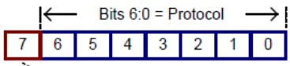  
Bit 7 = Packet Error Checking  
Fig. 13.1: Bit Encoding Example

Notice that bit 0 of the protocol value is always zero (even number hexadecimal values). In a manner similar to the slave address, software that implements the SMBus interface is responsible for setting this bit to indicate whether the transaction is a read (for example, Read Byte) or write (for example, Write Byte) operation.

For example, software implanting this interface for EC-SMBus segments would set bit 0 for read transactions. For the SMBByte protocol (0x06), this would result in the value 0x07 being placed into the SMB\_PRTCL register (or 0x87 if PEC is requested) for write transactions.

## 13.1.3 SMBus Status Codes

The use of status codes helps AML determine whether an SMBus transaction was successful. In general, a status code of zero indicates success, while a non-zero value indicates failure. The SMBus interface uses the same status codes defined for the EC-SMBus (see Status Register, SMB\_STS).

## 13.1.4 SMBus Command Values

SMBus devices may optionally support up to 256 device-specific commands. For these devices, each command value supported by the device is modeled by this interface as a separate virtual register. Protocols that do not transmit a command value (for example, Read/Write Quick and Send/Receive Byte) are modeled using a single virtual register (with a command value = 0x00).

## 13.2 Accessing the SMBus from ASL Code

The following sections demonstrate how to access and use the SMBus from ASL code.

## 13.2.1 Declaring SMBus Host Controller Objects

EC-based SMBus 1.0-compatible HCs should be modeled in the ACPI namespace as described in Defining an Embedded Controller Device in ACPI Namespace , “Defining an Embedded Controller SMBus Host Controller in ACPI Namespace.” An example definition is given below. Using the HID value “ACPI0001” identifies that this SMB-HC is implemented on an embedded controller using the standard SMBus register set defined in SMBus Host Controller Interface via Embedded Controller.

```swift
Device (SMB0)
{
    Name(_HID, "ACPI0001") // EC-based SMBus 1.0 compatible Host Controller
    Name(_EC, 0x2030) // EC offset 0x20, query bit 0x30
    :
}
```

EC-based SMBus 2.0-compatible host controllers should be defined similarly in the namespace as follows:

```swift
Device (SMB0)
{
    Name(_HID, "ACPI0005") // EC-based SMBus 2.0 compatible Host Controller
    Name(_EC, 0x2030) // EC offset 0x20, query bit 0x30
    :
}
```

Non-EC-based SMB-HCs should be modeled in a manner similar to the EC-based SMBus HC. An example definition is given below. These devices use a vendor-specific hardware identifier (HID) to specify the type of SMB-HC (do not use “ACPI0001” or “ACPI0005”). Using a vendor-specific HID allows the correct software to be loaded to service this segment’s SMBus address space.

```txt
Device(SMB0)
{
    Name(_HID, "<vendor-specific hid>") // Vendor-Specific HID
    :
}
```

Regardless of the type of hardware, some OS software element (for example, the SMBus HC driver) must register with OSPM to support all SMBus operation regions defined for the segment. This software allows the generic SMBus interface defined in this section to be used on a specific hardware implementation by translating between the conceptual (for example, SMBus address space) and physical (for example, process of writing/reading registers) models. Because of this linkage, SMBus operation regions must be defined immediately within the scope of the corresponding SMBus device.

## 13.2.2 Declaring SMBus Devices

The SMBus, as defined by the SMBus Specifications <http://smbus.org/specs/>, is not an enumerable bus. As a result, an SMBus 1.0-compatible SMB-HC driver cannot discover child devices on the SMBus and load the appropriate corresponding device drivers. As such, SMBus 1.0-compatible devices are declared in the ACPI namespace, in like manner to other motherboard devices, and enumerated by OSPM.

The SMBus 2.0 specification adds mechanisms enabling device enumeration on the bus while providing compatibility with existing devices. ACPI defines and associates the “ACPI0005” HID value with an EC-based SMBus 2.0- compatible host controller. OSPM will enumerate SMBus 1.0-compatible devices when declared in the namespace under an SMBus 2.0-compatible host controller.

The responsibility for the definition of ACPI namespace objects, required by an SMBus 2.0-compatible host controller driver to enumerate non-bus-enumerable devices, is relegated to the Smart Battery System Implementers Forum. See the SMBus Specifications at the link mentioned above.

Starting in ACPI 2.0, \_ADR is used to associate SMBus devices with their lowest SMBus slave address.

## 13.2.3 Declaring SMBus Operation Regions

Each SMBus operation region definition identifies a single SMBus slave address. Operation regions are defined only for those SMBus devices that need to be accessed from AML. As with other regions, SMBus operation regions are only accessible via the Field term (see Declaring SMBus Devices).

This interface models each SMBus device as having a 256-byte linear address range. Each byte ofset within this range corresponds to a single command value (for example, byte ofset 0x12 equates to command value 0x12), with a maximum of 256 command values. By doing this, SMBus address spaces appear linear and can be processed in a manner similar to the other address space types.

The syntax for the OperationRegion term (from OperationRegion (Declare Operation Region)) is described below.

```txt
OperationRegion (
    RegionName,    // NameString
    RegionSpace,    // RegionSpaceKeyword
    Offset,    // TermArg => Integer
    Length    // TermArg => Integer
)
```

## Where:

• RegionName specifies a name for this slave device (for example, “SBD0”).

• RegionSpace must be set to SMBus (operation region type value 0x04).

• Ofset is a word-sized value specifying the slave address and initial command value ofset for the target device. The slave address is stored in the high byte and the command value ofset is stored in the low byte. For example, the value 0x4200 would be used for an SMBus device residing at slave address 0x42 with an initial command value ofset of zero (0).

• Length is set to the 0x100 (256), representing the maximum number of possible command values, for regions with an initial command value ofset of zero (0). The diference of these two values is used for regions with non-zero ofsets. For example, a region with an Ofset value of 0x4210 would have a corresponding Length of 0xF0 (0x100 minus 0x10).

For example, the Smart Battery Subsystem (illustrated below) consists of the Smart Battery Charger at slave address 0x09, the Smart Battery System Manager at slave address 0x0A, and one or more batteries (multiplexed) at slave address 0x0B. (Notice that Figure 13-2 represents the logical connection of a Smart Battery Subsystem. The actual physical connections of the Smart Battery(s) and the Smart Battery Charger are made through the Smart Battery System Manager.) All devices support the Read/Write Word protocol. Batteries also support the Read/Write Block protocol.

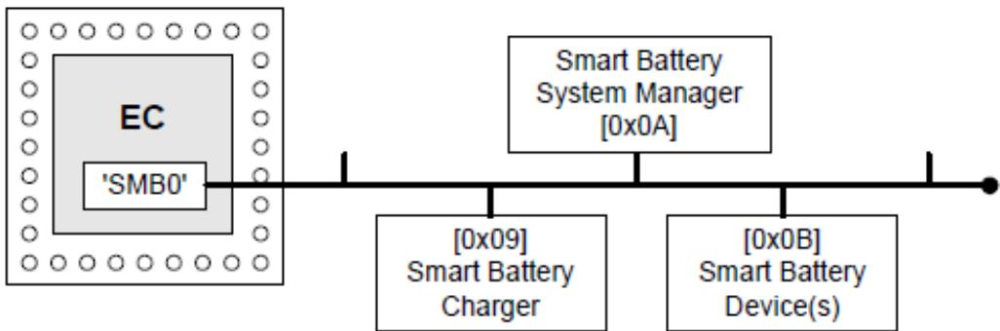  
Fig. 13.2: Smart Battery Subsystem Devices

The following ASL code shows the use of the OperationRegion term to describe these SMBus devices:

```txt
Device (SMB0)
{
    Name(_HID, "ACPI0001") // EC-SMBus Host Controller
    Name(_EC, 0x2030) // EC offset 0x20, query bit 0x30

OperationRegion(SBC0, SMBus, 0x0900, 0x100) // Smart Battery Charger
OperationRegion(SBS0, SMBus, 0x0A00, 0x100) // Smart Battery Selector
OperationRegion(SBD0, SMBus, 0x0B00, 0x100) // Smart Battery Device(s)
:
}
```

Notice that these operation regions in this example are defined within the immediate context of the ‘owning’ EC-SMBus device. Each definition corresponds to a separate slave address (device), and happens to use an initial command value ofset of zero (0).

## 13.2.4 Declaring SMBus Fields

As with other regions, SMBus operation regions are only accessible via the Field term. Each field element is assigned a unique command value and represents a virtual register on the targeted SMBus device.

The syntax for the Field term (from Event (Declare Event Synchronization Object)) is described below.

```txt
Field(
    RegionName,    // NameString=>OperationRegion
    AccessType,    // AccessTypeKeyword
    LockRule,    // LockRuleKeyword
    UpdateRule    // UpdateRuleKeyword - *ignored*
) {FieldUnitList}
```

## Where:

• RegionName specifies the operation region name previously defined for the device.

• AccessType must be set to BuferAcc. This indicates that access to field elements will be done using a regionspecific data bufer. For this access type, the field handler is not aware of the data bufer’s contents which may be of any size. When a field of this type is used as the source argument in an operation it simply evaluates to a bufer. When used as the destination, however, the bufer is passed bi-directionally to allow data to be returned from write operations. The modified bufer then becomes the execution result of that operation. This is slightly diferent than the normal case in which the execution result is the same as the value written to the destination. Note that the source is never changed, since it could be a read only object (see Declaring and Using an SMBus Data Bufer and ASL Opcode Terms).

• LockRule indicates if access to this operation region requires acquisition of the Global Lock for synchronization. This field should be set to Lock on system with firmware that may access the SMBus, and NoLock otherwise.

• UpdateRule is not applicable to SMBus operation regions since each virtual register is accessed in its entirety. This field is ignored for all SMBus field definitions.

SMBus operation regions require that all field elements be declared at command value granularity. This means that each virtual register cannot be broken down to its individual bits within the field definition.

Access to sub-portions of virtual registers can be done only outside of the field definition. This limitation is imposed both to simplify the SMBus interface and to maintain consistency with the physical model defined by the SMBus specification.

SMBus protocols are assigned to field elements using the AccessAs term within the field definition. The syntax for this term (from ASL Root and Secondary Terms) is described below.

```typescript
AccessAs(
    AccessType, //AccessTypeKeyword
    AccessAttribute //Nothing \ | ByteConst \ | AccessAttribKeyword
)
```

## Where:

• AccessType must be set to BuferAcc.

• AccessAttribute indicates the SMBus protocol to assign to command values that follow this term. See SMBus Protocols for a listing of the SMBus protocol types and values.

An AccessAs term must appear as the first entry in a field definition to set the initial SMBus protocol for the field elements that follow. A maximum of one SMBus protocol may be defined for each field element. Devices supporting multiple protocols for a single command value can be modeled by specifying multiple field elements with the same ofset (command value), where each field element is preceded by an AccessAs term specifying an alternate protocol.

For example, the register at command value 0x08 for a Smart Battery device (illustrated below) represents a word value specifying the battery temperature (in degrees Kelvin), while the register at command value 0x20 represents a variable-length (0 to 32 bytes) character string specifying the name of the company that manufactured the battery.

The following ASL code shows the use of the OperationRegion, Field, AccessAs, and Ofset terms to represent these Smart Battery device virtual registers:

```txt
OperationRegion(SBD0, SMBus, 0x0B00, 0x0100)
Field(SBD0, BufferAcc, NoLock, Preserve)
{
    AccessAs(BufferAcc, SMBWord) // Use the SMBWord protocol for the following...
    MFGA, 8, // ManufacturerAccess() [command value 0x00]
    RCAP, 8, // RemainingCapacityAlarm() [command value 0x01]
    Offset(0x08) // Skip to command value 0x08...
    BTMP, 8, // Temperature() [command value 0x08]
    Offset(0x20) // Skip to command value 0x20...
    AccessAs(BufferAcc, SMBBlock) // Use the SMBBlock protocol for the following...
    MFGN, 8, // ManufacturerName() [command value 0x20]
    DEVN, 8 // DeviceName() [command value 0x21]
}
```

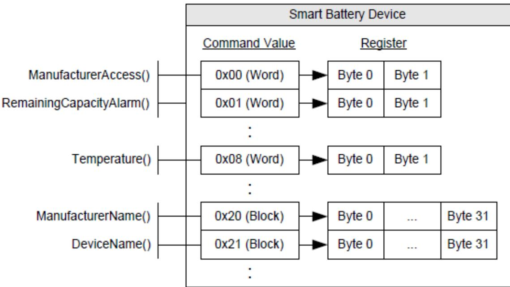  
Fig. 13.3: Smart Battery Device Virtual Registers

Notice that command values are equivalent to the field element’s byte ofset (for example, MFGA=0, RCAP=1, BTMP=8). The AccessAs term indicates which SMBus protocol to use for each command value.

## 13.2.5 Declaring and Using an SMBus Data Bufer

The use of a data bufer for SMBus transactions allows AML to receive status and data length values, as well as making it possible to implement the Process Call protocol. As previously mentioned, the BuferAcc access type is used to indicate to the field handler that a region-specific data bufer will be used.

For SMBus operation regions, this data bufer is defined as a fixed-length 34-byte bufer that, if represented using a ‘C’-styled declaration, would be modeled as follows:

```txt
typedef struct
{
    BYTE Status; // Byte 0 of the data buffer
    BYTE Length; // Byte 1 of the data buffer
    BYTE[32] Data; // Bytes 2 through 33 of the data buffer
}
```

Where:

• Status (byte 0) indicates the status code of a given SMBus transaction. See SMBus Status Codes for more information.

• Length (byte 1) specifies the number of bytes of valid data that exists in the data bufer. Use of this field is only defined for the Read/Write Block protocol, where valid Length values are 0 through 32. For other protocols–where the data length is implied by the protocol–this field is reserved.

• Data (bytes 33-2) represents a 32-byte bufer, and is the location where actual data is stored.

For example, the following ASL shows the use of the SMBus data bufer for performing transactions to a Smart Battery device. This code is based on the example ASL presented in Declaring SMBus Fields which lists the operation region

and field definitions for the Smart Battery device.

```txt
/* Create the SMBus data buffer */
Name(BUFF, Buffer(34) {} )    // Create SMBus data buffer as BUFF
CreateByteField(BUFF, 0x00, OB1)    // OB1 = Status (Byte)
CreateByteField(BUFF, 0x01, OB2)    // OB2 = Length (Byte)
CreateWordField(BUFF, 0x02, OB3)    // OB3 = Data (Word - Bytes 2 & 3)
CreateField(BUFF, 0x10, 256, OB4)    // OB4 = Data (Block - Bytes 2-33)

/* Read the battery temperature */
Store(BTMP, BUFF) // Invoke Read Word transaction
If(LEqual(OB1, 0x00)) // Successful?
{
    // OB3 = Battery temperature in 1/10th degrees Kelvin
}

/* Read the battery manufacturer name */
Store(MFGN, BUFF)    // Invoke Read Block transaction
If(LEqual(OB1, 0x00))    // Successful?
{
    // OB2 = Length of the manufacturer name
    // OB4 = Manufacturer name (as a counted string)
}
```

Notice the use of the CreateField primitives to access the data bufer’s sub-elements (Status, Length, and Data), where Data (bytes 33-2) is ‘typecast’ as both word (OB3) and block (OB4) data.

The example above demonstrates the use of the Store() operator to invoke a Read Block transaction to obtain the name of the battery manufacturer. Evaluation of the source operand (MFGN) results in a 34-byte bufer that gets copied by Store() to the destination bufer (BUFF)

Capturing the results of a write operation, for example to check the status code, requires an additional Store() operator, as shown below.

```txt
Store(Store(BUFF, MFGN), BUFF) // Invoke Write Block transaction
If(LEqual(OB1, 0x00)) {...} // Transaction successful?
```

Note that the outer Store() copies the results of the Write Block transaction back into BUFF. This is the nature of BuferAcc’s bi-directionality described in Declaring SMBus Fields. It should be noted that storing (or parsing) the result of an SMBus Write transaction is not required although useful for ascertaining the outcome of a transaction.

SMBus Process Call protocols require similar semantics due to the fact that only destination operands are passed bidirectionally. These transactions require the use of the double-Store() semantics to properly capture the return results.

## 13.3 Using the SMBus Protocols

This section provides information and examples on how each of the SMBus protocols can be used to access SMBus devices from AML.

## 13.3.1 Read/Write Quick (SMBQuick)

The SMBus Read/Write Quick protocol (SMBQuick) is typically used to control simple devices using a device-specific binary command (for example, ON and OFF). Command values are not used by this protocol and thus only a single element (at ofset 0) can be specified in the field definition. This protocol transfers no data.

The following ASL code illustrates how a device supporting the Read/Write Quick protocol should be accessed:

```c
OperationRegion(SMBD, SMBus, 0x4200, 0x100) // SMBus device at slave address 0x42
Field(SMBD, BufferAcc, NoLock, Preserve)
{
    AccessAs(BufferAcc, SMBQuick) // Use the SMBus Read/Write Quick protocol
    FLD0, 8 // Virtual register at command value 0.
}

/* Create the SMBus data buffer */

Name(BUFF, Buffer(34){}) // Create SMBus data buffer as BUFF
CreateByteField(BUFF, 0x00, OB1) // OB1 = Status (Byte)

/* Signal device (e.g. OFF) */
Store(FLD0, BUFF) // Invoke Read Quick transaction
If(LEqual(OB1, 0x00)) {...} // Successful?

/* Signal device (e.g. ON) */
Store(BUFF, FLD0) // Invoke Write Quick transaction
```

In this example, a single field element (FLD0) at ofset 0 is defined to represent the protocol’s read/write bit. Access to FLD0 will cause an SMBus transaction to occur to the device. Reading the field results in a Read Quick, and writing to the field results in a Write Quick. In either case data is not transferred–access to the register is simply used as a mechanism to invoke the transaction.

## 13.3.2 Send/Receive Byte (SMBSendReceive)

The SMBus Send/Receive Byte protocol (SMBSendReceive) transfers a single byte of data. Like Read/Write Quick, command values are not used by this protocol and thus only a single element (at ofset 0) can be specified in the field definition.

The following ASL code illustrates how a device supporting the Send/Receive Byte protocol should be accessed:

```go
OperationRegion(SMBD, SMBus, 0x4200, 0x100) // SMBus device at slave address 0x42
Field(SMBD, BufferAcc, NoLock, Preserve)
{
    AccessAs(BufferAcc, SMBSendReceive) // Use the SMBus Send/Receive Byte protocol
    FLD0, 8 // Virtual register at command value 0.
}

// Create the SMBus data buffer

Name(BUFF, Buffer(34){}) // Create SMBus data buffer as BUFF
CreateByteField(BUFF, 0x00, STAT) // STAT = Status (Byte)
CreateByteField(BUFF, 0x02, DATA) // DATA = Data (Byte)

// Receive a byte of data from the device
```

(continues on next page)

(continued from previous page)

```txt
Store(FLD0, BUFF)    // Invoke a Receive Byte transaction
If(LEqual(STAT, 0x00))    // Successful?
{
    // DATA = Received byte...
}
// Send the byte '0x16' to the device
Store(0x16, DATA)    // Save 0x16 into the data buffer
Store(BUFF, FLD0)    // Invoke a Send Byte transaction
```

In this example, a single field element (FLD0) at ofset 0 is defined to represent the protocol’s data byte. Access to FLD0 will cause an SMBus transaction to occur to the device. Reading the field results in a Receive Byte, and writing to the field results in a Send Byte.

## 13.3.3 Read/Write Byte (SMBByte)

The SMBus Read/Write Byte protocol (SMBByte) also transfers a single byte of data. But unlike Send/Receive Byte, this protocol uses a command value to reference up to 256 byte-sized virtual registers.

The following ASL code illustrates how a device supporting the Read/Write Byte protocol should be accessed:

```txt
OperationRegion(SMBD, SMBus, 0x4200, 0x100) // SMBus device at slave address 0x42
Field(SMBD, BufferAcc, NoLock, Preserve)
{
    AccessAs(BufferAcc, SMBByte) // Use the SMBus Read/Write Byte protocol
    FLD0, 8, // Virtual register at command value 0.
    FLD1, 8, // Virtual register at command value 1.
    FLD2, 8 // Virtual register at command value 2.
}

// Create the SMBus data buffer
Name(BUFF, Buffer(34){}) // Create SMBus data buffer as BUFF
CreateByteField(BUFF, 0x00, STAT) // STAT = Status (Byte)
CreateByteField(BUFF, 0x02, DATA) // DATA = Data (Byte)

// Read a byte of data from the device using command value 1
Store(FLD1, BUFF) // Invoke a Read Byte transaction
If(LEqual(STAT, 0x00)) // Successful?
{
    // DATA = Byte read from FLD1...
}

// Write the byte '0x16' to the device using command value 2
Store(0x16, DATA) // Save 0x16 into the data buffer
Store(BUFF, FLD2) // Invoke a Write Byte transaction
```

In this example, three field elements (FLD0, FLD1, and FLD2) are defined to represent the virtual registers for command values 0, 1, and 2. Access to any of the field elements will cause an SMBus transaction to occur to the device. Reading FLD1 results in a Read Byte with a command value of 1, and writing to FLD2 results in a Write Byte with command value 2.

## 13.3.4 Read/Write Word (SMBWord)

The SMBus Read/Write Word protocol (SMBWord) transfers 2 bytes of data. This protocol also uses a command value to reference up to 256 word-sized virtual device registers.

The following ASL code illustrates how a device supporting the Read/Write Word protocol should be accessed:

```asm
OperationRegion(SMBD, SMBus, 0x4200, 0x100) // SMBus device at slave address 0x42
Field(SMBD, BufferAcc, NoLock, Preserve)
{
    AccessAs(BufferAcc, SMBWord) // Use the SMBus Read/Write Word protocol
    FLD0, 8, // Virtual register at command value 0.
    FLD1, 8, // Virtual register at command value 1.
    FLD2, 8 // Virtual register at command value 2.
}

// Create the SMBus data buffer
Name(BUFF, Buffer(34){}) // Create SMBus data buffer as BUFF
CreateByteField(BUFF, 0x00, STAT) // STAT = Status (Byte)
CreateWordField(BUFF, 0x02, DATA) // DATA = Data (Word)

// Read two bytes of data from the device using command value 1
Store(FLD1, BUFF) // Invoke a Read Word transaction
If(LEqual(STAT, 0x00)) // Successful?
{
    // DATA = Word read from FLD1...
}

// Write the word '0x5416' to the device using command value 2
Store(0x5416, DATA) // Save 0x5416 into the data buffer
Store(BUFF, FLD2) // Invoke a Write Word transaction
```

In this example, three field elements (FLD0, FLD1, and FLD2) are defined to represent the virtual registers for command values 0, 1, and 2. Access to any of the field elements will cause an SMBus transaction to occur to the device. Reading FLD1 results in a Read Word with a command value of 1, and writing to FLD2 results in a Write Word with command value 2.

Notice that although accessing each field element transmits a word (16 bits) of data, the fields are listed as 8 bits each. The actual data size is determined by the protocol. Every field element is declared with a length of 8 bits so that command values and byte ofsets are equivalent.

## 13.3.5 Read/Write Block (SMBBlock)

The SMBus Read/Write Block protocol (SMBBlock) transfers variable-sized (0-32 bytes) data. This protocol uses a command value to reference up to 256 block-sized virtual registers.

The following ASL code illustrates how a device supporting the Read/Write Block protocol should be accessed:

```txt
OperationRegion(SMBD, SMBus, 0x4200, 0x100) // SMBus device at slave address 0x42
Field(SMBD, BufferAcc, NoLock, Preserve)
{
    AccessAs(BufferAcc, SMBBlock) // Use the SMBus Read/Write Block protocol
    FLD0, 8, // Virtual register at command value 0.
    FLD1, 8, // Virtual register at command value 1.
```

(continues on next page)

```go
FLD2, 8 // Virtual register at command value 2.
}

// Create the SMBus data buffer
Name(BUFF, Buffer(34){}) // Create SMBus data buffer as BUFF
CreateByteField(BUFF, 0x00, STAT) // STAT = Status (Byte)
CreateByteField(BUFF, 0x01, SIZE) // SIZE = Length (Byte)
CreateField(BUFF, 0x10, 256, DATA) // DATA = Data (Block)

// Read block data from the device using command value 1
Store(FLD1, BUFF) // Invoke a Read Block transaction
If(LEqual(STAT, 0x00)) // Successful?
{
    // SIZE = Size (number of bytes)
    // of the block data read from FLD1...
    // DATA = Block data read from FLD1...
}

// Write the block 'TEST' to the device using command value 2
Store("TEST", DATA) // Save "TEST" into the data buffer
Store(4, SIZE) // Length of valid data in the data buffer
Store(BUFF, FLD2) // Invoke a Write Word transaction
```

In this example, three field elements (FLD0, FLD1, and FLD2) are defined to represent the virtual registers for command values 0, 1, and 2. Access to any of the field elements will cause an SMBus transaction to occur to the device. Reading FLD1 results in a Read Block with a command value of 1, and writing to FLD2 results in a Write Block with command value 2.

## 13.3.6 Word Process Call (SMBProcessCall)

The SMBus Process Call protocol (SMBProcessCall) transfers 2 bytes of data bi-directionally (performs a Write Word followed by a Read Word as an atomic transaction). This protocol uses a command value to reference up to 256 wordsized virtual registers.

The following ASL code illustrates how a device supporting the Process Call protocol should be accessed:

```txt
OperationRegion(SMBD, SMBus, 0x4200, 0x100) // SMBus device at slave address 0x42
Field(SMBD, BufferAcc, NoLock, Preserve)
{
    AccessAs(BufferAcc, SMBProcessCall) // Use the SMBus Process Call protocol
    FLD0, 8, // Virtual register at command value 0.
    FLD1, 8, // Virtual register at command value 1.
    FLD2, 8 // Virtual register at command value 2.
}

// Create the SMBus data buffer
Name(BUFF, Buffer(34){}) // Create SMBus data buffer as BUFF
CreateByteField(BUFF, 0x00, STAT) // STAT = Status (Byte)
CreateWordField(BUFF, 0x02, DATA) // DATA = Data (Word)

// Process Call with input value '0x5416' to the device using command value 1
Store(0x5416, DATA) // Save 0x5416 into the data buffer
```

```txt
(continued from previous page)
Store(Store(BUFF, FLD1), BUFF)    // Invoke a Process Call transaction
If(LEqual(STAT, 0x00))    // Successful?
{
    // DATA = Word returned from FLD1...
}
```

In this example, three field elements (FLD0, FLD1, and FLD2) are defined to represent the virtual registers for command values 0, 1, and 2. Access to any of the field elements will cause an SMBus transaction to occur to the device. Reading or writing FLD1 results in a Process Call with a command value of 1. Notice that unlike other protocols, Process Call involves both a write and read operation in a single atomic transaction. This means that the Data element of the SMBus data bufer is set with an input value before the transaction is invoked, and holds the output value following the successful completion of the transaction.

## 13.3.7 Block Process Call (SMBBlockProcessCall)

The SMBus Block Write-Read Block Process Call protocol (SMBBlockProcessCall) transfers a block of data bidirectionally (performs a Write Block followed by a Read Block as an atomic transaction). The maximum aggregate amount of data that may be transferred is limited to 32 bytes. This protocol uses a command value to reference up to 256 block-sized virtual registers.

The following ASL code illustrates how a device supporting the Process Call protocol should be accessed:

```go
OperationRegion(SMBD, SMBus, 0x4200, 0x100) // SMbus device at slave address 0x42
Field(SMBD, BufferAcc, NoLock, Preserve)
{
    AccessAs(BufferAcc, SMBBlockProcessCall) // Use the Block Process Call protocol
    FLD0, 8, // Virtual register representing a command value of 0
    FLD1, 8 // Virtual register representing a command value of 1
}

// Create the SMBus data buffer as BUFF
Name(BUFF, Buffer(34)) // Create SMBus data buffer as BUFF
CreateByteField(BUFF, 0x00, STAT) // STAT = Status (Byte)
CreateByteField(BUFF, 0x01, SIZE) // SIZE = Length (Byte)
CreateField(BUFF, 0x10, 256, DATA) // Data (Block)

// Process Call with input value "ACPI" to the device using command value 1

Store("ACPI", DATA) // Fill in outgoing data
Store(8, SIZE) // Length of the valid data
Store(Store(BUFF, FLD1), BUFF) // Execute the PC
if (LEqual(STAT, 0x00)) // Test the status
{
    // BUFF now contains information returned
    // from PC
    // SIZE now equals size of data returned
}
```

# PLATFORM COMMUNICATIONS CHANNEL (PCC)

The platform communication channel (PCC) is a generic mechanism for OSPM to communicate with an entity in the platform (e.g. a platform controller, or a Baseboard Management Controller (BMC)). Neither the entity that OSPM communicates with, nor any aspects of the information passed back and forth is defined in this section. That information is defined by the actual interface that that employs PCC register address space as the communication channel.

PCC defines a new address space type (PCC Space, 0xA), which is implemented as one or more independent communications channels, or subspaces.

This chapter is arranged as follows:

• The Platform Communications Channel Table, Generic Communications Channel Shared Memory Region, the Extended PCC Subspace Shared Memory Region, and Reduced PCC Subspace Shared Memory Region provide reference information about the PCCT, and expected data structures used for the Platform Communications Channel.

• Doorbell Protocol, Platform Notification, and Referencing the PCC address space describe how communications takes place between the OSPM and the platform over PCC.

The PCC interface is described in the following ACPI system description table.

## 14.1 Platform Communications Channel Table

Table 14.1: Platform Communications Channel Table (PCCT)

<table><tr><td>Field</td><td>Byte Length</td><td>Byte Offset</td><td>Description</td></tr><tr><td colspan="4">Header</td></tr><tr><td>Signature</td><td>4</td><td>0</td><td>‘PCCT’ Signature for the Platform Communications Channel Table.</td></tr><tr><td>Length</td><td>4</td><td>4</td><td>Length, in bytes, of the entire PCCT.</td></tr><tr><td>Revision</td><td>1</td><td>8</td><td>2</td></tr><tr><td>Checksum</td><td>1</td><td>9</td><td>Entire table must sum to zero.</td></tr><tr><td>OEMID</td><td>6</td><td>10</td><td>OEM ID</td></tr><tr><td>OEM Table ID</td><td>8</td><td>16</td><td>For the PCCT, the table ID is the manufacturer model ID.</td></tr><tr><td>OEM Revision</td><td>4</td><td>24</td><td>OEM revision of PCCT for supplied OEM Table ID.</td></tr><tr><td>Creator ID</td><td>4</td><td>28</td><td>Vendor ID of utility that created the table. For tables containing Definition Blocks, this is the ID for the ASL Compiler.</td></tr><tr><td>Creator Revision</td><td>4</td><td>32</td><td>Revision of utility that created the table. For tables containing Definition Blocks, this is the revision for the ASL Compiler.</td></tr><tr><td>Flags</td><td>4</td><td>36</td><td>Platform Communications Channel Global flags, described in Platform Communications Channel Global Flags.</td></tr></table>

continues on next page

Table 14.1 – continued from previous page

<table><tr><td>Reserved</td><td>8</td><td>40</td><td>Reserved</td></tr><tr><td>PCC Subspace Structure[n] (n = subspace ID)</td><td>-</td><td>48</td><td>A list of Platform Communications Channel Subspace structures for this platform. This structure is described in the following section. At most 256 subspaces are supported.</td></tr></table>

## 14.1.1 Platform Communications Channel Global Flags

Table 14.2: Platform Communications Channel Global Flags

<table><tr><td>PCC Global Flags</td><td>Bit Length</td><td>Bit Off-set</td><td>Description</td></tr><tr><td>Platform Interrupt</td><td>1</td><td>0</td><td>If set, the platform is capable of generating an interrupt to indicate completion of a command.</td></tr><tr><td>Reserved</td><td>31</td><td>1</td><td>Must be zero.</td></tr></table>

## 14.1.2 Platform Communications Channel Subspace Structures

PCC Subspaces are described by the PCC Subspace structure in the PCCT table. The subspace ID of a PCC subspace is its index in the array of subspace structures, starting with subspace 0. All subspaces have a common header, followed by a set of type-specific fields:

Table 14.3: Generic PCC Subspace Structure

<table><tr><td>Field</td><td>Byte Length</td><td>Byte Offset</td><td>Description</td></tr><tr><td>Type</td><td>1</td><td>0</td><td>The type of subspace.</td></tr><tr><td>Length</td><td>1</td><td>1</td><td>Length of the subspace structure, in bytes. The next subspace structure begins length bytes after the start of this one.</td></tr><tr><td>Type specific fields</td><td>variable</td><td>2</td><td>See specific subspace types for more details</td></tr></table>

This specification defines the following subspaces:

• Type 0, the Generic Communications Subspace,

• Types 1 to 2, HW-Reduced Communications Subspaces,

• Types 3 and 4 are extended PCC subspaces.

• Type 5 is the Hardware Register-Based PCC Subspace.

All other subspace types are reserved.

## 14.1.3 Generic Communications Subspace Structure (type 0)

Table 14.4: PCC Subspace Structure type 0 (Generic Communications Subspace)

<table><tr><td>Field</td><td>Byte Length</td><td>Byte Offset</td><td>Description</td></tr><tr><td>Type</td><td>1</td><td>0</td><td>0 (Generic Communications Subspace)</td></tr><tr><td>Length</td><td>1</td><td>1</td><td>62</td></tr><tr><td>Reserved</td><td>6</td><td>2</td><td>Reserved</td></tr><tr><td>Base Address</td><td>8</td><td>8</td><td>Base Address of the shared memory range, described in Generic Communications Channel Shared Memory Region.</td></tr><tr><td>Memory Length</td><td>8</td><td>16</td><td>Length of the memory range. Must be &gt; 8.</td></tr><tr><td>Doorbell Register</td><td>12</td><td>24</td><td>Contains the processor relative address, represented in Generic Address Structure format, of the PCC doorbell. Note: Only System I/O space and System Memory space are valid for values for Address_Space_ID.</td></tr><tr><td>Doorbell Preserve</td><td>8</td><td>36</td><td>Contains a mask of bits to preserve when writing the doorbell register.</td></tr><tr><td>Doorbell Write</td><td>8</td><td>44</td><td>Contains a mask of bits to set when writing the doorbell register.</td></tr><tr><td>Nominal Latency</td><td>4</td><td>52</td><td>Expected latency to process a command, in microseconds.</td></tr><tr><td>Maximum Periodic Access Rate</td><td>4</td><td>56</td><td>The maximum number of periodic requests that the subspace channel can support, reported in commands per minute. 0 indicates no limitation.</td></tr><tr><td>Minimum Request Turnaround Time</td><td>2</td><td>60</td><td>The minimum amount of time that OSPM must wait after the completion of a command before issuing the next command, in microseconds.</td></tr></table>

ò Note

Inaccurate values for the Maximum Periodic Access Rate and Minimum Request Turnaround Time fields can result in punitive side efects for features that rely on the PCC interface. The Platform should report accurate values that allow for maximum channel eficiency while maintaining maximum channel stability.

The Maximum Periodic Access Rate is used by OSPM to determine the maximum rate for periodic evaluation of commands. Infrequent, event driven commands are not restricted by the maximum periodic access rate.

## 14.1.4 HW-Reduced Communications Subspace Structure (type 1)

The HW-Reduced Communications Subspace is defined in Table 14.5. It is intended for use on HW-Reduced ACPI Platforms, which do not support the SCI. Aside from the interrupt change, and the allowed use of the Functional Fixed HW address space for the Doorbell Register, this subspace is identical to the Generic Communications Subspace described in Section 14.2 and Section 14.5.

Table 14.5: PCC Subspace Structure type 1 (HW-Reduced Communications Subspace)

<table><tr><td>Field</td><td>Byte Length</td><td>Byte Offset</td><td>Description</td></tr><tr><td>Type</td><td>1</td><td>0</td><td>1 (HW-Reduced Communications Subspace)</td></tr><tr><td>Length</td><td>1</td><td>1</td><td>62</td></tr><tr><td>Platform Interrupt</td><td>4</td><td>2</td><td>GSI of the interrupt used for the PCC platform interrupt for this Subspace.</td></tr><tr><td>Platform Interrupt Flags</td><td>1</td><td>6</td><td>Bit [2-7] ReservedBit [1] Platform interrupt mode 1: Interrupt is Edge triggered 0: Interrupt is Level triggeredBit [0] Platform interrupt polarity 1: Interrupt is Active low 0: Interrupt is Active high</td></tr><tr><td>Reserved</td><td>1</td><td>7</td><td>Reserved</td></tr><tr><td>Base Address</td><td>8</td><td>8</td><td>Base Address of the shared memory range, described in Generic Communications Channel Shared Memory Region.</td></tr><tr><td>Memory Length</td><td>8</td><td>16</td><td>Length of the memory range. Must be &gt;8.</td></tr><tr><td>Doorbell Register</td><td>12</td><td>24</td><td>Contains the processor relative address, represented in Generic Address Structure format, of the PCC doorbell. Note: Only the System I/O, System Memory, and Functional Fixed Hardware spaces are valid for values for Address_Space_ID.</td></tr><tr><td>Doorbell Preserve</td><td>8</td><td>36</td><td>Contains a mask of bits to preserve when writing the doorbell register.</td></tr><tr><td>Doorbell Write</td><td>8</td><td>44</td><td>Contains a mask of bits to set when writing the doorbell register.</td></tr><tr><td>Nominal Latency</td><td>4</td><td>52</td><td>Expected latency to process a command, in microseconds.</td></tr><tr><td>Maximum Periodic Access Rate</td><td>4</td><td>56</td><td>The maximum number of periodic requests that the subspace channel can support, reported in commands per minute. 0 indicates no limitation.</td></tr><tr><td>Minimum Request Turnaround Time</td><td>2</td><td>60</td><td>The minimum amount of time that OSPM must wait after the completion of a command before issuing the next command, in microseconds.</td></tr></table>

## ò Note

Inaccurate values for the Maximum Periodic Access Rate and Minimum Request Turnaround Time fields can result in punitive side efects for features that rely on the PCC interface. The Platform should report accurate values that allow for maximum channel eficiency while maintaining maximum channel stability.

The Maximum Periodic Access Rate is used by OSPM to determine the maximum rate for periodic evaluation of commands. Infrequent, event driven commands are not restricted by the maximum periodic access rate.

Type 1 subspaces do not support a level triggered platform interrupt as no method is provided to clear the interrupt. Where level interrupts are required, type 2 or type 3 subspaces should be used.

## 14.1.5 HW-Reduced Communications Subspace Structure (type 2)

The HW-Reduced Communications Subspace is defined below in Table 14.6. This is intended for use on HW-Reduced ACPI Platforms, which require read-modify-write sequence to acknowledge Platform Interrupt. Aside from three Platform Ack fields at the bottom of the table, this subspace is identical to HW-Reduced Communications Subspace Structure (type 1) described above.

Table 14.6: PCC Subspace Structure type 2 (HW-Reduced Communications Subspace)

<table><tr><td>Field</td><td>Byte Length</td><td>Byte Offset</td><td>Description</td></tr><tr><td>Type</td><td>1</td><td>0</td><td>2 (HW-Reduced Communications Subspace)</td></tr><tr><td>Length</td><td>1</td><td>1</td><td>90</td></tr><tr><td>Platform Interrupt</td><td>4</td><td>2</td><td>GSI of the interrupt used for the PCC platform interrupt for this Subspace.</td></tr><tr><td>Platform Interrupt Flags</td><td>1</td><td>6</td><td>Bit [2-7] ReservedBit [1] Platform interrupt mode 1: Interrupt is Edge triggered 0: Interrupt is Level triggeredBit [0] Platform interrupt polarity 1: Interrupt is Active low 0: Interrupt is Active high</td></tr><tr><td>Reserved</td><td>1</td><td>7</td><td>Reserved</td></tr><tr><td>Base Address</td><td>8</td><td>8</td><td>Base Address of the shared memory range, described in Generic Communications Channel Shared Memory Region.</td></tr><tr><td>Memory Length</td><td>8</td><td>16</td><td>Length of the memory range. Must be &gt;8.</td></tr><tr><td>Doorbell Register</td><td>12</td><td>24</td><td>Contains the processor relative address, represented in Generic Address Structure format, of the PCC doorbell. Note: Only the System I/O, System Memory, and Functional Fixed Hardware spaces are valid for values for Address_Space_ID.</td></tr><tr><td>Doorbell Preserve</td><td>8</td><td>36</td><td>Contains a mask of bits to preserve when writing the doorbell register.</td></tr><tr><td>Doorbell Write</td><td>8</td><td>44</td><td>Contains a mask of bits to set when writing the doorbell register.</td></tr><tr><td>Nominal Latency</td><td>4</td><td>52</td><td>Expected latency to process a command, in microseconds.</td></tr><tr><td>Maximum Periodic Access Rate</td><td>4</td><td>56</td><td>The maximum number of periodic requests that the subspace channel can support, reported in commands per minute. 0 indicates no limitation.</td></tr><tr><td>Minimum Request Turnaround Time</td><td>2</td><td>60</td><td>The minimum amount of time that OSPM must wait after the completion of a command before issuing the next command, in microseconds.</td></tr><tr><td>Platform Interrupt Ack Register</td><td>12</td><td>62</td><td>Contains the processor relative address, represented in Generic Address Structure format, of the platform interrupt ack register. Note: Only the System I/O, System Memory, and Functional Fixed Hardware spaces are valid for values for Address_Space_ID.</td></tr><tr><td>Platform Interrupt Ack Preserve</td><td>8</td><td>74</td><td>Contains a mask of bits to preserve when writing the platform interrupt ack register.</td></tr></table>

continues on next page

Table 14.6 – continued from previous page

<table><tr><td>Platform Interrupt Ack Write</td><td>8</td><td>82</td><td>Contains a mask of bits to set when writing the platform interrupt ack register.</td></tr></table>

## ò Note

Inaccurate values for the Maximum Periodic Access Rate and Minimum Request Turnaround Time fields can result in punitive side efects for features that rely on the PCC interface. The Platform should report accurate values that allow for maximum channel eficiency while maintaining maximum channel stability.

The Maximum Periodic Access Rate is used by OSPM to determine the maximum rate for periodic evaluation of commands. Infrequent, event driven commands are not restricted by the maximum periodic access rate.

## 14.1.6 Extended PCC subspaces (types 3 and 4)

Extended PCC communication subspaces are of two types:

Type 3 Initiator subspace: used by the OSPM to communicate with the platform.

Type 4 Responder subspace: Used by the platform to send asynchronous notifications to the OSPM.

Initiator subspaces are not substantially diferent from type 0, 1, or 2 subspaces. The most notable diference is that a type 3 Initiator subspace does not support asynchronous notifications. Responder subspaces, type 4, provide those notifications, and cannot be used by the OSPM to send messages to the platform.

The format for PCCT entries describing Initiator (type 3), and Responder (type 4) subspaces is shown in the following table.

Table 14.7: PCC Subspace Structure type 3 and type 4

<table><tr><td>Field</td><td>Byte Length</td><td>Byte Offset</td><td>Description</td></tr><tr><td>Type</td><td>1</td><td>0</td><td>3 - Initiator subspace 4 - Responder subspace</td></tr><tr><td>Length</td><td>1</td><td>1</td><td>164</td></tr><tr><td>Platform Interrupt</td><td>4</td><td>2</td><td>GSI of an interrupt triggered by the platform: For Initiator subspaces (type 3) this is raised when a command is completed on this subspace. For Responder subspaces (type 4) this is raised when platform sends a notification. For a Initiator subspace, this field is ignored if the platform interrupt flag in Table 14.2 is set to zero. If a Responder-subspace is present in the PCCT, then the platform interrupt flag must be set to 1. Note that if interrupts are edge triggered, then each subspace must have its own unique interrupt. If interrupts are level, a GSI may be shared by multiple subspaces, but each one must have unique Platform interrupt Ack preserve and Ack Set masks.</td></tr><tr><td>Platform Interrupt Flags</td><td>1</td><td>6</td><td>Bit 7:2 ReservedBit 1: Platform interrupt mode - Set to 1 if interrupt is Edge triggered - Set to 0 if interrupt Level triggeredBit 0: Platform interrupt polarity - Set to 1 if interrupt is Active low - Set to 0 if interrupt is Active high</td></tr><tr><td>Reserved</td><td>1</td><td>7</td><td>Reserved must be zero</td></tr></table>

continues on next page

Table 14.7 – continued from previous page

<table><tr><td>Base Address</td><td>8</td><td>8</td><td>Base Address of the shared memory range, described in Table 14.12.</td></tr><tr><td>Memory Length</td><td>4</td><td>16</td><td>Length of the memory range. Must be &gt;= 16.</td></tr><tr><td>Doorbell Register</td><td>12</td><td>20</td><td>Contains the processor relative address, represented in Generic Address Structure (GAS) format, of the PCC doorbell. Note: Only the System I/O, System Memory, and Functional Fixed Hardware spaces are valid values for Address_Space_ID For Responder subspaces this field is optional, if not present the field should just contain zeros.</td></tr><tr><td>Doorbell Preserve</td><td>8</td><td>32</td><td>Contains a mask of bits to preserve when writing the doorbell register.</td></tr><tr><td>Doorbell Write</td><td>8</td><td>40</td><td>Contains a mask of bits to set when writing the doorbell register.</td></tr><tr><td>Nominal Latency</td><td>4</td><td>48</td><td>Expected latency to process a command, in microseconds. This field is only relevant for Initiator subspaces.</td></tr><tr><td>Maximum Periodic Access Rate</td><td>4</td><td>52</td><td>The maximum number of periodic requests that the subspace subspace can support, reported in commands per minute. 0 indicates no limitation. This field is only relevant for Initiator subspaces.</td></tr><tr><td>Minimum Request Turnaround Time</td><td>4</td><td>56</td><td>The minimum amount of time that OSPM must wait after the completion of a command before issuing the next command, in microseconds. This field is only relevant for Initiator subspaces.</td></tr><tr><td>Platform interrupt Ack Register</td><td>12</td><td>60</td><td>Contains the processor relative address, represented in Generic Address Structure (GAS) format, of the platform interrupt acknowledge register. Note: Only the System I/O, System Memory, and Functional Fixed Hardware spaces are valid for values for Address_Space_ID. If the subspace does not support interrupts or the interrupt is edge driven the register may be omitted. A value of 0x0 on all 12 bytes of the GAS structure indicates the register is not present. If the subspace does support interrupts, and these are level, this register must be supplied. And is used to clear the interrupt by using a read, modify, write sequence.</td></tr><tr><td>Platform interrupt Ack Preserve</td><td>8</td><td>72</td><td>Contains a mask of bits to preserve when writing the platform interrupt ack register.</td></tr><tr><td>Platform interrupt Ack Set</td><td>8</td><td>80</td><td>Contains a mask of bits to set when writing the platform interrupt ack register.</td></tr><tr><td>Reserved</td><td>8</td><td>88</td><td>Reserved must be zero</td></tr><tr><td>Command Complete check register address</td><td>12</td><td>96</td><td>Contains the processor relative address, represented in Generic Address Structure (GAS) format, of the Command complete check register. Note: Only the System I/O, System Memory, and Functional Fixed Hardware spaces are valid for values for Address_Space_ID</td></tr><tr><td>Command Complete check mask</td><td>8</td><td>108</td><td>Mask to determine whether a command is complete, using the command complete check register. A command is complete if the value of the register when combined through a logical AND with this mask, yields a non-zero value</td></tr></table>

continues on next page

Table 14.7 – continued from previous page

<table><tr><td>Command Complete update register address</td><td>12</td><td>116</td><td>Contains the processor relative address, represented in Generic Address Structure (GAS) format, of the command complete update register.Notes:- Only the System I/O, System Memory, and Functional Fixed Hardware spaces are valid for values for Address_Space_ID.- It is valid for the Command Complete update register to be the same as the Command Complete check register and point to the same address.</td></tr><tr><td>Command Complete update preserve mask</td><td>8</td><td>128</td><td>Mask of bits to preserve in the command complete update register, when updating command complete in this subspace.</td></tr><tr><td>Command Complete update set mask</td><td>8</td><td>136</td><td>Mask of bits to set in the Command Complete update register, when updating Command Complete in this subspace. For Initiator subspaces, setting this mask results in the Command Complete bit being cleared. For Responder subspaces, setting this mask results in the Command Complete bit being set. Note: OSPM clears those bits in the Command Complete update registers, which are neither set in the Command Complete update preserve mask nor the Command Complete update set mask.</td></tr><tr><td>Error status register</td><td>12</td><td>144</td><td>Contains the processor relative address, represented in Generic Address Structure (GAS) format, of the Error status register. This field is ignored by the OSPM on Responder channels Note: Only the System I/O, System Memory, and Functional Fixed Hardware spaces are valid for values for Address_Space_ID Note: this register can be the same as the command complete check register.</td></tr><tr><td>Error status mask</td><td>8</td><td>156</td><td>The mask contained here can be combined through a logical AND with content of the Error status register to ascertain whether an error occurred in the transmission of the command through the subspace. The logical NOT of this mask is be used to clear the error. The inverted mask is combined through a logical AND with the content of the Error status register, and the result is written back into said register. This field is ignored for Responder channels.</td></tr></table>

## ò Note

Inaccurate values for the Maximum Periodic Access Rate and Minimum Request Turnaround Time fields can result in punitive side efects for features that rely on the PCC interface. The Platform should report accurate values that allow for maximum channel eficiency while maintaining maximum channel stability.

Responder subspaces may be used by the platform to send asynchronous notifications to the OSPM. Responder subspace entries in the PCCT share the same format as Initiator subspaces, with the following modifications:

• Type is set to 4 - Responder subspace

• The doorbell may be zero and if so must be ignored by the OSM. If present, the platform can request that the OSPM writes to the doorbell after it has processed a notification.

If a Responder subspace is included in the PCCT, then the global Platform Interrupt flag (see Table 14.2) must be set to 1.

## 14.1.7 HW Registers based Communications Subspace Structure (Type 5)

Table 14.8: HW Registers based Communications Subspace Structure (Type 5)

<table><tr><td>Field</td><td>Length (in bytes)</td><td>Offset</td><td>Value</td></tr><tr><td>Type</td><td>1</td><td>0</td><td>5</td></tr><tr><td>Length</td><td>1</td><td>1</td><td>Length (includes vendor defined area)</td></tr><tr><td>Version</td><td>2</td><td>2</td><td>0x0001 (Version 1 of this PCC definition)</td></tr><tr><td>Base Address</td><td>8</td><td>4</td><td>Base Address of the shared memory range, described in Section 14.4</td></tr><tr><td>Shared Memory Range Length</td><td>8</td><td>12</td><td>Length of the shared memory range described in Table 14.14. If this length is zero then based address is ignored.</td></tr><tr><td>Doorbell Register</td><td>12</td><td>20</td><td>Contains the processor relative address, represented in Generic Address Structure format, of the PCC doorbell. Note: Only System I/O space and System Memory space are valid for values for Address_Space_ID.</td></tr><tr><td>Doorbell Preserve</td><td>8</td><td>32</td><td>Contains a mask of bits to preserve when writing the doorbell register</td></tr><tr><td>Doorbell Write</td><td>8</td><td>40</td><td>Contains a mask of bits to set when writing the doorbell register. This is used to send specific commands to the Platform.</td></tr><tr><td>Command Complete Check Register</td><td>12</td><td>48</td><td>Contains the processor relative address, represented in Generic Address Structure format, of Command complete Check register. Note: Only System I/O space and System Memory space are valid for values for Address_Space_ID.</td></tr><tr><td>Command Complete Check mask</td><td>8</td><td>60</td><td>Contains a mask of bits to query completion status of the previously issued command from the Command Complete Status Register. OS shall do an AND operation with the Command Complete Check Register value. The OS must check the completion status before writing to doorbell register for the next command. If calculated value is 0 then previous operation has been completed. If completion status is not implemented then this mask should be 0. In this case OS shall only wait for Minimum Request Turnaround Time. Note: Command complete check needs be done before writing to doorbell register to avoid any race condition with a previous use of the doorbell register. In addition to that command complete check needs to be done after writing to doorbell register and before reading Status from Error Status Register.</td></tr><tr><td>Error Status Register</td><td>12</td><td>68</td><td>Contains the processor relative address, represented in Generic Address Structure format, of Error Status register. Note: Only System I/O space and System Memory space are valid for values for Address_Space_ID.</td></tr><tr><td>Error Status mask</td><td>8</td><td>80</td><td>Contains a mask of bits to get error status of the previous command request from Error Status Register. OS shall do an AND operation with Error Status register value. If this mask value is 0 then Error Status register is ignored. Error Status needs to be checked after completion status indicates issued command has been completed. If Command Complete Check is not implemented (means Command Complete Check mask is 0) then wait for Minimum Request Turnaround Time. If the calculated value is zero, then it indicates success. Any other value indicates failure.</td></tr><tr><td>Nominal Latency</td><td>4</td><td>88</td><td>Expected latency to process a command, in microseconds.</td></tr></table>

continues on next page

Table 14.8 – continued from previous page

<table><tr><td>Minimum Request Turnaround Time</td><td>4</td><td>92</td><td>The minimum amount of time that OSPM must wait after the completion of a command before issuing the next command, in microseconds.</td></tr></table>

## 14.2 Generic Communications Channel Shared Memory Region

Table 14.9: Generic Communications Channel Shared Memory Region

<table><tr><td>Field</td><td>Byte Length</td><td>Byte Offset</td><td>Description</td></tr><tr><td>Signature</td><td>4</td><td>0</td><td>The PCC signature. The signature of a subspace is computed by a bitwise-or of the value 0x50434300 with the subspace ID. For example, subspace 3 has the signature 0x50434303. The signature is populated by the platform and is verified by OSPM.</td></tr><tr><td>Command</td><td>2</td><td>4</td><td>PCC command field, described in the Generic Communications Channel Command Field.</td></tr><tr><td>Status</td><td>2</td><td>6</td><td>PCC status field, described in the Generic Communications Channel Status Field.</td></tr><tr><td>Communication Space</td><td>-</td><td>8</td><td>Memory region for reading/writing PCC data. The size of this region is 8 bytes smaller than the size of the shared memory region (specified in the General Communications Subspace structure). The first byte of this field represents PCC address 0.</td></tr></table>

## 14.2.1 Generic Communications Channel Command Field

For channels of type 0 to 2, this 16-bit field is used to select one of the defined commands for the platform to perform. OSPM is responsible for populating this field before each command invocation.

Table 14.10: Generic Communications Channel Command Field

<table><tr><td>Field</td><td>Bit Length</td><td>Bit Off-set</td><td>Description</td></tr><tr><td>Command</td><td>8</td><td>0</td><td>Command code to execute. Command codes are application specific and defined by the consumer of this interface.</td></tr><tr><td>Reserved</td><td>7</td><td>8</td><td>Reserved.</td></tr><tr><td>Notify on completion</td><td>1</td><td>15</td><td>If set, the platform should generate a Doorbell interrupt at the completion of this command. The interrupt is an SCI for a Type 0 subspace structure, or as described by the Doorbell Interrupt field for Type 1 and Type 2 sub-space structures. If the Doorbell bit is not set in the PCC global flags, this bit must be cleared.</td></tr></table>

## 14.2.2 Generic Communications Channel Status Field

Table 14.11: Generic Communications Channel Status Field

<table><tr><td colspan="2">Field</td><td>Bit Length</td><td>Bit Off-set</td><td>Description</td></tr><tr><td>Command</td><td>Complete</td><td>1</td><td>0</td><td>If set, the platform has completed processing the last command.</td></tr><tr><td>Platform</td><td>interrupt</td><td>1</td><td>1</td><td>If set, the platform has issued a Platform Interrupt to this subspace. OSPM must check the Command Complete and Platform Notification fields to determine the cause of the Interrupt.</td></tr><tr><td>Error</td><td></td><td>1</td><td>2</td><td>If set, an error occurred executing the last command.</td></tr><tr><td>Platform</td><td>Notification</td><td>1</td><td>3</td><td>If set, indicates the platform is issuing an asynchronous notification to OSPM.</td></tr><tr><td>Reserved</td><td></td><td>12</td><td>4</td><td>Reserved.</td></tr></table>

ò Note

OSPM (either in an Interrupt handler or via polling) is required to detect that the Command Complete bit has been set and to clear it before issuing another command. While waiting for this bit to be set, OSPM must not modify any portion of the shared memory region.

ò Note

The Platform Interrupt bit is required to be cleared in OSPM’s Interrupt handler so that a new event can be detected.

## 14.3 Extended PCC Subspace Shared Memory Region

Table 14.12: Initiator Responder Communications Channel Shared Memory Region

<table><tr><td>Field</td><td>Byte Length</td><td>Byte Offset</td><td>Description</td></tr><tr><td>Signature</td><td>4</td><td>0</td><td>The PCC signature. The signature of a subspace is computed by a bitwise-or of the value 0x50434300 with the subspace ID. For example, subspace 3 has the signature 0x50434303. The signature is populated by the platform and is verified by OSPM.</td></tr><tr><td>Flags</td><td>4</td><td>4</td><td>See Initiator Responder Communications Channel Flags below.</td></tr><tr><td>Length</td><td>4</td><td>8</td><td>Length of payload being transmitted including command field.</td></tr><tr><td>Command</td><td>4</td><td>12</td><td>Command being sent over the subspace.</td></tr><tr><td>Communica-tion subspace</td><td>-</td><td>16</td><td>Memory region for reading/writing PCC data. The maximum size of this region is 16 bytes smaller than the size of the shared memory region (specified in the Initiator Responder Communications Subspace structure). When a command is sent to or received from the platform, the size of the data in this space will be Length (expressed above) minus the 4 bytes taken up by the command.</td></tr></table>

The 32-bit command field is used to select one of the defined commands for the platform to perform. On Initiator subspaces the OSPM is responsible for populating this field, alongside the command’s payload, length and flags when sending a command. On command completion, the OSPM is also responsible for interpreting the length and payload fields to ascertain if any response was sent by the platform. For Responder subspaces, the OSPM is responsible for interpreting the command and payload fields to ascertain the nature of the notification that was sent. The format for the flags field is shown in the table below.

Table 14.13: Initiator Responder Communications Channel Flags

<table><tr><td>Field</td><td>Bit Length</td><td>Bit Off-set</td><td>Description</td></tr><tr><td>Notify on completion</td><td>1</td><td>0</td><td>For Initiator subspaces, this field indicates to the platform that it must generate an interrupt when the command has completed. Setting this bit to 1 when sending a command requests that completion of the command is signaled via the platform interrupt. Setting this bit to 0 when sending a command requests that no interrupt is asserted when the command is completed. For Responder subspaces, if the doorbell field of the Responder subspace is non-zero, and this flag is set, the OSPM must access the doorbell once it has processed the notification. For Initiator subspaces, this bit is ignored by the platform if the Platform Interrupt field of the Platform Communications Channel Global Flags is set to zero.</td></tr><tr><td>Reserved</td><td>31</td><td>1</td><td></td></tr></table>

## 14.4 Reduced PCC Subspace Shared Memory Region

Table 14.14: Reduced PCC Subspace Shared Memory Region

<table><tr><td>Field</td><td>Byte Length</td><td>Byte Offset</td><td>Description</td></tr><tr><td>Signature</td><td>4</td><td>0</td><td>The PCC signature. The signature of a subspace is computed by a bitwise-or of the value 0x50434300 with the subspace ID. For example, subspace 3 has the signature 0x50434303.</td></tr><tr><td>Communication Subspace</td><td>-</td><td>4</td><td>Memory region for reading/writing PCC data. The maximum size of this region is 4 bytes smaller than the size of the shared memory region (specified in the Type 5 PCC Subspace structure). When a command is sent to or received from the platform, the size of the data in this space will be Length (expressed above) minus the 4 bytes taken up by the Signature.</td></tr></table>

## 14.5 Doorbell Protocol

Note: This section does not apply to type 4 responder subspaces. Refer to the Platform Notification section for information on Type 4 subspace usage.

The doorbell is used by OSPM to notify the platform that the shared memory region contains a valid command that is ready to be processed. A doorbell consists of a hardware register that is accessed via I/O or memory mapped I/O, abstracted in the doorbell field of the PCC subspace structure. OSPM rings the doorbell by performing a read/modify/write cycle on the specified register, preserving and setting the bits specified in the preserve and write mask of the PCC subspace structure.

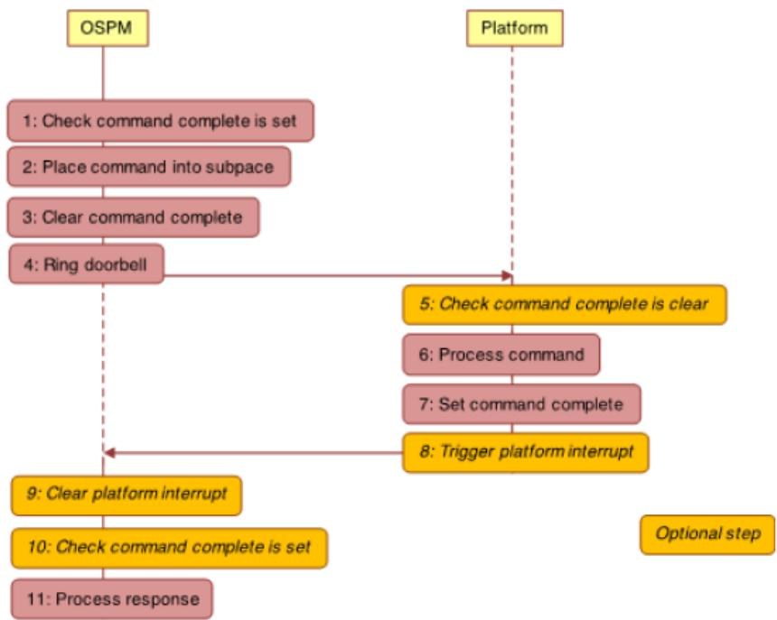  
Fig. 14.1: Communication flow of the doorbell protocol

The Communication flow of the doorbell protocol (Fig. 14.1) illustrates the steps that the OSPM takes to send a message to the platform over a PCC subspace. It also illustrates the steps the platform takes when it receives the message.

1. First the OSPM checks that there is no command pending completion on the subspace, which is done by checking that the Command Complete bit is set. If Command Complete is set, the subspace is free for use and the shared memory associated with the subspace is exclusively owned by the OSPM. Note: the location of the Command Complete bit difers between subspaces of types 0-2 and those of type 3. For type 0-2 subspaces, the Command Complete bit is in the status register as described in Section 14.2.2. Type 3 subspaces still use a single Command Complete bit, but allow the platform to specify the location and format of the register holding it. Therefore, PCCT structures describing type 3 subspaces use masks and an address to describe how to check the bit. OSPM combines the content of the Command Complete check register, through a bitwise AND of the Command Complete check mask. A non-zero value indicates that the Command Complete bit is set. On type 0 channels, whether the platform sets Command Complete when the subspace is initialized is implementation defined. On these subspaces, the OSPM does not have to check for Command Complete to be set before sending the first command.

2. The OSPM places a command into the shared memory of the subspace, updating the flags, length, command and payload fields (see Section 14.2 and Table 14.12). If the platform indicates support for platform interrupts in the PCCT (see Section 14.1.1), then the OSPM can request that the platform generate an interrupt once it has completed processing the command. This is requested by setting the Notify on completion bit in the flags (see

Section 14.1.1 and Table 14.13).

3. The OSPM then clears the Command Complete bit. This step transfers ownership of the shared memory to the platform. Note: clearing the Command Complete bit is done through the Command Complete update register, which can difer in address from the Command Complete check register. In case the Command Complete update register difers in address from the Command Complete check register, the platform must ensure that writes to the Command Complete update register afect the Command Complete check register bits as specified. To reduce platform complexity, it is therefore recommended that the Command Complete update register is the same as the Command Complete check register. To clear the Command Complete bit, the content of the Command Complete update register is combined through a bitwise AND with the Command Complete update preserve mask. The result is then combined through a bitwise inclusive OR with the Command Complete update set mask and the result is written back to the Command Complete update register. As a result, the bits which are neither set in the Command Complete update set mask nor in the Command Complete update preserve mask are implicitly cleared in the Command Complete update register.

4. OSPM rings the doorbell by performing a read/modify/write cycle on the specified doorbell register, preserving and setting the bits specified in the preserve and write mask of the PCC subspace structure.

When the platform receives the command, it executes the following steps:

5. For robustness the platform might optionally check that the Command Complete bit is clear.

6. Processes the command.

7. Sets the command complete bit.

8. Triggers the platform interrupt indicated by the GSI of the subspace’s PCCT entry (see Table 14.7). This will only occur if an interrupt has been requested in step 2, and interrupts are supported by the platform. A platform can indicate support for interrupts through the Platform interrupt flag (See Table 14.2)

OSPM can detect command completion either by polling on the Command Complete bit or via platform interrupts. When the OSPM detects that the command has completed, it proceeds with the following steps:

9. If necessary clears platform interrupt. This step applies if:

• Platform interrupts are supported by the platform on command completion (see Table 14.2).

• The interrupt was requested by the OSPM through the Notify on completion flag (see Table 14.9 and Table 14.13).

• The interrupt is described as being a level triggered through the Platform Interrupt flags, and Platform Interrupt Ack register address, and associated masks are provided by the subspace PCCT entry (see table entries for types 2 and 3).

10. If detecting command completion via interrupt, optionally checks that the command is complete. If the platform interrupt is shared among multiple subspaces, this can be used to determine if the interrupt was targeted to this subspace.

11. Processes the command response.

To ensure correct operation, it is necessary to ensure that all memory updates performed by the OSPM in step 2 are observable by the platform before step 3 completes. Equally, all memory updates performed by the platform in step 6 must be observable by the OSPM before step 7 completes.

## ò Note

For subspace types 0 to 2, all accesses to the Status Field must be made using interlocked operations, by both entities sharing the subspace. Types 3-4 avoid this requirement. This requirement will be removed for subspace types 0 to 2 as part of deprecation of platform async notifications in a future spec revision (see Section 14.6).

## 14.6 Platform Notification

The following sections describe platform notifications on subspace types 0-2 and type 4.

## 14.6.1 Platform Notification for Subspace Types 0, 1, and 2

The doorbell protocol is a synchronous notification from OSPM to the platform to process a command. If the platform wants to notify OSPM of an event asynchronously, it may set the Platform Interrupt and Platform Notification status bits and issue a Platform Interrupt. OSPM will service the Interrupt, clear the Platform Interrupt and Platform Notification bits, and service the platform notification. The meaning of the platform notification and the steps required to service it are defined by the individual components utilizing the PCC interface.

The platform must wait until OSPM has issued a consumer defined command that serves to notify the platform that OSPM is ready to service Platform Notifications. The command is subspace specific and may not be supported by all subspaces. Platform Notifications must be used in conjunction with an interrupt. Polling for Platform Notifications is not supported.

The platform may not modify any portion of the shared memory region other than the status field when issuing a platform notification.

Platform notifications for subspace types 0, 1, and 2 will be deprecated in a future revision of the specification. Implementers requiring the platform be able to send asynchronous notifications to OSPM should use Initiator/Responder subspaces.

Note: All accesses to the Status Field must be made using interlocked operations, by both entities sharing the subspace. This requirement will be removed for subspace types 0 to 2 as part of deprecation of platform async notifications in a future spec revision.

## 14.6.2 Platform Notification for Responder PCC subspaces (type 4)

Initiator subspaces (Type 3) only allow synchronous OSPM-initiated communication with the platform, and do not use the platform notification mechanism provided for subspaces of types 0 to 2. Instead, an Initiator subspace can be paired with a Responder subspace, type 4, which is specifically provided for platform-initiated communications with OSPM. Like type 3 Initiator subspaces, type 4 Responder subspaces include a single Command Complete bit. OSPM must set the Command Complete bit when it is ready to receive notifications from the platform.

The flow of communications for a notification is illustrated in Fig. 14.2. As can be seen the communication flow is very similar to that of an Initiator subspace, shown in Fig. 14.1, except that the roles of the platform and the OSPM are reversed.

The steps are as follows:

1. First, the platform checks that there is no notification command pending completion on the subspace. This is done by checking that the Command Complete bit is set. If Command Complete is set the subspace is free for use, and the shared memory associated with the subspace is exclusively owned by the platform.

2. The platform places a notification command into the shared memory in the subspace, updating the flags, length, command, and payload fields (see Table 14.12). The platform can request that the OSPM rings the doorbell once it has completed processing the notification command by setting the Notify on completion bit in the flags (see Table 14.13).

3. The platform then clears the command complete bit. This transfers ownership of the shared memory to the OSPM.

4. The platform raises the platform interrupt indicated by the GSI of the Responder subspace.

When the OSPM receives the interrupt, it executes the following steps:

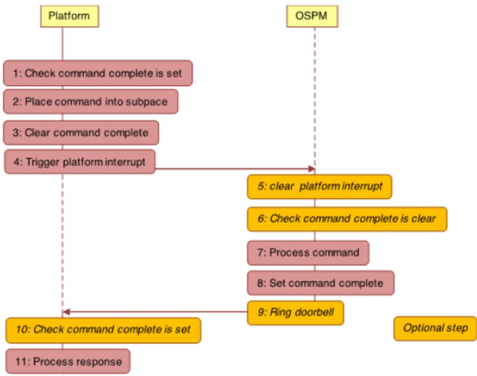  
Fig. 14.2: Communication flow for notifications on Responder subspaces

5. Clears the platform interrupt. This is required if the interrupt is described as being a level triggered through the Platform Interrupt flags, and Platform Interrupt Ack register address, and associated masks are provided by the subspace PCCT entry (see Table 14.7).

6. Optionally checks the command complete bit is clear using the Command Complete check register and masks. If the platform interrupt is shared among multiple subspaces, this can be used to determine if the interrupt was targeted to this subspace. Note: Type 4 subspaces use a single Command Complete bit. The PCCT structures describing type 4 subspaces use masks and an address to describe how to check the bit. OSPM combines the content of the Command Complete check register, through a bitwise AND of the Command Complete check mask. A zero value indicates that the Command Complete bit is clear.

7. Processes the notification command.

8. Sets the Command Complete bit using the Command Complete update register and masks. Note: setting the Command Complete bit is done through the Command Complete update register, which can difer in address from the Command Complete check register. In case the Command Complete update register difers in address from the Command Complete check register, the platform must ensure that writes to the Command Complete update register afect the Command Complete check register bits as specified. To reduce platform complexity, it is therefore recommended that the Command Complete update register is the same as the Command Complete check register.

To set the Command Complete bit, the content of the Command Complete update register is combined through a bitwise AND with the Command Complete update preserve mask. The result is then combined through a bitwise inclusive OR with the Command Complete update set mask and the result is written back to the Command Complete update register. As a result, the bits which are neither set in the Command Complete update set mask nor in the Command Complete update preserve mask are implicitly cleared in the Command Complete update register.

9. Rings the doorbell using the doorbell register and masks. This is required if the doorbell ring was requested by the platform in step 2 above. This also requires that the PCCT entry for the subspace has a non-zero doorbell register address.

The platform can check whether a notification has been processed by the OSPM either by polling the command complete bit, or where supported through receiving a doorbell interrupt from the OSPM. When the platform detects that the notification has been processed by the OSPM, the platform takes the following steps:

10. If polling check command complete is set. If using a doorbell this step is optional.

11. Processes the command response.

The platform must ensure that any writes in step 2 above are observable by the OSPM application processors before writes in step 3. Similarly, the OSPM must ensure that any writes in step 7 are observable by the platform before step 8 completes.

Individual protocols that use PCC define the meaning of notifications.

## 14.7 Referencing the PCC address space

An individual PCC register may be referenced by the Generic Address Structure or in a Generic Register Descriptor by using the Address Space ID PCC (0xA). When using the PCC address space, the Access Size field is redefined to Subspace ID, and identifies which PCC subspace the descriptor refers to.

As an example, the following resource template refers to the field occupying bits 8 through 15 at address 0x30 in PCC subspace 9:

```txt
ResourceTemplate()
{
    Register (
    PCC, //AddressSpaceKeyword
    8, //RegisterBitWidth
    8, //RegisterBitOffset
    0x30, //RegisterAddress
    9 //AccessSize (subspace ID)
    )
}
```

Note that the PCC address space may not be used in any resource template or register unless the register/resource field explicitly allows the use of the PCC address space.

## SYSTEM ADDRESS MAP INTERFACES

This section explains how an ACPI-compatible system conveys its memory resources/type mappings to OSPM. There are three ways for the system to convey memory resources /mappings to OSPM. The first is an INT 15 BIOS interface that is used in IA-PC-based systems to convey the system’s initial memory map. UEFI enabled systems use the UEFI GetMemoryMap() boot services function to convey memory resources to the OS loader. These resources must then be conveyed by the OS loader to OSPM. See the UEFI Specification for more information on UEFI services.

Lastly, if memory resources may be added or removed dynamically, memory devices are defined in the ACPI Namespace conveying the resource information described by the memory device (see Memory Devices ).

ACPI defines the following address range types.

Table 15.1: Address Range Types

<table><tr><td>Value</td><td>Mnemonic</td><td>Save in S4</td><td>Description</td></tr><tr><td>1</td><td>AddressRangeMemory</td><td>Yes</td><td>This range is available RAM usable by the operating system.</td></tr><tr><td>2</td><td>AddressRangeReserved</td><td>No</td><td>This range of addresses is in use or reserved by the system and is not to be included in the allocatable memory pool of the operating system&#x27;s memory manager.</td></tr><tr><td>3</td><td>AddressRangeACPI</td><td>Yes</td><td>ACPI Reclaim Memory. This range is available RAM usable by the OS after it reads the ACPI tables.</td></tr><tr><td>4</td><td>AddressRangeNVS</td><td>Yes</td><td>ACPI NVS Memory. This range of addresses is in use or reserved by the system and must not be used by the operating system. This range is required to be saved and restored across an NVS sleep.</td></tr><tr><td>5</td><td>AddressRangeUnusable</td><td>No</td><td>This range of addresses contains memory in which errors have been detected. This range must not be used by OSPM.</td></tr><tr><td>6</td><td>AddressRangeDisabled</td><td>No</td><td>This range of addresses contains memory that is not enabled. This range must not be used by OSPM.</td></tr></table>

continues on next page

Table 15.1 – continued from previous page

<table><tr><td>Value</td><td>Mnemonic</td><td>Save in S4</td><td>Description</td></tr><tr><td>7</td><td>AddressRangePersistent-Memory</td><td>No</td><td>OSPM must comprehend this memory as having non-volatile attributes and handle distinct from conventional volatile memory. The memory region supports byte-addressable non-volatility. NOTE: Extended Attributes for the memory reported using AddressRangePersistentMemory should set Bit [0] to 1 (see Extended Attributes for Address Range Descriptor Structure).</td></tr><tr><td>8</td><td>AddressRangeUnaccepted</td><td>No</td><td>A memory region that represents unaccepted memory, that must be accepted by the boot target before it can be used. Unless otherwise noted, all other memory types are accepted. For platforms that support unaccepted memory, all unaccepted valid memory will be reported as unaccepted in the memory map. Unreported physical address ranges must be treated as not-present memory.</td></tr><tr><td>9-11</td><td>Undefined</td><td>No</td><td>Reserved for future use. OSPM must treat any range of this type as if the type returned was AddressRangeReserved .</td></tr><tr><td>12</td><td>OEM defined</td><td>No</td><td>An OS should not use a memory type in the vendor-defined range because collisions may occur between different vendors.</td></tr><tr><td>13 to 0xEFFFFFFF</td><td>Undefined</td><td>No</td><td>Reserved for future use. OSPM must treat any range of this type as if the type returned was AddressRangeReserved .</td></tr><tr><td>0xF0000000 to 0xFFFFFFFF</td><td>OEM defined</td><td>No</td><td>An OS should not use a memory type in the vendor-defined range because collisions may occur between different vendors.</td></tr></table>

Platform runtime firmware can use the AddressRangeReserved address range type to block out various addresses as not suitable for use by a programmable device. Some of the reasons a platform runtime firmware would do this are:

• The address range contains system ROM.

• The address range contains RAM in use by the ROM.

• The address range is in use by a memory-mapped system device.

• The address range is, for whatever reason, unsuitable for a standard device to use as a device memory space.

• The address range is within an NVRAM device where reads and writes to memory locations are no longer successful, that is, the device was worn out.

• OSPM will not save or restore memory reported as AddressRangeReserved, AddressRangeUnusable, Address-RangeDisabled, or AddressRangePersistentMemory when transitioning to or from the S4 sleeping state.

• Platform boot firmware must ensure that contents of memory that is reported as AddressRangePersistentMemory is retained after a system reset or a power cycle event.

## 15.1 INT 15H, E820H - Query System Address Map

This interface is used in real mode only on IA-PC-based systems and provides a memory map for all of the installed RAM, and of physical memory ranges reserved by the BIOS. The address map is returned through successive invocations of this interface; each returning information on a single range of physical addresses. Each range includes a type that indicates how the range of physical addresses is to be treated by the OSPM.

If the information returned from E820 in some way difers from INT-15 88 or INT-15 E801, the information returned from E820 supersedes the information returned from INT-15 88 or INT-15 E801. This replacement allows the BIOS to return any information that it requires from INT-15 88 or INT-15 E801 for compatibility reasons. For compatibility reasons, if E820 returns any AddressRangeACPI or AddressRangeNVS memory ranges below 16 MiB, the INT-15 88 and INT-15 E801 functions must return the top of memory below the AddressRangeACPI and AddressRangeNVS memory ranges.

The memory map conveyed by this interface is not required to reflect any changes in available physical memory that have occurred after the BIOS has initially passed control to the operating system. For example, if memory is added dynamically, this interface is not required to reflect the new system memory configuration.

Table 15.2: Input to the INT 15h E820h Call

<table><tr><td>Regis-ter</td><td>Contents</td><td>Description</td></tr><tr><td>EAX</td><td>Function Code</td><td>E820h</td></tr><tr><td>EBX</td><td>Continuation</td><td>Contains the continuation value to get the next range of physical memory. This is the value returned by a previous call to this routine. If this is the first call, EBX must contain zero.</td></tr><tr><td>ES:DI</td><td>Buffer Pointer</td><td>Pointer to an Address Range Descriptor structure that the BIOS fills in.</td></tr><tr><td>ECX</td><td>Buffer Size</td><td>The length in bytes of the structure passed to the BIOS. The BIOS fills in the number of bytes of the structure indicated in the ECX register, maximum, or whatever amount of the structure the BIOS implements. The minimum size that must be supported by both the BIOS and the caller is 20 bytes. Future implementations might extend this structure.</td></tr><tr><td>EDX</td><td>Signature</td><td>‘SMAP’ Used by the BIOS to verify the caller is requesting the system map information to be returned in ES:DI.</td></tr></table>

Table 15.3: Output from the INT 15h E820h Call

<table><tr><td>Regis-ter</td><td>Contents</td><td>Description</td></tr><tr><td>CF</td><td>Carry Flag</td><td>Non-Carry - Indicates No Error</td></tr><tr><td>EAX</td><td>Signature</td><td>‘SMAP.’ Signature to verify correct BIOS revision.</td></tr><tr><td>ES:DI</td><td>Buffer Pointer</td><td>Returned Address Range Descriptor pointer. Same value as on input.</td></tr><tr><td>ECX</td><td>Buffer Size</td><td>Number of bytes returned by the BIOS in the address range descriptor. The minimum size structure returned by the BIOS is 20 bytes.</td></tr><tr><td>EBX</td><td>Continuation</td><td>Contains the continuation value to get the next address range descriptor. The actual significance of the continuation value is up to the discretion of the BIOS. The caller must pass the continuation value unchanged as input to the next iteration of the E820 call in order to get the next Address Range Descriptor. A return value of zero means that this is the last descriptor. Note: the BIOS can also indicate that the last descriptor has already been returned during previous iterations by returning the carry flag set. The caller will ignore any other information returned by the BIOS when the carry flag is set.</td></tr></table>

Table 15.4: Address Range Descriptor Structure

<table><tr><td>Offset in Bytes</td><td>Name</td><td>Description</td></tr><tr><td>0</td><td>BaseAddrLow</td><td>Low 32 Bits of Base Address</td></tr><tr><td>4</td><td>BaseAddrHigh</td><td>High 32 Bits of Base Address</td></tr><tr><td>8</td><td>LengthLow</td><td>Low 32 Bits of Length in Bytes</td></tr><tr><td>12</td><td>LengthHigh</td><td>High 32 Bits of Length in Bytes</td></tr><tr><td>16</td><td>Type</td><td>Address type of this range</td></tr><tr><td>20</td><td>Extended Attributes</td><td>See the Extended Attributes for Address Range Descriptor Structure</td></tr></table>

The BaseAddrLow and BaseAddrHigh together are the 64-bit base address of this range. The base address is the physical address of the start of the range being specified.

The LengthLow and LengthHigh together are the 64-bit length of this range. The length is the physical contiguous length in bytes of a range being specified.

The Type field describes the usage of the described address range as defined in Address Range Types.

Table 15.5: Extended Attributes for Address Range Descriptor Struc-

<table><tr><td>Bit</td><td>Mnemonic</td><td>Description</td></tr><tr><td>0</td><td>Reserved</td><td>Reserved, must be set to 1.</td></tr><tr><td>2:1</td><td>Reserved</td><td>Reserved, must be set to 0.</td></tr><tr><td>3</td><td>AddressRangeErrorLog</td><td>If set, the address range descriptor represents memory used for logging hardware errors.</td></tr><tr><td>31:4</td><td>Reserved</td><td>Reserved for future use.</td></tr></table>

## ò Note

Bit [1] and [2] above were deprecated as of ACPI 6.1. Bit [3] is used only on PC-AT BIOS systems to pinpoint the error log in memory. On UEFI-based systems, either UEFI Hardware Error Record HwErrRec#### runtime UEFI variable interface or the Error Record Serialization Actions 0xD, 0xE and 0xF for the APEI ERST interface must be implemented for the error logs.

## 15.2 E820 Assumptions and Limitations

• The platform boot firmware returns address ranges describing baseboard memory.

• The platform boot firmware does not return a range description for the memory mapping of PCI devices, ISA Option ROMs, and ISA Plug and Play cards because the OS has mechanisms available to detect them.

• The platform boot firmware returns chip set-defined address holes that are not being used by devices as reserved.

• Address ranges defined for baseboard memory-mapped I/O devices, such as APICs, are returned as reserved.

• All occurrences of the system platform boot firmware are mapped as reserved, including the areas below 1 MB, at 16 MB (if present), and at end of the 4-GB address space.

• Standard PC address ranges are not reported. For example, video memory at A0000 to BFFFF physical addresses are not described by this function. The range from E0000 to EFFFF is specific to the baseboard and is reported as it applies to that baseboard.

• All of lower memory is reported as normal memory. The OS must handle standard RAM locations that are reserved for specific uses, such as the interrupt vector table (0:0) and the platform boot firmware data area (40:0).

## 15.3 UEFI GetMemoryMap() Boot Services Function

EFI enabled systems use the UEFI GetMemoryMap() boot services function to convey memory resources to the OS loader. These resources must then be conveyed by the OS loader to OSPM.

The GetMemoryMap interface is only available at boot services time. It is not available as a run-time service after OSPM is loaded. The OS or its loader initiates the transition from boot services to run-time services by calling Exit-BootServices() . After the call to ExitBootServices() all system memory map information must be derived from objects in the ACPI Namespace.

The GetMemoryMap() interface returns an array of UEFI memory descriptors. These memory descriptors define a system memory map of all the installed RAM, and of physical memory ranges reserved by the firmware. Each descriptor contains a type field that dictates how the physical address range is to be treated by the operating system. The table below defines the mapping from UEFI memory types (see UEFI Specification) to ACPI Address Range Types that:

• Platform boot firmware shall follow if describing the memory range in both UEFI and legacy BIOS modes; and

• aAn OS loader should use if it conveys that information to the OS using an ACPI E820h system address map table.

Table 15.6: UEFI Memory Types and mapping to ACPI address range types

<table><tr><td>Type</td><td>Mnemonic</td><td>ACPI Address Range Type</td></tr><tr><td>0</td><td>EfiReservedMemoryType</td><td>AddressRangeReserved</td></tr><tr><td>1</td><td>EfiLoaderCode</td><td>AddressRangeMemory</td></tr><tr><td>2</td><td>EfiLoaderData</td><td>AddressRangeMemory</td></tr><tr><td>3</td><td>EfiBootServicesCode</td><td>AddressRangeMemory</td></tr><tr><td>4</td><td>EfiBootServicesData</td><td>AddressRangeMemory</td></tr><tr><td>5</td><td>EfiRuntimeServiceCode</td><td>AddressRangeReserved</td></tr><tr><td>6</td><td>EfiRuntimeServicesData</td><td>AddressRangeReserved</td></tr><tr><td>7</td><td>EfiConventionalMemory</td><td>AddressRangeMemory</td></tr><tr><td>8</td><td>EfiUnusableMemory</td><td>AddressRangeReserved</td></tr><tr><td>9</td><td>EfiACPIReclaimMemory</td><td>AddressRangeACPI</td></tr><tr><td>10</td><td>EfiACPIMemoryNVS</td><td>AddressRangeNVS</td></tr><tr><td>11</td><td>EfiMemoryMappedIO</td><td>AddressRangeReserved</td></tr><tr><td>12</td><td>EfiMemoryMappedIOPortSpace</td><td>AddressRangeReserved</td></tr><tr><td>13</td><td>EfiPalCode</td><td>AddressRangeReserved</td></tr><tr><td>14</td><td>EfiPersistentMemory</td><td>AddressRangePersistentMemory</td></tr><tr><td>15 to 0x6FFFFFFF</td><td>Reserved.</td><td>AddressRangeReserved</td></tr><tr><td>0x70000000 to 0x7FFFFFFF</td><td>Reserved for OEM used</td><td>An OS should not use a memory type in the vendor-defined range because collisions may occur between different vendors.</td></tr><tr><td>0x80000000 to 0xFFFFFFF</td><td>Reserved for use by UEFI OS loaders that are provided by operating system vendors</td><td>OSV defined</td></tr></table>

The table above applies to system firmware that supports legacy BIOS mode plus UEFI mode, and OS loaders.

## 15.4 UEFI Assumptions and Limitations

• The firmware returns address ranges describing the current system memory configuration.

• The firmware does not return a range description for the memory mapping of PCI devices, ISA Option ROMs, and ISA Plug and Play cards because the OS has mechanisms available to detect them.

• The firmware does not return a range description for address space regions that are not backed by physical hardware except those mentioned above. Regions that are backed by physical hardware, but are not supposed to be accessed by the OS, must be returned as reserved. Herein ‘reserved’ is the definition of the term as noted by the ACPI specification as ACPI address range reserved. OS may use addresses of memory ranges that are not described in the memory map at its own discretion

• Address ranges defined for baseboard memory-mapped I/O devices, such as APICs, are returned as reserved.

• All occurrences of the system firmware are mapped as reserved, including the areas below 1 MB, at 16 MB (if present), and at end of the 4-GB address space.

• Standard PC address ranges are not reported. For example, video memory at A0000 to BFFFF physical addresses are not described by this function. The range from E0000 to EFFFF is specific to the baseboard and is reported as it applies to that baseboard.

• All of lower memory is reported as normal memory. The OS must handle standard RAM locations that are reserved for specific uses, such as the interrupt vector table (0:0) and the platform boot firmware data area (40:0). To preserve backward compatibility, platform should avoid using persistent memory to materialize the lower memory. If persistent memory is used for lower memory, platform boot firmware must report the lower memory address range using AddressRangeMemory and must not report using AddressRangePersistentMemory.

• EFI contains descriptors for memory mapped I/O and memory mapped I/O port space to allow for virtual mode calls to UEFI run-time functions. The OS must never use these regions.

## 15.5 Example Address Map

This sample address map (for an Intel processor-based system) describes a machine that has 128 MiB of RAM, 640 KiB of base memory and 127 MiB of extended memory. The base memory has 639 KiB available for the user and 1 KiB for an extended BIOS data area. A 4-MiB Linear Frame Bufer (LFB) is based at 12 MiB. The memory hole created by the chip set is from 8 MiB to 16 MiB. Memory-mapped APIC devices are in the system. The I/O Unit is at FEC00000 and the Local Unit is at FEE00000. The system BIOS is remapped to 1 GB-64 KiB.

The 639-KiB endpoint of the first memory range is also the base memory size reported in the BIOS data segment at 40:13. The following table shows the memory map of a typical system.

Table 15.7: Sample Memory Map

<table><tr><td>Base (Hex)</td><td>Length</td><td>Type</td><td>Description</td></tr><tr><td>0000 0000</td><td>639 KiB</td><td>AddressRangeMemory</td><td>Available Base memory. Typically the same value as is returned using the INT 12 function.</td></tr><tr><td>0009 FC00</td><td>1 KiB</td><td>AddressRangeReserved</td><td>Memory reserved for use by the BIOS(s). This area typically includes the Extended BIOS data area.</td></tr><tr><td>000F 0000</td><td>64 KiB</td><td>AddressRangeReserved</td><td>System BIOS</td></tr><tr><td>0010 0000</td><td>7 MiB</td><td>AddressRangeMemory</td><td>Extended memory, which is not limited to the 64-MiB address range.</td></tr><tr><td>0080 0000</td><td>4 MiB</td><td>AddressRangeReserved</td><td>Chip set memory hole required to support the LFB mapping at 12 MiB.</td></tr><tr><td>0100 0000</td><td>60 MiB</td><td>AddressRangeMemory</td><td>Baseboard RAM relocated above a chip set memory hole.</td></tr><tr><td>04C0 0000</td><td>60 MiB</td><td>AddressRangePersistent-Memory</td><td>Persistent memory that has non-volatile attributes located in this region.</td></tr><tr><td>FEC0 0000</td><td>4 KiB</td><td>AddressRangeReserved</td><td>I/O APIC memory mapped I/O at FEC00000.</td></tr><tr><td>FEE0 0000</td><td>4 KiB</td><td>AddressRangeReserved</td><td>Local APIC memory mapped I/O at FEE00000.</td></tr><tr><td>FFFF 0000</td><td>64 KiB</td><td>AddressRangeReserved</td><td>Remapped System BIOS at end of address space.</td></tr></table>

## 15.6 Example: Operating System Usage

The following code segment illustrates the algorithm to be used when calling the Query System Address Map function. This is an implementation example and uses non-standard mechanisms:

```txt
E820Present = FALSE;
Reg.ebx = 0;
do {
    Reg.eax = 0xE820;
    Reg.es = SEGMENT (&Descriptor);
    Reg.di = OFFSET (&Descriptor);
    Reg.ecx = sizeof (Descriptor);
    Reg.edx = 'SMAP';

    $_int(15, regs );

    if ((Regs.eflags & EFLAG_CARRY) \|\| Regs.eax != 'SMAP') {
    break;
    }

    if (Regs.ecx < 20 \|\| reg.ecx > sizeof (Descriptor)) {
    // bug in bios - all returned descriptors must be
    // at least 20 bytes long, and cannot be larger then
    // the input buffer.
    break;
    }

    E820Present = TRUE;
    .
    .
    .
    .Add address range Descriptor.BaseAddress through
    Descriptor.BaseAddress + Descriptor.Length
    as type Descriptor.Type
    .
    .
    .
} while (Regs.ebx != 0);

if (!E820Present) {
    .
    .
    .call INT-15 88 and/or INT-15 E801 to obtain old style memory information
    .
    .
}
```

## WAKING AND SLEEPING

ACPI defines a mechanism to transition the system between the working state (G0) and a sleeping state (G1) or the soft-of (G2) state. During transitions between the working and sleeping states, the context of the user’s operating environment is maintained. ACPI defines the quality of the G1 sleeping state by defining the system attributes of four types of ACPI sleeping states (S1, S2, S3, and S4). Each sleeping state is defined to allow implementations that can tradeof cost, power, and wake latencies. Additionally, ACPI defines the sleeping states such that an ACPI platform can support multiple sleeping states, allowing the platform to transition into a particular sleeping state for a predefined period of time and then transition to a lower power/higher wake latency sleeping state (transitioning through the G0 state) (See note below).

OSPM uses the RTC wakeup feature or the Time and Alarm Namespace device to program in the time transition delay. Prior to sleeping, OSPM will program the alarm to the closest (in time) wakeup event: either a transition to a lower power sleeping state, or a calendar event (to run some application).

ACPI defines a programming model that provides a mechanism for OSPM to initiate the entry into a sleeping or soft-of state (S1-S5); this consists of a 3 bit field SLP\_TYPx (See note below) that indicates the type of sleep state to enter, and a single control bit SLP\_EN to start the sleeping process. On HW-reduced ACPI systems, the register described by the SLEEP\_CONTROL\_REG field in the FADT is used instead of the fixed SLP\_TYPx and SLP\_EN register bit fields.

Notice that there can be two fixed PM1x\_CNT registers, each pointing to a different system I/O space region. Normally a register grouping only allows a bit or bit field to reside in a single register group instance (a or b); however, each platform can have two instances of the SLP\_TYP (one for each grouping register: a and b). The \_Sx control method gives a package with two values: the first is the SLP\_TYPa value and the second is the SLP\_TYPb value.

## ò Note

Systems containing processors without a hardware mechanism to place the processor in a low-power state may additionally require the execution of appropriate native instructions to place the processor in a low-power state after OSPM sets the SLP\_EN bit. The hardware may implement a number of low-power sleeping states and then associate these states with the defined ACPI sleeping states (through the SLP\_TYPx fields). The ACPI system firmware creates a sleeping object associated with each supported sleeping state (unsupported sleeping states are identified by the lack of the sleeping object). Each sleeping object contains two constant 3-bit values that OSPM will program into the SLP\_TYPa and SLP\_TYPb fields (in fixed register space), or, on HW-reduced ACPI platforms, a single 3-bit value that OSPM will write to the register specified by the FADT’s SLEEP\_CONTROL\_REG field.

On systems that are not HW-reduced ACPI platforms, an alternate mechanism for entering and exiting the S4 state is defined. This mechanism passes control to the platform runtime firmware to save and restore platform context. Context ownership is similar in definition to the S3 state, but hardware saves and restores the context of memory to non-volatile storage (such as a disk drive), and OSPM treats this as an S4 state with implied latency and power constraints. This alternate mechanism of entering the S4 state is referred to as the S4BIOS transition.

Prior to entering a sleeping state (S1-S4), OSPM will execute OEM-specific AML/ASL code contained in the \_PTS (Prepare To Sleep) control method. One use of the \_PTS control method is that it can indicate to the embedded controller what sleeping state the system will enter. The embedded controller can then respond by executing the proper power-plane sequencing upon sleep state entry.

The \_WAK (Wake) control method is then executed. This control method again contains OEM-specific AML/ASL code. One use of the \_WAK control method requests OSPM to check the platform for any devices that might have been added or removed from the system while the system was asleep. For example, a PC Card controller might have had a PC Card added or removed, and because the power to this device was of in the sleeping state, the status change event was not generated.

This section discusses the system initialization sequence of an ACPI-enabled platform. This includes the boot sequence, diferent wake scenarios, and an example to illustrate how to use the system address map reporting interfaces. This sequence is part of the ACPI event programming model.

ò Note

HW-reduced ACPI platforms do not implement the Legacy Mode nor the S4BIOS state described below.

For detailed information on the power management control methods described above, see Power and Performance Management

## 16.1 Sleeping States

The illustration below shows the transitions between the working state, the sleeping states, and the Soft Of state.

ACPI defines distinct diferences between the G0 and G1 system states.

• In the G0 state, work is being performed by the OS/application software and the hardware. The CPU or any particular hardware device could be in any one of the defined power states (C0-C3 or D0-D3); however, some work will be taking place in the system.

• In the G1 state, the system is assumed to be doing no work. Prior to entering the G1 state, OSPM will place devices in a device power state compatible with the system sleeping state to be entered; if a device is enabled to wake the system, then OSPM will place these devices into the lowest Dx state from which the device supports wake. This is defined in the power resource description of that device object. This definition of the G1 state implies:

• The CPUs execute no instructions in the G1 state.

• Hardware devices are not operating (except possibly to generate a wake event).

• If not HW-reduced, ACPI registers are afected as follows:

– Wake event bits are enabled in the corresponding fixed or general-purpose registers according to enabled wake options.

– PM1 control register is programmed for the desired sleeping state.

– WAK\_STS is set by hardware in the sleeping state.

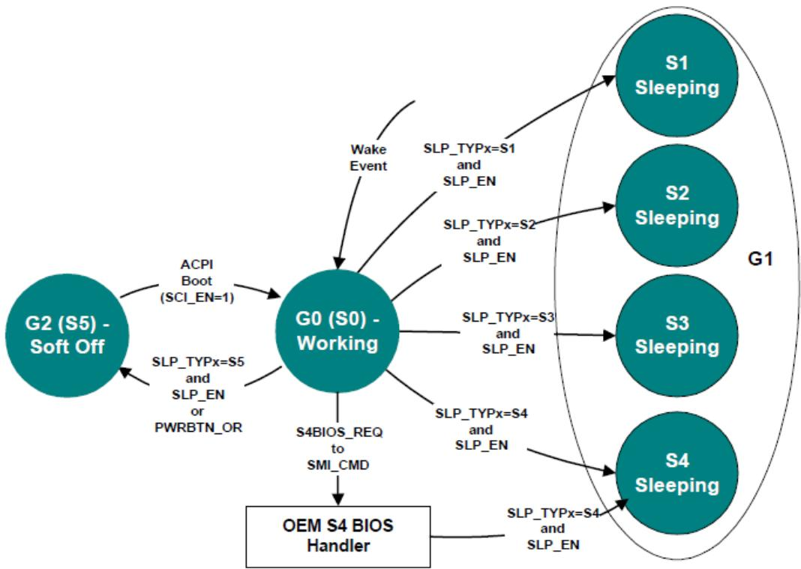  
Fig. 16.1: Example Sleeping States

All sleeping states have these specifications. ACPI defines additional attributes that allow an ACPI platform to have up to four diferent sleeping states, each of which has diferent attributes. The attributes were chosen to allow diferentiation of sleeping states that vary in power, wake latency, and implementation cost tradeofs.

Running processors at reduced levels of performance is not an ACPI sleeping state (G1); this is a working (G0) statedefined event.

The CPU cannot execute any instructions when in the sleeping state; OSPM relies on this fact. A platform designer might be tempted to support a sleeping system by reducing the clock frequency of the system, which allows the platform to maintain a low-power state while at the same time maintaining communication sessions that require constant interaction (as with some network environments). This is definitely a G0 activity where an OS policy decision has been made to turn of the user interface (screen) and run the processor in a reduced performance mode. This type of reduced performance state as a sleeping state is not defined by the ACPI specification; ACPI assumes no code execution during sleeping states.

ACPI defines attributes for four sleeping states: S1, S2, S3 and S4. (Notice that S4 and S5 are very similar from a hardware standpoint.) ACPI-compatible platforms can support multiple sleeping states. ACPI specifies that a 3-bit binary number be associated with each sleeping state (these numbers are given objects within ACPI’s root namespace: (\_S0, \_S1, \_S2, \_S3, \_S4 and \_S5). When entering a system sleeping state, OSPM will do the following:

1. Pick the deepest sleeping state supported by the platform and enabled waking devices.

2. Execute the \_PTS control method (which passes the type of intended sleep state to OEM AML code).

3. If OS policy decides to enter the S4 state and chooses to use the S4BIOS mechanism and S4BIOS is supported by the platform, OSPM will pass control to the platform runtime firmware software by writing the S4BIOS\_REQ value to the SMI\_CMD port.

4. If not using the S4BIOS mechanism, OSPM gets the SLP\_TYPx value from the associated sleeping object (\_S1, \_S2, \_S3, \_S4 or \_S5).

5. Program the SLP\_TYPx fields with the values contained in the selected sleeping object.

## ò Note

Compatibility — The \_GTS method is deprecated in ACPI 5.0A. For earlier versions, execute the \_GTS control method, passing an argument that indicates the sleeping state to be entered (1, 2, 3, or 4 representing S1, S2, S3, and S4).

6. If entering S1, S2, or S3, flush the processor caches.

7. If not entering S4BIOS, set the SLP\_EN bit to start the sleeping sequence. (This actually occurs on the same write operation that programs the SLP\_TYPx field in the PM1\_CNT register.) If entering S4BIOS, write the S4BIOS\_REQ value into the SMI\_CMD port.

8. If HW-reduced, program the register indicated by the SLEEP\_CONTROL\_REG FADT field with the HWreduced ACPI Sleep Type value (retrieved from the sleep state object in step 4 above) and with the SLP\_EN bit set to one.

9. On systems containing processors without a hardware mechanism to place the processor in a low-power state, execute appropriate native instructions to place the processor in a low-power state.

The \_PTS control method provides the platform runtime firmware a mechanism for performing some housekeeping, such as writing the sleep type value to the embedded controller, before entering the system sleeping state. Control method execution occurs “just prior” to entering the sleeping state and is not an event synchronized with the write to the PM1\_CNT register. Execution can take place several seconds prior to the system actually entering the sleeping state. As such, no hardware power-plane sequencing takes place by execution of the \_PTS control method.

ò Note

Compatibility — The \_BFS method is deprecated in ACPI 5.0A. In earlier versions, on waking, the \_BFS control method is executed. OSPM then executes the \_WAK control method. This control method executes OEM-specific ASL/AML code that can search for any devices that have been added or removed during the sleeping state.

The following sections describe the sleeping state attributes.

## 16.1.1 S1 Sleeping State

The S1 state is defined as a low wake-latency sleeping state. In this state, all system context is preserved with the exception of CPU caches. Before entering S1, OSPM will flush the system caches. If the platform supports the WBINVD instruction (as indicated by the WBINVD and WBINVD\_FLUSH flags in the FADT), OSPM will execute the WBINVD instruction. The hardware is responsible for maintaining all other system context, which includes the context of the CPU, memory, and chipset.

Examples of S1 sleeping state implementation alternatives follow.

## 16.1.1.1 Example 1: S1 Sleeping State Implementation

This example references an IA processor that supports the stop grant state through the assertion of the STPCLK# signal. When SLP\_TYPx is programmed to the S1 value (the OEM chooses a value, which is then placed in the \_S1 object) and the SLP\_ENx bit is subsequently set, or when the HW-reduced ACPI Sleep Type value for S1 and the SLP\_EN bit are written to the Sleep Control Register, the hardware can implement an S1 state by asserting the STPCLK# signal to the processor, causing it to enter the stop grant state.

In this case, the system clocks (PCI and CPU) are still running. Any enabled wake event causes the hardware to deassert the STPCLK# signal to the processor whereby OSPM must first invalidate the CPU caches and then transition back into the working state.

## 16.1.1.2 Example 2: S1 Sleeping State Implementation

When SLP\_TYPx is programmed to the S1 value and the SLP\_ENx bit is subsequently set, or the HW-reduced ACPI Sleep Type value for S1 and the SLP\_EN bit are written to the Sleep Control Register, the hardware will implement an S1 sleeping state transition by doing the following:

1. Placing the processor into the stop grant state.

2. Stopping the processor’s input clock, placing the processor into the stop clock state.

3. Placing system memory into a self-refresh or suspend-refresh state. Refresh is maintained by the memory itself or through some other reference clock that is not stopped during the sleeping state.

4. Stopping all system clocks (asserts the standby signal to the system PLL chip). Normally the RTC will continue running.

In this case, all clocks in the system have been stopped (except for the RTC). Hardware must reverse the process (restarting system clocks) upon any enabled wake event whereby OSPM must first invalidate the CPU caches and then transition back into the working state.

## 16.1.2 S2 Sleeping State

The S2 state is defined as a low wake latency sleep state. This state is similar to the S1 sleeping state where any context except for system memory may be lost. Additionally, control starts from the processor’s reset vector after the wake event. Before entering S2 the SLP\_EN bit, OSPM will flush the system caches. If the platform supports the WBINVD instruction (as indicated by the WBINVD and WBINVD\_FLUSH flags in the FADT), OSPM will execute the WBINVD instruction. The hardware is responsible for maintaining chip set and memory context. An example of an S2 sleeping state implementation follows.

## 16.1.2.1 Example: S2 Sleeping State Implementation

When the SLP\_TYPx register(s) are programmed to the S2 value (found in the \_S2 object) and the SLP\_EN bit is set, or the HW-reduced ACPI Sleep Type value for S2 and the SLP\_EN bit are written to the Sleep Control Register, the hardware will implement an S2 sleeping state transition by doing the following:

1. Stopping system clocks (the only running clock is the RTC).

2. Placing system memory into a self-refresh or suspend-refresh state.

3. Powering of the CPU and cache subsystem.

From S2 Sleeping State the CPU is reset upon detection of the wake event; however, core logic and memory maintain their context. Execution control starts from the CPU’s boot vector. The platform boot firmware is required to:

1. Program the initial boot configuration of the CPU (such as the CPU’s MSR and MTRR registers).

2. Initialize the cache controller to its initial boot size and configuration.

3. Enable the memory controller to accept memory accesses.

4. Jump to the waking vector.

## 16.1.3 S3 Sleeping State

The S3 state is defined as a low wake-latency sleep state. From the software viewpoint, this state is functionally the same as the S2 state. The operational diference is that some Power Resources that may have been left ON in the S2 state may not be available to the S3 state. As such, some devices may be in a lower power state when the system is in S3 state than when the system is in the S2 state. Similarly, some device wake events can function in S2 but not S3. An example of an S3 sleeping state implementation follows.

## 16.1.3.1 Example: S3 Sleeping State Implementation

When the SLP\_TYPx register(s) are programmed to the S3 value (found in the \_S3 object) and the SLP\_EN bit is set, or the HW-reduced ACPI Sleep Type value for S3 and the SLP\_EN bit are written to the Sleep Control Register, the hardware will implement an S3 sleeping state transition by doing the following:

1. Placing the memory into a low-power auto-refresh or self-refresh state.

2. Devices that are maintaining memory isolating themselves from other devices in the system.

3. Removing power from the system. At this point, only devices supporting memory are powered (possibly partially powered). The only clock running in the system is the RTC clock.

From S3 Sleeping State, the wake event repowers the system and resets most devices (depending on the implementation). Execution control starts from the CPU’s boot vector. The platform boot firmware is required to:

1. Program the initial boot configuration of the CPU (such as the MSR and MTRR registers).

2. Initialize the cache controller to its initial boot size and configuration.

3. Enable the memory controller to accept memory accesses.

4. Jump to the waking vector.

Notice that if the configuration of cache memory controller is lost while the system is sleeping, the platform boot firmware is required to reconfigure it to either the pre-sleeping state or the initial boot state configuration. The platform boot firmware can store the configuration of the cache memory controller into the reserved memory space, where it can then retrieve the values after waking. OSPM will call the \_PTS method once per session (prior to sleeping).

The platform boot firmware is also responsible for restoring the memory controller’s configuration. If this configuration data is destroyed during the S3 sleeping state, then the platform boot firmware needs to store the pre-sleeping state or initial boot state configuration in a non-volatile memory area (as with RTC CMOS RAM) to enable it to restore the values during the waking process.

When OSPM re-enumerates buses coming out of the S3 sleeping state, it will discover any devices that have been inserted or removed, and configure devices as they are turned on.

## 16.1.4 S4 Sleeping State

The S4 sleeping state is the lowest-power, longest wake-latency sleeping state supported by ACPI. In order to reduce power to a minimum, it is assumed that the hardware platform has powered of all devices. Because this is a sleeping state, the platform context is maintained. Depending on how the transition into the S4 sleeping state occurs, the responsibility for maintaining system context changes. S4 supports two entry mechanisms: OS initiated and platform runtime firmware-initiated. The OSPM-initiated mechanism is similar to the entry into the S1-S3 sleeping states; OSPM driver writes the SLP\_TYPx fields and sets the SLP\_EN bit, or writes the HW-reduced ACPI Sleep Type value for S3 and the SLP\_EN bit to the Sleep Control Register. The platform runtime firmware-initiated mechanism occurs by OSPM transferring control to the platform runtime firmware by writing the S4BIOS\_REQ value to the SMI\_CMD port, and is not supported on HW-reduced ACPI platforms.

In OSPM-initiated S4 sleeping state, OSPM is responsible for saving all system context. Before entering the S4 state, OSPM will save context of all memory as specified in System Address Map Interfaces.

Upon waking, OSPM shall then restore the system context. When OSPM re-enumerates buses coming out of the S4 sleeping state, it will discover any devices that have come and gone, and configure devices as they are turned on.

In the platform runtime firmware-initiated S4 sleeping state, OSPM is responsible for the same system context as described in the S3 sleeping state (platform runtime firmware restores the memory and some chip set context). The S4BIOS transition transfers control to the platform runtime firmware, allowing it to save context to non-volatile memory (such as a disk partition).

## 16.1.4.1 Operating System-Initiated S4 Transition

If OSPM supports OSPM-initiated S4 transition, it will not generate a platform firmware-initiated S4 transition. Platforms that support the platform firmware-initiated S4 transition also support OSPM-initiated S4 transition.

OSPM-initiated S4 transition is initiated by OSPM by saving system context, writing the appropriate values to the SLP\_TYPx register(s), and setting the SLP\_EN bit, or writes the HW-reduced ACPI Sleep Type value for S4 and the SLP\_EN bit to the Sleep Control Register. Upon exiting the S4 sleeping state, the platform boot firmware restores the chipset to its POST condition, updates the hardware signature (described later in this section), and passes control to OSPM through a normal boot process.

When the platform boot firmware builds the ACPI tables, it generates a hardware signature for the system. If the hardware configuration has changed during an OS-initiated S4 transition and it changes the content or structure of the ACPI tables, the platform boot firmware updates the hardware signature in the FACS table as described in Section 5.2.10 (Firmware ACPI Control Structure (FACS)).

Upon waking, in order to locate the hardware signature, the physical address of the RSDP must be reacquired via methods described in 5.2.5.1 (Finding the RSDP on IA-PC Systems) or 5.2.5.2 (Finding the RSDP on UEFI Enable Systems) and therefore it must not be assumed that the FACS and its Hardware Signature would be located in the same physical memory address as the prior boot.

## 16.1.4.2 The S4BIOS Transition

This transition is not supported on HW-reduced ACPI platforms. On other systems, the platform runtime firmwareinitiated S4 transition begins with OSPM writing the S4BIOS\_REQ value into the SMI\_CMD port (as specified in the FADT). Once gaining control, the platform runtime firmware then saves the appropriate memory and chip set context, and then places the platform into the S4 state (power of to all devices).

In the FACS memory table, there is the S4BIOS\_F bit that indicates hardware support for the platform runtime firmwareinitiated S4 transition. If the hardware platform supports the S4BIOS state, it sets the S4BIOS\_F flag within the FACS memory structure prior to booting the OS. If the S4BIOS\_F flag in the FACS table is set, this indicates that OSPM can request the platform runtime firmware to transition the platform into the S4BIOS sleeping state by writing the S4BIOS\_REQ value (found in the FADT) to the SMI\_CMD port (identified by the SMI\_CMD value in the FADT).

Upon waking the platform boot firmware restores memory context and jumps to the waking vector (similar to wake from an S3 state). Coming out of the S4BIOS state, the platform boot firmware must only configure boot devices (so it can read the disk partition where it saved system context). When OSPM re-enumerates buses coming out of the S4BIOS state, it will discover any devices that have come and gone, and configure devices as they are turned on.

## 16.1.5 S5 Soft Of State

OSPM places the platform in the S5 soft of state to achieve a logical of. Notice that the S5 state is not a sleeping state (it is a G2 state) and no context is saved by OSPM or hardware but power may still be applied to parts of the platform in this state, and, as such, it is not safe to disassemble. Also notice that from a hardware perspective, the S4 and S5 states are nearly identical. When initiated, the hardware will sequence the system to a state similar to the of state. The hardware has no responsibility for maintaining any system context (memory or I/O); however, it does allow a transition to the S0 state due to a power button press or a Remote Start. Upon start-up, the platform boot firmware performs a normal power-on reset, loads the boot sector, and then executes (but not the waking vector, as all ACPI table context is lost when entering the S5 soft of state).

The \_TTS control method allows the platform runtime firmware a mechanism for performing some housekeeping, such as storing the targeted sleep state in a “global” variable that is accessible by other control methods (such as \_PS3 and \_DSW).

## 16.1.6 Transitioning from the Working to the Sleeping State

On a transition of the system from the working to the sleeping state, the following occurs:

1. OSPM decides (through a policy scheme) to place the system into the sleeping state.

2. OSPM invokes the \_TTS method to indicate the deepest possible system state the system will transition to (1, 2, 3, or 4 representing S1, S2, S3, and S4).

3. OSPM examines all devices enabled to wake the system and determines the deepest possible sleeping state the system can enter to support the enabled wake functions. The \_PRW named object under each device is examined, as well as the power resource object it points to.

4. OSPM places all device drivers into their respective Dx state. If the device is enabled for wake, it enters the Dx state associated with the wake capability. If the device is not enabled to wake the system, it enters the D3 state.

5. OSPM executes the \_PTS control method, passing an argument that indicates the desired sleeping state (1, 2, 3, or 4 representing S1, S2, S3, and S4).

6. OSPM saves any other processor’s context (other than the local processor) to memory.

7. OSPM writes the waking vector into the FACS table in memory.

## ò Note

Compatibility — The \_GTS method is deprecated in ACPI 5.0A. For earlier versions, OSPM executes the \_GTS control method, passing an argument that indicates the sleeping state to be entered (1, 2, 3, or 4 representing S1, S2, S3, and S4).

8. If not a HW-reduced ACPI platform, OSPM clears the WAK\_STS in the PM1a\_STS and PM1b\_STS registers. On HW-reduced ACPI platforms, OSPM clears the WAK\_STS bit in the Sleep Status Register.

9. OSPM saves the local processor’s context to memory.

10. OSPM flushes caches (only if entering S1, S2 or S3).

11. OSPM sets GPE enable registers or enables wake-capable interrupts to ensure that all appropriate wake signals are armed.

12. If entering an S4 state using the S4BIOS mechanism, OSPM writes the S4BIOS\_REQ value (from the FADT) to the SMI\_CMD port. This passes control to the platform runtime firmware, which then transitions the platform into the S4BIOS state.

13. If not entering an S4BIOS state, and not a HW-reduced ACPI platform, then OSPM writes SLP\_TYPa (from the associated sleeping object) with the SLP\_ENa bit set to the PM1a\_CNT register.

14. OSPM writes SLP\_TYPb with the SLP\_EN bit set to the PM1b\_CNT register, or writes the HW-reduced ACPI Sleep Type value and the SLP\_EN bit to the Sleep Control Register.

15. On systems containing processors without a hardware mechanism to place the processor in a low-power state, OSPM executes appropriate native instructions to place the processor in a low-power state.

16. OSPM loops on the WAK\_STS bit, either in both the PM1a\_CNT and PM1b\_CNT registers, or in the SLEEP\_STATUS\_REG, in the case of HW-reduced ACPI platforms.

17. The system enters the specified sleeping state.

ò Note

This is accomplished after step 14 or 15 above.

## 16.1.7 Transitioning from the Working to the Soft Of State

On a transition of the system from the working to the soft of state, the following occurs:

1. OSPM executes the \_PTS control method, passing the argument 5.

2. OSPM prepares its components to shut down (flushing disk caches).

## ò Note

Compatibility — The \_GTS method is deprecated in ACPI 5.0A. For earlier versions, OSPM executes the \_GTS control method, passing the argument 5.

3. If not a HW-reduced ACPI platform, OSPM writes SLP\_TYPa (from the \_S5 object) with the SLP\_ENa bit set to the PM1a\_CNT register.

4. OSPM writes SLP\_TYPb (from the \_S5 object) with the SLP\_ENb bit set to the PM1b\_CNT register, or writes the HW-reduced ACPI Sleep Type value for S5 and the SLP\_EN bit to the Sleep Control Register.

5. The system enters the Soft Of state.

## 16.2 Flushing Caches

Before entering the S1, S2 or S3 sleeping states, OSPM is responsible for flushing the system caches. ACPI provides a number of mechanisms to flush system caches. These include:

• Using a native instruction (for example, the IA-32 architecture WBINVD instruction) to flush and invalidate platform caches.

– WBINVD\_FLUSH flag set (1) in the FADT indicates the system provides this support level.

• Using the IA-32 instruction WBINVD to flush but not invalidate the platform caches.

– WBINVD flag set (1) in the FADT indicates the system provides this support level.

The manual flush mechanism has two caveats:

• Largest cache is 1 MB in size (FLUSH\_SIZE is a maximum value of 2 MB).

• No victim caches (for which the manual flush algorithm is unreliable).

Processors with built-in victim caches will not support the manual flush mechanism and are therefore required to support the WBINVD mechanism to use the S2 or S3 state.

The manual cache-flushing mechanism relies on the two FADT fields:

• FLUSH\_SIZE. Indicates twice the size of the largest cache in bytes.

• FLUSH\_STRIDE. Indicates the smallest line size of the caches in bytes.

The cache flush size value is typically twice the size of the largest cache size, and the cache flush stride value is typically the size of the smallest cache line size in the platform. OSPM will flush the system caches by reading a contiguous block of memory indicated by the cache flush size.

## 16.3 Initialization

This section covers the initialization sequences for an ACPI platform. After a reset or wake from an S2, S3, or S4 sleeping state (as defined by the ACPI sleeping state definitions), the CPU will start execution from its boot vector. At this point, the initialization software has many options, depending on what the hardware platform supports. This section describes at a high level what should be done for these diferent options. The figure below illustrates the flow of the boot-up software.

The processor will start executing at its power-on reset vector when waking from an S2, S3, or S4 sleeping state, during a power-on sequence, or as a result of a hard or soft reset.

When executing from the power-on reset vector as a result of a power-on sequence, a hard or soft reset, or waking from an S4 sleep state, the platform firmware performs complete hardware initialization; placing the system in a boot configuration. The firmware then passes control to the operating system boot loader.

When executing from the power-on reset vector as a result of waking from an S2 or S3 sleep state, the platform firmware performs only the hardware initialization required to restore the system to either the state the platform was in prior to the initial operating system boot, or to the pre-sleep configuration state. In multiprocessor systems, non-boot processors should be placed in the same state as prior to the initial operating system boot. The platform firmware then passes control back to OSPM system by jumping to either the Firmware\_Waking\_Vector or the X\_Firmware\_Waking\_Vector in the FACS (see Firmware ACPI Control Structure (FACS) for more information). The contents of operating system memory contents may not be changed during the S2 or S3 sleep state.

First, the platform runtime firmware determines whether this is a wake from S2 or S3 by examining the SLP\_TYP register value, which is preserved between sleeping sessions. If this is an S2 or S3 wake, then the platform runtime firmware restores minimum context of the system before jumping to the waking vector. This includes:

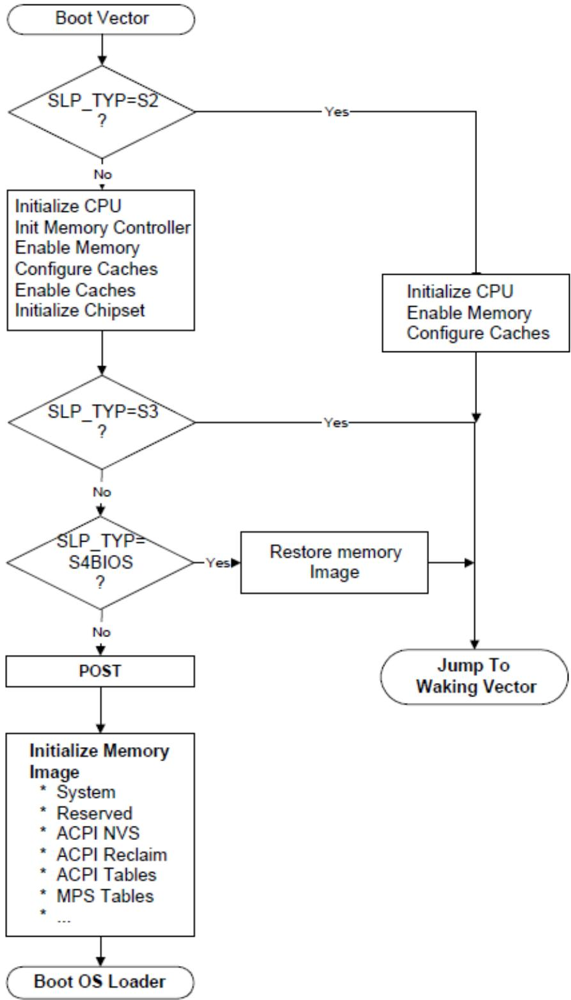  
Fig. 16.2: Platform Firmware Initialization

## CPU configuration.

Platform runtime firmware restores the pre-sleep configuration or initial boot configuration of each CPU (MSR, MTRR, firmware update, SMBase, and so on). Interrupts must be disabled (for IA-32 processors, disabled by CLI instruction).

## Memory controller configuration.

the configuration is lost during the sleeping state, the platform runtime firmware initializes the memory controller to its pre-sleep configuration or initial boot configuration.

## Cache memory configuration.

If the configuration is lost during the sleeping state, the platform runtime firmware initializes the cache controller to its pre-sleep configuration or initial boot configuration.

## Functional device configuration.

The platform runtime firmware doesn’t need to configure/restore context of functional devices such as a network interface (even if it is physically included in chipset) or interrupt controller. OSPM is responsible for restoring all context of these devices. The only requirement for the hardware and platform runtime firmware is to ensure that interrupts are not asserted by devices when the control is passed to OS.

## ACPI registers.

SCI\_EN bit must be set on non-HW-reduced ACPI platforms, and all event status/enable bits (PM1x\_STS, PM1x\_EN, GPEx\_STS and GPEx\_EN) must not be changed by platform runtime firmware.

## ò Note

The platform runtime firmware may reconfigure the CPU, memory controller, and cache memory controller to either the pre-sleeping configuration or the initial boot configuration. OSPM must accommodate both configurations.

When waking from an S4BIOS sleeping state, the platform boot firmware initializes a minimum number of devices such as CPU, memory, cache, chipset and boot devices. After initializing these devices, the platform boot firmware restores memory context from non-volatile memory such as hard disk, and jumps to waking vector.

As mentioned previously, waking from an S4 state is treated the same as a cold boot: the platform boot firmware runs POST and then initializes memory to contain the ACPI system description tables. After it has finished this, it can call OSPM loader, and control is passed to OSPM.

When waking from S4 (either S4OS or S4BIOS), the platform boot firmware may optionally set SCI\_EN bit before passing control to OSPM. In this case, interrupts must be disabled (for IA-32 processors, disabled CLI instruction) until the control is passed to OSPM and the chipset must be configured in ACPI mode.

## 16.3.1 Placing the System in ACPI Mode

When a platform initializes from a cold boot (mechanical of or from an S4 or S5 state), the hardware platform may be configured in a legacy configuration, if not a HW-reduced ACPI platform. From these states, the platform boot firmware software initializes the computer as it would for a legacy operating system. When control is passed to the operating system, OSPM will check the SCI\_EN bit and if it is not set will then enable ACPI mode by first finding the ACPI tables, and then by generating a write of the ACPI\_ENABLE value to the SMI\_CMD port (as described in the FADT). The hardware platform will set the SCI\_EN bit to indicate to OSPM that the hardware platform is now configured for ACPI.

## ò Note

Before SCI is enabled, no SCI interrupt can occur. Nor can any SCI interrupt occur immediately after ACPI is on. The SCI interrupt can only be signaled after OSPM has enabled one of the GPE/PM1 enable bits.

When the platform is waking from an S1, S2 or S3 state, and from S4 and S5 on HW-reduced ACPI platforms, OSPM assumes the hardware is already in the ACPI mode and will not issue an ACPI\_ENABLE command to the SMI\_CMD port

## 16.3.2 Platform Boot Firmware Initialization of Memory

During a power-on reset, an exit from an S4 sleeping state, or an exit from an S5 soft-of state, the platform boot firmware needs to initialize memory. This section explains how the platform boot firmware should configure memory for use by a number of features including:

• ACPI tables.

• Platform firmware memory that wants to be saved across S4 sleeping sessions and should be cached.

• Platform firmware memory that does not require saving and should be cached.

For example, the configuration of the platform’s cache controller requires an area of memory to store the configuration data. During the wake sequence, the platform boot firmware will re-enable the memory controller and can then use its configuration data to reconfigure the cache controllers. To support these three items, IA-PC-based systems contain System Address Map Interfaces that return the following memory range types:

## ACPI Reclaim Memory.

Memory identified by the platform boot firmware that contains the ACPI tables. This memory can be any place above 8 MB and contains the ACPI tables. When OSPM is finished using the ACPI tables, it is free to reclaim this memory for system software use (application space).

## ACPI Non-Volatile-Sleeping Memory (NVS).

Memory identified by the BIOS as being reserved by the platform boot firmware for its use. OSPM is required to tag this memory as cacheable, and to save and restore its image before entering an S4 state. Except as directed by control methods, OSPM is not allowed to use this physical memory. OSPM will call the \_PTS control method some time before entering a sleeping state, to allow the platform’s AML code to update this memory image before entering the sleeping state. After the system awakes from an S4 state, OSPM will restore this memory area and call the \_WAK control method to enable the platform boot firmware to reclaim its memory image.

## ò Note

The memory information returned from the system address map reporting interfaces should be the same before and after an S4 sleep.

When the system is first booting, OSPM will invoke E820 interfaces on IA-PC-based legacy systems or the GetMemoryMap() interface on UEFI-enabled systems to obtain a system memory map, System Address Map Interfaces for more information). As an example, the following memory map represents a typical IA-PC-based legacy platform’s physical memory map.

The names and attributes of the diferent memory regions are listed below:

• 0-640 KB. Compatibility Memory. Application executable memory for an 8086 system.

• 640 KB-1 MB. Compatibility Holes. Holes within memory space that allow accesses to be directed to the PCcompatible frame bufer (A0000h-BFFFFh), to adapter ROM space (C0000h-DFFFFh), and to system platform firmware space (E0000h-FFFFFh).

• 1 MB-8 MB. Contiguous RAM. An area of contiguous physical memory addresses. Operating systems may require this memory to be contiguous in order for its loader to load the OS properly on boot up. (No memorymapped I/O devices should be mapped into this area.)

• 8 MB-Top of Memory1. This area contains memory to the “top of memory1” boundary. In this area, memorymapped I/O blocks are possible.

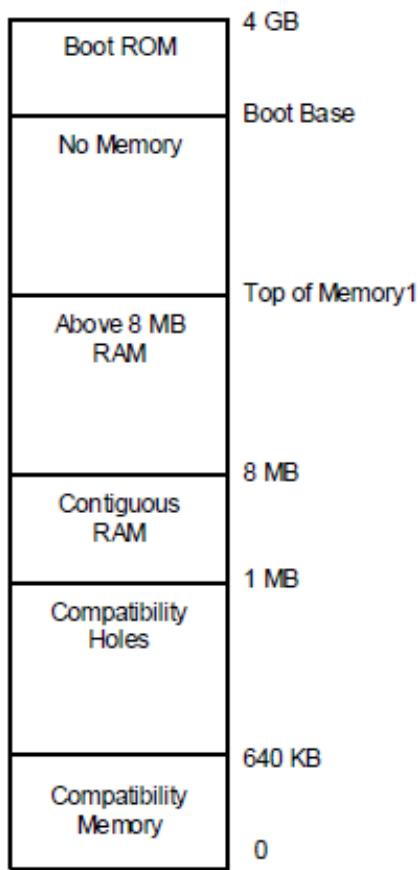  
Fig. 16.3: Example Physical Memory Map

• Boot Base-4 GB. This area contains the bootstrap ROM.

The platform boot firmware should decide where the diferent memory structures belong, and then configure the E820 handler to return the appropriate values.

For this example, the platform boot firmware will report the system memory map by E820 as shown in Figure 15-4. Notice that the memory range from 1 MB to top of memory is marked as system memory, and then a small range is additionally marked as ACPI reclaim memory. A legacy OS that does not support the E820 extensions will ignore the extended memory range calls and correctly mark that memory as system memory.

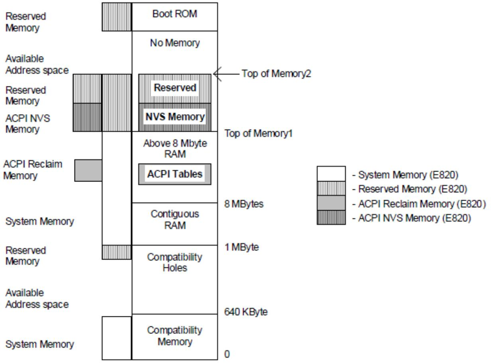  
Fig. 16.4: Memory as Configured after Boot

Also, from the Top of Memory1 to the Top of Memory2, the platform boot firmware has set aside some memory for its own use and has marked as reserved both ACPI NVS Memory and Reserved Memory. A legacy OS will throw out the ACPI NVS Memory and correctly mark this as reserved memory (thus preventing this memory range from being allocated to any add-in device).

OSPM will call the \_PTS control method prior to initiating a sleep (by programming the sleep type, followed by setting the SLP\_EN bit). During a catastrophic failure (where the integrity of the AML code interpreter or driver structure is questionable), if OSPM decides to shut the system of, it will not issue a \_PTS, but will immediately issue a SLP\_TYP of “soft of” and then set the SLP\_EN bit, or directly write the HW-reduced ACPI Sleep Type value and the SLP\_EN bit to the Sleep Control Register. Hence, the hardware should not rely solely on the \_PTS control method to sequence the system to the “soft of” state. After waking from an S4 state, OSPM will restore the ACPI NVS memory image and then issue the \_WAK control method that informs platform runtime firmware that its memory image is back.

## 16.3.3 OS Loading

At this point, the platform boot firmware has passed control to OSPM, either by using OSPM boot loader (a result of waking from an S4/S5 or boot condition) or OSPM waking vector (a result of waking from an S2 or S3 state). For the Boot OS Loader path, OSPM will get the system address map via one of the mechanisms describe in System Address Map Interfaces If OSPM is booting from an S4 state, it will then check the NVS image file’s hardware signature with the hardware signature within the FACS table (built by platform boot firmware) to determine whether it has changed since entering the sleeping state (indicating that the platforms fundamental hardware configuration has changed during the current sleeping state). If the signature has changed, OSPM will not restore the system context and can boot from scratch (from the S4 state). Next, for an S4 wake, OSPM will check the NVS file to see whether it is valid. If valid, then OSPM will load the NVS image into system memory. Next, if not a HW-reduced ACPI platform, OSPM will check the SCI\_EN bit and if it is not set, will write the ACPI\_ENABLE value to the SMI\_CMD register to switch into the system into ACPI mode and will then reload the memory image from the NVS file.

If an NVS image file did not exist, then OSPM loader will load OSPM from scratch. At this point, OSPM will generate a \_WAK call that indicates to the platform runtime firmware that its ACPI NVS memory image has been successfully and completely updated.

## 16.3.4 Exiting ACPI Mode

For machines that do not boot in ACPI mode, ACPI provides a mechanism that enables the OS to disable ACPI. The following occurs:

1. OSPM unloads all ACPI drivers (including the ACPI driver).

2. OSPM disables all ACPI events.

3. OSPM finishes using all ACPI registers.

4. OSPM issues an I/O access to the port at the address contained in the SMI\_CMD field (in the FADT) with the value contained in the ACPI\_DISABLE field (in the FADT)

5. Platform runtime firmware then remaps all SCI events to legacy events and resets the SCI\_EN bit.

6. Upon seeing the SCI\_EN bit cleared, the ACPI OS enters the legacy OS mode.

When and if the legacy OS returns control to the ACPI OS, if the legacy OS has not maintained the ACPI tables (in reserved memory and ACPI NVS memory), the ACPI OS will reboot the system to allow the platform runtime firmware to re-initialize the tables.

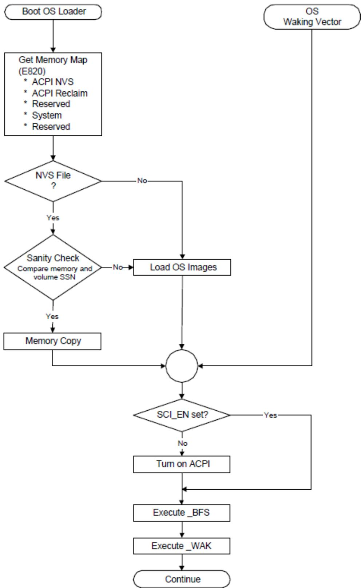  
Fig. 16.5: OS Initialization

# NON-UNIFORM MEMORY ACCESS (NUMA) ARCHITECTURE PLATFORMS

Systems employing a Non Uniform Memory Access (NUMA) architecture contain collections of hardware resources including processors, memory, and I/O buses, that comprise what is commonly known as a “NUMA node”. Two or more NUMA nodes are linked to each other via a high-speed interconnect. Processor accesses to memory or I/O resources within the local NUMA node are generally faster than processor accesses to memory or I/O resources outside of the local NUMA node, accessed via the node interconnect. ACPI defines interfaces that allow the platform to convey NUMA node topology information to OSPM both statically at boot time and dynamically at run time as resources are added or removed from the system.

In addition, devices such as coherent accelerators, coherent memory devices, or coherent switches can describe their NUMA characteristics information to OSPM or to system firmware using the Coherent Device Attribute Table (CDAT) structures. For more information, see the CDAT reference link at http://uefi.org/acpi, under the heading “Coherent Device Attribute Table (CDAT) Specification”.

## 17.1 NUMA Node

A conceptual model for a node in a NUMA configuration may contain one or more of the following components:

• Processor

• Memory

• I/O Resources

• Networking, Storage

• Chipset

The components defined as part of the model are intended to represent all possible components of a NUMA node. A specific node in an implementation of a NUMA platform may not provide all of these components. At a minimum, each node must have a chipset with an interface to the interconnect between nodes.

The defining characteristic of a NUMA system is a coherent global memory and/or I/O address space that can be accessed by all of the processors. Hence, at least one node must have memory, at least one node must have I/O resources, and at least one node must have processors. Other than the chipset, which must have components present on every node, each is implementation dependent. In the ACPI namespace, NUMA nodes are described as module devices. See the Module Device section.

## 17.2 System Locality

A collection of components that are presented to OSPM as a Symmetrical Multi-Processing (SMP) unit belong to the same System Locality, also known as a Proximity Domain. The granularity of a System Locality is typically at the NUMA Node level although the granularity can also be at the sub-NUMA node level or the processor, memory and host bridge level.

A System Locality is reported to the OSPM using Proximity Domain entries in the System Resource Afinity Table (SRAT), or using \_PXM (Proximity) methods in the ACPI namespace. If OSPM only needs to know a near/far distinction among the System Localities, comparing Proximity Domain values is suficient. See the System Resource Afinity Table (SRAT) and \_PXM (Proximity) sections for more information.

OSPM makes no assumptions about the proximity or nearness of diferent proximity domains. The diference between two integers representing separate proximity domains does not imply distance between the proximity domains (in other words, proximity domain 1 is not assumed to be closer to proximity domain 0 than proximity domain 6).

## 17.2.1 System Resource Afinity Table Definition

The optional System Resource Afinity Table (SRAT) provides the boot time description of the processor and memory ranges belonging to a system locality. OSPM will consume the SRAT only at boot time. For any devices not in the SRAT, OSPM should use \_PXM (Proximity) for them or their ancestors that are hot-added into the system after boot up.

The SRAT describes the system locality that all processors and memory present in a system belong to at system boot. This includes memory that can be hot-added (that is memory that can be added to the system while it is running, without requiring a reboot). OSPM can use this information to optimize the performance of NUMA architecture systems. For example, OSPM could utilize this information to optimize allocation of memory resources and the scheduling of software threads.

## 17.2.2 System Resource Afinity Update

Dynamic migration of the devices may cause the relative system resource afinity information (if the optional SRAT is present) to change. If this occurs, the System Resource Afinity Update notification (Notify event of type 0x0D) may be generated by the platform to a device at a point on the device tree that represents a System Resource Afinity. This indicates to OSPM to invoke the \_PXM (Proximity) object of the notified device to update the resource afinity.

## 17.3 System Locality Distance Information

Optionally, OSPM may further optimize a NUMA architecture system using information about the relative memory latency distances among the System Localities. This may be useful if the distance between multiple system localities is significantly diferent. In this case, a simple near/far distinction may be insuficient. This information is contained in the optional System Locality information Table, and is returned from the evaluation of the \_SLI object.

The SLIT is a matrix that describes the relative distances between all System Localities. To include devices that are not in the System Resource Afinity Table (SRAT), support for the \_PXM object is required. The Proximity Domain values from SRAT, or the values returned by the \_PXM objects are used as the row and column indices of the matrix.

Implementation Note: The size of the SLIT is determined by the largest Proximity Domain value used in the system. Hence, to minimize the size of the SLIT, the Proximity Domain values assigned by the system firmware should be in the range 0, . . . , N-1, where N is the number of System Localities. If Proximity Domain values are not packed into this range, the SLIT will still work, but more memory will have to be allocated to store the “Entries” portion of the SLIT for the matrix.

The static SLIT table provides the boot time description of the relative distances among all System Localities. For hot-added devices and dynamic reconfiguration of the system localities, the \_SLI object must be used for runtime update.

The \_SLI method is an optional object that provides the runtime update of the relative distances from the System Locality i to all other System Localities in the system. Since \_SLI method is providing additional relative distance information among System Localities, if implemented, it is provided alongside with the \_PXM method.

## 17.3.1 Online Hot Plug

In the case of online device addition, the Bus Check notification (0x0) is performed on a device object to indicate to OSPM that it needs to perform the Plug and Play re-enumeration operation on the device tree starting from the point where it has been notified. OSPM needs to evaluate all \_PXM objects associated with the added devices, and \_SLI objects if the SLIT is present.

In the case of online device removal, OSPM needs to perform the Plug and Play ejection operation when it receives the Eject Request notification (0x03). OSPM needs to remove the relative distance information from its internal data structure for the removed devices.

## 17.3.2 Impact to Existing Localities

Dynamic reconfiguration of the system may cause the relative distance information (if the optional SLIT is present) to become stale. If this occurs, the “System Locality Information Update” notification (Notify event of type 0xB) may be generated by the platform to a device at a point on the device tree that represents a System Locality. This indicates to OSPM that it needs to invoke the \_SLI objects associated with the System Localities on the device tree starting from the point where it has been notified.

## 17.4 Heterogeneous Memory Attributes Information

Optionally, OSPM may further optimize a NUMA architecture system using the Heterogeneous Memory Attributes. This may be useful if the memory latency and bandwidth attributes between system localities is significantly diferent. In this case, the information is contained in the optional Heterogeneous Memory Attributes (HMAT) and is returned from the evaluation of the \_HMA object.

The HMAT structure describes the latency and bandwidth information between memory access Initiator and memory Target System Localities. System Locality proximity domain identifiers, as defined by Proximity Domain entries in the System Resource Afinity Table (SRAT), or as returned by \_PXM object, are used in the HMAT structure.

Implementation Note: The size of the HMAT table is determined by number of memory initiator System Localities and the memory target System Localities. The static HMAT table provides the boot time description of the memory latency and bandwidth among all memory access Initiator and memory Target System Localities. For hot-added devices and dynamic reconfiguration of the system localities, the \_HMA object must be used for runtime update.

The \_HMA method is an optional object that provides the runtime update of the latency and bandwidth from the memory access Initiator System Locality “i” to all other memory Target System Localities “j” in the system.

Since \_HMA method is providing additional memory latency and bandwidth information among System Localities, if implemented, it is provided alongside with the \_PXM method.

## 17.4.1 Online Hot Plug

In the case of online device addition, the “Bus Check” notification (0x0) is performed on a device object to indicate to OSPM that it needs to perform the Plug and Play re-enumeration operation on the device tree starting from the point where it has been notified. OSPM needs to evaluate all \_PXM objects associated with the added devices, and \_HMA objects if the HMAT is present.

In the case of online device removal, OSPM needs to perform the Plug and Play ejection operation when it receives the “Eject Request” notification (0x03). OSPM needs to remove the ejected System Localities related information from its internal data structure for the removed devices.

## 17.4.2 Impact to Existing Localities

Dynamic reconfiguration of the system may cause the memory latency and bandwidth information (if the optional HMAT is present) to become stale. If this occurs, the Heterogeneous Memory Attributes Update notification (Notify event of type 0xE) may be generated by the platform to a device at a point on the device tree that represents a System Locality. This indicates to OSPM that it needs to invoke the \_HMA objects associated with the System Localities on the device tree starting from the point where it has been notified.

# ACPI PLATFORM ERROR INTERFACES (APEI)

This section describes the ACPI Platform Error Interfaces (APEI), which provide a means for a computer platform to convey error information to OSPM. APEI extends existing hardware error reporting mechanisms and brings them together as components of a coherent hardware error infrastructure. APEI takes advantage of the additional hardware error information available in today’s hardware devices, and integrates much more closely with the system firmware.

As a result, APEI provides the following benefits:

• Allows for more extensive error data to be made available in a standard error record format for determining the root cause of hardware errors.

• Is extensible, so that as hardware vendors add new and better hardware error reporting mechanisms to their devices, APEI allows the platform and the OSPM to gracefully accommodate the new mechanisms.

This provides information to help system designers understand basic issues about hardware errors, the relationship between the firmware and OSPM, and information about error handling and the APEI architecture components.

APEI consists of four separate tables:

• Error Record Serialization Table (ERST)

• Boot Error Record Table (BERT)

• Hardware Error Source Table (HEST)

• Error Injection Table (EINJ)

## 18.1 Hardware Errors and Error Sources

A hardware error is a recorded event related to a malfunction of a hardware component in a computer platform. The hardware components contain error detection mechanisms that detect when a hardware error condition exists. Hardware errors can be classified as either corrected errors or uncorrected errors as follows:

• A corrected error is a hardware error condition that has been corrected by the hardware or by the firmware by the time the OSPM is notified about the existence of the error condition.

• An uncorrected error is a hardware error condition that cannot be corrected by the hardware or by the firmware. Uncorrected errors are either fatal or non-fatal.

• A fatal hardware error is an uncorrected or uncontained error condition that is determined to be unrecoverable by the hardware. When a fatal uncorrected error occurs, the system is restarted to prevent propagation of the error.

• A non-fatal hardware error is an uncorrected error condition from which OSPM can attempt recovery by trying to correct the error. These are also referred to as correctable or recoverable errors.

Central to APEI is the concept of a hardware error source. A hardware error source is any hardware unit that alerts OSPM to the presence of an error condition. Examples of hardware error sources include the following:

• Processor machine check exception (for example, MC#)

• Chipset error message signals (for example, SCI, SMI, SERR#, MCERR#)

• I/O bus error reporting (for example, PCI Express root port error interrupt)

• I/O device errors

A single hardware error source might handle aggregate error reporting for more than one type of hardware error condition. For example, a processor’s machine check exception typically reports processor errors, cache and memory errors, and system bus errors.

A hardware error source is typically represented by the following:

• One or more hardware error status registers.

• One or more hardware error configuration or control registers.

• A signaling mechanism to alert OSPM to the existence of an error condition.

In some situations, there is not an explicit signaling mechanism and OSPM must poll the error status registers to test for an error condition. However, polling can only be used for corrected error conditions since uncorrected errors require immediate attention by OSPM.

## 18.2 Relationship between OSPM and System Firmware

Both OSPM and system firmware play important roles in hardware error handling. APEI improves the methods by which both of these can contribute to the task of hardware error handling in a complementary fashion. APEI allows the hardware platform vendor to determine whether the firmware or OSPM will own key hardware error resources. APEI also allows the firmware to pass control of hardware error resources to OSPM when appropriate.

## 18.3 Error Source Discovery

Platforms enumerate error sources to OSPM via a set of tables that describe the error sources. OSPM may also support non-ACPI enumerated error sources such as: Machine Check Exception, Corrected Machine Check, NMI, and PCI Express AER. Non-ACPI error sources are not described by this specification.

During initialization, OSPM examines the tables and uses this information to establish the necessary error handlers that are responsible for processing error notifications from the platform.

## 18.3.1 Boot Error Source

Under normal circumstances, when a hardware error occurs, the error handler receives control and processes the error. This gives OSPM a chance to process the error condition, report it, and optionally attempt recovery. In some cases, the system is unable to process an error. For example, system firmware or a management controller may choose to reset the system or the system might experience an uncontrolled crash or reset.

The boot error source is used to report unhandled errors that occurred in a previous boot. This mechanism is described in the BERT table. The boot error source is reported as a ‘one-time polled’ type error source. OSPM queries the boot error source during boot for any existing boot error records. The platform will report the error condition to OSPM via a Common Platform Error Record (CPER) compliant error record. The CPER format is described in the appendices of the UEFI Specification.

The following table describes the format for the Boot Error Record Table (BERT).

Table 18.1: Boot Error Record Table (BERT)

<table><tr><td>Field</td><td>Byte length</td><td>Byte offset</td><td>Description</td></tr><tr><td>Header Signature</td><td>4</td><td>0</td><td>‘BERT’. Signature for the Boot Error Record Table.</td></tr><tr><td>Length</td><td>4</td><td>4</td><td>Length, in bytes, of BERT.</td></tr><tr><td>Revision</td><td>1</td><td>8</td><td>1</td></tr><tr><td>Checksum</td><td>1</td><td>9</td><td>Entire table must sum to zero.</td></tr><tr><td>OEMID</td><td>6</td><td>10</td><td>OEM ID.</td></tr><tr><td>OEM Table ID</td><td>8</td><td>16</td><td>The manufacturer model ID.</td></tr><tr><td>OEM Revision</td><td>4</td><td>24</td><td>OEM revision of the BERT for the supplied OEM table ID.</td></tr><tr><td>Creator ID</td><td>4</td><td>28</td><td>Vendor ID of the utility that created the table.</td></tr><tr><td>Creator Revision</td><td>4</td><td>32</td><td>Revision of the utility that created the table.</td></tr><tr><td>Boot Error Region Length</td><td>4</td><td>36</td><td>The length in bytes of the boot error region.</td></tr><tr><td>Boot Error Region</td><td>8</td><td>40</td><td>64-bit physical address of the Boot Error Region.</td></tr></table>

The Boot Error Region is a range of addressable memory that OSPM can access during initialization, to determine if an unhandled error condition occurred. System firmware must report this memory range as firmware reserved. The format of the Boot Error Region follows that of an Error Status Block, as defined in the Generic Hardware Error Source Structure. The format of the error status block is described by the Generic Error Status Block table.

For details of some of the fields listed in the Generic Error Data Entry table, please see the Section Descriptors definitions in the UEFI Specification appendices, under the description of the Common Platform Error Record.

## 18.3.2 ACPI Error Source

The hardware error source describes a standardized mechanism platforms may use to describe their error sources. Use of this interface is the preferred way for platforms to describe their error sources as it is platform and processorarchitecture independent and allows the platform to describe the operational parameters associated with error sources.

This mechanism allows for the platform to describe error sources in detail; communicating operational parameters (i.e. severity levels, masking bits, and threshold values) to OSPM as necessary. It also allows the platform to report error sources for which OSPM would typically not implement support (for example, chipset-specific error registers).

The Hardware Error Source Table (HEST) provides the platform firmware a way to describe a system’s hardware error sources to OSPM. The HEST format is shown in the following table.

Table 18.2: Hardware Error Source Table (HEST)

<table><tr><td>Field</td><td>Byte length</td><td>Byte offset</td><td>Description</td></tr><tr><td>Header Signature</td><td>4</td><td>0</td><td>“HEST”. Signature for the Hardware Error Source Table.</td></tr><tr><td>Length</td><td>4</td><td>4</td><td>Length, in bytes, of entire HEST. Entire table must be contiguous.</td></tr><tr><td>Revision</td><td>1</td><td>8</td><td>2</td></tr><tr><td>Checksum</td><td>1</td><td>9</td><td>Entire table must sum to zero.</td></tr><tr><td>OEMID</td><td>6</td><td>10</td><td>OEM ID.</td></tr><tr><td>OEM Table ID</td><td>8</td><td>16</td><td>The manufacturer model ID.</td></tr><tr><td>OEM Revision</td><td>4</td><td>24</td><td>OEM revision of the HEST for the supplied OEM table ID.</td></tr><tr><td>Creator ID</td><td>4</td><td>28</td><td>Vendor ID of the utility that created the table.</td></tr><tr><td>Creator Revision</td><td>4</td><td>32</td><td>Revision of the utility that created the table.</td></tr><tr><td>Error Source Count</td><td>4</td><td>36</td><td>The number of error source descriptors.</td></tr><tr><td>Error Source Structure[n]</td><td></td><td>40</td><td>A series of Error Source Descriptor Entries.</td></tr></table>

## ò Note

Error source types 3, 4, and 5 are reserved for legacy reasons and must not be used.

## ò Note

Starting with revision 2 of HEST, the Error Source Structures must be sorted in Type ascending order for Error Source Structure Types of less than 12.

## ò Note

Beginning with error source type 12 and onward, each Error Source Structure must use the standard Error Source Structure Header as defined in Section 18.3.2.11.

The following sections detail each of the specific error source descriptors.

## 18.3.2.1 IA-32 Architecture Machine Check Exception

Processors implementing the IA-32 Instruction Set Architecture employ a machine check exception mechanism to alert OSPM to the presence of an uncorrected hardware error condition. The information in this table is used by OSPM to configure the machine check exception mechanism for each processor in the system.

Only one entry of this type is permitted in the HEST. OSPM applies the information specified in this entry to all processors.

Table 18.3: IA-32 Architecture Machine Check Exception Structure

<table><tr><td>Field</td><td>Byte Length</td><td>Byte Offset</td><td>Description</td></tr><tr><td>Type</td><td>2</td><td>0</td><td>0 - IA-32 Architecture Machine Check Exception Structure.</td></tr><tr><td>Source Id</td><td>2</td><td>2</td><td>This value serves to uniquely identify this error source against other error sources reported by the platform.</td></tr><tr><td>Reserved</td><td>2</td><td>4</td><td>Reserved.</td></tr><tr><td>Flags</td><td>1</td><td>6</td><td></td></tr><tr><td></td><td></td><td></td><td>Bit [0] - FIRMWARE_FIRST: If set, this bit indicates to the OSPM that the interrupt handler from system firmware will run first for this error source.Bit [2] - GHES_ASSIST: If set, this bit indicates that although OSPM is responsible for directly handling the error (as expected when FIRMWARE_FIRST is not set), system firmware may report additional information in the context of the error reported by hardware. The additional information is reported in a Generic Hardware Error Source structure with a matching Related Source ID. See Section 18.7, GHES_ASSIST Error Reporting. NOTE: If FIRMWARE_FIRST is set, this bit is reserved.All other bits are reserved.</td></tr></table>

continues on next page

Table 18.3 – continued from previous page

<table><tr><td>Field</td><td>Byte Length</td><td>Byte Offset</td><td>Description</td></tr><tr><td>Enabled</td><td>1</td><td>7</td><td>Specifies whether MCE is to be enabled. If set to 1, this field indicates this error source is to be enabled. If set to 0, this field indicates that the error source is not to be enabled.</td></tr><tr><td>Number of Records To Pre-allocate</td><td>4</td><td>8</td><td>Indicates the number of error records to pre-allocate for this error source.</td></tr><tr><td>Max Sections Per Record</td><td>4</td><td>12</td><td>Indicates the maximum number of error sections included in an error record created as a result of an error reported by this error source.</td></tr><tr><td>Global Capability Init Data</td><td>8</td><td>16</td><td>Indicates the value of the machine check global capability register.</td></tr><tr><td>Global Control Init Data</td><td>8</td><td>24</td><td>Indicates the value to be written to the machine check global control register.</td></tr><tr><td>Number Of Hardware Banks</td><td>1</td><td>32</td><td>Indicates the number of hardware error reporting banks.</td></tr><tr><td>Reserved</td><td>7</td><td>33</td><td>Reserved.</td></tr><tr><td>Machine Check Bank Structure[n]</td><td></td><td>40</td><td>A list of Machine Check Bank structures defined in the IA-32 Architecture Machine Check Bank Structure</td></tr></table>

## 18.3.2.1.1 IA-32 Architecture Machine Check Bank Structure

This table describes the attributes of a specific IA-32 architecture machine check hardware error bank.

Table 18.4: IA-32 Architecture Machine Check Error Bank Structure

<table><tr><td>Field</td><td>Byte Length</td><td>Byte Offset</td><td>Description</td></tr><tr><td>Bank Number</td><td>1</td><td>0</td><td>Zero-based index identifies the machine check error bank.</td></tr><tr><td>Clear Status On Initialization</td><td>1</td><td>1</td><td>If set, indicates the status information in this machine check bank is to be cleared during system initialization as follows: 0 - Clear 1 - Don&#x27;t clear</td></tr><tr><td>Status Data Format</td><td>1</td><td>2</td><td>Identifies the format of the data in the status register:0 - IA-32 MCA1 - Intel® 64 MCA2 - AMD64MCA All other values are reserved</td></tr><tr><td>Reserved</td><td>1</td><td>3</td><td>Reserved.</td></tr><tr><td>Control Register MSR Address</td><td>4</td><td>4</td><td>Address of the hardware bank&#x27;s control MSR. Ignored if zero.</td></tr><tr><td>Control Init Data</td><td>8</td><td>8</td><td>This is the value the OSPM will program into the machine check bank&#x27;s control register.</td></tr><tr><td>Status Register MSR Address</td><td>4</td><td>16</td><td>Address of the hardware bank&#x27;s MCi_STAT MSR. Ignored if zero.</td></tr></table>

continues on next page

Table 18.4 – continued from previous page

<table><tr><td>Field</td><td>Byte Length</td><td>Byte Offset</td><td>Description</td></tr><tr><td>Address Register MSR Address</td><td>4</td><td>20</td><td>Address of the hardware bank&#x27;s MCi_ADDR MSR. Ignored if zero.</td></tr><tr><td>Misc Register MSR Address</td><td>4</td><td>24</td><td>Address of the hardware bank&#x27;s MCi_MISC MSR. Ignored if zero.</td></tr></table>

## 18.3.2.2 IA-32 Architecture Corrected Machine Check

Processors implementing the IA-32 Instruction Set Architecture may report corrected processor errors to OSPM. The information in this table allows platform firmware to communicate key parameters of the corrected processor error reporting mechanism to OSPM, including whether CMC processing should be enabled.

Only one entry of this type is permitted in the HEST. OSPM applies the information specified in this entry to all processors.

Table 18.5: IA-32 Architecture Corrected Machine Check Structure

<table><tr><td>Field</td><td>Byte Length</td><td>Byte Offset</td><td>Description</td></tr><tr><td>Type</td><td>2</td><td>0</td><td>1 - IA-32 Architecture Corrected Machine Check Structure.</td></tr><tr><td>Source Id</td><td>2</td><td>2</td><td>Uniquely identifies the error source.</td></tr><tr><td>Reserved</td><td>2</td><td>4</td><td>Reserved</td></tr><tr><td>Flags</td><td>1</td><td>6</td><td></td></tr><tr><td></td><td></td><td></td><td>Bit [0] - FIRMWARE_FIRST: If set, this bit indicates to the OSPM that the interrupt handler from system firmware will run first for this error source.Bit [2] - GHES_ASSIST: If set, this bit indicates that although OSPM is responsible for directly handling the error (as expected when FIRMWARE_FIRST is not set), system firmware may report additional information in the context of the error reported by hardware. The additional information is reported in a Generic Hardware Error Source structure with a matching Related Source ID. See Section 18.7,GHES_ASSIST Error Reporting. NOTE: If FIRMWARE_FIRST is set, this bit is reserved.All other bits must be set to zero.</td></tr><tr><td>Enabled</td><td>1</td><td>7</td><td></td></tr><tr><td></td><td></td><td></td><td>If the field value is 1, indicates this error source is to be enabled.If the field value is 0, indicates that the error source is not to be enabled.If FIRMWARE_FIRST is set in the flags field, the Enabled field is ignored by OSPM.</td></tr><tr><td>Number of Records To Pre-allocate</td><td>4</td><td>8</td><td>Indicates the number of error records to pre-allocate for this error source.Must be &gt;= 1.</td></tr></table>

continues on next page

Table 18.5 – continued from previous page

<table><tr><td>Field</td><td>Byte Length</td><td>Byte Offset</td><td>Description</td></tr><tr><td>Max Sections Per Record</td><td>4</td><td>12</td><td>Indicates the maximum number of error sections included in an error record created as a result of an error reported by this error source. Must be &gt;= 1.</td></tr><tr><td>Notification Structure</td><td>28</td><td>16</td><td>Hardware Error Notification Structure as defined in Hardware Error Notification Structure.</td></tr><tr><td>Number Of Hardware Banks</td><td>1</td><td>44</td><td>The number of hardware error reporting banks.</td></tr><tr><td>Reserved</td><td>3</td><td>45</td><td>Reserved.</td></tr><tr><td>Machine Check Bank Structure[n]</td><td>•</td><td>48</td><td>A list of Machine Check Bank structures defined in IA-32 Architecture Machine Check Bank Structure.</td></tr></table>

## 18.3.2.3 IA-32 Architecture Non-Maskable Interrupt

Uncorrected platform errors are typically reported using the Non-Maskable Interrupt (NMI) vector (for example, INT 2). This table allows platform firmware to communicate parameters regarding the configuration and handling of NMI error conditions.

Only one entry of this type is permitted in the HEST.

Table 18.6: IA-32 Architecture NMI Error Structure

<table><tr><td>Field</td><td>Byte Length</td><td>Byte Offset</td><td>Description</td></tr><tr><td>Type</td><td>2</td><td>0</td><td>2 - IA-32 Architecture NMI Structure.</td></tr><tr><td>Source Id</td><td>2</td><td>2</td><td>Uniquely identifies this error source.</td></tr><tr><td>Reserved</td><td>4</td><td>4</td><td>Must be zero.</td></tr><tr><td>Number of Records To Pre-allocate</td><td>4</td><td>8</td><td>Indicates number of error records to pre-allocate for this error source. Must be &gt;= 1.</td></tr><tr><td>Max Sections Per Record</td><td>4</td><td>12</td><td>Indicates maximum number of error sections included in an error record created as a result of an error reported by this error source. Must be &gt;= 1.</td></tr><tr><td>Max Raw Data Length</td><td>4</td><td>16</td><td>The size in bytes of the NMI error data.</td></tr></table>

## 18.3.2.4 PCI Express Root Port AER Structure

PCI Express (PCIe) root ports may implement PCIe Advanced Error Reporting (AER) support. This table contains information platform firmware supplies to OSPM for configuring AER support on a given root port.

The HEST may contain one entry of this type for each PCI Express root port if none of the entries has the GLOBAL flag set. If the GLOBAL flag is set, there may only be one entry of this type and the information contained in that entry is applied to all PCIe root ports.

Table 18.7: PCI Express Root Port AER Structure

<table><tr><td>Field</td><td>Byte Length</td><td>Byte Offset</td><td>Description</td></tr><tr><td>Type</td><td>2</td><td>0</td><td>6 - AER Root Port.</td></tr><tr><td>Source Id</td><td>2</td><td>2</td><td>Uniquely identifies the error source.</td></tr><tr><td>Reserved</td><td>2</td><td>4</td><td>Reserved.</td></tr><tr><td>Flags</td><td>1</td><td>6</td><td></td></tr><tr><td></td><td></td><td></td><td>Bit [0] - FIRMWARE_FIRST: If set, this bit indicates to the OSPM that the interrupt handler from system firmware will run first for this error source. This flag does not grant nor deny access to AER registers. OSPM should evaluate _OSC for PCI hierarchies to determine AER register ownership.Bit [1] - GLOBAL: If set, indicates that the settings contained in this structure apply globally to all PCI Express Devices.All other bits must be set to zero.</td></tr><tr><td>Enabled</td><td>1</td><td>7</td><td>If the field value is 1, indicates this error source is to be enabled. If the field value is 0, indicates that the error source is not to be enabled. If FIRMWARE_FIRST is set in the flags field, the Enabled field is ignored by the OSPM.</td></tr><tr><td>Number of Records To Pre-allocate</td><td>4</td><td>8</td><td>Indicates the number error records to pre-allocate for this error source. Must be &gt;= 1.</td></tr><tr><td>Max Sections Per Record</td><td>4</td><td>12</td><td>Indicates the maximum number of error sections included in an error record created as a result of an error reported by this error source. Must be &gt;= 1.</td></tr><tr><td>Bus</td><td>4</td><td>16</td><td></td></tr><tr><td></td><td></td><td></td><td>Identifies the PCI Bus and Segment of the root port.The Bus is encoded in bits [7:0].For systems that expose multiple PCI segment groups, the segment number is encoded in bits [23:8], and bits [31-24] must be zero.For systems that do not expose multiple PCI segment groups, bits [31:8] must be zero.If the GLOBAL flag is specified, this field is ignored.</td></tr><tr><td>Device</td><td>2</td><td>20</td><td>Identifies the PCI Device Number of the root port. If the GLOBAL flag is specified, this field is ignored.</td></tr><tr><td>Function</td><td>2</td><td>22</td><td>Identifies the PCI Function number of the root port. If the GLOBAL flag is specified, this field is ignored.</td></tr><tr><td>Device Control</td><td>2</td><td>24</td><td>Device control bits with which to initialize the device.</td></tr><tr><td>Reserved</td><td>2</td><td>26</td><td>Must be zero.</td></tr><tr><td>Uncorrectable Error Mask</td><td>4</td><td>28</td><td>Value to write to the root port&#x27;s Uncorrectable Error Mask register.</td></tr><tr><td>Uncorrectable Error Severity</td><td>4</td><td>32</td><td>Value to write to the root port&#x27;s Uncorrectable Error Severity register.</td></tr><tr><td>Correctable Error Mask</td><td>4</td><td>36</td><td>Value to write to the root port&#x27;s Correctable Error Mask register.</td></tr></table>

continues on next page

Table 18.7 – continued from previous page

<table><tr><td>Field</td><td>Byte Length</td><td>Byte Offset</td><td>Description</td></tr><tr><td>Advanced Error Capabilities and Control</td><td>4</td><td>40</td><td>Value to write to the root port&#x27;s Advanced Error Capabilities and Control Register.</td></tr><tr><td>Root Error Command</td><td>4</td><td>44</td><td>Value to write to the root port&#x27;s Root Error Command Register.</td></tr></table>

## ò Note

For PCI Express Advanced Error Reporting (AER) resources, ownership and control of AER registers are determined by the evaluation of the PCI \_OSC() method as described in the most current revision of the PCI Firmware Specification. The FIRMWARE\_FIRST bit in the Flags Field does not serve to grant, nor deny, access to the AER registers within the PCI Express device(s) that are described by the structure.

## 18.3.2.5 PCI Express Device AER Structure

PCI Express devices may implement AER support. This table contains information platform firmware supplies to OSPM for configuring AER support on a given PCI Express device.

The HEST may contain one entry of this type for each PCI Express endpoint device if none of the entries has the GLOBAL flag set. If the GLOBAL flag is set, there may only be one entry of this type and the information contained in that entry will be applied to all PCI Express endpoint devices.

Table 18.8: PCI Express Device AER Structure

<table><tr><td>Field</td><td>Byte Length</td><td>Byte Offset</td><td>Description</td></tr><tr><td>Type</td><td>2</td><td>0</td><td>7 - AER Endpoint.</td></tr><tr><td>Source Id</td><td>2</td><td>2</td><td>Uniquely identifies the error source.</td></tr><tr><td>Reserved</td><td>2</td><td>4</td><td>Reserved.</td></tr><tr><td>Flags</td><td>1</td><td>6</td><td></td></tr><tr><td></td><td></td><td></td><td>Bit [0] - FIRMWARE_FIRST: If set, this bit indicates to the OSPM that the interrupt handler from system firmware will run first for this error source. This flag does not grant nor deny access to AER registers. OSPM should evaluate _OSC for PCI hierarchies to determine AER register ownership.Bit [1] - GLOBAL: If set, indicates that the settings contained in this structure apply globally to all PCI Express Devices.All other bits must be set to zero.</td></tr></table>

Table 18.8 – continued from previous page

<table><tr><td>Field</td><td>Byte Length</td><td>Byte Offset</td><td>Description</td></tr><tr><td>Enabled</td><td>1</td><td>7</td><td>If the field value is 1, indicates this error source is to be enabled.If the field value is 0, indicates that the error source is not to be enabled.If FIRMWARE_FIRST is set in the flags field, the Enabled field is ignored by the OSPM.</td></tr><tr><td>Number of Records To Pre-allocate</td><td>4</td><td>8</td><td>Indicates the number of error records to pre-allocate for this error source.Must be &gt;= 1.</td></tr><tr><td>Max Sections Per Record</td><td>4</td><td>12</td><td>Indicates the maximum number of error sections included in an error record created as a result of an error reported by this error source. Must be &gt;= 1.</td></tr><tr><td>Bus</td><td>4</td><td>16</td><td>Identifies the PCI Bus and Segment of the device.The Bus is encoded in bits [7:0].For systems that expose multiple PCI segment groups, the segment number is encoded in bits [23:8], and bits [31:24] must be zero.For systems that do not expose multiple PCI segment groups, bits 8-31 must be zero.If the GLOBAL flag is specified, this field is ignored.</td></tr><tr><td>Device</td><td>2</td><td>20</td><td>Identifies the PCI Device Number of the device. If the GLOBAL flag is specified, this field is ignored.</td></tr><tr><td>Function</td><td>2</td><td>22</td><td>Identifies the PCI Function Number of the device. If the GLOBAL flag is specified, this field is ignored.</td></tr><tr><td>Device Control</td><td>2</td><td>24</td><td>Device control bits with which to initialize the device.</td></tr><tr><td>Reserved</td><td>2</td><td>26</td><td>Must be zero.</td></tr><tr><td>Uncorrectable Error Mask</td><td>4</td><td>28</td><td>Value to write to the device&#x27;s Uncorrectable Error Mask register.</td></tr><tr><td>Uncorrectable Error Severity</td><td>4</td><td>32</td><td>Value to write to the device&#x27;s Uncorrectable Error Severity register.</td></tr><tr><td>Correctable Error Mask</td><td>4</td><td>36</td><td>Value to write to the device&#x27;s Correctable Error Mask register.</td></tr><tr><td>Advanced Error Capabilities and Control</td><td>4</td><td>40</td><td>Value to write to the device&#x27;s Advanced Error Capabilities and Control Register.</td></tr></table>

## ò Note

For PCI Express Advanced Error Reporting (AER) resources, ownership and control of AER registers are determined by the evaluation of the PCI \_OSC() method as described in the most current revision of the PCI Firmware Specification. The FIRMWARE\_FIRST bit in the Flags Field does not serve to grant, nor deny, access to the AER registers within the PCI Express device(s) that are described by the structure.

## 18.3.2.6 PCI Express/PCI-X Bridge AER Structure

PCI Express/PCI-X bridges that implement AER support implement fields that control the behavior how errors are reported across the bridge.

The HEST may contain one entry of this type for each PCI Express/PCI-X bridge if none of the entries has the GLOBAL flag set. If the GLOBAL flag is set, there may only be one entry of this type and the information contained in that entry will be applied to all PCI Express/ PCI-X bridges.

Table 18.9: PCI Express/PCI-X Bridge AER Structure

<table><tr><td>Field</td><td>Byte Length</td><td>Byte Offset</td><td>Description</td></tr><tr><td>Type</td><td>2</td><td>0</td><td>8 - AER Bridge.</td></tr><tr><td>Source Id</td><td>2</td><td>2</td><td>Uniquely identifies the error source.</td></tr><tr><td>Reserved</td><td>2</td><td>4</td><td>Reserved.</td></tr><tr><td>Flags</td><td>1</td><td>6</td><td></td></tr><tr><td></td><td></td><td></td><td>Bit [0] - FIRMWARE_FIRST: If set, this bit indicates to the OSPM that the interrupt handler from system firmware will run first for this error source. This flag does not grant nor deny access to AER registers. OSPM should evaluate _OSC for PCI hierarchies to determine AER register ownership.Bit [1] - GLOBAL: If set, indicates that the settings contained in this structure apply globally to all PCI Express Devices.All other bits must be set to zero.</td></tr><tr><td>Enabled</td><td>1</td><td>7</td><td></td></tr><tr><td></td><td></td><td></td><td>If the field value is 1, indicates this error source is to be enabled.If the field value is 0, indicates that the error source is not to be enabled.If FIRMWARE_FIRST is set in the flags field, the Enabled field is ignored by the OSPM.</td></tr><tr><td>Number of Records To Pre-allocate</td><td>4</td><td>8</td><td>Indicates the number of error records to pre-allocate for this error source.Must be &gt;= 1.</td></tr><tr><td>Max Sections Per Record</td><td>4</td><td>12</td><td>Indicates the maximum number of error sections included in an error record created as a result of an error reported by this error source. Must be &gt;= 1.</td></tr><tr><td>Bus</td><td>4</td><td>16</td><td></td></tr><tr><td></td><td></td><td></td><td>Identifies the PCI Bus and Segment of the bridge.The Bus is encoded in bits [7:0].For systems that expose multiple PCI segment groups, the segment number is encoded in bits [23:8], and bits [31:24] must be zero.For systems that do not expose multiple PCI segment groups, bits 8-31 must be zero. If the GLOBAL flag is specified, this field is ignored.</td></tr><tr><td>Device</td><td>2</td><td>20</td><td>Identifies the PCI device number of the bridge. If the GLOBAL flag is specified, this field is ignored.</td></tr><tr><td>Function</td><td>2</td><td>22</td><td>Identifies the PCI function number of the bridge. If the GLOBAL flag is specified, this field is ignored.</td></tr></table>

continues on next page

Table 18.9 – continued from previous page

<table><tr><td>Field</td><td>Byte Length</td><td>Byte Offset</td><td>Description</td></tr><tr><td>Device Control</td><td>2</td><td>24</td><td>Device control bits with which to initialize the device.</td></tr><tr><td>Reserved</td><td>2</td><td>26</td><td>This value must be zero.</td></tr><tr><td>Uncorrectable Error Mask</td><td>4</td><td>28</td><td>Value to write to the bridge&#x27;s Uncorrectable Error Mask register.</td></tr><tr><td>Uncorrectable Error Severity</td><td>4</td><td>32</td><td>Value to write to the bridge&#x27;s Uncorrectable Error Severity register.</td></tr><tr><td>Correctable Error Mask</td><td>4</td><td>36</td><td>Value to write to the bridge&#x27;s Correctable Error Mask register.</td></tr><tr><td>Advanced Error Capabilities and Control</td><td>4</td><td>40</td><td>Value to write to the bridge&#x27;s Advanced Error Capabilities and Control Register.</td></tr><tr><td>Secondary Uncorrectable Error Mask</td><td>4</td><td>44</td><td>Value to write to the bridge&#x27;s secondary uncorrectable error mask register.</td></tr><tr><td>Secondary Uncorrectable Error Severity</td><td>4</td><td>48</td><td>Value to write to the bridge&#x27;s secondary uncorrectable error severity register.</td></tr><tr><td>Secondary Advanced Capabilities and Control</td><td>4</td><td>52</td><td>Value to write to the bridge&#x27;s secondary advanced capabilities and control register.</td></tr></table>

## ò Note

For PCI Express Advanced Error Reporting (AER) resources, ownership and control of AER registers are determined by the evaluation of the PCI \_OSC() method as described in the most current revision of the PCI Firmware Specification. The FIRMWARE\_FIRST bit in the Flags Field does not serve to grant, nor deny, access to the AER registers within the PCI Express device(s) that are described by the structure.

## 18.3.2.7 Generic Hardware Error Source

The platform may describe a generic hardware error source to OSPM using the Generic Hardware Error Source structure. A generic hardware error source is an error source that either notifies OSPM of the presence of an error using a non-standard notification mechanism or reports error information that is encoded in a non-standard format.

Using the information in a Generic Hardware Error Source structure, OSPM configures an error handler to read the error data from an error status block - a memory range set aside by the platform for recording error status information.

As the generic hardware error source is non-standard, OSPM does not implement built-in support for configuration and control operations. The error source must be configured by system firmware during boot.

Some platforms may describe multiple Generic Hardware Error Source structures with diferent notification types, as defined in Table 18.10. For example, a platform may describe one error source for the handling of synchronous errors (e.g. MCE or SEA), and a second source for handling asynchronous errors (e.g. SCI or External Interrupt).

Table 18.10: Generic Hardware Error Source Structure

<table><tr><td>Field</td><td>Byte Length</td><td>Byte Offset</td><td>Description</td></tr><tr><td>Type</td><td>2</td><td>0</td><td>9 - Generic Hardware Error Source Structure.</td></tr><tr><td>Source Id</td><td>2</td><td>2</td><td>Uniquely identify the error source.</td></tr><tr><td>Related Source ID</td><td>2</td><td>4</td><td></td></tr><tr><td></td><td></td><td></td><td>This field represents the Source ID of an alternate error source for which the platform:(a) Requires Firmware-First handling (FIRMWARE_FIRST flag is set on alternate error source). See Section 18.4.(b) Provides additional information in the context of an error reported by hardware (GHES_ASSIST flag is set on alternate error source). See Section 18.7.If this generic error source does not represent an alternate source, this field must be set to 0xFFFF.</td></tr><tr><td>Flags</td><td>1</td><td>6</td><td>Reserved.</td></tr><tr><td>Enabled</td><td>1</td><td>7</td><td></td></tr><tr><td></td><td></td><td></td><td>If the field value is 1, indicates this error source is to be enabled.If the field value is 0, indicates that the error source is not to be enabled.</td></tr><tr><td>Number of Records To Pre-allocate</td><td>4</td><td>8</td><td>Indicates the number of error records to pre-allocate for this error source.Must be &gt;= 1.</td></tr><tr><td>Max Sections Per Record</td><td>4</td><td>12</td><td>Indicates the maximum number of error sections included in an error record created as a result of an error reported by this error source. Must be &gt;= 1.</td></tr><tr><td>Max Raw Data Length</td><td>4</td><td>16</td><td>Indicates the size in bytes of the error data recorded by this error source.</td></tr><tr><td>Error Status Address</td><td>12</td><td>20</td><td>Generic Address Structure as defined in Section 5.2.3.2. This field specifies the location of a register that contains the physical address of a block of memory that holds the error status data for this error source. This memory range must reside in firmware reserved memory. OSPM maps this range into system address space and reads the error status information from the mapped address.</td></tr><tr><td>Notification Structure</td><td>28</td><td>32</td><td>Hardware Error Notification Structure as defined in Table 18.14. This structure specifies how this error source notifies OSPM that an error has occurred.</td></tr><tr><td>Error Status Block Length</td><td>4</td><td>60</td><td>Identifies the length in bytes of the error status data block.</td></tr></table>

The Error Status Address field specifies the location of an 8-byte memory-mapped register that holds the physical address of the error status block. This error status block must reside in a memory range reported to OSPM as firmware reserved. OSPM maps the error status bufer into system address space in order to read the error data.

## 18.3.2.7.1 Generic Error Data

The Error Status Block contains the error status information for a given generic error source. OSPM provides an error handler that formats one or more of these blocks as necessary for the specific operating system.

The generic error status block includes two levels of information. The top level is a Generic Error Status Block structure as defined in the following table. The next level is one or more Generic Error Data Entry structures, defined in the second table below.

Table 18.11: Generic Error Status Block

<table><tr><td>Field</td><td>Byte Length</td><td>Byte Offset</td><td>Description</td></tr><tr><td>Block Status</td><td>4</td><td>0</td><td>Indicates the type of error information reported in the error packet:Bit [0] - Uncorrectable Error Valid: If set to one, indicates that anuncorrectable error condition exists.Bit [1] - Correctable Error Valid: If set to one, indicates that a correctableerror condition exists.Bit [2] - Multiple Uncorrectable Errors: If set to one, indicates that morethan one uncorrectable errors have been detected.Bit [3] - Multiple Correctable Errors: If set to one, indicates that morethan one correctable error has been detected.Bits [13:4] - Error Data Entry Count: This value indicates the number ofError Data Entries found in the Data section.Bits [31:14] -Reserved</td></tr><tr><td>Raw Data Off-set</td><td>4</td><td>4</td><td>Offset in bytes from the beginning of the Error Status Block to raw errordata. The raw data must follow any Generic Error Data Entries.</td></tr><tr><td>Raw Data Length</td><td>4</td><td>8</td><td>Length in bytes of the raw data.</td></tr><tr><td>Data Length</td><td>4</td><td>12</td><td>Length in bytes of the generic error data.</td></tr><tr><td>Error Severity</td><td>4</td><td>16</td><td>Identifies the error severity of the reported error::0 - Recoverable1 - Fatal2 - Corrected3 - None. Note: This is the error severity of the entire event. EachGeneric Error Data Entry also includes its own Error Severity field.</td></tr><tr><td>Generic Error Data Entries</td><td>Data Length</td><td>20</td><td>The information contained in this field is a collection of zero or moreGeneric Error Data Entries.</td></tr></table>

One or more Generic Error Data Entry structures may be recorded in the Generic Error Data Entries field of the Generic Error Status Block structure. This allows the platform to accumulate information for multiple hardware components related to a given error event. For example, if the generic error source represents an error that occurs on a device on the secondary side of a PCI Express / PCI-X Bridge, it is useful to record error information from the PCI Express Bridge and from the PCI-X device. Utilizing two Generic Error Data Entry structures enables this - see Table 18.12 below.

For more details of the fields described in the following table, see the definition of Section Descriptors in the UEFI Specification appendix for the Common Platform Error Record.

Table 18.12: Generic Error Data Entry

<table><tr><td>Field</td><td>Byte Length</td><td>Byte Offset</td><td>Description</td></tr><tr><td>Section Type</td><td>16</td><td>0</td><td>Identifies the type of error data in this entry. See the Section Type field of the Section Descriptor in the UEFI Specification .</td></tr><tr><td>Error Severity</td><td>4</td><td>16</td><td>Identifies the severity of the reported error. 0 - Recoverable 1 - Fatal 2 - Corrected 3 - None</td></tr><tr><td>Revision</td><td>2</td><td>20</td><td>The revision number is 0x300. See the Revision field of the Section Descriptor in the UEFI Specification .</td></tr><tr><td>Validation Bits</td><td>1</td><td>22</td><td>Identifies whether certain fields are populated with valid data. This field indicates the validity of the following fields:Bit 0 - If 1, the FRUID field contains valid information.Bit 1 - If 1, the FRUString FRU Text field contains valid information.Bit 2 - If 1, the TimeStamp field contains valid information.Bit 7:3 - Reserved, must be zero..</td></tr><tr><td>Flags</td><td>1</td><td>23</td><td>Flags describing the error data. See the Flags field of the Section Descriptor in the UEFI Specification appendix titled “Common Platform Error Record”.</td></tr><tr><td>Error Data Length</td><td>4</td><td>24</td><td>Length in bytes of the generic error data. It is valid to have a Data Length of zero. This would be used for instance in firmware-first error handling where the platform reports errors to the OSPM using NMI.</td></tr><tr><td>FRU Id</td><td>16</td><td>28</td><td>Identifies the Field Replaceable Unit. See the FRU Id field of the Section Descriptor in the UEFI Specification appendix titled “Common Platform Error Record”.</td></tr><tr><td>FRU Text</td><td>20</td><td>44</td><td>Text field describing the Field Replaceable Unit. See the FRU Text field of the Section Descriptor in the UEFI Specification appendix titled “Common Platform Error Record”.</td></tr><tr><td>Timestamp</td><td>8</td><td>64</td><td>If marked valid per the validation bits field, this field correlates to the time when the error information was collected by the system software and may not necessarily represent the time of the error event. The timestamp contains the local time in BCD format. See the Timestamp field of the Error Record Header section in the EFI Specification appendix titled “Common Platform Error Record”.</td></tr><tr><td>Data</td><td>Error Data Length</td><td>64</td><td>Generic error data. The information contained in this field must match one of the error record section types defined in the UEFI Specification appendix, “Common Platform Error Record”.</td></tr></table>

## 18.3.2.7.2 Event Notification For Generic Error Sources

An event notification is recommended for corrected errors where latency in processing error reports is not critical to proper system operation. The implementation of Event notification requires the platform to define a device with PNP ID PNP0C33 in the ACPI namespace, referred to as the error device. This device is used to notify the OSPM that a generic error source is reporting an error. Since multiple generic error sources can use event notification, it is the responsibility of the OSPM to scan the list of these generic error sources and check the block status field (Generic Error Status Block) to identify the source that reported the error.

The platform is responsible for providing a control method that issues a NOTIFY on the error device (PNP0C33), with a notification code of type 0x80.

For traditional ACPI platforms the event signaling follows the model described in Queuing the matching control method for execution. The platform implements a general purpose event (GPE) for the error notification, and the GPE has an associated control method

An example of a GPE control method for error notification is the following:

```verilog
Method (\_GPE._L08) { // GPE 8 level error notification
    Notify (error_device, 0x80)
}
```

For HW-reduced ACPI platforms, the event signaling follows the model described in GPIO-signaled ACPI Events and Interrupt-signaled ACPI events. The platform implements a notification of error events via interrupts or a GPIO pin. In both cases these are associated with an \_EVT control method

An example of an \_EVT control method for GPIO-based error notification is the following:

```txt
Method (\_EVT) { // GPIO pin 300 error notification
    Switch (Arg1) {
    Case (300) {
    Notify (error_device, 0x80)
    }
    }
}
```

The overall flow when the platform uses the event notification is:

• The platform enumerates the error source with event as the notification method using the format in the Generic Hardware Error Source Structure and the Generic Error Status Block.

• The platform surfaces an error device, PNP ID PNP0C33, to the OSPM

• When the platform is ready to report an error, the platform populates the error status block including the block status field ( Generic Error Status Block ).

Traditional ACPI platforms signal the error using an SCI, on the appropriate GPE:

• The OSPM evaluates the GPE control method associated with this event as indicated on Queuing the matching control method for execution

• OSPM responds to this notification by checking the error status block of all generic error sources with the SCI Generic notification type to identify the source reporting the error

HW-reduced ACPI platforms signal the error using a GPIO interrupt or another interrupt declared under a generic event device (Interrupt-signaled ACPI events ). In the case of GPIO-signaled events, an \_AEI object lists the appropriate GPIO pin, while for Interrupt-signaled events a \_CRS object is used to list the interrupt:

• The OSPM evaluates the control method associated with this event as indicated in The Event Method for Handling GPIO Signaled Events and The Event Method for Handling Interrupt Signaled Events.

• OSPM responds to this notification by checking the error status block of all generic error sources with the GPIO-Signal notification or Interrupt-signaled notification types to identify the source reporting the error.

## 18.3.2.8 Generic Hardware Error Source version 2 (GHESv2 - Type 10)

This is an extension to the Generic Hardware Error source structure (Section 18.3.2.7 ) for hardware-reduced platform that rely on RAS controllers for generation of generic error records. A RAS controller may be a hardware or firmware entity that may execute in parallel with OS execution (e.g., a RAS controller may be firmware running on an independent microcontroller, or it could be in the form of platform firmware that runs on one of the application processors). Platforms with RAS controllers must prevent concurrent accesses to the Error Status Block (i.e., the RAS controller must not overwrite the Error Status Block before the OS has completed reading it). The table below provides a high-level example of how the RAS controller might interact with the OS.

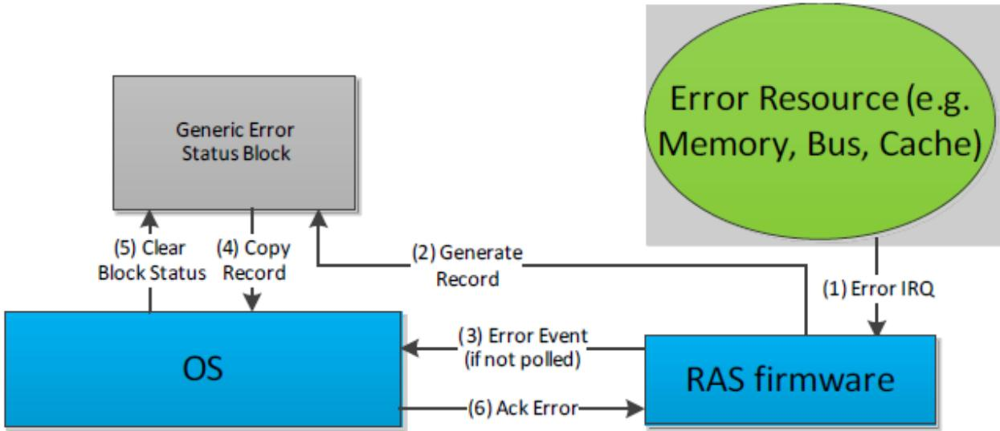  
Fig. 18.1: APEI error flow example with external RAS controller

For GHESv2 error sources, the OSPM must acknowledge the consumption of the Error Status Block by writing to the “Read Ack Register” listed in the GHESv2 structure (described in the following table). For platforms that describe multiple Generic Hardware Error Sources, the platform must provide a unique memory region for the Error Status Block of each error source.

Table 18.13: Generic Hardware Error Source version 2 (GHESv2) Structure

<table><tr><td>Name</td><td>Byte Length</td><td>Byte Offset</td><td>Description</td></tr><tr><td>Type</td><td>2</td><td>0</td><td>10 - Generic Hardware Error Source (version 2) structure</td></tr><tr><td>Equivalent fields in Table 18.10</td><td>62</td><td>2</td><td>Same format as fields in Table 18.10, starting from Source Id and ending in Error Status Block Length (inclusive).</td></tr><tr><td>Read Ack Register</td><td>12</td><td>64</td><td>Generic Address Structure as defined in Table 18.10. This field specifies the location of the Read Ack Register used to notify the RAS controller that OSPM has processed the Error Status Block. The OSPM writes the bit(s) specified in Read Ack Write, while preserving the bit(s) specified in Read Ack Preserve.</td></tr><tr><td>Read Ack Preserve</td><td>8</td><td>76</td><td>Contains a mask of bits to preserve when writing the Read Ack register.</td></tr></table>

continues on next page

Table 18.13 – continued from previous page

<table><tr><td>Name</td><td>Byte Length</td><td>Byte Offset</td><td>Description</td></tr><tr><td>Read Ack Write</td><td>8</td><td>84</td><td>Contains a mask of bits to set when writing the Read Ack register.</td></tr></table>

These are the steps the OS must take once detecting an error from a particular GHESv2 error source:

• OSPM detects error (via interrupt/exception or polling the block status)

• OSPM copies the error status block

• OSPM clears the block status field of the error status block

• OSPM acknowledges the error via Read Ack register. For example:

– OSPM reads the Read Ack register –> X

– OSPM writes –> (( X & ReadAckPreserve) | ReadAckWrite)

## 18.3.2.9 Hardware Error Notification

This table describes the notification mechanism associated with a hardware error source.

Table 18.14: Hardware Error Notification Structure

<table><tr><td>Field</td><td>Byte Length</td><td>Byte Offset</td><td>Description</td></tr><tr><td>Type</td><td>1</td><td>0</td><td></td></tr><tr><td></td><td></td><td></td><td>Identifies the notification type:0 - Polled1 - External Interrupt2 - Local Interrupt3 - SCI4 - NMI5 - CMCI6 - MCE7 - GPIO-Signal8 - ARMv8 SEA9 - ARMv8 SEI10 - External Interrupt - GSI11 - Software Delegated Exception. For definitions of the fields in this structure for this type, see Links to ACPI-Related Documents (http://uefi.org/acpi) under the heading, “SDEI Specification.”All other values are reserved</td></tr><tr><td>Length</td><td>1</td><td>1</td><td>Total length of the structure in bytes.</td></tr><tr><td>Configuration Write Enable</td><td>2</td><td>2</td><td></td></tr><tr><td></td><td></td><td></td><td>This field indicates whether configuration parameters may be modified by OSPM. If the bit for the associated parameter is set, the parameter is writeable by OSPM:Bit [0]: TypeBit [1]: Poll IntervalBit [2]: Switch To Polling Threshold ValueBit [3]: Switch To Polling Threshold WindowBit [4]: Error Threshold ValueBit [5]: Error Threshold Window All other bits are reserved.</td></tr><tr><td>Poll Interval</td><td>4</td><td>4</td><td>Indicates the poll interval in milliseconds OSPM should use to periodically check the error source for the presence of an error condition.</td></tr><tr><td>Vector</td><td>4</td><td>8</td><td>Interrupt vector. For type 10 “External Interrupt - GSI”, this field specifies the GSI triggered by the error source. For type 11 “Software Delegated Exception,” this field specifies the SDEI event number (see the SDEI Specification).</td></tr><tr><td>Switch To Polling Threshold Value</td><td>4</td><td>12</td><td>The number of error interrupts that must occur within Switch To Polling Threshold Interval before OSPM switches the error source to polled mode.</td></tr></table>

continues on next page

Table 18.14 – continued from previous page

<table><tr><td>Switch To Polling Threshold Window</td><td>4</td><td>16</td><td>Indicates the time interval in milliseconds that Switch To Polling Threshold Value interrupts must occur within before OSPM switches the error source to polled mode.</td></tr><tr><td>Error Threshold Value</td><td>4</td><td>20</td><td>Indicates the number of error events that must occur within Error Threshold Interval before OSPM processes the event as an error condition.</td></tr><tr><td>Error Threshold Window</td><td>4</td><td>24</td><td>Indicates the time interval in milliseconds that Error Threshold Value errors must occur within before OSPM processes the event as an error condition.</td></tr></table>

## 18.3.2.10 IA-32 Architecture Deferred Machine Check

Processors implementing the IA-32 Instruction Set Architecture may report Deferred errors to OSPM. These errors indicate that data has been corrupted but not consumed. The information in this table allows platform firmware to communicate key parameters of the deferred processor error reporting mechanism to OSPM, including whether Deferred Machine Check (DMC) processing should be enabled.

Only one entry of this type is permitted in the HEST. OSPM applies the information specified in this entry to all processors.

Table 18.15: IA-32 Architecture Deferred Machine Check Structure

<table><tr><td>Field</td><td>Byte Length</td><td>Byte Offset</td><td>Description</td></tr><tr><td>Type</td><td>2</td><td>0</td><td>11 - IA-32 Architecture Deferred Machine Check Structure.</td></tr><tr><td>Source Id</td><td>2</td><td>2</td><td>This value serves to uniquely identify this error source against other error sources reported by the platform.</td></tr><tr><td>Reserved</td><td>2</td><td>4</td><td>Reserved.</td></tr><tr><td>Flags</td><td>1</td><td>6</td><td></td></tr><tr><td></td><td></td><td></td><td>Bit [0] - FIRMWARE_FIRST: If set, this bit indicates to the OSPM that the interrupt handler from system firmware will run first for this error source.Bit [2] - GHES_ASSIST: If set, this bit indicates that although OSPM is responsible for directly handling the error (as expected when FIRMWARE_FIRST is not set), system firmware may report additional information in the context of the error reported by hardware. The additional information is reported in a Generic Hardware Error Source structure with a matching Related Source ID. See Section 18.7,GHES_ASSIST Error Reporting. NOTE: If FIRMWARE_FIRST is set, this bit is reserved.All other bits must be set to zero.</td></tr></table>

continues on next page

Table 18.15 – continued from previous page

<table><tr><td>Field</td><td>Byte Length</td><td>Byte Offset</td><td>Description</td></tr><tr><td>Enabled</td><td>1</td><td>7</td><td>If the field value is 1, indicates this error source is to be enabled.If the field value is 0, indicates that the error source is not to be enabled.If FIRMWARE_FIRST is set in the flags field, the Enabled field is ignored by OSPM.</td></tr><tr><td>Number of Records To Pre-allocate</td><td>4</td><td>8</td><td>Indicates the number of error records to pre-allocate for this error source. Must be &gt;= 1.</td></tr><tr><td>Max Sections Per Record</td><td>4</td><td>12</td><td>Indicates the maximum number of error sections included in an error record created as a result of an error reported by this error source. Must be &gt;= 1.</td></tr><tr><td>Notification Structure</td><td>28</td><td>16</td><td>Hardware Error Notification Structure, as defined in Table 18.14.</td></tr><tr><td>Number Of Hardware Banks</td><td>1</td><td>44</td><td>Indicates the number of hardware error reporting banks.</td></tr><tr><td>Reserved</td><td>3</td><td>45</td><td>Reserved.</td></tr><tr><td>Machine Check Bank Structure[n]</td><td></td><td>48</td><td>A list of Machine Check Bank structures defined in IA-32 Architecture Machine Check Bank Structure.</td></tr></table>

## 18.3.2.11 Error Source Structure Header (Type 12 Onward)

Beginning with error source type 12 and onward, each Error Source Structure must use the standard Error Source Structure Header as defined below.

Table 18.16: Error Source Structure Header (Type 12 and Onward)

<table><tr><td>Field</td><td>Byte Length</td><td>Byte Offset</td><td>Description</td></tr><tr><td>Type</td><td>2</td><td>0</td><td>Error Type</td></tr><tr><td>Error Source Structure Length</td><td>2</td><td>2</td><td>The length of the error source structure in bytes</td></tr></table>

## 18.4 Firmware First Error Handling

It may be necessary for the platform to process certain classes of errors in firmware before relinquishing control to OSPM for further error handling. Errata management and error containment are two examples where firmware-first error handling is beneficial. Generic hardware error sources support this model through the related source ID.

The platform reports the original error source to OSPM via the hardware error source table (HEST) and sets the FIRMWARE\_FIRST flag for this error source. In addition, the platform must report a generic error source with a related source ID set to the original source ID. This generic error source is used to notify OSPM of the errors on the original source and their status after the firmware first handling.

There are diferent notification strategies that can be used in firmware first handling; the following options are available to the platform:

• Traditional ACPI platforms may use NMI to notify the OSPM of both corrected and uncorrected errors for a given error source

• Traditional ACPI platforms may use NMI to report uncorrected errors and the SCI to report corrected errors

• Traditional ACPI platforms may use NMI to report uncorrected errors and polling to notify the OSPM of corrected errors

• HW-reduced ACPI platforms may use GPIO-signaled events, Interrupt-signaled events, or polling to report corrected errors.

## 18.4.1 Example: Firmware First Handling Using NMI Notification

If the platform chooses to use NMI to report errors, which is the recommended method for uncorrected errors, the platform follows these steps:

1. System firmware configures the platform to trigger a firmware handler when the error occurs

2. System firmware identifies the error source for which it will handle errors via the error source enumeration interface by setting the FIRMWARE\_FIRST flag

3. System firmware describes the generic error source, and the associated error status block, as described in Generic Hardware Error Source. System firmware identifies the relation between the generic error source and the original error source by using the original source ID in the related source ID of Generic Hardware Error Source Structure.

4. When a hardware error reported by the error source occurs, system firmware gains control and handles the error condition as required. Upon completion system firmware should do the following:

5. Extract the error information from the error source and fill in the error information in the data block of the generic error source it identified as an alternate in step 3. The error information format follows the specification in Generic Error Data

6. Set the appropriate bit in the block status field (Generic Error Status Block ) to indicate to the OSPM that a valid error condition is present.

7. Clears error state from the hardware.

8. Generates an NMI.

At this point, the OSPM NMI handler scans the list of generic error sources to find the error source that reported the error and processes the error report

## 18.5 Error Serialization

• The error record serialization feature is used to save and retrieve hardware error information to and from a persistent store. OSPM interacts with the platform through a platform interface. If the Error Record Serialization Table (ERST) is present, OSPM uses the ACPI solution described below. Otherwise, OSPM uses the UEFI runtime variable services to carry out error record persistence operations on UEFI based platforms.

• For error persistence across boots, the platform must implement some form of non-volatile store to save error records. The amount of space required depends on the platform’s processor architecture. Typically, this store will be flash memory or some other form of non-volatile RAM.

• Serialized errors are encoded according to the Common Platform Error Record (CPER) format, which is described in the appendices of the UEFI Specification. These entries are referred to as error records.

• The Error Record Serialization Interface is designed to be suficiently abstract to allow hardware vendors flexibility in how they implement their error record serialization hardware. The platform provides details necessary to communicate with its serialization hardware by populating the ERST with a set of Serialization Instruction

Entries. One or more serialization instruction entries comprise a Serialization Action. OSPM carries out serialization operations by executing a series of Serialization Actions. Serialization Actions and Serialization Instructions are described in detail in the following sections.

The following table details the ERST layout, which system firmware is responsible for building.

Table 18.17: Error Record Serialization Table (ERST)

<table><tr><td>Field</td><td>Byte Length</td><td>Byte Offset</td><td>Description</td></tr><tr><td colspan="4">ACPI Standard Header</td></tr><tr><td>Header Signature</td><td>4</td><td>0</td><td>“ERST”. Signature for the Error Record Serialization Table.</td></tr><tr><td>Length</td><td>4</td><td>4</td><td>Length, in bytes, of entire ERST. Entire table must be contiguous.</td></tr><tr><td>Revision</td><td>1</td><td>8</td><td>1</td></tr><tr><td>Checksum</td><td>1</td><td>9</td><td>Entire table must sum to zero.</td></tr><tr><td>OEMID</td><td>6</td><td>10</td><td>OEM ID.</td></tr><tr><td>OEM Table ID</td><td>8</td><td>16</td><td>The manufacturer model ID.</td></tr><tr><td>OEM Revision</td><td>4</td><td>24</td><td>OEM revision of the ERST for the supplied OEM table ID.</td></tr><tr><td>Creator ID</td><td>4</td><td>28</td><td>Vendor ID of the utility that created the table.</td></tr><tr><td>Creator Revision</td><td>4</td><td>32</td><td>Revision of the utility that created the table.</td></tr><tr><td colspan="4">Serialization Header</td></tr><tr><td>Serialization Header Size</td><td>4</td><td>36</td><td>Length in bytes of the serialization header.</td></tr><tr><td>Reserved</td><td>4</td><td>40</td><td>Must be zero.</td></tr><tr><td>Instruction Entry Count</td><td>4</td><td>44</td><td>The number of Serialization Instruction Entries in the Serialization Action Table.</td></tr><tr><td colspan="4">Serialization Action Table</td></tr><tr><td>Serialization Instruction Entries</td><td></td><td>48</td><td>A series of error logging instruction entries.</td></tr></table>

## 18.5.1 Serialization Action Table

A Serialization Action is defined as a series of Serialization Instructions on registers that result in a well known action. A Serialization Instruction is a Serialization Action primitive and consists of either reading or writing an abstracted hardware register. The Serialization Action Table contains Serialization Instruction Entries for all the Serialization Actions the platform supports.

In most cases, a Serialization Action comprises only one Serialization Instruction, but it is conceivable that a more complex device will require more than one Serialization Instruction. When an action does comprise more than one instruction, the instructions must be listed consecutively and they will consequently be performed sequentially, according to their placement in the Serialization Action Table.

## 18.5.1.1 Serialization Actions

This section identifies the Serialization Actions that comprise the Error Record Serialization interface, as shown in the following table.

Table 18.18: Error Record Serialization Actions

<table><tr><td>Value</td><td>Name</td><td>Description</td></tr><tr><td>0x0</td><td>BEGIN_WRITE_OPERATION</td><td>Indicates to the platform that an error record write operation is beginning. This allows the platform to set its operational context.</td></tr><tr><td>0x1</td><td>BEGIN_READ_OPERATION</td><td>Indicates to the platform that an error record read operation is beginning. This allows the platform to set its operational context.</td></tr><tr><td>0x2</td><td>BEGIN_CLEAR_OPERATION</td><td>Indicates to the platform that an error record clear operation is beginning. This allows the platform to set its operation context.</td></tr><tr><td>0x3</td><td>END_OPERATION</td><td>Indicates to the platform that the current error record operation has ended. This allows the platform to clear its operational context.</td></tr><tr><td>0x4</td><td>SET_RECORD_OFFSET</td><td>Sets the offset from the base of the Error Log to transfer an error record.</td></tr><tr><td>0x5</td><td>EXECUTE_OPERATION</td><td>Instructs the platform to carry out the current operation based on the current operational context.</td></tr><tr><td>0x6</td><td>CHECK_BUSY_STATUS</td><td>Returns the state of the current operation. Once an operation has been executed through the EXECUTE_OPERATION action, the platform is required to return an indication that the operation is in progress until the operation completes. This allows the OS to poll for completion by repeatedly executing the CHECK_BUSY_STATUS action until the platform indicates that the operation not busy.</td></tr><tr><td>0x7</td><td>GET_COMMAND_STATUS</td><td>Returns the status of the current operation. The platform is expected to maintain a status code for each operation. Bits [8:1] of the value returned from the Register Region indicate the command status, which requires that the Bit Offset of the GAS for the Register Region is set to 1. See Command-Status-Definition for a list of valid command status codes.</td></tr><tr><td>0x8</td><td>GET_RECORD_IDENTIFIER</td><td>Returns the record identifier of an existing error record on the persistent store. The error record identifier is a 64-bit unsigned value as defined in the appendices of the UEFI Specification. If the record store is empty, this action must return 0xFFFFFFFFFFFFFFFF.</td></tr><tr><td>0x9</td><td>SET_RECORD_IDENTIFIER</td><td>Sets the record identifier. The error record identifier is a 64-bit unsigned value as defined in the appendices of the UEFI Specification.</td></tr><tr><td>0xA</td><td>GET_RECORD_COUNT</td><td>Retrieves the number of error records currently stored on the platforms persistent store. The platform is expected to maintain a count of the number of error records resident in its persistent store.</td></tr></table>

continues on next page

Table 18.18 – continued from previous page

<table><tr><td>Value</td><td>Name</td><td>Description</td></tr><tr><td>0xB</td><td>BEGIN_DUMMY_WRITE-OPERATION</td><td>Indicates to the platform that a dummy error record write operation is beginning. This allows the platform to set its operational context. A dummy error record write operation performs no actual transfer of information from the Error Log Address Range to the persistent store.</td></tr><tr><td>0xC</td><td>RESERVED</td><td>Reserved.</td></tr><tr><td>0xD</td><td>GET_ERROR_LOG_ADDRESS_RANGE</td><td>Returns the 64-bit physical address OSPM uses as the buffer for reading/writing error records.</td></tr><tr><td>0xE</td><td>GET_ERROR_LOG_ADDRESS_RANGE_LENGTH</td><td>Returns the length in bytes of the Error Log Address Range</td></tr><tr><td>0xF</td><td>GET_ERROR_LOG_ADDRESS_RANGE_ATTRIBUTES</td><td>Returns attributes that describe the behavior of the error log address range:Bit [0] (0x1) - Reserved.Bit [1] (0x2) - Non-Volatile: Indicates that the error log address range is in non-volatile RAM.Bit [2] (0x4) - Slow: Indicates that the memory in which the error log address range is locates has slow access times.All other bits reserved.</td></tr><tr><td>0x10</td><td>GET_EXECUTE_OPERATION_TIMINGS</td><td>Returns an encoded QWORD:[63:32] value in microseconds that the platform expects would be the maximum amount of time it will take to process and complete an EXECUTE_OPERATION.[31:0] value in microseconds that the platform expects would be the nominal amount of time it will take to process and complete an EXECUTE_OPERATION.</td></tr></table>

The following table defines the serialization action status codes returned from GET\_COMMAND\_STATUS.

Table 18.19: Command Status Definition

<table><tr><td>Value</td><td>Description</td></tr><tr><td>0x00</td><td>Success</td></tr><tr><td>0x01</td><td>Not Enough Space</td></tr><tr><td>0x02</td><td>Hardware Not Available</td></tr><tr><td>0x03</td><td>Failed</td></tr><tr><td>0x04</td><td>Record Store Empty</td></tr><tr><td>0x05</td><td>Record Not Found</td></tr></table>

## 18.5.1.2 Serialization Instruction Entries

Each Serialization Action consists of a series of one or more Serialization Instructions. A Serialization Instruction represents a primitive operation on an abstracted hardware register represented by the register region as defined in a Serialization Instruction Entry.

A Serialization Instruction Entry describes a region in a serialization hardware register and the serialization instruction to be performed on that region. The following table details the layout of a Serialization Instruction Entry.

Table 18.20: Serialization Instruction Entry

<table><tr><td>Field</td><td>Byte Length</td><td>Byte Offset</td><td>Description</td></tr><tr><td>Serialization Action</td><td>1</td><td>N+0</td><td>The serialization action that this serialization instruction is a part of.</td></tr><tr><td>Instruction</td><td>1</td><td>N+1</td><td>Identifies the instruction to execute. See the Serialization Instructions table for a list of valid serialization instructions.</td></tr><tr><td>Flags</td><td>1</td><td>N+2</td><td>Flags that qualify the instruction.</td></tr><tr><td>Reserved</td><td>1</td><td>N+3</td><td>Must be zero.</td></tr><tr><td>Register Region</td><td>12</td><td>N+4</td><td>Generic Address Structure as defined in Section 5.2.3.2 to describe the address and bit.</td></tr><tr><td>Value</td><td>8</td><td>N+16</td><td>Value used with READ_REGISTER_VALUE and WRITE_REGISTER_VALUE instructions.</td></tr><tr><td>Mask</td><td>8</td><td>N+24</td><td>The bit mask required to obtain the bits corresponding to the serialization instruction in a given bit range defined by the register region.</td></tr></table>

Register Region is described as a generic address structure. This structure describes the physical address of a register as well as the bit range that corresponds to a desired region of the register. The bit range is defined as the smallest set of consecutive bits that contains every bit in the register that is associated with the Serialization Instruction. If bits [6:5] and bits [3:2] all correspond to a Serialization Instruction, the bit range for that instruction would be [6:2].

Because a bit range could contain bits that do not pertain to a particular Serialization Instruction (i.e. bit 4 in the example above), a bit mask is required to distinguish all the bits in the region that correspond to the instruction. The Mask field is defined to be this bit mask with a bit set to ‘1’ for each bit in the bit range (defined by the register region) corresponding to the Serialization Instruction. Note that bit 0 of the bit mask corresponds to the lowest bit in the bit range. In the example used above, the mask would be 11011b or 0x1B.

The Instruction field identifies the operation to be performed on the register region by the instruction entry. The following table identifies the instructions that are supported.

Table 18.21: Serialization Instructions

<table><tr><td>Value</td><td>Name</td><td>Description</td></tr><tr><td>0x00</td><td>READ_REGISTER</td><td>A READ_REGISTER instruction reads the designated information from the specified Register Region.</td></tr><tr><td>0x01</td><td>READ_REGISTER_VALUE</td><td>A READ_REGISTER_VALUE instruction reads the designated information from the specified Register Region and compares the results with the contents of the Value field. If the information read matches the contents of the Value field, TRUE is returned, else FALSE is returned.</td></tr><tr><td>0x02</td><td>WRITE_REGISTER</td><td>A WRITE_REGISTER instruction writes a value to the specified Register Region. The Value field is ignored.</td></tr></table>

continues on next page

Table 18.21 – continued from previous page

<table><tr><td>Value</td><td>Name</td><td>Description</td></tr><tr><td>0x03</td><td>WRITE_REGISTER_VALUE</td><td>A WRITE_REGISTER_VALUE instruction writes the contents of the Value field to the specified Register Region.</td></tr><tr><td>0x04</td><td>NOOP</td><td>This instruction is a NOOP.</td></tr><tr><td>0x05</td><td>LOAD_VAR1</td><td>Loads the VAR1 variable from the register region.</td></tr><tr><td>0x06</td><td>LOAD_VAR2</td><td>Loads the VAR2 variable from the register region.</td></tr><tr><td>0x07</td><td>STORE_VAR1</td><td>Stores the value in VAR1 to the indicate register region.</td></tr><tr><td>0x08</td><td>ADD</td><td>Adds VAR1 and VAR2 and stores the result in VAR1.</td></tr><tr><td>0x09</td><td>SUBTRACT</td><td>Subtracts VAR1 from VAR2 and stores the result in VAR1.</td></tr><tr><td>0x0A</td><td>ADD_VALUE</td><td>Adds the contents of the specified register region to Value and stores the result in the register region.</td></tr><tr><td>0x0B</td><td>SUBTRACT_VALUE</td><td>Subtracts Value from the contents of the specified register region and stores the result in the register region.</td></tr><tr><td>0x0C</td><td>STALL</td><td>Stall for the number of microseconds specified in Value.</td></tr><tr><td>0x0D</td><td>STALL WHILE_TRUE</td><td>OSPM continually compares the contents of the specified register region to Value until the values are not equal. OSPM stalls between each successive comparison. The amount of time to stall is specified by VAR1 and is expressed in microseconds.</td></tr><tr><td>0x0E</td><td>SKIP_NEXT_INSTRUCTION_IF_TRUE</td><td>This is a control instruction which compares the contents of the register region with Value. If the values match, OSPM skips the next instruction in the sequence for the current action.</td></tr><tr><td>0x0F</td><td>GOTO</td><td>OSPM will go to the instruction specified by Value. The instruction is specified as the zero-based index. Each instruction for a given action has an index based on its relative position in the array of instructions for the action.</td></tr><tr><td>0x10</td><td>SET_SRC_ADDRESS_BASE</td><td>Sets the SRC_BASE variable used by the MOVE_DATA instruction to the contents of the register region.</td></tr><tr><td>0x11</td><td>SET_DST_ADDRESS_BASE</td><td>Sets the DST_BASE variable used by the MOVE_DATA instruction to the contents of the register region.</td></tr><tr><td>0x12</td><td>MOVE_DATA</td><td>Moves VAR2 bytes of data from SRC_BASE + Offset to DST_BASE + Offset, where Offset is the contents of the register region.</td></tr></table>

The Flags field allows qualifying flags to be associated with the instruction. The following table identifies the flags that can be associated with Serialization Instructions.

Table 18.22: Instruction Flags

<table><tr><td>Value</td><td>Name</td><td>Description</td></tr><tr><td>0x01</td><td>PRESERVE_REGISTER</td><td>For WRITE_REGISTER and WRITE_REGISTER_VALUE instructions, this flag indicates that bits within the register that are not being written must be preserved rather than destroyed. For READ_REGISTER instructions, this flag is ignored.</td></tr></table>

## 18.5.1.2.1 READ\_REGISTER\_VALUE

A read register value instruction reads the register region and compares the result with the specified value. If the values are not equal, the instruction failed. This can be described in pseudo code as follows:

```txt
X = Read(register)
X = X >> Bit Offset described in Register Region
X = X & Mask
If (X != Value) FAIL
SUCCEED
```

## 18.5.1.2.2 READ\_REGISTER

A read register instruction reads the register region. The result is a generic value and should not be compared with Value. Value will be ignored. This can be described in pseudo code as follows:

```txt
X = Read(register)
X = X >> Bit Offset described in Register Region
X = X & Mask
Return X
```

## 18.5.1.2.3 WRITE\_REGISTER\_VALUE

A write register value instruction writes the specified value to the register region. If PRESERVE\_REGISTER is set in Instruction Flags, then the bits not corresponding to the write value instruction are preserved. If the register is preserved, the write value instruction requires a read of the register. This can be described in pseudo code as follows:

```txt
X = Value & Mask
X = X << Bit Offset described in Register Region
If (Preserve Register)
Y = Read(register)
Y = Y & ~(Mask << Bit Offset)
X = X \ | Y
Write(X, Register)
```

## 18.5.1.2.4 WRITE\_REGISTER

A write register instruction writes a value to the register region. Value will be ignored. If PRESERVE\_REGISTER is set in Instruction Flags, then the bits not corresponding to the write instruction are preserved. If the register is preserved, the write value instruction requires a read of the register. This can be described in pseudo code as follows:

```matlab
X = supplied value
X = X & Mask
X = X << Bit Offset described in Register Region
If (Preserve Register)
Y = Read(register)
Y = Y & ~(Mask << Bit Offset)
X = X \ | Y
Write(X, Register)
```

## 18.5.1.3 Error Record Serialization Information

The APEI error record includes an 8 byte field called OSPM Reserved. The following table defines the layout of this field. The error record serialization information is a small bufer the platform can use for serialization bookkeeping. The platform is free to use the 48 bits starting at bit ofset 16 for its own purposes. It may use these bits to indicate the busy/free status of an error record, to record an internal identifier, etc.

Table 18.23: Error Record Serialization Info

<table><tr><td colspan="2">Field</td><td>Bit Length</td><td>Bit Offset</td><td>Description</td></tr><tr><td>Signature</td><td></td><td>16</td><td>0</td><td>16-bit signature (&#x27;ER&#x27;) identifying the start of the error record serialization data.</td></tr><tr><td>Platform Data</td><td>Serialization</td><td>48</td><td>16</td><td>Platform private error record serialization information.</td></tr></table>

## 18.5.2 Operations

The error record serialization interface comprises three operations: Write, Read, and Clear. OSPM uses the Write operation to write a single error record to the persistent store. The Read operation is used to retrieve a single error record previously recorded to the persistent store using the write operation. The Clear operation allows OSPM to notify the platform that a given error record has been fully processed and is no longer needed, allowing the platform to recover the storage associated with a cleared error record.

Where the Error Log Address Range is NVRAM, significant optimizations are possible since transfer from the Error Log Address Range to a separate storage device is unnecessary. The platform may still, however, copy the record from NVRAM to another device, should it choose to. This allows, for example, the platform to copy error records to private log files. In order to give the platform the opportunity to do this, OSPM must use the Write operation to persist error records even when the Error Log Address Range is NVRAM. The Read and Clear operations, however, are unnecessary in this case as OSPM is capable of reading and clearing error records without assistance from the platform.

## 18.5.2.1 Writing

To write a single HW error record, OSPM executes the following steps:

1. Initializes the error record’s serialization info. OSPM must fill in the Signature.

2. Writes the error record to be persisted into the Error Log Address Range.

3. Executes the BEGIN\_WRITE\_OPERATION action to notify the platform that a record write operation is beginning.

4. Executes the SET\_RECORD\_OFFSET action to inform the platform where in the

5. Error Log Address Range the error record resides.

6. Executes the EXECUTE\_OPERATION action to instruct the platform to begin the write operation.

7. Busy waits by continually executing CHECK\_BUSY\_STATUS action until FALSE is returned.

8. Executes a GET\_COMMAND\_STATUS action to determine the status of the write operation. If an error is indicated, the OS

9. PM may retry the operation.

10. Executes an END\_OPERATION action to notify the platform that the record write operation is complete.

When OSPM performs the EXECUTE\_OPERATION action in the context of a record write operation, the platform attempts to transfer the error record from the designated ofset in the Error Log Address Range to a persistent store of its choice. If the Error Log Address Range is non-volatile RAM, no transfer is required.

Where the platform is required to transfer the error record from the Error Log Address Range to a persistent store, it performs the following steps in response to receiving a write command:

1. Sets some internal state to indicate that it is busy. OSPM polls by executing a CHECK\_BUSY\_STATUS action until the operation is completed

2. Reads the error record’s Record ID field to determine where on the storage medium the supplied error record is to be written. The platform attempts to locate the specified error record on the persistent store.

• If the specified error record does not exist, the platform attempts to write a new record to the persistent store.

• If the specified error record does exists, then if the existing error record is large enough to be overwritten by the supplied error record, the platform can do an in-place replacement. If the existing record is not large enough to be overwritten, the platform must attempt to locate space in which to write the new record. It may mark the existing record as Free and coalesce adjacent free records in order to create the necessary space.

3. Transfers the error record to the selected location on the persistent store.

4. Updates an internal Record Count if a new record was written.

5. Records the status of the operation so OSPM can retrieve the status by executing a GET\_COMMAND\_STATUS action.

6. Modifies internal busy state as necessary so when OS PM executes CHECK\_BUSY\_STATUS, the result indicates that the operation is complete.

If the Error Log Address Range resides in NVRAM, the minimum steps required of the platform are:

1. Sets some internal state to indication that it is busy. OSPM polls by executing a CHECK\_BUSY\_STATUS action until the operation is completed.

2. Records the status of the operation so OSPM can retrieve the status by executing a GET\_COMMAND\_STATUS action.

3. Clear internal busy state so when OS PM executes CHECK\_BUSY\_STATUS, the result indicates that the operation is complete.

## 18.5.2.2 Reading

During boot, OSPM attempts to retrieve all serialized error records from the persistent store. If the Error Log Address Range does not reside in NVRAM, the following steps are executed by OSPM to retrieve all error records:

1. Executes the BEGIN\_ READ\_OPERATION action to notify the platform that a record read operation is beginning.

2. Executes the SET\_ RECORD\_OFFSET action to inform the platform at what ofset in the Error Log Address Range the error record is to be transferred.

3. Executes the SET\_RECORD\_IDENTIFER action to inform the platform which error record is to be read from its persistent store.

4. Executes the EXECUTE\_OPERATION action to instruct the platform to begin the read operation.

5. Busy waits by continually executing CHECK\_BUSY\_STATUS action until FALSE is returned.

6. Executes a GET\_COMMAND\_STATUS action to determine the status of the read operation.

• If the status is Record Store Empty (0x04), continue to step 7.

• If an error occurred reading a valid error record, the status will be Failed (0x03), continue to step 7.

• If the status is Record Not Found (0x05), indicating that the specified error record does not exist, OSPM retrieves a valid identifier by executing a GET\_RECORD\_IDENTIFIER action. The platform will return a valid record identifier.

• If the status is Success, OSPM transfers the retrieved record from the Error Log Address Range to a private bufer and then executes the GET\_RECORD\_IDENTIFIER action to determine the identifier of the next record in the persistent store.

7. Execute an END\_OPERATION to notify the platform that the record read operation is complete.

The steps performed by the platform to carry out a read request are as follows:

1. Sets some internal state to indicate that it is busy. OSPM polls by executing a CHECK\_BUSY\_STATUS action until the operation is completed.

2. Using the record identifier supplied by OSPM through the SET\_RECORD\_IDENTIFIER operation, determine which error record to read:

• If the identifier is 0x0 (unspecified), the platform reads the ‘first’ error record from its persistent store (first being implementation specific).

• If the identifier is non-zero, the platform attempts to locate the specified error record on the persistent store.

• If the specified error record does not exist, set the status register’s Status to Record Not Found (0x05), and update the status register’s Identifier field with the identifier of the ‘first’ error record.

3. Transfer the record from the persistent store to the ofset specified by OSPM from the base of the Error Log Address Range.

4. Record the Identifier of the ‘next’ valid error record that resides on the persistent store. This allows OSPM to retrieve a valid record identifier by executing a GET\_RECORD\_IDENTIFIER operation.

5. Record the status of the operation so OSPM can retrieve the status by executing a GET\_COMMAND\_STATUS action.

6. Clear internal busy state so when OSPM executes CHECK\_BUSY\_STATUS, the result indicates that the operation is complete.

Where the Error Log Address Range does reside in NVRAM, OSPM requires no platform support to read persisted error records. OSPM can scan the Error Log Address Range on its own and retrieve the error records it previously persisted.

## 18.5.2.3 Clearing

After OSPM has finished processing an error record, it will notify the platform by clearing the record. This allows the platform to delete the record from the persistent store or mark it such that the space is free and can be reused. The following steps are executed by OSPM to clear an error record:

1. Executes a BEGIN\_ CLEAR\_OPERATION action to notify the platform that a record clear operation is beginning.

2. Executes a SET\_RECORD\_IDENTIFER action to inform the platform which error record is to be cleared. This value must not be set to 0x0 (unspecified).

3. Executes an EXECUTE\_OPERATION action to instruct the platform to begin the clear operation.

4. Busy waits by continually executing CHECK\_BUSY\_STATUS action until FALSE is returned.

5. Executes a GET\_COMMAND\_STATUS action to determine the status of the clear operation.

6. Execute an END\_OPERATION to notify the platform that the record read operation is complete.

The platform carries out a clear request by performing the following steps:

1. Sets some internal state to indication that it is busy. OSPM polls by executing a CHECK\_BUSY\_STATUS action until the operation is completed

2. Using the record identifier supplied by OSPM through the SET\_RECORD\_IDENTIFIER operation, determine which error record to clear. This value may not be 0x0 (unspecified).

3. Locate the specified error record on the persistent store.

4. Mark the record as free by updating the Attributes in its serialization header.

5. Update internal record count.

6. Clear internal busy state so when OS PM executes CHECK\_BUSY\_STATUS, the result indicates that the operation is complete.

When the Error Log Address Range resides in NVRAM, the OS requires no platform support to Clear error records.

## 18.5.2.4 Usage

This section describes several possible ways the error record serialization mechanism might be implemented.

## 18.5.2.4.1 Error Log Address Range Resides in NVRAM

If the Error Log Address Range resides in NVRAM, then when OSPM writes a record into the logging range, the record is automatically persistent and the busy bit can be cleared immediately. On a subsequent boot, OSPM can read any persisted error records directly from the persistent store range. The size of the persistent store, in this case, is expected to be enough for several error records.

## 18.5.2.4.2 Error Log Address Range Resides in (volatile) RAM

In this implementation, the Error Log Address Range describes an intermediate location for error records. To persist a record, OSPM copies the record into the Error Log Address Range and sets the Execute, at which time the platform runs necessary code (SMM code on non-UEFI based systems and UEFI runtime code on UEFI-enabled systems) to transfer the error record from main memory to some persistent store. To read a record, OSPM asks the platform to copy a record from the persistent store to a specified ofset within the Error Log Address Range. The size of the Error Log Address Range is at least large enough for one error record.

## 18.5.2.4.3 Error Log Address Range Resides on Service Processor

In this type of implementation, the Error Log Address Range is really MMIO. When OSPM writes an error record to the Error Log Address Range, it is really writing to memory on a service processor. When the OSPM sets the Execute control bit, the platform knows that the OSPM is done writing the record and can do something with it, like move it into a permanent location (i.e. hard disk) on the service processor. The size of the persistent store in this type of implementation is typically large enough for one error record.

## 18.5.2.4.4 Error Log Address Range is Copied Across Network

In this type of implementation, the Error Log Address Range is an intermediate cache for error records. To persist an error record, OSPM copies the record into the Error Log Address Range and set the Execute control bit, and the platform runs code to transmit this error record over the wire. The size of the Error Log Address Range in this type of implementation is typically large enough for one error record.

## 18.6 Error Injection

This section outlines an ACPI table mechanism, called EINJ, which allows for a generic interface mechanism through which OSPM can inject hardware errors to the platform without requiring platform specific OSPM level software. The primary goal of this mechanism is to support testing of OSPM error handling stack by enabling the injection of hardware errors. Through this capability OSPM is able to implement a simple interface for diagnostic and validation of errors handling on the system.

## 18.6.1 Error Injection Table (EINJ)

The Error Injection (EINJ) table provides a generic interface mechanism through which OSPM can inject hardware errors to the platform without requiring platform specific OSPM software. System firmware is responsible for building this table, which is made up of Injection Instruction entries. The following table describes the necessary details for EINJ.

Table 18.24: Error Injection Table (EINJ)

<table><tr><td>Field</td><td>Byte length</td><td>Byte offset</td><td>Description</td></tr><tr><td colspan="4">ACPI Standard Header</td></tr><tr><td>Header Signature</td><td>4</td><td>0</td><td>EINJ. Signature for the Error Record Injection Table.</td></tr><tr><td>Length</td><td>4</td><td>4</td><td>Length, in bytes, of entire EINJ. Entire table must be contiguous.</td></tr><tr><td>Revision</td><td>1</td><td>8</td><td>2</td></tr><tr><td>Checksum</td><td>1</td><td>9</td><td>Entire table must sum to zero.</td></tr><tr><td>OEMID</td><td>6</td><td>10</td><td>OEM ID.</td></tr><tr><td>OEM Table ID</td><td>8</td><td>16</td><td>The manufacturer model ID.</td></tr><tr><td>OEM Revision</td><td>4</td><td>24</td><td>OEM revision of EINJ.</td></tr><tr><td>Creator ID</td><td>4</td><td>28</td><td>Vendor ID of the utility that created the table.</td></tr><tr><td>Creator Revision</td><td>4</td><td>32</td><td>Revision of the utility that created the table.</td></tr><tr><td colspan="4">Injection Header</td></tr><tr><td>Injection Header Size</td><td>4</td><td>36</td><td>Length in bytes of the Injection Interface header.</td></tr><tr><td>Injection Flags</td><td>1</td><td>40</td><td>Reserved. Must be zero</td></tr><tr><td>Reserved</td><td>3</td><td>41</td><td>Must be zero.</td></tr><tr><td>Injection Entry Count</td><td>4</td><td>44</td><td>The number of Instruction Entries in the Injection Action Table</td></tr><tr><td colspan="4">Injection Action Table</td></tr><tr><td>Injection Instruction Entries</td><td></td><td>48</td><td>A series of error injection instruction entries, per Injection Entry Count See Table 18.26.</td></tr></table>

The following table identifies the supported error injection actions.

Table 18.25: Error Injection Actions

<table><tr><td>Value</td><td>Name</td><td>Description</td></tr><tr><td>0x0</td><td>BEGIN_INJECTION_OPERATION</td><td>Indicates to the platform that an error injection is beginning. This allows the platform to set its operational context.</td></tr><tr><td>0x1</td><td>GET_TRIGGER_ERROR_ACTION_TABLE</td><td>Returns a 64-bit physical memory pointer to the Trigger Error Action table (see Table 18.36).</td></tr><tr><td>0x2</td><td>SET_ERROR_TYPE</td><td>Type of error to Inject. Only one ERROR_TYPE can be injected at any given time. If there is request for multiple injections at the same time, then the platform will return an error condition. See Section 18.6.4.</td></tr><tr><td>0x3</td><td>GET_ERROR_TYPE</td><td>Returns the error injection capabilities of the platform.</td></tr><tr><td>0x4</td><td>END_OPERATION</td><td>Indicates to the platform that the current injection operation has ended. This allows the platform to clear its operational context.</td></tr><tr><td>0x5</td><td>EXECUTE_OPERATION</td><td>Instructs the platform to carry out the current operation based on the current operational context.</td></tr><tr><td>0x6</td><td>CHECK_BUSY_STATUS</td><td>Returns the state of the current operation. Once an operation has been executed through the EXECUTE_OPERATION action, the platform is required to return an indication that the operation is busy until the operation is completed. This allows software to poll for completion by repeatedly executing the CHECK_BUSY_STATUS action until the platform indicates that the operation is complete by setting not busy. The lower most bit (bit0) of the returned value indicates the busy status by setting it to 1 and not busy status by setting it to 0.</td></tr><tr><td>0x7</td><td>GET_COMMAND_STATUS</td><td>Returns the status of the current operation. See Table 18.29 for a list of valid command status codes.</td></tr></table>

Table 18.25 – continued from previous page

<table><tr><td>0x8</td><td>SET_ERROR_TYPE_WITH_ADDRESS</td><td>Type of error to Inject, and the address to inject. Only one Error type can be injected at any given time. If there is request for multiple injections at the same time, then the platform will return an error condition.The RegisterRegion field (See Table 18.26) in SET_ERROR_TYPE_WITH_ADDRESS points to a data structure whose format is defined in Table 18.31.Note that executingSET_ERROR_TYPE_WITH_ADDRESS without specifying an address has the same effect as executingSET_ERROR_TYPE. See Table 18.30, error type definition.</td></tr><tr><td>0x9</td><td>GET_EXECUTE_OPERATION_TIMINGS</td><td>Returns an encoded QWORD: [63:32] value in microseconds that the platform expects would be the maximum amount of time it will take to process and complete an EXECUTE_OPERATION. [31:0] value in microseconds that the platform expects would be the nominal amount of time it will take to process and complete an EXECUTE_OPERATION.</td></tr><tr><td>0x10</td><td>EINJV2_SET_ERROR_TYPE (deprecated)</td><td>This Action is deprecated. The Action SET_ERROR_TYPE_WITH_ADDRESS should be used instead.</td></tr><tr><td>0x11</td><td>EINJV2_GET_ERROR_TYPE</td><td>Returns the EINJv2 injection capabilities of the platform. See Table 18.33.</td></tr><tr><td>0xFF</td><td>TRIGGER_ERROR</td><td>This Value is reserved for entries declared in the Trigger Error Action Table returned in response to a GET_TRIGGER_ERROR_ACTION_TABLE action. The returned table consists of a series of actions each of which is set to TRIGGER_ERROR (see Table 18.36). When executed by software, the series of TRIGGER_ERROR actions triggers the error injected as a result of the successful completion of an EXECUTE_OPERATION action.</td></tr></table>

## 18.6.2 Injection Instruction Entries

An Injection action consists of a series of one or more Injection Instructions. An Injection Instruction represents a primitive operation on an abstracted hardware register, represented by the register region as defined in an Injection Instruction Entry.

An Injection Instruction Entry describes a region in an injection hardware register and the injection instruction to be performed on that region.

The following table details the layout of an Injection Instruction Entry.

Table 18.26: Injection Instruction Entry

<table><tr><td>Field</td><td>Byte length</td><td>Byte offset</td><td>Description</td></tr><tr><td>Injection Action</td><td>1</td><td>0</td><td>The injection action that this instruction is a part of. See the Error Injection Actions table for supported injection actions.</td></tr><tr><td>Instruction</td><td>1</td><td>1</td><td>Identifies the instruction to execute. See the Injection Instructions table for a list of valid instructions.</td></tr><tr><td>Flags</td><td>1</td><td>2</td><td>Flags that qualify the instruction.</td></tr><tr><td>Reserved</td><td>1</td><td>3</td><td>Must be zero.</td></tr><tr><td>Register Region</td><td>12</td><td>4</td><td>The Generic Address Structure is used to describe the address and bit. Address_Space_ID must be 0 (System Memory) or 1 (System IO). This constraint is an attempt to ensure that the registers are accessible in the presence of hardware error conditions.</td></tr><tr><td>Value</td><td>8</td><td>16</td><td>This is the value field that is used by the instruction READ or WRITE_REGISTER_VALUE.</td></tr><tr><td>Mask</td><td>8</td><td>24</td><td>The bit mask required to obtain the bits corresponding to the injection instruction in a given bit range defined by the register region.</td></tr></table>

Register Region is described as a generic address structure. This structure describes the physical address of a register as well as the bit range that corresponds to a desired region of the register. The bit range is defined as the smallest set of consecutive bits that contains every bit in the register that is associated with the injection Instruction. If bits [6:5] and bits [3:2] all correspond to an Injection Instruction, the bit range for that instruction would be [6:2].

Because a bit range could contain bits that do not pertain to a particular injection Instruction (i.e. bit 4 in the example above), a bit mask is required to distinguish all the bits in the region that correspond to the instruction. The Mask field is defined to be this bit mask with a bit set to a ‘1’ for each bit in the bit range (defined by the register region) corresponding to the Injection Instruction. Note that bit 0 of the bit mask corresponds to the lowest bit in the bit range. In the example used above, the mask would be 11011b or 0x1B.

Table 18.27: Instruction Flags

<table><tr><td>Value</td><td>Name</td><td>Description</td></tr><tr><td>0x01</td><td>PRESERVE_REGISTER</td><td>For WRITE_REGISTER and WRITE_REGISTER_VALUE instructions, this flag indicates that bits within the register that are not being written must be preserved rather than destroyed.For READ_REGISTER instructions, this flag is ignored.</td></tr></table>

## 18.6.3 Injection Instructions

The table below lists the supported Injection Instructions for Injection Instruction Entries.

Table 18.28: Injection Instructions

<table><tr><td>Op-code</td><td>Instruction name</td><td>Description</td></tr><tr><td>0x00</td><td>READ_REGISTER</td><td>A READ_REGISTER instruction reads the value from the specified register region.</td></tr></table>

continues on next page

Table 18.28 – continued from previous page

<table><tr><td>Op-code</td><td>Instruction name</td><td>Description</td></tr><tr><td>0x01</td><td>READ_REGISTER_VALUE</td><td>A READ_REGISTER_VALUE instruction reads the designated information from the specified Register Region and compares the results with the contents of the Value field.If the information read matches the contents of the Value field, TRUE is returned, else FALSE is returned.</td></tr><tr><td>0x02</td><td>WRITE_REGISTER</td><td>A WRITE_REGISTER instruction writes a value chosen by software to the specified Register Region. The Value field is ignored.</td></tr><tr><td>0x03</td><td>WRITE_REGISTER_VALUE</td><td>A WRITE_REGISTER_VALUE instruction writes the contents of the Value field to the specified Register Region.</td></tr><tr><td>0x04</td><td>NOOP</td><td>No operation.</td></tr></table>

The table below defines the error injection status codes returned from GET\_COMMAND\_STATUS.

Table 18.29: Command Status Definition

<table><tr><td>Value</td><td>Description</td></tr><tr><td>0x0</td><td>Success</td></tr><tr><td>0x1</td><td>Unknown Failure</td></tr><tr><td>0x2</td><td>Invalid Access</td></tr></table>

## 18.6.4 Error Types

The table below defines the error type codes returned from GET\_ERROR\_TYPE, as well as the error type set by SET\_ERROR\_TYPE and the Error Type field set by SET\_ERROR\_TYPE\_WITH\_ADDRESS (see Table 18.31).

Both the SET\_ERROR\_TYPE and SET\_ERROR\_TYPE\_WITH\_ADDRESS actions must be present as part of the EINJ Action Table. OSPM is free to choose either of these two actions to inject an error type. The platform will give precedence to SET\_ERROR\_TYPE\_WITH\_ADDRESS. That is, if a non-zero Error Type value is set by SET\_ERROR\_TYPE\_WITH\_ADDRESS, then any Error Type value set by SET\_ERROR\_TYPE will be ignored. But if no Error Type is specified by SET\_ERROR\_TYPE\_WITH\_ADDRESS, then the platform will use SET\_ERROR\_TYPE to identify the error type to inject.

Table 18.30: Error Type Definition

<table><tr><td>Bit</td><td>Description</td></tr><tr><td>0</td><td>Processor Correctable</td></tr><tr><td>1</td><td>Processor Uncorrectable non-fatal</td></tr><tr><td>2</td><td>Processor Uncorrectable fatal</td></tr><tr><td>3</td><td>Memory Correctable</td></tr><tr><td>4</td><td>Memory Uncorrectable non-fatal</td></tr><tr><td>5</td><td>Memory Uncorrectable fatal</td></tr><tr><td>6</td><td>PCI Express Correctable</td></tr><tr><td>7</td><td>PCI Express Uncorrectable non-fatal</td></tr><tr><td>8</td><td>PCI Express Uncorrectable fatal</td></tr><tr><td>9</td><td>Platform Correctable</td></tr><tr><td>10</td><td>Platform Uncorrectable non-fatal</td></tr><tr><td>11</td><td>Platform Uncorrectable fatal</td></tr><tr><td>12</td><td>CXL.cache Protocol Correctable</td></tr></table>

continues on next page

Table 18.30 – continued from previous page

<table><tr><td>13</td><td>CXL.cache Protocol Uncorrectable non-fatal</td></tr><tr><td>14</td><td>CXL.cache Protocol Uncorrectable fatal</td></tr><tr><td>15</td><td>CXL.mem Protocol Correctable</td></tr><tr><td>16</td><td>CXL.mem Protocol Uncorrectable non-fatal</td></tr><tr><td>17</td><td>CXL.mem Protocol Uncorrectable fatal</td></tr><tr><td>18:29</td><td>RESERVED</td></tr><tr><td>30</td><td>EINJv2 Error Type. If this bit is set, the SET_ERROR_TYPE_WITH_ADDRESS data structure includes the EINJv2 Extension Structure defined in Table 18.34 [LINK NEEDED TO NEW TABLE]. Note: This may only be used with the action GET_ERROR_TYPE, and it is not permitted to set this bit with SET_ERROR_TYPE or SET_ERROR_TYPE_WITH_ADDRESS.</td></tr><tr><td>31</td><td>Vendor Defined Error Type. If this bit is set, then the Error types and related data structures are defined by the Vendor, as shown in Table 18.32.</td></tr></table>

## ò Note

CXL errors (Bits 17:12) are intended to target the CXL port (for example via Link or Protocol errors, not actual Component errors).

Table 18.31: SET\_ERROR\_TYPE\_WITH\_ADDRESS Data Structure

<table><tr><td>Field</td><td>Byte Length</td><td>Byte Offset</td><td>Description</td></tr><tr><td>Error Type</td><td>4</td><td>0</td><td>Bitmap of error types to inject. If the EINJv2 Error Type bit is set by the GET_ERROR_TYPE action, the encoding of this field depends on Bit [3] of the Flags field below:- (Flags [3] == 0), see Table 18.30 for the standard errors.- (Flags [3] == 1), see Table 18.33 for EINJv2 errors.Otherwise, see Table 18.30 for the standard errors.This field is cleared by the platform once it is consumed.</td></tr><tr><td>Vendor Error Type Extension Structure Offset</td><td>4</td><td>4</td><td>Specifies the offset from the beginning of this structure to the Vendor Error Type Structure (see Table 18.32).This field is only valid if Bit [31] (Vendor Defined Error Type) or Bit [30] (EINJv2 Error Type) are set by the GET_ERROR_TYPE action.A value of 0 implies that the Vendor Error Type Extension Structure is not present. NOTE: This field is Read-Only to software.</td></tr></table>

continues on next page

<table><tr><td colspan="4">Table 18.31 - continued from previous page</td></tr><tr><td>Flags</td><td>4</td><td>8</td><td></td></tr><tr><td></td><td></td><td></td><td>Bit [0] - Processor Identification Field Valid</td></tr><tr><td></td><td></td><td></td><td>Bit [1]- Memory Address and Memory Address Range Field Valid</td></tr><tr><td></td><td></td><td></td><td>NOTE: For CXL errors, the Memory Address points to a CXL 1.1 compliant memory-mapped Downstream port</td></tr><tr><td></td><td></td><td></td><td>Bit [2] - PCIe SBDF field valid</td></tr><tr><td></td><td></td><td></td><td>NOTE: For CXL errors, the SBDF points to a CXL 2.0 compliant Root port.</td></tr><tr><td></td><td></td><td></td><td>Bit [3] - EINJv2 Extension Structure Valid (see Table 18.34).</td></tr><tr><td></td><td></td><td></td><td>NOTE: If the EINJv2 Error Type bit is not set by the GET_ERROR_TYPE action, this bit is RESERVED and the EINJv2 Extension Structure is not present in this structure.</td></tr><tr><td></td><td></td><td></td><td>Bit [31:4] - RESERVED</td></tr><tr><td></td><td></td><td></td><td>This field is cleared by the platform once it is consumed.</td></tr><tr><td colspan="4">Processor Error</td></tr><tr><td>Processor Identification</td><td>4</td><td>12</td><td>Optional field: on non-ARM architectures, this is the physical APIC ID or the X2APIC ID of the processor which is a target for the injection; on ARM systems, this is the ACPI Processor UID value as used in the MADT.</td></tr><tr><td colspan="4">Memory Error</td></tr><tr><td>Memory Address</td><td>8</td><td>16</td><td>Optional field specifying the physical address of the memory that is the target for the injection. Valid if Bit [1] of the Flags field is set.</td></tr><tr><td>Memory Address Range</td><td>8</td><td>24</td><td>Optional field that provides a range mask for the address field. Valid if Bit [1] of the Flags field is set. If the OSPM doesn&#x27;t want to provide a range of addresses, then this field should be zero.</td></tr><tr><td>PCIe SBDF</td><td>4</td><td>32</td><td></td></tr><tr><td></td><td></td><td></td><td>Byte 3 - PCIe Segment</td></tr><tr><td></td><td></td><td></td><td>Byte 2 - Bus Number</td></tr><tr><td></td><td></td><td></td><td>Byte 1:</td></tr><tr><td></td><td></td><td></td><td>Bits [7:3] Device Number</td></tr><tr><td></td><td></td><td></td><td>Bits [2:0] Function Number</td></tr><tr><td></td><td></td><td></td><td>Byte 0 - RESERVED</td></tr><tr><td>EINJv2 Extension Structure</td><td>6 + (N * 32)</td><td>36</td><td>EINJv2 Extension Structure. See Table 18.34.</td></tr></table>

Table 18.32: Vendor Error Type Extension Structure

<table><tr><td>Field</td><td>Byte Length</td><td>Byte Offset</td><td>Attribute</td><td>Description</td></tr><tr><td>Length</td><td>4</td><td>0</td><td>Set by Platform. RO for Software.</td><td>Length, in bytes, of the entire Vendor Error Type Extension Structure.</td></tr></table>

continues on next page

Table 18.32 – continued from previous page

<table><tr><td>Field</td><td>Byte Length</td><td>Byte Offset</td><td>Attribute</td><td>Description</td></tr><tr><td>SBDF</td><td>4</td><td>4</td><td>Set by Platform. RO for Software</td><td>This provides a PCIe Segment, Bus, Device and Function number which can be used to read the Vendor ID, Device ID and Rev ID, so that software can identify the system for error injection purposes. The platform sets this field and is RO for Software.</td></tr><tr><td>Vendor ID</td><td>2</td><td>8</td><td>Set by Platform. RO for Software</td><td>Vendor ID which identifies the device manufacturer. This is the same as the PCI SIG defined Vendor ID. The platform sets this field and is RO for Software.</td></tr><tr><td>Device ID</td><td>2</td><td>10</td><td>Set by Platform. RO for Software</td><td>This 16-bit ID is assigned by the manufacturer that identifies this device. The platform sets this field and is RO for Software.</td></tr><tr><td>Rev ID</td><td>1</td><td>12</td><td>Set by Platform. RO for Software</td><td>This 8-bit value is assigned by the manufacturer and identifies the revision number of the device. The platform sets this field and is RO for Software.</td></tr><tr><td>Reserved</td><td>3</td><td>13</td><td>Set by Platform. RO for Software</td><td>Reserved</td></tr><tr><td>OEM Defined structure</td><td>N</td><td>16</td><td></td><td>The rest of the fields are defined by the OEM. NOTE: This OEM Defined Structure is only valid if Bit [31] (Vendor Defined Error Type) is set by the GET_ERROR_TYPE action.</td></tr></table>

## 18.6.4.1 EINJv2 Error Types

If the GET\_ERROR\_TYPE action returns the DWORD with Bit [30] set, it means that EINJv2 error types are supported, and as a result the EINJV2\_GET\_ERROR\_TYPE action must be present in the Error Injection Actions table (see Table 18.25). The following table defines the error type bitmap returned by the EINJV2\_GET\_ERROR\_TYPE action.

Table 18.33: EINJv2 Error Type

<table><tr><td>Bit</td><td>Description</td></tr><tr><td>0</td><td>Processor Error</td></tr><tr><td>1</td><td>Memory Error</td></tr><tr><td>2</td><td>PCIe Error</td></tr><tr><td>3-31</td><td>Reserved</td></tr></table>

Table 18.34: EINJv2 Extension Structure

<table><tr><td>Field</td><td>Byte Length</td><td>Byte Offset</td><td>Description</td></tr><tr><td>Length</td><td>4</td><td>0</td><td>Length of the entire EINJv2 Extension Structure, in bytes. NOTE: This field is Read-Only to software.</td></tr><tr><td>Revision</td><td>2</td><td>4</td><td>1 – Initial Revision. NOTE: This field is Read-Only to software.</td></tr></table>

continues on next page

Table 18.34 – continued from previous page

<table><tr><td>Component Count (N)</td><td>Array</td><td>2</td><td>6</td><td>This represents the number of entries in the Component Array, where 0 means no entries. The intent is to support error injection into multiple components simultaneously, where each entry represents a unique component. NOTE: The maximum number of entries supported by the platform can be calculated as follows: Max Count = (EINJv2 Length - 6) / (32)</td></tr><tr><td colspan="2">Component Array []</td><td>N * 32</td><td>8</td><td>Array of EINJv2 Component Entry Structures. See Table 18.35.</td></tr></table>

Table 18.35: EINJv2 Component Entry Structure

<table><tr><td>Field</td><td>Byte Length</td><td>Byte Offset</td><td>Description</td></tr><tr><td>Component ID</td><td>16</td><td>0</td><td>Component ID definition depends on the EINJv2 Error Type.- Processor Error (0x1):The lower 32 bits represent the ACPI UID of the processor, as represented in MADT. The remaining bits are vendor specific.- Memory Error (0x2):This represents the Device ID within the memory module (e.g., DDR DIMM) for a particular system physical address. For example: 18 x 4 DIMMs support up to 18 devices (0-17) per address. 9 x 8 DIMMs support up to 9 devices (0-8) per address. It is possible to inject error syndrome into multiple devices.- PCIe Error (0x4):The lower 32 bits represent the SBDF, encoded like the PCIe SBDF field in Table 18.31. The remaining bits are vendor specific.</td></tr></table>

Table 18.35 – continued from previous page

<table><tr><td>Component syndrome</td><td>Syn-16</td><td>16</td><td>16</td><td>Component Syndrome definition depends on the EINJv2 Error Type.- Processor Error (0x1):The usage of these bits is vendor specific.- Memory Error (0x2):This indicates the bit mask of data bits to flip within a memory device. (e.g., If the set syndrome bit value is zero, it is flipped to one. And if the set syndrome bit value is one, it is flipped to zero). The range of valid bits depends on the device specified by Component ID.Example 1: For a DDR4 18x4 memory device topology with a burst length of 8 (e.g., 64-byte cache line in a single burst), there will be up to 32 valid bits per device that may be modified per burst. If bit 3 in this mask is set, then bit offset 3 in that burst will be flipped.Example 2: For a DDR5 5x8 memory device topology with a burst length of 16 (e.g., 64-byte cache line in a single burst), there will be up to 128 valid bits per device that may be modified per burst.- PCIe Error (0x4):The usage of these bits is vendor specific.</td></tr></table>

## Notes:

1) For support of vendor specific data, the “Vendor Error Type Extension Structure” must be present so that software can identify the platform (see Table 18.32).

2) If any Component ID or Component Syndrome value is not supported by the platform, the EXE-CUTE\_OPERATION action will fail, and the GET\_COMMAND\_STATUS action will return Invalid Access (0x2).

## 18.6.5 Trigger Action Table

An error injection operation is a two-step process where the error is injected into the platform and subsequently triggered. After software injects an error into the platform using the EXECUTE\_OPERATION action, it then needs to trigger the error. In order to trigger the error, software executes the GET\_TRIGGER\_ERROR\_ACTION\_TABLE action, which returns a pointer to a Trigger Error Action table. The format of this table is shown in the table below. Software then executes the instruction entries specified in the Trigger Error Action Table in order to trigger the injected error.

Table 18.36: Trigger Error Action

<table><tr><td>TRIGGER_ERROR Header</td><td>Byte Length</td><td>Byte Offset</td><td>Description</td></tr><tr><td>Header Size</td><td>4</td><td>0</td><td>Length in bytes of this header.</td></tr><tr><td>Revision</td><td>4</td><td>4</td><td></td></tr><tr><td>Table Size</td><td>4</td><td>8</td><td>Size in Bytes of the entire table.</td></tr></table>

continues on next page

Table 18.36 – continued from previous page

<table><tr><td>TRIGGER_ERROR Header</td><td>Byte Length</td><td>Byte Offset</td><td>Description</td></tr><tr><td>Entry Count</td><td>4</td><td>12</td><td>The number of Instruction Entries in the TRIGGER_ERROR Action Sequence - see note (1) below.</td></tr><tr><td colspan="4">Action Table</td></tr><tr><td>TRIGGER_ERROR Instruction Entries - see note (2) below</td><td></td><td>16</td><td>A series of error injection instruction entries as defined in Table 18-405.</td></tr></table>

## ò Note

(1) If the “Entry Count” field above is ZERO, then there are no action structures in the TRIGGER\_ERROR action table. The platform may make this field ZERO in situations where there is no need for a TRIGGER\_ERROR action (for example, in cases where the error injection action seeds as well as consumes the error).

## ò Note

(2) The format of TRIGGER\_ERROR Instructions Entries is the same as Injection Instruction entries as described in Table 18-407.

## 18.6.6 Error Injection Operation

Before OSPM can use this mechanism to inject errors, it must discover the error injection capabilities of the platform by executing a GET\_ERROR\_TYPE. See Table 18.30 for a definition of error types.

After discovering the error injection capabilities, OSPM can inject and trigger an error according to the sequence described below.

Note that injecting an error into the platform does not automatically consume the error. In response to an error injection, the platform returns a trigger error action table. The software that injected the error must execute the actions in the trigger error action table to consume the error. If a specific error type is such that it is automatically consumed on injection, the platform will return a trigger error action table consisting of NO\_OP.

1. Executes a BEGIN\_INJECTION\_OPERATION action to notify the platform that an error injection operation is beginning.

2. Executes a GET\_ERROR\_TYPE action to determine the error injection capabilities of the system. This action returns a DWORD bit map of the error types supported by the platform (see Table 18.30).

3. If GET\_ERROR\_TYPE returns the DWORD with Bit [31] set, it means that vendor defined error types are present, apart from the standard error types (see Table 18.30).

4. If GET\_ERROR\_TYPE returns the DWORD with Bit [30] set, it means that EINJv2 error types are present, apart from the standard error types (see Table 18.30). In this case, OSPM executes the EINJv2\_GET\_ERROR\_TYPE action to determine the EINJv2 error injection capabilities of the system. This action returns a DWORD bit map of the error types supported by the platform (see numref:einjv2-error-type).

5. OSPM chooses the type of error to inject by executing a SET\_ERROR\_TYPE or a SET\_ERROR\_TYPE\_WITH\_ADDRESS \_WITH\_ADDRESS action (see Section 18.6.4).

a. If the OSPM chooses to inject one of the supported standard error types, then it sets the corresponding bit in the error type bitmap. For example, if OSPM chooses to inject a “Memory Correctable” error, then the OSPM sets the value 0x0000\_0080 in the error type bitmap.

b. If the OSPM chooses to inject one of the vendor-defined error types, then it sets bit[31] in the error type bitmap.

\* OSPM executes the SET\_ERROR\_TYPE\_WITH\_ADDRESS action to retrieve the location of the “SET\_ERROR\_TYPE\_WITH\_ADDRESS data structure”, to then get the location of the “Vendor Error Type Extension Structure” by reading the “Vendor Error Type Extension Structure Ofset” (see Table 18.32).

\- OSPM reads the Vendor ID, Device ID and Rev ID from the PCI config space whose path (PCIe Segment/Device/Function) is provided in the “SBDF” field of the Vendor Error Type Extension Structure.

\- If the Vendor ID/Device ID and Rev IDs match, then the OSPM can identify the platform it is running on and would know the Vendor error types that are supported by this platform.

\- The OSPM writes the vendor error type to inject in the “OEM Defined Structure” field (see Table 18.32).

\* Optionally, for either standard or vendor-defined error types, the OSPM can choose the target of the injection, such as a memory range, PCIe Segment/Device/Function or Processor APIC ID, depending on the type of error. The OSPM does this by executing the SET\_ERROR\_TYPE\_WITH\_ADDRESS action to fill in the appropriate fields of the “SET\_ERROR\_TYPE\_WITH\_ADDRESS Data structure” (see Table 18.31).

c. If the OSPM chooses to inject one of the EINJv2 error types, it then executes the SET\_ERROR\_TYPE\_WITH\_ADDRESS action to fill in the appropriate fields of the “SET\_ERROR\_TYPE\_WITH\_ADDRESS Data structure” (see Table 18.31). The “Error Type” field is encoded according to the “EINJv2 Error Type” bit map (see Table 18.33), and Bit [3] of the “Flags” field is set to denote a valid “EINJv2 Extension Structure.”

For example, if OSPM chooses to inject a Memory error pattern into a device at a particular system physical address, then OSPM sets:

\- Error Type = 0x2 (EINJv2 Memory Error)

\- Memory Address = 0000FFFFFFF0000

\- Memory Address Range = 0x0 (No Address Range)

\- Flags = 0xA:

Bit [1] – Memory Address and Memory Address Range Field Valid

Bit [3] – EINJv2 Extension Structure Valid

\- Component Array Count = 1

\- Component ID [0] = {00000000000000000000000000000004}

\- Component Syndrome [0] = {000000000000000000000000A5A5A5A5}

In this example, software is trying to inject a 32-bit bit-flip pattern into a single device, and across single burst at a particular system physical address.

6. Executes an EXECUTE\_OPERATION action to instruct the platform to begin the injection operation.

7. Busy waits by continually executing CHECK\_BUSY\_STATUS action until the platform indicates that the operation is complete by clearing the abstracted Busy bit.

8. Executes a GET\_COMMAND\_STATUS action to determine the status of the completed operation.

9. If the status indicates that the platform cannot inject errors, stop.

10. Executes a GET\_TRIGGER\_ERROR\_ACTION\_TABLE operation to get the physical pointer to the TRIG-GER\_ERROR action table. This provides the flexibility in systems where injecting an error is a two (or more) step process.

11. Executes the actions specified in the TRIGGER\_ERROR action table.

12. Execute an END\_OPERATION to notify the platform that the error injection operation is complete.

## 18.7 GHES\_ASSIST Error Reporting

In some cases, errors reported by hardware may provide a limited amount of information, as additional information may require platform-specific knowledge. Hence, the GHES\_ASSIST mechanism, as marked in the Flags field of a given Error Source Structure, allows system firmware to provide additional information in the context of an error reported by hardware. Specifically, system firmware provides additional information via a Generic Hardware Error Source (GHES) structure which has its Related Source ID pointing back to the Error Source structure that represents the hardware. OSPM conveys support for GHES\_ASSIST as declared by the GHES\_ASSIST Support flag of the Platform-Wide \_OSC Capabilities DWORD 2. See Section 6.2.12.2, Platform-Wide OSPM Capabilities.

## ò Note

System firmware must ensure that additional information provided by GHES\_ASSIST structures is aligned with the current error status information reported by the hardware. The implication is that as errors are generated by the hardware, system firmware must have mechanisms to get control before those errors are delivered to OSPM.

Since OSPM is expected to consume the additional GHES\_ASSIST information in the context of an error reported by hardware, the Notification Structure associated with the pertinent GHES should have the Type field set to Polled, or a to type that is aligned with the signaling of the hardware error event. See Table 18.14, Hardware Error Notification Structure.

OSPM is expected clear the hardware error condition after consuming any additional information from the pertinent GHES\_ASSIST structures.

## 18.7.1 GHES\_ASSIST on Machine Check Architecture

To support GHES\_ASSIST on Machine Check Architecture (MCA) error sources, system firmware provides a set of GHES structures for each MCA error source (see Table 18.3 Machine Check Exception, Table 18.5 Corrected Machine Check, and Table 18.15 Deferred Machine Check). Each set consists of a GHES structure per MCA bank on each Logical Processor (CPU), where the GHES structures from each set share a common Related Source ID.

For each MCA error source, OSPM can index thorough the set of GHES\_ASSIST structures using the following formula:

Index = ((CPU number) \* (MCA Banks per CPU)) + (MCA Bank index)

Where CPU number represents the index of the corresponding Processor Local APIC or x2APIC structure with (Flags.Enabled = 1) in MADT (e.g. 0 represents the first enabled Processor Local APIC or x2APIC entry in MADT), and MCA Banks per CPU represents the value of the Number Of Hardware Banks field from the pertinent MCA error source structure.

ò Note

System firmware must ensure that each set of GHES\_ASSIST structures is laid out sequentially in system memory, so that OSPM may consume them as specified by the Index formula described above.

# ACPI SOURCE LANGUAGE (ASL) REFERENCE

This section formally defines the ACPI Source Language (ASL). ASL is a source language for defining ACPI objects including writing ACPI control methods. OEMs and platform firmware developers define objects and write control methods in ASL and then use a translator tool (compiler) to generate ACPI Machine Language (AML) versions of the control methods. For a formal definition of AML, see the ACPI Machine Language (AML) Specification chapter.

AML and ASL are diferent languages though they are closely related.

Every ACPI-compatible OS must support AML. A given user can define some arbitrary source language (to replace ASL) and write a tool to translate it to AML.

An OEM or platform firmware vendor needs to write ASL and be able to single-step AML for debugging. (Debuggers and similar tools are expected to be AML-level tools, not source-level tools.) An ASL translator implementer must understand how to read ASL and generate AML. An AML interpreter author must understand how to execute AML.

This section has two parts:

• The ASL grammar, which is the formal ASL specification and also serves as a quick reference.

• A full ASL reference, which includes for each ASL operator: the operator invocation syntax, the type of each argument, and a description of the action and use of the operator.

## 19.1 ASL 2.0 Symbolic Operators and Expressions

For the math and logical operations, ASL supports standard symbolic operators and expressions that are similar to the C language. Compound assignment operators are also supported. The AML code that is generated from the symbolic operators and expressions is identical to the AML code generated for the equivalent legacy ASL operators.

The tables below summarize the ASL 2.0 support for symbolic operators, compared to the legacy ASL equivalent.

Math operators

<table><tr><td>ASL 2.0 Syntax</td><td>Legacy ASL Equivalent</td></tr><tr><td>Z = X + Y</td><td>Add (X, Y, Z)</td></tr><tr><td>Z = X / Y</td><td>Divide (X, Y, , Z)</td></tr><tr><td>Z = X % Y</td><td>Mod (X, Y, Z)</td></tr><tr><td>Z = X * Y</td><td>Multiply (X, Y, Z)</td></tr><tr><td>Z = X - Y</td><td>Subtract (X, Y, Z)</td></tr><tr><td>Z = X &lt;&lt; Y</td><td>ShiftLeft (X, Y, Z)</td></tr><tr><td>Z = X &gt;&gt; Y</td><td>ShiftRight (X, Y, Z)</td></tr><tr><td>Z = X &amp; Y</td><td>And (X, Y, Z)</td></tr><tr><td>Z = X | Y</td><td>Or (X, Y, Z)</td></tr><tr><td>Z = X ^ Y</td><td>Xor (X, Y, Z)</td></tr><tr><td>Z = ~X</td><td>Not (X, Z)</td></tr><tr><td>X++</td><td>Increment (X)</td></tr><tr><td>X-</td><td>Decrement (X)</td></tr></table>

## Logical operators

<table><tr><td>ASL 2.0 Syntax</td><td>Legacy ASL Equivalent</td></tr><tr><td>(X == Y)</td><td>LEqual (X, Y)</td></tr><tr><td>(X != Y)</td><td>LNotEqual (X, Y)</td></tr><tr><td>(X &lt; Y)</td><td>LLess (X, Y)</td></tr><tr><td>(X &gt; Y)</td><td>LGreater (X, Y)</td></tr><tr><td>(X &lt;= Y)</td><td>LLessEqual (X, Y)</td></tr><tr><td>(X &gt;= Y)</td><td>LGreaterEqual (X, Y)</td></tr><tr><td>(X &amp;&amp; Y)</td><td>LAnd (X, Y)</td></tr><tr><td>(X || Y)</td><td>LOr (X, Y)</td></tr><tr><td>!X</td><td>LNot (X)</td></tr></table>

## Assignment and Compound Assignment operations

<table><tr><td>ASL 2.0 Syntax</td><td>Legacy ASL Equivalent</td></tr><tr><td>X = Y</td><td>Store (Y, X)</td></tr><tr><td>X += Y</td><td>Add (X, Y, X)</td></tr><tr><td>X /= Y</td><td>Divide (X, Y, , X)</td></tr><tr><td>X %= Y</td><td>Mod (X, Y, X)</td></tr><tr><td>X *= Y</td><td>Multiply (X, Y, X)</td></tr><tr><td>X -= Y</td><td>Subtract (X, Y, X)</td></tr><tr><td>X &lt;&lt;= Y</td><td>ShiftLeft (X, Y, X)</td></tr><tr><td>X &gt;&gt;= Y</td><td>ShiftRight (X, Y, X)</td></tr><tr><td>X &amp;= Y</td><td>And (X, Y, X)</td></tr><tr><td>X |= Y</td><td>Or (X, Y, X)</td></tr><tr><td>X ^= Y</td><td>Xor (X, Y, X)</td></tr></table>

## Miscellaneous

<table><tr><td>ASL 2.0 Syntax</td><td>Legacy ASL Equivalent</td></tr><tr><td>Z = X[Y]</td><td>Index (X, Y, Z)</td></tr></table>

## 19.2 ASL Language Grammar

The purpose of this section is to unambiguously state the grammar rules used by the syntax checker of an ASL compiler.

ASL statements declare objects. Each object has three parts, one of which is required and two of which are optional:

```txt
Object := ObjectType FixedList VariableList
```

FixedList refers to a list, of known length, that supplies data that all instances of a given ObjectType must have. A fixed list is written as ( a , b , c , . . . ) where the number of arguments depends on the specific ObjectType, and some elements can be nested objects, that is (a, b, (q, r, s, t), d). Arguments to a FixedList can have default values, in which case they can be skipped. Thus, (a„c) will cause the default value for the second argument to be used. Some ObjectTypes can have a null FixedList, which is simply omitted. Trailing arguments of some object types can be left out of a fixed list, in which case the default value is used.

VariableList refers to a list, not of predetermined length, of child objects that help define the parent. It is written as { x, y, z, aa, bb, cc } where any argument can be a nested object. ObjectType determines what terms are legal elements of the VariableList. Some ObjectTypes may have a null variable list, which is simply omitted.

Other rules for writing ASL statements are the following:

• Multiple blanks are the same as one. Blank, (, ), ‘,’ and newline are all token separators.

• // marks the beginning of a comment, which continues from the // to the end of the line.

• /\* marks the beginning of a comment, which continues from the /\* to the next \*/.

• “” (quotes) surround an ASCII string.

• Numeric constants can be written in three ways: ordinary decimal, octal (using 0ddd) or hexadecimal, using the notation 0xdd.

• Nothing indicates an empty item. For example, { Nothing } is equivalent to {}.

## 19.2.1 ASL Grammar Notation

The notation used to express ASL grammar is specified in the following table.

Table 19.1: ASL Grammar Notation

<table><tr><td>Notation Convention</td><td>Description</td><td>Example</td></tr><tr><td>Term := Term Term ...</td><td>The term to the left of := can be expanded into the sequence of terms on the right.</td><td>aterm := bterm cterm means that aterm can be expanded into the two-term sequence of bterm followed by cterm.</td></tr><tr><td>Angle brackets (&lt; )</td><td>used to group items.</td><td>|means either a b or c d.</td></tr><tr><td>Arrow (=&gt;)</td><td>Indicates required run-time reduction of an ASL argument to an AML data type. Means “reduces to” or “evaluates to” at run-time.</td><td>“TermArg =&gt; Integer” means that the argument must be an ASL TermArg that must resolve to an Integer data type when it is evaluated by an AML interpreter.</td></tr></table>

continues on next page

Table 19.1 – continued from previous page

<table><tr><td>Notation Convention</td><td>Description</td><td>Example</td></tr><tr><td>Bar symbol ( | )</td><td>Separates alternatives.</td><td>aterm := bterm |means the following constructs are possible:btermcterm dtermaterm :=dterm means the following constructs are possible:bterm dtermcterm dterm</td></tr><tr><td>Term Term Term</td><td>Terms separated from each other by spaces form an ordered list.</td><td>N/A</td></tr><tr><td>Word in bold</td><td>Denotes the name of a term in the ASL grammar, representing any instance of such a term. ASL terms are not case-sensitive.</td><td>In the following ASL term definition: Thermal-Zone (ZoneName) {TermList} the item in bold is the name of the term.</td></tr><tr><td>Word in italics</td><td>Names of arguments to objects that are replaced for a given instance.</td><td>In the following ASL term definition: Thermal-Zone (ZoneName) {TermList} the italicized item is an argument. The item that is not bolded or italicized is defined elsewhere in the ASL grammar.</td></tr><tr><td>Single quotes (‘ ‘)0xdd</td><td>Indicate constant characters.Refers to a byte value expressed as two hexadecimal digits.</td><td>&#x27;A&#x27;0x21 means a value of hexadecimal 21, or decimal 37. Notice that a value expressed in hexadecimal must start with a leading zero (0).</td></tr><tr><td>Dash character (-)</td><td>Indicates a range.</td><td>1-9 means a single digit in the range 1 to 9 inclusive.</td></tr></table>

## 19.2.2 ASL Name and Pathname Terms

// Name and path characters supported

```autohotkey
LeadNameChar := 'A' - 'Z' | 'a' - 'z' | '-'   
DigitChar := '0' - '9'   
NameChar := DigitChar | LeadNameChar   
RootChar := ''   
ParentPrefixChar := '^'   
PathSeparatorChar := '.'   
CommaChar := ';'
```

```verilog
SemicolonDelimiter := 
Nothing | ‘;’
mes and paths
NameSeg :=
<LeadNameChar> |
<LeadNameChar NameChar> |
<LeadNameChar NameChar NameChar> |
<LeadNameChar NameChar NameChar NameChar>
NameString :=
<RootChar NamePath> | <ParentPrefixChar PrefixPath NamePath> | NonEmptyNamePath
NamePath :=
Nothing | <NameSeg NamePathTail>
NamePathTail :=
Nothing | <PathSeparatorChar NameSeg NamePathTail>
NonEmptyNamePath :=
NameSeg | <NameSeg NamePathTail>
PrefixPath :=
Nothing | <ParentPrefixChar PrefixPath>
```

## 19.2.3 ASL Root and Secondary Terms

## // Root Terms

```txt
// Root Terms
ASLCode :=
DefinitionBlockList
DefinitionBlockList :=
DefinitionBlockTerm | <DefinitionBlockTerm DefinitionBlockList>
// Major Terms
SuperName :=
NameString | ArgTerm | LocalTerm | DebugTerm | ReferenceTypeOpcode | MethodInvocationTerm
Target :=
Nothing | SuperName
TermArg :=
ExpressionOpcode | DataObject | ArgTerm | LocalTerm | NameString | SymbolicExpression
MethodInvocationTerm :=
NameString ( // NameString => Method
    ArgList
) => Nothing | DataRefObject
// List Terms
ArgList :=
Nothing | <TermArg ArgListTail>
ArgListTail :=
Nothing | <CommaChar TermArg ArgListTail>
```

ByteList := Nothing | <ByteConstExpr ByteListTail> ByteListTail := Nothing | <CommaChar ByteConstExpr ByteListTail> DWordList := Nothing | <DWordConstExpr DWordListTail> DWordListTail := Nothing | <CommaChar DWordConstExpr DWordListTail> ExtendedAccessAttribTerm := ExtendedAccessAttribKeyword ( AccessLength //ByteConst ) FieldUnitList := Nothing | <FieldUnit FieldUnitListTail> FieldUnitListTail := Nothing | <CommaChar FieldUnit FieldUnitListTail> FieldUnit := FieldUnitEntry | OfsetTerm | AccessAsTerm | ConnectionTerm FieldUnitEntry := <Nothing | NameSeg> CommaChar Integer PackageList := Nothing | <PackageElement PackageListTail> PackageListTail := Nothing | <CommaChar PackageElement PackageListTail> PackageElement := DataObject | NameString ParameterTypePackage := ObjectTypeKeyword | {Nothing | ParameterTypePackageList} ParameterTypePackageList := ObjectTypeKeyword | <ObjectTypeKeyword CommaChar ParameterTypePackageList> ParameterTypesPackage := ObjectTypeKeyword | {Nothing | ParameterTypesPackageList} ParameterTypesPackageList := ParameterTypePackage | <ParameterTypePackage CommaChar ParameterTypesPackageList> TermList := Nothing | <Term SemicolonDelimiter TermList> Term := Object | StatementOpcode | ExpressionOpcode | SymbolicExpression Object := CompilerDirective | NamedObject | NameSpaceModifier nditional Execution List Terms CaseTermList := Nothing | CaseTerm | DefaultTerm DefaultTermList | CaseTerm CaseTermLis

```txt
DefaultTermList := Nothing | CaseTerm | CaseTerm DefaultTermList
IfElseTerm := IfTerm ElseTerm
```

## 19.2.4 ASL Data and Constant Terms

```txt
// Numeric Value Terms
LeadDigitChar := 
    '1' - '9'
HexDigitChar := 
    DigitChar | 'A' - 'F' | 'a' - 'f'
OctalDigitChar := 
    '0' - '7'
NullChar := 
    0x00

// Data Terms
BufferData := 
    BufferTypeOpcode | BufferTerm
ComputationalData := 
    BufferData | IntegerData | StringData
DataObject := 
    BufferData | PackageData | IntegerData | StringData
DataRefObject := 
    DataObject | ObjectReference
IntegerData := 
    IntegerTypeOpcode | Integer | ConstTerm
PackageData := 
    PackageTerm
StringData := 
    StringTypeOpcode | String
// Integer Terms
Integer := 
    DecimalConst | OctalConst | HexConst
DecimalConst := 
    LeadDigitChar | <DecimalConst DigitChar>
OctalConst := 
    '0' | <OctalConst OctalDigitChar>
HexConst := 
    <0x HexDigitChar> | <0X HexDigitChar> | <HexConst HexDigitChar>
ByteConst := 
    Integer => 0x00-0xFF
```

```lisp
WordConst := Integer => 0x0000-0xFFFF
DWordConst := Integer => 0x00000000-0xFFFFFFFF
QWordConst := Integer => 0x000000000000000-0xFFFFFFFFFFFFFFFF
ByteConstExpr := <IntegerTypeOpcode | ConstExprTerm | Integer> => ByteConst
WordConstExpr := <IntegerTypeOpcode | ConstExprTerm | Integer> => WordConst
DWordConstExpr := <IntegerTypeOpcode | ConstExprTerm | Integer> => DWordConst
QWordConstExpr := <IntegerTypeOpcode | ConstExprTerm | Integer> => QWordConst
ConstTerm := ConstExprTerm | Revision
ConstExprTerm := Zero | One | Ones
// String Terms
String := "" Utf8CharList ""
Utf8CharList := Nothing | <EscapeSequence Utf8CharList> | <Utf8Char Utf8CharList>
Utf8Char := 0x01-0x21 | 0x23-0x5B | 0x5D-0x7F | 0xC2-0xDF 0x80-0xBF | 0xE0 0xA0-0xBF 0x80-0xBF | 0xE1-0xEC 0x80-0xBF 0x80-0xBF | 0xED 0x80-0x9F 0x80-0xBF | 0xEE-0xEF 0x80-0xBF 0x80-0xBF | 0xF0 0x90-0xBF 0x80-0xBF | 0xF1-0xF3 0x80-0xBF 0x80-0xBF 0x80-0xBF
// Escape sequences
EscapeSequence := SimpleEscapeSequence | OctalEscapeSequence | HexEscapeSequence
HexEscapeSequence := \HexDigitChar | \HexDigitChar HexDigitChar
SimpleEscapeSequence := '\\'|\\"|\a|\b|\f|\n|\r|\t|\v|\/
OctalEscapeSequence := \OctalDigitChar | \OctalDigitChar OctalDigitChar | \OctalDigitChar OctalDigitChar OctalDigitChar
// Miscellaneous Data Type Terms
ObjectReference := Integer
Boolean := True | False
```

```txt
True :=  
    Ones  
False :=  
    Zero  
embolic Operator terms  
Operators :=  
    '+' | '-' | '*' | '/' | '%0' | '&' | '|' | '^' | '~' | '<' | '>' | '!' | '='  
CompoundOperators :=  
    "<"' | ">>" | "++" | "-" | "=" | "!=" | "<=" | ">=" | "&&" | "||" | "+=" | "-=" | "*=" | "/=" | "%0=" |  
    "<<=" | ">>=" | "&=" | "|=" | "^="
```

## 19.2.5 ASL Opcode Terms

## CompilerDirective :=

IncludeTerm | ExternalTerm

## NamedObject :=

BankFieldTerm | CreateBitFieldTerm | CreateByteFieldTerm | CreateDWordFieldTerm | CreateField-Term | CreateQWordFieldTerm | CreateWordFieldTerm | DataRegionTerm | DeviceTerm | EventTerm | FieldTerm | FunctionTerm | IndexFieldTerm | MethodTerm | MutexTerm | OpRegionTerm | Power-ResTerm | ProcessorTerm | ThermalZoneTerm

## NameSpaceModifier :=

AliasTerm | NameTerm | ScopeTerm

## SymbolicExpressionTerm :=

( TermArg ) | AddSymbolicTerm | AndSymbolicTerm | DecSymbolicTerm | DivideSymbolicTerm | IncSymbolicTerm | LAndSymbolicTerm | LEqualSymbolicTerm | LGreaterEqualSymbolicTerm | LGreaterSymbolicTerm | LLessEqualSymbolicTerm | LLessSymbolicTerm | LNotEqualSymbolicTerm | LNotSymbolicTerm | LOrSymbolicTerm | ModSymbolicTerm | MultiplySymbolicTerm | NotSymbolicTerm | OrSymbolicTerm | ShiftLeftSymbolicTerm | ShiftRightSymbolicTerm | SubtractSymbolicTerm | XorSymbolicTerm

## SymbolicAssignmentTerm :=

StoreSymbolicTerm | AddCompoundTerm | AndCompoundTerm | DivideCompoundTerm | ModCompoundTerm | MultiplyCompoundTerm | OrCompoundTerm | ShiftLeftCompoundTerm | ShiftRight-CompoundTerm | SubtractCompoundTerm | XorCompoundTerm

## StatementOpcode :=

BreakTerm | BreakPointTerm | ContinueTerm | FatalTerm | ForTerm | IfElseTerm | NoOpTerm | NotifyTerm | ReleaseTerm | ResetTerm | ReturnTerm | SignalTerm | SleepTerm | StallTerm | SwitchTerm | UnloadTerm | WhileTerm

A statement opcode term does not return a value and can only be used standalone on a line of ASL code. Since these opcodes do not return a value, they cannot be used as a term in an expression.

## ExpressionOpcode :=

AcquireTerm | AddTerm | AndTerm | ConcatTerm | ConcatResTerm | CondRefOfTerm | CopyObjectTerm | DecTerm | DerefOfTerm | DivideTerm | FindSetLeftBitTerm | FindSetRightBitTerm | FprintfTerm | FromBCDTerm | IncTerm | IndexTerm | LAndTerm | LEqualTerm | LGreaterTerm | LGreaterEqualTerm | LLessTerm | LLessEqualTerm | LNotTerm | LNotEqualTerm | LOrTerm | MatchTerm | MidTerm | ModTerm | MultiplyTerm | NAndTerm | NOrTerm | NotTerm | ObjectType-Term | OrTerm | PrintfTerm | RefOfTerm | ShiftLeftTerm | ShiftRightTerm | SizeOfTerm | StoreTerm | SubtractTerm | TimerTerm | ToBCDTerm | ToBuferTerm | ToDecimalStringTerm | ToHexStringTerm |

ToIntegerTerm | ToStringTerm | WaitTerm | XorTerm | MethodInvocationTerm | SymbolicExpression-Term | SymbolicAssignmentTerm

An expression opcode returns a value and can be used in an expression.

## IntegerTypeOpcode :=

AddTerm | AndTerm | DecTerm | DerefOfTerm | DivideTerm | EISAIDTerm | FindSetLeftBitTerm | FindSetRightBitTerm | FromBCDTerm | IncTerm | LAndTerm | LEqualTerm | LGreaterTerm | LGreaterEqualTerm | LLessTerm | LLessEqualTerm | LNotTerm | LNotEqualTerm | MatchTerm | Mod-Term | MultiplyTerm | NAndTerm | NOrTerm | NotTerm | OrTerm | ShiftLeftTerm | ShiftRightTerm SubtractTerm | ToBCDTerm | ToIntegerTerm | XorTerm | SymbolicExpressionTerm

Integer opcodes are a subset of expression opcodes that return an Integer value and can be used in an expression that evaluates to a constant. These opcodes may be evaluated at ASL compile-time. To ensure that these opcodes will evaluate to a constant, the following rules apply: The term cannot have a destination (target) operand, and must have either an IntegerTypeOpcode, StringTypeOpcode, BuferTypeOpcode, ConstExprTerm, Integer, BuferTerm, Package, or String for all arguments.

## StringTypeOpcode :=

ConcatTerm | DerefOfTerm | FprintfTerm | MidTerm | PrintfTerm | ToDecimalStringTerm | To-HexStringTerm | ToStringTerm

String type opcodes are a subset of expression opcodes that return a String value and can be used in an expression that evaluates to a constant. These opcodes may be evaluated at ASL compile-time. To ensure that these opcodes will evaluate to a constant, the following rules apply: The term cannot have a destination (target) operand, and must have either an IntegerTypeOpcode, StringTypeOpcode, BuferTypeOpcode, ConstExprTerm, Integer, BuferTerm, Package, or String for all arguments.

## BuferTypeOpcode :=

ConcatTerm | ConcatResTerm | DerefOfTerm | MidTerm | ResourceTemplateTerm | ToBuferTerm | ToPLDTerm | ToUUIDTerm | UnicodeTerm

Bufer type opcodes are a subset of expression opcodes that return a Bufer value and can be used in an expression that evaluates to a constant. These opcodes may be evaluated at ASL compile-time. To ensure that these opcodes will evaluate to a constant, the following rules apply: The term cannot have a destination (target) operand, and must have either an IntegerTypeOpcode, StringTypeOpcode, BuferTypeOpcode, ConstExprTerm, Integer, BuferTerm, Package, or String for all arguments.

## ReferenceTypeOpcode :=

RefOfTerm | DerefOfTerm | IndexTerm | IndexSymbolicTerm | UserTermObj

Reference type opcodes are a subset of expression opcodes that return a Reference value and can be used in an expression. They cannot be evaluated at compile time. Reference type also includes the UserTerm, which is a control method invocation.

## 19.2.6 ASL Primary (Terminal) Terms

AccessAsTerm :=

AccessAs (

AccessType, // AccessTypeKeyword

AccessAttribute // Nothing | ByteConstExpr | AccessAttribKeyword | ExtendedAccessAttribTerm

AcquireTerm :=

Acquire (

```txt
SyncObject, // SuperName => Mutex
TimeoutValue // WordConstExpr
) => Boolean // True means the operation timed out and the Mutex was not acquired

AddCompoundTerm :=
Addend1-Result // TermArg => Integer => Target += Addend2 // TermArg => Integer => Integer

AddSymbolicTerm :=
Addend1 // TermArg => Integer + Addend2 // TermArg => Integer => Integer

AddTerm :=
Add (
Addend1, // TermArg => Integer
Addend2, // TermArg => Integer
Result // Target
) => Integer

AliasTerm :=
Alias (
SourceObject, // NameString
AliasObject // NameString
)

AndCompoundTerm :=
Source1-Result // TermArg => Integer => Target
&=
Source2 // TermArg => Integer
=> Integer

AndSymbolicTerm :=
Source1 // TermArg => Integer
&
Source2 // TermArg => Integer
=> Integer

AndTerm :=
And (
Source1, // TermArg => Integer
Source2, // TermArg => Integer
Result // Target
) => Integer

ArgTerm :=
Arg0 | Arg1 | Arg2 | Arg3 | Arg4 | Arg5 | Arg6

BankFieldTerm :=
BankField (
RegionName, // NameString => OperationRegion
BankName, // NameString => FieldUnit
BankValue, // TermArg => Integer
AccessType, // AccessTypeKeyword
LockRule, // LockRuleKeyword
```

```txt
UpdateRule // UpdateRuleKeyword
) {FieldUnitList}

BreakPointTerm := 
BreakPoint

BreakTerm := 
Break

BufferTerm := 
Buffer (
    BuffSize // Nothing | TermArg => Integer
) {StringData | BytesList} => Buffer

CaseTerm := 
Case (
    Value // DataObject
) {TermList}

ConcatResTerm := 
ConcatenateResTemplate (
    Source1, // TermArg => Buffer
    Source2, // TermArg => Buffer
    Result // Target
) => Buffer

ConcatTerm := 
Concatenate (
    Source1, // TermArg => SuperName
    Source2, // TermArg => SuperName
    Result // Target
) => Buffer | String

ConnectionTerm := 
Connection (
    ConnectionResource // NameString | ResourceMacroTerm
)

CondRefOfTerm := 
CondRefOf (
    Source // NameString | ArgTerm | LocalTerm | DerefOfTerm
    Destination // Target
) => Boolean

ContinueTerm := 
Continue

CopyObjectTerm := 
CopyObject (
    Source, // TermArg => DataRefObject
    Result, // NameString | LocalTerm | ArgTerm
) => DataRefObject
```

```txt
CreateBitFieldTerm :=
CreateBitField (
SourceBuffer, // TermArg => Buffer
BitIndex, // TermArg => Integer
BitFieldName // NameString
)
CreateByteFieldTerm :=
CreateByteField (
SourceBuffer, // TermArg => Buffer
ByteIndex, // TermArg => Integer
ByteFieldName // NameString
)
CreateDWordFieldTerm :=
CreateDWordField (
SourceBuffer, // TermArg => Buffer
ByteIndex, // TermArg => Integer
DWordFieldName // NameString
)
CreateFieldTerm :=
CreateField (
SourceBuffer, // TermArg => Buffer
BitIndex, // TermArg => Integer
NumBits, // TermArg => Integer
FieldName // NameString
)
CreateQWordFieldTerm :=
CreateQWordField (
SourceBuffer, // TermArg => Buffer
ByteIndex, // TermArg => Integer
QWordFieldName // NameString
)
CreateWordFieldTerm :=
CreateWordField (
SourceBuffer, // TermArg => Buffer
ByteIndex, // TermArg => Integer
WordFieldName // NameString
)
DataRegionTerm :=
DataTableRegion (
RegionName, // NameString
SignatureString, // TermArg => String
OemIDString, // TermArg => String
OemTableIDString // TermArg => String
```

```verilog
DebugTerm :=
Debug
DecSymbolicTerm :=
Minuend // SuperName => Integer
- => Integer
DecTerm :=
Decrement (
    Minuend // SuperName
) => Integer
DefaultTerm :=
Default {TermList}
DefinitionBlockTerm := | DefinitionBlock ( | AMLFileName, // String | TableSignature, // String | ComplianceRevision, // ByteConst | OEMID, // String | TableID, // String | OEMRevision // DWordConst | ) {TermList}
DerefOfTerm := | DerefOf ( | Source // NameString | ArgTerm | LocalTerm | RefOfTerm | CondRefOfTerm | // IndexTerm | MethodInvocationTerm | ) => DataRefObject
DeviceTerm := | Device ( | DeviceName // NameString | ) {TermList}
DivideCompoundTerm := | Dividend-Result // TermArg => Integer => Target | /= | Divisor // TermArg => Integer | => Integer
DivideSymbolicTerm :=
Dividend // TermArg => Integer
/
Divisor // TermArg => Integer
=> Integer
DivideTerm :=
Divide (
    Dividend, // TermArg => Integer
    Divisor, // TermArg => Integer
    Remainder, // Target
    Result // Target
) => Integer // Returns Result
EISAIDTerm :=
EISAID (
    EisaIdString // StringData
) => DWordConst
ElseIfTerm :=
ElseIf (
    Predicate // TermArg => Integer
) {TermList} ElseTerm
```

```autohotkey
ElseTerm :=
Else {TermList} | ElseIfTerm | Nothing
EventTerm :=
Event (
    EventName // NameString
)
ExternalTerm :=
External (
    ObjName, // NameString
    ObjType, // Nothing | ObjectTypeKeyword
    ResultType, // Nothing | ParameterTypePackage
    ParameterTypes // Nothing | ParameterTypesPackage
)
FatalTerm :=
Fatal (
    Type, // ByteConstExpr
    Code, // DWordConstExpr
    Arg // TermArg => Integer
)
FieldTerm :=
Field (
    RegionName, // NameString => OperationRegion
    AccessType, // AccessTypeKeyword
    LockRule, // LockRuleKeyword
    UpdateRule // UpdateRuleKeyword
) {FieldUnitList}
FindSetLeftBitTerm :=
FindSetLeftBit (
    Source, // TermArg => Integer
    Result // Target
) => Integer
FindSetRightBitTerm :=
FindSetRightBit (
    Source, // TermArg => Integer
    Result // Target
) => Integer
ForTerm :=
For (
    Initialize, // Nothing | TermArg => ComputationalData
    Predicate, // Nothing | TermArg => ComputationalData
    Update // Nothing | TermArg => ComputationalData
) {TermList}
```

```txt
FprintfTerm :=
    Fprintf (
    TermArg,
    String,
    PrintfArgList
) => String

FromBCDTerm :=
    FromBCD (
    BCDValue, // TermArg => Integer
    Result // Target
) => Integer

FunctionTerm :=
    Function (
    FunctionName, // NameString
    ReturnType, // Nothing | ParameterTypePackage
    ParameterTypes // Nothing | ParameterTypesPackage
) {TermList}

IfTerm :=
    If (
    Predicate // TermArg => Integer
) {TermList}

IncludeTerm :=
    Include (
    FilePathName // StringData
)

IncSymbolicTerm :=
    Addend // SuperName => Integer
   ++
    => Integer

IncTerm :=
    Increment (
    Addend // SuperName
) => Integer

IndexFieldTerm :=
    IndexField (
    IndexName, // NameString => FieldUnit
    DataType, // NameString => FieldUnit
    AccessType, // AccessTypeKeyword
    LockRule, // LockRuleKeyword
    UpdateRule // UpdateRuleKeyword
) {FieldUnitList}

IndexSymbolicTerm :=
```

```verilog
Source // TermArg => <string | buffer | packageterm>
[Index] // TermArg => Integer
=> ObjectReference

IndexTerm :=
Index (
    Source, // TermArg => <string | buffer | packageterm>
    Index, // TermArg => Integer
    Destination // Target
) => ObjectReference

LAndSymbolicTerm :=
Source1 // TermArg => Integer
&&
Source2 // TermArg => Integer
=> Boolean

LAndTerm :=
LAnd (
    Source1, // TermArg => Integer
    Source2 // TermArg => Integer
) => Boolean

LEqualSymbolicTerm :=
Source1 // TermArg => ComputationalData
==
Source2 // TermArg => ComputationalData
=> Boolean

LEqualTerm :=
LEqual (
    Source1, // TermArg => ComputationalData
    Source2 // TermArg => ComputationalData
) => Boolean

LGreaterEqualSymbolicTerm :=
Source1 // TermArg => ComputationalData
>=
Source2 // TermArg => ComputationalData
=> Boolean

LGreaterEqualTerm :=
LGreaterEqual (
    Source1, // TermArg => ComputationalData
    Source2 // TermArg => ComputationalData
) => Boolean

LGreaterSymbolicTerm :=
Source1 // TermArg => ComputationalData
>
```

```txt
Source2 // TermArg => ComputationalData
=> Boolean

LGreaterTerm :=
LGreater (
    Source1, // TermArg => ComputationalData
    Source2 // TermArg => ComputationalData
) => Boolean

LLessEqualSymbolicTerm :=
Source1 // TermArg => ComputationalData
<=
Source2 // TermArg => ComputationalData
=> Boolean

LLessEqualTerm :=
LLessEqual (
    Source1, // TermArg => ComputationalData
    Source2 // TermArg => ComputationalData
) => Boolean

LLessSymbolicTerm :=
Source1 // TermArg => ComputationalData
<
Source2 // TermArg => ComputationalData
=> Boolean

LLessTerm :=
LLess (
    Source1, // TermArg => ComputationalData
    Source2 // TermArg => ComputationalData
) => Boolean

LNotEqualTerm :=
LNotEqual (
    Source1, // TermArg => ComputationalData
    Source2 // TermArg => ComputationalData
) => Boolean

LNotEqualSymbolicTerm :=
Source1 // TermArg => ComputationalData
!=
Source2 // TermArg => ComputationalData
=> Boolean

LNotSymbolicTerm :=
!
Source // TermArg => Integer
=> Boolean

LNotTerm :=
```

```txt
LNot (
    Source, // TermArg => Integer
) => Boolean

LOrSymbolicTerm :=
Source1 // TermArg => Integer
||
Source2 // TermArg => Integer
=> Boolean

LoadTableTerm :=
LoadTable (
    SignatureString, // TermArg => String
    OemIDString, // TermArg => String
    OemTableIDString, // TermArg => String
    RootPathString, // Nothing | TermArg => String
    ParameterPathString, // Nothing | TermArg => String
    ParameterData // Nothing | TermArg => DataRefObject
) => Boolean // True (non-zero) means table was successfully loaded

LoadTerm :=
Load (
    Object, // NameString
    Result // SuperName => Boolean - True (non-zero) // means the table was successfully loaded
) => Boolean // True (Ones) means the table was successfully loaded

LocalTerm :=
Local0 | Local1 | Local2 | Local3 | Local4 | Local5 | Local6 | Local7

LOrTerm :=
LOr (
    Source1, // TermArg => Integer
    Source2 // TermArg => Integer
) => Boolean

MatchTerm :=
Match (
    SearchPackage, // TermArg => Package
    Op1, // MatchOpKeyword
    MatchObject1, // TermArg => ComputationalData
    Op2, // MatchOpKeyword
    MatchObject2, // TermArg => ComputationalData
    StartIndex // TermArg => Integer
) => <ones | integer>

MethodTerm :=
Method (
    MethodName, // NameString
    NumArgs, // Nothing | ByteConstExpr
    SerializeRule, // Nothing | SerializeRuleKeyword
```

```autohotkey
SyncLevel, // Nothing | ByteConstExpr
    ReturnType, // Nothing | ParameterTypePackage
    ParameterTypes // Nothing | ParameterTypesPackage
) {TermList}

MidTerm :=
Mid (
    Source, // TermArg => <buffer | String>
    Index, // TermArg => Integer
    Length, // TermArg => Integer
    Result // Target
) => <buffer | string>

ModCompoundTerm :=
Dividend-Result // TermArg => Integer => Target
%= 
Divisor // TermArg => Integer
=> Integer

ModSymbolicTerm :=
Dividend // TermArg => Integer
%
Divisor // TermArg => Integer
=> Integer

ModTerm :=
Mod (
    Dividend, // TermArg => Integer
    Divisor, // TermArg => Integer
    Result // Target
) => Integer // Returns Result

MultiplyCompoundTerm :=
Multiplicand-Result // TermArg => Integer => Target
*= 
Multiplier // TermArg => Integer
=> Integer

MultiplySymbolicTerm :=
Multiplicand // TermArg => Integer
*
Multiplier // TermArg => Integer
=> Integer

MultiplyTerm :=
Multiply (
    Multiplicand, // TermArg => Integer
    Multiplier, // TermArg => Integer
    Result // Target
) => Integer
```

```txt
MutexTerm :=
Mutex (
    MutexName, // NameString
    SyncLevel // ByteConstExpr
)

NameTerm :=
Name (
    ObjectName, // NameString
    Object // DataObject
)

NAndTerm :=
NAnd (
    Source1, // TermArg => Integer
    Source2, // TermArg => Integer
    Result // Target
) => Integer

NoOpTerm :=
NoOp

NOrTerm :=
NOr (
    Source1, // TermArg => Integer
    Source2, // TermArg => Integer
    Result // Target
) => Integer

NotifyTerm :=
Notify (
    Object, // SuperName => <thermalzone | processor | device>
    NotificationValue // TermArg => Integer
)

NotSymbolicTerm :=
~ 
Source // TermArg => Integer
=> Integer

NotTerm :=
Not (
    Source, // TermArg => Integer
    Result // Target
) => Integer

ObjectTypeTerm :=
ObjectType (
    Object // NameString | ArgTerm | LocalTerm | DebugTerm |
    // RefOfTerm | DerefOfTerm | IndexTerm
```

```txt
) => Integer

OffsetTerm :=
Offset (
    ByteOffset // IntegerData
)

OpRegionTerm :=
OperationRegion (
    RegionName, // NameString
    RegionSpace, // RegionSpaceKeyword
    Offset, // TermArg => Integer
    Length // TermArg => Integer
)

OrCompoundTerm :=
Source1-Result // TermArg => Integer => Target
|=
Source2 // TermArg => Integer
=> Integer

OrSymbolicTerm :=
Source1 // TermArg => Integer
|
Source2 // TermArg => Integer
=> Integer

OrTerm :=
Or (
    Source1, // TermArg => Integer
    Source2, // TermArg => Integer
    Result // Target
) => Integer

PackageTerm :=
Package (
    NumElements // Nothing | ByteConstExpr | TermArg => Integer
) {PackageList} => Package

PLDKeyword :=
PLD_Revision | PLD_IgnoreColor | PLD_Red | PLD_Green | PLD_Blue | PLD_Width | PLD_Height | PLD_UserVisible | PLD_Dock | PLD_Lid | PLD_Panel | PLD_VerticalPosition | PLD_HorizontalPosition | PLD_Shape | PLD_GroupOrientation | PLD_GroupToken | PLD_GroupPosition | PLD_Bay PLD_Ejectable | PLD_EjectRequired | PLD_CabinetNumber

PLDKeywordList :=
PLDKeyword = StringDataPLD_Revision | PLDKeyword = IntegerDataPLD_Revision | PLDKeyword = StringDataPLD_Revision, PLDKeywordListPLD_Revision, PLDKeyword = IntegerDataPLD_Revision, PLDKeywordListPLD_Revision

PowerResTerm :=
PowerResource (
```

```verilog
ResourceName, // NameString
SystemLevel, // ByteConstExpr
ResourceOrder // WordConstExpr
) {TermList}

PrintfArgList :=
TermArg | TermArg , PrintfArgList

PrintfTerm :=
    printf (
    String,
    PrintfArgList
) => String

ProcessorTerm :=
    Processor (
    ProcessorName, // NameString
    ProcessorID, // ByteConstExpr
    PBlockAddress, // DWordConstExpr | Nothing (=0)
    PblockLength // ByteConstExpr | Nothing (=0)
) {TermList}

RawDataBufferTerm :=
    RawDataBuffer (
    BuffSize // Nothing | WordConst
) {ByteList} => RawDataBuffer

RefofTerm :=
    RefOf (
    Source // NameString | ArgTerm | LocalTerm | DerefOfTerm
) => ObjectReference

ReleaseTerm :=
    Release (
    SyncObject // SuperName
)

ResetTerm :=
    Reset (
    SyncObject // SuperName
)

ReturnTerm :=
    Return (
    Arg // Nothing | TermArg => DataRefObject
)

ScopeTerm :=
    Scope (
    Location // NameString
) {TermList}
```

```txt
ShiftLeftCompoundTerm :=
Source-Result // TermArg => Integer => Target
<<=
ShiftCount // TermArg => Integer
=> Integer

ShiftLeftSymbolicTerm :=
Source // TermArg => Integer
<<
ShiftCount // TermArg => Integer
=> Integer

ShiftLeftTerm :=
ShiftLeft (
Source, // TermArg => Integer
ShiftCount, // TermArg => Integer
Result // Target
) => Integer

ShiftRightCompoundTerm :=
Source-Result // TermArg => Integer => Target
>>=
ShiftCount // TermArg => Integer
=> Integer

ShiftRightSymbolicTerm :=
Source // TermArg => Integer
>>
ShiftCount // TermArg => Integer
=> Integer

ShiftRightTerm :=
ShiftRight (
Source, // TermArg => Integer
ShiftCount, // TermArg => Integer
Result // Target
) => Integer

SignalTerm :=
Signal (
SyncObject // SuperName
)

SizeOfTerm :=
SizeOf (
DataObject // SuperName => <string | buffer | package>
) => Integer

SleepTerm :=
Sleep (
```

```verilog
MilliSeconds // TermArg => Integer
)
StallTerm :=
Stall (
    MicroSeconds // TermArg => Integer
)
StoreSymbolicTerm :=
Destination // SuperName
=
Source // TermArg => DataRefObject
=> DataRefObject
StoreTerm :=
Store (
    Source, // TermArg => DataRefObject
    Destination // SuperName
) => DataRefObject
SubtractCompoundTerm :=
Minuend-Result // TermArg => Integer => Target
==
Subtrahend // TermArg => Integer
=> Integer
SubtractSymbolicTerm :=
Minuend // TermArg => Integer
Subtrahend // TermArg => Integer
=> Integer
SubtractTerm :=
Subtract (
    Minuend, // TermArg => Integer
    Subtrahend, // TermArg => Integer
    Result // Target
) => Integer
SwitchTerm :=
Switch (
    Predicate // TermArg => ComputationalData
) {CaseTermList}
ThermalZoneTerm :=
ThermalZone (
    ThermalZoneName // NameString
) {TermList}
TimerTerm :=
Timer => Integer
ToBCDTerm :=
```

```txt
ToBCD (
    Value, // TermArg => Integer
    Result // Target
) => Integer

ToBufferTerm :=
    ToBuffer (
    Data, // TermArg => ComputationalData
    Result // Target
) => ComputationalData

ToDecimalStringTerm :=
    ToDecimalString (
    Data, // TermArg => ComputationalData
    Result // Target
) => String

ToHexStringTerm :=
    ToHexString (
    Data, // TermArg => ComputationalData
    Result // Target
) => String

ToIntegerTerm :=
    ToInteger (
    Data, // TermArg => ComputationalData
    Result // Target
) => Integer

ToPLDTerm :=
    ToPLD (
    PLDKeywordList
) => Buffer

ToStringTerm :=
    ToString (
    Source, // TermArg => Buffer
    Length, // Nothing | TermArg => Integer
    Result // Target
) => String

ToUUIDTerm :=
    ToUUID (
    String // StringData
) => Buffer

UnicodeTerm :=
    Unicode (
    String // StringData
) => Buffer
```

```verilog
UnloadTerm :=
    Unload (
    DDBHandle // SuperName
)
WaitTerm :=
    Wait (
    SyncObject, // SuperName => Event
    TimeoutValue // TermArg => Integer
) => Boolean // True means timed-out

WhileTerm :=
    While (
    Predicate // TermArg => Integer
) {TermList}

XorCompoundTerm :=
    Source1-Result // TermArg => Integer => Target
^=
    Source2 // TermArg => Integer
=> Integer

XorSymbolicTerm :=
    Source1 // TermArg => Integer
^
    Source2 // TermArg => Integer
=> Integer

XOrTerm :=
    XOr (
    Source1, // TermArg => Integer
    Source2, // TermArg => Integer
    Result // Target
) => Integer
```

## 19.2.7 ASL Parameter Keyword Terms

AttribQuick | AttribSendReceive | AttribByte | AttribBytes (n) | AttribRawBytes (n) | AttribRawProcessBytes (n) | AttribWord | AttribBlock |AttribProcessCall | AttribBlockProcessCall // Note: Used for SMBus and GenericSerialBus BuferAcc only |

AddressingModeKeyword := AddressingMode7Bit | AddressingMode10Bit ByteLengthKeyword := DataBitsFive | DataBitsSix | DataBitsSeven | DataBitsEight | DataBitsNine BusMasterKeyword := BusMaster | NotBusMaster ClockPhaseKeyword := ClockPhaseFirst | ClockPhaseSecond ClockPolarityKeyword := ClockPolarityLow | ClockPolarityHigh DecodeKeyword := SubDecode | PosDecode EndianKeyword := BigEndianin | LittleEndian ExtendedAccessAttribKeyword := AttribBytes | AttribRawBytes | AttribRawProcessBytes // Note: Used for GenericSerialBus Bufer Acc only. FlowControlKeyword := FlowControlNone | FlowControlXon | FlowControlHardware InterruptTypeKeyword := Edge | Level InterruptLevel := ActiveHigh | ActiveLow InterruptLevelKeyword := ActiveHigh | ActiveLow | ActiveBoth IODecodeKeyword := Decode16 | Decode10 IoRestrictionKeyword := IoRestrictionNone | IoRestrictionInputOnly | IoRestrictionOutputOnly | IoRestrictionNoneAndPreserve LockRuleKeyword := Lock | NoLock MatchOpKeyword := MTR | MEQ | MLE | MLT | MGE | MGT MaxKeyword := MaxFixed | MaxNotFixed MemTypeKeyword := Cacheable | WriteCombining | Prefetchable | NonCacheable MinKeyword := MinFixed | MinNotFixed ObjectTypeKeyword := UnknownObj | IntObj | StrObj | BufObj | PkgObj | FieldUnitObj | DeviceObj | EventObj | MethodObj | MutexObj | OpRegionObj | PowerResObj | ThermalZoneObj | BufFieldObj

```txt
ParityKeyword := ParityTypeNone | ParityTypeSpace | ParityTypeMark | ParityTypeOdd | ParityTypeEven
PinConfigKeyword := PullDefault | PullUp | PullDown | PullNone
PolarityKeyword := PolarityHigh | PolarityLow
RangeTypeKeyword := ISAOnlyRanges | NonISAOnlyRanges | EntireRange
ReadWriteKeyword := ReadWrite | ReadOnly
RegionSpaceKeyword := SystemIO | SystemMemory | PCI_Config | EmbeddedControl | SMBus | SystemCMOS | PciBarTarget | IPMI | GeneralPurposeIO | GenericSerialBus | PCC | PRM | FFixedHW
ResourceTypeKeyword := ResourceConsumer | ResourceProducer
SerializeRuleKeyword := Serialized | NotSerialized
ShareTypeKeyword := Shared | Exclusive | SharedAndWake | ExclusiveAndWake
SlaveModeKeyword := ControllerInitiated | DeviceInitiated
StopBitsKeyword := StopBitsZero | StopBitsOne | StopBitsOnePlusHalf | StopBitsTwo
TransferWidthKeyword := Width8Bit | Width16Bit | Width32Bit | Width64Bit | Width128Bit | Width256Bit
TranslationKeyword := SparseTranslation | DenseTranslation
TypeKeyword := TypeTranslation | TypeStatic
UpdateRuleKeyword := Preserve | WriteAsOnes | WriteAsZeros
UserDefRegionSpace := IntegerData => 0x80 - 0xFF
XferTypeKeyword := Transfer8 | Transfer16 | Transfer8_16
WireModeKeyword := ThreeWireMode | FourWireMode
```

## 19.2.8 ASL Resource Template Terms

## ResourceMacroList :=

Nothing | <resourcemacroterm resourcemacrolist>

## ResourceMacroTerm :=

DMATerm | DWordIOTerm | DWordMemoryTerm | DWordSpaceTerm | EndDependentFnTerm | ExtendedIOTerm | ExtendedMemoryTerm | ExtendedSpaceTerm | FixedDMATerm | FixedIOTerm | GpioIntTerm | GpioIOTerm | I2CSerialBusTerm | InterruptTerm | IOTerm | IRQNoFlagsTerm | IRQTerm | Memory24Term | Memory32FixedTerm | Memory32Term | PinConfigTerm | PinFunctionTerm | PinGroupTerm | PinGroupConfigTerm | PinGroupFunctionTerm | QWordIOTerm | QWordMemory-Term | QWordSpaceTerm | RegisterTerm | SPISerialBusTerm | StartDependentFnTerm | StartDependentFnNoPriTerm | UARTSerialBusTerm | VendorLongTerm | VendorShortTerm | WordBusNumberTerm | WordIOTerm | WordSpaceTerm

## DMATerm :=

## DMA (

DMAType, // DMATypeKeyword (\_TYP)

BusMaster, // BusMasterKeyword (\_BM)

XferType, // XferTypeKeyword (\_SIZ)

DescriptorName // Nothing | NameString

) {ByteList} // List of channels (0-7 bytes)

## DWordIOTerm :=

## DWordIO (

ResourceUsage, // Nothing (ResourceConsumer)| ResourceTypeKeyword

MinType, // Nothing (MinNotFixed) | MinKeyword (\_MIF)

MaxType, // Nothing (MaxNotFixed) | MaxKeyword (\_MAF)

Decode, // Nothing (PosDecode) | DecodeKeyword (\_DEC)

RangeType, // Nothing (EntireRange) | RangeTypeKeyword (\_RNG)

AddressGranularity, // DWordConstExpr (\_GRA)

MinAddress, // DWordConstExpr (\_MIN)

MaxAddress, // DWordConstExpr (\_MAX)

AddressTranslation, // DWordConstExpr (\_TRA)

AddressLength, // DWordConstExpr (\_LEN)

ResourceSourceIndex, // Nothing | ByteConstExpr

ResourceSource, // Nothing | StringData

DescriptorName, // Nothing | NameString

TranslationType, // Nothing | TypeKeyword (\_TTP)

TranslationDensity // Nothing | TranslationKeyword (\_TRS)

## DWordMemoryTerm :=

## DWordMemory (

ResourceUsage, // Nothing (ResourceConsumer)| ResourceTypeKeyword

Decode, // Nothing (PosDecode) | DecodeKeyword (\_DEC)

MinType, // Nothing (MinNotFixed) | MinKeyword (\_MIF)

MaxType, // Nothing (MaxNotFixed) | MaxKeyword (\_MAF)

MemType, // Nothing (NonCacheable) | MemTypeKeyword (\_MEM)

ReadWriteType, // ReadWriteKeyword (\_RW)

AddressGranularity, // DWordConstExpr (\_GRA) MinAddress, // DWordConstExpr (\_MIN) MaxAddress, // DWordConstExpr (\_MAX) AddressTranslation, // DWordConstExpr (\_TRA) AddressLength, // DWordConstExpr (\_LEN) ResourceSourceIndex, // Nothing | ByteConstExpr ResourceSource, // Nothing | StringData DescriptorName, // Nothing | NameString MemoryRangeType, // Nothing | AddressKeyword (\_MTP) TranslationType // Nothing | TypeKeyword (\_TTP)

## DWordSpaceTerm :=

## DWordSpace (

## EndDependentFnTerm :=

## ExtendedIOTerm :=

## ExtendedIO (

```verilog
ExtendedMemoryTerm :=
ExtendedMemory (
ResourceUsage, // Nothing (ResourceConsumer)| ResourceTypeKeyword
Decode, // Nothing (PosDecode) | DecodeKeyword (_DEC)
MinType, // Nothing (MinNotFixed) | MinKeyword (_MIF)
MaxType, // Nothing (MaxNotFixed) | MaxKeyword (_MAF)
MemType, // Nothing (NonCacheable) | MemTypeKeyword (_MEM)
ReadWriteType, // ReadWriteKeyword (_RW)
AddressGranularity, // QWordConstExpr (_GRA)
MinAddress, // QWordConstExpr (_MIN)
MaxAddress, // QWordConstExpr (_MAX)
AddressTranslation, // QWordConstExpr (_TRA)
AddressLength, // QWordConstExpr (_LEN)
TypeSpecificAttributes, // Nothing | QWordConstExpr
DescriptorName, // Nothing | NameString
MemoryRangeType, // Nothing | AddressKeyword (_MTP)
TranslationType // Nothing | TypeKeyword (_TTP)
)

ExtendedSpaceTerm :=
ExtendedSpace (
ResourceType, // ByteConstExpr (_RT), 0xC0 - 0xFF
ResourceUsage, // Nothing (ResourceConsumer)| ResourceTypeKeyword
Decode, // Nothing (PosDecode) | DecodeKeyword (_DEC)
MinType, // Nothing (MinNotFixed) | MinKeyword (_MIF)
MaxType, // Nothing (MaxNotFixed) | MaxKeyword (_MAF)
TypeSpecificFlags, // ByteConstExpr (_TSF)
AddressGranularity, // QWordConstExpr (_GRA)
MinAddress, // QWordConstExpr (_MIN)
MaxAddress, // QWordConstExpr (_MAX)
AddressTranslation, // QWordConstExpr (_TRA)
AddressLength, // QWordConstExpr (_LEN)
TypeSpecificAttributes, // Nothing | QWordConstExpr (_ATT)
DescriptorName // Nothing | NameString
)

FixedDMATerm :=
FixedDMA (
DMAReq, // WordConstExpr (_DMA)
Channel, // WordConstExpr (_TYP)
XferWidth, // Nothing (Width32Bit) | TransferWidthKeyword (_SIZ)
DescriptorName, // Nothing | NameString
)

FixedIOTerm :=
FixedIO (
```

```verilog
AddressBase, // WordConstExpr (_BAS)
RangeLength, // ByteConstExpr (_LEN)
DescriptorName // Nothing | NameString
)

GpioIntTerm :=
GpioInt (
InterruptType, // InterruptTypeKeyword (_MOD)
InterruptLevel, // InterruptLevelKeyword (_POL)
ShareType, // Nothing (Exclusive) | ShareTypeKeyword (_SHR)
PinConfig, // PinConfigKeyword | ByteConstExpr (_PPI)
DeBounceTime // Nothing | WordConstExpr (_DBT)
ResourceSource, // StringData
ResourceSourceIndex, // Nothing (0) | ByteConstExpr
ResourceUsage, // Nothing (ResourceConsumer)| ResourceTypeKeyword
DescriptorName, // Nothing | NameString
VendorData // Nothing | RawDataBuffer (_VEN)
) {DWordList} // List of GPIO pins (_PIN)

GpioIOTerm :=
GpioIO (
ShareType, // Nothing (Exclusive) | ShareTypeKeyword (_SHR)
PinConfig, // PinConfigKeyword | ByteConstExpr (_PPIC)
DeBounceTime // Nothing | WordConstExpr (_DBT)
DriveStrength // Nothing | WordConstExpr (_DRS)
IORestriction // Nothing (None) | IORestrictionKeyword (_IOR)
ResourceSource, // StringData
ResourceSourceIndex, // Nothing (0) | ByteConstExpr
ResourceUsage, // Nothing (ResourceConsumer)| ResourceTypeKeyword
DescriptorName, // Nothing | NameString
VendorData // Nothing | RawDataBuffer (_VEN)
) {DWordList} // List of GPIO pins (_PIN)

I2CSerialBusTerm :=
I2CSerialBusV2 (
SlaveAddress, // WordConstExpr (_ADR)
SlaveMode, // Nothing (ControllerInitiated) | SlaveModeKeyword (_SLV)
ConnectionSpeed, // DWordConstExpr (_SPE)
AddressingMode, // Nothing (AddressingMode7Bit) | AddressModeKeyword (_MOD)
ResourceSource, // StringData
ResourceSourceIndex, // Nothing | ByteConstExpr
ResourceUsage, // Nothing (ResourceConsumer)| ResourceTypeKeyword
DescriptorName, // Nothing | NameString
ShareType, // Nothing (Exclusive) | ShareTypeKeyword (_SHR)
VendorData // Nothing | RawDataBuffer (_VEN)
)

InterruptTerm :=
```

```autohotkey
Interrupt (
    ResourceType, // Nothing (ResourceConsumer)|ResourceTypeKeyword
    InterruptType, //InterruptTypeKeyword(_LL,_HE)
    InterruptLevel, //InterruptLevelKeyword(_LL,_HE)
    ShareType, //Nothing (Exclusive)ShareTypeKeyword(_SHR)
    ResourceSourceIndex, //Nothing |ByteConstExpr
    ResourceSource, //Nothing |StringData
    DescriptorName //Nothing |NameString
) {DWordList} //list of interrupts (_INT)

IOTerm :=
IO (
    IODecode, //IODecodeKeyword(_DEC)
    MinAddress, //WordConstExpr(_MIN)
    MaxAddress, //WordConstExpr(_MAX)
    Alignment, //ByteConstExpr(_ALN)
    RangeLength, //ByteConstExpr(_LEN)
    DescriptorName //Nothing |NameString
)

IRQNoFlagsTerm :=
IRQNoFlags (
    DescriptorName //Nothing |NameString
) {ByteList} //list of interrupts (0-15 bytes)

IRQTerm :=
IRQ (
    InterruptType, //InterruptTypeKeyword(_LL,_HE)
    InterruptLevel, //InterruptLevelKeyword(_LL,_HE)
    ShareType, //Nothing (Exclusive) |ShareTypeKeyword(_SHR)
    DescriptorName //Nothing |NameString
) {ByteList} //list of interrupts (0-15 bytes)

Memory24Term :=
Memory24 (
    ReadWriteType, //ReadWriteKeyword(_RW)
    MinAddress[23:8], //WordConstExpr(_MIN)
    MaxAddress[23:8], //WordConstExpr(_MAX)
    Alignment, //WordConstExpr(_ALN)
    RangeLength, //WordConstExpr(_LEN)
    DescriptorName //Nothing |NameString
)

Memory32FixedTerm :=
Memory32Fixed (
    ReadWriteType, //ReadWriteKeyword(_RW)
    AddressBase, //DWordConstExpr(_BAS)
    RangeLength, //DWordConstExpr(_LEN)
    DescriptorName //Nothing |NameString
```

```verilog
Memory32Term :=
Memory32 (
    ReadWriteType, // ReadWriteKeyword (_RW)
    MinAddress, // DWordConstExpr (_MIN)
    MaxAddress, // DWordConstExpr (_MAX)
    Alignment, // DWordConstExpr (_ALN)
    RangeLength, // DWordConstExpr (_LEN)
    DescriptorName // Nothing | NameString
)

PinConfigTerm :=
PinConfig (
    ShareType, // Nothing (Exclusive) | ShareTypeKeyword (_SHR)
    PinConfigType, // ByteData (_TYP)
    PinConfigValue, // ByteData (_VAL)
    ResourceSource, // StringData
    ResourceSourceIndex, // Nothing (0) | ByteConstExpr
    ResourceUsage, // Nothing (ResourceConsumer)| ResourceTypeKeyword
    DescriptorName, // Nothing | NameString
    VendorData // Nothing | RawDataBuffer (_VEN)
) {DWordList} (_PIN)

PinFunctionTerm :=
PinFunction (
    ShareType, // Nothing (Exclusive) | ShareTypeKeyword (_SHR)
    PinPullConfiguration, // PinConfigKeyword | ByteConstExpr (_PPI)
    FunctionNumber, // WordData
    ResourceSource, // StringData
    ResourceSourceIndex, // Nothing (0) | ByteConstExpr
    ResourceUsage, // Nothing (ResourceConsumer)| ResourceTypeKeyword
    DescriptorName, // Nothing | NameString
    VendorData // Nothing | RawDataBuffer (_VEN)
) {DWordList} (_PIN)

PinGroupTerm :=
PinGroup (
    ResourceLabel, // StringData
    ResourceUsage, // Nothing (ResourceConsumer)| ResourceTypeKeyword
    DescriptorName, // Nothing | NameString
    VendorData // Nothing | RawDataBuffer (_VEN)
) {DWordList} (_PIN)

PinGroupConfigTerm :=
PinGroupConfig (
    ShareType, // Nothing (Exclusive) | ShareTypeKeyword (_SHR)
    PinConfigType, // ByteData (_TYP)
    PinConfigValue, // ByteData (_VAL)
```

ResourceSource, // StringData

ResourceSourceIndex, // Nothing (0) | ByteConstExpr

ResourceSourceLabel, // StringData

ResourceUsage, // Nothing (ResourceConsumer)| ResourceTypeKeyword

DescriptorName, // Nothing | NameString

VendorData // Nothing | RawDataBufer (\_VEN)

## PinGroupFunctionTerm :=

PinGroupFunction (

ShareType, // Nothing (Exclusive) | ShareTypeKeyword (\_SHR)

FunctionNumber, // WordData (\_FUN)

ResourceSource, // StringData

ResourceSourceIndex, // Nothing (0) | ByteConstExpr

ResourceSourceLabel, // StringData

ResourceUsage, // Nothing (ResourceConsumer)| ResourceTypeKeyword

DescriptorName, // Nothing | NameString

VendorData // Nothing | RawDataBufer (\_VEN)

## QWordIOTerm :=

## QWordIO (

ResourceUsage, // Nothing (ResourceConsumer)| ResourceTypeKeyword MinType, // Nothing (MinNotFixed) | MinKeyword (\_MIF) MaxType, // Nothing (MaxNotFixed) | MaxKeyword (\_MAF) Decode, // Nothing (PosDecode) | DecodeKeyword (\_DEC) RangeType, // Nothing (EntireRange) | RangeTypeKeyword (\_RNG) AddressGranularity, // QWordConstExpr (\_GRA) MinAddress, // QWordConstExpr (\_MIN) MaxAddress, // QWordConstExpr (\_MAX) AddressTranslation, // QWordConstExpr (\_TRA) AddressLength, // QWordConstExpr (\_LEN) ResourceSourceIndex, // Nothing | ByteConstExpr ResourceSource, // Nothing | StringData DescriptorName, // Nothing | NameString TranslationType, // Nothing | TypeKeyword (\_TTP) TranslationDensity // Nothing | TranslationKeyword (\_TRS)

## QWordMemoryTerm :=

## QWordMemory (

ResourceUsage, // Nothing (ResourceConsumer)| ResourceTypeKeyword

Decode, // Nothing (PosDecode) | DecodeKeyword (\_DEC)

MinType, // Nothing (MinNotFixed) | MinKeyword (\_MIF)

MaxType, // Nothing (MaxNotFixed) | MaxKeyword (\_MAF)

MemType, // Nothing (NonCacheable) | MemTypeKeyword (\_MEM)

ReadWriteType, // ReadWriteKeyword (\_RW)

AddressGranularity, // QWordConstExpr (\_GRA)

MinAddress, // QWordConstExpr (\_MIN) MaxAddress, // QWordConstExpr (\_MAX) AddressTranslation, // QWordConstExpr (\_TRA) AddressLength, // QWordConstExpr (\_LEN) ResourceSourceIndex, // Nothing | ByteConstExpr ResourceSource, // Nothing | StringData DescriptorName, // Nothing | NameString MemoryRangeType, // Nothing | AddressKeyword (\_MTP) TranslationType // Nothing | TypeKeyword (\_TTP)

## QWordSpaceTerm :=

## QWordSpace (

## RegisterTerm :=

## Register (

## SPISerialBusTerm :=

## SPISerialBusV2 (