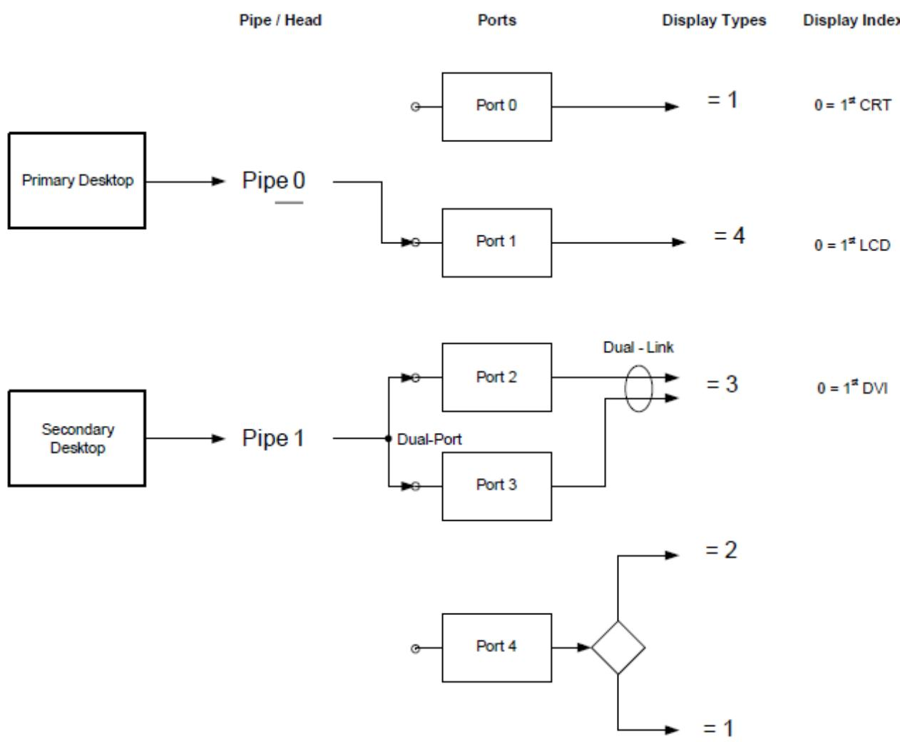

MinAddress, // QWordConstExpr (\_MIN) MaxAddress, // QWordConstExpr (\_MAX) AddressTranslation, // QWordConstExpr (\_TRA) AddressLength, // QWordConstExpr (\_LEN) ResourceSourceIndex, // Nothing | ByteConstExpr ResourceSource, // Nothing | StringData DescriptorName, // Nothing | NameString MemoryRangeType, // Nothing | AddressKeyword (\_MTP) TranslationType // Nothing | TypeKeyword (\_TTP)

## QWordSpaceTerm :=

## QWordSpace (

## RegisterTerm :=

## Register (

## SPISerialBusTerm :=

## SPISerialBusV2 (

```txt
ClockPolarity, // ClockPolarityKeyword (_POL)
ClockPhase, // ClockPhaseKeyword (_PHA)
ResourceSource, // StringData
ResourceSourceIndex, // Nothing | ByteConstExpr
ResourceUsage, // Nothing (ResourceConsumer)| ResourceTypeKeyword
DescriptorName, // Nothing | NameString
ShareType, // Nothing (Exclusive) | ShareTypeKeyword (_SHR)
VendorData // Nothing | RawDataBuffer (_VEN)
)

StartDependentFnNoPriTerm :=
StartDependentFnNoPri () {ResourceMacroList}

StartDependentFnTerm :=
StartDependentFn (
CompatPriority, // ByteConstExpr (0-2)
PerfRobustPriority // ByteConstExpr (0-2)
) {ResourceMacroList}

UARTSerialBusTerm :=
UARTSerialBusV2(
Initial BaudRate, // DWordConstExpr (_SPE)
BitsPerByte, // Nothing (DataBitsEight) | DataBitsKeyword (_LEN)
StopBits, // Nothing (StopBitsOne) | StopBitsKeyword (_STB)
LinesInUse, // ByteConstExpr (_LIN)
IsBigEndian, // Nothing (LittleEndian) | EndianessKeyword (_END)
Parity, // Nothing (ParityTypeNone) | ParityTypeKeyword (_PAR)
FlowControl, // Nothing (FlowControlNone) | FlowControlKeyword (_FLC)
ReceiveBufferSize, // WordConstExpr (_RXL)
TransmitBufferSize, // WordConstExpr (_TXL)
ResourceSource, // StringData
ResourceSourceIndex, // Nothing | ByteConstExpr
ResourceUsage, // Nothing (ResourceConsumer)| ResourceTypeKeyword
DescriptorName, // Nothing | NameString
ShareType, // Nothing (Exclusive) | ShareTypeKeyword (_SHR)
VendorData // Nothing | Object (_VEN)
)

VendorLongTerm :=
VendorLong (
DescriptorName // Nothing | NameString
) {ByteList}

VendorShortTerm :=
VendorShort (
DescriptorName // Nothing | NameString
) {ByteList} // Up to 7 bytes

WordBusNumberTerm :=
```

## WordBusNumber (

ResourceUsage, // Nothing (ResourceConsumer)| ResourceTypeKeyword

MinType, // Nothing (MinNotFixed) | MinKeyword (\_MIF)

MaxType, // Nothing (MaxNotFixed) | MaxKeyword (\_MAF)

Decode, // Nothing (PosDecode) | DecodeKeyword (\_DEC)

AddressGranularity, // WordConstExpr (\_GRA)

MinAddress, // WordConstExpr (\_MIN)

MaxAddress, // WordConstExpr (\_MAX)

AddressTranslation, // WordConstExpr (\_TRA)

AddressLength, // WordConstExpr (\_LEN)

ResourceSourceIndex, // Nothing | ByteConstExpr

ResourceSource, // Nothing | StringData

DescriptorName // Nothing | NameString

## WordIOTerm :=

## WordIO (

ResourceUsage, // Nothing (ResourceConsumer)| ResourceTypeKeyword

MinType, // Nothing (MinNotFixed) | MinKeyword (\_MIF)

MaxType, // Nothing (MaxNotFixed) | MaxKeyword (\_MAF)

Decode, // Nothing (PosDecode) | DecodeKeyword (\_DEC)

RangeType, // Nothing (EntireRange) | RangeTypeKeyword (\_RNG)

AddressGranularity, // WordConstExpr (\_GRA)

MinAddress, // WordConstExpr (\_MIN)

MaxAddress, // WordConstExpr (\_MAX)

AddressTranslation, // WordConstExpr (\_TRA)

AddressLength, // WordConstExpr (\_LEN)

ResourceSourceIndex, // Nothing | ByteConstExpr

ResourceSource, // Nothing | StringData

DescriptorName, // Nothing | NameString

TranslationType, // Nothing | TypeKeyword (\_TTP)

TranslationDensity // Nothing | TranslationKeyword (\_TRS)

## WordSpaceTerm :=

## WordSpace (

ResourceType, // ByteConstExpr (\_RT), 0xC0 - 0xFF

ResourceUsage, // Nothing (ResourceConsumer)| ResourceTypeKeyword

Decode, // Nothing (PosDecode) | DecodeKeyword (\_DEC)

MinType, // Nothing (MinNotFixed) | MinKeyword (\_MIF)

MaxType, // Nothing (MaxNotFixed) | MaxKeyword (\_MAF)

TypeSpecificFlags, // ByteConstExpr (\_TSF)

AddressGranularity, // WordConstExpr (\_GRA)

MinAddress, // WordConstExpr (\_MIN)

MaxAddress, // WordConstExpr (\_MAX)

AddressTranslation, // WordConstExpr (\_TRA)

AddressLength, // WordConstExpr (\_LEN)

ResourceSourceIndex, // Nothing | ByteConstExpr

```txt
ResourceSource, // Nothing | StringData
DescriptorName // Nothing | NameString
)
```

## 19.3 ASL Concepts

This reference section is for developers who are writing ASL code while developing definition blocks for platforms.

## 19.3.1 ASL Names

This section describes how to encode object names using ASL.

The following table lists the characters legal in any position in an ASL object name. ASL names are not case-sensitive and will be converted to upper case.

Table 19.2: Named Object Reference Encodings

<table><tr><td>Value</td><td>Description</td><td>Title</td></tr><tr><td>0x41-0x5A, 0x5F, 0x61-0x7A</td><td>Lead character of name (‘A’-‘Z’, ‘_’, ‘a’-‘z’)</td><td>LeadNameChar</td></tr><tr><td>0x30-0x39, 0x41-0x5A, 0x5F, 0x61-0x7A</td><td>Non-lead (trailing) character of name (‘A’-‘Z’, ‘_’, ‘a’-‘z’, ‘0’-‘9’)</td><td>NameChar</td></tr></table>

The following table lists the name modifiers that can be prefixed to an ASL name.

Table 19.3: Definition Block Name Modifier Encodings

<table><tr><td>Value</td><td>Description</td><td>NamePrefix :=</td><td>Follows by...</td></tr><tr><td>0x5C</td><td>Namespace root (‘’)</td><td>RootPrefix</td><td>Name</td></tr><tr><td>0x5E</td><td>Parent namespace (‘^’)</td><td>ParentPrefix</td><td>ParentPrefix or Name</td></tr></table>

## 19.3.1.1 \_T\_x Reserved Object Names

The ACPI specification reserves object names with the prefix \_T\_ for internal use by the ASL compiler. The ASL compiler may, for example, use these objects to store temporary values when implementing translation of complicated control structures into AML. The ASL compiler must declare \_T\_x objects normally (using Name) and must not define them more than once within the same scope.

## 19.3.2 ASL Literal Constants

This section describes how to encode integer and string constants using ASL.

## 19.3.2.1 Integers

```autohotkey
DigitChar := '0'-'9'
LeadDigitChar := '1'-'9'
OctalDigitChar := '0'-'7'
HexDigitChar := DigitChar \ | 'A'-'F' \ | 'a'-'f'

Integer := DecimalConst \ | OctalConst \ | HexConst
DecimalConst := LeadDigitChar \ | <decimalconst digitchar>
OctalConst := '0' \ | <octalconst octaldigitchar>
HexConst := <0x hexdigitchar> \ | <0x hexdigitchar> \ | <HexConst HexDigitChar>
ByteConst := Integer => 0x00-0xFF
WordConst := Integer => 0x0000-0xFFFF
DWordConst := Integer => 0x00000000-0xFFFFFFFF
QWordConst := Integer => 0x000000000000000-0xFFFFFFFF
```

Numeric constants can be specified in decimal, octal, or hexadecimal. Octal constants are preceded by a leading zero (0), and hexadecimal constants are preceded by a leading zero and either a lower or upper case ‘x’. In some cases, the grammar specifies that the number must evaluate to an integer within a limited range, such as 0x00-0xFF, and so on.

## 19.3.2.2 Strings

```autohotkey
String := ''' Utf8CharList ''''
Utf8CharList := Nothing | <escapesequence utf8charlist> | <Utf8Char Utf8CharList>
Utf8Char := 0x01-0x21 |
    0x23-0x5B |
    0x5D-0x7F |
    0xC2-0xDF 0x80-0xBF |
    0xE0 0xA0-0xBF 0x80-0xBF |
    0xE1-0xEC 0x80-0xBF 0x80-0xBF |
    0xED 0x80-0x9F 0x80-0xBF |
    0xEE-0xEF 0x80-0xBF 0x80-0xBF |
    0xF0 0x90-0xBF 0x80-0xBF 0x80-0xBF |
    0xF1-0xF3 0x80-0xBF 0x80-0xBF 0x80-0xBF |
    0xF4 0x80-0x8F 0x80-0xBF 0x80-0xBF
EscapeSeq := SimpleEscapeSeq | OctalEscapeSeq | HexEscapeSeq
SimpleEscapeSeq := '\ | \" | \a | \b | \f | \n | \r | \t | \v | \\
OctalEscapeSeq := \ OctalDigitChar |
    \ OctalDigitChar OctalDigitChar |
    \ OctalDigitChar OctalDigitChar OctalDigitChar
HexEscapeSeq := \x HexDigitChar |
    \x HexDigitChar HexDigitChar
NullChar := 0x00
```

String literals consist of zero or more ASCII characters surrounded by double quotation marks (“). A string literal represents a sequence of characters that, taken together, form a null-terminated string. After all adjacent strings in the constant have been concatenated, a null character is appended.

Strings in the source file may be encoded using the UTF-8 encoding scheme as defined in the Unicode 4.0 specification. UTF-8 is a byte-oriented encoding scheme, where some characters take a single byte and others take multiple bytes. The ASCII character values 0x01-0x7F take up exactly one byte.

However, only one operator currently supports UTF-8 strings: Unicode. Since string literals are defined to contain only non-null character values, both Hex and Octal escape sequence values must be non-null values in the ASCII range 0x0 through 0xFF. For arbitrary byte data (outside the range of ASCII values), the Bufer object should be used instead.

Since the backslash is used as the escape character and also the namespace root prefix, any string literals that are to contain a fully qualified namepath from the root of the namespace must use the double backslash to indicate this:

```txt
Name (_EJD, "\"\_SB.PCI0.DOCK1")
```

The double backslash is only required within quoted string literals.

Since double quotation marks are used close a string, a special escape sequence (") is used to allow quotation marks within strings. Other escape sequences are listed in the table below.

Table 19.4: ASL Escape Sequences

<table><tr><td>Escape Sequence</td><td>ASCII Character</td></tr><tr><td>\a</td><td>0x07 (BEL)</td></tr><tr><td>\b</td><td>0x08 (BS)</td></tr><tr><td>\f</td><td>0x0C (FF)</td></tr><tr><td>\n</td><td>0x0A (LF)</td></tr><tr><td>\r</td><td>0x0D (CR)</td></tr><tr><td>\t</td><td>0x09 (TAB)</td></tr><tr><td>\v</td><td>0x0B (VT)</td></tr><tr><td>\&quot;</td><td>0x22 (‘’)</td></tr><tr><td>\&#x27;</td><td>0x27 (‘)</td></tr><tr><td>\ \</td><td>0x5C ()</td></tr></table>

Since literal strings are read-only constants, the following ASL statement (for example) is not supported:

```autoit
Store ("ABC", "DEF")
```

However, the following sequence of statements is supported:

```txt
Name (STR, "DEF")
...
Store ("ABC", STR)
```

## 19.3.3 ASL Resource Templates

ASL includes some macros for creating resource descriptors. The ResourceTemplate macro creates a Bufer in which resource descriptor macros can be listed. The ResourceTemplate macro automatically generates an End descriptor and calculates the checksum for the resource template. The format for the ResourceTemplate macro is as follows:

```txt
ResourceTemplate ()
{
    // List of resource macros
}
```

The following is an example of how these macros can be used to create a resource template that can be returned from a \_PRS control method:

```txt
Name (PRS0, ResourceTemplate ()
{
```

(continues on next page)

(continued from previous page)

```txt
StartDependentFn (1, 1)
{
    IRQ (Level, ActiveLow, Shared) {10, 11}
    DMA (TypeF, NotBusMaster, Transfer16) {4}
    IO (Decode16, 0x1000, 0x2000, 0, 0x100)
    IO (Decode16, 0x5000, 0x6000, 0, 0x100, I01)
}

StartDependentFn (1, 1)
{
    IRQ (Level, ActiveLow, Shared) {}
    DMA (TypeF, NotBusMaster, Transfer16){5}
    IO (Decode16, 0x3000, 0x4000, 0, 0x100)
    IO (Decode16, 0x5000, 0x6000, 0, 0x100, I02)
}

EndDependentFn ()
})
```

Occasionally, it is necessary to change a parameter of a descriptor in an existing resource template at run-time (i.e., during a method execution.) To facilitate this, the descriptor macros optionally include a name declaration that can be used later to refer to the descriptor. When a name is declared with a descriptor, the ASL compiler will automatically create field names under the given name to refer to individual fields in the descriptor.

The ofset returned by a reference to a resource descriptor field name is either in units of bytes (for 8-, 16-, 32-, and 64-bit field widths) or in bits (for all other field widths). In all cases, the returned ofset is the integer ofset (in either bytes or bits) of the name from the first byte (ofset 0) of the parent resource template.

For example, given the above resource template, the following code changes the minimum and maximum addresses for the I/O descriptor named IO2:

```txt
CreateWordField (PRS0, IO2._MIN, IMIN)
Store (0xA000, IMIN)

CreateWordField (PRS0, IO2._MAX, IMAX)
Store (0xB000, IMAX)
```

The resource template macros for each of the resource descriptors are listed below, after the table that defines the resource descriptor. The resource template macros are formally defined in ASL Macros for Resource Descriptors

The reserved names (such as \_MIN and \_MAX) for the fields of each resource descriptor are defined in the appropriate table entry of the table that defines that resource descriptor.

## 19.3.4 ASL Macros

ASL compilers support built in macros to assist in various ASL coding operations. These macros do not have a corresponding AML opcode, but are instead fully processed by the compiler itself, and may result in the generation of AML opcodes for other ASL/AML operators. The following table lists some of the supported directives and an explanation of their function.

The ASL language provides a wide variety of data types and operators that manipulate data. It also provides mechanisms for both explicit and implicit conversion between the data types when used with ASL operators.

Each of the available ASL macros are described below.

EISAID (TextID)

Converts and compresses the 7-character text argument into its corresponding 4-byte numeric EISA ID encoding (Integer). This can be used when declaring IDs for devices that are EISA IDs.

The algorithm used to convert the TextID is as shown in the following example:

Starting with a seven character input string “PNP0303”, we want to create a DWordConst. This string contains a three character manufacturer code “PNP”, a three character hex product identifier “030”, and a one character revision identifier “3”.

The compressed manufacturer code is created as follows:

1) Find hex ASCII value for each letter

2) Subtract 40h from each ASCII value

3) Retain 5 least significant bits for each letter and discard remaining 0’s:

## Byte 0:

Bit 7: reserved (0)

Bit 6-2: 1st character of compressed mfg code “P”

Bit 1-0: Upper 2 bits of 2nd character of mfg code “N”

Byte 1:

Bit 7-5: Lower 3 bits of 2nd character of mfg code “N”

Bit 4-0: 3rd character of mfg code “P”

Byte 2:

Bit 7-4: 1st hex digit of product number “0”

Bit 3-0: 2nd hex digit of product number “3”

Byte 3:

Bit 7-4: 3rd hex digit of product number “0”

Bit 3-0: 4th hex digit of product number “3”

## For (Initialize, Predicate, Update) {TermList}

Implements a standard For() loop by converting the For() arguments and TermList into an AML While loop.

## Fprintf (Target, FormatString, FormatArgs)

Converts a format string to a series of string Concatenate operations and stores the result to a Named Object (Target).

## Printf (FormatString, FormatArgs)

Converts a format string to a series of string Concatenate operations and automatically stores the result to the Debug Object.

## ResourceTemplate ()

Used to supply Plug and Play resource descriptor information in human readable form, which is then translated into the appropriate binary Plug and Play resource descriptor encodings in a Resource Template Bufer object. For more information about resource descriptor encodings, (See: Resource Data Types for ACPI).

## ToPLD (PLDKeywordList)

Converts a PLD (Physical Location of Device) Keyword List into a \_PLD Bufer object.

## ToUUID (AsciiString)

Converts an ASCII UUID or GUID string to an encoded 128-bit Bufer object.

## Unicode (StringData)

Converts a standard ASCII string to a Unicode string returned in a Bufer object.

## 19.3.5 ASL Data Types

ASL provides a wide variety of data types and operators that manipulate data. It also provides mechanisms for both explicit and implicit conversion between the data types when used with ASL operators.

The table below describes each of the available ASL data types.

Table 19.5: Summary of ASL Data Types

<table><tr><td>ASL Data Type</td><td>Description</td></tr><tr><td>[Uninitialized]</td><td>No assigned type or value. This is the type of all control method LocalX variables and unused ArgX variables at the beginning of method execution, as well as all uninitialized Package elements. Uninitialized objects must be initialized (via Store or CopyObject) before they may be used as source operands in ASL expressions.</td></tr><tr><td>Buffer</td><td>An array of bytes. Uninitialized elements are zero by default.</td></tr><tr><td>Buffer Field</td><td>Portion of a buffer created using CreateBitField, CreateByteField, CreateWordField, CreateQWordField, CreateField, or returned by the Index operator.</td></tr><tr><td>Debug Object</td><td>Debug output object. Formats an object and prints it to the system debug port. Has no effect if debugging is not active.</td></tr><tr><td>Device</td><td>Device or bus object</td></tr><tr><td>Event</td><td>Event synchronization object</td></tr><tr><td>Field Unit (within an Operation Region)</td><td>Portion of an address space, bit-aligned and of one-bit granularity. Created using Field, BankField, or IndexField.</td></tr><tr><td>Integer</td><td>An n -bit little-endian unsigned integer. In ACPI 1.0 this was 32 bits. In ACPI 2.0 and later, this is 64 bits. The Integer (DWORD) designation indicates that only the lower 32 bits have meaning and the upper 32 bits of 64-bit integers must be zero (masking of upper bits is not required).</td></tr><tr><td>Integer Constant</td><td>Created by the ASL terms “Zero”, “One”, “Ones”, and “Revision”.</td></tr><tr><td>Method</td><td>Control Method (Executable AML function)</td></tr><tr><td>Mutex</td><td>Mutex synchronization object</td></tr><tr><td>Object Reference</td><td>Reference to an object created using the RefOf, Index, or CondRefOf operators</td></tr><tr><td>Operation Region</td><td>Operation Region (A region within an Address Space)</td></tr><tr><td>Package</td><td>Collection of ASL objects with a fixed number of elements (up to 255).</td></tr><tr><td>Power Resource</td><td>Power Resource description object</td></tr><tr><td>Processor</td><td>Processor description object</td></tr><tr><td>RawDataBuffer</td><td>An array of bytes. Uninitialized elements are zero by default. RawDataBuffer does not contain any AML encoding bytes, only the raw bytes.</td></tr><tr><td>String</td><td>Null-terminated ASCII string.</td></tr><tr><td>Thermal Zone</td><td>Thermal Zone description object</td></tr></table>

## ò Note

Compatibility Note: The ability to store and manipulate object references was introduced in ACPI 2.0. In ACPI 1.0 references could not be stored in variables, passed as parameters or returned from functions.

## 19.3.5.1 Data Type Conversion Overview

ASL provides two mechanisms to convert objects from one data type to another data type at run-time (during execution of the AML interpreter). The first mechanism, Explicit Data Type Conversion, allows the use of explicit ASL operators to convert an object to a diferent data type. The second mechanism, Implicit Data Type Conversion, is invoked by the AML interpreter when it is necessary to convert a data object to an expected data type before it is used or stored.

The following general rules apply to data type conversions:

• Input parameters are always subject to implicit data type conversion (also known as implicit source operand conversion) whenever the operand type does not match the expected input type.

• Output (target) parameters for all operators except the explicit data conversion operators are subject to implicit data type conversion (also known as implicit result object conversion) whenever the target is an existing named object or named field that is of a diferent type than the object to be stored.

• Output parameters for the explicit data conversion operators, as well as output parameters that refer to a method local or argument (LocalX or ArgX) are not subject to implicit type conversion.

Both of these mechanisms (explicit and implicit conversion) are described in detail in the sections that follow.

## 19.3.5.2 Explicit Data Type Conversions

The following ASL operators are provided to explicitly convert an object from one data type to another:

## ToBufer

Convert an Integer, String, or Bufer to an object of type Bufer

## ToDecimalString

Convert an Integer, String, or Bufer to an object of type String. The string contains the ASCII representation of the decimal value of the source operand.

## ToHexString

Convert an Integer, String, or Bufer to an object of type String. The string contains the ASCII representation of the hexadecimal value of the source operand.

## ToInteger

Convert an Integer, String, or Bufer to an object of type Integer.

## ToString

Copy directly and convert a Bufer to an object of type String.

The following ASL operator is provided to copy and transfer objects with an explicit result conversion of the type of the target to match the type of the source object:

## CopyObject

Explicitly store a copy of the operand object to the target name. No implicit type conversion is performed. (This operator is used to avoid the implicit conversion inherent in the ASL Store operator.)

## 19.3.5.3 Implicit Data Type Conversions

Automatic or Implicit type conversions can take place at two diferent times during the execution of an ASL operator. First, it may be necessary to convert one or more of the source operands to the data type(s) expected by the ASL operator. Second, the result of the operation may require conversion before it is stored into the destination. (Many of the ASL operators can store their result optionally into an object specified by the last parameter. In these operators, if the destination is specified, the action is exactly as if a Store operator had been used to place the result in the destination.)

Such data conversions are performed by an AML interpreter during execution of AML code and are known collectively as Implicit Operand Conversions. As described briefly above, there are two diferent types of implicit operand conversion:

1. Conversion of a source operand from a mismatched data type to the correct data type required by an ASL operator, called Implicit Source Conversion. This conversion occurs when a source operand must be converted to the operand type expected by the operator. Any or all of the source operands may be converted in this manner before the execution of the ASL operator can proceed.

2. Conversion of the result of an operation to the existing type of a target operand before it is stored into the target operand, called Implicit Result Conversion. This conversion occurs when the target is a fixed type such as a named object or a field. When storing to a method Local or Arg, no conversion is performed or required because these data types are of variable type (the store simply overwrites any existing object and the existing type).

The following ASL operator is provided to copy and transfer objects with an implicit result conversion to the existing type of the target object:

## Store

Store a copy of the operand object to the target name. Implicit result conversion is performed if the target name is of a fixed data type (see above). However, Stores to method locals and arguments do not perform implicit conversion and are therefore the same as using CopyObject.

## 19.3.5.4 Implicit Source Operand Conversion

During the execution of an ASL operator, each source operand is processed by the AML interpreter as follows:

• If the operand is of the type expected by the operator, no conversion is necessary.

• If the operand type is incorrect, attempt to convert it to the proper type.

• For the Concatenate operator and logical operators (LEqual, LGreater, LGreaterEqual, LLess, LLessEqual, and LNotEqual), the data type of the first operand dictates the required type of the second operand, and for Concatenate only, the type of the result object. (The second operator is implicitly converted, if necessary, to match the type of the first operand.)

• If conversion is impossible, abort the running control method and issue a fatal error.

An implicit source conversion will be attempted anytime a source operand contains a data type that is diferent that the type expected by the operator. For example:

```txt
Store ("5678", Local1)
Add (0x1234, Local1, BUF1)
```

In the Add statement above, Local1 contains a String object and must undergo conversion to an Integer object before the Add operation can proceed.

In some cases, the operator may take more than one type of operand (such as Integer and String). In this case, depending on the type of the operand, the highest priority conversion is applied. The table below describes the source operand conversions available. For example:

```csv
Store (Buffer (1) {}, Local0)
Name (ABCD, Buffer (10) {1, 2, 3, 4, 5, 6, 7, 8, 9, 0})
CreateDWordField (ABCD, 2, XYZ)
Name (MNOP, "1234")
Concatenate (XYZ, MNOP, Local0)
```

The Concatenate operator can take an Integer, Bufer or String for its first two parameters and the type of the first parameter determines how the second parameter will be converted. In this example, the first parameter is of type Bufer Field (from the CreateDWordField operator). What should it be converted to: Integer, Bufer or String? According to the table Object Conversion Rules the highest priority conversion is to Integer. Therefore, both of the following objects will be converted to Integers:

```asm
XYZ (0x05040302)
MNOP (0x31, 0x32, 0x33, 0x34)
```

And will then be joined together and the resulting type and value will be:

```txt
Buffer (0x02, 0x03, 0x04, 0x05, 0x31, 0x32, 0x33, 0x34)
```

## 19.3.5.5 Implicit Result Object Conversion

For all ASL operators that generate and store a result value (including the Store operator), the result object is processed and stored by the AML interpreter as follows:

• If the ASL operator is one of the explicit conversion operators (ToString, ToInteger, etc., and the CopyObject operator), no conversion is performed. (In other words, the result object is stored directly to the target and completely overwrites any existing object already stored at the target.)

• If the target is a method local or argument (LocalX or ArgX), no conversion is performed and the result is stored directly to the target.

• If the target is a fixed type such as a named object or field object, an attempt is made to convert the source to the existing target type before storing

• If conversion is impossible, abort the running control method and issue a fatal error.

An implicit result conversion can occur anytime the result of an operator is stored into an object that is of a fixed type. For example:

```asm
Name (BUF1, Buffer (10))
Add (0x1234, 0x789A, BUF1)
```

Since BUF1 is a named object of fixed type Bufer, the Integer result of the Add operation must be converted to a Bufer before it is stored into BUF1.

## 19.3.5.6 Data Types and Type Conversions

The following table lists the available ASL data types and the available data type conversions (if any) for each. The entry for each data type is fully cross-referenced, showing both the types to which the object may be converted as well as all other types that may be converted to the data type.

The allowable conversions apply to both explicit and implicit conversions.

Table 19.6: Data Types and Type Conversions

<table><tr><td>ASL Data Type</td><td>Can be implicitly or explicitly converted to these Data Types (In priority order)</td><td>Can be implicitly or explicitly converted from these Data Types</td></tr><tr><td>[Uninitialized]</td><td>None. Causes a fatal error when used as a source operand in any ASL statement.</td><td>Integer, String, Buffer, Package, Object Reference</td></tr><tr><td>Buffer</td><td>Integer, String, Debug Object</td><td>Integer, String</td></tr><tr><td>Buffer Field</td><td>Integer, Buffer, String, Debug Object</td><td>Integer, Buffer, String</td></tr><tr><td>Debug Object</td><td>None. Causes a fatal error when used as a source operand in any ASL statement.</td><td>Integer, String, Buffer, Package, Field Unit, Buffer Field</td></tr><tr><td>Device</td><td>None</td><td>None</td></tr><tr><td>Event</td><td>None</td><td>None</td></tr><tr><td>Field Unit (within an Operation Region)</td><td>Integer, Buffer, String, Debug Object</td><td>Integer, Buffer, String</td></tr><tr><td>Integer</td><td>Buffer, Buffer Field, Field Unit, String, Debug Object</td><td>Buffer, String</td></tr><tr><td>Integer Constant</td><td>Integer, Debug Object</td><td>None. Also, storing any object to a constant is a no-op, not an error.</td></tr><tr><td>Method</td><td>None</td><td>None</td></tr><tr><td>Mutex</td><td>None</td><td>None</td></tr><tr><td>Object Reference</td><td>None</td><td>None</td></tr><tr><td>Operation Region</td><td>None</td><td>None</td></tr><tr><td>Package</td><td>Debug Object</td><td>None</td></tr><tr><td>String</td><td>Integer, Buffer, Debug Object</td><td>Integer, Buffer</td></tr><tr><td>Power Resource</td><td>None</td><td>None</td></tr><tr><td>RawDataBuffer</td><td>None</td><td>None</td></tr><tr><td>Thermal Zone</td><td>None</td><td>None</td></tr></table>

## 19.3.5.7 Data Type Conversion Rules

The following table presents the detailed data conversion rules for each of the allowable data type conversions. These conversion rules are implemented by the AML Interpreter and apply to all conversion types – explicit conversions, implicit source conversions, and implicit result conversions.

Table 19.7: Object Conversion Rules

<table><tr><td>To convert from an object of this Data Type</td><td>To an object of this Data Type</td><td>This action is performed by the AML Interpreter</td></tr><tr><td>Buffer</td><td>Buffer Field</td><td>The contents of the buffer are copied to the Buffer Field. If the buffer is smaller than the size of the buffer field, it is zero extended. If the buffer is larger than the size of the buffer field, the upper bits are truncated. Compatibility Note: This conversion was first introduced in ACPI 2.0. The behavior in ACPI 1.0 was undefined.</td></tr><tr><td>Buffer</td><td>Debug Object</td><td>Each buffer byte is displayed as a hexadecimal integer, delimited by spaces and/or commas.</td></tr><tr><td>Buffer</td><td>Field Unit</td><td>The entire contents of the buffer are copied to the Field Unit. If the buffer is larger (in bits) than the size of the Field Unit, it is broken into pieces and completely written to the Field Unit, lower chunks first. If the buffer (or the last piece of the buffer, if broken up) is smaller than the size of the Field Unit, it is zero extended before being written.</td></tr></table>

continues on next page

Table 19.7 – continued from previous page

<table><tr><td>To convert from an object of this Data Type</td><td>To an object of this Data Type</td><td>This action is performed by the AML Interpreter</td></tr><tr><td>Buffer</td><td>Integer</td><td>If no integer object exists, a new integer is created. The contents of the buffer are copied to the Integer, starting with the least-significant bit and continuing until the buffer has been completely copied — up to the maximum number of bits in an Integer. The size of an Integer is indicated by the Definition Block table header&#x27;s Revision field. A Revision field value less than 2 indicates that the size of an Integer is 32 bits. A value greater than or equal to 2 signifies that the size of an Integer is 64 bits. If the buffer is smaller than the size of an integer, it is zero extended. If the buffer is larger than the size of an integer, it is truncated. Conversion of a zero-length buffer to an integer is not allowed.</td></tr><tr><td>Buffer</td><td>String</td><td>If no string object exists, a new string is created. If the string already exists, it is completely overwritten and truncated or extended to accommodate the converted buffer exactly. The entire contents of the buffer are converted to a string of two-character hexadecimal numbers, each separated by a space. A zero-length buffer will be converted to a null (zero-length) string.</td></tr><tr><td>Buffer Field</td><td>[See the Integer and Buffer Rules]</td><td>If the Buffer Field is smaller than or equal to the size of an Integer (in bits), it will be treated as an Integer. Otherwise, it will be treated as a buffer. The size of an Integer is indicated by the Definition Block table header&#x27;s Revision field. A Revision field value less than 2 indicates that the size of an Integer is 32 bits. A value greater than or equal to 2 signifies that the size of an Integer is 64 bits. (See the conversion rules for the Integer and Buffer data types.)</td></tr><tr><td>Field Unit</td><td>[See the Integer and Buffer Rules]</td><td>If the Field Unit is smaller than or equal to the size of an Integer (in bits), it will be treated as an Integer. If the Field Unit is larger than the size of an Integer, it will be treated as a Buffer. The size of an Integer is indicated by the Definition Block table header&#x27;s Revision field. A Revision field value less than 2 indicates that the size of an Integer is 32 bits. A value greater than or equal to 2 signifies that the size of an Integer is 64 bits. (See the conversion rules for the Integer and Buffer data types.)</td></tr><tr><td>Integer</td><td>Buffer</td><td>If no buffer object exists, a new buffer object is created based on the size of the integer (4 bytes for 32-bit integers and 8 bytes for 64-bit integers). If a buffer object already exists, the Integer overwrites the entire Buffer object. If the integer requires more bits than the size of the Buffer, then the integer is truncated before being copied to the Buffer. If the integer contains fewer bits than the size of the buffer, the Integer is zero-extended to fill the entire buffer.</td></tr><tr><td>Integer</td><td>Buffer Field</td><td>The Integer overwrites the entire Buffer Field. If the integer is smaller than the size of the buffer field, it is zero-extended. If the integer is larger than the size of the buffer field, the upper bits are truncated. Compatibility Note: This conversion was first introduced in ACPI 2.0. The behavior in ACPI 1.0 was undefined.</td></tr><tr><td>Integer</td><td>Debug Object</td><td>The integer is displayed as a hexadecimal value.</td></tr><tr><td>Integer</td><td>Field Unit</td><td>The Integer overwrites the entire Field Unit. If the integer is smaller than the size of the buffer field, it is zero-extended. If the integer is larger than the size of the buffer field, the upper bits are truncated.</td></tr></table>

continues on next page

Table 19.7 – continued from previous page

<table><tr><td>To convert from an object of this Data Type</td><td>To an object of this Data Type</td><td>This action is performed by the AML Interpreter</td></tr><tr><td>Integer</td><td>String</td><td>If no string object exists, a new string object is created based on the size of the integer (8 characters for 32-bit integers and 16 characters for 64-bit integers). If the string already exists, it is completely overwritten and truncated or extended to accommodate the converted integer exactly. In either case, the entire integer is converted to a string of hexadecimal ASCII characters.</td></tr><tr><td>Package</td><td>Package</td><td>If no package object exists, a new package object is created. If the package already exists, it is completely overwritten and truncated or extended to accommodate the source package exactly. Any and all existing valid (non-null) package elements of the target package are deleted, and the entire contents of the source package are copied into the target package.</td></tr><tr><td>Package</td><td>Debug Object</td><td>Each element of the package is displayed based on its type.</td></tr><tr><td>String</td><td>Buffer</td><td>If no buffer object exists, a new buffer object is created. If a buffer object already exists, it is completely overwritten. If the string is longer than the buffer, the string is truncated before copying. If the string is shorter than the buffer, the remaining buffer bytes are set to zero. In either case, the string is treated as a buffer, with each ASCII string character copied to one buffer byte, including the null terminator. A null (zero-length) string will be converted to a zero-length buffer.</td></tr><tr><td>String</td><td>Buffer Field</td><td>The string is treated as a buffer. If this buffer is smaller than the size of the buffer field, it is zero extended. If the buffer is larger than the size of the buffer field, the upper bits are truncated. Compatibility Note: This conversion was first introduced in ACPI 2.0. The behavior in ACPI 1.0 was undefined.</td></tr><tr><td>String</td><td>Debug Object</td><td>Each string character is displayed as an ASCII character.</td></tr><tr><td>String</td><td>Field Unit</td><td>Each character of the string is written, starting with the first, to the Field Unit. If the Field Unit is less than eight bits, then the upper bits of each character are lost. If the Field Unit is greater than eight bits, then the additional bits are zeroed.</td></tr><tr><td>String</td><td>Integer</td><td>If no integer object exists, a new integer is created. The integer is initialized to the value zero and the ASCII string is interpreted as a hexadecimal constant. Each string character is interpreted as a hexadecimal value (&#x27;0&#x27;-&#x27;9&#x27;, &#x27;A&#x27;-&#x27;F&#x27;, &#x27;a&#x27;-&#x27;f&#x27;), starting with the first character as the most significant digit, and ending with the first non-hexadecimal character, end-of-string, or when the size of an integer is reached (8 characters for 32-bit integers and 16 characters for 64-bit integers). Note: the first non-hex character terminates the conversion without error, and a &quot;0x&quot; prefix is not allowed. Conversion of a null (zero-length) string to an integer is not allowed.</td></tr></table>

## 19.3.5.8 Rules for Storing and Copying Objects

The table below lists the actions performed when storing objects to diferent types of named targets. ASL provides the following types of “store” operations:

• The Store operator is used to explicitly store an object to a location, with implicit conversion support of the source object.

• Many of the ASL operators can store their result optionally into an object specified by the last parameter. In these operators, if the destination is specified, the action is exactly as if a Store operator had been used to place the result in the destination.

• The CopyObject operator is used to explicitly store a copy of an object to a location, with no implicit conversion support.

Table 19.8: Object Storing and Copying Rules

<table><tr><td>When Storing an object of any datatype to this type ofTarget location</td><td>This action is performed by the Store operator or any ASL operator with a Target operand</td><td>This action is performed by the CopyObject operator</td></tr><tr><td>Method ArgX variable</td><td>The object is copied to the destination with no conversion applied, with one exception. If the ArgX contains an Object Reference, an automatic de-reference occurs and the object is copied to the target of the Object Reference instead of overwriting the contents of ArgX.</td><td>The object is copied to the destination with no conversion applied, with one exception. If the ArgX contains an Object Reference, an automatic de-reference occurs and the object is copied to the target of the Object Reference instead of overwriting the contents of ArgX.</td></tr><tr><td>Method LocalXvariable</td><td>The object is copied to the destination with no conversion applied. Even if LocalX contains an Object Reference, it is overwritten.</td><td>The object is copied to the destination with no conversion applied. Even if LocalX contains an Object Reference, it is overwritten.</td></tr><tr><td>Field Unit or BufferField</td><td>The object is copied to the destination after implicit result conversion is applied.</td><td>Fields permanently retain their type and cannot be changed. Therefore, CopyObject can only be used to copy an object of type Integer or Buffer to fields.</td></tr><tr><td>Named data object</td><td>The object is copied to the destination after implicit result conversion is applied to match the existing type of the named location.</td><td>The object and type are copied to the named location.</td></tr></table>

## 19.3.5.8.1 ArgX Objects

1. Read from ArgX parameters

• ObjectReference - Automatic dereference, return the target of the reference. Use of DerefOf returns the same.

• Bufer - Return the Bufer. Can create an Index, Field, or Reference to the bufer.

• Package - Return the Package. Can create an Index or Reference to the package.

• All other object types - Return the object.

Example method invocation for the table below:

MTHD (RefOf (Obj), Buf, Pkg, Obj)

Table 19.9: Reading from ArgX Objects

<table><tr><td>Parameter</td><td>MTHD ArgX Type</td><td>Read operation on ArgX</td><td>Result of read</td></tr><tr><td>RefOf (Obj),</td><td>Reference to object Obj</td><td>Store (Arg0, ...)</td><td>Obj</td></tr><tr><td>&quot;</td><td>&quot;</td><td>CopyObject (Arg0, ...)</td><td>Obj</td></tr><tr><td>&quot;</td><td>&quot;</td><td>DerefOf (Arg0)</td><td>Obj</td></tr><tr><td>Buf,</td><td>Buffer</td><td>Store (Arg1, ..)</td><td>Buf</td></tr><tr><td>&quot;</td><td>&quot;</td><td>CopyObject (Arg1, ...)</td><td>Buf</td></tr><tr><td>&quot;</td><td>&quot;</td><td>Index (Arg1, ...)</td><td>Index (Buf)</td></tr><tr><td>&quot;</td><td>&quot;</td><td>Field (Arg1, ...)</td><td>Field (Buf)</td></tr><tr><td>Pkg</td><td>Package</td><td>Store (Arg2, ...)</td><td>Pkg</td></tr><tr><td>&quot;</td><td>&quot;</td><td>CopyObject (Arg2, ...)</td><td>Pkg</td></tr><tr><td>&quot;</td><td>&quot;</td><td>Index (Arg2, ...)</td><td>Index (Pkg)</td></tr><tr><td>Obj</td><td>All other object types</td><td>Store (Arg3, ...)</td><td>Obj</td></tr><tr><td>&quot;</td><td>&quot;</td><td>CopyObject (Arg3, ...)</td><td>Obj</td></tr></table>

2. Store to ArgX parameters

• ObjectReference objects - Automatic dereference, copy the object and overwrite the final target.

• All other object types - Copy the object and overwrite the ArgX variable. (Direct writes to bufer or package ArgX parameters will also simply overwrite ArgX)

Table 19.10: Writing to ArgX Objects

<table><tr><td>Current type ofArgX</td><td>Object to be written</td><td>Write operation on ArgX</td><td>Result of write (in ArgX)</td></tr><tr><td>RefOf (OldObj)</td><td>Obj (any type)</td><td>Store (..., ArgX)</td><td>RefOf (copy of Obj)</td></tr><tr><td>&quot;</td><td>&quot;</td><td>CopyObject (..., ArgX)</td><td>RefOf (copy of Obj)</td></tr><tr><td>All other object types</td><td>Obj (Any type)</td><td>Store (..., ArgX)</td><td>Copy of Obj</td></tr><tr><td>&quot;</td><td>&quot;</td><td>CopyObject (..., ArgX)</td><td>Copy of Obj</td></tr></table>

<table><tr><td>i Note</td></tr><tr><td>RefOf (ArgX) returns a reference to ArgX.</td></tr></table>

## 19.3.5.8.2 LocalX Objects

1. Read from LocalX variables

• ObjectReference - If performing a DerefOf return the target of the reference. Otherwise, return the reference.

• All other object types - Return a the object

Table 19.11: Reading from LocalX Objects

<table><tr><td>Current LocalX Type</td><td>Read operation on LocalX</td><td>Result of read</td></tr><tr><td>RefOf (Obj)</td><td>Store (LocalX, ...)</td><td>RefOf (Obj)</td></tr><tr><td>&quot;</td><td>CopyObject (LocalX, ...)</td><td>RefOf (Obj)</td></tr><tr><td>&quot;</td><td>DerefOf (LocalX)</td><td>Obj</td></tr><tr><td>Obj (All other types)</td><td>Store (LocalX, ...)</td><td>Obj</td></tr></table>

continues on next page

Table 19.11 – continued from previous page

<table><tr><td>Current LocalX Type</td><td>Read operation on LocalX</td><td>Result of read</td></tr><tr><td>&quot;</td><td>CopyObject (LocalX, ...)</td><td>Obj</td></tr></table>

2. Store to LocalX variables

• All object types - Delete any existing object in LocalX first, then store a copy of the object.

Table 19.12: Writing to LocalX Objects

<table><tr><td>Current Type</td><td>LocalX-</td><td>Object to be written</td><td>Write operation on LocalX</td><td>Result of write (in LocalX)</td></tr><tr><td colspan="2">All object types</td><td>Obj (any type)</td><td>Store (... , LocalX)</td><td>Copy of Obj</td></tr><tr><td colspan="2">&quot;</td><td>&quot;</td><td>CopyObject (... , LocalX)</td><td>Copy of Obj</td></tr></table>

## 19.3.5.8.3 Named Objects

1. Read from Named object

• ObjectReference - If performing a DerefOf return the target of the reference. Otherwise, return the reference.

• All other object types - Return the object

Table 19.13: Reading from Named Objects

<table><tr><td>Current NAME Type</td><td>Read operation on NAME</td><td>Result of read</td></tr><tr><td>RefOf (Obj)</td><td>Store (NAME, ...)</td><td>RefOf (Obj)</td></tr><tr><td>&quot;</td><td>CopyObject (NAME, ...))</td><td>RefOf (Obj)</td></tr><tr><td>&quot;</td><td>DerefOf (NAME)</td><td>Obj</td></tr><tr><td>Obj (All other types)</td><td>Store (NAME, ...)</td><td>Obj</td></tr><tr><td>&quot;</td><td>CopyObject (NAME, ...)</td><td>Obj</td></tr></table>

2. Store to Named object

• All object types - Delete any existing object in NAME first, then store a copy of the object. The Store operator will perform an implicit conversion to the existing type in NAME. CopyObject does not perform an implicit store.

Table 19.14: Writing to Named Objects

<table><tr><td>Current Type</td><td>NAME</td><td>Object to be written</td><td>Write operation on NAME</td><td>Result of write (in NAME)</td></tr><tr><td colspan="2">Any (Any Type)</td><td>Obj (Any type)</td><td>Store (... , NAME)</td><td>Copy of Obj (converted to match existing type of NAME)</td></tr><tr><td colspan="2">&quot;</td><td>&quot;</td><td>CopyObject (... , NAME)</td><td>Copy of Obj (No conversion)</td></tr></table>

## 19.4 ASL Operators Summary

Table 19.15: ASL Operators Summary List

<table><tr><td>Operator Name</td><td>Description</td></tr><tr><td>AccessAs</td><td>Change Field Access</td></tr><tr><td>Acquire</td><td>Acquire a mutex</td></tr><tr><td>Add</td><td>Integer Add</td></tr><tr><td>Alias</td><td>Define a name alias</td></tr><tr><td>And</td><td>Integer Bitwise And</td></tr><tr><td>ArgX</td><td>Method argument data objects</td></tr><tr><td>BankField</td><td>Declare fields in a banked configuration object</td></tr><tr><td>Break</td><td>Continue following the innermost enclosing While</td></tr><tr><td>BreakPoint</td><td>Used for debugging, stops execution in the debugger</td></tr><tr><td>Buffer</td><td>Declare Buffer object</td></tr><tr><td>Case</td><td>Expression for conditional execution</td></tr><tr><td>Concatenate</td><td>Concatenate two strings, integers or buffers</td></tr><tr><td>ConcatenateResTemplate</td><td>Concatenate two resource templates</td></tr><tr><td>CondRefOf</td><td>Conditional reference to an object</td></tr><tr><td>Connection</td><td>Declare Field Connection Attributes</td></tr><tr><td>Continue</td><td>Continue innermost enclosing While loop</td></tr><tr><td>CopyObject</td><td>Copy and existing object</td></tr><tr><td>CreateBitField</td><td>Declare a bit field object of a buffer object</td></tr><tr><td>CreateByteField</td><td>Declare a byte field object of a buffer object</td></tr><tr><td>CreateDWordField</td><td>Declare a DWord field object of a buffer object</td></tr><tr><td>CreateField</td><td>Declare an arbitrary length bit field of a buffer object</td></tr><tr><td>CreateQWordField</td><td>Declare a QWord field object of a buffer object</td></tr><tr><td>CreateWordField</td><td>Declare a Word field object of a buffer object</td></tr><tr><td>DataTableRegion</td><td>Declare a Data Table Region</td></tr><tr><td>Debug</td><td>Debugger output</td></tr><tr><td>Decrement</td><td>Decrement an Integer</td></tr><tr><td>Default</td><td>Default execution path in Switch()</td></tr><tr><td>DefinitionBlock</td><td>Declare a Definition Block</td></tr><tr><td>DerefOf</td><td>Dereference an object reference</td></tr><tr><td>Device</td><td>Declare a bus/device object</td></tr><tr><td>Divide</td><td>Integer Divide</td></tr><tr><td>DMA</td><td>DMA Resource Descriptor macro</td></tr><tr><td>DWordIO</td><td>DWord IO Resource Descriptor macro</td></tr><tr><td>DWordMemory</td><td>DWord Memory Resource Descriptor macro</td></tr><tr><td>DWordSpace</td><td>DWord Space Resource Descriptor macro</td></tr><tr><td>EisaId</td><td>EISA ID String to Integer conversion macro</td></tr><tr><td>Else</td><td>Alternate conditional execution</td></tr><tr><td>ElseIf</td><td>Conditional execution</td></tr><tr><td>EndDependentFn</td><td>End Dependent Function</td></tr><tr><td>Event</td><td>Resource Descriptor macro</td></tr><tr><td>ExtendedIO</td><td>Declare an event synchronization object</td></tr><tr><td>ExtendedMemory</td><td>Extended IO Resource Descriptor macro</td></tr><tr><td>ExtendedSpace</td><td>Extended Space Resource Descriptor macro</td></tr><tr><td>External</td><td>Declare external objects</td></tr></table>

continues on next page

Table 19.15 – continued from previous page

<table><tr><td>Operator Name</td><td>Description</td></tr><tr><td>Fatal</td><td>Fatal error check</td></tr><tr><td>Field</td><td>Declare fields of an operation region object</td></tr><tr><td>FindSetLeftBit</td><td>Index of first least significant bit set</td></tr><tr><td>FindSetRightBit</td><td>Index of first most significant bit set</td></tr><tr><td>FixedDMA</td><td>Fixed DMA Resource Descriptor macro</td></tr><tr><td>FixedIO</td><td>Fixed I/O Resource Descriptor macro</td></tr><tr><td>Fprintf</td><td>Stores formatted string to a Named Object</td></tr><tr><td>FromBCD</td><td>Convert from BCD to numeric</td></tr><tr><td>Function</td><td>Declare control method</td></tr><tr><td>GpioInt</td><td>GPIO Interrupt Connection Resource Descriptor macro</td></tr><tr><td>GpioIo</td><td>GPIO I0 Connection Resource Descriptor macro</td></tr><tr><td>I2CSerialBusV2</td><td>I2C Serialbus Connection Resource Descriptor (Version 2) macro</td></tr><tr><td>If</td><td>Conditional execution</td></tr><tr><td>Include</td><td>Include another ASL file</td></tr><tr><td>Increment</td><td>Increment a Integer</td></tr><tr><td>Index</td><td>Indexed Reference to member object</td></tr><tr><td>IndexField</td><td>Declare Index/Data Fields</td></tr><tr><td>Interrupt</td><td>Interrupt Resource Descriptor macro</td></tr><tr><td>IO</td><td>IO Resource Descriptor macro</td></tr><tr><td>IRQ</td><td>Interrupt Resource Descriptor macro</td></tr><tr><td>IRQNoFlags</td><td>Short Interrupt Resource Descriptor macro</td></tr><tr><td>LAnd</td><td>Logical And</td></tr><tr><td>LEqual</td><td>Logical Equal</td></tr><tr><td>LGreater</td><td>Logical Greater</td></tr><tr><td>LGreaterEqual</td><td>Logical Not less</td></tr><tr><td>LLess</td><td>Logical Less</td></tr><tr><td>LLessEqual</td><td>Logical Not greater</td></tr><tr><td>LNot</td><td>Logical Not</td></tr><tr><td>LNotEqual</td><td>Logical Not equal</td></tr><tr><td>Load</td><td>Load differentiating definition block</td></tr><tr><td>LoadTable</td><td>Load Table from RSDT/XSDT</td></tr><tr><td>LocalX</td><td>Method local data objects</td></tr><tr><td>LOr</td><td>Logical Or</td></tr><tr><td>Match</td><td>Search for match in package array</td></tr><tr><td>Memory24</td><td>Memory Resource Descriptor macro</td></tr><tr><td>Memory32</td><td>Memory Resource Descriptor macro</td></tr><tr><td>Memory32Fixed</td><td>Memory Resource Descriptor macro</td></tr><tr><td>Method</td><td>Declare a control method</td></tr><tr><td>Mid</td><td>Return a portion of buffer or string</td></tr><tr><td>Mod</td><td>Integer Modulo</td></tr><tr><td>Multiply</td><td>Integer Multiply</td></tr><tr><td>Mutex</td><td>Declare a mutex synchronization object</td></tr><tr><td>Name</td><td>Declare a Named object</td></tr><tr><td>NAnd</td><td>Integer Bitwise Nand</td></tr><tr><td>NoOp</td><td>No operation</td></tr><tr><td>NOr</td><td>Integer Bitwise Nor</td></tr><tr><td>Not</td><td>Integer Bitwise Not</td></tr><tr><td>Notify</td><td>Notify Object of event</td></tr><tr><td>ObjectType</td><td>Type of object</td></tr><tr><td>Offset</td><td>Set Field Offset within operation range</td></tr></table>

continues on next page

Table 19.15 – continued from previous page

<table><tr><td>Operator Name</td><td>Description</td></tr><tr><td>One</td><td>Constant One Object (1)</td></tr><tr><td>Ones</td><td>Constant Ones Object (-1)</td></tr><tr><td>OperationRegion</td><td>Declare an operational region</td></tr><tr><td>Or</td><td>Integer Bitwise Or</td></tr><tr><td>Package</td><td>Declare a package object</td></tr><tr><td>PowerResource</td><td>Declare a power resource object</td></tr><tr><td>Printf</td><td>Stores formatted string to Debug Object</td></tr><tr><td>Processor</td><td>Declare a processor package</td></tr><tr><td>QWordIO</td><td>QWord IO Resource Descriptor macro</td></tr><tr><td>QWordMemory</td><td>QWord Memory Resource Descriptor macro</td></tr><tr><td>QWordSpace</td><td>QWord Space Resource Descriptor macro</td></tr><tr><td>RawDataBuffer</td><td>Declare a RawDataBuffer</td></tr><tr><td>RefOf</td><td>Create Reference to an object</td></tr><tr><td>Register</td><td>Generic register Resource Descriptor macro</td></tr><tr><td>Release</td><td>Release a synchronization object</td></tr><tr><td>Reset</td><td>Reset a synchronization object</td></tr><tr><td>ResourceTemplate</td><td>Resource to buffer conversion macro</td></tr><tr><td>Return</td><td>Return from method execution</td></tr><tr><td>Revision</td><td>Constant revision object</td></tr><tr><td>Scope</td><td>Open named scope</td></tr><tr><td>ShiftLeft</td><td>Integer shift value left</td></tr><tr><td>ShiftRight</td><td>Integer shift value right</td></tr><tr><td>Signal</td><td>Signal a synchronization object</td></tr><tr><td>SizeOf</td><td>Get the size of a buffer, string, or package</td></tr><tr><td>Sleep</td><td>Sleep n milliseconds (yields the processor)</td></tr><tr><td>SPISerialbusV2</td><td>SPI Serialbus Connection Resource Descriptor (Version 2) macro</td></tr><tr><td>Stall</td><td>Delay n microseconds (does not yield the processor)</td></tr><tr><td>StartDependentFn</td><td>Start Dependent Function Resource Descriptor macro</td></tr><tr><td>StartDependentFnNoPri</td><td>Start Dependent Function Resource Descriptor macro</td></tr><tr><td>Store</td><td>Store object Integer</td></tr><tr><td>Subtract</td><td>Subtract</td></tr><tr><td>Switch</td><td>Select code to execute based on expression value</td></tr><tr><td>ThermalZone</td><td>Declare a thermal zone package.</td></tr><tr><td>Timer</td><td>Get 64-bit timer value</td></tr><tr><td>ToBCD</td><td>Convert Integer to BCD</td></tr><tr><td>ToBuffer</td><td>Convert data type to buffer</td></tr><tr><td>ToDecimalString</td><td>Convert data type to decimal string</td></tr><tr><td>ToHexString</td><td>Convert data type to hexadecimal string</td></tr><tr><td>ToInteger</td><td>Convert data type to integer</td></tr><tr><td>ToPLD</td><td>Converts a PLD Keyword List into a _PLD buffer</td></tr><tr><td>ToString</td><td>Copy ASCII string from buffer</td></tr><tr><td>ToUUID</td><td>Convert ASCII string to UUID</td></tr><tr><td>Unicode</td><td>String to Unicode conversion macro</td></tr><tr><td>UARTSerialBusV2</td><td>UART SerialBus Connection Resource Descriptor (version2) macro</td></tr><tr><td>VendorLong</td><td>Vendor Resource Descriptor</td></tr><tr><td>VendorShort</td><td>Vendor Resource Descriptor</td></tr><tr><td>Wait</td><td>Wait on an Event</td></tr><tr><td>While</td><td>Conditional loop</td></tr><tr><td>WordBusNumber</td><td>Word Bus number Resource Descriptor macro</td></tr><tr><td>WordIO</td><td>Word IO Resource Descriptor macro</td></tr></table>

continues on next page

Table 19.15 – continued from previous page

<table><tr><td>Operator Name</td><td>Description</td></tr><tr><td>WordSpace</td><td>Word Space Resource Descriptor macro</td></tr><tr><td>Xor</td><td>Integer Bitwise Xor</td></tr><tr><td>Zero</td><td>Constant Zero object 0</td></tr></table>

## 19.5 ASL Operator Summary by Type

Table 19.16: ASL compiler controls

<table><tr><td>Operator Name</td><td>Description</td></tr><tr><td>External</td><td>Declare external objects</td></tr><tr><td>Include</td><td>Include another ASL file</td></tr></table>

Table 19.17: ACPI table management

<table><tr><td>Operator Name</td><td>Description</td></tr><tr><td>DefinitionBlock</td><td>Load definition block</td></tr><tr><td>Declare a Definition Block</td><td>LoadTable</td></tr><tr><td>Load</td><td>Load Table from RSDT/XSDT</td></tr></table>

Table 19.18: Miscellaneous named object creation

<table><tr><td>Operator Name</td><td>Description</td></tr><tr><td>Alias</td><td>Define a name alias</td></tr><tr><td>Buffer</td><td>Declare Buffer object</td></tr><tr><td>Device</td><td>Declare a bus/device object</td></tr><tr><td>Function</td><td>Declare a control method</td></tr><tr><td>Method</td><td>Declare a control method</td></tr><tr><td>Name</td><td>Declare a Named object</td></tr><tr><td>Package</td><td>Declare a package object</td></tr><tr><td>PowerResource</td><td>Declare a power resource object</td></tr><tr><td>Processor</td><td>Declare a processor package</td></tr><tr><td>RawDataBuffer</td><td>Declare a RawDataBuffer</td></tr><tr><td>Scope</td><td>Open named scope</td></tr><tr><td>ThermalZone</td><td>Declare a thermal zone package</td></tr></table>

Table 19.19: Operation Regions and Fields

<table><tr><td>Operator Name</td><td>Description</td></tr><tr><td>AccessAs</td><td>Change Field Access</td></tr><tr><td>BankField</td><td>Declare fields in a banked configuration object</td></tr><tr><td>Connection</td><td>Declare Field Connection Attributes</td></tr><tr><td>DataTableRegion</td><td>Declare a Data Table Region</td></tr><tr><td>Field</td><td>Declare fields of an operation region object</td></tr><tr><td>IndexField</td><td>Declare Index/Data Fields</td></tr></table>

continues on next page

Table 19.19 – continued from previous page

<table><tr><td>Operator Name</td><td>Description</td></tr><tr><td>Offset</td><td>Set Field offset within operation region</td></tr><tr><td>OperationRegion</td><td>Declare an operational region</td></tr></table>

Table 19.20: Bufer Fields

<table><tr><td>Operator Name</td><td>Description</td></tr><tr><td>CreateBitField</td><td>Declare a bit field object of a buffer object</td></tr><tr><td>CreateByteField</td><td>Declare a byte field object of a buffer object</td></tr><tr><td>CreateDWordField</td><td>Declare a DWord field object of a buffer object</td></tr><tr><td>CreateField</td><td>Declare an arbitrary length bit field of a buffer object</td></tr><tr><td>CreateQWordField</td><td>Declare a QWord field object of a buffer object</td></tr><tr><td>CreateWordField</td><td>Declare a Word field object of a buffer object</td></tr></table>

Table 19.21: Synchronization

<table><tr><td>Operator Name</td><td>Description</td></tr><tr><td>Acquire</td><td>Acquire a mutex</td></tr><tr><td>Event</td><td>Declare an event synchronization object</td></tr><tr><td>Mutex</td><td>Declare a mutex synchronization object</td></tr><tr><td>Notify</td><td>Notify Object of event</td></tr><tr><td>Release</td><td>Release a synchronization object</td></tr><tr><td>Reset</td><td>Reset a synchronization object</td></tr><tr><td>Signal</td><td>Signal a synchronization object</td></tr><tr><td>Wait</td><td>Wait on an Event</td></tr></table>

Table 19.22: Object references

<table><tr><td>Operator Name</td><td>Description</td></tr><tr><td>CondRefOf</td><td>Conditional reference to an object</td></tr><tr><td>DerefOf</td><td>Dereference an object reference</td></tr><tr><td>RefOf</td><td>Create Reference to an object</td></tr></table>

Table 19.23: Integer arithmetic

<table><tr><td>Operator Name</td><td>Description</td></tr><tr><td>Add</td><td>Integer Add</td></tr><tr><td>And</td><td>Integer Bitwise And</td></tr><tr><td>Decrement</td><td>Decrement an Integer</td></tr><tr><td>Divide</td><td>Integer Divide</td></tr><tr><td>FindSetLeftBit</td><td>Index of first least significant bit set</td></tr><tr><td>FindSetRightBit</td><td>Index of first most significant bit set</td></tr><tr><td>Increment</td><td>Increment a Integer</td></tr><tr><td>Mod</td><td>Integer Modulo</td></tr><tr><td>Multiply</td><td>Integer Multiply</td></tr><tr><td>NAnd</td><td>Integer Bitwise Nand</td></tr><tr><td>NOr</td><td>Integer Bitwise Nor</td></tr></table>

continues on next page

Table 19.23 – continued from previous page

<table><tr><td>Operator Name</td><td>Description</td></tr><tr><td>Not</td><td>Integer Bitwise Not</td></tr><tr><td>Or</td><td>Integer Bitwise Or</td></tr><tr><td>ShiftLeft</td><td>Integer shift value left</td></tr><tr><td>ShiftRight</td><td>Integer shift value right I</td></tr><tr><td>Subtract</td><td>Integer Subtract</td></tr><tr><td>Xor</td><td>Integer Bitwise Xor</td></tr></table>

Table 19.24: Logical operators

<table><tr><td>Operator Name</td><td>Description</td></tr><tr><td>LAnd</td><td>Logical And</td></tr><tr><td>LEqual</td><td>Logical Equal</td></tr><tr><td>LGreater</td><td>Logical Greater</td></tr><tr><td>LGreaterEqual</td><td>Logical Not less</td></tr><tr><td>LLess</td><td>Logical Less</td></tr><tr><td>LLessEqual</td><td>Logical Not greater</td></tr><tr><td>LNot</td><td>Logical Not</td></tr><tr><td>LNotEqual</td><td>Logical Not equal</td></tr><tr><td>LOr</td><td>Logical Or</td></tr></table>

Table 19.25: Method execution control

<table><tr><td>Operator Name</td><td>Description</td></tr><tr><td>Break</td><td>Continue following the innermost enclosing While</td></tr><tr><td>BreakPoint</td><td>Used for debugging, stops execution in the debugger</td></tr><tr><td>Case</td><td>Expression for conditional execution</td></tr><tr><td>Continue</td><td>Continue innermost enclosing While loop</td></tr><tr><td>Default</td><td>Default execution path in Switch()</td></tr><tr><td>Else</td><td>Alternate conditional execution</td></tr><tr><td>ElseIf</td><td>Conditional execution</td></tr><tr><td>Fatal</td><td>Fatal error check</td></tr><tr><td>If</td><td>Conditional execution</td></tr><tr><td>NoOp</td><td>No operation</td></tr><tr><td>Return</td><td>Return from method execution</td></tr><tr><td>Sleep</td><td>Sleep in milliseconds (yields the processor)</td></tr><tr><td>Stall</td><td>Delay in microseconds (does not yield the processor)</td></tr><tr><td>Switch</td><td>Select code to execute based on expression value</td></tr><tr><td>While</td><td>Conditional loop</td></tr></table>

Table 19.26: Data type conversion and manipulation

<table><tr><td>Operator Name</td><td>Description</td></tr><tr><td>Concatenate</td><td>Concatenate two strings,integers or buffers</td></tr><tr><td>CopyObject</td><td>Copy and existing object</td></tr><tr><td>Debug</td><td>Debugger output</td></tr><tr><td>EisaId</td><td>EISA ID String to Integer conversion macro</td></tr><tr><td>Fprintf</td><td>Stores formatted string to a Named Object</td></tr></table>

continues on next page

Table 19.26 – continued from previous page

<table><tr><td>Operator Name</td><td>Description</td></tr><tr><td>FromBCD</td><td>Convert from BCD to numeric</td></tr><tr><td>Index</td><td>Indexed Reference to member object</td></tr><tr><td>Match</td><td>Search for match in package array</td></tr><tr><td>Mid</td><td>Return a portion of buffer or string</td></tr><tr><td>ObjectType</td><td>Type of object</td></tr><tr><td>Printf</td><td>Stores formatted string to Debug Object</td></tr><tr><td>SizeOf</td><td>Get the size of a buffer, string, or package</td></tr><tr><td>Store</td><td>Store object</td></tr><tr><td>Timer</td><td>Get 64-bit timer value</td></tr><tr><td>ToBCD</td><td>Convert Integer to BCD</td></tr><tr><td>ToBuffer</td><td>Convert data type to buffer</td></tr><tr><td>ToDecimalString</td><td>Convert data type to decimal string</td></tr><tr><td>ToHexString</td><td>Convert data type to hexadecimal string</td></tr><tr><td>ToInteger</td><td>Convert data type to integer</td></tr><tr><td>ToPLD</td><td>Converts a PLD Keyword List into a _PLD buffer</td></tr><tr><td>ToString</td><td>Copy ASCII string from buffer</td></tr><tr><td>ToUUID</td><td>Convert ASCII string to UUID</td></tr><tr><td>Unicode</td><td>String to Unicode conversion macro</td></tr></table>

Table 19.27: Resource Descriptor macros

<table><tr><td>Operator Name</td><td>Description</td></tr><tr><td>ConcatenateResTemplate</td><td>Concatenate two resource templates</td></tr><tr><td>DMA</td><td>DMA Resource Descriptor macro</td></tr><tr><td>DWordIO</td><td>DWord IO Resource Descriptor macro</td></tr><tr><td>DWordMemory</td><td>DWord Memory Resource Descriptor macro</td></tr><tr><td>DWordSpace</td><td>DWord Space Resource Descriptor macro</td></tr><tr><td>EndDependentFn</td><td>End Dependent Function Resource Descriptor macro</td></tr><tr><td>ExtendedIO</td><td>Extended I/O Resource Descriptor macro</td></tr><tr><td>ExtendedMemory</td><td>Extended Memory Resource Descriptor macro</td></tr><tr><td>ExtendedSpace</td><td>Extended Space Resource Descriptor macro</td></tr><tr><td>FixedDMA</td><td>Fixed DMA resource Descriptor macro</td></tr><tr><td>FixedIO</td><td>Fixed I/O Resource Descriptor macro</td></tr><tr><td>GpioInt</td><td>GPIO Interrupt Connection Resource Descriptor macro</td></tr><tr><td>GpioIO</td><td>GPIO IO Connection Resource Descriptor macro</td></tr><tr><td>I2CSerialBusV2</td><td>I2C SerialBus Connection Resource Descriptor (Version 2) macro</td></tr><tr><td>Interrupt</td><td>Interrupt Resource Descriptor macro</td></tr><tr><td>IO</td><td>IO Resource Descriptor macro</td></tr><tr><td>IRQ</td><td>Interrupt Resource Descriptor macro</td></tr><tr><td>IRQNoFlags</td><td>Short Interrupt Resource Descriptor macro</td></tr><tr><td>Memory24</td><td>Memory Resource Descriptor macro</td></tr><tr><td>Memory32</td><td>Memory Resource Descriptor macro</td></tr><tr><td>Memory32Fixed</td><td>Memory Resource Descriptor macro</td></tr><tr><td>QWordIO</td><td>QWord IO Resource Descriptor macro</td></tr><tr><td>QWordMemory</td><td>QWord Memory Resource Descriptor macro</td></tr><tr><td>QWordSpace</td><td>QWord Space Resource Descriptor macro</td></tr><tr><td>Register</td><td>Generic register Resource Descriptor macro</td></tr><tr><td>ResourceTemplate</td><td>Resource to buffer conversion macro</td></tr><tr><td>SPISerialBusV2</td><td>SPI SerialBus Connection Resource Descriptor (Version 2) macro</td></tr></table>

continues on next page

Table 19.27 – continued from previous page

<table><tr><td>Operator Name</td><td>Description</td></tr><tr><td>StartDependentFn Start-DependentFnNoPri</td><td>Start Dependent Function Resource Descriptor macro</td></tr><tr><td>UARTSerialBusV2</td><td>UART SerialBus Connection Resource Descriptor (Version 2) macro</td></tr><tr><td>VendorLong</td><td>Vendor Resource Descriptor</td></tr><tr><td>VendorShort</td><td>Vendor Resource Descriptor</td></tr><tr><td>WordBusNumber</td><td>Word Bus number Resource Descriptor macro</td></tr><tr><td>WordIO</td><td>Word IO Resource Descriptor macro</td></tr><tr><td>WordSpace</td><td>Word Space Resource Descriptor macro</td></tr></table>

Table 19.28: Constants

<table><tr><td>Operator Name</td><td>Description</td></tr><tr><td>One</td><td>Constant One Object (1)</td></tr><tr><td>Ones</td><td>Constant Ones Object (-1)</td></tr><tr><td>Revision</td><td>Constant revision object</td></tr><tr><td>Zero</td><td>Constant Zero object (0)</td></tr></table>

Table 19.29: Control method objects

<table><tr><td>Operator Name</td><td>Description</td></tr><tr><td>ArgX</td><td>Method argument data objects</td></tr><tr><td>LocalX</td><td>Method local data objects</td></tr></table>

## 19.6 ASL Operator Reference

This section describes each of the ASL operators. The syntax for each operator is given, with a description of each argument and an overall description of the operator behavior. Example ASL code is provided for the more complex operators.

ASL operators can be categorized as follows:

• Named Object creation

• Method execution control (If, Else, While, etc.)

• Integer math

• Logical operators

• Resource Descriptor macros

• Object conversion

• Utility/Miscellaneous

## 19.6.1 AccessAs (Change Field Unit Access)

Syntax:

```autohotkey
AccessAs (AccessType, AccessAttribute)
AccessAs (AccessType, AccessAttribute (AccessLength))
```

## Arguments

AccessType is an AccessTypeKeyword that specifies the type of access desired (ByteAcc, WordAcc, etc.). AccessAttribute is an optional argument of type AccessAttributeKeyword that specifies additional protocols to be used, such as AttribQuick, AttribSendReceive, etc. AccessLength is a required argument for some of the Access Attributes.

## Description

The AccessAs operator is used within a FieldList to specify the Access Type, Access Attributes, and Access Length for the remaining FieldUnits within the list (or until another AccessAs operator is encountered.) It allows FieldUnits to have diferent access types within a single Field definition.

Supported AccessTypes:

• AnyAcc

• ByteAcc

• WordAcc

• DWordAcc

• QWordAcc

• BuferAcc

Supported simple AccessAttributes (with SMBus synonyms):

• AttribQuick (SMBQuick)

• AttribSendReceive (SMBSendReceive)

• AttribByte (SMBByte)

• AttribWord (SMBWord)

• AttribBlock (SMBBlock)

• AttribProcessCall (SMBProcessCall)

• AttribBlockProcessCall (SMBBlockProcessCall)

Access Attributes that require an AccessLength argument:

• AttribBytes (AccessLength)

• AttribRawBytes (AccessLength)

• AttribRawProcessBytes (AccessLength)

## 19.6.2 Acquire (Acquire a Mutex)

Syntax:

```txt
Acquire (SyncObject, TimeoutValue) => Boolean
```

## Arguments

SyncObject must be a mutex synchronization object. TimeoutValue is evaluated as an Integer.

## Description

Ownership of the Mutex is obtained. If the Mutex is already owned by a diferent invocation, the current execution thread is suspended until the owner of the Mutex releases it or until at least TimeoutValue milliseconds have elapsed. A Mutex can be acquired more than once by the same invocation.

## ò Note

For Mutex objects referenced by a \_DLM object, the host OS may also contend for ownership.

This operation returns True if a timeout occurred and the mutex ownership was not acquired. A TimeoutValue of 0xFFFF (or greater) indicates that there is no timeout and the operation will wait indefinitely.

## 19.6.3 Add (Integer Add)

## Syntax:

```txt
Add (Addend1, Addend2, Result) => Integer
Result = Addend1 + Addend2 => Integer
Result += Addend => Integer
```

## Arguments

Addend1 and Addend2 are evaluated as Integers.

## Description

The operands are added and the result is optionally stored into Result. Overflow conditions are ignored and the result of overflows simply loses the most significant bits.

## 19.6.4 Alias (Declare Name Alias)

## Syntax:

```txt
Alias (SourceObject, AliasObject)
```

## Arguments

SourceObject is any named object. AliasObject is a NameString.

## Description

Creates a new object named AliasObject that refers to and acts exactly the same as SourceObject.

AliasObject is created as an alias of SourceObject in the namespace. The SourceObject name must already exist in the namespace. If the alias is to a name within the same definition block, the SourceObject name must be logically ahead of this definition in the block.

## Example:

The following example shows the use of an Alias term:

```txt
Alias (\SUS.SET.EVEN, SSE)
```

## 19.6.5 And (Integer Bitwise And)

Syntax:

```haskell
And (Source1, Source2, Result) => Integer
Result = Source1 & Source2 => Integer
Result &= Source => Integer
```

## Arguments

Source1 and Source2 are evaluated as Integers.

## Description

A bitwise AND is performed and the result is optionally stored into Result.

## 19.6.6 Argx (Method Argument Data Objects)

Syntax:

```txt
Arg0 | Arg1 | Arg2 | Arg3 | Arg4 | Arg5 | Arg6
```

## Description

Up to 7 argument-object references can be passed to a control method. On entry to a control method, only the argument objects that are passed are usable.

## 19.6.7 BankField (Declare Bank/Data Field)

## Syntax:

```autohotkey
BankField (RegionName, BankName, BankValue, AccessType, LockRule, UpdateRule) {FieldUnitList}
```

## Arguments

RegionName is evaluated as a NameString, and is the name of the host Operation Region.

BankName is evaluated as a NameString, and is the name of the bank selection register.

BankValue is the bank selection ID (Integer) that is written to the BankName register before the FieldUnitList is accessed.

The AccessType, LockRule, UpdateRule, and FieldUnitList are the same format as the Field operator.

## Description

Accessing the contents of a banked field data object will occur automatically through the proper bank setting, with synchronization occurring on the operation region that contains the BankName data variable, and on the Global Lock if specified by the LockRule.

This operator creates data field objects. The contents of the created objects are obtained by a reference to a bank selection register.

This encoding is used to define named data field objects whose data values are fields within a larger object selected by a bank-selected register.

## Example

The following is a block of ASL sample code using BankField:

• Creates a 4-bit bank-selected register in system I/O space.

• Creates overlapping fields in the same system I/O space that are selected via the bank register.

```txt
//
// Define a 256-byte operational region in SystemIO space
// and name it GIO0

OperationRegion (GIO0, SystemIO, 0x125, 0x100)

// Create some fields in GIO including a 4-bit bank select register

Field (GIO0, ByteAcc, NoLock, Preserve) {
    GLB1, 1,
    GLB2, 1,
    Offset (1), // Move to offset for byte 1
    BNK1, 4
}

// Create FET0 & FET1 in bank 0 at byte offset 0x30

BankField (GIO0, BNK1, 0, ByteAcc, NoLock, Preserve) {
    Offset (0x30),
    FET0, 1,
    FET1, 1
}

// Create BLVL & BAC in bank 1 at the same offset

BankField (GIO0, BNK1, 1, ByteAcc, NoLock, Preserve) {
    Offset (0x30),
    BLVL, 7,
    BAC, 1
}
```

## 19.6.8 Break (Break from While)

## Syntax:

```txt
Break
```

## Description

Break causes execution to continue immediately following the innermost enclosing While or Switch scope, in the current Method. If there is no enclosing While or Switch within the current Method, a fatal error is generated.

Compatibility Note: In ACPI 1.0, the Break operator continued immediately following the innermost “code package.” Starting in ACPI 2.0, the Break operator was changed to exit the innermost “While” or “Switch” package. This should have no impact on existing code, since the ACPI 1.0 definition was, in practice, useless.

## 19.6.9 BreakPoint (Execution Break Point)

## Syntax:

```txt
BreakPoint
```

## Description

Used for debugging, the Breakpoint opcode stops the execution and enters the AML debugger. In the non-debug version of the AML interpreter, BreakPoint is equivalent to Noop.

## 19.6.10 Bufer (Declare Bufer Object)

## Syntax:

```txt
Buffer (BufferSize) {Initializer} => Buffer
```

## Arguments

Declares a Bufer of optional size BuferSize and an optional initial value of Initializer. The Initializer is must be either a ByteList or a String.

## Description

The optional BuferSize argument specifies the size of the bufer and an optional initial value of the bufer is specified via the Initializer. The initial value can be either an ASCII String or a list of byte values separated by commas. Strings are automatically null terminated with a single zero byte.

The relationship between the BuferSize and the Initializer is summarized by the rules below.

In the typical case, the BuferSize is identical to the length of the Initializer:

```javascript
Name (BUF0, Buffer(4) {0x01, 0x02, 0x03, 0x04}) // Length = 4
```

If the BuferSize is not specified, the length of the Initializer is used as the bufer size:

```txt
Name (BUF1, Buffer() {0,1,2,3,4,5}) // Length = 6
Name (BUF2, Buffer() {"abcde"}) // Length = 6
```

If the BuferSize is larger than the length of the Initializer, the BuferSize is used as the final bufer size. At runtime, the AML interpreter will automatically pad zeros to the Initializer to match the BuferSize:

```txt
Name (BUF3, Buffer(1024) {4,5,6,7,8}) // Length = 1024
Name (BUF4, Buffer(1024) {"abcde"}) // Length = 1024
```

If the BuferSize is smaller than the length of the Initializer, the length of the Initializer is used as the bufer size:

```txt
Name (BUF5, Buffer(1) {5,4,3,2,1}) // Length = 5
```

If the Initializer is not specified, the AML interpreter creates a bufer containing all zeros, the length of which matches the BuferSize:

continues on next page

```javascript
Name (BUF6, Buffer(32} {} ) // Length = 32
```

If neither the BuferSize nor the Initializer are specified, a bufer of zero length is created:

```txt
Name (BUF7, Buffer() {} ) // Length = 0
```

## 19.6.11 Case (Expression for Conditional Execution)

Syntax:

```txt
Case ( Value ) {TermList}
```

## Arguments

Value specifies an Integer, Bufer, String or Package object. TermList is a sequence of executable ASL expressions.

## Description

Execute code based upon the value of a Switch statement.

If the Case Value is an Integer, Bufer or String, then control passes to the statement that matches the value of the enclosing Switch (Value). If the Case value is a Package, then control passes if any member of the package matches the Switch (Value). The Switch CaseTermList can include any number of Case instances, but no two Case Values (or members of a Value, if Value is a Package) within the same Switch statement can contain the same value.

Execution of the statement body begins at the start of the TermList and proceeds until the end of the TermList body or until a Break or Continue operator transfers control out of the body.

## 19.6.12 Concatenate (Concatenate Data)

Syntax:

```txt
Concatenate ( Source1, Source2, Result ) => Buffer or String
```

## Arguments

Source1 and Source2 must each evaluate to any valid ACPI object. For the basic data object types (Integer, String, or Bufer), the value of the object is used in the concatenation. For all other object types (see table below), a string object is created that contains the name (type) of the object. This string object is then concatenated according to the rules in Concatenate Data Types.

The data type of Source1 dictates the required type of Source2 and the type of the result object. Source2 is implicitly converted if necessary (and possible) to match the type of Source1 .

## Description

Source2 is concatenated to Source1 and the result data is optionally stored into Result.

Table 19.30: Concatenate Data Types

<table><tr><td>Source1 Type</td><td>Data</td><td>Source2 Data Type (Converted Type)</td><td>Result Data Type</td></tr><tr><td>Integer</td><td></td><td>Integer/String/Buffer → Integer</td><td>Buffer</td></tr><tr><td>String</td><td></td><td>Integer/String/Buffer /All other types → String</td><td>String</td></tr><tr><td>Buffer</td><td></td><td>Integer/String/Buffer /All other types → Buffer</td><td>Buffer</td></tr></table>

Table 19.30 – continued from previous page

<table><tr><td>Source1 Type</td><td>Data</td><td>Source2 Data Type (Converted Type)</td><td>Result Data Type</td></tr><tr><td colspan="2">All other types → String</td><td>Integer/String/Buffer /All other types → String</td><td>String</td></tr></table>

For the Source1 /Integer case, a String or Bufer that cannot be implicitly converted to an Integer will generate a fatal error.

Table 19.31: Concatenate Object Types

<table><tr><td>Data Object Type</td><td>Name</td><td>Resolved to Value</td></tr><tr><td>1</td><td>Integer</td><td>Integer value of the object</td></tr><tr><td>2</td><td>String</td><td>String value of the object</td></tr><tr><td>3</td><td>Buffer</td><td>Buffer value of the object</td></tr><tr><td>Other Object Types</td><td>Name</td><td>Resolved to String</td></tr><tr><td>0</td><td>Uninitialized</td><td>“[Uninitialized Object]”</td></tr><tr><td>4</td><td>Package</td><td>“[Package]”</td></tr><tr><td>5</td><td>Field Unit</td><td>“[Field]”</td></tr><tr><td>6</td><td>Device</td><td>“[Device]”</td></tr><tr><td>7</td><td>Event</td><td>“[Event]”</td></tr><tr><td>8</td><td>Control Method</td><td>“[Control Method]”</td></tr><tr><td>9</td><td>Mutex</td><td>“[Mutex]”</td></tr><tr><td>10</td><td>Operation Region</td><td>“[Operation Region]”</td></tr><tr><td>11</td><td>Power Resource</td><td>“[Power Resource]”</td></tr><tr><td>12</td><td>Processor</td><td>“[Processor]”</td></tr><tr><td>13</td><td>Thermal Zone</td><td>“[Thermal Zone]”</td></tr><tr><td>14</td><td>Buffer Field</td><td>“[Buffer Field]”</td></tr><tr><td>15</td><td>Reserved</td><td></td></tr><tr><td>16</td><td>Debug Object</td><td>“[Debug Object]”</td></tr></table>

Examples:

```go
Device (DEVX) {}
Name (PKGX, Package () {1,2,3,"Battery1"})
Method (MTHX, 2)
{
Concatenate ("My Object: ", DEVX, Debug) // MyObject: Device
Printf ("PKGX %o contains %o elements\n", PKGX, SizeOf (PKGX))
Printf ("Arg0: %o\n", Arg0)
}
```

## 19.6.13 ConcatenateResTemplate (Concatenate Resource Templates)

## Syntax:

```txt
ConcatenateResTemplate (Source1, Source2, Result) => Buffer
```

## Arguments

Source1 and Source2 are evaluated as Resource Template bufers.

## Description

The resource descriptors from Source2 are appended to the resource descriptors from Source1. Then a new end tag and checksum are appended and the result is stored in Result, if specified. If either Source1 or Source2 is exactly 1 byte in length, a run-time error occurs. An empty bufer is treated as a resource template with only an end tag.

## 19.6.14 CondRefOf (Create Object Reference Conditionally)

## Syntax:

```txt
CondRefOf (Source, Result) => Boolean
```

## Arguments

Attempts to create a reference to the Source object. The Source of this operation can be any object type (for example, data package, device object, and so on), and the result data is optionally stored into Result.

## Description

On success, the Destination object is set to refer to Source and the execution result of this operation is the value True. On failure, Destination is unchanged and the execution result of this operation is the value False. This can be used to reference items in the namespace that may appear dynamically (for example, from a dynamically loaded definition block).

CondRefOf is equivalent to RefOf except that if the Source object does not exist, it is fatal for RefOf but not for CondRefOf.

## 19.6.15 Connection (Declare Field Connection Attributes)

## Syntax:

Connection (ConnectionResourceObj)

## Arguments

ConnectionResourceObj is a GPIO or Serial Bus Connection Descriptor depending on the Operation Region type, or a named object containing the Descriptor.

See Section 6.4.3.8.2 and Field (Declare Field Objects) for more information.

## Examples:

```go
OperationRegion(TOP1, GenericSerialBus, 0x00, 0x100) // GenericSerialBus device at command value
→ offset zero
Name (I2C, ResourceTemplate() {
(continues on next page)
```

```txt
I2CSerialBusV2(0x5a,,100000,, "\$_SB.I2C",,,,,RawDataBuffer(){1,6})
}

Field(TOP1, BufferAcc, NoLock, Preserve)
{
    Connection(I2C) // Specify connection resource information
    AccessAs(BufferAcc, AttribWord) // Use the GenericSerialBus
    // Read/Write Word protocol
    FLD0, 8, // Virtual register at command value 0.
    FLD1, 8, // Virtual register at command value 1.

Field(TOP1, BufferAcc, NoLock, Preserve)
{
    Connection(I2CSerialBusV2(0x5b,,100000,, "\$_SB.I2C",,,,,RawDataBuffer(){3,9}))
    AccessAs(BufferAcc, AttribBytes (16))
    FLD2, 8 // Virtual register at command value 0.
}

// Create the GenericSerialBus data buffer
Name(BUFF, Buffer(34){}) // Create GenericSerialBus data buffer as
→BUFF
CreateByteField(BUFF, 0x00, STAT) // STAT = Status (Byte)
CreateWordField(BUFF, 0x02, DATA) // DATA = Data (Word)
```

## Description

The Connection macro declares the connection attributes for subsequent fields defined within the Field declaration.

## 19.6.16 Continue (Continue Innermost Enclosing While)

## Syntax:

```txt
Continue
```

## Description

Continue causes execution to continue at the start of the innermost enclosing While scope, in the currently executing Control Method, at the point where the condition is evaluated. If there is no enclosing While within the current Method, a fatal error is generated.

## 19.6.17 CopyObject (Copy and Store Object)

## Syntax:

```txt
CopyObject (Source, Destination) => DataRefObject
```

## Arguments

Converts the contents of the Source to a DataRefObject using the conversion rules in Section 19.3.5 and then copies the results without conversion to the object referred to by Destination.

## Description

If Destination is already an initialized object of type DataRefObject, the original contents of Destination are discarded and replaced with Source. Otherwise, a fatal error is generated.

## ò Note

Compatibility Note: The CopyObject operator was first introduced new in ACPI 2.0.

## 19.6.18 CreateBitField (Create 1-Bit Bufer Field)

## Syntax:

CreateBitField (SourceBuffer, BitIndex, BitFieldName)

## Arguments

SourceBufer is evaluated as a bufer. BitIndex is evaluated as an integer. BitFieldName is a NameString.

## Description

A new bufer field object named BitFieldName is created for the bit of SourceBufer at the bit index of BitIndex. The bit-defined field within SourceBufer must exist.BitFieldName is created for the bit of SourceBufer at the bit index of BitIndex. The bit-defined field within SourceBufer must exist.

## 19.6.19 CreateByteField (Create 8-Bit Bufer Field)

## Syntax:

CreateByteField ( SourceBuffer, ByteIndex, ByteFieldName )

## Arguments

SourceBufer is evaluated as a bufer. ByteIndex is evaluated as an integer. ByteFieldName is a NameString.

## Description

A new bufer field object named ByteFieldName is created for the byte of SourceBufer at the byte index of ByteIndex. The byte-defined field within SourceBufer must exist.

## 19.6.20 CreateDWordField (Create 32-Bit Bufer Field)

## Syntax:

CreateDWordField ( SourceBuffer, ByteIndex, DWordFieldName )

## Arguments

SourceBufer is evaluated as a bufer. ByteIndex is evaluated as an integer. DWordFieldName is a NameString.

## Description

A new bufer field object named DWordFieldName is created for the DWord of SourceBufer at the byte index of ByteIndex. The DWord-defined field within SourceBufer must exist.

## 19.6.21 CreateField (Create Arbitrary Length Bufer Field)

## Syntax:

CreateField ( SourceBuffer, BitIndex, NumBits, FieldName )

## Arguments

SourceBufer is evaluated as a bufer. BitIndex and NumBits are evaluated as integers. FieldName is a NameString.

## Description

A new bufer field object named FieldName is created for the bits of SourceBufer at BitIndex for NumBits. The entire bit range of the defined field within SourceBufer must exist. If NumBits evaluates to zero, a fatal exception is generated.

## 19.6.22 CreateQWordField (Create 64-Bit Bufer Field)

## Syntax:

CreateQWordField ( SourceBuffer, ByteIndex, QWordFieldName )

## Arguments

SourceBufer is evaluated as a bufer. ByteIndex is evaluated as an integer. QWordFieldName is a NameString.

## Description

A new bufer field object named QWordFieldName is created for the QWord of SourceBufer at the byte index of ByteIndex. The QWord-defined field within SourceBufer must exist.

## 19.6.23 CreateWordField (Create 16-Bit Bufer Field)

## Syntax:

CreateWordField ( SourceBuffer, ByteIndex, WordFieldName )

## Arguments

SourceBufer is evaluated as a bufer. ByteIndex is evaluated as an integer. WordFieldName is a NameString.

## Description

A new buferfield object named WordFieldName is created for the word of SourceBufer at the byte index of ByteIndex. The word-defined field within SourceBufer must exist.

## 19.6.24 CSI2Bus (CSI-2 Serial Bus Connection Resource Descriptor Macro)

## Syntax

CSI2Bus (SlaveMode, PhyType, LocalPort, ResourceSource, ResourceSourceIndex, ResourceUsage, DescriptorName, VendorData)

## Arguments

SlaveMode is an optional argument and can be either ControllerInitiated or DeviceInitiated. ControllerInitiated is the default. The bit field name \_SLV is automatically created to refer to this portion of the resource descriptor.

PhyType is an integer ranging from 0 to 3 specifying the value for the PHY Type. This value describes the PHY type used to connect this device to its receiver. \_PHY is automatically created to refer to this portion of the resource descriptor.

LocalPort is an optional integer argument, that identifies the index of the local Port for this connection. The first Port instance is 0.

ResourceSource is a string which uniquely identifies the remote CSI-2 receiver referred to by this descriptor. Resource-Source can be a fully-qualified name, a relative name or a name segment that utilizes the namespace search rules.

ResourceSourceIndex is an integer specifying the Port index of the Device specified by ResourceSource. Port index values begin at 0.

ResourceUsage is an optional argument and is assumed to be ResourceConsumer for this revision.

DescriptorName is an optional argument that specifies a name for an integer constant that will be created in the current scope that contains the ofset of this resource descriptor within the current resource template bufer. The predefined descriptor field names may be appended to this name to access individual fields within the descriptor via the Bufer Field operators.

VendorData is an optional argument that specifies an object to be decoded by the OS driver. It is a RawDataBufer. The bit field name \_VEN is automatically created to refer to this portion of the resource descriptor.

## Description

The CSI2Bus macro evaluates to a bufer that contains a CSI-2 resource descriptor. The macro is designed to be used inside of a ResourceTemplate (see Section 19.3.4).

## 19.6.25 DataTableRegion (Create Data Table Operation Region)

## Syntax:

DataTableRegion ( RegionName, SignatureString, OemIDString, OemTableIDString )

## Arguments

Creates a new region named RegionName. SignatureString, OemIDString and OemTableIDString are evaluated as strings.

## Description

A Data Table Region is a special Operation Region whose RegionSpace is SystemMemory. Any table referenced by a Data Table Region must be in memory marked by AddressRangeReserved or AddressRangeNVS.

The memory referred to by the Data Table Region is the memory that is occupied by the table referenced in XSDT that is identified by SignatureString, OemIDString and OemTableIDString. Any Field object can reference RegionName

The base address of a Data Table region is the address of the first byte of the header of the table identified by SignatureString, OemIDString and OemTableIDString. The length of the region is the length of the table.

<table><tr><td>Default {TermList}</td></tr></table>

## 19.6.26 Debug (Debugger Output)

Syntax:

Debug

## Description

The debug data object is a virtual data object. Writes to this object provide debugging information. On at least debug versions of the interpreter, any writes into this object are appropriately displayed on the system’s native kernel debugger. All writes to the debug object are otherwise benign. If the system is in use without a kernel debugger, then writes to the debug object are ignored. The following table relates the ASL term types that can be written to the Debug object to the format of the information on the kernel debugger display.

Table 19.32: Debug Object Display Formats

<table><tr><td>ASL Term Type</td><td>Display Format</td></tr><tr><td>Numeric data object</td><td>All digits displayed in hexadecimal format.</td></tr><tr><td>String data object</td><td>String is displayed.</td></tr><tr><td>Object reference</td><td>Information about the object is displayed (for example, object type and object name), but the object is not evaluated.</td></tr></table>

The Debug object is a write-only object; attempting to read from the debug object is not supported.

## 19.6.27 Decrement (Integer Decrement)

## Syntax:

```txt
Decrement (Minuend) => Integer
Minuend -- => Integer
```

## Arguments

Minuend is evaluated as an Integer.

## Description

This operation decrements the Minuend by one and the result is stored back to Minuend. Equivalent to Subtract (Minuend, 1, Minuend). Underflow conditions are ignored and the result is Ones.

## 19.6.28 Default (Default Execution Path in Switch)

Syntax:

## Arguments

TermList is a sequence of executable ASL expressions.

## Description

Within the body of a Switch (Select Code To Execute Based On Expression) statement, the statements specified by TermList will be executed if no Case (Expression for Conditional Execution) statement value matches the Switch statement value. If Default is omitted and no Case match is found, none of the statements in the Switch body are executed. There can be at most one Default statement in the immediate scope of the parent Switch statement. The Default statement can appear anywhere in the body of the Switch statement.

## 19.6.29 DefinitionBlock (Declare Definition Block)

## Syntax:

DefinitionBlock ( AMLFileName, TableSignature, ComplianceRevision, OEMID, TableID,␣ <sub>˓→</sub>OEMRevision) {TermList}

## Arguments

AMLFileName is a string that specifies the desired name of the translated output AML file. If the AMLFileName is a NULL (zero length) string, the ASL compiler will automatically create the filename (typically generated from the input filename/pathname).TableSignature is a string that contains the 4-character ACPI signature. ComplianceRevision is an 8-bit value. OEMID is a 6-character string, TableId is an 8-character string, and OEMRevision is a 32-bit value. TermList is a sequence of executable ASL expressions.

If multiple DefinitionBlocks are defined in the same ASL file, the first DefinitionBlock defines the output AMLFileName as per the rule above.

## Description

The DefinitionBlock term specifies the unit of data and/or AML code that the OS will load as part of the Diferentiated Definition Block or as part of an additional Definition Block

This unit of data and/or AML code describes either the base system or some large extension (such as a docking station). The entire DefinitionBlock will be loaded and compiled by the OS as a single unit.

System software loads a definition block by referencing the objects in the TermList package in order. The object list is encoded as TermList, so that rather than describing a static object list, it is possible to describe a dynamic object list according to the system settings. See Section 5.4.2.

Note: For compatibility with ACPI versions before ACPI 2.0, the bit width of Integer objects is dependent on the ComplianceRevision of the DSDT. If the ComplianceRevision is less than 2, all integers are restricted to 32 bits. Otherwise, full 64-bit integers are used. The version of the DSDT sets the global integer width for all integers, including integers in SSDTs.

## 19.6.30 DerefOf (Dereference an Object Reference)

## Syntax:

DerefOf (Source) => Object

## Arguments

Returns the object referred by the Source object reference.

## Description

If the Source evaluates to an object reference, the actual contents of the object referred to are returned. If the Source evaluates to a string, the string is evaluated as an ASL name (relative to the current scope) and the contents of that object are returned. If the object specified by Source does not exist then a fatal error is generated. If the object specified is a reference generated by the Index() operator and refers to an uninitialized package element, then a fatal error is generated.

## ò Note

Compatibility Note: The use of a String with DerefOf was first introduced in ACPI 2.0.

## 19.6.31 Device (Declare Device Package)

## Syntax:

```txt
Device (DeviceName) {TermList}
```

## Arguments

Creates a Device object of name DeviceName, which represents a processor, a bus or a device, or any other similar hardware. Device opens a name scope.

## Description

A Device Package is one of the basic ways the Diferentiated Definition Block describes the hardware devices in the system to the operating software. Each Device Package is defined somewhere in the hierarchical namespace corresponding to that device’s location in the system. Within the namespace of the device are other names that provide information and control of the device, along with any sub-devices that in turn describe sub-devices, and so on.

For any device, the platform runtime firmware provides only information that is added to the device in a non-hardware standard manner. This type of value-added function is expressible in the ACPI Definition Block such that operating software can use the function.

The platform runtime firmware supplies Device Objects only for devices that are obtaining some system-added function outside the device’s normal capabilities and for any Device Object required to fill in the tree for such a device. For example, if the system includes a PCI device (integrated or otherwise) with no additional functions such as power management, the platform runtime firmware would not report such a device; however, if the system included an integrated ISA device below the integrated PCI device (device is an ISA bridge), then the system would include a Device Package for the ISA device with the minimum feature being added being the ISA device’s ID and configuration information and the parent PCI device, because it is required to get the ISA Device Package placement in the namespace correct.

The device object list is encoded as TermList , so that rather than describing a static device object list, it is possible to describe a dynamic device object list according to the system settings. see Section 5.4.2.

## Example

The following block of ASL sample code shows a nested use of Device objects to describe an IDE controller connected to the root PCI bus:

```txt
Device (IDE0) { // primary controller
    Name (_ADR, 0) // put PCI Address (device/function) here
    // define region for IDE mode register
OperationRegion (PCIC, PCI_Config, 0x50, 0x10)
Field (PCIC, AnyAcc, NoLock, Preserve) {
    ...
}
Device (PRIM) { // Primary adapter
    Name (_ADR, 0) // Primary adapter = 0
    ...
    Method (_STM, 2) {
```

(continues on next page)

```txt
...
}
Method (_GTM) {
...
}
Device (MSTR) { // master channel
    Name (_ADR, 0)
    Name (_PRO, Package () {0, PIDE})
    Name (_GTF) {
    ...
    }
}
Device (SLAV) {
    Name (_ADR, 1)
    Name (_PRO, Package () {0, PIDE})
    Name (_GTF) {
    ...
    }
}
}
```

(continued from previous page)

## 19.6.32 Divide (Integer Divide)

Syntax:

```txt
Divide (Dividend, Divisor, Remainder, Result) => Integer
Result = Dividend / Divisor => Integer
Result /= Divisor => Integer
```

## Arguments

Dividend and Divisor are evaluated as Integers.

## Description

Dividend is divided by Divisor, then the resulting remainder is optionally stored into Remainder and the resulting quotient is optionally stored into Result. Divide-by-zero exceptions are fatal.

The function return value is the Result (quotient).

## 19.6.33 DMA (DMA Resource Descriptor Macro)

## Syntax:

```txt
DMA ( DmaType , IsBusMaster , DmaTransferSize, DescriptorName )
{ DmaChannelList } => Buffer
```

## Arguments

DmaType specifies the type of DMA cycle: ISA compatible (Compatibility), EISA Type A (TypeA), EISA Type B (TypeB) or EISA Type F (TypeF). The 2-bit field DescriptorName.\_TYP is automatically created to refer to this portion of the resource descriptor, where ‘0’ is Compatibility, ‘1’ is TypeA, ‘2’ is TypeB and ‘3’ is TypeF.

IsBusMaster specifies whether this device can generate DMA bus master cycles (BusMaster) or not (NotBusMaster). If nothing is specified, then BusMaster is assumed. The 1-bit field DescriptorName.\_BM is automatically created to refer to this portion of the resource descriptor, where ‘0’ is NotBusMaster and ‘1’ is BusMaster.

DmaTransferSize specifies the size of DMA cycles the device is capable of generating: 8-bit (Transfer8), 16-bit (Transfer16) or both 8 and 16-bit (Transfer8\_16). The 2-bit field DescriptorName.\_SIZ is automatically created to refer to this portion of the resource descriptor, where ‘0’ is Transfer8, ‘1’ is Transfer8\_16 and ‘2’ is Transfer16.

DescriptorName is an optional argument that specifies a name for an integer constant that will be created in the current scope that contains the ofset of this resource descriptor within the current resource template bufer. The predefined descriptor field names may be appended to this name to access individual fields within the descriptor via the Bufer Field operators.

DmaChannelList is a comma-delimited list of integers in the range 0 through 7 that specify the DMA channels used by the device. There may be no duplicates in the list.

## Description

The DMA macro evaluates to a bufer that contains a DMA resource descriptor. The format of this resource descriptor can be found in DMA Descriptor. This macro is designed to be used inside of a ResourceTemplate (Resource To Bufer Conversion Macro).

## 19.6.34 DWordIO (DWord IO Resource Descriptor Macro)

## Syntax:

DWordIO ( ResourceUsage, IsMinFixed, IsMaxFixed, Decode, ISARanges, AddressGranularity, AddressMinimum, AddressMaximum, AddressTranslation, RangeLength, ResourceSourceIndex, ResourceSource, DescriptorName, TranslationType, TranslationDensity)

## Arguments

ResourceUsage specifies whether the I/O range is consumed by this device (ResourceConsumer) or passed on to child devices (ResourceProducer). If nothing is specified, then ResourceConsumer is assumed.

IsMinFixed specifies whether the minimum address of this I/O range is fixed (MinFixed) or can be changed (MinNot-Fixed). If nothing is specified, then MinNotFixed is assumed. The 1-bit field DescriptorName.\_MIF is automatically created to refer to this portion of the resource descriptor, where ‘1’ is MinFixed and ‘0’ is MinNotFixed.

IsMaxFixed specifies whether the maximum address of this I/O range is fixed (MaxFixed) or can be changed (MaxNot-Fixed). If nothing is specified, then MaxNotFixed is assumed. The 1-bit field DescriptorName.\_MAF is automatically created to refer to this portion of the resource descriptor, where ‘1’ is MaxFixed and ‘0’ is MaxNotFixed.

Decode specifies whether or not the device decodes the I/O range using positive (PosDecode) or subtractive (SubDecode) decode. If nothing is specified, then PosDecode is assumed. The 1-bit field DescriptorName.\_DEC is automatically created to refer to this portion of the resource descriptor, where ‘1’ is SubDecode and ‘0’ is PosDecode.

ISARanges specifies whether the I/O ranges specifies are limited to valid ISA I/O ranges (ISAOnly), valid non-ISA I/O ranges (NonISAOnly) or encompass the whole range without limitation (EntireRange). The 2-bit field Descriptor-Name.\_RNG is automatically created to refer to this portion of the resource descriptor, where ‘1’ is NonISAOnly, ‘2 is ISAOnly and ‘0’ is EntireRange.

AddressGranularity evaluates to a 32-bit integer that specifies the power-of-two boundary (- 1) on which the I/O range must be aligned. The 32-bit field DescriptorName.\_GRA is automatically created to refer to this portion of the resource descriptor.

AddressMinimum evaluates to a 32-bit integer that specifies the lowest possible base address of the I/O range. The value must have ‘0’ in all bits where the corresponding bit in AddressGranularity is ‘1’. For bridge devices which translate addresses, this is the address on the secondary bus. The 32-bit field DescriptorName.\_MIN is automatically created to refer to this portion of the resource descriptor.

AddressMaximum evaluates to a 32-bit integer that specifies the highest possible base address of the I/O range. The value must have ‘0’ in all bits where the corresponding bit in AddressGranularity is ‘1’. For bridge devices which translate addresses, this is the address on the secondary bus. The 32-bit field DescriptorName.\_MAX is automatically created to refer to this portion of the resource descriptor.

AddressTranslation evaluates to a 32-bit integer that specifies the ofset to be added to a secondary bus I/O address which results in the corresponding primary bus I/O address. For all non-bridge devices or bridges which do not perform translation, this must be ‘0’. The 32-bit field DescriptorName.\_TRA is automatically created to refer to this portion of the resource descriptor.

RangeLength evaluates to a 32-bit integer that specifies the total number of bytes decoded in the I/O range. The 32-bit field DescriptorName.\_LEN is automatically created to refer to this portion of the resource descriptor.

ResourceSourceIndex is an optional argument which evaluates to an 8-bit integer that specifies the resource descriptor within the object specified by ResourceSource. If this argument is specified, the ResourceSource argument must also be specified.

ResourceSource is an optional argument which evaluates to a string containing the path of a device which produces the pool of resources from which this I/O range is allocated. If this argument is specified, but the ResourceSourceIndex argument is not specified, a value of zero is assumed.

DescriptorName is an optional argument that specifies a name for an integer constant that will be created in the current scope that contains the ofset of this resource descriptor within the current resource template bufer. The predefined descriptor field names may be appended to this name to access individual fields within the descriptor via the Bufer Field operators.

TranslationType is an optional argument that specifies whether the resource type on the secondary side of the bus is diferent (TypeTranslation) from that on the primary side of the bus or the same (TypeStatic). If TypeTranslation is specified, then the primary side of the bus is Memory. If TypeStatic is specified, then the primary side of the bus is I/O. If nothing is specified, then TypeStatic is assumed. The 1-bit field DescriptorName.\_TTP is automatically created to refer to this portion of the resource descriptor, where ‘1’ is TypeTranslation and ‘0’ is TypeStatic. see Table 6.49 for more information.

TranslationDensity is an optional argument that specifies whether or not the translation from the primary to secondary bus is sparse (SparseTranslation) or dense (DenseTranslation). It is only used when TranslationType is TypeTranslation. If nothing is specified, then DenseTranslation is assumed. The 1-bit field DescriptorName.\_TRS is automatically created to refer to this portion of the resource descriptor, where ‘1’ is SparseTranslation and ‘0’ is DenseTranslation. see Table 6.50 for more information.

## Description

The DWordIO macro evaluates to a bufer that contains a 32-bit I/O range resource descriptor. The format of the 32-bit I/O range resource descriptor can be found in Table 6.46. This macro is designed to be used inside of a ResourceTemplate (Resource To Bufer Conversion Macro).

## 19.6.35 DWordMemory (DWord Memory Resource Descriptor Macro)

## Syntax:

DWordMemory (ResourceUsage, Decode, IsMinFixed, IsMaxFixed, Cacheable, ReadAndWrite, AddressGranularity, AddressMinimum, AddressMaximum, AddressTranslation, RangeLength, ResourceSourceIndex, ResourceSource, DescriptorName, MemoryRangeType, TranslationType)

## Arguments

ResourceUsage specifies whether the Memory range is consumed by this device (ResourceConsumer) or passed on to child devices (ResourceProducer). If nothing is specified, then ResourceConsumer is assumed.

Decode specifies whether or not the device decodes the Memory range using positive (PosDecode) or subtractive (SubDecode) decode. If nothing is specified, then PosDecode is assumed. The 1-bit field DescriptorName.\_DEC is automatically created to refer to this portion of the resource descriptor, where ‘1’ is SubDecode and ‘0’ is PosDecode.

IsMinFixed specifies whether the minimum address of this Memory range is fixed (MinFixed) or can be changed (MinNotFixed). If nothing is specified, then MinNotFixed is assumed. The 1-bit field DescriptorName.\_MIF is automatically created to refer to this portion of the resource descriptor, where ‘1’ is MinFixed and ‘0’ is MinNotFixed.

IsMaxFixed specifies whether the maximum address of this Memory range is fixed (MaxFixed) or can be changed (MaxNotFixed). If nothing is specified, then MaxNotFixed is assumed. The 1-bit field DescriptorName.\_MAF is automatically created to refer to this portion of the resource descriptor, where ‘1’ is MaxFixed and ‘0’ is MaxNotFixed.

Cacheable specifies whether or not the memory region is cacheable (Cacheable), cacheable and write-combining (WriteCombining), cacheable and prefetchable (Prefetchable) or uncacheable (NonCacheable). If nothing is specified, then NonCacheable is assumed. The 2-bit field DescriptorName.\_MEM is automatically created to refer to this portion of the resource descriptor, where ‘1’ is Cacheable, ‘2’ is WriteCombining, ‘3’ is Prefetchable and ‘0’ is NonCacheable.

ReadAndWrite specifies whether or not the memory region is read-only (ReadOnly) or read/write (ReadWrite). If nothing is specified, then ReadWrite is assumed. The 1-bit field DescriptorName.\_RW is automatically created to refer to this portion of the resource descriptor, where ‘1’ is ReadWrite and ‘0’ is ReadOnly.

AddressGranularity evaluates to a 32-bit integer that specifies the power-of-two boundary (- 1) on which the Memory range must be aligned. The 32-bit field DescriptorName.\_GRA is automatically created to refer to this portion of the resource descriptor.

AddressMinimum evaluates to a 32-bit integer that specifies the lowest possible base address of the Memory range. The value must have ‘0’ in all bits where the corresponding bit in AddressGranularity is ‘1’. For bridge devices which translate addresses, this is the address on the secondary bus. The 32-bit field DescriptorName.\_MIN is automatically created to refer to this portion of the resource descriptor.

AddressMaximum evaluates to a 32-bit integer that specifies the highest possible base address of the Memory range. The value must have ‘0’ in all bits where the corresponding bit in AddressGranularity is ‘1’. For bridge devices which translate addresses, this is the address on the secondary bus. The 32-bit field DescriptorName.\_MAX is automatically created to refer to this portion of the resource descriptor.

AddressTranslation evaluates to a 32-bit integer that specifies the ofset to be added to a secondary bus I/O address which results in the corresponding primary bus I/O address. For all non-bridge devices or bridges which do not perform translation, this must be ‘0’. The 32-bit field DescriptorName.\_TRA is automatically created to refer to this portion of the resource descriptor.

RangeLength evaluates to a 32-bit integer that specifies the total number of bytes decoded in the Memory range. The 32-bit field DescriptorName.\_LEN is automatically created to refer to this portion of the resource descriptor.

ResourceSourceIndex is an optional argument which evaluates to an 8-bit integer that specifies the resource descriptor within the object specified by ResourceSource. If this argument is specified, the ResourceSource argument must also be specified.

ResourceSource is an optional argument which evaluates to a string containing the path of a device which produces the pool of resources from which this Memory range is allocated. If this argument is specified, but the ResourceSourceIndex argument is not specified, a zero value is assumed.

DescriptorName is an optional argument that specifies a name for an integer constant that will be created in the current scope that contains the ofset of this resource descriptor within the current resource template bufer. The predefined descriptor field names may be appended to this name to access individual fields within the descriptor via the Bufer Field operators.

MemoryRangeType is an optional argument that specifies the memory usage. The memory can be marked as normal (AddressRangeMemory), used as ACPI NVS space (AddressRangeNVS), used as ACPI reclaimable space (Address-

RangeACPI) or as system reserved (AddressRangeReserved). If nothing is specified, then AddressRangeMemory is assumed. The 2-bit field DescriptorName.\_MTP is automatically created in order to refer to this portion of the resource descriptor, where ‘0’ is AddressRangeMemory, ‘1’ is AddressRangeReserved, ‘2’ is AddressRangeACPI and ‘3’ is AddressRangeNVS.

TranslationType is an optional argument that specifies whether the resource type on the secondary side of the bus is diferent (TypeTranslation) from that on the primary side of the bus or the same (TypeStatic). If TypeTranslation is specified, then the primary side of the bus is I/O. If TypeStatic is specified, then the primary side of the bus is Memory. If nothing is specified, then TypeStatic is assumed. The 1-bit field DescriptorName.\_TTP is automatically created to refer to this portion of the resource descriptor, where ‘1’ is TypeTranslation and-‘0’-is-TypeStatic. see Table 6.50 for more information.

## Description

The DWordMemory macro evaluates to a bufer which contains a 32-bit memory resource descriptor. The format of the 32-bit memory resource descriptor can be found in DWORD Address Space Descriptor Definition. This macro is designed to be used inside of a ResourceTemplate (Resource To Bufer Conversion Macro).

## 19.6.36 DWordPCC (DWordPCC Resource Descriptor Macro)

## Syntax:

DWordPCC (PccChannel, ResourceSourceIndex, ResourceSource, DescriptorName)

## Arguments

PccChannel evaluates to an 8-bit integer that specifies the PCCT Index of the PCC Subspace consumed by this Resource.

ResourceSourceIndex is an optional argument which evaluates to an 8-bit integer that specifies the resource descriptor within the object specified by ResourceSource. If this argument is specified, the ResourceSource argument must also be specified

ResourceSource is an optional argument which evaluates to a string containing the path of a device which produces the pool of resources from which this I/O range is allocated. If this argument is specified, but the ResourceSourceIndex argument is not specified, a value of zero is assumed.

DescriptorName is an optional argument that specifies a name for an integer constant that will be created in the current scope that contains the ofset of this resource descriptor within the current resource template bufer. The predefined descriptor field names may be appended to this name to access individual fields within the descriptor via the Bufer Field operators.

## Description

The DWordPCC macro evaluates to a bufer that contains a 32-bit Address Space resource descriptor. The format of the 32-bit Address Space resource descriptor can be found in Table 6.46. This macro is designed to be used inside of a ResourceTemplate (Resource To Bufer Conversion Macro). The PccChannel field is used to populate the Address field in the resultant Resource Bufer.

## 19.6.37 DWordSpace (DWord Space Resource Descriptor Macro)

Syntax:

DWordSpace (ResourceType, ResourceUsage, Decode, IsMinFixed, IsMaxFixed, TypeSpecificFlags, AddressGranularity, AddressMinimum, AddressMaximum, AddressTranslation, RangeLength, ResourceSourceIndex, ResourceSource, DescriptorName)

## Arguments

ResourceType evaluates to an 8-bit integer that specifies the type of this resource. Acceptable values are 0xC0 through 0xFF.

ResourceUsage specifies whether the Memory range is consumed by this device (ResourceConsumer) or passed on to child devices (ResourceProducer). If nothing is specified, then ResourceConsumer is assumed.

Decode specifies whether or not the device decodes the Memory range using positive (PosDecode) or subtractive (SubDecode) decode. If nothing is specified, then PosDecode is assumed. The 1-bit field DescriptorName.\_DEC is automatically created to refer to this portion of the resource descriptor, where ‘1’ is SubDecode and ‘0’ is PosDecode.

IsMinFixed specifies whether the minimum address of this Memory range is fixed (MinFixed) or can be changed (MinNotFixed). If nothing is specified, then MinNotFixed is assumed. The 1-bit field DescriptorName.\_MIF is automatically created to refer to this portion of the resource descriptor, where ‘1’ is MinFixed and ‘0’ is MinNotFixed.

IsMaxFixed specifies whether the maximum address of this Memory range is fixed (MaxFixed) or can be changed (MaxNotFixed). If nothing is specified, then MaxNotFixed is assumed. The 1-bit field DescriptorName.\_MAF is automatically created to refer to this portion of the resource descriptor, where ‘1’ is MaxFixed and ‘0’ is MaxNotFixed.

TypeSpecificFlags evaluates to an 8-bit integer. The flags are specific to the ResourceType.

AddressGranularity evaluates to a 32-bit integer that specifies the power-of-two boundary (- 1) on which the Memory range must be aligned. The 32-bit field DescriptorName.\_GRA is automatically created to refer to this portion of the resource descriptor.

AddressMinimum evaluates to a 32-bit integer that specifies the lowest possible base address of the Memory range. The value must have ‘0’ in all bits where the corresponding bit in AddressGranularity is ‘1’. For bridge devices which translate addresses, this is the address on the secondary bus. The 32-bit field DescriptorName.\_MIN is automatically created to refer to this portion of the resource descriptor.

AddressMaximum evaluates to a 32-bit integer that specifies the highest possible base address of the Memory range. The value must have ‘0’ in all bits where the corresponding bit in AddressGranularity is ‘1’. For bridge devices which translate addresses, this is the address on the secondary bus. The 32-bit field DescriptorName.\_MAX is automatically created to refer to this portion of the resource descriptor.

AddressTranslation evaluates to a 32-bit integer that specifies the ofset to be added to a secondary bus I/O address which results in the corresponding primary bus I/O address. For all non-bridge devices or bridges which do not perform translation, this must be ‘0’. The 32-bit field DescriptorName.\_TRA is automatically created to refer to this portion of the resource descriptor.

RangeLength evaluates to a 32-bit integer that specifies the total number of bytes decoded in the Memory range. The 32-bit field DescriptorName.\_LEN is automatically created to refer to this portion of the resource descriptor.

ResourceSourceIndex is an optional argument which evaluates to an 8-bit integer that specifies the resource descriptor within the object specified by ResourceSource. If this argument is specified, the ResourceSource argument must also be specified.

ResourceSource is an optional argument which evaluates to a string containing the path of a device which produces the pool of resources from which this Memory range is allocated. If this argument is specified, but the ResourceSourceIndex argument is not specified, a zero value is assumed.

DescriptorName is an optional argument that specifies a name for an integer constant that will be created in the current scope that contains the ofset of this resource descriptor within the current resource template bufer. The predefined descriptor field names may be appended to this name to access individual fields within the descriptor via the Bufer Field operators.

## Description

The DWordSpace macro evaluates to a bufer which contains a 32-bit Address Space resource descriptor. The format of this resource descriptor can be found in DWORD Address Space Descriptor. This macro is designed to be used inside of a ResourceTemplate (Resource To Bufer Conversion Macro).

## 19.6.38 EISAID (EISA ID String To Integer Conversion Macro)

## Syntax:

```txt
EISAID ( EisaIdString ) => DWordConst
```

## Arguments

The EisaIdString must be a String object of the form “UUUNNNN”, where “U” is an uppercase letter and “N” is a hexadecimal digit. No asterisks or other characters are allowed in the string.

## Description

Converts EisaIdString, a 7-character text string argument, into its corresponding 4-byte numeric EISA ID encoding. It can be used when declaring IDs for devices that have EISA IDs.

## Example

```txt
EISAID ("PNP0C09") // This is a valid invocation of the macro.
```

## 19.6.39 Else (Alternate Execution)

Syntax:

Else {TermList}

## Arguments

TermList is a sequence of executable ASL statements.

## Description

If Predicate evaluates to 0 in an If statement, then control is transferred to the Else portion, which can consist of zero or more ElseIf statements followed by zero or one Else statements. If the Predicate of any ElseIf statement evaluates to non-zero, the statements in its term list are executed and then control is transferred past the end of the final Else term. If no Predicate evaluates to non-zero, then the statements in the Else term list are executed.

## Example

The following example checks Local0 to be zero or non-zero. On non-zero, CNT is incremented; otherwise, CNT is decremented:

```txt
If (LGreater (Local0, 5)
{
    Increment (CNT)
}
```

(continues on next page)

```lisp
(continued from previous page)
Else If (Local0) {
    Add (CNT, 5, CNT)
}
Else
{
    Decrement (CNT)
}
```

## 19.6.40 ElseIf (Alternate/Conditional Execution)

Syntax:

```txt
ElseIf ( Predicate ) {TermList}
```

## Arguments

Predicate is evaluated as an Integer.

## Description

If the Predicate of any ElseIf statement evaluates to non-zero, the statements in its term list are executed and then control is transferred past the end of the final Else. If no Predicate evaluates to non-zero, then the statements in the Else term list are executed.

Compatibility Note: The ElseIf operator was first introduced in ACPI 2.0, but is backward compatible with the ACPI 1.0 specification. An ACPI 2.0 and later ASL compiler must synthesize ElseIf from the If and Else opcodes available in 1.0. For example:

```txt
If (predicate1)
{
    ...statements1...
}
ElseIf (predicate2)
{
    ...statements2...
}
Else
{
    ...statements3...
}
```

is translated to the following:

```txt
If (predicate1)
{
    ...statements1...
}
Else
{
    If (predicate2)
    {
    ...statements2...
    }
    Else

9.6. {ASL Operator Reference
    ...statements3...
    }
}
```

## 19.6.41 EndDependentFn (End Dependent Function Resource Descriptor Macro)

## Syntax:

EndDependentFn () => Buffer

## Description

The EndDependentFn macro generates an end-of-dependent-function resource descriptor bufer inside of a ResourceTemplate (Resource To Bufer Conversion Macro). This descriptor must be matched with a StartDependentFn (Start Dependent Function Resource Descriptor Macro) or a StartDependentFnNoPri (Start Dependent Function Resource Descriptor Macro).

## 19.6.42 Event (Declare Event Synchronization Object)

## Syntax:

Event ( EventName )

## Arguments

Creates an event synchronization object named EventName.

## Description

For more information about the uses of an event synchronization object, see the ASL definitions for the Wait, Signal, and Reset function operators.

## 19.6.43 ExtendedIO (Extended IO Resource Descriptor Macro)

Syntax:

ExtendedIO ( ResourceUsage, IsMinFixed , IsMaxFixed , Decode , ISARanges , AddressGranularity, AddressMinimum, AddressMaximum AddressTranslation , RangeLength , TypeSpecificAttributes, DescriptorName, TranslationType, TranslationDensity)

## Arguments

ResourceUsage specifies whether the Memory range is consumed by this device (ResourceConsumer) or passed on to child devices (ResourceProducer). If nothing is specified, then ResourceConsumer is assumed.

IsMinFixed specifies whether the minimum address of this I/O range is fixed (MinFixed) or can be changed (MinNot-Fixed). If nothing is specified, then MinNotFixed is assumed. The 1-bit field DescriptorName.\_MIF is automatically created to refer to this portion of the resource descriptor, where ‘1’ is MinFixed and ‘0’ is MinNotFixed.

IsMaxFixed specifies whether the maximum address of this I/O range is fixed (MaxFixed) or can be changed (MaxNot-Fixed). If nothing is specified, then MaxNotFixed is assumed. The 1-bit field DescriptorName.\_MAF is automatically created to refer to this portion of the resource descriptor, where ‘1’ is MaxFixed and ‘0’ is MaxNotFixed.

Decode specifies whether or not the device decodes the I/O range using positive (PosDecode) or subtractive (SubDecode) decode. If nothing is specified, then PosDecode is assumed. The 1-bit field DescriptorName.\_DEC is automatically created to refer to this portion of the resource descriptor, where ‘1’ is SubDecode and ‘0’ is PosDecode.

ISARanges specifies whether the I/O ranges specifies are limited to valid ISA I/O ranges (ISAOnly), valid non-ISA I/O ranges (NonISAOnly) or encompass the whole range without limitation (EntireRange). The 2-bit field Descriptor-Name.\_RNG is automatically created to refer to this portion of the resource descriptor, where ‘1’ is NonISAOnly, ‘2 is ISAOnly and ‘0’ is EntireRange.

AddressGranularity evaluates to a 64-bit integer that specifies the power-of-two boundary (- 1) on which the I/O range must be aligned. The 64-bit field DescriptorName.\_GRA is automatically created to refer to this portion of the resource descriptor.

AddressMinimum evaluates to a 64-bit integer that specifies the lowest possible base address of the I/O range. The value must have ‘0’ in all bits where the corresponding bit in AddressGranularity is ‘1’. For bridge devices which translate addresses, this is the address on the secondary bus. The 64-bit field DescriptorName.\_MIN is automatically created to refer to this portion of the resource descriptor.

AddressMaximum evaluates to a 64-bit integer that specifies the highest possible base address of the I/O range. The value must have ‘0’ in all bits where the corresponding bit in AddressGranularity is ‘1’. For bridge devices which translate addresses, this is the address on the secondary bus. The 64-bit field DescriptorName.\_MAX is automatically created to refer to this portion of the resource descriptor.

AddressTranslation evaluates to a 64-bit integer that specifies the ofset to be added to a secondary bus I/O address which results in the corresponding primary bus I/O address. For all non-bridge devices or bridges which do not perform translation, this must be ‘0’. The 64-bit field DescriptorName.\_TRA is automatically created to refer to this portion of the resource descriptor.

RangeLength evaluates to a 64-bit integer that specifies the total number of bytes decoded in the I/O range. The 64-bit field DescriptorName.\_LEN is automatically created to refer to this portion of the resource descriptor.

Type Specific Attributes is an optional argument that specifies attributes specific to this resource type.

DescriptorName is an optional argument that specifies a name for an integer constant that will be created in the current scope that contains the ofset of this resource descriptor within the current resource template bufer. The predefined descriptor field names may be appended to this name to access individual fields within the descriptor via the Bufer Field operatorsDescription

The ExtendedIO macro evaluates to a bufer that contains a 64-bit I/O resource descriptor, which describes a range of I/O addresses. The format of this resource descriptor can be found in Section 6.4.3.5.4. This macro is designed to be used inside of a ResourceTemplate (Resource To Bufer Conversion Macro).

TranslationType is an optional argument that specifies whether the resource type on the secondary side of the bus is diferent (TypeTranslation) from that on the primary side of the bus or the same (TypeStatic). If TypeTranslation is specified, then the primary side of the bus is Memory. If TypeStatic is specified, then the primary side of the bus is I/O. If nothing is specified, then TypeStatic is assumed. The 1-bit field DescriptorName. \_TTP is automatically created to refer to this portion of the resource descriptor, where ‘1’ is TypeTranslation and -‘0’-is-TypeStatic. See Section 5.6.8 for more information.

TranslationDensity is an optional argument that specifies whether or not the translation from the primary to secondary bus is sparse (SparseTranslation) or dense (DenseTranslation). It is only used when TranslationType is TypeTranslation. If nothing is specified, then DenseTranslation is assumed. The 1-bit field DescriptorName.\_TRS is automatically created to refer to this portion of the resource descriptor, where ‘1’ is SparseTranslation and ‘0’ is DenseTranslation. See Section 5.6.8 for more information.

## 19.6.44 ExtendedMemory (Extended Memory Resource Descriptor Macro)

Syntax:

ExtendedMemory ( ResourceUsage, Decode, IsMinFixed, IsMaxFixed, Cacheable, ReadAndWrite, AddressGranularity, AddressMinimum, AddressMaximum, AddressTranslation, RangeLength, TypeSpecificAttributes, DescriptorName, MemoryRangeType, TranslationType)

## Arguments

ResourceUsage specifies whether the Memory range is consumed by this device (ResourceConsumer) or passed on to child devices (ResourceProducer). If nothing is specified, then ResourceConsumer is assumed.

Decode specifies whether or not the device decodes the Memory range using positive (PosDecode) or subtractive (SubDecode) decode. If nothing is specified, then PosDecode is assumed. The 1-bit field DescriptorName.\_DEC is automatically created to refer to this portion of the resource descriptor, where ‘1’ is SubDecode and ‘0’ is PosDecode.

IsMinFixed specifies whether the minimum address of this Memory range is fixed (MinFixed) or can be changed (MinNotFixed). If nothing is specified, then MinNotFixed is assumed. The 1-bit field DescriptorName. \_MIF is automatically created to refer to this portion of the resource descriptor, where ‘1’ is MinFixed and ‘0’ is MinNotFixed.

IsMaxFixed specifies whether the maximum address of this Memory range is fixed (MaxFixed) or can be changed (MaxNotFixed). If nothing is specified, then MaxNotFixed is assumed. The 1-bit field DescriptorName. \_MAF is automatically created to refer to this portion of the resource descriptor, where ‘1’ is MaxFixed and ‘0’ is MaxNotFixed.

Cacheable specifies whether or not the memory region is cacheable (Cacheable), cacheable and write-combining (WriteCombining), cacheable and prefetchable (Prefetchable) or uncacheable (NonCacheable). If nothing is specified, then NonCacheable is assumed. The 2-bit field DescriptorName.\_MEM is automatically created to refer to this portion of the resource descriptor, where ‘1’ is Cacheable, ‘2’ is WriteCombining, ‘3’ is Prefetchable and ‘0’ is NonCacheable.

ReadAndWrite specifies whether or not the memory region is read-only (ReadOnly) or read/write (ReadWrite). If nothing is specified, then ReadWrite is assumed. The 1-bit field DescriptorName.\_RW is automatically created to refer to this portion of the resource descriptor, where ‘1’ is ReadWrite and ‘0’ is ReadOnly.

AddressGranularity evaluates to a 64-bit integer that specifies the power-of-two boundary (- 1) on which the Memory range must be aligned. The 64-bit field DescriptorName.\_GRA is automatically created to refer to this portion of the resource descriptor.

AddressMinimum evaluates to a 64-bit integer that specifies the lowest possible base address of the Memory range. The value must have ‘0’ in all bits where the corresponding bit in AddressGranularity is ‘1’. For bridge devices which translate addresses, this is the address on the secondary bus. The 64-bit field DescriptorName .\_MIN is automatically created to refer to this portion of the resource descriptor.

AddressMaximum evaluates to a 64-bit integer that specifies the highest possible base address of the Memory range. The value must have ‘0’ in all bits where the corresponding bit in AddressGranularity is ‘1’. For bridge devices which translate addresses, this is the address on the secondary bus. The 64-bit field DescriptorName .\_MAX is automatically created to refer to this portion of the resource descriptor.

AddressTranslation evaluates to a 64-bit integer that specifies the ofset to be added to a secondary bus I/O address which results in the corresponding primary bus I/O address. For all non-bridge devices or bridges which do not perform translation, this must be ‘0’. The 64-bit field DescriptorName. \_TRA is automatically created to refer to this portion of the resource descriptor.

RangeLength evaluates to a 64-bit integer that specifies the total number of bytes decoded in the Memory range. The 64-bit field DescriptorName. \_LEN is automatically created to refer to this portion of the resource descriptor.

Type Specific Attributes is an optional argument that specifies attributes specific to this resource type.

DescriptorName is an optional argument that specifies a name for an integer constant that will be created in the current scope that contains the ofset of this resource descriptor within the current resource template bufer. The predefined descriptor field names may be appended to this name to access individual fields within the descriptor via the Bufer Field operators.

MemoryRangeType is an optional argument that specifies the memory usage. The memory can be marked as normal (AddressRangeMemory), used as ACPI NVS space (AddressRangeNVS), used as ACPI reclaimable space (Address-RangeACPI) or as system reserved (AddressRangeReserved). If nothing is specified, then AddressRangeMemory is assumed. The 2-bit field DescriptorName. \_MTP is automatically created in order to refer to this portion of the resource descriptor, where ‘0’ is AddressRangeMemory, ‘1’ is AddressRangeReserved, ‘2’ is AddressRangeACPI and ‘3’ is AddressRangeNVS.

TranslationType is an optional argument that specifies whether the resource type on the secondary side of the bus is diferent (TypeTranslation) from that on the primary side of the bus or the same (TypeStatic). If TypeTranslation is specified, then the primary side of the bus is I/O. If TypeStatic is specified, then the primary side of the bus is Memory. If nothing is specified, then TypeStatic is assumed. The 1-bit field DescriptorName. \_TTP is automatically created to refer to this portion of the resource descriptor, where ‘1’ is TypeTranslation and-‘0’-is-TypeStatic. See Section 5.6.8 for more information.

## Description

The ExtendedMemory macro evaluates to a bufer that contains a 64-bit memory resource descriptor, which describes a range of memory addresses. The format of this resource descriptor can be found in Section 6.4.3.5.4. This macro is designed to be used inside of a ResourceTemplate (Resource To Bufer Conversion Macro).

## 19.6.45 ExtendedSpace (Extended Address Space Resource Descriptor Macro)

## Syntax:

ExtendedSpace (ResourceType, ResourceUsage, Decode, IsMinFixed, IsMaxFixed, TypeSpecificFlags, AddressGranularity, AddressMinimum, AddressMaximum, AddressTranslation, RangeLength, TypeSpecificAttributes, DescriptorName)

## Arguments

ResourceType evaluates to an 8-bit integer that specifies the type of this resource. Acceptable values are 0x00 through 0x03 and 0xC0 through 0xFF.

ResourceUsage specifies whether the Memory range is consumed by this device (ResourceConsumer) or passed on to child devices (ResourceProducer). If nothing is specified, then ResourceConsumer is assumed.

Decode specifies whether or not the device decodes the Memory range using positive (PosDecode) or subtractive (SubDecode) decode. If nothing is specified, then PosDecode is assumed. The 1-bit field DescriptorName. \_DEC is automatically created to refer to this portion of the resource descriptor, where ‘1’ is SubDecode and ‘0’ is PosDecode.

IsMinFixed specifies whether the minimum address of this Memory range is fixed (MinFixed) or can be changed (MinNotFixed). If nothing is specified, then MinNotFixed is assumed. The 1-bit field DescriptorName. \_MIF is automatically created to refer to this portion of the resource descriptor, where ‘1’ is MinFixed and ‘0’ is MinNotFixed.

IsMaxFixed specifies whether the maximum address of this Memory range is fixed (MaxFixed) or can be changed (MaxNotFixed). If nothing is specified, then MaxNotFixed is assumed. The 1-bit field DescriptorName. \_MAF is automatically created to refer to this portion of the resource descriptor, where ‘1’ is MaxFixed and ‘0’ is MaxNotFixed.

TypeSpecificFlags evaluates to an 8-bit integer. The flags are specific to the ResourceType. This field is optional. If absent, it represents memory space of type AddressRangeMemory.

AddressGranularity evaluates to a 64-bit integer that specifies the power-of-two boundary (- 1) on which the Memory range must be aligned. The 64-bit field DescriptorName. \_GRA is automatically created to refer to this portion of the resource descriptor.

AddressMinimum evaluates to a 64-bit integer that specifies the lowest possible base address of the Memory range. The value must have ‘0’ in all bits where the corresponding bit in AddressGranularity is ‘1’. For bridge devices which translate addresses, this is the address on the secondary bus. The 64-bit field DescriptorName.\_MIN is automatically created to refer to this portion of the resource descriptor.

AddressMaximum evaluates to a 64-bit integer that specifies the highest possible base address of the Memory range. The value must have ‘0’ in all bits where the corresponding bit in AddressGranularity is ‘1’. For bridge devices which translate addresses, this is the address on the secondary bus. The 64-bit field DescriptorName.\_MAX is automatically created to refer to this portion of the resource descriptor.

AddressTranslation evaluates to a 64-bit integer that specifies the ofset to be added to a secondary bus I/O address which results in the corresponding primary bus I/O address. For all non-bridge devices or bridges which do not perform translation, this must be ‘0’. The 64-bit field DescriptorName.\_TRA is automatically created to refer to this portion of the resource descriptor.

RangeLength evaluates to a 64-bit integer that specifies the total number of bytes decoded in the Memory range. The 64-bit field DescriptorName. \_LEN is automatically created to refer to this portion of the resource descriptor.

Type Specific Attributes is an optional argument that specifies attributes specific to this resource type.

DescriptorName is an optional argument that specifies a name for an integer constant that will be created in the current scope that contains the ofset of this resource descriptor within the current resource template bufer. The predefined descriptor field names may be appended to this name to access individual fields within the descriptor via the Bufer Field operators.

## Description

The ExtendedSpace macro evaluates to a bufer that contains a 64-bit Address Space resource descriptor, which describes a range of addresses. The format of the 64-bit AddressSpace descriptor can be found in Section 6.4.3.5.4. This macro is designed to be used inside of a ResourceTemplate (Resource To Bufer Conversion Macro).

## 19.6.46 External (Declare External Objects)

## Syntax:

External ( ObjectName, ObjectType, ReturnType, ParameterTypes )

## Arguments

ObjectName is a NameString.

ObjectType is an optional ObjectTypeKeyword (e.g. IntObj, PkgObj, etc.). If not specified, “UnknownObj” type is assumed.

ReturnType is optional. If the specified ObjectType is MethodObj, then this specifies the type or types of object returned by the method. If the method does not return an object, then nothing is specified or UnknownObj is specified. To specify a single return type, simply use the ObjectTypeKeyword. To specify multiple possible return types, enclose the comma-separated ObjectTypeKeywords with braces. For example: {IntObj, BufObj}.

ParameterTypes is optional. If the specified ObjectType is MethodObj, this specifies both the number and type of the method parameters. It is a comma-separated, variable-length list of the expected object type or types for each of the method parameters, enclosed in braces. For each parameter, the parameter type consists of either an ObjectTypeKeyword or a comma-separated sub-list of ObjectTypeKeywords enclosed in braces. There can be no more than seven parameters in total.Description

The External directive informs the ASL compiler that the object is declared external to this table so that no errors will be generated for an undeclared object. The ASL compiler will create the external object at the specified place in the namespace (if a full path of the object is specified), or the object will be created at the current scope of the External term.

For external control methods, the ASL compiler can emit an External AML opcode that contains the name of the method and the number of required arguments. This information may be used by AML disassemblers to properly disassemble the AML to the correct ASL code.

External is especially useful for use in secondary SSDTs, when the required scopes and objects are declared in the main DSDT.

## Example

This example shows the use of External in conjunction with Scope within an SSDT:

```txt
DefinitionBlock ("ssdt.aml", "SSDT", 2, "X", "Y", 0x00000001)
{
    External (\_SB.PCI0, DeviceObj)
    Scope (\_SB.PCI0)
    {
    }
}
```

## 19.6.47 Fatal (Fatal Error Check)

Syntax:

```txt
Fatal ( Type, Code, Arg )
```

## Arguments

This operation is used to inform the OS that there has been an OEM-defined fatal error.

## Description

In response, the OS must log the fatal event and perform a controlled OS shutdown in a timely fashion.

## 19.6.48 Field (Declare Field Objects)

## Syntax:

Field ( RegionName, AccessType, LockRule, UpdateRule ) {FieldUnitList}

## Arguments

RegionName is evaluated as a NameString that refers to the host operation region.

AccessType is optional and defines the default access width of the field definition and is any one of the following: AnyAcc, ByteAcc, WordAcc, DWordAcc, or QWordAcc. In general, accesses within the parent object are performed naturally aligned. If desired, AccessType set to a value other than AnyAcc can be used to force minimum access width. Notice that the parent object must be able to accommodate the AccessType width. For example, an access type of WordAcc cannot read the last byte of an odd-length operation region. The exceptions to natural alignment are the access types used for a non-linear SMBus device. These will be discussed in detail below. Not all access types are meaningful for every type of operational region. If not specified, the default is AnyAcc.

LockRule is optional and indicates whether the Global Lock is to be used when accessing this field and is one of the following: Lock or NoLock. If LockRule is set to Lock, accesses to modify the component data objects will acquire and release the Global Lock. If both types of locking occur, the Global Lock is acquired after the parent object Mutex. On Hardware-reduced ACPI platforms, Lock is not supported. If not specified, the default is NoLock.

UpdateRule is optional and specifies how the unmodified bits of a field are treated, and can be any one of the following: Preserve, WriteAsOnes, or WriteAsZeros. For example, if a field defines a component data object of 4 bits in the middle of a WordAcc region, when those 4 bits are modified the UpdateRule specifies how the other 12 bits are treated. If not specified, the default is Preserve.

FieldUnitList is a variable-length list of individual field unit definitions, separated by commas. Each entry in the field unit list is one of the following:

Table 19.33: Field Unit List Entries

<table><tr><td>FieldUnitName (BitLength)</td></tr><tr><td>Offset (ByteOffset)</td></tr><tr><td>AccessAs (AccessType, AccessAttribute)</td></tr><tr><td>Connection (ConnectionResourceObj)</td></tr></table>

FieldUnitName is the ACPI name for the field unit (1 to 4 characters), and BitLength is the length of the field unit in bits. Ofset is used to specify the byte ofset of the next defined field unit. This can be used instead of defining the bit lengths that need to be skipped. AccessAs is used to define the access type and attributes for the remaining field units within the list. Connection is used to identify the connection resource of the field access. This is necessary for GenericSerialBus and GeneralPurposeIO operation region address spaces only.

## Description

Declares a series of named data objects whose data values are fields within a larger object. The fields are parts of the object named by RegionName, but their names appear in the same scope as the Field term.

For example, the field operator allows a larger operation region that represents a hardware register to be broken down into individual bit fields that can then be accessed by the bit field names. Extracting and combining the component field from its parent is done automatically when the field is accessed.

When reading from a FieldUnit, returned values are normalized (shifted and masked to the proper length.) The data type of an individual FieldUnit can be either a Bufer or an Integer, depending on the bit length of the FieldUnit. If the FieldUnit is smaller than or equal to the size of an Integer (in bits), it will be treated as an Integer. If the FieldUnit is larger than the size of an Integer, it will be treated as a Bufer. The size of an Integer is indicated by the DSDT header’s Revision field. A revision less than 2 indicates that the size of an Integer is 32 bits. A value greater than or equal to 2 signifies that the size of an Integer is 64 bits. For more information about data types and FieldUnit type conversion rules, see Section 19.3.5.7 .

Accessing the contents of a field data object provides access to the corresponding field within the parent object. If the parent object supports Mutex synchronization, accesses to modify the component data objects will acquire and release ownership of the parent object around the modification.

The following table relates region types declared with an OperationRegion term to the diferent access types supported for each region.

Table 19.34: OperationRegion Address Spaces and Access Types

<table><tr><td>Address Space</td><td>Permitted Access Type(s)</td><td>Description</td></tr><tr><td>SystemMemory</td><td>ByteAcc, WordAcc, DWordAcc, QWordAcc, or AnyAcc</td><td>All access allowed</td></tr><tr><td>SystemIO</td><td>ByteAcc, WordAcc, DWordAcc, QWordAcc, or AnyAcc</td><td>All access allowed</td></tr><tr><td>PCI_Config</td><td>ByteAcc, WordAcc, DWordAcc, QWordAcc, or AnyAcc</td><td>All access allowed</td></tr><tr><td>EmbeddedControl</td><td>ByteAcc</td><td>Byte access only</td></tr></table>

continues on next page

Table 19.34 – continued from previous page

<table><tr><td>Address Space</td><td>Permitted Access Type(s)</td><td>Description</td></tr><tr><td>SMBus</td><td>BufferAcc</td><td>Reads and writes to this operation region involve the use of a region specific data buffer. (See below.)</td></tr><tr><td>SystemCMOS</td><td>ByteAcc</td><td>Byte access only</td></tr><tr><td>PciBarTarget</td><td>ByteAcc, WordAcc, DWordAcc, QWordAcc, or AnyAcc</td><td>All access allowed</td></tr><tr><td>IPMI</td><td>BufferAcc</td><td>Reads and writes to this operation region involve the use of a region specific data buffer. (See below.)</td></tr><tr><td>GeneralPurposeIO</td><td>ByteAcc</td><td>Byte access only</td></tr><tr><td>GenericSerialBus</td><td>BufferAcc</td><td>Reads and writes to this operation region involve the use of a region-specific data buffer. (See below.)</td></tr><tr><td>PCC</td><td>ByteAcc</td><td>Reads and writes to this operation region are performed in units of bytes.</td></tr></table>

The named FieldUnit data objects are provided in the FieldList as a series of names and bit widths. Bits assigned no name (or NULL) are skipped. The ASL compiler supports the Ofset (ByteOfset) macro within a FieldList to skip to the bit position of the supplied byte ofset, and the AccessAs macro to change access within the field list.

GenericSerialBus, SMBus and IPMI regions are inherently non-linear, where each ofset within the respective address space represents a variable sized (0 to 32 bytes) field. Given this uniqueness, these operation regions include restrictions on their field definitions and require the use of a region-specific data bufer when initiating transactions. For more information on the SMBus data bufer format see Section 13.2.5. For more information on the IPMI data bufer format, see Section 5.5.2.4.5. For more information on the GenericSerialBus data bufer format, see Section 5.5.2.4.7.

For restrictions on the use of Fields with GeneralPurposeIO OpRegions, see Section 5.5.2.4.6.

## Example:

```txt
OperationRegion (MIOC, PCI_Config, Zero, 0xFF)
Field (MIOC, AnyAcc, NoLock, Preserve)
{
    Offset (0x58),
    HXGB, 32,
    HXGT, 32,
    GAPE, 8,
    MR0A, 4,
    MR0B, 4
}
```

## 19.6.49 FindSetLeftBit (Find First Set Left Bit)

## Syntax:

```txt
FindSetLeftBit ( Source, Result ) => Integer
```

## Arguments

Source is evaluated as an Integer.

## Description

The one-based bit location of the first MSb (most significant set bit) is optionally stored into Result. The result of 0 means no bit was set, 1 means the left-most bit set is the first bit, 2 means the left-most bit set is the second bit, and so on.

## 19.6.50 FindSetRightBit (Find First Set Right Bit)

## Syntax:

```txt
FindSetRightBit ( Source, Result ) => Integer
```

## Arguments

Source is evaluated as an Integer.

## Description

The one-based bit location of the most LSb (least significant set bit) is optionally stored in Result. The result of 0 means no bit was set, 32 means the first bit set is the thirty-second bit, 31 means the first bit set is the thirty-first bit, and so on.

## 19.6.51 FixedDMA (DMA Resource Descriptor Macro)

## Syntax:

FixedDMA ( DmaRequestLine, Channel, DmaTransferWidth, DescriptorName ) => Buffer

## Arguments

DmaRequestLine is a system-relative number uniquely identifying the request line statically assigned to the device.. The bit field name \_DMA is automatically created to refer to this portion of the resource descriptor.

Channel is a controller-relative number uniquely identifying the channel statically assigned to this DMARequestLine. Channels can be shared by reusing Channel numbers across descriptors. The bit field name \_TYP is automatically created to refer to this portion of the resource descriptor.

DmaTransferWidth is an optional argument specifying the width of data transfer for which the device is configured. Valid values are Width8Bit, Width16Bit, Width32Bit,Width64Bit, Width 128Bit or Width256Bit. If not specified, Width32Bit is assumed. The bit field name \_SIZ is automatically created to refer to this portion of the resource descriptor.

DescriptorName is an optional argument that specifies a name for an integer constant that will be created in the current scope that contains the ofset of this resource descriptor within the current resource template bufer. The predefined descriptor field names may be appended to this name to access individual fields within the descriptor via the Bufer Field operators.

## Description

The FixedDMA macro evaluates to a bufer that contains a Fixed DMA Descriptor. This macro is designed to be used inside of a ResourceTemplate (Resource To Bufer Conversion Macro).

## 19.6.52 FixedIO (Fixed IO Resource Descriptor Macro)

## Syntax:

FixedIO ( AddressBase, RangeLength, DescriptorName ) => Buffer

## Arguments

AddressBase evaluates to a 16-bit integer. It describes the starting address of the fixed I/O range. The field Descriptor-Name. \_BAS is automatically created to refer to this portion of the resource descriptor.

RangeLength evaluates to an 8-bit integer. It describes the length of the fixed I/O range. The field DescriptorName. \_LEN is automatically created to refer to this portion of the resource descriptor.

DescriptorName evaluates to a name string which refers to the entire resource descriptor.

## Description

The FixedIO macro evaluates to a bufer that contains a fixed I/O resource descriptor. The format of this resource descriptor can be found in Section 6.4.2.6. This macro is designed to be used inside of a ResourceTemplate (Resource To Bufer Conversion Macro).

## 19.6.53 For (Conditional Loop)

## Syntax:

```txt
For ( Initialize, Predicate, Update ) {TermList}
```

## Arguments

Initialize. This optional expression is evaluated once before the loop is entered. If not specified, no initialization takes place.

Predicate. The list of terms within the TermList are executed until the predicate evaluates to zero (FALSE). If this argument is not specified, the For macro is equivalent to While(1) .

Update. This optional expression is evaluated once per execution of the loop, after all other terms within the TermList have been executed.

## Description

For is a macro that creates a loop by converting the input arguments to the equivalent ASL While loop.

Note: Creation of a named object more than once in a given scope is not allowed. As such, unconditionally creating named objects within a For loop must be avoided. A fatal error will be generated on the second iteration of the loop, during the attempt to create the same named object a second time.

## Example

The following example shows the use of the For macro to create a loop, followed by the equivalent While loop that is actually emitted by the ASL compiler:

```lua
for (local0 = 0, local0 < 8, local0++)
{
}
Local0 = 0
While (Local0 < 8)
{
    Local0++
}
```

## 19.6.54 Fprintf (Create and Store formatted string)

## Syntax:

```txt
fprintf ( Destination, FormatString, FormatArgs ) => String
```

## Arguments

Fprintf is a macro that converts the evaluated FormatString into a series of string Concatenate operations, storing the result in Destination .

FormatString is a string literal which may contain one or more uses of the format specifier, %o, to indicate locations in the string where an object may be inserted. %o is the only format specifier supported since the resulting object is a string and type conversion is handled automatically by Concatenate.

FormatArgs is a comma separated list of Named Objects, Locals, or Args that can be evaluated to a string. Each argument is added to the FormatString using the Concatenate operation at the location specified by %o in order of appearance.

## Description

Fprintf is a macro that converts the evaluated FormatString into a series of string Concatenate operations, storing the result in Destination

## Example

The following ASL example uses Fprintf to write a formatted string of Arg0 and Arg1 to the Named Object STR1:

```txt
Fprintf (STR1, "%o: %o Successful", Arg1, Arg0)
```

This Fprintf macro expression evaluates to the following ASL operation.

Store (Concatenate (Concatenate (Concatenate (Concatenate ("", Arg1), ": "), Arg0), <sub>˓→</sub>Successful"), STR1)

## 19.6.55 FromBCD (Convert BCD To Integer)

Syntax:

```txt
FromBCD ( BCDValue, Result ) => Integer
```

## Arguments

BCDValue is evaluated as an Integer in Binary Coded Decimal format.

## Description

The FromBCD operation converts BCDValue to a numeric format, and optionally stores the numeric value into Result.

```txt
Method (EXAM, 2, NotSerialized, 0, IntObj, {StrObj, {IntObj, StrObj}}) {
```

## 19.6.56 Function (Declare Control Method)

Syntax:

Function ( FunctionName, ReturnType, ParameterTypes ) {TermList}

## Arguments

ReturnType is optional and specifies the type(s) of the object(s) returned by the method. If the method does not return an object, then nothing is specified or UnknownObj is specified. To specify a single return type, simply use the ObjectTypeKeyword (e.g. IntObj, PkgObj, etc.). To specify multiple possible return types, enclose the comma-separated ObjectTypeKeywords with braces. For example:

```txt
{IntObj, BuffObj}.
```

ParameterTypes is optional and specifies both the number and type of the method parameters. It is a comma-separated, variable-length list of the expected object type or types for each of the method parameters, enclosed in braces. For each parameter, the parameter type consists of either an ObjectTypeKeyword or a comma-separated sub-list of ObjectType-Keywords enclosed in braces. There can be no more than seven parameters in total.

## Description

Function declares a named package containing a series of terms that collectively represent a control method. A control method is a procedure that can be invoked to perform computation. Function opens a name scope.

System software executes a control method by executing the terms in the package in order. For more information on method execution, see Section 5.5.2.

The current namespace location used during name creation is adjusted to be the current location on the namespace tree. Any names created within this scope are “below” the name of this package. The current namespace location is assigned to the method package, and all namespace references that occur during control method execution for this package are relative to that location.

Functions are equivalent to a Method that specifies NotSerialized. As such, a function should not create any named objects, since a second thread that might re-enter the function will cause a fatal error if an attempt is made to create the same named object twice.

ò Note

Compatibility Note: New for ACPI 3.0

## Example

The following block of ASL sample code shows the use of Function for defining a control method:

```txt
Function (EXAM, IntObj, {StrObj, {IntObj, StrObj})   
{ Name (Temp,"") Store (Arg0, Temp) // could have used Arg1 Return (SizeOf (Concatenate (Arg1, Temp)))   
}
```

This declaration is equivalent to:

(continues on next page)

(continued from previous page)

## 19.6.57 GpioInt (GPIO Interrupt Connection Resource Descriptor Macro)

## Syntax:

GpioInt (EdgeLevel, ActiveLevel, Shared, PinConfig, DebounceTimeout, ResourceSource, ResourceSourceIndex, ResourceUsage, DescriptorName, VendorData) {PinList}

## Arguments

EdgeLevel can be either Edge or Level. The bit field name \_MOD is automatically created to refer to this portion of the resource descriptor.

ActiveLevel can be one of ActiveHigh, ActiveLow or ActiveBoth. ActiveBoth can be specified only if EdgeLevel is Edge. The bit field name \_POL is automatically created to refer to this portion of the resource descriptor.

Shared is an optional argument and can be one of Shared, Exclusive, SharedAndWake or ExclusiveAndWake. If not specified, Exclusive is assumed. The “Wake” designation indicates that the interrupt is capable of waking the system from a low-power idle state or a system sleep state. The bit field name \_SHR is automatically created to refer to this portion of the resource descriptor.

PinConfig can be one of PullDefault, PullUp, PullDown, PullNone or a vendor-supplied value in the range 128-255. The bit field name \_PPI is automatically created to refer to this portion of the resource descriptor.

DebounceTimeout is an optional argument specifying the debounce wait time, in hundredths of milliseconds. The bit field name \_DBT is automatically created to refer to this portion of the resource descriptor.

ResourceSource is a string which uniquely identifies the GPIO controller referred to by this descriptor. ResourceSource can be a fully-qualified name, a relative name or a name segment that utilizes the namespace search rules.

ResourceSourceIndex is an optional argument and is assumed to be 0 for this revision.

ResourceUsage is an optional argument and is assumed to be ResourceConsumer for this revision.

DescriptorName is an optional argument that specifies a name for an integer constant that will be created in the current scope that contains the ofset of this resource descriptor within the current resource template bufer. The predefined descriptor field names may be appended to this name to access individual fields within the descriptor via the Bufer Field operators.

VendorData is an optional argument that specifies a RawDataBufer containing vendor-defined byte data to be decoded by the OS driver. The bit field name \_VEN is automatically created to refer to this portion of the resource descriptor.

PinList is a list of (zero-based) pin numbers on the ResourceSource that are described by this descriptor. For interrupt pin descriptors, only one pin is allowed. The bit field name \_PIN is automatically created to refer to this portion of the resource descriptor.

## Description

The GpioInt macro evaluates to a bufer that contains a GPIO Interrupt Connection resource descriptor. The format of this resource descriptor can be found in Section 6.4.3.8.1. This macro is designed to be used inside of a ResourceTemplate (Resource To Bufer Conversion Macro).

## 19.6.58 GpioIo (GPIO Connection IO Resource Descriptor Macro)

## Syntax:

```autohotkey
GpioIo (Shared, PinConfig, DebounceTimeout, DriveStrength, IORestriction, ResourceSource, ResourceSourceIndex, ResourceUsage, DescriptorName, VendorData) {PinList}
```

## Arguments

Shared is an optional argument and can be either Shared or Exclusive. If not specified, Exclusive is assumed. The bit field name \_SHR is automatically created to refer to this portion of the resource descriptor.

PinConfig can be one of PullDefault, PullUp, PullDown, PullNone or a vendor-supplied value in the range 128-255. The bit field name \_PPI is automatically created to refer to this portion of the resource descriptor.

DebounceTimeout is an optional argument specifying the hardware debounce wait time, in hundredths of milliseconds. The bit field name \_DBT is automatically created to refer to this portion of the resource descriptor.

DriveStrength is an optional argument specifying the output drive capability of the pin, in hundredths of milliamperes. The bit field name \_DRS is automatically created to refer to this portion of the resource descriptor.

IORestriction is an optional argument and can be IoRestrictionInputOnly, IoRestrictionOutputOnly, IoRestrictionNone, or IORestrictionNoneAndPreserve. IORestrictions limit the mode in which the pin can be accessed (Input or Output). They also ensure that the pin configuration is preserved during periods when the driver is unloaded or the resource has been disconnected by the driver. If not specified, IoRestrictionNone is assumed. The bit field name \_IOR is automatically created to refer to this portion of the resource descriptor.

ResourceSource is a string which uniquely identifies the GPIO controller referred to by this descriptor. ResourceSource can be a fully-qualified name, a relative name or a name segment that utilizes the namespace search rules.

ResourceSourceIndex is an optional argument and is always 0 for this revision.

ResourceUsage is an optional argument and is always ResourceConsumer for this revision.

DescriptorName is an optional argument that specifies a name for an integer constant that will be created in the current scope that contains the ofset of this resource descriptor within the current resource template bufer. The predefined descriptor field names may be appended to this name to access individual fields within the descriptor via the Bufer Field operators.

VendorData is an optional argument that specifies a RawDataBufer containing vendor-defined byte data to be decoded by the OS driver. The bit field name \_VEN is automatically created to refer to this portion of the resource descriptor.

PinList is a list of pin numbers on the ResourceSource that are described by this descriptor. The bit field name \_PIN is automatically created to refer to this portion of the resource descriptor.

## Description

The GpioIo macro evaluates to a bufer that contains a GPIO IO Connection resource descriptor. The format of this resource descriptor can be found in GPIO Connection Descriptor. This macro is designed to be used inside of a ResourceTemplate (Resource To Bufer Conversion Macro)

## 19.6.59 I2CSerialBusV2 (I2C Serial Bus Connection Resource Descriptor (Version 2) Macro)

## Syntax:

I2CSerialBusV2 (SlaveAddress, SlaveMode, ConnectionSpeed, AddressingMode, ResourceSource, ResourceSourceIndex, ResourceUsage, DescriptorName, Shared, VendorData)

## Arguments

SlaveAddress is the I2C bus address for this connection. The bit field name \_ADR is automatically created to refer to this portion of the resource descriptor.

SlaveMode is an optional argument and can be either ControllerInitiated or DeviceInitiated. ControllerInitiated is the default. The bit field name \_SLV is automatically created to refer to this portion of the resource descriptor.

ConnectionSpeed is the maximum connection speed supported by this connection, in hertz. The bit field name \_SPE is automatically created to refer to this portion of the resource descriptor.

AddressingMode is an optional argument and can be either AddressingMode7Bit or AddressingMode10Bit. AddressingMode7Bit is the default. The bit field name \_MOD is automatically created to refer to this portion of the resource descriptor.

ResourceSource is a string which uniquely identifies the I2C bus controller referred to by this descriptor. Resource-Source can be a fully-qualified name, a relative name or a name segment that utilizes the namespace search rules.

ResourceSourceIndex is an optional argument and is assumed to be 0 for this revision.

ResourceUsage is an optional argument and is assumed to be ResourceConsumer for this revision.

DescriptorName is an optional argument that specifies a name for an integer constant that will be created in the current scope that contains the ofset of this resource descriptor within the current resource template bufer. The predefined descriptor field names may be appended to this name to access individual fields within the descriptor via the Bufer Field operators.

Shared is an optional argument and can be either Shared or Exclusive. If not specified, Exclusive is assumed. The bit field name \_SHR is automatically created to refer to this portion of the resource descriptor. This was added in ACPI 6.1, and changed I2CSerialBus to I2CSerialBusV2.

VendorData is an optional argument that specifies an object to be decoded by the OS driver. It is a RawDataBufer. The bit field name \_VEN is automatically created to refer to this portion of the resource descriptor.

## Description

The I2CSerialBusV2 macro evaluates to a bufer that contains an I2C Serial Bus Connection Resource Descriptor. This macro is designed to be used inside of a ResourceTemplate (Resource To Bufer Conversion Macro)

## 19.6.60 If (Conditional Execution)

## Syntax:

If ( Predicate ) {TermList}

## Arguments

Predicate is evaluated as an Integer.

Description

If the Predicate is non-zero, the term list of the If term is executed.

## Example

The following examples all check for bit 3 in Local0 being set, and clear it if set:

```txt
// example 1
If (And (Local0, 4))
{
    XOr (Local0, 4, Local0)
}
// example 2
Store (4, Local2)
If (And (Local0, Local2))
{
    XOr (Local0, Local2, Local0)
}
```

## 19.6.61 Include (Include Additional ASL File)

Syntax:

```autoit
Include (FilePathName)
```

## Arguments

FilePathName is a StringData data type that contains the full OS file system path.

## Description

Include another file that contains ASL terms to be inserted in the current file of ASL terms. The file must contain elements that are grammatically correct in the current scope.

## Example:

```autoit
Include ("dataobj.asl")
```

## 19.6.62 Increment (Integer Increment)

Syntax:

```txt
Increment (Addend) => Integer
```

Destination = Source [Index] => ObjectReference

Addend ++ => Integer

## Arguments

Addend is evaluated as an Integer.

Description

Add one to the Addend and place the result back in Addend. Equivalent to Add (Addend, 1, Addend). Overflow conditions are ignored and the result of an overflow is zero.

## 19.6.63 Index (Indexed Reference To Member Object)

## Syntax:

```txt
Index (Source, Index, Destination) => ObjectReference
```

```txt
Destination = Source [Index] => ObjectReference
```

## Arguments

Source is evaluated to a bufer, string, or package data type. Index is evaluated to an integer. The reference to the nth object (where n = Index) within Source is optionally stored as a reference into Destination.

## Description

When Source evaluates to a Bufer, Index returns a reference to a Bufer Field containing the nth byte in the bufer. When Source evaluates to a String, Index returns a reference to a Bufer Field containing the nth character in the string. When Source evaluates to a Package, Index returns a reference to the nth object in the package.

## 19.6.63.1 Index with Packages

The following example ASL code shows a way to use the Index term to store into a local variable the sixth element of the first package of a set of nested packages:

```go
Name (I00D, Package () {
Package () {
0x01, 0x03F8, 0x03F8, 0x01, 0x08, 0x01, 0x25, 0xFF, 0xFE, 0x00, 0x00 },
Package () {
0x01, 0x02F8, 0x02F8, 0x01, 0x08, 0x01, 0x25, 0xFF, 0xBE, 0x00, 0x00 },
Package () {
0x01, 0x03E8, 0x03E8, 0x01, 0x08, 0x01, 0x25, 0xFF, 0xFA, 0x00, 0x00 },
Package () {
x01, 0x02E8, 0x02E8, 0x01, 0x08, 0x01, 0x25, 0xFF, 0xBA, 0x00, 0x00 },
Package() {
0x01, 0x0100, 0x03F8, 0x08, 0x08, 0x02, 0x25, 0x20, 0x7F, 0x00, 0x00 }
})
// Get the 6th element of the first package
Store (DerefOf (Index (DerefOf (Index (I00D, 0)), 5)), LocalO)
```

## ò Note

DerefOf is necessary in the first operand of the Store operator in order to get the actual object, rather than just a reference to the object. If DerefOf were not used, then Local0 would contain an object reference to the sixth element in the first package rather than the number 1.

## 19.6.63.2 Index with Bufers

The following example ASL code shows a way to store into the third byte of a bufer:

```txt
Name (BUFF, Buffer () {0x01, 0x02, 0x03, 0x04, 0x05}) // Store 0x55 into the third byte of the buffer Store (0x55, Index (BUFF, 2))
```

The Index operator returns a reference to an 8-bit Bufer Field (similar to that created using CreateByteField).

If Source is evaluated to a bufer data type, the ObjectReference refers to the byte at Index within Source. If Source is evaluated to a bufer data type, a Store operation will only change the byte at Index within Source.

The following example ASL code shows the results of a series of Store operations:

```txt
Name (SRCB, Buffer () {0x10, 0x20, 0x30, 0x40})
Name (BUFF, Buffer () {0x1, 0x2, 0x3, 0x4})
```

The following will store 0x78 into the 3rd byte of the destination bufer:

```txt
Store (0x12345678, Index (BUFF, 2))
```

The following will store 0x10 into the 2nd byte of the destination bufer:

```txt
Store (SRCB, Index (BUFF, 1))
```

The following will store 0x41 (an ‘A’) into the 4th byte of the destination bufer:

```autoit
Store ("ABCDEFGH", Index (BUFF, 3))
```

## ò Note

Compatibility Note: First introduced in ACPI 2.0. In ACPI 1.0, the behavior of storing data larger than 8-bits into a bufer using Index was undefined.

## 19.6.63.3 Index with Strings

The following example ASL code shows a way to store into the 3rd character in a string:

```txt
Name (STR, "ABCDEFGHIJKL")
// Store 'H' (0x48) into the third character to the string
Store ("H", Index (STR, 2))
```

The Index operator returns a reference to an 8-bit Bufer Field (similar to that created using CreateByteField).

```txt
Note
```

Compatibility Note: First introduced in ACPI 2.0.

## 19.6.64 IndexField (Declare Index/Data Fields)

## Syntax:

```txt
IndexField (IndexName, DataType, AccessType, LockRule, UpdateRule) {FieldUnitList}
```

## Arguments

IndexName is evaluated as a NameString and refers to a Field Unit object.

DataName is evaluated as a NameString and refers to a Field Unit object.

AccessType, LockRule, UpdateRule, and FieldList are the same format as the Field term.

## Description

Creates a series of named data objects whose data values are fields within a larger object accessed by an index/data-style reference to IndexName and DataName.

This encoding is used to define named data objects whose data values are fields within an index/data register pair. This provides a simple way to declare register variables that occur behind a typical index and data register pair.

Accessing the contents of an indexed field data object will automatically occur through the DataName object by using an IndexName object aligned on an AccessType boundary, with synchronization occurring on the operation region that contains the index data variable, and on the Global Lock if specified by LockRule.

The value written to the IndexName register is defined to be a byte ofset that is aligned on an AccessType boundary. For example, if AccessType is DWordAcc, valid index values are 0, 4, 8, etc. This value is always a byte ofset and is independent of the width or access type of the DataName register.

## Example

The following example contains a block of ASL sample code using IndexField, that:

(a) Creates an index/data register in system I/O space made up of 8-bit registers.

(b) Creates a FET0 field within the indexed range.

```txt
Method (EX1) {
    // Define a 256-byte operational region in SystemIO space
    // and name it GIO0

OperationRegion (GIO0, 1, 0x125, 0x100)

    // Create a field named Preserve structured as a sequence
    // of index and data bytes

Field (GIO0, ByteAcc, NoLock, WriteAsZeros) {
    IDX0, 8,
    DAT0, 8,
    .
    .
    .
}
// Create an IndexField within IDX0 & DAT0 which has
// FETs in the first two bits of indexed offset 0,
// and another 2 FETs in the high bit on indexed
// 2F and the low bit of indexed offset 30
```

(continues on next page)

(continued from previous page)

```c
(IndexField (IDX0, DAT0, ByteAcc, NoLock, Preserve) {
    FET0, 1,
    FET1, 1,
    Offset (0x2f), // skip to byte offset 2f
    , 7, // skip another 7 bits
    FET3, 1,
    FET4, 1
}

// Clear FET3 (index 2F, bit 7)

Store (Zero, FET3)

} // End EX1
```

## 19.6.65 Interrupt (Interrupt Resource Descriptor Macro)

Syntax:

```javascript
Interrupt (ResourceUsage, EdgeLevel, ActiveLevel, Shared, ResourceSourceIndex, DataSource, DescriptorName) { InterruptList } => Buffer
```

## Arguments

ResourceUsage describes whether the device consumes the specified interrupt (ResourceConsumer) or produces it for use by a child device (ResourceProducer). If nothing is specified, then ResourceConsumer is assumed.

EdgeLevel describes whether the interrupt is edge triggered (Edge) or level triggered (Level). The field Descriptor-Name.\_HE is automatically created to refer to this portion of the resource descriptor, where ‘1’ is Edge and ‘0’ is Level.

ActiveLevel describes whether the interrupt is active-high (ActiveHigh) or active-low (ActiveLow). The field DescriptorName.\_LL is automatically created to refer to this portion of the resource descriptor, where ‘1’ is ActiveLow and ‘0’ is ActiveHigh.

Shared describes whether the interrupt can be shared with other devices (Shared) or not (Exclusive), and whether it is capable of waking the system from a low-power idle or system sleep state (SharedAndWake or ExclusiveAndWake). The field DescriptorName.\_SHR is automatically created to refer to this portion of the resource descriptor, where ‘1’ is Shared and ‘0’ is Exclusive. If nothing is specified, then Exclusive is assumed.

ResourceSourceIndex evaluates to an integer between 0x00 and 0xFF and describes the resource source index. If it is not specified, then it is not generated. If this argument is specified, the ResourceSource argument must also be specified.

ResourceSource evaluates to a string which uniquely identifies the resource source. If it is not specified, it is not generated. If this argument is specified, but the ResourceSourceIndex argument is not specified, a zero value is assumed.

DescriptorName evaluates to a name string which refers to the entire resource descriptor.

InterruptList is a comma-delimited list on integers, at least one value is required. Each integer represents a 32-bit interrupt number. At least one interrupt must be defined, and there may be no duplicates in the list. The field “DescriptorName. \_INT” is automatically created to refer to this portion of the resource descriptor.

## Description

The Interrupt macro evaluates to a bufer that contains an interrupt resource descriptor. The format of this descriptor can be found in Section 6.4.3.6. This macro is designed to be used inside of a ResourceTemplate (Resource To Bufer Conversion Macro).

The interrupt macro uses the ResourceUsage field to distinguish two types of devices, a ResourceProducer and a ResourceConsumer.

A ResourceProducer represents a device that can forward interrupts from one or more devices to processors under the OSPM. Usage of ResourceProducer within interrupt macros is undefined and will be ignored by the OSPM. Declaring interrupt macros as ResourceProducer is not recommended.

A ResourceConsumer is a device that consumes the interrupts declared in the InterruptList. Most devices fall under this category and use this method to declare the interrupts that can be generated by that device. The interrupt descriptors declared as ResourceConsumer, are generated by either the main interrupt controller described in the MADT or by a device that acts as an “interrupt producer”. The ResourceSource field is used to make this distinction. If this is omitted, the interrupt numbers in the InterruptList identify Global System Interrupts, GSIs, and these interrupts target the main interrupt controller described in the MADT (see Section 5.2.12). The ResourceSource field may also provide the name of a device that is an “interrupt producer”. In this case the interrupt numbers in the InterruptList refer to the private interrupt number space of the indicated an interrupt set of the “interrupt producer” device.

The ResourceSourceIndex parameter is reserved. If a platform specifies “Interrupt ResourceSource support” in the Platform-Wide \_OSC (bit 13 in Table 6.13), the ResourceSourceIndex parameter must be zero.

The following example illustrates how to specify consumption of a “secondary interrupt”. In this example, the device SDC0 consumes a secondary interrupt from MUX0, which multiplexes a group of secondary interrupts lines and generates a single summary interrupt (also referred to as an “interrupt producer”). The device driver for MUX0 is expected to generate a specific software based secondary interrupt based on implementation defined details of that device:

```groovy
Scope(\_SB) {
    Device(MUX0){
    Name(_HID, "ACME0F0F") // vendor specific interrupt combiner
    Name(_UID, 0)
    Name(_CRS, ResourceTemplate () {
    //Register Interface
    MEMORY32FIXED(ReadWrite, 0x30000000, 0x200, )
    //Summary Interrupt line (GSI 51)
    Interrupt(ResourceConsumer, Level, ActiveHigh, Exclusive) {51}
    })
    }

    Device(SDC0){
    Name(_HID, EISAID("PNP0D40")) // SDA Standard Compliant SD Host Controller
    Name(_UID, 0)
    Name(_CRS, ResourceTemplate() {
    //Register Interface
    MEMORY32FIXED(ReadWrite, 0xFF000000, 0x200, )
    // Secondary Interrupt 10 from interrupt combiner MUX0
    Interrupt(ResourceConsumer, Edge, ActiveHigh, Exclusive, 0, "\$_SB.MUX0"){10}
    }
    )
    }
}
```

## 19.6.66 IO (IO Resource Descriptor Macro)

## Syntax:

IO (Decode , AddressMin, AddressMax, AddressAlignment, RangeLength, DescriptorName) =>␣ <sub>˓→</sub>Buffer

## Argument

Decode describes whether the I/O range uses 10-bit decode (Decode10) or 16-bit decode (Decode16). The field DescriptorName. \_DEC is automatically created to refer to this portion of the resource descriptor, where ‘1’ is Decode16 and ‘0’ is Decode10.

AddressMin evaluates to a 16-bit integer that specifies the minimum acceptable starting address for the I/O range. It must be an even multiple of AddressAlignment. The field DescriptorName.\_MIN is automatically created to refer to this portion of the resource descriptor.

AddressMax evaluates to a 16-bit integer that specifies the maximum acceptable starting address for the I/O range. It must be an even multiple of AddressAlignment. The field DescriptorName.\_MAX is automatically created to refer to this portion of the resource descriptor.

AddressAlignment evaluates to an 8-bit integer that specifies the alignment granularity for the I/O address assigned. The field DescriptorName. \_ALN is automatically created to refer to this portion of the resource descriptor.

RangeLength evaluates to an 8-bit integer that specifies the number of bytes in the I/O range. The field DescriptorName. \_LEN is automatically created to refer to this portion of the resource descriptor.

DescriptorName is an optional argument that specifies a name for an integer constant that will be created in the current scope that contains the ofset of this resource descriptor within the current resource template bufer. The predefined descriptor field names may be appended to this name to access individual fields within the descriptor via the Bufer Field operators.

## Description

The IO macro evaluates to a bufer that contains an IO resource descriptor. The format of the IO descriptor can be found in Section 6.4.2.5. This macro is designed to be used inside of a ResourceTemplate (Resource To Bufer Conversion Macro).

## 19.6.67 IRQ (Interrupt Resource Descriptor Macro)

Syntax:

IRQ ( EdgeLevel, ActiveLevel, Shared, DescriptorName ) {InterruptList} => Buffer

## Arguments

EdgeLevel describes whether the interrupt is edge triggered (Edge) or level triggered (Level). The field Descriptor-Name.\_HE is automatically created to refer to this portion of the resource descriptor, where ‘1’ is Edge and ‘0’ is Level.

ActiveLevel describes whether the interrupt is active-high (ActiveHigh) or active-low (ActiveLow). The field DescriptorName.\_LL is automatically created to refer to this portion of the resource descriptor, where ‘1’ is ActiveLow and ‘0’ is ActiveHigh.

Shared describes whether the interrupt can be shared with other devices (Shared) or not (Exclusive), and whether it is capable of waking the system from a low-power idle or system sleep state (SharedAndWake or ExclusiveAndWake). The field DescriptorName.\_SHR is automatically created to refer to this portion of the resource descriptor, where ‘1’ is Shared and ‘0’ is Exclusive. If nothing is specified, then Exclusive is assumed.

DescriptorName is an optional argument that specifies a name for an integer constant that will be created in the current scope that contains the ofset of this resource descriptor within the current resource template bufer. The predefined descriptor field names may be appended to this name to access individual fields within the descriptor via the Bufer Field operators.

InterruptList is a comma-delimited list of integers in the range 0 through 15, at least one value is required. There may be no duplicates in the list.

## Description

The IRQ macro evaluates to a bufer that contains an IRQ resource descriptor. The format of the IRQ descriptor can be found in Section 6.4.2.1. This macro is designed to be used inside of a ResourceTemplate (Resource To Bufer Conversion Macro).

## 19.6.68 IRQNoFlags (Interrupt Resource Descriptor Macro)

## Syntax:

```txt
IRQNoFlags ( DescriptorName ) { InterruptList } => Buffer
```

## Arguments

DescriptorName is an optional argument that specifies a name for an integer constant that will be created in the current scope that contains the ofset of this resource descriptor within the current resource template bufer.

InterruptList is a comma-delimited list of integers in the range 0 through 15, at least one value is required. There may be no duplicates in the list Description

The IRQNoFlags macro evaluates to a bufer that contains an active-high, edge-triggered IRQ resource descriptor. The format of the IRQ descriptor can be found in Section 6.4.2.1. This macro is designed to be used inside of a ResourceTemplate (Resource To Bufer Conversion Macro).

## 19.6.69 LAnd (Logical And)

## Syntax:

```txt
LAnd ( Source1, Source2 ) => Boolean
```

Source1 && Source2 => Boolean

## Arguments

Source1 and Source2 are evaluated as integers.

## Description

If both values are non-zero, True is returned: otherwise, False is returned.

## 19.6.70 LEqual (Logical Equal)

## Syntax:

LEqual (Source1, Source2) => Boolean

Source1 == Source2 => Boolean

## Arguments

Source1 and Source2 must each evaluate to an integer, a string, or a bufer. The data type of Source1 dictates the required type of Source2. Source2 is implicitly converted if necessary to match the type of Source1.

## Description

If the values are equal, True is returned; otherwise, False is returned. For integers, a numeric compare is performed. For strings and bufers, True is returned only if both lengths are the same and the result of a byte-wise compare indicates exact equality.

## 19.6.71 LGreater (Logical Greater)

## Syntax:

```txt
LGreater (Source1, Source2) => Boolean
```

Source1 > Source2 => Boolean

## Arguments

Source1 and Source2 must each evaluate to an integer, a string, or a bufer. The data type of Source1 dictates the required type of Source2. Source2 is implicitly converted if necessary to match the type of Source1.

## Description

If Source1 is greater than Source2, True is returned; otherwise, False is returned. For integers, a numeric comparison is performed. For strings and bufers, a lexicographic comparison is performed. True is returned if a byte-wise (unsigned) compare discovers at least one byte in Source1 that is numerically greater than the corresponding byte in Source2. False is returned if at least one byte in Source1 is numerically less than the corresponding byte in Source2. In the case of byte-wise equality, True is returned if the length of Source1 is greater than Source2, False is returned if the length of Source1 is less than or equal to Source2

## 19.6.72 LGreaterEqual (Logical Greater Than Or Equal)

## Syntax:

LGreaterEqual (Source1, Source2) => Boolean

Source1 >= Source2 => Boolean

## Arguments

Source1 and Source2 must each evaluate to an integer, a string, or a bufer. The data type of Source1 dictates the required type of Source2. Source2 is implicitly converted if necessary to match the type of Source1.

## Description

If Source1 is greater than or equal to Source2, True is returned; otherwise, False is returned. Equivalent to LNot(LLess()). See the description of the LLess operator.

## 19.6.73 LLess (Logical Less)

## Syntax:

```txt
LLess (Source1, Source2) => Boolean
Source1 < source2 => Boolean
```

## Arguments

Source1 and Source2 must each evaluate to an integer, a string, or a bufer. The data type of Source1 dictates the required type of Source2. Source2 is implicitly converted if necessary to match the type of Source1.

## Description

If Source1 is less than Source2, True is returned; otherwise, False is returned. For integers, a numeric comparison is performed. For strings and bufers, a lexicographic comparison is performed. True is returned if a byte-wise (unsigned) compare discovers at least one byte in Source1 that is numerically less than the corresponding byte in Source2. False is returned if at least one byte in Source1 is numerically greater than the corresponding byte in Source2. In the case of byte-wise equality, True is returned if the length of Source1 is less than Source2, False is returned if the length of Source1 is greater than or equal to Source2.

## 19.6.74 LLessEqual (Logical Less Than Or Equal)

## Syntax:

```txt
LLessEqual (Source1, Source2) => Boolean
Source1 <= source2 => Boolean
```

## Arguments

Source1 and Source2 must each evaluate to an integer, a string, or a bufer. The data type of Source1 dictates the required type of Source2. Source2 is implicitly converted if necessary to match the type of Source1.

## Description

If Source1 is less than or equal to Source2, True is returned; otherwise False is returned. Equivalent to LNot(LGreater()). See the description of the LGreater operator.

## 19.6.75 LNot (Logical Not)

## Syntax:

```txt
LNot (Source) => Boolean
```

## ! Source => Boolean

## Arguments

Source is evaluated as an integer.

## Description

If the value is zero True is returned; otherwise, False is returned.

## 19.6.76 LNotEqual (Logical Not Equal)

Syntax:

```txt
LNotEqual ( Source1, Source2 ) => Boolean
Source1 != Source2 => Boolean
```

## Arguments

Source1 and Source2 must each evaluate to an integer, a string, or a bufer. The data type of Source1 dictates the required type of Source2. Source2 is implicitly converted if necessary to match the type of Source1.

## Description

If Source1 is not equal to Source2, True is returned; otherwise False is returned. Equivalent to LNot(LEqual()).See the description of the LEqual operator.

## 19.6.77 Load (Load Definition Block)

## Syntax:

Load (Object, Result) => Boolean

## Arguments

The Object parameter can refer to one of the following object types:

1. An operation region field

2. An operation region directly

3. An ASL Bufer object

If the object is an operation region, the operation region must be in SystemMemory space. The Definition Block should contain an ACPI DESCRIPTION\_HEADER of type SSDT. The Definition Block must be totally contained within the supplied operation region, operation region field, or Bufer object. OSPM reads this table into memory, the checksum is verified, and then it is loaded into the ACPI namespace.

Result is optional and is a Boolean indicating the status of the operation. A value of zero (false) means the operation failed. Any other value means that the operation was successful. Also, this value is always returned as the function return value

## Description

Performs a run-time load of a Definition Block. Any table loaded via an operation region must be in memory marked as AddressRangeReserved or AddressRangeNVS. The OS can also check the OEM Table ID and Revision ID against a database for a newer revision Definition Block of the same OEM Table ID and load it instead.

The default namespace location to load the Definition Block is relative to the root of the namespace. The new Definition Block can override this by specifying absolute names or by adjusting the namespace location using the Scope operator.

Loading a Definition Block is a synchronous operation. Upon completion of the operation, the Definition Block has been loaded. The control methods defined in the Definition Block are not executed during load time.

## 19.6.78 LoadTable (Load Definition Block From XSDT)

## Syntax:

```txt
LoadTable ( SignatureString, OEMIDString, OEMTableIDString, RootPathString, ParameterPathString, ParameterData ) => Boolean
```

## Arguments

The XSDT is searched for a table where the Signature field matches SignatureString, the OEM ID field matches OEMIDString, and the OEM Table ID matches OEMTableIDString. All comparisons are case sensitive. If the SignatureString is greater than four characters, the OEMIDString is greater than six characters, or the OEMTableID is greater than eight characters, a run-time error is generated. The OS can also check the OEM Table ID and Revision ID against a database for a newer revision Definition Block of the same OEM Table ID and load it instead.

The RootPathString specifies the root of the Definition Block. It is evaluated using normal scoping rules, assuming that the scope of the LoadTable instruction is the current scope. The new Definition Block can override this by specifying absolute names or by adjusting the namespace location using the Scope operator. If RootPathString is not specified, “" is assumed

If ParameterPathString and ParameterData are specified, the data object specified by ParameterData is stored into the object specified by ParameterPathString after the table has been added into the namespace. If the first character of ParameterPathString is a backslash (’') or caret (‘^’) character, then the path of the object is ParameterPathString. Otherwise, it is RootPathString.ParameterPathString. If the specified object does not exist, a run-time error is generated.

The status of the operation is returned as a Boolean. A value of zero (false) means the operation failed. Any other value means that the operation was successful.

## Description

Performs a run-time load of a Definition Block from the XSDT. Any table referenced by LoadTable must be in memory marked by AddressRangeReserved or AddressRangeNVS.

Note: OSPM loads the DSDT and all SSDTs during initialization. As such, Definition Blocks to be conditionally loaded via LoadTable must contain signatures other than “SSDT”.

Loading a Definition Block is a synchronous operation. Upon completion of the operation, the Definition Block has been loaded. The control methods defined in the Definition Block are not executed during load time.

## Example:

```txt
Store (LoadTable ("OEM1", "MYOEM", "TABLE1", "\"$_SB.PCI0", "MYD", Package () {0, "\"$_SB.PCI0"}, Local0)
```

This operation would search through the RSDT or XSDT for a table with the signature “OEM1,” the OEM ID of “MYOEM,” and the table ID of “TABLE1.” If not found, it would store Zero in Local0. Otherwise, it will store a package containing 0 and “\_SB.PCI0” into the variable at \_SB.PCI0.MYD.

## 19.6.79 LocalX (Method Local Data Objects)

## Syntax:

```txt
Local0 | Local1 | Local2 | Local3 | Local4 | Local5 | Local6 | Local7
```

## Description

Up to 8 local objects can be referenced in a control method. On entry to a control method, these objects are uninitialized and cannot be used until some value or reference is stored into the object. Once initialized, these objects are preserved in the scope of execution for that control method.

## 19.6.80 LOr (Logical Or)

Syntax:

```txt
LOr ( Source1, Source2 ) => Boolean
Source1 || Source2 => Boolean
```

## Arguments

Source1 and Source2 are evaluated as integers.

## Description

If either value is non-zero, True is returned; otherwise, False is returned.

## 19.6.81 Match (Find Object Match)

Syntax:

<div class="mineru-algorithm" style="white-space: pre-wrap; font-family:monospace;">
Match ( SearchPackage, Op1, MatchObject1, Op2, MatchObject2, StartIndex ) =&gt; Ones \|$_{\rightarrow}$Integer
</div>

## Arguments

SearchPackage is evaluated to a package object and is treated as a one-dimension array. Each package element must evaluate to either an integer, a string, or a bufer. Uninitialized package elements and elements that do not evaluate to integers, strings, or bufers are ignored. Op1 and Op2 are match operators. MatchObject1 and MatchObject2 are the objects to be matched and must each evaluate to either an integer, a string, or a bufer. StartIndex is the starting index within the SearchPackage.

## Description

A comparison is performed for each element of the package, starting with the index value indicated by StartIndex (0 is the first element). If the element of SearchPackage being compared against is called P[i], then the comparison is:

If (P[i] Op1 MatchObject1) and (P[i] Op2 MatchObject2) then Match => i is returned.

If the comparison succeeds, the index of the element that succeeded is returned; otherwise, the constant object Ones is returned. The data type of the MatchObject dictates the required type of the package element. If necessary, the package element is implicitly converted to match the type of the MatchObject. If the implicit conversion fails for any reason, the package element is ignored (no match.)

Op1 and Op2 have the values and meanings listed in the following table.

Table 19.35: Match Term Operator Meanings

<table><tr><td>Operator</td><td>Encoding</td><td>Macro</td></tr><tr><td>TRUE - A don’t care, always returns TRUE</td><td>0</td><td>MTR</td></tr><tr><td>EQ - Returns TRUE if P[i] == MatchObject</td><td>1</td><td>MEQ</td></tr><tr><td>LE - Returns TRUE if P[i] &lt;= MatchObject</td><td>2</td><td>MLE</td></tr><tr><td>LT - Returns TRUE if P[i] &lt; MatchObject</td><td>3</td><td>MLT</td></tr><tr><td>GE - Returns TRUE if P[i] &gt;= MatchObject</td><td>4</td><td>MGE</td></tr><tr><td>GT - Returns TRUE if P[i] &gt; MatchObject</td><td>5</td><td>MGT</td></tr></table>

## Example

Following are some example uses of Match:

```c
Name (P1,
Package () {1981, 1983, 1985, 1987, 1989, 1990, 1991, 1993, 1995, 1997, 1999, 2001}
)
// match 1993 == P1[i]
Match (P1, MEQ, 1993, MTR, 0, 0) // -> 7, since P1[7] == 1993
// match 1984 == P1[i]
Match (P1, MEQ, 1984, MTR, 0, 0) // -> ONES (not found)
// match P1[i] > 1984 and P1[i] <= 2000
Match (P1, MGT, 1984, MLE, 2000, 0) // -> 2, since P1[2]>1984 and P1[2]<=2000
// match P1[i] > 1984 and P1[i] <= 2000, starting with 3rd element
Match (P1, MGT, 1984, MLE, 2000, 3) // -> 3, first match at or past Start
```

## 19.6.82 Memory24 (Memory Resource Descriptor Macro)

## Syntax:

Memory24 (ReadAndWrite, AddressMinimum, AddressMaximum, AddressAlignment, RangeLength,␣ <sub>˓→</sub>DescriptorName)

## Arguments

ReadAndWrite specifies whether or not the memory region is read-only (ReadOnly) or read/write (ReadWrite). If nothing is specified, then ReadWrite is assumed. The 1-bit field DescriptorName.\_RW is automatically created to refer to this portion of the resource descriptor, where ‘1’ is ReadWrite and ‘0’ is ReadOnly.

AddressMinimum evaluates to a 16-bit integer that specifies bits [8:23] of the lowest possible base address of the memory range. All other bits are assumed to be zero. The value must be an even multiple of AddressAlignment. The 16-bit field DescriptorName.\_MIN is automatically created to refer to this portion of the resource descriptor.

AddressMaximum evaluates to a 16-bit integer that specifies bits [8:23] of the highest possible base address of the memory range. All other bits are assumed to be zero. The value must be an even multiple of AddressAlignment. The 16-bit field DescriptorName.\_MAX is automatically created to refer to this portion of the resource descriptor.

AddressAlignment evaluates to a 16-bit integer that specifies bits [0:15] of the required alignment for the memory range. All other bits are assumed to be zero. The address selected must be an even multiple of this value. The 16-bit field DescriptorName. \_ALN is automatically created to refer to this portion of the resource descriptor.

RangeLength evaluates to a 16-bit integer that specifies the total number of bytes decoded in the memory range. The 16-bit field DescriptorName. \_LEN is automatically created to refer to this portion of the resource descriptor. The range length provides the length of the memory range in 256 byte blocks.

DescriptorName is an optional argument that specifies a name for an integer constant that will be created in the current scope that contains the ofset of this resource descriptor within the current resource template bufer. The predefined descriptor field names may be appended to this name to access individual fields within the descriptor via the Bufer Field operators.

## Description

The Memory24 macro evaluates to a bufer that contains an 24-bit memory descriptor. The format of this descriptor can be found in Table 6.40. This macro is designed to be used inside of a ResourceTemplate (Resource To Bufer Conversion Macro).

## ò Note

The use of Memory24 is deprecated and should not be used in new designs.

## 19.6.83 Memory32 (Memory Resource Descriptor Macro)

## Syntax:

Memory32 (ReadAndWrite, AddressMinimum, AddressMaximum, AddressAlignment, RangeLength,␣ <sub>˓→</sub>DescriptorName)

## Arguments

ReadAndWrite specifies whether or not the memory region is read-only (ReadOnly) or read/write (ReadWrite). If nothing is specified, then ReadWrite is assumed. The 1-bit field DescriptorName.\_RW is automatically created to refer to this portion of the resource descriptor, where ‘1’ is ReadWrite and ‘0’ is ReadOnly.

AddressMinimum evaluates to a 32-bit integer that specifies the lowest possible base address of the memory range. The value must be an even multiple of AddressAlignment. The 32-bit field DescriptorName.\_MIN is automatically created to refer to this portion of the resource descriptor.

AddressMaximum evaluates to a 32-bit integer that specifies the highest possible base address of the memory range. The value must be an even multiple of AddressAlignment. The 32-bit field DescriptorName.\_MAX is automatically created to refer to this portion of the resource descriptor.

AddressAlignment evaluates to a 32-bit integer that specifies the required alignment for the memory range. The address selected must be an even multiple of this value. The 32-bit field DescriptorName. \_ALN is automatically created to refer to this portion of the resource descriptor.

RangeLength evaluates to a 32-bit integer that specifies the total number of bytes decoded in the memory range. The 32-bit field DescriptorName. \_LEN is automatically created to refer to this portion of the resource descriptor. The range length provides the length of the memory range in 1 byte blocks.

DescriptorName is an optional argument that specifies a name for an integer constant that will be created in the current scope that contains the ofset of this resource descriptor within the current resource template bufer. The predefined descriptor field names may be appended to this name to access individual fields within the descriptor via the Bufer Field operators.

## Description

The Memory32 macro evaluates to a bufer that contains a 32-bit memory descriptor, which describes a memory range with a minimum, a maximum and an alignment. The format of this descriptor can be found in Section 6.4.3.3. This macro is designed to be used inside of a ResourceTemplate (Resource To Bufer Conversion Macro).

## 19.6.84 Memory32Fixed (Memory Resource Descriptor Macro)

## Syntax:

Memory32Fixed (ReadAndWrite, AddressBase, RangeLength, DescriptorName)

## Arguments

ReadAndWrite specifies whether or not the memory region is read-only (ReadOnly) or read/write (ReadWrite). If nothing is specified, then ReadWrite is assumed. The 1-bit field DescriptorName.\_RW is automatically created to refer to this portion of the resource descriptor, where ‘1’ is ReadWrite and ‘0’ is ReadOnly.

AddressBase evaluates to a 32-bit integer that specifies the base address of the memory range. The 32-bit field DescriptorName. \_BAS is automatically created to refer to this portion of the resource descriptor.

RangeLength evaluates to a 32-bit integer that specifies the total number of bytes decoded in the memory range. The 32-bit field DescriptorName. \_LEN is automatically created to refer to this portion of the resource descriptor.

DescriptorName is an optional argument that specifies a name for an integer constant that will be created in the current scope that contains the ofset of this resource descriptor within the current resource template bufer. The predefined descriptor field names may be appended to this name to access individual fields within the descriptor via the Bufer Field operators.

## Description

The Memory32Fixed macro evaluates to a bufer that contains a 32-bit memory descriptor, which describes a fixed range of memory addresses. The format of this memory descriptor can be found in Section 6.4.3.4. This macro is designed to be used inside of a ResourceTemplate (Resource To Bufer Conversion Macro).

## 19.6.85 Method (Declare Control Method)

Syntax:

Method ( MethodName, NumArgs, SerializeRule, SyncLevel, ReturnType, ParameterTypes ) <sub>˓→</sub>{TermList}

## Arguments

MethodName is evaluated as a NameString data type.

NumArgs is optional and is the required number of arguments to be passed to the method, evaluated as an Integer data type. If not specified, the default value is zero arguments. Up to 7 arguments may be passed to a method. These arguments may be referenced from within the method as Arg0 through Arg6.

SerializeRule is optional and is a flag that defines whether the method is serialized or not and is one of the following: Serialized or NotSerialized. A method that is serialized cannot be reentered by additional threads. If not specified, the default is NotSerialized.

SyncLevel is optional and specifies the synchronization level for the method (0 - 15). If not specified, the default sync level is zero.

ReturnType is optional and specifies the type(s) of the object(s) returned by the method. If the method does not return an object, then nothing is specified or UnknownObj is specified. To specify a single return type, simply use the ObjectTypeKeyword (e.g. IntObj, PkgObj, etc.). To specify multiple possible return types, enclose the comma-separated ObjectTypeKeywords with braces. For example: {IntObj, BufObj}.

ParameterTypes is optional and specifies the type of the method parameters. It is a comma-separated, variable-length list of the expected object type or types for each of the method parameters, enclosed in braces. For each parameter, the parameter type consists of either an ObjectTypeKeyword or a comma-separated sub-list of ObjectTypeKeywords enclosed in braces. If ParameterTypes is specified, the number of parameters must match NumArgs.

TermList is a variable-length list of executable ASL statements representing the body of the control method.

## Description

Creates a new control method of name MethodName. This is a named package containing a series of object references that collectively represent a control method, which is a procedure that can be invoked to perform computation. Method opens a name scope.

System software executes a control method by referencing the objects in the package in order. For more information on method execution, see Section 5.5.2

The current namespace location used during name creation is adjusted to be the current location on the namespace tree. Any names created within this scope are “below” the name of this package. The current namespace location is assigned to the method package, and all namespace references that occur during control method execution for this package are relative to that location.

If a method is declared as Serialized, an implicit mutex associated with the method object is acquired at the specified SyncLevel. If no SyncLevel is specified, SyncLevel 0 is assumed. The serialize rule can be used to prevent reentering of a method. This is especially useful if the method creates namespace objects. Without the serialize rule, the reentering of a method will fail when it attempts to create the same namespace object.

There are eight local variables automatically available for each method, referenced as Local0 through Local7. These locals may be used to store any type of ASL object.

Also notice that all namespace objects created by a method have temporary lifetime. When method execution exits, the created objects will be destroyed.

## Examples

The following block of ASL sample code shows a use of Method for defining a control method that turns on a power resource.

```txt
Method (_ON) {
    Store (One, GIO.IDEP) // assert power
    Sleep (10) // wait 10ms
    Store (One, GIO.IDER) // de-assert reset#
    Stall (10) // wait 10us
    Store (Zero, GIO.IDEI) // de-assert isolation
}
```

This method is an implementation of \_SRS (Set Resources). It shows the use of a method argument and two method locals:

```txt
Method (_SRS, 1, NotSerialized)
{
    CreateWordField (Arg0, One, IRQW)
    Store (\_SB.PCI0.PID1.IENA, Local1)
    Or (IRQW, Local1, Local1)
    Store (Local1, \\_SB.PCI0.PID1.IENA)
    FindSetRightBit (IRQW, Local0)
    If (Local0)
    {
    Decrement (Local0)
    Store (Local0, \\_SB.PCI0.PID1.IN01)
    }
}
```

## 19.6.86 Mid (Extract Portion of Bufer or String)

Syntax:

```txt
Mid ( Source, Index, Length, Result ) => Buffer or String
```

## Arguments

Source is evaluated as either a Bufer or String. Index and Length are evaluated as Integers.

## Description

If Source is a bufer, then Length bytes, starting with the Indexth byte (zero-based) are optionally copied into Result. If Index is greater than or equal to the length of the bufer, then the result is an empty bufer. Otherwise, if Index + Length is greater than or equal to the length of the bufer, then only bytes up to and including the last byte are included in the result.

If Source is a string, then Length characters, starting with the Indexth character (zero-based) are optionally copied into Result. If Index is greater than or equal to the length of the bufer, then the result is an empty string. Otherwise, if Index + Length is greater than or equal to the length of the string, then only bytes up to an including the last character are included in the result.

## 19.6.87 Mod (Integer Modulo)

## Syntax:

```txt
Mod ( Dividend, Divisor, Result ) => Integer
Result = Dividend % Divisor => Integer
Result %= Divisor => Integer
```

## Arguments

Dividend and Divisor are evaluated as Integers.

## Description

The Dividend is divided by Divisor, and then the resulting remainder is optionally stored into Result. If Divisor evaluates to zero, a fatal exception is generated.

## 19.6.88 Multiply (Integer Multiply)

Syntax:

```txt
Multiply ( Multiplicand, Multiplier, Result ) => Integer
Result = Multiplicand \ Multiplier => Integer
Result \= Multiplier => Integer
```

## Arguments

Multiplicand and Multiplier are evaluated as Integers.

## Description

The Multiplicand is multiplied by Multiplier and the result is optionally stored into Result. Overflow conditions are ignored and results are undefined.

## 19.6.89 Mutex (Declare Synchronization/Mutex Object)

Syntax:

Mutex ( MutexName, SyncLevel )

## Arguments

The MutexName is evaluated as a NameString data type.

The SyncLevel is optional and specifies the logical nesting level of the Mutex synchronization object. The current sync level is maintained internally for a thread, and represents the greatest SyncLevel among mutex objects that are currently acquired by the thread. The SyncLevel of a thread, before acquiring any mutexes, is zero. The SyncLevel of the Global Lock (\_GL) is zero. If not specified, the default sync level value is zero.

## Description

Creates a data mutex synchronization object named MutexName, with a synchronization level from 0 to 15 as specified by the Integer SyncLevel.

A mutex synchronization object provides a control method with a mechanism for waiting for certain events. To prevent deadlocks, wherever more than one synchronization object must be owned, the synchronization objects must always be released in the order opposite the order in which they were acquired.

The SyncLevel parameter declares the logical nesting level of the synchronization object. The current sync level is maintained internally for a thread, and represents the greatest SyncLevel among mutex objects that are currently acquired by the thread. The SyncLevel of a thread before acquiring any mutexes is zero. The SyncLevel of the Global Lock (\_GL) is zero.

All Acquire terms must refer to a synchronization object with a SyncLevel that is equal or greater than the current level, and all Release terms must refer to a synchronization object with a SyncLevel that is equal to the current level.

Mutex synchronization provides the means for mutually exclusive ownership. Ownership is acquired using an Acquire term and is released using a Release term. Ownership of a Mutex must be relinquished before completion of any invocation. For example, the top-level control method cannot exit while still holding ownership of a Mutex. Acquiring ownership of a Mutex can be nested (can be acquired multiple times by the same thread).

## 19.6.90 Name (Declare Named Object)

## Syntax:

Name ( ObjectName, Object )

Arguments

Creates a new object named ObjectName. Attaches Object to ObjectName in the Global ACPI namespace.

## Description

Creates ObjectName in the namespace, which references the Object.

Example

The following example creates the name PTTX in the root of the namespace that references a package.

```txt
Name (\PTTX, // Port to Port Translate Table Package () {Package () {0x43, 0x59}, Package) {0x90, 0xFF}}
```

The following example creates the name CNT in the root of the namespace that references an integer data object with the value 5:

```lisp
Name (\CNT, 5)
```

## 19.6.91 NAnd (Integer Bitwise Nand)

Syntax:

```txt
NAnd (Source1, Source2, Result) => Integer
```

## Arguments

Source1 and Source2 are evaluated as Integers.

Description

A bitwise NAND is performed and the result is optionally stored in Result.

## 19.6.92 NoOp Code (No Operation)

Syntax:

NoOp

## Description

This operation has no efect.

## 19.6.93 NOr (Integer Bitwise Nor)

Syntax:

```txt
NOr (Source1, Source2, Result) => Integer
```

Arguments

Source1 and Source2 are evaluated as Integers.

Description

A bitwise NOR is performed and the result is optionally stored in Result.

## 19.6.94 Not (Integer Bitwise Not)

Syntax:

Not (Source, Result) => Integer

Result = \~ Source => Integer

Arguments

Source is evaluated as an integer data type.

Description

A bitwise NOT is performed and the result is optionally stored in Result.

## 19.6.95 Notify (Notify Object of Event)

## Syntax:

```txt
Notify (Object, NotificationValue)
```

## Arguments

Notifies the OS that the NotificationValue for the Object has occurred. Object must be a reference to a device, processor, or thermal zone object.

## Description

Object type determines the notification values. For example, the notification values for a thermal zone object are diferent from the notification values used for a device object. Undefined notification values are treated as reserved and are ignored by the OS.

For lists of defined Notification values, see Section 5.6.6

## 19.6.96 Ofset (Change Current Field Unit Ofset)

Syntax:

Offset (ByteOffset)

## Arguments

ByteOfset is the new ofset (in bytes) for the next FieldUnit within a FieldList.

## Description

The Ofset operator is used within a FieldList to specify the byteOfset of the next defined field within its parent operation region. This can be used instead of defining the bit lengths that need to be skipped. All ofsets are defined starting from zero, based at the starting address of the parent region.

## 19.6.97 ObjectType (Get Object Type)

Syntax:

```txt
ObjectType (Object) => Integer
```

## Arguments

Object is any valid object.

## Description

The execution result of this operation is an integer that has the numeric value of the object type for Object.

The object type codes are listed in the following table. Note that if this operation is performed on an object reference such as one produced by the Alias, Index, or RefOf statements, the object type of the base object is returned. For typeless objects such as predefined scope names (in other words, \_SB, \_GPE, etc.), the type value 0 (Uninitialized) is returned.

Table 19.36: Values Returned By the ObjectType Operator

<table><tr><td>Value</td><td>Object</td></tr><tr><td>0</td><td>Uninitialized</td></tr><tr><td>1</td><td>Integer</td></tr><tr><td>2</td><td>String</td></tr><tr><td>3</td><td>Buffer</td></tr><tr><td>4</td><td>Package</td></tr><tr><td>5</td><td>Field Unit</td></tr><tr><td>6</td><td>Device</td></tr><tr><td>7</td><td>Event</td></tr><tr><td>8</td><td>Method</td></tr><tr><td>9</td><td>Mutex</td></tr><tr><td>10</td><td>Operation Region</td></tr><tr><td>11</td><td>Power Resource</td></tr><tr><td>12</td><td>Reserved</td></tr><tr><td>13</td><td>Thermal Zone</td></tr><tr><td>14</td><td>Buffer Field</td></tr><tr><td>15</td><td>Reserved</td></tr><tr><td>16</td><td>Debug Object</td></tr><tr><td>&gt;16</td><td>Reserved</td></tr></table>

## 19.6.98 One (Constant One Integer)

Syntax:

One => Integer

## Description

The One operator returns an Integer with the value 1. Writes to this object are not allowed. The use of this operator can reduce AML code size, since it is represented by a one-byte AML opcode.

## 19.6.99 Ones (Constant Ones Integer)

Syntax:

Ones => Integer

## Description

The Ones operator returns an Integer with all bits set to 1. Writes to this object are not allowed. The use of this operator can reduce AML code size, since it is represented by a one-byte AML opcode.

Note: The actual value of the integer returned by the Ones operator depends on the integer width of the DSDT. If the revision of the DSDT is 1 or less, the integer width is 32 bits and Ones returns 0xFFFFFFFF. If the revision of the DSDT is 2 or greater, the integer width is 64 bits and Ones returns 0xFFFFFFFFFFFFFFFF. This diference must be considered when performing comparisons against the Ones Integer.

## 19.6.100 OperationRegion (Declare Operation Region)

Syntax:

```txt
OperationRegion (RegionName, RegionSpace, Offset, Length)
```

## Arguments

Declares an operation region named RegionName. Ofset is the ofset within the selected RegionSpace at which the region starts (byte-granular), and Length is the length of the region in bytes.

## Description

An Operation Region is a type of data object where read or write operations to the data object are performed in some hardware space. For example, the Definition Block can define an Operation Region within a bus, or system I/O space. Any reads or writes to the named object will result in accesses to the I/O space.

Operation regions are regions in some space that contain hardware registers for exclusive use by ACPI control methods. In general, no hardware register (at least byte-granular) within the operation region accessed by an ACPI control method can be shared with any accesses from any other source, with the exception of using the Global Lock to share a region with the firmware. The entire Operation Region can be allocated for exclusive use to the ACPI subsystem in the host OS.

Operation Regions that are defined within the scope of a method are the exception to this rule. These Operation Regions are known as “Dynamic” since the OS has no idea that they exist or what registers they use until the control method is executed. Using a Dynamic SystemIO or SystemMemory Operation Region is not recommended since the OS cannot guarantee exclusive access. All other types of Operation Regions may be Dynamic.

Operation Regions define the overall base address and length of a hardware region, but they cannot be accessed directly by AML code. A Field object containing one or more FieldUnits is used to overlay the Operation Region in order to access individual areas of the Region. An individual FieldUnit within an Operation Region may be as small as one bit, or as large as the length of the entire Region. FieldUnit values are normalized (shifted and masked to the proper length.) The data type of a FieldUnit can be either a Bufer or an Integer, depending on the bit length of the FieldUnit. If the FieldUnit is smaller than or equal to the size of an Integer (in bits), it will be treated as an Integer. If the FieldUnit is larger than the size of an Integer, it will be treated as a Bufer. The size of an Integer is indicated by the DSDT header’s Revision field. A revision less than 2 indicates that the size of an Integer is 32 bits. A value greater than or equal to 2 signifies that the size of an Integer is 64 bits. For more information about data types and FieldUnit type conversion rules, see Section 19.3.5.7 .

An Operation Region object implicitly supports Mutex synchronization. Updates to the object, or a Field data object for the region, will automatically synchronize on the Operation Region object; however, a control method may also explicitly synchronize to a region to prevent other accesses to the region (from other control methods). Notice that according to the control method execution model, control method execution is non-preemptive. Because of this, explicit synchronization to an Operation Region needs to be done only in cases where a control method blocks or yields execution and where the type of register usage requires such synchronization.

The predefined Operation Region types specified in ACPI are shown in Table 5.221

## Example

The following example ASL code shows the use of OperationRegion combined with Field to describe IDE 0 and 1 controlled through general I/O space, using one FET:

```txt
OperationRegion (GIO, SystemIO, 0x125, 0x1)
Field (GIO, ByteAcc, NoLock, Preserve) {
    IDEI, 1, // IDEISO_EN - isolation buffer
    IDEP, 1, // IDE_PWR_EN - power
    IDER, 1 // IDERST#_EN - reset#
}
```

## 19.6.101 Or (Integer Bitwise Or)

Syntax:

```txt
Or (Source1, Source2, Result) => Integer
*Result* = *Source1* \ | *Source2* => Integer
*Result* \ | = *Source1* => Integer
```

## Arguments

Source1 and Source2 are evaluated as Integers.

## Description

A bitwise OR is performed and the result is optionally stored in Result.

## 19.6.102 Package (Declare Package Object)

## Syntax:

```go
Package (NumElements) {PackageList} => Package
```

## Arguments

NumElements is evaluated as an Integer. PackageList is an initializer list of objects.

## Description

Declares an unnamed aggregation of named data items, constants, and/or references to non-data namespace objects. The size of the package is NumElements . The PackageList contains the data items, constants, and/or object references used to initialize the package.

If NumElements is absent, it is automatically set by the ASL compiler to match the number of elements in the Package-List. If NumElements is present and greater than the number of elements in the PackageList , the default entry of type Uninitialized (see ObjectType) is used to initialize the package elements beyond those initialized from the PackageList

There are three types of package elements allowed in the PackageList: ConstantData Objects(Integers, Strings, Bufers, and Packages), named references that resolve to Data Objects (Integers, Strings, Bufers, and Packages), and named references to objects other than Data Objects.

These constant terms are resolved at ASL compile time:

• Integer Constant

• String Constant

• Bufer Constant

• Package Constant

These Named References to Data Objects are resolved to actual data by the AML Interpreter at runtime:

• Integer reference

• String reference

• Bufer reference

• Bufer Field reference

• Field Unit reference

## • Package reference

These Named References to non-Data Objects cannot be resolved to values. They are instead returned in the package as references:

• Device reference

• Event reference

• Method reference

• Mutex reference

• Operation Region reference

• Power Resource reference

• Processor reference

• Thermal Zone reference

## ò Note

For Package elements of type Package (defining a subpackage), individual elements of the subpackage are resolved according to the rules above, both compile-time and runtime.

Evaluating an uninitialized element will yield a runtime error, but elements can be assigned values at runtime to define them (via the Index operator). It is a compile time error for NumElements to be less than the number of elements defined in the PackageList .

The ASL compiler can emit two diferent AML opcodes for a Package declaration, either PackageOp or VarPackageOp . For small, fixed-length packages, the PackageOp is used and this opcode is compatible with ACPI 1.0. A VarPackageOp will be emitted if any of the following conditions are true:

• The NumElements argument is a TermArg that can only be resolved at runtime.

• At compile time, NumElements resolves to a constant that is larger than 255.

• The PackageList contains more than 255 initializer elements.

## Example:

```txt
Name (INT1, 0x1234)
Processor (CPU0, 0, 0x1010, 6) {}
PowerResource (PWR1, 0, 0) {}

Name (PKG1, Package () {
    0x3400, // Integer Constant, resolved at compile time
    "Processor " // String Constant, resolved at compile time
    \INT1 // Integer Reference, resolved to value at
    // runtime
    \CPU0 // Object Reference, returned as a reference
    // object
    Package () { // Package Constant. Elements are resolved at
    // both compile time and runtime
    0x4321, // Integer Constant, resolved at compile time
    \INT1, // Integer Reference, resolved to value at
    // runtime
    \PWR1
})
```

The runtime values of the parent package and subpackages are:

```clojure
Package [Contains 0x05 Elements] {
(00) Integer 0x0000000000003400
(01) String [0x09] "Processor"
(02) Integer 0x0000000000001234
(03) Reference [Named Object] [CPU0] Processor
(04) Package [Contains 0x03 Elements]
(00) Integer 0x0000000000004321
(01) Integer 0x000000000001234
(02) Reference [Named Object] [PWR1] Power
}
```

## 19.6.103 PinConfig (Pin Configuration Descriptor Macro)

Syntax:

Macro:

PinConfig (Shared/Exclusive, PinConfigType, PinConfigValue, ResourceSource, ResourceSourceIndex, ResourceUsage, DescriptorName, VendorData) {Pin List}

## Arguments

• Shared is an optional argument and can be either Shared or Exclusive. If not specified, Exclusive is assumed. The bit field name \_SHR is automatically created to refer to this portion of the resource descriptor.

• PinConfigType can be one of the configuration types described below in Pin Configuration Types and Values . The bit field \_TYP is automatically created to refer to this portion of the resource descriptor.

• PinConfigValue is one of the configurations values described below in Pin Configuration Types and Values . The bit field \_VAL is automatically created to refer to this portion of the resource descriptor.

• ResourceSource is a string which uniquely identifies the pin controller referred to by this descriptor. Resource-Source can be a fully-qualified name, a relative name or a name segment that utilizes the namespace search rules.

• ResourceSourceIndex is an optional argument and is assumed to be 0 for this revision.

• ResourceUsage is an optional argument and is assumed to be ResourceConsumer for this revision.

• DescriptorName is an optional argument that specifies a name for an integer constant that will be created in the current scope that contains the ofset of this resource descriptor within the current resource template bufer. The predefined descriptor field names may be appended to this name to access individual fields within the descriptor via the Bufer Field operators.

• VendorData is an optional argument that specifies a RawDataBufer containing vendor-defined byte data to be decoded by the OS driver. The bit field name \_VEN is automatically created to refer to this portion of the resource descriptor.

• PinList is a list of pin numbers on the ResourceSource that are described by this descriptor. The bit field name \_PIN is automatically created to refer to this portion of the resource descriptor.

Table 19.37: Pin Configuration Types and Values

<table><tr><td>Pin Type</td><td>Configuration</td><td>Pin Value</td><td>Configuration</td><td>Description</td></tr><tr><td colspan="2">0x00 = Default</td><td>N/A</td><td></td><td>Default configuration. No configuration is applied.</td></tr><tr><td colspan="2">0x01 = Bias Pull-Up</td><td>Pull up resistance, in Ohms.</td><td></td><td>This means the pin is pulled up with a certain number of Ohms to an implicitly supplied VDD rail.</td></tr><tr><td colspan="2">0x02 = Bias Pull-down</td><td>Pull down resistance, in Ohms.</td><td></td><td>This means the pin is pulled down with a certain number of Ohms, toward the GND rail.</td></tr><tr><td colspan="2">0x03 = Bias Default</td><td>N/A</td><td></td><td>If the silicon has a default biasing mode, reset the pin to this mode.</td></tr><tr><td colspan="2">0x04 = Bias Disable</td><td>N/A</td><td></td><td>Any software-selectable bias settings on the pin will be disabled.</td></tr><tr><td colspan="2">0x05 = Bias High Impedance</td><td>N/A</td><td></td><td>This means that the pin is configured into a high impedance mode and essentially shut off from the outside world. It will not influence the signal state if a rail is connected to the pin, hence a good default mode.</td></tr><tr><td colspan="2">0x06 = Bias Bus Hold</td><td>N/A</td><td></td><td>This will make the pin in a weak latch state where it weakly drives the last value on a tristate bus.</td></tr><tr><td colspan="2">0x07 = Drive Open Drain</td><td>N/A</td><td></td><td>This will configure the pin into open drain (open collector) state.</td></tr><tr><td colspan="2">0x08 = Drive Open Source</td><td>N/A</td><td></td><td>This will configure the pin into open source (open emitter) state.</td></tr><tr><td colspan="2">0x09 = Drive Push Pull</td><td>N/A</td><td></td><td>This will configure the pin into explicit push-pull state. This is useful if the power-on default state is e.g. open drain or high impedance state.</td></tr><tr><td colspan="2">0x0A = Drive Strength</td><td>Drive strength in milliamperes</td><td></td><td>This will set the output driver of the pin to supply a certain number of milliamperes, usually by activating several driver stages.</td></tr><tr><td colspan="2">0x0B = Slew Rate</td><td>Custom format</td><td></td><td>This controls the slew rate of the pin, affecting speed but also sharpness of edges and thus noisiness on the board. The hardware-specific argument tells what slew rate to configure</td></tr><tr><td colspan="2">0x0C = Input Debounce</td><td>Debounce time in microseconds.</td><td></td><td>This will enable debouncing (for e.g. key inputs) of the pin signal.</td></tr><tr><td colspan="2">0x0D = Input Schmitt Trigger</td><td>Enabled = 1, Disabled = 0</td><td></td><td>This will enable Schmitt trigger support for the line.</td></tr><tr><td colspan="2">0x0E - 0x7F = Reserved</td><td>Reserved</td><td></td><td>Reserved</td></tr><tr><td colspan="2">0x80 - 0xFF = Vendor defined values</td><td>Custom base</td><td></td><td>From this point, vendor and Hardware-specific configurations are listed.</td></tr></table>

## Description

The PinConfig macro evaluates to a bufer that contains a Pin Configuration resource descriptor, as described in Section 6.4.3.10. This macro is designed to be used inside of a ResourceTemplate (Resource To Bufer Conversion Macro).

Note: There is some overlap between the properties set by GpioIo/GpioInt/ PinFunction and PinConfig descriptors. For example, both are setting properties such as pull-ups. If the same property is specified by multiple descriptors for the same pins, the order in which these properties are applied is undetermined. To avoid any conflicts, GpioInt/GpioIo/PinFunction should provide a default value for these properties when PinConfig is used. If PinConfig is used to set pin bias, PullDefault should be used for GpioIo/GpioInt/ PinFunction. If PinConfig is used to set debounce timeout, 0 should be used for GpioIo/GpioInt. If PinConfig is used to set drive strength, 0 should be used for GpioIo.\*

## Example:

```swift
//
// Description: GPIO
//
Device (GPIO)
{
    Name (_HID, "PNPFFFE")
    Name (_UID, 0x0)
    Method (_STA)
    {
    Return(0xf)
    }
    Method (_CRS, 0x0, NotSerialized)
    {
    Name (RBUF, ResourceTemplate()
    {
    Memory32Fixed(ReadWrite, 0x4FE000000, 0x20)
    Interrupt(ResourceConsumer, Level, ActiveHigh, Shared) {0x54}
    })
    Return(RBUF)
}

//
// Description: I2C controller 1
//
Device (I2C1)
{
    Name (_HID, "PNPFFFF")
    Name (_UID, 0x0)
    Method (_STA)
    {
    Return(0xf)
    }
    Method (_CRS, 0x0, NotSerialized)
    {
    Name (RBUF, ResourceTemplate()
    {
    Memory32Fixed(ReadWrite, 0x4F800000, 0x20)
    Interrupt(ResourceConsumer, Level, ActiveHigh, Shared) {0x55}
    PinFunction(Exclusive, PullDefault, 0x5, "\"$_SB.GPIO", 0, ResourceConsumer, )
←{2, 3}
    // Configure 10k Pull up for I2C SDA/SCL pins
    PinConfig(Exclusive, 0x01, 10000, "\"$_SB.GPIO", 0, ResourceConsumer, ) {2, 3}
    })
    Return(RBUF)
    }
}

//
// Description: Physical display panel
//
Device (SDIO)
{
```

(continues on next page)

```autohotkey
Name (_HID, "PNPFFFD")
Name (_UID, 0x0)
Method (_STA)
{
    Return(0xf)
}
Method (_CRS, 0x0, NotSerialized)
{
    Name (RBUF, ResourceTemplate()
    {
    Memory32Fixed(ReadWrite, 0x4F9000000, 0x20)
    Interrupt(ResourceConsumer, Level, ActiveHigh, Shared) {0x57}
    GpioIo(Shared, PullDefault, 0, 0, IoRestrictionNone, "\"_SB.GPIO",) {2, 3}
    // Configure 20k Pull down
    PinConfig(Exclusive, 0x02, 20000, "\"_SB.GPIO", 0, Consumer), ) {2, 3}
    // Enable Schmitt-trigger
    PinConfig(Exclusive, 0x0D, 1, "\"_SB.GPIO", 0, Consumer), ) {2, 3}
    // Set slew rate to custom value 3
    PinConfig(Exclusive, 0x0B, 3, "\"_SB.GPIO", 0, Consumer), ) {2, 3}
    })
    Return(RBUF)
}
```

## 19.6.104 PinFunction (Pin Function Descriptor Macro)

## Syntax:

```autohotkey
Macro:
PinFunction (Shared/Exclusive, PinPullConfiguration, FunctionNumber, DataSource, ResourceSourceIndex, ResourceUsage, DescriptorName, VendorData) {Pin List}
```

## Arguments

• Shared is an optional argument and can be one of Shared, Exclusive. If not specified, Exclusive is assumed. The bit field name \_SHR is automatically created to refer to this portion of the resource descriptor.

• PinPullConfiguration can be one of PullDefault, PullUp, PullDown, PullNone or a vendor-supplied value in the range 128-255.

• FunctionNumber is a provider-specific integer that designates which function is being described.

• ResourceSource is a string which uniquely identifies the GPIO controller referred to by this descriptor. Resource-Source can be a fully-qualified name, a relative name or a name segment that utilizes the namespace search rules.

• ResourceSourceIndex is an optional argument and is assumed to be 0 for this revision.

• ResourceUsage is an optional argument and is assumed to be ResourceConsumer for this revision.

• DescriptorName is an optional argument that specifies a name for an integer constant that will be created in the current scope that contains the ofset of this resource descriptor within the current resource template bufer. The predefined descriptor field names may be appended to this name to access individual fields within the descriptor via the Bufer Field operators.

• VendorData is an optional argument that specifies a RawDataBufer containing vendor-defined byte data to be decoded by the OS driver. The bit field name \_VEN is automatically created to refer to this portion of the resource descriptor.

• PinList is a non-empty list of (zero-based) pin numbers on the ResourceSource that are described by this descriptor. The bit field name \_PIN is automatically created to refer to this portion of the resource descriptor.

## Description

The PinFunction macro evaluates to a bufer that contains a Pin Function resource descriptor, as described in this section. This macro is designed to be used inside of a ResourceTemplate (Resource To Bufer Conversion Macro).

Note: PinFunction macro allows for maximum flexibility to define the desired function of each pin individually. It is the responsibility of the firmware writer to take into account any platform-level restrictions where pin function must be applied at a coarser granularity. Thus, if the platform design requires the functions for a set of pins to be configured as group, the firmware writer must ensure this is done in the corresponding PinFunction description by specifying all relevant pins in a single PinFunction. In the multi-pin scenario, the OSPM must honor the PinFunction requirements for all of the specified pins on an “all-or-nothing” basis.

Note: The Pin Function descriptor is intended for scenarios where non-GPIO functions are desired. For GPIO-based functionalities, the firmware should always specify the appropriate GpioIo or Gpioint descriptor.

Example:

```txt
//
// Description: GPIO
//
Device (GPIO)
{
    Name (_HID, "PNPFFFE")
    Name (_UID, 0x0)
    Method (_STA)
    {
    Return(0xf)
    }
    Method (_CRS, 0x0, NotSerialized)
    {
    Name (RBUF, ResourceTemplate()
    {
    Memory32Fixed(ReadWrite, 0x4FE00000, 0x20)
    Interrupt(ResourceConsumer, Level, ActiveHigh, Shared) {0x54}
    })
    Return(RBUF)
}

//
// Description: I2C controller 1
//
Device (I2C1)
{
    Name (_HID, "PNPFFFF")
    Name (_UID, 0x0)
    Method (_STA)
    {
```

(continues on next page)

(continued from previous page)

```autohotkey
Return(0xf)
}
Method (_CRS, 0x0, NotSerialized)
{
    Name (RBUF, ResourceTemplate()
    {
    Memory32Fixed(ReadWrite, 0x4F800000, 0x20)
    Interrupt(ResourceConsumer, Level, ActiveHigh, Shared) {0x55}
    PinFunction(Exclusive, PullUp, 0x5, "\"$_SB.GPIO", 0, Consumer), {2, 3}
    })
    Return(RBUF)
}
// Description: I2C controller 2
//
Device (I2C2)
{
    Name (_HID, "PNPFFFF")
    Name (_UID, 0x1)
    Method (_STA)
    {
    Return(0xf)
    }
    Method (_CRS, 0x0, NotSerialized)
    {
    Name (RBUF, ResourceTemplate()
    {
    Memory32Fixed(ReadWrite, 0x4F900000, 0x20)
    Interrupt(ResourceConsumer, Level, ActiveHigh, Shared) {0x56}
    PinFunction(Exclusive, PullUp, 0x0, 0x4, "\"$_SB.GPIO", 0, Consumer), )
    {-2, 3}
    })
    Return(RBUF)
}
// Description: Physical display panel
//
Device (DISP)
{
    Name (_HID, "PNPFFFD")
    Name (_UID, 0x0)
    Method (_STA)
    {
    Return(0xf)
    }
    Method (_CRS, 0x0, NotSerialized)
```

(continues on next page)

(continued from previous page)

```autohotkey
{
    Name (RBUF, ResourceTemplate()
    {
    Memory32Fixed(ReadWrite, 0x4F900000, 0x20)
    Interrupt(ResourceConsumer, Level, ActiveHigh, Shared) {0x57}
    GpioIo(Shared, PullDefault, 0, 0, IoRestrictionNone, "\"_SB.GPIO",) {2, 3}
    })
    Return(RBUF)
}
```

## 19.6.105 PinGroup (Pin Group Descriptor Macro)

Syntax:

```autohotkey
Macro:
PinGroup (ResourceLabel, ResourceUsage, DescriptorName, VendorData) {Pin List }
```

## Arguments

• ResourceUsage is an optional argument and is assumed to be ResourceProducer for this revision.

• ResourceLabel is an arbitrary, non-empty string that uniquely identifies this particular PinGroup resource from others within a resource template bufer. This label is used by resource consumers to refer to this resource.

• DescriptorName is an optional argument that specifies a name for an integer constant that will be created in the current scope that contains the ofset of this resource descriptor within the current resource template bufer. The predefined descriptor field names may be appended to this name to access individual fields within the descriptor via the Bufer Field operators.

• VendorData is an optional argument that specifies a RawDataBufer containing vendor-defined byte data to be decoded by the OS driver. The bit field name \_VEN is automatically created to refer to this portion of the resource descriptor.

• PinList is a non-empty list of (zero-based) pin numbers on the ResourceSource that are described by this descriptor. The bit field name \_PIN is automatically created to refer to this portion of the resource descriptor.

## Description

The PinGroup macro evaluates to a bufer that contains a Pin Group Configuration resource descriptor. The format of the Pin Group Configuration resource descriptor can be found in Section 6.4.3.13. This macro is designed to be used inside of a ResourceTemplate (Resource To Bufer Conversion Macro).

PinGroup resource descriptors must be declared within the scope of the pin controller device to which the pins belong.

## 19.6.106 PinGroupConfig (Pin Group Configuration Descriptor Macro)

Syntax:

Macro: PinGroupConfig (Shared/Exclusive, PinConfigType, PinConfigValue, ResourceSource, ResourceSourceIndex, ResourceSourceLabel, ResourceUsage, DescriptorName, VendorData)

Arguments:

• Shared is an optional argument and can be either Shared or Exclusive. If not specified, Exclusive is assumed. The bit field name \_SHR is automatically created to refer to this portion of the resource descriptor.

• PinConfigType can be one of the configuration types described below in Pin Group Configuration Types and Values . The bit field name \_TYP is automatically created to refer to this portion of the resource descriptor.

• PinConfigValue is one of the configurations values described below in Pin Group Configuration Types and Values . The bit field name \_VAL is automatically created to refer to this portion of the resource descriptor.

• ResourceSource is a string that uniquely identifies the GPIO controller which includes the PinGroup resource referenced by this descriptor. ResourceSource can be a fully-qualified name, a relative name or a name segment that utilizes the namespace search rules.

• ResourceSourceLabel is a non-empty string argument that matches ResourceLabel of the PinGroup resource in the current resource template bufer of the GPIO controller referenced in ResourceSource.

• DescriptorName is an optional argument that specifies a name for an integer constant that will be created in the current scope that contains the ofset of this resource descriptor within the current resource template bufer. The predefined descriptor field names may be appended to this name to access individual fields within the descriptor via the Bufer Field operators.

• ResourceSourceIndex is an optional argument and is assumed to be 0 for this revision.

• ResourceUsage is an optional argument and is assumed to be ResourceConsumer for this revision.

• VendorData is an optional argument that specifies a RawDataBufer containing vendor-defined byte data to be decoded by the OS driver. The bit field name \_VEN is automatically created to refer to this portion of the resource descriptor.

Table 19.38: Pin Group Configuration Types and Values

<table><tr><td>Pin Type</td><td>Configuration</td><td>Pin Value</td><td>Configuration</td><td>Description</td></tr><tr><td colspan="2">0x00 = Default</td><td>N/A</td><td></td><td>Default configuration. No configuration is applied).</td></tr><tr><td colspan="2">0x01 = Bias Pull-Up</td><td>Pull up resistance, in Ohms.</td><td></td><td>This means the pin is pulled up with a certain number of Ohms to an implicitly supplied VDD rail.</td></tr><tr><td colspan="2">0x02 = Bias Pull-down</td><td>Pull down resistance, in Ohms.</td><td></td><td>This means the pin is pulled down with a certain number of Ohms, toward the GND rail.</td></tr><tr><td colspan="2">0x03 = Bias Default</td><td>N/A</td><td></td><td>If the silicon has a default biasing mode, reset the pin to this mode.</td></tr><tr><td colspan="2">0x04 = Bias Disable</td><td>N/A</td><td></td><td>Any software-selectable bias settings on the pin will be disabled.</td></tr><tr><td colspan="2">0x05 = Bias High Impedance</td><td>N/A</td><td></td><td>This means that the pin is configured into a high impedance mode and essentially shut off from the outside world. It will not influence the signal state if a rail is connected to the pin, hence a good default mode.</td></tr><tr><td colspan="2">0x06 = Bias Bus Hold</td><td>N/A</td><td></td><td>This will make the pin in a weak latch state where it weakly drives the last value on a tristate bus.</td></tr><tr><td colspan="2">0x07 = Drive Open Drain</td><td>N/A</td><td></td><td>This will configure the pin into open drain (open collector) state.</td></tr><tr><td colspan="2">0x08 = Drive Open Source</td><td>N/A</td><td></td><td>This will configure the pin into open source (open emitter) state.</td></tr><tr><td colspan="2">0x09 = Drive Push Pull</td><td>N/A</td><td></td><td>This will configure the pin into explicit push-pull state. This is useful if the power-on default state is e.g. open drain or high impedance state.</td></tr></table>

continues on next page

Table 19.38 – continued from previous page

<table><tr><td>Pin Type</td><td>Configuration</td><td>Pin Value</td><td>Configuration</td><td>Description</td></tr><tr><td colspan="2">0x0A = Drive Strength</td><td colspan="2">Drive strength in milliamperes</td><td>This will set the output driver of the pin to supply a certain number of milliamperes, usually by activating several driver stages.</td></tr><tr><td colspan="2">0x0B = Slew Rate</td><td colspan="2">Custom format</td><td>This controls the slew rate of the pin, affecting speed but also sharpness of edges and thus noisiness on the board. The hardware-specific argument tells what slew rate to configure</td></tr><tr><td colspan="2">0x0C = Input Debounce</td><td colspan="2">Debounce time in microseconds.</td><td>This will enable debouncing (for e.g. key inputs) of the pin signal.</td></tr><tr><td colspan="2">0x0D = Input Schmitt Trigger</td><td colspan="2">Enabled = 1, Disabled = 0</td><td>This will enable Schmitt trigger support for the line.</td></tr><tr><td colspan="2">0x0E - 0x7F = Reserved</td><td colspan="2">Reserved</td><td>Reserved</td></tr><tr><td colspan="2">0x80 - 0xFF = Vendor defined values</td><td colspan="2">Custom base</td><td>From this point, vendor and Hardware-specific configurations are listed.</td></tr></table>

## Description

The PinGroupConfig macro evaluates to a bufer that contains a Pin Group Configuration resource descriptor. The format of the Pin Group Configuration resource descriptor can be found in Section 6.4.3.13. This macro is designed to be used inside of a ResourceTemplate (Resource To Bufer Conversion Macro).

Example:

```swift
//
// Description: GPIO
//
Device (GPIO)
{
    Name (_HID, "PNPFFFE")
    Name (_UID, 0x0)
    Method (_STA)
    {
    Return(0xf)
    }
    Method (_CRS, 0x0, NotSerialized)
    {
    Name (RBUF, ResourceTemplate())
    {
    Memory32Fixed(ReadWrite, 0x4FE000000, 0x20)
    Interrupt(ResourceConsumer, Level, ActiveHigh, Shared) {0x54}
    PinGroup("group1", ResourceProducer) {2, 3}
    })
    Return(RBUF)
}

//
// Description: I2C controller 1
//
```

(continues on next page)

(continued from previous page)

```swift
Device (I2C1)
{
    Name (_HID, "PNPFFFF")
    Name (_UID, 0x0)
    Method (_STA)
    {
    Return(0xf)
    }
    Method (_CRS, 0x0, NotSerialized)
    {
    Name (RBUF, ResourceTemplate()
    {
    Memory32Fixed(ReadWrite, 0x4F800000, 0x20)
    Interrupt(ResourceConsumer, Level, ActiveHigh, Shared) {0x55}
    // Set function I2C1 for SDA/SCL pins
    PinGroupFunction(Exclusive, 0x5, "\"_SB.GPIO, 0, "group1", ResourceConsumer, )
    // Configure 10k Pull up for SDA/SCL pins
    PinGroupConfig(Exclusive, 0x01, 10000, "\"_SB.GPIO ", 0, "group1", _
    _ResourceConsumer, )
    })
    Return(RBUF)
    }
}

// Description: I2C controller 2
//
Device (I2C2)
{
    Name (_HID, "PNPFFFF")
    Name (_UID, 0x1)
    Method (_STA)
    {
    Return(0xf)
    }
    Method (_CRS, 0x0, NotSerialized)
    {
    Name (RBUF, ResourceTemplate()
    {
    Memory32Fixed(ReadWrite, 0x4F900000, 0x20)
    Interrupt(ResourceConsumer, Level, ActiveHigh, Shared) {0x56}
    // Set function I2C2 for SDA/SCL pins
    PinGroupFunction(Exclusive, 0x4, "\"_SB.GPIO ", 0, "group1", ResourceConsumer, )
    // Configure 10k Pull up for SDA/SCL pins
    PinGroupConfig(Exclusive, 0x01, 10000, "\"_SB.GPIO ", 0, "group1", _
    _ResourceConsumer,)
    })
    Return(RBUF)
}
```

(continues on next page)

(continued from previous page)

```swift
//
// Description: Physical display panel
//
Device (DISP)
{
    Name (_HID, "PNPFFFD")
    Name (_UID, 0x0)
    Method (_STA)
    {
    Return(0xf)
    }
    Method (_CRS, 0x0, NotSerialized)
    {
    Name (RBUF, ResourceTemplate()
    {
    Memory32Fixed(ReadWrite, 0x4F900000, 0x20)
    Interrupt(ResourceConsumer, Level, ActiveHigh, Shared) {0x57}
    // Set function GPIO for pin group group1
    PinGroupFunction(Exclusive, 0x1, "\"$_SB.GPIO", 0, "group1", ResourceConsumer, )
    // Configure 20k Pull down
    PinGroupConfig (Exclusive, 0x02, 20000, "\"$_SB.GPIO", 0, "group1", ResourceConsumer, )
    // Enable Schmitt-trigger
    PinGroupConfig (Exclusive, 0x0D, 1, "\"$_SB.GPIO", 0, "group1", ResourceConsumer, )
    // Set slew rate to custom value 3
    PinGroupConfig (Exclusive, 0x0B, 3, "\"$_SB.GPIO", 0, "group1", ResourceConsumer, )
    })
    Return(RBUF)
    }
}
```

## 19.6.107 PinGroupFunction (Pin Group Function Configuration Descriptor Macro)

Syntax:

```txt
Macro:
PinGroupFunction (Shared/Exclusive, FunctionNumber, ResourceSource, ResourceSourceIndex, ResourceSourceLabel, ResourceUsage, DescriptorName, VendorData)
```

## Arguments

• Shared is an optional argument and can be one of Shared, Exclusive. If not specified, Exclusive is assumed. The bit field name \_SHR is automatically created to refer to this portion of the resource descriptor.

• FunctionNumber is a provider-specific integer which designates which function is being described. The bit field name \_FUN is automatically created to refere to this portion of the resource descriptor.

• ResourceSource is a string that uniquely identifies the GPIO controller which includes the PinGroup resource referenced by this descriptor. ResourceSource can be a fully-qualified name, a relative name or a name segment

that utilizes the namespace search rules.

• ResourceSourceLabel is a non-empty string argument that matches ResourceLabel of a PinGroup resource in the current resource template bufer of the GPIO controller referenced in ResourceSource.

• DescriptorName is an optional argument that specifies a name for an integer constant that will be created in the current scope that contains the ofset of this resource descriptor within the current resource template bufer. The predefined descriptor field names may be appended to this name to access individual fields within the descriptor via the Bufer Field operators.

• ResourceSourceIndex is an optional argument and is assumed to be 0 for this revision.

• ResourceUsage is an optional argument and is assumed to be ResourceConsumer for this revision.

• VendorData is an optional argument that specifies a RawDataBufer containing vendor-defined byte data to be decoded by the OS driver. The bit field name \_VEN is automatically created to refer to this portion of the resource descriptor.

## Description

The PinGroupFunction macro evaluates to a bufer that contains a Pin Function resource descriptor. The format of the Pin Function resource descriptor can be found in Pin Function Descriptor. This macro is designed to be used inside of a ResourceTemplate (Resource To Bufer Conversion Macro).

## 19.6.108 PowerResource (Declare Power Resource)

## Syntax:

PowerResource (ResourceName, SystemLevel, ResourceOrder) {TermList}

## Arguments

Declares a power resource named ResourceName. PowerResource opens a name scope.

## Description

For a definition of the PowerResource term, see Section 7.2

The power management object list is encoded as TermList, so that rather than describing a static power management object list, it is possible to describe a dynamic power management object list according to the system settings. See “Definition Block Loading:

## 19.6.109 Printf (Create and Store formatted string)

## Syntax:

Printf (FormatString, FormatArgs) => String

## Arguments

Printf is a macro that converts the evaluated FormatString into a series of string Concatenate operations, storing the result in the Debug object.

FormatString is a string literal which may contain one or more uses of the format specifier, %o, to indicate locations in the string where an object may be inserted. %o is the only format specifier supported since the resulting object is a string and type conversion is handled automatically by Concatenate .

FormatArgs is a comma separated list of Named Objects, Locals, or Args that can be evaluated to a string. Each argument is added to the FormatString using the Concatenate operation at the location specified by %o in order of appearance.

## Description

The Printf macro converts a format string into a series of cascading string Concatenate operations, and stores the result in the Debug object

## Example

The following ASL example uses Printf to write a formatted string with the values of Arg0, Arg1, Arg2, and Arg3 to the Debug Object:

```txt
Printf (%)o: Unexpected value for %o, %o at line %o", Arg0, Arg1, Arg2, Arg3)
```

This Printf macro expression evaluates to the following ASL operation:

```txt
Store (Concatenate (Concatenate (Concatenate (Concatenate (Concatenate (Concatenate (""", Arg0), ": Unexpected value for "), Arg1), ", "), Arg2), " at line "), Arg3), Debug)
```

## 19.6.110 QWordIO (QWord IO Resource Descriptor Macro)

Syntax:

```csv
QWordIO (ResourceUsage, IsMinFixed, IsMaxFixed, Decode, ISARanges, AddressGranularity, AddressMinimum, AddressMaximum,
AddressTranslation, RangeLength, ResourceSourceIndex, ResourceSource, DescriptorName, TranslationType, TranslationDensity)
```

## Arguments

ResourceUsage specifies whether the I/O range is consumed by this device (ResourceConsumer) or passed on to child devices (ResourceProducer). If nothing is specified, then ResourceConsumer is assumed.

IsMinFixed specifies whether the minimum address of this I/O range is fixed (MinFixed) or can be changed (MinNot-Fixed). If nothing is specified, then MinNotFixed is assumed. The 1-bit field DescriptorName. \_MIF is automatically created to refer to this portion of the resource descriptor, where ‘1’ is MinFixed and ‘0’ is MinNotFixed.

IsMaxFixed specifies whether the maximum address of this I/O range is fixed (MaxFixed) or can be changed (MaxNot-Fixed). If nothing is specified, then MaxNotFixed is assumed. The 1-bit field DescriptorName. \_MAF is automatically created to refer to this portion of the resource descriptor, where ‘1’ is MaxFixed and ‘0’ is MaxNotFixed.

Decode specifies whether or not the device decodes the I/O range using positive (PosDecode) or subtractive (Sub-Decode) decode. If nothing is specified, then PosDecode is assumed. The 1-bit field DescriptorName. \_DEC is automatically created to refer to this portion of the resource descriptor, where ‘1’ is SubDecode and ‘0’ is PosDecode.

ISARanges specifies whether the I/O ranges specifies are limited to valid ISA I/O ranges (ISAOnly), valid non-ISA I/O ranges (NonISAOnly) or encompass the whole range without limitation (EntireRange). The 2-bit field Descriptor-Name.\_RNG is automatically created to refer to this portion of the resource descriptor, where ‘1’ is NonISAOnly, ‘2 is ISAOnly and ‘0’ is EntireRange.

AddressGranularity evaluates to a 64-bit integer that specifies the power-of-two boundary (- 1) on which the I/O range must be aligned. The 64-bit field DescriptorName. \_GRA is automatically created to refer to this portion of the resource descriptor.

AddressMinimum evaluates to a 64-bit integer that specifies the lowest possible base address of the I/O range. The value must have ‘0’ in all bits where the corresponding bit in AddressGranularity is ‘1’. For bridge devices which translate addresses, this is the address on the secondary bus. The 64-bit field DescriptorName.\_MIN is automatically created to refer to this portion of the resource descriptor.

AddressMaximum evaluates to a 64-bit integer that specifies the highest possible base address of the I/O range. The value must have ‘0’ in all bits where the corresponding bit in AddressGranularity is ‘1’. For bridge devices which translate addresses, this is the address on the secondary bus. The 64-bit field DescriptorName.\_MAX is automatically created to refer to this portion of the resource descriptor.

AddressTranslation evaluates to a 64-bit integer that specifies the ofset to be added to a secondary bus I/O address which results in the corresponding primary bus I/O address. For all non-bridge devices or bridges which do not perform translation, this must be ‘0’. The 64-bit field DescriptorName.\_TRA is automatically created to refer to this portion of the resource descriptor.

RangeLength evaluates to a 64-bit integer that specifies the total number of bytes decoded in the I/O range. The 64-bit field DescriptorName. \_LEN is automatically created to refer to this portion of the resource descriptor.

ResourceSourceIndex is an optional argument which evaluates to an 8-bit integer that specifies the resource descriptor within the object specified by ResourceSource. If this argument is specified, the ResourceSource argument must also be specified.

ResourceSource is an optional argument which evaluates to a string containing the path of a device which produces the pool of resources from which this I/O range is allocated. If this argument is specified, but the ResourceSourceIndex argument is not specified, a zero value is assumed.

DescriptorName is an optional argument that specifies a name for an integer constant that will be created in the current scope that contains the ofset of this resource descriptor within the current resource template bufer. The predefined descriptor field names may be appended to this name to access individual fields within the descriptor via the Bufer Field operators.

TranslationType is an optional argument that specifies whether the resource type on the secondary side of the bus is diferent (TypeTranslation) from that on the primary side of the bus or the same (TypeStatic). If TypeTranslation is specified, then the primary side of the bus is Memory. If TypeStatic is specified, then the primary side of the bus is I/O. If nothing is specified, then TypeStatic is assumed. The 1-bit field DescriptorName. \_TTP is automatically created to refer to this portion of the resource descriptor, where ‘1’ is TypeTranslation and ‘0’ is TypeStatic. See \_TTP for more information

TranslationDensity is an optional argument that specifies whether or not the translation from the primary to secondary bus is sparse (SparseTranslation) or dense (DenseTranslation). It is only used when TranslationType is TypeTranslation. If nothing is specified, then DenseTranslation is assumed. The 1-bit field DescriptorName. \_TRS is automatically created to refer to this portion of the resource descriptor, where ‘1’ is SparseTranslation and ‘0’ is DenseTranslation. See \_TRS for more information.

## Description

The QWordIO macro evaluates to a bufer that contains a 64-bit I/O resource descriptor, which describes a range of I/O addresses. The format of the 64-bit I/O resource descriptor can be found in Section 6.4.3.5.1. This macro is designed to be used inside of a ResourceTemplate (Resource To Bufer Conversion Macro).

## 19.6.111 QWordMemory (QWord Memory Resource Descriptor Macro)

## Syntax:

QWordMemory (ResourceUsage, Decode, IsMinFixed, IsMaxFixed, Cacheable, ReadAndWrite,␣ <sub>˓→</sub>AddressGranularity, AddressMinimum, AddressMaximum, AddressTranslation, RangeLength, ResourceSourceIndex, ResourceSource,␣ <sub>˓→</sub>DescriptorName, MemoryRangeType, TranslationType)

## Arguments

ResourceUsage specifies whether the Memory range is consumed by this device (ResourceConsumer) or passed on to child devices (ResourceProducer). If nothing is specified, then ResourceConsumer is assumed.

Decode specifies whether or not the device decodes the Memory range using positive (PosDecode) or subtractive (SubDecode) decode. If nothing is specified, then PosDecode is assumed. The 1-bit field DescriptorName. \_DEC is automatically created to refer to this portion of the resource descriptor, where ‘1’ is SubDecode and ‘0’ is PosDecode.

IsMinFixed specifies whether the minimum address of this Memory range is fixed (MinFixed) or can be changed (MinNotFixed). If nothing is specified, then MinNotFixed is assumed. The 1-bit field DescriptorName. \_MIF is automatically created to refer to this portion of the resource descriptor, where ‘1’ is MinFixed and ‘0’ is MinNotFixed.

IsMaxFixed specifies whether the maximum address of this Memory range is fixed (MaxFixed) or can be changed (MaxNotFixed). If nothing is specified, then MaxNotFixed is assumed. The 1-bit field DescriptorName. \_MAF is automatically created to refer to this portion of the resource descriptor, where ‘1’ is MaxFixed and ‘0’ is MaxNotFixed.

Cacheable specifies whether or not the memory region is cacheable (Cacheable), cacheable and write-combining (WriteCombining), cacheable and prefetchable (Prefetchable) or uncacheable (NonCacheable). If nothing is specified, then NonCacheable is assumed. The 2-bit field DescriptorName. \_MEM is automatically created to refer to this portion of the resource descriptor, where ‘1’ is Cacheable, ‘2’ is WriteCombining, ‘3’ is Prefetchable and ‘0’ is NonCacheable.

ReadAndWrite specifies whether or not the memory region is read-only (ReadOnly) or read/write (ReadWrite). If nothing is specified, then ReadWrite is assumed. The 1-bit field DescriptorName.\_RW is automatically created to refer to this portion of the resource descriptor, where ‘1’ is ReadWrite and ‘0’ is ReadOnly.

AddressGranularity evaluates to a 64-bit integer that specifies the power-of-two boundary (- 1) on which the Memory range must be aligned. The 64-bit field DescriptorName. \_GRA is automatically created to refer to this portion of the resource descriptor.

AddressMinimum evaluates to a 64-bit integer that specifies the lowest possible base address of the Memory range. The value must have ‘0’ in all bits where the corresponding bit in AddressGranularity is ‘1’. For bridge devices which translate addresses, this is the address on the secondary bus. The 64-bit field DescriptorName.\_MIN is automatically created to refer to this portion of the resource descriptor.

AddressMaximum evaluates to a 64-bit integer that specifies the highest possible base address of the Memory range. The value must have ‘0’ in all bits where the corresponding bit in AddressGranularity is ‘1’. For bridge devices which translate addresses, this is the address on the secondary bus. The 64-bit field DescriptorName.\_MAX is automatically created to refer to this portion of the resource descriptor.

AddressTranslation evaluates to a 64-bit integer that specifies the ofset to be added to a secondary bus I/O address which results in the corresponding primary bus I/O address. For all non-bridge devices or bridges which do not perform translation, this must be ‘0’. The 64-bit field DescriptorName.\_TRA is automatically created to refer to this portion of the resource descriptor.

RangeLength evaluates to a 64-bit integer that specifies the total number of bytes decoded in the Memory range. The 64-bit field DescriptorName. \_LEN is automatically created to refer to this portion of the resource descriptor.

ResourceSourceIndex is an optional argument which evaluates to an 8-bit integer that specifies the resource descriptor within the object specified by ResourceSource. If this argument is specified, the ResourceSource argument must also be specified.

ResourceSource is an optional argument which evaluates to a string containing the path of a device which produces the pool of resources from which this Memory range is allocated. If this argument is specified, but the ResourceSourceIndex argument is not specified, a zero value is assumed.

DescriptorName is an optional argument that specifies a name for an integer constant that will be created in the current scope that contains the ofset of this resource descriptor within the current resource template bufer. The predefined descriptor field names may be appended to this name to access individual fields within the descriptor via the Bufer Field operators.

MemoryRangeType is an optional argument that specifies the memory usage. The memory can be marked as normal (AddressRangeMemory), used as ACPI NVS space (AddressRangeNVS), used as ACPI reclaimable space (Address-RangeACPI) or as system reserved (AddressRangeReserved). If nothing is specified, then AddressRangeMemory is assumed. The 2-bit field DescriptorName. \_MTP is automatically created in order to refer to this portion of the resource descriptor, where ‘0’ is AddressRangeMemory, ‘1’ is AddressRangeReserved, ‘2’ is AddressRangeACPI and ‘3’ is AddressRangeNVS.

TranslationType is an optional argument that specifies whether the resource type on the secondary side of the bus is diferent (TypeTranslation) from that on the primary side of the bus or the same (TypeStatic). If TypeTranslation is specified, then the primary side of the bus is I/O. If TypeStatic is specified, then the primary side of the bus is Memory. If nothing is specified, then TypeStatic is assumed. The 1-bit field DescriptorName. \_TTP is automatically created to refer to this portion of the resource descriptor, where ‘1’ is TypeTranslation and ‘0’ is TypeStatic. See \_TTP for more information.

## Description

The QWordMemory macro evaluates to a bufer that contains a 64-bit memory resource descriptor, which describes a range of memory addresses. The format of the 64-bit memory resource descriptor can be found in Table 6.45. This macro is designed to be used inside of a ResourceTemplate (Resource To Bufer Conversion Macro).

## 19.6.112 QWordPCC (QWordPCC Resource Descriptor Macro)

## Syntax:

QWordPCC (PccChannel, ResourceSourceIndex, ResourceSource, DescriptorName)

## Arguments

PccChannel evaluates to an 8-bit integer that specifies the PCCT Index of the PCC Subspace consumed by this Resource.

ResourceSourceIndex is an optional argument which evaluates to an 8-bit integer that specifies the resource descriptor within the object specified by ResourceSource. If this argument is specified, the ResourceSource argument must also be specified

ResourceSource is an optional argument which evaluates to a string containing the path of a device which produces the pool of resources from which this I/O range is allocated. If this argument is specified, but the ResourceSourceIndex argument is not specified, a value of zero is assumed.

DescriptorName is an optional argument that specifies a name for an integer constant that will be created in the current scope that contains the ofset of this resource descriptor within the current resource template bufer. The predefined descriptor field names may be appended to this name to access individual fields within the descriptor via the Bufer Field operators.

## Description

The QWordPCC macro evaluates to a bufer that contains a 64-bit Address Space resource descriptor. The format of the 64-bit Address Space resource descriptor can be found in Table 6.45. This macro is designed to be used inside of a ResourceTemplate (Resource To Bufer Conversion Macro). The PccChannel field is used to populate the Address field in the resultant Resource Bufer.

## 19.6.113 QWordSpace (QWord Space Resource Descriptor Macro)

Syntax:

QWordSpace (ResourceType, ResourceUsage, Decode, IsMinFixed, IsMaxFixed,␣ <sub>˓→</sub>TypeSpecificFlags, AddressGranularity, AddressMinimum, AddressMaximum, AddressTranslation, RangeLength, ResourceSourceIndex, ResourceSource,␣ <sub>˓→</sub>DescriptorName)\*

## Arguments

ResourceType evaluates to an 8-bit integer that specifies the type of this resource. Acceptable values are 0xC0 through 0xFF.

ResourceUsage specifies whether the Memory range is consumed by this device (ResourceConsumer) or passed on to child devices (ResourceProducer). If nothing is specified, then ResourceConsumer is assumed.

Decode specifies whether or not the device decodes the Memory range using positive (PosDecode) or subtractive (SubDecode) decode. If nothing is specified, then PosDecode is assumed. The 1-bit field DescriptorName. \_DEC is automatically created to refer to this portion of the resource descriptor, where ‘1’ is SubDecode and ‘0’ is PosDecode.

IsMinFixed specifies whether the minimum address of this Memory range is fixed (MinFixed) or can be changed (MinNotFixed). If nothing is specified, then MinNotFixed is assumed. The 1-bit field DescriptorName. \_MIF is automatically created to refer to this portion of the resource descriptor, where ‘1’ is MinFixed and ‘0’ is MinNotFixed.

IsMaxFixed specifies whether the maximum address of this Memory range is fixed (MaxFixed) or can be changed (MaxNotFixed). If nothing is specified, then MaxNotFixed is assumed. The 1-bit field DescriptorName. \_MAF is automatically created to refer to this portion of the resource descriptor, where ‘1’ is MaxFixed and ‘0’ is MaxNotFixed.

TypeSpecificFlags evaluates to an 8-bit integer. The flags are specific to the ResourceType.

AddressGranularity evaluates to a 64-bit integer that specifies the power-of-two boundary (- 1) on which the Memory range must be aligned. The 64-bit field DescriptorName. \_GRA is automatically created to refer to this portion of the resource descriptor.

AddressMinimum evaluates to a 64-bit integer that specifies the lowest possible base address of the Memory range. The value must have ‘0’ in all bits where the corresponding bit in AddressGranularity is ‘1’. For bridge devices which translate addresses, this is the address on the secondary bus. The 64-bit field DescriptorName.\_MIN is automatically created to refer to this portion of the resource descriptor.

AddressMaximum evaluates to a 64-bit integer that specifies the highest possible base address of the Memory range. The value must have ‘0’ in all bits where the corresponding bit in AddressGranularity is ‘1’. For bridge devices which translate addresses, this is the address on the secondary bus. The 64-bit field DescriptorName.\_MAX is automatically created to refer to this portion of the resource descriptor.

AddressTranslation evaluates to a 64-bit integer that specifies the ofset to be added to a secondary bus I/O address which results in the corresponding primary bus I/O address. For all non-bridge devices or bridges which do not perform translation, this must be ‘0’. The 64-bit field DescriptorName.\_TRA is automatically created to refer to this portion of the resource descriptor.

RangeLength evaluates to a 64-bit integer that specifies the total number of bytes decoded in the Memory range. The 64-bit field DescriptorName. \_LEN is automatically created to refer to this portion of the resource descriptor.

ResourceSourceIndex is an optional argument which evaluates to an 8-bit integer that specifies the resource descriptor within the object specified by ResourceSource. If this argument is specified, the ResourceSource argument must also be specified.

ResourceSource is an optional argument which evaluates to a string containing the path of a device which produces the pool of resources from which this Memory range is allocated. If this argument is specified, but the ResourceSourceIndex argument is not specified, a zero value is assumed.

DescriptorName is an optional argument that specifies a name for an integer constant that will be created in the current scope that contains the ofset of this resource descriptor within the current resource template bufer. The predefined descriptor field names may be appended to this name to access individual fields within the descriptor via the Bufer Field operators.

## Description

The QWordSpace macro evaluates to a bufer which contains a 64-bit Address Space resource descriptor, which describes a range of addresses. The format of the 64-bit AddressSpace descriptor can be found in Table 6.45. This macro is designed to be used inside of a ResourceTemplate (Resource To Bufer Conversion Macro).

## 19.6.114 RawDataBufer (Raw Data Bufer)

## Syntax:

RawDataBuffer (RDBufferSize) {ByteList} => RawDataBuffer

## Arguments

Declares a RawDataBufer of size RDBuferSize and optional initial value of ByteList.

## Description

The optional RDBuferSize parameter specifies the size of the bufer and must be a word constant. The initial value is specified in Initializer ByteList. If RDBuferSize is not specified, it defaults to the size of initializer. If the count is too small to hold the value specified by initializer, the initializer size is used.

Note that a RawDataBufer is not encoded as a Bufer (Opcode, Package length bytes, etc), but rather contains only the raw bytes specified.

## 19.6.115 RefOf (Create Object Reference)

## Syntax:

RefOf (Object) => ObjectReference

## Arguments

Object can be any object type (for example, a package, a device object, and so on).

## Description

Returns an object reference to Object. If the Object does not exist, the result of a RefOf operation is fatal. Use the CondRefOf term in cases where the Object might not exist.

The primary purpose of RefOf() is to allow an object to be passed to a method as an argument to the method without the object being evaluated at the time the method was loaded.

## 19.6.116 Register (Generic Register Resource Descriptor Macro)

## Syntax:

Register (AddressSpaceKeyword, RegisterBitWidth, RegisterBitOffset, RegisterAddress,␣ <sub>˓→</sub>AccessSize, DescriptorName)

## Arguments

AddressSpaceKeyword specifies the address space where the register exists. The register can be one of the following:

• I/O space (SystemIO)

• System Memory (SystemMemory)

• PCI configuration space (PCI\_Config)

• Embedded controller space (EmbeddedControl)

• SMBus (SMBus)

• CMOS (SystemCMOS)

• PCI Bar target (PciBarTarget)

• IPMI (IPMI)

• General purpose I/O (GeneralPurposeIO)

• Generic serial bus (GenericSerialBus)

• Platform Communications Channel (PCC)

• Fixed-feature hardware (FFixedHW)

The 8-bit field DescriptorName. \_ASI is automatically created in order to refer to this portion of the resource descriptor. See the Address Space ID definition in Table: Generic Register Descriptor Definition for more information, including a list of valid values and their meanings.

RegisterBitWidth evaluates to an 8-bit integer that specifies the number of bits in the register. The 8-bit field DescriptorName. \_RBW is automatically created in order to refer to this portion of the resource descriptor. See the \_RBW definition in Table: Generic Register Descriptor Definition for more information.

RegisterBitOfset evaluates to an 8-bit integer that specifies the ofset in bits from the start of the register indicated by RegisterAddress. The 8-bit field DescriptorName. \_RBO is automatically created in order to refer to this portion of the resource descriptor. See the \_RBO definition in Table: Generic Register Descriptor Definition for more information.

RegisterAddress evaluates to a 64-bit integer that specifies the register address. The 64-bit field DescriptorName. \_ADR is automatically created in order to refer to this portion of the resource descriptor. See the \_ADR definition in Table: Generic Register Descriptor Definition for more information

AccessSize evaluates to an 8-bit integer that specifies the size of data values used when accessing the address space as follows:

0 - Undefined (legacy)

1 - Byte access

2 - Word access

3 - DWord access

4 - QWord access

The 8-bit field DescriptorName. \_ASZ is automatically created in order to refer to this portion of the resource descriptor. See the \_ASZ definition in the Generic Register Resource Descriptor for more information. For backwards compatibility, the AccessSize parameter is optional when invoking the Register macro. If the AccessSize parameter is not supplied then the AccessSize field will be set to zero. In this case, OSPM will assume the access size.

DescriptorName is an optional argument that specifies a name for an integer constant that will be created in the current scope that contains the ofset of this resource descriptor within the current resource template bufer. The predefined descriptor field names may be appended to this name to access individual fields within the descriptor via the Bufer Field operators.

## Description

The Register macro evaluates to a bufer that contains a generic register resource descriptor. For the format of the bufer see Section 19.6.116. This macro is designed to be used inside of a ResourceTemplate (Resource To Bufer Conversion Macro).

## 19.6.117 Release (Release a Mutex Synchronization Object)

Syntax:

Release (SyncObject)

## Arguments

SyncObject must be a mutex synchronization object.

## Description

If the mutex object is owned by the current invocation, ownership for the Mutex is released once. It is fatal to release ownership on a Mutex unless it is currently owned. A Mutex must be totally released before an invocation completes.

## 19.6.118 Reset (Reset an Event Synchronization Object)

## Syntax:

Reset (SyncObject)

## Arguments

SyncObject must be an Event synchronization object.

## Description

This operator is used to reset an event synchronization object to a non-signaled state. See also the Wait and Signal function operator definitions.

## 19.6.119 ResourceTemplate (Resource To Bufer Conversion Macro)

## Syntax:

ResourceTemplate() {ResourceMacroList} => Buffer

## Description

For a full definition of the ResourceTemplateTerm macro, see Section 19.3.3.

## 19.6.120 Return (Return from Method Execution)

Syntax:

```lua
Return
Return ()
Return (Arg)
```

## Arguments

Arg is optional and can be any valid object or reference.

## Description

Returns control to the invoking control method, optionally returning a copy of the object named in Arg. If no Arg object is specified, a Return(Zero) is generated by the ASL compiler.

ò Note

In the absence of an explicit Return () statement, the return value to the caller is undefined.

## 19.6.121 Revision (Constant Revision Integer)

Syntax:

```txt
Revision => Integer
```

## Description

The Revision operator returns an Integer containing the current revision of the AML interpreter. Writes to this object are not allowed.

## 19.6.122 Scope (Open Named Scope)

Syntax:

```txt
Scope (Location) {ObjectList}
```

## Arguments

Opens and assigns a base namespace scope to a collection of objects. All object names defined within the scope are created relative to Location. Note that Location does not have to be below the surrounding scope, but can refer to any location within the namespace. The Scope term itself does not create objects, but only locates objects within the namespace; the actual objects are created by other ASL terms.

## Description

The object referred to by Location must already exist in the namespace and be one of the following object types that has a namespace scope associated with it:

• A predefined scope such as: (root), \_SB, GPE, \_PR, \_TZ, etc.

• Device

• Processor

• Thermal Zone

## • Power Resource

The Scope term alters the current namespace location to the existing Location. This causes the defined objects within TermList to be created relative to this new location in the namespace.

The object list is encoded as TermList, so that rather than describing a static object list, it is possible to describe a dynamic object list according to the system settings. See “Definition Block Loading .

## ò Note

When creating secondary SSDTs, it is often required to use the Scope operator to change the namespace location in order create objects within some part of the namespace that has been defined by the main DSDT. Use the External operator to declare the scope location so that the ASL compiler will not issue an error for an undefined Location.

## Examples

The following example ASL code uses the Scope operator and creates several objects:

```txt
Scope (\PCIO)
{
    Name (X, 3)
    Scope (\)
    {
    Method (RQ) {Return (0)}
    }
    Name (^Y, 4)
}
```

The created objects are placed in the ACPI namespace as shown:

```txt
\\PCIO.X
\\RQ
\\Y
```

The following example shows the use of External in conjunction with Scope within an SSDT:

```txt
DefinitionBlock ("ssdt.aml", "SSDT", 2, "X", "Y", 0x00000001)
{
    External (\_SB.PCI0, DeviceObj)
    Scope (\_SB.PCI0)
    {
    }
}
```

## 19.6.123 ShiftLeft (Integer Shift Left)

Syntax:

```txt
ShiftLeft (Source, ShiftCount, Result) => Integer
Result = Source << shiftcount => Integer
Result <<= shiftcount => Integer
```

## Arguments

Source and ShiftCount are evaluated as Integers.

## Description

Source is shifted left with the least significant bit zeroed ShiftCount times. The result is optionally stored into Result.

## 19.6.124 ShiftRight (Integer Shift Right)

## Syntax:

```txt
ShiftRight (Source, ShiftCount, Result) => Integer
Result = Source >> ShiftCount => Integer
Result >>= ShiftCount => Integer
```

## Arguments

Source and ShiftCount are evaluated as Integers.

## Description

Source is shifted right with the most significant bit zeroed ShiftCount times. The result is optionally stored into Result.

## 19.6.125 Signal (Signal a Synchronization Event)

## Syntax:

```txt
Signal (SyncObject)
```

## Arguments

SyncObject must be an Event synchronization object.

## Description

The Event object is signaled once, allowing one invocation to acquire the event.

## 19.6.126 SizeOf (Get Data Object Size)

Syntax:

```txt
SizeOf (ObjectName) => Integer
```

## Arguments

ObjectName must be a bufer, string or package object.

## Description

Returns the size of a bufer, string, or package data object.

For a bufer, it returns the size in bytes of the data. For a string, it returns the size in bytes of the string, not counting the trailing NULL. For a package, it returns the number of elements. For an object reference, the size of the referenced object is returned. Other data types cause a fatal run-time error.

## 19.6.127 Sleep (Milliseconds Sleep)

Syntax:

Sleep (MilliSeconds)

## Arguments

The Sleep term is used to implement long-term timing requirements. Execution is delayed for at least the required number of milliseconds.

## Description

The implementation of Sleep is to round the request up to the closest sleep time supported by the OS and relinquish the processor.

19.6.128 SPISerialBusV2 (SPI Serial Bus Connection Resource Descriptor (Version 2) Macro)

Syntax:

SPISerialBusV2 (DeviceSelection, DeviceSelectionPolarity, WireMode, DataBitLength,␣ <sub>˓→</sub>SlaveMode, ConnectionSpeed,

ClockPolarity, ClockPhase, ResourceSource, ResourceSourceIndex, ResourceUsage,␣ <sub>˓→</sub>DescriptorName, Shared, VendorData)

## Arguments

DeviceSelection is the device selection value. This value may refer to a chip-select line, GPIO line or other line selection mechanism. \_ADR is automatically created to refer to this portion of the resource descriptor.

DeviceSelectionPolarity is an optional argument and can be either PolarityHigh or PolarityLow to indicate that the device is active. PolarityLow is the default. The bit field \_DPL is automatically created to refer to this portion of the resource descriptor.

WireMode is an optional argument and can be either ThreeWireMode or FourWireMode. FourWireMode is the default. The bit field name \_MOD is automatically created to refer to this portion of the resource descriptor.

DataBitLength is the size, in bits, of the smallest transfer unit for this connection. \_LEN is automatically created to refer to this portion of the resource descriptor.

SlaveMode is an optional argument and can be either ControllerInitiated or DeviceInitiated. ControllerInitiated is the default. The bit field name \_SLV is automatically created to refer to this portion of the resource descriptor.

ConnectionSpeed is the maximum connection speed supported by this connection, in hertz. The bit field name \_SPE is automatically created to refer to this portion of the resource descriptor.

ClockPolarity can be either ClockPolarityLow or ClockPolarityHigh. \_POL is automatically created to refer to this portion of the resource descriptor.

ClockPhase can be either ClockPhaseFirst or ClockPhaseSecond. \_PHA is automatically created to refer to this portion of the resource descriptor.

ResourceSource is a string which uniquely identifies the SPI bus controller referred to by this descriptor. Resource-Source can be a fully-qualified name, a relative name or a name segment that utilizes the namespace search rules.

ResourceSourceIndex is an optional argument and is assumed to be 0 for this revision.

ResourceUsage is an optional argument and is assumed to be ResourceConsumer for this revision.DescriptorName is an optional argument that specifies a name for an integer constant that will be created in the current scope that contains the ofset of this resource descriptor within the current resource template bufer. The predefined descriptor field names may be appended to this name to access individual fields within the descriptor via the Bufer Field operators.

Shared is an optional argument and can be either Shared or Exclusive . If not specified, Exclusive is assumed. The bit field name \_SHR is automatically created to refer to this portion of the resource descriptor.

VendorData is an optional argument that specifies an object to be decoded by the OS driver. It is a RawDataBufer. The bit field name \_VEN is automatically created to refer to this portion of the resource descriptor.

## Description

The SPISerialBusV2 macro evaluates to a bufer that contains an SPI Serial Bus Connection Resource Descriptor. This macro is designed to be used inside of a ResourceTemplate (Resource To Bufer Conversion Macro).

## 19.6.129 Stall (Stall for a Short Time)

## Syntax:

Stall (MicroSeconds)

## Arguments

The Stall term is used to implement short-term timing requirements. Execution is delayed for at least the required number of microseconds.

## Description

The implementation of Stall is OS-specific, but must not relinquish control of the processor. Because of this, delays longer than 100 microseconds must use Sleep instead of Stall.

## 19.6.130 StartDependentFn (Start Dependent Function Resource Descriptor Macro)

## Syntax:

StartDependentFn (CompatibilityPriority, PerformancePriority) {ResourceList}

## Arguments

CompatibilityPriority indicates the relative compatibility of the configuration specified by ResourceList relative to the PC/AT. 0 = Good, 1 = Acceptable, 2 = Sub-optimal.

PerformancePriority indicates the relative performance of the configuration specified by ResourceList relative to the other configurations. 0 = Good, 1 = Acceptable, 2 = Sub-optimal.

ResourceList is a list of resources descriptors which must be selected together for this configuration.

## Description

The StartDependentFn macro evaluates to a bufer that contains a start dependent function resource descriptor, which describes a group of resources which must be selected together. Each subsequent StartDependentFn or StartDependentFnNoPri resource descriptor introduces a new choice of resources for configuring the device, with the last choice terminated with an EndDependentFn resource descriptor. The format of the start dependent function resource descriptor can be found in Section 6.4.2.3. This macro generates the two-byte form of the resource descriptor, and is designed to be used inside of a ResourceTemplate (Resource To Bufer Conversion Macro).

## 19.6.131 StartDependentFnNoPri (Start Dependent Function Resource Descriptor Macro)

## Syntax:

StartDependentFnNoPri() {ResourceList}

## Description

The StartDependentFnNoPri macro evaluates to a bufer that contains a start dependent function resource descriptor, which describes a group of resources which must be selected together. Each subsequent StartDependentFn or Start-DependentFnNoPri resource descriptor introduces a new choice of resources for configuring the device, with the last choice terminated with an EndDependentFn resource descriptor. The format of the start dependent function resource descriptor can be found in Section 6.4.2.3. This macro generates the one-byte form of the resource descriptor, and is designed to be used inside of a ResourceTemplate (Resource To Bufer Conversion Macro).

This is similar to StartDependentFn with both CompatibilityPriority and PerformancePriority set to 1, but is one byte shorter.

## 19.6.132 Store (Store an Object)

Syntax:

Store (Source, Destination) => DataRefObject Destination = Source => DataRefObject

## Arguments

This operation evaluates Source, converts it to the data type of Destination, and writes the result into Destination. For information on automatic data-type conversion, see Section 19.3.5

## Description

Stores to OperationRegion Field data types may relinquish the processor depending on the address space.

All stores (of any type) to the constant Zero, constant One, or constant Ones object are not allowed. Stores to read-only objects are fatal. The execution result of the operation depends on the type of Destination. For any type other than an operation region field, the execution result is the same as the data written to Destination. For operation region fields with an AccessType of ByteAcc, WordAcc, DWordAcc, QWordAcc or AnyAcc, the execution result is the same as the data written to Destination as in the normal case, but when the AccessType is BuferAcc, the operation region handler may modify the data when it is written to the Destination so that the execution result contains modified data.

## Example

The following example creates the name CNT that references an integer data object with the value 5 and then stores CNT to Local0. After the Store operation, Local0 is an integer object with the value 5:

```txt
Name (CNT, 5)
Store (CNT, Local0)
```

## 19.6.133 Subtract (Integer Subtract)

Syntax:

```txt
Subtract ( Minuend, Subtrahend, Result ) => Integer
Result = Minuend - Subtrahend => Integer
Result -= Subtrahend => Integer
```

## Arguments

Minuend and Subtrahend are evaluated as Integers.

## Description

Subtrahend is subtracted from Minuend, and the result is optionally stored into Result. Underflow conditions are ignored and the result simply loses the most significant bits.

## 19.6.134 Switch (Select Code To Execute Based On Expression)

Syntax:

```txt
Switch (Expression) {CaseTermList}
```

## Arguments

Expression is an ASL expression that evaluates to an Integer, String or Bufer.

## Description

The Switch, Case and Default statements help simplify the creation of conditional and branching code. The Switch statement transfers control to a statement within the enclosed body of executable ASL code

If the Case Value is an Integer, Bufer or String, then control passes to the statement that matches the value of Switch (Expression). If the Case value is a Package, then control passes if any member of the package matches the Switch (Value) The Switch CaseTermList can include any number of Case instances, but no two Case Values (or members of a Value, if Value is a Package) within the same Switch statement can have the same value.

Execution of the statement body begins at the selected TermList and proceeds until the TermList end of body or until a Break or Continue statement transfers control out of the body.

The Default statement is executed if no Case Value matches the value of Switch (expression). If the Default statement is omitted, and no Case match is found, none of the statements in the Switch body are executed. There can be at most one Default statement. The Default statement can appear anywhere in the body of the Switch statement.

A Case or Default term can only appear inside a Switch statement. Switch statements can be nested. (Compatibility Note) The Switch, Case, and Default terms were first introduced in ACPI 2.0. However, their implementation is backward compatible with ACPI 1.0 AML interpreters.

## Example

Use of the Switch statement usually looks something like this:

```txt
Switch (expression)
{
    Case (value) {
    Statements executed if Lequal (expression, value)
    }
    Case (Package () {value, value, value}) {
    Statements executed if Lequal (expression, any value in package)
```

(continues on next page)

(continued from previous page)

```txt
}
Default {
Statements executed if expression does not equal any case constant-expression
}
```

## ò Note

Compiler Note: The following example demonstrates how the Switch statement should be translated into ACPI 1.0-compatible AML:

```javascript
Switch (Add (ABCD(), 1)
{
    Case (1) {
    ...statements1...
    }
    Case (Package () {4, 5, 6}) {
    ...statements2...
    }
    Default {
    ...statements3...
    }
}
```

is translated as:

```txt
Name (_T_I, 0) // Create Integer temporary variable for result
While (One)
{
    Store (Add (ABCD (), 1), \_T_I)
    If (LEqual (_T_I, 1)) {
    ...statements1...
    }
    Else {
    If (LNotEqual (Match (Package () {4, 5, 6}, MEQ, \_T_I, MTR, 0, 0), Ones)) {
    ...statements2...
    }
    Else {
    ...statements3...
    }
    Break
}
```

The While (One) is emitted to enable the use of Break and Continue within the Switch statement. Temporary names emitted by the ASL compiler should appear at the top level of the method, since the Switch statement could appear within a loop and thus attempt to create the name more than once.

Note: If the ASL compiler is unable to determine the type of the expression, then it will generate a warning and assume a type of Integer. The warning will indicate that the code should use one of the type conversion operators (Such as ToInteger, ToBufer, ToDecimalString or ToHexString). Caution: Some of these operators are defined starting with ACPI 2.0 and as such may not be supported by ACPI 1.0b compatible interpreters.

For example:

```txt
Switch (ABCD ()) // Cannot determine the type because methods can return anything.
{
    ...case statements...
}
```

will generate a warning and the following code:

```txt
Name (_T_I, 0)
Store (ABCD (), \_T_I)
```

To remove the warning, the code should be:

```lisp
Switch (ToInteger (ABCD (()))
{
    ...case statements...
}
```

## 19.6.135 ThermalZone (Declare Thermal Zone)

## Syntax:

```txt
ThermalZone (ThermalZoneName) {TermList}
```

## Arguments

Declares a Thermal Zone object named ThermalZoneName. ThermalZone opens a name scope.

Each use of a ThermalZone term declares one thermal zone in the system. Each thermal zone in a system is required to have a unique ThermalZoneName.

## Description

A thermal zone may be declared in the namespace anywhere within the \_SB scope. For compatibility with operating systems implementing ACPI 1.0, a thermal zone may also be declared under the \_TZ scope. An ACPI-compatible namespace may define Thermal Zone objects in either the \_SB or \_TZ scope but not both.

For example ASL code that uses a ThermalZone statement, see Section 11

The thermal object list is encoded as TermList, so that rather than describing a static thermal object list, it is possible to describe a dynamic thermal object list according to the system settings. See “Definition Block Loading”.

## 19.6.136 Timer (Get 64-Bit Timer Value)

Syntax:

Timer => Integer

## Description

The timer opcode returns a monotonically increasing value that can be used by ACPI methods to measure time passing, this enables speed optimization by allowing AML code to mark the passage of time independent of OS ACPI interpreter implementation.

The Sleep opcode can only indicate waiting for longer than the time specified.

The value resulting from this opcode is 64 bits. It is monotonically increasing, but it is not guaranteed that every result will be unique, i.e. two subsequent instructions may return the same value. The only guarantee is that each subsequent evaluation will be greater-than or equal to the previous ones.

The period of this timer is 100 nanoseconds. While the underlying hardware may not support this granularity, the interpreter will do the conversion from the actual timer hardware frequency into 100 nanosecond units.

Users of this opcode should realize that a value returned only represents the time at which the opcode itself executed. There is no guarantee that the next opcode in the instruction stream will execute in any particular time bound.

The OSPM can implement this using the ACPI Timer and keep track of overrun. Other implementations are possible. This provides abstraction away from chipset diferences

ò Note

Compatibility Note New for ACPI 3.0

## 19.6.137 ToBCD (Convert Integer to BCD)

## Syntax:

ToBCD (Value, Result) => Integer

## Arguments

Value is evaluated as an integer

## Description

The ToBCD operator is used to convert Value from a numeric (Integer) format to a BCD format and optionally store the numeric value into Result.

## 19.6.138 ToBufer (Convert Data to Bufer)

## Syntax:

ToBuffer (Data, Result) => Buffer

## Arguments

Data must be an Integer, String, or Bufer data type.

## Description

Data is converted to bufer type and the result is optionally stored into Result. If Data is an integer, it is converted into n bytes of bufer (where n is 4 if the definition block has defined integers as 32 bits or 8 if the definition block has defined integers as 64 bits as indicated by the Definition Block table header’s Revision field), taking the least significant byte of integer as the first byte of bufer. If Data is a bufer, no conversion is performed. If Data is a string, each ASCII string character is copied to one bufer byte, including the string null terminator. A null (zero-length) string will be converted to a zero-length bufer.

## 19.6.139 ToDecimalString (Convert Data to Decimal String)

Syntax:

```txt
ToDecimalString (Data, Result) => String
```

## Arguments

Data must be an Integer, String, or Bufer data type.

## Description

Data is converted to a decimal string, and the result is optionally stored into Result. If Data is already a string, no action is performed. If Data is a bufer, it is converted to a string of decimal values separated by commas. (Each byte of the bufer is converted to a single decimal value.) A zero-length bufer will be converted to a null (zero-length) string.

## 19.6.140 ToHexString (Convert Data to Hexadecimal String)

## Syntax:

```txt
ToHexString (Data, Result) => String
```

## Arguments

Data must be an Integer, String, or Bufer data type.

## Description

Data is converted to a hexadecimal string, and the result is optionally stored into Result. If Data is already a string, no action is performed. If Data is a bufer, it is converted to a string of hexadecimal values separated by commas. A zero-length bufer will be converted to a null (zero-length) string.

## 19.6.141 ToInteger (Convert Data to Integer)

## Syntax:

```txt
ToInteger (Data, Result) => Integer
```

## Arguments

Data must be an Integer, String, or Bufer data type.

## Description

Data is converted to integer type and the result is optionally stored into Result. If Data is a string, it must be either a decimal or hexadecimal numeric string (in other words, prefixed by “0x”) and the value must not exceed the maximum of an integer value. If the value is exceeding the maximum, the result of the conversion is unpredictable. A null (zerolength) string is illegal. If Data is a Bufer, the first 8 bytes of the bufer are converted to an integer, taking the first byte as the least significant byte of the integer. A zero-length bufer is illegal. If Data is an integer, no action is performed

## 19.6.142 ToPLD (Creates a \_PLD Bufer Object)

Syntax:

```txt
ToPLD (PLDKeywordList) => \_PLD Buffer Object
```

## Arguments

PLDKeywordList is a list of PLDKeyword types that describe elements of a Physical Layer Description (\_PLD) bufer that can be assigned values. The table below shows the available PLDKeyword types and their assignable types. Refer to the \_PLD section for a description of the \_PLD method object.

Table 19.39: PLD Keywords and Assignment Types

<table><tr><td>PLDKeyword</td><td>Assignment Type</td></tr><tr><td>PLD_Revision</td><td>Integer</td></tr><tr><td>PLD_IgnoreColor</td><td>Integer</td></tr><tr><td>PLD_Red</td><td>Integer</td></tr><tr><td>PLD_Green</td><td>Integer</td></tr><tr><td>PLD_Blue</td><td>Integer</td></tr><tr><td>PLD_Width</td><td>Integer</td></tr><tr><td>PLD_Height</td><td>Integer</td></tr><tr><td>PLD_UserVisible</td><td>Integer</td></tr><tr><td>PLD_Dock</td><td>Integer</td></tr><tr><td>PLD_Lid</td><td>Integer</td></tr><tr><td>PLD_Panel</td><td>Integer or String</td></tr><tr><td>PLD_VerticalPosition</td><td>Integer or String</td></tr><tr><td>PLD_HorizontalPosition</td><td>Integer or String</td></tr><tr><td>PLD_Shape</td><td>Integer or String</td></tr><tr><td>PLD_GroupOrientation</td><td>Integer</td></tr><tr><td>PLD_GroupToken</td><td>Integer</td></tr><tr><td>PLD_GroupPosition</td><td>Integer</td></tr><tr><td>PLD_Bay</td><td>Integer</td></tr><tr><td>PLD_Ejectable</td><td>Integer</td></tr><tr><td>PLD_EjectRequired</td><td>Integer</td></tr><tr><td>PLD_CabinetNumber</td><td>Integer</td></tr><tr><td>PLD_CardCageNumber</td><td>Integer</td></tr><tr><td>PLD_Reference</td><td>Integer</td></tr><tr><td>PLD_Rotation</td><td>Integer</td></tr><tr><td>PLD_Order</td><td>Integer</td></tr><tr><td>PLD_VeriticalOffset</td><td>Integer</td></tr><tr><td>PLD_HorizontalOffset</td><td>Integer</td></tr></table>

A subset of PLDKeyword types can be assigned string values for improved readability. Those types and their assignable values are shown in the table below.

Table 19.40: PLD Keywords and assignable String Values

<table><tr><td>PLDKeyword</td><td>Assignable String Values</td></tr><tr><td>PLD_Panel</td><td>“TOP”, “BOTTOM”, “LEFT”, “RIGHT”, “FRONT”, “BACK”, “UNKNOWN”</td></tr><tr><td>PLD_VerticalPosition</td><td>“UPPER”, “CENTER”, “LOWER”</td></tr><tr><td>PLD_HorizontalPosition</td><td>“LEFT”, “CENTER”, “RIGHT”</td></tr></table>

continues on next page

Table 19.40 – continued from previous page

<table><tr><td>PLDKeyword</td><td>Assignable String Values</td></tr><tr><td>PLD_Shape</td><td>“ROUND”, “OVAL”, “SQUARE”, “VERTICALRECTANGLE”, “HORIZONTAL-RECTANGLE”, “VERTICALTRAPEZOID”, “HORIZONTALTRAPEZOID”, “UNKNOWN”</td></tr></table>

## Description

The ToPLD macro converts a list of PLDKeyword types into a \_PLD bufer object.

## Example

The following ASL shows an example using ToPLDto construct a \_PLD bufer/package object:

```lua
Name (_PLD, Package (0x01) // \_PLD: Physical Location of Device
{
    ToPLD (
    PLD_Revision = 0x2,
    PLD_IgnoreColor = 0x1,
    PLD_Red = 0x37,
    PLD_Green = 0x44,
    PLD_Blue = 0xFF,
    PLD_Width = 0x4,
    PLD_Height = 0x19,
    PLD_UserVisible = 0x1,
    PLD_Dock = 0x0,
    PLD_Lid = 0x1,
    PLD_Panel = "TOP",
    PLD_VerticalPosition = "CENTER",
    PLD_HorizontalPosition = "RIGHT",
    PLD_Shape = "VERTICALRECTANGLE",
    PLD_GroupOrientation = 0x1,
    PLD_GroupToken = 0xA,
    PLD_GroupPosition = 0x21,
    PLD_Bay = 0x1,
    PLD_Ejectable = 0x0,
    PLD_EjectRequired = 0x1,
    PLD_CabinetNumber = 0x1E,
    PLD_CardCageNumber = 0x17,
    PLD_Reference = 0x0,
    PLD_Rotation = 0x7,
    PLD_Order = 0x3,
    PLD_VerticalOffset = 0x141,
    PLD_HorizontalOffset = 0x2C
)
}
```

## 19.6.143 ToString (Convert Bufer To String)

## Syntax:

```txt
ToString (Source, Length,*Result) => String
```

## Arguments

Source is evaluated as a bufer. Length is evaluated as an integer data type.

## Description

Starting with the first byte, the contents of the bufer are copied into the string until the number of characters specified by Length is reached or a null (0) character is found. If Length is not specified or is Ones, then the contents of the bufer are copied until a null (0) character is found. If the source bufer has a length of zero, a zero length (null terminator only) string will be created. The result is copied into the Result.

## 19.6.144 ToUUID (Convert String to UUID Macro)

## Syntax:

```txt
ToUUID (AsciiString) => Buffer
```

## Arguments

AsciiString is evaluated as a String data type.

## Description

This macro will convert an ASCII string to a 128-bit bufer. The string must have the following format:

```txt
aabbccdd-eeff-gghh-iijj-kkllmmnnoopp
```

where aa - pp are one byte hexadecimal numbers, made up of hexadecimal digits. The resulting bufer has the format shown in the following table:

Table 19.41: UUID Bufer Format

<table><tr><td>String</td><td>Offset In Buffer</td></tr><tr><td>aa</td><td>3</td></tr><tr><td>bb</td><td>2</td></tr><tr><td>cc</td><td>1</td></tr><tr><td>dd</td><td>0</td></tr><tr><td>ee</td><td>5</td></tr><tr><td>ff</td><td>4</td></tr><tr><td>gg</td><td>7</td></tr><tr><td>hh</td><td>6</td></tr><tr><td>ii</td><td>8</td></tr><tr><td>jj</td><td>9</td></tr><tr><td>kk</td><td>10</td></tr><tr><td>ll</td><td>11</td></tr><tr><td>mm</td><td>12</td></tr><tr><td>nn</td><td>13</td></tr><tr><td>oo</td><td>14</td></tr><tr><td>pp</td><td>15</td></tr></table>

<table><tr><td>i Note</td></tr><tr><td>Compatibility Note: New for ACPI 3.0</td></tr></table>

<table><tr><td>UARTSerialBusV2 (InitialBaudRate, BitsPerByte, StopBits, LinesInUse, IsBigEndian, Parity,→ FlowControl, ReceiveBufferSize,TransmitBufferSize, DataSource, DataSourceIndex, ResourceUsage, DescriptorName,→Shared, VendorData)</td></tr></table>

# 19.6.145 UARTSerialBusV2 (UART Serial Bus Connection Resource Descriptor Version 2 Macro)

## Syntax:

## Arguments

InitialBaudRate evaluates to a 32-bit integer that specifies the default or initial connection speed in bytes per second that the device supports. The bit field \_SPE is automatically created to refer to this portion of the resource descriptor.

BitsPerByte is an optional argument that specifies whether five bits (DataBitsFive), six bits (DataBitsSix), seven bits (DataBitsSeven), eight bits (DataBitsEight) or nine bits (DataBitsNine) contain data during transfer of a single packet or character. DataBitsEight is the default. The bit field DescriptorName.\_LEN is automatically created to refer to this portion of the resource descriptor.

StopBits is an optional argument that specifies whether there are two bits (StopBitsTwo), one and a half bits (Stop-BitsOnePlusHalf), one bit (StopBitsOne) or no bits (StopBitsZero) used to signal the end of a packet or character. StopBitsOne is the default. The bit field \_STB is automatically created to refer to this portion of the resource descriptor.

LinesInUse evaluates to an integer representing 8 1-bit flags representing the presence (‘1’) or absence (‘0’) of a particular line. The bit field \_LIN is automatically created to refer to this portion of the resource descriptor.

Table 19.42: UART Serial Bus Connection Resource Descriptor - Version 2 Macro

<table><tr><td>Bit Mask</td><td>UART Line</td></tr><tr><td>Bit 7 (0x80)</td><td>Request To Send (RTS)</td></tr><tr><td>Bit 6 (0x40)</td><td>Clear To Send (CTS)</td></tr><tr><td>Bit 5 (0x20)</td><td>Data Terminal Ready (DTR)</td></tr><tr><td>Bit 4 (0x10)</td><td>Data Set Ready (DSR)</td></tr><tr><td>Bit 3 (0x08)</td><td>Ring Indicator (RI)</td></tr><tr><td>Bit 2 (0x04)</td><td>Data Carrier Detect (DTD)</td></tr><tr><td>Bit 1 (0x02)</td><td>Reserved. Must be 0.</td></tr><tr><td>Bit 0 (0x01)</td><td>Reserved. Must be 0.</td></tr></table>

IsBigEndian is an optional argument that specifies whether the device is expecting big endian (BigEndian) or little endian (LittleEndian) data formats. LittleEndian is the default. The bit field \_END is automatically created to refer to this portion of the resource descriptor.

Parity is an optional argument that specifies whether the type of parity bits included after the data in a packet are to be interpreted as space parity (ParityTypeSpace), mark parity (ParityTypeMark), odd parity (ParityTypeOdd), even parity (ParityTypeEven) or no parity (ParityTypeNone). ParityTypeNone is the default. The bit field PAR is automatically created to refer to this portion of the resource descriptor.

FlowControl is an optional argument that specifies whether there is hardware-based flow control (FlowControlHardware), software-based flow control (FlowControlXon) or no flow control (FlowControlNone) used when communicating with the device. FlowControlNone is the default. The bit field\_FLC is automatically created to refer to this portion of the resource descriptor.

ReceiveBuferSize evaluates to a 16-bit integer that specifies the upper limit in bytes of the receive bufer that can be optimally utilized while communicating with this device. The bit field\_RXL is automatically created to refer to this portion of the resource descriptor.

TransmitBuferSize evaluates to a 16-bit integer that specifies the upper limit in bytes of the transmit bufer that can be optimally utilized while communicating with this device. The bit field \_TXL is automatically created to refer to this portion of the resource descriptor.

ResourceSource is a string which uniquely identifies the UART bus controller referred to by this descriptor. Resource-Source can be a fully-qualified name, a relative name or a name segment that utilizes the namespace search rules.

ResourceSourceIndex is an optional argument and is assumed to be 0 for this revision.

ResourceUsage is an optional argument and is assumed to be ResourceConsumer for this revision.

DescriptorName is an optional argument that specifies a name for an integer constant that will be created in the current scope that contains the ofset of this resource descriptor within the current resource template bufer. The predefined descriptor field names may be appended to this name to access individual fields within the descriptor via the Bufer Field operators.

Shared is an optional argument and can be either Shared or Exclusive. If not specified, Exclusive is assumed. The bit field name \_SHR is automatically created to refer to this portion of the resource descriptor.

VendorData is an optional argument that specifies an object to be decoded by the OS driver. It is a RawDataBufer. The bit field name \_VEN is automatically created to refer to this portion of the resource descriptor.

## Description

The UARTSerialBusV2 macro evaluates to a bufer that contains a UART Serial Bus Connection Resource Descriptor - Version 2 Macro. This macro is designed to be used inside of a ResourceTemplate (Resource To Bufer Conversion Macro).

## 19.6.146 Unicode (String To Unicode Conversion Macro)

## Syntax:

Unicode (String) => Buffer

## Arguments

This macro will convert a string to a Unicode (UTF-16) string contained in a bufer. The format of the Unicode string is 16 bits per character, with a 16-bit null terminator.

## 19.6.147 VendorLong (Long Vendor Resource Descriptor)

## Syntax:

VendorLong (DescriptorName) {VendorByteList}

## Arguments

DescriptorName is an optional argument that specifies a name for an integer constant that will be created in the current scope that contains the ofset of this resource descriptor within the current resource template bufer.

VendorByteList evaluates to a comma-separated list of 8-bit integer constants, where each byte is added verbatim to the body of the VendorLong resource descriptor. A maximum of n bytes can be specified. UUID and UUID specific descriptor subtype are part of the VendorByteList.

## Description

The VendorLong macro evaluates to a bufer that contains a vendor-defined resource descriptor. The long form of the vendor-defined resource descriptor can be found in Section 6.4.3.2. This macro is designed to be used inside of a ResourceTemplate (Resource To Bufer Conversion Macro).

This is similar to VendorShort, except that the number of allowed bytes in VendorByteList is 65,533 (instead of 7).

## 19.6.148 VendorShort (Short Vendor Resource Descriptor)

## Syntax:

VendorShort (DescriptorName) {VendorByteList}

## Arguments

DescriptorName is an optional argument that specifies a name for an integer constant that will be created in the current scope that contains the ofset of this resource descriptor within the current resource template bufer.

## Description

The VendorShort macro evaluates to a bufer that contains a vendor-defined resource descriptor. The short form of the vendor-defined resource descriptor can be found in Section 6.4.2.8. This macro is designed to be used inside of a ResourceTemplate (Resource To Bufer Conversion Macro).

This is similar to VendorLong, except that the number of allowed bytes in VendorByteList is 7 (instead of 65,533).

## 19.6.149 Wait (Wait for a Synchronization Event)

## Syntax:

Wait (SyncObject, TimeoutValue) => Boolean

## Arguments

SyncObject must be an event synchronization object. TimeoutValue is evaluated as an Integer. The calling method blocks while waiting for the event to be signaled.

## Description

The pending signal count is decremented. If there is no pending signal count, the processor is relinquished until a signal count is posted to the Event or until at least TimeoutValue milliseconds have elapsed.

This operation returns a non-zero value if a timeout occurred and a signal was not acquired. A TimeoutValue of 0xFFFF (or greater) indicates that there is no time out and the operation will wait indefinitely.

## 19.6.150 While (Conditional Loop)

## Syntax:

While (Predicate) {TermList}

## Arguments

Predicate is evaluated as an integer.

## Description

If the Predicate is non-zero, the list of terms in TermList is executed. The operation repeats until the Predicate evaluates to zero.

Note: Creation of a named object more than once in a given scope is not allowed. As such, unconditionally creating named objects within a While loop must be avoided. A fatal error will be generated on the second iteration of the loop, during the attempt to create the same named object a second time.

## 19.6.151 WordBusNumber (Word Bus Number Resource Descriptor Macro)

## Syntax:

WordBusNumber (ResourceUsage, IsMinFixed, IsMaxFixed, Decode, AddressGranularity,␣ <sub>˓→</sub>AddressMinimum, AddressMaximum,

AddressTranslation, RangeLength, ResourceSourceIndex, ResourceSource, DescriptorName)

## Arguments

ResourceUsage specifies whether the bus range is consumed by this device (ResourceConsumer) or passed on to child devices (ResourceProducer). If nothing is specified, then ResourceConsumer is assumed.

IsMinFixed specifies whether the minimum address of this bus number range is fixed (MinFixed) or can be changed (MinNotFixed). If nothing is specified, then MinNotFixed is assumed. The 1-bit field DescriptorName. \_MIF is automatically created to refer to this portion of the resource descriptor, where ‘1’ is MinFixed and ‘0’ is MinNotFixed.

IsMaxFixed specifies whether the maximum address of this bus number range is fixed (MaxFixed) or can be changed (MaxNotFixed). If nothing is specified, then MaxNotFixed is assumed. The 1-bit field DescriptorName. \_MAF is automatically created to refer to this portion of the resource descriptor, where ‘1’ is MaxFixed and ‘0’ is MaxNotFixed.

Decode specifies whether or not the device decodes the bus number range using positive (PosDecode) or subtractive (SubDecode) decode. If nothing is specified, then PosDecode is assumed. The 1-bit field DescriptorName. \_DEC is automatically created to refer to this portion of the resource descriptor, where ‘1’ is SubDecode and ‘0’ is PosDecode.

AddressGranularity evaluates to a 16-bit integer that specifies the power-of-two boundary (- 1) on which the bus number range must be aligned. The 16-bit field DescriptorName. \_GRA is automatically created to refer to this portion of the resource descriptor.

AddressMinimum evaluates to a 16-bit integer that specifies the lowest possible bus number for the bus number range. The value must have ‘0’ in all bits where the corresponding bit in AddressGranularity is ‘1’. For bridge devices which translate addresses, this is the address on the secondary bus. The 16-bit field DescriptorName.\_MIN is automatically created to refer to this portion of the resource descriptor.

AddressMaximum evaluates to a 16-bit integer that specifies the highest possible bus number for the bus number range. The value must have ‘0’ in all bits where the corresponding bit in AddressGranularity is ‘1’. For bridge devices which translate addresses, this is the address on the secondary bus. The 16-bit field DescriptorName.\_MAX is automatically created to refer to this portion of the resource descriptor.

AddressTranslation evaluates to a 16-bit integer that specifies the ofset to be added to a secondary bus bus number which results in the corresponding primary bus bus number. For all non-bridge devices or bridges which do not perform translation, this must be ‘0’. The 16-bit field DescriptorName.\_TRA is automatically created to refer to this portion of the resource descriptor.

RangeLength evaluates to a 16-bit integer that specifies the total number of bus numbers decoded in the bus number range. The 16-bit field DescriptorName. \_LEN is automatically created to refer to this portion of the resource descriptor.

ResourceSourceIndex is an optional argument which evaluates to an 8-bit integer that specifies the resource descriptor within the object specified by ResourceSource. If this argument is specified, the ResourceSource argument must also be specified.

ResourceSource is an optional argument which evaluates to a string containing the path of a device which produces the pool of resources from which this I/O range is allocated. If this argument is specified, but the ResourceSourceIndex argument is not specified, a zero value is assumed.

DescriptorName is an optional argument that specifies a name for an integer constant that will be created in the current scope that contains the ofset of this resource descriptor within the current resource template bufer. The predefined descriptor field names may be appended to this name to access individual fields within the descriptor via the Bufer Field operators.

## Description

The WordBusNumber macro evaluates to a bufer that contains a 16-bit bus-number resource descriptor. The format of the 16-bit bus number resource descriptor can be found in Section 6.4.3.5.3. This macro is designed to be used inside of a ResourceTemplate (Resource To Bufer Conversion Macro).

## 19.6.152 WordIO (Word IO Resource Descriptor Macro)

## Syntax:

WordIO (ResourceUsage, IsMinFixed, IsMaxFixed, Decode, ISARanges, AddressGranularity,␣ <sub>˓→</sub>AddressMinimum, AddressMaximum, AddressTranslation, RangeLength, ResourceSourceIndex, ResourceSource, DescriptorName,␣ <sub>˓→</sub>TranslationType, TranslationDensity)

## Arguments

ResourceUsage specifies whether the I/O range is consumed by this device (ResourceConsumer) or passed on to child devices (ResourceProducer). If nothing is specified, then ResourceConsumer is assumed.

IsMinFixed specifies whether the minimum address of this I/O range is fixed (MinFixed) or can be changed (MinNot-Fixed). If nothing is specified, then MinNotFixed is assumed. The 1-bit field DescriptorName. \_MIF is automatically created to refer to this portion of the resource descriptor, where ‘1’ is MinFixed and ‘0’ is MinNotFixed.

IsMaxFixed specifies whether the maximum address of this I/O range is fixed (MaxFixed) or can be changed (MaxNot-Fixed). If nothing is specified, then MaxNotFixed is assumed. The 1-bit field DescriptorName. \_MAF is automatically created to refer to this portion of the resource descriptor, where ‘1’ is MaxFixed and ‘0’ is MaxNotFixed.

Decode specifies whether or not the device decodes the I/O range using positive (PosDecode) or subtractive (Sub-Decode) decode. If nothing is specified, then PosDecode is assumed. The 1-bit field DescriptorName. \_DEC is automatically created to refer to this portion of the resource descriptor, where ‘1’ is SubDecode and ‘0’ is PosDecode.

ISARanges specifies whether the I/O ranges specifies are limited to valid ISA I/O ranges (ISAOnly), valid non-ISA I/O ranges (NonISAOnly) or encompass the whole range without limitation (EntireRange). The 2-bit field Descriptor-Name.\_RNG is automatically created to refer to this portion of the resource descriptor, where ‘1’ is NonISAOnly, ‘2’ is ISAOnly and ‘0’ is EntireRange.

AddressGranularity evaluates to a 16-bit integer that specifies the power-of-two boundary (- 1) on which the I/O range must be aligned. The 16-bit field DescriptorName. \_GRA is automatically created to refer to this portion of the resource descriptor.

AddressMinimum evaluates to a 16-bit integer that specifies the lowest possible base address of the I/O range. The value must have ‘0’ in all bits where the corresponding bit in AddressGranularity is ‘1’. For bridge devices which translate addresses, this is the address on the secondary bus. The 16-bit field DescriptorName.\_MIN is automatically created to refer to this portion of the resource descriptor.

AddressMaximum evaluates to a 16-bit integer that specifies the highest possible base address of the I/O range. The value must have ‘0’ in all bits where the corresponding bit in AddressGranularity is ‘1’. For bridge devices which translate addresses, this is the address on the secondary bus. The 16-bit field DescriptorName.\_MAX is automatically created to refer to this portion of the resource descriptor.

AddressTranslation evaluates to a 16-bit integer that specifies the ofset to be added to a secondary bus I/O address which results in the corresponding primary bus I/O address. For all non-bridge devices or bridges which do not perform translation, this must be ‘0’. The 16-bit field DescriptorName.\_TRA is automatically created to refer to this portion of the resource descriptor.

RangeLength evaluates to a 16-bit integer that specifies the total number of bytes decoded in the I/O range. The 16-bit field DescriptorName. \_LEN is automatically created to refer to this portion of the resource descriptor.

ResourceSourceIndex is an optional argument which evaluates to an 8-bit integer that specifies the resource descriptor within the object specified by ResourceSource. If this argument is specified, the ResourceSource argument must also be specified.

ResourceSource is an optional argument which evaluates to a string containing the path of a device which produces the pool of resources from which this I/O range is allocated. If this argument is specified, but the ResourceSourceIndex argument is not specified, a zero value is assumed.

DescriptorName is an optional argument that specifies a name for an integer constant that will be created in the current scope that contains the ofset of this resource descriptor within the current resource template bufer. The predefined descriptor field names may be appended to this name to access individual fields within the descriptor via the Bufer Field operators.

TranslationType is an optional argument that specifies whether the resource type on the secondary side of the bus is diferent (TypeTranslation) from that on the primary side of the bus or the same (TypeStatic). If TypeTranslation is specified, then the primary side of the bus is Memory. If TypeStatic is specified, then the primary side of the bus is I/O. If nothing is specified, then TypeStatic is assumed. The 1-bit field DescriptorName. \_TTP is automatically created to refer to this portion of the resource descriptor, where ‘1’ is TypeTranslation and ‘0’ is TypeStatic. See \_TTP for more information

TranslationDensity is an optional argument that specifies whether or not the translation from the primary to secondary bus is sparse (SparseTranslation) or dense (DenseTranslation). It is only used when TranslationType is TypeTranslation. If nothing is specified, then DenseTranslation is assumed. The 1-bit field DescriptorName. \_TRS is automaticall created to refer to this portion of the resource descriptor, where ‘1’ is SparseTranslation and ‘0’ is DenseTranslation. See \_TRS for more information.

## Description

The WordIO macro evaluates to a bufer that contains a 16-bit I/O range resource descriptor. The format of the 16- bit I/O range resource descriptor can be found in Section 6.4.3.5.3. This macro is designed to be used inside of a ResourceTemplate (Resource To Bufer Conversion Macro).

## 19.6.153 WordPCC (WordPCC Resource Descriptor Macro)

## Syntax:

WordPCC (PccChannel, ResourceSourceIndex, ResourceSource, DescriptorName)

## Arguments

PccChannel evaluates to an 8-bit integer that specifies the PCCT Index of the PCC Subspace consumed by this Resource.

ResourceSourceIndex is an optional argument which evaluates to an 8-bit integer that specifies the resource descriptor within the object specified by ResourceSource. If this argument is specified, the ResourceSource argument must also be specified.

ResourceSource is an optional argument which evaluates to a string containing the path of a device which produces the pool of resources from which this I/O range is allocated. If this argument is specified, but the ResourceSourceIndex argument is not specified, a value of zero is assumed.

DescriptorName is an optional argument that specifies a name for an integer constant that will be created in the current scope that contains the ofset of this resource descriptor within the current resource template bufer. The predefined descriptor field names may be appended to this name to access individual fields within the descriptor via the Bufer Field operators.

## Description

The WordPCC macro evaluates to a bufer that contains a 16-bit Address Space resource descriptor. The format of the 16-bit Address Space resource descriptor can be found in Table 6.47. This macro is designed to be used inside of a ResourceTemplate (Resource To Bufer Conversion Macro). The PccChannel field is used to populate the Address field in the resultant Resource Bufer.

## 19.6.154 WordSpace (Word Space Resource Descriptor Macro)

Syntax:

WordSpace (ResourceType, ResourceUsage, Decode, IsMinFixed, IsMaxFixed,␣ <sub>˓→</sub>TypeSpecificFlags, AddressGranularity, AddressMinimum, AddressMaximum, AddressTranslation, RangeLength, ResourceSourceIndex, ResourceSource,␣ <sub>˓→</sub>DescriptorName)

## Arguments

ResourceType evaluates to an 8-bit integer that specifies the type of this resource. Acceptable values are 0xC0 through 0xFF.

ResourceUsage specifies whether the bus range is consumed by this device (ResourceConsumer) or passed on to child devices (ResourceProducer). If nothing is specified, then ResourceConsumer is assumed.

Decode specifies whether or not the device decodes the bus number range using positive (PosDecode) or subtractive (SubDecode) decode. If nothing is specified, then PosDecode is assumed. The 1-bit field DescriptorName. \_DEC is automatically created to refer to this portion of the resource descriptor, where ‘1’ is SubDecode and ‘0’ is PosDecode

IsMinFixed specifies whether the minimum address of this bus number range is fixed (MinFixed) or can be changed (MinNotFixed). If nothing is specified, then MinNotFixed is assumed. The 1-bit field DescriptorName. \_MIF is automatically created to refer to this portion of the resource descriptor, where ‘1’ is MinFixed and ‘0’ is MinNotFixed.

IsMaxFixed specifies whether the maximum address of this bus number range is fixed (MaxFixed) or can be changed (MaxNotFixed). If nothing is specified, then MaxNotFixed is assumed. The 1-bit field DescriptorName. \_MAF is automatically created to refer to this portion of the resource descriptor, where ‘1’ is MaxFixed and ‘0’ is MaxNotFixed.

TypeSpecificFlags evaluates to an 8-bit integer. The flags are specific to the ResourceType.

AddressGranularity evaluates to a 16-bit integer that specifies the power-of-two boundary (- 1) on which the bus number range must be aligned. The 16-bit field DescriptorName. \_GRA is automatically created to refer to this portion of the resource descriptor.

AddressMinimum evaluates to a 16-bit integer that specifies the lowest possible bus number for the bus number range. The value must have ‘0’ in all bits where the corresponding bit in AddressGranularity is ‘1’. For bridge devices which translate addresses, this is the address on the secondary bus. The 16-bit field DescriptorName.\_MIN is automatically created to refer to this portion of the resource descriptor.

AddressMaximum evaluates to a 16-bit integer that specifies the highest possible bus number for the bus number range. The value must have ‘0’ in all bits where the corresponding bit in AddressGranularity is ‘1’. For bridge devices which translate addresses, this is the address on the secondary bus. The 16-bit field DescriptorName.\_MAX is automatically created to refer to this portion of the resource descriptor.

AddressTranslation evaluates to a 16-bit integer that specifies the ofset to be added to a secondary bus bus number which results in the corresponding primary bus bus number. For all non-bridge devices or bridges which do not perform translation, this must be ‘0’. The 16-bit field DescriptorName.\_TRA is automatically created to refer to this portion of the resource descriptor.

RangeLength evaluates to a 16-bit integer that specifies the total number of bus numbers decoded in the bus number range. The 16-bit field DescriptorName. \_LEN is automatically created to refer to this portion of the resource descriptor.

ResourceSourceIndex is an optional argument which evaluates to an 8-bit integer that specifies the resource descriptor within the object specified by ResourceSource. If this argument is specified, the ResourceSource argument must also be specified.

ResourceSource is an optional argument which evaluates to a string containing the path of a device which produces the pool of resources from which this I/O range is allocated. If this argument is specified, but the ResourceSourceIndex argument is not specified, a zero value is assumed.

DescriptorName is an optional argument that specifies a name for an integer constant that will be created in the current scope that contains the ofset of this resource descriptor within the current resource template bufer. The predefined descriptor field names may be appended to this name to access individual fields within the descriptor via the Bufer Field operators.

## Description

The WordSpace macro evaluates to a bufer that contains a 16-bit Address Space resource descriptor. The format of the 16-bit Address Space resource descriptor can be found in Section 6.4.3.5.3. This macro is designed to be used inside of a ResourceTemplate (Resource To Bufer Conversion Macro).

## 19.6.155 XOr (Integer Bitwise Xor)

Syntax:

```haskell
XOr ( Source1, Source2, Result ) => Integer
Result = Source1 ^ Source2 => Integer
Result ^= Source => Integer
```

## Arguments

Source1 and Source2 are evaluated as Integers.

## Description

A bitwise XOR is performed and the result is optionally stored into Result.

## 19.6.156 Zero (Constant Zero Integer)

Syntax:

```txt
Zero => Integer
```

## Description

The Zero operator returns an Integer with the value 0. Writes to this object are not allowed. The use of this operator can reduce AML code size, since it is represented by a one-byte AML opcode.

## 19.6.157 ClockInput (Clock Input Resource Descriptor Macro)

## Syntax:

ClockInput (FrequencyNumerator, FrequencyDivisor, Scale, FixedMode, ResourceSource,␣ <sub>˓→</sub>ResourceSourceIndex)

## Arguments

FrequencyNumerator is an integer argument describing the numerator of the input frequency of the clock. This argument is required. If FixedMode is Variable this value describes the initial/default input clock frequency. The unit type for the value in this argument is conveyed in Scale. The bit field name \_SPE is automatically created to refer to this portion of the resource descriptor.

FrequencyDivisor is an integer argument describing the denominator of the input frequency of the clock. If FixedMode is Variable this value describes the initial/default input clock frequency.

Scale is one of Hz | kHz | MHz. This required argument conveys the unit of the frequency value determined by (FrequencyNumerator / FrequencyDivisor).

FixedMode is one of Fixed | Variable. Fixed denotes that the clock frequency cannot be adjusted. Variable denotes that the clock frequency is variable, and is controllable through the Device referenced by ResourceSource.

ResourceSource is a string which uniquely identifies the Device which is the source of the clock signal described by this Resource. If FixedMode is Variable, this argument is required. ResourceSource can be a fully-qualified name, a relative name or a name segment that utilizes the namespace search rules.

ResourceSourceIndex is an integer specifying the clock output of the Device specified by ResourceSource. Clock output index values begin at 0. If FixedMode is Variable, this argument is required. If ResourceSource is not supplied, this argument is ignored. If the clock source referenced by ResourceSource has only one clock output, this argument shall be 0.

## Examples

The following examples show the use of the ClockInput macro for two diferent cases.

Case 1: Simple clock input descriptor, with a fixed frequency of 33 1/3 MHz and no Device shown as a clock source.

ClockInput (100, 3, MHz, Fixed,,)

Case 2: Clock input descriptor referencing a variable clock input of 19.2 kHz, with a source device and index.

ClockInput (19200, 1, Hz, Variable, “\\\_SB.PCI0.CLK4”, 3)

# ACPI MACHINE LANGUAGE (AML) SPECIFICATION

This chapter formally defines the ACPI Machine Language (AML), which is the virtual machine language for ACPI control methods on an ACPI-compatible OS. ACPI control methods can be written directly in AML, but people usually write them in ASL and then compile to AML.

AML is the language processed by the ACPI AML interpreter. It is primarily a declarative language. It’s best not to think of it as a stream of code, but rather as a set of declarations that the ACPI AML interpreter will compile into the ACPI Namespace at definition block load time. For example, notice that DefByte allocates an anonymous integer variable with a byte-size initial value in ACPI namespace, and passes in an initial value. The byte in the AML stream that defines the initial value is not the address of the variable’s storage location.

An OEM or platform firmware vendor needs to write ASL and be able to single-step AML for debugging. (Debuggers and other ACPI control method language tools are expected to be AML-level tools, not source-level tools.) An ASL translator implementer must understand how to read ASL and generate AML. An AML interpreter author must understand how to execute AML.

AML and ASL are diferent languages, though they are closely related.

All ACPI-compatible operating systems must support AML. A given user can define some arbitrary source language (to replace ASL) and write a tool to translate it to AML. However, the ACPI group will support a single translator for a single language, ASL.

## 20.1 Notation Conventions

The notation conventions in the table below help the reader to interpret the AML formal grammar.

Table 20.1: AML Grammar Notation Conventions

<table><tr><td>Notation Convention</td><td>Description</td><td>Example</td></tr><tr><td>0xdd</td><td>Refers to a byte value expressed as 2 hexadecimal digits.</td><td>0x21</td></tr><tr><td>Number in bold.</td><td>Denotes the encoding of the AML term.</td><td></td></tr><tr><td>Term =&gt; Evaluated Type</td><td>Shows the resulting type of the evaluation of Term.</td><td></td></tr><tr><td>Single quotes (‘’)</td><td>Indicate constant characters.</td><td>‘A’ =&gt; 0x41</td></tr></table>

continues on next page

Table 20.1 – continued from previous page

<table><tr><td>Notation Convention</td><td>Description</td><td>Example</td></tr><tr><td>Term := Term Term ...</td><td>The term to the left of := can be expanded into the sequence of terms on the right.</td><td>aterm := bterm cterm means that aterm can be expanded into the two-term sequence of bterm followed by cterm.</td></tr><tr><td>Term Term Term ...</td><td>Terms separated from each other by spaces form an or-dered list.</td><td></td></tr><tr><td>Angle brackets (&lt; )Bar symbol ( | )</td><td>used to group items.Separates alternatives.</td><td>|means either a b or c d.aterm := bterm | [cterm dterm] means the following constructs are possible:bterm cterm dtermaterm := [bterm | cterm] dterm means the following constructs are possible:bterm dterm cterm dterm</td></tr><tr><td>Dash character (-)Parenthesized term fol-lowing another term.</td><td>Indicates a range.The parenthesized term is the repeat count of the pre-vious term.</td><td>1-9 means a single digit in the range 1 to 9 inclusive.aterm(3) means aterm aterm aterm. bterm(n) means n number of bterms.</td></tr></table>

## 20.2 AML Grammar Definition

This section defines the byte values that make up an AML byte stream.

The AML encoding can be categorized into the following groups:

• Table and Table Header encoding

• Name objects encoding

• Data objects encoding

• Package length encoding

• Term objects encoding

• Miscellaneous objects encoding

## 20.2.1 Table and Table Header Encoding

AMLCode

:= DefBlockHeader TermList

DefBlockHeader :=

TableSignature TableLength SpecCompliance CheckSum OemID OemTableID OemRevision CreatorID CreatorRevision

TableSignature :=

DWordData // As defined in section 5.2.3.

```txt
LeadNameChar := 'A' - 'Z' | '-''
DigitChar := '0' - '9'
NameChar := DigitChar | LeadNameChar
RootChar := ''
ParentPrefixChar := '^'
'A' - 'Z' := 0x41 - 0x5A
'_ := 0x5F
'0' - '9' := 0x30 - 0x39
' := 0x5C
'^' := 0x5E
NameSeg :=
    <leadnamechar namechar namechar namechar>
    // Notice that NameSegs shorter than 4 characters are filled with trailing underscores ('_s).
NameString := <rootchar namepath> | <prefixpath namepath>
PrefixPath := Nothing | <'^ prefixpath>
NamePath := NameSeg | DualNamePath | MultiNamePath | FullName
DualNamePath := DualNamePrefix NameSeg NameSeg
DualNamePrefix := 0x2E
```

## TableLength :=

DWordData // Length of the table in bytes including the block header.

## SpecCompliance :=

ByteData // The revision of the structure.

## CheckSum :=

ByteData // Byte checksum of the entire table.

## OemID :=

ByteData(6) // OEM ID of up to 6 characters. If the OEM ID is shorter than 6 characters,

it can be terminated with a NULL character.

## OemTableID :=

ByteData(8) // OEM Table ID of up to 8 characters. If the OEM Table ID is shorter than 8 characters,

it can be terminated with a NULL character.

## OemRevision :=

DWordData // OEM Table Revision.

## CreatorID :=

DWordData // Vendor ID of the ASL compiler.

## CreatorRevision :=

DWordData // Revision of the ASL compiler.

## 20.2.2 Name Objects Encoding

MultiNamePath := MultiNamePrefix SegCount NameSeg(SegCount)

MultiNamePrefix := 0x2F

SegCount := ByteData

// SegCount can be from 1 to 255. For example: MultiNamePrefix(35) is

// encoded as 0x2f 0x23 and followed by 35 NameSegs. So, the total

// encoding length will be 1 + 1 + 35\*4 = 142. Notice that:

// DualNamePrefix NameSeg NameSeg has a smaller encoding than the

// encoding of: MultiNamePrefix(2) NameSeg NameSeg

SimpleName := NameString | ArgObj | LocalObj

SuperName := SimpleName | DebugObj | ReferenceTypeOpcode

NullName := 0x00

Target := SuperName | NullName

## 20.2.3 Data Objects Encoding

```txt
ComputationalData := ByteConst | WordConst | DWordConst | QWordConst | String | ConstObj | RevisionOp | DefBuffer

DataObject := ComputationalData | DefPackage | DefVarPackage

DataRefObject := DataObject | ObjectReference

ByteConst := BytePrefix ByteData

BytePrefix := 0x0A

WordConst := WordPrefix WordData

WordPrefix := 0x0B

DWordConst := DWordPrefix DWordData

DWordPrefix := 0x0C

QWordConst := QWordPrefix QWordData

QWordPrefix := 0x0E

String := StringPrefix AsciiCharList NullChar

StringPrefix := 0x0D

ConstObj := ZeroOp | OneOp | OnesOp

ByteList := Nothing | <bytedata bytelist>

ByteData := 0x00 - 0xFF

WordData := ByteData[0:7] ByteData[8:15]
// 0x0000-0xFFFF

DWordData := WordData[0:15] WordData[16:31]
// 0x00000000-0xFFFFFFFF

QWordData := DWordData[0:31] DWordData[32:63]
// 0x000000000000000-0xFFFFFFFFFFFFFFFF

AsciiCharList := Nothing | <asciichar asciicharlist>
```

AsciiChar := 0x01 - 0x7F

NullChar := 0x00

ZeroOp := 0x00

OneOp := 0x01

OnesOp := 0xFF

RevisionOp := ExtOpPrefix 0x30

ExtOpPrefix := 0x5B

## 20.2.4 Package Length Encoding

PkgLength :=

PkgLeadByte |

<pkgleadbyte bytedata> |

<pkgleadbyte bytedata bytedata> |

<pkgleadbyte bytedata bytedata bytedata>

PkgLeadByte :=

<bit 7-6: bytedata count that follows (0-3)>

<bit 5-4: only used if pkglength <= 63>

<bit 3-0: least significant package length nybble>

## ò Note

The high 2 bits of the first byte reveal how many follow bytes are in the PkgLength. If the PkgLength has only one byte, bit 0 through 5 are used to encode the package length (in other words, values 0-63). If the package length value is more than 63, more than one byte must be used for the encoding in which case bit 4 and 5 of the PkgLeadByte are reserved and must be zero. If the multiple bytes encoding is used, bits 0-3 of the PkgLeadByte become the least significant 4 bits of the resulting package length value. The next ByteData will become the next least significant 8 bits of the resulting value and so on, up to 3 ByteData bytes. Thus, the maximum package length is 2\*28.

## 20.2.5 Term Objects Encoding

Object := NameSpaceModifierObj | NamedObj

TermObj := Object | StatementOpcode | ExpressionOpcode

TermList := Nothing | <termobj termlist>

TermArg := ExpressionOpcode | DataObject | ArgObj | LocalObj

MethodInvocation := NameString TermArgList

TermArgList := Nothing | <termarg termarglist>

```txt
Name:03
DefBankField | DefCreateBitField | DefCreateByteField | DefCreateDWordField | DefCreateField | DefCreateQWordField | DefCreateWordField | DefDataRegion | DefExternal | DefOpRegion | DefPowerRes | DefThermalZone

DefBankField := 
BankFieldOp PkgLength NameString NameString BankValue FieldFlags FieldList

BankFieldOp := 
ExtOpPrefix 0x87

BankValue := 
TermArg => Integer

FieldFlags := 

    ByteData // bit 0-3: AccessType
    // 0 AnyAcc
    // 1 ByteAcc
    // 2 WordAcc
    // 3 DWordAcc
    // 4 QWordAcc
    // 5 BufferAcc
    // 6 Reserved
    // 7-15 Reserved
    // bit 4: LockRule
    // 0 NoLock
    // 1 Lock
    // bit 5-6: UpdateRule
    // 0 Preserve
    // 1 WriteAsOnes
    // 2 WriteAsZeros
    // bit 7: Reserved (must be 0)

FieldList := Nothing | <fieldelement fieldlist>

NamedField := NameSeg PkgLength

ReservedField := 0x00 PkgLength
```

## 20.2.5.1 Namespace Modifier Objects Encoding

```autohotkey
NameSpaceModifierObj := DefAlias | DefName | DefScope
DefAlias := AliasOp NameString NameString
AliasOp := 0x06
DefName := NameOp NameString DataRefObject
NameOp := 0x08
DefScope := ScopeOp PkgLength NameString TermList
ScopeOp := 0x10
```

## 20.2.5.2 Named Objects Encoding

## NamedObj :=

## AccessType :=

```go
AccessField := 0x01 AccessType AccessAttrib

ssType :=
ByteData // Bits 0:3 - Same as AccessType bits of FieldFlags.
// Bits 4:5 - Reserved
// Bits 7:6 - 0 = AccessAttrib = Normal Access Attributes
// 1 = AccessAttrib = AttribBytes (x)
// 2 = AccessAttrib = AttribRawBytes (x)
// 3 = AccessAttrib = AttribRawProcessBytes (x)
//
// x' is encoded as bits 0:7 of the AccessAttrib byte.

AccessAttrib :=
    ByteData // If AccessType is BufferAcc for the SMB or
    // GPIO OpRegions, AccessAttrib can be one of
    // the following values:
    // 0x02 AttribQuick
    // 0x04 AttribSendReceive
    // 0x06 AttribByte
    // 0x08 AttribWord
    // 0x0A AttribBlock
    // 0x0C Attrib ProcessCall
    // 0x0D AttribBlockProcessCall

ConnectField := <0x02 NameString> | <0x02 BufferData

DefCreateBitField := CreateBitFieldOp SourceBuff BitIndex NameString

CreateBitFieldOp := 0x8D

SourceBuff := TermArg => Buffer

BitIndex := TermArg => Integer

DefCreateByteField := CreateByteFieldOp SourceBuff ByteIndex NameString

CreateByteFieldOp := 0x8C

ByteIndex := TermArg => Integer

DefCreateDWordField := CreateDWordFieldOp SourceBuff ByteIndex NameString

CreateDWordFieldOp := 0x8A

DefCreateField := CreateFieldOp SourceBuff BitIndex NumBits NameString

CreateFieldOp := ExtOpPrefix 0x13
```

```autohotkey
NumBits :=
TermArg => Integer

DefCreateQWordField :=
CreateQWordFieldOp SourceBuff ByteIndex NameString
CreateQWordFieldOp := 0x8F
DefCreateWordField := CreateWordFieldOp SourceBuff ByteIndex NameString
CreateWordFieldOp := 0x8B
DefDataRegion := DataRegionOp NameString TermArg TermArg TermArg
DataRegionOp := ExOpPrefix 0x88
DefDevice := DeviceOp PkgLength NameString TermList
DeviceOp := ExtOpPrefix 0x82
DefEvent := EventOp NameString
EventOp := ExtOpPrefix 0x02
DefExternal := ExternalOp NameString ObjectType ArgumentCount
ExternalOp := 0x15
ObjectType := ByteData
ArgumentCount := ByteData (0 - 7)
DefField := FieldOp PkgLength NameString FieldFlags FieldList
FieldOp := ExtOpPrefix 0x81
DefIndexField := IndexFieldOp PkgLength NameString NameString FieldFlags FieldList
IndexFieldOp := ExtOpPrefix 0x86
DefMethod := MethodOp PkgLength NameString MethodFlags TermList
MethodOp := 0x14
MethodFlags :=
    ByteData // bit 0-2: ArgCount (0-7)
    // bit 3: SerializeFlag
    // 0 NotSerialized
    // 1 Serialized
    // bit 4-7: SyncLevel (0x00-0x0f)
DefMutex := MutexOp NameString SyncFlags
MutexOp := ExtOpPrefix 0x01
SyncFlags := ByteData // bits 0-3: SyncLevel (0x00-0x0f), bits 4-7: Reserved (must be 0)
DefOpRegion := OpRegionOp NameString RegionSpace RegionOffset RegionLen
OpRegionOp := ExtOpPrefix 0x80
RegionSpace :=
    ByteData // 0x00 SystemMemory
    // 0x01 SystemIO
    // 0x02 PCI_Config
```

```txt
// 0x03 EmbeddedControl
// 0x04 SMBus
// 0x05 System CMOS
// 0x06 PciBarTarget
// 0x07 IPMI
// 0x08 GeneralPurposeIO
// 0x09 GenericSerialBus
// 0x0A PCC
// 0x80-0xFF: OEM Defined

RegionOffset := TermArg => Integer

RegionLen := TermArg => Integer

DefPowerRes := PowerResOp PkgLength NameString SystemLevel ResourceOrder TermList

PowerResOp := ExtOpPrefix 0x84

SystemLevel := ByteData

ResourceOrder := WordData

ProcID := ByteData

PblkAddr := DWordData

PblkLen := ByteData

DefThermalZone := ThermalZoneOp PkgLength NameString TermList

ThermalZoneOp := ExtOpPrefix 0x85

ExtendedAccessField := 0x03 AccessType ExtendedAccessAttrib AccessLength

ExtendedAccessAttrib :=
    ByteData // 0x0B AttribBytes, 0x0E AttribRawBytes, 0x0F AttribRawProcess

FieldElement := NamedField | ReservedField | AccessField | ExtendedAccessField | ConnectField
```

## 20.2.5.3 Statement Opcodes Encoding

StatementOpcode :=

DefBreak := BreakOp

BreakOp := 0xA5

DefBreakPoint := BreakPointOp

BreakPointOp := 0xCC

DefContinue := ContinueOp

ContinueOp := 0x9F

DefElse := Nothing | <elseop pkglength termlist>

ElseOp := 0xA1

DefFatal := FatalOp FatalType FatalCode FatalArg

FatalOp := ExtOpPrefix 0x32

```autohotkey
FatalType := ByteData
FatalCode := DWordData
FatalArg := TermArg => Integer
DefIfElse := IfOp PkgLength Predicate TermList DefElse
IfOp := 0xA0
Predicate := TermArg => Integer
DefNoop := NoopOp
NoopOp := 0xA3
DefNotify := NotifyOp NotifyObject NotifyValue
NotifyOp := 0x86
NotifyObject := SuperName => ThermalZone | Processor | Device
NotifyValue := TermArg => Integer
DefRelease := ReleaseOp MutexObject
ReleaseOp := ExtOpPrefix 0x27
MutexObject := SuperName
DefReset := ResetOp EventObject
ResetOp := ExtOpPrefix 0x26
EventObject := SuperName
DefReturn := ReturnOp ArgObject
ReturnOp := 0xA4
ArgObject := TermArg => DataRefObject
DefSignal := SignalOp EventObject
SignalOp := ExtOpPrefix 0x24
DefSleep := SleepOp MsecTime
SleepOp := ExtOpPrefix 0x22
MsecTime := TermArg => Integer
DefStall := StallOp UsecTime
StallOp := ExtOpPrefix 0x21
UsecTime := TermArg => ByteData
DefWhile := WhileOp PkgLength Predicate TermList
WhileOp := 0xA2
```

## 20.2.5.4 Expression Opcodes Encoding

## ExpressionOpcode :=

DefAcquire | DefAdd | DefAnd | DefBufer | DefConcat | DefConcatRes | DefCondRefOf | DefCopy-Object | DefDecrement | DefDerefOf | DefDivide | DefFindSetLeftBit | DefFindSetRightBit | Def-FromBCD | DefIncrement | DefIndex | DefLAnd | DefLEqual | DefLGreater | DefLGreaterEqual | DefLLess | DefLLessEqual | DefMid | DefLNot | DefLNotEqual | DefLoadTable | DefLOr | DefMatch | DefMod | DefMultiply | DefNAnd | DefNOr | DefNot | DefObjectType | DefOr | DefPackage | Def-VarPackage | DefRefOf | DefShiftLeft | DefShiftRight | DefSizeOf | DefStore | DefSubtract | DefTimer | DefToBCD | DefToBufer | DefToDecimalString | DefToHexString | DefToInteger | DefToString | DefWait | DefXOr | MethodInvocation

ReferenceTypeOpcode := DefRefOf | DefDerefOf | DefIndex | UserTermObj

DefAcquire := AcquireOp MutexObject Timeout

AcquireOp := ExtOpPrefix 0x23

Timeout := WordData

DefAdd := AddOp Operand Operand Target

AddOp := 0x72

Operand := TermArg => Integer

DefAnd := AndOp Operand Operand Target

AndOp := 0x7B

DefBufer := BuferOp PkgLength BuferSize ByteList

BuferOp := 0x11

BuferSize := TermArg => Integer

DefConcat := ConcatOp Data Data Target

ConcatOp := 0x73

Data := TermArg => ComputationalData

DefConcatRes := ConcatResOp BufData BufData Target

ConcatResOp := 0x84

BufData := TermArg => Bufer

DefCondRefOf := CondRefOfOp SuperName Target

CondRefOfOp := ExtOpPrefix 0x12

DefCopyObject := CopyObjectOp TermArg SimpleName

CopyObjectOp := 0x9D

DefDecrement := DecrementOp SuperName

DecrementOp := 0x76

DefDerefOf := DerefOfOp ObjReference

DerefOfOp := 0x83

ObjReference := TermArg => ObjectReference | String

DefDivide := DivideOp Dividend Divisor Remainder Quotient

```autohotkey
DivideOp := 0x78
Dividend := TermArg => Integer
Divisor := TermArg => Integer
Remainder := Target
Quotient := Target
DefFindSetLeftBit := FindSetLeftBitOp Operand Target
FindSetLeftBitOp := 0x81
DefFindSetRightBit := FindSetRightBitOp Operand Target
FindSetRightBitOp := 0x82
DefFromBCD := FromBCDOp BCDValue Target
FromBCDOp := ExtOpPrefix 0x28
BCDValue := TermArg => Integer
DefIncrement := IncrementOp SuperName
IncrementOp := 0x75
DefIndex := IndexOp BuffPkgStrObj IndexValue Target
IndexOp := 0x88
BuffPkgStrObj := TermArg => Buffer, Package, or String
IndexValue := TermArg => Integer
DefLAnd := LandOp Operand Operand
LandOp := 0x90
DefLEqual := LequalOp Operand Operand
LequalOp := 0x93
DefLGreater := LgreaterOp Operand Operand
LgreaterOp := 0x94
DefLGreaterEqual := LgreaterEqualOp Operand Operand
LgreaterEqualOp := LnotOp LlessOp
DefLLess := LlessOp Operand Operand
LlessOp := 0x95
DefLL essEqual := LlessEqualOp Operand Operand
LlessEqualOp := LnotOp LgreaterOp
DefLNot := LnotOp Operand
LnotOp := 0x92
DefLNotEqual := LnotEqualOp Operand Operand
LnotEqualOp := LnotOp LequalOp
DefLoad := LoadOp NameString Target
LoadOp := ExtOpPrefix 0x20
```

```verilog
DefLoadTable := LoadTableOp TermArg TermArg TermArg TermArg TermArg TermArg
LoadTableOp := ExtOpPrefix 0x1F

DefLOr := LorOp Operand Operand

LorOp := 0x91

DefMatch := MatchOp SearchPkg MatchOpcode Operand MatchOpcode Operand StartIndex
MatchOp := 0x89

SearchPkg := TermArg => Package

MatchOpcode :=
    ByteData // 0 MTR
    // 1 MEQ
    // 2 MLE
    // 3 MLT
    // 4 MGE
    // 5 MGT

StartIndex := TermArg => Integer

DefMid := MidOp MidObj TermArg TermArg Target
MidOp := 0x9E

MidObj := TermArg => Buffer | String

DefMod := ModOp Dividend Divisor Target
ModOp := 0x85

DefMultiply := MultiplyOp Operand Operand Target
MultiplyOp := 0x77

DefNAnd := NandOp Operand Operand Target
NandOp := 0x7C

DefNOr := NorOp Operand Operand Target
NorOp := 0x7E

DefNot := NotOp Operand Target
NotOp := 0x80

DefObjectType := ObjectType <SimpleName | DebugObj | DefRefOf | DefDerefOf | DefIndex>
ObjectTypeOp := 0x8E

DefOr := OrOp Operand Operand Target
OrOp := 0x7D

DefPackage := PackageOp PkgLength NumElements PackageElementList
PackageOp := 0x12

DefVarPackage := VarPackageOp PkgLength VarNumElements PackageElementList
VarPackageOp := 0x13

NumElements := ByteData
```

```autohotkey
VarNumElements := TermArg => Integer
PackageElementList := Nothing | <packageelement packageelementlist>
PackageElement := DataRefObject | NameString
DefRefOf := RefOfOp SuperName
RefOfOp := 0x71
DefShiftLeft := ShiftLeftOp Operand ShiftCount Target
ShiftLeftOp := 0x79
ShiftCount := TermArg => Integer
DefShiftRight := ShiftRightOp Operand ShiftCount Target
ShiftRightOp := 0x7A
DefSizeOf := SizeOfOp SuperName
SizeOfOp := 0x87
DefStore := StoreOp TermArg SuperName
StoreOp := 0x70
DefSubtract := SubtractOp Operand Operand Target
SubtractOp := 0x74
DefTimer := TimerOp
TimerOp := 0x5B 0x33
DefToBCD := ToBCDOp Operand Target
ToBCDOp := ExtOpPrefix 0x29
DefToBuffer := ToBufferOp Operand Target
ToBufferOp := 0x96
DefToDecimalString := ToDecimalStringOp Operand Target
ToDecimalStringOp := 0x97
DefToHexString := ToHexStringOp Operand Target
ToHexStringOp := 0x98
DefToInteger := ToIntegerOp Operand Target
ToIntegerOp := 0x99
DefToString := ToStringOp TermArg LengthArg Target
LengthArg := TermArg => Integer
ToStringOp := 0x9C
DefWait := WaitOp EventObject Operand
WaitOp := ExtOpPrefix 0x25
DefXOr := XorOp Operand Operand Target
XorOp := 0x7F
```

## 20.2.6 Miscellaneous Objects Encoding

Miscellaneous objects include:

• Arg objects

• Local objects

• Debug objects

## 20.2.6.1 Arg Objects Encoding

<div class="mineru-algorithm" style="white-space: pre-wrap; font-family:monospace;">
$\mathrm{ArgObj}:= \mathrm{Arg0Op}\mid \mathrm{Arg1Op}\mid \mathrm{Arg2Op}\mid \mathrm{Arg3Op}\mid \mathrm{Arg4Op}\mid \mathrm{Arg5Op}\mid \mathrm{Arg6Op}$ $\mathrm{Arg0Op}:= 0\mathrm{x68}$ $\mathrm{Arg1Op}:= 0\mathrm{x69}$ $\mathrm{Arg2Op}:= 0\mathrm{x6A}$ $\mathrm{Arg3Op}:= 0\mathrm{x6B}$ $\mathrm{Arg4Op}:= 0\mathrm{x6C}$ $\mathrm{Arg5Op}:= 0\mathrm{x6D}$ $\mathrm{Arg6Op}:= 0\mathrm{x6E}$
</div>

## 20.2.6.2 Local Objects Encoding

```txt
LocalObj := Local0Op | Local1Op | Local2Op | Local3Op | Local4Op | Local5Op | Local6Op | Local7Op
```

```txt
Local0Op := 0x60
```

```yaml
Local1Op := 0x61
```

```yaml
Local2Op := 0x62
```

```yaml
Local3Op := 0x63
```

```yaml
Local4Op := 0x64
```

$$
\mathrm{Local5Op} := 0 \mathrm{x65}
$$

$$
\mathrm{Local6Op} := 0 \mathrm{x} 6 6
$$

```yaml
Local7Op := 0x67
```

## 20.2.6.3 Debug Objects Encoding

DebugObj := DebugOp

```txt
DebugOp := ExtOpPrefix 0x31
```

## 20.3 AML Byte Stream Byte Values

The following table lists all byte values that can be found in an AML byte stream, and the meaning of each byte value. This table is useful for debugging AML code.

Table 20.2: AML Byte Stream Byte Values

<table><tr><td>Encoding Value</td><td>Encoding Name</td><td>Encoding Group</td><td>Fixed List Arguments</td><td>Variable List Arguments</td></tr><tr><td>0x00</td><td>ZeroOp</td><td>Data Object</td><td>—</td><td>—</td></tr><tr><td>0x01</td><td>OneOp</td><td>Data Object</td><td>—</td><td>—</td></tr><tr><td>0x02-0x05</td><td>—</td><td>—</td><td>—</td><td>—</td></tr><tr><td>0x06</td><td>AliasOp</td><td>Term Object</td><td>NameString NameString</td><td>—</td></tr><tr><td>0x07</td><td>—</td><td>—</td><td>—</td><td>—</td></tr><tr><td>0x08</td><td>NameOp</td><td>Term Object</td><td>NameString DataRefObject</td><td>—</td></tr><tr><td>0x09</td><td>—</td><td>—</td><td>—</td><td>—</td></tr><tr><td>0x0A</td><td>BytePrefix</td><td>Data Object</td><td>ByteData</td><td>—</td></tr><tr><td>0x0B</td><td>WordPrefix</td><td>Data Object</td><td>WordData</td><td>—</td></tr><tr><td>0x0C</td><td>DWordPrefix</td><td>Data Object</td><td>DWordData</td><td>—</td></tr><tr><td>0x0D</td><td>StringPrefix</td><td>Data Object</td><td>AsciiCharList NullChar</td><td>—</td></tr><tr><td>0x0E</td><td>QWordPrefix</td><td>Data Object</td><td>QWordData</td><td>—</td></tr><tr><td>0x0F</td><td>—</td><td>—</td><td>—</td><td>—</td></tr><tr><td>0x10</td><td>ScopeOp</td><td>Term Object</td><td>NameString</td><td>TermList</td></tr><tr><td>0x11</td><td>BufferOp</td><td>Term Object</td><td>TermArg</td><td>ByteList</td></tr><tr><td>0x12</td><td>PackageOp</td><td>Term Object</td><td>ByteData</td><td>Package TermList</td></tr><tr><td>0x13</td><td>VarPackageOp</td><td>Term Object</td><td>TermArg</td><td>Package TermList</td></tr><tr><td>0x14</td><td>MethodOp</td><td>Term Object</td><td>NameString ByteData</td><td>TermList</td></tr><tr><td>0x15</td><td>ExternalOp</td><td>Name Object</td><td>NameString ByteData ByteData</td><td>—</td></tr><tr><td>0x16-0x2D</td><td>—</td><td>—</td><td>—</td><td>—</td></tr><tr><td>0x2E (‘.’)</td><td>DualNamePrefix</td><td>Name Object</td><td>NameSeg NameSeg</td><td>—</td></tr><tr><td>0x2F (‘/’)</td><td>MultiNamePrefix</td><td>Name Object</td><td>ByteData NameSeg(N)</td><td>—</td></tr><tr><td>0x30-0x39 (‘0’-‘9’)</td><td>DigitChar</td><td>Name Object</td><td>—</td><td>—</td></tr><tr><td>0x3A-0x40</td><td>—</td><td>—</td><td>—</td><td>—</td></tr><tr><td>0x41-0x5A (‘A’-‘Z’)</td><td>NameChar</td><td>Name Object</td><td>—</td><td>—</td></tr><tr><td>0x5B (‘[’)</td><td>ExtOpPrefix</td><td>—</td><td>ByteData</td><td>—</td></tr><tr><td>0x5B 0x00</td><td>—</td><td>—</td><td>—</td><td>—</td></tr><tr><td>0x5B 0x01</td><td>MutexOp</td><td>Term Object</td><td>NameString ByteData</td><td>—</td></tr><tr><td>0x5B 0x02</td><td>EventOp</td><td>Term Object</td><td>NameString</td><td>—</td></tr><tr><td>0x5B 0x12</td><td>CondRefOfOp</td><td>Term Object</td><td>SuperName SuperName</td><td>—</td></tr><tr><td>0x5B 0x13</td><td>CreateFieldOp</td><td>Term Object</td><td>TermArg TermArg TermArg NameString</td><td>—</td></tr><tr><td>0x5B 0x1F</td><td>LoadTableOp</td><td>Term Object</td><td>TermArg TermArg TermArg TermArg TermArg TermArg</td><td>—</td></tr><tr><td>0x5B 0x20</td><td>LoadOp</td><td>Term Object</td><td>NameString SuperName</td><td>—</td></tr><tr><td>0x5B 0x21</td><td>StallOp</td><td>Term Object</td><td>TermArg</td><td>—</td></tr><tr><td>0x5B 0x22</td><td>SleepOp</td><td>Term Object</td><td>TermArg</td><td>—</td></tr><tr><td>0x5B 0x23</td><td>AcquireOp</td><td>Term Object</td><td>SuperName WordData</td><td>—</td></tr><tr><td>0x5B 0x24</td><td>SignalOp</td><td>Term Object</td><td>SuperName</td><td>—</td></tr></table>

continues on next page

Table 20.2 – continued from previous page

<table><tr><td>Encoding Value</td><td>Encoding Name</td><td>Encoding Group</td><td>Fixed List Arguments</td><td>Variable List Arguments</td></tr><tr><td>0x5B 0x25</td><td>WaitOp</td><td>Term Object</td><td>SuperName TermArg</td><td>—</td></tr><tr><td>0x5B 0x26</td><td>ResetOp</td><td>Term Object</td><td>SuperName</td><td>—</td></tr><tr><td>0x5B 0x27</td><td>ReleaseOp</td><td>Term Object</td><td>SuperName</td><td>—</td></tr><tr><td>0x5B 0x28</td><td>FromBCDOp</td><td>Term Object</td><td>TermArg Target</td><td>—</td></tr><tr><td>0x5B 0x29</td><td>ToBCD</td><td>Term Object</td><td>TermArg Target</td><td>—</td></tr><tr><td>0x5B 0x2A</td><td>Reserved</td><td>—</td><td>—</td><td>—</td></tr><tr><td>0x5B 0x30</td><td>RevisionOp</td><td>Data Object</td><td>—</td><td>—</td></tr><tr><td>0x5B 0x31</td><td>DebugOp</td><td>Debug Object</td><td>—</td><td>—</td></tr><tr><td>0x5B 0x32</td><td>FatalOp</td><td>Term Object</td><td>ByteData DWordData TermArg</td><td>—</td></tr><tr><td>0x5B 0x33</td><td>TimerOp</td><td>Term Object</td><td>—</td><td>—</td></tr><tr><td>0x5B 0x80</td><td>OpRegionOp</td><td>Term Object</td><td>NameString ByteData TermArg TermArg</td><td>—</td></tr><tr><td>0x5B 0x81</td><td>FieldOp</td><td>Term Object</td><td>NameString ByteData</td><td>FieldList</td></tr><tr><td>0x5B 0x82</td><td>DeviceOp</td><td>Term Object</td><td>NameString</td><td>TermList</td></tr><tr><td>0x5B 0x83</td><td>Permanently Reserved</td><td>—</td><td>Use of this opcode for ProcessorOp was deprecated in ACPI 6.4, and is not to be reused.</td><td>—</td></tr><tr><td>0x5B 0x84</td><td>PowerResOp</td><td>Term Object</td><td>NameString ByteData Word- Data</td><td>TermList</td></tr><tr><td>0x5B 0x85</td><td>ThermalZoneOp</td><td>Term Object</td><td>NameString</td><td>TermList</td></tr><tr><td>0x5B 0x86</td><td>IndexFieldOp</td><td>Term Object</td><td>NameString NameString Byte- Data</td><td>FieldList</td></tr><tr><td>0x5B 0x87</td><td>BankFieldOp</td><td>Term Object</td><td>NameString NameString Ter- mArg ByteData</td><td>FieldList</td></tr><tr><td>0x5B 0x88</td><td>DataRegionOp</td><td>Term Object</td><td>NameString TermArg TermArg TermArg</td><td>—</td></tr><tr><td>0x5B 0x80 - 0x5B 0xFF</td><td>—</td><td>—</td><td>—</td><td>—</td></tr><tr><td>0x5C (‘\’)</td><td>RootChar</td><td>Name Object</td><td>—</td><td>—</td></tr><tr><td>0x5D</td><td>—</td><td>—</td><td>—</td><td>—</td></tr><tr><td>0x5E (‘^’)</td><td>ParentPrefixChar</td><td>Name Object</td><td>—</td><td>—</td></tr><tr><td>0x5F(‘_’)</td><td>NameChar—</td><td>Name Object</td><td>—</td><td>—</td></tr><tr><td>0x60 (‘’’)</td><td>Local0Op</td><td>Local Object</td><td>—</td><td>—</td></tr><tr><td>0x61 (‘a’)</td><td>Local1Op</td><td>Local Object</td><td>—</td><td>—</td></tr><tr><td>0x62 (‘b’)</td><td>Local2Op</td><td>Local Object</td><td>—</td><td>—</td></tr><tr><td>0x63 (‘c’)</td><td>Local3Op</td><td>Local Object</td><td>—</td><td>—</td></tr><tr><td>0x64 (‘d’)</td><td>Local4Op</td><td>Local Object</td><td>—</td><td>—</td></tr><tr><td>0x65 (‘e’)</td><td>Local5Op</td><td>Local Object</td><td>—</td><td>—</td></tr><tr><td>0x66 (‘f’)</td><td>Local6Op</td><td>Local Object</td><td>—</td><td>—</td></tr><tr><td>0x67 (‘g’)</td><td>Local7Op</td><td>Local Object</td><td>—</td><td>—</td></tr><tr><td>0x68 (‘h’)</td><td>Arg0Op</td><td>Arg Object</td><td>—</td><td>—</td></tr><tr><td>0x69 (‘i’)</td><td>Arg1Op</td><td>Arg Object</td><td>—</td><td>—</td></tr><tr><td>0x6A (‘j’)</td><td>Arg2Op</td><td>Arg Object</td><td>—</td><td>—</td></tr><tr><td>0x6B (‘k’)</td><td>Arg3Op</td><td>Arg Object</td><td>—</td><td>—</td></tr><tr><td>0x6C (‘l’)</td><td>Arg4Op</td><td>Arg Object</td><td>—</td><td>—</td></tr><tr><td>0x6D (‘m’)</td><td>Arg5Op</td><td>Arg Object</td><td>—</td><td>—</td></tr><tr><td>0x6E (‘n’)</td><td>Arg6Op</td><td>Arg Object</td><td>—</td><td>—</td></tr><tr><td>0x6F</td><td>—</td><td>—</td><td>—</td><td>—</td></tr><tr><td>0x70</td><td>StoreOp</td><td>Term Object</td><td>TermArg SuperName</td><td>—</td></tr></table>

continues on next page

Table 20.2 – continued from previous page

<table><tr><td>Encoding Value</td><td>Encoding Name</td><td>Encoding Group</td><td>Fixed List Arguments</td><td>Variable List Arguments</td></tr><tr><td>0x71</td><td>RefoisOp</td><td>Term Object</td><td>SuperName</td><td>—</td></tr><tr><td>0x72</td><td>AddOp</td><td>Term Object</td><td>TermArg TermArg Target</td><td>—</td></tr><tr><td>0x73</td><td>ConcatOp</td><td>Term Object</td><td>TermArg TermArg Target</td><td>—</td></tr><tr><td>0x74</td><td>SubtractOp</td><td>Term Object</td><td>TermArg TermArg Target</td><td>—</td></tr><tr><td>0x75</td><td>IncrementOp</td><td>Term Object</td><td>SuperName</td><td>—</td></tr><tr><td>0x76</td><td>DecrementOp</td><td>Term Object</td><td>SuperName</td><td>—</td></tr><tr><td>0x77</td><td>MultiplyOp</td><td>Term Object</td><td>TermArg TermArg Target</td><td>—</td></tr><tr><td>0x78</td><td>DivideOp</td><td>Term Object</td><td>TermArg TermArg Target Target</td><td>—</td></tr><tr><td>0x79</td><td>ShiftLeftOp</td><td>Term Object</td><td>TermArg TermArg Target</td><td>—</td></tr><tr><td>0x7A</td><td>ShiftRightOp</td><td>Term Object</td><td>TermArg TermArg Target</td><td>—</td></tr><tr><td>0x7B</td><td>AndOp</td><td>Term Object</td><td>TermArg TermArg Target</td><td>—</td></tr><tr><td>0x7C</td><td>NandOp</td><td>Term Object</td><td>TermArg TermArg Target</td><td>—</td></tr><tr><td>0x7D</td><td>OrOp</td><td>Term Object</td><td>TermArg TermArg Target</td><td>—</td></tr><tr><td>0x7E</td><td>NorOp</td><td>Term Object</td><td>TermArg TermArg Target</td><td>—</td></tr><tr><td>0x7F</td><td>XorOp</td><td>Term Object</td><td>TermArg TermArg Target</td><td>—</td></tr><tr><td>0x80</td><td>NotOp</td><td>Term Object</td><td>TermArg Target</td><td>—</td></tr><tr><td>0x81</td><td>FindSetLeftBitOp</td><td>Term Object</td><td>TermArg Target</td><td>—</td></tr><tr><td>0x82</td><td>FindSetRightBitOp</td><td>Term Object</td><td>TermArg Target</td><td>—</td></tr><tr><td>0x83</td><td>DerefOfOp</td><td>Term Object</td><td>TermArg</td><td>—</td></tr><tr><td>0x84</td><td>ConcatResOp</td><td>Term Object</td><td>TermArg TermArg Target</td><td>—</td></tr><tr><td>0x85</td><td>ModOp</td><td>Term Object</td><td>TermArg TermArg Target</td><td>—</td></tr><tr><td>0x86</td><td>NotifyOp</td><td>Term Object</td><td>SuperName TermArg</td><td>—</td></tr><tr><td>0x87</td><td>SizeOfOp</td><td>Term Object</td><td>SuperName</td><td>—</td></tr><tr><td>0x88</td><td>IndexOp</td><td>Term Object</td><td>TermArg TermArg Target</td><td>—</td></tr><tr><td>0x89</td><td>MatchOp</td><td>Term Object</td><td>TermArg ByteData TermArg ByteData TermArg TermArg</td><td>—</td></tr><tr><td>0x8A</td><td>CreateDWordFieldOp</td><td>Term Object</td><td>TermArg TermArg NameString</td><td>—</td></tr><tr><td>0x8B</td><td>CreateWordFieldOp</td><td>Term Object</td><td>TermArg TermArg NameString</td><td>—</td></tr><tr><td>0x8C</td><td>CreateByteFieldOp</td><td>Term Object</td><td>TermArg TermArg NameString</td><td>—</td></tr><tr><td>0x8D</td><td>CreateBitFieldOp</td><td>Term Object</td><td>TermArg TermArg NameString</td><td>—</td></tr><tr><td>0x8E</td><td>ObjectTypeOp</td><td>Term Object</td><td>SuperName</td><td>—</td></tr><tr><td>0x8F</td><td>CreateQWordFieldOp</td><td>Term Object</td><td>TermArg TermArg NameString</td><td>—</td></tr><tr><td>0x90</td><td>LandOp</td><td>Term Object</td><td>TermArg TermArg</td><td>—</td></tr><tr><td>0x91</td><td>LorOp</td><td>Term Object</td><td>TermArg TermArg</td><td>—</td></tr><tr><td>0x92</td><td>LnotOp</td><td>Term Object</td><td>TermArg</td><td>—</td></tr><tr><td>0x92 0x93</td><td>LNotEqualOp</td><td>Term Object</td><td>TermArg TermArg</td><td>—</td></tr><tr><td>0x92 0x94</td><td>LLessEqualOp</td><td>Term Object</td><td>TermArg TermArg</td><td>—</td></tr><tr><td>0x92 0x95</td><td>LGreaterEqualOp</td><td>Term Object</td><td>TermArg TermArg</td><td>—</td></tr><tr><td>0x93</td><td>LEqualOp</td><td>Term Object</td><td>TermArg TermArg</td><td>—</td></tr><tr><td>0x94</td><td>LGreaterOp</td><td>Term Object</td><td>TermArg TermArg</td><td>—</td></tr><tr><td>0x95</td><td>LLessOp</td><td>Term Object</td><td>TermArg TermArg</td><td>—</td></tr><tr><td>0x96</td><td>ToBufferOp</td><td>Term Object</td><td>TermArg Target</td><td>—</td></tr><tr><td>0x97</td><td>ToDecimalStringOp</td><td>Term Object</td><td>TermArg Target</td><td>—</td></tr><tr><td>0x98</td><td>ToHexStringOp</td><td>Term Object</td><td>TermArg Target</td><td>—</td></tr><tr><td>0x99</td><td>ToIntegerOp</td><td>Term Object</td><td>TermArg Target</td><td>—</td></tr><tr><td>0x9A-0x9B</td><td>—</td><td>—</td><td>—</td><td>—</td></tr><tr><td>0x9C</td><td>ToStringOp</td><td>Term Object</td><td>TermArg TermArg Target</td><td>—</td></tr><tr><td>0x9D</td><td>CopyObjectOp</td><td>Term Object</td><td>TermArg SimpleName</td><td>—</td></tr></table>

continues on next page

Table 20.2 – continued from previous page

<table><tr><td>Encoding Value</td><td>Encoding Name</td><td>Encoding Group</td><td colspan="3">Fixed List Arguments</td><td>Variable List Arguments</td></tr><tr><td>0x9E</td><td>MidOp</td><td>Term Object</td><td>TermArg Target</td><td>TermArg</td><td>TermArg</td><td>—</td></tr><tr><td>0x9F</td><td>ContinueOp</td><td>Term Object</td><td>—</td><td></td><td></td><td>—</td></tr><tr><td>0xA0</td><td>IfOp</td><td>Term Object</td><td>TermArg</td><td></td><td></td><td>TermList</td></tr><tr><td>0xA1</td><td>ElseOp</td><td>Term Object</td><td>—</td><td></td><td></td><td>TermList</td></tr><tr><td>0xA2</td><td>WhileOp</td><td>Term Object</td><td>TermArg</td><td></td><td></td><td>TermList</td></tr><tr><td>0xA3</td><td>NoopOp</td><td>Term Object</td><td>—</td><td></td><td></td><td>—</td></tr><tr><td>0xA4</td><td>ReturnOp</td><td>Term Object</td><td>TermArg</td><td></td><td></td><td>—</td></tr><tr><td>0xA5</td><td>BreakOp</td><td>Term Object</td><td>—</td><td></td><td></td><td>—</td></tr><tr><td>0xA6-0xCB</td><td>—</td><td>—</td><td>—</td><td></td><td></td><td>—</td></tr><tr><td>0xCC</td><td>BreakPointOp</td><td>Term Object</td><td>—</td><td></td><td></td><td>—</td></tr><tr><td>0xCD-0xFE</td><td>—</td><td>—</td><td>—</td><td></td><td></td><td>—</td></tr><tr><td>0xFF</td><td>OnesOp</td><td>Data Object</td><td>—</td><td></td><td></td><td>—</td></tr></table>

## 20.4 AML Encoding of Names in the Namespace

Assume the following namespace exists:

<table><tr><td>\\S0MEMSETGETS1MEMSETGETCPUSETGET</td></tr></table>

Assume further that a definition block is loaded that creates a node \S0.CPU.SET, and loads a block using it as a root. Assume the loaded block contains the following names:

```txt
STP1
^GET
^^PCI0
^^PCI0.SBS
\\S2
\\S2.ISA.COM1
^^^S3
^^^S2.MEM
^^^S2.MEM.SET
Scope(\S0.CPU.SET.STP1) {
XYZ
^ABC
^ABC.DEF
}
```

This will be encoded in AML as:

```txt
'STP1'
ParentPrefixChar 'GET_'
ParentPrefixChar ParentPrefixChar 'PCI0'
ParentPrefixChar ParentPrefixChar DualNamePrefix 'PCI0' 'SBS_'
RootChar 'S2_' 
RootChar MultiNamePrefix 3 'S2_' 'ISA_' 'COM1'
ParentPrefixChar ParentPrefixChar ParentPrefixChar 'S3_' 
ParentPrefixChar ParentPrefixChar ParentPrefixChar DualNamePrefix 'S2_' 'MEM_'
ParentPrefixChar ParentPrefixChar ParentPrefixChar MultiNamePrefix 3 'S2_' 'MEM_' 'SET_'
```

After the block is loaded, the namespace will look like this (names added to the namespace by the loading operation are shown in bold):

```txt
\\
S0
MEM
SET
GET
CPU
SET
STP1
XYZ
ABC
DEF
GET
PCI0
SBS
S1
MEM
SET
GET
CPU
SET
GET
S2
ISA
COM1
MEM
SET
S3
```

# ACPI DATA TABLES AND TABLE DEFINITION LANGUAGE

There are two fundamental types of ACPI tables:

• Tables that contain AML code produced from the ACPI Source Language (ASL). These include the DSDT, any SSDTs, and sometimes OEM-specific tables (OEMx).

• Tables that contain simple data and no AML byte code. These types of tables are known as ACPI Data Tables. They include tables such as the FADT, MADT, ECDT, SRAT, etc. - essentially any table other than a DSDT or SSDT.

• The first type of table is generated using an ASL compiler and this language is specified in section 18.

The second type of table, the ACPI Data Table, is addressed by this section.

This section describes a simple language (the Table Definition Language or TDL) that can be used to generate any ACPI data table. It simplifies the table generation for platform firmware vendors and can automatically generate fields such as table lengths, subtable lengths, checksums, flag fields, etc.

## 21.1 Types of ACPI Data Tables

In the context of a compiler for the Table Definition Language (TDL), there are two types of ACPI Data Tables:

• ACPI tables that are “known” to the compiler. These would typically include all of the basic ACPI tables defined in the ACPI specification such as the FADT, MADT, ECDT, etc. Since these tables are fully specified (usually via the ACPI specification, but from other sources as well), the TDL compiler knows all details of these tables – including all required data types, optional or required sub-tables, etc.

• ACPI tables that are unknown to the compiler. These may include tables that are not defined in the ACPI specification such as MCFG, DBGP, etc., or simply new ACPI tables that have not yet been implemented in the compiler.

One of the goals of the ACPI Table Definition Language is to support both cases above. Most ACPI tables will be known to the compiler (and will be the easiest to specify in TDL), but the language is general enough to allow the definition of new ACPI tables that are unknown or unimplemented in the compiler.

An additional goal of TDL is to support the output of a disassembler that formats an existing table into TDL. This enables disassembler/change/compile operations.

## 21.2 ACPI Table Definition Language Specification

The following section defines the ACPI Table Definition Language (TDL). The grammar notation follows the same rules as the ASL source language (See Section 19.2.1). Full definition of the various data types follows the ASL grammar specification.

## 21.2.1 Overview of the Table Definition Language (TDL)

Most ACPI tables share the following structure (all except FACS):

• A common, 36 byte header containing the table signature, length, checksum, revision, and other data.

• A table body which contains the specific table data.

The Table Definition Language allows the definition of an ACPI table via a collection of fields. Each line of TDL source code is a field, and corresponds to a single data item in the definition of the table.

For example, the C definition of the common ACPI table header is as follows:

```cpp
typedef struct acpi_table_header
{
    char Signature[4];
    UINT32 Length;
    UINT8 Revision;
    UINT8 Checksum;
    char OemId[6];
    char OemTableId[8];
    UINT32 OemRevision;
    char AslCompilerId[4];
    UINT32 AslCompilerRevision;
} ACPI_TABLE_HEADER;
```

In the Table Definition Language, an ACPI table header can be described as follows:

Additionally and optionally, it can also be described with accompanying field names:

```txt
Signature : "ECDT" [Embedded Controller Boot Resources Table]
Table Length : 00000000
Revision : 01
Checksum : 00
Oem ID : "OEM "
Oem Table ID : "MACHINE1"
Oem Revision : 00000001
Asl Compiler ID : ""
Asl Compiler Revision : 00000000
```

## ò Note

In the ACPI table header, the TableLength, Checksum, AslCompilerId, and the AslCompilerRevision fields are all output fields that are filled in automatically by the compiler during table generation. Also, the field names are output by a disassembler that formats existing tables into TDL code.

## 21.2.2 TDL Grammar Specification

```verilog
// Root Term
DataTable := 
    FieldList
// Field Terms
FieldList := 
    Field | <field fieldlist>
Field := 
    <fielddefinition optionalfieldcomment> | CommentField
FieldDefinition := 
    // Fields for predefined (known) ACPI tables
    <OptionalFieldName ‘:’FieldValue> |
    // Generic data types (used for custom or undefined ACPI tables)
    <’uint8’ ‘:’ integerexpression> // 8-bit unsigned integer
    <’uint16’ ‘:’ integerexpression> // 16-bit unsigned integer
    <’uint24’ ‘:’ integerexpression> // 24-bit unsigned integer
    <’uint32’ ‘:’ integerexpression> // 32-bit unsigned integer
    <’uint40’ ‘:’ integerexpression> // 40-bit unsigned integer
    <’uint48’ ‘:’ integerexpression> // 48-bit unsigned integer
    <’uint56’ ‘:’ integerexpression> // 56-bit unsigned integer
    <’uint64’ ‘:’ integerexpression> // 64-bit unsigned integer
    <’string’ ‘:’ String> // Quoted ASCII string
    <’unicode’ ‘:’ String> // quoted ascii string -> Unicode string
    <’buffer’ ‘:’ byteconstlist> // Raw buffer of 8-bit unsigned integers
    <’guid’ ‘:’ guid> // In GUID format
    <’label’ ‘:’ label> // ASCII label - unquoted string
    OptionalFieldName := 
    Nothing | AsciiCharList // Optional field name/description
    FieldValue := 
    IntegerExpression | String | Buffer | Flags | Label
    OptionalFieldComment := 
    Nothing | <’[’ asciicharlist ‘]’>
    CommentField := 
    <’/’ asciicharlist newline> | <’/’ asciicharlist ‘/’ > | <’[’ asciicharlist ‘]’ >
```

## // Data Expressions

## IntegerExpression :=

// Operators below are shown in precedence order. The precedence rules are the same as the C language. Parentheses have precedence over all operators.

## IntegerOperator :=

```verilog
IntegerOperator := 
‘!’ | ‘~’ | ‘*’ | ‘/’ | ‘%’ | ‘+’ | ‘-’ | ‘<<’ | ‘>>’ | ‘<’ | ‘>’ | ‘<=’ | ‘>=’ | ‘==’ | ‘!=’ | ‘&’ | ‘^’ | ‘|’ | ‘&&’ | ‘||’
// Data Types
String := 
<””” asciicharlist “”>
Buffer := 
ByteConstList
Guid := 
<dwordconst ‘-’ wordconst ‘-’ wordconst ‘-’ wordconst ‘-’ const48>
Label := 
AsciiCharList
// Data Terms
Integer := // duplicate definition - see previous chapter 
ByteConst | WordConst | Const24 | DWordConst | Const40 | Const48 | Const56 | QWordConst | LabelReference
LabelReference := 
<’$’ label>
Flags := 
OneBit | TwoBits
ByteConstList := 
ByteConst | <byteconst ‘‘ byteconstlist>
AsciiCharList := 
Nothing | PrintableAsciiChar | <printableasciichar asciicharlist>
// Terminals
ByteConst := 
0x00-0xFF
WordConst := 
0x0000 - 0xFFFF
Const24 := 
0x000000 - 0xFFFFFFFF
DWordConst := 
0x00000000 - 0xFFFFFFFFFFF
Const40 := 
0x0000000000 - 0xFFFFFFFFFFF
Const48 := 
0x00000000000 - 0xFFFFFFFFFFF
```

```autohotkey
Const56 := 0x00000000000000 - 0xFFFFFFFFFFFFFFFF
QWordConst :- 0x000000000000000 - 0xFFFFFFFFFFFFFFFF
OneBit := 0 - 1
TwoBits := 0 - 3
PrintableAsciiChar := 0x20 - 0x7E
NewLine := 'n'
```

## 21.2.3 Data Types

## 21.2.3.1 Integers

All integers in ACPI are unsigned. Four major types of unsigned integers are supported by the compiler: Bytes, Words, DWords and QWords. In addition, for special cases, there are some odd sized integers such as 24-bit and 56-bit. The actual required width of an integer is defined by the ACPI table. If an integer is specified that is numerically larger than the width of the target field within the input source, an error is issued by the compiler. Integers are expected by the data table compiler to be entered in hexadecimal with no “hex” prefix.

## Examples:

```markdown
[001] Revision : 04 // Byte (8-bit)
[002] C2 Latency : 00000 // Word (16-bit)
[004] DSDT Address : 000000001 // DWord (32-bit)
[008] Address : 0000000000000001 // QWord (64-bit)
```

Length of non-power-of-two examples:

```txt
[003] Reserved : 000000 // 24 bits
[007] Capabilities : 000000000000000 // 56 bits
```

## 21.2.3.2 Integer Expressions

Expressions are supported in all fields that require an integer value.

Supported operators (Standard C meanings, in precedence order):

```txt
() Parentheses
! Logical NOT
~ Bitwise ones compliment (NOT)
* Multiply
/ Divide
% Modulo
+ Add
- Subtract
<< Shift left
```

(continues on next page)

(continued from previous page)

```c
(continued from previous page)

>> Shift right
< Less than
> Greater than
<= Less than or equal
>= Greater than or equal
== Equal
!= Not Equal
& Bitwise AND
^ bitwise Exclusive OR
| Bitwise OR
&& Logical AND
|| Logical OR
```

## Examples:

```javascript
[001] Revision : 04 \* (4 + 7) // Byte (8-bit)
[002] C2 Latency : 0032 + 8 // Word (16-bit)
```

## 21.2.3.3 Flags

Many ACPI tables contain flag fields. For these fields, only the individual flag bits need to be specified to the compiler. The individual bits are aggregated into a single integer of the proper size by the compiler.

## Examples:

```txt
[002] Flags (decoded below) : 0005
Polarity : 1
Trigger Mode : 1
```

In this example, only the Polarity and Trigger Mode fields need to be specified to the compiler (as either zero or one). The compiler then creates the final 16-bit Flags field for the ACPI table.

## 21.2.3.4 Strings

Strings must always be surrounded by quotes. The actual string that is generated by the compiler may or may not be null-terminated, depending on the table definition in the ACPI specification. For example, the OEM ID and OEM Table ID in the common ACPI table header (shown above) are fixed at six and eight characters, respectively. They are not necessarily null terminated. Most other strings, however, are of variable-length and are automatically null terminated by the compiler. If a string is specified that is too long for a fixed-length string field, an error is issued. String lengths are specified in the definition for each relevant ACPI table.

Escape sequences within a quoted string are not allowed. The backslash character ‘' refers to the root of the ACPI namespace.

## Examples:

```txt
[008] Oem Table ID : "TEMPLATE" // Fixed length
[006] Processor UID String : "\CPU0" // Variable length
```

## 21.2.3.5 Bufers

A bufer is typically used whenever the required binary data is larger than a QWord, or the data does not fit exactly into one of the standard integer widths. Examples include UUIDs and byte data defined by the SLIT table.

## Examples:

```solidity
// SLIT entry
[032] Locality 0
[0A 10 16 17 18 19 1A 1B 1C 1D 1E 1F 20 21 22 23 \] 24 25 26 27 28 29 2A 2B 2C 2D 2E 2F 30
31 32 33
```

// DMAR entry

```txt
[002] PCI Path : 1F 07
```

Each hexadecimal byte should be entered separately, separated by a space. The continuation character (backslash) may be used to continue the bufer data to more than one line.

## 21.2.4 Fields Set Automatically by the Compiler

There are several types of ACPI table fields that are set automatically by the compiler. This simplifies the process of ACPI table development by relieving the programmer from these tasks.

## Checksums:

All ACPI table checksums are computed and inserted automatically. This includes the main checksum that appears in the standard ACPI table header, as well as any additional checksum fields such as the extended checksum that appears in the ACPI 2.0 RSDP.

## Table and Subtable Lengths:

All ACPI table lengths are computed and inserted automatically. This includes the master table length that appears in the common ACPI table header, and the length of any internal subtables as applicable.

## Examples:

```txt
[004] Table Length : 000000F4
[001] Subtable Type : 08 <platform interrupt sources>
[001] Length : 10
[001] Subtable Type : 01 <memory affinity>
[001] Length : 28
```

## Flags:

As described in the previous section, individual flags are aggregated automatically by the compiler and inserted into the ACPI table as the correctly sized and valued integer.

## Compiler IDs:

The data table compiler automatically inserts the ID and current revision for iASL into the common ACPI table header for each table during compilation.

## 21.2.5 Special Fields

## Reserved Fields:

All fields that are declared as Reserved by the table definition within the ACPI (or other) specification should be set to zero.

## Table Revision:

This field in the common ACPI table header is often very important and defines the structure of the remaining table. The developer should take care to ensure that this value is correct and current. This field is not set automatically by the compiler. It is instead used to indicate which version of the table is being compiled.

## Table Signature:

There are several table signatures within ACPI that are either diferent from the table name, or have unusual length:

FADT - signature is “FACP”.

MADT - signature is “APIC”.

RSDP - signature is “RSD PTR “ (with trailing space)

## 21.2.6 TDL Generic Data Types

The following data types are used to construct ACPI tables that are not predefined (known) by the TDL compiler:

UINT8 Generates an 8-bit unsigned integer UINT16 Generates a 16-bit unsigned integer UINT24 Generates a 24-bit unsigned integer UINT32 Generates a 32-bit unsigned integer UINT40 Generates a 40-bit unsigned integer UINT48 Generates a 48-bit unsigned integer UINT56 Generates a 56-bit unsigned integer UINT64 Generates a 64-bit unsigned integer String Generates a null-terminated ASCII string (ASCIIZ) Unicode Generates a null terminated Unicode (UTF-16) string Bufer Generates a bufer of 8-bit unsigned integers GUID Generates an encoded GUID in a 16-byte bufer Label Generates a Label at the current location (ofset) within the table. This label can be referenced within integer expressions by prepending the label with a ‘\$’ sign.

## 21.2.7 Defining a Known ACPI Table in TDL

It is expected that most ACPI tables that will be created via the TDL compiler are ACPI tables that are known to the compiler. This means that the compiler contains the required structure and definition of the table, as per the ACPI specification or other specification for that table.

For these known ACPI tables, specifying the data for the table involves simply defining the value for each field in the table. The compiler automatically types the data, performs range and any value checks, and generates the appropriate output.

The starting point for any of the known ACPI tables is the document that specifies the format of the table (usually the ACPI specification), or a table template file generated by an ASL compiler, or even the output of an AML disassembler. Writing the TDL code involves implementing one line of code for each data item specified in the table definition itself.

For example, the table header for an ACPI table can be defined as simply a sequence of strings and integers. The TDL compiler will format these data items into a 36-byte ACPI header:

```textproto
: "ECDT"
: 000000000
: 01
: 00
: "OEM "
```

(continues on next page)

```txt
(continued from previous page)
: "MACHINE1"
: 000000001
: ""
: 000000000
```

## 21.2.8 Defining an Unknown or New ACPI table in TDL

For ACPI tables that are new or whose formats are otherwise unknown to the compiler, “generic” data types are introduced to allow the definition of these tables using explicit data types.

## Examples of Generic Data Types:

```txt
Label : StartRecord
UINT8 : 11
UINT16 : $EndRecord - $StartRecord // Record length
UINT24 : 112233
UINT32 : 11223344
UINT56 : 11223344556677
UINT64 : 1122334455667788

String : "This is a string"
DevicePath : "\PciRoot(0)\Pci(0x1f,1)\Usb(0,0)"
Unicode : "This string will be encoded to Unicode"

Buffer : AA 01 32 4C 77
GUID : 11223344-5566-7788-99aa-bbccddeeff00
Label : EndRecord
```

## 21.2.9 Table Definition Language Examples

## 21.2.9.1 ECDT Disassembler Output

The output of the iASL disassembler may be used as direct input to the TDL compiler:

```txt
[000h 0000 4] Signature : "ECDT" [Embedded Controller Data Table]
[004h 0004 4] Table Length : 0000004E
[008h 0008 1] Revision : 01
[009h 0009 1] Checksum : F4
[00Ah 0010 6] Oem ID : "INTEL "
[010h 0016 8] Oem Table ID : "TEMPLATE"
[018h 0024 4] Oem Revision : 00000001
[01Ch 0028 4] Asl Compiler ID : "INTL"
[020h 0032 4] Asl Compiler Revision : 20110316

[024h 0036 12] Command/Status Register : [Generic Address Structure]
[024h 0036 1] Space ID : 01 [SystemIO]
[025h 0037 1] Bit Width : 08
[026h 0038 1] Bit Offset : 00
[027h 0039 1] Encoded Access Width : 00 [Undefined/Legacy]
[028h 0040 8] Address : 0000000000000066
```

(continues on next page)

(continued from previous page)

```txt
[030h 0048 12] Data Register : [Generic Address Structure]
[030h 0048 1] Space ID : 01 [SystemIO]
[031h 0049 1] Bit Width : 08
[032h 0050 1] Bit Offset : 00
[033h 0051 1] Encoded Access Width : 00 [Undefined/Legacy]
[034h 0052 8] Address : 0000000000000062
[03Ch 0060 4] UID : 00000000
[040h 0064 1] GPE Number : 09
[041h 0065 13] NamePath : "\$_SB.PCI0.EC"
Raw Table Data: Length 78 (0x4E)
0000: 45 43 44 54 4E 00 00 00 01 F4 49 4E 54 45 4C 20 ECDTN....INTEL
0010: 54 45 4D 50 4C 41 54 45 01 00 00 00 49 4E 54 4C TEMPLATE....INTL
0020: 16 03 11 20 01 08 00 00 66 00 00 00 00 00 00 00 ... ....f......
0030: 01 08 00 00 62 00 00 00 00 00 00 00 00 00 00 b......
0040: 09 5C 5F 53 42 2E 50 43 49 30 2E 45 43 00 .$_SB.PCIO.EC.
```

## 21.2.9.2 ECDT Definition with Field Comments

Similar to the disassembler output but simpler:

```txt
Signature : "ECDT" [Embedded Controller Data Table]
Table Length : 0000004E
Revision : 01
Checksum : F4
Oem ID : "INTEL "
Oem Table ID : "TEMPLATE"
Oem Revision : 00000001
Asl Compiler ID : "INTL"
Asl Compiler Revision : 20110316

Command/Status Register : [Generic Address Structure]
Space ID : 01 [SystemIO]
Bit Width : 08
Bit Offset : 00
Encoded Access Width : 00 [Undefined/Legacy]
Address : 0000000000000066

Data Register : [Generic Address Structure]
Space ID : 01 [SystemIO]
Bit Width : 08
Bit Offset : 00
Encoded Access Width : 00 [Undefined/Legacy]
Address : 0000000000000062

UID : 00000000
GPE Number : 09
NamePath : "\"SB.PCI0.EC"
```

```csv
Signature : "OEMZ"
Table Length : 00000052
Revision : 01
Checksum : 6C
Oem ID : "TEST"
Oem Table ID : "CUSTOM "
Oem Revision : 00000001
Asl Compiler ID : "INTL
Asl Compiler Revision : 00000001
UINT8 : 01
UINT8 : 08
UINT8 : 00
UINT8 : 00
UINT64 : 0000000000000066
```

```txt
:"ECDT" [Embedded Controller Boot Resources Table]
: 0000004E
: 01
: F4
:"INTEL "
:"TEMPLATE"
: 00000001
:"INTL"
: 20110316

:[Generic Address Structure]
: 01 [SystemIO]
: 08
: 00
: 00 [Undefined/Legacy]
: 0000000000000066

:[Generic Address Structure]
: 01 [SystemIO]
: 08
: 00
: 00 [Undefined/Legacy]
: 0000000000000062

: 00000000
: 09
:"\_SB.PCI0.EC"
```

## 21.2.10 Minimal ECDT Definition

An example of a minimal ECDT definition with no Field Names:

## 21.2.10.1 Generic ACPI Table Definition

Tables that are not known to the TDL compiler can be defined by using the generic data types. All ACPI tables are assumed to have the common ACPI header, however:

(continues on next page)

(continued from previous page)

UINT32 : 00000000

UINT8 : 12

String : "Hello World!"

# APPENDIX A: DEVICE CLASS SPECIFICATIONS

This section defines the behavior of devices as that behavior relates to power management and, specifically, to the four device power states defined by ACPI. The goal is enabling device vendors to design power-manageable products that meet the basic needs of OSPM and can be utilized by any ACPI-compatible operating system.

## A.1 Overview

The power management of individual devices is the responsibility of a policy owner in the operating system. This software element will implement a power management policy that is appropriate for the type (or class) of device being managed. Device power management policy typically operates in conjunction with a global system power policy implemented in the operating system.

In general, the device-class power management policy strives to reduce power consumption while the system is working by transitioning among various available power states according to device usage. The challenge facing policy owners is to minimize power consumption without adversely impacting the system’s usability. This balanced approach provides the user with both power savings and good performance.

Because the policy owner has very specific knowledge about when a device is in use or potentially in use, there is no need for hardware timers or such to determine when to make these transitions. Similarly, this level of understanding of device usage makes it possible to use fewer device power states. Generally, intermediate states attempt to draw a compromise between latency and consumption because of the uncertainty of actual device usage. With the increased knowledge in the OS, good decisions can be made about whether the device is needed at all. With this ability to turn devices of more frequently, the benefit of having intermediate states diminishes.

The policy owner also determines what class-specific events can cause the system to transition from sleeping to working states, and enables this functionality based on application or user requests. Notice that the definition of the wake events that each class supports will influence the system’s global power policy in terms of the level of power management a system sleeping state can attain while still meeting wake latency requirements set by applications or the user.

## A.2 Device Power States

The following definitions apply to devices of all classes:

• D0. State in which device is on and running. It is receiving full power from the system and is delivering full functionality to the user.

• D1. Class-specific low-power state (defined in the following section) in which device context may or may not be lost. Buses in D1 cannot do anything to the bus that would force devices on that bus to lose context.

• D2. Class-specific low-power state (defined in the following section) in which device context may or may not be lost. Attains greater power savings than D1. Buses in D2 can cause devices on that bus to lose some context (for example, the bus reduces power supplied to the bus). Devices in D2 must be prepared for the bus to be in D2 or higher.

• D3. State in which device is of and not running. Device context is lost. Power can be removed from the device.

Device power-state transitions are typically invoked through bus-specific mechanisms (for example, ATA Standby, USB Suspend, and so on). In some cases, bus-specific mechanisms are not available and device-specific mechanisms must be used. Notice that the explicit command for entering the D3 state might be the removal of power.

It is the responsibility of the policy owner (or other software) to restore any lost device context when returning to the D0 state.

## A.2.1 Bus Power Management

Policy owners for bus devices (for example, PCI, USB, Small Computer System Interface [SCSI]) have the additional responsibility of tracking the power states of all devices on the bus and for transitioning the bus itself to only those power states that are consistent with those of its devices. This means that the bus state can be no lower than the highest state of one of its devices. However, enabled wake events can afect this as well. For example, if a particular device is in the D2 state and set to wake the system and the bus can only forward wake requests while in the D1 state, then the bus must remain in the D1 state even if all devices are in a lower state.

Below are summaries of relevant bus power management specifications with references to the sources.

## A.2.2 Display Power Management

Refer to the Display Power Management Signaling Specification (DPMS), available from:

Video Electronics Standards Association (VESA)

2150 North First Street

Suite 440

San Jose, CA 95131-2029

A DPMS-compliant video controller and DPMS-compliant monitor use the horizontal and vertical sync signals to control the power mode of the monitor. There are 4 modes of operation: normal, standby, suspend and of. DPMScompliant video controllers toggle the sync lines on or of to select the power mode.

## A.2.3 PCMCIA/PCCARD/CardBus Power Management

PCMCIA and PCCARD devices do not have device power states defined. The only power states available are on and of, controlled by the host bus controller. The CardBus specification is a superset of the PCCARD specification, incorporating the power management specification for PCI bus. Power management capabilities query, state transition commands and wake event reporting are identical.

## A.2.4 PCI Power Management

For information on PCI Power Management, see the PCI Special Interest Group (PCI-SIG) website. You can find a link to this site at http://uefi.org/acpi, under the heading “PCI Sig”.

• PCI Bus Power Management Capabilities Query. PCI Bus device capabilities are reported via the optional Capabilities List registers, which are accessed via the Cap\_Ptr.

• PCI Bus Power Management State Transition Commands. PCI Bus device power states are controlled and queried via the standard Power Management Status/Control Register (PMCSR).

• PCI Bus Wakeup Event Reporting. PCI wake events are reported on the optional PME# signal, with setting of the Wake\_Int bit in the PMCSR. Wake event reporting is controlled by the Wake\_En bit in the PMCSR register.

## A.2.5 USB Power Management

See the Universal Serial Bus Implementers Forum (USB-IF ) Web site, as listed at http://uefi.org/acpi under the heading “Universal Serial Bus Power Management”.

• USB Power Management Capabilities Query. USB device capabilities are reported to the USB Host via the standard Power Descriptors. These address power consumption, latency time, wake support, and battery support and status notification.

• USB Power Management State Transition Commands. USB device power states are controlled by the USB Host via the standard SET\_FEATURE command. USB device power states are queried via the standard USB GET\_STATUS command.

• USB Wakeup Event Reporting. USB wake event reporting is controlled using the SET\_FEATURE command, with value DEVICE\_REMOTE\_WAKEUP. USB wake events are reported by sending remote wake resume signaling.

## A.2.6 Device Classes

Below is a list of the class-specific device power management definitions available in this specification. Notice that there exists a default device class definition that applies to all devices, even if there is a separate, class-specific section that adds additional requirements.

• Audio Device Class. Applies to audio devices.

• COM Port Device Class. Applies to COM ports devices.

• Display Device Class. Applies to CRT monitors, LCD panels, and video controllers for those devices.

• Input Device Class. Applies to standard types of input devices such as keyboards, keypads, mice, pointing devices, joysticks, and game pads, plus new types of input devices such as virtual reality devices.

• Modem Device Class. Applies to modem and modem-like (for example, ISDN terminal adapters) devices.

• Network Device Class. Applies specifically to Ethernet and token ring adapters. ATM and ISDN adapters are not supported by this specification.

• PC Card Controller Device Class. Applies to PC Card controllers and slots.

• Storage Device Class. Applies specifically to ATA hard disks, floppy disks, ATAPI and SCSI CD-ROMs, and the IDE channel.

## A.3 Default Device Class

The requirements expressed in this section apply to all devices, even if there is a separate, class-specific power management definition that identifies additional requirements.

## Table A-1: Default Power State Definitions

<table><tr><td>State</td><td>Definition</td></tr><tr><td>D0</td><td>Device is on and running. It is receiving full power from the system, and is delivering full functionality to the user.</td></tr><tr><td>D1</td><td>This state is not defined and not used by the default device class.</td></tr><tr><td>D2</td><td>This state is not defined and not used by the default device class.</td></tr><tr><td>D3</td><td>Device is off and not running. Device context is assumed lost, and there is no need for any of it to be preserved in hardware. This state should consume the minimum power possible. Its only requirement is to recognize a bus-specific command to re-enter D0. Power can be removed from the device while in D3. If power is removed, the device will receive a bus-specific hardware reset upon reapplication of power, and should initialize itself as in a normal power on.</td></tr></table>

## A.3.1 Default Power Management Policy

Table A-2: Default Power Management Policy

<table><tr><td>Present State</td><td>Next State</td><td>Cause</td></tr><tr><td>D0</td><td>D3</td><td>Device determined by the OS to not be needed by any applications or the user. System enters a sleeping state.</td></tr><tr><td>D3</td><td>D0</td><td>Device determined by the OS to be needed by some application or the user.</td></tr></table>

## A.3.2 Default Wake Events

There are no default wake events, because knowledge of the device is implicit in servicing such events. Devices can expose wake capabilities to OSPM, and device-specific software can enable these, but there is no generic applicationlevel or OS-wide support for undefined wake events.

## A.3.3 Default Minimum Power Capabilities

All devices must support the D0 and D3 states. Functionality available in D0 must be available after returning to D0 from D3 without requiring a system reboot or any user intervention. This requirement applies whether or not power is removed from the device during D3.

## A.4 Audio Device Class

The requirements expressed in this section apply to audio devices

## A.4.1 Audio Device Power State Definitions

Table A-3: Audio Device Power State Definitions

<table><tr><td>State</td><td>Status</td><td>Definition</td></tr><tr><td>D0</td><td>Required</td><td>Power is on. Device is operating.</td></tr><tr><td>D1</td><td>Optional</td><td>Power consumption is less than D0 state. Device must be able to transition between D0 and D1 states within 100 ms. No audio samples may be lost by entering and leaving this state.</td></tr><tr><td>D2</td><td>Required</td><td>Power consumption is less than D0 state. Device must be able to transition between D0 and D2 states within 100 ms. Audio samples may be lost by entering and leaving this state.</td></tr><tr><td>D3</td><td>Required</td><td>The device is completely off or drawing minimal power. For example, a stereo will be off, but a light-emitting diode (LED) may be on and the stereo may be listening to IR commands.</td></tr></table>

If a device is in the D1 or D2 state it must resume within 100 ms. A device in the D3 state may take as long as it needs to power up. It is the responsibility of the policy owner to advertise to the system how long a device requires to power up.

All audio devices must be capable of D0, D2 and D3 states. It is desirable that an audio device be capable of D1 state. The diference between D1 and D2 is that a device capable of D1 can maintain complete state information in reduced power mode. The policy owner or other software must save all states for D2-capable devices. Some audio samples may be lost in transitioning into and out of the D2 state.

Notice that the D1 state was added to allow digital signal processor (DSP)-equipped audio hardware to exploit lowpower modes in the DSP. For example, a DSP may be used to implement Dolby AC-3 Decode. When paused it stops playing audio, but the DSP may contain thousands of bytes worth of state information. If the DSP supports a low-power state, it can shut down and later resume from exactly the audio sample where it paused without losing state information.

## A.4.2 Audio Device Power Management Policy

For the purpose of the following state transition policy, the following device-specific operational states are defined:

• Playing. Audio is playing.

• Recording:

• Foreground. Normal application is recording. Recording is considered foreground unless specifically designated low priority.

• Background. Speech recognition or speech activity detection is running. Recording may be preempted by foreground recording or playing. Any audio recording may be designated as background.

• Full Duplex. Device is simultaneously playing and recording.

• Paused. File handle is open. Only devices that are playing, foreground recording or in full duplex operation may be paused. Background recording may not be paused. State is static and never lost. The paused state assumes that a device must transition to the resumed state rapidly. Playing or recording must be resumed within 100 ms. No audio samples may be lost between the device is paused and later resumed.

• Closed. No file handle is open.

Table A-4: Audio Device Power Management Policy

<table><tr><td>Present State</td><td>Next State</td><td>Cause</td></tr><tr><td>D3</td><td>D0</td><td>Audio device moves from closed to open state or paused when the device receives the resume command.</td></tr><tr><td>D0</td><td>D1</td><td>Audio device receives pause command. If device is D1 capable, this state is preferred. If not, the device driver will preserve context, and the device will be set to D2.</td></tr><tr><td>D2/D1</td><td>D0</td><td>Audio device receives a resume command.</td></tr><tr><td>D0</td><td>D2</td><td>Audio device is closed. Audio inactivity timer started.</td></tr><tr><td>D2</td><td>D3</td><td>Audio inactivity timer expires.</td></tr><tr><td>D0</td><td>D3</td><td>Audio device is in background record mode and receives power-down command.</td></tr></table>

When an audio device is in the D0 state it will refuse system requests to transition to D3 state unless it is in background record mode. When an audio device is paused (D1 or D2) and it receives a request to transition to the D3 state, it will save the state of the audio device and transition to the D3 state.

Since multimedia applications often open and close audio files in rapid succession, it is recommended that an inactivity timer be employed by the policy owner to prevent needless shutdowns (D3 transitions) of the audio hardware. For example, frequent power cycling may damage audio devices powered by vacuum tubes.

## A.4.3 Audio Device Wake Events

An audio device may be a wake device. For example, a USB microphone designed for security applications might use the USB wake mechanism to signal an alarm condition.

## A.4.4 Audio Device Minimum Power Capabilities

All audio devices must be capable of D0, D2 and D3 power states. If the device is capable of maintaining context while in a low-power state it should advertise support for D1. Transitional latency for the D2 or D3 states must be less than 100 ms. There are no latency restrictions for D3 transitions, but the policy owner should advertise the amount of time required.

## A.5 COM Port Device Class

The requirements expressed in this section apply to Universal Asynchronous Receiver/Transmitters (UARTs) such as the common NS16550 bufered serial port and equivalents.

The two required states for any power-managed COM Port are full on (D0) and full of (D3). This in turn requires that the COM port hardware be power-manageable by ACPI control methods for COM ports that are on system boards, or by standard bus power management controls for COM ports that are on add-in cards (for example, PCI). Because of this, ISA-based COM port add-in cards will not be able to meet this requirement, and therefore cannot be compliant with this specification.

## A.5.1 COM Port Power State Definitions

Table A-5: COM Port Device Power State Definitions

<table><tr><td>State</td><td>Status</td><td>Definition</td></tr><tr><td>D0</td><td>Required</td><td>Line drivers are on. UART context is preserved.</td></tr><tr><td>D1</td><td>N/A</td><td>This state is not defined for COM Ports. Use the D3 state instead.</td></tr><tr><td>D2</td><td>N/A</td><td>This state is not defined for COM Ports. Use the D3 state instead.</td></tr><tr><td>D3</td><td>Required</td><td>Line drivers are off (unpowered; outputs isolated from devices attached to the port). UART context is lost. Latency to return to D0 is less than 1 second.</td></tr></table>

## A.5.2 COM Power Power Management Policy

Table A-6: COM Port Device Power Management Policy

<table><tr><td>Present State</td><td>Next State</td><td>Cause</td></tr><tr><td>D3</td><td>D0</td><td>Power-on reset COM port opened by an application</td></tr><tr><td>D0</td><td>D3</td><td>COM port closed System enters sleeping state while wake is disabled on this device. System enters sleeping state while wake is enabled on this device and the device is capable of generating wake to the system from state D3.</td></tr></table>

## A.5.3 COM Port Wake Events

If the COM port is capable of generating wake events, asserting the “ring indicator” line (V.24 circuit 125) will cause the COM port to assert a wake event. There are two common mechanisms that may be employed (either one or both) for performing machine wake using COM ports.

The first provides a solution that is capable of waking the PC whether the UART is powered (D0) or not (D3). Here, the “ring indicator” line (from V.24 circuit 125) is commonly connected directly to the system wake device in addition to being connected to the UART. While this implementation is normative for COM ports located on system motherboards (see the ACPI specification), it could also be done by add-in cards with COM ports that reside on buses supporting system wake from devices in D3 (for example, PME# signal on PCI).

The second mechanism requires that the UART be powered (D0) to use the UART’s interrupt output pin to generate the wake event instead. When using this method, the OS COM port policy owner or power management control methods are expected to configure the UART. Although any UART interrupt source (for example, ‘data ready’) could theoretically be used to wake the system, these methods are beyond the scope of this document.

## A.5.4 COM Port Minimum Power Capabilities

A COM port conforming to this specification must support the D0 and D3 states.

## A.6 Display Device Class

The requirements expressed in this section apply to all devices engaged in the display of program content, which includes full screen display devices, display controllers, and graphics adapters. This class does not include video capture devices unless they are children of the graphics adapter. This class does not include edge displays or hardware indicators for device states.

While saving power from the display and adapter are primary goals of Display Device Class power management definitions, the definitions are also intended to ensure that the user perceives the system as “of” during system sleeping states, as required above. When the system enters a lower power state, the screen must go black so the user knows the system is idle. This is important because devices that cannot actually save power (standard televisions, for example) can still support the user notice of system idle by going black.

## A.6.1 Display Device Power State Definitions

Table A-7: CRT Monitors Power State Definitions

<table><tr><td>State</td><td>Status</td><td>Definition</td></tr><tr><td>D0</td><td>Required</td><td>This state is equivalent to the “On” state defined in the VESA DPMS specification (see Related Documents) and is signaled to the display using the DPMS method. Display is fully on Video image is active</td></tr><tr><td>D1</td><td>Optional</td><td>This state is equivalent to the “Standby” state defined in the VESA DPMS and is signaled to the display using the DPMS method. Display is functional but may be conserving energy Video image is blank Latency to return to D0 must be less than 5 seconds</td></tr><tr><td>D2</td><td>Required</td><td>This state is equivalent to the “Suspend” state defined in the VESA DPMS specification and is signaled to the display using the DPMS method. Display is functional and conserving energy Video image is blank Latency to return to D0 is less than 10 seconds</td></tr><tr><td>D3</td><td>Required</td><td>This state is equivalent to the “Off” state defined in the VESA DPMS specification and is signaled to the display using the DPMS method. Display is non-functional Video image is blank</td></tr></table>

CRT Monitors are a special case in power management. On the one hand, they support a common defined method (DPMS) for changing power states. On the other hand, that procedure and the CRT support is extremely slow and out of keeping with other faster power control methods used by other forms of display. This definition should not preclude the use of faster and more efective methods of transitioning the CRT if they are available and known to the controller. DPMS is not recommended as solution for new display devices in the future.

## Table A-8: Internal Flat Panel Displays Power State Definitions

<table><tr><td>State</td><td>Status</td><td>Definition</td></tr><tr><td>D0</td><td>Required</td><td>This state is equivalent to the “On” state for a DPMS device, but is signaled to the panel by the correct application of power and/or controller specific signaling. Display is fully on Backlight (if present) is fully on(subject to performance state requirements - see below) Video image is active</td></tr><tr><td>D1</td><td>Optional</td><td>This state is not required to be physically different than a D3 state if the device is able to meet the resume requirement and the driver is able to restore state. Display retains internal state but may be conserving energy Backlight(if present) is fully off Video image is blank Latency to return to D0 must be less than 500 milliseconds</td></tr><tr><td>D2</td><td>Optional</td><td>This state is not required to be physically different than a D3 state if the device is able to meet the resume requirement and the driver is able to restore state. Display retains state but is conserving energy Backlight (if present) is fully off; Video image is blank Latency to return to D0 is less than 500 milliseconds</td></tr><tr><td>D3</td><td>Required</td><td>This state is equivalent to the “Off” state defined in the VESA DPMS specification. It is signaled by the removal of power or possibly by controller-specific signaling. Display is non-functional Backlight (if present) is fully off. Video image is blank Latency to return to D0 is less than 500 milliseconds</td></tr></table>

Internal flat panels (also known as local flat panels or sometimes as LCDs) do not normally support or require DPMS signaling to change power states. Instead, controllers capable of managing such panels tend to provide vendor-specific methods to control internal flat panels, often involving special sequencing of power signals to the panel. Some may be managed only by the application or removal of power.

Backlight control for power management states is likewise controller and even platform specific. Note that on-of backlight control for power management states is often unrelated to backlight intensity or brightness control that is used while in the D0 state.

The 500 milliseconds is only to allow some existing hardware to function . The target for new devices should be 100 milliseconds.

Table A-9: External Digital Displays Power State Definitions

<table><tr><td>State</td><td>Status</td><td>Definition</td></tr><tr><td>D0</td><td>Required</td><td>This state is equivalent to the “On” state for a DPMS device, but is signaled to the display by the correct application of power and/or controller specific signaling. Display is fully on. Video image is active.</td></tr><tr><td>D1</td><td>Optional</td><td>This state is not required to be physically different than a D3 state if the device is able to meet the resume requirement and the driver is able to restore state. It is signaled by the removal of display output and time expiring. The physical state entered is no different than D2. Display retains internal state but may be conserving energy Video image is blank Latency to return to D0 must be less than 250 milliseconds*.</td></tr><tr><td>D2</td><td>Optional</td><td>This state is not required to be physically different than a D3 state if the device is able to meet the resume requirement and the driver is able to restore state. It is signaled by the removal of display output and time expiring The physical state entered is no different than D1. Display retains state but is conserving energy. Video image is blank. Latency to return to D0 is less than 250 milliseconds*.</td></tr><tr><td>D3</td><td>Required</td><td>This state is equivalent to the “Off” state defined in the VESA DPMS specification. It is signaled by the removal of display output and time expiring. Display is non-functional. Video image is blank. Latency to return to D0 is less than 250 milliseconds*.</td></tr></table>

<table><tr><td>i Note</td></tr><tr><td>Although a latency of 250 milliseconds is shown here, because not all devices in this group are faster, the target resume time for a new device should be less than 100 milliseconds.</td></tr></table>

Table A-10: Standard TV Devices and Analog HDTVs Power State Definitions

<table><tr><td>State</td><td>Status</td><td>Definition</td></tr><tr><td>D0</td><td>Required</td><td>This state is equivalent to the “On” state for a DPMS device. Display is fully on Video image is active</td></tr><tr><td>D1</td><td>Optional</td><td>Video image is blank Latency to return to D0 must be less than 100 milliseconds</td></tr><tr><td>D2</td><td>Optional</td><td>Video image is blank Latency to return to D0 must be less than 100 milliseconds</td></tr><tr><td>D3</td><td>Required</td><td>This state is not equivalent to the “Off” state defined in the VESA DPMS specification because not power is actually saved. Video image is blank Latency to return to D0 is less than 100 milliseconds</td></tr></table>

Table A-11: Other (new) Full Screen Display Devices Power State Definitions

Some devices not specifically defined above already exist, such as projectors that emulate CRTs or HDTVs. Others may be coming. It is important for any device used for full screen display to support power transitions and power management states, but the primary requirement for the method should be low overhead.

<table><tr><td>State</td><td>Status</td><td>Definition</td></tr><tr><td>D0</td><td>Required</td><td>This state is equivalent to the “On” state for a DPMS device, but is signaled to the panel by the correct application of power and/or device specific signaling known to the controller. Display is fully on Video image is active</td></tr><tr><td>D1</td><td>Optional</td><td>This state is not required to be physically different than a D3 state if the device is able to meet the resume requirement and the driver is able to restore state. It is signaled to the panel by the correct application of power and/or device specific signaling known to the controller. Display retains internal state but may be conserving energy Video image is blank Latency to return to D0 must be less than 100 milliseconds</td></tr><tr><td>D2</td><td>Optional</td><td>This state is not required to be physically different than a D3 state if the device is able to meet the resume requirement and the driver is able to restore state. It is signaled to the panel by the correct application of power and/or device specific signaling known to the controller. Display retains state but is conserving energy Video image is blank Latency to return to D0 is less than 100 milliseconds</td></tr><tr><td>D3</td><td>Required</td><td>This state is equivalent to the “Off” state defined in the VESA DPMS specification. It is signaled by the removal of display output and/or device specific methods known to the controller. Display is non-functional Video image is blank Latency to return to D0 is less than 250 milliseconds</td></tr></table>

ò Note

Although a latency of 250 milliseconds is shown here, because not all devices in this group are faster, the target resume time for a new device should be less than 100 milliseconds.

Table A-12: Video Controllers (Graphics Adapters) Power State Definitions

<table><tr><td>State</td><td>Status</td><td>Definition</td></tr><tr><td>D0</td><td>Required</td><td>Back-end is on Video controller context is preserved Video memory contents are preserved</td></tr><tr><td>D1</td><td>Optional</td><td>Back-end is off, except for CRT control signaling (DPMS) Video controller context is preserved Video memory contents is preserved Latency to return to D0 is less than 100 milliseconds</td></tr><tr><td>D2</td><td>Optional</td><td>Back-end is off, except for CRT control signaling (DPMS) Video controller context is lost Video memory contents is lost Latency to return to D0 is less than 200 milliseconds</td></tr><tr><td>D3</td><td>Required</td><td>Back-end is off Video controller context is lost (power removed) Video memory contents is lost (power removed) Latency to return to D0 is less than 200 milliseconds</td></tr></table>

## A.6.1.1 Display Codecs

Like the displays they control, display codecs are children of the adapter and cannot be in a higher state than the adapter or a lower state than the displays they control . It is generally not helpful to deal with codecs entirely separately from the adapter or the displays they control. While it may vary from device to device, a codec will either be safely powered down when its display is powered down or it may require power as long as the adapter receives power.

## A.6.2 Display Device Power Management Policy

Table A-13: Display Device Power Management Policy

<table><tr><td>Present State</td><td>Next State</td><td>Cause</td></tr><tr><td>D0</td><td>D1</td><td>User inactivity for a period of time (T1)</td></tr><tr><td>D1</td><td>D2</td><td>User inactivity for a period of time (T2 &gt; T1)</td></tr><tr><td>D2</td><td>D3</td><td>User inactivity for a period of time (T3 &gt; T2)</td></tr><tr><td>D1/D2/D3</td><td>D0</td><td>User activity or application UI change (for example, dialog pop-up)</td></tr></table>

These state transition definitions apply to both the full screen display and the video controller. However, the control of the two devices is independent, except that a video controller will never be put into a lower power state than its full screen display. Also, while full screen displays can transition directly from D1 to D3 or from D2 to D3, the adapters require a transition to D0 from D1 or D2 before entering D3.

Transitions for the video controller are commanded via the bus-specific control mechanism for device states. Monitor/LCD transitions are commanded by signaling from the video controller and are only generated as a result of explicit commands from the policy-owner. Full screen display power control is functionally independent from any other interface the monitor may provide (such as USB). For instance, Hubs and HID devices in the monitor enclosure may be power-managed by their driver over the USB bus, but the Monitor/LCD device itself may not; it must be power-managed from the video controller using the methods above.

## A.6.3 Display Device Wake Events

Display devices incorporating a system power switch should generate a wake event when the switch is pressed while the system is sleeping.

## A.6.4 Display Device Minimum Power Capabilities

A CRT monitor conforming to this specification must support the D0, D2, and D3 states. Other full screen displays only need to support D0 and D3. Support for the D1 state is optional in all cases. Transitional latencies for the D1 or D2 state must meet the requirements above.

A video controller conforming to this specification must support the D0 and D3 states. Support for the D1 and D2 states is optional. Transitional latencies for the D1 must be less than 100 milliseconds while D2 and D3 must transition to D0 in less than 200 milliseconds.

## A.6.5 Display Device Performance States

Performance states for display devices and adapters have one clear diference from defined power management states. There is no display in any power management state higher than D0. However, performance states are all applied within D0, which means they save power while continuing to display. Not all display class devices will support performance states, but in all cases, they must allow continued display where they exist.

## A.6.5.1 Common Requirements for Display Class Performance States

The definition of each state (up the line toward the OSPM) must include maximum latency information on transitions into the state and transitions out of the state. (For states other than DPS1, it may be necessary to indicate whether the latency is the time from DPS0 to DPSx or only from DPSx-1 to DPSx.)

Each state has to have a relative weight indicator or a relative power savings indicator (i.e., it can make a diference in OSPM policies whether DPS1 saves 2% power and DPS2 save 75% power even if latency is longer.)

While ASL NameSpace structures may provide some of this information, it is recommended that display class performance states be entered and exited by driver and not by control method wherever possible.

## A.6.5.2 Performance states for Full Screen Displays

## A.6.5.2.1 CRT Performance States

Some CRTs (in theory) have the capability for “reduced on” – a mode which displays but uses less power than full performance. Even without this capability, a CRT may be able to use reduced refresh or other methods to reduce the total power of displaying.

## A.6.5.2.2 Internal Flat Panel

In general, panels consume a fixed amount of power. However, some panels are also capable of supporting reduced refresh. More important, the amount of backlight brightness is a major factor in system power. This clearly needs to be coordinated with direct ASL control methods for brightness and with ambient light sensing when present. However, a performance state may be achieved by ofsetting the brightness value computed by other methods, either by a fixed amount or a fixed percentage.

## A.6.5.2.3 DVI Full Screen Devices

DVI Devices are normally capable of frequency control and may be able to benefit by frequency control. However, because of sensitivity to signal loss, DVI devices may have limitations on other types of performance control.

## A.6.5.2.4 Standard TV and Analog HDTVs

Standard TV and Analog HDTVs do not appear capable of performance states. Codecs controlling them may be capable of power saving, however.

## A.6.5.2.5 New Devices

The ability to reduce power while continuing to display will be increasingly important.

## A.6.5.3 Performance States for Video Controllers/Display Adapters

Adapters are somewhat limited during performance states because they have to continue to support display on one or more full screen devices. However, they can still do a number of things to support performance states, including

• Changes to basic display and render capabilities, including speed or frequency range supported.

• Feature/Capability/Quality Control - limiting specific hardware features, limiting refresh rates, limiting resolutions.

The limiting factor on what can be supported may sometimes be in the OSPM. If the OSPM support dynamic changes in these features during a performance state change (even if no other time), more opportunities arise.

Once again, the latency on transitions and the power saved by specific states have to be made available to the OSPM in order to use these options efectively.

## A.7 Input Device Class

The requirements expressed in this section apply to standard types of input devices such as keyboards, keypads, mice, pointing devices, joysticks, game pads, to devices that combine these kinds of input functionality (composite devices, and so on), and to new types of input devices such as virtual reality devices, simulation devices, and so on.

## A.7.1 Input Device Power State Definitions

Table A-14: Input Device Power State Definitions

<table><tr><td>State</td><td>Status</td><td>Definition</td></tr><tr><td>D0</td><td>Required</td><td>Device is receiving full power from its power source, delivering full functionality to the user, and preserving applicable context and state information.</td></tr><tr><td>D1</td><td>Optional</td><td>Input device power consumption is greatly reduced. In general, device is in a power management state and is not delivering any functionality to the user except wake functionality if applicable. Device status, state, or other information indicators (for example, LEDs, LCD displays, and so on) are turned off to save power. The following device context and state information should be preserved by the policy owner or other software: Keyboard. Num, caps, scroll lock states (and Compose and Kana states if applicable) and associated LED/indicator states, repeat delay, and repeat rate. Joystick. Forced feedback effects (if applicable). Any input device. All context and state information that cannot be preserved by the device when it&#x27;s conserving power.</td></tr><tr><td>D2</td><td>N/A</td><td>This state is not defined for input devices, use D1 as the power management state instead.</td></tr><tr><td>D3</td><td>Required</td><td>Input device is off and not running. In general, the device is not delivering any functionality to the user except wake functionality if applicable. Device context and state information is lost.</td></tr></table>

## A.7.2 Input Device Power Management Policy

Table A-15: Input Device Power Management Policy

<table><tr><td>Present State</td><td>Next State</td><td>Cause</td></tr><tr><td>D3</td><td>D0</td><td>Requested by the system</td></tr><tr><td>D0</td><td>D1/D3*</td><td>Requested by the system (for example, system goes to sleep with wake enabled)</td></tr><tr><td>D0/D1</td><td>D3</td><td>Requested by the system (for example, system goes to sleep with wake disabled)Power is removed</td></tr><tr><td>D1/D3</td><td>D0</td><td>Device with enabled wake capability requests transition by generating a wake event Requested by the system</td></tr></table>

## ò Note

This depends on whether the device features D1 or D3 wake capability or not; device will be put in the state with the lowest possible power consumption.

## A.7.3 Input Device Wake Events

It is recommended, but not required, that input devices implement and support bus-specific wake mechanisms if these are defined for their bus type. This is recommended because a user typically uses an input device of some kind to wake the system when it is in a power management state (for example, when the system is sleeping).

The actual input data (particular button or key pressed) that’s associated with a wake event should never be discarded by the device itself, but should always be passed along to the policy owner or other software for further interpretation. This software implements a policy for how this input data should be interpreted, and decides what should be passed along to higher-level software, and so on.

It is recommended that the device button(s) or key(s) used for power management purposes are clearly labeled with text and/or icons. This is recommended for keyboards and other input devices on which all buttons or keys are typically labeled with text and/or icons that identify their usage.

For example, a keyboard could include a special-purpose power management button (for example, “Power”) that, when pressed during a system sleeping state, generates a wake event. Alternatively, the button(s) on mice and other pointing devices could be used to trigger a wake event.

Examples of more advanced wake events include keyboard wake signaling when any key is pressed, mouse wake signaling on detection of X/Y motion, joystick wake signaling on X/Y motion, and so on. However, in order to avoid accidental or unintentional wake of the system, and to give the user some control over which input events will result in a system wake, it’s suggested that more advanced types of wake events are implemented as features that can be turned on or of by the user (for example, as part of the OSPM user interface).

## A.7.4 Input Device Minimum Power Capabilities

An input device conforming to this specification must support the D0 and D3 states. Support for the D1 state is optional.

## A.8 Modem Device Class

• The requirements expressed in this section apply to modems and similar devices, such as USB controlled ISDN Terminal Adapters (“digital modems”) and computer-connected telephone devices (“CT phones”). This specification will refer to these devices as “modems; the same considerations apply to digital modems and CT phones unless explicitly stated otherwise.

• The scope of this section is further restricted to modems that support power management using methods defined by the relevant PC-modem connection bus. These include PCI, USB, PCCARD (PCMCIA), CardBus, and modems on the system motherboard described by ACPI system firmware control methods. The scope does not include bus-specific means for devices to alert the host PC (for example, how to deliver a “ringing”’ message), nor does it address how those alerting operations are controlled.

## A.8.1 Technology Overview

Modems are traditionally serial devices, but today modems may be attached to a PC by many diferent means. Further, many new modems expose a software serial interface, where the modem controller function is implemented in software. This specification addresses three diferent connection types:

• Traditional connections without power-managed connections (for example, COM, LPT, ISA)

• Power managed connections (for example, PCCARD, CardBus, PCI, USB)

• Motherboard modems

For some of the above modem connection types mentioned, there are three diferent modem architectures possible:

• Traditional modem (DAA, DSP, and controller in hardware)

• Controller-less design (DAA and DSP in hardware)

• “Soft modem” design (DAA and CODEC only in hardware)

The hardware components of the modem shall be controlled by the relevant bus commands, where applicable (USB, PCI, CardBus). The software components are dependent on the power state of the CPU.

## A.8.1.1 Traditional Connections

In older methods (COM, LPT, ISA) the modem is controlled primarily by serialized ASCII command strings (for example, V.25ter) and traditional V.24 (RS-232) out-of-band leads. In these legacy devices, there are no common means for power management other than the power switch for the device, or the entire system unit.

An external modem connected to a COM port or LPT port typically has its own power supply. An LPT port modem might run from the current on the LPT port +5V supply. For COM or LPT port modems, power is typically controlled by a user switch.

The most common modem type is an ISA card with an embedded COM port. From a software standpoint, they are logically identical to external modems, but the modems are powered by the PC system unit. Power is drawn from the ISA bus without independent power switching.

## A.8.1.2 Power-Managed Connections

PCMCIA, PCCARD and CardBus slots are powered and power-managed by the system, using means defined in the relevant bus specifications. For PCMCIA and PCCARD devices, only D0 and D3 states are available, via Socket Services in the OS and/or ACPI system firmware. CardBus adds intermediate states, using the same mechanisms defined for PCI Bus.

PCI bus slots are powered and power-managed by the system, using means defined in the PCI specification.

USB devices may be powered by the USB itself (100mA or 500mA), or have their own external power supply. All USB devices are power-managed by the USB bus master, using means defined in the USB specification.

## A.8.1.3 Motherboard Modems

A modem embedded in the motherboard is powered by controls on the motherboard. It should be power-managed by using control methods exposed via ACPI system firmware tables.

## A.8.2 Modem Device Power State Definitions

Table A-16: Modem Device Power State Definitions

<table><tr><td>State</td><td>Status</td><td>Definition</td></tr><tr><td>D0</td><td>Required</td><td>Phone interface is on (may be on or off hook) Speaker is on Controller Context is preserved</td></tr><tr><td>D1</td><td>N/A</td><td>Not defined (do not use)</td></tr><tr><td>D2</td><td>Optional</td><td>Phone interface is not powered by the host (on hook) Speaker is off Controller context is preserved 2 seconds maximum restore time</td></tr><tr><td>D3</td><td>Required</td><td>Phone interface is not powered by host (on hook) Speaker is off Controller context may be lost 5 seconds maximum restore time</td></tr></table>

## A.8.3 Modem Device Power Management Policy

Table A-17: Modem Device Power Management Policy

<table><tr><td>Present State</td><td>Next State</td><td>Cause</td></tr><tr><td>D2/D3</td><td>D0</td><td>System issues a bus command to enter the D0 state (for example, an application is answering or originating a call).</td></tr><tr><td>D0</td><td>D2</td><td>System issues a bus command to enter the D2 state. (for example, an application is listening for an incoming call).</td></tr><tr><td>D0</td><td>D3</td><td>System issues a bus command to enter the D3 state (for example, all applications have closed the Modem device).</td></tr></table>

## A.8.4 Modem Device Wake Events

For any type of modem device, wake events (if supported and enabled) are only generated in response to detected “ringing” from an incoming call. All other events associated with modems (V.8bis messages, and so on) require that the PC be in the “working” state to capture them. The methods and signals used to generate the wake may vary as a function of the modem connection (bus) type and modem architecture.

Machine wake is allowed from any modem power state (D0, D2, and D3), and is accomplished by methods described in the appropriate bus power management specification (PCI, USB, PCCARD), or by ACPI system board control methods (for Modem on Motherboard implementations).

If the specific modem implementation or connection type does not enable it to assert system wake signaling, these modems will not be able to wake the machine. The OS modem policy owner will have to retain the PC in the “working” state to perform all types of event detection (including ringing).

## A.8.5 Modem Device Minimum Power Capabilities

A modem or similar device conforming to this specification must support the D0 and D3 states. Support of the D2 state is optional.

## A.9 Network Device Class

The requirements expressed in this section apply to Ethernet and token ring adapters. ATM and ISDN adapters are not supported by this specification.

## A.9.1 Network Device Power State Definitions

For the purpose of the following state definitions “no bus transmission” means that transmit requests from the host processor are not honored, and “no bus reception” means that received data are not transferred to host memory.

Table A-18: Network Device Power State Definitions

<table><tr><td>State</td><td>Status</td><td>Definition</td></tr><tr><td>D0</td><td>Required</td><td>Device is on and running and is delivering full functionality and performance to the user Device is fully compliant with the requirements of the attached network</td></tr><tr><td>D1</td><td>Optional</td><td>No bus transmission allowed No bus reception allowed No interrupts can occurDevice context may be lost</td></tr><tr><td>D2</td><td>Optional</td><td>No bus transmission allowed No bus reception allowed No interrupts can occurDevice context may be lost</td></tr><tr><td>D3</td><td>Required</td><td>Device context is assumed to be lost No bus transmission allowed No bus reception allowed No interrupts can occur</td></tr></table>

This document does not specify maximum power and maximum latency requirements for the sleeping states because these numbers are very diferent for diferent network technologies. The device must meet the requirements of the bus that it attaches to.

Although the descriptions of states D1 and D2 are the same, the choice of whether to implement D1 or D2 or both may depend on bus services required, power requirements, or time required to restore the physical layer. For example, a device designed for a particular bus might include state D1 because it needs a bus service such as a bus clock to support Magic Packet™ wake, and that service is available in the bus device’s D1 power state but not in D2. Also, a device might include both state D1 and state D2 to provide a choice between lower power and lower latency.

## A.9.2 Network Device Power Management Policy

Table A-19: Network Device Power Management Policy

<table><tr><td>Present State</td><td>Next State</td><td>Cause</td></tr><tr><td>D0</td><td>Dx</td><td>System enters sleep state. If wake is enabled, Dx is the lowest power state (for example, D1, D2, D3) from which the network device supports system wake. An appropriate time-out has elapsed after a “link down” condition was detected. Dx is the lowest power state in which the network device can detect “link up.”</td></tr><tr><td>D0</td><td>D3</td><td>System initiated network shutdown. System enters sleep state and wake is either not enabled or the network device is capable of waking from D3.</td></tr><tr><td>D1/D2/D3</td><td>D0</td><td>System wake (transition to S0), including a wake caused by a network wake event.</td></tr></table>

## A.9.3 Network Device Wake Events

Network wake events are generally the result of either a change in the link status or the reception of a wake frame from the network.

## A.9.3.1 Link Status Events

Link status wake events are useful to indicate a change in the network’s availability, particularly when this change may impact the level at which the system should re-enter the sleeping state. For example, a transition from “link of” to “link on” may trigger the system to re-enter sleep at a higher level (for example, S2 versus S3) so that wake frames can be detected. Conversely, a transition from “link on” to “link of” may trigger the system to re-enter sleep at a deeper level (for example, S3 versus S2) since the network is not currently available. The network device should implement an internal delay to avoid unnecessary transitions when the link status toggles on or of momentarily.

## A.9.3.2 Wake Frame Events

Wake frame events are used to wake the system whenever meaningful data is presented to the system over the network. Examples of meaningful data include the reception of a Magic Packet™, a management request from a remote administrator, or simply network trafic directly targeted to the local system. In all of these cases the network device was pre-programmed by the policy owner or other software with information on how to identify wake frames from other network trafic. The details of how this information is passed between software and network device depend on the OS and therefore are not described in this specification.

## A.9.4 Network Device Minimum Power Capabilities

A network device conforming to this specification must support the D0 and D3 states. Support for the D1 and D2 states is optional.

## A.10 PC Card Controller Device Class

The requirements expressed in this section apply to PC Card controller devices and the PC Card slots.

Power management of PC Cards is not defined by this specification. PC Card power management is defined by the relevant power management specification for the card’s device class (for example, network, modem, and so on), in conjunction with the PC Card standard (for 16-bit cards) or the PCI Power Management Specification (for CardBus cards).

## A.10.1 PC Card Controller Device Power State Definitions

Table A-20: PC Card Controller Device Power State Definitions

<table><tr><td>State</td><td>Status</td><td>Definition</td></tr><tr><td>D0</td><td>Required</td><td>Card status change interrupts are fully functional. Card functional interrupts are fully functional. Controller context (for example, memory, I/O windows) is fully functional. Controller interface is fully functional (processor can access cards). Power to cards (slots) is available (may be on or off under software control). The controller is at its highest power consumption level. Bus command response time is at its fastest level. PC Cards can be in any Dx power state (D0-D3). Note: In D0 state, CSTSCHG interrupts can be passed to a system from a powered down PC Card (for more detail, refer to section 5.2.11.2 of PC Card Standard, Electrical Specification).</td></tr><tr><td>D1</td><td>Optional</td><td>Card status change interrupts are disabled. CSTSCHG interrupt events are still detectable by the controller and cause the bus-specific wake signal to be asserted if wake is enabled on the controller. Card functional interrupts are disabled. Controller context is preserved (all register contents must be maintained but memory and I/O windows need not be functional). Controller interface is non-functional (processor cannot access cards). Power to cards (slots) is available (may be on or off; retains power setting it had at time of entry to D1). Power-level consumption for the controller is high but less than D0. The time required to restore the function from the D1 state to the D0 state is quicker than resumption from D3. Bus command response time is equal to or slower than in D0. PC Cards can be in the D1, D2, or D3 power states (not D0). Note: In D1 state, CSTSCHG interrupts can be passed to a system from a powered-down PC Card (for more detail, refer to section 5.2.11.2 of PC Card Standard, Electrical Specification).</td></tr><tr><td>D2</td><td>Optional</td><td>Functionally the same as D1 (may be implemented instead of D1 in order to allow bus and/or system to enter a lower-power state).</td></tr><tr><td>D3</td><td>Required</td><td>Card status change interrupt: Disabled and need not be detected. Card functional interrupt: Disabled and need not be detected. Controller context (for example, memory, I/O windows): Lost. Controller interface: Non-functional (processor can not access cards). Clock to controller: Off. Power to cards (slots): Off (card context lost). Note: If Vcc is removed (for example, PCI Bus B3) while the device is in the D3 state, a bus-specific reset (for example, PCI RST#) must be asserted when power is restored and functions will then return to the D0 state with a full power-on reset sequence. Whenever the transition from D3 to D0 is initiated through assertion of a bus-specific reset, the power-on defaults will be restored to the function by hardware just as at initial power up. The function must then be fully initialized and reconfigured by software.</td></tr></table>

## A.10.2 PC Card Controller Device Power Management Policy

The PC Card controller is a bus controller. As such, its power state is dependent on the devices plugged into the bus (child devices). OSPM will track the state of all devices on the bus and will put the bus into the best possible power state based on the current device requirements on that bus. For example, if the PC Card cards are all in the D1 state, OSPM will put the PC Card controller in the D1 state.

Table A-21: PC Card Controller Device Power Management Policy

<table><tr><td>Present State</td><td>Next State</td><td>Cause</td></tr><tr><td>D2/D3</td><td>D0</td><td>Any card in any slot needing to transition to state D0 due to a wake event or because of system usage.</td></tr><tr><td>D0</td><td>D1</td><td>No card in any slot is in state D0.</td></tr><tr><td>D0</td><td>D2</td><td>No card in any slot is in state D0 or D1.</td></tr><tr><td>D0</td><td>D3</td><td>All cards in all slots are in state D3.</td></tr></table>

## A.10.3 PC Card Controller Wake Events

A wake event is any event that would normally assert the controller’s status change interrupt (for example, card insertion, card battery state change, card ReqAttn event, and so on) or ring-indicate signal.

## A.10.4 PC Card Controller Minimum Power Capabilities

A PC Card controller device conforming to this specification must support the D0 and D3 states. Support for the D1 or D2 states is optional.

## A.11 Storage Device Class

The requirements expressed in this section apply to ATA hard disks, floppy disks, ATAPI and SCSI CD-ROMs, and the IDE channel.

## A.11.1 Storage Device Power State Definitions

Table A-22: Hard Disk, CD-ROM and IDE/ATAPI Removable Storage Devices Power State Definitions

<table><tr><td>State</td><td>Status</td><td>Definition</td></tr><tr><td>D0</td><td>Required</td><td>Drive controller (for example, interface and control electronics) is functional. Interface mode context (for example, communications timings) is programmed.</td></tr><tr><td>D1</td><td>Optional</td><td>Drive controller (for example, interface and control electronics) is functional. Interface mode context (for example, communications timings) is preserved. Drive motor (for example, spindle) is stopped, with fast-start mode enabled, if available. Laser (if any) is off. Recommended latency to return to D0 is less than 5 seconds. Power consumption in D1 should be no more than 80% of power consumed in D0. Note: For ATA devices, this state is invoked by the Standby Immediate command.</td></tr><tr><td>D2</td><td>N/A</td><td>This state is not defined for storage devices.</td></tr><tr><td>D3</td><td>Required</td><td>Drive controller (for example, interface and control electronics) is not functional; context is lost. Interface mode (for example, communications timings) is not preserved. Drive motor (for example, spindle) is stopped. Laser (if any) is off. Power consumption in D3 is no more than 10% of power consumed in D0. Note: For ATA devices, this state is invoked by the “sleep” command.</td></tr><tr><td>D0</td><td>Required</td><td>Drive controller (for example, interface and control electronics) is functional. Drive motor (for example, spindle) is turning.</td></tr><tr><td>D1</td><td>N/A</td><td>This state is not defined for floppy disk drives.</td></tr><tr><td>D2</td><td>N/A</td><td>This state is not defined for floppy disk drives.</td></tr><tr><td>D3</td><td>Required</td><td>Drive controller (for example, interface and control electronics) is not functional; context is lost. Drive motor (for example, spindle) is stopped.</td></tr></table>

Table A-23: Floppy Disk Devices Power State Definitions

Table A-24: IDE Channel Devices Power State Definitions

<table><tr><td>State</td><td>Status</td><td>Definition</td></tr><tr><td>D0</td><td>Required</td><td>Adapter is functional. Adapter interface mode (for example, communications timings) is programmed. Power is applied to the bus (and all devices connected to it).</td></tr><tr><td>D1</td><td>N/A</td><td>This state is not defined for the IDE Channel.</td></tr><tr><td>D2</td><td>N/A</td><td>This state is not defined for the IDE Channel.</td></tr><tr><td>D3</td><td>Required</td><td>Adapter is non-functional. Adapter interface mode (for example, communications timings) is not preserved. Power to the bus (and all devices connected to it) may be off.</td></tr></table>

## A.11.2 Storage Device Power Management Policy

Table A-25: Hard Disk, Floppy Disk, CD-ROM and IDE/ATAPI Removable Storage Devices Power Management Policy

<table><tr><td>Present State</td><td>Next State</td><td>Cause</td></tr><tr><td>D3</td><td>D0</td><td>Device usage (high-priority I/O).</td></tr><tr><td>D0</td><td>D1*</td><td>Device inactivity (no high-priority I/O) for some period of time (T1).</td></tr><tr><td>D0</td><td>D3</td><td>Device inactivity (no high-priority I/O) for a period of time (T2=&gt;T1). System enters sleeping state.</td></tr><tr><td>D1 (if supported)</td><td>D0</td><td>Device usage (High-priority I/O).</td></tr></table>

## ò Note

For ATA, the D3-to-D0 transition requires a reset of the IDE channel. This means that both devices on a channel must be placed into D3 at the same time.

Table A-26: IDE Channel Devices Power Management Policy

<table><tr><td>Present State</td><td>Next State</td><td>Cause</td></tr><tr><td>D3</td><td>D0</td><td>Any device on the channel needing to transition to a state other than state D3.</td></tr><tr><td>D0</td><td>D3</td><td>All devices on the channel in state D3.</td></tr></table>

## A.11.3 Storage Device Wake Events

Storage devices with removable media can, optionally, signal wake upon insertion of media using their bus-specific notification mechanism. There are no other wake events defined for Storage devices.

## A.11.4 Storage Device Minimum Power Capabilities

A hard disk, CD-ROM or IDE/ATAPI removable storage device conforming to this specification must support the D0 and D3 states. Support for the D1 state is optional.

A floppy disk and IDE channel device conforming to this specification must support the D0 and D3 states.

## APPENDIX B: VIDEO EXTENSIONS

## B.1 ACPI Extensions for Display Adapters: Introduction

This section of the document describes a number of specialized ACPI methods to support motherboard graphics devices.

In many cases, system manufacturers need to add special support to handle multiple output devices such as panels and TV-out capabilities, as well as special power management features. This is particularly true for notebook manufacturers. The methods described here have been designed to enable interaction between the platform firmware, video driver, and OS to smoothly support these features.

Systems containing a built-in display adapter are required to implement the ACPI Extensions for Display Adapters.

Table B-1: Video Extension Object Requirements

<table><tr><td>Method</td><td>Description</td><td>Requirement</td></tr><tr><td>_DOS</td><td>Enable/Disable output switching</td><td>Required if system supports display switching or LCD brightness levels</td></tr><tr><td>_DOD</td><td>Enumerate all devices attached to display adapter</td><td>Required if integrated controller supports output switching</td></tr><tr><td>_ROM</td><td>Get ROM Data</td><td>Required if ROM image is stored in proprietary format</td></tr><tr><td>_GPD</td><td>Get POST Device</td><td>Required if _VPO is implemented</td></tr><tr><td>_SPD</td><td>Set POST Device</td><td>Required if _VPO is implemented</td></tr><tr><td>_VPO</td><td>Video POST Options</td><td>Required if system supports changing post VGA device</td></tr><tr><td>_ADR</td><td>Return the unique ID for this device</td><td>Required</td></tr><tr><td>_BCL</td><td>Query list of brightness control levels supported</td><td>Required if embedded LCD supports brightness control</td></tr><tr><td>_BCM</td><td>Set the brightness level</td><td>Required if _BCL is implemented</td></tr><tr><td>_DDC</td><td>Return the EDID for this device</td><td>Required if embedded LCD does not support return of EDID via standard interface</td></tr><tr><td>_DCS</td><td>Return status of output device</td><td>Required if the system supports display switching (via hotkey)</td></tr><tr><td>_DGS</td><td>Query graphics state</td><td>Required if the system supports display switching (via hotkey</td></tr><tr><td>_DSS</td><td>Device state set</td><td>Required if the system supports display switching (via hotkey).</td></tr></table>

## B.2 Video Extension Definitions

## Built-in display adapter

This is a graphics chip that is built into the motherboard and cannot be replaced. ACPI information is valid for such built-in devices.

## Add-in display adapter

This is a graphics chip or board that can be added to or removed from the computer. Because the platform firmware cannot have specific knowledge of add-in boards, ACPI information is not available for add-in devices.

## Boot-up display adapter

This is the display adapter programmed by the platform boot firmware during machine power-on self-test (POST). It is the device upon which the machine will show the initial operating system boot screen, as well as any platform boot firmware messages.

The system can change the boot-up display adapter, and it can switch between the built-in adapter and the add-in adapter.

## Display device

This is a synonym for the term display adapter discussed above.

## Output device

This is a device, which is a recipient of the output of a display device. For example, a CRT or a TV is an output device.

## B.3 ACPI Namespace

This is an example of the display-related namespace on an ACPI system:

```txt
GPE // ACPI General-purpose HW event
_L0x // Notify(VGA, 0x80) to tell OSPM of the event, when user presses
// the hot key to switch the output status of the monitor.
// Notify(VGA, 0x81) to tell the event to OSPM, when there are any
// changes on the sub-devices for the VGA controller

SB
|- PCI
|- VGA // Define the VGA controller in the namespace
|- \_PS0 / PRO
|- \_PS1 / PR1
|- \_PS3
|- \_DOS // Method to control display output switching
|- \_DOD // Method to retrieve information about child output devices
|- \_ROM // Method to retrieve the ROM image for this device
|- \_GPD // Method for determining which VGA device will post
|- \_SPD // Method for controlling which VGA device will post
|- \_VPO // Method for determining the post options
|- CRT // Child device CRT
|- \_ADR // Hardware ID for this device
|- \_DDC // Get EDID information from the monitor device
|- \_DCS // Get current hardware status
|- \_DGS // Query desired hardware active \ inactive state
|- \_DSS // Set hardware active \ inactive state
```  
(continues on next page)

```txt
| - \_PS0 \
| - \_PS1    - Power methods
| - \_PS2    - for the output device
| - \_PS3 /
| - LCD    // Child device LCD
| - \_ADR    // Hardware ID for this device
| - \_DDC    // Get EDID information from the monitor device
| - \_DCS    // Get current hardware status
| - \_DGS    // Query desired hardware active \ inactive state
| - \_DSS    // Set hardware active \ inactive state
| - \_BCL    // Brightness control levels
| - \_BCM    // Brightness control method
| - \_BQC    // Brightness Query Current Level
| - \_PS0 \
| - \_PS1    - Power methods
| - \_PS2    - for the output device
| - \_PS3 /
| - TV    // Child Device TV
| - \_ADR    // Hardware ID for this device
| - \_DDC    // Get EDID information from the monitor device
| - \_DCS    // Get current hardware status
| - \_DGS    // Query desired hardware active \ inactive state
| - \_DSS    // Set hardware active \ inactive state
```

The LCD device represents the built-in output device. Mobile PCs will always have a built-in LCD display, but desktop systems that have a built-in graphics adapter generally don’t have a built-in output device.

## B.4 Display-specific Methods

The methods described in this section are all associated with specific display devices. This device-specific association is represented in the namespace example in the previous section by the positioning of these methods in a device tree.

## B.4.1 \_DOS (Enable/Disable Output Switching)

Many ACPI machines currently reprogram the active display output automatically when the user presses the display toggle switch on the keyboard. This is done because most video device drivers are currently not capable of being notified synchronously of such state changes. However, this behavior violates the ACPI specification, because the system modifies some graphics device registers.

The existence of the \_DOS method indicates that the platform runtime firmware is capable of automatically switching the active display output or controlling the brightness of the LCD. If it exists at all, the \_DOS method must be present for all display output devices. This method is required if the system supports display switching or LCD brightness control.

Arguments:(1)

Arg0 - An Integer containing the encoded switching controls (see below)

Return Value:

None

Additional Argument Information:

Bits [1:0]:

```txt
0 - The platform runtime firmware should not automatically switch (toggle) the active display output, but instead just save the desired state change for the display output devices in variables associated with each display output, and generate the display switch event. OSPM can query these state changes by calling the \_DGS method.

1 - The platform runtime firmware should automatically switch (toggle) the active display output, with no interaction required on the OS part. The display switch event should not be generated in this case.

2 - The \_DGS values should be locked. It's highly recommended that the platform runtime firmware do nothing when hotkey pressed. No switch, no notification.

3 - The platform runtime firmware should not automatically switch (toggle) the active display output, but instead generate the display switch event notify codes 0x82, 0x83, or 0x84. OSPM will determine what display output state should be set, and change the display output state without further involvement from the platform runtime firmware.
```

Bit [2]:

```txt
0 - The platform runtime firmware should automatically control the brightness level of the LCD when the power changes from AC to DC.
1 - The platform runtime firmware should not automatically control the brightness level of the LCD when the power changes from AC to DC.
```

The \_DOS method controls this automatic switching behavior. This method should do so by saving the parameter passed to this method in a global variable somewhere in the platform runtime firmware data segment. The platform runtime firmware then checks the value of this variable when doing display switching. This method is also used to control the generation of the display switching Notify (VGA, 0x80/0x81).

The platform runtime firmware, when doing switching of the active display, must verify the state of the variable set by the \_DOS method. The default value of this variable must be 1.

## B.4.2 \_DOD (Enumerate All Devices Attached to the Display Adapter)

This method is used to enumerate devices attached to the display adapter. This method is required if integrated controller supports output switching.

On many laptops today, a number of devices can be connected to the graphics adapter in the machine. These devices are on the motherboard and generally are not directly enumerable by the video driver; for this reason, all motherboard VGA attached devices are listed in the ACPI namespace.

These devices fall into two categories:

• Video output devices. For example, a machine with a single display device on the motherboard can have three possible output devices attached to it, such as a TV, a CRT, or a panel.

• Non-video output devices. For example, TV Tuner, DVD decoder, Video Capture. They just attach to VGA and their power management closely relates to VGA.

Both ACPI and the video driver have the ability to program and configure output devices. This means that both ACPI and the video driver must enumerate the devices using the same IDs. To solve this problem, the \_DOD method returns a list of devices attached to the graphics adapter, along with device-specific configuration information. This information will allow the cooperation between ACPI components and the video driver.

Every child device enumerated in the ACPI namespace under the graphics adapter must be specified in this list of devices. Each display device must have its own ID, which is unique with respect to any other attachable devices enumerated.

## Arguments:

None

## Return Value:

A Package containing a variable-length list of Integers, each of which contains the 32-bit device attribute of a child device (See Table B-2 below).

## Example

```txt
Method (_DOD, 0) {
    Return (
    Package()
    {
    0x00000110, // Primary LCD panel, not detectable by firmware
    0x80000100, // CRT type display, not detectable by firmware
    0x80000220, // TV type display, not detectable by the firmware
    0x80000411, // Secondary LCD panel, not detectable by firmware
    }
    )
}
```  
Table B-2: Video Output Device Attributes

<table><tr><td>Bits</td><td>Definition</td></tr><tr><td>15:0</td><td></td></tr><tr><td></td><td>Device ID. The device ID must match the ID&#x27;s specified by Video Chip Vendors. They must also be unique under VGA namespace:Bits [3:0] Display Index:A zero-based instance of the Display, when multiple displays of the same type are attached, regardless of where it is associated. Starting from the first adapter and its first display of the type on the first integrated internal device and then incrementing per device-function according to its relative port number.Bits [7:4] Display Port Attachment: This field differentiates displays of the same type attached at different points of one adapter. The zero-based number scheme is specific to each Video Chip Vendors&#x27; implementation.Bits [11:8] Display Type: Describes the specific type of Display Technology in use.0 – Other1 – VGA* CRT or VESA* Compatible Analog Monitor2 – TV/HDTV or other Analog-Video Monitor3 – External Digital Monitor (see note 1)4 – Internal/Integrated Digital Flat Panel (see note 2)5-15 – Reserved for future useBits [15:12] Chipset-vendor specific</td></tr><tr><td>16</td><td>Platform boot firmware can detect the device.</td></tr></table>

continues on next page

Table B.2 – continued from previous page

<table><tr><td>17</td><td>Non-VGA output device whose power is related to the VGA device. This can be used when specifying devices like TV Tuner, DVD decoder, Video Capture ... etc.</td></tr><tr><td>20:18</td><td>For VGA multiple-head devices, this specifies head or pipe ID e.g. for Dual-Pipe*, Dual-Display*, Duo-View*, TwinView*, Triple-View* ... etc, beginning with 0 for head 0 or single-head device and increasing for each additional head.</td></tr><tr><td>30:21</td><td>Reserved (must be 0)</td></tr><tr><td>31</td><td></td></tr><tr><td></td><td>Device ID Scheme:1 - Uses the bit-field definitions above (bits 15:0)0 - Other scheme, contact the Video Chip Vendor</td></tr></table>

## ò Note

1: An “External Digital Monitor” is an external display device attachable via a user-accessible connector standard (e.g. DFP\* or DVI\* Compatible Monitors).

2: An “Internal Flat Panel” is a non-detachable fixed pixel display device, including a backlight, and is internally associated, without user-accessible connectors, to the Video Chip (e.g. TFT LCD via TMDS\*, LVDS\* interface).

As mentioned in the above table, a “Pipe” or “Head” refers to a unique display content stream e.g. at a particular color-depth, resolution, and refresh-rate. The “Port” refers to the display output device attachment and may include a DAC, encoder or other mechanism required to support a given display end-point. The “Display Type” describes the generalized class of display output technology, and the means of integration. The “Display Index” is then an index that assists in creating a unique identifier display end-points in scenarios where other attributes are the same.

  
Fig. B-1: Example Display Architecture

Table B-3: Example Device IDs

<table><tr><td>Bits</td><td>Definition</td></tr><tr><td>0x000xyyyy</td><td>Bit [31] = 0. Other proprietary scheme - 0x110 Device ID is an exception (see note 3)</td></tr><tr><td>0x00000110</td><td>Integrated LCD Panel #1 using a common, backwards compatible ID</td></tr><tr><td>0x80000100</td><td>Integrated VGA CRT or VESA compatible Monitor #1 on Port0</td></tr><tr><td>0x80000240</td><td>Integrated TV #1 on Port4</td></tr><tr><td>0x80000410</td><td>Integrated Internal LCD Panel #1 on Port1</td></tr><tr><td>0x80000421</td><td>LVDS Panel #2 Dual-Link using Port2 &amp; 3 (see note 4)</td></tr><tr><td>0x80000131</td><td>VGA CRT or VESA compatible Monitor #2 on Port3</td></tr><tr><td>0x80000121</td><td>Dual-Link VGA CRT or VESA compatible Monitor #2 using Port2 &amp; 3 (see note 4)</td></tr><tr><td>0x80000320</td><td>DVI Monitor #1 on Port2 (shares Port2 with a Dual-Function DVI/TV Encoder) (see note 5)</td></tr><tr><td>0x80000331</td><td>DVI Monitor #2 on Port3</td></tr><tr><td>0x80000330</td><td>Dual-Link DVI Monitor #1 using Port2 &amp; 3</td></tr><tr><td>0x80000231</td><td>TV #2 on Port2 (shares Port2 with a Dual-Function DVI/TV Encoder) (see note 5)</td></tr></table>

## ò Note

3: When Bit [31] is 0, no assumptions can be made on which ID will be used for any particular display type. Contact the Video Chip vendor for details of the ID scheme employed.

4: In certain cases multiple Displays Ports may be combined to increase bandwidth for a particular Display in higher-resolution modes. In this situation, the Display Type and Port Number should remain the same in order to retain a consistent ID for the same device, regardless of the selected display mode.

5: In certain cases, more than one type of display (and connector) may be supportable on a single Port (e.g. DVI + TV + CRT on a single Display Encoder device), while only one display is selectable at any time. In this case, the Port Number field of the ID may be the same as other Display IDs, however the other fields (e.g. Display Type) provide uniqueness.

## B.4.3 \_ROM (Get ROM Data)

This method is used to get a copy of the display devices’ ROM data. This method is required when the ROM image is stored in a proprietary format such as stored in the platform firmware ROM. This method is not necessary if the ROM image can be read through a standard PCI interface (using ROM BAR). If \_ROM is present, it is preferred over the image read through the standard PCI interface, in order to allow platform runtime firmware to provide re-configured ROM data via the method.

The video driver can use the data returned by this method to program the device. The format of the data returned by this function is a large linear bufer limited to 4 KB. The content of the bufer is defined by the graphics independent hardware vendor (IHV) that builds this device. The format of this ROM data will traditionally be compatible with the ROM format of the normal PCI video card, which will allow the video driver to program its device, independently of motherboard versus add-in card issues.

The data returned by the \_ROM method is implementation-specific data that the video driver needs to program the device. This method is defined to provide this data as motherboard devices typically don’t have a dedicated option ROM. This method will allow a video driver to get the key implementation specific data it needs so that it can fully control and program the device without platform runtime firmware support.

## Arguments:(2)

Arg0 - An Integer containing the ofset of the display device ROM data

Arg1 - An Integer containing the size of the bufer to fill in (up to 4K).

## Return Value:

A Bufer containing the requested ROM data

## B.4.4 \_GPD (Get POST Device)

This method is required if the \_VPO method is implemented.

This method is used as a mechanism for the OS to query a CMOS value that determines which VGA device will be posted at boot. A zero return value indicates the motherboard VGA will be posted on the next boot, a 1 indicates a PCI VGA device will be posted, and a 2 indicates an AGP VGA device will be posted.

## Arguments:

None

Return Value:

An Integer containing encoded post information (32 bits valid):

```txt
Bits [1:0]
00 - Post the motherboard VGA device
01 - Post an add-in PCI VGA device
10 - Post an add-in AGP VGA device
11 - Post an add-in PCI-Express VGA device
Bits [31:2] - Reserved (must be 0)
```

## B.4.5 \_SPD (Set POST Device)

This method is required if the \_VPO method is implemented.

This method is used as a mechanism for the OS to update a CMOS value that determines which video device will be posted at boot. A zero argument will cause the “motherboard” to be posted on the next boot, a 1 will cause an add-in PCI device to be posted, and a 2 will cause an add-in AGP device to be posted.

Arguments:(1)

Arg0 - An Integer containing encode post information (32 bits valid):

```txt
Bits [1:0]
00 - Post the motherboard VGA device
01 - Post an add-in PCI VGA device
10 - Post an add-in AGP VGA device
11 - Post an add-in PCI-Express VGA device
Bits [31:2] - Reserved (must be 0)
```

## Return Value:

An Integer containing the status of the operation:

```txt
0 - Operation was successful
Non-zero - Operation failed
```

## Example:

Method (\_SPD, 1) { // Make the motherboard device the device to post }

## B.4.6 \_VPO (Video POST Options)

This method is required for systems with video devices built onto the motherboard and support changing post-VGA device.

This method is used as a mechanism for the OS to determine what options are implemented. This method will be used in conjunction with \_GPD and \_SPD.

Arguments:

None

Return Value:

An Integer containing the options that are implemented and available:

```txt
Bit [0] - Posting the motherboard VGA device is an option.
(Bit [0] should always be set)
Bit [1] - Posting a PCI VGA device is an option.
Bit [2] - Posting an AGP VGA device is an option.
Bit [3] - Posting a PCI-Express VGA device is an option.
Bits [31:4] - Reserved (must be zero)
```

## B.5 Notifications for Display Devices

Display devices may need to know about external, asynchronous events. In order to accommodate that, the following notifications are defined.

The event number is standardized because the event will be handled by the OS directly under certain circumstances (see \_DOS method in this specification).

These notifications are valid for Display Devices

Table B-4: Notifications for Display Devices

<table><tr><td>Value</td><td>Description</td></tr><tr><td>0x80</td><td>Cycle Output Device. Used to notify OSPM whenever the state of one of the output devices attached to the VGA controller has been switched or toggled. This event will, for example, be generated when the user presses a hotkey to switch the active display output from the LCD panel to the CRT.</td></tr><tr><td>0x81</td><td>Output Device Status Change. Used to notify OSPM whenever the state of any output devices attached to the VGA controller has been changed. This event will, for example, be generated when the user plugs-in or remove a CRT from the VGA port. In this case, OSPM will re-enumerate all devices attached to VGA</td></tr><tr><td>0x82</td><td>Cycle Display Output Hotkey Pressed. Used to notify OSPM whenever the user has pressed the Cycle display hotkey.</td></tr><tr><td>0x83</td><td>Next Display Output Hotkey Pressed. Used to notify OSPM whenever the user has pressed the Next display hotkey.</td></tr><tr><td>0x84</td><td>Previous Display Output Hotkey Pressed. Used to notify OSPM whenever the user has pressed the Previous display hotkey.</td></tr></table>

## B.6 Output Device-specific Methods

The methods in this section are methods associated with the display output device.

## B.6.1 \_ADR (Return the Unique ID for this Device)

This method returns a unique ID representing the display output device. All output devices must have a unique hardware ID. This method is required for all The IDs returned by this method will appear in the list of hardware IDs returned by the \_DOD method.

Arguments:

None

Return Value:

An Integer containing the device ID (32 bits)

## Example:

This method is required for all output display devices.

## B.6.2 \_BCL (Query List of Brightness Control Levels Supported)

This method allows the OS to query a list of brightness level supported by built-in display output devices. (This method in not allowed for externally connected displays.) This method is required if an integrated LCD is present and supports brightness levels.

Each brightness level is represented by a number between 0 and 100, and can be thought of as a percentage. For example, 50 can be 50% power consumption or 50% brightness, as defined by the OEM.

The OEM may define the number 0 as “Zero brightness” that can mean to turn of the lighting (e.g. LCD panel backlight) in the device. This may be useful in the case of an output device that can still be viewed using only ambient light, for example, a transflective LCD. If Notify(Output Device, 0x85) for “Zero brightness” is issued, OSPM may be able to turn of the lighting by calling \_BCM(0).

## Arguments:

None

## Return Value:

A variable-length Package containing a list of Integers representing the the supported brightness levels. Each integer has 8 bits of significant data.

Example:

The first number in the package is the level of the panel when full power is connected to the machine. The second number in the package is the level of the panel when the machine is on batteries. All other numbers are treated as a list of levels OSPM will cycle through when the user toggles (via a keystroke) the brightness level of the display.

These levels will be set using the \_BCM method described in the following section.

## B.6.3 \_BCM (Set the Brightness Level)

This method allows OSPM to set the brightness level of a built-in display output device.

The OS will only set levels that were reported via the \_BCL method. This method is required if \_BCL is implemented.

Arguments:(1)

Arg0 - An Integer containing the new brightness level

Return Value:

```txt
None
```

Example:

```javascript
Method (_BCM, 1) { // Set the requested level }
```

The method will be called in response to a power source change or at the specific request of the end user, for example, when the user presses a function key that represents brightness control.

## B.6.4 \_BQC (Brightness Query Current level)

This optional method returns the current brightness level of a built-in display output device. If present, it must be set by the platform for initial brightness.

Arguments:

None

## Return Value:

An Integer containing the current brightness level (must be one of the values returned from the \_BCL method)

## B.6.5 \_DDC (Return the EDID for this Device)

This method returns an EDID (Extended Display Identification Data) structure that represents the display output device. This method is required for integrated LCDs that do not have another standard mechanism for returning EDID data.

Arguments:

Arg0 - An Integer containing a code for the return data length:

```txt
1 - Return 128 bytes of data
2 - Return 256 bytes of data
3 - Return 384 bytes of data
4 - Return 512 bytes of data
```

## Return Value:

Either a Bufer containing the requested data (of the length specified in Arg0), or an Integer (value 0) if Arg0 was invalid

Example: