Figure 7-32. Memory Access Protection Levels  
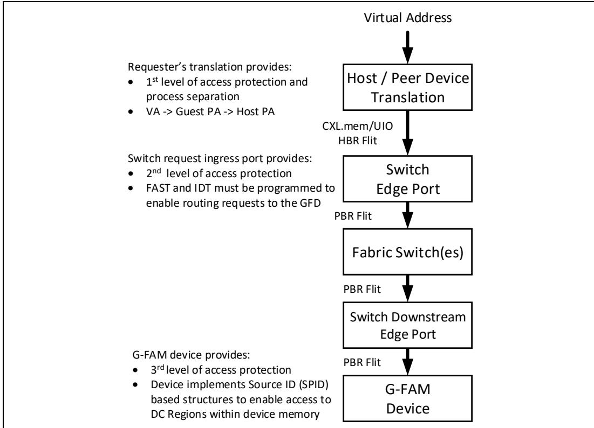

The GFD’s DPA space is divided into one or more Device Media Partitions (DMPs). Each DMP is defined by a base address within DPA space (DMPBase), a length (DMPLength), and a block size (DMPBlockSize). DMPBase and DMPLength must be a multiple of 256 MB, while DMPBlockSize must be a power-of-two size in bytes. The DMPBlockSize values that are supported by a device are device dependent and are defined in the GFD Supported Block Size Mask register. Each GFD decoder targets the DPA range of a DC Region within a single DMP (i.e., must not straddle DMP boundaries). The DC Region’s block size is determined by the associated DMP’s block size. The number of DMPs is device-implementation dependent. Unique DMPs are typically used for different media types (e.g., DRAM, NVM, etc.) and to provide sufficient DC block sizes to meet customer needs.

The GFD Dynamic Capacity protection mechanism is shown in Figure 7-33. To support scaling to 4096 CXL requesters, the GFD DC protection mechanism uses a concept called Memory Groups. A Memory Group is a set of DMP blocks that can be accessed by the same set of requesters. The maximum number of Memory Groups (NG) that are supported by a GFD is implementation dependent. Each DMP block is assigned a Memory Group ID (GrpID), using a set of Memory Group Tables (MGTs). There is one MGT per DMP. Each MGT has one entry per DMP block within the DMP, with entry 0 in the MGT corresponding to Block 0 within the DMP. The depth of each MGT is implementation dependent. DPA is decoded to determine within which DMP a request falls, and then that DMP’s MGT is used to determine the GrpID. The GrpID width is X = ceiling (log2 (NG) ) bits. For example, a device with 33 to 64 groups would require 6-bit GrpIDs.

In parallel with determining the GrpID for a request, the Request SPID is used to index the SPID Access Table (SAT) to produce a vector that identifies which Memory Groups the SPID is allowed to access (GrpAccVec). After the GrpID for a request is determined, the GrpID is used to select a GrpAccVec bit to determine whether access is allowed.

## IMPLEMENTATION NOTE

To support allocation of GFD capacity to hosts in sufficiently small percentages of the GFD, it is recommended that devices implement a minimum of 1K entries per MGT. Implementations may choose to use a separate RAM per MGT, or may use a single partitioned RAM for all MGTs.

To support a sufficient number of memory ranges with different host access lists, it is recommended that devices implement a minimum of 64 Memory Groups.

## Figure 7-33. GFD Dynamic Capacity Access Protections

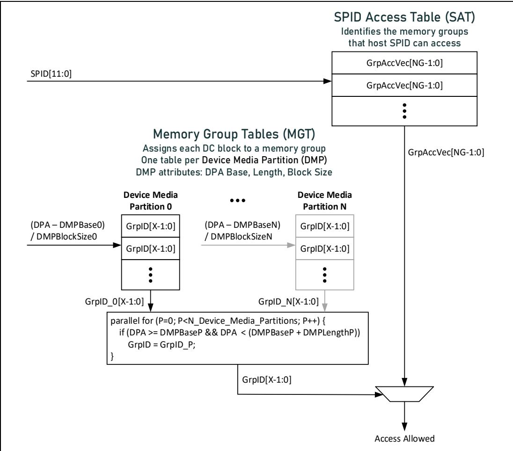

## 7.7.2.6 Global Memory Access Endpoint

Access to G-FAM/GIM resources and configuration of the FAST through a PBR fabric edge switch is facilitated by a Global Memory Access Endpoint (GAE) which is a Mailbox CCI that includes support for the Global Memory Access Endpoint Command set and the opcodes required to configure and enable FAST use, including Get PID Access Vectors and Configure FAST. The GAE is presented to the host as a PCIe Endpoint with a Type 0 configuration space as defined in Section 7.2.9.

There are two configurations under which a host edge port USP will expose a GAE. The first configuration, illustrated in Figure 7-34, provides LD-FAM and G-FAM/GIM resources to a host. In this configuration, the GAE Mailbox CCI is used to configure G-FAM/GIM access for the USP and any DSPs connected to EPs. It may also include support for opcodes necessary to manage the CXL switch capability providing LD-FAM resources.

Figure 7-34. PBR Fabric Providing LD-FAM and G-FAM Resources  
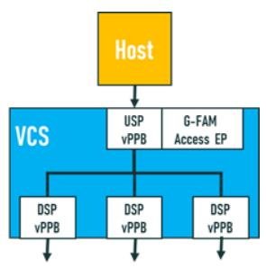

The second configuration, illustrated in Figure 7-35, only provides access to G-FAM/ GIM resources. In this configuration, there is no CXL switch instantiated in the VCS and the GAE is the only PCIe function presented to the host.

Figure 7-35. PBR Fabric Providing Only G-FAM Resources  
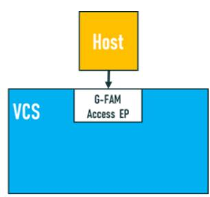

A GAE is also required in the vUSP of a Downstream ES VCS. This GAE is used for configuring that VCS, including configuring the FAST and LDST in the Edge DSPs and providing CDAT information, as described in Section 7.7.12.4.

Each GAE maintains two access vectors, which are used to control whether the host has access to a particular PID:

• Global Memory Mapping Vector (GMV): 4k bitmask indicating which PIDs have been enabled for G-FAM or GIM access

• VendPrefixL0 Target Vector (VTV): 4k bitmask indicating which PIDs have been enabled for VendPrefixL0

## 7.7.2.7 Event Notifications from GFDs

GFDs do not maintain individual logs for every requester. Instead, events of interest are reported using the Enhanced Event Notifications defined in Section 8.2.9.2.9 and Section 8.2.9.2.10. These notifications are transported across the fabric using GAM VDMs, as defined in Section 3.1.11.6.

For event notifications sent to a host, the GAM VDM’s DPID is the PID of the host’s GAE. When received by the GAE, the GAM VDM’s 32B payload is written into the host’s GAM Buffer. All GAM VDMs that are received by the GAE are logged into the same GAM Buffer, regardless of their SPID.

The GAM Buffer is a circular buffer in host memory that is configured for 32B entries. Its location in host memory is configured with the Set GAM Buffer request. The GAE writes received GAM VDM payloads into the buffer offset that is specified by the head index reported by the Get GAM Buffer request (see Section 8.2.9.2.11). As the host reads entries, the host increments the tail index using the Set GAM Buffer request (see Section 8.2.9.2.12). Head and tail indexes wrap to the beginning of the buffer when they increment beyond the buffer size.

The buffer is empty when the head index and tail index are equal. The buffer is full when the head index is immediately before the tail index. Old entries are not overwritten by the GAE until the host removes them from the buffer by incrementing the tail index. The GAE will report a buffer overflow condition if a GAM VDM is received when the buffer is full.

GAM VDMs are not forwarded to peer devices and are instead silently dropped by the peer’s edge switch.

## 7.7.3

## Global Integrated Memory (GIM)

A host domain may include multiple tiers of memory:

• Memory natively attached to a host (e.g., DDR, HBM, etc.)

• Device memory attached to a host CXL link

• Device memory attached to a host through CXL switches

All the memory tiers listed above are managed by a host operating system. CXL devices may be a Type 2 device or Type 3 device and may optionally support backinvalidate channels. A CXL Fabric may be composed of many host domains and G-FAM devices (GFD) as shown in Figure 7-36. GFD is a scalable memory resource that is accessible by all hosts and peer devices within a CXL Fabric.

Each host domain may allow other host domains within the CXL Fabric to access locally managed memory at any tier. Global Integrated Memory (GIM) refers to the memory in remote host domains that is mapped into local host physical address space. Hosts and devices are allowed to initiate cross-domain accesses to GIM, utilizing Unordered I/O (UIO) transactions. CXL.mem or CXL.cache must not be used for GIM accesses.

Cross-domain accesses are considered I/O coherent — data is coherent at the time of access. Remote domains may either mark this memory as uncacheable or manage caches with SW mechanisms.

GIM is primarily used for enabling remote DMA and messaging across domains. It is not intended for memory pooling or borrowing use cases.

Figure 7-36. CXL Fabric Example with Multiple Host Domains and Memory Types  
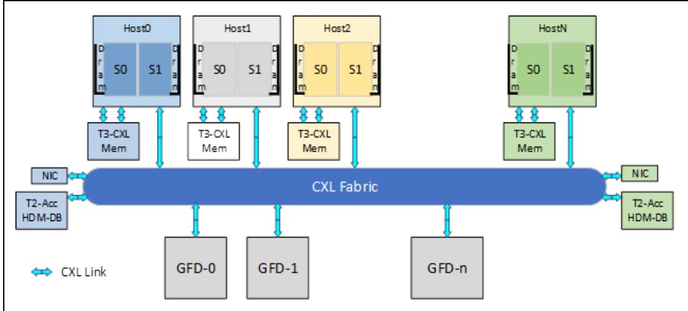

## 7.7.3.1 Host GIM Physical Address View

Hosts and devices may use proprietary decode mechanisms to identify the target DPID and may bypass address decoders in the switch ingress port. Hosts and devices are typically limited to access between homogeneous peers. See Section 7.7.3.2 for ways by which hosts/devices can access Global Integrated Memory (GIM) without using the FAST decoders. This section covers the decode path that uses the FAST decoders.

Hosts that access GIM and rely on address decoders in the switch must map this range in the Fabric Address Space. Hosts that access GIM and GFD must include both ranges in the Fabric Address Space and must use a contiguous address range within the Host Physical Address (HPA) space as shown in Figure 7-37.

## Figure 7-37. Example Host Physical Address View with GFD and GIM

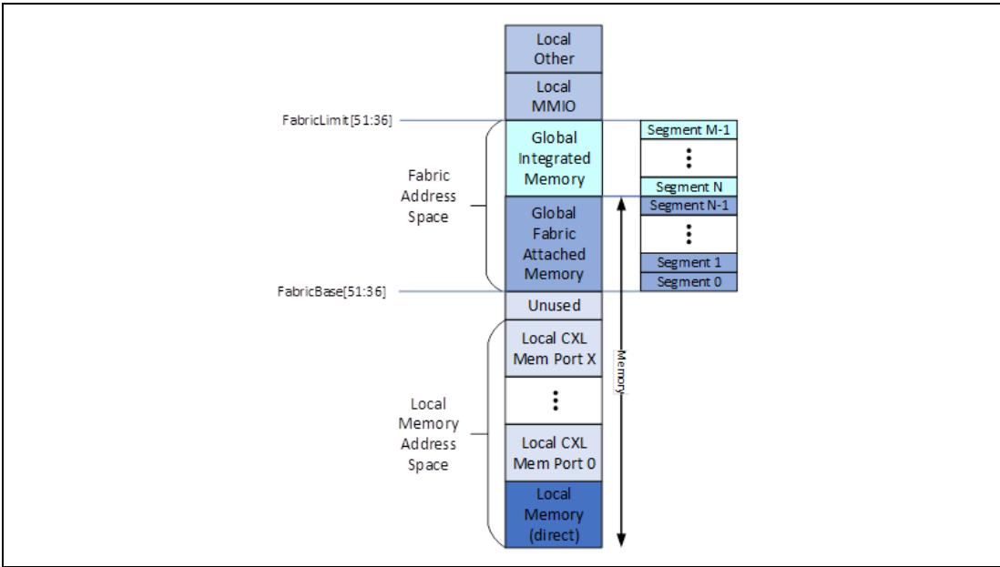

All accesses to GIM regions must only use UIO. It is recommended to map GIM as MMIO instead of a normal write back memory type to avoid potential deadlock. However, implementations may use proprietary methods to guarantee UIO use even when internally using a cacheable memory type. Thus, MMIO mapping of GIM is only a recommendation and not a requirement.

Host and device accesses to GFD and GIM are decoded using a common FAST decoder to determine the target’s DPID.

## 7.7.3.2 Use Cases

ML and HPC applications are typically distributed across many compute nodes and need a scalable and efficient network for low-latency communication and synchronization. Figure 7-38 is an example of a system with a compute node composed of a Host, an Accelerator, and a cluster of nodes connected through a CXL switch fabric. Each host may expose a region or all available memory to other compute nodes.

Figure 7-38. Example Multi-host CXL Cluster with Memory on Host and Device Exposed as GIM  
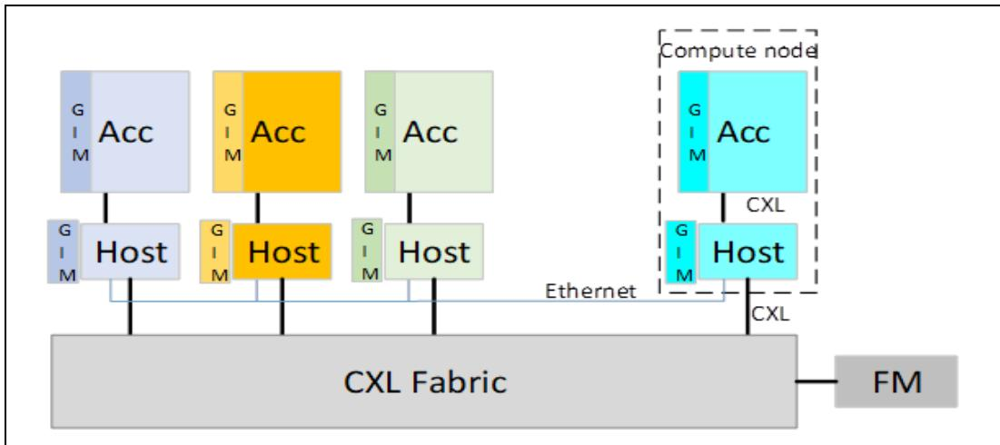  
A second example in Figure 7-39 shows a CXL Fabric that connects all the accelerators. In this example, only the memory attached to the device is exposed to other devices as GIM. UIO allows flexible implementation options to enable RDMA semantics between devices. Software and security requirements are beyond the scope of this specification. GIM builds a framework for using the same set of capabilities for host-to-host communication, device-to-device communication, host-to-device communication, and device-to-host communication.

Figure 7-39. Example ML Cluster Supporting Cross-domain Access through GIM  
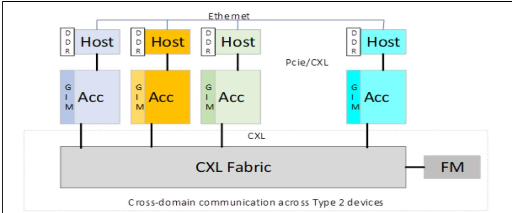

## 7.7.3.3 Transaction Flows and Rules for GIM

The flow in Figure 7-40 describes how a host can access GIM in another host, using the fabric address model described earlier in this chapter. While Figure 7-40 uses host-tohost as the example, the same model works for host-to-device, device-to-device and device-to-host as well. A device that implements GIM as target is expected to have the required functionality that translates the combination of <Address: PID> in the incoming UIO TLP to a local memory address and to provide the required security on cross-domain accesses. This functionality can also use more information than just <Address:PID> from the TLP (e.g., PASID) for additional functionality/security. Designs can chose to reuse the GFD architecture for defining this translation/protection functionality or can implement a proprietary IOMMU-like logic. Details of this functionality are beyond the scope of this Specification.

Figure 7-40. GIM Access Flows Using FASTs  
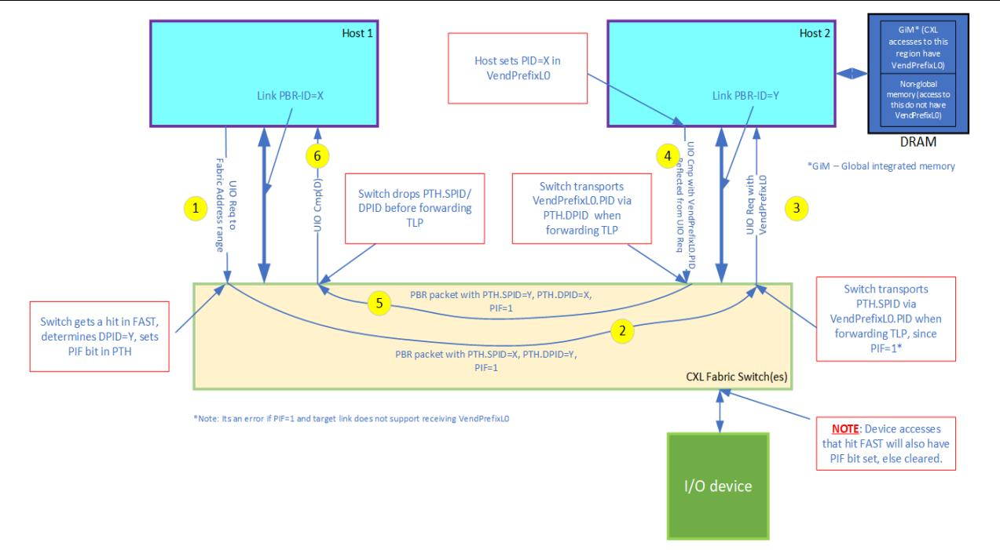

Figure 7-41. GIM Access Flows without FASTs  
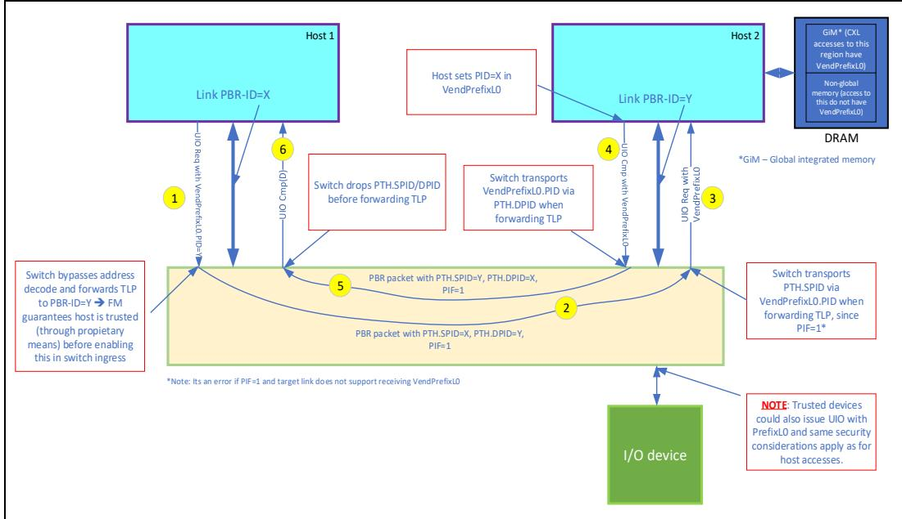

Although the flows described in Figure 7-40 and Figure 7-41 are self-explanatory, here are the key rules for PBR switches/Hosts/Devices that support the GIM flows:

• FM enables usage of VendPrefixL0 on non-PBR edge ports, using the FM API discussed in Table 7-186. By default, VendPrefixL0 usage is disabled on edge ports.

The mechanism that the FM uses to determine on which ports to enable this functionality is beyond the scope of this specification.

## 7.7.3.3.1 GIM Rules for PBR Switch Ingress Port

• GIM flows are supported only via UIO transactions in this version of the specification. At this time, GIM flows are NOT supported via CXL.cachemem transactions or Non-UIO TLPs.

— If switch ingress port receives a Non-UIO request with VendPrefixL0, it treats it as a UR.

• At the Non-PBR edge ingress port, for UIO request TLPs that do not have VendPrefixL0 and that are decoded via the FASTs, the switch sets the PTH.PIF bit when forwarding the request into the PBR fabric.

— For UIO request TLPs that are not decoded via the FASTs, this bit is cleared when forwarded to the PBR fabric.

• At the Non-PBR edge ingress port, if the port is enabled for Ingress Request VendPrefixL0 usage and UIO request TLP has VendPrefixL0 and VendPrefixL0.PID matches one of the allowed PIDs in VTV (see Section 7.7.2.6), the switch bypasses all decode, sets PTH.DPID=VendPrefixL0.PID, PTH.SPID=Ingress Port PID, and PTH.PIF=1 when forwarding the request to the PBR fabric.

— If a UIO request TLP is received with VendPrefixL0 but the port is not enabled for Ingress Request VendPrefixL0 usage or if the PID in the prefix does not match any of the allowed PIDs in VTV, the switch treats the request as a UR.

• At the Non-PBR edge ingress port, for UIO completion TLPs, the switch forwards the received VendPrefixL0.PID on PTH.DPID when forwarding the packet to the PBR fabric, if Ingress Completion VendPrefixL0 usage is enabled on the port (see

Section 7.7.15.5) and VendPrefixL0.PID matches one of the allowed PIDs in VTV (see Section 7.7.2.6). PTH.SPID on the completion TLP is set to the PID of the ingress port.

— if a UIO completion TLP is received on a Non-PBR edge ingress port when Ingress Completion VendPrefixL0 usage is disabled on the port or if the PID in the prefix does not match any of the allowed PIDs in VTV, the switch must drop the packet and treat it as an Unexpected Completion.

— Switch sets the PIF bit whenever it successfully forwards the received completion TLP to the PBR fabric.

## 7.7.3.3.2 GIM Rules for PBR Switch Egress Port

• At the Non-PBR edge egress port, for UIO request TLPs with the PTH.PIF bit set, the switch forwards the PTH.SPID field of the request TLP on the VendPrefixL0.PID field if the egress port is enabled for Egress Request VendPrefixL0 usage.

— If the PTH.PIF bit is set but the egress port is not enabled for Egress Request VendPrefixL0 usage, the switch should treat the request as a UR.

— If the PTH.PIF bit is cleared in the UIO request TLP, the request TLP is forwarded to the egress link without VendPrefixL0, regardless of whether the port is enabled for Egress Request VendPrefixL0 usage.

• At the Non-PBR edge egress port, the switch does not send VendPrefixL0 on completion TLPs.

• Switch forwards the PTH.PIF bit as-is on edge PBR links

## 7.7.3.3.3 GIM Rules for Host/Devices

• Host/Devices that support VendPrefixL0 semantics and receive a UIO Request TLP with VendPrefixL0 must return the received PID value in the associated completion’s VendPrefixL0.

• Host/Devices must always return a value of 0 for Completer ID in the UIO completions.

## 7.7.3.3.4 Other GIM Rules

• VendPrefixL0 must never be sent on edge PBR links, such as the links connecting to a GFD

• GFD must ignore the PTH.PIF bit on TLPs that the GFD receives

• GFD is permitted to set the PTH.PIF bit on CXL.io request TLPs that the GFD sources and always sets this bit on CXL.io completion TLPs that the GFD sources

## Note:

If setting the PTH.PIF bit on request TLPs, the GFD must do so only if it is sure that the ultimate destination (e.g., GIM) needs to be aware of the PID of the source agent that is generating the request (such as for functional/security reasons); otherwise, the GFD should not set the bit.

## 7.7.3.4 Restrictions with Host-to-Host UIO Usages

Host-to-Host UIO usages can result in deadlock when mixed with UIO traffic going to the host that can route back in the host. To avoid such deadlocks:

• Systems that support Host-to-Host UIO must use a separate VC for Host-to-Host UIO traffic vs. remainder of UIO, on host edge links.

(OR)

• Minimally avoid usages that can cause loopback traffic, either in the host or in switches. Generically, this restriction could mean that UIO accesses do not target MMIO space.

A detailed analysis of restrictions that are needed to make a specific system configuration to work with Host-to-Host UIO enabled is beyond the scope of this specification.

A future ECN may be considered that allows for more deadlock avoidance options beyond the two listed above.

## 7.7.4 Non-GIM Usages with VendPrefixL0

When Hosts/Devices initiate UIO requests with VendPrefixL0, address decoding is bypassed in the Switch ingress port. This allows for proprietary implementations in which the address/data information in the TLP can potentially be vendor-defined. Such usages are beyond the scope of this specification; however, GIM-related rules enumerated in Section 7.7.3.3 allow such implementations as well.

## 7.7.5

## HBR and PBR Switch Configurations

CXL supports two types of switches: HBR (Hierarchy Based Routing) and PBR (Port Based Routing). “HBR” is the shorthand name for the CXL switches introduced in the CXL 2.0 specification and enhanced in subsequent CXL ECNs and specifications. In this section, the interaction between the two will be discussed.

A variety of HBR/PBR switch combinations are supported. The basic rules are as follows:

• Host RP must be connected to an HBR USP, PBR USP, or a non-GFD

• Non-GFD must be connected to an HBR DSP, a PBR DSP, or a Host RP

• PBR USP may be connected only to a host RP; connecting it to an HBR DSP is not supported

• HBR USP may be connected to a host RP, a PBR DSP, or an HBR DSP

• GFD may be connected only to a PBR DSP

• PBR FPort may be connected only to a PBR FPort of a different PBR switch

Figure 7-42 illustrates some example supported switch configurations, but should not be considered a complete list.

Figure 7-42. Example Supported Switch Configurations  
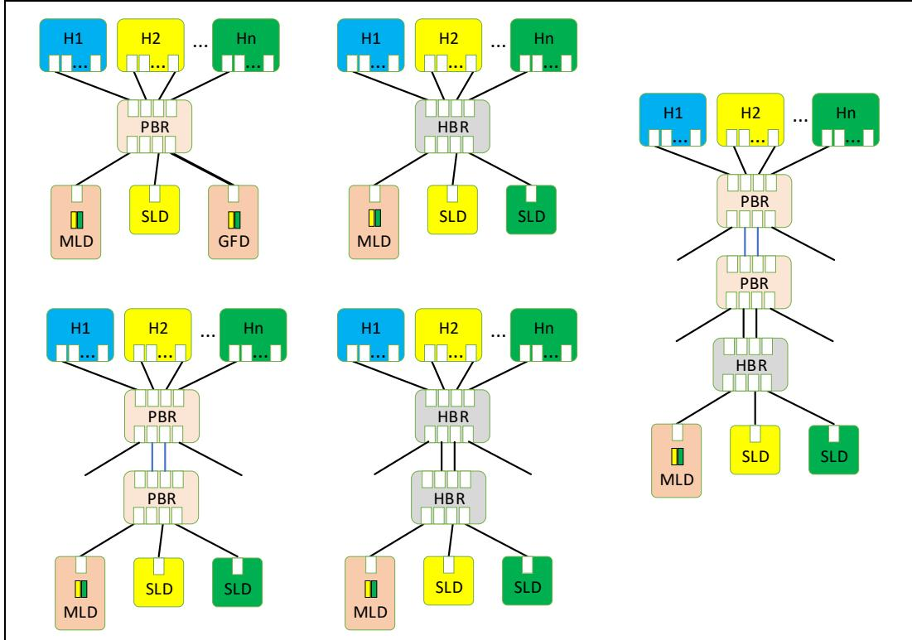

CXL fabric topology is non-prescriptive when using PBR switches. There is no predefined list of supported topologies. PID-based routing combined with flexible routing tables enables a high degree of freedom in choosing a topology. The PBR portion of the fabric may freely use any topology for which deadlock-free routing can be found.

To name a few examples, a PBR fabric might implement a simple PCIe-like tree topology, more-complex tree topologies such as fat tree (aka folded Clos), or non-tree topologies such as mesh, ring, star, linear, butterfly, or HyperX, as well as hybrids and multi-dimensional variants of these topologies.

Figure 7-43 illustrates an example of fully connected mesh topology (aka 1- dimensional HyperX). It has the notable ability to connect a relatively large number of components while still limiting the number of switch traversals. A direct link exists between each pair of switches, so it is possible for the FM to set up routing tables such that all components connected to the same switch can reach one another with a single switch traversal, and all components connected to different switches can reach one another with two switch traversals.

Figure 7-43. Example PBR Mesh Topology  
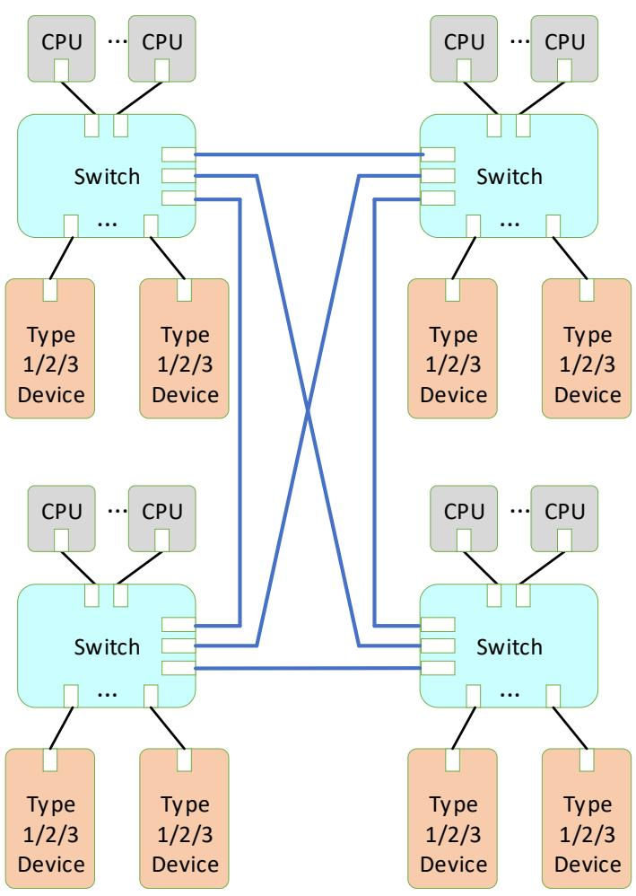

## 7.7.5.1 PBR Forwarding Dependencies, Loops, and Deadlocks

When messages are forwarded through PBR switches from one Fabric Port to another, a dependency is created — acceptance of arriving messages into one PBR Fabric Port is conditional upon the ability to transmit messages out of another PBR Fabric Port. Other arriving traffic commingled on the same inbound link is also affected by the dependency. Thus, traffic waiting to be forwarded can block traffic that needs to exit the PBR portion of the fabric via a USP or DSP of the PBR switch.

Some topologies, such as PCIe tree or fat tree, are inherently free of loops. Thus, the resulting Fabric Port-forwarding dependencies are inherently non-circular. However, in topologies that contain loops, dependencies can form a closed loop, thereby resulting in a deadlock.

The routing table programming in the PBR switches, performed by the FM, must take potential deadlock into account. The dependencies must not be allowed to form a closed loop.

This can be illustrated using the mesh topology presented in Figure 7-44. Figure 7-44. Example Routing Scheme for a Mesh Topology

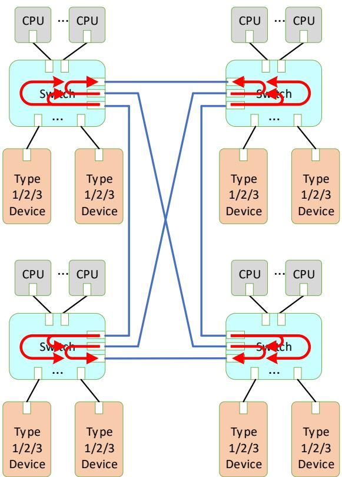

One simplistic approach for the mesh topology would be to support only minimal routes. Messages traverse at most one inter-switch PBR link en route from any source host or device to any destination host or device. This simplistic solution is deadlock-free because no message forwarding occurs between PBR Fabric Ports of any switch, and thus there are no forwarding dependencies created from which loops may form. The single route choice, however, limits bandwidth.

Figure 7-44 illustrates a more-sophisticated routing scheme applied to the same mesh topology as Figure 7-43. Each PBR switch is programmed to support three forwarding paths out of the 6 possible pairings. The arrows show permitted forwarding between Fabric Ports. For example, a message traveling from the lower-left switch to the upperright switch has two route choices:

• Via the direct link

• Indirectly via the upper-left switch

Note that the message cannot travel via the lower-right switch because that switch has no forwarding arrow shown between those Fabric Ports.

The forwarding arrows do not form closed loops; thus, there are no circular dependencies that could lead to deadlock.

This approach to mesh routing (i.e., restricting the choice of intermediate nodes to avoid circular dependencies) can also be applied to larger 1D-HyperX topologies. For a fully connected mesh that contains N switches, there are N-2 potential intermediate

switches to consider for possible indirect routes between any pair of switches. However, this deadlock-avoidance restriction limits the usable intermediate switch choices to one-half of that number ((N-2)/2), rounding down if N is odd.

Multi-dimensional HyperX topologies can be routed deadlock-free by using this technique within each dimension, and implementing dimension-ordered routing.

Although this section covers some cases for circular dependency avoidance, fully architected deadlock dependency avoidance with topologies that contain fabric loops is beyond the scope of this specification.

## 7.7.6 PBR Switching Details

## 7.7.6.1 Virtual Hierarchies Spanning a Fabric

Hosts connected to CXL Fabrics (composed of PBR switches) do not require special, fabric-specific discovery mechanisms. The fabric complexities are abstracted, and the host is presented with a simple switching topology that is compliant with PCIe Base Specification. All intermediate Fabric switches are obscured from host view. At most, two layers of Edge Switches (ESs) are presented:

• Host ES: The host discovers a single switch representative of the edge to which it is connected. Any EPs also physically connected to this PBR switch and bound to the host’s VH are seen as being directly connected to PPBs within the VCS.

• Downstream ES: As desired, the FM may establish binding connections between the Host ES VCS and one or more remote PBR switches within the Fabric. When such a binding connection is established, the remote switch presents a VCS that is connected to one of the Host ES vPPBs. The Host discovers a single link between a virtualized DSP (vDSP) in the Host ES and a virtualized USP (vUSP) in the Downstream ES, regardless of the number of intermediate fabric switches, if any. The link state is virtualized by the Host ES and is representative of the routing path between the two ESs; if any intermediate ISLs go down, the Host ES will report a surprise Link Down error on the corresponding vPPB.

• If an HBR switch is connected to a PBR DSP, that HBR switch and any HBR switches below it will be visible to the host. HBR switches are not Fabric switches.

A PBR switch’s operation as a “Host ES” or a “Downstream ES” per the above descriptions is relative to each host’s VH. A PBR switch may simultaneously support Host ES Ports and Downstream ES Ports for different VHs. ISLs within the Fabric are capable of carrying bidirectional traffic for more than one VH at the same time. Edge DSPs support PCIe devices, SLDs, MLDs, GFDs, PCIe switches, and CXL HBR switches.

A Mailbox CCI is required in the vUSP of a Downstream ES VCS for management purposes.

Figure 7-45. Physical Topology and Logical View  
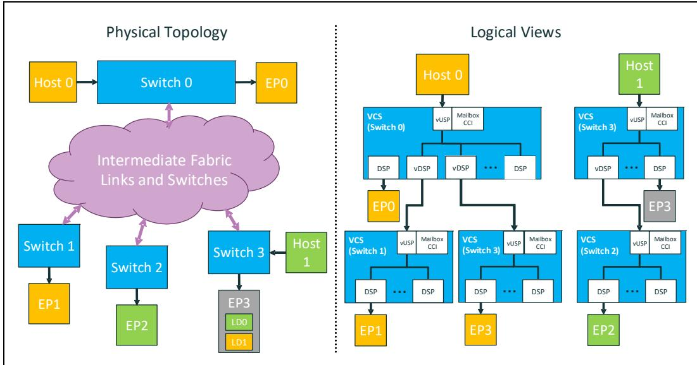

## 7.7.6.2 PBR Message Routing across the Fabric

PBR switches can support both static and dynamic routing for each DPID, as determined by message class.

With static routing, messages of a given message class use a single fixed path between source and destination Edge Ports. Messages that use a vDSP/vUSP binding (see Section 7.7.6.4) always use static routing as well, though the vUSP as a source or destination is always associated with an FPort instead of an Edge Port.

With dynamic routing, messages of a given message class can use different paths between source and destination Edge Ports, dynamically determined by factors such as congestion avoidance, algorithms to distribute traffic across multiple links, or changes with link connectivity. Each DPID supports static routing for those message classes that require it, and it can support either static or dynamic routing for the other message classes.

Dynamic routing is generally preferred when suitable, but in certain cases static routing must be used to ensure in-order delivery of messages as required by ordering rules. Due to its ability to distribute traffic across multiple links, dynamic routing is especially preferred for messages that carry payload data, as indicated in Table 7-84.

Somewhat orthogonal to dynamic vs. static routing, PBR switches support hierarchical and edge-to-edge decoding and routing. With hierarchical routing, a message is decoded and routed within each ES using HBR mechanisms and statically routed between ESs, using vDSP/vUSP bindings. With edge-to-edge routing, a message is routed from a source Edge Port to a destination Edge Port, using a DPID determined at the source Edge Port or GFD. Edge-to-edge routing uses either dynamic or static routing, as determined by the message class.

Table 7-84 summarizes the type of PBR decoding and routing used, by message class.

Table 7-84. PBR Fabric Decoding and Routing, by Message Class

<table><tr><td colspan="2">Message Class** Payload Data</td><td>OrderingRules</td><td>PreferredRouting1</td><td>Decoding andRouting Mechanism</td></tr><tr><td rowspan="6">CXL.cache</td><td>D2H Req</td><td></td><td>Dynamic</td><td rowspan="6">Edge-to-edge routing using the Cache ID lookups or vPPB bindings</td></tr><tr><td>H2D Rsp</td><td>I11a: Snoop (H2D Req) push GO (H2D Rsp)</td><td>Static</td></tr><tr><td>H2D DH **</td><td></td><td>Dynamic</td></tr><tr><td>H2D Req</td><td>I11a: Snoop (H2D Req) push GO (H2D Rsp)</td><td>Static</td></tr><tr><td>D2H Rsp</td><td></td><td>Dynamic</td></tr><tr><td>D2H DH **</td><td></td><td>Dynamic</td></tr><tr><td rowspan="8">CXL.mem</td><td rowspan="2">M2S Req</td><td rowspan="2">G8a (HDM-D to Type 2): MemRd*/MemInv* push Mem*Fwd</td><td rowspan="2">HDM-H: DynamicHDM-D: StaticHDM-DB: Dynamic</td><td>LD-FAM: Edge-to-edge routing if using LDST2Hierarchical routing if using HDM Decoder</td></tr><tr><td>G-FAM: edge-to-edge routing using FAST</td></tr><tr><td rowspan="2">M2S RwD **</td><td rowspan="2">-</td><td rowspan="2">Dynamic</td><td>LD-FAM: Edge-to-edge routing if using LDST2Hierarchical routing if using HDM Decoder</td></tr><tr><td>G-FAM: Edge-to-edge routing using FAST</td></tr><tr><td>S2M NDR</td><td>E6a: BI-ConflictAck pushes Cmp*</td><td>Static</td><td rowspan="4">Edge-to-edge routing using vPPB bindings or BI-ID lookups</td></tr><tr><td>S2M DRS **</td><td>-</td><td>Dynamic</td></tr><tr><td>S2M BISnp</td><td>-</td><td>Dynamic</td></tr><tr><td>M2S BIRsp</td><td>-</td><td>Dynamic</td></tr><tr><td rowspan="2">CXL.io</td><td>All CXL.ioTLPs ** except next row</td><td>PCIe (many)</td><td>Static</td><td>Hierarchical decoding within each ESvDSP/vUSP between Host ES and each Downstream ES</td></tr><tr><td>UIO Direct P2P to HDM TLPs **</td><td>-</td><td>Dynamic</td><td>Edge-to-edge routing using FAST or LDST decoder</td></tr></table>

1. When dynamic routing is preferred, static routing is still permitted.  
2. LDST decoders do not support HDM-D.

The Ordering Rules column primarily covers a few special cases with CXL.cachemem messages in which the fabric is required to enforce ordering within a single message class or between two message classes. The alphanumeric identifier refers to ordering summary table entries in Table 3-56 and Table 3-57.

With LD-FAM, host software may use either HDM Decoders or LDST decoders, though LDST decoders do not support HDM-D. Host software implemented solely against the CXL 2.0 Specification comprehends only HDM Decoders, and such host software may continue to use them with PBR Fabrics. Newer host software that comprehends and uses LDST decoders can benefit from edge-to-edge routing, which uses dynamic routing for suitable message classes.

For CXL.io TLPs, the PTH.Hie (hierarchical) bit determines when intermediate PBR switches must use static routing. When the PTH.Hie bit is 1, intermediate PBR switches shall use static routing for the TLP; otherwise, such switches are permitted to use dynamic routing for the TLP. When a PTH is pre-pended to a TLP, the Hie bit shall be 1 if the TLP is a vDSP/vUSP message; otherwise, the Hie bit shall be 0.

## 7.7.6.3 PBR Message Routing within a Single PBR Switch

A message received or converted to PBR format at a PBR switch ingress port is routed to one of the switch’s egress ports, as determined by the ingress port’s DPID Routing Table (DRT) and its associated Routing Group Table (RGT). Their structures are described in detail in Section 7.7.13.10 and Section 7.7.13.12, respectively, and this section provides a high-level summary.

A DRT has 4096 entries and is indexed by a DPID. Each DRT entry contains a 2-bit entry type field that indicates whether the entry is valid, and whether the entry contains a single physical port number or an RGT index.

DRT entries that contain an RGT index are required when multiple egress ports need to be specified for use with dynamic routing. An RGT is a power-of-2-sized table with up to 256 entries. Each RGT entry contains an ordered list of up to eight physical port numbers, along with two 3-bit fields that indicate how many in the list are valid and how many of those are primary vs. secondary. This allows one or more primary and zero or more secondary egress ports to be listed. Cases that require static routing must always use the first list entry. The RGT entry also contains a 3-bit dynamic routing mode and 3-bit mix setting. The distinction between primary vs. secondary varies by dynamic routing mode and mix setting.

In routing modes that utilize the mix setting, its value determines the mix of the primary and secondary egress port group usage, assuming that one or more secondary egress ports are specified. Using the mix setting supports egress port selection based on known bandwidth differences that exist elsewhere in the fabric or based on preferred vs. overflow routing paths. Secondary egress ports should be specified only when there are significant differences with primary egress ports; otherwise, all suitable egress ports should be specified as primary. When no secondary egress ports have been specified, the mix setting shall be ignored.

<table><tr><td>Mix Setting</td><td>% Primary</td><td>% Secondary</td></tr><tr><td>0</td><td>87.5</td><td>12.5</td></tr><tr><td>1</td><td>75</td><td>25</td></tr><tr><td>2</td><td>62.5</td><td>37.5</td></tr><tr><td>3</td><td>50</td><td>50</td></tr><tr><td>4</td><td>37.5</td><td>62.5</td></tr><tr><td>5</td><td>25</td><td>75</td></tr><tr><td>6</td><td>12.5</td><td>87.5</td></tr><tr><td>7</td><td>Preferred</td><td>Overflow</td></tr></table>

Mix setting 7 is intended for use in cases where primary and secondary egress port groups represent preferred and overflow ports, respectively. Mix setting 7 mandates the choice of a primary (preferred) path route whenever flow-control conditions and link state permit.

The term candidate egress port refers to a port that is present in the appropriate RGT entry, where the message can be queued or internally routed immediately. The egress port need not have link credits to send the packet immediately. An implementation may optionally base part of the candidate selection on the egress port state (e.g., link-up or containment states).

The mix dynamic routing mode descriptions that follow describe routing outcomes in terms of probability, consistent with a weighted (pseudo) random implementation. Random selection has the advantage that each routing decision is stateless and independent of one another, and it has high immunity to hot-route problems that might otherwise arise from repetitive patterns in packet arrivals. The specific random routing implementation is not prescribed. Implementations that achieve the specified mix by deterministic means, such as by weighted round-robin, are permitted.

The architected dynamic routing modes include the optional modes listed in Table 7-85.

Table 7-85. Optional Architected Dynamic Routing Modes

<table><tr><td>Mode</td><td>Description</td></tr><tr><td>Mix with Random</td><td>The candidate list is first narrowed to select either the primary or the secondary group based on the configured mix. A random selection is then made within that group. A message class shall stall when the selected subset is empty due to flow-control conditions.The FM may choose to select this mode (if supported) as an alternative to Mix with Congestion Avoidance if the latter is not supported.</td></tr><tr><td>Mix with Congestion Avoidance</td><td>The candidate list is first narrowed to select either the primary or the secondary group based on the configured mix. A local congestion-avoiding selection is then made within that group. A message class shall stall when the selected subset is empty due to flow-control conditions. Congestion-avoiding candidate selection is based on vendor-specific congestion metrics, favoring the selection of less-congested egress ports. For example, the congestion metric might be a measure of egress port backlog, considering all queued traffic for that egress port across the entire switch.The FM may choose to select this mode (if supported) when Advanced Congestion Avoidance mode is inappropriate or not supported, of if fixed-traffic ratio apportionment or preferred/overflow behavior is needed.</td></tr><tr><td>Advanced Congestion Avoidance</td><td>A congestion-avoiding selection is made considering both primary and secondary candidate egress ports, ignoring the mix setting value. Egress ports with the minimal remaining hop count should be specified as primary; any suitable egress ports that have higher remaining hop counts should be specified as secondary. Candidate selection is based on vendor-specific metrics, favoring less-congested egress ports in general, and especially avoiding secondary candidates that are already heavily scheduled with primary traffic, regardless of the target DPID.An example congestion metric might be backlog-based, but with different weightings for primary vs. secondary backlogs. Congestion metric values for primary backlogs should be higher than secondary backlogs when assessing the congestion level of a secondary candidate egress port. This discourages the use of secondary candidate ports that have a high primary backlog. In congestion metrics, messages that are queued or internally routed via the physical port number in a DRT or via dynamic routing modes other than Advanced Congestion Avoidance should be considered primary backlog.The FM may choose to select this mode (if supported) for routing egress ports that carry commingled minimal and non-minimal traffic.</td></tr></table>

PBR switches that implement RGTs shall support at least one of the three architected dynamic routing modes (those listed in Table 7-85) within each RGT.

DRT entries that contain a single physical port instead of an RGT index are useful when there is only one reasonable egress port choice (e.g., routing to an Edge Port). This avoids an RGT look-up and additional processing to determine which egress port to use. This may also help reduce the number of entries that need to be implemented in the associated RGT.

## 7.7.6.4 PBR Switch vDSP/vUSP Bindings and Connectivity

Within the context of a single VH, the virtual connection between a VCS in the Host ES and a VCS in a Downstream ES is accomplished with a vDSP/vUSP binding. A vDSP is a vPPB in the Host ES VCS that the host sees as a DSP. A vUSP is a vPPB in the Downstream ES VCS that the host sees as a USP. Host software always sees a single virtual link connecting the vDSP and vUSP, even though one or more intermediate Fabric switches may be physically present.

Figure 7-46 shows an example PBR Fabric that consists of one Host ES, one Downstream ES, and an unspecified number of intermediate Fabric switches connecting the two.

Figure 7-46. Example PBR Fabric

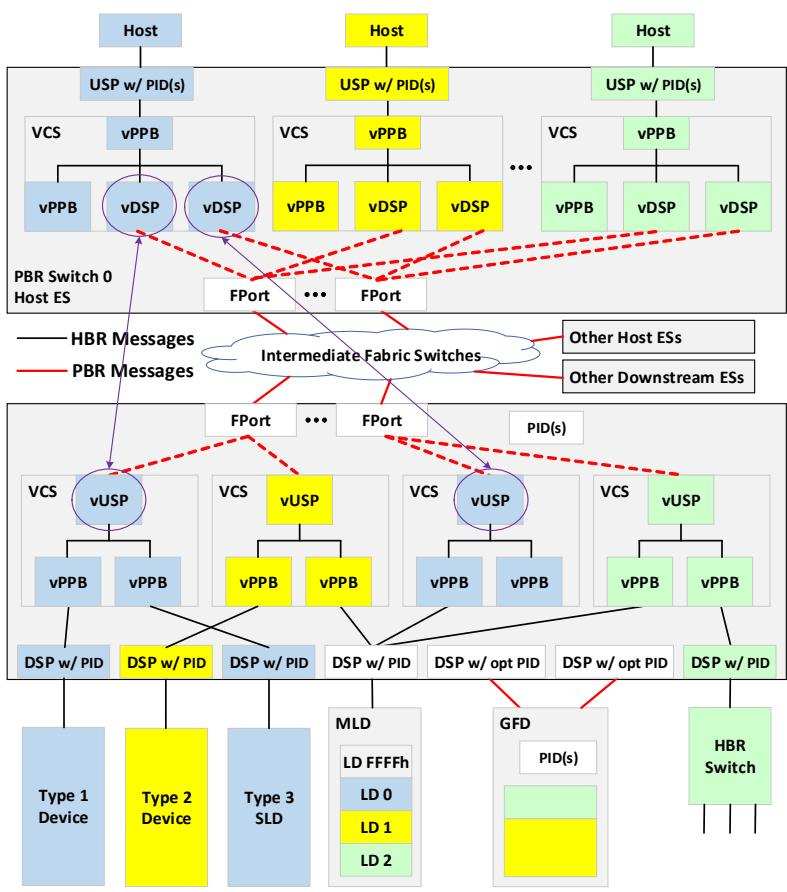

The rules for vDSP/vUSP bindings are as follows:

• Each active Host ES vDSP is bound to one Host ES FPort and one Downstream ES vUSP

• Each active Downstream ES vUSP is bound to one Downstream ES FPort and one Host ES vDSP

• All messages routed using a vDSP/vUSP binding must contain both a DPID and an SPID

• vDSPs and vUSPs are never assigned PIDs

• Each PID used for vDSP/vUSP bindings may support both static and dynamic routing; however, vDSP/vUSP traffic always uses static routing

• Each vDSP/vUSP binding has a single host USP PID that determines which Host ES FPort will be used to route from vUSP to vDSP

• Each vDSP/vUSP binding has a single Downstream ES PID that determines which Downstream ES FPort will be used to route from vDSP to vUSP

When a Host ES FPort transmits a vDSP/vUSP message downstream in a PBR flit, the message contains the DPID and SPID taken from the vDSP’s binding. Assuming no errors, the message traverses any intermediate Fabric switches that are present and is received by an FPort that is bound to the Downstream ES vUSP. A vUSP there claims the message by matching both the DPID and SPID from its binding.

Similarly, when a Downstream ES FPort transmits a vDSP/vUSP message upstream in a PBR flit, the message contains the DPID and SPID taken from the vUSP’s binding. Assuming no errors, the message traverses any intermediate Fabric switches that are present and is received by an FPort that is bound to the Host ES vDSP. A vDSP there claims the message by matching both the DPID and SPID from its binding.

## 7.7.6.5 PID Use Models and Assignments

The example PBR Fabric illustrated in Figure 7-46 illustrates key aspects of how PIDs can be assigned and used. PIDs are either assigned by the FM or by static fabric initialization (see Section 7.7.12.1.1).

A Host ES USP often has one PID but may have multiple PIDs assigned to support multiple vDSP/vUSP bindings in the same Downstream ES. Each vDSP/vUSP binding may use a different Host ES FPort and/or Downstream ES FPort, providing traffic isolation for differentiated quality of service. If multiple vDSP bindings use the same PID for the Downstream ES, different PIDs for the USP can distinguish their bindings.

The Downstream ES FPorts may have one or more PIDs assigned, where each PID can be associated with a different set of FPorts. In an example scenario, there might be one PID for the left set of FPorts for multipathing and another PID for the right set. For a PID assigned to an FPort set for multipathing, DRTs in different USPs can specify different egress ports for static routing, distributing the static routing traffic for certain topologies without requiring additional DS\_ES PIDs.

A DSP may be assigned multiple PIDs, one PID, or no PIDs. A DSP above a non-GFD usually has one PID, but may be assigned multiple PIDs for isolating traffic from multiple senders or for associating a unique PID for each caching or HDM-DB-capable device attached to one or more HBR switches below an Edge Port. DSPs above a multiported GFD may not require dedicated assigned PIDs, relying instead on one or more PIDs assigned to the GFD itself.

A GFD may have one or more PIDs assigned. A multi-ported GFD may have multiple PIDs assigned for differentiated quality of service, though a single PID may be sufficient for congestion avoidance.

As mentioned in the previous section, each vDSP/vUSP binding has two PIDs assigned. For downstream vDSP/vUSP messages that use a given binding, the SPID is a PID associated with the host Edge USP, and the DPID is a PID associated with the Downstream ES FPort. Such messages are always transmitted by the same Host ES FPort and received by the same Downstream ES FPort. Then, the FPort uses various vUSP info decoding mechanisms to route the message to the appropriate Downstream ES vPPB using PBR mechanisms or HBR mechanisms, depending upon the message class. See CXL Switch Message Conversion (see Section 7.7.6.6). If there are any intermediate Fabric switches, such messages always take a single static path.

Upstream vDSP/vUSP messages are handled in a similar manner, but only involve CXL.io message classes. On a given binding, the SPID is the PID associated with the Downstream ES FPort, and the DPID is the PID associated with the host Edge USP. Such messages are always transmitted by the same Downstream ES FPort and received by the same Host ES FPort. Then, the receiving FPort uses the associated vDSP context to identify the appropriate target using HBR mechanisms. If the target is an egress port, the message is routed there for transmission. If the target is another vDSP, that vDSP converts the PIDs to its bound PIDs and transmits it from its associated FPort, which may be the same FPort on which it arrived or on a different FPort. If there are any intermediate Fabric switches, such messages always take a single static path.

A PBR switch requires an assigned PID to send and receive management requests, responses, and notifications. Transactions that target this PID are processed by central logic or by FW within the switch.

FMs connected to a PBR switch via an MCTP-based CCI also consume a PID. This PID is communicated to the PBR switch when the FM claims ownership of the device. The PID is used to direct transactions to the FM, such as Event Notifications generated by components owned by the FM.

PID FFFh is reserved and is used to indicate that a transaction should be processed locally. It allows FMs to target devices before they have had a valid PID assigned and when they have an assigned PID of which the FM is unaware.

## 7.7.6.6 CXL Switch Message Format Conversion

A PBR switch converts messages received from HBR hosts, devices, and switches to the PBR message format for routing across a PBR Fabric. In addition, messages received from the PBR fabric that target the HBR hosts, devices, and switches are converted to messages using the non-PID spaces (i.e., CacheID, BI-ID, and LD-ID). The following subsections provide the conversion flow for each message class.

The FM assigns PIDs to various PBR switch ports, as described in Section 7.7.6.5. The DPID value for request messages is determined by a variety of ways, including HDM Decoders, vPPB bindings, and lookup tables or CAMs using non-PID spaces. The DPID value for a response message is often the SPID value from the associated request message but is sometimes determined by one of the ways mentioned for request messages.

With HBR format messages, MLDs support a 4-bit LD-ID field in CXL.mem protocol for selection and routing of MLD messages, and CXL.cache includes a 4-bit CacheID field that is used to allow up to 16 Type 1 Devices or Type 2 Devices below an RP. PBR format messages use 12-bit PIDs to support large Fabrics. This section describes the support required in PBR switches for routing messages from non-fabric-aware hosts and devices that support the 4-bit LD-ID and 4-bit CacheID fields. It also covers BI-IDbased routing.

Considering the wide range of supported PBR/HBR switch topologies, the variety of specific routing techniques for the many different cases of port connectivity is quite complex. Below is a general description for the HBR and PBR switch routing mechanisms that are used by key message classes, followed by port processing tables with more-specific details for both classes of switches.

## 7.7.6.6.1 CXL.io, Including UIO

An HBR switch routes most CXL.io TLPs between its ports using standard mechanisms defined by PCIe Base Specification. A DSP above an MLD uses LD-ID Prefixes to identify which LD a downstream TLP is targeting or from which LD an upstream TLP came.

UIO Requests that directly target HDM ranges can use enhanced UIO-capable HDM Decoders for their routing. This includes UIO Requests from the host that target devices with HDM, as well as “Direct P2P” cases where UIO Requests from one device target other devices with HDM. UIO Direct P2P to HDM traffic goes upstream, P2P, and downstream along different portions of its path.

A PBR switch converts PCIe-format TLPs or CXL.io HBR-format TLPs to PBR-format TLPs by pre-pending to each TLP a 4B CXL PBR TLP Header (PTH), which includes an SPID and DPID. Conversion from PBR format to HBR format or PCIe format consists of stripping the CXL PTH from the TLP.

## 7.7.6.6.2 CXL.cache

A number of CXL.cache messages in 256B HBR format have a 4-bit CacheID field that enables up to 16 caching devices below a single RP. CXL.cache messages in 68B HBR format do not support this feature, and thus never carry a CacheID field. CXL.cache messages in PBR format do support this feature, but convey the necessary information via PIDs instead of a CacheID field. Table 7-86 summarizes which message classes contain the CacheID field.

## Table 7-86. Summary of CacheID Field

<table><tr><td rowspan="2">Msg Class</td><td colspan="3">CacheID Field</td></tr><tr><td>68B HBR</td><td>256B HBR</td><td>256B PBR</td></tr><tr><td>D2H Req</td><td>No</td><td>Yes</td><td>No</td></tr><tr><td>H2D Rsp</td><td>No</td><td>Yes</td><td>No</td></tr><tr><td>H2D DH</td><td>No</td><td>Yes</td><td>No</td></tr><tr><td>H2D Req</td><td>No</td><td>Yes</td><td>No</td></tr><tr><td>D2H Rsp</td><td>No</td><td>No</td><td>No</td></tr><tr><td>D2H DH</td><td>No</td><td>No</td><td>No</td></tr></table>

For HBR format messages that contain a CacheID field, in some cases an HBR or PBR DSP needs to know whether to propagate or assign the CacheID. This information is configured by host software and is contained in the CXL Cache ID Decoder Capability Structure (see Section 8.2.4.29).

Table 7-87 summarizes the HBR switch routing for CXL.cache message classes. Table 7-88 summarizes the PBR switch routing for CXL.cache message classes.

Table 7-87. Summary of HBR Switch Routing for CXL.cache Message Classes

<table><tr><td>Message Class</td><td>Switch Routing</td></tr><tr><td>D2H Request</td><td>For HBR switch routing of D2H requests upstream to the bound host, the D2H request to the USP relies on the DSP&#x27;s vPPB binding at each switch level. CacheID is added to the message by the DSP above the device to enable routing of the H2D response.</td></tr><tr><td>H2D Response or Data Header</td><td>For HBR switch routing of H2D responses or data headers downstream to the DSP, the USP at each switch level looks up the PCIe-defined PortID from the Cache ID Route Table.</td></tr><tr><td>H2D Request</td><td>For HBR switch routing of H2D requests downstream to the DSP, the USP at each switch level looks up the PCIe-defined PortID from the Cache ID Route Table.</td></tr><tr><td>D2H Response or Data Header</td><td>For HBR switch routing of D2H responses or data headers upstream to the bound host, the D2H response or data header to the USP relies upon the DSP&#x27;s vPPB binding at each switch level.</td></tr></table>

Within a PBR fabric, all CXL.cache messages are routed edge-to-edge, and they never use vDSP/vUSP bindings.

In contrast to most 256B HBR-format CXL.cache messages, PBR-format cache messages never contain a CacheID field, thus the equivalent information when needed must be conveyed via PIDs.

When multiple caching devices are attached to an HBR switch below a PBR fabric, the FM must allocate and assign a unique PID for each such caching device. This enables PBR switches to convert between a caching device’s unique PID and CacheID when needed.

Table 7-88. Summary of PBR Switch Routing for CXL.cache Message Classes

<table><tr><td>Message Class</td><td>Switch Routing</td></tr><tr><td>D2H Request</td><td>For PBR switch routing of these messages upstream to the host, Edge DSPs get the Host USP DPID from their vPPB. Those above an SLD get their SPID from their vPPB. Those above an HBR USP look up the SPID from the Cache ID Route Table using the CacheID contained in the HBR-format message.For converting to HBR format at the Edge USP, the USP derives the CacheID from a 16-entry CAM using the SPID.</td></tr><tr><td>H2D Response or Data Header</td><td>For PBR switch routing of these messages downstream to the Edge DSP, the Edge USP looks up the DPID from the Cache ID Route Table using the CacheID in the HBR-format message.For converting to HBR format at the Edge DSP, above an SLD the CacheID is unused, and above an HBR USP the Cache ID is derived from a 16-entry CAM match using the DPID.</td></tr><tr><td>H2D Request</td><td>For PBR switch routing of these messages downstream to the Edge DSP, the Edge USP looks up the DPID from the CacheID Route Table using the CacheID. The USP gets the SPID from its vPPB.For converting to HBR format at the Edge DSP, above an SLD the CacheID is unused, and above an HBR USP the CacheID is derived from a 16-entry CAM match using the DPID.</td></tr><tr><td>D2H Response or Data Header</td><td>For PBR switch routing of these messages upstream to the host, Edge DSPs get the DPID from their vPPB.For converting to HBR format at the Edge USP, the CacheID field is not present in the message.</td></tr></table>

At an Edge DSP, when converting a downstream CXL.cache message from PBR to HBR format, if the CacheID field is unused, its value shall be cleared to 0.

## 7.7.6.6.3 CXL.mem

Several CXL.mem message classes in HBR format have a 4-bit LD-ID field that is used by Type 3 MLDs for determining the targeted LD. This feature is supported by both 68B and 256B HBR formats. PBR format conveys the necessary information via PIDs instead of an LD-ID field. Table 7-89 summarizes which message classes contain the LD-ID field.

Table 7-89. Summary of LD-ID Field

<table><tr><td rowspan="2">Msg Class</td><td colspan="3">LD-ID Field</td></tr><tr><td>68B HBR</td><td>256B HBR</td><td>256B PBR</td></tr><tr><td>M2S Req</td><td>Yes</td><td>Yes</td><td>No</td></tr><tr><td>M2S RwD</td><td>Yes</td><td>Yes</td><td>No</td></tr><tr><td>S2M NDR</td><td>Yes</td><td>Yes</td><td>No</td></tr><tr><td>S2M DRS</td><td>Yes</td><td>Yes</td><td>No</td></tr><tr><td>S2M BISnp</td><td>N/A</td><td>In BI-ID</td><td>No</td></tr><tr><td>M2S BIRsp</td><td>N/A</td><td>In BI-ID</td><td>No</td></tr></table>

CXL.mem BISnp/BIRsp messages support the Back-Invalidate feature in 256B HBR format via a 12-bit BI-ID field, which determines the routing for BIRsp. This feature and its associated field are not supported in 68B HBR format. PBR format supports this feature and conveys the necessary information via 12-bit PIDs. Table 7-90 summarizes which message classes contain the BI-ID field.

In 256B HBR format over an MLD link, the 12-bit BI-ID field in BISnp/BIRsp carries the 4-bit LD-ID value, and the remaining 8 bits are all 0s. In 256B HBR format over non-MLD links, the 12-bit BI-ID field carries the 8-bit Bus Number of the HDM-DB device, and the remaining 4 bits are all 0s.

Table 7-90. Summary of BI-ID Field

<table><tr><td rowspan="2">Msg Class</td><td colspan="3">BI-ID Field</td></tr><tr><td>68B HBR</td><td>256B HBR</td><td>256B PBR</td></tr><tr><td>S2M BISnp</td><td>N/A</td><td>Yes</td><td>No</td></tr><tr><td>M2S BIRsp</td><td>N/A</td><td>Yes</td><td>No</td></tr></table>

For messages that contain a BI-ID field, in some cases an HBR or PBR DSP needs to know whether to propagate or assign the BI-ID. This information is configured by host software and is contained in the CXL BI Decoder Capability Structure (see Section 8.2.4.27).

The Direct P2P CXL.mem to Accelerators use case, supported only by PBR fabrics, is not covered in this section; see Section 7.7.10.

Table 7-91 summarizes the HBR switch routing for CXL.mem message classes. Table 7-92 summarizes the PBR switch routing for CXL.mem message classes.

Summary of HBR Switch Routing for CXL.mem Message Classes

<table><tr><td>Message Class</td><td>Switch Routing</td></tr><tr><td>M2S Request</td><td>For HBR switch routing of M2S requests downstream toward the device, the HDM Decoder at the USP determines the PCIe-defined PortID of the DSP at each switch level. For a DSP above an MLD, there is a vPPB for each LD, which provides the LD-ID to insert in the request message.</td></tr><tr><td>S2M Response</td><td>For HBR switch routing of S2M responses upstream to the USP, the DSP relies on its vPPB binding at each switch level. For a DSP immediately above an MLD, there is a vPPB for each LD, and the LD-ID in the response message identifies the associated vPPB.</td></tr><tr><td>S2M BISnp</td><td>For HBR switch routing of S2M BISnp requests upstream to the USP, the DSP relies on its vPPB binding at each switch level. For a DSP immediately above an MLD, there is a vPPB for each LD, and the BI-ID in the response message carries an LD-ID that identifies the associated vPPB. The DSP then looks up the BusNum associated with its vPPB, places the BusNum in the BI-ID for later use in routing the associated BIRsp back to the DSP.</td></tr><tr><td>M2S BIRsp</td><td>For HBR switch routing of M2S BIRsp messages downstream to the DSP immediately above the device, the USP at each switch level relies on the BI-ID that carries the BusNum of the target DSP. The HBR switch then uses BusNum routing.</td></tr></table>

In an HBR switch, when filling in a subset of the bits in the BI-ID field with a value, the remaining bits in the BI-ID field shall be cleared to 0.

Within a PBR fabric, most CXL.mem message classes are routed edge-to-edge and do not use vDSP/vUSP bindings. The exceptions are M2S Req/RwD message classes with LD-FAM when host software has configured HDM Decoders in the Host ES USP to route them, in which case vDSP/vUSP bindings are used. See details regarding PBR Message Routing across the Fabric in Section 7.7.6.2.

When HDM-DB devices are attached to an HBR switch below a PBR fabric, the FM must allocate and assign a unique PID for each HDM-DB device. This enables PBR switches to convert between an HDM-DB device’s unique PID and Bus Number when needed.

Table 7-92. Summary of PBR Switch Routing for CXL.mem Message Classes

<table><tr><td>Message Class</td><td>Switch Routing</td></tr><tr><td>M2S Request</td><td>FAST/LDST Decoder Case: For Host ES routing of M2S requests downstream to the Edge DSP, the FAST/LDST decoder at the USP determines the DPID for routing the message edge-to-edge.HDM Decoder Case: For hierarchical routing of M2S requests downstream toward the Edge DSP, the HDM Decoder at the USP of each ES determines the egress vPPB (EvPPB), which contains an appropriate DPID. A vDSP in the Host ES contains the DPID/SPID that is used for targeting its partner Downstream ES vUSP. A DSP vPPB contains its dedicated DPID. Both host and Downstream ESs use PBR routing locally because a DSP above an MLD relies on the request having a valid SPID.For a DSP immediately above an MLD, a 16-entry CAM match using the SPID returns the associated LD-ID, which determines the LD-specific vPPB to use and is also inserted in the request message. For a DSP above a GFD, the message remains in PBR format.</td></tr><tr><td>S2M Response</td><td>For Edge DSP routing of S2M responses upstream to the Edge USP, the Edge DSP&#x27;s vPPB contains the DPID for routing the message edge-to-edge. For a DSP immediately above an MLD, there is a vPPB for each LD, and the LD-ID in the response message identifies the associated vPPB. For a DSP above a GFD, the message is already in PBR format and remains so.</td></tr><tr><td>S2M BISnp</td><td>For Edge DSP routing of S2M BISnp messages upstream to the Edge USP, the Edge DSP&#x27;s vPPB contains the DPID for routing the message edge-to-edge. For an Edge DSP immediately above an MLD, there is a vPPB for each LD, and the BI-ID in the BISnp carries an LD-ID that identifies the associated vPPB. The Edge DSP uses its vPPB&#x27;s PID for the SPID.For an Edge DSP above an HBR USP, the BI-ID contains the BusNum associated with the HDM-DB device. The Edge DSP uses the BusNum to look up the associated SPID from a 256-entry table.At the Edge USP, the USP converts the BISnp to HBR format, copying the SPID value into the BI-ID.</td></tr><tr><td>M2S BIRsp</td><td>For Edge USP routing of M2S BIRsp messages downstream to the Edge DSP above the HDM-DB device, the Edge USP converts the BIRsp to PBR format, using the BI-ID value as the DPID, and then routes the BIRsp edge-to-edge. For an Edge DSP immediately above an MLD, a 16-entry CAM match using the SPID returns the associated LD-ID, which determines the LD-specific vPPB to use and is also inserted in the BI-ID field of the BIRsp. For an Edge DSP above an HBR switch USP, the DSP converts the BIRsp to HBR format, looking up the target BusNum in a 4k-entry table using the DPID, then copying it to the BI-ID. For a DSP above a GFD, the message remains in PBR format.</td></tr></table>

At an Edge DSP, when converting a downstream CXL.mem message from PBR to HBR format, if an LD-ID or BI-ID field is unused, its value shall be cleared to 0. Also, when filling in a subset of the bits in the BI-ID field with a value, the remaining bits in the BI-ID field shall be cleared to 0.

## 7.7.6.7 HBR Switch Port Processing of CXL Messages

Table 7-93, Table 7-94, and Table 7-95 summarize how HBR switches perform port processing of CXL.io, CXL.cache, and CXL.mem messages, respectively. A USP is below either an RP, a PBR DSP, or an HBR DSP. A USP can be in only one Virtual Hierarchy. A DSP is above either an HBR switch USP, an SLD, or an MLD.

For conciseness, there are many abbreviations within the tables. US stands for upstream. DS stands for downstream. P2P stands for peer-to-peer. DMA stands for direct memory access. Direct P2P stands for UIO Direct P2P to HDM. BusNum stands for Bus Number. “” stands for assignment (e.g., “LD-ID Prefix  vPPB context” means “the LD-ID prefix is assigned a value from the associated vPPB context”). Text beginning with “PCIe” (also shown in gold) means that the routing is defined in PCIe Base Specification.

In the CXL.io table (see Table 7-93), not all TLP types are explicitly covered; however, those not listed are usually handled by standard PCIe routing mechanisms (e.g., PCIe Messages are not explicitly covered, but ID-routed Messages are handled by PCIe ID routing, and address-routed Messages are handled by PCIe Memory Address routing).

Table 7-93. HBR Switch Port Processing Table for CXL.io

<table><tr><td rowspan="2">Message Class and Direction</td><td rowspan="2">HBR USP below RP or PBR/HBR DSP</td><td colspan="3">HBR DSP</td></tr><tr><td>Above HBR USP</td><td>Above SLD</td><td>Above MLD</td></tr><tr><td>Cfg ReqDS</td><td>PCIe ID routing</td><td colspan="2">PCIe ID routing</td><td>PCIe ID routingLD-ID Prefix←vPPB context</td></tr><tr><td>Mem ReqDS/US/P2PIncl UIO DMAExcl HDM UIO</td><td>PCIe Mem addr routing</td><td colspan="2">PCIe Mem addr routing</td><td>PCIe Mem addr routingUS: LD-ID Prefix identifies vPPBDS: LD-ID Prefix←vPPB context</td></tr><tr><td>HDM UIO ReqDirect P2P and Host Requester</td><td>US: PCIe Mem addr routingDS: HDM Decoder routing</td><td colspan="2">US: PCIe Mem addr routingDS/Direct P2P: USP HDM Decoder</td><td>US: PCIe Mem addr routingDS/Direct P2P: USP HDM DecoderUS: LD-ID Prefix identifies vPPBDS: LD-ID Prefix←vPPB context</td></tr><tr><td>CplUS</td><td>PCIe ID routing</td><td colspan="2">PCIe ID routing</td><td>LD-ID Prefix identifies vPPBPCIe ID routing</td></tr><tr><td>CplDS</td><td>PCIe ID routing</td><td colspan="2">PCIe ID routing</td><td>PCIe ID routingLD-ID Prefix←vPPB context</td></tr></table>

Table 7-94. HBR Switch Port Processing Table for CXL.cache

<table><tr><td rowspan="2">Message Class and Direction</td><td rowspan="2">HBR USP below RP or PBR/HBR DSP</td><td colspan="3">HBR DSP</td></tr><tr><td>Above HBR USP</td><td>Above SLD</td><td>Above MLD</td></tr><tr><td>D2H ReqUS</td><td>Propagate CacheID</td><td>Propagate CacheIDvPPB binding routing to USP</td><td>CacheID←Local Cache ID fieldvPPB binding routing to USP</td><td></td></tr><tr><td>H2D Rsp/DHDS</td><td rowspan="2">Propagate CacheIDPortID←Cache IDRoute TablePortID routing to DSPOS must handle multi-level HBR</td><td rowspan="2">Propagate CacheID</td><td rowspan="2">Propagate Cache ID(SLD should ignore it)</td><td></td></tr><tr><td>H2D ReqDS</td><td></td></tr><tr><td>D2H Rsp/DHUS</td><td>-</td><td colspan="2">vPPB binding routing to USP</td><td></td></tr></table>

Table 7-95. HBR Switch Port Processing Table for CXL.mem

<table><tr><td rowspan="2">Message Class and Direction</td><td rowspan="2">HBR USP below RP or PBR/HBR DSP</td><td colspan="3">HBR DSP</td></tr><tr><td>Above HBR USP</td><td>Above SLD</td><td>Above MLD</td></tr><tr><td>M2S Req DS</td><td>PortID←HDM Decoder (HPA)Routing to DSP uses PortID</td><td colspan="2">Propagate LD-ID (not used by these receivers)</td><td>LD-ID←vPPB context</td></tr><tr><td>S2M Rsp US</td><td>Propagate LD-ID (not used by these receivers)</td><td colspan="2">vPPB binding routing to USP Propagate LD-ID (not used for internal switch routing)</td><td>LD-ID identifies vPPB vPPB binding routing to USP</td></tr><tr><td>S2M BISnp US</td><td>BI-ID[7:0] contains BusNum Propagate BI-ID</td><td>Propagate BI-ID vPPB binding routing to USP</td><td>Received BI-ID is ignored BI-ID[7:0]←BusNum(vPPB) vPPB binding routing to USP</td><td>BI-ID[3:0] contains LD-ID LD-ID identifies vPPB BI-ID[7:0]←BusNum(vPPB) vPPB binding routing to USP</td></tr><tr><td>M2S BIRsp DS</td><td>Target BusNum← BI-ID[7:0] PCIe BusNum routing to DSP</td><td>Propagate BI-ID</td><td>Propagate BI-ID (SLD should ignore it)</td><td>BI-ID[3:0]←LD-ID(vPPB)</td></tr></table>

## 7.7.6.8 PBR Switch Port Processing of CXL Messages

Table 7-96, Table 7-97, and Table 7-98 summarize how PBR switches perform port processing of CXL.io, CXL.cache, and CXL.mem messages, respectively. A PBR USP must be below an RP and can be in only one Virtual Hierarchy. A PBR DSP is above either an SLD, an MLD, a GFD, or an HBR switch USP. A PBR FPort can only be connected to another PBR FPort in a different PBR switch.

For conciseness, there are many abbreviations within the tables. US stands for upstream. DS stands for downstream. P2P stands for peer-to-peer. DMA stands for direct memory access. Direct P2P stands for UIO Direct P2P to HDM. EvPPB stands for Egress vPPB. BusNum stands for Bus Number. RT stands for the CacheID Route Table. “” stands for assignment (e.g., “LD-ID Prefix  vPPB context” means “the LD-ID prefix is assigned a value from the associated vPPB context”). Also referring to a vPPB context, vPPB.root.PID stands for the PID of the associated Edge USP, and vPPB.self.PID stands for the PID of the vPPB itself. Eg2Eg means Edge-to-Edge. Text beginning with “PCIe” (also shown in gold) means that the routing is defined in PCIe Base Specification.

In the CXL.io table (see Table 7-96), not all TLP types are explicitly covered; however, those not listed are usually handled by standard PCIe routing mechanisms (e.g., PCIe Messages are not explicitly covered, but ID-routed Messages are handled by PCIe ID routing, and address-routed Messages are handled by PCIe Memory Address routing). Also, the UIO Direct P2P to HDM use case is not covered; see Section 7.7.7.

In the CXL.mem table (see Table 7-98) the Direct P2P CXL.mem to Accelerators use case is not covered; see Section 7.7.10.

Table 7-96. PBR Switch Port Processing Table for CXL.io

<table><tr><td rowspan="2">Message Class and Direction</td><td>Edge USP</td><td colspan="4">Edge DSP in Either Host ES or Downstream ES</td></tr><tr><td>Always Below an RP</td><td>Above HBR Switch USP</td><td>Above SLD</td><td>Above MLD</td><td>Above GFD</td></tr><tr><td>Cfg ReqDS</td><td>PCIe ID routing</td><td colspan="2">PCIe ID routing</td><td>PCIe ID routingLD-ID Prefix←vPPB LD-ID</td><td>N/A</td></tr><tr><td>Mem ReqDS/US/P2PIncl UIO DMAExcl HDM UIO</td><td>PCIe Mem addr routing</td><td colspan="2">PCIe Mem addr routing</td><td>PCIe Mem addr routingDS: LD-ID Prefix←vPPB LD-IDUS incl P2P: LD-ID Prefix identifies vPPB</td><td>N/A</td></tr><tr><td>CplUSExcl HDM UIO</td><td>PCIe ID routing</td><td colspan="2">PCIe ID routing</td><td>LD-ID Prefix identifies vPPBPCIe ID routing</td><td>N/A</td></tr><tr><td>CplDSExcl HDM UIO</td><td>PCIe ID routing</td><td colspan="2">PCIe ID routing</td><td>PCIe ID routingLD-ID Prefix←vPPB LD-ID</td><td>N/A</td></tr><tr><td>HDM UIOReqDirect P2P and Host Requester</td><td>Direct P2P: N/AHost Requester (DS): Either use FAST/LDST to convert to PBR and route Eg2Eg, or use HDM Decoder routing</td><td colspan="3">US: Either use FAST/LSDT to convert to PBR and route Eg2Eg, or use USP&#x27;s HDM decoder routing within this switchDS: Convert to HBRUS/DS above MLD: Handle LD-ID Prefix the same way as handled by US and DS mem requests</td><td>US: N/ADS: Keep in PBR</td></tr><tr><td>HDM UIOCplDirect P2P and Host Requester</td><td>Direct P2P: N/AHost Requester (US): Convert to HBR</td><td colspan="3">US: Either use UIO ID-based Re-Router to convert to PBR and route Eg2Eg, or use PCIe ID routingDS: Convert to HBRUS/DS above MLD: Handle LD-ID Prefix the same way as handled by US and DS Cpls</td><td>US: Keep in PBR and route Eg2EgDS: N/A</td></tr></table>

Table 7-97. PBR Switch Port Processing Table for CXL.cache

<table><tr><td rowspan="2">Message Class and Direction</td><td>PBR Edge USP</td><td colspan="4">PBR Edge DSP in Either Host ES or Downstream ES</td></tr><tr><td>Always Below an RP</td><td>Above HBR Switch USP</td><td>Above SLD</td><td>Above MLD</td><td>Above GFD</td></tr><tr><td>D2H ReqUS</td><td>Convert to HBR fmtCacheID←CAM16(SPID)</td><td>Convert to PBR fmtDPID←vPPB.root.PIDSPID←RT(CacheID)</td><td>Convert to PBR fmtDPID←vPPB.root.PIDSPID←vPPB.self.PID</td><td></td><td></td></tr><tr><td>H2D Rsp/DHDS</td><td>Convert to PBR fmtDPID←RT(CacheID)</td><td rowspan="2">Convert to HBR fmt256B: CacheID←CAM16(DPID)68B: Has no CacheID</td><td rowspan="2">Convert to HBR fmt256B: CacheID←068B: Has no CacheID</td><td></td><td></td></tr><tr><td>H2D ReqDS</td><td>Convert to PBR fmtDPID←RT(CacheID)SPID←vPPB.self.PID</td><td></td><td></td></tr><tr><td>D2H Rsp/DHUS</td><td>Convert to HBR fmt</td><td>Convert to PBR fmtDPID←vPPB.root.PID</td><td>Convert to PBR fmtDPID←vPPB.root.PID</td><td></td><td></td></tr></table>

Table 7-98. PBR Switch Port Processing Table for CXL.mem

<table><tr><td rowspan="2">Message Class and Direction</td><td>PBR Edge USP</td><td colspan="4">PBR Edge DSP in Either Host ES or Downstream ES</td></tr><tr><td>Always Below an RP</td><td>Above HBR Switch USP</td><td>Above SLD</td><td>Above MLD</td><td>Above GFD</td></tr><tr><td rowspan="2">M2S Req/RwD DS</td><td>FAST or LDST: Convert to PBR fmt DPID←xxST(HPA) SPID←vPPB.self.PID</td><td rowspan="2" colspan="2">Convert to HBR fmt LD-ID is unused</td><td rowspan="2">LD-ID←CAM16(SPID) Convert to HBR MLD fmt</td><td>(no LD-ID field) Keep in PBR fmt</td></tr><tr><td>HDM Decoder: Convert to PBR fmt EvPPB←HDM-Dec(HPA) DPID←EvPPB.bndg. DPID SPID←vPPB.self.PID</td><td>N/A</td></tr><tr><td>S2M NDR/DRS US</td><td>Convert to HBR fmt LD-ID is unused</td><td colspan="2">LD-ID is ignored Convert to PBR fmt DPID←vPPB.root.PID</td><td>LD-ID identifies vPPB Convert to PBR fmt DPID←vPPB.root PID</td><td>Keep in PBR fmt (no LD-ID field)</td></tr><tr><td>S2M BISnp US</td><td>Convert to HBR fmt BI-ID[11:0]←SPID</td><td>Convert to PBR fmt DPID←vPPB.root.PID BusNum←BI-ID[7:0] SPID←RAM256(BusNum)</td><td>Convert to PBR fmt DPID←vPPB.root.PID SPID←vPPB.self.PID</td><td>BI-ID[3:0] contains LD-ID LD-ID identifies vPPB Convert to PBR fmt DPID←vPPB.root PID SPID←vPPB.self.PID</td><td>Keep in PBR fmt</td></tr><tr><td>M2S BIRsp DS</td><td>Convert to PBR fmt DPID←BI-ID[11:0]</td><td>Convert to HBR fmt BusNum←RAM4k(DPID) BI-ID[7:0]←BusNum</td><td>Convert to HBR fmt BI-ID is unused</td><td>Convert to HBR fmt LD-ID←CAM16(SPID) BI-ID[3:0]← vPPB.LD-ID</td><td>Keep in PBR fmt</td></tr></table>

## 7.7.6.9 PPB and vPPB Behavior of PBR Link Ports

A PBR Link port has two varieties: an Inter-Switch Link (ISL) and a GFD Link.

The ISL case is a downstream-to-downstream crosslink. The DSP on each side of the link is managed by the FM with assistance from switch firmware. The full PCIe capabilities of a DSP shall be available. Bus master enable, AER, DPC, and other capabilities that an host typically controls will be controlled by the FM and/or switch firmware.

Other users of an ISL can be any number of VHs. The ISL (and as many switch hops and additional ISLs as it takes) functions as a single link between vDSP and vUSP. Any one ISL can potentially be shared by multiple VHs. Because a VH shares the link with other VHs, there is no way for a VH to control any of the link physical characteristics. However, the Host ES vDSP shall reflect the physical link settings for the fabric port DSP to which it is bound (e.g., link speed, lane margining, etc.).

A GFD PBR link is similar to an ISL in that many VH can share it. It is different however in that no vDSP nor vUSP is associated with it. The link itself is a simple up-down link, with the switch having an (FM-owned) DSP leading, via the PBR link, to the USP of a GFD. A switch DSP should have full PCIe capabilities, just like for an ISL or any other DSP.

The remainder of this section focuses on the vDSP and vUSP perspective, from the PCIe configuration space, for a variety of capabilities:

• “Supported” means that the PCIe register is available to be read and written by the host

• “Not supported” means that the register is either read-only or the capability is unavailable

• “Mirrors DSP” means that the values reflect the (typically physical link) value in the DSP

• “Read/Write with no effect” implies that the vDSP/vUSP register will be unaffected by reads and writes

It is expected that a fabric port DSP supports all PCIe capabilities required by the PCIe spec for a downstream port. DPC, which is optional for PCIe, is required for CXL for a DSP that is a fabric port.

7.7.6.9.1 ISL Type 1 Configuration Space Header

Table 7-99. ISL Type 1 Configuration Space Header

<table><tr><td>Register</td><td>Register Fields</td><td>FM-owned DSP</td><td>vDSP</td><td>vUSP</td></tr><tr><td rowspan="4">Bridge Control Register</td><td>Parity Error Response Enable</td><td>Supported</td><td>Supported</td><td>Supported</td></tr><tr><td>SERR# Enable</td><td>Supported</td><td>Supported</td><td>Supported</td></tr><tr><td>ISA Enable</td><td>Not Supported</td><td>Not Supported</td><td>Not Supported</td></tr><tr><td>Secondary Bus Reset</td><td>Supported</td><td>Supported</td><td>Supported</td></tr></table>

7.7.6.9.2 ISL PCI-compatible Configuration Register

Table 7-100. ISL PCI-compatible Configuration Space Header

<table><tr><td>Register</td><td>Register Fields</td><td>FM-owned DSP</td><td>vDSP</td><td>vUSP</td></tr><tr><td>Command</td><td>I/O Space Enable</td><td>Hardwire to 0</td><td>Supported</td><td>Supported</td></tr><tr><td rowspan="5">Command</td><td>Memory Space Enable</td><td>Supported</td><td>Supported</td><td>Supported</td></tr><tr><td>Bus Master Enable</td><td>Not Supported</td><td>Supported</td><td>Supported</td></tr><tr><td>Parity Error Response</td><td>Supported</td><td>Supported</td><td>Supported</td></tr><tr><td>SERR# Enable</td><td>Supported</td><td>Supported</td><td>Supported</td></tr><tr><td>Interrupt Disable</td><td>Supported</td><td>Supported</td><td>Supported</td></tr><tr><td rowspan="4">Status</td><td>Interrupt Status</td><td>Hardwire to 0</td><td>Supported</td><td>Supported</td></tr><tr><td>Master Data Parity Error</td><td>Supported</td><td>Supported</td><td>Supported</td></tr><tr><td>Signaled System Error</td><td>Supported</td><td>Supported</td><td>Supported</td></tr><tr><td>Detected Parity Error</td><td>Supported</td><td>Supported</td><td>Supported</td></tr></table>

## 7.7.6.9.3 ISL PCIe Capability Structure

Table 7-101. ISL PCIe Capability Structure (Sheet 1 of 3)

<table><tr><td>Register</td><td>Register Fields</td><td>FM-owned DSP</td><td>vDSP</td><td>vUSP</td></tr><tr><td rowspan="3">Device Capabilities</td><td>Max Payload Size Supported</td><td>FM Configured</td><td>Mirrors DSP</td><td>Mirrors DSP</td></tr><tr><td>Phantom Functions Supported</td><td>0</td><td>0</td><td>0</td></tr><tr><td>Extended Tag Field Supported</td><td>Supported</td><td>Supported</td><td>Supported</td></tr><tr><td>Device Control</td><td>Max Payload Size</td><td>FM Configured</td><td>Mirrors DSP</td><td>Mirrors DSP</td></tr><tr><td rowspan="3">Link Capabilities</td><td>Link Bandwidth Notification Capability</td><td>0</td><td>0</td><td>0</td></tr><tr><td>ASPM Support</td><td>No L0s</td><td>no L0s</td><td>no L0s</td></tr><tr><td>Clock Power Management</td><td>No PM L1 Substates</td><td>Mirrors DSP</td><td>Mirrors DSP</td></tr></table>

Table 7-101. ISL PCIe Capability Structure (Sheet 2 of 3)

<table><tr><td>Register</td><td>Register Fields</td><td>FM-owned DSP</td><td>vDSP</td><td>vUSP</td></tr><tr><td rowspan="10">Link Control</td><td>ASPM Control</td><td>Supported</td><td>Not Supported</td><td>Not Supported</td></tr><tr><td>Link Disable</td><td>Supported</td><td>Supported</td><td>Not Supported</td></tr><tr><td>Retrain Link</td><td>Supported</td><td>Read/Write with no effect</td><td>Not Supported</td></tr><tr><td>Common Clock Configuration</td><td>Supported</td><td colspan="2">Read/Write with no effect</td></tr><tr><td>Extended Synch</td><td>Supported</td><td colspan="2">Read/Write with no effect</td></tr><tr><td>Hardware Autonomous Width Disable</td><td>Supported</td><td colspan="2">Read/Write with no effect</td></tr><tr><td>Link Bandwidth Management Interrupt Enable</td><td>Supported</td><td>Read/Write with no effect</td><td>Not Supported</td></tr><tr><td>Link Autonomous Bandwidth Interrupt Enable</td><td>Supported</td><td>Supported</td><td>Not Supported</td></tr><tr><td>Flit Mode Disable</td><td>0</td><td>0</td><td>0</td></tr><tr><td>DRS Signaling Control</td><td>Supported</td><td>Supported</td><td>Not Supported</td></tr><tr><td rowspan="7">Link Status</td><td>Current Link Speed</td><td>Supported</td><td>Mirrors DSP</td><td>Mirrors DSP</td></tr><tr><td>Negotiated Link Speed</td><td>Supported</td><td>Mirrors DSP</td><td>Mirrors DSP</td></tr><tr><td>Link Training</td><td>Supported</td><td>0</td><td>0</td></tr><tr><td>Slot Clock Configuration</td><td>Supported</td><td>Mirrors DSP</td><td>Mirrors DSP</td></tr><tr><td>Data Link Layer Active</td><td>Supported</td><td>Mirrors DSP</td><td>0</td></tr><tr><td>Link Bandwidth Management Status</td><td>Supported</td><td>Mirrors DSP</td><td>0</td></tr><tr><td>Link Autonomous Bandwidth Status</td><td>Supported</td><td>Mirrors DSP</td><td>0</td></tr><tr><td rowspan="2">Slot Capabilities</td><td>Hot-Plug Surprise</td><td>Supported</td><td>Mirrors DSP</td><td>0</td></tr><tr><td>Physical Slot Number</td><td>Supported</td><td>Supported</td><td>0</td></tr><tr><td rowspan="8">Slot Status</td><td>Attention Button Pressed</td><td>Supported</td><td>Supported</td><td>0</td></tr><tr><td>Power Fault Detected</td><td>Supported</td><td>Mirrors DSP</td><td>0</td></tr><tr><td>MRL Sensor Changed</td><td>Supported</td><td>Mirrors DSP</td><td>0</td></tr><tr><td>Presence Detect Changed</td><td>Supported</td><td>Supported</td><td>0</td></tr><tr><td>MRL Sensor State</td><td>Supported</td><td>Mirrors DSP</td><td>0</td></tr><tr><td>Presence Detect State</td><td>Supported</td><td>Supported</td><td>0</td></tr><tr><td>Electromechanical Interlock Status</td><td>Supported</td><td>Mirrors DSP</td><td>0</td></tr><tr><td>Data Link Layer State Changed</td><td>Supported</td><td>Supported</td><td>0</td></tr><tr><td>Device Capabilities 2</td><td>All bits</td><td>Supported</td><td>Supported</td><td>0</td></tr><tr><td rowspan="5">Device Control 2</td><td>ARI Forwarding Enable</td><td>Supported</td><td>Supported</td><td>0</td></tr><tr><td>Atomic Op Egress Blocking</td><td>Supported</td><td>Supported</td><td>0</td></tr><tr><td>LTR Mechanism Enabled</td><td>Supported</td><td>Supported</td><td>0</td></tr><tr><td>Emergency Power Reduction Request</td><td>Supported</td><td>Read/Write with no effect</td><td>0</td></tr><tr><td>End-End TLP Prefix Blocking</td><td>Supported</td><td>Mirrors DSP. Read/Write with no effect</td><td>0</td></tr></table>

Table 7-101. ISL PCIe Capability Structure (Sheet 3 of 3)

<table><tr><td>Register</td><td>Register Fields</td><td>FM-owned DSP</td><td>vDSP</td><td>vUSP</td></tr><tr><td rowspan="8">Link Control 2</td><td>Target Link Speed</td><td>Supported</td><td>Read/Write with no effect</td><td>Read/Write with no effect</td></tr><tr><td>Enter Compliance</td><td>Supported</td><td>Read/Write with no effect</td><td>Read/Write with no effect</td></tr><tr><td>Hardware Autonomous Speed Disable</td><td>Supported</td><td>Read/Write with no effect</td><td>Read/Write with no effect</td></tr><tr><td>Selectable De-emphasis</td><td>Supported</td><td>Read/Write with no effect</td><td>Read/Write with no effect</td></tr><tr><td>Transmit Margin</td><td>Supported</td><td>Read/Write with no effect</td><td>Read/Write with no effect</td></tr><tr><td>Enter Modified Compliance</td><td>Supported</td><td>Read/Write with no effect</td><td>Read/Write with no effect</td></tr><tr><td>Compliance SOS</td><td>Supported</td><td>Read/Write with no effect</td><td>Read/Write with no effect</td></tr><tr><td>Compliance Preset/De-emphasis</td><td>Supported</td><td>Read/Write with no effect</td><td>Read/Write with no effect</td></tr><tr><td rowspan="12">Link Status 2</td><td>Current De-emphasis Level</td><td>Supported</td><td>Mirrors DSP</td><td>Mirrors DSP</td></tr><tr><td>Equalization 8.0 GT/s Complete</td><td>Supported</td><td>Mirrors DSP</td><td>Mirrors DSP</td></tr><tr><td>Equalization 8.0 GT/s Phase 1 Successful</td><td>Supported</td><td>Mirrors DSP</td><td>Mirrors DSP</td></tr><tr><td>Equalization 8.0 GT/s Phase 2 Successful</td><td>Supported</td><td>Mirrors DSP</td><td>Mirrors DSP</td></tr><tr><td>Equalization 8.0 GT/s Phase 3 Successful</td><td>Supported</td><td>Mirrors DSP</td><td>Mirrors DSP</td></tr><tr><td>Link Equalization Request 8.0 GT/s</td><td>Supported</td><td>Read/Write with no effect</td><td>Read/Write with no effect</td></tr><tr><td>Retimer Presence Detected</td><td>Supported</td><td>Mirrors DSP</td><td>Mirrors DSP</td></tr><tr><td>Two Retimers Presence Detected</td><td>Supported</td><td>Mirrors DSP</td><td>Mirrors DSP</td></tr><tr><td>Crosslink Resolution</td><td>Supported</td><td>All 0s</td><td>All 0s</td></tr><tr><td>Flit Mode Status</td><td>Supported</td><td>Supported</td><td>Supported</td></tr><tr><td>Downstream Component Presence</td><td>Supported</td><td>Supported</td><td>0</td></tr><tr><td>DRS Message Received</td><td>Supported</td><td>Supported</td><td>0</td></tr></table>

## 7.7.6.9.4 ISL Secondary PCIe Capability Structure

All fields in the Secondary PCIe Capability Structure for a Virtual PPB shall behave identically to PCIe except the following:

Table 7-102. ISL Secondary PCIe Extended Capability (Sheet 1 of 2)

<table><tr><td>Register</td><td>Register Fields</td><td>FM-owned DSP</td><td>vDSP</td><td>vUSP</td></tr><tr><td rowspan="3">Link Control 3</td><td>Perform Equalization</td><td>Supported</td><td>Read/Write with no effect</td><td>Read/Write with no effect</td></tr><tr><td>Link Equalization Request Interrupt Enable</td><td>Supported</td><td>Read/Write with no effect</td><td>Read/Write with no effect</td></tr><tr><td>Enable Lower SKP OS Generation Vector</td><td>Supported</td><td>Read/Write with no effect</td><td>Read/Write with no effect</td></tr></table>

Table 7-102. ISL Secondary PCIe Extended Capability (Sheet 2 of 2)

<table><tr><td>Register</td><td>Register Fields</td><td>FM-owned DSP</td><td>vDSP</td><td>vUSP</td></tr><tr><td>Lane Error Status</td><td>All fields</td><td>Supported</td><td>Mirrors DSP</td><td>Mirrors DSP</td></tr><tr><td>Lane Equalization Control</td><td>All fields</td><td>Supported</td><td>Read/Write with no effect</td><td>Read/Write with no effect</td></tr><tr><td>Data Link Features Capabilities</td><td>All fields</td><td>Supported</td><td>Mirror DSP</td><td>Mirror DSP</td></tr></table>

## 7.7.6.9.5 ISL Physical Layer 16.0 GT/s Extended Capability

All fields in the Physical Layer 16.0 GT/s Extended Capability Structure for a Virtual PPB shall behave identically to PCIe except the following:

Table 7-103. ISL Physical Layer 16.0 GT/s Extended Capability

<table><tr><td>Register</td><td>Register Fields</td><td>FM-owned DSP</td><td>vDSP</td><td>vUSP</td></tr><tr><td>16.0 GT/s Status</td><td>All fields</td><td>Supported</td><td>Mirrors DSP</td><td>Mirrors DSP</td></tr><tr><td>16.0 GT/s Local Data Parity Mismatch Status</td><td>Local Data Parity Mismatch Status</td><td>Supported</td><td>Mirrors DSP</td><td>Mirrors DSP</td></tr><tr><td>16.0 GT/s First Retimer Data Parity Mismatch Status</td><td>First Retimer Data Parity Mismatch Status</td><td>Supported</td><td>Mirrors DSP</td><td>Mirrors DSP</td></tr><tr><td>16.0 GT/s Second Retimer Data Parity Mismatch Status</td><td>Second Retimer Data Parity Mismatch Status</td><td>Supported</td><td>Mirrors DSP</td><td>Mirrors DSP</td></tr><tr><td>16.0 GT/s Lane Equalization Control</td><td>Downstream Port 16.0 GT/s Transmitter Preset</td><td>Supported</td><td>Mirrors DSP</td><td>Mirrors DSP</td></tr></table>

## 7.7.6.9.6 ISL Physical Layer 32.0 GT/s Extended Capability

All fields in the Physical Layer 32.0 GT/s Extended Capability Structure for a Virtual PPB shall behave identically to PCIe except the following:

Table 7-104. ISL Physical Layer 32.0 GT/s Extended Capability

<table><tr><td>Register</td><td>Register Fields</td><td>FM-owned DSP</td><td>vDSP</td><td>vUSP</td></tr><tr><td>32.0 GT/s Control Register</td><td>All fields</td><td>Supported</td><td>Read/Write with no effect</td><td>Read/Write with no effect</td></tr><tr><td rowspan="2">32.0 GT/s Status Register</td><td>Link Equalization Request 32.0 GT/s</td><td>Supported</td><td>Read/Write with no effect</td><td>Read/Write with no effect</td></tr><tr><td>All fields except Link Equalization Request 32.0 GT/s</td><td>Supported</td><td>Mirrors DSP</td><td>Mirrors DSP</td></tr><tr><td>Received Modified TS Data 1 Register</td><td>All fields</td><td>Supported</td><td>Mirrors DSP</td><td>Mirrors DSP</td></tr><tr><td>Received Modified TS Data 2</td><td>All fields</td><td>Supported</td><td>Mirrors DSP</td><td>Mirrors DSP</td></tr><tr><td>Transmitted Modified TS Data 1</td><td>All fields</td><td>Supported</td><td>Mirrors DSP</td><td>Mirrors DSP</td></tr><tr><td>32.0 GT/s Lane Equalization Control</td><td>Downstream Port 32.0 GT/s Transmitter Preset</td><td>Supported</td><td>Mirrors DSP</td><td>Mirrors DSP</td></tr></table>

## 7.7.6.9.7 ISL Physical Layer 32.0 GT/s Extended Capability

All fields in the Physical Layer 64.0 GT/s Extended Capability Structure for a Virtual PPB shall behave identically to PCIe except the following:

Table 7-105. ISL Physical Layer 64.0 GT/s Extended Capability

<table><tr><td>Register</td><td>Register Fields</td><td>FM-owned DSP</td><td>vDSP</td><td>vUSP</td></tr><tr><td>64.0 GT/s Control Register</td><td>All fields</td><td>Supported</td><td>Read/Write with no effect</td><td>Read/Write with no effect</td></tr><tr><td rowspan="2">64.0 GT/s Status Register</td><td>Link Equalization Request 64.0 GT/s</td><td>Supported</td><td>Read/Write with no effect</td><td>Read/Write with no effect</td></tr><tr><td>All fields except Link Equalization Request 64.0 GT/s</td><td>Supported</td><td>Mirrors DSP</td><td>Mirrors DSP</td></tr><tr><td>Received Modified TS Data 1 Register</td><td>All fields</td><td>Supported</td><td>Mirrors DSP</td><td>Mirrors DSP</td></tr><tr><td>Received Modified TS Data 2</td><td>All fields</td><td>Supported</td><td>Mirrors DSP</td><td>Mirrors DSP</td></tr><tr><td>Transmitted Modified TS Data 1</td><td>All fields</td><td>Supported</td><td>Mirrors DSP</td><td>Mirrors DSP</td></tr><tr><td>64.0 GT/s Lane Equalization Control</td><td>Downstream Port 64.0 GT/s Transmitter Preset</td><td>Supported</td><td>Mirrors DSP</td><td>Mirrors DSP</td></tr></table>

## 7.7.6.9.8 ISL Lane Margining at the Receiver Extended Capability

All fields in the ISL Lane Margining at the Receiver for a Virtual PPB shall behave identically to PCIe except the following:

Table 7-106. ISL Lane Margining at the Receiver Extended Capability

<table><tr><td>Register</td><td>Register Fields</td><td>FM-owned DSP</td><td>vDSP</td><td>vUSP</td></tr><tr><td>Margining Port Status Register</td><td>All fields</td><td>Supported</td><td>Mirrors DSP</td><td>Mirrors DSP</td></tr><tr><td>Margining Lane Control Register</td><td>All fields</td><td>Supported</td><td>Read/Write with no effect</td><td>Read/Write with no effect</td></tr></table>

## 7.7.6.9.9 ISL ACS Extended Capability

ACS applies only to a Downstream Port which, for a PBR link, applies to either a DSP above a GFD, a DSP connected to a crosslink, or a vDSP in a VH. All fields in the ISL ACS at the Receiver for a Virtual PPB shall behave identically to PCIe.

## 7.7.6.9.10 ISL Advanced Error Reporting Extended Capability

AER can apply to a vPPB on any side of a link. FM-owned DSPs, vDSPs, and vUSPs support all AER fields.

## 7.7.6.9.11 ISL DPC Extended Capability

DPC for both vDSP and vUSP is supported for all fields. The FM-owned DSP above an ISL must have DPC. DPC on the DSP above an ISL shall always be enabled by FM. DPC support is required to provide sufficient delay so that the various software entities — switch firmware, host software, fabric manager — are able to complete DPC event processing at their own pace.

## 7.7.7 Inter-Switch Links (ISLs)

Inter-Switch Links (ISLs) carry PBR-format flits and must support all message classes and associated sub-channels, including one UIO VC. It is also additionally required that these message classes come up enabled automatically at power on, including the default UIO VC (VC3).

## Figure 7-47. ISL Message Class Sub-channels

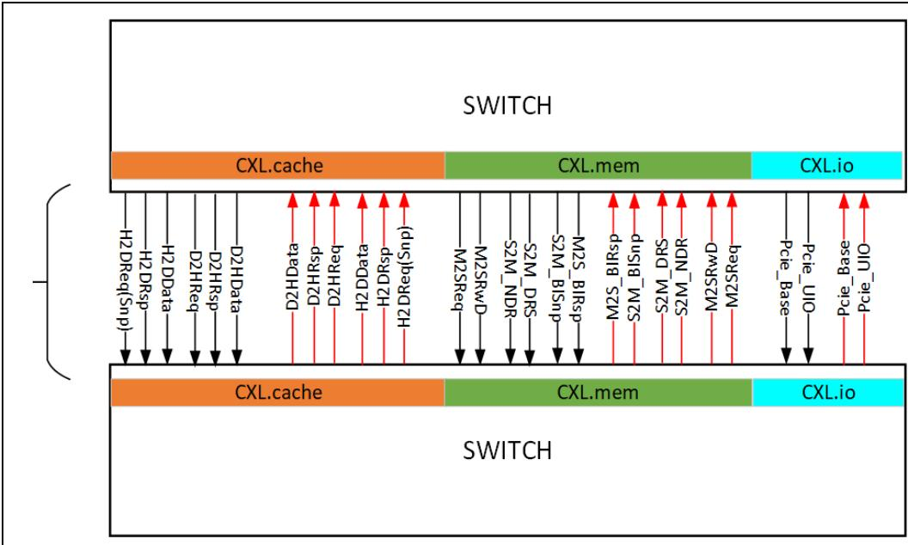

## 7.7.7.1 .io Deadlock Avoidance on ISLs/PBR Fabric

ISLs and PBR switches carry CXL.io Upstream traffic and CXL.io Downstream traffic from different hosts in the same physical direction/queues. To avoid deadlocks, these two traffic types need to be kept independent on ISLs and internally through PBR switches. To assist in maintaining the required independence, each TLP inside the PBR fabric is tagged with a DSAR (Downstream Acceptance Rules) bit. Here are the rules for setting the value of the DSAR bit within the PTH:

• When an Edge DSP converts a received TLP from HBR to PBR format, the Edge DSP shall clear the DSAR bit

• When an Edge USP converts a received TLP from HBR to PBR format, the Edge USP shall set the DSAR bit

• When a Host ES vDSP forwards a TLP P2P, it shall set the DSAR bit

• When a GFD sends a TLP (which is always in PBR format), the GFD shall clear the DSAR bit

• When an Edge DSP above a GFD forwards a TLP to the GFD, the Edge DSP shall set the DSAR bit

For the remainder of this section, traffic with DSAR=0 is referred to as USAR (Upstream Acceptance Rules) traffic, and DSAR=1 traffic is referred to as DSAR (Downstream Acceptance Rules) traffic. On an ISL, this bit is carried in the PTH. Traffic within each VC is required to follow the ordering rules specified in Table 7-107 and Table 7-108.

Table 7-107. PBR Fabric .io Ordering Table, Non-UIO

<table><tr><td rowspan="3" colspan="3">Row Pass Column?</td><td colspan="4">DSAR</td><td colspan="4">USAR</td></tr><tr><td rowspan="2">Posted Request</td><td colspan="2">Non-Posted Request</td><td rowspan="2">Completion</td><td rowspan="2">Posted Request</td><td colspan="2">Non-Posted Request</td><td rowspan="2">Completion</td></tr><tr><td>Read Request</td><td>NP Request with Data</td><td>Read Request</td><td>NP Request with Data</td></tr><tr><td rowspan="4">DSAR</td><td colspan="2">Posted Request</td><td rowspan="4" colspan="4">Per PCIe Base Specification</td><td>Yes</td><td>Yes</td><td>Yes</td><td>Yes</td></tr><tr><td rowspan="2">Non-Posted Request</td><td>Read Request</td><td>Yes/No</td><td>Yes</td><td>Yes</td><td>Yes/No</td></tr><tr><td>NP Request with data</td><td>Yes/No</td><td>Yes</td><td>Yes</td><td>Yes/No</td></tr><tr><td colspan="2">Completion</td><td>Yes</td><td>Yes</td><td>Yes</td><td>Yes</td></tr><tr><td rowspan="4">USAR</td><td colspan="2">Posted Request</td><td>Yes/No</td><td>Yes</td><td>Yes</td><td>Yes/No</td><td rowspan="4" colspan="4">Per PCIe Base Specification</td></tr><tr><td rowspan="2">Non-Posted Request</td><td>Read Request</td><td>Yes/No</td><td>Yes/No</td><td>Yes/No</td><td>Yes/No</td></tr><tr><td>NP Request with data</td><td>Yes/No</td><td>Yes/No</td><td>Yes/No</td><td>Yes/No</td></tr><tr><td colspan="2">Completion</td><td>Yes/No</td><td>Yes</td><td>Yes</td><td>Yes/No</td></tr></table>

Table 7-108. PBR Fabric .io Ordering Table, UIO

<table><tr><td rowspan="2" colspan="2">Row Pass Column?</td><td colspan="3">DSAR</td><td colspan="3">USAR</td></tr><tr><td>UIO PR-FC TLP</td><td>UIONPR-FC TLP</td><td>UIO Completion</td><td>UIO PR-FC TLP</td><td>UIONPR-FC TLP</td><td>UIO Completion</td></tr><tr><td rowspan="3">DSAR</td><td>UIO PR-FC TLP</td><td rowspan="3" colspan="3">Per PCIe Base Specification</td><td>Yes</td><td>Yes</td><td>Yes/No</td></tr><tr><td>UIONPR-FC TLP</td><td>Yes</td><td>Yes</td><td>Yes/No</td></tr><tr><td>UIO Completion</td><td>Yes</td><td>Yes</td><td>Yes</td></tr><tr><td rowspan="3">USAR</td><td>UIO PR-FC TLP</td><td>Yes/No</td><td>Yes/No</td><td>Yes/No</td><td rowspan="3" colspan="3">Per PCIe Base Specification</td></tr><tr><td>UIONPR-FC TLP</td><td>Yes/No</td><td>Yes/No</td><td>Yes/No</td></tr><tr><td>UIO Completion</td><td>Yes</td><td>Yes</td><td>Yes/No</td></tr></table>

To support the additional ordering requirements stated above, the following rules apply on ISL (also pictorially depicted in Figure 7-48):

Figure 7-48. Deadlock Avoidance Mechanism on ISL  
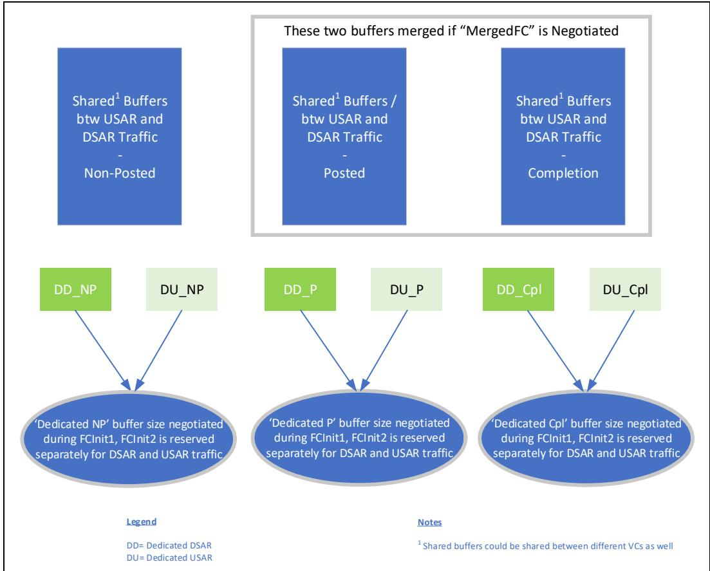

• PBR Fabric .io ordering rules apply independently within each VC implemented

• On edge HBR/PCIe links and on edge PBR links, PBR Fabric ordering rules do not apply

— On edge PBR links, PTH bit can be ignored for ordering purposes and only the regular CXL.io ordering rules from PCIe Base Specification apply.

• Nonzero dedicated credits are always required on ISL for each VC, regardless of whether multiple VCs are enabled

• Baseline Shared and Merged FC initialization and usage rules, as described in PCI Base Specification, apply on ISLs as well, with some new rules/exceptions as noted below:

— Dedicated buffers are required separately per FC class for DSAR and USAR traffic and they are both the same value as negotiated during FC initialization.

• As an example, if one Posted HDR and one Posted DATA credit were exchanged for Dedicated buffers during InitFC1/2, the transmitter assumes there is 1 Posted data credit for DSAR traffic and one Posted data credit for USAR traffic and similarly for Posted HDR Credit as well.

• Shared buffers can be shared between DSAR and USAR traffic.

• Update-FC DLLP is modified as shown in Figure 7-49, to indicate release of DSAR or USAR buffers. Transmitters can use this information on shared credits to implement QoS limiting between DSAR and USAR traffic.

— This modification is implicitly enabled on ISLs and requires no negotiation

## Note:

To aid debug, Switches are recommended to capture the Hdr and data\_Scale values negotiated at initialization so that debug software can access the values.

• Optimized\_Update\_FC DLLP applies to USAR traffic only and it is implicit on ISLs. All DSAR traffic’s shared buffer credit return occurs only via Update-FC DLLP.

## Figure 7-49. Update-FC DLLP Format on ISL

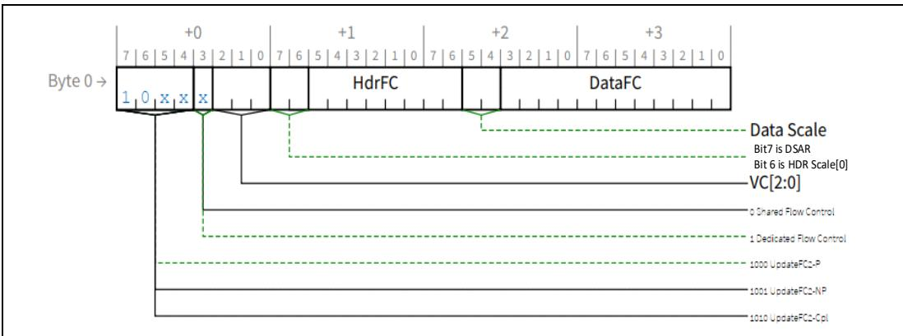

## 7.7.8 PBR TLP Header (PTH) Rules

For the purposes of this discussion, a “PBR link” is a link that negotiated to PBR flit format via the physical layer TS “PBR Flit bit” (see Section 6.4). See Section 3.1.8 for details of PTH format.

• A PTH is inserted (via an appropriate decode mechanism) on CXL.io TLPs by an Edge Switch or the PTH is directly generated by devices (e.g., GFD) that natively support PBR link

• A PTH is forwarded as-is (unless explicitly noted otherwise as in handling PTH.DSAR bit on an edge PBR link) on a CXL.io TLP if the egress port is connected to a PBR link

• A PTH is removed when its CXL.io TLP exits to an edge non-PBR link

— Note that some contents of PTH could be transferred to VendPrefixL0 if the egress port is an HBR link and the VendPrefixL0 is supported and enabled on the link. See Section 7.7.3 and Section 7.7.4.

• A PTH is included in link-IDE Integrity protection, if supported and enabled, when the PTH traverses PBR links.

• PTH is not included in .io selective IDE protection.

## 7.7.9 PBR Support for UIO Direct P2P to HDM

PBR switches support special routing mechanisms to enable the UIO Direct P2P to HDM use case with edge-to-edge routing, which often can be much more efficient compared to the hierarchical routing used in HBR switches. For backward compatibility, legacy software unaware of these special PBR routing mechanisms can continue to use HDM decoders, providing limited UIO Direct P2P capability.

An enhanced version of the FAST decoder as defined in Section 7.7.2.4 can be implemented in the Edge DSP above the UIO requester, providing edge-to-edge routing for UIO requests that target GFDs.

Another instance of the FAST decoder hardware can provide edge-to-edge routing for UIO requests that target LD-FAM devices. This instance is referred to as an LD-FAM Segment Table (LDST), and it is usually configured with a different segment size and amount of mapped HDM space from any FAST decoders in use.

With LD-FAM devices, UIO completions can be routed edge-to-edge with an ID-Based Re-Router mechanism, which can be implemented in the Edge DSP above each LD-FAM device. The Re-Router matches against the destination ID of the UIO completion to determine the DPID for edge-to-edge routing. G-FAM devices automatically use edgeto-edge routing for UIO completions without this mechanism.

FAST decoders, LDST decoders, and ID-Based Re-Routers are each configured by host software using CCI command sets, as documented in Section 7.7.15.

GFDs are not associated with any VH, thus they have no PCI ID (segment, bus, device, function number) assigned by any host. When a GFD sends a UIO completion, the completer segment field (if present) and the completer ID field in the completion are reserved and shall be 0.

## 7.7.9.1 FAST Decoder Use for UIO Direct P2P to G-FAM

FAST decoder instances in Edge USPs and DSPs have several similarities:

• Both convert requests from HBR format to PBR format, and route edge-to-edge to target GFDs.

• For the SPID, each uses the PID associated with its port.

• Both support CXL.mem and (CXL.io) UIO requests.

• A USP FAST decoder receives HBR format downstream requests coming from the RP. CXL.mem requests result from host accesses to GFDs.

• A DSP FAST decoder receives HBR format upstream requests coming from the requester device. UIO requests result from UIO Direct P2P traffic, where the UIO requester may be directly connected to an Edge DSP, or it may be connected via one or more HBR switches below the Edge DSP. CXL.mem requests result from the Direct P2P CXL.mem for accelerators use case, covered in Section 7.7.10.

A DSP FAST decoder can be configured with a segment size different from the host’s USP FAST decoder(s), but it is recommended for all FAST decoders to use the same segment size to avoid software complexity.

A DSP FAST decoder may need to be configured with a different number of segments from the host’s USP FAST decoder(s) (e.g., a requester device may not need access to the entire Fabric Address space mapped by the USP FAST decoder). On the other hand, a requester device may need to access the Fabric Address space associated with an entire host Domain, not just a single RP within a host domain.

## 7.7.9.2 LDST Decoder Use for UIO Direct P2P to LD-FAM

LDST decoder instances in Edge USPs and DSPs have several similarities:

• Both convert requests from HBR format to PBR format, and route edge-to-edge to target LD-FAM devices.

• For the SPID, each uses the PID associated with its port.

• Both support CXL.mem and (CXL.io) UIO requests.

• A USP LDST decoder receives HBR format downstream requests coming from the RP. CXL.mem requests result from host accesses to LD-FAM devices. UIO requests currently have no architected use cases, but they are not prohibited.

• Host software determines whether host accesses to LD-FAM devices use LDST decoders versus HDM Decoders in Edge USPs. For backward compatibility, legacy software that’s unaware of LDST decoders can continue to use HDM decoders. For overcoming scaling limitations with the number of HDM decoders supported by Edge USPs, LDST-aware software can use LDST decoders, though LDST decoders do not support HDM-D.

• A DSP LDST decoder receives HBR format upstream requests coming from the requester device. UIO requests result from UIO Direct P2P traffic. CXL.mem requests result from the Direct P2P CXL.mem for accelerators use case, covered in Section 7.7.10.

A DSP LDST decoder can be configured with a segment size different from the host’s USP LDST decoder(s), but it is recommended for all LDST decoders to use the same segment size to avoid software complexity.

A DSP LDST decoder may need to be configured with a different number of segments from the host’s USP LDST decoder(s) (e.g., a requester device may not need access to the entire LD-FAM HDM space mapped by the USP LDST decoder). On the other hand, an accelerator may need to access the LD-FAM HDM space associated with the entire host Domain, not a single RP in the host Domain.

When any LDST decoders are in use, host SW needs to configure any HDM decoders mapping the same LD-FAM HDM ranges with decoder characteristics compatible with LDST decoders. This applies to HDM decoders present in the host, PBR switches, HBR switches, or LD-FAM devices. These decoder characteristics include:

• Minimum decoder granularity: 64 GB for LDST

• Interleave Ways (IW): neither HBR nor PBR switches have the special logic required to support 3/6/12, but LDST supports the other architected IW values.

Note that Dynamic Capacity (DC) Block Sizes are not visible to either type of decoder.

LDST decoders insert a requester segment field in UIO requests when necessary. This is described in Section 7.7.9.3.

## 7.7.9.3 ID-Based Re-Router for UIO Completions with LD-FAM

For UIO Direct P2P to LD-FAM devices, UIO completions by default are routed using hierarchical PCI ID-based routing, and the ID may include a PCI segment number in addition to bus, device, and function numbers. If present in the Edge DSP above an LD-FAM device, the ID-Based Re-Router does a CAM match using the PCI ID, returning the DPID needed for edge-to-edge routing. This mechanism efficiently handles intra-VH cases, and it is especially efficient for cross-VH cases by avoiding P2P through the Root Complex.

PCI segment numbers in TLPs is a feature added in PCI Express Base Specification 6.0, and PCI segments should not be confused with “segments” in the context of FAST/LDST decoders. LDST decoders support the PCIe convention that requesters generally don’t include PCI segment numbers in requests1 but rely instead on routing mechanisms to add PCI segment number fields when needed for cross-segment routing. Host software configures LDST decoders to add2 the requester segment field in the request when it targets a different PCI segment. When the LD-FAM device responds to the UIO request with a UIO completion, it automatically includes segment fields when necessary in the Destination ID and Completer ID. Host software shall configure the ID-Based Re-Router with the PCI segment number in entries that need it.

## 7.7.9.4 LDST and ID-Based Re-Router Access Protection

LDST and ID-Based Re-Router use is protected by the LDST Access Vector (LAV) to ensure that only valid PIDs are programmed by the host into the LDST and ID-Based Re-Router structures. The LAV is a 4k-bit vector with a similar functionality as the GMVs and VTVs.

The FM is responsible for enabling access to PIDs in the LAV before the host can program those PIDs into the LDST or ID-Based Re-Router structures. For cross-VH use cases, the FM is also responsible for using the Domain Validation SV mechanism, when available, to confirm that every VH that is enabled for cross-VH access belongs to the same host domain.

## 7.7.10 PBR Support for Direct P2P CXL.mem for Accelerators

Direct P2P CXL.mem provides the ability for an accelerator to access peer Type 3 memory devices using CXL.mem. PBR switches require special routing mechanisms to support this, specifically the FAST and LDST decoders. For Direct P2P CXL.mem, these decoders function essentially the same as they do for supporting the UIO Direct P2P to HDM use case, with the following exceptions:

• They intercept and forward upstream.mem requests instead of UIO requests

• They target only Type 3 (HDM) devices, not Type 2 devices

• The accelerator (requester device) and Type 3 device must each be directly connected to an Edge DSP

• With an MLD (Type 3 device), each accelerator must be assigned a dedicated LD distinct from the host’s LD

Note that both types of decoders support .mem requests when they are implemented in Edge USPs, so .mem support is not unique to the Direct P2P CXL.mem use case.

Same as with the UIO Direct P2P use case, a FAST decoder can be implemented in the Edge DSP above an accelerator, providing edge-to-edge routing for .mem requests that target G-FAM devices (GFDs). The same FAST decoder instance can support either the UIO Direct P2P or Direct P2P CXL.mem use case.

Similarly, an LDST decoder can be implemented in the Edge DSP above an accelerator, providing edge-to-edge routing for .mem requests that target LD-FAM devices. The same LDST decoder instance can support either the UIO Direct P2P or Direct P2P CXL.mem use case.

Type 3 devices used with Direct P2P CXL.mem can be mapped under either HDM-H or HDM-DB coherency ranges. If mapped under HDM-DB, peer devices other than the associated accelerator can access the HDM-DB memory using UIO Direct P2P to HDM, in which case the associated accelerator serves the role of the host participating in BI protocol (i.e., the HDM-DB device directs BISnps to the accelerator).

Direct P2P CXL.mem traffic going to or from an MLD (directly connected to an Edge DSP) works essentially the same as with host .mem traffic, as documented in Section 7.7.6.6.3 and Section 7.7.6.8.

CXL.mem responses for the Direct P2P CXL.mem use case require no special routing mechanism. For S2M responses from G-FAM, the GFD’s RPID context for the accelerator contains the DPID needed for edge-to-edge routing back to the accelerator. For S2M responses from LD-FAM, the vPPB in the Edge DSP above the Type 3 device contains the DPID needed for edge-to-edge routing back to the accelerator.

Same as with the UIO Direct P2P use case, FAST decoders and LDST decoders are each configured by host software using CCI command sets, as documented in Section 7.7.15 for FAST decoders and Section 7.7.13 for LDST decoders.

## 7.7.10.1 Message Routing for Direct P2P CXL.mem Accesses with GFD

Direct P2P CXL.mem messages are routed using standard PBR mechanisms. Figure 7-50 illustrates an example PBR Fabric with a Direct P2P CXL.mem enabled Type 2 accelerator and two peer GFDs accessible to it. The dashed lines indicate the paths taken by the Direct P2P CXL.mem messages. Upstream .mem requests from the accelerator are routed edge-to-edge to the appropriate GFD by the FAST decoder in vPPB 6. Upstream .mem responses from either GFD are routed edge-to-edge back to the accelerator by standard PBR routing.

For an HDM-DB GFD sending a BISnp, the GFD’s RPID context for the accelerator contains the DPID that is needed for edge-to-edge routing to the accelerator.

Figure 7-50. Example Topology with Direct P2P CXL.mem with GFD  
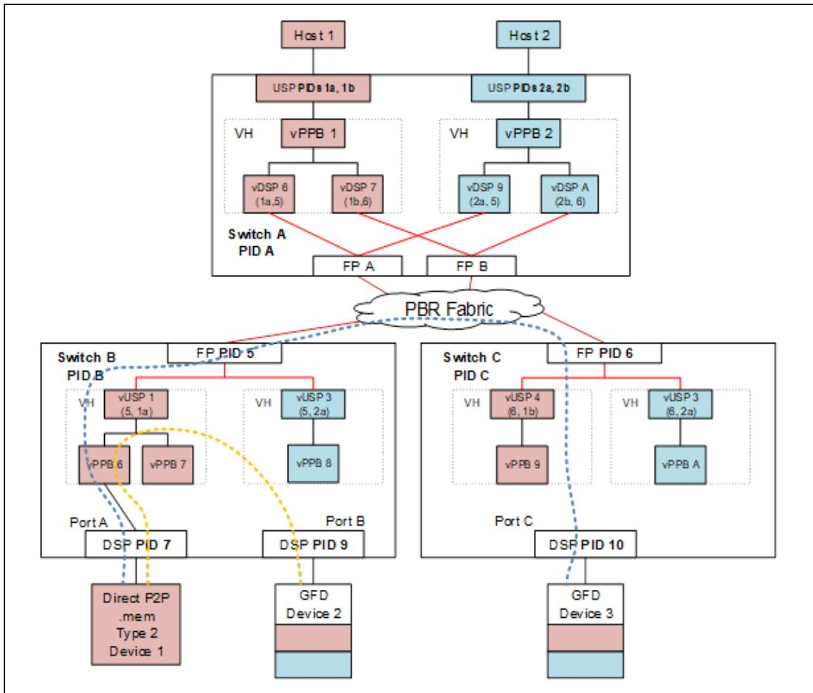  
7.7.10.2 Message Routing for Direct P2P CXL.mem Accesses with MLD

Direct P2P CXL.mem accesses to an MLD require a distinct LD and associated peer requester LD-ID on the link between the MLD and the Edge DSP to which it is attached. This is accomplished by assigning a vPPB in the DSP in the same Domain as the host that owns the requester. The host and any peer accelerators will each have their own vPPB bound to them, which utilize their individual LD-IDs.

Figure 7-51 illustrates an example PBR Fabric with a Direct P2P CXL.mem enabled Type 2 accelerator and two peer MLDs accessible to it. The dashed lines indicate the paths taken by the Direct P2P CXL.mem messages. Upstream CXL.mem requests from the accelerator are routed edge-to-edge to the appropriate MLD by the LDST decoder in vPPB 6. Upstream CXL.mem responses from either MLD are routed edge-to-edge back to the accelerator by standard PBR routing using the accelerator’s PID, which in each case is retrieved from the accelerator’s vPPB in the DSP above the MLD.

Figure 7-51. Example Topology with Direct P2P CXL.mem with MLD  
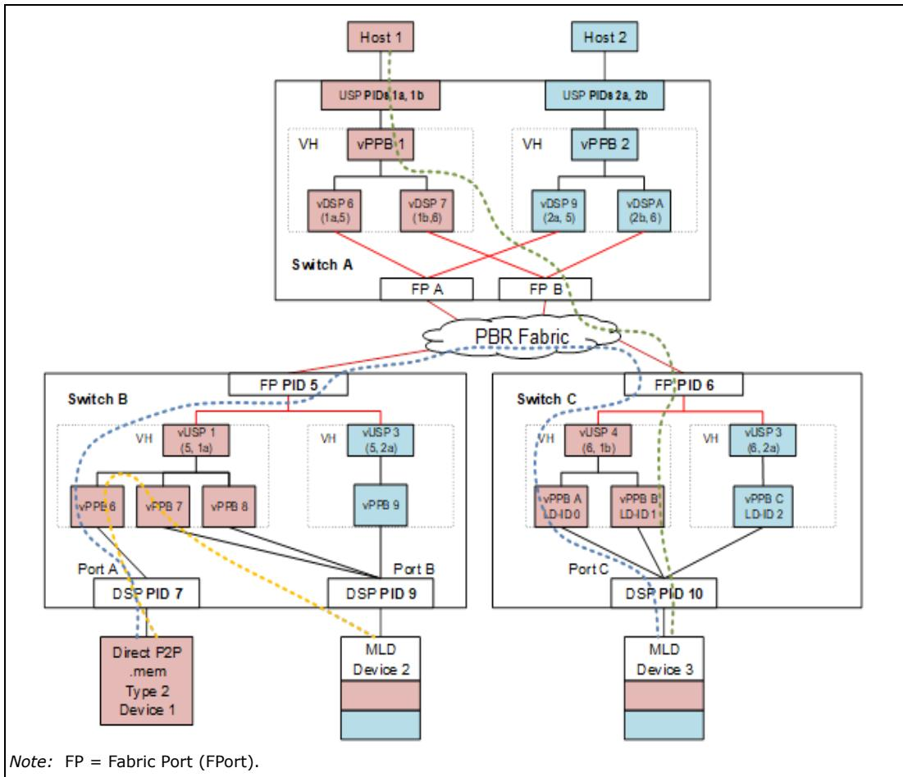

In this example, the path taken by CXL.mem messages between the host and one MLD is also shown. Downstream CXL.mem requests from the host are routed edge-to-edge to the appropriate MLD by the LDST decoder in vPPB 1. Upstream CXL.mem responses from the MLD are routed edge-to-edge back to the host by standard PBR routing using the host’s PID contained in vPPB B.

For an HDM-DB LD-FAM device sending a BISnp, the Edge DSP above the LD-FAM device contains the DPID that is needed for edge-to-edge routing to the accelerator.

## 7.7.11 PBR Link Events and Messages

A PBR link can carry traffic from many different VH at the same time. Some events may occur that only affect a single VH, while other events need to apply to all VH sharing the link.

Basic PBR link requirements are discussed in Section 7.7.11.1.

A summary of all the CXL Vendor Defined Messages (VDMs) that are PTH routed to the destination is provided in Section 7.7.11.2.

PCIe events for a single VH are discussed in Section 7.7.11.3.

PCIe events for multiple VH sharing a link are discussed in Section 7.7.11.4.

Events that occur outside PCIe are discussed in Section 7.7.11.5.

Messaging to and from a host to a GFD is discussed in Section 3.1.11.1.

## 7.7.11.1 PBR Link Fundamentals

CXL defines two types of PBR links:

• Inter-Switch Link (ISL)

• GFD link

All PBR links must support PBR Flit mode. Because PBR Flit mode relies on PCIe Flit mode, all host-OS-visible DSPs should report PCIe Flit mode as enabled. The DSPs include both a Host Edge Switch vDSP and a DSP above a PBR link that leads to a GFD.

The owner of a PBR link is an FM-managed DSP. Switch firmware may assist the FM in managing the DSP. An ISL is a downstream-to-downstream crosslink and thus has an FM-managed DSP on each side of the link. A GFD link has only one DSP and thus has only one FM-managed DSP. The speed and width of a PBR link is solely controlled by the FM-managed DSP(s) on the link and not by any vDSPs that share the link.

Each side of an ISL is managed separately. Each DSP above an ISL must support DPC, to allow firmware on each side of the link an independent amount of time to process fabric port events. DPC shall be enabled for all cases on ISL except when the ISL is the only path to the FM, in which case the DSP furthest from the FM shall not have DPC enabled.

FM-initiated CXL.io traffic sent across a PBR link shall be limited to DMTF-format VDMs. The PTH.DPID is used to indicate whether the PBR Link Partner should sink the TLP or forward the TLP. If the PTH.DPID = FFFh, the PBR Link Partner must sink the VDM because that is how the initial device discovery occurs and how PIDs are assigned. If the PTH.DPID = the device’s PID, then the device must also sink the VDM because that is how the device is accessed by the FM.

All VH users of a PBR link have their functionality ride on top of the FM-managed link. For example, a VH’s DSP cannot see a Link Up if the fabric link is not up. A VH cannot change the width or speed of its shared link, rather it will inherit the setting of the FMmanaged DSP.

To manage different software response times to events, every vDSP for every VH must support DPC. DPC allows a host to keep its Link Down from its (VH) perspective until it is ready to re-enable it, having cleaned up all the side effects of a Link Down. A Host may or may not choose to enable DPC.

L0p is optional on a PBR link. The FM-managed DSP initiates any L0p transitions via a mechanism that is beyond this specification.

Every CXL.io TLP on a PBR link will carry a 4B PTH. The VDMs described in this section follow the same rule. See Section 3.1.8. There are three fields of note in the PTH that are required for the VDMs described in this section:

• SPID: Source PID

— From a vDSP: Use vDSP’s USP PID

— From a vUSP: Use vUSP’s FPort PID

— From a switch: Use switch’s PID

— From a downstream edge: Use DSP’s PID

— From a host edge: Use USP’s PID

• DPID: Destination PID

— To a vDSP: Use vDSP’s USP PID

— To a vUSP: Use vUSP’s FPort PID

— To a switch: Use switch’s PID

— To a downstream edge: Use DSP’s PID

— To host edge: Use USP’s PID

• DSAR flag

## 7.7.11.2 CXL VDMs

See Section 3.1.11 for a list of VDMs that are used in the PBR fabric.

## 7.7.11.3 Single VH Events

Events that are contained within a single VH should not affect other VHs that share an ISL.

PCIe visible events that are contained within a single VH include:

• Assert Reset

• Deassert Reset

• Link Up

Figure 7-52 shows the virtual hierarchy from a Host 1 perspective (other hierarchies are grayed out). In Switch A, Host 1 finds only a single switch VCS 0. However, in Switch B, two switches VCS 1 and VCS 4 are in the Host 1 hierarchy. VCS 1 has Switch B vUSP E connected below Switch A vDSP 4, and VCS 4 has Switch B vUSP 11 below Switch A vDSP 7. Switch C has a GFD with that is accessible by Host 1 devices, but the GFD is not visible to the Host 1 PCI hierarchy. See Section 7.7.14 for more details on control of the GFD.

Figure 7-52. Single VH  
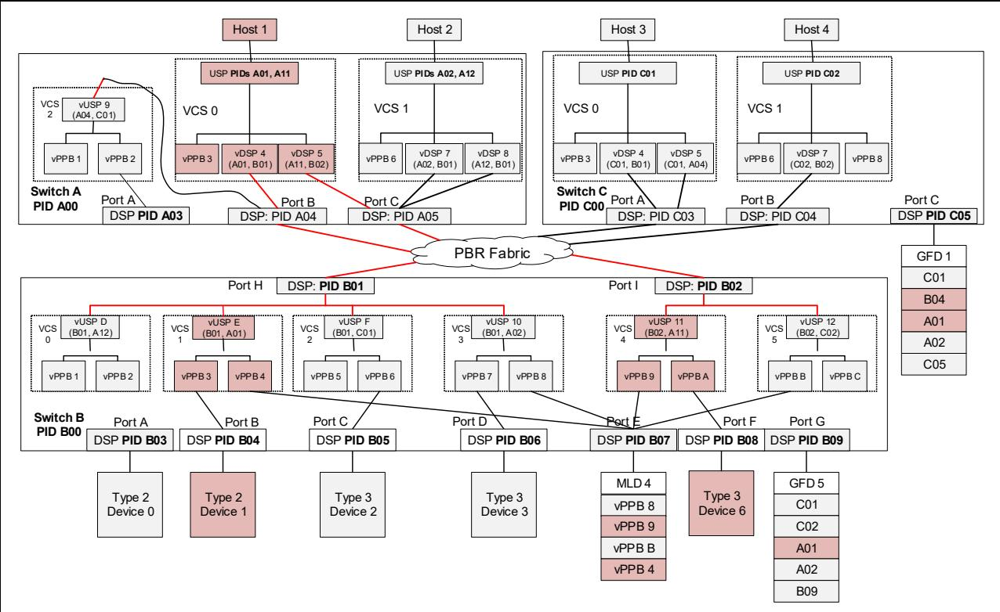

## 7.7.11.3.1 Assert Reset VDM

Every PCIe hierarchy supports three levels of Conventional Reset:

• Fundamental cold reset (PERST#): Input pin

• Fundamental warm reset (PERST#): Input pin

• Hot reset due to Link Down, in-band hot reset, USP secondary bus reset, DSP secondary bus reset, or link disabled

CXL Fabric links support propagation of these resets. The ISL link state is not affected by any VH’s Assert Reset or Assert PERST# VDM. Assertion of reset is accomplished using one of two different VDM opcodes:

• Assert PERST#: Used for fundamental reset assertion for that VH, Opcode 0

• Assert Reset: Used for hot reset assertion for that VH, Opcode 1

The separate PERST# message allows for fundamental reset functionality without the need for extra pins between switches.

Assert PERST# should be triggered whenever a VH has its input fundamental reset asserted on a Host ES. Assert Reset should be triggered whenever the Host ES:

• Receives a hot reset input

• Has a secondary bus reset on its USP

• Has a secondary bus reset on its VDSP

• Has a link disable on its vDSP

The Assert Reset VDMs all are sent from a vDSP to its paired vUSP. The VDM sent will have a PTH with:

• SPID = vDSP’s host PID

• DPID = vUSP’s FPort PID

• DSAR flag = 1

VDM header fields for Assert Reset VDMs:

• CXL VDM code of 80h

• PBR Opcode 0 or 1 indicates which Assert PERST# or Assert Reset message

It is expected that the Assert Reset VDM will reach a vUSP uniquely identified by the SPID and DPID at the destination switch.

A vDSP, upon sending Assert Reset VDM, will have its link state transition to Hot Reset.

A vUSP, upon receiving an Assert Reset VDM, will have its link state transition to Hot Reset. While in Hot Reset, all Port non-sticky registers and state machines that belong to the VH must return to their initialized state.

A vUSP, upon receiving an Assert PERST# VDM, shall have its link state transition to Hot Reset and also shall clear any sticky bits as outlined by PCIe Base Specification for PERST# behavior.

It is possible to send any number of Assert Reset VDMs or Assert PERST# VDMs.

In Figure 7-53, if Host 1 asserts its PERST#, then both vDSP 4 and vDSP 5 shall issue an AssertPERST# VDM. The format of the PTH would be (SPID=A01, DPID=B01) for vDSP 4 and (SPID=A11, DPID=B02) for vDSP 5. If Host 1 instead asserted vDSP 4 secondary bus reset, then only vDSP 4 would send an AssertReset VDM with (SPID=A01, DPID=B01).

## 7.7.11.3.2 Deassert Reset VDM

A Deassert Reset VDM signals a release of reset and an exiting of the Hot Reset state to enter Detect for that VH. This VDM shall be sent from the Host Edge Switch due to a deassertion of the PERST# input resulting from an exit from Hot Reset.

If DSP is enabled the DPC trigger status must be cleared before a Deassert Reset VDM can be sent because DPC triggered prevents any TLPs from egressing that port.

Propagation of reset deassertion over an ISL is enabled via a Deassert Reset VDM, which is used for hot reset deassertion for that VH, Opcode 3.

A Deassert Reset VDM is used to instruct the vUSP to exit Hot Reset and enter Detect. The Deassert Reset VDM sent will have a PTH with:

• SPID = vDSP’s host PID

• DPID = vUSP’s FPort PID

• DSAR flag = 1

VDM header fields for Deassert Reset VDMs:

• CXL VDM code of 80h

• PBR Opcode 3

A vDSP, upon sending a Deassert Reset VDM, will have its link state transition from Hot Reset to Detect. A vUSP, upon receiving a Deassert Reset VDM, will have its link state transition from Hot Reset to Detect. If the link state is not in Hot Reset, a link state change will not occur.

The link for that VH will remain in Detect until the vUSP sends a Link Up VDM and the vDSP receives a Link Up VDM. If a Link Up VDM is not received within 10 ms, a subsequent Deassert Reset VDM shall be sent. This can repeat until 10 Deassert Reset VDMs have been sent. After a tenth Deassert Reset VDM is sent, if a Link Up VDM is still not received within 10 ms, the reset deassertion failed and the FM shall be notified.

In Figure 7-53, if Host 1 clears the secondary bus reset in Switch A vDSP 4, then vDSP 4 would send a Deassert Reset VDM with (SPID=A01, DPID=B01). Switch B vUSP E would exit the hot reset state. As part of the exit from LTSSM Detect and due to the shared link nature of an ISL, vUSP E will bypass the PCIe LTSSM states of Polling and Configuration and transition the vDSP-to-vUSP link back to L0 (Link Up) by sending a Response Link Up VDM.

## 7.7.11.3.3 Link Up VDM

A Link Up VDM signals a transition to L0 active for that VH’s link. The Link Up VDM is sent by a vUSP to its paired vDSP to convey a post-Detect state across the shared ISL.

The vUSP sends a Link Up VDM after receiving a Deassert Reset VDM. The vUSP can perform any required post-reset initialization before sending the Link Up VDM. The vUSP may take as long as it needs after Deassert Reset to send the Link Up VDM. Any number of Deassert Reset VDMs may be received by the vUSP; for each Deassert Reset VDM received, a Link Up VDM shall be sent.

The vUSP, after sending a Link Up VDM, shall have its link state transition to L0 from Detect. Polling and Configuration link states are bypassed by the Link Up VDM because the required TS1 and TS2 Ordered Sets cannot be sent over a shared ISL.

A vDSP, after receiving a Link Up VDM, shall have its link state transition to L0 from Detect. If not in Detect, there is no state change. Any number of Link Up VDMs may be received. Polling and Configuration link states are bypassed by the Link Up VDM, with the link directly transitioning from Detect to L0.

Neither a vDSP nor vUSP should ever have their link state reach Polling or Configuration state.

The VDM sent will have a PTH with:

• SPID = vUSP’s FPort PID

• DPID = vDSP’s host PID

• DSAR flag = 1

VDM header fields for LinkUp VDMs:

• CXL VDM code of 80h

• PBR Opcode 4

## 7.7.11.3.4 Dynamic vDSP-to-vUSP Bind

See Section 7.7.12.3 for more details on the Configure PID Binding API sequence. After Configure PID Bind, the vDSP or vUSP shall be in a Hot Reset state. A vDSP may issue an Assert Reset VDM or a Deassert Reset VDM from the reset state, as dictated by its VH. A vUSP shall remain in Hot Reset until the vUSP receives a Deassert Reset VDM, upon which, after processing the necessary post-reset tasks, the vUSP will send a Link Up VDM.

## 7.7.11.4 Shared Link Events

Events that affect multiple VHs on the same link need to be reported to the FM. The FM shall take any necessary action.

The FM is required to keep an inventory for each ISL. Figure 7-53 shows how the link from Switch A Port B (indicated by an oval with 1) is shared by both a Host 1 hierarchy and a Host 3 hierarchy. Events on this link will affect both hierarchies. The oval with 2 is another shared link used by multiple hierarchies, of which only a Host 1 hierarchy is colored in but the ISL also includes Host 3 (VCS 2) and two hierarchies of Host 2 (VCS 0 and VCS 3).

Figure 7-53. Shared Link Events  
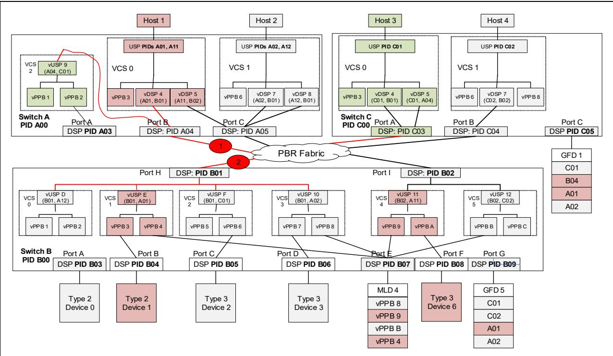  
7.7.11.4.1 Inter-Switch Link (ISL) Down

An ISL going down may affect one or more VHs.

A switch on each side of the ISL knows if the link had any issues. The fabric port’s DPC is used to handle link issues. If DPC triggers, switch firmware will be notified. DPC may trigger due to Link Down or due to other reasons, such as software trigger; the net result is that the ISL will go down. Once the link goes down the switch reports the event to its primary FM. The FM is responsible for resolving the ISL Down event for all involved VHs.

The fabric port’s DPC should remain triggered until switch firmware can resolve the side effects of an ISL Down event. When the FM has finished its resolution tasks, the FM will instruct the switch to clear the DPC trigger on the fabric port DSP. DPC trigger clear indicates resolution of the event and also allows the ISL to come back up.

The FM requires an inventory of users of an ISL to correctly resolve an ISL Down event. FM tasks for the resolution of an ISL Down event involves the following:

• Unbinding any affected VHs’ vDSP

• Unbinding any affected VHs’ vUSP

• Clearing any affected multi-path in a switch’s RGT

• Clearing any affected GFD Access Vector in a switch’s GAE

For example, if the link at Oval #1 in Figure 7-53 breaks, Switch A and an unlabeled PBR fabric switch will both notify their primary FM. The FM will then unbind the following affected vDSPs and vUSPs:

• Switch A vDSP 4 and vUSP 9

• Switch B vUSP E

• Switch C vDSP 4

As another example, if the link at Oval #2 in Figure 7-53 breaks, Switch B and an unlabeled PBR fabric switch will both notify their primary FM. The FM will then unbind the following affected vDSPs and vUSPs:

• Switch A vDSP 4 and vDSP 8

• Switch B vUSP D, vUSP E, vUSP F, and vUSP 10

• Switch C vDSP 4 and vDSP 7

In addition to the unbinding of the vDSP and vUSP pair affected by an ISL Down event, the RGT and GAE GFD access vectors may be updated by the FM. The RGT would be updated to avoid the path leading to the fault. The GFD Access Vector may be updated to remove a GFD that is no longer reachable.

## 7.7.11.5 Switch Reported Events

Some events are switch specific or are outside normal PCIe reporting methods and thus require switch-specific intervention. These include:

• Link Partner Info

## 7.7.11.5.1 Link Partner Info VDM

A Link Partner Info VDM is sent on all PBR links immediately after the InitFC process finishes for VC0. Each side of the link will send a Link Partner Info VDM. This is a message with payload. For CXL 3.1, the payload is a fixed size of 16 DWORDs.

There are two types of PBR links: ISL and GFD. Both have same Link Partner Info, but have a different value for the type.

The Link Partner Info payload includes the following fields about the far end of the link:

• 16B Device UUID

• 1B Physical Port

• 2B {4b Device Type (0 = PBR switch, 1 = GFD, all other encodings are reserved), 12b PID (0xFFF is initialized)}

• 1B Standard FC VC list, default {8’bxxxx\_0xx1}

• 1B UIO FC VC list, default {8’bxxxx\_Pxx0}

• 16B FM Primary UUID

• 16B FM Secondary UUID

Table 7-109. Link Partner Info Payload

<table><tr><td rowspan="2">Byte</td><td colspan="8">+3</td><td colspan="8">+2</td><td colspan="8">+1</td><td colspan="7">+0</td><td></td></tr><tr><td>7</td><td>6</td><td>5</td><td>4</td><td>3</td><td>2</td><td>1</td><td>0</td><td>7</td><td>6</td><td>5</td><td>4</td><td>3</td><td>2</td><td>1</td><td>0</td><td>7</td><td>6</td><td>5</td><td>4</td><td>3</td><td>2</td><td>1</td><td>0</td><td>7</td><td>6</td><td>5</td><td>4</td><td>3</td><td>2</td><td>1</td><td>0</td></tr><tr><td>0</td><td colspan="4">DevType[3:0]</td><td colspan="12">PID[11:0]</td><td colspan="8">Far End PortID[7:0]</td><td colspan="8">PortID[7:0]</td></tr><tr><td>4</td><td rowspan="4" colspan="32">Device UUID[127:0]</td></tr><tr><td>8</td><td></td></tr><tr><td>12</td><td></td></tr><tr><td>16</td><td></td></tr><tr><td>20</td><td colspan="16">Primary FM UUID[15:0]</td><td colspan="8">UIO FC VC List[7:0]</td><td colspan="8">Standard FC VC List[7:0]</td></tr><tr><td>24</td><td rowspan="3" colspan="32">Primary FM UUID[111:16]</td></tr><tr><td>28</td></tr><tr><td>32</td></tr><tr><td>36</td><td colspan="16">Secondary FM UUID[15:0]</td><td colspan="16">Primary FM UUID[127:112]</td></tr><tr><td>40</td><td rowspan="3" colspan="32">Secondary FM UUID[111:16]</td></tr><tr><td>44</td></tr><tr><td>48</td></tr><tr><td>52</td><td colspan="16">Reserved</td><td colspan="16">Secondary FM UUID[127:112]</td></tr><tr><td>56</td><td rowspan="2" colspan="32">Reserved</td></tr><tr><td>60</td></tr></table>

The Link Partner Info VDM.PTH fields are as listed below. This VDM will terminate at the Receiver.

• SPID = Originator’s (switch’s/GFD’s) PID, FFFh means uninitialized

• DPID = FFFh (not used)

• DSAR flag = 1

VDM header fields for LinkPartnerInfo VDMs:

• Type 74h (Message with Data, terminate at Receiver)

• CXL VDM code of 90h

• PBR Opcode 0

A single message is sufficient to carry all the link info for CXL r3.1.

An ISL must have UIO FC VC list bit 3 set.

If both sides of a PBR link have UIO FC VC list bit 3 set, then UIO VC3 should be auto enabled by hardware.

## 7.7.11.6 PBR Link CCI Message Format and Transport Protocol

CCI commands are transported on PBR links as defined in Section 7.6.3 and its associated binding specifications (see DSP0234, DSP0238, and DSP0281) with some notable caveats and clarifications:

• As with all .io traffic across PBR links, MCTP PCIe VDMs include a PTH whose SPID and DPID define the routing of the message

• PCIe enumeration is not required for ISL PPBs and GFDs

• GFDs do not implement a PCIe Physical Function • “Requester ID” and “Target ID” fields in the VDM’s TLP header are reserved because IDs are not assigned to many elements within the fabric (e.g., FM, ISL PPBs, Switch Management FW, GFDs, etc.)

## 7.7.12 PBR Fabric Management

## 7.7.12.1 Fabric Boot and Initialization

Much like as outlined for HBR switches in Section 7.2.1, PBR switches may be initialized in one of three different ways:

• Statically

• FM boots before the host(s)

• FM and host boot simultaneously

## 7.7.12.1.1 Static Fabric Initialization

A static fabric deployment uses statically predefined configuration data to define the fabric configuration settings typically assigned dynamically by an FM.

Static Fabric Characteristics:

• No support for G-FAM or MLD

• No support for dynamic binding changes or DCD

• No FM is required, but may be needed for error handling

• At switch boot, all ports have a PID assigned, DRT and RGT tables are prepopulated, and EP and PID binding settings are predefined as defined by vendorspecific switch configuration data (e.g., configuration file in SPI Flash)

• Each VH is ready for enumeration when the host boots

• Hot-add and managed hot-remove are supported on Downstream Edge Ports

## 7.7.12.1.2 Fabric Manager Boots First

With this method, the FM configures the fabric binding relationships and access permissions before the host boots and enumerates its VH.

• FM boots while hosts are held in reset

• All attached ISLs and DSPs link up and, when negotiated in PBR mode, exchange the PBR Link Information VDM

• FM discovers fabric topology, claims ownership of all components under its management, and assign PIDs

• FM binds EPs to VCSs and configures GFDs

• FM configures GMV and VTV to enable G-FAM, GIM and Edge-to-edge P2P, as required when available

## 7.7.12.1.3 Fabric Manager and Host Boot Simultaneously

In the case where the switches, FM, and host boot at the same time:

• VCSs, PID assignment, GFD configuration, and bindings between Host ES to Downstream ES VCSs are statically defined

• Edge vPPBs within each VCS are unbound and presented to the host as Link Down

• Switch discovers downstream devices and presents them to the FM

• Host enumerates the VH and configures the DVSEC registers

• FM performs port binding to edge vPPBs

• Switch performs virtual to physical binding

• Each bound port results in a Presence Detect Change or Link State Change notification to the host

• For G-FAM access, FM updates GMV and VTV access vectors for hosts

## 7.7.12.2 PBR Fabric Discovery

To effectively manage a PBR fabric, the FM must understand the physical topology through a fabric discovery process. A typical fabric discovery may proceed as follows.

1. FM discovers the component to which it is directly connected and claims primary FM ownership.

Management of a PBR device requires that a primary FM is registered. A PBR device shall accept only the following commands from an FM that is not registered as the primary FM:

— Identify

— Get Supported Logs

— Get Log

— Identify PBR Component

— Claim Ownership

All other commands shall fail with “Unsupported Request”. A PBR device shall only advertise support for the CEL and the CEL shall only advertise the commands in the above list when the supported logs or CEL contents are queried by an FM that is not registered as the primary FM.

If the FM is connected to a switch, crawl out and discovery of the fabric continues.

2. FM explores all switch ports.

As primary FM, the switch capabilities and switch port status can be queried. The Get Physical Port State and Get PBR Link Partner Info commands provide information on the devices connected to each port.

PBR switches can determine the type of device present at the far end of a link after negotiation using the link state information provided in Table 7-110.

Table 7-110. Far End Device Type Detection

<table><tr><td>Device Type</td><td>Negotiated Link Direction</td><td>Negotiated PBR-Enabled</td><td>Negotiated MLD-Enabled</td><td>Received “Link Partner Info” Type</td></tr><tr><td>Host</td><td>USP</td><td>N</td><td>N</td><td>N/A</td></tr><tr><td>PBR Switch</td><td>DSP-DSP Crosslink</td><td>Y</td><td>N</td><td>Switch</td></tr><tr><td>GFD</td><td>DSP</td><td>Y</td><td>N</td><td>GFD</td></tr><tr><td>MLD</td><td>DSP</td><td>N</td><td>Y</td><td>N/A</td></tr><tr><td>SLD, PCIe EP, or HBR Switch</td><td>DSP</td><td>N</td><td>N</td><td>N/A</td></tr></table>

3. FM may choose to first continue discovery of any connected switches or to manage devices on the far end of all switch ports.

PBR switch PPBs connected as ISLs are configured by the FM with the Send PPB CXL.io Configuration Request command.

The FM uses the Fabric Crawl Out command, as defined in Section 7.7.13.2, using switch port number as the target to manage the devices on the far end of each switch port. The FM claims ownership and assigns a PID to each defined as covered in step 1.

Once the far end device has been assigned a PID, the FM must program the PBR switch’s DRT to enable routing of that PID to the appropriate switch port. The FM can now use this new assigned PID as the target for subsequent Fabric Crawl Out requests.

Steps 1 – 3 are repeated for all PBR switches discovered.

## 7.7.12.3 Assigning and Binding PIDs

As defined in Section 7.7.6.5, there are many entities within a fabric that require PIDs to be assigned. GFDs and PBR switches are assigned a PID for device management purposes when the FM registers with these devices using the Claim Ownership command. A PBR switch reports all additional possible PID assignments with the Get PID Target List command.

The FM may start performing binding operations after all required PIDs have been assigned using the Configure PID Assignment commands. There are two methods for binding, depending on the location of the source and target of the operation. The Bind vPPB command is used to bind a direct attached device or LD to a switch’s VCS.

The Configure PID Binding command is used to bind Downstream ES VCS vUSPs to Host ES vDSPs in a two-step operation. First, a binding command is sent to the Downstream ES, assigning the PID of the Host edge port to a Downstream ES VCS. Assignment of this PID allows the Downstream ES FPorts to select appropriate decoding and routing logic based on the SPID of incoming transactions. As detailed in Section 7.7.12.4, latency and BW values are configured with this binding so that CDAT information can be generated in the Downstream ES.

A binding command is also sent to the Host ES, assigning the PID of the desired Downstream ES FPort and associating the binding with a specified vDSP. The Host ES uses this as the DPID for downstream transactions.

## 7.7.12.4 Reporting Fabric Route Performance via CDAT

Hosts require CDAT information that defines the attributes and performance characteristics of regions of memory for all memory interconnect configurations, including PBR fabrics. Special mechanisms are defined for determining and reporting this information in a PBR fabric because hosts have no visibility of intermediate ISLs, as outlined in Section 7.7.6.1. The mechanisms used for LD-FAM differ from those used for G-FAM.

## 7.7.12.4.1 Accessing CDAT Information for LD-FAM

There are up to three components involved in the path to LD-FAM in a PBR fabric: a Host ES, a Downstream ES, and an LD-FAM device. The Host ES and LD-FAM devices require no special handling and report CDAT information covering their own characteristics as they would in an HBR system deployment. The Downstream ES, however, is required to report CDAT information that covers its own device-level performance factoring in the impact of the fabric routing path, as described below.

Latency and BW values are provided when the binding between a Host ES VCS and Downstream ES VCS is configured with the Configure PID Binding command. Routes through a fabric are expected to have symmetric performance characteristics. As such, only one latency and BW value is provided to define the fabric routing path. The Downstream ES adds the latency of the routing path to its own latency and uses the lesser of the BW values.

Hosts access CDAT information for Downstream ES VCSs from a DOE instance present in the vUSP.

## 7.7.12.4.2 Accessing CDAT Information for G-FAM

The access mechanism for CDAT from G-FAM is necessarily different from LD-FAM as a result of 2 key architectural differences: G-FAM is presented through the FAST, not a switch-based topology, and GFDs do not implement nor expose a DOE instance to the host. CDAT access for G-FAM instead relies on the use of CCI opcodes.

The GAE providing G-FAM access is responsible for producing the CDAT for each segment of the FAST. Latency and BW values are provided when PID access is enabled with the Configure PID Access command. The CDAT information is queried by the host using the Read CDAT command.

GFDs are responsible for providing CDAT information covering their own characteristics. The host queries CDAT information from GFDs using the Proxy GFD Management Command request to initiate the Read CDAT command.

## 7.7.12.5 Configuring CacheID in PBR Fabric

From the host’s perspective, configuration of CacheID for VHs spanning a PBR Fabric is performed identically to such configuration in an exclusively HBR topology. PBR switches automatically exchange ID configuration information in the following manner:

1. The Downstream ES presents ID route table capabilities in its vPPBs (see Section 8.2.4.28 for details on the CacheID Route Table).

2. The host will enumerate and assign all IDs and program the route table capability, triggering the Commit bit to complete the configuration.

3. The setting of the Commit bit triggers the Downstream ES to generate one or more RTUpdate VDMs, as defined in Section 3.1.11.7, targeted at the Host PID. The Host ES will intercept this VDM based on its PBR opcode.

4. Upon receipt of the VDM, the Host ES programs the necessary ID to PID translation logic in the Host edge port.

5. The Host ES acknowledges successful programming of the ID translation logic with an RTUpdateAck VDM, as defined in Section 3.1.11.8, sent to the Downstream ES for each RTUpdate VDM that was received and successfully processed.

6. Upon receipt of the VDM, the Downstream ES sets the corresponding ‘RT Committed’ bit in the vUSP.

A downstream HBR switch topology requires PIDs for each unique potential target so that IDs can be translated between CacheID and PID at the fabric edges. For CacheID, the ID is valid if the Valid bit is set in a Cache ID Target entry in the Cache ID Route Table Capability Structure. The corresponding PID used is the PID of the DSP to which the Route Table entry has been configured to map. Multiple PIDs must be assigned to a DSP if multiple IDs map to that DSP.

## 7.7.12.6 Dynamic Fabric Changes

This section outlines how FMs and PBR switches handle various changes to the system configuration during runtime.

## 7.7.12.6.1 Hot-Add and Link Up Events

A new Link Up on an unbound edge port is indicated to the FM via a Physical Switch Event Record. The FM uses the Get Physical Port State and Get PBR Link Partner Info commands to query information on the device connected to the port.

When an SLD or PCIe device is Hot-Added to a bound port, the FM can be notified but is not involved.

## 7.7.12.6.2 Dynamic Configuration Changes

There are many runtime configuration changes that an FM can trigger on a fabric:

• Binding/Unbinding: New bindings are presented to hosts as hot-add operations. Unbinding an EP is presented as a hot-remove operation.

• Updates to GMV/VTV: The GAE generates a notification to the host when changes are made to the GMV or VTV enabling or disabling access to a particular PID.

• GFD DCD changes: GFDs generate notifications to all impacted GAEs when updates are made to a host group’s extent list.

## 7.7.12.6.3 Hot/Surprise Remove and Link Down Events

The FM is responsible for managing a Link Down event:

• The PBR switch that experienced the Link Down notifies the FM with a Physical Switch Event Record

• EP Link Down events are represented as surprise removes to the host

• The FM manages any required topology changes associated with an ISL Link Down event, including clearing the PID binding between the Upstream ES and Downstream ES VCSs, which is presented to the host as a hot-remove of the Downstream ES VCS

• GFD Link Down events prompt the FM to disable access to the corresponding PID in all impacted hosts’ GAE GMV and VTV

• PBR switches drop unroutable transactions

## 7.7.13 PBR Switch Command Set

This command set is only supported by, and must be supported by, PBR switches to facilitate the discovery of a PBR fabric and configuration of routing and bindings.

## 7.7.13.1 Identify PBR Switch (Opcode 5700h)

This command provides information to the FM about a PBR switch’s fabric capabilities.

Possible Command Return Codes:

• Success

• Unsupported

• Internal Error

• Retry Required

Command Effects:

• None

Table 7-111. Identify PBR Switch Response Payload

<table><tr><td>Byte Offset</td><td>Length in Bytes</td><td>Description</td></tr><tr><td>0h</td><td>8</td><td>GAE Support Map: Bitmask indicating whether a VCS includes (1) or does not include (0) a GAE instance in the host edge port where bit position corresponds to VCS ID.</td></tr><tr><td>8h</td><td>1</td><td>Number of DRTs: Total number of DRTs supported by the switch. This value shall be greater than 0.</td></tr><tr><td>9h</td><td>1</td><td>Number of RGTs: Total number of RGTs supported by the switch.</td></tr><tr><td>Ah</td><td>1</td><td>Reserved</td></tr><tr><td>Bh</td><td>1</td><td>Bit[0]: Random Supported: Indicates whether &quot;Random&quot; dynamic routing mode is supported (1) or not supported (0)Bit[1]: Congestion Avoidance Supported: Indicates whether &quot;Mix with CA&quot; dynamic routing mode is supported (1) or not supported (0)Bit[2]: Advanced Congestion Avoidance Supported: Indicates whether &quot;Advanced CA&quot; dynamic routing mode is supported (1) or not supported (0)Bits[5:3]: ReservedBit[6]: Vendor-specific Routing Mode 1 Supported: Indicates whether the vendor-specific routing mode configured by dynamic routing mode value 6 is supported (1) or not supported (0)Bit[7]: Vendor-specific Routing Mode 2 Supported: Indicates whether the vendor-specific routing mode configured by mode value 7 is supported (1) or not supported (0)</td></tr></table>

## 7.7.13.2 Fabric Crawl Out (Opcode 5701h)

This command is used to tunnel management commands at components in a PBR fabric in two scenarios:

• PBR devices with no assigned PID: Tunneled command is sent to the PBR switch to which the PBR device is attached with a target specifying the PBR switch port to which the PBR device is connected. The receiving switch will transmit the command out the specified port using the reserved DPID FFFh.

• PBR devices with an assigned PID: Tunnel command is sent to a PBR switch with a target specifying the PID assigned to the PBR device.

The transport of these commands across PBR links is defined in Section 7.7.11.6.

Figure 7-54. Tunneling Commands to Remote Devices  
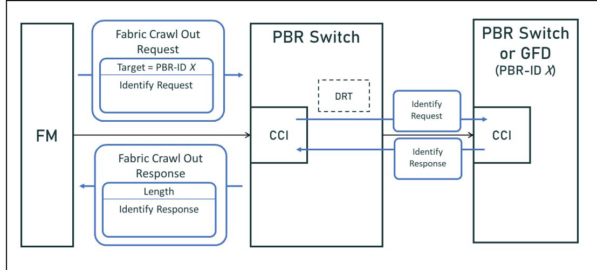

The Management Command input payload field includes the tunneled command encapsulated in the CCI Message Format, as defined in Figure 7-19. This can include an additional layer of tunneling for commands issued to components with no assigned PID, as illustrated in Figure 7-55.

Figure 7-55. Tunneling Commands to Remote Devices with No Assigned PID  
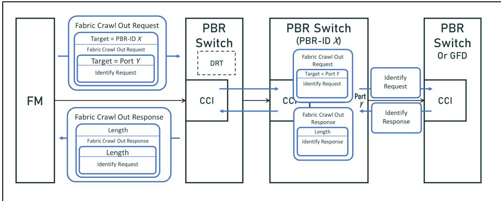

Response size varies, based on the tunneled command’s definition. Valid targets for the tunneled commands include PBR switch ports, and PBR devices within a fabric.

This command fails with “Invalid Input” if the target specifies a non-existent switch port or a PID with no valid entry in the DRT.

Components shall terminate the processing of a request that includes more than 2 layers of tunneling and provide an “Unsupported” return code.

Possible Command Return Codes:

• Success

• Unsupported

• Invalid Input

• Internal Error

• Retry Required

Command Effects:

• None

Table 7-112. Fabric Crawl Out Request Payload

<table><tr><td>Byte Offset</td><td>Length in Bytes</td><td>Description</td></tr><tr><td>0h</td><td>2</td><td>Target: Encoding depends on Target Type:• Target Type = 0:— Bits[7:0]: Port Number: Switch shall transmit command out specified egress port.— Bits[15:8]: Reserved.• Target Type = 1:— Bits[11:0]: PBR-ID: Target PID. Switch shall determine egress port using DRT.— Bits[15:12]: Reserved.• All other encodings are reserved</td></tr><tr><td>2h</td><td>1</td><td>• Bits[3:0]: Target Type: Specifies the type of tunneling target for this command:— 0h = Port Number: Indicates that the tunneling target is a component on the far end of a switch port— 1h = PBR-ID: Indicates that the tunneling target is a component in the PBR fabric address by a PID— All other encodings are reserved• Bits[7:4]: Reserved</td></tr><tr><td>3h</td><td>1</td><td>Reserved</td></tr><tr><td>4h</td><td>2</td><td>Command Size: Number of valid bytes in Management Command.</td></tr><tr><td>6h</td><td>Varies</td><td>Management Command: Request message formatted in the CCI Message Format as defined in Figure 7-19.</td></tr></table>

Table 7-113. Fabric Crawl Out Response Payload

<table><tr><td>Byte Offset</td><td>Length in Bytes</td><td>Description</td></tr><tr><td>0h</td><td>2</td><td>Response Length: Number of valid bytes in Response Message.</td></tr><tr><td>2h</td><td>2</td><td>Reserved</td></tr><tr><td>4h</td><td>Varies</td><td>Response Message: Response message formatted in the CCI Message Format as defined in Figure 7-19.</td></tr></table>

## 7.7.13.3 Get PBR Link Partner Info (Opcode 5702h)

This command reads the data received from the latest “Link Partner Info” VDM on a PBR link.

Possible Command Return Codes:

• Success

• Unsupported

• Invalid Input

• Internal Error

• Retry Required

Command Effects:

• None

Table 7-114. Get PBR Link Partner Info Request Payload

<table><tr><td>Byte Offset</td><td>Length in Bytes</td><td>Description</td></tr><tr><td>0h</td><td>1h</td><td>Number of Ports: Number of ports requested.</td></tr><tr><td>1h</td><td>Varies</td><td>Port ID List: 1-byte ID of requested port, repeated Number of Ports times.</td></tr></table>

Table 7-115. Get PBR Link Partner Info Response Payload

<table><tr><td>Byte Offset</td><td>Length in Bytes</td><td>Description</td></tr><tr><td>0h</td><td>1</td><td>Number of Ports: Number of port information blocks returned.</td></tr><tr><td>1h</td><td>3</td><td>Reserved</td></tr><tr><td>4h</td><td>Varies</td><td>Link Partner Info List: Link Partner Info block as defined in Table 7-116, repeated Number of Ports times.</td></tr></table>

Table 7-116. Link Partner Info Format

<table><tr><td>Byte Offset</td><td>Length in Bytes</td><td>Description</td></tr><tr><td>00h</td><td>1</td><td>Port ID: ID of requested port.</td></tr><tr><td>01h</td><td>1</td><td>Far End Port ID: As reported in Link Partner Info VDM.</td></tr><tr><td>02h</td><td>2</td><td>Bits[11:0]: PID: As reported in Link Partner Info VDMBits[15:12]: Device Type: As reported in Link Partner Info VDM</td></tr><tr><td>04h</td><td>10h</td><td>Device UUID: As reported in Link Partner Info VDM.</td></tr><tr><td>14h</td><td>1</td><td>Standard FC VC List: As reported in Link Partner Info VDM.</td></tr><tr><td>15h</td><td>1</td><td>UIO FC VC List: As reported in Link Partner Info VDM.</td></tr><tr><td>16h</td><td>10h</td><td>Primary FM UUID: As reported in Link Partner Info VDM.</td></tr><tr><td>26h</td><td>10h</td><td>Secondary FM UUID: As reported in Link Partner Info VDM.</td></tr></table>

## 7.7.13.4 Get PID Target List (Opcode 5703h)

This command retrieves the list of targets within a PBR switch to which a PID may be assigned. This does not include the PID assigned to the switch itself as part of the Claim FM Ownership command. As outlined in Section 7.7.6.5, the following restrictions apply when assigning PIDs:

• A fabric port may be assigned one PID that can be shared among multiple fabric ports

• A Downstream Edge Port may be assigned one PID that must be unique

• A Host Edge Port may be assigned more than one PID, each of which must be unique

Possible Command Return Codes:

• Success

• Unsupported

• Invalid Input

• Internal Error

• Retry Required

Command Effects:

• None

Table 7-117. Get PID Target List Request Payload

<table><tr><td>Byte Offset</td><td>Length in Bytes</td><td>Description</td></tr><tr><td>0h</td><td>2</td><td>Start Index: Index of first target to return.</td></tr><tr><td>2h</td><td>2</td><td>Number of Targets: Maximum number of targets to return.</td></tr></table>

Table 7-118. Get PID Target List Response Payload

<table><tr><td>Byte Offset</td><td>Length in Bytes</td><td>Description</td></tr><tr><td>0h</td><td>2</td><td>Total Number of Targets: Total number of PID targets supported by the device.</td></tr><tr><td>2h</td><td>2</td><td>Number of Targets: Number of targets returned in Target List.</td></tr><tr><td>4h</td><td>Varies</td><td>Target List: List of PID target as defined in Table 7-119.</td></tr></table>

Table 7-119. Target List Format

<table><tr><td>Byte Offset</td><td>Length in Bytes</td><td>Description</td></tr><tr><td>0h</td><td>2</td><td>Target ID: ID of PID Target for use in Configure PID Assignment.</td></tr><tr><td>2h</td><td>1</td><td>Bits[2:0]: Target Type:- 000b = Fabric Port- 001b = Host Edge Port (USP/GAE)- 010b = Downstream Edge Port- All other encodings are reservedBits[7:3]: Reserved</td></tr><tr><td>3h</td><td>1</td><td>Instance ID: Index of PID for targets that can support multiple PIDs.</td></tr><tr><td>4h</td><td>1</td><td>VCS ID: ID of associated VCS. Valid only when Target Type is 1 (Host Edge Port).</td></tr><tr><td>5h</td><td>1</td><td>Physical Port ID: Physical port ID of the target.</td></tr><tr><td>6h</td><td>2</td><td>Bits[11:0]: PID: Current PID assignment. FFFh if unassigned.Bits[15:12]: Reserved.</td></tr></table>

## 7.7.13.5 Configure PID Assignment (Opcode 5704h)

This command is used to assign PIDs to targets within a PBR switch.

## Note:

This command does not update the corresponding DRT entries for assigned or cleared PIDs. The DRT must be updated separately, using the Set DRT command as necessary.

This command shall return Invalid Input under the following conditions:

• Specified target is invalid

• PID has already been assigned to another target within the switch

Possible Command Return Codes:

• Success

• Unsupported

• Invalid Input

• Internal Error

• Retry Required

Command Effects:

• None

Table 7-120. Configure PID Assignment Request Payload

<table><tr><td>Byte Offset</td><td>Length in Bytes</td><td>Description</td></tr><tr><td>0h</td><td>1</td><td>Bits[2:0]:Operation: Specifies the PID assignment operation: 000b = Assign PID 001b = Clear PID All other encodings are reservedBits[7:3]:Reserved</td></tr><tr><td>2h</td><td>2</td><td>Number of Targets:Number of entries in PID Assignment List.</td></tr><tr><td>4h</td><td>Varies</td><td>PID Assignment List:List of PID assignments as defined inTable 7-121.</td></tr></table>

## Table 7-121. PID Assignment

<table><tr><td>Byte Offset</td><td>Length in Bytes</td><td>Description</td></tr><tr><td>0h</td><td>2</td><td>Bits[11:0]: PID: PID to assign to the specified targetBits[15:12]: Reserved</td></tr><tr><td>2h</td><td>2</td><td>Target ID: Index of PID target, as reported in Get PID Target List response.</td></tr><tr><td>4h</td><td>1</td><td>Instance ID: Index of PID for targets that can support multiple PIDs.</td></tr></table>

## 7.7.13.6 Get PID Binding (Opcode 5705h)

This command reads the binding of Downstream ES PIDs to Upstream ES vDSPs or Upstream ES USP PIDs to Downstream ES vUSPs. The output also includes latency and BW values for the fabric routing path for use in generating associated CDAT information.

Possible Command Return Codes:

• Unsupported

• Invalid Input

• Internal Error

• Retry Required

• Busy

Command Effects:

• Background Operation

Table 7-122. Get PID Binding Request Payload

<table><tr><td>Byte Offset</td><td>Length in Bytes</td><td>Description</td></tr><tr><td>0h</td><td>1</td><td>Target VCS: ID of the VCS to query.</td></tr><tr><td>1h</td><td>1</td><td>Target vPPB: Index of the vPPB to query. Reserved when the binding target is a Host ES VCS.</td></tr></table>

Table 7-123. Get PID Binding Response Payload

<table><tr><td>Byte Offset</td><td>Length in Bytes</td><td>Description</td></tr><tr><td>00h</td><td>2</td><td>Bits[11:0]: PID: PID of the remote binding target. FFFh if unbound.Bits[15:12]: Reserved.</td></tr><tr><td>02h</td><td>2</td><td>Bits[11:0]: Host ES Management PID: Switch management PID of the Host ES. Valid only when the binding target is a Downstream ES VCS.Bits[15:12]: Reserved.</td></tr><tr><td>04h</td><td>8</td><td>Latency Entry Base Unit: Latency Entry Base Unit for path between host and target device, as defined in ACPI HMAT System Locality Latency and Bandwidth Information Structure. Valid only when the binding target is a Downstream ES VCS.</td></tr><tr><td>0Ch</td><td>2</td><td>Latency Entry: Latency Entry for path between host and target device, as defined in ACPI HMAT System Locality Latency and Bandwidth Information Structure. Valid only when the binding target is a Downstream ES VCS.</td></tr><tr><td>0Eh</td><td>8</td><td>BW Entry Base Unit: Bandwidth Entry Base Unit for path between host and target device, as defined in ACPI HMAT System Locality Latency and Bandwidth Information Structure. Valid only when the binding target is a Downstream ES VCS.</td></tr><tr><td>16h</td><td>2</td><td>BW Entry: Bandwidth Entry for path between host and target device, as defined in ACPI HMAT System Locality Latency and Bandwidth Information Structure. Valid only when the binding target is a Downstream ES VCS.</td></tr></table>

## 7.7.13.7 Configure PID Binding (Opcode 5706h)

This command configures the binding of a PID to a target. It is used to bind:

• Downstream ES PIDs to Upstream ES vDSPs

• Upstream ES USP PIDs to Downstream ES vUSPs

The command input includes latency and BW values for the fabric routing path for use in generating associated CDAT information.

Possible Command Return Codes:

• Unsupported

• Background Command Started

• Invalid Input

• Internal Error

• Retry Required

• Busy

Command Effects:

• Background Operation

Table 7-124. Configure PID Binding Request Payload (Sheet 1 of 2)

<table><tr><td>Byte Offset</td><td>Length in Bytes</td><td>Description</td></tr><tr><td>00h</td><td>1</td><td>Bits[2:0]:Operation:- 000b = Bind- 001b = Unbind- All other encodings are reservedBits[7:3]:Reserved</td></tr><tr><td>01h</td><td>1</td><td>Target VCS: ID of the VCS to which the PID is being bound.</td></tr><tr><td>02h</td><td>1</td><td>Target vPPB: Index of the vPPB to which the PID is being bound. Valid only when the binding target is a Host ES VCS.</td></tr></table>

Table 7-124. Configure PID Binding Request Payload (Sheet 2 of 2)

<table><tr><td>Byte Offset</td><td>Length in Bytes</td><td>Description</td></tr><tr><td>03h</td><td>1</td><td>Reserved</td></tr><tr><td>04h</td><td>2</td><td>Bits[11:0]: PID: PID of the remote binding targetBits[15:12]: Reserved</td></tr><tr><td>06h</td><td>2</td><td>Reserved</td></tr><tr><td>08h</td><td>8</td><td>Latency Entry Base Unit: Latency Entry Base Unit for path between host and target device, as defined in ACPI HMAT System Locality Latency and Bandwidth Information Structure. Valid only when the binding target is a Downstream ES VCS.</td></tr><tr><td>10h</td><td>2</td><td>Latency Entry: Latency Entry for path between host and target device, as defined in ACPI HMAT System Locality Latency and Bandwidth Information Structure. Valid only when the binding target is a Downstream ES VCS.</td></tr><tr><td>12h</td><td>8</td><td>BW Entry Base Unit: Bandwidth Entry Base Unit for path between host and target device, as defined in ACPI HMAT System Locality Latency and Bandwidth Information Structure. Valid only when the binding target is a Downstream ES VCS.</td></tr><tr><td>1Ah</td><td>2</td><td>BW Entry: Bandwidth Entry for path between host and target device, as defined in ACPI HMAT System Locality Latency and Bandwidth Information Structure. Valid only when the binding target is a Downstream ES VCS.</td></tr></table>

## 7.7.13.8 Get Table Descriptors (Opcode 5707h)

This command reads descriptors of the DPID Routing Tables and Routing Group Tables in a PBR Switch.

Possible Command Return Codes:

• Success

• Unsupported

• Invalid Input

• Internal Error

• Retry Required

Command Effects:

• None

Table 7-125. Get Table Descriptors Request Payload

<table><tr><td>Byte Offset</td><td>Length in Bytes</td><td>Description</td></tr><tr><td>0h</td><td>2</td><td>Start Index: Starting index into list of descriptors.</td></tr><tr><td>2h</td><td>2</td><td>Number of Descriptors: Number of descriptors to read.</td></tr></table>

Table 7-126. Get Table Descriptors Response Payload

<table><tr><td>Byte Offset</td><td>Length in Bytes</td><td>Description</td></tr><tr><td>0h</td><td>2</td><td>Start Index: Starting index into list of descriptors.</td></tr><tr><td>2h</td><td>2</td><td>Number of Descriptors: Number of table descriptors.</td></tr><tr><td>4h</td><td>Varies</td><td>Get Table Descriptors List: List of table descriptors as defined in Table 7-127.</td></tr></table>

Table 7-127. Get Table Descriptor Format

<table><tr><td>Byte Offset</td><td>Length in Bytes</td><td>Description</td></tr><tr><td>0h</td><td>1</td><td>Bits[1:0]: Table Type:- 00b = DRT- 01b = RGT- All other encodings are reservedBits[7:2]: Reserved</td></tr><tr><td>1h</td><td>2</td><td>Table Index: Index of table.</td></tr><tr><td>3h</td><td>20h</td><td>Active Port Mask: Bitmask defining which ports actively use (1) or do not actively use (0) this table. Bit position corresponds to physical port number.</td></tr><tr><td>23h</td><td>4</td><td>Reserved</td></tr></table>

## 7.7.13.9 Get DRT (Opcode 5708h)

This command reads the DPID Routing Tables in a PBR Switch.

Possible Command Return Codes:

• Success

• Unsupported

• Invalid Input

• Internal Error

• Retry Required

Command Effects:

• None

Table 7-128. Get DRT Request Payload

<table><tr><td>Byte Offset</td><td>Length in Bytes</td><td>Description</td></tr><tr><td>0h</td><td>1</td><td>DRT Index: Index of DRT to read.</td></tr><tr><td>1h</td><td>1</td><td>Reserved</td></tr><tr><td>2h</td><td>2</td><td>Number of Entries: Number of DRT entries to read.</td></tr><tr><td>4h</td><td>2</td><td>Start Entry: Starting index into DRT entries.</td></tr></table>

Table 7-129. Get DRT Response Payload

<table><tr><td>Byte Offset</td><td>Length in Bytes</td><td>Description</td></tr><tr><td>0h</td><td>1</td><td>DRT Index: Index of DRT.</td></tr><tr><td>1h</td><td>1</td><td>Reserved</td></tr><tr><td>2h</td><td>2</td><td>Number of Entries: Number of DRT entries.</td></tr><tr><td>4h</td><td>2</td><td>Start Entry: Starting index into DRT entries.</td></tr><tr><td>6h</td><td>1</td><td>Associated RGT Index: Index of RGT used by this DRT.</td></tr><tr><td>7h</td><td>1</td><td>Reserved</td></tr><tr><td>8h</td><td>Varies</td><td>DRT Entry List: List of DRT entry values as defined in Table 7-130.</td></tr></table>

Table 7-130. DRT Entry Format

<table><tr><td>Byte Offset</td><td>Length in Bytes</td><td>Description</td></tr><tr><td>0h</td><td>1</td><td>Bits[1:0]:Entry Type:Type of routing target specifier and M2S Req routing:00b = Invalid01b = Physical Port number10b = RGT index11b = ReservedBits[7:2]:Reserved</td></tr><tr><td>1h</td><td>1</td><td>Routing Target:Encoding depends onEntry Type:00h = Reserved01h = Physical port number02h = RGT entry index</td></tr></table>

## 7.7.13.10 Set DRT (Opcode 5709h)

This command sets the DPID Routing Tables in a PBR Switch.

Possible Command Return Codes:

• Success

• Unsupported

• Invalid Input

• Internal Error

• Retry Required

Command Effects:

• None

Table 7-131. Set DRT Request Payload

<table><tr><td>Byte Offset</td><td>Length in Bytes</td><td>Description</td></tr><tr><td>0h</td><td>1</td><td>DRT Index: Index of DRT to configure.</td></tr><tr><td>1h</td><td>1</td><td>Reserved</td></tr><tr><td>2h</td><td>2</td><td>Number of Entries: Number of DRT entries to configure.</td></tr><tr><td>4h</td><td>2</td><td>Start Entry: Starting index into DRT entries.</td></tr><tr><td>6h</td><td>Varies</td><td>DRT Entry List: List of DRT entry values as defined in Table 7-130.</td></tr></table>

## 7.7.13.11 Get RGT (Opcode 570Ah)

This command reads the Routing Group Tables in a PBR Switch.

Possible Command Return Codes:

• Success

• Unsupported

• Invalid Input

• Internal Error

• Retry Required

Command Effects:

• None

Table 7-132. Get RGT Request Payload

<table><tr><td>Byte Offset</td><td>Length in Bytes</td><td>Description</td></tr><tr><td>0h</td><td>1</td><td>RGT Index: Index of RGT.</td></tr><tr><td>1h</td><td>1</td><td>Reserved</td></tr><tr><td>2h</td><td>2</td><td>Number of Entries: Number of RGT entries.</td></tr><tr><td>4h</td><td>2</td><td>Start Entry: Starting index into RGT entries.</td></tr></table>

Table 7-133. Get RGT Response Payload

<table><tr><td>Byte Offset</td><td>Length in Bytes</td><td>Description</td></tr><tr><td>0h</td><td>1</td><td>RGT Index: Index of RGT.</td></tr><tr><td>1h</td><td>1</td><td>Reserved</td></tr><tr><td>2h</td><td>2</td><td>Number of Entries: Number of RGT entries.</td></tr><tr><td>4h</td><td>2</td><td>Start Entry: Starting index into RGT entries.</td></tr><tr><td>6h</td><td>Varies</td><td>RGT Entry List: List of RGT entry values as defined in Table 7-134.</td></tr></table>

Table 7-134. RGT Entry Format

<table><tr><td>Byte Offset</td><td>Length in Bytes</td><td>Description</td></tr><tr><td>0h</td><td>1</td><td>Egress Port[0]: Physical port number.</td></tr><tr><td>1h</td><td>1</td><td>Egress Port[1]: Physical port number.</td></tr><tr><td>2h</td><td>1</td><td>Egress Port[2]: Physical port number.</td></tr><tr><td>3h</td><td>1</td><td>Egress Port[3]: Physical port number.</td></tr><tr><td>4h</td><td>1</td><td>Egress Port[4]: Physical port number.</td></tr><tr><td>5h</td><td>1</td><td>Egress Port[5]: Physical port number.</td></tr><tr><td>6h</td><td>1</td><td>Egress Port[6]: Physical port number.</td></tr><tr><td>7h</td><td>1</td><td>Egress Port[7]: Physical port number.</td></tr><tr><td>8h</td><td>1</td><td>Bits[2:0]: Highest Valid Entry: Highest index in the Egress Port list that is valid.Bits[5:3]: Highest Primary Entry: Highest index in the Egress Port list that specifies a primary routing path. Subsequent valid egress ports are considered secondary paths.Bits[7:6]: Reserved.</td></tr><tr><td>9h</td><td>1</td><td>Bits[2:0]: Dynamic Routing Mode: Specifies the dynamic routing mode to be used for this entry:- 000b = Random- 001b = Congestion Avoidance- 010b = Advanced Congestion Avoidance- 011b, 101b = Reserved- 110b, 111b = Vendor-specificBits[5:3]: Mix Setting: Specifies the mix used for dynamic routing mode, as defined in Section 7.7.6.3Bits[7:6]: Reserved</td></tr><tr><td>Ah</td><td>2</td><td>Reserved</td></tr></table>

## 7.7.13.12 Set RGT (Opcode 570Bh)

This command configures the Routing Group Tables in a PBR switch.

Possible Command Return Codes:

• Success

• Unsupported

• Invalid Input

• Internal Error

• Retry Required

Command Effects:

• None

Table 7-135. Set RGT Request Payload

<table><tr><td>Byte Offset</td><td>Length in Bytes</td><td>Description</td></tr><tr><td>0h</td><td>1</td><td>RGT Index: Index of RGT to configure.</td></tr><tr><td>1h</td><td>1</td><td>Reserved</td></tr><tr><td>2h</td><td>2</td><td>Number of Entries: Number of RGT entries to configure.</td></tr><tr><td>4h</td><td>2</td><td>Start Entry: Starting index into RGT entries.</td></tr><tr><td>6h</td><td>Varies</td><td>RGT Entry List: List of RGT entry values as defined in Table 7-133.</td></tr></table>

## 7.7.13.13 Get LDST/IDT Capabilities (Opcode 570Ch)

This command retrieves a vPPB’s LDST and IDT Capabilities, per Section 7.7.9.

Possible Command Return Codes:

• Success

• Unsupported

• Invalid Input

• Internal Error

• Retry Required

Command Effects:

• None

Table 7-136. Get LDST/IDT Capabilities Request Payload

<table><tr><td>Byte Offset</td><td>Length in Bytes</td><td>Description</td></tr><tr><td>0h</td><td>1</td><td>vPPB Instance: The value of 0 represents USP. The values of 1 and above represent the DSP vPPBs in increasing Device Number, Function Number order, as defined in Section 7.1.4.</td></tr></table>

Table 7-137. Get LDST/IDT Capabilities Response Payload

<table><tr><td>Byte Offset</td><td>Length in Bytes</td><td>Description</td></tr><tr><td>0h</td><td>1</td><td>vPPB Instance: The value of 0 represents USP. The values of 1 and above represent the DSP vPPBs in increasing Device Number, Function Number order, as defined in Section 7.1.4.</td></tr><tr><td>1h</td><td>2</td><td>Number of Segments: Number of LDST segments that are supported by this LDST/IDT. The number of entries must be 0 or a power of 2.</td></tr><tr><td>3h</td><td>1</td><td>LDST Segment SizeBits[2:0]: LSegSz per the FSegSz encoding defined in Table 7-81Bits[7:3]: ReservedThe device shall return 0h if this value has not been initialized.</td></tr><tr><td>4h</td><td>2</td><td>Number of IDT: Number of Interleave Device Table entries supported by this LDST/IDT.</td></tr><tr><td>6h</td><td>2</td><td>Number of Completer ID-Based Re-Routers: Number of Completer ID-Based Re-Router entries supported by this LDST/IDT.</td></tr><tr><td>8h</td><td>2</td><td>Bits[11:0]: Local PID: PID assigned to this vPPB. FFFh if unassigned.Bits[15:12]: Reserved.</td></tr><tr><td>Ah</td><td>8</td><td>Fabric Base: Base HPA of this LDST.FabricBase shall be aligned to the programmed LDST Segment Size.The device shall return 0h if this value has not been initialized.</td></tr><tr><td>12h</td><td>8</td><td>Fabric Limit: Upper HPA of this LDST. Shall be greater than FabricBase. Shall be aligned to the programmed LDST Segment Size.The device shall return 0h if this value has not been initialized.</td></tr></table>

## 7.7.13.14 Set LDST/IDT Configuration (Opcode 570Dh)

This command sets the GAE’s LDST and IDT Capabilities, per Section 7.7.9. Because the FabricBase and FabricLimit values must be aligned to the programmed LDST Segment Size, all three Host-chosen values are configured in one request.

Possible Command Return Codes:

• Success

• Unsupported

• Invalid Input

• Internal Error

• Retry Required

Command Effects:

• Immediate Configuration Change

Table 7-138. Set LDST/IDT Configuration Request Payload

<table><tr><td>Byte Offset</td><td>Length in Bytes</td><td>Description</td></tr><tr><td>0h</td><td>1</td><td>vPPB Instance: The value of 0 represents USP. The values of 1 and above represent the DSP vPPBs in increasing Device Number, Function Number order, as defined in Section 7.1.4.</td></tr><tr><td>1h</td><td>1</td><td>LDST Segment SizeBits[2:0]: LSegSz per the FSegSz encoding defined in Table 7-81Bits[7:3]: Reserved</td></tr><tr><td>2h</td><td>8</td><td>FabricBase: Base HPA of this LDST. FabricBase shall be aligned to the programmed LDST Segment Size. The value 0h will disable this LDST/IDT decoder.</td></tr><tr><td>Ah</td><td>8</td><td>FabricLimit: Upper HPA of this LDST. Shall be greater than FabricBase. Shall be aligned to the programmed LDST Segment Size. The value 0h will disable this LDST/IDT decoder.</td></tr></table>

## 7.7.13.15 Get LDST Segment Entries (Opcode 570Eh)

This command reads the configuration of LDST Segment entries. The Host is responsible for mapping the LD-FAM range of HPAs to the appropriate number of available Segment Entries. Should the Host or the GAE have limited message payload capacity, the Host shall be responsible for breaking up the configuration operation into suitably sized requests.

Possible Command Return Codes:

• Success

• Unsupported

• Invalid Input

• Internal Error

• Retry Required

Command Effects:

• None

Table 7-139. Get LDST Segment Entries Request Payload

<table><tr><td>Byte Offset</td><td>Length in Bytes</td><td>Description</td></tr><tr><td>0h</td><td>1</td><td>vPPB Instance: The value of 0 represents USP. The values of 1 and above represent the DSP vPPBs in increasing Device Number, Function Number order, as defined in Section 7.1.4.</td></tr><tr><td>1h</td><td>1</td><td>Reserved</td></tr><tr><td>2h</td><td>2</td><td>Seg Count: Number of LDST Segment Entries requested. Value should be &gt;0 and not more than the lesser of the total Segment table entries available, or that number of entries that can be contained in the maximum message size handled by the host and the target GAE.</td></tr><tr><td>4h</td><td>2</td><td>Starting Segment Index: Index of the first segment being requested. An index of 0 shall designate the configuration of the  $1^{st}$  Segment, corresponding to HPA = FabricBase. The starting index given shall not be larger than the maximum segment entry number supported. The starting index Plus the Seg Count value shall not be larger than the maximum segment entry number supported.</td></tr></table>

Table 7-140. Get LDST Segment Entries Response Payload

<table><tr><td>Byte Offset</td><td>Length in Bytes</td><td>Description</td></tr><tr><td>0h</td><td>2</td><td>Seg Count: Number of LDST Segment Entries described in the Seg Entry_List[ ]. Value should be &gt;0 and not more than the lesser of the total Segment table entries available, or that number of entries that can be contained in the maximum message size handled by the host and the target GAE.</td></tr><tr><td>2h</td><td>2</td><td>Starting Segment Index: Index of the first segment being returned. An index of 0 shall designate the configuration of the  $1^{st}$  Segment, corresponding to HPA = FabricBase. The starting index given shall not be larger than the maximum segment entry number supported. The starting index Plus the Seg Count value shall not be larger than the maximum segment entry number supported.</td></tr><tr><td>4h</td><td>Varies</td><td>Segment List[ ]: List of Segment Entries as defined in Table 7-141.</td></tr></table>

Table 7-141. LDST Segment Entry Format

<table><tr><td>Byte Offset</td><td>Length in Bytes</td><td>Description</td></tr><tr><td>0h</td><td>1</td><td>ValidBit[0]: Valid Entry: As per Figure 7-31Bit[1]: Enable PCIe Segment: Indicates that the target is in a separate PCIe segment, thus the request will include the requester&#x27;s segment numberBits[7:2]: Reserved</td></tr><tr><td>1h</td><td>1</td><td>IntlvBits[3:0]: Interleave Mode: As per Table 7-82Bits[7:4]: Reserved</td></tr><tr><td>2h</td><td>1</td><td>GranBits[3:0]: Interleave Granularity: As per Table 7-83Bits[7:4]: Reserved</td></tr><tr><td>3h</td><td>1</td><td>Reserved</td></tr><tr><td>4h</td><td>2</td><td>DPID/IX: DPID or IDT Index, depending on Intlv field value:Bits[11:0]:If Intlv == 0, this is the actual DPID to which the LD-FAM request is to be sent.Else, this is Index of the IDT entry that contains the DPID of the first EP in the interleave set. See Figure 7-31 and the description of interleaving in Section 7.7.2.4.Bits[15:12]: Reserved</td></tr><tr><td>6h</td><td>2</td><td>Reserved</td></tr></table>

## 7.7.13.16 Set LDST Segment Entries (Opcode 570Fh)

This command is used by the Host to set the configuration of LDST Segment entries. The Host is responsible for mapping the LD-FAM range of HPAs to the appropriate number of available Segment Entries, per Section 7.7.2.4. Should the Host or the GAE have limited message payload capacity, the Host shall be responsible for breaking up the configuration operation into suitably sized requests.

This command fails with Invalid Input if access to the specified DPID is not enabled in the LAV.

Possible Command Return Codes:

• Success

• Unsupported

• Invalid Input

• Internal Error

• Retry Required

Command Effects:

• Immediate Configuration Change

## Table 7-142. Set LDST Segment Entries Request Payload

<table><tr><td>Byte Offset</td><td>Length in Bytes</td><td>Description</td></tr><tr><td>0h</td><td>1</td><td>vPPB Instance: The value of 0 represents USP. The values of 1 and above represent the DSP vPPBs in increasing Device Number, Function Number order, as defined in Section 7.1.4.</td></tr><tr><td>1h</td><td>1</td><td>Reserved</td></tr><tr><td>2h</td><td>2</td><td>Seg Count: Number of LDST Segment Entries described in the Seg Entry_List[ ]. Value should be &gt;0 and not more than the lesser of the total Segment table entries available, or that number of entries that can be contained in the maximum message size handled by the host and the target GAE.</td></tr><tr><td>4h</td><td>2</td><td>Starting Segment Index: Index of the first segment being configured. An index of 0 shall designate the configuration of the  $1^{st}$  Segment, corresponding to HPA = FabricBase. The starting index given shall not be larger than the maximum segment entry number supported. The starting index Plus the Seg Count value shall not be larger than the maximum segment entry number supported.</td></tr><tr><td>6h</td><td>Varies</td><td>Segment List[ ]: List of Segment Entries as defined in Table 7-141.</td></tr></table>

## 7.7.13.17 Get LDST IDT DPID Entries (Opcode 5710h)

This command reads the configuration of IDT entries that are used by the LDST. The Host is responsible for mapping the capacity of specific devices targeted by LDST into interleaved regions of HPA. Should the Host or the switch mailbox have limited message payload capacity, the Host shall be responsible for breaking up the configuration operation into suitably sized requests.

Possible Command Return Codes:

• Success

• Unsupported

• Invalid Input

• Internal Error

• Retry Required

Command Effects:

• None

Table 7-143. Get LDST IDT DPID Entries Request Payload

<table><tr><td>Byte Offset</td><td>Length in Bytes</td><td>Description</td></tr><tr><td>0h</td><td>1</td><td>vPPB Instance: The value of 0 represents USP. The values of 1 and above represent the DSP vPPBs in increasing Device Number, Function Number order, as defined in Section 7.1.4.</td></tr><tr><td>1h</td><td>1</td><td>Reserved</td></tr><tr><td>2h</td><td>2</td><td>LDST IDT Entry Count: Number of LDST IDT Entries requested. Value should be &gt;0 and not more than the lesser of the total LDST IDT table entries available, or that number of entries that can be contained in the maximum message size handled by the host and the target switch mailbox.</td></tr><tr><td>4h</td><td>2</td><td>Starting LDST IDT Entry Index: Index of the first LDST IDT entry being requested. An index of 0 shall designate the configuration of the  $1^{st}$ entry. The starting index Plus the LDST IDT Entry Count value shall not be larger than the maximum LDST IDT entry number supported.</td></tr></table>

Table 7-144. Get LDST IDT DPID Entries Response Payload

<table><tr><td>Byte Offset</td><td>Length in Bytes</td><td>Description</td></tr><tr><td>0h</td><td>2</td><td>LDST IDT Entry Count:Number of LDST IDT Entries returned. Value should be &gt;0 and not more than the lesser of the total LDST IDT table entries available, or that number of entries that can be contained in the maximum message size handled by the host and the target switch mailbox.</td></tr><tr><td>2h</td><td>2</td><td>Starting LDST IDT Entry Index:Index of the first LDST IDT entry being returned. An index of 0 shall designate the configuration of the  $1^{st}$ entry. The starting index Plus the LDST IDT Entry Count value shall not be larger than the maximum LDST IDT entry number supported.</td></tr><tr><td>4h</td><td>Varies</td><td>LDST IDT DPID[ ]:DPID of the target device for the LDST IDT entry. See Figure 7-31and the description of interleaving in Section 7.7.2.4.Repeats LDST IDT Entry Count number of times.•Bits[11:0]: PID of the target device•Bits[15:12]:Reserved</td></tr></table>

## 7.7.13.18 Set LDST IDT DPID Entries (Opcode 5711h)

This command sets the configuration of IDT entries that are used by the LDST. The Host is responsible for mapping the capacity of specific devices targeted by LDST into interleaved regions of HPA. Should the Host or the switch mailbox have limited message payload capacity, the Host shall be responsible for breaking up the configuration operation into suitably sized requests.

Possible Command Return Codes:

• Success

• Unsupported

• Invalid Input

• Internal Error

• Retry Required

Command Effects:

• Immediate Configuration Change

Table 7-145. Set LDST IDT DPID Entries Request Payload

<table><tr><td>Byte Offset</td><td>Length in Bytes</td><td>Description</td></tr><tr><td>0h</td><td>1</td><td>vPPB Instance: The value of 0 represents USP. The values of 1 and above represent the DSP vPPBs in increasing Device Number, Function Number order, as defined in Section 7.1.4.</td></tr><tr><td>1h</td><td>1</td><td>Reserved</td></tr><tr><td>2h</td><td>2</td><td>LDST IDT Entry Count: Number of LDST IDT Entries being configured. Value should be &gt;0 and not more than the lesser of the total LDST IDT table entries available, or that number of entries that can be contained in the maximum message size handled by the host and the target switch mailbox.</td></tr><tr><td>4h</td><td>2</td><td>Starting LDST IDT Entry Index: Index of the first LDST IDT entry being configured. An index of 0 shall designate the configuration of the  $1^{st}$  entry. The starting index Plus the LDST IDT Entry Count value shall not be larger than the maximum LDST IDT entry number supported.</td></tr><tr><td>6h</td><td>2</td><td>Reserved</td></tr><tr><td>8h</td><td>Varies</td><td>LDST IDT DPID: DPID of the device for the LDST IDT entry. See Figure 7-31 and the description of interleaving in Section 7.7.2.4.Repeats LDST IDT Entry Count number of times.• Bits[11:0]: PID of the target device• Bits[15:12]: Reserved</td></tr></table>

## 7.7.13.19 Get Completer ID-Based Re-Router Entries (Opcode 5712h)

This command reads the configuration of Completer ID-Based Re-Router entries.

Possible Command Return Codes:

• Success

• Unsupported

• Invalid Input

• Internal Error

• Retry Required

Command Effects:

• None

Table 7-146. Get Completer ID-Based Re-Router Entries Request Payload

<table><tr><td>Byte Offset</td><td>Length in Bytes</td><td>Description</td></tr><tr><td>0h</td><td>1</td><td>vPPB Instance: The value of 0 represents USP. The values of 1 and above represent the DSP vPPBs in increasing Device Number, Function Number order, as defined in Section 7.1.4.</td></tr><tr><td>1h</td><td>1</td><td>Reserved</td></tr><tr><td>2h</td><td>2</td><td>Completer ID-Based Re-Router Entry Count: Number of Completer ID-Based Re-Router Entries requested. Value should be &gt;0 and not more than the lesser of the total Completer ID-Based Re-Router table entries available, or that number of entries that can be contained in the maximum message size handled by the host and the target GAE.</td></tr><tr><td>4h</td><td>2</td><td>Starting Completer ID-Based Re-Router Entry Index: Index of the first Completer ID-Based Re-Router entry being requested. An index of 0 shall designate the configuration of the  $1^{st}$  entry. The starting index Plus the Completer ID-Based Re-Router Entry Count value shall not be larger than the maximum Completer ID-Based Re-Router entry number supported.</td></tr></table>

Table 7-147. Get Completer ID-Based Re-Router Entries Response Payload

<table><tr><td>Byte Offset</td><td>Length in Bytes</td><td>Description</td></tr><tr><td>0h</td><td>2</td><td>Completer ID-Based Re-Router Entry Count: Number of Completer ID-Based Re-Router Entries returned. Value should be &gt;0 and not more than the lesser of the total Completer ID-Based Re-Router table entries available, or that number of entries that can be contained in the maximum message size handled by the host and the target GAE.</td></tr><tr><td>2h</td><td>2</td><td>Starting Completer ID-Based Re-Router Entry Index: Index of the first Completer ID-Based Re-Router entry being returned. An index of 0 shall designate the configuration of the  $1^{st}$ entry. The starting index Plus the Completer ID-Based Re-Router Entry Count value shall not be larger than the maximum Completer ID-Based Re-Router entry number supported.</td></tr><tr><td>4h</td><td>Varies</td><td>Completer ID-Based Re-Router Entry List[ ]: As defined in Table 7-148.Repeats Completer ID-Based Re-Router Entry Count number of times.</td></tr></table>

Table 7-148. Completer ID-Based Re-Router Entry

<table><tr><td>Byte Offset</td><td>Length in Bytes</td><td>Description</td></tr><tr><td>0h</td><td>2</td><td>Completer ID-Based Re-Router DPID[ ]: DPID of the requester for the Completer ID-Based Re-Router entry.• Bits[11:0]: PID of the requester• Bit[12]: Enable PCIe Segment: Indicates that the requester is in a separate PCIe segment, so the request will include the requester&#x27;s and completer&#x27;s segment numbers• Bits[15:13]: Reserved</td></tr><tr><td>2h</td><td>1</td><td>Requester PCIe Segment: PCIe Segment number for the requester. Valid only if Enable PCIe Segment is set.</td></tr><tr><td>3h</td><td>1</td><td>Requester Bus Number: PCIe Bus number for requester.</td></tr><tr><td>4h</td><td>1</td><td>• Bits[2:0]: Requester Function Number: PCIe Function number for requester• Bits[7:3]: Requester Device Number: PCIe Device number for requester</td></tr></table>

## 7.7.13.20 Set Completer ID-Based Re-Router Entries (Opcode 5713h)

This command sets the configuration of Completer ID-Based Re-Router entries.

This command fails with Invalid Input if access to the specified DPID is not enabled in the LAV.

Possible Command Return Codes:

• Success

• Unsupported

• Invalid Input

• Internal Error

• Retry Required

Command Effects:

• Immediate Configuration Change

Table 7-149. Set Completer ID-Based Re-Router Entries Request Payload

<table><tr><td>Byte Offset</td><td>Length in Bytes</td><td>Description</td></tr><tr><td>0h</td><td>1</td><td>vPPB Instance: The value of 0 represents USP. The values of 1 and above represent the DSP vPPBs in increasing Device Number, Function Number order, as defined in Section 7.1.4.</td></tr><tr><td>1h</td><td>1</td><td>Reserved</td></tr><tr><td>2h</td><td>2</td><td>Completer ID-Based Re-Router Entry Count: Number of Completer ID-Based Re-Router Entries being configured. Value should be &gt;0 and not more than the lesser of the total Completer ID-Based Re-Router table entries available, or that number of entries that can be contained in the maximum message size handled by the host and the target GAE.</td></tr><tr><td>4h</td><td>2</td><td>Starting Completer ID-Based Re-Router Entry Index: Index of the first Completer ID-Based Re-Router entry being configured. An index of 0 shall designate the configuration of the  $1^{st}$  entry. The starting index given shall not be larger than the maximum Completer ID-Based Re-Router entry number supported. The starting index Plus the Completer ID-Based Re-Router Entry Count value shall not be larger than the maximum Completer ID-Based Re-Router entry number supported.</td></tr><tr><td>6h</td><td>Varies</td><td>Completer ID-Based Re-Router Entry List[ ]: As defined in Table 7-148.Repeats Completer ID-Based Re-Router Entry Count number of times.</td></tr></table>

## 7.7.13.21 Get LDST Access Vector (Opcode 5714h)

This command is used by the host to query its current LAV.

This command will return Invalid Input when the requested byte range exceeds the size of the access vector buffer, as defined in Table 7-163.

Possible Command Return Codes:

• Success

• Unsupported

• Invalid Input

• Internal Error

• Retry Required

Command Effects:

• None

Table 7-150. Get LDST Access Vector Request Payload

<table><tr><td>Byte Offset</td><td>Length in Bytes</td><td>Description</td></tr><tr><td>0h</td><td>4</td><td>Start Byte: Offset in bytes into Vector Data.</td></tr><tr><td>4h</td><td>4</td><td>Number of Bytes: Size in bytes of Vector Data requested.</td></tr></table>

## Table 7-151. Get LDST Access Vector Response Payload

<table><tr><td>Byte Offset</td><td>Length in Bytes</td><td>Description</td></tr><tr><td>0h</td><td>4</td><td>Number of Bytes: Size in bytes of Vector Data returned.</td></tr><tr><td>4h</td><td>Varies</td><td>Vector Data: Excerpt of data from LDST Access Vector, defined in Table 7-152. Excerpt begins a Start Byte and is Number of Bytes long.</td></tr></table>

Table 7-152. LDST Access Vector

<table><tr><td>Byte Offset</td><td>Length in Bytes</td><td>Description</td></tr><tr><td>000h</td><td>200h</td><td>LDST Access Vector: 4-Kb vector in which each bit corresponds to the associated PID (i.e., bit n represents PID n). A value of 1 in a bit position indicates that LDST and ID-Based Re-Router access to the corresponding PID is enabled. A value of 0 in a bit position indicates that access to the corresponding PID is blocked.</td></tr></table>

## 7.7.13.22 Get VCS LDST Access Vector (Opcode 5715h)

This command is used by the FM to query a VCS’s current LAV.

This command will return Invalid Input when the requested byte range exceeds the size of the access vector buffer, as defined in Table 7-163.

Possible Command Return Codes:

• Success

• Unsupported

• Invalid Input

• Internal Error

• Retry Required

Command Effects:

• None

Table 7-153. Get VCS LDST Access Vector Request Payload

<table><tr><td>Byte Offset</td><td>Length in Bytes</td><td>Description</td></tr><tr><td>0h</td><td>1</td><td>VCS ID: ID of VCS to query.</td></tr><tr><td>1h</td><td>3</td><td>Reserved</td></tr><tr><td>4h</td><td>4</td><td>Start Byte: Offset in bytes into Vector Data.</td></tr><tr><td>8h</td><td>4</td><td>Number of Bytes: Size in bytes of Vector Data requested.</td></tr></table>

The Get VCS LDST Access Vector Response Payload is defined in Table 7-151.

## 7.7.13.23 Configure VCS LDST Access (Opcode 5716h)

This command is used by the FM to control access to a specified PID as reported in the LAV.

Possible Command return codes:

• Success

• Unsupported

• Invalid Input

• Internal Error

• Retry Required

Command Effects:

• None

Table 7-154. Configure VCS LDST Access Request Payload

<table><tr><td>Byte Offset</td><td>Length in Bytes</td><td>Description</td></tr><tr><td>0h</td><td>1</td><td>VCS ID: ID of VCS to configure.</td></tr><tr><td>1h</td><td>1</td><td>Reserved</td></tr><tr><td>2h</td><td>2</td><td>Bits[11:0]: PID: PID of LDST or Completer ID-Based Re-Router targetBits[14:12]: Operation: Specifies which configuration to perform:- 000b = Enable PID access in the LAV- 001b = Disable PID access in the LAV- All other encodings are reservedBit[15]: Reserved</td></tr></table>

## 7.7.14 Global Memory Access Endpoint Command Set

This command set is used by a host to discover and manage the structures and devices involved in providing access to G-FAM and GIM resources.

## 7.7.14.1 Identify GAE (Opcode 5800h)

This command is used by the Host to query a GAE’s capabilities, including maximum number of supported enabled PIDs and maximum number of simultaneous outstanding proxy operations and VendPrefixL0 support. It also reports the remaining number of proxy threads currently available.

Possible Command Return Codes:

• Success

• Unsupported

• Invalid Input

• Internal Error

• Retry Required

Command Effects:

• None

Table 7-155. Identify GAE Request Payload

<table><tr><td>Byte Offset</td><td>Length in Bytes</td><td>Description</td></tr><tr><td>0h</td><td>1</td><td>Start vPPB Instance: Index of vPPB whose FAST Segment Info should be provided in the first entry in vPPB Global Memory Support Info List. The value of 0 represents the GAE. The values of 1 and above represent the DSP vPPBs in increasing Device Number, Function Number order, as defined in Section 7.1.4.</td></tr><tr><td>1h</td><td>1</td><td>Number of vPPBs: Number of vPPBs in vPPB Global Memory Support Info List.</td></tr></table>

Table 7-156. Identify GAE Response Payload

<table><tr><td>Byte Offset</td><td>Length in Bytes</td><td>Description</td></tr><tr><td>0h</td><td>2</td><td>Bits[11:0]: Total Number of Supported Enabled PIDs: Maximum number of PIDs that can be enabled for concurrent use with the Configure PID Access commandBit[12]: Egress Request/Ingress Completion VendPrefixL0 Supported: Indicates whether VendPrefixL0 is supported (1) or not supported (0) for Egress UIO Requests and Ingress UIO completions, as configured by the FM for this host with the Set VendPrefixL0 State commandBit[13]: Ingress Request VendPrefixL0 Supported: Indicates whether VendPrefixL0 is supported (1) or not supported (0) for Ingress UIO requests, as configured by the FM for this host with the Set VendPrefixL0 State commandBit[14]: G-FAM/GIM Configuration Supported: Indicates whether the switch supports (1) or does not support (0) re-configuration of the GIM Support bit with the Set FAST Segment Entry commandBit[15]: Reserved</td></tr><tr><td>2h</td><td>2</td><td>Total Number of Supported Threads: Maximum number of simultaneous proxy operations supported by the GAE.</td></tr><tr><td>4h</td><td>2</td><td>Number of Available Threads: Remaining number of simultaneous proxy operations supported by the GAE.</td></tr><tr><td>6h</td><td>1</td><td>Start vPPB Instance: Index of vPPB whose FAST Segment Info is provided in the first entry in vPPB Global Memory Support Info List.</td></tr><tr><td>7h</td><td>1</td><td>Number of vPPBs: Number of vPPBs whose FAST Segment Info is provided in the first entry in vPPB Global Memory Support Info List.</td></tr><tr><td>8h</td><td>Varies</td><td>vPPB Global Memory Support Info List: List of vPPB Global Memory Support Info, as defined in Table 7-157, for the vPPBs identified with Start vPPB Instance and Number of vPPBs.</td></tr></table>

Table 7-157. vPPB Global Memory Support Info

<table><tr><td>Byte Offset</td><td>Length in Bytes</td><td>Description</td></tr><tr><td>0h</td><td>2</td><td>Number of FAST Segments: Total number of segments in the FAST for the specified GAE/vPPB.</td></tr><tr><td>2h</td><td>2</td><td>Reserved</td></tr></table>

## 7.7.14.2 Get PID Interrupt Vector (Opcode 5801h)

This command queries a GAE’s PID interrupt vector.

Possible Command Return Codes:

• Success

• Unsupported

• Invalid Input

• Internal Error

• Retry Required

Command Effects:

• None

Table 7-158. Get PID Interrupt Vector Request Payload

<table><tr><td>Byte Offset</td><td>Length in Bytes</td><td>Description</td></tr><tr><td>0h</td><td>4</td><td>Start Byte: Offset in bytes into PID Interrupt Vector.</td></tr><tr><td>4h</td><td>4</td><td>Number of Bytes: Size in bytes of PID Interrupt Vector requested.</td></tr><tr><td>8h</td><td>1</td><td>Bit[0]: Clear on Read: A value of 1 indicates that the PID Interrupt Vector should be cleared to all 0s when this command completes. A GAE must ensure that no interrupts are lost in between capturing the current PID Interrupt Vector value for the response payload and clearing the vector&#x27;s contents.Bits[7:1]: Reserved.</td></tr></table>

Table 7-159. Get PID Interrupt Vector Response Payload

<table><tr><td>Byte Offset</td><td>Length in Bytes</td><td>Description</td></tr><tr><td>0h</td><td>4</td><td>Number of Bytes: Size in bytes of PID Interrupt Vector returned.</td></tr><tr><td>4h</td><td>Varies</td><td>PID Interrupt Vector Data: Excerpt of data from PID Interrupt Vector, defined in Table 7-160. Excerpt begins a Start Byte and is Number of Bytes long.</td></tr></table>

Table 7-160. PID Interrupt Vector

<table><tr><td>Byte Offset</td><td>Length in Bytes</td><td>Description</td></tr><tr><td>000h</td><td>200h</td><td>PID Interrupt Vector: 4-Kb vector in which each bit corresponds to the associated PID (i.e., bit n represents PID n). A value of 1 in a bit position indicates that the GAE has received an interrupt VDM from the corresponding PID since the PID Interrupt Vector was last cleared.</td></tr></table>

## 7.7.14.3 Get PID Access Vectors (Opcode 5802h)

This command is used by the Host to query a GAE’s current GFD Mapping Vector and VendPrefixL0 Target Vector.

This command will return Invalid Input when the requested byte range exceeds the size of the access vector buffer, as defined in Table 7-163.

Possible Command Return Codes:

• Success

• Unsupported

• Invalid Input

• Internal Error

• Retry Required

Command Effects:

• None

Table 7-161. Get PID Access Vectors Request Payload

<table><tr><td>Byte Offset</td><td>Length in Bytes</td><td>Description</td></tr><tr><td>0h</td><td>4</td><td>Start Byte: Offset in bytes into Vector Data.</td></tr><tr><td>1h</td><td>4</td><td>Number of Bytes: Size in bytes of Vector Data requested.</td></tr></table>

Table 7-162. Get PID Access Vectors Response Payload

<table><tr><td>Byte Offset</td><td>Length in Bytes</td><td>Description</td></tr><tr><td>0h</td><td>4</td><td>Number of Bytes: Size in bytes of Vector Data returned.</td></tr><tr><td>4h</td><td>Varies</td><td>Vector Data: Excerpt of data from PID Access Vector, defined in Table 7-163. Excerpt begins a Start Byte and is Number of Bytes long.</td></tr></table>

## Table 7-163. PID Access Vector

<table><tr><td>Byte Offset</td><td>Length in Bytes</td><td>Description</td></tr><tr><td>000h</td><td>200h</td><td>GFD Mapping Vector: 4-Kb vector in which each bit corresponds to the associated PID (i.e., bit n represents PID n). A value of 1 in a bit position indicates that FAST access to the corresponding PID is enabled. A value of 0 in a bit position indicates that access to the corresponding PID is blocked.</td></tr><tr><td>200h</td><td>200h</td><td>VendPrefixL0 Target Vector: 4-Kb vector in which each bit corresponds to the associated PID (i.e., bit n represents PID n). A value of 1 in a bit position indicates that VendPrefixL0 access to the corresponding PID is enabled. A value of 0 in a bit position indicates that access to the corresponding PID is blocked.</td></tr></table>

## 7.7.14.4 Get FAST/IDT Capabilities (Opcode 5803h)

This command is used by the Host to retrieve the GAE’s FAST and IDT Capabilities, per Section 7.7.2.4.

The host should re-discover the FAST/IDT Capabilities of a vPPB after a Presence Detect Changed notification has been received indicating that an adapter is present if the vPPB supports Presence Detect, or when a Link Up is detected if the vPPB does not support Presence Detect.

Possible Command Return Codes:

• Success

• Unsupported

• Invalid Input

• Internal Error

• Retry Required

Command Effects:

• None

Table 7-164. Get FAST/IDT Capabilities Request Payload

<table><tr><td>Byte Offset</td><td>Length in Bytes</td><td>Description</td></tr><tr><td>0h</td><td>1</td><td>vPPB Instance: The value of 0 represents GAE. The values of 1 and above represent the DSP vPPBs in increasing Device Number, Function Number order, as defined in Section 7.1.4.</td></tr><tr><td>1h</td><td>3</td><td>Reserved</td></tr></table>

Table 7-165. Get FAST/IDT Capabilities Response Payload

<table><tr><td>Byte Offset</td><td>Length in Bytes</td><td>Description</td></tr><tr><td>0h</td><td>1</td><td>vPPB Instance: The value of 0 represents USP. The values of 1 and above represent the DSP vPPBs in increasing Device Number, Function Number order, as defined in Section 7.1.4.</td></tr><tr><td>1h</td><td>2</td><td>Number of Segments: Number of FAST segments that are supported by this FAST/IDT. The number of entries must be 0 or a power of 2.</td></tr><tr><td>3h</td><td>1</td><td>FAST Segment SizeBits[2:0]: FSegSz per Table 7-81Bits[7:3]: ReservedThe device shall return 0h if this value has not been initialized.</td></tr><tr><td>4h</td><td>2</td><td>Number of IDT: Number of Interleave Device Table entries supported by this FAST/IDT.</td></tr><tr><td>6h</td><td>1</td><td>vPPB PID List Length: Number of PIDs assigned to this vPPB, as reported in vPPB PID List. Shall be 0 for vDSPs and vUSPs.</td></tr><tr><td>7h</td><td>1</td><td>Bit[0]: Egress Request/Ingress Completion VendPrefixL0 Enabled: Indicates whether VendPrefixL0 is enabled (1) or disabled (0) for Egress UIO Requests and Ingress UIO completionsBit[1]: Ingress Request VendPrefixL0 Enabled: Indicates whether VendPrefixL0 is enabled (1) or disabled (0) for Ingress UIO requestsBit[7:2]: Reserved</td></tr><tr><td>8h</td><td>2</td><td>Reserved</td></tr><tr><td>Ah</td><td>8</td><td>Fabric Base: Base HPA of this FAST.The device shall return 0h if this value has not been initialized.</td></tr><tr><td>12h</td><td>8</td><td>Fabric Limit: Upper HPA of this FAST.The device shall return 0h if this value has not been initialized.</td></tr><tr><td>1Ah</td><td>Varies</td><td>vPPB PID: List of PIDs assigned to this vPPB, as defined in Table 7-166.</td></tr></table>

Table 7-166. vPPB PID List Entry Format

<table><tr><td>Byte Offset</td><td>Length in Bytes</td><td>Description</td></tr><tr><td>0h</td><td>2</td><td>Bits[11:0]: vPPB PID: PID assigned to the vPPBBits[15:12]: Reserved</td></tr></table>

## 7.7.14.5 Set FAST/IDT Configuration (Opcode 5804h)

This command is used by the Host to set the GAE’s FAST and IDT Capabilities, per Section 7.7.2.4. Because the FabricBase and FabricLimit values must be aligned to the programmed FAST Segment Size, all three Host-chosen values are configured in one request.

Possible Command Return Codes:

• Success

• Unsupported

• Invalid Input

• Internal Error

• Retry Required

Command Effects:

• Immediate Configuration Change

Table 7-167. Set FAST/IDT Configuration Request Payload

<table><tr><td>Byte Offset</td><td>Length in Bytes</td><td>Description</td></tr><tr><td>0h</td><td>1</td><td>vPPB Instance: The value of 0 represents USP. The values of 1 and above represent the DSP vPPBs in increasing Device Number, Function Number order, as defined in Section 7.1.4.</td></tr><tr><td>1h</td><td>1</td><td>FAST Segment SizeBits[2:0]: FSegSz per Table 7-81Bits[7:3]: Reserved</td></tr><tr><td>2h</td><td>1</td><td>Bit[0]: Enable Egress Request/Ingress Completion VendPrefixL0: Configures whether VendPrefixL0 is enabled (1) or disabled (0) for Egress UIO Requests and Ingress UIO completionsBit[1]: Enable Ingress Request VendPrefixL0: Configures whether VendPrefixL0 is enabled (1) or disabled (0) for Ingress UIO requestsBit[7:2]: Reserved</td></tr><tr><td>3h</td><td>1</td><td>Reserved</td></tr><tr><td>4h</td><td>8</td><td>FabricBase: Base HPA of this FAST. FabricBase shall be aligned to the programmed FAST Segment Size. The value 0h will disable this FAST/IDT decoder.</td></tr><tr><td>Ch</td><td>8</td><td>FabricLimit: Upper HPA of this FAST. Shall be greater than FabricBase. Shall be aligned to the programmed FAST Segment Size. The value 0h will disable this FAST/IDT decoder.</td></tr></table>

## 7.7.14.6 Get FAST Segment Entries (Opcode 5805h)

This command reads the configuration of FAST Segment entries. The Host is responsible for mapping the GFAM range of HPAs to the appropriate number of available Segment Entries. Should the Host or the GAE have limited message payload capacity, the Host shall be responsible for breaking up the configuration operation into suitably sized requests.

Possible Command Return Codes:

• Success

• Unsupported

• Invalid Input

• Internal Error

• Retry Required

Command Effects:

• None

Table 7-168. Get FAST Segment Entries Request Payload

<table><tr><td>Byte Offset</td><td>Length in Bytes</td><td>Description</td></tr><tr><td>0h</td><td>1</td><td>vPPB Instance: The value of 0 represents USP. The values of 1 and above represent the DSP vPPBs in increasing Device Number, Function Number order, as defined in Section 7.1.4.</td></tr><tr><td>1h</td><td>1</td><td>Reserved</td></tr><tr><td>2h</td><td>2</td><td>Seg Count: Number of FAST Segment Entries requested. Value should be &gt;0 and not more than the lesser of the total Segment table entries available, or that number of entries that can be contained in the maximum message size handled by the host and the target GAE.</td></tr><tr><td>4h</td><td>2</td><td>Starting Segment Index: Index of the first segment being requested. An index of 0 shall designate the configuration of the  $1^{st}$  Segment, corresponding to HPA = FabricBase. The starting index Plus the Seg Count value shall not be larger than the maximum segment entry number supported.</td></tr></table>

Table 7-169. Get FAST Segment Entries Response Payload

<table><tr><td>Byte Offset</td><td>Length in Bytes</td><td>Description</td></tr><tr><td>0h</td><td>2</td><td>Seg Count: Number of FAST Segment Entries described in the Seg Entry_List[ ]. Value should be &gt;0 and not more than the lesser of the total Segment table entries available, or that number of entries that can be contained in the maximum message size handled by the host and the target GAE.</td></tr><tr><td>2h</td><td>2</td><td>Starting Segment Index: Index of the first segment being returned. An index of 0 shall designate the configuration of the  $1^{st}$  Segment, corresponding to HPA = FabricBase. The starting index Plus the Seg Count value shall not be larger than the maximum segment entry number supported.</td></tr><tr><td>4h</td><td>Varies</td><td>Segment List[ ]: List of Segment Entries as defined in Table 7-170.</td></tr></table>

Table 7-170. FAST Segment Entry Format

<table><tr><td>Byte Offset</td><td>Length in Bytes</td><td>Description</td></tr><tr><td>0h</td><td>1</td><td>ValidBit[0]: Valid Entry: As per Figure 7-31Bit[1]: GIM Segment: Segment used for GIM accessBits[7:2]: Reserved</td></tr><tr><td>1h</td><td>1</td><td>IntlvBits[3:0]: Interleave Mode: As per Table 7-82Bits[7:4]: Reserved</td></tr><tr><td>2h</td><td>1</td><td>GranBits[3:0]: Interleave Granularity: As per Table 7-83Bits[7:4]: Reserved</td></tr><tr><td>3h</td><td>1</td><td>Reserved</td></tr><tr><td>4h</td><td>2</td><td>DPID/IX: DPID or IDT Index, depending on Intlv field value:Bits[11:0]:If Intlv == 0, this is the actual DPID to which the GFAM request is to be sent.Else, this is Index of the IDT entry that contains the DPID of the first GFD in the interleave set. See Figure 7-31 and the description of interleaving in Section 7.7.2.4.Bits[15:12]: Reserved</td></tr><tr><td>6h</td><td>2</td><td>Reserved</td></tr></table>

## 7.7.14.7 Set FAST Segment Entries (Opcode 5806h)

This command is used by the Host to set the configuration of FAST Segment entries. The Host is responsible for mapping the GFAM range of HPAs to the appropriate number of available Segment Entries, per Section 7.7.2.4. Should the host or the GAE have limited message payload capacity, the Host shall be responsible for breaking up the configuration operation into suitably sized requests.

There are two types of segments: those that access G-FAM, and those that access GIM. Valid PID targets for G-FAM segments are defined in the GMV. Valid targets for GIM segments are defined in the VTV.

This command will complete with an Invalid Input status if the requester is not authorized to access the specified ID, as advertised by the GMV or VTV.

Possible Command Return Codes:

• Success

• Unsupported

• Invalid Input

• Internal Error

• Retry Required

Command Effects:

• Immediate Configuration Change

Table 7-171. Set FAST Segment Entries Request Payload

<table><tr><td>Byte Offset</td><td>Length in Bytes</td><td>Description</td></tr><tr><td>0h</td><td>1</td><td>vPPB Instance: The value of 0 represents USP. The values of 1 and above represent the DSP vPPBs in increasing Device Number, Function Number order, as defined in Section 7.1.4.</td></tr><tr><td>1h</td><td>1</td><td>Reserved</td></tr><tr><td>2h</td><td>2</td><td>Seg Count: Number of FAST Segment Entries described in the Seg Entry_List[ ]. Value should be &gt;0 and not more than the lesser of the total Segment table entries available, or that number of entries that can be contained in the maximum message size handled by the host and the target GAE.</td></tr><tr><td>4h</td><td>2</td><td>Starting Segment Index: Index of the first segment being configured. An index of 0 shall designate the configuration of the  $1^{st}$  Segment, corresponding to HPA = FabricBase. The starting index Plus the Seg Count value shall not be larger than the maximum segment entry number supported.</td></tr><tr><td>6h</td><td>Varies</td><td>Segment List[ ]: List of Segment Entries as defined in Table 7-170.</td></tr></table>

## 7.7.14.8 Get IDT DPID Entries (Opcode 5807h)

This command reads the configuration of IDT entries. The Host is responsible for mapping the capacity of specific GFDs into interleaved regions of HPA. Should the Host or the GAE have limited message payload capacity, the Host shall be responsible for breaking up the configuration operation into suitably sized requests.

Possible Command Return Codes:

• Success

• Unsupported

• Invalid Input

• Internal Error

• Retry Required

Command Effects:

• None

Table 7-172. Get IDT DPID Entries Request Payload

<table><tr><td>Byte Offset</td><td>Length in Bytes</td><td>Description</td></tr><tr><td>0h</td><td>1</td><td>vPPB Instance: The value of 0 represents USP. The values of 1 and above represent the DSP vPPBs in increasing Device Number, Function Number order, as defined in Section 7.1.4.</td></tr><tr><td>1h</td><td>1</td><td>Reserved</td></tr><tr><td>2h</td><td>2</td><td>IDT Entry Count: Number of IDT Entries requested. Value should be &gt;0 and not more than the lesser of the total IDT table entries available, or that number of entries that can be contained in the maximum message size handled by the host and the target GAE.</td></tr><tr><td>4h</td><td>2</td><td>Starting IDT Entry Index: Index of the first IDT entry being requested. An index of 0 shall designate the configuration of the  $1^{st}$ entry. The starting index Plus the IDT Entry Count value shall not be larger than the maximum IDT entry number supported.</td></tr></table>

Table 7-173. Get IDT DPID Entries Response Payload

<table><tr><td>Byte Offset</td><td>Length in Bytes</td><td>Description</td></tr><tr><td>0h</td><td>2</td><td>IDT Entry Count:Number of IDT Entries returned. Value should be &gt;0 and not more than the lesser of the total IDT table entries available, or that number of entries that can be contained in the maximum message size handled by the host and the target GAE.</td></tr><tr><td>2h</td><td>2</td><td>Starting IDT Entry Index:Index of the first IDT entry being returned. An index of 0 shall designate the configuration of the  $1^{st}$ entry. The starting index Plus the IDT Entry Count value shall not be larger than the maximum IDT entry number supported.</td></tr><tr><td>4h</td><td>Varies</td><td>IDT DPID[ ]:DPID of the GFD for the IDT entry. See Figure 7-31and the description of interleaving in Section 7.7.2.4.Repeats IDT Entry Count number of times.• Bits[11:0]: PID of the target GFD• Bits[15:12]:Reserved</td></tr></table>

## 7.7.14.9 Set IDT DPID Entries (Opcode 5808h)

This command sets the configuration of IDT entries. The Host is responsible for mapping the capacity of specific GFDs into interleaved regions of HPA. Should the Host or the GAE have limited message payload capacity, the Host shall be responsible for breaking up the configuration operation into suitably sized requests.

Possible Command Return Codes:

• Success

• Unsupported

• Invalid Input

• Internal Error

• Retry Required

Command Effects:

• Immediate Configuration Change

Table 7-174. Set IDT DPID Entries Request Payload

<table><tr><td>Byte Offset</td><td>Length in Bytes</td><td>Description</td></tr><tr><td>0h</td><td>1</td><td>vPPB Instance: The value of 0 represents USP. The values of 1 and above represent the DSP vPPBs in increasing Device Number, Function Number order, as defined in Section 7.1.4.</td></tr><tr><td>1h</td><td>1</td><td>Reserved</td></tr><tr><td>2h</td><td>2</td><td>IDT Entry Count: Number of IDT Entries being configured. Value should be &gt;0 and not more than the lesser of the total IDT table entries available, or that number of entries that can be contained in the maximum message size handled by the host and the target GAE.</td></tr><tr><td>4h</td><td>2</td><td>Starting IDT Entry Index: Index of the first IDT entry being configured. An index of 0 shall designate the configuration of the  $1^{st}$ entry. The starting index Plus the IDT Entry Count value shall not be larger than the maximum IDT entry number supported.</td></tr><tr><td>6h</td><td>2</td><td>Reserved</td></tr><tr><td>8h</td><td>Varies</td><td>IDT DPID: DPID of the GFD for the IDT entry. See Figure 7-31 and the description of interleaving in Section 7.7.2.4.Repeats IDT Entry Count number of times.• Bits[11:0]: PID of the target GFD• Bits[15:12]: Reserved</td></tr></table>

## 7.7.14.10 Proxy GFD Management Command (Opcode 5809h)

This command is used to initiate the transfer of a management command to a GFD, as defined in Section 3.1.11.1.

Only one proxy request may be outstanding per target PID regardless of the number of available proxy threads. A proxy request that targets a PID with an existing outstanding proxy request shall fail with ‘Invalid Input’. The command shall fail with ‘Resources Exhausted’ if there are no available proxy operation threads.

The GAE increments and tracks Command Sequence Number on a per-Target PID basis.

This command will complete with an Invalid Input status if the requester is not authorized to access the specified ID, as advertised by the GMV.

Possible Command Return Codes:

• Success

• Unsupported

• Invalid Input

• Internal Error

• Retry Required

• Resources Exhausted

Command Effects:

• None

Table 7-175. Proxy GFD Management Command Request Payload

<table><tr><td>Byte Offset</td><td>Length in Bytes</td><td>Description</td></tr><tr><td>00h</td><td>2</td><td>Bits[11:0]: PBR-ID: Target PID for the management commandBits[15:12]: Reserved</td></tr><tr><td>02h</td><td>8</td><td>Request Address: Pointer to request message in Host memory that is formatted in the CCI Message Format as defined in Figure 7-19.</td></tr><tr><td>0Ah</td><td>2</td><td>Request Size: Size of the request at Request Address in bytes.</td></tr><tr><td>0Ch</td><td>8</td><td>Response Address: Pointer in Host memory at which the response should be written. The response shall be formatted in the CCI Message Format as defined in Figure 7-19.</td></tr><tr><td>14h</td><td>2</td><td>Maximum Response Size: Size of the response at Request Address in bytes.</td></tr></table>

Table 7-176. Proxy GFD Management Command Response Payload

<table><tr><td>Byte Offset</td><td>Length in Bytes</td><td>Description</td></tr><tr><td>0h</td><td>1</td><td>Bits[2:0]:Command Sequence Number:Proxy thread identifier for use withGet Proxy Thread StatusrequestBits[7:3]:Reserved</td></tr><tr><td>1h</td><td>2</td><td>Number of Available Threads:Remaining number of simultaneous proxy operations supported by the GAE.</td></tr></table>

## 7.7.14.11 Get Proxy Thread Status (Opcode 580Ah)

This command queries whether the GAE is tracking the specified Command Sequence Number and Target PID as ‘In Progress’.

Possible Command Return Codes:

• Success

• Unsupported

• Invalid Input

• Internal Error

• Retry Required

Command Effects:

• None

Table 7-177. Get Proxy Thread Status Request Payload

<table><tr><td>Byte Offset</td><td>Length in Bytes</td><td>Description</td></tr><tr><td>0h</td><td>2</td><td>Bits[11:0]: PBR-ID: Target PID for the management commandBits[14:12]: Command Sequence Number: Proxy thread identifier returned by Proxy GFD Management Command requestBit[15]: Reserved</td></tr></table>

Table 7-178. Get Proxy Thread Status Response Payload

<table><tr><td>Byte Offset</td><td>Length in Bytes</td><td>Description</td></tr><tr><td>0h</td><td>1</td><td>Bit[0]:In Progress:A value of 1 indicates that the GAE is tracking the specified Thread Handle. A value of 0 indicates that the GAE is not tracking the specified Thread Handle.Bits[7:1]:Reserved.</td></tr><tr><td>1h</td><td>1</td><td>Reserved</td></tr><tr><td>2h</td><td>2</td><td>Number of Available Threads:Remaining number of simultaneous proxy operations supported by the GAE.</td></tr></table>

## 7.7.14.12 Cancel Proxy Thread (Opcode 580Bh)

This command effectively cancels a proxy thread that is in progress by instructing the GAE to no longer track the specified thread handle as ‘In Progress’. The GAE shall discard any transactions associated with threads that are not being tracked as ‘In Progress’.

Possible Command Return Codes:

• Success

• Unsupported

• Invalid Input

• Internal Error

• Retry Required

Command Effects:

• None

Table 7-179. Cancel Proxy Thread Request Payload

<table><tr><td>Byte Offset</td><td>Length in Bytes</td><td>Description</td></tr><tr><td>0h</td><td>2</td><td>Bits[11:0]: PBR-ID: Target PID for the management commandBits[14:12]: Command Sequence Number: Proxy thread identifier returned by Proxy GFD Management Command requestBit[15]: Reserved</td></tr></table>

## Table 7-180. Cancel Proxy Thread Response Payload

<table><tr><td>Byte Offset</td><td>Length in Bytes</td><td>Description</td></tr><tr><td>0h</td><td>2</td><td>Number of Available Threads: Remaining number of simultaneous proxy operations supported by the GAE.</td></tr></table>

## 7.7.15 Global Memory Access Endpoint Management Command Set

This command set is used by the FM to discover and manage the structures and devices involved in providing access to G-FAM and GIM resources.

## 7.7.15.1 Identify VCS GAE (Opcode 5900h)

This command is used by the FM to query a GAE’s capabilities, including maximum number of supported enabled PIDs and maximum number of simultaneous outstanding proxy operations and VendPrefixL0 support. It also reports the remaining number of proxy threads currently available.

Possible Command Return Codes:

• Success

• Unsupported

• Invalid Input

• Internal Error

• Retry Required

Command Effects:

• None

Table 7-181. Identify VCS GAE Request Payload

<table><tr><td>Byte Offset</td><td>Length in Bytes</td><td>Description</td></tr><tr><td>0h</td><td>1</td><td>VCS ID: ID of VCS to query.</td></tr><tr><td>1h</td><td>1</td><td>Start vPPB Instance: Index of vPPB whose FAST Segment Info should be provided in the first entry in vPPB Global Memory Support Info List. The value of 0 represents the GAE. The values of 1 and above represent the DSP vPPBs in increasing Device Number, Function Number order, as defined in Section 7.1.4.</td></tr><tr><td>2h</td><td>1</td><td>Number of vPPBs: Number of vPPBs whose FAST Segment Info should be provided in vPPB Global Memory Support Info List.</td></tr></table>

The Identify VCS GAE Response Payload is defined in Table 7-156.

## 7.7.15.2 Get VCS PID Access Vectors (Opcode 5901h)

This command is used by the FM to query a GAE’s current GFD Mapping Vector and VendPrefixL0 Target Vector.

This command will return Invalid Input under the following conditions:

• The requested byte range exceeds the size of the access vector buffer, as defined in Table 7-163

• The specified VCS does not include a GAE

Possible Command Return Codes:

• Success

• Unsupported

• Invalid Input

• Internal Error

• Retry Required

Command Effects:

• None

Table 7-182. Get VCS PID Access Vectors Request Payload

<table><tr><td>Byte Offset</td><td>Length in Bytes</td><td>Description</td></tr><tr><td>0h</td><td>1</td><td>VCS ID: ID of VCS to query.</td></tr><tr><td>1h</td><td>3</td><td>Reserved</td></tr><tr><td>4h</td><td>4</td><td>Start Byte: Offset in bytes into Vector Data.</td></tr><tr><td>8h</td><td>4</td><td>Number of Bytes: Size in bytes of Vector Data requested.</td></tr></table>

The Get VCS PID Access Vectors Response Payload is defined in Table 7-162.

## 7.7.15.3 Configure VCS PID Access (Opcode 5902h)

This command is used by the FM to control access to a specified PID as reported in the GFD Mapping Vector or VendPrefixL0 Target Vector. It is used by the FM to enable or disable access to a PID from a GAE.

Possible Command return codes:

• Success

• Unsupported

• Invalid Input

• Internal Error

• Retry Required

Command Effects:

• None

Table 7-183. Configure VCS PID Access Request Payload

<table><tr><td>Byte Offset</td><td>Length in Bytes</td><td>Description</td></tr><tr><td>0h</td><td>1</td><td>VCS ID: ID of VCS to configure.</td></tr><tr><td>1h</td><td>1</td><td>Reserved</td></tr><tr><td>2h</td><td>2</td><td>Bits[11:0]: PID: PID of GFD or VendPrefixL0 targetBits[14:12]: Operation: Specifies which configuration to perform:- 000b = Enable PID access in the GMV- 001b = Disable PID access in the GMV- 010b = Enable PID access in the VTV- 011b = Disable PID access in the VTV- 100b = Update Latency/BW- All other encodings are reservedBit[15]: Reserved</td></tr><tr><td>4h</td><td>8</td><td>Latency Entry Base Unit: Latency Entry Base Unit for path between host and target device, as defined in ACPI HMAT System Locality Latency and Bandwidth Information Structure. Reserved whenOperationis 001b or 011b.</td></tr><tr><td>Ch</td><td>2</td><td>Latency Entry: Latency Entry for path between host and target device, as defined in ACPI HMAT System Locality Latency and Bandwidth Information Structure. Reserved whenOperationis 001b or 011b.</td></tr><tr><td>Eh</td><td>8</td><td>BW Entry Base Unit: Bandwidth Entry Base Unit for path between host and target device, as defined in ACPI HMAT System Locality Latency and Bandwidth Information Structure. Reserved whenOperationis 001b or 011b.</td></tr><tr><td>16h</td><td>2</td><td>BW Entry: Bandwidth Entry for path between host and target device, as defined in ACPI HMAT System Locality Latency and Bandwidth Information Structure. Reserved whenOperationis 001b or 011b.</td></tr></table>

## 7.7.15.4 Get VendPrefixL0 State (Opcode 5903h)

This command is used by the FM to query the enable state of VendPrefixL0 in a VCS. Support for this command indicates whether a PBR switch supports VendPrefixL0. The Get VendPrefixL0 State command shall only be implemented by PBR switches that support VendPrefixL0.

Possible Command Return Codes:

• Success

• Unsupported

• Invalid Input

• Internal Error

• Retry Required

Command Effects:

• None

Table 7-184. Get VendPrefixL0 State Request Payload

<table><tr><td>Byte Offset</td><td>Length in Bytes</td><td>Description</td></tr><tr><td>0h</td><td>1</td><td>VCS ID: ID of the VCS to which the GAE or vPPB belongs.</td></tr></table>

Table 7-185. Get VendPrefixL0 State Response Payload

<table><tr><td>Byte Offset</td><td>Length in Bytes</td><td>Description</td></tr><tr><td>0h</td><td>1</td><td>Bit[0]: Egress Request/Ingress Completion VendPrefixL0 Enabled: Indicates whether support for VendPrefixL0 is enabled (1) or disabled (0) for Egress UIO Requests and Ingress UIO completions in the specified VCSBit[1]: Ingress Request VendPrefixL0 Enabled: Indicates whether support for VendPrefixL0 is enabled (1) or disabled (0) for Ingress UIO requests in the specified VCSBit[7:2]: Reserved</td></tr></table>

## 7.7.15.5 Set VendPrefixL0 State (Opcode 5904h)

This command is used by the FM to enable or disable support for VendPrefixL0 in a VCS. Support for this command indicates whether a PBR switch supports VendPrefixL0; it shall be implemented by and shall only be implemented by PBR switches that support VendPrefixL0.

Possible Command Return Codes:

• Success

• Unsupported

• Invalid Input

• Internal Error

• Retry Required

Command Effects:

• None

Table 7-186. Set VendPrefixL0 State Request Payload

<table><tr><td>Byte Offset</td><td>Length in Bytes</td><td>Description</td></tr><tr><td>0h</td><td>1</td><td>VCS ID: ID of the VCS to configure.</td></tr><tr><td>1h</td><td>1</td><td>Reserved</td></tr><tr><td>2h</td><td>1</td><td>Bit[0]: Enable Egress Request/Ingress Completion VendPrefixL0: Enables (1) or disables (0) support for VendPrefixL0 for Egress UIO Requests and Ingress UIO completions in the specified VCSBit[1]: Enable Ingress Request VendPrefixL0: Enables (1) or disables (0) support for VendPrefixL0 for Ingress UIO requests in the specified VCSBit[7:2]: Reserved</td></tr></table>

## Control and Status Registers

The CXL component control and status registers are mapped into separate spaces:

• Configuration Space: Registers are accessed using configuration reads and configuration writes

• Memory mapped space: Registers are accessed using memory reads and memory writes

Table 8-1 summarizes the attributes for the register bits defined in this chapter. Unless specified otherwise, the definition of these attributes is consistent with PCIe\* Base Specification.

All numeric values in various registers and data structures are always encoded in littleendian format. All UUIDs in this section follow the format defined in the IETF RFC 4122 specification.

CXL components have the same requirements as PCIe with respect to hardware initializing the register fields to their default values, with notable exceptions for systemintegrated devices. See PCIe Base Specification for details.

Register Attributes

<table><tr><td>Attribute</td><td>Description</td></tr><tr><td>RO</td><td>Read Only</td></tr><tr><td>ROS</td><td>Read Only Sticky: Not affected by CXL Reset. Otherwise, the behavior follows PCIe Base Specification.</td></tr><tr><td>RW</td><td>Read-Write</td></tr><tr><td>RWS</td><td>Read-Write-Sticky: Not affected by CXL Reset. Otherwise, the behavior follows PCIe Base Specification.</td></tr><tr><td>RWO</td><td>Read-Write-One-To-Lock: This attribute is not defined in PCIe Base Specification and is unique to CXL.Field becomes RO after writing 1 to it. Cleared by a hot reset, a warm reset, or a cold reset. Not affected by CXL Reset.</td></tr><tr><td>RWL</td><td>Read-Write-Lockable: This attribute is not defined in PCIe Base Specification and is unique to CXL.These bits follow RW behavior until they are locked. After the bits are locked, the value cannot be altered by software until the next hot reset, warm reset, or cold reset. Upon hot reset, warm reset, or cold reset, the behavior reverts back to RW. Not affected by CXL Reset after the bits are locked.The locking condition associated with each RWL field is specified as part of the field definition.</td></tr><tr><td>RW1C</td><td>Read-Write-One-To-Clear</td></tr><tr><td>RW1CS</td><td>Read-Write-One-To-Clear-Sticky: Not affected by CXL Reset. Otherwise, the behavior follows PCIe Base Specification.</td></tr><tr><td>HwInit</td><td>Hardware Initialized</td></tr><tr><td>RsvdP</td><td>Reserved and Preserved</td></tr><tr><td>RsvdZ</td><td>Reserved and Zero</td></tr></table>

## 8.1 Configuration Space Registers

This section describes the Configuration Space registers that may be used to discover and configure CXL functionality. RCH Downstream Port does not map any registers into Configuration Space.

## PCIe Designated Vendor-Specific Extended Capability (DVSEC) ID Assignment

The CXL specification-defined Configuration Space registers are grouped into blocks, and each block is enumerated as a PCIe Designated Vendor-Specific Extended Capability (DVSEC) structure. The DVSEC Vendor ID field is set to 1E98h to indicate that these Capability structures are defined by the CXL specification.

The DVSEC Revision field represents the version of the DVSEC structure. The DVSEC Revision is incremented whenever the structure is extended to add more functionality. Backward compatibility shall be maintained during this process. For all values of n, a DVSEC Revision n+1 structure may extend Revision n by replacing fields that are marked as reserved in Revision n, but must not redefine the meaning of existing fields. In addition, Revision n+1 may append new registers to Revision n structure and thereby increasing the DVSEC Length field. Software that was written for a lower Revision may continue to operate on CXL DVSEC structures with a higher Revision, but will not be able to take advantage of new functionality.

The following values of DVSEC ID, as listed in Table 8-2, are defined by the CXL specification.

Table 8-2 in this version of the specification does not define the behavior of the CXL fabric switches (see Section 2.7) and G-FAM devices (see Section 2.8).

## Table 8-2. CXL DVSEC ID Assignment (Sheet 1 of 2)

<table><tr><td>CXL Capability</td><td>DVSEC ID</td><td>Highest DVSEC Revision</td><td>Mandatory1</td><td>Not Permitted1</td><td>Optional1</td></tr><tr><td>PCIe DVSEC for CXL Devices (see Section 8.1.3)</td><td>0000h</td><td>3</td><td>D1, D2, LD, FMLD</td><td>P, UP1, DP1, R, USP, DSP</td><td></td></tr><tr><td>Non-CXL Function Map DVSEC (see Section 8.1.4)</td><td>0002h</td><td>0</td><td></td><td>P, UP1, DP1, R, DSP</td><td>D1. D2, LD, FMLD, USP2</td></tr><tr><td>CXL Extensions DVSEC for Ports (formerly known as CXL 2.0 Extensions DVSEC for Ports; see Section 8.1.5)</td><td>0003h</td><td>0</td><td>R, USP, DSP</td><td>P, D1, D2, LD, FMLD, UP1, DP1</td><td></td></tr><tr><td>GPF DVSEC for CXL Ports (see Section 8.1.6)</td><td>0004h</td><td>0</td><td>R, DSP</td><td>P, D1, D2, LD, FMLD, UP1, DP1, USP</td><td></td></tr><tr><td>GPF DVSEC for CXL Devices (see Section 8.1.7)</td><td>0005h</td><td>0</td><td>D2, LD</td><td>P, UP1, DP1, R, USP, DSP, FMLD</td><td>D1</td></tr><tr><td>PCIe DVSEC for Flex Bus Port (see Section 8.1.8)</td><td>0007h</td><td>2</td><td>D1, D2, LD, FMLD, UP1, DP1, R, USP, DSP</td><td>P</td><td></td></tr></table>

Table 8-2. CXL DVSEC ID Assignment (Sheet 2 of 2)

<table><tr><td>CXL Capability</td><td>DVSEC ID</td><td>Highest DVSEC Revision</td><td>Mandatory1</td><td>Not Permitted1</td><td>Optional1</td></tr><tr><td>Register Locator DVSEC (see Section 8.1.9)</td><td>0008h</td><td>0</td><td>D2, LD, FMLD, R, USP, DSP</td><td>P</td><td>D1, UP1, DP1</td></tr><tr><td>MLD DVSEC (see Section 8.1.10)</td><td>0009h</td><td>0</td><td>FMLD</td><td>P, D1, D2, LD,UP1, DP1, R, USP, DSP</td><td></td></tr><tr><td>PCIe DVSEC for Test Capability (see Section 14.16.1)</td><td>000Ah</td><td>0</td><td>D1</td><td>P, LD, FMLD, DP1, UP1, R, USP, DSP</td><td>D2</td></tr></table>

1. P - PCIe device, D1 - RCD, D2 - SLD, LD - Logical Device, FMLD - Fabric Manager owned LD FFFFh, UP1 - RCD Upstream Port, DP1 - RCH Downstream Port, R - CXL root port, USP - CXL Upstream Switch Port, DSP - CXL Downstream Switch Port. A physical component may be capable of operating in multiple modes. For example, a CXL device may operate either as an RCD or SLD based on the link training. In such cases, these definitions refer to the current mode of operation.

2. Non-CXL Function Map DVSEC is mandatory for CXL USPs that include a Switch Mailbox CCI as an additiona Function.

## CXL Data Object Exchange (DOE) Type Assignment

Data Object Exchange (DOE) is a PCI-SIG\*-defined mechanism for the host to perform data object exchanges with a PCIe Function.

The following values of DOE Type are defined by the CXL specification. The CXL specification-defined DOE Messages use Vendor ID 1E98h.

Table 8-3 in this version of the specification does not define the behavior of CXL fabric switches (see Section 2.7) and G-FAM devices (see Section 2.8).

## Table 8-3. CXL DOE Type Assignment

<table><tr><td>CXL Capability</td><td>DOE Type</td><td>Mandatory $^{1}$ </td><td>Not Permitted $^{1}$ </td><td>Optional $^{1}$ </td></tr><tr><td>Compliance(see Chapter 14.0) $^{2}$ </td><td>0</td><td>LD, FMLD</td><td>P, UP1, DP1,R, USP, DSP</td><td>D1, D2</td></tr><tr><td>Reserved</td><td>1</td><td></td><td></td><td></td></tr><tr><td>Table Access(Coherent Device Attributes;see Section 8.1.11)</td><td>2</td><td>D2, LD, USP</td><td>FMLD, P, UP1,DP1, R, DSP</td><td>D1</td></tr></table>

1. P - PCIe device, D1 - RCD, D2 - SLD, LD - Logical Device, FMLD - Fabric Manager owned LD FFFFh, UP1 - RCD Upstream Port, DP1 - RCH Downstream Port, R - CXL root port, USP - CXL Upstream Switch Port, DSP - CXL Downstream Switch Port. A physical component may be capable of operating in multiple modes. For example, a CXL device may operate either as an RCD or SLD based on the link training. In such cases, these definitions refer to the current mode of operation.

2. eRCDs are required to implement PCIe DVSEC for Test Capability (see Section 14.16.1). For all other Devices, support for the Compliance DOE Type is highly recommended and PCIe DVSEC for Test Capability is not required if the Compliance DOE Type is implemented. If Compliance DOE Type is not implemented by a device, the device shall implement PCIe DVSEC for Test Capability (see Section 14.16.1).

## 8.1.3 PCIe DVSEC for CXL Devices

Note:

The CXL 1.1 specification referred to this DVSEC as “PCIe DVSEC for Flex Bus Device” and used the term “Flex Bus” while referring to various register names and fields. The CXL 2.0 specification renamed the DVSEC and the register/field names by replacing the term “Flex Bus” with the term “CXL” while retaining the functionality.

An RCD creates a new PCIe enumeration hierarchy. As such, it spawns a new Root Bus and can expose one or more PCIe device numbers and function numbers at this bus number. These are exposed as Root Complex Integrated Endpoints (RCiEP). The PCIe Configuration Space of Device 0, Function 0 shall include the CXL PCIe DVSEC as shown in Figure 8-1.

A non-RCD is enumerated like a standard PCIe Endpoint and appears below a CXL Root Port or a CXL Switch. A non-RCD shall expose one PCIe device number and one or more function numbers at the parent Port’s secondary bus number. These devices set PCI Express Capabilities Register.Device/Port Type=PCI Express\* Endpoint and thus appear as standard PCIe Endpoints (EP). The PCIe Configuration Space of Device 0, Function 0 shall include the CXL PCIe DVSEC as shown in Figure 8-1.

In either case, the capability, status, and control fields in Device 0, Function 0 DVSEC control the CXL functionality of the entire device.

Software may use the presence of this DVSEC to differentiate between a CXL device and a PCIe device. As such, a standard PCIe device must not expose this DVSEC. See Table 8-2 for the complete listing.

See PCIe Base Specification for a description of the standard DVSEC register fields.

PCIe DVSEC for CXL Devices

<table><tr><td colspan="2">PCI Express Extended Capability Header</td></tr><tr><td colspan="2">Designated Vendor-specific Header 1</td></tr><tr><td>CXL Capability</td><td>Designated Vendor-specific Header 2</td></tr><tr><td>CXL Status</td><td>CXL Control</td></tr><tr><td>CXL Status2</td><td>CXL Control2</td></tr><tr><td>CXL Capability2</td><td>CXL Lock</td></tr><tr><td colspan="2">Range 1 Size High</td></tr><tr><td colspan="2">Range 1 Size Low</td></tr><tr><td colspan="2">Range 1 Base High</td></tr><tr><td colspan="2">Range 1 Base Low</td></tr><tr><td colspan="2">Range 2 Size High</td></tr><tr><td colspan="2">Range 2 Size Low</td></tr><tr><td colspan="2">Range 2 Base High</td></tr><tr><td colspan="2">Range 2 Base Low</td></tr><tr><td>Reserved</td><td>CXL Capability3</td></tr></table>

To advertise this CXL capability, the standard DVSEC register fields shall be set to the values shown in Table 8-4. The DVSEC Length field is set to 03Ch bytes to accommodate the registers included in the DVSEC. The DVSEC ID is cleared to 0h to advertise that this is a PCIe DVSEC for the CXL Device structure. An RCD may implement a DVSEC Revision of 0h or higher. Devices that are not RCDs must implement a DVSEC Revision of 1h or higher.

PCIe DVSEC CXL Devices - Header

<table><tr><td>Register</td><td>Bit Location</td><td>Field</td><td>Value</td></tr><tr><td rowspan="3">Designated Vendor-Specific Header 1 (Offset 04h)</td><td>15:0</td><td>DVSEC Vendor ID</td><td>1E98h</td></tr><tr><td>19:16</td><td>DVSEC Revision</td><td>3h</td></tr><tr><td>31:20</td><td>DVSEC Length</td><td>03Ch</td></tr><tr><td>Designated Vendor-Specific Header 2 (Offset 08h)</td><td>15:0</td><td>DVSEC ID</td><td>0000h</td></tr></table>

The CXL device-specific registers are described in the following subsections.

## 8.1.3.1 DVSEC CXL Capability (Offset 0Ah)

<table><tr><td>Bit</td><td>Attributes</td><td>Description</td></tr><tr><td>0</td><td>RO</td><td>Cache_Capable: If set, indicates that the CXL.cache protocol is supported when operating in Flex Bus.CXL mode. This must be 0 for all LDs of an MLD.</td></tr><tr><td>1</td><td>RO</td><td>IO_Capable: If set, indicates that the CXL.io protocol is supported when operating in Flex Bus.CXL mode. Must be 1.</td></tr><tr><td>2</td><td>RO</td><td>Mem_Capable: If set, indicates that the CXL.mem protocol is supported when operating in Flex Bus.CXL mode. This must be 1 for all LDs of an MLD.</td></tr><tr><td>3</td><td>RO</td><td>Mem_HwInit_Mode: If set, indicates that this CXL.mem-capable device initializes memory with assistance from hardware and firmware located on the device. If cleared, indicates that memory is initialized by host software such as a device driver. This bit must be ignored when Mem_Capable=0.Functions that implements the Class Code specified in Section 8.1.12.1 shall set this bit to 1.</td></tr><tr><td>5:4</td><td>RO</td><td>HDM_Count: Number of HDM ranges implemented by the CXL device and reported through this function. This field must return 00b if Mem_Capable=0.00b = Zero ranges. This setting is illegal when Mem_Capable=1.01b = One HDM range.10b = Two HDM ranges.11b = Reserved.</td></tr><tr><td>6</td><td>RO</td><td>Cache Writeback and Invalidate Capable: If set, indicates that the device implements the Disable Caching and Initiate Cache Write Back and Invalidation control bits in the DVSEC CXL Control2 register, and the Cache Invalid status bit in the DVSEC CXL Status2 register. All devices that are not RCDs shall set this capability bit when Cache_Capable=1.1</td></tr><tr><td>7</td><td>RO</td><td>CXL Reset Capable: If set, indicates that the device supports CXL Reset and implements the CXL Reset Timeout field in this register, the Initiate CXL Reset bit in the DVSEC CXL Control2 register, and the DVSEC CXL Reset Complete status bit in the DVSEC CXL Status2 register.1This bit must report the same value for all LDs of an MLD.</td></tr><tr><td>10:8</td><td>RO</td><td>CXL Reset Timeout: If the CXL Reset Capable bit in this register is set, this field indicates the maximum time that the device may take to complete the CXL Reset. If the CXL Reset Mem Clr Capable bit in this register is 1, this time also accounts for the time that is needed for clearing or randomizing of volatile HDM Ranges. If the CXL Reset Complete status bit in the DVSEC CXL Status2 register is not set after the passage of this time duration, software may assume that CXL Reset has failed. This value must be the same for all LDs of an MLD.1000b = 10 ms001b = 100 ms010b = 1 second011b = 10 second100b = 100 secondAll other encodings are reserved</td></tr><tr><td>11</td><td>HwInit</td><td>CXL Reset Mem Clr Capable: When set, the Device is capable of clearing or randomizing volatile HDM Ranges during CXL Reset.1</td></tr><tr><td>12</td><td>HwInit</td><td>TSP Capable: When set, the Device is capable of supporting TSP and shall support TSP requests (see Section 11.5.5) and MemRdFill (see Table 3-41).2</td></tr><tr><td>13</td><td>HwInit</td><td>Multiple Logical Device: If set, indicates that the Device is a Logical Device (which could be an FM-owned LD) within an MLD. If cleared, indicates that the Device is an SLD or an RCD. $^{1}$ </td></tr><tr><td>14</td><td>RO</td><td>Viral_Capable: If set, indicates that the CXL device supports Viral handling. This value must be 1 for all devices.</td></tr><tr><td>15</td><td>HwInit</td><td>PM Init Completion Reporting Capable: If set, indicates that the CXL device is capable of supporting the Power Management Initialization Complete flag. All devices that are not RCDs shall set this capability bit. RCDs may implement this capability. $^{1}$ This capability is not applicable to switches and root ports. Switches and root ports shall hardwire this bit to 0.</td></tr></table>

1. This bit/field was introduced as part of DVSEC Revision=1.

2. This bit/field was introduced as part of DVSEC Revision=3.

## 8.1.3.2 DVSEC CXL Control (Offset 0Ch)

<table><tr><td>Bit</td><td>Attributes</td><td>Description</td></tr><tr><td>0</td><td>RWL</td><td>Cache_Enable:When set to 1, enables CXL.cache protocol operation when in Flex Bus.CXL mode. Locked by the CONFIG_LOCK bit $^{1}$ . If this bit is 0, the component is permitted to silently drop all CXL.cache transactions.Default value of this bit is 0.</td></tr><tr><td>1</td><td>RO</td><td>IO_Enable:When set to 1, enables CXL.io protocol operation when in Flex Bus.CXL mode.This bit always returns 1.</td></tr><tr><td>2</td><td>RWL</td><td>Mem_Enable:When set to 1, enables CXL.mem protocol operation when in Flex Bus.CXL mode. Locked by the CONFIG_LOCK bit $^{1}$ . If this bit is 0, the component is permitted to silently drop all CXL.mem transactions.Default value of this bit is 0.</td></tr><tr><td>7:3</td><td>RWL</td><td>Cache_SF_Coverage:Performance hint to the device. Locked by the CONFIG_LOCK bit $^{1}$ .00h = Indicates no Snoop Filter coverage on the hostFor all other values of N = Indicates Snoop Filter coverage on the host of 2^(N+15d) bytes (e.g., value of 5h indicates 1-MB snoop filter coverage)Default value of this field is 00h.</td></tr><tr><td>10:8</td><td>RWL</td><td>Cache_SF_Granularity:Performance hint to the device. Locked by the CONFIG_LOCK bit $^{1}$ .000b = Indicates 64B granular tracking on the host001b = Indicates 128B granular tracking on the host010b = Indicates 256B granular tracking on the host011b = Indicates 512B granular tracking on the host100b = Indicates 1KB granular tracking on the host101b = Indicates 2KB granular tracking on the host110b = Indicates 4KB granular tracking on the host111b = ReservedDefault value of this field is 000b.</td></tr><tr><td>11</td><td>RWL</td><td>Cache_Clean_Eviction:Performance hint to the device. Locked by the CONFIG_LOCK bit $^{1}$ .0 = Indicates clean evictions from device caches are needed for best performance1 = Indicates clean evictions from device caches are NOT needed for best performanceDefault value of this bit is 0.</td></tr><tr><td>12</td><td>RWL/RsvdP</td><td>Direct P2P Mem Enable: This bit must be RWL if the Direct P2P Mem Capable bit in the DVSEC CXL Capability3 register is set; otherwise, this bit is permitted to be hardwired to 0. Software must not set this bit unless the Direct P2P Mem Capable bit is set. $^{2}$ When set, enables Direct P2P CXL.mem protocol operation. If this bit is 0, the component is not permitted to initiate Direct P2P CXL.mem transactions.Default value of this bit is 0. Locked by the CONFIG_LOCK bit $^{1}$ .</td></tr><tr><td>13</td><td>RsvdP</td><td>Reserved</td></tr><tr><td>14</td><td>RWL</td><td>Viral_Enable: When set, enables Viral handling in the CXL device.Locked by the CONFIG_LOCK bit $^{1}$ .If 0, the CXL device may ignore the viral that it receives.Default value of this bit is 0.</td></tr><tr><td>15</td><td>RsvdP</td><td>Reserved</td></tr></table>

1. CONFIG\_LOCK bit in the DVSEC CXL Lock register. 2. This bit was introduced as part of DVSEC Revision=3.

## 8.1.3.3 DVSEC CXL Status (Offset 0Eh)

<table><tr><td>Bit</td><td>Attributes</td><td>Description</td></tr><tr><td>13:0</td><td>RsvdZ</td><td>Reserved</td></tr><tr><td>14</td><td>RW1CS</td><td>Viral_Status: When set, indicates that the CXL device has encountered a Viral condition. This bit does not indicate that the device is currently in Viral condition.See Section 12.4 for more details.</td></tr><tr><td>15</td><td>RsvdZ</td><td>Reserved</td></tr></table>

## 8.1.3.4 DVSEC CXL Control2 (Offset 10h)

<table><tr><td>Bit</td><td>Attributes</td><td>Description</td></tr><tr><td>0</td><td>RW</td><td>Disable Caching: When set to 1, device shall no longer cache new modified lines in its local cache. Device shall continue to correctly respond to CXL.cache transactions. $^{1}$ Default value of this bit is 0.</td></tr><tr><td>1</td><td>RW</td><td>Initiate Cache Write Back and Invalidation: When set to 1, the device shall write back all modified lines in the local cache and then invalidate all lines. The device shall send a CacheFlushed message to the host, as required by CXL.cache protocol, to indicate that the device does not hold any modified lines. $^{1}$ If this bit is set when Disable Caching=0, the device behavior is undefined.This bit always returns the value of 0 when read by the software. A write of 0 is ignored.</td></tr><tr><td>2</td><td>RW</td><td>Initiate CXL Reset: When set to 1, the device shall initiate CXL Reset as defined in Section 9.7. This bit always returns the value of 0 when read by the software. A write of 0 is ignored. $^{1}$ If Software sets this bit while the previous CXL Reset is in progress, the results are undefined.</td></tr><tr><td>3</td><td>RW</td><td>CXL Reset Mem Clr Enable: When set, and the CXL Reset Mem Clr Capable bit in the DVSEC CXL Capability register returns 1, the device shall clear or randomize volatile HDM ranges as part of the CXL Reset operation. When the CXL Reset Mem Clr Capable bit is cleared, this bit is ignored and volatile HDM ranges may or may not be cleared or randomized during CXL Reset. $^{1}$ Default value of this bit is 0.</td></tr><tr><td>4</td><td>RWS/RO</td><td>Desired Volatile HDM State after Hot Reset: This bit must be RWS if the Volatile HDM State after Hot Reset - Configurability bit in the DVSEC CXL Capability3 register is set; otherwise, this bit is permitted to be hardwired to 0. Software must not set this bit unless the Volatile HDM State after Hot Reset - Configurability bit is set. $^{2}$ The reset default is 0.0 = Follow the Default Volatile HDM State after the Hot Reset bit in the DVSEC CXL Capability3 register1 = Device shall preserve the Volatile HDM content across Hot Reset</td></tr><tr><td>5</td><td>RW/RO</td><td>Modified Completion Enable: This bit must be RW if the Modified Completion Capable bit in the DVSEC CXL Capability2 register is set; otherwise, this bit is permitted to be hardwired to 0. Software must not set this bit unless the Modified Completion Capable bit is set. $^{3}$ The reset default is 0.0 = This device is not permitted to return modified data1 = This device is permitted to return modified data using the Cmp-M response</td></tr><tr><td>15:6</td><td>RsvdP</td><td>Reserved</td></tr></table>

1. This bit was introduced as part of DVSEC Revision=1. 2. This bit was introduced as part of DVSEC Revision=2. 3. This bit was introduced as part of DVSEC Revision=3.

## 8.1.3.5 DVSEC CXL Status2 (Offset 12h)

<table><tr><td>Bit</td><td>Attributes</td><td>Description</td></tr><tr><td>0</td><td>RO</td><td>Cache Invalid: When set, the device guarantees that it does not hold any valid lines and Disable Caching=1 $^{1}$ . This bit shall read as 0 when Disable Caching=0. $^{2}$ </td></tr><tr><td>1</td><td>RO</td><td>CXL Reset Complete: When set, the device has successfully completed CXL Reset as defined in Section 9.7. $^{2}$ Device shall clear this bit upon transition of Initiate CXL Reset bit $^{1}$  from 0 to 1, prior to initiating the CXL Reset flow.</td></tr><tr><td>2</td><td>RO</td><td>CXL Reset Error: When set, the device has completed CXL Reset with errors. Additional information may be available in device error records (see Section 8.2.9.2.1). Host software or Fabric Manager may optionally reissue CXL Reset. $^{2}$ Device shall clear this bit upon transition of the Initiate CXL Reset bit $^{1}$  from 0 to 1, prior to initiating the CXL Reset flow.</td></tr><tr><td>3</td><td>RW1CS/RsvdZ</td><td>Volatile HDM Preservation Error: This bit shall be set if the Software requested the device to preserve Volatile HDM content across a Hot Reset but the device failed to do so. $^{3}$ RW1CS if the Volatile HDM State after Hot Reset - Configurability bit in the DVSEC CXL Capability3 register is set; otherwise, it is RsvdZ.</td></tr><tr><td>14:4</td><td>RsvdZ</td><td>Reserved</td></tr><tr><td>15</td><td>RO</td><td>Power Management Initialization Complete: When set, indicates that the device has successfully completed the Power Management Initialization flow described in Figure 3-4 and is ready to process various Power Management messages. $^{2}$ If this bit is not set within 100 ms of link-up, software may conclude that Power Management initialization has failed and may then issue a Secondary Bus Reset to force link re-initialization and Power Management re-initialization.</td></tr></table>

1. Bit in the DVSEC CXL Control2 register.  
2. This bit was introduced as part of DVSEC Revision=1.  
3. This bit was introduced as part of DVSEC Revision=2.

## 8.1.3.6 DVSEC CXL Lock (Offset 14h)

<table><tr><td>Bit</td><td>Attributes</td><td>Description</td></tr><tr><td>0</td><td>RWO</td><td>CONFIG_LOCK: When set, all register fields in the PCIe DVSEC for CXL Devices Capability with the RWL attribute become read only. Consult individual register fields for details.This bit is cleared upon device Conventional Reset. This bit and all the fields that are locked by this bit are unaffected by CXL Reset.Default value of this bit is 0.</td></tr><tr><td>15:1</td><td>RsvdP</td><td>Reserved</td></tr></table>

## 8.1.3.7 DVSEC CXL Capability2 (Offset 16h)

<table><tr><td>Bit</td><td>Attributes</td><td>Description</td></tr><tr><td>3:0</td><td>RO</td><td>Cache Size Unit:A CXL device that is not CXL.cache-capable shall return the value of 0h. $^{1}$ 0h = Cache size is not reported1h = 64 KB2h = 1 MBAll other encodings are reserved</td></tr><tr><td>5:4</td><td>HwInit</td><td>Fallback Capability:Defines the fallback operation mode of a Type 2 Device. Fallback operation mode is where the device does not appear as a Type 2 CXL device, yet provides useful functionality. This field is not intended for advertising debug modes of operation. $^{2}$ 00b = Device either does not support fallback mode or does not advertise fallback mode01b = PCIe10b = CXL Type 111b = CXL Type 3</td></tr><tr><td>6</td><td>HwInit</td><td>Modified Completion Capable:When set to 1, it indicates that this device is capable of returning modified data using the Cmp-M response. $^{3}$ </td></tr><tr><td>7</td><td>HwInit</td><td>No Clean Writeback:Specifies that a device shall not issue clean writebacks. This bit shall be set to 1 if the device does not support CXL.cache and does not support Direct P2P CXL.mem as a requester. For DVSEC Revisions = 1h or 2h, software can consider the device &#x27;No Clean Writeback&#x27; capable if Cache_Capable is not set. $^{3}$ 0 = Device may or may not generate clean writebacks1 = Device guarantees to never generate clean writebacks at the device&#x27;s cacheline granularity</td></tr><tr><td>15:8</td><td>RO</td><td>Cache Size:Expressed in multiples of Cache Size Unit. If Cache Size=4 and Cache Size Unit=1h, the device has a 256-KB cache. $^{1}$ A CXL device that is not CXL.cache-capable shall return the value of 00h.</td></tr></table>

1. This field was introduced as part of DVSEC Revision=1.  
2. This field was introduced as part of DVSEC Revision=2.

3. This bit was introduced as part of DVSEC Revision=3.

## 8.1.3.8 DVSEC CXL Range Registers

These registers are not applicable to an FM-owned LD.

The DVSEC CXL Range 1 register set must be implemented if Mem\_Capable=1 in the DVSEC CXL Capability register. The DVSEC CXL Range 2 register set must be implemented if (Mem\_Capable=1 and HDM\_Count=10b in the DVSEC CXL Capability register). Each set contains 4 registers - Size High, Size Low, Base High, and Base Low.

A CXL.mem-capable device is permitted to report zero memory size.

## 8.1.3.8.1 DVSEC CXL Range 1 Size High (Offset 18h)

<table><tr><td>Bit</td><td>Attributes</td><td>Description</td></tr><tr><td>31:0</td><td>RO</td><td>Memory_Size_High:Corresponds to bits 63:32 of the CXL Range 1 memory size regardless of whether the device implements CXL HDM Decoder Capability registers.</td></tr></table>

8.1.3.8.2 DVSEC CXL Range 1 Size Low (Offset 1Ch)

<table><tr><td>Bit</td><td>Attributes</td><td>Description</td></tr><tr><td>0</td><td>RO</td><td>Memory_Info_Valid:When set, indicates that the CXL Range 1 Size High and Size Low registers are valid regardless of whether the device implements CXL HDM Decoder Capability registers. Must be set within 1 second of reset deassertion to the CXL device.</td></tr><tr><td>1</td><td>RO</td><td>Memory_Active:When set, indicates that the CXL Range 1 memory is fully initialized and available for software use regardless of whether the device implements CXL HDM Decoder Capability registers. When cleared, indicates that the CXL Range 1 memory may be unavailable for software use regardless of whether the device implements CXL HDM Decoder Capability registers. Must be set within Range 1 Memory_Active_Timeout of reset deassertion to the CXL device when Mem_HwInit_Mode=1 in the DVSEC CXL Capability register.</td></tr><tr><td>4:2</td><td>RO</td><td>Media_Type:Indicates the memory media characteristics regardless of whether the device implements CXL HDM Decoder Capability registers. All CXL.mem devices that are not eRCDs shall set this field to 010b.000b = Volatile memory. This setting is deprecated starting with the CXL 2.0 specification.001b = Non-volatile memory. This setting is deprecated starting with the CXL 2.0 specification.010b = Memory characteristics are communicated via CDAT (see Section 8.1.11) and not via this field.1All other encodings are reserved.</td></tr><tr><td>7:5</td><td>RO</td><td>Memory_Class:Indicates the class of memory regardless of whether the device implements CXL HDM Decoder Capability registers. All CXL.mem devices that are not eRCDs shall set this field to 010b.000b = Memory Class (e.g., normal DRAM). This setting is deprecated starting with the CXL 2.0 specification.001b = Storage Class. This setting is deprecated starting with the CXL 2.0 specification.010b = Memory characteristics are communicated via CDAT (see Section 8.1.11) and not via this field.1All other encodings are reserved.</td></tr><tr><td>12:8</td><td>RO</td><td>Desired_Interleave:If a CXL.mem-capable eRCD is connected to a single CPU via multiple CXL links, this field represents the memory interleaving desired by the device. BIOS will configure the CPU to interleave accesses to this HDM range across links at this granularity or to the closest possible value that the host supports.In all other cases, this field represents the minimum desired interleave granularity for optimal device performance regardless of whether the device implements CXL HDM Decoder Capability registers. Software should program the Interleave Granularity (IG) field in the HDM Decoder Control registers (seeSection 8.2.4.20.7) to be an exact match or any larger granularity than the device advertises via the CXL HDM Decoder Capability register (seeSection 8.2.4.20.1). This field is treated as a hint. The device shall function correctly if the actual value that is programmed in the Interleave Granularity (IG) field in the HDM Decoder Control registers is less than what is reported via this field.00h = No Interleave01h = 256-Byte Granularity02h = 4-KB Interleave03h = 512  $Bytes^1$ 04h = 1024  $Bytes^1$ 05h = 2048  $Bytes^1$ 06h = 8192  $Bytes^1$ 07h = 16384  $Bytes^1$ All other encodings are reservedNote:If a CXL device has different desired interleave values for DPA ranges that are covered by this CXL Range 1, the device should report a value that best fits the requirements for all such ranges (e.g., the maximum of the values).Note:If CXL devices in an Interleave Set advertise different values for this field, Software may choose the smallest value that best fits the set.</td></tr><tr><td>15:13</td><td>HwInit</td><td>Memory_Active_Timeout:For devices that advertise Mem_HwInit_Mode=1 in the DVSEC CXL Capability register, this field indicates the maximum time that the device is permitted to take to set the Memory_Active bit in this register after a hot reset, a warm reset, or a cold reset regardless of whether the device implements CXL HDM Decoder Capability registers. If the Memory_Active bit is not set after the passage of this time duration, software may assume that the HDM reported by this range has failed. This value must be the same for all LDs of an MLD. $^1$ 000b = 1 second001b = 4 seconds010b = 16 seconds011b = 64 seconds100b = 256 secondsAll other encodings are reserved</td></tr><tr><td>16</td><td>RO</td><td>Memory_Active_Degraded:When set, indicates that the CXL Range 1 memory is initialized and available for software use regardless of whether the device implements CXL HDM Decoder Capability registers. When set, it also signifies a reduction in capacity or performance relative to what is expected. $^2$ If this bit is 1, the Memory_Active flag in this register shall be 0. If the Memory_Active flag in this register is 1, this bit shall be 0.Either Memory_Active or Memory_Active_Degraded shall be set within Range_1 Memory_Active_Timeout of reset deassertion to the CXL device when Mem_HwInit_Mode=1 in the DVSEC CXL Capability register.</td></tr><tr><td>27:17</td><td>RsvdP</td><td>Reserved</td></tr><tr><td>31:28</td><td>RO</td><td>Memory_Size_Low:Corresponds to bits 31:28 of the CXL Range 1 memory size regardless of whether the device implements CXL HDM Decoder Capability registers.</td></tr></table>

1. Introduced as part of DVSEC Revision=1.  
2. This bit was introduced as part of DVSEC Revision=3.

## 8.1.3.8.3 DVSEC CXL Range 1 Base High (Offset 20h)

<table><tr><td>Bit</td><td>Attributes</td><td>Description</td></tr><tr><td>31:0</td><td>RWL</td><td>Memory_Base_High:Corresponds to bits 63:32 of CXL Range 1 base in the host address space. Locked by the CONFIG_LOCK bit in the DVSEC CXL Lock register.If a device implements CXL HDM Decoder Capability registers and software has enabled the HDM Decoder by setting the HDM Decoder Enable bit in the CXL HDM Decoder Global Control register, the value of this register is not used during address decode. It is recommended that software program this to match CXL HDM Decoder 0 Base High register for backward compatibility.Default value of this register is 0h.</td></tr></table>

## 8.1.3.8.4 DVSEC CXL Range 1 Base Low (Offset 24h)

<table><tr><td>Bit</td><td>Attributes</td><td>Description</td></tr><tr><td>27:0</td><td>RsvdP</td><td>Reserved.</td></tr><tr><td>31:28</td><td>RWL</td><td>Memory_Base_Low:Corresponds to bits 31:28 of the CXL Range 1 base in the host address space. Locked by the CONFIG_LOCK bit in the DVSEC CXL Lock register.If a device implements CXL HDM Decoder Capability registers and software has enabled the HDM Decoder by setting the HDM Decoder Enable bit in the CXL HDM Decoder Global Control register, the value of this field is not used during address decode. It is recommended that software program this to match CXL HDM Decoder 0 Base Low register for backward compatibility.Default value of this field is 0h.</td></tr></table>

A CXL.mem-capable device that does not implement CXL HDM Decoder Capability registers directs host accesses to an Address A within its local HDM if the following two equations are satisfied:

## Equation 8-1.

Memory\_Base[63:28] <= (A >>28) < Memory\_Base[63:28]+Memory\_Size[63:28]

## Equation 8-2.

## Memory\_Active AND DVSEC CXL Mem\_Enable=1

where >> represents a bitwise right-shift operation.

A CXL.mem-capable device that implements CXL HDM Decoder Capability registers follows the above behavior as long as the HDM Decoder Enable bit in the CXL HDM Decoder Global Control register (see Section 8.2.4.20.2) is 0.

## Note:

Software is required to set HDM Decoder Enable bit in the CXL HDM Decoder Global Control register to enable the device to generate a BISnp request or allow UIO access to its HDM. Under these scenarios, the DVSEC CXL Range 1 Base Low register, DVSEC CXL Range 1 Base High register, DVSEC CXL Range 2 Base Low register, and DVSEC CXL Range 2 Base High register do not participate in CXL.mem address decode.

If Address A is not backed by real memory (e.g., a device with less than 256 MB of memory), a device that does not implement CXL HDM Decoder Capability registers must gracefully handle those accesses (i.e., return all 1s on reads and drop writes).

Aliasing (mapping more than one Host Physical Address (HPA) to a single Device Physical Address) is forbidden.

<table><tr><td>Bit</td><td>Attributes</td><td>Description</td></tr><tr><td>31:0</td><td>RO</td><td>Memory_Size_High:Corresponds to bits 63:32 of the CXL Range 2 memory size regardless of whether the device implements CXL HDM Decoder Capability registers.</td></tr></table>

## 8.1.3.8.6 DVSEC CXL Range 2 Size Low (Offset 2Ch)

<table><tr><td>Bit</td><td>Attributes</td><td>Description</td></tr><tr><td>0</td><td>RO</td><td>Memory_Info_Valid:When set, indicates that the CXL Range 2 Size High and Size Low registers are valid regardless of whether the device implements CXL HDM Decoder Capability registers. Must be set within 1 second of reset deassertion to the CXL device.</td></tr><tr><td>1</td><td>RO</td><td>Memory_Active:When set, indicates that the CXL Range 2 memory is fully initialized and available for software use, regardless of whether the device implements CXL HDM Decoder Capability registers. When cleared, indicates that the CXL Range 2 memory may be unavailable for software use regardless of whether the device implements CXL HDM Decoder Capability registers. Must be set within Range 2 Memory_Active_Timeout of reset deassertion to the CXL device when Mem_HwInit_Mode=1 in the DVSEC CXL Capability register.</td></tr><tr><td>4:2</td><td>RO</td><td>Media_Type:Indicates the memory media characteristics regardless of whether the device implements CXL HDM Decoder Capability registers. All CXL.mem devices that are not eRCDs shall set this field to 010b.000b = Volatile memory. This setting is deprecated starting with the CXL 2.0 specification.001b = Non-volatile memory. This setting is deprecated starting with the CXL 2.0 specification.010b = Memory characteristics are communicated via CDAT (see Section 8.1.11) and not via this field.111b = Not Memory. This setting is deprecated starting with the CXL 2.0 specification.All other encodings are reserved.</td></tr><tr><td>7:5</td><td>RO</td><td>Memory_Class:Indicates the class of memory regardless of whether the device implements CXL HDM Decoder Capability registers. All CXL.mem devices that are not eRCDs shall set this field to 010b.000b = Memory Class (e.g., normal DRAM), This setting is deprecated starting with the CXL 2.0 specification.001b = Storage Class. This setting is deprecated starting with the CXL 2.0 specification.010b = Memory characteristics are communicated via CDAT (see Section 8.1.11) and not via this field.1All other encodings are reserved.</td></tr><tr><td>12:8</td><td>RO</td><td>Desired_Interleave:See the Desired_Interleave field definition in the DVSEC CXL Range 1 Size Low register (see Section 8.1.3.8.2).</td></tr><tr><td>15:13</td><td>HwInit</td><td>Memory_Active_Timeout: For devices that advertises Mem_HwInit_Mode=1 in the DVSEC CXL Capability register, this field indicates the maximum time that the device is permitted to take to set the Memory_Active bit in this register after a Conventional Reset regardless of whether the device implements CXL HDM Decoder Capability registers. If the Memory_Active bit is not set after the passage of this time duration, software may assume that the HDM reported by this range has failed. This value must be the same for all LDs of an MLD. $^{1}$ 000b = 1 second001b = 4 seconds010b = 16 seconds011b = 64 seconds100b = 256 secondsAll other encodings are reserved</td></tr><tr><td>16</td><td>RO</td><td>Memory_Active_Degraded: When set, indicates that the CXL Range 2 memory is initialized and available for software use regardless of whether the device implements CXL HDM Decoder Capability registers. When set, it also signifies a reduction in capacity or performance relative to what is expected. $^{2}$ If this bit is 1, the Memory_Active flag in this register shall be 0. If the Memory_Active flag in this register is 1, this bit shall be 0.Either Memory_Active or Memory_Active_Degraded shall be set within Range_2 Memory_Active_Timeout of reset deassertion to the CXL device when Mem_HwInit_Mode=1 in the DVSEC CXL Capability register.</td></tr><tr><td>27:17</td><td>RsvdP</td><td>Reserved</td></tr><tr><td>31:28</td><td>RO</td><td>Memory_Size_Low: Corresponds to bits 31:28 of the CXL Range 2 memory size regardless of whether the device implements CXL HDM Decoder Capability registers.</td></tr></table>

1. Introduced as part of DVSEC Revision=1.  
2. This bit was introduced as part of DVSEC Revision=3.

## 8.1.3.8.7 DVSEC CXL Range 2 Base High (Offset 30h)

<table><tr><td>Bit</td><td>Attributes</td><td>Description</td></tr><tr><td>31:0</td><td>RWL</td><td>Memory_Base_High:Corresponds to bits 63:32 of CXL Range 2 base in the host address space. Locked by the CONFIG_LOCK bit in the DVSEC CXL Lock register.If a device implements CXL HDM Decoder Capability registers and software has enabled the HDM Decoder by setting the HDM Decoder Enable bit in the CXL HDM Decoder Global Control register, the value of this register is not used during address decode. It is recommended that software program this to match the corresponding CXL HDM Decoder Base High register for backward compatibility.Default value of this register is 0000 0000h.</td></tr></table>

## 8.1.3.8.8 DVSEC CXL Range 2 Base Low (Offset 34h)

<table><tr><td>Bit</td><td>Attributes</td><td>Description</td></tr><tr><td>27:0</td><td>RsvdP</td><td>Reserved</td></tr><tr><td>31:28</td><td>RWL</td><td>Memory_Base_Low:Corresponds to bits 31:28 of the CXL Range 2 base in the host address space. Locked by the CONFIG_LOCK bit in the DVSEC CXL Lock register.If a device implements CXL HDM Decoder Capability registers and software has enabled the HDM Decoder by setting the HDM Decoder Enable bit in the CXL HDM Decoder Global Control register, the value of this field is not used during address decode. It is recommended that software program this to match the corresponding CXL HDM Decoder Base Low register for backward compatibility.Default value of this field is 0h.</td></tr></table>

## 8.1.3.9 DVSEC CXL Capability3 (Offset 38h)

<table><tr><td>Bit</td><td>Attributes</td><td> $Description^{1}$ </td></tr><tr><td>0</td><td>HwInit</td><td>Default Volatile HDM State after Cold  $Reset^{2}$ 0 = The Volatile HDM content after a Cold Reset is undefined. The content may or may not be cleared. The content may or may not be randomized.1 = The device shall clear or randomize the volatile HDM content after a Cold reset. The clear or randomize operation shall be completed before Memory_Active is set.</td></tr><tr><td>1</td><td>HwInit</td><td>Default Volatile HDM State after Warm  $Reset^{2}$ 0 = The Volatile HDM content after a Warm Reset is undefined. The content may or may not be cleared. The content may or may not be randomized.1 = The device shall clear or randomize the volatile HDM content after a Warm Reset. The clear or randomize operation shall be completed before Memory_Active is set.</td></tr><tr><td>2</td><td>HwInit</td><td>Default Volatile HDM State after Hot  $Reset^{2}$ 0 = The Volatile HDM content after a Hot Reset is undefined. The content may or may not be cleared. The content may or may not be randomized.1 = The device shall clear or randomize the volatile HDM content after a Hot Reset. The clear or randomize operation shall be completed before Memory_Active is set.If the Volatile HDM State after Hot Reset - Configurability bit is set, the software is permitted to override the Default State and request that the memory be preserved across a Hot Reset.</td></tr><tr><td>3</td><td>HwInit</td><td>Volatile HDM State after Hot Reset -  $Configurability^{2}$ 0 = The device does not support preservation of Volatile HDM State across Hot Reset1 = The device supports preservation of Volatile HDM State across a Hot Reset. The Software may request the device to preserve Volatile HDM content across a Hot Reset by setting the Desired Volatile HDM State after Hot Reset bit prior to the Hot Reset event.</td></tr><tr><td>4</td><td>HwInit</td><td>Direct P2P Mem Capable: If set, indicates that the Direct P2P CXL.mem protocol is supported. $^{3}$ </td></tr><tr><td>15:5</td><td>RsvdP</td><td>Reserved</td></tr></table>

1. This register was added as part of DVSEC Revision=2.  
2. This bit was introduced as part of DVSEC Revision=2.

3. This bit was introduced as part of DVSEC Revision=3.

## 8.1.4 Non-CXL Function Map DVSEC

## Figure 8-2. Non-CXL Function Map DVSEC

<table><tr><td colspan="2">PCI Express Extended Capability Header</td></tr><tr><td colspan="2">Designated Vendor-specific Header 1</td></tr><tr><td>Reserved</td><td>Designated Vendor-specific Header 2</td></tr><tr><td colspan="2">Non-CXL Function Map Register 0</td></tr><tr><td colspan="2">Non-CXL Function Map Register 1</td></tr><tr><td colspan="2">Non-CXL Function Map Register 2</td></tr><tr><td colspan="2">Non-CXL Function Map Register 3</td></tr><tr><td colspan="2">Non-CXL Function Map Register 4</td></tr><tr><td colspan="2">Non-CXL Function Map Register 5</td></tr><tr><td colspan="2">Non-CXL Function Map Register 6</td></tr><tr><td colspan="2">Non-CXL Function Map Register 7</td></tr></table>

This DVSEC capability identifies the list of device and function numbers associated with non-virtual functions (i.e., functions that are not a Virtual Function) implemented by CXL device that are not capable of participating in CXL.cache/CXL.mem protocol. The PCIe Configuration Space of Device 0, Function 0 of a CXL device may include Non-CXL Function Map DVSEC as shown in Figure 8-2. See Table 8-2 for the complete listing. To advertise this capability, the standard DVSEC register fields must be set to the values shown in Table 8-5. The DVSEC Length field must be set to 02Ch bytes to accommodate the registers included in the DVSEC. The DVSEC ID must be set to 0002h to advertise that this is a Non-CXL Function Map DVSEC capability structure for CXL ports.

If this DVSEC capability is present, it must be included in Device 0, Function 0 of a CXL device.

Absence of Non-CXL Function Map DVSEC indicates that PCIe DVSEC for CXL devices (Section 8.1.3) located on Device 0, Function 0 governs whether all Functions participate in CXL.cache and CXL.mem protocol.

## Table 8-5.

Non-CXL Function Map DVSEC - Header

<table><tr><td>Register</td><td>Bit Location</td><td>Field</td><td>Value</td></tr><tr><td rowspan="3">Designated Vendor-Specific Header 1 (Offset 04h)</td><td>15:0</td><td>DVSEC Vendor ID</td><td>1E98h</td></tr><tr><td>19:16</td><td>DVSEC Revision</td><td>0h</td></tr><tr><td>31:20</td><td>DVSEC Length</td><td>02Ch</td></tr><tr><td>Designated Vendor-Specific Header 2 (Offset 08h)</td><td>15:0</td><td>DVSEC ID</td><td>0002h</td></tr></table>

## 8.1.4.1 Non-CXL Function Map Register 0 (Offset 0Ch)

<table><tr><td>Bit</td><td>Attributes</td><td>Description</td></tr><tr><td>31:0</td><td>HwInit</td><td>Non CXL Function: Each bit represents a non-virtual function number implemented by the device on the same bus as the physical function that carries PCIe DVSEC for CXL devices.When a bit is set, the corresponding Device/Function number or Function number (ARI device) is not capable of participating in CXL.cache or CXL.mem protocol. Bits corresponding to Non-existent Device/Function or Function numbers shall always return 0.If the device does not support ARI, bit x in this register maps to Device x, Function 0.If the device supports ARI, bit x in this register maps to Function x.Bit 0 of this register shall always be cleared to 0 since PCIe DVSEC for CXL devices declares whether Device 0, Function 0 participates in CXL.cache and CXL.mem protocol.</td></tr></table>

## 8.1.4.2 Non-CXL Function Map Register 1 (Offset 10h)

<table><tr><td>Bit</td><td>Attributes</td><td>Description</td></tr><tr><td>31:0</td><td>HwInit</td><td>Non CXL Function: Each bit represents a non-virtual function number implemented by the device on the same bus as the physical function that carries PCIe DVSEC for CXL devices.When a bit is set, the corresponding Device/Function number or Function number (ARI device) is not capable of participating in CXL.cache or CXL.mem protocol. Bits corresponding to Non-existent Device/Function or Function numbers shall always return 0.If the device does not support ARI, bit x in this register maps to Device x, Function 1. If the device supports ARI, bit x in this register maps to Function x+32.</td></tr></table>

## 8.1.4.3 Non-CXL Function Map Register 2 (Offset 14h)

<table><tr><td>Bit</td><td>Attributes</td><td>Description</td></tr><tr><td>31:0</td><td>HwInit</td><td>Non CXL Function: Each bit represents a non-virtual function number implemented by the device on the same bus as the physical function that carries PCIe DVSEC for CXL devices.When a bit is set, the corresponding Device/Function number or Function number (ARI device) is not capable of participating in CXL.cache or CXL.mem protocol. Bits corresponding to Non-existent Device/Function or Function numbers shall always return 0.If the device does not support ARI, bit x in this register maps to Device x, Function 2. If the device supports ARI, bit x in this register maps to Function (x+64).</td></tr></table>

## 8.1.4.4 Non-CXL Function Map Register 3 (Offset 18h)

<table><tr><td>Bit</td><td>Attributes</td><td>Description</td></tr><tr><td>31:0</td><td>HwInit</td><td>Non CXL Function: Each bit represents a non-virtual function number implemented by the device on the same bus as the physical function that carries PCIe DVSEC for CXL devices.When a bit is set, the corresponding Device/Function number or Function number (ARI device) is not capable of participating in CXL.cache or CXL.mem protocol. Bits corresponding to Non-existent Device/Function or Function numbers shall always return 0.If the device does not support ARI, bit x in this register maps to Device x, Function 3.If the device supports ARI, bit x in this register maps to Function (x+96).</td></tr></table>

## 8.1.4.5 Non-CXL Function Map Register 4 (Offset 1Ch)

<table><tr><td>Bit</td><td>Attributes</td><td>Description</td></tr><tr><td>31:0</td><td>HwInit</td><td>Non CXL Function: Each bit represents a non-virtual function number implemented by the device on the same bus as the physical function that carries PCIe DVSEC for CXL devices.When a bit is set, the corresponding Device/Function number or Function number (ARI device) is not capable of participating in CXL.cache or CXL.mem protocol. Bits corresponding to Non-existent Device/Function or Function numbers shall always return 0.If the device does not support ARI, bit x in this register maps to Device x, Function 4. If the device supports ARI, bit x in this register maps to Function (x+128).</td></tr></table>

Non-CXL Function Map Register 5 (Offset 20h)

<table><tr><td>Bit</td><td>Attributes</td><td>Description</td></tr><tr><td>31:0</td><td>HwInit</td><td>Non CXL Function: Each bit represents a non-virtual function number implemented by the device on the same bus as the physical function that carries PCIe DVSEC for CXL devices.When a bit is set, the corresponding Device/Function number or Function number (ARI device) is not capable of participating in CXL.cache or CXL.mem protocol. Bits corresponding to Non-existent Device/Function or Function numbers shall always return 0.If the device does not support ARI, bit x in this register maps to Device x, Function 5. If the device supports ARI, bit x in this register maps to Function (x+160).</td></tr></table>

Non-CXL Function Map Register 6 (Offset 24h)

<table><tr><td>Bit</td><td>Attributes</td><td>Description</td></tr><tr><td>31:0</td><td>HwInit</td><td>Non CXL Function: Each bit represents a non-virtual function number implemented by the device on the same bus as the physical function that carries PCIe DVSEC for CXL devices.When a bit is set, the corresponding Device/Function number or Function number (ARI device) is not capable of participating in CXL.cache or CXL.mem protocol. Bits corresponding to Non-existent Device/Function or Function numbers shall always return 0.If the device does not support ARI, bit x in this register maps to Device x, Function 6. If the device supports ARI, bit x in this register maps to Function (x+192).</td></tr></table>

Non-CXL Function Map Register 7 (Offset 28h)

<table><tr><td>Bit</td><td>Attributes</td><td>Description</td></tr><tr><td>31:0</td><td>HwInit</td><td>Non CXL Function: Each bit represents a non-virtual function number implemented by the device on the same bus as the physical function that carries PCIe DVSEC for CXL devices.When a bit is set, the corresponding Device/Function number or Function number (ARI device) is not capable of participating in CXL.cache or CXL.mem protocol. Bits corresponding to Non-existent Device/Function or Function numbers shall always return 0.If the device does not support ARI, bit x in this register maps to Device x, Function 7. If the device supports ARI, bit x in this register maps to Function (x+224).</td></tr></table>

## 8.1.5 CXL Extensions DVSEC for Ports

## Figure 8-3. CXL Extensions DVSEC for Ports

<table><tr><td colspan="3">PCI Express Extended Capability Header</td></tr><tr><td colspan="3">Designated Vendor-specific Header 1</td></tr><tr><td colspan="2">CXL Port Extension Status</td><td>Designated Vendor-specific Header 2</td></tr><tr><td>Alt Bus Limit</td><td>Alt Bus Base</td><td>Port Control Extensions</td></tr><tr><td colspan="2">Alternate Memory Limit</td><td>Alternate Memory Base</td></tr><tr><td colspan="2">Alt Prefetch Memory Limit</td><td>Alt Prefetch Memory Base</td></tr><tr><td colspan="3">Alternate Prefetchable Memory Base High</td></tr><tr><td colspan="3">Alternate Prefetchable Memory Limit High</td></tr><tr><td colspan="3">CXL RCRB Base</td></tr><tr><td colspan="3">CXL RCRB Base High</td></tr></table>

The PCIe Configuration Space of a CXL root port, CXL Downstream Switch Port, and CXL Upstream Switch Port must implement this DVSEC capability as shown in Figure 8-3. See Table 8-2 for the complete listing. To advertise this capability, the standard DVSEC register fields must be set to the values shown in Table 8-6. The DVSEC Length field must be set to 028h bytes to accommodate the registers included in the DVSEC. The DVSEC ID must be set to 0003h to advertise that this is a CXL Extension DVSEC capability structure for CXL ports.

Table 8-6. CXL Extensions DVSEC for Ports - Header

<table><tr><td>Register</td><td>Bit Location</td><td>Field</td><td>Value</td></tr><tr><td rowspan="3">Designated Vendor-Specific Header 1 (Offset 04h)</td><td>15:0</td><td>DVSEC Vendor ID</td><td>1E98h</td></tr><tr><td>19:16</td><td>DVSEC Revision</td><td>0h</td></tr><tr><td>31:20</td><td>DVSEC Length</td><td>028h</td></tr><tr><td>Designated Vendor-Specific Header 2 (Offset 08h)</td><td>15:0</td><td>DVSEC ID</td><td>0003h</td></tr></table>

## 8.1.5.1 CXL Port Extension Status (Offset 0Ah)

<table><tr><td>Bit</td><td>Attributes</td><td>Description</td></tr><tr><td>0</td><td>RO</td><td>Port Power Management Initialization Complete: When set, it indicates that the root port, the Upstream Switch Port or the Downstream Switch Port has successfully completed the Power Management Initialization Flow as described in Figure 3-4 and is ready to process various Power Management events. If this bit is not set within 100 ms of link-up, software may conclude that the Power Management initialization has failed and may issue Secondary Bus Reset to force link re-initialization and Power Management re-initialization.</td></tr><tr><td>13:1</td><td>RsvdP</td><td>Reserved</td></tr><tr><td>14</td><td>RW1CS</td><td>Viral Status: When set, indicates that the Upstream Switch Port or the Downstream Switch Port has entered Viral (see Section 12.4 for more details). This bit is not applicable to Root Ports, and reads shall return the value of 0.</td></tr><tr><td>15</td><td>RsvdP</td><td>Reserved</td></tr></table>

## 8.1.5.2 Port Control Extensions (Offset 0Ch)

<table><tr><td>Bit</td><td>Attributes</td><td>Description</td></tr><tr><td>0</td><td>RW</td><td>Unmask SBR: When 0, SBR bit in Bridge Control register of this Port has no effect. When 1, the Port shall generate hot reset when SBR bit in Bridge Control gets set to 1.Default value of this bit is 0.When the Port is operating in PCIe mode or RCD mode, this field has no effect on SBR functionality and Port shall follow PCIe Base Specification.</td></tr><tr><td>1</td><td>RW</td><td>Unmask Link Disable: When 0, Link Disable bit in Link Control register of this Port has no effect.When 1, the Port shall disable the CXL Link when Link Disable bit in Link Control gets set to 1 and Link is re-enabled when Link Disable bit in Link control is cleared to 0.Default value of this bit is 0.When the Port is operating in PCIe mode or RCD mode, this field has no effect on Link Disable functionality and the Port shall follow PCIe Base Specification.</td></tr><tr><td>2</td><td>RW</td><td>Alt Memory and ID Space Enable: When set to 1, the Port positively decodes downstream transactions to ranges specified in Alternate Memory Base/Limit registers, Alternate Prefetchable Memory Base/Limit, Alternate Prefetchable Base/ Limit Upper 32 Bits and Alternate Bus Base/Limit registers regardless of the Memory Space Enable bit in the PCI* Command register.When cleared to 0, the Port does not decode downstream transactions to ranges specified in Alternate Memory Base/Limit registers, Alternate Prefetchable Memory Base/Limit, Alternate Prefetchable Base/Limit Upper 32 Bits and Alternate Bus Base/ Limit registers.Default value of this bit is 0.Firmware/Software must ensure this bit is 0 when the Port is operating in PCIe mode.</td></tr><tr><td>3</td><td>RW</td><td>Alt BME: This bit overrides the state of BME bit in Command register if the requester&#x27;s bus number is within the range specified by Alternate Bus Base and Alternate Bus Limit range.This bit alone controls forwarding of Memory or I/O Requests by a Port in the Upstream direction if the requester&#x27;s bus number is within the range specified by Alternate Bus Base and Alternate Bus Limit range.If the requester&#x27;s bus number is within the range specified by Alternate Bus Base and Alternate Bus Limit range and this bit is 0, Memory and I/O Requests received at a Root Port or the Downstream side of a Switch Port must be handled as Unsupported Requests (UR), and for Non-Posted Requests a Completion with UR Completion Status must be returned. This bit does not affect forwarding of Completions in either the Upstream or Downstream direction.Default value of this bit is 0.Firmware/Software must ensure this bit is 0 when the Port is operating in PCIe mode.</td></tr><tr><td>4</td><td>RW/RsvdP</td><td>UIO To HDM EnableDSP that is capable of UIO Direct P2P accesses to HDM: This bit is RW. If 0, return Completer Abort to UIO accesses with Complete of Partial Match. See Table 9-18 for details. The default value of this bit is 0.All others: This bit is RsvdP. It is permitted to be hardwired to 0 and software must not set this bit.</td></tr><tr><td>13:5</td><td>RsvdP</td><td>Reserved</td></tr><tr><td>14</td><td>RW</td><td>Viral Enable: When set, enables Viral generation functionality of the Upstream Switch Port or the Downstream Switch Port. See Section 12.4 for more details. If 0, the port shall not generate viral.Default value of this bit is 0.Regardless of the state of this bit, a switch shall always forward viral as described in Section 12.4.This bit is not applicable to root ports, and reads shall return the value of 0. Viral behavior of a Root Port may be controlled by a host specific configuration mechanism.</td></tr><tr><td>15</td><td>RsvdP</td><td>Reserved</td></tr></table>

## 8.1.5.3 Alternate Bus Base (Offset 0Eh)

Alternate Bus Base Number and Alternate Bus Limit Number registers define a bus range that is decoded by the Port in addition to the standard Secondary Bus Number to Subordinate Bus Number range. An ID-routed TLP transaction received from the primary interface is forwarded to the secondary interface if the bus number is not less than the Alternate Bus Base and not greater than the Alternate Bus Limit. See Figure 9-11.

<table><tr><td>Bit</td><td>Attributes</td><td>Description</td></tr><tr><td>7:0</td><td>RW</td><td>Alt Bus Base:The lowest bus number that is positively decoded by this Port as part of alternate decode path.Default value of this field is 0.</td></tr></table>

## 8.1.5.4 Alternate Bus Limit (Offset 0Fh)

See Section 8.1.5.3, “Alternate Bus Base (Offset 0Eh).”

<table><tr><td>Bit</td><td>Attributes</td><td>Description</td></tr><tr><td>7:0</td><td>RW</td><td>Alt Bus Limit:The highest bus number that is positively decoded by this Port as part of alternate decode path.Default value of this field is 0.Alternate bus decoder is disabled if Alt Memory and ID Space Enable=0.</td></tr></table>

## 8.1.5.5 Alternate Memory Base (Offset 10h)

Alternate Memory Base and Alternate Memory Limit registers define a memory mapped address range that is in addition to the standard Memory Base and Memory Limit registers. Alternate Memory Base and Alternate Memory Limit registers are functionally equivalent to PCIe-defined Memory Base and Memory Limit registers. These are used by the Port to determine when to forward memory transactions from one interface to the other. See Figure 9-10.

<table><tr><td>Bit</td><td>Attributes</td><td>Description</td></tr><tr><td>3:0</td><td>RsvdP</td><td>Reserved</td></tr><tr><td>15:4</td><td>RW</td><td>Alt Mem Base:Corresponds to A[31:20] of the CXL.io Alternate memory base address. See definition of Memory Base register in PCIe Base Specification. Default value of this field is 000h.</td></tr></table>

## 8.1.5.6 Alternate Memory Limit (Offset 12h)

See Section 8.1.5.5, “Alternate Memory Base (Offset 10h).”

<table><tr><td>Bit</td><td>Attributes</td><td>Description</td></tr><tr><td>3:0</td><td>RsvdP</td><td>Reserved</td></tr><tr><td>15:4</td><td>RW</td><td>Alt Mem Limit:Corresponds to A[31:20] of the CXL.io Alternate memory limit address. See definition of Memory Limit register in PCIe Base Specification. Default value of this field is 000h.</td></tr></table>

## 8.1.5.7 Alternate Prefetchable Memory Base (Offset 14h)

Alternate Prefetchable Memory Base, Alternate Prefetchable Memory Base High, Alternate Prefetchable Memory Limit, and Alternate Prefetchable Memory Limit High registers define a 64-bit memory mapped address range that is in addition to the one defined by the PCIe standard Prefetchable Memory Base, Prefetchable Base Upper 32 bits, Prefetchable Memory Limit, and Prefetchable Limit Upper 32 bits registers.

Alternate Prefetchable Memory registers are functionally equivalent to PCIe-defined Prefetchable Memory registers. These are used by the Port to determine when to forward Prefetchable memory transactions from one interface to the other.

<table><tr><td>Bit</td><td>Attributes</td><td>Description</td></tr><tr><td>3:0</td><td>RsvdP</td><td>Reserved</td></tr><tr><td>15:4</td><td>RW</td><td>Alt Prefetch Mem Base:Corresponds to A[31:20] of the CXL.io Alternate Prefetchable memory base address. See definition of Prefetchable Memory Base register in PCIe Base Specification.Default value of this field is 000h.</td></tr></table>

## 8.1.5.8 Alternate Prefetchable Memory Limit (Offset 16h)

See Section 8.1.5.7, “Alternate Prefetchable Memory Base (Offset 14h).”

<table><tr><td>Bit</td><td>Attributes</td><td>Description</td></tr><tr><td>3:0</td><td>RsvdP</td><td>Reserved</td></tr><tr><td>15:4</td><td>RW</td><td>Alt Prefetch Mem Limit:Corresponds to A[31:20] of the CXL.io Alternate Prefetchable memory limit address. See definition of Prefetchable memory limit register in PCIe Base Specification.Default value of this field is 000h.</td></tr></table>

## 8.1.5.9 Alternate Memory Prefetchable Base High (Offset 18h)

See Section 8.1.5.7, “Alternate Prefetchable Memory Base (Offset 14h).”

<table><tr><td>Bit</td><td>Attributes</td><td>Description</td></tr><tr><td>31:0</td><td>RW</td><td>Alt Prefetch Base High:Corresponds to A[63:32] of the CXL.io Alternate Prefetchable memory base address. See definition of Prefetchable Base Upper 32 Bits register in PCIe Base Specification.Default value of this register is 0000 0000h.</td></tr></table>

## 8.1.5.10 Alternate Prefetchable Memory Limit High (Offset 1Ch)

See Section 8.1.5.7, “Alternate Prefetchable Memory Base (Offset 14h).”

<table><tr><td>Bit</td><td>Attributes</td><td>Description</td></tr><tr><td>31:0</td><td>RW</td><td>Alt Prefetch Limit High:Corresponds to A[63:32] of the CXL.io Alternate Prefetchable memory limit address. See definition of Prefetchable Limit Upper 32 Bits register in PCIe Base Specification.Default value of this register is 0000 0000h.</td></tr></table>

## 8.1.5.11 CXL RCRB Base (Offset 20h)

This register is only relevant to CXL root ports and Downstream Switch Ports. Software programs this register to transition a Port to operate using RCD addressing. Software may take this step upon determining that the Port is connected to an eRCD.

System Firmware must ensure CXL RCRB Enable is 0, whenever the Port is operating in PCIe mode.

<table><tr><td>Bit</td><td>Attributes</td><td>Description</td></tr><tr><td>0</td><td>RW</td><td>CXL RCRB Enable: When set, the RCRB region is enabled and the registers belonging to this Port can be accessed via RCH Downstream Port RCRB. After this write is complete, the Port registers shall no longer appear in Configuration Space, but rather in MMIO space starting at RCRB Base. Once a Port is transitioned to use RCD addressing, the software is responsible for ensuring it remains in that mode until the next Conventional Reset and RCRB Base Address is not modified; otherwise, the hardware behavior is undefined.Default value of this bit is 0.</td></tr><tr><td>12:1</td><td>RsvdP</td><td>Reserved</td></tr><tr><td>31:13</td><td>RW</td><td>CXL RCRB Base Address Low: This points to the address bits[31:13] of an 8-KB memory region where the lower 4-KB hosts the RCH Downstream Port RCRB and the upper 4-KB hosts the RCD Upstream Port RCRB.Default value of this field is 0 0000h.</td></tr></table>

## 8.1.5.12 CXL RCRB Base High (Offset 24h)

<table><tr><td>Bit</td><td>Attributes</td><td>Description</td></tr><tr><td>31:0</td><td>RW</td><td>CXL RCRB Base Address High: This points to the address bits [63:32] of an 8-KB memory region where the lower 4-KB hosts the RCH Downstream Port RCRB and the upper 4-KB hosts the RCD Upstream Port RCRB.Default value of this register is 0000 0000h.</td></tr></table>

## 8.1.6 GPF DVSEC for CXL Port

Figure 8-4. GPF DVSEC for CXL Port

<table><tr><td colspan="2">PCI Express Extended Capability Header</td></tr><tr><td colspan="2">Designated Vendor-specific Header 1</td></tr><tr><td>Reserved</td><td>Designated Vendor-specific Header 2</td></tr><tr><td>GPF Phase 2 Control</td><td>GPF Phase 1 Control</td></tr></table>

The PCIe Configuration Space of CXL Downstream Switch Ports and CXL root ports must implement this DVSEC capability as shown in Figure 8-4. See Table 8-2 for the complete listing.

To advertise this capability, the standard DVSEC register fields must be set to the values shown in Table 8-7. The DVSEC Length field must be set to 010h bytes to accommodate the registers included in the DVSEC. The DVSEC ID must be set to 0004h to advertise that this is an GPF DVSEC capability structure for CXL ports.

Table 8-7. GPF DVSEC for CXL Port - Header

<table><tr><td>Register</td><td>Bit Location</td><td>Field</td><td>Value</td></tr><tr><td rowspan="3">Designated Vendor-Specific Header 1 (Offset 04h)</td><td>15:0</td><td>DVSEC Vendor ID</td><td>1E98h</td></tr><tr><td>19:16</td><td>DVSEC Revision</td><td>0h</td></tr><tr><td>31:20</td><td>DVSEC Length</td><td>010h</td></tr><tr><td>Designated Vendor-Specific Header 2 (Offset 08h)</td><td>15:0</td><td>DVSEC ID</td><td>0004h</td></tr></table>

8.1.6.1 GPF Phase 1 Control (Offset 0Ch)

<table><tr><td>Bit</td><td>Attributes</td><td>Description</td></tr><tr><td>3:0</td><td>RW</td><td>Port GPF Phase 1 Timeout Base: This field determines the GPF Phase 1 timeout. The timeout duration is calculated by multiplying the Timeout Base with the Timeout Scale.</td></tr><tr><td>7:4</td><td>RsvdP</td><td>Reserved</td></tr><tr><td>11:8</td><td>RW</td><td>Port GPF Phase 1 Timeout Scale: This field specifies the time scale associated with GPF Phase 1 Timeout.0h = 1 us1h = 10 us2h = 100 us3h = 1 ms4h = 10 ms5h = 100 ms6h = 1 s7h = 10 sAll other encodings are reserved</td></tr><tr><td>15:12</td><td>RsvdP</td><td>Reserved</td></tr></table>

GPF Phase 2 Control (Offset 0Eh)

<table><tr><td>Bit</td><td>Attributes</td><td>Description</td></tr><tr><td>3:0</td><td>RW</td><td>Port GPF Phase 2 Timeout Base: This field determines the GPF Phase 2 timeout. The timeout duration is calculated by multiplying the Timeout Base with the Timeout Scale.</td></tr><tr><td>7:4</td><td>RsvdP</td><td>Reserved</td></tr><tr><td>11:8</td><td>RW</td><td>Port GPF Phase 2 Timeout Scale: This field specifies the time scale associated with GPF Phase 2 Timeout.0h = 1 us1h = 10 us2h = 100 us3h = 1 ms4h = 10 ms5h = 100 ms6h = 1 s7h = 10 sAll other encodings are reserved</td></tr><tr><td>15:12</td><td>RsvdP</td><td>Reserved</td></tr></table>

## 8.1.7 GPF DVSEC for CXL Device

## Figure 8-5. GPF DVSEC for CXL Device

<table><tr><td colspan="2">PCI Express Extended Capability Header</td></tr><tr><td colspan="2">Designated Vendor-specific Header 1</td></tr><tr><td>GPF Phase 2 Duration</td><td>Designated Vendor-specific Header 2</td></tr><tr><td colspan="2">GPF Phase 2 Power</td></tr></table>

Device 0, Function 0 of CXL.mem-capable devices must implement this DVSEC capability (see Figure 8-5) if the device supports GPF (see Table 8-2 for the complete listing). A device that does not support CXL.mem must not implement DVSEC Revision 0 capability. To advertise this capability, the standard DVSEC register fields must be set to the values shown in Table 8-8. The DVSEC Length field must be set to 010h bytes to accommodate the registers included in the DVSEC. The DVSEC ID must be set to 0005h to advertise that this is an GPF DVSEC structure for CXL devices.

Table 8-8. GPF DVSEC for CXL Device - Header

<table><tr><td>Register</td><td>Bit Location</td><td>Field</td><td>Value</td></tr><tr><td rowspan="3">Designated Vendor-Specific Header 1 (Offset 04h)</td><td>15:0</td><td>DVSEC Vendor ID</td><td>1E98h</td></tr><tr><td>19:16</td><td>DVSEC Revision</td><td>0h</td></tr><tr><td>31:20</td><td>DVSEC Length</td><td>010h</td></tr><tr><td>Designated Vendor-Specific Header 2 (Offset 08h)</td><td>15:0</td><td>DVSEC ID</td><td>0005h</td></tr></table>

## 8.1.7.1 GPF Phase 2 Duration (Offset 0Ah)

<table><tr><td>Bit</td><td>Attributes</td><td>Description</td></tr><tr><td>3:0</td><td>RO</td><td>Device GPF Phase 2 Time Base: This field reports the maximum amount of time this device would take to complete GPF Phase 2. The time duration is calculated by multiplying the Time Base with the Time Scale.</td></tr><tr><td>7:4</td><td>RsvdP</td><td>Reserved</td></tr><tr><td>11:8</td><td>RO</td><td>Device GPF Phase 2 Time Scale: This field specifies the time scale associated with Device GPF Phase 2 Time.0h = 1 us1h = 10 us2h = 100 us3h = 1 ms4h = 10 ms5h = 100 ms6h = 1 s7h = 10 sAll other encodings are reserved</td></tr><tr><td>15:12</td><td>RsvdP</td><td>Reserved</td></tr></table>

## 8.1.7.2 GPF Phase 2 Power (Offset 0Ch)

<table><tr><td>Bit</td><td>Attributes</td><td>Description</td></tr><tr><td>31:0</td><td>RO</td><td>GPF Phase 2 Active Power: Active power consumed by the device during GPF Phase 2. Expressed in multiples of mW.</td></tr></table>

## PCIe DVSEC for Flex Bus Port

See Section 8.2.1.3 for the register layout.

In RCHs and RCDs that implement RCRB, this DVSEC is accessed via RCRB.

The DVSEC associated with all other CXL devices shall be accessible via Device 0, Function 0 of the device. Upstream Switch Ports, Downstream Switch Ports, and CXL root ports shall implement this DVSEC in the Configuration Space associated with the Port. See Table 8-2 for the complete listing.

## 8.1.9 Register Locator DVSEC

The PCIe Configuration Space of a CXL root port, CXL Downstream Switch Port, CXL Upstream Switch Port, and non-RCDs must implement this DVSEC capability. If a CXL device implements Register Locator DVSEC, it must appear in Device 0, Function 0 of the device. This requirement does not apply to CXL Switches.

This DVSEC capability contains one or more Register Block entries. Figure 8-6 illustrates a DVSEC Capability with 3 Register Block Entries. See Table 8-2 for the complete listing.

Figure 8-6. Register Locator DVSEC with 3 Register Block Entries

<table><tr><td colspan="2">PCI Express Extended Capability Header</td></tr><tr><td colspan="2">Designated Vendor-specific Header 1</td></tr><tr><td>Reserved</td><td>Designated Vendor-specific Header 2</td></tr><tr><td colspan="2">Register Block 1 - Register Offset Low</td></tr><tr><td colspan="2">Register Block 1 - Register Offset High</td></tr><tr><td colspan="2">Register Block 2 - Register offset Low</td></tr><tr><td colspan="2">Register Block 2 - Register offset High</td></tr><tr><td colspan="2">Register Block 3 - Register Offset Low</td></tr><tr><td colspan="2">Register Block 3 - Register offset High</td></tr></table>

Each register block included in the Register Locator DVSEC has an Offset Low and an Offset High register to specify the location of the registers within the Memory Space. The Offset Low register includes an identifier which specifies the type of CXL registers. Each register block identifier shall only occur once in the Register Locator DVSEC structure, except for the Designated Vendor Specific register block identifier or the CPMU register block identifier where multiple instances are allowed. Each register block must be contained within the address range covered by the associated BAR.

To advertise this capability, the standard DVSEC register fields must be set to the values shown in Table 8-9. The DVSEC Length field must be set to (0Ch+ n \* 8) bytes to accommodate the registers included in the DVSEC, where n is the number of Register Blocks described by this Capability. The DVSEC ID must be set to 0008h to advertise that this is a CXL Register Locator DVSEC capability structure.

Register Locator DVSEC - Header

<table><tr><td>Register</td><td>Bit Location</td><td>Field</td><td>Value</td></tr><tr><td rowspan="3">Designated Vendor-Specific Header 1 (Offset 04h)</td><td>15:0</td><td>DVSEC Vendor ID</td><td>1E98h</td></tr><tr><td>19:16</td><td>DVSEC Revision</td><td>0h</td></tr><tr><td>31:20</td><td>DVSEC Length</td><td>varies</td></tr><tr><td>Designated Vendor-Specific Header 2 (Offset 08h)</td><td>15:0</td><td>DVSEC ID</td><td>0008h</td></tr></table>

## 8.1.9.1 Register Offset Low (Offset: Varies)

This register reports the BAR Indicator Register (BIR), the Register Block Identifier, and the lower address bits of the BAR offset associated with the Register Block.

<table><tr><td>Bit</td><td>Attributes</td><td>Description</td></tr><tr><td>2:0</td><td>HwInit</td><td>Register BIR: Indicates which one of a Function&#x27;s BARs, located beginning at Offset 10h in Configuration Space, or entry in the Enhanced Allocation capability with a matching BAR Equivalent Indicator (BEI), is used to map the CXL registers into Memory Space. Defined encodings are:000b = Base Address Register 10h001b = Base Address Register 14h010b = Base Address Register 18h011b = Base Address Register 1Ch100b = Base Address Register 20h101b = Base Address Register 24hAll other encodings are reservedThe Register block must be contained within the specified BAR. The specified BAR must be associated with the Function that implements the Register Locator DVSEC. For a 64-bit BAR, the Register BIR indicates the lower DWORD.</td></tr><tr><td>7:3</td><td>RsvdP</td><td>Reserved</td></tr><tr><td>15:8</td><td>HwInit</td><td>Register Block Identifier: Identifies the type of CXL registers. Defined encodings are:00h = Indicates the register block entry is empty and the Register BIR, Register Block Offset Low, and Register Block Offset High fields are invalid.01h = Component Registers. The format of the Component Register block is defined in Section 8.2.3.02h = BAR Virtualization ACL Registers. The format of the BAR Virtualization ACL Register Block is defined in Section 8.2.6.03h = CXL Device Registers. The format of the CXL Device Register block is defined in Section 8.2.8.04h = CPMU Registers. More than one instance per Register Locator DVSEC instance is permitted. The CPMU Register format is defined in Section 8.2.7.FFh = Designated Vendor Specific Registers. The format of the designated vendor specific register block starts with the header defined in Table 8-10.All other encodings are reserved.</td></tr><tr><td>31:16</td><td>HwInit</td><td>Register Block Offset Low: A[31:16] byte offset from the starting address of the Function&#x27;s BAR associated with the Register BIR field to point to the base of the Register Block. Register Block Offset is 64-KB aligned. Hence A[15:0] is 0000h.</td></tr></table>

Table 8-10. Designated Vendor Specific Register Block Header

<table><tr><td>Offset</td><td>Bit Location</td><td>Attributes</td><td>Description</td></tr><tr><td rowspan="4">00h</td><td>15:0</td><td>RO</td><td>Vendor ID: The PCI-SIG assigned Vendor ID for the organization that defined the layout and controls the specification for this register block.</td></tr><tr><td>31:16</td><td>RO</td><td>Vendor Register Block ID: Value defined by the Vendor ID in bits 15:0 that indicates the nature and format of the vendor specific registers.</td></tr><tr><td>35:32</td><td>RO</td><td>Vendor Register Block Revision: Version number defined by the Vendor ID in bits 15:0 that indicates the version of the register block.</td></tr><tr><td>63:36</td><td>RsvdP</td><td>Reserved</td></tr><tr><td rowspan="2">08h</td><td>31:0</td><td>RO</td><td>Vendor Register Block Length: The number of bytes in the register block, including the Designated Vendor Specific Register Block Header and the vendor specific registers.</td></tr><tr><td>63:32</td><td>RsvdP</td><td>Reserved</td></tr></table>

## 8.1.9.2 Register Offset High (Offset: Varies)

This register reports the higher address bits of the BAR offset associated with the Register Block. Zeroed if the register block entry in the Register Locator DVSEC is empty.

<table><tr><td>Bit</td><td>Attributes</td><td>Description</td></tr><tr><td>31:0</td><td>HwInit</td><td>Register Block Offset High: A[63:32] byte offset from the starting address of the Function’s BAR associated with the Register BIR field to point to the base of the Register Block.</td></tr></table>

## 8.1.10 MLD DVSEC

The MLD DVSEC (see Figure 8-7) applies only to FM-owned LDs and must not be implemented by any other functions. See Table 8-2 for the complete listing.

To advertise this capability, the standard DVSEC register fields must be set to the values shown in Table 8-11. The DVSEC Length field must be set to 010h bytes to accommodate the registers included in the DVSEC. The DVSEC ID must be set to 0009h to advertise that this is an MLD DVSEC capability structure.

Figure 8-7. MLD DVSEC

<table><tr><td colspan="2">PCI Express Extended Capability Header</td></tr><tr><td colspan="2">Designated Vendor-specific Header 1</td></tr><tr><td>Number of LDs supported</td><td>Designated Vendor-specific Header 2</td></tr><tr><td>Reserved</td><td>LD-ID Hot Reset Vector</td></tr></table>

Table 8-11. MLD DVSEC - Header

<table><tr><td>Register</td><td>Bit Location</td><td>Field</td><td>Value</td></tr><tr><td rowspan="3">Designated Vendor-Specific Header 1 (Offset 04h)</td><td>15:0</td><td>DVSEC Vendor ID</td><td>1E98h</td></tr><tr><td>19:16</td><td>DVSEC Revision</td><td>0h</td></tr><tr><td>31:20</td><td>DVSEC Length</td><td>010h</td></tr><tr><td>Designated Vendor-Specific Header 2 (Offset 08h)</td><td>15:0</td><td>DVSEC ID</td><td>0009h</td></tr></table>

## 8.1.10.1 Number of LD Supported (Offset 0Ah)

This register is used by an MLD to advertise the number of LDs supported.

<table><tr><td>Bit</td><td>Attributes</td><td>Description</td></tr><tr><td>15:0</td><td>HwInit</td><td>Number of LDs Supported: This field indicates the number of LDs (not counting FM-owned LDs) that are supported. An MLD must be associated with at least one LD. As such, 0000h is an illegal value for this field. Up to 16 LDs are supported; encodings greater than 16 are reserved.</td></tr></table>

## 8.1.10.2 LD-ID Hot Reset Vector (Offset 0Ch)

This register is used by the switch to trigger hot reset of the logical device or devices associated with LD-ID Hot Reset Vector bit positions that are set to a value of 1.

<table><tr><td>Bit</td><td>Attributes</td><td>Description</td></tr><tr><td>15:0</td><td>RW</td><td>LD-ID Hot Reset Vector: Each bit position in this vector represents an LD-ID. Up to 16 LD-IDs are supported. Setting any bit position to 1 triggers a hot reset of the associated logical device. Multiple bits can be set simultaneously to trigger hot reset of multiple logical devices. Read of this register returns a value of 0000h.</td></tr></table>

## 8.1.11 Table Access DOE

Coherent Device Attributes Table (CDAT) allows a device or a switch to expose its performance attributes such as latency and bandwidth characteristics and other attributes of the device or the switch. A CXL Upstream Switch Port or Device 0, Function 0 of a CXL device may implement Table Access DOE capability, which can be used to read out CDAT, one entry at a time. See Table 8-3 for the complete listing.

A device may interrupt the host when CDAT content changes using the MSI associated with this DOE Capability instance. A device may share the instance of this DOE mailbox with other Data Objects.

This type of Data Object is identified as shown below. The Vendor ID must be set to the CXL Vendor ID to indicate that this Object Type is defined by the CXL specification. The Data Object Type must be set to 02h to advertise that this is a Table Access type of data object.

Table 8-12. Coherent Device Attributes - Data Object Header

<table><tr><td>Bit Location</td><td>Field</td><td>Value</td></tr><tr><td>15:0</td><td>Vendor ID</td><td>1E98h</td></tr><tr><td>23:16</td><td>Data Object Type</td><td>02h</td></tr></table>

## 8.1.11.1 Read Entry

Read the specified entry from the specified table within the device or the switch. For CXL, the table type is always CDAT. If the HDM\_Count field in DVSEC CXL Capability is 01b, CDAT content is valid only when the Memory\_Info\_Valid flag in DVSEC CXL Range 1 Size Low (see Section 8.1.3.8.2) is 1. If the HDM\_Count field in DVSEC CXL Capability is 10b, CDAT content is valid only when Memory\_Info\_Valid flag in DVSEC CXL Range 1 Size Low and DVSEC CXL Range 2 Size Low (see Section 8.1.3.8.6) are both 1.

## Table 8-13. Read Entry Request

<table><tr><td>Data Object Byte Location</td><td>Length in Bytes</td><td>Description</td></tr><tr><td>00h</td><td>8</td><td>Standard DOE Request Header: See PCIe Base Specification.</td></tr><tr><td>08h</td><td>1</td><td>Table Access Request Code: 0 to indicate this is a request to read an entry.All other values are reserved.</td></tr><tr><td>09h</td><td>1</td><td>Table Type• 0 = CDAT• All other types are reserved</td></tr><tr><td>0Ah</td><td>2</td><td>EntryHandle: Handle value associated with the entry being requested. For Table Type = 0, EntryHandle = 0 specifies that the request is for the CDAT header and EntryHandle&gt;0 indicates the request is for the CDAT Structure[EntryHandle - 1].</td></tr></table>

## Table 8-14. Read Entry Response

<table><tr><td>Data Object Byte Location</td><td>Length in Bytes</td><td>Description</td></tr><tr><td>00h</td><td>8</td><td>Standard DOE Request Header: See PCIe Base Specification.</td></tr><tr><td>08h</td><td>1</td><td>Table Access Response Code: 0 to indicate this is a response to read entry request</td></tr><tr><td>09h</td><td>1</td><td>Table Type:• 0 = CDAT• All other types are reserved Shall match the input supplied during the matching Read Entry Request.</td></tr><tr><td>0Ah</td><td>2</td><td>EntryHandle: EntryHandle value associated with the next entry in the Table. EntryHandle=FFFFh represents the last entry in the table and thus the end of the table.</td></tr><tr><td>0Ch</td><td>Variable</td><td>The table entry that corresponds to the EntryHandle field in the Read Entry Request (see Table 8-13).</td></tr></table>

## 8.1.12 Memory Device Configuration Space Layout

This section defines the Configuration Space registers required for CXL memory devices to advertise support for the memory device capabilities (see Section 8.2.8.5) and memory device command sets (see Section 8.2.9.9).

## 8.1.12.1 PCI Header - Class Code Register (Offset 09h)

The PCI Header, Class Code register (Offset 09h) shall be implemented as follows, indicating the Function is a “CXL Memory Device following the CXL 2.0 or later specification”. Such a CXL device shall advertise a Register Locator DVSEC entry with Register Block Identifier=03h.

<table><tr><td>Bit</td><td>Attributes</td><td>Description</td></tr><tr><td>7:0</td><td>RO</td><td>Programming Interface (PI): Shall be set to 10h.</td></tr><tr><td>15:8</td><td>RO</td><td>Sub Class Code (SCC): Indicates the sub class code as CXL memory device. Shall be set to 02h.</td></tr><tr><td>23:16</td><td>RO</td><td>Base Class Code (BCC): Indicates the base class code as a memory controller. Shall be set to 05h.</td></tr></table>

## 8.1.12.2 Memory Device PCIe Capabilities and Extended Capabilities

The optional PCI and PCIe capabilities described in this section are required for a CXL memory device that implements the Class Code specified in Section 8.1.12.1. See PCIe Base Specification for definitions of the associated registers.

Table 8-15. Memory Device PCIe Capabilities and Extended Capabilities

<table><tr><td>PCIe Capabilities and Extended Capabilities</td><td>Exceptions</td><td>Notes</td></tr><tr><td>Device Serial Number Extended Capability</td><td></td><td>Uniquely identifies the CXL memory device.</td></tr></table>

## 8.1.13 Switch Mailbox CCI Configuration Space Layout

This section defines the Configuration Space registers that are required for CXL Switch Mailbox CCI (see Section 8.2.8.6) and FM API command sets (see Section 8.2.9.9).

## 8.1.13.1 PCI Header - Class Code Register (Offset 09h)

To advertise Switch Mailbox CCI support, the PCI Header, Class Code register (Offset 09h) shall be implemented as indicated in Table 8-16, indicating the Function is a “CXL Fabric Management Host Interface controller”. Such a CXL Function shall advertise a Register Locator DVSEC entry with Register Block Identifier=03h.

Table 8-16. PCI Header - Class Code Register (Offset 09h) for Switch Mailbox CCI

<table><tr><td>Bit</td><td>Attributes</td><td>Description</td></tr><tr><td>7:0</td><td>RO</td><td>Programming Interface (PI): Shall be cleared to 00h.</td></tr><tr><td>15:8</td><td>RO</td><td>Sub Class Code (SCC): Shall be set to 0Bh.</td></tr><tr><td>23:16</td><td>RO</td><td>Base Class Code (BCC): Shall be set to 0Ch.</td></tr></table>

## 8.2 Memory Mapped Registers

CXL memory mapped registers are located in six general regions as specified in Table 8-17. Notably, the RCH Downstream Port and RCD Upstream Port are not discoverable through PCIe Configuration Space. Instead, the RCH Downstream and RCD Upstream Port registers are implemented using PCIe Root Complex register blocks (RCRBs). Additionally, the RCH Downstream Ports and RCD Upstream Ports each implement an MEMBAR0 region (also known as Component registers) to host registers for configuring the CXL subsystem components associated with the respective Port. MEMBAR0 register (Figure 8-9) holds the address of Component registers.

The RCH Downstream Port and RCD Upstream Port memory mapped register regions appear in memory space as shown in Figure 8-8. Note that the RCRBs do not overlap with the MEMBAR0 regions. Also, note that the RCD Upstream Port’s MEMBAR0 region must fall within the range specified by the RCH Downstream Port’s memory base and limit register. As long as these requirements are satisfied, the details of how the RCRBs are mapped into memory space are implementation specific.

Software shall use CXL.io Memory Read and Write to access memory mapped register defined in this section. Unless specified otherwise, software shall restrict the accesses width based on the following:

• A 32-bit register shall be accessed as a 1-byte, 2-byte, or 4-byte quantity.

• A 64-bit register shall be accessed as a 1-byte, 2-byte, 4-byte, or 8-byte quantity.

• The address shall be a multiple of the access width (e.g., when accessing a register as a 4-byte quantity, the address shall be a multiple of 4).

• The accesses shall map to contiguous bytes.

If these rules are not followed, the behavior is undefined.

Table 8-17. CXL Memory Mapped Register Regions

<table><tr><td>Memory Mapped Region</td><td>Description</td><td>Location</td></tr><tr><td>RCH Downstream Port RCRB</td><td>This is a 4-KB region with registers based upon PCIe defined registers for a root port with deltas listed in this chapter. Includes registers from PCIe Type 1 Config Header and PCIe capabilities and extended capabilities.</td><td>This is a contiguous 4-KB memory region relocatable via an implementation specific mechanism. This region is located outside the Downstream Port&#x27;s MEMBAR0 region.Note:The combined Downstream and Upstream Port RCRBs are a contiguous 8-KB region.</td></tr><tr><td>RCD Upstream Port RCRB</td><td>This is a 4-KB region with registers based upon PCIe defined registers for an Upstream Port with deltas listed in this chapter. Includes 64B Config Header and PCIe capabilities and extended capabilities.</td><td>This is a contiguous 4-KB memory region relocatable via an implementation specific mechanism. This region is located outside the Upstream Port&#x27;s MEMBAR0 region. This region may be located within the range specified by the Downstream Port&#x27;s memory base/limit registers, but that is not a requirement.Note:The combined Downstream and Upstream Port RCRBs are a contiguous 8-KB region. The RCD Upstream Port captures the base of its RCRB from the Address field of the first MMIO Read (MRd) request received after the Conventional Reset.</td></tr><tr><td>RCH Downstream Port Component Registers</td><td>This memory region hosts registers that allow software to configure CXL Downstream Port subsystem components, such as the CXL protocol, link, and physical layers and the CXL ARB/MUX.</td><td>The location of this region is specified by a 64-bit MEMBAR0 register located at Offsets 10h and 14h of the Downstream Port&#x27;s RCRB.</td></tr><tr><td>RCD Upstream Port Component Registers</td><td>This memory region hosts registers that allow software to configure CXL Upstream Port subsystem components, such as CXL protocol, link, and physical layers and the CXL ARB/MUX.</td><td>The location of this region is specified by a 64-bit MEMBAR0 register located at Offsets 10h and 14h of the Upstream Port&#x27;s RCRB. This region is located within the range specified by the Downstream Port&#x27;s memory base/limit registers.</td></tr><tr><td>Component Registers for All Other CXL Components</td><td>This memory region hosts registers that allow software to configure CXL Port subsystem components, such as CXL protocol, link, and physical layers and the CXL ARB/MUX. These are located in CXL root ports, CXL DSPs, CXL USPs, and CXL devices that do not have a CXL RCRB.</td><td>The CXL Port specific component registers are mapped in memory space allocated via a standard PCIe BAR associated with the appropriate PCIe non-virtual Function. Register Locator DVSEC structure (see Section 8.1.9) describes the BAR number and the offset within the BAR where these registers are mapped.</td></tr><tr><td>CXL CHBCR (CXL Host Bridge Component Registers)</td><td>This memory region hosts registers that allow software to configure CXL functionality that affects multiple root ports such as Memory Interleaving.</td><td>These registers are mapped in memory space, but the base address is discovered via ACPI CEDT (see Section 9.18.1).</td></tr></table>

Figure 8-8. RCD and RCH Memory Mapped Register Regions

CXL Downstream Port RCRB (4K Region)

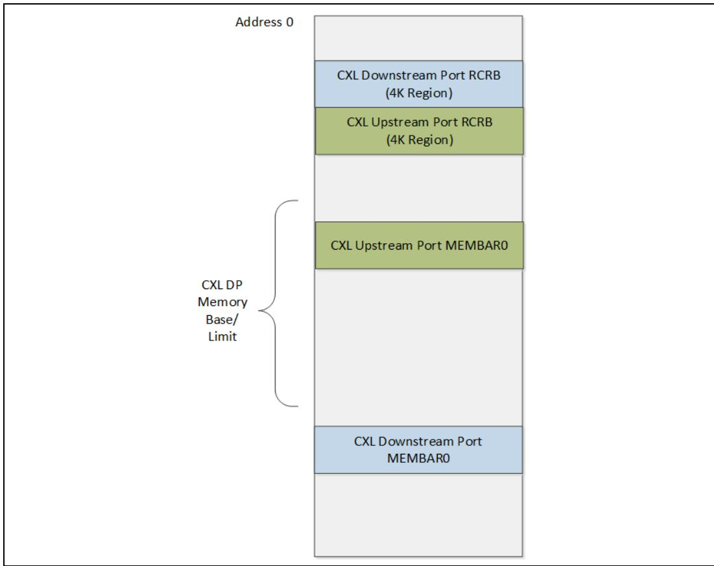

CXL Upstream Port RCRB (4K Region)

CXL Upstream Port MEMBAR0

## 8.2.1 RCD Upstream Port and RCH Downstream Port Registers

## 8.2.1.1 RCH Downstream Port RCRB

The RCH Downstream Port RCRB is a 4-KB memory region that contains registers based upon the PCIe-defined registers for a root port. Figure 8-9 illustrates the layout of the CXL RCRB for a Downstream Port. With the exception of the first DWORD, the first 64 bytes of the RCH Downstream Port RCRB implement the registers from a PCIe Type 1 Configuration Header. The first DWORD of the RCRB contains a NULL Extended Capability ID with a Version of 0h and a Next Capability Offset pointer. A 64-bit MEMBAR0 is implemented at Offsets 10h and 14h; this points to a private memory region that hosts registers for configuring Downstream Port subsystem components as specified in Table 8-17. The supported PCIe capabilities and extended capabilities are discovered by following the linked lists of pointers. Supported PCIe capabilities are mapped into the offset range from 040h to 0FFh. Supported PCIe extended capabilities are mapped into the offset range from 100h to FFFh. The RCH Downstream Port supported PCIe capabilities and extended capabilities are listed in Table 8-18; please refer to PCIe Base Specification for definitions of the associated registers.

Figure 8-9. RCH Downstream Port RCRB

<table><tr><td>31</td><td>20</td><td>19</td><td>16</td><td>15</td><td>8</td><td>7</td><td>0</td></tr><tr><td colspan="2">Next Capability Offset</td><td colspan="2">Version = 0h</td><td colspan="4">Null Extended Capability ID = 0000h</td></tr><tr><td colspan="4">Status</td><td colspan="4">Command</td></tr><tr><td colspan="6">Class Code</td><td colspan="2">Revision ID</td></tr><tr><td>Reserved</td><td colspan="3">Header Type</td><td colspan="2">Reserved</td><td colspan="2">Cache Line Size</td></tr><tr><td colspan="8">MEMBAR0</td></tr><tr><td colspan="8">... rest of PCIe Type 1 Config Header registers ...</td></tr><tr><td colspan="8">... supported PCIe capabilities registers ...</td></tr><tr><td colspan="8">... supported PCIe extended capabilities registers ...</td></tr></table>

RCH Downstream Port PCIe Capabilities and Extended Capabilities (Sheet 1 of 2)

<table><tr><td>PCIe Capabilities and Extended Capabilities</td><td> $Exceptions^1$ </td><td>Notes</td></tr><tr><td>PCIe Capability</td><td>Slot Capabilities, Slot Control, Slot Status, Slot Capabilities 2, Slot Control 2, and Slot Status 2 registers are not applicable.</td><td>N/A</td></tr><tr><td>PCI Power Management Capability</td><td>N/A. Software should ignore.</td><td>N/A</td></tr><tr><td>MSI Capability</td><td>N/A. Software should ignore.</td><td>N/A</td></tr><tr><td>Advanced Error Reporting Extended Capability</td><td>N/A. Software should ignore.</td><td>Required for CXL device despite being optional for PCIe.Downstream Port is required to forward ERR_messages.</td></tr><tr><td>ACS Extended Capability</td><td>None</td><td>N/A</td></tr><tr><td>Multicast Extended Capability</td><td>N/A. Software should ignore.</td><td>N/A</td></tr><tr><td>Downstream Port Containment Extended Capability</td><td>Use with care. DPC trigger will bring down physical link, reset device state, disrupt CXL.cache and CXL.mem traffic.</td><td>N/A</td></tr><tr><td>Designated Vendor-Specific Extended Capability (DVSEC)</td><td>None</td><td>See Section 8.2.1.3 for Flex Bus Port DVSEC definition.</td></tr><tr><td>Secondary PCIe Extended Capability</td><td>None</td><td>None</td></tr></table>

Table 8-18. RCH Downstream Port PCIe Capabilities and Extended Capabilities (Sheet 2 of 2)

<table><tr><td>PCIe Capabilities and Extended Capabilities</td><td> $Exceptions^1$ </td><td>Notes</td></tr><tr><td>Data Link Feature Extended Capability</td><td>None</td><td>None</td></tr><tr><td>Physical Layer 16.0 GT/s Extended Capability</td><td>None</td><td>None</td></tr><tr><td>Physical Layer 32.0 GT/s Extended Capability</td><td>None</td><td>None</td></tr><tr><td>Lane Margining at the Receiver Extended Capability</td><td>None</td><td>None</td></tr><tr><td>Alternate Protocol Extended Capability</td><td>None</td><td>None</td></tr></table>

1. It is the responsibility of software to be aware of the registers within the capabilities that are not applicable in CXL mode in case designs choose to use a common code base for PCIe mode and CXL mode.

## 8.2.1.2 RCD Upstream Port RCRB

The RCD Upstream Port RCRB is a 4-KB memory region that contains registers based upon the PCIe Base Specification-defined registers. The Upstream Port captures the upper address bits [63:12] of the first memory read received after link initialization as the base address for the Upstream Port RCRB. Figure 8-10 illustrates the layout of the RCRB for an RCD Upstream Port. With the exception of the first DWORD, the first 64 bytes of the RCD Upstream Port RCRB implement the registers from a PCIe Type 0 Configuration Header. The first DWORD of the RCRB contains a NULL Extended Capability ID with a Version of 0h and a Next Capability Offset pointer. A 64-bit BAR (labeled MEMBAR0) is implemented at Offsets 10h and 14h; this points to a memory region that hosts registers for configuring the Upstream Port subsystem CXL.mem as specified in Table 8-17. The supported PCIe capabilities and extended capabilities are discovered by following the linked lists of pointers. Supported PCIe capabilities are mapped into the offset range from 040h to 0FFh. Supported PCIe extended capabilities are mapped into the offset range from 100h to FFFh. The CXL Upstream Port-supported PCIe capabilities and extended capabilities are listed in Table 8-19; see PCIe Base Specification for definitions of the associated registers.

The following standard registers that are part of the PCI Type 0 header definition are considered reserved and have no effect on the behavior of an RCD Upstream Port:

• Command register (Offset 04h)

• Status register (Offset 06h)

Per PCIe Base Specification, the following registers in the PCIe Capability are marked reserved for an RCiEP and shall not be implemented by the Device 0, Function 0 of the RCD:

• Link Registers - Link Capabilities, Link Control, Link Status, Link Capabilities 2, Link Control 2, and Link Status 2

• Slot Registers - Slot Capabilities, Slot Control, Slot Status, Slot Capabilities 2, Slot Control 2, and Slot Status 2

• Root Port Registers - Root Capabilities, Root Control, and Root Status

Software must reference the Link registers in the Upstream Port RCRB PCIe capability structure to discover the link capabilities and link status, and to configure the link properties. These registers shall follow the PCIe Base Specification definition of an Upstream Switch Port. Software must set the ASPM Control field in the Link Control register if it wishes to enable CXL.io L1.

All fields in the Upstream Port’s Device Capabilities register, Device Control register, Device Status register, Device Capabilities 2 register, Device Control 2 register, and Device Status 2 register are reserved.

The Device/Port Type, Slots Implemented and Interrupt Message Number fields in the Upstream Port’s Capability register are reserved.

## Figure 8-10. RCD Upstream Port RCRB

<table><tr><td>31</td><td>20 19</td><td>16 15</td><td>8 7</td><td>0</td></tr><tr><td colspan="2">Next Capability Offset</td><td>Version - 0h</td><td colspan="2">Null Extended Capability ID = 0000h</td></tr><tr><td colspan="3">Status</td><td colspan="2">Command</td></tr><tr><td colspan="4">Class Code</td><td>Revision ID</td></tr><tr><td>Reserved</td><td colspan="2">Header Type</td><td>Reserved</td><td>Cache Line Size</td></tr><tr><td colspan="5">MEMBARD</td></tr><tr><td colspan="5">Reserved</td></tr><tr><td colspan="3">Subsystem ID</td><td colspan="2">Subsystem Vendor ID</td></tr><tr><td colspan="5">Reserved</td></tr><tr><td colspan="4">Reserved</td><td>Capabilities Pointer</td></tr><tr><td colspan="5">Reserved</td></tr><tr><td colspan="3">Reserved</td><td>Interrupt Pin</td><td>Interrupt Line</td></tr><tr><td colspan="5">... supported PCIe capabilities registers ...</td></tr><tr><td colspan="5">... supported PCIe extended capabilities registers ...</td></tr></table>

Table 8-19. RCD Upstream Port PCIe Capabilities and Extended Capabilities

<table><tr><td>PCIe Capabilities and Extended Capabilities</td><td> $Exceptions^1$ </td><td>Notes</td></tr><tr><td>PCIe Capability</td><td>See Section 8.2.1.2.</td><td>None</td></tr><tr><td>Advanced Error Reporting Extended Capability</td><td>N/A. Software should ignore.</td><td>Required for CXL devices despite being optional for PCIe. Link/Protocol errors detected by Upstream Port are logged/reported via RCiEP.</td></tr><tr><td>Virtual Channel Extended Capability</td><td>None</td><td>VC0 and VC1</td></tr><tr><td>Designated Vendor-Specific Extended Capability (DVSEC)</td><td>None</td><td>See Section 8.2.1.3 for Flex Bus Port DVSEC definition.</td></tr><tr><td>Secondary PCIe Extended Capability</td><td>None</td><td>None</td></tr><tr><td>Data Link Feature Extended Capability</td><td>None</td><td>None</td></tr><tr><td>Physical Layer 16.0 GT/s Extended Capability</td><td>None</td><td>None</td></tr><tr><td>Physical Layer 32.0 GT/s Extended Capability</td><td>None</td><td>None</td></tr><tr><td>Lane Margining at the Receiver Extended Capability</td><td>None</td><td>None</td></tr><tr><td>Alternate Protocol Extended Capability</td><td>None</td><td>None</td></tr></table>

1. It is the responsibility of software to be aware of the registers within the capabilities that are not applicable in CXL mode in case designs choose to use a common code base for PCIe mode and CXL mode.

## 8.2.1.3 Flex Bus Port DVSEC

All CXL ports implement a Flex Bus Port DVSEC. This DVSEC is located in the RCRBs of the RCD Upstream Ports and RCH Downstream Ports. RCD and RCH ports may implement DVSEC Revision = 0, 1, or 2 of this DVSEC. See Table 8-2 for the complete listing.

This DVSEC is also located in the Configuration Space of CXL root ports, Upstream Switch Ports, Downstream Switch Port, and CXL device’s primary function (Device 0, Function 0) if the device does not implement CXL RCRB. A CXL component that is neither an RCD nor an RCH shall report DVSEC Revision greater than or equal to 1. Revision 2 introduces 3 new registers.

Figure 8-11 shows the layout of the Flex Bus Port DVSEC and Table 8-20 shows how the Header 1 and Header 2 registers shall be set. The following subsections give details of the registers defined in the Flex Bus Port DVSEC.

Note:

Figure 8-11. PCIe DVSEC for Flex Bus Port

<table><tr><td colspan="2">PCI Express Extended Capability Header</td></tr><tr><td colspan="2">Designated Vendor-specific Header 1</td></tr><tr><td>DVSEC Flex Bus Port Capability</td><td>Designated Vendor-specific Header 2</td></tr><tr><td>DVSEC Flex Bus Port Status</td><td>DVSEC Flex Bus Port Control</td></tr><tr><td colspan="2">DVSEC Flex Bus Port Received Modified TS Data Phase1</td></tr><tr><td colspan="2">DVSEC Flex Bus Port Capability2</td></tr><tr><td colspan="2">DVSEC Flex Bus Port Control2</td></tr><tr><td colspan="2">DVSEC Flex Bus Port Status2</td></tr></table>

Table 8-20. PCIe DVSEC Header Register Settings for Flex Bus Port

<table><tr><td>Register</td><td>Bit Location</td><td>Field</td><td>Value</td></tr><tr><td rowspan="3">Designated Vendor-Specific Header 1 (Offset 04h)</td><td>15:0</td><td>DVSEC Vendor ID</td><td>1E98h</td></tr><tr><td>19:16</td><td>DVSEC Revision</td><td>2h</td></tr><tr><td>31:20</td><td>DVSEC Length</td><td>020h</td></tr><tr><td>Designated Vendor-Specific Header 2 (Offset 08h)</td><td>15:0</td><td>DVSEC ID</td><td>0007h</td></tr></table>

## 8.2.1.3.1 DVSEC Flex Bus Port Capability (Offset 0Ah)

The Mem\_Capable, IO\_Capable, and Cache\_Capable fields are also present in the Flex Bus DVSEC for the device. This allows for future scalability where multiple devices, each with potentially different capabilities, may be populated behind a single Port.

<table><tr><td>Bit</td><td>Attributes</td><td>Description</td></tr><tr><td>0</td><td>HwInit</td><td>Cache_Capable: If set, indicates CXL.cache protocol support when operating in Flex Bus.CXL mode. This should be cleared to 0 for all LDs of an MLD.</td></tr><tr><td>1</td><td>HwInit</td><td>IO_Capable: If set, indicates CXL.io protocol support when operating in Flex Bus.CXL mode. Must be 1.</td></tr><tr><td>2</td><td>HwInit</td><td>Mem_Capable: If set, indicates CXL.mem protocol support when operating in Flex Bus.CXL mode. This must be 1 for all LDs of an MLD.</td></tr><tr><td>4:3</td><td>RsvdP</td><td>Reserved</td></tr><tr><td>5</td><td>HwInit</td><td>CXL 68B Flit and VH Capable: Formerly known as CXL2p0_Capable. If set, indicates CXL VH functionality support with 68B flits is available when operating in Flex Bus.CXL mode. This must be 1 for all LDs of an MLD. $^{1}$ </td></tr><tr><td>6</td><td>HwInit</td><td>CXL_Multi-Logical_Device_Capable: If set, indicates Multi-Logical Device support available when operating in Flex Bus.CXL mode. This bit must be cleared to 0 on CXL host Downstream Ports. The value must be the same for all LDs of an MLD. $^{1}$ </td></tr><tr><td>12:7</td><td>RsvdP</td><td>Reserved</td></tr><tr><td>13</td><td>HwInit</td><td>CXL Latency_Optimized_256B_Flit_Capable: If set, indicates support for latency-optimized 256B flits as described in Section 6.2.3.1.2 when operating in Flex Bus.CXL mode. The value must be the same for all LDs of an MLD. $^{2}$ </td></tr><tr><td>14</td><td>HwInit</td><td>CXL PBR Flit Capable: If set, indicates support for PBR flits as described in Table 6-11 when operating in Flex Bus.CXL mode. $^{2}$ </td></tr><tr><td>15</td><td>RsvdP</td><td>Reserved</td></tr></table>

1. Introduced as part of DVSEC Revision=1. 2. Introduced as part of DVSEC Revision=2.

## 8.2.1.3.2 DVSEC Flex Bus Port Control (Offset 0Ch)

The Flex Bus physical layer uses the values that software sets in this register as a starting point for alternate protocol negotiation as long as the corresponding bit in the Flex Bus Port Capability register is set. The Flex Bus physical layer shall sample the values in this register only during exit from the Detect LTSSM state; the physical layer shall ignore any changes to this register in all other LTSSM states.

<table><tr><td>Bit</td><td>Attributes</td><td>Description</td></tr><tr><td>0</td><td>RW if Downstream Port; otherwise, HwInit</td><td>Cache_Enable: When set, enables CXL.cache protocol operation when in Flex Bus.CXL mode.Default value of this bit is 0.</td></tr><tr><td>1</td><td>RO</td><td>IO_Enable: When set, enables CXL.io protocol operation when in Flex Bus.CXL mode. Must always be set to 1.</td></tr><tr><td>2</td><td>RW if Downstream Port; otherwise HwInit</td><td>Mem_Enable: When set, enables CXL.mem protocol operation when in Flex Bus.CXL mode.Default value of this bit is 0.</td></tr><tr><td>3</td><td>HwInit</td><td>CXL_Sync_Hdr_Bypass_Enable: When set, enables bypass of the 2-bit sync header by the Flex Bus physical layer when operating in Flex Bus.CXL mode. This is a performance optimization.</td></tr><tr><td>4</td><td>HwInit</td><td>Drift_Buffer_Enable: When set, enables drift buffer (instead of elastic buffer) if there is a common reference clock.</td></tr><tr><td>5</td><td>RW if Downstream Port; otherwise HwInit</td><td>CXL 68B Flit and VH Enable: Formerly known as CXL2p0_Enable. When set, enables CXL VH operation with 68B flits when in Flex Bus.CXL mode. This bit is reserved if CXL 68B Flit and VH Capable=0. $^{1}$ Default value of this bit is 0.</td></tr><tr><td>6</td><td>RW if Downstream Port; otherwise HwInit</td><td>CXL_Multi-Logical_Device_Enable: When set, enable Multi-Logical Device operation when in Flex Bus.CXL mode. This bit shall always be cleared to 0 for CXL root ports and RCH Downstream Ports. $^{1}$ Default value of this bit is 0.</td></tr><tr><td>7</td><td>RW if Downstream Port; otherwise HwInit</td><td>Disable_RCD_Training: Formerly known as Disable_CXL1p1_Training. When set, RCD mode is disabled. Typical usage model is that System Firmware will use this bit to disable Hot-Plug of an eRCD below a CXL root port or DSP. This bit is reserved on all RCD and RCH Upstream Ports. $^{1}$ Default value of this bit is 0.</td></tr><tr><td>8</td><td>RW if Downstream Port; otherwise, RsvdP</td><td>Retimer1_Present: When set, indicates presence of Retimer1. This bit is defined only for a Downstream Port. This bit is reserved for an Upstream Port.Default value of this bit is 0.This bit is only used by RCH Downstream Ports. All other ports shall ignore this bit.</td></tr><tr><td>9</td><td>RW if Downstream Port; otherwise, RsvdP</td><td>Retimer2_Present: When set, indicates presence of Retimer2. This bit is defined only for a Downstream Port. This bit is reserved for an Upstream Port.Default value of this bit is 0.This bit is only used by RCH Downstream Ports. All other ports shall ignore this bit.</td></tr><tr><td>12:10</td><td>RsvdP</td><td>Reserved</td></tr><tr><td>13</td><td>RW if Downstream Port; otherwise HwInit</td><td>CXL Latency_Optimized_256B_Flit_Enable: When set, enables latency-optimized 256B flits when in Flex Bus.CXL mode. This bit is reserved on components that do not support 256B Flit mode. $^{2}$ Default value of this bit is 0.</td></tr><tr><td>14</td><td>RW if Downstream Port; otherwise, HwInit</td><td>CXL PBR Flit Enable: When set, enables PBR flits when in Flex Bus.CXL mode. This bit is reserved on components that do not support PBR Flit mode. See Table 6-11. $^{2}$ Default value of this bit is 0.</td></tr><tr><td>15</td><td>RsvdP</td><td>Reserved</td></tr></table>

1. Introduced as part of DVSEC Revision=1.  
2. Introduced as part of DVSEC Revision=2.

## 8.2.1.3.3 DVSEC Flex Bus Port Status (Offset 0Eh)

The Flex Bus physical layer reports the results of alternate protocol negotiation in this register.

<table><tr><td>Bit</td><td>Attributes</td><td>Description</td></tr><tr><td>0</td><td>RO</td><td>Cache_Enabled: When set, indicates that CXL.cache protocol operation has been enabled as a result of PCIe alternate protocol negotiation for Flex Bus.</td></tr><tr><td>1</td><td>RO</td><td>IO_Enabled: When set, indicates that CXL.io protocol operation has been enabled as a result of PCIe alternate protocol negotiation for Flex Bus.</td></tr><tr><td>2</td><td>RO</td><td>Mem_Enabled: When set, indicates that CXL.mem protocol operation has been enabled as a result of PCIe alternate protocol negotiation for Flex Bus.</td></tr><tr><td>3</td><td>RO</td><td>CXL_Sync_Hdr_Bypass_Enabled: When set, indicates that bypass of the 2-bit sync header by the Flex Bus physical layer has been enabled when operating in Flex Bus.CXL mode as a result of PCIe alternate protocol negotiation for Flex Bus.</td></tr><tr><td>4</td><td>RO</td><td>Drift_Buffer_Enabled: When set, indicates that the physical layer has enabled its drift buffer instead of its elastic buffer.</td></tr><tr><td>5</td><td>RO</td><td>CXL 68B Flit and VH Enabled: Formerly known as CXL2p0_Enabled. When set, indicates that CXL VH operation with 68B Flit mode has been enabled as a result of PCIe alternate protocol negotiation for Flex Bus. $^{1}$ </td></tr><tr><td>6</td><td>RO</td><td>CXL_Multi-Logical_Device_Enabled: When set, indicates that CXL Multi-Logical Device operation has been negotiated. $^{1}$ </td></tr><tr><td>7</td><td>RW1CS</td><td>Even Half Failed: When set, indicates the Physical Layer detected a CRC error on the even flit half of a post-FEC corrected flit; however, even flit half was previously consumed because the even half passed CRC in the original flit. This bit is reserved in 68B Flit mode.This error is also logged as a Receiver Error in the AER Correctable Status register by the associated root port. $^{2}$ </td></tr><tr><td>8</td><td>RW1CS</td><td>CXL_Correctable_Protocol_ID_Framing_Error: See Section 6.2.2 for more details. This bit is reserved in 256B Flit mode.It is recommended that this error also be logged as a Receiver Error in the AER Correctable Status register by the associated root port.</td></tr><tr><td>9</td><td>RW1CS</td><td>CXL_Uncorrectable_Protocol_ID_Framing_Error: See Section 6.2.2 for more details. This bit is reserved in 256B Flit mode.It is recommended that this error also be logged as a Receiver Error in the AER Correctable Status register by the associated root port.</td></tr><tr><td>10</td><td>RW1CS</td><td>CXL_Unexpected_Protocol_ID_Dropped: When set, indicates that the physical layer dropped a flit with an unexpected Protocol ID that is not the result of an Uncorrectable Protocol ID Framing Error. See Section 6.2.2 for more details. This bit is reserved in 256B Flit mode.It is recommended that this error also be logged as a Receiver Error in the AER Correctable Status register by the associated root port.</td></tr><tr><td>11</td><td>RW1CS</td><td>CXL_Retimers_Present_Mismatched: When set, indicates that the Downstream Port physical layer detected an inconsistency in the "Retimers Present" or "Two Retimers Present" bits in the received TS2 Ordered Sets during Polling.Config vs. Config.Complete LTSSM states. The physical layer will force disable of the sync header bypass optimization when this error condition has been detected. See Section 6.4.1.2.1 for more details. This bit is reserved on Upstream Ports.</td></tr><tr><td>12</td><td>RW1CS</td><td>FlexBusEnableBits_Phase2_Mismatch: When set, indicates that the Downstream Port physical layer detected that the Upstream Port did not exactly reflect the Flex Bus enable bits located in symbols 12-14 of the modified TS2 during Phase 2 of the negotiation. See Section 6.4.1.1 for more details. This bit is reserved on Upstream Ports.</td></tr><tr><td>13</td><td>RO</td><td>CXL Latency_Optimized_256B_Flit_Enabled: When set, indicates that latency-optimized 256B flits have been enabled as a result of PCIe alternate protocol negotiation for Flex Bus. $^{2}$ </td></tr><tr><td>14</td><td>RO</td><td>CXL PBR Flit Enabled: When set, indicates that PBR flits have been enabled as a result of PCIe alternate protocol negotiation for Flex Bus. See Table 6-11. $^{2}$ </td></tr><tr><td>15</td><td>RO</td><td>CXL.io_Throttle_Required_at_64GT/s: When set, indicates that the partner Upstream Port does not support receiving consecutive CXL.io flits at 64 GT/s (see Section 6.4.1.3).This bit is only defined for Downstream Ports; this bit is reserved on Upstream Ports. $^{2}$ </td></tr></table>

1. Introduced as part of DVSEC Revision=1.  
2. Introduced as part of DVSEC Revision=2.

## 8.2.1.3.4 DVSEC Flex Bus Port Received Modified TS Data Phase1 (Offset 10h)

If CXL alternate protocol negotiation is enabled and the Modified TS Received bit is set in the 32.0 GT/s Status register (see PCIe Base Specification), then this register contains the values received in Symbols 12 through 14 of the Modified TS1 Ordered Set during Phase 1 of CXL alternate protocol negotiation.

<table><tr><td>Bit</td><td>Attributes</td><td> $Description^{1}$ </td></tr><tr><td>23:0</td><td>RO</td><td>Received_Flex_Bus_Data_Phase_1: This field contains the values received in Symbols 12 through 14 of the Modified TS1 Ordered Set during Phase 1 of CXL alternate protocol negotiation. $^{2}$ </td></tr><tr><td>31:24</td><td>RsvdZ</td><td>Reserved</td></tr></table>

1. This register was introduced as part of DVSEC Revision=1. 2. This field was introduced as part of DVSEC Revision=1.

## 8.2.1.3.5 DVSEC Flex Bus Port Capability2 (Offset 14h)

<table><tr><td>Bit</td><td>Attributes</td><td> $Description^{1}$ </td></tr><tr><td>0</td><td>RO</td><td>NOP_Hint_Capable: If set, indicates support for sending and processing NOP hints when operating with latency-optimized 256B flits in Flex Bus.CXL mode. $^{2}$ </td></tr><tr><td>31:1</td><td>RsvdP</td><td>Reserved</td></tr></table>

1. This register was introduced as part of DVSEC Revision=2.  
2. This bit was introduced as part of DVSEC Revision = 2.

1. This register was introduced as part of DVSEC Revision=2. 2. This bit was introduced as part of DVSEC Revision = 2.

## 8.2.1.3.6 DVSEC Flex Bus Port Control2 (Offset 18h)

<table><tr><td>Bit</td><td>Attributes</td><td> $Description^{1}$ </td></tr><tr><td>0</td><td>RW</td><td>NOP_Hint_Enable: If set, enables sending and processing NOP hints when operating with latency-optimized 256B flits in Flex Bus.CXL mode. $^{2}$ The default value of this field is 0.</td></tr><tr><td>31:1</td><td>RsvdP</td><td>Reserved</td></tr></table>

## 8.2.1.3.7 DVSEC Flex Bus Port Status2 (Offset 1Ch)

<table><tr><td>Bit</td><td>Attributes</td><td>Description1</td></tr><tr><td>1:0</td><td>RO</td><td>NOP_Hint_Info: The Physical Layer captures what the remote link partner advertises during Phase 1 of link training.2</td></tr><tr><td>31:2</td><td>RsvdP</td><td>Reserved</td></tr></table>

1. This register was introduced as part of DVSEC Revision=2.  
2. This field was introduced as part of DVSEC Revision = 2.

## 8.2.2

## Accessing Component Registers

The RCD Upstream Port maps the Component registers in memory space that are allocated via the MEMBAR0 register of the RCD RCRB if the RCD implements RCRB. Similarly, the RCH Downstream Port maps the Component registers in memory space that are allocated via the MEMBAR0 register of the RCH RCRB. Section 8.2.3 defines the architected registers. Table 8-21 lists the relevant offset ranges from MEMBAR0 for CXL.io, CXL.cache, CXL.mem, and CXL ARB/MUX registers.

For an RCD Upstream Port that does not implement RCRB and for CXL components that are part of a CXL VH, the Component registers are mapped in memory space allocated via a standard PCIe BAR. The Register Locator DVSEC structure (see Section 8.1.9) describes the BAR number and the offset within the BAR where these registers are mapped.

A CXL Host Bridge contains Component registers that control the functionality of one or more CXL root ports. These are labeled CHBCR. These registers are also mapped in memory space, and the base address is discovered via ACPI CEDT (see Section 9.18.1.2).

For register layout, see Figure 9-14 and Figure 9-15.

## 8.2.3 Component Register Layout and Definition

The layout and discovery mechanism of the Component register is identical for all CXL Components and CXL Host Bridges (CHBCR). Table 8-21 lists the relevant offset ranges from the Base of the Component register block for CXL.io, CXL.cache, CXL.mem, and CXL ARB/MUX registers.

Software shall use CXL.io Memory Reads and Writes to access CXL Component registers defined in Section 8.2.4 and Section 8.2.5. Software shall restrict the access width based on the following rules:

• A 32-bit register shall be accessed as a 4-byte quantity. Partial reads are not permitted.

• A 64-bit register shall be accessed as an 8-byte quantity. Partial reads are not permitted.

• Accesses shall map to contiguous bytes.

If these rules are not followed, the behavior is undefined. Note that these rules are more stringent than the general rules for the memory mapped registers that are specified in Section 8.2.

This section and Table 8-22 in this version of the specification do not define the behavior of CXL fabric switches (see Section 2.7) and G-FAM devices (see Section 2.8).

## Table 8-21. CXL Subsystem Component Register Ranges

<table><tr><td>Range</td><td>Size</td><td>Description</td></tr><tr><td>0000 0000h - 0000 0FFFh</td><td>4 KB</td><td>Reserved for CXL.io registers. This specification does not define any CXL.io registers, hence the entire range is considered reserved.</td></tr><tr><td>0000 1000h - 0000 1FFFh</td><td>4 KB</td><td>CXL.cachemem Primary Range</td></tr><tr><td>0000 2000h - 0000 DFFFh</td><td>48 KB</td><td>Implementation specific. May host zero or more instances of CXL.cachemem Extended Ranges.</td></tr><tr><td>0000 E000h - 0000 E3FFh</td><td>1 KB</td><td>CXL ARB/MUX registers</td></tr><tr><td>0000 E400h - 0000 FFFFh</td><td>7 KB</td><td>Reserved. The range F000-FFFFh may host CXL.cachemem Extended Range.</td></tr></table>

## 8.2.4 CXL.cache and CXL.mem Registers

CXL.cache and CXL.mem registers are located in the CXL.cachemem Primary Range (Offset 1000h-1FFFh) or one of the CXL.cachemem Extended Ranges. Within each of the 4-KB region of memory space assigned to CXL.cache and CXL.mem, the location of architecturally specified registers is described using an array of pointers. The array, described in Table 8-23, is located starting at Offset 00h of this 4-KB region. The first element of the array will declare the version of CXL.cache and CXL.mem protocols, as well as the size of the array. Each subsequent element will then host the pointers to capability-specific register blocks within the 4-KB region. Table 8-24 and Table 8-25 illustrate this concept with an example.

Structures with Capability ID of 1 through 0Ah are not permitted to be part of the CXL.cachemem Extended Ranges. Capability ID 0Ah structure identifies the CXL.cachemem Extended Ranges. Structures with Capability ID 0 or Capability ID greater than 0Ah are permitted to be part of the CXL.cachemem Primary Range or any of the CXL.cachemem Extended Ranges.

For each capability ID, CXL\_Capability\_Version field is incremented whenever the structure is extended to add more functionality. Backward compatibility shall be maintained during this process. For all values of n, CXL\_Capability\_Version=n+1 structure may extend CXL\_Capability\_Version=n by replacing fields that are marked as reserved in CXL\_Capability\_Version= n, but shall not redefine the meaning of existing fields. In addition, CXL\_Capability\_Version n+1 may append new registers to the CXL\_Capability\_Version n structure. Software that was written for a lower CXL\_Capability\_Version may continue to operate on structures with a higher CXL\_Capability\_Version, but will not be able to take advantage of new functionality.

CXL\_Capability\_ID field represents the functionality and CXL\_Capability\_Version represents the version of the structure. The following values of CXL\_Capability\_ID are defined by CXL specification.

Table 8-22. CXL\_Capability\_ID Assignment

<table><tr><td>Capability</td><td>ID</td><td>Highest Version</td><td>Mandatory1</td><td>Not Permitted1</td><td>Optional1</td></tr><tr><td>CXL NULL Capability - Software shall ignore this structure and skip to the next CXL Capability</td><td>0</td><td>Undefined</td><td></td><td>P</td><td>D1, D2, LD, FMLD, DP1, UP1, USP, DSP, R, RC</td></tr><tr><td>CXL Capability (Section 8.2.4.1)</td><td>1</td><td>1</td><td>D1, D2, LD, FMLD, UP1, DP1, R, USP, DSP, RC</td><td>P</td><td></td></tr><tr><td>CXL RAS Capability (Section 8.2.4.17)</td><td>2</td><td>3</td><td>D1, D2, LD, FMLD, UP1, DP1, R, USP, DSP</td><td>P, RC</td><td></td></tr><tr><td>CXL Security Capability (Section 8.2.4.18)</td><td>3</td><td>1</td><td>DP1</td><td>All others</td><td></td></tr><tr><td>CXL Link Capability (Section 8.2.4.19)</td><td>4</td><td>4</td><td>D1, D2, LD, FMLD, UP1, DP1, R, USP, DSP</td><td>P, RC</td><td></td></tr><tr><td>CXL HDM Decoder Capability (Section 8.2.4.20)</td><td>5</td><td>3</td><td>Type 3 D2, LD, RC except RCH, USP</td><td>All others</td><td>Type 2 D2, D1</td></tr><tr><td>CXL Extended Security Capability (Section 8.2.4.21)</td><td>6</td><td>2</td><td>RC</td><td>All others</td><td></td></tr><tr><td>CXL IDE Capability (Section 8.2.4.22)</td><td>7</td><td>2</td><td></td><td>P, D1, LD, UP1, DP1</td><td>D2, FMLD, R, USP, DSP</td></tr><tr><td>CXL Snoop Filter Capability (Section 8.2.4.23)</td><td>8</td><td>1</td><td>R</td><td>P, D1, D2, LD, FMLD, UP1, USP, DSP, RC</td><td>DP1</td></tr><tr><td>CXL Timeout and Isolation Capability (Section 8.2.4.24)</td><td>9</td><td>1</td><td></td><td>P, D1, D2, LD, FMLD, UP1, USP, DSP, RC</td><td>R</td></tr><tr><td>CXL.cachemem Extended Register Capability (Section 8.2.4.25)</td><td>0Ah</td><td>1</td><td></td><td>P</td><td>D1, D2, LD, FMLD, UP1, R, USP, DSP, RC</td></tr><tr><td>CXL BI Route Table Capability (Section 8.2.4.26)</td><td>0Bh</td><td>1</td><td>USP that requires explicit BI commit</td><td>All others</td><td>All other USPs</td></tr><tr><td>CXL BI Decoder Capability (Section 8.2.4.27)</td><td>0Ch</td><td>1</td><td>DSP or Type 2 D2 that advertises 256B Flit mode</td><td>P, D1, FMLD, UP1, DP1, R, all other USPs, RC</td><td>R2, all other DSPs, all other D2s, LD</td></tr><tr><td>CXL Cache ID Route Table Capability (Section 8.2.4.28)</td><td>0Dh</td><td>1</td><td></td><td>All others</td><td>RC, USP</td></tr><tr><td>CXL Cache ID Decoder Capability (Section 8.2.4.29)</td><td>0Eh</td><td>1</td><td></td><td>P, D1, D2, LD, FMLD, UP1, DP1, R, DSP, RC</td><td>R, DSP</td></tr><tr><td>CXL Extended HDM Decoder Capability (Section 8.2.4.30)</td><td>0Fh</td><td>3</td><td></td><td>All others</td><td>RC, USP</td></tr><tr><td>CXL Extended Metadata Capability (Section 8.2.4.31)</td><td>10h</td><td>1</td><td></td><td>All others</td><td>CXL.mem capable LD or D2 that supports 256B Flit Mode</td></tr></table>

2. Strongly recommended for a host that supports 256B Flit mode.  
1. P - PCIe device, D1 - RCD, D2 - CXL device that is not RCD, LD - Logical Device, FMLD - Fabric Manager owned LD FFFFh, UP1 - RCD Upstream Port RCRB, DP1 - RCH Downstream Port, R - CXL root port, RC - CXL Host Bridge registers in CHBCR, USP - CXL Upstream Switch Port, DSP - CXL Downstream Switch Port. A physical component may be capable of operating in multiple modes (e.g., a CXL device may operate either in D1 mode or D2 mode based on the link training). In such cases, these definitions refer to the current mode of operation.

Table 8-23. CXL.cache and CXL.mem Architectural Register Discovery

<table><tr><td>Offset</td><td>Register Name</td></tr><tr><td>00h</td><td>CXL_Capability_Header</td></tr><tr><td>04h (Length = n*4, where n is the number of capability headers)</td><td>An array of individual capability headers. See Table 8-22 for the enumeration.</td></tr></table>

Table 8-24. CXL.cache and CXL.mem Architectural Register Header Example (Primary Range)

<table><tr><td>Byte Offset</td><td>Register Name</td></tr><tr><td>00h</td><td>CXL_Capability_Header</td></tr><tr><td>04h</td><td>CXL_RAS_Capability_Header</td></tr><tr><td>08h</td><td>CXL_Security_Capability_Header</td></tr><tr><td>0Ch</td><td>CXL_Link_Capability_Header</td></tr><tr><td>10h</td><td>CXL.cachemem Extended Register Capability Header</td></tr></table>

Table 8-25. CXL.cache and CXL.mem Architectural Register Header Example (Any Extended Range)

<table><tr><td>Byte Offset</td><td>Register Name</td></tr><tr><td>00h</td><td>CXL_Capability_Header</td></tr><tr><td>04h</td><td>CXL BI Decoder Capability Header</td></tr><tr><td>08h</td><td>CXL NULL Capability Header</td></tr><tr><td>0Ch</td><td>CXL Cache ID Decoder Capability Header</td></tr></table>

## 8.2.4.1 CXL Capability Header Register (Offset 00h)

<table><tr><td>Bit Location</td><td>Attributes</td><td>Description</td></tr><tr><td>15:0</td><td>RO</td><td>CXL_Capability_ID: This defines the nature and format of the CXL_Capability register. For the CXL_Capability_Header register, this field must be 0001h.</td></tr><tr><td>19:16</td><td>RO</td><td>CXL_Capability_Version: This defines the version number of the CXL_Capability structure present. For this and the prior version of the specification, this field must be 1h.</td></tr><tr><td>23:20</td><td>RO</td><td>CXL_Cache_Mem_Version: This defines the version of the CXL.cachemem Protocol supported. For this and the prior versions of the specification, this field must be 1h.</td></tr><tr><td>31:24</td><td>RO</td><td>Array_Size: This defines the number of elements present in the CXL_Capability array, not including the CXL_Capability_Header element. Each element is 1 DWORD in size and is located contiguous with previous elements.</td></tr></table>

## 8.2.4.2 CXL RAS Capability Header (Offset: Varies)

<table><tr><td>Bit Location</td><td>Attributes</td><td>Description</td></tr><tr><td>15:0</td><td>RO</td><td>CXL_Capability_ID: This defines the nature and format of the CXL_Capability register. For the CXL_RAS_Capability_Pointer register, this field shall be 0002h.</td></tr><tr><td>19:16</td><td>RO</td><td>CXL_Capability_Version: This defines the version number of the CXL_Capability structure present. Version 3h represents the structure as defined in this specification.</td></tr><tr><td>31:20</td><td>RO</td><td>CXL_RAS_Capability_Pointer: This defines the offset of the CXL RAS Capability relative to the beginning of the CXL_Capability_Header register. Details in Section 8.2.4.17.</td></tr></table>

## 8.2.4.3 CXL Security Capability Header (Offset: Varies)

<table><tr><td>Bit Location</td><td>Attributes</td><td>Description</td></tr><tr><td>15:0</td><td>RO</td><td>CXL_Capability_ID: This defines the nature and format of the CXL_Capability register. For the CXL_Security_Capability_Pointer register, this field shall be 0003h.</td></tr><tr><td>19:16</td><td>RO</td><td>CXL_Capability_Version: This defines the version number of the CXL_Capability structure present. For this version of the specification, this field must be 1h.</td></tr><tr><td>31:20</td><td>RO</td><td>CXL_Security_Capability_Pointer: This defines the offset of the CXL Security Capability relative to the beginning of the CXL_Capability_Header register. Details in Section 8.2.4.18.</td></tr></table>

## 8.2.4.4 CXL Link Capability Header (Offset: Varies)

<table><tr><td>Bit Location</td><td>Attributes</td><td>Description</td></tr><tr><td>15:0</td><td>RO</td><td>CXL_Capability_ID: This defines the nature and format of the CXL_Capability register. For the CXL_Link_Capability_Pointer register, this field shall be 0004h.</td></tr><tr><td>19:16</td><td>RO</td><td>CXL_Capability_Version: This defines the version number of the CXL_Capability structure present. Version 4h represents the structure as defined in this specification.</td></tr><tr><td>31:20</td><td>RO</td><td>CXL_Link_Capability_Pointer: This defines the offset of the CXL Link Capability relative to the beginning of the CXL_Capability_Header register. Details in Section 8.2.4.19.</td></tr></table>

## 8.2.4.5 CXL HDM Decoder Capability Header (Offset: Varies)

<table><tr><td>Bit Location</td><td>Attributes</td><td>Description</td></tr><tr><td>15:0</td><td>RO</td><td>CXL_Capability_ID: This defines the nature and format of the CXL_Capability register. For the CXL_HDM_Decoder_Capability_Pointer register, this field shall be 0005h.</td></tr><tr><td>19:16</td><td>RO</td><td>CXL_Capability_Version: This defines the version number of the CXL_Capability structure present. For this version of the specification, this field must be 3h.</td></tr><tr><td>31:20</td><td>RO</td><td>CXL_HDM_Decoder_Capability_Pointer: This defines the offset of the CXLHDM Decoder Capability relative to the beginning of the CXL_Capability_Header register. Details in Section 8.2.4.20.</td></tr></table>

## 8.2.4.6 CXL Extended Security Capability Header (Offset: Varies)

<table><tr><td>Bit Location</td><td>Attributes</td><td>Description</td></tr><tr><td>15:0</td><td>RO</td><td>CXL_Capability_ID: This defines the nature and format of the CXL_Capability register. For the CXL_Extended Security_Capability_Pointer register, this field shall be 0006h.</td></tr><tr><td>19:16</td><td>RO</td><td>CXL_Capability_Version: This defines the version number of the CXL_Capability structure present. For this version of the specification, this field must be 2h.</td></tr><tr><td>31:20</td><td>RO</td><td>CXL_Extended_Security_Capability_Pointer: This defines the offset of the CXL Extended Security Capability relative to the beginning of the CXL_Capability_Header register. Details in Section 8.2.4.21.</td></tr></table>

## 8.2.4.7 CXL IDE Capability Header (Offset: Varies)

This capability header is present in all ports that implement CXL IDE.

<table><tr><td>Bit Location</td><td>Attributes</td><td>Description</td></tr><tr><td>15:0</td><td>RO</td><td>CXL_Capability_ID: This defines the nature and format of the CXL_Capability register. For the CXL_IDE_Capability_Header register, this field shall be 0007h.</td></tr><tr><td>19:16</td><td>RO</td><td>CXL_Capability_Version: This defines the version number of the CXL_Capability structure present. For this version of the specification, this field must be 2h.</td></tr><tr><td>31:20</td><td>RO</td><td>CXL IDE Capability Pointer: This defines the offset of the CXL IDE Capability relative to the beginning of the CXL_Capability_Header register. Details in Section 8.2.4.22.</td></tr></table>

## 8.2.4.8 CXL Snoop Filter Capability Header (Offset: Varies)

This capability header is required for Root Ports and optional for RCH Downstream Ports.

<table><tr><td>Bit Location</td><td>Attributes</td><td>Description</td></tr><tr><td>15:0</td><td>RO</td><td>CXL_Capability_ID: This defines the nature and format of the CXL_Capability register. For the CXL_Snoop_Filter_Capability_Header register, this field shall be 0008h.</td></tr><tr><td>19:16</td><td>RO</td><td>CXL_Capability_Version: This defines the version number of the CXL_Capability structure present. For this version of the specification, this field shall be 1h.</td></tr><tr><td>31:20</td><td>RO</td><td>CXL Snoop Filter Capability Pointer: This defines the offset of the CXL Snoop Filter Capability relative to the beginning of the CXL_Capability_Header register. Details in Section 8.2.4.23.</td></tr></table>

## 8.2.4.9 CXL Timeout and Isolation Capability Header (Offset: Varies)

<table><tr><td>Bit Location</td><td>Attributes</td><td>Description</td></tr><tr><td>15:0</td><td>RO</td><td>CXL_Capability_ID: This defines the nature and format of the CXL Capability register. For the CXL Timeout and Isolation Capability Header register, this field shall be 0009h.</td></tr><tr><td>19:16</td><td>RO</td><td>CXL_Capability_Version: This defines the version number of the CXL Capability structure present. For this version of the specification, this field must be 1h.</td></tr><tr><td>31:20</td><td>RO</td><td>CXL_Timeout_and_Isolation_Capability_Pointer: This defines the offset of the CXL Timeout and Isolation Capability structure relative to the beginning of the CXL_Capability_Header register. Details in Section 8.2.4.24.</td></tr></table>

## 8.2.4.10 CXL.cachemem Extended Register Capability (Offset: Varies)

<table><tr><td>Bit Location</td><td>Attributes</td><td>Description</td></tr><tr><td>15:0</td><td>RO</td><td>CXL_Capability_ID: This defines the nature and format of the CXL Capability register. For the CXL.cachemem Extended Register Capability Header register, this field shall be 000Ah.</td></tr><tr><td>19:16</td><td>RO</td><td>CXL_Capability_Version: This defines the version number of CXL Capability structure present. For this version of the specification, this field must be 1h.</td></tr><tr><td>31:20</td><td>RO</td><td>CXL.cachemem Extended Register Capability Pointer: This defines the offset of the CXL.cachemem Extended Register Capability structure relative to the beginning of the CXL_Capability_Header register. Details in Section 8.2.4.25.</td></tr></table>

## 8.2.4.11 CXL BI Route Table Capability Header (Offset: Varies)

<table><tr><td>Bit Location</td><td>Attributes</td><td>Description</td></tr><tr><td>15:0</td><td>RO</td><td>CXL_Capability_ID: This defines the nature and format of the CXL Capability register. For the CXL BI Route Table Capability Header register, this field shall be 000Bh.</td></tr><tr><td>19:16</td><td>RO</td><td>CXL_Capability_Version: This defines the version number of CXL Capability structure present. For this version of the specification, this field must be 1h.</td></tr><tr><td>31:20</td><td>RO</td><td>CXL BI Route Table Capability Pointer: This defines the offset of the CXL BI Route Table Capability structure relative to the beginning of the CXL_Capability_Header register. Details in Section 8.2.4.26.</td></tr></table>

## 8.2.4.12 CXL BI Decoder Capability Header (Offset: Varies)

<table><tr><td>Bit Location</td><td>Attributes</td><td>Description</td></tr><tr><td>15:0</td><td>RO</td><td>CXL_Capability_ID: This defines the nature and format of the CXL Capability register. For the CXL BI Decoder Capability Header register, this field shall be 000Ch.</td></tr><tr><td>19:16</td><td>RO</td><td>CXL_Capability_Version: This defines the version number of CXL Capability structure present. For this version of the specification, this field must be 1h.</td></tr><tr><td>31:20</td><td>RO</td><td>CXL BI Decoder Capability Pointer: This defines the offset of the CXL BI Decoder Capability structure relative to the beginning of the CXL_Capability_Header register. Details in Section 8.2.4.27.</td></tr></table>

## 8.2.4.13 CXL Cache ID Route Table Capability Header (Offset: Varies)

<table><tr><td>Bit Location</td><td>Attributes</td><td>Description</td></tr><tr><td>15:0</td><td>RO</td><td>CXL_Capability_ID: This defines the nature and format of the CXL Capability register. For the CXL Cache ID Route Table Capability Header register, this field shall be 000Dh.</td></tr><tr><td>19:16</td><td>RO</td><td>CXL_Capability_Version: This defines the version number of CXL Capability structure present. For this version of the specification, this field must be 1h.</td></tr><tr><td>31:20</td><td>RO</td><td>CXL Cache ID Route Table Capability Pointer: This defines the offset of the CXL Cache ID Route Table Capability structure relative to the beginning of the CXL_Capability_Header register. Details in Section 8.2.4.28.</td></tr></table>

## 8.2.4.14 CXL Cache ID Decoder Capability Header (Offset: Varies)

<table><tr><td>Bit Location</td><td>Attributes</td><td>Description</td></tr><tr><td>15:0</td><td>RO</td><td>CXL_Capability_ID: This defines the nature and format of the CXL Capability register. For the CXL Cache ID Decoder Capability Header register, this field shall be 000Eh.</td></tr><tr><td>19:16</td><td>RO</td><td>CXL_Capability_Version: This defines the version number of CXL Capability structure present. For this version of the specification, this field must be 1h.</td></tr><tr><td>31:20</td><td>RO</td><td>CXL Cache ID Local Decoder Capability Pointer: This defines the offset of the CXL Cache ID Decoder Capability structure relative to the beginning of the CXL_Capability_Header register. Details in Section 8.2.4.29.</td></tr></table>

## 8.2.4.15 CXL Extended HDM Decoder Capability Header (Offset: Varies)

<table><tr><td>Bit Location</td><td>Attributes</td><td>Description</td></tr><tr><td>15:0</td><td>RO</td><td>CXL_Capability_ID: This defines the nature and format of the CXL Capability register. For the CXL Extended HDM Decoder Capability Header register, this field shall be 000Fh.</td></tr><tr><td>19:16</td><td>RO</td><td>CXL_Capability_Version: This defines the version number of CXL Capability structure present. For this version of the specification, this field must be 3h and shall track the version of the CXL HDM Decoder Capability structure.</td></tr><tr><td>31:20</td><td>RO</td><td>CXL Extended HDM Decoder Capability Pointer: This defines the offset of the CXL Extended HDM Decoder Capability structure relative to the beginning of the CXL_Capability_Header register. Details in Section 8.2.4.30.</td></tr></table>

## 8.2.4.16 CXL Extended Metadata Capability Header (Offset: Varies)

<table><tr><td>Bit Location</td><td>Attributes</td><td>Description</td></tr><tr><td>15:0</td><td>RO</td><td>CXL_Capability_ID: This defines the nature and format of the CXL Capability register. For the CXL Extended Metadata Capability Header register, this field shall be 0010h.</td></tr><tr><td>19:16</td><td>RO</td><td>CXL_Capability_Version: This defines the version number of CXL Capability structure present. For this version of the specification, this field must be 1h.</td></tr><tr><td>31:20</td><td>RO</td><td>CXL Extended Metadata Capability Pointer: This defines the offset of the CXL Extended Metadata Capability structure relative to the beginning of the CXL_Capability_Header register. Details in Section 8.2.4.31.</td></tr></table>

## 8.2.4.17 CXL RAS Capability Structure

<table><tr><td>Offset</td><td>Register Name</td></tr><tr><td>00h</td><td>Uncorrectable Error Status Register</td></tr><tr><td>04h</td><td>Uncorrectable Error Mask Register</td></tr><tr><td>08h</td><td>Uncorrectable Error Severity Register</td></tr><tr><td>0Ch</td><td>Correctable Error Status Register</td></tr><tr><td>10h</td><td>Correctable Error Mask Register</td></tr><tr><td>14h</td><td>Error Capability and Control Register</td></tr><tr><td>18h</td><td>Header Log Registers</td></tr></table>

## 8.2.4.17.1 Uncorrectable Error Status Register (Offset 00h)

<table><tr><td>Bit Location</td><td>Attributes</td><td>Description</td></tr><tr><td>0</td><td>RW1CS</td><td>Cache_Data_Parity: Internal Uncorrectable Data error such as Data Parity error or Uncorrectable Data ECC error on CXL.cache that are not signaled by using poison on the CXL interface. The Header Log register contains the H2D Data Header if detected by either a host or a DSP. The Header Log register contains the D2H Data Header if detected by either a device or a USP.For CXL RAS Capability Version &gt;=3, DWORD 0 of the Header Log register is reserved and the Data Header shall start at Byte Offset 4 of the Header Log register.For CXL RAS Capability Version &lt;3, the position of the Data Header in the Header Log register is not defined by this specification.</td></tr><tr><td>1</td><td>RW1CS</td><td>Cache_Address_Parity: Internal Uncorrectable Address Parity error or other uncorrectable errors associated with the Address field on CXL.cache. The Header Log register contains the H2D Request Header if detected by either a host or a DSP. The Header Log register contains D2H Request Header if detected by either a device or a USP.For CXL RAS Capability Version &gt;=3, DWORD 0 of the Header Log register is reserved and the Request Header shall start at Byte Offset 4 of the Header Log register.For CXL RAS Capability Version &lt;3, the position of the Request Header in the Header Log register is not defined by this specification.</td></tr><tr><td>2</td><td>RW1CS</td><td>Cache_BE_Parity: Internal Uncorrectable Byte Enable Parity error or other Byte Enable uncorrectable errors on CXL.cache. The Header Log register contains the D2H Data Header if detected by either a device or a USP.For CXL RAS Capability Version &gt;=3, DWORD 0 of the Header Log register is reserved and the Data Header shall start at Byte Offset 4 of the Header Log register.For CXL RAS Capability Version &lt;3, the position of the Data Header in the Header Log register is not defined by this specification.</td></tr><tr><td>3</td><td>RW1CS</td><td>Cache_Data_ECC: Internal Uncorrectable Data ECC error on CXL.cache that are not signaled using poison on the CXL interface. The Header Log register contains the H2D Data Header if detected by either a host or a DSP. The Header Log register contains the D2H Data Header if detected by either a device or a USP.Note: For CXL RAS Capability Version &lt;3, it is permissible to log any Uncorrectable Data error on CXL.cache in Bit 0 and not in this bit. For CXL RAS Capability Version &gt;=3, this bit is deprecated and all Uncorrectable Data errors on CXL.cache that are not signaled by using CXL poison are logged in bit 0.For CXL RAS Capability Version &lt;3, the position of the Data Header in the Header Log register is not defined by this specification.</td></tr><tr><td>4</td><td>RW1CS</td><td>Mem_Data_Parity: Internal Uncorrectable Data error such as Data Parity error or Uncorrectable Data ECC error on CXL.mem that are not signaled by using poison on the CXL interface. The Header Log register contains the M2S RwD Data Header if detected by either a host or a DSP. The Header Log register contains the S2M DRS Data header if detected by either a device or a USP.For CXL RAS Capability Version &gt;=3, DWORD 0 of the Header Log register is reserved and the Data Header shall start at Byte Offset 4 of the Header Log register.For CXL RAS Capability Version &lt;3, the position of the Data Header in the Header Log register is not defined by this specification.</td></tr><tr><td>5</td><td>RW1CS</td><td>Mem_Address_Parity: Internal Uncorrectable Address Parity error or other uncorrectable errors associated with the Address field on CXL.mem.For CXL RAS Capability Version &lt;3, the position of the M2S Req message or M2S RwD Data Header or a BISnp Req message in the Header Log register is not defined by this specification.Logging by a Host or a DSP: If bit 0 of the Header Log register is 0, the remainder of the Header Log contains the M2S Req message. If Bit 0 of the Header Log register is 1, the remainder of the Header Log contains the M2S RwD Data Header.Logging by a Device or a USP: The remainder of the Header Log contains the BISnp message.For CXL RAS Capability Version &gt;=3:Logging by a Host or a DSP: If DWORD 0 bit 0 of the Header Log register is 0, the Header Log register contains the M2S Req message, starting at Byte offset 4. If DWORD 0 bit 0 of the Header Log register is 1, the remainder of the Header Log contains the M2S RwD Data Header. The Data Header shall start at Byte Offset 4 of the Header Log register. Bits 31:1 of DWORD 0 of the Header Log register are reserved.Logging by a Device or a USP: Header Log register contains the BISnp Req message, starting at Byte offset 4.</td></tr><tr><td>6</td><td>RW1CS</td><td>Mem_BE_Parity: Internal Uncorrectable Byte Enable Parity error or other Byte Enable uncorrectable errors on CXL.mem. The Header Log register contains the M2S RwD Data Header if detected by either a host or a DSP. The Header Log register contains the S2M DRS Data header if detected by either a device or a USP.For CXL RAS Capability Version &gt;=3, DWORD 0 of the Header Log register is reserved and the Data Header shall start at Byte Offset 4 of the Header Log register.For CXL RAS Capability Version &lt;3, the position of the M2S RwD or S2M DRS Data Header in the Header Log register is not defined by this specification.</td></tr><tr><td>7</td><td>RW1CS</td><td>Mem_Data_ECC: Internal Uncorrectable Data ECC error on CXL.mem. The Header Log register contains the M2S RwD Data Header if detected by either a host or a DSP. The Header Log register contains the S2M DRS Data header if detected by either a device or a USP.Note: For CXL RAS Capability Version &lt;3, it is permissible to log any Uncorrectable Data error on CXL.mem in Bit 4 and not in this bit. For CXL RAS Capability Version &gt;=3, this bit is deprecated and all Uncorrectable Data errors on CXL.mem that are not signaled by using CXL poison are logged in bit 4.For CXL RAS Capability Version &lt;3, the position of the Data Header in the Header Log register is not defined by this specification.</td></tr><tr><td>8</td><td>RW1CS/RsvdZ</td><td>REINIT_Threshold: REINIT Threshold Hit (i.e., (NUM_PHY_REINIT &gt;= MAX_NUM_PHY_REINIT). See Section 4.2.8.5.1 for the definitions of NUM_PHY_REINIT and MAX_NUM_PHY_REINIT. Header Log is not applicable. No data is logged in the Header Log.This bit is reserved for 256B Flit mode.</td></tr><tr><td>9</td><td>RW1CS</td><td>Rsvd_Encoding_Violation: Received unrecognized encoding. Header Log contains the entire flit received when operating in 68B Flit mode. This bit should be set upon a Link-Layer-related encoding violation.For CXL RAS Capability Version &lt;3 and operating in 68B Flit mode, the scope of encoding checking should include the scope where it falls into the "Reserved" or "RSVD" definitions in Table 4-5, Table 4-6, and Table 4-9.For CXL RAS Capability Version &gt;=3 and operating in 68B Flit mode, the scope of checking shall include the encodings that are marked as "Reserved" or "RSVD" in Table 4-5, Table 4-6, Table 4-9, and Table 4-10. For CXL RAS Capability Version &lt;3 and operating in 256B Flit mode, the content of the Header Log register is not defined by this specification. For CXL RAS Capability Version &gt;=3 and operating in 256B Flit mode, the scope of checking shall include the encodings that are marked as "Reserved" or "RSVD" in Table 4-14, Table 4-15, Table 4-16, Table 4-19, and Table 4-20. In these cases, DWORD 0 of the Header Log register must be either 0 or 1. The component is permitted to log other unsupported encodings beyond what is required by this specification. In that scenario, DWORD 0 must be set to 2. DWORD 0 of the Header Log register indicates what is captured in the remaining DWORDs.DWORD 0 = 0: DWORD 1 of the Header Log register shall contain the first DWORD in the offending slotDWORD 0 = 1: The lower 16 bits of DWORD 1 of the Header Log register shall contain the Credit fieldDWORD 0 = 2: The layout of the remaining DWORDs in the Header Log register is vendor specific</td></tr><tr><td>10</td><td>RW1CS</td><td>Poison_Received: Received Poison from the peer. No data is logged in the Header Log.</td></tr><tr><td>11</td><td>RW1CS</td><td>Receiver_Overflow0 = A buffer did not overflow1 = A buffer overflowed and the receiver of messages is unable to sink a messageThe first four bits of DWORD 0 of the Header Log register indicate which buffer overflowed, and should be interpreted as follows:0000b --&gt; D2H Req (Applicable to the Downstream Port)0001b --&gt; D2H Rsp (Applicable to the Downstream Port)0010b --&gt; D2H Data (Applicable to the Downstream Port)0011b --&gt; M2S Req (Applicable to the Upstream Port)0100b --&gt; S2M NDR (Applicable to the Downstream Port)0101b --&gt; S2M DRS (Applicable to the Downstream Port)0110b --&gt; H2D Req (Applicable to the Upstream Port)0111b --&gt; H2D Rsp (Applicable to the Upstream Port)1000b --&gt; H2D Data (Applicable to the Upstream Port)1001b --&gt; M2S RwD (Applicable to the Upstream Port)1010b --&gt; BISnp (Applicable to the Downstream Port)1011b --&gt; BIRsp (Applicable to the Upstream Port)All other encodings are reservedBits [31:4] of DWORD 0 are reserved.</td></tr><tr><td>13:12</td><td>RsvdZ</td><td>Reserved (Do not use)</td></tr><tr><td>14</td><td>RW1CS</td><td>Internal_Error: Component-specific error. The format of the Header Log is component-specific.</td></tr><tr><td>15</td><td>RW1CS</td><td>CXL_IDE_Tx_Error: See Section 8.2.4.22.4 for the next level details. No data is logged in the Header Log.1</td></tr><tr><td>16</td><td>RW1CS</td><td>CXL_IDE_Rx_Error: See Section 8.2.4.22.4 for the next level details.1For CXL RAS Capability Version &lt;3, no data is logged in the Header Log.For CXL RAS Capability Version &gt;=3, DWORD 0 defines the content of subsequent DWORDs.If DWORD 0 is 0 (applies to Rx Error Status=6h)DWORD 1: Current Idle Flit countDWORD 2: Expected Idle Flit count after early MAC terminationAll other DWORDs are reservedIf DWORD 0 is 1 (applies to Rx Error Status=7h)DWORD 1: Current Idle Flit countDWORD 2: Expected Idle Flit count after Key RefreshAll other DWORDs are reservedIf DWORD 0 is 2 (applies to Rx Error Status=7h)DWORD 1: Current Idle Flit countDWORD 2: Expected Idle Flit count after IDE termination handshakeAll other DWORDs are reservedAll other DWORD 0 values are reserved.</td></tr><tr><td>17</td><td>RW1CS</td><td>Extended Metadata Error: An error associated with Extended Metadata field.2DWORD 0 of the Header Log register captures the type of error:0 = A Root Port in an Extended Metadata-aware host received unexpected Extended Metadata on S2M DRS.1 = An Extended Metadata-aware device received unexpected Extended Metadata on M2S RwD.2 = A Root Port in an Extended Metadata-aware host expected but did not receive Extended Metadata on S2M DRS.3 = An Extended Metadata-aware device expected but did not receive Extended Metadata on M2S RwD(DWORD 1 of the Header Log register contains the following:Bits[15:0]: Tag field associated with the value of the transaction with the EMDErr.Bits[17:16]: MetaField value of the transaction with the EMDErr.Bits[19:18]: MetaValue value of the transaction with the EMDErr.Bit[20]: Indicates that an EMD value was captured with the EMDErr and is stored in DWORD 1. Must be 0 if the Enable Extended Metadata Error Logging bit is 0(DWORD 2 of the Header Log register captures the Extended Metadata field value if bit[20] of DWORD 2[1] is 1. This bit must be 0 if the Enable Extended Metadata Error Logging bit is 0.</td></tr><tr><td>31:18</td><td>RsvdZ</td><td>Reserved</td></tr></table>

1. Introduced as part of Version=2.  
2. Introduced as part of Version=3.

## 8.2.4.17.2 Uncorrectable Error Mask Register (Offset 04h)

The Uncorrectable Error Mask register controls reporting of individual errors. When a bit is set, the corresponding error status bit in Uncorrectable Error Status register upon the error event is not set, the error is not recorded or reported in the Header Log and is not signaled.

<table><tr><td>Bit Location</td><td>Attributes</td><td>Description</td></tr><tr><td>0</td><td>RWS</td><td>Cache_Data_Parity_MaskDefault value for this bit is 1.</td></tr><tr><td>1</td><td>RWS</td><td>Cache_Address_Parity_MaskDefault value for this bit is 1.</td></tr><tr><td>2</td><td>RWS</td><td>Cache_BE_Parity_MaskDefault value for this bit is 1.</td></tr><tr><td>3</td><td>RWS</td><td>Cache_Data_ECC_MaskDefault value for this bit is 1.</td></tr><tr><td>4</td><td>RWS</td><td>Mem_Data_Parity_MaskDefault value for this bit is 1.</td></tr><tr><td>5</td><td>RWS</td><td>Mem_Address_Parity_MaskDefault value for this bit is 1.</td></tr><tr><td>6</td><td>RWS</td><td>Mem_BE_Parity_MaskDefault value for this bit is 1.</td></tr><tr><td>7</td><td>RWS</td><td>Mem_Data_ECC_MaskDefault value for this bit is 1.</td></tr><tr><td>8</td><td>RWS/RsvdP</td><td>REINIT_Threshold_MaskDefault value for this bit is 1. This bit is reserved for 256B Flit mode.</td></tr><tr><td>9</td><td>RWS</td><td>Rsvd_Encoding_Violation_MaskDefault value for this bit is 1.</td></tr><tr><td>10</td><td>RWS</td><td>Poison_Received_MaskDefault value for this bit is 1.</td></tr><tr><td>11</td><td>RWS</td><td>Receiver_Overflow_MaskDefault value for this bit is 1.</td></tr><tr><td>13:12</td><td>RsvdP</td><td>Reserved (Do not use)</td></tr><tr><td>14</td><td>RWS</td><td>Internal_Error_MaskDefault value for this bit is 1.</td></tr><tr><td>15</td><td>RWS</td><td>CXL_IDE_Tx_Mask $^{1}$ Default value for this bit is 1.</td></tr><tr><td>16</td><td>RWS</td><td>CXL_IDE_Rx_Mask $^{1}$ Default value for this bit is 1.</td></tr><tr><td>17</td><td>RWS</td><td>Extended_Data_Data_Error_Mask $^{2}$ Default value for this bit is 1.</td></tr><tr><td>31:18</td><td>RsvdP</td><td>Reserved</td></tr></table>

1. Introduced as part of Version=2.  
2. Introduced as part of Version=3.

## 8.2.4.17.3 Uncorrectable Error Severity Register (Offset 08h)

The Uncorrectable Error Severity register controls whether an individual error is considered Non-fatal or Fatal error. An error is considered fatal uncorrectable when the corresponding error bit in the severity register is Set. If an error is considered fatal and viral is enabled, a Viral indication shall be generated (see Section 12.4). If the bit is Cleared, the corresponding error is considered non-fatal uncorrectable and shall not trigger a Viral indication. This register does not control whether an error is signaled as ERR\_FATAL or ERR\_NONFATAL over CXL.io.

<table><tr><td>Bit Location</td><td>Attributes</td><td>Description</td></tr><tr><td>0</td><td>RWS</td><td>Cache_Data_Parity_SeverityDefault value for this bit is 1.</td></tr><tr><td>1</td><td>RWS</td><td>Cache_Address_Parity_SeverityDefault value for this bit is 1.</td></tr><tr><td>2</td><td>RWS</td><td>Cache_BE_Parity_SeverityDefault value for this bit is 1.</td></tr><tr><td>3</td><td>RWS</td><td>Cache_Data_ECC_SeverityDefault value for this bit is 1.</td></tr><tr><td>4</td><td>RWS</td><td>Mem_Data_Parity_SeverityDefault value for this bit is 1.</td></tr><tr><td>5</td><td>RWS</td><td>Mem_Address_Parity_SeverityDefault value for this bit is 1.</td></tr><tr><td>6</td><td>RWS</td><td>Mem_BE_Parity_SeverityDefault value for this bit is 1.</td></tr><tr><td>7</td><td>RWS</td><td>Mem_Data_ECC_SeverityDefault value for this bit is 1.</td></tr><tr><td>8</td><td>RWS/RsvdP</td><td>REINIT_Threshold_SeverityDefault value for this bit is 1. This bit is reserved for 256B Flit mode.</td></tr><tr><td>9</td><td>RWS</td><td>Rsvd_Encoding_Violation_SeverityDefault value for this bit is 1.</td></tr><tr><td>10</td><td>RWS</td><td>Poison_Received_SeverityDefault value for this bit is 1.</td></tr><tr><td>11</td><td>RWS</td><td>Receiver_Overflow_SeverityDefault value for this bit is 1.</td></tr><tr><td>13:12</td><td>RsvdP</td><td>Reserved (Do not use)</td></tr><tr><td>14</td><td>RWS</td><td>Internal_Error_SeverityDefault value for this bit is 1.</td></tr><tr><td>15</td><td>RWS</td><td>CXL_IDE_Tx_Severity $^{1}$ Default value for this bit is 1.</td></tr><tr><td>16</td><td>RWS</td><td>CXL_IDE_Rx_Severity $^{1}$ Default value for this bit is 1.</td></tr><tr><td>17</td><td>RWS</td><td>Extended_Data_Data_Error_Severity $^{2}$ Default value for this bit is 1.</td></tr><tr><td>31:18</td><td>RsvdP</td><td>Reserved</td></tr></table>

1. Introduced as part of Version=2.  
2. Introduced as part of Version=3.

## 8.2.4.17.4 Correctable Error Status Register (Offset 0Ch)

<table><tr><td>Bit Location</td><td>Attributes</td><td>Description</td></tr><tr><td>0</td><td>RW1CS</td><td>Cache_Data_ECC: Internal correctable error such as correctable Data ECC error on CXL.cache.</td></tr><tr><td>1</td><td>RW1CS</td><td>Mem_Data_ECC: Internal correctable error such as correctable Data ECC error on CXL.mem.</td></tr><tr><td>2</td><td>RW1CS/RsvdZ</td><td>CRC_Threshold: CRC Threshold Hit. The CRC threshold is component specific. Applicable only to 68B Flit mode. Reserved for 256B Flit mode.</td></tr><tr><td>3</td><td>RW1CS/RsvdZ</td><td>Retry_Threshold: Retry Threshold Hit. (NUM_RETRY&gt;= MAX_NUM_RETRY). See Section 4.2.8.5.1 for the definitions of NUM_RETRY and MAX_NUM_RETRY. Applicable only to 68B Flit mode. Reserved for 256B Flit mode.</td></tr><tr><td>4</td><td>RW1CS</td><td>Cache_Poison_Received: Received Poison from the peer on CXL.cache.</td></tr><tr><td>5</td><td>RW1CS</td><td>Mem_Poison_Received: Received Poison from the peer on CXL.mem.</td></tr><tr><td>6</td><td>RW1CS</td><td>Physical_Layer_Error: Received error indication from Physical Layer. The error indication may or may not be associated with a CXL.cachemem flit.</td></tr><tr><td>31:7</td><td>RsvdZ</td><td>Reserved</td></tr></table>

## 8.2.4.17.5 Correctable Error Mask Register (Offset 10h)

The Correctable Error Mask register controls reporting of individual errors. When a bit is set in this register, the corresponding error status bit is not set upon the error event, and the error is not signaled.

<table><tr><td>Bit Location</td><td>Attributes</td><td>Description</td></tr><tr><td>0</td><td>RWS</td><td>Cache_Data_ECC_MaskDefault value for this bit is 1.</td></tr><tr><td>1</td><td>RWS</td><td>Mem_Data_ECC_MaskDefault value for this bit is 1.</td></tr><tr><td>2</td><td>RWS</td><td>CRC_Threshold_MaskDefault value for this bit is 1.</td></tr><tr><td>3</td><td>RWS</td><td>Retry_Threshold_MaskDefault value for this bit is 1.</td></tr><tr><td>4</td><td>RWS</td><td>Cache_Poison_Received_MaskDefault value for this bit is 1.</td></tr><tr><td>5</td><td>RWS</td><td>Mem_Poison_Received_MaskDefault value for this bit is 1.</td></tr><tr><td>6</td><td>RWS</td><td>Physical_Layer_Error_MaskDefault value for this bit is 1.</td></tr><tr><td>31:7</td><td>RsvdP</td><td>Reserved</td></tr></table>

## 8.2.4.17.6 Error Capabilities and Control Register (Offset 14h)

<table><tr><td>Bit Location</td><td>Attributes</td><td>Description</td></tr><tr><td>5:0</td><td>ROS</td><td>First_Error_Pointer: This identifies the bit position of the first error reported in the Uncorrectable Error Status register.</td></tr><tr><td>8:6</td><td>RsvdP</td><td>Reserved</td></tr><tr><td>9</td><td>RO</td><td>Multiple_HeaderRecording_Capability: If this bit is set, it indicates if recording of more than one error header is supported.</td></tr><tr><td>12:10</td><td>RsvdP</td><td>Reserved</td></tr><tr><td>13</td><td>RWS</td><td>Poison_Enabled: If this bit is 0, the CXL port shall treat poison received on CXL.cache or CXL.mem as an uncorrectable error and log the error in the Uncorrectable Error Status register. If this bit is 1, the CXL ports shall treat poison received on CXL.cache or CXL.mem as a correctable error and log the error in the Correctable Error Status register. This bit defaults to 1. This bit is hardwired to 1 in CXL Upstream Switch Port, CXL Downstream Switch Port, and CXL devices that are not eRCDs.</td></tr><tr><td>31:14</td><td>RsvdZ</td><td>Reserved</td></tr></table>

## 8.2.4.17.7 Header Log Registers (Offset 18h)

Header Log registers are accessed as a series of 32-bit wide individual registers even though it is represented as a single 512-bit long entity for convenience. In accordance with Section 8.2.2, each individual register shall be accessed as an aligned 4-Byte quantity.

<table><tr><td>Bit Location</td><td>Attributes</td><td>Description</td></tr><tr><td>511:0</td><td>ROS</td><td>Header Log: The information logged here depends on the type of Uncorrectable Error Status bit recorded as described in Section 8.2.4.17.1. If multiple errors are logged in the Uncorrectable Error Status register, the First_Error_Pointer field in the Error Capabilities and Control register identifies the error that this log corresponds to.</td></tr></table>

## 8.2.4.18 CXL Security Capability Structure

This capability structure applies only for RCH Downstream Ports.

<table><tr><td>Offset</td><td>Register Name</td></tr><tr><td>00h</td><td>CXL Security Policy Register</td></tr></table>

## 8.2.4.18.1 CXL Security Policy Register (Offset 00h)

Table 8-26. Device Trust Level

<table><tr><td>Bit Location</td><td>Attributes</td><td>Description</td></tr><tr><td>1:0</td><td>RW</td><td>Device Trust Level00b = Trusted CXL device. At this setting, a CXL device will be able to get access on CXL.cache for both host-attached and device-attached memory ranges. The Host can still protect security sensitive memory regions.01b = Trusted for device-attached Memory Range Only. At this setting, a CXL device will be able to get access on CXL.cache for device-attached memory ranges only.Requests on CXL.cache for host-attached memory ranges will be aborted by the Host.10b = Untrusted CXL device. At this setting, all requests on CXL.cache will be aborted by the Host.Note: These settings only apply to requests on CXL.cache. The device can still source requests on CXL.io regardless of these settings. Protection on CXL.io will be implemented using IOMMU-based page tables.Default value of this field is 10b.</td></tr><tr><td>31:2</td><td>RsvdP</td><td>Reserved</td></tr></table>

## 8.2.4.19 CXL Link Capability Structure

<table><tr><td>Offset</td><td>Register Name</td></tr><tr><td>00h</td><td>CXL Link Layer Capability Register</td></tr><tr><td>08h</td><td>CXL Link Control and Status Register</td></tr><tr><td>10h</td><td>CXL Link Rx Credit Control Register</td></tr><tr><td>18h</td><td>CXL Link Rx Credit Return Status Register</td></tr><tr><td>20h</td><td>CXL Link Tx Credit Status Register</td></tr><tr><td>28h</td><td>CXL Link Ack Timer Control Register</td></tr><tr><td>30h</td><td>CXL Link Defeature Register</td></tr><tr><td>38h</td><td>CXL Link Rx Credit Control2 Register</td></tr><tr><td>40h</td><td>CXL Link Rx Credit Return Status2 Register</td></tr><tr><td>48h</td><td>CXL Link Tx Credit Status2 Register</td></tr></table>

## 8.2.4.19.1 CXL Link Layer Capability Register (Offset 00h)

<table><tr><td>Bit Location</td><td>Attributes</td><td>Description</td></tr><tr><td>3:0</td><td>RWS</td><td>CXL Link Version Supported: The value in this field does not affect the link behavior. This field has been deprecated and software must not rely on its value.</td></tr><tr><td>7:4</td><td>RO</td><td>CXL Link Version Received: Version of CXL Specification received from INIT.Param flit. This field has been deprecated and software must not rely on its value.</td></tr><tr><td>15:8</td><td>RWS/RsvdP</td><td>LLR Wrap Value Supported: LLR Wrap value supported by this entity. Used for debug.The default value of this field will be implementation dependent. This field is reserved for 256B Flit mode.</td></tr><tr><td>23:16</td><td>RO/ RsvdP</td><td>LLR Wrap Value Received: LLR Wrap value received from INIT.Param flit. Used for debug. This field is reserved for 256B Flit mode.</td></tr><tr><td>28:24</td><td>RO/RsvdP</td><td>NUM_Retry_Received: Num_Retry value reflected in the last RETRY.Req message received. Used for debug. This field is reserved for 256B Flit mode.</td></tr><tr><td>33:29</td><td>RO/RsvdP</td><td>NUM_Phy_Reinit_Received: Num_Phy_Reinit value reflected in the last RETRY.Req message received. Used for debug. This field is reserved for 256B Flit mode.</td></tr><tr><td>41:34</td><td>RO/RsvdP</td><td>Wr_Ptr_Received: Wr_Ptr value reflected in the last RETRY.Ack message received. This field is reserved for 256B Flit mode.</td></tr><tr><td>49:42</td><td>RO/RsvdP</td><td>Echo_Eseq_Received: Echo_Eseq value reflected in the last RETRY.Ack message received. This field is reserved for 256B Flit mode.</td></tr><tr><td>57:50</td><td>RO/RsvdP</td><td>Num_Free_Buf_Received: Num_Free_Buf value reflected in the last RETRY.Ack message received. This field is reserved for 256B Flit mode.</td></tr><tr><td>58</td><td>RO/RsvdP</td><td>No_LL_Reset_Support: If set, indicates that the LL_Reset configuration bit is not supported. $^{1}$ </td></tr><tr><td>63:59</td><td>RsvdP</td><td>Reserved</td></tr></table>

1. Introduced as part of Version=2.

## 8.2.4.19.2 CXL Link Layer Control and Status Register (Offset 08h)

<table><tr><td>Bit Location</td><td>Attributes</td><td>Description</td></tr><tr><td>0</td><td>RW</td><td>LL_Reset:Re-initialize without resetting values in sticky registers.When this bit is set, the link layer reset is initiated. When link layer reset completes, hardware will clear the bit to 0.Entity triggering LL_Reset should ensure that link is quiesced.Support for this bit is optional. If LL_Reset is not supported, the NO_LL_Reset_Support bit in the CXL Link Layer Capability register shall be set (see Section 8.2.4.19.1).The use of this bit is expected to be for debug. Any production need for Link Layer re-initialization is to be satisfied using CXL Hot Reset.</td></tr><tr><td>1</td><td>RWS</td><td>LL_Init_Stall:If set, link layer stalls the transmission of the LLCTRL-INIT.Param flit until this bit is cleared.The default value of this bit is 0.</td></tr><tr><td>2</td><td>RWS</td><td>LL_Crd_Stall:If set, link layer stalls credit initialization until this bit is cleared.The reset default value of this bit is 0.</td></tr><tr><td>4:3</td><td>RO</td><td>INIT_State:This field reflects the current initialization status of the Link Layer, including any stall conditions controlled by bits 2:1:00b = NOT_RDY_FOR_INIT (stalled or unstalled): LLCTRL-INIT.Param flit not sent01b = PARAM_EX: LLCTRL-INIT.Param sent and waiting to receive it10b = CRD_RETURN_STALL: Parameter exchanged successfully, and Credit return is stalled11b = INIT_DONE: Link Initialization Done: LLCTRL-INIT.Param flit sent and received, and initial credit refund not stalled</td></tr><tr><td>12:5</td><td>RO/RsvdP</td><td>LL_Retry_Buffer_Consumed:Snapshot of link layer retry buffer consumed. This field is reserved for 256B Flit mode.</td></tr><tr><td>63:13</td><td>RsvdP</td><td>Reserved</td></tr></table>

## 8.2.4.19.3 CXL Link Layer Rx Credit Control Register (Offset 10h)

The default settings are component specific. The contents of this register represent the credits advertised by the component.

Software may program this register and issue a hot reset to operate the component with credit settings that are lower than the default. The values in these registers take effect on the next hot reset. If software configures any of these fields to a value that is higher than the default, the results will be undefined.

<table><tr><td>Bit Location</td><td>Attributes</td><td>Description</td></tr><tr><td>9:0</td><td>RWS</td><td>Cache Req Credits: Credits to advertise for CXL.cache Request channel at init. The default value represents the maximum number of CXL.cache Request channel credits that the component supports.</td></tr><tr><td>19:10</td><td>RWS</td><td>Cache Rsp Credits: Credits to advertise for CXL.cache Response channel at init. The default value represents the maximum number of CXL.cache Response channel credits that the component supports.</td></tr><tr><td>29:20</td><td>RWS</td><td>Cache Data Credits: Credits to advertise for CXL.cache Data channel at init. The default value represents the maximum number of CXL.cache Data channel credits that the component supports.</td></tr><tr><td>39:30</td><td>RWS</td><td>Mem Req_Rsp Credits: For an Upstream Port, this field represents the credits to advertise for CXL.mem Request channel at init. For a Downstream Port, this field represents the credits to advertise for CXL.mem NDR channel at init. The default value represents the maximum number of credits that the port supports.</td></tr><tr><td>49:40</td><td>RWS</td><td>Mem Data Credits: Credits to advertise for CXL.mem Data channel at init. For an Upstream Port, this field represents the number of advertised RwD channel credits at init. For a Downstream Port, this field represents the number of advertised DRS channel credits at init. The default value represents the maximum number of channel credits that the port supports.</td></tr><tr><td>59:50</td><td>RWS/RsvdP</td><td>BI Credits: For an Upstream Port, this field represents the number of advertised BIRsp channel credits at init. For a Downstream Port, this field represents the number of advertised BISnp channel credits at init. The default value represents the maximum number of the appropriate Back-Invalidate channel credits of which the port is capable. $^{1}$  This field is reserved for 68B Flit mode and for components that do not support BI.</td></tr><tr><td>63:60</td><td>RsvdP</td><td>Reserved</td></tr></table>

1. Introduced as part of Version=3.

8.2.4.19.4 CXL Link Layer Rx Credit Return Status Register (Offset 18h)

<table><tr><td>Bit Location</td><td>Attributes</td><td>Description</td></tr><tr><td>9:0</td><td>RO</td><td>Cache Req Credits: Running snapshot of accumulated CXL.cache Request credits to be returned</td></tr><tr><td>19:10</td><td>RO</td><td>Cache Rsp Credits: Running snapshot of accumulated CXL.cache Response credits to be returned</td></tr><tr><td>29:20</td><td>RO</td><td>Cache Data Credits: Running snapshot of accumulated CXL.cache Data credits to be returned</td></tr><tr><td>39:30</td><td>RO</td><td>Mem Req_Rsp Credits: For an Upstream Port, this field represents the running snapshot of the accumulated CXL.mem Request channel credits to be returned. For a Downstream Port, this field represents the running snapshot of the accumulated CXL.mem NDR channel credits to be returned.</td></tr><tr><td>49:40</td><td>RO</td><td>Mem Data Credits: Running snapshot of accumulated CXL.mem Data credits to be returned. For an Upstream Port, this field represents the running snapshot of the accumulated RwD channel credits to be returned. For a Downstream Port, this field represents the running snapshot of the accumulated DRS channel credits to be returned.</td></tr><tr><td>59:50</td><td>RO/RsvdP</td><td>BI Credits: For an Upstream Port, this field represents the running snapshot of the accumulated BIRsp channel credits to be returned. For a Downstream Port, this field represents the running snapshot of accumulated BISnp channel credits to be returned. $^{1}$  This field is reserved for 68B Flit mode and for components that do not support BI.</td></tr><tr><td>63:60</td><td>RsvdP</td><td>Reserved</td></tr></table>

1. Introduced as part of Version=3.

## 8.2.4.19.5 CXL Link Layer Tx Credit Status Register (Offset 20h)

<table><tr><td>Bit Location</td><td>Attributes</td><td>Description</td></tr><tr><td>9:0</td><td>RO</td><td>Cache Req Credits: Running snapshot of CXL.cache Request credits for Tx</td></tr><tr><td>19:10</td><td>RO</td><td>Cache Rsp Credits: Running snapshot of CXL.cache Response credits for Tx</td></tr><tr><td>29:20</td><td>RO</td><td>Cache Data Credits: Running snapshot of CXL.cache Data credits for Tx</td></tr><tr><td>39:30</td><td>RO</td><td>Mem Req_Rsp Credits: In the case of an Upstream Port, this field represents the running snapshot of the CXL.mem NDR channel credits for Tx. In the case of a Downstream Port, this field represents the running snapshot of the CXL.mem Request channel credits for Tx.</td></tr><tr><td>49:40</td><td>RO</td><td>Mem Data Credits: Running snapshot of CXL.mem Data credits for Tx. In the case of an Upstream Port, this field represents the number of DRS channel credits for Tx. In the case of a Downstream Port, this field represents the number of RwD channel credits for Tx.</td></tr><tr><td>59:50</td><td>RO/RsvdP</td><td>BI Credits: In the case of an Upstream Port, this field represents the running snapshot of the accumulated BISnp channel credits for Tx. In the case of a Downstream Port, this field represents the running snapshot of accumulated BIRsp channel credits for Tx. $^{1}$  This field is reserved for 68B Flit mode and for components that do not support BI.</td></tr><tr><td>63:60</td><td>RsvdP</td><td>Reserved</td></tr></table>

1. Introduced as part of Version=3.

## 8.2.4.19.6 CXL Link Layer Ack Timer Control Register (Offset 28h)

The default settings are component specific.

Software may program this register and issue a hot reset to operate the component with settings that are different from the default. The values in these registers take effect on the next hot reset.

<table><tr><td>Bit Location</td><td>Attributes</td><td>Description</td></tr><tr><td>7:0</td><td>RWS</td><td>Ack Force Threshold: This specifies how many Flit Acks the Link Layer should accumulate before injecting an LLCRD. The recommended default value is 10h (16 decimal).If configured to a value greater than (LLR Wrap Value Received - 6), the behavior will be undefined.If configured to a value below 10h, the behavior will be undefined.See Section 4.2.8.2 for additional details.</td></tr><tr><td>17:8</td><td>RWS</td><td>Ack or CRD Flush Retimer: This specifies how many link layer clock cycles the entity should wait in case of idle, before flushing accumulated Acks or CRD using an LLCRD. This applies for any case where accumulated Acks is greater than 1 or accumulated CRD for any channel is greater than 0. The recommended default value is 20h. If configured to a value below 20h, the behavior will be undefined.See Section 4.2.8.2 for additional details.</td></tr><tr><td>63:18</td><td>RsvdP</td><td>Reserved</td></tr></table>

## 8.2.4.19.7 CXL Link Layer Defeature Register (Offset 30h)

<table><tr><td>Bit Location</td><td>Attributes</td><td>Description</td></tr><tr><td>0</td><td>RWS/RsvdP</td><td>MDH Disable:Write 1 to disable MDH. Software needs to ensure it programs this value consistently on the Upstream Port and Downstream Port. After programming, a hot reset is required for the disable to take effect.The default value of this bit is 0.</td></tr><tr><td>63:1</td><td>RsvdP</td><td>Reserved</td></tr></table>

8.2.4.19.8 CXL Link Layer Rx Credit Control2 Register (Offset 38h)

<table><tr><td>Bit Location</td><td>Attributes</td><td> $Description^{1}$ </td></tr><tr><td>9:0</td><td>RWS/RsvdP</td><td>Direct P2P Mem Req Rsp  $Credits^{2}$ For an Upstream Port, this field represents the credits to advertise for the Direct P2P CXL.mem NDR channel at init. This field must be RWS if the Direct P2P Mem Capable bit in the DVSEC CXL Capability3 register (see Section 8.1.3.9) is set; otherwise, it is permitted to be hardwired to 0.For a Downstream Port, this field represents the credits to advertise for Direct P2P CXL.mem Request channel at init. The default value represents the maximum number of credits that the port supports. This field must be RWS for a PBR switch that supports Direct P2P CXL.mem; otherwise, it is permitted to be hardwired to 0.</td></tr><tr><td>19:10</td><td>RWS/RsvdP</td><td> $Direct\ P2P\ Mem\ Data\ Credits^{1}$ For an Upstream Port, this field represents the number of advertised Direct P2P CXL.mem DRS channel credits at init. This field must be RWS if the Direct P2P Mem Capable bit in the DVSEC CXL Capability3 register (see Section 8.1.3.9) is set; otherwise, it is permitted to be hardwired to 0.For a Downstream Port, this field represents the number of advertised Direct P2P CXL.mem RwD channel credits at init. The default value represents the maximum number of channel credits of which the port is capable. This field must be RWS for a PBR switch that supports Direct P2P CXL.mem; otherwise, it is permitted to be hardwired to 0.</td></tr><tr><td>63:20</td><td>RsvdP</td><td>Reserved</td></tr></table>

1. This register was introduced as part of Version=4.  
2. This field was introduced as part of Version=4.

## 8.2.4.19.9 CXL Link Layer Rx Credit Return Status2 Register (Offset 40h)

<table><tr><td>Bit Location</td><td>Attributes</td><td> $Description^{1}$ </td></tr><tr><td>9:0</td><td>RO/RsvdP</td><td>Direct P2P Mem Req Rsp Return  $Credits^{2}$ For an Upstream Port, this field represents the running snapshot of the accumulated Direct P2P CXL.mem NDR channel credits to be returned. This field must be RO if the Direct P2P Mem Capable bit in the DVSEC CXL Capability3 register (see Section 8.1.3.9) is set; otherwise, it is RsvdP.For a Downstream Port, this field represents the running snapshot of the accumulated Direct P2P CXL.mem Request channel credits to be returned. This field must be RO for a PBR switch that supports Direct P2P CXL.mem; otherwise, it is RsvdP.</td></tr><tr><td>19:10</td><td>RO/RsvdP</td><td>Direct P2P Mem Data Return  $Credits^{1}$ For an Upstream Port, this field represents the running snapshot of the accumulated Direct P2P CXL.mem DRS channel credits to be returned. This field must be RO if the Direct P2P Mem Capable bit in the DVSEC CXL Capability3 register (see Section 8.1.3.9) is set; otherwise, it is RsvdP.For a Downstream Port, this field represents the running snapshot of the accumulated Direct P2P CXL.mem RwD channel credits to be returned. This field must be RO for a PBR switch that supports Direct P2P CXL.mem; otherwise, it is RsvdP.</td></tr><tr><td>63:20</td><td>RsvdP</td><td>Reserved</td></tr></table>

1. This register was introduced as part of Version=4.  
2. This field was introduced as part of Version=4.

8.2.4.19.10 CXL Link Layer Rx Credit Status2 Register (Offset 48h)

<table><tr><td>Bit Location</td><td>Attributes</td><td> $Description^{1}$ </td></tr><tr><td>9:0</td><td>RO/RsvdP</td><td>Direct P2P Mem Req Rsp Current  $Credits^{2}$ For an Upstream Port, this field represents the running snapshot of the Direct P2P CXL.mem Request channel credits for Tx. This field must be RO if the Direct P2P Mem Capable bit in the DVSEC CXL Capability3 register (see Section 8.1.3.9) is set; otherwise, it is RsvdP.For a Downstream Port, this field represents the running snapshot of the Direct P2P CXL.mem NDR channel credits for Tx. This field must be RO for a PBR switch that supports Direct P2P CXL.mem; otherwise, it is RsvdP.</td></tr><tr><td>19:10</td><td>RO/RsvdP</td><td>Direct P2P Mem Data  $Current\ Credits^{1}$ For an Upstream Port, this field represents the number of Direct P2P CXL.mem RwD channel credits for Tx. This field must be RO if the Direct P2P Mem Capable bit in the DVSEC CXL Capability3 register (see Section 8.1.3.9) is set; otherwise, it is RsvdP.For a Downstream Port, this field represents the number of Direct P2P CXL.mem DRS channel credits for Tx. This field must be RO for a PBR switch that supports Direct P2P CXL.mem; otherwise, it is RsvdP.</td></tr><tr><td>63:20</td><td>RsvdP</td><td>Reserved</td></tr></table>

1. This register was introduced as part of Version=4. 2. This field was introduced as part of Version=4.

## 8.2.4.20 CXL HDM Decoder Capability Structure

CXL HDM Decoder Capability structure facilitates routing of CXL.mem as well as UIO transactions that target HDM and optionally enables interleaving of HDM across CXL.mem-capable devices.

A CXL Host Bridge is identified as an ACPI device with a Hardware ID (HID) of “ACPI0016” and is associated with one or more CXL root ports. Any CXL Host Bridge that is associated with more than one CXL root port must contain one instance of this capability structure in the CHBCR. This capability structure resolves the target CXL root ports for a given memory address.

A CXL switch component may contain one Upstream Switch Port and one or more Downstream Switch Ports. A CXL Upstream Switch Port that is capable of routing CXL.mem traffic to more than one Downstream Switch Ports shall contain one instance of this capability structure. The capability structure, located in CXL Upstream Switch Port, resolves the target CXL Downstream Switch Ports for a given memory address.

A CXL Type 3 device that is not an eRCD shall contain one instance of this capability structure. A CXL Type 2 device that supports BI or supports UIO access to its HDM shall contain one instance of this capability structure. The capability structure, located in a device, translates the Host Physical Address (HPA) into a Device Physical Address (DPA) after taking any interleaving into account.

<table><tr><td>Offset</td><td>Register Name</td></tr><tr><td>00h</td><td>CXL HDM Decoder Capability Register</td></tr><tr><td>04h</td><td>CXL HDM Decoder Global Control Register</td></tr><tr><td>08h</td><td>Reserved</td></tr><tr><td>0Ch</td><td>Reserved</td></tr><tr><td colspan="2">Decoder 0:</td></tr><tr><td>10h</td><td>CXL HDM Decoder 0 Base Low Register</td></tr><tr><td>14h</td><td>CXL HDM Decoder 0 Base High Register</td></tr><tr><td>18h</td><td>CXL HDM Decoder 0 Size Low Register</td></tr><tr><td>1Ch</td><td>CXL HDM Decoder 0 Size High Register</td></tr><tr><td>20h</td><td>CXL HDM Decoder 0 Control Register</td></tr><tr><td>24h</td><td>CXL HDM Decoder 0 Target List Low Register (not applicable to devices)CXL HDM Decoder 0 DPA Skip Low Register (devices only)</td></tr><tr><td>28h</td><td>CXL HDM Decoder 0 Target List High Register (not applicable to devices)CXL HDM Decoder 0 DPA Skip High Register (devices only)</td></tr><tr><td>2Ch</td><td>Reserved</td></tr><tr><td colspan="2">Decoder 1:</td></tr><tr><td>30h - 4Fh</td><td>CXL HDM Decoder 1 registers</td></tr><tr><td></td><td>...</td></tr><tr><td colspan="2">Decoder n:</td></tr><tr><td>20h *n+ 10h: 20h*n + 2Fh</td><td>CXL HDM Decoder n registers (see Section 8.2.4.20.3 through Section 8.2.4.20.11).0 ≤ n &lt; Raw Decoder Count. The Raw Decoder count is derived from the Decoder Count field in the CXL HDM Decoder Capability register (see Section 8.2.4.20.1).</td></tr></table>

## 8.2.4.20.1 CXL HDM Decoder Capability Register (Offset 00h)

<table><tr><td>Bit Location</td><td>Attributes</td><td>Description</td></tr><tr><td>3:0</td><td>RO</td><td>Decoder Count:Reports the number of memory address decoders implemented by the component. CXL devices shall not advertise more than 10 decoders. CXL switches and Host Bridges may advertise up to 32 decoders.0h = 1 Decoder1h = 2 Decoders2h = 4 Decoders3h = 6 Decoders4h = 8 Decoders5h = 10 Decoders6h = 12  $Decoders^2$ 7h = 14  $Decoders^2$ 8h = 16  $Decoders^2$ 9h = 20  $Decoders^2$ Ah = 24  $Decoders^2$ Bh = 28  $Decoders^2$ Ch = 32  $Decoders^2$ All other encodings are reserved</td></tr><tr><td>7:4</td><td>RO</td><td>Target Count:The number of target ports each decoder supports (applicable only to Upstream Switch Port and CXL Host Bridge). Maximum of 8.1h = 1 target port2h = 2 target ports4h = 4 target ports8h = 8 target portsAll other encodings are reserved</td></tr><tr><td>8</td><td>RO</td><td>A11to8 Interleave Capable:If set, the component supports interleaving based on Address bits [11:8].CXL Host Bridges and Upstream Switch Ports shall always set this bit indicating support for interleaving based on Address bits [11:8].</td></tr><tr><td>9</td><td>RO</td><td>A14to12 Interleave Capable:If set, the component supports interleaving based on Address bits [14:12].CXL Host Bridges and switches shall always set this bit indicating support for interleaving based on Address bits [14:12].</td></tr><tr><td>10</td><td>RO</td><td>Poison On Decode Error Capability:If set, the component is capable of returning poison on read access to addresses that are not positively decoded by any HDM Decoders in this component. If cleared, the component is not capable of returning poison under such scenarios.</td></tr><tr><td>11</td><td>RO</td><td>3, 6, 12 Way Interleave Capable:If set, the CXL.mem devices supports 3-way, 6-way and 12-way interleaving, respectively. Not applicable to Upstream Switch Ports and CXL Host Bridges. Upstream Switch Ports and CXL Host Bridges shall hardwire this bit to  $0.^{1}$ </td></tr><tr><td>12</td><td>RO</td><td>16 Way Interleave Capable:If set, the CXL.mem device supports 16-way interleaving.Not applicable to Upstream Switch Ports and CXL Host Bridges. Upstream Switch Ports and CXL Host Bridges shall hardwire this bit to  $0.^{1}$ </td></tr><tr><td>13</td><td>HwInit</td><td>UIO  $Capable^2$ For CXL.mem devices:If set, the device supports UIO accesses to its HDMFor USPs:If set, the switch is capable of routing UIO accesses that target HDM across its portsFor CXL Host Bridges:If set, all the root ports within this Host Bridge are capable of routing UIO requests that target HDM across root ports within this Host Bridge</td></tr><tr><td>15:14</td><td>RsvdP</td><td>Reserved</td></tr><tr><td>19:16</td><td>HwInit/RsvdP</td><td>UIO Capable Decoder Count:Reports the total number of memory address decoders that are implemented by components that support UIO. Software is permitted to set the UIO bit in non-consecutive HDM decoders as long as the number of UIO-enabled decoders does not exceed this count. If the software attempts to set the UIO bit (see Section 8.2.4.20.2) in an HDM decoder beyond this limit, the component shall fail the HDM decoder commit operation.See the Decoder Count field in this register for enumeration.This field is reserved for a component if the UIO Capable bit in this register is 0. This field is reserved for CXL.mem devices. A UIO-capable CXL.mem device is not permitted to limit the number of UIO-capable HDM decoders and must operate correctly even when the UIO bit is set in all of its HDM decoders. $^{2}$ </td></tr><tr><td>20</td><td>HwInit</td><td>MemData-NXM Capable:If set, the component supports MemData-NXM opcode (see Table 3-53). If cleared, the component does not support MemData-NXM opcode. All 256B Flit mode-capable components shall set this bit to 1.See Table 8-27for the description of how this bit affects the handling of CXL.mem read requests in case of errors. $^{2}$ </td></tr><tr><td>22:21</td><td>HwInit/RsvdP</td><td>Supported Coherency Models:Indicates the coherency models that are supported by a CXL.mem device. This field is reserved for all other components. $^{2}$ 00b = Unknown.01b = Device Coherent. The Target Range Type bit in an HDM decoder must be 0 when the HDM decoder is committed; otherwise, the device behavior is undefined.10b = Host-Only. The Target Range Type bit in an HDM decoder must be 1 when the HDM decoder is committed; otherwise, the device behavior is undefined.11b = Host-Only or Device Coherent. The Target Range Type bit in an HDM decoder is RW and may be set to 1 or cleared to 0 by software before committing the HDM decoder.</td></tr><tr><td>31:23</td><td>RsvdP</td><td>Reserved</td></tr></table>

1. Introduced as part of Version=2.  
2. Introduced as part of Version=3.

Table 8-27. CXL.mem Read Response - Error Cases

<table><tr><td>Error Case</td><td>Poison On Decode Error Enable</td><td>MemData-NXM Capable1</td><td>Component Behavior</td></tr><tr><td rowspan="4">HPA does not match any HDM decoder</td><td>0</td><td>1</td><td>Return MemData-NXM with no poison.</td></tr><tr><td>1</td><td>1</td><td>Return MemData-NXM with poison.</td></tr><tr><td>0</td><td>0</td><td>Return all 1s data response with no poison. Component to choose whether to send DRS only or NDR+DRS.</td></tr><tr><td>1</td><td>0</td><td>Return poison response. Component to choose whether to send DRS only or NDR+DRS.</td></tr><tr><td rowspan="2">HPA matches an HDM decoder, but the address is not assigned to the requester (e.g., DPA is not assigned to the host by DCD)</td><td>0</td><td>X</td><td>Return all 1s data response with no poison. Target Range Type field in HDM Decoder n Control register chooses whether to send DRS only or NDR+DRS.</td></tr><tr><td>1</td><td>X</td><td>Return poison response. Target Range Type field in HDM Decoder n Control register chooses whether to send DRS only or NDR+DRS.</td></tr></table>

1. X indicates don’t care.

## 8.2.4.20.2 CXL HDM Decoder Global Control Register (Offset 04h)

<table><tr><td>Bit Location</td><td>Attributes</td><td>Description</td></tr><tr><td>0</td><td>RW/RO</td><td>Poison On Decode Error Enable: This bit is RO and is hardwired to 0 if Poison On Decode Error Capability=0.See Table 8-27 for the description of how this bit affects the handling of CXL.mem read requests in case of errors.Note: Writes to addresses that are not positively decoded shall be dropped and a No Data Response (see Section 3.3.9) shall be sent regardless of the state of this bit.Default value of this bit is 0.</td></tr><tr><td>1</td><td>RW</td><td>HDM Decoder Enable: This bit is only applicable to CXL.mem devices and shall return 0 on CXL Host Bridges and Upstream Switch Ports. When this bit is set, device shall use HDM decoders to decode CXL.mem transactions and not use HDM Base registers in PCIe DVSEC for CXL devices (see Section 8.1.3.8.3, Section 8.1.3.8.4, Section 8.1.3.8.7, and Section 8.1.3.8.8). CXL Host Bridges and Upstream Switch Ports always use HDM Decoders to decode CXL.mem transactions.Default value of this bit is 0.</td></tr><tr><td>31:2</td><td>RsvdP</td><td>Reserved</td></tr></table>

8.2.4.20.3 CXL HDM Decoder n Base Low Register (Offset 20h\*n+10h)

<table><tr><td>Bit Location</td><td>Attributes</td><td>Description</td></tr><tr><td>27:0</td><td>RsvdP</td><td>Reserved</td></tr><tr><td>31:28</td><td>RWL</td><td>Memory Base Low:Corresponds to bits 31:28 of the base of the address range managed by Decoder n. The locking behavior is described in Section 8.2.4.20.13.Default value of this field is 0h.</td></tr></table>

## 8.2.4.20.4 CXL HDM Decoder n Base High Register (Offset 20h\*n+14h)

<table><tr><td>Bit Location</td><td>Attributes</td><td>Description</td></tr><tr><td>31:0</td><td>RWL</td><td>Memory Base High:Corresponds to bits 63:32 of the base of the address range managed by Decoder n. The locking behavior is described in Section 8.2.4.20.13.Default value of this register is 0000 0000h.</td></tr></table>

## 8.2.4.20.5 CXL HDM Decoder n Size Low Register (Offset 20h\*n+18h)

<table><tr><td>Bit Location</td><td>Attributes</td><td>Description</td></tr><tr><td>27:0</td><td>RsvdP</td><td>Reserved</td></tr><tr><td>31:28</td><td>RWL</td><td>Memory Size Low:Corresponds to bits 31:28 of the size of the address range managed by Decoder n. The locking behavior is described in Section 8.2.4.20.13.Default value of this field is 0h.</td></tr></table>

## 8.2.4.20.6 CXL HDM Decoder n Size High Register (Offset 20h\*n+1Ch)

<table><tr><td>Bit Location</td><td>Attributes</td><td>Description</td></tr><tr><td>31:0</td><td>RWL</td><td>Memory Size High:Corresponds to bits 63:32 of the size of address range managed by Decoder n. The locking behavior is described in Section 8.2.4.20.13.Default value of this register is 0000 0000h.</td></tr></table>

## 8.2.4.20.7 CXL HDM Decoder n Control Register (Offset 20h\*n+20h)

<table><tr><td>Bit Location</td><td>Attributes</td><td>Description</td></tr><tr><td>3:0</td><td>RWL</td><td>Interleave Granularity (IG): The number of consecutive bytes that are assigned to each target in the Target List.0h = 256 Bytes1h = 512 Bytes2h = 1024 Bytes (1 KB)3h = 2048 Bytes (2 KB)4h = 4096 Bytes (4 KB)5h = 8192 Bytes (8 KB)6h = 16384 Bytes (16 KB)All other encodings are reservedThe device reports its desired interleave setting via the Desired_Interleave field in the DVSEC CXL Range 1/Range 2 Size Low register.The locking behavior is described in Section 8.2.4.20.13.Default value of this field is 0h.</td></tr><tr><td>7:4</td><td>RWL</td><td>Interleave Ways (IW): The number of targets across which Decoder n memory range is interleaved.0h = 1 way (no interleaving)1h = 2-way interleaving2h = 4-way interleaving3h = 8-way interleaving4h = 16-way interleaving (valid only for CXL.mem devices) $^{1}$ 8h = 3-way interleaving (valid only for CXL.mem devices) $^{1}$ 9h = 6-way interleaving (valid only for CXL.mem devices) $^{1}$ Ah = 12-way interleaving (valid only for CXL.mem devices) $^{1}$ All other encodings are reservedThe locking behavior is described in Section 8.2.4.20.13.Default value of this field is 0h.</td></tr><tr><td>8</td><td>RWL</td><td>Lock On Commit: If set, all RWL fields in Decoder n shall become read only when Committed changes to 1.The locking behavior is described in Section 8.2.4.20.13.Default value of this bit is 0.</td></tr><tr><td>9</td><td>RWL</td><td>Commit: Software sets this to 1 to commit Decoder n.The locking behavior is described in Section 8.2.4.20.13.Default value of this bit is 0.A 1 to 0 transition of this bit shall cause the associated Committed bit to transition from 1 to 0.</td></tr><tr><td>10</td><td>RO</td><td>Committed: If 1, indicates Decoder n is active.</td></tr><tr><td>11</td><td>RO</td><td>Error Not Committed: If 1, indicates that the programming of Decoder n had an error and Decoder n is not active.</td></tr><tr><td>12</td><td>RWL/RO</td><td>Target Range Type: Formerly known as Target Device Type. This bit is RWL for CXL Host Bridges, and Upstream Switch Ports. This bit is permitted to be RO for devices that do not support this reconfigurability and it may return the value of 0 or 1 to represent the only coherency model that the devices support.0 = Target is a Device Coherent Address range (HDM-D or HDM-DB)1 = Target is a Host-Only Coherent Address range (HDM-H)The locking behavior is described in Section 8.2.4.20.13.Default value of this bit is 0.</td></tr><tr><td>13</td><td>RWL/RsvdP</td><td>BI: This bit is RWL for BI-capable components. This bit is reserved for components that do not support BI. Devices that require BI for managing coherency are permitted to hardwire this bit to  $1.^{2}$ 0 = Device is not permitted to issue BISnp requests to this range1 = Device is permitted to issue BISnp requests to this range</td></tr><tr><td>14</td><td>RWL</td><td>UIO: This bit is RWL if the UIO Capable bit in the CXL HDM Decoder Capability register (see Section 8.2.4.20.1) is set; otherwise, it is permitted to be hardwired to 0. Software must not set this bit unless the UIO Capable bit is set to 1.Default value of this bit is 0.See Table 9-18 for how various components utilize the setting of this bit during the processing of UIO messages. $^{2}$ </td></tr><tr><td>15</td><td>RsvdP</td><td>Reserved</td></tr><tr><td>19:16</td><td>RWL/RsvdP</td><td>Upstream Interleave Granularity (UIG): The aggregate interleave granularity applied to the HPA by the HDM decode stages that are upstream of this port. For enumeration of legal values, see the definition of Interleave Granularity in this register. $^{2}$ This bit is RWL for a switch and a Host Bridge if the UIO Capable bit in the CXL HDM Decoder Capability register (see Section 8.2.4.20.1) is set.This field is reserved for CXL.mem devices. This field is also reserved for switches and Host Bridges that are not UIO capable.Default value of this field is 0h.</td></tr><tr><td>23:20</td><td>RWL/RsvdP</td><td>Upstream Interleave Ways (UIW): The aggregate Interleave granularity ways produced by HDM decode stages that are upstream of this port. For enumeration of legal values, see the definition of Interleave Ways in this register. $^{2}$ This bit is RWL for a switch and a Host Bridge if the UIO Capable bit in the CXL HDM Decoder Capability register (see Section 8.2.4.20.1) is set.This field is reserved for CXL.mem devices. This field is also reserved for switches and Host Bridges that are not UIO capable.Default value of this field is 0h.</td></tr><tr><td>27:24</td><td>RWL/RsvdP</td><td>Interleave Set Position (ISP): The position of this component in the interleave set formed when all HDM decode stages that are upstream of this port are considered. Expressed as a 0-based quantity. For a switch and a Host Bridge, ISP must be configured to a value that is lower than the number of Upstream Interleave Ways (the raw value, not the encoded value); otherwise, the results are undefined. $^{2}$ This bit is RWL for a CXL.mem devices, a switch, and a Host Bridge if the UIO Capable bit in the CXL HDM Decoder Capability register (see Section 8.2.4.20.1) is set.This field is reserved for CXL.mem devices, switches, and Host Bridges that are not UIO capable.Default value of this field is 0h.</td></tr><tr><td>31:28</td><td>RsvdP</td><td>Reserved</td></tr></table>

1. Introduced as part of Version=2. 2. Introduced as part of Version=3.

## IMPLEMENTATION NOTE

## UIW, UIG, and ISP Examples

The switch in Figure 9-16 receives all the HPAs within the range 16-20 TB because interleaving is not performed upstream to the switch. If the switch is capable of routing UIO accesses to CXL.mem, then the HDM decoder that spans 16-20 TB in that switch should be configured as follows:

• UIW=0

• ISP=0

• UIG=Any legal value

The 4 CXL.mem devices, from left to right, are assigned ISP=0 through 3, respectively.

The switch in Figure 9-17 receives every other 4K HPA chunk when the host accesses the range 16-20 TB because the Host Bridge is configured to 2-way interleave at 4K granularity. If the switch is capable of routing UIO accesses to CXL.mem, then the HDM decoder that spans 16-20 TB in that switch should be configured as follows:

• UIW=1 (every other chunk, so 2-way)

• ISP=0 because the switch shown in the figure receives the first chunk (ISP=1 for the switch is not shown in the figure)

• UIG= 4 (every chunk is 4K)

The 8 CXL.mem devices, from left to right, are assigned ISP=0 through 7, respectively.

The switch in Figure 9-18 receives every 4th 2K HPA chunk when the host accesses the range 16-20 TB. If the switch is capable of routing UIO accesses to CXL.mem, then the HDM decoder that spans 16-20 TB in that switch should be configured as follows:

• UIW=2 (every fourth chunk, so 4-way)

• ISP=0 because the switch receives the first chunk

• UIG= 3 (every chunk is 2K)

The 8 CXL.mem devices, from left to right, are assigned ISP=0 through 7, respectively.

## 8.2.4.20.8 CXL HDM Decoder n Target List Low Register (Offset 20h\*n+24h)

This register is not applicable to devices, which use this field as DPA Skip Low as described in Section 8.2.4.20.9. The targets must be distinct and the identifier cannot repeat. For example, Target Port Identifiers for Interleave Way=0, 1, 2, 3 must be distinct if Control.IW=2.

The Target Port Identifier for a given Downstream Port is reported via the Port Number field in the Link Capabilities register (see PCIe Base Specification).

<table><tr><td>Bit Location</td><td>Attributes</td><td>Description</td></tr><tr><td>7:0</td><td>RWL</td><td>Target Port Identifier for Interleave Way=0: The locking behavior is described in Section 8.2.4.20.13.Default value of this field is 00h.</td></tr><tr><td>15:8</td><td>RWL</td><td>Target Port Identifier for Interleave Way=1: Valid if Decoder n Control.IW&gt;0.The locking behavior is described in Section 8.2.4.20.13.Default value of this field is 00h.</td></tr><tr><td>23:16</td><td>RWL</td><td>Target Port Identifier for Interleave Way=2: Valid if Decoder n Control.IW&gt;1.The locking behavior is described in Section 8.2.4.20.13.Default value of this field is 00h.</td></tr><tr><td>31:24</td><td>RWL</td><td>Target Port Identifier for Interleave Way=3: Valid if Decoder n Control.IW&gt;1.The locking behavior is described in Section 8.2.4.20.13.Default value of this field is 00h.</td></tr></table>

## 8.2.4.20.9 CXL HDM Decoder n DPA Skip Low Register (Offset 20h\*n + 24h)

This register is applicable only to devices. For non-devices, this field contains the Target List Low register as described in Section 8.2.4.20.8.

<table><tr><td>Bit Location</td><td>Attributes</td><td>Description</td></tr><tr><td>27:0</td><td>RsvdP</td><td>Reserved</td></tr><tr><td>31:28</td><td>RWL</td><td>DPA Skip Low:Corresponds to bits 31:28 of the DPA Skip length which, when nonzero, specifies a length of DPA space that is skipped, unmapped by any decoder, prior to the HPA-to-DPA mapping provided by this decoder.Default value of this field is 0h.</td></tr></table>

## 8.2.4.20.10 CXL HDM Decoder n Target List High Register (Offset 20h\*n+28h)

This register is not applicable to devices, which use this field as DPA Skip High as described in Section 8.2.4.20.11. Returns the Target Port associated with Interleave Way 4 through 7.

The targets must be distinct. For example, all 8 Target Port Identifiers must be distinct if Control.IW=3.

<table><tr><td>Bit Location</td><td>Attributes</td><td>Description</td></tr><tr><td>7:0</td><td>RWL</td><td>Target Port Identifier for Interleave Way=4: Valid if Decoder n Control.IW&gt;2.The locking behavior is described in Section 8.2.4.20.13.Default value of this field is 00h.</td></tr><tr><td>15:8</td><td>RWL</td><td>Target Port Identifier for Interleave Way=5: Valid if Decoder n Control.IW&gt;2.The locking behavior is described in Section 8.2.4.20.13.Default value of this field is 00h.</td></tr><tr><td>23:16</td><td>RWL</td><td>Target Port Identifier for Interleave Way=6: Valid if Decoder n Control.IW&gt;2.The locking behavior is described in Section 8.2.4.20.13.Default value of this field is 00h.</td></tr><tr><td>31:24</td><td>RWL</td><td>Target Port Identifier for Interleave Way=7: Valid if Decoder n Control.IW&gt;2.The locking behavior is described in Section 8.2.4.20.13.Default value of this field is 00h.</td></tr></table>

## 8.2.4.20.11 CXL HDM Decoder n DPA Skip High Register (Offset 20h\*n + 28h)

This register is applicable only to devices. For non-devices, this field contains the Target List High register as described in Section 8.2.4.20.10.

<table><tr><td>Bit Location</td><td>Attributes</td><td>Description</td></tr><tr><td>31:0</td><td>RWL</td><td>DPA Skip High:Corresponds to bits 63:32 of the DPA Skip length which, when nonzero, specifies a length of DPA space that is skipped, unmapped by any decoder, prior to the HPA-to-DPA mapping provided by this decoder.Default value of this register is 0000 0000h.</td></tr></table>

## 8.2.4.20.12 Committing Decoder Programming

If Software intends to set Lock On Commit, Software must configure the decoders in order. In other words, decoder m must be configured and committed before decoder m+1 for all values of m. Decoder m must cover an HPA range that is below decoder m+1.

Each interleave decoder must be committed before it actively decodes CXL.mem transactions. Software configures all the registers associated with the individual decoder and optionally sets the Lock On Commit bit prior to setting the Commit bit. When the Commit bit in decoder m+1 transitions from 0 to 1 and Lock On Commit=1, the decoder logic shall perform the following consistency checks before setting Committed bit:

• Decoder[m+1].Base >= (Decoder[m].Base+Decoder[m].Size). This ensures that the Base of the decoder being committed is greater than or equal to the limit of the previous decoder. This check is not applicable when committing Decoder 0.

• Decoder[m+1].Base <= Decoder[m+1].Base+Decoder[m+1].Size (no wraparound)

• If Decoder[m+1].IW>=8, Decoder[m+1].Size is a multiple of 3.

• Target Port Identifiers for Interleave Way=0 through 2\*\*IW -1 must be distinct. This ensures no two interleave ways are pointing to the same target.

• Decoder[m].Committed=1. This ensures that the previous decoder is committed and has passed the above checks.

Decoder logic does not allow Decoder[m+1] registers to be modified while these checks are in progress (Commit=1, (Committed OR ErrorNotCommited)=0). If software attempts to modify Decoder[m+1] while the checks are in progress, it will lead to undefined behavior.

These checks ensure that all decoders within a given component are self-consistent and do not create aliasing.

It is legal for software to program Decoder Size to 0 and commit it. Such a decoder will not participate in HDM decode.

If these checks fail and the decoder is not committed, decoder logic shall set Error Not Committed flag. Software may remedy this situation by clearing the Commit bit, reprogramming the decoder with legal values and setting Commit bit once again.

If Lock On Commit=0, decoder logic does not implement the address aliasing checks. Software is fully responsible for avoiding aliasing and protecting the HDM Decoder registers via other mechanisms such as CPU page tables.

Regardless of the setting of the Lock on Commit bit, the decoder logic in a UIO-capable switch or root port shall ensure that the number of decoders configured with UIO=1 does not exceed the number of UIO-capable decoders encoded in the CXL HDM Decoder Capability register (see Section 8.2.4.20.1). If software attempts to violate this restriction, the decode logic shall set ErrorOnCommit=1.

If the device requires BI for managing coherency, software must ensure that the BI bit in the HDM Decoder Control register is set before committing the HDM decoder; otherwise, the device operation is undefined. Software must ensure that the device and any applicable DSPs, USPs, and the RP are configured such that the device is able to issue a BISnp request before committing any HDM decoder with the BI bit set; otherwise, the device operation is undefined.

Decoder logic shall set either Committed or Error Not Committed flag within 10 ms of a write to the Commit bit.

## 8.2.4.20.13 Decoder Protection

Software may choose to set the Lock On Commit bit prior to setting Commit. If the Lock On Commit bit is 1, Decoder logic shall perform alias checks listed in the previous section prior to committing the decoder and further disallow modifications to all RWL fields in that decoder when the decoder is in Committed state.

If the Lock On Commit bit is 0, software may clear the Commit bit, reprogram the decoder fields, and then set the Commit bit again for the new values to take effect. Reprogramming the decoder while the Commit bit is set results in undefined behavior. To avoid misbehavior, software is responsible for quiescing memory traffic that is targeting the decoder while it is being reprogrammed. If decoder logic does not positively decode an address of a read, it may either return all 1s or return poison based on the CXL HDM Decoder Global Control register setting. During reprogramming, software must follow the same restrictions as the initial programming. Specifically, decoder m must be configured and committed before decoder m+1 for all values of m; Decoder m must cover an HPA range that is below decoder m+1 and all Targets must be distinct.

## IMPLEMENTATION NOTE

Software may set Lock On Commit=1 in systems that do not support Hot-Plug. In such systems, the decoders are generally programmed at boot, can be arranged in increasing HPA order and never modified until the next reset.

If the system supports CXL Hot-Plug, software may need significant flexibility in terms of reprogramming the decoders during runtime. In such systems, software may choose to leave Lock On Commit=0.

## IMPLEMENTATION NOTE

## CXL Host Bridge and Upstream Switch Port Decode Flow

Step 1: Check if the incoming HPA satisfies Base <= HPA < Base+Size for any active decoder. If no decoder satisfies this equation for a write, drop the writes. If no decoder satisfies this equation for a read and Poison On Decode Error Enable=0, return all 1s. If no decoder satisfies this equation for a read and Poison On Decode Error Enable=1, return poison.

Step 2: If Decoder[n] satisfies this equation:

• Extract IW bits starting with bit position IG+8 in HPA1. This returns the Interleave Way

• Send transactions to Downstream Port=Decoder[n].Target List[Interleave Way]

## Example:

• HPA = 129 GB + 1028d

• Decoder[2].Base= 128 GB, Decoder[2].Size = 4 GB.

• Assume IW=2 (4 way), IG = 1 (512 bytes).

Step 1: Decoder[2] positively decodes this address, so n=2.

Step 2: Extracting bits 10:9 from HPA returns Interleave Way=2 (HPA=… xxxx 0000 0100 0000 0100b)

Forward access to Port number Decoder[2].Target List Low[23:16]

## IMPLEMENTATION NOTE

## Device Decode Logic

As part of Commit processing flow, the device decoder logic may accumulate DPABase field for every decoder as follows: • Decoder[0].DPABase = Decoder[0].DPASkip

• If IW <8, Decoder[m+1]. DPABase = Decoder[m+1].DPASkip + Decoder[m].DPABase + (Decoder[m].Size / 2 \*\* Decoder[m].IW)

• If IW >=8, Decoder[m+1]. DPABase = Decoder[m+1].DPASkip + Decoder[m].DPABase + (Decoder[m].Size / (3 \* 2 \*\* (Decoder[m].IW-8)

DPABase is not exposed to software, but may be tracked internally by the decoder logic to speed up decode process. Decoder[m].DPABase represents the lowest DPA that the lowest HPA decoded by Decoder[m] maps to. The DPA mappings for a device typically start at DPA 0 for Decoder[0] and are sequentially accumulated with each additional decoder used; however, the DPASkip field in the decoder may be used to leave ranges of DPA unmapped, as required by the needs of the platform.

## During the decode:

Step 1: Check if the incoming HPA satisfies Base <= HPA < Base+Size for any active decoder. If no decoder satisfies this equation for a write, drop the writes. If no decoder satisfies this equation for a read and Poison On Decode Error Enable=0, return all 1s. If no decoder satisfies this equation for a read and Poison On Decode Error Enable=1, return poison.

Step 2: If Decoder[n] satisfies this equation.

• Calculate HPAOffset = HPA – Decoder[n].Base

If IW <8, removes IW bits starting with bit position IG+8 in HPAOffset to get DPAOffset. This operation will right shift the bits above IG+IW+8 by IW positions. DPAOffset[51:IG+8]=(HPAOffset[51:IG+8+IW] DPAOffset[IG+7:0]=HPAOffset[IG+7:0].

If IW >=8, an integer, divide by 3 operation is involved DPAOffset[51:IG+8]=HPAOffset[51:IG+IW]/ 3 DPAOffset[IG+7:0]=HPAOffset[IG+7:0]

• DPA=DPAOffset + Decoder[n].DPABase.

The above calculation is applied by the device regardless of the Interleave Arithmetic field in the corresponding CFMWS entry.

## Example:

• HPA = 129 GB + 1028d

• Software programmed Decoder[0].Base= 32 GB, Decoder[0].Size = 32 GB.

• Software programmed Decoder[1].Base= 128 GB, Decoder[1].Size = 4 GB.

• Assume IW=3 (8 way), IG = 1 (512 bytes) for both decoders.

• Decoder[1].DPABase= 32/8 GB = 4 GB

Step 1: Select Decoder[1].

## Step 2:

• HPAOffset = 1 GB + 1028d (4000 0404h, 0404h=0000 0100 0000 0100b)

• Removing bits 11:9 from HPA returns DPAOffset=800 0004h.

Add DPABase 4 GB to get DPA= 1 0800 0004h.

## Example 2:

• HPA = 128 GB + 24920d

• Software programmed Decoder[0].Base= 32 GB, Decoder[0].Size = 48 GB.

• Software programmed Decoder[1].Base= 128 GB, Decoder[1].Size = 24 GB.

• Assume IW=10 (12 way), IG = 1 (512 bytes) for both decoders. Notice the Size of both decoders is a multiple of 3.

• Decoder[1].DPABase= 48 GB/12 = 4 GB

Step 1: Select Decoder[1].

## Step 2:

• HPAOffset = 24920d=0110 0001 0101 1000h

• DPAOffset[51:9]=HPAOffset[51:11]/3d= 0 1100b /3=04h

• DPAOffset[8:0]= HPAOffset[8:0]=1 0101 1000b

• DPAOffset=1001 0101 1000b=958h

Add DPABase 4 GB to get DPA= 1 0000 0958h.

## 8.2.4.21 CXL Extended Security Capability Structure

This capability structure applies only to the CXL Host Bridge and may be located in CHBCR.

<table><tr><td>Offset</td><td>Register Name</td></tr><tr><td>00h</td><td>CXL Extended Security Structure Entry Count.n (Max 256)</td></tr><tr><td>04h</td><td>Root Port 1 Security Policy</td></tr><tr><td>08h</td><td>Root Port 1 ID</td></tr><tr><td>0Ch</td><td>Root Port 2 Security Policy</td></tr><tr><td>10h</td><td>Root Port 2 ID</td></tr><tr><td>...</td><td>...</td></tr><tr><td>8*n-4</td><td>Root Port n Security Policy</td></tr><tr><td>8*n</td><td>Root Port n ID</td></tr></table>

Table 8-28. CXL Extended Security Structure Entry Count (Offset 00h)

<table><tr><td>Bit Location</td><td>Attributes</td><td>Description</td></tr><tr><td>7:0</td><td>HwInit</td><td>Root Port Count:The number of Extended Security Structures that are part of this capability structure.The number of entries must match the CXL.cache-capable Root Ports that are associated with this Host Bridge. Each entry consists of two DWORD registers - Security Policy and Root Port ID.</td></tr><tr><td>31:8</td><td>RsvdP</td><td>Reserved</td></tr></table>

Table 8-29. Root Port n Security Policy Register (Offset 8\*n-4)

<table><tr><td>Bit Location</td><td>Attributes</td><td>Description</td></tr><tr><td>1:0</td><td>RW</td><td>Trust Level: If the host supports only 1 CXL.cache device per VCS, this field defines the Trust Level for the CXL.cache Device below Root Port n (see Table 8-26 for definition of this field).If the host supports more than 1 CXL.cache device per VCS, this field defines the Trust Level for the CXL.cache device below this root port that is operating in HDM-D mode. The CXL Cache ID Decoder Control register (see Section 8.2.4.29.2) describes if such a device is present and if present, the associated Cache ID.Default value of this field is 10b.</td></tr><tr><td>2</td><td>RW</td><td>Block CXL.cache HDM-DB: This bit controls how the root port handles CXL.cache requests from the set of devices that are using HDM-DB flow. The CXL Cache ID Decoder Control register (see Section 8.2.4.29.2) identifies if a device below this root port is using in HDM-D flow and the associated Cache ID, if applicable.10 = CXL.cache requests from any device using HDM-DB flow shall be permitted subject to other checks (see Section 9.15.2)1 = CXL.cache requests from any device using HDM-DB flow shall be unconditionally aborted by the root portDefault value of this bit is 1.</td></tr><tr><td>31:3</td><td>RsvdP</td><td>Reserved</td></tr></table>

1. This bit was introduced as part of Version=2.

Table 8-30. Root Port n ID Register (Offset 8\*n)

<table><tr><td>Bit Location</td><td>Attributes</td><td>Description</td></tr><tr><td>7:0</td><td>HwInit</td><td>Port Identifier of Root Port n (referenced using the Port Number field in the Link Capabilities register (see PCIe Base Specification)).</td></tr><tr><td>31:8</td><td>RsvdP</td><td>Reserved</td></tr></table>

## 8.2.4.22 CXL IDE Capability Structure

<table><tr><td>Offset</td><td>Register Name</td></tr><tr><td>00h</td><td>CXL IDE Capability Register</td></tr><tr><td>04h</td><td>CXL IDE Control</td></tr><tr><td>08h</td><td>CXL IDE Status</td></tr><tr><td>0Ch</td><td>CXL IDE Error Status</td></tr><tr><td>10h</td><td>Key Refresh Time Capability</td></tr><tr><td>14h</td><td>Truncation Transmit Delay Capability</td></tr><tr><td>18h</td><td>Key Refresh Time Control</td></tr><tr><td>1Ch</td><td>Truncation Transmit Delay Control</td></tr><tr><td>20h</td><td>Key Refresh Time Capability2</td></tr></table>

## 8.2.4.22.1 CXL IDE Capability (Offset 00h)

<table><tr><td>Bit Location</td><td>Attributes</td><td>Description</td></tr><tr><td>0</td><td>HwInit</td><td>CXL IDE Capable: When set, indicates that the Port supports CXL IDE</td></tr><tr><td>16:1</td><td>HwInit</td><td>Supported CXL IDE ModesBit[1]: If set, Skid mode is supported.Bit[2]: If set, Containment mode is supported. If bit 0 of this register is set, this bit must be set as well.Bits[16:3]: Reserved.</td></tr><tr><td>21:17</td><td>HwInit</td><td>Supported Algorithms: Indicates the supported algorithms for securing CXL IDE, encoded as:00h = AES-GCM 256-bit key size, 96-bit MACAll other encodings are reserved</td></tr><tr><td>22</td><td>HwInit/RsvdP</td><td>IDE.Stop Capable: Indicates that the port Tx supports generation of IDE.Stop control flit and the port Rx supports processing of IDE.Stop control flit when operating in 256B Flit mode (see Section 11.3.10). This bit is reserved for ports that are not capable of operating in 256B Flit mode. $^{1}$ </td></tr><tr><td>23</td><td>HwInit/RsvdP</td><td>LOpt IDE Capable: If set, this component supports IDE when the link is operating in Latency-Optimized 256B Flit mode (see Figure 11-13 and Figure 11-14). $^{2}$ If 0, this component does not support IDE when the link is operating in Latency-Optimized 256B Flit mode. If the link is operating in Latency-Optimized 256B Flit mode, the System Firmware or System Software must clear the CXL_Latency_Optimized_256B_Flit_Enable bit the DVSEC Flex Bus Port Control register (see Section 8.2.1.3.2) in the Downstream Port and then retrain the link prior to enabling IDE. After IDE is terminated, the System Firmware or System Software may set the CXL_Latency_Optimized_256B_Flit_Enable bit in the Downstream Port and then retrain the link so that the link can transition to Latency-Optimized 256B Flit mode.</td></tr><tr><td>31:24</td><td>RsvdP</td><td>Reserved</td></tr></table>

1. This bit was introduced as part of Version=2.  
2. This bit was introduced as part of Version=3.

## 8.2.4.22.2 CXL IDE Control (Offset 04h)

<table><tr><td>Bit Location</td><td>Attributes</td><td>Description</td></tr><tr><td>0</td><td>RW</td><td>PCRC Disable: When set, PCRC generation is disabled and MAC calculation does not include PCRC. Software must ensure that this bit is programmed consistently on both ends of the CXL link.Changes to this bit when CXL.cachemem IDE is active results in undefined behavior.The default value of this bit is 0.</td></tr><tr><td>1</td><td>RW/RsvdP</td><td>IDE.Stop Enable: Enables generation of IDE.Stop control flit by the port Tx and processing of IDE.Stop control flit by port Rx when operating in 256B Flit mode. $^{1}$ This bit must be RW if the IDE Stop Capable bit is set; otherwise, it is permitted to be hardwired to 0. Software must not set this bit unless the IDE.Stop Capable bit is set to 1.The default value of this bit is 0.</td></tr><tr><td>31:2</td><td>RsvdP</td><td>Reserved</td></tr></table>

1. This bit was introduced as part of Version=2.

## 8.2.4.22.3 CXL IDE Status (Offset 08h)

<table><tr><td>Bit Location</td><td>Attributes</td><td>Description</td></tr><tr><td>3:0</td><td>RO</td><td>Rx IDE Status0h = Reserved1h = Active Containment mode2h = Active Skid mode4h = Insecure StateAll other encodings are reserved</td></tr><tr><td>7:4</td><td>RO</td><td>Tx IDE Status0h = Reserved1h = Active Containment mode2h = Active Skid mode4h = Insecure StateAll other encodings are reserved</td></tr><tr><td>31:8</td><td>RsvdZ</td><td>Reserved</td></tr></table>

## 8.2.4.22.4 CXL IDE Error Status (Offset 0Ch)

<table><tr><td>Bit Location</td><td>Attributes</td><td>Description</td></tr><tr><td>3:0</td><td>RW1CS</td><td>Rx Error Status:Describes the error condition that transitioned the link to Insecure State if IDE stream is active. The component behavior upon this transition is defined inSection 11.3.8.0h = No Error1h = Integrity failure on received secure traffic2h = MAC or Truncated MAC received when the link is not in secure mode (when integrity is not enabled and the receiver detects MAC header)3h = MAC header received when not expected (No MAC epoch running, but the receiver detects a MAC header)4h = MAC header is not received when expected (MAC header not received within 6 flits after MAC epoch has terminated)5h = Truncated MAC flit is received when not expected (if the receiver gets truncated MAC flit corresponding to a completed MAC epoch)6h = After early MAC termination, the receiver detects a protocol flit before the truncation delay7h = This error code encompasses the following conditions:- Protocol flit received earlier than expected after key change (seeSection 11.3.7for the detailed timing requirements)- Rx IDE Stop.Enable=1 and a protocol flit received earlier than expected after an IDE Termination Handshake (seeSection 11.3.10for the detailed timing requirements)8h = CXL.cachemem IDE Establishment Security error. This error code encompasses the following conditions:- IDE.Start is received prior to a successful CXL_KEY_PROG since the last Conventional Reset- IDE.Start is received prior to a successful CXL_KEY_PROG since the last IDE.Start- IDE.Start is received prior to a successful CXL_K_SET_GO since the last Conventional Reset- IDE.Start is received prior to a successful CXL_K_SET_GO since the last IDE.Start- CXL_IDE_KM message received over a different SPDM session (seeSection 11.4.2)- IDE.Start is received in the middle of a MAC epoch (seeSection 11.3.7)All other encodings are reserved</td></tr><tr><td>7:4</td><td>RW1CS</td><td>Tx IDE Status0h = No ErrorAll other encodings are reserved</td></tr><tr><td>8</td><td>RW1CS</td><td>Unexpected IDE.Stop Received:This bit is set by the Rx port upon the following conditions:Received IDE.Stop Link Layer Control flit while CXL.cachemem IDE is active, but prior to a successful CXL_K_SET_STOP since the last IDE.Start (seeSection 11.4.6)Received IDE.Stop Link Layer Control flit while IDE Stop.Enable=0 and IDE Stop.Capable=1 (seeSection 11.3.10)Received IDE.Stop Link Layer Control flit while IDE session is not active (seeSection 11.3.10)Valid TMAC sequence not received before IDE.Stop (seeSection 11.3.10)In all of these cases, the Rx shall drop the IDE.Stop but shall not terminate the CXL.cachemem IDE session if one is active.</td></tr><tr><td>31:9</td><td>RsvdZ</td><td>Reserved</td></tr></table>

## 8.2.4.22.5 Key Refresh Time Capability (Offset 10h)

<table><tr><td>Bit Location</td><td>Attributes</td><td>Description</td></tr><tr><td>31:0</td><td>HwInit</td><td>Rx Min Key Refresh Time:Number of IDE.Idle flits the receiver needs before it is ready to receive protocol flits after IDE.Start is received when operating in 68B Flit mode. Tx Key Refresh Time (see Section 8.2.4.22.7) field of the transmitter is configured by System Software to block transmission of protocol flits for at least this duration when switching keys (see Section 11.3.7) or terminating IDE (see Section 11.3.10) when the link is operating in 68B Flit mode.</td></tr></table>

## 8.2.4.22.6 Truncation Transmit Delay Capability (Offset 14h)

<table><tr><td>Bit Location</td><td>Attributes</td><td>Description</td></tr><tr><td>7:0</td><td>HwInit</td><td>Rx Min Truncation Transmit Delay: Number of IDE.Idle flits the receiver needs before it is ready to receive protocol flits after a Truncated MAC is received when operating in 68B Flit mode. The Tx Truncation Transmit Delay (see Section 8.2.4.22.8) field of the transmitter is configured, by software, to block transmission of protocol flits for at least this duration when the link is operating in 68B Flit mode.</td></tr><tr><td>15:8</td><td>HwInit</td><td>Rx Min Truncation Transmit Delay2: Number of IDE.Idle flits the receiver needs before it is ready to receive protocol flits after a Truncated MAC is received when operating in 256B Flit mode. The Tx Truncation Transmit Delay (see Section 8.2.4.22.8) field of the transmitter is configured, by software, to block transmission of protocol flits for at least this duration when the link is operating in 256B Flit mode. $^{1}$ </td></tr><tr><td>31:16</td><td>RsvdP</td><td>Reserved</td></tr></table>

1. This field was introduced as part of Version=2.

## 8.2.4.22.7 Key Refresh Time Control (Offset 18h)

<table><tr><td>Bit Location</td><td>Attributes</td><td>Description</td></tr><tr><td>31:0</td><td>RW</td><td>Tx Key Refresh Time: For 68B Flit mode, this register represents the minimum number of flits that the transmitter needs to block transmission of protocol flits after IDE.Start has been sent. For 256B Flit mode, this register represents the minimum number of flits that the transmitter needs to block transmission of protocol flits after IDE.Start has been sent or after IDE.Stop has been sent. Used when switching keys (see Section 11.3.7) or gracefully terminating IDE (256B Flit mode only, see Section 11.3.10).The default value of this field is 0.</td></tr></table>

## 8.2.4.22.8 Truncation Transmit Delay Control (Offset 1Ch)

<table><tr><td>Bit Location</td><td>Attributes</td><td>Description</td></tr><tr><td>7:0</td><td>RW</td><td>Tx Truncation Transmit Delay:Configuration parameter to account for the potential discarding of any precomputed values by the receiver. This parameter feeds into the computation of the minimum number of IDE.Idle flits that the Transmitter needs to send after sending a truncated MAC flit. See Equation 11-1.The default value of this field is 00h.</td></tr><tr><td>31:8</td><td>RsvdP</td><td>Reserved</td></tr></table>

## 8.2.4.22.9 Key Refresh Time Capability2 (Offset 20h)

<table><tr><td>Bit Location</td><td>Attributes</td><td> $Description^{1}$ </td></tr><tr><td>31:0</td><td>HwInit</td><td>Rx Min Key Refresh Time2: Number of IDE.Idle flits the receiver needs to be ready to receive protocol flits after either IDE.Start or IDE.Stop is received when operating in 256B Flit mode. Tx Key Refresh Time (see Section 8.2.4.22.7) field of the transmitter is configured by System Software to block transmission of protocol flits for at least this duration when switching keys (see Section 11.3.7) or terminating IDE (see Section 11.3.10) when the link is operating in 256B Flit mode.</td></tr></table>

1. This register was introduced as part of Version=2.

## 8.2.4.23 CXL Snoop Filter Capability Structure

<table><tr><td>Offset</td><td>Register Name</td></tr><tr><td>00h</td><td>Snoop Filter Group ID</td></tr><tr><td>04h</td><td>Snoop Filter Capacity</td></tr></table>

8.2.4.23.1 Snoop Filter Group ID (Offset 00h)

<table><tr><td>Bit Location</td><td>Attributes</td><td>Description</td></tr><tr><td>15:0</td><td>HwInit</td><td>Group ID: Uniquely identifies a snoop filter instance that is used to track CXL.cache devices below this Port. All Ports that share a single Snoop Filter instance shall set this field to the same value.</td></tr><tr><td>31:16</td><td>RsvdP</td><td>Reserved</td></tr></table>

## 8.2.4.23.2 Snoop Filter Effective Size (Offset 04h)

<table><tr><td>Bit Location</td><td>Attributes</td><td>Description</td></tr><tr><td>31:0</td><td>HwInit</td><td>Capacity:Effective Snoop Filter Capacity representing the size of cache that can be effectively tracked by the Snoop Filter with this Group ID, in multiples of 64K.</td></tr></table>

## 8.2.4.24 CXL Timeout and Isolation Capability Structure

<table><tr><td>Offset</td><td>Register Name</td></tr><tr><td>00h</td><td>CXL Timeout and Isolation Capability Register</td></tr><tr><td>04h</td><td>Reserved</td></tr><tr><td>08h</td><td>CXL Timeout and Isolation Control Register</td></tr><tr><td>0Ch</td><td>CXL Timeout and Isolation Status Register</td></tr></table>

## 8.2.4.24.1 CXL Timeout and Isolation Capability Register (Offset 00h)

<table><tr><td>Bit Location</td><td>Attributes</td><td>Description</td></tr><tr><td>3:0</td><td>RO</td><td>CXL.mem Transaction Timeout Ranges Supported: This field indicates support for transaction timeout ranges on CXL.mem.Four time value ranges are defined:Range A: Default range: 50us to 10ms.Range B: 10ms to 250msRange C: 250ms to 4sRange D: 4s to 64sBits are set according to the values listed below to show the supported timeout value ranges:0h = Transaction Timeout programming is not supported – the function must implement a timeout value within the range of 50us to 10ms.1h = Range A2h = Range B3h = Ranges A and B6h = Ranges B and C7h = Ranges A, B, and CEh = Ranges B, C, and DFh = Ranges A, B, C, and DAll other encodings are reserved</td></tr><tr><td>4</td><td>RO</td><td>CXL.mem Transaction Timeout Supported: The value of 1 indicates support for CXL.mem Transaction Timeout mechanism.</td></tr><tr><td>7:5</td><td>RsvdP</td><td>Reserved</td></tr><tr><td>11:8</td><td>RO</td><td>CXL.cache Transaction Timeout Ranges Supported: This field indicates support for transaction timeout ranges on CXL.cache.Four time value ranges are defined:Range A: Default range: 50us to 10ms.Range B: 10ms to 250msRange C: 250ms to 4sRange D: 4s to 64sBits are set according to the values listed below to show the supported timeout value ranges:0h = Transaction Timeout programming is not supported – the function must implement a timeout value within the range of 5Ous to 10ms.1h = Range A2h = Range B3h = Ranges A and B6h = Ranges B and C7h = Ranges A, B, and CEh = Ranges B, C, and DFh = Ranges A, B, C, and DAll other encodings are reserved</td></tr><tr><td>12</td><td>RO</td><td>CXL.cache Transaction Timeout Supported: The value of 1 indicates support for CXL.cache Transaction Timeout mechanism.</td></tr><tr><td>15:13</td><td>RsvdP</td><td>Reserved</td></tr><tr><td>16</td><td>RO</td><td>CXL.mem Isolation Supported: This bit indicates support for Isolation on CXL.mem.</td></tr><tr><td>17</td><td>RO</td><td>CXL.mem Isolation Link Down Supported: This bit indicates support for triggering of Link Down on the CXL port if CXL.mem enters Isolation mode. This bit can only be set to 1 if the CXL.mem Isolation Supported bit is also set to 1.</td></tr><tr><td>18</td><td>RO</td><td>CXL.cache Isolation Supported: This bit indicates support for Isolation on CXL.cache.</td></tr><tr><td>19</td><td>RO</td><td>CXL.cache Isolation Link Down Supported: This bit indicates support for triggering of Link Down on the CXL Root Port if CXL.cache enters Isolation mode. This bit can only be set to 1 if the CXL.cache Isolation Supported bit is also set to 1.</td></tr><tr><td>24:20</td><td>RsvdP</td><td>Reserved</td></tr><tr><td>25</td><td>RO</td><td>Isolation ERR_COR Signaling Supported: If set, this bit indicates that the Root Port supports the ability to signal with ERR_COR when Isolation is triggered.</td></tr><tr><td>26</td><td>RO</td><td>Isolation Interrupt Supported: This bit indicates support for signaling an interrupt when Isolation is triggered.</td></tr><tr><td>31:27</td><td>RO</td><td>Isolation Interrupt Message Number: This field indicates which MSI/MSI-X vector is used for the interrupt message generated in association with the CXL Timeout and Isolation Capability structure. This field is valid only if Isolation Interrupt Supported is 1.For MSI, the value in this field indicates the offset between the base Message Data and the interrupt message that is generated. Hardware is required to update this field so that it is correct if the number of MSI Messages assigned to the Function changes when software writes to the Multiple Message Enable field in the Message Control register for MSI.For MSI-X, the value in this field indicates which MSI-X Table entry is used to generate the interrupt message. The entry must be one of the first 32 entries even if the Function implements more than 32 entries. For a given MSI-X implementation, the entry must remain constant.If both MSI and MSI-X are implemented, they are permitted to use different vectors, though software is permitted to enable only one mechanism at a time. If MSI-X is enabled, the value in this field must indicate the vector for MSI-X. If MSI is enabled or neither is enabled, the value in this field must indicate the vector for MSI. If software enables both MSI and MSI-X at the same time, the value in this field is undefined.</td></tr></table>

8.2.4.24.2 CXL Timeout and Isolation Control Register (Offset 08h)

<table><tr><td>Bit Location</td><td>Attributes</td><td>Description</td></tr><tr><td>3:0</td><td>RW/RO</td><td>CXL.mem Transaction Timeout Value: In CXL Root Port Functions that support Transaction Timeout programmability, this field allows system software to modify the Transaction Timeout Value for CXL.mem.Functions that support Transaction Timeout programmability must support the values given below corresponding to the programmability ranges indicated in the CXL.mem Transaction Timeout Ranges Supported field.Defined encodings:0h = Default range: 50us to 10msValues available if Range A (50us to 10ms) is supported:- 1h = 50us to 100us- 2h = 1ms to 10msValues available if Range B (10ms to 250ms) is supported:- 5h = 16ms to 55ms- 6h = 65ms to 210msValues available if Range C (250ms to 4s) is supported:- 9h = 260ms to 900ms- Ah = 1s to 3.5sValues available if Range D (4s to 64s) is supported:- Dh = 4s to 13s- Eh = 17s to 64sAll other encodings are reservedSoftware is permitted to change the value in this field at any time. For Requests already pending when the Transaction Timeout Value is changed, hardware is permitted to use either the new or the old value for the outstanding Requests and is permitted to base the start time for each Request on either the time this value was changed or the time each request was issued.This field must be RW if the CXL.mem Transaction Timeout Supported bit is set; otherwise, it is permitted to be hardwired to 0h.The default value for this field is 0h.</td></tr><tr><td>4</td><td>RW/RO</td><td>CXL.mem Transaction Timeout Enable: When set, this bit enables CXL.mem Transaction Timeout detection mechanism.Software is permitted to set or clear this bit at any time. If there are outstanding Transaction when the bit is set, it is permitted but not required for hardware to apply the completion timeout mechanism to the outstanding Transactions. If this is done, it is permitted to base the start time for each Transaction on either the time this bit was set or the time each Request was issued.This bit must be RW if the CXL.mem Transaction Timeout Supported bit is set; otherwise, it is permitted to be hardwired to 0. Software must not set this bit unless the CXL.mem Transaction Timeout Supported bit is set.The default value for this bit is 0.</td></tr><tr><td>7:5</td><td>RsvdP</td><td>Reserved</td></tr><tr><td>11:8</td><td>RW/RO</td><td>CXL.cache Transaction Timeout Value: In CXL Root Port Functions that support Transaction Timeout programmability, this field allows system software to modify the Transaction Timeout Value for CXL.cache.Functions that support Transaction Timeout programmability must support the values given below corresponding to the programmability ranges indicated in the CXL.cache Transaction Timeout Ranges Supported field.Defined encodings:0h = Default range: 50us to 10msValues available if Range A (50us to 10ms) is supported:- 1h = 50us to 100us- 2h = 1ms to 10msValues available if Range B (10ms to 250ms) is supported:- 5h = 16ms to 55ms- 6h = 65ms to 210msValues available if Range C (250ms to 4s) is supported:- 9h = 260ms to 900ms- Ah = 1s to 3.5sValues available if Range D (4s to 64s) is supported:- Dh = 4s to 13s- Eh = 17s to 64sAll other encodings are reservedSoftware is permitted to change the value in this field at any time. For Requests already pending when the Transaction Timeout Value is changed, hardware is permitted to use either the new or the old value for the outstanding Requests and is permitted to base the start time for each Request on either the time this value was changed or the time each request was issued.This bit must be RW if the CXL.cache Transaction Timeout Supported bit is set; otherwise, it is permitted to be hardwired to 0h.The default value for this field is 0h.</td></tr><tr><td>12</td><td>RW/RO</td><td>CXL.cache Transaction Timeout Enable: When set, this bit enables CXL.cache Transaction Timeout detection mechanism.Software is permitted to set or clear this bit at any time. If there are outstanding Transaction when the bit is set, it is permitted but not required for hardware to apply the completion timeout mechanism to the outstanding Transactions. If this is done, it is permitted to base the start time for each Transaction on either the time this bit was set or the time each Request was issued.This bit must be RW if the CXL.cache Transaction Timeout Supported bit is set; otherwise, it is permitted to be hardwired to 0. Software must not set this bit unless the CXL.cache Transaction Timeout Supported bit is set.The default value for this bit is 0.</td></tr><tr><td>15:13</td><td>RW/RO</td><td>Reserved</td></tr><tr><td>16</td><td>RW/RO</td><td>CXL.mem Isolation Enable: This field allows System Software to enable CXL.mem Isolation actions. If this field is set, Isolation actions will be triggered if either a CXL.mem Transaction Timeout is detected or if the CXL link went down.This bit must be RW if the CXL.mem Isolation Supported bit is set; otherwise, it is permitted to be hardwired to 0. Software must not set this bit unless the CXL.mem Isolation Supported bit is set. The software is required to quiesce the CXL.mem traffic passing through the Root Port when changing the state of this bit. If Software modifies this bit in the presence of CXL.mem traffic, the results are undefined.</td></tr><tr><td>17</td><td>RW/RO</td><td>CXL.mem Isolation Link Down Enable: When set, the CXL root port shall trigger a Link Down condition when CXL.mem enters Isolation.This bit must be RW if the CXL.mem Isolation Link Down Supported bit is set; otherwise, it is permitted to be hardwired to 0. Software must not set this bit unless the CXL.mem Isolation Link Down Supported bit is set.</td></tr><tr><td>18</td><td>RW/RO</td><td>CXL.cache Isolation Enable: This field allows System Software to enable CXL.cache Isolation actions. If this field is set, Isolation actions will be triggered if either a CXL.cache Transaction Timeout is detected or if the CXL link went down.This bit must be RW if the CXL.cache Isolation Supported bit is set; otherwise, it is permitted to be hardwired to 0. Software must not set this bit unless the CXL.cache Isolation Supported bit is set.The software is required to quiesce the CXL.cache traffic passing through the Root Port when changing the state of this bit. If Software modifies this bit in the presence of CXL.cache traffic, the results are undefined.</td></tr><tr><td>19</td><td>RW/RO</td><td>CXL.cache Isolation Link Down Enable: When set, the CXL root port shall trigger a Link Down condition when CXL.cache enters Isolation.This bit must be RW if the CXL.cache Isolation Link Down Supported bit is set; otherwise, it is permitted to be hardwired to 0. Software must not set this bit unless the CXL.cache Isolation Link Down Supported bit is set.</td></tr><tr><td>24:20</td><td>RW/RO</td><td>Reserved</td></tr><tr><td>25</td><td>RW/RO</td><td>Isolation ERR_COR Signaling Enable: When set, this bit enables the sending of an ERR_COR Message to indicate Isolation has been triggered. Default value of this bit is 0.This bit must be RW if the Isolation ERR_COR Signaling Supported bit is set; otherwise, it is permitted to be hardwired to 0. Software must not set this bit unless the Isolation ERR_COR Signaling Supported bit is set.</td></tr><tr><td>26</td><td>RW/RO</td><td>Isolation Interrupt Enable: When set, this bit enables the generation of an interrupt to indicate that Isolation has been triggered.Default value of this bit is 0.This bit must be RW if the Isolation Interrupt Supported bit is set; otherwise, it is permitted to be hardwired to 0. Software must not set this bit unless the Isolation Interrupt Supported bit is set.</td></tr><tr><td>31:27</td><td>RW/RO</td><td>Reserved</td></tr></table>

## 8.2.4.24.3 CXL Timeout and Isolation Status Register (Offset 0Ch)

<table><tr><td>Bit Location</td><td>Attributes</td><td>Description</td></tr><tr><td>0</td><td>RW1CS/RsvdZ</td><td>CXL.mem Transaction Timeout: When set, this indicates that a CXL.mem transaction timed out.</td></tr><tr><td>3:1</td><td>RsvdZ</td><td>Reserved</td></tr><tr><td>4</td><td>RW1CS/RsvdZ</td><td>CXL.cache Transaction Timeout: When set, this indicates that a CXL.cache transaction timed out.</td></tr><tr><td>7:5</td><td>RsvdZ</td><td>Reserved</td></tr><tr><td>8</td><td>RW1CS/RsvdZ</td><td>CXL.mem Isolation Status: This field indicates that Isolation mode for CXL.mem was triggered. When this bit is set, CXL.mem is in isolation and the link is forced to be down if the CXL.mem Isolation Link Down Enable bit is set.Software is permitted to clear this bit as part of recovery actions regardless of the state of other status bits, after which the CXL Root Port is no longer in Isolation mode for CXL.mem transactions. The link must transition through the Link Down state before software can attempt re-enumeration and device recovery.</td></tr><tr><td>9</td><td>RW1CS/RsvdZ</td><td>CXL.mem Isolation Link Down Status: This field indicates that Isolation mode for CXL.mem was triggered because of Link Down.</td></tr><tr><td>11:10</td><td>RsvdZ</td><td>Reserved</td></tr><tr><td>12</td><td>RW1CS/RsvdZ</td><td>CXL.cache Isolation Status: This bit indicates that Isolation mode for CXL.cache was triggered. When this bit is set, CXL.cache is in isolation and the link is forced to be down if CXL.cache Isolation Link Down Enable is set.Software is permitted to clear this bit as part of recovery actions, after which the CXL Root Port is no longer in Isolation mode for CXL.cache transactions. The link must transition through the Link Down state before software can attempt re-enumeration and device recovery.</td></tr><tr><td>13</td><td>RW1CS/RsvdZ</td><td>CXL.cache Isolation Link Down Status: This bit indicates that Isolation mode for CXL.cache was triggered because of Link Down.</td></tr><tr><td>14</td><td>RO/RsvdZ</td><td>CXL RP Busy: When either the CXL.mem Isolation Status bit or the CXL.cache Isolation Status bit is set and this bit is set, the Root Port is busy with internal activity that must complete before software is permitted to clear the CXL.mem Isolation Status bit and the CXL.cache Isolation Status bit. If software violates this requirement, the behavior is undefined.This bit is valid only when either the CXL.mem Isolation Status bit or the CXL.cache Isolation Status bit is set; otherwise, the value of this bit is undefined.Default value of this bit is undefined.</td></tr><tr><td>31:15</td><td>RsvdZ</td><td>Reserved</td></tr></table>

## 8.2.4.25 CXL.cachemem Extended Register Capability

<table><tr><td>Offset</td><td>Register Name</td></tr><tr><td>00h</td><td>CXL.cachemem Extended Ranges Register</td></tr></table>

This capability identifies all the extended 4-KB ranges in the Component Register Space that host CXL.cachemem registers.

## 8.2.4.25.1 CXL.cachemem Extended Ranges Register (Offset 00h)

This register describes which 4-KB ranges in the Component Register Space that host CXL.cachemem Extended Range(s).

<table><tr><td>Bit Location</td><td>Attributes</td><td>Description</td></tr><tr><td>15:0</td><td>HwInit</td><td>Extended Ranges BitmapBits-[0, 1, 14]:ReservedMore than one of the following bits may be set to 1.Bit[2]: If set, the range 2000h-2FFFh within the Component Register space is a CXL.cachemem extended rangeBit[3]: If set, the range 3000h-3FFFh within the Component Register space is a CXL.cachemem extended rangeBit[4]: If set, the range 4000h-4FFFh within the Component Register space is a CXL.cachemem extended rangeBit[5]: If set, the range 5000h-5FFFh within the Component Register space is a CXL.cachemem extended rangeBit[6]: If set, the range 6000h-6FFFh within the Component Register space is a CXL.cachemem extended rangeBit[7]: If set, the range 7000h-7FFFh within the Component Register space is a CXL.cachemem extended rangeBit[8]: If set, the range 8000h-8FFFh within the Component Register space is a CXL.cachemem extended rangeBit[9]: If set, the range 9000h-9FFFh within the Component Register space is a CXL.cachemem extended rangeBit[10]: If set, the range A000h-AFFFh within the Component Register space is a CXL.cachemem extended rangeBit[11]: If set, the range B000h-BFFFh within the Component Register space is a CXL.cachemem extended rangeBit[12]: If set, the range C000h-CFFFh within the Component Register space is a CXL.cachemem extended rangeBit[13]: If set, the range D000h-DFFFh within the Component Register space is a CXL.cachemem extended rangeBit[15]: If set, the range F000h-FFFFh within the Component Register space is a CXL.cachemem extended range</td></tr><tr><td>31:16</td><td>RsvdP</td><td>Reserved</td></tr></table>

## 8.2.4.26 CXL BI Route Table Capability Structure

A switch uses this capability structure to manage updates to the routing of the BI messages in the upstream and downstream directions.

Revision 1 of this Capability Structure is optional for switches that do not require an explicit BI RT Commit operation. If this structure is present, it must be associated with the USP Function.

Revision 1 of this Capability Structure is not applicable to root ports, CXL devices, or DSPs.

See Section 9.14.2 for details.

<table><tr><td>Offset</td><td>Register Name</td></tr><tr><td>00h</td><td>BI RT Capability</td></tr><tr><td>04h</td><td>BI RT Control</td></tr><tr><td>08h</td><td>BI RT Status</td></tr></table>

## 8.2.4.26.1 BI RT Capability (Offset 00h)

<table><tr><td>Bit Location</td><td>Attributes</td><td>Description</td></tr><tr><td>0</td><td>HwInit</td><td>Explicit BI RT Commit Required: If 1, indicates that the software must set the BI RT Commit bit anytime a new BI device is enabled anywhere below this port or any component below this port undergoes bus number re-assignment. If 1, the BI RT Commit bit, the BI RT Committed bit, the BI RT Commit Timeout Scale field, the BI RT Commit Timeout Base field, and BI RT Error Not Committed bit are implemented.BI RT Commit operation may be used by a component to update its internal structures or perform consistency checks.</td></tr><tr><td>31:1</td><td>RsvdP</td><td>Reserved</td></tr></table>

## 8.2.4.26.2 BI RT Control (Offset 04h)

<table><tr><td>Bit Location</td><td>Attributes</td><td>Description</td></tr><tr><td>0</td><td>RW/RsvdP</td><td>BI RT Commit: If Explicit BI RT Commit Required=1, software must cause this bit to transition from 0 to 1 to commit the BI-ID updates.The default value of this bit is 0.This bit must be RW if the Explicit BI RT Commit Required bit is set; otherwise, it is permitted to be hardwired to 0 and the BI Route Table update does not require an explicit commit. Software must not set this bit unless the Explicit BI RT Commit Required bit is set.</td></tr><tr><td>31:1</td><td>RsvdP</td><td>Reserved</td></tr></table>

## 8.2.4.26.3 BI RT Status (Offset 08h)

<table><tr><td>Bit Location</td><td>Attributes</td><td>Description</td></tr><tr><td>0</td><td>RO/RsvdP</td><td>BI RT Committed:When set to 1, it indicates that the last write that caused BI RT Commit bit to transition from 0 to 1 was successfully processed by the component. This bit is cleared when the software causes the BI RT Commit bit to transition from 1 to 0.This bit is reserved if Explicit BI RT Commit Required=0.</td></tr><tr><td>1</td><td>RO/RsvdP</td><td>BI RT Error Not Committed:When set to 1, it indicates that the last write that caused the BI RT Commit bit to transition from 0 to 1 was processed by the component, but resulted in an error. This bit is cleared when the software causes the BI RT Commit bit to transition from 1 to 0.This bit is reserved if Explicit BI RT Commit Required=0.</td></tr><tr><td>7:2</td><td>RsvdP</td><td>Reserved</td></tr><tr><td>11:8</td><td>HwInit/RsvdP</td><td>BI RT Commit Timeout Scale:This field specifies the time scale associated with BI RT Commit Timeout.0000b = 1 us0001b = 10 us0010b = 100 us0011b = 1 ms0100b = 10 ms0101b = 100 ms0110b = 1 second0111b = 10 secondsAll other encodings are reservedThis field is reserved if Explicit BI RT Commit Required=0.</td></tr><tr><td>15:12</td><td>HwInit / RsvdP</td><td>BI RT Commit Timeout Base:This field determines the BI RT Commit timeout. The timeout duration is calculated by multiplying the Timeout Base with the Timeout Scale. Failure to set either the BI RT Committed bit or the BI RT Error Not Committed bit within the timeout duration is treated as equivalent to commit error. In case of a timeout, the software must clear the BI RT Commit bit to 0 prior to setting it to 1 again.This field is reserved if Explicit BI RT Commit Required=0.</td></tr><tr><td>31:16</td><td>RsvdP</td><td>Reserved</td></tr></table>

## 8.2.4.27 CXL BI Decoder Capability Structure

This capability structure may be present in DSPs, root ports, or a device. The presence of this capability structure indicates that the component supports BI messages.

<table><tr><td>Offset</td><td>Register Name</td></tr><tr><td>00h</td><td>CXL BI Decoder Capability</td></tr><tr><td>04h</td><td>CXL BI Decoder Control</td></tr><tr><td>08h</td><td>CXL BI Decoder Status</td></tr></table>

See Section 9.14.2 for details regarding the decoding of BI messages.

## 8.2.4.27.1 CXL BI Decoder Capability (Offset 00h)

<table><tr><td>Bit Location</td><td>Attributes</td><td>Description</td></tr><tr><td>0</td><td>HwInit/RsvdP</td><td>HDM-D Capable: If 1, it indicates that the Device supports HDM-D flows.If 0, it indicates that the Device does not support HDM-D flows.This bit is reserved for DSPs and Root Ports.</td></tr><tr><td>1</td><td>HwInit/RsvdP</td><td>Explicit BI Decoder Commit Required: If 1, indicates that the software must set BI Decoder Commit bit anytime a new BI device is enabled anywhere below this port or any component below this port undergoes bus number re-assignment. If 1, the BI Decoder Commit bit, the BI Decoder Committed bit, the BI Decoder Commit timeout Scale field, the BI Decoder Commit Timeout Base field, and BI Decoder Error Not Committed bit are implemented.BI Decoder Commit operation may be used by a component to update its internal structures or perform consistency checks.This bit is reserved for CXL devices and CXL root ports.</td></tr><tr><td>31:2</td><td>RsvdP</td><td>Reserved</td></tr></table>

## 8.2.4.27.2 CXL BI Decoder Control (Offset 04h)

See Table 9-13 and Table 9-14 for handling of BISnp and BIRsp messages by the DSP and RP.

<table><tr><td>Bit Location</td><td>Attributes</td><td>Description</td></tr><tr><td>0</td><td>RW/RsvdP</td><td>BI ForwardDSP or RP: Controls whether BI messages are forwarded.The reset default is 0.This bit is reserved for CXL devices.</td></tr><tr><td>1</td><td>RW</td><td>BI EnableDSP or Root Port: If set to 1, indicates a BI-capable device is connected directly to this Downstream Port.Device: If set to 1, the device is allowed to generate BISnp requests to addresses covered by any of its local HDM decoders with BI=1 (see Section 8.2.4.20.7).The reset default is 0.</td></tr><tr><td>2</td><td>RW/RsvdP</td><td>BI Decoder Commit: If Explicit BI Decoder Commit Required=1, software must cause this bit to transition from 0 to 1 to commit the BI-ID assignment change to this BI Decoder instance. The default value of this field is 0.This bit must be RW if the Explicit BI Decoder Commit Required bit is set; otherwise, it is permitted to be hardwired to 0 and the BI Decoder update does not require an explicit commit. Software must not set this bit unless the Explicit BI Decoder Commit Required bit is set.</td></tr><tr><td>31:3</td><td>RsvdP</td><td>Reserved</td></tr></table>

## 8.2.4.27.3 CXL BI Decoder Status (Offset 08h)

<table><tr><td>Bit Location</td><td>Attributes</td><td>Description</td></tr><tr><td>0</td><td>RO</td><td>BI Decoder Committed: When set to 1, it indicates that the last write that caused the BI Decoder Commit bit to transition from 0 to 1 was successfully processed by the component.This bit is cleared when the software causes the BI Decoder Commit bit to transition from 1 to 0.</td></tr><tr><td>1</td><td>RO</td><td>BI Decoder Error Not Committed: When set to 1, it indicates that the last write that caused the BI Decoder Commit bit to transition from 0 to 1 was processed by the component, but resulted in an error.This bit is cleared when the software causes the BI Decoder Commit bit to transition from 1 to 0.</td></tr><tr><td>7:2</td><td>RsvdP</td><td>Reserved</td></tr><tr><td>11:8</td><td>HwInit</td><td>BI Decoder Commit Timeout Scale: This field specifies the time scale associated with BI Decoder Commit Timeout.0000b = 1 us0001b = 10 us0010b = 100 us0011b = 1 ms0100b = 10 ms0101b = 100 ms0110b = 1 second0111b = 10 secondsAll other encodings are reserved</td></tr><tr><td>15:12</td><td>HwInit</td><td>BI Decoder Commit Timeout Base: This field determines the BI Decoder Commit timeout. The timeout duration is calculated by multiplying the Timeout Base with the Timeout Scale. Failure to set either BI Decoder Committed bit or BI Decoder Error Not Committed bit within the timeout duration is treated as equivalent to commit error. In case of a timeout, the software must clear the BI Decoder Commit bit to 0 prior to setting it to 1 again.</td></tr><tr><td>31:16</td><td>RsvdP</td><td>Reserved</td></tr></table>

## 8.2.4.28 CXL Cache ID Route Table Capability Structure

The presence of this capability structure in the USP of a Switch indicates that the Switch supports CXL.cache protocol enhancements that enable multi-device scaling. Presence of this capability structure in the Host Bridge indicates that the Host supports CXL.cache protocol enhancements that enable multi-device scaling. This capability structure is mandatory if the Switch or the Host supports CXL.cache protocol enhancements that enable multi-device scaling.

The number of Cache ID Target entries is reported via the Cache ID Target Count field. For a CXL Switch, this field must be set to the maximum value permitted by the flit formats (10h for 256B flit format). The length of this capability structure is 10h + (2 \* Cache ID Target Count) bytes.

See Section 9.15.2 and Section 9.15.4 for details.

<table><tr><td>Offset</td><td>Register Name</td></tr><tr><td>00h</td><td>CXL Cache ID Route Table Capability</td></tr><tr><td>04h</td><td>CXL Cache ID RT Control</td></tr><tr><td>08h</td><td>CXL Cache ID RT Status</td></tr><tr><td>0Ch</td><td>Reserved</td></tr><tr><td>10h</td><td>CXL Cache ID Target 0</td></tr><tr><td>12h</td><td>CXL Cache ID Target 1</td></tr><tr><td>...</td><td>...</td></tr></table>

## 8.2.4.28.1 CXL Cache ID Route Table Capability (Offset 00h)

<table><tr><td>Bit Location</td><td>Attributes</td><td>Description</td></tr><tr><td>4:0</td><td>HwInit/RsvdP</td><td>Cache ID Target Count:The number of Cache ID Target entries in this capability structure. For a CXL switch, this field must be set to the maximum value amongst all the flit formats the switch supports. For example, a switch that supports the 68B flit format and the 256B flit format must set this to 10h even when the USP link is operating in 68B Flit mode. A Host Bridge may report a number that is smaller than the maximum value amongst all the flit formats the host supports.</td></tr><tr><td>7:5</td><td>RsvdP</td><td>Reserved</td></tr><tr><td>11:8</td><td>HwInit/RsvdP</td><td>HDM-D Type 2 Device Max Count:The number of Type 2 devices using HDM-D flows that this Host Bridge is capable of supporting.This field is reserved for switches.</td></tr><tr><td>15:12</td><td>RsvdP</td><td>Reserved</td></tr><tr><td>16</td><td>HwInit</td><td>Explicit Cache ID RT Commit Required:If 1, indicates that the software must set Cache ID RT Commit bit after any changes to this Cache ID Route Table for those changes to take effect. If 1, the Cache ID RT Commit bit, the Cache ID RT Committed bit, the Cache ID RT Commit timeout Scale field, the Cache ID RT Commit Timeout Base field, and Cache ID RT Error Not Committed bit are implemented.Cache ID RT Commit operation may be used by a component to update its internal structures or perform consistency checks.</td></tr><tr><td>31:17</td><td>RsvdP</td><td>Reserved</td></tr></table>

## 8.2.4.28.2 CXL Cache ID RT Control (Offset 04h)

<table><tr><td>Bit Location</td><td>Attributes</td><td>Description</td></tr><tr><td>0</td><td>RW/RsvdP</td><td>Cache ID RT Commit: If Explicit Cache ID RT Commit Required=1, software must cause this bit to transition from 0 to 1 to commit the contents of this Cache ID Route Table instance. The default value of this field is 0. This bit must be RW if the Cache ID RT Commit Required bit is set; otherwise, it is permitted to be hardwired to 0 and the Cache ID Route Table update does not require an explicit commit. Software must not set this bit unless the Explicit Cache ID RT Commit Required bit is set.</td></tr><tr><td>31:1</td><td>RsvdP</td><td>Reserved</td></tr></table>

## 8.2.4.28.3 CXL Cache ID RT Status (Offset 08h)

<table><tr><td>Bit Location</td><td>Attributes</td><td>Description</td></tr><tr><td>0</td><td>RO/RsvdP</td><td>Cache ID RT Committed:When set to 1, it indicates that the last write that caused the Cache ID RT Commit bit to transition from 0 to 1 was successfully processed by the component. This bit is cleared when the software causes the Cache ID RT Commit bit to transition from 1 to 0.This bit is reserved if Explicit Cache ID RT Commit Required=0.</td></tr><tr><td>1</td><td>RO/RsvdP</td><td>Cache ID RT Error Not Committed:When set to 1, it indicates that the last write that caused the Cache ID RT Commit bit to transition from 0 to 1 was processed by the component, but resulted in an error. This bit is cleared when the software causes the Cache ID RT Commit bit to transition from 1 to 0.This bit is reserved if Explicit Cache ID RT Commit Required=0.</td></tr><tr><td>7:2</td><td>RsvdP</td><td>Reserved</td></tr><tr><td>11:8</td><td>HwInit/RsvdP</td><td>Cache ID RT Commit Timeout Scale:This field specifies the time scale associated with Cache ID RT Commit Timeout.0000b = 1 us0001b = 10 us0010b = 100 us0011b = 1 ms0100b = 10 ms0101b = 100 ms0110b = 1 second0111b = 10 secondsAll other encodings are reservedThis field is reserved if Explicit Cache ID RT Commit Required=0.</td></tr><tr><td>15:12</td><td>HwInit/RsvdP</td><td>Cache ID RT Commit Timeout Base:This field determines the Cache ID RT Commit timeout. The timeout duration is calculated by multiplying the Timeout Base with the Timeout Scale. Failure to set either the Cache ID RT Committed bit or the Cache ID RT Error Not Committed bit within the timeout value is treated as equivalent to commit error. In case of a timeout, the software must clear the Cache ID RT Commit bit to 0 prior to setting it to 1 again.This field is reserved if Explicit Cache ID RT Commit Required=0.</td></tr><tr><td>31:16</td><td>RsvdP</td><td>Reserved</td></tr></table>

## 8.2.4.28.4 CXL Cache ID Target N (Offset 10h+ 2\*N)

<table><tr><td>Bit Location</td><td>Attributes</td><td>Description</td></tr><tr><td>0</td><td>RW</td><td>Valid0 = This Entry is invalid.1 = This Entry is valid. Further changes to any other fields in this register lead to undefined behavior.Software is permitted to update the Port Number field and set the Valid bit in a single register write operation.The reset default is 0.</td></tr><tr><td>7:1</td><td>RsvdP</td><td>Reserved</td></tr><tr><td>15:8</td><td>RW</td><td>Port Number:This is the Port Number to which an H2D transaction with CacheID=N maps. A switch and a Host Bridge route a CXL.cache H2D transaction with CacheID=N to the Downstream Port with this Port Number. The reset default is 00h.</td></tr></table>

## 8.2.4.29 CXL Cache ID Decoder Capability Structure

This capability structure may be present in DSPs and root ports. The presence of this capability structure indicates that the component supports CXL.cache protocol enhancements that enable multi-device scaling. This capability structure is mandatory if the switch or the host supports CXL.cache protocol enhancements that enable multidevice scaling. See Section 9.15.2 for details.

<table><tr><td>Offset</td><td>Register Name</td></tr><tr><td>00h</td><td>CXL Cache ID Decoder Capability</td></tr><tr><td>04h</td><td>CXL Cache ID Decoder Control</td></tr><tr><td>08h</td><td>CXL Cache ID Decoder Status</td></tr></table>

## 8.2.4.29.1 CXL Cache ID Decoder Capability (Offset 00h)

<table><tr><td>Bit Location</td><td>Attributes</td><td>Description</td></tr><tr><td>0</td><td>HwInit</td><td>Explicit Cache ID Decoder Commit Required: If 1, indicates that the software must set the Cache ID Decoder Commit bit anytime a new CXL.cache device is enabled anywhere below this port. Also, the Cache ID Decoder Commit bit, the Cache ID Decoder Committed bit, the Cache ID Decoder Commit Timeout Scale field, the Cache ID Decoder Commit Timeout Base field, and Cache ID Decoder Error Not Committed bit are implemented.Cache ID Decoder Commit operation may be used by a component to update its internal structures or perform consistency checks.</td></tr><tr><td>31:1</td><td>RsvdP</td><td>Reserved</td></tr></table>

## 8.2.4.29.2 CXL Cache ID Decoder Control (Offset 04h)

<table><tr><td>Bit Location</td><td>Attributes</td><td>Description</td></tr><tr><td>0</td><td>RW</td><td>Forward Cache ID: 1 indicates that the Port forwards CXL.cache messages in both directions.The reset default is 0.</td></tr><tr><td>1</td><td>RW</td><td>Assign Cache ID: 1 indicates that this Downstream Port is connected directly to a CXL.cache Device and assigns a Cache ID=Local Cache ID to it.The reset default is 0.</td></tr><tr><td>2</td><td>RW</td><td>HDM-D Type 2 Device Present: 1 indicates that there is a Type 2 Device below this Downstream Port that is using HDM-D flows.The reset default is 0.</td></tr><tr><td>3</td><td>RW/RsvdP</td><td>Cache ID Decoder Commit: If Explicit Cache ID Decoder Commit Required=1, software must cause this bit to transition from 0 to 1 to commit the Cache ID assignment change to this Cache ID Decoder instance. The default value of this field is 0.This bit must be RW if the Explicit Cache ID Decoder Commit Required bit is set; otherwise, it is permitted to be hardwired to 0 and the Cache ID Decoder update does not require an explicit commit. Software must not set this bit unless the Explicit Cache ID Decoder Commit Required bit is set.</td></tr><tr><td>7:4</td><td>RsvdP</td><td>Reserved</td></tr><tr><td>11:8</td><td>RW</td><td>HDM-D Type 2 Device Cache ID: If HDM-D Type 2 Device Present=1, this field represents the Cache ID that has been assigned to the Type 2 device below this Downstream Port that is using HDM-D flows. This field may be used by the port to identify a Type 2 device that is using HDM-D flows and must not be used for assigning a Cache ID.The reset default is 0h.</td></tr><tr><td>15:12</td><td>RsvdP</td><td>Reserved</td></tr><tr><td>19:16</td><td>RW</td><td>Local Cache ID: If Assign Cache ID Enable=1, the Port assigns this Cache ID to the directly connected CXL.cache device regardless of whether it is using HDM-D flows or HDM-DB flows.The reset default is 0h.</td></tr><tr><td>31:20</td><td>RsvdP</td><td>Reserved</td></tr></table>

## 8.2.4.29.3 CXL Cache ID Decoder Status (Offset 08h)

<table><tr><td>Bit Location</td><td>Attributes</td><td>Description</td></tr><tr><td>0</td><td>RO/RsvdP</td><td>Cache ID Decoder Committed:When set to 1, it indicates that the last write that caused the Cache ID Decoder Commit bit to transition from 0 to 1 was successfully processed by the component. This bit is cleared when the software causes the Cache ID Decoder Commit bit to transition from 1 to 0.This bit is reserved if Explicit Cache ID Decoder Commit Required=0.</td></tr><tr><td>1</td><td>RO/RsvdP</td><td>Cache ID Decoder Error Not Committed:When set to 1, it indicates that the last write that caused the Cache ID Decoder Commit bit to transition from 0 to 1 was processed by the component, but resulted in an error. This bit is cleared when the software causes the Cache ID Decoder Commit bit to transition from 1 to 0.This bit is reserved if Explicit Cache ID Decoder Commit Required=0.</td></tr><tr><td>7:2</td><td>RsvdP</td><td>Reserved</td></tr><tr><td>11:8</td><td>HwInit/RsvdP</td><td>Cache ID Decoder Commit Timeout Scale:This field specifies the time scale associated with Cache ID Decoder Commit Timeout.0000b = 1 us0001b = 10 us0010b = 100 us0011b = 1 ms0100b = 10 ms0101b = 100 ms0110b = 1 second0111b = 10 secondsAll other encodings are reservedThis field is reserved if Explicit Cache ID Decoder Commit Required=0.</td></tr><tr><td>15:12</td><td>HwInit/RsvdP</td><td>Cache ID Decoder Commit Timeout Base:This field determines the Cache ID Decoder Commit timeout. The timeout duration is calculated by multiplying the Timeout Base with the Timeout Scale. Failure to set either the Cache ID Decoder Committed bit or the Cache ID Decoder Error Not Committed bit within the timeout value is treated as equivalent to commit error. In case of a timeout, the software must clear the Cache ID Decoder Commit bit to 0 prior to setting it to 1 again.This field is reserved if Explicit Cache ID Decoder Commit Required=0.</td></tr><tr><td>31:16</td><td>RsvdP</td><td>Reserved</td></tr></table>

## 8.2.4.30 CXL Extended HDM Decoder Capability Structure

CXL Extended HDM Decoder Capability structure allows CXL Upstream Switch Ports to implement more HDM decoders than the limit defined in the CXL HDM Decoder Capability structure. A CXL Upstream Switch Port that is capable of routing CXL.mem traffic to more than one Downstream Switch Ports may contain one instance of this capability structure.

The layout of this capability structure is identical to the CXL HDM Decoder Capability structure and will track it (see Section 8.2.4.20).

## 8.2.4.31 CXL Extended Metadata Capability Register

This capability structure may be present in CXL.mem-capable devices that support 256B Flit mode. The presence of this capability structure indicates that the component is capable of storing and returning Extended Metadata.

This specification does not describe how a device with persistent memory capacity may implement Extended Metadata.

See Section 4.3.3.2, Table 3-43, and Table 3-54 for details regarding Extended Metadata transfer over CXL.

<table><tr><td>Offset</td><td>Register Name</td></tr><tr><td>00h</td><td>CXL Extended Metadata Capability Register</td></tr><tr><td>04h</td><td>CXL Extended Metadata Control Register</td></tr></table>

8.2.4.31.1 CXL Extended Metadata Capability Register (Offset 00h)

<table><tr><td>Bit Location</td><td>Attributes</td><td>Description</td></tr><tr><td>6:0</td><td>RO</td><td>Max Size of Extended Metadata: Defines the maximum size of the Extended Metadata Field within the EMD trailer. Valid values are from 1 to 32.1 = 1 bit of EMD...32 = 32 bits of EMD</td></tr><tr><td>7</td><td>RO</td><td>Reserved</td></tr><tr><td>8</td><td>RO</td><td>Support for Extended Metadata Error Logging: Indicates whether the component is capable of logging Extended Metadata content in the Header Log.</td></tr><tr><td>31:9</td><td>RO</td><td>Reserved</td></tr></table>

## 8.2.4.31.2 CXL Extended Metadata Control Register (Offset 04h)

The device behavior is undefined if the contents of this register are modified under the following conditions:

• CXL.mem accesses to the device are in progress

• Device is operating in 68B Flit mode

Modification to this register content shall have no impact on the Memory capacity reported via Memory\_Size fields in the DVSEC CXL Range Size registers, CDAT content, Identify Memory Device output, and Get Partition Info output.

<table><tr><td>Bit Location</td><td>Attributes</td><td>Description</td></tr><tr><td>6:0</td><td>RWL</td><td>Size of Extended Metadata: Defines the Extended Metadata Field size of a transfer. The device behavior is undefined if this register is set to a value that exceeds the Max Size of Extended Metadata reported via the CXL Extended Metadata Capability register.1 = 1-bit EMD field. Corresponds to the LSB of the EMD Trailer....31 = 31-bit EMD field, Corresponds to the 31 least significant bits of the EMD Trailer.32 = 32-bit EMD fieldLocked by the CONFIG_LOCK bit (see Section 8.1.3.6).</td></tr><tr><td>7</td><td>RO</td><td>Reserved</td></tr><tr><td>8</td><td>RWL/RO</td><td>Enable Extended Metadata Error Logging: This bit must be RWL if the Support for Extended Metadata Error Logging bit in the CXL Extended Metadata Capability register is set; otherwise, this bit is permitted to be hardwired to 0. Software must not set this bit unless the Support for Extended Metadata Error Logging bit is set.If set, the device logs Extended Metadata content associated with the error, if possible, in the Header Log. See Section 8.2.4.17.1 for details.Locked by the CONFIG_LOCK bit (see Section 8.1.3.6).</td></tr><tr><td>30:9</td><td>RO</td><td>Reserved</td></tr><tr><td>31</td><td>RWL</td><td>Enable Extended Metadata Field Transfers: If set, the CXL device expects to receive and send Extended Metadata on data transfers via the trailer.Locked by the CONFIG_LOCK bit (see Section 8.1.3.6).</td></tr></table>

## 8.2.5 CXL ARB/MUX Registers

The following registers are located within the 1-KB region of memory space assigned to CXL ARB/MUX. The register offsets below are listed from CXL ARB/MUX register space, starting at Offset E000h in the Component Register Range (see Section 8.2.3).

## 8.2.5.1 ARB/MUX PM Timeout Control Register (Offset 00h)

This register configures the ARB/MUX timeout mechanism for a PM Request ALMP that is awaiting a response, when operating in 256B Flit mode (see Section 5.1.2.4.2.2). This register is reserved in 68B Flit mode.

<table><tr><td>Bit</td><td>Attributes</td><td>Description</td></tr><tr><td>0</td><td>RW</td><td>PMTimeout Enable: When set, this enables the ARB/MUX timeout mechanism for PM Request ALMPs waiting for a response.Default value of this bit is 1.</td></tr><tr><td>2:1</td><td>RW</td><td>PMTimeout Value: This field configures the timeout value that the ARB/MUX uses while waiting for PM Response ALMPs.00b = 1 msAll other encodings are reservedDefault value of this field is 00b.</td></tr><tr><td>31:3</td><td>RsvdP</td><td>Reserved</td></tr></table>

## 8.2.5.2 ARB/MUX Uncorrectable Error Status Register (Offset 04h)

This register logs the timeouts that are encountered during ARB/MUX PM flows when operating in 256B Flit mode. This register is reserved in 68B Flit mode.

<table><tr><td>Bit</td><td>Attributes</td><td>Description</td></tr><tr><td>0</td><td>RW1CS</td><td>PM Timeout Error: For 256B Flit mode, this bit is set by the ARB/MUX to signal that a PM Request ALMP did not receive a response of ACTIVE.PMNAK or the corresponding PM Status ALMP by the time the PMTimeout counter expires. It must only be logged if PMTimeout Enable is set in the ARB/MUX PM Timeout Control register and the ARB/MUX is operating in 256B Flit mode.</td></tr><tr><td>1</td><td>RW1CS</td><td>LOp Timeout Error: For 256B Flit mode, this bit is set by the ARB/MUX to signal that an L0p Request ALMP did not receive a response from the remote Link partner by the time the PMTimeout counter expires. It must only be logged if PMTimeout Enable is set in the ARB/MUX PM Timeout Control register and the ARB/MUX is operating in 256B Flit mode.</td></tr><tr><td>31:2</td><td>RsvdZ</td><td>Reserved</td></tr></table>

## 8.2.5.3 ARB/MUX Uncorrectable Error Mask Register (Offset 08h)

This register controls the logging and signaling of the timeouts that are encountered during ARB/MUX PM flows when operating in 256B Flit mode. This register is reserved in 68B Flit mode.

<table><tr><td>Bit</td><td>Attributes</td><td>Description</td></tr><tr><td>0</td><td>RWS</td><td>PM Timeout Error Mask0 = PM Timeout Error is logged as an Internal Uncorrected Error in the associated root port, similar to CXL.cachemem errors1 = PM Timeout Error is not recorded or reportedDefault value of this bit is 1.</td></tr><tr><td>1</td><td>RWS</td><td>L0p Timeout Error Mask0 = L0p Timeout Error is logged as an Internal Uncorrected Error in the associated root port, similar to CXL.cachemem errors1 = L0p Timeout Error is not recorded or reportedDefault value of this bit is 1.</td></tr><tr><td>31:2</td><td>RsvdZ</td><td>Reserved</td></tr></table>

## 8.2.5.4

## ARB/MUX Arbitration Control Register for CXL.io (Offset 180h)

<table><tr><td>Bit</td><td>Attributes</td><td>Description</td></tr><tr><td>3:0</td><td>RsvdP</td><td>Reserved</td></tr><tr><td>7:4</td><td>RW</td><td>CXL.io Weighted Round Robin Arbitration Weight: This is the weight assigned to CXL.io in the weighted round-robin arbitration between CXL protocols. Default value of this field is 0h.</td></tr><tr><td>31:8</td><td>RsvdP</td><td>Reserved</td></tr></table>

## 8.2.5.5 ARB/MUX Arbitration Control Register for CXL.cache and CXL.mem (Offset 1C0h)

<table><tr><td>Bit</td><td>Attributes</td><td>Description</td></tr><tr><td>3:0</td><td>RsvdP</td><td>Reserved</td></tr><tr><td>7:4</td><td>RW</td><td>CXL.cache and CXL.mem Weighted Round Robin Arbitration Weight: This is the weight assigned to CXL.cache and CXL.mem in the weighted round-robin arbitration between CXL protocols.Default value of this field is 0h.</td></tr><tr><td>31:8</td><td>RsvdP</td><td>Reserved</td></tr></table>

## 8.2.6 BAR Virtualization ACL Register Block

These registers are located at a 64-KB-aligned offset within one of the device’s BARs (or BEI) as indicated by the Register Locator DVSEC (see Section 8.1.9) BAR Virtualization ACL Register Base register. They may be implemented by a CXL device that implements the DVSEC BAR Virtualization ACL Register Base register. The registers specify a standard way of communicating to the hypervisors which sections of the device BAR space are safe to assign to a Virtual Machine (VM) when the PF is directly assigned to that VM. Identifying which registers are unsafe for assigning to a VM will depend on the device micro architecture and the device security objectives, and is beyond the scope of this specification. However, examples could include registers that might affect correct operation of the device memory controller, perform device burn-in by altering its frequency or voltage, or bypass hypervisor protections for isolation of device memory assigned to one VM from the remainder of the system.

The registers consist of an array of 3 tuples of register blocks. Each tuple represents a set of contiguous registers that are safe to assign to a VM. The 3 tuples consist of the BAR number (or BAR Equivalent Index), Offset within the BAR to the start of the registers which can be safely assigned (64-KB aligned), and the size of the assigned register block (multiple of 64 KB).

Table 8-31. BAR Virtualization ACL Register Block Layout

<table><tr><td>Offset</td><td>Register Name</td></tr><tr><td>00h</td><td>BAR Virtualization ACL Size Register</td></tr><tr><td colspan="2">Entry 0:</td></tr><tr><td>08h</td><td>BAR Virtualization ACL Array Entry Offset Register[0]</td></tr><tr><td>10h</td><td>BAR Virtualization ACL Array Entry Size Register[0]</td></tr><tr><td colspan="2">Entry 1:</td></tr><tr><td>18h</td><td>BAR Virtualization ACL Array Entry Offset Register[1]</td></tr><tr><td>20h</td><td>BAR Virtualization ACL Array Entry Size Register[1]</td></tr><tr><td colspan="2">Entry n:</td></tr><tr><td>10h *n+ 8</td><td>...</td></tr></table>

## 8.2.6.1 BAR Virtualization ACL Size Register (Offset 00h)

<table><tr><td>Bit</td><td>Attributes</td><td>Description</td></tr><tr><td>9:0</td><td>HwInit</td><td>Number of Array Entries: Number of array elements starting at Offset 08h in this register block. Each array element consists of two 64-bit registers - Entry offset register, Entry Size register.</td></tr><tr><td>31:10</td><td>RsvdP</td><td>Reserved</td></tr></table>

8.2.6.1.1 BAR Virtualization ACL Array Entry Offset Register (Offset: Varies)

<table><tr><td>Bit</td><td>Attributes</td><td>Description</td></tr><tr><td>3:0</td><td>HwInit</td><td>Register BIR: Indicates which one of a Function’s BARs, located beginning at Offset 10h in Configuration Space, or entry in the Enhanced Allocation capability with a matching BAR Equivalent Indicator (BEI), is being referenced. Defined encodings are:0h = Base Address Register 10h1h = Base Address Register 14h2h = Base Address Register 18h3h = Base Address Register 1Ch4h = Base Address Register 20h5h = Base Address Register 24hAll other encodings are reserved</td></tr><tr><td>15:4</td><td>RsvdP</td><td>Reserved</td></tr><tr><td>63:16</td><td>HwInit</td><td>Start Offset: Offset[63:16] from the address contained by the function’s BAR to the Register block within that BAR that can be safely assigned to a Virtual Machine. The starting offset is 64-KB aligned since Offset[15:0] are assumed to be 0.</td></tr></table>

8.2.6.1.2 BAR Virtualization ACL Array Entry Size Register (Offset: Varies)

<table><tr><td>Bit</td><td>Attributes</td><td>Description</td></tr><tr><td>15:0</td><td>RsvdP</td><td>Reserved</td></tr><tr><td>63:16</td><td>HwInit</td><td>Size: Indicates the Size[63:16] of the register space in bytes within the BAR that can be safely assigned to a VM.Size is a multiple of 64 KB since Size[15:0] are assumed to be 0.</td></tr></table>

## 8.2.7 CPMU Register Interface

Each CPMU implements a set of CPMU scoped registers and a set of Counter scoped registers. Unimplemented registers such as Counter Data and Counter Configuration registers for non-existent Counters follow the RsvdP behavior.

Table 8-32. CPMU Register Layout (Version=1) (Sheet 1 of 2)

<table><tr><td>Byte Offset</td><td>Length in Bytes</td><td>Register Name</td></tr><tr><td>00h</td><td>8</td><td>CPMU Capability (see Section 8.2.7.1.1)</td></tr><tr><td>08h</td><td>8</td><td>Reserved</td></tr><tr><td>10h</td><td>8</td><td>CPMU Overflow Status (see Section 8.2.7.1.2)</td></tr><tr><td>18h</td><td>8</td><td>CPMU Freeze (see Section 8.2.7.1.3)</td></tr><tr><td>20h</td><td>224</td><td>Reserved</td></tr><tr><td>100h</td><td>8</td><td>CPMU Event Capabilities [0] (see Section 8.2.7.1.4)</td></tr></table>

Table 8-32. CPMU Register Layout (Version=1) (Sheet 2 of 2)

<table><tr><td>Byte Offset</td><td>Length in Bytes</td><td>Register Name</td></tr><tr><td>108h</td><td>8</td><td>CPMU Event Capabilities [1]</td></tr><tr><td>...</td><td>...</td><td>...</td></tr><tr><td>1F8h</td><td>8</td><td>CPMU Event Capabilities [31]</td></tr><tr><td>200h</td><td>8</td><td>Counter Unit 0 - Counter Configuration (see Section 8.2.7.2.1)</td></tr><tr><td>208h</td><td>8</td><td>Counter Unit 1 - Counter Configuration</td></tr><tr><td>...</td><td>...</td><td>...</td></tr><tr><td>3F8h</td><td>8</td><td>Counter Unit 63 - Counter Configuration</td></tr><tr><td>400h</td><td>4</td><td>Counter Unit 0 Filter ID 0 - Filter Configuration (see Section 8.2.7.2.2)</td></tr><tr><td>404h</td><td>4</td><td>Counter Unit 0 Filter ID 1 - Filter Configuration</td></tr><tr><td>...</td><td>...</td><td>...</td></tr><tr><td>41Ch</td><td>4</td><td>Counter Unit 0 Filter ID 7 - Filter Configuration</td></tr><tr><td>420h</td><td>4</td><td>Counter Unit 1 Filter ID 0 - Filter Configuration</td></tr><tr><td>...</td><td>...</td><td>...</td></tr><tr><td>BFCh</td><td>4</td><td>Counter Unit 63 Filter ID 7 - Filter Configuration</td></tr><tr><td>C00h</td><td>8</td><td>Counter Unit 0 - Counter Data (see Section 8.2.7.2.3)</td></tr><tr><td>C08h</td><td>8</td><td>Counter Unit 1 - Counter Data</td></tr><tr><td>...</td><td>...</td><td>...</td></tr><tr><td>DF8h</td><td>8</td><td>Counter Unit 63 - Counter Data</td></tr></table>

## 8.2.7.1 Per CPMU Registers

Each CPMU instance is associated with a CPMU Capability register, a CPMU Overflow Status register, zero or one CPMU Freeze register, and one or more CPMU Event Capabilities registers.

## 8.2.7.1.1 CPMU Capability

The CPMU-wide capabilities shall be enumerated by the CPMU Capability register.

<table><tr><td>Bit</td><td>Attributes</td><td>Description</td></tr><tr><td>5:0</td><td>HwInit</td><td>Number of Counter Units:The number of Counter Units that are part of this CPMU, represented using 0-based encoding.00h = 1 Counter Unit01h = 2 Counter Units...3Fh = 64 Counter Units</td></tr><tr><td>7:6</td><td>RsvdP</td><td>Reserved</td></tr><tr><td>15:8</td><td>HwInit</td><td>Counter Width:The number of bits supported by every Counter Data register. If the value of this field is n, then each Counter Data register (see Section 8.2.7.2.3) implements n least significant bits and the maximum value it can count is  $2^{n-1}$ .</td></tr><tr><td>19:16</td><td>RsvdP</td><td>Reserved</td></tr><tr><td>24:20</td><td>HwInit</td><td>Number of Event Capabilities Registers Supported:Indicates the number of CPMU Event Capabilities registers, represented using 0-based encoding.00h = 1 CPMU Event Capabilities register01h = 2 CPMU Event Capabilities registers...1Fh = 32 CPMU Event Capabilities registers</td></tr><tr><td>31:25</td><td>RsvdP</td><td>Reserved</td></tr><tr><td>39:32</td><td>HwInit</td><td>Filters Supported: Bitmask that indicates the entire set of Filter IDs are supported by this CPMU. The Filter IDs available for a given Event may be restricted further.Table 13-5 describes which Filter IDs are permitted for each Event.Section 8.2.7.2.2 describes the details for each of the filters supported. The number of Filter Configuration registers per Counter Unit corresponds to the number of 1s in this field.</td></tr><tr><td>43:40</td><td>RsvdP</td><td>Reserved</td></tr><tr><td>47:44</td><td>HwInit</td><td>Interrupt Message Number: If Interrupt on Overflow Support=1, this field indicates which MSI/MSI-X vector is used for the interrupt message generated in association with this CPMU instance.For MSI, the value in this field indicates the offset between the base Message Data and the interrupt message that is generated. Hardware is required to update this field so that it is correct if the number of MSI Messages assigned to the Function changes when software writes to the Multiple Message Enable field in the Message Control register for MSI. For MSI-X, the value in this field indicates which MSI-X Table entry is used to generate the interrupt message. The entry shall be one of the first 16 entries even if the Function implements more than 16 entries. The value in this field shall be within the range configured by system software to the device. For a given MSI-X implementation, the entry shall remain constant.If both MSI and MSI-X are implemented, they are permitted to use different vectors, though software is permitted to enable only one mechanism at a time. If MSI-X is enabled, the value in this field shall indicate the vector for MSI-X. If MSI is enabled or neither is enabled, the value in this field indicate the vector for MSI. If software enables both MSI and MSI-X at the same time, the value in this field is undefined.It is recommended that the component allocate a distinct Interrupt Message Number to each CPMU instance.</td></tr><tr><td>48</td><td>HwInit</td><td>Counters Writable while Frozen0 = Indicates that the software must not write to any Counter Data register while that counter is enabled or frozen. If software writes to the Counter data register when counter is enabled or frozen, it leads to undefined behavior. Fixed Function Counter Data registers as well as Configurable Counter Data registers are always writable while disabled regardless of the state of this bit. Free-running Counter Data registers are never writable regardless of the state of this bit.1 = Indicates that the software is permitted to write and modify any Fixed-function Counter Data register or any Configurable Counter Data register while it is frozen.</td></tr><tr><td>49</td><td>HwInit</td><td>Counter Freeze Support0 = The CPMU does not support Counter Freeze capability. The CPMU Freeze register and the Global Freeze on Overflow bit in the Counter Configuration registers are reserved.1 = The CPMU supports Counter Freeze capability. The CPMU Freeze register and the Global Freeze on Overflow bit in the Counter Configuration registers are implemented.</td></tr><tr><td>50</td><td>HwInit</td><td>Interrupt on Overflow Support0 = The CPMU does not support generation of interrupts upon counter overflow.1 = The CPMU supports generation of interrupt upon counter overflow. Interrupt generation is controlled by the Interrupt on Overflow bit in the Counter Configuration register. The interrupt Message Number is reported in the Interrupt Message Number field.</td></tr><tr><td>59:51</td><td>RsvdP</td><td>Reserved</td></tr><tr><td>63:60</td><td>HwInit</td><td>Version: Set to 1. The layout of CPMU registers for Version=1 is shown inTable 8-32.The version is incremented whenever the CPMU register structure is extended to add more functionality. Backward compatibility shall be maintained during this process. For all values of n, version n+1 may extend version n by replacing fields that are marked as reserved in version n or appending new registers but must not redefine the meaning of existing fields. Software that was written for a lower version may continue to operate on CPMU registers with a higher version but will not be able to take advantage of new functionality. Each field in the CPMU register structure is assumed to be introduced in version 1 of that structure unless specified otherwise in the field's definition in this specification.</td></tr></table>

## 8.2.7.1.2 CPMU Overflow Status (Offset 10h)

The CPMU Overflow Status register indicates the overflow status associated with all the Counter Units.

When any bit in Overflow Status transitions from 0 to 1, the CPMU shall issue an MSI/ MSI-X if the Interrupt on Overflow bit for the corresponding Counter Unit is 1.

<table><tr><td>Bit</td><td>Attributes</td><td>Description</td></tr><tr><td>C:0</td><td>RW1C</td><td>Overflow Status: Bitmask with 1 bit per Counter Unit. The bit N indicates whether the Counter Unit N has encountered an overflow condition.0 = The Counter Unit N has not encountered an overflow condition1 = The Counter Unit N has encountered an overflow condition where 0 &lt;= N &lt;= C.C equals the raw value reported by the Number of Counter Units field in the CPMU Capability register.</td></tr><tr><td>63:C+1</td><td>RsvdP</td><td>Reserved</td></tr></table>

## 8.2.7.1.3 CPMU Freeze (Offset 18h)

The CPMU Freeze register indicates the freeze status associated with all the Counter Units and may be used to freeze or unfreeze individual Counter Units. This register is implemented only if the Counter Freeze Support bit in the CPMU Capability register is 1.

## IMPLEMENTATION NOTE

If Counter Freeze Support as well as Counters Writable while Frozen are both 1, software may use the following flow to start counting multiple events simultaneously:

1. Freeze the counters that are involved in counting these events.

2. Initialize the Counter Data registers that correspond to these counters.

3. Unfreeze the counters.

<table><tr><td>Bit</td><td>Attributes</td><td>Description</td></tr><tr><td>C:0</td><td>RW/RsvdZ</td><td>Freeze Control and Status:The attribute for the bits corresponding to Free-running Counter Units is RsvdZ.Writing 0 to bit N:The Counter Unit N is unfrozen and resumes counting unless Counter Enable=0, in which case the Counter Unit remains disabled. If the Counter Unit N is enabled but not currently frozen, it is unaffected and continues to count events.Writing 1 to bit N:The Counter Unit N, if enabled, is frozen and stops counting further events, and retains its current value. If the Counter Unit N is already frozen when this bit is set, it remains frozen.Reads return the current freeze status of each counter:If bit N reads as 0:The Counter Unit N is currently not frozen. The Counter Unit N may be disabled (Counter Enable=0), or may be enabled and counting events.If bit N reads as 1:The Counter Unit N is currently frozen and not counting events. Counter Unit N remains frozen until explicitly unfrozen by software.where 0 &lt;= N &lt;= C.C equals the raw value reported by the Number of Counter Units field in the CPMU Capability register.</td></tr><tr><td>63:C</td><td>RsvdZ</td><td>Reserved</td></tr></table>

## 8.2.7.1.4 CPMU Event Capabilities (Offset: Varies)

Each CPMU Event Capabilities register corresponds to an Event group and reports the set of Event IDs supported by the Counter Units in the CPMU for that Event group including the Fixed Counter Units. The number of CPMU Event Capabilities registers corresponds to the Number of Event Groups encoded in the CPMU Capability register.

<table><tr><td>Bit</td><td>Attributes</td><td>Description</td></tr><tr><td>31:0</td><td>HwInit</td><td>Supported Events: Bitmask that identifies the Event IDs within this Event Group that each Configurable Counter Unit in this CPMU is capable of counting. 0 is not a valid value.</td></tr><tr><td>47:32</td><td>HwInit</td><td>Event Group ID: The Group ID assigned to this Event Group by the vendor identified by the Event Vendor ID field.</td></tr><tr><td>63:48</td><td>HwInit</td><td>Event Vendor ID: The Vendor ID assigned by PCI-SIG to the vendor that defined this event. The values of 0000h and FFFFh are reserved per PCIe Base Specification.</td></tr></table>

## 8.2.7.2 Per Counter Unit Registers

## 8.2.7.2.1 Counter Configuration (Offset: Varies)

The Counter Configuration registers specify the set of events that are to be monitored by each Counter Unit and how they are counted. They also control interrupt generation behavior and the behavior upon overflow detection. The number of Counter Configuration registers is specified by the Number of Counter Units field of the CPMU Capability register. When a counter is enabled, changes to any field except for the Counter Enable results in undefined behavior.

<table><tr><td>Bit</td><td>Attributes</td><td>Description</td></tr><tr><td>1:0</td><td>HwInit</td><td>Counter Type00b = This is a Free-running Counter Unit. Some of the fields in this register are RO. See individual field definitions.01b = This is a Fixed-function Counter Unit. Some of the fields in this register are RO. See individual field definitions.10b = This is a Configurable Counter Unit.11b = Reserved.</td></tr><tr><td>7:2</td><td>RsvdP</td><td>Reserved</td></tr><tr><td>8</td><td>RW/RO</td><td>Counter Enable0 = This Counter Unit is disabled1 = This Counter Unit is enabled to count eventsIf this is a free-running Counter Unit, this bit is RO and returns 1 to indicate this Counter Unit is always counting.If this bit is RW, the reset default of this bit is 0.</td></tr><tr><td>9</td><td>RW/RO</td><td>Interrupt on Overflow0 = An Interrupt is not generated.1 = Generate an Interrupt when this Counter Unit overflows. The interrupt Message Number is reported in the Interrupt Message Number field.This bit must be RW if the Interrupt on Overflow Support bit in the CPMU Capability register is set; otherwise, it is permitted to be hardwired to 0. Software must not set this bit unless the Interrupt on Overflow Support bit is set. If this bit is RW, the reset default of this bit is 0.</td></tr><tr><td>10</td><td>RW/RO</td><td>Global Freeze on Overflow0 = No global freeze1 = When this Counter Unit overflows, all Counter Units in the CPMU except the free-running Counter Units are frozenThis bit must be RW if the Counter Freeze Support bit in the CPMU Capability register is set; otherwise, it is permitted to be hardwired to 0. Software must not set this bit unless the Counter Freeze Support bit is set. If this bit is RW, the reset default of this bit is 0.</td></tr></table>