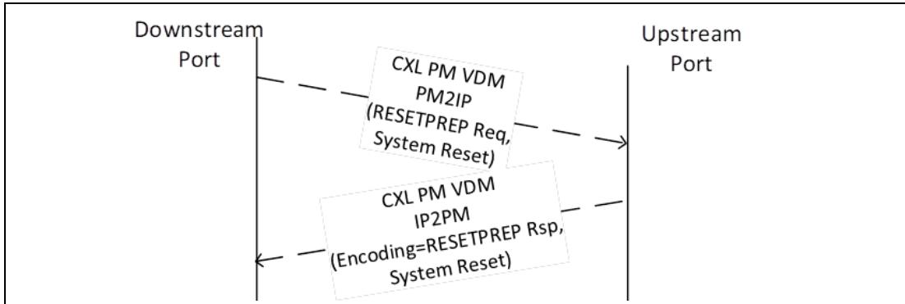
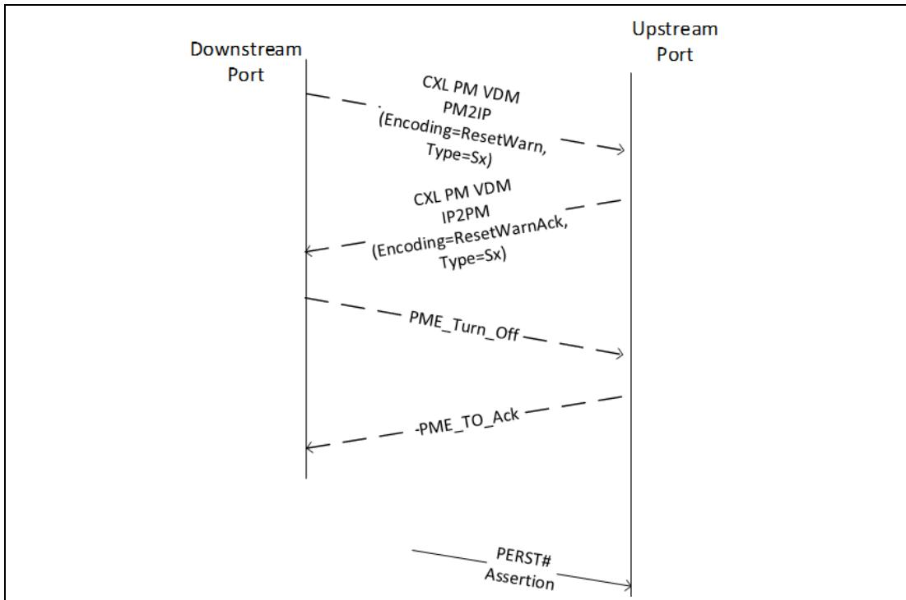
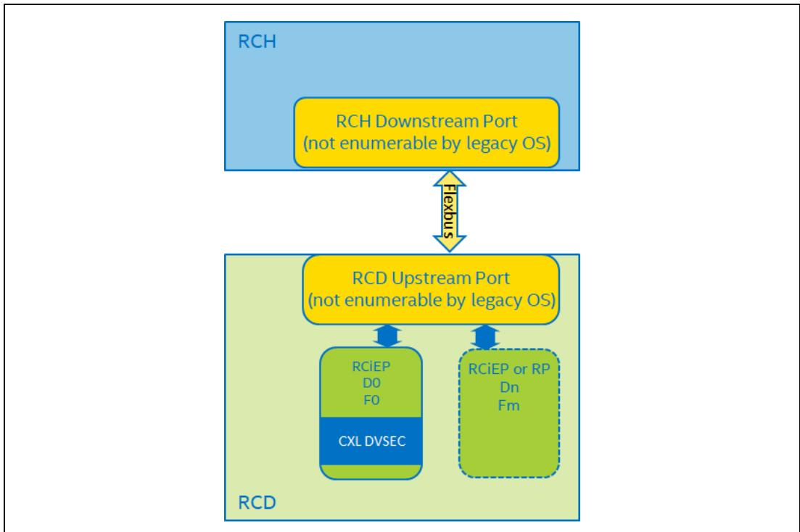
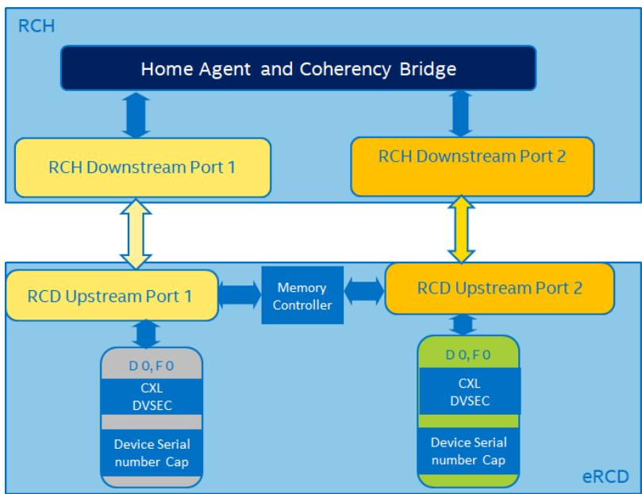
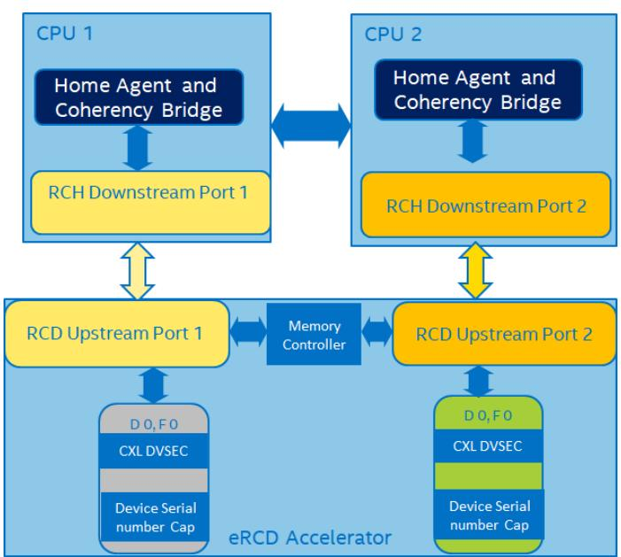
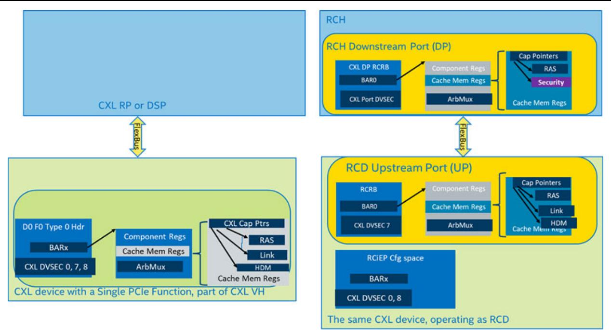
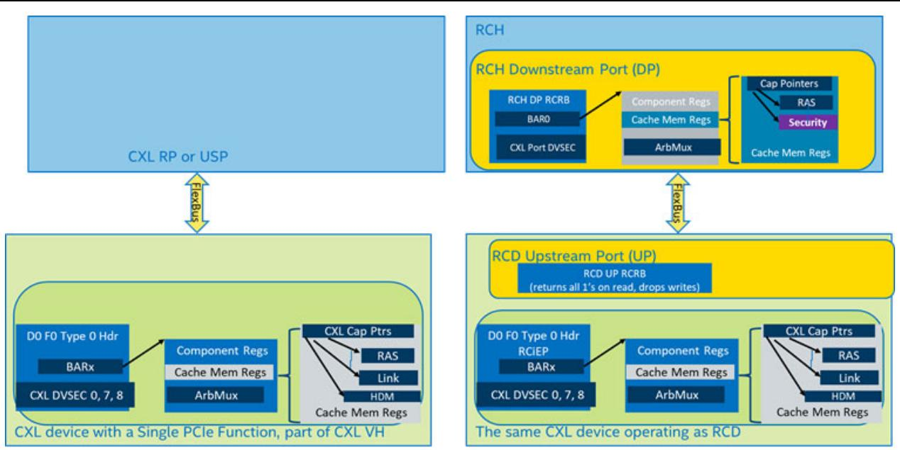

## 8.2.7.1.4 CPMU Event Capabilities (Offset: Varies)

Each CPMU Event Capabilities register corresponds to an Event group and reports the set of Event IDs supported by the Counter Units in the CPMU for that Event group including the Fixed Counter Units. The number of CPMU Event Capabilities registers corresponds to the Number of Event Groups encoded in the CPMU Capability register.

<table><tr><td>Bit</td><td>Attributes</td><td>Description</td></tr><tr><td>31:0</td><td>HwInit</td><td>Supported Events: Bitmask that identifies the Event IDs within this Event Group that each Configurable Counter Unit in this CPMU is capable of counting. 0 is not a valid value.</td></tr><tr><td>47:32</td><td>HwInit</td><td>Event Group ID: The Group ID assigned to this Event Group by the vendor identified by the Event Vendor ID field.</td></tr><tr><td>63:48</td><td>HwInit</td><td>Event Vendor ID: The Vendor ID assigned by PCI-SIG to the vendor that defined this event. The values of 0000h and FFFFh are reserved per PCIe Base Specification.</td></tr></table>

## 8.2.7.2 Per Counter Unit Registers

## 8.2.7.2.1 Counter Configuration (Offset: Varies)

The Counter Configuration registers specify the set of events that are to be monitored by each Counter Unit and how they are counted. They also control interrupt generation behavior and the behavior upon overflow detection. The number of Counter Configuration registers is specified by the Number of Counter Units field of the CPMU Capability register. When a counter is enabled, changes to any field except for the Counter Enable results in undefined behavior.

<table><tr><td>Bit</td><td>Attributes</td><td>Description</td></tr><tr><td>1:0</td><td>HwInit</td><td>Counter Type00b = This is a Free-running Counter Unit. Some of the fields in this register are RO. See individual field definitions.01b = This is a Fixed-function Counter Unit. Some of the fields in this register are RO. See individual field definitions.10b = This is a Configurable Counter Unit.11b = Reserved.</td></tr><tr><td>7:2</td><td>RsvdP</td><td>Reserved</td></tr><tr><td>8</td><td>RW/RO</td><td>Counter Enable0 = This Counter Unit is disabled1 = This Counter Unit is enabled to count eventsIf this is a free-running Counter Unit, this bit is RO and returns 1 to indicate this Counter Unit is always counting.If this bit is RW, the reset default of this bit is 0.</td></tr><tr><td>9</td><td>RW/RO</td><td>Interrupt on Overflow0 = An Interrupt is not generated.1 = Generate an Interrupt when this Counter Unit overflows. The interrupt Message Number is reported in the Interrupt Message Number field.This bit must be RW if the Interrupt on Overflow Support bit in the CPMU Capability register is set; otherwise, it is permitted to be hardwired to 0. Software must not set this bit unless the Interrupt on Overflow Support bit is set. If this bit is RW, the reset default of this bit is 0.</td></tr><tr><td>10</td><td>RW/RO</td><td>Global Freeze on Overflow0 = No global freeze1 = When this Counter Unit overflows, all Counter Units in the CPMU except the free-running Counter Units are frozenThis bit must be RW if the Counter Freeze Support bit in the CPMU Capability register is set; otherwise, it is permitted to be hardwired to 0. Software must not set this bit unless the Counter Freeze Support bit is set. If this bit is RW, the reset default of this bit is 0.</td></tr><tr><td>11</td><td>RW/RO</td><td>Edge: When Edge is 1, the Counter Data is incremented when the Event State transitions from 0 to 1. The Event State is defined as the OR of the events enabled by the Events mask field.If this is a Free-running Counter Unit, this bit is RO.If this is a Fixed-function Counter Unit, this bit is RO.If this bit is RW, the reset default of this bit is 0.</td></tr><tr><td>12</td><td>RW/RO</td><td>Invert: See the definition of the Threshold field.If this is a Free-running Counter Unit, this bit is RO.If this is a Fixed-function Counter Unit, this bit is RO.If this bit is RW, the reset default of this bit is 0.</td></tr><tr><td>15:13</td><td>RsvdP</td><td>Reserved</td></tr><tr><td>23:16</td><td>RW/RO</td><td>Threshold: Some events may ordinarily increment the Counter Data by more than 1 per cycle. Queue entry count is one example of such an event. For such events, the Threshold field can be used to modify the counting behavior. If Threshold is 0, the Counter Data register is incremented by the raw event count. If Threshold is not 0 and Invert=0, Counter Data register is incremented by 1 every clock cycle where the raw event count is greater than or equal to the Threshold. If Threshold is not 0 and Invert=1, Counter Data register is incremented by 1 every clock cycle where the raw event count is less than or equal to the Threshold.For events that generate no more than one raw event per clock, Threshold shall be set to 1 by software.If this is a Free-running Counter Unit, this field is RO.If this is a Fixed-function Counter Unit, this field is RO.If this field is RW, the reset default of this field is 01h.</td></tr><tr><td>55:24</td><td>RW/RO</td><td>Events: Bitmask that specifies the set of events that are to be monitored by this counter, corresponding to the Event Group selected by the Event Group ID Index field. The set of supported events depends on the value of Event Group as well as the CPMU implementation. Setting unsupported bits results in undefined behavior.If this is a Free-running Counter Unit, this field is RO. More than one bit may be set.If this is a Fixed Function Counter Unit, this field is RO. More than one bit may be set.If this field is RW, the reset default of this field is 0000 0000h.</td></tr><tr><td>58:56</td><td>RsvdP</td><td>Reserved</td></tr><tr><td>63:59</td><td>RW/RO</td><td>Event Group ID Index: Identifies the CPMU Event Capabilities register that describes the Event Group ID. The value of 0 indicates the Event Vendor ID and Event Group ID that is identified by the first CPMU Event Capabilities register.If this is a Free-running Counter Unit, this field shall be RO and return the Event Group ID Index that this counter supports. The Event Group ID Index field for a Configurable Counter Unit must not be set to the Event Group ID Index reported by a Free-running Counter Unit.If this is a Fixed-function Counter Unit, this field shall be RO and return the Event Group ID Index that this counter supports. The Event Group ID Index field for a Configurable Counter Unit must not be set to the Event Group ID Index reported by a Fixed-function Counter Unit.If this field is RW, the reset default of this field is 00h.</td></tr></table>

## 8.2.7.2.2 Filter Configuration (Offset: Varies)

Each Counter Unit may support a set of Filter Configuration registers, one for each Filter ID. Filters constrain the counting of selected events based on one or more conditions specified in the Filter Configuration registers. For example, Counter Unit N Filter ID 0 - Filter Configuration register selects the HDM decoder(s) to monitor for events in counter N.

Each Counter Unit is associated with zero or more Filter Configuration registers, one for each supported Filter ID. The number of Filter Configuration registers per Counter Unit is derived by counting the 1s in the Filters Supported field in the CPMU Capability register.

If a filter is enabled for an event that it does not apply to, the Counter Unit behavior is undefined. When counting multiple events (multiple bits are set in Events field), Filter Configuration register must be set to all 1s. Otherwise, the Counter Unit behavior is undefined.

When multiple filters are configured for a counter, only the events that satisfy all the specified filters are counted (a logical AND of all the filter conditions).

When a counter is enabled, any changes to this register result in undefined behavior.

<table><tr><td>Bit</td><td>Attributes</td><td>Description</td></tr><tr><td>31:0</td><td>RW</td><td>Filter Value: Specifies the filter value to be used for the Filter associated with this register.The reset default value is FFFF FFFFh.If this register is set to FFFF FFFFh, filtering is not performed for the associated Filter ID. When set to a value different from FFFF FFFFh, bits beyond the maximum value allowed for that filter are ignored.The encoding of this register varies based on the Filter ID. See Table 8-33 for the encoding.</td></tr></table>

## Table 8-33. Filter ID and Values

<table><tr><td>Filter ID</td><td>Description and Definition of the Filter Value Field</td></tr><tr><td>0</td><td>Counts the events associated with the HDM decoder(s) specified in the Filter Value field in the Filter Configuration register. If bit n in the Filter Configuration register is set, events associated with HDM Decoder n are counted. For example, Filter Value=0Ah counts events associated with HDM Decoder 1 and HDM Decoder 3.</td></tr><tr><td>1</td><td>Counts the events associated with the combinations of the Channel, Rank and Bank Groups, and Banks that are specified in the Filter Value field. Refer to Table 8-46 for definitions of these terms.• Bits[7:0]:Bank Number, represented using 0-based encoding. The events associated with this DDR Bank are counted. If set to FFh, the CPMU shall count events associated with all Banks.• Bits[15:8]:Bank Group, represented using 0-based encoding. The events associated with this DDR Bank Group are counted. If set to FFh, the CPMU shall count events associated with all Bank Groups.• Bits[23:16]:Rank Number, represented using 0-based encoding. The events associated with this DDR Rank are counted. If set to FFh, the CPMU shall count events associated with all Ranks.• Bits[31:24]:Channel Number, represented using 0-based encoding. The events associated with this DDR Channel are counted. If set to FFh, the CPMU shall count events associated with all Channels.For example, Filter Value=0004 FF00h counts events associated with Bank 0 in all Bank Groups associated with Rank 4 in Channel 0.</td></tr><tr><td>7:2</td><td>Reserved. Filter ID registers 2-7 for every counter are also reserved.</td></tr></table>

## 8.2.7.2.3 Counter Data (Offset: Varies)

The Counter Data register must be accessed as an 8-byte quantity.

<table><tr><td>Bit</td><td>Attributes</td><td>Description</td></tr><tr><td>N-1:0</td><td>RW</td><td>Event Count:The current count value.If the Counters Writable while Frozen bit in the CPMU Capability register is 0, any changes to this register while the counter is Enabled or Frozen leads to undefined results.The value N should be chosen such that the counter takes more than one hour before the counter overflows, regardless of which Event it is counting.Once written, the counter continues to increment from the written value. A freeze operation causes the counter to stop accumulating additional events and to retain its value at the time of freeze. An unfreeze operation allows the counter to resume counting subsequent events. When the counter reaches its maximum value, it automatically wraps around upon the next event and starts counting from 0. This transition is defined as the overflow event. Other than the overflow scenario, the counter value is never decremented.N equals the raw value reported by the Counter Width field in the CPMU Capability register.</td></tr><tr><td>63:N</td><td>RsvdP</td><td>Reserved</td></tr></table>

## 8.2.8

## CXL Device Register Interface

CXL device registers are mapped in memory space allocated via a standard PCIe BAR. The entry in the Register Locator DVSEC structure (see Section 8.1.9) with Register Identifier = 03h describes the BAR number and the offset within the BAR where these registers are mapped. The PCIe BAR shall be marked as prefetchable in the PCI header. At the beginning of the CXL device register block is a CXL Device Capabilities Array register that defines the size of the CXL Device Capabilities Array followed by a list of CXL Device Capability headers. Each header contains an offset to the capability-specific register structure from the start of the CXL device register block.

An MLD shall implement one instance of CXL Device registers in the MMIO space of each applicable LD.

No registers defined in Section 8.2.8 are larger than 64-bit wide so that is the maximum access size allowed for these registers. If this rule is not followed, the behavior is undefined.

To illustrate how the fields fit together, the layouts in Section 8.2.8.1, Section 8.2.8.2, and Figure 8-13 (Mailbox registers) are shown as wider than a 64-bit register. Implementations are expected to use any size accesses for this information up to 64 bits without loss of functionality – the information is designed to be accessed in chunks, each no greater than 64 bits.

Figure 8-12. CXL Device Registers

<table><tr><td>CXL Device Capabilities Array Register</td><td>Byte Offset +00h</td></tr><tr><td>CXL Device Capability 1 Header</td><td>+10h</td></tr><tr><td>CXL Device Capability 2 Header</td><td>+20h</td></tr><tr><td>CXL Device Capability n Header</td><td>+n*10h</td></tr></table>

## 8.2.8.1 CXL Device Capabilities Array Register (Offset 00h)

<table><tr><td>Bits</td><td>Attributes</td><td>Description</td></tr><tr><td>15:0</td><td>RO</td><td>Capability ID: Defines the nature and format of the capability register structure. For the CXL Device Capabilities Array register, this field shall be cleared to 0000h.</td></tr><tr><td>23:16</td><td>RO</td><td>Version: Defines the version of the capability structure present. This field shall be set to 01h. Software shall check this version number during initialization to determine the layout of the device capabilities, treating an unknown version number as an error preventing any further access to the device by that software.</td></tr><tr><td>27:24</td><td>RO</td><td>Type: Identifies the type-specific capabilities in the CXL Device Capabilities Array.0h = The type is inferred from the PCI Class code. If the PCI Class code is not associated with a type defined by this specification, no type-specific capabilities are present.1h = Memory Device Capabilities (see Section 8.2.8.5).2h = Switch Mailbox CCI Capabilities (see Section 8.2.8.6).All other encodings are reserved.</td></tr><tr><td>31:28</td><td>RO</td><td>Reserved</td></tr><tr><td>47:32</td><td>RO</td><td>Capabilities Count: The number of elements in the CXL device capabilities array, not including this header register. Each capability header element is 16 bytes in length and contiguous to previous elements.</td></tr><tr><td>127:48</td><td>RO</td><td>Reserved</td></tr></table>

## 8.2.8.2 CXL Device Capability Header Register (Offset: Varies)

Each capability in the CXL device capabilities array is described by a CXL Device Capability Header register that identifies the specific capability and points to the capability register structure in register space.

<table><tr><td>Bits</td><td>Attributes</td><td>Description</td></tr><tr><td>15:0</td><td>RO</td><td>Capability ID: Defines the supported capability register structure. See Section 8.2.8.2.1 for the list of capability identifiers.</td></tr><tr><td>23:16</td><td>RO</td><td>Version: Defines the version of the capability register structure.The version is incremented whenever the capability register structure is extended to add more functionality. Backward compatibility shall be maintained during this process. For all values of n, version n+1 may extend version n by replacing fields that are marked as reserved in version n or by appending new registers, but must not redefine the meaning of existing fields. Software that was written for a lower version may continue to operate on capability structures with a higher version but will not be able to take advantage of new functionality. If backward compatibility cannot be maintained, a new Capability ID shall be created. Each field in a capability register structure is assumed to be introduced in version 1 of that structure unless specified otherwise in the field&#x27;s definition in this specification.</td></tr><tr><td>31:24</td><td>RO</td><td>Reserved</td></tr><tr><td>63:32</td><td>RO</td><td>Offset: Offset of the capability register structure from the start of the CXL device registers. The offset of performance-sensitive registers and security-sensitive registers shall be in separate 4-KB regions within the CXL device register space.</td></tr><tr><td>95:64</td><td>RO</td><td>Length: Size of the capability register structure in bytes.</td></tr><tr><td>127:96</td><td>RO</td><td>Reserved</td></tr></table>

## 8.2.8.2.1 CXL Device Capabilities

CXL device capability register structures are identified by a 2-byte identifier.

• Capability identifiers 0000h-3FFFh describe generic CXL device capabilities as specified in the table below.

• Capability identifiers 4000h-7FFFh describe type-specific capabilities associated with the type specified in the CXL Device Capabilities Array register (see Section 8.2.8.1).

• Capability identifiers 8000h-FFFFh describe vendor specific capabilities.

Capability identifiers 0000h-3FFFh that are not specified in this table are reserved.

<table><tr><td>Capability ID</td><td>Description</td><td> $Required^{1}$ </td><td>Version</td></tr><tr><td>0001h</td><td>Device Status Registers: Describes the generic CXL device status registers. Only one instance of this register structure shall exist per device.</td><td>M</td><td>02h</td></tr><tr><td>0002h</td><td>Primary Mailbox Registers: Describes the primary mailbox registers. Only one instance of this register structure shall exist per device.</td><td>M</td><td>01h</td></tr><tr><td>0003h</td><td>Secondary Mailbox Registers: Describes the secondary mailbox registers. At most one instance of this register structure shall exist per device.</td><td>O</td><td>01h</td></tr></table>

1. M = Mandatory for all devices that implement the CXL Device Register entry (Register Block Identifier=03h) in the Register Locator DVSEC (see Section 8.1.9). O = Optional.

## 8.2.8.3 Device Status Registers (Offset: Varies)

## 8.2.8.3.1 Event Status Register (Device Status Registers Capability Offset + 00h)

The Event Status register indicates which events are currently ready for host actions, such as fetching event log records. The host may choose to poll for these events by periodically reading this register, or it may choose to enable interrupts for some of these events. The only pollable/interruptible events that are not indicated in this register are mailbox command completions since each set of mailbox registers provides that information.

Unless specified otherwise in the field definitions below, each field is present in version 1 and later of this structure. The device shall report the version of this structure in the Version field of the CXL Device Capability Header register.

<table><tr><td>Bits</td><td>Attributes</td><td>Description</td></tr><tr><td>31:0</td><td>RO</td><td>Event Status: When set, one or more event records exist in the specified event log. Use the Get and Clear Event Records commands to retrieve and clear the event records. Once the event log has zero event records, the bit is cleared.Bit[0]: Informational Event LogBit[1]: Warning Event LogBit[2]: Failure Event LogBit[3]: Fatal Event LogBit[4]: Dynamic Capacity Event Log $^{1}$ Bits[31:5]: Reserved</td></tr><tr><td>63:32</td><td>RO</td><td>Reserved</td></tr></table>

1. This bit was introduced with Version=2.

## 8.2.8.4 Mailbox Registers (Offset: Varies)

The mailbox registers provide the ability to issue a command to the device. There are two types of mailboxes provided through the device’s register interface: primary and secondary. Each mailbox represents a unique CCI instance in the device and the properties of each instance are defined in Section 9.1.1. The secondary mailbox does not support background operations. The status of a background operation issued to a device’s primary mailbox can be retrieved from the Background Command Status register, as detailed in Section 8.2.8.4.7.

The register interface for both types of mailboxes is the same and is described in this section. The difference between the two types of mailboxes is their intended use and commands allowed. Details on these differences are described in Section 8.2.8.4.1 and Section 8.2.8.4.2.

The primary and the secondary mailbox interfaces shall only be used in a singlethreaded manner. It is software’s responsibility to avoid simultaneous, uncoordinated access to the mailbox registers using techniques such as locking.

The mailbox command timeout is 2 seconds. Commands that require a longer execution time shall be completed asynchronously in the background. Only one command can be executed in the background at a time. The status of a background command can be retrieved from the Background Command Status register. Background commands do not continue to execute across Conventional Resets. For devices with multiple mailboxes, only the primary mailbox shall be used to issue background commands.

Devices may support sending MSI/MSI-X interrupts to indicate command status. Support for mailbox interrupts is enumerated in the Mailbox Capabilities register and enabled in the Mailbox Control register. Mailbox interrupts are only supported on the primary mailbox.

Unless specified otherwise in the field definitions for the mailbox registers below, each field is present in version 1 and later of these structures. The device shall report the version of these structures in the Version field of the CXL Device Capability Header register.

The flow for executing a command is described below. The term “Caller” represents the entity submitting the command:

1. Caller reads MB Control register to verify doorbell is cleared.

2. Caller writes Command register.

3. Caller writes Command Payload registers if input payload is non-empty.

4. Caller writes MB Control register to set doorbell.

5. Caller either polls for doorbell to be cleared or waits for interrupt if configured.

6. Caller reads MB Status register to fetch Return code.

7. If command is successful, Caller reads Command register to get Payload Length.

8. If output payload is non-empty, Caller reads Command Payload registers.

In case of a timeout, the caller may attempt to recover the device by either issuing CXL or Conventional Reset to the device.

When a command is successfully started as a background operation, the device shall return the Background Command Started return code defined in Section 8.2.8.4.5.1. While the command is executing in the background, the device should update the percentage complete in the Background Command Status register at least once per second. An ongoing background command may be aborted by issuing a Request Abort Background Operation command (see Section 8.2.9.1.5). It is strongly recommended that devices continue to accept new non-background commands while the background operation is running. The background operation shall not write to the Command Payload registers. Once the command completes in the background, the device shall update the Background Command Status register with the appropriate return code as defined in Section 8.2.8.4.5.1. The caller may then retrieve the results of the background operation from the Background Command Status register.

The Mailbox registers are described in Figure 8-13.

Figure 8-13. Mailbox Registers

<table><tr><td>Bits 31</td><td>16 15</td><td>0 Byte Offset</td></tr><tr><td></td><td>MB Capabilities</td><td>+00h</td></tr><tr><td></td><td>MB Control</td><td>+04h</td></tr><tr><td></td><td>Command Register</td><td>+08h</td></tr><tr><td></td><td>MB status</td><td>+10h</td></tr><tr><td></td><td>Background Command Status Register</td><td>+18h</td></tr><tr><td></td><td>Command Payload Registers</td><td>+20h</td></tr></table>

## 8.2.8.4.1 Attributes of the Primary Mailbox

The primary mailbox supports all commands described in Section 8.2.9. The primary mailbox also supports the optional feature to provide mailbox completion interrupts, if implemented by a device. Implementation of the primary mailbox is mandatory.

The exact details on how the primary mailbox is used may vary. The intended use is to provide the main method for submitting commands to the device, used by both preboot software and OS software. The platform shall coordinate the use of the primary mailbox so that only one software entity “owns” the mailbox at a given time and that the transfer of ownership happens in-between mailbox commands so that one entity cannot corrupt the mailbox state of the other. The intended practice is that the pre-boot software uses the primary mailbox until control is transferred to the OS being booted, and at that time the OS takes over sole ownership of the primary mailbox until the OS is shut down. Because the physical address of the primary mailbox can change as the result of a PCIe reconfiguration performed by the primary mailbox owner, each time the primary mailbox changes ownership, the new owner shall read the appropriate configuration registers to discover the current location of the mailbox registers, just as it does during device initialization.

## 8.2.8.4.2 Attributes of the Secondary Mailbox

The secondary mailbox, if implemented by a device, supports only a subset of the commands described in Section 8.2.9. The Command Effects Log shall specify which commands are allowed on the secondary mailbox, and all other commands shall return the error Unsupported Mailbox or CCI. The secondary mailbox does not support mailbox completion interrupts. Implementation of the secondary mailbox is optional.

The exact details on how the secondary mailbox is used may vary. The intended use is to provide a method for submitting commands to the device by platform firmware that processes events while the OS owns the primary mailbox. By using the secondary mailbox, platform firmware does not corrupt the state of any in-progress mailbox operations on the primary mailbox.

The secondary mailbox shall return identical information as the primary mailbox for a Get Log command issued with Log Identifier=CEL. Devices shall indicate which commands are allowed on the secondary mailbox by setting the Secondary Mailbox Supported flag for the supported opcodes in the Command Effects Log. The set of commands that are supported on the secondary mailbox is implementation specific. It is recommended (but not required) that the secondary mailbox supports all commands in the Events, Logs, and Identify command sets defined in Section 8.2.9.

Since the physical address of the secondary mailbox can change as the result of a PCIe reconfiguration performed by the primary mailbox owner, each time the secondary mailbox is used, the software using it shall read the appropriate configuration registers to discover the current location of the mailbox registers.

## 8.2.8.4.3 Mailbox Capabilities Register (Mailbox Registers Capability Offset + 00h)

<table><tr><td>Bits</td><td>Attributes</td><td>Description</td></tr><tr><td>4:0</td><td>RO</td><td>Payload Size:Size of the Command Payload registers in bytes, expressed as 2^n. The minimum size is 256 bytes (n=8) and the maximum size is 1 MB (n=20).</td></tr><tr><td>5</td><td>RO</td><td>MB Doorbell Interrupt Capable:When set, indicates the device supports signaling an MSI/MSI-X interrupt when the doorbell is cleared. Only valid for the primary mailbox. This bit shall be 0 for the secondary mailbox.</td></tr><tr><td>6</td><td>RO</td><td>Background Command Complete Interrupt Capable:When set, indicates the device supports signaling an MSI/MSI-X interrupt when a command completes in the background. Only valid for the primary mailbox. This bit shall be 0 for the secondary mailbox.</td></tr><tr><td>10:7</td><td>RO</td><td>Interrupt Message Number:This field indicates which MSI/MSI-X vector is used for the interrupt message generated in association with this mailbox instance. Only valid for the primary mailbox. This field shall be 0 for the secondary mailbox.For MSI, the value in this field indicates the offset between the base Message Data and the interrupt message that is generated. Hardware is required to update this field so that it is correct if the number of MSI Messages assigned to the Function changes when software writes to the Multiple Message Enable field in the Message Control register for MSI.For MSI-X, the value in this field indicates which MSI-X Table entry is used to generate the interrupt message. The entry shall be one of the first 16 entries even if the Function implements more than 16 entries. The value in this field shall be within the range configured by system software to the device. For a given MSI-X implementation, the entry shall remain constant.If both MSI and MSI-X are implemented, they are permitted to use different vectors, though software is permitted to enable only one mechanism at a time. If MSI-X is enabled, the value in this field shall indicate the vector for MSI-X. If MSI is enabled or neither is enabled, the value in this field indicate the vector for MSI. If software enables both MSI and MSI-X at the same time, the value in this field is undefined.</td></tr><tr><td>18:11</td><td>RO</td><td>Mailbox Ready Time:Indicates the maximum amount of time in seconds after a Conventional or CXL reset for the Mailbox Interfaces Ready bit to become set in the Memory Device Status register. A value of 0 indicates the device does not report a mailbox ready time.</td></tr><tr><td>22:19</td><td>RO</td><td>Type:Identifies the type-specific commands supported by the mailbox.0h = The type is inferred from the PCI Class code. If the PCI Class code is not associated with a type defined by this specification, no type-specific commands are present.1h = Memory Device Commands (see Section 8.2.9.9).2h = FM API Commands (see Section 8.2.9.10).All other encodings are reserved.</td></tr><tr><td>31:23</td><td>RsvdP</td><td>Reserved</td></tr></table>

## 8.2.8.4.4 Mailbox Control Register (Mailbox Registers Capability Offset + 04h)

<table><tr><td>Bits</td><td>Attributes</td><td>Description</td></tr><tr><td>0</td><td>RW/RO</td><td>Doorbell:When cleared, the device is ready to accept a new command. Set by the caller to notify the device that the command inputs are ready. RO when set. Cleared by the device when the command completes, or the command is started in the background.</td></tr><tr><td>1</td><td>RW/RO</td><td>MB Doorbell Interrupt:If doorbell interrupts are supported on this mailbox, this register is set by the caller to enable signaling an MSI/MSI-X interrupt when the doorbell is cleared. RO when the doorbell is set. Ignored if doorbell interrupts are not supported on this mailbox instance (MB Doorbell Interrupt Capable = 0 in the Mailbox Capabilities register).0 = Disabled1 = Enabled</td></tr><tr><td>2</td><td>RW/RO</td><td>Background Command Complete Interrupt:If background command complete interrupts are supported on this mailbox, this register is set by the caller to enable signaling an interrupt when the command completes in the background. Ignored if the command is not a background command. RO when the doorbell is set. Ignored if background command complete interrupts are not supported on this mailbox instance (Background Command Complete Interrupt Capable = 0 in the Mailbox Capabilities register).0 = Disabled1 = Enabled</td></tr><tr><td>31:3</td><td>RsvdP</td><td>Reserved</td></tr></table>

## 8.2.8.4.5 Command Register (Mailbox Registers Capability Offset + 08h)

This register shall only be used by the caller when the doorbell in the Mailbox Control register is cleared.

<table><tr><td>Bits</td><td>Attributes</td><td>Description</td></tr><tr><td>15:0</td><td>RW</td><td>Command Opcode: The command identifier. See Section 8.2.9 for the list of command opcodes.</td></tr><tr><td>36:16</td><td>RW</td><td>Payload Length: The size of the data in the command payload registers (0 ≤ Payload Length ≤ Payload Size specified in the Mailbox Capabilities register). Expressed in bytes. Written by the caller to provide the command input payload size to the device prior to setting the doorbell. Written by the device to provide the command output payload size to the caller when the doorbell is cleared.</td></tr><tr><td>63:37</td><td>RsvdP</td><td>Reserved</td></tr></table>

## 8.2.8.4.5.1 Command Return Codes

In general, retries are not recommended for commands that return an error except when indicated in the return code definition.

Table 8-34. Command Return Codes (Sheet 1 of 2)

<table><tr><td>Value</td><td>Definition</td></tr><tr><td>0000h</td><td>Success: The command successfully completed.</td></tr><tr><td>0001h</td><td>Background Command Started: The background command successfully started. Refer to the Background Command Status register to retrieve the command result.</td></tr><tr><td>0002h</td><td>Invalid Input: A command input was invalid.</td></tr><tr><td>0003h</td><td>Unsupported: The command is not supported.</td></tr><tr><td>0004h</td><td>Internal Error: The command was not completed because of an internal device error.</td></tr><tr><td>0005h</td><td>Retry Required: The command was not completed because of a temporary error. An optional single retry may resolve the issue.</td></tr></table>

Table 8-34. Command Return Codes (Sheet 2 of 2)

<table><tr><td>Value</td><td>Definition</td></tr><tr><td>0006h</td><td>Busy: The device is currently busy processing a background operation. Wait until background command completes and then retry the command.</td></tr><tr><td>0007h</td><td>Media Disabled: The command could not be completed because it requires media access and media is disabled.</td></tr><tr><td>0008h</td><td>FW Transfer in Progress: Only one FW package can be transferred at a time. Complete the current FW package transfer before starting a new one.</td></tr><tr><td>0009h</td><td>FW Transfer Out of Order: The FW package transfer was aborted because the FW package content was transferred out of order.</td></tr><tr><td>000Ah</td><td>FW Verification Failed: The FW package was not saved to the device because the FW package verification failed.</td></tr><tr><td>000Bh</td><td>Invalid Slot: The FW slot specified is not supported or not valid for the requested operation.</td></tr><tr><td>000Ch</td><td>Activation Failed, FW Rolled Back: The new FW failed to activate and rolled back to the previous active FW.</td></tr><tr><td>000Dh</td><td>Activation Failed, Cold Reset Required: The new FW failed to activate. A cold reset is required.</td></tr><tr><td>000Eh</td><td>Invalid Handle: One or more Event Record Handles were invalid or specified out of order.</td></tr><tr><td>000Fh</td><td>Invalid Physical Address: The physical address specified is invalid.</td></tr><tr><td>0010h</td><td>Inject Poison Limit Reached: The device&#x27;s limit on allowed poison injection has been reached. Clear injected poison requests before attempting to inject more.</td></tr><tr><td>0011h</td><td>Permanent Media Failure: The device could not clear poison because of a permanent issue with the media.</td></tr><tr><td>0012h</td><td>Aborted: The background command was aborted by the device, either on its own or as a result of a Request Abort Background Operation command.</td></tr><tr><td>0013h</td><td>Invalid Security State: The command is invalid in the current security state.</td></tr><tr><td>0014h</td><td>Incorrect Passphrase: The passphrase does not match the currently set passphrase.</td></tr><tr><td>0015h</td><td>Unsupported Mailbox or CCI: The command is not supported on the mailbox or CCI it was issued on.</td></tr><tr><td>0016h</td><td>Invalid Payload Length: The input payload length specified for the command is invalid or exceeds the component&#x27;s Maximum Supported Message Size. The device is required to perform this check prior to processing any command defined in this specification.</td></tr><tr><td>0017h</td><td>Invalid Log: The log page is not supported or not valid.</td></tr><tr><td>0018h</td><td>Interrupted: The command could not be successfully completed because of an asynchronous event.</td></tr><tr><td>0019h</td><td>Unsupported Feature Version: The Feature version in the input payload is not supported.</td></tr><tr><td>001Ah</td><td>Unsupported Feature Selection Value: The selection value in the input payload is not supported.</td></tr><tr><td>001Bh</td><td>Feature Transfer in Progress: Only one Feature data can be transferred at a time for each Feature. Complete the current Feature data transfer before starting a new one.</td></tr><tr><td>001Ch</td><td>Feature Transfer Out of Order: The Feature data transfer was aborted because the Feature data content was transferred out of order.</td></tr><tr><td>001Dh</td><td>Resources Exhausted: The Device cannot perform the operation because resources are exhausted.</td></tr><tr><td>001Eh</td><td>Invalid Extent List: The Dynamic Capacity Extent List contains invalid starting DPA and length that are not contained within the Extent List the device is maintaining.</td></tr><tr><td>001Fh</td><td>Transfer Out of Order: The input parameters data transfer was aborted because it occurred out of order.</td></tr><tr><td>0020h</td><td>Request Abort Not Supported by Background Operation: The ongoing background operation does not support the Request Abort command.</td></tr></table>

## 8.2.8.4.6 Mailbox Status Register (Mailbox Registers Capability Offset + 10h)

<table><tr><td>Bits</td><td>Attributes</td><td>Description</td></tr><tr><td>0</td><td>RO</td><td>Background Operation: When set, the device is executing a command in the background. Only one command can be executing in the background; therefore, additional background commands shall be rejected with the busy return code. Refer to the Background Command Status register to retrieve the status of the background command. Only valid for the primary mailbox. This bit shall be 0 for the secondary mailbox.</td></tr><tr><td>31:1</td><td>RO</td><td>Reserved</td></tr><tr><td>47:32</td><td>RO</td><td>Return Code: The result of the command. Only valid after the doorbell is cleared. See Section 8.2.8.4.5.1.</td></tr><tr><td>63:48</td><td>RO</td><td>Vendor Specific Extended Status: The vendor specific extended status information. Only valid after the doorbell is cleared.</td></tr></table>

Background Command Status Register (Mailbox Registers Capability Offset + 18h)

Reports information about the last command executed in the background since the last Conventional Reset. Zeroed if no background command status is available. Valid only for the primary mailbox. This register shall be zeroed on the secondary mailbox.

<table><tr><td>Bits</td><td>Attributes</td><td>Description</td></tr><tr><td>15:0</td><td>RO</td><td>Command Opcode: The command identifier of the ongoing command or the last command executed in the background. See Section 8.2.9 for the list of command opcodes.</td></tr><tr><td>22:16</td><td>RO</td><td>Percentage Complete: The percentage complete (0-100) of the background command.</td></tr><tr><td>31:23</td><td>RsvdP</td><td>Reserved</td></tr><tr><td>47:32</td><td>RO</td><td>Return Code: The result of the command run in the background. Only valid when Percentage Complete = 100 or when the Background Operation bit in the Mailbox Status register is cleared to 0. See Section 8.2.8.4.5.1.</td></tr><tr><td>63:48</td><td>RO</td><td>Vendor Specific Extended Status: The vendor specific extended status of the last background command. Only valid when Percentage Complete = 100.</td></tr></table>

## 8.2.8.4.8 Command Payload Registers (Mailbox Registers Capability Offset + 20h)

These registers shall only be used by the caller when the doorbell in the Mailbox Control register is cleared.

<table><tr><td>Byte Offset</td><td>Length in Bytes</td><td>Attributes</td><td>Description</td></tr><tr><td>00h</td><td>Varies</td><td>RW</td><td>Payload: Written by the caller to provide the command input payload to the device prior to setting the doorbell. Written by the device to provide the command output payload back to the caller when the doorbell is cleared.The size of the payload data is specified in the Command register. Any data beyond the size specified in the Command register shall be ignored by the caller and the device.See Section 8.2.9 for the format of the payload data for each command.</td></tr></table>

## 8.2.8.5 Memory Device Capabilities

This section describes the capability registers specific to CXL memory devices that implement the PCI Header Class Code register defined in Section 8.1.12.1 or advertise Memory Device Capabilities support in the CXL Device Capabilities Array register (see Section 8.2.8.1).

CXL memory device capability identifiers 4000h-7FFFh that are not specified in Table 8-35 are reserved.

Table 8-35. CXL Memory Device Capabilities Identifiers

<table><tr><td>Capability ID</td><td>Description</td><td> $Required^{1}$ </td><td>Version</td></tr><tr><td>4000h</td><td>Memory Device Status Registers: Describes the memory device-specific status registers. Only one instance of this register structure shall exist per device.</td><td>M</td><td>01h</td></tr></table>

1. M = mandatory for all CXL memory devices.

8.2.8.5.1 Memory Device Status Registers (Offset: Varies)

The CXL memory device status registers provide information about the status of the memory device.

## 8.2.8.5.1.1 Memory Device Status Register (Memory Device Status Registers Capability Offset + 00h)

Unless specified otherwise in the field definitions below, each field is present in version 1 and later of this structure. The device shall report the version of this structure in the Version field of the CXL Device Capability Header register.

<table><tr><td>Bits</td><td>Attributes</td><td>Description</td></tr><tr><td>0</td><td>RO</td><td>Device Fatal: When set, the device has encountered a fatal error. Vendor specific device replacement or recovery is recommended.</td></tr><tr><td>1</td><td>RO</td><td>FW Halt: When set, the device has encountered an FW error and is not responding.</td></tr><tr><td>3:2</td><td>RO</td><td>Media Status: Describes the status of the device media.00b = Not Ready. Media training is incomplete.01b = Ready. The media trained successfully and is ready for use.10b = Error. The media failed to train or encountered an error.11b = Disabled. Access to the media is disabled.If the media is not in the Ready state, user data is not accessible.</td></tr><tr><td>4</td><td>RO</td><td>Mailbox Interfaces Ready: When set, the device is ready to accept commands through the mailbox register interfaces. Devices that report a nonzero mailbox ready time shall set this bit after a Conventional or CXL reset within the time reported in the Mailbox Capabilities register and it shall remain set until the next reset or the device encounters an error that prevents any mailbox communication.</td></tr><tr><td>7:5</td><td>RO</td><td>Reset Needed: When nonzero, indicates the least impactful reset type needed to return the device to the operational state. A cold reset is considered more impactful than a warm reset. A warm reset is considered more impactful that a hot reset, which is more impactful than a CXL reset. This field returns nonzero value if FW Halt is set, Media Status is in the Error or Disabled state, or the Mailbox Interfaces Ready does not become set.000b = Device is operational and a reset is not required001b = Cold Reset010b = Warm Reset011b = Hot Reset100b = CXL Reset (device must not report this value if it does not support CXL Reset)All other encodings are reserved</td></tr><tr><td>63:8</td><td>RsvdP</td><td>Reserved</td></tr></table>

## 8.2.8.6 Switch Mailbox CCI Capability

This section describes the capability registers specific to Switch Mailbox CCIs that implement the PCI Header Class Code register defined in Section 8.1.13.1 or advertise Switch Mailbox CCI Capabilities support in the CXL Device Capabilities Array register (see Section 8.2.8.1).

Switch Mailbox CCI capability identifiers 4000h-7FFFh that are not specified in Table 8-36 are reserved.

Table 8-36. Switch Mailbox CCI Capabilities Identifiers

<table><tr><td>Capability ID</td><td>Description</td><td> $Required^{1}$ </td><td>Version</td></tr><tr><td>4000h</td><td>Switch Mailbox CCI Status Registers: Describes the switch mailbox CCI specific status registers. Only one instance of this register structure shall exist per device.</td><td>M</td><td>01h</td></tr></table>

1. M = Mandatory for all Switch Mailbox CCI devices.

## 8.2.8.6.1 Switch Mailbox CCI Status Registers (Offset: Varies)

The Switch Mailbox CCI status registers provide information about the status of the Switch’s Mailbox interface.

8.2.8.6.1.1 Switch Mailbox CCI Status Register (Switch Mailbox CCI Status Registers Capability Offset + 00h)

Unless specified otherwise in the field definitions below, each field is present in version 1 and later of this structure. The device shall report the version of this structure in the Version field of the CXL Device Capability Header register.

<table><tr><td>Bits</td><td>Attributes</td><td>Description</td></tr><tr><td>0</td><td>RO</td><td>Mailbox Interfaces Ready: When set, the device is ready to accept commands through the mailbox register interfaces. Devices that report a nonzero mailbox ready time shall set this bit after a Conventional or CXL reset within the time reported in the Mailbox Capabilities register and it shall remain set until the next reset or the device encounters an error that prevents any mailbox communication.</td></tr><tr><td>63:1</td><td>RsvdP</td><td>Reserved</td></tr></table>

## 8.2.9

## Component Command Interface

CXL component commands are identified by a 2-byte Opcode.

• Opcodes 0000h-3FFFh describe generic CXL component commands as specified in Table 8-37.

• Opcodes 4000h-BFFFh describe type-specific commands associated with the type specified in the Mailbox Capabilities register (see Section 8.2.8.4.3). Two Type-Specific command sets are defined - Memory Device command (see Table 8-126) and FM API commands (see Table 8-215).

• Opcodes C000h-FFFFh describe vendor specific commands.

Opcodes also provide an implicit major version number, which means a command’s definition will not change in an incompatible way in future revisions of this specification. Instead, if an incompatible change is required, the specification defining the change will define a new opcode for the changed command. Commands may evolve by defining new fields in the payload definitions that were originally defined as Reserved or by appending new fields, but only in a way where software written using the earlier definition will continue to work correctly, and software written to the new definition can use the 0 value or the payload size to detect components that do not support the new field. This implicit minor versioning allows software to be written with the understanding that an opcode will only evolve by adding backward-compatible changes. If a component receives an input payload that is less than the size of the structure it has implemented, but greater than or equal to the Minimum Input Payload Length, then the component shall treat the unsent portion of the structure as 0. For each command, any fields in the input payload that are not included in the calculation of the Minimum Input Payload Length are explicitly identified. For commands in which no fields are identified, all the fields in the input payload are to be included in the calculation of the Minimum Input Payload Length.

For several commands, the size of the payload that needs to be transfered for a unit of operation may exceed the minimum message size permitted by a CCI. Such commands are defined in such a manner that the payload may be split across multiple messages. For example, the device may implement a mailbox with Payload size of 256 Byte, but its Firmware image may be much larger. The Transfer FW (see Section 8.2.9.3.2) command is defined such that the host can split the Firmware image in 256 Byte or smaller chunks and transfer each chunk as a separate message over the Mailbox CCI.

Opcodes within the range of 0000h-3FFFh that are not specified in Table 8-37 are reserved.

Generic CXL Device commands can be sent to devices and to switches as long as the devices and switches advertise support for those commands. FM API commands can be sent to switches and to certain types of devices that support them.

Some CCIs may receive commands from more than one command set. The command sets use an overlapping command opcode space, so the transport message contains a field to indicate which command set is being used. For MCTP messages, the DMTFdefined message type field indicates the command set. MCTP Base Specification (see DSP0246) describes a method by which the component advertises which command sets it supports.

Table 8-37. Generic Component Command Opcodes (Sheet 1 of 2)

<table><tr><td rowspan="2" colspan="5">Opcode</td><td colspan="5"> $Required^1$ </td></tr><tr><td colspan="2">Type 1/2/3 Device</td><td rowspan="2">Switch</td><td colspan="2">GFD</td></tr><tr><td colspan="2">Command Set Bits[15:8]</td><td colspan="2">Command Bits[7:0]</td><td>Combined Opcode</td><td>Mailbox</td><td>Type 3 MCTP</td><td>Host Interface $^2$ </td><td>FM Interface $^3$ </td></tr><tr><td rowspan="5">00h</td><td rowspan="5">Information and Status</td><td>01h</td><td>Identify (Section 8.2.9.1.1)</td><td>0001h</td><td>PMB</td><td>MO</td><td>MS</td><td>MGFD</td><td>MGFD</td></tr><tr><td>02h</td><td>Background Operation Status (Section 8.2.9.1.2)</td><td>0002h</td><td>PMB</td><td>MO</td><td>MS</td><td>MGFD</td><td>MGFD</td></tr><tr><td>03h</td><td>Get Response Message Limit (Section 8.2.9.1.3)</td><td>0003h</td><td>PMB</td><td>MO</td><td>MS</td><td>P</td><td>MGFD</td></tr><tr><td>04h</td><td>Set Response Message Limit (Section 8.2.9.1.4)</td><td>0004h</td><td>PMB</td><td>MO</td><td>MS</td><td>P</td><td>MGFD</td></tr><tr><td>05h</td><td>Request Abort Background Operation (Section 8.2.9.1.5)</td><td>0005h</td><td>O</td><td>O</td><td>O</td><td>P</td><td>O</td></tr><tr><td rowspan="11">01h</td><td rowspan="11">Events</td><td>00h</td><td>Get Event Records (Section 8.2.9.2.2)</td><td>0100h</td><td>M</td><td>O</td><td>O</td><td>P</td><td>MGFD</td></tr><tr><td>01h</td><td>Clear Event Records (Section 8.2.9.2.3)</td><td>0101h</td><td>M</td><td>O</td><td>O</td><td>P</td><td>MGFD</td></tr><tr><td>02h</td><td>Get Event Interrupt Policy (Section 8.2.9.2.4)</td><td>0102h</td><td>M</td><td>P</td><td>P</td><td>P</td><td>P</td></tr><tr><td>03h</td><td>Set Event Interrupt Policy (Section 8.2.9.2.5)</td><td>0103h</td><td>M</td><td>P</td><td>P</td><td>P</td><td>P</td></tr><tr><td>04h</td><td>Get MCTP Event Interrupt Policy (Section 8.2.9.2.6)</td><td>0104h</td><td>PMB</td><td>O</td><td>O</td><td>P</td><td>MGFD</td></tr><tr><td>05h</td><td>Set MCTP Event Interrupt Policy (Section 8.2.9.2.7)</td><td>0105h</td><td>PMB</td><td>O</td><td>O</td><td>P</td><td>MGFD</td></tr><tr><td>06h</td><td>Event Notification (Section 8.2.9.2.8)</td><td>0106h</td><td>PMB</td><td>O</td><td>O</td><td>P</td><td>MGFD</td></tr><tr><td>07h</td><td>GFD Enhanced Event Notification (Section 8.2.9.2.9)</td><td>0107h</td><td>P</td><td>P</td><td>P</td><td>O</td><td>MGFD</td></tr><tr><td>08h</td><td>GFD to GAE Enhanced Event Notification (Section 8.2.9.2.10)</td><td>0108h</td><td>P</td><td>P</td><td>P</td><td>O</td><td>MGFD</td></tr><tr><td>09h</td><td>Get GAM Buffer (Section 8.2.9.2.11)</td><td>0109h</td><td>P</td><td>P</td><td>MGAE</td><td>P</td><td>P</td></tr><tr><td>0Ah</td><td>Set GAM Buffer (Section 8.2.9.2.12)</td><td>010Ah</td><td>P</td><td>P</td><td>MGAE</td><td>P</td><td>P</td></tr><tr><td rowspan="3">02h</td><td rowspan="3">Firmware Update</td><td>00h</td><td>Get FW Info (Section 8.2.9.3.1)</td><td>0200h</td><td>O</td><td>O</td><td>O</td><td>P</td><td>O</td></tr><tr><td>01h</td><td>Transfer FW (Section 8.2.9.3.2)</td><td>0201h</td><td>O</td><td>O</td><td>O</td><td>P</td><td>O</td></tr><tr><td>02h</td><td>Activate FW (Section 8.2.9.3.3)</td><td>0202h</td><td>O</td><td>O</td><td>O</td><td>P</td><td>O</td></tr></table>

Table 8-37. Generic Component Command Opcodes (Sheet 2 of 2)

<table><tr><td rowspan="2" colspan="5">Opcode</td><td colspan="5"> $Required^1$ </td></tr><tr><td colspan="2">Type 1/2/3 Device</td><td rowspan="2">Switch</td><td colspan="2">GFD</td></tr><tr><td colspan="2">Command Set Bits[15:8]</td><td colspan="2">Command Bits[7:0]</td><td>Combined Opcode</td><td>Mailbox</td><td>Type 3 MCTP</td><td>Host Interface $^2$ </td><td>FM Interface $^3$ </td></tr><tr><td rowspan="2">03h</td><td rowspan="2">Timestamp</td><td>00h</td><td>Get Timestamp (Section 8.2.9.4.1)</td><td>0300h</td><td>O</td><td>O</td><td>O</td><td>P</td><td>O</td></tr><tr><td>01h</td><td>Set Timestamp (Section 8.2.9.4.2)</td><td>0301h</td><td>O</td><td>O</td><td>O</td><td>P</td><td>O</td></tr><tr><td rowspan="6">04h</td><td rowspan="6">Logs</td><td>00h</td><td>Get Supported Logs (Section 8.2.9.5.1)</td><td>0400h</td><td>M</td><td> $O^4$ </td><td>O</td><td>MGFD</td><td>MGFD</td></tr><tr><td>01h</td><td>Get Log (Section 8.2.9.5.2)</td><td>0401h</td><td>M</td><td>O</td><td>O</td><td>MGFD</td><td>MGFD</td></tr><tr><td>02h</td><td>Get Log Capabilities (Section 8.2.9.5.3)</td><td>0402h</td><td>O</td><td>O</td><td>O</td><td>P</td><td>O</td></tr><tr><td>03h</td><td>Clear Log (Section 8.2.9.5.4)</td><td>0403h</td><td>O</td><td>O</td><td>O</td><td>P</td><td>O</td></tr><tr><td>04h</td><td>Populate Log (Section 8.2.9.5.5)</td><td>0404h</td><td>O</td><td>O</td><td>O</td><td>P</td><td>O</td></tr><tr><td>05h</td><td>Get Supported Logs Sub-List (Section 8.2.9.5.6)</td><td>0405h</td><td>O</td><td> $O^4$ </td><td>O</td><td>P</td><td>O</td></tr><tr><td rowspan="3">05h</td><td rowspan="3">Features</td><td>00h</td><td>Get Supported Features (Section 8.2.9.6.1)</td><td>0500h</td><td>O</td><td>O</td><td>O</td><td>P</td><td>O</td></tr><tr><td>01h</td><td>Get Feature (Section 8.2.9.6.2)</td><td>0501h</td><td>O</td><td>O</td><td>O</td><td>P</td><td>O</td></tr><tr><td>02h</td><td>Set Feature (Section 8.2.9.6.3)</td><td>0502h</td><td>O</td><td>O</td><td>O</td><td>P</td><td>O</td></tr><tr><td>06h</td><td>Maintenance</td><td>00h</td><td>Perform Maintenance (Section 8.2.9.7.1)</td><td>0600h</td><td>O</td><td>O</td><td>O</td><td>P</td><td>O</td></tr><tr><td rowspan="3">07h</td><td rowspan="3">PBR Components</td><td>00h</td><td>Identify PBR Component (Section 8.2.9.8.1)</td><td>0700h</td><td>O</td><td>MP</td><td>MP</td><td>P</td><td>MGFD</td></tr><tr><td>01h</td><td>Claim Ownership (Section 8.2.9.8.2)</td><td>0701h</td><td>O</td><td>MP</td><td>MP</td><td>P</td><td>MGFD</td></tr><tr><td>02h</td><td>Read CDAT (Section 8.2.9.8.3)</td><td>0702h</td><td>MP</td><td>MP</td><td>MP</td><td>MGFD</td><td>MGFD</td></tr></table>

1. M = Mandatory for all devices that implement the CXL Device Register entry (Identifier=03h) in the Register Locator DVSEC (see Section 8.1.9); PMB = prohibited on the primary and secondary mailboxes; P = prohibited; MO = mandatory for components that implement an MCTP-based CCI; MP = Mandatory for PBR Components; MGFD = Mandatory for GFDs; MS = mandatory on MCTP-based CCIs for components that support the FM API MCTP message type; MGAE = Mandatory for GAEs; O = Optional. 2. “Host Interface” refers to commands issued/received via the GFD Proxying mechanism.  
3. “FM Interface” refers to commands issued/received via the Fabric Crawl Out mechanism.  
4. Type 3 devices implementing support for the Get Supported Logs opcode on an MCTP-based CCI shall also support the Get Supported Logs Sub-List opcode.

## 8.2.9.1 Information and Status Command Set

The Information and Status command set includes commands for querying component capabilities and status.

## 8.2.9.1.1 Identify (Opcode 0001h)

Retrieves status information about the component, including whether it is ready to process commands. A component that is not ready to process commands shall return ‘Retry Required’.

Possible Command Return Codes:

• Success

• Internal Error

• Retry Required

Command Effects:

• None

## Table 8-38. Identify Output Payload

<table><tr><td>Byte Offset</td><td>Length in Bytes</td><td>Description</td></tr><tr><td>00h</td><td>2</td><td>PCIe Vendor ID: Identifies the manufacturer of the component, as defined in PCIe Base Specification.</td></tr><tr><td>02h</td><td>2</td><td>PCIe Device ID: Identifier for this particular component assigned by the vendor, as defined in PCIe Base Specification.</td></tr><tr><td>04h</td><td>2</td><td>PCIe Subsystem Vendor ID: Identifies the manufacturer of the subsystem, as defined in PCIe Base Specification.</td></tr><tr><td>06h</td><td>2</td><td>PCIe Subsystem ID: Identifier for this particular subsystem assigned by the vendor, as defined in PCIe Base Specification.</td></tr><tr><td>08h</td><td>8</td><td>Device Serial Number: Unique identifier for this device, as defined in the Device Serial Number Extended Capability in PCIe Base Specification.</td></tr><tr><td>10h</td><td>1</td><td>Maximum Supported Message Size: The maximum supported size of the Message Payload (as defined in Figure 7-19) in bytes for any requests sent to this component, expressed as  $2^{n}$ . The minimum supported size is 256 bytes (n=8) and the maximum supported size is 1024 bytes (n=10). This field is used by the caller to limit the Message Payload size such that the size of the Message Body does not exceed the capabilities of the component. The component shall discard any received messages that exceed the maximum Message Payload size advertised in this field in a manner that prevents any internal receiver hardware errors. The component shall return a response message with the &#x27;Invalid Payload Length&#x27; return code for all received request messages with Message Payload Length that exceeds the maximum size advertised in this field. The CXL specification guarantees that the size of the Identify Output Payload shall never exceed 256 bytes.</td></tr><tr><td>11h</td><td>1</td><td>Component Type: Indicates the type of component.00h = Switch03h = Type 3 Device04h = GFDAll other encodings are reserved</td></tr></table>

## 8.2.9.1.2 Background Operation Status (Opcode 0002h)

Retrieve information about outstanding Background Operations processing on the interface from which this command was received.

Possible Command Return Codes:

• Success

• Internal Error

• Retry Required

• Invalid Payload Length

Command Effects:

• None

Table 8-39. Background Operation Status Output Payload

<table><tr><td>Byte Offset</td><td>Length in Bytes</td><td>Description</td></tr><tr><td>00h</td><td>1</td><td>Background Operation Status: Reports the status of outstanding Background Operations.Bit[0]: Background Operation: Indicates whether a background operation is in progress, as defined in Section 8.2.8.4.6.Bits[7:1]: Percentage Complete: The percentage complete (0-100) of the background command, as defined in Section 8.2.8.4.7.</td></tr><tr><td>01h</td><td>1</td><td>Reserved</td></tr><tr><td>02h</td><td>2</td><td>Command Opcode: The command identifier of the last command executed in the background. See Section 8.2.9 for the list of command opcodes.</td></tr><tr><td>04h</td><td>2</td><td>Return Code: The result of the command run in the background. Only valid when Percentage Complete = 100. See Section 8.2.8.4.5.1.</td></tr><tr><td>06h</td><td>2</td><td>Vendor Specific Extended Status: The vendor specific extended status of the last background command. Valid only when Percentage Complete = 100.</td></tr></table>

## 8.2.9.1.3 Get Response Message Limit (Opcode 0003h)

Retrieves the current configured response message limit used by the component. The component shall limit the output payload size of commands with variably sized outputs such that the Message Payload does not exceed the value reported by this command.

Possible Command Return Codes:

• Success

• Internal Error

• Retry Required

Command Effects:

• None

Table 8-40. Get Response Message Limit Output Payload

<table><tr><td>Byte Offset</td><td>Length in Bytes</td><td>Description</td></tr><tr><td>00h</td><td>1</td><td>Response Message Limit:The configured maximum size of the Message Payload for the response message generated by the component (as defined in Figure 7-19) in bytes, expressed as 2^n.307.32 pt The minimum supported size is 256 bytes (n=8) and the maximum supported size is 1024 bytes (n=10).</td></tr></table>

## 8.2.9.1.4 Set Response Message Limit (Opcode 0004h)

Configures the response message limit used by the component. The component shall limit the output payload size of commands with variably sized outputs such that the Message Payload does not exceed the value programmed with this command. Components shall return “Internal Error” if any errors within the component prevent it from limiting its response message size to a value lower than or equal to the requested size.

Possible Command Return Codes:

• Success

• Invalid Input

• Internal Error

• Retry Required

• Invalid Payload Length

Command Effects:

• None

Table 8-41. Set Response Message Limit Input Payload

<table><tr><td>Byte Offset</td><td>Length in Bytes</td><td>Description</td></tr><tr><td>00h</td><td>1</td><td>Response Message Limit: The configured maximum size of the Message Payload for response messages generated by the component (as defined in Figure 7-19) in bytes, expressed as 2^n. The minimum supported size is 256 bytes (n=8) and the maximum supported size is 1024 bytes (n=10).</td></tr></table>

Table 8-42. Set Response Message Limit Output Payload

<table><tr><td>Byte Offset</td><td>Length in Bytes</td><td>Description</td></tr><tr><td>00h</td><td>1</td><td>Response Message Limit:The configured maximum size of the Message Payload for response messages generated by the component (as defined in Figure 7-19) in bytes, expressed as 2^n. The value returned is the Response Message Limit used by the component after processing this request, which may be less than the requested value. The minimum supported size is 256 bytes (n=8) and the maximum supported size is 1024 bytes (n=10). The FM shall discard any messages sent by the component with Message Payload Length that exceed the maximum size set with this field in a manner that prevents any internal receiver hardware errors.</td></tr></table>

## 8.2.9.1.5 Request Abort Background Operation (Opcode 0005h)

Request Abort Background Operation requests the device to abort the ongoing background operation on the same CCI. In response, the device may choose to interrupt the ongoing background operation or may choose to continue its execution until completion. If the background operation is interrupted, a Command Return code of Success shall be returned, the Percentage Complete field in the Background Command Status register shall indicate a value smaller than 100, and the Background Operation field in the Mailbox Status register shall be cleared. If the ongoing background operation does not support abort capability, the Request Abort Background Operation return code shall be set to Request Abort Not Supported by Background Operation. For this command, both the Input Payload and Output Payload are empty.

Possible Command Return Codes:

• Success

• Unsupported

• Internal Error

• Request Abort Not Supported by Background Operation

Command Effects:

• None

## 8.2.9.2 Events

This section defines the standard event record format that all CXL devices shall use when reporting events to the host. Also defined are the Get Event Record and Clear Event Record commands that operate on those event records. The device shall support at least 1 event record within each event log. Devices shall return event records to the host in the temporal order the device detected the events in. The event occurring the earliest in time, in the specific event log, shall be returned first.

## 8.2.9.2.1 Event Records

This section describes the events reported by devices through the Get Event Records command. The device shall use the Common Event Record format when generating events for any event log.

A CXL memory device that implements the PCI Header Class Code defined in Section 8.1.12.1 or advertises Memory Device Command support in the Mailbox Capabilities register (see Section 8.2.8.4.3) shall use the Memory Module Event Record format when reporting general device events and shall use either the General Media Event Record or DRAM Event Record when reporting media events.

Table 8-43. Common Event Record Format (Sheet 1 of 2)

<table><tr><td>Byte Offset</td><td>Length in Bytes</td><td>Description</td></tr><tr><td>00h</td><td>10h</td><td>Event Record Identifier: UUID representing the specific Event Record format. The following UUIDs are defined in this spec:fbcd0a77-c260-417f-85a9-088b1621eba6 – General Media Event Record (see Table 8-45)601dcbb3-9c06-4eab-b8af-4e9bfb5c9624 – DRAM Event Record (see Table 8-46)fe927475-dd59-4339-a586-79bab113b774 – Memory Module Event Record (see Table 8-47)e71f3a40-2d29-4092-8a39-4d1c966c7c65 - Memory Sparing Event Record (see Table 8-48)77cf9271-9c02-470b-9fe4-bc7b75f2da97 – Physical Switch Event Record (see Table 7-77)40d26425-3396-4c4d-a5da-3d47263af425 – Virtual Switch Event Record (see Table 7-78)8dc44363-0c96-4710-b7bf-04bb99534c3f – MLD Port Event Record (see Table 7-79)ca95afa7-f183-4018-8c2f-95268e101a2a - Dynamic Capacity Event Record (see Table 8-50)</td></tr><tr><td>10h</td><td>1</td><td>Event Record Length: Number of valid bytes that are in the event record, including all fields.</td></tr></table>

Table 8-43. Common Event Record Format (Sheet 2 of 2)

<table><tr><td>Byte Offset</td><td>Length in Bytes</td><td>Description</td></tr><tr><td>11h</td><td>3</td><td>Event Record Flags: Multiple bits may be set.• Bits[1:0]: Event Record Severity: The severity of the event.— 00b = Informational Event— 01b = Warning Event— 10b = Failure Event— 11b = Fatal Event• Bit[2]: Permanent Condition: The event reported represents a permanent condition for the device. This shall not be set when reporting Event Record Severity of Informational.• Bit[3]: Maintenance Needed: The device requires maintenance. This shall not be set when reporting Event Record Severity of Informational.• Bit[4]: Performance Degraded: The device is no longer operating at optimal performance. This shall not be set when reporting Event Record Severity of Informational.• Bit[5]: Hardware Replacement Needed: The device should immediately be replaced. This shall not be set when reporting Event Record Severity of Informational. If this bit is set and the Component Identifier field in the event record is valid, the hardware to be replaced is the hardware identified by the Component Identifier field. If this bit is set and the Component Identifier field in the event record is invalid or not part of the event record, the hardware to be replaced is the entire device.• Bit[6]: Maintenance Operation Subclass Valid Flag: If set, the Maintenance Operation Subclass is valid. This bit applies only to CXL devices.• Bits[23:7]: Reserved</td></tr><tr><td>14h</td><td>2</td><td>Event Record Handle: The event log unique handle for this event record. This is the value that the host shall use when requesting the device to clear events using the Clear Event Records command. This value shall be nonzero.</td></tr><tr><td>16h</td><td>2</td><td>Related Event Record Handle: Optional event record handle to another related event in the same event log. If there are no related events, this field shall be cleared to 0000h.</td></tr><tr><td>18h</td><td>8</td><td>Event Record Timestamp: The time the device recorded the event. The number of unsigned nanoseconds that have elapsed since midnight, 01-Jan-1970, UTC. If the device does not have a valid timestamp, return all 0s.</td></tr><tr><td>20h</td><td>1</td><td>Maintenance Operation Class: This field indicates the maintenance operation the device requests to initiate. If the device does not have any requests, this field shall be cleared to 00h. This field applies only to CXL devices. See Table 8-110.</td></tr><tr><td>21h</td><td>1</td><td>Maintenance Operation Subclass: This field indicates the maintenance operation subclass that the device recommends to initiate. If the device does not have a specific recommendation for the subclass, the Maintenance Operation Subclass Valid flag shall be 0. This field applies only to CXL devices. See Table 8-110.</td></tr><tr><td>22h</td><td>0Eh</td><td>Reserved</td></tr><tr><td>30h</td><td>50h</td><td>Event Record Data: Format depends on the Event Record Identifier</td></tr></table>

A number of Event Record formats include a Component Identifier Field. The format of this field is defined in Table 8-44.

## Table 8-44. Component Identifier Format

<table><tr><td>Byte Offset</td><td>Length in Bytes</td><td>Description</td></tr><tr><td>00h</td><td>1</td><td>ID Validity Flags: Indicators of which fields are valid.Bit[0]: If set, PLDM Entity Identification Information is validBit[1]: If set, PLDM Resource ID is validBits[7:2]:Reserved</td></tr><tr><td>01h</td><td>15h</td><td>If ID Validity Flags[1:0]=00b:Bytes[14:0] are reservedIf ID Validity Flags[1:0]=01b:Bytes[5:0] = PLDM Entity Identification Information for the lowest-level entity impactedBytes[14:6] are reservedIf ID Validity Flags[1:0]=10b:Bytes[5:0] are reservedBytes[9:6] = Resource ID for the lowest-level entity impactedBytes[14:10] are reserved.If ID Validity Flags[1:0]=11b:Bytes[5:0] = PLDM Entity Identification Information for the lowest-level entity impactedBytes[9:6] = Resource ID for the lowest-level entity impactedBytes[14:10] are reservedThe format of the Entity Identification Information (including the endianness) is defined in the Platform-Level Data Model (PLDM) for Platform Monitoring and Control Specification.The format of (including the endianness) is also defined in the PLDM for Platform Monitoring and Control Specification.</td></tr></table>

## IMPLEMENTATION NOTE

The Component ID field points to the lowest isolated entity of a device’s hierarchical model. When the Component ID format is governed by this specification, Entity Identification Information and/or Resource ID are handled as follows:

• If a CXL Type 3 Device has field-replaceable sub-components such as DIMMs and the error is associated with a specific DRAM device, the Entity Identification Information and/or Resource ID for that DRAM device is provided.

If a specific DIMM on a CXL Type 3 Device fails training, but the device does not know which DRAM device on that DIMM is the source of the error, the Entity Identification Information and/or Resource ID for the failing DIMM is provided.

If a CXL Type 3 Device reports an event, but it is unable to isolate to a specific sub-component or sub-FRU, then the Entity Identification Information and/or Resource ID for that CXL device is provided.

## 8.2.9.2.1.1 General Media Event Record

The General Media Event Record defines a general media related event. The device shall generate a General Media Event Record for each general media event occurrence. Unless specifically stated otherwise, event record content shall be generated with information on what triggered the event. For example, when a corrected error threshold is exceeded, the memory address and transaction type for the actual corrected error at the time of being exceeded shall be used.

If a General Media event occurs on multiple identifiable components related to the same cacheline, and if the Component Identifier field is valid, a General Media Event Record shall be generated for each component. Additionally, the Related Event Record Handle field of the Common Event Record (see Table 8-43) shall be used to describe such relationships.

The layout of a General Media event record is shown in Table 8-45.

Table 8-45. General Media Event Record (Sheet 1 of 3)

<table><tr><td>Byte Offset</td><td>Length in Bytes</td><td>Description</td></tr><tr><td>00h</td><td>30h</td><td>Common Event Record: See corresponding common event record fields defined in Section 8.2.9.2.1. The Event Record Identifier field shall be set to fbcd0a77-c260-417f-85a9-088b1621eba6 which identifies a General Media Event Record.</td></tr><tr><td>30h</td><td>8</td><td>Physical Address: The physical address where the memory event occurred.• Bit[0]: Volatile: When set, indicates the DPA field is within the volatile memory range. When cleared, indicates the DPA is within the persistent memory range.• Bit[1]: DPA not repairable. $^{1}$ • Bits[5:2]: Reserved.• Bits[7:6]: DPA[7:6].• Bits[15:8]: DPA[15:8].• ...• Bits[63:56]: DPA[63:56].</td></tr><tr><td>38h</td><td>1</td><td>Memory Event Descriptor: Additional memory event information. Unless specified below, these shall be valid for every Memory Event Type reported.• Bit[0]: Uncorrectable Event: When set, indicates the reported event is uncorrectable by the device. When cleared, indicates the reported event was corrected by the device.• Bit[1]: Threshold Event: When set, the event is the result of a threshold on the device having been reached. When cleared, the event is not the result of a threshold limit.• Bit[2]: Poison List Overflow Event: When set, the Poison List has overflowed, and this event is not in the Poison List. When cleared, the Poison List has not overflowed.• Bits[7:3]: Reserved</td></tr><tr><td>39h</td><td>1</td><td>Memory Event Type: Identifies the type of event that occurred. The specific memory event types logged by the device will depend on the RAS mechanisms implemented in the device and is implementation dependent.• 00h = Media ECC Error. ECC error discovered during normal operations or background operations other than scrub operations.• 01h = Invalid Address. A host access was for an invalid address range. The DPA field shall contain the invalid DPA the host attempted to access. When returning this event type, the Poison List Overflow Event descriptor does not apply.• 02h = Data Path Error. Internal device data path, media link, or internal device structure errors not directly related to the media.• 03h = TE State Violation. The device detected a TE State access control violation during a memory request. Access control checks, device behavior, and logging are described in Section 11.5.• 04h = Scrub Media ECC Error. ECC error discovered during scrub operations.• 05h = Advanced Programmable Corrected Memory Error Counter Expiration. Indicates that corrected memory error counters used by an Advanced Programmable Threshold Feature have expired and reset. If this event type is set, the Threshold Event bit in the Memory Event Descriptor shall be set.• 06h = CKID Violation. The device detected a CKID access control violation during a memory request. Access control checks, device behavior, and logging are described in Section 11.5.• All other encodings are reserved.Note: The ECC errors event types listed above are detected by the memory media or memory controller.</td></tr></table>

Table 8-45. General Media Event Record (Sheet 2 of 3)

<table><tr><td>Byte Offset</td><td>Length in Bytes</td><td>Description</td></tr><tr><td>3Ah</td><td>1</td><td>Transaction Type: The first device detected transaction that caused the event to occur.00h = Unknown/Unreported.01h = Host Read.02h = Host Write.03h = Host Scan Media.04h = Host Inject Poison.05h = Media Patrol Scrub.06h = Media Management.07h = Internal Media Error Check Scrub.08h = Media Initialization. Media training and testing before Memory_Active or Memory_Active_Degraded is set.All other encodings are reserved.</td></tr><tr><td>3Bh</td><td>2</td><td>Validity Flags: Indicators of which fields are valid in the returned data.Bit[0]: When set, the Channel field is validBit[1]: When set, the Rank field is validBit[2]: When set, the Device field is validBit[3]: When set, the Component Identifier field is validBit[4]: When bit[3] and bit[4] are both set, the format of the Component Identifier field is governed by Table 8-44Bits[15:5]: Reserved</td></tr><tr><td>3Dh</td><td>1</td><td>Channel: The channel of the memory event location. A channel is defined as an interface that can be independently accessed for a transaction. The CXL device may support one or more channels.</td></tr><tr><td>3Eh</td><td>1</td><td>Rank: The rank of the memory event location. A rank is defined as a set of memory devices on a channel that together execute a transaction. Multiple ranks may share a channel.</td></tr><tr><td>3Fh</td><td>3</td><td>Device: Bitmask that represents all devices in the rank associated with the memory event location.</td></tr><tr><td>42h</td><td>10h</td><td>Component Identifier: Device-specific component identifier for the event. This may describe a field-replaceable sub-component of the device. This field is valid when bit[3] of the Validity Flags field is set.When bit[4] of the Validity Flags field is set, the component identifier is defined by Table 8-44; otherwise, the component identifier format is device specific.</td></tr><tr><td>52h</td><td>1</td><td>Advanced Programmable Corrected Memory Error Threshold Event Flags: Field is valid if the Threshold Event bit is set in the Memory Event Descriptor field and an Advanced Programmable Threshold Feature is enabled.Bit[0]: The device has detected corrected memory errors in more than one memory media component before the counter has expiredBit[1]: The programmable threshold has been exceededBits[7:2]: Reserved</td></tr></table>

Table 8-45. General Media Event Record (Sheet 3 of 3)

<table><tr><td>Byte Offset</td><td>Length in Bytes</td><td>Description</td></tr><tr><td>53h</td><td>3</td><td>Corrected Memory Error Count at Event:Accumulated corrected memory error count that is used by an Advanced Programmable Corrected Memory Error Threshold Feature at the time of the event. This field is valid if the Threshold Event bit is set in the Memory Event Descriptor field and an Advanced Programmable Corrected Memory Error Threshold Feature is enabled.For events in which the advanced programmable threshold is exceeded, this field value shall be equal to the threshold that is exceeded.For events in which the advanced programmable threshold counter has expired, this field value shall be a value greater than 0. Counter expiration events in which the corrected memory error count is 0 shall not generate a media event record.</td></tr><tr><td>56h</td><td>1</td><td>Memory Event Sub-Type:Identifies the sub-type of the Memory Event Type that occurred.If Memory Event Type = 02h (Data Path Error), this field is defined as follows:00h = Memory Event Sub-Type Not Reported01h = Internal Datapath Error02h = Media Link Command Training Error03h = Media Link Control Training Error04h = Media Link Data Training Error05h = Media Link CRC ErrorAll other encodings are reservedOther Memory Event Type values:00h = Memory Event Sub-Type Not ReportedAll other encodings are reserved</td></tr><tr><td>57h</td><td>29h</td><td>Reserved</td></tr></table>

1. If the DPA needs to be repaired but there is no resource available, then bit[1] of Physical Address field shal be set to 1 and Maintenance Needed bit in Event Record Flags shall be cleared to 0.

## 8.2.9.2.1.2 DRAM Event Record

The DRAM Event Record defines a DRAM-related event. The device shall generate a DRAM Event Record for each DRAM event occurrence. The layout of a DRAM Event Record is shown Table 8-46. Unless specifically stated otherwise, event record content shall be generated with information on what triggered the event. For example, when a corrected error threshold is exceeded, the memory address and transaction type for the actual corrected error at the time of being exceeded shall be used.

If a DRAM event occurs on multiple components related to the same cacheline, and if the Component Identifier field is valid, a DRAM Event Record shall be generated for each component. Additionally, the Related Event Record Handle field of the Common Event Record (see Table 8-43) shall be used to describe such relationships.

Table 8-46. DRAM Event Record (Sheet 1 of 3)

<table><tr><td>Byte Offset</td><td>Length in Bytes</td><td>Description</td></tr><tr><td>00h</td><td>30h</td><td>Common Event Record: See corresponding common event record fields defined in Section 8.2.9.2.1. The Event Record Identifier field shall be set to 601dcbb3-9c06-4eab-b8af-4e9bfb5c9624 which identifies a DRAM Event Record.</td></tr><tr><td>30h</td><td>8</td><td>Physical Address: The physical address where the memory event occurred.Bit[0]: Volatile: When set, indicates the DPA field is within the volatile memory range. When cleared, indicates the DPA is within the persistent memory range.Bit[1]: DPA not repairable.1Bits[5:2]: Reserved.Bits[7:6]: DPA[7:6].Bits[15:8]: DPA[15:8]....Bits[63:56]: DPA[63:56].</td></tr><tr><td>38h</td><td>1</td><td>Memory Event Descriptor: Additional memory event information. Unless specified below, these shall be valid for every Memory Event Type reported.Bit[0]: Uncorrectable Event: When set, indicates the reported event is uncorrectable by the device. When cleared, indicates the reported event was corrected by the device.Bit[1]: Threshold Event: When set, the event is the result of a threshold on the device having been reached. When cleared, the event is not the result of a threshold limit.Bit[2]: Poison List Overflow Event: When set, the Poison List has overflowed, and this event is not in the Poison List.Bits[7:3]: Reserved.</td></tr><tr><td>39h</td><td>1</td><td>Memory Event Type: Identifies the type of event that occurred. The specific memory event types logged by the device will depend on the RAS mechanisms implemented in the device and is implementation dependent.00h = Media ECC Error. ECC error discovered during normal operations or background operations other than scrub operations.01h = Scrub Media ECC Error. ECC error discovered during scrub operations.02h = Invalid Address. A host access was for an invalid address. The DPA field shall contain the invalid DPA the host attempted to access. When returning this event type, the Poison List Overflow Event descriptor does not apply.03h = Data Path Error. Internal device data path, media link, or internal device structure errors not directly related to the media.04h = TE State Violation. The device detected a Non-TEE access to TEE Exclusive memory or a TEE access to Non-TEE Exclusive memory and has returned all 1s if the Transaction Type is a Host Read or dropped the transaction if the Transaction Type is a Host Write of a partial cacheline. Memory events of this type shall utilize the Informational Event Log and report an Event Record Severity of Informational Event. This is described in Section 11.5.05h = Advanced Programmable Corrected Memory Error Counter Expiration. Indicates that corrected memory error counters used by an Advanced Programmable Threshold Feature have expired and reset. If this event type is set, the Threshold Event bit in the Memory Event Descriptor shall be set.06h = CKID Violation. The device detected a CKID value in the memory transaction that was outside the device&#x27;s configured range, or the memory transaction CKID referenced an OSCKID utilizing a TEE opcode, or the memory transaction CKID referenced a TVMCKID utilizing a non-TEE opcode. Events of this type shall utilize the Informational Event Log and report an Event Record Severity of Informational Event. This is described in Section 11.5.All other encodings are reserved.Note: The ECC errors event types listed above are detected by the memory media or memory controller.</td></tr></table>

Table 8-46. DRAM Event Record (Sheet 2 of 3)

<table><tr><td>Byte Offset</td><td>Length in Bytes</td><td>Description</td></tr><tr><td>3Ah</td><td>1</td><td>Transaction Type: The first device detected transaction that caused the event to occur.00h = Unknown/Unreported.01h = Host Read.02h = Host Write.03h = Host Scan Media.04h = Host Inject Poison.05h = Media Patrol Scrub.06h = Media Management.07h = Internal Media Error Check Scrub.08h = Media Initialization. Media training and testing before Memory_Active or Memory_Active_Degraded is set.All other encodings are reserved.</td></tr><tr><td>3Bh</td><td>2</td><td>Validity Flags: Indicators of which fields are valid in the returned data.Bit[0]: When set, the Channel field is validBit[1]: When set, the Rank field is validBit[2]: When set, the Nibble Mask field is validBit[3]: When set, the Bank Group field is validBit[4]: When set, the Bank field is validBit[5]: When set, the Row field is validBit[6]: When set, the Column field is validBit[7]: When set, the Correction Mask field is validBit[8]: When set, the Component Identifier field is validBit[9]: When bit[8] and bit[9] are both set, the format of the Component Identifier field is governed by Table 8-44Bit[10]: When set, the Sub-channel field is validBits[15:11]: Reserved</td></tr><tr><td>3Dh</td><td>1</td><td>Channel: The channel of the memory event location. A channel is defined as an interface that can be independently accessed for a transaction. The CXL device may support one or more channels.</td></tr><tr><td>3Eh</td><td>1</td><td>Rank: The rank of the memory event location. A rank is defined as a set of memory devices on a channel that together execute a transaction. Multiple ranks may share a channel.</td></tr><tr><td>3Fh</td><td>3</td><td>Nibble Mask: Identifies one or more nibbles in error on the memory bus producing the event. Nibble Mask bit 0 shall be set if nibble 0 on the memory bus produced the event, etc. This field should be valid for corrected memory errors. See the implementation note following this table for an example of how this field is intended to be used.</td></tr><tr><td>42h</td><td>1</td><td>Bank Group: The bank group of the memory event location</td></tr><tr><td>43h</td><td>1</td><td>Bank: The bank number of the memory event location</td></tr><tr><td>44h</td><td>3</td><td>Row: The row number of the memory event location</td></tr><tr><td>47h</td><td>2</td><td>Column: The column number of the memory event location</td></tr><tr><td>49h</td><td>20h</td><td>Correction Mask: Identifies the bits in error within that nibble in error on the memory bus that is producing the event. The lowest nibble in error in the Nibble Mask uses Correction Mask 0, the next-lowest nibble uses Correction Mask 1, etc. Burst position 0 uses Correction Mask nibble 0, etc. Four correction masks allow for up to 4 nibbles in error. This field should be valid for corrected memory errors. See the implementation note following this table for an example of how this field is intended to be used.Offset 49h: Correction Mask 0 (8 bytes)Offset 51h: Correction Mask 1 (8 bytes)Offset 59h: Correction Mask 2 (8 bytes)Offset 61h: Correction Mask 3 (8 bytes)</td></tr></table>

Table 8-46. DRAM Event Record (Sheet 3 of 3)

<table><tr><td>Byte Offset</td><td>Length in Bytes</td><td>Description</td></tr><tr><td>69h</td><td>10h</td><td>Component Identifier: Device-specific component identifier for the event. This may describe a field-replaceable sub-component of the device. This field is valid when bit[8] of the Validity Flags field is set.When bit[9] of the Validity Flags field is set, the component identifier is defined by Table 8-44; otherwise, the component identifier format is device specific.</td></tr><tr><td>79h</td><td>1</td><td>Sub-channel: The sub-channel of the memory event location.</td></tr><tr><td>7Ah</td><td>1</td><td>Advanced Programmable Corrected Memory Error Threshold Event Flags:This field is valid if the Threshold Event bit is set in the Memory Event Descriptor Field and the Advanced Programmable CVME Threshold Feature is enabled.Bit[0]: The device has detected corrected memory errors in more than one memory media component before the counter has expiredBit[1]: The programmable threshold has been exceededBits[7:2]: Reserved</td></tr><tr><td>7Bh</td><td>3</td><td>CVME Count at Event: Accumulated CVME count used by the Advanced Programmable CVME Threshold Feature at the time of the event. This field is valid when the Threshold Event bit is set in the Memory Event Descriptor field and the Advanced Programmable CVME Threshold Feature is enabled.For events in which the advanced programmable threshold is exceeded, this field value shall be equal to the threshold that is exceeded.For events in which the advanced programmable threshold counter has expired, this field value shall be a value greater than 0. Counter expiration events in which the CVME count is 0 shall not generate a DRAM event record.</td></tr><tr><td>7Eh</td><td>1</td><td>Memory Event Sub-Type: Identifies the sub-type of Memory Event Type that occurred.If Memory Event Type = 03h (Data Path Error), this field is defined as follows:00h = Memory Event Sub-Type Not Reported01h = Internal Datapath Error02h = Media Link Command Training Error03h = Media Link Control Training Error04h = Media Link Data Training Error05h = Media Link CRC ErrorAll other encodings are reservedOther Memory Event Type values:00h = Memory Event Sub-Type Not ReportedAll other encodings are reserved</td></tr><tr><td>7Fh</td><td>1</td><td>Reserved</td></tr></table>

1. If the DPA needs to be repaired but there is no resource available, then bit[1] of the Physical Address field shall be set to 1 and the Maintenance Needed bit in Event Record Flags shall be cleared to 0.

## IMPLEMENTATION NOTE

The following example illustrates how the Nibble Mask and Correction Mask are used for a sample DDR4 and DDR5 DRAM implementation behind a CXL memory device where nibble #3 and #9 contain the location of the corrected error.

<table><tr><td></td><td></td><td colspan="15">Nibble #</td></tr><tr><td></td><td></td><td>0</td><td>1</td><td>2</td><td>3</td><td>4</td><td>...</td><td>8</td><td>9</td><td>10</td><td>...</td><td>17</td><td>18</td><td>19</td><td></td><td></td></tr><tr><td rowspan="16">Burst Position</td><td>0</td><td>0000</td><td>0000</td><td>0000</td><td>0000</td><td>0000</td><td></td><td>0000</td><td>0000</td><td>0000</td><td></td><td>0000</td><td>0000</td><td>0000</td><td></td><td></td></tr><tr><td>1</td><td>0000</td><td>0000</td><td>0000</td><td>0001</td><td>0000</td><td></td><td>0000</td><td>0010</td><td>0000</td><td></td><td>0000</td><td>0000</td><td>0000</td><td></td><td></td></tr><tr><td>2</td><td>0000</td><td>0000</td><td>0000</td><td>0000</td><td>1000</td><td></td><td>0000</td><td>0000</td><td>0000</td><td></td><td>0000</td><td>0000</td><td>0000</td><td></td><td></td></tr><tr><td>3</td><td>0000</td><td>0000</td><td>0000</td><td>0110</td><td>0000</td><td></td><td>0000</td><td>1111</td><td>0000</td><td></td><td>0000</td><td>0000</td><td>0000</td><td></td><td></td></tr><tr><td>4</td><td>0000</td><td>0000</td><td>0000</td><td>1000</td><td>0000</td><td></td><td>0000</td><td>0101</td><td>0000</td><td></td><td>0000</td><td>0000</td><td>0000</td><td></td><td></td></tr><tr><td>5</td><td>0000</td><td>0000</td><td>0000</td><td>0000</td><td>0000</td><td></td><td>0000</td><td>0000</td><td>0000</td><td></td><td>0000</td><td>0000</td><td>0000</td><td></td><td></td></tr><tr><td>6</td><td>0000</td><td>0000</td><td>0000</td><td>1001</td><td>0000</td><td></td><td>0000</td><td>0011</td><td>0000</td><td></td><td>0000</td><td>0000</td><td>0000</td><td></td><td></td></tr><tr><td>7</td><td>0000</td><td>0000</td><td>0000</td><td>0000</td><td>0000</td><td></td><td>0000</td><td>0000</td><td>0000</td><td></td><td>0000</td><td>0000</td><td>0000</td><td></td><td></td></tr><tr><td>8</td><td>0000</td><td>0000</td><td>0000</td><td>0000</td><td>0000</td><td></td><td>0000</td><td>0000</td><td>0000</td><td></td><td>0000</td><td>0000</td><td>0000</td><td></td><td></td></tr><tr><td>9</td><td>0000</td><td>0000</td><td>0000</td><td>0000</td><td>0000</td><td></td><td>0000</td><td>0000</td><td>0000</td><td></td><td>0000</td><td>0000</td><td>0000</td><td></td><td></td></tr><tr><td>10</td><td>0000</td><td>0000</td><td>0000</td><td>0000</td><td>0000</td><td></td><td>0000</td><td>0000</td><td>0000</td><td></td><td>0000</td><td>0000</td><td>0000</td><td></td><td></td></tr><tr><td>11</td><td>0000</td><td>0000</td><td>0000</td><td>0010</td><td>0000</td><td></td><td>0000</td><td>0000</td><td>0000</td><td></td><td>0000</td><td>0000</td><td>0000</td><td></td><td></td></tr><tr><td>12</td><td>0000</td><td>0000</td><td>0000</td><td>0000</td><td>0000</td><td></td><td>0000</td><td>0000</td><td>0000</td><td></td><td>0000</td><td>0000</td><td>0000</td><td></td><td></td></tr><tr><td>13</td><td>0000</td><td>0000</td><td>0000</td><td>0000</td><td>0000</td><td></td><td>0000</td><td>0000</td><td>0000</td><td></td><td>0000</td><td>0000</td><td>0000</td><td></td><td></td></tr><tr><td>14</td><td>0000</td><td>0000</td><td>0000</td><td>0000</td><td>0000</td><td></td><td>0000</td><td>0008</td><td>0000</td><td></td><td>0000</td><td>0000</td><td>0000</td><td></td><td></td></tr><tr><td>15</td><td>0000</td><td>0000</td><td>0000</td><td>0000</td><td>0000</td><td></td><td>0000</td><td>0000</td><td>0000</td><td></td><td>0000</td><td>0000</td><td>0000</td><td></td><td></td></tr><tr><td></td><td></td><td></td><td></td><td></td><td></td><td></td><td></td><td></td><td></td><td></td><td></td><td></td><td></td><td></td><td></td><td></td></tr><tr><td></td><td></td><td></td><td></td><td colspan="4">DDR4</td><td colspan="4">DDR5</td><td></td><td></td><td></td><td></td><td></td></tr><tr><td></td><td></td><td colspan="2">NibbleMask</td><td colspan="4">0x000208</td><td colspan="4">0x000208</td><td></td><td></td><td></td><td></td><td></td></tr><tr><td></td><td></td><td colspan="2">CorrMask[0]</td><td colspan="4">0x000000009086010</td><td colspan="4">0x000020009086010</td><td colspan="5">&lt;-- Data[0] corresponds to 1st least-significant nibble</td></tr><tr><td></td><td></td><td colspan="2">CorrMask[1]</td><td colspan="4">0x0000000305F020</td><td colspan="4">0x0000000305F020</td><td colspan="5">&lt;-- Data[1] corresponds to 2nd least-significant nibble</td></tr><tr><td></td><td></td><td colspan="2">CorrMask[2]</td><td colspan="4">0x0000000000000</td><td colspan="4">0x000000000000</td><td></td><td></td><td></td><td></td><td></td></tr><tr><td></td><td></td><td colspan="2">CorrMask[3]</td><td colspan="4">0x000000000000</td><td colspan="4">0x0000000000</td><td></td><td></td><td></td><td></td><td></td></tr></table>

## 8.2.9.2.1.3 Memory Module Event Record

The layout of a Memory Module Event Record is shown in Table 8-47.

Table 8-47. Memory Module Event Record

<table><tr><td>Byte Offset</td><td>Length in Bytes</td><td>Description</td></tr><tr><td>00h</td><td>30h</td><td>Common Event Record: See corresponding common event record fields defined in Section 8.2.9.2.1. The Event Record Identifier field shall be set to fe927475-dd59-4339-a586-79bab113b774 which identifies a Memory Module Event Record.</td></tr><tr><td>30h</td><td>1</td><td>Device Event Type: Identifies the type of event that occurred. The specific device event types logged by the device will depend on the RAS mechanisms implemented in the device and is implementation dependent.00h = Health Status Change.01h = Media Status Change.02h = Life Used Change.03h = Temperature Change.04h = Data Path Error. Internal device data path, media link or internal device structure errors not directly related to the media, training, or CRC.05h = LSA Error. An error occurred in the device Label Storage Area.06h = Unrecoverable Internal Sideband Bus Error.07h = Memory Media FRU Error.08h = Power Management Fault.All other encodings are reserved.</td></tr><tr><td>31h</td><td>12h</td><td>Device Health Information: A complete copy of the device&#x27;s health info at the time of the event. The format of this field is described in Table 8-133.</td></tr><tr><td>43h</td><td>2</td><td>Validity Flags: Indicators of which fields within the record are valid.Bit[0]: When set, the Component Identifier field is validBit[1]: When bit[0] and bit[1] are both set, the format of the Component Identifier field is governed by Table 8-44Bits[15:2]: Reserved</td></tr><tr><td>45h</td><td>10h</td><td>Component Identifier: Device-specific component identifier for the event. This may describe a field-replaceable sub-component of the device. This field is valid when bit[0] of the Validity Flags field is set.When bit[1] of the Validity Flags field is set, the component identifier is defined by Table 8-44; otherwise, the component identifier format is device specific.</td></tr><tr><td>55h</td><td>1</td><td>Device Event Sub-Type: Identifies the sub-type of Device Event Type that occurred.If Device Event Type = 07h (Memory Media FRU Error), this field is defined as follows:00h = Device Event Sub-Type Not Reported.01h = Invalid Configuration Data. Configuration data (e.g., SPD) for memory media FRU is invalid or corrupt.02h = Unsupported Configuration Data. Configuration data (e.g., SPD) for memory media FRU is unsupported or unrecognized.03h = Unsupported Memory Media FRU.All other encodings are reserved.Other Device Event Type values:00h = Device Event Sub-Type Not Reported.All other encodings are reserved.</td></tr><tr><td>56h</td><td>2Ah</td><td>Reserved</td></tr></table>

## 8.2.9.2.1.4 Memory Sparing Event Record

The layout of a Memory Sparing Event Record is shown in Table 8-48.

Table 8-48. Memory Sparing Event Record (Sheet 1 of 2)

<table><tr><td>Byte Offset</td><td>Length in Bytes</td><td>Description</td></tr><tr><td>00h</td><td>30h</td><td>Common Event Record: See corresponding common event record fields defined in Section 8.2.9.2.1. The Event Record Identifier field shall be set to e71f3a40-2d29-4092-8a39-4d1c966c7c65 which identifies a Memory Sparing Event Record.</td></tr><tr><td>30h</td><td>1</td><td>Maintenance Operation Class: This field identifies the Class of a maintenance operation. See Table 8-110.</td></tr><tr><td>31h</td><td>1</td><td>Maintenance Operation Subclass: This field identifies the subclass of the maintenance operation together with the Maintenance Operation Class. See Table 8-110.</td></tr><tr><td>32h</td><td>1</td><td>FlagsBit[0]: Query Resources Flag: If set, the CXL device is responding to a check for resourcesBit[1]: Hard Sparing Flag: If set, the host performed a sparing of permanent type; therefore, the sparing will be irreversible and will survive any Conventional ResetBit[2]: Device Initiated: If set, the CXL device was the originator of the sparing action; otherwise, the host initiated the sparing actionBits[7:3]: Reserved</td></tr><tr><td>33h</td><td>1</td><td>Result00h = Success01h = Resources ExhaustedFFh = General FailureAll other encodings are reserved</td></tr><tr><td>34h</td><td>2</td><td>Validity Flags: Indicators of which fields are valid within the returned data.Bit[0]: When set, the Channel field is validBit[1]: When set, the Rank field is validBit[2]: When set, the Nibble Mask field is validBit[3]: When set, the Bank Group field is validBit[4]: When set, the Bank field is validBit[5]: When set, the Row field is validBit[6]: When set, the Column field is validBit[7]: When set, the Component Identifier field is validBit[8]: When bit[8] and bit[9] are both set, the format of the Component Identifier field is governed by Table 8-44Bit[9]: When set, the Sub-channel field is validBits[15:10]: Reserved</td></tr><tr><td>36h</td><td>6</td><td>Reserved</td></tr><tr><td>3Ch</td><td>2</td><td>Spare Resource Available: Specifies the remaining quantity of sparing resources available of the same granularity and at the same location in which the sparing occurred after the sparing operation is performed. This field is valid if the Result field is cleared to 00h.00h = No more resources are available01h = 1 more resource is available02h = 2 more resources are available03h = 3 or more resources are availableAll other encodings are reserved</td></tr><tr><td>3Eh</td><td>1</td><td>Channel: Spared address as reported in the DRAM event for the errors (see Table 8-46).</td></tr><tr><td>3Fh</td><td>1</td><td>Rank: Rank associated with the spared address as reported in the DRAM event for the errors (see Table 8-46).</td></tr></table>

Table 8-48. Memory Sparing Event Record (Sheet 2 of 2)

<table><tr><td>Byte Offset</td><td>Length in Bytes</td><td>Description</td></tr><tr><td>40h</td><td>3</td><td>Nibble Mask:Mask of the final nibbles that are associated with the spared bits by the command (this could be greater than the requested spare nibble). Format for spared address as reported in the DRAM event for the errors. See Table 8-46.</td></tr><tr><td>43h</td><td>1</td><td>Bank Group: Bank group associated with the spared address as reported in the DRAM event for the errors (see Table 8-46).</td></tr><tr><td>44h</td><td>1</td><td>Bank: Bank associated with the spared address as reported in the DRAM event for the errors (see Table 8-46).</td></tr><tr><td>45h</td><td>3</td><td>Row: Row associated with the spared address as reported in the DRAM event for the errors (see Table 8-46).</td></tr><tr><td>48h</td><td>2</td><td>Column: Column associated with the spared address as reported in the DRAM event for the errors (see Table 8-46).</td></tr><tr><td>4Ah</td><td>10h</td><td>Component Identifier: Device-specific component identifier for the event. This may describe a field-replaceable sub-component of the device. This field is valid when bit[7] of the Validity Flags field is set. When bit[8] of the Validity Flags field is not set, the component identifier is device specific; otherwise, the component identifier format is defined by Table 8-44.This field should be provided for all subclasses of Memory Sparing and PPR.</td></tr><tr><td>5Ah</td><td>1</td><td>Sub-Channel: The sub-Channel field associated with the spared address (see Table 8-46). This field is valid when bit[9] of the Validity Flags field is set.This field should be provided if the Maintenance Operation Class field is Memory Sparing.</td></tr><tr><td>5Bh</td><td>25h</td><td>Reserved</td></tr></table>

## 8.2.9.2.1.5 Vendor Specific Event Record

The layout of a vendor specific event record is shown in Table 8-49.

Table 8-49. Vendor Specific Event Record

<table><tr><td>Byte Offset</td><td>Length in Bytes</td><td>Description</td></tr><tr><td>00h</td><td>30h</td><td>Common Event Record: See corresponding common event record fields defined in Section 8.2.9.2.1. The Event Record Identifier field shall be set to Vendor specific UUID representing the format of this vendor specific event.</td></tr><tr><td>30h</td><td>50h</td><td>Vendor Specific Event Data</td></tr></table>

## 8.2.9.2.1.6 Dynamic Capacity Event Record

All Dynamic Capacity event records shall set the Event Record Severity field in the Common Event Record Format to Informational Event. All Dynamic Capacity related events shall be logged in the Dynamic Capacity Event Log. See Table 8-50.

Table 8-50. Dynamic Capacity Event Record (Sheet 1 of 2)

<table><tr><td>Byte Offset</td><td>Length in Bytes</td><td>Description</td></tr><tr><td>00h</td><td>30h</td><td>Common Event Record: See corresponding common event record fields defined in Section 8.2.9.2.1. The Event Record Identifier field shall be set to ca95afa7-f183-4018-8c2f-95268e101a2a which identifies a Dynamic Capacity Event Record.</td></tr><tr><td>30h</td><td>1</td><td>Dynamic Capacity Event Type: Identifies the type of Dynamic Capacity event that occurred.00h = Add Capacity. The device is requesting add of Dynamic Capacity for the host and the Dynamic Capacity Extent field in this structure specifies the added capacity. The host shall respond with a single Add Dynamic Capacity Response command. This event shall only be reported to the host.01h = Release Capacity. The device is requesting release of Dynamic Capacity from the host and the Dynamic Capacity Extent field in this structure specifies the released capacity. The host may respond with zero or more Release Dynamic Capacity requests. This event shall only be reported to the host.02h = Forced Capacity Release. The device has forcefully released Dynamic Capacity from the host and the Dynamic Capacity Extent field in this structure specifies the released capacity. The host may respond with zero or more Release Dynamic Capacity requests. This event shall only be reported to the host.03h = Region Configuration Updated. The configuration of a DC Region has been updated, as indicated by the Updated Region Index field. This event shall only be reported to the host.04h = Add Capacity Response. The host has responded to the Add Capacity event and the Dynamic Capacity Extent field in this structure specifies the capacity accepted by the host. This event shall only be reported to the FM.05h = Capacity Released. The host has released capacity and the Dynamic Capacity Extent field in this structure specifies the released capacity. This event shall only be reported to the FM.All other encodings are reserved.</td></tr><tr><td>31h</td><td>1</td><td>Validity FlagsBit[0]: When set, the Number of Available Extents field and the Number of Available Tags field are validBits[7:1]: Reserved</td></tr><tr><td>32h</td><td>2</td><td>Host ID: For an LD-FAM device, the LD-ID of the host interface that triggered the generation of the event. For a GFD, the PBR ID (PID) of the Edge USP of the host that triggered the generation of the event. This field is valid only for events of type Add Capacity Response and Capacity Released.</td></tr><tr><td>34h</td><td>1</td><td>Updated Region Index: Index of region whose configuration was updated. This field is only valid for events of type Region Configuration Updated.</td></tr><tr><td>35h</td><td>1</td><td>FlagsBit[0]: More:- 0 = This is the last (or the only) record associated with this event.- 1 = The next Event Record is also associated with this event, providing an additional extent. Records grouped this way shall be continuous in the Event Log, with no unrelated records between them, and shall contain the same Dynamic Capacity Event Type.Bits[7:1]: Reserved</td></tr><tr><td>36h</td><td>2</td><td>Reserved</td></tr></table>

Table 8-50. Dynamic Capacity Event Record (Sheet 2 of 2)

<table><tr><td>Byte Offset</td><td>Length in Bytes</td><td>Description</td></tr><tr><td>38h</td><td>28h</td><td>Dynamic Capacity Extent: See Table 8-51.</td></tr><tr><td>60h</td><td>18h</td><td>Reserved</td></tr><tr><td>78h</td><td>4</td><td>Number of Available Extents: The remaining number of extents that the device supports, as defined in Section 9.13.3.3.</td></tr><tr><td>7Ch</td><td>4</td><td>Number of Available Tags: The remaining number of Tag values that the device supports, as defined in Section 9.13.3.3.</td></tr></table>

For simplicity, Dynamic Capacity Event Records with Dynamic Capacity Event Type field set to Add Capacity is referred to as Add Capacity Event Record. The term Release Capacity Event Record is used elsewhere in the document to refer to Dynamic Capacity Event Records with Dynamic Capacity Event Type set to Release Capacity. The term Forced Release Capacity Event Record is used to refer to Dynamic Capacity Event Records with Dynamic Capacity Event Type set to Forced Capacity Release.

## Table 8-51. Dynamic Capacity Extent

<table><tr><td>Byte Offset</td><td>Length in Bytes</td><td>Description</td></tr><tr><td>00h</td><td>08h</td><td>Starting DPA: The start address of the first block of extent data. Always aligned to the Configured Region Block Size returned in Get Dynamic Capacity Configuration. The extent described by the Starting DPA and Length shall not cross a DC Region boundary.• Bits[5:0]: Reserved• Bits[63:6]: DPA[63:6]</td></tr><tr><td>08h</td><td>08h</td><td>Length: The number of contiguous bytes of extent data. Always a multiple of the configured Region Block Size returned in Get Dynamic Capacity Configuration. The Length shall be &gt; 0. The extent described by the Starting DPA and Length shall not cross a DC Region boundary.</td></tr><tr><td>10h</td><td>10h</td><td>Tag: Optional opaque context field utilized by implementations making use of the Dynamic Capacity feature. Within sharable regions, all extents targeting the same range this field is required and all Tag values shall be identical for all hosts sharing the same extent. See Section 7.6.7.6.5 for how the Tag field is utilized while setting up sharing.</td></tr><tr><td>20h</td><td>02h</td><td>Shared Extent Sequence: The relative order that hosts place this extent within the virtual address space. Each instance of shared memory is presented to the sharing hosts with the same Tag value. The Shared Extent Sequence is used so that the same offsets reach the same data accessed by all hosts. For extents that describe non-shareable regions, this field shall be 0. For extents describing shareable regions this field shall be within the range of 0 to n-1 where n is the number of extents, with each value appearing only once. Extents may appear in any order and may contain gaps between them in DPA space.</td></tr><tr><td>22h</td><td>06h</td><td>Reserved</td></tr></table>

## 8.2.9.2.2 Get Event Records (Opcode 0100h)

Retrieve the next event records that may exist in the device’s requested event log. This command shall retrieve as many event records from the event log that fit into the mailbox output payload. The device shall set the More Event Records indicator if there are more events to get beyond what fits in the output payload. Devices shall return event records to the host in the temporal order the device detected the events in. The event occurring the earliest in time, in the specific event log, shall be returned first.

Event records shall be cleared from the device for the device to recycle those entries for a future event. Each returned event record includes an event-log specific, nonzero, record handle that the host shall use when clearing events from the device’s event log. The device shall maintain unique handles for every event that is placed in each event log.

In response to this command, the device shall return an overflow indicator when there are more events detected than could be stored in the specific event log. This indicator shall remain set until the host has consumed one or more events and called Clear Event Records to return the event handles to the device. When an event log overflows, the device shall retain all event records, in the specific event log, that occurred before the overflow event.

Possible Command Return Codes:

• Success

• Invalid Input

• Internal Error

• Retry Required

• Invalid Payload Length

• Media Disabled

• Busy

Command Effects:

• None

Table 8-52. Get Event Records Input Payload

<table><tr><td>Byte Offset</td><td>Length in Bytes</td><td>Description</td></tr><tr><td>00h</td><td>1</td><td>Event Log:The specific device event log for which to retrieve the next event records.00h = Informational Event Log01h = Warning Event Log02h = Failure Event Log03h = Fatal Event Log04h = Dynamic Capacity Event LogAll other encodings are reserved</td></tr></table>

Table 8-53. Get Event Records Output Payload

<table><tr><td>Byte Offset</td><td>Length in Bytes</td><td>Description</td></tr><tr><td>00h</td><td>1</td><td>FlagsBit[0]:Overflow: This bit shall be set by the device when errors occur that the device cannot log without overwriting an existing log event. When set, the Overflow Error Count, First Overflow Event Timestamp and Last Overflow Event Timestamp fields shall be valid. This indicator shall remain set until the host has consumed one or more events and returned the event handles to the device or cleared all the events using the Clear Event Records command.Bit[1]:More Event Records: This bit shall be set by the device if there are more event records in this event log to retrieve than fit in the Get Event Records output payload. The host should continue to retrieve records using this command, until this indicator is no longer set by the device.Bits[7:2]:Reserved.</td></tr><tr><td>1</td><td>1</td><td>Reserved</td></tr><tr><td>2</td><td>2</td><td>Overflow Error Count: The number of errors detected by the device that were not logged because of an overflow of this event log. The counter does not wrap if more errors occur than can be counted. A value of 0 indicates the device does not have a count of errors that occurred after the overflow was established. This field is only valid if the overflow indicator is set.</td></tr><tr><td>4</td><td>8</td><td>First Overflow Event Timestamp: The time of the first event that caused the overflow of the event log to occur. This field is only valid if the overflow indicator is set. The number of unsigned nanoseconds that have elapsed since midnight, 01-Jan-1970, UTC. If the device does not have a valid timestamp, return 0.</td></tr><tr><td>0Ch</td><td>8</td><td>Last Overflow Event Timestamp: The time of the last event that the device detected since the overflow of the event log occurred. This field is only valid if the overflow indicator is set. The number of unsigned nanoseconds that have elapsed since midnight, 01-Jan-1970, UTC. If the device does not have a valid timestamp, return 0.</td></tr><tr><td>14h</td><td>2</td><td>Event Record Count: The number of event records in the Event Records list. A value of 0 indicates that there are no more event records to return.</td></tr><tr><td>16h</td><td>0Ah</td><td>Reserved</td></tr><tr><td>20h</td><td>Varies</td><td>Event Records: A list of returned Event Records.</td></tr></table>

## 8.2.9.2.3 Clear Event Records (Opcode 0101h)

Clear Event Records provides a mechanism for the host to clear events that it has consumed from the device’s Event Log.

If the host has more events to clear than space in the input payload, it shall use multiple calls to Clear Event Records to clear them all.

If the Event Log has overflowed, the host may clear all the device’s stored event logs for the requested Event Log instead of explicitly clearing each event with the unique handle. Events shall be cleared in temporal order. The device shall verify the event record handles specified in the input payload are in temporal order. If the device detects an older event record that will not be cleared when Clear Event Records is executed, the device shall return the Invalid Handle return code and shall not clear any of the specified event records.

Possible Command Return Codes:

• Success

• Invalid Input

• Internal Error

• Retry Required

• Invalid Handle

• Invalid Payload Length

• Media Disabled

• Busy

Command Effects:

• Immediate Log Change

## Table 8-54. Clear Event Records Input Payload

<table><tr><td>Byte Offset</td><td>Length in Bytes</td><td>Description</td></tr><tr><td>00h</td><td>1</td><td>Event Log: The specific device Event Log for which to clear the Event Records.00h = Informational Event Log01h = Warning Event Log02h = Failure Event Log03h = Fatal Event Log04h = Dynamic Capacity Event LogAll other encodings are reserved</td></tr><tr><td>01h</td><td>1</td><td>Clear Event Flags: If 0, the device shall clear the event records specified in the Event Record Handles list.Bit[0]: Clear All Events: When set, the device shall clear all events that it currently has stored internally for the requested Event Log. Clear All Events is only allowed when the Event Log has overflowed; otherwise, the device shall return Invalid Input.Bits[7:1]: Reserved.</td></tr><tr><td>02h</td><td>1</td><td>Number of Event Record Handles: The number of Event Record Handles in the Clear Event Records input payload. If Clear All Events is set, this shall be 0.</td></tr><tr><td>03h</td><td>3</td><td>Reserved</td></tr><tr><td>06h</td><td>Varies</td><td>Event Record Handles: A list of Event Record Handles the host has consumed and the device shall now remove from its internal Event Log store. These values are device specific and reported to the host in each event record using the Get Event Records command. All event record handles shall be nonzero value. A value of 0 shall be treated by the device as an invalid handle.</td></tr></table>

## 8.2.9.2.4 Get Event Interrupt Policy (Opcode 0102h)

Retrieve the settings for interrupts that are signaled for device events.

Possible Command Return Codes:

• Success

• Internal Error

• Retry Required

• Invalid Payload Length

Command Effects:

• None

Table 8-55. Get Event Interrupt Policy Output Payload

<table><tr><td>Byte Offset</td><td>Length in Bytes</td><td>Description</td></tr><tr><td>00h</td><td>1</td><td>Informational Event Log Interrupt Settings: When enabled, the device shall signal an interrupt when the information event log transitions from having no entries to having one or more entries.• Bits[1:0]:Interrupt Mode:— 00b = No interrupts— 01b = MSI/MSI-X— 10b = FW Interrupt (EFN VDM)— 11b = Reserved• Bits[3:2]:Reserved• Bits[7:4]:Interrupt Message Number: See definition below</td></tr><tr><td>01h</td><td>1</td><td>Warning Event Log Interrupt Settings: When enabled, the device shall signal an interrupt when the warning event log transitions from having no entries to having one or more entries.• Bits[1:0]:Interrupt Mode:— 00b = No interrupts— 01b = MSI/MSI-X— 10b = FW Interrupt (EFN VDM)— 11b = Reserved• Bits[3:2]:Reserved• Bits[7:4]:Interrupt Message Number: See definition below</td></tr><tr><td>02h</td><td>1</td><td>Failure Event Log Interrupt Settings: When enabled, the device shall signal an interrupt when the failure event log transitions from having no entries to having one or more entries.• Bits[1:0]:Interrupt Mode:— 00b = No interrupts— 01b = MSI/MSI-X— 10b = FW Interrupt (EFN VDM)— 11b = Reserved• Bits[3:2]:Reserved• Bits[7:4]:Interrupt Message Number: See definition below</td></tr><tr><td>03h</td><td>1</td><td>Fatal Event Log Interrupt Settings: When enabled, the device shall signal an interrupt when the fatal event log transitions from having no entries to having one or more entries.• Bits[1:0]:Interrupt Mode:— 00b = No interrupts— 01b = MSI/MSI-X— 10b = FW Interrupt (EFN VDM)— 11b = Reserved• Bits[3:2]:Reserved• Bits[7:4]:Interrupt Message Number: See definition below</td></tr><tr><td>04h</td><td>1</td><td>Dynamic Capacity Event Log Interrupt Settings: When enabled, the device shall signal an interrupt when the Dynamic Capacity event log transitions from having no entries to having one or more entries• Bits[1:0]:Interrupt Mode:— 00b = No interrupts— 01b = MSI/MSI-X— 10b = Reserved— 11b = Reserved• Bits[3:2]:Reserved• Bits[7:4]:Interrupt Message Number: See definition below</td></tr></table>

Interrupt Message Number is defined as follows:  
If Interrupt Mode = MSI/MSI-X:

• For MSI, interrupt message number indicates the offset between the base Message Data and the interrupt message that is generated. Hardware is required to update this field so that it is correct if the number of MSI Messages assigned to the Function changes when software writes to the Multiple Message Enable field in the Message Control register for MSI.

• For MSI-X, interrupt message number indicates which MSI-X Table entry is used to generate the interrupt message. The entry shall be one of the first 16 entries even if the Function implements more than 16 entries. The value shall be within the range configured by system software to the device. For a given MSI-X implementation, the entry shall remain constant.

• If both MSI and MSI-X are implemented, they are permitted to use different vectors, though software is permitted to enable only one mechanism at a time. If MSI-X is enabled, interrupt message number shall indicate the vector for MSI-X. If MSI is enabled or neither is enabled, interrupt message number shall indicate the vector for MSI. If software enables both MSI and MSI-X at the same time, interrupt message number is undefined.

If Interrupt Mode = FW Interrupt:

• Interrupt message number is the FW Interrupt vector the device uses to issue Firmware Notification via Event Firmware Notification (EFN) message.

## 8.2.9.2.5 Set Event Interrupt Policy (Opcode 0103h)

Change the settings for the interrupts that are signaled for device events. All event log interrupt settings shall be reset to 00b (No Interrupts) by the device on Conventional Reset.

Possible Command Return Codes:

• Success

• Invalid Input

• Internal Error

• Retry Required

• Invalid Payload Length

Command Effects:

• Immediate Policy Change

Table 8-56. Set Event Interrupt Policy Input Payload

<table><tr><td>Byte Offset</td><td>Length in Bytes</td><td>Description</td></tr><tr><td>00h</td><td>1</td><td>Informational Event Log Interrupt Settings: Specifies the settings for the interrupt when the information event log transitions from having no entries to having one or more entries.• Bits[1:0]:Interrupt Mode:— 00b = No interrupts— 01b = MSI/MSI-X— 10b = FW Interrupt (EFN VDM)— 11b = Reserved• Bits[3:2]:Reserved.• Bits[7:4]:FW Interrupt Message Number: Specifies the FW interrupt vector the device shall use to issue the firmware notification. Valid only if Interrupt Mode = FW Interrupt.</td></tr><tr><td>01h</td><td>1</td><td>Warning Event Log Interrupt Settings: Specifies the settings for the interrupt when the warning event log transitions from having no entries to having one or more entries.• Bits[1:0]:Interrupt Mode:— 00b = No interrupts— 01b = MSI/MSI-X— 10b = FW Interrupt (EFN VDM)— 11b = Reserved• Bits[3:2]:Reserved.• Bits[7:4]:FW Interrupt Message Number: Specifies the FW interrupt vector the device shall use to issue the firmware notification. Valid only of Interrupt Mode = FW Interrupt.</td></tr><tr><td>02h</td><td>1</td><td>Failure Event Log Interrupt Settings: Specifies the settings for the interrupt when the failure event log transitions from having no entries to having one or more entries.• Bits[1:0]:Interrupt Mode:— 00b = No interrupts— 01b = MSI/MSI-X— 10b = FW Interrupt (EFN VDM)— 11b = Reserved• Bits[3:2]:Reserved.• Bits[7:4]:FW Interrupt Message Number: Specifies the FW interrupt vector the device shall use to issue the firmware notification. Valid only by Interrupt Mode = FW Interrupt.</td></tr><tr><td>03h</td><td>1</td><td>Fatal Event Log Interrupt Settings: Specifies the settings for the interrupt when the fatal event log transitions from having no entries to having one or more entries.• Bits[1:0]:Interrupt Mode:— 00b = No interrupts— 01b = MSI/MSI-X— 10b = FW Interrupt (EFN VDM)— 11b = Reserved• Bits[3:2]:Reserved.• Bits[7:4]:FW Interrupt Message Number: Specifies the FW interrupt vector the device shall use to issue the firmware notification. Valid only is Interrupt Mode = FW Interrupt.</td></tr><tr><td>04h</td><td>1</td><td>Dynamic Capacity Event Log Interrupt Settings: Specifies the settings for the interrupt when the Dynamic Capacity Event Log transitions from having no entries to having one or more entries.1• Bits[1:0]:Interrupt Mode:— 00b = No interrupts— 01b = MSI/MSI-X— 10b = Reserved— 11b = Reserved• Bits[7:2]:Reserved</td></tr></table>

1. This field is not included in the Minimum Input Payload Length.

## Table 8-57.

## 8.2.9.2.6 Get MCTP Event Interrupt Policy (Opcode 0104h)

Retrieve the settings for interrupts that are signaled for component events over MCTP management media. When notifications are enabled for a particular log on a component, the component may issue no more than 1 Event Notification for that log type when the log contents transition from zero entries to one or more entries. The FM must be able to receive at least 1 Event Notification message from the component for each log for which interrupts have been enabled.

When notifications are enabled for Background Operation completion, the component shall issue an Event Notification upon the completion of every Background Operation. This setting shall be ignored if the component does not support Background Operations.

Possible Command Return Codes:

• Success

• Internal Error

• Retry Required

• Invalid Payload Length

Command Effects:

• None

Payload for Get MCTP Event Interrupt Policy Output, Set MCTP Event Interrupt Policy Input, and Set MCTP Event Interrupt Policy Output

<table><tr><td>Byte Offset</td><td>Length in Bytes</td><td>Description</td></tr><tr><td>00h</td><td>2</td><td>Event Interrupt Settings: Bitmask indicating whether event notifications are enabled (1) or disabled (0) for a particular event.• Bit[0]: New uncleared Informational Event Log record(s)• Bit[1]: New uncleared Warning Event Log record(s)• Bit[2]: New uncleared Failure Event Log record(s)• Bit[3]: New uncleared Fatal Event Log record(s)• Bit[4]: New uncleared Dynamic Capacity Event Log record(s)• Bits[14:5]: Reserved• Bit[15]: Background Operation completed</td></tr></table>

## 8.2.9.2.7 Set MCTP Event Interrupt Policy (Opcode 0105h)

Change the settings for the interrupts that are signaled for component events. The receiver may capture the address of the requesting component in a transport-specific way. The subsequent enabled events shall be sent to that address.

Interrupts shall only be generated for events that occur after this command is received by the component with input parameters that enable logging for the corresponding log type. Components should immediately terminate the retransmission of Event Notification requests that have not been acknowledged if a request of this type has been received with input parameters that disable logging for the corresponding log type.

Possible Command Return Codes:

• Success

• Invalid Input

• Internal Error

• Retry Required

• Invalid Payload Length

Command Effects:

• Immediate Policy Change

Input and output payloads for this command are documented in Table 8-57.

## 8.2.9.2.8 Event Notification (Opcode 0106h)

This command is used by a CXL component to send notifications from its MCT-based CCIs to the agent that issued the Set MCTP Event Interrupt Policy request (see Section 8.2.9.2.7). It is only sent by CXL components. Any commands of this type received by a CXL component’s MCTP-based CCI shall be silently discarded.

This command is a notification that there are new events to be read from the event logs specified in the “Event” payload field. A notification for log-based events is triggered when both of the following conditions are met: the log transitions from having no entries to having one or more entries and MCTP interrupts have been enabled with the Set MCTP Event Interrupt Policy command. Log entries are cleared with the Clear Event Logs command. After clearing log entries, the Get Event Records command should be used to confirm that all entries have been cleared from the log to ensure that the notification trigger has been re-armed. A notification for Background Operations is sent when a Background Operation completes.

The recipient of this message acknowledges a notification by returning a response. The component shall retransmit the notification every 1 ms using the same Message Tag value in the CCI Message (see Figure 7-19) until the recipient has returned a response with the Success return code, up to a maximum of 10 retries. No additional Event Notifications shall be sent until the component has received a response from the recipient.

Possible Command Return Codes:

• Success

• Invalid Input

• Internal Error

• Retry Required

Command Effects:

• None

Table 8-58. Event Notification Input Payload

<table><tr><td>Byte Offset</td><td>Length in Bytes</td><td>Description</td></tr><tr><td>00h</td><td>2</td><td>Event: Bitmask that indicates the event.• Bit[0]: Informational Event Log has uncleared record(s)• Bit[1]: Warning Event Log has uncleared record(s)• Bit[2]: Failure Event Log has uncleared record(s)• Bit[3]: Fatal Event Log has uncleared record(s)• Bit[4]: Dynamic Capacity Event Log has uncleared record(s)• Bits[14:5]: Reserved• Bit[15]: Background Operation completed</td></tr></table>

## 8.2.9.2.9 GFD Enhanced Event Notification (Opcode 0107h)

This VDM payload format is used by a GFD component to send notifications to the FM. It is only sent by GFD components.

This is a notification to the FM that there are new events to be read from the event logs specified in the “Event” payload field. A notification for log-based events is triggered when both of the following conditions are true:

• Log transitions from having no entries to having one or more entries

• MCTP interrupts have been enabled with the Set MCTP Event Interrupt Policy command

Log entries are cleared with the Clear Event Logs command. After clearing log entries, the FM should use the Get Event Records command to confirm that all entries have been cleared from the log to ensure that the notification trigger has been re-armed. A notification for Background Operations is sent when a Background Operation completes.

The FM acknowledges a notification by returning a response. The component shall resend the notification every 1 ms using the same Message Tag value in the transport header until the FM has returned a response with the Success return code, up to a maximum of 10 retries. No additional Event Notifications shall be sent until the component has received a response from the FM.

GFDs may use the general Event Notification (see Section 8.2.9.2.8) mechanism to signal the FM, but are highly encouraged to use the Enhanced Event Notification format to deliver more-timely details about the specific event that triggered this notification.

Because GFDs do not have Event Logs per host, this enhanced event payload format shall be used by GFDs to signal individual host GAEs of specific GFD events that require host notification, such as Dynamic Capacity Change Events or asynchronous write failures.

Possible Command Return Codes:

• Success

• Invalid Input

• Internal Error

• Retry Required

Command Effects:

• None

Table 8-59. Enhanced Event Notification Input Payload (Sheet 1 of 2)

<table><tr><td>Byte Offset</td><td>Length in Bytes</td><td>Description</td></tr><tr><td>00h</td><td>2</td><td>PBR_ID: PBR_ID of the GFD that is generating this Notification.</td></tr><tr><td>02h</td><td>2</td><td>Event: Bitmask that indicates the event logs that need attention.Bit[0]: Informational Event Log has uncleared record(s)Bit[1]: Warning Event Log has uncleared record(s)Bit[2]: Failure Event Log has uncleared record(s)Bit[3]: Fatal Event Log has uncleared record(s)Bit[4]: Dynamic Capacity Event Log has uncleared record(s) $^{1}$ Bits[14:5]:ReservedBit[15]: Background Operation completed</td></tr><tr><td>04h</td><td>1</td><td>GFD Notification Type: Encoded as per Table 8-60.</td></tr><tr><td>05h</td><td>1</td><td>Notification Type Trigger: Details of root cause of error or event that triggered this notification.The encoding of this field is dependent on the GFD Notification Type. See Table 8-61 for these encodings.</td></tr></table>

Table 8-59. Enhanced Event Notification Input Payload (Sheet 2 of 2)

<table><tr><td>Byte Offset</td><td>Length in Bytes</td><td>Description</td></tr><tr><td>06h</td><td>2</td><td>RPID: Requester PID of request that was being processed for which an error was detected and/or this event notification triggered. If no specific request can be identified, the RPID shall not be marked valid.• Bits[11:0]:RPID of Request• Bits[15:12]:Reserved</td></tr><tr><td>08h</td><td>8</td><td>DPA: Device Physical Address decoded from requester&#x27;s provided HPA. See Section 7.7.2.4. DPA value is valid only if the Request Associated bit is set AND the DPA valid bit is set.</td></tr><tr><td>10h</td><td>8</td><td>HPA: Host Physical Address extracted from request. SeeSection 7.7.2.4.HPA value is valid only if the Request Associated bit is set AND the HPA valid bit is set.</td></tr><tr><td>18h</td><td>2</td><td>Memory Group ID (GrpID): The GrpID value decoded from the DPA. GFDs allocate the device&#x27;s DPA space to Memory Groups (seeSection 7.7.2.5), which have a handle (GrpID). Every DPA that has memory allocated to back it must resolve to a defined GrpID.GrpID value is valid only if the Request Associated bit is set AND the Memory Group valid bit is set.Note:If this Enhanced Event Notification is sent to a non-FM PBR_ID, the Memory Group valid bit shall be false and this Memory Group ID field is reserved.</td></tr><tr><td>1Ah</td><td>1</td><td>Memory Req Opcode: The opcode extracted from the memory request.• Bits[3:0]:Memory Req Opcode(seeTable 3-35)• Bits[7:4]:ReservedMemory Req Opcode value is valid only if the Request Associated bit is set AND the Memory Req Opcode bit is set.</td></tr><tr><td>1Bh</td><td>1</td><td>Reserved</td></tr><tr><td>1Ch</td><td>2</td><td>Flags: Various valid and condition flags.• Bit[0]:Reserved• Bit[1]:Request Associated: If 1, device has associated a single memory request with the triggering event, and the request&#x27;s details may be valid, per remaining flags• Bit[2]:DPA Valid: If 1, DPA field is valid• Bit[3]:HPA Valid: If 1, HPA field is valid• Bit[4]:Memory Group ID Valid: If 1, GrpID value is valid• Bit[5]:Memory Req Opcode Valid: If 1, Memory Req Opcode value is valid• Bits[15:6]:Reserved</td></tr><tr><td>1Eh</td><td>2</td><td>Event Record Handle: The event log unique handle for the associated event record.</td></tr><tr><td>20h</td><td>8</td><td>Timestamp: Event Record Timestamp perTable 8-43.</td></tr></table>

Table 8-60. GFD Notification Type Values (Sheet 1 of 2)

<table><tr><td>Notification Type</td><td>Description</td><td>Encoding</td></tr><tr><td>No-Op</td><td>Reserved for testing of Enhanced Event Notification delivery process. The FM shall ignore this notification.</td><td>00h</td></tr><tr><td>Standard Event Notification</td><td>Standard Event Notification. This command is a notification to the FM that there are new events to be read from the event logs specified in the Event payload field. No more specific Notification Type is applicable; however, some of the Enhanced Event Notification Payload fields may be valid.</td><td>01h</td></tr><tr><td>GFD Access Error</td><td>Memory request failed.Device could not validate Host SPID has access permissions to the specific HPA in the request, or could not decode a valid DPA from the supplied HPA.</td><td>02h</td></tr><tr><td>GFD Unrecognized Request</td><td>Device does not recognize the request Opcode.</td><td>03h</td></tr></table>

Table 8-60. GFD Notification Type Values (Sheet 2 of 2)

<table><tr><td>Notification Type</td><td>Description</td><td>Encoding</td></tr><tr><td>GFD Unexpected Packet</td><td>Device received a Response packet, a notification packet, a request type reserved for FM, etc., for which it has no associated context.</td><td>04h</td></tr><tr><td>GFD Invalid Input</td><td>Request fields contained invalid values or incompatible settings.</td><td>05h</td></tr><tr><td>GFD Persistent Flush Failure</td><td>Device&#x27;s attempts to flush Persistent Memory Write Buffers have failed. This notification may be associated with the state of the Dirty Shutdown Count. See Table 8-133.</td><td>06h</td></tr><tr><td>GFD Execution Failure: Non-Fatal</td><td>Device failed to successfully execute a Memory Request, device state is Non-Fatal and device is capable of processing subsequent Memory Requests.</td><td>07h</td></tr><tr><td>GFD Execution Failure: Fatal</td><td>Device failed to successfully execute a Memory Request, device state is Fatal and device is not capable of processing subsequent Memory Requests.</td><td>08h</td></tr><tr><td>GFD Health Alerts</td><td>Device Health Events have been logged and one or more notification thresholds have been reached.</td><td>09h</td></tr><tr><td>GFD Extent List Change</td><td>Dynamic Capacity associated with this host may have changed. Host must reread the Extent List of this GFD.</td><td>0Ah</td></tr><tr><td>Reserved</td><td>Reserved</td><td>0Bh - FFh</td></tr></table>

## Table 8-61. GFD Notification Type Triggers (Sheet 1 of 2)

<table><tr><td>Notification Type</td><td>Notification Type Trigger Values</td></tr><tr><td>No-Op</td><td>Bits[7:0]:Reserved</td></tr><tr><td>Standard Event Notification</td><td>Bits[7:0]:Reserved</td></tr><tr><td>GFD Access Error</td><td>Bit[0]: HPA-to-DPA mapping is non-existent, HPA was not claimed by any of the host&#x27;s decodersBit[1]: DPA-to-HPA snoop mapping failed, Back-Invalidate HPA unresolvedBit[2]: DPA to Memory Group ID (GrpID) failed, GrpID is undefinedBit[3]: SPID access permission denied, GrpAccVec[GrpID] is not set in SAT[SPID]Bits[7:4]:Reserved</td></tr><tr><td>GFD Unrecognized Request</td><td>Bit[0]: Not a valid memory request opcodeBit[1]: Not a supported request typeBits[7:2]:Reserved</td></tr><tr><td>GFD Unexpected Packet</td><td>Bits[7:0]:Reserved</td></tr><tr><td>GFD Invalid Input</td><td>Bits[7:0]:Reserved</td></tr><tr><td>GFD Persistent Flush Failure</td><td>Bit[0]: Dirty Shutdown Counter has incremented (detected after reset)Bit[1]: Internal error detected during the flush (detected before reset)Bit[2]: Media error detected during flush (detected before reset)Bits[7:3]:Reserved</td></tr></table>

Table 8-61. GFD Notification Type Triggers (Sheet 2 of 2)

<table><tr><td>Notification Type</td><td>Notification Type Trigger Values</td></tr><tr><td>GFD Execution Failure: Non-Fatal</td><td>Bit[0]: DPA-to-HPA snoop mapping failed, Back-Invalidate HPA unresolved. Error occurred using a sharer&#x27;s PBR_ID, not the requester&#x27;s.Bit[1]: Back-Invalidate request received unsuccessful responseBit[2]: Back-Invalidate request received no responseBit[3]: Transient internal uncorrectable ECC error detectedBits[7:4]:Reserved</td></tr><tr><td>GFD Execution Failure: Fatal</td><td>Bit[0]: Persistent internal uncorrectable ECC error detectedBit[1]: Persistent media access errorBits[7:2]:Reserved</td></tr><tr><td>GFD Health Alerts</td><td>Health Alerts: Indicators of which alert thresholds have been exceeded.Bit[0]: When set, the Life Used Programmable Warning Threshold has trippedBit[1]: When set, the Device Over-Temperature Programmable Warning Threshold has trippedBit[2]: When set, the Device Under-Temperature Programmable Warning Threshold has trippedBit[3]: When set, the Corrected Volatile Memory Error Programmable Warning Threshold has trippedBit[4]: When set, the Corrected Persistent Memory Error Programmable Warning Threshold has trippedBits[7:5]:Reserved</td></tr></table>

## 8.2.9.2.10 GFD to GAE Enhanced Event Notification (Opcode 0108h)

This command is used by a GFD component to send asynchronous event notifications to a host GAE. It is sent only by GFD components.

Because a GFD does not keep logs on a per-host basis, a standard Event Notification (see Section 8.2.9.2.8) will not suffice when signaling a host of an asynchronous error or event that has occurred as a result of processing a host’s request. The host does not have access to the global event logs of the GFD.

This enhanced event payload format shall be used by GFDs to signal individual host GAEs of specific GFD events that require host attention, mainly to report asynchronous write failures. The enhanced event notification payload contains relevant fields from the host’s failed memory request.

This Event Notification is transported to the target host GAE using the GAM VDM, as described in Section 3.1.11.7. Its payload is logged in the GAM Buffer, a circular buffer in host memory

Possible Command Return Codes:

• Success

• Invalid Input

• Internal Error

Command Effects:

• None

Table 8-62. Enhanced Event Notification Input Payload

<table><tr><td>Byte Offset</td><td>Length in Bytes</td><td>Description</td></tr><tr><td>00h</td><td>2</td><td>PBR_ID: PBR_ID of the GFD that is generating this Notification.</td></tr><tr><td>02h</td><td>1</td><td>GFD Notification Type: Encoded as per Table 8-60.</td></tr><tr><td>03h</td><td>1</td><td>Memory Req Opcode: The Opcode extracted from the memory request.• Bits[3:0]: Memory Req Opcode (see Table 3-35)• Bits[7:4]: ReservedMemory Req Opcode value is valid only if the Memory Req Opcode bit is set.</td></tr><tr><td>04h</td><td>2</td><td>Flags: Various valid and condition flags.• Bit[0]: Reserved• Bit[1]: Hardwire to 1• Bit[2]: DPA Valid: If 1, DPA field is valid• Bit[3]: HPA Valid: If 1, HPA field is valid• Bit[4]: Reserved• Bit[5]: Memory Req Opcode Valid: If 1, Memory Req Opcode value is valid• Bits[15:6]: Reserved</td></tr><tr><td>06h</td><td>2</td><td>RPID: Requester PID of request that was being processed for which an error was detected and/or this event notification triggered. This PID must match one in use within this host&#x27;s domain.• Bits[11:0]: RPID of Request• Bits[15:12]: Reserved</td></tr><tr><td>08h</td><td>8</td><td>DPA: Device Physical Address decoded from requester&#x27;s provided HPA. See Section 7.7.2.4. DPA value is valid only if the DPA valid bit is set.</td></tr><tr><td>10h</td><td>8</td><td>HPA: Host Physical Address extracted from request. See Section 7.7.2.4. HPA value is valid only if the HPA valid bit is set.</td></tr><tr><td>18h</td><td>8</td><td>Timestamp: Event Record Timestamp per Table 8-43, Common Event Record Format.</td></tr></table>

## 8.2.9.2.11 Get GAM Buffer (Opcode 0109h)

This command is used by a host to read the local pointer used for the GAM Buffer, as described in Section 3.1.11.7 and Section 8.2.9.2.10. It is supported only by GAEs.

The format of the GAM Buffer entries is defined in Table 8-61.

Possible Command Return Codes:

• Success

• Invalid Input

• Internal Error

Command Effects:

• None

Table 8-63. Get GAM Buffer Response Payload

<table><tr><td>Byte Offset</td><td>Length in Bytes</td><td>Description</td></tr><tr><td>00h</td><td>8</td><td>Bit[0]:Valid: Indicates whether the GAM Buffer Address is valid (1) or invalid (0)Bit[1]:Buffer Overflow: When set, indicates that the GAE was unable to log a received GAM payload to the GAM Buffer because there were no available entriesBits[4:2]:ReservedBits[51:5]:GAM Buffer Address[51:5]:Address to which the GAM payload will be written by the GAEBits[55:52]:ReservedBits[63:56]:Head Index: Indicates the index at which the GAE will log the next received GAM payload</td></tr></table>

## 8.2.9.2.12 Set GAM Buffer (Opcode 010Ah)

This command is used by a host to update the local pointer used for the GAM Buffer, as described in Section 3.1.11.7 and Section 8.2.9.2.10. It is supported only by GAEs.

Possible Command Return Codes:

• Success

• Invalid Input

• Internal Error

Command Effects:

• None

Table 8-64. Set GAM Buffer Address Request Payload

<table><tr><td>Byte Offset</td><td>Length in Bytes</td><td>Description</td></tr><tr><td>00h</td><td>8</td><td>Bit[0]:Valid: Indicates whether the GAM Buffer Address is valid (1) or invalid (0)Bit[1]:Clear Overflow: When set, clears the &quot;Buffer Overflow&quot; bit reported in Get GAM BufferBits[4:2]:ReservedBits[51:5]:GAM Buffer Address[51:5]:Address to which the GAM payload will be written by the GAEBits[55:52]:ReservedBits[63:56]:Tail Index: Indicates the index up to which the host has read GAM Buffer entries</td></tr></table>

## 8.2.9.3 Firmware Update

FW Update is an optional feature for devices to provide a mechanism to update the FW. If supported, the Get FW Info command and the Transfer FW command shall be supported; the Activate FW command is optional.

FW refers to an FW package that may contain multiple FW images. The management of multiple FW images or the FW on multiple controllers is the responsibility of the device and beyond the scope of this specification. Product vendors can implement any means of managing multiple FW images, provided those means do not conflict with or alter the specifications described herein.

The number of FW slots the device supports is vendor specific, up to four. The minimum FW slots supported shall be two, one slot for the active FW and one slot for an FW package that is staged for activation. Only one slot may be active at a time and only one slot may be staged for activation at a time. The staged FW will transition to the active FW on next reset (as specified in the Transfer FW command effects) or upon successful execution of the Activate FW command, if supported. Other FW packages that are fully transferred and stored in a slot shall persist across power cycles.

## 8.2.9.3.1 Get FW Info (Opcode 0200h)

Retrieve information about the device FW.

Possible Command Return Codes:

• Success

• Unsupported

• Internal Error

• Retry Required

• Invalid Payload Length

Command Effects:

• None

Table 8-65. Get FW Info Output Payload

<table><tr><td>Byte Offset</td><td>Length in Bytes</td><td>Description</td></tr><tr><td>00h</td><td>1</td><td>FW Slots Supported: The number of FW slots the device supports, up to four. The minimum FW slots supported shall be two, one slot for the active FW and one slot for an FW that is staged for activation.</td></tr><tr><td>01h</td><td>1</td><td>FW Slot Info: Indicates the active and staged FW slots.• Bits[2:0]: The slot number of the active FW version. Only one slot may be active at a time. 0 is an illegal value. Values greater than &quot;FW Slots Supported&quot; are also illegal.• Bits[5:3]: The slot number of the FW that will be activated on the next reset or on successful execution of the Activate FW command, if supported. If 0, no FW is currently staged for activation. Refer to the FW Activation Capabilities to determine whether the FW can be activated at runtime. If the FW fails to activate, the device shall fall back to the previously active FW. Only one slot may be staged for activation at a time. Values greater than &quot;FW Slots Supported&quot; are illegal.• Bits[7:6]: Reserved</td></tr><tr><td>02h</td><td>1</td><td>FW Activation Capabilities: Defines the capabilities supported by the device for activating a new FW without a reset.• Bit[0]: When set, the device supports online FW activation with the Activate FW command• Bits[7:1]: Reserved</td></tr><tr><td>03h</td><td>13</td><td>Reserved</td></tr><tr><td>10h</td><td>16</td><td>Slot 1 FW Revision: Contains the revision of the FW package in Slot 1 formatted as an ASCII string. If there is no FW in Slot 1, this field shall be cleared to 0.</td></tr><tr><td>20h</td><td>16</td><td>Slot 2 FW Revision: Contains the revision of the FW package in Slot 2 formatted as an ASCII string. If there is no FW in Slot 2, this field shall be cleared to 0.</td></tr><tr><td>30h</td><td>16</td><td>Slot 3 FW Revision: Contains the revision of the FW package in Slot 3 formatted as an ASCII string. If there is no FW in Slot 3 or the device does not support 3 or more FW slots, this field shall be cleared to 0.</td></tr><tr><td>40h</td><td>16</td><td>Slot 4 FW Revision: Contains the revision of the FW package in Slot 4 formatted as an ASCII string. If there is no FW in Slot 4 or the device does not support 4 FW slots, this field shall be cleared to 0.</td></tr></table>

## 8.2.9.3.2 Transfer FW (Opcode 0201h)

Transfer all or part of an FW package from the caller to the device. FW packages and all parts of each FW package shall be 128-byte aligned.

If the FW package is transferred in its entirety, the caller makes one call to Update FW with Action = Full FW Transfer.

If an FW package is transferred in parts, the caller makes one call to Transfer FW with Action = Initiate FW Transfer, zero or more calls with Action = Continue FW Transfer, and one call with Action = End Transfer or Abort Transfer. The FW package parts shall be transferred in order; otherwise, the device shall return the FW Transfer Out of Order return code. Back-to-back retransmission of any FW package part is permitted during a transfer.

## IMPLEMENTATION NOTE

Example of FW image transmissions:

The following example sequence transfers 380h bytes worth of an FW image. Note that the Offset field is expressed in multiples of 80h Bytes:

1. Transfer FW (Action=Initiate FW Transfer, Slot=x, Offset=0, 100h B package).

2. Transfer FW (Action=Continue FW Transfer, Slot=x, Offset=2, 100h B package).

3. Transfer FW (Action=Continue FW Transfer, Slot=x, Offset=4, 100h B package).

4. Transfer FW (Action=End Transfer, Slot=1, Offset=6, 80h B package).

The following example is also a valid in-order sequence. It also transfers 380h bytes worth of an FW image. Note that Bytes 100h-1FFh are transmitted twice, but are sent back-to-back and are therefore legal:

1. Transfer FW (Action=Initiate FW Transfer, Slot=x, Offset=0, 100h B package).

2. Transfer FW (Action=Continue FW Transfer, Slot=x, Offset=2, 100h B package).

3. Transfer FW (Action=Continue FW Transfer, Slot=x, Offset=2, 100h B package).

4. Transfer FW (Action=Continue FW Transfer, Slot=x, Offset=4, 100h B package).

5. Transfer FW (Action=End Transfer, Slot=1, Offset=6, 80h B package).

The following example is an invalid in-order sequence:

1. Transfer FW (Action=Initiate FW Transfer, Slot=x, Offset=0, 100h B package).

2. Transfer FW (Action=Continue FW Transfer, Slot=x, Offset=2, 100h B package).

3. Transfer FW (Action=Continue FW Transfer, Slot=x, Offset=3, 180h B package).

4. Transfer FW (Action=End Transfer, Slot=1, Offset=6, 80h B package).

The following example is also an invalid in-order sequence:

1. Transfer FW (Action=Initiate FW Transfer, Slot=x, Offset=0, 100h B package).

2. Transfer FW (Action=Continue FW Transfer, Slot=x, Offset=2, 100h B package).

3. Transfer FW (Action=Continue FW Transfer, Slot=x, Offset=5, 80h B package).

4. Transfer FW (Action=End Transfer, Slot=1, Offset=6, 80h B package).

If an FW package transfer that initiated on a Mailbox CCI is interrupted by a Conventional or CXL reset, the FW package transfer shall be aborted by the device. If a FW package transfer is aborted prior to the entire FW package being successfully stored on the device, the device shall require the FW package transfer to be started from the beginning of the FW package.

Only one FW package may be transferred to a single CCI at a time. The device shall return the FW Transfer in Progress return code if it receives a Transfer FW command with Action = Full FW Transfer or Action = Initiate FW Transfer until the current FW package transfer is completed or aborted.

In case of a device with multiple CCIs, the device shall return the FW Transfer in Progress return code if it receives a Transfer FW request on any other CCI than the CCI that initiated the current FW package transfer until that transfer is completed or aborted. The timeout between FW package parts is 30 seconds, after which point the device shall consider the current FW package transfer aborted.

Once the entire FW package is fully transferred to the device, the device shall verify the FW package and store it in the specified slot. Verification of the FW package is vendor specific.

In support of confidential computing, if the device has been locked while utilizing secure CXL TSP interfaces and the device was not enabled for FW update after being locked, the device shall reject the Transfer FW command by returning Invalid Security State status. See Section 11.5 for details on locking a device and locked device behavior.

Possible Command Return Codes:

• Success

• Background Command Started

• Unsupported

• Invalid Input

• Internal Error

• Retry Required

• Invalid Payload Length

• Media Disabled

• Busy

• FW Transfer in Progress

• FW Transfer Out of Order

• FW Verification Failed

• Invalid Slot

• Aborted

• Invalid Security State

Command Effects:

• Configuration Change after Cold Reset

• CEL[11:10] Valid

• Configuration Change after Conventional Reset

• Configuration Change after CXL Reset

• Background Operation

## • Request Abort Background Operation Command Supported

## Table 8-66. Transfer FW Input Payload

<table><tr><td>Byte Offset</td><td>Length in Bytes</td><td>Description</td></tr><tr><td>00h</td><td>1</td><td>Action: Specifies the stage of the FW package transfer.00h = Full FW Transfer01h = Initiate FW Transfer02h = Continue FW Transfer03h = End Transfer04h = Abort TransferAll other encodings are reserved</td></tr><tr><td>01h</td><td>1</td><td>Slot: Specifies the FW slot number to store the FW once the transfer is complete and the FW package is validated. Shall not be the active FW slot; otherwise, the Invalid Slot return code shall be returned. Valid only if Action = Full transfer or End Transfer; otherwise, ignored.</td></tr><tr><td>02h</td><td>2</td><td>Reserved</td></tr><tr><td>04h</td><td>4</td><td>Offset: The byte offset in the FW package data. Expressed in multiples of 128 bytes. Ignored if Action = Full FW Transfer.</td></tr><tr><td>08h</td><td>78h</td><td>Reserved</td></tr><tr><td>80h</td><td>Varies</td><td>Data: The FW package data.</td></tr></table>

## 8.2.9.3.3 Activate FW (Opcode 0202h)

Activate FW is an optional command to make a FW previously stored on the device with the Transfer FW command, the active FW. Devices may support activating a new FW while online or on reset, as indicated by the Get FW Info command.

If a device supports online firmware activation, this command may be executed as a background command as indicated by the command return code.

If the new FW fails to online activate, the device shall roll back to the previous FW, if possible. A cold reset may be required to restore the operating state of the FW on activation failure.

In support of confidential computing, if the device has been locked while utilizing secure CXL TSP interfaces and the device was not enabled for FW update after being locked, the device shall reject this command by returning Invalid Security State status. See Section 11.5 for details on locking a device and locked device behavior.

Possible Command Return Codes:

• Success

• Background Command Started

• Unsupported

• Invalid Input

• Internal Error

• Retry Required

• Invalid Payload Length

• Busy

• Activation Failed, FW Rolled Back

• Activation Failed, Cold Reset Required

• Invalid Slot

• Aborted

• Invalid Security State

Command Effects:

• Configuration Change after Cold Reset

• CEL[11:10] Valid

• Configuration Change after Conventional Reset

• Configuration Change after CXL Reset

• Immediate Configuration Change

• Background Operation

• Request Abort Background Operation Command Supported

## Table 8-67. Activate FW Input Payload

<table><tr><td>Byte Offset</td><td>Length in Bytes</td><td>Description</td></tr><tr><td>00h</td><td>1</td><td>Action: Specifies the activation method.00h = Online01h = On the next reset (as specified in the command effects)All other encodings are reserved</td></tr><tr><td>01h</td><td>1</td><td>Slot: Specifies the FW slot number to activate. Shall not be the active FW slot; otherwise, the Invalid Slot return code shall be returned.</td></tr></table>

## 8.2.9.4 Timestamp

Timestamp is an optional setting that enables the host to set a time value in the device to correlate the device timer with the system time. The use of the timestamp is beyond the scope of this specification. The accuracy of the timestamp after it is set may be affected by vendor specific factors. Therefore, the timestamp shouldn’t be used for time sensitive applications. Although the format of the timestamp is in nanoseconds, the resolution of time maintained by the device is implementation specific, so software shall not assume a device provides nanosecond resolution.

## 8.2.9.4.1 Get Timestamp (Opcode 0300h)

Get the timestamp from the device. Timestamp is initialized via the Set Timestamp command. If the timestamp has never been set, the output shall be 0.

Possible Command Return Codes:

• Success

• Unsupported

• Internal Error

• Retry Required

• Invalid Payload Length

Command Effects:

• None

Table 8-68. Get Timestamp Output Payload

<table><tr><td>Byte Offset</td><td>Length in Bytes</td><td>Description</td></tr><tr><td>00h</td><td>8</td><td>Timestamp: The current device timestamp which represents the value set with the Set Timestamp command plus the number of nanoseconds that have elapsed since the timestamp was set.</td></tr></table>

## 8.2.9.4.2 Set Timestamp (Opcode 0301h)

Set the timestamp on the device. It is recommended that the host set the timestamp after every Conventional or CXL Reset. Otherwise, the timestamp may be inaccurate.

Possible Command Return Codes:

• Success

• Unsupported

• Invalid Input

• Internal Error

• Retry Required

• Invalid Payload Length

Command Effects:

• Immediate Policy Change

Table 8-69. Set Timestamp Input Payload

<table><tr><td>Byte Offset</td><td>Length in Bytes</td><td>Description</td></tr><tr><td>00h</td><td>8</td><td>Timestamp: The number of unsigned nanoseconds that have elapsed since midnight, 01-Jan-1970, UTC.</td></tr></table>

## 8.2.9.5 Logs

Commands to return device-specific logs.

## 8.2.9.5.1 Get Supported Logs (Opcode 0400h)

Retrieve the list of device-specific logs (identified by UUID) and the maximum size of each Log.

Possible Command Return Codes:

• Success

• Internal Error

• Retry Required

• Invalid Payload Length

Command Effects:

• None

Table 8-70. Get Supported Logs Output Payload

<table><tr><td>Byte Offset</td><td>Length in Bytes</td><td>Description</td></tr><tr><td>00h</td><td>2</td><td>Number of Supported Log Entries: The number of Supported Log Entries returned in the output payload.</td></tr><tr><td>02h</td><td>6</td><td>Reserved</td></tr><tr><td>08h</td><td>Varies</td><td>Supported Log Entries: Device-specific list of supported log identifier UUIDs and the current size of each log.</td></tr></table>

## IMPLEMENTATION NOTE

It is strongly recommended that the Get Supported Logs Sub-List (see Section 8.2.9.5.6) is supported by Components and used by software instead of Get Supported Logs so that requesters may control the output payload size, as needed. Type 3 Devices that implement support for the Get Supported Logs opcode on an MCTP-based CCI shall also support the Get Supported Logs Sub-List opcode.

## Table 8-71. Get Supported Logs Supported Log Entry

<table><tr><td>Byte Offset</td><td>Length in Bytes</td><td>Description</td></tr><tr><td>00h</td><td>10h</td><td>Log Identifier: UUID representing the log for which to retrieve data. The following Log Identifier UUIDs are defined in this specification:0da9c0b5-bf41-4b78-8f79-96b1623b3f17 – Command Effects Log (CEL)5e1819d9-11a9-400c-811f-d60719403d86 – Vendor Debug Logb3fab4cf-01b6-4332-943e-5e9962f23567 – Component State Dump Logf1720d60-a7a9-4306-a003-11948f9e077c – DDR5 Error Check Scrub (ECS) Loge6dfa32c-d13e-4a5c-8ca8-99bebbf731a4 – Media Test Capability Log2c255522-8ce4-11ec-b909-0242ac120002 – Media Test Results Short Logc1fe0b3e-7a00-448e-a24e-a6aabbfe587a – Media Test Results Long Log</td></tr><tr><td>10h</td><td>4</td><td>Log Size: The maximum number of bytes of log data available to retrieve for the log identifier.</td></tr></table>

## 8.2.9.5.2 Get Log (Opcode 0401h)

Retrieve a log from the device, identified by a specific UUID. The host shall retrieve the size of the log first using the Get Supported Logs command, then issue enough of these commands to retrieve all the log information, incrementing the Log Offset each time. The device shall return Invalid Input if the Offset or Length fields attempt to access beyond the size of the log as reported by Get Supported Logs.

Possible Command Return Codes:

• Success

• Invalid Input

• Internal Error

• Retry Required

• Invalid Payload Length

• Invalid Log

• Media Disabled

• Busy

Command Effects:

• None

Table 8-72. Get Log Input Payload

<table><tr><td>Byte Offset</td><td>Length in Bytes</td><td>Description</td></tr><tr><td>00h</td><td>10h</td><td>Log Identifier: UUID representing the log for which to retrieve data. See Table 8-71 for the list of Log Identifier UUIDs defined in this specification.</td></tr><tr><td>10h</td><td>4</td><td>Offset: The byte offset in the log data to return in the output payload.</td></tr><tr><td>14h</td><td>4</td><td>Length: Length in bytes of log data to return in the output payload.</td></tr></table>

## Table 8-73. Get Log Output Payload

<table><tr><td>Byte Offset</td><td>Length in Bytes</td><td>Description</td></tr><tr><td>00h</td><td>Varies</td><td>Log Data</td></tr></table>

## 8.2.9.5.2.1 Command Effects Log (CEL)

The Command Effects Log (CEL) is a variable-length log page that reports each command supported by the CCI that was queried (with the exception of the secondary mailbox, as described in Section 8.2.8.4.2) and the effect each command may have on the device subsystem. The effects of a given command may be different based on various factors (e.g., the input payload specified when the command was issued). Therefore, all possible command effects for a given command shall be reported by the device in the CEL.

Devices shall implement the CEL for all commands supported by the device, including any vendor specific commands that extend beyond those specified in this specification.

Some host drivers may not allow unspecified commands to be passed through to the device if the commands are not advertised in the CEL.

The CEL shall use a Log Identifier of:

• 0da9c0b5-bf41-4b78-8f79-96b1623b3f17

## Table 8-74. CEL Output Payload

<table><tr><td>Byte Offset</td><td>Length in Bytes</td><td>Description</td></tr><tr><td>00h</td><td>4</td><td>Command 1 CEL Entry: Contains the Command Effects Log Entry for 1st supported command.</td></tr><tr><td>04h</td><td>4</td><td>Command 2 CEL Entry: Contains the Command Effects Log Entry for 2nd supported command.</td></tr><tr><td>(4*(n-1))h</td><td>4</td><td>Command n CEL Entry: Contains the Command Effects Log Entry for nth supported command.</td></tr></table>

Each CEL entry shall have a specific set of bit definitions describing the effect of issuing the command as outlined below.

Table 8-75. CEL Entry Structure

<table><tr><td>Byte Offset</td><td>Length in Bytes</td><td>Description</td></tr><tr><td>00h</td><td>2</td><td>Opcode: The command opcode.</td></tr><tr><td>02h</td><td>2</td><td>Command Effect: Bitmask that contains one or more effects for the command opcode.Bit[0]:Configuration Change after Cold Reset: When set, this opcode makes a driver visible change to the configuration of the device or data contained within persistent memory regions of the device. The change does not take effect until a device cold reset.Bit[1]:Immediate Configuration Change: When set, this opcode makes an immediate driver visible change to the configuration of the device or data contained within persistent memory regions of the device.Bit[2]:Immediate Data Change: When set, this opcode makes an immediate driver visible change to the data written to the device.Bit[3]:Immediate Policy Change: When set, this opcode makes an immediate change to the policies used by the device.Bit[4]:Immediate Log Change: When set, this opcode makes an immediate change to a device log.Bit[5]:Security State Change: When set, this opcode results in an immediate driver visible change in the security state of the device. Security state changes that require a reboot to take effect do not use this effect.Bit[6]:Background Operation: When set, this opcode is executed in the background.Bit[7]:Secondary Mailbox Supported: When set, submitting this opcode via the secondary mailbox is supported; otherwise, this opcode will return Unsupported Mailbox or CCI if issued on the secondary mailbox. Only valid when returned on the primary or secondary mailbox. This bit is reserved if the CEL is being returned from any CCI other than the primary or secondary mailbox.Bit[8]:Request Abort Background Operation Supported: When set, this opcode can be requested to be aborted by issuing a Request Abort Background Operation command.This bit is reserved if bit[6] is cleared to 0.Bit[9]:CEL[11:10] Valid: When set, bit 11 and bit 10 of this field are valid.Bit[10]:Configuration Change after Conventional Reset: When set, this opcode makes a driver visible change to the configuration of the device or data contained within persistent memory regions of the device. The change does not take effect until a Conventional Reset.Bit[11]:Configuration Change after CXL Reset: When set, this opcode makes a driver visible change to the configuration of the device or data contained within persistent memory regions of the device. The change does not take effect until a CXL Reset.Bits[15:12]:Reserved: Shall be cleared to 0h.</td></tr></table>

## 8.2.9.5.2.2 Vendor Debug Log

All devices that support a debug log shall support the Vendor Debug Log to allow the log to be accessed through a common host driver, for any device, with Log Identifier of:

• 5e1819d9-11a9-400c-811f-d60719403d86

The contents of the output payload are vendor specific.

## 8.2.9.5.2.3 Component State Dump Log

Log Identifier: b3fab4cf-01b6-4332-943e-5e9962f23567

The Component State Dump Log is an optional method for allowing vendor specific state information to be extracted using standard drivers.

The Component State Dump Log can be populated in two ways:

• Auto populate

• Manual populate using Populate Log

A component that supports the Component State Dump Log shall support at least one of the above methods.

The two methods and their associated trigger requirements are detailed in Table 8-76. The Component State Dump Log shall be populated by a given method if the trigger occurs, and the logical AND of all the conditions for that trigger is true.

Component State Dump Log Population Methods and Triggers

<table><tr><td>Method</td><td>Trigger</td><td>Condition</td><td>Condition Reference</td></tr><tr><td rowspan="2">Auto Populate</td><td rowspan="2">Vendor-specific</td><td>Auto Populate Trigger Count Since Clear = 0</td><td>Table 8-77. Component State Dump Log Format</td></tr><tr><td>Auto Populate Supported = 1</td><td>Table 8-90. Get Log Capabilities Output Payload</td></tr><tr><td rowspan="2">Manual Populate</td><td rowspan="2">Populate Log command received</td><td>Log Identifier = b3fab4cf-01b6-4332-943e-5e9962f23567</td><td>Table 8-92. Populate Log Input Payload</td></tr><tr><td>Populate Log Supported = 1</td><td>Table 8-90. Get Log Capabilities Output Payload</td></tr></table>

The trigger for the auto populate method is vendor specific, but one example may be a severe internal error in the component.

When a population method triggers and all required conditions are met, any existing Component State Dump Data is cleared before populating the new log contents.

The log contents should persist across cold reset. The component shall indicate whether the log persists across cold reset using the Persistent Across Cold Reset bit in the Get Log Capabilities Output Payload.

If the component has Component State Dump Data available to be reported in the Component State Dump Log after a subsequent reset, the Component State Dump Log contents shall be available when the Mailbox Interfaces Ready bit in the Memory Device Status register is set to 1.

To handle corner cases related to an existing Component State Dump Log being overwritten by an Auto Populate trigger while host software is reading the existing contents of the log, host software must begin each Component State Dump Log fetch sequence by issuing a Get Log command with Offset = 0, followed by zero or more Get Log commands with nonzero offset. If the component is reset, host software must start a new fetch sequence.

If a Get Log command with nonzero Offset is received requesting the Component State Dump Log, the component shall apply the first applicable case from the following list:

• Return Invalid Input if the component has not previously returned Success for a Get Log command with Offset = 0 requesting the Component State Dump Log.

• Return Interrupted if the contents of the Component State Dump Log have changed since the last time the component returned Success for a Get Log command with Offset = 0 requesting the Component State Dump Log.

• Return Success and provide the log contents of the specified offset corresponding to the state of the Component State Dump Log when the current fetch sequence began (i.e., when the last Get Log command with Offset = 0 requesting the Component State Dump Log was completed with a return code of Success).

If a Get Log command with Offset = 0 is received requesting the Component State Dump Log, the component shall apply the first applicable case from the following list:

• Return Retry Required if the log contents are not fully populated.

• Return Success and provide the log contents starting at Offset = 0.

When starting a new fetch sequence for a Component State Dump Log that was manually populated using Populate Log, host software should issue a single Get Log command requesting the Component State Dump Log with Offset = 0 and Length >= 24h. Host software should verify that the Auto Populate Data flag is cleared to 0. If the Auto Populate Data flag is set to 1, this indicates the manually populated Component State Dump Log was overwritten by an Auto Populate operation, and the Component State Dump Data corresponds to the results of that Auto Populate operation.

If an Auto Populate trigger occurs while the component is processing a Manual Populate operation triggered by a Populate Log command, and the component is still capable of returning a completion, the component shall complete the Populate Log command with a return code of Interrupted.

The format of the Component State Dump Log is defined in Table 8-77.

## Table 8-77. Component State Dump Log Format

<table><tr><td>Byte Offset</td><td>Length in Bytes</td><td>Description</td></tr><tr><td>00h</td><td>4</td><td>Component State Dump Data Length: Length of the Component State Dump Data field in bytes.</td></tr><tr><td>04h</td><td>1</td><td>Auto Populate Trigger Count Since Clear: The number of times the component has encountered the Trigger for the Auto Populate method since the last time the Component State Dump Log was cleared. Tracking this value is optional. If this value is tracked, it should persist across cold reset.This value is cleared to 00h when the Component State Dump Log is cleared using Clear Log, or the Component State Dump Log is populated using Populate Log.If the component tracks this value, and the Auto Populate Data bit in the Flags field is set to 1, this field shall be at least 01h.If the component does not track this value, this field shall be cleared to 00h.This value shall saturate at FFh instead of rolling over to 00h.</td></tr><tr><td>05h</td><td>1</td><td>Event Log: The Event Log, as defined in Table 8-52 (Get Event Records Input Payload), containing the Associated Event Record Handle. If the Associated Event Record Handle is 0, the value of this field is undefined.</td></tr><tr><td>06h</td><td>2</td><td>Associated Event Record Handle: The Event Record Handle, as defined in Table 8-43 (Common Event Record Format), corresponding to an Event Record that is associated with the Auto Populate trigger that generated the Component State Dump Data. If there are no associated Event Records, this field shall be cleared to 00h. If there was an associated Event Record, but it is no longer in the Event Log, this field shall be cleared to 00h. If the Auto Populate Data bit in the Flags field is cleared to 0, this field is undefined.</td></tr><tr><td>08h</td><td>8</td><td>Timestamp: The Timestamp, as defined by the Timestamp field in Table 8-68 (Get Timestamp Output Payload), at the time the Component State Dump Data was generated.</td></tr><tr><td>10h</td><td>10h</td><td>Component State Dump Format UUID: Optional value to uniquely identify the format of the Component State Dump Data field. A value of all 0s indicates that the format of the Component State Dump Data is not indicated.</td></tr><tr><td>20h</td><td>4</td><td>FlagsBit[0]: Auto Populate Data: Set to 1 if the Component State Dump Data was generated using the Auto Populate method. Cleared to 0 if the Component State Dump Data Length is 0, or if the Component State Dump Data was generated using Populate Log.Bits[31:1]: Reserved</td></tr><tr><td>24h</td><td>1Ch</td><td>Reserved</td></tr><tr><td>40h</td><td>Varies</td><td>Component State Dump Data: Vendor specific.</td></tr></table>

## 8.2.9.5.2.4 DDR5 Error Check Scrub (ECS) Log

## Log Identifier: f1720d60-a7a9-4306-a003-11948f9e077c

DDR5 ECS Log allows the host to observe the ECS operation results. The format of the DDR5 ECS Log is shown in Table 8-78.

Table 8-78. DDR5 Error Check Scrub (ECS) Log (Sheet 1 of 2)

<table><tr><td>Byte Offset</td><td>Length in Bytes</td><td>Description</td></tr><tr><td>00h</td><td>4</td><td>Common HeaderBits[9:0]: Total Number of Entries: The total number of entries. If the log entry type is per DRAM, then the total number of entries depends on the number of memory media FRUs within the device and the number of monolithic memory dies for each memory media FRU. If the log entry type is per memory media FRU, then the total number of entries depends only on the number of memory media FRUs within the device (i.e., only one entry per memory media FRU).Bit[10]: If 0, indicates that the format of Component ID field is vendor specific. If 1, the format of the Component ID field is defined in Table 8-44.Bits[12:11]: Entry Type: The entry type of how the ECS log is reported. The entry type is defined commonly for all memory media FRUs within the device.00b = Per DRAM01b = Per Memory Media FRUAll other encodings are reservedBits[31:13]: Reserved</td></tr><tr><td>04h</td><td>10h</td><td>Entry 1 Component Identifier: This is used to identify a field replaceable sub-component associated with Entry[1]. When bit[10] of the Common Header is set, the component identifier is defined by Table 8-44; otherwise, the component identifier format is device specific.</td></tr><tr><td>14h</td><td>2</td><td>Entry 1 DDR5 ECS ConfigurationsBits[2:0]: ECS Threshold Count per Gb of Memory Cells:011b = 256 (default)100b = 1024101b = 4096All other encodings are reservedBit[3]: Codeword/Row Count Mode:0 = ECS counts rows with errors1 = ECS counts codewords with errorsBits[15:4]: Reserved</td></tr><tr><td>16h</td><td>10h</td><td>Entry 1 Error Count and Address Information: If the entry type is DRAM, then each entry includes the error count and address information for each DRAM monolithic die. If the entry type is Memory Media FRU, then each entry includes the error count that is the sum of error counts accumulated from all DRAMs placed in the memory media FRU associated with the entry, and the address with the highest error count among all DRAMs placed in the memory media FRU associated with the entry.Bit[0]: Error Found: Error exists in the DRAM die and a valid log exists. If no error exists and the log is not required to be read, then this bit is cleared to 0.Bits[7:1]: Reserved.Bits[23:8]: Error Count or the Number of Rows or Codeword Errors: Error count is tracked based on two different modes selected by DDR5 ECS Control Feature — Codeword mode and Row Count mode. If the ECS is under Codeword mode, then the error count increments each time a codeword with check bit errors is detected. If the ECS is under Row Count mode, then the error counter increments each time a row with check bit errors is detected. The count is subject to the ECS Threshold count per Gbit, which masks error counts less than the Threshold.Bits[31:24]: Max Row Error Count: Number of errors within the row with the most errors. This count is also used to determine the DRAM row address with the maximum number of errors.Bits[95:32]: Address with Max Errors: Address with the highest error count, where the address is the DPA translated from the row, the bank, and the bank group addresses of the DRAM.Bits[127:96]: Reserved.</td></tr><tr><td>...</td><td>...</td><td>...</td></tr><tr><td>04h+((n-1)*22h)</td><td>10h</td><td>Entry n Component Identifier</td></tr></table>

Table 8-78. DDR5 Error Check Scrub (ECS) Log (Sheet 2 of 2)

<table><tr><td>Byte Offset</td><td>Length in Bytes</td><td>Description</td></tr><tr><td>14h+ ((n-1)*22h)</td><td>2</td><td>Entry n DDR5 ECS Configurations</td></tr><tr><td>16h+ ((n-1)*22h)</td><td>10h</td><td>Entry n Error Count and Address Information</td></tr></table>

## 8.2.9.5.2.5 Media Test Capability Log

Media Test Capability Log is a variable-length log structure that conveys the attributes of the different media tests that the CXL device supports. It is composed of a common header (see Table 8-79) and Media Test Capability Log Entries (see Table 8-81) for each supported test.

Table 8-79. Media Test Capability Log Output Payload

<table><tr><td>Byte Offset</td><td>Length in Bytes</td><td>Description</td></tr><tr><td>00h</td><td>16</td><td>Common Header: Reports attributes applicable to all the tests and general capabilities of the device.</td></tr><tr><td>10h</td><td>16</td><td>Test 1 Media Test Capability Log Entry: Contains the descriptor of the first supported media test.</td></tr><tr><td>20h</td><td>16</td><td>Test 2 Media Test Capability Log Entry: Contains the descriptor of the second supported media test.</td></tr><tr><td>...</td><td>...</td><td>...</td></tr><tr><td>(16+16*(n-1))h</td><td>16</td><td>Test n Media Test Capability Log Entry: Contains the descriptor of the nth supported media test.</td></tr></table>

Table 8-80 describes the attributes that are common to all the tests that the device supports (e.g., Error Signature List Size, Media Test Result Long, and Short Log versions and Capabilities flags).

Table 8-80. Media Test Capability Log Common Header (Sheet 1 of 2)

<table><tr><td>Byte Offset</td><td>Length in Bytes</td><td>Description</td></tr><tr><td>00h</td><td>1</td><td>Number of Supported Tests: Total number of test types that the device supports.</td></tr><tr><td>01h</td><td>4</td><td>Total Number of Error Signatures: Maximum number of Error Signatures tracked by the device that are related to all executed tests. Error Signatures of each test are reported in the Media Test Results Log. If the total number of errors occurred during the execution of the test overflows, it will be signaled in the Media Test Results Log.</td></tr><tr><td>05h</td><td>1</td><td>Media Test Result Long Log Version: Version of the Media Test Results Long Log that is used to report the test results (see Table 8-86).</td></tr><tr><td>06h</td><td>1</td><td>Media Test Result Short Log Version: Version of the Media Test Results Short Log that is used to report the test results (see Table 8-83).</td></tr></table>

Table 8-80. Media Test Capability Log Common Header (Sheet 2 of 2)

<table><tr><td>Byte Offset</td><td>Length in Bytes</td><td>Description</td></tr><tr><td>07h</td><td>1</td><td>Capabilities: Common capabilities applicable to all the tests that the device supports.·Bit[0]: Data ECC Disablement Capability: Value 1 indicates that the ECC implemented for the user data on the CXL Type 3 device controller can be disabled. The area on the medium that is used to store ECC parity bits can be tested with the same algorithm and pattern as the area that contains user data. If cleared to 0, the ECC implemented on the CXL Type 3 device internal controller cannot be disabled and the area that is used for the ECC parity cannot be tested.·Bit[1]: Metadata ECC Disablement Capability: Value 1 indicates that the ECC implemented for the metadata (e.g., Meta0-State Value) on the CXL Type 3 device controller can be disabled. The area on the medium that is used to store ECC parity bits can be tested with the same algorithm and pattern as the area that contains user data. If cleared to 0, the ECC implemented on the CXL Type 3 device internal controller cannot be disabled and the area that is used for the ECC parity cannot be tested.·Bit[2]: Data and Metadata ECC Disablement Capability: Value 1 indicates that the ECC implemented for data and metadata (e.g., Meta0-State Value) on the CXL Type 3 device controller can be disabled. The area on the medium that is used to store ECC parity bits can be tested with the same algorithm and pattern as the area that contains user data. If cleared to 0, the ECC implemented on the CXL Type 3 device internal controller cannot be disabled and the area that is used for the ECC parity cannot be tested. If bit[0] and bit[1] are set to 1, bit[2] shall also be set to 1.·Bit[3]: Metadata Area Testing Capability: Value 1 indicates that the area on the medium that is used to store metadata (e.g., Meta0-State Value and Extended Metadata) is tested with the same algorithm and pattern as the area that contains user data. If cleared to 0, the area that is used to store metadata is not tested.·Bits[7:4]: Reserved.</td></tr><tr><td>08h</td><td>8</td><td>Reserved</td></tr></table>

For each media test that the device supports, an individual Media Test Capability Log Entry shall be defined. A single test shall be described by the fields defined in Table 8-81, comprising the Test ID, the Algorithm of the Test, the estimated Execution time per GB, etc.

Table 8-81. Media Test Capability Log Entry Structure (Sheet 1 of 2)

<table><tr><td>Byte Offset</td><td>Length in Bytes</td><td>Description</td></tr><tr><td>00h</td><td>2</td><td>Test ID: Unique ID to identify the Test. Test ID shall be used to reference the test to be executed in the Perform Maintenance command input payload.</td></tr><tr><td>02h</td><td>1</td><td>Algorithm: Media test algorithm supported.00h = Reserved01h = Write, Read and Compare pattern02h = Checkerboard03h = MARCH04h = MATS05h = MATS+06h = Walking 1s07h = Walking 0sAll other encodings are reserved</td></tr></table>

Table 8-81. Media Test Capability Log Entry Structure (Sheet 2 of 2)

<table><tr><td>Byte Offset</td><td>Length in Bytes</td><td>Description</td></tr><tr><td>03h</td><td>1</td><td>Execution Time: Maximum test execution time per GB.• Bits[3:0]: These bits specify the time scale.— 1h = 10 ms— 2h = 100 ms— 3h = 1 s— 4h = 10 s— 5h = 100 s— 6h = 1000 s— All other encodings are reserved• Bits[7:4]: These bits specify the maximum operation latency with the time scale indicated in bits[3:0].</td></tr><tr><td>04h</td><td>2</td><td>Capabilities:• Bit[0]: Address Configurable Flag: If set, the address range is configurable.• Bit[1]: Inverse Pattern Support: If set, the test can be repeated. complementing the selected pattern.• Bit[2]: Exit on Uncorrectable Error: The test can be stopped on the first uncorrectable error. If the ECC is disabled, any bit error on the media will result in an uncorrectable error.• Bit[3]: Error Count Threshold Programmable.• Bit[4]: Update Poison List on Uncorrectable Error: The device can record the DPA impacted by an uncorrectable error in the Poison List if the device supports the Poison List.• Bits[8:5]: Addressing Mode:— Bit[5]: Ascending— Bit[6]: Descending— Bit[7]: Algorithm Specific— Bit[8]: Random• Reserved.For each supported algorithm, the permitted Address mode settings are summarized as follows:• Write pattern: Ascending, Descending, Random• Write, Read and Compare pattern: Ascending, Descending, Random• Read pattern: Ascending, Descending, Random• Checkerboard: Algorithm specific• MARCH: Algorithm specific• MATS: Algorithm specific• MATS+: Algorithm specific• Walking 1s: Algorithm specific• Walking 0s: Algorithm specific</td></tr><tr><td>06h</td><td>2</td><td>Supported Patterns: Bitmap to advertise supported 64B patterns. This field is invalid if the Algorithm field value is 03h (Read pattern).• Bit[0]: User provided.• Bit[1]: Vendor specific.• Bit[2]: Generated by a PRBS whose length is reported in the PRBS length field.• Bit[3]: DPA[63:0] value is repeated 8 times to cover 64B. If the device allows testing of the area that stores ECC parity or metadata, the DPA value shall be used to cover the corresponding bits.• Bit[4]: 55h.• Bit[5]: AAh.• Bits[15:6]: Reserved.</td></tr><tr><td>08h</td><td>1</td><td>PRBS Length: Length of the PRBS sequence, calculated as  $2^{PRBS\ Length -1}$ . Maximum value is 32. Value 0 is invalid. This field is valid if PRBS pattern is supported.</td></tr><tr><td>09h</td><td>7</td><td>Reserved</td></tr></table>

Table 8-83. Media Test Results Short Log Entry Common Header

## 8.2.9.5.2.6 Media Test Results Logs

The Media Test Results Logs are variable-length logs that provide the results of one or more Media Tests. Two types of logs are available:

• Media Test Results Short Log: Status info and results of the execute tests (see Table 8-82)

• Media Test Results Long Log: Detailed error information and error signatures of the executed tests (see Table 8-85)

Media Test Result Logs are produced at the end of the execution of the tests and are cleared when a new test starts or when the Clear Log command is issued.

Media Test Results Short Log enumerates the results of the tests executed by the CXL device.

Table 8-82. Media Test Results Short Log

<table><tr><td>Byte Offset</td><td>Length in Bytes</td><td>Description</td></tr><tr><td>00h</td><td>10h</td><td>Common Header: Common output information from test execution.</td></tr><tr><td>10h</td><td>20h</td><td>Test 1 Media Test Results Short Log Entry: Contains the results of the first executed media test in short format.</td></tr><tr><td>30h</td><td>20h</td><td>Test 2 Media Test Results Short Log Entry: Contains the results of the second executed media test in short format.</td></tr><tr><td>...</td><td>...</td><td>...</td></tr><tr><td>(10h+20h*(n-1))h</td><td>20h</td><td>Test n Media Test Results Short Log Entry: Contains the results of the nth configured media test in short format.</td></tr></table>

Each Media Test Results Short Log Entry contains the results of the test executed (see Table 8-84). They are preceded by a common header described in Table 8-83.

<table><tr><td>Byte Offset</td><td>Length in Bytes</td><td>Description</td></tr><tr><td>00h</td><td>1</td><td>Number of Tests Executed: Total number of tests executed by the device. This number can be smaller than the total number of tests that were requested.</td></tr><tr><td>01h</td><td>1</td><td>Version: Version of the Media Test Result Short Log. This field shall be set to 01h.The version is incremented whenever the Media Test Results Short Log is extended to add more functionalities. Backward compatibility shall be maintained during this process. For all values of n, version n+1 may extend version n by replacing fields that are marked as reserved in version n or appending new fields but must not redefine the meaning of existing fields.</td></tr><tr><td>02h</td><td>1</td><td>Result: This field indicates the outcome of the execution of the requested list of tests.00h = All the tests completed successfully.01h = At least one test completed with a failure.02h = Test execution was interrupted by a Request Abort Background Operation command. All the tests that were complete, before the abort request was processed, ended successfully.03h = Test execution was interrupted by a Request Abort Background Operation command. At least one test completed with failure before the abort request ended.All other encodings are reserved.</td></tr><tr><td>03h</td><td>Dh</td><td>Reserved</td></tr></table>

Table 8-84. Media Test Results Short Log Entry Structure

<table><tr><td>Byte Offset</td><td>Length in Bytes</td><td>Description</td></tr><tr><td>00h</td><td>2</td><td>Test ID: ID of the test.</td></tr><tr><td>02h</td><td>8</td><td>Start Time: Expressed as timestamp, it represents the number of unsigned nanoseconds that have elapsed since midnight, 01-Jan-1970, UTC.</td></tr><tr><td>0Ah</td><td>8</td><td>End Time: Expressed as timestamp, it represents the number of unsigned nanoseconds that have elapsed since midnight, 01-Jan-1970, UTC.</td></tr><tr><td>12h</td><td>1</td><td>Result: This field indicates the outcome of the test execution.00h = Completed with success01h = Completed with failure02h = Aborted by a Request Abort Background Operation commandAll other encodings are reserved</td></tr><tr><td>13h</td><td>1</td><td>Flags: Bit values indicating conditions occurred during the test execution.Bit[0]: Error Signature List OverflowBits[7:1]: Reserved</td></tr><tr><td>14h</td><td>4</td><td>Uncorrectable Error Count: Total number of uncorrectable memory errors that the device detected during the test.If the ECC is disabled and the Algorithm of the test performs a pattern compare, this field counts the pattern mismatches.</td></tr><tr><td>18h</td><td>4</td><td>Correctable Error Count: Total number of correctable memory errors that the device detected during the test.The output of the test will not change Corrected Error Counts tracked by the device and output by the Get Health Info command.This field is invalid and is equal to 0 if the ECC is disabled during the test.</td></tr><tr><td>1Ch</td><td>4</td><td>Reserved</td></tr></table>

Media Test Results Long Log reports the same fields defined for the Short version. It also includes the capacity tested by the device and the error signature, which consists of:

• Test iteration in which the error occurred

• Failed DPA with a flag that indicates the error type (i.e., uncorrectable or correctable)

• Memory component address following the format defined in the DRAM Event Record

When using the Media Test Results Long Log, two reporting options are available:

• Complete: Count and report all the error signatures (with and without threshold programmed)

• Single error signature:

— If error count threshold is set, only the signature of the first error after the threshold is exceeded is reported

— If error count threshold is not set, only the signature of the first error encountered is reported

The device tracks the error information in the Error Signature Lists. The total number of Error Signatures cannot exceed the value indicated by the Total Number of Error Signatures field in the Media Test Capability Log (see Table 8-79). If the Error Signature Configuration bit (see Table 8-108) is set and the total number of errors exceeds the Total Number of Error Signatures, bit[1] in the Flags field shall be set and the test execution shall be interrupted by the device. The test may be resumed from the point at which it was interrupted due to the lack of resources to log the error signatures.

Table 8-85. Media Test Results Long Log

<table><tr><td>Byte Offset</td><td>Length in Bytes</td><td>Description</td></tr><tr><td>00h</td><td>10h</td><td>Common Header: Common output information from test execution.</td></tr><tr><td>10h</td><td>variable $^{1}$ </td><td>Test 1 Media Test Results Long Log Entry: Contains the results of the first executed media test in long format.</td></tr><tr><td>variable</td><td>variable</td><td>Test 2 Media Test Results Long Log Entry: Contains the results of the second executed media test in long format.</td></tr><tr><td>...</td><td>...</td><td>...</td></tr><tr><td>variable</td><td>variable</td><td>Test n Media Test Results Long Log Entry: Contains the results of the nth configured media test in long format.</td></tr></table>

1. Each entry size depends on the number of error signatures logged by the device for each test executed.

Media Test Results Long Log Entries contain the results of the test executed (described in Table 8-87). They are preceded by a common header described in Table 8-86. The error signatures are described in Table 8-88; the number of error signatures logged for each test executed is reported by the field at byte offset 28h of the Media Test Results Long Log Entry Structure.

Table 8-86. Media Test Results Long Log Entry Common Header

<table><tr><td>Byte Offset</td><td>Length in Bytes</td><td>Description</td></tr><tr><td>00h</td><td>1</td><td>Number of Tests Executed: Total number of tests executed by the device. This number can be smaller than the total number of tests that were requested.</td></tr><tr><td>01h</td><td>1</td><td>Version: Version of the Media Test Result Long Log. This field shall be set to 1. The version is incremented whenever the Media Test Results Long Log is extended to add more functionalities. Backward compatibility shall be maintained during this process. For all values of n, version n+1 may extend version n by replacing fields that are marked as reserved in version n or appending new fields but must not redefine the meaning of existing fields.</td></tr><tr><td>02h</td><td>Eh</td><td>Reserved</td></tr></table>

Table 8-87. Media Test Results Long Log Entry Structure (Sheet 1 of 2)

<table><tr><td>Byte Offset</td><td>Length in Bytes</td><td>Description</td></tr><tr><td>00h</td><td>2</td><td>Test ID: ID of the test.</td></tr><tr><td>02h</td><td>8</td><td>Start Time: Expressed as timestamp, it represents the number of unsigned nanoseconds that have elapsed since midnight, 01-Jan-1970, UTC.</td></tr><tr><td>0Ah</td><td>8</td><td>End Time: Expressed as timestamp, it represents the number of unsigned nanoseconds that have elapsed since midnight, 01-Jan-1970, UTC.</td></tr><tr><td>12h</td><td>1</td><td>Result: This field indicates the outcome of the test execution.00h = Completed with success01h = Completed with failure02h = Aborted by a Request Abort Background Operation commandAll other encodings are reserved</td></tr><tr><td>13h</td><td>1</td><td>Flags: Bit values indicating conditions occurred during the test execution.Bit[0]: Error Signature List OverflowBits[7:1]: Reserved</td></tr><tr><td>14h</td><td>4</td><td>Uncorrectable Error Count: Total number of uncorrectable memory errors that the device detected during the test configured by the host.</td></tr></table>

Table 8-87. Media Test Results Long Log Entry Structure (Sheet 2 of 2)

<table><tr><td>Byte Offset</td><td>Length in Bytes</td><td>Description</td></tr><tr><td>18h</td><td>4</td><td>Correctable Error Count: Total number of correctable memory errors that the device detected during the test configured by the host.</td></tr><tr><td>1Ch</td><td>4</td><td>Reserved</td></tr><tr><td>20h</td><td>8</td><td>Capacity Tested: This field indicates the capacity tested of the device. Expressed in multiples of 256 MB.</td></tr><tr><td>28h</td><td>4</td><td>Number of Error Signatures: Total number of error signatures reported by the device in the test.</td></tr><tr><td>2Ch</td><td>4</td><td>Reserved</td></tr><tr><td>30h</td><td>20h</td><td>Error Signature 1</td></tr><tr><td>50h</td><td>20h</td><td>Error Signature 2</td></tr><tr><td>...</td><td>...</td><td>...</td></tr><tr><td>30h+(N*32)h</td><td>20h</td><td>Error Signature N (N is the Number of error signatures)</td></tr></table>

## Table 8-88. Error Signature (Sheet 1 of 2)

<table><tr><td>Byte Offset</td><td>Length in Bytes</td><td>Description</td></tr><tr><td>00h</td><td>2</td><td>Iteration: This field indicates the test iteration in which the error occurred.</td></tr><tr><td>02h</td><td>8</td><td>Physical Address: The physical address at which the error occurred during the test execution.• Bit[0]: Volatile:— 0 = DPA is within the persistent memory range— 1 = DPA field is within the volatile memory range• Bits[2:1]: Error Type:— 00b = Uncorrectable— 01b = Correctable— All other encodings are reserved• Bit[3]: Inverse Pattern: This field is valid if the device supports the use of the inverse pattern (see Capability field in Media Test Capability Log Entry Structure, Table 8-81) and the test was configured to use the inverse pattern (through the Inverse field described in Table 8-109)— 1 = Error occurred on the test that used the inverse pattern• Bits[5:4]: Reserved• Bits[63:6]: DPA</td></tr></table>

Table 8-88. Error Signature (Sheet 2 of 2)

<table><tr><td>Byte Offset</td><td>Length in Bytes</td><td>Description</td></tr><tr><td>0Ah</td><td>2</td><td>Validity Flags: Indicators of which fields are valid within the returned data.·Bit[0]:— 1 = Channel field is valid·Bit[1]:— 1 = Rank field is valid·Bit[2]:— 1 = Nibble Mask field is valid·Bit[3]:— 1 = Bank Group field is valid·Bit[4]:— 1 = Bank field is valid·Bit[5]:— 1 = Row field is valid·Bit[6]:— 1 = Column field is valid·Bit[7]:— 1 = Correction Mask field is valid·Bit[8]:— 1 = Component Identifier field is valid·Bit[9]: When bit[8] and bit[9] are both set, the format of the Component Identifier field is governed by Table 8-44·Bit[10]:— 1 = Sub-channel field is valid·Bits[15:11]: Reserved</td></tr><tr><td>0Ch</td><td>1</td><td>Channel: The channel of the memory error location. A channel is defined as an interface that can be independently accessed for a transaction. The CXL device may support one or more channels.</td></tr><tr><td>0Dh</td><td>1</td><td>Rank: The rank of the memory error location. A rank is defined as a set of memory devices on a channel that together execute a transaction. Multiple ranks may share a channel.</td></tr><tr><td>0Eh</td><td>3</td><td>Nibble Mask: Identifies one or more nibbles in error on the memory bus producing the event. Nibble Mask bit 0 shall be set if nibble 0 on the memory bus produced the event, etc. This field should be valid for corrected memory errors.</td></tr><tr><td>11h</td><td>1</td><td>Bank Group: The bank group of the memory error location.</td></tr><tr><td>12h</td><td>1</td><td>Bank: The bank number of the memory error location.</td></tr><tr><td>13h</td><td>3</td><td>Row: The row number of the memory error location.</td></tr><tr><td>16h</td><td>2</td><td>Column: The column number of the memory error location.</td></tr><tr><td>18h</td><td>20h</td><td>Correction Mask: Identifies the bits in error within that nibble in error on the memory bus that produced the error. The lowest nibble in error in the Nibble Mask uses Correction Mask 0, the next-lowest nibble uses Correction Mask 1, etc. Burst position 0 uses Correction Mask nibble 0, etc. Four correction masks allow for up to 4 nibbles in error. This field should be valid for corrected memory errors.·Offset 18h: Correction Mask 0 (8 bytes)·Offset 20h: Correction Mask 1 (8 bytes)·Offset 28h: Correction Mask 2 (8 bytes)·Offset 30h: Correction Mask 3 (8 bytes)</td></tr><tr><td>38h</td><td>10h</td><td>Component Identifier: Device-specific component identifier. This may describe a field-replaceable sub-component of the device.This field is valid when bit[8] of the Validity Flags field is set. When bit[9] of the Validity Flags field is also set, the component identifier is defined by Table 8-44; otherwise, the component identifier format is device specific.</td></tr><tr><td>48h</td><td>1</td><td>Sub-channel: The sub-channel of the memory event location</td></tr><tr><td>49h</td><td>7</td><td>Reserved</td></tr></table>

## 8.2.9.5.3 Get Log Capabilities (Opcode 0402h)

Gets capabilities related to the specified log. If the component supports this command, it shall be implemented for all Log Identifier UUIDs that the component supports. This command shall return Invalid Log if the specified Log Identifier is not supported by the component.

Possible Command Return Codes:

• Success

• Unsupported

• Internal Error

• Invalid Log

Command Effects:

• None

<table><tr><td>Byte Offset</td><td>Length in Bytes</td><td>Description</td></tr><tr><td>00h</td><td>10h</td><td>Log Identifier: UUID representing the log for which to get capabilities.</td></tr></table>

## Table 8-90. Get Log Capabilities Output Payload

<table><tr><td>Byte Offset</td><td>Length in Bytes</td><td>Description</td></tr><tr><td>00h</td><td>4</td><td>Parameter FlagsBit[0]: Clear Log Supported: This bit is set to 1 if the log supports being cleared via the Clear Log command.Bit[1]: Populate Log Supported: This bit is set to 1 if the log supports being populated via the Populate Log command.Bit[2]: Auto Populate Supported: This bit is set to 1 if the log supports the ability of being auto populated. Details on the meaning of this bit are specific to each Log Identifier UUID.Bit[3]: Persistent across Cold Reset: This bit is set to 1 if the log is persistent across Cold Reset.Bits[31:4]: Reserved.</td></tr></table>

## 8.2.9.5.4 Clear Log (Opcode 0403h)

Clears the contents of the specified log.

This command shall return Invalid Log if the specified Log Identifier is not supported by the component.

This command shall return Invalid Input if the specified Log Identifier does not have the Clear Log Supported bit set to 1 in the Get Log Capabilities Output Payload.

Possible Command Return Codes:

• Success

• Unsupported

• Invalid Input

• Internal Error

• Invalid Log

Command Effects:

• Immediate Log Change

Table 8-91. Clear Log Input Payload

<table><tr><td>Byte Offset</td><td>Length in Bytes</td><td>Description</td></tr><tr><td>00h</td><td>10h</td><td>Log Identifier: UUID representing the log to clear.</td></tr></table>

8.2.9.5.5 Populate Log (Opcode 0404h)

Populates the contents of the specified log.

This may be a background operation. If the component implements this command as a background operation for any supported Log Identifier, the Background Operation bit in the Command Effects Log entry for Populate Log shall be set to 1.

This command shall return Invalid Log if the specified Log Identifier is not supported by the component.

This command shall return Invalid Input if the specified Log Identifier does not have the Populate Log Supported bit set to 1 in the Get Log Capabilities Output Payload.

Possible Command Return Codes:

• Success

• Background Command Started

• Unsupported

• Invalid Input

• Internal Error

• Invalid Log

• Interrupted

• Busy

• Aborted

Command Effects:

• Immediate Log Change

• Background Operation (if the component implements this command as a background operation for any supported Log Identifier)

• (if the component implements this command as a background operation for any supported Log Identifier and also supports Request Abort Background Operation Command)

Table 8-92. Populate Log Input Payload

<table><tr><td>Byte Offset</td><td>Length in Bytes</td><td>Description</td></tr><tr><td>00h</td><td>10h</td><td>Log Identifier: UUID representing the log to populate.</td></tr></table>

## 8.2.9.5.6 Get Supported Logs Sub-List (Opcode 0405h)

Retrieve a sub-list of device-specific log identifiers (each identified by a UUID) and the maximum capacity of each log. This command can retrieve a maximum of 255 log entries. The output of this command shall be consistent with the output of the Get Supported Logs command.

Possible Command Return Codes:

• Success

• Unsupported

• Internal Error

• Retry Required

• Invalid Payload Length

Command Effects:

• None

Table 8-93. Get Supported Logs Sub-List Input Payload

<table><tr><td>Byte Offset</td><td>Length in Bytes</td><td>Description</td></tr><tr><td>00h</td><td>1</td><td>Maximum Number of Supported Log Entries: The maximum number of Supported Log Entries requested. This field shall have a minimum value of 01h.</td></tr><tr><td>01h</td><td>1</td><td>Start Log Entry Index: Index of the first requested Supported Log Entry.</td></tr></table>

Table 8-94. Get Supported Logs Sub-List Output Payload

<table><tr><td>Byte Offset</td><td>Length in Bytes</td><td>Description</td></tr><tr><td>00h</td><td>1</td><td>Number of Supported Log Entries: The number of Supported Log Entries returned in the output payload.</td></tr><tr><td>01h</td><td>1</td><td>Reserved</td></tr><tr><td>02h</td><td>2</td><td>Total Number of Supported Log Entries: The total number of Supported Log Entries supported by the component.</td></tr><tr><td>04h</td><td>1</td><td>Start Log Entry Index: Index of the first Supported Log Entry in the output payload.</td></tr><tr><td>05h</td><td>3</td><td>Reserved</td></tr><tr><td>08h</td><td>Varies</td><td>Supported Log Entries: Device-specific list of supported log identifier UUIDs and the maximum capacity of each log, as defined in Table 8-71.</td></tr></table>

## 8.2.9.6 Features

A Feature is a configuration, control or capability whose setting(s) can be retrieved using Get Feature and optionally modified using Set Feature. Get Feature is used for reporting the values of the associated setting(s). The scope of a Feature is featurespecific and shall be described as part of each Feature’s definition. The scope of the Feature may be at the CXL device, LD, Fabric Manager device, or a combination of all these levels.

If a Feature supports changeable attributes that are optional for an implementation, the Set Feature payload describes all changeable attributes and a field that specifies the attribute(s) to update. Any dependencies between different attributes shall be defined by the Feature specification.

If a Feature is supported on the secondary mailbox, the secondary mailbox shall return identical Set Feature Effects value as the primary mailbox for the Feature’s Get Supported Features Supported Feature Entry.

Features may evolve by defining new fields in the payload definitions that were originally defined as reserved or by appending new fields.

## 8.2.9.6.1 Get Supported Features (Opcode 0500h)

Retrieve the list of supported device-specific features (identified by UUID) and general information about each Feature. The device shall return Invalid Input if the Starting Feature Index value is greater than the Device Supported Features value.

Possible Command Return Codes:

• Success

• Unsupported

• Invalid Input

• Internal Error

• Retry Required

• Invalid Payload Length

Command Effects:

• None

Table 8-95. Get Supported Features Input Payload

<table><tr><td>Byte Offset</td><td>Length in Bytes</td><td>Description</td></tr><tr><td>00h</td><td>4</td><td>Count: Count in bytes of the supported Feature data to return in the output payload. The device shall return no more bytes than requested, but it can return less bytes.</td></tr><tr><td>04h</td><td>2</td><td>Starting Feature Index: Index of the first requested Supported Feature Entry. Feature index is a zero-based value.</td></tr><tr><td>06h</td><td>2</td><td>Reserved</td></tr></table>

Table 8-96. Get Supported Features Output Payload

<table><tr><td>Byte Offset</td><td>Length in Bytes</td><td>Description</td></tr><tr><td>00h</td><td>2</td><td>Number of Supported Feature Entries: The number of Supported Feature Entries returned in the output payload.</td></tr><tr><td>02h</td><td>2</td><td>Device Supported Features: The number of supported Features.</td></tr><tr><td>04h</td><td>4</td><td>Reserved</td></tr><tr><td>08h</td><td>Varies</td><td>Supported Feature Entries: Device-specific list of supported feature identifier UUIDs and general information about each feature (see Table 8-97). For each Feature Entry, the device shall return all the bytes defined in Table 8-97.</td></tr></table>

Table 8-97. Get Supported Features Supported Feature Entry (Sheet 1 of 2)

<table><tr><td>Byte Offset</td><td>Length in Bytes</td><td>Description</td></tr><tr><td>00h</td><td>10h</td><td>Feature Identifier: UUID that represents the feature for which to retrieve data.</td></tr><tr><td>10h</td><td>2</td><td>Feature Index: A zero-based value that is used to uniquely identify the feature. The Feature Index shall be less than the Device Supported Features value.</td></tr><tr><td>12h</td><td>2</td><td>Get Feature Size: The maximum number of bytes that are required to retrieve this Feature data through the Get Feature command(s).</td></tr><tr><td>14h</td><td>2</td><td>Set Feature Size: The maximum number of bytes that are required to update this Feature data through the Set Feature command(s). This field shall have a value of 0 if this Feature cannot be changed.</td></tr></table>

Table 8-97. Get Supported Features Supported Feature Entry (Sheet 2 of 2)

<table><tr><td>Byte Offset</td><td>Length in Bytes</td><td>Description</td></tr><tr><td>16h</td><td>4</td><td>Attribute FlagsBit[0]:Changeable:If set to 1, the Feature attribute(s) can be changed.Bits[3:1]:Deepest Reset Persistence:Indicates the reset that maintains the current value of Feature attribute(s) (seeTable 8-98).— 000b = None. Any reset will restore the default value. The Saved Selection Supported bit shall be cleared to 0 for this value.— 001b = CXL reset.— 010b = Hot reset.— 011b = Warm reset.— 100b = Cold reset.— All other encodings are reserved.Bit[4]:Persist across Firmware Update:If set to 1, the current value of Feature attribute(s) persist across a firmware update.Bit[5]:Default Selection Supported:If set to 1, the Feature supports the Default selection value in the Get Feature command.Bit[6]:Saved Selection Supported:If set to 1, the Feature supports the Saved selection value in the Get Feature command.Bits[31:7]:Reserved.</td></tr><tr><td>1Ah</td><td>1</td><td>Get Feature Version:Feature version. The Feature version is incremented whenever the format of the Get Feature output payload data is changed. All changes made to the format of the Get Feature output payload data shall be backward compatible with the previous version.</td></tr><tr><td>1Bh</td><td>1</td><td>Set Feature Version:Feature version. The Feature version is incremented whenever the format of the Feature data supported in the Set Feature command is changed. All changes made to the format of the Feature data in the Set Feature command shall be backward compatible with the previous version. This field shall have a value of 0 if the Feature cannot be changed.</td></tr><tr><td>1Ch</td><td>2</td><td>Set Feature Effects:Bitmap that contains one or more effects for the Set Feature. See the Command Effect field of the CEL Entry Structure inTable 8-75for the definition of the bitmask. This field shall have a value of 0 if the Feature cannot be changed.</td></tr><tr><td>1Eh</td><td>18</td><td>Reserved</td></tr></table>

Table 8-98. Feature Attribute(s) Value after Reset

<table><tr><td rowspan="2">Reset Event</td><td colspan="5"> $Reset Persistence^{1\ 2\ 3}$ </td></tr><tr><td>0h: None</td><td>1h: CXL Reset</td><td>2h: Hot Reset</td><td>3h: Warm Reset</td><td>4h: Cold Reset</td></tr><tr><td>CXL Reset</td><td>Default Value</td><td>Saved Value</td><td>Current Value</td><td>Current Value</td><td>Current Value</td></tr><tr><td>Hot Reset</td><td>Default Value</td><td>Saved Value</td><td>Saved Value</td><td>Current Value</td><td>Current Value</td></tr><tr><td>Warm Reset</td><td>Default Value</td><td>Saved Value</td><td>Saved Value</td><td>Saved Value</td><td>Current Value</td></tr><tr><td>Cold Reset</td><td>Default Value</td><td>Saved Value</td><td>Saved Value</td><td>Saved Value</td><td>Saved Value</td></tr></table>

1. Default Value: The value set by the vendor when the device is shipped and cannot be changed by the host. If Saved Selection supported flag is 0, the Default Value is the Feature Current Value after reset.

2. Current Value: The current value of Feature attribute(s). If some of Feature attributes are writable, the value used by the device is the current attribute value which may be different than the Default Value or the Saved Value.

3. Saved Value: The value set after reset when Saved Selection Supported is 1. Saved Value shall be equal to Default Value when the device is shipped.

## 8.2.9.6.2 Get Feature (Opcode 0501h)

Retrieve the attributes of the Feature identified by a specific UUID. The caller discovers the size of the Feature first using the Get Supported Features command. The Get Feature command returns the bytes specified in the input payload by the Count payload field and starting from the Offset payload field. The Device shall return Invalid Input if the Offset payload field is beyond the maximum size of the Feature as reported by Get Supported Features. If the Offset is less than the maximum size of the Feature and the sum of Offset and Count is greater than the maximum size of the Feature, the Device shall return the data from Offset to the maximum size of the Feature.

Possible Command Return Codes:

• Success

• Unsupported

• Unsupported Feature Selection Value

• Invalid Input

• Internal Error

• Retry Required

• Invalid Payload Length

Command Effects:

• None

Table 8-99. Get Feature Input Payload

<table><tr><td>Byte Offset</td><td>Length in Bytes</td><td>Description</td></tr><tr><td>00h</td><td>10h</td><td>Feature Identifier: UUID representing the Feature identifier for which data is being retrieved.</td></tr><tr><td>10h</td><td>2</td><td>Offset: The offset of the first byte in the Feature data to return in the output payload.</td></tr><tr><td>12h</td><td>2</td><td>Count: Count in bytes of the Feature data to return in the output payload.</td></tr><tr><td>14h</td><td>1</td><td>Selection: Specifies which value of the Feature to return in the output payload.0h = Current value. The current value of Feature attribute(s). If some of Feature attributes are writable, the current attribute value may be different than the Default or Saved value.1h = Default value. The default attribute value for the Feature at device manufacture time. Support for this selection is feature-specific.2h = Saved value. The last saved value of the Feature. This is the value of the last Set Feature with the Saved across Reset bit set. Support for this selection is feature-specific.All other encodings are reserved.</td></tr></table>

Table 8-100. Get Feature Output Payload

<table><tr><td>Byte Offset</td><td>Length in Bytes</td><td>Description</td></tr><tr><td>00h</td><td>Varies</td><td>Feature Data</td></tr></table>

## 8.2.9.6.3 Set Feature (Opcode 0502h)

Update the attribute(s) of the Feature identified by a specific UUID. The caller may retrieve the Set Feature Size of the Feature by using the Get Supported Features command. One or more Set Feature commands may be required to transfer all the Feature data, incrementing the Feature Offset each time. The Device shall return Invalid Input if the Offset attempts to access beyond the Set Feature Size of the Feature as reported by Get Supported Features or the sum of Offset and Feature Data size exceeds the Set Feature Size of the Feature as reported by Get Supported Features.

If the Feature data is transferred in its entirety, the caller makes one call to Set Feature with Action = Full Data Transfer. The Offset field is not used and shall be ignored.

If a Feature data is transferred in parts, the caller makes one call to Set Feature with Action = Initiate Data Transfer, zero or more calls with Action = Continue Data Transfer, and one call with Action = Finish Data Transfer or Abort Data Transfer. The Feature data parts shall be transferred in ascending order based on the Offset value, and the Device shall return the Feature Transfer Out of Order return code if data parts are not transferred in ascending order. Back-to-back retransmission of any Set Feature data is permitted during a transfer. The Saved across Reset flag is valid for Set Feature command with Action = Initiate Data Transfer or Action = Full Data Transfer and shall be ignored for all other Action values. A Set Feature with Action = Abort Data Transfer shall be supported for Feature data that can be transferred using multiple Set Feature commands. An attempt to call Set Feature with Action = Abort Data Transfer for a Feature whose data has been fully transferred shall fail with Invalid Input.

Only one Feature may be updated at a time in the device. The device shall return the Feature Transfer in Progress return code if it receives a Set Feature command with Action = Full Data Transfer or Action = Initiate Data Transfer until the current Feature data transfer is completed or aborted.

If the Feature data transfer is interrupted by a Conventional or CXL reset, the Feature data transfer shall be aborted by the device. If a Feature data transfer is aborted prior to the entire Feature data being transferred, the device shall require the Feature data transfer to be started from the beginning of the Feature data.

Once the entire Feature data is fully transferred to the device (i.e., Action = Full Data Transfer or Action = Finish Data Transfer), the device shall update the attribute(s) of the Feature.

The Command Effects Log (CEL) entry for Set Feature shall describe all possible command effects (i.e., Bits 0 to 5) from supported Features that are changeable.

If a component receives an input payload that is less than the size of the structure it has implemented, but is greater than or equal to the Minimum Feature Data Size (as specified in the Feature definition), then it shall treat the unsent portion of the structure as 0. For each feature, any fields in the feature data that are not included in the calculation of the Minimum Feature Data Size are explicitly identified. For features where no fields are identified, all the fields in the feature data are to be included in the calculation of the Minimum Feature Data Size.

In support of confidential computing, if the device has been locked while utilizing secure CXL TSP interfaces, the device shall reject any attempt to alter the features of the locked device by returning Invalid Security State status for this command. See Section 11.5 for details on locking a device and locked device behavior.

Possible Command Return Codes:

• Success

• Unsupported

• Unsupported Feature Version

• Invalid Input

• Internal Error

• Retry Required

• Invalid Payload Length

• Feature Transfer in Progress

• Feature Transfer Out of Order

• Invalid Security State

Command Effects:

• Configuration Change after Cold Reset

• Configuration Change after Conventional Reset

• Configuration Change after CXL Reset

• Immediate Configuration Change

• Immediate Data Change

• Immediate Policy Change

• Immediate Log Change

• Security State Change

Table 8-101. Set Feature Input Payload

<table><tr><td>Byte Offset</td><td>Length in Bytes</td><td>Description</td></tr><tr><td>00h</td><td>10h</td><td>Feature Identifier: UUID representing the Feature identifier for which data is being updated. The UUID value of all Fs is a special value that represents the current Feature whose data is in the process of being transferred.</td></tr><tr><td>10h</td><td>4</td><td>Set Feature FlagsBits[2:0]:Action: Specifies the stage of Feature data transfer— 000b = Full Data Transfer— 001b = Initiate Data Transfer— 010b = Continue Data Transfer— 011b = Finish Data Transfer— 100b = Abort Data Transfer— All other encodings are reservedBit[3]: Saved across Reset: If set to 1, the modified value is saved across the Deepest Reset Persistence value for the FeatureBits[31:4]: Reserved</td></tr><tr><td>14h</td><td>2</td><td>Offset: The byte offset of the Feature data to update.</td></tr><tr><td>16h</td><td>1</td><td>Version: Feature version of the data in Feature Data.</td></tr><tr><td>17h</td><td>9</td><td>Reserved</td></tr><tr><td>20h</td><td>Varies</td><td>Feature Data</td></tr></table>

## 8.2.9.7 Maintenance

## 8.2.9.7.1 Perform Maintenance (Opcode 0600h)

This command requests the device to execute the maintenance operation specified by the Maintenance Operation Class and the Maintenance Operation Subclass. If the operation is not supported, the command shall be terminated with Invalid Input Return Code.

The Perform Maintenance command may be performed in the foreground or in the background, based on the characteristics of the maintenance operation. When the device is executing a Perform Maintenance command in the background, it may indicate operation progress using the Background Command Status register.

No more than one maintenance operation may be initiated at a time.

The device shall terminate a foreground or background Perform Maintenance command with Busy Return Code if it is already processing a maintenance operation in the background.

Some restrictions may apply during the execution of a maintenance operation. For example, it might not be possible to read or write a CXL memory device. These restrictions are specified in the description of the maintenance operation and there can be Feature attributes that indicate device capabilities.

In support of confidential computing, if the device has been locked while utilizing secure CXL TSP interfaces, the device shall reject any attempt to perform maintenance PPR, sPPR, hPPR, built-in self-tests, and/or other maintenance operations that might alter the data and/or TE State on the device, affect the devices ability to maintain data coherency, and/or compromise the link’s integrity by returning Invalid Security State status for this command. See Section 11.5 for details on locking a device and locked device behavior.

Possible Command Return Codes:

• Success

• Unsupported

• Background Command Started

• Invalid Input

• Internal Error

• Retry Required

• Invalid Payload Length

• Busy

• Transfer Out of Order

• Aborted

• Invalid Physical Address

• Resources Exhausted

• Invalid Security State

Command Effects:

• Immediate Configuration Change if a maintenance operation restricts the operations that a host can do

• Immediate Data Change if a maintenance operation impacts the data written to the device

• Immediate Log Change if a maintenance operation impacts a device log

• Background Operation if a maintenance operation is executed in background

• Request Abort Background Operation Command Supported

Table 8-102 shows the input payload for this command. There is no output payload.

Table 8-102. Perform Maintenance Input Payload

<table><tr><td>Byte Offset</td><td>Length in Bytes</td><td>Description</td></tr><tr><td>00h</td><td>1</td><td>Maintenance Operation Class: This field identifies the Class of a maintenance operation. See Table 8-110.</td></tr><tr><td>01h</td><td>1</td><td>Maintenance Operation Subclass: This field identifies the maintenance operation together with the Maintenance Operation Class. See Table 8-110.</td></tr><tr><td>02h</td><td>Varies</td><td>Maintenance operation parameters.</td></tr></table>

## 8.2.9.7.1.1 PPR Maintenance Operations

Post Package Repair (PPR) maintenance operations may be supported by CXL devices that implement CXL.mem protocol. A PPR maintenance operation requests the CXL device to perform a repair operation on its media.

For example, a CXL device with DRAM components that support PPR features may implement PPR Maintenance operations. DRAM components may support two types of PPR: Hard PPR (hPPR), for a permanent row repair, and Soft PPR (sPPR), for a temporary row repair. sPPR is much faster than hPPR, but the repair is lost with a power cycle.

Based on DRAM PPR features, two maintenance operations are defined: sPPR and hPPR. Note that PPR maintenance operations may also apply to other types of media component.

During the execution of a PPR Maintenance operation, a CXL memory device:

• May or may not retain data

• May or may not be able to process CXL.mem requests correctly, including the ones that target the DPA involved in the repair

If the device is not capable of correctly processing a CXL.mem request during a PPR Maintenance operation, then:

• A read shall return poison

• A write shall be dropped, and an NDR shall be sent

• Any subsequent reads of DPA for which writes may have been incorrectly processed shall return poison

These CXL Memory Device capabilities are specified by Restriction Flags in the sPPR Feature and hPPR Feature (see Section 8.2.9.7.2.1 and Section 8.2.9.7.2.2, respectively).

sPPR maintenance operation may be executed at runtime, if data is retained and CXL.mem requests are correctly processed. For CXL devices with DRAM components, hPPR maintenance operation may be executed only at boot because data would not be retained.

When a CXL device identifies a failure on a memory component, the device may inform the host about the need for a PPR maintenance operation by using an Event Record, where the Maintenance Needed flag is set. The Event Record specifies the DPA that should be repaired. A CXL device may not keep track of the requests that have already been sent and the information on which DPA should be repaired may be lost upon power cycle.

The Host or the FM may or may not initiate a PPR Maintenance operation in response to a device request. It is possible to check whether resources are available by issuing a Perform Maintenance command for the PPR maintenance operation with the Query Resources flag set to 1. If the controller does not support reporting whether a resource is available, and a Perform Maintenance operation for PPR is issued with Query Resources set to 1, the controller shall return Invalid Input.

If resources are available, then the command shall be completed with the Success Return Code; otherwise, the command shall be completed with the Resources exhausted Return Code.

The host or the FM may initiate a repair operation by issuing a Perform Maintenance command, setting the Maintenance Operation Class to 01h (PPR), the Maintenance Operation Subclass to either 00h (sPPR) or 01h (hPPR), and indicating the DPA (if supported).

During the execution of a PPR maintenance operation, the device operation may be restricted as indicated by the Restriction Flags in the sPPR Feature and hPPR Feature (see Section 8.2.9.7.2.1 and Section 8.2.9.7.2.2, respectively).

Upon completion of a PPR maintenance operation, the device shall produce a Memory Sparing Event Record with updated resource availability, if the Memory Sparing Event Record Enable bit is set (see Table 8-113 or Table 8-116).

## 8.2.9.7.1.2 sPPR Maintenance Operation

This maintenance operation requests the device to perform an sPPR operation. The sPPR Feature provides parameters and configurations related to this operation. See Section 8.2.9.7.2.1. Table 8-103 shows the input payload for this maintenance operation.

Table 8-103. sPPR Maintenance Input Payload

<table><tr><td>Byte Offset</td><td>Length in Bytes</td><td>Description</td></tr><tr><td>00h</td><td>1</td><td>Maintenance Operation Class: It shall be set to 01h.</td></tr><tr><td>01h</td><td>1</td><td>Maintenance Operation Subclass: It shall be cleared to 00h.</td></tr><tr><td>02h</td><td>1</td><td>FlagsBit[0]: Query Resources Flag: If set, the CXL device checks whether resources are available to perform the sPPR maintenance operation but does not attempt to perform the operationBits[7:1]: Reserved</td></tr><tr><td>03h</td><td>8</td><td>DPA: Physical address to be repaired.This field is ignored if the DPA support flag in the sPPR Feature is cleared to 0 (see Table 8-113).</td></tr><tr><td>0Bh</td><td>3</td><td>Nibble Mask: Identifies one or more nibbles on the memory bus. Nibble mapping is the same of DRAM Event Record nibble mapping, see Table 8-46. A Nibble Mask bit set to 1 indicates the request to perform sPPR operation in the specific device. All Nibble Mask bits set to 1 indicates the request to perform the operation in all devices.This field is ignored if the Nibble support flag in the sPPR Feature is cleared to 0 (see Table 8-113), and the sPPR is performed in all devices.</td></tr></table>

## 8.2.9.7.1.3 hPPR Maintenance Operation

This maintenance operation requests the device to perform an hPPR operation. The hPPR Feature provides parameters and configurations related to this operation, see Section 8.2.9.7.2.2. Table 8-104 shows the input payload for this maintenance operation.

Table 8-104. hPPR Maintenance Input Payload (Sheet 1 of 2)

<table><tr><td>Byte Offset</td><td>Length in Bytes</td><td>Description</td></tr><tr><td>00h</td><td>1</td><td>Maintenance Operation Class: It shall be set to 01h.</td></tr><tr><td>01h</td><td>1</td><td>Maintenance Operation Subclass: It shall be set to 01h.</td></tr></table>

Table 8-104. hPPR Maintenance Input Payload (Sheet 2 of 2)

<table><tr><td>Byte Offset</td><td>Length in Bytes</td><td>Description</td></tr><tr><td>02h</td><td>1</td><td>FlagsBit[0]:Query Resources Flag:If set, the CXL device checks whether resources are available to perform the hPPR maintenance operationBits[7:1]:Reserved</td></tr><tr><td>03h</td><td>8</td><td>DPA:Physical address to be repaired. This field is ignored if the DPA support flag bit in the hPPR Feature is cleared to 0 (seeTable 8-116).</td></tr><tr><td>0Bh</td><td>3</td><td>Nibble Mask:Identifies one or more nibbles on the memory bus. Nibble mapping is the same of DRAM Event Record nibble mapping, seeTable 8-46.A Nibble Mask bit set to 1 indicates the request to perform hPPR operation in the specific device. All Nibble Mask bits set to 1 indicates the request to perform the operation in all devices.This field is ignored if the Nibble support flag in the hPPR Feature is cleared to 0 (seeTable 8-116), and the hPPR is performed in all devices.</td></tr></table>

## 8.2.9.7.1.4 Memory Sparing Maintenance Operations

The associated Class and Subclasses are defined in Table 8-110.

Memory sparing is defined as a repair function that replaces a portion of memory (the “spared memory”) with a portion of functional memory at that same DPA. The Subclasses for this operation vary in terms of the scope of the sparing being performed. The Cacheline sparing subclass refers to a sparing action that can replace a full cacheline. Row sparing is provided as an alternative to PPR sparing functions and its scope is that of a single DDR row. Bank sparing allows an entire bank to be replaced. Rank sparing is defined as an operation in which an entire DDR rank is replaced.

The Input Payload specifies the memory portion to be replaced. In particular, the Nibble Mask field in the Input Payload may be used to request sparing on specific components. The nibble mapping is the same as DRAM Event Record nibble mapping (see Table 8-46). Components are specified by setting the Nibble Mask Valid flag and the related Nibble Mask bits. The device may apply memory sparing to more components than requested. If the Nibble Mask Valid flag is 0, the memory sparing request is for all components.

If the host requests an operation Subclass for an address and the device is out of resources, the device shall respond with the Resources Exhausted return code.

The host may issue a query command by setting Query Resources flag in the Input Payload (see Table 8-105) to determine availability of sparing resources for a given address. In response to a query request, the device shall report the resource availability by producing the Memory Sparing Event Record (see Table 8-48) in which the Channel, Rank, Nibble Mask, Bank Group, Bank, Row, Column, Sub-Channel fields are a copy of the values specified in the request. If the controller does not support reporting whether a resource is available, and a Perform Maintenance operation for Memory Sparing is issued with Query Resources set to 1, the controller shall return Invalid Input.

All Memory Sparing operations shall be executed as background operations and are capable of being aborted by the Request Abort Background Operation command.

Table 8-105 shows the input payload for this maintenance operation. The device shall communicate the operation’s results by producing a Memory Sparing Event Record (see Table 8-48) in response to the request.

Table 8-105. Memory Sparing Input Payload

<table><tr><td>Byte Offset</td><td>Length in Bytes</td><td>Description</td></tr><tr><td>00h</td><td>1</td><td>Maintenance Operation Class: It shall be set to 02h.</td></tr><tr><td>01h</td><td>1</td><td>Maintenance Operation Subclass: The legal values are defined in Table 8-110.</td></tr><tr><td>02h</td><td>1</td><td>FlagsBit[0]: Query Resources Flag: If set, the CXL device checks whether resources are available to perform the maintenance operation.Bit[1]: Hard Sparing Flag: If set, the Host is requesting of the device that the sparing action be permanent. The device is permitted to perform a soft sparing action if hard sparing resources are unavailable for this subclass.Bit[2]: Sub-channel Valid Flag: If set, the Sub-channel field is valid; otherwise, that field shall be ignored.Bit[3]: Nibble Mask Valid Flag: If set, the Nibble Mask field is valid; otherwise, that field shall be ignored, and the sparing request applies to all components.Bits[7:4]: Reserved.</td></tr><tr><td>03h</td><td>1</td><td>Channel: The Channel field associated with the DPA that is to be spared. See Table 8-46 for definition. This field applies to all subclasses.</td></tr><tr><td>04h</td><td>1</td><td>Rank: The rank field associated with the DPA that is to be spared. See Table 8-46 for definition. This field applies to all subclasses.</td></tr><tr><td>05h</td><td>3</td><td>Nibble Mask: This field may be used to specify one or more components to be spared. See Table 8-46 for definition. It may be provided for all subclasses.</td></tr><tr><td>08h</td><td>1</td><td>Bank Group: The bank group associated with the DPA that is to be spared. See Table 8-46 for definition. This field applies to Cacheline Sparing subclass [00h], Row Sparing subclass [01h], and Bank Sparing subclass [02h]. It is reserved for all other subclasses.</td></tr><tr><td>09h</td><td>1</td><td>Bank: The bank associated with the DPA that is to be spared. See Table 8-46 for definition. This field applies to Cacheline Sparing subclass [00h], Row Sparing subclass [01h], and Bank Sparing subclass [02h]. It is reserved for all other subclasses.</td></tr><tr><td>0Ah</td><td>3</td><td>Row: The rank associated with the DPA that is to be spared. See Table 8-46 for definition. This field applies to Cacheline Sparing subclass [00h] and Row Sparing subclass [01h]. It is reserved for all other subclasses.</td></tr><tr><td>0Dh</td><td>2</td><td>Column: The column associated with the DPA that is to be spared. See Table 8-46 for definition. This field applies to Cacheline Sparing subclass [00h]. It is reserved for all other subclasses.</td></tr><tr><td>0Fh</td><td>1</td><td>Sub-channel: The sub-channel associated with the DPA that is to be spared. See Table 8-46 for definition. If the device implements sub-channels, this field applies to Cacheline Sparing subclass [00h]. It is reserved for all other subclasses.</td></tr></table>

## 8.2.9.7.1.5 Device Built-in Test Operations

This function is used to request a CXL.mem-capable device to execute one or more tests.

Media Test Subclass requires the device to execute one or more tests on the memory media. Media Tests that a device supports and their attributes can be discovered by getting the Media Test Capability Log (see Section 8.2.9.5.2.5). The host may discover the media tests that the device supports and then request the device to perform a single test or a list of tests from the supported tests. The test results can be retrieved accessing the Media Test Results Log (see Section 8.2.9.5.2.6). It is expected that CXL.mem traffic to the device is quiesced when a media test is started on the device. If CXL.mem requests are issued during tests execution, the device behavior is undefined. For configuring and launching the Media Test operation, Perform Maintenance Command shall have the Input Payload described in Table 8-106.

One or more tests that belong to the same subclass may be requested via a single command (see Table 8-107). For each requested test, a single Test Parameters Entry shall be set up. Because multiple tests may be scheduled via a single command, the

Test Parameters length is variable. The Test Parameters may be fully transferred in a single chunk or transferred in multiple chunks by issuing multiple Perform Maintenance commands. If the Test Parameters are transferred in its entirety, the caller issues a single Perform Maintenance Command with Action = Full Transfer. If the Test Parameters are transferred in parts, the caller makes one call to Perform Maintenance with Action = Initiate Transfer, zero or more calls with Action = Continue Transfer, and one call with Action = End Transfer or Abort Transfer. The Test Parameters parts shall be transferred in order; otherwise, the device returns the Transfer Out of Order return code.

If the test is executing in background, the device may be asked to abort the test via the Request Abort Background Operation mailbox command. If a component supports Perform Maintenance Operation with this class, it must also support the Request Abort Background Operation command.

## Table 8-106. Device Built-in Test Input Payload

<table><tr><td>Byte Offset</td><td>Length in Bytes</td><td>Description</td></tr><tr><td>00h</td><td>1</td><td>Maintenance Operation Class: It shall be set to 03h.</td></tr><tr><td>01h</td><td>1</td><td>Maintenance Operation Subclass00h = Media Test01h to BCh = ReservedC0h to FFh = Vendor Specific Test</td></tr><tr><td>02h</td><td>1</td><td>Action: Specifies the stage of the Test Parameters transfer.00h = Full Transfer01h = Initiate Transfer02h = Continue Transfer03h = End Transfer04h = Abort TransferAll other encodings are reserved</td></tr><tr><td>03h</td><td>4</td><td>Offset: The byte offset in the Test Parameters data. Expressed in multiples of 32 bytes. Ignored if Action = Full Transfer.</td></tr><tr><td>07h</td><td>1</td><td>Reserved</td></tr><tr><td>08h</td><td>20h+20h*n</td><td>Test parameters: See Table 8-107.</td></tr></table>

## Table 8-107. Test Parameters

<table><tr><td>Byte Offset</td><td>Length in Bytes</td><td>Description</td></tr><tr><td>00h</td><td>20h</td><td>Common Configuration Parameters: Input configuration parameters that apply to all the tests within a given subclass. The common configuration parameters for Media Test are defined in Table 8-108. The common configuration parameters for vendor specific test are defined by the vendor.</td></tr><tr><td>20h</td><td>20h</td><td>Test 1 Parameters Entry: Input parameters of Test 1. The format of the Test Parameter Entry for Media Test is defined in Table 8-109. The common configuration parameters for vendor specific test are defined by the vendor.</td></tr><tr><td>40h</td><td>20h</td><td>Test 2 Parameters Entry: Input parameters of Test 2.</td></tr><tr><td>...</td><td>...</td><td>...</td></tr><tr><td>(20h+20h*(n-1))</td><td>20h</td><td>Test n Parameters Entry: Input parameters of Test n.</td></tr></table>

Table 8-108. Common Configuration Parameters for Media Test Subclass

<table><tr><td>Byte Offset</td><td>Length in Bytes</td><td>Description</td></tr><tr><td>00h</td><td>1</td><td>Number of Tests: Total number of tests requested.</td></tr><tr><td>01h</td><td>8</td><td>Start Address: Start DPA of the test, applies to all the tests.If the requester needs to initiate media tests on different ranges, it shall issue one command per address range.</td></tr><tr><td>09h</td><td>8</td><td>Length: The range of physical addresses to test, applies to all the tests. This length shall be in multiples of 64 bytes.</td></tr><tr><td>11h</td><td>1</td><td>Media Test Results Configuration: Configuration flags applicable to Media Test Results Logs.Bit[0]: Error Signature Configuration:- 0 = Complete. All the error signatures are reported.- 1 = Single error signature. If error count threshold is programmed, only the signature of the first error after the threshold is exceeded is reported.If error count threshold is not programmed, only the signature of the first error encountered is reported.Bits[7:1]: Reserved</td></tr><tr><td>12h</td><td>1</td><td>Configuration Flags: Common configuration flags applicable to all the tests.Bits[1:0]: ECC Disablement:- 00b = Data ECC is enabled and metadata ECC is enabled.- 01b = Data ECC is disabled and metadata ECC is enabled. This value is permitted if bit[0] in the Capabilities field of the Media Test Capability Log Common header (see Table 8-80) is set to 1.- 10b = Data ECC is enabled and metadata ECC is disabled. This value is permitted if bit[1] in the Capabilities field of the Media Test Capability Log Common header is set to 1.- 11b = Data ECC is disabled and metadata ECC is disabled. This value is permitted if bit[2] or both bit[0] and bit[1] in the Capabilities field of the Media Test Capability Log Common header are set to 1.Bits[7:2]: Reserved</td></tr><tr><td>13h</td><td>Dh</td><td>Reserved</td></tr></table>

Table 8-109. Test Parameters Entry Media Test Subclass (Sheet 1 of 2)

<table><tr><td>Byte Offset</td><td>Length in Bytes</td><td>Description</td></tr><tr><td>00h</td><td>2</td><td>Test ID: This field identifies the Test. The value discovered through the Media Test Capability Log Entry Structures (see Table 8-81).</td></tr><tr><td>02h</td><td>1</td><td>Number of iterations: Number of repetitions of the test.</td></tr><tr><td>03h</td><td>2</td><td>FlagsBit[0]: Inverse Pattern Enable: If set, the test is repeated after complementing the selected pattern.Bit[1]: Exit on Uncorrectable Error: The test is stopped on the first uncorrectable error. If bit[2] is set, the test will stop on the first uncorrectable error after exceeding the threshold. If the ECC is disabled, any bit error on the media results in an uncorrectable error.Bit[2]: Error Count Threshold Programmed: If set, the error count threshold is provided via the Error Count Threshold field at offset 0Eh.Bit[3]: Reserved.Bits[7:4]: Addressing Mode:- 0h = Ascending- 1h = Descending- 2h = Algorithm Specific- 3h = Random- All other values are reservedBit[8]: Update Poison List on Uncorrectable Error: If set, the DPA impacted by uncorrectable error are added to the poison list if the Poison List is supported.Bits[15:9]: Reserved.</td></tr></table>

Table 8-109. Test Parameters Entry Media Test Subclass (Sheet 2 of 2)

<table><tr><td>Byte Offset</td><td>Length in Bytes</td><td>Description</td></tr><tr><td>05h</td><td>2</td><td>Pattern Type: This field selects the 64B pattern applied during the test.00h = User provided01h = Vendor specific02h = PRBS03h = DPA[63:0] by eight04h = 55h05h = AAhAll other encodings are reserved</td></tr><tr><td>07h</td><td>1</td><td>Pattern Value: Pattern value provided by the user. This field is reserved if Pattern Type is not 00h.</td></tr><tr><td>08h</td><td>2</td><td>Vendor Specific: This field is set if Pattern Type field is 01h. The interpretation of this field is vendor specific.</td></tr><tr><td>0Ah</td><td>4</td><td>PRBS Seed: User provided PRBS Seed. This field is valid if Pattern Type is PRBS.</td></tr><tr><td>0Eh</td><td>2</td><td>Error Count Threshold: User-programmable error count threshold. If Flags[2] is set, error tracking starts after exceeding the Error Count Threshold.</td></tr><tr><td>10h</td><td>10h</td><td>Reserved</td></tr></table>

## 8.2.9.7.2 Features Associated with Maintenance Operations

Maintenance operations leverage the Features command set (see Section 8.2.9.6).

A Feature that provides capabilities and configurations may be defined for a maintenance operation. The list of maintenance operations that the device supports can be discovered by analyzing the device’s supported Features. This can be accomplished by issuing the Get Supported Features command.

Table 8-110 shows the Maintenance Operation Classes, Subclasses, and related Feature UUID.

Table 8-110. Maintenance Operation: Classes, Subclasses, and Feature UUIDs

<table><tr><td colspan="2">Maintenance Operation Class</td><td colspan="2">Maintenance Operation Subclass</td><td>Feature</td></tr><tr><td>Value</td><td>Description</td><td>Value</td><td>Description</td><td>UUID</td></tr><tr><td>00h</td><td>No operation</td><td>00h</td><td>No operation</td><td>-</td></tr><tr><td rowspan="3">01h</td><td rowspan="3">PPR</td><td>00h</td><td>Soft PPR</td><td>892ba475-fad8-474e-9d3e-692c917568bb</td></tr><tr><td>01h</td><td>Hard PPR</td><td>80ea4521-786f-4127-afb1-ec7459fb0e24</td></tr><tr><td>Others</td><td>Reserved</td><td>-</td></tr><tr><td rowspan="5">02h</td><td rowspan="5">Memory Sparing</td><td>00h</td><td>Cacheline - Memory Sparing</td><td>96C33386-91dd-44c7-9ecb-fdaf6503baC4</td></tr><tr><td>01h</td><td>Row - Memory Sparing $^{1}$ </td><td>450ebf67-b135-4f97-a498-c2d57f279bed</td></tr><tr><td>02h</td><td>Bank - Memory Sparing</td><td>78b79636-90ac-4b64-A4ef-faac5d18a863</td></tr><tr><td>03h</td><td>Rank - Memory Sparing</td><td>34dbaff5-0552-4281-8f76-da0b5e7a76a7</td></tr><tr><td>Others</td><td>Reserved</td><td>-</td></tr><tr><td rowspan="3">03h</td><td rowspan="3">Device Built-in Test</td><td>00h</td><td>Media Test</td><td>No associated feature</td></tr><tr><td>01h to BFh</td><td>Reserved</td><td>-</td></tr><tr><td>0C0h to 0FFh</td><td>Vendor Specific</td><td>Vendor Specific</td></tr><tr><td>04h to DFh</td><td>Reserved</td><td>All</td><td>Reserved</td><td>-</td></tr><tr><td>E0h to FFh</td><td>Vendor specific</td><td>All</td><td>Vendor specific</td><td>Vendor specific</td></tr></table>

1. Row sparing in the Memory Sparing is equivalent to PPR; however, memory sparing is preferred when possible.

These Features represent maintenance operations capabilities and settings. Some fields of the Features are writable to configure the desired device behavior. Table 8-111 shows the Maintenance Operation Feature format. The first 16 bytes are common to all Maintenance Operation Features.

Table 8-111. Common Maintenance Operation Feature Format

<table><tr><td>Byte Offset</td><td>Length in Bytes</td><td>Attribute</td><td>Description</td></tr><tr><td>00h</td><td>1</td><td>RO</td><td>Maximum Maintenance Operation Latency: This field indicates the maximum latency of the maintenance operation.• Bits[3:0]: These bits specify the time scale. — 0h = 1 us — 1h = 10 us — 2h = 100 us — 3h = 1 ms — 4h = 10 ms — 5h = 100 ms — 6h = 1 s — 7h = 10 s — All other encodings are reserved.• Bits[7:4]: These bits specify the maximum operation latency with the time scale indicated in bits[3:0].</td></tr><tr><td>01h</td><td>2</td><td>RO</td><td>Operation Capabilities• Bit[0]: Device Initiated Capability: A value of 1 indicates that the device has the capability to initiate a maintenance operation without host involvement• Bits[15:1]: Reserved</td></tr><tr><td>03h</td><td>2</td><td>RW</td><td>Operation Mode• Bit[0]: Device Initiated: A value of 1 indicates that the device may initiate the maintenance operation without host involvement. If cleared to 0, the device shall initiate the maintenance operation only when receiving an explicit maintenance command. If bit[0] of the Operation Capabilities field returns 0, this bit is considered reserved• Bits[15:1]: Reserved</td></tr><tr><td>05h</td><td>1</td><td>RO</td><td>Maintenance Operation Class: This field specifies the Maintenance Operation Class. This value is set in Event Records to request this operation and in the Perform Maintenance input payload to initiate this maintenance operation.</td></tr><tr><td>06h</td><td>1</td><td>RO</td><td>Maintenance Operation Subclass: This field specifies the Maintenance Operation Subclass. This value is set in the Perform Maintenance input payload to initiate this maintenance operation.</td></tr><tr><td>07h</td><td>9</td><td>RsvdZ</td><td>Reserved</td></tr><tr><td>10h</td><td>Varies</td><td>-</td><td>Operation specific fields</td></tr></table>

## 8.2.9.7.2.1 sPPR Feature Discovery and Configuration

The UUID of this feature is defined in Table 8-110.

Table 8-112 shows the information returned in the Get Supported Features output payload for the sPPR Feature. Some Feature attributes are changeable. Feature attributes cannot be saved.

Table 8-112. Supported Feature Entry for the sPPR Feature

<table><tr><td>Byte Offset</td><td>Length in Bytes</td><td>Attribute</td><td>Value</td></tr><tr><td>00h</td><td>10h</td><td>Feature Identifier</td><td>892ba475-fad8-474e-9d3e-692c917568bb</td></tr><tr><td>10h</td><td>2</td><td>Feature Index</td><td>Device specific</td></tr><tr><td>12h</td><td>2</td><td>Get Feature Size</td><td>14h</td></tr><tr><td>14h</td><td>2</td><td>Set Feature Size</td><td>03h</td></tr><tr><td>16h</td><td>4</td><td>Attribute Flags</td><td>Bit[0]: Vendor-specific value (Changeable)Bits[3:1]: 000b (Deepest Reset Persistence=None. Any reset will restore the default value.)Bit[4]: 0 (Persist across Firmware Update)Bit[5]: 1 (Default Selection Supported)Bit[6]: 0 (Saved Selection Supported)Bits[31:7]: Reserved</td></tr><tr><td>1Ah</td><td>1</td><td>Get Feature Version</td><td>02h</td></tr><tr><td>1Bh</td><td>1</td><td>Set Feature Version</td><td>02h</td></tr><tr><td>1Ch</td><td>2</td><td>Set Feature Effects</td><td>Bit[0]: 0 (Configuration Change after Cold Reset)Bit[1]: 1 (Immediate Configuration Change)Bit[2]: 0 (Immediate Data Change)Bit[3]: 0 (Immediate Policy Change)Bit[4]: Vendor-specific value (Immediate Log Change)Bit[5]: 0 (Security State Change)Bit[6]: 0 (Background Operation)Bit[7]: Vendor-specific value (Secondary Mailbox Supported)Bit[8]: 0 (Request Abort Background Operation Supported)Bit[9]: 1 is recommended, 0 is permitted (CEL[11:10] Valid)Bit[10]: 0 (Configuration Change after Conventional Reset)Bit[11]: 0 (Configuration Change after CXL Reset)Bits[15:12]: 0h</td></tr><tr><td>1Eh</td><td>18</td><td>Reserved</td><td>All 0s</td></tr></table>

Table 8-113 shows the output payload returned by a Get Feature command with Selection cleared to 0h (Current value) or set to 1h (Default value).

Table 8-113. sPPR Feature Readable Attributes (Sheet 1 of 2)

<table><tr><td>Byte Offset</td><td>Length in Bytes</td><td>Description</td></tr><tr><td>00h</td><td>1</td><td>Maximum Maintenance Operation Latency: This field is defined in Table 8-111.</td></tr><tr><td>01h</td><td>2</td><td>Operation Capabilities: This field is defined in Table 8-111.Device Initiated capability bit shall be cleared to 0 if Restriction Flags bit[0] or bit[2] is set to 1.</td></tr><tr><td>03h</td><td>2</td><td>Operation Mode: This field is defined in Table 8-111.</td></tr><tr><td>05h</td><td>1</td><td>Maintenance Operation Class: It shall be set to 01h (PPR).</td></tr><tr><td>06h</td><td>1</td><td>Maintenance Operation Subclass: It shall be cleared to 00h (Soft PPR).</td></tr><tr><td>07h</td><td>9</td><td>Reserved</td></tr></table>

Table 8-113. sPPR Feature Readable Attributes (Sheet 2 of 2)

<table><tr><td>Byte Offset</td><td>Length in Bytes</td><td>Description</td></tr><tr><td>10h</td><td>1</td><td>Soft PPR FlagsBit[0]: DPA Support Flag: If set, the device supports DPA argument in the Perform Maintenance command input payload.Bit[1]: Nibble Support Flag: If set, the device supports Nibble Mask argument in the Perform Maintenance command input payload.Bit[2]: Memory Sparing Event Record Capability Flag: If set, the device has the capability to produce a Memory Sparing Event Record upon completion of sPPR maintenance operation. This bit shall be set if Get Feature Version is 02h or greater.Bits[7:3]: Reserved.</td></tr><tr><td>11h</td><td>2</td><td>Restriction FlagsBit[0]: This bit indicates the ability of the device to process CXL.mem requests during sPPR maintenance operation execution.— 0 = CXL.mem requests are correctly processed.— 1 = Media is not accessible. The device shall return poison on read access and drop write access.Bit[1]: Reserved.Bit[2]: This bit indicates the ability of the device to retain data across an sPPR maintenance operation execution.— 0 = Data is retained.— 1 = Data may or may not be retained.Bits[15:3]: Reserved.</td></tr><tr><td>13h</td><td>1</td><td>sPPR Operation ModeBit[0]: Memory Sparing Event Record Enable: If set, the Device shall produce a Memory Sparing Event Record upon completion of sPPR maintenance operation. This bit is reserved if Soft PPR Flags bit[2] is 0.Bits[7:1]: Reserved.</td></tr></table>

Table 8-114 shows the Feature Data for the Set Feature command.

Table 8-114. sPPR Feature Writable Attributes

<table><tr><td>Byte Offset</td><td>Length in Bytes</td><td>Description</td></tr><tr><td>00h</td><td>2</td><td>Operation ModeBit[0]:Device Initiated:A value of 1 indicates that the device may initiate the sPPR maintenance operation without host involvement. If cleared to 0, the device shall initiate the maintenance operation only when receiving an explicit maintenance command. This bit is cleared upon a Cold Reset.Bits[15:1]:Reserved.</td></tr><tr><td>02h</td><td>1</td><td>sPPR Operation Mode $^{1}$ Bit[0]:Memory Sparing Event Record Enable:If set, the device shall produce a Memory Sparing Event Record upon completion of sPPR maintenance operation. This bit is reserved if Soft PPR Flags bit[2] is 0.Bits[7:1]:Reserved.</td></tr></table>

1. This field is not included the Minimum Feature Data Size.

## 8.2.9.7.2.2 hPPR Feature Discovery and Configuration

The UUID of this feature is defined in Table 8-110.

Table 8-115 shows the information returned in the Get Supported Features output payload for the hPPR Feature. Some Feature attributes are changeable. Feature attributes cannot be saved.

Table 8-115. Supported Feature Entry for the hPPR Feature

<table><tr><td>Byte Offset</td><td>Length in Bytes</td><td>Attribute</td><td>Value</td></tr><tr><td>00h</td><td>10h</td><td>Feature Identifier</td><td>80ea4521-786f-4127-afb1-ec7459fb0e24</td></tr><tr><td>10h</td><td>2</td><td>Feature Index</td><td>Device specific</td></tr><tr><td>12h</td><td>2</td><td>Get Feature Size</td><td>14h</td></tr><tr><td>14h</td><td>2</td><td>Set Feature Size</td><td>03h</td></tr><tr><td>16h</td><td>4</td><td>Attribute Flags</td><td>Bit[0]: Vendor-specific value (changeable)Bits[3:1]: 000b (Deepest Reset Persistence=None. Any reset will restore the default value.)Bit[4]: 0 (Persist across Firmware Update)Bit[5]: 1 (Default Selection Supported)Bit[6]: 0 (Saved Selection Supported)Bits[31:7]: Reserved</td></tr><tr><td>1Ah</td><td>1</td><td>Get Feature Version</td><td>02h</td></tr><tr><td>1Bh</td><td>1</td><td>Set Feature Version</td><td>02h</td></tr><tr><td>1Ch</td><td>2</td><td>Set Feature Effects</td><td>Bit[0]: 0 (Configuration Change after Cold Reset)Bit[1]: 1 (Immediate Configuration Change)Bit[2]: 0 (Immediate Data Change)Bit[3]: 0 (Immediate Policy Change)Bit[4]: Vendor-specific value (Immediate Log change)Bit[5]: 0 (Security State Change)Bit[6]: 0 (Background Operation)Bit[7]: Vendor-specific value (Secondary Mailbox Supported)Bit[8]: 0 (Request Abort Background Operation Supported)Bit[9]: 1 is recommended, 0 is permitted (CEL[11:10] Valid)Bit[10]: 0 (Configuration Change after Conventional Reset)Bit[11]: 0 (Configuration Change after CXL Reset)Bits[15:12]: 0h</td></tr><tr><td>1Eh</td><td>2</td><td>Reserved</td><td>All 0s</td></tr></table>

Table 8-116 shows the output payload returned by a Get Feature command with Selection cleared to 0h (current value) or set to 1h (default value).

Table 8-116. hPPR Feature Readable Attributes (Sheet 1 of 2)

<table><tr><td>Byte Offset</td><td>Length in Bytes</td><td>Description</td></tr><tr><td>00h</td><td>1</td><td>Maximum Maintenance Operation Latency: This field is defined in Table 8-111.</td></tr><tr><td>01h</td><td>2</td><td>Operation Capabilities: This field is defined in Table 8-111.Device Initiated capability bit shall be cleared to 0 if Restriction Flags Bit[0] or Bit[2] is set to 1.</td></tr><tr><td>03h</td><td>2</td><td>Operation Mode: This field is defined in Table 8-111.</td></tr><tr><td>05h</td><td>1</td><td>Maintenance Operation Class: It shall be set to 01h (PPR).</td></tr><tr><td>06h</td><td>1</td><td>Maintenance Operation Subclass: It shall be set to 01h (Hard PPR).</td></tr><tr><td>07h</td><td>9</td><td>Reserved</td></tr></table>

Table 8-116. hPPR Feature Readable Attributes (Sheet 2 of 2)

<table><tr><td>Byte Offset</td><td>Length in Bytes</td><td>Description</td></tr><tr><td>10h</td><td>1</td><td>hPPR FlagsBit[0]: DPA Support Flag: If set, the device supports the DPA argument in the Perform Maintenance command input payload.Bit[1]: Nibble Support Flag: If set, the device supports the Nibble Mask argument in the Perform Maintenance command input payload.Bit[2]: Memory Sparing Event Record Capability Flag: If set, the device has the capability to produce a Memory Sparing Event Record upon completion of hPPR maintenance operation. This bit shall be set if Get Feature Version is 02h or greater.Bits[7:3]: Reserved.</td></tr><tr><td>11h</td><td>2</td><td>Restriction FlagsBit[0]: This bit indicates the ability of the device to process CXL.mem requests during hPPR maintenance operation execution.— 0 = CXL.mem requests are correctly processed.— 1 = Media is not accessible. The device shall return poison on read access and drop write access.Bit[1]: Reserved.Bit[2]: This bit indicates the ability of the device to retain data across an hPPR maintenance operation execution.— 0 = Data is retained.— 1 = Data may or may not be retained.Bits[15:3]: Reserved.</td></tr><tr><td>13</td><td>1</td><td>hPPR Operation ModeBit[0]: Memory Sparing Event Record Enable: If set, the device shall produce a Memory Sparing Event Record upon completion of hPPR maintenance operation. This bit is reserved if hPPR Flags bit[2] is 0.Bits[7:1]: Reserved.</td></tr></table>

Table 8-117 shows the Feature Data for Set Feature command.

Table 8-117. hPPR Feature Writable Attributes

<table><tr><td>Byte Offset</td><td>Length in Bytes</td><td>Description</td></tr><tr><td>00h</td><td>2</td><td>Operation ModeBit[0]:Device Initiated:A value of 1 indicates that the device may initiate the hPPR maintenance operation host involvement. If cleared to 0, the device shall initiate the maintenance operation only when receiving an explicit maintenance command.— This bit is cleared upon a Cold ResetBits[15:1]:Reserved.</td></tr><tr><td>02h</td><td>1</td><td>hPPR Operation Mode $^{1}$ Bit[0]:Memory Sparing Event Record Enable:If set, the device shall produce a Memory Sparing Event Record upon completion of hPPR maintenance operation. This bit is reserved if hPPR Flags bit[2] is 0.Bits[7:1]:Reserved.</td></tr></table>

1. This field is not included in the Minimum Feature Data Size.

## 8.2.9.7.2.3 Memory Sparing Features

The UUIDs associated with these features are defined in Table 8-110.

Table 8-118 shows the information returned in the Get Supported Features output payload for the Enhanced Memory Sparing Feature. Some Feature attributes are changeable.

Table 8-118. Supported Feature Entry for the Memory Sparing Feature

<table><tr><td>Byte Offset</td><td>Length in Bytes</td><td>Attribute</td><td>Value</td></tr><tr><td>00h</td><td>10h</td><td>Feature Identifier</td><td>Depends on the Maintenance Operation subclass (see Table 8-110 for details)</td></tr><tr><td>10h</td><td>2</td><td>Feature Index</td><td>Device specific</td></tr><tr><td>12h</td><td>2</td><td>Get Feature Size</td><td>13h</td></tr><tr><td>14h</td><td>2</td><td>Set Feature Size</td><td>02h</td></tr><tr><td>16h</td><td>4</td><td>Attribute Flags</td><td>Bit[0]: Vendor-specific value (Changeable)Bits[3:1]: 000b (Deepest Reset Persistence=None. Any reset will restore the default value.)Bit[4]: 0 (Persist across Firmware Update)Bit[5]: 1 (Default Selection Supported)Bit[6]: Vendor-specific value (Saved Selection Supported)Bits[31:7]: Reserved</td></tr><tr><td>1Ah</td><td>1</td><td>Get Feature Version</td><td>01h</td></tr><tr><td>1Bh</td><td>1</td><td>Set Feature Version</td><td>01h</td></tr><tr><td>1Ch</td><td>2</td><td>Set Feature Effects</td><td>Bit[0]: 0 (Configuration Change after Cold Reset)Bit[1]: 1 (Immediate Configuration Change)Bit[2]: 0 (Immediate Data Change)Bit[3]: 0 (Immediate Policy Change)Bit[4]: Vendor-specific value (Immediate Log Change)Bit[5]: 0 (Security State Change)Bit[6]: 0 (Background Operation)Bit[7]: Vendor-specific value (Secondary Mailbox Supported)Bit[8]: 0 (Request Abort Background Operation Supported)Bit[9]: 1 (CEL[11:10] Valid)Bit[10]: 0 (Configuration Change after Conventional Reset)Bit[11]: 0 (Configuration Change after CXL Reset)Bits[15:12]: 0h</td></tr><tr><td>1Eh</td><td>12h</td><td>Reserved</td><td>All 0s</td></tr></table>

Table 8-119 shows the output payload returned by a Get Feature command with Selection cleared to 0h (Current value), or set to 1h (Default value) or 2h (Saved Value).

Table 8-119. Memory Sparing Feature Readable Attributes (Sheet 1 of 2)

<table><tr><td>Byte Offset</td><td>Length in Bytes</td><td>Description</td></tr><tr><td>00h</td><td>1</td><td>Maximum Maintenance Operation Latency: This field is defined in Table 8-111.</td></tr><tr><td>01h</td><td>2</td><td>Operation Capabilities: This field is defined in Table 8-111. Device Initiated capability bit shall be cleared to 0 if Restriction flags bit[0] is set to 1.</td></tr><tr><td>03h</td><td>2</td><td>Operation Mode: This field is defined in Table 8-111.</td></tr><tr><td>05h</td><td>1</td><td>Maintenance Operation Class: This field shall be set to 02h (Memory Sparing).</td></tr><tr><td>06h</td><td>1</td><td>Maintenance Operation Subclass: Depends on the scope of the sparing needed.</td></tr></table>

Table 8-119. Memory Sparing Feature Readable Attributes (Sheet 2 of 2)

<table><tr><td>Byte Offset</td><td>Length in Bytes</td><td>Description</td></tr><tr><td>07h</td><td>0Ah</td><td>Reserved</td></tr><tr><td>11h</td><td>2</td><td>Restriction FlagsBit[0]:Sparing Side Effects:0 = The device preserves the memory content and remains responsive to CXL.mem requests during the sparing operation.1 = The device is permitted to drop CXL.mem write requests, return poison in response to CXL.mem read requests during the sparing operation. The device does not guarantee preservation of HDM contents across the sparing operation.Bit[1]:Hard Sparing:If set, the device has the capability for performing the sparing that is irreversible and that can survive any Conventional Reset.Bit[2]:Soft Sparing:If set, the device has the capability for performing the sparing in a non-permanent way; thus, the change will be reverted after any Conventional Reset.Bits[15:3]:Reserved.</td></tr></table>

Table 8-120 shows the Feature Data for Set Feature command.

Table 8-120. Memory Sparing Feature Writable Attributes

<table><tr><td>Byte Offset</td><td>Length in Bytes</td><td>Description</td></tr><tr><td>00h</td><td>2</td><td>Operation ModeBit[0]:Device Initiated:A value of 1 indicates that the device may initiate the sparing maintenance operation without host involvement. If cleared to 0, the device shall initiate the maintenance operation only when receiving an explicit maintenance command.Bits[15:1]:Reserved.</td></tr></table>

## 8.2.9.8 PBR Component Command Set

Support for this command set is required for all devices that are PBR link capable (i.e., PBR switches and GFDs).

## 8.2.9.8.1 Identify PBR Component (Opcode 0700h)

This command provides information about a component specific to its PBR fabric capabilities.

Possible Command Return Codes:

• Success

• Unsupported

• Internal Error

• Retry Required

Command Effects:

• None

Table 8-121. Identify PBR Component Response Payload

<table><tr><td>Byte Offset</td><td>Length in Bytes</td><td>Description</td></tr><tr><td>00h</td><td>2</td><td>Bits[11:0]: PID: Assigned PID of this device or FFFh if no PID has been assignedBits[15:12]: Reserved.</td></tr><tr><td>02h</td><td>2</td><td>Bits[11:0]: Primary FM PID: PID of the FM registered as primary FM. A value of FFFh indicates no primary FM is registered.Bits[15:12]: Reserved.</td></tr><tr><td>04h</td><td>10h</td><td>Primary FM UUID: UUID of the FM registered as primary FM.</td></tr><tr><td>14h</td><td>2</td><td>Bits[11:0]: Secondary FM PID: PID of the FM registered as secondary FM. A value of FFFh indicates no secondary FM is registered.Bits[15:12]: Reserved.</td></tr><tr><td>16h</td><td>10h</td><td>Secondary FM UUID: UUID of the FM registered as secondary FM.</td></tr></table>

## 8.2.9.8.2 Claim Ownership (Opcode 0701h)

This command is used by an FM to register itself as either the primary or secondary FM. The device’s PID is also assigned as part of this operation. The device’s PID assignment shall only be updated if the FW ownership registration operation is successful.

Registration of FMs and assignment of a PID apply to all CCIs on a PBR component.

Operation 0 (Register Primary FM and assign PID) shall fail with “Invalid Input” if a device already has a primary FM registered.

Operation 1 (Register Secondary FM) shall fail with “Invalid Input” if a device already has a secondary FM registered or if the request was initiated by an FM other than the registered primary FM.

Operation 2 (Update PID) is valid only when received from the primary FM and shall terminate with “Invalid Input” otherwise.

Operation 3 (Promote Secondary FM) is valid only when received from the secondary FM and shall terminate with “Invalid Input” otherwise.

Promoting a secondary FM to the primary FM position leaves the secondary FM position unregistered.

Attempting to register or assign a PID of FFFh shall result in an “Invalid Input” failure return code.

Possible Command Return Codes:

• Success

• Unsupported

• Invalid Input

• Internal Error

• Retry Required

Command Effects:

• None

Table 8-122. Claim Ownership Request Payload

<table><tr><td>Byte Offset</td><td>Length in Bytes</td><td>Description</td></tr><tr><td>0h</td><td>1</td><td>Operation: Indicates which operation is being performed:00h = Register Primary FM and assign PID01h = Register Secondary FM02h = Update PID03h = Promote Secondary FMLAll other encodings are reserved</td></tr><tr><td>1h</td><td>2</td><td>Bits[11:0]:FM PID: PID of the FM requesting ownership. Valid only ifOperationis cleared to 00h or set to 01h.Bits[15:12]:Reserved.</td></tr><tr><td>3h</td><td>10h</td><td>UUID: UUID of the FM requesting ownership. Valid only ifOperationis cleared to 00h or set to 01h.</td></tr><tr><td>13h</td><td>2</td><td>Bits[11:0]:Assigned PID: PID value being assigned to the device. Valid only ifOperationis 00h or 02h.Bits[15:12]:Reserved.</td></tr></table>

## Table 8-123. Claim Ownership Response Payload

<table><tr><td>Byte Offset</td><td>Length in Bytes</td><td>Description</td></tr><tr><td>0h</td><td>2</td><td>Bits[11:0]:Primary FM PID: PID of the FM registered as primary FM. A value of FFFh indicates no primary FM is registered.Bits[15:12]:Reserved.</td></tr><tr><td>2h</td><td>10h</td><td>Primary FM UUID: UUID of the FM registered as primary FM.</td></tr><tr><td>12h</td><td>2</td><td>Bits[11:0]:Secondary FM PID: PID of the FM registered as secondary FM.A value of FFFh indicates no secondary FM is registered.Bits[15:12]:Reserved</td></tr><tr><td>14h</td><td>10h</td><td>Secondary FM UUID: UUID of the FM registered as secondary FM.</td></tr></table>

## 8.2.9.8.3 Read CDAT (Opcode 0702h)

This command is used to read the CDAT from GAEs and GFDs.

Possible Command Return Codes:

• Success

• Unsupported

• Invalid Input

• Internal Error

• Retry Required

Command Effects:

• None

Table 8-124. Read CDAT Request Payload

<table><tr><td>Byte Offset</td><td>Length in Bytes</td><td>Description</td></tr><tr><td>0h</td><td>2</td><td>Bits[11:0]:Target PID: PID of device routing path CDAT to query. Valid only for PBR switches.Bits[15:12]:Reserved.</td></tr><tr><td>2h</td><td>2</td><td>Reserved</td></tr><tr><td>4h</td><td>8</td><td>Start Byte: Offset in bytes into CDAT Data.</td></tr><tr><td>Ch</td><td>8</td><td>Number of Bytes: Size in bytes of CDAT Data requested.</td></tr></table>

## Table 8-125. Read CDAT Response Payload

<table><tr><td>Byte Offset</td><td>Length in Bytes</td><td>Description</td></tr><tr><td>0h</td><td>8</td><td>Total CDAT Size: Size in bytes of the full CDAT.</td></tr><tr><td>8h</td><td>8</td><td>Number of Bytes: Size in bytes of returned CDAT Data.</td></tr><tr><td>10h</td><td>Varies</td><td>CDAT Data: CDAT for the specified target, as defined in the CDAT Specification.</td></tr></table>

## 8.2.9.9 Memory Device Command Sets

This section describes the commands specific to CXL memory devices that implement the PCI Header Class Code defined in Section 8.1.12.1, advertise Memory Device Command support in the Mailbox Capabilities register (see Section 8.2.8.4.3), or report a Type value of 03h or 04h in the Identify response payload.

Opcodes also provide an implicit major version number, which means a command’s definition shall not change in an incompatible way in future revisions of this specification. Instead, if an incompatible change is required, the specification defining the change shall define a new opcode for the changed command. Commands may evolve by defining new fields in the payload definitions that were originally defined as Reserved, but only in a way where software written using the earlier definition will continue to work correctly, and software written to the new definition can use the 0 value or the payload size to detect devices that do not support the new field. This implicit minor versioning allows software to be written with the understanding that an opcode shall only evolve by adding backward-compatible changes.

Table 8-126 and the following sections use the terms “Persistent memory device” and “CXL Memory Device that supports Persistence” interchangeably. A persistent memory device behaves in the following ways:

• All writes targeting persistent memory ranges that have been completed on CXL, but are still held in volatile buffers on the device, shall be flushed to media under the following conditions:

— Any reset event

— Reception of GPF Phase 2

— Surprise power loss

• If the device is unable, for any reason, to flush all the writes that have been completed on CXL to persistent memory successfully, the Device shall increment the Dirty Shutdown Count in the Health Info (see Table 8-133) on the next reset. Incrementing the Dirty Shutdown Count may be considered a failure event by the Host and may indicate user data loss.

Opcodes 4000-BFFFh that are not specified in Table 8-126 are reserved.

Table 8-126. CXL Memory Device Command Opcodes (Sheet 1 of 3)

<table><tr><td rowspan="2" colspan="5">Opcode</td><td colspan="4">Required</td></tr><tr><td colspan="2">Type 1/2/3 Device $^{1}$ </td><td colspan="2">GFD</td></tr><tr><td colspan="2">Command Set Bits[15:8]</td><td colspan="2">Command Bits[7:0]</td><td>Combined Opcode</td><td>Mailbox</td><td>Type 3 MCTP</td><td>FM Interface $^{2}$ </td><td>Host Interface $^{3}$ </td></tr><tr><td>40h</td><td>Identify Memory Device</td><td>00h</td><td>Identify Memory Device (Section 8.2.9.9.1.1)</td><td>4000h</td><td>M</td><td>M</td><td>M</td><td>M</td></tr><tr><td rowspan="4">41h</td><td rowspan="4">Capacity Config and Label Storage</td><td>00h</td><td>Get Partition Info (Section 8.2.9.9.2.1)</td><td>4100h</td><td>O</td><td>O</td><td>P</td><td>P</td></tr><tr><td>01h</td><td>Set Partition Info (Section 8.2.9.9.2.2)</td><td>4101h</td><td>O</td><td>O $^{4}$ </td><td>P</td><td>P</td></tr><tr><td>02h</td><td>Get LSA (Section 8.2.9.9.2.3)</td><td>4102h</td><td>PM</td><td>O</td><td>P</td><td>P</td></tr><tr><td>03h</td><td>Set LSA (Section 8.2.9.9.2.4)</td><td>4103h</td><td>PM</td><td>O $^{4}$ </td><td>P</td><td>P</td></tr><tr><td rowspan="5">42h</td><td rowspan="5">Health Info and Alerts</td><td>00h</td><td>Get Health Info (Section 8.2.9.9.3.1)</td><td>4200h</td><td>M</td><td>O</td><td>M</td><td>O</td></tr><tr><td>01h</td><td>Get Alert Configuration (Section 8.2.9.9.3.2)</td><td>4201h</td><td>M</td><td>O</td><td>M</td><td>O</td></tr><tr><td>02h</td><td>Set Alert Configuration (Section 8.2.9.9.3.3)</td><td>4202h</td><td>M</td><td>O</td><td>M</td><td>O</td></tr><tr><td>03h</td><td>Get Shutdown State (Section 8.2.9.9.3.4)</td><td>4203h</td><td>PM</td><td>O</td><td>P</td><td>P</td></tr><tr><td>04h</td><td>Set Shutdown State (Section 8.2.9.9.3.5)</td><td>4204h</td><td>PM</td><td>P</td><td>P</td><td>P</td></tr><tr><td rowspan="6">43h</td><td rowspan="6">Media and Poison Management</td><td>00h</td><td>Get Poison List (Section 8.2.9.9.4.1)</td><td>4300h</td><td>PM</td><td>O</td><td>O</td><td>O</td></tr><tr><td>01h</td><td>Inject Poison (Section 8.2.9.9.4.2)</td><td>4301h</td><td>O</td><td>P</td><td>O</td><td>O</td></tr><tr><td>02h</td><td>Clear Poison (Section 8.2.9.9.4.3)</td><td>4302h</td><td>O</td><td>O $^{4}$ </td><td>O</td><td>O</td></tr><tr><td>03h</td><td>Get Scan Media Capabilities (Section 8.2.9.9.4.4)</td><td>4303h</td><td>PM</td><td>O</td><td>O</td><td>O</td></tr><tr><td>04h</td><td>Scan Media (Section 8.2.9.9.4.5)</td><td>4304h</td><td>PM</td><td>O $^{4}$ </td><td>O</td><td>O</td></tr><tr><td>05h</td><td>Get Scan Media Results (Section 8.2.9.9.4.6)</td><td>4305h</td><td>PM</td><td>O</td><td>O</td><td>O</td></tr><tr><td rowspan="3">44h</td><td rowspan="3">Sanitize and Media Operations</td><td>00h</td><td>Sanitize (Section 8.2.9.9.5.1)</td><td>4400h</td><td>O</td><td>O $^{4}$ </td><td>O</td><td>O</td></tr><tr><td>01h</td><td>Secure Erase (Section 8.2.9.9.5.2)</td><td>4401h</td><td>O</td><td>O $^{4}$ </td><td>O</td><td>O</td></tr><tr><td>02h</td><td>Media Operations (Section 8.2.9.9.5.3)</td><td>4402h</td><td>O</td><td>P</td><td>O</td><td>O</td></tr></table>

Table 8-126. CXL Memory Device Command Opcodes (Sheet 2 of 3)

<table><tr><td rowspan="2" colspan="5">Opcode</td><td colspan="4">Required</td></tr><tr><td colspan="2">Type 1/2/3 Device $^{1}$ </td><td colspan="2">GFD</td></tr><tr><td colspan="2">Command Set Bits[15:8]</td><td colspan="2">Command Bits[7:0]</td><td>Combined Opcode</td><td>Mailbox</td><td>Type 3 MCTP</td><td>FM Interface $^{2}$ </td><td>Host Interface $^{3}$ </td></tr><tr><td rowspan="6">45h</td><td rowspan="6">Persistent Memory Data-at-rest Security</td><td>00h</td><td>Get Security State (Section 8.2.9.9.6.1)</td><td>4500h</td><td>O</td><td>O</td><td>P</td><td>P</td></tr><tr><td>01h</td><td>Set Passphrase (Section 8.2.9.9.6.2)</td><td>4501h</td><td>O</td><td>O $^{4}$ </td><td>P</td><td>P</td></tr><tr><td>02h</td><td>Disable Passphrase (Section 8.2.9.9.6.3)</td><td>4502h</td><td>O</td><td>O $^{4}$ </td><td>P</td><td>P</td></tr><tr><td>03h</td><td>Unlock (Section 8.2.9.9.6.4)</td><td>4503h</td><td>O</td><td>O $^{4}$ </td><td>P</td><td>P</td></tr><tr><td>04h</td><td>Freeze Security State (Section 8.2.9.9.6.5)</td><td>4504h</td><td>O</td><td>O $^{4}$ </td><td>P</td><td>P</td></tr><tr><td>05h</td><td>Passphrase Secure Erase (Section 8.2.9.9.6.6)</td><td>4505h</td><td>O</td><td>O $^{4}$ </td><td>P</td><td>P</td></tr><tr><td rowspan="2">46h</td><td rowspan="2">Security Passthrough</td><td>00h</td><td>Security Send (Section 8.2.9.9.7.1)</td><td>4600h</td><td>O</td><td>O $^{4}$ </td><td>P</td><td>P</td></tr><tr><td>01h</td><td>Security Receive (Section 8.2.9.9.7.2)</td><td>4601h</td><td>O</td><td>O</td><td>P</td><td>P</td></tr><tr><td rowspan="3">47h</td><td rowspan="3">SLD QoS Telemetry</td><td>00h</td><td>Get SLD QoS Control (Section 8.2.9.9.8.1)</td><td>4700h</td><td>O</td><td>O</td><td>P</td><td>P</td></tr><tr><td>01h</td><td>Set SLD QoS Control (Section 8.2.9.9.8.2)</td><td>4701h</td><td>O</td><td>O $^{4}$ </td><td>P</td><td>P</td></tr><tr><td>02h</td><td>Get SLD QoS Status (Section 8.2.9.9.8.3)</td><td>4702h</td><td>O</td><td>O</td><td>P</td><td>P</td></tr><tr><td rowspan="4">48h</td><td rowspan="4">Dynamic Capacity</td><td>00h</td><td>Get Dynamic Capacity Configuration (Section 8.2.9.9.9.1)</td><td>4800h</td><td>DC</td><td>P</td><td>P</td><td>P</td></tr><tr><td>01h</td><td>Get Dynamic Capacity Extent List (Section 8.2.9.9.9.2)</td><td>4801h</td><td>DC</td><td>P</td><td>P</td><td>P</td></tr><tr><td>02h</td><td>Add Dynamic Capacity Response (Section 8.2.9.9.9.3)</td><td>4802h</td><td>DC</td><td>P</td><td>P</td><td>P</td></tr><tr><td>03h</td><td>Release Dynamic Capacity (Section 8.2.9.9.9.4)</td><td>4803h</td><td>DC</td><td>P</td><td>P</td><td>P</td></tr><tr><td rowspan="4">5Bh</td><td rowspan="4">GFD Component Management</td><td>00h</td><td>Identify GFD (Section 8.2.9.9.10.1)</td><td>4900h</td><td>P</td><td>P</td><td>M</td><td>M</td></tr><tr><td>01h</td><td>Get GFD Status (Section 8.2.9.9.10.2)</td><td>4901h</td><td>P</td><td>P</td><td>M</td><td>M</td></tr><tr><td>02h</td><td>Get GFD DC Region Configuration (Section 8.2.9.9.10.3)</td><td>4902h</td><td>P</td><td>P</td><td>M</td><td>M</td></tr><tr><td>03h</td><td>Set GFD DC Region Configuration (Section 8.2.9.9.10.4)</td><td>4903h</td><td>P</td><td>P</td><td>O</td><td>O</td></tr></table>

Table 8-126. CXL Memory Device Command Opcodes (Sheet 3 of 3)

<table><tr><td rowspan="2" colspan="5">Opcode</td><td colspan="4">Required</td></tr><tr><td colspan="2">Type 1/2/3 Device $^{1}$ </td><td colspan="2">GFD</td></tr><tr><td colspan="2">Command Set Bits[15:8]</td><td colspan="2">Command Bits[7:0]</td><td>Combined Opcode</td><td>Mailbox</td><td>Type 3 MCTP</td><td>FM Interface $^{2}$ </td><td>Host Interface $^{3}$ </td></tr><tr><td rowspan="17">5Bh</td><td rowspan="17">GFD Component Management</td><td>04h</td><td>Get GFD DC Region Extent Lists (Section 8.2.9.9.10.5)</td><td>4904h</td><td>P</td><td>P</td><td>M</td><td>M</td></tr><tr><td>05h</td><td>Get GFD DMP Configuration (Section 8.2.9.9.10.6)</td><td>4905h</td><td>P</td><td>P</td><td>M</td><td>O</td></tr><tr><td>06h</td><td>Set GFD DMP Configuration (Section 8.2.9.9.10.7)</td><td>4906h</td><td>P</td><td>P</td><td>O</td><td>O</td></tr><tr><td>07h</td><td>GFD Dynamic Capacity Add (Section 8.2.9.9.10.8)</td><td>4907h</td><td>P</td><td>P</td><td>M</td><td>O</td></tr><tr><td>08h</td><td>GFD Dynamic Capacity Release (Section 8.2.9.9.10.9)</td><td>4908h</td><td>P</td><td>P</td><td>M</td><td>O</td></tr><tr><td>09h</td><td>GFD Dynamic Capacity Add Reference (Section 8.2.9.9.10.10)</td><td>4909h</td><td>P</td><td>P</td><td>O</td><td>O</td></tr><tr><td>0Ah</td><td>GFD Dynamic Capacity Remove Reference (Section 8.2.9.9.10.11)</td><td>490Ah</td><td>P</td><td>P</td><td>O</td><td>O</td></tr><tr><td>0Bh</td><td>GFD Dynamic Capacity List Tags (Section 8.2.9.9.10.12)</td><td>490Bh</td><td>P</td><td>P</td><td>O</td><td>O</td></tr><tr><td>0Ch</td><td>Get GFD SAT Entry (Section 8.2.9.9.10.13)</td><td>490Ch</td><td>P</td><td>P</td><td>M</td><td>O</td></tr><tr><td>0Dh</td><td>Set GFD SAT Entry (Section 8.2.9.9.10.14)</td><td>490Dh</td><td>P</td><td>P</td><td>M</td><td>O</td></tr><tr><td>0Eh</td><td>Get GFD QoS Control (Section 8.2.9.9.10.15)</td><td>490Eh</td><td>P</td><td>P</td><td>M</td><td>O</td></tr><tr><td>0Fh</td><td>Set GFD QoS Control (Section 8.2.9.9.10.16)</td><td>490Fh</td><td>P</td><td>P</td><td>M</td><td>O</td></tr><tr><td>10h</td><td>Get GFD QoS Status (Section 8.2.9.9.10.17)</td><td>4910h</td><td>P</td><td>P</td><td>M</td><td>O</td></tr><tr><td>11h</td><td>Get GFD QoS BW Limit (SSection 8.2.9.9.10.18)</td><td>4911h</td><td>P</td><td>P</td><td>M</td><td>O</td></tr><tr><td>12h</td><td>Set GFD QoS BW Limit (Section 8.2.9.9.10.19)</td><td>4912h</td><td>P</td><td>P</td><td>M</td><td>O</td></tr><tr><td>13h</td><td>Get GDT Configuration (Section 8.2.9.9.10.20)</td><td>4913h</td><td>P</td><td>P</td><td>P</td><td>M</td></tr><tr><td>14h</td><td>Set GDT Configuration (Section 8.2.9.9.10.21)</td><td>4914h</td><td>P</td><td>P</td><td>P</td><td>M</td></tr></table>

It is prohibited for switches to support any commands from the Memory Device Command Set.  
1. M = Mandatory; PM = Mandatory for devices that support persistence; DC = mandatory for devices that support Dynamic Capacity; O = Optional. P = Prohibited.  
2. “FM Interface” refers to commands issued/received via the Fabric Crawl Out mechanism.  
3. “Host Interface” refers to commands issued/received via the GFD Proxying mechanism.  
4. Systems capable of management from Mailbox registers and an MCTP-based CCI shall ensure that these commands are not issued as MCTP messages while a device’s mailboxes are operational.

## 8.2.9.9.1 Identify Memory Device

## 8.2.9.9.1.1 Identify Memory Device (Opcode 4000h)

Retrieve basic information about the memory device. If the HDM\_Count field in DVSEC CXL Capability is 01b, the output payload is valid only if the Memory\_Info\_Valid flag in DVSEC CXL Range 1 Size Low (see Section 8.1.3.8.2) is 01b. If the HDM\_Count field in DVSEC CXL Capability is 10b, the output payload is valid only if the Memory\_Info\_Valid flag in DVSEC CXL Range 1 Size Low as well as DVSEC CXL Range 2 Size Low (see Section 8.1.3.8.6) are both 1.

Possible Command Return Codes:

• Success

• Internal Error

• Retry Required

• Invalid Payload Length

Command Effects:

• None

Table 8-127. Identify Memory Device Output Payload (Sheet 1 of 2)

<table><tr><td>Byte Offset</td><td>Length in Bytes</td><td>Description</td></tr><tr><td>00h</td><td>16</td><td>FW Revision:Contains the revision of the active FW formatted as an ASCII string. This is the same information that may be retrieved with the Get FW Info command.</td></tr><tr><td>10h</td><td>8</td><td>Total Capacity:This field indicates the total usable capacity of the device. Expressed in multiples of 256 MB. Total device usable capacity is divided between volatile only capacity, persistent only capacity, and capacity that can be either volatile or persistent. Total Capacity shall be greater than or equal to the sum of Volatile Only Capacity and Persistent Only Capacity.</td></tr><tr><td>18h</td><td>8</td><td>Volatile Only Capacity:This field indicates the total usable capacity of the device that may be used only as volatile memory. Expressed in multiples of 256 MB.</td></tr><tr><td>20h</td><td>8</td><td>Persistent Only Capacity:This field indicates the total usable capacity of the device that may be used only as persistent memory. Expressed in multiples of 256 MB.</td></tr><tr><td>28h</td><td>8</td><td>Partition Alignment:If the device has capacity that may be used as either volatile memory or persistent memory, this field indicates the partition alignment size. Expressed in multiples of 256 MB. Partitionable capacity is equal to Total Capacity - Volatile Only Capacity - Persistent Only Capacity. If 0, the device doesn&#x27;t support partitioning the capacity into both volatile capacity and persistent capacity.</td></tr><tr><td>30h</td><td>2</td><td>Informational Event Log Size:The number of events that the device can store in the Informational Event Log before the log overflows. The device shall support 1 or more events in each Event Log.</td></tr><tr><td>32h</td><td>2</td><td>Warning Event Log Size:The number of events that the device can store in the Warning Event Log before the log overflows. The device shall support 1 or more events in each Event Log.</td></tr><tr><td>34h</td><td>2</td><td>Failure Event Log Size:The number of events that the device can store in the Failure Event Log before the log overflows. The device shall support 1 or more events in each Event Log.</td></tr><tr><td>36h</td><td>2</td><td>Fatal Event Log Size:The number of events that the device can store in the Fatal Event Log before the log overflows. The device shall support 1 or more events in each Event Log.</td></tr><tr><td>38h</td><td>4</td><td>LSA Size:The size of the Label Storage Area. Expressed in bytes. The minimum LSA size is defined in Section 9.13.2.</td></tr></table>

Table 8-127. Identify Memory Device Output Payload (Sheet 2 of 2)

<table><tr><td>Byte Offset</td><td>Length in Bytes</td><td>Description</td></tr><tr><td>3Ch</td><td>3</td><td>Poison List Maximum Media Error Records: The maximum number of Media Error Records that the device can track in its Poison List. The device shall set the Poison List Overflow in the Get Poison List output if this limit is exceeded. The device shall size the poison list accordingly to limit the chances of the list overflowing.</td></tr><tr><td>3Fh</td><td>2</td><td>Inject Poison Limit: The device&#x27;s supported maximum number of physical addresses that can be poisoned by the Inject Poison command. When 0, the device does not have a poison injection limit. When nonzero, the device has a maximum limit of poison that can be injected using the Inject Poison command.</td></tr><tr><td>41h</td><td>1</td><td>Poison Handling Capabilities: The device&#x27;s poison handling capabilities.• Bit[0]: Injects Persistent Poison: When set and the device supports poison injection, any poison injected in non-volatile DPA shall remain persistent across all types of device resets. When cleared and the device supports poison injection, Conventional or CXL Reset shall automatically clear the injected poison.• Bit[1]: Scans for Poison: When set, the device shall periodically scan its media for errors and shall automatically alert the host of those errors. If cleared, the device does not periodically scan for memory errors and does not generate an alert.• Bits[7:2]: Reserved.</td></tr><tr><td>42h</td><td>1</td><td>QoS Telemetry Capabilities: Optional QoS Telemetry for memory SLD capabilities for management by system software (see Section 3.3.4).• Bit[0]: Egress Port Congestion Supported: When set, the associated feature is supported, and the Get SLD QoS Control, Set SLD QoS Control, and Get SLD QoS Status commands shall be implemented (see Section 3.3.4.3.4)• Bit[1]: Temporary Throughput Reduction Supported: When set, the associated feature is supported, and the Get SLD QoS Control and Set SLD QoS Control commands shall be implemented (see Section 3.3.4.3.5)• Bits[7:2]: Reserved</td></tr><tr><td>43h</td><td>2</td><td>Dynamic Capacity Event Log Size: The number of events that the device can store in the Dynamic Capacity Event Log before the log overflows. A DCD shall support one or more events in this Event Log. If the Dynamic Capacity Event Log overflows, the host shall retrieve the complete list of extents that utilize the Get Dynamic Capacity Extent List to retrieve the correct Dynamic Capacity.</td></tr></table>

## 8.2.9.9.2 Capacity Configuration and Label Storage

## 8.2.9.9.2.1 Get Partition Info (Opcode 4100h)

Get the Active and Next capacity settings for a memory device, describing the amount of volatile and persistent memory capacities available. The Active values describe the current capacities provided by the device in the currently active configuration. The Next values describe a new configuration that has not yet taken effect, to become active on the next reset (as specified in the Set Partition command effects). If the HDM\_Count field in DVSEC CXL Capability is 01b, the output payload is valid only if the Memory\_Info\_Valid flag in DVSEC CXL Range 1 Size Low (see Section 8.1.3.8.2) is 01b. If the HDM\_Count field in DVSEC CXL Capability is 10b, the output payload is valid only if the Memory\_Info\_Valid flag in DVSEC CXL Range 1 Size Low as well as DVSEC CXL Range 2 Size Low (see Section 8.1.3.8.6) are both 1.

Possible Command Return Codes:

• Success

• Unsupported

• Internal Error

• Retry Required

• Invalid Payload Length

Command Effects:

• None

Table 8-128. Get Partition Info Output Payload

<table><tr><td>Byte Offset</td><td>Length in Bytes</td><td>Description</td></tr><tr><td>00h</td><td>8</td><td>Active Volatile Capacity: Total device volatile memory capacity in multiples of 256 MB. This is the sum of the device&#x27;s Volatile Only capacity and the capacity that is partitioned for volatile use. The device shall provide this volatile capacity starting at DPA 0.</td></tr><tr><td>08h</td><td>8</td><td>Active Persistent Capacity: Total device persistent memory capacity in multiples of 256 MB. This is the sum of the device&#x27;s Persistent Only capacity and the capacity that is partitioned for persistent use. The device shall provide this persistent capacity starting at the DPA immediately following the volatile capacity.</td></tr><tr><td>10h</td><td>8</td><td>Next Volatile Capacity: If nonzero, this value shall become the Active Volatile Capacity on the next reset (as specified in the Set Partition command effects). If both this field and the Next Persistent Capacity field are 0, there is no pending change to the partitioning.</td></tr><tr><td>18h</td><td>8</td><td>Next Persistent Capacity: If nonzero, this value shall become the Active Persistent Capacity on the next reset (as specified in the Set Partition command effects). If both this field and the Next Volatile Capacity field are 0, there is no pending change to the partitioning.</td></tr></table>

## 8.2.9.9.2.2 Set Partition Info (Opcode 4101h)

Set the partitioning between volatile capacity and persistent capacity for the partitionable capacity. Partitionable capacity is equal to (Total Capacity - Volatile Only Capacity - Persistent Only Capacity). This command shall fail with an Unsupported error if there is no partitionable capacity (i.e., Identify Memory Device reports Partition Alignment as zero). The device shall return Invalid Input if the specified capacity is not aligned to the partition alignment requirement reported in the Identify Memory Device command. Using this command to change the size of the persistent capacity shall result in the loss of data stored.

In support of confidential computing, if the device has been locked while utilizing secure CXL TSP interfaces, the device shall reject any attempt to change the partitioning of the device with the Immediate flag set by returning Invalid Security State status for this command. See Section 11.5 for details on locking a device and locked device behavior.

Possible Command Return Codes:

• Success

• Unsupported

• Invalid Input

• Internal Error

• Retry Required

• Invalid Payload Length

• Media Disabled

• Busy

• Invalid Security State

Command Effects:

• Configuration Change after Cold Reset

• CEL[11:10] Valid

• Configuration Change after Conventional Reset

• Configuration Change after CXL Reset

• Immediate Configuration Change

• Immediate Data Change

Table 8-129. Set Partition Info Input Payload

<table><tr><td>Byte Offset</td><td>Length in Bytes</td><td>Description</td></tr><tr><td>00h</td><td>8</td><td>Volatile Capacity: The amount of partitionable capacity that shall be allocated to volatile capacity, in multiples of 256 MB aligned to the partition alignment requirement reported in the Identify Memory Device command. The remainder of the partitionable capacity shall be allocated to persistent capacity.</td></tr><tr><td>08h</td><td>1</td><td>FlagsBit[0]:Immediate: When set, the change is immediately requested. If cleared, the change in partitioning shall become the “next” configuration, to become active on the next reset (as specified in the command effects). In this case, the new configuration shall be reported in the Next Volatile Capacity and Next Persistent Capacity fields returned by the Get Partition Info command. It is the caller’s responsibility to avoid immediate changes to the partitioning when the device is in use.Bits[7:1]:Reserved.</td></tr></table>

## 8.2.9.9.2.3 Get LSA (Opcode 4102h)

The Label Storage Area (LSA) shall be supported by a memory device that provides persistent memory capacity and may be supported by a device that provides only volatile memory capacity. The format of the LSA is specified in Section 9.13.2. The size of the Label Storage Area is retrieved from the Identify Memory Device command.

Possible Command Return Codes:

• Success

• Unsupported

• Invalid Input

• Internal Error

• Retry Required

• Invalid Payload Length

• Media Disabled

• Busy

Command Effects:

• None

Table 8-130. Get LSA Input Payload

<table><tr><td>Byte Offset</td><td>Length in Bytes</td><td>Description</td></tr><tr><td>00h</td><td>4</td><td>Offset: The byte offset in the LSA to return in the output payload.</td></tr><tr><td>04h</td><td>4</td><td>Length: Length in bytes of LSA to return in the output payload.</td></tr></table>

Table 8-131. Get LSA Output Payload

<table><tr><td>Byte Offset</td><td>Length in Bytes</td><td>Description</td></tr><tr><td>00h</td><td>Varies</td><td>Data: Requested bytes from the LSA.</td></tr></table>

## 8.2.9.9.2.4 Set LSA (Opcode 4103h)

The format of the Label Storage Area is specified in Section 9.13.2.

Possible Command Return Codes:

• Success

• Unsupported

• Invalid Input

• Internal Error

• Retry Required

• Invalid Payload Length

• Media Disabled

• Busy

• Invalid Security State

Command Effects:

• Immediate Configuration Change

• Immediate Data Change

## Table 8-132. Set LSA Input Payload

<table><tr><td>Byte Offset</td><td>Length in Bytes</td><td>Description</td></tr><tr><td>00h</td><td>4</td><td>Offset: The byte offset in the LSA.</td></tr><tr><td>04h</td><td>4</td><td>Reserved</td></tr><tr><td>08h</td><td>Varies</td><td>Data: The data to be written to LSA at the specified offset.</td></tr></table>

## 8.2.9.9.3 Health Information and Alerts

## 8.2.9.9.3.1 Get Health Info (Opcode 4200h)

Get the current instantaneous health of the device. It is not necessary to poll for health changes. Anytime the health of the device changes, the device shall add an appropriate event to its internal event log, update the Event Status register, and if configured, interrupt the host.

Possible Command Return Codes:

• Success

• Unsupported

• Internal Error

• Retry Required

• Invalid Payload Length

Command Effects:

• None  
Table 8-133. Get Health Info Output Payload (Sheet 1 of 2)

<table><tr><td>Byte Offset</td><td>Length in Bytes</td><td>Description</td></tr><tr><td>00h</td><td>1</td><td>Health Status: Overall device health summary. Normal health status is all bits cleared.• Bit[0]: Maintenance Needed: The device requires maintenance. When transitioning from 0 to 1, the device shall add an event to the Warning or Failure Event Log, update the Event Status register, and if configured, interrupt the host.• Bit[1]: Performance Degraded: The device is no longer operating at optimal performance. When transitioning from 0 to 1, the device shall add an event to the Warning Event Log, update the Event Status register, and if configured, interrupt the host.• Bit[2]: Hardware Replacement Needed: The device should immediately be replaced. When transitioning from 0 to 1, the device shall add an event to the Failure or Fatal Event Log, update the Event Status register, and if configured, interrupt the host.• Bit[3]: Memory Capacity Degraded: The device is no longer operating at the expected memory capacity. When transitioning from 0 to 1, the device shall add an event to the Warning Event Log, update the Event Status register, and if configured, interrupt the host.• Bits[7:4]: Reserved.</td></tr><tr><td>01h</td><td>1</td><td>Media Status: Overall media health summary. When transitioning from any state to any other state, the device shall add an event to the Failure or Fatal Event Log, update the Event Status register, and if configured, interrupt the host. When transitioning from Not Ready to Normal state, no Event Record is required.• 00h = Normal. The device&#x27;s media is operating normally.• 01h = Not Ready. The device&#x27;s media is not ready.• 02h = Write persistency Lost. The device cannot persist write requests but is able to read stored data. This is considered an abnormal status only for reporting if the device media can be written to and not an indicator of whether the device is in a security state that allows writing.• 03h = All data lost. All data has been lost from the device.• 04h = Write Persistency Loss in the Event of Power Loss. The device&#x27;s ability to persist subsequent write requests may be lost in the event of a power loss.• 05h = Write Persistency Loss in Event of Shutdown. The device&#x27;s ability to persist subsequent write requests may be lost when the device is shut down.• 06h = Write Persistency Loss Imminent. The device&#x27;s ability to persist subsequent write requests may be lost.• 07h = All Data Loss in the Event of Power Loss. All data on the device may be lost in the event of a power loss.• 08h = All Data Loss in the Event of Shutdown. All data on the device may be lost when the device is shut down.• 09h = All Data Loss Imminent. All data on the device may be lost.• All other encodings are reserved.</td></tr></table>

Table 8-133. Get Health Info Output Payload (Sheet 2 of 2)

<table><tr><td>Byte Offset</td><td>Length in Bytes</td><td>Description</td></tr><tr><td>02h</td><td>1</td><td>Additional StatusBits[1:0]:Life Used:The device&#x27;s current life used status.00b = Normal. The device&#x27;s life used is within normal operating range.01b = Warning. The device&#x27;s Life Used has risen to the user-programmable warning threshold. When transitioning from Normal to Warning status, the device shall add an event to the Warning Event Log, update the Event Status register, and if configured, interrupt the host.10b = Critical. The device Life Used has risen to the point where the device&#x27;s performance or reliability may be affected, and the device should be replaced. When transitioning from Normal or Warning to Critical status, the device shall add an event to the Failure or Fatal Event Log, update the Event Status register, and if configured, interrupt the host.11b = Reserved.Bits[3:2]:Device Temperature:The device&#x27;s current temperature status.00b = Normal. The device&#x27;s temperature is within normal operating range. When transitioning from Warning or Critical state to Normal, the device shall add an event to the Informational Event Log, update the Event Status register, and if configured, interrupt the host.01b = Warning. The device&#x27;s temperature has reached the user-programmable warning threshold. When transitioning from Normal to Warning status, the device shall add an event to the Warning Event Log, update the Event Status register, and if configured, interrupt the host.10b = Critical. The device temperature has reached the point at which the device&#x27;s performance or reliability may be affected, and immediate action should be taken to correct the device temperature. When transitioning from Normal or Warning to Critical status, the device shall add an event to the Failure or Fatal Event Log, update the Event Status register, and if configured, interrupt the host.11b = Reserved.Bit[4]:Corrected Volatile Error Count:The device&#x27;s current corrected volatile error count.0 = Normal. The device&#x27;s corrected error counts are below the warning threshold.1 = Warning or Failure. The device&#x27;s count of total corrected errors has risen to or above the user-programmable Warning or Failure threshold. When transitioning from Normal to Warning or Failure status, the device shall add an event to the Warning or Failure Event Log, update the Event Status register, and if configured, interrupt the host.Bit[5]:Corrected Persistent Error Count:The device&#x27;s current corrected persistent error count.0 = Normal. The device&#x27;s corrected error counts are below the warning threshold.1 = Warning. The device&#x27;s count of total corrected errors has risen to or above the user-programmable warning threshold. When transitioning from Normal to Warning status, the device shall add an event to the Warning Event Log, update the Event Status register, and if configured, interrupt the host.Bits[7:6]:Reserved.</td></tr><tr><td>03h</td><td>1</td><td>Life Used:The device&#x27;s used life as a percentage value (0-100) of factory-expected life span. A value of 100 means that the device&#x27;s calculated useful life span has been reached and the device should be replaced. It does not imply that the device stops functioning when it reaches 100. Returns FFh if not implemented.</td></tr><tr><td>04h</td><td>2</td><td>Device Temperature:The device&#x27;s current temperature in degrees Celsius, represented as a 2&#x27;s complement value. Returns 7FFFh if not implemented.</td></tr><tr><td>06h</td><td>4</td><td>Dirty Shutdown Count:A monotonically increasing counter that is incremented whenever the device fails to save and/or flush data to the persistent media or is unable to determine whether data loss may have occurred. The count is persistent across power loss and wraps back to 0 at overflow.</td></tr><tr><td>0Ah</td><td>4</td><td>Corrected Volatile Error Count:The total number of correctable memory errors that the device has detected as having occurred in the volatile memory partition. The initial value of this counter shall be 0 and the counter shall saturate at FFFF FFFFh. The counter shall be maintained by the device and cannot be modified by the host. Return 0 for devices that do not track corrected errors. This count is reset on a Conventional Reset.</td></tr><tr><td>0Eh</td><td>4</td><td>Corrected Persistent Error Count:The total number of correctable memory errors that the device has detected as having occurred in the persistent memory partition. The initial value of this counter shall be 0 and the counter shall saturate at FFFF FFFFh. The counter shall be maintained by the device and cannot be modified by the host. Return 0 for devices that do not track corrected errors. This count is reset on a Conventional Reset.</td></tr></table>

## 8.2.9.9.3.2 Get Alert Configuration (Opcode 4201h)

Retrieve the device’s critical alert and programmable warning configuration. Critical alerts shall automatically be configured by the device after a Conventional Reset. If supported, programmable warning thresholds shall be initialized to vendorrecommended defaults by the device on a Conventional Reset.

Possible Command Return Codes:

• Success

• Unsupported

• Internal Error

• Retry Required

• Invalid Payload Length

Command Effects:

• None

Table 8-134. Get Alert Configuration Output Payload (Sheet 1 of 2)

<table><tr><td>Byte Offset</td><td>Length in Bytes</td><td>Description</td></tr><tr><td>00h</td><td>1</td><td>Valid Alerts: Indicators of which alert fields are valid in the returned data.Bit[0]: When set, the Life Used Programmable Warning Threshold field is validBit[1]: When set, the Device Over-Temperature Programmable Warning Threshold field is validBit[2]: When set, the Device Under-Temperature Programmable Warning Threshold field is validBit[3]: When set, the Corrected Volatile Memory Error Programmable Warning Threshold field is validBit[4]: When set, the Corrected Persistent Memory Error Programmable Warning Threshold field is validBits[7:5]: Reserved</td></tr><tr><td>01h</td><td>1</td><td>Programmable Alerts: Indicators of which device alerts are programmable by the host.Bit[0]: When set, the Life Used Programmable Warning Threshold is programmable by the hostBit[1]: When set, the Device Over-Temperature Programmable Warning Threshold field is programmable by the hostBit[2]: When set, the Device Under-Temperature Programmable Warning Threshold field is programmable by the hostBit[3]: When set, the Corrected Volatile Memory Error Programmable Warning is programmable by the hostBit[4]: When set, the Corrected Persistent Memory Error Programmable Warning is programmable by the hostBits[7:5]: Reserved</td></tr><tr><td>02h</td><td>1</td><td>Life Used Critical Alert Threshold: The device&#x27;s default alert when the Life Used rises above this percentage-based value. Valid values are 0-100.</td></tr><tr><td>03h</td><td>1</td><td>Life Used Programmable Warning Threshold: The device&#x27;s currently programmed warning threshold when the life used rises to or above this percentage-based value. Valid values are 0-100. The life used warning threshold shall be less than the life used critical alert value.</td></tr><tr><td>04h</td><td>2</td><td>Device Over-Temperature Critical Alert Threshold: The device&#x27;s default critical over-temperature alert threshold when the device temperature rises to or above this threshold in degrees Celsius, represented as a 2&#x27;s complement value.</td></tr><tr><td>06h</td><td>2</td><td>Device Under-Temperature Critical Alert Threshold: The device&#x27;s default critical under-temperature alert threshold when the device temperature falls to or below this threshold in degrees Celsius, represented as a 2&#x27;s complement value.</td></tr></table>

Table 8-134. Get Alert Configuration Output Payload (Sheet 2 of 2)

<table><tr><td>Byte Offset</td><td>Length in Bytes</td><td>Description</td></tr><tr><td>08h</td><td>2</td><td>Device Over-Temperature Programmable Warning Threshold: The device&#x27;s currently programmed over-temperature warning threshold when the device temperature rises to or above this threshold in degrees Celsius, represented as a 2&#x27;s complement value. Note that the device temperature set by this field (not the 2&#x27;s complement value) shall be less than the device temperature set by the Device Over-Temperature Critical Alert Threshold field (not its 2&#x27;s complement value).</td></tr><tr><td>0Ah</td><td>2</td><td>Device Under-Temperature Programmable Warning Threshold: The device&#x27;s currently programmed under-temperature warning threshold when the device temperature falls to or below this threshold in degrees Celsius, represented as a 2&#x27;s complement value. Note that the device temperature set by this field (not the 2&#x27;s complement value) shall be higher than the device temperature set by the Device Under-Temperature Critical Alert Threshold field (not its 2&#x27;s complement value).</td></tr><tr><td>0Ch</td><td>2</td><td>Corrected Volatile Memory Error Programmable Warning Threshold: The device&#x27;s currently programmed warning threshold for corrected volatile memory errors before signaling a corrected error event to the host. A single event is generated whenever the total number of corrected errors on the device becomes equal to this threshold value and no corrected error events are generated before that has occurred.</td></tr><tr><td>0Eh</td><td>2</td><td>Corrected Persistent Memory Error Programmable Warning Threshold: The device&#x27;s currently programmed warning threshold for corrected persistent memory errors before signaling a corrected error event to the host. A single event is generated whenever the total number of corrected errors on the device becomes equal to this threshold value and no corrected error events are generated before that has occurred.</td></tr></table>

## 8.2.9.9.3.3 Set Alert Configuration (Opcode 4202h)

Set Alert Configuration allows the host to configure programmable warning thresholds optionally. If supported, programmable warning thresholds shall be initialized to vendor-recommended defaults by the device on a Conventional Reset. After completion of this command, the requested programmable warning thresholds shall replace any previously programmed warning thresholds.

Any time a programmed warning threshold is reached, the device shall add an appropriate event record to its event log, update the Event Status register, and if configured, interrupt the host. If the conditions are already met for the newly programmed warning at the time this command is executed, the device shall immediately generate the event record and interrupt for the alert.

Possible Command Return Codes:

• Success

• Unsupported

• Invalid Input

• Internal Error

• Retry Required

• Invalid Payload Length

Command Effects:

• Immediate Policy Change

Table 8-135. Set Alert Configuration Input Payload

<table><tr><td>Byte Offset</td><td>Length in Bytes</td><td>Description</td></tr><tr><td>00h</td><td>1</td><td>Valid Alert Actions: Indicators of which alert fields are valid in the supplied input payload.Bit[0]: When set, the Life Used Programmable Warning Threshold Enable Alert Action and field shall be validBit[1]: When set, the Device Over-Temperature Programmable Warning Threshold Enable Alert Action and field shall be validBit[2]: When set, the Device Under-Temperature Programmable Warning Threshold Enable Alert Action and field shall be validBit[3]: When set, the Corrected Volatile Memory Error Programmable Warning Threshold Enable Alert Action and field shall be validBit[4]: When set, the Corrected Persistent Memory Error Programmable Warning Threshold Enable Alert Action and field shall be validBits[7:5]: Reserved</td></tr><tr><td>01h</td><td>1</td><td>Enable Alert Actions: The device shall enable the following programmable alerts.Bit[0]: When set, the device shall enable its Life Used Programmable Warning Threshold. When cleared, the device shall disable its life used programmable warning.Bit[1]: When set, the device shall enable its Device Over-Temperature Programmable Warning Threshold. When cleared, the device shall disable its device Under-Temperature programmable warning.Bit[2]: When set, the device shall enable its Device Under-Temperature Programmable Warning Threshold. When cleared, the device shall disable its device Under-Temperature programmable warning.Bit[3]: When set, the device shall enable its Corrected Volatile Memory Error Programmable Warning Threshold. When cleared, the device shall disable its corrected volatile memory error programmable warning.Bit[4]: When set, the device shall enable its Corrected Persistent Memory Error Programmable Warning Threshold. When cleared, the device shall disable its corrected persistent memory error programmable warning.Bits[7:5]: Reserved.</td></tr><tr><td>02h</td><td>1</td><td>Life Used Programmable Warning Threshold: The device&#x27;s updated life used programmable warning threshold.</td></tr><tr><td>03h</td><td>1</td><td>Reserved</td></tr><tr><td>04h</td><td>2</td><td>Device Over-Temperature Programmable Warning Threshold: The device&#x27;s updated Over-Temperature programmable warning threshold.</td></tr><tr><td>06h</td><td>2</td><td>Device Under-Temperature Programmable Warning Threshold: The device&#x27;s updated Under-Temperature programmable warning threshold.</td></tr><tr><td>08h</td><td>2</td><td>Corrected Volatile Memory Error Programmable Warning Threshold: The device&#x27;s updated programmable warning threshold for corrected volatile memory errors before signaling a corrected error event to the host. A single event is generated whenever the total number of corrected errors on the device becomes equal to this threshold value and no corrected error events are generated before that has occurred.</td></tr><tr><td>0Ah</td><td>2</td><td>Corrected Persistent Memory Error Programmable Warning Threshold: The device&#x27;s updated programmable warning threshold for corrected persistent memory errors before signaling a corrected error event to the host. A single event is generated whenever the total number of corrected errors on the device becomes equal to this threshold value and no corrected error events are generated before that has occurred.</td></tr></table>

## 8.2.9.9.3.4 Get Shutdown State (Opcode 4203h)

Possible Command Return Codes:

• Success

• Unsupported

• Internal Error

• Retry Required

• Invalid Payload Length

• Media Disabled

Command Effects:

• None

Table 8-136. Get Shutdown State Output Payload

<table><tr><td>Byte Offset</td><td>Length in Bytes</td><td>Description</td></tr><tr><td>00h</td><td>1</td><td>State: The current Shutdown State.• Bit[0]: Dirty: A 1 value indicates the device&#x27;s internal Shutdown State is &quot;dirty&quot;. A 0 value indicates &quot;clean&quot;.• Bits[7:1]: Reserved.</td></tr></table>

8.2.9.9.3.5 Set Shutdown State (Opcode 4204h)

Possible Command Return Codes:

• Success

• Unsupported

• Internal Error

• Retry Required

• Invalid Payload Length

• Media Disabled

Command Effects:

• Immediate Policy Change

Table 8-137. Set Shutdown State Input Payload

<table><tr><td>Byte Offset</td><td>Length in Bytes</td><td>Description</td></tr><tr><td>00h</td><td>1</td><td>State: The current Shutdown State.Bit[0]: Dirty: A 1 value sets the device&#x27;s internal Shutdown State to &quot;dirty&quot;. A 0 value sets it to &quot;clean&quot;. The device shall persistently store this state and use it after the next Conventional Reset to determine whether the Dirty Shutdown Count described in Section 8.2.9.9.3.1 gets updated. If the Shutdown State is &quot;dirty&quot;, the device shall increment the Dirty Shutdown Count and then set the Shutdown State to &quot;clean&quot;. This post-reset logic shall occur before the device accepts any commands or memory I/O. The value set by this mailbox command shall be overridden by the device in two cases:— On a successful GPF flow, the device shall set the Shutdown State to &quot;clean&quot;— When handling a shutdown/reset, if the device detects an internal failure that jeopardizes data integrity (e.g., a failed internal flush), the device shall set the Shutdown State to &quot;dirty&quot;Bits[7:1]: Reserved</td></tr></table>

## 8.2.9.9.4 Media and Poison Management

## 8.2.9.9.4.1 Get Poison List (Opcode 4300h)

Get Poison List command shall return an unordered list of locations that are poisoned or result in poison if the addresses were accessed by the host. This command is not a background operation and the device shall return data without delay. The device may reject this command if the requested range spans the device’s volatile and persistent partitions.

The device shall return the known list of locations with media errors for the requested address range when the device processes the command. Any time that the device detects a new poisoned location, the device shall add the DPA to the Poison List, add an appropriate event to its Warning, Informational, or Failure Event Log, update the Event Status register, and if configured, interrupt the host. In response, the host should reissue this command to retrieve the updated Poison List.

When poison is written:

• Using CXL.mem: The device shall add the new DPA to the device’s Poison List and then shall set the error source to an external error.

• Using a CXL-defined poison injection interface (e.g., Inject Poison command): The device shall add the new DPA to the device’s Poison List and then shall set the error source to an injected error.

• By the device because of a device-detected internal error (e.g., device media scrub discovers new media error): The device shall add the new DPA to the device’s Poison List and then shall set the error source to an internal error.

When poison is cleared, the DPA shall no longer be reported in the device’s Poison List.

If the device does not support poison list for volatile ranges and any location in the requested list maps to volatile, the device shall return Invalid Physical Address.

Possible Command Return Codes:

• Success

• Unsupported

• Invalid Input

• Internal Error

• Retry Required

• Invalid Payload Length

• Media Disabled

• Invalid Physical Address

• Invalid Security State

Command Effects:

• None

Table 8-138. Get Poison List Input Payload

<table><tr><td>Byte Offset</td><td>Length in Bytes</td><td>Description</td></tr><tr><td>00h</td><td>8</td><td>Poison List Flags: Flags that affect the returned list.Bit[0]: Restart Request: If set to 1, the device shall send the Poison List starting from the first entry, even if a previous transfer was incomplete. A device supporting this flag shall set the Restart Ack bit in the output payload in response to this flag being set. A device that does not support this flag must not set the Restart Ack bit.Bits[5:1]: Reserved.Get Poison List Physical Address: The starting DPA for which to retrieve the Poison List.Bits[7:6]: DPA[7:6]Bits[15:8]: DPA[15:8]...Bits[63:56]: DPA[63:56]</td></tr><tr><td>08h</td><td>8</td><td>Get Poison List Physical Address Length: The range of physical addresses for which to retrieve the Poison List. This length shall be in units of 64 bytes (e.g., if this field is 2h, that indicates the length is 128 bytes).</td></tr></table>

Table 8-139. Get Poison List Output Payload

<table><tr><td>Byte Offset</td><td>Length in Bytes</td><td>Description</td></tr><tr><td>00h</td><td>1</td><td>Poison List Flags: Flags that describe the returned list.Bit[0]: More Media Error Records: When set, the device has more Media Error Records to return for the given Get Poison List address range. The host should keep issuing the Get List Poison command with the same Get Poison List Physical Address/Length, and retrieve records until this indicator is no longer set. Requests with a different Physical Address of Physical Address Length must return entries, that are within the address range specified by the new request, until More Media Error Records is not set; however, this is not guaranteed to be a complete list.Bit[1]: Poison List Overflow: When set, the returned list has overflowed, and the returned list can no longer be considered a complete list. The device shall freeze the contents of the list and continue to report the overflow condition until the list is cleared and rebuilt by performing a Scan Media request using the full address range. There is no guarantee that rebuilding the list will remove the overflow condition. When set, the Overflow Timestamp field shall be valid.Bit[2]: Scan Media in Progress: When set, a background operation to scan the media is executing and the returned list may or may not be a complete list while this flag is set.Bit[3]: Restart Ack: Set by a device that supports the Restart Request flag in response to that flag being set in the Input Payload.Bits[7:4]: Reserved.</td></tr><tr><td>01h</td><td>1</td><td>Reserved</td></tr><tr><td>02h</td><td>8</td><td>Overflow Timestamp: The time at which the device determined the poison list overflowed. This field is only valid if the overflow indicator is set. The number of unsigned nanoseconds that have elapsed since midnight, 01-Jan-1970, UTC. If the device does not have a valid timestamp, return 0.</td></tr><tr><td>0Ah</td><td>2</td><td>Media Error Record Count: Number of records in the Media Error Records list.</td></tr><tr><td>0Ch</td><td>14h</td><td>Reserved</td></tr><tr><td>20h</td><td>Varies</td><td>Media Error Records: The list of media error records.</td></tr></table>

The Media Error Records returned here are also used for the Get Scan Media Results command (see Section 8.2.9.9.4.6) and are defined in Table 8-140.

## Table 8-140. Media Error Record

<table><tr><td>Byte Offset</td><td>Length in Bytes</td><td>Description</td></tr><tr><td>00h</td><td>8</td><td>Media Error Address: The DPA of the memory error and error source.• Bits[2:0]: Error Source: The device shall report one of the following error sources with each DPA reported— 000b = Unknown.— 001b = External. Poison received from a source external to the device.— 010b = Internal. The device generated poison from an internal source.— 011b = Injected. The error was injected into the device for testing purposes.— 111b = Vendor Specific.— All other encodings are reserved.• Bits[5:3]: Reserved• Bits[7:6]: DPA[7:6]• Bits[15:8]: DPA[15:8]• ...• Bits[63:56]: DPA[63:56]</td></tr><tr><td>08h</td><td>4</td><td>Media Error Length: The number of adjacent DPAs in this media error record. This shall be nonzero. Devices may coalesce adjacent memory errors into a single entry. This length shall be in units of 64 bytes.</td></tr><tr><td>0Ch</td><td>4</td><td>Reserved</td></tr></table>

## 8.2.9.9.4.2 Inject Poison (Opcode 4301h)

An optional command to inject poison into a requested physical address. If the host injects poison using this command, the device shall return poison when the address is accessed through the CXL.mem bus.

Injecting poison shall add the new physical address to the device’s poison list and the error source shall be set to an injected error. In addition, the device shall add an appropriate poison creation event to its internal Informational Event Log, update the Event Status register, and if configured, interrupt the host.

It is not an error to inject poison into a DPA that already has poison present and no error is returned.

In support of confidential computing, if the device has been locked while utilizing secure CXL TSP interfaces, the device shall reject any attempt to change the data on the device or inject poison by returning Invalid Security State status for this command. See Section 11.5 for details on locking a device and locked device behavior.

Possible Command Return Codes:

• Success

• Unsupported

• Internal Error

• Retry Required

• Invalid Payload Length

• Media Disabled

• Invalid Physical Address

• Inject Poison Limit Reached

• Invalid Security State

Command Effects:

• Immediate Data Change

Table 8-141. Inject Poison Input Payload

<table><tr><td>Byte Offset</td><td>Length in Bytes</td><td>Description</td></tr><tr><td>00h</td><td>8</td><td>Inject Poison Physical Address: The requested DPA at which poison shall be injected by the device.• Bits[5:0]: Reserved• Bits[7:6]: DPA[7:6]• Bits[15:8]: DPA[15:8]• ...• Bits[63:56]: DPA[63:56]</td></tr></table>

## 8.2.9.9.4.3 Clear Poison (Opcode 4302h)

An optional command to clear poison from the requested physical address and atomically write the included data in its place. This provides the same functionality as the host directly writing new data to the device.

Clearing poison shall remove the physical address from the device’s Poison List. It is not an error to clear poison from an address that does not have poison set. If the device detects that it is not possible to clear poison from the physical address, the device shall return a permanent media failure code for this command.

In support of confidential computing, if the device has been locked while utilizing secure CXL TSP interfaces, the device shall reject any attempt to change the data on the device or clear poison by returning Invalid Security State status for this command. See Section 11.5 for details on locking a device and locked device behavior.

This command must not modify the content of the Extended Metadata field associated with this address.

Possible Command Return Codes:

• Success

• Unsupported

• Invalid Input

• Internal Error

• Retry Required

• Invalid Payload Length

• Media Disabled

• Permanent Media Failure

• Invalid Physical Address

• Invalid Security State

Command Effects:

• Immediate Data Change

Table 8-142. Clear Poison Input Payload

<table><tr><td>Byte Offset</td><td>Length in Bytes</td><td>Description</td></tr><tr><td>00h</td><td>8</td><td>Clear Poison Physical Address: The requested DPA from which poison shall be cleared by the device.• Bits[5:0]: Reserved• Bits[7:6]: DPA[7:6]• Bits[15:8]: DPA[15:8]• ...• Bits[63:56]: DPA[63:56]</td></tr><tr><td>08h</td><td>64</td><td>Clear Poison Write Data: The data the device shall always write into the requested physical address, atomically, while clearing poison if the location is marked as being poisoned.</td></tr></table>

## 8.2.9.9.4.4 Get Scan Media Capabilities (Opcode 4303h)

This command allows the device to report capabilities and options for the Scan Media feature based on the requested range. The device may reject this command if the range requested spans the device’s volatile and persistent partitions.

Possible Command Return Codes:

• Success

• Unsupported

• Invalid Input

• Internal Error

• Retry Required

• Invalid Payload Length

• Media Disabled

• Invalid Physical Address

• Invalid Security State

Command Effects:

• None

Table 8-143. Get Scan Media Capabilities Input Payload

<table><tr><td>Byte Offset</td><td>Length in Bytes</td><td>Description</td></tr><tr><td>00h</td><td>8</td><td>Get Scan Media Capabilities Start Physical Address: The starting DPA from which to retrieve Scan Media capabilities.• Bits[5:0]: Reserved• Bits[7:6]: DPA[7:6]• Bits[15:8]: DPA[15:8]• ...• Bits[63:56]: DPA[63:56]</td></tr><tr><td>08h</td><td>8</td><td>Get Scan Media Capabilities Physical Address Length: The range of physical addresses for which to retrieve Scan Media capabilities. This length shall be in units of 64 bytes.</td></tr></table>

Table 8-144. Get Scan Media Capabilities Output Payload

<table><tr><td>Byte Offset</td><td>Length in Bytes</td><td>Description</td></tr><tr><td>00h</td><td>4</td><td>Estimated Scan Media Time: The number of milliseconds that the device estimates are required to complete the Scan Media request over the range specified in the input. The device shall return all 0s if it cannot estimate a time for the specified range.</td></tr></table>

## 8.2.9.9.4.5 Scan Media (Opcode 4304h)

The Scan Media command causes the device to initiate a scan of a portion of its media for locations that are poisoned or result in poison if the addresses were accessed by the host. The device may update its Poison List as a result of executing the scan and shall complete any changes to the Poison List before signally completion of the Scan Media background operation. If the device updates its Poison List while the Scan Media background operation is executing, the device shall indicate that a media scan is in progress if Get Poison List is called during the scan. The host should use this command only if the poison list has overflowed and is no longer a complete list of the memory errors that exist on the media. The device may reject this command if the requested range spans the device’s volatile and persistent partitions.

If interrupts are enabled for reporting internally or externally generated poison, and the poison list has not overflowed, the host should avoid using this command. It is expensive and may impact the performance of other operations on the device. This is intended only as a backup to retrieve the list of memory error locations in the event the poison list has overflowed.

Because the execution of a media scan may take significant time to complete, it is considered a background operation. The Scan Media command shall initiate the background operation and provide immediate status on the device’s ability to start the scan operation. Any previous Scan Media results are discarded by the device upon receiving a new Scan Media command. Once the Scan Media command is successfully started, the Background Command Status register is used to retrieve the status. The Get Scan Media Results command shall return the list of poisoned memory locations.

Possible Command Return Codes:

• Success

• Unsupported

• Background Command Started

• Invalid Input

• Internal Error

• Retry Required

• Invalid Payload Length

• Media Disabled

• Busy

• Aborted

• Invalid Physical Address

• Invalid Security State

Command Effects:

• Background Operation

• Request Abort Background Operation Command Supported

Table 8-145. Scan Media Input Payload

<table><tr><td>Byte Offset</td><td>Length in Bytes</td><td>Description</td></tr><tr><td>00h</td><td>8</td><td>Scan Media Physical Address: The starting DPA from which to start the scan.• Bits[5:0]: Reserved• Bits[7:6]: DPA[7:6]• Bits[15:8]: DPA[15:8]• ...• Bits[63:56]: DPA[63:56]</td></tr><tr><td>08h</td><td>8</td><td>Scan Media Physical Address Length: The range of physical addresses to scan. This length shall be in units of 64 bytes.</td></tr><tr><td>10h</td><td>1</td><td>Scan Media Flags• Bit[0]: No Event Log: When set, the device shall not generate event logs for media errors found during the Scan Media operation.• Bits[7:1]: Reserved.</td></tr></table>

## 8.2.9.9.4.6 Get Scan Media Results (Opcode 4305h)

Get Scan Media Results returns an unordered list of poisoned memory locations, in response to the Scan Media command. If the Scan Media command has not been called since the last Conventional Reset, the device shall return the Unsupported return code. The completion status for the Scan Media command is returned in the Background Command Status register and is not repeated here.

Because the returned list can be larger than the output payload size, it is possible to return the list in multiple calls to Get Scan Media Results. The More Media Error Records indicator shall be set by the device anytime there are more records to retrieve. The caller should continue to issue this command until this indicator is no longer set.

If the device cannot complete the scan and requires the host to retrieve scan media results before the device can continue the scan, the device shall set the Scan Media Stopped Prematurely indicator, return a valid Scan Media Restart Physical Address and Scan Media Restart Physical Address Length. This is the physical address range the device would require the Scan Media command to be called again with to continue the scan. It is the responsibility of the host to issue the Scan Media command, using this restart context, to guarantee that the Device’s entire physical address range is eventually scanned.

Possible Command Return Codes:

• Success

• Unsupported

• Internal Error

• Retry Required

• Invalid Payload Length

• Media Disabled

• Busy

• Invalid Security State

Command Effects:

• None

Table 8-146. Get Scan Media Results Output Payload

<table><tr><td>Byte Offset</td><td>Length in Bytes</td><td>Description</td></tr><tr><td>00h</td><td>8</td><td>Scan Media Restart Physical Address: The location from which the host should restart the Scan Media operation if the device could not complete the requested scan. The device shall report a valid restart address if it returns Scan Media Stopped Prematurely status.• Bits[5:0]: Reserved• Bits[7:6]: DPA[7:6]• Bits[15:8]: DPA[15:8]• ...• Bits[63:56]: DPA[63:56]</td></tr><tr><td>08h</td><td>8</td><td>Scan Media Restart Physical Address Length: The remaining range from which the host should restart the Scan Media operation if the device could not complete the requested scan. The device shall report a valid restart length if it returns Scan Media Stopped Prematurely status. This length shall be in units of 64 bytes.</td></tr><tr><td>10h</td><td>1</td><td>Scan Media Flags• Bit[0]: More Media Error Records: When set, the device has more Media Error Records to return for the given Scan Media address range. The host should keep issuing the Get Scan Media Results command with the same Scan Media Physical Address &amp; Scan Media Physical Address Length and retrieve records until this indicator is no longer set.• Bit[1]: Scan Stopped Prematurely: The device has run out of internal storage space for the error list. The device shall report a valid Scan Media Restart Physical Address and Scan Media Restart Physical Address Length to allow the host to restart the Scan Media command after retrieving the errors from the current scan.• Bits[7:2]: Reserved.</td></tr><tr><td>11h</td><td>1</td><td>Reserved</td></tr><tr><td>12h</td><td>2</td><td>Media Error Record Count: The number of records in the Media Error Records list.</td></tr><tr><td>14h</td><td>0Ch</td><td>Reserved</td></tr><tr><td>20h</td><td>Varies</td><td>Media Error Records: The list of media error records.</td></tr></table>

The Media Error Records returned here are also used for the Get Poison List command (see Section 8.2.9.9.4.1) and are defined in Table 8-140.

## 8.2.9.9.5 Sanitize

## 8.2.9.9.5.1 Sanitize (Opcode 4400h)

Sanitize the device to securely repurpose or decommission it. This is done by ensuring that all user data and metadata, whether it resides in persistent capacity, volatile capacity, or the label storage area, is made permanently unavailable by whatever means is appropriate for the media type. The exact method used to sanitize is vendor specific. Sanitize also deletes all event logs on the device. Sanitize does not reset any internal usage statistics or counters and shall not artificially prolong the life of the device in any way. Unlike Secure Erase, which erases data by changing encryption keys, a successful Sanitize command ensures that no user data is available, encrypted or otherwise.

Once the Sanitize command has started successfully, the device shall be placed in the media disabled state. If the command fails or is interrupted by a reset or power failure, it shall remain in the media disabled state until a successful Sanitize command has been completed. In this state, the Media Status field in the Memory Device Status register will indicate 11b (Disabled), all memory writes to the device will have no effect, and all memory reads will return random values (no user data returned, even for

locations that the failed Sanitize operation didn’t sanitize yet). Mailbox commands shall still be processed in the disabled state, except that commands that access Sanitized areas shall fail with the Media Disabled error code (Get/Set LSA, for example).

Prior to using the sanitize command, any security applied to the user data areas of the device shall be disabled.

This command does not have any input or output payloads.

In support of confidential computing, if the device has been locked while utilizing secure CXL TSP interfaces, the device shall reject any attempt to change the data or TE State on the device by returning Invalid Security State status for this command. See Section 11.5 for details on locking a device and locked device behavior.

Possible Command Return Codes:

• Success

• Unsupported

• Background Command Started

• Internal Error

• Retry Required

• Invalid Payload Length

• Media Disabled

• Busy

• Aborted

• Invalid Security State

Command Effects:

• Immediate Data Change

• Security State Change

• Background Operation

• Request Abort Background Operation Command Supported

## 8.2.9.9.5.2 Secure Erase (Opcode 4401h)

Erase user data by changing the media encryption keys for all user data areas of the device.

Prior to using the secure erase command, any security applied to the user data areas of the device shall be disabled or unlocked.

This command does not have any input or output payloads.

In support of confidential computing, if the device has been locked while utilizing secure CXL TSP interfaces, the device shall reject any attempt to change the data or TE State on the device by returning Invalid Security State status for this command. See Section 11.5 for details on locking a device and locked device behavior.

Possible Command Return Codes:

• Success

• Unsupported

• Internal Error

• Retry Required

• Invalid Payload Length

• Media Disabled

• Invalid Security State

Command Effects:

• Immediate Data Change

• Security State Change

## 8.2.9.9.5.3 Media Operation (Opcode 4402h)

This command runs an operation on ranges of media. An output payload is provided only if defined for the specified operation.

The device shall respond with Invalid Input if the DPA range list refers to invalid media locations (e.g., blocks that are not present in the host’s DC extent list), the Start DPA is not aligned to the DCD’s DPA range granularity, the Length is not a multiple of the DPA range granularity, and/or an unsupported operation has been specified.

Changes to the contents of a cacheline whose coherency is managed under the HDM-DB model shall cause BISnp requests to be generated if required per Section 2.2.1.

Possible Command Return Codes:

• Unsupported

• Background Command Started

• Invalid Input

• Internal Error

• Retry Required

• Busy

Command Effects:

• Immediate Data Change

• Background Operation

Table 8-147. Media Operation Input Payload

<table><tr><td>Byte Offset</td><td>Length in Bytes</td><td>Description</td></tr><tr><td>00h</td><td>1</td><td>Media Operation Class: This field identifies the Class of a media operation. See Table 8-149.</td></tr><tr><td>01h</td><td>1</td><td>Media Operation Subclass: This field identifies the media operation together with the Media Operation Class. See Table 8-149.</td></tr><tr><td>02h</td><td>2</td><td>Reserved</td></tr><tr><td>04h</td><td>4</td><td>DPA Range Count: The number of entries in the list of DPA ranges. A value of 0 for this field is valid and indicates that the DPA Range List parameter is not included in the request payload.</td></tr><tr><td>08h</td><td>Varies</td><td>DPA Range List: List of DPA ranges on which to run the operation as defined in Table 8-148.</td></tr><tr><td>Varies</td><td>Varies</td><td>Operation-specific Arguments: Additional arguments, as specified by Operation definition.</td></tr></table>

Table 8-148. DPA Range Format

<table><tr><td>Byte Offset</td><td>Length in Bytes</td><td>Description</td></tr><tr><td>00h</td><td>8</td><td>Starting DPABits[5:0]:ReservedBits[63:6]:DPA[63:6]</td></tr><tr><td>08h</td><td>8</td><td>Length:Expressed as number of bytes.</td></tr></table>

Table 8-149. Media Operations Classes and Subclasses

<table><tr><td>Class</td><td>Subclass</td><td>Description</td></tr><tr><td>00h – General</td><td>00h – Discovery</td><td>The discovery operation returns a list of all Media Operations that the device supports, with the exception of the Discovery operation (Class=0, Subclass=0). Requests shall always specify a DPA Range Count of 0.The input payload is defined in Table 8-147. This operation defines operation-specific arguments as defined in Table 8-150.The output payload is defined in Table 8-151. The device shall return Invalid Input if DPA Range Count is not 0 or if Start Index exceeds the maximum list length of supported Media Operations.</td></tr><tr><td rowspan="2">01h – Sanitize</td><td>00h – Sanitize</td><td>Device shall sanitize all media in the specified DPA ranges as a result of this request using the method described in Section 8.2.9.9.5.1.The input payload is defined in Table 8-147. No operation-specific arguments are defined.No output payload is provided.</td></tr><tr><td>01h – Zero</td><td>Device shall write 0s to all addresses spanning the DPA ranges such that a subsequent read from the host would return 0.The input payload is defined in Table 8-147. No operation-specific arguments are defined.No output payload is provided.</td></tr></table>

Table 8-150. Discovery Operation-specific Arguments

<table><tr><td>Byte Offset</td><td>Length in Bytes</td><td>Description</td></tr><tr><td>0h</td><td>2</td><td>Start Index: Index of the first Media Operation to return.</td></tr><tr><td>2h</td><td>2</td><td>Number of Supported Operations: Maximum number of Media Operation to return.</td></tr></table>

Table 8-151. Media Operations Output Payload – Discovery Operation

<table><tr><td>Byte Offset</td><td>Length in Bytes</td><td>Description</td></tr><tr><td>00h</td><td>8</td><td>DPA Range Granularity: Minimum granularity in bytes at which the DPA ranges can be specified for Media Operations. Must be a power of 2 and a multiple of 40h.</td></tr><tr><td>08h</td><td>2</td><td>Total Number of Supported Operations: Total number of operations that the device supports.</td></tr><tr><td>0Ah</td><td>2</td><td>Number of Supported Operations: Number of entries in the Supported Operations List.</td></tr><tr><td>0Ch</td><td>Varies</td><td>Supported Operations List: List of supported Media Operations, as defined in Table 8-152.</td></tr></table>

Table 8-152. Supported Operations List Entries

<table><tr><td>Byte Offset</td><td>Length in Bytes</td><td>Description</td></tr><tr><td>0h</td><td>1</td><td>Media Operation Class: This field identifies the Class of a media operation, as defined in Table 8-149.</td></tr><tr><td>1h</td><td>1</td><td>Media Operation Subclass: This field identifies the media operation together with the Media Operation Class, as defined in Table 8-149.</td></tr></table>

## 8.2.9.9.6 Persistent Memory Security

Persistent Memory security is an optional feature that gates access to persistent memory with a user passphrase. When enabled, the persistent memory shall be locked on a Conventional Reset until the user passphrase is supplied with the Unlock command. When the persistent memory is locked, any commands that require access to the media shall return the Invalid Security State return code.

A master passphrase may optionally be supported to passphrase secure erase the persistent memory and disable security should the user passphrase be lost.

## 8.2.9.9.6.1 Get Security State (Opcode 4500h)

This command retrieves the current persistent memory security state.

Possible Command Return Codes:

• Success

• Unsupported

• Internal Error

• Retry Required

• Invalid Payload Length

Command Effects:

• None

Table 8-153. Get Security State Output Payload

<table><tr><td>Byte Offset</td><td>Length in Bytes</td><td>Description</td></tr><tr><td>00h</td><td>4</td><td>Security State: Describes the current persistent memory security state.Bit[0]:User Passphrase Set: The user passphrase is set. Persistent memory security is enabled.Bit[1]:Master Passphrase Set: The master passphrase is set.Bit[2]:Locked: The persistent memory is currently locked.Bit[3]:Frozen: No changes can be made to the persistent memory security state of the device until a Cold Reset.Bit[4]:User Passphrase Attempt Count Reached: An incorrect user passphrase was supplied three times in a row. A Cold Reset is required to reset the user passphrase attempt count. Until then, commands that require a user passphrase shall return Invalid Security State.Bit[5]:Master Passphrase Attempt Count Reached: An incorrect master passphrase was supplied three times in a row. A Cold Reset is required to reset the master passphrase attempt count. Until then, commands that require a master passphrase shall return Invalid Security State.Bits[31:6]:Reserved.</td></tr></table>

## 8.2.9.9.6.2 Set Passphrase (Opcode 4501h)

This command sets or changes the user or master passphrase. When the user passphrase is set, the device persistent memory shall be locked on Conventional Reset until the user passphrase is supplied. When the master passphrase is set, the master passphrase may be used to passphrase secure erase the device if the user passphrase is lost. The master passphrase shall only be set in the security disabled state when the user passphrase is not set.

Possible Command Return Codes:

• Success

• Unsupported

• Invalid Input

• Internal Error

• Retry Required

• Invalid Payload Length

• Incorrect Passphrase

• Busy

• Invalid Security State

Command Effects:

• Security State Change

Table 8-154. Set Passphrase Input Payload

<table><tr><td>Byte Offset</td><td>Length in Bytes</td><td>Description</td></tr><tr><td>00h</td><td>1</td><td>Passphrase Type: Specifies the type of passphrase supplied in the input payload.00h = Master passphrase01h = User passphraseAll other encodings are reserved</td></tr><tr><td>01h</td><td>1Fh</td><td>Reserved</td></tr><tr><td>20h</td><td>20h</td><td>Current Passphrase: The current passphrase. Ignored if the passphrase is not currently set.</td></tr><tr><td>40h</td><td>20h</td><td>New Passphrase: The new passphrase.</td></tr></table>

## 8.2.9.9.6.3 Disable Passphrase (Opcode 4502h)

This command disables the user or master passphrase. When the user passphrase is disabled, the device persistent memory shall not be locked on Conventional Reset. When the master passphrase is disabled, the device shall return Invalid Input for the Passphrase Secure Erase command with the master passphrase.

Possible Command Return Codes:

• Success

• Unsupported

• Invalid Input

• Internal Error

• Retry Required

• Invalid Payload Length

• Incorrect Passphrase

• Busy

• Invalid Security State

Command Effects:

• Security State Change

Table 8-155. Disable Passphrase Input Payload

<table><tr><td>Byte Offset</td><td>Length in Bytes</td><td>Description</td></tr><tr><td>00h</td><td>1</td><td>Passphrase Type: Specifies the type of passphrase supplied in the input payload.00h = Master passphrase01h = User passphraseAll other encodings are reserved</td></tr><tr><td>01h</td><td>1Fh</td><td>Reserved</td></tr><tr><td>20h</td><td>20h</td><td>Current Passphrase: The current passphrase.</td></tr></table>

## 8.2.9.9.6.4 Unlock (Opcode 4503h)

This command supplies the user passphrase to unlock the device persistent memory.

Possible Command Return Codes:

• Success

• Unsupported

• Internal Error

• Retry Required

• Invalid Payload Length

• Incorrect Passphrase

• Busy

• Invalid Security State

Command Effects:

• Security State Change

Table 8-156. Unlock Input Payload

<table><tr><td>Byte Offset</td><td>Length in Bytes</td><td>Description</td></tr><tr><td>00h</td><td>20h</td><td>Current Passphrase: The current user passphrase.</td></tr></table>

## 8.2.9.9.6.5 Freeze Security State (Opcode 4504h)

This command prevents changes to persistent memory security state until a Cold Reset. In the frozen security state, the Set Passphrase, Disable Passphrase, Unlock, and Passphrase Secure Erase commands shall return Invalid Security State. This command does not have any input or output payloads.

Possible Command Return Codes:

• Success

• Unsupported

• Internal Error

• Retry Required

• Invalid Payload Length

• Invalid Security State

Command Effects:

• Security State Change

## 8.2.9.9.6.6 Passphrase Secure Erase (Opcode 4505h)

This command erases the device persistent memory by changing the media encryption keys. The user passphrase shall be disabled after secure erase, but the master passphrase, if set, shall be unchanged.

In support of confidential computing, if the device has been locked while utilizing secure CXL TSP interfaces, the device shall reject any attempt to change the data or TE State on the device by returning Invalid Security State status for this command. See Section 11.5 for details on locking a device and locked device behavior.

Possible Command Return Codes:

• Success

• Unsupported

• Invalid Input

• Internal Error

• Retry Required

• Invalid Payload Length

• Media Disabled

• Incorrect Passphrase

• Invalid Security State

Command Effects:

• Immediate Data Change

• Security State Change

Table 8-157. Passphrase Secure Erase Input Payload

<table><tr><td>Byte Offset</td><td>Length in Bytes</td><td>Description</td></tr><tr><td>00h</td><td>1</td><td>Passphrase Type: Specifies the type of passphrase supplied in the input payload.00h = Master passphrase01h = User passphraseAll other encodings are reserved</td></tr><tr><td>01h</td><td>1Fh</td><td>Reserved</td></tr><tr><td>20h</td><td>20h</td><td>Current Passphrase: The current passphrase. If Passphrase Type is 01h (User Passphrase) and the user passphrase is not currently set or is not supported by the device, this value is ignored. If Passphrase Type is 00h (Master Passphrase), the master passphrase is required.</td></tr></table>

## 8.2.9.9.7 Security Passthrough

CXL devices may support security protocols defined in other industry specifications. The Security Send and Security Receive commands provide a transport interface to pass through security protocol data to the device.

## 8.2.9.9.7.1 Security Send (Opcode 4600h)

The Security Send command is used to transfer security protocol data to the device. The data structure transferred to the device as part of this command contains security protocol specific commands to be performed by the device. The data structure transferred may also contain data or parameters associated with the security protocol commands. Status and data that is to be returned to the host for the security protocol commands submitted by a Security Send command are retrieved with the Security Receive command.

The association between a Security Send command and subsequent Security Receive command is Security Protocol field dependent as defined in the Security Features for SCSI Commands (SFSC). Available from webstore.ansi.org.

In support of confidential computing, if the device has been locked while utilizing secure CXL TSP interfaces, the device shall reject any attempt to send security commands that could change the data or TE State on the device by returning Invalid Security State status for this command. See Section 11.5 for details on locking a device and locked device behavior.

Possible Command Return Codes:

• Success

• Unsupported

• Invalid Input

• Internal Error

• Retry Required

• Invalid Payload Length

• Busy

• Invalid Security State

Command Effects:

• Security State Change

Table 8-158. Security Send Input Payload

<table><tr><td>Byte Offset</td><td>Length in Bytes</td><td>Description</td></tr><tr><td>00h</td><td>1</td><td>Security Protocol: Identifies the security command protocol interface.</td></tr><tr><td>01h</td><td>2</td><td>SP Specific: Contains bits 15:0 of the Security Protocol Specific Field defined in SFSC.</td></tr><tr><td>03h</td><td>5</td><td>Reserved</td></tr><tr><td>08h</td><td>Varies</td><td>Data</td></tr></table>

## 8.2.9.9.7.2 Security Receive (Opcode 4601h)

The Security Receive command transfers the status and data result of one or more Security Send commands that were previously submitted to the device.

The association between a Security Receive command and previous Security Send command is dependent on the Security Protocol. The format of the data to be transferred is dependent on the Security Protocol. Refer to SFSC for Security Protocol details.

Each Security Receive command returns the appropriate data corresponding to a Security Send command as defined by the rules of the Security Protocol. The Security Receive command data may or may not be retained if there is a loss of communication between the device and the host, or if a device Conventional Reset occurs.

Possible Command Return Codes:

• Success

• Unsupported

• Invalid Input

• Internal Error

• Retry Required

• Invalid Payload Length

Command Effects:

• None

Table 8-159. Security Receive Input Payload

<table><tr><td>Byte Offset</td><td>Length in Bytes</td><td>Description</td></tr><tr><td>00h</td><td>1</td><td>Security Protocol: Identifies the security command protocol interface.</td></tr><tr><td>01h</td><td>2</td><td>SP Specific: Contains bits 15:0 of the Security Protocol Specific Field defined in SFSC.</td></tr><tr><td>03h</td><td>5</td><td>Reserved</td></tr></table>

Table 8-160. Security Receive Output Payload

<table><tr><td>Byte Offset</td><td>Length in Bytes</td><td>Description</td></tr><tr><td>00h</td><td>Varies</td><td>Data</td></tr></table>

## 8.2.9.9.8 SLD QoS Telemetry

These commands enable system software to manage QoS Telemetry features in SLDs.

## 8.2.9.9.8.1 Get SLD QoS Control (Opcode 4700h)

This command retrieves the SLD’s QoS control parameters, as defined in Table 8-161. This command is mandatory if the Egress Port Congestion Supported bit or the Temporary Throughput Reduction Supported bit is set (see Table 8-127).

Possible Command Return Codes:

• Success

• Unsupported

• Internal Error

• Retry Required

• Invalid Payload Length

Command Effects:

• None

Table 8-161. Get SLD QoS Control Output Payload and Set SLD QoS Control Input Payload

<table><tr><td>Byte Offset</td><td>Length in Bytes</td><td>Description</td></tr><tr><td>00h</td><td>1</td><td>QoS Telemetry Control: Default is 00h.• Bit[0]: Egress Port Congestion Enable (see Section 3.3.4.3.4)• Bit[1]: Temporary Throughput Reduction Enable (see Section 3.3.4.3.5)• Bits[7:2]: Reserved</td></tr><tr><td>01h</td><td>1</td><td>Egress Moderate Percentage: Threshold in percent for the Egress Port Congestion mechanism to indicate moderate congestion. Valid range is 1-100. Default is 10.</td></tr><tr><td>02h</td><td>1</td><td>Egress Severe Percentage: Threshold in percent for the Egress Port Congestion mechanism to indicate severe congestion. Valid range is 1-100. Default is 25.</td></tr><tr><td>03h</td><td>1</td><td>Backpressure Sample Interval: Interval in ns for the Egress Port Congestion mechanism to take samples. Valid range is 0-15. Default is 8-ns sample interval, which corresponds to 800 ns of history. Value of 0 disables the mechanism. See Section 3.3.4.3.6.</td></tr></table>

## 8.2.9.9.8.2 Set SLD QoS Control (Opcode 4701h)

This command sets the SLD’s QoS control parameters. The input payload is defined in Table 8-161. The device must complete the set operation before returning the response. The command response does not return a payload. This command will fail, returning Invalid Input, if any of the parameters are outside their valid range.

This command is mandatory if the Egress Port Congestion Supported bit or the Temporary Throughput Reduction Supported bit is set (see Table 8-127).

Possible Command Return Codes:

• Success

• Unsupported

• Invalid Input

• Internal Error

• Retry Required

• Invalid Payload Length

Command Effects:

• Immediate Policy Change

## 8.2.9.9.8.3 Get SLD QoS Status (Opcode 4702h)

This command retrieves the SLD’s QoS status as defined in Table 8-162.

This command is mandatory if the Egress Port Congestion Supported bit is set (see Table 8-127).

Possible Command Return Codes:

• Success

• Unsupported

• Internal Error

• Retry Required

• Invalid Payload Length

Command Effects:

• None

Table 8-162. Get SLD QoS Status Output Payload

<table><tr><td>Byte Offset</td><td>Length in Bytes</td><td>Description</td></tr><tr><td>00h</td><td>1</td><td>Backpressure Average Percentage: Current snapshot of the measured Egress Port average congestion (see Section 3.3.4.3.9).</td></tr></table>

8.2.9.9.9 Dynamic Capacity

See Section 9.13.3 for an overview of Dynamic Capacity Device (DCD).

8.2.9.9.9.1 Get Dynamic Capacity Configuration (Opcode 4800h)

Retrieve the DC Region configuration of the device. The returned Region Base and Length allow the device to report the DPA range that the host shall account for when programming the HDM decoders for Dynamic Capacity.

Possible Command Return Codes:

• Success

• Unsupported

• Invalid Input

• Internal Error

Command Effects:

• None

Table 8-163. Get Dynamic Capacity Configuration Input Payload

<table><tr><td>Byte Offset</td><td>Length in Bytes</td><td>Description</td></tr><tr><td>0h</td><td>1</td><td>Region Count: The maximum number of region configuration structures to return in the output payload.</td></tr><tr><td>1h</td><td>1</td><td>Starting Region Index: The zero-based index of the first requested region.</td></tr></table>

Table 8-164. Get Dynamic Capacity Configuration Output Payload (Sheet 1 of 2)

<table><tr><td>Byte Offset</td><td>Length in Bytes</td><td>Description</td></tr><tr><td>00h</td><td>1</td><td>Number of Available Regions: The device shall report the total number of available Dynamic Capacity Regions. Each region may be unconfigured or configured with a different block size and capacity. A DCD shall report between 1 and 8 regions. All other values are reserved.</td></tr><tr><td>01h</td><td>1</td><td>Regions Returned: The number of region configurations returned in this payload.</td></tr><tr><td>02h</td><td>6</td><td>Reserved</td></tr><tr><td>08h</td><td>Varies</td><td>Region Configuration Structure: The current configuration of the regions (see Table 8-165) starting with Starting Region Index and ending with Min(Number of Available Regions-1, Starting Region Index+Region Count-1).</td></tr><tr><td>Varies</td><td>4</td><td>Total Number of Supported Extents: Total number of extents that the device supports on this LD.</td></tr><tr><td>Varies</td><td>4</td><td>Number of Available Extents: Remaining number of extents that the device supports, as defined in Section 9.13.3.3.</td></tr></table>

Table 8-164. Get Dynamic Capacity Configuration Output Payload (Sheet 2 of 2)

<table><tr><td>Byte Offset</td><td>Length in Bytes</td><td>Description</td></tr><tr><td>Varies</td><td>4</td><td>Total Number of Supported Tags: Total number of Tag values that the device supports on this LD.</td></tr><tr><td>Varies</td><td>4</td><td>Number of Available Tags: Remaining number of Tag values that the device supports, as defined in Section 9.13.3.3.</td></tr></table>

Table 8-165. DC Region Configuration

<table><tr><td>Byte Offset</td><td>Length in Bytes</td><td>Description</td></tr><tr><td>00h</td><td>8</td><td>Region Base: The device-assigned DPA base of this region aligned to 256 MB. All extents for this region shall describe a memory range  $\geq$  the Region Base and &lt; the Region Base + Region Decode Length.</td></tr><tr><td>08h</td><td>8</td><td>Region Decode Length: The device-assigned number of bytes of DPA that this region consumes, in multiples of 256 MB. This specifies the size of the DPA range that should be accounted for when programming HDM decoders for this region. All extents for this region shall describe a memory range  $\geq$  the Region Base and &lt; the Region Base + Region Decode Length. Report 0 if the region is unavailable for Dynamic Capacity.</td></tr><tr><td>10h</td><td>8</td><td>Region Length: The actual usable length of the region in bytes. This field shall be evenly divisible by the Region Block Size and shall be  $\leq$  Region Decode Length. Report 0 if the region is unavailable for Dynamic Capacity.</td></tr><tr><td>18h</td><td>8</td><td>Region Block Size: The Dynamic Capacity block size for this region in bytes. All Starting DPAs in all extents for this region shall be aligned to this block size. All Lengths in all extents for this region shall be multiples of this block size. Report 0 if the region is unavailable for Dynamic Capacity. Region Block Size must be a power of 2 and a multiple of 40h.</td></tr><tr><td>20h</td><td>4</td><td>DSMADHandle: The CDAT DSMAD instance with which this region can be utilized. The CDAT is utilized to describe the attributes associated with each region of memory and this provides the association to a specific CDAT DSMAS entry.</td></tr><tr><td>24h</td><td>1</td><td>FlagsBit[0]: Sanitize on Release: If 1, the device has been configured such that capacity released from this region will be sanitized using the method defined in Section 8.2.9.9.5.1 before it is made available to any host.Bits[7:1]: Reserved.</td></tr><tr><td>25h</td><td>3</td><td>Reserved</td></tr></table>

## 8.2.9.9.9.2 Get Dynamic Capacity Extent List (Opcode 4801h)

Retrieve the Dynamic Capacity Extent List. Since the Extent List is DPA based, a single Extent List can describe multiple regions. The host shall retrieve the complete Extent List using this command after enabling the Dynamic Capacity feature or anytime the Dynamic Capacity Event Log overflows. The device shall return Invalid Input if the Starting Extent Index value is greater than the Total Extent Count value. The Generation Number is used by the host to detect a changing Extent List during a multistep list retrieval. The device shall report any changes to the Extent List utilizing the Dynamic Capacity Event Record mechanism.

Possible Command Return Codes:

• Success

• Unsupported

• Invalid Input

• Internal Error

Command Effects:

• None

Table 8-166. Get Dynamic Capacity Extent List Input Payload

<table><tr><td>Byte Offset</td><td>Length in Bytes</td><td>Description</td></tr><tr><td>0h</td><td>4</td><td>Extent Count: The maximum number of extents to return in the output payload. The device shall not return more extents than requested, but it may return fewer extents. If this field is cleared to 0, the device shall return the Total Extent Count and Extent List Generation Number without returning any extent data.</td></tr><tr><td>4h</td><td>4</td><td>Starting Extent Index: Index of the first requested extent. A value of 0 specifies the first extent in the list.</td></tr></table>

Table 8-167. Get Dynamic Capacity Extent List Output Payload

<table><tr><td>Byte Offset</td><td>Length in Bytes</td><td>Description</td></tr><tr><td>00h</td><td>4</td><td>Returned Extent Count: The number of extents returned in the output payload. Utilized when calculating the next Starting Extent Index when calling this command multiple times to retrieve the complete list.</td></tr><tr><td>04h</td><td>4</td><td>Total Extent Count: The total number of extents in the list.</td></tr><tr><td>08h</td><td>4</td><td>Extent List Generation Number: A device-generated value that is used to indicate whether the list has changed.</td></tr><tr><td>0Ch</td><td>4</td><td>Reserved</td></tr><tr><td>10h</td><td>Varies</td><td>Dynamic Capacity Extent[ ]: See Table 8-51.</td></tr></table>

## 8.2.9.9.9.3 Add Dynamic Capacity Response (Opcode 4802h)

In response to an Add Capacity Event Record, or multiple Add Capacity Event records grouped via the More flag (see Table 8-50), the host is expected to respond with exactly one Add Dynamic Capacity Response acknowledgment, corresponding to the order of the Add Capacity Events received. If the order does not match, the device shall return Invalid Input. The Dynamic Capacity Response acknowledgment is used to communicate to the device the explicit portions of the added Dynamic Capacity that the host is now utilizing. The acknowledgment operation may consist of multiple back-toback Add Dynamic Capacity Response messages that are linked using the More flag in the Input Payload (see Table 8-168). For non-sharable capacity, the host may send the Add Dynamic Capacity Response command with no Extent List, if the host does not utilize any of the added capacity, or an Extent List describing a subset of the original Extents present in the Add Capacity Event Record. After this command is received, the device is free to reclaim capacity that the host does not utilize. For sharable capacity, the host shall respond with either no Extent List or an Extent List that describes the full capacity — it shall accept all or none of the sharable capacity or the device shall return Invalid Extent List.

The device shall report Invalid Physical Address if:

• One or more extents in the updated extent list specify a DPA range that is outside the of range of the Extent List contained in the Add Capacity Event Record associated with this response

• One or more extents in the updated extent list specify a DPA range that has already been added with a previous call to Add Dynamic Capacity Response

The device shall report Invalid Extent List if it detects a malformed Extent List. Examples of a malformed Extent List include:

• Overlapping DPA ranges for multiple extents

• Starting DPA not aligned to the Region Block Size

## • Length not a multiple of the Region Block Size

The device shall report Resources Exhausted if the Updated Extent List would cause the device to exceed its extent tracking ability.

Possible Command Return Codes:

• Success

• Unsupported

• Invalid Input

• Internal Error

• Invalid Physical Address

• Invalid Extent List

• Resources Exhausted

Command Effects:

• Immediate Configuration Change

## Table 8-168. Add Dynamic Capacity Response Input Payload

<table><tr><td>Byte Offset</td><td>Length in Bytes</td><td>Description</td></tr><tr><td>0h</td><td>4</td><td>Updated Extent List Size: The number of added Extent List entries that follow. May be 0 if no capacity is added.</td></tr><tr><td>4h</td><td>1</td><td>FlagsBit[0]: More:0 = This is the last (or only) payload associated with this operation.1 = The next Add Dynamic Capacity Response Input Payload is also associated with this operation, providing additional extents. Payloads can be grouped this way to overcome limits due to maximum mailbox payload sizes.Bits[7:1]: Reserved</td></tr><tr><td>5h</td><td>3</td><td>Reserved</td></tr><tr><td>8h</td><td>Varies</td><td>Updated Extent List: List of Updated Extents. See Table 8-169 for format of each entry. This list may be empty.</td></tr></table>

## Table 8-169. Updated Extent

<table><tr><td>Byte Offset</td><td>Length in Bytes</td><td>Description</td></tr><tr><td>00h</td><td>8</td><td>Starting DPA: The address of the first block for this extent.• Bits[5:0]: Reserved• Bits[63:6]: DPA[63:6]</td></tr><tr><td>08h</td><td>8</td><td>Length: The number of contiguous bytes for this extent. Length shall be &gt; 0.</td></tr><tr><td>10h</td><td>8</td><td>Reserved</td></tr></table>

## 8.2.9.9.9.4 Release Dynamic Capacity (Opcode 4803h)

Release Dynamic Capacity back to the device. This may be in response to a Release Capacity Event Record, a Forced Release Capacity Event Record, or an unsolicited release of capacity that is not associated with an event. This command is only called if the host has capacity to release to the device and the updated Extent List in the input payload describes the portions of the capacity that the host has released.

The device shall report Invalid Physical Address if:

• One or more extents in the updated extent list specify a DPA range that is out of range of a current Extent List maintained by the device

• One or more extents in the updated extent list specify a DPA range that has already been released with a previous call to Release Dynamic Capacity

The device shall report Invalid Extent List if it detects a malformed Extent List. Examples of a malformed Extent List include:

• Overlapping DPA range for multiple extents

• Starting DPA not aligned to the Region Block Size

• Length not a multiple of the Region Block Size

• The Extent List covers only a portion of a tagged sharable capacity

In support of confidential computing, if the device has been locked while utilizing secure CXL TSP interfaces, the device shall overwrite or cryptographically scramble the data and reset the TE State to 0 for all memory contained in the released capacity extent list, before the device allows the released memory capacity to be added to another host. This prevents a host from injecting data that could be silently consumed by another host when Dynamic Capacity is moved. See Section 11.5 for details on locking a device and locked device behavior.

The device shall report Resources Exhausted if the Updated Extent List would cause the device to exceed its extent tracking ability.

Possible Command Return Codes:

• Success

• Unsupported

• Invalid Input

• Internal Error

• Invalid Physical Address

• Invalid Extent List

• Resources Exhausted

Command Effects:

• Immediate Configuration Change

Table 8-170. Release Dynamic Capacity Input Payload

<table><tr><td>Byte Offset</td><td>Length in Bytes</td><td>Description</td></tr><tr><td>0h</td><td>4</td><td>Updated Extent List Size: The number of host-released Extent List entries that follow. Shall be &gt; 0.</td></tr><tr><td>4h</td><td>1</td><td>FlagsBit[0]: More:0 = This is the last (or only) payload associated with this operation.1 = The next Release Dynamic Capacity Input Payload is also associated with this operation, providing additional extents. Payloads can be grouped this way to overcome limits due to maximum mailbox payload sizes. Payloads grouped this way shall be submitted with no unrelated records between them and shall contain the same mailbox opcode.Bits[7:1]: Reserved</td></tr><tr><td>5h</td><td>3</td><td>Reserved</td></tr><tr><td>8h</td><td>Varies</td><td>Updated Extent List[ ]: The extents that have been released by the host. For format, see Table 8-169.</td></tr></table>

## 8.2.9.9.10 GFD Component Management Command Set

## 8.2.9.9.10.1 Identify GFD (Opcode 4900h)

This command retrieves the number of supported Memory Groups, total Dynamic Capacity of the device, the volatile and non-volatile dynamic capacities, the number of Device Media Partitions (DMPs; see Section 8.2.9.9.10.6), and supported DC Region configurations. In addition, a GFD will return the currently available capacity and media type details.

A GFD has only one DPA space and one set of DC Regions, thus every host and the FM see the same values. A GFD also has DMPs that are mapped to this one DPA space and associated with the one set of DC Regions. Thus, the GFD FM API enables the FM to establish the relationships of DMPs and DC Regions to the one DPA space.

Possible Command Return Codes:

• Success

• Unsupported

• Internal Error

• Retry Required

Command Effects:

• None

Table 8-171. Identify GFD Response Payload (Sheet 1 of 2)

<table><tr><td>Byte Offset</td><td>Length in Bytes</td><td>Description</td></tr><tr><td>00h</td><td>1</td><td>Number of Supported Device Media Partitions (DMPs): Device shall report the total number of available DMPs. GFDs shall report between 1 and 4 available DMPs. All other encodings are reserved.</td></tr><tr><td>01h</td><td>1</td><td>Number of Supported DC Regions: Device shall report the total number of Dynamic Capacity Regions available per host. GFDs shall report between 1 and 8 regions. All other encodings are reserved.</td></tr><tr><td>02h</td><td>2</td><td>Number of Supported Memory Group IDs (GrpIDs): Device shall report the total number of GrpIDs that the device supports.</td></tr><tr><td>04h</td><td>2</td><td>Bits[3:0]: Supported Add Capacity Selection Policies: Bitmask that specifies the selection policies, as defined in Section 7.6.7.6.5, that the device supports when capacity is added. At least one policy shall be supported. A value of 1 indicates that a policy is supported, and a value of 0 indicates that a policy is not supported:- Bit[0]: Free- Bit[1]: Contiguous- Bit[2]: Prescriptive- Bit[3]: Must be 0Bits[15:4]: Reserved</td></tr><tr><td>06h</td><td>1</td><td>QoS Telemetry Capability: Optional QoS Telemetry for memory GFD capabilities for management by an FM (see Section 3.3.4):Bit[0]: Egress Port Congestion Supported: When set, the associated feature is supported and the Get QoS Status command must be implemented (see Section 3.3.4.3.8)Bit[1]: Temporary Throughput Reduction Supported: When set, the associated feature is supported (see Section 3.3.4.3.5)Bits[7:2]: Reserved</td></tr><tr><td>07h</td><td>1</td><td>Reserved</td></tr></table>

Table 8-171. Identify GFD Response Payload (Sheet 2 of 2)

<table><tr><td>Byte Offset</td><td>Length in Bytes</td><td>Description</td></tr><tr><td>08h</td><td>2</td><td>Bits[1:0]: Supported Release Capacity Removal Policies: Bitmask that specifies the removal policies, as defined in Section 7.6.7.6.5, that the device supports when capacity is released. At least one policy shall be supported. A value of 1 indicates that a policy is supported, and a value of 0 indicates that a policy is not supported:- Bit[0]: Tag-based- Bit[1]: PrescriptiveBits[15:2]: Reserved</td></tr><tr><td>0Ah</td><td>1</td><td>Sanitize on Release Configuration Support Mask: Bitmask, where bit position corresponds to region number, indicating whether the Sanitize on Release capability is configurable (1) or not configurable (0) for that region.</td></tr><tr><td>0Bh</td><td>1</td><td>Reserved</td></tr><tr><td>0Ch</td><td>8</td><td>Total Dynamic Capacity: Total memory media capacity of the device available for dynamic assignment to a memory group in multiples of 256 MB.</td></tr><tr><td>14h</td><td>8</td><td>Region 0 Supported Block Size Mask: Indicates the block sizes that the region supports. Each bit indicates a power of 2 supported block size, where bit n being set indicates that block size 2^n is supported. Bits[5:0] and bits[63:52] shall be 0. At least one block size shall be supported.</td></tr><tr><td>1Ch</td><td>8</td><td>Region 1 Supported Block Size Mask: As defined in Region 0 Supported Block Size Mask. Valid only if Number of Supported Regions &gt; 1.</td></tr><tr><td>24h</td><td>8</td><td>Region 2 Supported Block Size Mask: As defined in Region 0 Supported Block Size Mask. Valid only if Number of Supported Regions &gt; 2.</td></tr><tr><td>2Ch</td><td>8</td><td>Region 3 Supported Block Size Mask: As defined in Region 0 Supported Block Size Mask. Valid only if Number of Supported Regions &gt; 3.</td></tr><tr><td>34h</td><td>8</td><td>Region 4 Supported Block Size Mask: As defined in Region 0 Supported Block Size Mask. Valid only if Number of Supported Regions &gt; 4.</td></tr><tr><td>3Ch</td><td>8</td><td>Region 5 Supported Block Size Mask: As defined in Region 0 Supported Block Size Mask. Valid only if Number of Supported Regions &gt; 5.</td></tr><tr><td>44h</td><td>8</td><td>Region 6 Supported Block Size Mask: As defined in Region 0 Supported Block Size Mask. Valid only if Number of Supported Regions &gt; 6.</td></tr><tr><td>4Ch</td><td>8</td><td>Region 7 Supported Block Size Mask: As defined in Region 0 Supported Block Size Mask. Valid only if Number of Supported Regions &gt; 7.</td></tr><tr><td>54h</td><td>8</td><td>DMP 0 Supported Block Size Mask: Indicates the block sizes that DMP 0 supports. Each bit indicates a power of 2 supported block size, where bit n being set indicates that block size 2^n is supported. Bits[5:0] and bits[63:52] shall be 0. At least one block size shall be supported.</td></tr><tr><td>5Ch</td><td>8</td><td>DMP 1 Supported Block Size Mask: As defined in DMP 0 Supported Block Size Mask. Valid only if Number of Supported DMPs &gt; 1.</td></tr><tr><td>64h</td><td>8</td><td>DMP 2 Supported Block Size Mask: As defined in DMP 0 Supported Block Size Mask. Valid only if Number of Supported DMPs &gt; 2.</td></tr><tr><td>6Ch</td><td>8</td><td>DMP 3 Supported Block Size Mask: As defined in DMP 0 Supported Block Size Mask. Valid only if Number of Supported DMPs &gt; 3.</td></tr><tr><td>74h</td><td>8</td><td>Volatile Only Capacity: This field indicates the total usable capacity of the device that may be used only as volatile memory. Expressed in multiples of 256 MB.</td></tr><tr><td>8Ch</td><td>8</td><td>Persistent Only Capacity: This field indicates the total usable capacity of the device that may be used only as persistent memory. Expressed in multiples of 256 MB.</td></tr></table>

## 8.2.9.9.10.2 Get GFD Status (Opcode 4901h)

This command retrieves the GFD’s Status.

Possible Command Return Codes:

• Success

• Unsupported

• Invalid Input

• Internal Error

• Retry Required

Command Effects:

• None

Table 8-172. Get GFD Status Response Payload (Sheet 1 of 2)

<table><tr><td>Byte Offset</td><td>Length in Bytes</td><td>Description</td></tr><tr><td>0h</td><td>1</td><td>Bit[0]:Device Fatal:When set, the device has encountered a fatal error. Vendor specific device replacement or recovery is recommended.Bit[1]:FW Halt:When set, the device has encountered an FW error and is not responding.Bits[3:2]:Media Status:Describes the status of the device media.— 00b = Not Ready. Media training is incomplete.— 01b = Ready. The media trained successfully and is ready for use.— 10b = Error. The media failed to train or encountered an error.— 11b = Disabled. Access to the media is disabled. If the media is not in the Ready state, user data is not accessible.Bit[4]:Reserved.Bits[7:5]:Reset Needed:When nonzero, indicates the least impactful reset type needed to return the device to the operational state. A cold reset is considered more impactful than a warm reset. A warm reset is considered more impactful that a hot reset, which is more impactful than a CXL reset. This field returns a nonzero value if FW Halt is set, Media Status is in the Error or Disabled state, or the Mailbox Interfaces Ready bit does not become set.— 000b = Device is operational and a reset is not required— 001b = Cold Reset— 010b = Warm Reset— 011b = Hot Reset— 100b = CXL Reset (device must not report this value if it does not support CXL Reset)— All other encodings are reserved</td></tr><tr><td>1h</td><td>1</td><td>Bits[3:0]:Negotiated Link Mode:— 0h = Connection is not CXL or is disconnected— 1h = RCD mode— 2h = CXL 68B Flit and VH mode— 3h = Standard 256B Flit mode— 4h = CXL Latency-Optimized 256B Flit mode— 5h = PBR mode— All other encodings are reservedBits[7:4]:Reserved.</td></tr><tr><td>2h</td><td>1</td><td>Bits[5:0]:Maximum Link Width:Value encoding matches the Maximum Link Width field in the PCIe Link Capabilities register in the PCIe Capability structure.Bits[7:6]:Reserved.</td></tr><tr><td>3h</td><td>1</td><td>Bits[5:0]:Negotiated Link Width:Value encoding matches the Negotiated Link Width field in PCIe Link Capabilities register in the PCIe Capability structure.Bits[7:6]:Reserved.</td></tr><tr><td>4h</td><td>1</td><td>Bits[5:0]:Supported Link Speeds Vector:Value encoding matches the Supported Link Speeds Vector field in the PCIe Link Capabilities 2 register in the PCIe Capability structure.Bits[7:6]:Reserved.</td></tr><tr><td>5h</td><td>1</td><td>Bits[5:0]:Max Link Speed:Value encoding matches the Max Link Speed field in the PCIe Link Capabilities register in the PCIe Capability structure.Bits[7:6]:Reserved.</td></tr><tr><td>6h</td><td>1</td><td>Bits[5:0]:Current Link Speed:Value encoding matches the Current Link Speed field in the PCIe Link Status register in the PCIe Capability structure.Bits[7:6]:Reserved.</td></tr></table>

Table 8-172. Get GFD Status Response Payload (Sheet 2 of 2)

<table><tr><td>Byte Offset</td><td>Length in Bytes</td><td>Description</td></tr><tr><td>7h</td><td>1</td><td>LTSSM State: Current link LTSSM Major state:00h = Detect01h = Polling02h = Configuration03h = Recovery04h = L005h = L0s06h = L107h = L208h = Disabled09h = Loopback0Ah = Hot ResetAll other encodings are reservedLink substates should be reported through vendor-defined diagnostics commands.</td></tr><tr><td>8h</td><td>1</td><td>First Negotiated Lane Number</td></tr><tr><td>9h</td><td>2</td><td>Link State FlagsBit[0]:Lane Reversal State:- 0 = Standard lane ordering- 1 = Reversed lane orderingBit[1]:Port PCIe Reset State (PERST#):- 0 = Not in reset- 1 = In resetBit[2]:Port Presence Pin State (PRSNT#):- 0 = Not present- 1 = PresentBit[3]:Power Control State:- 0 = Power on- 1 = Power offBits[15:4]:Reserved</td></tr></table>

## 8.2.9.9.10.3 Get GFD DC Region Configuration (Opcode 4902h)

This command retrieves the GFD’s Dynamic Capacity Region configurations.

Possible Command Return Codes:

• Success

• Unsupported

• Invalid Input

• Internal Error

• Retry Required

Command Effects:

• None

Table 8-173. Get GFD DC Region Configuration Request Payload

<table><tr><td>Byte Offset</td><td>Length in Bytes</td><td>Description</td></tr><tr><td>0h</td><td>2</td><td>Reserved</td></tr><tr><td>2h</td><td>1</td><td>Region Count: Maximum number of region configurations to return in the response payload.</td></tr><tr><td>3h</td><td>1</td><td>Starting Region Index: Index of the first requested region.</td></tr></table>

Table 8-174. Get GFD DC Region Configuration Response Payload

<table><tr><td>Byte Offset</td><td>Length in Bytes</td><td>Description</td></tr><tr><td>0h</td><td>2</td><td>Reserved</td></tr><tr><td>2h</td><td>1</td><td>Number of Available Regions: As defined in Get Dynamic Capacity Configuration Output Payload.</td></tr><tr><td>3h</td><td>1</td><td>Number of Regions Returned: Number of entries in the Region Configuration List.</td></tr><tr><td>4h</td><td>Varies</td><td>Region Configuration List: GFD DC Region Info for region specified via Starting Region Index input field. The format of each entry is defined in Table 8-175.</td></tr><tr><td>Varies</td><td>4</td><td>Total Number of Supported Extents: Total number of extents that the device supports.</td></tr><tr><td>Varies</td><td>4</td><td>Number of Available Extents: Remaining number of extents that the device supports, as defined in Section 9.13.3.3.</td></tr><tr><td>Varies</td><td>4</td><td>Total Number of Supported Tags: Total number of Tag values that the device supports.</td></tr><tr><td>Varies</td><td>4</td><td>Number of Available Tags: Remaining number of Tag values that the device supports, as defined in Section 9.13.3.3.</td></tr></table>

## Table 8-175. GFD DC Region Configuration

<table><tr><td>Byte Offset</td><td>Length in Bytes</td><td>Description</td></tr><tr><td>00h</td><td>8</td><td>Region Base: As defined in Table 8-165.</td></tr><tr><td>08h</td><td>8</td><td>Region Decode Length: As defined in Table 8-165.</td></tr><tr><td>10h</td><td>8</td><td>Region Length: As defined in Table 8-165.</td></tr><tr><td>18h</td><td>8</td><td>Region Block Size: As defined in Table 8-165.</td></tr><tr><td>20h</td><td>1</td><td>Note: More than one bit may be set at a time.• Bits[1:0]: Reserved• Bit[2]: NonVolatile: As defined in the Flags field of Device Scoped Memory Affinity Structure defined in CDAT Specification• Bit[3]: Sharable: As defined in the Flags field of Device Scoped Memory Affinity Structure defined in CDAT Specification• Bit[4]: Hardware Managed Coherency: As defined in the Flags field of Device Scoped Memory Affinity Structure defined in CDAT Specification• Bit[5]: Interconnect specific Dynamic Capacity Management: As defined in the Flags field of Device Scoped Memory Affinity Structure defined in CDAT Specification• Bit[6]: Read-Only: As defined in the Flags field of Device Scoped Memory Affinity Structure defined in CDAT Specification• Bit[7]: Reserved</td></tr><tr><td>21h</td><td>3</td><td>Reserved</td></tr><tr><td>24h</td><td>1</td><td>• Bit[0]: Sanitize on Release: As defined in Table 8-165• Bits[7:1]: Reserved</td></tr><tr><td>25h</td><td>3</td><td>Reserved</td></tr></table>

## 8.2.9.9.10.4 Set GFD DC Region Configuration (Opcode 4903h)

This command sets the configuration of a DC Region. For a GFD, this command will set not only the block size, but the region base DPA, the region length, and the region decode length because these parameters are tied to the GFD’s Device Memory Partitions.

This command shall fail with Unsupported when the Sanitize on Release field does not match the region’s configuration, as reported from the Get GFD DC Region Configuration, and the device does not support reconfiguration of the Sanitize on Release setting, as advertised by the Sanitize on Release Configuration Support Mask in the Identify GFD response payload.

Possible Command Return Codes:

• Success

• Unsupported

• Invalid Input

• Internal Error

• Retry Required

Command Effects:

• Configuration Change after Cold Reset

• Immediate Configuration Change

• Immediate Data Change

Table 8-176. Set GFD DC Region Configuration Request Payload

<table><tr><td>Byte Offset</td><td>Length in Bytes</td><td>Description</td></tr><tr><td>00h</td><td>1</td><td>Region ID: Specifies which region to configure. Valid range is from 0 to 7.</td></tr><tr><td>01h</td><td>3</td><td>Reserved</td></tr><tr><td>04h</td><td>8</td><td>Region Block Size: As defined in Table 8-165.</td></tr><tr><td>0Ch</td><td>1</td><td>Bit[0]: Sanitize on Release: As defined in Table 8-165Bits[7:1]: Reserved</td></tr><tr><td>0Dh</td><td>3</td><td>Reserved</td></tr><tr><td>10h</td><td>8</td><td>Region Base: As defined in Table 8-165.</td></tr><tr><td>18h</td><td>8</td><td>Region Decode Length: As defined in Table 8-165.</td></tr><tr><td>20h</td><td>8</td><td>Region Length: As defined in Table 8-165.</td></tr></table>

## 8.2.9.9.10.5 Get GFD DC Region Extent Lists (Opcode 4904h)

This command retrieves the Dynamic Capacity Extent List for a specified Memory Group ID (GrpID). This command shall fail with ‘Invalid Input’ if proxied from a host with no access rights to the specified Memory Group.

Possible Command Return Codes:

• Success

• Unsupported

• Invalid Input

• Internal Error

• Retry Required

Command Effects:

• None

Table 8-177. Get GFD DC Region Extent Lists Request Payload

<table><tr><td>Byte Offset</td><td>Length in Bytes</td><td>Description</td></tr><tr><td>0h</td><td>2</td><td>GrpID: GFD&#x27;s Memory Group ID for which the Extent List is requested.</td></tr><tr><td>2h</td><td>2</td><td>Reserved</td></tr><tr><td>4h</td><td>4</td><td>Extent Count: Maximum number of extents to return in the output payload. The device may not return more extents than requested; however, the device can return fewer extents. 0 is valid and allows the FM to retrieve the Total Extent Count and Extent List Generation Number without retrieving any extent data.</td></tr><tr><td>8h</td><td>4</td><td>Starting Extent Index: Index of the first requested extent. A value of 0 will retrieve the first extent in the list.</td></tr></table>

Table 8-178. Get GFD DC Region Extent Lists Response Payload

<table><tr><td>Byte Offset</td><td>Length in Bytes</td><td>Description</td></tr><tr><td>00h</td><td>2</td><td>GrpID: GFD&#x27;s Memory Group ID for which the Extent List is requested.</td></tr><tr><td>02h</td><td>2</td><td>Reserved</td></tr><tr><td>04h</td><td>4</td><td>Starting Extent Index: Index of the first extent in the list.</td></tr><tr><td>08h</td><td>4</td><td>Returned Extent Count: Number of extents returned in Extent List[ ].</td></tr><tr><td>0Ch</td><td>4</td><td>Total Extent Count: Total number of extents in the list for the given GrpID.</td></tr><tr><td>10h</td><td>4</td><td>Extent List Generation Number: Device-generated value that is used to indicate that the list has changed.</td></tr><tr><td>14h</td><td>4</td><td>Reserved</td></tr><tr><td>18h</td><td>Varies</td><td>Extent List[ ]: Extent list for the specified Memory Group as defined in Table 8-51.</td></tr></table>

## 8.2.9.9.10.6 Get GFD DMP Configuration (Opcode 4905h)

This command retrieves the GFD’s Device Memory Partition configurations. A GFD’s DMP configuration details are a mix of attributes that are set by the device based on media attributes and quantities, and those that are set by the FM to organize the available media capacities into associated DPA ranges.

On a GFD, DC Region block size and memory attributes shall align with those of the DMP that sources the media capacity. To which DMP a given DC Region is associated is determined by the respective DPA ranges claimed.

Possible Command Return Codes:

• Success

• Unsupported

• Invalid Input

• Internal Error

• Retry Required

Command Effects:

• None

Table 8-179. Get GFD DMP Configuration Request Payload

<table><tr><td>Byte Offset</td><td>Length in Bytes</td><td>Description</td></tr><tr><td>0h</td><td>2</td><td>Reserved</td></tr><tr><td>2h</td><td>1</td><td>DMP Count: Maximum number of DMP configurations to return in the response payload. Value should be &gt;0 and less than (Max DMPs Supported).</td></tr><tr><td>3h</td><td>1</td><td>Starting DMP Index: Index of the first requested DMP. An index of 0 shall return the configuration of the  $1^{st}$  DMP.</td></tr></table>

Table 8-180. Get GFD DMP Configuration Response Payload

<table><tr><td>Byte Offset</td><td>Length in Bytes</td><td>Description</td></tr><tr><td>0h</td><td>2</td><td>Reserved</td></tr><tr><td>2h</td><td>1</td><td>Number of Available DMPs: As defined in Get GFD DCD Info response.</td></tr><tr><td>3h</td><td>1</td><td>Number of DMP Configurations Returned: The number of entries in the DMP Configuration List.</td></tr><tr><td>4h</td><td>Varies</td><td>DMP Configuration List[ ]: DMP Info for region specified via Starting DMP Index input field. The format of each entry is defined in Table 8-181.</td></tr></table>

## Table 8-181. GFD DMP Configuration

<table><tr><td>Byte Offset</td><td>Length in Bytes</td><td>Description</td></tr><tr><td>00h</td><td>8</td><td>DMP Base: As defined for DC Regions in Table 8-165.</td></tr><tr><td>08h</td><td>8</td><td>DMP Decode Length: As defined for DC Regions in Table 8-165.</td></tr><tr><td>10h</td><td>8</td><td>DMP Length: As defined for DC Regions in Table 8-165 (expected to be the same as DMP Decode Length).</td></tr><tr><td>18h</td><td>8</td><td>DMP Block Size: As defined for DC Regions in Table 8-165.</td></tr><tr><td>20h</td><td>1</td><td>Note: More than one bit may be set at a time.• Bits[1:0]: Reserved• Bit[2]: NonVolatile: As defined in the Flags field of Device Scoped Memory Affinity Structure defined in Coherent Device Attribute Table (CDAT) Specification• Bit[3]: Sharable: As defined in the Flags field of Device Scoped Memory Affinity Structure defined in CDAT Specification• Bit[4]: Hardware Managed Coherency: As defined in the Flags field of Device Scoped Memory Affinity Structure defined in CDAT Specification• Bit[5]: Interconnect specific Dynamic Capacity Management: As defined in the Flags field of Device Scoped Memory Affinity Structure defined in CDAT Specification• Bit[6]: Read-Only: As defined in the Flags field of Device Scoped Memory Affinity Structure defined in CDAT Specification• Bit[7]: Reserved</td></tr><tr><td>21h</td><td>1</td><td>DMP Index: Index of this DMP.</td></tr><tr><td>22h</td><td>2</td><td>Reserved</td></tr><tr><td>24h</td><td>1</td><td>• Bit[0]: Sanitize on Release: As defined in Table 8-165• Bits[7:1]: Reserved</td></tr><tr><td>25h</td><td>3</td><td>Reserved</td></tr></table>

## 8.2.9.9.10.7 Set GFD DMP Configuration (Opcode 4906h)

This command sets the configuration of a DMP. For a GFD, this command will set not only the block size, but the DMP base DPA, the region length, and the region decode length. This command does not set the media attributes as those are supplied by the device. This command is intended for use only at initial configuration of a GFD, or when the target DMP’s current claimed DPA range is not in use (no valid bits set in the DMP’s associated GDT entries).

This command shall fail with Invalid Input when the device has any defined Memory Groups active in the DMP’s decoded DPA range.

Possible Command Return Codes:

• Success

• Unsupported

• Invalid Input

• Internal Error

• Retry Required

Command Effects:

• Immediate Configuration Change

Table 8-182. Set GFD DMP Configuration Request Payload

<table><tr><td>Byte Offset</td><td>Length in Bytes</td><td>Description</td></tr><tr><td>0h</td><td>2</td><td>Reserved</td></tr><tr><td>2h</td><td>1</td><td>DMP Count:Number of DMP configurations that are described in the DMP_List[ ]. Value should be &gt;0 and not more than (Max DMPs Supported).</td></tr><tr><td>3h</td><td>1</td><td>Starting DMP Index:Index of the first requested DMP. An index of 0 shall return the configuration of the  $1^{st}$  DMP.</td></tr><tr><td>4h</td><td>Varies</td><td>DMP Configuration List[ ]: Info for DMP specified via Starting DMP Index input field. The format of each entry is defined in Table 8-181.</td></tr></table>

## 8.2.9.9.10.8 GFD Dynamic Capacity Add (Opcode 4907h)

This command adds Dynamic Capacity to the specified Memory Group ID (GrpID). It returns the list of all DC Extents that are mapped to the Memory Group ID.

A Selection Policy is specified to govern the device’s selection of which memory resources to add:

• Free: Unassigned extents are selected by the device, with no requirement for contiguous blocks

• Contiguous: Unassigned extents are selected by the device and shall be contiguous

• Prescriptive: Extent list of capacity to assign is included in the request payload

• Enable Shared Access: Enable access to extent(s) previously added to another Memory Group in a region that reports the “Sharable” flag, as designated by the specified tag value

The FM might use the following example sequence to set up sharing of GFD Memory Groups between hosts:

• Issue GFD Dynamic Capacity Add Request with the GrpID for the associated Memory Group. The DC Region number must correspond to a region that is advertised as sharable and has the required memory attributes.

• If the above request is successful, all allowed hosts can be enabled for access to the new memory group, using the Set GFD SAT commands (see Section 7.7.2.5).

• The Set GFD SAT commands enable access by specific hosts to specific Memory Groups. The FM may enable the GFD to send a GFD Asynchronous Message VDM to the impacted hosts upon completion of a Set GFD SAT command. This notification causes each impacted host to reread the associated Extent Lists and thus learn of newly shared Extents.

If the FM is adding capacity to an already defined Memory Group, the current users (if any) of the Group are not automatically notified of a change in capacity. The FM can trigger such notifications from the GFD to the impacted hosts by reissuing the Set GFD SAT Entry command for each host with the Notify RPID bit set to 1 (see Section 8.2.9.9.10.14).

The FM might use the following example sequence to allocate a set of tagged capacity and allow it to be initialized by a host in one Memory Group and then shared with one or more hosts as read-only in another sharable region.

1. Issue a GFD Dynamic Capacity Add with the Selection Policy set to Free or Contiguous or Prescriptive, with the Memory Group ID associated with the first host. The region number must correspond to a region that is advertised as writable and sharable.

2. If the above request is successful, the tagged sharable capacity can be initialized by the first host.

3. Issue a GFD Dynamic Capacity Add Reference for the tag associated with the capacity. Holding this Reference prevents the tagged capacity from being freed and sanitized in step 4.

4. After the first host has initialized the tagged sharable capacity, issue GFD Dynamic Capacity Release for the tag associated with the capacity. The capacity associated with the Tag is preserved but is not accessible from any Memory Groups.

5. Issue GFD Dynamic Capacity Add with Selection Policy set to Enable Shared Access with the Memory Group ID associated with the second host, specifying a region that is Sharable and read-only. The Tag field must match the Tag value used in step 1.

6. Any other hosts that need to share the tagged capacity can be added to the Memory Group specified in step 5.

7. Issue a GFD Dynamic Capacity Remove Reference to remove the FM reference to the tagged capacity.

8. To withdraw the shared capacity, issue a GFD Dynamic Capacity Release command for the Memory Group.

9. When the tagged capacity has been released from all hosts, if the FM does not hold a reference, the tagged capacity will be sanitized (if appropriate) and freed, at which point the tag no longer exists and the capacity is available for future use.

The command shall fail with Invalid Input under the following conditions:

• When the command is sent with an invalid Memory Group ID, or an invalid region number, or an unsupported Selection Policy

• When the Length field is not a multiple of the Block size

The command, with selection policy Enable Shared Access, shall also fail with Invalid Input under the following conditions:

• When the specified region is not Sharable

• When the tagged capacity is already mapped to any Host Group via a non-Sharable region

• When the tagged capacity cannot be added to the requested region due to deviceimposed restrictions

• When the same tagged capacity is currently accessible by the same Memory Group

The command shall fail with Retry Required when the device determines that its FM CCI interface is already busy and cannot queue this command for execution at this time. (Forward progress of retried commands is beyond the scope of this specification.)

The command shall fail with Invalid Extent List under the following conditions:

• When the Selection Policy is set to Prescriptive and the Extent Count is invalid

• When the Selection Policy is set to Prescriptive and any of the DPAs are already accessible to the same Host Group

The command shall fail with Resources Exhausted under the following conditions:

• When the length of the added capacity plus the current capacity present in all extents associated with the specified region exceeds the decode length for that region.

• If the total capacity requested cannot be added. The GFD shall not partially fulfill a GFD Dynamic Capacity Add request. These requests are ‘All or Nothing’ in nature, and the device shall atomically update impacted Extent Lists and Memory Groups upon success or leave them unchanged upon failure.

• There is insufficient contiguous space to satisfy a request with Selection Policy set to Contiguous.

The device shall report Resources Exhausted if the Updated Extent List would cause the device to exceed its extent tracking ability.

Possible Command Return Codes:

• Success

• Unsupported

• Invalid Input

• Internal Error

• Retry Required

• Invalid Extent List

• Resources Exhausted

Command Effects:

• Immediate Configuration Change

Table 8-183. GFD Dynamic Capacity Add Request Payload

<table><tr><td>Byte Offset</td><td>Length in Bytes</td><td>Description</td></tr><tr><td>00h</td><td>2</td><td>GrpID: Memory Group ID to which the requested capacity is to be added. If the GrpID is new and not in use, the device creates the Memory Group and attempts to assign the requested capacity to it. If the GrpID already exists, the device attempts to increase the existing capacity accordingly.The GrpID values start at 0, and continue consecutively up to (maximum number of supported Memory Group IDs - 1). All other GrpID values are reserved.</td></tr><tr><td>02h</td><td>1</td><td>Bits[3:0]:Selection Policy: Specifies the policy to use for selecting which extents comprise the added capacity:- 0h = Free- 1h = Contiguous- 2h = Prescriptive- 3h = Enable Shared Access- All other encodings are reservedBits[7:4]:Reserved</td></tr><tr><td>03h</td><td>1</td><td>Region Number: Dynamic Capacity Region to which the capacity is being added. Valid range is from 0 to 7. This field is reserved when the Selection Policy is set to Prescriptive.</td></tr><tr><td>04h</td><td>8</td><td>Length: Number of bytes of capacity to add. Always a multiple of the configured Region Block Size returned in Get DCD Info. Shall be &gt; 0. This field is reserved when the Selection Policy is set to Prescriptive or Enable Shared Access.</td></tr><tr><td>0Ch</td><td>10h</td><td>Tag: Context field utilized by implementations that make use of the Dynamic Capacity feature. This field is reserved when the Selection Policy is set to Prescriptive.</td></tr><tr><td>1Ch</td><td>4</td><td>Extent Count: Number of extents in the Extent List. Present only when the Selection Policy is set to Prescriptive.</td></tr><tr><td>20h</td><td>4</td><td>Max Response Extent List Size: Maximum number of Extent List members to be returned in the response. The FM may use this field to limit the size of the response message.</td></tr><tr><td>24h</td><td>Varies</td><td>Extent List: Extent list of capacity to add as defined inTable 8-51. Present only when the Selection Policy is set to Prescriptive.</td></tr></table>

Table 8-184. GFD Dynamic Capacity Add Response Payload

<table><tr><td>Byte Offset</td><td>Length in Bytes</td><td>Description</td></tr><tr><td>00h</td><td>2</td><td>GrpID: Memory Group ID to which the requested capacity was to be added.</td></tr><tr><td>02h</td><td>2</td><td>Reserved</td></tr><tr><td>04h</td><td>4</td><td>Starting Extent Index: Index of the first extent in the list.</td></tr><tr><td>08h</td><td>4</td><td>Returned Extent Count: Number of extents returned in Extent List[ ].</td></tr><tr><td>0Ch</td><td>4</td><td>Total Extent Count: Total number of extents in the list for that Memory Group. If the Total Extent Count is greater than the Returned Extent Count, the requester must use the Get GFD DC Region Extent Lists command to obtain the full list.</td></tr><tr><td>10h</td><td>4</td><td>Extent List Generation Number: Device-generated value that is used to indicate that the list has changed.</td></tr><tr><td>14h</td><td>4</td><td>Reserved</td></tr><tr><td>18h</td><td>Varies</td><td>Extent List[ ]: Extent list for the specified Memory Group, as defined in Table 8-51. Unless limited by the requester to Max Response Extent List Size, this Extent List[ ] shall contain all capacity that is currently assigned to the Memory Group ID (GrpID).</td></tr></table>

## 8.2.9.9.10.9 GFD Dynamic Capacity Release (Opcode 4908h)

This command initiates the release of Dynamic Capacity from a GFD Memory Group. It returns the list of all DC Extents that are mapped to the Memory Group ID after this command was executed.

The FM is responsible for negotiating with all impacted hosts through out-of-band channels (beyond the scope of this specification) about the release of a DCD capacity in a GFD. After all impacted consumers have given up access attempts to the capacity to be reclaimed:

7. FM determines which Memory Group has capacity that needs to be reclaimed. The capacity of a Memory Group can be reduced, but only by reclaiming entire Extents. Further, if Extents are tagged (as they should be for all GFD allocations), tagged capacity should be reclaimed all at once. Thus, the FM must describe the capacity to be reclaimed as one or more sets of tagged extents.

8. Given the desired tagged extents, the FM must now negotiate with all impacted hosts through out-of-band channels (beyond the scope for this specification) about the release of any DCD capacity in a GFD.

9. After all impacted consumers have given up access attempts to the capacity to be reclaimed, the FM can issue the appropriate GFD Dynamic Capacity Release command for the targeted Memory Group with the list of tagged extents.

10. GFD will send the list of tagged extents that remain associated with the Memory Group in the response to the FM.

11. FM shall examine the remaining Extents of the Memory Group to validate that the correct capacity reduction has occurred. Because the FM had previously recalled all impacted capacity from the working images of the hosts, there should be no subsequent requests for these DPAs; thus, any capacity remaining within the Memory Group can still be in use.

12. If the Memory Group is devoid of any remaining capacity, the FM should remove all impacted hosts from the Memory Groups enabled list.

13. If the Memory Group has no remaining capacity, and no enabled RPIDs, the associated GrpID is automatically reclaimed to the ‘unused’ list by the GFD.

The FM uses the following sequence to remove a host’s access to shared GFD Memory Groups:

1. FM disables hosts’ accesses to given Memory Groups, utilizing the Set GFD SAT command (see Section 8.2.9.9.10.14).

2. Set GFD SAT command enables or disables access by specific hosts, but it does not automatically notify the hosts that their access rights or any DCD capacity changes have been made. The FM can enable the GFD to send such notifications by setting the Notify RPID bit in the command request.

A removal policy is specified to govern the device’s selection of which memory resources to remove:

• Tag-based: Extents are selected by the device based on tag, with no requirement for contiguous extents

• Prescriptive: Extent list of capacity to release is included in request payload

The command shall fail with Invalid Input under the following conditions:

• When the command is sent with an invalid GrpID, or an invalid region number, or an unsupported Removal Policy

• When the command is sent with a Removal Policy of Tag-based and the input Tag does not correspond to any currently allocated capacity

• When Sanitize on Release is set but is not supported by the device

The command shall fail with Invalid Extent List under the following conditions:

• When the Removal Policy is set to Prescriptive and the Extent Count is invalid

• When the Removal Policy is set to Prescriptive and any extents are part of sharable, tagged capacity

• When the Extent List includes blocks that are not currently assigned to the region

The command shall fail with Resources Exhausted when the length of the removed capacity exceeds the total assigned capacity for that region or for the specified tag when the Removal Policy is set to Tag-based.

The device shall report Resources Exhausted if the Updated Extent List would cause the device to exceed its extent tracking ability.

Possible Command Return Codes:

• Success

• Unsupported

• Invalid Input

• Internal Error

• Retry Required

• Invalid Extent List

• Resources Exhausted

Command Effects:

• Configuration Change after Cold Reset

• Immediate Configuration Change

• Immediate Data Change

Table 8-185. Initiate Dynamic Capacity Release Request Payload (Sheet 1 of 2)

<table><tr><td>Byte Offset</td><td>Length in Bytes</td><td>Description</td></tr><tr><td>00h</td><td>2</td><td>GrpID: the Memory Group ID from which the capacity is being released.</td></tr><tr><td>02h</td><td>1</td><td>FlagsBits[3:0]:Removal Policy: Specifies the policy to use for selecting which extents comprise the released capacity:- 0h = Tag-based- 1h = Prescriptive- All other encodings are reservedBit[4]:ReservedBit[5]:Sanitize on Release:- 1 = Device shall sanitize all released capacity as a result of this request using the method described inSection 8.2.9.9.5.1. If this is a shared capacity, the sanitize operation shall be performed after the last host has released the capacity.Bits[7:6]:Reserved</td></tr><tr><td>03h</td><td>1</td><td>Reserved</td></tr><tr><td>04h</td><td>8</td><td>Length: Number of bytes of capacity to remove. Always a multiple of the configured Region Block Size returned in Get GFD DCD Info. Shall be &gt;0. This field is reserved when the Removal Policy is set to Prescriptive.</td></tr><tr><td>0Ch</td><td>10h</td><td>Tag: Tag associated with the capacity to be released, if the Removal Policy is set to Tag-Based. This field is reserved when the Removal Policy is set to Prescriptive.</td></tr></table>

Table 8-185. Initiate Dynamic Capacity Release Request Payload (Sheet 2 of 2)

<table><tr><td>Byte Offset</td><td>Length in Bytes</td><td>Description</td></tr><tr><td>1Ch</td><td>4</td><td>Extent Count: Number of extents in the Extent List. Present only when the Removal Policy is set to Prescriptive.</td></tr><tr><td>20h</td><td>4</td><td>Max Response Extent List Size: Maximum number of Extent List members to be returned in the response. The FM may use this field to limit the size of the response message.</td></tr><tr><td>24h</td><td>Varies</td><td>Extent List: Extent list of capacity to release as defined in Table 8-51. Present only when the Removal Policy is set to Prescriptive.</td></tr></table>

Table 8-186. GFD Dynamic Capacity Release Response Payload

<table><tr><td>Byte Offset</td><td>Length in Bytes</td><td>Description</td></tr><tr><td>00h</td><td>2</td><td>GrpID: The Memory Group ID to which the requested capacity was to be released.</td></tr><tr><td>02h</td><td>2</td><td>Reserved</td></tr><tr><td>04h</td><td>4</td><td>Starting Extent Index: Index of the first extent in the list.</td></tr><tr><td>08h</td><td>4</td><td>Returned Extent Count: Number of extents returned in Extent List[ ].</td></tr><tr><td>0Ch</td><td>4</td><td>Total Extent Count: Total number of extents in the list for that Memory Group. If the Total Extent Count is greater than the Returned Extent Count, the requester must use the Get GFD DC Region Extent Lists command to obtain the full list.</td></tr><tr><td>10h</td><td>4</td><td>Extent List Generation Number: Device-generated value that is used to indicate that the list has changed.</td></tr><tr><td>14h</td><td>4</td><td>Reserved</td></tr><tr><td>18h</td><td>Varies</td><td>Extent List[ ]: Extent list for the specified Memory Group, as defined in Table 8-51. Unless limited by the requester to Max Response Extent List Size, this Extent List[ ] shall contain all capacity that is currently assigned to the Memory Group ID (GrpID).</td></tr></table>

## 8.2.9.9.10.10GFD Dynamic Capacity Add Reference (Opcode 4909h)

This command prevents the tagged sharable capacity from being sanitized, freed, or reallocated, regardless of whether it is currently visible to any host groups via extent lists. The tagged capacity will remain allocated, and contents will be preserved even if all DCD Extents that reference it are removed.

This command has no effect and will return Success if the FM has already added a reference to the tagged capacity.

This command shall return Invalid Input if the Tag in the payload does not match an existing sharable tag.

Possible Command Return Codes:

• Success

• Unsupported

• Invalid Input

• Internal Error

• Retry Required

Command Effects:

• Configuration Change after Cold Reset

• Configuration Change after Conventional Reset

• Configuration Change after CXL Reset

• Immediate Configuration Change

Table 8-187. GFD Dynamic Capacity Add Reference Request Payload

<table><tr><td>Byte Offset</td><td>Length in Bytes</td><td>Description</td></tr><tr><td>0h</td><td>10h</td><td>Tag: Tag that is associated with the memory capacity to be preserved.</td></tr></table>

8.2.9.9.10.11GFD Dynamic Capacity Remove Reference (Opcode 490Ah)

This command removes a reference to tagged sharable capacity that was previously added via GFD Dynamic Capacity Add Reference (see Section 8.2.9.9.10.10). If there are no remaining extent lists that reference the tagged capacity, the memory will be freed and sanitized if appropriate.

This command shall return Invalid Input if the Tag in the payload does not match an existing sharable tag.

Possible Command Return Codes:

• Success

• Unsupported

• Invalid Input

• Internal Error

• Retry Required

Command Effects:

• Configuration Change after Cold Reset (if freed)

• Configuration Change after Conventional Reset (if freed)

• Configuration Change after CXL Reset (if freed)

• Immediate Configuration Change (if freed)

Table 8-188. GFD Dynamic Capacity Remove Reference Request Payload

<table><tr><td>Byte Offset</td><td>Length in Bytes</td><td>Description</td></tr><tr><td>0h</td><td>10h</td><td>Tag: Tag that is associated with the memory capacity.</td></tr></table>

## 8.2.9.9.10.12GFD Dynamic Capacity List Tags (Opcode 490Bh)

This command allows an FM to re-establish context by receiving a list of all existing tags and a flag indicating whether the FM holds a reference.

Possible Command Return Codes:

• Success

• Unsupported

• Invalid Input

• Internal Error

• Retry Required

Command Effects:

• None

Table 8-189. GFD Dynamic Capacity List Tags Request Payload

<table><tr><td>Byte Offset</td><td>Length in Bytes</td><td>Description</td></tr><tr><td>0h</td><td>4</td><td>Starting Index: Index of the first tag to return.</td></tr><tr><td>4h</td><td>4</td><td>Max Tags: Maximum number of tags to return in the response payload. If max tags is 0, no tags list will be returned; however, the Generation Number shall be valid.</td></tr></table>

Table 8-190. GFD Dynamic Capacity List Tags Response Payload

<table><tr><td>Byte Offset</td><td>Length in Bytes</td><td>Description</td></tr><tr><td>0h</td><td>4</td><td>Generation Number: Generation number of the tags list. This number shall change every time the remainder of the command&#x27;s payload would change.</td></tr><tr><td>4h</td><td>4</td><td>Total Number of Tags: Maximum number of tags to return in the response payload.</td></tr><tr><td>8h</td><td>4</td><td>Reserved</td></tr><tr><td>Ch</td><td>Varies</td><td>Tags List: List of GFD Dynamic Capacity Tag Information structures. The format of each entry is defined in Table 8-191.</td></tr></table>

Table 8-191. GFD Dynamic Capacity Tag Information

<table><tr><td>Byte Offset</td><td>Length in Bytes</td><td>Description</td></tr><tr><td>00h</td><td>10h</td><td>Tag: Tag that is associated with the memory capacity.</td></tr><tr><td>10h</td><td>1</td><td>FlagsBit[0]: FM Holds Reference: When set, this bit indicates that the FM holds a reference on this TagBits[7:1]: Reserved</td></tr><tr><td>11h</td><td>3</td><td>Reserved</td></tr></table>

## 8.2.9.9.10.13Get GFD SAT Entry (Opcode 490Ch)

This command retrieves the GFD’s SPID Access Table (SAT) entry for a specific RPID. The RPID is the PID that defines a CXL.mem request initiator. For a host, the RPID is the host’s Edge Switch’s USP PID. Note that a host and its associated CXL devices wil each have a unique RPID, and therefore each will use a different entry in the GDT.

The SAT entry is an N-bit vector (GrpAccVec). Each bit of the GrpAccVec is the enable access control for a specific Memory Group ID (GrpID). Each memory request initiator is given access to a specific memory group number GrpID by setting bitk of the SAT vector, where k=GrpID. An SAT entry is therefore a list of Memory Groups to which a given memory requester (known by the given RPID) has access.

An FM enables multiple hosts and other requesters to share access to a given Memory Group by setting the corresponding Memory Group Mask bit in each requester’s SAT entry.

Possible Command Return Codes:

• Success

• Unsupported

• Invalid Input

• Internal Error

• Retry Required

Command Effects:

• None

Table 8-192. Get GFD SAT Entry Request Payload

<table><tr><td>Byte Offset</td><td>Length in Bytes</td><td>Description</td></tr><tr><td>0h</td><td>2</td><td>Reserved</td></tr><tr><td>2h</td><td>2</td><td>SAT Entry Count: Number of SAT entries to return in the response payload. Value should be &gt;0 and not greater than 4096.</td></tr><tr><td>4h</td><td>2</td><td>Starting RPID Index: Index of the first requested SAT entry. An index of 0 shall return the SAT for RPID = 0.</td></tr></table>

Table 8-193. Get GFD SAT Entry Response Payload

<table><tr><td>Byte Offset</td><td>Length in Bytes</td><td>Description</td></tr><tr><td>0h</td><td>2</td><td>Reserved</td></tr><tr><td>2h</td><td>2</td><td>Number of SAT Entries Returned: Number of entries in the SAT Entry List.</td></tr><tr><td>4h</td><td>2</td><td>Starting RPID Index: Index of the first SAT entry in the SAT_Entry_List[ ]. An index of 0 shall return the SAT for SPID = 0.</td></tr><tr><td>5h</td><td>Varies</td><td>SAT_Entry List[ ]: List of SAT entries requested via request. The format of each entry is defined in Table 8-194.</td></tr></table>

## Table 8-194. GFD SAT Entry Format

<table><tr><td>Byte Offset</td><td>Length in Bytes</td><td>Description</td></tr><tr><td>00h</td><td>4</td><td>GrpAccVec: NG-bit permission mask for a given RPID.NG = Number of Memory Groups supported by this device.Note: More than one bit may be set at a time.• Bits[NG-1:0]: GrpAccVec: — If GrpAccVec[k] = 0: Memory Group ID (where k = GrpID) is not accessible to requesters that use the RPID associated with this SAT entry — If GrpAccVec[k] = 1: Memory Group ID (where k = GrpID) is accessible with full RW access to requesters that use the RPID associated with this SAT entry• Bits[31:NG]: ReservedNote: There is no mechanism to select read-only access on a per-RPID basis using the SAT entries. Writes to writable regions will be allowed, but writes to read-only regions will be dropped.</td></tr></table>

## 8.2.9.9.10.14Set GFD SAT Entry (Opcode 490Dh)

This command updates the GFD’s SPID Access Table (SAT) entry for a specific RPID. The RPID is the PID that defines a CXL.mem request initiator. For a host, the RPID is the host’s Edge Switch’s USP PID. Note that a host and its associated CXL devices will each have a unique RPID, and therefore each will use a different entry in the GDT.

The SAT entry is an N-bit vector (GrpAccVec). Each bit of the vector is the enable access control for a specific Memory Group ID (GrpID). Each memory request initiator is given access to a specific memory group number GrpID by setting bitk of the SAT vector, where k=GrpID. An SAT entry is therefore a list of Memory Groups to which a given memory requester (known by the given RPID) has access. The FM grants specific memory requesters access to different Memory Groups by setting the corresponding Memory Group Mask bit in that requester’s SAT entry.

An FM enables multiple hosts and other requesters to share access to a given Memory Group by setting the corresponding GrpAccVec bit in each requester’s SAT entry.

The FM may enable the GFD to send a GFD Asynchronous Message VDM to the impacted hosts upon completion of a Set GFD SAT command. This notification causes each impacted host to reread the associated Extent Lists and thus learn of changed permissions.

This command shall return Invalid Input when any bit GrpAccVec[k] is set when k is larger than (max Memory Groups -1) because this attempts to enable a Memory Group that cannot exist.

The device shall make single GrpAccVec updates atomically; the single GrpAccVec update is completely successful, or the failed attempt has no impact on the original GrpAccVec contents. If more than one GrpAccVec update is requested (i.e., more than one SPID’s GrpAccVec is requested), each may atomically succeed, or fail. However, this command shall not return Success if multiple SAT GrpAccVec updates are requested and any one of them fails for any reason.

In the event of an unsuccessful request of a multiple GrpAccVec update request, the FM should perform an appropriate Get GFD SAT Entry request to determine which of the requested updates were successful, and which were unsuccessful.

Possible Command Return Codes:

• Success

• Unsupported

• Invalid Input

• Internal Error

• Retry Required

Command Effects:

• Immediate Configuration Change

Table 8-195. Set GFD SAT Entry Request Payload

<table><tr><td>Byte Offset</td><td>Length in Bytes</td><td>Description</td></tr><tr><td>0h</td><td>2</td><td>SAT Update Count:Number of SAT entries to be updated by this request. Value should be &gt;0 and not greater than 4096, and shall further be limited by the maximum size of request payload that the device will accept.</td></tr><tr><td>2h</td><td>Varies</td><td>SAT Update List[ ]: List of SAT updates to be made. The format of each entry is defined in Table 8-196.Note:The SAT update list format for a Set command is different than the SAT_Entry_List of the Get command.</td></tr></table>

Table 8-196. GFD SAT Update Format

<table><tr><td>Byte Offset</td><td>Length in Bytes</td><td>Description</td></tr><tr><td>0h</td><td>2</td><td>Bits[11:0]:RPID:Requester PID to which the following GrpAccVec is to be assignedBits[15:12]:Reserved</td></tr><tr><td>2h</td><td>4</td><td>GrpAccVec:NG-bit permission mask for a given RPID.NG = Number of Memory Groups supported by this device.Note:More than one bit may be set at a time.Bits[NG-1:0]:GrpAccVec:- If GrpAccVec[k] = 0: Memory Group ID (where k = GrpID) is not accessible to requesters that use the RPID associated with this SAT entry- If GrpAccVec[k] = 1: Memory Group ID (where k = GrpID) is accessible with full RW access to requesters that use the RPID associated with this SAT entryBits[30:NG]:ReservedBit[31]:Notify RPID:If set to 1, the GFD shall send a GFD Asynchronous Message VDM to the RPID whose GrpAccVec is being updatedNote:There is no mechanism to select read-only access on a per-RPID basis using the SAT entries. Writes to writable regions will be allowed, but writes to read-only regions will be dropped.</td></tr></table>

## 8.2.9.9.10.15Get GFD QoS Control (Opcode 490Eh)

This command retrieves the GFD’s QoS control parameters.

Possible Command Return Codes:

• Success

• Unsupported

• Internal Error

• Retry Required

• Invalid Payload Length

Command Effects:

• None

Table 8-197. QOS Payload for Get GFD QoS Control Response, Set GFD QoS Control Request, and Set GFD QoS Control Response

<table><tr><td>Byte Offset</td><td>Length in Bytes</td><td>Description</td></tr><tr><td>0h</td><td>1</td><td>QoS Telemetry Control: Default is 00h.Bit[0]: Egress Port Congestion Enable: See Section 3.3.4.3.8Bit[1]: Temporary Throughput Reduction Enable: See Section 3.3.4.3.5Bits[7:2]: Reserved</td></tr><tr><td>1h</td><td>1</td><td>Egress Moderate Percentage: Threshold in percent for Egress Port Congestion mechanism to indicate moderate congestion. Valid range is 1-100. Default is 10.</td></tr><tr><td>2h</td><td>1</td><td>Egress Severe Percentage: Threshold in percent for Egress Port Congestion mechanism to indicate severe congestion. Valid range is 1-100. Default is 25.</td></tr><tr><td>3h</td><td>1</td><td>Backpressure Sample Interval: Interval in ns for Egress Port Congestion mechanism to take samples. Valid range is 0-15. Default is 8 (800 ns of history for 100 samples). Value of 0 disables the mechanism. See Section 3.3.4.3.4.</td></tr><tr><td>4h</td><td>2</td><td>ReqCmpBasis: Estimated maximum sustained sum of requests and recent responses across the entire device, serving as the basis for QoS Limit Fraction. Valid range is 0-65,535. Value of 0 disables the mechanism. Default is 0. See Section 3.3.4.3.7.</td></tr><tr><td>6h</td><td>1</td><td>Completion Collection Interval: Interval in ns for Completion Counting mechanism to collect the number of transmitted responses in a single counter. Valid range is 0-255. Default is 64 (1.024 us of history, given 16 counters). See Section 3.3.4.3.9.</td></tr></table>

## 8.2.9.9.10.16Set GFD QoS Control (Opcode 490Fh)

This command sets the GFD’s QoS control parameters, as defined in Table 8-197. The device must complete the set operation before returning the response. The command response returns the resulting QoS control parameters, as defined in the same table. This command will fail, returning Invalid Input, if any of the parameters are outside their valid range.

Possible Command Codes:

• Success

• Unsupported

• Invalid Input

• Internal Error

• Retry Required

• Invalid Payload Length

Command Effects:

• Immediate Policy Change

Payload for Set GFD QoS Control Request and Response is documented in Table 8-197.

## 8.2.9.9.10.17Get GFD QoS Status (Opcode 4910h)

This command retrieves the GFD’s QoS Status. This command is mandatory if the Egress Port Congestion Supported bit is set (see Table 8-197).

Possible Command Return Codes:

• Success

• Unsupported

• Internal Error

• Retry Required

• Invalid Payload Length

Command Effects:

• None

Table 8-198. Get GFD QoS Status Response Payload

<table><tr><td>Byte Offset</td><td>Length in Bytes</td><td>Description</td></tr><tr><td>0h</td><td>1</td><td>Backpressure Average Percentage: Current snapshot of the measured Egress Port average congestion (see Section 3.3.4.3.4).</td></tr></table>

## 8.2.9.9.10.18Get GFD QoS BW Limit (Opcode 4911h)

This command retrieves the GFD’s QoS bandwidth limit on a per-RPID basis (see Section 3.3.4.3.7).

Possible Command Return Codes:

• Success

• Unsupported

• Invalid Input

• Internal Error

• Retry Required

• Invalid Payload Length

Command Effects:

• None

Table 8-199. Payload for Get GFD QoS BW Limit Request

<table><tr><td>Byte Offset</td><td>Length in Bytes</td><td>Description</td></tr><tr><td>0h</td><td>2</td><td>Number of RPIDs: Number of RPIDs queried. This field shall have a minimum value of 1.</td></tr><tr><td>2h</td><td>2</td><td>Bits[11:0]: Start RPID: ID of the first RPID in the QoS BW Limit ListBits[15:12]: Reserved</td></tr></table>

Table 8-200. Payload for Get GFD QoS BW Limit Response

<table><tr><td>Byte Offset</td><td>Length in Bytes</td><td>Description</td></tr><tr><td>0h</td><td>2</td><td>Number of RPIDs: Number of RPIDs queried.</td></tr><tr><td>2h</td><td>2</td><td>Bits[11:0]: Start RPID: ID of the first RPID in the QoS BW Limit ListBits[15:12]: Reserved</td></tr><tr><td>4h</td><td>Number of RPIDs</td><td>QoS Limit Fraction: Byte array of allocated bandwidth limit fractions for RPIDs, starting at Start RPID. The valid range of each array element is 0-255. Default value is 0. Value in each byte is the fraction multiplied by 256.</td></tr></table>

## 8.2.9.9.10.19Set GFD QoS BW Limit (Opcode 4912h)

This command sets the GFD’s QoS bandwidth limit on a per-RPID basis, as defined in Section 3.3.4.3.7. The device must complete the set operation before returning the response. The command response returns the resulting QoS bandwidth limit, as defined in Table 8-201. This command will fail, returning Invalid Input, if any of the parameters are outside their valid range. This command will fail, returning Internal Error, if the device was able to set the QoS BW Limit for some of the RPIDs in the request, but not all the RPIDs.

Possible Command Return Codes:

• Success

• Unsupported

• Invalid Input

• Internal Error

• Retry Required

• Invalid Payload Length

Command Effects:

• Configuration Change after Cold Reset

• Immediate Configuration Change

• Immediate Data Change

Table 8-201. Payload for Set GFD BW Limit Request and Set GFD QoS BW Limit Response

<table><tr><td>Byte Offset</td><td>Length in Bytes</td><td>Description</td></tr><tr><td>0h</td><td>2</td><td>Number of RPIDs: Number of RPIDs queried.</td></tr><tr><td>2h</td><td>2</td><td>Bits[11:0]: Start RPID: ID of the first RPID in the QoS BW Limit ListBits[15:12]: Reserved</td></tr><tr><td>4h</td><td>Number of RPIDs</td><td>QoS Limit Fraction: Byte array of allocated bandwidth limit fractions for RPIDs, starting at Start RPID. The valid range of each array element is 0-255. Default value is 0. Value in each byte is the fraction multiplied by 256.</td></tr></table>

## 8.2.9.9.10.20Get GDT Configuration (Opcode 4913h)

This command retrieves the Host’s GDT decoder configurations. The HPA base address, the DPA base address, and the decoded length establish the Host’s chosen HPA-to-DPA mapping.

## Note:

The Host ID included in the CCI request and response is the PBR\_ID for the SPID that an actual memory request will contain.

Possible Command Return Codes:

• Success

• Unsupported

• Invalid Input

• Internal Error

• Retry Required

Command Effects:

• None

Table 8-202. Get GDT Configuration Request Payload

<table><tr><td>Byte Offset</td><td>Length in Bytes</td><td>Description</td></tr><tr><td>0h</td><td>2</td><td>Bits[11:0]:RPID: PID of the host&#x27;s Edge USP, or the PBR_ID of an accelerator functioning as a host. This is the PBR_ID that will be listed as the SPID in a memory request being validated against these GDT entries.Bits[15:12]:Reserved.</td></tr><tr><td>2h</td><td>2</td><td>Reserved</td></tr><tr><td>4h</td><td>1</td><td>GDT Count:Number of GDT configurations to return in the response payload. The device may not return more GDT configurations than requested; however, it can return fewer configurations. 0 is valid and allows the Host to retrieve the Total GDT Count without retrieving any GDT config data. Shall not be greater than 8.</td></tr><tr><td>5h</td><td>1</td><td>Starting GDT Index:Index of the first requested GDT configuration. A value of 0 will retrieve the first GDT entry in the table.</td></tr></table>

Table 8-203. Get GDT Configuration Response Payload

<table><tr><td>Byte Offset</td><td>Length in Bytes</td><td>Description</td></tr><tr><td>0h</td><td>2</td><td>Bits[11:0]:RPID: PID of the host&#x27;s Edge USP, or the PBR_ID of an accelerator functioning as a host (seeSection 7.7.2). This is the PBR_ID that will be listed as the SPID in a memory request being validated against these GDT entries.Bits[15:12]:Reserved.</td></tr><tr><td>2h</td><td>2</td><td>Reserved</td></tr><tr><td>4h</td><td>1</td><td>Starting GDT Index:Index of the first GDT configuration in the GDT.</td></tr><tr><td>5h</td><td>1</td><td>Returned GDT Count:Number of entries returned in GDT_Entry List[ ].</td></tr><tr><td>6h</td><td>1</td><td>Total GDT Count:Total number of available GDT entries.</td></tr><tr><td>7h</td><td>1</td><td>Reserved</td></tr><tr><td>8h</td><td>Varies</td><td>GDT Entry List[ ]:List of GDT Entries as defined inTable 8-204.</td></tr></table>

## Table 8-204. GDT Entry Format

<table><tr><td>Byte Offset</td><td>Length in Bytes</td><td>Description</td></tr><tr><td>00h</td><td>1</td><td>GDT Index:Entry number of this configuration description within the GDT.</td></tr><tr><td>01h</td><td>1</td><td>V:Valid entry setting:Bit[0]:— 1 = Configuration Data in entry is valid— 0 = Configuration Data in entry is invalidBits[7:1]:Reserved</td></tr><tr><td>02h</td><td>1</td><td>Coh:Hardware Coherency Enabled setting:Bit[0]:— 1 = Hardware Coherency is enabled— 0 = Hardware Coherency is disabledBits[7:1]:Reserved</td></tr><tr><td>03h</td><td>1</td><td>Reserved</td></tr><tr><td>04h</td><td>8</td><td>HPABase:The 64-bit host physical address that forms the base of the HPA range claimed by this decoder. The HPA base must be aligned with the block size of the DC Region being claimed by this decoder entry.Bits[5:0]:ReservedBits[63:6]:HPA[63:6]</td></tr><tr><td>0Ch</td><td>8</td><td>DPABase:DPA of the first byte of the range claimed by this decoder. The DPA base must be aligned with the block size of the DC Region being claimed by this decoder entry.Bits[5:0]:ReservedBits[63:6]:DPA[63:6]</td></tr><tr><td>14h</td><td>8</td><td>DPALen:Length of the DPA range claimed by this decoder:Bits[5:0]:ReservedBits[63:6]:Size of decoded range</td></tr><tr><td>1Ch</td><td>1</td><td>Intlv:Number of interleave ways:Bits[3:0]:Intlv value, as defined inTable 7-82Bits[7:4]:Reserved</td></tr><tr><td>1Dh</td><td>1</td><td>Gran:Granularity of the interleaving:Bits[3:0]: Gran value, as defined inTable 7-83Bits[7:4]:Reserved</td></tr><tr><td>1Eh</td><td>1</td><td>Way:This GFD is &#x27;way&#x27; or member number of the interleave set.</td></tr><tr><td>1Fh</td><td>1</td><td>Reserved</td></tr></table>

## 8.2.9.9.10.21Set GDT Configuration (Opcode 4914h)

This command sets the Host’s GDT decoder configurations. The HPA base address, the DPA base address, and the decoded length establish the Host’s chosen HPA-to-DPA mapping.

The device shall report Unsupported if the Coh (hardware coherency enable) bit is set for a decoder range that is not mapped to a DC Region that supports hardware coherency.

The device shall report Invalid Input if it detects:

• Overlapping Starting DPA and Lengths for multiple GDT entries

• Starting DPA not aligned to the GDT Block Size

• Length not a multiple of the GDT Block Size

The device shall report Resources Exhausted if the number of GDT entries submitted exceed the number of GDT decoders that are available to this host.

Possible Command Return Codes:

• Success

• Unsupported

• Invalid Input

• Internal Error

• Retry Required

• Resources Exhausted

Command Effects:

• Immediate Configuration Change

Table 8-205. Set GDT Configuration Request Payload

<table><tr><td>Byte Offset</td><td>Length in Bytes</td><td>Description</td></tr><tr><td>0h</td><td>2</td><td>Bits[11:0]:RPID: PID of the host&#x27;s Edge USP, or the PBR_ID of an accelerator functioning as a host (seeSection 7.7.6). This is the PBR_ID that will be listed as the SPID in a memory request being validated against these GDT entries.Bits[15:12]:Reserved.</td></tr><tr><td>2h</td><td>2</td><td>Reserved</td></tr><tr><td>4h</td><td>1</td><td>GDT Count:Number of GDT configurations contained in this request payload. Count shall be greater than 0. Shall not be greater than 8.</td></tr><tr><td>5h</td><td>1</td><td>Starting GDT Index:Index of the first GDT to be configured. A value of 0 will configure the first GDT entry in the table.</td></tr><tr><td>6h</td><td>Varies</td><td>GDT_Entry List[ ]: List of GDT entry configurations for the specified host, formatted as defined inTable 8-204.</td></tr></table>

## 8.2.9.9.11 Memory Device Features

## 8.2.9.9.11.1 Device Patrol Scrub Control Feature

The UUID of this feature is defined in Table 8-206.

The Device Patrol Scrub proactively locates and makes corrections to errors during normal device operation. The patrol scrub control allows the requester to configure patrol scrub configurations during system boot or at runtime.

The patrol scrub control feature allows the requester to specify the number of hours during which the patrol scrub cycles must be completed, provided that the requested number is not less than the minimum number of hours for the patrol scrub cycle of which the device is capable. In addition, the patrol scrub controls allow the host to disable and enable Patrol Scrub. When the patrol scrub cycle duration is reported to the host via the Get Feature, the number of hours for the configured patrol scrub cycle returns the default value or the current value depending on the Selection field.

For memory errors that are detected during the patrol scrub, the CXL device shall generate either the General Media Event Record or the DRAM Event Record when the number of memory errors detected exceeds the configured threshold. Handling of both uncorrectable errors and corrected errors are expected by the patrol scrub. For the General Media Event Record, the Memory Event Type field is set to Scrub Media ECC error (04h). For the DRAM Event Record, the Memory Event Type field is set to Scrub Media ECC error (01h). In both cases, Transaction Type field is set to Media Patrol Scrub (05h).

Table 8-206 shows the information returned in the Get Supported Features output payload for the Device Patrol Scrub Control Feature. Some feature attributes are changeable.

Table 8-206. Supported Feature Entry for the Device Patrol Scrub Control Feature

<table><tr><td>Byte Offset</td><td>Length in Bytes</td><td>Attribute</td><td>Description</td></tr><tr><td>00h</td><td>10h</td><td>Feature Identifier</td><td>96dad7d6-fde8-482b-a733-75774e06db8a</td></tr><tr><td>10h</td><td>2</td><td>Feature Index</td><td>Device Specific</td></tr><tr><td>12h</td><td>2</td><td>Get Feature Size</td><td>4</td></tr><tr><td>14h</td><td>2</td><td>Set Feature Size</td><td>2</td></tr><tr><td>16h</td><td>4</td><td>Attribute Flags</td><td>Bit[0]: 1 (Changeable)Bits[3:1]: 000b (Deepest Reset Persistence=None. Any reset will restore the default value.)Bit[4]: 0 (Persist across Firmware Update)Bit[5]: 1 (Default Selection Supported)Bit[6]: 0 (Saved Selection Supported)Bits[31:7]: Reserved</td></tr><tr><td>1Ah</td><td>1</td><td>Get Feature Version</td><td>01h</td></tr><tr><td>1Bh</td><td>1</td><td>Set Feature Version</td><td>01h</td></tr><tr><td>1Ch</td><td>2</td><td>Set Feature Effects</td><td>Bit[0]: 0 (Configuration Change after Cold Reset)Bit[1]: 1 (Immediate Configuration Change)Bit[2]: 0 (Immediate Data Change)Bit[3]: 0 (Immediate Policy Change)Bit[4]: Vendor-specific value (Immediate Log Change)Bit[5]: 0 (Security State Change)Bit[6]: 0 (Background Operation)Bit[7]: Vendor-specific value (Secondary Mailbox Supported)Bit[8]: 0 (Request Abort Background Operation Supported)Bit[9]: 1 (CEL[11:10] Valid)Bit[10]: 0 (Configuration Change after Conventional Reset)Bit[11]: 0 (Configuration Change after CXL Reset)Bits[15:12]: 0h</td></tr><tr><td>1Eh</td><td>12h</td><td>Reserved</td><td>All 0s</td></tr></table>

Table 8-207 shows the output payload returned by a Get Feature command with Selection cleared to 0h (Current value) or set to 1h (Default value).

Table 8-207. Device Patrol Scrub Control Feature Readable Attributes

<table><tr><td>Byte Offset</td><td>Length in Bytes</td><td>Description</td></tr><tr><td>0h</td><td>1</td><td>Device Patrol Scrub CapabilitiesBit[0]:Patrol Scrub Cycle Change Capable:If set, scrub cycle (the interval of scrub results reported) can be changed to a value other than the default value.Bit[1]:Patrol Scrub Real-time Reporting Capable:If set, event records are generated as the device finds errors. Otherwise, event records are generated at the end of the scrub cycle.</td></tr><tr><td>1h</td><td>2</td><td>Device Patrol Scrub Cycle SupportBits[7:0]:Number of Hours for the Configured Patrol Scrub Cycle:A nonzero value that represents the currently configured scrub cycle in hours. If the Set Feature Effects field in the Supported Feature Entry is set to output default selection, then the default patrol scrub cycle will be shown. If the Set Feature Effects field is set to output saved selection, then the currently saved patrol scrub cycle updated by the host request will be shown.Bits[15:8]:Smallest Number of Hours for the Patrol Scrub CycleSupported by the Device:It indicates the shortest scrub intervals that the device can support, expressed in hours. Legal value ranges from 01h to FFh.</td></tr><tr><td>3h</td><td>1</td><td>Device Patrol Scrub FlagsBit[0]:Patrol Scrub Enabled— 0 = Scrub is disabled— 1 = Scrub is enabledBits[7:1]:Reserved</td></tr></table>

Table 8-208 shows the Feature Data for Set Feature command.

Table 8-208. Device Patrol Scrub Control Feature Writable Attributes

<table><tr><td>Byte Offset</td><td>Length in Bytes</td><td>Description</td></tr><tr><td>0h</td><td>1</td><td>Device Patrol Scrub Cycle Change RequestBits[7:0]: Number of Hours for the Configured Scrub Cycle: A nonzero value that represents the currently configured scrub cycle in hours. Only the range of numbers greater than or equal to the smallest number of hours for the Patrol Scrub Cycle supported by the device is valid; any number outside the range is invalid and the Command Return Code of Invalid Input shall be returned. This field is reserved if Patrol Scrub Cycle Change Capable bit (see Table 8-207) is cleared to 0.</td></tr><tr><td>1h</td><td>1</td><td>Device Patrol Scrub FlagsBit[0]:Patrol Scrub Enable— 0 = Disable Scrub— 1 = Enable ScrubBits[7:1]:Reserved</td></tr></table>

## 8.2.9.9.11.2 DDR5 Error Check Scrub Control Feature

The UUID of this feature is defined in Table 8-209.

The Error Check Scrub (ECS) is a feature defined in JEDEC DDR5 SDRAM Specification (JESD79-5) and allows the DRAM to internally read, correct single-bit errors, and write back corrected data bits to the DRAM array while providing transparency to error counts. The ECS control feature may be used to configure ECS parameters.

The ECS control allows the requester to change the ECS threshold count provided that the request is within the definition specified in DDR5 mode registers, change the mode of operation between codeword count mode and row count mode, and reset the ECS counter.

The outputs from the ECS operation including the error count and the row address with the most errors are accessible from the DDR5 ECS Log, defined in Table 8-78.

DDR5 ECS is able to handle corrected errors only. When a corrected error is fixed by ECS, the CXL device shall generate a DRAM Event Record or a Generic Media Event Record with the following attributes:

• Memory Event Type = Scrub Media ECC error (01h)

• Transaction Type = Internal Media Error Check Scrub (07h)

Table 8-209 shows the information returned in the Get Supported Features output payload for the DDR5 Error Check Scrub (ECS) Control Feature. Some feature attributes are changeable.

Table 8-209. Supported Feature Entry for the DDR5 ECS Control Feature

<table><tr><td>Byte Offset</td><td>Length in Bytes</td><td>Attribute</td><td>Description</td></tr><tr><td>00h</td><td>10h</td><td>Feature Identifier</td><td>e5b13f22-2328-4a14-b8ba-b9691e893386</td></tr><tr><td>10h</td><td>2</td><td>Feature Index</td><td>Device Specific</td></tr><tr><td>12h</td><td>2</td><td>Get Feature Size</td><td>Varies (n*4+1, where n is the number of memory media FRUs in the device)</td></tr><tr><td>14h</td><td>2</td><td>Set Feature Size</td><td>Varies (n*2+1, where n is the number of memory media FRUs in the device)</td></tr><tr><td>16h</td><td>4</td><td>Attribute Flags</td><td>Bit[0]: 1 (Changeable)Bits[3:1]: 000b (Deepest Reset Persistence=None. Any reset will restore the default value.)Bit[4]: 0 (Persist across Firmware Update)Bit[5]: 1 (Default Selection Supported)Bit[6]: 0 (Saved Selection Supported)Bits[31:7]: Reserved</td></tr><tr><td>1Ah</td><td>1</td><td>Get Feature Version</td><td>01h</td></tr><tr><td>1Bh</td><td>1</td><td>Set Feature Version</td><td>01h</td></tr><tr><td>1Ch</td><td>2</td><td>Set Feature Effects</td><td>Bit[0]: 0 (Configuration Change after Cold Reset)Bit[1]: 1 (Immediate Configuration Change)Bit[2]: 0 (Immediate Data Change)Bit[3]: 0 (Immediate Policy Change)Bit[4]: Vendor-specific value (Immediate Log Change)Bit[5]: 0 (Security State Change)Bit[6]: 0 (Background Operation)Bit[7]: Vendor-specific value (Secondary Mailbox Supported)Bit[8]: 0 (Request Abort Background Operation Supported)Bit[9]: 1 (CEL[11:10] Valid)Bit[10]: 0 (Configuration Change after Conventional Reset)Bit[11]: 0 (Configuration Change after CXL Reset)Bits[15:12]: 0h</td></tr><tr><td>1Eh</td><td>12h</td><td>Reserved</td><td>All 0s</td></tr></table>

Table 8-210 shows the output payload returned by a Get Feature command with Selection cleared to 0h (Current value) or set to 1h (Default value).

Table 8-210. DDR5 ECS Control Feature Readable Attributes

<table><tr><td>Byte Offset</td><td>Length in Bytes</td><td>Description</td></tr><tr><td>00h</td><td>1</td><td>Common DDR5 ECS Log CapabilitiesBits[1:0]:Log Entry Type:The log entry type of how the ECS log is reported. The entry type is defined commonly for all memory media FRUs within the device.- 00b = Per DRAM- 01b = Per Memory Media FRU- All other encodings are reservedBits[7:2]:Reserved.</td></tr><tr><td>01h</td><td>1</td><td>Memory Media FRU 1 DDR5 ECS CapabilitiesBit[0]:ECS Real-time Reporting Capable:If capable, scrub events are generated as the device finds errors. If not capable, reporting is available only at the end of the scrub cycle. Per definition in JESD79-5, this bit shall be cleared to 0 because ECS is not capable of real-time reporting.Bits[7:1]:Reserved.</td></tr><tr><td>02h</td><td>2</td><td>Memory Media FRU 1 DDR5 ECS ConfigurationsBits[2:0]:ECS Threshold Count per Gb of Memory Cells:- 011b = 256 (default)- 100b = 1024- 101b = 4096- All other encodings are reservedBit[3]:Codeword/Row Count Mode:- 0 = ECS counts rows with errors- 1 = ECS counts codewords with errorsBits[15:4]:Reserved</td></tr><tr><td>04h</td><td>1</td><td>Memory Media FRU 1 ECS FlagsBits[7:0]:Reserved</td></tr><tr><td>...</td><td>...</td><td>...</td></tr><tr><td>(1+4*(n-1))</td><td>1</td><td>Memory Media FRU n DDR5 ECS Capabilities:ECS capabilities of the nth memory media FRU of the device,</td></tr><tr><td>(2+4*(n-1))</td><td>2</td><td>Memory Media FRU n DDR5 ECS Configurations:ECS configurations of the nth memory media FRU of the device,</td></tr><tr><td>(4*n)</td><td>1</td><td>Memory Media FRU n ECS Flags:ECS flags of the nth memory media FRU of the device,</td></tr></table>

Table 8-211 shows the Feature Data for Set Feature command.

Table 8-211. DDR5 ECS Control Feature Writable Attributes

<table><tr><td>Byte Offset</td><td>Length in Bytes</td><td>Description</td></tr><tr><td>00h</td><td>1</td><td>Common DDR5 ECS Log CapabilitiesBits[1:0]:Log Entry Type:The log entry type of how the ECS log is reported. The entry type is defined commonly for all memory media FRUs within the device.- 00b = Per DRAM- 01b = Per Memory Media FRU- All other encodings are reservedBits[7:2]:Reserved.</td></tr><tr><td>01h</td><td>2</td><td>Memory Media FRU 1 DDR5 ECS ConfigurationsBits[2:0]:ECS Threshold Count per Gb of Memory Cells:- 011b = 256 (default)- 100b = 1024- 101b = 4096- All other encodings are reservedBit[3]:Codeword/Row Count Mode:- 0 = ECS counts rows with errors- 1 = ECS counts codewords with errorsBit[4]:ECS Reset Counter:- 0 = Normal, counter running actively (default)- 1 = Reset ECC counter to default value (automatically cleared to 0 by the device after the reset is complete)Bits[15:5]:Reserved</td></tr><tr><td>...</td><td>...</td><td>...</td></tr><tr><td>(1+2*(n-1))</td><td>2</td><td>Memory Media FRU n DDR5 ECS Configurations</td></tr></table>

## 8.2.9.9.11.3 Advanced Programmable Corrected Volatile Memory Error Threshold Feature Discovery and Configuration

The UUID of this feature is defined in Table 8-212.

Table 8-212 shows the information returned in the Get Supported Features output payload for the Advanced Programmable Corrected Volatile Memory Error (CVME) Threshold Feature. Some feature attributes are changeable. Feature attributes cannot be saved.

Table 8-212. Supported Feature Entry for the Advanced Programmable Corrected Volatile Memory Error Threshold Feature (Sheet 1 of 2)

<table><tr><td>Byte Offset</td><td>Length in Bytes</td><td>Attribute</td><td>Description</td></tr><tr><td>00h</td><td>10h</td><td>Feature Identifier</td><td>1478ad9d-ce00-4733-9db8-f392a4c2d0cc</td></tr><tr><td>10h</td><td>2</td><td>Feature Index</td><td>Device Specific</td></tr><tr><td>12h</td><td>2</td><td>Get Feature Size</td><td>20h</td></tr><tr><td>14h</td><td>2</td><td>Set Feature Size</td><td>20h</td></tr><tr><td>16h</td><td>4</td><td>Attribute Flags</td><td>Bit[0]: 1 (Changeable)Bits[3:1]: 000b (Deepest Reset Persistence=None.Any reset will restore the default value.)Bit[4]: 0 (Persist across Firmware Update)Bit[5]: 1 (Default Selection Supported)Bit[6]: 0 (Saved Selection Supported)Bits[31:7]: Reserved</td></tr><tr><td>1Ah</td><td>1</td><td>Get Feature Version</td><td>01h</td></tr><tr><td>1Bh</td><td>1</td><td>Set Feature Version</td><td>01h</td></tr></table>

Table 8-212. Supported Feature Entry for the Advanced Programmable Corrected Volatile Memory Error Threshold Feature (Sheet 2 of 2)

<table><tr><td>Byte Offset</td><td>Length in Bytes</td><td>Attribute</td><td>Description</td></tr><tr><td>1Ch</td><td>2</td><td>Set Feature Effects</td><td>Bit[0]: 0 (Configuration Change after Cold Reset)Bit[1]: 1 (Immediate Configuration Change)Bit[2]: 0 (Immediate Data Change)Bit[3]: 0 (Immediate Policy Change)Bit[4]: Vendor-specific value (Immediate Log Change)Bit[5]: 0 (Security State Change)Bit[6]: 0 (Background Operation)Bit[7]: Vendor-specific value (Secondary Mailbox Supported)Bit[8]:0 (Request Abort Background Operation Supported)Bit[9]: 1 (CEL[11:10] Valid)Bit[10]: 0 (Configuration Change after Conventional Reset)Bit[11]: 0 (Configuration Change after CXL Reset)Bits[15:12]: 0h</td></tr><tr><td>1Eh</td><td>12h</td><td>Reserved</td><td>All 0s</td></tr></table>

Table 8-213 shows the output payload returned by a Get Feature command with Selection cleared to 0h (Current value) or set to 1h (Default value).

Table 8-213. Advanced Programmable Corrected Volatile Memory Error Threshold Feature Readable Attributes (Sheet 1 of 4)

<table><tr><td>Byte Offset</td><td>Length in Bytes</td><td>Description</td></tr><tr><td>00h</td><td>1</td><td>Supported Corrected Volatile Memory Error (CVME) Threshold Granularity FlagsBit[0]: Per Memory Media FRU Granularity: If set, the device implements a dedicated CVME counter for each memory media FRU (e.g., counter per DIMM). The device shall generate a memory media event record when the CVME counter for a given memory media FRU exceeds a programmed threshold.Bit[1]: Per Rank Granularity: If set, the device implements a dedicated CVME counter for each rank of media on the device. The device shall generate a memory media event record when the CVME counter for a given rank exceeds a programmed threshold.Bits[7:2]: Reserved.All memory devices support Full HDM Range Granularity as available by the Set Alert Configuration command.</td></tr><tr><td>01h</td><td>1</td><td>Configured Corrected Volatile Memory Error (CVME) Threshold Granularity00h = Full HDM Range Granularity. When used, the programmable thresholds shall cover the entire range of HDM on the device. The device shall maintain a global CVME counter for the entire device HDM. When the global CVME counter exceeds a programmed threshold, the device shall generate a memory media event record.01h = Per Memory Media FRU Granularity. When used, the programmable thresholds are at a per-memory media FRU granularity (e.g., threshold per DIMM) across all memory media FRUs. The device shall maintain a separate CVME counter for each memory media FRU connected to the device. When the CVME counter for a given memory media FRU exceeds a programmed threshold, the device shall generate a memory media event record.02h = Per Rank Granularity. When used, the programmable thresholds are at a per-rank of device granularity (e.g., threshold per rank) across all ranks. The device shall maintain a separate CVME counter for each rank of media on the device. When the CVME counter for a given rank exceeds a programmed threshold, the device shall generate a memory media event record. All other encodings are reserved.</td></tr></table>

Table 8-213. Advanced Programmable Corrected Volatile Memory Error Threshold Feature Readable Attributes (Sheet 2 of 4)

<table><tr><td>Byte Offset</td><td>Length in Bytes</td><td>Description</td></tr><tr><td>02h</td><td>1</td><td>Supported Corrected Volatile Memory Error (CVME) Threshold Configuration FlagsBit[0]: Corrected Error Type Filtering Supported: When set, the device is capable of filtering out corrected single bit errors and corrected multi-bit errors from its CVME counters used for advanced thresholding.Bit[1]: Patrol Scrub CVME Threshold Supported: When set, the device is capable of maintaining separate counters and thresholds for CVMEs detected during patrol scrub accesses. CVME counters used by Patrol Scrub CVME Thresholds are automatically reset at the end of every Patrol Scrub cycle.Bits[7:2]: Reserved.Flags in this field apply to all severity thresholds (e.g., Informational, Warning, etc.). Feature does not support individual filtering per severity threshold.</td></tr><tr><td>03h</td><td>1</td><td>Configured Corrected Volatile Memory (CVME) Error Threshold Configuration FlagsBit[0]: Single Bit Error Mask: When set, the device shall not include single bit errors in the corrected volatile memory errors count for the advanced programmable volatile memory error thresholds and subsequent memory media events associated with those thresholds.Bit[1]: Corrected Multi Bit Error Mask: When set, the device shall not include corrected multi-bit errors in the corrected volatile memory errors count for the advanced programmable volatile memory error thresholds and subsequent memory media events associated with those thresholds.Bit[2]: Enable Patrol Scrub CVME Threshold: When set, the device shall maintain separate counters and thresholds for CVMEs detected during patrol scrub. CVME counters used by Patrol Scrub CVME Thresholds are automatically reset at the end of every Patrol Scrub cycle. When cleared, the device shall combine CVME counts from patrol scrub and non-patrol scrub accesses. Additionally, when cleared, the device shall ignore all other parameters related to Patrol Scrub CVME Thresholds.Bit[3]: Enable Counter Expiration: When set, the device shall expire and restart all CVME counters used by the Advanced Programmable CVME Threshold Feature after a configured time duration. Counter expiration does not apply to Patrol Scrub CVME counters if Patrol Scrub Thresholds are enabled. If Patrol Scrub Thresholds are disabled, CVMEs counted by the patrol scrubber will reset alongside non-patrol scrub CVMEs when the counter expires.Bit[4]: Enable Counter Expiration Reporting: When set, the device shall generate a media event record each time the CVME counter has expired. Media event records are created with Informational severity and a flag to indicate Threshold Expiration. Counter expiration must be enabled and its timer input correctly configured for the device to report counter expiration. If the CVME count is 0 at the time of counter expiration, the device shall not generate a media event record.Use of this flag and a low expiration timer may yield a large number of events generated.Bits[7:5]: Reserved.Flags in this field apply to all severity thresholds (e.g., Informational, Warning, etc.). Feature does not support individual filtering per severity threshold. Enabling all filters may still result in corrected error counting and thresholding for other error types not filterable by this feature.</td></tr><tr><td>04h</td><td>3</td><td>Configured Corrected Volatile Memory Error Counter Expiration Timer: Time in seconds after which the device shall expire and restart all corrected volatile memory error programmable counters. An input of 00 0000h shall render the expiration timer as disabled. Counter expiration does not apply to Patrol Scrub CVME counters if Patrol Scrub Thresholds are enabled.</td></tr></table>

Table 8-213. Advanced Programmable Corrected Volatile Memory Error Threshold Feature Readable Attributes (Sheet 3 of 4)

<table><tr><td>Byte Offset</td><td>Length in Bytes</td><td>Description</td></tr><tr><td>07h</td><td>1</td><td>Configured Corrected Volatile Memory Error Threshold Event Records Flags: Enabling an advanced CVME threshold shall cause the device to automatically disable any CVME thresholds set by other methods (such as the one set by the Set Alert Configuration command). Those CVME thresholds are not automatically re-enabled whenever advanced CVME thresholds are disabled. Enabling other CVME thresholds shall cause the device to automatically disable any advanced CVME thresholds. Advanced CVME thresholds also do not automatically re-enable when other CVME thresholds are disabled.If Patrol Scrub CVME Thresholds are enabled, the settings in this parameter shall only apply to non-patrol scrub CVMEs counters and thresholds.Bit[0]: Enable Programmable Informational Threshold: When set, the device shall enable the advanced programmable informational threshold and generate any informational memory media event records associated with that threshold.Bit[1]: Enable Programmable Warning Threshold: When set, the device shall enable the advanced programmable warning threshold and generate any warning memory media event records associated with that threshold.Bit[2]: Enable Programmable Failure Threshold: When set, the device shall enable the advanced programmable failure threshold and generate any failure memory media event records associated with that threshold.Bit[3]: Enable Programmable Hardware Replacement Flags for Warning Events: When set, the device shall generate memory media events caused by the advanced programmable warning threshold using the &#x27;Hardware Replacement Needed&#x27; flag.Bit[4]: Enable Programmable Hardware Replacement Flags for Failure Events: When set, the device shall generate memory media events caused by the advanced programmable failure threshold using the &#x27;Hardware Replacement Needed&#x27; flag.Bits[7:5]: Reserved.</td></tr><tr><td>08h</td><td>3</td><td>Programmable Corrected Volatile Memory Error Informational Event Threshold: The device&#x27;s current programmable informational threshold for corrected volatile memory errors. A single memory media event record with informational severity is generated once the total number of CVMEs for the programmed threshold granularity becomes equal to or greater than this threshold value. The device may generate additional event records if the threshold expiration function is used. An input of 00 0000h shall render the Programmable CVME Informational Event Threshold as disabled. If Patrol Scrub CVME Thresholds are enabled, this parameter shall only apply to non-patrol scrub CVMEs regardless of whether the Patrol Scrub CVME Informational Event Threshold is disabled.</td></tr><tr><td>0Bh</td><td>3</td><td>Programmable Corrected Volatile Memory Error Warning Event Threshold: The device&#x27;s current programmable warning threshold for corrected volatile memory errors. A single memory media event record with warning severity is generated once the total number of CVMEs for the programmed threshold granularity becomes equal to or greater than this threshold value. The device may generate additional event records if the threshold expiration function is used. An input of 00 0000h shall render the Programmable CVME Warning Event Threshold as disabled. If Patrol Scrub CVME Thresholds are enabled, this parameter shall only apply to non-patrol scrub CVMEs regardless of whether the Patrol Scrub CVME Warning Event Threshold is disabled.</td></tr><tr><td>0Eh</td><td>3</td><td>Programmable Corrected Volatile Memory Error Failure Event Threshold: The device&#x27;s current programmable failure threshold for corrected volatile memory errors. A single memory media event record with failure severity is generated once the total number of CVMEs for the programmed threshold granularity becomes equal to or greater than this threshold value. The device may generate additional event records if the threshold expiration function is used. An input of 00 0000h shall render the Programmable CVME Failure Event Threshold as disabled. If Patrol Scrub CVME Thresholds are enabled, this parameter shall only apply to non-patrol scrub CVMEs regardless of whether the Patrol Scrub CVME Failure Event Threshold is disabled.</td></tr></table>

Table 8-213. Advanced Programmable Corrected Volatile Memory Error Threshold Feature Readable Attributes (Sheet 4 of 4)

<table><tr><td>Byte Offset</td><td>Length in Bytes</td><td>Description</td></tr><tr><td>11h</td><td>1</td><td>Configured Patrol Scrub CVME Threshold Event Records Flags: Enabling a Patrol Scrub CVME threshold shall cause the device to automatically disable any CVME thresholds set by other methods (such as the one set by the Set Alert Configuration command) regardless of whether Non-Patrol Scrub CVME thresholds are disabled. Those other CVME thresholds are not automatically re-enabled whenever Patrol Scrub CVME thresholds are disabled. Enabling other CVME thresholds shall cause the device to automatically disable any Patrol Scrub CVME thresholds. Patrol Scrub CVME thresholds also do not automatically re-enable when other CVME thresholds are disabled.Settings for this parameter are ignored if Patrol Scrub CVME Threshold is disabled.Bit[0]: Enable Programmable Informational Patrol Scrub Threshold: When set, the device shall enable the advanced programmable informational patrol scrub threshold and generate any informational memory media event records associated with that threshold.Bit[1]: Enable Programmable Warning Patrol Scrub Threshold: When set, the device shall enable the advanced programmable warning patrol scrub threshold and generate any warning memory media event records associated with that threshold.Bit[2]: Enable Programmable Failure Patrol Scrub Threshold: When set, the device shall enable the advanced programmable failure patrol scrub threshold and generate any failure memory media event records associated with that threshold.Bit[3]: Enable Programmable Hardware Replacement Flags for Warning Patrol Scrub Events: When set, the device shall generate memory media events caused by the advanced programmable warning patrol scrub threshold using the &#x27;Hardware Replacement Needed&#x27; flag.Bit[4]: Enable Programmable Hardware Replacement Flags for Failure Patrol Scrub Events: When set, the device shall generate memory media events caused by the advanced programmable failure patrol scrub threshold using the &#x27;Hardware Replacement Needed&#x27; flag.Bits[7:5]: Reserved.</td></tr><tr><td>12h</td><td>3</td><td>Programmable Patrol Scrub CVME Informational Event Threshold: The device&#x27;s current programmable informational threshold for corrected volatile memory errors found by the patrol scrubber. A single memory media event record with informational severity is generated whenever the total number of patrol scrub CVMEs for the programmed threshold granularity becomes equal to or greater than this threshold value. The device may generate additional event records after the patrol scrub cycle has completed and restarted its counters. An input of 00 0000h shall render the Programmable Patrol Scrub CVME Informational Event Threshold as disabled.</td></tr><tr><td>15h</td><td>3</td><td>Programmable Patrol Scrub CVME Warning Event Threshold: The device&#x27;s current programmable warning threshold for corrected volatile memory errors found by the patrol scrubber. A single memory media event record with warning severity is generated whenever the total number of patrol scrub CVMEs for the programmed threshold granularity becomes equal to or greater than this threshold value. The device may generate additional event records after the patrol scrub cycle has completed and restarted its counters. An input of 00 0000h shall render the Programmable Patrol Scrub CVME Warning Event Threshold as disabled.</td></tr><tr><td>18h</td><td>3</td><td>Programmable Patrol Scrub CVME Failure Event Threshold: The device&#x27;s current programmable failure threshold for corrected volatile memory errors found by the patrol scrubber. A single memory media event record with failure severity is generated whenever the total number of patrol scrub CVMEs for the programmed threshold granularity becomes equal to or greater than this threshold value. The device may generate additional event records after the patrol scrub cycle has completed and restarted its counters. An input of 00 0000h shall render the Programmable Patrol Scrub CVME Failure Event Threshold as disabled.</td></tr><tr><td>1Bh</td><td>5</td><td>Reserved</td></tr></table>

Table 8-214 shows the Feature Data for the Set Feature command.  
Table 8-214. Advanced Programmable Corrected Volatile Memory Error Threshold Feature Writable Attributes (Sheet 1 of 3)

<table><tr><td>Byte Offset</td><td>Length in Bytes</td><td>Description</td></tr><tr><td>00h</td><td>1</td><td>Configured Corrected Volatile Memory Error Threshold Granularity00h = Full HDM Range Granularity. When used, the programmable thresholds shall cover the entire range of HDM on the device. The device shall maintain a global CVME counter for the entire device HDM. When the global CVME counter exceeds a programmed threshold, the device shall generate a memory media event record.01h = Per Memory Media FRU Granularity. When used, the programmable thresholds are at a per-memory media FRU granularity (e.g., threshold per DIMM) across all memory media FRUs. The device shall maintain a separate CVME counter for each memory media FRU connected to the device. When the CVME counter for a given memory media FRU exceeds a programmed threshold, the device shall generate a memory media event record.02h = Per Rank Granularity. When used, the programmable thresholds are at a per-rank of device granularity (e.g., threshold per rank) across all ranks. The device shall maintain a separate CVME counter for each rank of media on the device. When the CVME counter for a given rank exceeds a programmed threshold, the device shall generate a memory media event record. All other encodings are reserved.</td></tr><tr><td>01h</td><td>1</td><td>Configured Corrected Volatile Memory (CVME) Error Threshold Configuration Flags: Flags in this field apply to all severity thresholds (e.g., Informational, Warning, etc.). Feature does not support individual filtering per severity threshold. Enabling all filters may still result in corrected error counting and thresholding for other error types not filterable by this feature.Bit[0]: Enable Single Bit Error Mask: When set, the device shall not include single bit errors in the corrected volatile memory errors count for the advanced programmable volatile memory error thresholds and subsequent memory media events associated with those thresholds.Bit[1]: Enable Corrected Multi Bit Error Mask: When set, the device shall not include corrected multi-bit errors in the corrected volatile memory errors count for the advanced programmable volatile memory error thresholds and subsequent memory media events associated with those thresholds.Bit[2]: Enable Patrol Scrub CVME Threshold: When set, the device shall maintain separate counters and thresholds for CVMEs detected during patrol scrub and non-patrol scrub accesses. CVME counters used by Patrol Scrub CVME Thresholds are automatically reset at the end of every Patrol Scrub cycle. When disabled, the device shall combine CVME counts from patrol scrub and non-patrol scrub accesses. Additionally, when disabled, the device shall ignore all other parameters related to Patrol Scrub CVME Thresholds.Bit[3]: Enable Counter Expiration: When set, the device shall expire and restart all CVME counters used by the Advanced Programmable CVME Threshold Feature after a configured time duration. Counter expiration does not apply to Patrol Scrub CVME counters if Patrol Scrub Thresholds are enabled. If Patrol Scrub Thresholds are disabled, CVMEs counted by the patrol scrubber will reset alongside non-patrol scrub CVMEs when the counter expires.Bit[4]: Enable Counter Expiration Reporting: When set, the device shall generate a media event record each time the CVME counter has expired. Media event records are created with Informational severity and a flag to indicate Threshold Expiration. Counter Expiration must be enabled and its timer input correctly configured for the device to report counter expiration. If the CVME count is 0 at the time of counter expiration, the device shall not generate a media event record.Bits[7:5]: Reserved.</td></tr><tr><td>02h</td><td>3</td><td>Configured Corrected Volatile Memory Error Counter Expiration Timer: Time in seconds after which the device shall expire and restart all corrected volatile memory error programmable counters. An input of 00 0000h shall render the expiration timer as disabled. Counter expiration does not apply to Patrol Scrub CVME counters if Patrol Scrub Thresholds are enabled.</td></tr></table>

Table 8-214. Advanced Programmable Corrected Volatile Memory Error Threshold Feature Writable Attributes (Sheet 2 of 3)

<table><tr><td>Byte Offset</td><td>Length in Bytes</td><td>Description</td></tr><tr><td>05h</td><td>1</td><td>Configured Corrected Volatile Memory Error Threshold Event Records Flags: Enabling an advanced CVME threshold shall cause the device to automatically disable any CVME thresholds set by other methods (such as the one set by the Set Alert Configuration command). Those CVME thresholds are not automatically re-enabled whenever advanced CVME thresholds are disabled. Enabling other CVME thresholds shall cause the device to automatically disable any advanced CVME thresholds. Advanced CVME thresholds also do not automatically re-enable when other CVME thresholds are disabled.If Patrol Scrub CVME Thresholds are enabled, the settings in this parameter shall only apply to non-patrol scrub CVMEs counters and thresholds.Bit[0]: Enable Programmable Informational Threshold: When set, the device shall enable the advanced programmable informational threshold and generate any informational memory media event records associated with that threshold.Bit[1]: Enable Programmable Warning Threshold: When set, the device shall enable the advanced programmable warning threshold and generate any warning memory media event records associated with that threshold.Bit[2]: Enable Programmable Failure Threshold: When set, the device shall enable the advanced programmable failure threshold and generate any failure memory media event records associated with that threshold.Bit[3]: Enable Programmable Hardware Replacement Flags for Warning Events: When set, the device shall generate memory media events caused by the advanced programmable warning threshold using the &#x27;Hardware Replacement Needed&#x27; flag.Bit[4]: Enable Programmable Hardware Replacement Flags for Failure Events: When set, the device shall generate memory media events caused by the advanced programmable failure threshold using the &#x27;Hardware Replacement Needed&#x27; flag.Bits[7:5]: Reserved.</td></tr><tr><td>06h</td><td>3</td><td>Programmable Corrected Volatile Memory Error Informational Event Threshold: The device&#x27;s programmable informational threshold for corrected volatile memory errors. A single memory media event record with informational severity is generated whenever the total number of CVMEs for the programmed threshold granularity becomes equal to or greater than this threshold value. The device may generate additional event records if the threshold expiration function is used. An input of 00 0000h shall render the Programmable CVME Informational Event Threshold as disabled. If Patrol Scrub CVME Thresholds are enabled, this parameter shall only apply to non-patrol scrub CVMEs regardless of whether the Patrol Scrub CVME Informational Event Threshold is disabled.</td></tr><tr><td>09h</td><td>3</td><td>Programmable Corrected Volatile Memory Error Warning Event Threshold: The device&#x27;s programmable warning threshold for corrected volatile memory errors. A single memory media event record with warning severity is generated whenever the total number of CVMEs for the programmed threshold granularity becomes equal to or greater than this threshold value. The device may generate additional event records if the threshold expiration function is used. An input of 00 0000h shall render the Programmable CVME Warning Event Threshold as disabled. If Patrol Scrub CVME Thresholds are enabled, this parameter shall only apply to non-patrol scrub CVMEs regardless of whether the Patrol Scrub CVME Warning Event Threshold is disabled.</td></tr><tr><td>0Ch</td><td>3</td><td>Programmable Corrected Volatile Memory Error Failure Event Threshold: The device&#x27;s programmable failure threshold for corrected volatile memory errors. A single memory media event record with failure severity is generated whenever the total number of CVMEs for the programmed threshold granularity becomes equal to or greater than this threshold value. The device may generate additional event records if the threshold expiration function is used. An input of 00 0000h shall render the Programmable CVME Failure Event Threshold as disabled. If Patrol Scrub CVME Thresholds are enabled, this parameter shall only apply to non-patrol scrub CVMEs regardless of whether the Patrol Scrub CVME Failure Event Threshold is disabled.</td></tr></table>

Table 8-214. Advanced Programmable Corrected Volatile Memory Error Threshold Feature Writable Attributes (Sheet 3 of 3)

<table><tr><td>Byte Offset</td><td>Length in Bytes</td><td>Description</td></tr><tr><td>0Fh</td><td>1</td><td>Configured Patrol Scrub CVME Threshold Event Records Flags: Enabling a Patrol Scrub CVME threshold shall cause the device to automatically disable any CVME thresholds set by other methods (such as the one set by the Set Alert Configuration command) regardless of whether Non-Patrol Scrub CVME thresholds are disabled. Those other CVME thresholds are not automatically re-enabled whenever Patrol Scrub CVME thresholds are disabled. Enabling other CVME thresholds shall cause the device to automatically disable any Patrol Scrub CVME thresholds. Patrol Scrub CVME thresholds also do not automatically re-enable when other CVME thresholds are disabled.Settings for this parameter are ignored if Patrol Scrub CVME Threshold is disabled.Bit[0]: Enable Programmable Informational Patrol Scrub Threshold: When set, the device shall enable the advanced programmable informational patrol scrub threshold and generate any informational memory media event records associated with that threshold.Bit[1]: Enable Programmable Warning Patrol Scrub Threshold: When set, the device shall enable the advanced programmable warning patrol scrub threshold and generate any warning memory media event records associated with that threshold.Bit[2]: Enable Programmable Failure Patrol Scrub Threshold: When set, the device shall enable the advanced programmable failure patrol scrub threshold and generate any failure memory media event records associated with that threshold.Bit[3]: Enable Programmable Hardware Replacement Flags for Warning Patrol Scrub Events: When set, the device shall generate memory media events caused by the advanced programmable warning patrol scrub threshold using the &#x27;Hardware Replacement Needed&#x27; flag.Bit[4]: Enable Programmable Hardware Replacement Flags for Failure Patrol Scrub Events: When set, the device shall generate memory media events caused by the advanced programmable failure patrol scrub threshold using the &#x27;Hardware Replacement Needed&#x27; flag.Bits[7:5]: Reserved.</td></tr><tr><td>10h</td><td>3</td><td>Programmable Patrol Scrub CVME Informational Event Threshold: The device&#x27;s programmable informational threshold for corrected volatile memory errors found by the patrol scrubber. A single memory media event record with informational severity is generated whenever the total number of patrol scrub CVMEs for the programmed threshold granularity becomes equal to or greater than this threshold value. The device may generate additional event records after the patrol scrub cycle has completed and restarted its counters. An input of 00 0000h shall render the Programmable Patrol Scrub CVME Informational Event Threshold as disabled.</td></tr><tr><td>13h</td><td>3</td><td>Programmable Patrol Scrub CVME Warning Event Threshold: The device&#x27;s programmable warning threshold for corrected volatile memory errors found by the patrol scrubber. A single memory media event record with warning severity is generated whenever the total number of patrol scrub CVMEs for the programmed threshold granularity becomes equal to or greater than this threshold value. The device may generate additional event records after the patrol scrub cycle has completed and restarted its counters. An input of 00 0000h shall render the Programmable Patrol Scrub CVME Warning Event Threshold as disabled.</td></tr><tr><td>16h</td><td>3</td><td>Programmable Patrol Scrub CVME Failure Event Threshold: The device&#x27;s programmable failure threshold for corrected volatile memory errors found by the patrol scrubber. A single memory media event record with failure severity is generated whenever the total number of patrol scrub CVMEs for the programmed threshold granularity becomes equal to or greater than this threshold value. The device may generate additional event records after the patrol scrub cycle has completed and restarted its counters. An input of 00 0000h shall render the Programmable Patrol Scrub CVME Failure Event Threshold as disabled.</td></tr><tr><td>19h</td><td>7</td><td>Reserved</td></tr></table>

## 8.2.9.10 FM API Commands

CXL FM API commands are identified by a 2-byte Opcode as specified in Table 8-215. Opcodes also provide an implicit major version number, which means a command’s definition shall not change in an incompatible way in future revisions of this specification. Instead, if an incompatible change is required, the specification defining the change shall define a new opcode for the changed command. Commands may evolve by defining new fields in the payload definitions that were originally defined as Reserved, but only in a way where software written using the earlier definition will continue to work correctly, and software written to the new definition can use the 0 value or the payload size to detect devices that do not support the new field. This implicit minor versioning allows software to be written with the understanding that an opcode shall only evolve by adding backward-compatible changes.

Table 8-215. CXL FM API Command Opcodes (Sheet 1 of 5)

<table><tr><td rowspan="2" colspan="5">Opcode</td><td colspan="4"> $Required^1$ </td></tr><tr><td colspan="2">Type 1/2/3 Device</td><td colspan="2">Switch</td></tr><tr><td colspan="2">Command Set Bits[15:8]</td><td colspan="2">Command Bits[7:0]</td><td>Combined Opcode</td><td> $Mailbox^2$ </td><td>Type 3 MCTP</td><td>Host Mailbox</td><td>FM  $Interface^3$ </td></tr><tr><td rowspan="8">51h</td><td rowspan="8">Physical Switch</td><td>00h</td><td>Identify Switch Device (Section 7.6.7.1.1)</td><td>5100h</td><td>P</td><td>P</td><td>MSW</td><td>MSW</td></tr><tr><td>01h</td><td>Get Physical Port State (Section 7.6.7.1.2)</td><td>5101h</td><td>P</td><td>P</td><td>MSW</td><td>MSW</td></tr><tr><td>02h</td><td>Physical Port Control (Section 7.6.7.1.3)</td><td>5102h</td><td>P</td><td>P</td><td>P</td><td>O</td></tr><tr><td>03h</td><td>Send PPB CXL.io Configuration Request (Section 7.6.7.1.4)</td><td>5103h</td><td>P</td><td>P</td><td>P</td><td>O</td></tr><tr><td>04h</td><td>Get Domain Validation SV State (Section 7.6.7.1.5)</td><td>5104h</td><td>P</td><td>P</td><td>O</td><td>O</td></tr><tr><td>05h</td><td>Set Domain Validation SV (Section 7.6.7.1.6)</td><td>5105h</td><td>P</td><td>P</td><td>O</td><td>P</td></tr><tr><td>06h</td><td>Get VCS Domain Validation SV State (Section 7.6.7.1.7)</td><td>5106h</td><td>P</td><td>P</td><td>P</td><td>O</td></tr><tr><td>07h</td><td>Get Domain Validation SV (Section 7.6.7.1.8)</td><td>5107h</td><td>P</td><td>P</td><td>P</td><td>O</td></tr><tr><td rowspan="4">52h</td><td rowspan="4">Virtual Switch</td><td>00h</td><td>Get Virtual CXL Switch Info (Section 7.6.7.2.1)</td><td>5200h</td><td>P</td><td>P</td><td>P</td><td>O</td></tr><tr><td>01h</td><td>Bind vPPB (Section 7.6.7.2.2)</td><td>5201h</td><td>P</td><td>P</td><td>P</td><td>O</td></tr><tr><td>02h</td><td>Unbind vPPB (Section 7.6.7.2.3)</td><td>5202h</td><td>P</td><td>P</td><td>P</td><td>O</td></tr><tr><td>03h</td><td>Generate AER Event (Section 7.6.7.2.4)</td><td>5203h</td><td>P</td><td>P</td><td>P</td><td>O</td></tr><tr><td rowspan="3">53h</td><td rowspan="3">MLD Port</td><td>00h</td><td>Tunnel Management Command (Section 7.6.7.3.1)</td><td>5300h</td><td>P</td><td>MO</td><td>P</td><td>O</td></tr><tr><td>01h</td><td>Send LD CXL.io Configuration Request (Section 7.6.7.3.2)</td><td>5301h</td><td>P</td><td>P</td><td>P</td><td>O</td></tr><tr><td>02h</td><td>Send LD CXL.io Memory Request (Section 7.6.7.3.3)</td><td>5302h</td><td>P</td><td>P</td><td>P</td><td>O</td></tr></table>

Table 8-215. CXL FM API Command Opcodes (Sheet 2 of 5)

<table><tr><td rowspan="2" colspan="5">Opcode</td><td colspan="4"> $Required^1$ </td></tr><tr><td colspan="2">Type 1/2/3 Device</td><td colspan="2">Switch</td></tr><tr><td colspan="2">Command Set Bits[15:8]</td><td colspan="2">Command Bits[7:0]</td><td>Combined Opcode</td><td> $Mailbox^2$ </td><td>Type 3 MCTP</td><td>Host Mailbox</td><td>FM  $Interface^3$ </td></tr><tr><td rowspan="10">54h</td><td rowspan="10">MLD Components</td><td>00h</td><td>Get LD Info (Section 7.6.7.4.1)</td><td>5400h</td><td>MM</td><td>MMS</td><td>P</td><td>P</td></tr><tr><td>01h</td><td>Get LD Allocations (Section 7.6.7.4.2)</td><td>5401h</td><td>MM</td><td>MO</td><td>P</td><td>P</td></tr><tr><td>02h</td><td>Set LD Allocations (Section 7.6.7.4.3)</td><td>5402h</td><td>MO</td><td>MO</td><td>P</td><td>P</td></tr><tr><td>03h</td><td>Get QoS Control (Section 7.6.7.4.4)</td><td>5403h</td><td>MM</td><td>MO</td><td>P</td><td>P</td></tr><tr><td>04h</td><td>Set QoS Control (Section 7.6.7.4.5)</td><td>5404h</td><td>MM</td><td>MO</td><td>P</td><td>P</td></tr><tr><td>05h</td><td>Get QoS Status (Section 7.6.7.4.6)</td><td>5405h</td><td>MO</td><td>MO</td><td>P</td><td>P</td></tr><tr><td>06h</td><td>Get QoS Allocated BW (Section 7.6.7.4.7)</td><td>5406h</td><td>MM</td><td>MO</td><td>P</td><td>P</td></tr><tr><td>07h</td><td>Set QoS Allocated BW (Section 7.6.7.4.8)</td><td>5407h</td><td>MM</td><td>MO</td><td>P</td><td>P</td></tr><tr><td>08h</td><td>Get QoS BW Limit (Section 7.6.7.4.9)</td><td>5408h</td><td>MM</td><td>MO</td><td>P</td><td>P</td></tr><tr><td>09h</td><td>Set QoS BW Limit (Section 7.6.7.4.10)</td><td>5409h</td><td>MM</td><td>MO</td><td>P</td><td>P</td></tr><tr><td rowspan="2">55h</td><td rowspan="2">Multi-Headed Devices</td><td>00h</td><td>Get Multi-Headed Info (Section 7.6.7.5.1)</td><td>5500h</td><td>MHO</td><td>MHS</td><td>P</td><td>P</td></tr><tr><td>01h</td><td>Get Head Info (Section 7.6.7.5.2)</td><td>5501h</td><td>MHO</td><td>MHO</td><td>P</td><td>P</td></tr><tr><td rowspan="9">56h</td><td rowspan="9">DCD Management</td><td>00h</td><td>Get DCD Info (Section 7.6.7.6.1)</td><td>5600h</td><td>DCO</td><td>DCS</td><td>P</td><td>P</td></tr><tr><td>01h</td><td>Get Host DC Region Configuration (Section 7.6.7.6.2)</td><td>5601h</td><td>DCO</td><td>DCS</td><td>P</td><td>P</td></tr><tr><td>02h</td><td>Set DC Region Configuration (Section 7.6.7.6.3)</td><td>5602h</td><td>DCO</td><td>DCS</td><td>P</td><td>P</td></tr><tr><td>03h</td><td>Get DC Region Extent Lists (Section 7.6.7.6.4)</td><td>5603h</td><td>DCO</td><td>DCS</td><td>P</td><td>P</td></tr><tr><td>04h</td><td>Initiate Dynamic Capacity Add (Section 7.6.7.6.5)</td><td>5604h</td><td>DCO</td><td>DCS</td><td>P</td><td>P</td></tr><tr><td>05h</td><td>Initiate Dynamic Capacity Release (Section 7.6.7.6.6)</td><td>5605h</td><td>DCO</td><td>DCS</td><td>P</td><td>P</td></tr><tr><td>06h</td><td>Dynamic Capacity Add Reference (Section 7.6.7.6.7)</td><td>5606h</td><td>DCO</td><td>DCS</td><td>P</td><td>P</td></tr><tr><td>07h</td><td>Dynamic Capacity Remove Reference (Section 7.6.7.6.8)</td><td>5607h</td><td>DCO</td><td>DCS</td><td>P</td><td>P</td></tr><tr><td>08h</td><td>Dynamic Capacity List Tags (Section 7.6.7.6.9)</td><td>5608h</td><td>DCO</td><td>DCS</td><td>P</td><td>P</td></tr></table>

Table 8-215. CXL FM API Command Opcodes (Sheet 3 of 5)

<table><tr><td rowspan="2" colspan="5">Opcode</td><td colspan="4"> $Required^1$ </td></tr><tr><td colspan="2">Type 1/2/3 Device</td><td colspan="2">Switch</td></tr><tr><td colspan="2">Command Set Bits[15:8]</td><td colspan="2">Command Bits[7:0]</td><td>Combined Opcode</td><td> $Mailbox^2$ </td><td>Type 3 MCTP</td><td>Host Mailbox</td><td>FM  $Interface^3$ </td></tr><tr><td rowspan="21">57h</td><td rowspan="21">PBR Switch</td><td>00h</td><td>Identify PBR Switch (Section 7.7.13.1)</td><td>5700h</td><td>P</td><td>P</td><td>P</td><td>MPSW</td></tr><tr><td>01h</td><td>Fabric Crawl Out (Section 7.7.13.2)</td><td>5701h</td><td>P</td><td>P</td><td>P</td><td>MPSW</td></tr><tr><td>02h</td><td>Get PBR Link Partner Info (Section 7.7.13.3)</td><td>5702h</td><td>P</td><td>P</td><td>P</td><td>MPSW</td></tr><tr><td>03h</td><td>Get PID Target List (Section 7.7.13.4)</td><td>5703h</td><td>P</td><td>P</td><td>P</td><td>MPSW</td></tr><tr><td>04h</td><td>Configure PID Assignment (Section 7.7.13.5)</td><td>5704h</td><td>P</td><td>P</td><td>P</td><td>MPSW</td></tr><tr><td>05h</td><td>Get PID Binding (Section 7.7.13.6)</td><td>5705h</td><td>P</td><td>P</td><td>P</td><td>MPSW</td></tr><tr><td>06h</td><td>Configure PID Binding (Section 7.7.13.7)</td><td>5706h</td><td>P</td><td>P</td><td>P</td><td>MPSW</td></tr><tr><td>07h</td><td>Get Table Descriptors (Section 7.7.13.8)</td><td>5707h</td><td>P</td><td>P</td><td>P</td><td>MPSW</td></tr><tr><td>08h</td><td>Get DRT (Section 7.7.13.9)</td><td>5708h</td><td>P</td><td>P</td><td>P</td><td>MPSW</td></tr><tr><td>09h</td><td>Set DRT (Section 7.7.13.10)</td><td>5709h</td><td>P</td><td>P</td><td>P</td><td>MPSW</td></tr><tr><td>0Ah</td><td>Get RGT (Section 7.7.13.11)</td><td>570Ah</td><td>P</td><td>P</td><td>P</td><td>O</td></tr><tr><td>0Bh</td><td>Set RGT (Section 7.7.13.12)</td><td>570Bh</td><td>P</td><td>P</td><td>P</td><td>O</td></tr><tr><td>0Ch</td><td>Get LDST/IDT Capabilities (Section 7.7.13.13)</td><td>570Ch</td><td>P</td><td>P</td><td>O</td><td> $p^4$ </td></tr><tr><td>0Dh</td><td>Set LDST/IDT Configuration (Section 7.7.13.14)</td><td>570Dh</td><td>P</td><td>P</td><td>O</td><td> $p^4$ </td></tr><tr><td>0Eh</td><td>Get LDST Segment Entries (Section 7.7.13.15)</td><td>570Eh</td><td>P</td><td>P</td><td>O</td><td> $p^4$ </td></tr><tr><td>0Fh</td><td>Set LDST Segment Entries (Section 7.7.13.16)</td><td>570Fh</td><td>P</td><td>P</td><td>O</td><td> $p^4$ </td></tr><tr><td>10h</td><td>Get LDST IDT DPID Entries (Section 7.7.13.17)</td><td>5710h</td><td>P</td><td>P</td><td>O</td><td> $p^4$ </td></tr><tr><td>11h</td><td>Set LDST IDT DPID Entries (Section 7.7.13.18)</td><td>5711h</td><td>P</td><td>P</td><td>O</td><td> $p^4$ </td></tr><tr><td>12h</td><td>Get Completer ID-Based Re-Router Entries (Section 7.7.13.19)</td><td>5712h</td><td>P</td><td>P</td><td>O</td><td> $p^4$ </td></tr><tr><td>13h</td><td>Set Completer ID-Based Re-Router Entries (Section 7.7.13.20)</td><td>5713h</td><td>P</td><td>P</td><td>O</td><td> $p^4$ </td></tr><tr><td>14h</td><td>Get LDST Access Vector (Section 7.7.13.21)</td><td>5714h</td><td>P</td><td>P</td><td>O</td><td> $p^4$ </td></tr></table>

Table 8-215. CXL FM API Command Opcodes (Sheet 4 of 5)

<table><tr><td rowspan="2" colspan="5">Opcode</td><td colspan="4"> $Required^1$ </td></tr><tr><td colspan="2">Type 1/2/3 Device</td><td colspan="2">Switch</td></tr><tr><td colspan="2">Command Set Bits[15:8]</td><td colspan="2">Command Bits[7:0]</td><td>Combined Opcode</td><td> $Mailbox^2$ </td><td>Type 3 MCTP</td><td>Host Mailbox</td><td>FM  $Interface^3$ </td></tr><tr><td rowspan="2">57h</td><td rowspan="2">PBR Switch</td><td>15h</td><td>Get VCS LDST Access Vector (Section 7.7.13.22)</td><td>5715h</td><td>P</td><td>P</td><td>P</td><td>O</td></tr><tr><td>16h</td><td>Configure VCS LDST Access (Section 7.7.13.23)</td><td>5716h</td><td>P</td><td>P</td><td>P</td><td>O</td></tr><tr><td rowspan="12">58h</td><td rowspan="12">Global Memory Access Endpoint</td><td>00h</td><td>Identify GAE (Section 7.7.14.1)</td><td>5800h</td><td>P</td><td>P</td><td>MG</td><td> $P^4$ </td></tr><tr><td>01h</td><td>Get PID Interrupt Vector (Section 7.7.14.2)</td><td>5801h</td><td>P</td><td>P</td><td>MG</td><td> $P^4$ </td></tr><tr><td>02h</td><td>Get PID Access Vectors (Section 7.7.14.3)</td><td>5802h</td><td>P</td><td>P</td><td>MG</td><td> $P^4$ </td></tr><tr><td>03h</td><td>Get FAST/IDT Capabilities (Section 7.7.14.4)</td><td>5803h</td><td>P</td><td>P</td><td>MG</td><td> $P^4$ </td></tr><tr><td>04h</td><td>Set FAST/IDT Configuration (Section 7.7.14.5)</td><td>5804h</td><td>P</td><td>P</td><td>MG</td><td> $P^4$ </td></tr><tr><td>05h</td><td>Get FAST Segment Entries (Section 7.7.14.6)</td><td>5805h</td><td>P</td><td>P</td><td>MG</td><td> $P^4$ </td></tr><tr><td>06h</td><td>Set FAST Segment Entries (Section 7.7.14.7)</td><td>5806h</td><td>P</td><td>P</td><td>MG</td><td> $P^4$ </td></tr><tr><td>07h</td><td>Get IDT DPID Entries (Section 7.7.14.8)</td><td>5807h</td><td>P</td><td>P</td><td>MG</td><td> $P^4$ </td></tr><tr><td>08h</td><td>Set IDT DPID Entries (Section 7.7.13.18)</td><td>5808h</td><td>P</td><td>P</td><td>MG</td><td> $P^4$ </td></tr><tr><td>09h</td><td>Proxy GFD Management Command (Section 7.7.14.10)</td><td>5809h</td><td>P</td><td>P</td><td>MG</td><td> $P^4$ </td></tr><tr><td>0Ah</td><td>Get Proxy Thread Status (Section 7.7.14.11)</td><td>580Ah</td><td>P</td><td>P</td><td>MG</td><td> $P^4$ </td></tr><tr><td>0Bh</td><td>Cancel Proxy Thread (Section 7.7.14.12)</td><td>580Bh</td><td>P</td><td>P</td><td>MG</td><td> $P^4$ </td></tr></table>

Table 8-215. CXL FM API Command Opcodes (Sheet 5 of 5)

<table><tr><td rowspan="2" colspan="5">Opcode</td><td colspan="4"> $Required^1$ </td></tr><tr><td colspan="2">Type 1/2/3 Device</td><td colspan="2">Switch</td></tr><tr><td colspan="2">Command Set Bits[15:8]</td><td colspan="2">Command Bits[7:0]</td><td>Combined Opcode</td><td> $Mailbox^2$ </td><td>Type 3 MCTP</td><td>Host Mailbox</td><td>FM  $Interface^3$ </td></tr><tr><td rowspan="5">59h</td><td rowspan="5">Global Memory Access Endpoint Management</td><td>00h</td><td>Identify VCS GAE (Section 7.7.15.1)</td><td>5900h</td><td>P</td><td>P</td><td>P</td><td>MG</td></tr><tr><td>01h</td><td>Get VCS PID Access Vectors (Section 7.7.15.2)</td><td>5901h</td><td>P</td><td>P</td><td>P</td><td>MG</td></tr><tr><td>02h</td><td>Configure VCS PID Access (Section 7.7.15.3)</td><td>5902h</td><td>P</td><td>P</td><td>P</td><td>MG</td></tr><tr><td>03h</td><td>Get VendPrefixL0 State (Section 7.7.15.4)</td><td>5903h</td><td>P</td><td>P</td><td>P</td><td>O</td></tr><tr><td>04h</td><td>Set VendPrefixL0 State (Section 7.7.15.5)</td><td>5904h</td><td>P</td><td>P</td><td>P</td><td>O</td></tr></table>

1. O = Optional, P = Prohibited, MM = Mandatory for all MLD components (prohibited for SLD components), MO = Optional for MLD components (prohibited for SLD components), MMS = Mandatory for all MLD components that implement an MCTP-based CCI (prohibited for SLD components), MHO = Optional for Multi-Headed devices, MHS = Mandatory for all Multi-Headed devices that implement an MCTP-based CCI, DCO = Optional for DCDs, DCS = Mandatory for all DCDs that implement an MCTP-based CCI, MSW = mandatory on MCTP-based CCIs for all switches that support the FM API MCTP message type, MPSW = Mandatory for PBR Switches, MG = Mandatory for GAE.  
2. The FM-owned LD in MLD components is accessible using the transport defined in Section 7.6.3.1.  
3. “FM Interface” is defined as any CCI that is configured for FM use, including a Mailbox CCI.  
4. A Mailbox CCI configured for FM use is permitted to also operate as a GAE. In such a case, these commands may optionally be supported.

## 9.0

## Reset, Initialization, Configuration, and Manageability

## 9.1

## CXL Boot and Reset Overview

## 9.1.1 General

Boot and Power-up sequencing of CXL devices follows the applicable form-factor specifications and as such, will not be discussed in detail in this section.

CXL devices can encounter three types of resets.

• Hot Reset – Triggered via link (via LTSSM or Link Down)

• Warm Reset – Triggered via external signal, PERST# (or equivalent, form-factorspecific mechanism)

• Cold Reset – Involves main Power removal and PERST# (or equivalent, formfactor-specific mechanism)

These three reset types are labeled as Conventional Reset. Function Level Reset (see Section 9.5) and CXL Reset (see Section 9.7) are not considered to be Conventional Resets. These definitions are consistent with PCIe\* Base Specification.

Flex Bus Physical Layer link states across cold reset, warm reset, surprise reset, and Sx entry match PCIe Physical Layer link states.

This chapter highlights the differences that exist between CXL and native PCIe for these reset operations.

A PCIe device generally cannot determine which system-level flow triggered a Conventional Reset. System-level reset and Sx-entry flows require coordinated coherency domain shutdown before the sequence can progress. Therefore, the CXL flow will adhere to the following rules:

• Warnings shall be issued to all CXL devices before the system initiates system-level reset and Sx-entry transitions.

• CXL PM messages shall be used to communicate between the host and the device. Devices must respond to these messages with the correct acknowledge, even if no actions are actually performed on the device. To prevent deadlock in cases where one or more downstream components do not respond, the host must implement a timeout, after which the host proceeds as if the response has been received.

• A device shall correctly process the reset trigger regardless of whether they are preceded by these warning messages. Not all device resets are preceded by a warning message. For example, setting Secondary Bus Reset bit in a Downstream Port above the device results in a device hot-reset, but it is not preceded by any warning message. It is also possible that the PM VDM warning message may be lost due to an error condition.

Sx states are system Sleep States and are enumerated in ACPI Specification.

## 9.1.2 Comparing CXL and PCIe Behavior

Table 9-1 summarizes the difference in event sequencing and signaling methods across System Reset and Sx flows, for CXL.io, CXL.cache, CXL.mem, and PCIe.

The terms used in the table are as follows:

• Warning: An early notification of the upcoming event. Devices with coherent cache or memory are required to complete outstanding transactions, flush internal caches as needed, and then place memory in a safe state such as Self-refresh as required. Devices are required to complete all internal actions and then respond with a correct Ack to the processor

• Signaling: Actual initiation of the state transition, using either wires and/or linklayer messaging

Event Sequencing for Reset and Sx Flows

<table><tr><td>Case</td><td>PCIe</td><td>CXL</td></tr><tr><td>System Reset Entry</td><td>Warning: None.Signaling: LTSSM Hot Reset.</td><td>Warning: PM2IP (ResetWarn, System Reset) $^1$ .Signaling: LTSSM Hot Reset.</td></tr><tr><td>Surprise System Reset Entry</td><td>Warning: None.Signaling: LTSSM detect-entry or PERST#.</td><td>Warning: None.Signaling: LTSSM detect-entry or PERST#.</td></tr><tr><td>System Sx Entry</td><td>Warning: PME_Turn_Off/Ack.Signaling: PERST# (Main power will go down).</td><td>Warning: PM2IP (ResetWarn, Sx) $^1$ .PME_Turn_Off/Ack.Signaling: PERST# (Main power will go down).</td></tr><tr><td>System Power Failure</td><td>Warning: None.</td><td>Warning: PM2IP (GPF Phase 1 and Phase 2) $^1$ ; see Section 9.8.</td></tr></table>

1. CXL PM VDM with different encodings for different events. If CXL.io devices do not respond to the CXL PM VDM, the host may still end up in the correct state due to timeouts.

## 9.1.2.1 Switch Behavior

When a CXL Switch (physical or virtual) is present, the Switch shall forward PM2IP messages received on its primary interface to CXL components on the secondary interface subject to rules specified below. The Switch shall aggregate IP2PM messages from the secondary interface prior to responding on its primary interface subject to rules specified below. (See Table 3-1 for PM Commands.) When communicating with a pooled device, these messages shall carry LD-ID TLP Prefix in both directions.

Table 9-2. CXL Switch Behavior Message Aggregation Rules (Sheet 1 of 2)

<table><tr><td>PM Logical Opcode Value</td><td>PM Command</td><td>Action</td></tr><tr><td>0</td><td>AGENT_INFO</td><td>Do not forward PM2IP messages to downstream Devices.Execute Credits and PM Initialization flow against the downstream entity whenever a link trains up in CXL mode.Save CAPABILITY_VECTOR from the response.</td></tr><tr><td>2</td><td>RESETPREP</td><td>Never forward PM2IP messages to PCIe links.Forward PM2IP messages to all active downstream CXL links.Gather the IP2PM messages from all active downstream CXL links.</td></tr></table>

Table 9-2. CXL Switch Behavior Message Aggregation Rules (Sheet 2 of 2)

<table><tr><td>PM Logical Opcode Value</td><td>PM Command</td><td>Action</td></tr><tr><td>4</td><td>PMREQ</td><td>Never forward PM2IP messages to PCIe links.Forward PM2IP messages to all active downstream CXL links.Gather the IP2PM messages from all active downstream CXL links. “Conglomerate” Latency Tolerance Reporting (LTR) requests from all Devices by following the rules defined in LTR Mechanism section in PCIe Base Specification.</td></tr><tr><td>6</td><td>GPF</td><td>Never forward PM2IP messages to PCIe links.Never forward PM2IP messages to all downstream CXL links that returned CAPABILITY_VECTOR[1]=0.Forward PM2IP messages to all downstream CXL links that returned CAPABILITY_VECTOR[1]=1 and gather the IP2PM responses from all such links.</td></tr><tr><td>FEh</td><td>CREDIT_RTN</td><td>Do not forward PM2IP message to downstream Devices.PM Credit management on the primary interface is independent of PM credit management on the secondary interface.</td></tr></table>

## Figure 9-1. PMREQ/RESETPREP Propagation by CXL Switch

## 9.2 CXL Device Boot Flow

CXL devices shall follow the appropriate form factor specification regarding the boot flows.

This specification uses the terms “Warm Reset” and “Cold Reset” in a manner that is consistent with PCIe Base Specification.

## 9.3 CXL System Reset Entry Flow

In an OS-orchestrated reset flow, it is expected that the CXL devices are already in an Inactive State with their contexts flushed to the system memory or CXL-attached memory before the platform reset flow is triggered.

In a platform-triggered reset flow (e.g., due to a fatal error), a CXL device may not be in an Inactive State when the device receives the ResetPrep message.

During system reset flow, the host shall issue a CXL PM VDM (see Table 3-1) to the downstream CXL components with the following values:

• PM Logical Opcode[7:0]=RESETPREP

• Parameter[15:0]=REQUEST

• ResetType = System Reset

• PrepType = General Prep

The CXL device shall flush any relevant context to the host, clean up the data serving the host, and then place any CXL device connected memory into a safe state such as self-refresh. The CXL device shall take any additional steps that are necessary for the CXL host to enter LTSSM Hot Reset. After all the Reset preparation is complete, the CXL device shall issue a CXL PM VDM with the following value:

• PM Logical Opcode[7:0]=RESETPREP

• Parameter[15:0]=RESPONSE

• ResetType = System Reset

• PrepType = General Prep

The CXL device may have PERST# asserted after the reset handshake is complete. On PERST# assertion, the CXL device should clear any sticky content internal to the device unless they are on auxiliary power. The CXL device’s handling of sticky register state is consistent with PCIe Base Specification.

To prevent a deadlock in the case where one or more downstream components do not respond with an Ack, the host must implement a timeout, after which the host proceeds as if the response has been received.

Figure 9-2. CXL Device Reset Entry Flow

## 9.4 CXL Device Sleep State Entry Flow

Since OS is always the orchestrator of Sx entry flows, it is expected that the CXL devices are already in an Inactive State with their contexts flushed to the CPU-attached memory or CXL-attached memory before the Sx entry flow is triggered.

During Sx entry flow, the host shall issue a CXL PM VDM (see Table 3-1) to the downstream components with the following values:

• PM Logical Opcode[7:0]=RESETPREP

• Parameter[15:0]=REQUEST

• ResetType = System transition from S0 to Sx (S1, S3, S4, or S5)

• PrepType = General Prep

The CXL device shall flush any relevant context to the host, clean up the data serving the host, and then place any CXL device connected memory into a safe state such as self-refresh. The CXL device shall take any additional steps that are necessary for the CXL host to initiate an L2 entry flow. After all the Sx preparation is complete, the CXL device shall issue a CXL PM VDM with the following values:

• PM Logical Opcode[7:0]=RESETPREP

• Parameter[15:0]=RESPONSE

• ResetType = System transition from S0 to Sx (based on the target sleep state)

• PrepType = General Prep

PERST# to the CXL device may be asserted any time after this handshake is complete. On PERST# assertion, the CXL device should clear any sticky content internal to the device unless they are on auxiliary power. The CXL device’s handling of sticky register state is consistent with PCIe Base Specification.

CXL.mem-capable adapters may need auxiliary power to retain memory context across S3.

PERST# shall always be asserted for CXL Sx Entry flows.

Figure 9-3. CXL Device Sleep State Entry Flow

## 9.5 Function Level Reset (FLR)

The PCIe FLR mechanism enables software to quiesce and reset Endpoint hardware with Function-level granularity. CXL devices expose one or more PCIe functions to host software. These functions can expose FLR capability and existing PCIe-compatible software can issue an FLR to these functions. PCIe Base Specification provides specific guidelines regarding the impact of an FLR on PCIe function level state and control registers. For compatibility with existing PCIe software, CXL PCIe functions shall follow those guidelines if the Functions support FLR. For example, any software-readable state that potentially includes secret information associated with any preceding use of the Function must be cleared by an FLR.

FLRs do not affect the CXL.cache and CXL.mem protocols. Any CXL.cache-related and CXL.mem-related control registers, including CXL DVSEC structures and state held by the CXL device, are not affected by FLRs. The memory controller that hosts the HDM is not reset by an FLR. After an FLR, all address translations associated with the corresponding Function are invalidated in accordance with PCIe Base Specification. Since the CXL Function accesses cache using the system physical address held in the address translation cache, the Function is unable to access any cachelines after the FLR until software explicitly re-enables ATS. The device is not required to write back its cache during an FLR flow. To avoid an adverse effect on the performance of other Functions, it is strongly recommended that the device not write back its cache content during an FLR if the cache is shared by multiple functions. Cache coherency must be maintained.

In some cases, system software may use an FLR to attempt error recovery. In the context of CXL devices, errors in CXL.cache logic and in CXL.mem logic cannot be recovered by an FLR. An FLR may succeed in recovering from CXL.io domain errors.

In a CXL device other than an eRCD, all Functions that participate in CXL.cache or CXL.mem are required to support either FLR or CXL Reset (see Section 9.7).

## Cache Management

A CXL-unaware OS or PCIe bus driver is unaware of CXL.cache capability. The device driver is expected to be aware of this CXL.cache capability and may manage the CXL.cache. Software shall not assume that lines in device cache that map to HDM will be flushed by CPU cache flush instructions. The behavior may vary from one host to another.

System software may wish to ensure that a CXL.cache-capable device does not contain any valid cachelines without resetting the system or the entire device. Since a device is not required to clear cache contents upon FLR, separate control and status bits are defined for this purpose. This capability is highly recommended for CXL.cache-capable eRCDs and mandatory for all other CXL.cache-capable devices. The capability is advertised via the Cache Writeback and Invalidate Capable flag in the DVSEC CXL Capability register (see Section 8.1.3.1).

Software shall take the following steps to ensure that the Device does not contain any valid cachelines:

1. Set Disable Caching=1. This bit is located in the DVSEC CXL Control2 register (see Section 8.1.3.4).

2. Set Initiate Cache Write Back and Invalidation=1. This step may be combined with the previous step as a single configuration space register write to the DVSEC CXL Control2 register (see Section 8.1.3.4).

3. Wait until Cache Invalid=1. This bit is located in the DVSEC CXL Status2 register (see Section 8.1.3.5). Software may leverage the cache size reported in the DVSEC CXL Capability2 register (see Section 8.1.3.7) to compute a suitable timeout value.

Software is required to Set Disable Caching=0 to re-enable caching. When the Disable Caching bit transitions from 1 to 0, the device shall transition the Cache Invalid bit to 0 if it was previously set to 1.

## 9.7 CXL Reset

CXL.cache resources and CXL.mem resources such as controllers, buffers, and caches are likely to be shared at the device level. CXL Reset is a mechanism that is used to reset all CXL.cache states and CXL.mem states in addition to CXL.io in all non-Virtual Functions that support CXL.cache protocols and/or CXL.mem protocols. Reset of CXL.io has the same scope as FLR. Section 9.5 describes FLR in the context of CXL devices. CXL Reset will not affect non-CXL Functions or the physical link. Non-CXL Function Map DVSEC capability is used to advertise to the System Software which non-Virtual Functions are considered non-CXL (i.e., they neither participate in CXL.cache nor in CXL.mem).

All Functions in an SLD that participate in CXL.cache or CXL.mem are required to support either FLR or CXL Reset. MLDs, on the other hand, are required to support CXL Reset.

Capability, Control, and Status fields for CXL Reset are exposed in configuration space of Device 0, Function 0 of a CXL device but these affect all physical and virtual functions within the device that participate in CXL.cache or CXL.mem.

The system software is responsible for quiescing all the Functions that are impacted due to reset of the CXL.cache state and CXL.mem state in the device and offlining any associated HDM ranges. Once the CXL Reset is complete, all CXL Functions on the device must be re-initialized prior to use.

CXL Reset may be issued by the System Software or the Fabric Manager. To quiesce the impacted non-virtual Functions prior to issuing CXL Reset, the System Software shall complete the following actions for each of the CXL non-virtual Functions:

1. Offline any volatile or persistent HDM Ranges. When offlining is complete, there shall be no outstanding or new CXL.mem transactions to the affected CXL Functions.

2. Configure these Functions to stop initiating new CXL.io requests. This procedure is identical to that for FLR.

The FM may issue CXL Reset for various cases described in Chapter 7.0. In the case of the FM use of CXL Reset, there may be outstanding commands in the device which shall be silently discarded.

CXL.io reset of the device shall follow the definition of FLR in PCIe Base Specification. Note that only PCIe-mapped memory shall be cleared or randomized by the non-virtual Functions during FLR.

Reset of the CXL.cache state and CXL.mem state as part of the CXL Reset flow at the device level has the following behavior:

• All outstanding or new CXL.mem reads shall be silently discarded. Previously accepted writes to persistent HDM ranges shall be persisted. Writes to volatile HDM ranges may be discarded.

• The device caches (Type 1 Devices and Type 2 Devices) shall be written back and invalidated by the device. Software is not required to write back and invalidate the device cache (see Section 9.6) prior to issuing the CXL Reset.

• No new CXL.cache requests shall be issued except for the above cache-flushing operation. Snoops shall continue to be serviced.

• Contents of volatile HDM ranges may or may not be retained and the device may optionally clear or randomize these ranges if this capability is supported and is requested during CXL Reset (see the CXL Reset Mem Clr Capable bit in the DVSEC CXL Capability register and the CXL Reset Mem Clr Enable bit in the DVSEC Control2 register in Section 8.1.3.1 and Section 8.1.3.4, respectively). Contents of the persistent HDM ranges will be retained by the device.

• Any errors during a CXL Reset shall be logged in the error status registers in the usual manner. Failure to complete a CXL Reset shall result in the CXL Reset Error bit in the DVSEC CXL Status2 Register being set. The system software may choose to retry CXL Reset, assert other types of device resets, or restart the system in response to a CXL Reset failure.

• Unless specified otherwise, all non-sticky registers defined in this specification shall be initialized to their default values upon CXL Reset. The CONFIG\_LOCK bit in the DVSEC Config Lock register (see Section 8.1.3.6) and any register fields that are locked by CONFIG\_LOCK shall not be affected by CXL Reset. Any sticky registers, such as the error status registers, shall be preserved across CXL Reset. If the device is in the viral state, it shall remain in that state after a CXL Reset.

If the device is unable to complete CXL Reset within the specified timeout period, the System Software shall consider this a failure and may choose to take action similar to when the CXL Reset Error bit is set.

A pooled Type 3 device (MLD) must ensure that only the LD assigned to the host that is issuing CXL Reset is impacted. This includes the clearing or randomizing of the volatile HDM ranges on the device. Other LDs must continue to operate normally.

## 9.7.1 Effect on the Contents of the Volatile HDM

Because ownership of the volatile HDM ranges may change following a CXL Reset, it is important to ensure that there is no leak of volatile memory content that was present prior to the CXL Reset. (This condition does not apply to persistent memory content whose security is ensured by other means not discussed here.)

There are two cases to consider:

• The device remains bound to the same host and the System Software reallocates the volatile HDM ranges to a different software entity. The System Software is often responsible for ensuring that the memory range is re-initialized prior to any allocation. The device may implement an optional capability to perform clearing or randomizing of all impacted volatile HDM ranges. This may be invoked using the optional Secure Erase function (see Section 8.2.9.9.5.2). Optionally, the device may be capable of clearing or randomizing volatile HDM content as part of CXL Reset. If this capability is available, the System Software may take advantage of it. However, since this is an optional capability, the System Software should not depend on it.

• The device is migrated to a different host with FM involvement as described in Chapter 7.0. The FM must use either Secure Erase operation (see Section 8.2.9.9.5.2) or utilize CXL Reset if the CXL Reset Mem Clr capability exists to clear or randomize any volatile HDM ranges prior to re-assigning device to a different host.

Capability for clearing and randomizing volatile HDM ranges in the device is reported by the CXL Reset Mem Clr Capable bit in the DVSEC CXL Capability register. If present, this capability may optionally be used by setting the CXL Reset Mem Clr Enable bit in the DVSEC CXL Control2 register.

## 9.7.2 Software Actions

System Software or Fabric Manager shall follow these steps while performing CXL Reset:

1. Verify that the device supports CXL Reset by consulting the CXL Reset Capable bit in the DVSEC CXL Capability register (see Section 8.1.3.1).

2. Prepare the system for CXL Reset as described in Section 9.7.

3. Determine whether the device supports the CXL Reset Mem Clr capability bit by consulting the DVSEC CXL Capability register (see Section 8.1.3.1).

4. If the device supports the CXL Reset Mem Clr capability, program the CXL Reset Mem Clr Enable bit in the DVSEC Control2 register (see Section 8.1.3.4) as required.

5. Determine the timeout for completion by consulting the CXL Reset Timeout field in the DVSEC CXL Capability register.

6. Set the Initiate CXL Reset=1 in the DVSEC CXL Control2 register.

7. Wait for CXL Reset Complete=1 or CXL Reset Error=1 in the DVSEC CXL Status2 register (see Section 8.1.3.5) for up to the timeout period.

System Software should follow these steps while re-initializing and onlining a device:

1. Set up the device as required to enable functions impacted by CXL Reset.

2. Optionally check whether the device performed clearing or randomizing of memory during the CXL Reset. If yes, skip software-based initialization prior to reallocation. If not, perform software-based initialization.

## 9.7.3 CXL Reset and Request Retry Status (RRS)

The device must successfully complete the configuration write that triggered the CXL Reset. The device behavior in response to Configuration Space access to the device within 100 ms of initiating a CXL Reset is undefined. After 100 ms from the issuance of CXL Reset, the CXL Function is permitted to return RRS for all Configuration Space accesses except to the CXL Status2 register. After 100 ms from the issuance of CXL Reset, software should not access any device register other than the CXL Status2 register until CXL Reset completion, timeout, or error.

## Global Persistent Flush (GPF)

Global Persistent Flush (GPF) is a hardware-based mechanism associated with persistent memory that is used to flush cache and memory buffers to a persistence domain. A persistence domain is defined as a location that is guaranteed to preserve the data contents across a restart of the device containing the data. GPF operation is global in nature because all CXL agents that are part of a cache coherency domain participate in the GPF flow. A CXL.cache coherency domain consists of one or more hosts, all CXL Root Ports that belong to these hosts, and the virtual hierarchies associated with these Root Ports.

GPF may be triggered in response to an impending non-graceful shutdown such as a sudden power loss. The host may initiate GPF to ensure that any in-flight data is written back to persistent media prior to a power loss. GPF may also be triggered upon other asynchronous or synchronous events that may or may not involve power loss. The complete list of such events, the mechanisms by which the host is notified, and coordination across CXL Root Ports are beyond the scope of this specification.

## 9.8.1 Host and Switch Responsibilities

With the exception of eRCHs, all hosts and all CXL switches shall support GPF as outlined in this section.

GPF flow consists of two phases, GPF Phase 1 and GPF Phase 2. During Phase 1, the devices are expected to stop injecting new traffic and write back their caches. During Phase 2, the persistent devices are expected to flush their local write buffers to a persistence domain. This two-phase approach ensures that a device does not receive any new traffic while it is flushing its local memory buffers. The host shall enforce a barrier between the two phases. The host shall ensure that it stops injecting new CXL.cache transactions and that its local caches are written back prior to entering GPF Phase 2.

In certain configurations, the cache write back step may be skipped during GPF Phase 1. There are various possible reasons for implementing this mode of operation that are beyond the scope of this specification. One possible reason could be that the host does not have the required energy to write back all the caches before the power loss. When operating in this mode, the system designer may use other means, beyond the scope of this specification, to ensure that the data that is meant to be persistent is not lost. The host shall set the Payload[1] flag in the GPF Phase 1 request to indicate that the devices shall write back their caches during Phase 1. The host uses a host-specific mechanism to determine the correct setting of Payload[1].

During each phase, the host shall transmit a CXL GPF PM VDM request to each GPFcapable device or Switch that is connected directly to each of its Root Ports and then wait for a response. Table 3-1 describes the format of these messages. The Switch’s handling of a GPF PM VDM is described in Section 9.1.2.1. The CXL Root Ports and CXL downstream Switch Ports shall implement timeouts to prevent a single device from blocking GPF forward progress. These timeouts are configured by system software (see Section 8.1.6). A host or a Switch may assume that the GPF timeouts configured across Downstream Ports at the same level in the hierarchy are identical. If a Switch detects a timeout, it shall set the Payload[8] in the response to indicate an error condition. This enables a CXL Root Port to detect GPF Phase 1 errors anywhere in the virtual hierarchy it spawns. If an error is detected by any Root Port in the coherency domain, the host shall set the Payload[8] flag during the Phase 2 flow, thereby informing every CXL device of an error during GPF Phase 1. Persistent devices may log this indication in a device-specific manner and make this information available to system software. If the host is positively aware that the GPF event will be followed by a power failure, it should set Payload[0] in the GPF Phase 1 request message. If the host cannot guarantee that the GPF event will be followed by a power failure, it shall not set Payload[0] in the GPF Phase 1 request message.

The CXL devices and switches must be able to receive and process GPF messages without dependency on any other PM messages. GPF messages do not use a credit, and CREDIT\_RTN messages are not expected in response to a GPF request.

The host may reset the device any time after GPF Phase 2 completes.

If the host detection or processing of a GPF event and a reset event overlap, the host may process either event and ignore the other event. If the host detection or processing of a GPF event and an Sx event overlap, the host may process either event and ignore the other event. If host detects a GPF event while it is entering a lower power state, the host is required to process the GPF event in a timely manner.

## 9.8.2 Device Responsibilities

If a device supports GPF, it shall set bit 1 of the CAPABILITY\_VECTOR field in its AGENT\_INFO response (see Table 3-1). All CXL devices with the exception of eRCDs shall support GPF. An eRCD may support GPF functionality. If a device supports GPF, the Device shall respond to all GPF request messages regardless of whether the Device is required to take any action. The host may interpret a lack of response within a software-configured timeout window as an error. For example, a Type 3 device may or may not take any specific action during GPF Phase 1 other than generating a GPF Phase 1 response message.

Upon receiving a GPF Phase 1 request message, a CXL device shall execute the following steps in the specified order:

1. Stop injecting new CXL.cache transactions except for cache write backs described in step 3.

2. If CXL.cache capable and Payload[1]=1, disable caching. This will ensure that the device no longer caches any coherent memory and thereby not cache any writes that are received over the CXL interface in its CXL.cache.

3. If CXL.cache capable and Payload[1]=1, write back all modified lines in the device cache. The memory destination may be local or remote.

— To minimize GPF latency, the device should ignore lines that are not dirty.

— To minimize GPF latency, the device should not write back lines that it knows are mapped to volatile memory. The mechanism by which the device obtains this knowledge is beyond the scope of this specification.

— The device must use device internal mechanisms to write back all dirty lines that are mapped to its local persistent HDM.

— The device must write back all dirty lines that are not mapped to its local HDM and may be of persistent type. Each such dirty line must be written back to the destination HDM in two steps:

i. Issue DirtyEvict request to the host (see Section 3.2.4.2.15).

ii. Issue CLFlush request to the host (see Section 3.2.4.2.13).

4. Indicate that the device is ready to move to GPF Phase 2 by sending a GPF Phase 1 response message. Set the Payload[8] flag in the response if the Phase 1 processing was unsuccessful.

A device may take additional steps to reduce power draw from the system if the Payload[0] flag is set in the request message indicating that power failure is imminent. For example, a device may choose to not wait for responses to the previously issued reads before initiating the write back operation [step 3] above as long as the read responses do not impact persistent memory content.

Until the GPF Phase 2 request message is received, the device must respond to and complete any accesses that it receives over the CXL interface. This is to ensure that the other requesters can continue to make forward progress through the GPF flow.

Upon receiving a GPF Phase 2 request, a CXL device shall execute the following steps in the specified order:

1. If it is a persistent memory device and the Payload[8] flag is set, increment the Dirty Shutdown Count (see Section 8.2.9.9.3.1).

2. Flush internal memory buffers to local memory if applicable.

3. Acknowledge the request by sending a GPF Phase 2 response message.

4. Enter the lowest possible power state.

As this exchange may be performed in the event of an impending power loss, it is important that any flushing activity in either phase is performed in an expedient manner, and that the acknowledgment of each phase is sent as quickly as possible.

A device may have access to an alternate power source (e.g., a device with a large memory buffer may include a charged capacitor or battery) and may acknowledge GPF Phase 2 requests as soon as it has switched over to the alternate power source. Such a device shall ensure that PERST# assertion does not interfere with the local flush flow and shall correctly handle a subsequent power-up sequence even if the local flush is in progress.

A device is not considered to be fully operational after it receives a GPF Phase 1 Request. In this state, a device shall correctly process a Conventional Reset request, and return to operational state upon successful completion of these resets.

If the device detection or processing of a GPF event and a reset event overlap, the device may process either event and ignore the other event. If the device detection or processing of a GPF event and an Sx event overlap, the device may process either event and ignore the other event. If a device receives a GPF request while it is entering a lower power state, it shall process the GPF request in a timely manner.

A pooled device is composed of multiple LDs that are assigned to different Virtual Hierarchies. Because a GPF event may or may not be coordinated across these hierarchies, each LD shall be capable of independently processing GPF messages targeting that individual LD, without affecting any other LD within the MLD. An MLD cannot enter a lower power state until all LDs associated with the device have indicated that they are ready to enter the lower power state. In addition, the MLD must be able to process multiple GPF events (from different VCS targeting unique LDs).

If a device receives a GPF Phase 2 request message without a prior GPF Phase 1 request message, it shall respond to that GPF Phase 2 request message.

## 9.8.3 Energy Budgeting

It is often necessary to assess whether a system has sufficient energy to handle GPF during a power failure scenario. System software may use the information available in various CXL DVSEC registers along with its knowledge of the remainder of the system to make this determination.

This information may also be used to calculate appropriate GPF timeout values at various points in the CXL hierarchy. See the implementation note below. The timeout values are configured through GPF DVSEC for CXL Ports (see Section 8.1.6).

## IMPLEMENTATION NOTE

System software may determine the total energy needs during power failure GPF. There may always be a nonzero possibility that power failure GPF may not successfully complete (e.g., under unusual thermal conditions or fatal errors). The goal of the system designer is to ensure that the probability of failure is sufficiently low and meets the system design objectives.

The following high-level algorithm may be followed for calculating timeouts and energy requirements

1. Iterate through every CXL device and calculate T1 and T2 as defined in Column “Time needed” in Table 9-3.

2. Calculate T1MAX and T2MAX.

a. T1MAX = MAX of T1 values calculated for all devices plus propagation delay, host-side processing delays, and any other host/system-specific delays.

b. T2MAX = MAX of T2 values calculated for all devices in the hierarchy plus propagation delay, host-side processing delays, and any other host/systemspecific delays. This could be same as GPF Phase 2 timeout at RC.

3. Calculate E1 and E2 for each device. See Column “Energy needed” in Table 9-3.

4. Do summation over all CXL devices (E1+E2). Add energy needs for host and non-CXL devices during this window.

# IMPLEMENTATION NOTE

## Continued

The GPF timeout registers in the root port and the Downstream Switch Port CXL Port GPF Capability structure may be programmed to T1MAX and T2MAX, respectively. Device active power is the amount of power that the device consumes in D0 state and may be reported by the device via Power Budgeting Extended Capability as defined in PCIe Base Specification. Cache size is reported via PCIe DVSEC for CXL devices (Revision 1). This computation may have to be redone periodically as some of these factors may change. When a CXL device is hot-added/removed, it may warrant recomputation. Refer to Table 9-3.

Cache size, T2, and GPF Phase 2 Power parameters are reported by the device via GPF DVSEC for CXL devices (see Section 8.1.7). The other parameters are system dependent. System software may use ACPI HMAT to determine average persistent memory bandwidth, but the software could apply additional optimizations if it is aware of the specific persistent device the accelerator is operating on. In some cases, System Firmware may be the one performing this computation. Since System Firmware may or may not be aware of workloads, it may make conservative assumptions.

If the system determines that it does not have sufficient energy to handle all CXL devices, it may be able to take certain steps, such as to reconfigure certain devices to stay within the system budget by reducing the size of cache allocated to persistent memory or limit persistent memory usages. Several system level and device-level optimizations are possible:

• Certain accelerators may always operate on volatile memory and could skip the flush. For these accelerators, T1 would be 0.

Device could partition cache among volatile vs. non-volatile memory and thus lower T1. Such partitioning may be accomplished with assistance from system software.

• A device could force certain blocks (e.g., execution engines) into a lower power state upon receiving a GPF Phase 1 request.

• Device may include a local power source and therefore could lower its T1 and T2.

• System software may configure all devices so that all T1s and T2s are roughly equal. This may require performance and/or usage model trade-offs.

Table 9-3. GPF Energy Calculation Example

<table><tr><td>Device Step</td><td>Time Needed</td><td>Energy Needed</td></tr><tr><td>Stop traffic generation</td><td>Negligible</td><td>Negligible</td></tr><tr><td>Disable caching</td><td>Negligible</td><td>Negligible</td></tr><tr><td>Write back cache content to persistent memory</td><td>T1= Cache size * % of lines in cache mapped to persistent memory / worst-case persistent memory bandwidth.</td><td>E1= T1MAX * device active Power</td></tr><tr><td>Flush local Memory buffers to local memory</td><td>T2</td><td>E2= T2 * GPF Phase 2 Power</td></tr></table>

## Hot-Plug

By definition, RCDs and RCHs do not support Hot-Plug.

CXL Root Ports and CXL Downstream Switch Ports may support Hot-Add and managed Hot-Remove. All CXL Ports shall be designed to avoid electrical damage upon surprise Hot-Remove. All CXL switches and CXL devices, with the exception of eRCDs, shall be capable of being Hot-Plugged, subject to the Form Factor limitations. In a managed Hot-Remove flow, software is notified of a hot removal request. This provides CXLaware system software the opportunity to write back device cachelines and to offline device memory prior to removing power. During a Hot-Add flow, CXL-aware system software discovers the CXL.cache and CXL.mem capabilities of the adapter and initializes them so they are ready to be used.

CXL leverages PCIe Hot-Plug model and Hot-Plug elements as defined in PCIe Base Specification and the applicable form-factor specifications.

CXL isolation is the mechanism that is used for graceful handling of Surprise Hot-Remove of CXL adapters. If a CXL adapter that holds modified lines in its cache is removed without any prior notification and CXL.cache isolation is not enabled, subsequent accesses to those addresses may result in timeouts that may be fatal to host operation. If a CXL adapter with HDM is removed without any prior notification and CXL.mem isolation is not enabled, subsequent accesses to HDM locations may result in timeouts that may be fatal to host operation.

All CXL Downstream Ports, including RCH Downstream Ports, shall hardwire the Hot-Plug Surprise bit in the Slot Capabilities register to 0. Software may leverage Downstream Port Containment capability of the Downstream Port to gracefully handle surprise hot removal of PCIe adapters or contain errors that result from surprise hot removal or Link Down of CXL adapters.

Support for Coherent Device Attribute Table (CDAT) by way of ReadTable DOE (see Section 8.1.11) is optional for eRCDs, but mandatory for all other CXL devices and is also mandatory for CXL switches. Software may use this interface to learn about performance and other attributes of the device or the Switch.

The Host Bridge and Upstream Switch Ports implement the HDM Decoder Capability structure. Software may program these to account for the HDM capacity with an appropriate interleaving scheme (see Section 9.13.1). Software may choose to leave the decoders unlocked for maximum flexibility and use other protections (e.g., page tables) to limit access to the registers. All unused decoders are unlocked by definition and software may claim these to decode additional HDM capacity during a Hot-Add flow.

All CXL.cache-capable devices, with the exception of eRCDs, shall implement the Cache Writeback and Invalidation capability (see Section 9.6). Software may use this capability to ensure that a CXL.cache-capable device does not have any modified cachelines prior to removing power.

Software shall ensure that the device has completed Power Management Initialization (see Section 8.1.3.5) prior to enabling its CXL.cache capabilities or CXL.mem capabilities if the device reports PM Init Completion Reporting Capable=1.

Software shall ensure that it does not enable a CXL.cache device below a given Root Port if the Root Port does not support CXL.cache. The Root Port’s capabilities are exposed via the DVSEC Flex Bus Port Capability register. All CXL.cache-capable devices should expose the size of their cache via the DVSEC CXL Capability2 register. Software may cross-check this against the host’s effective snoop filter capabilities (see Section 8.2.4.23.2) during Hot-Add of CXL.cache-capable device. Software may configure the Cache\_SF\_Coverage field in the DVSEC CXL Control register to indicate to the device how much snoop filter capacity it should use (0 being a legal value). In extreme scenarios, software may disable CXL.cache devices to avoid snoop filter oversubscription.

During Hot-Add, System Software may reassess the GPF energy budget and take corrective action if necessary.

Hot-Add of an eRCD may result in unpredictable behavior if the device is exposed to software. The following mechanisms are defined to ensure that an eRCD that is hotadded in runtime is not discoverable by standard PCIe software:

• For Root Ports connected to Hot-Plug capable slots, it is recommended that System Firmware set the Disable\_RCD\_Training bit (see Section 8.2.1.3.2) after System Firmware PCIe enumeration completion, but before OS hand-off. This will ensure that a CXL root port will fail link training if an eRCD is hot-added. A Hot-Plug event may be generated in these cases, and the Hot-Plug handler may be invoked. The Hot-Plug handler may treat this condition as a failed Hot-Plug, notify the user, and then power down the slot.

• A Downstream Switch Port may itself be hot-added and cannot rely on System Firmware setting the Disable\_RCD\_Training bit. A Switch shall not report a Link Up condition and shall not report presence of an adapter when it is connected to an eRCD. System Firmware or CXL-aware software may still consult DVSEC Flex Bus Port Status (see Section 8.2.1.3.3) and discover that the Port is connected to an eRCD.

## IMPLEMENTATION NOTE

## CXL Type 3 device Hot-Add flow

1. System Firmware may prepare the system for a future Hot-Add (e.g., pad resources to accommodate the needs of an adapter to be hot-added).

2. User hot-adds a CXL memory expander in an empty slot. Downstream Ports bring up the link in CXL VH mode.

3. PCIe Hot-Plug interrupt is generated.

4. Bus driver performs the standard PCIe Hot-Add operations, thus enabling CXL.io. This process assigns BARs to the device.

5. CXL-aware software (e.g., CXL bus driver in OS, the device driver, or other software entity) probes CXL DVSEC capabilities on the device and ensures that the HDM is active. Memory may be initialized either by hardware, by the FW on the adapter or the device driver.

6. CXL-aware software configures the CXL DVSEC structures on the device, switches, and Host Bridge (e.g., GPF DVSEC, HDM decoders).

7. CXL-aware software notifies the OS memory manager about the new memory and its attributes such as latency and bandwidth. Memory manager processes a request and adds the new memory to its allocation pool.

8. The user may be notified via attention indicator or some other user interface of successful completion.

## IMPLEMENTATION NOTE

## CXL Type 3 device-managed Hot-Remove flow

1. User initiates a Hot-Remove request via attention button or some other user interface.

2. The standard PCIe Hot-Remove flow is triggered (e.g., via Hot-Plug interrupt if attention button was used).

3. CXL-aware software (e.g., CXL bus driver in OS, the device driver, or other software entity) probes CXL DVSEC capabilities on the device and determines active memory ranges.

4. CXL-aware software requests the OS memory manager to vacate these ranges.

5. If the Memory Manager is unable to fulfill this request (e.g., because of presence of pinned pages), CXL-aware software will return an error to the Hot-Remove handler, which will notify the user that the operation has failed.

6. If the Memory Manager is able to fulfill this request, CXL-aware system software reconfigures HDM Decoders in CXL switches and Root Ports. This is followed by the standard PCIe Hot-Remove flow that will process CXL.io resource deallocation.

7. If the PCIe Hot-Remove flow fails, the user is notified that the Hot-Remove operation has failed; otherwise, the user is notified that the Hot-Remove flow has successfully completed.

## IMPLEMENTATION NOTE

## CXL Type 1 device Hot-Add flow

1. System Firmware may prepare the system for a future Hot-Add (e.g., pad MMIO resources to accommodate the needs of an adapter to be hot-added).

2. The user Hot-Adds a CXL Type 1 device in an empty slot. The Downstream Port brings up the link in CXL VH operation with 68B Flit mode.

3. A PCIe Hot-Plug interrupt is generated.

4. The bus driver performs the standard PCIe Hot-Add operations, thus enabling CXL.io. This process assigns BARs to the device.

5. CXL-aware software (e.g., CXL bus driver in OS, the device driver, or other software entity) probes CXL DVSEC capabilities on the device. If the device is hotadded below a Root Port that cannot accommodate a CXL.cache-enabled device, Hot-Add is rejected. If the device has a cache that is larger than what the host snoop filter can handle, Hot-Add is rejected. The user may be notified via attention indicator or some other user interface of this.

6. If the above checks pass, CXL-aware software configures the CXL DVSEC structures on the device and switches (e.g., GPF DVSEC).

7. The Hot-Add flow is complete. The user may be notified via attention indicator or some other user interface of successful completion.

## 9.10

## Software Enumeration

This section describes two types of CXL device enumeration flows. Although discovery of CXL devices follows the PCIe model, there are some important differences:

• RCD Enumeration: As the name suggests, RCD mode (see Section 9.11.1) imposes some restrictions and leads to a much-simpler enumeration flow. Each RCD is exposed to host software as one or more PCIe Root Complex Integrated Endpoints as indicated by setting PCI Express\* Capabilities Register.Device/Port Type=RCiEP. Each RCD creates a new PCIe enumeration hierarchy that is compatible with an ACPI-defined PCIe Host Bridge (PNP ID PNP0A08). The RCD enumeration flow is described in Section 9.11.

• CXL VH enumeration: A CXL root port is the root of a CXL VH. A CXL VH may include zero or more CXL switches, zero or more PCIe switches, zero or more PCIe devices, and one or more CXL devices that are not in RCD mode. A CXL VH represents a software view and may differ from the physical topology. The CXL VH enumeration flow is described in Section 9.12.

A CXL device cannot claim I/O resources because it is not a Legacy Endpoint. For the definition of Legacy Endpoint, see PCIe Base Specification.

## 9.11

## RCD Enumeration

## 9.11.1

## RCD Mode

Restricted CXL device (RCD) mode is a CXL operating mode with the following restrictions:

• Hot-Plug is not supported

• CXL devices operating in this mode always set the Device/Port Type field in the PCI Express Capabilities register to RCiEP

• Flit modes other than 68B Flit mode are not supported

• Routing types other than HBR are not supported

• Link is not visible to non-CXL-aware software

## 9.11.2 PCIe Software View of an RCH and RCD

Figure 9-4. PCIe Software View of an RCH and RCD  
  
Because the CXL link is not exposed to CXL-unaware OSs, the System Firmware view of the hierarchy is different than that of the CXL-unaware OS.

## 9.11.3 System Firmware View of an RCH and RCD

The functionality of the RCH Downstream Port and the RCD Upstream Port can be accessed via memory mapped registers. These will not show up in a standard PCI\* bus scan by CXL-unaware OSs. The base addresses of these registers are set up by System Firmware and System Firmware can use that knowledge to configure CXL.

System Firmware configures the RCH Downstream Port to decode the memory resource needs of the CXL device as expressed by PCIe BARs and Upstream Port BAR(s). PCIe BARs are not to be configured to decode any HDM that are associated with the CXL device.

## 9.11.4 OS View of an RCH and RCD

Each RCH-RCD pair is presented as one ACPI Host bridge. The \_BBN method for this Host Bridge matches the bus number that hosts the RCD.

This ACPI Host Bridge spawns a legal PCIe hierarchy. All PCIe Endpoints located in the RCD are children of this ACPI Host Bridge. These Endpoints may appear directly on the Root bus number or may appear behind a Root Port located on the Root bus.

The \_CRS method for PCIe root bridge returns bus and memory resources claimed by the CXL Endpoints. \_CRS response does not include HDM on CXL.mem-capable devices, and does not comprehend any Upstream Port BARs (hidden from OS).

A CXL-aware OS may use CXL Early Discovery Table (CEDT) or \_CBR object in ACPI namespace to locate the Downstream Port registers and Upstream Port registers. CEDT enumerates all CXL Host Bridges that are present at the time of OS hand-off and \_CBR is limited to CXL Host Bridges that are hot-added.

## 9.11.5 System Firmware-based RCD Enumeration Flow

Because RCDs do not support Hot-Add, RCDs can be fully enumerated by System Firmware prior to OS hand-off.

In the presence of RCD mode, the hardware autonomous mode selection flow cannot automatically detect the number of retimers. If the system includes retimers, the System Firmware shall follow these steps to ensure that the number of retimers is correctly configured:

1. Prior to the link training, the System Firmware should set the DVSEC Flex Bus Port control register, based on the available information, to indicate whether there are 0, 1, or 2 retimers present. (It is possible that retimers on a CXL add-in card or a backplane may not be detected by the System Firmware prior to link training and the initial programming may not account for all retimers in the path.)

2. After the link training completes successfully or fails, the System Firmware should read the Retimer Presence Detected and Two Retimers Presence Detected values logged in the PCIe standard Link Status 2 register and determine whether they are consistent with what was set in the Flex Bus Port DVSEC in the previous step. If they are different, the System Firmware should bring the Link Down by setting the Link Disable bit in the Downstream Port, update the Retimer1\_Present and Retimer2\_Present bits in the Flex Bus Port DVSEC, and then re-initiate link training.

## 9.11.6 RCD Discovery

1. Parse configuration space of Device 0, Function 0 on the Secondary bus # and discover CXL-specific attributes. These are exposed via PCIe DVSEC for CXL Devices Capability structures. See Section 8.1.3.

2. If the device supports CXL.cache, configure the CPU coherent bridge and then set the Cache\_Enable bit in the DVSEC CXL Control register.

3. If the device supports CXL.mem, check Mem\_HwInit\_Mode by reading the DVSEC CXL Capability register and determine the number of supported HDM ranges by reading the HDM\_Count field in the same register.

4. If Mem\_HwInit\_Mode=1:

— The device must set the Memory\_Info\_Valid bit in each applicable DVSEC CXL Range X Size Low register (X=1, 2) within 1 second of reset deassertion.

— The device must set the Memory\_Active\_Valid bit in each applicable DVSEC CXL Range X Size Low register (X=1, 2) within the Memory\_Active\_Timeout duration of reset deassertion.

— When Memory\_Info\_Valid is 1, System Firmware reads the Memory\_Size\_High and Memory\_Size\_Low fields for each supported HDM range. If System Firmware cannot delay boot until the Memory\_Active bit is set, the System Firmware may continue with HDM base assignment and may delay OS hand-off until the Memory\_Active bit is set.

— System Firmware computes the size of each HDM range and maps those in system address space.

— System Firmware programs the Memory\_Base\_Low and the Memory\_Base\_High fields for each HDM range.

— System Firmware programs the ARB/MUX arbitration control registers if necessary.

— System Firmware sets CXL.mem Enable. Once Memory\_Active=1, Any subsequent accesses to HDM are decoded and routed to the local memory by the device.

— Each HDM range is later exposed to the OS as a separate, memory-only NUMA node via ACPI SRAT.

— System Firmware obtains CDAT from the UEFI device driver or directly from the device via Table Access DOE (see Section 8.1.11) and then uses this information during construction of the memory map, ACPI SRAT, and ACPI HMAT. See ACPI Specification, CDAT Specification, and UEFI Specification for further details.

## 5. If Mem\_HwInit\_Mode =0

— The device must set the Memory\_Info\_Valid bit in each applicable DVSEC CXL Range X Size Low register (X=1, 2) within 1 second of reset deassertion.

— When Memory\_Info\_Valid is 1, System Firmware reads the Memory\_Size\_High and Memory\_Size\_Low fields for supported HDM ranges.

— System Firmware computes the size of each HDM range and maps those in system address space.

— System Firmware programs the Memory\_Base\_Low and the Memory\_Base\_High fields for each HDM range.

— System Firmware programs the ARB/MUX arbitration control registers if necessary.

— System Firmware sets CXL.mem Enable. Any subsequent accesses to the HDM ranges are decoded and completed by the device. The reads shall return all 1s and the writes will be dropped.

— Each HDM range is later exposed to the OS as a separate, memory-only NUMA node via ACPI SRAT.

— If the memory is initialized prior to OS boot by UEFI device driver:

• The UEFI driver is responsible for causing Memory\_Active to be set. The driver can accomplish that by device-specific methods, such as by setting a device-specific register bit.

• After Memory\_Active is set, any subsequent accesses to the HDM range are decoded and routed to the local memory by the device.

• System Firmware uses the information supplied by UEFI driver or Table Access DOE (see Section 8.1.11) during construction of the memory map and ACPI HMAT. See UEFI Specification for further details.

## — If the memory is initialized by an OS device driver post OS boot:

• System Firmware may use the information supplied by UEFI driver or Table Access DOE (see Section 8.1.11) during construction of the memory map and ACPI HMAT. See UEFI Specification for further details. In the future, a CXL-aware OS may extract this information directly from the device via Table Access DOE.

• At OS hand-off, System Firmware reports that the memory size associated with HDM NUMA node is 0.

• The OS device driver is responsible for causing the Memory\_Active bit to be set to 1 by using device-specific methods after memory initialization is complete. Any subsequent accesses to the HDM are decoded and routed to the local memory by the device.

• Memory availability is signaled to the OS via an OS-specific mechanism.

CXL.io resource needs are discovered as part of PCIe enumeration. PCIe Root Complex registers, including Downstream Port registers, are appropriately configured to decode these resources. CXL Downstream Ports and Upstream Ports require MMIO resources. These are also accounted for during this process.

System Firmware programs the memory base and limit registers in the Downstream Port to decode CXL Endpoint MMIO BARs, CXL Downstream Port MMIO BARs, and CXL Upstream Port MMIO BARs.

## 9.11.7 eRCDs with Multiple Flex Bus Links

This section is applicable only to eRCDs that are directly connected to an eRCH. It does not apply to CXL VH. Also, it does not apply to eRCDs that are connected to CXL switches.

## 9.11.7.1 Single CPU Topology

Figure 9-5. One CPU Connected to a Dual-Headed RCD by Two Flex Bus Links

In this configuration, the System Firmware shall report two PCI Host Bridges to the OS, one that hosts Device 0, Function 0 on the left, and a second one that hosts Device 0, Function 0 on the right. Both Device 0, Function 0 instances implement PCIe DVSEC for CXL Devices and a Device Serial Number PCIe Extended Capability. A Vendor ID and serial number match indicates that the two links are connected to a single CXL device, which enables System Firmware to perform certain optimizations.

In some cases, the CXL device may expose a single CXL device function that is managed by the CXL device’s driver, whereas the other Device 0, Function 0 represents a dummy device. In this configuration, application software may submit work to the single CXL device instance. However, the CXL device hardware is free to use both links for traffic and snoops as long as the programming model is not violated.

The System Firmware maps the HDM into system address space using the rules listed in Table 9-4.

Table 9-4. Memory Decode Rules in Presence of One CPU/Two Flex Bus Links

<table><tr><td>Left D0, F0 Mem_Capable</td><td>Left D0, F0 Mem_Size</td><td>Right D0, F0 Mem_Capable</td><td>Right D0, F0 Mem_Size</td><td>System Firmware Requirements</td></tr><tr><td>0</td><td>N/A</td><td>0</td><td>N/A</td><td>No HDM.</td></tr><tr><td>1</td><td>M</td><td>0</td><td>N/A</td><td>Range of size M decoded by Left Flex Bus link. Right Flex Bus link does not receive CXL.mem traffic.</td></tr><tr><td>0</td><td>N/A</td><td>1</td><td>N</td><td>Range of size N decoded by Right Flex Bus link. Left Flex Bus link does not receive CXL.mem traffic.</td></tr><tr><td>1</td><td>M</td><td>1</td><td>N</td><td>Two ranges set up, Range of size M decoded by Left Flex Bus link, Range of size N decoded by Right Flex Bus link.</td></tr><tr><td>1</td><td>M</td><td>1</td><td>0</td><td>Single range of size M. CXL.mem traffic is interleaved across two links.</td></tr><tr><td>1</td><td>0</td><td>1</td><td>N</td><td>Single range of size N. CXL.mem traffic is interleaved across two links.</td></tr></table>

9.11.7.2 Multiple CPU Topology

Figure 9-6. Two CPUs Connected to One CXL Device by Two Flex Bus Links  

In this configuration, System Firmware shall report two PCI Host Bridges to the OS, one that hosts Device 0, Function 0 on the left, and a second one that hosts Device 0, Function 0 on the right. Both Device 0, Function 0 instances implement PCIe DVSEC for CXL Devices and a Device Serial Number PCIe Extended Capability. A Vendor ID and serial number match indicates that the two links are connected to a single accelerator, which enables System Firmware to perform certain optimizations.

In some cases, the accelerator may choose to expose a single accelerator function that is managed by the accelerator device driver and handles all work requests. This may be necessary if the accelerator framework or applications do not support distributing work across multiple accelerator instances. Even in this case, both links should spawn a legal

PCIe Host Bridge hierarchy with at least one PCIe function. However, the accelerator hardware is free to use both links for traffic and snoops as long as the programming model is not violated. To minimize the snoop penalty, the accelerator needs to be able to distinguish between the system memory range decoded by CPU 1 vs. CPU 2. The device driver can obtain this information via ACPI SRAT and communicate it to the accelerator using device-specific mechanisms.

The System Firmware maps the HDM into system address space using the following rules. Unlike the single CPU case, the System Firmware shall never interleave the memory range across the two Flex Bus links.

Table 9-5. Memory Decode Rules in Presence of Two CPU/Two Flex Bus Links

<table><tr><td>Left D0, F0Mem_Capable</td><td>Left D0, F0Mem_Size</td><td>Right D0, F0Mem_Capable</td><td>Right D0, F0Mem_Size</td><td>System Firmware Requirements</td></tr><tr><td>0</td><td>N/A</td><td>0</td><td>N/A</td><td>No HDM</td></tr><tr><td>1</td><td>M</td><td>0</td><td>N/A</td><td rowspan="2">Range of size M decoded by Left Flex Bus link. Right Flex Bus link does not receive CXL.mem traffic.</td></tr><tr><td>1</td><td>M</td><td>1</td><td>0</td></tr><tr><td>0</td><td>N/A</td><td>1</td><td>N</td><td rowspan="2">Range of size N decoded by Right Flex Bus link. Left Flex Bus link does not receive CXL.mem traffic.</td></tr><tr><td>1</td><td>0</td><td>1</td><td>N</td></tr><tr><td>1</td><td>M</td><td>1</td><td>N</td><td>Two ranges set up, Range of size M decoded by Left Flex Bus link, Range of size N decoded by Right Flex Bus link.</td></tr></table>

## 9.11.8 CXL Devices Attached to an RCH

When an eRCD is attached to an RCH, the register layout matches Figure 9-4.

When a CXL device other than an eRCD is attached to a CXL RP or a CXL DSP, the device’s Upstream Port registers are accessed via the CXL Device’s PCIe Configuration space and BAR. A CXL device may be designed so that the layout of the device’s Upstream Port and Component Registers follow Figure 9-4 when connected to an RCH. For such a device, some of these registers must be remapped so that they are accessible via an RCD Upstream Port RCRB (see Section 8.2.1.2, Section 8.2.1.3, and Section 8.2.2). This register remapping is illustrated in Figure 9-7. The left half shows the register layout when a CXL device with a single PCIe Function is connected to a CXL Root Port or CXL DSP. The right half shows the register layout when the same device is connected to an RCH. Such a device shall capture the upper address bits [63:12] of the first memory read received after link initialization as the base address of the Upstream Port RCRB (see Section 8.2.1.2).

Figure 9-7. CXL Device Remaps Upstream Port and Component Registers  

A CXL device may be designed so that the layout of the device’s Upstream Port and Component Registers still follows the CXL device layout for a CXL VH when connected to an RCH. In that case, the register remapping is unnecessary. This is illustrated in Figure 9-8. The left half shows the register layout when a CXL device with a single PCIe Function is connected to a CXL Root Port or a CXL DSP. The right half shows the register layout when the same device is connected to an RCH. Such a device shall capture the upper address bits [63:12] of the first memory read received after link initialization as the base address of the Upstream Port RCRB, but all reads to the Upstream Port RCRB range shall return all 1s. Additionally, all writes shall be completed, but silently dropped by such a device. The software may rely upon this behavior to detect a device. Note that the DWORD read to RCRB Base + 4 KB is guaranteed to return a value other than FFFF FFFFh when directed at an eRCD or a CXL device that follows the Figure 9-4 register layout when connected to an RCH (see Figure 8-10). An RCD is also permitted to implement the register mapping scheme shown in the right half of Figure 9-8. In both cases, the RCD appears as an RCiEP.

Figure 9-8. CXL Device that Does Not Remap Upstream Port and Component Registers  

## IMPLEMENTATION NOTE

## Host Firmware/Software Flow for detecting the RCD Registers Mapping Scheme

1. System Firmware reads DVSEC Flex Bus Port Status register (see Section 8.2.1.3.3) in the Downstream Port to determine whether the link trained up in RCD mode. If the Cache\_Enabled bit or Mem\_Enabled bit is set to 1, but the CXL 68B Flit and VH Enabled bit is cleared to 0, it indicates RCD mode.

2. If an RCD is detected, System Firmware programs the Downstream Port registers to decode the 8-KB RCRB range among other memory ranges.

3. System Firmware issues a DWORD read to the address RCRB Base + 4 KB. As explained in Section 8.2.1.2, the device captures the address and assigns it as the base of RCRB. The device implementation may rely on a read to RCRB Base + 4 KB since the CXL 1.1 specification requires such a read.

4. If the returned data is not FFFF FFFFh, the System Firmware assumes that the register layout follows the right side of Figure 9-7 and enumerates the device accordingly.

5. If the returned data is FFFF FFFFh and the Register Locator DVSEC includes a pointer to the Component Registers, the System Firmware assumes that the register layout follows the right side of Figure 9-8 and enumerates the device accordingly.

## 9.12 CXL VH Enumeration

At the top level, a CXL system may be represented to the system software as zero or more CXL Host bridges, and zero or more PCIe Host Bridges. A CXL Host Bridge is a software concept that represents one of the following:

• A collection of CXL Root Ports that share some logic, such as CHBCR

• An RCH-RCD pair

• One or more CXL Root Complex Integrated Endpoints, all of which are part of the Root Complex and appear at the same bus number

Enumeration of PCIe Host Bridges and PCIe hierarchy underneath them is governed by PCIe Base Specification. Enumeration of CXL Host Bridges is described below.

In an ACPI-compliant system, CXL Host Bridges are identified with an ACPI Hardware ID (HID) of “ACPI0016”. CXL Early Discovery Table (CEDT) may be used to differentiate between the three software concepts listed above. RCD enumeration is described in Section 9.11.

## 9.12.1 CXL Root Ports

Each CXL Host Bridge is associated with a Base Bus Number. If the Host Bridge is not associated with RCDs or CXL RCiEPs, that bus number shall contain one or more CXL Root Ports. These Root Ports appear in PCIe configuration space with a Type 1 header, and the Device/Port Type field in the PCIe Capabilities Register shall identify these as standard PCIe Root Ports. Unless specified otherwise, CXL Root Ports may implement all Capabilities that are defined in PCIe Base Specification as legal for PCIe Root Ports. These Root Ports can be in one of four states:

• Disconnected

• Connected to an eRCD

• Connected to CXL Device that is not an eRCD, or connected to a CXL Switch

• Connected to a PCIe Device/Switch

Section 9.12.3 describes how software can determine the current state of a CXL Root Port and the corresponding enumeration algorithm.

## 9.12.2 CXL Virtual Hierarchy

CXL Root Ports may be directly connected to a CXL device that is not an eRCD, or a CXL Switch. These Root Ports spawn a CXL Virtual Hierarchy (VH). Enumeration within a CXL VH is described below.

These CXL devices appear as a standard PCIe Endpoints with a Type 0 Header. The CXL device’s primary function (Device 0, Function 0) shall carry one instance of CXL DVSEC ID 0 with Revision 1 or greater. Software may use this DVSEC instance to distinguish a CXL device from an ordinary PCIe device. Unless specified otherwise, CXL devices may implement all Capabilities that are defined in PCIe Base Specification as legal for PCIe devices.

A CXL VH may include zero or more CXL switches. Specific configuration constraints are documented in Chapter 7.0. From an enumeration software perspective, each CXL Switch consists of one Upstream Switch Port and one or more Downstream Switch Ports.

The configuration space of the Upstream Switch Port of a CXL Switch has a Type 1 header and the Device/Port Type field in the PCIe Capabilities Register shall identify it as an Upstream Port of a PCIe Switch. The configuration space carries one instance of the CXL DVSEC ID 3 and one instance of DVSEC ID 7. The DVSEC Flex Bus Port Status register in CXL DVSEC ID 7 structure of the peer Port shall indicate that CXL VH operation with 68B Flit mode was negotiated with the Upstream Switch Port during link training. Unless specified otherwise, CXL Upstream Switch Ports may implement all Capabilities that are defined in PCIe Base Specification as legal for PCIe Upstream Switch Ports.