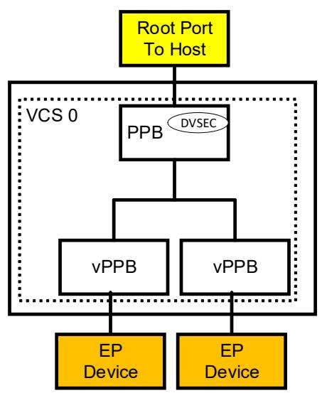
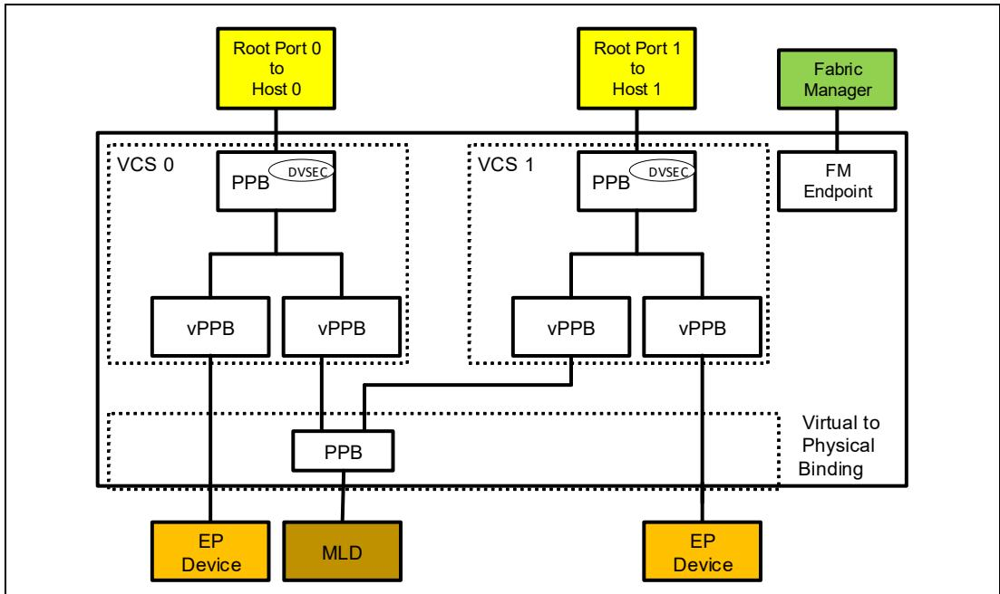
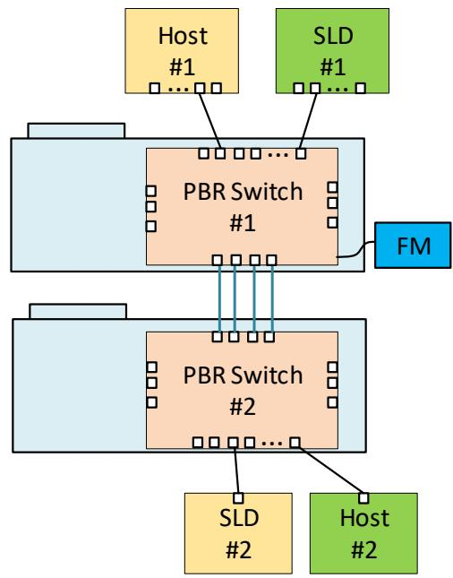
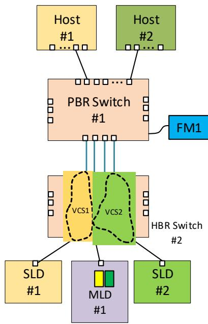
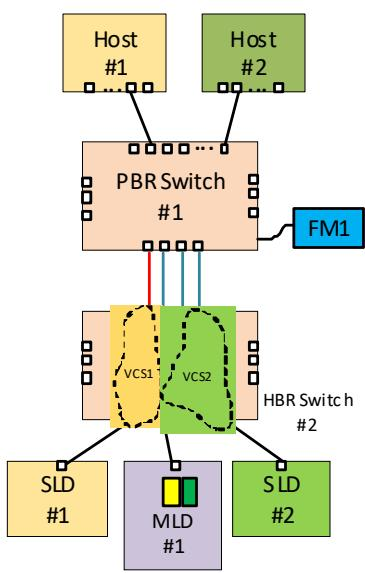
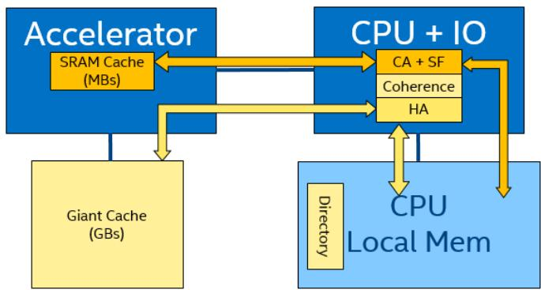

## Test Steps:

1. Force the remote and local link layer to send a request to the ARB/MUX for L1.x state.

2. This test should be run separately for each Link Layer independently (to test one Link Layer’s L1 entry while the other Link Layer is in ACTIVE), as well as both Link Layers concurrently requesting L1 entry.

## Pass Criteria:

• Upstream Port ARB/MUX sends ALMP Request{L1.x}

• Downstream Port ARB/MUX sends ALMP Status{L1.x} in response

• L1.x is entered after the local ARB/MUX receives ALMP Status

• State transition doesn’t occur until ALMP handshake is complete

• LogPHY enters L1 ONLY after both Link Layers enter L1 (applies to CXL mode only)

## Fail Conditions:

• Error in ALMP handshake

• Protocol layer packets sent after ALMP L1.x handshake is complete (requires Protocol Analyzer)

• State transition occurs before ALMP handshake completed

## 14.5.4 L1.x State Resolution (If Applicable)

## Test Equipment:

• Protocol Analyzer

## Prerequisites:

• Applicable for 68B Flit mode, 256B Flit mode, and Latency-Optimized 256B Flit mode

• Support for ASPM L1

## Test Steps:

1. Force the remote and local link layer to send a request to the ARB/MUX for different L1.x states.

## Pass Criteria:

• Upstream Port ARB/MUX sends ALMP Request{L1.x} according to what the link layer requested

• Upstream Port ARB/MUX sends ALMP Status{L1.y} response

• The state in the Status ALMP is the more-shallow L1.y state

• L1.y is entered after the local ARB/MUX receives ALMP Status

• State transition doesn’t occur until the ALMP handshake is complete

• LogPHY enters L1 ONLY after both protocols enter L1 (applies to CXL mode only)

## Fail Conditions:

• Error in ALMP handshake

• Protocol layer packets sent after ALMP L1.x handshake is complete (requires Protocol Analyzer)

• State transition occurs before ALMP handshake completed

## 14.5.5 Active to L2 Transition

## Test Equipment:

• Protocol Analyzer

## Prerequisites:

• Applicable for 68B Flit mode, 256B Flit mode, and Latency-Optimized 256B Flit mode

## Test Steps:

1. Force the remote and local link layer to send a request to the ARB/MUX for L2 state.

## Pass Criteria:

• Upstream Port ARB/MUX sends ALMP Request{L2} to the remote vLSM

• Upstream Port ARB/MUX waits for ALMP Status{L2} from the remote vLSM

• L2 is entered after the local ARB/MUX receives ALMP Status

• If there are multiple link layers, repeat the above steps for all link layers

• Physical link enters L2

• vLSM and physical link state transitions don’t occur until ALMP handshake is complete

## Fail Conditions:

• Error in ALMP handshake

• Protocol layer packets sent after ALMP L2 handshake is complete (requires Protocol Analyzer)

• State transition occurs before ALMP handshake completed

## 14.5.6 L1 to Active Transition (If Applicable)

## Test Equipment:

• Protocol Analyzer Required

## Prerequisites:

• Applicable for 68B Flit mode, 256B Flit mode, and Latency-Optimized 256B Flit mode

• Support for ASPM L1

## Test Steps:

1. Bring the link into L1 state.

2. Force the link layer to send a request to the ARB/MUX to exit L1.

## Pass Criteria:

• Local ARB/MUX sends L1 exit notification to the Physical Layer

• Link exits L1

• Link enters L0 correctly

• 68B Flit mode

— Status synchronization handshake completes successfully

— Active ALMP exchange to exit vLSM L1 and transition to Active successfully

• 256B Flit mode and Latency-Optimized 256B Flit mode

— Active ALMP request and receive Active Status ALMP to exit vLSM L1 and transition to Active

## Fail Conditions:

• Link transition to L0 has not occurred

• 68B Flit mode

— No status exchange happened or

— Active ALMP exchange has not occurred

• 256B Flit mode

— Active ALMP exchange has not occurred

## 14.5.7

## Reset Entry

Prerequisites:

• Applicable for 68B Flit mode

## Test Steps:

1. Initiate warm reset flow.

## Pass Criteria:

• Link sees hot reset and transitions to Detect state

## Fail Conditions:

• Link does not enter Detect

## 14.5.8

## Entry into L0 Synchronization

Test Equipment:

• Protocol Analyzer

## Prerequisites:

• Applicable for 68B Flit mode, 256B Flit mode, and Latency-Optimized 256B Flit mode

## Test Steps:

1. Place the link into Retrain state.

2. After exit from Retrain, check Status ALMPs to synchronize interfaces across the link.

## Pass Criteria:

• State contained in the Status ALMP is the same state the link was in before entry to Retrain

## Fail Conditions:

• No Status ALMPs are sent after exit from Retrain state

• State in Status ALMPs different from the state that the link was in before the link went into Retrain

• Other communication occurred on the link after Retrain before the Status ALMP handshake for synchronization completed

## 14.5.9 ARB/MUX Tests Requiring Injection Capabilities

The tests in this section are optional but strongly recommended. The test configuration control registers for the tests in this section are implementation specific.

## 14.5.9.1 ARB/MUX Bypass

Test Equipment:

• Protocol Analyzer

## Prerequisites:

• Applicable for 68B Flit mode and 256B Flit mode

• Device capability to force a request ALMP for any state

## Test Steps:

1. Place the Link into PCIe only mode.

2. Trigger entry to Retrain State.

3. Snoop the bus and check for ALMPs.

## Pass Criteria:

• No ALMPs are generated by the ARB/MUX

## Fail Conditions:

• ALMP is seen on the bus when checked

## 14.5.9.2 PM State Request Rejection

Test Equipment:

• Protocol Analyzer

## Prerequisites:

• Applicable for 68B Flit mode, 256B Flit mode, and Latency-Optimized 256B Flit mode

• Host capability to place the host into a state where it will reject any PM request ALMP

## Test Steps:

1. Upstream Port sends PM state Request ALMP.

2. Wait for an ALMP Request for entry to a PM State.

3. Downstream Port rejects the request by not responding to the Request ALMP.

4. After a certain time (determined by the test), the Upstream Port aborts PM transition on its end and sends transactions to the Downstream Port. In the case of a Type 3 device, the host will issue a CXL.mem M2S request, which the DUT will honor by aborting CXL.mem L1 entry.

## Pass Criteria:

• Upstream Port continues operation despite no Status received and initiates an Active Request

## Fail Conditions:

• Any system error

## 14.5.9.3 Unexpected Status ALMP

## Prerequisites:

• Applicable for 68B Flit mode only

• Device capability to force the ARB/MUX to send a Status ALMP at any time

## Test Steps:

1. While the link is in Active state, force the ARB/MUX to send a Status ALMP without first receiving a Request ALMP.

## Pass Criteria:

• Link enters Retrain state without any errors being reported

## Fail Conditions:

• No error on the link and normal operation continues

• System errors are observed

## 14.5.9.4 ALMP Error

## Prerequisites:

• Applicable for 68B Flit mode only

• Device capability that allows the device to inject errors into a flit

## Test Steps:

1. Inject a single bit error into the lower 16 bytes of a 528-bit flit.

2. Send data across the link.

3. ARB/MUX detects error and enters Retrain.

4. Repeat Steps 1-3 with a double-bit error.

## Pass Criteria:

• Link enters Retrain

## Fail Conditions:

• No errors are detected

## 14.5.9.5 Recovery Re-entry

## Prerequisites:

• Applicable for 68B Flit mode only

• Device capability that allows the device to ignore ALMP State Requests

## Test Steps:

1. Place the link into Active state.

2. Request link to enter Retrain State.

3. Prevent the Local ARB/MUX from entering Retrain.

4. Remote ARB/MUX enters Retrain state.

5. Remote ARB/MUX exits Retrain state and sends ALMP Status{Active} to synchronize.

6. Local ARB/MUX receives Status ALMP for synchronization but does not send.

7. Local ARB/MUX triggers re-entry to Retrain.

## Pass Criteria:

• Link successfully enters Retrain on re-entry attempt

## Fail Conditions:

• Link continues operation without proper synchronization

## 14.5.10 L0p Feature

## 14.5.10.1 Positive ACK for L0p

## Test Equipment:

• Protocol Analyzer

## Prerequisites:

• Link negotiation in 256B Flit mode is supported

• L0p feature is supported

## Test Steps:

1. Get current Link Width.

2. If Link Width = 1 and Link capability > 1:

a. Request L0p scale up to maximum supported width.

b. Successful Link scale up (assuming ACK).

c. Continue ALMP and traffic during L0p phases as normal.

## Pass Criteria:

• No packet errors

• Link Width scale up to value indicated is successful; else Link Width > 1

• Request L0p scale down to 1

Fail Conditions:

• Pass criteria is not met

## 14.5.10.2 Force NAK for L0p Request

Test Equipment:

• Protocol Analyzer

Prerequisites:

• Link Negotiation in 256B Flit mode is supported

• L0p feature is supported

## Test Steps:

1. For L0p request, force a NAK.

Pass Criteria:

• No change with Negotiated Link Width register

Fail Conditions:

• Up/down scaling

• Data error transfers

## 14.6

## Physical Layer

## 14.6.1 Tests Applicable to 68B Flit Mode

Prerequisites:

• Applicable only when the link is expected to train to 68B Flit mode (see Table 6-12)

## 14.6.1.1 Protocol ID Checks

Test Equipment:

• Protocol Analyzer

## Test Steps:

1. Bring the link up to Active state.

2. Send one or more flits from the CXL.io interface, and then check for the correct Protocol ID.

3. If applicable, send one or more flits from the CXL.cache and/or CXL.mem interface, and then check for the correct Protocol ID.

4. Send one or more flits from the ARB/MUX, and then check for the correct Protocol ID.

## Pass Criteria:

• All Protocol IDs are correct

## Fail Conditions:

• Errors occur during test

• No communication

## 14.6.1.2 NULL Flit

## Test Equipment:

• Protocol Analyzer

## Test Steps:

1. Bring the link up to Active state.

2. Delay flits from the Link Layer.

3. Check for NULL flits from the Physical Layer.

4. Check that NULL flits have correct Protocol ID.

## Pass Criteria:

• NULL flits seen on the bus when Link Layer delayed

• NULL flits have correct Protocol ID

• NULL flits contain all zero data

## Fail Conditions:

• No NULL flits are sent from the Physical Layer

• Errors are logged during tests in the CXL DVSEC Port Status register

## 14.6.1.3 EDS Token

## Test Equipment:

• Protocol Analyzer

## Test Steps:

1. Bring the link up to Active state.

2. Send a flit with an implied EDS token.

## Pass Criteria:

• A flit with an implied EDS token is the last flit in the data block

• Next Block after a flit with an implied EDS token is an ordered set (OS)

• OS block follows the data block that contains a flit with the implied EDS token

## Fail Conditions:

• Errors logged during test

## 14.6.1.4 Correctable Protocol ID Error

This test is optional but strongly recommended.

## Test Equipment:

• Protocol Analyzer

## Test Steps:

1. Bring the link up to Active state.

2. Create a correctable Protocol ID framing error by injecting an error into one 8-bit encoding group of the Protocol ID such that the new 8b encoding is invalid.

3. Check that an error is logged and normal processing continues.

## Pass Criteria:

• Error correctly logged in DVSEC Flex Bus Port Status register

• Correct 8-bit encoding group used for normal operation

## Fail Conditions:

• No errors are logged

• Flit with error dropped

• Error causes retrain

• Normal operation does not resume after error

## 14.6.1.5 Uncorrectable Protocol ID Error

This test is optional but strongly recommended.

## Test Equipment:

• Protocol Analyzer

## Test Steps:

1. Bring the link up to Active state.

2. Create an uncorrectable framing error by injecting an error into both 8-bit encoding groups of the Protocol ID such that both 8b encodings are invalid.

3. Check that an error is logged and that the flit is dropped.

4. Link enters Retrain state.

## Pass Criteria:

• Error is correctly logged in the DVSEC Flex Bus Port Status register

• Link enters Retrain state

## Fail Conditions:

• No errors are logged in the DVSEC Flex Bus Port Status register

## 14.6.1.6 Unexpected Protocol ID

This test is optional but strongly recommended.

## Test Equipment:

• Protocol Analyzer

## Test Steps:

1. Bring the link up to Active state.

2. Send a flit with an unexpected Protocol ID.

3. Check that an error is logged and that the flit is dropped.

4. Link enters Retrain state.

## Pass Criteria:

• Error is correctly logged in the DVSEC Flex Bus Port Status register

• Link enters Retrain state

## Fail Conditions:

• No Errors are logged in the DVSEC Flex Bus Port Status register

## 14.6.1.7 Recovery.Idle/Config.Idle Transition to L0

## Test Equipment:

• Protocol Analyzer

## Test Steps:

1. Bring the link up in CXL mode to Recovery.Idle or Config.Idle state.

2. Wait for the NULL flit to be received by the DUT.

3. Check that the DUT sends NULL flits after receiving NULL flits.

## Pass Criteria:

• LTSSM transitions to L0 after 8 NULL flits are sent and at least 4 NULL flits are received

## Fail Conditions:

• LTSSM remains in IDLE

## 14.6.1.8

## Uncorrectable Mismatched Protocol ID Error

This test is optional but strongly recommended.

## Prerequisites:

• Protocol ID error perception in the device Log PHY (device can forcibly react as though there is an error even if the Protocol ID is correct)

## Test Steps:

1. Bring the link up to Active state.

2. Create an uncorrectable Protocol ID framing error by injecting a flit such that both 8-bit encoding groups of the Protocol ID are valid but do not match.

3. Check that an error is logged and that the flit is dropped.

4. Link enters Retrain state.

## Pass Criteria:

• Error is correctly logged in the DVSEC Flex Bus Port Status register

• Link enters Retrain state

## Fail Conditions:

• No errors are logged

• Error is corrected

## 14.6.2 Drift Buffer (If Applicable)

## Prerequisites:

• Drift buffer is supported

## Test Steps:

1. Enable the Drift buffer.

## Pass Criteria:

• Drift buffer is logged in the Flex Bus DVSEC

## Fail Conditions:

• No log in the Flex Bus DVSEC

## 14.6.3

## SKP OS Scheduling/Alternation (If Applicable)

## Test Equipment:

• Protocol Analyzer

## Prerequisites:

• Applicable only when the link trains to 32 GT/s or lower

• Support Sync Header Bypass

## Test Steps:

1. Bring the link up in CXL mode with Sync Header Bypass enabled.

2. Check for SKP OS.

## Pass Criteria:

• Physical Layer schedules SKP OS every 340 data blocks

• Control SKP OS and standard SKP OS alternate at 16 GT/s or higher

• Standard SKP OS is used only at 8 GT/s

## Fail Conditions:

• No SKP OS is observed

• SKP OS is observed at an interval other than 340 data blocks

## 14.6.4 SKP OS Exiting the Data Stream (If Applicable)

## Test Equipment:

• Protocol Analyzer

## Prerequisites:

• Applicable only when the link trains to 32 GT/s or lower

• Support Sync Header Bypass

## Test Steps:

1. Bring the link up in CXL mode with Sync Header Bypass enabled.

2. Exit Active state.

Pass Criteria:

• Physical Layer replaces SKP OS with EIOS or EIEOS

## Fail Conditions:

• SKP OS is not replaced by the Physical Layer

## 14.6.5 Link Initialization Resolution

See Section 14.2.1 for the list of configurations that are used by this test.

## Test Equipment:

• Protocol Analyzer

## Test Steps:

1. For the DUT, set up the system as described in the Configurations to Test column of Table 14-3.

2. In each of the configurations marked “Yes” in the Retimer Check Required (If Present) column, if there are CXL-aware retimer(s) present in the path, ensure that bit 12 and bit 14 (in Symbols 12-14) of the Modified TS1/TS2 Ordered Set are set to 1 (as applicable). In addition, ensure that Sync Header Bypass capable/ enable is set.

3. Negotiate for CXL during PCIe alternate protocol negotiation.

Table 14-3. Link Initialization Resolution Table (Sheet 1 of 2)

<table><tr><td>DUT</td><td>Upstream Component</td><td>Downstream Component</td><td>Retimer Check Required (If Present)</td><td>Configurations to Test</td><td>Verify</td></tr><tr><td rowspan="4">CXL Switch</td><td>Host - CXL VH capable</td><td>DUT</td><td>Yes</td><td>SHSW</td><td>Link initializes to L0 in CXL VH mode</td></tr><tr><td>Host - RCH</td><td>DUT</td><td></td><td>SHSW</td><td>Link doesn’t initialize to L0 in CXL mode</td></tr><tr><td>DUT</td><td>Endpoint - CXL VH capable</td><td>Yes</td><td>SHSW</td><td>Link initializes to L0 in CXL VH mode</td></tr><tr><td>DUT</td><td>Endpoint - eRCD</td><td>Yes</td><td>SHSW</td><td>Link initializes to CXL VH mode</td></tr></table>

Table 14-3. Link Initialization Resolution Table (Sheet 2 of 2)

<table><tr><td>DUT</td><td>Upstream Component</td><td>Downstream Component</td><td>Retimer Check Required (If Present)</td><td>Configurations to Test</td><td>Verify</td></tr><tr><td rowspan="3">Host - CXL VH capable</td><td>DUT</td><td>Switch - CXL VH capable</td><td></td><td>SHSW</td><td>Link initializes to L0 in CXL VH mode</td></tr><tr><td>DUT</td><td>Endpoint - CXL VH capable</td><td>Yes</td><td>SHDA</td><td>Link initializes to L0 in CXL VH mode</td></tr><tr><td>DUT</td><td>Endpoint - eRCD</td><td>Yes</td><td>SHDA</td><td>Link initializes to L0 in RCD mode</td></tr><tr><td rowspan="3">Endpoint - CXL VH capable</td><td>Host - CXL VH capable</td><td>DUT</td><td></td><td>SHDA</td><td>Link initializes to L0 in CXL VH mode</td></tr><tr><td>CXL Switch</td><td>DUT</td><td></td><td>SHSW</td><td>Link initializes to L0 in CXL VH mode</td></tr><tr><td>Host - RCH</td><td>DUT</td><td>Yes</td><td>SHDA</td><td>Link initializes to L0 in RCD mode</td></tr></table>

## Pass Criteria:

• For a given type of DUT (column 1), all Verify Conditions in Table 14-3 are met

• For cases where it is expected that the link initializes to CXL VH mode, IO\_Enabled is set and either one or both of Cache\_Enabled and Mem\_Enabled are set in the DVSEC Flex Bus Port Status register

## Fail Conditions:

• For a given type of DUT (column 1), any of the Verify Conditions in Table 14-3 are not met

• For cases where it is expected that the link initializes to CXL VH mode, neither Cache\_Enabled nor Mem\_Enabled are set in the DVSEC Flex Bus Port Status register

## 14.6.6 Hot Add Link Initialization Resolution

See Section 14.2.1 for the list of configurations that are used by this test.

## Test Steps:

1. Set up the system as described in the Configurations to Test column of Table 14-4.

2. Attempt to Hot-Add the DUT in CXL mode in each configuration.

Table 14-4. Hot Add Link Initialization Resolution Table (Sheet 1 of 2)

<table><tr><td>DUT</td><td>Upstream Component</td><td>Downstream Component</td><td>Configurations to Test</td><td>Verify</td></tr><tr><td rowspan="3">CXL Switch</td><td>Host - CXL VH capable</td><td>DUT</td><td>SHSW</td><td>Hot-Add - Link initializes to L0 in CXL VH mode</td></tr><tr><td>DUT</td><td>Endpoint - CXL VH capable</td><td>SHSW</td><td>Hot-Add - Link initializes to L0 in CXL VH mode</td></tr><tr><td>DUT</td><td>Endpoint - eRCD</td><td>SHSW</td><td>Link doesn’t initialize to L0 in CXL mode for Hot-Add</td></tr></table>

Table 14-4. Hot Add Link Initialization Resolution Table (Sheet 2 of 2)

<table><tr><td>DUT</td><td>Upstream Component</td><td>Downstream Component</td><td>Configurations to Test</td><td>Verify</td></tr><tr><td rowspan="3">Host</td><td>DUT</td><td>CXL Switch</td><td>SHSW</td><td>Hot-Add - Link initializes to L0 in CXL VH mode</td></tr><tr><td>DUT</td><td>Endpoint - CXL VH capable</td><td>SHDA</td><td>Hot-Add - Link initializes to L0 in CXL VH mode</td></tr><tr><td>DUT</td><td>Endpoint - eRCD</td><td>SHDA</td><td>Link doesn’t initialize to L0 in CXL mode for Hot-Add</td></tr><tr><td rowspan="2">Endpoint - CXL VH capable</td><td>Host - CXL VH capable</td><td>DUT</td><td>SHDA</td><td>Hot-Add - Link initializes to L0 in CXL VH mode</td></tr><tr><td>CXL Switch</td><td>DUT</td><td>SHSW</td><td>Hot-Add - Link initializes to L0 in CXL VH mode</td></tr></table>

## Pass Criteria:

• For a given type of DUT (column 1), all Verify Conditions in Table 14-4 are met

• For cases where it is expected that the link initializes to CXL VH mode, IO\_Enabled is set and either one or both of Cache\_Enabled and Mem\_Enabled are set in the DVSEC Flex Bus Port Status register

## Fail Conditions:

• For a given type of DUT (column 1), any of the Verify Conditions in Table 14-4 are not met

• For cases where it is expected that the link initializes to CXL VH mode, neither Cache\_Enabled nor Mem\_Enabled are set in the DVSEC Flex Bus Port Status register

## 14.6.7 Link Speed Advertisement

## Test Equipment:

• Protocol Analyzer

## Prerequisites:

• Applicable only for devices that support 8 GT/s or 16 GT/s in addition to also supporting 32 GT/s

## Test Steps:

1. Wait for initial link training at 2.5 GT/s.

2. Check speed advertisement before alternate protocol negotiations have completed (i.e., LTSSM enters Configuration.Idle with LinkUp=0 at 2.5 GT/s).

## Pass Criteria:

• Advertised CXL speed is 32 GT/s until Configuration.Complete state is exited

Fail Conditions:

• Speed advertisement is not 32 GT/s

## 14.6.8 Link Speed Degradation - CXL Mode

## Test Steps:

1. Train the CXL link up to the highest speed possible (at least 16 GT/s).

2. Degrade the Link Down to a lower CXL mode speed.

## Pass Criteria:

• Link degrades to slower speed without going through mode negotiation

## Fail Conditions:

• Link leaves CXL mode

## 14.6.9 Link Speed Degradation below 8 GT/s

## Test Steps:

1. Train the CXL link up to the highest speed possible (at least 8 GT/s).

2. Degrade the Link Down to a speed below CXL mode operation.

3. Link enters Detect state.

## Pass Criteria:

• Link degrades to slower speed

• Link enters Detect state

## Fail Conditions:

• Link remains in CXL mode

• Link does not change speed

## 14.6.10 Tests Requiring Injection Capabilities

The tests in this section are optional but strongly recommended. The test configuration control registers for the tests in this section are implementation specific.

## 14.6.10.1 TLP Ends on Flit Boundary

## Test Equipment:

• Protocol Analyzer

## Prerequisites:

• Applicable only when the link trains to 68B Flit mode

## Test Steps:

1. Bring the link up to Active state.

2. CXL.io sends a TLP that ends on a flit boundary.

3. Check that next flit sent by the Link Layer contains IDLE tokens, EDB, or more data.

## Pass Criteria:

• TLP that ends on flit boundary is not processed until a subsequent flit is transmitted

• IDLE tokens, EDB, or more data is observed after a TLP that ends on the flit boundary

## Fail Conditions:

• Errors are logged

• No IDLE, EDB, or data observed after TLP flit

## 14.6.10.2 Failed CXL Mode Link Up

## Test Steps:

1. Negotiate for CXL during PCIe alternate protocol negotiation.

2. Hold the link at 2.5 GT/s.

3. Link transitions back to detect.

## Pass Criteria:

• Link transitions back to detect after being unable to reach 8 GT/s speed

• Link training does not complete

## Fail Conditions:

• Link does not transition to detect

## 14.6.11 Link Initialization in Standard 256B Flit Mode

## Prerequisites:

• Upstream Ports and Downstream Ports support PCIe Flit mode

## Test Steps:

1. Train the CXL link up at the highest possible speed.

## Pass Criteria:

• Link trains to L0 state

• PCIe Flit mode is selected during training - Flit Mode Status in the Link Status 2 register is set

• DVSEC Flex Bus Port Status register has IO\_Enabled set and either one or both of Cache\_Enabled and Mem\_Enabled are set

## Fail Conditions:

• Link training is incomplete

• PCIe Flit mode is not selected during training - Flit Mode Status in the Link Status 2 register is not set

• DVSEC Flex Bus Port Status register has IO\_Enabled not set

• DVSEC Flex Bus Port Status register has both Cache\_Enabled and Mem\_Enabled not set

## 14.6.12 Link Initialization in Latency-Optimized 256B Flit Mode

## Prerequisites:

• Upstream Ports and Downstream Ports support PCIe Flit mode

• Upstream Ports and Downstream Ports are Latency-Optimized 256B Flit capable

## Test Steps:

1. Train the CXL link up at the highest possible speed.

a. During link training, set the CXL Latency\_Optimized\_256B\_Flit\_Enable bit in the Downstream Port’s DVSEC Flex Bus Port Control register.

## Pass Criteria:

• Link trains to L0 state

• PCIe Flit mode is selected during training - Flit Mode Status in the Link Status 2 register is set

• DVSEC Flex Bus Port Status register has CXL Latency\_Optimized\_256B\_Flit\_Enabled set

• DVSEC Flex Bus Port Status register has IO\_Enabled set and either one or both of Cache\_Enabled and Mem\_Enabled set

## Fail Conditions:

• Link training is incomplete

• PCIe Flit mode is not selected during training - Flit Mode Status in Link Status 2 register is not set

• DVSEC Flex Bus Port Status register has CXL Latency\_Optimized\_256B\_Flit\_Enable not set

• DVSEC Flex Bus Port Status register has IO\_Enabled not set

• DVSEC Flex Bus Port Status register has both Cache\_Enabled and Mem\_Enabled not set

## 14.6.13 Sync Header Bypass (If Applicable)

Test Equipment:

• Protocol Analyzer

Prerequisites:

• Support for Sync Header Bypass

## Test Steps:

1. Negotiate for Sync Header Bypass during PCIe alternate protocol negotiation.

2. Link trains to 2.5 GT/s.

3. Transition to each of the device-supported speeds: 8 GT/s, 16 GT/s, and 32 GT/s.

4. Check for Sync headers.

## Pass Criteria:

• No Sync Headers are observed after 8 GT/s transition

## Fail Conditions:

• Link training is incomplete

• Sync headers are observed at 8 GT/s or higher

• All conditions specified in Table 6-14 are not met while no Sync headers are observed

• LTSSM transitions before the exchange of NULL flits is complete

## 14.7 Switch Tests

## 14.7.1 Introduction to Switch Types

CXL supports two types of switches (see Section 7.7.5):

• HBR (Hierarchy Based Routing)

• PBR (Port Based Routing)

## 14.7.2 Compliance Testing

Compliance testing of switches requires a “Golden reference” host and endpoint devices. These are devices that have been tested and are trusted to operate in accordance with the CXL specifications.

Assemble a topology to allow testing of the switches to confirm that the CXL protocol is unencumbered by the switches for interoperability, to include the following:

• Validate all EP devices and address ranges are identified and accessible to the host (root port)

• Run tests to verify that attached memory is visible to the host and operates correctly

• Testing by function

• Managed device removal

• Managed addition of devices

• Link Down testing, link recovery for switched ports

• Device reset events for individual EP devices

## 14.7.2.1 HBR Switch Assumptions

The minimum configuration for an HBR switch is not managed by an FM and is defined as one Virtual CXL Switch (VCS) that has a USP and two or more DSPs. Compliance tests for a single VCS.

Figure 14-13. Compliance Testing Topology for an HBR Switch with a Single Host  
  
The minimum configuration for a managed switch is defined as two VCS: each VCS has one USP and two or more DSPs.

Figure 14-14. Compliance Testing Topology for an HBR Switch with Two Hosts  
  
Known good Host devices are required to support managed Hot-Plug and managed removal of devices.

All connectors used in these tests must support Hot-Plug sideband signals.

An HBR switch that is not FM managed should have all ports bound to a VCS. An unmanaged switch cannot support unbound ports and MLDs because there is no managing function to control LD bindings.

An FM-managed HBR switch should have at least two VCSs configured for these test purposes, so that interactions between hosts on different VCSs can be monitored. Devices may be connected to unbound ports for a managed switch (i.e., an unallocated resource). Unbound ports may be bound to any VCS at any time. The switch is managed by a Fabric Manager of the vendor’s choice and supports MLDs.

A known good Endpoint should support Hot-Plug and should have passed previous tests in a direct attached system.

## 14.7.2.2 PBR Switch Assumptions

The minimum configuration for PBR switches is composed of two cascaded switches, at least one of which shall be a PBR switch. Switches shall be FM managed.

Figure 14-15. Compliance Testing Topology for Two PBR Switches

In a topology with a single PBR switch and a single HBR switch, the host devices are connected to the PBR switch and the HBR switch’s USPs are connected to the PBR switch, to allow for multiple-host routing. The HBR switch configures a unique VCS for each host.

Figure 14-16. Compliance Testing Topology for a PBR Switch and an HBR Switch

## 14.7.3 Unmanaged HBR Switch

This is a fixed-configuration test. This test is used for an HBR switch that has the ability for bindings to be preconfigured and immediately accessible to the attached host after power-up. This test is suitable only for SLDs because MLDs require management to determine which LDs to bind to each VCS. All port bindings that define the VCS are configured and allocated at boot time without any interaction from a Fabric Manager device.

## Test Steps:

1. An HBR switch that is not FM managed shall have all port bindings defined to be active at power-up.

2. An FM-managed HBR switch should be configured so that at least one port is bound to a VCS on power-up.

3. At least one SLD component shall be attached to a port.

4. Power-on or initialize the system (host, switch, and EP device).

## Pass Criteria:

• Devices attached to bound ports are identified by the host at initialization without any external intervention by a Fabric Manager, if any

## Fail Conditions:

• Devices attached to bound ports are not identified by the host on initialization

## 14.7.4 Reset Propagation

## 14.7.4.1 Host PERST# Propagation

HBR switch overview: If an HBR switch receives a USP PERST#, then only devices or SLDs that are bound to the VCS for that USP shall be reset; other VCSs and ports shall not be reset. For an MLD component, only LDs that are bound to the VCS that received the USP PERST# shall be reset. LDs that are bound to another VCS shall be unaffected and shall continue to operate normally.

PBR switch overview: If a PBR switch receives a PERST#, then only devices attached to ports with access to the receiving port shall be reset. No other ports shall be reset. MLDs are not supported by PBR switches. All other ports shall continue to operate normally.

## 14.7.4.1.1 Host PERST# Propagation to an SLD Component (HBR Switch)

## Test Steps:

1. One or more SLDs are bound to a VCS.

2. Assert PERST# from the host to the USP of the VCS.

## Pass Criteria:

• Switch propagates reset to all SLDs that are connected to the VCS

• All SLDs that are bound to the VCS go through a Link Down and the host unloads the associated device drivers

• Hosts and all devices that are bound to any other VCS shall continue to be connected and bound; reset events shall not occur

## Fail Conditions:

• One or more SLDs that are bound to the VCS under test fails to go through a Link Down

• Hosts or SLDs that are bound to any other VCS are reset

## 14.7.4.1.2 Host PERST# Propagation to an SLD Component (PBR Switch)

## Test Steps:

1. One or more SLDs has port access to a host.

2. PERST# is asserted by the host.

## Pass Criteria:

• Switch propagates reset to all SLDs with port access to the host

• All SLD port access to the host goes through a Link Down and the host unloads the associated device drivers

• Hosts and all devices connected to other switch ports shall continue to be connected and no reset events occur

## Fail Conditions:

• One or more SLDs with port access to the host under test fail to go through a Link Down

• Hosts or SLDs connected to other switch ports are reset

## 14.7.4.1.3 Host PERST# Propagation to an MLD Port (HBR Switch Only)

## Prerequisites:

• Not applicable to PBR switches

• Switch with a minimum of two VCSs that are connected to respective Hosts

• An MLD with at least one LD that is bound to each VCS (i.e., at least two bound LDs)

• Optionally, SLDs may also be attached to each VCS

## Test Steps:

1. Host 0 asserts USP PERST#.

2. Reset is propagated to all VCS 0 vPPBs.

## Pass Criteria:

• Host 0 processes a Link Down for each LD that is bound to VCS 0 and unloads the associated device drivers

• All SLDs that are connected to VCS 0 go through a Link Down and Host 0 unloads the associated device drivers

• MLD remains link up

• Other hosts do not receive a Link Down for any LDs that are connected to them

## Fail Conditions:

• Host 0 does not process a Link Down for the LDs and SLDs that are bound to VCS 0

• Any other host processes a Link Down for LDs of the shared MLD

• MLD goes through a Link Down

## 14.7.4.2 LTSSM Hot Reset

HBR switch overview: If a switch USP receives an LTSSM Hot Reset, then the USP vPPB shall propagate a reset to all vPPBs for that VCS. Other vPPBs shall not be reset. In a topology where an HBR switch is connected to a PBR switch, the USP of a VCS that is reset should reset the inter-switch link for the VCS USP.

PBR switch overview: If a PBR switch host port receives an LTSSM Hot Reset, then all switch ports with access to the host port shall be reset. No other ports shall be reset. Inter-switch links should not be reset.

## 14.7.4.2.1 LTSSM Hot Reset Propagation to SLDs (HBR Switch)

## Test Steps:

1. One or more SLDs are bound to a VCS.

2. Initiate LTSSM Hot Reset from the host to the switch.

## Pass Criteria:

• Switch propagates hot reset to all SLDs that are connected to the VCS and their links go down

• Hosts and devices bound to any other VCS must not receive the reset

## Fail Conditions:

• Switch fails to send a hot reset to any SLDs that are connected to the VCS

• Hosts or devices bound to any other VCS are reset

## 14.7.4.2.2 LTSSM Hot Reset Propagation to SLDs (PBR Switch)

## Test Steps:

1. One or more SLDs have port access to the host port under test.

2. Initiate LTSSM Hot Reset from the host to the switch.

## Pass Criteria:

• Switch propagates hot reset to all SLDs that are connected with port access to the host and their links go down

• Hosts and devices connected to other ports shall not receive a connection reset

## Fail Conditions:

• Switch fails to send a hot reset to any SLDs that have port access to the host

• Hosts or devices connected to other ports are reset

## 14.7.4.2.3 LTSSM Hot Reset Propagation to SLDs (PBR+HBR Switch)

Figure 14-17. LTSSM Hot Reset Propagation to SLDs (PBR+HBR Switch)

## Test Steps:

1. A PBR switch and an HBR switch compose the topology, with the host connected to the PBR switch.

2. One or more SLDs have port access to the host port under test.

3. Initiate LTSSM Hot Reset from the host to the switch.

## Pass Criteria:

• Switch propagates hot reset to all SLDs that are connected with port access to the host and their links go down

• The inter-switch link for the USP for the VCS of the HBR switch shall be reset (shown red in Figure 14-17 (leftmost/first connecting line between the two switches), where VCS 1 received LTSSM reset)

• Hosts and devices connected to other ports shall not receive a connection reset

## Fail Conditions:

• Switch fails to send a hot reset to any SLDs that have port access to the host

• Hosts or devices connected to other ports are reset

## 14.7.4.2.4 LTSSM Hot Reset Propagation to an MLD Component (HBR Switch Only)

## Prerequisites:

• Not applicable to PBR switches

• Switch with a minimum of two VCSs that are connected to respective Hosts

• An MLD with at least one LD that is bound to each VCS (i.e., at least two bound LDs)

• Optionally, SLDs may also be attached to each VCS

## Test Steps:

1. Host 0 asserts LTSSM Hot Reset to the switch.

2. The USP propagates a reset to all vPPBs associated with VCS 0.

## Pass Criteria:

• Host 0 processes a Link Down for all LDs and SLDs that are bound to VCS 0

• Host 1 does not receive a Link Down for any LDs that are bound to VCS 1

## Fail Conditions:

• MLD port goes through a Link Down

• Host 1 processes a Link Down for LDs of the shared MLD

• Host 0 does not process a Link Down for any LD or SLD that is bound to VCS 0

## 14.7.4.3 Secondary Bus Reset (SBR) Propagation

## 14.7.4.3.1 Secondary Bus Reset (SBR) Propagation to All Ports of a VCS with SLD Components

## Test Steps:

1. One or more SLDs are bound to a VCS.

2. The Host sets the SBR bit in the Bridge Control register of the USP vPPB.

## Pass Criteria:

• Switch sends a hot reset to all SLDs that are connected to the VCS and their links go down

• The Host processes a Link Down for all SLDs that are bound to the VCS and unloads the associated device drivers

## Fail Conditions:

• Switch fails to send a hot reset to any SLDs that are connected to the VCS

• The Host fails to unload an associated device driver for a device that is connected to the VCS

## 14.7.4.3.2

## Prerequisites:

• Switch with a minimum of two VCSs that are connected to respective Hosts

• An MLD with at least one LD that is bound to each VCS (i.e., at least two bound LDs)

• Optionally, SLDs may also be attached to each VCS

## Test Steps:

1. Host 0 sets the SBR bit in the Bridge Control register associated with the USP vPPB of the VCS under test.

## Pass Criteria:

• Host 0 processes a Link Down for the LDs and SLDs that are bound to VCS 0 and unloads the associated device drivers

• MLD port remains Link Up

• Other Hosts that share the MLD are unaffected

## Fail Conditions:

• MLD port goes through a Link Down

• Any other host processes a Link Down

• Host 0 does not process a Link Down for any LDs that are bound to VCS 0

• Host 0 does not process a Link Down for any SLDs that are connected to VCS 0

## 14.7.4.3.3 Secondary Bus Reset (SBR) Hot Reset Propagation to SLDs (PBR+HBR Switch) Figure 14-18. Secondary Bus Reset (SBR) Hot Reset Propagation to SLDs (PBR+HBR Switch)

## Test Steps:

1. A PBR switch and an HBR switch compose the topology, with the host connected to the PBR switch.

2. One or more SLDs have port access to the host port under test.

3. Initiate LTSSM Hot Reset from the host to the switch.

## Pass Criteria:

• Switch propagates hot reset to all SLDs that are connected with port access to the host and their links go down

• The inter-switch link for the USP for the VCS of the HBR switch shall be reset (shown red in Figure 14-18 (leftmost/first connecting line between the two switches), where VCS 1 received LTSSM reset)

• Hosts and devices connected to other ports shall not receive a connection reset

## Fail Conditions:

• Switch fails to send a hot reset to any SLDs that have port access to the host

• Hosts or devices connected to other ports are reset

14.7.4.3.4 Secondary Bus Reset (SBR) Propagation to One Specific Downstream Port (SLD) (HBR Switch)

All links in the path between the host and specific SLD shall be reset.

## Test Steps:

1. vPPB under test is connected to an SLD component.

2. Host sets the SBR bit in the Bridge Control register of the vPPB to be reset.

## Pass Criteria:

• Host processes a Link Down for the vPPB under test and unloads the device driver

• All other ports in the VCS remain unaffected

## Fail Conditions:

• Port under test does not go Link Down

• Any other port goes Link Down

## 14.7.4.3.5 Secondary Bus Reset (SBR) Propagation to One Specific Downstream Port (SLD) (PBR + HBR Switch)

All links in the path between the host and the specific SLD shall be reset, including the VCS USP for the VCS connected to the specific SLD being reset.

## Test Steps:

1. A PBR switch and an HBR switch compose the topology, with the host connected to the PBR switch.

2. One or more SLDs have port access to the host port under test.

3. Initiate an SBR from the host to the switch for a specific SLD.

## Pass Criteria:

• Host processes a Link Down for the SLD port under test

• Reset the ISL of the VCS USP containing the SLD that received the SBR

• All other ports remain unaffected

## Fail Conditions:

• Port under test does not go Link Down

• ISL of the VCS USP containing the SLD that received the SBR failed to be reset

• Any other port goes Link Down

## 14.7.4.3.6 Secondary Bus Reset (SBR) Propagation to One Specific Shared Downstream Port (MLD) (HBR Switches Only)

## Prerequisites:

• Not applicable to PBR switches

• Switch with a minimum of two VCSs that are connected to respective Hosts

• Each VCS is bound to an LD each from the MLD component

## Test Steps:

1. For the VCS under test, the host sets the SBR bit in the Bridge Control register of the vPPB bound to the LD.

## Pass Criteria:

• Host processes a Link Down for the vPPB under test and unloads the device driver

• MLD port remains Link Up

• Other Hosts sharing the MLD are unaffected

## Fail Conditions:

• Host processes a Link Down for the vPPB not under test

• Host does not process a Link Down for the vPPB under test

• Any switch port goes through a Link Down

## 14.7.5 Managed Hot-Plug - Adding a New Endpoint Device

This test is for adding a device to a switch and then subsequently hot adding the device to a host. The host should load any relevant driver(s) and operate with the newly added device.

## 14.7.5.1 Managed Add of an SLD Component

## 14.7.5.1.1 Incremental Add of an SLD to a VCS (HBR Switch)

## Prerequisites:

• Host has completed enumeration

• Host has loaded drivers for all attached devices

## Test Steps:

1. Perform a managed add of the SLD component to the port under test.

2. For an unmanaged switch, the port is already bound to a VCS.

3. For a managed switch, the FM must bind the port to a VCS.

## Pass Criteria:

• Host successfully enumerates the added device and loads the driver

## Fail Conditions:

• Host is unable to enumerate and fails to load the device driver for the added device

## 14.7.5.1.2 Incremental Add of an SLD to a VCS (PBR Switch)

## Prerequisites:

• Host has completed enumeration

• Host has loaded drivers for all attached devices

## Test Steps:

1. Perform a managed add of the SLD component to the port under test.

2. FM identifies the new device and enables port routing to the required host.

## Pass Criteria:

• Host successfully enumerates the added device and loads the device driver

## Fail Conditions:

• Host is unable to enumerate and fails to load the device driver for the added device

## 14.7.5.2 Managed Add of an MLD Component (HBR Switch Only)

The Switch reports PPB-related events to the Fabric Manager using the FM API. At the time of publication there are no defined Fabric Manager reporting requirements to a user, and so parts of this test may only be observable through vendor-specific reporting.

## Prerequisites:

• Not applicable to PBR switches

• Host enumeration successfully completes for all devices prior to this test

• Switch port supports MLD and is unbound (i.e., not bound to a VCS)

## Test Steps:

1. Perform a managed add of the MLD to the port under test.

## Pass Criteria:

• Fabric Manager identifies the device but does not bind it to any host

• Hosts are not affected by the addition of the device to an unbound port

• Hosts do not identify the added device

• Interrupts are not sent to the hosts, and the system operates normally

## Fail Conditions:

• A host identifies the new device

## 14.7.5.3

## Managed Add of an MLD Component to an SLD Port (HBR Switch Only)

This test exercises the behavior of an MLD component when plugged into an SLD port. If the MLD capability is not common to both sides, an MLD operates as an SLD component.

## Prerequisites:

• Not applicable to PBR switches

• The port under test is configured as an SLD port

• Host enumeration successfully completes for all devices prior to this test

## Test Steps:

1. Perform a managed add of the MLD component to the port under test.

## Pass Criteria:

• Host successfully enumerates the added device and loads the driver.

• MLD component operates as an SLD (i.e., MLD capable but MLD is not enabled) and presents its full memory capacity to the host (i.e., does not divide into multiple LDs). For MH-MLDs, the component presents the full memory capacity that is allocated to the head under test.

## Fail Conditions:

• Host does not identify the new device

• Host does not identify the full memory capacity of the new device

## 14.7.6 Managed Hot-Plug Removal of an Endpoint Device

A managed Hot-Plug remove operation requires the host to:

• Cease all read/write operations to the device

• Unload relevant drivers to allow the device to be removed

## 14.7.6.1 Managed Removal of an SLD Component from a VCS (HBR Switch)

## Prerequisites:

• Host enumeration successfully completes for all devices prior to this test

## Test Steps:

1. Perform a managed remove of the SLD component from the port under test.

## Pass Criteria:

• Host recognizes the device removal and unloads the associated device driver

## Fail Conditions:

• Host does not unload the device driver

## 14.7.6.2 Managed Removal of an SLD Component (PBR Switch)

## Prerequisites:

• Host enumeration successfully completes for all devices prior to this test

## Test Steps:

1. Perform a managed remove of the SLD component from the host.

2. FM removes port access for the SLD port and the host port.

## Pass Criteria:

• Host recognizes the device removal and unloads the associated device driver

## Fail Conditions:

• Host does not unload the device driver

## 14.7.6.3

## Managed Removal of an MLD Component from a Switch (HBR Switch Only)

## Prerequisites:

• Not applicable to PBR switches

• Host enumeration successfully completes for all devices prior to this test

• The MLD must have one or more LDs bound to the host

## Test Steps:

1. Perform a managed remove of the MLD component from the port under test.

2. Fabric Manager unbinds LDs from the vPPBs of the VCS.

## Pass Criteria:

• Host recognizes that the LD has been removed and unloads the associated device driver

## Fail Conditions:

• Host does not recognize removal of the LD

## 14.7.6.4 Removal of a Device from an Unbound Port

## Prerequisites:

• Host enumeration successfully completes for all devices prior to this test

• Device is to be removed from an unbound port (i.e., not bound to any VCS)

• A device is connected to a switch, but the FM has:

— Not bound the port to a VCS in an HBR switch, or

— Not assigned port access to any other ports in a PBR switch

## Test Steps:

1. Perform a managed remove of the device from the port under test.

## Pass Criteria:

• Fabric Manager identifies that the device has been removed

• Hosts are not affected by the removal of the device from an unbound port

• Interrupts are not sent to hosts, and the system operates normally

## Fail Conditions:

• A host is affected by the removal of the device

## 14.7.7 Bind/Unbind and Port Access Operations

HBR switches report PPB-related events to the Fabric Manager, using the FM API. Port changes on PBR switches are detected by a Fabric Manager. At the time of publication, there are no defined Fabric Manager-reporting requirements to the user, so parts of this test may only be observable through vendor-specific reporting.

## Prerequisites:

• Applicable only to managed switches

• While the endpoint device remains connected to the port, the FM must:

— Bind or unbind ports for an HBR switch, or

— Enable or disable port access to other ports in a PBR switch

## 14.7.7.1 Binding and Granting Port Access of Pooled Resources to Hosts

## 14.7.7.1.1 Bind a Pooled SLD to a vPPB in an FM-Managed HBR Switch

## Prerequisites:

• An SLD component is connected to a switch port that is not bound to a VCS

• Fabric Manager has identified the SLD

## Test Steps:

1. Bind the SLD to a vPPB of the host.

## Pass Criteria:

• Host recognizes the hot-added SLD and successfully enumerates the SLD

• Fabric Manager indicates that the SLD has been bound to the correct VCS

## Fail Conditions:

• Host does not successfully process the SLD’s managed add

• Fabric Manager does not indicate a successful bind operation

## 14.7.7.1.2 Assign Port Access of a Pooled SLD to a PBR Switch

## Prerequisites:

• Pooled SLD component is connected to a switch port that has not granted port access by the FM to any other ports

• Fabric Manager has identified the SLD

## Test Steps:

1. FM assigns port access of the SLD to the host port.

## Pass Criteria:

• Host recognizes the hot-added SLD and successfully enumerates the SLD

## Fail Conditions:

• Host does not successfully process the SLD’s managed add

## 14.7.7.1.3 Binding an MLD to Two Different VCSs (HBR Switch Only)

## Prerequisites:

• Not applicable to PBR switches

• An MLD component is connected to the Switch and the Fabric Manager has identified the MLD

• MLD has two or more LDs that are not bound to any hosts

## Test Steps:

1. Bind one or more LDs to VCS 0.

2. Bind one or more LDs to VCS 1.

## Pass Criteria:

• Both hosts recognize the hot-added LDs and successfully enumerates both LDs

• Fabric Manager indicates that the LDs have been bound to the correct VCS

## Fail Conditions:

• One or both hosts fail to recognize, enumerate, and load drivers for the hot-added LDs

• Fabric Manager indicates that one or more of the LDs are not bound to the correct VCSs

## 14.7.7.2 Unbinding Resources from Hosts without Removing the Endpoint Devices

This test takes an allocated resource and unbinds it from a host. The resource remains available, but unallocated after a successful unbind operation.

## 14.7.7.2.1 Unbind an SLD from a VCS (HBR Switch)

## Prerequisites:

• An SLD component is bound to the vPPB of a VCS in an FM-managed switch

• Associated host loads the device driver for the SLD

## Test Steps:

1. FM unbinds the SLD from the vPPB of the VCS.

## Pass Criteria:

• Host recognizes the SLD’s hot removal and successfully unloads the device driver

• Fabric Manager indicates that the SLD is present but has been unbound from the VCS

• SLD remains linked up

## Fail Conditions:

• Host does not successfully process the SLD’s managed remova

• Fabric Manager does not indicate a successful unbind operation

• SLD link goes down

## 14.7.7.2.2 Deallocate an SLD from a Host (PBR Switch)

## Prerequisites:

• Host has port access to the SLD

• Host has loaded drivers

## Test Steps:

1. FM indicates a managed removal to the host.

2. When the host completes hot removal, the FM revokes port access to the SLD, and then only the FM has access to the SLD.

## Pass Criteria:

• Host recognizes the SLD’s hot removal and successfully unloads the device driver

• FM indicates that the SLD is present and that there is no port access to other ports

• SLD remains linked up

## Fail Conditions:

• Host does not successfully process the SLD’s managed remova

• FM fails to revoke port access to the SLD for other ports

## • SLD link goes down

## 14.7.7.2.3 Unbind LDs from Two Host VCSs (HBR Switch Only)

## Prerequisites:

• Not applicable to PBR switches

• An MLD component is connected to the switch and the Fabric Manager has identified the MLD

• MLD component has LDs that are bound to two or more host VCSs

## Test Steps:

1. FM unbinds the LDs from the vPPBs of the host VCSs.

## Pass Criteria:

• All hosts successfully recognize the managed removal of the LDs and unload the device drivers

• FM indicates that the LDs are present but have been unbound from the VCSs

• MLD remains linked up and all other LDs are unaffected

## Fail Conditions:

• One or more hosts do not successfully process the managed removal of the LDs

• FM status does not indicate a successful unbind operation

• Other LDs in the MLD are impacted

## 14.7.8 Error Injection

## Test Equipment:

• A Jammer, Exerciser, or analyzer is required for many of these tests

## Prerequisites:

• Errors are injected into the DSP; therefore, the error status registers in the associated vPPB should reflect the injected error

## 14.7.8.1 AER Error Injection

An MLD port must ensure that the vPPB associated with each LD that is bound is notified of errors that are not vPPB specific.

## 14.7.8.1.1 AER Uncorrectable Error Injection for MLD Ports

## Test Equipment:

• This test requires an Exerciser if the MLD component is not capable of error injection

## Prerequisites:

• vPPB of VCS 0 and vPPB of VCS 1 are each bound to LDs from the same MLD component

## Test Steps:

1. Inject a CXL.io unmasked uncorrectable error into the MLD port of the Switch. The injected error should be categorized as ‘supported per vPPB’ per Section 7.2.7.

## Pass Criteria:

• The Uncorrectable Error Status register for the vPPBs that are bound to the LDs should reflect the appropriate error indicator bit

• The Uncorrectable Error Status register for the FM-owned PPB should reflect the appropriate error indicator bit

## Fail Conditions:

• PPB or vPPB AER Uncorrectable Error Status does not reflect the appropriate error indicator bit

## 14.7.8.1.2 AER Correctable Error Injection for MLD Ports

## Test Equipment:

• This test requires an Exerciser if the MLD component is not capable of error injection

## Prerequisites:

• vPPB of VCS 0 and vPPB of VCS 1 are each bound to LDs from the same MLD component

## Test Steps:

1. Inject a CXL.io correctable error into the MLD port of the Switch. The injected error should be categorized as ‘supported per vPPB’ per Section 7.2.7.

## Pass Criteria:

• The Correctable Error status register for the vPPBs that are bound to the LDs should reflect the appropriate error indicator bit

• The Correctable Error status register for the FM-owned PPB should reflect the appropriate error indicator bit

## Fail Conditions:

• PPB or vPPB AER Correctable Error status does not reflect the appropriate error indicator bit

## 14.7.8.1.3 AER Uncorrectable Error Injection for SLD Ports

## Test Equipment:

• This test requires an Exerciser if the SLD component is not capable of error injection

## Prerequisites:

• Host enumeration successfully completes for all devices prior to this test

## Test Steps:

1. Inject a CXL.io unmasked uncorrectable error into the SLD port under test.

## Pass Criteria:

• The Uncorrectable Error Status register for the vPPB that is bound to the SLD should reflect the appropriate error indicator bit

## Fail Conditions:

• The vPPB AER status does not reflect the appropriate error indicator bit

## 14.7.8.1.4 AER Correctable Error Injection for SLD Ports

## Test Equipment:

• This test requires an Exerciser if the SLD component is not capable of error injection

## Prerequisites:

• Host enumeration successfully completes for all devices prior to this test

## Test Steps:

1. Inject a CXL.io correctable error into the SLD port under test.

## Pass Criteria:

• The Correctable Error status register for the vPPB that is bound to the SLD should reflect the appropriate error indicator bit

## Fail Conditions:

• The vPPB AER status does not reflect the appropriate error indicator bit

## 14.8 Configuration Register Tests

Configuration space register cover the registers defined in Chapter 3.0. These tests are run on the DUT, and require no additional hardware to complete. Tests must be run with Root/Administrator privileges. Test makes the assumption that there is one and only one CXL device in the system, and it is the DUT. This test section has granularity down to the CXL device.

See Section 14.2.1 for topology definitions that are referenced in this section.

## 14.8.1 Device Presence

## Prerequisites:

• Applicable for VH components

## Test Steps:

1. If the DUT is a CXL switch:

a. Read the PCIe device hierarchy and filter for PCIe Upstream Port/Downstream Port of a switch.

b. Locate the PCIe Upstream/Downstream Port with PCIe DVSEC Capability with VID of 1E98h and ID of 0000h (PCIe DVSEC for CXL device).

c. Save the PCIe device location for further tests. This will be referred to in subsequent tests as the DUT.

2. If the DUT is a CXL endpoint:

a. Read the PCI\* device hierarchy and filter for PCIe Endpoint Devices.

b. Locate the PCIe Endpoint device with PCIe DVSEC Capability with VID of 1E98h and ID of 0000h (PCIe DVSEC for CXL device).

c. Save the PCIe device location for further tests. This will be referred to in subsequent tests as the DUT.

3. If the DUT is a CXL root port:

a. Read the PCI device hierarchy and filter for PCIe root port devices.

b. Locate the PCIe root port device with PCIe DVSEC Capability with VID of 1E98h and ID of 0000h (PCIe DVSEC for CXL device).

c. Save the PCIe device location for further tests. This will be referred to in subsequent tests as the DUT.

## Pass Criteria:

• One PCIe device with CXL PCIe DVSEC Capability found

## Fail Conditions:

• PCIe device with CXL PCIe DVSEC Capability not found

## 14.8.2 CXL Device Capabilities

## Prerequisites:

• Device is CXL.mem capable

## Test Steps:

1. Read the configuration space for the DUT.

2. Initialize variables with value 0.

3. Search for PCIe DVSEC for CXL device:

a. Read the configuration space for the DUT. Search for a PCIe DVSEC with VID of 1E98h and ID of 0000h.

b. Save this location as CXL\_DEVICE\_DVSEC\_BASE.

4. Search for Non-CXL Function Map DVSEC:

a. Read the configuration space for the DUT. Search for a PCIe DVSEC with VID of 1E98h and ID of 0002h.

b. If found, save this location as NON\_CXL\_FUNCTION\_DVSEC\_BASE.

5. Search for CXL Extensions DVSEC for ports:

a. Read the configuration space for the DUT. Search for a PCIe DVSEC with VID of 1E98h and ID of 0003h.

b. If found, save this location as CXL\_EXTENSION\_DVSEC\_BASE.

6. Search for GPF DVSEC for CXL ports:

a. Read the configuration space for the DUT. Search for a PCIe DVSEC with VID of 1E98h and ID of 0004h.

b. If found, save this location as CXL\_GPF\_PORT\_DVSEC\_BASE.

7. Search for GPF DVSEC for CXL devices:

a. Read the configuration space for the DUT. Search for a PCIe DVSEC with VID of 1E98h and ID of 0005h.

b. If found, save this location as CXL\_GPF\_DEVICE\_DVSEC\_BASE.

8. Search for PCIe DVSEC for Flex Bus Port:

a. Read the configuration space for the DUT. Search for a PCIe DVSEC with VID of 1E98h and ID of 0007h.

b. If found, save this location as CXL\_FLEXBUS\_DVSEC\_BASE.

9. Search for Register Locator DVSEC:

a. Read the configuration space for the DUT. Search for a PCIe DVSEC with VID of 1E98h and ID of 0008h.

b. If found, save this location as CXL\_REGISTER\_DVSEC\_BASE.

10. Search for MLD DVSEC:

a. Read the configuration space for the DUT. Search for a PCIe DVSEC with a VID of 1E98h and ID of 0009h.

b. If found, save this location as CXL\_MLD\_DVSEC\_BASE.

11. Search for Advanced Error Reporting Capability:

a. If found, save this location as AER\_BASE.

12. Search for Table Access DOE:

a. Read Configuration Space for the DUT. Search for PCI Express\* DVSEC with VID of 1E98h and type of 0002h.

b. If found, save this location as CXL\_TABLE\_ACCESS\_DOE\_BASE.

## 13. Verify:

## Variable

CXL\_DEVICE\_DVSEC\_BASE != 0 CXL\_EXTENSION\_DVSEC\_BASE != 0 CXL\_GPF\_PORT\_DVSEC\_BASE != 0 CXL\_GPF\_DEVICE\_DVSEC\_OFFSET != 0 CXL\_FLEXBUS\_DVSEC\_BASE != 0 CXL\_REGISTER\_DVSEC\_BASE != 0 CXL\_MLD\_DVSEC\_BASE != 0 AER\_BASE != 0 CXL\_TABLE\_ACCESS\_DOE\_BASE != 0

## Condition

Always Device is root port, Upstream Port, or Downstream Port of a switch Device is root port or Downstream Port of a switch Device is CXL.mem and supports GPF Always Always Device is MLD Always Always

## Pass Criteria:

• Test 14.8.1 passed

• Verify Conditions are met

## Fail Conditions:

• Verify Conditions failed

## 14.8.3 DOE Capabilities

## Prerequisites:

• DOE is implemented

## Test Steps:

1. Read the Configuration space for DUT.

2. Loop until end of configuration space capabilities are found.

a. Search for DOE mailbox:

i. Read the configuration space for DUT. Search for a PCIe Extended Capability with type of 2Eh.

b. If found, repeatedly issue DOE Discovery until the response contains Vendor ID = FFFFh to get the list of supported Object Protocols for this mailbox.

c. If a response contains Vendor ID = 1E98h and Data Object Protocol = 0h: i. Save Mailbox location as CXL\_COMPLIANCE\_DOE\_MAILBOX.

d. If a response contains Vendor ID = 1E98h and Data Object Protocol = 2h: i. Save Mailbox location as CXL\_CDAT\_DOE\_MAILBOX.

## Pass Criteria:

• Test 14.8.2 passed

• Either Compliance or CDAT DOE mailbox has a valid response

## Fail Conditions:

• Verify Conditions failed

## 14.8.4 DVSEC Control Structure

## Test Steps:

1. Read the Configuration space for DUT, CXL\_DEVICE\_DVSEC\_BASE + Offset 04h, Length 4 bytes.

2. Decode this into:

Bits Variable 15:0 DVSEC Vendor ID 19:16 DVSEC Revision 31:20 DVSEC Length

3. Verify:

<table><tr><td>Variable</td><td>Value</td><td>Condition</td></tr><tr><td>DVSEC Vendor ID</td><td>1E98h</td><td>Always</td></tr><tr><td>DVSEC Revision</td><td>2h</td><td>Always</td></tr><tr><td>DVSEC Length</td><td>3Ch</td><td>Always</td></tr></table>

4. Read the Configuration space for DUT, CXL\_DEVICE\_DVSEC\_BASE + Offset 08h, Length 2 bytes.

5. Decode this into:

<table><tr><td>Bits</td><td>Variable</td></tr><tr><td>15:0</td><td>DVSEC ID</td></tr></table>

<table><tr><td colspan="3">6. Verify:</td></tr><tr><td>Variable</td><td>Value</td><td>Condition</td></tr><tr><td>DVSEC ID</td><td>0000h</td><td>Always</td></tr></table>

## Pass Criteria:

• Test 14.8.2 passed

• Verify Conditions are met

## Fail Conditions:

• Verify Conditions failed

## 14.8.5 DVSEC CXL Capability

## Test Steps:

1. Read Configuration Space for DUT, CXL\_DEVICE\_DVSEC\_BASE + Offset 0Ah, Length 2 bytes.

## 2. Decode this into:

<table><tr><td>Bits</td><td>Variable</td></tr><tr><td>0:0</td><td>Cache_Capable</td></tr><tr><td>1:1</td><td>IO_Capable</td></tr><tr><td>2:2</td><td>Mem_Capable</td></tr><tr><td>3:3</td><td>Mem_HWInit_Mode</td></tr><tr><td>5:4</td><td>HDM_Count</td></tr><tr><td>6:6</td><td>Cache Writeback and Invalidate Capable</td></tr><tr><td>7:7</td><td>CXL Reset Capable</td></tr><tr><td>10:8</td><td>CXL Reset Timeout</td></tr><tr><td>14:14</td><td>Viral Capable</td></tr><tr><td>15:15</td><td>PM Init Completion Reporting Capable</td></tr></table>

## 3. Verify:

<table><tr><td>Variable</td><td>Value</td><td>Condition</td></tr><tr><td>IO_Capable</td><td>= 1</td><td>Always</td></tr><tr><td>HDM_Count</td><td>!= 11b</td><td>Always</td></tr><tr><td>HDM_Count</td><td>!= 00b</td><td>Mem_Capable = 1</td></tr><tr><td>HDM_Count</td><td>= 00b</td><td>Mem_Capable = 0</td></tr><tr><td>CXL Reset Timeout</td><td>!&gt; 100b</td><td>CXL Reset Capable = 1</td></tr></table>

## Pass Criteria:

• Test 14.8.4 passed

• Verify Conditions are met

## Fail Conditions:

• Verify Conditions failed

## 14.8.6 DVSEC CXL Control

## Test Steps:

1. Read the Configuration space for DUT, CXL\_DEVICE\_DVSEC\_BASE + Offset 0Ch, Length 2 bytes.

## 2. Decode this into:

<table><tr><td>Bits</td><td>Variable</td></tr><tr><td>0:0</td><td>Cache_Enable</td></tr><tr><td>1:1</td><td>IO_Enable</td></tr><tr><td>2:2</td><td>Mem_Enable</td></tr><tr><td>7:3</td><td>Cache_SF_Coverage</td></tr><tr><td>10:8</td><td>Cache_SF_Granularity</td></tr><tr><td>11:11</td><td>Cache_Clean_Eviction</td></tr><tr><td>14:14</td><td>Viral_Enable</td></tr></table>

## 3. Verify:

<table><tr><td>Variable</td><td>Value</td><td>Condition</td></tr><tr><td>IO_Enable</td><td>== 1</td><td>Always</td></tr><tr><td>Cache_SF_Granularity</td><td>!= 111b</td><td>Always</td></tr></table>

## Pass Criteria:

• Test 14.8.4 passed

• Verify Conditions are met

## Fail Conditions:

• Verify Conditions failed

## 14.8.7 DVSEC CXL Lock

## Test Steps:

1. Read Configuration Space for DUT, CXL\_DEVICE\_DVSEC\_BASE + Offset 14h, Length 2 bytes.

2. Decode this into:

<table><tr><td>Bits</td><td>Variable</td></tr><tr><td>0:0</td><td>CONFIG_LOCK</td></tr></table>

3. Read Configuration Space for DUT as per the following list, and then store it as a ‘List of Config Lock Registers’ for the next steps of this test.

These are only locked by Config Lock (see Section 8.2.4.20.13). There are other registers that are marked as RWL but a lock bit is not mentioned.

DVSEC CXL Control (Offset 0Ch)

<table><tr><td>Bits</td><td>Variable</td></tr><tr><td>0:0</td><td>Cache_Enable</td></tr><tr><td>2:2</td><td>Mem_Enable</td></tr><tr><td>7:3</td><td>Cache_SF_Coverage</td></tr><tr><td>10:8</td><td>Cache_SF_Granularity</td></tr><tr><td>11</td><td>Cache_Clean_Eviction</td></tr><tr><td>14</td><td>Viral_Enable</td></tr></table>

<table><tr><td colspan="2">DVSEC CXL Range 1 Base High (Offset 20h)</td></tr><tr><td>Bits</td><td>Variable</td></tr><tr><td>31:0</td><td>Memory_Base_High</td></tr></table>

<table><tr><td colspan="2">DVSEC CXL Range 1 Base Low (Offset 24h)</td></tr><tr><td>Bits</td><td>Variable</td></tr><tr><td>31:28</td><td>Memory_Base_Low</td></tr></table>

<table><tr><td colspan="2">DVSEC CXL Range 2 Base High (Offset 30h)</td></tr><tr><td>Bits</td><td>Variable</td></tr><tr><td>31:0</td><td>Memory_Base_High</td></tr></table>

4. Record all read values for each variable into the ‘Read Value List’ – R1.

5. Write Configuration for all registers listed above in the ‘List of Config Lock Registers’ with inverted values.

6. Record all read values for each variable into the ‘Read Value List’ – R2.

7. Verify:

<table><tr><td>Variable</td><td>Value</td><td>Condition</td></tr><tr><td>R1</td><td>= R2</td><td>CONFIG_LOCK = 1</td></tr><tr><td>R1</td><td>!= R2</td><td>CONFIG_LOCK = 0</td></tr></table>

## Pass Criteria:

• Test 14.8.4 passed

• Verify Conditions are met

## Fail Conditions:

• Verify Conditions failed

## 14.8.8

## DVSEC CXL Capability2

## Test Steps:

1. Read the Configuration space for DUT, CXL\_DEVICE\_DVSEC\_BASE + Offset 16h, Length 2 bytes.

2. Decode this into:

<table><tr><td>Bits</td><td>Variable</td></tr><tr><td>3:0</td><td>Cache Size Unit</td></tr><tr><td>15:8</td><td>Cache Size</td></tr></table>

3. Verify:

<table><tr><td>Variable</td><td>Value</td><td>Condition</td></tr><tr><td>Cache Size Unit</td><td>= 0h</td><td>Cache Capable = 0</td></tr><tr><td>Cache Size Unit</td><td>!= 0h</td><td>Cache Capable = 1</td></tr><tr><td>Cache Size Unit</td><td>!&gt; 2h</td><td>Always</td></tr></table>

## Pass Criteria:

• Test 14.8.4 passed

• Verify Conditions are met

## Fail Conditions:

• Verify Conditions failed

## 14.8.9 Non-CXL Function Map DVSEC

## Test Steps:

1. Read the Configuration space for DUT, NON\_CXL\_FUNCTION\_DVSEC\_BASE + Offset 04h, Length 4 bytes.

2. Decode this into:

<table><tr><td>Bits</td><td>Variable</td></tr><tr><td>15:0</td><td>DVSEC Vendor ID</td></tr><tr><td>19:16</td><td>DVSEC Revision</td></tr><tr><td>31:20</td><td>DVSEC Length</td></tr></table>

## 3. Verify:

<table><tr><td>Variable</td><td>Value</td><td>Condition</td></tr><tr><td>DVSEC Vendor ID</td><td>1E98h</td><td>Always</td></tr><tr><td>DVSEC Revision</td><td>0h</td><td>Always</td></tr><tr><td>DVSEC Length</td><td>02Ch</td><td>Always</td></tr></table>

4. Read the Configuration space for DUT, Offset 08h, Length 2 bytes.

5. Decode this into:

<table><tr><td>Bits</td><td>Variable</td></tr><tr><td>15:0</td><td>DVSEC ID</td></tr></table>

<table><tr><td>Variable</td><td>Value</td><td>Condition</td></tr><tr><td>DVSEC ID</td><td>0002h</td><td>Always</td></tr></table>

## Pass Criteria:

• Test 14.8.2 passed

• Verify Conditions are met

## Fail Conditions:

• Verify Conditions failed

## 14.8.10 CXL Extensions DVSEC for Ports Header

## Prerequisites:

• DUT is root port, Upstream Port, or Downstream Port of a switch

## Test Steps:

1. Read the Configuration space for DUT, CXL\_EXTENSION\_DVSEC\_BASE + Offset 04h, Length 4 bytes.

2. Decode this into:

<table><tr><td>Bits</td><td>Variable</td></tr><tr><td>15:0</td><td>DVSEC Vendor ID</td></tr><tr><td>19:16</td><td>DVSEC Revision</td></tr><tr><td>31:20</td><td>DVSEC Length</td></tr></table>

3. Verify:

<table><tr><td>Variable</td><td>Value</td><td>Condition</td></tr><tr><td>DVSEC Vendor ID</td><td>1E98h</td><td>Always</td></tr><tr><td>DVSEC Revision</td><td>0h</td><td>Always</td></tr><tr><td>DVSEC Length</td><td>028h</td><td>Always</td></tr></table>

4. Read the Configuration space for DUT, CXL\_EXTENSION\_DVSEC\_BASE + Offset 08h, Length 2 bytes.

5. Decode this into:

<table><tr><td>Bits</td><td>Variable</td></tr><tr><td>15:0</td><td>DVSEC ID</td></tr></table>

6. Verify:

<table><tr><td>Variable</td><td>Value</td><td>Condition</td></tr><tr><td>DVSEC ID</td><td>0003h</td><td>Always</td></tr></table>

## Pass Criteria:

• Test 14.8.2 passed

• Verify Conditions are met

Fail Conditions:

• Verify Conditions failed

## 14.8.11 Port Control Override

## Prerequisites:

• DUT is root port, Upstream Port, or Downstream Port of a switch

## Test Steps:

1. Read the Configuration space for DUT, CXL\_EXTENSION\_DVSEC\_BASE + Offset 0Ch, Length 4 bytes.

2. Verify:

<table><tr><td>Bits</td><td>Value</td></tr><tr><td>0:0</td><td>0</td></tr><tr><td>1:1</td><td>0</td></tr></table>

3. Verify:

a. For Ports operating in PCIe mode or RCD mode:

i. Verify that the port’s SBR functionality is as defined in PCIe Base Specification.

ii. Verify that the Link Disable functionality follows PCIe Base Specification.

b. For Ports operating in 68B Flit mode:

i. Verify that writing to the SBR bit in the Bridge Control register of this Port has no effect.

ii. Verify that writing to the Link Disable bit in the Link Control register of this Port has no effect.

4. Store '1' into Bit 0 at Offset 0Ch.

5. Verify:

a. For Ports operating in PCIe mode or RCD mode, verify that the port’s SBR functionality is as defined in PCIe Base Specification.

b. For Ports operating in 68B Flit mode, verify that writing to the SBR bit in the Bridge Control register of this Port results in the port generating a hot reset.

6. Store '0' into Bit 0 at Offset 0Ch.

7. Store '1' into Bit 1 at Offset 0Ch.

8. Verify:

a. For Ports operating in PCIe mode or RCD mode, verify that the port’s Link Disable functionality is as defined in PCIe Base Specification.

b. For Ports operating in 68B Flit mode, verify that writing to the Link Disable bit in the Link Control register of this Port results in the Port being able to disable and re-enable the link.

## Pass Criteria:

• Test 14.8.10 passed

• Verify Conditions are met

Fail Conditions:

• Verify Conditions failed

## 14.8.12 GPF DVSEC Port Capability

## Prerequisites:

• DUT is a root port or a Downstream Port of a switch

## Test Steps:

1. Read the Configuration space for DUT, CXL\_GPF\_PORT\_DVSEC\_BASE + Offset 04h, Length 4 bytes.

## 2. Decode this into:

<table><tr><td>Bits</td><td>Variable</td></tr><tr><td>15:0</td><td>DVSEC Vendor ID</td></tr><tr><td>19:16</td><td>DVSEC Revision</td></tr><tr><td>31:20</td><td>DVSEC Length</td></tr></table>

## 3. Verify:

<table><tr><td>Variable</td><td>Value</td><td>Condition</td></tr><tr><td>DVSEC Vendor ID</td><td>1E98h</td><td>Always</td></tr><tr><td>DVSEC Revision</td><td>0h</td><td>Always</td></tr><tr><td>DVSEC Length</td><td>010h</td><td>Always</td></tr></table>

4. Read the Configuration space for DUT, CXL\_GPF\_PORT\_DVSEC\_BASE + Offset 08h, Length 2 bytes.

## 5. Decode this into:

<table><tr><td>Bits</td><td>Variable</td></tr><tr><td>15:0</td><td>DVSEC ID</td></tr></table>

## 6. Verify:

<table><tr><td>Variable</td><td>Value</td><td>Condition</td></tr><tr><td>DVSEC ID</td><td>0004h</td><td>Always</td></tr></table>

## Pass Criteria:

• Test 14.8.2 passed

• Verify Conditions are met

## Fail Conditions:

• Verify Conditions failed

## 14.8.13 GPF Port Phase 1 Control

## Prerequisites

• DUT is a root port or a Downstream Port of a switch

## Test Steps:

1. Read the Configuration space for DUT, CXL\_GPF\_PORT\_DVSEC\_BASE + Offset 0Ch, Length 2 bytes.

## 2. Decode this into:

<table><tr><td>Bits</td><td>Variable</td></tr><tr><td>11:8</td><td>Port GPF Phase 1 Timeout Scale</td></tr></table>

3. Verify:

<table><tr><td>Variable</td><td>Value</td><td>Condition</td></tr><tr><td>Port GPF Phase 1 Timeout Scale</td><td>&lt; 8h</td><td>Always</td></tr></table>

## Pass Criteria:

• Test 14.8.12 passed

• Verify Conditions are met

## Fail Conditions:

• Verify Conditions failed

## 14.8.14 GPF Port Phase 2 Control

## Prerequisites:

• DUT is a root port or a Downstream Port of a switch

## Test Steps:

1. Read the Configuration space for DUT, CXL\_GPF\_PORT\_DVSEC\_BASE + Offset 0Eh, Length 2 bytes.

## 2. Decode this into:

<table><tr><td>Bits</td><td>Variable</td></tr><tr><td>11:8</td><td>Port GPF Phase 2 Time Scale</td></tr></table>

<table><tr><td colspan="3">3. Verify:</td></tr><tr><td>Variable</td><td>Value</td><td>Condition</td></tr><tr><td>Port GPF Phase 2 Time Scale</td><td>&lt; 8h</td><td>Always</td></tr></table>

## Pass Criteria:

• Test 14.8.12 passed

• Verify Conditions are met

## Fail Conditions:

• Verify Conditions failed

## 14.8.15 GPF DVSEC Device Capability

## Prerequisites:

• Device is CXL.mem capable

• Device is GPF capable

## Test Steps:

1. Read the Configuration space for DUT, CXL\_GPF\_DEVICE\_DVSEC\_BASE + Offset 04h, Length 4 bytes.

## 2. Decode this into:

Bits Variable

<table><tr><td>15:0</td><td>DVSEC Vendor ID</td></tr><tr><td>19:16</td><td>DVSEC Revision</td></tr><tr><td>31:20</td><td>DVSEC Length</td></tr></table>

## 3. Verify:

<table><tr><td>Variable</td><td>Value</td><td>Condition</td></tr><tr><td>DVSEC Vendor ID</td><td>1E98h</td><td>Always</td></tr><tr><td>DVSEC Revision</td><td>0h</td><td>Always</td></tr><tr><td>DVSEC Length</td><td>010h</td><td>Always</td></tr></table>

4. Read the Configuration space for DUT, CXL\_GPF\_DEVICE\_DVSEC\_BASE + Offset 08h, Length 2 bytes.

5. Decode this into:

<table><tr><td>Bits</td><td>Variable</td></tr><tr><td>15:0</td><td>DVSEC ID</td></tr></table>

6. Verify:

<table><tr><td>Variable</td><td>Value</td><td>Condition</td></tr><tr><td>DVSEC ID</td><td>0005h</td><td>Always</td></tr></table>

## Pass Criteria:

• Test 14.8.2 passed

• Verify Conditions are met

## Fail Conditions:

• Verify Conditions failed

## 14.8.16 GPF Device Phase 2 Duration

## Prerequisites:

• Device is CXL.mem capable

• Device is GPF capable

## Test Steps:

1. Read the Configuration space for DUT, CXL\_GPF\_DEVICE\_DVSEC\_BASE + Offset 0Ah, Length 2 bytes.

2. Decode this into:

<table><tr><td>Bits</td><td>Variable</td></tr><tr><td>11:8</td><td>Device GPF Phase 2 Time Scale</td></tr></table>

<table><tr><td colspan="3">3. Verify:</td></tr><tr><td>Variable</td><td>Value</td><td>Condition</td></tr><tr><td>Device GPF Phase 2 Time Scale</td><td>&lt; 8h</td><td>Always</td></tr></table>

## Pass Criteria:

• Test 14.8.15 passed

• Verify Conditions are met

## Fail Conditions:

• Verify Conditions failed

## 14.8.17 Flex Bus Port DVSEC Capability Header

## Test Steps:

1. Read the Configuration space for DUT, CXL\_FLEXBUS\_DVSEC\_BASE + Offset 04h, Length 4 bytes.

## 2. Decode this into:

<table><tr><td>Bits</td><td>Variable</td></tr><tr><td>15:0</td><td>DVSEC Vendor ID</td></tr><tr><td>19:16</td><td>DVSEC Revision</td></tr><tr><td>31:20</td><td>DVSEC Length</td></tr></table>

3. Verify:

<table><tr><td>Variable</td><td>Value</td><td>Condition</td></tr><tr><td>DVSEC Vendor ID</td><td>1E98h</td><td>Always</td></tr><tr><td>DVSEC Revision</td><td>2h</td><td>Always</td></tr><tr><td>DVSEC Length</td><td>20h</td><td>Always</td></tr></table>

4. Read CXL\_FLEXBUS\_DVSEC\_BASE + Offset 08h, Length 2 bytes.

5. Decode this into:

<table><tr><td>Bits</td><td>Variable</td></tr><tr><td>15:0</td><td>DVSEC ID</td></tr></table>

6. Verify:

<table><tr><td>Variable</td><td>Value</td><td>Condition</td></tr><tr><td>DVSEC ID</td><td>0007h</td><td>Always</td></tr></table>

## Pass Criteria:

• Test 14.8.2 passed

• Verify Conditions are met

## Fail Conditions:

• Verify Conditions failed

## 14.8.18 DVSEC Flex Bus Port Capability

## Test Steps:

1. Read the Configuration space for DUT, CXL\_FLEXBUS\_DVSEC\_BASE + Offset 0Ah, Length 2 bytes.

## 2. Decode this into:

<table><tr><td>Bits</td><td>Variable</td></tr><tr><td>0:0</td><td>Cache_Capable</td></tr><tr><td>1:1</td><td>IO_Capable</td></tr><tr><td>2:2</td><td>Mem_Capable</td></tr><tr><td>5:5</td><td>68B_Flit_and_VH_Capable</td></tr><tr><td>6:6</td><td>CL_MLD_Capable</td></tr></table>

3. Verify:

<table><tr><td>Variable</td><td>Value</td><td>Condition</td></tr><tr><td>IO_Capable</td><td>1</td><td>Always</td></tr><tr><td>68B_Flit_and_VH_Capable</td><td>1</td><td>Always</td></tr></table>

## Pass Criteria:

• Test 14.8.2 passed

• Verify Conditions are met

## Fail Conditions:

• Verify Conditions failed

## 14.8.19 Register Locator

## Test Steps:

1. Read the Configuration space for DUT, CXL\_REGISTER\_DVSEC\_BASE + Offset 04h, Length 4 bytes.

## 2. Decode this into:

<table><tr><td>Bits</td><td>Variable</td></tr><tr><td>15:0</td><td>DVSEC Vendor ID</td></tr><tr><td>19:16</td><td>DVSEC Revision</td></tr><tr><td>31:20</td><td>DVSEC Length</td></tr></table>

3. Verify:

<table><tr><td>Variable</td><td>Value</td><td>Condition</td></tr><tr><td>DVSEC Vendor ID</td><td>1E98h</td><td>Always</td></tr><tr><td>DVSEC Revision</td><td>0h</td><td>Always</td></tr></table>

4. Read the Configuration space for DUT, CXL\_REGISTER\_DVSEC\_BASE + Offset 08h, Length 2 bytes.

## 5. Decode this into:

<table><tr><td>Bits</td><td>Variable</td></tr><tr><td>15:0</td><td>DVSEC ID</td></tr></table>

6. Verify:

<table><tr><td>Variable</td><td>Value</td><td>Condition</td></tr><tr><td>DVSEC ID</td><td>0008h</td><td>Always</td></tr></table>

## Pass Criteria:

• Test 14.8.2 passed

• Verify Conditions are met

## Fail Conditions:

• Verify Conditions failed

## 14.8.20 MLD DVSEC Capability Header

## Prerequisites:

• Device is MLD capable

## Test Steps:

1. Read the Configuration space for DUT, CXL\_MLD\_DVSEC\_BASE + Offset 04h, Length 4 bytes.

2. Decode this into:

<table><tr><td>Variable</td><td>Value</td><td>Condition</td></tr><tr><td>DVSEC ID</td><td>0009h</td><td>Always</td></tr></table>

<table><tr><td>Bits</td><td>Variable</td></tr><tr><td>15:0</td><td>DVSEC Vendor ID</td></tr><tr><td>19:16</td><td>DVSEC Revision</td></tr><tr><td>31:20</td><td>DVSEC Length</td></tr></table>

3. Verify:

<table><tr><td>Variable</td><td>Value</td><td>Condition</td></tr><tr><td>DVSEC Vendor ID</td><td>1E98h</td><td>Always</td></tr><tr><td>DVSEC Revision</td><td>0h</td><td>Always</td></tr><tr><td>DVSEC Length</td><td>010h</td><td>Always</td></tr></table>

4. Read the Configuration space for DUT, Offset 08h, Length 2 bytes.

5. Decode this into:

<table><tr><td>Bits</td><td>Variable</td></tr><tr><td>15:0</td><td>DVSEC ID</td></tr></table>

## Pass Criteria:

• Test 14.8.2 Device Present passed

• Verify Conditions are met

## Fail Conditions:

• Verify Conditions failed

## 14.8.21 MLD DVSEC Number of LD Supported

## Prerequisites:

• Device is MLD capable

## Test Steps:

1. Read the Configuration space for DUT, CXL\_MLD\_DVSEC\_BASE + Offset 0Ah, Length 2 bytes.

2. Decode this into:

Bits Variable 15:0 Number of LDs Supported

3. Verify:

<table><tr><td>Variable</td><td>Value</td><td>Condition</td></tr><tr><td>Number of LDs Supported</td><td> $\leq 16$ </td><td>Always</td></tr><tr><td>Number of LDs Supported</td><td>!= 0</td><td>Always</td></tr></table>

## Pass Criteria:

• Test 14.8.20 passed

• Verify Conditions are met

## Fail Conditions:

• Verify Conditions failed

## 14.8.22 Table Access DOE

## Prerequisites:

• Device supports Table Access DOE

## Test Steps:

1. For the following steps, use the DOE mailbox at CXL\_CDAT\_DOE\_MAILBOX.

2. Issue DOE Read Entry:

<table><tr><td>Offset</td><td>Length in Bytes</td><td>Value</td></tr><tr><td>00h</td><td>2</td><td>1E98h</td></tr><tr><td>02h</td><td>1</td><td>02h</td></tr><tr><td>04h</td><td>2</td><td>03h</td></tr><tr><td>08h</td><td>1</td><td>00h</td></tr><tr><td>09h</td><td>1</td><td>00h</td></tr><tr><td>0Ah</td><td>2</td><td>0000h</td></tr></table>

3. Read Response and decode this into:

<table><tr><td>Offset</td><td>Length in Bytes</td><td>Variable</td></tr><tr><td>08h</td><td>1</td><td>Table Access Response Code</td></tr><tr><td>09h</td><td>1</td><td>Table Type</td></tr></table>

4. Verify:

<table><tr><td>Variable</td><td>Value</td><td>Condition</td></tr><tr><td>Table Access Response Code</td><td>0</td><td>Always</td></tr><tr><td>Table Type</td><td>0</td><td>Always</td></tr></table>

## Pass Criteria:

• Test 14.8.3 passed

• Verify Conditions are met

## Fail Conditions:

• Verify Conditions failed

## 14.8.23 PCI Header - Class Code Register

## Prerequisites:

• DUT is a CXL.mem device

## Test Steps:

1. Read the Configuration space for DUT, Offset 09h, Length 4 bytes.

2. Decode this into:

Bits Variable

7:0 Programming Interface (PI)

15:8 Sub Class Code (SCC)

23:16 Base Class Code (BCC)

## 3. Verify:

<table><tr><td>Variable</td><td>Value</td><td>Condition</td></tr><tr><td>Programming Interface (PI)</td><td>10h</td><td>Always</td></tr><tr><td>Sub Class Code (SCC)</td><td>02h</td><td>Always</td></tr><tr><td>Base Class Code (BCC)</td><td>05h</td><td>Always</td></tr></table>

Pass Criteria:

• Verify Conditions are met

Failed Conditions:

• Verify Conditions failed

## 14.9

## Reset and Initialization Tests

## 14.9.1

## Warm Reset Test

## Prerequisites:

• DUT must be in D3 state with context flushed

## Test Steps:

1. Host issues CXL PM VDM, Reset Prep (ResetType= Warm Reset; PrepType=General Prep).

2. Host waits for CXL device to respond with CXL PM VDM ResetPrepAck.

## Pass Criteria:

• DUT responds with an ACK

Fail Conditions:

• DUT fails to respond to ACK

## 14.9.2 Cold Reset Test

## Prerequisites:

• DUT must be in D3 state with context flushed

## Test Steps:

1. Host issues CXL PM VDM, Reset Prep (ResetType= Warm Reset; PrepType=General Prep).

2. Host waits for CXL device to respond with CXL PM VDM ResetPrepAck.

## Pass Criteria:

• DUT responds with an ACK

## Fail Conditions:

• DUT fails to respond to ACK

## 14.9.3 Sleep State Test

## Prerequisites:

• DUT must be in D3 state with context flushed

## Test Steps:

1. Host issues CXL PM VDM, Reset Prep (ResetType= S3; PrepType=General Prep).

2. Host waits for the CXL device to respond with CXL PM VDM ResetPrepAck.

## Pass Criteria:

• DUT responds with an ACK

## Fail Conditions:

• DUT fails to respond to ACK

## 14.9.4 Function Level Reset Test

This test is accomplished by running the Application Layer tests as described in Section 14.3.6.1, and issuing a Function Level Reset in the middle of it.

## Prerequisites:

• Device supports Function Level Reset

• CXL device maintains Cache Coherency

• Hardware configuration support for Algorithm 1a described in Section 14.3.1

• If the device supports self-checking, it must escalate a fatal system error

• Device is permitted to log failing information

## Test Steps:

1. Determine test runtime T, based on the amount of time available or allocated for this testing.

2. Host software sets up a Cache Coherency test for Algorithm 1a: Multiple Write Streaming.

3. If the device supports self-checking, enable it.

4. At a time between 1/3 and 2/3 of T and with at least 200 ms of test time remaining, the host initiates FLR by writing to the Initiate Function Level Reset bit.

## Pass Criteria:

• System does not elevate a fatal system error, and no errors are logged

## Fail Conditions:

• System error reported, logged failures exist

## 14.9.5 CXL Range Setup Time

## Prerequisites:

• Device is CXL.mem capable

• Ability to monitor the device reset

## Test Steps:

1. Reset the system, Monitor Reset until cleared.

2. Wait for 1 second.

3. Read Configuration Space for DUT, Offset 1Ch, Length 4 bytes.

4. Decode this into: Bits Variable 0:0 Memory\_Info\_Valid 1:1 Memory\_Active

5. Verify: Variable Value Condition Memory\_Info\_Valid 1 Memory\_Active 1 Mem\_HW\_Init\_Mode = 1

## Pass Criteria:

• Test 14.8.2 passed

• Verify Conditions are met

## Fail Conditions:

• Verify Conditions failed

## 14.9.6 FLR Memory

This test ensures that an FLR does not affect data in device-attached memory.

## Prerequisites:

• Device is CXL.mem capable

## Test Steps:

1. Write a known pattern to a known location within the HDM.

2. Host performs an FLR as defined in steps of Test 14.9.4.

3. Host reads the HDM’s location.

4. Verify that the read data matches the previously written data.

## Pass Criteria:

• HDM retains information after the FLR

## Fail Conditions:

• HDM is reset

## 14.9.7 CXL\_Reset Test

## Prerequisites:

• CXL Reset Capable bit in the DVSEC CXL Capability register is set

## Test Steps:

1. Determine test runtime T1 from DVSEC CXL Capability CXL Reset Timeout register.

2. Read and record value of following ROS register for step 6.

<table><tr><td colspan="2">Error Capabilities and Control Register (Offset 14h)</td></tr><tr><td>Bits</td><td>Variable</td></tr><tr><td>5:0</td><td>First_Error_Pointer</td></tr></table>

<table><tr><td colspan="2">Header Log Registers (Offset 18h)</td></tr><tr><td>Bits</td><td>Variable</td></tr><tr><td>511:0</td><td>Header Log</td></tr></table>

Note: Register contents may or may not be 0.

3. Set the following RWS registers to settings as per list and record the written values for step 6.

## RWS Registers and settings:

Uncorrectable Error Mask Register (Offset 04h)

<table><tr><td>Bits</td><td>Variable</td><td>Settings</td></tr><tr><td>11:0</td><td>Error Mask registers</td><td>Set to FFFh</td></tr><tr><td>16:14</td><td>Error Mask registers</td><td>Set to 111b</td></tr></table>

Uncorrectable Error Severity Register (Offset 08h)

<table><tr><td>Bits</td><td>Variable</td><td>Settings</td></tr><tr><td>11:0</td><td>Error Severity registers</td><td>Set to FFFh</td></tr><tr><td>16:14</td><td>Error Severity registers</td><td>Set to 111b</td></tr></table>

<table><tr><td colspan="3">Correctable Error Mask Register (Offset 10h)</td></tr><tr><td>Bits</td><td>Variable</td><td>Settings</td></tr><tr><td>6:0</td><td>Error Mask registers</td><td>Clear to 00h</td></tr></table>

<table><tr><td colspan="3">Error Capabilities and Control Register (Offset 14h)</td></tr><tr><td>Bits</td><td>Variable</td><td>Settings</td></tr><tr><td>13:13</td><td>Poison_Enabled</td><td>Set to 1</td></tr></table>

CXL Link Layer Capability Register (Offset 00h)

<table><tr><td>Bits</td><td>Variable</td><td>Settings</td></tr><tr><td>3:0</td><td>CXL Link Version Supported</td><td>Set to 2h</td></tr><tr><td>15:8</td><td>LLR Wrap Value Supported</td><td>Set to FFh</td></tr></table>

Note: Intention is to set the register to a nonzero value.

<table><tr><td colspan="3">CXL Link Layer Control and Status Register (Offset 08h)</td></tr><tr><td>Bits</td><td>Variable</td><td>Settings</td></tr><tr><td>1:1</td><td>LL_Init_Stall</td><td>Set to 1</td></tr></table>

<table><tr><td>2:2</td><td>LL_Crd_ Stall</td><td>Set to 1</td></tr></table>

CXL Link Layer Rx Credit Control Register (Offset 10h)

<table><tr><td>Bits</td><td>Variable</td><td>Settings</td></tr><tr><td>9:0</td><td>Cache Req Credits</td><td>Set to 3FFh</td></tr><tr><td>19:10</td><td>Cache Rsp Credits</td><td>Set to 3FFh</td></tr><tr><td>29:20</td><td>Cache Data Credits</td><td>Set to 3FFh</td></tr><tr><td>39:30</td><td>Mem Req_Rsp Credits</td><td>Set to 3FFh</td></tr><tr><td>49:40</td><td>Mem Data Credits</td><td>Set to 3FFh</td></tr><tr><td>59:50</td><td>BI Credits</td><td>Set to 3FFh</td></tr></table>

<table><tr><td colspan="3">CXL Link Layer Ack Timer Control Register (Offset 28h)</td></tr><tr><td>Bits</td><td>Variable</td><td>Settings</td></tr><tr><td>7:0</td><td>Ack Force Threshold</td><td>Set to FFh</td></tr><tr><td>17:8</td><td>Ack or CRD Flush Retimer</td><td>Set to 1FFh</td></tr></table>

<table><tr><td colspan="3">CXL Link Layer Defeature Register (Offset 30h)</td></tr><tr><td>Bits</td><td>Variable</td><td>Settings</td></tr><tr><td>0:0</td><td>MDH Disable</td><td>Set to 1</td></tr></table>

<table><tr><td colspan="3">DVSEC CXL Control2 (Offset 10h)</td></tr><tr><td>Bits</td><td>Variable</td><td>Settings</td></tr><tr><td>4:4</td><td>Desired Volatile HDM State after Hot Reset</td><td>Set to 1 if DVSEC CXL Capability3 (Offset 38h) Bit 3 Volatile HDM State after Hot Reset – Configurability == 1</td></tr></table>

4. Set Initiate CXL Reset =1 in the DVSEC CXL Control2 register.

5. Wait for time T1.

6. Verify:

a. Confirm DVSEC Flex Bus Status2 CXL Reset complete is set.

b. ROS register values before and after CXL reset are matching.

c. RWS register values before and after CXL reset are matching.

Pass Criteria:

• Verify Conditions are met

Fail Conditions:

• Verify Conditions failed

## 14.9.8 Global Persistent Flush (GPF)

Test Equipment:

• Protocol Analyzer

## Prerequisites:

• Device is CXL.cache or CXL.mem capable

• Ability to monitor the link

## 14.9.8.1 Host and Switch Test

## Test Steps:

1. Bring system to operating state.

2. Initiate Shut Down process.

3. Verify:

a. System sends a CXL GPF PM VDM Phase 1 request.

b. After receiving the response message from the device, the System sends a CXL GPF PM VDM Phase 2 request.

c. After receiving the response message, the Link transitions to the lowest-possible power state.

## Pass Criteria:

• Verify that the required CXL GPF PM VDM Phase 1 request is sent

• Verify that the required CXL GPF PM VDM Phase 2 request is sent after the Phase 1 response

• Verify that the Link enters the lowest-possible power state

## Fail Conditions:

• Verify Conditions failed

## 14.9.8.2 Device Test

## Test Steps:

1. Ensure that the link between the system and the device is in an initialized state.

2. Initiate Shut Down process.

3. Verify:

a. Cache transactions are not initiated by the device after CXL GPF PM VDM.

b. Verify GPF Response message is sent by the device in Phase 1.

c. Verify GPF Response message is sent by the device in Phase 2.

## Pass Criteria:

• Ensure that cache transactions are not initiated after the CXL GPF PM VDM in Phase 1

• Verify that the device sends a Response Message in Phase 1

• Check that the response message fields are correct

• Verify that the device sends a Response Message in Phase 2

• Verify that the Link enters the lowest-possible power state

## Fail Conditions:

• Verify Conditions failed

## 14.9.9 Hot-Plug Test

## Prerequisites:

• Device supports Hot-Plug

## Test Steps:

1. Bring system to an operating state.

2. Initiate Hot-Plug remove.

3. Verify that the Hot-Plug remove process is complete.

4. Remove and then reinsert the device.

5. Initiate Hot-Plug add.

6. Verify that the Hot-Plug add process is complete.

## Pass Criteria:

• Verify Conditions are met

## Fail Conditions:

• Verify Conditions failed

## 14.9.10 Device to Host Cache Viral Injection

## Prerequisites:

• Device is CXL.cache capable

• Device must support Compliance mode DOE

• Device must support Algorithm 1a

## Test Steps:

1. Host software will set up the device and the host for Algorithm 1a: Multiple Write Streaming.

2. Host software decides the test runtime and runs the test for that period.

3. While a test is running, software will perform the following steps to the Device registers:

a. Write the Compliance Mode DOE Request register with the following values:

• Request Code (Offset 08h) = 0Ch, Inject Viral

• Protocol (Offset 0Ch) = 1, CXL.cache

4. Host software waits for Poll Compliance mode DOE response Viral Injection response until the following is returned from the device:

— Request Code (Offset 08h) = 0Ch

— Status (Offset 0Bh) = 00h

## Pass Criteria:

• Host logs AER -Fatal Error

Fail Conditions:

• Host does not log AER -Fatal Error

## 14.9.11 Device to Host Mem Viral Injection

Prerequisites:

• Device is CXL.mem capable

• Device must support Compliance mode DOE

• Device must support Algorithm 1a

## Test Steps:

1. Host software will set up the device and the host for Algorithm 1a: Multiple Write Streaming.

2. Host software decides the test runtime and runs the test for that period.

3. While a test is running, software will perform the following steps to the Device registers:

a. Write the Compliance Mode DOE Request register with the following values:

• Request Code (Offset 08h) = 0Ch, Inject Viral

• Protocol (Offset 0Ch) = 2, CXL.mem

4. Host software waits for Poll Compliance mode DOE response Viral Injection response until the following is returned from the device:

— Request Code (Offset 08h) = 0Ch

— Status (Offset 0Bh) = 00h

Pass Criteria:

• Host logs AER -Fatal Error

Fail Conditions:

• Host does not log AER -Fatal Error

## 14.10 Power Management Tests

## 14.10.1 Pkg-C Entry (Device Test)

This test case is optional if the device does not support generating PMReq() with memory LTR reporting.

This test case will check the following conditions:

• Device initiates PkgC entry, and reports appropriate LTR

• All PMReq() fields adhere to the CXL specification

Test Equipment:

• Protocol Analyzer (optional)

Prerequisites:

• Applicable for 68B Flit mode and 256B Flit mode

• Power Management is complete

• Credit Initialization is complete

• CXL link is up

## Device Test Steps:

1. Host or Test Equipment maintains the link in an idle state, no CXL.cachemem requests are initiated by either the Host/Test Equipment or the DUT.

2. Host or Test equipment waits for the Link to enter CXL L1 Idle State.

3. Optionally, a Protocol Analyzer is used to inspect that the link enters L1 state, that the PMReq.Req is sent from the device, and that the host replies with PMReq.Rsp and PMReq.Go.

## Pass Criteria:

• Link enters L1

## Fail Conditions:

• Link enters L1 but PMReq.Req is missing

• LTR values in the PMReq.Req are invalid

## 14.10.2 Pkg-C Entry Reject (Device Test)

This test case is optional if the device does not support generating PMReq() with memory LTR reporting.

This test case will check the following conditions:

• Device initiates PkgC entry, and reports appropriate LTR

• All PMReq() fields adhere to the CXL specification

• DUT does not enter a low-power state when the Exerciser responds with Low LTR (processor busy condition)

## Test Equipment:

• Exerciser

## Prerequisites:

• Power Management is complete

• Credit Initialization is complete

• CXL link is up

## Device Test Steps:

1. Host or Test Equipment maintains the link in an idle state, no CXL.cachemem requests are initiated by either the Host/Test Equipment or the DUT.

2. Exerciser waits for the PMReq.Req from the device.

3. Exerciser sends PMReq.Rsp that advertises Low LTR, indicating that the processor is busy.

## Pass Criteria:

• Link does not enter L1

## Fail Conditions:

• Device requests L1 entry

• LTR values in the PMReq.Req are invalid

## 14.10.3 Pkg-C Entry (Host Test)

This test case will check the following conditions:

• Host sends PMReq.Rsp when the device initiates PkgC entry, and that the host reports appropriate LTR

• All PMReq.Rsp() and PMReq.Go() fields adhere to the CXL specification

## Test Equipment:

• Protocol Analyzer (optional)

## Prerequisites:

• Power Management is complete

• Credit Initialization is complete

• CXL link is up

## Host Test Steps:

1. Host and device maintain the link in an idle state, no CXL.cachemem requests are initiated by either the host or the device.

2. Test waits for the link to enter CXL L1 Idle State. If CXL L1 state is not entered, this test can be skipped.

3. Optionally, a Protocol Analyzer is used to inspect that the link enters L1 state, that the PMReq.Req is sent from the device, and that the host replies with PMReq.Rsp and PMReq.Go.

## Pass Criteria:

• Link enters L1

## Fail Conditions:

• Device sends PMReq.Req, but the host fails to respond with PMReq.Rsp and PMReq.Go

• LTR values in the PMReq.Rsp are invalid

## 14.11 Security

## 14.11.1 Component Measurement and Authentication

## 14.11.1.1 DOE CMA Instance

## Prerequisites:

• DOE CMA is supported by at least one Function

Modes:

• CXL.io

Topologies:

• SHDA

• SHSW

## • SHSW-FM

## Test Steps:

1. Scan every function and read DOE CMA instances.

## Pass Criteria:

• Each DOE CMA instance supports only DOE Discovery data object protocol, and CMA data object protocol

## Fail Conditions:

• DOE discovery is not supported

• CMA data object is not supported

## 14.11.1.2 FLR while Processing DOE CMA Request

## Prerequisites:

• DOE CMA is supported by at least one Function

## Modes:

• CXL.io

## Topologies:

• SHDA

• SHSW

• SHSW-FM

## Test Steps:

1. Send DOE CMA request.

2. Perform FLR to associated function (this should cancel the DOE request).

3. Attempt to read DOE CMA response.

## Pass Criteria:

• Target Function response does not indicate that a DOE CMA response is available (the request should be canceled from the FLR)

## Fail Conditions:

• Original DOE CMA request results in a response returned by the DOE CMA target function after FLR

## 14.11.1.3 OOB CMA while in Fundamental Reset

## Prerequisites:

• OOB CMA is supported

• Platform or slot supports asserting Fundamental Reset under host software control

## Note:

Known Good Host support for Fundamental Reset shall be on either a per-slot basis under Host-software control or hold all in Fundamental Reset during POST.

## Modes:

• CXL.io

• OOB

## Topologies:

• SHDA

• SHSW

• SHSW-FM

## Test Steps:

1. Assert Fundamental Reset on the device.

2. Perform authentication over OOB CMA.

## Pass Criteria:

• Device successfully authenticates while the device is held in reset

## Fail Conditions:

• Pass criteria is not met

## 14.11.1.4 OOB CMA while Function Gets FLR

## Prerequisites:

• OOB CMA is supported

• Function 0 supports FLR

## Modes:

• CXL.io

• OOB

## Topologies:

• SHDA

• SHSW

• SHSW-FM

## Test Steps:

1. Clear Authenticated state over OOB with GET\_VERSION request.

2. Host Issues FLR to Function 0 (Beginning a loop: Issue a single FLR with a delay until the FLR completes. Repeat.):

a. In parallel with the FLR loop, begin authentication with OOB (long CHALLENGE sequence beginning with GET\_VERSION and calling required intermediate functions ending with CHALLENGE).

3. Host continues FLR (exit loop of FLRs once Authentication succeeds):

a. In parallel with FLR, verify CHALLENGE\_AUTH succeeds over OOB.

## Pass Criteria:

• Authentication successfully completes with FLR on device Function 0 during OOB authentication

## Fail Conditions:

• OOB Authentication fails at any point using full authentication/negotiation sequence

## 14.11.1.5 OOB CMA during Conventional Reset

## Prerequisites:

• OOB CMA supported

• Host issues Link\_Disable on the device’s root port to create the Conventional Reset condition

## Modes:

• CXL.io

• OOB

## Topologies:

• SHDA

• SHSW

• SHSW-FM

## Test Steps:

1. Host issues Link\_Disable on the device’s root port.

2. Perform authentication over OOB CMA (long sequence beginning with GET\_VERSION, followed by intermediate requests as required and finishing with CHALLENGE).

3. Host enables Link on the device’s root port.

## Pass Criteria:

• Device successfully authenticates over OOB while the device’s Link is in disabled state.

## Fail Conditions:

• Pass criteria is not met

## 14.11.2 Link Integrity and Data Encryption CXL.io IDE

Use protocol analyzer to verify that link traffic is encrypted. Test is informational only if the Protocol analyzer is unavailable.

Link IDE tests are based on configuring IDE in a specific configuration, and then running a compliance test algorithm specified in Test 14.3.6.1.1.

## Test Equipment:

• Protocol Analyzer

## 14.11.2.1 CXL.io Link IDE Streams Functional

## Prerequisites:

## Open:

Prerequisites to be completed later.

Modes:

• CXL.io

Topologies:

• SHDA

• SHSW

• SHSW-FM

## Test Steps:

1. Establish Link IDE Streams on all links between the host and the DUT:

a. Disable aggregation.

b. Disable PCRC.

2. Start compliance test algorithm for CXL.io as defined in Test 14.3.6.1.1.

## Pass Criteria:

• Self-checking compliance test reports that there are no errors

• CXL link remains up

• No errors are reported in the AER or IDE Status registers

## Fail Conditions:

• Pass criteria is not met

## 14.11.2.2 CXL.io Link IDE Streams Aggregation

## Prerequisites:

• Aggregation Supported bit is Set for both ports of each Link IDE Stream

Modes:

• CXL.io

## Topologies:

• SHDA

• SHSW

• SHSW-FM

## Test Steps:

1. Establish Link IDE Streams on all links between the host and the DUT:

a. Enable aggregation.

b. Disable PCRC.

2. Start compliance test algorithm for CXL.io as defined in Test 14.3.6.1.1.

3. Cycle through the following Tx aggregation modes:

a. NPR/PR/CPL all set to 01b (up to 2).

b. NPR/PR/CPL all set to 10b (up to 4).

c. NPR/PR/CPL all set to 11b (up to 8).

d. NPR=01b, PR=10b, CPL=11b.

## Pass Criteria:

• Self-checking compliance test reports that there are no errors

• CXL link remains up

• No errors are reported in the AER or IDE Status registers

## Fail Conditions:

• Pass criteria is not met

## 14.11.2.3 CXL.io Link IDE Streams PCRC

Prerequisites:

• PCRC Supported bit is Set for both ports of each Link IDE Stream

Modes:

• CXL.io

Topologies:

• SHDA

• SHSW

• SHSW-FM

## Test Steps:

1. Establish Link IDE Streams on all links between the host and the DUT:

a. Disable aggregation.

b. Enable PCRC.

2. Start compliance test algorithm for CXL.io as defined in Test 14.3.6.1.1.

## Pass Criteria:

• Self-checking compliance test reports that there are no errors

• CXL link remains up

• No errors are reported in the AER or IDE Status registers

## Fail Conditions:

• Pass criteria is not met

## 14.11.2.4 CXL.io Selective IDE Stream Functional

## Prerequisites:

• DOE CMA support

## Modes:

• CXL.io

## Topologies:

• SHDA

• SHSW

• SHSW-FM

## Test Steps:

1. Establish Selective IDE Streams on all links between the host and the DUT:

a. Disable aggregation.

b. Disable PCRC.

2. Start compliance test algorithm for CXL.io as defined in Test 14.3.6.1.1.

## Pass Criteria:

• Self-checking compliance test reports that there are no errors

• CXL link remains up

• No errors are reported in the AER or IDE Status registers

## Fail Conditions:

• Pass criteria is not met

## 14.11.2.5 CXL.io Selective IDE Streams Aggregation

## Prerequisites:

• DOE CMA support

• Aggregation Support bit set for both ports of the Selective IDE stream

## Modes:

• CXL.io

## Topologies:

• SHDA

• SHSW

• SHSW-FM

## Test Steps:

1. Establish Selective IDE Streams on all links between the host and the DUT:

a. Enable aggregation.

b. Disable PCRC.

2. Start compliance test algorithm for CXL.io as defined in Test 14.3.6.1.1.

3. Cycle through the following Tx aggregation modes:

a. NPR/PR/CPL all set to 01b (up to 2).

b. NPR/PR/CPL all set to 10b (up to 4).

c. NPR/PR/CPL all set to 11b (up to 8).

d. NPR=01b, PR=10b, CPL=11b.

## Pass Criteria:

• Self-checking compliance test reports that there are no errors

• CXL link remains up

• No errors are reported in the AER or IDE Status registers

Fail Conditions:

• Pass criteria is not met

## 14.11.2.6 CXL.io Selective IDE Streams PCRC

Prerequisites:

• DOE CMA support

• Aggregation Support bit is set for both ports of the Selective IDE stream

Modes:

• CXL.io

Topologies:

• SHDA

• SHSW

• SHSW-FM

## Test Steps:

1. Establish Selective IDE Streams on all links between the host and the DUT:

a. Disable aggregation.

b. Enable PCRC.

2. Start compliance test algorithm for CXL.io as defined in Test 14.3.6.1.1.

## Pass Criteria:

• Self-checking compliance test reports that there are no errors

• CXL link remains up

• No errors are reported in the AER or IDE Status registers

## Fail Conditions:

• Pass criteria is not met

## 14.11.3 CXL.cachemem IDE

## 14.11.3.1 CXL.cachemem IDE Capability (SHDA, SHSW)

This test determines whether the CXL device is capable of a secure IDE link, is configured to enable secure IDE links, and checks that the CXL IDE capability structure is read.

## Prerequisites:

• Device must support CXL.cachemem IDE security

• Device must support Compliance Mode DOE and SPDM over DOE

• Host software has established a secure SPDM link to the device

## Test Steps:

1. Read the CXL IDE Capability and Control structure (see Section 8.2.4.21).

2. Issue a CXL\_QUERY request against the device.

## Pass Criteria:

• Bit 0 of CXL IDE Capability register (CXL IDE Capable) is set

• CXL IDE Capability structure read from configuration space matches the Capability structure from CXL\_QUERY\_RESP

## Fail Conditions:

• Pass criteria is not met

## 14.11.3.2 Establish CXL.cachemem IDE (SHDA) in Standard 256B Flit Mode

This test verifies the device’s ability to establish a CXL.cachemem IDE secure link between the downstream root port and an endpoint.

## Prerequisites:

• Device supports Standard 256B Flit mode and 256B Flit mode is enabled

• Device must support CXL.cachemem IDE security

• Device must support Compliance Mode DOE and SPDM over DOE

• Host software has established a secure SPDM link to the device

• Test 14.11.3.1 passed

## Test Steps:

1. Host software issues a CXL\_GETKEY request to the endpoint and saves the Locally generated key as KEY1.

2. Host software issues a CXL\_GETKEY request to the host Downstream Port, P, and saves the Locally generated key as KEY2.

3. Host software programs the endpoint keys with the following CXL\_KEY\_PROG requests to the Endpoint DOE mailbox. After each request, check the CXL\_KP\_ACK Status field for a nonzero value, and fail if found.

a. CXL\_KEY\_PROG (RxTxB=0, Use Default IV=1, KEY2).

b. CXL\_KEY\_PROG (RxTxB=1, Use Default IV=1, KEY1).

4. Host software programs the root port keys with the following CXL\_KEY\_PROG requests to the downstream root port. After each request, check the CXL\_KP\_ACK Status field for a nonzero value, and fail if found.

a. CXL\_KEY\_PROG (PortIndex = P, RxTxB=0, Use Default IV=1, KEY1).

b. CXL\_KEY\_PROG (PortIndex = P, RxTxB=1, Use Default IV=1, KEY2).

5. Host software activates the endpoint keys with the following KEY\_SET\_GO requests to the Endpoint DOE mailbox. After each request, check:

a. CXL\_K\_SET\_GO (Skid mode, RxTxB=0).

b. CXL\_K\_SET\_GO (Skid mode, RxTxB=1).

6. Host software activates the Root Downstream Port keys with the following KEY\_SET\_GO requests:

a. CXL\_K\_SET\_GO (PortIndex= P, Skid mode, RxTxB=0).

b. CXL\_K\_SET\_GO (PortIndex= P, Skid mode, RxTxB=1).

## Pass Criteria:

• CXL.cachemem flits between the host and the endpoint are protected by IDE

## Fail Conditions:

• CXL\_KP\_ACK Status field is set to a nonzero value

## 14.11.3.3 Establish CXL.cachemem IDE (SHSW)

This test verifies the device’s ability to establish a CXL.cachemem IDE secure link between a switch’s Downstream Port and the endpoint device.

## Prerequisites:

• Device must support CXL.cachemem IDE security

• Device must support Compliance Mode DOE and SPDM over DOE

• Host software has established a secure SPDM link to the device

• Test 14.11.3.1 passed

## Test Steps:

1. Host software issues a CXL\_GETKEY request to the endpoint and saves the Locally generated key as KEY1.

2. Host software issues a CXL\_GETKEY request to the switch USP (Port index =P, where P is the DSP that the EP is connected to) and saves the Locally generated key as KEY2.

3. Host software programs the endpoint keys with the following CXL\_KEY\_PROG requests to the Endpoint DOE mailbox. After each request, check the CXL\_KP\_ACK Status field for a nonzero value, and fail if found.

a. CXL\_KEY\_PROG (RxTxB=0, Use Default IV=1, KEY2).

b. CXL\_KEY\_PROG (RxTxB=1, Use Default IV=1, KEY1).

4. Host software programs the root port keys with the following CXL\_KEY\_PROG requests to the downstream root port. After each request, check the CXL\_KP\_ACK Status field for a nonzero value, and fail if found.

a. CXL\_KEY\_PROG (PortIndex = P, RxTxB=1, Use Default IV=1, KEY2).

b. CXL\_KEY\_PROG (PortIndex = P, RxTxB=0, Use Default IV=1, KEY2).

5. Host software activates the endpoint keys with the following KEY\_SET\_GO requests to the Endpoint DOE mailbox. After each request, check:

a. CXL\_K\_SET\_GO (Skid mode, RxTxB=0).

b. CXL\_K\_SET\_GO (Skid mode, RxTxB=1).

6. Host software activates the Root Downstream Port keys with the following KEY\_SET\_GO requests:

a. CXL\_K\_SET\_GO (PortIndex=0, Skid mode, RxTxB=0).

b. CXL\_K\_SET\_GO (PortIndex=0, Skid mode, RxTxB=1).

## Open:

Pass criteria/fail conditions are missing.

## 14.11.3.4 Establish CXL.cachemem IDE (SHDA) Latency-Optimized 256B Flit Mode

This test verifies the device’s ability to establish a CXL.cachemem IDE secure link between the downstream root port and an endpoint.

## Prerequisites:

• Device supports Latency-Optimized 256B Flit mode, and Latency-Optimized 256B Flit mode is enabled

• Device must support CXL.cachemem IDE security

• Device must support Compliance Mode DOE and SPDM over DOE

• Host software has established a secure SPDM link to the device

• Test 14.11.3.1 passed

## Test Steps:

1. Host software issues a CXL\_GETKEY request to the endpoint and saves the Locally generated key as KEY1.

2. Host software issues a CXL\_GETKEY request to the host Downstream Port, P, and saves the Locally generated key as KEY2.

3. Host software programs the endpoint keys with the following CXL\_KEY\_PROG requests to the Endpoint DOE mailbox. After each request, check the CXL\_KP\_ACK Status field for a nonzero value, and fail if found.

a. CXL\_KEY\_PROG (RxTxB=0, Use Default IV=1, KEY2).

b. CXL\_KEY\_PROG (RxTxB=1, Use Default IV=1, KEY1).

4. Host software programs the root port keys with the following CXL\_KEY\_PROG requests to the downstream root port. After each request, check the CXL\_KP\_ACK Status field for a nonzero value, and fail if found.

a. CXL\_KEY\_PROG (PortIndex = P, RxTxB=0, Use Default IV=1, KEY1).

b. CXL\_KEY\_PROG (PortIndex = P, RxTxB=1, Use Default IV=1, KEY2).

5. Host software activates the endpoint keys with the following KEY\_SET\_GO requests to the Endpoint DOE mailbox. After each request, check:

a. CXL\_K\_SET\_GO (Skid mode, RxTxB=0).

b. CXL\_K\_SET\_GO (Skid mode, RxTxB=1).

6. Host software activates the Root Downstream Port keys with the following KEY\_SET\_GO requests:

a. CXL\_K\_SET\_GO (PortIndex= P, Skid mode, RxTxB=0).

b. CXL\_K\_SET\_GO (PortIndex= P, Skid mode, RxTxB=1).

Pass Criteria:

• CXL.cachemem flits between the host and the endpoint are protected by IDE

Fail Conditions:

• CXL\_KP\_ACK Status field is set to a nonzero value

## 14.11.3.5 Establish CXL.cachemem IDE (SHDA) 68B Flit Mode

This test verifies the device’s ability to establish a CXL.cachemem IDE secure link between the downstream root port and an endpoint.

## Prerequisites:

• Device supports 68B Flit mode and 68B Flit mode is enabled

• Device must support CXL.cachemem IDE security

• Device must support Compliance Mode DOE and SPDM over DOE

• Host software has established a secure SPDM link to the device

• Test 14.11.3.x passed

## Test Steps:

1. Host software issues a CXL\_GETKEY request to the endpoint and saves the Locally generated key as KEY1.

2. Host software issues a CXL\_GETKEY request to the host Downstream Port, P, and saves the Locally generated key as KEY2.

3. Host software programs the endpoint keys with the following CXL\_KEY\_PROG requests to the Endpoint DOE mailbox. After each request, check the CXL\_KP\_ACK Status field for a nonzero value, and fail if found.

a. CXL\_KEY\_PROG (RxTxB=0, Use Default IV=1, KEY2).

b. CXL\_KEY\_PROG (RxTxB=1, Use Default IV=1, KEY1).

4. Host software programs the root port keys with the following CXL\_KEY\_PROG requests to the downstream root port. After each request, check the CXL\_KP\_ACK Status field for a nonzero value, and fail if found.

a. CXL\_KEY\_PROG (PortIndex = P, RxTxB=0, Use Default IV=1, KEY1).

b. CXL\_KEY\_PROG (PortIndex = P, RxTxB=1, Use Default IV=1, KEY2).

5. Host software activates the endpoint keys with the following KEY\_SET\_GO requests to the Endpoint DOE mailbox. After each request, check:

a. CXL\_K\_SET\_GO (Skid mode, RxTxB=0).

b. CXL\_K\_SET\_GO (Skid mode, RxTxB=1).

6. Host software activates the Root Downstream Port keys with the following KEY\_SET\_GO requests:

a. CXL\_K\_SET\_GO (PortIndex= P, Skid mode, RxTxB=0).

b. CXL\_K\_SET\_GO (PortIndex= P, Skid mode, RxTxB=1).

## Pass Criteria:

• CXL.cachemem flits between the host and the endpoint are protected by IDE

## Fail Conditions:

• CXL\_KP\_ACK Status field is set to a nonzero value

## 14.11.3.6 Locally Generate IV (SHDA)

## Prerequisites:

• Device must support CXL.cachemem IDE security

• Device must support Compliance Mode DOE and SPDM over DOE

• Host software has established a secure SPDM link to the device

• Test 14.11.3.1 passed

• Device supports Locally generated CXL.cachemem IV

## Test Steps:

1. Host software issues a CXL\_GETKEY request to the endpoint and saves the Locally generated key as KEY1, and the Initialization Vector as IV1.

2. Host software issues a CXL\_GETKEY request to the host Downstream Port, P, and saves the Locally generated key as KEY2, and the Initialization Vector as IV2.

3. Host software programs the endpoint keys with the following CXL\_KEY\_PROG requests to the Endpoint DOE mailbox. After each request, check the CXL\_KP\_ACK Status field for a nonzero value, and fail if found.

a. CXL\_KEY\_PROG (RxTxB=0, Use Default IV=0, KEY2, IV2). b. CXL\_KEY\_PROG (RxTxB=1, Use Default IV=0, KEY1, IV1).

4. Host software programs the root port keys with the following CXL\_KEY\_PROG requests to the downstream root port. After each request, check the CXL\_KP\_ACK Status field for a nonzero value, and fail if found.

a. CXL\_KEY\_PROG (PortIndex = P, RxTxB=0, Use Default IV=0, KEY1, IV1). b. CXL\_KEY\_PROG (PortIndex = P, RxTxB=1, Use Default IV=0, KEY2, IV2).

5. Host software activates the endpoint keys with the following KEY\_SET\_GO requests to the Endpoint DOE mailbox. After each request, check:

a. CXL\_K\_SET\_GO (Skid mode, RxTxB=0).

b. CXL\_K\_SET\_GO (Skid mode, RxTxB=1).

6. Host software activates the Root Downstream Port keys with the following KEY\_SET\_GO requests:

a. CXL\_K\_SET\_GO (PortIndex= P, Skid mode, RxTxB=0).

b. CXL\_K\_SET\_GO (PortIndex= P, Skid mode, RxTxB=1).

## Pass Criteria:

• No Failure is reported via the IDE Status register (see Section 8.2.4.22.3) or the CXL IDE Error Status register (see Section 8.2.4.22.4)

• CXL\_KP\_ACK response with Status=0

## Fail Conditions:

• IDE Capabilities do not match

• CXL\_KP\_ACK response with Status!=0

## 14.11.3.7 Data Encryption – Decryption and Integrity Testing with Containment Mode for MAC Generation and Checking

## Prerequisites:

• Host and Device are CXL.cache/CXL.mem/Both capable and enabled

• Containment mode must be enabled

• Host software has established a secure SPDM link to the device

• Test 14.11.3.2/3/4/5 passed (depends on Flit mode operation and topology)

## Test Steps:

1. Enable the Containment mode of MAC generation.

2. Host Software should set up the device and the host for Algorithms 1a, 1b, and 2 to initiate traffic.

3. Enable Self-testing for checking validity of data.

4. Host software will control the test execution and test duration.

## Pass Criteria:

• No Failure is reported via the IDE Status register (see Section 8.2.4.22.3) or the CXL IDE Error Status register (see Section 8.2.4.22.4)

## Fail Conditions:

• IDE reported failures

## 14.11.3.8

## Data Encryption – Decryption and Integrity Testing with Skid Mode for MAC Generation and Checking

## Prerequisites:

• Host and Device are CXL.cache/CXL.mem/Both capable and enabled

• Skid mode must be enabled

• Host software has established a secure SPDM link to the device

• Test 14.11.3.2/3/4/5 passed (depends on Flit mode operation and topology)

## Test Steps:

1. Enable the Skid mode of MAC generation via the CXL Link Encryption Configuration registers.

2. Host Software should set up the device and the host for Algorithms 1a, 1b, and 2 to initiate traffic (see Test 14.3.6.1.2).

3. Enable Self-testing for checking validity of data.

4. Host software will control the test execution and test duration.

## Pass Criteria:

• No Failure is reported via the IDE Status register (see Section 8.2.4.22.3) or the CXL IDE Error Status register (see Section 8.2.4.22.4)

## Fail Conditions:

• IDE reported failures

## 14.11.3.9 Key Refresh

## Prerequisites:

• Device must support CXL.cachemem IDE security

• Device must support Compliance Mode DOE and SPDM over DOE

• Host software has established a secure SPDM link to the device

• Test 14.11.3.2/3/4/5 passed (depends on Flit mode operation and topology)

## Topologies:

• SHDA

## Test Steps:

1. See Test 14.11.3.2/3/4/5 (depends on Flit mode operation and topology) to set up an encrypted link between the host and the device and the initial KEY\_EXCHANGE.

2. Host software sets up the Device for Algorithms 1a, 1b, and 2 to initiate traffic (see Section 14.3.6.1).

3. Enable Self-testing for checking validity of data.

4. Host software controls the test execution and test duration.

5. Move IDE to insecure state and reconfigure keys with the following steps:

a. Host Software/CIKMA initiates “CXL\_K\_SET\_STOP” to Tx and Rx of both ports for transition to IDE insecure state.

b. If CXL.cachemem IDE Key Generation Capable=1 in QUERY\_RSP, CIKMA will issue the following:

i. Host Software/CIKMA initiates “CXL\_GETKEY” to get the locally generated keys from ports.

c. Host Software/CIKMA initiates “CXL\_KEY\_PROG” for setting up new set of Keys for Tx and Rx of ports.

d. Host/CIKMA initiates “CXL\_K\_SET\_GO” to Rx, waits for successful response, and then initiates “CXL\_K\_SET\_GO” to Tx ports to indicate/prepare for start of KEY\_EXCHANGE.

6. Initiate the next set of traffic by repeating steps 1, 2, and 3.

## Pass Criteria:

• No Failure is reported via the IDE Status register (see Section 8.2.4.22.3) or the CXL IDE Error Status register (see Section 8.2.4.22.4)

• CXL\_KP\_ACK response with Status=0

## Fail Conditions:

• IDE reported failures

• CXL\_KP\_ACK response with Status!=0

• CXL\_K\_GOSTOP\_ACK is not received within the specified timeout period

## 14.11.3.10 Early MAC Termination

Prerequisites:

• Host and Device are CXL.cache/CXL.mem/Both capable and enabled

• Skid mode must be enabled

• Host software has established a secure SPDM link to the device

• Test 14.11.3.2/3/4/5 passed (depends on Flit mode operation and topology)

## Test Steps:

1. Host Software sets up the host and the device to initiate a number of protocol flits in the current MAC epoch that is less than Aggregation\_Flit\_Count via Algorithms 1a, 1b, and 2 (see Test 14.3.6.1.2 and Test 14.3.6.1.4).

2. Device will send a TMAC LLCTRL flit.

3. Device should send “TruncationDelay” number of IDE.Idle flits.

4. Host software controls the test execution and test duration.

## Pass Criteria:

• No “Truncated MAC flit check error” error is reported in the CXL IDE Error Status register (see Section 8.2.4.22.4)

• Configured number of IDLE flits is observed

## Fail Conditions:

• Error is logged in the CXL IDE Error Status register (see Section 8.2.4.22.4)

• Configured number of IDE.Idle LLCTRL flits is not observed

## 14.11.3.11 Error Handling

## 14.11.3.11.1Invalid Keys (Host and Device Keys Are Not Synced)

## Prerequisites:

• Host and Device are CXL.cache/CXL.mem/Both capable and enabled

• Skid mode must be enabled

• Host software has established a secure SPDM link to the device

• Test 14.11.3.2/3/4/5 passed (depends on Flit mode operation and topology)

## Test Steps:

1. Set up the device side for an invalid key via test steps mentioned in Test 14.11.3.2/ 3/4/5 with an invalid combination of KEY1 and KEY2 for the TX and RX Ports for the device.

2. Host Software sets up the device to initiate traffic via Algorithms 1a, 1b, and 2 (see Section 14.3.6.1).

3. Stop the text execution as soon as the pass criteria is achieved.

## Pass Criteria:

• “Integrity Failure” Error is reported in the CXL IDE Error Status register (see Section 8.2.4.22.4)

## Fail Conditions:

• No error is reported in the CXL IDE Error Status register (see Section 8.2.4.22.4)

## 14.11.3.11.2Inject MAC Delay

This test checks whether the MAC for the previous epoch is received within the first 5 flits of MAC epoch.

## Prerequisites:

• Host and Device are CXL.cache/CXL.mem/Both capable and enabled

• Skid mode must be enabled

• Host software has established a secure SPDM link to the device

• Test 14.11.3.2/3/4/5 passed (depends on Flit mode operation and topology)

## Test Steps:

1. Write Compliance mode DOE with the “Inject MAC Delay” with following:

## Table 14-5. Inject MAC Delay Setup

<table><tr><td>Data Object Byte Offset</td><td>Length in Bytes</td><td>Description</td><td>Value</td></tr><tr><td>0h</td><td>8</td><td>Standard DOE Request Header</td><td></td></tr><tr><td>8h</td><td>1</td><td>Request Code</td><td>0Bh, Delay MAC</td></tr><tr><td>9h</td><td>1</td><td>Version</td><td></td></tr><tr><td>Ah</td><td>2</td><td>Reserved</td><td></td></tr><tr><td>Ch</td><td>1</td><td>00h = Disable01h = Enable</td><td>01h</td></tr><tr><td>Dh</td><td>1</td><td>Mode00h = CXL.io01h = CXL.cache02h = CXL.mem</td><td>01h or 02h</td></tr></table>

2. Host Software sets up the device to initiate traffic via Algorithms 1a, 1b, and 2 (see Section 14.3.6.1).

3. Stop test execution as soon as the pass criteria is achieved.

## Pass Criteria:

• Link exits secure mode

• MAC Header not received when not expected error (Error code 100h) reported in the CXL IDE Error Status register (see Section 8.2.4.22.4)

## Fail Conditions:

• Error is not logged in the IDE Error Status register (see Section 8.2.4.22.4)

## 14.11.3.11.3Inject Unexpected MAC

## Prerequisites:

• Host and Device are CXL.cache/CXL.mem/Both capable and enabled

• Skid mode must be enabled

• Host software has established a secure SPDM link to the device

• Test 14.11.3.2/3/4/5 passed (depends on Flit mode operation and topology)

## Test Steps:

1. Write Compliance mode DOE with the “Inject Unexpected ${ \mathsf { M A C } } ^ { \prime \prime }$ with following:

Table 14-6. Inject Unexpected MAC Setup

<table><tr><td>Data Object Byte Offset</td><td>Length in Bytes</td><td>Description</td><td>Value</td></tr><tr><td>0h</td><td>8</td><td>Standard DOE Request Header</td><td></td></tr><tr><td>8h</td><td>1</td><td>Request Code</td><td>0Bh, Unexpected MAC</td></tr><tr><td>9h</td><td>1</td><td>Version</td><td></td></tr><tr><td>Ah</td><td>2</td><td>Reserved</td><td></td></tr><tr><td>Ch</td><td>1</td><td>00h = Disable01h = Insert message02h = Delete message</td><td>02h</td></tr><tr><td>Dh</td><td>1</td><td>Mode00h = CXL.io01h = CXL.cache02h = CXL.mem</td><td>01h or 02h</td></tr></table>

2. Host Software sets up the device to initiate traffic via Algorithms 1a, 1b, and 2 (see Section 14.3.6.1).

3. Stop test execution as soon as the pass criteria is achieved.

## Pass Criteria:

• “MAC header received when not expected” error (Error code 0011h) reported in the CXL IDE Error Status register (see Section 8.2.4.22.4)

## Fail Conditions:

• Error is not logged in the CXL IDE Error Status register

## 14.11.3.11.4Invalid CXL Query Request (SHDA)

## Prerequisites:

• Device must support CXL.cachemem IDE security

• Device must support Compliance Mode DOE and SPDM over DOE

• Host software has established a secure SPDM link to the device

• Test 14.11.3.1 passed

## Test Steps:

1. Set up an encrypted link between the host and the device as per Test 14.11.3.2/3/ 4/5 (depends on Flit mode operation and topology).

2. Host software sets up the Device for Algorithms 1a, 1b, and 2 to initiate traffic (see Section 14.3.6.1).

3. Enable Self-testing for checking validity of data.

4. Host software controls the test execution and test duration.

5. Initiate the next set of traffic by repeating steps 1, 2, and 3.

6. Host software (CIKMA) sends a CXL QUERY Request except Protocol ID will use a nonzero value, thereby making the request invalid.

## Pass Criteria:

• Response is not generated

• Invalid request is silently dropped

• Active IDE data stream should continue passing valid data/traffic

• No Failure is reported via the IDE Status register (see Section 8.2.4.22.3) or the CXL IDE Error Status register (see Section 8.2.4.22.4)

## Fail Conditions:

• IDE reported failures

## 14.11.3.11.5Invalid CXL\_KEY\_PROG Request (SHDA)

## Prerequisites:

• Device must support CXL.cachemem IDE security

• Device must support Compliance Mode DOE and SPDM over DOE

• Host software has established a secure SPDM link to the device

• Test 14.11.3.1 passed

## Test Steps:

1. Set up an encrypted link between the host and the device as per Test 14.11.3.2/3/ 4/5 (depends on Flit mode operation and topology).

2. Host software sets up the Device for Algorithms 1a, 1b, and 2 to initiate traffic (see Section 14.3.6.1).

3. Enable Self-testing for checking validity of data.

4. Host software controls the test execution and test duration.

5. Initiate the next set of traffic by repeating steps 1, 2, and 3.

6. Host software (CIKMA) sends a CXL\_KEY\_PROG Request except Stream ID will use a nonzero value, thereby making the request invalid.

## Pass Criteria:

• Key and IV are not updated

• Device returns CXL\_KP\_ACK with Status=04h

• IDE stream of data should continue

• No Failure is reported via the IDE Status register (see Section 8.2.4.22.3) or the CXL IDE Error Status register (see Section 8.2.4.22.4)

## Fail Conditions:

• Key or IV are updated

• Successful status is returned

## 14.11.3.11.6Invalid SPDM Session ID on CXL\_IDE\_KM for CXL\_KEY\_PROG Request (SHDA)

This test verifies the device’s error response after the device receives CIKMA Invalid Messages for IDE.

## Prerequisites:

• Device must support CXL.cachemem IDE security

• Device must support Compliance Mode DOE and SPDM over DOE

• Host software has established a secure SPDM link to the device

• Test 14.11.3.1 passed

## Test Steps:

1. Set up an encrypted link between the host and the device as per Test 14.11.3.2/3/ 4/5 (depends on Flit mode operation and topology).

2. Host software sets up the Device for Algorithms 1a, 1b, and 2 to initiate traffic (see Section 14.3.6.1).

3. Enable Self-testing for checking validity of data.

4. Host software controls the test execution and test duration.

5. Initiate the next set of traffic by repeating steps 1, 2, and 3.

6. Host software (CIKMA) sends a CXL\_KEY\_PROG request with CXL\_IDE\_KM message header with an incorrect SPDM Session ID.

## Pass Criteria:

• Response is not generated

• Invalid request is silently dropped

• Active IDE data stream should continue passing valid data/traffic

• No Failure is reported via the IDE Status register (see Section 8.2.4.22.3) or the CXL IDE Error Status register (see Section 8.2.4.22.4)

Fail Conditions:

• IDE reported failures

## 14.11.3.11.7Invalid Key/IV Pair (SHDA, SHSW)

This test verifies that the Device detects an invalid key state and does not initiate an IDE stream in response.

## Prerequisites:

• Device must support CXL.cachemem IDE security

• Device must support Compliance Mode DOE and SPDM over DOE

• Host software has established a secure SPDM link to the device

• Test 14.11.3.1 passed

• Device supports both Locally generated CXL.cachemem IDE Key and Locally generated CXL.cachemem IV

## Test Steps:

1. Host software issues a CXL\_GETKEY request to the endpoint and saves the Locally generated key as KEY1.

2. Host software issues a CXL\_GETKEY request to the endpoint and saves the Locally generated Initialization Vector as IV1.

3. Host software issues a CXL\_GETKEY request to the host Downstream Port, P, and saves the Locally generated key as KEY2.

4. Host software issues a CXL\_GETKEY request to the host Downstream Port, P, and saves the Locally generated Initialization Vector as IV2.

5. Host software programs the endpoint keys with the following CXL\_KEY\_PROG requests to the Endpoint DOE mailbox. After each request, check the CXL\_KP\_ACK Status field for a nonzero value, and fail if found.

a. CXL\_KEY\_PROG (RxTxB=0, Use Default IV=0, KEY2, IV2).

b. CXL\_KEY\_PROG (RxTxB=1, Use Default IV=0, KEY1, IV1).

6. Host software programs the root port keys with the following CXL\_KEY\_PROG requests to the downstream root port. After each request, check the CXL\_KP\_ACK Status field for a nonzero value, and fail if found.

a. CXL\_KEY\_PROG (PortIndex = P, RxTxB=0, Use Default IV=0, KEY1, IV1).

b. CXL\_KEY\_PROG (PortIndex = P, RxTxB=1, Use Default IV=0, KEY2, IV2).

7. EP and DSP should return ACK with Status=08h.

## Pass Criteria:

• EP and DSP return CXL\_KP\_ACK with Status=08h at step 5

## Fail Conditions:

• IDE Capabilities do not match

• Key and IV mismatch not detected at step 5

## 14.11.4 Certificate Format/Certificate Chain

## Prerequisites:

• Certificate requirements for this test are drawn from the following external documents: SPDM 1.1, CMA ECN, PCIE-IDE ECN

## Test Steps:

1. Receiver sends GET\_DIGESTS to DUT.

2. Receiver verifies that the DUT responds with DIGESTS response.

3. Receiver records which Certificate Chains are populated, and then performs the following for each populated slot:

a. Receiver sends a series of GET\_CERTIFICATE requests to read the entire certificate chain.

b. Receiver verifies that the DUT provides a CERTIFICATE response to each request.

4. Test Software parses Certificate Chain and verifies:

a. Certificate Version (should be version 2 or 3).

b. Serial Number.

c. CA Distinguished Name.

d. Subject Name.

e. Certificate Validity Dates.

f. Subject Public key info.

g. Subject Alternate Name (if implemented).

h. All Certificates use X.509 v3 format.

i. All Certificates use DER / ANS.1.

j. All Certificates use ECDSA / NIST\* P-256.

k. All certificates use SHA-256 or SHA-384.

l. Leaf nodes do not exceed MaxLeafCertSize.

m. Intermediate nodes do not exceed MaxIntermediateCertSize.

n. Textual ASN.1 objects contained in certificates use UTF8String and do not exceed 64 bytes.

o. Common names appear in every certificate.

p. Common names use format “CXL:<vid><pid>” with VID in uppercase HEX.

q. If VID and/or PID appears, they are consistent within a certificate chain.

r. Organization name appears in Root Certificate in human-readable format.

Pass criteria/fail conditions are missing.

## 14.11.5 Security RAS

## 14.11.5.1 CXL.io Poison Inject from Device

Prerequisites:

• CXL device must support Algorithm 1a

• CXL device must support Link Layer Error Injection capabilities

Test Steps:

1. Set up the device for Multiple Write streaming:

a. Write a pattern {64{8’hFF}} to cache-aligned Address A1.

b. Write a Compliance mode DOE to inject poison:

Table 14-7. CXL.io Poison Inject from Device: I/O Poison Injection Request

<table><tr><td>Data Object Byte Offset</td><td>Length in Bytes</td><td>Description</td><td>Value</td></tr><tr><td>0h</td><td>8</td><td>Standard DOE Request Header</td><td></td></tr><tr><td>8h</td><td>1</td><td>Request Code</td><td>6, Poison Injection</td></tr><tr><td>9h</td><td>1</td><td>Version</td><td>2</td></tr><tr><td>Ah</td><td>2</td><td>Reserved</td><td></td></tr><tr><td>Ch</td><td>1</td><td>Protocol</td><td>0</td></tr></table>

c. Write Compliance mode DOE with the following request:

Table 14-8. CXL.io Poison Inject from Device: Multi-Write Streaming Request (Sheet 1 of 2)

<table><tr><td>Data Object Byte Offset</td><td>Length in Bytes</td><td>Description</td><td>Value</td></tr><tr><td>00h</td><td>8</td><td>Standard DOE Request Header</td><td></td></tr><tr><td>08h</td><td>1</td><td>Request Code</td><td>3, Multiple Write Streaming</td></tr><tr><td>09h</td><td>1</td><td>Version</td><td>2</td></tr><tr><td>0Ah</td><td>2</td><td>Reserved</td><td></td></tr><tr><td>0Ch</td><td>1</td><td>Protocol</td><td>1</td></tr><tr><td>0Dh</td><td>1</td><td>Virtual Address</td><td>0</td></tr><tr><td>0Eh</td><td>1</td><td>Self-checking</td><td>0</td></tr><tr><td>0Fh</td><td>1</td><td>Verify Read Semantics</td><td>0</td></tr><tr><td>10h</td><td>1</td><td>Num Increments</td><td>0</td></tr></table>

Table 14-8. CXL.io Poison Inject from Device: Multi-Write Streaming Request (Sheet 2 of 2)

<table><tr><td>Data Object Byte Offset</td><td>Length in Bytes</td><td>Description</td><td>Value</td></tr><tr><td>11h</td><td>1</td><td>Num Sets</td><td>0</td></tr><tr><td>12h</td><td>1</td><td>Num Loops</td><td>1</td></tr><tr><td>13h</td><td>1</td><td>Reserved</td><td></td></tr><tr><td>14h</td><td>8</td><td>Start Address</td><td>A1</td></tr><tr><td>1Ch</td><td>8</td><td>Write Address</td><td>0</td></tr><tr><td>24h</td><td>8</td><td>WriteBackAddress</td><td>A2 (Must be distinct from A1)</td></tr><tr><td>2Ch</td><td>8</td><td>Byte Mask</td><td>FFFF FFFF FFFF FFFFh</td></tr><tr><td>34h</td><td>4</td><td>Address Increment</td><td>0</td></tr><tr><td>38h</td><td>4</td><td>Set Offset</td><td>0</td></tr><tr><td>3Ch</td><td>4</td><td>Pattern &quot;P&quot;</td><td>AAh</td></tr><tr><td>40h</td><td>4</td><td>Increment Pattern &quot;B&quot;</td><td>0</td></tr></table>

Pass Criteria:

• Receiver (host) logs poisoned received error

• CXL.io IDE link state remains secured

Fail Conditions:

• Pass criteria is not met

## 14.11.5.2 CXL.cache Poison Inject from Device

Prerequisites:

• Device is CXL.cache capable

• CXL device must support Algorithm 1a

• CXL device must support Link Layer Error Injection capabilities

Test Steps:

1. Set up the device for Multiple Write streaming:

a. Write a pattern {64{8’hFF}} to cache-aligned Address A1.

b. Write a Compliance mode DOE to inject poison:

Table 14-9. CXL.cache Poison Inject from Device: Cache Poison Injection Request

<table><tr><td>Data Object Byte Offset</td><td>Length in Bytes</td><td>Description</td><td>Value</td></tr><tr><td>0h</td><td>8</td><td>Standard DOE Request Header</td><td></td></tr><tr><td>8h</td><td>1</td><td>Request Code</td><td>6, Poison Injection</td></tr><tr><td>9h</td><td>1</td><td>Version</td><td>2</td></tr><tr><td>Ah</td><td>2</td><td>Reserved</td><td></td></tr><tr><td>Ch</td><td>1</td><td>Protocol</td><td>0</td></tr></table>

c. Write Compliance mode DOE with the following request:

Table 14-10. CXL.cache Poison Inject from Device: Multi-Write Streaming Request

<table><tr><td>Data Object Byte Offset</td><td>Length in Bytes</td><td>Description</td><td>Value</td></tr><tr><td>00h</td><td>8</td><td>Standard DOE Request Header</td><td></td></tr><tr><td>08h</td><td>1</td><td>Request Code</td><td>3, Multiple Write Streaming</td></tr><tr><td>09h</td><td>1</td><td>Version</td><td>2</td></tr><tr><td>0Ah</td><td>2</td><td>Reserved</td><td></td></tr><tr><td>0Ch</td><td>1</td><td>Protocol</td><td>2</td></tr><tr><td>0Dh</td><td>1</td><td>Virtual Address</td><td>0</td></tr><tr><td>0Eh</td><td>1</td><td>Self-checking</td><td>0</td></tr><tr><td>0Fh</td><td>1</td><td>Verify Read Semantics</td><td>0</td></tr><tr><td>10h</td><td>1</td><td>Num Increments</td><td>0</td></tr><tr><td>11h</td><td>1</td><td>Num Sets</td><td>0</td></tr><tr><td>12h</td><td>1</td><td>Num Loops</td><td>1</td></tr><tr><td>13h</td><td>1</td><td>Reserved</td><td></td></tr><tr><td>14h</td><td>8</td><td>Start Address</td><td>A1</td></tr><tr><td>1Ch</td><td>8</td><td>Write Address</td><td>0</td></tr><tr><td>24h</td><td>8</td><td>WriteBackAddress</td><td>A2 (Must be distinct from A1)</td></tr><tr><td>2Ch</td><td>8</td><td>Byte Mask</td><td>FFFF FFFF FFFF FFFFh</td></tr><tr><td>34h</td><td>4</td><td>Address Increment</td><td>0</td></tr><tr><td>38h</td><td>4</td><td>Set Offset</td><td>0</td></tr><tr><td>3Ch</td><td>4</td><td>Pattern &quot;P&quot;</td><td>AAh</td></tr><tr><td>40h</td><td>4</td><td>Increment Pattern &quot;B&quot;</td><td>0</td></tr></table>

Pass Criteria:

• Receiver (host) logs poisoned received error

• CXL.io IDE link state remains secured

## Fail Conditions:

• Pass criteria is not met

## 14.11.5.3 CXL.cache CRC Inject from Device

## Prerequisites:

• CXL device must support Algorithm 1a

• CXL device must support Link Layer Error Injection capabilities

## Test Steps:

1. Set up the device for Multiple Write streaming:

a. Write a pattern {64{8’hFF}} to cache-aligned Address A1.

b. Write a Compliance mode DOE to inject CRC errors:

Table 14-11. CXL.cache CRC Inject from Device: Cache CRC Injection Request

<table><tr><td>Data Object Byte Offset</td><td>Length in Bytes</td><td>Description</td><td>Value</td></tr><tr><td>0h</td><td>8</td><td>Standard DOE Request Header</td><td></td></tr><tr><td>8h</td><td>1</td><td>Request Code</td><td>7, CRC Injection</td></tr><tr><td>9h</td><td>1</td><td>Version</td><td>2</td></tr><tr><td>Ah</td><td>2</td><td>Reserved</td><td></td></tr><tr><td>Ch</td><td>1</td><td>Protocol</td><td>2</td></tr><tr><td>Dh</td><td>1</td><td>Num Bits Flipped</td><td>1</td></tr><tr><td>Eh</td><td>1</td><td>Num Flits Injected</td><td>1</td></tr></table>

c. Write Compliance mode DOE with the following request:

Table 14-12. CXL.cache CRC Inject from Device: Multi-Write Streaming Request

<table><tr><td>Data Object Byte Offset</td><td>Length in Bytes</td><td>Description</td><td>Value</td></tr><tr><td>00h</td><td>8</td><td>Standard DOE Request Header</td><td></td></tr><tr><td>08h</td><td>1</td><td>Request Code</td><td>3, Multiple Write Streaming</td></tr><tr><td>09h</td><td>1</td><td>Version</td><td>2</td></tr><tr><td>0Ah</td><td>2</td><td>Reserved</td><td></td></tr><tr><td>0Ch</td><td>1</td><td>Protocol</td><td>2</td></tr><tr><td>0Dh</td><td>1</td><td>Virtual Address</td><td>0</td></tr><tr><td>0Eh</td><td>1</td><td>Self-checking</td><td>0</td></tr><tr><td>0Fh</td><td>1</td><td>Verify Read Semantics</td><td>0</td></tr><tr><td>10h</td><td>1</td><td>Num Increments</td><td>0</td></tr><tr><td>11h</td><td>1</td><td>Num Sets</td><td>0</td></tr><tr><td>12h</td><td>1</td><td>Num Loops</td><td>1</td></tr><tr><td>13h</td><td>1</td><td>Reserved</td><td></td></tr><tr><td>14h</td><td>8</td><td>Start Address</td><td>A1</td></tr><tr><td>1Ch</td><td>8</td><td>Write Address</td><td>0</td></tr><tr><td>24h</td><td>8</td><td>WriteBackAddress</td><td>A2 (Must be distinct from A1)</td></tr><tr><td>2Ch</td><td>8</td><td>Byte Mask</td><td>FFFF FFFF FFFF FFFFh</td></tr><tr><td>34h</td><td>4</td><td>Address Increment</td><td>0</td></tr><tr><td>38h</td><td>4</td><td>Set Offset</td><td>0</td></tr><tr><td>3Ch</td><td>4</td><td>Pattern &quot;P&quot;</td><td>AAh</td></tr><tr><td>40h</td><td>4</td><td>Increment Pattern &quot;B&quot;</td><td>0</td></tr></table>

Pass Criteria:

• Receiver (host) logs poisoned received error

• CXL.cache IDE link state remains secured

Fail Conditions:

• Pass criteria is not met

## 14.11.5.4 CXL.mem Poison Injection

## Prerequisites:

• Device is CXL.mem capable

• CXL device must support Link Layer Error Injection capabilities

## Test Steps:

1. Select a Memory target range on the Device Physical Address (DPA) that belongs to the DUT.

2. Translate the DPA to a Host Physical Address (HPA).

3. Perform continuous read/write operations on the HPA.

4. Write a Compliance mode DOE to inject Poison errors:

Table 14-13. CXL.mem Poison Injection: Mem-Poison Injection Request

<table><tr><td>Data Object Byte Offset</td><td>Length in Bytes</td><td>Description</td><td>Value</td></tr><tr><td>0h</td><td>8</td><td>Standard DOE Request Header</td><td></td></tr><tr><td>8h</td><td>1</td><td>Request Code</td><td>6, Poison Injection</td></tr><tr><td>9h</td><td>1</td><td>Version</td><td>2</td></tr><tr><td>Ah</td><td>2</td><td>Reserved</td><td></td></tr><tr><td>Ch</td><td>1</td><td>Protocol</td><td>3</td></tr></table>

## Pass Criteria:

• Receiver (host) logs poisoned received error

• CXL IDE link state remains secured

## Fail Conditions:

• Pass criteria is not met

## 14.11.5.5 CXL.mem CRC Injection

## Prerequisites:

• Device is CXL.mem capable

• CXL device must support Link Layer Error Injection capabilities

## Test Steps:

1. Select a Memory target range on the Device Physical Address (DPA) that belongs to the DUT.

2. Translate the DPA to a Host Physical Address (HPA).

3. Perform continuous read/write operations on the HPA.

4. Write a compliance mode DOE to inject CRC errors:

Table 14-14. CXL.mem CRC Injection: MEM CRC Injection Request

<table><tr><td>Data Object Byte Offset</td><td>Length in Bytes</td><td>Description</td><td>Value</td></tr><tr><td>0h</td><td>8</td><td>Standard DOE Request Header</td><td></td></tr><tr><td>8h</td><td>1</td><td>Request Code</td><td>7, CRC Injection</td></tr><tr><td>9h</td><td>1</td><td>Version</td><td>2</td></tr><tr><td>Ah</td><td>2</td><td>Reserved</td><td></td></tr><tr><td>Ch</td><td>1</td><td>Protocol</td><td>3</td></tr><tr><td>Dh</td><td>1</td><td>Num Bits Flipped</td><td>1</td></tr><tr><td>Eh</td><td>1</td><td>Num Flits Injected</td><td>1</td></tr></table>

Pass Criteria:

• Receiver (host) logs poisoned received error

• CXL IDE link state remains secured

Fail Conditions:

• Pass criteria is not met

## 14.11.5.6 Flow Control Injection

Prerequisites:

• CXL device must support Algorithm 1a

• CXL device must support Link Layer Error Injection capabilities

## Test Steps:

1. Set up the device for Multiple Write streaming:

a. Write a pattern {64{8’hFF}} to cache-aligned Address A1.

b. Write a Compliance mode DOE to inject poison:

Table 14-15. Flow Control Injection: Flow Control Injection Request

<table><tr><td>Data Object Byte Offset</td><td>Length in Bytes</td><td>Description</td><td>Value</td></tr><tr><td>0h</td><td>8</td><td>Standard DOE Request Header</td><td></td></tr><tr><td>8h</td><td>1</td><td>Request Code</td><td>8, Flow Control Injection</td></tr><tr><td>9h</td><td>1</td><td>Version</td><td>2</td></tr><tr><td>Ah</td><td>2</td><td>Reserved</td><td></td></tr><tr><td>Ch</td><td>1</td><td>Protocol</td><td>0</td></tr></table>

c. Write Compliance mode DOE with the following request:

Table 14-16. Flow Control Injection: Multi-Write Streaming Request

<table><tr><td>Data Object Byte Offset</td><td>Length in Bytes</td><td>Description</td><td>Value</td></tr><tr><td>00h</td><td>8</td><td>Standard DOE Request Header</td><td></td></tr><tr><td>08h</td><td>1</td><td>Request Code</td><td>3, Multiple Write Streaming</td></tr><tr><td>09h</td><td>1</td><td>Version</td><td>2</td></tr><tr><td>0Ah</td><td>2</td><td>Reserved</td><td></td></tr><tr><td>0Ch</td><td>1</td><td>Protocol</td><td>1</td></tr><tr><td>0Dh</td><td>1</td><td>Virtual Address</td><td>0</td></tr><tr><td>0Eh</td><td>1</td><td>Self-checking</td><td>0</td></tr><tr><td>0Fh</td><td>1</td><td>Verify Read Semantics</td><td>0</td></tr><tr><td>10h</td><td>1</td><td>Num Increments</td><td>0</td></tr><tr><td>11h</td><td>1</td><td>Num Sets</td><td>0</td></tr><tr><td>12h</td><td>1</td><td>Num Loops</td><td>1</td></tr><tr><td>13h</td><td>1</td><td>Reserved</td><td></td></tr><tr><td>14h</td><td>8</td><td>Start Address</td><td>A1</td></tr><tr><td>1Ch</td><td>8</td><td>Write Address</td><td>0</td></tr><tr><td>24h</td><td>8</td><td>WriteBackAddress</td><td>A2 (Must be distinct from A1)</td></tr><tr><td>2Ch</td><td>8</td><td>Byte Mask</td><td>FFFF FFFF FFFF FFFFh</td></tr><tr><td>34h</td><td>4</td><td>Address Increment</td><td>0</td></tr><tr><td>38h</td><td>4</td><td>Set Offset</td><td>0</td></tr><tr><td>3Ch</td><td>4</td><td>Pattern &quot;P&quot;</td><td>AAh</td></tr><tr><td>40h</td><td>4</td><td>Increment Pattern &quot;B&quot;</td><td>0</td></tr></table>

Pass Criteria:

• Receiver (host) logs poisoned received error

• CXL.io IDE link state remains secured

Fail Conditions:

• Pass criteria is not met

## 14.11.5.7 Unexpected Completion Injection

## Prerequisites:

• CXL device must support Algorithm 1a

• CXL device must support Link Layer Error Injection capabilities

## Test Steps:

1. Set up the device for Multiple Write streaming:

a. Write a pattern {64{8’hFF}} to cache-aligned Address A1.

b. Write a Compliance mode DOE to inject an unexpected completion error:

Table 14-17. Unexpected Completion Injection: Unexpected Completion Injection Request

<table><tr><td>Data Object Byte Offset</td><td>Length in Bytes</td><td>Description</td><td>Value</td></tr><tr><td>0h</td><td>8</td><td>Standard DOE Request Header</td><td></td></tr><tr><td>8h</td><td>1</td><td>Request Code</td><td>Ah, Unexpected Completion Injection</td></tr><tr><td>9h</td><td>1</td><td>Version</td><td>2</td></tr><tr><td>Ah</td><td>2</td><td>Reserved</td><td></td></tr><tr><td>Ch</td><td>1</td><td>Protocol</td><td>0</td></tr></table>

c. Write Compliance mode DOE with the following request:

Table 14-18. Unexpected Completion Injection: Multi-Write Streaming Request

<table><tr><td>Data Object Byte Offset</td><td>Length in Bytes</td><td>Description</td><td>Value</td></tr><tr><td>00h</td><td>8</td><td>Standard DOE Request Header</td><td></td></tr><tr><td>08h</td><td>1</td><td>Request Code</td><td>3, Multiple Write Streaming</td></tr><tr><td>09h</td><td>1</td><td>Version</td><td>2</td></tr><tr><td>0Ah</td><td>2</td><td>Reserved</td><td></td></tr><tr><td>0Ch</td><td>1</td><td>Protocol</td><td>1</td></tr><tr><td>0Dh</td><td>1</td><td>Virtual Address</td><td>0</td></tr><tr><td>0Eh</td><td>1</td><td>Self-checking</td><td>0</td></tr><tr><td>0Fh</td><td>1</td><td>Verify Read Semantics</td><td>0</td></tr><tr><td>10h</td><td>1</td><td>Num Increments</td><td>0</td></tr><tr><td>11h</td><td>1</td><td>Num Sets</td><td>0</td></tr><tr><td>12h</td><td>1</td><td>Num Loops</td><td>1</td></tr><tr><td>13h</td><td>1</td><td>Reserved</td><td></td></tr><tr><td>14h</td><td>8</td><td>Start Address</td><td>A1</td></tr><tr><td>1Ch</td><td>8</td><td>Write Address</td><td>0</td></tr><tr><td>24h</td><td>8</td><td>WriteBackAddress</td><td>A2 (Must be distinct from A1)</td></tr><tr><td>2Ch</td><td>8</td><td>Byte Mask</td><td>FFFF FFFF FFFF FFFFh</td></tr><tr><td>34h</td><td>4</td><td>Address Increment</td><td>0</td></tr><tr><td>38h</td><td>4</td><td>Set Offset</td><td>0</td></tr><tr><td>3Ch</td><td>4</td><td>Pattern &quot;P&quot;</td><td>AAh</td></tr><tr><td>40h</td><td>4</td><td>Increment Pattern &quot;B&quot;</td><td>0</td></tr></table>

Pass Criteria:

• Receiver (host) logs poisoned received error

• CXL.io IDE link state remains secured

Fail Conditions:

• Pass criteria is not met

## 14.11.5.8 Completion Timeout Injection

## Prerequisites:

• CXL device must support Algorithm 1a

• CXL device must support Link Layer Error Injection capabilities

## Test Steps:

1. Set up the device for Multiple Write streaming:

a. Write a pattern {64{8’hFF}} to cache-aligned Address A1.

b. Write a Compliance mode DOE to inject an unexpected completion error:

Table 14-19. Completion Timeout Injection: Completion Timeout Injection Request

<table><tr><td>Data Object Byte Offset</td><td>Length in Bytes</td><td>Description</td><td>Value</td></tr><tr><td>0h</td><td>8</td><td>Standard DOE Request Header</td><td></td></tr><tr><td>8h</td><td>1</td><td>Request Code</td><td>Ah, Completion Timeout Injection</td></tr><tr><td>9h</td><td>1</td><td>Version</td><td>2</td></tr><tr><td>Ah</td><td>2</td><td>Reserved</td><td></td></tr><tr><td>Ch</td><td>1</td><td>Protocol</td><td>0</td></tr></table>

c. Write Compliance mode DOE with the following request:

Table 14-20. Completion Timeout Injection: Multi-Write Streaming Request (Sheet 1 of 2)

<table><tr><td>Data Object Byte Offset</td><td>Length in Bytes</td><td>Description</td><td>Value</td></tr><tr><td>00h</td><td>8</td><td>Standard DOE Request Header</td><td></td></tr><tr><td>08h</td><td>1</td><td>Request Code</td><td>3, Multiple Write Streaming</td></tr><tr><td>09h</td><td>1</td><td>Version</td><td>2</td></tr><tr><td>0Ah</td><td>2</td><td>Reserved</td><td></td></tr><tr><td>0Ch</td><td>1</td><td>Protocol</td><td>1</td></tr><tr><td>0Dh</td><td>1</td><td>Virtual Address</td><td>0</td></tr><tr><td>0Eh</td><td>1</td><td>Self-checking</td><td>0</td></tr><tr><td>0Fh</td><td>1</td><td>Verify Read Semantics</td><td>0</td></tr><tr><td>10h</td><td>1</td><td>Num Increments</td><td>0</td></tr><tr><td>11h</td><td>1</td><td>Num Sets</td><td>0</td></tr><tr><td>12h</td><td>1</td><td>Num Loops</td><td>1</td></tr><tr><td>13h</td><td>1</td><td>Reserved</td><td></td></tr><tr><td>14h</td><td>8</td><td>Start Address</td><td>A1</td></tr><tr><td>1Ch</td><td>8</td><td>Write Address</td><td>0</td></tr><tr><td>24h</td><td>8</td><td>WriteBackAddress</td><td>A2 (Must be distinct from A1)</td></tr><tr><td>2Ch</td><td>8</td><td>Byte Mask</td><td>FFFF FFFF FFFF FFFFh</td></tr><tr><td>34h</td><td>4</td><td>Address Increment</td><td>0</td></tr></table>

Table 14-20. Completion Timeout Injection: Multi-Write Streaming Request (Sheet 2 of 2)

<table><tr><td>Data Object Byte Offset</td><td>Length in Bytes</td><td>Description</td><td>Value</td></tr><tr><td>38h</td><td>4</td><td>Set Offset</td><td>0</td></tr><tr><td>3Ch</td><td>4</td><td>Pattern &quot;P&quot;</td><td>AAh</td></tr><tr><td>40h</td><td>4</td><td>Increment Pattern &quot;B&quot;</td><td>0</td></tr></table>

## Pass Criteria:

• CXL.cache IDE link state remains secure

• Host Receiver logs link error

## Fail Conditions:

• Pass criteria is not met

## 14.11.5.9 Memory Error Injection and Logging

## Prerequisites:

• CXL device must support Algorithm 1a

• CXL device must support Link Layer Error Injection capabilities

• CXL Type 2 device or Type 3 device must support Memory Logging and Reporting

• CXL device must support Error Injection for Memory Logging and Reporting

## Test Steps:

1. Set up the device for Multiple Write streaming:

a. Write a pattern {64{8’hFF}} to cache-aligned Address A1.

b. Write a Compliance mode DOE to inject poison:

Table 14-21. Memory Error Injection and Logging: Poison Injection Request

<table><tr><td>Data Object Byte Offset</td><td>Length in Bytes</td><td>Description</td><td>Value</td></tr><tr><td>0h</td><td>8</td><td>Standard DOE Request Header</td><td></td></tr><tr><td>8h</td><td>1</td><td>Request Code</td><td>6, Poison Injection</td></tr><tr><td>9h</td><td>1</td><td>Version</td><td>2</td></tr><tr><td>Ah</td><td>2</td><td>Reserved</td><td></td></tr><tr><td>Ch</td><td>1</td><td>Protocol</td><td>3</td></tr></table>

c. Write Compliance mode DOE with the following request:

Table 14-22. Memory Error Injection and Logging: Multi-Write Streaming Request (Sheet 1 of 2)

<table><tr><td>Data Object Byte Offset</td><td>Length in Bytes</td><td>Description</td><td>Value</td></tr><tr><td>00h</td><td>8</td><td>Standard DOE Request Header</td><td></td></tr><tr><td>08h</td><td>1</td><td>Request Code</td><td>3, Multiple Write Streaming</td></tr><tr><td>09h</td><td>1</td><td>Version</td><td>2</td></tr><tr><td>0Ah</td><td>2</td><td>Reserved</td><td></td></tr></table>

Table 14-22. Memory Error Injection and Logging: Multi-Write Streaming Request (Sheet 2 of 2)

<table><tr><td>Data Object Byte Offset</td><td>Length in Bytes</td><td>Description</td><td>Value</td></tr><tr><td>0Ch</td><td>1</td><td>Protocol</td><td>3</td></tr><tr><td>0Dh</td><td>1</td><td>Virtual Address</td><td>0</td></tr><tr><td>0Eh</td><td>1</td><td>Self-checking</td><td>0</td></tr><tr><td>0Fh</td><td>1</td><td>Verify Read Semantics</td><td>0</td></tr><tr><td>10h</td><td>1</td><td>Num Increments</td><td>0</td></tr><tr><td>11h</td><td>1</td><td>Num Sets</td><td>0</td></tr><tr><td>12h</td><td>1</td><td>Num Loops</td><td>1</td></tr><tr><td>13h</td><td>1</td><td>Reserved</td><td></td></tr><tr><td>14h</td><td>8</td><td>Start Address</td><td>A1</td></tr><tr><td>1Ch</td><td>8</td><td>Write Address</td><td>0</td></tr><tr><td>24h</td><td>8</td><td>WriteBackAddress</td><td>A2 (Must be distinct from A1)</td></tr><tr><td>2Ch</td><td>8</td><td>Byte Mask</td><td>FFFF FFFF FFFF FFFFh</td></tr><tr><td>34h</td><td>4</td><td>Address Increment</td><td>0</td></tr><tr><td>38h</td><td>4</td><td>Set Offset</td><td>0</td></tr><tr><td>3Ch</td><td>4</td><td>Pattern &quot;P&quot;</td><td>AAh</td></tr><tr><td>40h</td><td>4</td><td>Increment Pattern &quot;B&quot;</td><td>0</td></tr></table>

## Pass Criteria:

• Receiver (host) logs error into DOE and error is signaled to the host

• CXL.cache IDE link state remains secured

## Fail Conditions:

• Pass criteria is not met

## 14.11.5.10 CXL.io Viral Inject from Device

## Prerequisites:

• CXL device must support Algorithm 1a

• CXL device must support Link Layer Error Injection capabilities

## Test Steps:

1. Set up the device for Multiple Write streaming:

a. Write a pattern {64{8’hFF}} to cache-aligned Address A1.

b. Write a Compliance mode DOE to inject poison viral.

Table 14-23. CXL.io Viral Inject from Device: I/O Viral Injection Request (Sheet 1 of 2)

<table><tr><td>Data Object Byte Offset</td><td>Length in Bytes</td><td>Description</td><td>Value</td></tr><tr><td>0h</td><td>8</td><td>Standard DOE Request Header</td><td></td></tr><tr><td>8h</td><td>1</td><td>Request Code</td><td>Ch, Viral Injection</td></tr></table>

Table 14-23. CXL.io Viral Inject from Device: I/O Viral Injection Request (Sheet 2 of 2)

<table><tr><td>Data Object Byte Offset</td><td>Length in Bytes</td><td>Description</td><td>Value</td></tr><tr><td>9h</td><td>1</td><td>Version</td><td>2</td></tr><tr><td>Ah</td><td>2</td><td>Reserved</td><td></td></tr><tr><td>Ch</td><td>1</td><td>Protocol</td><td>0</td></tr></table>

c. Write Compliance mode DOE with the following request:

Table 14-24. CXL.io Viral Inject from Device: Multi-Write Streaming Request

<table><tr><td>Data Object Byte Offset</td><td>Length in Bytes</td><td>Description</td><td>Value</td></tr><tr><td>00h</td><td>8</td><td>Standard DOE Request Header</td><td></td></tr><tr><td>08h</td><td>1</td><td>Request Code</td><td>3, Multiple Write Streaming</td></tr><tr><td>09h</td><td>1</td><td>Version</td><td>2</td></tr><tr><td>0Ah</td><td>2</td><td>Reserved</td><td></td></tr><tr><td>0Ch</td><td>1</td><td>Protocol</td><td>1 CXL.io</td></tr><tr><td>0Dh</td><td>1</td><td>Virtual Address</td><td>0</td></tr><tr><td>0Eh</td><td>1</td><td>Self-checking</td><td>0</td></tr><tr><td>0Fh</td><td>1</td><td>Verify Read Semantics</td><td>0</td></tr><tr><td>10h</td><td>1</td><td>Num Increments</td><td>0</td></tr><tr><td>11h</td><td>1</td><td>Num Sets</td><td>0</td></tr><tr><td>12h</td><td>1</td><td>Num Loops</td><td>1</td></tr><tr><td>13h</td><td>1</td><td>Reserved</td><td></td></tr><tr><td>14h</td><td>8</td><td>Start Address</td><td>A1</td></tr><tr><td>1Ch</td><td>8</td><td>Write Address</td><td>0</td></tr><tr><td>24h</td><td>8</td><td>WriteBackAddress</td><td>A2 (Must be distinct from A1)</td></tr><tr><td>2Ch</td><td>8</td><td>Byte Mask</td><td>FFFF FFFF FFFF FFFFh</td></tr><tr><td>34h</td><td>4</td><td>Address Increment</td><td>0</td></tr></table>

Pass Criteria:

• Receiver (host) logs poisoned received error

• CXL.io IDE link state remains secured

Fail Conditions:

• Pass criteria is not met

## 14.11.5.11 CXL.cache Viral Inject from Device

Prerequisites:

• Device is CXL.cache capable

• CXL device must support Algorithm 1a

• CXL device must support Link Layer Error Injection capabilities

c. Write Compliance mode DOE with the following request:

## Test Steps:

1. Set up the device for Multiple Write streaming:

a. Write a pattern {64{8’hFF}} to cache-aligned Address A1.

b. Write a Compliance mode DOE to inject poison viral:

Table 14-25. CXL.cache Viral Inject from Device: Cache Viral Injection Request

<table><tr><td>Data Object Byte Offset</td><td>Length in Bytes</td><td>Description</td><td>Value</td></tr><tr><td>0h</td><td>8</td><td>Standard DOE Request Header</td><td></td></tr><tr><td>8h</td><td>1</td><td>Request Code</td><td>Ch, Viral Injection</td></tr><tr><td>9h</td><td>1</td><td>Version</td><td>2</td></tr><tr><td>Ah</td><td>2</td><td>Reserved</td><td></td></tr><tr><td>Ch</td><td>1</td><td>Protocol</td><td>2 CXL.cache.</td></tr></table>

Table 14-26. CXL.cache Viral Inject from Device: Multi-Write Streaming Request

<table><tr><td>Data Object Byte Offset</td><td>Length in Bytes</td><td>Description</td><td>Value</td></tr><tr><td>00h</td><td>8</td><td>Standard DOE Request Header</td><td></td></tr><tr><td>08h</td><td>1</td><td>Request Code</td><td>3, Multiple Write Streaming</td></tr><tr><td>09h</td><td>1</td><td>Version</td><td>2</td></tr><tr><td>0Ah</td><td>2</td><td>Reserved</td><td></td></tr><tr><td>0Ch</td><td>1</td><td>Protocol</td><td>2 CXL.cache</td></tr><tr><td>0Dh</td><td>1</td><td>Virtual Address</td><td>0</td></tr><tr><td>0Eh</td><td>1</td><td>Self-checking</td><td>0</td></tr><tr><td>0Fh</td><td>1</td><td>Verify Read Semantics</td><td>0</td></tr><tr><td>10h</td><td>1</td><td>Num Increments</td><td>0</td></tr><tr><td>11h</td><td>1</td><td>Num Sets</td><td>0</td></tr><tr><td>12h</td><td>1</td><td>Num Loops</td><td>1</td></tr><tr><td>13h</td><td>1</td><td>Reserved</td><td></td></tr><tr><td>14h</td><td>8</td><td>Start Address</td><td>A1</td></tr><tr><td>1Ch</td><td>8</td><td>Write Address</td><td>0</td></tr><tr><td>24h</td><td>8</td><td>WriteBackAddress</td><td>A2 (Must be distinct from A1)</td></tr><tr><td>2Ch</td><td>8</td><td>Byte Mask</td><td>FFFF FFFF FFFF FFFFh</td></tr><tr><td>34h</td><td>4</td><td>Address Increment</td><td>0</td></tr></table>

Pass Criteria:

• Receiver (host) logs poisoned received error

• CXL.cache IDE link state remains secured

Fail Conditions:

• Pass criteria is not met

## 14.11.6 Security Protocol and Data Model

## 14.11.6.1 SPDM GET\_VERSION

## Prerequisites:

• SPDM version 1.0 or higher

• DOE for CMA (should include DOE Discovery Data object protocol and the CMA data object protocol)

• CMA over MCTP/SMBus for out-of-band validation should function while device is held in fundamental reset

• A fundamental link reset shall not impact the CMA connection over out-of-band

• Compliance Software must keep track of all transactions (per SPDM spec, Table 21a: Request ordering and message transcript computation rules for M1/M2) to complete the CHALLENGE request after the sequence of test assertions are complete

Modes:

• CXL.io

• OOB CMA

## Topologies:

• SHDA

• SHSW

• SHSW-FM

## Test Steps:

1. Issue GET\_VERSION over SPDM to target the device over DOE/CMA using HOST capabilities for SPDM version 1.0.

2. Optional OOB: Issue the Discovery command to gather version information over out-of-band.

3. Validate that the VERSION response matches the host’s capabilities and meets the minimum SPDM version 1.0 requirements.

4. Optional OOB: Valid JSON file is returned from the Discovery command for version.

5. Optional: Repeat for next version of SPDM if the Responder VERSION response includes a version that is higher than 1.0 and the Requester supports the same version. The higher version is then used throughout SPDM for the remaining test assertions.

## Pass Criteria:

• Shall return a VERSION response over the DOE interface (transfer is performed from the host over DOE/SPDM following the CMA interface)

• Responder answers with VERSION Request ResponseCode = 04h containing 10h, 11h, or 12h

• A valid version of 1.0, or higher version of 1.1 shall be returned in the VERSION response

• Optional OOB: JSON file shall contain a version of 1.0 or higher for SPDM for the target device

## Fail Conditions:

• ErrorCode=ResponseNotReady or 100-ms timeout

• CXL Compliance test suite should error/time out after 100 ms if a VERSION response is not received

• Version is not 1.0 or higher and does not match a version on the host

## 14.11.6.2 SPDM GET\_CAPABILITIES

## Prerequisites:

• Test steps must directly follow successful GET\_VERSION test assertion following SPDM protocol

## Modes:

• CXL.io

• OOB CMA

## Topologies:

• SHDA

• SHSW

• SHSW-FM

## Test Steps:

1. Issue GET\_CAPABILITIES over SPDM to target the device over DOE/CMA, using Host capabilities for SPDM version 1.0 or higher as negotiated in the GET\_VERSION test assertion.

2. Optional OOB: Issue the Discovery command to gather capabilities information over out-of-band. Skip this step if performed in the GET\_VERSION test assertion as JSON should be the same.

3. Validate that the CAPABILITIES response matches the host’s capabilities and meets the minimum SPDM version 1.0 requirements.

4. Record Flags for the device capabilities and capture CTExponent for use in timeout of CHALLENGE response and MEASUREMENTS timeout.

5. Validate the CTExponent value within the range for the CMA Spec device. Crypto timeout (CT) time should be less than 2^23 us.

6. Optional OOB: Validate JSON file that is returned from the Discovery command for capabilities. The capabilities should match those of in-band.

## Pass Criteria:

• Valid CAPABILITIES response received that contains RequestResponseCode = 61h for CAPABILITIES and valid Flags (CACHE\_CAP, CERT\_CAP, CHAL\_CAP, MEAS\_CAP, MEAS\_FRESH\_CAP)

• Flags returned determine whether optional capability test assertions apply

• If CERT\_CAP is not set, then SPDM-based test assertions end after NEGOTIATE\_ALGORITHMS and there is no Certificate test supported

• Valid value for CTExponent should be populated in the CAPABILITIES response

• CTExponent Value must be less than 23

• MEAS\_CAP: Confirm the Responder’s MEASUREMENTS capabilities. If the responder returns:

— 00b: The Responder does not support MEASUREMENTS capabilities (i.e., the Measurement Test Assertion does not apply)

— 01b: The Responder supports MEASUREMENTS capabilities, but cannot perform signature generation (only the Measurement with Signature test assertion does not apply)

— 10b: The Responder supports MEASUREMENTS capabilities and can generate signatures (all Measurement Test Assertions apply)

— If MEAS\_FRESH\_CAP is set, then fresh measurements are expected on each MEASUREMENTS request and delays may be observed by Compliance Software

## Fail Conditions:

• ErrorCode=ResponsNotReady or 100-ms timeout (CXL Compliance test suite should error/timeout after 100 ms if no response to GET\_VERSION is received)

• Invalid Flags or no value for CTExponent

• CTExponent larger than 23

## 14.11.6.3 SPDM NEGOTIATE\_ALGORITHMS

## Prerequisites:

• Test must directly follow successful GET\_CAPABILITIES test assertion following SPDM protocol

## Modes:

• CXL.io

• OOB CMA

## Topologies:

• SHDA

• SHSW

• SHSW-FM

## Test Steps:

1. Requester sends NEGOTIATE\_ALGORITHMS, including algorithms supported by the host for MeasurementHashAlgo and BaseAsymSel.

2. Responder sends the ALGORITHMS response.

## Note:

This response is the “negotiated state” for the Requester/Responder pair until a new GET\_VERSION request is sent to “clear the state”.

3. Validate the ALGORITHMS response.

## Pass Criteria:

• Valid ALGORITHMS response is received that contains RequestResponseCode = 63h for ALGORITHMS

• Valid fields required:

— MeasurementSpecificationSel (bit selected should match Requester)

— MeasurementHashAlgo (Value of 0 if measurements are not supported. If measurements are supported, only one bit set represents the algorithm. Valid algorithms are: TPM\_ALG\_SHA\_256, TPM\_ALG\_SHA\_384, TPM\_ALG\_SHA\_512, TPM\_ALG\_SHA3\_256, TPM\_ALG\_SHA3\_384, and TPM\_ALG\_SHA3\_512.)

— Expected to support CXL-based algorithm TPM\_ALG\_SHA\_256 at a minimum; PCI-SIG\* CMA requires TPM\_ALG\_SHA\_256 and TPM\_ALG\_SHA\_384

• If CHALLENGE is supported, these fields are valid:

— BaseAsymSel, BaseHashSel, ExtAsymSelCount, and ExtHashSelCount

• One of the following bits must be selected by the BaseAsymAlgo field for signature verification:

— TPM\_ALG\_RSASSA\_3072, TPM\_ALG\_ECDSA\_ECC\_NIST\_P256, TPM\_ALG\_ECDSA\_ECC\_NIST\_P384

— If CHALLENGE is not supported, then this field should be 0, and Extended Algorithms will not be used in compliance testing

## Fail Conditions:

• ErrorCode=ResponsNotReady or timeout (CXL Compliance test suite should error/ time out after 100 ms if no response to GET\_VERSION is received).

• Measurement is supported, but no algorithm is selected.

• If CHALLENGE is supported, one bit in the BaseAsymAlgo field should be set.

• Responder should match 1 ALGORITHMS capability with the Requester.

• If MEAS\_CAP, CERT\_CAP, and CHAL\_CAP are not supported, then SPDM tests stop.

• If some options are supported, then some tests may continue.

## 14.11.6.4 SPDM GET\_DIGESTS

## Prerequisites:

• CERT\_CAP=1

• Must directly follow NEGOTIATE\_ALGORITHMS test assertion

• Assumes that a cached copy of the Digest or the Certificate is unavailable to the Requester

## Modes:

• CXL.io

## Topologies:

• SHDA

• SHSW

• SHSW-FM

## Test Steps:

1. Requester sends GET\_DIGESTS.

2. Responder sends DIGESTS.

3. Requester saves the content provided by the Digest for future use. (Saved copy shall be known as cached Digest.)

4. If the Responder replies with Busy, then the Requester should repeat the test steps, starting with step 1.

## Pass Criteria:

• Param2 of Digests sent by the Responder shall contain a valid Slot Mask that denotes the number of certificate chain entries in the Digest

## Fail Conditions:

• Failure to return Digests or times out

• Responder always replies with Busy

## 14.11.6.5 SPDM GET\_CERTIFICATE

## Prerequisites:

• CERT\_CAP=1

• Directly follows GET\_DIGESTS test assertion

• If the device supports CMA, the device must also support Certificates on Slot 0 with DOE Function 0 and from OOB

## Modes:

• CXL.io

• OOB

## Topologies:

• SHDA

• SHSW

• SHSW-FM

## Test Steps:

1. Requester requests GET\_CERTIFICATE with a Param1 value of 0 for Slot 0 for DOE of Function 0. Use Offset 00h and byte length FFFFh to return the entire certificate.

2. Response returns CERTIFICATE over DOE.

3. Request Slot 0 Certificate over OOB method.

4. Host returns CERTIFICATE over OOB.

5. Verify Slot 0 Certificate matches between in-band and out-of-band.

6. Requester shall save the public key of the leaf certificate, which will be used to decode DIGESTS in future test assertions.

7. Use Certificate and Certificate Authority (CA).

8. Verify content from Certificate Format/Certificate Chain Test Assertion. Required fields on certificate to be validated:

## Open:

Add supporting text for step 8 above.

Pass Criteria:

• Same as Test 14.11.4

## Fail Conditions:

• Certificate with validity value invalid

• Required fields are missing

• Malformed format for Subject Alternative Name

• Key verification failure

• Mismatch between in-band and out-of-band

## 14.11.6.6 SPDM CHALLENGE

## Prerequisites:

• CERT\_CAP=1 and CHAL\_CAP=1 must both be supported. Test will issue a warning if both methods are not supported.

• Must follow test assertion sequence up to this point with GET\_VERSION, GET\_CAPABILITIES, NEGOTIATE\_ALGORITHMS, GET\_DIGESTS, and GET\_CERTIFICATE all being successful prior to CHALLENGE. If CERT\_CAP=0, GET\_VERSION, GET\_CAPABILITIES, NEGOTIATE\_ALGORITHMS, CHALLENGE is a valid sequence.

• Compliance Software must keep track of all transactions (per SPDM spec Table 21a: Request ordering and message transcript computation rules for M1/M2) to complete the CHALLENGE request.

## Modes:

• CXL.io

• OOB CMA

## Topologies:

• SHDA

• SHSW

• SHSW-FM

## Test Steps:

1. Requester sends CHALLENGE using Param1=Slot0, Param2=:

a. 00h if MEAS\_CAP = 0 (no Measurement Summary Hash).

b. 01h = TCB Component Measurement Hash (if device supports only this Measurement).

c. FFh = All measurements Hash (if device supports multiple measurements).

d. Nonce sent must be a random value.

2. Requester starts a timer to track CT time using CTExponent from the earlier test assertion for Capabilities.

3. Responder returns CHALLENGE\_AUTH response before CT time or returns a ResponseNotReady with expected delay time:

a. If ResponseNotReady occurs, the Responder must wait CT time + RTT (Round Trip Time) before issuing RESPOND\_IF\_READY. CT time should be less than 2^23 microseconds.

4. Record Nonce value returned by the Responder in the table for the final log report. Value should not match the Nonce sent by Requester. The Compliance Software Nonce/Token Table should contain all Nonce and Token entries for all test assertions that are performed on the device.

5. Validate the Signature of the CHALLENGE\_AUTH response.

6. Repeat steps 1-4.

7. Validate that the CHALLENGE\_AUTH response contains a unique Nonce Value and a valid Signature validated per SPDM spec. Compare the Nonce Value returned by the Responder to the value in the first pass of Step 4 and then validate that the nonincremented value and numbers appear random.

## Pass Criteria:

• Valid CHALLENGE\_AUTH response and/or valid use of delay with ResponseNotReady before successfully answering with CHALLENGE\_AUTH

• Responder should be able to decode and approve CHALLENGE\_AUTH as containing a valid signature based on all prior transactions

• Verification of the CHALLENGE\_AUTH performed using public key of Cert Slot 0 along with a hash of transactions and signature using the negotiated algorithms from earlier Test Assertions

## Fail Conditions:

• CHALLENGE\_AUTH not ready by responder prior to expiration of CT time + RTT and ResponseNotReady is not sent by the Responder

• Failure of verification step for CHALLENGE\_AUTH contents

• Nonce Value is not unique

• CT time longer than 2^23 microseconds

## 14.11.6.7 SPDM GET\_MEASUREMENTS Count

## Prerequisites:

• SPDM 1.0 or higher, DOE, CMA

• MEAS\_CAP = 01b or 10b

• Test assertion is valid after successful GET\_VERSION, GET\_CAPABILITIES, NEGOTIATE\_ALGORITHMS, GET\_DIGESTS, GET\_CERTIFICATE, CHALLENGE

• Note that issuing GET\_MEASUREMENTS resets the “transcript” to NULL

## Modes:

• CXL.io

• OOB

## Topologies:

• SHDA

• SHSW

• SHSW-FM

## Test Steps:

1. Responder sends GET\_MEASUREMENTS response code E0h with Param2 value of 00h to request a count of the device-supported measurements.

2. Responder returns MEASUREMENTS response code 60h with a count of the supported Measurements in Param1.

3. Optional: Compare result with OOB Measurement count.

## Pass Criteria:

• Responder sends valid MEASUREMENTS response that contains the count. ResponseNotReady response/delay is permitted.

## Fail Conditions:

• Responder fails to respond before timeout or sends an invalid response.

## 14.11.6.8 SPDM GET\_MEASUREMENTS All

## Prerequisites:

• SPDM 1.0 or higher, DOE, CMA

• MEAS\_CAP=1

• If MEAS\_FRESH\_CAP=1, measurements are expected to be fresh on each MEASUREMENTS request

## Modes:

• CXL.io

• OOB

## Topologies:

• SHDA

• SHSW

• SHSW-FM

## Test Steps:

1. Requester issues GET\_MEASUREMENTS requester response code E0h with Param2 value of FFh. If the device is capable of signatures, the request should be with signature.

2. Responder returns MEASUREMENTS response code 60h with all measurements returned. Signature is included if requested. Signature should be valid and nonce returned must be random and recorded into the Compliance Software table of values. ResponseNotReady delay is permitted within the timeout range. Any occurrence of ResponseNotReady should record a token value in the table in the Compliance Software to verify the random value.

3. Number of Measurement blocks shall match the count in the previous test assertion.

4. Repeat steps 1-3 and verify that the measurements match between the MEASUREMENTS responses.

5. OOB step if supported: QueryMeasurements using OOB script and compare the out-of-band measurement values with the in-band values.

## Pass Criteria:

• Message delay with ResponseNotReady is permitted

• Measurements match between repeated responses

## Fail Conditions:

• Invalid Message response or failure to respond prior to timeout

• Mismatch between measurements

## 14.11.6.9 SPDM GET\_MEASUREMENTS Repeat with Signature

## Prerequisites:

• SPDM 1.0 or higher, DOE, CMA.

• MEAS\_CAP=01b or 10b

• If MEAS\_FRESH\_CAP is set, then additional steps could apply

• If capable of signature, then Signature is required

— For Signature, device must support CHAL\_CAP, CERT\_CAP

— Golden Host must support CMA-required BaseAsymAlgo for signature verification: TPM\_ALG\_RSASSA\_3072, TPM\_ALG\_ECDSA\_ECC\_NIST\_P256, TPM\_ALG\_ECDSA\_ECC\_NIST\_P384. PCI-SIG CMA requires TPM\_ALG\_SHA\_256 and TPM\_ALG\_SHA\_384 for MeasurementHashAlgo

Modes:

• CXL.io

• OOB

Topologies:

• SHDA

• SHSW

• SHSW-FM

## Test Steps:

1. Requester sends GET\_MEASUREMENTS (first measurement as supported by earlier test assertions for count and measurements and index to increment with each repeat of this step).

2. Request should be with signature on the last count of measurement if the device supports signature. If the device supports fresh measurements, measurements are expected to be fresh with each response.

3. Both the Requester and the Responder keep track of messages for validation of signature throughout GET\_MEASUREMENTS/MEASUREMENTS for each measurement in count. On the last Measurement, the Requester issues GET\_MEASUREMENTS with signature. The Responder may issue ResponseNotReady:

a. If ResponseNotReady is observed, validate the fields in ReponseNotReady, including Delay time value and token. Calculate the time required (see ResponseNotReady test assertion). Record the token value in the table for the final report. Token should be a random value.

b. Requester should RESPOND\_IF\_READY based on timeout value. RESPOND\_IF\_READY should include the same token that was sent by the Responder in ResponseNotReady.

4. Capture the Nonce value from the MEASUREMENTS response if signature is requested. Store the Nonce value in a table for logging in the final report. The value should not be a counter or increment.

5. Capture the measurement value and compare the value against the earlier MEASUREMENTS response. The value should not change after measurement.

6. Validate that the signature is the signature required for the last measurement. This step requires the requester/responder to keep track of all requested measurement messages until the measurement requesting signature, at which time the transcript state will be cleared.

7. Repeat - Requester sends GET\_MEASUREMENTS if additional measurements exist with last request including signature.

8. Repeat MEASUREMENTS request 10 times (for devices that have 1 measurement index, this is 10 MEASUREMENTS responses; for devices that have 5 measurement blocks, this is 5\*10 = 50 MEASUREMENTS responses).

9. If OOB is supported, compare the Measurement with OOB.

## Pass Criteria:

• Nonce Value is unique and random each time MEASUREMENTS response with signature is received.

• Value does not increment.

• Valid Measurement shall be returned and should match earlier requests for the same measurement index.

• ResponseNotReady, if required, shall include a random token value (should not be same as any nonce values).

• Requester should expect MEASUREMENTS response or another ResponseNotReady if not ready by time of expiry. Measurements are indexed blocks. During MEASUREMENTS requests for each index, requester/responder shall keep track of messages and use those in signature generation/calculation.

• Any SPDM message sent between MEASUREMENTS requests clears this calculation. Requester successfully decodes valid message with signature. Measurement values should be requested for each value supported based on response to the initial GET\_MEASUREMENTS request with index list.

• ResponseNotReady is permitted if the responder is approaching CT time + RTT before MEASUREMENTS response is ready. Delay in response is permitted and should meet timeout estimated in ResponseNotReady. If ResponseNotReady occurs, Token Value should be validated to be unique compared to any occurrences during compliance testing.

## Fail Conditions:

• Timeout without a ResponseNotReady or GET\_MEASUREMENTS

• Signature Failure

• Failure to return measurement/index requested

• Nonce Value is a counter or not a random number

• Timeout (CT time + RTT) occurs with no ResponseNotReady

• Timeout after ResponseNotReady of Wait time + RTT

• Measurement mismatch between responses of same index or mismatch with OOB

• Token value is not random in ResponseNotReady

## 14.11.6.10 SPDM CHALLENGE Sequences

Prerequisites:

• SPDM 1.0 or higher, DOE, CMA

## Note:

Reset does not occur between these test sequences.

• Requester sends CHALLENGE using Param1=Slot0, Param2=:

— 00h if MEAS\_CAP = 0 (no Measurement Summary Hash)

— 01h = TCB Component Measurement Hash (if device supports only this Measurement)

— FFh = All measurements Hash (if device supports multiple measurements)

## Note:

Successful CHALLENGE clears the transcript as does GET\_DIGESTS, GET\_VERSION, and GET\_MEASUREMENTS. Delays in responses that generate ResponseNotReady and RESPOND\_IF\_READY messages should follow SPDM spec rules for transcripts regarding occurrences of these messages.

Modes:

• CXL.io

Topologies:

• SHDA

• SHSW

• SHSW-FM

## Test Steps:

1. Requester initiates Sequence 1 and Responder answers each step (Sequence 1: GET\_VERSION, GET\_CAPABILITIES, NEGOTIATE\_ALGORITHMS, GET\_DIGESTS, GET\_CERTIFICATE, CHALLENGE).

2. CHALLENGE\_AUTH should pass validation.

3. Requester issues CHALLENGE.

4. CHALLENGE\_AUTH should again pass validation.

5. Requester initiates Sequence 2 and Responder answers each step. Requester uses Slot 0 for GET\_CERTIFICATE (Sequence 2: GET\_VERSION, GET\_CAPABILITIES, NEGOTIATE\_ALGORITHMS, GET\_CERTIFICATE (“guess” Slot 0 certificate), CHALLENGE).

6. CHALLENGE\_AUTH should again pass validation.

7. Requester issues GET\_DIGESTS.

8. Responder returns DIGESTS.

9. Requester initiates Sequence 3 and Responder answers each step (Sequence 3: GET\_VERSION, GET\_CAPABILITIES, NEGOTIATE\_ALGORITHMS, GET\_DIGESTS, CHALLENGE).

10. CHALLENGE\_AUTH should again pass validation.

11. Requester issues GET\_DIGESTS.

12. Responder returns DIGESTS.

13. Requester issues CHALLENGE.

14. Responder returns CHALLENGE\_AUTH.

15. CHALLENGE\_AUTH should pass validation.

16. Requester initiates Sequence 4 and Responder answers each step (Sequence 4: GET\_VERSION, GET\_CAPABILITIES, NEGOTIATE\_ALGORITHMS, CHALLENGE).

17. CHALLENGE\_AUTH should pass validation.

18. Requester initiates Sequence 5 and Responder answers each step (Sequence 5: GET\_DIGESTS, GET\_CERTIFICATE, CHALLENGE).

## Pass Criteria:

• Responder may issue RESPOND\_IF\_READY during any CHALLENGE request, GET\_CERTIFICATE, or GET\_MEASUREMENTS. A delayed response can occur if the responder responds with ResponseNotReady (CXL Compliance test suite should error/timeout after CT time + RTT for CHALLENGE response). CT is the calculated time that is required by the responder, and is sent during GET\_CAPABILITIES. CT time applies to GET\_MEASUREMENTS with signature or CHALLENGE. The Requester must keep track of any timeout as described in other test assertions for SPDM.

• Each sequence results in a Valid CHALLENGE response.

• Requester shall successfully verify the fields in each CHALLENGE\_AUTH.

• ErrorCode=RequestResynch is permitted by the responder should the responder lose track of transactions. If RequestResynch occurs, the Requester should send GET\_VERSION to re-establish state restart test assertion at Step 1. RequestResynch is not a failure. The Test should log a warning if this occurs at the same point in each sequence or repeatedly before completing all steps.

## Fail Conditions:

• Any failure to respond to CHALLENGE if the sequence is supported by CAPABILITIES in a FAIL

• CT time + RTT timeout occurs and responder does not send ResponseNotReady

• Any Invalid Response (e.g., CHALLENGE fails verify, or Digest content fails verify)

## 14.11.6.11 SPDM ErrorCode Unsupported Request

Prerequisites:

• SPDM 1.0 or higher, DOE, CMA

Modes:

• CXL.io

Topologies:

• SHDA

• SHSW

• SHSW-FM

## Test Steps:

1. Requester generates any SPDM message with a Request Response Code that is not listed as valid in spec. Invalid values include the following reserved values in SPDM 1.0: 0x80, 0x85 - 0xDF, 0xE2, and 0xE4 - 0xFD.

## Pass Criteria:

• Responder generated error code response with unsupported request (07h)

## Fail Conditions:

• No error response from responder or no response to request with any other response that is not error unsupported request

## 14.11.6.12 SPDM Major Version Invalid

## Prerequisites:

• SPDM 1.0 or higher, DOE, CMA

## Modes:

• CXL.io

## Topologies:

• SHDA

• SHSW

• SHSW-FM

## Test Steps:

1. Requester generates GET\_VERSION but uses 30h in the Version field.

## Pass Criteria:

• Responder generated error code response with MajorVersionMismatch (41h)

## Fail Conditions:

• No error response from responder or response to request with any other response that is not error MajorVersionMismatch

## 14.11.6.13 SPDM ErrorCode UnexpectedRequest

## Prerequisites:

• SPDM 1.0 or higher, DOE, CMA

Modes:

• CXL.io

## Topologies:

• SHDA

• SHSW

• SHSW-FM

## Test Steps:

1. Requester generates GET\_VERSION.

2. Requester generates CHALLENGE.

## Pass Criteria:

• Responder generates Error Code response with UnexpectedRequest (04h)

## Fail Conditions:

• No error response from responder or response to request with any other response that is not error unsupported request

## 14.12 Reliability, Availability, and Serviceability

RAS testing is dependent on being able to inject and correctly detect the injected errors. For this testing, it is required that the host and the device both support error injection capabilities.

Certain Device/Host capabilities of error injection are required to enable the RAS tests. First, the required capabilities and configurations are provided. Then, the actual test procedures are laid out. Since these capabilities may only be firmware accessible, currently these are implementation specific. However, future revisions of this specification may define these under an additional capability structure.

The following register describes the required functionalities. All the registers that have an “RWL” attribute should be locked when DVSEC Test Lock is set to 1.

Table 14-27. Register 1: CXL.cachemem LinkLayerErrorInjection (Sheet 1 of 2)

<table><tr><td>Bit</td><td>Attribute</td><td>Description</td></tr><tr><td>0</td><td>RWL</td><td>CachePoisonInjectionStart:Software writes 1 to this bit to trigger a single poison injection on a CXL.cache message in the Tx direction. Hardware must override the poison field in the data header slot of the corresponding message (D2H if device, H2D if Host). This bit is required only if CXL.cache protocol is supported.</td></tr><tr><td>1</td><td>RO-V</td><td>CachePoisonInjectionBusy:Hardware loads 1 to this bit when the Start bit is written. Hardware must clear this bit to indicate that it has indeed finished poisoning a packet. Software is permitted to poll on this bit to determine when hardware has finished poison injection. This bit is required only if CXL.cache protocol is supported.</td></tr><tr><td>2</td><td>RWL</td><td>MemPoisonInjectionStart:Software writes 1 to this bit to trigger a single poison injection on a CXL.mem message in the Tx direction. Hardware must override the poison field in the data header slot of the corresponding message. This bit is required only if CXL.mem protocol is supported.</td></tr><tr><td>3</td><td>RO-V</td><td>MemPoisonInjectionBusy:Hardware loads 1 to this bit when the Start bit is written. Hardware must clear this bit to indicate that it has indeed finished poisoning a packet. Software is permitted to poll on this bit to determine when hardware has finished poison injection. This bit is required only if CXL.mem protocol is supported.</td></tr><tr><td>4</td><td>RWL</td><td>IOPoisonInjectionStart:Software writes 1 to this bit to trigger a single poison injection on a CXL.io message in the Tx direction. Hardware must override the poison field in the data header slot of the corresponding message.</td></tr><tr><td>5</td><td>RO-V</td><td>IOPoisonInjectionBusy:Hardware loads 1 to this bit when the Start bit is written. Hardware must clear this bit to indicate that it has indeed finished poisoning a packet. Software is permitted to poll on this bit to determine when hardware has finished poison injection.</td></tr><tr><td>7:6</td><td>RWL</td><td>CacheMemCRCInjection:Software writes to these bits to trigger CRC error injections. The number of CRC bits flipped is given as follows:00b = Disable. No CRC errors are injected.01b = Single bit flipped in the CRC field for “n” subsequent Tx flits, where n is the value in CacheMemCRCInjectionCount.10b = 2 bits flipped in the CRC field for “n” subsequent Tx flits, where n is the value in CacheMemCRCInjectionCount.11b = 3 bits flipped in the CRC field for “n” subsequent Tx flits, where n is the value in CacheMemCRCInjectionCount.The specific bit positions that are flipped are implementation specific.This field is required if the CXL.cache or CXL.mem protocol is supported.</td></tr></table>

Table 14-27. Register 1: CXL.cachemem LinkLayerErrorInjection (Sheet 2 of 2)

<table><tr><td>Bit</td><td>Attribute</td><td>Description</td></tr><tr><td>9:8</td><td>RWL</td><td>CacheMemCRCInjectionCount:Software writes to these bits to program the number of CRC injections. This field must be programmed by software before OR at the same time as the CacheMemCRCInjection field. The number of flits where CRC bits are flipped is given as follows:00b = Disable. No CRC errors are injected.01b = CRC injection is only for 1 flit. The CacheMemCRCInjectionBusy bit is cleared after 1 injection.10b = CRC injection is for 2 flits in succession. The CacheMemCRCInjectionBusy bit is cleared after 2 injections.11b = CRC injection is for 3 flits in succession. The CacheMemCRCInjectionBusy bit is cleared after 3 injections.This field is required if the CXL.cache or CXL.mem protocol is supported.</td></tr><tr><td>10</td><td>RO-V</td><td>CacheMemCRCInjectionBusy:Hardware loads 1 to this bit when the Start bit is written. Hardware must clear this bit to indicate that it has indeed finished CRC injections. Software is permitted to poll on this bit to determine when hardware has finished CRC injection. This bit is required if the CXL.cache or CXL.mem protocol is supported.</td></tr></table>

Table 14-28. Register 2: CXL.io LinkLayer Error Injection

<table><tr><td>Bit</td><td>Attribute</td><td>Description</td></tr><tr><td>0</td><td>RWL</td><td>IOPoisonInjectionStart: Software writes 1 to this bit to trigger a single poison injection on a CXL.io message in the Tx direction. Hardware must override the poison field in the data header slot of the corresponding message.</td></tr><tr><td>1</td><td>RO-V</td><td>IOPoisonInjectionBusy: Hardware loads 1 to this bit when the Start bit is written. Hardware must clear this bit to indicate that it has indeed finished poisoning a packet. Software is permitted to poll on this bit to determine when hardware has finished poison injection.</td></tr><tr><td>2</td><td>RWL</td><td>FlowControlErrorInjection: Software writes 1 to this bit to trigger a Flow Control error on CXL.io only. Hardware must override the Flow Control DLLP.</td></tr><tr><td>3</td><td>RO-V</td><td>FlowControlInjectionBusy: Hardware loads 1 to this bit when the Start bit is written. Hardware must clear this bit to indicate that it has indeed finished Flow Control error injections. Software is permitted to poll on this bit to determine when hardware has finished Flow Control error injection.</td></tr></table>

Table 14-29. Register 3: Flex Bus LogPHY Error Injections

<table><tr><td>Bit</td><td>Attribute</td><td>Description</td></tr><tr><td>0</td><td>RWL</td><td>CorrectableProtocolIDErrorInjection: Software writes 1 to this bit to trigger a correctable Protocol ID error on any CXL flit that is issued by the FlexBus LogPHY. Hardware must override the Protocol ID field in the flit.</td></tr><tr><td>1</td><td>RWL</td><td>UncorrectableProtocolIDErrorInjection: Software writes 1 to this bit to trigger an uncorrectable Protocol ID error on any CXL flit that is issued by the FlexBus LogPHY. Hardware must override the Protocol ID field in the flit.</td></tr><tr><td>2</td><td>RWL</td><td>UnexpectedProtocolIDErrorInjection: Software writes 1 to this bit to trigger an unexpected Protocol ID error on any CXL flit that is issued by the FlexBus LogPHY. Hardware must override the Protocol ID field in the flit.</td></tr><tr><td>3</td><td>RO-V</td><td>ProtocolIDInjectionBusy: Hardware loads 1 to this bit when the Start bit is written. Hardware must clear this bit to indicate that it has indeed finished Protocol ID error injections. Software is permitted to poll on this bit to determine when hardware has finished Protocol ID error injection. Software should only program one of the bits between the correctable, uncorrectable, and unexpected Protocol ID error injection bits.</td></tr></table>

## 14.12.1 RAS Configuration

## 14.12.1.1 AER Support

Prerequisites:

• Errors must be reported via the PCI AER mechanism

• AER is as an optional Extended Capability

## Test Steps:

1. Read through each Extended Capability (EC) Structure for the Endpoint, and then locate the EC structure for that type.

## Pass Criteria:

• AER Extended Capability Structure exists

## Fail Conditions:

• AER Extended Capability Structure does not exist

## 14.12.1.2 CXL.io Poison Injection from Device to Host

## Prerequisites:

• CXL device must support Algorithm 1a

• CXL device must support Link Layer Error Injection capabilities for CXL.io

## Test Steps:

1. Set up the device for Multiple Write streaming:

a. Write a pattern {64{8’hFF}} to cache-aligned Address A1.

b. Write a Compliance mode DOE to inject poison:

Table 14-30. CXL.io Poison Injection from Device to Host: I/O Poison Injection Request

<table><tr><td>Data Object Byte Offset</td><td>Length in Bytes</td><td>Description</td><td>Value</td></tr><tr><td>0h</td><td>8</td><td>Standard DOE Request Header</td><td></td></tr><tr><td>8h</td><td>1</td><td>Request Code</td><td>6, Poison Injection</td></tr><tr><td>9h</td><td>1</td><td>Version</td><td>2</td></tr><tr><td>Ah</td><td>2</td><td>Reserved</td><td></td></tr><tr><td>Ch</td><td>1</td><td>Protocol</td><td>0</td></tr></table>

## c. Write Compliance mode DOE with the following request:

Table 14-31. CXL.io Poison Injection from Device to Host: Multi-Write Streaming Request (Sheet 1 of 2)

<table><tr><td>Data Object Byte Offset</td><td>Length in Bytes</td><td>Description</td><td>Value</td></tr><tr><td>00h</td><td>8</td><td>Standard DOE Request Header</td><td></td></tr><tr><td>08h</td><td>1</td><td>Request Code</td><td>3, Multiple Write Streaming</td></tr><tr><td>09h</td><td>1</td><td>Version</td><td>2</td></tr><tr><td>0Ah</td><td>2</td><td>Reserved</td><td></td></tr><tr><td>0Ch</td><td>1</td><td>Protocol</td><td>0</td></tr><tr><td>0Dh</td><td>1</td><td>Virtual Address</td><td>0</td></tr><tr><td>0Eh</td><td>1</td><td>Self-checking</td><td>0</td></tr><tr><td>0Fh</td><td>1</td><td>Verify Read Semantics</td><td>0</td></tr><tr><td>10h</td><td>1</td><td>Num Increments</td><td>0</td></tr></table>

Table 14-31. CXL.io Poison Injection from Device to Host: Multi-Write Streaming Request (Sheet 2 of 2)

<table><tr><td>Data Object Byte Offset</td><td>Length in Bytes</td><td>Description</td><td>Value</td></tr><tr><td>11h</td><td>1</td><td>Num Sets</td><td>0</td></tr><tr><td>12h</td><td>1</td><td>Num Loops</td><td>1</td></tr><tr><td>13h</td><td>1</td><td>Reserved</td><td></td></tr><tr><td>14h</td><td>8</td><td>Start Address</td><td>A1</td></tr><tr><td>1Ch</td><td>8</td><td>Write Address</td><td>0</td></tr><tr><td>24h</td><td>8</td><td>WriteBackAddress</td><td>A2 (Must be distinct from A1)</td></tr><tr><td>2Ch</td><td>8</td><td>Byte Mask</td><td>FFFF FFFF FFFF FFFFh</td></tr><tr><td>34h</td><td>4</td><td>Address Increment</td><td>0</td></tr><tr><td>38h</td><td>4</td><td>Set Offset</td><td>0</td></tr><tr><td>3Ch</td><td>4</td><td>Pattern &quot;P&quot;</td><td>AAh</td></tr><tr><td>40h</td><td>4</td><td>Increment Pattern &quot;B&quot;</td><td>0</td></tr></table>

## Pass Criteria:

• Receiver logs the poisoned received error

• Test software is permitted to read Address A1 to observe the written pattern

## Fail Conditions:

• Receiver does not log the poisoned received error

## 14.12.1.3 CXL.cache Poison Injection

## 14.12.1.3.1 Device to Host Poison Injection

## Prerequisites:

• Device is CXL.cache capable

• CXL device must support Algorithm 1a

• CXL device must support Link Layer Error Injection capabilities for CXL.cache

## Test Steps:

1. Set up the device for Multiple Write streaming:

a. Write a pattern {64{8’hFF}} to cache-aligned Address A1.

b. Write a Compliance mode DOE to inject poison:

Table 14-32. Device to Host Poison Injection: Cache Poison Injection Request

<table><tr><td>Data Object Byte Offset</td><td>Length in Bytes</td><td>Description</td><td>Value</td></tr><tr><td>0h</td><td>8</td><td>Standard DOE Request Header</td><td></td></tr><tr><td>8h</td><td>1</td><td>Request Code</td><td>6, Poison Injection</td></tr><tr><td>9h</td><td>1</td><td>Version</td><td>2</td></tr><tr><td>Ah</td><td>2</td><td>Reserved</td><td></td></tr><tr><td>Ch</td><td>1</td><td>Protocol</td><td>1</td></tr></table>

## c. Write Compliance mode DOE with the following request:

Table 14-33. Device to Host Poison Injection: Multi-Write Streaming Request

<table><tr><td>Data Object Byte Offset</td><td>Length in Bytes</td><td>Description</td><td>Value</td></tr><tr><td>00h</td><td>8</td><td>Standard DOE Request Header</td><td></td></tr><tr><td>08h</td><td>1</td><td>Request Code</td><td>3, Multiple Write Streaming</td></tr><tr><td>09h</td><td>1</td><td>Version</td><td>2</td></tr><tr><td>0Ah</td><td>2</td><td>Reserved</td><td></td></tr><tr><td>0Ch</td><td>1</td><td>Protocol</td><td>1</td></tr><tr><td>0Dh</td><td>1</td><td>Virtual Address</td><td>0</td></tr><tr><td>0Eh</td><td>1</td><td>Self-checking</td><td>0</td></tr><tr><td>0Fh</td><td>1</td><td>Verify Read Semantics</td><td>0</td></tr><tr><td>10h</td><td>1</td><td>Num Increments</td><td>0</td></tr><tr><td>11h</td><td>1</td><td>Num Sets</td><td>0</td></tr><tr><td>12h</td><td>1</td><td>Num Loops</td><td>1</td></tr><tr><td>13h</td><td>1</td><td>Reserved</td><td></td></tr><tr><td>14h</td><td>8</td><td>Start Address</td><td>A1</td></tr><tr><td>1Ch</td><td>8</td><td>Write Address</td><td>0</td></tr><tr><td>24h</td><td>8</td><td>WriteBackAddress</td><td>A2 (Must be distinct from A1)</td></tr><tr><td>2Ch</td><td>8</td><td>Byte Mask</td><td>FFFF FFFF FFFF FFFFh</td></tr><tr><td>34h</td><td>4</td><td>Address Increment</td><td>0</td></tr><tr><td>38h</td><td>4</td><td>Set Offset</td><td>0</td></tr><tr><td>3Ch</td><td>4</td><td>Pattern &quot;P&quot;</td><td>AAh</td></tr><tr><td>40h</td><td>4</td><td>Increment Pattern &quot;B&quot;</td><td>0</td></tr></table>

Pass Criteria:

• Receiver (host) logs the poisoned received error

• Test software is permitted to read Address A1 to observe the written pattern

## Fail Conditions:

• Receiver does not log the poisoned received error

## 14.12.1.3.2 Host to Device Poison Injection

This test ensures that if a CXL.cache device receives poisoned data from the host, the device returns the poison indication in the write-back phase. The Receiver on the CXL device must also log and escalate the poisoned received error.

## Prerequisites:

• Device is CXL.cache capable

• CXL device must support Algorithm 1a with DirtyEvict and RdOwn semantics

## Test Steps:

1. Repeatedly write a predetermined pattern to cacheline-aligned Address A1 (example pattern – all 1s – {64{8’hFF}}). A1 should belong to Host-attached memory.

## a. Write a Compliance mode DOE to the host to inject poison:

Table 14-34. Host to Device Poison Injection: Cache Poison Injection Request

<table><tr><td>Data Object Byte Offset</td><td>Length in Bytes</td><td>Description</td><td>Value</td></tr><tr><td>0h</td><td>8</td><td>Standard DOE Request Header</td><td></td></tr><tr><td>8h</td><td>1</td><td>Request Code</td><td>6, Poison Injection</td></tr><tr><td>9h</td><td>1</td><td>Version</td><td>2</td></tr><tr><td>Ah</td><td>2</td><td>Reserved</td><td></td></tr><tr><td>Ch</td><td>1</td><td>Protocol</td><td>1</td></tr></table>

## Pass Criteria:

• Receiver (device) logs the poisoned received error

• Test software is permitted to read Address A1 to observe the written pattern

## Fail Conditions:

• Receiver does not log the poisoned received error

## 14.12.1.4 CXL.cache CRC Injection

## 14.12.1.4.1 Device to Host CRC Injection

Test Equipment:

• Protocol Analyzer

Prerequisites:

• Device is CXL.cache capable

• CXL device must support Algorithm 1a

• CXL device must support Link Layer Error Injection capabilities for CXL.cache

## Test Steps:

1. Setup is the same as Test 14.3.6.1.2.

a. While a test is running, software will periodically write a Compliance mode DOE to inject CRC:

Table 14-35. Device to Host CRC Injection: Cache Poison Injection Request

<table><tr><td>Data Object Byte Offset</td><td>Length in Bytes</td><td>Description</td><td>Value</td></tr><tr><td>0h</td><td>8</td><td>Standard DOE Request Header</td><td></td></tr><tr><td>8h</td><td>1</td><td>Request Code</td><td>7, CRC Injection</td></tr><tr><td>9h</td><td>1</td><td>Version</td><td>2</td></tr><tr><td>Ah</td><td>2</td><td>Reserved</td><td></td></tr><tr><td>Ch</td><td>1</td><td>Protocol</td><td>1</td></tr></table>

## Pass Criteria:

• Same as Test 14.3.6.1.2

• Monitor and verify that CRC errors are injected (using the Protocol Analyzer), and that Retries are triggered as a result

Fail Conditions:

• Same as Test 14.3.6.1.2

## 14.12.1.4.2 Host to Device CRC Injection

Test Equipment:

• Protocol Analyzer

Prerequisites:

• Device is CXL.cache capable

• CXL device must support Algorithm 1a

## Test Steps:

1. Setup is the same as Test 14.3.6.1.2.

a. While a test is running, software will periodically write a Compliance mode DOE to inject CRC:

Table 14-36. Host to Device CRC Injection: Cache Poison Injection Request

<table><tr><td>Data Object Byte Offset</td><td>Length in Bytes</td><td>Description</td><td>Value</td></tr><tr><td>0h</td><td>8</td><td>Standard DOE Request Header</td><td></td></tr><tr><td>8h</td><td>1</td><td>Request Code</td><td>7, CRC Injection</td></tr><tr><td>9h</td><td>1</td><td>Version</td><td>2</td></tr><tr><td>Ah</td><td>2</td><td>Reserved</td><td></td></tr><tr><td>Ch</td><td>1</td><td>Protocol</td><td>1</td></tr></table>

2. Perform the following steps to host registers:

a. Write LinkLayerErrorInjection::CacheMemCRCInjectionCount = 3h.

b. Write LinkLayerErrorInjection::CacheMemCRCInjection = 2h.

c. Poll on LinkLayerErrorInjection::CacheMemCRCInjectionBusy:

• If 0, Write LinkLayerErrorInjection::CacheMemCRCInjection = 0h

• Write LinkLayerErrorInjection::CacheMemCRCInjection = 2h

• Return to (c) to Poll

## Pass Criteria:

• Same as Test 14.3.6.1.2

• Monitor and verify that CRC errors are injected (using the Protocol Analyzer), and that Retries are triggered as a result

## Fail Conditions:

• Same as Test 14.3.6.1.2

## 14.12.1.5 CXL.mem Link Poison Injection

## 14.12.1.5.1 Host to Device Poison Injection

## Prerequisites:

• Device is CXL.mem capable

## Test Steps:

1. Write {64{8’hFF}} to Address B1 from the host. B1 must belong to deviceattached memory.

2. Set up the host Link Layer for poison injection:

a. LinkLayerErrorInjection::MemPoisonInjectionStart = 1h.

3. Write {64{8’hAA}} to Address B1 from the host.

## Pass Criteria:

• Receiver (device) logs the poisoned received error

• Test software is permitted to read Address B1 to observe the written pattern

## Fail Conditions:

• Receiver does not log the poisoned received error

## 14.12.1.6 CXL.mem CRC Injection

## 14.12.1.6.1 Host to Device CRC Injection

Test Equipment:

• Protocol Analyzer

Prerequisites:

• Device is CXL.mem capable

## Test Steps:

1. Write {64{8’hFF}} to Address B1 from the host (B1 must belong to deviceattached memory).

2. Set up the host Link Layer for CRC injection.

a. Write LinkLayerErrorInjection::CacheMemCRCInjectionCount = 1h.

b. Write LinkLayerErrorInjection::CacheMemCRCInjection = 2h.

3. Write {64{8’hAA}} to Address B1 from the host.

4. Read Address B1 from the host, and compare to {64{8’hAA}}.

## Pass Criteria:

• Read data == {64{8’hAA}}

• CRC error and Retry observed on the link (Protocol Analyzer used for observation)

Fail Conditions:

• Read data != {64{8’hAA}}

## 14.12.1.7 Flow Control Injection

This is an optional but strongly recommended test that is applicable only for CXL.io.

## 14.12.1.7.1 Device to Host Flow Control Injection

## Prerequisites:

• CXL device must support Algorithm 1a

• CXL device must support Link Layer Error Injection capabilities

## Test Steps:

1. Setup is the same as Test 14.3.6.1.1.

2. While a test is running, software will periodically perform the following steps to the Device registers:

a. Write LinkLayerErrorInjection::FlowControlInjection = 1h.

b. Poll on LinkLayerErrorInjection::FlowControlInjectionBusy:

• If 0, Write LinkLayerErrorInjection::FlowControlInjection = 0h

• Write LinkLayerErrorInjection::FlowControlInjection = 2h

• Return to (b) to Poll

## Pass Criteria:

• Same as Test 14.3.6.1.1

## Fail Conditions:

• Same as Test 14.3.6.1.1

## 14.12.1.7.2 Host to Device Flow Control Injection

## Prerequisites:

• CXL device must support Algorithm 1a

## Test Steps:

1. Setup is the same as Test 14.3.6.1.1.

2. While a test is running, software will periodically perform the following steps to Host registers:

a. Write LinkLayerErrorInjection::FlowControlInjection = 1h.

b. Poll on LinkLayerErrorInjection::FlowControlInjectionBusy:

• If 0, Write LinkLayerErrorInjection::FlowControlInjection = 0h

• Write LinkLayerErrorInjection::FlowControlInjection = 2h

• Return to (b) to Poll

## Pass Criteria:

• Same as Test 14.3.6.1.1

Fail Conditions:

• Same as Test 14.3.6.1.1

## 14.12.1.8 Unexpected Completion Injection

This is an optional but strongly recommended test that is applicable only for CXL.io.

## 14.12.1.8.1 Device to Host Unexpected Completion Injection

## Prerequisites:

• CXL device must support Algorithm 1a

• CXL device must support Device Error Injection capabilities

## Test Steps:

1. Setup is the same as Test 14.3.6.1.1, except that Self-checking should be disabled.

2. While a test is running, software will periodically write DeviceErrorInjection::UnexpectedCompletionInjection = 1h to the Device registers.

## Pass Criteria:

• Unexpected completion error is logged

## Fail Conditions:

• No errors are logged

## 14.12.1.9 Completion Timeout

This is an optional but strongly recommended test that is applicable only for CXL.io.

## 14.12.1.9.1 Device to Host Completion Timeout

## Prerequisites:

• CXL device must support Algorithm 1a

• CXL device must support Device Error Injection capabilities

## Test Steps:

1. Setup is the same as Test 14.3.6.1.1.

2. While a test is running, write DeviceErrorInjection::CompleterTimeoutInjection = 1h to the Device registers.

## Open:

Above, referenced register and bit no longer exist (Table 14-41 was removed in r3.0, v0.7). Determine whether this overall test is still needed.

## Pass Criteria:

• Completion timeout is logged and escalated to the error manager

## Fail Conditions:

• No errors are logged and data corruption is seen

## 14.12.1.10 CXL.mem Media Poison Injection

## 14.12.1.10.1Host to Memory Device Poison Injection

## Prerequisites:

• Device is CXL.mem capable

## Test Steps:

1. Select error injection target address Device Physical Address (DPA) that belongs to the DUT.

2. Translate the DPA to the Host Physical Address (HPA).

3. Request Poison error injection via Enable Memory Device Poison Injection DOE specifying the DPA where the error is to be injected.

4. Poll on the Poison Injection Response DOE. Successful completion status indicates that the device has injected the poison into memory.

5. Host performs a memory read at the error injection target HPA and the device responds to the read with the poison indicator set.

## Pass Criteria:

• Receiver (device) logs the poisoned received error

• When injecting poison into persistent memory regions of the CXL.mem device:

— The device shall add the new physical address to the device’s poison list and the error source should be set to an injected error and reported through the Get Poison List command

— In addition, the device should add an appropriate poison creation event to its internal Informational Event Log, update the Event Status register, and if configured, interrupt the host

— Poison shall be persistent across warm reset or cold reset until explicitly cleared by overwriting the cacheline with new data with the poison indicator cleared

## Fail Conditions:

• Receiver does not log the poisoned received error

## 14.12.1.11 CXL.mem LSA Poison Injection

## 14.12.1.11.1Host to Memory Device LSA Poison Injection

## Prerequisites:

• Device is CXL.mem capable

## Test Steps:

1. Select error injection LSA byte offset that belongs to the DUT.

2. Request LSA Poison error injection via Enable Memory Device LSA Poison Injection Compliance DOE, specifying the LSA byte offset where the error is to be injected.

3. Poll on the Poison Injection Response DOE. Successful completion status indicates that the device has injected the poison into memory.

4. Host performs a GetLSA mailbox command that includes the LSA byte offset where the poison was injected into the LSA. The device responds to the read with an error in the mailbox GetLSA command and appropriate error log generation.

## Pass Criteria:

• Receiver (device) errors the GetLSA command to the injected LSA byte offset

• When injecting poison into the persistent memory Label Storage Area of the CXL.mem device:

— Device should add an appropriate poison creation event to its internal Informational Event Log, update the Event Status register, and if configured, interrupt the host

— Poison shall be persistent across warm reset or cold reset until explicitly cleared by a SetLSA with new data that overwrites the poisoned data at the original poison injection LSA byte offset

## Fail Conditions:

• Receiver does not log the poisoned received error

## 14.12.1.12 CXL.mem Device Health Injection

## 14.12.1.12.1Host to Device Poison Injection

## Prerequisites:

• Applicable only for devices that support Device Health Injection with the DOE transport

• Device is CXL.mem capable

## Test Steps:

1. Request device health injection via Enable CXL.mem Device Health Injection Compliance DOE, specifying the health status field to inject.

2. Poll on the Poison Injection Response DOE. Successful completion status indicates that the device has injected the health status change into the device.

3. Host verifies device health status changes by inspecting Event Log Records and device health status changes.

## Pass Criteria:

• Device notifies host of state change through appropriate Event Log Records, and the resulting change in device health can be verified through the Get Health Info command

## Fail Conditions:

• Receiver does not see correct event logs or change in health status

## 14.13 Memory Mapped Registers

## 14.13.1 CXL Capability Header

## Test Steps:

1. The base address for these registers is at Offset 4K from the Register Base Low and Register Base High found in the Register Locator DVSEC.

2. Read Offset 00h, Length 4 bytes.

3. Decode this into:

Bits Variable

15:0 CXL\_Capability\_ID 19:16 CXL\_Capability\_Version 23:20 CXL\_Cache\_Mem\_Version 31:24 Array\_Size

4. Save the Array\_Size to be used for finding the remaining capability headers in the subsequent tests.

5. Verify:

<table><tr><td>Variable</td><td>Value</td><td>Condition</td></tr><tr><td>CXL_Capability_ID</td><td>0001h</td><td>Always</td></tr><tr><td>CXL_Capability_Version</td><td>1h</td><td>Always</td></tr><tr><td>CXL_Cache_Mem_Version</td><td>1h</td><td>Always</td></tr></table>

## Pass Criteria:

• Test 14.8.2 passed

• Verify Conditions are met

## Fail Conditions:

• Verify Conditions failed

## 14.13.2 CXL RAS Capability Header

## Test Steps:

1. Find this capability by reading all the elements within the Array\_Size.

2. Read this element (1 DWORD).

3. Decode this into:

<table><tr><td>Bits</td><td>Variable</td></tr><tr><td>15:0</td><td>CXL_Capability_ID</td></tr><tr><td>19:16</td><td>CXL_Capability_Version</td></tr><tr><td>31:20</td><td>CXL_RAS_Capability_Pointer</td></tr></table>

4. Save CXL\_RAS\_Capability\_Pointer, which is used in subsequent tests.

5. Verify:

<table><tr><td>Variable</td><td>Value</td><td>Condition</td></tr><tr><td>CXL_Capability_ID</td><td>0002h</td><td>Always</td></tr><tr><td>CXL_Capability_Version</td><td>2h</td><td>Always</td></tr></table>

Pass Criteria:

• Verify Conditions are met

Fail Conditions:

• Verify Conditions failed

## 14.13.3 CXL Security Capability Header

## Test Steps:

1. Find this capability by reading all the elements within the Array\_Size.

2. Read this element (1 DWORD).

3. Decode this into:

Bits Variable 15:0 CXL\_Capability\_ID 19:16 CXL\_Capability\_Version 31:20 CXL\_Security\_Capability\_Pointer

4. Save CXL\_Security\_Capability\_Pointer, which is used in subsequent tests.

5. Verify:

<table><tr><td>Variable</td><td>Value</td><td>Condition</td></tr><tr><td>CXL_Capability_ID</td><td>0003h</td><td>Always</td></tr><tr><td>CXL_Capability_Version</td><td>1h</td><td>Always</td></tr></table>

Pass Criteria:

• Verify Conditions are met

Fail Conditions:

• Verify Conditions failed

## 14.13.4 CXL Link Capability Header

## Test Steps:

1. Find this capability by reading all the elements within the Array\_Size.

2. Read this element (1 DWORD).

3. Decode this into:

Bits Variable 15:0 CXL\_Capability\_ID 19:16 CXL\_Capability\_Version 31:20 CXL\_Link\_Capability\_Pointer

4. Save CXL\_Link\_Capability\_Pointer, which is used in subsequent tests.

5. Verify:

<table><tr><td>Variable</td><td>Value</td><td>Condition</td></tr><tr><td>CXL_Capability_ID</td><td>0004h</td><td>Always</td></tr><tr><td>CXL_Capability_Version</td><td>2h</td><td>Always</td></tr></table>

Pass Criteria:

• Verify Conditions are met

Fail Conditions:

• Verify Conditions failed

## 14.13.5 CXL HDM Decoder Capability Header

Test Steps:

1. Find this capability by reading all the elements within the Array\_Size.

2. Read this element (1 DWORD).

3. Decode this into: Bits Variable

15:0 CXL\_Capability\_ID 19:16 CXL\_Capability\_Version 31:20 CXL\_HDM\_Decoder\_Capability\_Pointer

4. Save CXL\_HDM\_Decoder\_Capability\_Pointer, which is used in subsequent tests.

5. Verify:

<table><tr><td>Variable</td><td>Value</td><td>Condition</td></tr><tr><td>CXL_Capability_ID</td><td>0005h</td><td>Always</td></tr><tr><td>CXL_Capability_Version</td><td>3h</td><td>Always</td></tr></table>

Pass Criteria:

• Verify Conditions are met

## Fail Conditions:

• Verify Conditions failed

## 14.13.6 CXL Extended Security Capability Header

## Test Steps:

1. Find this capability by reading all the elements within the Array\_Size.

2. Read this element (1 DWORD).

3. Decode this into:

Bits Variable 15:0 CXL\_Capability\_ID 19:16 CXL\_Capability\_Version 31:20 CXL\_Extended\_Security\_Capability\_Pointer

4. Save CXL\_Extended\_Security\_Capability\_Pointer, which is used in subsequent tests.

<table><tr><td>Variable</td><td>Value</td><td>Condition</td></tr><tr><td>CXL_Capability_ID</td><td>0006h</td><td>Always</td></tr><tr><td>CXL_Capability_Version</td><td>2h</td><td>Always</td></tr></table>

Pass Criteria:

• Verify Conditions are met

## Fail Conditions:

• Verify Conditions failed

## 14.13.7 CXL IDE Capability Header

## Test Steps:

1. Find this capability by reading all the elements within the Array\_Size.

2. Read this element (1 DWORD).

3. Decode this into:

Bits Variable 15:0 CXL\_Capability\_ID

19:16 CXL\_Capability\_Version 31:20 CXL IDE Capability Pointer

4. Save CXL IDE Capability Pointer, which is used in subsequent tests.

5. Verify:

<table><tr><td>Variable</td><td>Value</td><td>Condition</td></tr><tr><td>CXL_Capability_ID</td><td>0007h</td><td>Always</td></tr><tr><td>CXL_Capability_Version</td><td>2h</td><td>Always</td></tr></table>

## Pass Criteria:

• Verify Conditions are met

## Fail Conditions:

• Verify Conditions failed

## 14.13.8 CXL HDM Decoder Capability Register

## Prerequisites:

• HDM Decoder Capability is implemented

## Test Steps:

1. Read register, CXL\_HDM\_Interleave\_Capability\_Pointer + Offset 00h, Length 2 bytes.

2. Decode this into:

Bits Variable 3:0 Decoder Count 7:4 Target Count

3. Verify:

<table><tr><td>Variable</td><td>Value</td><td>Condition</td></tr><tr><td>Decoder Count</td><td>&lt; Dh</td><td>Always</td></tr><tr><td>Target Count</td><td>&lt;9h</td><td>Always</td></tr></table>

## Pass Criteria:

• 14.13.5 Device Present passed

• Verify Conditions are met

## Fail Conditions:

• Verify Conditions failed

## 14.13.9 CXL HDM Decoder Commit

## Prerequisites:

• HDM Decoder Capability is implemented

## Test Steps:

1. Program an address range in the Decoder[m+1].Base and Decoder[m+1].Size registers such that:

— Decoder[m+1].Base >= (Decoder[m].Base+Decoder[m].Size), and

— Decoder[m+1].Base <= Decoder[m+1].Base+Decoder[m+1].Size

2. Program distinct Target Port Identifiers for Interleave Way=0 through 2\*\*IW -1 (not applicable to Devices).

3. Set the Commit bit in the Decoder[m+1].Control register.

## Pass Criteria:

• Committed bit in the Decoder[m+1].Control register is set

• Error Not Committed bit in the Decoder[m+1].Control register is not set

## Fail Conditions:

• Committed bit in the Decoder[m+1].Control register is not set within 10 ms

• Error Not Committed bit in the Decoder[m+1].Control register is set

## 14.13.10 CXL HDM Decoder Zero Size Commit

## Prerequisites:

• HDM Decoder Capability is implemented

## Test Steps:

1. Program 0 in the Decoder[m].Size register.

2. Set the Commit bit in the Decoder[m].Control register.

## Pass Criteria:

• Committed bit in the Decoder[m+1].Control register is set

• Error Not Committed bit in the Decoder[m+1].Control register is not set

## Fail Conditions:

• Committed bit in the Decoder[m+1].Control register is not set within 10 ms

• Error Not Committed bit in the Decoder[m+1].Control register is set

## 14.13.11 CXL Snoop Filter Capability Header

## Test Steps:

1. Find this capability by reading all the elements within the Array\_Size.

2. Read this element (1 DWORD).

3. Decode this into:

Bits Variable 15:0 CXL\_Capability\_ID 19:16 CXL\_Capability\_Version 31:20 CXL Snoop Filter Capability Pointer

4. Save CXL Snoop Filter Capability Pointer, which is used in subsequent tests.

5. Verify

<table><tr><td>Variable</td><td>Value</td><td>Condition</td></tr><tr><td>CXL_Capability_ID</td><td>0008h</td><td>Always</td></tr><tr><td>CXL_Capability_Version</td><td>1h</td><td>Always</td></tr></table>

Pass Criteria:

• Verify Conditions are met

Fail Conditions:

• Verify Conditions failed

## 14.13.12 CXL Device Capabilities Array Register

This test locates all the CXL Device Capability Headers, in addition to the Verify Conditions listed below.

## Test Steps:

1. The base address for this register is obtained from the Register Locator DVSEC.

2. Read Offset 00h, Length 8 bytes.

3. Decode this into: Bits Variable 15:0 Capability ID 19:16 Version 47:32 Capabilities Count

Verify: Variable Value Condition Capability ID 0000h Always Version 01h Always

5. For N, where N ranges from 1 through Capabilities\_Count, find each Capability Header Element by reading 2 bytes at Offset N\*10h.

6. Decode this into: Bits Variable 15:0 CXL\_Capability\_ID\_Arr[N]

7. If CXL\_Capability\_ID\_Arr[N] == 0001h, save Offset N\*10h as Device\_Status\_Registers\_Capabilities\_Header\_Base.

8. If CXL\_Capability\_ID\_Arr[N] == 0002h, save Offset N\*10h as Primary\_Mailbox\_Registers\_Capabilities\_Header\_Base.

9. If CXL\_Capability\_ID\_Arr[N] == 0003h, save Offset N\*10h as Secondary\_Mailbox\_Registers\_Capabilities\_Header\_Base.

10. If CXL\_Capability\_ID\_Arr[N] == 4000h, save Offset N\*10h as Memory\_Device\_Status\_Registers\_Capabilities\_Header\_Base.

Pass Criteria:

• Verify Conditions are met

Fail Conditions:

• Verify Conditions failed

## 14.13.13 Device Status Registers Capabilities Header Register

## Test Steps:

1. Read offset Device\_Status\_Registers\_Capabilities\_Header\_Base, Length 4 bytes. Device\_Status\_Registers\_Capabilities\_Header\_Base is obtained in the test performed in Test 14.13.12.

2. Decode this into:

<table><tr><td>Bits</td><td>Variable</td></tr><tr><td>15:0</td><td>CXL_Capability_ID</td></tr><tr><td>19:16</td><td>CXL_Capability_Version</td></tr></table>

3. Verify:

<table><tr><td>Variable</td><td>Value</td><td>Condition</td></tr><tr><td>CXL_Capability_ID</td><td>0001h</td><td>Always</td></tr><tr><td>CXL_Capability_Version</td><td>1h</td><td>Always</td></tr></table>

## Pass Criteria:

• Verify Conditions are met

Fail Conditions:

• Verify Conditions failed

## 14.13.14 Primary Mailbox Registers Capabilities Header Register

## Test Steps:

1. Read offset Primary\_Mailbox\_Registers\_Capabilities\_Header\_Base, Length 4 bytes. Primary\_Mailbox\_Registers\_Capabilities\_Header\_Base is obtained in the test performed in Test 14.13.12.

2. Decode this into:

<table><tr><td>Bits</td><td>Variable</td></tr><tr><td>15:0</td><td>CXL_Capability_ID</td></tr><tr><td>19:16</td><td>CXL_Capability_Version</td></tr></table>

3. Verify:

<table><tr><td>Variable</td><td>Value</td><td>Condition</td></tr><tr><td>CXL_Capability_ID</td><td>0002h</td><td>Always</td></tr><tr><td>CXL_Capability_Version</td><td>1h</td><td>Always</td></tr></table>

## Pass Criteria:

• Verify Conditions are met

Fail Conditions:

• Verify Conditions failed

## 14.13.15 Secondary Mailbox Registers Capabilities Header Register

## Test Steps:

1. Read offset Secondary\_Mailbox\_Registers\_Capabilities\_Header\_Base, Length 4 bytes. Secondary\_Mailbox\_Registers\_Capabilities\_Header\_Base is obtained in the test performed in Test 14.13.12.

## 2. Decode this into:

<table><tr><td>Bits</td><td>Variable</td></tr><tr><td>15:0</td><td>CXL_Capability_ID</td></tr><tr><td>19:16</td><td>CXL_Capability_Version</td></tr></table>

3. Verify:

<table><tr><td>Variable</td><td>Value</td><td>Condition</td></tr><tr><td>CXL_Capability_ID</td><td>0003h</td><td>Always</td></tr><tr><td>CXL_Capability_Version</td><td>1h</td><td>Always</td></tr></table>

## Pass Criteria:

• Verify Conditions are met

Fail Conditions:

• Verify Conditions failed

## 14.13.16 Memory Device Status Registers Capabilities Header Register

## Test Steps:

1. Read offset Memory\_Device\_Status\_Registers\_Capabilities\_Header\_Base, Length 4 bytes. Memory\_Device\_Status\_Registers\_Capabilities\_Header\_Base is obtained in the test performed in Test 14.13.12.

2. Find the CXL Device Capability Header register as described in Test 14.13.12, step 5, Length 4 bytes.

3. Decode this into:

<table><tr><td>Bits</td><td>Variable</td></tr><tr><td>15:0</td><td>CXL_Capability_ID</td></tr><tr><td>19:16</td><td>CXL_Capability_Version</td></tr></table>

4. Verify:

<table><tr><td>Variable</td><td>Value</td><td>Condition</td></tr><tr><td>CXL_Capability_ID</td><td>4000h</td><td>Always</td></tr><tr><td>CXL_Capability_Version</td><td>1h</td><td>Always</td></tr></table>

Pass Criteria:

• Verify Conditions are met

## Fail Conditions:

• Verify Conditions failed

## 14.13.17 CXL Timeout and Isolation Capability Header

## Prerequisites:

• Device supports 256B Flit mode and 256B Flit mode is enabled

## Test Steps:

1. Find this capability by reading all the elements within the Array\_Size.

2. Read this element (1 DWORD).

3. Decode this into:

<table><tr><td>Bits</td><td>Variable</td></tr><tr><td>15:0</td><td>CXL_Capability_ID</td></tr><tr><td>19:16</td><td>CXL_Capability_Version</td></tr><tr><td>31:20</td><td>CXL_Timeout_and_Isolation_Capability_Pointer</td></tr></table>

4. Save CXL\_Timeout\_and\_Isolation\_Capability\_Pointer, which is used in subsequent tests.

5. Verify:

<table><tr><td>Variable</td><td>Value</td><td>Condition</td></tr><tr><td>CXL_Capability_ID</td><td>09h</td><td>Always</td></tr><tr><td>CXL_Capability_Version</td><td>01h</td><td>Always</td></tr></table>

## Pass Criteria:

• Verify Conditions are met

Fail Conditions:

• Verify Conditions failed

## 14.13.18 CXL.cachemem Extended Register Header

## Prerequisites:

• Device supports 256B Flit mode and 256B Flit mode is enabled

## Test Steps:

1. Find this capability by reading all the elements within the Array\_Size.

2. Read this element (1 DWORD).

3. Decode this into:

<table><tr><td>Bits</td><td>Variable</td></tr><tr><td>15:0</td><td>CXL_Capability_ID</td></tr><tr><td>19:16</td><td>CXL_Capability_Version</td></tr><tr><td>31:20</td><td>CXL.cachemem Extended Register Capability Pointer</td></tr></table>

4. Save CXL.cachemem Extended Register Capability Pointer, which is used in subsequent tests.

5. Verify:

<table><tr><td>Variable</td><td>Value</td><td>Condition</td></tr><tr><td>CXL_Capability_ID</td><td>0Ah</td><td>Always</td></tr><tr><td>CXL_Capability_Version</td><td>01h</td><td>Always</td></tr></table>

## Pass Criteria:

• Verify Conditions are met

## Fail Conditions:

• Verify Conditions failed

## 14.13.19 CXL BI Route Table Capability Header

## Prerequisites:

• Device supports 256B Flit mode and 256B Flit mode is enabled

## Test Steps:

1. Find this capability by reading all the elements within the Array\_Size.

2. Read this element (1 DWORD).

3. Decode this into:

<table><tr><td>Bits</td><td>Variable</td></tr><tr><td>15:0</td><td>CXL_Capability_ID</td></tr><tr><td>19:16</td><td>CXL_Capability_Version</td></tr><tr><td>31:20</td><td>CXL BI Route Table Capability Pointer</td></tr></table>

4. Save CXL BI Route Table Capability Pointer, which is used in subsequent tests.

5. Verify:

<table><tr><td>Variable</td><td>Value</td><td>Condition</td></tr><tr><td>CXL_Capability_ID</td><td>0Bh</td><td>Always</td></tr><tr><td>CXL_Capability_Version</td><td>01h</td><td>Always</td></tr></table>

## Pass Criteria:

• Verify Conditions are met

Fail Conditions:

• Verify Conditions failed

## 14.13.20 CXL BI Decoder Capability Header

## Prerequisites:

• Device supports 256B Flit mode and 256B Flit mode is enabled

## Test Steps:

1. Find this capability by reading all the elements within the Array\_Size.

2. Read this element (1 DWORD).

3. Decode this into:

<table><tr><td>Bits</td><td>Variable</td></tr><tr><td>15:0</td><td>CXL_Capability_ID</td></tr><tr><td>19:16</td><td>CXL_Capability_Version</td></tr><tr><td>31:20</td><td>CXL BI Decoder Capability Pointer</td></tr></table>

4. Save CXL BI Decoder Capability Pointer, which is used in subsequent tests.

5. Verify:

<table><tr><td>Variable</td><td>Value</td><td>Condition</td></tr><tr><td>CXL_Capability_ID</td><td>0Ch</td><td>Always</td></tr><tr><td>CXL_Capability_Version</td><td>01h</td><td>Always</td></tr></table>

## Pass Criteria:

• Verify Conditions are met

## Fail Conditions:

• Verify Conditions failed

## 14.13.21 CXL Cache ID Route Table Header

## Prerequisites:

• Device supports 256B Flit mode and 256B Flit mode is enabled

## Test Steps:

1. Find this capability by reading all the elements within the Array\_Size.

2. Read this element (1 DWORD).

3. Decode this into:

<table><tr><td>Bits</td><td>Variable</td></tr><tr><td>15:0</td><td>CXL_Capability_ID</td></tr><tr><td>19:16</td><td>CXL_Capability_Version</td></tr><tr><td>31:20</td><td>CXL Cache ID Route Table Capability Pointer</td></tr></table>

4. Save CXL Cache ID Route Table Capability Pointer, which is used in subsequent tests.

5. Verify:

<table><tr><td>Variable</td><td>Value</td><td>Condition</td></tr><tr><td>CXL_Capability_ID</td><td>0Dh</td><td>Always</td></tr><tr><td>CXL_Capability_Version</td><td>01h</td><td>Always</td></tr></table>

Pass Criteria:

• Verify Conditions are met

Fail Conditions:

• Verify Conditions failed

## 14.13.22 CXL Cache ID Decoder Capability Header

## Prerequisites:

• Device supports 256B Flit mode and 256B Flit mode is enabled

## Test Steps:

1. Find this capability by reading all the elements within the Array\_Size.

2. Read this element (1 DWORD).

3. Decode this into:

<table><tr><td>Bits</td><td>Variable</td></tr><tr><td>15:0</td><td>CXL_Capability_ID</td></tr><tr><td>19:16</td><td>CXL_Capability_Version</td></tr><tr><td>31:20</td><td>CXL Cache ID Local Decoder Capability Pointer</td></tr></table>

4. Save CXL Cache ID Local Decoder Capability Pointer, which is used in subsequent tests.

5. Verify:

<table><tr><td>Variable</td><td>Value</td><td>Condition</td></tr><tr><td>CXL_Capability_ID</td><td>0Eh</td><td>Always</td></tr><tr><td>CXL_Capability_Version</td><td>01h</td><td>Always</td></tr></table>

Pass Criteria:

• Verify Conditions are met

Fail Conditions:

• Verify Conditions failed

## 14.13.23 CXL Extended HDM Decoder Capability Header

## Test Steps:

1. Find this capability by reading all the elements within the Array\_Size.

2. Read this element (1 DWORD).

3. Decode this into:

<table><tr><td>Bits</td><td>Variable</td></tr><tr><td>15:0</td><td>CXL_Capability_ID</td></tr><tr><td>19:16</td><td>CXL_Capability_Version</td></tr><tr><td>31:20</td><td>CXL Extended HDM Decoder Capability Pointer</td></tr></table>

4. Save CXL Extended HDM Decoder Capability Pointer, which is used in subsequent tests.

5. Verify:

<table><tr><td>Variable</td><td>Value</td><td>Condition</td></tr><tr><td>CXL_Capability_ID</td><td>0Fh</td><td>Always</td></tr><tr><td>CXL_Capability_Version</td><td>01h</td><td>Always</td></tr></table>

Pass Criteria:

• Verify Conditions are met

Fail Conditions:

• Verify Conditions failed

## 14.14 Memory Device Tests

This section covers tests that are applicable to devices that support the CXL.mem protocol.

## 14.14.1 DVSEC CXL Range 1 Size Low Registers

Prerequisites:

• Not applicable to FM-owned LD

• Device is CXL.mem capable

## Test Steps:

1. Read Configuration Space for DUT, CXL\_DEVICE\_DVSEC\_BASE + Offset 1Ch, Length 2 bytes.

2. Decode this into:

<table><tr><td>Bits</td><td>Variable</td></tr><tr><td>7:5</td><td>Memory_Class</td></tr><tr><td>12:8</td><td>Desired_Interleave</td></tr></table>

## 3. Verify:

<table><tr><td>Variable</td><td>Value</td><td>Condition</td></tr><tr><td>Memory_Class</td><td>000b or 001b</td><td>Always</td></tr><tr><td>Desired_Interleave</td><td>00h, 01h, or 02h</td><td>Always</td></tr><tr><td>Desired_Interleave</td><td>03h, 04h, 05h, 06h, or 07h</td><td>CXL 2.0 and higher</td></tr></table>

## Pass Criteria:

• Test 14.8.4 passed

• Verify Conditions are met

## Fail Conditions:

• Verify Conditions failed

## 14.14.2 DVSEC CXL Range 2 Size Low Registers

## Prerequisites:

• Not applicable to FM-owned LD

• Device is CXL.mem capable

• HDM\_Count=10b

## Inputs:

• Type: Volatile or Non-volatile

• Class: Memory or Storage

## Test Steps:

1. Read Configuration Space for DUT, CXL\_DEVICE\_DVSEC\_BASE + Offset 2Ch, Length 2 bytes.

## 2. Decode this into:

<table><tr><td>Bits</td><td>Variable</td></tr><tr><td>4:2</td><td>Media_Type</td></tr><tr><td>7:5</td><td>Memory_Class</td></tr><tr><td>12:8</td><td>Desired_Interleave</td></tr></table>

## 3. Verify:

<table><tr><td>Variable</td><td>Value</td><td>Condition</td></tr><tr><td>Media_Type</td><td>000b, 001b, or 010b</td><td>Always</td></tr><tr><td>Memory_Class</td><td>000b, 001b, or 010b</td><td>Always</td></tr><tr><td>Desired_Interleave</td><td>0h, 1h or 2h</td><td>Always</td></tr><tr><td>Desired_Interleave</td><td>03h, 04h, 05h, 06h, or 07h</td><td>CXL 2.0 and higher</td></tr></table>

## Pass Criteria:

• Test 14.8.4 passed

• Verify Conditions are met

Fail Conditions:

• Verify Conditions failed

## 14.15 Sticky Register Tests

This section covers tests applicable to registers that are sticky through a reset.

## 14.15.1 Sticky Register Test

## Test Steps:

1. Read and record value of following ROS registers for step 5:

Error Capabilities and Control Register (Offset 14h) Bits Variable 5:0 First\_Error\_Pointer

## Header Log Registers (Offset 18h)

Bits Variable 511:0 Header Log

Note:

Register contents may or may not be 0.

2. Set following RWS registers to settings as per list and record written values for step 5.

## RWS Registers and settings:

## Uncorrectable Error Mask Register (Offset 04h)

<table><tr><td>Bits</td><td>Variable</td><td>Settings</td></tr><tr><td>11:0</td><td>Error Mask registers</td><td>Set to FFFh</td></tr><tr><td>16:14</td><td>Error Mask registers</td><td>Set to 111b</td></tr></table>

## Uncorrectable Error Severity Register (Offset 08h)

<table><tr><td>Bits</td><td>Variable</td><td>Settings</td></tr><tr><td>11:0</td><td>Error Severity registers</td><td>Set to FFFh</td></tr><tr><td>16:14</td><td>Error Severity registers</td><td>Set to 111b</td></tr></table>

## Correctable Error Mask Register (Offset 10h)

<table><tr><td>Bits</td><td>Variable</td><td>Settings</td></tr><tr><td>6:0</td><td>Error Mask registers</td><td>Clear to 00h</td></tr></table>

## Error Capabilities and Control Register (Offset 14h)

<table><tr><td>Bits</td><td>Variable</td><td>Settings</td></tr><tr><td>13:13</td><td>Poison_Enabled</td><td>Set to 1</td></tr></table>

<table><tr><td colspan="3">CXL Link Layer Capability Register (Offset 00h)</td></tr><tr><td>Bits</td><td>Variable</td><td>Settings</td></tr></table>

Intention is to set the register to a nonzero value.

## CXL Link Layer Control and Status Register (Offset 08h)

<table><tr><td>Bits</td><td>Variable</td><td>Settings</td></tr><tr><td>1:1</td><td>LL_Init_Stall</td><td>Set to 1</td></tr><tr><td>2:2</td><td>LL_Crd_Stall</td><td>Set to 1</td></tr></table>

CXL Link Layer Rx Credit Control Register (Offset 10h)

<table><tr><td>Bits</td><td>Variable</td><td>Settings</td></tr><tr><td>9:0</td><td>Cache Req Credits</td><td>Set to 3FFh</td></tr><tr><td>19:10</td><td>Cache Rsp Credits</td><td>Set to 3FFh</td></tr><tr><td>29:20</td><td>Cache Data Credits</td><td>Set to 3FFh</td></tr><tr><td>39:30</td><td>Mem Req_Rsp Credits</td><td>Set to 3FFh</td></tr><tr><td>49:40</td><td>Mem Data Credits</td><td>Set to 3FFh</td></tr><tr><td>59:50</td><td>BI Credits</td><td>Set to 3FFh</td></tr></table>

## CXL Link Layer Ack Timer Control Register (Offset 28h)

<table><tr><td>Bits</td><td>Variable</td><td>Settings</td></tr><tr><td>7:0</td><td>Ack Force Threshold</td><td>Set to FFh</td></tr><tr><td>17:8</td><td>Ack or CRD Flush Retimer</td><td>Set to 1FFh</td></tr></table>

## CXL Link Layer Defeature Register (Offset 30h)

<table><tr><td>Bits</td><td>Variable</td><td>Settings</td></tr><tr><td>0:0</td><td>MDH Disable</td><td>Set to 1</td></tr></table>

## DVSEC CXL Control2 (Offset 10h)

<table><tr><td>Bits</td><td>Variable</td><td>Settings</td></tr><tr><td>4:4</td><td>Desired Volatile HDM State after Hot Reset</td><td>Set to 1 if DVSEC CXL Capability3 (Offset 38h) Bit 3 Volatile HDM State after Hot Reset – Configurability == 1</td></tr></table>

3. Issue a link Hot Reset.  
4. Wait for the link to train back to CXL.

5. Verify:

a. ROS register values before and after link reset are matching.

b. RWS register values before and after reset are matching.

## Pass Criteria:

• Test 14.8.2 passed

• Verify Conditions are met

Fail Conditions:

• Verify Conditions failed

## 14.16 Device Capability and Test Configuration Control

Implementations are expected to provision a Data Object Exchange (DOE) Interface to enable compliance capabilities.

## 14.16.1 CXL Device Test Capability Advertisement

Figure 14-19. PCIe DVSEC for Test Capability

<table><tr><td rowspan="8"></td><td>31</td><td>16</td><td>15</td><td>0</td></tr><tr><td colspan="4">PCI Express Extended Capability Header</td></tr><tr><td colspan="4">Designated Vendor-specific Header 1</td></tr><tr><td colspan="2">DVSEC CXL Test Lock</td><td colspan="2">Designated Vendor-specific Header 2</td></tr><tr><td colspan="4">DVSEC CXL Test Capability 1</td></tr><tr><td colspan="2">Reserved</td><td colspan="2">DVSEC CXL Test Capability 2</td></tr><tr><td colspan="4">DVSEC CXL Test Configuration Base Low</td></tr><tr><td colspan="4">DVSEC CXLTest Configuration Base High</td></tr></table>

To advertise Test capabilities, the standard DVSEC register fields should be set as below:

Table 14-37. DVSEC Registers

<table><tr><td>Register</td><td>Bit Location</td><td>Field</td><td>Value</td></tr><tr><td rowspan="3">Designated Vendor-Specific Header 1 (Offset 04h)</td><td>15:0</td><td>DVSEC Vendor ID</td><td>1E98h</td></tr><tr><td>19:16</td><td>DVSEC Revision</td><td>0h</td></tr><tr><td>31:20</td><td>DVSEC Length</td><td>1Ch</td></tr><tr><td>Designated Vendor-Specific Header 2 (Offset 08h)</td><td>15:0</td><td>DVSEC ID</td><td>00Ah</td></tr></table>

Table 14-38. DVSEC CXL Test Lock (Offset 0Ah)

<table><tr><td>Bit</td><td>Attribute</td><td>Description</td></tr><tr><td>0</td><td>RWO</td><td>TestLock: Software writes 1 to lock the relevant test configuration registers.</td></tr><tr><td>15:1</td><td>N/A</td><td>Reserved</td></tr></table>

Table 14-39. DVSEC CXL Test Configuration Base Low (Offset 14h)

<table><tr><td>Bit</td><td>Attribute</td><td>Description</td></tr><tr><td>0</td><td>RO</td><td>MemorySpaceIndicator: The test configuration registers are in memory space.Device must hardwire this bit to 0.</td></tr><tr><td>2:1</td><td>RO</td><td>Type00b = Base register is 32 bits wide and can be mapped anywhere in the 32-bit address space01b = Reserved10b = Base register is 64 bits wide and can be mapped anywhere in the 64-bit address space11b = Reserved</td></tr><tr><td>3</td><td>RO</td><td>Reserved: Device must hardwire this bit to 0.</td></tr><tr><td>31:4</td><td>RW</td><td>BaseLow: Bits [31:4] of the base address where the test configuration registers exist.</td></tr></table>

Table 14-40. DVSEC CXL Test Configuration Base High (Offset 18h)

<table><tr><td>Bit</td><td>Attribute</td><td>Description</td></tr><tr><td>31:0</td><td>RW</td><td>BaseHigh: Bits [63:32] of the base address where the test configuration registers exist.</td></tr></table>

## 14.16.2 Debug Capabilities in Device

## 14.16.2.1 Error Logging

The following capabilities in a device are strongly recommended to support ease of verification and compliance testing.

A device that supports self-checking must include an error status and header log register with the following fields:

Table 14-41. Register 9: ErrorLog1 (Offset 40h)

<table><tr><td>Bit</td><td>Attribute</td><td>Description</td></tr><tr><td>31:0</td><td>RW</td><td>ExpectedPattern: Expected data pattern as per device hardware.</td></tr><tr><td>63:32</td><td>RW</td><td>ObservedPattern: Observed data pattern as per device hardware.</td></tr></table>

Table 14-42. Register 10: ErrorLog2 (Offset 48h)

<table><tr><td>Bit</td><td>Attribute</td><td>Description</td></tr><tr><td>31:0</td><td>RW</td><td>ExpectedPattern: Expected data pattern as per device hardware.</td></tr><tr><td>63:32</td><td>RW</td><td>ObservedPattern: Observed data pattern as per device hardware.</td></tr></table>

Table 14-43. Register 11: ErrorLog3 (Offset 50h)

<table><tr><td>Bit</td><td>Attribute</td><td>Description</td></tr><tr><td>7:0</td><td>RW</td><td>ByteOffset: First byte offset within the cacheline where the data mismatch was observed.</td></tr><tr><td>15:8</td><td>RW</td><td>LoopNum: Loop number where data mismatch was observed.</td></tr><tr><td>16</td><td>RW1C</td><td>ErrorStatus: Set to 1 by device if data mismatch was observed.</td></tr></table>

## 14.16.2.2 Event Monitors

It is strongly recommended that a device advertise at least 2 event monitors, which can be used to count device-defined events. An event monitor consists of two 64-bit registers:

• An event controller: EventCtrl

• An event counter: EventCount

The usage model is for software to program EventCtrl to count an event of interest, and then read the EventCount to determine how many times the event has occurred. At a minimum, a device must implement the ClockTicks event. When the ClockTicks event is selected via the event controller, the event counter will increment once every clock cycle, based on the application layer’s clock. Further suggested events may be published in the future. Examples of other events that a device may choose to implement are:

• Number of times a particular opcode is sent or received

• Number of retries or CRC errors

• Number of credit returns sent or received

• Device-specific events that may help visibility on the platform or with statistical calculation of performance

Table 14-44 and Table 14-45 list the EventCtrl and EventCount register formats, respectively.

Table 14-44. Register 12: EventCtrl (Offset 60h)

<table><tr><td>Bit</td><td>Attribute</td><td>Description</td></tr><tr><td>7:0</td><td>RW</td><td>EventSelect: Field that is used to select which of the available events should be counted in the paired EventCount register.</td></tr><tr><td>15:8</td><td>RW</td><td>SubEventSelect: Field that is used to select which sub-conditions of an event should be counted in the paired EventCount register. This field is a bitmask, where each bit represents a different condition. The EventCount should increment if any of the selected sub-conditions occurs.For example, an event might be “transactions received”, with three sub-conditions of “read”, “write”, and “completion”.</td></tr><tr><td>16</td><td>N/A</td><td>Reserved</td></tr><tr><td>17</td><td>RW</td><td>Reset: When set to 1, the paired EventCount register will be cleared to 0. Writing a 0 to this bit has no effect.</td></tr><tr><td>18</td><td>RW</td><td>EdgeDetect0 = Counter will increment once within each cycle that the event has occurred1 = Counter will increment when a 0 to 1 transition (i.e., rising edge) is detected</td></tr><tr><td>63:19</td><td>N/A</td><td>Reserved</td></tr></table>

Table 14-45. Register 13: EventCount (Offset 68h)

<table><tr><td>Bit</td><td>Attribute</td><td>Description</td></tr><tr><td>63:0</td><td>RO</td><td>EventCount: Hardware load register that is updated with a running count of the occurrences of the event programmed in the EventCtrl register. It is monotonically increasing, unless software explicitly writes it to a lower value or writes to the &quot;Reset&quot; field of the paired EventCtrl register.</td></tr></table>

## 14.16.3 Compliance Mode DOE

Device 0, Function 0 of a CXL device must support the DOE mailbox for the compliance modes to be controlled through it. The Vendor ID must be set to the CXL Vendor ID to indicate that this Object type is defined by the CXL specification. The Data Object Type must be cleared to 00h to advertise that this is a Compliance Mode type of data object.

Table 14-46. Compliance Mode – Data Object Header

<table><tr><td>Bits Location</td><td>Field</td><td>Value</td></tr><tr><td>15:0</td><td>Vendor ID</td><td>1E98h</td></tr><tr><td>23:16</td><td>Data Object Type</td><td>00h</td></tr></table>

Table 14-47. Compliance Mode Return Values

<table><tr><td>Value</td><td>Description</td><td>Value</td><td>Description</td></tr><tr><td>0000 0000h</td><td>Success</td><td>0000 0005h</td><td>Target Busy</td></tr><tr><td>0000 0001h</td><td>Not Authorized</td><td>0000 0006h</td><td>Target Not Initialized</td></tr><tr><td>0000 0002h</td><td>Unknown Failure</td><td>0000 0007h</td><td>Invalid Address Specified</td></tr><tr><td>0000 0003h</td><td>Unsupported Injection Function</td><td>0000 0008h</td><td>Invalid Injection Parameter</td></tr><tr><td>0000 0004h</td><td>Internal Error</td><td></td><td></td></tr></table>

## 14.16.3.1 Compliance Mode Capability

Request and response pair for determining the device’s compliance capabilities.

Table 14-48. Compliance Mode Availability Request

<table><tr><td>Data Object Byte Offset</td><td>Length in Bytes</td><td>Description</td></tr><tr><td>0h</td><td>8</td><td>Standard DOE Request Header</td></tr><tr><td>8h</td><td>1</td><td>Request Code: Value is 0, Query Capabilities.</td></tr><tr><td>9h</td><td>1</td><td>Version of Capability Requested: Supply 0 here for the highest supported Compliance DOE version, or specify a specific version (e.g., &quot;3&quot;).</td></tr><tr><td>Ah</td><td>2</td><td>Reserved</td></tr></table>

Table 14-49. Compliance Mode Availability Response (Sheet 1 of 2)

<table><tr><td>Data Object Byte Offset</td><td>Length in Bytes</td><td>Description</td></tr><tr><td>00h</td><td>8</td><td>Standard DOE Request Header</td></tr><tr><td>08h</td><td>1</td><td>Response Code: Value is 0, Query Capabilities.</td></tr><tr><td>09h</td><td>1</td><td>Version of Capability Returned: Returns supported version of the Compliance mode DOE, by the spec revision number (e.g., &quot;3&quot;).</td></tr><tr><td>0Ah</td><td>1</td><td>Length of Capability Package</td></tr><tr><td>0Bh</td><td>1</td><td>Status: See Table 14-47 for error codes.</td></tr></table>

Table 14-49. Compliance Mode Availability Response (Sheet 2 of 2)

<table><tr><td>Data Object Byte Offset</td><td>Length in Bytes</td><td>Description</td></tr><tr><td>0Ch</td><td>8</td><td>Available Compliance Capabilities Bitmask</td></tr><tr><td>14h</td><td>8</td><td>Enabled Compliance Capabilities Bitmask</td></tr><tr><td>1Ch</td><td>8</td><td>Compliance Capabilities Options: See Table 14-50 for Compliance Option value descriptions.</td></tr></table>

The Available Capabilities and Enabled Capabilities bitmask values correspond to the request codes of each capability. For example, bit 1 will be set if the DOE supports Request code 1, “Status”, and bit 3 will be set if the DOE supports Request code 3, “Multiple Write Streaming”.

Table 14-50. Compliance Options Value Descriptions

<table><tr><td>Bits</td><td>Description</td></tr><tr><td>15:0</td><td>Write Semantics Supported: Bitmask with the corresponding values:Bit[0]: Set to 1 if Device supports CXL.cache and ItoMWr opcodes as requesterBit[1]: Set to 1 if Device supports CXL.cache and WrCur opcodes as requesterBit[2]: Set to 1 if Device supports CXL.cache and DirtyEvict opcodes as requesterBit[3]: Set to 1 if Device supports CXL.cache and WOWrInv opcodes as requesterBit[4]: Set to 1 if Device supports CXL.cache and WOWrInvF opcodes as requesterBit[5]: Set to 1 if Device supports CXL.cache and WrInv opcodes as requesterBit[6]: Set to 1 if Device supports CXL.cache and CLFlush opcodes as requesterBit[7]: Set to 1 if Device supports CXL.cache and CleanEvict opcodes as requesterBit[8]: Set to 1 if Device supports CXL.cache and CleanEvictNoData opcodes as requesterBits[15:9]: Reserved</td></tr><tr><td>31:16</td><td>Read Semantics Supported: Bitmask with the corresponding values:Bit[16]: Set to 1 if Device supports CXL.cache and RdCurr opcodes as requesterBit[17]: Set to 1 if Device supports CXL.cache and RdOwn opcodes as requesterBit[18]: Set to 1 if Device supports CXL.cache and RdShared opcodes as requesterBit[19]: Set to 1 if Device supports CXL.cache and RdAny opcodes as requesterBit[20]: Set to 1 if Device supports CXL.cache and RdOwnNoData opcodes as requesterBits[31:21]: Reserved</td></tr><tr><td>47:32</td><td>Bit[32]: Set to 1 if Device supports CXL.cache and CacheFlushed opcodes as requesterBits[47:33]: Reserved</td></tr><tr><td>63:48</td><td>Reserved</td></tr></table>

The Available Compliance Capabilities and Enabled Compliance Capabilities bitmask values correspond to the request codes of each capability. For example, bit 1 will be set if the DOE supports Request code 1, “Status”, and bit 3 will be set if the DOE supports Request code 3, “Multiple Write Streaming”.

## 14.16.3.2 Compliance Mode Status

Shows which compliance mode capabilities are enabled or in use.

Table 14-51. Compliance Mode Status

<table><tr><td>Data Object Byte Offset</td><td>Length in Bytes</td><td>Description</td></tr><tr><td>0h</td><td>8</td><td>Standard DOE Request Header</td></tr><tr><td>8h</td><td>1</td><td>Request Code: Value is 1, Query Status.</td></tr><tr><td>9h</td><td>1</td><td>Version of Capability Requested</td></tr><tr><td>Ah</td><td>2</td><td>Reserved</td></tr></table>

Table 14-52. Compliance Mode Status Response

<table><tr><td>Data Object Byte Offset</td><td>Length in Bytes</td><td>Description</td></tr><tr><td>00h</td><td>8</td><td>Standard DOE Header</td></tr><tr><td>08h</td><td>1</td><td>Response Code: Value is 1, Query Status.</td></tr><tr><td>09h</td><td>1</td><td>Version of Capability Returned</td></tr><tr><td>0Ah</td><td>1</td><td>Length of Capability Package</td></tr><tr><td>0Bh</td><td>4</td><td>Capability Bitfield</td></tr><tr><td>0Eh</td><td>2</td><td>Cache Size</td></tr><tr><td>10h</td><td>1</td><td>Cache Size Units</td></tr></table>

## 14.16.3.3 Compliance Mode Halt All

Table 14-53. Compliance Mode Halt All

<table><tr><td>Data Object Byte Offset</td><td>Length in Bytes</td><td>Description</td></tr><tr><td>0h</td><td>8</td><td>Standard DOE Request Header</td></tr><tr><td>8h</td><td>1</td><td>Request Code: Value is 2, Halt All.</td></tr><tr><td>9h</td><td>1</td><td>Version of Capability Requested</td></tr><tr><td>Ah</td><td>2</td><td>Reserved</td></tr></table>

Table 14-54. Compliance Mode Halt All Response

<table><tr><td>Data Object Byte Offset</td><td>Length in Bytes</td><td>Description</td></tr><tr><td>0h</td><td>8</td><td>Standard DOE Request Header</td></tr><tr><td>8h</td><td>1</td><td>Response Code: Value is 2, Halt All.</td></tr><tr><td>9h</td><td>1</td><td>Version of Capability Returned</td></tr><tr><td>Ah</td><td>1</td><td>Length of Capability Package</td></tr><tr><td>Bh</td><td>1</td><td>Status: See Table 14-47 for error codes.</td></tr></table>

## 14.16.3.4 Compliance Mode Multiple Write Streaming

Table 14-55. Enable Multiple Write Streaming Algorithm on the Device (Sheet 1 of 2)

<table><tr><td>Data Object Byte Offset</td><td>Length in Bytes</td><td>Description</td></tr><tr><td>00h</td><td>8</td><td>Standard DOE Request Header</td></tr><tr><td>08h</td><td>1</td><td>Request Code: Value is 3, Multiple Write Streaming.</td></tr><tr><td>09h</td><td>1</td><td>Version of Capability Requested</td></tr><tr><td>0Ah</td><td>2</td><td>Reserved</td></tr><tr><td>0Ch</td><td>1</td><td>Protocol</td></tr><tr><td>0Dh</td><td>1</td><td>Virtual Address</td></tr><tr><td>0Eh</td><td>1</td><td>Self-checking</td></tr><tr><td>0Fh</td><td>1</td><td>Verify Read Semantics</td></tr></table>

Table 14-55. Enable Multiple Write Streaming Algorithm on the Device (Sheet 2 of 2)

<table><tr><td>Data Object Byte Offset</td><td>Length in Bytes</td><td>Description</td></tr><tr><td>10h</td><td>1</td><td>Num Increments</td></tr><tr><td>11h</td><td>1</td><td>Num Sets</td></tr><tr><td>12h</td><td>1</td><td>Num Loops</td></tr><tr><td>13h</td><td>1</td><td>Reserved</td></tr><tr><td>14h</td><td>8</td><td>Start Address</td></tr><tr><td>1Ch</td><td>8</td><td>Write Address</td></tr><tr><td>24h</td><td>8</td><td>Writeback Address</td></tr><tr><td>2Ch</td><td>8</td><td>Byte Mask</td></tr><tr><td>34h</td><td>4</td><td>Address Increment</td></tr><tr><td>38h</td><td>4</td><td>Set Offset</td></tr><tr><td>3Ch</td><td>4</td><td>Pattern &quot;P&quot;</td></tr><tr><td>40h</td><td>4</td><td>Increment Pattern &quot;B&quot;</td></tr></table>

Table 14-56. Compliance Mode Multiple Write Streaming Response

<table><tr><td>Data Object Byte Offset</td><td>Length in Bytes</td><td>Description</td></tr><tr><td>0h</td><td>8</td><td>Standard DOE Request Header</td></tr><tr><td>8h</td><td>1</td><td>Response Code: Value is 3, Multiple Write Streaming.</td></tr><tr><td>9h</td><td>1</td><td>Version of Capability Returned</td></tr><tr><td>Ah</td><td>1</td><td>Length of Capability Package</td></tr><tr><td>Bh</td><td>1</td><td>Status: See Table 14-47 for error codes.</td></tr></table>

If the device only supports Virtual Addresses, and the Virtual Address is cleared to 0, the return value shall be 01h “Not Authorized”. If the device only supports Physical Addresses, and the Virtual Address is set to 1, the return value shall be 01h “Not Authorized”.

## 14.16.3.5 Compliance Mode Producer-Consumer

Table 14-57. Enable Producer-Consumer Algorithm on the Device (Sheet 1 of 2)

<table><tr><td>Data Object Byte Offset</td><td>Length in Bytes</td><td>Description</td></tr><tr><td>00h</td><td>8</td><td>Standard DOE Request Header</td></tr><tr><td>08h</td><td>1</td><td>Request Code: Value is 4, Producer-Consumer.</td></tr><tr><td>09h</td><td>1</td><td>Version of Capability Requested</td></tr><tr><td>0Ah</td><td>2</td><td>Reserved</td></tr><tr><td>0Ch</td><td>1</td><td>Protocol</td></tr><tr><td>0Dh</td><td>1</td><td>Num Increments</td></tr><tr><td>0Eh</td><td>1</td><td>Num Sets</td></tr><tr><td>0Fh</td><td>1</td><td>Num Loops</td></tr><tr><td>10h</td><td>1</td><td>Write Semantics</td></tr></table>

Table 14-57. Enable Producer-Consumer Algorithm on the Device (Sheet 2 of 2)

<table><tr><td>Data Object Byte Offset</td><td>Length in Bytes</td><td>Description</td></tr><tr><td>11h</td><td>3</td><td>Reserved</td></tr><tr><td>14h</td><td>8</td><td>Start Address</td></tr><tr><td>1Ch</td><td>8</td><td>Byte Mask</td></tr><tr><td>24h</td><td>4</td><td>Address Increment</td></tr><tr><td>28h</td><td>4</td><td>Set Offset</td></tr><tr><td>2Ch</td><td>4</td><td>Pattern</td></tr></table>

Table 14-58. Compliance Mode Producer-Consumer Response

<table><tr><td>Data Object Byte Offset</td><td>Length in Bytes</td><td>Description</td></tr><tr><td>0h</td><td>8</td><td>Standard DOE Request Header</td></tr><tr><td>8h</td><td>1</td><td>Response Code: Value is 4, Producer-Consumer.</td></tr><tr><td>9h</td><td>1</td><td>Version of Capability Returned</td></tr><tr><td>Ah</td><td>1</td><td>Length of Capability Package</td></tr><tr><td>Bh</td><td>1</td><td>Status: See Table 14-47 for error codes.</td></tr></table>

If the device only supports Virtual Addresses, and the Virtual Address is cleared to 0, the return value shall be 01h “Not Authorized”. If the device only supports Physical Addresses, and the Virtual Address is set to 1, the return value shall be 01h “Not Authorized”.

## 14.16.3.6 Test Algorithm 1b Multiple Write Streaming with Bogus Writes

Table 14-59. Enable Algorithm 1b, Write Streaming with Bogus Writes (Sheet 1 of 2)

<table><tr><td>Data Object Byte Offset</td><td>Length in Bytes</td><td>Description</td></tr><tr><td>00h</td><td>8</td><td>Standard DOE Request Header</td></tr><tr><td>08h</td><td>1</td><td>Request Code: Value is 5, Test Algorithm 1b.</td></tr><tr><td>09h</td><td>1</td><td>Version of Capability Requested</td></tr><tr><td>0Ah</td><td>2</td><td>Reserved</td></tr><tr><td>0Ch</td><td>1</td><td>Protocol</td></tr><tr><td>0Dh</td><td>1</td><td>Virtual Address</td></tr><tr><td>0Eh</td><td>1</td><td>Self-checking</td></tr><tr><td>0Fh</td><td>1</td><td>Verify Read Semantics</td></tr><tr><td>10h</td><td>1</td><td>Num Increments</td></tr><tr><td>11h</td><td>1</td><td>Num Sets</td></tr><tr><td>12h</td><td>1</td><td>Num Loops</td></tr><tr><td>13h</td><td>1</td><td>Reserved</td></tr><tr><td>14h</td><td>8</td><td>Start Address</td></tr><tr><td>1Ch</td><td>8</td><td>Writeback Address</td></tr><tr><td>24h</td><td>8</td><td>Byte Mask</td></tr></table>

Table 14-59. Enable Algorithm 1b, Write Streaming with Bogus Writes (Sheet 2 of 2)

<table><tr><td>Data Object Byte Offset</td><td>Length in Bytes</td><td>Description</td></tr><tr><td>2Ch</td><td>4</td><td>Address Increment</td></tr><tr><td>30h</td><td>4</td><td>Set Offset</td></tr><tr><td>34h</td><td>4</td><td>Pattern &quot;P&quot;</td></tr><tr><td>38h</td><td>4</td><td>Increment Pattern &quot;B&quot;</td></tr><tr><td>3Ch</td><td>1</td><td>Bogus Writes Count</td></tr><tr><td>3Dh</td><td>3</td><td>Reserved</td></tr><tr><td>40h</td><td>4</td><td>Bogus Writes Pattern</td></tr></table>

Table 14-60. Algorithm1b Response

<table><tr><td>Data Object Byte Offset</td><td>Length in Bytes</td><td>Description</td></tr><tr><td>0h</td><td>8</td><td>Standard DOE Request Header</td></tr><tr><td>8h</td><td>1</td><td>Response Code: Value is 5, Test Algorithm 1b.</td></tr><tr><td>9h</td><td>1</td><td>Version of Capability Returned</td></tr><tr><td>Ah</td><td>1</td><td>Length of Capability Package</td></tr><tr><td>Bh</td><td>1</td><td>Status: See Table 14-47 for error codes.</td></tr></table>

14.16.3.7 Inject Link Poison

Table 14-61. Enable Poison Injection into

<table><tr><td>Data Object Byte Offset</td><td>Length in Bytes</td><td>Description</td></tr><tr><td>0h</td><td>8</td><td>Standard DOE Request Header</td></tr><tr><td>8h</td><td>1</td><td>Request Code: Value is 6, Poison Injection.</td></tr><tr><td>9h</td><td>1</td><td>Version of Capability Requested</td></tr><tr><td>Ah</td><td>2</td><td>Reserved</td></tr><tr><td>Ch</td><td>1</td><td>Protocol• 00h = CXL.io• 01h = CXL.cache• 02h = CXL.mem</td></tr></table>

Table 14-62. Poison Injection Response

<table><tr><td>Data Object Byte Offset</td><td>Length in Bytes</td><td>Description</td></tr><tr><td>0h</td><td>8</td><td>Standard DOE Request Header</td></tr><tr><td>8h</td><td>1</td><td>Response Code: Value is 6, Poison Injection.</td></tr><tr><td>9h</td><td>1</td><td>Version of Capability Returned</td></tr><tr><td>Ah</td><td>1</td><td>Length of Capability Package</td></tr><tr><td>Bh</td><td>1</td><td>Status: See Table 14-47 for error codes.</td></tr></table>

## 14.16.3.8 Inject CRC

Table 14-63. Enable CRC Error into Traffic

<table><tr><td>Data Object Byte Offset</td><td>Length in Bytes</td><td>Description</td></tr><tr><td>0h</td><td>8</td><td>Standard DOE Request Header</td></tr><tr><td>8h</td><td>1</td><td>Request Code: Value is 7, CRC Injection.</td></tr><tr><td>9h</td><td>1</td><td>Version of Capability Requested</td></tr><tr><td>Ah</td><td>2</td><td>Reserved</td></tr><tr><td>Ch</td><td>1</td><td>Num Bits Flipped</td></tr><tr><td>Dh</td><td>1</td><td>Num Flits Injected</td></tr></table>

Table 14-64. CRC Injection Response

<table><tr><td>Data Object Byte Offset</td><td>Length in Bytes</td><td>Description</td></tr><tr><td>0h</td><td>8</td><td>Standard DOE Request Header</td></tr><tr><td>8h</td><td>1</td><td>Response Code: Value is 7, CRC Injection.</td></tr><tr><td>9h</td><td>1</td><td>Version of Capability Returned</td></tr><tr><td>Ah</td><td>1</td><td>Length of Capability Package</td></tr><tr><td>Bh</td><td>1</td><td>Status: See Table 14-47 for error codes.</td></tr></table>

## 14.16.3.9 Inject Flow Control

Table 14-65. Enable Flow Control Injection

<table><tr><td>Data Object Byte Offset</td><td>Length in Bytes</td><td>Description</td></tr><tr><td>0h</td><td>8</td><td>Standard DOE Request Header</td></tr><tr><td>8h</td><td>1</td><td>Request Code: Value is 8, Flow Control Injection.</td></tr><tr><td>9h</td><td>1</td><td>Version of Capability Requested</td></tr><tr><td>Ah</td><td>2</td><td>Reserved</td></tr><tr><td>Ch</td><td>1</td><td>Inject Flow Control</td></tr></table>

Table 14-66. Flow Control Injection Response

<table><tr><td>Data Object Byte Offset</td><td>Length in Bytes</td><td>Description</td></tr><tr><td>0h</td><td>8</td><td>Standard DOE Request Header</td></tr><tr><td>8h</td><td>1</td><td>Response Code: Value is 8, Flow Control Injection.</td></tr><tr><td>9h</td><td>1</td><td>Version of Capability Returned</td></tr><tr><td>Ah</td><td>1</td><td>Length of Capability Package</td></tr><tr><td>Bh</td><td>1</td><td>Status: See Table 14-47 for error codes.</td></tr></table>

## 14.16.3.10 Toggle Cache Flush

Table 14-67. Enable Cache Flush Injection

<table><tr><td>Data Object Byte Offset</td><td>Length in Bytes</td><td>Description</td></tr><tr><td>0h</td><td>8</td><td>Standard DOE Request Header</td></tr><tr><td>8h</td><td>1</td><td>Request Code: Value is 9, Cache Flush.</td></tr><tr><td>9h</td><td>1</td><td>Version of Capability Requested</td></tr><tr><td>Ah</td><td>2</td><td>Reserved</td></tr><tr><td>Ch</td><td>1</td><td>• 00h = Cache Flush Disabled• 01h = Cache Flush Enabled</td></tr></table>

Table 14-68. Cache Flush Injection Response

<table><tr><td>Data Object Byte Offset</td><td>Length in Bytes</td><td>Description</td></tr><tr><td>0h</td><td>8</td><td>Standard DOE Request Header</td></tr><tr><td>8h</td><td>1</td><td>Response Code: Value is 9, Cache Flush.</td></tr><tr><td>9h</td><td>1</td><td>Version of Capability Returned</td></tr><tr><td>Ah</td><td>1</td><td>Length of Capability Package</td></tr><tr><td>Bh</td><td>1</td><td>Status: See Table 14-47 for error codes.</td></tr></table>

## 14.16.3.11 Inject MAC Delay

Delay MAC on IDE secure link until it no longer meets spec, flit 6+.

Table 14-69. MAC Delay Injection

<table><tr><td>Data Object Byte Offset</td><td>Length in Bytes</td><td>Description</td></tr><tr><td>0h</td><td>8</td><td>Standard DOE Request Header</td></tr><tr><td>8h</td><td>1</td><td>Request Code: Value is 0Ah, Delay MAC.</td></tr><tr><td>9h</td><td>1</td><td>Version of Capability Requested</td></tr><tr><td>Ah</td><td>2</td><td>Reserved</td></tr><tr><td>Ch</td><td>1</td><td>00h = Disable01h = Enable MAC Delay</td></tr><tr><td>Dh</td><td>1</td><td>Mode00h = CXL.io01h = CXL.cachemem</td></tr><tr><td>Eh</td><td>1</td><td>Delay: Number of flits to delay MAC. 6+ = error condition.</td></tr></table>

Table 14-70. MAC Delay Response (Sheet 1 of 2)

<table><tr><td>Data Object Byte Offset</td><td>Length in Bytes</td><td>Description</td></tr><tr><td>0h</td><td>8</td><td>Standard DOE Request Header</td></tr><tr><td>8h</td><td>1</td><td>Response Code: Value is 0Ah, MAC delay injection.</td></tr></table>

Table 14-70. MAC Delay Response (Sheet 2 of 2)

<table><tr><td>Data Object Byte Offset</td><td>Length in Bytes</td><td>Description</td></tr><tr><td>9h</td><td>1</td><td>Version of Capability Returned</td></tr><tr><td>Ah</td><td>1</td><td>Length of Capability Package</td></tr><tr><td>Bh</td><td>1</td><td>Status• 00h = Success• See Table 14-47 for other error codes</td></tr></table>

## 14.16.3.12 Insert Unexpected MAC

Insert an unexpected MAC on a non-IDE secured channel.

Table 14-71. Unexpected MAC Injection

<table><tr><td>Data Object Byte Offset</td><td>Length in Bytes</td><td>Description</td></tr><tr><td>0h</td><td>8</td><td>Standard DOE Request Header</td></tr><tr><td>8h</td><td>1</td><td>Request Code: Value is 0Bh, Unexpected MAC injection.</td></tr><tr><td>9h</td><td>1</td><td>Version of Capability Requested</td></tr><tr><td>Ah</td><td>2</td><td>Reserved</td></tr><tr><td>Ch</td><td>1</td><td>00h = Disable01h = Insert message02h = Delete message</td></tr><tr><td>Dh</td><td>1</td><td>Mode00h = CXL.io01h = CXL.cachemem</td></tr></table>

Table 14-72. Unexpected MAC Injection Response

<table><tr><td>Data Object Byte Offset</td><td>Length in Bytes</td><td>Description</td></tr><tr><td>0h</td><td>8</td><td>Standard DOE Request Header</td></tr><tr><td>8h</td><td>1</td><td>Response Code: Value is 0Bh, Unexpected MAC injection.</td></tr><tr><td>9h</td><td>1</td><td>Version of Capability Returned</td></tr><tr><td>Ah</td><td>1</td><td>Length of Capability Package</td></tr></table>

14.16.3.13 Inject Viral

Table 14-73. Enable Viral Injection (Sheet 1 of 2)

<table><tr><td>Data Object Byte Offset</td><td>Length in Bytes</td><td>Description</td></tr><tr><td>0h</td><td>8</td><td>Standard DOE Request Header</td></tr><tr><td>8h</td><td>1</td><td>Request Code: Value is 0Ch, Inject Viral.</td></tr></table>

Table 14-73. Enable Viral Injection (Sheet 2 of 2)

<table><tr><td>Data Object Byte Offset</td><td>Length in Bytes</td><td>Description</td></tr><tr><td>9h</td><td>1</td><td>Version</td></tr><tr><td>Ah</td><td>2</td><td>Reserved</td></tr><tr><td>Ch</td><td>1</td><td>Protocol00h = CXL.io01h = CXL.cache02h = CXL.mem</td></tr></table>

Table 14-74. Flow Control Injection Response

<table><tr><td>Data Object Byte Offset</td><td>Length in Bytes</td><td>Description</td></tr><tr><td>0h</td><td>8</td><td>Standard DOE Request Header</td></tr><tr><td>8h</td><td>1</td><td>Response Code: Value is 0Ch, Inject Viral.</td></tr><tr><td>9h</td><td>1</td><td>Version of Capability Returned</td></tr><tr><td>Ah</td><td>1</td><td>Length of Capability Package</td></tr><tr><td>Bh</td><td>1</td><td>Status• 00h = Success• See Table 14-47 for other error codes</td></tr></table>

## 14.16.3.14 Inject ALMP in Any State

Insert an ALMP in the ARB/MUX regardless of state.

Table 14-75. Inject ALMP Request

<table><tr><td>Data Object Byte Offset</td><td>Length in Bytes</td><td>Description</td></tr><tr><td>0h</td><td>8</td><td>Standard DOE Request Header</td></tr><tr><td>8h</td><td>1</td><td>Request Code: Value is 0Dh, Inject ALMP in any state.</td></tr><tr><td>9h</td><td>1</td><td>Version of Capability Requested</td></tr><tr><td>Ah</td><td>2</td><td>Reserved</td></tr><tr><td>Ch</td><td>1</td><td>00h = Disable01h = Insert ALMP</td></tr><tr><td>Dh</td><td>3</td><td>Reserved</td></tr></table>

Table 14-76. Inject ALMP Response

<table><tr><td>Data Object Byte Offset</td><td>Length in Bytes</td><td>Description</td></tr><tr><td>0h</td><td>8</td><td>Standard DOE Request Header</td></tr><tr><td>8h</td><td>1</td><td>Response Code: Value is 0Dh,Inject ALMP in any state.</td></tr><tr><td>9h</td><td>1</td><td>Version of Capability Returned</td></tr><tr><td>Ah</td><td>6</td><td>Reserved</td></tr></table>

## 14.16.3.15 Ignore Received ALMP

Ignore the next ALMPs received.

Table 14-77. Ignore Received ALMP Request

<table><tr><td>Data Object Byte Offset</td><td>Length in Bytes</td><td>Description</td></tr><tr><td>0h</td><td>8</td><td>Standard DOE Request Header</td></tr><tr><td>8h</td><td>1</td><td>Request Code = 0Eh, Ignore received ALMPs.</td></tr><tr><td>9h</td><td>1</td><td>Version of Capability Requested</td></tr><tr><td>Ah</td><td>2</td><td>Reserved</td></tr><tr><td>Ch</td><td>1</td><td>• 00h = Disable• 01h = Ignore ALMPs</td></tr><tr><td>Dh</td><td>3</td><td>Reserved</td></tr></table>

Table 14-78. Ignore Received ALMP Response

<table><tr><td>Data Object Byte Offset</td><td>Length in Bytes</td><td>Description</td></tr><tr><td>0h</td><td>8</td><td>Standard DOE Request Header</td></tr><tr><td>8h</td><td>1</td><td>Response Code: Value is 0Eh, Ignore received ALMPs.</td></tr><tr><td>9h</td><td>1</td><td>Version of Capability Returned</td></tr><tr><td>Ah</td><td>6</td><td>Reserved</td></tr></table>

## 14.16.3.16 Inject Bit Error in Flit

Inject a single bit error into the lower 16 bytes of a 528-bit flit.

Table 14-79. Inject Bit Error in Flit Request

<table><tr><td>Data Object Byte Offset</td><td>Length in Bytes</td><td>Description</td></tr><tr><td>0h</td><td>8</td><td>Standard DOE Request Header</td></tr><tr><td>8h</td><td>1</td><td>Request Code: Value is 0Fh, Inject Bit Error in Flit.</td></tr><tr><td>9h</td><td>1</td><td>Version of Capability Requested</td></tr><tr><td>Ah</td><td>2</td><td>Reserved</td></tr><tr><td>Ch</td><td>1</td><td>00h = Disable/ no action taken01h = Inject single Bit error in next 528 flits</td></tr><tr><td>Dh</td><td>3</td><td>Reserved</td></tr></table>

Table 14-80. Inject Bit Error in Flit Response

<table><tr><td>Data Object Byte Offset</td><td>Length in Bytes</td><td>Description</td></tr><tr><td>0h</td><td>8</td><td>Standard DOE Request Header</td></tr><tr><td>8h</td><td>1</td><td>Response Code: Value is 0Fh, Inject Bit Error in Flit.</td></tr><tr><td>9h</td><td>1</td><td>Version of Capability Returned</td></tr><tr><td>Ah</td><td>6</td><td>Reserved</td></tr></table>

## 14.16.3.17 Inject Memory Device Poison

Table 14-81. Memory Device Media Poison Injection Request

<table><tr><td>Data Object Byte Offset</td><td>Length in Bytes</td><td>Description</td></tr><tr><td>00h</td><td>8</td><td>Standard DOE Request Header</td></tr><tr><td>08h</td><td>1</td><td>Request Code: Value is 10h, Memory Device Media Poison Injection.</td></tr><tr><td>09h</td><td>1</td><td>Version of Capability Requested</td></tr><tr><td>0Ah</td><td>2</td><td>Reserved</td></tr><tr><td>0Ch</td><td>1</td><td>Protocol• 02h = CXL.mem</td></tr><tr><td>0Dh</td><td>1</td><td>Reserved</td></tr><tr><td>0Eh</td><td>1</td><td>Action• 00h = Inject Poison• 01h = Clear Poison</td></tr><tr><td>0Fh</td><td>1</td><td>Reserved</td></tr><tr><td>10h</td><td>8</td><td>Device Physical Address: When Protocol = 2, the device shall inject poison into the media at this requested address. If this address specifies a persistent memory address, the injected poison shall persist across warm resets or cold resets. Device shall report Invalid Address Specified poison injection response status if the DPA is out of range.• Bits[5:0]: Reserved• Bits[7:6]: DPA[7:6]• Bits[15:8]: DPA[15:8]• ...• Bits[63:56]: DPA[63:56]</td></tr><tr><td>18h</td><td>8</td><td>Clear Poison Write Data: When Protocol = 2 and Action = 1, the device shall write this replacement data into the requested physical address, atomically, while clearing poison.</td></tr></table>

Table 14-82. Memory Device Media Poison Injection Response

<table><tr><td>Data Object Byte Offset</td><td>Length in Bytes</td><td>Description</td></tr><tr><td>0h</td><td>8</td><td>Standard DOE Request Header</td></tr><tr><td>8h</td><td>1</td><td>Response Code: Value is 10h, Memory Device Media Poison Injection.</td></tr><tr><td>9h</td><td>1</td><td>Version of Capability Returned</td></tr><tr><td>Ah</td><td>6</td><td>Reserved</td></tr></table>

Table 14-83. Memory Device LSA Poison Injection Request (Sheet 1 of 2)

<table><tr><td>Data Object Byte Offset</td><td>Length in Bytes</td><td>Description</td></tr><tr><td>00h</td><td>8</td><td>Standard DOE Request Header</td></tr><tr><td>08h</td><td>1</td><td>Request Code: Value is 11h, Memory Device LSA Poison Injection.</td></tr><tr><td>09h</td><td>1</td><td>Version of Capability Requested</td></tr><tr><td>0Ah</td><td>2</td><td>Reserved</td></tr><tr><td>0Ch</td><td>1</td><td>Protocol• 02h = CXL.mem</td></tr><tr><td>0Dh</td><td>1</td><td>Reserved</td></tr></table>

Table 14-83. Memory Device LSA Poison Injection Request (Sheet 2 of 2)

<table><tr><td>Data Object Byte Offset</td><td>Length in Bytes</td><td>Description</td></tr><tr><td>0Eh</td><td>1</td><td>Action• 00h = Inject Poison• 01h = Clear Poison</td></tr><tr><td>0Fh</td><td>1</td><td>Reserved</td></tr><tr><td>10h</td><td>4</td><td>LSA Byte Offset: When Protocol = 2, the device shall inject poison into the Label Storage Area of the device at this requested byte offset. Because the LSA is persistent, the injected poison shall persist across warm resets or cold resets. Device shall report Invalid Address Specified poison injection response status if the byte offset is out of range. The poison can be cleared through this interface or with SetLSA.</td></tr></table>

Table 14-84. Memory Device LSA Poison Injection Response

<table><tr><td>Data Object Byte Offset</td><td>Length in Bytes</td><td>Description</td></tr><tr><td>0h</td><td>8</td><td>Standard DOE Request Header</td></tr><tr><td>8h</td><td>1</td><td>Response Code: Value is 11h, Memory Device LSA Poison Injection.</td></tr><tr><td>9h</td><td>1</td><td>Version of Capability Returned</td></tr><tr><td>Ah</td><td>6</td><td>Reserved</td></tr></table>

Table 14-85. Inject Memory Device Health Enable Memory Device Health Injection (Sheet 1 of 2)

<table><tr><td>Data Object Byte Offset</td><td>Length in Bytes</td><td>Description</td></tr><tr><td>00h</td><td>8</td><td>Standard DOE Request Header</td></tr><tr><td>08h</td><td>1</td><td>Request Code: 12h, Memory Device Health Injection</td></tr><tr><td>09h</td><td>1</td><td>Version of Capability Requested</td></tr><tr><td>0Ah</td><td>2</td><td>Reserved</td></tr><tr><td>0Ch</td><td>1</td><td>Protocol• 02h = CXL.mem</td></tr><tr><td>0Dh</td><td>1</td><td>Injection Type• 00h = Error is injected immediately and remains in effect until it is cleared using this command or by a CXL warm reset or cold reset of the device• 01h = Error is not injected until after a cold reset, the injection will only occur once, and will be auto-disabled after the first occurrence</td></tr><tr><td>0Eh</td><td>1</td><td>Valid Device Health Injection: Indicators of which Device Health Injection fields are valid in the supplied in the payload.• Bit[0]:— 1 = Health Status Injection Enabled field shall be valid• Bit[1]:— 1 = Media Status Injection Enabled field shall be valid• Bit[2]:— 1 = Life Used Injection Enabled field shall be valid• Bit[3]:— 1 = Dirty Shutdown Count Injection Enabled field shall be valid• Bit[4]:— 1 = Device Temperature Injection Enabled field shall be valid• Bits[7:5]: Reserved</td></tr></table>

Table 14-85. Inject Memory Device Health Enable Memory Device Health Injection (Sheet 2 of 2)

<table><tr><td>Data Object Byte Offset</td><td>Length in Bytes</td><td>Description</td></tr><tr><td>0Fh</td><td>1</td><td>Enable Device Health Injection: The device shall enable the following error injection:Bit[0]:Health Status Injection Enabled:- 0 = Device shall disable its Health Status injection- 1 = Health Status field shall be valid and the device shall enable its Health Status injectionBit[1]:Media Status Injection Enabled:- 0 = Device shall disable its Media Status injection- 1 = Media Status field shall be valid and the device shall enable its Media Status injectionBit[2]:Life Used Injection Enabled:- 0 = Device shall disable its Life Used injection- 1 = Life Used field shall be valid and the device shall enable its Life Used injectionBit[3]:Dirty Shutdown Count Injection Enabled:- 0 = Device shall disable its Dirty Shutdown Count injection- 1 = Dirty Shutdown Count field shall be valid and the device shall enable its Dirty Shutdown Count injectionBit[4]:Device Temperature Injection Enabled:- 0 = Device shall disable its Device Temperature injection- 1 = Device Temperature field shall be valid and the device shall enable its Device Temperature injectionBits[7:5]:Reserved</td></tr><tr><td>10h</td><td>1</td><td>Health Status: The injected Health Status. One of the defined Get Health Info values fromSection 8.2.9.9. Return Invalid Injection Parameter for invalid or unsupported injection values.</td></tr><tr><td>11h</td><td>1</td><td>Media Status: The injected Media Status. One of the defined Get Health Info values fromSection 8.2.9.9. Return Invalid Injection Parameter for invalid or unsupported injection values.</td></tr><tr><td>12h</td><td>1</td><td>Life Used: The injected Life Used. See the Get Health Info command inSection 8.2.9.9for legal range. Return Invalid Injection Parameter for invalid or unsupported injection values.</td></tr><tr><td>13h</td><td>1</td><td>Reserved</td></tr><tr><td>14h</td><td>4</td><td>Dirty Shutdown Count: The injected Dirty Shutdown Count. See the Get Health Info command inSection 8.2.9.9. Return Invalid Injection Parameter for invalid or unsupported injection values.</td></tr><tr><td>18h</td><td>2</td><td>Device Temperature: The injected Device Temperature. See the Get Health Info command inSection 8.2.9.9. Return Invalid Injection Parameter for invalid or unsupported injection values.</td></tr></table>

Table 14-86. Device Health Injection Response

<table><tr><td>Data Object Byte Offset</td><td>Length in Bytes</td><td>Description</td></tr><tr><td>0h</td><td>8</td><td>Standard DOE Request Header</td></tr><tr><td>8h</td><td>1</td><td>Response Code: 12h, Device Health Injection</td></tr><tr><td>9h</td><td>1</td><td>Version of Capability Returned</td></tr><tr><td>Ah</td><td>1</td><td>Length of Capability Package</td></tr><tr><td>Bh</td><td>1</td><td>Status: See Table 14-47 for error codes.</td></tr></table>

# Appendix A Taxonomy

This appendix was included in the original release of CXL and has not been updated since. It is being included as reference for some original usage and implementation options/ideas for CXL devices. It does not cover features that were added after the initial release, including Back-Invalidate Snoop (BISnp) messages that enable new ways of handling coherence of Host-managed Device Memory (HDM), and new memory device expansion proposals around pooling and Fabric-Attached memory (FAM). See Chapter 2.0, “CXL System Architecture,” for a more-complete set of use cases.

## A.1 Accelerator Usage Taxonomy

Table A-1. Accelerator Usage Taxonomy (Sheet 1 of 2)

<table><tr><td>Accelerator Type</td><td>Description</td><td>Challenges and Opportunities</td><td>CXL Support</td></tr><tr><td>Producer-ConsumerAccelerators that don’t execute against “Memory” without special requirements</td><td>Works on data streams or large contiguous data objectsLittle interaction with the hostStandard P/C ordering model works well</td><td>Efficient work submissionEfficient exchange of metadata (flow control)</td><td>Basic PCIe*CXL.io</td></tr><tr><td>Producer-Consumer PlusAccelerators that don’t execute against “Memory” with special requirements</td><td>Same as above, but...P/C ordering model doesn’t work wellNeeds special data operations such as atomics</td><td>Device Coherency can be used to implement varied ordering models and special data operations</td><td>CXL.cache on CXL with baseline snoop filter supportCXL.io</td></tr><tr><td>Software-assisted SVM MemoryAccelerators that execute against “Memory” with software-supportable data management</td><td>Local memory is often needed for bandwidth or latency predictabilityLittle interaction with the hostData management is easily implemented in software (e.g., few and simple data buffers)</td><td>Host software should be able to interact directly with accelerator memory (e.g., SVM, Google, etc.)Reduces copies, replication, and pinningOptimizing coherency impact on performance is a challengeSoftware can provide best optimization of coherency impact</td><td>CXL Bias model with software-managed biasCXL.ioCXL.cacheCXL.mem</td></tr><tr><td>Autonomous SVM MemoryAccelerators that execute against “Memory” where software-supported data management is impractical</td><td>Local memory is often needed for bandwidth or latency predictabilityInteraction with the host is commonData movement is difficult to manage in software (e.g., sparse data structures, pointer-based data structures, etc.)</td><td>Host software should be able to interact directly with accelerator memory (SVM)Reduces copies, replication, and pinningOptimizing coherency impact on performance is a challengeCannot count on software for bias management</td><td>CXL Bias model with hardware-managed biasCXL.ioCXL.cacheCXL.mem</td></tr></table>

Table A-1. Accelerator Usage Taxonomy (Sheet 2 of 2)

<table><tr><td>Accelerator Type</td><td>Description</td><td>Challenges and Opportunities</td><td>CXL Support</td></tr><tr><td>Giant CacheAccelerators that execute against “Memory” where local memory and caching is required</td><td>Local memory is needed for bandwidth or latency predictabilityData footprint is larger than local memoryInteraction with the host is commonData must be cycled through accelerator memory in small blocksData movement is difficult to manage in software</td><td>Accelerator memory needs to work like a cache (not SVM/system memory)Ideally, cache misses are detected in hardware, but cache replacements can be managed in software</td><td>CXL.cache on CXL with “Enhanced Directory” snoop filter supportCXL.ioCXL.cache</td></tr><tr><td>Disaggregated Memory ControllerTypically for memory controllers with remote persistent memory, which may be in 2 Level-Memory or App Direct mode</td><td>PCIe semantics are needed for device enumeration, driver support, and device managementMost operational flows rely on being able to communicate directly with a Home Device or Near Memory Controller on the Host</td><td>Device needs high-bandwidth and low-latency path from memory controller to Home Device in the CPU</td><td>CXL.ioCXL.mem</td></tr></table>

## A.2

## Bias Model Flow Example – From CPU

1. Start with pages in Device Bias:

— Pages are guaranteed to not be cached in host cache hierarchy

2. Software allocates pages from device memory:

a. Software pushes operands to allocated pages from the peer CPU core:

• For example, Software may use OpenCL\* API to flip operand pages to Host Bias

• Data copies or cache flushes are not required

b. Host CPUs generate operand data in target pages – data arrives in an arbitrary location within the host cache hierarchy.

3. Device uses operands to generate results:

— For example, Software may use OpenCL API to flip operand pages back to Device Bias

a. API call causes a work descriptor submission to the device - descriptor asks the device to flush operand pages from the host cache.

b. Cache flush is executed using RdOwnNoData on CXL.cache protocol (see Table 3-22).

c. When Device Bias flip is complete, Software submits work to the accelerator.

d. Accelerator executes without any host-related coherency overhead.

e. Accelerator dumps data to results pages.

4. Software pulls results from the allocated pages:

— For example, Software uses OpenCL API to flip results pages to Host Bias

— This action causes some bias states to be changed, but does not cause any coherency or cache-flushing actions

— Host CPUs can access, cache, and share results data as needed

5. Software releases the allocated pages.

OpenCL defines a Coarse-grained buffer Shared Virtual Memory model. Under that model, memory consistency is guaranteed only at explicit synchronization points and these points provide an opportunity to perform bias flip.

Here are some example of OpenCL calls where bias flip can be performed:

• clEnqueueSVMMap provides host access to this buffer. Software may flip the bias from Device bias to Host bias during this call.

• clEnqueueSVMUnmap revokes host access to this buffer. At this point, an OpenCL implementation for a CXL device could flip the bias from Host bias to Device bias.

There are other OpenCL calls where the CPU and the Device share OpenCL buffer objects. Software could flip the bias during those calls.

## A.3

## CPU Support for Bias Modes

There are two envisaged models of support that the CPU would provide for Bias Modes. These are described below.

## A.3.1

## Remote Snoop Filter

• Remote socket-owned lines that belong to accelerator-attached memory are tracked by a Remote Snoop-Filter (SF) located in the host CPU Home Agent (HA). Remote SF does not track lines that belong to Host memory. The above removes the need for a directory in device memory. Please note this is only possible in Host Bias mode since in Device Bias mode, local/remote sockets can’t cache lines that belong to device memory.

• Local socket-owned lines that belong to accelerator-attached memory will be tracked by a local SF in the host CPU Last Level Cache (LLC) controller. Please note this is only possible in Host Bias mode since in Device Bias mode, local/remote sockets can’t cache lines that belong to device memory.

• Device-owned lines that belong to accelerator-attached memory (in Host Bias mode) will NOT be tracked by a local SF in the host CPU LLC controller. These will be tracked by the Device Coherency Engine (DCOH) using a device-specific mechanism (device SF). In Device Bias mode, no coherent tracking is done in the host CPU because the accesses are completed within the device and the host does not see the requests.

• Device-owned lines that belong to host memory (in Host mode or Device mode) will be tracked by a local SF in the host CPU LLC controller. This may cause the device to receive snoops through CXL (CXL.cache) for such lines.

## A.3.2

## Directory in Accelerator-attached Memory

• Remote socket-owned lines that belong to device memory are tracked by a directory in device memory metadata. The host HA may choose to do broadcast snooping for some cases to avoid reading the metadata.

• Local socket-owned lines that belong to device memory will be tracked by a local SF in the host CPU LLC controller. For access by device, local socket-owned lines that belong to device memory will also update the directory.

• Device-owned lines that belong to device memory will NOT be tracked by a local SF in the host CPU LLC controller. These will be tracked by the Device Coherency Engine (DCOH) using a device-specific mechanism (device SF).

• Device-owned lines that belong to host memory (in Host mode or Device mode) will be tracked by a local SF in the host CPU LLC controller. This may cause the device to receive snoops through CXL (CXL.cache) for such lines.

• Bias Table is located in stolen memory within the device memory and is accessed through the DCOH.

## A.4

## Giant Cache Model

For problems whose data sets exceed the device-attached memory size, the memory attached to the accelerator needs to be a cache, not memory:

• Typically, the full data set will reside in processor-attached memory

• Subsets of this larger data set are cycled through accelerator memory as the calculation proceeds

• For such use cases, caching is the correct solution:

— Accelerator memory is not mapped into the system address map – data set is built up in host memory

— Single-page table entry per page in data set – no page table manipulation as pages are cycled through accelerator memory

— Copies of data can be created under driver control and/or hardware control with no OS intervention

## Figure A-1. Profile D - Giant Cache Model

Critical issues with a Giant Cache:

• Cache is too large for tracking in the Host on-die SF

• Snoop latency for a Giant Cache is likely to be much higher than standard on-die cache snoop latency

Recommended CXL solution:

• Implements SF in processor’s coherency directory (stored in DRAM ECC bits), which essentially becomes a highly scalable SF

• Minimizes impact to processor operations that are unrelated to accelerators

• Allows accelerator to access data over CXL.cache as a caching Device

• Provides support on CXL.cache to allow an accelerator to explicitly request directory snoop filtering for Giant Cache

• Processor infrastructure differentiates between low-latency and high-latency requester types

• Support for simultaneous use of a small, low-latency cache associated with the ondie snoop filter is included

## § §

# Appendix B Unordered I/O to Support Peer-to-Peer Directly to HDM-DB

Revision 3.0 of the CXL specification added this appendix to document the planned CXL use of Unordered I/O (UIO) protocol for the CXL UIO Direct P2P to HDM-DB use case. At the time, UIO protocol was still under development within the PCI SIG as an ECN against the PCIe\* Base specification. The UIO ECN became final in March 2023, and is available from the PCI-SIG website.

The CXL use of UIO protocol as originally described in this appendix as well as additional use cases are covered elsewhere within this version of the CXL specification. UIO protocol details should be obtained from the final UIO ECN or other PCI-SIG specifications.

# Appendix C Memory Protocol Tables

To formalize the protocol expectations of the Memory Protocol, this appendix captures the allowed request encodings, states, and responses in the host and the device. In this appendix, the flows are referred to in the context of 3 HDM region types as defined in Section 3.3.

This appendix uses field name abbreviations to fit into the table format captured in Table C-1.

Field Encoding Abbreviations (Sheet 1 of 2)

<table><tr><td>Field Name</td><td>Encoding Name</td><td>Abbreviation</td><td>Notes</td></tr><tr><td rowspan="4">MetaField</td><td>Meta0-State</td><td>MS0</td><td></td></tr><tr><td>Extended Meta-State</td><td>EMS</td><td></td></tr><tr><td>Meta0-State OR No-Op</td><td>MS0-NO</td><td></td></tr><tr><td>Extended Meta-State OR No-Op</td><td>EMS-NO</td><td>For table rows that allow these two encodings in a DRS response, the No-Op encoding should be sent only when the device has an uncorrectable error on the Extended Metadata Stored such that it cannot return it.</td></tr><tr><td rowspan="3">DRS Trailer and RwD Trailer</td><td>Extended MetaValue</td><td>EMV</td><td>Extended MetaValue in the trailer.For DRS Trailer, this state comes from EMD state stored in the device at the time the request is received.For RwD Trailer, this is the state to become the final EMD state when the write is complete.</td></tr><tr><td>Not Applicable</td><td>N/A</td><td>Indicates that no trailer is returned</td></tr><tr><td>Extended MetaValue or Not Applicable</td><td>EMV-NA</td><td>Indicates that a trailer of EMV is sent, but only if the MetaField encoding is EMS. The table may allow for No-Op to be sent in MetaField, in which case no trailer is included.</td></tr><tr><td rowspan="3">MetaValue</td><td>Not Applicable</td><td>N/A</td><td>Used when MetaValue is undefined and should never be consumed, which is when MetaField is set to No-Op. The encoding rules follow the definition for Reserved which must be cleared to 0 by sender and ignored by receiver.</td></tr><tr><td>Any Value</td><td></td><td>Indicates any legal encoding that matches rules for the HDM memory region. In support of Extended Metadata with HDM-DB, the device must return the current host state (same as Meta0-State).</td></tr><tr><td>Explicit No-Op</td><td>E-No-Op</td><td>This is an encoding defined for use only when EMV encoding to indicate the MetaField= No-Op equivalent coherent behavior in the device for HDM-DB.</td></tr><tr><td>Host State</td><td>UnChanged</td><td>UC</td><td>Used to indicate that the device should not change its bias state.</td></tr></table>

Table C-1. Field Encoding Abbreviations (Sheet 2 of 2)

<table><tr><td>Field Name</td><td>Encoding Name</td><td>Abbreviation</td><td>Notes</td></tr><tr><td>SnpType</td><td>Snp*</td><td>All Snoop types: SnpInv, SnpData, SnpCur</td><td>Used when a row applies to all different snoop options.</td></tr><tr><td>Device State</td><td>Extended Metadata</td><td>EMD</td><td>Data stored in the device for up to 32 bits of meta state. This mode is mutually exclusive with standard Meta0-State in HDM-H devices, but supplemental to coherence state in HDM-DB devices. Not applicable to HDM-D.</td></tr></table>

The term “Host State” is used in this section to describe the device tracking of the host coherence state for the address. The implementation of this may vary and has been referred to as a “Bias Table” or “Bias State” or “Directory” for HDM-D/HDM-DB. For HDM-DB more implementations are possible, including an inclusive Snoop-Filter, which use the BISnp/BIRsp channels to keep the Snoop Filter inclusive.

In the tables that follow, “Y(1)” in the Legal column indicates that the table row contents are also defined in other tables within the CXL specification and also existed in the CXL 1.1 specification. A “Y\*” in the Legal column indicates that a destination must accept the message, and the rows of the table indicate the legal responses to the message. The $" 0 ^ { \prime \prime }$ defines optional rows that may not be supported. All “O” cases will include details as to the discovery/enabling method in Table C-2.

## Table C-2.

## Optional Codes

<table><tr><td>Option Code</td><td>Option Name</td><td>Description</td></tr><tr><td>O-1</td><td>Cmp-M Support</td><td>Mode that can be enabled in a device. This message is optional for the host to support and is thus expected to be applied to CXL.mem traffic from a given initiator (host or peer device). For MLD/GFD, this mode could be different for each initiator.</td></tr><tr><td>O-2</td><td>EMD Support</td><td>This mode would apply to a given HDM region. Hosts are expected to support EMD or Traditional Metadata for each region of HDM-H. For HDM-DB, the MetaValue is treated in the same way (defining coherence state); however, the EMD value is also supported.</td></tr><tr><td>O-3</td><td>MemSpecRd Support</td><td>These messages are supported only on interfaces that train as 256B or that are supported by links that train as 256B Flit mode or “CXL 68B Flit and VH Capable”.</td></tr><tr><td>O-4</td><td>TEE Requests</td><td>TSP features are enabled in the host.</td></tr></table>

## H DM - D a nd H DM - DB Req uests

Ta b l e C - 3 d efi n es m essa g es o n th e req u est c h a n n e l of CX L . m e m p rotoco l . Ta b l e C -4 a d d iti o n a l l y d efi n es t h e Fo rwa rd fl ows th a t a p p l y o n l y fo r H D M - D m e m o ry reg i o n s fo r Type 2 d evi ces w h e n th e d evi ces a re a ccess i n g d evi ce -atta ch ed m e m o ry Ta b l e C- 5 d efi n es th e BI S n p ch a n n e l m eth od of m a n a g i n g d evi ce -atta ch ed m e m o ry co h e re n ce fo r th e H D M - D B m e m o ry reg i o n of Ty pe 2 d evi ces o r Ty pe 3 d evi ces

Ta ble C-3 . H DM - D/ H DM - DB Memory Req uests (Sheet 1 of 4)

<table><tr><td rowspan="2">Legal</td><td colspan="4">Host Request</td><td colspan="5">Device Response</td><td colspan="3">Final Device State</td><td rowspan="2">Description</td></tr><tr><td>M2S Req</td><td>MetaField</td><td>MetaValue</td><td>SnpType</td><td>S2M NDR</td><td>S2M DRS</td><td>MetaField</td><td>MetaValue</td><td>DRS Trailer</td><td>Device Cache</td><td>Host State</td><td>EMD</td></tr><tr><td>O-1</td><td rowspan="20">MemRd</td><td>MS0</td><td rowspan="7">A</td><td rowspan="4">SnpInv</td><td rowspan="2">Cmp-M</td><td rowspan="20">MemData</td><td>MS0-NO</td><td rowspan="4"></td><td>N/A</td><td rowspan="4">I</td><td rowspan="4">A</td><td rowspan="4">UC</td><td rowspan="2">Supported for host that can accept M-state.</td></tr><tr><td>O-1 &amp; O-2</td><td>EMS</td><td>EMS-NO</td><td>EMV-NA</td></tr><tr><td>Y(1)</td><td>MS0</td><td rowspan="2">Cmp-E</td><td>MS0-NO</td><td>N/A</td><td rowspan="2">The host wants an exclusive copy of the cacheline.</td></tr><tr><td>O-2</td><td>EMS</td><td>EMS-NO</td><td>EMV-NA</td></tr><tr><td>N</td><td></td><td>SnpData</td><td></td><td></td><td></td><td></td><td></td><td></td><td></td><td></td></tr><tr><td>N</td><td></td><td>SnpCur</td><td></td><td></td><td></td><td></td><td></td><td></td><td></td><td></td></tr><tr><td>N</td><td></td><td>No-Op</td><td></td><td></td><td></td><td></td><td></td><td></td><td></td><td></td></tr><tr><td>N</td><td></td><td rowspan="7">S</td><td>SnpInv</td><td></td><td></td><td></td><td></td><td></td><td></td><td></td><td></td></tr><tr><td>Y(1)</td><td>MS0</td><td rowspan="4">SnpData</td><td rowspan="2">Cmp-S</td><td>MS0-NO</td><td rowspan="4"></td><td>N/A</td><td rowspan="2">S</td><td rowspan="2">S</td><td rowspan="4">UC</td><td rowspan="4">The host is requesting a shared copy of the cacheline, but Rsp types allow the device to return S-state or E-state to the host. Cmp-E response is not recommended because the host did not request this state.</td></tr><tr><td>O-2</td><td>EMS</td><td>EMS-NO</td><td>EMV-NA</td></tr><tr><td>Y(1)</td><td>MS0</td><td rowspan="2">Cmp-E</td><td>MS0-NO</td><td>N/A</td><td rowspan="2">I</td><td rowspan="2">A</td></tr><tr><td>O-2</td><td>EMS</td><td>EMS-NO</td><td>EMV-NA</td></tr><tr><td>N</td><td></td><td>SnpCur</td><td></td><td></td><td></td><td></td><td></td><td></td><td></td><td></td></tr><tr><td>N</td><td></td><td>No-Op</td><td></td><td></td><td></td><td></td><td></td><td></td><td></td><td></td></tr><tr><td>Y</td><td>MS0</td><td rowspan="6">I</td><td rowspan="2">SnpInv</td><td rowspan="2">Cmp</td><td>MS0-NO</td><td rowspan="2"></td><td>N/A</td><td rowspan="2">I</td><td rowspan="2">I</td><td rowspan="2">UC</td><td>The host is requesting a non-cacheable but current value of the cacheline and is forcing the device to flush its cache.</td></tr><tr><td>O-2</td><td>EMS</td><td>EMS-NO</td><td>EMV-NA</td><td></td></tr><tr><td>N</td><td></td><td>SnpData</td><td></td><td></td><td></td><td></td><td></td><td></td><td></td><td></td></tr><tr><td>Y</td><td>MS0</td><td rowspan="2">SnpCur</td><td rowspan="2">Cmp</td><td>MS0-NO</td><td rowspan="2"></td><td>N/A</td><td></td><td>I</td><td rowspan="2">UC</td><td>The host is requesting a non-cacheable but current value of the cacheline and is thereby leaving data in the device&#x27;s cache.</td></tr><tr><td>O-2</td><td>EMS</td><td>EMS-NO</td><td>EMV-NA</td><td></td><td></td><td></td></tr><tr><td>N</td><td></td><td>No-Op</td><td></td><td></td><td></td><td></td><td></td><td></td><td></td><td></td></tr></table>

Ta ble C-3 . H DM - D/ H DM - DB Memory Req uests (Sheet 2 of 4)

<table><tr><td rowspan="2">Legal</td><td colspan="4">Host Request</td><td colspan="5">Device Response</td><td colspan="3">Final Device State</td><td rowspan="2">Description</td></tr><tr><td>M2S Req</td><td>MetaField</td><td>MetaValue</td><td>SnpType</td><td>S2M NDR</td><td>S2M DRS</td><td>MetaField</td><td>MetaValue</td><td>DRS Trailer</td><td>Device Cache</td><td>Host State</td><td>EMD</td></tr><tr><td>Y(1)</td><td rowspan="9">MemRd</td><td>No-Op</td><td>N/A</td><td rowspan="2">SnpInv</td><td rowspan="2">Cmp</td><td rowspan="8">MemData</td><td>MS0-NO</td><td rowspan="2"></td><td>N/A</td><td rowspan="2">I</td><td rowspan="2">UC</td><td rowspan="2">UC</td><td rowspan="2">The host wants to read the cacheline without changing the state expected in the host cache, and the device should invalidate the cacheline from its cache.</td></tr><tr><td>O-2</td><td>EMS</td><td>No-Op</td><td>EMS-NO</td><td>EMV-NA</td></tr><tr><td>N</td><td>EMS-NO</td><td>N/A</td><td rowspan="2">SnpData</td><td></td><td></td><td></td><td></td><td></td><td></td><td></td><td></td></tr><tr><td>N</td><td>EMS</td><td>E-No-Op</td><td></td><td></td><td></td><td></td><td></td><td></td><td></td><td></td></tr><tr><td>Y(1)</td><td>No-Op</td><td>N/A</td><td rowspan="2">SnpCur</td><td rowspan="2">Cmp</td><td>MS0-NO</td><td rowspan="2"></td><td>N/A</td><td rowspan="2"></td><td rowspan="2">UC</td><td rowspan="4">UC</td><td rowspan="2">The host wants a current value of the cacheline without changing the state expected in the host cache.</td></tr><tr><td>O-2</td><td>EMS</td><td>E-No-Op</td><td>EMS-NO</td><td>EMV-NA</td></tr><tr><td>Y</td><td>No-Op</td><td>N/A</td><td rowspan="2">No-Op</td><td rowspan="2">Cmp</td><td>MS0-NO</td><td rowspan="2"></td><td>N/A</td><td rowspan="2"></td><td rowspan="2">UC</td><td rowspan="2">The host wants the value of the memory location without snooping the device cache and without changing the cache state expected in the host cache. A use case for this would be if the host includes E-state or S-state without data so that the host is requesting data only and doesn&#x27;t want to change the cache state, and because the host has E-state or S-state, the host can know that the device cache does not need to be snooped.</td></tr><tr><td>O-2</td><td>EMS</td><td>E-No-Op</td><td>EMS-NO</td><td>EMV-NA</td></tr><tr><td>Y</td><td></td><td></td><td></td><td></td><td>MemData-NXM</td><td>No-Op</td><td>N/A</td><td>N/A</td><td>N/A</td><td>N/A</td><td>N/A</td><td>The special case MemData-NXM response is used if the fabric or the device is unable to positively decode the Address. This is a common response type for both Type 2 devices and Type 3 devices to avoid an ambiguous case in which the host is unsure of whether the host should expect an NDR message.</td></tr></table>

Ta ble C-3 . H DM - D/ H DM - DB Memory Req uests (Sheet 3 of 4)

<table><tr><td rowspan="2">Legal</td><td colspan="4">Host Request</td><td colspan="5">Device Response</td><td colspan="3">Final Device State</td><td rowspan="2">Description</td></tr><tr><td>M2S Req</td><td>MetaField</td><td>MetaValue</td><td>SnpType</td><td>S2M NDR</td><td>S2M DRS</td><td>MetaField</td><td>MetaValue</td><td>DRS Trailer</td><td>Device Cache</td><td>Host State</td><td>EMD</td></tr><tr><td>Y(1)</td><td rowspan="17">MemInv/MemInvNT</td><td rowspan="12">MS0</td><td rowspan="4">A</td><td>SnpInv</td><td>Cmp-E</td><td rowspan="16"></td><td></td><td></td><td rowspan="16">N/A</td><td>I</td><td>A</td><td>UC</td><td>The host wants ownership of the cacheline but does not require the data.</td></tr><tr><td>N</td><td>SnpData</td><td></td><td></td><td></td><td></td><td></td><td></td><td></td></tr><tr><td>N</td><td>SnpCur</td><td></td><td></td><td></td><td></td><td></td><td></td><td></td></tr><tr><td>N</td><td>No-Op</td><td></td><td></td><td></td><td></td><td></td><td></td><td></td></tr><tr><td>N</td><td rowspan="4">S</td><td>SnpInv</td><td></td><td></td><td></td><td></td><td></td><td></td><td></td></tr><tr><td>Y</td><td>SnpData</td><td>Cmp-S</td><td></td><td></td><td>S or I</td><td>S</td><td>UC</td><td>The host wants the device to degrade to S-state in its caches, and wants the shared state for the cacheline (but does not require the data).</td></tr><tr><td>N</td><td>SnpCur</td><td></td><td></td><td></td><td></td><td></td><td></td><td></td></tr><tr><td>N</td><td>No-Op</td><td></td><td></td><td></td><td></td><td></td><td></td><td></td></tr><tr><td>Y(1)</td><td rowspan="4">I</td><td>SnpInv</td><td>Cmp</td><td></td><td></td><td>I</td><td>I</td><td>UC</td><td>The host wants the device to invalidate the cacheline from its caches and does not require the data.</td></tr><tr><td>N</td><td>SnpData</td><td></td><td></td><td></td><td></td><td></td><td></td><td></td></tr><tr><td>N</td><td>SnpCur</td><td></td><td></td><td></td><td></td><td></td><td></td><td></td></tr><tr><td>N</td><td>No-Op</td><td></td><td></td><td></td><td></td><td></td><td></td><td></td></tr><tr><td>Y</td><td rowspan="4">No-Op</td><td rowspan="4">N/A</td><td>SnpInv</td><td>Cmp</td><td></td><td></td><td>I</td><td>UC</td><td>UC</td><td>The host wants the device to invalidate the cacheline from its caches and does not require the data.</td></tr><tr><td>N</td><td>SnpData</td><td></td><td></td><td></td><td></td><td></td><td></td><td></td></tr><tr><td>N</td><td>SnpCur</td><td></td><td></td><td></td><td></td><td></td><td></td><td></td></tr><tr><td>N</td><td>No-Op</td><td></td><td></td><td></td><td></td><td></td><td></td><td></td></tr><tr><td>N</td><td>EMS</td><td>N/A</td><td></td><td></td><td></td><td></td><td></td><td></td><td></td><td></td><td></td><td></td></tr></table>

Ta ble C-3 . H DM - D/ H DM - DB Memory Req uests (Sheet 4 of 4)

<table><tr><td rowspan="2">Legal</td><td colspan="4">Host Request</td><td colspan="5">Device Response</td><td colspan="3">Final Device State</td><td rowspan="2">Description</td></tr><tr><td>M2S Req</td><td>MetaField</td><td>MetaValue</td><td>SnpType</td><td>S2M NDR</td><td>S2M DRS</td><td>MetaField</td><td>MetaValue</td><td>DRS Trailer</td><td>Device Cache</td><td>Host State</td><td>EMD</td></tr><tr><td>N</td><td rowspan="10">MemRdData</td><td></td><td rowspan="10">N/A</td><td>SnpInv</td><td></td><td rowspan="9">MemData</td><td></td><td></td><td></td><td></td><td></td><td></td><td></td></tr><tr><td>Y(1)</td><td>MSO-NO</td><td rowspan="6">SnpData</td><td rowspan="2">Cmp-E</td><td>MSO</td><td rowspan="2">I or A</td><td>N/A</td><td rowspan="2">I</td><td rowspan="2">A</td><td rowspan="6">UC</td><td rowspan="6">The host wants a cacheable copy in either E-state or S-state.</td></tr><tr><td>O-2</td><td>EMS</td><td>EMS</td><td>EMV</td></tr><tr><td>Y(1)</td><td>MSO-NO</td><td rowspan="2">Cmp-S</td><td>MSO</td><td rowspan="2">S</td><td>N/A</td><td rowspan="2">I or S</td><td rowspan="2">S</td></tr><tr><td>O-2</td><td>EMS</td><td>EMS</td><td>EMV</td></tr><tr><td>Y</td><td rowspan="5"></td><td>Cmp-E</td><td rowspan="2">No-Op</td><td rowspan="2">N/A</td><td rowspan="2">N/A</td><td>I</td><td>A</td></tr><tr><td>Y</td><td>Cmp-S</td><td>I or S</td><td>S</td></tr><tr><td>N</td><td>SnpCur</td><td></td><td></td><td></td><td></td><td></td><td></td><td></td><td></td></tr><tr><td>N</td><td>No-Op</td><td></td><td></td><td></td><td></td><td></td><td></td><td></td><td></td></tr><tr><td>Y</td><td></td><td></td><td>MemData-NXM</td><td>No-Op</td><td>N/A</td><td>N/A</td><td>N/A</td><td>UC</td><td>UC</td><td>The special case MemData-NXM response is used if the fabric or the device is unable to positively decode the Address. This is a common response type for both Type 2 devices and Type 3 devices to avoid an ambiguous case in which the host is unsure of whether the host should expect an NDR message.</td></tr><tr><td>N</td><td rowspan="3">MemSpecRd</td><td>MSO-EMD</td><td></td><td></td><td></td><td></td><td></td><td></td><td></td><td></td><td></td><td></td><td></td></tr><tr><td>N</td><td rowspan="2">No-Op</td><td rowspan="2">N/A</td><td>Snp*</td><td></td><td></td><td></td><td></td><td></td><td></td><td></td><td></td><td></td></tr><tr><td>O-3</td><td>No-Op</td><td></td><td></td><td></td><td></td><td>N/A</td><td>UC</td><td>UC</td><td>UC</td><td>Speculative memory read. A Demand read following this with the same address will be merged in the device. No completion is expected for this transaction. Completion is returned with demand read.</td></tr><tr><td>N</td><td rowspan="4">MemClnEvct</td><td rowspan="3">MSO</td><td>A or S</td><td></td><td></td><td></td><td></td><td></td><td></td><td></td><td></td><td></td><td></td></tr><tr><td>Y</td><td rowspan="2">I</td><td>No-Op</td><td>Cmp</td><td></td><td>No-Op</td><td>N/A</td><td>N/A</td><td>UC</td><td>I</td><td></td><td>The host will only issue from E-state or from S-state.</td></tr><tr><td>N</td><td>Snp*</td><td></td><td></td><td></td><td></td><td></td><td></td><td></td><td></td><td></td></tr><tr><td>N</td><td>EMD-NO</td><td>N/A</td><td></td><td></td><td></td><td></td><td></td><td></td><td></td><td></td><td></td><td></td></tr><tr><td>N</td><td>MemRdTEE/MemRdDataTEE/MemSpecRdTEE</td><td></td><td></td><td></td><td></td><td></td><td></td><td></td><td></td><td></td><td></td><td></td><td>TEE is not supported for HDM-DB/HDM-D in this revision of the specification.</td></tr><tr><td rowspan="2">Sub-Table1</td><td>MemRdFwd</td><td rowspan="2" colspan="12">See Table C-4.</td></tr><tr><td>MemWrFwd</td></tr></table>

1 . Ap p l i ca b l e o n ly to H D M - D m e m o ry reg i o n s .

## Forwa rd Flows for H D M - D

Ta b l e C -4 s h ows th e fl ows th a t ca n g e n e ra te M e m \* Fwd m essa g es o n CX L . m e m fro m CX L . ca c h e req u ests . Th ese fl ows a re tri g g e red w h e n a d evi ce i ss u es a D 2 H Req u est to a n a d d ress th a t i s m a p ped w ith its ow n CX L m e m a d d ress reg i o n Th i s reg i o n i s refe rred to a s d evi ce -atta ch ed m e m o ry.

Th e H D M - D reg i o n i s i n te n d ed to be u sed o n l y fo r ca ses i n w h i c h th e d ev i ce o r h ost d oes n ot s u p po rt 2 5 6 B Fl i t m od e . I n ca ses w h e re th e h ost sw itc h a n d d evi ce s u p po rts 2 5 6 B Fl it m od e th e H D M - D B m u st be u sed

Ta ble C-4. H D M - D Req uest Forwa rd Su b-ta ble (Sheet 1 of 2)

<table><tr><td rowspan="2">Legal</td><td>Device Request</td><td colspan="4">Host Response on M2S Req</td><td colspan="2">Final Device State</td><td rowspan="2">Description</td></tr><tr><td>D2H Req</td><td>M2S Req</td><td>MetaField</td><td>MetaValue</td><td>SnpType</td><td>Device Cache</td><td>Host State</td></tr><tr><td>Y</td><td rowspan="5">RdCurr</td><td rowspan="5">MemRdFwd</td><td rowspan="4">MS0</td><td>A</td><td rowspan="3">No-Op</td><td rowspan="3">I</td><td>A</td><td rowspan="3">MemRdFwd will reflect the final cache state of the host and for RdCurr it is recommended that the host not change the cache state.</td></tr><tr><td>Y</td><td>S</td><td>S</td></tr><tr><td>Y</td><td>I</td><td>I</td></tr><tr><td>N</td><td></td><td>Snp*</td><td></td><td></td><td></td></tr><tr><td>N</td><td>EMS-NO</td><td>N/A</td><td></td><td></td><td></td><td></td></tr><tr><td>N</td><td rowspan="5">RdShared</td><td rowspan="5">MemRdFwd</td><td rowspan="4">MS0</td><td>A</td><td rowspan="3">No-Op</td><td></td><td></td><td></td></tr><tr><td>Y</td><td>S</td><td rowspan="2">S</td><td>S</td><td rowspan="2">The host must only be in S-state or I-state.</td></tr><tr><td>Y</td><td>I</td><td>I</td></tr><tr><td>N</td><td></td><td>Snp*</td><td></td><td></td><td></td></tr><tr><td>N</td><td>EMS-NO</td><td>N/A</td><td></td><td></td><td></td><td></td></tr><tr><td>N</td><td rowspan="5">RdAny</td><td rowspan="5">MemRdFwd</td><td rowspan="4">MS0</td><td>A</td><td rowspan="3">No-Op</td><td></td><td></td><td></td></tr><tr><td>Y</td><td>S</td><td>S</td><td>S</td><td rowspan="2">The host must be in S-state or I-state.</td></tr><tr><td>Y</td><td>I</td><td>E</td><td>I</td></tr><tr><td>N</td><td></td><td>Snp*</td><td></td><td></td><td></td></tr><tr><td>N</td><td>EMS-NO</td><td>N/A</td><td></td><td></td><td></td><td></td></tr><tr><td>N</td><td rowspan="5">RdOwn/RdOwnNoData</td><td rowspan="5">MemRdFwd</td><td rowspan="4">MS0</td><td>A</td><td rowspan="3">No-Op</td><td></td><td></td><td></td></tr><tr><td>N</td><td>S</td><td></td><td></td><td></td></tr><tr><td>Y</td><td>I</td><td>E</td><td>I</td><td>The host must be in I-state.</td></tr><tr><td>N</td><td></td><td>Snp*</td><td></td><td></td><td></td></tr><tr><td>N</td><td>EMS-NO</td><td>N/A</td><td></td><td></td><td></td><td></td></tr></table>

Ta ble C-4. H D M - D Req uest Forwa rd Su b-ta ble (Sheet 2 of 2)

<table><tr><td rowspan="2">Legal</td><td>Device Request</td><td colspan="4">Host Response on M2S Req</td><td colspan="2">Final Device State</td><td rowspan="2">Description</td></tr><tr><td>D2H Req</td><td>M2S Req</td><td>MetaField</td><td>MetaValue</td><td>SnpType</td><td>Device Cache</td><td>Host State</td></tr><tr><td>N</td><td rowspan="5">CLFlush</td><td rowspan="5">MemRdFwd</td><td rowspan="4">MS0</td><td>A</td><td rowspan="3">No-Op</td><td></td><td></td><td></td></tr><tr><td>N</td><td>S</td><td></td><td></td><td></td></tr><tr><td>Y</td><td>I</td><td>I</td><td>S</td><td>The host must indicate invalid, but the device must assume that S-state is possible in the host as part of the CLFlush definition.</td></tr><tr><td>N</td><td></td><td>Snp*</td><td></td><td></td><td></td></tr><tr><td>N</td><td>EMS-NO</td><td>N/A</td><td></td><td></td><td></td><td></td></tr><tr><td>N</td><td rowspan="5">WOWrInv/WOWrInvF</td><td rowspan="5">MemWrFwd</td><td rowspan="4">MS0</td><td>A</td><td rowspan="3">No-Op</td><td></td><td></td><td></td></tr><tr><td>N</td><td>S</td><td></td><td></td><td></td></tr><tr><td>Y</td><td>I</td><td>NC</td><td>I</td><td>The host must be in I-state.</td></tr><tr><td>N</td><td></td><td>Snp*</td><td></td><td></td><td></td></tr><tr><td>N</td><td>EMS-NO</td><td>N/A</td><td></td><td></td><td></td><td></td></tr><tr><td>N</td><td>CleanEvict/DirtyEvict/CleanEvictNoData</td><td>N/A</td><td></td><td></td><td></td><td></td><td></td><td>Messages are not sent to the host for device-attached memory.</td></tr><tr><td>N</td><td>ItoMWr/WrCur/WrInv/CacheFlushed</td><td>None</td><td></td><td></td><td></td><td></td><td></td><td>Standard CXL.cache flows are used for these requests.</td></tr></table>

## C . 1 . 2 BISn p for H D M - DB

Ta b l e C - 5 s h ows th e fl ows th a t th e d evi ce ca n g e n e ra te Th ese fl ows a re o n l y s u p po rted to a n a d d ress th a t i s m a p ped i n th e d evi ces ow n CX L . m e m a d d ress reg i o n . Th i s reg i o n i s refe rred to a s d evi ce - a tta c h ed m e m o ry.

Ta ble C-5 . H D M - D B BISn p Flow (Sheet 1 of 2)

<table><tr><td rowspan="2">Legal</td><td>Device Request</td><td>Host Response</td><td colspan="3">Final Device State</td><td rowspan="2">Description</td></tr><tr><td>S2M BISnp</td><td>M2S BIRsp</td><td>Device Cache</td><td>Host  $State^1$ </td><td>EMD</td></tr><tr><td>Y</td><td rowspan="4">BISnpCur</td><td>BIRspI</td><td rowspan="3">I</td><td>I</td><td rowspan="24">UC</td><td rowspan="3">Used when the device is requesting a current copy of the cacheline but is not installing the data into its cache.</td></tr><tr><td>Y</td><td>BIRspS</td><td>S</td></tr><tr><td>Y</td><td>BIRspE</td><td>A</td></tr><tr><td>N</td><td>BIRsp*Blk</td><td></td><td></td><td>Block responses are not supported.</td></tr><tr><td>Y</td><td rowspan="4">BISnpData</td><td>BIRspI</td><td>E, S, or I</td><td>I</td><td rowspan="2">Used when the device is requesting Shared or Exclusive state of the cacheline.</td></tr><tr><td>Y</td><td>BIRspS</td><td>S or I</td><td>S</td></tr><tr><td>N</td><td>BIRspE</td><td></td><td></td><td></td></tr><tr><td>N</td><td>BIRsp*Blk</td><td></td><td></td><td></td></tr><tr><td>Y</td><td rowspan="4">BISnpInv</td><td>BIRspI</td><td>E S, or I</td><td>I</td><td>Used when device is requesting Exclusive state of the cacheline including capacity evictions for device Inclusive Snoop Filter evictions. The device may choose to install only in its cache in S-state for device-specific reasons.</td></tr><tr><td>N</td><td>BIRspS</td><td></td><td></td><td></td></tr><tr><td>N</td><td>BIRspE</td><td></td><td></td><td></td></tr><tr><td>N</td><td>BIRsp*Blk</td><td></td><td></td><td></td></tr><tr><td>Y</td><td rowspan="6">BISnpCurBlk</td><td>BIRspI</td><td rowspan="6">I</td><td>I</td><td rowspan="3">Used when device is requesting a current copy of a multiple line block but is not installing into its cache. Response is per cacheline.</td></tr><tr><td>Y</td><td>BIRspS</td><td>S</td></tr><tr><td>Y</td><td>BIRspE</td><td>A</td></tr><tr><td>Y</td><td>BIRspIBlk</td><td>I - Blk</td><td rowspan="3">Used when device is requesting current copy of multiple line block but is not installing into its cache. Response is for the entire block.</td></tr><tr><td>Y</td><td>BIRspSBlk</td><td>S - Blk</td></tr><tr><td>Y</td><td>BIRspEBlk</td><td>A - Blk</td></tr><tr><td>Y</td><td rowspan="6">BISnpDataBlk</td><td>BIRspI</td><td>E, S, or I</td><td>I</td><td rowspan="2">Used when device is requesting a Shared or Exclusive copy of a multiple cacheline block. Response is per cacheline.</td></tr><tr><td>Y</td><td>BIRspS</td><td>S or I</td><td>S</td></tr><tr><td>N</td><td>BIRspE</td><td></td><td></td><td></td></tr><tr><td>Y</td><td>BIRspIBlk</td><td>E, S, or I</td><td>I - Blk</td><td rowspan="2">Used when device is requesting a Shared or Exclusive copy of a multiple cacheline block. Response is for the entire block.</td></tr><tr><td>Y</td><td>BIRspSBlk</td><td>S or I</td><td>S - Blk</td></tr><tr><td>N</td><td>BIRspEBlk</td><td></td><td></td><td></td></tr></table>

Ta ble C-5 . H DM - DB BISn p Flow (Sheet 2 of 2)

<table><tr><td rowspan="2">Legal</td><td>Device Request</td><td>Host Response</td><td colspan="3">Final Device State</td><td rowspan="2">Description</td></tr><tr><td>S2M BISnp</td><td>M2S BIRsp</td><td>Device Cache</td><td>Host  $State^1$ </td><td>EMD</td></tr><tr><td>Y</td><td rowspan="6">BISnpInvBlk</td><td>BIRspI</td><td>E, S, or I</td><td>I</td><td rowspan="6">UC</td><td>Used when device is requesting an Exclusive copy of a multiple cacheline block. Response is per line.</td></tr><tr><td>N</td><td>BIRspS</td><td></td><td></td><td></td></tr><tr><td>N</td><td>BIRspE</td><td></td><td></td><td></td></tr><tr><td>Y</td><td>BIRspIBlk</td><td>E, S, or I</td><td>I - Blk</td><td>Used when device is requesting an Exclusive copy of a multiple cacheline block. Response is for the entire block.</td></tr><tr><td>N</td><td>BIRspSBlk</td><td></td><td></td><td></td></tr><tr><td>N</td><td>BIRspEBlk</td><td></td><td></td><td></td></tr></table>

1 . H ost Sta te ( a ka B i a s Sta te ) tra c ki n g i n th e d ev i ce ca n be i m p l e m e nted w ith a fu l l Ta b l e o r i n c l u s i ve S F

## H DM - H Req uests

H D M - H i s u sed o n ly by Ty pe 3 d evi ces fo r s i m p l e m e m o ry ex pa n s i o n . Req u ests fro m th e h ost to th i s reg i o n a l ways e n cod e S n pType a s N o - O p a n d th e h ost ca n a l so m a ke a rb i tra ry u se of th e M etaVa l u e fi e l d to sto re 2 - b it e n cod i n g s w h i c h th e d evi ce s h o u l d n ot i n te rp ret . Ta b l e C - 6 ca ptu res th e fl ows fo r th ese d evi ces .

le C-6. H DM - H Memory Req uest (Sheet 1 of 2)

<table><tr><td rowspan="2">Legal</td><td colspan="4">Host Request</td><td colspan="5">Device Response</td><td>Device State</td><td rowspan="2">Description</td></tr><tr><td>M2S Req</td><td>MetaField</td><td>MetaValue</td><td>SnpType</td><td>S2M NDR</td><td>S2M DRS</td><td>MetaField</td><td>MetaValue</td><td>DRS Trailer</td><td>Metadata/ EMD</td></tr><tr><td>N</td><td></td><td></td><td></td><td>Snp*</td><td></td><td></td><td></td><td></td><td></td><td></td><td>Snoop encodings are never sent to the HDM-H address region.</td></tr><tr><td>Y</td><td rowspan="4">MemRd/MemRdTEE1</td><td>MS0</td><td></td><td rowspan="6">No-Op</td><td rowspan="4"></td><td rowspan="2">MemData/MemDataTEE1/MemData-NXM2</td><td rowspan="2"></td><td rowspan="2"></td><td>N/A</td><td>MetaValue</td><td>Read that is requesting Meta State field updates to new values.</td></tr><tr><td>Y</td><td>No-Op</td><td>N/A</td><td>N/A</td><td>UC</td><td>Read that does not expect a Meta State field update.</td></tr><tr><td>O-2</td><td rowspan="2">EMS</td><td rowspan="2">N/A</td><td>MemData/MemDataTEE1</td><td>EMS-NO</td><td>N/A</td><td>EMV-NA</td><td>UC</td><td>EMS in DRS indicates EMV trailer is returned. No Metadata is changed as a result of this message.</td></tr><tr><td>O-2</td><td>MemData-NXM2</td><td>No-Op</td><td>N/A</td><td rowspan="3">N/A</td><td>UC</td><td>NXM response must only return No-Op MetaField for decode errors of requests with MetaField of EMS.</td></tr><tr><td>Y</td><td rowspan="2">MemInv/MemInvNT</td><td>MS0</td><td></td><td rowspan="2">Cmp</td><td rowspan="2"></td><td rowspan="2"></td><td rowspan="2"></td><td>MetaValue</td><td>The host wants to read the Meta State field and update it.</td></tr><tr><td>Y</td><td>No-Op</td><td>N/A</td><td>UC</td><td>The host wants to read the Meta State field but does not want to update it.</td></tr><tr><td>N</td><td rowspan="4">MemRdData/MemRdTEE1</td><td>MS0 or EMS</td><td></td><td></td><td></td><td></td><td></td><td></td><td></td><td></td><td></td></tr><tr><td>Y</td><td rowspan="3">No-Op</td><td rowspan="3">N/A</td><td rowspan="3">No-Op</td><td rowspan="3"></td><td rowspan="3">MemData/MemDataTEE1/MemData-NXM2</td><td>MS0</td><td>I or A</td><td rowspan="3">N/A</td><td>A</td><td rowspan="2">Used for implicit directory state updates in the HDM-H address region. This is the only case in which devices with HDM-H must decode the MetaValue field.</td></tr><tr><td>Y</td><td>MS0</td><td>S</td><td>S</td></tr><tr><td>Y</td><td>No-Op</td><td>N/A</td><td>N/A</td><td>Used for devices that do not store the MetaValue field or if the MetaValue field is corrupted.</td></tr><tr><td>N</td><td rowspan="3">MemSpecRd/MemSpecRdTEE1</td><td>MS0 or EMS</td><td></td><td></td><td></td><td></td><td></td><td></td><td></td><td></td><td></td></tr><tr><td>N</td><td rowspan="2">No-Op</td><td rowspan="2">N/A</td><td>Snp*</td><td></td><td></td><td></td><td></td><td></td><td></td><td></td></tr><tr><td>O-3</td><td>No-Op</td><td></td><td></td><td></td><td></td><td>N/A</td><td>UC</td><td>Speculative memory read. A demand read that follows this with the same address will be merged in the device. No completion is expected for this transaction. Completion is returned with a demand read.</td></tr></table>

Ta ble C-6. H DM - H Memory Req uest (Sheet 2 of 2)

<table><tr><td rowspan="2">Legal</td><td colspan="4">Host Request</td><td colspan="5">Device Response</td><td>Device State</td><td rowspan="2">Description</td></tr><tr><td>M2S Req</td><td>MetaField</td><td>MetaValue</td><td>SnpType</td><td>S2M NDR</td><td>S2M DRS</td><td>MetaField</td><td>MetaValue</td><td>DRS Trailer</td><td>Metadata/ EMD</td></tr><tr><td>N</td><td>MemClnEvct</td><td></td><td></td><td></td><td></td><td></td><td></td><td></td><td></td><td></td><td rowspan="3">These messages are not used for the HDM-H address region.</td></tr><tr><td>N</td><td>MemRdFwd</td><td></td><td></td><td></td><td></td><td></td><td></td><td></td><td></td><td></td></tr><tr><td>N</td><td>MemWrFwd</td><td></td><td></td><td></td><td></td><td></td><td></td><td></td><td></td><td></td></tr><tr><td>O-4</td><td rowspan="4">TEUpdate</td><td rowspan="3">MS0</td><td>00b (clear TE)</td><td rowspan="4"></td><td rowspan="2">Cmp</td><td rowspan="2"></td><td rowspan="2">No-Op</td><td rowspan="2">N/A</td><td rowspan="2">N/A</td><td rowspan="2">UC</td><td rowspan="2">Commands used to set or clear TE state for region of memory. The TE is set when MetaValue is 01b and cleared when MetaValue is 00b. This command is optionally supported by devices that support TSP.</td></tr><tr><td>O-4</td><td>01b (set TE)</td></tr><tr><td>N</td><td>10b or 11b</td><td></td><td></td><td></td><td></td><td></td><td></td><td></td></tr><tr><td>N</td><td>No-Op or EMS</td><td></td><td></td><td></td><td></td><td></td><td></td><td></td><td></td></tr></table>

1 . TE E o pcod es a re o pti o n a l l y e n a b l ed .  
2 . Retu rn ed w h e n t h e Sw itc h o r D ev i ce ca n n ot pos i ti ve l y d ecod e th a t t h e a d d ress i s H D M - H vs . H D M - D \* a d d ress reg i o n . Th i s res po n se a l l ows th e h ost to co m p l ete th e req u est by co n ve rg i n g th e fl ows fo r th i s Decod e M i ss e rro r betwee n th e H D M - H a n d H D M - D \* .

## H DM-D/ H DM-DB RwD

Ta b l e C - 7 ca ptu res th e Req u est w ith Da ta ( Rw D ) fl ows fo r H D M - D/ H D M - D B a d d ress reg i o n s u sed by Ty pe 2 d evi ces a n d Ty pe 3 d evi ces .  
Ta ble C-7 . H DM-D/ H DM-DB Memory RwD

<table><tr><td rowspan="2">Legal</td><td colspan="5">Host Request</td><td colspan="4">Device Response</td><td colspan="3">Device State</td><td rowspan="2">Description</td></tr><tr><td>M2S RwD</td><td>MetaField</td><td>MetaValue</td><td>SnpType</td><td>RwD Trailer</td><td>S2M NDR</td><td>S2M DRS</td><td>MetaField</td><td>MetaValue</td><td>Dev Cache</td><td>Host State</td><td> $EMD^1$ </td></tr><tr><td>N</td><td rowspan="15">MemWr/MemWrPtl</td><td>MS0-EMS</td><td rowspan="3">A</td><td>Snp*</td><td></td><td></td><td rowspan="14"></td><td></td><td></td><td></td><td></td><td></td><td>Snoop encodings are never sent with A-state because the host must have an exclusive copy of the cacheline.</td></tr><tr><td>Y(1)</td><td>MS0</td><td rowspan="2">No-Op</td><td>N/A</td><td rowspan="2">Cmp</td><td rowspan="2">No-Op</td><td rowspan="2">N/A</td><td rowspan="2">I</td><td rowspan="2">A</td><td>UC</td><td rowspan="2">The host wants to update memory and keep an exclusive copy of the cacheline.</td></tr><tr><td>O-2</td><td>EMS</td><td>EMV</td><td>EMV</td></tr><tr><td>N</td><td>MS0-EMS</td><td rowspan="3">S</td><td>Snp*</td><td></td><td></td><td></td><td></td><td></td><td></td><td></td><td></td></tr><tr><td>Y</td><td>MS0</td><td rowspan="2">No-Op</td><td>N/A</td><td rowspan="2">Cmp</td><td rowspan="2">No-Op</td><td rowspan="2">N/A</td><td rowspan="2">I</td><td rowspan="2">S</td><td>UC</td><td rowspan="2">The host wants to update memory and keep a shared copy of the cacheline.</td></tr><tr><td>O-2</td><td>EMS</td><td>EMV</td><td>EMV</td></tr><tr><td>Y(1)</td><td>MS0</td><td rowspan="6">I</td><td rowspan="2"> $SnpInv^2$ </td><td>N/A</td><td rowspan="2">Cmp</td><td rowspan="2">No-Op</td><td rowspan="2">N/A</td><td rowspan="2">I</td><td rowspan="2">I</td><td>UC</td><td rowspan="2">The host wants to write the cacheline back to memory and does not retain a cacheable copy. In addition, the host was not granted ownership of the cacheline before performing this write and needs the device to invalidate the device&#x27;s caches before performing the writeback to memory.</td></tr><tr><td>O-2</td><td>EMS</td><td>EMV</td><td>EMV</td></tr><tr><td>N</td><td rowspan="2">MS0-EMS</td><td>SnpData</td><td></td><td></td><td></td><td></td><td></td><td></td><td></td><td>No use case.</td></tr><tr><td>N</td><td>SnpCur</td><td></td><td></td><td></td><td></td><td></td><td></td><td></td><td></td></tr><tr><td>Y(1)</td><td>MS0</td><td rowspan="2">No-Op</td><td>N/A</td><td rowspan="2">Cmp</td><td rowspan="2">No-Op</td><td rowspan="2">N/A</td><td rowspan="2">I</td><td rowspan="2">I</td><td>UC</td><td rowspan="2">The host wants to update memory and will end with host caches in I-state. Use is for Dirty (M-state) Cache Evictions in the host.</td></tr><tr><td>O-2</td><td>EMS</td><td>EMV</td><td>EMV</td></tr><tr><td>N</td><td>MS0-EMS</td><td></td><td></td><td></td><td rowspan="2">Cmp</td><td>MS0</td><td></td><td></td><td></td><td></td><td>The device never returns the Meta State field for a write.</td></tr><tr><td>N</td><td>No-Op</td><td>N/A</td><td></td><td></td><td></td><td></td><td></td><td></td><td></td><td rowspan="2">The host must always define the MetaValue field for writes.</td></tr><tr><td>N</td><td>EMD</td><td>E-No-Op</td><td></td><td></td><td></td><td></td><td></td><td></td><td></td><td></td><td></td></tr><tr><td>Y</td><td rowspan="3">BIConflict</td><td rowspan="2">No-Op</td><td rowspan="2">N/A</td><td>No-Op</td><td>N/A</td><td>BIConflict Ack</td><td></td><td>No-Op</td><td>N/A</td><td>UC</td><td>UC</td><td>UC</td><td>Used as part of the BISnp conflict handling flow.</td></tr><tr><td>N</td><td>Snp*</td><td></td><td></td><td></td><td></td><td></td><td></td><td></td><td></td><td></td></tr><tr><td>N</td><td>MS0-EMS</td><td></td><td></td><td></td><td></td><td></td><td></td><td></td><td></td><td></td><td></td><td></td></tr><tr><td>N</td><td>MemRdFill/MemWrTEE/MemWrPtITEE/MemRdFillTEE/TEUpdate</td><td></td><td></td><td></td><td></td><td></td><td></td><td></td><td></td><td></td><td></td><td></td><td>TEE is not supported for HDM-DB or HDM-D in this revision of the specification.</td></tr></table>

1 . Ap p l i ca b l e o n ly w ith E M D e n a b l ed .  
2 . S n oo pa b l e W rites a re n ot s u p po rted i n S h a red FAM u se ca ses .

## H DM-H RwD

Ta b l e C - 8 ca ptu res th e Req u est w i th Da ta ( Rw D ) fl ows fo r th e H D M - H m e m o ry reg i o n .

Ta ble C-8 . H DM-H Memory RwD

<table><tr><td rowspan="2">Legal</td><td colspan="5">Host Request</td><td colspan="4">Device Response</td><td>Device State</td><td rowspan="2">Description</td></tr><tr><td>M2S RwD</td><td>MetaField</td><td>MetaValue</td><td>SnpType</td><td>RwD Trailer</td><td>S2M NDR</td><td>S2M DRS</td><td>MetaField</td><td>MetaValue</td><td>Metadata/ EMD1</td></tr><tr><td>N</td><td rowspan="5">MemWr/ MemWrPtl/ MemWrTEE2/ MemWrPtlTEE2</td><td>MS0-EMS</td><td></td><td>Snp*</td><td></td><td></td><td rowspan="5"></td><td></td><td></td><td></td><td>SnpType encodings are never sent to the HDM-H.</td></tr><tr><td>Y</td><td>MS0</td><td></td><td rowspan="2">No-Op</td><td>N/A</td><td rowspan="2">Cmp CmpTEE2</td><td rowspan="2">No-Op</td><td rowspan="2">N/A</td><td>MetaValue</td><td>The host wants to update memory. The host sets a value in the MetaValue field. The device optionally stores that MetaValue field value.</td></tr><tr><td>O-2</td><td>EMS</td><td>N/A</td><td>EMV</td><td>EMV</td><td>Note: MemWrPtl is not expected to be used with host-side encryption.</td></tr><tr><td>N</td><td></td><td></td><td>No-Op</td><td></td><td>Cmp</td><td>MS0</td><td></td><td></td><td>The host never needs the Meta State field value returned from a write.</td></tr><tr><td>N</td><td>No-Op</td><td>N/A</td><td></td><td></td><td></td><td></td><td></td><td></td><td>The host always sends MS0 to avoid the need for a Read-modify-write in the device for the MetaValue field.</td></tr><tr><td>N</td><td>BIConflict</td><td></td><td></td><td></td><td></td><td></td><td></td><td></td><td></td><td></td><td>This message is not used for the HDM-H memory region.</td></tr><tr><td>O-4</td><td rowspan="4">MemRdFill/ MemRdFillTEE2</td><td rowspan="3">No-Op</td><td rowspan="3">N/A</td><td rowspan="2">No-Op</td><td rowspan="2">N/A</td><td rowspan="2"></td><td>MemData/ MemDataTEE2</td><td rowspan="2"></td><td rowspan="2"></td><td rowspan="2">UC</td><td rowspan="2">Support for this command is required by devices that support TSP to support host-side memory encryption. The result of this read does not change meta-state and returns only data to the host. The use case is expected for partial write merging that is not possible in the device with host-side encryption.</td></tr><tr><td>O-4</td><td>MemData- NXM</td></tr><tr><td>N</td><td>Snp*</td><td></td><td></td><td></td><td></td><td></td><td></td><td></td></tr><tr><td>N</td><td>MS0</td><td></td><td></td><td></td><td></td><td></td><td></td><td></td><td></td><td></td></tr></table>

1 E M D i s a p p l i ca b l e o n l y if e n a b l ed 2 TE E o pcod es a re o pti o n a l l y e n a b l ed