# <sub>p</sub><sup>y</sup> Express Link®

Compute Express Link® (CXL®)

Specification

August 13, 2025

Revision 4.0, Version 1.0

## LEGAL NOTICE FOR THIS SPECIFICATION FROM COMPUTE EXPRESS LINK CONSORTIUM, INC.

## © 2019-2025 COMPUTE EXPRESS LINK CONSORTIUM, INC. ALL RIGHTS RESERVED.

This CXL Specification (this “CXL Specification” or this “document”) is owned by and is proprietary to Compute Express Link Consortium, Inc., a Delaware nonprofit corporation (sometimes referred to as “CXL” or the “CXL Consortium” or the “Company”) and/or its successors and assigns.

## NOTICE TO USERS WHO ARE MEMBERS OF THE CXL CONSORTIUM:

Members of the CXL Consortium (sometimes referred to as a “CXL Member”) must be and remain in compliance with all of the following CXL Consortium documents, policies and/or procedures (collectively, the “CXL Governing Documents”) in order for such CXL Member’s use and/or implementation of this CXL Specification to receive and enjoy all of the rights, benefits, privileges and protections of CXL Consortium membership: (i) CXL Consortium’s Intellectual Property Policy; (ii) CXL Consortium’s Bylaws; (iii) any and all other CXL Consortium policies and procedures; and (iv) the CXL Member’s Participation Agreement.

## NOTICE TO NON-MEMBERS OF THE CXL CONSORTIUM:

If you are not a CXL Member and you have obtained a copy of this CXL Specification, you only have a right to review this document or make reference to or cite this document. Any references or citations to this document must acknowledge the Compute Express Link Consortium, Inc.’s sole and exclusive copyright ownership of this CXL Specification. The proper copyright citation or reference is as follows: “© 2019-2025 COMPUTE

EXPRESS LINK CONSORTIUM, INC. ALL RIGHTS RESERVED.” When making any such citation or reference to this document you are not permitted to revise, alter, modify, make any derivatives of, or otherwise amend the referenced portion of this document in any way without the prior express written permission of the Compute Express Link Consortium, Inc.

Nothing contained in this CXL Specification shall be deemed as granting (either expressly or impliedly) to any party that is not a CXL Member: (i) any kind of license to implement or use this CXL Specification or any portion or content described or contained therein, or any kind of license in or to any other intellectual property owned or controlled by the CXL Consortium, including without limitation any trademarks of the CXL Consortium; or (ii) any of the rights, benefits, privileges or protections given to a CXL Member under any CXL Governing Documents. For clarity, and without limiting the foregoing notice in any way, if you are not a CXL Member but still elect to implement this CXL Specification or any portion described herein, you are hereby given notice that your election to do so does not give you any of the rights, benefits, and/or protections of the CXL Members, including without limitation any of the rights, benefits, privileges or protections given to a CXL Member under the CXL Consortium’s Intellectual Property Policy.

## LEGAL DISCLAIMERS FOR, AND ADDITIONAL NOTICE TO, ALL PARTIES:

THIS DOCUMENT AND ALL SPECIFICATIONS AND/OR OTHER CONTENT PROVIDED HEREIN IS PROVIDED ON AN “AS IS” BASIS. TO THE MAXIMUM EXTENT PERMITTED BY APPLICABLE LAW, COMPUTE EXPRESS LINK CONSORTIUM, INC. (ALONG WITH THE CONTRIBUTORS TO THIS DOCUMENT) HEREBY DISCLAIM ALL REPRESENTATIONS, WARRANTIES AND/OR COVENANTS, EITHER EXPRESS OR IMPLIED, STATUTORY OR AT COMMON LAW, INCLUDING, BUT NOT LIMITED TO, THE IMPLIED WARRANTIES OF MERCHANTABILITY, FITNESS FOR A PARTICULAR PURPOSE, TITLE, VALIDITY, AND/OR NON-INFRINGEMENT.

In the event this CXL Specification makes any references (including without limitation any incorporation by reference) to another standard’s setting organization’s or any other party’s (“Third Party”) content or work, including without limitation any specifications or standards of any such Third Party (“Third Party Specification”), you are hereby notified that your use or implementation of any Third Party Specification: (i) is not governed by any of the CXL Governing Documents; (ii) may require your use of a Third Party’s patents, copyrights or other intellectual property rights, which in turn may require you to independently obtain a license or other consent from that Third Party in order to have full rights to implement or use that Third Party Specification; and/or (iii) may be governed by the intellectual property policy or other policies or procedures of the Third Party which owns the Third Party Specification. Any trademarks or service marks of any Third Party which may be referenced in this CXL Specification are owned by the respective owner of such marks.

The COMPUTE EXPRESS LINK®, CXL® and CXL LOGO trademarks (the “CXL Trademarks”) are all owned by the Company and are registered trademarks in the United States and in other jurisdictions. All rights are reserved in all of the CXL Trademarks.

## NOTICE TO ALL PARTIES REGARDING THE PCI-SIG UNIQUE VALUE PROVIDED IN THISCXL SPECIFICATION:

NOTICE TO USERS: THE UNIQUE VALUE THAT IS PROVIDED IN THIS CXL SPECIFICATION IS FOR USE INVENDOR DEFINED MESSAGE FIELDS, DESIGNATED VENDOR SPECIFIC EXTENDED CAPABILITIES, ANDALTERNATE PROTOCOL NEGOTIATION ONLY AND MAY NOT BE USED IN ANY OTHER MANNER, AND A USER OFTHE UNIQUE VALUE MAY NOT USE THE UNIQUE VALUE IN A MANNER THAT (A) ALTERS, MODIFIES, HARMS,OR DAMAGES THE TECHNICAL FUNCTIONING, SAFETY, OR SECURITY OF THE PCI-SIG\* ECOSYSTEM OR ANYPORTION THEREOF, OR (B) COULD OR WOULD REASONABLY BE DETERMINED TO ALTER, MODIFY, HARM,OR DAMAGE THE TECHNICAL FUNCTIONING, SAFETY, OR SECURITY OF THE PCI-SIG ECOSYSTEM OR ANYPORTION THEREOF (FOR PURPOSES OF THIS NOTICE, “PCI-SIG ECOSYSTEM” MEANS THE PCI-SIGSPECIFICATIONS, MEMBERS OF PCI-SIG AND THEIR ASSOCIATED PRODUCTS AND SERVICES THATINCORPORATE ALL OR A PORTION OF A PCI-SIG SPECIFICATION AND EXTENDS TO THOSE PRODUCTSAND SERVICES INTERFACING WITH PCI-SIG MEMBER PRODUCTS AND SERVICES).

AI ACCEPTABLE USE POLICY (“POLICY”)

OF

# COMPUTE EXPRESS LINK CONSORTIUM, INC., A DELAWARE NON-PROFIT CORPORATION

# Adopted as of February 11, 2026

This AI Acceptable Use Policy ("AI Policy") of Compute Express Link Consortium, Inc., a Delaware nonprofit corporation (“CXL” or the “Corporation”) has been adopted by the Corporation’s Board of Directors ( the “Board” or the “Board of Directors”) and applies to all of CXL’s Members, as such term is defined in the Corporation’s Bylaws (“CXL Member(s)”).

## 1. Introduction and Scope

1.1 This AI Policy governs the use by CXL Members of all CXL Specifications and any other CXL Documents (as defined herein) that are inputted, uploaded, or otherwise Processed (as defined herein) in, through, or by using any AI Systems (as defined herein) that are utilized by CXL Members.

## 2. Definitions

For purposes of this AI Policy, the following additional terms have the following meanings:

(i) “AI Generated CXL Related Output” means any data, content, works, or other output that is developed or generated by an AI System which is (in whole or in part) derived or generated from, or contains, any CXL Data.

(ii) “AI System(s)” means and includes any algorithms, other software, applications, or other technology that uses any type of artificial intelligence, machine learning, or similar technologies to analyze, evaluate, interpret, transform, train, model, process, create new versions of, or generate content, data or other works (hereinafter to “Process ” or be “Processed”).

(iii) “CXL Data” means all CXL Specifications and other CXL Documents, including without limitation all content, data, works, information and other material which are from or contained in any such CXL Specifications or other CXL Documents.

(iv) “CXL Documents” means any past, current, or future CXL Specifications or any other copyright-protected works owned by CXL.

(v) “CXL Governing Instruments” means the CXL Intellectual Property Policy (as defined herein), the CXL’s Bylaws, the Participation Agreement, and any other policies and procedures adopted by the CXL Board of Directors at any time.

(vi) “CXL Intellectual Property Policy” means the CXL’s Intellectual Property Policy, as may be amended at any time.

(vii) “CXL Specifications” means CXL’s specifications or standards.

(viii) “Membership Period” means a particular CXL Member’s time period as a CXL Member pursuant to the CXL Governing Instruments.

(ix) “Process” or “Processed” has the meaning set forth in Section 2(ii) herein.

## 3. CXL Members’ Use of Certain AI Systems

In addition to any other conditions that the CXL Board of Directors may impose at any time, all CXL Members shall comply with the following provisions when a CXL Member: (a) uses any CXL Data for the purpose of creating, training, modeling, enhancing, developing, maintaining, or contributing to any AI Systems; (b) uses any AI Systems to otherwise Process any CXL Data; or (c) uses any AI Systems to generate or otherwise Process any AI Generated CXL Related Output:

CXL Data shall only be inputted, uploaded or otherwise Processed in an AI System by a CXL Member during such CXL Member’s Membership Period (as defined herein) and only as reasonably necessary for the CXL Member to implement CXL Specifications, as contemplated by Section 3 of the CXL Intellectual Property Policy.

(ii) The AI System that a CXL Member uses to input, upload, and otherwise Process any CXL Data, including without limitation any CXL Data which (in whole or in part) remains a part of, or is included, incorporated or contained within, any AI Generated CXL Related Output must comply with the below subsections (a) and (b) as applicable:

(a) For those AI Systems that are owned or privately managed by the CXL Member (“Closed AI Systems”), the CXL Member shall ensure that any such CXL Data and AI Generated CXL Related Output used in or otherwise Processed by any Closed AI Systems is not shared or disclosed to any third party, including without limitation for training of, or for any other uses by, any public machine learning models;

(b) For all other AI Systems used by the CXL Member, including without limitation any licensed AI Systems or any publicly available AI Systems (collectively, “Licensed/Publicly-Available AI System(s)”), the CXL Member shall ensure that any CXL Data and AI Generated CXL Related Output used in or otherwise Processed by any such Licensed/Publicly-Available AI System is not shared or disclosed to any third party, including without limitation for training of, or for any other uses by, any public machine learning models. This requirement includes, without limitation, the CXL Member’s compliance with the following requirements and steps :

(1) the CXL Member shall implement and/or enable all confidentiality and privacy settings and features on all such Licensed/Publicly-Available AI Systems in order to ensure that the CXL Data and AI Generated CXL Related Output used in or otherwise Processed by such Licensed/Publicly- Available AI System is not shared or disclosed to any third party, including without limitation for training of, or for any other uses by, any public machine learning models;

(2) when using and storing any CXL Data in any Licensed/Publicly-Available AI Systems, the CXL Member shall silo or otherwise segregate the CXL Data and AI Generated CXL Related Output in order to prevent them from being co-mingled with any other data that has been inputted, generated or used for non-CXL work projects; and

(3) the CXL Member shall disable and/or turn off the chat history for all Licensed/Publicly-Available AI Systems in order to prevent any CXL Data and AI Generated CXL Related Output, or conversations related thereto, from being stored by such Licensed/Publicly-Available AI Systems for the purposes of training, or for any other uses by, any future public machine learning models.

CXL Members must first obtain the prior written approval of the CXL Board of Directors in the event any CXL Member seeks to deviate from, or requests any clarifications regarding, the criteria and requirements set forth in this Section 3(ii).

Without limiting the generality of any other provision in this AI Policy, the development/creation of AI Generated CXL Related Output by a CXL Member, and the use of any such AI Generated CXL Related Output by a CXL Member, shall comply with, and shall be governed by, the CXL Intellectual Property Policy (including without limitation Section 3.4 therein) and any other applicable CXL Governing Instruments; and

(iv) All CXL Members hereby acknowledge and agree as follows:

(a) The creation of any AI Generated CXL Related Output by a CXL Member does not extinguish, diminish or otherwise affect CXL’s copyright or any other intellectual property rights in any CXL Data, including without limitation in any CXL Data which (in whole or in part) may remain a part of, or may be included, incorporated or contained within, any AI Generated CXL Related Output; and

(b) For the avoidance of doubt and/or for clarity, CXL retains all rights, title and interest, including without limitation copyrights, in and to all CXL Data, including without limitation any and all CXL Data which (in whole or in part) may remain a part of, or may be included, incorporated or contained within, any AI Generated CXL Related Output.

## 4. Amendments to this AI Policy.

This AI Policy may be amended, in whole or in part, at any time, and from time to time, only by a vote of the Board of Directors of the Corporation in accordance with the Bylaws.

## Contents

Introduction....54
1.1 Audience....54
1.2 Terminology/Acronyms....54
1.3 Reference Documents....65
1.4 Motivation and Overview....66
1.4.1 CXL....66
1.4.2 Flex Bus....70
1.5 Flex Bus Link Features....73
1.6 Flex Bus Layering Overview....73
1.7 Document Scope....74
CXL System Architecture....77
2.1 CXL Type 1 Device....78
2.2 CXL Type 2 Device....78
2.2.1 Back-Invalidate Snoop Coherence for HDM-DB....79
2.2.2 Bias-based Coherency Model for HDM-D Memory....79
2.2.2.1 Host Bias....80
2.2.2.2 Device Bias....80
2.2.2.3 Mode Management....81
2.3 CXL Type 3 Device....82
2.4 Multi Logical Device (MLD)....83
2.4.1 LD-ID for CXL.mem and CXL.io....83
2.4.1.1 LD-ID for CXL.mem....83
2.4.1.2 LD-ID for CXL.io....84
2.4.2 Pooled Memory Device Configuration Registers....84
2.4.3 Pooled Memory and Shared FAM....85
2.4.4 Coherency Models for Shared FAM....85
2.5 Multi-Headed Device....87
2.5.1 LD Management in MH-MLDs....89
2.6 CXL Device Scaling....89
2.7 CXL Fabric....89
2.8 Global FAM (G-FAM) Type 3 Device....89
2.9 Manageability Overview....89
2.10 Bundled Ports....90
2.10.1 Streamlined Port....91
2.10.2 Topologies....91
2.10.3 Software View....98
CXL Transaction Layer....99
3.1 CXL.io....99
3.1.1 CXL.io Endpoint....100
3.1.2 CXL Power Management VDM Format....100
3.1.2.1 Credit and PM Initialization....104
3.1.3 CXL Error VDM Format....105
3.1.4 Optional PCIe Features Required for CXL....106
3.1.5 Error Propagation....106
3.1.6 Memory Type Indication on ATS....107
3.1.7 Deferrable Writes....108
3.1.8 PBR TLP Header (PTH)....108
3.1.8.1 Transmitter Rules Summary....108
3.1.8.2 Receiver Rules Summary....108
3.1.9 VendPrefixL0....110
3.1.10 CXL DevLoad (CDL) Field in UIO Completions....111

3.1.11 CXL Fabric-related VDMs.... 111
3.1.11.1 Host Management Transaction Flows of GFD.... 113
3.1.11.2 Downstream Proxy Command (DPCmd) VDM.... 115
3.1.11.3 Upstream Command Pull (UCPull) VDM.... 116
3.1.11.4 Downstream Command Request (DCReq, DCReq-Last, DCReq-Fail) VDMs.... 117
3.1.11.5 Upstream Command Response (UCRsp, UCRsp-Last, UCRsp-Fail) VDMs.... 118
3.1.11.6 GFD Async Message (GAM) VDM.... 118
3.1.11.7 Route Table Update (RTUpdate) VDM.... 119
3.1.11.8 Route Table Update Response (RTUpdateAck, RTUpdateNak) VDMs.... 120
3.1.12 CXL.io Bundled Port Handling.... 120
CXL.cache.... 121
3.2.1 Overview.... 121
3.2.2 CXL.cache Channel Description.... 122
3.2.2.1 Channel Ordering.... 122
3.2.2.2 Channel Crediting.... 122
3.2.3 CXL.cache Wire Description.... 123
3.2.3.1 D2H Request.... 123
3.2.3.2 D2H Response.... 124
3.2.3.3 D2H Data.... 125
3.2.3.4 H2D Request.... 125
3.2.3.5 H2D Response.... 126
3.2.3.6 H2D Data.... 127
3.2.4 CXL.cache Transaction Description.... 127
3.2.4.1 Device-attached Memory Flows for HDM-D/HDM-DB.... 127
3.2.4.2 Device to Host Requests.... 128
3.2.4.3 Device to Host Response.... 140
3.2.4.4 Host to Device Requests.... 141
3.2.4.5 Host to Device Response.... 142
3.2.5 Cacheability Details and Request Restrictions.... 144
3.2.5.1 GO-M Responses.... 144
3.2.5.2 Device/Host Snoop-GO-Data Assumptions.... 144
3.2.5.3 Device/Host Snoop/WritePull Assumptions.... 144
3.2.5.4 Snoop Responses and Data Transfer on CXL.cache Evicts.... 144
3.2.5.5 Multiple Snoops to the Same Address.... 145
3.2.5.6 Multiple Reads to the Same Cacheline.... 145
3.2.5.7 Multiple Evicts to the Same Cacheline.... 145
3.2.5.8 Multiple Write Requests to the Same Cacheline.... 145
3.2.5.9 Multiple Read and Write Requests to the Same Cacheline.... 145
3.2.5.10 Normal Global Observation (GO).... 145
3.2.5.11 Relaxed Global Observation (FastGO).... 146
3.2.5.12 Evict to Device-attached Memory.... 146
3.2.5.13 Memory Type on CXL.cache.... 146
3.2.5.14 General Assumptions.... 146
3.2.5.15 Buried Cache State Rules.... 147
3.2.5.16 H2D Req that Targets Device-attached Memory.... 148
3.2.5.17 CXL.cache Bundled Port Handling.... 149
CXL.mem.... 151
3.3.1 Introduction.... 151
3.3.2 CXL.mem Channel Description.... 152
3.3.2.1 Direct P2P CXL.mem for Accelerators.... 153
3.3.2.2 Snoop Handling with Direct P2P CXL.mem.... 153
3.3.3 Back-Invalidate Snoop.... 154
3.3.4 QoS Telemetry for Memory.... 155
3.3.4.1 QoS Telemetry Overview.... 155
3.3.4.2 Reference Model for Host/Peer Support of QoS Telemetry.... 156

3.3.4.3 Memory Device Support for QoS Telemetry.... 157
3.3.5 M2S Request (Req).... 167
3.3.6 M2S Request with Data (RwD).... 171
3.3.6.1 Trailer Present for RwD (256B Flit).... 173
3.3.7 M2S Back- Invalidate Response (BIRsp).... 174
3.3.8 S2M Back- Invalidate Snoop (BISnp).... 175
3.3.8.1 Rules for Block Back- Invalidate Snoops.... 176
3.3.9 S2M No Data Response (NDR).... 176
3.3.10 S2M Data Response (DRS).... 178
3.3.10.1 Trailer Present for DRS (256B Flit).... 179
3.3.11 Responses for Requests that Target NXM.... 179
3.3.12 Forward Progress and Ordering Rules.... 180
3.3.12.1 Buried Cache State Rules for HDM-D/HDM-DB.... 181
3.4 Transaction Ordering Summary.... 183
3.5 Transaction Flows to Device-attached Memory.... 186
3.5.1 Flows for Back- Invalidate Snoops on CXL.mem.... 186
3.5.1.1 Notes and Assumptions.... 186
3.5.1.2 BISnp Blocking Example.... 187
3.5.1.3 Conflict Handling.... 188
3.5.1.4 Block Back- Invalidate Snoops.... 189
3.5.2 Flows for Type 1 Devices and Type 2 Devices.... 191
3.5.2.1 Notes and Assumptions.... 191
3.5.2.2 Requests from Host.... 192
3.5.2.3 Requests from Device in Host and Device Bias.... 199
3.5.3 Memory Flows for Type 2 Devices and Type 3 Devices.... 204
3.5.3.1 Speculative Memory Read.... 204
3.6 Flows to HDM-H in a Type 3 Device.... 205
CXL Link Layers.... 207
4.1 CXL.io Link Layer.... 207
4.2 CXL.cache and CXL.mem 68B Flit Mode Common Link Layer.... 209
4.2.1 Introduction.... 209
4.2.2 High-Level CXL.cachemem Flit Overview.... 211
4.2.3 Slot Format Definition.... 218
4.2.3.1 H2D and M2S Formats.... 219
4.2.3.2 D2H and S2M Formats.... 224
4.2.4 Link Layer Registers.... 229
4.2.5 68B Flit Packing Rules.... 229
4.2.6 Link Layer Control Flit.... 231
4.2.7 Link Layer Initialization.... 235
4.2.8 CXL.cachemem Link Layer Retry.... 236
4.2.8.1 LLR Variables.... 236
4.2.8.2 LLCRD Forcing.... 238
4.2.8.3 LLR Control Flits.... 239
4.2.8.4 RETRY Framing Sequences.... 240
4.2.8.5 LLR State Machines.... 241
4.2.8.6 Interaction with vLSM Retrain State.... 245
4.2.8.7 CXL.cachemem Flit CRC.... 245
4.2.9 Viral.... 247
4.3 CXL.cachemem Link Layer 256B Flit Mode.... 247
4.3.1 Introduction.... 247
4.3.2 Flit Overview.... 247
4.3.3 Slot Format Definition.... 252
4.3.3.1 Implicit Data Slot Decode.... 266
4.3.3.2 Trailer Decoder.... 267
4.3.4 256B Flit Packing Rules.... 268

4.3.5 Credit Return 271
4.3.6 Link Layer Control Messages 273
4.3.6.1 Link Layer Initialization 275
4.3.6.2 Viral Injection and Containment 275
4.3.6.3 Late Poison 276
4.3.6.4 Link Integrity and Data Encryption (IDE) 278
4.3.7 Credit Return Forcing 278
4.3.8 Latency Optimizations 278
4.3.8.1 Empty Flit 279
CXL ARB/MUX 280
5.1 vLSM States 281
5.1.1 Additional Rules for Local vLSM Transitions 284
5.1.2 Rules for vLSM State Transitions across Link 284
5.1.2.1 General Rules 284
5.1.2.2 Entry to Active Exchange Protocol 285
5.1.2.3 Status Synchronization Protocol 285
5.1.2.4 State Request ALMP 287
5.1.2.5 L0p Support 292
5.1.2.6 State Status ALMP 294
5.1.2.7 Unexpected ALMPs (68B Flit Mode Only) 295
5.1.3 Applications of the vLSM State Transition Rules for 68B Flit Mode 295
5.1.3.1 Initial Link Training 295
5.1.3.2 Status Exchange Snapshot Example 299
5.1.3.3 L1 Abort Example 300
5.2 ARB/MUX Link Management Packets 301
5.2.1 ARB/MUX Bypass Feature 304
5.3 Arbitration and Data Multiplexing/Demultiplexing 304
Flex Bus Physical Layer 305
6.1 Overview 305
6.2 Flex Bus.CXL Framing and Packet Layout 306
6.2.1 Ordered Set Blocks and Data Blocks 307
6.2.2 68B Flit Mode 307
6.2.2.1 Protocol ID[15:0] 307
6.2.2.2 x16 Packet Layout 308
6.2.2.3 x8 Packet Layout 311
6.2.2.4 x4 Packet Layout 313
6.2.2.5 x2 Packet Layout 313
6.2.2.6 x1 Packet Layout 313
6.2.2.7 Special Case: CXL.io — When a TLP Ends on a Flit Boundary 314
6.2.2.8 Framing Errors 314
6.2.3 256B Flit Mode 315
6.2.3.1 256B Flit Format 316
6.2.3.2 CRC Corruption for Containment with 256B Flits 323
6.2.3.3 Framing Errors in 256B Flit Mode 324
6.3 256B Flit Mode Retry Buffers 324
6.4 Link Training 324
6.4.1 PCIe Mode vs.Flex Bus.CXL Mode Selection 324
6.4.1.1 Hardware-autonomous Mode Negotiation 325
6.4.1.2 Virtual Hierarchy vs.Restricted CXL Device Negotiation 331
6.4.1.3 256B Flit Mode 332
6.4.1.4 Flit Mode and VH Negotiation 334
6.4.1.5 Flex Bus.CXL Negotiation with Maximum Supported Link Speed of 8 GT/s or 16 GT/s 334
6.4.1.6 Link Width Degradation and Speed Downgrade 334
6.4.1.7 Negotiation with Streamlined Ports 335
6.5 68B Flit Mode: Recovery.Idle and Config.Idle Transitions to L0 335

6.6 L1 Abort Scenario....336
6.7 68B Flit Mode: Exit from Recovery....336
6.8 Retimers and Low Latency Mode....336
6.8.1 68B Flit Mode: SKP Ordered Set Frequency and L1/Recovery Entry....337
6.9 L0p Support....339
6.10 Inference of Electrical Idle....339

Switching....340
7.1 Overview....340
7.1.1 Single VCS....340
7.1.2 Multiple VCS....341
7.1.3 Multiple VCS with MLD Ports....342
7.1.4 vPPB Ordering....342
7.2 Switch Configuration and Composition....343
7.2.1 CXL Switch Initialization Options....343
7.2.1.1 Static Initialization....344
7.2.1.2 Fabric Manager Boots First....345
7.2.1.3 Fabric Manager and Host Boot Simultaneously....347
7.2.2 Sideband Signal Operation....348
7.2.3 Binding and Unbinding....349
7.2.3.1 Binding and Unbinding of a Single Logical Device Port....349
7.2.3.2 Binding and Unbinding of a Pooled Device....351
7.2.4 PPB and vPPB Behavior for MLD Ports....354
7.2.4.1 MLD Type 1 Configuration Space Header....355
7.2.4.2 MLD PCIe-compatible Configuration Registers....355
7.2.4.3 MLD PCIe Capability Structure....355
7.2.4.4 MLD PPB Secondary PCIe Capability Structure....358
7.2.4.5 MLD Physical Layer 16.0 GT/s Extended Capability....358
7.2.4.6 MLD Physical Layer 32.0 GT/s Extended Capability....359
7.2.4.7 MLD Lane Margining at the Receiver Extended Capability....359
7.2.5 MLD ACS Extended Capability....360
7.2.6 MLD PCIe Extended Capabilities....360
7.2.7 MLD Advanced Error Reporting Extended Capability....360
7.2.8 MLD DPC Extended Capability....361
7.2.9 Switch Mailbox CCI....362
7.3 CXL.io, CXL.cachemem Decode and Forwarding....363
7.3.1 CXL.io....363
7.3.1.1 CXL.io Decode....363
7.3.1.2 RCD Support....363
7.3.2 CXL.cache....363
7.3.2.1 CXL.cache Reserved Bit Forwarding....364
7.3.3 CXL.mem....364
7.3.3.1 CXL.mem Request Decode....364
7.3.3.2 CXL.mem Response Decode....364
7.3.3.3 CXL.mem Reserved Bit Forwarding....364
7.3.4 FM-owned PPB CXL Handling....364
7.4 CXL Switch PM....365
7.4.1 CXL Switch ASPM L1....365
7.4.2 CXL Switch PCI-PM and L2....365
7.4.3 CXL Switch Message Management....365
7.5 CXL Switch RAS....366
7.6 Fabric Manager Application Programming Interface....366
7.6.1 CXL Fabric Management....366
7.6.2 Fabric Management Model....366
7.6.3 CCI Message Format and Transport Protocol....368
7.6.3.1 Transport Details for MLD Components....369

7.6.4 CXL Switch Management....369
7.6.4.1 Initial Configuration....369
7.6.4.2 Dynamic Configuration....369
7.6.4.3 MLD Port Management....370
7.6.5 MLD Component Management....370
7.6.6 Management Requirements for System Operations....370
7.6.6.1 Initial System Discovery....371
7.6.6.2 CXL Switch Discovery....371
7.6.6.3 MLD and Switch MLD Port Management....371
7.6.6.4 Event Notifications....371
7.6.6.5 Binding Ports and LDs on a Switch....372
7.6.6.6 Unbinding Ports and LDs on a Switch....372
7.6.6.7 Hot-Add and Managed Hot-Removal of Devices....372
7.6.6.8 Surprise Removal of Devices....373
7.6.7 Fabric Management Application Programming Interface....373
7.6.7.1 Physical Switch Command Set....374
7.6.7.2 Virtual Switch Command Set....381
7.6.7.3 MLD Port Command Set....385
7.6.7.4 MLD Component Command Set....389
7.6.7.5 Multi-Headed Device Command Set....396
7.6.7.6 DCD Management Command Set for LD-FAM....399
7.6.8 Fabric Management Event Records....410
7.6.8.1 Physical Switch Event Records....410
7.6.8.2 Virtual CXL Switch Event Records....412
7.6.8.3 MLD Port Event Records....413
CXL Fabric Architecture....413
7.7.1 CXL Fabric Use Case Examples....414
7.7.1.1 Machine-learning Accelerators....414
7.7.1.2 HPC/Analytics Use Case....415
7.7.1.3 Composable Systems....415
7.7.2 Global-Fabric-Attached Memory (G-FAM)....416
7.7.2.1 Overview....416
7.7.2.2 Host Physical Address View....417
7.7.2.3 G-FAM Capacity Management....418
7.7.2.4 G-FAM Request Routing, Interleaving,
and Address Translations....420
7.7.2.5 G-FAM Access Protection....424
7.7.2.6 Global Memory Access Endpoint....426
7.7.2.7 Event Notifications from GFDs....427
7.7.3 Global Integrated Memory (GIM)....428
7.7.3.1 Host GIM Physical Address View....429
7.7.3.2 Use Cases....430
7.7.3.3 Transaction Flows and Rules for GIM....431
7.7.3.4 Restrictions with Host-to-Host UIO Usages....433
7.7.4 Non-GIM Usages with VendPrefixL0....436
7.7.5 HBR and PBR Switch Configurations....436
7.7.5.1 PBR Forwarding Dependencies, Loops, and Deadlocks....438
7.7.6 PBR Switching Details....439
7.7.6.1 Virtual Hierarchies Spanning a Fabric....439
7.7.6.2 PBR Message Routing across the Fabric....440
7.7.6.3 PBR Message Routing within a Single PBR Switch....442
7.7.6.4 PBR Switch vDSP/vUSP Bindings and Connectivity....443
7.7.6.5 PID Use Models and Assignments....445
7.7.6.6 CXL Switch Message Format Conversion....446
7.7.6.7 HBR Switch Port Processing of CXL Messages....450
7.7.6.8 PBR Switch Port Processing of CXL Messages....452
7.7.6.9 PPB and vPPB Behavior of PBR Link Ports....456
7.7.7 Inter-Switch Links (ISLs)....462

7.7.7.1 .io Deadlock Avoidance on ISLs/PBR Fabric.... 462
7.7.8 PBR TLP Header (PTH) Rules.... 465
7.7.9 PBR Support for UIO Direct P2P to HDM.... 465
7.7.9.1 FAST Decoder Use for UIO Direct P2P to G-FAM.... 466
7.7.9.2 LDST Decoder Use for UIO Direct P2P to LD-FAM.... 466
7.7.9.3 ID-Based Re-Router for UIO Completions with LD-FAM.... 467
7.7.9.4 LDST and ID-Based Re-Router Access Protection.... 468
7.7.10 PBR Support for Direct P2P CXL.mem for Accelerators.... 468
7.7.10.1 Message Routing for Direct P2P CXL.mem Accesses with GFD.. 469
7.7.10.2 Message Routing for Direct P2P CXL.mem Accesses with MLD.. 470
7.7.10.3 PBR Switch Port Processing of Direct P2P CXL.mem Messages.... 471
7.7.11 PBR Link Events and Messages.... 472
7.7.11.1 PBR Link Fundamentals.... 472
7.7.11.2 CXL VDMs.... 473
7.7.11.3 Single VH Events.... 473
7.7.11.4 Shared Link Events.... 477
7.7.11.5 Switch Reported Events.... 478
7.7.11.6 PBR Link CCI Message Format and Transport Protocol.... 480
7.7.12 PBR Fabric Management.... 480
7.7.12.1 Fabric Boot and Initialization.... 480
7.7.12.2 PBR Fabric Discovery.... 481
7.7.12.3 Assigning and Binding PIDs.... 482
7.7.12.4 Reporting Fabric Route Performance via CDAT.... 482
7.7.12.5 Configuring CacheID in PBR Fabric.... 483
7.7.12.6 Dynamic Fabric Changes.... 484
7.7.13 PBR Switch Command Set.... 485
7.7.13.1 Identify PBR Switch (Opcode 5700h).... 485
7.7.13.2 Fabric Crawl Out (Opcode 5701h).... 485
7.7.13.3 Get PBR Link Partner Info (Opcode 5702h).... 487
7.7.13.4 Get PID Target List (Opcode 5703h).... 488
7.7.13.5 Configure PID Assignment (Opcode 5704h).... 489
7.7.13.6 Get PID Binding (Opcode 5705h).... 490
7.7.13.7 Configure PID Binding (Opcode 5706h).... 491
7.7.13.8 Get Table Descriptors (Opcode 5707h).... 492
7.7.13.9 Get DRT (Opcode 5708h).... 493
7.7.13.10 Set DRT (Opcode 5709h).... 494
7.7.13.11 Get RGT (Opcode 570Ah).... 494
7.7.13.12 Set RGT (Opcode 570Bh).... 496
7.7.13.13 Get LDST/IDT Capabilities (Opcode 570Ch).... 496
7.7.13.14 Set LDST/IDT Configuration (Opcode 570Dh).... 497
7.7.13.15 Get LDST Segment Entries (Opcode 570Eh).... 498
7.7.13.16 Set LDST Segment Entries (Opcode 570Fh).... 499
7.7.13.17 Get LDST IDT DPID Entries (Opcode 5710h).... 500
7.7.13.18 Set LDST IDT DPID Entries (Opcode 5711h).... 501
7.7.13.19 Get Completer ID-Based Re-Router Entries (Opcode 5712h) .. 502
7.7.13.20 Set Completer ID-Based Re-Router Entries (Opcode 5713h)... 503
7.7.13.21 Get LDST Access Vector (Opcode 5714h).... 504
7.7.13.22 Get VCS LDST Access Vector (Opcode 5715h).... 505
7.7.13.23 Configure VCS LDST Access (Opcode 5716h).... 505
7.7.14 Global Memory Access Endpoint Command Set .... 506
7.7.14.1 Identify GAE (Opcode 5800h).... 506
7.7.14.2 Get PID Interrupt Vector (Opcode 5801h).... 507
7.7.14.3 Get PID Access Vectors (Opcode 5802h).... 508
7.7.14.4 Get FAST/IDT Capabilities (Opcode 5803h).... 509
7.7.14.5 Set FAST/IDT Configuration (Opcode 5804h).... 510
7.7.14.6 Get FAST Segment Entries (Opcode 5805h).... 511
7.7.14.7 Set FAST Segment Entries (Opcode 5806h).... 513
7.7.14.8 Get IDT DPID Entries (Opcode 5807h).... 513
7.7.14.9 Set IDT DPID Entries (Opcode 5808h).... 514

7.7.14.10 Proxy GFD Management Command (Opcode 5809h)....515
7.7.14.11 Get Proxy Thread Status (Opcode 580Ah)....516
7.7.14.12 Cancel Proxy Thread (Opcode 580Bh)....517
7.7.15 Global Memory Access Endpoint Management Command Set....517
7.7.15.1 Identify VCS GAE (Opcode 5900h)....518
7.7.15.2 Get VCS PID Access Vectors (Opcode 5901h)....518
7.7.15.3 Configure VCS PID Access (Opcode 5902h)....519
7.7.15.4 Get VendPrefixL0 State (Opcode 5903h)....520
7.7.15.5 Set VendPrefixL0 State (Opcode 5904h)....520
Control and Status Registers....522
Configuration Space Registers....523
8.1.1 PCIe Designated Vendor-Specific Extended
Capability (DVSEC) ID Assignment....523
8.1.2 CXL Data Object Exchange (DOE) Type Assignment....524
8.1.3 PCIe DVSEC for CXL Devices....524
8.1.3.1 DVSEC CXL Capability (Offset 0Ah)....526
8.1.3.2 DVSEC CXL Control (Offset 0Ch)....527
8.1.3.3 DVSEC CXL Status (Offset 0Eh)....528
8.1.3.4 DVSEC CXL Control2 (Offset 10h)....528
8.1.3.5 DVSEC CXL Status2 (Offset 12h)....529
8.1.3.6 DVSEC CXL Lock (Offset 14h)....530
8.1.3.7 DVSEC CXL Capability2 (Offset 16h)....530
8.1.3.8 DVSEC CXL Range Registers....531
8.1.3.9 DVSEC CXL Capability3 (Offset 38h)....536
8.1.4 Non-CXL Function Map DVSEC....537
8.1.4.1 Non-CXL Function Map Register 0 (Offset 0Ch)....538
8.1.4.2 Non-CXL Function Map Register 1 (Offset 10h)....538
8.1.4.3 Non-CXL Function Map Register 2 (Offset 14h)....538
8.1.4.4 Non-CXL Function Map Register 3 (Offset 18h)....538
8.1.4.5 Non-CXL Function Map Register 4 (Offset 1Ch)....539
8.1.4.6 Non-CXL Function Map Register 5 (Offset 20h)....539
8.1.4.7 Non-CXL Function Map Register 6 (Offset 24h)....539
8.1.4.8 Non-CXL Function Map Register 7 (Offset 28h)....539
8.1.5 CXL Extensions DVSEC for Ports....540
8.1.5.1 CXL Port Extension Status (Offset 0Ah)....540
8.1.5.2 Port Control Extensions (Offset 0Ch)....542
8.1.5.3 Alternate Bus Base (Offset 0Eh)....542
8.1.5.4 Alternate Bus Limit (Offset 0Fh)....543
8.1.5.5 Alternate Memory Base (Offset 10h)....543
8.1.5.6 Alternate Memory Limit (Offset 12h)....543
8.1.5.7 Alternate Prefetchable Memory Base (Offset 14h)....543
8.1.5.8 Alternate Prefetchable Memory Limit (Offset 16h)....544
8.1.5.9 Alternate Memory Prefetchable Base High (Offset 18h)....544
8.1.5.10 Alternate Prefetchable Memory Limit High (Offset 1Ch)....544
8.1.5.11 CXL RCRB Base (Offset 20h)....545
8.1.5.12 CXL RCRB Base High (Offset 24h)....545
8.1.6 GPF DVSEC for CXL Port ....545
8.1.6.1 GPF Phase 1 Control (Offset 0Ch)....546
8.1.6.2 GPF Phase 2 Control (Offset 0Eh)....546
8.1.7 GPF DVSEC for CXL Device....547
8.1.7.1 GPF Phase 2 Duration (Offset 0Ah)....547
8.1.7.2 GPF Phase 2 Power (Offset 0Ch)....548
8.1.8 PCIe DVSEC for Flex Bus Port ....548
8.1.9 Register Locator DVSEC....548
8.1.9.1 Register Offset Low (Offset: Varies)....549
8.1.9.2 Register Offset High (Offset: Varies)....550
8.1.10 MLD DVSEC ....550

8.1.10.1 Number of LD Supported (Offset 0Ah)....551
8.1.10.2 LD-ID Hot Reset Vector (Offset 0Ch)....551
8.1.11 Table Access DOE....551
8.1.11.1 Read Entry....552
8.1.12 Memory Device Configuration Space Layout....553
8.1.12.1 PCIe Configuration Space Header — Class Code Register (Offset 09h)....553
8.1.12.2 Memory Device PCIe Capabilities and Extended Capabilities...553
8.1.13 FM Mailbox CCI Configuration Space Layout....553
8.1.13.1 PCIe Configuration Space Header — Class Code Register (Offset 09h) for FM Mailbox CCI....553
Memory Mapped Registers....554
8.2.1 RCD Upstream Port and RCH Downstream Port Registers....556
8.2.1.1 RCH Downstream Port RCRB....556
8.2.1.2 RCD Upstream Port RCRB....557
8.2.1.3 DVSEC Flex Bus Port ....559
8.2.2 Accessing Component Registers....564
8.2.3 Component Register Layout and Definition....565
8.2.4 CXL.cache and CXL.mem Registers....565
8.2.4.1 CXL Capability Header Register (Offset 00h)....568
8.2.4.2 CXL RAS Capability Header (Offset: Varies)....568
8.2.4.3 CXL Security Capability Header (Offset: Varies)....569
8.2.4.4 CXL Link Capability Header (Offset: Varies)....569
8.2.4.5 CXL HDM Decoder Capability Header (Offset: Varies)....569
8.2.4.6 CXL Extended Security Capability Header (Offset: Varies)....570
8.2.4.7 CXL IDE Capability Header (Offset: Varies)....570
8.2.4.8 CXL Snoop Filter Capability Header (Offset: Varies)....570
8.2.4.9 CXL Timeout and Isolation Capability Header (Offset: Varies)....571
8.2.4.10 CXL.cachemem Extended Register Capability Header (Offset: Varies)....571
8.2.4.11 CXL BI Route Table Capability Header (Offset: Varies)....571
8.2.4.12 CXL BI Decoder Capability Header (Offset: Varies)....572
8.2.4.13 CXL Cache ID Route Table Capability Header (Offset: Varies)....572
8.2.4.14 CXL Cache ID Decoder Capability Header (Offset: Varies)....572
8.2.4.15 CXL Extended HDM Decoder Capability Header (Offset: Varies)....573
8.2.4.16 CXL Extended Metadata Capability Header (Offset: Varies)....573
8.2.4.17 CXL RAS Capability Structure....573
8.2.4.18 CXL Security Capability Structure....581
8.2.4.19 CXL Link Capability Structure....582
8.2.4.20 CXL HDM Decoder Capability Structure....590
8.2.4.21 CXL Extended Security Capability Structure....603
8.2.4.22 CXL IDE Capability Structure....604
8.2.4.23 CXL Snoop Filter Capability Structure....608
8.2.4.24 CXL Timeout and Isolation Capability Structure....609
8.2.4.25 CXL.cachemem Extended Register Capability....614
8.2.4.26 CXL BI Route Table Capability Structure....615
8.2.4.27 CXL BI Decoder Capability Structure....617
8.2.4.28 CXL Cache ID Route Table Capability Structure....619
8.2.4.29 CXL Cache ID Decoder Capability Structure....622
8.2.4.30 CXL Extended HDM Decoder Capability Structure....624
8.2.4.31 CXL Extended Metadata Capability Structure....624
8.2.5 CXL ARB/MUX Registers....625
8.2.5.1 ARB/MUX PM Timeout Control Register (Offset 00h)....625
8.2.5.2 ARB/MUX Uncorrectable Error Status Register (Offset 04h)...626
8.2.5.3 ARB/MUX Uncorrectable Error Mask Register (Offset 08h)....626
8.2.5.4 ARB/MUX Arbitration Control Register for CXL.io (Offset 180h)....626

8.2.5.5 ARB/MUX Arbitration Control Register for CXL.cache and CXL.mem (Offset 1C0h)....627
8.2.6 BAR Virtualization ACL Register Block....627
8.2.6.1 BAR Virtualization ACL Size Register (Offset 00h)....628
8.2.7 CPMU Register Interface....628
8.2.7.1 Per-CPMU Registers....629
8.2.7.2 Per Counter Unit Registers....632
8.2.8 CHMU Register Interface....635
8.2.8.1 CHMU Common Capability Register (Offset 00h)....638
8.2.8.2 CHMU Capability Register (Offset 10h + CHMU Instance Length \* i) 639
8.2.8.3 CHMU Configuration [i] (Offset 50h + CHMU Instance Length \* i). 642
8.2.8.4 CHMU Status [i] (Offset 70h + CHMU Instance Length \* i)....644
8.2.8.5 CHMU Hotlist Head Register (Offset 78h + CHMU Instance Length \* i)....644
8.2.8.6 CHMU Hotlist Tail Register (Offset 7Ah + CHMU Instance Length \* i)....645
8.2.8.7 CHMU Range Configuration Bitmap Register (Offset 10h + CHMU Instance Length \* i + CHMU Range Configuration Bitmap Offset[i]) 645
8.2.8.8 CHMU Hotlist Entry Register (Offset 10h + CHMU Instance Length \* i + CHMU Hotlist Register Offset[i])....645
8.2.9 CXL Device Register Interface....646
8.2.9.1 Legacy CXL Device Capabilities Array Register (Offset 00h)...649
8.2.9.2 CXL Device Capability Header Register (Offset: Varies)....650
8.2.9.3 Device Status Registers (Offset: Varies)....651
8.2.9.4 Mailbox Registers (Offset: Varies)....651
8.2.9.5 Memory Device Capabilities....657
8.2.9.6 FM Mailbox CCI Capability....658
8.2.10 Component Command Interface....659
8.2.10.1 Information and Status Command Set....663
8.2.10.2 Events....666
8.2.10.3 Firmware Update....696
8.2.10.4 Timestamp....701
8.2.10.5 Logs....702
8.2.10.6 Features....719
8.2.10.7 Maintenance....726
8.2.10.8 PBR Component Command Set....746
8.2.10.9 Memory Device Command Sets....749
8.2.10.10 FM API Command Sets....825

Reset, Initialization, Configuration, and Manageability....831
1 CXL Boot and Reset Overview....831
9.1.1 General....831
9.1.2 Comparing CXL and PCIe Behavior....832
9.1.2.1 Switch Behavior....832
9.1.2.2 Bundled Ports....833
1 CXL Device Boot Flow....833
1 CXL System Reset Entry Flow....834
1 CXL Device Sleep State Entry Flow....834
1 Function Level Reset (FLR)....836
1 Cache Management....836
1 CXL Reset....837
9.7.1 Effect on the Contents of the Volatile HDM....838
9.7.2 Software Actions....839
9.7.3 CXL Reset and Request Retry Status (RRS)....839
1 Global Persistent Flush (GPF)....839

9.8.1 Host and Switch Responsibilities .... 840
9.8.2 Device Responsibilities.... 841
9.8.3 Energy Budgeting .... 842
9.9 Hot-Plug .... 844
9.10 Software Enumeration .... 847
9.11 RCD Enumeration .... 847
9.11.1 RCD Mode.... 847
9.11.2 PCIe Software View of an RCH and RCD.... 848
9.11.3 System Firmware View of an RCH and RCD.... 848
9.11.4 OS View of an RCH and RCD.... 848
9.11.5 System Firmware-based RCD Enumeration Flow.... 849
9.11.6 RCD Discovery.... 849
9.11.7 eRCDs with Multiple Flex Bus Links.... 851
9.11.7.1 Single CPU Topology.... 851
9.11.7.2 Multiple CPU Topology.... 852
9.11.8 CXL Devices Attached to an RCH.... 853
9.12 CXL VH Enumeration.... 855
9.12.1 CXL Root Ports.... 856
9.12.2 CXL Virtual Hierarchy.... 856
9.12.3 Enumerating CXL RPs and DSPs.... 857
9.12.4 eRCD Connected to a CXL RP or DSP.... 858
9.12.4.1 Boot Time Reconfiguration of CXL RP or DSP to Enable an eRCD.... 858
9.12.5 CXL eRCD below a CXL RP and DSP Example.... 861
9.12.6 Mapping of Link and Protocol Registers in CXL VH.... 863
9.13 Software View of HDM.... 865
9.13.1 Memory Interleaving.... 865
9.13.1.1 Legal Interleaving Configurations: 12-way, 6-way, and 3-way.... 868
9.13.2 CXL Memory Device Label Storage Area.... 869
9.13.2.1 Overall LSA Layout.... 870
9.13.2.2 Label Index Blocks.... 871
9.13.2.3 Common Label Properties.... 873
9.13.2.4 Region Labels.... 874
9.13.2.5 Namespace Labels.... 875
9.13.2.6 Vendor-specific Labels.... 876
9.13.3 Dynamic Capacity Device (DCD).... 876
9.13.3.1 DCD Management by FM.... 880
9.13.3.2 Setting up Memory Sharing.... 881
9.13.3.3 Extent List Tracking.... 881
9.13.4 Capacity or Performance Degradation.... 882
9.14 Back-Invalidate Configuration.... 883
9.14.1 Discovery.... 883
9.14.2 Configuration.... 883
9.14.3 Mixed Configurations.... 886
9.14.3.1 BI-capable Type 2 Device.... 887
9.14.3.2 Type 2 Device Fallback Modes.... 887
9.14.3.3 BI-capable Type 3 Device.... 888
9.15 Cache ID Configuration and Routing.... 888
9.15.1 Host Capabilities.... 888
9.15.2 Downstream Port Decode Functionality.... 888
9.15.3 Upstream Switch Port Routing Functionality.... 889
9.15.4 Host Bridge Routing Functionality.... 890
9.16 UIO Direct P2P to HDM.... 892
9.16.1 Processing of UIO Direct P2P to HDM Messages.... 893
9.16.1.1 UIO Address Match (DSP and Root Port).... 893

9.16.1.2 UIO Address Match (CXL.mem Device)....894
9.17 Direct P2P CXL.mem for Accelerators....894
9.17.1 Peer SLD Configuration....895
9.17.2 Peer MLD Configuration....895
9.17.3 Peer GFD Configuration....895
9.18 CXL OS Firmware Interface Extensions....895
9.18.1 CXL Early Discovery Table (CEDT)....895
9.18.1.1 CEDT Header....896
9.18.1.2 CXL Host Bridge Structure (CHBS)....896
9.18.1.3 CXL Fixed Memory Window Structure (CFMWS)....897
9.18.1.4 CXL XOR Interleave Math Structure (CXIMS)....901
9.18.1.5 RCEC Downstream Port Association Structure (RDPAS)....901
9.18.1.6 CXL System Description Structure (CSDS)....902
9.18.2 CXL \_OSC....903
9.18.2.1 Rules for Evaluating \_OSC....905
9.18.3 CXL Root Device Specific Methods (\_DSM)....906
9.18.3.1 \_DSM Function for Retrieving QTG ID....907
9.19 Manageability Model for CXL Devices....909
9.20 Component Command Interface....909
9.20.1 CCI Properties....910
9.20.2 MCTP-based CCI Properties....911
0.0 Power Management....912
10.1 Statement of Requirements....912
10.2 Policy-based Runtime Control — Idle Power — Protocol Flow....912
10.2.1 General....912
10.2.2 Package-level Idle (C-state) Entry and Exit Coordination....912
10.2.2.1 PMReq Message Generation and Processing Rules....913
10.2.3 PkgC Entry Flows....914
10.2.4 PkgC Exit Flows....916
10.2.5 CXL Physical Layer Power Management States....917
10.3 CXL Power Management....917
10.3.1 CXL PM Entry Phase 1....918
10.3.2 CXL PM Entry Phase 2....919
10.3.3 CXL PM Entry Phase 3....921
10.3.4 CXL Exit from ASPM L1....922
10.3.5 L0p Negotiation for 256B Flit Mode....922
10.4 CXL.io Link Power Management....922
10.4.1 CXL.io ASPM Entry Phase 1 for 256B Flit Mode....922
10.4.2 CXL.io ASPM L1 Entry Phase 1 for 68B Flit Mode....923
10.4.3 CXL.io ASPM L1 Entry Phase 2....923
10.4.4 CXL.io ASPM Entry Phase 3....923
10.5 CXL.cache + CXL.mem Link Power Management....923
0 CXL Security....924
11.1 CXL IDE Overview....924
11.2 CXL.io IDE....926
11.3 CXL.cachemem IDE....926
11.3.1 CXL.cachemem IDE Architecture in 68B Flit Mode....927
11.3.2 CXL.cachemem IDE Architecture in 256B Flit Mode....930
11.3.3 Encrypted PCRC....936
11.3.4 Cryptographic Keys and IV....938
11.3.5 CXL.cachemem IDE Modes....938
11.3.5.1 Discovery of Integrity Modes and Settings....939
11.3.5.2 Negotiation of Operating Mode and Settings....939
11.3.5.3 Rules for MAC Aggregation....939

11.3.6 Early MAC Termination ..... 942
11.3.7 Handshake to Trigger the Use of Keys..... 945
11.3.8 Error Handling ..... 945
11.3.9 Switch Support ..... 946
11.3.10 IDE Termination Handshake ..... 947
11.3.11 Poison Handling ..... 948
11.3.11.1 Late Poison with CRC Corruption Flow ..... 949
11.3.11.2 Support of Authenticated LLCTRL Poison Messages ..... 950
11.3.11.3 Error Reporting ..... 950
11.4 CXL.cachemem IDE Key Management (CXL\_IDE\_KM)..... 950
11.4.1 CXL\_IDE\_KM Protocol Overview ..... 951
11.4.2 Secure Messaging Layer Rules ..... 952
11.4.3 CXL\_IDE\_KM Common Data Structures ..... 953
11.4.4 Discovery Messages ..... 954
11.4.5 Key Programming Messages ..... 955
11.4.6 Activation/Key Refresh Messages ..... 958
11.4.7 Get Key Messages ..... 961
11.5 CXL Trusted Execution Environment Security Protocol (TSP)..... 964
11.5.1 Overview ..... 964
11.5.2 Scope ..... 965
11.5.3 Threat Model ..... 965
11.5.3.1 Definitions ..... 966
11.5.3.2 Assumptions ..... 966
11.5.3.3 Threats and Mitigations ..... 968
11.5.4 Reference Architecture ..... 968
11.5.4.1 Architectural Scope ..... 968
11.5.4.2 Determining TSP Support ..... 969
11.5.4.3 CMA/SPDM ..... 969
11.5.4.4 Authentication and Attestation ..... 972
11.5.4.5 TE State Changes and Access Control ..... 972
11.5.4.6 Memory Encryption ..... 980
11.5.4.7 Transport Security ..... 984
11.5.4.8 Configuration ..... 985
11.5.4.9 Component Command Interfaces ..... 992
11.5.4.10 Dynamic Capacity ..... 992
11.5.4.11 HDM-DB ..... 993
11.5.5 TSP Requests and Responses ..... 1002
11.5.5.1 TSP Request Overview ..... 1002
11.5.5.2 TSP Response Overview ..... 1003
11.5.5.3 Request Response and CMA/SPDM Sessions ..... 1004
11.5.5.4 Version ..... 1004
11.5.5.5 Target Capabilities ..... 1005
11.5.5.6 Target Configuration ..... 1008
11.5.5.7 Optional Explicit TE State Change Requests and Responses... 1019
11.5.5.8 Optional Target-based Memory Encryption Requests and Responses..... 1021
11.5.5.9 Optional Delayed Completion Requests and Responses... 1029
11.5.5.10 Error Response ..... 1031

0 Reliability, Availability, and Serviceability ..... 1032
12.1 Supported RAS Features ..... 1032
12.2 CXL Error Handling ..... 1032
12.2.1 Protocol and Link Layer Error Reporting ..... 1032
12.2.1.1 RCH Downstream Port-detected Errors..... 1033
12.2.1.2 RCD Upstream Port-detected Errors..... 1034
12.2.1.3 RCD RCiEP-detected Errors..... 1035
12.2.1.4 Header Log and Handling of Multiple Errors..... 1036
12.2.2 CXL Root Ports, Downstream Switch Ports, and Upstream Switch Ports ... 1037

12.2.3 CXL Device Error Handling .... 1037
12.2.3.1 CXL.cache and CXL.mem Errors .... 1038
12.2.3.2 Memory Error Logging and Signaling Enhancements .... 1039
12.2.3.3 CXL Device Error Handling Flows .... 1040

12.3 Isolation on CXL.cache and CXL.mem.... 1040
12.3.1 CXL.cache Transaction Layer Behavior during Isolation .... 1041
12.3.2 CXL.mem Transaction Layer Behavior during Isolation .... 1042

12.4 CXL Viral Handling.... 1042
12.4.1 Switch Considerations.... 1042
12.4.2 Device Considerations .... 1043

12.5 Maintenance.... 1044
12.6 CXL Error Injection.... 1044

Performance Considerations.... 1045
13.1 Performance Recommendations.... 1045
13.2 Performance Monitoring.... 1047

CXL Compliance Testing.... 1053
14.1 Applicable Devices under Test (DUTs).... 1053
14.2 Starting Configuration/Topology (Common for All Tests).... 1053
14.2.1 Test Topologies.... 1054
14.2.1.1 Single Host, Direct Attached SLD EP (SHDA).... 1054
14.2.1.2 Single Host, Switch Attached SLD EP (SHSW).... 1054
14.2.1.3 Single Host, Fabric Managed,
Switch Attached SLD EP (SHSW-FM).... 1055
14.2.1.4 Dual Host, Fabric Managed,
Switch Attached SLD EP (DHSW-FM).... 1056
14.2.1.5 Dual Host, Fabric Managed,
Switch Attached MLD EP (DHSW-FM-MLD).... 1057
14.2.1.6 Cascaded Switch Topologies.... 1058

14.3 CXL.io and CXL.cache Application Layer/Transaction Layer Testing.... 1059
14.3.1 General Testing Overview.... 1059
14.3.2 Algorithms.... 1060
14.3.3 Algorithm 1a: Multiple Write Streaming.... 1060
14.3.4 Algorithm 1b: Multiple Write Streaming with Bogus Writes.... 1061
14.3.5 Algorithm 2: Producer Consumer Test.... 1062
14.3.6 Test Descriptions.... 1063
14.3.6.1 Application Layer/Transaction Layer Tests.... 1063

14.4 Link Layer Testing.... 1068
14.4.1 RSVD Field Testing CXL.cachemem.... 1068
14.4.1.1 Device Test.... 1068
14.4.1.2 Host Test.... 1069
14.4.2 CRC Error Injection RETRY\_PHY\_REINIT.... 1069
14.4.3 CRC Error Injection RETRY\_ABORT.... 1070

14.5 ARB/MUX.... 1071
14.5.1 Reset to Active Transition.... 1071
14.5.2 ARB/MUX Multiplexing.... 1072
14.5.3 Active to L1.x Transition (If Applicable).... 1073
14.5.4 L1.x State Resolution (If Applicable).... 1073
14.5.5 Active to L2 Transition.... 1074
14.5.6 L1 to Active Transition (If Applicable).... 1075
14.5.7 Reset Entry.... 1075
14.5.8 Entry into L0 Synchronization.... 1076
14.5.9 ARB/MUX Tests Requiring Injection Capabilities.... 1076
14.5.9.1 ARB/MUX Bypass (Deprecated).... 1076
14.5.9.2 PM State Request Rejection.... 1076
14.5.9.3 Unexpected Status ALMP.... 1077

14.5.9.4 ALMP Error....1077
14.5.9.5 Recovery Re-entry....1078
14.5.10 L0p Feature....1078
14.5.10.1 Positive ACK for L0p....1078
14.5.10.2 Force NAK for L0p Request....1079
14.6 Physical Layer....1079
14.6.1 Tests Applicable to 68B Flit Mode....1079
14.6.1.1 Protocol ID Checks....1079
14.6.1.2 NULL Flit....1080
14.6.1.3 EDS Token....1080
14.6.1.4 Correctable Protocol ID Error....1080
14.6.1.5 Uncorrectable Protocol ID Error....1081
14.6.1.6 Unexpected Protocol ID....1081
14.6.1.7 Recovery.Idle/Config.Idle Transition to L0....1082
14.6.1.8 Uncorrectable Mismatched Protocol ID Error....1082
14.6.2 Drift Buffer (If Applicable)....1083
14.6.3 SKP OS Scheduling/Alternation (If Applicable)....1083
14.6.4 SKP OS Exiting the Data Stream (If Applicable)....1084
14.6.5 Link Initialization Resolution....1084
14.6.6 Hot Add Link Initialization Resolution....1085
14.6.7 Link Speed Advertisement....1086
14.6.8 Link Speed Degradation — CXL Mode....1087
14.6.9 Link Speed Degradation below 8 GT/s....1087
14.6.10 Tests Requiring Injection Capabilities....1087
14.6.10.1 TLP Ends on Flit Boundary....1087
14.6.10.2 Failed CXL Mode Link Up....1088
14.6.11 Link Initialization in Standard 256B Flit Mode....1088
14.6.12 Link Initialization in Latency-Optimized 256B Flit Mode....1089
14.6.13 Sync Header Bypass (If Applicable)....1089
14.7 Switch Tests....1090
14.7.1 Introduction to Switch Types....1090
14.7.2 Compliance Testing....1090
14.7.2.1 HBR Switch Assumptions....1090
14.7.2.2 PBR Switch Assumptions....1092
14.7.3 Unmanaged HBR Switch....1093
14.7.4 Reset Propagation....1094
14.7.4.1 Host PERST# Propagation....1094
14.7.4.2 LTSSM Hot Reset....1095
14.7.4.3 Secondary Bus Reset (SBR) Propagation....1097
14.7.5 Managed Hot-Plug — Adding a New Endpoint Device....1101
14.7.5.1 Managed Add of an SLD Component....1101
14.7.5.2 Managed Add of an MLD Component (HBR Switch Only)....1102
14.7.5.3 Managed Add of an MLD Component to an SLD Port (HBR Switch Only)....1102
14.7.6 Managed Hot-Plug Removal of an Endpoint Device....1103
14.7.6.1 Managed Removal of an SLD Component from a VCS (HBR Switch)....1103
14.7.6.2 Managed Removal of an SLD Component (PBR Switch)....1103
14.7.6.3 Managed Removal of an MLD Component from a Switch (HBR Switch Only)....1103
14.7.6.4 Removal of a Device from an Unbound Port....1104
14.7.7 Bind/Unbind and Port Access Operations....1104
14.7.7.1 Binding and Granting Port Access of Pooled Resources to Hosts....1104
14.7.7.2 Unbinding Resources from Hosts without Removing the Endpoint Devices....1106
14.7.8 Error Injection....1107

14.7.8.1 AER Error Injection....1107
14.8 Configuration Register Tests....1109
14.8.1 Device Presence....1109
14.8.2 CXL Device Capabilities....1110
14.8.3 DOE Capabilities....1111
14.8.4 DVSEC Control Structure....1112
14.8.5 DVSEC CXL Capability....1113
14.8.6 DVSEC CXL Control....1113
14.8.7 DVSEC CXL Lock....1114
14.8.8 DVSEC CXL Capability2....1115
14.8.9 Non-CXL Function Map DVSEC....1116
14.8.10 CXL Extensions DVSEC for Ports Header....1116
14.8.11 Port Control Override....1117
14.8.12 GPF DVSEC Port Capability....1118
14.8.13 GPF Port Phase 1 Control....1119
14.8.14 GPF Port Phase 2 Control....1119
14.8.15 GPF DVSEC Device Capability....1120
14.8.16 GPF Device Phase 2 Duration....1120
14.8.17 DVSEC Flex Bus Port Capability Header....1121
14.8.18 DVSEC Flex Bus Port Capability....1122
14.8.19 Register Locator....1122
14.8.20 MLD DVSEC Capability Header....1123
14.8.21 MLD DVSEC Number of LD Supported....1123
14.8.22 Table Access DOE....1124
14.8.23 PCIe Configuration Space Header — Class Code Register....1125
14.8.24 CHMU Register Capability....1125
14.9 Reset and Initialization Tests....1126
14.9.1 Warm Reset Test....1126
14.9.2 Cold Reset Test....1127
14.9.3 Sleep State Test....1127
14.9.4 Function Level Reset Test....1127
14.9.5 CXL Range Setup Time....1128
14.9.6 FLR Memory....1128
14.9.7 CXL\_Reset Test....1129
14.9.8 Global Persistent Flush (GPF)....1131
    14.9.8.1 Host and Switch Test....1131
    14.9.8.2 Device Test....1132
    14.9.9 Hot-Plug Test....1132
    14.9.10 Device to Host Cache Viral Injection....1132
    14.9.11 Device to Host Mem Viral Injection....1133
    14.9.20 Power Management Tests....1134
    14.9.20 Pkg-C Entry (Device Test)....1134
    14.9.20 Pkg-C Entry Reject (Device Test)....1134
    14.9.20 Pkg-C Entry (Host Test)....1135
    14.9.20 Security....1136
    14.9.20 Component Measurement and Authentication....1136
    14.9.20 DOE CMA Instance....1136
    14.9.20 FLR while Processing DOE CMA Request....1136
    14.9.20 OOB CMA while in Fundamental Reset....1137
    14.9.20 OOB CMA while Function Gets FLR....1138
    14.9.20 OOB CMA during Conventional Reset....1138
    14.9.20 Link Integrity and Data Encryption CXL.io IDE....1139
    14.9.20 CXL.io Link IDE Streams Functional....1139
    14.9.20 CXL.io Link IDE Streams Aggregation....1140
    14.9.20 CXL.io Link IDE Streams PCRC....1140

14.11.2.4 CXL.io Selective IDE Stream Functional....1141
14.11.2.5 CXL.io Selective IDE Streams Aggregation....1142
14.11.2.6 CXL.io Selective IDE Streams PCRC....1142
14.11.3 CXL.cachemem IDE....1143
14.11.3.1 CXL.cachemem IDE Capability (SHDA, SHSW)....1143
14.11.3.2 Establish CXL.cachemem IDE (SHDA)
in Standard 256B Flit Mode....1144
14.11.3.3 Establish CXL.cachemem IDE (SHSW)....1144
14.11.3.4 Establish CXL.cachemem IDE (SHDA)
Latency-Optimized 256B Flit Mode....1145
14.11.3.5 Establish CXL.cachemem IDE (SHDA) 68B Flit Mode....1146
14.11.3.6 Locally Generate IV (SHDA)....1147
14.11.3.7 Data Encryption — Decryption and Integrity Testing
with Containment Mode for MAC Generation and Checking....1148
14.11.3.8 Data Encryption — Decryption and Integrity Testing
with Skid Mode for MAC Generation and Checking....1149
14.11.3.9 Key Refresh....1149
14.11.3.10 Asynchronous Key Refresh....1150
14.11.3.11 Early MAC Termination....1151
14.11.3.12 Error Handling....1151
14.11.4 Certificate Format/Certificate Chain....1156
14.11.5 Security RAS....1157
14.11.5.1 CXL.io Poison Inject from Device....1157
14.11.5.2 CXL.cache Poison Inject from Device....1158
14.11.5.3 CXL.cache CRC Inject from Device....1160
14.11.5.4 CXL.mem Poison Injection....1161
14.11.5.5 CXL.mem CRC Injection....1162
14.11.5.6 Flow Control Injection....1163
14.11.5.7 Unexpected Completion Injection....1164
14.11.5.8 Completion Timeout Injection....1165
14.11.5.9 Memory Error Injection and Logging....1167
14.11.5.10 CXL.io Viral Inject from Device....1168
14.11.5.11 CXL.cache Viral Inject from Device....1169
14.11.6 Security Protocol and Data Model....1171
14.11.6.1 SPDM GET\_VERSION....1172
SPDM GET\_CAPABILITIES....1172
SPDM NEGOTIATE\_ALGORITHMS....1173
SPDM GET\_DIGESTS....1174
SPDM GET\_CERTIFICATE....1175
SPDM CHALLENGE....1176
SPDM GET\_MEASUREMENTS Count....1177
SPDM GET\_MEASUREMENTS All....1178
SPDM GET\_MEASUREMENTS Repeat with Signature....1179
SPDM CHALLENGE Sequences....1180
SPDM ErrorCode Unsupported Request....1182
SPDM Major Version Invalid....1183
SPDM ErrorCode UnexpectedRequest....1183
CXL.cachemem TSP....1184
CXL.cachemem TSP....Intiator-based Memory Encryption....Intiator-based Memory Encryption....Intiator-based Memory Encryption....Intiator-based Memory Encryption....Intiator-based Memory Encryption....Intiator-based Memory Encryption....Intiator-based Memory Encryption....Intiator-based Memory Encryption....Intiator-based Memory Encryption....Intiator-based Memory Encryption....Intiator-based Memory Encryption....Intiator-based Memory Encryption....Intiator-based Memory Encryption....Intiator-based Memory Encryption....Intiator-based Memory Encryption....Inuitations.....

14.11.7.9 Target-based CKID-based Memory Encryption Invalid CKID Range 1193
14.11.7.10 Target-based CKID-based Memory Encryption Invalid CKID Type.. 1195
14.11.7.11 Target-based CKID-based Memory Encryption Clearing Keys .1197
14.11.7.12 Target-based Range-based Memory Encryption ..... 1198
14.11.7.13 Target-based Range-based Memory Encryption Clearing Keys ..... 1200

14.12 Reliability, Availability, and Serviceability..... 1201
14.12.1 RAS Configuration..... 1203
14.12.1.1 AER Support..... 1203
14.12.1.2 CXL.io Poison Injection from Device to Host..... 1204
14.12.1.3 CXL.cache Poison Injection..... 1205
14.12.1.4 CXL.cache CRC Injection..... 1207
14.12.1.5 CXL.mem Link Poison Injection..... 1208
14.12.1.6 CXL.mem CRC Injection..... 1209
14.12.1.7 Flow Control Injection..... 1209
14.12.1.8 Unexpected Completion Injection..... 1211
14.12.1.9 Completion Timeout..... 1213
14.12.1.10 CXL.mem Media Poison Injection..... 1214
14.12.1.11 CXL.mem LSA Poison Injection..... 1215
14.12.1.12 CXL.mem Device Health Injection..... 1215

14.13 Memory Mapped Registers..... 1216
14.13.1 CXL Capability Header..... 1216
14.13.2 CXL RAS Capability Header..... 1216
14.13.3 CXL Security Capability Header..... 1217
14.13.4 CXL Link Capability Header..... 1217
14.13.5 CXL HDM Decoder Capability Header..... 1218
14.13.6 CXL Extended Security Capability Header..... 1218
14.13.7 CXL IDE Capability Header..... 1219
14.13.8 CXL HDM Decoder Capability Register..... 1219
14.13.9 CXL HDM Decoder Commit..... 1220
14.13.10 CXL HDM Decoder Zero Size Commit..... 1220
14.13.11 CXL Snoop Filter Capability Header..... 1221
14.13.12 CXL Device Capabilities Array Register..... 1221
14.13.13 Device Status Registers Capabilities Header Register..... 1222
14.13.14 Primary Mailbox Registers Capabilities Header Register..... 1222
14.13.15 Secondary Mailbox Registers Capabilities Header Register..... 1223
14.13.16 Memory Device Status Registers Capabilities Header Register..... 1223
14.13.17 CXL Timeout and Isolation Capability Header..... 1224
14.13.18 CXL.cachemem Extended Register Header..... 1224
14.13.19 CXL BI Route Table Capability Header..... 1225
14.13.20 CXL BI Decoder Capability Header..... 1225
14.13.21 CXL Cache ID Route Table Header..... 1226
14.13.22 CXL Cache ID Decoder Capability Header..... 1227
14.13.23 CXL Extended HDM Decoder Capability Header..... 1227
14.13.24 CXL Extended Metadata Capability Header..... 1228

14.14 Memory Device Tests..... 1228
14.14.1 DVSEC CXL Range 1 Size Low Registers..... 1228
14.14.2 DVSEC CXL Range 2 Size Low Registers..... 1229

14.15 Sticky Register Tests..... 1230
14.15.1 Sticky Register Test..... 1230
14.16 Device Capability and Test Configuration Control..... 1232
    14.16.1 CXL Device Test Capability Advertisement..... 1232
    14.16.2 Debug Capabilities in Device..... 1233
     14.16.2.1 Error Logging ..... 1233

14.16.2.2 Event Monitors....1234
14.16.3 Compliance Mode DOE....1235
14.16.3.1 Compliance Mode Capability....1235
14.16.3.2 Compliance Mode Status....1237
14.16.3.3 Compliance Mode Halt All....1237
14.16.3.4 Compliance Mode Multiple Write Streaming....1238
14.16.3.5 Compliance Mode Producer-Consumer....1239
14.16.3.6 Test Algorithm 1b Multiple Write Streaming with Bogus Writes....1239
14.16.3.7 Inject Link Poison....1240
14.16.3.8 Inject CRC....1241
14.16.3.9 Inject Flow Control....1242
14.16.3.10 Toggle Cache Flush....1242
14.16.3.11 Inject MAC Delay....1243
14.16.3.12 Insert Unexpected MAC....1243
14.16.3.13 Inject Viral....1244
14.16.3.14 Inject ALMP in Any State....1244
14.16.3.15 Ignore Received ALMP....1245
14.16.3.16 Inject Bit Error in Flit....1246
14.16.3.17 Inject Memory Device Poison....1246

Taxonomy......1250
A.1 Accelerator Usage Taxonomy......1250
A.2 Bias Model Flow Example — From CPU....1251
A.3 CPU Support for Bias Modes......1252
A.3.1 Remote Snoop Filter....1252
A.3.2 Directory in Accelerator-attached Memory....1252
A.4 Giant Cache Model......1253

Appendix B Unordered I/O to Support Peer-to-Peer Directly to HDM-DB....1254
Memory Protocol Tables......1255
C.1 HDM-DB Requests with TEE Support....1257
C.1.1 Forward Flows for HDM-D....1264
C.1.2 BISnp for HDM-DB....1266
C.2 HDM-H Requests....1268
C.3 HDM-D RwD....1270
C.4 HDM-DB RwD....1271
C.5 HDM-H RwD....1273

## Figures

1-1 Conceptual Diagram of Device Attached to Processor via CXL....67  
1-2 Fan-out and Pooling Enabled by Switches....67  
1-3 Direct Peer-to-peer Access to an HDM Memory by PCIe/CXL Devices without Going through the Host....68  
1-4 Shared Memory across Multiple Virtual Hierarchies....69  
1-5 Bundled Port Example Configuration....69  
1-6 Bundle Port Example Configuration with Switch....70  
1-7 CPU Flex Bus Port Example ....71  
1-8 Flex Bus Usage Model Examples....72  
1-9 Remote Far Memory Usage Model Example....72  
1-10 CXL Downstream Port Connections....72  
1-11 Conceptual Diagram of Flex Bus Layering ....74  
2-1 CXL Device Types ....77  
2-2 Type 1 Device — Device with Cache ....78

2-3 Type 2 Device — Device with Memory....79
2-4 Type 2 Device — Host Bias....80
2-5 Type 2 Device — Device Bias....81
2-6 Type 3 Device — HDM-H Memory Expander....82
2-7 Head-to-LD Mapping in MH-SLDs....88
2-8 Head-to-LD Mapping in MH-MLDs....88
2-9 Bundled Port between Host and Device....91
2-10 Multiple Bundled Ports between Host and Single Device....92
2-11 Multiple Bundled Ports between Host and Two Devices....92
2-12 Bundled Port Connected to Different Entities....93
2-13 Bundled Ports with a Switch, 1:1 Port Mapping....94
2-14 Bundled Ports with a Switch, Dedicated Streamlined Port Paths....95
2-15 Bundled Ports with a Switch, Merged Path....96
2-16 Bundled Ports with a Switch, Streamlined Ports Merged Path....97
3-1 Flex Bus Layers — CXL.io Transaction Layer Highlighted....99
3-2 CXL Power Management Messages Packet Format — Non-Flit Mode....101
3-3 CXL Power Management Messages Packet Format — Flit Mode....101
3-4 Power Management Credits and Initialization....104
3-5 CXL EFN Messages Packet Format — Non-Flit Mode....106
3-6 CXL EFN Messages Packet Format — Flit Mode....106
3-7 ATS 64-bit Request with CXL Indication — Non-Flit Mode....107
3-8 Valid .io TLP Formats on PBR Links....110
3-9 Host Management Transaction Flows of GFD....113
3-10 CXL.cache Channels....122
3-11 CXL.cache Read Behavior....129
3-12 CXL.cache Read0 Behavior....130
3-13 CXL.cache Device to Host Write Behavior....131
3-14 CXL.cache WrInv Transaction....132
3-15 WOWrInv/F with FastGO/ExtCmp....133
3-16 CXL.cache Read0-Write Semantics....134
3-17 CXL.cache Snoop Behavior....141
3-18 Cache per Link....150
3-19 Unified Cache with Static Address Routing....150
3-20 CXL.mem Channels for Devices....152
3-21 CXL.mem Channels for Hosts....153
3-22 Flows Legend for Back-Invalidate Snoops on CXL.mem....187
3-23 Example BISnp with Blocking of M2S Req....187
3-24 BISnp Early Conflict....188
3-25 BISnp Late Conflict....189
3-26 Block BISnp with Block Response....190
3-27 Block BISnp with Cacheline Response....191
3-28 Flows Legend for Type 1/2/3 Devices....192
3-29 Example Cacheable Read from Host....192
3-30 Example Read for Ownership from Host....193
3-31 Example Non-cacheable Read from Host....194
3-32 Example Ownership Request from Host — No Data Required....195
3-33 Example Flush from Host — No Data Required....196
3-34 Example Weakly Ordered Write from Host....197
3-35 Example Strongly Ordered Write from Host with Invalid Host Caches....198
3-36 Example Write from Host with Valid Host Caches....198

3-37 Example Device Read to Device-attached Memory (HDM-D)....199
3-38 Example Device Read to Device-attached Memory (HDM-DB)....200
3-39 Example Device Write to Device-attached Memory in Host Bias (HDM-D)....201
3-40 Example Device Write to Device-attached Memory in Host Bias (HDM-DB)....202
3-41 Example Device Write to Device-attached Memory ....203
3-42 Example Host to Device Bias Flip (HDM-D)....204
3-43 Example MemSpecRd ....205
3-44 Read from Host to HDM-H....206
3-45 Write from Host to All HDM Regions ....206
4-1 Flex Bus Layers — CXL.io Link Layer Highlighted ....207
4-2 Standard 256B Flit NOP Alignment and Max TLP....209
4-3 Latency-Optimized 256B Flit NOP Alignment and Max TLP....209
4-4 Flex Bus Layers — CXL.cache + CXL.mem Link Layer Highlighted ....210
4-5 CXL.cachemem Protocol Flit Overview....211
4-6 CXL.cachemem All Data Flit Overview ....212
4-7 Example of a Protocol Flit from Device to Host ....213
4-8 H0 — H2D Req + H2D Rsp ....219
4-9 H1 — H2D Data Header + H2D Rsp + H2D Rsp....219
4-10 H2 — H2D Req + H2D Data Header....220
4-11 H3 — 4 H2D Data Header ....220
4-12 H4 — M2S RwD Header ....220
4-13 H5 — M2S Req ....221
4-14 H6 — MAC ....221
4-15 G0 — H2D/M2S Data....221
4-16 G0 — M2S Byte Enable....222
4-17 G1 — 4 H2D Rsp....222
4-18 G2 — H2D Req + H2D Data Header + H2D Rsp....222
4-19 G3 — 4 H2D Data Header + H2D Rsp....223
4-20 G4 — M2S Req + H2D Data Header....223
4-21 G5 — M2S RwD Header + H2D Rsp....223
4-22 H0 — D2H Data Header + 2 D2H Rsp + S2M NDR....224
4-23 H1 — D2H Req + D2H Data Header....224
4-24 H2 — 4 D2H Data Header + D2H Rsp....225
4-25 H3 — S2M DRS Header + S2M NDR....225
4-26 H4 — 2 S2M NDR....225
4-27 H5 — 2 S2M DRS Header....226
4-28 H6 — MAC ....226
4-29 G0 — D2H/S2M Data....226
4-30 G0 — D2H Byte Enable....227
4-31 G1 — D2H Req + 2 D2H Rsp....227
4-32 G2 — D2H Req + D2H Data Header + D2H Rsp....227
4-33 G3 — 4 D2H Data Header ....228
4-34 G4 — S2M DRS Header + 2 S2M NDR....228
4-35 G5 — 2 S2M NDR....228
4-36 G6 — 3 S2M DRS Header....229
4-37 LLCRD Flit Format (Only Slot 0 is Valid; Others are Reserved)....233
4-38 RETRY Flit Format (Only Slot 0 is Valid; Others are Reserved)....234
4-39 IDE Flit Format (Only Slot 0 is Valid; Others are Reserved)....234
4-40 INIT Flit Format (Only Slot 0 is Valid; Others are Reserved)....234
4-41 Retry Buffer and Related Pointers....239

4-42 CXL.cachemem Replay Diagram 245
4-43 Standard 256B Flit 248
4-44 Latency-Optimized (LOpt) 256B Flit 248
4-45 256B Packing: Slot and Subset Definition 252
4-46 256B Packing: G0/H0/HS0 HBR Messages 253
4-47 256B Packing: G0/H0 PBR Messages 253
4-48 256B Packing: G1/H1/HS1 HBR Messages 254
4-49 256B Packing: G1/H1 PBR Messages 254
4-50 256B Packing: G2/H2/HS2 HBR Messages 255
4-51 256B Packing: G2/H2 PBR Messages 255
4-52 256B Packing: G3/H3/HS3 HBR Messages 256
4-53 256B Packing: G3/H3 PBR Messages 256
4-54 256B Packing: G4/H4/HS4 HBR Messages 257
4-55 256B Packing: G4/H4 PBR Messages 257
4-56 256B Packing: G5/H5/HS5 HBR Messages 258
4-57 256B Packing: G5/H5 PBR Messages 258
4-58 256B Packing: G6/H6/HS6 HBR Messages 259
4-59 256B Packing: G6/H6 PBR Messages 259
4-60 256B Packing: G7/H7/HS7 HBR Messages 260
4-61 256B Packing: G7/H7 PBR Messages 260
4-62 256B Packing: G12/H12/HS12 HBR Messages 261
4-63 256B Packing: G12/H12 PBR Messages 261
4-64 256B Packing: G13/H13/HS13 HBR Messages 262
4-65 256B Packing: G13/H13 PBR Messages 262
4-66 256B Packing: G14/H14/HS14 HBR Messages 263
4-67 256B Packing: G14/H14 PBR Messages 263
4-68 256B Packing: G15/H15/HS15 HBR Messages 264
4-69 256B Packing: G15/H15 PBR Messages 264
4-70 256B Packing: Implicit Data 265
4-71 256B Packing: Implicit Trailer RwD 265
4-72 256B Packing: Implicit Trailer DRS 265
4-73 256B Packing: Byte-Enable Trailer for D2H Data 266
4-74 Header Slot Decode Example 267
4-75 DRS Trailer Slot Decode Example 268
4-76 256B Packing: H8/HS8 Link Layer Control Message Slot Format 275
4-77 Viral Error Message Injection Standard 256B Flit 276
4-78 Viral Error Message Injection LOpt 256B Flit 276
5-1 Flex Bus Layers — CXL ARB/MUX Highlighted 280
5-2 Entry to Active Protocol Exchange 285
5-3 Example Status Exchange 286
5-4 CXL Entry to Active Example Flow 288
5-5 CXL Entry to PM State Example 289
5-6 Successful PM Entry following PM Retry 290
5-7 PM Abort before Downstream Port PM Acceptance 290
5-8 PM Abort after Downstream Port PM Acceptance 291
5-9 Example of a PMNAK Flow 292
5-10 CXL Recovery Exit Example Flow 294
5-11 CXL Exit from PM State Example 295
5-12 Both Upstream Port and Downstream Port Hide Recovery Transitions from ARB/MUX 296

5-13 Both Upstream Port and Downstream Port
Notify ARB/MUX of Recovery Transitions .... 297
5-14 Downstream Port Hides Initial Recovery, Upstream Port Does Not .... 298
5-15 Upstream Port Hides Initial Recovery, Downstream Port Does Not .... 299
5-16 Snapshot Example during Status Synchronization.... 300
5-17 L1 Abort Example .... 301
5-18 ARB/MUX Link Management Packet Format .... 301
5-19 ALMP Byte Positions in Standard 256B Flit.... 302
5-20 ALMP Byte Positions in Latency-Optimized 256B Flit.... 302
6-1 Flex Bus Layers — Physical Layer Highlighted .... 305
6-2 Flex Bus x16 Packet Layout .... 309
6-3 Flex Bus x16 Protocol Interleaving Example .... 310
6-4 Flex Bus x8 Packet Layout .... 311
6-5 Flex Bus x8 Protocol Interleaving Example .... 312
6-6 Flex Bus x4 Packet Layout .... 313
6-7 CXL.io TLP Ending on Flit Boundary Example .... 314
6-8 Standard 256B Flit .... 316
6-9 CXL.io Standard 256B Flit .... 316
6-10 Standard 256B Flit Applied to Physical Lanes (x16) .... 319
6-11 Latency-Optimized 256B Flit .... 320
6-12 CXL.io Latency-Optimized 256B Flit .... 322
6-13 Different Methods for Generating 6-byte CRC.... 323
6-14 Flex Bus Mode Negotiation during Link Training (Sample Flow) .... 330
6-15 NULL Flit with EDS and Sync Header Bypass Optimization .... 338
6-16 NULL Flit with EDS and 128b/130b Encoding .... 339
7-1 Example of a Single VCS .... 340
7-2 Example of a Multiple VCS with SLD Ports .... 341
7-3 Example of a Multiple Root Switch Port with Pooled Memory Devices .... 342
7-4 Static CXL Switch with Two VCSs .... 344
7-5 Example of CXL Switch Initialization when FM Boots First .... 345
7-6 Example of CXL Switch after Initialization Completes .... 346
7-7 Example of Switch with Fabric Manager and Host Booting Simultaneously .... 347
7-8 Example of Simultaneous Boot after Binding.... 348
7-9 Example of Binding and Unbinding of an SLD Port .... 349
7-10 Example of CXL Switch Configuration after an Unbind Command .... 350
7-11 Example of CXL Switch Configuration after a Bind Command .... 351
7-12 Example of a CXL Switch before Binding of LDs within Pooled Device .... 352
7-13 Example of a CXL Switch after Binding of LD-ID 1 within Pooled Device .... 353
7-14 Example of a CXL Switch after Binding of LD-IDs 0 and 1 within Pooled Device .... 354
7-15 Multi-function Upstream vPPB.... 362
7-16 Single-function Mailbox CCI.... 362
7-17 CXL Switch with a Downstream Link Auto-negotiated to Operate in RCD Mode .... 363
7-18 Example of Fabric Management Model .... 367
7-19 CCI Message Format .... 368
7-20 Tunneling Commands to an MLD through a CXL Switch .... 369
7-21 Example of MLD Management Requiring Tunneling .... 370
7-22 Tunneling Commands to an LD in an MLD.... 386
7-23 Tunneling Commands to an LD in an MLD through a CXL Switch.... 386
7-24 Tunneling Commands to the LD Pool CCI in a Multi-Headed Device.... 387
7-25 High-level CXL Fabric Diagram .... 414

7-26 ML Accelerator Use Case....415
7-27 HPC/Analytics Use Case....415
7-28 Sample System Topology for Composable Systems....416
7-29 Example Host Physical Address View....418
7-30 Example HPA Mapping to DMPs....419
7-31 G-FAM Request Routing, Interleaving, and Address Translations....421
7-32 Memory Access Protection Levels....425
7-33 GFD Dynamic Capacity Access Protections....426
7-34 PBR Fabric Providing LD-FAM and G-FAM Resources....427
7-35 PBR Fabric Providing Only G-FAM Resources....427
7-36 CXL Fabric Example with Multiple Host Domains and Memory Types....429
7-37 Example Host Physical Address View with GFD and GIM....429
7-38 Example Multi-host CXL Cluster with Memory on Host and Device Exposed as GIM. 430
7-39 Example ML Cluster Supporting Cross-domain Access through GIM....431
7-40 GIM Access Flows Using FASTs....431
7-41 GIM Access Flows without FASTs....432
7-42 Example Deadlock with GIM....435
7-43 Example Supported Switch Configurations....436
7-44 Example PBR Mesh Topology....437
7-45 Example Routing Scheme for a Mesh Topology....438
7-46 Physical Topology and Logical View....440
7-47 Example PBR Fabric....444
7-48 ISL Message Class Sub-channels....462
7-49 Deadlock Avoidance Mechanism on ISL....464
7-50 UpdateFC DLLP Format on ISL....465
7-51 Example Topology with Direct P2P CXL.mem with GFD....469
7-52 Example Topology with Direct P2P CXL.mem with MLD....470
7-53 Single VH....474
7-54 Shared Link Events....477
7-55 Tunneling Commands to Remote Devices....486
7-56 Tunneling Commands to Remote Devices with No Assigned PID....486
8-1 PCIe DVSEC for CXL Devices ....525
8-2 Non-CXL Function Map DVSEC ....537
8-3 CXL Extensions DVSEC for Ports ....540
8-4 GPF DVSEC for CXL Port ....545
8-5 GPF DVSEC for CXL Device ....547
8-6 Register Locator DVSEC with Three Register Block Entries ....548
8-7 MLD DVSEC ....550
8-8 RCD and RCH Memory Mapped Register Regions ....555
8-9 RCH Downstream Port RCRB ....556
8-10 RCD Upstream Port RCRB ....558
8-11 PCIe DVSEC for Flex Bus Port ....560
8-12 PCIe MCAP/CXL Compatibility ....647
8-13 CXL Device Registers....649
8-14 Mailbox Registers ....652
8-15 Example Mask Use for a Sample DDR4 and DDR5 DRAM Implementation....677
9-1 PMREQ/RESETPREP Propagation by CXL Switch....833
9-2 CXL Device Reset Entry Flow ....834
9-3 CXL Device Sleep State Entry Flow ....835
9-4 PCIe Software View of an RCH and RCD ....848

9-5 One CPU Connected to a Dual-headed RCD by Two Flex Bus Links 851
9-6 Two CPUs Connected to One CXL Device by Two Flex Bus Links 852
9-7 CXL Device Remaps Upstream Port and Component Registers 854
9-8 CXL Device that Does Not Remap Upstream Port and Component Registers 855
9-9 CXL Root Port/DSP State Diagram 858
9-10 eRCD MMIO Address Decode Example 860
9-11 eRCD Configuration Space Decode Example 861
9-12 Physical Topology Example 862
9-13 Software View 863
9-14 CXL Link/Protocol Register Mapping in a CXL VH 864
9-15 CXL Link/Protocol Registers in a CXL Switch 864
9-16 One-level Interleaving at Switch Example 867
9-17 Two-level Interleaving 867
9-18 Three-level Interleaving Example 868
9-19 Overall LSA Layout 870
9-20 Fletcher64 Checksum Algorithm in C 871
9-21 Sequence Numbers in Label Index Blocks 872
9-22 Extent List Example (No Sharing) 877
9-23 Shared Extent List Example 877
9-24 DCD DPA Space Example 878
9-25 UIO Direct P2P to Interleaved HDM 892
10-1 PkgC Entry Flow Initiated by Device Example 914
10-2 PkgC Entry Flows for CXL Type 3 Device Example 915
10-3 PkgC Exit Flows — Triggered by Device Access to System Memory 916
10-4 PkgC Exit Flows — Execution Required by Processor 917
10-5 CXL Link PM Phase 1 for 256B Flit Mode 918
10-6 CXL Link PM Phase 1 for 68B Flit Mode 919
10-7 CXL Link PM Phase 2 920
10-8 CXL PM Phase 3 921
11-1 68B Flit — CXL.cachemem IDE Showing Aggregation of Five Flits 927
11-2 68B Flit — CXL.cachemem IDE Showing Aggregation across Five Flits where One Flit Contains MAC Header in Slot 0 928
11-3 68B Flit — More-detailed View of a Five-flit MAC Epoch Example 929
11-4 68B Flit — Mapping of AAD Bytes for the Example Shown in Figure 11-3 929
11-5 256B Flit — Handling of Slot 0 when It Carries H8 931
11-6 256B Flit — Handling of Slot 0 when It Does Not Carry H8 931
11-7 256B Flit — Handling of Slot 15 932
11-8 Mapping of Integrity-only Protected Bits to AAD — Case 1 932
11-9 Mapping of Integrity-only Protected Bits to AAD — Case 2 932
11-10 Mapping of Integrity-only Protected Bits to AAD — Case 3 933
11-11 Standard 256B Flit — Mapping to AAD and P Bits when Slot 0 Carries H8 933
11-12 Standard 256B Flit — Mapping to AAD and P Bits when Slot 0 Does Not Carry H8 . 934
11-13 Latency-Optimized 256B Flit — Mapping to AAD and P Bits when Slot 0 Carries H8 935
11-14 Latency-Optimized 256B Flit — Mapping to AAD and P Bits when Slot 0 Does Not Carry H8 936
11-15 Inclusion of the PCRC Mechanism in the AES-GCM Advanced Encryption Function (Transmitter Side) 937
11-16 Inclusion of the PCRC Mechanism in the AES-GCM Advanced Decryption Function (Receiver Side) 937

11-17 MAC Epochs and MAC Transmission in Case of Back-to-back Traffic
(a) Earliest MAC Header Transmit
(b) Latest MAC Header Transmit in the Presence of Multi-data Header....940
11-18 Example of MAC Header Being Received in the First Flit of the Current MAC Epoch. 941
11-19 Early Termination and Transmission of Truncated MAC Flit....943
11-20 CXL.cachemem IDE Transmission with Truncated MAC Flit....943
11-21 Link Idle Case after Transmission of Aggregation Flit Count Number of Flits....944
11-22 Poison Handling — Containment Mode Example 1....949
11-23 Poison Handling — Containment Mode Example 2....949
11-24 Various Interface Standards that are Referenced
by this Specification and their Lineage....951
11-25 Active and Pending Key State Transitions....962
11-26 Reference Architecture ....969
11-27 CMA/SPDM, CXL IDE, and CXL TSP Message Relationship ....970
11-28 CMA/SPDM Sessions Creation Sequence ....972
11-29 Optional Explicit In-band TE State Change Architecture ....977
11-30 CKID-based Memory Encryption Utilizing CKID Base ....982
11-31 Range-based Memory Encryption ....984
11-32 Target TSP Security States ....985
12-1 RCH Downstream Port Detects Error ....1034
12-2 RCD Upstream Port Detects Error ....1035
12-3 RCD RCiEP Detects Error ....1036
12-4 CXL Memory Error Reporting Enhancements ....1039
13-1 Event Selection and Counting Summary....1052
14-1 Example Test Topology....1053
14-2 Example SHDA Topology ....1054
14-3 Example Single Host, Switch Attached, SLD EP (SHSW) Topology ....1054
14-4 Example SHSW-FM Topology ....1055
14-5 Example DHSW-FM Topology ....1056
14-6 Example DHSW-FM-MLD Topology ....1057
14-7 Example Topology for Two PBR Switches ....1058
14-8 Example Topology for a PBR Switch and an HBR Switch ....1059
14-9 Representation of False Sharing between Cores (on Host) and CXL Devices ....1060
14-10 Flow Chart of Algorithm 1a ....1061
14-11 Flow Chart of Algorithm 1b ....1062
14-12 Execute Phase for Algorithm 2 ....1063
14-13 Compliance Testing Topology for an HBR Switch with a Single Host ....1091
14-14 Compliance Testing Topology for an HBR Switch with Two Hosts ....1091
14-15 Compliance Testing Topology for Two PBR Switches....1092
14-16 Compliance Testing Topology for a PBR Switch and an HBR Switch ....1093
14-17 LTSSM Hot Reset Propagation to SLDs (PBR Switch + HBR Switch) ....1096
14-18 Secondary Bus Reset (SBR) Hot Reset Propagation to SLDs (PBR Switch + HBR Switch)
14-19 PCIe DVSEC for Test Capability....1232
A-1 Profile D — Giant Cache Model....1253

## Tables

1-1 Terminology/Acronyms .... 54
1-2 Reference Documents .... 65
2-1 LD-ID Link Local TLP Prefix .... 84
2-2 MLD PCIe Registers .... 84
3-1 CXL Power Management Messages — Data Payload Field Definitions .... 102
3-2 PMREQ Field Definitions .... 104
3-3 Optional PCIe Features Required for CXL .... 106
3-4 PBR TLP Header (PTH) Format .... 109
3-5 NOP TLP Header Format.... 109
3-6 Local Prefix Header Format .... 109
3-7 VendPrefixL0 on Non-MLD Edge HBR Links .... 110
3-8 PBR VDM .... 111
3-9 CXL Fabric Vendor Defined Messages .... 112
3-10 GAM VDM Payload.... 118
3-11 RTUpdate VDM Payload.... 119
3-12 CXL.cache Channel Crediting Summary .... 123
3-13 CXL.cache — D2H Request Fields .... 123
3-14 NonTemporal Encodings .... 124
3-15 CXL.cache — D2H Response Fields .... 124
3-16 CXL.cache — D2H Data Header Fields.... 125
3-17 CXL.cache — H2D Request Fields .... 125
3-18 CXL.cache — H2D Response Fields .... 126
3-19 RSP\_PRE Encodings .... 126
3-20 Cache State Encoding for H2D Response .... 127
3-21 CXL.cache — H2D Data Header Fields.... 127
3-22 CXL.cache — Device to Host Requests .... 134
3-23 D2H Request (Targeting Non-device-attached Memory)
Supported H2D Responses .... 138
3-24 D2H Request (Targeting Device-attached Memory) Supported Responses .... 139
3-25 D2H Response Encodings .... 140
3-26 CXL.cache — Mapping of H2D Requests to D2H Responses .... 142
3-27 H2D Response Opcode Encodings .... 142
3-28 Allowed Opcodes for D2H Requests per Buried Cache State .... 148
3-29 Impact of DevLoad Indication on Host/Peer Request Rate Throttling .... 156
3-30 Recommended Host/Peer Adjustment to Request Rate Throttling .... 157
3-31 Factors for Determining IntLoad .... 158
3-32 Additional Factors for Determining DevLoad in MLDs.... 163
3-33 Additional Factors for Determining DevLoad in MLDs/GFDs .... 165
3-34 M2S Request Fields .... 167
3-35 M2S Req Memory Opcodes .... 168
3-36 Metadata Field Definition .... 169
3-37 Meta0-State Value Definition (HDM-D/HDM-DB Devices) .... 170
3-38 Snoop Type Definition .... 170
3-39 M2S Req Usage .... 170
3-40 M2S RwD Fields.... 171
3-41 M2S RwD Memory Opcodes .... 172
3-42 M2S RwD Usage .... 173
3-43 RwD Trailers .... 174

3-44 M2S BIRsp Fields .... 174
3-45 M2S BIRsp Memory Opcodes .... 174
3-46 S2M BISnp Fields .... 175
3-47 S2M BISnp Opcodes .... 175
3-48 Block (Blk) Enable Encoding in Address[7:6] .... 176
3-49 S2M NDR Fields .... 177
3-50 S2M NDR Opcodes .... 177
3-51 DevLoad Definition .... 178
3-52 S2M DRS Fields .... 178
3-53 S2M DRS Opcodes .... 179
3-54 DRS Trailers .... 179
3-55 CXL.mem Responses for Requests to Non-existent Memory .... 180
3-56 Allowed Opcodes for HDM-D Req and RwD Messages per Buried Cache State .... 182
3-57 Allowed Opcodes for HDM-DB Req and RwD Messages per Buried Cache State .... 182
3-58 Upstream Ordering Summary .... 183
3-59 Color-coded Rationale for Cells in Table 3-58.... 184
3-60 Downstream Ordering Summary .... 184
3-61 Color-coded Rationale for Cells in Table 3-60.... 184
3-62 Device In-Out Ordering Summary .... 185
3-63 Color-coded Rationale for Cells in Table 3-62.... 186
3-64 Host In-Out Ordering Summary .... 186
3-65 Color-coded Rationale for Cells in Table 3-64.... 186
4-1 CXL.cachemem Link Layer Flit Header Definition .... 214
4-2 Type Encoding.... 214
4-3 Legal Values of Sz and BE Fields .... 215
4-4 CXL.cachemem Credit Return Encodings .... 216
4-5 ReqCrd/DataCrd/RspCrd Channel Mapping .... 216
4-6 Slot Format Field Encoding .... 217
4-7 H2D/M2S Slot Formats .... 217
4-8 D2H/S2M Slot Formats .... 218
4-9 CXL.cachemem Link Layer Control Types .... 231
4-10 CXL.cachemem Link Layer Control Details .... 232
4-11 Control Flits and Their Effect on Sender and Receiver States .... 240
4-12 Local Retry State Transitions.... 242
4-13 Remote Retry State Transition .... 244
4-14 256B G-Slot Formats .... 249
4-15 256B H-Slot Formats .... 250
4-16 256B HS-Slot Formats .... 251
4-17 Trailer Size and Modes Supported per Channel .... 267
4-18 128B Group Maximum Message Rates .... 269
4-19 Credit Returned Encoding .... 271
4-20 256B Flit Mode Control Message Details .... 274
5-1 vLSM States Maintained per Link Layer Interface .... 281
5-2 ARB/MUX Multiple vLSM Resolution Table .... 282
5-3 ARB/MUX State Transition Table .... 283
5-4 vLSM State Resolution after Status Exchange .... 287
5-5 ALMP Byte 1 Encoding .... 302
5-6 ALMP Byte 2 and 3 Encodings for vLSM ALMP .... 303

5-7 ALMP Byte 2 and 3 Encodings for L0p Negotiation ALMP ..... 303
6-1 Flex Bus.CXL Link Speeds and Widths for Normal and Degraded Mode ..... 306
6-2 Flex Bus.CXL Protocol IDs ..... 307
6-3 Protocol ID Framing Errors ..... 315
6-4 256B Flit Mode vs. 68B Flit Mode Operation ..... 315
6-5 256B Flit Header ..... 317
6-6 Flit Type[1:0] ..... 317
6-7 Latency-Optimized Flit Processing for CRC Scenarios ..... 321
6-8 Byte Mapping for Input to PCIe 8B CRC Generation ..... 323
6-9 Modified TS1/TS2 Ordered Set for Flex Bus Mode Negotiation ..... 325
6-10 Additional Information on Symbols 8 and 9 of Modified TS1/TS2 Ordered Set ..... 326
6-11 Additional Information on Symbols 12 through 14 of Modified TS1/TS2 Ordered Sets .. 326
6-12 VH vs. RCD Link Training Resolution ..... 331
6-13 Flit Mode and VH Negotiation ..... 334
6-14 Streamlined Port Negotiation ..... 335
6-15 Rules of Enable Low-latency Mode Features ..... 336
6-16 Sync Header Bypass Applicability and Ordered Set Insertion Rate..... 337
7-1 Example of vPPB Ordering — Switch with 65 DSP vPPBs ..... 343
7-2 Example of vPPB Ordering — Switch with 8 DSP vPPBs..... 343
7-3 CXL Switch Sideband Signal Requirements ..... 348
7-4 MLD Type 1 Configuration Space Header..... 355
7-5 MLD PCIe-compatible Configuration Registers..... 355
7-6 MLD PCIe Capability Structure ..... 355
7-7 MLD Secondary PCIe Capability Structure..... 358
7-8 MLD Physical Layer 16.0 GT/s Extended Capability ..... 358
7-9 MLD Physical Layer 32.0 GT/s Extended Capability ..... 359
7-10 MLD Lane Margining at the Receiver Extended Capability..... 359
7-11 MLD ACS Extended Capability ..... 360
7-12 MLD Advanced Error Reporting Extended Capability ..... 361
7-13 MLD PPB DPC Extended Capability..... 362
7-14 CXL Switch Message Management..... 365
7-15 CXL Switch RAS..... 366
7-16 CCI Message Format ..... 368
7-17 FM API Command Sets ..... 374
7-18 Identify Switch Device Response Payload ..... 375
7-19 Get Physical Port State Request Payload ..... 375
7-20 Get Physical Port State Response Payload ..... 376
7-21 Get Physical Port State Port Information Block Format ..... 376
7-22 Physical Port Control Request Payload ..... 378
7-23 Send PPB CXL.io Configuration Request Input Payload ..... 378
7-24 Send PPB CXL.io Configuration Request Output Payload ..... 379
7-25 Get Domain Validation SV State Response Payload ..... 379
7-26 Set Domain Validation SV Request Payload..... 379
7-27 Get VCS Domain Validation SV State Request Payload ..... 380
7-28 Get VCS Domain Validation SV State Response Payload ..... 380
7-29 Get Domain Validation SV Request Payload ..... 380
7-30 Get Domain Validation SV Response Payload ..... 380
7-31 Virtual Switch Command Set Requirements ..... 381
7-32 Get Virtual CXL Switch Info Request Payload ..... 381

7-33 Get Virtual CXL Switch Info Response Payload .... 382
7-34 Get Virtual CXL Switch Info VCS Information Block Format .... 382
7-35 Bind vPPB Request Payload .... 383
7-36 Unbind vPPB Request Payload.... 384
7-37 Generate AER Event Request Payload .... 384
7-38 MLD Port Command Set Requirements.... 385
7-39 Tunnel Management Command Request Payload .... 387
7-40 Tunnel Management Command Response Payload .... 388
7-41 Send LD CXL.io Configuration Request Payload .... 388
7-42 Send LD CXL.io Configuration Response Payload .... 388
7-43 Send LD CXL.io Memory Request Payload.... 389
7-44 Send LD CXL.io Memory Request Response Payload.... 389
7-45 MLD Component Command Set Requirements .... 390
7-46 Get LD Info Response Payload .... 390
7-47 Get LD Allocations Request Payload.... 391
7-48 Get LD Allocations Response Payload.... 391
7-49 LD Allocations List Format .... 391
7-50 Set LD Allocations Request Payload .... 392
7-51 Set LD Allocations Response Payload .... 392
7-52 Payload for Get QoS Control Response, Set QoS Control Request,
and Set QoS Control Response .... 393
7-53 Get QoS Status Response Payload.... 394
7-54 Payload for Get QoS Allocated BW Request.... 394
7-55 Payload for Get QoS Allocated BW Response .... 394
7-56 Payload for Set QoS Allocated BW Request and Set QoS Allocated BW Response ... 395
7-57 Payload for Get QoS BW Limit Request .... 395
7-58 Payload for Get QoS BW Limit Response .... 396
7-59 Payload for Set QoS BW Limit Request and Set QoS BW Limit Response.... 396
7-60 Get Multi-Headed Info Request Payload .... 397
7-61 Get Multi-Headed Info Response Payload .... 397
7-62 Get Head Info Request Payload.... 398
7-63 Get Head Info Response Payload.... 398
7-64 Get Head Info Head Information Block Format .... 398
7-65 Get DCD Info Response Payload .... 400
7-66 Get Host DC Region Configuration Request Payload .... 401
7-67 Get Host DC Region Configuration Response Payload .... 401
7-68 DC Region Configuration .... 401
7-69 Set DC Region Configuration Request and Response Payload .... 403
7-70 Get DC Region Extent Lists Request Payload.... 403
7-71 Get DC Region Extent Lists Response Payload.... 404
7-72 Initiate Dynamic Capacity Add Request Payload .... 405
7-73 Initiate Dynamic Capacity Release Request Payload .... 407
7-74 Dynamic Capacity Add Reference Request Payload .... 408
7-75 Dynamic Capacity Remove Reference Request Payload .... 409
7-76 Dynamic Capacity List Tags Request Payload .... 409
7-77 Dynamic Capacity List Tags Response Payload .... 409
7-78 Dynamic Capacity Tag Information .... 410
7-79 Physical Switch Events Record Format .... 411
7-80 Virtual CXL Switch Event Record Format .... 412
7-81 MLD Port Event Records Payload .... 413

7-82 Differences between LD-FAM and G-FAM 419
7-83 Fabric Segment Size Table 422
7-84 Segment Table Intlv[3:0] Field Encoding 422
7-85 Segment Table Gran[3:0] Field Encoding 423
7-86 PBR Fabric Decoding and Routing, by Message Class 441
7-87 Optional Architected Dynamic Routing Modes 443
7-88 Summary of CacheID Field 447
7-89 Summary of HBR Switch Routing for CXL.cache Message Classes 447
7-90 Summary of PBR Switch Routing for CXL.cache Message Classes 448
7-91 Summary of LD-ID Field 448
7-92 Summary of BI-ID Field 449
7-93 Summary of HBR Switch Routing for CXL.mem Message Classes 449
7-94 Summary of PBR Switch Routing for CXL.mem Message Classes 450
7-95 HBR Switch Port Processing Table for CXL.io 451
7-96 HBR Switch Port Processing Table for CXL.cache 451
7-97 HBR Switch Port Processing Table for CXL.mem 452
7-98 PBR Switch Port Processing Table for CXL.io 453
7-99 PBR Switch Port Processing Table for CXL.cache 454
7-100 PBR Switch Port Processing Table for CXL.mem 455
7-101 ISL Type 1 Configuration Space Header 456
7-102 ISL PCIe Configuration Space Header 457
7-103 ISL PCIe Capability Structure 457
7-104 ISL Secondary PCIe Extended Capability 459
7-105 ISL Physical Layer 16.0 GT/s Extended Capability 460
7-106 ISL Physical Layer 32.0 GT/s Extended Capability 460
7-107 ISL Physical Layer 64.0 GT/s Extended Capability 461
7-108 ISL Lane Margining at the Receiver Extended Capability 461
7-109 PBR Fabric .io Ordering Table — Non-UIO 463
7-110 PBR Fabric .io Ordering Table — UIO 463
7-111 PBR Switch Port Processing Table for Direct P2P CXL.mem 471
7-112 Link Partner Info Payload 479
7-113 Far End Device Type Detection 481
7-114 Identify PBR Switch Response Payload 485
7-115 Fabric Crawl Out Request Payload 487
7-116 Fabric Crawl Out Response Payload 487
7-117 Get PBR Link Partner Info Request Payload 488
7-118 Get PBR Link Partner Info Response Payload 488
7-119 Get Link Partner Info Block Format 488
7-120 Get PID Target List Request Payload 489
7-121 Get PID Target List Response Payload 489
7-122 Target List Format 489
7-123 Configure PID Assignment Request Payload 490
7-124 PID Assignment 490
7-125 Get PID Binding Request Payload 490
7-126 Get PID Binding Response Payload 491
7-127 Configure PID Binding Request Payload 491
7-128 Get Table Descriptors Request Payload 492
7-129 Get Table Descriptors Response Payload 492
7-130 Get Table Descriptor Format 493
7-131 Get DRT Request Payload 493

7-132 Get DRT Response Payload 493
7-133 DRT Entry Format 494
7-134 Set DRT Request Payload 494
7-135 Get RGT Request Payload 495
7-136 Get RGT Response Payload 495
7-137 RGT Entry Format 495
7-138 Set RGT Request Payload 496
7-139 Get LDST/IDT Capabilities Request Payload 496
7-140 Get LDST/IDT Capabilities Response Payload 497
7-141 Set LDST/IDT Configuration Request Payload 498
7-142 Get LDST Segment Entries Request Payload 498
7-143 Get LDST Segment Entries Response Payload 499
7-144 LDST Segment Entry Format 499
7-145 Set LDST Segment Entries Request Payload 500
7-146 Get LDST IDT DPID Entries Request Payload 501
7-147 Get LDST IDT DPID Entries Response Payload 501
7-148 Set LDST IDT DPID Entries Request Payload 502
7-149 Get Completer ID-Based Re-Router Entries Request Payload 502
7-150 Get Completer ID-Based Re-Router Entries Response Payload 503
7-151 Completer ID-Based Re-Router Entry 503
7-152 Set Completer ID-Based Re-Router Entries Request Payload 504
7-153 Get LDST Access Vector Request Payload 504
7-154 Get LDST Access Vector Response Payload 504
7-155 LDST Access Vector 505
7-156 Get VCS LDST Access Vector Request Payload 505
7-157 Configure VCS LDST Access Request Payload 506
7-158 Identify GAE Request Payload 506
7-159 Identify GAE Response Payload 507
7-160 vPPB Global Memory Support Info 507
7-161 Get PID Interrupt Vector Request Payload 508
7-162 Get PID Interrupt Vector Response Payload 508
7-163 PID Interrupt Vector 508
7-164 Get PID Access Vectors Request Payload 509
7-165 Get PID Access Vectors Response Payload 509
7-166 PID Access Vector 509
7-167 Get FAST/IDT Capabilities Request Payload 510
7-168 Get FAST/IDT Capabilities Response Payload 510
7-169 vPPB PID List Entry Format 510
7-170 Set FAST/IDT Configuration Request Payload 511
7-171 Get FAST Segment Entries Request Payload 512
7-172 Get FAST Segment Entries Response Payload 512
7-173 FAST Segment Entry Format 512
7-174 Set FAST Segment Entries Request Payload 513
7-175 Get IDT DPID Entries Request Payload 514
7-176 Get IDT DPID Entries Response Payload 514
7-177 Set IDT DPID Entries Request Payload 515
7-178 Proxy GFD Management Command Request Payload 516
7-179 Proxy GFD Management Command Response Payload 516
7-180 Get Proxy Thread Status Request Payload 516
7-181 Get Proxy Thread Status Response Payload 517

7-182 Cancel Proxy Thread Request Payload....517
7-183 Cancel Proxy Thread Response Payload....517
7-184 Identify VCS GAE Request Payload....518
7-185 Get VCS PID Access Vectors Request Payload....519
7-186 Configure VCS PID Access Request Payload....519
7-187 Get VendPrefixL0 State Request Payload....520
7-188 Get VendPrefixL0 State Response Payload....520
7-189 Set VendPrefixL0 State Request Payload....521
8-1 Register Attributes....522
8-2 CXL DVSEC ID Assignment....523
8-3 CXL DOE Type Assignment....524
8-4 PCIe DVSEC for CXL Devices — Header....525
8-5 DVSEC CXL Capability (Offset 0Ah)....526
8-6 DVSEC CXL Control (Offset 0Ch)....527
8-7 DVSEC CXL Status (Offset 0Eh)....528
8-8 DVSEC CXL Control2 (Offset 10h)....528
8-9 DVSEC CXL Status2 (Offset 12h)....529
8-10 DVSEC CXL Lock (Offset 14h)....530
8-11 DVSEC CXL Capability2 (Offset 16h)....530
8-12 DVSEC CXL Range 1 Size High (Offset 18h)....531
8-13 DVSEC CXL Range 1 Size Low (Offset 1Ch)....531
8-14 DVSEC CXL Range 1 Base High (Offset 20h)....533
8-15 DVSEC CXL Range 1 Base Low (Offset 24h)....533
8-16 DVSEC CXL Range 2 Size High (Offset 28h)....534
8-17 DVSEC CXL Range 2 Size Low (Offset 2Ch)....534
8-18 DVSEC CXL Range 2 Base High (Offset 30h)....535
8-19 DVSEC CXL Range 2 Base Low (Offset 34h)....536
8-20 DVSEC CXL Capability3 (Offset 38h)....536
8-21 Non-CXL Function Map DVSEC — Header....537
8-22 Non-CXL Function Map Register 0 (Offset 0Ch)....538
8-23 Non-CXL Function Map Register 1 (Offset 10h)....538
8-24 Non-CXL Function Map Register 2 (Offset 14h)....538
8-25 Non-CXL Function Map Register 3 (Offset 18h)....538
8-26 Non-CXL Function Map Register 4 (Offset 1Ch)....539
8-27 Non-CXL Function Map Register 5 (Offset 20h)....539
8-28 Non-CXL Function Map Register 6 (Offset 24h)....539
8-29 Non-CXL Function Map Register 7 (Offset 28h)....539
8-30 CXL Extensions DVSEC for Ports — Header....540
8-31 CXL Port Extension Status (Offset 0Ah)....540
8-32 Port Control Extensions (Offset 0Ch)....542
8-33 Alternate Bus Base (Offset 0Eh)....543
8-34 Alternate Bus Limit (Offset 0Fh)....543
8-35 Alternate Memory Base (Offset 10h)....543
8-36 Alternate Memory Limit (Offset 12h)....543
8-37 Alternate Prefetchable Memory Base (Offset 14h)....544
8-38 Alternate Prefetchable Memory Limit (Offset 16h)....544
8-39 Alternate Memory Prefetchable Base High (Offset 18h)....544
8-40 Alternate Prefetchable Memory Limit High (Offset 1Ch)....544
8-41 CXL RCRB Base (Offset 20h)....545
8-42 CXL RCRB Base High (Offset 24h)....545

8-43 GPF DVSEC for CXL Port — Header .... 546
8-44 GPF Phase 1 Control (Offset 0Ch).... 546
8-45 GPF Phase 2 Control (Offset 0Eh).... 546
8-46 GPF DVSEC for CXL Device — Header .... 547
8-47 GPF Phase 2 Duration (Offset 0Ah).... 547
8-48 GPF Phase 2 Power (Offset 0Ch).... 548
8-49 Register Locator DVSEC — Header .... 549
8-50 Register Offset Low (Offset: Varies).... 549
8-51 Designated Vendor Specific Register Block Header .... 550
8-52 Register Offset High (Offset: Varies).... 550
8-53 MLD DVSEC — Header .... 551
8-54 Number of LD Supported (Offset 0Ah).... 551
8-55 LD-ID Hot Reset Vector (Offset 0Ch).... 551
8-56 Coherent Device Attributes — Data Object Header.... 552
8-57 Read Entry Request.... 552
8-58 Read Entry Response.... 552
8-59 PCIe Configuration Space Header — Class Code Register (Offset 09h).... 553
8-60 Memory Device PCIe Capabilities and Extended Capabilities.... 553
8-61 PCIe Configuration Space Header — Class Code Register (Offset 09h)
for FM Mailbox CCI.... 553
8-62 CXL Memory Mapped Register Regions.... 554
8-63 RCH Downstream Port PCIe Capabilities and Extended Capabilities.... 556
8-64 RCD Upstream Port PCIe Capabilities and Extended Capabilities.... 559
8-65 PCIe DVSEC Header Register Settings for Flex Bus Port.... 560
8-66 DVSEC Flex Bus Port Capability (Offset 0Ah).... 560
8-67 DVSEC Flex Bus Port Control (Offset 0Ch).... 561
8-68 DVSEC Flex Bus Port Status (Offset 0Eh).... 562
8-69 DVSEC Flex Bus Port Received Modified TS Data Phase1 (Offset 10h).... 563
8-70 DVSEC Flex Bus Port Capability2 (Offset 14h).... 564
8-71 DVSEC Flex Bus Port Control2 (Offset 18h).... 564
8-72 DVSEC Flex Bus Port Status2 (Offset 1Ch).... 564
8-73 CXL Subsystem Component Register Ranges.... 565
8-74 CXL\_Capability\_ID Assignment.... 566
8-75 CXL.cache and CXL.mem Architectural Register Discovery.... 567
8-76 CXL.cache and CXL.mem Architectural Register Header Example (Primary Range).... 567
8-77 CXL.cache and CXL.mem Architectural Register Header Example
(Any Extended Range).... 568
8-78 CXL Capability Header Register (Offset 00h).... 568
8-79 CXL RAS Capability Header (Offset: Varies).... 568
8-80 CXL Security Capability Header (Offset: Varies).... 569
8-81 CXL Link Capability Header (Offset: Varies).... 569
8-82 CXL HDM Decoder Capability Header (Offset: Varies).... 569
8-83 CXL Extended Security Capability Header (Offset: Varies).... 570
8-84 CXL IDE Capability Header (Offset: Varies).... 570
8-85 CXL Snoop Filter Capability Header (Offset: Varies).... 570
8-86 CXL Timeout and Isolation Capability Header (Offset: Varies).... 571
8-87 CXL.cachemem Extended Register Capability Header (Offset: Varies).... 571
8-88 CXL BI Route Table Capability Header (Offset: Varies).... 571
8-89 CXL BI Decoder Capability Header (Offset: Varies).... 572
8-90 CXL Cache ID Route Table Capability Header (Offset: Varies).... 572

8-91 CXL Cache ID Decoder Capability Header (Offset: Varies)....572
8-92 CXL Extended HDM Decoder Capability Header (Offset: Varies)....573
8-93 CXL Extended Metadata Capability Header (Offset: Varies)....573
8-94 CXL RAS Capability Structure....573
8-95 Uncorrectable Error Status Register (Offset 00h)....574
8-96 Uncorrectable Error Mask Register (Offset 04h)....578
8-97 Uncorrectable Error Severity Register (Offset 08h)....579
8-98 Correctable Error Status Register (Offset 0Ch)....580
8-99 Correctable Error Mask Register (Offset 10h)....580
8-100 Error Capabilities and Control Register (Offset 14h)....581
8-101 Header Log Registers (Offset 18h)....581
8-102 CXL Security Capability Structure....581
8-103 Device Trust Level....582
8-104 CXL Link Capability Structure....582
8-105 CXL Link Layer Capability Register (Offset 00h)....582
8-106 CXL Link Layer Control and Status Register (Offset 08h)....583
8-107 CXL Link Layer Rx Credit Control Register (Offset 10h)....584
8-108 CXL Link Layer Rx Credit Return Status Register (Offset 18h)....585
8-109 CXL Link Layer Tx Credit Status Register (Offset 20h)....586
8-110 CXL Link Layer Ack Timer Control Register (Offset 28h)....587
8-111 CXL Link Layer Defeature Register (Offset 30h)....587
8-112 CXL Link Layer Rx Credit Control2 Register (Offset 38h)....587
8-113 CXL Link Layer Rx Credit Return Status2 Register (Offset 40h)....588
8-114 CXL Link Layer Tx Credit Status2 Register (Offset 48h)....589
8-115 CXL HDM Decoder Capability Structure....591
8-116 CXL HDM Decoder Capability Register (Offset 00h)....592
8-117 CXL.mem Read Response — Error Cases....593
8-118 CXL HDM Decoder Global Control Register (Offset 04h)....594
8-119 CXL HDM Decoder n Base Low Register (Offset 20h\*n+10h)....594
8-120 CXL HDM Decoder n Base High Register (Offset 20h\*n+14h)....594
8-121 CXL HDM Decoder n Size Low Register (Offset 20h\*n+18h)....594
8-122 CXL HDM Decoder n Size High Register (Offset 20h\*n+1Ch)....595
8-123 CXL HDM Decoder n Control Register (Offset 20h\*n+20h)....595
8-124 CXL HDM Decoder n Target List Low Register (Offset 20h\*n+24h)....598
8-125 CXL HDM Decoder n DPA Skip Low Register (Offset 20h\*n + 24h)....598
8-126 CXL HDM Decoder n Target List High Register (Offset 20h\*n+28h)....598
8-127 CXL HDM Decoder n DPA Skip High Register (Offset 20h\*n + 28h)....599
8-128 CXL Extended Security Capability Structure....603
8-129 CXL Extended Security Structure Entry Count (Offset 00h)....603
8-130 Root Port n Security Policy Register (Offset 8\*n-4)....603
8-131 Root Port n ID Register (Offset 8\*n)....603
8-132 CXL IDE Capability Structure....604
8-133 CXL IDE Capability (Offset 00h)....604
8-134 CXL IDE Control (Offset 04h)....605
8-135 CXL IDE Status (Offset 08h)....605
8-136 CXL IDE Error Status (Offset 0Ch)....606
8-137 Key Refresh Time Capability (Offset 10h)....607
8-138 Truncation Transmit Delay Capability (Offset 14h)....607
8-139 Key Refresh Time Control (Offset 18h)....607
8-140 Truncation Transmit Delay Control (Offset 1Ch)....608

8-141 Key Refresh Time Capability2 (Offset 20h)....608
8-142 CXL Snoop Filter Capability Structure....608
8-143 Snoop Filter Group ID (Offset 00h)....608
8-144 Snoop Filter Effective Size (Offset 04h)....608
8-145 CXL Timeout and Isolation Capability Structure....609
8-146 CXL Timeout and Isolation Capability Register (Offset 00h)....609
8-147 CXL Timeout and Isolation Control Register (Offset 08h)....611
8-148 CXL Timeout and Isolation Status Register (Offset 0Ch)....613
8-149 CXL.cachemem Extended Register Capability....614
8-150 CXL.cachemem Extended Ranges Register (Offset 00h)....615
8-151 CXL BI Route Table Capability Structure....616
8-152 BI RT Capability (Offset 00h)....616
8-153 BI RT Control (Offset 04h)....616
8-154 BI RT Status (Offset 08h)....617
8-155 CXL BI Decoder Capability Structure....617
8-156 CXL BI Decoder Capability (Offset 00h)....618
8-157 CXL BI Decoder Control (Offset 04h)....618
8-158 CXL BI Decoder Status (Offset 08h)....619
8-159 CXL Cache ID Route Table Capability Structure....620
8-160 CXL Cache ID Route Table Capability (Offset 00h)....620
8-161 CXL Cache ID RT Control (Offset 04h)....620
8-162 CXL Cache ID RT Status (Offset 08h)....621
8-163 CXL Cache ID Target N (Offset 10h+ 2\*N)....621
8-164 CXL Cache ID Decoder Capability Structure....622
8-165 CXL Cache ID Decoder Capability (Offset 00h)....622
8-166 CXL Cache ID Decoder Control (Offset 04h)....622
8-167 CXL Cache ID Decoder Status (Offset 08h)....623
8-168 CXL Extended Metadata Capability Structure....624
8-169 CXL Extended Metadata Capability Register (Offset 00h)....624
8-170 CXL Extended Metadata Control Register (Offset 04h)....625
8-171 ARB/MUX PM Timeout Control Register (Offset 00h)....625
8-172 ARB/MUX Uncorrectable Error Status Register (Offset 04h)....626
8-173 ARB/MUX Uncorrectable Error Mask Register (Offset 08h)....626
8-174 ARB/MUX Arbitration Control Register for CXL.io (Offset 180h)....626
8-175 ARB/MUX Arbitration Control Register for CXL.cache and CXL.mem (Offset 1C0h)....627
8-176 BAR Virtualization ACL Register Block Layout....627
8-177 BAR Virtualization ACL Size Register (Offset 00h)....628
8-178 BAR Virtualization ACL Array Entry Offset Register (Offset: Varies)....628
8-179 BAR Virtualization ACL Array Entry Size Register (Offset: Varies)....628
8-180 CPMU Register Layout (Version=1)....628
8-181 CPMU Capability ....629
8-182 CPMU Overflow Status (Offset 10h)....631
8-183 CPMU Freeze (Offset 18h)....632
8-184 CPMU Event Capabilities (Offset: Varies)....632
8-185 Counter Configuration (Offset: Varies)....633
8-186 Filter Configuration (Offset: Varies)....634
8-187 Filter ID and Values ....635
8-188 Counter Data (Offset: Varies)....635
8-189 CHMU-related Reporting Modes.....637
8-190 CHMU Register Layout (Version=1)....637

8-191 CHMU Common Capability Register (Offset 00h) ....639
8-192 CHMU Capability Register ....639
8-193 CHMU Configuration Register ....642
8-194 CHMU Status Register ....644
8-195 CHMU Hotlist Head Register ....644
8-196 CHMU Hotlist Tail Register ....645
8-197 CHMU Range Configuration Bitmap Register ....645
8-198 CHMU Hotlist Register ....646
8-199 Legacy CXL Device Capabilities Array Register (Offset 00h) ....649
8-200 CXL-defined Type-specific Capabilities ....649
8-201 CXL Device Capability Header Register (Offset: Varies) ....650
8-202 CXL-defined Capability Identifiers (Vendor ID = 1E98h or 0000h)....650
8-203 Event Status Register (Device Status Registers Capability Offset + 00h)....651
8-204 Mailbox Capabilities Register (Mailbox Registers Capability Offset + 00h)....654
8-205 CXL Defined Mailbox Type Identifiers ....654
8-206 Mailbox Control Register (Mailbox Registers Capability Offset + 04h)....654
8-207 Command Register (Mailbox Registers Capability Offset + 08h)....655
8-208 CXL-defined Command Return Codes (Vendor ID = 1E98h or 0000h)....655
8-209 Mailbox Status Register (Mailbox Registers Capability Offset + 10h)....656
8-210 Background Command Status Register (Mailbox Registers Capability Offset + 18h) 657
8-211 CXL-defined Memory Device Capabilities Identifiers (Vendor ID = 1E98h or 0000h) ... 657
8-212 Memory Device Status Register (Memory Device Status Registers Capability Offset + 00h)....658
8-213 CXL-defined FM Mailbox CCI Capabilities Identifiers (Vendor ID = 1E98h or 0000h) ... 659
8-214 FM Mailbox CCI Status Register (FM Mailbox CCI Status Registers Capability Offset + 00h)....659
8-215 CXL-defined Generic Component Command Opcodes (Vendor ID = 1E98h or 0000h) .. 661
8-216 Identify Output Payload ....663
8-217 Background Operation Status Output Payload ....664
8-218 Get Response Message Limit Output Payload ....665
8-219 Set Response Message Limit Input Payload....665
8-220 Set Response Message Limit Output Payload ....666
8-221 Common Event Record Format ....667
8-222 Recommended Usage Guidelines for Reported Events ....669
8-223 Component Identifier Format ....670
8-224 General Media Event Record ....671
8-225 DRAM Event Record ....674
8-226 Memory Module Event Record ....678
8-227 Memory Sparing Event Record ....679
8-228 Vendor Specific Event Record ....680
8-229 Dynamic Capacity Event Record ....681
8-230 Dynamic Capacity Extent ....682
8-231 Get Event Records Input Payload ....683
8-232 Get Event Records Output Payload ....684
8-233 Clear Event Records Input Payload ....685
8-234 Get Event Interrupt Policy Output Payload ....686
8-235 Set Event Interrupt Policy Input Payload ....688

8-236 Payload for Get MCTP Event Interrupt Policy Output, Set MCTP Event Interrupt Policy Input, and Set MCTP Event Interrupt Policy Output 689
8-237 Event Notification Input Payload 690
8-238 Enhanced Event Notification Input Payload 691
8-239 GFD Notification Type Values 692
8-240 GFD Notification Type Triggers 693
8-241 Enhanced Event Notification Input Payload 694
8-242 Get GAM Buffer Response Payload 695
8-243 Set GAM Buffer Address Request Payload 696
8-244 Get FW Info Output Payload 697
8-245 Transfer FW Input Payload 700
8-246 Activate FW Input Payload 701
8-247 Get Timestamp Output Payload 702
8-248 Set Timestamp Input Payload 702
8-249 Get Supported Logs Output Payload 703
8-250 Get Supported Logs Supported Log Entry 703
8-251 Get Log Input Payload 704
8-252 Get Log Output Payload 704
8-253 CEL Output Payload 704
8-254 CEL Entry Structure 705
8-255 Component State Dump Log Population Methods and Triggers 706
8-256 Component State Dump Log Format 707
8-257 DDR5 Error Check Scrub (ECS) Log 708
8-258 Media Test Capability Log Output Payload 709
8-259 Media Test Capability Log Common Header 709
8-260 Media Test Capability Log Entry Structure 710
8-261 Media Test Results Short Log 712
8-262 Media Test Results Short Log Entry Common Header 712
8-263 Media Test Results Short Log Entry Structure 713
8-264 Media Test Results Long Log 714
8-265 Media Test Results Long Log Entry Common Header 714
8-266 Media Test Results Long Log Entry Structure 714
8-267 Error Signature 715
8-268 Get Log Capabilities Input Payload 717
8-269 Get Log Capabilities Output Payload 717
8-270 Clear Log Input Payload 718
8-271 Populate Log Input Payload 718
8-272 Get Supported Logs Sub-List Input Payload 719
8-273 Get Supported Logs Sub-List Output Payload 719
8-274 Get Supported Features Input Payload 720
8-275 Get Supported Features Output Payload 720
8-276 Supported Feature Entry for Get Supported Features 720
8-277 Feature Attribute(s) Value after Reset 721
8-278 Get Feature Input Payload 722
8-279 Get Feature Output Payload 722
8-280 Set Feature Input Payload 724
8-281 Supported Feature Entry for Metabits Storage Feature 725
8-282 Metabits Storage Feature Readable Attributes 726
8-283 Metabits Storage Feature Writable Attributes 726
8-284 Perform Maintenance Input Payload 728

8-285 sPPR Perform Maintenance Input Payload ..... 729
8-286 hPPR Perform Maintenance Input Payload ..... 730
8-287 Memory Sparing Input Payload ..... 732
8-288 Device Built-in Test Input Payload ..... 733
8-289 Test Parameters ..... 733
8-290 Common Configuration Parameters for Media Test Subclass ..... 734
8-291 Test Parameters Entry Media Test Subclass ..... 735
8-292 Maintenance Operation: Classes, Subclasses, and Feature UUIDs ..... 736
8-293 Common Maintenance Operation Feature Format ..... 737
8-294 Supported Feature Entry for the sPPR Feature ..... 737
8-295 sPPR Feature Readable Attributes ..... 738
8-296 sPPR Feature Writable Attributes ..... 740
8-297 Supported Feature Entry for the hPPR Feature ..... 740
8-298 hPPR Feature Readable Attributes ..... 741
8-299 hPPR Feature Writable Attributes ..... 743
8-300 Supported Feature Entry for the Memory Sparing Feature ..... 743
8-301 Memory Sparing Feature Readable Attributes ..... 744
8-302 Memory Sparing Feature Writable Attributes ..... 746
8-303 Identify PBR Component Response Payload ..... 746
8-304 Claim Ownership Request Payload ..... 747
8-305 Claim Ownership Response Payload ..... 748
8-306 Read CDAT Request Payload ..... 748
8-307 Read CDAT Response Payload ..... 748
8-308 CXL-defined Memory Device Command Opcodes (Vendor ID = 1E98h or 0000h) .. 749
8-309 Identify Memory Device Output Payload ..... 753
8-310 Get Partition Info Output Payload ..... 755
8-311 Set Partition Info Input Payload ..... 756
8-312 Get LSA Input Payload ..... 756
8-313 Get LSA Output Payload ..... 757
8-314 Set LSA Input Payload ..... 757
8-315 Get Health Info Output Payload ..... 758
8-316 Get Alert Configuration Output Payload ..... 760
8-317 Set Alert Configuration Input Payload ..... 762
8-318 Get Shutdown State Output Payload ..... 763
8-319 Set Shutdown State Input Payload ..... 763
8-320 Get Poison List Input Payload ..... 765
8-321 Get Poison List Output Payload ..... 765
8-322 Media Error Record ..... 766
8-323 Inject Poison Input Payload ..... 767
8-324 Clear Poison Input Payload ..... 768
8-325 Get Scan Media Capabilities Input Payload ..... 768
8-326 Get Scan Media Capabilities Output Payload ..... 769
8-327 Scan Media Input Payload ..... 770
8-328 Get Scan Media Results Output Payload ..... 771
8-329 Media Operation Input Payload ..... 773
8-330 DPA Range Format ..... 774
8-331 Media Operations Classes and Subclasses ..... 774
8-332 Discovery Operation-specific Arguments ..... 774
8-333 Media Operations Output Payload — Discovery Operation ..... 774
8-334 Supported Operations List Entries ..... 775

8-335 Get Security State Output Payload .... 775
8-336 Set Passphrase Input Payload.... 776
8-337 Disable Passphrase Input Payload .... 777
8-338 Unlock Input Payload.... 777
8-339 Passphrase Secure Erase Input Payload .... 778
8-340 Security Send Input Payload.... 779
8-341 Security Receive Input Payload.... 780
8-342 Security Receive Output Payload.... 780
8-343 Get SLD QoS Control Output Payload and Set SLD QoS Control Input Payload .... 781
8-344 Get SLD QoS Status Output Payload .... 782
8-345 Get Dynamic Capacity Configuration Input Payload.... 782
8-346 Get Dynamic Capacity Configuration Output Payload.... 782
8-347 DC Region Configuration .... 783
8-348 Get Dynamic Capacity Extent List Input Payload.... 784
8-349 Get Dynamic Capacity Extent List Output Payload .... 784
8-350 Add Dynamic Capacity Response Input Payload .... 785
8-351 Updated Extent .... 786
8-352 Release Dynamic Capacity Input Payload .... 787
8-353 Identify GFD Response Payload.... 787
8-354 Get GFD Status Response Payload.... 789
8-355 Get GFD DC Region Configuration Request Payload.... 791
8-356 Get GFD DC Region Configuration Response Payload.... 791
8-357 GFD DC Region Configuration .... 791
8-358 Set GFD DC Region Configuration Request Payload.... 792
8-359 Get GFD DC Region Extent Lists Request Payload.... 793
8-360 Get GFD DC Region Extent Lists Response Payload.... 793
8-361 Get GFD DMP Configuration Request Payload.... 794
8-362 Get GFD DMP Configuration Response Payload.... 794
8-363 GFD DMP Configuration .... 795
8-364 Set GFD DMP Configuration Request Payload.... 796
8-365 GFD Dynamic Capacity Add Request Payload.... 798
8-366 GFD Dynamic Capacity Add Response Payload.... 799
8-367 Initiate Dynamic Capacity Release Request Payload.... 801
8-368 GFD Dynamic Capacity Release Response Payload.... 801
8-369 GFD Dynamic Capacity Add Reference Request Payload.... 802
8-370 GFD Dynamic Capacity Remove Reference Request Payload.... 803
8-371 GFD Dynamic Capacity List Tags Request Payload.... 803
8-372 GFD Dynamic Capacity List Tags Response Payload.... 803
8-373 GFD Dynamic Capacity Tag Information .... 803
8-374 Get GFD SAT Entry Request Payload.... 804
8-375 Get GFD SAT Entry Response Payload.... 804
8-376 GFD SAT Entry Format .... 805
8-377 Set GFD SAT Entry Request Payload.... 806
8-378 GFD SAT Update Format .... 806
8-379 QoS Payload for Get GFD QoS Control Response,
Set GFD QoS Control Request, and Set GFD QoS Control Response .... 807
8-380 Get GFD QoS Status Response Payload.... 808
8-381 Payload for Get GFD QoS BW Limit Request.... 808
8-382 Payload for Get GFD QoS BW Limit Response.... 808
8-383 Payload for Set GFD BW Limit Request and Set GFD QoS BW Limit Response .... 809

8-384 Get GDT Configuration Request Payload....810
8-385 Get GDT Configuration Response Payload....810
8-386 GDT Entry Format....810
8-387 Set GDT Configuration Request Payload....812
8-388 Supported Feature Entry for the Device Patrol Scrub Control Feature....812
8-389 Device Patrol Scrub Control Feature Readable Attributes....813
8-390 Device Patrol Scrub Control Feature Writable Attributes....814
8-391 Supported Feature Entry for the DDR5 ECS Control Feature....815
8-392 DDR5 ECS Control Feature Readable Attributes....816
8-393 DDR5 ECS Control Feature Writable Attributes....817
8-394 Supported Feature Entry for the Advanced Programmable Corrected Volatile Memory Error Threshold Feature....817
8-395 Advanced Programmable Corrected Volatile Memory Error Threshold Feature Readable Attributes....819
8-396 Advanced Programmable Corrected Volatile Memory Error Threshold Feature Writable Attributes....823
8-397 CXL-defined FM API Command Opcodes (Vendor ID = 1E98h or 0000h)....826
9-1 Event Sequencing for Reset and Sx Flows....832
9-2 CXL Switch Behavior Message Aggregation Rules....832
9-3 GPF Energy Calculation Example....844
9-4 Memory Decode Rules in Presence of One CPU/Two Flex Bus Links....852
9-5 Memory Decode Rules in Presence of Two CPUs/Two Flex Bus Links....853
9-6 12-Way Device-level Interleave at IGB....869
9-7 6-Way Device-level Interleave at IGB....869
9-8 3-Way Device-level Interleave at IGB....869
9-9 Label Index Block Layout....871
9-10 Region Label Layout....874
9-11 Namespace Label Layout....875
9-12 Vendor Specific Label Layout....876
9-13 Downstream Port Handling of BISnp....883
9-14 Downstream Port Handling of BIRsp....884
9-15 CXL Type 2 Device Behavior in Fallback Operation Mode....887
9-16 Downstream Port Handling of D2H Request Messages....889
9-17 Downstream Port Handling of H2D Response Message and H2D Request Message . 889
9-18 Handling of UIO Accesses....893
9-19 CEDT Header....896
9-20 CEDT Structure Types....896
9-21 CHBS Structure....896
9-22 CFMWS Structure....898
9-23 CXIMS Structure....901
9-24 RDPAS Structure....902
9-25 CSDS Structure....903
9-26 \_OSC Capabilities Buffer DWORDs....904
9-27 Interpretation of CXL \_OSC Support Field....904
9-28 Interpretation of CXL \_OSC Control Field, Passed in via Arg3....905
9-29 Interpretation of CXL \_OSC Control Field, Returned Value....905
9-30 \_DSM Definitions for CXL Root Device....907
9-31 \_DSM for Retrieving QTG, Inputs, and Outputs....908
10-1 Runtime Control — CXL vs. PCIe Control Methodologies....912
10-2 PMReq(), PMRsp(), and PMGo() Encoding....914

11-1 Mapping of PCIe IDE to CXL.io .... 926
11-2 CXL\_IDE\_KM Request Header .... 953
11-3 CXL\_IDE\_KM Successful Response Header .... 953
11-4 CXL\_IDE\_KM Generic Error Conditions .... 953
11-5 CXL\_QUERY Request .... 954
11-6 CXL\_QUERY Processing Errors .... 954
11-7 Successful CXL\_QUERY\_RESP Response .... 954
11-8 CXL\_KEY\_PROG Request.... 956
11-9 CXL\_KEY\_PROG Processing Errors .... 957
11-10 CXL\_KP\_ACK Response.... 957
11-11 CXL\_K\_SET\_GO Request.... 959
11-12 CXL\_K\_SET\_GO Error Conditions .... 959
11-13 CXL\_K\_SET\_STOP Request.... 960
11-14 CXL\_K\_SET\_STOP Error Conditions .... 960
11-15 CXL\_K\_GOSTOP\_ACK Response.... 960
11-16 CXL\_GETKEY Request.... 961
11-17 CXL\_GETKEY Processing Error .... 961
11-18 CXL\_GETKEY\_ACK Response .... 962
11-19 Threat Model-related Terms .... 966
11-20 Security Threats and Mitigations .... 968
11-21 Target Behavior for Implicit TE State Changes .... 975
11-22 Target Behavior for Explicit In-band TE State Changes .... 977
11-23 Target Behavior for Explicit Out-of-band TE State Changes.... 978
11-24 Target Behavior for Write Access Control .... 978
11-25 Target Behavior for Read Access Control .... 979
11-26 Target Behavior for Invalid CKID Ranges .... 983
11-27 Target Behavior for Verifying CKID Type .... 983
11-28 Supported BISnp S2M Request Opcodes .... 996
11-29 Supported MemRd M2S Request Opcodes.... 996
11-30 Supported MemRd S2M DRS Response Opcodes when Current TE State Matches TEE Intent .... 997
11-31 Supported MemRd S2M DRS Response Opcodes when Current TE State Does Not Match TEE Intent .... 997
11-32 Supported MemInv M2S Request Opcodes.... 997
11-33 Supported MemInvP M2S Request Opcodes.... 998
11-34 Supported MemInv S2M NDR Response Opcodes when Current TE State Matches TEE Intent .... 998
11-35 Supported MemInv S2M NDR Response Opcodes when Current TE State Does Not Match TEE Intent .... 999
11-36 Supported MemRdData M2S Request Opcodes.... 999
11-37 Supported MemRdData S2M DRS Response Opcodes when Current TE State Matches TEE Intent .... 1000
11-38 Supported MemRdData S2M DRS Response Opcodes when Current TE State Does Not Match TEE Intent .... 1000
11-39 Supported MemSpecRd M2S Request Opcodes.... 1000
11-40 Supported MemClnEvct M2S Request Opcodes.... 1001
11-41 Supported MemClnEvct S2M NDR Response Opcodes.... 1001
11-42 TSP Request Payload Overview .... 1002
11-43 TSP Response Payload Overview .... 1003
11-44 TSP Request Response and CMA/SPDM Sessions .... 1004
11-45 Get Target TSP Version.... 1005

11-46 Get Target TSP Version Response....1005
11-47 Get Target Capabilities....1006
11-48 Get Target Capabilities Response....1006
11-49 Explicit In-band TE State Granularity Entry....1009
11-50 Set Target Configuration....1009
11-51 Set Target Configuration Response....1013
11-52 Get Target Configuration....1013
11-53 Get Target Configuration Response....1014
11-54 Get Target Configuration Report....1016
11-55 Get Target Configuration Report Response....1017
11-56 TSP Report....1017
11-57 Lock Target Configuration....1019
11-58 Lock Target Configuration Response....1019
11-59 Memory Range....1020
11-60 Set Target TE State....1021
11-61 Set Target TE State Response....1021
11-62 Set Target CKID Specific Key....1022
11-63 Set Target CKID Specific Key Response....1022
11-64 Set Target CKID Random Key....1023
11-65 Set Target CKID Random Key Response....1024
11-66 Clear Target CKID Key....1025
11-67 Clear Target CKID Key Response....1025
11-68 Set Target Range Specific Key....1026
11-69 Set Target Range Specific Key Response....1026
11-70 Set Target Range Random Key....1027
11-71 Set Target Range Random Key Response....1028
11-72 Clear Target Range Key....1029
11-73 Clear Target Range Key Response....1029
11-74 Delayed Response....1029
11-75 Check Target Delayed Completion....1030
11-76 Get Target TE State Change Completion Response....1030
11-77 Error Response....1031
11-78 Error Response — Error Code, Error Data, Extended Error Data....1031
12-1 CXL RAS Features....1032
12-2 Device-specific Error Reporting and Nomenclature Guidelines....1038
13-1 CXL Performance Attributes....1045
13-2 Recommended Latency Targets for Selected CXL Transactions....1046
13-3 Recommended Maximum Link Layer Latency Targets....1046
13-4 CPMU Counter Units....1047
13-5 Events under CXL Vendor ID....1048
14-1 CRC Error Injection RETRY\_PHY\_REINIT: Cache CRC Injection Request....1069
14-2 CRC Error Injection RETRY\_ABORT: Cache CRC Injection Request....1070
14-3 Link Initialization Resolution Table....1084
14-4 Hot Add Link Initialization Resolution Table....1085
14-5 Inject MAC Delay Setup....1152
14-6 Inject Unexpected MAC Setup....1153
14-7 CXL.io Poison Inject from Device — I/O Poison Injection Request....1157
14-8 CXL.io Poison Inject from Device — Multi-Write Streaming Request....1158
14-9 CXL.cache Poison Inject from Device — Cache Poison Injection Request....1159

14-10 CXL.cache Poison Inject from Device — Multi-Write Streaming Request....1159
14-11 CXL.cache CRC Inject from Device — Cache CRC Injection Request ....1160
14-12 CXL.cache CRC Inject from Device — Multi-Write Streaming Request ....1161
14-13 CXL.mem Poison Injection — Mem-Poison Injection Request....1162
14-14 CXL.mem CRC Injection — MEM CRC Injection Request....1162
14-15 Flow Control Injection — Flow Control Injection Request ....1163
14-16 Flow Control Injection — Multi-Write Streaming Request ....1163
14-17 Unexpected Completion Injection — Unexpected Completion Injection Request ....1164
14-18 Unexpected Completion Injection — Multi-Write Streaming Request....1165
14-19 Completion Timeout Injection — Completion Timeout Injection Request ....1166
14-20 Completion Timeout Injection — Multi-Write Streaming Request ....1166
14-21 Memory Error Injection and Logging — Poison Injection Request ....1167
14-22 Memory Error Injection and Logging — Multi-Write Streaming Request ....1167
14-23 CXL.io Viral Inject from Device — I/O Viral Injection Request....1168
14-24 CXL.io Viral Inject from Device — Multi-Write Streaming Request ....1169
14-25 CXL.cache Viral Inject from Device — Cache Viral Injection Request ....1170
14-26 CXL.cache Viral Inject from Device — Multi-Write Streaming Request ....1170
14-27 CXL.cachemem TSP Get Target Capabilities Response — Basic Features....1185
14-28 Register 1 — CXL.cachemem LinkLayerErrorInjection....1202
14-29 Register 2 — CXL.io LinkLayer Error Injection....1203
14-30 Register 3 — Flex Bus LogPHY Error Injections....1203
14-31 CXL.io Poison Injection from Device to Host — I/O Poison Injection Request ....1204
14-32 CXL.io Poison Injection from Device to Host — Multi-Write Streaming Request ....1204
14-33 Device to Host Poison Injection — Cache Poison Injection Request....1205
14-34 Device to Host Poison Injection — Multi-Write Streaming Request ....1205
14-35 Host to Device Poison Injection — Cache Poison Injection Request....1206
14-36 Device to Host CRC Injection — Cache Poison Injection Request....1207
14-37 Host to Device CRC Injection — Cache Poison Injection Request....1208
14-38 Host to Device Poison Injection — Mem Poison Injection Request ....1208
14-39 Host to Device CRC Injection Request....1209
14-40 Compliance Mode Flow Control Injection Request ....1210
14-41 Compliance Mode Multiple Write Streaming Request ....1210
14-42 Compliance Mode Flow Control Injection Request ....1211
14-43 Compliance Mode Unexpected MAC Injection Request ....1212
14-44 Compliance Mode Multiple Write Streaming Request ....1212
14-45 Compliance Mode MAC Delay Injection Request....1213
14-46 Compliance Mode Multiple Write Streaming Request ....1213
14-47 DVSEC Registers....1232
14-48 DVSEC CXL Test Lock (Offset 0Ah)....1233
14-49 DVSEC CXL Test Configuration Base Low (Offset 14h)....1233
14-50 DVSEC CXL Test Configuration Base High (Offset 18h)....1233
14-51 Register 9 — ErrorLog1 (Offset 40h)....1233
14-52 Register 10 — ErrorLog2 (Offset 48h)....1233
14-53 Register 11 — ErrorLog3 (Offset 50h)....1234
14-54 Register 12 — EventCtrl (Offset 60h)....1234
14-55 Register 13 — EventCount (Offset 68h)....1235
14-56 Compliance Mode — Data Object Header....1235
14-57 Compliance Mode Return Values ....... 1235
14-58 Compliance Mode Availability Request....... 1235
14-59 Compliance Mode Availability Response....... 1236

14-60 Compliance Options Value Descriptions ..... 1236
14-61 Compliance Mode Status ..... 1237
14-62 Compliance Mode Status Response ..... 1237
14-63 Compliance Mode Halt All ..... 1237
14-64 Compliance Mode Halt All Response ..... 1237
14-65 Enable Multiple Write Streaming Algorithm on the Device ..... 1238
14-66 Compliance Mode Multiple Write Streaming Response ..... 1238
14-67 Enable Producer-Consumer Algorithm on the Device ..... 1239
14-68 Compliance Mode Producer-Consumer Response ..... 1239
14-69 Enable Algorithm 1b, Write Streaming with Bogus Writes ..... 1239
14-70 Algorithm 1b Response ..... 1240
14-71 Enable Poison Injection into ..... 1240
14-72 Poison Injection Response ..... 1241
14-73 Enable CRC Error into Traffic ..... 1241
14-74 CRC Injection Response ..... 1241
14-75 Enable Flow Control Injection ..... 1242
14-76 Flow Control Injection Response ..... 1242
14-77 Enable Cache Flush Injection ..... 1242
14-78 Cache Flush Injection Response ..... 1242
14-79 MAC Delay Injection ..... 1243
14-80 MAC Delay Response ..... 1243
14-81 Unexpected MAC Injection ..... 1243
14-82 Unexpected MAC Injection Response ..... 1244
14-83 Enable Viral Injection ..... 1244
14-84 Flow Control Injection Response ..... 1244
14-85 Inject ALMP Request ..... 1244
14-86 Inject ALMP Response ..... 1245
14-87 Ignore Received ALMP Request ..... 1245
14-88 Ignore Received ALMP Response ..... 1245
14-89 Inject Bit Error in Flit Request ..... 1246
14-90 Inject Bit Error in Flit Response ..... 1246
14-91 Memory Device Media Poison Injection Request ..... 1246
14-92 Memory Device Media Poison Injection Response ..... 1247
14-93 Memory Device LSA Poison Injection Request ..... 1247
14-95 Inject Memory Device Health Enable Memory Device Health Injection ..... 1248
14-94 Memory Device LSA Poison Injection Response ..... 1248
14-96 Device Health Injection Response ..... 1249
A-1 Accelerator Usage Taxonomy ..... 1250
C-1 Field Encoding Abbreviations ..... 1255
C-2 Optional Codes ..... 1256
C-3 HDM-DB Memory Requests with TE State ..... 1258
C-4 HDM-D Request Forward Sub-table ..... 1264
C-5 HDM-DB BISnp Flow ..... 1266
C-6 HDM-H Memory Request ..... 1268
C-7 HDM-D Memory RwD ..... 1270
C-8 HDM-DB Memory RwD ..... 1271
C-9 HDM-H Memory RwD ..... 1273

## Revision History

<table><tr><td>Revision</td><td>Description</td><td>Date</td></tr><tr><td>4.0</td><td>Incorporation of Errata over 3.2 (I1-I26)Added support for Bundled Ports and defined Streamlined PortsUpdates for 128 GT/s support, x2 as native width, and support for four retimersAdvanced CVME enhancements adding additional granularity control and event generation for Patrol Scrub cycle endDefines mechanism for Host-initiated PPR maintenance operations at device bootDefines memory sparing maintenance operations at device boot and enables deferral to next bootApplied numbered captions to all uncaptioned tables and figures; changed/added cross-references to those new table numbers, where appropriateAdded &quot;Success&quot; return code to commands from which it was missingAdded terms and abbreviations toTable 1-1Added missing bullet text toTable 11-48, Offset 02h, bits[2 and 1]Applied Max In-band Error.Poison flits between two protocol flits ECNAdded missing HDM-DB TSP contentChapter 14.0, &quot;CXL Compliance Testing&quot;— Added test for Extended Metadata Capability structure— Updated configuration values for affected tests— Updated test cases to make use of Compliance Mode DOE— Added test case for Extended Metadata Capability HeaderTidied up changes needed based on Errata and ECNs changes applied in r3.2Applied general typo, grammar, punctuation, redundancy, and formatting fixes</td><td>August 13, 2025</td></tr><tr><td>3.2</td><td>Incorporation of Errata over 3.1 (H1-H61)Incorporation of ECNs:PPR EnhancementAddition for performance monitoring events for CXL memory devicesCommon Event RecordCXL Online FW Activation CapabilitiesCompatibility with the PCIe MMPT ECNAdd late poison message protection with IDE and new device capabilities for handling late poisonCompliance chapter additions for TSPAdd support for HDM-DB targets with TSPMetabits Storage Feature for HDM-H address region (UUID 3568da82-e69c-4518-95a2-446fe34ea865)—CXL Hotness Monitoring Unit</td><td>October 2, 2024</td></tr></table>

<table><tr><td>Revision</td><td>Description</td><td>Date</td></tr><tr><td>1</td><td>General spec updates— Merged CXL 3.0 errata (G1 and G3-G23)— Direct P2P CXL.mem for accelerators— Extended Metadata— General typo, grammar, punctuation, and formatting fixes— Changed “R/requestor” to “R/requester” to align with the PCIe Base SpecificationAdded terms and abbreviations toTable 1-1Chapter 3.0, “CXL Transaction Layer” and Chapter 4.0, “CXL Link Layers”— General clarifications/cleanupChapter 6.0, “Flex Bus Physical Layer”— Added clarification on CRC corruption for CXL.cachemem viral/late poison and CXL.io nullify/poisonChapter 7.0, “Switching”— CXL PBR fabric decoding and routing defined— CXL PBR fabric FM APIs defined— CXL fabric switch reset flows defined— CXL fabric deadlock avoidance rules defined— UIO direct peer to peer support in CXL fabric defined— GFD details refined— Global Integrated Memory concept definedChapter 8.0, “Control and Status Registers” and Chapter 9.0, “Reset, Initialization, Configuration, and Manageability”— Addressed ambiguities in CXL Header log definition— Clarified device handling of unrecognized CCI input payload size and feature input payload size— Defined the ability to abort a background operation— Expanded visibility and control over CXL memory device RAS — Memory sparing, media testing, memory scrub and DDR5 ECS— Improved visibility into CXL memory device errors — Advanced programmable corrected volatile error thresholds, added enums to describe detailed memory error causes, leveraged DMTF PLDM standard-based FRU/sub-FRU identification (Component ID field)— Ability to sanitize and zero media via media operations command— Support for setting up one writer-multiple reader type memory sharingSection 11.5, “CXL Trusted Execution Environment Security Protocol (TSP)”— Trusted Execution Environment Security Protocol — Addition of basic security threat model, behaviors and interfaces for utilizing direct attached memory devices with confidential computing scenarios. This addition defines secure CMA/SPDM request and response payloads to retrieve the device’s security capabilities, configure security features on the device, and lock the device to prevent runtime configuration changes that could alter the device’s behavior or leak trusted data. These optional TSP security features can be utilized with CXL IDE and/or PCIe TDISP but are not dependent on either.Chapter 14.0, “CXL Compliance Testing”— Updated test prerequisites and dependencies for uniformity— Moved Test 14.6.1.9 to its correct location at 14.6.13— ECN fix for Test 14.7.5.3</td><td>August 7, 2023</td></tr></table>

<table><tr><td>Revision</td><td>Description</td><td>Date</td></tr><tr><td>3.0</td><td>General spec updates256B Flit mode updatesBack-Invalidate updatesMultiple CXL.cache devices per VCSFabricIntra-VH P2P using UIOMemory sharingMerged CXL 2.0 ECNs and errataScrubbed terminology removing references to CXL 1.1 device/host, CXL 2.0 device/switch/host etc. and replaced with feature-specific link mode terminology (VH, RCD, eRCD, etc.)Removed Symmetric MemoryMajor additions on the SW sideMulti-headed MLD configurationDynamic Capacity Device (DCD)Performance MonitoringChapter 7.0, "Switching"G-FAM architecture definition completedPBR switch SW view defined at a high levelPBR switch routing of CXL.mem/CXL.cache definedPBR TLP header defined to route CXL.io traffic through the PBR fabricDCD management architecture definedChapter 4.0, "CXL Link Layers"Updates to 256B Packing RulesUpdate BI-ID from 8 to 12 bitsAdded clarification and examples for Late-Poison/Viral in 256B flitChapter 3.0, "CXL Transaction Layer"Added PBR TLP header definition for CXL.ioCleanup on HDM vs Device type terms (HDM-H, HDM-D, HDM-DB)Update BI-ID from 8 to 12 bitsAdded examples for BISnpChapter 14.0, "CXL Compliance Testing"Reordered and organized link layer initialization tests to 68B and 256B modesUpdated switch tests to include routing types (HBR, PBR)Added security tests to differentiate between 68B and 256B modesAdded Timeout and Isolation capability testsCorrected DOE response for CXL.mem poison injection requestsChapter 5.0, "CXL ARB/MUX"Corrections and implementation notes on the different timers for PM/L0p handshakesImplementation note clarifying there is a common ALMP for both PCI-PM and ASPM handshakesAdded clarity on Physical Layer LTSSM Recovery transitions vs Active to Retrain arc for vLSMChapter 6.0, "Flex Bus Physical Layer"Corrections and updates to 6B CRC scheme as well as updated description on how to generate 6B CRC code from 8B CRCAttached the generator matrix and system Verilog reference code for 6B CRC generation using the two methods described in the textFlit Type encoding updatesSupport for PBR flit negotiationUpdates to Chapter 7.0, "Switching", Chapter 8.0, "Control and Status Registers", Chapter 12.0, "Reliability, Availability, and Serviceability", and Chapter 13.0, "Performance Considerations"Performance Monitor interfaceBI registers, discovery and configurationCache ID registers, discovery configurationCreate more room for CXL.cache/CXL.mem registers, raised maximum HDM decoders count for switches and RPFM API over mailbox interfaceMerged Features ECN and maintenance ECNCXL 3.0 IDE updates for 256B Flit mode256B Flit Slot Packing Rules and Credit flow control extensively updatedFirst inclusion for Port Based Routing (PBR) Switching architecture including message definition and new slot packing</td><td>August 1, 2022</td></tr><tr><td>3.0</td><td>ContinuedPhysical Layer: NOP hint optimization added, link training resolution table for CXL 3.0, clean up of nomenclatureARB/MUX: Corner case scenarios around L0p and Recovery and EIOSQ before ACKCompliance Mode DOE is now required (was optional)Compliance DVSEC interface is removedTest 14.6.5 test updated, now requires Analyzer, and comprehends a retimerTest 14.8.3 invalid verify step removedTest 14.11.3.12 bug fix, test title and pass criteria are updatedTest 14.11.3.12.2 test correctedTest 14.11.3.12.3 test correctedGeneral typo, grammar, punctuation, and formatting fixesAdded terms and abbreviations to Table 1-1Clarified mention of AES-GCM and its supporting document, NIST Special Publication 800-38DAdded mention of DSP0236, DSP0237, and DSP0238 in Section 11.4.1Adjusted Chapter 11.0, "CXL Security" section heading levelsIn Chapter 14.0, "CXL Compliance Testing", clarified prerequisites, test equipment, and SPDM-related command styles, and updated bit ranges and values to match CXL 3.0 v0.7 updatesChapter 6.0, "Flex Bus Physical Layer" updates for some error cases.Flex Bus Port DVSEC updates for CXL 3.0 feature negotiation.ALMP updates for L0pChapter 5.0, "CXL ARB/MUX" and Chapter 10.0, "Power Management" updates for CXL 3.0 PM negotiation flow.Incremental changes to Back-Invalidation Snoop (BISnp) in CXL.mem including flows, ordering rules, and field names.Added channel description to CXL.mem protocol covering BISnp and Symmetric Memory.Added Shared FAM overviewIntegrated following CXL 2.0 ECNs:Compliance DOE 1BCompliance DOE return valueError Isolation on CXL.cache and CXL.memCXL.cachemem IDE Establishment FlowMailbox Ready TimeNULL CXL Capability IDQoS Telemetry Compliance TestcasesVendor Specific Extension to Register Locator DVSECDevices Operating in CXL 1.1 mode with no RCRBComponent State Dump Log3, 6, 12, and 16-way Memory InterleavingIncorporated Compute Express Link (CXL) 2.0 Errata F1-F34.Incorporated the following CXL 2.0 ECNs: "Compliance DOE 1B", "Memory Device Error Injection", and "CEDT CFMWS &amp; QTG _DSM"Updated Chapter 3.0, "CXL Transaction Layer", Chapter 4.0, "CXL Link Layers", Chapter 5.0, "CXL ARB/MUX", and Chapter 6.0, "Flex Bus Physical Layer" with CXL 3.0 feature support (CXL 3.0 flit format; Back-Invalidation Snoops; Symmetric Memory flows; Cache Scaling; Additional fields in CXL 2.0 flit format to enable CXL 3.0 features on devices without CXL 3.0 flit support; updated ARB/MUX flows and ALMP definitions for CXL 3.0)Enhanced I/O feature description is in separate appendix for now — this will be merged into Chapter 3.0, "CXL Transaction Layer" in a future release.</td><td>August 1, 2022</td></tr><tr><td>2.0</td><td>Incorporated Errata for the Compute Express Link Specification Revision 1.1. Renamed L1.1 through L1.4 to L1.0 through L1.3 in the ARB/MUX chapter to make consistent with PCI Express* (PCIe*).Added new Chapter 7.0, "Switching." Added CXL Integrity and Data Encryption definition to the Security chapter. Added support for Hot-Plug, persistent memory, memory error reporting, and telemetry.Removed the Platform Architecture chapter.Change to CXL.mem QoS Telemetry definition to use message-based load passing from Device to host using newly defined 2-bit DevLoad field passed in all S2M messages.Chapter 3.0, "CXL Transaction Layer" — Update to ordering tables to clarify reasoning for 'Y' (bypassing).Chapter 4.0, "CXL Link Layers" — Updates for QoS and IDE support. ARB/MUX chapter clarifications around vLSM transitions and ALMPS status synchronization handshake and resolution.Chapter 6.0, "Flex Bus Physical Layer" — Updates around retimer detection, additional check during alternate protocol negotiation, and clarifications around CXL operation without 32 GT/s support. Major compliance chapter update for CXL 2.0 features.Add Register, mailbox command, and label definitions for the enumeration and management of both volatile and persistent memory CXL devices.Chapter 7.0, "Switching" — Incorporated 0.7 draft review feedback.Chapter 8.0, "Control and Status Registers" — Updated DVSEC ID 8 definition to be more scalable, deprecated Error DOE in favor of CXL Memory Configuration Interface ECR, updated HDM decoder definition to introduce DPASkip, Added CXL Snoop filter capability structure, Merged CXL Memory Configuration Interface ECR, incorporated 0.7 draft review feedback.Chapter 9.0, "Reset, Initialization, Configuration, and Manageability" — Aligned device reset terminology with PCIe, Moved MEFN into different class of CXL VDMs, removed cold reset section, replaced eFLR section with CXL Reset, additional clarifications regarding GPF behavior, added firmware flow for detecting retimer mismatch in CXL 1.1 system, added Memory access/config access/error reporting flows that describe CXL 1.1 device below a switch, added section that describes memory device label storage, added definition of CEDT ACPI table, incorporated 0.7 draft review feedback.Chapter 12.0, "Reliability, Availability, and Serviceability" — Added detailed flows that describe how a CXL 1.1 device, Upstream Port and Downstream Port detected errors are logged and signaled, clarified that CXL 2.0 device must keep track of poison received, updated memory error reporting section per CXL Memory Configuration Interface ECR, incorporated 0.7 draft review feedback.Added Appendix B, "Memory Protocol Tables" to define legal CXL.mem request/response messages and device state for Type 2 and Type 3 devices.Updated to address member feedback.Incorporated PCRC updates.Incorporated QoS (Synchronous Load Reporting) changes.Updated viral definition to cover the switch behavior.</td><td>October 26, 2020</td></tr><tr><td>1.1</td><td>Added Reserved and ALMP terminology definition to Terminology/Acronyms table and also alphabetized the entries.Completed update to CXL* terminology (mostly figures); removed disclaimer re: old terminology.General typo fixes.Added missing figure caption in Transaction Layer chapter.Modified description of Deferrable Writes in Section 3.1.7 to be less restrictive.Added clarification in Section 3.2.5.14 that ordering between CXL.CXL.io traffic and CXL.cache traffic must be enforced by the device (e.g., between MSIs and D2H memory writes).Removed ExtCmp reference in ItoMWr &amp; MemWr.Flit organization clarification: updated Figure 4-4 and added example with Figure 4-6.Fixed typo in Packing Rules MDH section with respect to H4.Clarified that Advanced Error Reporting (AER) is required for CXL.Clarification on data interleave rules for CXL.mem in Section 3.3.12.Updated Table 5-3, "ARB/MUX State Transition Table" to add missing transitions and to correct transition conditions.Updated Section 5.1.2 to clarify rules for ALMP state change handshakes and to add rule around unexpected ALMPs.Updated Section 5.2.1 to clarify that ALMPs must be disabled when multiple protocols are not enabled.Updates to ARB/MUX flow diagrams.Fixed typos in the Physical Layer interleave example figures (LCRC at the end of the TLPs instead of IDLEs).Updated Table 6-3 to clarify Protocol ID error detection and handling.Added Section 6.7 to clarify behavior out of recovery.Increased the HDM size granularity from 1MB to 256MB (defined in the Flex Bus* Device DVSEC in Control and Status Registers chapter).Updated Viral Status in the Flex Bus Device DVSEC to RWS (from RW).Corrected the RCRB BAR definition so fields are RW instead of RWO.Corrected typo in Flex Bus Port DVSEC size value.Added entry to Table 8-73 to clarify that upper 7K of the 64K MEMBAR0 region is reserved.Corrected Table 9-1 so the PME-Turn_Off/Ack handshake is used consistently as a warning for both PCIe and CXL mode.Update Section 10.2.3 and Section 10.2.4 to remove references to EA and L2.Updated Section 12.2.3 to clarify device handling of non-function errors.Added additional latency recommendations to cover CXL.mem flows to Chapter 13.0; also changed wording to clarify that the latency guidelines are recommendations and not requirements.Added compliance test chapter.</td><td>June, 2019</td></tr><tr><td>1.0</td><td>Initial release.</td><td>March, 2019</td></tr></table>

## Introduction

## Audience

The information in this document is intended for anyone designing or architecting any hardware or software associated with Compute Express Link (CXL) or Flex Bus.

## 1.2 Terminology/Acronyms

See the PCIe\* Base Specification for additional terminology and acronym definitions beyond those listed in Table 1-1.

Table 1-1. Terminology/Acronyms (Sheet 1 of 11)

<table><tr><td>Term/Acronym</td><td>Definition</td></tr><tr><td>AAD</td><td>Additional Authentication Data. Data that is integrity protected but not encrypted.</td></tr><tr><td>Accelerator Acc</td><td>Devices that may be used by software running on Host processors to offload or perform any type of compute or I/O task. Examples of accelerators include programmable agents (e.g., GPU/GPGPU), fixed-function agents, or reconfigurable agents such as FPGAs.</td></tr><tr><td>ACL</td><td>Access Control List</td></tr><tr><td>ACPI</td><td>Advanced Configuration and Power Interface</td></tr><tr><td>ACS</td><td>Access Control Services as defined in the PCIe Base Specification</td></tr><tr><td>ADF</td><td>All-Data Flit</td></tr><tr><td>AER</td><td>Advanced Error Reporting as defined in the PCIe Base Specification</td></tr><tr><td>AES-GCM</td><td>Advanced Encryption Standard-Galois Counter Mode as defined in NIST* publication [AES-GCM]</td></tr><tr><td>AIC</td><td>Add In Card</td></tr><tr><td>Ak</td><td>Acknowledgment (bit/field name)</td></tr><tr><td>ALMP</td><td>ARB/MUX Link Management Packet</td></tr><tr><td>AP</td><td>Auto Precharge</td></tr><tr><td>APN</td><td>Alternate Protocol Negotiation as defined in the PCIe Base Specification.</td></tr><tr><td>ARB/MUX</td><td>Arbiter/Multiplexer</td></tr><tr><td>ARI</td><td>Alternate Routing ID as defined in the PCIe Base Specification.</td></tr><tr><td>ASI</td><td>Advanced Switching Interconnect</td></tr><tr><td>ASL</td><td>ACPI Source Language as defined in the ACPI Specification</td></tr><tr><td>ASPM</td><td>Active State Power Management</td></tr><tr><td>ATS</td><td>Address Translation Services as defined in the PCIe Base Specification</td></tr><tr><td>Attestation</td><td>Process of providing a digital signature for a set of measurements from a device and verifying those signatures and measurements on a host.</td></tr><tr><td>Authentication</td><td>Process of determining whether an entity is who or what it claims to be.</td></tr><tr><td>BAR</td><td>Base Address Register as defined in the PCIe Base Specification</td></tr><tr><td>_BBN</td><td>Base Bus Number as defined in the ACPI Specification</td></tr></table>

Table 1-1. Terminology/Acronyms (Sheet 2 of 11)

<table><tr><td>Term/Acronym</td><td>Definition</td></tr><tr><td>BCC</td><td>Base Class Code as defined in the PCIe Base Specification</td></tr><tr><td>BDF</td><td>Bus Device Function</td></tr><tr><td>BE</td><td>Byte Enable as defined in the PCIe Base Specification</td></tr><tr><td>BEI</td><td>BAR Equivalent Indicator</td></tr><tr><td>BEP</td><td>Byte-Enables Present</td></tr><tr><td>BI</td><td>Back-Invalidate</td></tr><tr><td>Bias Flip</td><td>Bias refers to coherence tracking of HDM-D* memory regions by the owning device to indicate that the host may have a cache copy. The Bias Flip is a process used to change the bias state that indicates the host has a cached copy of the line (Bias=Host) by invalidating the cache state for the corresponding address(es) in the host such that the device has exclusive access (Bias=Device).</td></tr><tr><td>BIR</td><td>BAR Indicator Register as defined in the PCIe Base Specification</td></tr><tr><td>BIRsp</td><td>Back-Invalidate Response</td></tr><tr><td>BISnp</td><td>Back-Invalidate Snoop</td></tr><tr><td>BMC</td><td>Baseboard Management Controller</td></tr><tr><td>BME</td><td>Bus Master Enable</td></tr><tr><td>BPD</td><td>Bundled Port Device. A CXL Type 1 Device, a Type 2 Device, or a CXL Type 3 Device that is not a CXL Memory Device that is associated with a single CXL port bundle. The term CXL Memory Device is defined in Section 8.1.12.1.A physical device may incorporate more than one BPD. Each Upstream Port of a BPD exposes an SLD, which is known as SLD-B.See MH-SLD for the definition of a CXL Type 3 multi-link device.</td></tr><tr><td>Bundled Port</td><td>A logical aggregation of multiple CXL ports.</td></tr><tr><td>BW</td><td>Bandwidth</td></tr><tr><td rowspan="2">CA</td><td>Certificate Authority</td></tr><tr><td>Congestion Avoidance</td></tr><tr><td>CAM</td><td>Content Addressable Memory</td></tr><tr><td>CAS</td><td>Column Address Strobe</td></tr><tr><td>_CBR</td><td>CXL Host Bridge Register Info as defined in the ACPI Specification</td></tr><tr><td>CCI</td><td>Component Command Interface</td></tr><tr><td>CCID</td><td>CXL Cache ID</td></tr><tr><td>CDAT</td><td>Coherent Device Attribute Table, a table that describes performance characteristics of a CXL device or a CXL switch.</td></tr><tr><td>CDL</td><td>CXL DevLoad</td></tr><tr><td>CEDT</td><td>CXL Early Discovery Table</td></tr><tr><td>CEL</td><td>Command Effects Log</td></tr><tr><td>CFMWS</td><td>CXL Fixed Memory Window Structure</td></tr><tr><td>CHBCR</td><td>CXL Host Bridge Component Registers</td></tr><tr><td>CHBS</td><td>CXL Host Bridge Structure</td></tr><tr><td>CHMU</td><td>CXL Hot-range Monitoring Unit</td></tr><tr><td>_CID</td><td>Compatible ID as defined in the ACPI Specification</td></tr><tr><td>CIE</td><td>Correctable Internal Error</td></tr><tr><td>CIKMA</td><td>CXL.cachemem IDE Key Management Agent</td></tr><tr><td>CKID</td><td>Context Key Identifier passed in the protocol flit for identifying security keys utilized for memory encryption using TSP.</td></tr><tr><td>CMA</td><td>Component Measurement and Authentication as defined in the PCIe Base Specification</td></tr></table>

Table 1-1. Terminology/Acronyms (Sheet 3 of 11)

<table><tr><td>Term/Acronym</td><td>Definition</td></tr><tr><td>Coh</td><td>Coherency</td></tr><tr><td>Cold reset</td><td>As defined in the PCIe Base Specification</td></tr><tr><td>Comprehensive Trust</td><td>Security model in which every device available to the TEE is presumed to be trusted by all TEEs in the system.</td></tr><tr><td>CPMU</td><td>CXL Performance Monitoring Unit</td></tr><tr><td>CRD</td><td>Credit Return(ed)</td></tr><tr><td>CQID</td><td>Command Queue ID</td></tr><tr><td>CSDS</td><td>CXL System Description Structure</td></tr><tr><td>CSR</td><td>Configuration Space register</td></tr><tr><td>CT</td><td>Crypto Timeout</td></tr><tr><td>CVME</td><td>Corrected Volatile Memory Error, a corrected error associated with volatile memory.</td></tr><tr><td>CXIMS</td><td>CXL XOR Interleave Math Structure</td></tr><tr><td>CXL</td><td>Compute Express Link, a low-latency, high-bandwidth link that supports dynamic protocol muxing of coherency, memory access, and I/O protocols, thus enabling attachment of coherent accelerators or memory devices.</td></tr><tr><td>CXL.cache</td><td>Agent coherency protocol that supports device caching of Host memory.</td></tr><tr><td>CXL.cachemem</td><td>CXL.cache/CXL.mem</td></tr><tr><td>CXL.io</td><td>PCIe-based non-coherent I/O protocol with enhancements for accelerator support.</td></tr><tr><td>CXL.mem</td><td>Memory access protocol that supports device-attached memory.</td></tr><tr><td>CXL Memory Device</td><td>CXL device with a specific Class Code as defined in Section 8.1.12.1.</td></tr><tr><td>D2H</td><td>Device to Host</td></tr><tr><td>DAPM</td><td>Deepest Allowable Power Management state</td></tr><tr><td>DC</td><td>Dynamic Capacity</td></tr><tr><td>DCD</td><td>Dynamic Capacity Device</td></tr><tr><td>DCOH</td><td>Device Coherency agent on the device that is responsible for resolving coherency with respect to device caches and managing Bias states.</td></tr><tr><td>DDR</td><td>Double Data Rate</td></tr><tr><td>DH</td><td>Data Header</td></tr><tr><td>DHSW-FM</td><td>Dual Host, Fabric Managed, Switch Attached SLD EP</td></tr><tr><td>DHSW-FM-MLD</td><td>Dual Host, Fabric Managed, Switch Attached MLD EP</td></tr><tr><td>DLLP</td><td>Data Link Layer Packet as defined in the PCIe Base Specification</td></tr><tr><td>DM</td><td>Data Mask</td></tr><tr><td>DMP</td><td>Device Media Partition</td></tr><tr><td>DMTF</td><td>Distributed Management Task Force</td></tr><tr><td>DOE</td><td>Data Object Exchange as defined in the PCIe Base Specification</td></tr><tr><td>Domain</td><td>Set of host ports and devices within a single coherent HPA space</td></tr><tr><td>Downstream ES</td><td>Within the context of a single VH, an Edge Switch other than the Host ES.</td></tr><tr><td>Downstream Port</td><td>Physical port that can be a root port or a downstream switch port or an RCH Downstream Port</td></tr><tr><td>DPA</td><td>Device Physical Address. DPA forms a device-scoped flat address space. An LD-FAM device presents a distinct DPA space per LD. A G-FAM device presents the same DPA space to all hosts. The CXL HDM decoders or GFD decoders map HPA into DPA space.</td></tr><tr><td>DPC</td><td>Downstream Port Containment as defined in the PCIe Base Specification</td></tr><tr><td>DPID</td><td>Destination PID</td></tr></table>

Table 1-1. Terminology/Acronyms (Sheet 4 of 11)

<table><tr><td>Term/Acronym</td><td>Definition</td></tr><tr><td>DRS</td><td>Data Response</td></tr><tr><td>DRT</td><td>DPID Routing Table</td></tr><tr><td>DSAR</td><td>Downstream Acceptance Rules</td></tr><tr><td>DSM</td><td>Device Specific Method as defined in the ACPI Specification</td></tr><tr><td>DSM</td><td>Device Security Manager. A logical entity in a device that can be admitted into the TCB for a TVM and enforces security policies on the device.</td></tr><tr><td>DSMAD</td><td>Device Scoped Memory Affinity Domain as defined in Coherent Device Attribute Table (CDAT) Specification</td></tr><tr><td>DSMAS</td><td>Device Scoped Memory Affinity Structure as defined in Coherent Device Attribute Table (CDAT) Specification</td></tr><tr><td>DSP</td><td>Downstream Switch Port</td></tr><tr><td>DTLB</td><td>Data Translation Lookaside Buffer</td></tr><tr><td>DTRCS</td><td>Device Tracked Requester Cache State. The requester cache coherency state tracked by the device. Synonymous with state tracked by the Snoop Filter or DCOH.</td></tr><tr><td>DUT</td><td>Device Under Test</td></tr><tr><td>DVSEC</td><td>Designated Vendor-Specific Extended Capability as defined in the PCIe Base Specification</td></tr><tr><td>ECC</td><td>Error-correcting Code</td></tr><tr><td>ECN</td><td>Engineering Change Notice</td></tr><tr><td>ECS</td><td>Error Check Scrub</td></tr><tr><td>ECRC</td><td>End-to-End CRC</td></tr><tr><td>EDB</td><td>End Bad as defined in the PCIe Base Specification</td></tr><tr><td>Edge DSP</td><td>PBR downstream switch port that connects to a device (including a GFD) or an HBR USP</td></tr><tr><td>Edge Port</td><td>PBR switch port suitable for connecting to an RP, device, or HBR USP.</td></tr><tr><td>Edge Switch (ES)</td><td>Within the context of a single VH, a PBR switch that contains one or more Edge Ports.</td></tr><tr><td>Edge USP</td><td>PBR upstream switch port that connects to a root port</td></tr><tr><td>eDPC</td><td>Enhanced Downstream Port Control as defined in the PCIe Base Specification</td></tr><tr><td>EDS</td><td>End of Data Stream</td></tr><tr><td>EFN</td><td>Event Firmware Notification</td></tr><tr><td>Eg2Eg</td><td>Edge-to-Edge</td></tr><tr><td>EIEOS</td><td>Electrical Idle Exit Ordered Set as defined in the PCIe Base Specification</td></tr><tr><td>EIOS</td><td>Electrical Idle Ordered Set as defined in the PCIe Base Specification</td></tr><tr><td>EIOSQ</td><td>EIOS Sequence as defined in the PCIe Base Specification</td></tr><tr><td>EMD</td><td>Extended Metadata</td></tr><tr><td>EMV</td><td>Extended MetaValue</td></tr><tr><td>ENIW</td><td>Encoded Number of Interleave Ways</td></tr><tr><td>EP</td><td>Endpoint</td></tr><tr><td>eRCD</td><td>Exclusive Restricted CXL Device (formerly known as &quot;CXL 1.1 only device&quot; or &quot;CXL 1.1 capable device&quot;). eRCD is a CXL device component that can operate only in RCD mode.</td></tr><tr><td>eRCH</td><td>Exclusive Restricted CXL Host (formerly known as &quot;CXL 1.1 only host&quot; or &quot;CXL 1.1 capable host&quot;). eRCH is a CXL host component that can operate only in RCD mode.</td></tr><tr><td>EvPPB</td><td>Egress vPPB</td></tr><tr><td>Explicit Access Control</td><td>TE State ownership tracking where the state change occurs explicitly utilizing a TE State change message that is independent of each memory transaction.</td></tr><tr><td>Fabric Port (FPort)</td><td>PBR switch port that connects to another PBR switch port.</td></tr></table>

Table 1-1. Terminology/Acronyms (Sheet 5 of 11)

<table><tr><td>Term/Acronym</td><td>Definition</td></tr><tr><td>FAM</td><td>Fabric-Attached Memory. HDM within a Type 2 device or Type 3 device that can be made accessible to multiple hosts concurrently. Each HDM region can either be pooled (dedicated to a single host) or shared (accessible concurrently by multiple hosts).</td></tr><tr><td>FAST</td><td>Fabric Address Segment Table</td></tr><tr><td>FC</td><td>Flow Control</td></tr><tr><td>FCBP</td><td>Flow Control Backpressured</td></tr><tr><td>FEC</td><td>Forwarded Error Correction</td></tr><tr><td>Flex Bus</td><td>A flexible high-speed port that is configured to support either PCIe or CXL.</td></tr><tr><td>Flex Bus.CXL</td><td>CXL protocol over a Flex Bus interconnect.</td></tr><tr><td>Flit</td><td>Link Layer Unit of Transfer</td></tr><tr><td>FLR</td><td>Function Level Reset</td></tr><tr><td>FM</td><td>The Fabric Manager is an entity separate from the switch or host firmware that controls aspects of the system related to binding and management of pooled ports and devices.</td></tr><tr><td>FMLD</td><td>Fabric Manager-owned Logical Device</td></tr><tr><td>FM-owned PPB</td><td>Link that contains traffic from multiple VCSs or an unbound physical port.</td></tr><tr><td>FRA</td><td>Four Retimer Aware, as defined in the PCIe Base Specification</td></tr><tr><td>Fundamental Reset</td><td>As defined in the PCIe Base Specification</td></tr><tr><td>FW</td><td>Firmware</td></tr><tr><td>GAM</td><td>GFD Async Message</td></tr><tr><td>GAE</td><td>Global Memory Access Endpoint</td></tr><tr><td>GDT</td><td>GFD Decoder Table</td></tr><tr><td>G-FAM</td><td>Global FAM. Highly scalable form of FAM that is presented to hosts without using Logical Devices (LDs). Like LD-FAM, G-FAM presents HDM that can be pooled or shared.</td></tr><tr><td>GFD</td><td>G-FAM device</td></tr><tr><td>GFD decoder</td><td>HPA-to-DPA translation mechanism inside a GFD</td></tr><tr><td>GI</td><td>Generic Affinity</td></tr><tr><td>GIM</td><td>Global Integrated Memory</td></tr><tr><td>GMV</td><td>Global Memory Mapping Vector</td></tr><tr><td>GO</td><td>Global Observation. This is used in the context of coherence protocol as a message to know when data is guaranteed to be observed by all agents in the coherence domain for either a read or a write.</td></tr><tr><td>GPF</td><td>Global Persistent Flush</td></tr><tr><td>H2D</td><td>Host to Device</td></tr><tr><td>H2H</td><td>Host to Host</td></tr><tr><td>HA</td><td>Home Agent. The agent on the host that is responsible for resolving system-wide coherency for a given address.</td></tr><tr><td>HAWD</td><td>Hardware Autonomous Width Disable as defined in the PCIe Base Specification.</td></tr><tr><td>HBIG</td><td>Host Bridge Interleave Granularity</td></tr><tr><td>HBM</td><td>High-Bandwidth Memory</td></tr><tr><td>HBR</td><td>Hierarchy Based Routing</td></tr><tr><td>HBR link</td><td>Link operating in a mode, where all flits are in HBR format</td></tr><tr><td>HBR switch</td><td>Switch that supports only HBR</td></tr><tr><td>HDM</td><td>Host-managed Device Memory. Device-attached memory that is mapped to system coherent address space and accessible to the Host using standard write-back semantics. Memory located on a CXL device can be mapped as either HDM or PDM.</td></tr></table>

Table 1-1. Terminology/Acronyms (Sheet 6 of 11)

<table><tr><td>Term/Acronym</td><td>Definition</td></tr><tr><td>HDM-H</td><td>Host-only Coherent HDM region type. Used only for Type 3 Devices.</td></tr><tr><td>HDM-D</td><td>Device Coherent HDM region type. Used only for Type 2 devices that rely on CXL.cache to manage coherence with the host.</td></tr><tr><td>HDM-DB</td><td>Device Coherent using Back-Invalidate HDM region type. Can be used by Type 2 devices or Type 3 devices.</td></tr><tr><td>_HID</td><td>Hardware ID as defined in the ACPI Specification</td></tr><tr><td>HMAT</td><td>Heterogeneous Memory Attribute Table as defined in the ACPI Specification</td></tr><tr><td>Host ES</td><td>Within the context of a single VH, the single Edge Switch connected to the RP.</td></tr><tr><td>Hot Reset</td><td>As defined in the PCIe Base Specification</td></tr><tr><td>HPA</td><td>Host Physical Address</td></tr><tr><td>HPC</td><td>High-Performance Computing</td></tr><tr><td>hPPR</td><td>Hard Post Package Repair</td></tr><tr><td>HW</td><td>Hardware</td></tr><tr><td>IDE</td><td>Integrity and Data Encryption</td></tr><tr><td>IDT</td><td>Interleave DPID Table</td></tr><tr><td>IG</td><td>Interleave Granularity</td></tr><tr><td>IGB</td><td>Interleave Granularity in number of bytes</td></tr><tr><td>Intermediate Fabric Switch</td><td>Within the context of a single VH, a PBR switch that forwards VH traffic but is not a Host ES or downstream ES.</td></tr><tr><td>IOMMU</td><td>I/O Memory Management Unit as defined in the PCIe Base Specification</td></tr><tr><td>Implicit Access Control</td><td>TE State ownership tracking where the state change occurs implicitly as part of executing each memory transaction.</td></tr><tr><td>Initiator</td><td>Defined by TSP as a host or accelerator device that issues TSP requests.</td></tr><tr><td>IOTLB</td><td>I/O Translation Lookaside Buffer</td></tr><tr><td>IP2PM</td><td>Independent Power Manager to (Master) Power Manager, PM messages from the device to the host.</td></tr><tr><td>ISL</td><td>Inter-Switch Link. PBR link that connects Fabric Ports.</td></tr><tr><td>ISP</td><td>Interleave Set Position</td></tr><tr><td>IV</td><td>Initialization Vector</td></tr><tr><td>IW</td><td>Interleave Ways</td></tr><tr><td>IWB</td><td>Implicit Writeback</td></tr><tr><td>LAV</td><td>LDST Access Vector</td></tr><tr><td>LD</td><td>Logical Device. Entity that represents a CXL Endpoint that is bound to a VCS. An SLD contains one LD. An MLD contains multiple LDs.</td></tr><tr><td>LDST</td><td>LD-FAM Segment Table</td></tr><tr><td>LD-FAM</td><td>FAM that is presented to hosts via Logical Devices (LDs).</td></tr><tr><td>Link Layer Clock</td><td>CXL.cachemem link layer clock rate usually defined by the flit rate during normal operation.</td></tr><tr><td>LLC</td><td>Last Level Cache</td></tr><tr><td>LLCRD</td><td>Link Layer Credit</td></tr><tr><td>LLCTRL</td><td>Link Layer Control</td></tr><tr><td>LLR</td><td>Link Layer Retry</td></tr><tr><td>LLRB</td><td>Link Layer Retry Buffer</td></tr><tr><td>LOpt</td><td>Latency-Optimized</td></tr><tr><td>LRSM</td><td>Local Retry State Machine</td></tr></table>

Table 1-1. Terminology/Acronyms (Sheet 7 of 11)

<table><tr><td>Term/Acronym</td><td>Definition</td></tr><tr><td>LRU</td><td>Least recently used</td></tr><tr><td>LSA</td><td>Label Storage Area</td></tr><tr><td>LSM</td><td>Link State Machine</td></tr><tr><td>LTR</td><td>Latency Tolerance Reporting</td></tr><tr><td>LTSSM</td><td>Link Training and Status State Machine as defined in the PCIe Base Specification</td></tr><tr><td>LUN</td><td>Logical Unit Number</td></tr><tr><td>M2S</td><td>Master to Subordinate</td></tr><tr><td>MAC</td><td>Message Authentication Code; also referred to as Authentication Tag or Integrity value.</td></tr><tr><td>MAC epoch</td><td>Set of flits that are aggregated together for MAC computation.</td></tr><tr><td rowspan="2">MB</td><td>Megabyte.  $2^{20}$  bytes (1,048,576 bytes).</td></tr><tr><td>Mailbox</td></tr><tr><td>MC</td><td>Memory Controller</td></tr><tr><td>MCA</td><td>Machine Check Architecture</td></tr><tr><td>MCAP</td><td>MMIO Capabilities</td></tr><tr><td>MCTP</td><td>Management Component Transport Protocol</td></tr><tr><td>MDH</td><td>Multi-data Header</td></tr><tr><td>Measurement</td><td>Representation of firmware/software or configuration data on a device.</td></tr><tr><td>MEC</td><td>Multiple Event Counting</td></tr><tr><td>MEFN</td><td>Memory Error Firmware Notification. An EFN that is used to report memory errors.</td></tr><tr><td>Memory Group</td><td>Set of DC blocks that can be accessed by the same set of requesters.</td></tr><tr><td>Memory Sparing</td><td>Repair function that replaces a portion of memory (the &quot;spared memory&quot;) with a portion of functional memory at that same DPA.</td></tr><tr><td>MESI</td><td>Modified, Exclusive, Shared, and Invalid cache coherence protocol</td></tr><tr><td>MGT</td><td>Memory Group Table</td></tr><tr><td>MH-MLD</td><td>Multi-headed MLD. CXL component that contains multiple CXL ports, each presenting an MLD or SLD. The ports must correctly operate when connected to any combination of common or different hosts. The FM API is used to configure each LD as well as the overall MH-MLD. Currently, MH-MLDs are architected only for Type 3 LDs. MH-MLDs are considered a specialized type of MLD and, as such, are subject to all functional and behavioral requirements of MLDs.</td></tr><tr><td>MH-SLD</td><td>Multi-headed SLD. CXL component that contains multiple CXL ports, each presenting an SLD. The ports must correctly operate when connected to any combination of common or different hosts. The FM API is used to configure each SLD as well as the overall MH-SLD. Currently, MH-SLDs are architected only for Type 3 LDs.</td></tr><tr><td>ML</td><td>Machine Learning</td></tr><tr><td>MLD</td><td>Multi-Logical Device. CXL component that contains multiple LDs, out of which one LD is reserved for configuration via the FM API, and each remaining LD is suitable for assignment to a different host. Currently MLDs are architected only for Type 3 LDs.</td></tr><tr><td>MLD Port</td><td>A port that has linked up with an MLD Component. The port is natively bound to an FM-owned PPB inside the switch.</td></tr><tr><td>MMB</td><td>MMIO Mailbox Capability</td></tr><tr><td>MMIO</td><td>Memory Mapped I/O</td></tr><tr><td>MMPT</td><td>Management Message Passthrough</td></tr><tr><td>MR</td><td>Multi-Root</td></tr><tr><td>MRBL</td><td>MMIO Register Block Locator</td></tr><tr><td>MRL</td><td>Manually-operated Retention Latch as defined in the PCIe Base Specification</td></tr></table>

Table 1-1. Terminology/Acronyms (Sheet 8 of 11)

<table><tr><td>Term/Acronym</td><td>Definition</td></tr><tr><td>MS0</td><td>Meta0-State</td></tr><tr><td>MSB</td><td>Most Significant Bit</td></tr><tr><td>MSE</td><td>Memory Space Enable</td></tr><tr><td>MSI/MSI-X</td><td>Message Signaled Interrupt as defined in the PCIe Base Specification</td></tr><tr><td>N/A</td><td>Not Applicable</td></tr><tr><td>Native Width</td><td>The maximum possible expected negotiated link width.</td></tr><tr><td>NDR</td><td>No Data Response</td></tr><tr><td>NG</td><td>Number of Groups</td></tr><tr><td>NIB</td><td>Number of Bitmap Entries</td></tr><tr><td>NIW</td><td>Number of Interleave Ways</td></tr><tr><td>NOP</td><td>No Operation</td></tr><tr><td>NT</td><td>Non-Temporal</td></tr><tr><td>NVM</td><td>Non-volatile Memory</td></tr><tr><td>NXM</td><td>Non-existent Memory</td></tr><tr><td>OBFF</td><td>Optimized Buffer Flush/Fill as defined in the PCIe Base Specification</td></tr><tr><td>OHC</td><td>Orthogonal Header Content as defined in the PCIe Base Specification</td></tr><tr><td>OOB</td><td>Out of Band</td></tr><tr><td>_OSC</td><td>Operating System Capabilities as defined in the ACPI Specification</td></tr><tr><td>OSCKID</td><td>CKID memory encryption key configured for use with non-TEE data.</td></tr><tr><td>OSPM</td><td>Operating System-directed configuration and Power Management as defined in the ACPI Specification</td></tr><tr><td>PA</td><td>Physical Address</td></tr><tr><td>P2P</td><td>Peer to peer</td></tr><tr><td>PBR</td><td>Port Based Routing</td></tr><tr><td>PBR link</td><td>Link where all flits are in PBR format</td></tr><tr><td>PBR switch</td><td>Switch that supports PBR and has PBR enabled</td></tr><tr><td>P/C</td><td>Producer-Consumer</td></tr><tr><td>PCIe</td><td>PCI Express*</td></tr><tr><td>PCRC</td><td>CRC-32 calculated on the flit plaintext content. Encrypted PCRC is used to provide robustness against hard and soft faults internal to the encryption and decryption engines.</td></tr><tr><td>PDM</td><td>Private Device memory. Device-attached memory that is not mapped to system address space or directly accessible to Host as cacheable memory. Memory located on PCIe devices is of this type. Memory located on a CXL device can be mapped as either PDM or HDM.</td></tr><tr><td>Peer</td><td>Peer device in the context of peer-to-peer (P2P) accesses between devices.</td></tr><tr><td>Persistent Memory Device</td><td>Device that retains content across power cycling. A CXL Memory device can advertise &quot;Persistent Memory&quot; capability as long as it supports the minimum set of requirements described in Section 8.2.10.9. The platform owns the final responsibility of determining whether a memory device can be used as Persistent Memory. This determination is beyond the scope of CXL specification.</td></tr><tr><td>PI</td><td>Programming Interface as defined in the PCIe Base Specification</td></tr><tr><td>PID</td><td>PBR ID</td></tr><tr><td>PIF</td><td>PID Forward</td></tr><tr><td>PLDM</td><td>Platform-Level Data Model</td></tr><tr><td>PM</td><td>Power Management</td></tr><tr><td>PME</td><td>Power Management Event</td></tr></table>

Table 1-1. Terminology/Acronyms (Sheet 9 of 11)

<table><tr><td>Term/Acronym</td><td>Definition</td></tr><tr><td>PM2IP</td><td>(Master) Power Manager to Independent Power Manager, PM messages from the host to the device.</td></tr><tr><td>PPB</td><td>PCI-to-PCI Bridge inside a CXL switch that is FM-owned. The port connected to a PPB can be disconnected, or connected to a PCIe component or connected to a CXL component.</td></tr><tr><td>PPR</td><td>Post Package Repair</td></tr><tr><td>PrimarySession</td><td>CMA/SPDM session established between the TSM or TSM RoT and the DSM. Utilized for configuring and locking the device and setting and clearing memory encryption keys using TSP.</td></tr><tr><td>PSK</td><td>CMA/SPDM-defined pre-shared key.</td></tr><tr><td>PTH</td><td>PBR TLP Header</td></tr><tr><td>QoS</td><td>Quality of Service</td></tr><tr><td>QTG</td><td>QoS Throttling Group, the group of CXL.mem target resources that are throttled together in response to QoS telemetry (see Section 3.3.3). Each QTG is identified using a number that is known as QTG ID. QTG ID is a positive integer.</td></tr><tr><td>Rank</td><td>Set of memory devices on a channel that together execute a transaction.</td></tr><tr><td>RAS</td><td>Reliability Availability and Serviceability</td></tr><tr><td>RC</td><td>Root Complex</td></tr><tr><td>RCD</td><td>Shorthand for a Device that is operating in RCD mode (formerly known as &quot;CXL 1.1 Device&quot;).</td></tr><tr><td>RCD mode</td><td>Restricted CXL Device mode (formerly known as &quot;CXL 1.1 mode&quot;). The CXL operating mode with a number of restrictions. These restrictions include lack of Hot-Plug support and 68B Flit mode being the only supported flit mode. See Section 9.11.1 for the complete list of these restrictions.</td></tr><tr><td>RCEC</td><td>Root Complex Event Collector. Collects errors from PCIe RCIEPs as defined in the PCIe Base Specification.</td></tr><tr><td>RCH</td><td>Restricted CXL Host. CXL Host that is operating in RCD mode (formerly known as &quot;CXL 1.1 Host&quot;).</td></tr><tr><td>RCIEP</td><td>Root Complex Integrated Endpoint</td></tr><tr><td>RCRB</td><td>Root Complex Register Block as defined in the PCIe Base Specification</td></tr><tr><td>RCS</td><td>Requester Cache State. The cache coherency state tracked by the host or initiator.</td></tr><tr><td>RDPAS</td><td>RCEC Downstream Port Association Structure</td></tr><tr><td>Reserved</td><td>The contents, states, or information are not defined at this time. Reserved register fields must be read only and must return 0 (all 0s for multi-bit fields) when read. Reserved encodings for register and packet fields must not be used. Any implementation dependent on a Reserved field value or encoding will result in an implementation that is not CXL-spec compliant. The functionality of such an implementation cannot be guaranteed in this or any future revision of this specification. Flit, Slot, and message reserved bits should be cleared to 0 by the sender and the receiver should ignore them.</td></tr><tr><td>RFM</td><td>Refresh Management</td></tr><tr><td>RGT</td><td>Routing Group Table</td></tr><tr><td>RP</td><td>Root Port</td></tr><tr><td>RPID</td><td>Requester PID. In the context of a GFD, the SPID from an incoming request.</td></tr><tr><td>RRS</td><td>Request Retry Status</td></tr><tr><td>RRSM</td><td>Remote Retry State Machine</td></tr><tr><td>RSDT</td><td>Root System Description Table as defined in the ACPI Specification</td></tr><tr><td>RSVD or RV</td><td>Reserved</td></tr><tr><td>RT</td><td>Route Table</td></tr><tr><td>RTT</td><td>Round-Trip Time</td></tr><tr><td>RwD</td><td>Request with Data</td></tr><tr><td>S2M</td><td>Subordinate to Master</td></tr><tr><td>SAT</td><td>SPID Access Table</td></tr><tr><td>SBR</td><td>Secondary Bus Reset as defined in the PCIe Base Specification</td></tr></table>

Table 1-1. Terminology/Acronyms (Sheet 10 of 11)

<table><tr><td>Term/Acronym</td><td>Definition</td></tr><tr><td>SCC</td><td>Sub-Class Code as defined in the PCIe Base Specification</td></tr><tr><td>SDC</td><td>Silent Data Corruption</td></tr><tr><td>SDS</td><td>Start of Data Stream</td></tr><tr><td>SecondarySession</td><td>One or more optional CMA/SPDM sessions established between a host entity and the DSM. Utilized for setting and clearing memory encryption keys using TSP.</td></tr><tr><td>Selective Trust</td><td>Security model in which each TEE selects which devices it shall include in its TCB. The device trusted by one TEE may not be trusted by other TEEs within the system.</td></tr><tr><td>SF</td><td>Snoop Filter</td></tr><tr><td>SFSC</td><td>Security Features for SCSI Commands</td></tr><tr><td>Sharer</td><td>Entity that is sharing data with another entity.</td></tr><tr><td>SHDA</td><td>Single Host, Direct Attached SLD EP</td></tr><tr><td>SH-MLD</td><td>Single-headed MLD. CXL component that contains a single CXL port, presenting an MLD.</td></tr><tr><td>SH-SLD</td><td>Single-headed Single Logical Device CXL component that contains a single CXL port, presenting an SLD.</td></tr><tr><td>SHSW</td><td>Single Host, Switch Attached SLD EP</td></tr><tr><td>SHSW-FM</td><td>Single Host, Fabric Managed, Switch Attached SLD EP</td></tr><tr><td>Sideband</td><td>Signal used for device detection, configuration, and Hot-Plug in PCIe connectors as defined in the PCIe Base Specification</td></tr><tr><td>SLD</td><td>Single Logical Device</td></tr><tr><td>SLD-B</td><td>An SLD exposed by each port of a BPD. From a software viewpoint, a BPD is the aggregate of multiple SLD-B instances. Unless stated otherwise, the behavior of an SLD-B is identical to an SLD.</td></tr><tr><td>Smart I/O</td><td>Enhanced I/O with additional protocol support.</td></tr><tr><td>SP</td><td>Security Protocol</td></tr><tr><td>SPDM</td><td>Security Protocol and Data Model</td></tr><tr><td>SPDM over DOE</td><td>Security Protocol and Data Model over Data Object Exchange as defined in the PCIe Base Specification</td></tr><tr><td>SPID</td><td>Source PID</td></tr><tr><td>sPPR</td><td>Soft Post Package Repair</td></tr><tr><td>SRAT</td><td>System Resource Affinity Table as defined in the ACPI Specification</td></tr><tr><td>SRIS</td><td>Separate Reference Clocks with Independent Spread Spectrum Clocking as defined in the PCIe Base Specification</td></tr><tr><td>Streamlined Port</td><td>An optimized CXL Port. Only supports 256B Flit Mode. Permitted to optimize VC0 to lower bandwidth requirements.</td></tr><tr><td>SV</td><td>Secret Value</td></tr><tr><td>SVM</td><td>Shared Virtual Memory</td></tr><tr><td>SW</td><td>Software</td></tr><tr><td>Target</td><td>Defined by TSP as a memory expander device that receives TSP requests.</td></tr><tr><td>TC</td><td>Traffic Class</td></tr><tr><td>TCB</td><td>Trusted Computing Base. Refers to the set of hardware, software, and/or firmware entities upon which security assurances depend.</td></tr><tr><td>TDISP</td><td>PCI-SIG*-defined TEE Device Interface Security Protocol</td></tr><tr><td>TEE</td><td>Trusted Execution Environment</td></tr><tr><td>TEE Intent</td><td>TEE or non-TEE intent of a memory request from an initiator defined by the opcodes utilized in the transaction.</td></tr><tr><td>TE State</td><td>TEE Exclusive State maintained by the device for each page or cacheline to enforce access control.</td></tr><tr><td>TLP</td><td>Transaction Layer Packet as defined in the PCIe Base Specification</td></tr></table>

Table 1-1. Terminology/Acronyms (Sheet 11 of 11)

<table><tr><td>Term/Acronym</td><td>Definition</td></tr><tr><td>TMAC</td><td>Truncated Message Authentication Code</td></tr><tr><td>TRP</td><td>Trailer Present</td></tr><tr><td>TSM</td><td>TEE Security Manager. Logical entity within a host processor that is the TCB for a TVM and enforces security policies on the host.</td></tr><tr><td>TSM RoT</td><td>TEE Security Manager Root of Trust. The entity on the host that establishes the CMA/SPDM PrimarySession.</td></tr><tr><td>TSP</td><td>CXL-defined TEE Security Protocol. The collection of requirements and interfaces that allow memory devices to be utilized for confidential computing.</td></tr><tr><td>TVM</td><td>TEE Virtual Machine. A TEE that has the property of a virtual machine. A TVM does not need to trust the hypervisor that hosts the TVM.</td></tr><tr><td>TVMCKID</td><td>CKID memory encryption key configured for use with TEE data.</td></tr><tr><td>UCM</td><td>Unchanged Mismatch</td></tr><tr><td>UEFI</td><td>Unified Extensible Firmware Interface</td></tr><tr><td>UIE</td><td>Uncorrectable Internal Error</td></tr><tr><td>UIG</td><td>Upstream Interleave Granularity</td></tr><tr><td>UIO</td><td>Unordered Input/Output</td></tr><tr><td>UIW</td><td>Upstream Interleave Ways</td></tr><tr><td>Upstream Port</td><td>Physical port that can be an upstream switch port, or an Endpoint port, or an RCD Upstream Port.</td></tr><tr><td>UQID</td><td>Unique Queue ID</td></tr><tr><td>UR</td><td>Unsupported Request</td></tr><tr><td>USAR</td><td>Upstream Acceptance Rules</td></tr><tr><td>USP</td><td>Upstream Switch Port</td></tr><tr><td>UTC</td><td>Coordinated Universal Time</td></tr><tr><td>UUID</td><td>Universally Unique IDentifier as defined in the IETF RFC 4122 Specification</td></tr><tr><td>VA</td><td>Virtual Address</td></tr><tr><td>VC</td><td>Virtual Channel</td></tr><tr><td>VCS</td><td>Virtual CXL Switch. Includes entities within the physical switch belonging to a single VH. It is identified using the VCS ID.</td></tr><tr><td>VDM</td><td>Vendor Defined Message</td></tr><tr><td>vDSP</td><td>Downstream vPPB in a Host ES that is bound to one vUSP within a specific Downstream ES.</td></tr><tr><td>VH</td><td>Virtual Hierarchy. Everything from the CXL RP down, including the CXL RP, CXL PPBs, and CXL Endpoints. Hierarchy ID is the same as defined in the PCIe Base Specification. (&quot;VH-capable&quot; was formerly known as &quot;CXL 2.0 and newer.&quot;)</td></tr><tr><td>VH Mode</td><td>A mode of operation where CXL RP is the root of the hierarchy</td></tr><tr><td>VID</td><td>Vendor ID</td></tr><tr><td>vLSM</td><td>Virtual Link State Machine</td></tr><tr><td>VM</td><td>Virtual Machine</td></tr><tr><td>VMM</td><td>Virtual Machine Manager</td></tr><tr><td>vPPB</td><td>Virtual PCI-to-PCI Bridge inside a CXL switch that is host-owned. Can be bound to a port that is either disconnected, connected to a PCIe component, or connected to a CXL component.</td></tr><tr><td>VTV</td><td>VendPrefixL0 Target Vector</td></tr><tr><td>vUSP</td><td>Upstream vPPB in a Downstream ES that is bound to one vDSP within a specific Host ES.</td></tr><tr><td>Warm Reset</td><td>As defined in the PCIe Base Specification</td></tr><tr><td>XSDT</td><td>Extended System Description Table as defined in the ACPI Specification</td></tr></table>

## 1.3 Reference Documents

Table 1-2. Reference Documents (Sheet 1 of 2)

<table><tr><td>Document</td><td>Chapter Reference</td><td>Document No./Location</td></tr><tr><td>PCI Express Base SpecificationRevision 7.0(in CXL specifications, abbreviated as PCIe Base Specification)</td><td>N/A</td><td>www.pcisig.com</td></tr><tr><td>PCI Express Card Electromechanical Specification(Revision 4.0 or later)(in CXL specifications, abbreviated as PCIe CEM Specification)</td><td>Chapters 1, 9</td><td>www.pcisig.com</td></tr><tr><td>PCI Firmware Specification(Revision 3.3 or later)</td><td>Various</td><td>www.pcisig.com</td></tr><tr><td>Unordered IO (UIO) ECN to PCI Express Base Specification Revision 6.0</td><td>N/A</td><td>members.pcisig.com/wg/PCI-SIG/document/19388</td></tr><tr><td>Management Message Passthrough via MMIO Mailbox (MMPT) ECN to PCI Express Specification Revision 6.1(in CXL specifications, abbreviated as PCIe MMPT ECN)</td><td>N/A</td><td>members.pcisig.com/wg/PCI-SIG/document/20109</td></tr><tr><td>Related Function Extended Capability Structure(PCIe Base Specification ECN)</td><td>Various</td><td></td></tr><tr><td>ACPI Specification(Version 6.5 or later)</td><td>Various</td><td>www.uefi.org</td></tr><tr><td>Coherent Device Attribute Table (CDAT) Specification(Version 1.04 or later)</td><td>Various</td><td>www.uefi.org/acpi</td></tr><tr><td>RFC 4122 A Universally Unique IDentifier UUID URN Namespace</td><td>Various</td><td>www.ietf.org/rfc/rfc4122</td></tr><tr><td>UEFI Specification(Version 2.10 or later)</td><td>Various</td><td>www.uefi.org</td></tr><tr><td>CXL Fabric Manager API over MCTP Binding Specification (DSP0234)(Version 1.0.0 or later)</td><td>Chapters 7, 8</td><td>www.dmtf.org/dsp/DSP0234</td></tr><tr><td>Management Component Transport Protocol(MCTP) Base Specification (DSP0236)(Version 1.3.1 or later)</td><td>Chapters 7, 8, 11</td><td>www.dmtf.org/dsp/DSP0236</td></tr><tr><td>Management Component Transport Protocol(MCTP) SMBus/I2C Transport Binding Specification (DSP0237)(Version 1.2.0 or later)</td><td>Chapter 11</td><td>www.dmtf.org/dsp/DSP0237</td></tr><tr><td>Management Component Transport Protocol(MCTP) PCIe VDM Transport Binding Specification (DSP0238)(Version 1.2.0 or later)</td><td>Chapters 7, 11</td><td>www.dmtf.org/dsp/DSP0238</td></tr><tr><td>Security Protocol and Data Model (SPDM) Specification (DSP0274)(Version 1.2.0 or later)</td><td>Chapters 11, 14</td><td>www.dmtf.org/dsp/DSP0274</td></tr><tr><td>Security Protocol and Data Model (SPDM) over MCTP Binding Specification (DSP0275)(Version 1.0.0 or later)</td><td>Chapter 11</td><td>www.dmtf.org/dsp/DSP0275</td></tr><tr><td>Secured Messages using SPDM over MCTP Binding Specification (DSP0276)(Version 1.0.0 or later)</td><td>Chapter 11</td><td>www.dmtf.org/dsp/DSP0276</td></tr></table>

Table 1-2. Reference Documents (Sheet 2 of 2)

<table><tr><td>Document</td><td>Chapter Reference</td><td>Document No./Location</td></tr><tr><td>Secured Messages using SPDM Specification (DSP0277)(Version 1.0.0 or later)</td><td>Chapter 11</td><td>www.dmtf.org/dsp/DSP0277</td></tr><tr><td>CXL Type 3 Device Component Command Interface over MCTP Binding Specification (DSP0281)(Version 1.0.0 or later)</td><td>Chapters 7, 9</td><td>www.dmtf.org/dsp/DSP0281</td></tr><tr><td>EDSFF SSF-TA-1009(Revision 2.0 or later)</td><td>Chapter 1</td><td>www.snia.org/technology-communities/sff/specifications</td></tr><tr><td>JEDEC DDR5 Specification, JESD79-5(5B, Version 1.2 or later)</td><td>Chapters 8, 13</td><td>www.jedec.org</td></tr><tr><td>NIST Special Publication 800-38D Recommendation for Block Cipher Modes of Operation: Galois/Counter Mode (GCM) and GMAC</td><td>Chapters 8, 11</td><td>nvlpubs.nist.gov/nistpubs/Legacy/SP/nistspecialpublication800-38d.pdf</td></tr><tr><td>Security Features for SCSI Commands (SFSC)</td><td>Chapter 8</td><td>webstore.ansi.org</td></tr></table>

## 1.4 Motivation and Overview

## 1.4.1 CXL

CXL is a dynamic multi-protocol technology designed to support accelerators and memory devices. CXL provides a rich set of protocols that include I/O semantics similar to PCIe (i.e., CXL.io), caching protocol semantics (i.e., CXL.cache), and memory access semantics (i.e., CXL.mem) over a discrete or on-package link. CXL.io is required for discovery and enumeration, error reporting, P2P accesses to CXL memory<sup>1</sup> and host physical address (HPA) lookup. CXL.cache and CXL.mem protocols may be optionally implemented by the particular accelerator or memory device usage model. An important benefit of CXL is that it provides a low-latency, high-bandwidth path for an accelerator to access the system and for the system to access the memory attached to the CXL device. Figure 1-1 is a conceptual diagram that shows a device attached to a Host processor via CXL.

Figure 1-1. Conceptual Diagram of Device Attached to Processor via CXL  
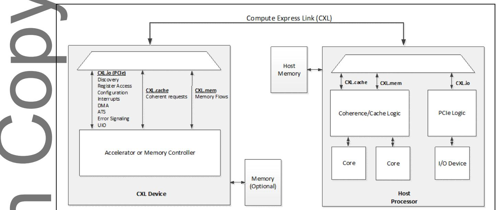

The CXL 2.0 specification enables additional usage models beyond the CXL 1.1 specification, while being fully backward compatible with the CXL 1.1 (and CXL 1.0) specification. It enables managed Hot-Plug, security enhancements, persistent memory support, memory error reporting, and telemetry. The CXL 2.0 specification also enables single-level switching support for fan-out as well as the ability to pool devices across multiple virtual hierarchies, including multi-domain support of memory devices. Figure 1-2 demonstrates memory and accelerator disaggregation through single level switching, in addition to fan-out, across multiple virtual hierarchies, each represented by a unique color. The CXL 2.0 specification also enables these resources (memory or accelerators) to be off-lined from one domain and on-lined into another domain, thereby allowing the resources to be time-multiplexed across different virtual hierarchies, depending on their resource demand.

Figure 1-2. Fan-out and Pooling Enabled by Switches  
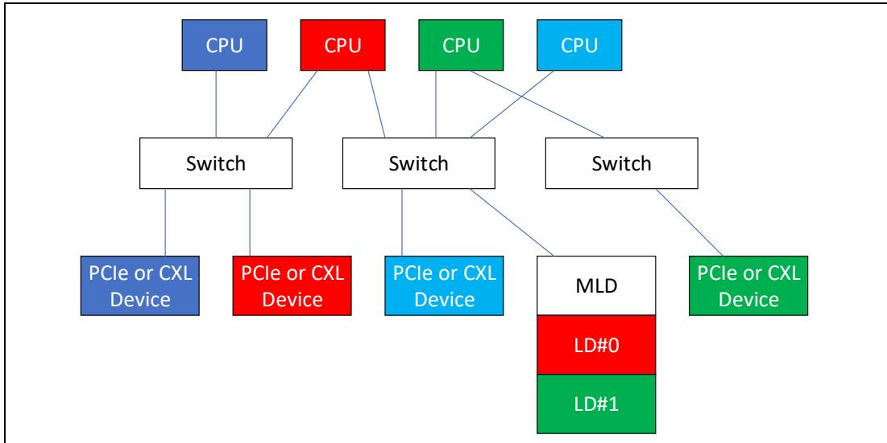

The CXL 3.0 specification doubles the bandwidth while enabling additional usage models beyond the CXL 2.0 specification. The CXL 3.0 specification is fully backward compatible with the CXL 2.0 specification (and hence with the CXL 1.1 and CXL 1.0 specifications). The maximum Data Rate doubles to 64.0 GT/s with PAM-4 signaling, leveraging the PCIe Base Specification PHY along with its CRC and FEC, to double the bandwidth, with provision for an optional Flit arrangement for low latency. Multi-level switching is enabled with the CXL 3.0 specification, supporting up to 4K Ports, to enable CXL to evolve as a fabric extending, including non-tree topologies, to the Rack and Pod level. The CXL 3.0 specification enables devices to perform direct peer-to-peer accesses to HDM memory using UIO (in addition to MMIO memory that existed before) to deliver performance at scale, as shown in Figure 1-3. Snoop Filter support can be implemented in Type 2 and Type 3 devices to enable direct peer-to-peer accesses using the back-invalidate channels introduced in CXL.mem. Shared memory support across multiple virtual hierarchies is provided for collaborative processing across multiple virtual hierarchies, as shown in Figure 1-4.

Direct Peer-to-peer Access to an HDM Memory by PCIe/CXL Devices without Going through the Host

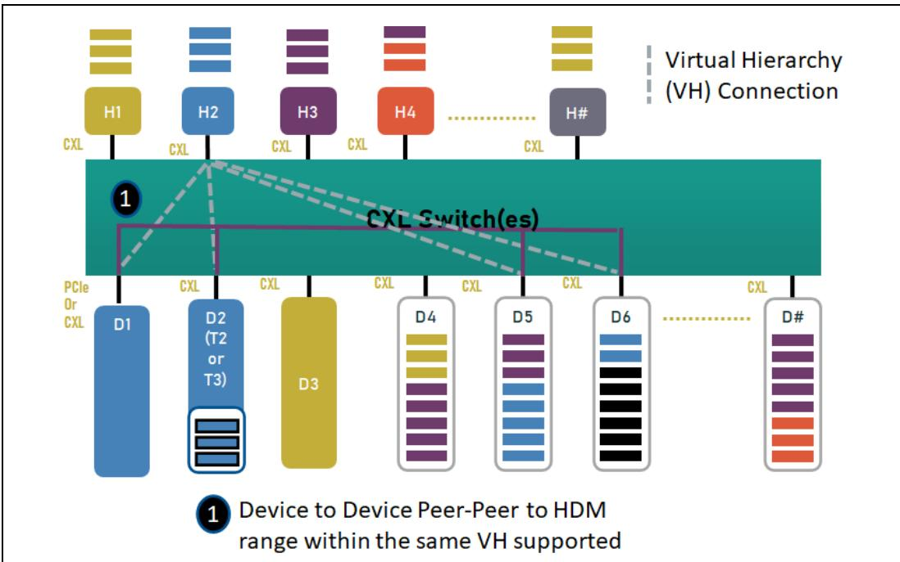

Shared Memory across Multiple Virtual Hierarchies  
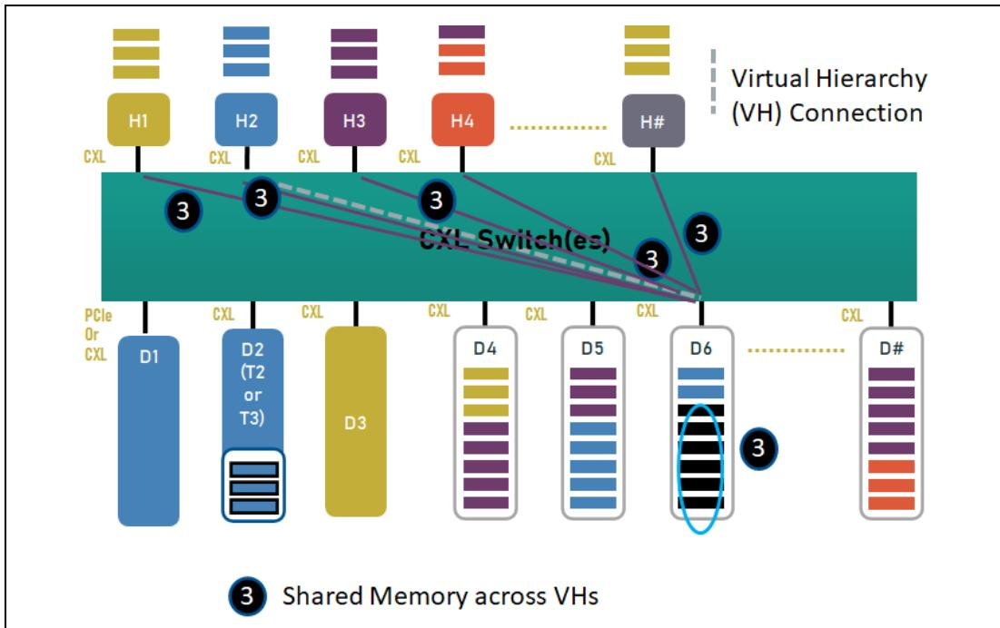  
The CXL 4.0 specification doubles the data rate to 128 GT/s, leveraging the PCIe 7.0 Base Specification; it uses the same Flit arrangement, including the FEC and CRC, as the CXL3.0 specification at 64 GT/s. In addition, CXL 4.0 supports the logical aggregation of multiple independent upstream ports from a device, as shown in Figure 1-5 and Figure 1-6, to help with reducing latency, increasing bandwidth, and delivering better quality of service. See Section 2.10.3 for other topologies with bundled ports.

Bundled Port Example Configuration

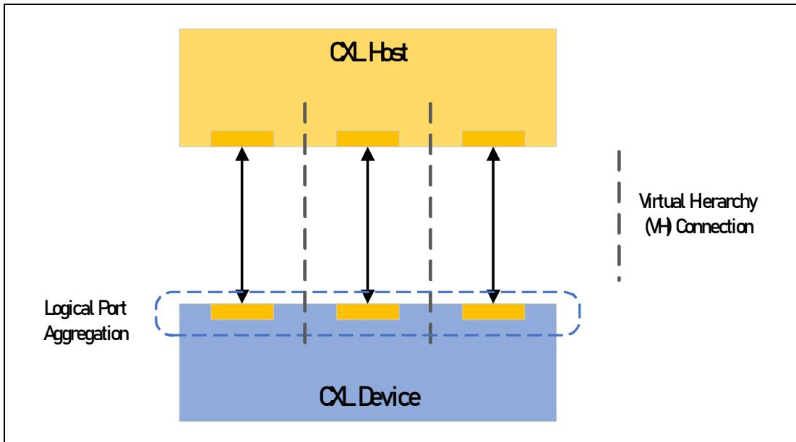

Figure 1-6. Bundle Port Example Configuration with Switch  
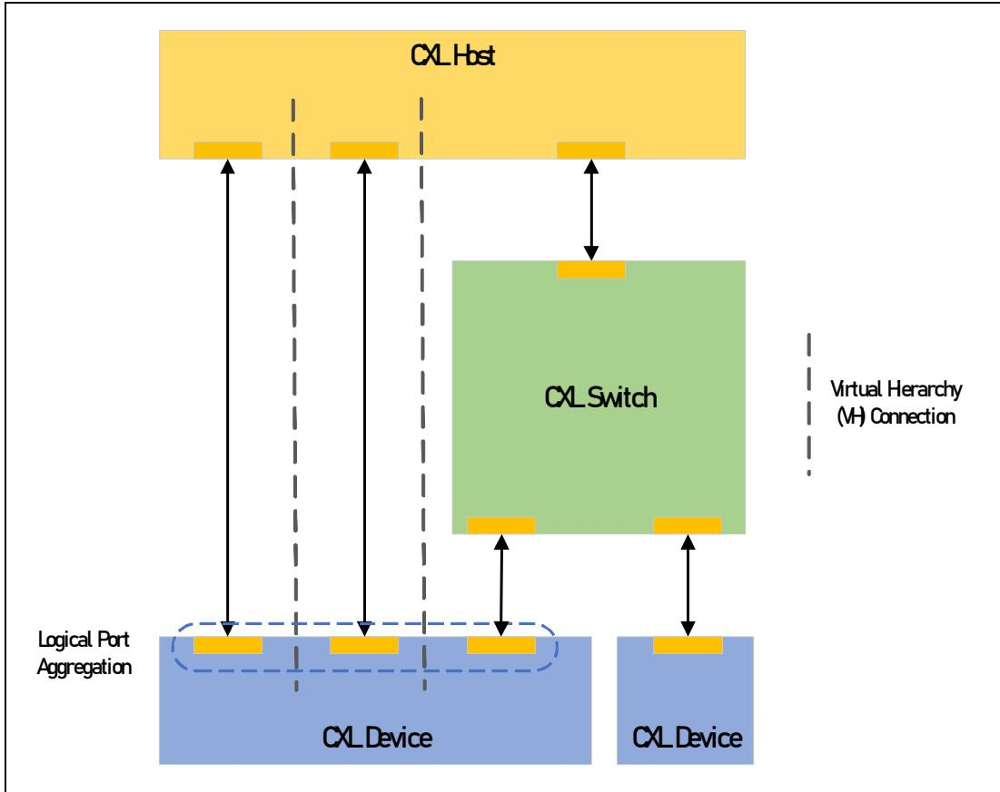  
CXL protocol is compatible with the form factor defined by PCIe CEM Specification (4.0 or later), all form factors relating to EDSFF SSF-TA-1009 (Revision 2.0 or later), and other form factors that support PCIe.

## 1.4.2 Flex Bus

A Flex Bus port allows designs to choose between providing native PCIe protocol or CXL over a high-bandwidth, off-package link; the selection occurs during link training via alternate protocol negotiation and depends on the device that is plugged into the slot. Flex Bus uses PCIe electricals, making it compatible with PCIe retimers and with form factors that support PCIe.

Figure 1-7 provides a high-level diagram of a Flex Bus port implementation, illustrating both a slot implementation and a custom implementation where the device is soldered down on the motherboard. The slot implementation can accommodate either a Flex Bus.CXL card or a PCIe card. Up to four optional retimers can be inserted between the CPU and the device to extend the channel length. As illustrated in Figure 1-8, this flexible port can be used to attach coherent accelerators or smart I/O to a Host processor.

Figure 1-9 illustrates how a Flex Bus.CXL port can be used as a memory expansion port.

Figure 1-10 illustrates the connections that are supported below a CXL Downstream Port.  
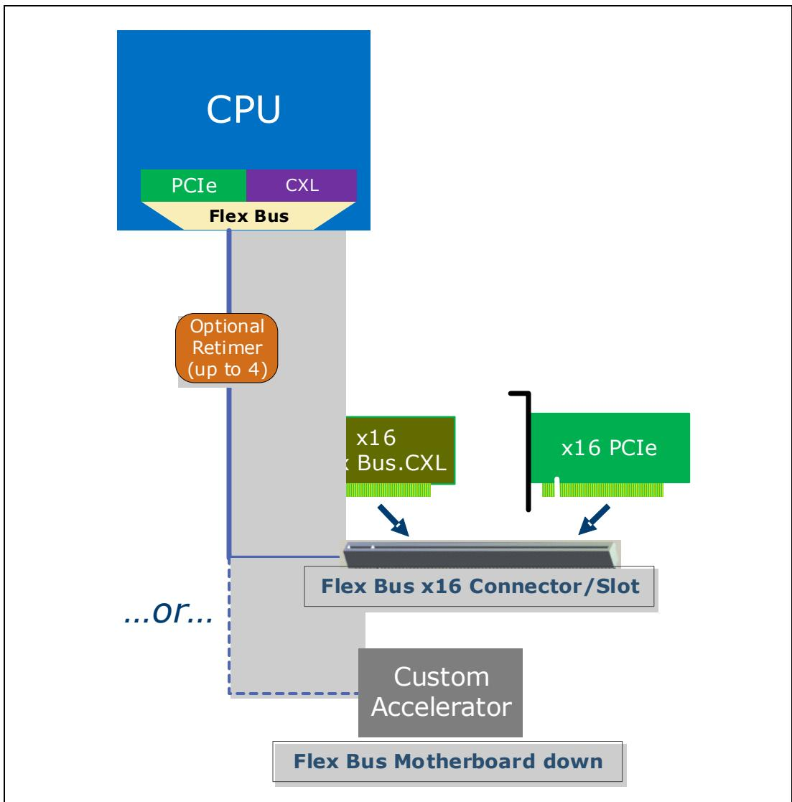

Figure 1-8. Flex Bus Usage Model Examples  
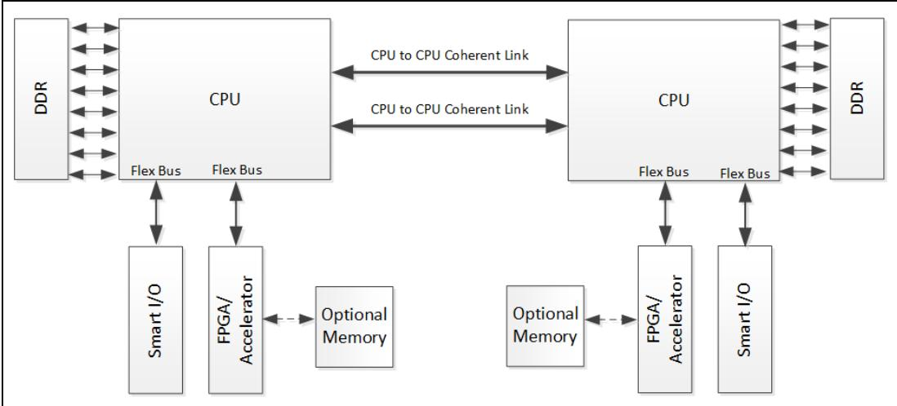

Figure 1-9. Remote Far Memory Usage Model Example  
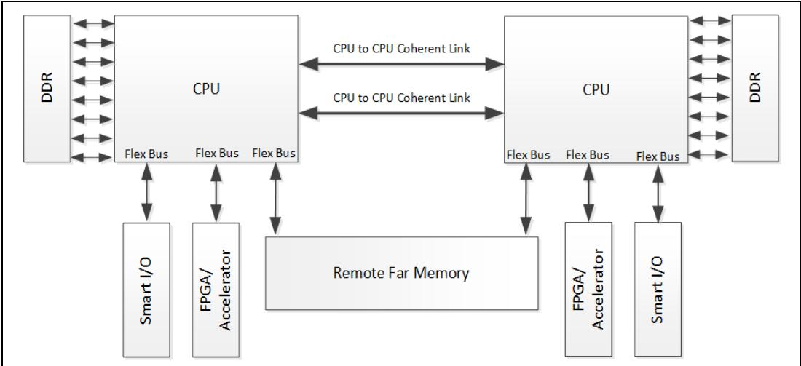  
Figure 1-10. CXL Downstream Port Connections

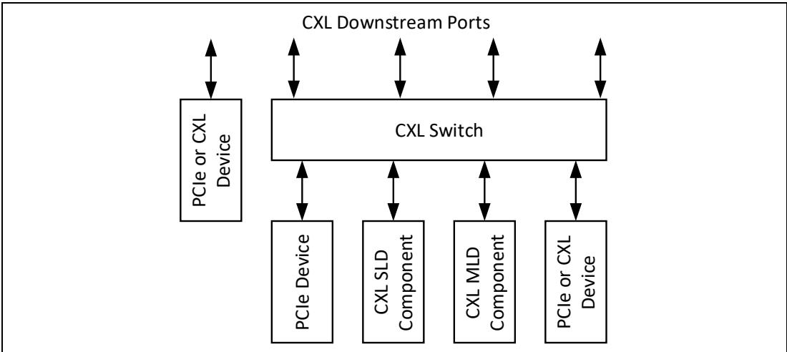

## Flex Bus Link Features

Flex Bus provides a point-to-point interconnect that can transmit native PCIe protocol or dynamic multi-protocol CXL to provide I/O, caching, and memory protocols over PCIe electricals. The primary link attributes include support of the following features:

• Native PCIe mode, full feature support as defined in the PCIe Base Specification.

• CXL mode, as defined in this specification.

• Configuration of PCIe vs. CXL protocol mode.

• With PAM4, signaling rate of 128 GT/s and 64 GT/s; otherwise, signaling rate of 32 GT/s, degraded rate of 16 GT/s or 8 GT/s in CXL mode.

• Link width support for x16, x8, x4, x2, and x1 (degraded mode) in CXL mode.

• Bifurcation (aka Link Subdivision) support to x2 in CXL mode.

## Flex Bus Layering Overview

Flex Bus architecture is organized as multiple layers, as illustrated in Figure 1-11. The CXL transaction (protocol) layer is subdivided into logic that handles CXL.io and logic that handles CXL.cache and CXL.mem; the CXL link layer is subdivided in the same manner. Note that the CXL.cache and CXL.mem logic are combined within the transaction layer and within the link layer. The CXL link layer interfaces with the CXL ARB/MUX, which interleaves the traffic from the two logic streams. Additionally, the PCIe transaction and data link layers are optionally implemented and, if implemented, are permitted to be converged with the CXL.io transaction and link layers, respectively. As a result of the link training process, the transaction and link layers are configured to operate in either PCIe mode or CXL mode. While a host CPU would most likely implement both modes, an accelerator AIC is permitted to implement only the CXL mode. The logical sub-block of the Flex Bus physical layer is a converged logical physical layer that can operate in either PCIe mode or CXL mode, depending on the results of alternate mode negotiation during link training.

Figure 1-11. Conceptual Diagram of Flex Bus Layering  
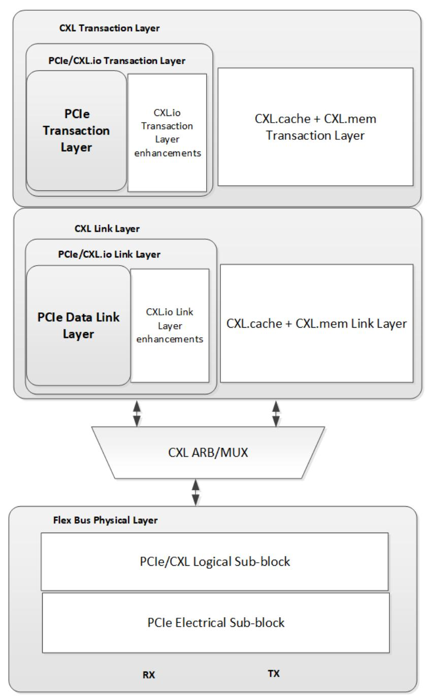

## Document Scope

This document specifies the functional and operational details of the Flex Bus interconnect and the CXL protocol. It describes the CXL usage model and defines how the transaction, link, and physical layers operate. Reset, power management, and initialization/configuration flows are described. Additionally, RAS behavior is described. See the PCIe Base Specification for PCIe protocol details.

The contents of this document are summarized in the following chapter highlights:

Chapter 2.0, “CXL System Architecture” — This chapter describes Type 1, Type 2, and Type 3 devices that might attach to a CPU Root Complex or a CXL switch over a CXL-capable link. For each device profile, a description of the typical workload and system resource usage is provided along with an explanation of which CXL capabilities are relevant for that workload. Bias-based and Back-Invalidate-based coherency models are introduced. This chapter also covers Multi-Headed Devices and G-FAM devices and how they enable memory pooling and memory sharing usages. It also provides a summary of the CXL fabric extensions and its scalability.

Chapter 3.0, “CXL Transaction Layer” — This chapter is divided into subsections that describe details for CXL.io, CXL.cache, and CXL.mem. The CXL.io protocol is required for all implementations, while the other two protocols are optional depending on expected device usage and workload. The transaction layer specifies the transaction types, transaction layer packet formatting, transaction ordering rules, and crediting. The CXL.io protocol is based on the “Transaction Layer Specification” chapter of the PCIe Base Specification; any deltas from the PCIe Base Specification are described in this chapter. These deltas include PCIe Vendor Defined Messages for reset and power management, modifications to the PCIe ATS request and completion formats to support accelerators. For CXL.cache, this chapter describes the channels in each direction (i.e., request, response, and data), the transaction opcodes that flow through each channel, and the channel crediting and ordering rules. The transaction fields associated with each channel are also described. For CXL.mem, this chapter defines the message classes in each direction, the fields associated with each message class, and the message class ordering rules. Finally, this chapter provides flow diagrams that illustrate the sequence of transactions involved in completing host-initiated and device-initiated accesses to device-attached memory.

Chapter 4.0, “CXL Link Layers” — The link layer is responsible for reliable transmission of the transaction layer packets across the Flex Bus link. This chapter is divided into subsections that describe details for CXL.io and for CXL.cache and CXL.mem. The CXL.io protocol is based on the “Data Link Layer Specification” chapter of the PCIe Base Specification; any deltas from the PCIe Base Specification are described in this chapter. For CXL.cache and CXL.mem, the 68B flit format and 256B flit format are specified. The flit packing rules for selecting transactions from internal queues to fill the slots in the flit are described. Other features described for 68B flit mode include the retry mechanism, link layer control flits, CRC calculation, and viral and poison.

Chapter 5.0, “CXL ARB/MUX” — The ARB/MUX arbitrates between requests from the CXL link layers and multiplexes the data to forward to the physical layer. On the receiver side, the ARB/MUX decodes the flit to determine the target to forward transactions to the appropriate CXL link layer. Additionally, the ARB/MUX maintains virtual link state machines for every link layer it interfaces with, processing power state transition requests from the local link layers and generating ARB/MUX link management packets to communicate with the remote ARB/MUX.

Chapter 6.0, “Flex Bus Physical Layer” — The Flex Bus physical layer is responsible for training the link to bring it to operational state for transmission of PCIe packets or CXL flits. During operational state, it prepares the data from the CXL link layers or the PCIe link layer for transmission across the Flex Bus link; likewise, it converts data received from the link to the appropriate format to pass on to the appropriate link layer. This chapter describes the deltas from the PCIe Base Specification to support the CXL mode of operation. The framing of the CXL flits and the physical layer packet layout for 68B Flit mode as well as 256B Flit mode are described. The mode selection process to decide between CXL mode or PCIe mode, including hardware-autonomous mode negotiation and software-controlled selection is also described. Finally, CXL low-latency modes are described.

• Chapter 7.0, “Switching” — This chapter provides an overview of different CXL switching configurations and describes rules for how to configure switches.

Additionally, the Fabric Manager application interface is specified and CXL Fabric is introduced.

Chapter 8.0, “Control and Status Registers” — This chapter provides details of the Flex Bus and CXL control and status registers. It describes the configuration space and memory mapped registers that are located in various CXL components. It also describes the CXL Component Command Interface.

Chapter 9.0, “Reset, Initialization, Configuration, and Manageability” — This chapter describes the flows for boot, reset entry, and sleep-state entry; this includes the transactions sent across the link to initiate and acknowledge entry as well as steps taken by a CXL device to prepare for entry into each of these states. Additionally, this chapter describes the software enumeration model of both RCD and CXL virtual hierarchy and how the System Firmware view of the hierarchy may differ from the OS view. This chapter discusses the software view of CXL.mem, CXL extensions to Firmware-OS interfaces, and the CXL device manageability model.

Chapter 10.0, “Power Management” — This chapter provides details on protocol specific link power management and physical layer power management. It describes the overall power management flow in three phases: protocol specific PM entry negotiation, PM entry negotiation for ARB/MUX interfaces (managed independently per protocol), and PM entry process for the physical layer. The PM entry process for CXL.cache and CXL.mem is slightly different than the process for CXL.io; these processes are described in separate subsections in this chapter.

• Chapter 11.0, “CXL Security” — This chapter provides details on the CXL Integrity and Data Encryption (CXL IDE) scheme that is used for securing CXL protocol flits that are transmitted across the link, IDE modes, and configuration flows.

Chapter 12.0, “Reliability, Availability, and Serviceability” — This chapter describes the RAS capabilities supported by a CXL host, a CXL switch, and a CXL device. It describes how various types of errors are logged and signaled to the appropriate hardware or software error handling agent. It describes the Link Down flow and the viral handling expectation. Finally, it describes the error injection requirements.

Chapter 13.0, “Performance Considerations” — This chapter describes hardware and software considerations for optimizing performance across the Flex Bus link in CXL mode. It also describes the performance monitoring infrastructure for CXL components.

Chapter 14.0, “CXL Compliance Testing” — This chapter describes methodologies for ensuring that a device is compliant with the CXL specification.

## CXL System Architecture

This chapter describes the performance advantages and main features of CXL. CXL is a high-performance I/O bus architecture that is used to interconnect peripheral devices that can be traditional non-coherent I/O devices, memory devices, or accelerators with additional capabilities. The types of devices that can attach via CXL and the overall system architecture is described in Figure 2-1.

When Type 2 and Type 3 device memory is exposed to the host, it is referred to as Host-managed Device Memory (HDM). The coherence management of this memory has 3 options: Host-only Coherent (HDM-H), Device Coherent (HDM-D), and Device Coherent using Back-Invalidate Snoop (HDM-DB). The host and device must have a common understanding of the type of HDM for each address region. See Section 3.3 for additional details.

## Figure 2-1. CXL Device Types

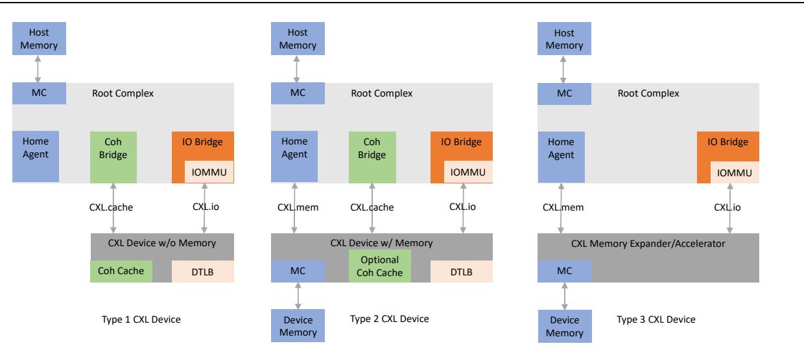

Before diving into the details of each type of CXL device, here’s a foreword about where CXL is not applicable.

Traditional non-coherent I/O devices mainly rely on standard Producer-Consumer ordering models and execute against Host-attached memory. For such devices, there is little interaction with the Host except for work submission and signaling on work completion boundaries. Such accelerators also tend to work on data streams or large contiguous data objects. These devices typically do not need the advanced capabilities provided by CXL, and traditional PCIe\* is sufficient as an accelerator-attached medium.

The following sections describe various profiles of CXL devices.

## CXL Type 1 Device

CXL Type 1 Devices have special needs for which having a fully coherent cache in the device becomes valuable. For such devices, standard Producer-Consumer ordering models do not work well. One example of a device with special requirements is to perform complex atomics that are not part of the standard suite of atomic operations present on PCIe.

Basic cache coherency allows an accelerator to implement any ordering model it chooses and allows it to implement an unlimited number of atomic operations. These tend to require only a small capacity cache, which can easily be tracked by standard processor snoop filter mechanisms. The size of cache that can be supported for such devices depends on the host’s snoop-filtering capacity. CXL supports such devices using its optional CXL.cache link over which an accelerator can use CXL.cache protocol for cache coherency transactions.

Figure 2-2. Type 1 Device — Device with Cache  
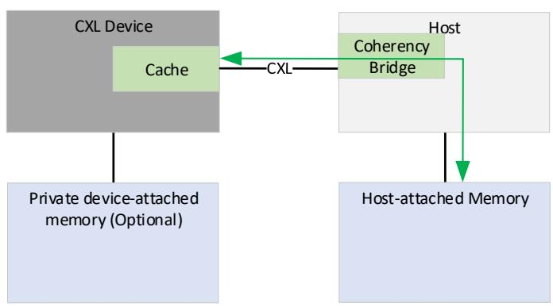

## CXL Type 2 Device

CXL Type 2 are devices that negotiate all three protocols (CXL.cache, CXL.mem, and CXL.io). In addition to fully coherent cache, CXL Type 2 devices also have memory (e.g., DDR, High-Bandwidth Memory (HBM), etc.) attached to the device. These devices execute against memory, but their performance comes from having massive bandwidth between the accelerator and device-attached memory. The main goal for CXL is to provide a means for the Host to push operands into device-attached memory and for the Host to pull results out of device-attached memory such that it does not add software and hardware cost that offsets the benefit of the accelerator. This spec refers to coherent system address mapped device-attached memory as Host-managed Device Memory with Device Managed Coherence (HDM-D/HDM-DB).

There is an important distinction between HDM and traditional I/O and PCIe Private Device Memory (PDM). An example of such a device is a GPGPU with attached GDDR. Such devices have treated device-attached memory as private. This means that the memory is not accessible to the Host and is not coherent with the remainder of the system. It is managed entirely by the device hardware and driver and is used primarily as intermediate storage for the device with large data sets. The obvious disadvantage to a model such as this is that it involves high-bandwidth copies back and forth from the Host memory to device-attached memory as operands are brought in and results are written back. Note that CXL does not preclude devices with PDM.

Figure 2-3. Type 2 Device — Device with Memory  
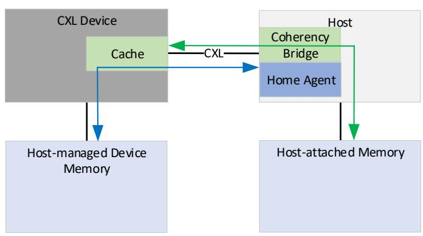

At a high level, there are two methods of resolving device coherence of HDM. The first method uses CXL.cache to manage coherence of the HDM and is referred to as “Device coherent.” The memory region supporting this flow is indicated with the suffix of “D” (HDM-D). The second method uses the dedicated channel in CXL.mem, referred to as Back-Invalidate Snoop, and is indicated with the suffix “DB” (HDM-DB). The following sections describe both methods in detail.

## 2.2.1 Back-Invalidate Snoop Coherence for HDM-DB

With HDM-DB for Type 2 and Type 3 devices, the protocol enables channels in the CXL.mem protocol that allow direct snooping by the device to the host using a dedicated Back-Invalidate Snoop (BISnp) channel. The response channel for these snoops is the Back-Invalidate Response (BIRsp) channel. The channels allow devices the flexibility to manage coherence by using an inclusive snoop filter tracking coherence for individual cachelines that may block new M2S Requests until BISnp messages are processed by the host. All device coherence tracking options described in Section 2.2.2 are also possible when using HDM-DB; however, the coherence flows to the host for the HDM-DB must only use the CXL.mem S2M BISnp channel and not the D2H CXL.cache Request channel. HDM-DB support is required for all devices that implement 256B Flit mode, but the HDM-D flows will be supported for compatibility with 68B Flit mode.

For additional details on the flows used in HDM-DB, see Section 3.5.1, “Flows for Back-Invalidate Snoops on CXL.mem.”

## Bias-based Coherency Model for HDM-D Memory

The Host-managed Device Memory (HDM) attached to a given device is referred to as device-attached memory to denote that it is local to only that device. The Bias-based coherency model defines two states of bias for device-attached memory: Host Bias and Device Bias. When the device-attached memory is in Host Bias state, it appears to the device just as regular Host-attached memory does. That is, if the device needs to access memory, it sends a request to the Host which will resolve coherency for the requested line. On the other hand, when the device-attached memory is in Device Bias state, the device is guaranteed that the Host does not have the line in any cache. As such, the device can access it without sending any transaction (e.g., request, snoops, etc.) to the Host whatsoever. It is important to note that the Host itself sees a uniform view of device-attached memory regardless of the bias state. In both modes, coherency is preserved for device-attached memory.

The main benefits of Bias-based coherency model are:

Type 2 Device — Host Bias  
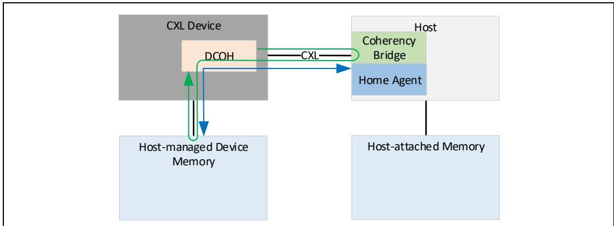

• Helps maintain coherency for device-attached memory that is mapped to system coherent address space.

• Helps the device access its local attached memory at high bandwidth without incurring significant coherency overheads (e.g., snoops to the Host).

• Helps the Host access device-attached memory in a coherent, uniform manner, just as it would for Host-attached memory.

To maintain Bias modes, a CXL Type 2 Device will:

• Implement the Bias Table which tracks page-granularity Bias (e.g., one per 4-KB page) which can be cached in the device using a Bias Cache.

• Build support for Bias transitions using a Transition Agent (TA). This essentially looks like a DMA engine for “cleaning up” pages, which essentially means to flush the host’s caches for lines belonging to that page.

• Build support for basic load and store access to accelerator local memory for the benefit of the Host.

The following subsections describe the bias modes in detail.

## 2.2.2.1 Host Bias

Host Bias mode typically refers to the part of the cycle when the operands are being written to memory by the Host during work submission or when results are being read out from the memory after work completion. During Host Bias mode, coherency flows allow for high-throughput access from the Host to device-attached memory (as shown by the bidirectional blue arrow in Figure 2-4 to/from the host-managed device memory, the DCOH in the CXL device, and the Home Agent in the host) whereas device access to device-attached memory is not optimal because they need to go through the host (as shown by the green arrow in Figure 2-4 that loops between the DCOH in the CXL device and the Coherency Bridge in the host, and between the DCOH in the CXL device and the host-managed device memory).

## 2.2.2.2 Device Bias

Device Bias mode is used when the device is executing the work, between work submission and completion, and in this mode, the device needs high-bandwidth and low-latency access to device-attached memory.

In this mode, device can access device-attached memory without consulting the Host’s coherency engines (as shown by the red arrow in Figure 2-5 that loops between the DCOH in the CXL device and the host-managed device memory). The Host can still access device-attached memory but may be forced to relinquish ownership by the

accelerator (as shown by the green arrow in Figure 2-5 that loops between the DCOH in the CXL device and the Coherency Bridge in the host). This results in the device seeing ideal latency and bandwidth from device-attached memory, whereas the Host sees compromised performance.

Type 2 Device — Device Bias

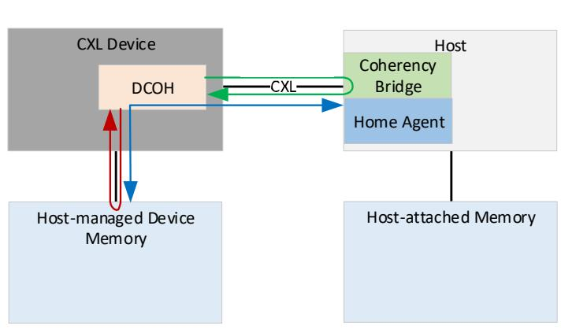

## 2.2.2.3 Mode Management

There are two envisioned Bias Mode Management schemes — Software Assisted and Hardware Autonomous. CXL supports both modes. Examples of Bias Flows are present in Appendix A.

While two modes are described below, it is worth noting that devices do not need to implement any bias. In this case, all the device-attached memory degenerates to Host Bias. This means that all accesses to device-attached memory must be routed through the Host. An accelerator is free to choose a custom mix of Software-assisted and Hardware-autonomous Bias Mode Management schemes. The Host implementation is agnostic to any of the above choices.

## 2.2.2.3.1 Software-assisted Bias Mode Management

With Software Assistance, we rely on software to know for a given page, in which state of the work execution flow the page resides. This is useful for accelerators with phased computation with regular access patterns. Based on this, software can best optimize the coherency performance on a page granularity by choosing Host or Device Bias modes appropriately.

Here are some characteristics of Software-assisted Bias Mode Management:

• Software Assistance can be used to have data ready at an accelerator before computation.

• If data is not moved to accelerator memory in advance, the data is generally moved on demand based on some attempted reference to the data by the accelerator.

• In an “on-demand” data-fetch scenario, the accelerator must be able to find work to execute, for which data is already correctly placed, or the accelerator must stall.

• Every cycle that an accelerator is stalled eats into the accelerator’s ability to add value over software running on a core.

• Simple accelerators typically cannot hide data-fetch latencies.

Efficient software-assisted data/coherency management is critical to the aforementioned class of simple accelerators.

## 2.2.2.3.2 Hardware-autonomous Bias Mode Management

Software-assisted coherency/data management is ideal for simple accelerators, but of lesser value to complex, programmable accelerators. At the same time, the complex problems frequently mapped to complex, programmable accelerators like GPUs present an enormously complex problem to programmers if software assisted coherency/data movement is a requirement. This is especially true for problems that split computation between Host and accelerator or problems with pointer-based, tree-based, or sparse data sets.

The Hardware-autonomous Bias Mode Management does not rely on software to appropriately manage page level coherency bias. Rather, it is the hardware that makes predictions on the bias mode based on the requester for a given page and adapts accordingly. The main benefits for this model are:

• Provide the same page granular coherency bias capability as in the software assisted model.

• Eliminate the need for software to identify and schedule page bias transitions prior to offload execution.

• Provide hardware support for dynamic bias transition during offload execution.

## 2.3

• Hardware support for this model can be a simple extension to the software-assisted model.

• Link flows and Host support are unaffected.

• Impact limited primarily to actions taken at the accelerator when a Host touches a Device Biased page and vice-versa.

• Note that even though this is an ostensible hardware driven solution, hardware need not perform all transitions autonomously — though hardware may do so if desired.

It is sufficient if hardware provides hints (e.g., “transition page X to bias Y now”) but leaves the actual transition operations under software control.

## CXL Type 3 Device

A CXL Type 3 Device supports CXL.io and CXL.mem protocols. An example of a CXL Type 3 Device is an HDM-H memory expander for the Host as shown in Figure 2-6.

Type 3 Device — HDM-H Memory Expander  
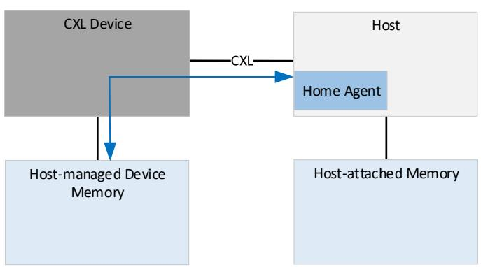

Because this is not a traditional accelerator that operates on host memory, the device does not make any requests over CXL.cache. A passive memory expansion device would use the HDM-H memory region and normally do not directly manipulate the memory content while the memory is exposed to the host (exceptions exist for RAS and Security requirements). The device operates primarily over CXL.mem to service requests sent from the Host. The CXL.io protocol is used for device discovery, enumeration, error reporting and management. The CXL.io protocol is permitted to be used by the device for other I/O-specific application usages. The CXL architecture is independent of memory technology and allows for a range of memory organization possibilities depending on support implemented in the Host. Type 3 device Memory that is exposed as an HDM-DB allows the same use of coherence as described in Section 2.2.1 for Type 2 devices and requires the Type 3 device to include an internal Device Coherence engine (DCOH) in addition to what is shown in Figure 2-6 for HDM-H. HDM-DB memory enables the device to behave as an accelerator (one variation of this is in-memory computing) and also enables direct access from peers using UIO on CXL.io or CXL.mem (see Section 3.3.2.1).

## Multi Logical Device (MLD)

A Type 3 Multi-Logical Device (MLD) can partition its resources into up to 16 isolated Logical Devices. Each Logical Device is identified by a Logical Device Identifier (LD-ID) in CXL.io and CXL.mem protocols. Each Logical Device visible to a Virtual Hierarchy (VH) operates as a Type 3 device. The LD-ID is transparent to software accessing a VH. MLD components have common Transaction and Link Layers for each protocol across all LDs. Because LD-ID capability exists only in the CXL.io and CXL.mem protocols, MLDs are constrained to only Type 3 devices.

An MLD component has one LD reserved for the Fabric Manager (FM) and up to 16 LDs available for host binding. The FM-owned LD (FMLD) allows the FM to configure resource allocation across LDs and manage the physical link shared with multiple Virtual CXL Switches (VCSs). The FMLD’s bus mastering capabilities are limited to generating error messages. Error messages generated by this function must only be routed to the FM.

The MLD component contains one MLD DVSEC (see Section 8.1.10) that is only accessible by the FM and addressable by requests that carry an LD-ID of FFFFh in CXL LD-ID TLP Prefix. Switch implementations must guarantee that FM is the only entity that is permitted to use the LD-ID of FFFFh.

An MLD component is permitted to use FM API to configure LDs or have statically configured LDs. In both of these configurations the configured LD resource allocation is advertised through MLD DVSEC. In addition, the MLD DVSEC LD-ID Hot Reset Vector register in the FMLD is also used by the CXL switch to trigger Hot Reset of one or more LDs (see Section 8.1.10.2 for details).

## 2.4.1 LD-ID for CXL.mem and CXL.io

LD-ID is a 16-bit Logical Device identifier applicable for CXL.mem and CXL.io requests and responses. All requests targeting, and responses returned by, an MLD must include LD-ID.

See Section 3.3.5 and Section 3.3.6 for CXL.mem header formatting to carry the LD-ID field.

## 2.4.1.1 LD-ID for CXL.mem

CXL.mem supports only the lower 4 bits of LD-ID and therefore can support up to 16 unique LD-ID values over the link. Requests and responses forwarded over an MLD Port are tagged with LD-ID.

## 2.4.1.2 LD-ID for CXL.io

CXL.io supports carrying 16 bits of LD-ID for all requests and responses forwarded over an MLD Port. LD-ID FFFFh is reserved and is always used by the FM.

CXL.io utilizes the Vendor Defined Local TLP Prefix to carry 16 bits of LD-ID value. The format for Vendor Defined Local TLP Prefix is as follows. CXL LD-ID Vendor Defined Local TLP Prefix uses the VendPrefixL0 Local TLP Prefix type.

Table 2-1. LD-ID Link Local TLP Prefix

<table><tr><td colspan="8">+0</td><td colspan="8">+1</td><td colspan="8">+2</td><td colspan="8">+3</td></tr><tr><td>7</td><td>6</td><td>5</td><td>4</td><td>3</td><td>2</td><td>1</td><td>0</td><td>7</td><td>6</td><td>5</td><td>4</td><td>3</td><td>2</td><td>1</td><td>0</td><td>7</td><td>6</td><td>5</td><td>4</td><td>3</td><td>2</td><td>1</td><td>0</td><td>7</td><td>6</td><td>5</td><td>4</td><td>3</td><td>2</td><td>1</td><td>0</td></tr><tr><td colspan="8">PCIe Base Specification Defined</td><td colspan="16">LD-ID[15:0]</td><td colspan="8">RSVD</td></tr></table>

## 2.4.2 Pooled Memory Device Configuration Registers

Each LD is visible to software as one or more PCIe Endpoint (EP) Functions. While LD Functions support all the configuration registers, several control registers that impact common link behavior are virtualized and have no direct impact on the link. Each function of an LD must implement the configuration registers as described in the PCIe Base Specification. Unless specified otherwise, the scope of the configuration registers is as described in the PCIe Base Specification. For example, the Memory Space Enable (MSE) bit in the Command register controls a function’s response to memory space.

Table 2-2 lists the set of register fields that have modified behavior when compared to the PCIe Base Specification.

Table 2-2. MLD PCIe Registers (Sheet 1 of 2)

<table><tr><td>Register/Capability Structure</td><td>Capability Register Fields</td><td>LD-ID = FFFFh</td><td>All Other LDs</td></tr><tr><td>BIST Register</td><td>All Fields</td><td>Supported</td><td>Hardwire to all 0s</td></tr><tr><td rowspan="3">Device Capabilities Register</td><td>Max_Payload_Size_Supported, Phantom Functions Supported, Extended Tag Field Supported, Endpoint L1 Acceptable Latency</td><td>Supported</td><td>Mirrors LD-ID = FFFFh</td></tr><tr><td>Endpoint L0s Acceptable Latency</td><td>Not supported</td><td>Not supported</td></tr><tr><td>Captured Slot Power Limit Value, Captured Slot Power Scale</td><td>Supported</td><td>Mirrors LD-ID = FFFFh</td></tr><tr><td>Link Control Register</td><td>All Fields applicable to PCIe Endpoint</td><td>Supported (FMLD controls the fields) L0s not supported</td><td>Read/Write with no effect</td></tr><tr><td>Link Status Register</td><td>All Fields applicable to PCIe Endpoint</td><td>Supported</td><td>Mirrors LD-ID = FFFFh</td></tr><tr><td>Link Capabilities Register</td><td>All Fields applicable to PCIe Endpoint</td><td>Supported</td><td>Mirrors LD-ID = FFFFh</td></tr><tr><td>Link Control 2 Register</td><td>All Fields applicable to PCIe Endpoint</td><td>Supported</td><td>Mirrors LD-ID = FFFFh RW fields are Read/Write with no effect</td></tr><tr><td>Link Status 2 Register</td><td>All Fields applicable to PCIe Endpoint</td><td>Supported</td><td>Mirrors LD-ID = FFFFh</td></tr><tr><td>MSI/MSI-X Capability Structures</td><td>All registers</td><td>Not supported</td><td>Each Function that requires MSI/MSI-X must support it</td></tr></table>

Table 2-2. MLD PCIe Registers (Sheet 2 of 2)

<table><tr><td>Register/Capability Structure</td><td>Capability Register Fields</td><td>LD-ID = FFFFh</td><td>All Other LDs</td></tr><tr><td rowspan="3">Secondary PCIe Capability Registers</td><td>All register sets related to supported speeds (8 GT/s, 16 GT/s, 32 GT/s, 64 GT/s, 128 GT/s)</td><td>Supported</td><td>Mirrors LD-ID = FFFFhRO/HwInit fields are Read/Write with no effect</td></tr><tr><td>Lane Error Status, Local Data Parity Mismatch Status</td><td>Supported</td><td>Hardwire to all 0s</td></tr><tr><td>Received Modified TS Data 1 register, Received Modified TS Data 2 register, Transmitted Modified TS Data 1 register, Transmitted Modified TS Data 2 register</td><td>Supported</td><td>Mirrors LD-ID = FFFFh</td></tr><tr><td>Lane Margining</td><td></td><td>Supported</td><td>Not supported</td></tr><tr><td>L1 Substates Extended Capability</td><td></td><td>Not supported</td><td>Not supported</td></tr><tr><td>Advanced Error Reporting (AER)</td><td>Registers that apply to Endpoint functions</td><td>Supported</td><td>Supported per  $LD^1$ </td></tr></table>

1. AER — If an event is uncorrectable to the entire MLD, then the event must be reported across all LDs. If the event is specific to a single LD, then the event must be isolated to that LD.

## Pooled Memory and Shared FAM

Host-managed Device Memory (HDM) that is exposed from a device that supports multiple hosts is referred to as Fabric-Attached Memory (FAM). FAM exposed via Logica Devices (LDs) is referred to as LD-FAM; FAM exposed in a more-scalable manner using Port Based Routing (PBR) links is referred to as Global-FAM (G-FAM).

FAM where each HDM region is dedicated to a single host interface is referred to as “pooled memory” or “pooled FAM”. FAM where multiple host interfaces are configured to access a single HDM region concurrently is referred to as “Shared FAM”, and different Shared FAM regions may be configured to support different sets of host interfaces.

LD-FAM includes several device variants. A Multi-Logical Device (MLD) exposes multiple LDs over a single shared link. A multi-headed Single Logical Device (MH-SLD) exposes multiple LDs, each with a dedicated link. A multi-headed MLD (MH-MLD) contains multiple links, where each link supports either MLD or SLD operation (optionally configurable), and at least one link supports MLD operation. See Section 2.5, “Multi-Headed Device” for additional details.

G-FAM devices (GFDs) are currently architected with one or more links supporting multiple host/peer interfaces, where the host interface of the incoming CXL.mem or UIO request is determined by its Source PID (SPID) field included in the PBR message (see Section 7.7.2 for additional details).

MH-SLDs and MH-MLDs should be distinguished from arbitrary multi-ported Type 3 components, such as the ones described in Section 9.11.7.2, which supports a multiple CPU topology in a single OS domain.

## Coherency Models for Shared FAM

The coherency model for each shared HDM-DB region is designated by the FM as being either multi-host hardware coherency or software-managed coherency.

Multi-host hardware coherency requires MLD hardware to track host coherence state as defined in Table 3-37 for each cacheline to some varying extents, depending upon the MLD’s implementation-specific tracking mechanism, which generally can be classified as a snoop filter or full directory. Each host can perform arbitrary atomic operations supported by its Instruction-Set Architecture (ISA) by gaining Exclusive access to a cacheline, performing the atomic operation on it within its cache. The data becomes globally observed using cache coherence and follows normal hardware cache eviction flows. MemWr commands to this region of memory must set the SnpType field to No-Op to prevent deadlock, which requires that the host must acquire ownership using the M2S Request channel before issuing the MemWr resulting in 2 phases to complete a write. This is a requirement for hardware coherency model in Shared FAM and Direct P2P CXL.mem (as compared HDM-DB region that is not shared and assigned to a single host root port and can use single phase snoopable Writes).

Shared FAM may also expose memory as simple HDM-H to the host, but this will only support the software coherence model between hosts.

Software-managed coherency does not require MLD hardware to track host coherence state. Instead, software on each host uses software-specific mechanisms to coordinate software ownership of each cacheline. Software may choose to rely on multi-host hardware coherency in other HDM regions to coordinate software ownership of cachelines in software-managed coherency HDM regions. Other mechanisms for software coordinating cacheline ownership are beyond the scope of this specification.

## IMPLEMENTATION NOTE

Software-managed coherency relies on software having mechanisms to invalidate and/or flush cache hierarchies as well as relying on caching agents only to issue writebacks resulting from explicit cacheline modifications performed by local software. For performance optimization, many processors prefetch data without software having any direct control over the prefetch algorithm. For a variety of implementation-specific reasons, some caching agents may spontaneously write back clean cachelines that were prefetched by hardware but never modified by local software (e.g., promoting an E to M state without a store instruction execution). Any clean writeback of a cacheline by caching agents in hosts or devices that only intended to read that cacheline can overwrite updates performed by a host or device that executed writes to the cacheline. This breaks software-managed coherency. Note that a writeback resulting from a zero-length write transaction is not considered a clean writeback. Also note that hosts and/or devices may have an internal cacheline size that is larger than 64 bytes and a writeback could require multiple CXL writes to complete. If any of these CXL writes contain software-modified data, the writeback is not considered clean.

Software-managed coherency schemes are complicated by any host or device whose caching agents generate clean writebacks. A “No Clean Writebacks” capability bit is available for a host in the CXL System Description Structure (CSDS; see Section 9.18.1.6) or for a device in the DVSEC CXL Capability2 register (see Table 8-11), with caching agents to set if it guarantees that they will never generate clean writebacks. For backward compatibility, this bit being cleared does not necessarily indicate that any associated caching agents generate clean writebacks. When this bit is set for all caching agents that may access a Shared FAM range, a software-managed coherency protocol targeting that range can provide reliable results. This bit should be ignored by software for hardware-coherent memory ranges.

## Multi-Headed Device

A CXL Type 3 device with multiple CXL ports is considered a Multi-Headed Device. Each port is referred to as a “head”. There are two types of Multi-Headed Devices that are distinguished by how they present themselves on each head:

• MH-SLD, which present SLDs on all heads. The Port Number field in the Link Capabilities register (see the PCIe Base Specification) uniquely identifies each port within an MH-SLD. This information is also returned via Get Head Info (see Section 7.6.7.5.2).

• MH-MLD, which can present MLDs on any of their heads.

## IMPLEMENTATION NOTE

The multiple heads of an MH-SLD may be connected to the same host. Host software may match the serial number exposed by the SLDs via the Device Serial Number Extended Capability (see the PCIe Base Specification) to determine which heads are part of the same MH-SLD.

Management of heads in Multi-Headed Devices follows the model defined for the device presented by that head:

• Heads that present SLDs may support the port management and control features that are available for SLDs

• Heads that present MLDs may support the port management and control features that are available for MLDs

Management of memory resources in Multi-Headed Devices follows the model defined for MLD components because both MH-SLDs and MH-MLDs must support the isolation of memory resources, state, context, and management on a per-LD basis. LDs within the device are mapped to a single head.

• In MH-SLDs, there is a 1:1 mapping between heads and LDs.

• In MH-MLDs, multiple LDs are mapped to at most one head. A head in a Multi-Headed Device shall have at least one and no more than 16 LDs mapped. A head with one LD mapped shall present itself as an SLD and a head with more than one LD mapped shall present itself as an MLD. Each head may have a different number of LDs mapped to it.

Figure 2-7 and Figure 2-8 illustrate the mappings of LDs to heads for MH-SLDs and MH-MLDs, respectively.

Figure 2-7. Head-to-LD Mapping in MH-SLDs  
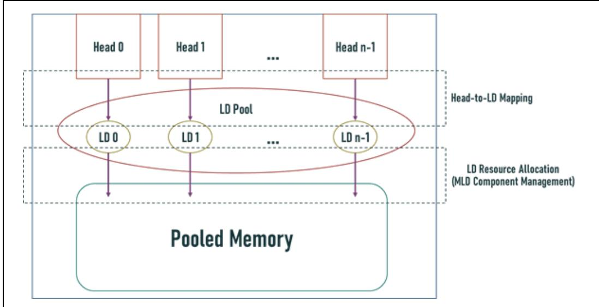

Figure 2-8. Head-to-LD Mapping in MH-MLDs  
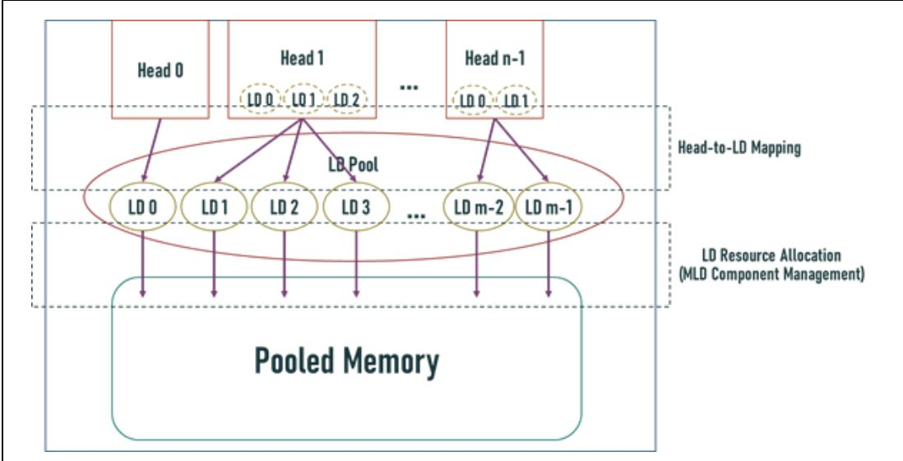

Multi-Headed Devices shall expose a dedicated Component Command Interface (CCI), the LD Pool CCI, for management of all LDs within the device. The LD Pool CCI may be exposed as an MCTP-based CCI or can be accessed via the Tunnel Management Command command through a head’s Mailbox CCI (see Section 7.6.7.3.1 for details). The LD Pool CCI shall support the Tunnel Management Command for the purpose of tunneling management commands to all LDs within the device.

The number of supported heads reported by a Multi-Headed Device shall remain constant. Devices that support proprietary mechanisms to dynamically reconfigure the number of accessible heads (e.g., dynamic bifurcation of two x8 ports into a single x16 head, etc.) shall report the maximum number of supported heads.

## LD Management in MH-MLDs

The LD Pool in an MH-MLD may support more than 16 LDs. MLDs exposed via the heads of an MH-MLD use LD-IDs from 0 to n-1 relative to that head, where n is the number of LDs mapped to the head. The MH-MLD maps the LD-IDs received at a head to the device-wide LD index in the MH-MLD’s LD pool. The FMLD within each head of an MH-MLD shall expose and manage only the LDs that are mapped to that head.

An LD or FMLD on a head may permit visibility and management of all LDs within the device by using the Tunnel Management command to access the LD Pool CCI (see Section 7.6.7.3.1 for details).

## CXL Device Scaling

CXL supports the ability to connect up to 16 Type 1 and/or Type 2 devices below a VH. To support this scaling, the Type 2 devices are required to use BISnp channel in the CXL.mem protocol to manage coherence of the HDM region. The BISnp channel introduced in the CXL 3.0 specification definition replaces the use of CXL.cache protocol to manage coherence of the device’s HDM region. Type 2 devices that use CXL.cache for HDM-D coherence management are limited to a single device per Host bridge.

## CXL Fabric

CXL Fabric describes features that rely on the Port Based Routing (PBR) messages and flows to enable scalable switching and advanced switching topologies. PBR enables a flexible low-latency architecture supporting up to 4096 PIDs in each fabric. G-FAM device attach (see Section 2.8) is supported natively into the fabric. Hosts and devices use standard messaging flows translated to and from PBR format through Edge Switches in the fabric. Section 7.7 defines the requirements and use cases.

A CXL Fabric is a collection of one or more switches that are each PBR capable and interconnected with PBR links. A Domain is of a set of Host Ports and Devices within a single coherent Host Physical Address (HPA) space. A CXL Fabric connects one or more Host Ports to the devices within each Domain.

## Global FAM (G-FAM) Type 3 Device

A G-FAM device (GFD) is a Type 3 device that connects to a CXL Fabric using a PBR link and relies on PBR message formats to provide FAM with much-higher scalability compared to LD-FAM devices. The associated FM API documented in Section 8.2.10.9.10 and host mailbox interface details are provided in Section 7.7.14.

Like LD-FAM devices, GFDs can support pooled FAM, Shared FAM, or both. GFDs rely exclusively on the Dynamic Capacity mechanism for capacity management. See Section 7.7.2.3 for details and for other comparisons with LD-FAM devices.

## Manageability Overview

To allow for different types of managed systems, CXL supports multiple types of management interfaces and management interconnects. Some are defined by external standards, while some are defined in the CXL specification.

CXL component discovery, enumeration, and basic configuration are defined by the PCI-SIG\* and CXL specifications. These functions are accomplished via access to Configuration Space structures and associated MMIO structures.

Security authentication and data integrity/encryption management are defined in PCI-SIG, DMTF, and CXL specifications. The associated management traffic is transported either via Data Object Exchange (DOE) using Configuration Space, or via MCTP-based transports. The latter can operate in-band using PCIe VDMs, or out-of-band using management interconnects such as SMBus, I3C, or dedicated PCIe links.

The Manageability Model for CXL Devices is covered in Section 9.19. Advanced CXLspecific component management is handled using one or more CCIs, which are covered in Section 9.20. CCI commands fall into 4 broad sets:

• Generic Component commands

• Memory Device commands

• FM API commands

• Vendor Specific commands

All 4 sets are covered in Section 8.2.10, specifically:

• Command and capability determination

• Command foreground and background operation

• Event logging, notification, and log retrieval

• Interactions when a component has multiple CCIs

Each command is mandatory, optional, or prohibited, based on the component type and other attributes. Commands can be sent to devices, switches, or both.

CCIs use several transports and interconnects to accomplish their operations. The mailbox mechanism is covered in Section 8.2.9.4, and mailboxes are accessed via an architected MMIO register interface. MCTP-based transports use PCIe VDMs in-band or any of the previously mentioned out-of-band management interconnects. FM API commands can be tunneled to MLDs and GFDs via CXL switches. Configuration and MMIO accesses can be tunneled to LDs within MLDs via CXL switches.

DMTF’s Platform-Level Data Model (PLDM) is used for platform monitoring and control, and can be used for component firmware updates. PLDM may use MCTP to communicate with target CXL components.

Given that CXL components utilize multiple manageability standards and interconnects, it is important to consider interoperability when designing a system that incorporates CXL components.

## Bundled Ports

CXL Bundled Ports enable the logical aggregation of multiple CXL Ports. This feature is designed to scale the effective bandwidth and throughput available by operating multiple physical CXL ports to expand the data path.

A Bundled Port must contain at least one standard full-capability Port and may contain any number of Streamlined Ports. When present, the Streamlined Ports are lightweight Ports that are designed to expand the data path and are optimized for 256B Flit Mode.

Devices with Bundled Port support are required to implement one or more standard full-capability Ports for backward compatibility.

Bundled Ports are supported for CXL Type 1 and Type 2 devices which rely on devicespecific software for configuration/control.

Each Port in a Bundle negotiates independently of the other Ports within the Bundle (see Section 6.4.1.7). Each port may train to a different speed or width and may implement separate capabilities and controls.

The Port Number field in the Link Capabilities register (see the PCIe Base Specification) uniquely identifies each Port within a Bundled Port.

## Streamlined Port

A Bundled Port may optionally contain one or more Streamlined Ports. A Streamlined Port’s main purpose in a Bundled Port is to expand the data path bandwidth, which increases the CXL connection’s overall throughput capabilities. Streamlined Ports only support 256B Flit Mode. A Streamlined Port reduces the hardware implementation cost by eliminating logic for 68B Flit Mode and any features exclusive to 68B Flit mode.

Streamlined Ports are permitted to support reduced bandwidth for standard CXL.io VC0 traffic (see Section 3.1.12).

Upstream non-UIO VC0 traffic is permitted on CXL.io; however, it is important to note that the Port is not guaranteed to be optimized for such traffic. Consequently, non-UIO VC0 traffic may result in suboptimal port performance. Devices transmitting non-UIO VC0 traffic are strongly recommended to use a standard full-capability Port, if one is available, in the Bundled Port.

## 2.10.2 Topologies

Topologies may choose to implement a single standard full-capability Port in a Bundled Port with full backward compatibility and many Streamlined Ports which are an optimized subset of the functionality as shown in Figure 2-9. This topology is useful for devices that require the consistent performance of both ordered traffic and unordered traffic because the standard full-capability Port can efficiently handle the ordered traffic with the additional bandwidth provided by the Streamlined Ports for the unordered traffic and CXL.cachemem traffic. For all figures in this section, an SLD-B (S) label indicates a Streamlined Port, whereas SLD-B denotes a full-capability standard port.

Bundled Port between Host and Device

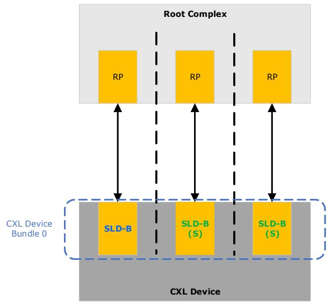

Figure 2-10 demonstrates a topology in which a device segments its available ports to form multiple Bundled Ports when interfacing with the same entity on the other side of the links. This allows the device to partition its resources and split the physical device into multiple bundled logical devices. In this scenario, each Bundled Port acts independently of any other Bundled Ports.

Figure 2-10. Multiple Bundled Ports between Host and Single Device

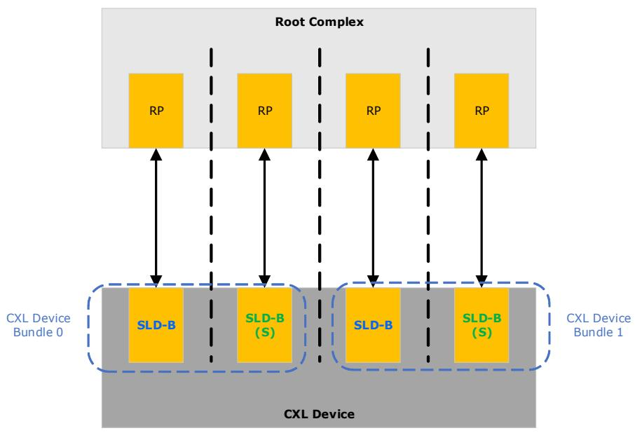  
Figure 2-11 shows multiple devices connected to a Root Complex, each aggregating their ports to form their own Bundled Port.

Figure 2-11. Multiple Bundled Ports between Host and Two Devices  
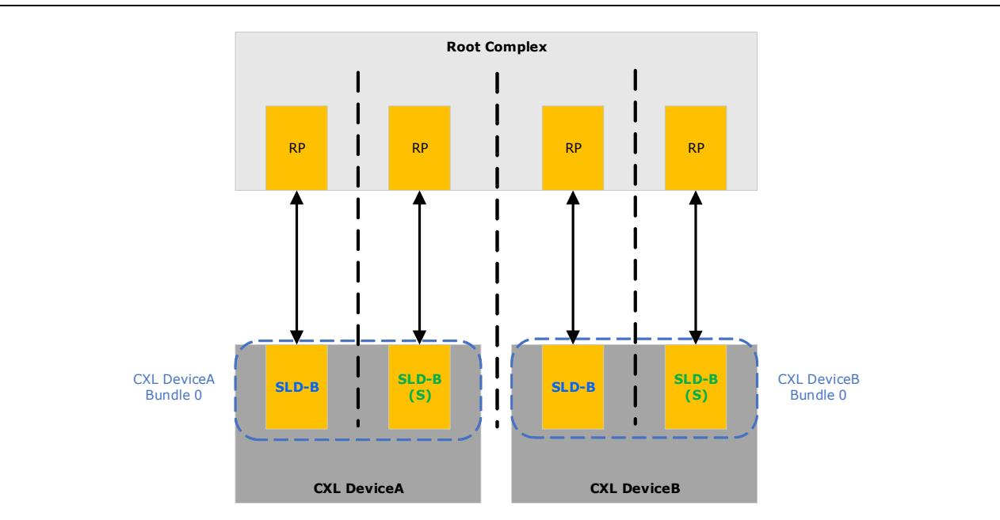

Figure 2-12 shows a device with a Bundled Port connected to different entities in which two ports connect to the Root Complex, and a third port connects to a switch. Although the three ports of DeviceA are part of a single Bundled Port, it is important to note that the HDM range of DeviceA may not necessarily be interleaved across these connections.

Figure 2-12. Bundled Port Connected to Different Entities

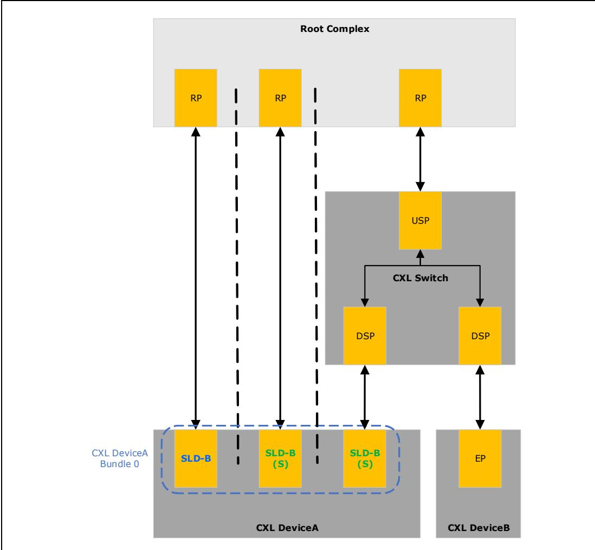

Routing and connectivity decisions for CXL switches connected to devices with Bundled Port support must be made to the specific requirements of the workload and expected usages. In Figure 2-13, the example topology illustrates a Root Complex connected to the switch, and multiple devices connected downstream of the switch. In this topology, the switch maps each port connected to a device individually to a port connected to the Root Complex.

Figure 2-13. Bundled Ports with a Switch, 1:1 Port Mapping

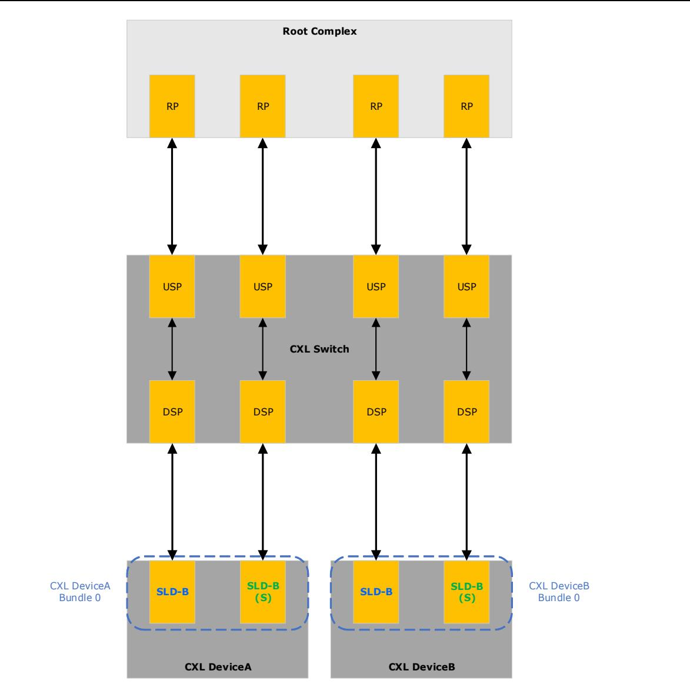

Figure 2-14 presents a topology in which the switch has an imbalanced number of Upstream Ports and Downstream Ports, demonstrating two standard full-capability ports from downstream devices being routed through a singular standard Port in the upstream direction. This configuration ensures that each device Streamlined Port is paired with a dedicated Upstream Port, catering to workloads in which Streamlined Port performance is beneficial.

Figure 2-14. Bundled Ports with a Switch, Dedicated Streamlined Port Paths

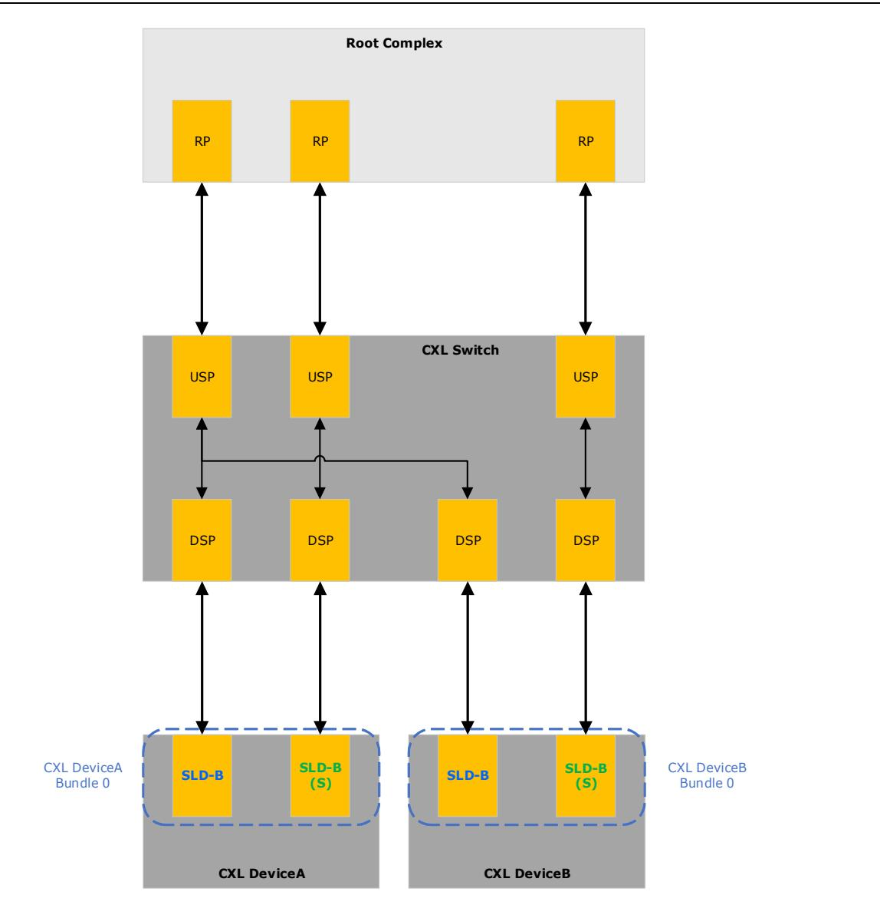

Figure 2-15 also depicts a topology that has an imbalanced number of ports. Instead, the topology is optimized to distribute the two downstream Streamlined Ports across separate upstream paths, thus maximizing the utilization of available ports for scenarios in which ordered traffic is less significant or not critical to the workload.

Figure 2-15. Bundled Ports with a Switch, Merged Path

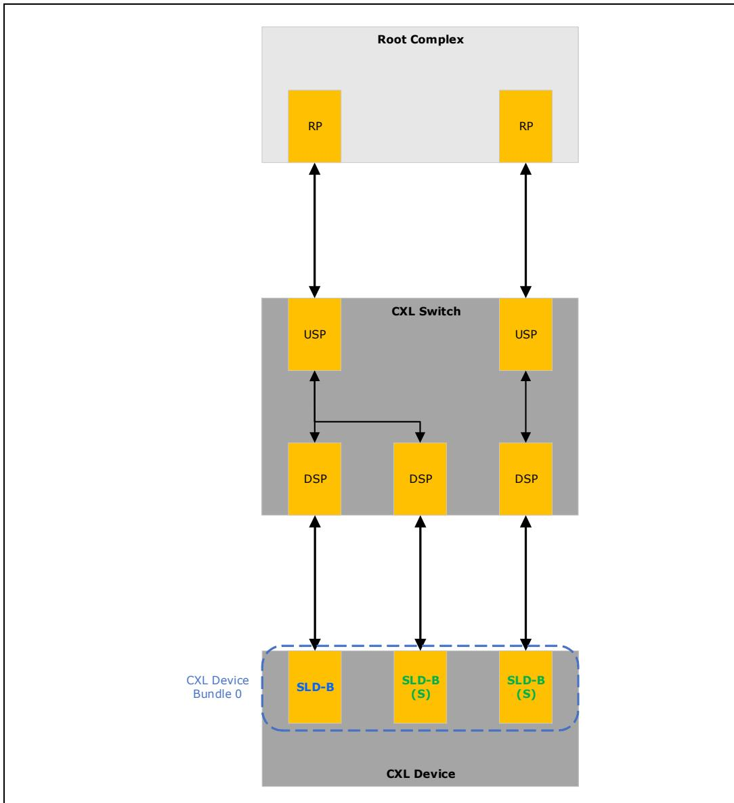

In Figure 2-16, the topology is designed to prioritize the device’s standard Port, which provides the device with a dedicated route through the upstream port. This routing ensures that ordered traffic has a dedicated full-bandwidth pathway.

Figure 2-16. Bundled Ports with a Switch, Streamlined Ports Merged Path

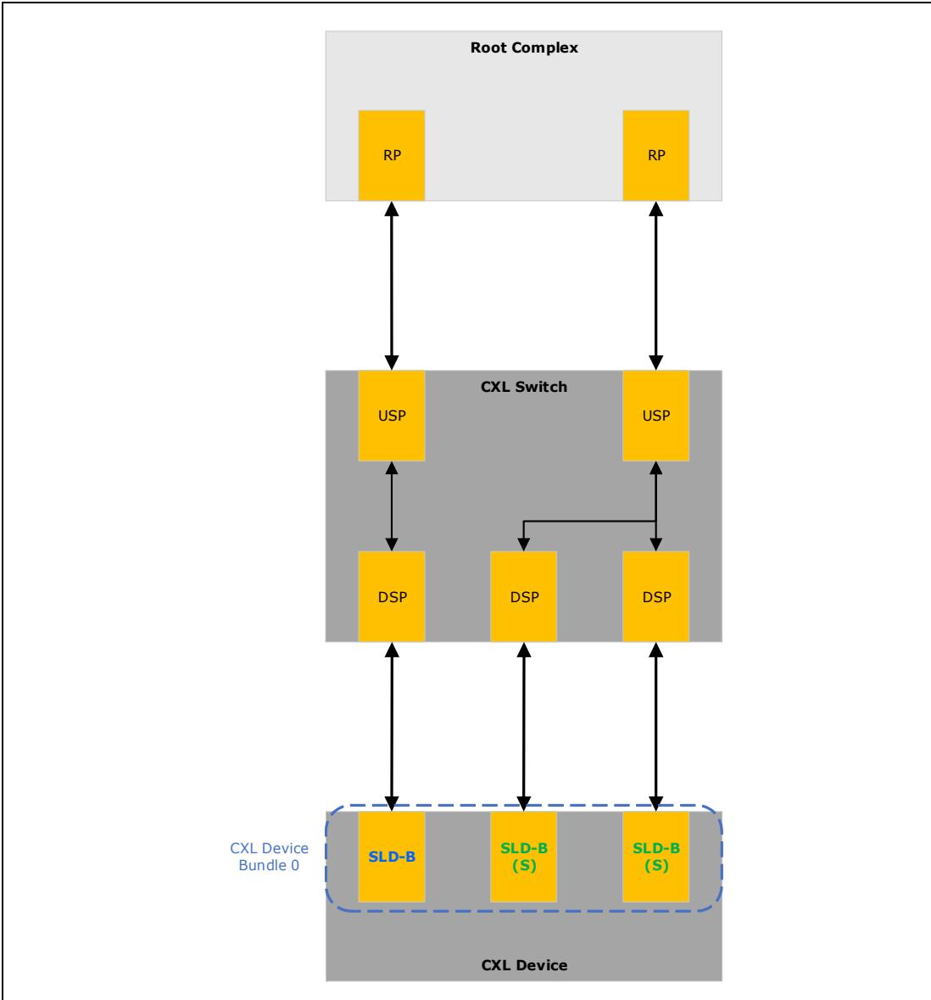

## 2.10.3 Software View

Software enumeration of a Streamlined Port follows the standard enumeration flow.

## IMPLEMENTATION NOTE

Bundled Port-unaware software is expected to be able to safely enumerate and manage the individual ports of a Bundled Port. A Bundled Port device may implement suitable mechanisms (e.g., different Device ID) to prevent legacy, Bundled Portunaware drivers from managing the device. Software relies on the Related Function Extended Capability Structure (PCIe Base Specification ECN) to determine the ports that are part of a bundle.

Entities that implement a Bundled Port may be capable of interleaving requests across these ports for optimal performance. New software is necessary to take advantage of this optimization. In addition, Bundled Port-unaware software treats a Bundled Port Device (BPD) as a set of independent CXL Endpoints and is unaware of the interdependencies and P2P traffic between various BPD endpoints.

§ §

## CXL Transaction Layer

CXL.io

CXL.io provides a non-coherent load/store interface for I/O devices. Figure 3-1 shows where the CXL.io transaction layer exists in the Flex Bus layered hierarchy. Transaction types, transaction packet formatting, credit-based flow control, virtual channel management, and transaction ordering rules follow the PCIe\* definition (see the “Transaction Layer Specification” chapter of the PCIe Base Specification for details). This chapter highlights notable PCIe modes or features that are used for CXL.io.

Figure 3-1. Flex Bus Layers — CXL.io Transaction Layer Highlighted  
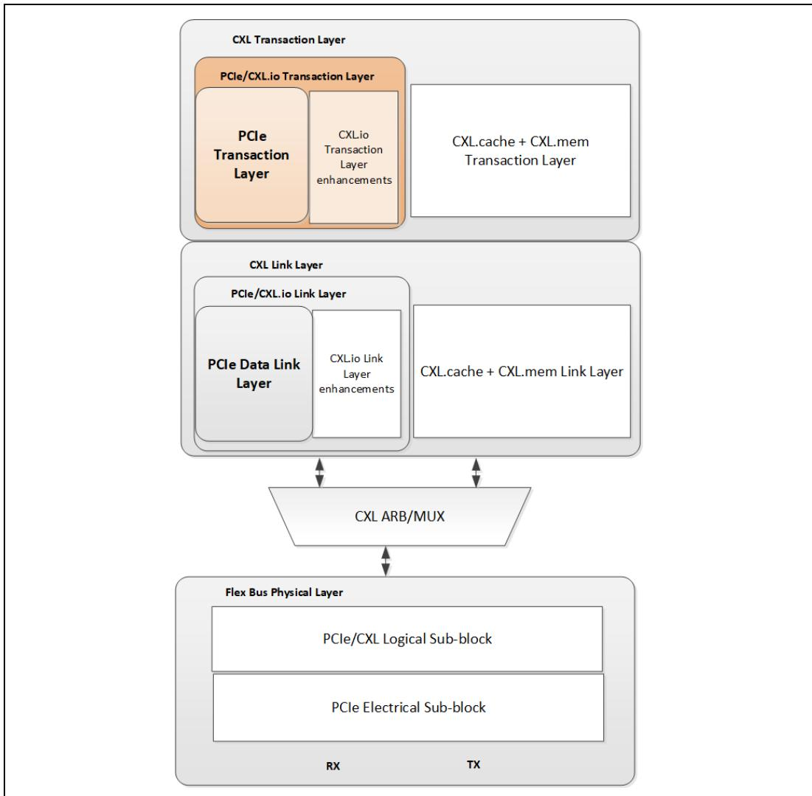

See Section 4.1 for details on NOP TLP alignment rules and maximum non-NOP TLP packing rules.

## CXL.io Endpoint

The CXL Alternate Protocol negotiation determines the mode of operation. See Section 9.11 and Section 9.12 for descriptions of how CXL devices are enumerated with the help of CXL.io.

A Function on a CXL device must not generate INTx messages if that Function participates in CXL.cache protocol or CXL.mem protocols. A Non-CXL Function Map DVSEC (see Section 8.1.4) enumerates functions that do not participate in CXL.cache or CXL.mem. Even though not recommended, these non-CXL functions are permitted to generate INTx messages.

Functions associated with an LD within an MLD component, including non-CXL functions, are not permitted to generate INTx messages.

## 3.1.2 CXL Power Management VDM Format

The CXL power management messages are sent as PCIe Vendor Defined Type 0 messages with a 4-DWORD data payload. These include the PMREQ, PMRSP, and PMGO messages. Figure 3-2 and Figure 3-3 provide the format for the CXL PM VDMs. The following are the characteristics of these messages:

• Fmt and Type fields are set to indicate message with data. All messages use routing of “Local-Terminate at Receiver.” Message Code is set to Vendor Defined Type 0.

• Vendor ID field is set to 1E98h<sup>1</sup>.

• Byte 15 of the message header contains the VDM Code and is set to the value of “CXL PM Message” (68h).

• The 4-DWORD Data Payload contains the CXL PM Logical Opcode (e.g., PMREQ, GPF) and any other information related to the CXL PM message. Details of fields within the Data Payload are described in Table 3-1.

If a CXL component receives PM VDM with poison (EP=1), the receiver shall drop such a message. Because the receiver is able to continue regular operation after receiving such a VDM, it shall treat this event as an advisory non-fatal error.

If the receiver Power Management Unit (PMU) does not understand the contents of PM VDM Payload, it shall silently drop that message and shall not signal an uncorrectable error.

Figure 3-2. CXL Power Management Messages Packet Format — Non-Flit Mode

<table><tr><td rowspan="7"></td><td colspan="8">+0</td><td colspan="8">+1</td><td colspan="8">+2</td><td colspan="7">+3</td><td></td></tr><tr><td colspan="8"></td><td colspan="8"></td><td colspan="8"></td><td colspan="7"></td><td></td></tr><tr><td>7</td><td>6</td><td>5</td><td>4</td><td>3</td><td>2</td><td>1</td><td>0</td><td>7</td><td>6</td><td>5</td><td>4</td><td>3</td><td>2</td><td>1</td><td>0</td><td>7</td><td>6</td><td>5</td><td>4</td><td>3</td><td>2</td><td>1</td><td>0</td><td>7</td><td>6</td><td>5</td><td>4</td><td>3</td><td>2</td><td>1</td><td>0</td></tr><tr><td colspan="3">Fmt 011b</td><td colspan="5">Type 1 0100b</td><td>T9</td><td colspan="2">TC</td><td>T8</td><td>Attr</td><td>R</td><td>TH</td><td>TD</td><td>EP</td><td colspan="2">Attr</td><td colspan="2">AT 00b</td><td colspan="10">Length 00 0000 0100b</td><td></td></tr><tr><td colspan="16">Requester ID</td><td colspan="7">Tag</td><td colspan="8">Message CodeVendor Defined Type 0 = 0111 1110b</td><td></td></tr><tr><td colspan="16">Reserved</td><td colspan="15">Vendor IDCXL = 1E98h</td><td></td></tr><tr><td colspan="23">Reserved</td><td colspan="8">CXL VDM Code = CXL PM Message = 68h</td><td></td></tr><tr><td rowspan="4">4 DWORDs of Data Payload</td><td colspan="8">PM Logical Opcode</td><td>R</td><td colspan="7">PM Agent ID</td><td colspan="7">Parameter[7:0]</td><td colspan="8">Parameter[15:8]</td><td></td></tr><tr><td colspan="8">Payload[7:0]</td><td colspan="8">Payload[15:8]</td><td colspan="7">Payload[23:16]</td><td colspan="8">Payload[31:24]</td><td></td></tr><tr><td colspan="8">Payload[39:32]</td><td colspan="8">Payload[47:40]</td><td colspan="7">Payload[55:48]</td><td colspan="8">Payload[63:56]</td><td></td></tr><tr><td colspan="8">Payload[71:64]</td><td colspan="8">Payload[79:72]</td><td colspan="7">Payload[87:80]</td><td colspan="8">Payload[95:88]</td><td></td></tr></table>

Figure 3-3. CXL Power Management Messages Packet Format — Flit Mode  
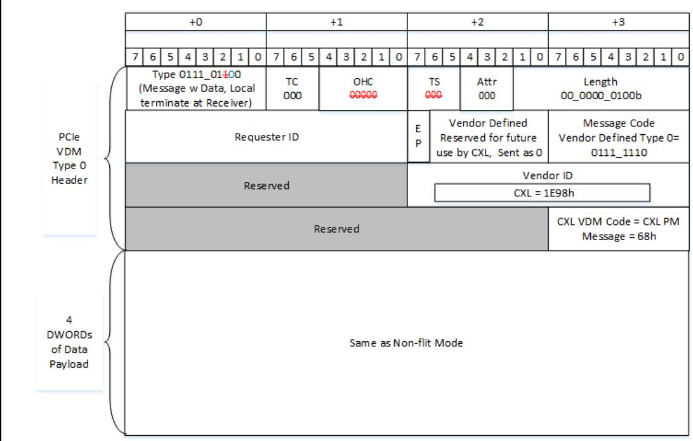

CXL Power Management Messages — Data Payload Field Definitions (Sheet 1 of 2)

<table><tr><td>Field</td><td>Description</td><td>Notes</td></tr><tr><td>PM Logical Opcode[7:0]</td><td>Power Management Command00h = AGENT_INFO02h = RESETPREP04h = PMREQ (PMRSP and PMGO)06h = Global Persistent Flush (GPF)FEh = CREDIT_RTN</td><td></td></tr><tr><td>PM Agent ID[6:0]</td><td>PM2IP: Reserved.IP2PM: PM agent ID assigned to the device.Host communicates the PM Agent ID to device via the TARGET_AGENT_ID field in the first CREDIT_RTN message.</td><td>A device does not consume this value when it receives a message from the Host.</td></tr><tr><td>Parameter[15:0]</td><td>CREDIT_RTN (PM2IP and IP2PM): Reserved.AGENT_INFO (PM2IP and IP2PM)Bit[0]: REQUEST (set) /RESPONSE_N (cleared)Bits[7:1]: INDEXBits[15:8]: ReservedPMREQ (PM2IP and IP2PM)Bit[0]: REQUEST (set) /RESPONSE_N (cleared)Bit[2]: GOBits[15:3]: ReservedRESETPREP (PM2IP and IP2PM)Bit[0]: REQUEST (set) /RESPONSE_N (cleared)Bits[15:1]: ReservedGPF (PM2IP and IP2PM)Bit[0]: REQUEST (set) /RESPONSE_N (cleared)Bits[15:1]: Reserved</td><td></td></tr></table>

CXL Power Management Messages — Data Payload Field Definitions (Sheet 2 of 2)

<table><tr><td>Field</td><td>Description</td><td>Notes</td></tr><tr><td>Payload[95:0]</td><td>CREDIT_RTNBits[7:0]: NUM_CREDITS (PM2IP and IP2PM)Bits[14:8]: TARGET_AGENT_ID (Valid during the first PM2IP message, reserved in all other cases)Bit[15]: ReservedAGENT_INFO (Request and Response)If Param.Index == 0:Bits[7:0]: CAPABILITY_VECTOR— Bit[0]: Always set to indicate support for PM messages defined in the CXL 1.1 specification— Bit[1]: Support for GPF messages— Bits[7:2]: ReservedAll other bits are reservedelse: All reservedAll bits are reservedRESETPREP (Request and Response)Bits[7:0]: ResetType— 01h = System transition from S0 to S1— 03h = System transition from S0 to S3— 04h = System transition from S0 to S4— 05h = System transition from S0 to S5— 10h = System resetBits[15:8]: PrepType— 00h = General Prep— All other encodings are reservedBits[17:16]: ReservedAll other bits are reservedPMREQBits[31:0]: PCIe LTR format (as defined in Bytes 12-15 of PCIe LTR message, see Table 3-2)All other bits are reservedGPFBits[7:0]: GPFType— Bit[0]: Set to indicate that a power failure is imminent. Only valid for Phase 1 request messages.— Bit[1]: Set to indicate device must flush its caches. Only valid for Phase 1 request messages.— Bits[7:2]: ReservedBits[15:8]: GPF Status— Bit[8]: Set to indicate that the Cache Flush phase encountered an error. Only valid for Phase 1 responses and Phase 2 requests.— Bits[15:9]: ReservedBits[17:16]: Phase— 01h = Phase 1— 02h = Phase 2— All other encodings are reservedAll other bits are reserved</td><td>CXL Agent must treat the TARGET_AGENT_ID field as reserved when returning credits to Host.Only Index 0 is defined for AGENT_INFO. All other Index values are reserved.</td></tr></table>

Table 3-2.

PMREQ Field Definitions

<table><tr><td>Payload Bit Position</td><td>LTR Field</td></tr><tr><td>[31:24]</td><td>Snoop Latency[7:0]</td></tr><tr><td>[23:16]</td><td>Snoop Latency[15:8]</td></tr><tr><td>[15:8]</td><td>No-Snoop Latency[7:0]</td></tr><tr><td>[7:0]</td><td>No-Snoop Latency[15:8]</td></tr></table>

## 3.1.2.1 Credit and PM Initialization

PM Credits and initialization process is link local. Figure 3-4 illustrates the use of PM2IP.CREDIT\_RTN and PM2IP.AGENT\_INFO messages to initialize Power Management messaging protocol intended to facilitate communication between the Downstream Port PMU and the Upstream Port PMU. A CXL switch provides an aggregation function for PM messages as described in Section 9.1.2.1.

GPF messages do not require credits and the receiver shall not generate CREDIT\_RTN in response to GPF messages.

Power Management Credits and Initialization  
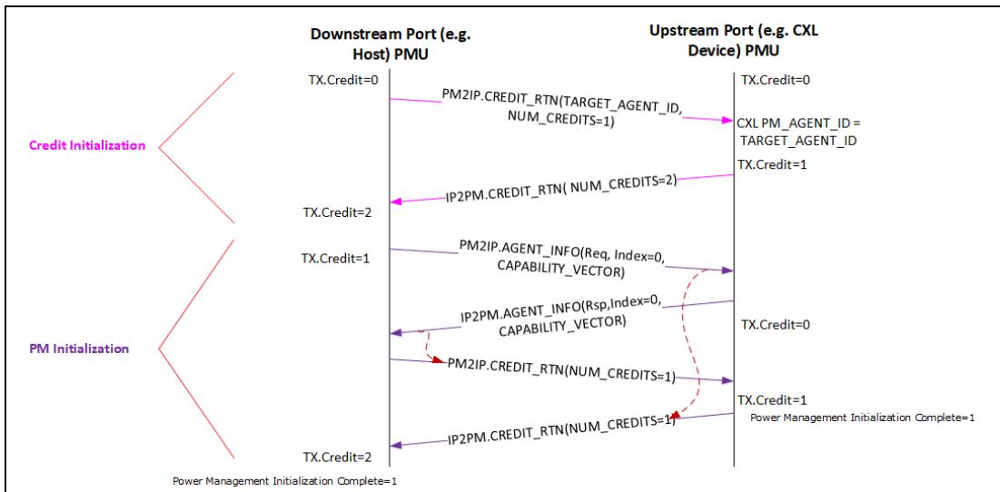

The CXL Upstream Port PMU must be able to receive and process CREDIT\_RTN messages without dependency on any other PM2IP messages. Also, CREDIT\_RTN messages do not use a credit. The CREDIT\_RTN messages are used to initialize and update the Tx credits on each side, so that flow control can be appropriately managed. During the first CREDIT\_RTN message during PM Initialization, the credits being sent via NUM\_CREDITS field represent the number of credit-dependent PM messages that the initiator of CREDIT\_RTN can receive from the other end. During the subsequent CREDIT\_RTN messages, the NUM\_CREDITS field represents the number of PM credits that were freed up since the last CREDIT\_RTN message in the same direction. The first CREDIT\_RTN message is also used by the Downstream Port PMU to assign a PM\_AGENT\_ID to the Upstream Port PMU. This ID is communicated via the TARGET\_AGENT\_ID field in the CREDIT\_RTN message. The Upstream Port PMU must wait for the CREDIT\_RTN message from the Downstream Port PMU before initiating any IP2PM messages.

An Upstream Port PMU must support at least one credit, where a credit implies having sufficient buffering to sink a PM2IP message with 128 bits of payload.

After credit initialization, the Upstream Port PMU must wait for an AGENT\_INFO message from the Downstream Port PMU. This message contains the CAPABILITY\_VECTOR of the PM protocol of the Downstream Port PMU. Upstream Port PMU must send its CAPABILITY\_VECTOR to the Downstream Port PMU in response to the AGENT\_INFO Req from the Downstream Port PMU. When there is a mismatch, Downstream Port PMU may implement a compatibility mode to work with a less capable Upstream Port PMU. Alternatively, Downstream Port PMU may log the mismatch and report an error, if it does not know how to reliably function with a less capable Upstream Port PMU.

There is an expectation from the Upstream Port PMU that it restores credits to the Downstream Port PMU as soon as a message is received. Downstream Port PMU can have multiple messages in flight, if it was provided with multiple credits. Releasing credits in a timely manner optimizes performance for latency sensitive flows.

The following list summarizes the rules that must be followed by an Upstream Port PMU:

• Upstream Port PMU must wait to receive a PM2IP.CREDIT\_RTN message before initiating any IP2PM messages.

• Upstream Port PMU must extract TARGET\_AGENT\_ID field from the first PM2IP message received from the Downstream Port PMU and use that as its PM\_AGENT\_ID in future messages.

• Upstream Port PMU must implement enough resources to sink and process any CREDIT\_RTN messages without dependency on any other PM2IP or IP2PM messages or other message classes.

• Upstream Port PMU must implement at least one credit to sink a PM2IP message.

• Upstream Port PMU must return any credits to the Downstream Port PMU as soon as possible to prevent blocking of PM message communication over CXL Link.

• Upstream Port PMU are recommended to not withhold a credit for longer than 10 us.

## 3.1.3 CXL Error VDM Format

The CXL Error Messages are sent as PCIe Vendor Defined Type 0 messages with no data payload. Presently, this class includes a single type of message, namely Event Firmware Notification (EFN). When EFN is utilized to report memory errors, it is referred to as Memory Error Firmware Notification (MEFN). Figure 3-5 and Figure 3-6 provide the format for EFN messages.

The following are the characteristics of the EFN message:

• Fmt and Type fields are set to indicate message with no data.

• The message is sent using routing of “Routed to Root Complex.” It is always initiated by a device.

• Message Code is set to Vendor Defined Type 0.

• Vendor ID field is set to 1E98h.

• Byte 15 of the message header contains the VDM Code and is set to the value of “CXL Error Message” (00h).

• Bytes 8, 9, 12, and 13 are cleared to all 0s.

• Bits[7:4] of Byte 14 are cleared to 0h. Bits[3:0] of Byte 14 are used to communicate the Firmware Interrupt Vector (abbreviated as FW Interrupt Vector in Figure 3-5 and Figure 3-6).

Table 3-3. Optional PCIe Features Required for CXL

Figure 3-5. CXL EFN Messages Packet Format — Non-Flit Mode  
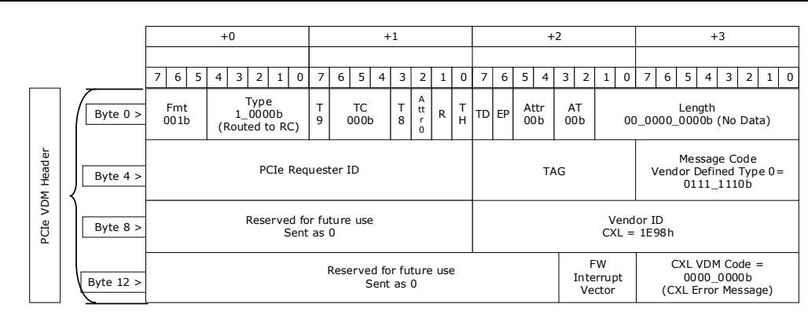

Figure 3-6. CXL EFN Messages Packet Format — Flit Mode  
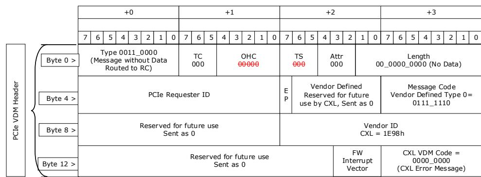

Encoding of the FW Interrupt Vector field is Host specific and thus not defined by the CXL specification. A Host may support more than one type of Firmware environment and this field may be used to indicate to the Host which one of these environments is to process this message.

## 3.1.4 Optional PCIe Features Required for CXL

Table 3-3 lists optional features per the PCIe Base Specification that are required for CXL.

<table><tr><td>Optional PCIe Feature</td><td>Notes</td></tr><tr><td>Data Poisoning by transmitter</td><td></td></tr><tr><td>ATS</td><td>Only required if CXL.cache is present (e.g., only for Type 1 devices and Type 2 devices, but not for Type 3 devices)</td></tr><tr><td>Advanced Error Reporting (AER)</td><td></td></tr></table>

## 3.1.5 Error Propagation

CXL.cache and CXL.mem errors detected by the device are propagated Upstream over the CXL.io traffic stream. These errors are logged as correctable internal errors and uncorrectable internal errors in the PCIe AER registers of the detecting component.

## 3.1.6 Memory Type Indication on ATS

Requests to certain memory regions can only be issued on CXL.io and cannot be issued on CXL.cache. It is up to the host to decide what these memory regions are. For example, on x86 systems, the host may choose to restrict access only to Uncacheable (UC) type memory over CXL.io. The host indicates such regions by means of an indication on ATS completion to the device.

All CXL functions that issue ATS requests must set the Page Aligned Request bit in the ATS Capability register to 1. In addition, ATS requests sourced from a CXL device must set the CXL Src bit.

Figure 3-7. ATS 64-bit Request with CXL Indication — Non-Flit Mode

<table><tr><td rowspan="2">ATS Request</td><td colspan="8">+0</td><td colspan="7">+1</td><td colspan="7">+2</td><td colspan="8">+3</td><td></td><td></td></tr><tr><td>7</td><td>6</td><td>5</td><td>4</td><td>3</td><td>2</td><td>1</td><td>0</td><td>7</td><td>6</td><td>5</td><td>4</td><td>3</td><td>2</td><td>1</td><td>0</td><td>7</td><td>6</td><td>5</td><td>4</td><td>3</td><td>2</td><td>1</td><td>0</td><td>7</td><td>6</td><td>5</td><td>4</td><td>3</td><td>2</td><td>1</td><td>0</td></tr><tr><td>Byte 0</td><td colspan="3">Fmt001b</td><td colspan="5">Type0_0000b</td><td>T9</td><td colspan="2">TC</td><td>T8</td><td>ATT0</td><td>R</td><td>R</td><td>TD</td><td>EP</td><td colspan="2">ATTR</td><td colspan="2">AT01b</td><td colspan="10">00_00xx_xxx0b</td><td></td></tr><tr><td>Byte 4</td><td colspan="15">Requester ID</td><td colspan="6">Tag</td><td colspan="4">Last DW BE1111b</td><td colspan="6">1st DW BE1111b</td><td></td></tr><tr><td>Byte 8</td><td colspan="31">Untranslated Address [63:32]</td><td></td></tr><tr><td>Byte 12</td><td colspan="18">Untranslated Address [31:12]</td><td colspan="6">Reserved</td><td>CXL Src</td><td colspan="3">R</td><td colspan="2">NW</td><td></td><td></td></tr></table>

DWORD3, Byte 3, bit[3] in ATS 64-bit request and ATS 32-bit request for both Flit Mode and Non-Flit Mode carries the CXL Src bit. Figure 3-7 shows the position of this bit in ATS 64-bit request (Non-Flit mode). See the PCIe Base Specification for the format of the other request messages. The CXL Src bit is defined as follows:

• 0 = Indicates request initiated by a Function that does not support CXL.io Indication on ATS.

• 1 = Indicates request initiated by a Function that supports CXL.io Indication on ATS. All CXL Functions must set this bit.

This bit is Reserved in the ATS request as defined by the PCIe Base Specification.

ATS translation completion from the Host carries the CXL.io bit in the Translation Completion Data Entry. See the PCIe Base Specification for the message formats.

The CXL.io bit in the ATS Translation completion is valid when the CXL Src bit in the request is set. If the R and W fields in the ATS Translation completion are both cleared, then the CXL.io bit in that message may not be used by the Function for any purpose. The CXL.io bit is as defined as follows:

• 0 = Requests to the page can be issued on all CXL protocols.

• 1 = Requests to the page can be issued by the Function on CXL.io only. It is a violation to issue requests to the page using CXL.cache protocol.

## Deferrable Writes

Earlier revisions of this specification captured the “Deferrable Writes” extension to the CXL.io protocol, but this protocol has since been adopted by the PCIe Base Specification.

## PBR TLP Header (PTH)

On PBR links in a PBR fabric, all .io TLPs, with exception of NOP TLP, carry a fixed 1- DWORD header field referred to as the PBR TLP header (PTH). PBR links are either Inter-Switch Links (ISL) or edge links from PBR switch to G-FAM. See Section 7.7.8 for details of where this header is inserted and deleted when the .io TLP traverses the PBR fabric from source to target.

NOP TLPs are always transmitted without a preceding PTH. For non-NOP TLPs, PTH is always transmitted and it is transmitted on the immediate DWORD preceding the TLP Header base. Local Prefixes, if any, associated with a TLP are always transmitted before the PTH is transmitted. This is pictorially shown in Figure 3-8.

To assist the receiver on a PBR link from disambiguating PTH from a NOP TLP/Local Prefix, the PCIe flit mode TLP grammar is modified as follows. Bits[7:6] of the first byte of all DWORDs, from the 1st DWORD of a TLP until a PTH is detected, are encoded as follows:

• 00b = NOP TLP

• 01b = Rsvd

• 10b = Local Prefix

• 11b = PTH

After the receiver detects a PTH, PCIe TLP grammar rules are applied per the PCIe Base Specification until the TLP ends, with the restriction that NOP TLP and Local prefix cannot be transmitted in this region of the TLP.

## Transmitter Rules Summary

• For NOP TLP and Local Prefix Type<sup>1</sup> field encodings, no PTH is pre-pended

• For all other Type<sup>1</sup> field encodings, a PTH is pre-pended immediately ahead of the Header base

## 3.1.8.2 Receiver Rules Summary

• For NOP TLP, if bits[5:0] are not all 0s, the receiver treats it as a malformed packet and reports the error following the associated error reporting rules

• For a Local Prefix, if bits[5:0] are not one of 00 1101b through 00 1111b, the receiver treats it as a malformed packet and reports the error following the associated error reporting rules

• From beginning of a TLP to when a PTH is detected, receiver silently drops a DWORD if a reserved value of 01b is received for bits[7:6] in the DWORD

• If a NOP TLP or Local Prefix is received immediately after a PTH, the receiver treats it as a malformed packet and reports the error following the associated error reporting rules

Header queues in PBR switches/devices should be able to handle the additional DWORD of PTH that is needed to be carried between the source and target PBR links.

PTH is included as part of normal link level CRC/FEC calculations/checks on PBR links to ensure reliable PTH delivery over the PBR link. For details regarding the PIF, DSAR, and Hie bits, see Section 7.7.3.3, Section 7.7.7, and Section 7.7.6.2.

On MLD links, in the egress direction, the SPID information in this header is used to generate the LD-ID information on VendPrefixL0 message as defined in Section 2.4. On MLD links, in the ingress direction, LD-ID in the VendPrefixL0 message is used to determine the DPID in the PBR packet.

Table 3-4. PBR TLP Header (PTH) Format

<table><tr><td>Byte</td><td colspan="8">+0</td><td colspan="8">+1</td><td colspan="7">+2</td><td colspan="7">+3</td><td></td><td></td></tr><tr><td>Bits</td><td>7</td><td>6</td><td>5</td><td>4</td><td>3</td><td>2</td><td>1</td><td>0</td><td>7</td><td>6</td><td>5</td><td>4</td><td>3</td><td>2</td><td>1</td><td>0</td><td>7</td><td>6</td><td>5</td><td>4</td><td>3</td><td>2</td><td>1</td><td>0</td><td>7</td><td>6</td><td>5</td><td>4</td><td>3</td><td>2</td><td>1</td><td>0</td></tr><tr><td>Byte 0 -&gt;</td><td>1</td><td>1</td><td colspan="3">Rsvd</td><td>H i e</td><td>D S A R</td><td>P I F</td><td colspan="12">SPID[11:0]</td><td colspan="11">DPID[11:0]</td><td></td></tr></table>

Table 3-5. NOP TLP Header Format

<table><tr><td>Byte</td><td colspan="8">+0</td><td colspan="8">+1</td><td colspan="8">+2</td><td colspan="8">+3</td></tr><tr><td>Bits</td><td>7</td><td>6</td><td>5</td><td>4</td><td>3</td><td>2</td><td>1</td><td>0</td><td>7</td><td>6</td><td>5</td><td>4</td><td>3</td><td>2</td><td>1</td><td>0</td><td>7</td><td>6</td><td>5</td><td>4</td><td>3</td><td>2</td><td>1</td><td>0</td><td>7</td><td>6</td><td>5</td><td>4</td><td>3</td><td>2</td><td>1</td><td>0</td></tr><tr><td>Byte 0 -&gt;</td><td>0</td><td>0</td><td colspan="6">00 0000b</td><td colspan="24">Per the PCIe Base Specification</td></tr></table>

Table 3-6. Local Prefix Header Format

<table><tr><td>Byte</td><td colspan="8">+0</td><td colspan="8">+1</td><td colspan="7">+2</td><td colspan="7">+3</td><td></td><td></td></tr><tr><td>Bits</td><td>7</td><td>6</td><td>5</td><td>4</td><td>3</td><td>2</td><td>1</td><td>0</td><td>7</td><td>6</td><td>5</td><td>4</td><td>3</td><td>2</td><td>1</td><td>0</td><td>7</td><td>6</td><td>5</td><td>4</td><td>3</td><td>2</td><td>1</td><td>0</td><td>7</td><td>6</td><td>5</td><td>4</td><td>3</td><td>2</td><td>1</td><td>0</td></tr><tr><td>Byte 0 -&gt;</td><td>1</td><td>0</td><td>0</td><td>0</td><td>1</td><td>1</td><td colspan="2">01b/10b/11b</td><td colspan="23">Per the PCIe Base Specification</td><td></td></tr></table>

Figure 3-8. Valid .io TLP Formats on PBR Links  
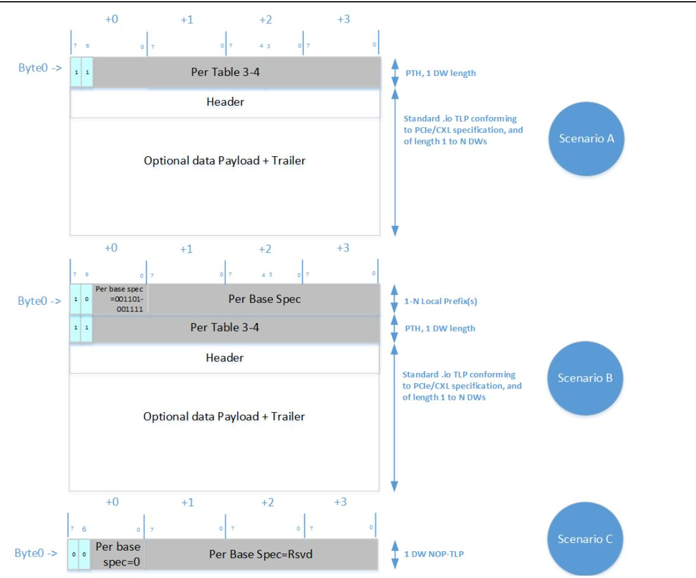

## 3.1.9 VendPrefixL0

Section 2.4.1.2 describes VendPrefixL0 usage on MLD links. For non-MLD HBR links, VendPrefixL0 carries the PBR-ID field to facilitate inter-domain communication between hosts and devices (e.g., GIM; see Section 7.7.3) and other vendor-proprietary usages (see Section 7.7.4). HBR links that use this form of the prefix must be directly attached to a PBR switch. On the switch ingress side, this prefix carries the DPID of the target edge link. On the egress side, this message carries the SPID of the source link that originated the TLP. The prefix format is shown in Table 3-51.

Table 3-7. VendPrefixL0 on Non-MLD Edge HBR Links

<table><tr><td>Byte</td><td colspan="8">+0</td><td colspan="8">+1</td><td colspan="7">+2</td><td colspan="8">+3</td><td></td></tr><tr><td>Bits</td><td>7</td><td>6</td><td>5</td><td>4</td><td>3</td><td>2</td><td>1</td><td>0</td><td>7</td><td>6</td><td>5</td><td>4</td><td>3</td><td>2</td><td>1</td><td>0</td><td>7</td><td>6</td><td>5</td><td>4</td><td>3</td><td>2</td><td>1</td><td>0</td><td>7</td><td>6</td><td>5</td><td>4</td><td>3</td><td>2</td><td>1</td><td>0</td></tr><tr><td>Byte 0 -&gt;</td><td colspan="8">As defined in thePCIe Base Specification</td><td colspan="12">PBR-ID[11:0]</td><td colspan="11">Rsvd</td><td></td></tr></table>

On the switch side, handling of this prefix is disabled by default. The FM can enable this functionality on each edge USP and DSP, via FM Mailbox CCI. The method that the FM uses to determine the set of USPs/DSPs that are capable and trustworthy of enabling this functionality is beyond the scope of this specification.

Edge PCIe links are not precluded from using this prefix for the same purpose described above. However, such usages are beyond the scope of this specification.

See Section 7.7.3 and Section 7.7.4 for transaction flows that involve TLPs with this prefix.

## CXL DevLoad (CDL) Field in UIO Completions

To support QoS Telemetry (see Section 3.3.4) with UIO Direct P2P to HDM (see Section 7.7.9), UIO Completions contain the 2-bit CDL field, which carries the CXL DevLoad indication from HDM devices that support UIO Direct P2P. If an HDM device supports UIO Direct P2P to HDM, the HDM device shall populate the CDL field with values as defined in Table 3-51. The CDL field exists in UIOWrCpl, UIORdCpl, and UIORdCplD TLPs.

## 3.1.11 CXL Fabric-related VDMs

In CXL Fabric (described in Section 7.7), there are many different uses for a CXL VDM. The uses fall into two categories: within a PBR Fabric, and outside a PBR Fabric.

When a VDM has a CXL Vendor ID, bytes 14 and 15 in the VDM header distinguish the use case via a CXL VDM Code and whether the use is within a PBR fabric. If within a PBR fabric, there is also a PBR Opcode. Additionally for PBR Fabric CXL VDMs, many of the traditional PCIe-defined fields such as Requester ID have no meaning and thus are reserved or in some cases, repurposed. See Table 3-8 for a breakdown of the VDM header bytes for PBR Fabric VDMs.

Table 3-8. PBR VDM

<table><tr><td rowspan="2">Byte</td><td colspan="8">+0</td><td colspan="8">+1</td><td colspan="7">+2</td><td colspan="8">+3</td><td></td></tr><tr><td>7</td><td>6</td><td>5</td><td>4</td><td>3</td><td>2</td><td>1</td><td>0</td><td>7</td><td>6</td><td>5</td><td>4</td><td>3</td><td>2</td><td>1</td><td>0</td><td>7</td><td>6</td><td>5</td><td>4</td><td>3</td><td>2</td><td>1</td><td>0</td><td>7</td><td>6</td><td>5</td><td>4</td><td>3</td><td>2</td><td>1</td><td>0</td></tr><tr><td>0</td><td colspan="8">Type 0011 0100bType 0111 0100b</td><td colspan="3">TC000b</td><td colspan="5">OHC0 0000b</td><td colspan="3">TS000b</td><td colspan="3">Attr000b</td><td colspan="9">Length 00 0000 0000bLength 00 00xx xxxxb $^{1}$ </td><td></td></tr><tr><td>4</td><td colspan="16">PCIe Requester ID / Rsvd</td><td>EP</td><td colspan="7">Vendor DefinedRsvd</td><td colspan="7">Message CodeVendor Defined Type 00111 1110b</td><td></td></tr><tr><td>8</td><td colspan="16">Rsvd</td><td colspan="15">Vendor IDCXL = 1E98h</td><td></td></tr><tr><td>12</td><td colspan="5">Reserved</td><td colspan="3">CmdSeq</td><td colspan="8">SeqLen:00h = 256 DWORDs</td><td>Rsvd</td><td colspan="3">SeqNum</td><td colspan="4">PBROpcode</td><td colspan="7">CXL VDM Code</td><td></td></tr></table>

1. x indicates don’t care.

Table 3-8 shows two Type encodings, a VDM without data and a VDM with data, both routed as “Terminate at Receiver.” If a payload is not needed, the VDM without data is used. If any payload is required, the VDM with data is used. Because the PBR VDMs use PTH to route, the ‘receiver’ is the end of the tunnel (i.e., the matching DPID). PBR VDMs with data can have at most 128B (=32 DWORDs) of payload. If the SeqLen is more than 32 DWORDs, multiple VDMs will be needed to convey the entire sequence of VDMs (for UCPull VDM).

Depending on the CXL VDM Code, other fields in the VDM header may have meaning. Use of these additional fields will be defined in the section covering that particular encoding. These fields include:

• PBR Opcode: Subclass of PBR Fabric VDMs

• CmdSeq: Sequence number of the Host management transaction flow

• SeqLen: Length of the VDM sequence, applies to UCPull VDM

• SeqNum: Sequential VDM count with wrap if a message requires multiple sequential VDMs

Table 3-9 summarizes the various CXL vendor defined messages, each with a CXL VDM code and PBR Opcode, a message destination, and a brief summary of the message’s use. The CXL VDM Code provides the category of VDM, while the PBR Opcode makes distinctions within that category. The remainder of this section deals with GFD management-related VDMs and Route Table Update related VDMs. For details of other VDMs, see Section 7.7.11.

Table 3-9. CXL Fabric Vendor Defined Messages

<table><tr><td>Message</td><td>USAR/DSAR</td><td>CXL VDM Code</td><td>PBR Opcode</td><td>Destination</td><td>Payload (DWORDs)</td><td>Comment</td></tr><tr><td>Assert PERST#</td><td>DSAR</td><td>80h</td><td>0h</td><td>vUSP</td><td>0</td><td>Propagate fundamental reset downstream from vDSP.</td></tr><tr><td>Assert Reset</td><td>DSAR</td><td>80h</td><td>1h</td><td>vUSP</td><td>0</td><td>Propagate hot reset downstream from vDSP.</td></tr><tr><td>Deassert Reset</td><td>DSAR</td><td>80h</td><td>3h</td><td>vUSP</td><td>0</td><td>Propagate reset deassertion downstream from vDSP.</td></tr><tr><td>Link Up</td><td>DSAR</td><td>80h</td><td>4h</td><td>vDSP</td><td>0</td><td>Send upstream to vDSP, changing link state to L0 from detect.</td></tr><tr><td>PBR Link Partner Info</td><td>DSAR</td><td>90h</td><td>0h</td><td>Link Partner</td><td>16</td><td>Message with Data. Data saved in recipient.</td></tr><tr><td>DPCmd</td><td>DSAR</td><td>A0h</td><td>0</td><td>GFD</td><td>0</td><td>Downstream Proxy Command from GAE.</td></tr><tr><td>UCPull</td><td>DSAR</td><td>A1h</td><td>1</td><td>Host ES</td><td>0</td><td>Upstream command pull from GFD.</td></tr><tr><td>DCReq</td><td>DSAR</td><td>A0h</td><td>2</td><td>GFD</td><td>32</td><td>Downstream Command Request from GAE.</td></tr><tr><td>DCReq-Last</td><td>DSAR</td><td>A0h</td><td>3</td><td>GFD</td><td>1 to 32</td><td>Last DCReq.</td></tr><tr><td>DCReq-Fail</td><td>DSAR</td><td>A0h</td><td>8</td><td>GFD</td><td>0</td><td>Failed UCPull response.</td></tr><tr><td>UCRsp</td><td>DSAR</td><td>A1h</td><td>4</td><td>Host ES</td><td>32</td><td>Upstream Completion Response from GFD.</td></tr><tr><td>UCRsp-Last</td><td>DSAR</td><td>A1h</td><td>5</td><td>Host ES</td><td>1 to 32</td><td>Last UCRsp.</td></tr><tr><td>UCRsp-Fail</td><td>DSAR</td><td>A1h</td><td>6</td><td>Host ES</td><td>0</td><td>Failed DCReq receipt.</td></tr><tr><td>GAM</td><td>DSAR</td><td>A1h</td><td>7</td><td>Host ES</td><td>8</td><td>GFD log to host.</td></tr><tr><td>RTUpdate</td><td>DSAR</td><td>A1h</td><td>10h</td><td>Host ES</td><td>1 to 8</td><td>CacheID bus update from Downstream ES.</td></tr><tr><td>RTUpdateAck</td><td>DSAR</td><td>A1h</td><td>12h</td><td>Downstream ES</td><td>0</td><td>Acknowledgment of RTUpdate from Host ES.</td></tr><tr><td>RTUpdateNak</td><td>DSAR</td><td>A1h</td><td>13h</td><td>Downstream ES</td><td>0</td><td>Nak for RTUpdate from Host ES.</td></tr><tr><td>CXL PM</td><td>DSAR</td><td>68h</td><td>0</td><td>Varies</td><td>4</td><td>CXL Power Management.</td></tr><tr><td>CXL Error</td><td>USAR</td><td>00h</td><td>0</td><td>Host</td><td>0</td><td>CXL Error.</td></tr></table>

Although they exist outside the PBR Fabric, CXL VDM Codes 00h and 68h are listed to show the complete CXL VDM mapping. Their VDM Header is defined by the PCI-SIG and thus does not match the fields provided for a PBR VDM header. These two VDMs will pass through the PBR Fabric using a hierarchical route and using the VDM Header originally defined in Section 3.1.2 for CXL PM and in Section 3.1.3 for CXL Error.

## 3.1.11.1 Host Management Transaction Flows of GFD

## Figure 3-9 summarizes the Host Management Transaction Flows of GFD. Host Management Transaction Flows of GFD

Figure 3-9.

## Step 1:

Host SW writes Proxy command to memory, writes to GAE with Memory-side Request/ Response Queue addresses and Command length, and sets doorbell in GAE to start GFD interaction.

## Step 2:

1) GAE sends DPCmd (Downstream Proxy Command) VDM to GFD.

2) VDM header has Command Length field and mdSeq.

3) This is a PBR packet with:

4) This msg must be unconditionally sunk by GFD.

## Step 3:

1) GFD sends UCPull (Upstream Command Pull) VDM to GAE.

2) VDM header has Command Length field and CmdSeq.

3) This is a PBR packet with:

• SPID = GFD PID

• DPID = Host Edge Port PID

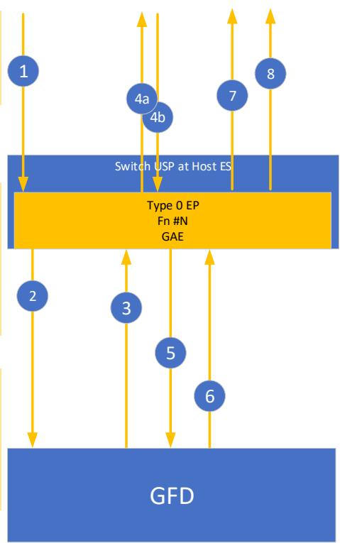

## Steps 4a/b:

GAE reads the command from host memory using a series of Nx 128B (N = 0 to 7) MRd and 1x 4B to 128B MRd (the last read) starting at the Request address provided in step 1.

GAE interrupts the CPU, if enabled.

GAE writes data received in step 6 VDM to host memory using Response address provided in step 1.

## Step 5:

1) GAE sends the Command obtained via the completion of the reads of steps 4a/b, copying the CplD payload to the DCReq/DCReq-Last VDM’s payload, reordering and combining any partial completion payload as needed.

2) DCReq\* is a PBR packet with: • SPID = Host Edge Port PID • DPID = GFD PID

3) Payload size matches the MRd size of step 4a, with a max of 128B. There could be multiple VDMs in request with DCReq-Last VDM indicating the last message in the sequence.

4) There is 3-bit SeqNum and 3-bit CmdSeq in the header of the packet to detect lost or stale packets.

5) Only the first packet in the sequence has “Message Header” in the payload of this VDM.

## Step 6:

1) GFD sends the Response back for the message with 1 or more UCRsp and 1 UCRsp-Last VDM, up to total length of Max\_Rsp\_Len, where Max\_Rsp\_Len is in the Command payload from step 5.

2) This is a PBR packet with: • SPID = GFD PID • DPID = Host Edge Port PID

4) There is 3-bit SeqNum and 3-bit CmdSeq in the header of the packet to detect lost or stale packets.

5) Only the first packet in the sequence has “Message Header” in the payload of this VDM.

The Host ES has one GAE per host port. The GAE and GFD communicate via PID-routed VDMs.

Each GAE has an array of active messages, such that a host can communicate with multiple GFDs in parallel. Host software shall ensure that there is only one host-GFD management flow active per host-GFD pair.

The Host-to-GFD message flow consists of the following steps, after first storing the GFD command in host memory:

1. Host writes to GAE.

— Writes pointer to GFD command in host memory (for UCPull read)

— Writes pointer to write responses from GFD in host memory (for UCRsp data)

— Writes command length

— Writes CmdSeq

— Write a mailbox command doorbell register (see Section 8.2.9.4.4), which causes the GAE to start the host management flow with step 2

2. Host ES creates CXL PBR VDM “DPCmd” with command length that targets the GFD PID and CmdSeq to identify the current command sequence.

— This is an unsolicited message from the GFD point of view, and the GFD must be able to sink one such message for any supported RPID and drop any message from an unsupported RPID

3. GFD responds with a CXL PBR VDM “UCPull,” pulling the command for the indicated CmdSeq. The GFD response time may be delayed by responding to other doorbells from other RPIDs.

4. GAE converts CXL PBR VDM “UCPull” to one or more PCIe MRd TLPs.

a. GAE sends a series of MRds to read the command, starting at the address pointer supplied to the GAE in the Proxy GFD Management Command input payload. Each MRd size is a maximum of 128B. A command larger than 128B shall require multiple MRd to gather the full command. A total of (Nx) 128B MRd (with N from 0 to 7) and 1x (1B to 128B) MRd is needed to read any command of size up to 1024B.

b. The host completes each MRd with one or two CplD TLPs.

5. GAE gathers the read completion data in step 4b, reordering and combining partial completions as needed, to create a VDM payload. The GAE sends a series of DCReq/DCReq-Last VDMs with the completion data as VDM payload in the order that matches the series of MRd in step 4. The maximum payload for PBR VDMs is 128B (= 32 DWORDs).

— Each VDM header contains the following:

• An incrementing SeqNum, to allow detection of missing messages, starting with 0

• A CmdSeq, to identify the current command for this Host – GFD thread

— The last VDM in the sequence will be DCReq-Last.

— VDMs before the last, if needed, will be DCReq.

The first VDM in the sequence shall start with a payload that matches the CCI Message header and payload as defined in Section 7.6.3. Subsequent VDM’s payload shall contain only the remaining payload portion of the CCI Message and not repeat the header.

— A failed command pull shall result in a DCReq-Fail VDM response instead of any DCReq and DCReq-Last.

6. GFD processes the command after it receives the last VDM (the “DCReq-Last”). The GFD shall send UCRsp/UCRsp-Last VDMs in response to the Host ES.

— Each VDM header contains the following:

• An incrementing SeqNum, to allow detection of missing messages, starting with 0

• A CmdSeq, to identify the current command for this Host – GFD thread

— The last VDM in the sequence will be UCRsp-Last

— VDMs before the last, if needed, will be UCRsp — If instead the GFD received DCReq-Fail, a UCRsp-Last shall be sent without processing the (incomplete) command

7. GAE converts “UCRsp” and “UCRsp-Last” series to a series of MWr with the payload the same as the VDM payload. The MWr address is supplied to the GAE in the Proxy Command input payload.

— After the UCRsp-Last payload is written, the GAE mailbox control doorbell described in Section 8.2.9.4.4 is cleared. If the MB Doorbell Interrupt is set, an interrupt will be sent by the GAE to the host.

If at any point the GAE disables the GFD access vector, any incoming UCRsp/UCRsp-Last VDMs from the disabled GFD shall be dropped, and any UCPull shall be replied to with a DML-Fail VDM.

The CmdSeq is used to synchronize the GAE and GFD to be working on the same command sequence. A host may issue a subsequent command with a different CmdSeq to abort a prior command that may not have completed the sequence. Both the GAE (step 3 UCPull and step 6 UCRsp\*) and the GFD (step 2 DPCmd and step 5 DCReq\*) shall check that the command sequence number is the current one for communication with the partner PID (GAE uses GFD’s PID, and GFD uses GAE’s PID). Any stale command sequence VDM will be dropped and logged. The GFD will always update its current CmdSeq[GAE’s PID] based on the value received in step 2 DPCmd.

The host management flow of a GFD also includes an asynchronous notification from the GFD to inform the host of events in the GFD, using a GAM (GFD Async Message) VDM. The GAM has a payload of up to 32B (8 DWORDs). This payload passes through the GAE to write to an address supplied to the GAE in the Proxy Command input payload. Each GAM write starts at a 32B-aligned offset.

All CXL.io TLPs sent over a PBR link shall have a PTH. The host management flow of GFD VDMs have PTH fields restricted to the following values:

• SPID =

— From Host ES: Host Edge Port PID

— From GFD: GFD PID

• DPID =

— To GFD: GFD PID

— To Host ES: Host Edge Port PID

• DSAR flag = 1

VDM header fields for GFD Message VDMs:

• CXL VDM code of A0h (to GFD) or A1h (to Host ES)

• PBR Opcode 0 to 8 to indicate the particular VDM

• CmdSeq: Holds the command sequence number issued initially in step 2, DPCmd

• SeqLen: Holds the length in DWORDs of the subsequent stage DCReq sequence or UCRsp sequence

• SeqNum: Holds the sequence number for multi-VDM command or multi-VDM response, starting at 0h and wrapping after 7h back to 0h

• See Table 3-8 for the complete list of CXL VDMs

## 3.1.11.2 Downstream Proxy Command (DPCmd) VDM

Initiating a Proxy GFD Management Command on the GAE shall cause the Host ES to create a ‘DPCmd’ VDM that targets the GFD.

The ‘DPCmd’ VDM fields are as follows. PTH holds:

• SPID = Host Edge Port PID

• DPID = GFD PID

• DSAR flag = 1

VDM header fields for ‘DPCmd’ VDMs:

• CXL VDM Code of A0h

• PBR Opcode 0 (DPCmd) DPC

• CmdSeq: Current host management command sequence

• SeqLen: Command Length (DWORDs, 1 to 256 DWORD max — value of 00h is 256 DWORDs)

A ‘DPCmd’ VDM is an unsolicited message from the GFD point of view. A GFD must be able to successfully record every ‘DPCmd’ VDM that it receives, up to one from each of its registered RPIDs. The ‘DPCmd’ VDM is a message without data. The SeqLen part of the VDM header holds the command length that will be pulled by the ‘UCPull’.

Only one active DPCmd at a time is allowed per Host Edge Port PID/GFD PID pair. A DPCmd is considered active until the GAE receives a UCRsp-Last VDM in response to a DPCmd.

A GFD should receive only a single active DPCmd per Host PID. If a second DPCmd is received from the same Host PID, the first shall be silently aborted. If a second DPCmd is received before the current DPCmd completes, the GFD updates its current command sequence to the new DPCmd CmdSeq and aborts the prior command sequence.

## 3.1.11.3 Upstream Command Pull (UCPull) VDM

A GFD shall issue a ‘UCPull’ VDM when it services a received ‘DPCmd’ VDM. A single UCPull shall be issued for each DPCmd received, with its command length matching the command length of the DPCmd.

The ‘UCPull’ VDM fields are as follows. PTH holds:

• SPID = GFD PID

• DPID = Host Edge Port PID

• DSAR flag = 1

VDM header fields for ‘UCPull’ VDMs:

• CXL VDM Code of A1h

• PBR Opcode 1 (UCPull)

• CmdSeq: Matching current command sequence from DPCmd

• SeqLen: Length of command to pull (1 to 256 DWORDs)

A GAE must be able to successfully service every ‘UCPull’ VDM that it receives. The GAE advertises a maximum number of outstanding proxy threads, which defines the maximum number of UCPull VDMs that it would need to track.

A ‘UCPull’ is a message without data and consists of a single VDM (there is no sequence of UCPulls). The SeqLen field in the VDM header contains the targeted command length to pull from host memory via the GAE. The CmdSeq contains the current command sequence.

The CmdSeq should be checked to match the current command sequence for the GFD thread; if the CmdSeq does not match, the UCPull is dropped and logged. The UCPull SeqLen shall exactly match the DPCmd SeqLen. The GAE shall issue one or more MRds to pull the command. The last MRd may be 1 to 32 DWORDs. Any prior MRd shall be for exactly 32 DWORDs. The sum of all the MRd lengths shall be the SeqLen.

## 3.1.11.4 Downstream Command Request (DCReq, DCReq-Last, DCReq-Fail) VDMs

When the Host ES reads the command from host memory in response to a UCPull VDM, the completions for those reads are then conveyed to the GFD over a sequence of zero or more DCReq VDMs plus exactly one DCReq-Last VDM. Each completion payload is copied directly to the VDM payload. The Host ES is responsible for combining any partial completions together to make a single payload for the VDM. Each MRd issued to the host will result, when the CplDs for that MRd all return, in a single DCReq VDM or DCReq-Last VDM. The order of the DCReq/DCReq-Last VDMs shall match the order of the MRd. The DCReq-Last VDM represents the end of the Downstream Command Request series. Any missing DCReq/DCReq-Last VDMs in the sequence should result in the GFD failing the command.

The ‘DCReq’ / ‘DCReq-Last’ / ‘DCReq-Fail’ VDM fields are as follows. PTH holds:

• SPID = Host Edge Port PID

• DPID = GFD PID

• DSAR flag = 1

VDM header fields for ‘DCReq’ / ‘DCReq-Last’ / ‘DCReq-Fail’ VDMs:

• CXL VDM Code of A0h

• PBR Opcode 2 (DCReq) / PBR Opcode 3 (DCReq-Last) / PBR Opcode 8 (DCReq-Fail)

• CmdSeq: Command sequence to be checked by Receiver

• SeqLen: Defined only for DCReq-Last, holds the expected length of the Response in the next step (UCRsp); 0 for DCReq and DCReq-Fail

## • SeqNum:

— Defined for all DCReq and DCReq-Last VDMs, initialized to 0 at the start of the sequence and incremented for each subsequent VDM; 0 of DCReq-Fail

— Holds the DCReq\* VDM sequence number, starting at 0h and incrementing for each subsequent VDM

Any ‘DCReq’ VDM shall have a payload of exactly 32 DWORDs. A short command may not have any DCReq VDMs. Every Downstream Command Request sequence shall have exactly one DCReq-Last VDM. The DCReq-Last VDM can have any payload length from 1 to 32 DWORDs.

The DCReq-Last VDM header has SeqLen defined to indicate the next step UCRsp length in DWORDs.

The GFD that is receiving the DCReq\* VDMs checks that the CmdSeq matches its current command sequence for that Host Edge Port PID; if the CmdSeq does not match, the DCReq\* VDM is dropped and logged.

The DCReq-Fail VDM shall be sent if CmdSeq is correct but the PID of the GFD is not enabled in the host’s GAE’s GMV and a UCPull from that GFD is received.

## Upstream Command Response (UCRsp, UCRsp-Last, UCRsp-Fail) VDMs

When a GFD receives a ‘DCReq-Last’ VDM, the GFD checks that the CmdSeq is the current command sequence for that Host Edge Port PID and that all DCReq VDMs and DCReq-Last VDM were received.

If either check fails, the command sequence stops. If all DCReq are not received, as determined by a missing SeqNum, a UCRsp-Fail VDM shall be sent.

If the checks pass, a GFD will issue a ‘UCRsp’ VDM after the GFD processes the earlierreceived ‘DCReq-Last’ VDM. The total length of the Response is dictated by the SeqLen provided in the ‘DCReq-Last’ SeqLen in the VDM header.

There will be zero or more ‘UCRsp’ VDMs and always exactly one ‘UCRsp-Last’ VDM, where the ‘UCRsp-Last’ VDM ends the sequence and is sent last. The sum of the DWORDs of response will match the length requested in the ‘DCReq-Last’ VDM SeqLen field. Each ‘UCRsp’ VDM will be 32 DWORDs. The ‘UCRsp-Last’ VDM can be from 1 to 32 DWORDs. Each ‘UCRsp’ / ‘UCRsp-Last’ VDM in the sequence increments the sequence number, starting at 0 and wrapping from 7 back to 0. Any missing UCRsp VDM in the sequence should result in a response error being flagged in the GAE.

The ‘UCRsp’ / ‘UCRsp-Last’ / ‘UCRsp-Fail’ VDM fields are as follows. PTH holds:

• SPID = GFD PID

• DPID = Host Edge Port PID

• DSAR flag = 1

VDM header fields for ‘UCRsp’ / ‘UCRsp-Last’ / ‘UCRsp-Fail’ VDMs:

• CXL VDM Code of A1h

• PBR Opcode 4 (UCRsp) / PBR Opcode 5 (UCRsp-Last) / PBR Opcode 6 (UCRsp-Fail)

• CmdSeq: Current command sequence

• SeqNum: Holds the UCRsp\* VDM sequence number, starting at 0h and incrementing for each subsequent VDM; 0 for UCRsp-Fail

## 3.1.11.6 GFD Async Message (GAM) VDM

The GAM VDM is used to notify a host of some issue with its use of the GFD. The payload of the GAM should pass through to the host GAM buffer at a 32B-aligned offset. The GAM payload is fixed at 8 DWORDs, as shown in Table 3-10.

Table 3-10. GAM VDM Payload

<table><tr><td colspan="8">+3</td><td colspan="8">+2</td><td colspan="7">+1</td><td colspan="7">+0</td><td>Byte Offset</td><td></td></tr><tr><td>7</td><td>6</td><td>5</td><td>4</td><td>3</td><td>2</td><td>1</td><td>0</td><td>7</td><td>6</td><td>5</td><td>4</td><td>3</td><td>2</td><td>1</td><td>0</td><td>7</td><td>6</td><td>5</td><td>4</td><td>3</td><td>2</td><td>1</td><td>0</td><td>7</td><td>6</td><td>5</td><td>4</td><td>3</td><td>2</td><td>1</td><td>0</td></tr><tr><td colspan="8">Memory Req Opcode</td><td colspan="8">GFD Notification</td><td colspan="4">Reserved</td><td colspan="11">PID[11:0]</td><td>+0</td></tr><tr><td colspan="5">Reserved</td><td colspan="11">RPID[11:0]</td><td colspan="15">Flags[15:0]</td><td>+4</td></tr><tr><td colspan="31">DPA[63:0]</td><td>+8</td></tr><tr><td colspan="31">HPA[63:0]</td><td>+12</td></tr><tr><td rowspan="4" colspan="31">Timestamp</td><td>+16</td></tr><tr><td>+20</td></tr><tr><td>+24</td></tr><tr><td>+28</td></tr></table>

With multi-byte fields, the least significant byte of the field starts with the lowest byte offset, and subsequent bytes are strictly increasing in significance (i.e., this is little endian format within each multi-byte field as well as the overall payload).

The GAM payload shall be written by the GAE endpoint to the GAE’s circular GAM Buffer as described in Section 7.7.2.7.

The ‘GAM’ VDM fields are as follows. PTH holds:

• SPID = GFD PID

• DPID = Host Edge Port PID

• DSAR flag = 1

VDM header fields for ‘GAM’ VDMs:

• CXL VDM Code of A1h

• PBR Opcode 7 (GAM)

## 3.1.11.7 Route Table Update (RTUpdate) VDM

On a PBR link, the CacheID of a CXL.cache message is replaced with a PID. A table is needed at both the Host ES and Downstream ES to swap between PID and CacheID.

A VDM from the Downstream ES is needed to convey the information, a list of pairs of (PID and CacheID), to the Host ES with a maximum of 16 pairs, corresponding to 8 DWORDs. The flow to the RTUpdate VDM is described in more detail in Section 7.7.12.5.

An RTUpdate VDM is sent from Downstream ES firmware to Host ES firmware. The DPID is the Host PID, allowing for a route to the Host ES. However, the Host ES ingress shall trap on the CXL VDM Code of A1h and handle the VDM in the Host ES.

The ‘RTUpdate’ VDM fields are as follows. PTH holds:

• SPID = vUSP’s fabric port’s PID

• DPID = Host Edge Port PID

• DSAR flag = 1

VDM header fields for ‘RTUpdate’ VDMs:

• CXL VDM Code of A1h

• PBR Opcode 10h (RTUpdate)

Table 3-11 shows the RTUpdate VDM payload format. Note that a value of FFFh for DSP\_PID in the payload indicates that the PID is invalid and hence the PID to CacheID information pair needs to be discarded.

Table 3-11. RTUpdate VDM Payload

<table><tr><td colspan="4">+3</td><td colspan="4">+2</td><td colspan="4">+1</td><td colspan="4">+0</td><td rowspan="2">Byte Offset</td></tr><tr><td>7</td><td>6</td><td>5</td><td>4</td><td>3</td><td>2</td><td>1</td><td>0</td><td>7</td><td>6</td><td>5</td><td>4</td><td>3</td><td>2</td><td>1</td><td>0</td></tr><tr><td colspan="4">CacheID[3:0]</td><td colspan="8">DSP PID[11:0]</td><td colspan="4">CacheID[3:0]</td><td>DSP PID[11:0]</td></tr><tr><td colspan="4">CacheID[3:0]</td><td colspan="8">DSP PID[11:0]</td><td colspan="4">CacheID[3:0]</td><td>DSP PID[11:0]</td></tr><tr><td colspan="17">...</td></tr><tr><td colspan="4">CacheID[3:0]</td><td colspan="8">DSP PID[11:0]</td><td colspan="4">CacheID[3:0]</td><td>DSP PID[11:0]</td></tr></table>

With multi-byte fields, the least significant byte of the field starts with the lowest byte offset, and subsequent bytes are strictly increasing in significance (i.e., this is little endian format within each multi-byte field as well as the overall payload).

## Route Table Update Response (RTUpdateAck, RTUpdateNak) VDMs

The response to the RTUpdate VDM shall be one of the following:

• RTUpdateAck VDM if the update is successful

• RTUpdateNak VDM if the update is unsuccessfu

• RTUpdateNak VDM if a VDM in the sequence was lost

The DPID is set to the vUSP’s fabric port’s PID, which routes the RTUpdateAck VDM back to the Downstream ES. However, the Downstream ES ingress shall trap on the CXL VDM Code of A1h to direct the VDM to switch firmware.

The Downstream ES, upon receipt of the RTUpdateAck VDM, shall set the commit complete bit in the CacheID table.

The ‘RTUpdateAck’ / ‘RTUpdateNak’ VDM fields are as follows. PTH holds:

• SPID = Host Edge Port PID

• DPID = vUSP’s fabric port’s PID

• DSAR flag = 1

VDM header fields for ‘RTUpdateAck’ / ‘RTUpdateNak’ Response VDMs are as follows:

• CXL VDM Code of A1h

• PBR Opcode 12h (RTUpdateAck) / PBR Opcode 13h (RTUpdateNak)

## 3.1.12 CXL.io Bundled Port Handling

Bundled Ports may be used by devices to increase connectivity to a single host. The summary of this usage is described in Section 2.10.

For CXL.io, Streamlined Ports operate as independent PCIe ports and follow all rules defined in the PCIe Base Specification. Any development or definitions added to the PCIe Base Specification relating to logical port or link aggregation will be adopted by CXL.io to ensure compliance and interoperability.

## IMPLEMENTATION NOTE

Streamlined Ports must only operate in 256B Flit Mode and follow the credit mechanisms defined in the PCIe Base Specification. Standard PCIe Flit Mode allows all VCs to access shared credits if advertised by any VC unless usage limits are set for individual VCs. It is strongly recommended for Streamlined Ports to restrict non-UIO traffic on VC0 from using shared credits and rely on dedicated credits for forward progress. This enables UIO traffic to achieve higher bandwidth by utilizing the multiple links without suffering from the effects of receiver buffers being overwhelmed by the potentially slower non-UIO traffic. This can be achieved by setting the PCIe-defined Shared Flow Control Usage Limit Enable field and Shared Flow Control Usage Limit field appropriately in the VC Resource Control register, if present, or through implementation-specific mechanisms.

It is recommended to use a standard full-capability Port in a Bundled Port for any VC0 traffic that requires significant bandwidth (>1% of peak). This may include ATS or Memory Read Write traffic.

## IMPLEMENTATION NOTE

Devices that implement Bundled Ports may find it beneficial to optimize their CXL.io traffic by routing DMA transfers with addresses that reside within the same memory page through the same link. If the Host has implemented a distributed IOMMU model, this reduces the incurred page walk latencies, which would otherwise occur for every link that initiates accesses to addresses on the same page. Depending on the workload and traffic pattern, this may also reduce the risk of thrashing the IOTLBs.

CXL.cache

## Overview

The CXL.cache protocol defines the interactions between the device and host as a number of requests that each have at least one associated response message and sometimes a data transfer. The interface consists of three channels in each direction: Request, Response, and Data. The channels are named for their direction, D2H for device to host and H2D for host to device, and the transactions they carry, Request, Response, and Data as shown in Figure 3-10. The independent channels allow different kinds of messages to use dedicated wires and achieve both decoupling and a higher effective throughput per wire.

A D2H Request carries new requests from the Device to the Host. The requests typically target memory. Each request will receive zero, one, or two responses and at most one 64-byte cacheline of data. The channel may be back pressured without issue. D2H Response carries all responses from the Device to the Host. Device responses to snoops indicate the state the line was left in the device caches, and may indicate that data is being returned to the Host to the provided data buffer. They may still be blocked temporarily for link layer credits. D2H Data carries all data and byte enables from the Device to the Host. The data transfers can result either from implicit (as a result of snoop) or explicit write-backs (as a result of cache capacity eviction). A full 64-byte cacheline of data is always transferred. D2H Data must make progress or deadlocks may occur. D2H Data may be temporarily blocked for link layer credits, but must not require any other D2H transaction to complete to free the credits.

An H2D Request carries requests from the Host to the Device. These are snoops to maintain coherency. Data may be returned for snoops. The request carries the location of the data buffer to which any returned data should be written. H2D Requests may be back pressured for lack of device resources; however, the resources must free up without needing D2H Requests to make progress. H2D Response carries ordering messages and pulls for write data. Each response carries the request identifier from the original device request to indicate where the response should be routed. For write data pull responses, the message carries the location where the data should be written. H2D Responses can only be blocked temporarily for link layer credits. H2D Data delivers the data for device read requests. In all cases a full 64-byte cacheline of data is transferred. H2D Data transfers can only be blocked temporarily for link layer credits.

Figure 3-10. CXL.cache Channels

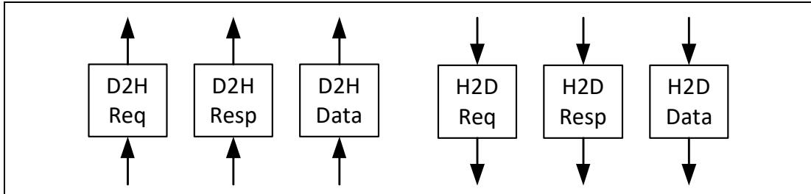

## 3.2.2 CXL.cache Channel Description

## 3.2.2.1 Channel Ordering

In general, all the CXL.cache channels must work independently of one another to ensure that forward progress is maintained. For example, because requests from the device to the Host to a given address X will be blocked by the Host until it collects all snoop responses for this address X, linking the channels would lead to deadlock.

However, there is a specific instance where ordering between channels must be maintained for the sake of correctness. The Host needs to wait until Global Observation (GO) messages, sent on H2D Response, are observed by the device before sending subsequent snoops for the same address. To limit the amount of buffering needed to track GO messages, the Host assumes that GO messages that have been sent over CXL.cache in a given cycle cannot be passed by snoops sent in a later cycle.

For transactions that have multiple messages on a single channel with an expected order (e.g., WritePull and GO for WrInv) the Device/Host must ensure they are observed correctly using serializing messages (e.g., the Data message between WritePull and GO for WrInv as shown in Figure 3-14).

## 3.2.2.2 Channel Crediting

To maintain the modularity of the interface no assumptions can be made on the ability to send a message on a channel because link layer credits may not be available at all times. Therefore, each channel must use a credit for sending any message and collect credit returns from the receiver. During operation, the receiver returns a credit whenever it has processed the message (i.e., freed up a buffer). It is not required that all credits are accounted for on either side, it is sufficient that credit counter saturates when full. If no credits are available, the sender must wait for the receiver to return one.

Table 3-12 describes which channels must drain to maintain forward progress and which can be blocked indefinitely. Additionally, Table 3-12 defines a summary of the forward progress and crediting mechanisms in CXL.cache, but this is not the complete definition. See Section 3.4 for the complete set of the ordering rules that are required for protocol correctness and forward progress.

Table 3-12. CXL.cache Channel Crediting Summary

<table><tr><td>Channel</td><td>Forward Progress Condition</td><td>Blocking Condition</td><td>Description</td></tr><tr><td>D2H Request (Req)</td><td>Credited to Host</td><td>Can be blocked by all other message classes in CXL.cachemem.</td><td>Needs Host buffer, could be held by earlier requests</td></tr><tr><td>D2H Response (Rsp)</td><td>Pre-allocated</td><td>Temporary link layer back pressure is allowed.Host may block waiting for H2D Response to drain.</td><td>Headed to specified Host buffer</td></tr><tr><td>D2H Data</td><td>Pre-allocated</td><td>Temporary link layer back pressure is allowed.Host may block for H2D Data to drain.</td><td>Headed to specified Host buffer</td></tr><tr><td>H2D Request (Req)</td><td>Credited to Device</td><td>Must make progress. Temporary back pressure is allowed.</td><td>May be temporarily back pressured due to lack of available D2H Response credits or D2H Data credits</td></tr><tr><td>H2D Response (Rsp)</td><td>Pre-allocated</td><td>Link layer only, must make progress. Temporary back pressure is allowed.</td><td>Headed to specified device buffer</td></tr><tr><td>H2D Data</td><td>Pre-allocated</td><td>Link layer only, must make progress. Temporary back pressure is allowed.</td><td>Headed to specified device buffer</td></tr></table>

## 3.2.3 CXL.cache Wire Description

The definition of each of the fields for each CXL.cache Channel is provided below. Each received message will support three variants: 68B Flit, 256B Flit, and PBR Flit. The use of each of these will be negotiated in the physical layer for each link as defined in Chapter 6.0.

## 3.2.3.1 D2H Request

Table 3-13. CXL.cache — D2H Request Fields (Sheet 1 of 2)

<table><tr><td rowspan="2">D2H Request</td><td colspan="3">Width (Bits)</td><td rowspan="2">Description</td></tr><tr><td>68B Flit</td><td>256B Flit</td><td>PBR Flit</td></tr><tr><td>Valid</td><td colspan="3">1</td><td>The request is valid.</td></tr><tr><td>Opcode</td><td colspan="3">5</td><td>The opcode specifies the operation of the request (see Table 3-22 for details).</td></tr><tr><td>CQID</td><td colspan="3">12</td><td>Command Queue ID: The CQID field contains the ID of the tracker entry that is associated with the request. When the response and data are returned for this request, the CQID is sent in the response or data message indicating to the device which tracker entry originated this request.IMPLEMENTATION NOTECQID usage depends on the round-trip transaction latency and desired bandwidth. A 12-bit ID space allows for 4096 outstanding requests which can saturate link bandwidth for a x16 link at 128 GT/s with average latency of around 1 us $^{1}$  for streaming reads or writes.</td></tr><tr><td>NT</td><td colspan="3">1</td><td>For cacheable reads, the NonTemporal bit is used as a hint to indicate to the host how it should be cached (see Table 3-14 for details).</td></tr><tr><td>CacheID</td><td>0</td><td>4</td><td>0</td><td>Logical CacheID of the source of the message. Not supported in 68B flit messages. Not applicable in PBR messages where DPID infers this field.</td></tr></table>

Table 3-13. CXL.cache — D2H Request Fields (Sheet 2 of 2)

<table><tr><td rowspan="2">D2H Request</td><td colspan="3">Width (Bits)</td><td rowspan="2">Description</td></tr><tr><td>68B Flit</td><td>256B Flit</td><td>PBR Flit</td></tr><tr><td>Address[51:6]</td><td colspan="3">46</td><td>Carries the physical address of coherent requests.</td></tr><tr><td>SPID</td><td colspan="2">0</td><td>12</td><td>Source PID</td></tr><tr><td>DPID</td><td colspan="2">0</td><td>12</td><td>Destination PID</td></tr><tr><td>RSVD</td><td>14</td><td colspan="2">7</td><td>Reserved</td></tr><tr><td>Total</td><td>79</td><td>76</td><td>96</td><td></td></tr></table>

1. The formula assumed in this calculation is as follows:  
“Latency Tolerance in ns” = Latency Tolerance in ns

“Number of Requests” \* (64B per Request) / (“Link Efficiency” \* “Peak Bandwidth in GB/s”)

As an example, peak Link efficiency for 100% RdCurr or 100% WOWrInv\* flows is 84.65% and 68.78%, respectively (including Link encryption overhead in Containment mode). This provides a latency tolerance of 1.2 us and 1.49 us, respectively, at 128 GT/s. For a mix of Read and Write flows, the latency tolerance varies depending on the packing efficiency, but can be calculated in a similar manner.

Table 3-14. NonTemporal Encodings

<table><tr><td>NonTemporal</td><td>Definition</td></tr><tr><td>0</td><td>Default behavior. This is Host implementation specific.</td></tr><tr><td>1</td><td>Requested line should be moved to Least Recently Used (LRU) position</td></tr></table>

## 3.2.3.2 D2H Response

Table 3-15. CXL.cache — D2H Response Fields

<table><tr><td rowspan="2">D2H Response</td><td colspan="3">Width (Bits)</td><td rowspan="2">Description</td></tr><tr><td>68B Flit</td><td>256B Flit</td><td>PBR Flit</td></tr><tr><td>Valid</td><td colspan="3">1</td><td>The response is valid.</td></tr><tr><td>Opcode</td><td colspan="3">5</td><td>The opcode specifies what kind of response is being signaled (see Table 3-25 for details).</td></tr><tr><td>UQID</td><td colspan="3">12</td><td>Unique Queue ID: This is a reflection of the UQID sent with the H2D Request and indicates which Host entry is the target of the response.</td></tr><tr><td>DPID</td><td colspan="2">0</td><td>12</td><td>Destination PID</td></tr><tr><td>RSVD</td><td>2</td><td colspan="2">6</td><td>Reserved</td></tr><tr><td>Total</td><td>20</td><td>24</td><td>36</td><td></td></tr></table>

## 3.2.3.3 D2H Data

Table 3-16. CXL.cache — D2H Data Header Fields

<table><tr><td rowspan="2">D2H Data Header</td><td colspan="3">Width (Bits)</td><td rowspan="2">Description</td></tr><tr><td>68B Flit</td><td>256B Flit</td><td>PBR Flit</td></tr><tr><td>Valid</td><td colspan="3">1</td><td>The Valid signal indicates that this is a valid data message.</td></tr><tr><td>UQID</td><td colspan="3">12</td><td>Unique Queue ID: This is a reflection of the UQID sent with the H2D Response and indicates which Host entry is the target of the data transfer.</td></tr><tr><td>ChunkValid</td><td>1</td><td colspan="2">0</td><td>In case of a 32B transfer on CXL.cache, this indicates which 32-byte chunk of the cacheline is represented by this transfer. If not set, indicates the lower 32B. If set, indicates the upper 32B. This field is ignored for a 64B transfer.</td></tr><tr><td>Bogus</td><td colspan="3">1</td><td>The Bogus bit indicates that the data associated with this evict message was returned to a snoop after the D2H request was sent from the device, but before a WritePull was received for the evict. This data is no longer the most current, so it should be dropped by the Host.</td></tr><tr><td>Poison</td><td colspan="3">1</td><td>The Poison bit is an indication that this data chunk is corrupted and should not be used by the Host.</td></tr><tr><td>BEP</td><td>0</td><td colspan="2">1</td><td>Byte-Enables Present: Indication that 5 data slots are included in the message where the  $5^{th}$  data slot carries the 64-bit Byte Enables. This field is carried as part of the Flit header bits in 68B Flit mode.</td></tr><tr><td>DPID</td><td colspan="2">0</td><td>12</td><td>Destination PID</td></tr><tr><td>RSVD</td><td>1</td><td colspan="2">8</td><td>Reserved</td></tr><tr><td>Total</td><td>17</td><td>24</td><td>36</td><td></td></tr></table>

## 3.2.3.3.1 Byte Enables (68B Flit)

In 68B Flit mode, the presence of data byte enables is indicated in the flit header, but only when one or more of the byte enable bits has a value of 0. In that case, the byte enables are sent as a data chunk as described in Section 4.2.2.

## 3.2.3.3.2 Byte-Enables Present (256B Flit)

In 256B Flit mode, a BEP (Byte-Enables Present) bit is included with the message header that indicates BE slot is included at the end of the message. The Byte Enables field is 64 bits wide and indicates which of the bytes are valid for the contained data.

## 3.2.3.4 H2D Request

Table 3-17. CXL.cache — H2D Request Fields (Sheet 1 of 2)

<table><tr><td rowspan="2">H2D Request</td><td colspan="3">Width (Bits)</td><td rowspan="2">Description</td></tr><tr><td>68B Flit</td><td>256B Flit</td><td>PBR Flit</td></tr><tr><td>Valid</td><td colspan="3">1</td><td>The Valid signal indicates that this is a valid request.</td></tr><tr><td>Opcode</td><td colspan="3">3</td><td>The Opcode field indicates the kind of H2D request (see Table 3-26 for details).</td></tr><tr><td>Address[51:6]</td><td colspan="3">46</td><td>The Address field indicates which cacheline the request targets.</td></tr></table>

Table 3-17. CXL.cache — H2D Request Fields (Sheet 2 of 2)

<table><tr><td rowspan="2">H2D Request</td><td colspan="3">Width (Bits)</td><td rowspan="2">Description</td></tr><tr><td>68B Flit</td><td>256B Flit</td><td>PBR Flit</td></tr><tr><td>UQID</td><td colspan="3">12</td><td>Unique Queue ID: This indicates which Host entry is the source of the request.</td></tr><tr><td>CacheID</td><td>0</td><td>4</td><td>0</td><td>Logical CacheID of the destination of the message. Value is assigned by Switch Edge Ports and not observed by the device. Host implementation may constrain the number of encodings that the Host can support. Not applicable with PBR messages where DPID infers this field.</td></tr><tr><td>SPID</td><td colspan="2">0</td><td>12</td><td>Source PID</td></tr><tr><td>DPID</td><td colspan="2">0</td><td>12</td><td>Destination PID</td></tr><tr><td>RSVD</td><td>2</td><td colspan="2">6</td><td>Reserved</td></tr><tr><td>Total</td><td>64</td><td>72</td><td>92</td><td></td></tr></table>

3.2.3.5 H2D Response

Table 3-18. CXL.cache — H2D Response Fields

<table><tr><td rowspan="2">H2D Response</td><td colspan="3">Width (Bits)</td><td rowspan="2">Description</td></tr><tr><td>68B Flit</td><td>256B Flit</td><td>PBR Flit</td></tr><tr><td>Valid</td><td colspan="3">1</td><td>The Valid bit indicates that this is a valid response to the device.</td></tr><tr><td>Opcode</td><td colspan="3">4</td><td>The Opcode field indicates the type of the response being sent (see Table 3-27 for details).</td></tr><tr><td>RspData</td><td colspan="3">12</td><td>The response Opcode determines how the RspData field is interpreted as shown in Table 3-27. Thus, depending on Opcode, it can either contain the UQID or the MESI information in bits[3:0] as shown in Table 3-20.</td></tr><tr><td>RSP_PRE</td><td colspan="3">2</td><td>RSP_PRE carries performance monitoring information (see Table 3-19 for details).</td></tr><tr><td>CQID</td><td colspan="3">12</td><td>Command Queue ID: This is a reflection of the CQID sent with the D2H Request and indicates which device entry is the target of the response.</td></tr><tr><td>CacheID</td><td>0</td><td>4</td><td>0</td><td>Logical CacheID of the destination of the message. This value is returned by the host based on the CacheID sent in the D2H request.Not applicable with PBR messages where DPID infers this field.</td></tr><tr><td>DPID</td><td colspan="2">0</td><td>12</td><td>Destination PID</td></tr><tr><td>RSVD</td><td>1</td><td colspan="2">5</td><td>Reserved</td></tr><tr><td>Total</td><td>32</td><td>40</td><td>48</td><td></td></tr></table>

Table 3-19. RSP\_PRE Encodings

<table><tr><td>RSP_PRE[1:0]</td><td>Response</td></tr><tr><td>00b</td><td>Host Cache Miss to Local CPU socket memory</td></tr><tr><td>01b</td><td>Host Cache Hit</td></tr><tr><td>10b</td><td>Host Cache Miss to Remote CPU socket memory</td></tr><tr><td>11b</td><td>Reserved</td></tr></table>

Table 3-20. Cache State Encoding for H2D Response

<table><tr><td>Cache State</td><td>Encoding</td></tr><tr><td>Invalid (I)</td><td>0011b</td></tr><tr><td>Shared (S)</td><td>0001b</td></tr><tr><td>Exclusive (E)</td><td>0010b</td></tr><tr><td>Modified (M)</td><td>0110b</td></tr><tr><td>Error ( $Err$ ) $^{1}$ </td><td>0100b</td></tr></table>

1. Covers error conditions not covered by poison such as errors in coherence resolution.

## 3.2.3.6 H2D Data

Table 3-21. CXL.cache — H2D Data Header Fields

<table><tr><td rowspan="2">H2D Data Header</td><td colspan="3">Width (Bits)</td><td rowspan="2">Description</td></tr><tr><td>68B Flit</td><td>256B Flit</td><td>PBR Flit</td></tr><tr><td>Valid</td><td colspan="3">1</td><td>The Valid bit indicates that this is a valid data to the device.</td></tr><tr><td>CQID</td><td colspan="3">12</td><td>Command Queue ID: This is a reflection of the CQID sent with the D2H Request and indicates which device entry is the target of the data transfer.</td></tr><tr><td>ChunkValid</td><td>1</td><td colspan="2">0</td><td>In case of a 32B transfer on CXL.cache, this indicates which 32-byte chunk of the cacheline is represented by this transfer. If not set, indicates the lower 32B. If set, indicates the upper 32B. This field is ignored for a 64B transfer.</td></tr><tr><td>Poison</td><td colspan="3">1</td><td>The Poison bit indicates to the device that this data is corrupted and as such should not be used.</td></tr><tr><td>GO-Err</td><td colspan="3">1</td><td>The GO-ERR bit indicates to the agent that this data is the result of an error condition and should not be cached or provided as response to snoops. Covers error conditions not covered by poison such as errors in coherence resolution.</td></tr><tr><td>CacheID</td><td>0</td><td>4</td><td>0</td><td>Logical CacheID of the destination of the message. Host and switch must support this field to set a nonzero value. Not applicable in PBR messages where DPID infers this field.</td></tr><tr><td>DPID</td><td colspan="2">0</td><td>12</td><td>Destination PID</td></tr><tr><td>RSVD</td><td>8</td><td colspan="2">9</td><td>Reserved</td></tr><tr><td>Total</td><td>24</td><td>28</td><td>36</td><td></td></tr></table>

## CXL.cache Transaction Description

## 3.2.4.1 Device-attached Memory Flows for HDM-D/HDM-DB

When a CXL Type 2 device exposes memory to the host using Host-managed Device Memory Device-Coherent (HDM-D/HDM-DB), the device is responsible to resolve coherence of HDM between the host and device. CXL defines two protocol options for this:

• CXL.cache Requests which is used for HDM-D

• CXL.mem Back-Invalidate Snoop (BISnp) which is used with HDM-DB

Endpoint devices supporting 256B Flit mode must support BISnp mechanism and can optionally use CXL.cache mechanism when connected to a host that has only 68B flit mode. When using CXL.cache, the host detects the address as coming from the device that owns the region which triggers the special flow that returns Mem\*Fwd, in most cases, as captured in Table 3-24.

## 3.2.4.2 Device to Host Requests

## 3.2.4.2.1 Device to Host (D2H) CXL.cache Request Semantics

For device to Host requests, there are four different semantics: CXL.cache Read, CXL.cache Read0, CXL.cache Read0/Write, and CXL.cache Write. All device to Host CXL.cache transactions fall into one of these four semantics, though the allowable responses and restrictions for each request type within a given semantic are different.

## 3.2.4.2.2 CXL.cache Read

CXL.cache Reads must have a D2H request credit and send a request message on the D2H CXL.cache request channel. CXL.cache Read requests require zero or one response (GO) message and data messages totaling a single 64-byte cacheline of data. Both the response, if present, and data messages are directed at the device tracker entry provided in the initial D2H request packet’s CQID field. The device entry must remain active until all the messages from the Host have been received. To ensure forward progress, the device must have a reserved data buffer able to accept 64 bytes of data immediately after the request is sent. However, the device may temporarily be unable to accept data from the Host due to prior data returns not draining. Once both the response message and the data messages have been received from the Host, the transaction can be considered complete and the entry deallocated from the device.

Figure 3-11 shows the elements required to complete a CXL.cache Read. Note that the response (GO) message can be received before, after, or between the data messages.

Figure 3-11. CXL.cache Read Behavior  
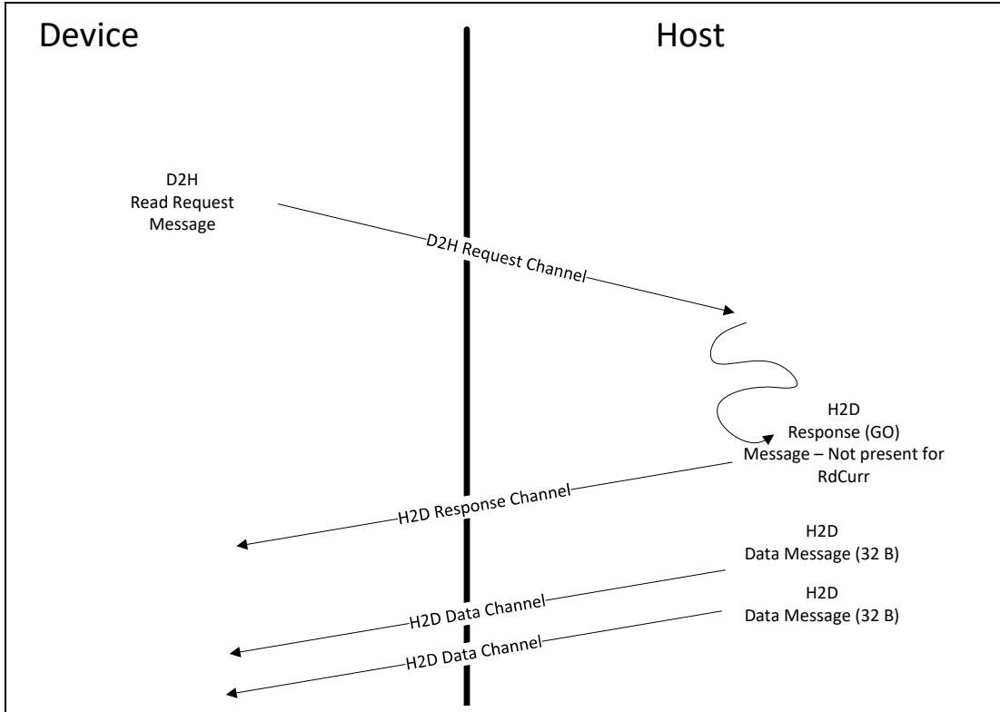

## 3.2.4.2.3 CXL.cache Read0

CXL.cache Read0 must have a D2H request credit and send a message on the D2H CXL.cache request channel. CXL.cache Read0 requests receive a response message but no data messages. The response message is directed at the device entry indicated in the initial D2H request message’s CQID value. Once the GO message is received for these requests, they can be considered complete and the entry deallocated from the device. A data message must not be sent by the Host for these transactions. Most special cycles (e.g., CLFlush) and other miscellaneous requests fall into this category. See Table 3-22 for details.

Figure 3-12 shows the elements required to complete a CXL.cache Read0 transaction.

Figure 3-12. CXL.cache Read0 Behavior  
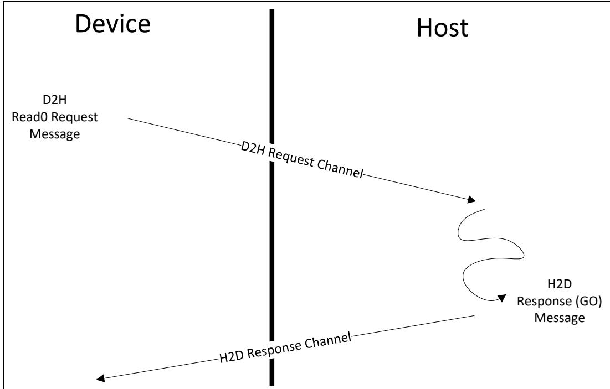

## 3.2.4.2.4 CXL.cache Write

CXL.cache Write must have a D2H request credit before sending a request message on the D2H CXL.cache request channel. Once the Host has received the request message, it is required to send a GO message and a WritePull message. The WritePull message is not required for CleanEvictNoData. The GO and the WritePull can be a combined message for some requests. The GO message must never arrive at the device before the WritePull, but it can arrive at the same time in the combined message. If the transaction requires posted semantics, then a combined GO-I/WritePull message can be used. If the transaction requires non-posted semantics, then WritePull is issued first followed by the GO-I when the non-posted write is globally observed.

Upon receiving the GO-I message, the device will consider the store done from a memory ordering and cache coherency perspective, relinquishing snoop ownership of the cacheline (if the CXL.cache message is an Evict).

The WritePull message triggers the device to send data messages to the Host totaling exactly 64 bytes of data, though any number of byte enables can be set.

A CXL.cache write transaction is considered complete by the device once the device has received the GO-I message, and has sent the required data messages. At this point the entry can be deallocated from the device.

The Host considers a write to be done once it has received all 64 bytes of data, and has sent the GO-I response message. All device writes and Evicts fall into the CXL.cache Write semantic.

See Section 3.2.5.8 for more information on restrictions around multiple active write transactions.

Figure 3-13 shows the elements required to complete a CXL.cache Write transaction (that matches posted behavior). The WritePull (or the combined GO\_WritePull) message triggers the data messages. There are restrictions on Snoops and WritePulls. See Section 3.2.5.3 for more details.

Figure 3-14 shows a case where the WritePull is a separate message from the GO (for example: strongly ordered uncacheable write).

Figure 3-15 shows the Host FastGO plus ExtCmp responses for weakly ordered write requests.

Figure 3-13. CXL.cache Device to Host Write Behavior

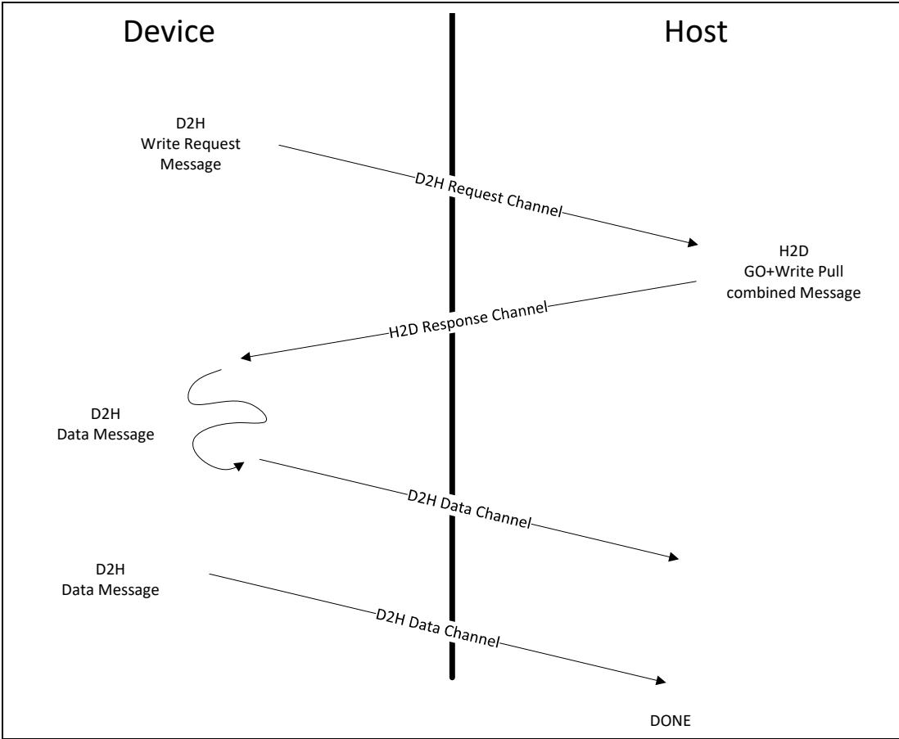

Figure 3-14. CXL.cache WrInv Transaction  
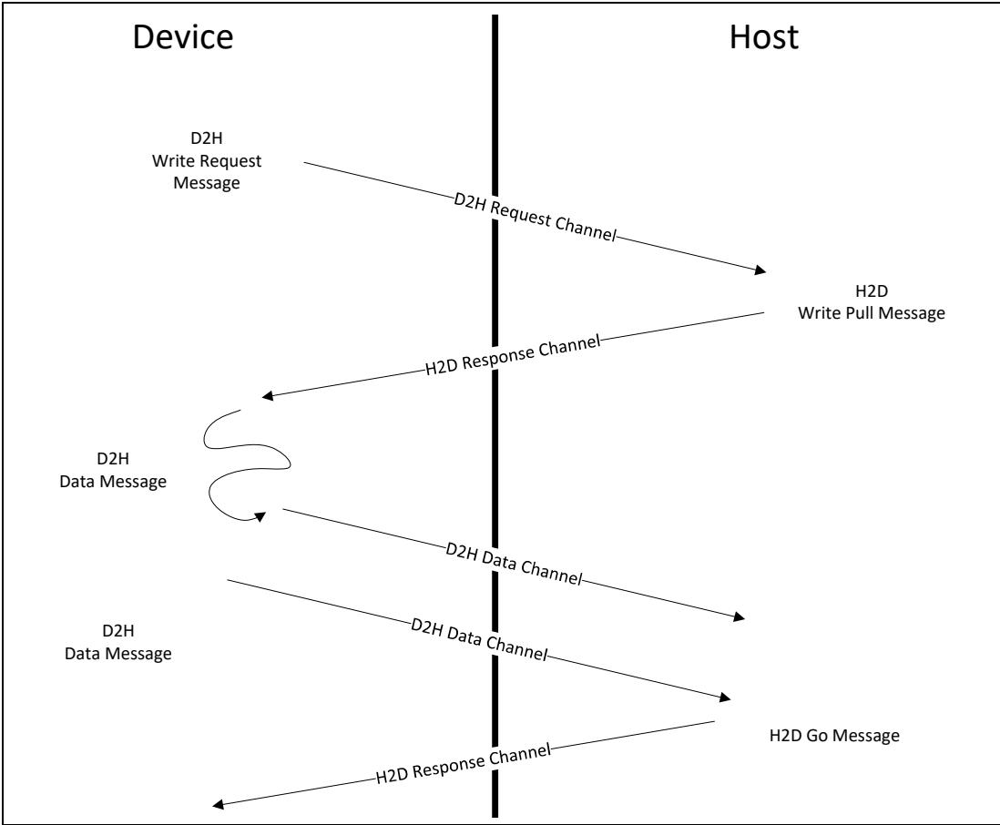

Figure 3-15. WOWrInv/F with FastGO/ExtCmp  
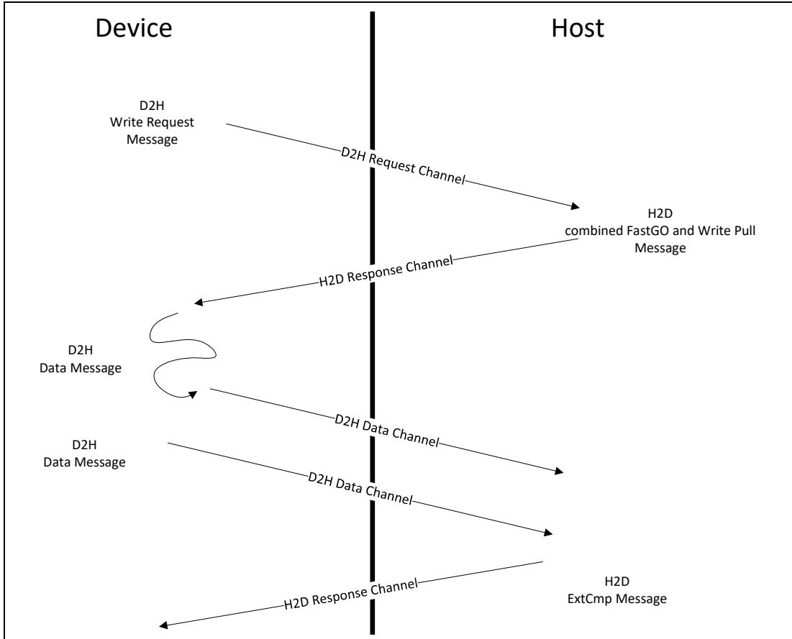

## 3.2.4.2.5 CXL.cache Read0-Write Semantics

CXL.cache Read0-Write requests must have a D2H request credit before sending a request message on the D2H CXL.cache request channel. Once the Host has received the request message, it is required to send one merged GO-I and WritePull message.

The WritePull message triggers the device to send the data messages to the Host, which together transfer exactly 64 bytes of data though any number of byte enables can be set.

A CXL.cache Read0-Write transaction is considered complete by the device once the device has received the GO-I message, and has sent the all required data messages. At this point the entry can be deallocated from the device.

The Host considers a Read0-Write to be done once it has received all 64 bytes of data, and has sent the GO-I response message. ItoMWr falls into the Read0-Write category.

Figure 3-16. CXL.cache Read0-Write Semantics  
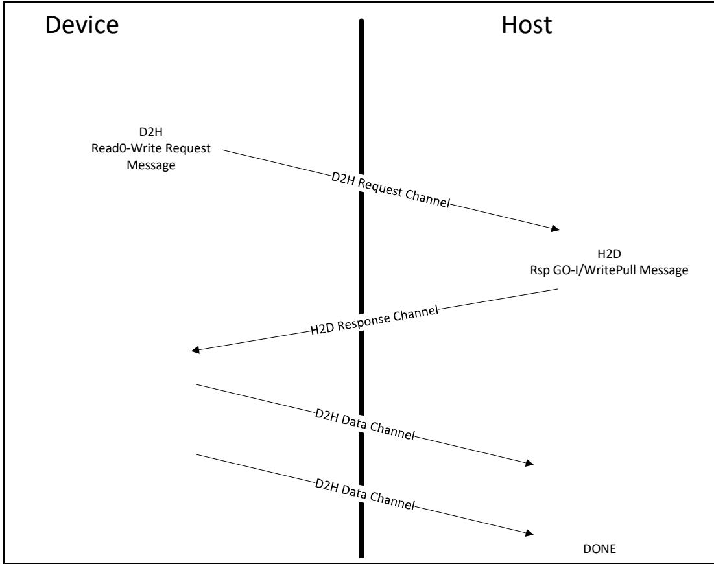  
Table 3-22 summarizes all the opcodes that are available from the Device to the Host.

Table 3-22. CXL.cache — Device to Host Requests

<table><tr><td>CXL.cache Opcode</td><td>Semantic</td><td>Opcode</td></tr><tr><td>RdCurr</td><td>Read</td><td>0 0001b</td></tr><tr><td>RdOwn</td><td>Read</td><td>0 0010b</td></tr><tr><td>RdShared</td><td>Read</td><td>0 0011b</td></tr><tr><td>RdAny</td><td>Read</td><td>0 0100b</td></tr><tr><td>RdOwnNoData</td><td>Read0</td><td>0 0101b</td></tr><tr><td>ItoMWr</td><td>Read0-Write</td><td>0 0110b</td></tr><tr><td>WrCur</td><td>Read0-Write</td><td>0 0111b</td></tr><tr><td>CLFlush</td><td>Read0</td><td>0 1000b</td></tr><tr><td>CleanEvict</td><td>Write</td><td>0 1001b</td></tr><tr><td>DirtyEvict</td><td>Write</td><td>0 1010b</td></tr><tr><td>CleanEvictNoData</td><td>Write</td><td>0 1011b</td></tr><tr><td>WOWrInv</td><td>Write</td><td>0 1100b</td></tr><tr><td>WOWrInvF</td><td>Write</td><td>0 1101b</td></tr><tr><td>WrInv</td><td>Write</td><td>0 1110b</td></tr><tr><td>CacheFlushed</td><td>Read0</td><td>1 0000b</td></tr></table>

## 3.2.4.2.6 RdCurr

These are full cacheline read requests from the device for lines to get the most current data, but not change the existing state in any cache, including in the Host. The Host does not need to track the cacheline in the device that issued the RdCurr. RdCurr gets a data but no GO. The device receives the line in the Invalid state which means that the device gets one use of the line and cannot cache it.

## 3.2.4.2.7 RdOwn

These are full cacheline read requests from the device for lines to be cached in any writeable state. Typically, a RdOwn request receives the line in Exclusive (GO-E) or Modified (GO-M) state. Lines in Modified state must not be dropped, and have to be written back to the Host.

Under error conditions, a RdOwn request may receive the line in Invalid (GO-I) or Error (GO-Err) state. Both return synthesized data of all 1s. The device is responsible for handling the error appropriately.

## 3.2.4.2.8 RdShared

These are full cacheline read requests from the device for lines to be cached in Shared state. Typically, a RdShared request receives the line in Shared (GO-S) state.

Under error conditions, a RdShared request may receive the line in Invalid (GO-I) or Error (GO-Err) state. Both will return synthesized data of all 1s. The device is responsible for handling the error appropriately.

## 3.2.4.2.9 RdAny

These are full cacheline read requests from the device for lines to be cached in any state. Typically, RdAny request receives the line in Shared (GO-S), Exclusive (GO-E) or Modified (GO-M) state. Lines in Modified state must not be dropped, and have to be written back to the Host.

Under error conditions, a RdAny request may receive the line in Invalid (GO-I) or Error (GO-Err) state. Both return synthesized data of all 1s. The device is responsible for handling the error appropriately.

## 3.2.4.2.10 RdOwnNoData

These are requests to get exclusive ownership of the cacheline address indicated in the address field. The typical response is Exclusive (GO-E).

Under error conditions, a RdOwnNoData request may receive the line in Error (GO-Err) state. The device is responsible for handling the error appropriately.

## Note:

A device that uses this command to write data must be able to update the entire cacheline or may drop the E-state if it is unable to perform the update. There is no support partial M-state data in a device cache. To perform a partial write in the device cache, the device must read the cacheline using RdOwn before merging with the partial write data in the cache.

## 3.2.4.2.11 ItoMWr

This command requests exclusive ownership of the cacheline address indicated in the address field and atomically writes the cacheline back to the Host. The device guarantees that the entire line will be modified, so no data needs to be transferred to the device. The typical response is GO\_WritePull, which is sent once the request is granted ownership. The device must not retain a copy of the line. If a cache exists in the host cache hierarchy before memory, the data should be written there.

If an error occurs, then GO-Err-WritePull is sent instead. The device sends the data to the Host, which drops it. The device is responsible for handling the error as appropriate.

## 3.2.4.2.12 WrCur

The command behaves like the ItoMWr in that it atomically requests ownership of a cacheline and then writes a full cacheline back to the Fabric. However, WrCur differs from ItoMWr in where the data is written. Only if the command hits in a cache will the data be written there; on a Miss, the data will be written directly to memory. The typical response is GO\_WritePull once the request is granted ownership. The device must not retain a copy of the line.

If an error occurs, then GO-Err-WritePull is sent instead. The device sends the data to the Host, which drops it. The device is responsible for handling the error as appropriate.

## Note:

In earlier revisions of the specification (CXL 2.0 and CXL 1.x), this command was called “MemWr”, but this was a problem because that same message name is used in the CXL.mem protocol, so a new name was selected. The opcode and behavior are unchanged.

## 3.2.4.2.13 CLFlush

This is a request to the Host to invalidate the cacheline specified in the address field. The typical response is GO-I which is sent from the Host upon completion in memory.

However, the Host may keep tracking the cacheline in Shared state if the Core has issued a Monitor to an address belonging in the cacheline. Thus, the Device that exposes an HDM-D region must not rely on CLFlush/GO-I as a sufficient condition for which to flip a cacheline in the HDM-D region from Host to Device Bias mode. Instead, the Device must initiate RdOwnNoData and receive an H2D Response of GO-E before it updates its Bias Table to Device Bias mode to allow subsequent cacheline access without notifying the Host.

Under error conditions, a CLFlush request may receive the line in the Error (GO-Err) state. The device is responsible for handling the error appropriately.

## 3.2.4.2.14 CleanEvict

This is a request to the Host to evict a full 64-byte Exclusive cacheline from the device. Typically, CleanEvict receives GO-WritePull or GO-WritePullDrop. The response will cause the device to relinquish snoop ownership of the line. For GO-WritePull, the device will send the data as normal. For GO-WritePullDrop, the device simply drops the data.

Once the device has issued this command and the address is subsequently snooped, but before the device has received the GO-WritePull, the device must set the Bogus field in all D2H Data messages to indicate that the data is now stale.

CleanEvict requests also guarantee to the Host that the device no longer contains any cached copies of this line. Only one CleanEvict from the device may be pending on CXL.cache for any given cacheline address.

CleanEvict is only expected for a host-attached memory range of addresses. For a device-attached memory range, the equivalent operation can be completed internally within the device without sending a transaction to the Host.

## 3.2.4.2.15 DirtyEvict

This is a request to the Host to evict a full 64-byte Modified cacheline from the device. Typically, DirtyEvict receives GO-WritePull from the Host at which point the device must relinquish snoop ownership of the line and send the data as normal.

Once the device has issued this command and the address is subsequently snooped, but before the device has received the GO-WritePull, the device must set the Bogus field in all D2H Data messages to indicate that the data is now stale.

DirtyEvict requests also guarantee to the Host that the device no longer contains any cached copies of this line. Only one DirtyEvict from the device may be pending on CXL.cache for any given cacheline address.

In error conditions, a GO-Err-WritePull is received. The device sends the data as normal, and the Host drops it. The device is responsible for handling the error as appropriate.

DirtyEvict is only expected for host-attached memory address ranges. For a deviceattached memory range, the equivalent operation can be completed internally within the device without sending a transaction to the Host.

## 3.2.4.2.16 CleanEvictNoData

This is a request for the device to update the Host that a clean line is dropped in the device. The sole purpose of this request is to update any snoop filters in the Host. No data is exchanged.

CleanEvictNoData is only expected for host-attached memory address ranges. For device-attached memory range, the equivalent operation can be completed internally within the device without sending a transaction to the Host.

## 3.2.4.2.17 WOWrInv

This is a weakly ordered write invalidate line request of 0 to 63 bytes for write combining type stores. Any combination of byte enables may be set.

Typically, WOWrInv receives a FastGO-WritePull followed by an ExtCmp. Upon receiving the FastGO-WritePull the device sends the data to the Host. For host-attached memory, the Host sends the ExtCmp once the write is complete in memory.

FastGO does not provide Global Observation.

In error conditions, a GO-Err-WritePull is received. The device sends the data as normal, and the Host drops it. The device is responsible for handling the error as appropriate. An ExtCmp is still sent by the Host after the GO-Err in all cases.

## 3.2.4.2.18 WOWrInvF

Same as WOWrInv (rules and flows), except it is a write of 64 bytes.

## 3.2.4.2.19 WrInv

This is a write invalidate line request of 0 to 64 bytes. Typically, WrInv receives a WritePull followed by a GO. Upon getting the WritePull, the device sends the data to the Host. The Host sends GO once the write completes in memory (both, host-attached or device-attached).

In error conditions, a GO-Err is received. The device is responsible for handling the error as appropriate.

## 3.2.4.2.20 CacheFlushed

This is an indication sent by the device to inform the Host that the device’s caches are flushed, and the device no longer contains any cachelines in the Shared, Exclusive, or Modified state (a device may exclude addresses that are part its “Device-attached Memory” mapped as HDM-D/HDM-DB). The Host can use this information to clear its snoop filters, block snoops to the device, and return a GO. Once the device receives the GO, the device is guaranteed to not receive any snoops from the Host until the device sends the next cacheable D2H Request.

When a CXL.cache device is flushing its cache, the device must wait for all responses for cacheable access before sending the CacheFlushed message. This is necessary because the Host must observe CacheFlushed only after all inflight messages that impact device coherence tracking in the Host are complete.

## IMPLEMENTATION NOTE

Snoops may be pending to the device when the Host receives the CacheFlushed command and the Host may complete the CacheFlushed command (sending a GO) while those snoops are outstanding. From the device point of view, this can be observed as receiving snoops after the CacheFlushed message is complete. The device should allow for this behavior without creating long stall conditions on the snoops by waiting for snoop queues to drain before initiating any power state transition (e.g., L1 link state) that could stall snoops.

D2H Request (Targeting Non-device-attached Memory) Supported H2D Responses

<table><tr><td rowspan="2">D2H Request</td><td colspan="11">H2D Response</td></tr><tr><td>WritePull</td><td>GO_WritePull</td><td>ExtCmp</td><td>GO_WritePull_Drop</td><td>Fast_GO_WritePull</td><td>GO_ERR_WritePull</td><td>GO-Err</td><td>GO-I</td><td>GO-S</td><td>GO-E</td><td>GO-M</td></tr><tr><td>RdCurr</td><td></td><td></td><td></td><td></td><td></td><td></td><td></td><td></td><td></td><td></td><td></td></tr><tr><td>RdOwn</td><td></td><td></td><td></td><td></td><td></td><td></td><td>X</td><td>X</td><td></td><td>X</td><td>X</td></tr><tr><td>RdShared</td><td></td><td></td><td></td><td></td><td></td><td></td><td>X</td><td>X</td><td>X</td><td></td><td></td></tr><tr><td>RdAny</td><td></td><td></td><td></td><td></td><td></td><td></td><td>X</td><td>X</td><td>X</td><td>X</td><td>X</td></tr><tr><td>RdOwnNoData</td><td></td><td></td><td></td><td></td><td></td><td></td><td>X</td><td></td><td></td><td>X</td><td></td></tr><tr><td>ItoMWr</td><td></td><td>X</td><td></td><td></td><td></td><td>X</td><td></td><td></td><td></td><td></td><td></td></tr><tr><td>WrCur</td><td></td><td>X</td><td></td><td></td><td></td><td>X</td><td></td><td></td><td></td><td></td><td></td></tr><tr><td>CLFlush</td><td></td><td></td><td></td><td></td><td></td><td></td><td>X</td><td>X</td><td></td><td></td><td></td></tr><tr><td>CleanEvict</td><td></td><td>X</td><td></td><td>X</td><td></td><td></td><td></td><td></td><td></td><td></td><td></td></tr><tr><td>DirtyEvict</td><td></td><td>X</td><td></td><td></td><td></td><td>X</td><td></td><td></td><td></td><td></td><td></td></tr><tr><td>CleanEvictNoData</td><td></td><td></td><td></td><td></td><td></td><td></td><td></td><td>X</td><td></td><td></td><td></td></tr><tr><td>WOWrInv</td><td></td><td></td><td>X</td><td></td><td>X</td><td>X</td><td></td><td></td><td></td><td></td><td></td></tr><tr><td>WOWrInvF</td><td></td><td></td><td>X</td><td></td><td>X</td><td>X</td><td></td><td></td><td></td><td></td><td></td></tr><tr><td>WrInv</td><td>X</td><td></td><td></td><td></td><td></td><td></td><td>X</td><td>X</td><td></td><td></td><td></td></tr><tr><td>CacheFlushed</td><td></td><td></td><td></td><td></td><td></td><td></td><td></td><td>X</td><td></td><td></td><td></td></tr></table>

For requests that target device-attached memory mapped as HDM-D, if the region is in Device Bias, no transaction is expected on CXL.cache because the Device can internally complete those requests. If the region is in Host Bias, Table 3-24 shows how the device should expect the response. For devices with BISnp channel support in which the memory is mapped as HDM-DB, the resolution of coherence occurs separately on the CXL.mem protocol and the “Not Supported” cases in the table are never sent from a device to the device-attached memory address range. The only commands supported on CXL.cache to this address region when BISnp is enabled are ItoMWr, WrCur, and WrInv.

D2H Request (Targeting Device-attached Memory) Supported Responses

<table><tr><td rowspan="2">D2H Request</td><td colspan="2">Response on CXL.cache</td><td colspan="2">Response on CXL.mem</td></tr><tr><td>Without BISnp (HDM-D)</td><td>With BISnp (HDM-DB)</td><td>Without BISnp (HDM-D)</td><td>With BISnp (HDM-DB)</td></tr><tr><td>RdCurr</td><td>GO-Err Bit set in H2D DH, Synthesized Data with all 1s (For Error Conditions)</td><td>Not Supported</td><td>MemRdFwd (For Success Conditions)</td><td>Not Supported</td></tr><tr><td>RdOwn</td><td>GO-Err on H2D Response, Synthesized Data with all 1s (For Error Conditions)</td><td>Not Supported</td><td>MemRdFwd (For Success Conditions)</td><td>Not Supported</td></tr><tr><td>RdShared</td><td>GO-Err on H2D Response, Synthesized Data with all 1s (For Error Conditions)</td><td>Not Supported</td><td>MemRdFwd (For Success Conditions)</td><td>Not Supported</td></tr><tr><td>RdAny</td><td>GO-Err on H2D Response, Synthesized Data with all 1s (For Error Conditions)</td><td>Not Supported</td><td>MemRdFwd (For Success Conditions)</td><td>Not Supported</td></tr><tr><td>RdOwnNoData</td><td>GO-Err on H2D Response (For Error Conditions)</td><td>Not Supported</td><td>MemRdFwd (For Success Conditions)</td><td>Not Supported</td></tr><tr><td>ItoMWr</td><td colspan="2">Same as host-attached  $memory^{1}$ </td><td colspan="2">None</td></tr><tr><td>WrCur</td><td colspan="2">Same as host-attached  $memory^{1}$ </td><td colspan="2">None</td></tr><tr><td>CLFlush</td><td>GO-Err on H2D Response (For Error Conditions)</td><td>Not Supported</td><td>MemRdFwd (For Success Conditions)</td><td>Not Supported</td></tr><tr><td>CleanEvict</td><td colspan="4">Not Supported</td></tr><tr><td>DirtyEvict</td><td colspan="4">Not Supported</td></tr><tr><td>CleanEvictNoData</td><td colspan="4">Not Supported</td></tr><tr><td>WOWrInv</td><td>GO_ERR_WritePull on H2D Response (For Error Conditions)</td><td>Not Supported</td><td>MemWrFwd (For Success Conditions)</td><td>Not Supported</td></tr><tr><td>WOWrInvF</td><td>GO_ERR_WritePull on H2D Response (For Error Conditions)</td><td>Not Supported</td><td>MemWrFwd (For Success Conditions)</td><td>Not Supported</td></tr><tr><td>WrInv</td><td colspan="2">Same as host-attached  $memory^{1}$ </td><td colspan="2">None</td></tr><tr><td>CacheFlushed</td><td colspan="2"> $N/A^{2}$ </td><td colspan="2">None</td></tr></table>

1. Flow for these commands follow the same flow as host memory regions and are not expected to check against CXL.mem coherence tracking (Bias Table or Snoop Filter) before issuing. The host will resolve coherence with the device using the CXL.mem protocol.  
2. There is no address in this command and the host must assume that this applies only to host memory regions (excluding device-attached memory).

CleanEvict, DirtyEvict, and CleanEvictNoData that target device-attached memory should always be completed internally by the device, regardless of bias state. For D2H Requests that receive a response on CXL.mem, the CQID associated with the CXL.cache request is reflected in the Tag of the CXL.mem MemRdFwd or MemWrFwd command. For MemRdFwd, the caching state of the line is reflected in the MetaValue field as described in Table 3-37.

## 3.2.4.3 Device to Host Response

Responses are directed at the Host entry indicated in the UQID field in the original H2D request message.

## Table 3-25. D2H Response Encodings

<table><tr><td>Device CXL.cache Rsp</td><td>Opcode</td></tr><tr><td>RspIHitI</td><td>0 0100b</td></tr><tr><td>RspVHitV</td><td>0 0110b</td></tr><tr><td>RspIHitSE</td><td>0 0101b</td></tr><tr><td>RspSHitSE</td><td>0 0001b</td></tr><tr><td>RspSFwdM</td><td>0 0111b</td></tr><tr><td>RspIFwdM</td><td>0 1111b</td></tr><tr><td>RspVFwdV</td><td>1 0110b</td></tr></table>

## 3.2.4.3.1 RspIHitI

In general, this is the response that a device provides to a snoop when the line was not found in any caches. If the device returns RspIHitI for a snoop, the Host can assume that the line has been cleared from that device.

## 3.2.4.3.2 RspVHitV

In general, this is the response that a device provides to a snoop when the line was hit in the cache and no state change occurred. If the device returns an RspVHitV for a snoop, the Host can assume that a copy of the line is present in one or more places within that device.

## 3.2.4.3.3 RspIHitSE

In general, this is the response that a device provides to a snoop when the line was hit in a clean state in at least one cache and is now invalid. If the device returns an RspIHitSE for a snoop, the Host can assume that the line has been cleared from that device.

## 3.2.4.3.4 RspSHitSE

In general, this is the response that a device provides to a snoop when the line was hit in a clean state in at least one cache and is now downgraded to shared state. If the device returns an RspSHitSE for a snoop, the Host should assume that the line is still present within the device.

## 3.2.4.3.5 RspSFwdM

This response indicates to the Host that the line being snooped is now in S state in the device, after having hit the line in Modified state. The device may choose to downgrade the line to Invalid. This response also indicates to the Host snoop tracking logic that 64 bytes of data is transferred on the D2H CXL.cache Data Channel to the Host data buffer indicated in the original snoop’s destination (UQID).

## 3.2.4.3.6 RspIFwdM

This response indicates to the Host that the line being snooped is now in I state in the device, after having hit the line in Modified state. The Host may now assume the device does not contain any cached copies of this line. This response also indicates to the Host snoop tracking logic that 64 bytes of data will be transferred on the D2H CXL.cache Data Channel to the Host data buffer indicated in the original snoop’s destination (UQID).

## 3.2.4.3.7 RspVFwdV

This response indicates that the device with E or M state (but not S state) is returning the current data to the Host and leaving the state unchanged. The Host must only forward the data to the requester because there is no state information.

## 3.2.4.4 Host to Device Requests

Snoops from the Host need not gain any credits besides local H2D request credits. The device will always send a Snoop Response message on the D2H CXL.cache Response channel. If the response is of the Rsp\*Fwd\* format, then the device must respond with 64 bytes of data via the D2H Data channel, directed at the UQID from the original snoop request message. If the response is not Rsp\*Fwd\*, the Host can consider the request complete upon receiving the snoop response message. The device can stop tracking the snoop once the response has been sent for non-data forwarding cases, or after both the last chunk of data has been sent and the response has been sent.

Figure 3-17 shows the elements required to complete a CXL.cache snoop. Note that the response message can be received by the Host in any relative order with respect to the data messages. The byte enable field is always all 1s for Snoop data transfers.

Figure 3-17. CXL.cache Snoop Behavior

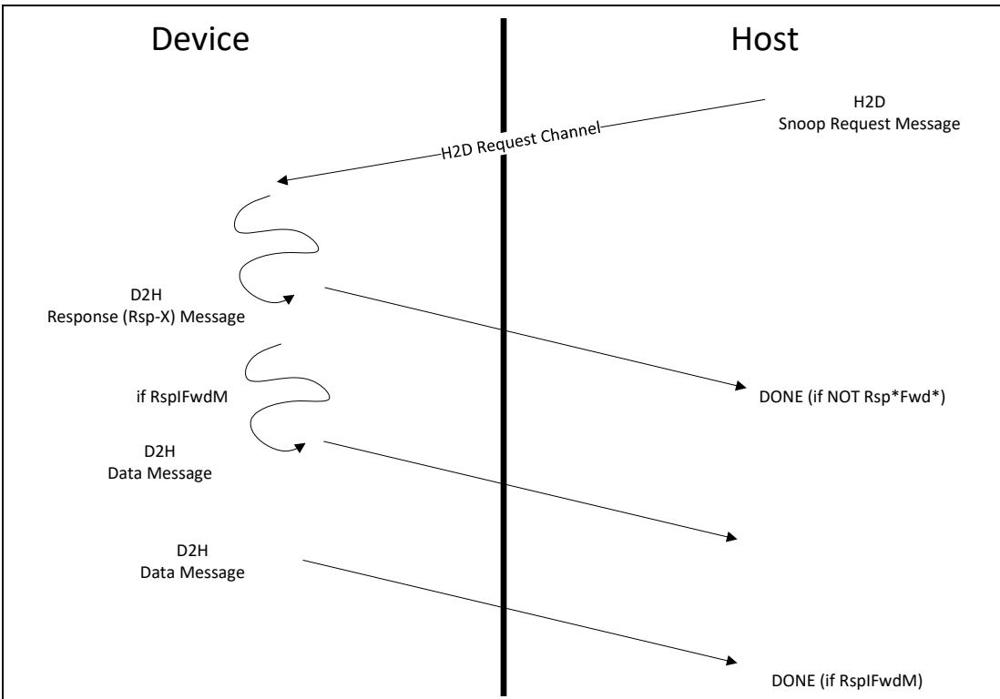

Table 3-26. CXL.cache — Mapping of H2D Requests to D2H Responses

<table><tr><td rowspan="2">H2D Request</td><td colspan="8">D2H Response</td></tr><tr><td>Opcode</td><td>RspIHitI</td><td>RspVhitV</td><td>RspSHitSE</td><td>RspIHitSE</td><td>RspSFwdM</td><td>RspIFwdM</td><td>RspVFwdV</td></tr><tr><td>SnpData</td><td>001b</td><td>X</td><td></td><td>X</td><td></td><td>X</td><td>X</td><td></td></tr><tr><td>SnpInv</td><td>010b</td><td>X</td><td></td><td></td><td>X</td><td></td><td>X</td><td></td></tr><tr><td>SnpCur</td><td>011b</td><td>X</td><td>X</td><td>X</td><td></td><td>X</td><td>X</td><td>X</td></tr></table>

## 3.2.4.4.1 SnpData

These are snoop requests from the Host for lines that are intended to be cached in either Shared or Exclusive state at the requester (the Exclusive state can be cached at the requester only if all devices respond with RspI). This type of snoop is typically triggered by data read requests. A device that receives this snoop must either invalidate or downgrade all cachelines to Shared state. If the device holds dirty data, the device must return the dirty data to the Host.

## 3.2.4.4.2 SnpInv

These are snoop requests from the Host for lines that are intended to be granted ownership and Exclusive state at the requester. This type of snoop is typically triggered by write requests. A device that receives this snoop must invalidate all cachelines. If the device holds dirty data, the device must return the dirty data to the Host.

## 3.2.4.4.3 SnpCur

This snoop gets the current version of the line, but does not require change of any cache state in the hierarchy. SnpCur is only sent on behalf of the RdCurr request. If the device holds data in Modified state, the device must return the data to the Host. The cache state can remain unchanged in both the device and Host, and the Host should not update its caches. To allow for varied cache implementations, devices are permitted to change cache state as captured in Table 3-26, but it is recommended to not change cache state.

## 3.2.4.5 Host to Device Response

## Table 3-27. H2D Response Opcode Encodings

<table><tr><td>H2D Response Class</td><td>Encoding</td><td>RspData</td></tr><tr><td>WritePull</td><td>0001b</td><td>UQID</td></tr><tr><td>GO</td><td>0100b</td><td>MESI $^{1}$ </td></tr><tr><td>GO_WritePull</td><td>0101b</td><td>UQID</td></tr><tr><td>ExtCmp</td><td>0110b</td><td>Don’t Care</td></tr><tr><td>GO_WritePull_Drop</td><td>1000b</td><td>UQID</td></tr><tr><td>Reserved</td><td>1100b</td><td>Don’t Care</td></tr><tr><td>Fast_GO_WritePull</td><td>1101b</td><td>UQID</td></tr><tr><td>GO_ERR_WritePull</td><td>1111b</td><td>UQID</td></tr></table>

1. 4-bit MESI encoding is in LSB and the upper bits are Reserved.

## 3.2.4.5.1 WritePull

This response instructs the device to send the write data to the Host, but not to change the state of the line. This is used for WrInv where the data is needed before the GO-I can be sent. This is because GO-I is the notification that the write was completed.

## 3.2.4.5.2 GO

The Global Observation (GO) message conveys that read requests are coherent and that write requests are coherent and consistent. It is an indication that the transaction has been observed by the system device and the MESI state that is encoded in the RspType field indicates into which state the data associated with the transaction should be placed for the requester’s caches. See Table 3-20 for details.

If the Host returns Modified state to the device, then the device is responsible for the dirty data and cannot drop the line without writing it back to the Host.

If the Host returns Invalid or Error state to the device, then the device must use the data at most once and not cache the data. Error responses to reads and cacheable write requests (e.g., RdOwn or ItoMWr) will always be the result of an abort condition, so modified data can be safely dropped in the device.

## 3.2.4.5.3 GO\_WritePull

This is a combined GO + WritePull message. No cache state is transferred to the device. The GO + WritePull message is used for write types that do not require a later message to know whether write data is visible.

## 3.2.4.5.4 ExtCmp

This response indicates that the data that was previously locally ordered (FastGO) has been observed throughout the system. Most importantly, accesses to memory will return the most up-to-date data.

## 3.2.4.5.5 GO\_WritePull\_Drop

This message has the same semantics as GO\_WritePull, except that the device should not send data to the Host. This response can be sent in place of GO\_WritePull when the Host determines that the data is not required. This response will never be sent for partial writes because the byte enables will always need to be transferred.

## 3.2.4.5.6 Fast\_GO\_WritePull

Similar to GO\_WritePull, but only indicates that the request is locally observed<sup>1</sup>. There will be a later ExtCmp message when the transaction is fully observable in memory. Devices that do not implement the Fast\_GO feature may ignore the GO message and wait for the ExtCMP. Data must always be sent for the WritePull. No cache state is transferred to the device.

## 3.2.4.5.7 GO\_ERR\_WritePull

Similar to GO\_WritePull, but indicates that there was an error with the transaction that should be handled correctly in the device. Data must be sent to the Host for the WritePull, and the Host will drop the data. No cache state is transferred to the device (assumed Error). An ExtCmp is still sent if it is expected by the originating request.

## Cacheability Details and Request Restrictions

These details and restrictions apply to all devices.

## 3.2.5.1 GO-M Responses

GO-M responses from the host indicate that the device is being granted the sole copy of modified data. The device must cache this data and write it back when it is done.

## 3.2.5.2 Device/Host Snoop-GO-Data Assumptions

When the host returns a GO response to a device, the expectation is that a snoop arriving to the same address of the request receiving the GO would see the results of that GO. For example, if the host sends GO-E for a RdOwn request followed by a snoop to the same address immediately afterward, then one would expect the device to transition the line to M state and reply with an RspIFwdM response to the Host. To implement this principle, the CXL.cache link layer ensures that the device will receive the two messages in separate slots to make the order completely unambiguous.

When the host is sending a snoop to the device, the requirement is that a GO response will not be sent to any requests with that address in the device until after the Host has received a response for the snoop and all implicit writeback (IWB) data (dirty data forwarded in response to a snoop) has been received.

When the host returns data to the device for a read type request, and GO for that request has not yet been sent to the device, the host may not send a snoop to that address until after the GO message has been sent. Because the new cache state is encoded in the response message for reads, sending a snoop to an address without having received GO, but after having received data, is ambiguous to the device as to what the snoop response should be in that situation.

Fundamentally, the GO that is associated with a read request also applies to the data returned with that request. Sending data for a read request implies that data is valid, meaning the device can consume it even if the GO has not yet arrived. The GO will arrive later and inform the device what state to cache the line in (if at all) and whether the data was the result of an error condition (e.g., hitting an address region that the device was not allowed to access).

## 3.2.5.3 Device/Host Snoop/WritePull Assumptions

The device requires that the host cannot have both a WritePull and H2D Snoop active on CXL.cache to a given 64-byte address. The host may not launch a snoop to a 64- byte address until all WritePull data from that address has been received by the host. Conversely, the host may not launch a WritePull for a write until the host has received the snoop response (including data in case of Rsp\*Fwd\*) for any snoops to the pending writes address. Any violation of these requirements will mean that the Bogus field on the D2H Data channel will be unreliable.

## 3.2.5.4 Snoop Responses and Data Transfer on CXL.cache Evicts

To snoop cache evictions (e.g., DirtyEvict) and maintain an orderly transfer of snoop ownership from the device to the host, cache evictions on CXL.cache must adhere to the following protocol.

If a device Evict transaction has been issued on the CXL.cache D2H request channel, but has not yet processed its WritePull from the host, and a snoop hits the writeback, the device must track this snoop hit if cache state is changed, which excludes the case when SnpCur results in a RspVFwdV response. When the device begins to process the

WritePull, if snoop hit is tracked the device must set the Bogus field in all the D2H data messages sent to the host. The intent is to communicate to the host that the request data was already sent as IWB data, so the data from the Evict is potentially stale.

## Multiple Snoops to the Same Address

The host is only allowed to have one snoop pending at a time per cacheline address per device. The host must wait until it has received both the snoop response and all IWB data (if any) before sending the next snoop to that address.

## 3.2.5.6 Multiple Reads to the Same Cacheline

Multiple read requests (cacheable or uncacheable) to the same cacheline are allowed only in the following specific cases where host tracking state is consistent regardless of the order in which the requests are processed. The host can freely reorder requests, so the device is responsible for ordering requests when required. For host memory, multiple RdCurr and/or CLFlush are allowed. For these commands the device ends in Istate, so there is no inconsistent state possible for host tracking of a device cache. With Type 2 devices that use HDM-D memory, in addition to RdCurr and/or CLFlush, multiple RdOwnNoData (bias flip requests) are allowed for device-attached memory. This case is allowed because with device-attached memory, the host does not track the device’s cache; thus, reordering in the host will not create an ambiguous state between the device and the host.

## 3.2.5.7

## Multiple Evicts to the Same Cacheline

Multiple Evicts to the same cacheline are not allowed. All Evict messages from the device provide a guarantee to the host that the evicted cacheline will no longer be present in the device’s caches.

Thus, it is a coherence violation to send another Evict for the same cacheline without an intervening cacheable Read/Read0 request to that address.

## 3.2.5.8

## Multiple Write Requests to the Same Cacheline

Multiple WrInv/WOWrInv/ItoMWr/WrCur to the same cacheline are allowed to be outstanding on CXL.cache. The host or switch can freely reorder requests, and the device may receive corresponding H2D Responses in reordered manner. However, it is generally recommended that the device should issue no more than one outstanding Write request for a given cacheline, and order multiple write requests to the same cacheline one after another whenever stringent ordering is warranted.

## 3.2.5.9 Multiple Read and Write Requests to the Same Cacheline

Multiple RdCurr/CLFlush/WrInv/WOWrInv/ItoMWr/WrCur may be issued in parallel from devices to the same cacheline address. Other reads need to issue one at a time (also known as “serialize”). To serialize, the read must not be issued until all other outstanding accesses to same cacheline address have received GO. Additionally, after the serializing read is issued, no other accesses to the same cacheline address may be issued until it has received GO.

## 3.2.5.10 Normal Global Observation (GO)

Normal Global Observation (GO) responses are sent only after the host has guaranteed that request will have next ownership of the requested cacheline. GO messages for requests carry the cacheline state permitted through the MESI state or indicate that the data should only be used once and whether an error occurred.

## 3.2.5.11 Relaxed Global Observation (FastGO)

FastGO is only allowed for requests that do not require strict ordering. The Host may return the FastGO once the request is guaranteed next ownership of the requested cacheline within an implementation dependent sub-domain (e.g., CPU socket), but not necessarily within the system. Requests that receive a FastGO response and require completion messages are usually of the write combining memory type and the ordering requirement is that there will be a final completion (ExtCmp) message indicating that the request is at the stage where it is fully observed throughout the system. To make use of FastGO, devices have specific knowledge of the FastGO boundary of the CXL hierarchy and know that the consumer of the data is within that hierarchy; otherwise, the devices must wait for the ExtCmp to know that the data will be visible.

## 3.2.5.12 Evict to Device-attached Memory

Device Evicts to device-attached memory are not allowed on CXL.cache. Evictions are expected to go directly to the device’s own memory; however, a device may use non-Evict writes (e.g., ItoMWr, WrCur) to write data to the host to device-attached memory.

## 3.2.5.13 Memory Type on CXL.cache

To source requests on CXL.cache, devices need to get the Host Physical Address (HPA) from the Host by means of an ATS request on CXL.io. Due to memory type restrictions, on the ATS completion, the Host indicates to the device if an HPA can only be issued on CXL.io as described in Section 3.1.6. The device is not allowed to issue requests to such HPAs on CXL.cache. For requests that target ranges within the Device’s local HDM range, the HPA is permitted to be obtained by means of an ATS request on CXL.io, or by using device-specific means. A BPD is permitted to obtain the HPA by using one port and then use that HPA to issue CXL.cache requests over another port.

## IMPLEMENTATION NOTE

The Root Complex may implement proprietary logic to validate incoming HPAs in CXL.cache. Bundled Port-aware software is expected to configure this logic as well as IOMMU instances associated with the Bundled Ports in a consistent manner to enable using the HPA obtained from one port for CXL.cache requests sent on a different port. For example, in a configuration in which IOMMU instances 1-n are associated with Ports 1-n of a BPD, the software may configure page tables for these IOMMU instances such that all BPD ports have an identical view of the memory. A BPD may implement an Address Translation cache that is shared by all its ports. Software may choose to send an ATS invalidation to only one port as long as the software can safely determine, via mechanisms not defined in this specification, that the negotiation will affect all ports. If the software is unable to make that determination, the software should send an ATS invalidation to all ports on the BPD. Regarding invalidation of IOMMU translation caches, software should individually touch all IOMMUs unless the relevant IOMMU specification states otherwise.

## 3.2.5.14 General Assumptions

1. The Host will NOT preserve ordering of the CXL.cache requests as delivered by the device. The device must maintain the ordering of requests for the case(s) where ordering matters. For example, if D2H memory writes need to be ordered with respect to an MSI (on CXL.io), it is up to the device to implement the ordering. This is made possible by the non-posted nature of all requests on CXL.cache.

2. The order chosen by the Host will be conveyed differently for reads and writes. For reads, a Global Observation (GO) message conveys next ownership of the addressed cacheline; the data message conveys ordering with respect to other

transactions. For writes, the GO message conveys both next ownership of the line and ordering with respect to other transactions.

3. The device may cache ownership and internally order writes to an address if a prior read to that address received either GO-E or GO-M.

4. For reads from the device, the Host transfers ownership of the cacheline with the GO message, even if the data response has not yet been received by the device. The device must respond to a snoop to a cacheline which has received GO, but if data from the current transaction is required (e.g., a RdOwn to write the line) the data portion of the snoop is delayed until the data response is received.

5. The Host must not send a snoop for an address where the Host has sent a data response for a previous read transaction but has not yet sent the GO. Ordering will ensure that the device observes the GO in this case before any later snoop. See Section 3.2.5.2 for additional details.

6. Write requests (other than Evicts) such as WrInv, WOWrInv\*, ItoMWr, and WrCur will never respond to WritePulls with data marked as Bogus.

7. The Host must not send two cacheline data responses to the same device request. The device may assume one-time use ownership (based on the request) and begin processing for any part of a cacheline received by the device before the GO message. Final state information will arrive with the GO message, at which time the device can either cache the line or drop the line depending on the response.

8. For a given transaction, H2D Data transfers must come in consecutive packets in natural order with no interleaved transfers from other lines.

9. D2H Data transfer of a cacheline must come in consecutive packets with no interleaved transfers from other lines. The data must come in natural chunk order (i.e., 64B transfers must complete the lower 32B half first because snoops are always cacheline aligned).

10. Device snoop responses in D2H Response must not be dependent on any other channel or on any other requests in the device besides the availability of credits in the D2H Response channel. The Host must guarantee that the responses will eventually be serviced and return credits to the device.

11. The Host must not send a second snoop request to an address until all responses, plus data if required, for the prior snoop are collected.

12. H2D Response and H2D Data messages to the device must drain without the need for any other transaction to make progress.

13. The Host must not return GO-M for data that is not actually modified with respect to memory.

14. The Host must not write unmodified data back to memory.

15. Except for WOWrInv and WOWrInvF, all other writes are strongly ordered

## 3.2.5.15 Buried Cache State Rules

Buried Cache state refers to the state of the cacheline registered in the Device’s Coherency engine (DCOH) when a CXL.cache request is being sent for that cacheline from the device.

The Buried Cache state rules for a device when issuing CXL.cache requests are as follows:

• Must not issue a Read if the cacheline is buried in Modified, Exclusive, or Shared state.

• Must not issue RdOwnNoData if the cacheline is buried in Modified or Exclusive state. The Device may request for ownership in Exclusive state as an upgrade request from Shared state.

• Must not issue a Read0-Write if the cacheline is buried in Modified, Exclusive, or Shared state.

• All \*Evict opcodes must adhere to apropos use case. For example, the Device is allowed to issue DirtyEvict for a cacheline only when the cacheline is buried in Modified state. For performance benefits, it is recommended that the Device should not silently drop a cacheline in Exclusive or Shared state and instead use CleanEvict\* opcodes toward the Host.

• The CacheFlushed Opcode is not specific to a cacheline, it is an indication to the Host that all the Device’s caches are flushed. Thus, the Device must not issue CacheFlushed if there is any cacheline buried in Modified, Exclusive, or Shared state.

Table 3-28 describes which Opcodes in D2H requests are allowed for a given Buried Cache State.

## IMPLEMENTATION NOTE

Buried state rules are requirements at the requester’s Transaction Layer. It is possible snoops in flight to change the state observed at the host before the host processes the request. An example case is SnpInv sent from the host at the same time as the device issues a CleanEvictNoData from E-state, the snoop will cause the cache state in the device to change to I-state before the CleanEvictNoData is processed in the host, so the host must allow for this degraded cache state in its coherence tracking.

Table 3-28. Allowed Opcodes for D2H Requests per Buried Cache State

<table><tr><td colspan="2">D2H Requests</td><td colspan="4">Buried Cache State</td></tr><tr><td>Opcodes</td><td>Semantic</td><td>Modified</td><td>Exclusive</td><td>Shared</td><td>Invalid</td></tr><tr><td>RdCurr</td><td>Read</td><td></td><td></td><td></td><td>X</td></tr><tr><td>RdOwn</td><td>Read</td><td></td><td></td><td></td><td>X</td></tr><tr><td>RdShared</td><td>Read</td><td></td><td></td><td></td><td>X</td></tr><tr><td>RdAny</td><td>Read</td><td></td><td></td><td></td><td>X</td></tr><tr><td>RdOwnNoData</td><td>Read0</td><td></td><td></td><td>X</td><td>X</td></tr><tr><td>ItoMWr</td><td>Read0-Write</td><td></td><td></td><td></td><td>X</td></tr><tr><td>WrCur</td><td>Read0-Write</td><td></td><td></td><td></td><td>X</td></tr><tr><td>CLFlush</td><td>Read0</td><td></td><td></td><td></td><td>X</td></tr><tr><td>CleanEvict</td><td>Write</td><td></td><td>X</td><td></td><td></td></tr><tr><td>DirtyEvict</td><td>Write</td><td>X</td><td></td><td></td><td></td></tr><tr><td>CleanEvictNoData</td><td>Write</td><td></td><td>X</td><td>X</td><td></td></tr><tr><td>WOWrInv</td><td>Write</td><td></td><td></td><td></td><td>X</td></tr><tr><td>WOWrInvF</td><td>Write</td><td></td><td></td><td></td><td>X</td></tr><tr><td>WrInv</td><td>Write</td><td></td><td></td><td></td><td>X</td></tr><tr><td>CacheFlushed</td><td>Read0</td><td></td><td></td><td></td><td>X</td></tr></table>

## 3.2.5.16 H2D Req that Targets Device-attached Memory

H2D Req messages are sent by a host to a device because the host believes that the device may own a cacheline that the device previously received from this same host. The very principle of a Type 2 Device is to provide direct access to Device-attached Memory (i.e., without going through its host). Host coherence for this region is

managed by using the M2S Req channel. These statements combined could lead a Type 2 Device to assume that H2D Req messages can never target addresses that belong to the Device-attached memory by design.

However, a host may decide to snoop more cache peers than strictly required, without any other consideration than the cache peer being visible to the host. This type of behavior is allowed by the CXL protocol and can occur for multiple reasons, including coarse tracking and proprietary RAS features. In that context, a host may generate an H2D Req to a Type 2 device on addresses that belong to the Device-attached Memory. An H2D Req from the host that targets Device-attached memory can cause coherency issues if the device were to respond with data and, more generally speaking, protocol corner cases.

To avoid these issues, both HDM-D Type 2 devices and HDM-DB Type 2 devices are required to:

• Detect H2D Req that target Device-attached Memory

• When detected, unconditionally respond with RspIHitI, disregarding all internal states and without changing any internal states (e.g., do not touch the cache)

## 3.2.5.17 CXL.cache Bundled Port Handling

Bundled Ports may be used by devices to increase connectivity to a single host. The summary of this usage is described in Section 2.10.

For CXL.cache, the host tracks device caching of each link. As a result, the device shall remember the link that was used to send a cacheable request and respond to snoops and send Evictions only on the link that sent the cacheable request. If the device receives a snoop for a cached address, but the snoop was not from a link that issued the request, the device shall respond with RspIHitI and shall not impact the state of the cache. Note that snooping from the host on the link that did not send the request may occur if the host has imprecise coherence tracking.

For non-caching requests that do not change cache state to the device (e.g., RdCurr, ItoMWr), the device may issue the requests on any link while following the Buried Cache state rules relative to the link from which the request is issued.

When a device with bundled ports needs to issue a CacheFlushed command, this command must be sent on each Link to indicate to the host that no other caching is associated with that Link.

## IMPLEMENTATION NOTE

A Device may consider implementing two cache models to enforce the protocol rules:

Separate cache per link as shown in Figure 3-18 in which cacheable requests are sent to a single link and snoops from that link are only processed by the cache assigned to that link.

Common cache per device. The requests are statically interleaved based on the HPA as shown in Figure 3-19. In this model, snoops received from a link that is not assigned the address must always return a RspIHitI and not change the cache state. The address interleaving scheme in this model:

— Is device-specific

— Must be assigned before any CXL.cache traffic is active

— Must remain static

Figure 3-18. Cache per Link  
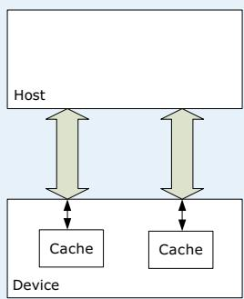

Figure 3-19. Unified Cache with Static Address Routing  
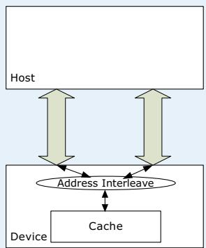

The ID spaces for CXL.cache (CacheID, UQID, CQID) are required to be unique only to the link from which the request originated. All Responses and Data shall return to the link that sent the request.

## CXL.mem

## Introduction

The CXL Memory Protocol, referred to as CXL.mem, is a transactional interface between the CPU and Memory. CXL.mem uses the phy layer and link layer of CXL when communicating across dies. The protocol can be used for multiple different Memory attach options including when the Memory Controller is located in the Host CPU, when the Memory Controller is within an Accelerator device, or when the Memory Controller is moved to a memory buffer chip. It applies to different Memory types (e.g., volatile, persistent, etc.) and configurations (e.g., flat, hierarchical, etc.) as well.

The CXL.mem provides three basic coherence models for CXL.mem Host-managed Device Memory (HDM) address regions exposed by the CXL.mem protocol:

• HDM-H (Host-only Coherent): Used only for Type 3 Devices

• HDM-D (Device Coherent): Used only for legacy Type 2 Devices that rely on CXL.cache to manage coherence with the Host

• HDM-DB (Device Coherent using Back-Invalidate): Can be used by Type 2 Devices or Type 3 Devices

The view of the address region must be consistent on the CXL.mem path between the Host and the Device.

The coherency engine in the CPU interfaces with the Memory (Mem) using CXL.mem requests and responses. In this configuration, the CPU coherency engine is regarded as the CXL.mem Master and the Mem device is regarded as the CXL.mem Subordinate. The CXL.mem Master is the agent that is responsible for sourcing CXL.mem requests (e.g., reads, writes, etc.). A CXL.mem Subordinate is the agent that is responsible for responding to CXL.mem requests (e.g., data, completions, etc.).

When the Subordinate maps HDM-D/HDM-DB, CXL.mem protocol assumes the presence of a device coherency engine (DCOH). This agent is assumed to be responsible for implementing coherency related functions such as snooping of device caches based on CXL.mem commands and update of Metadata fields.

Support for memory with Metadata is optional but this needs to be negotiated with the Host in advance. If the device supports the “Metabits Storage” Feature, this mechanism may be used to negotiate the Metadata configuration. Other negotiation mechanisms are beyond the scope of this specification. If Metadata is not supported by deviceattached memory, the DCOH will still need to use the Host supplied Metadata updates to interpret the commands. If Metadata is supported by device-attached memory, it can be used by Host to implement a coarse snoop filter for CPU sockets. In the HDM-H address region, the usage is defined by the Host. The protocol allows for 2 bits of Metadata to be stored and returned.

CXL.mem transactions from Master to Subordinate are referred to as “M2S.” CXL.mem transactions from Subordinate to Master are referred to as “S2M.”

Within M2S transactions, there are three message classes:

• Request without data — Generically referred to as Request (Req)

• Request with Data — (RwD)

• Back-Invalidate Response — (BIRsp)

Similarly, within S2M transactions, there are three message classes:

• Response without data — Generically referred to as No Data Response (NDR)

• Response with data — Generically referred to as Data Response (DRS)

• Back-Invalidate Snoop — (BISnp)

The next sections describe the above message classes and opcodes in detail. Some messages support three variants: 68B Flit, 256B Flit, and PBR Flit. The use of each of these will be negotiated in the physical layer for each link as defined in Chapter 6.0.

## CXL.mem Channel Description

In general, the CXL.mem channels work independently of one another to ensure that forward progress is maintained. Details of the specific ordering allowances and requirements between channels are captured in Section 3.4. Within a channel there are no ordering rules, but exceptions to this are described in Section 3.3.12.

The device interface for CXL.mem defines six channels on primary memory protocol and an additional six to support direct P2P as shown in Figure 3-20. Devices that support HDM-DB must support the BI\* channels (S2M BISnp and M2S BIRsp). Type 2 devices that use the HDM-D memory region may not have the BI\* channels. Type 3 devices (Memory Expansion) may support HDM-DB to support direct peer-to-peer on CXL.io. MLD and G-FAM devices may use HDM-DB to enable multi-host coherence and direct peer-to-peer on CXL.mem. The HDM-DB regions will be known by software and programmed as such in the decode registers and these regions will follow the protocol flows, using the BISnp channels as defined in Appendix C, “Memory Protocol Tables.”

Figure 3-20. CXL.mem Channels for Devices

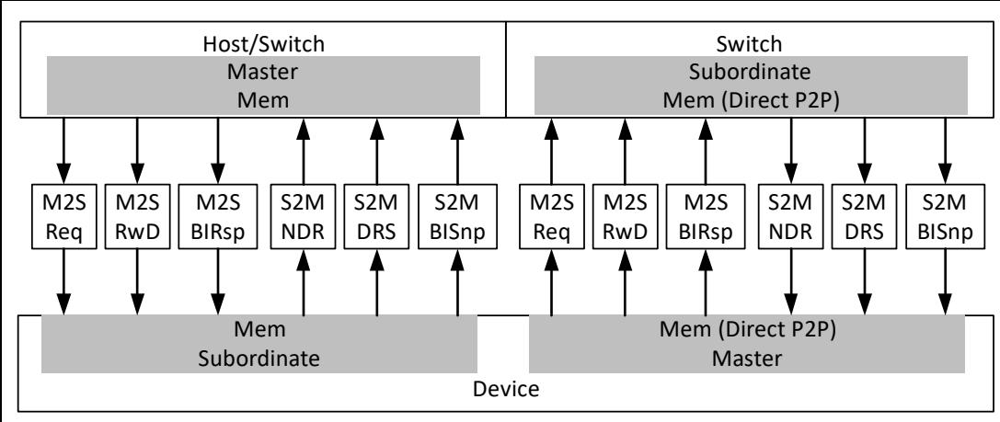  
For Hosts, the number of channels are defined in Figure 3-21. The channel definition is the same as for devices.

Figure 3-21. CXL.mem Channels for Hosts  
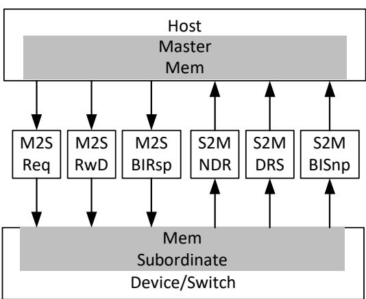

## 3.3.2.1 Direct P2P CXL.mem for Accelerators

In certain topologies, an accelerator (Type 1, Type 2, or Type 3) device may optionally be enabled to communicate with peer Type 3 memories with CXL.mem protocol. Support for such communication is provided by an additional set of CXL.mem channels, with their directions reversed from conventional CXL.mem as shown in as shown in Figure 3-20. These channels exist only on a link between the device and the switch downstream port to which the link is attached. Ordering requirements, message formats, and channel semantics are the same as for conventional CXL.mem. Topologies supporting Direct P2P.mem require an accelerator (requester device) and a target Type 3 peer memory device which are both directly connected to a PBR Edge DSP. PBR routing is required because not all CXL.mem messages contain sufficient information for an HBR switch to determine whether to route between a device and the host or a device and a peer device. Edge DSPs contain tables (FAST and LDST) which enable routing to the proper destination.

Details related to the device in-out dependence covering standard CXL.mem target and the source of Direct P2P CXL.mem are covered in Table 3-62.

## 3.3.2.2 Snoop Handling with Direct P2P CXL.mem

It is possible for a device that is using the Direct P2P CXL.mem interface to receive a snoop on H2D Req for an address that the device had previously requested over its P2P CXL.mem interface. This could occur, for example, if the host has snoop filtering disabled. Conversely, the device could receive an S2M BISnp from a peer for a line that it had acquired over CXL.cache through the host.

As a result, devices that use the Direct P2P CXL.mem interface are required to track which interface was used when a cacheline was requested and respond normally to snoops using this channel. If the device receives a snoop on a different interface, the device shall respond as though it does not have the address cached returning RspIHitI or BIRspI and shall not change the cacheline state.

## IMPLEMENTATION NOTE

How the device tracks which interface was used to request each cacheline is implementation dependent. One method of tracking could be for the device to maintain a table of address ranges, programmed by software with an indication for each range whether the CXL.cache or Direct P2P CXL.mem interface should be used. This table could then be looked up when snoops are received. Other methods may also be used.

## Back-Invalidate Snoop

To enable a device to implement an inclusive Snoop Filter for tracking host caching of device memory, a Back-Invalidate Snoop (BISnp) is initiated from the device to change the cache state of the host. The flows related to this channel are captured in Section 3.5.1. The definition of “inclusive Snoop Filter” for the purpose of CXL is a device structure that tracks cacheline granular host caching and is a limited size that is a small subset of the total Host Physical Address space supported by the device.

In 68B flits, only the CXL.cache D2H Request flows can be used for device-attached memory to manage coherence with the host as shown in Section 3.5.2.3. This flow is used for addresses with the HDM-D memory attribute. A major constraint with this flow is that the D2H Req channel can be blocked waiting on forward progress of the M2S Request channel which disallows an inclusive Snoop Filter architecture. For the HDM-DB memory region, the BISnp channel (instead of CXL.cache) is used to resolve coherence. CXL host implementations may have a mix of devices with HDM-DB and HDM-D below a Root Port.

The rules related to Back-Invalidate are spread around in different areas of the specification. The following list captures a summary and pointers to requirements:

• Ordering rules in Section 3.4

• Conflict detection flows and blocking in Section 3.5.1

• Protocol Tables in Section C.1.2

• BI-ID configuration in Section 9.14

• If an outstanding S2M BISnp is pending to an address the device must block M2S Req to the same address until the S2M BISnp is completed with the corresponding M2S BIRsp

• M2S RwD channel must complete/drain without dependence on M2S Req or S2M BISnp

## IMPLEMENTATION NOTE

Detailed performance implications of the implementation of an Inclusive Snoop Filter are beyond the scope of this specification, but high-level considerations are captured here:

The number of cachelines that are tracked in an Inclusive Snoop Filter is determined based on host-processor caching of the address space. This is a function of the use model and the cache size in the host processor with upsizing of 4x or more. The 4x is based on an imprecise estimation of the unknowns in future host implementations and mismatch in Host cache ways/sectors as compared to Snoop-Filter ways/sectors.

Device should have the capability to track BISnp messages triggered by Snoop Filter capacity evictions without immediately blocking requests on the M2S Req channel when the Inclusive Snoop Filter becomes full. In the case that the BISnp tracking structure becomes full the M2S Req channel will need to be blocked for functional correctness, but the design should size this BISnp tracker to ensure that blocking of the M2S Req channel is a rare event.

The state per cacheline could be implemented as 2 states or 3 states. For 2 states, it would track the host in I vs. A, where A-state would represent “Any” possible MESI state in the host. For 3 states, it would add the precision of S-state tracking in which the Host may have at most a shared copy of the cacheline.

## 3.3.4 QoS Telemetry for Memory

QoS Telemetry for Memory is a mechanism for memory devices to indicate their current load level (DevLoad) in each response message for CXL.mem requests and each completion for (CXL.io) UIO requests. This enables the host or peer requester to meter the issue rate of CXL.mem requests and UIO requests to portions of devices, individual devices, or groups of devices as a function of their load level, optimizing the performance of those memory devices while limiting fabric congestion. This is especially important for CXL hierarchies containing multiple memory types (e.g., DRAM and persistent memory), Multi-Logical-Device (MLD) components, and/or G-FAM Devices (GFDs).

In addition to use cases with hosts that access memory devices, QoS Telemetry for memory supports the UIO Direct P2P to HDM (see Section 7.7.9) and Direct P2P CXL.mem for Accelerators (see Section 7.7.10) use cases. For these, the peer requester for each UIO or .mem request receives a DevLoad indication in each UIO completion or .mem response. For the UIO Direct P2P use case, the peer requester may be native PCIe or CXL. Within this section, “hosts/peers” is a shorthand for referring to host and/or peer requesters that access HDM devices.

Certain aspects of QoS Telemetry are mandatory for current CXL memory devices while other aspects are optional. CXL switches have no unique requirements for supporting QoS Telemetry. It is strongly recommended for Hosts to support QoS Telemetry as guided by the reference model contained in this section. For peer requesters, the importance of supporting QoS Telemetry depends on the device type, its capabilities, and its specific use case(s).

## 3.3.4.1 QoS Telemetry Overview

The overall goal of QoS Telemetry is for memory devices to provide immediate and ongoing DevLoad feedback to their associated hosts/peers, for use in dynamically adjusting their request-rate throttling. If a device or set of Devices become overloaded, the associated hosts/peers increase their amount of request rate throttling. If such

Devices become underutilized, the associated hosts/peers reduce their amount of request rate throttling. QoS Telemetry is architected to help hosts/peers avoid overcompensating and/or undercompensating.

Host/peer memory request rate throttling is optional and primarily implementation specific.

Impact of DevLoad Indication on Host/Peer Request Rate Throttling

<table><tr><td>DevLoad Indication Returned in Responses</td><td>Host/Peer Request Rate Throttling</td></tr><tr><td>Light Load</td><td>Reduce throttling (if any) soon</td></tr><tr><td>Optimal Load</td><td>Make no change to throttling</td></tr><tr><td>Moderate Overload</td><td>Increase throttling immediately</td></tr><tr><td>Severe Overload</td><td>Invoke heavy throttling immediately</td></tr></table>

To accommodate memory devices supporting multiple types of memory more optimally, a device is permitted to implement multiple QoS Classes, which are identified sets of traffic, between which the device supports differentiated QoS and significant performance isolation. For example, a device supporting both DRAM and persistent memory might implement two QoS Classes, one for each type of supported memory. Providing significant performance isolation may require independent internal resources (e.g., individual request queues for each QoS Class).

This version of the specification does not provide architected controls for providing bandwidth management between device QoS Classes.

MLDs provide differentiated QoS on a per-LD basis. MLDs have architected controls specifying the allocated bandwidth fraction for each LD when the MLD becomes overloaded. When the MLD is not overloaded, LDs can use more than their allocated bandwidth fraction, up to specified fraction limits based on maximum sustained device bandwidth.

GFDs provide differentiated QoS on a per-host/peer basis. GFDs have architected controls that specify a QoS Limit Fraction value for each host/peer, based on maximum sustained device bandwidth.

HDM-DB devices send BISnp requests and receive BIRsp responses as a part of processing requests that they receive from host/peer requesters. BISnp and BIRsp messages shall not be tracked by QoS Telemetry mechanisms. If a BISnp triggers a host/peer requester writing back cached data, those transactions will be tracked by QoS Telemetry.

The DevLoad indication from CXL 1.1 memory devices will always indicate Light Load, allowing those devices to operate as best they can with hosts/peers that support QoS Telemetry, though they cannot have their memory request rate actively metered by the host/peer. Light Load is used instead of Optimal Load in case any CXL 1.1 devices share the same host/peer throttling range with current memory devices. If CXL 1.1 devices were to indicate Optimal Load, they would overshadow the DevLoad of any current devices indicating Light Load.

## 3.3.4.2 Reference Model for Host/Peer Support of QoS Telemetry

Host/peer support for QoS Telemetry is strongly recommended but not mandatory.

QoS Telemetry provides no architected controls for mechanisms in hosts/peers. However, if a host/peer implements independent throttling for multiple distinct sets of memory devices through a given port, the throttling must be based on HDM ranges, which are referred to as host/peer throttling ranges.

The reference model in this section covers recommended aspects for how a host/peer should support QoS Telemetry. Such aspects are not mandatory, but they should help maximize the effectiveness of QoS Telemetry in optimizing memory device performance while providing differentiated QoS and reducing CXL fabric congestion.

Each host/peer is assumed to support distinct throttling levels on a throttling-range basis, represented by Throttle[Range]. Throttle[Range] is periodically adjusted by conceptual parameters NormalDelta and SevereDelta. During each sampling period for a given Throttle[Range], the host/peer records the highest DevLoad indication reported for that throttling range, referred to as LoadMax.

Recommended Host/Peer Adjustment to Request Rate Throttling

<table><tr><td>LoadMax Recorded by Host/Peer</td><td>Recommended Adjustment to Request Rate Throttling</td></tr><tr><td>Light Load</td><td>Throttle[Range] decremented by NormalDelta</td></tr><tr><td>Optimal Load</td><td>Throttle[Range] unchanged</td></tr><tr><td>Moderate Overload</td><td>Throttle[Range] incremented by NormalDelta</td></tr><tr><td>Severe Overload</td><td>Throttle[Range] incremented by SevereDelta</td></tr></table>

Any increments or decrements to Throttle[Range] should not overflow or underflow legal values, respectively.

Throttle[Range] is expected to be adjusted periodically, every tH nanoseconds unless a more immediate adjustment is warranted. The tH parameter should be configurable by platform-specific software, and ideally configurable on a per-throttling-range basis. When tH expires, the host/peer should update Throttle[Range] based on LoadMax, as shown in Table 3-30, and then reset LoadMax to its minimal value.

Round-trip fabric time is the sum of the time for a request message to travel from host/ peer to Device, plus the time for a response message to travel from Device to host/ peer. The optimal value for tH is anticipated to be a bit larger than the average roundtrip fabric time for the associated set of devices (e.g., a few hundred nanoseconds). To avoid overcompensation by the host/peer, time is needed for the received stream of DevLoad indications in responses to reflect the last Throttle[Range] adjustment before the host/peer makes a new adjustment.

If the host/peer receives a Moderate Overload or Severe Overload indication, it is strongly recommended for the host/peer to make an immediate adjustment in throttling, without waiting for the end of the current tH sampling period. Subsequently, the host/peer should reset LoadMax and then wait tH nanoseconds before making an additional throttling adjustment, to avoid overcompensating.

## 3.3.4.3.1 QoS Telemetry Register Interfaces

An MLD must support a specified set of MLD commands from the MLD Component Command Set as documented in Section 7.6.7.4. These MLD commands provide access to a variety of architected capability, control, and status registers for a Fabric Manager to use via the FM API.

A GFD must support a specified set of GFD commands from the GFD Component Management Command Set as documented in Section 8.2.10.9.10. These GFD commands provide access to a variety of architected capability, control, and status registers for a Fabric Manager to use via the FM API.

If an SLD supports the Memory Device Command set, it must support a specified set of SLD QoS Telemetry commands. See Section 8.2.10.9. These SLD commands provide access to a variety of architected capability, control, and status fields for management by system software via the CXL Device Register interface.

Each “architected QoS Telemetry” register is one that is accessible via the above mentioned MLD commands, GFD commands, and/or SLD commands.

## Memory Device QoS Class Support

Each CXL memory device may support one or more QoS Classes. The anticipated typical number is one to four, but higher numbers are not precluded. If a device supports only one type of media, it may be common for it to support one QoS Class. If a device supports two types of media, it may be common for it to support two QoS Classes. A device supporting multiple QoS Classes is referred to as a multi-QoS device.

This version of the specification does not provide architected controls for providing bandwidth management between device QoS Classes. Still, it is strongly recommended that multi-QoS devices track and report DevLoad indications for different QoS Classes independently, and that implementations provide as much performance isolation between different QoS Classes as possible.

## 3.3.4.3.3 Memory Device Internal Loading (IntLoad)

A CXL memory device must continuously track its internal loading, referred to as IntLoad. A multi-QoS device should do so on a per-QoS-Class basis.

A device must determine IntLoad based at least on its internal request queuing. For example, a simple device may monitor the instantaneous request queue depth to determine which of the four IntLoad indications to report. It may also incorporate other internal resource utilizations, as summarized in Table 3-31.

## Table 3-31. Factors for Determining IntLoad

<table><tr><td>IntLoad</td><td>Queuing Delay inside Device</td><td>Device Internal Resource Utilization</td></tr><tr><td>Light Load</td><td>Minimal</td><td>Readily handles more requests</td></tr><tr><td>Optimal Load</td><td>Modest to Moderate</td><td>Optimally utilized</td></tr><tr><td>Moderate Overload</td><td>Significant</td><td>Limiting throughput and/or degrading efficiency</td></tr><tr><td>Severe Overload</td><td>High</td><td>Heavily overloaded and/or degrading efficiency</td></tr></table>

The actual method of IntLoad determination is device-specific, but it is strongly recommended that multi-QoS devices implement separate request queues for each QoS Class. For complex devices, it is recommended for them to determine IntLoad based on internal resource utilization beyond just request queue depth monitoring.

Although the IntLoad described in this section is a primary factor in determining which DevLoad indication is returned in device responses, there are other factors that may need to be considered, depending upon the situation (see Section 3.3.4.3.4 and Section 3.3.4.3.5).

## 3.3.4.3.4 Egress Port Backpressure

Even under a consistent Light Load, a memory device may experience flow control backpressure at its egress port. This is readily caused if an RP is oversubscribed by multiple memory devices below a switch. Prolonged egress port backpressure usually indicates that one or more upstream traffic queues between the device and the RP are full, and the delivery of responses from the device to the host/peer is significantly

delayed. This makes the QoS Telemetry feedback loop less responsive and the overall mechanism less effective. Egress Port Backpressure is an optional normative mechanism to help mitigate the negative effects of this condition.

## IMPLEMENTATION NOTE

## Egress Port Backpressure Leading to Larger Request Queue Swings

When the QoS Telemetry feedback loop is less responsive, the device’s request queue depth is prone to larger swings than normal.

When the queue depth is increasing, the delay in the host/peer receiving Moderate Overload or Severe Overload indications results in the queue getting more full than normal, in extreme cases filling completely and forcing the ingress port to exert backpressure to incoming downstream traffic.

When the queue depth is decreasing, the delay in the host/peer receiving Light Load indications results in the queue getting more empty than normal, in extreme cases emptying completely, and causing device throughput to drop unnecessarily.

Use of the Egress Port Backpressure mechanism helps avoid upstream traffic queues between the device and its RP from filling for extended periods, reducing the delay of responses from the device to the host/peer. This makes the QoS Telemetry feedback loop more responsive, helping avoid excessive request queue swings.

## IMPLEMENTATION NOTE

## Minimizing Head-of-line Blocking with Upstream Responses from MLDs/ GFDs

When one or more upstream traffic queues become full between the MLD and one or more of its congested RPs, head-of-line (HOL) blocking associated with this congestion can delay or block traffic targeting other RPs that are not congested.

Egress port backpressure for extended periods usually indicates that the ingress port queue in the Downstream Switch Port above the device is often full. Responses in that queue targeting congested RPs can block responses targeting uncongested RPs, reducing overall device throughput unnecessarily.

Use of the Egress Port Backpressure mechanism helps reduce the average depth of queues carrying upstream traffic. This reduces the delay of traffic targeting uncongested RPs, increasing overall device throughput.

The Egress Port Congestion Supported capability bit and the Egress Port Congestion Enable control bit are architected QoS Telemetry bits, which indicate support for this optional mechanism plus a means to enable or disable it. The architected Backpressure Average Percentage status field returns a current snapshot of the measured egress port average congestion.

QoS Telemetry architects two thresholds for the percentage of time that the egress port experiences flow control backpressure. This condition is defined as the egress port having flits or messages waiting for transmission but is unable to transmit them due to a lack of suitable flow control credits. If the percentage of congested time is greater than or equal to Egress Moderate Percentage, the device may return a DevLoad indication of Moderate Overload. If the percentage of congested time is greater than or equal to Egress Severe Percentage, the device may return a DevLoad indication of Severe Overload. The actual DevLoad indication returned for a given response may be the result of other factors as well.

A hardware mechanism for measuring Egress Port Congestion is described in Section 3.3.4.3.9.

## 3.3.4.3.5 Temporary Throughput Reduction

There are certain conditions under which a device may temporarily reduce its throughput. Envisioned examples include a non-volatile memory (NVM) device undergoing media maintenance, a device cutting back its throughput for power/thermal reasons, and a DRAM device performing refresh. If a device is significantly reducing its throughput capacity for a temporary period, it may help mitigate this condition by indicating Moderate Overload or Severe Overload in its responses shortly before the condition occurs and only as long as really necessary. This is a device-specific optional mechanism.

The Temporary Throughput Reduction mechanism can give proactive advanced warning to associated hosts/peers, which can then increase their throttling in time to avoid the device’s internal request queue(s) from filling up and potentially causing ingress port congestion. The optimum amount of time for providing advanced warning is highly device-specific, and a function of several factors, including the current request rate, the amount of device internal buffering, the level/duration of throughput reduction, and the fabric round-trip time.

A device should not use the mechanism unless conditions truly warrant its use. For example, if the device is currently under Light Load, it is probably not necessary or appropriate to indicate an Overload condition in preparation for a coming event. Similarly, a device that indicates an Overload condition should not continue to indicate the Overload condition past the point where the need to know about the condition is no longer necessary.

The Temporary Throughput Reduction Supported capability bit and the Temporary Throughput Reduction Enable control bit are architected QoS Telemetry bits, which indicate support for this optional mechanism plus a means to enable or disable it.

## IMPLEMENTATION NOTE

## Avoid Unnecessary Use of Temporary Throughput Reduction

Ideally, a device should be designed to sufficiently limit the severity and/or duration of its temporary throughput reduction events to where the use of this mechanism is not needed.

## 3.3.4.3.6 DevLoad Indication by Multi-QoS and Single-QoS SLDs

For SLDs, the DevLoad indication returned in each response is determined by the maximum of the device’s IntLoad, Egress Port Congestion state, and Temporary Throughput Reduction state (see Section 3.3.4.3.3, Section 3.3.4.3.4, and Section 3.3.4.3.5, respectively, for details). For example, if IntLoad indicates Light Load, Egress Port Congestion indicates Moderate Overload, and Temporary Throughput Reduction does not indicate an overload, the resulting DevLoad indication for the response is Moderate Overload.

## 3.3.4.3.7 DevLoad Indication by Multi-QoS and Single-QoS MLDs

For MLDs, the DevLoad indication returned in each response is determined by the same factors as for SLDs, with additional factors used for providing differentiated QoS on a per-LD basis. Architected controls specify the allocated bandwidth for each LD as a

fraction of total LD traffic when the MLD becomes overloaded. When the MLD is not overloaded, LDs can use more than their allocated bandwidth fraction, up to specified fraction limits based on maximum sustained device bandwidth, independent of overall LD activity.

Bandwidth utilization for each LD is measured continuously based on current requests being serviced, plus the recent history of requests that have been completed.

Current requests being serviced are tracked by ReqCnt[LD] counters, with one counter per LD. The ReqCnt counter for an LD is incremented each time a request for that LD is received. The ReqCnt counter for an LD is decremented each time a response by that LD is transmitted. ReqCnt reflects instantaneous “committed” utilization, allowing the rapid reflection of incoming requests, especially when requests come in bursts.

The recent history of requests completed is tracked by CmpCnt[LD, Hist] registers, with one set of 16 Hist registers per LD. An architected configurable Completion Collection Interval control for the MLD determines the time interval over which transmitted responses are counted in the active (newest) Hist register/counter. At the end of each interval, the Hist register values for the LD are shifted from newer to older Hist registers, with the oldest value being discarded, and the active (newest) Hist register/ counter being cleared. Further details on the hardware mechanism for CmpCnt[LD, Hist] are described in Section 3.3.4.3.10.

Controls for LD bandwidth management consist of per-LD sets of registers referred to as QoS Allocation Fraction[LD] and QoS Limit Fraction[LD]. For each LD, QoS Allocation Fraction specifies the fraction of current device utilization allocated for the LD across all its QoS classes. QoS Limit Fraction for each LD specifies the fraction of maximum sustained device utilization as a fixed limit for the LD across all its QoS classes, independent of overall MLD activity.

Bandwidth utilization for each LD is based on the sum of its associated ReqCnt and CmpCnt[Hist] counters/registers. CmpCnt[Hist] reflects recently completed requests, and Completion Collection Interval controls how long this period of history covers (i.e., how quickly completed requests are “forgotten”). CmpCnt reflects recent utilization to help avoid overcompensating for bursts of requests.

Together, ReqCnt and CmpCnt[Hist] provide a simple, fair, and tunable way to compute average utilization. A shorter response history emphasizes instantaneous committed utilization, improving responsiveness. A longer response history smooths the average utilization, reducing overcompensation.

ReqCmpBasis is an architected control register that provides the basis for limiting each LD’s utilization of the device, independent of overall MLD activity. Because ReqCmpBasis is compared against the sum of ReqCnt[ ] and CmpCnt[ ], its maximum value must be based on the maximum values of ReqCnt[ ] and CmpCnt[ ] summed across all configured LDs. The maximum value of Sum(ReqCnt[\*]) is a function of the device’s internal queuing and how many requests it can concurrently service. The maximum value of Sum(CmpCnt[\*,\*]) is a function of the device’s maximum request service rate over the period of completion history recorded by CmpCnt[ ], which is directly influenced by the setting of Completion Collection Interval.

The FM programs ReqCmpBasis, the QoS Allocation Fraction array, and the QoS Limit Fraction array to control differentiated QoS between LDs. The FM is permitted to derate ReqCmpBasis below its maximum sustained estimate as a means of limiting power and heat dissipation.

To determine the DevLoad indication to return in each response, the device performs the following calculation:

Calculate TotalLoad = max(IntLoad[QoS], Egress Port Congestion state, Temporary Throughput Reduction state);

Calculate ReqCmpTotal and populate ReqCmpCnt[LD] array element

ReqCmpTotal = 0;

For each LD

ReqCmpCnt[LD] = ReqCnt[LD] + Sum(CmpCnt[LD, \*]);

ReqCmpTotal += ReqCmpCnt[LD];

## IMPLEMENTATION NOTE

## Avoiding Recalculation of ReqCmpTotal and ReqCmpCnt[ ] Array

ReqCmpCnt[ ] is an array that avoids having to recalculate its values later in the algorithm.

To avoid recalculating ReqCmpTotal and ReqCmpCnt[ ] array from scratch to determine the DevLoad indication to return in each response, it is strongly recommended that an implementation maintains these values on a running basis, only incrementally updating the values as new requests arrive and responses are transmitted. The details are implementation specific.

## IMPLEMENTATION NOTE

## Calculating the Adjusted Allocation Bandwidth

When the MLD is overloaded, some LDs may be above their allocation while others are within their allocation.

Those LDs below their allocation (especially inactive LDs) contribute to a “surplus” of bandwidth that can be distributed across active LDs that are above their allocation.

• Those LDs above their allocation claim “their fair share” of that surplus based on their allocation, and the load value for these LDs is based on an “adjusted allocated bandwidth” that includes a prorated share of the surplus.

This adjusted allocation bandwidth algorithm avoids anomalies that otherwise occur when some LDs are using well below their allocation, especially if they are idle.

In subsequent algorithms, certain registers have integer and fraction portions, optimized for implementing the algorithms in dedicated hardware. The integer portion is described as being 16 bits unsigned, although it is permitted to be smaller or larger as needed by the specific implementation. The integer portion must be sized such that it will never overflow during normal operation. The fractional portion must be 8 bits. These registers are indicated by their name being in italics.

## IMPLEMENTATION NOTE

## Registers with Integer and Fraction Portions

These registers can hold the product of a 16-bit unsigned integer and an 8-bit fraction, resulting in 24 bits with the radix point being between the upper 16 bits and the lower 8 bits. Rounding to an integer is readily accomplished by adding 0000.80h (0.5 decimal) and truncating the lower 8 bits.

```txt
If TotalLoad is Moderate Overload or Severe Overload, calculate the adjusted allocated bandwidth:

ClaimAllocTotal = 0;

SurplusTotal = 0;

For each LD

AllocCnt = QoS Allocation Fraction[LD] * ReqCmpTotal;
If this LD is the (single) LD associated with the response
AllocCntSaved = AllocCnt;
If ReqCmpCnt[LD] > AllocCnt then
ClaimAllocTotal += AllocCnt;
Else

SurplusTotal += AllocCnt - ReqCmpCnt[LD];

For the single LD associated with the response

If ReqCmpCnt[LD] > (AllocCntSaved + AllocCntSaved * SurplusTotal / ClaimAllocTotal) then LD is over its adjusted allocated bandwidth; // Use this result in the subsequent table
```

## IMPLEMENTATION NOTE

## Determination of an LD Being above its Adjusted Allocated Bandwidth

The preceding equation requires a division, which is relatively expensive to implement in hardware dedicated for this determination. To enable hardware to make this determination more efficiently, the following derived equivalent equation is strongly recommended:

ReqCmpCnt[LD] > (AllocCntSaved + AllocCntSaved \* SurplusTotal / ClaimAllocTotal)

(ReqCmpCnt[LD] \* ClaimAllocTotal) > (AllocCntSaved \* ClaimAllocTotal + AllocCntSaved \* SurplusTotal)

(ReqCmpCnt[LD] \* ClaimAllocTotal) > (AllocCntSaved \* (ClaimAllocTotal + SurplusTotal))

```txt
// Perform the bandwidth limit calculation for this LD
If ReqCmpCnt[LD] > QoS Limit Fraction [LD] * ReqCmpBasis then LD is over its limit BW;
```

Table 3-32. Additional Factors for Determining DevLoad in MLDs (Sheet 1 of 2)

<table><tr><td>TotalLoad</td><td>LD above Limit BW?</td><td>LD above Adjusted Allocated BW?</td><td>Returned DevLoad Indication</td></tr><tr><td rowspan="2">Light Load or Optimal Load</td><td>No</td><td>—</td><td>TotalLoad</td></tr><tr><td>Yes</td><td>—</td><td>Moderate Overload</td></tr></table>

Table 3-32. Additional Factors for Determining DevLoad in MLDs (Sheet 2 of 2)

<table><tr><td>TotalLoad</td><td>LD above Limit BW?</td><td>LD above Adjusted Allocated BW?</td><td>Returned DevLoad Indication</td></tr><tr><td rowspan="3">Moderate Overload</td><td>No</td><td>No</td><td>Optimal Load</td></tr><tr><td>No</td><td>Yes</td><td>Moderate Overload</td></tr><tr><td>Yes</td><td>—</td><td>Moderate Overload</td></tr><tr><td rowspan="2">Severe Overload</td><td>—</td><td>No</td><td>Moderate Overload</td></tr><tr><td>—</td><td>Yes</td><td>Severe Overload</td></tr></table>

The preceding table is based on the following policies for LD bandwidth management:

• The LD is always subject to its QoS Limit Fraction

• For TotalLoad indications of Light Load or Optimal Load, the LD can exceed its QoS Allocation Fraction, up to its QoS Limit Fraction

• For TotalLoad indications of Moderate Overload or Severe Overload, LDs with loads up to QoS Allocation Fraction get throttled less than LDs with loads that exceed QoS Allocation Fraction

## 3.3.4.3.8 DevLoad Indication by Multi-QoS GFDs and Single-QoS GFDs

DevLoad indication for GFDs is similar to that for MLDs, with the exception that 12-bit GFD host/peer requester PIDs (RPIDs) scale much higher than the 4-bit LDs for MLDs, and the QoS Allocation Fraction mechanism (based on current device utilization) is not supported for GFDs due to architectural scaling challenges. However, the QoS Limit Fraction mechanism (based on a fixed maximum sustained device utilization) is supported for GFDs, and architected controls specify the fraction limits.

Bandwidth utilization for each RPID is measured continuously based on current requests being serviced, plus the recent history of requests that have been completed.

Current requests that are being serviced are tracked by ReqCnt[RPID] counters, with one counter per RPID. The ReqCnt counter for an RPID is incremented each time a request from that RPID is received. The ReqCnt counter for an RPID is decremented each time a response to that RPID is transmitted. ReqCnt reflects instantaneous “committed” utilization, allowing the rapid reflection of incoming requests, especially when requests come in bursts.

The recent history of requests completed is tracked by CmpCnt[RPID, Hist] registers, with one set of 16 Hist registers per RPID. An architected configurable Completion Collection Interval control for the GFD determines the time interval over which transmitted responses are counted in the active (newest) Hist register/counter. At the end of each interval, the Hist register values for the RPID are shifted from newer to older Hist registers, with the oldest value being discarded, and the active (newest) Hist register/counter being cleared. Further details on the hardware mechanism for CmpCnt[RPID, Hist] are described in Section 3.3.4.3.10.

Controls for RPID bandwidth management consist of per-RPID sets of registers referred to as QoS Limit Fraction[RPID]. QoS Limit Fraction for each RPID specifies the fraction of maximum sustained device utilization as a fixed limit for the RPID across all its QoS classes, independent of overall GFD activity.

Bandwidth utilization for each RPID is based on the sum of its associated ReqCnt and CmpCnt[Hist] counters/registers. CmpCnt[Hist] reflects recently completed requests, and Completion Collection Interval controls how long this period of history covers (i.e., how quickly completed requests are “forgotten”). CmpCnt reflects recent utilization to help avoid overcompensating for bursts of requests.

Together, ReqCnt and CmpCnt[Hist] provide a simple, fair, and tunable way to compute average utilization. A shorter response history emphasizes instantaneous committed utilization, thus improving responsiveness. A longer response history smooths the average utilization, thus reducing overcompensation.

ReqCmpBasis is an architected control register that provides the basis for limiting each RPID’s utilization of the device, independent of overall GFD activity. Because ReqCmpBasis is compared against the sum of ReqCnt[ ] and CmpCnt[ ], its maximum value must be based on the maximum values of ReqCnt[ ] and CmpCnt[ ] summed across all configured RPIDs. The maximum value of Sum(ReqCnt[\*]) is a function of the device’s internal queuing and how many requests it can concurrently service. The maximum value of Sum(CmpCnt[\*,\*]) is a function of the device’s maximum request service rate over the period of completion history recorded by CmpCnt[ ], which is directly influenced by the setting of Completion Collection Interval.

The FM programs ReqCmpBasis and the QoS Limit Fraction array to control differentiated QoS between RPIDs. The FM is permitted to derate ReqCmpBasis below its maximum sustained estimate as a means of limiting power and heat dissipation.

To determine the DevLoad indication to return in each response, the device performs the following calculation:

Calculate TotalLoad = max(IntLoad[QoS], Egress Port Congestion state, Temporary Throughput Reduction state);

// Perform the bandwidth limit calculation for this RPID

If ReqCmpCnt[RPID] > QoS Limit Fraction[RPID] \* ReqCmpBasis then the RPID is over its limit BW;

Table 3-33. Additional Factors for Determining DevLoad in MLDs/GFDs

<table><tr><td>TotalLoad</td><td>RPID over Limit BW?</td><td>Returned DevLoad Indication</td></tr><tr><td rowspan="2">Light Load or Optimal Load</td><td>No</td><td>TotalLoad</td></tr><tr><td>Yes</td><td>Moderate Overload</td></tr><tr><td rowspan="2">Moderate Overload</td><td>No</td><td>Moderate Overload</td></tr><tr><td>Yes</td><td>Severe Overload</td></tr><tr><td>Severe Overload</td><td>—</td><td>Severe Overload</td></tr></table>

Table 3-33 is based on the following policies for RPID bandwidth management:

• The RPID is always subject to its QoS Limit Fraction

• For TotalLoad indications of Moderate Overload, RPIDs with loads up to QoS Limit Fraction get throttled less than RPIDs with loads that exceed QoS Limit Fraction

## 3.3.4.3.9 Egress Port Congestion Measurement Mechanism

This hardware mechanism measures the average egress port congestion on a rolling percentage basis.

FCBP (Flow Control Backpressured): This binary condition indicates the instantaneous state of the egress port. It is true if the port has messages or flits available to transmit but is unable to transmit any of them due to a lack of suitable flow control credits.

Backpressure Sample Interval register: This architected control register specifies the fixed interval in nanoseconds at which FCBP is sampled. The interval has a range of 0 to 31. One hundred samples are recorded, so a setting of 1 yields 100 ns of history. A setting of 31 yields 3.1 us of history. A setting of 0 disables the measurement mechanism, and it must indicate an average congestion percentage of 0.

BPhist[100] bit array: This stores the 100 most-recent FCBP samples. The array is not accessible by software.

Backpressure Average Percentage: When this architected status register is read, it indicates the current number of Set bits in BPhist[100]. The percentage ranges in value from 0 to 100.

The actual implementation of BPhist[100] and Backpressure Average Percentage is device specific. Here is a possible implementation approach:

• BPhist[100] is a shift register

• Backpressure Average Percentage is an up/down counter

• With each new FCBP sample:

— If the new sample (not yet in BPhist) and the oldest sample in BPhist are both 0 or both 1, no change is made to Backpressure Average Percentage

— If the new sample is 1 and the oldest sample is 0, increment Backpressure Average Percentage

— If the new sample is 0 and the oldest sample is 1, decrement Backpressure Average Percentage

• Shift BPhist[100], discarding the oldest sample and entering the new sample

## 3.3.4.3.10 Recent Transmitted Responses Measurement Mechanism

This hardware mechanism measures the number of recently transmitted responses on a per-host/peer basis in the most recent 16 intervals of a configured time period. Hosts are identified by a Requester ID (ReqID), which is the LD-ID for MLDs and the RPID for GFDs.

Completion Collection Interval register: This architected control register specifies the interval over which transmitted responses are counted in an active Hist register. It has a range is 0 to 127. A setting of 1 yields 16 ns of history. A setting of 127 yields about 2 us of history. A setting of 0 disables the measurement mechanism, and it must indicate a response count of 0.

CmpCnt[ReqID, 16] registers: These registers track the total of recent transmitted responses on a per-host/peer basis. CmpCnt[ReqID, 0] is a counter and is the newest value, while CmpCnt[ReqID, 1:15] are registers. These registers are not directly visible to software.

For each ReqID, at the end of each Completion Collection Interval:

• The 16 CmpCnt[ReqID, \*] register values are shifted from newer to older

• The CmpCnt[ReqID, 15] Hist register value is discarded

• The CmpCnt[ReqID, 0] register is cleared and the register is armed to count transmitted responses in the next interval

## 3.3.5 M2S Request (Req)

The Req message class generically contains reads, invalidates, and signals going from the Master to the Subordinate.

M2S Request Fields (Sheet 1 of 2)

<table><tr><td rowspan="2">Field</td><td colspan="3">Width (Bits)</td><td rowspan="2">Description</td></tr><tr><td>68B Flit</td><td>256B Flit</td><td>PBR Flit</td></tr><tr><td>Valid</td><td colspan="3">1</td><td>The Valid signal indicates that this is a valid request</td></tr><tr><td>MemOpcode</td><td colspan="3">4</td><td>Memory Operation: This specifies which, if any, operation needs to be performed on the data and associated information (see Table 3-35 for details).</td></tr><tr><td>SnpType</td><td colspan="3">3</td><td>Snoop Type: This specifies what snoop type, if any, needs to be issued by the DCOH and the minimum coherency state required by the Host (see Table 3-38 for details).This field is used to indicate the Length Index for the TEUpdate opcode.</td></tr><tr><td>MetaField</td><td colspan="3">2</td><td>Metadata Field: Up to three Metadata Fields can be addressed. This specifies which, if any, Metadata Field needs to be updated (see Table 3-36 for Metadata Field details). If the Subordinate does not support memory with Metadata, this field will still be used by the DCOH for interpreting Host commands as described in Table 3-37.</td></tr><tr><td>MetaValue</td><td colspan="3">2</td><td>Metadata Value: When MetaField is not No-Op, this specifies the value to which the field needs to be updated (see Table 3-37 for details). If the Subordinate does not support memory with Metadata, this field will still be used by the device coherence engine for interpreting Host commands as described in Table 3-37.For the TEUpdate message, this field carries the TE State change value where 00b is TE cleared and 01b is TE set.</td></tr><tr><td>Tag</td><td colspan="3">16</td><td>The Tag field is used to specify the source entry in the Master which is pre-allocated for the duration of the CXL.mem transaction. This value needs to be reflected with the response from the Subordinate so that the response can be routed appropriately. The exceptions are the MemRdFwd and MemWrFwd opcodes as described in Table 3-35.Note:The Tag field has no explicit requirement to be unique.</td></tr><tr><td>Address[5]</td><td>1</td><td colspan="2">0</td><td>Address[5] is provisioned for future usages such as critical chunk first for 68B flit, but this is not included in a 256B flit.</td></tr><tr><td>Address[51:6]</td><td colspan="3">46</td><td>This field specifies the Host Physical Address associated with the MemOpcode.</td></tr><tr><td>LD-ID[3:0]</td><td colspan="2">4</td><td>0</td><td>Logical Device Identifier: This identifies a Logical Device within a Multiple-Logical Device. Not applicable in PBR mode where SPID infers this field.</td></tr><tr><td>SPID</td><td colspan="2">0</td><td>12</td><td>Source PID</td></tr><tr><td>DPID</td><td colspan="2">0</td><td>12</td><td>Destination PID</td></tr><tr><td>CKID</td><td>0</td><td colspan="2">13</td><td>Context Key ID: Optional key ID that references preconfigured key material utilized for device-based data-at-rest encryption. If the device has been configured to utilize CKID-based device encryption and locked utilizing the CXL Trusted Execution Environment (TEE) Security Protocol (TSP), then this field shall be valid for Data Read access types (MemRd/MemRdTEE/MemRdData*/MemSpecRd*) and treated as reserved for other messages.</td></tr></table>

Table 3-34. M2S Request Fields (Sheet 2 of 2)

<table><tr><td rowspan="2">Field</td><td colspan="3">Width (Bits)</td><td rowspan="2">Description</td></tr><tr><td>68B Flit</td><td>256B Flit</td><td>PBR Flit</td></tr><tr><td>RSVD</td><td>6</td><td colspan="2">7</td><td>Reserved</td></tr><tr><td>TC</td><td colspan="3">2</td><td>Traffic Class: This can be used by the Master to specify the Quality of Service associated with the request. This is reserved for future usage.</td></tr><tr><td>Total</td><td>87</td><td>100</td><td>120</td><td></td></tr></table>

Table 3-35. M2S Req Memory Opcodes (Sheet 1 of 2)

<table><tr><td>Opcode</td><td>Description</td><td>Encoding</td></tr><tr><td>MemInv</td><td>Invalidation request from the Master. Primarily for Metadata updates. No data read or write required. If SnpType field contains valid commands, perform required snoops.</td><td>0000b</td></tr><tr><td>MemRd</td><td>Normal memory data read operation. If MetaField contains valid commands, perform Metadata updates. If SnpType field contains valid commands, perform required snoops.</td><td>0001b</td></tr><tr><td>MemRdData</td><td>Normal Memory data read operation. MetaField has no impact on the coherence state. MetaValue is to be ignored. Instead, update Meta0-State as follows:If initial Meta0-State value = &#x27;I&#x27;, update Meta0-State value to &#x27;A&#x27;Else, no update requiredIf SnpType field contains valid commands, perform required snoops.MetaField encoding of Extended Meta-State (EMS) follows the rules for it in Table 3-36.</td><td>0010b</td></tr><tr><td>MemRdFwd</td><td>This is an indication from the Host that data can be directly forwarded from device-attached memory to the device without any completion to the Host. This is only sent as a result of a CXL.cache D2H read request to device-attached memory that is mapped as HDM-D. The Tag field contains the reflected CQID sent along with the D2H read request. The SnpType is always No-Op for this Opcode. The caching state of the line is reflected in the Meta0-State value.Note: This message is not sent to devices that have device-attached memory that is mapped only as HDM-H or HDM-DB.</td><td>0011b</td></tr><tr><td>MemWrFwd</td><td>This is an indication from the Host to the device that it owns the line and can update it without any completion to the Host. This is only sent as a result of a CXL.cache D2H write request to device-attached memory that is mapped as HDM-D. The Tag field contains the reflected CQID sent along with the D2H write request. The SnpType is always No-Op for this Opcode. The caching state of the line is reflected in the Meta0-State value.Note: This message is not sent to devices that have device-attached memory that is mapped only as HDM-H or HDM-DB.</td><td>0100b</td></tr><tr><td>MemRdTEE $^{1}$ </td><td>Same as MemRd but with the Trusted Execution Environment (TEE) attribute. See Section 11.5.4.5 for description of TEE attribute handling.</td><td>0101b</td></tr><tr><td>MemRdDataTEE $^{1}$ </td><td>Same as MemRdData but with the Trusted Execution Environment (TEE) attribute. See Section 11.5.4.5 for description of TEE attribute handling.</td><td>0110b</td></tr><tr><td>MemInvTEE</td><td>Same as MemInv but with the Trusted Execution Environment (TEE) attribute. See Section 11.5.4.5 for description of TEE attribute handling.</td><td>0111b</td></tr><tr><td>MemSpecRd</td><td>Memory Speculative Read is issued to start a memory access before the home agent has resolved coherence to reduce access latency. This command does not receive a completion message. The Tag, MetaField, MetaValue, and SnpType are reserved. See Section 3.5.3.1 for a description of the use case.</td><td>1000b</td></tr><tr><td>MemInvNT</td><td>This is similar to the MemInv command except that the NT is a hint that indicates the invalidation is non-temporal and the writeback is expected soon. However, this is a hint and not a guarantee. If the target is locked utilizing TSP, the target shall decode this opcode as MemInvP. If the target is not locked, the target shall decode this opcode as MemInvNT. See Section 11.5 for TSP.</td><td rowspan="2">1001b</td></tr><tr><td>MemInvP</td><td>Memory invalidation with precise TE State. If the target is locked utilizing TSP, the target shall decode this opcode as MemInvP. If the target is not locked, the target shall decode this opcode as MemInvNT. See Section 11.5 for TSP.</td></tr></table>

Table 3-35. M2S Req Memory Opcodes (Sheet 2 of 2)

<table><tr><td>Opcode</td><td>Description</td><td>Encoding</td></tr><tr><td>MemCInEvct</td><td>Memory Clean Evict is a message that is similar to MemInv, but with intent to indicate host going to I-state and does not require Meta0-State return. This message is supported only to the HDM-DB address region.</td><td>1010b</td></tr><tr><td>MemInvPTEE</td><td>Same as MemInvP but with the Trusted Execution Environment (TEE) attribute. See Section 11.5.4.5 for description of TEE attribute handling.</td><td>1011b</td></tr><tr><td>MemSpecRdTEE $^{1}$ </td><td>Same as MemSpecRd but with Trusted Execution Environment (TEE) attribute. See Section 11.5.4.5 for description of TEE attribute handling.</td><td>1100b</td></tr><tr><td>TEUpdate $^{1}$ </td><td>Update of the TE State for the memory region. The memory region update is defined by the length-index field (passed in SnpType bits). The lower address bits in the message may be set to allow routing of the message to reach the correct interleave set target; however, the lower bits are masked to the natural alignment of the length when updating TE State. The MetaValue field defines the TE State that supports 00b to clear and 01b to set. See Section 11.5.4.5.3 for message use details.</td><td>1101b</td></tr><tr><td>MemCInEvctTEE</td><td>Same as MemCInEvct but with the Trusted Execution Environment (TEE) attribute. See Section 11.5.4.5 for description of TEE attribute handling.</td><td>1110b</td></tr><tr><td>MemCInEvctU</td><td>Same as MemCInEvct but TE State is not conveyed and assumed to be unknown.</td><td>1111b</td></tr></table>

1. Supported only in 256B and PBR Flit messages and considered Reserved in 68B Flit messages.

Table 3-36. Metadata Field Definition

<table><tr><td>MetaField</td><td>Description</td><td>Encoding</td></tr><tr><td>Meta0-State</td><td>Update the Metadata bits with the value in the Metadata Value field. See Table 3-37 for details of the MetaValue associated with Meta0-State.</td><td>00b</td></tr><tr><td>Extended Meta-State (EMS)</td><td>This encoding has different interpretation in different channels:• M2S Req usage indicates that the request requires the Extended MetaValue to be returned from the device in the response unless an error condition occurs.• M2S RwD and S2M DRS use this to indication that the Extended MetaValue is attached to the message as a Trailer. This size of the MetaValue is configurable up to 32 bits.• Other channels do not use this encoding and it should be considered Reserved.For HDM-DB, the MetaValue is defined in Table 3-37 for coherence resolution, Reserved for HDM-H.This encoding is not used for HDM-D.</td><td>01b</td></tr><tr><td>Reserved</td><td>Reserved</td><td>10b</td></tr><tr><td>No-Op</td><td>No Metadata operation. The MetaValue field is Reserved.For NDR/DRS messages that would return Metadata, this encoding can be used in case of an error in Metadata storage (standard 2-bits or EMD) or if the device does not store Metadata.</td><td>11b</td></tr></table>

Table 3-37. Meta0-State Value Definition (HDM-D/HDM-DB Devices)<sup>1</sup>

<table><tr><td>State</td><td>Meta Value</td><td>Description</td><td>Encoding</td></tr><tr><td>Invalid</td><td>I</td><td>Indicates the host does not have a cacheable copy of the line. The DCOH can use this information to grant exclusive ownership of the line to the device.Note:When paired with MemOpcode = MemInv and SnpType = SnpInv, this is used to communicate that the device should flush this line from its caches, if cached, to device-attached memory resulting in all caches ending in I.</td><td>00b</td></tr><tr><td>Explicit No-Op</td><td>E-No-Op</td><td>Used only when MetaField is Extended Meta-State in HDM-DB requests to indicate that a coherence state update is not requested. For all other cases this is considered Reserved.</td><td>01b</td></tr><tr><td>Any</td><td>A</td><td>Indicates the host may have a shared, exclusive, or modified copy of the line. The DCOH can use this information to interpret that the Host likely wants to update the line and the device should not be given a copy of the line without resolving coherence with the host using the flow appropriate for the memory type.</td><td>10b</td></tr><tr><td>Shared</td><td>S</td><td>Indicates the host may have at most a shared copy of the line. The DCOH can use this information to interpret that the Host does not have an exclusive or modified copy of the line. If the device wants a shared or current copy of the line, the DCOH can provide this without informing the Host. If the device wants an exclusive copy of the line, the DCOH must resolve coherence with the Host using the flow appropriate for the memory type.</td><td>11b</td></tr></table>

1. HDM-H use case in Type 3 devices have Meta0-State definition that is host specific, so the definition in this table does not apply for the HDM-H address region in devices.

Table 3-38. Snoop Type Definition

<table><tr><td>SnpType Description</td><td>Description</td><td>Encoding</td></tr><tr><td>No-Op</td><td>No snoop needs to be performed</td><td>000b</td></tr><tr><td>SnpData</td><td>Snoop may be required — the requester needs at least a Shared copy of the line.Device may choose to give an exclusive copy of the line as well.</td><td>001b</td></tr><tr><td>SnpCur</td><td>Snoop may be required — the requester needs the current value of the line.Requester guarantees the line will not be cached. Device need not change the state of the line in its caches, if present.</td><td>010b</td></tr><tr><td>SnpInv</td><td>Snoop may be required — the requester needs an exclusive copy of the line.</td><td>011b</td></tr><tr><td>Reserved</td><td>Reserved</td><td> $1xxb^1$ </td></tr></table>

1. x indicates don’t care.

Valid uses of M2S request semantics are described in Table 3-39 but are not the complete set of legal flows. For example, none of the TEE variants of the M2S Requests are included in this table. For a complete set of legal combinations, see Appendix C.

Table 3-39. M2S Req Usage (Sheet 1 of 2)

<table><tr><td>M2S Req</td><td>MetaField</td><td>Meta Value</td><td>SnpType</td><td>S2M NDR</td><td>S2M DRS</td><td>Description</td></tr><tr><td>MemRd</td><td>Meta0-State</td><td>A</td><td>SnpInv</td><td>Cmp-E</td><td>MemData</td><td>The Host wants an exclusive copy of the line.</td></tr><tr><td>MemRd</td><td>Meta0-State</td><td>S</td><td>SnpData</td><td>Cmp-S or Cmp-E</td><td>MemData</td><td>The Host wants a shared copy of the line.</td></tr><tr><td>MemRd</td><td>No-Op</td><td>N/A $^{1}$ </td><td>SnpCur</td><td>Cmp</td><td>MemData</td><td>The Host wants a non-cacheable but current value of the line.</td></tr><tr><td>MemRd</td><td>No-Op</td><td>N/A $^{1}$ </td><td>SnpInv</td><td>Cmp</td><td>MemData</td><td>The Host wants a non-cacheable value of the line and the device should invalidate the line from its caches.</td></tr><tr><td>MemInv</td><td>Meta0-State</td><td>A</td><td>SnpInv</td><td>Cmp-E</td><td>N/A</td><td>The Host wants ownership of the line without data.</td></tr></table>

Table 3-39. M2S Req Usage (Sheet 2 of 2)

<table><tr><td>M2S Req</td><td>MetaField</td><td>Meta Value</td><td>SnpType</td><td>S2M NDR</td><td>S2M DRS</td><td>Description</td></tr><tr><td>MemInvNT</td><td>Meta0-State</td><td>A</td><td>SnpInv</td><td>Cmp-E</td><td>N/A</td><td>The Host wants ownership of the line without data. However, the Host expects this to be non-temporal and may do a writeback soon.</td></tr><tr><td>MemInv</td><td>Meta0-State</td><td>I</td><td>SnpInv</td><td>Cmp</td><td>N/A</td><td>The Host wants the device to invalidate the line from its caches.</td></tr><tr><td>MemRdData</td><td>No-Op</td><td> $N/A^1$ </td><td>SnpData</td><td>Cmp-S or Cmp-E</td><td>MemData</td><td>The Host wants a cacheable copy in either exclusive or shared state.</td></tr><tr><td>MemCInEvct</td><td>Meta0-State</td><td>I</td><td>No-Op</td><td>Cmp</td><td>N/A</td><td>Host is dropping E or S state from its cache and leaving the line in I-state. This message allows the Device to clean the Snoop Filter (or BIAS table).</td></tr></table>

1. N/A in the MetaValue indicates that the entire field is considered Reserved (cleared to 0 by sender and ignored by receiver).

## 3.3.6 M2S Request with Data (RwD)

The Request with Data (RwD) message class generally contains writes from the Master to the Subordinate.

## Table 3-40. M2S RwD Fields (Sheet 1 of 2)

<table><tr><td rowspan="2">Field</td><td colspan="3">Width (Bits)</td><td rowspan="2">Description</td></tr><tr><td>68B Flit</td><td>256B Flit</td><td>PBR Flit</td></tr><tr><td>Valid</td><td colspan="3">1</td><td>The Valid signal indicates that this is a valid request.</td></tr><tr><td>MemOpcode</td><td colspan="3">4</td><td>Memory Operation: This specifies which, if any, operation needs to be performed on the data and associated information (see Table 3-41 for details).</td></tr><tr><td>SnpType</td><td colspan="3">3</td><td>Snoop Type: This specifies what snoop type, if any, needs to be issued by the DCOH and the minimum coherency state required by the Host (see Table 3-38 for details).</td></tr><tr><td>MetaField</td><td colspan="3">2</td><td>Metadata Field: Up to 3 Metadata Fields can be addressed. This specifies which, if any, Metadata Field needs to be updated. Details of Metadata Field in Table 3-36. If the Subordinate does not support memory with Metadata, this field will still be used by the DCOH for interpreting Host commands as described in Table 3-37.</td></tr><tr><td>MetaValue</td><td colspan="3">2</td><td>Metadata Value: When MetaField is not No-Op, this specifies the value to which the field needs to be updated (see Table 3-37 for details). If the Subordinate does not support memory with Metadata, this field will still be used by the device coherence engine for interpreting Host commands as described in Table 3-37.</td></tr><tr><td>Tag</td><td colspan="3">16</td><td>The Tag field is used to specify the source entry in the Master which is pre-allocated for the duration of the CXL.mem transaction. This value needs to be reflected with the response from the Subordinate so the response can be routed appropriately.For BIConflict, the tag encoding must use the same value as the pending M2S Req message (if one exists) that the BISnp found to be in conflict. This requirement is necessary to use Tag for fabric ordering of S2M NDR (Cmp* and BIConflictAck ordering for the same tag).Note:The Tag field has no explicit requirement to be unique.</td></tr><tr><td>Address[51:6]</td><td colspan="3">46</td><td>This field specifies the Host Physical Address associated with the MemOpcode.</td></tr><tr><td>Poison</td><td colspan="3">1</td><td>The Poison bit indicates that the data contains an error. The handling of poisoned data is device specific (see Chapter 12.0 for additional details).</td></tr></table>

Table 3-40. M2S RwD Fields (Sheet 2 of 2)

<table><tr><td rowspan="2">Field</td><td colspan="3">Width (Bits)</td><td rowspan="2">Description</td></tr><tr><td>68B Flit</td><td>256B Flit</td><td>PBR Flit</td></tr><tr><td>TRP (formerly BEP)</td><td>0</td><td colspan="2">1</td><td>Trailer Present: Indicates that a trailer is included on the message. The trailer size for RwD is defined in Table 3-43. The trailer is observed in the Link Layer as a G-slot following a 64B data payload.The baseline requirement for this bit is to enable only Byte Enables for partial writes (MemWrPtl). This bit is also optionally extended for Extend-Metadata indication.Note: This bit was formerly referred to as &quot;Byte-Enables Present (BEP),&quot; but has been redefined as part of an optional extension to support message trailers.</td></tr><tr><td>LD-ID[3:0]</td><td colspan="2">4</td><td>0</td><td>Logical Device Identifier: This identifies a logical device within a multiple-logical device. Not applicable in PBR messages where SPID infers this field.</td></tr><tr><td>SPID</td><td colspan="2">0</td><td>12</td><td>Source PID</td></tr><tr><td>DPID</td><td colspan="2">0</td><td>12</td><td>Destination PID</td></tr><tr><td>CKID</td><td>0</td><td colspan="2">13</td><td>Context Key ID: Optional key ID that references preconfigured key material utilized for device-based data-at-rest encryption. If the device has been configured to utilize CKID-based device encryption and locked utilizing the CXL Trusted Execution Environment (TEE) Security Protocol (TSP), then this field shall be valid for accesses that carry a non-reserved payload or cause a memory read to occur (MemWr*, MemRdFill*) and reserved for other cases (BIConflict).</td></tr><tr><td>RSVD</td><td>6</td><td colspan="2">9</td><td>Reserved</td></tr><tr><td>TC</td><td colspan="3">2</td><td>Traffic Class: This can be used by the Master to specify the Quality of Service associated with the request. This is reserved for future usage.</td></tr><tr><td>Total</td><td>87</td><td>104</td><td>124</td><td></td></tr></table>

Table 3-41. M2S RwD Memory Opcodes (Sheet 1 of 2)

<table><tr><td>Opcode</td><td>Description</td><td>Encoding</td></tr><tr><td>MemWr</td><td>Memory write command. Used for full cacheline writes. If MetaField contains valid commands, perform Metadata updates. If SnpType field contains valid commands, perform required snoops. If the snoop hits a Modified cacheline in the device, the DCOH will invalidate the cache and write the data from the Host to device-attached memory.</td><td>0001b</td></tr><tr><td>MemWrPtl</td><td>Memory Write Partial. Contains 64 byte enables, one for each byte of data. If MetaField contains valid commands, perform Metadata updates. If SnpType field contains valid commands, perform required snoops. If the snoop hits a Modified cacheline in the device, the DCOH will need to perform a merge, invalidate the cache, and write the contents back to device-attached memory.Note:This command cannot be used with host-side memory encryption unless byte-enable encodings are aligned with encryption boundaries (32B aligned is an example which may be allowed).</td><td>0010b</td></tr><tr><td>BIConflict</td><td>Part of conflict flow for BISnp indicating that the host observed a conflicting coherent request to the same cacheline address. See Section 3.5.1 for details.This message carries a 64B payload as required by the RwD channel, but the payload bytes are reserved (cleared to all 0s). This message is sent on the RwD channel because the dependence rules on this channel allow for a low-complexity flow from a deadlock-avoidance point of view.</td><td>0100b</td></tr></table>

Table 3-41. M2S RwD Memory Opcodes (Sheet 2 of 2)

<table><tr><td>Opcode</td><td>Description</td><td>Encoding</td></tr><tr><td>MemRdFill1</td><td>This is a simple read command equivalent to MemRd but never changes coherence state (MetaField=No-Op, SnpType=No-Op). The use of this command is intended for partial write data that is merging in the host with host-side encryption. With host-side encryption, it is not possible to merge partial data in the device as an attribute of the way encryption works.This message carries a 64B payload as required by the RwD channel; however, the payload bytes are reserved (i.e., cleared to all 0s). This message is sent on the RwD channel because the dependence rules on this channel allow for a low-complexity flow from a deadlock-avoidance point of view.</td><td>0101b</td></tr><tr><td>MemWrTEE1</td><td>Same as MemWr but with the Trusted Execution Environment (TEE) attribute. See Section 11.5.4.5 for description of TEE attribute handling.</td><td>1001b</td></tr><tr><td>MemWrPtITEE1</td><td>Same as MemWrPtl but with the Trusted Execution Environment (TEE) attribute. See Section 11.5.4.5 for description of TEE attribute handling.</td><td>1010b</td></tr><tr><td>MemRdFillITEE1</td><td>Same as MemRdFill but with the Trusted Execution Environment (TEE) attribute. See Section 11.5.4.5 for description of TEE attribute handling.</td><td>1101b</td></tr><tr><td>Reserved</td><td>Reserved</td><td></td></tr></table>

1. Supported only in 256B and PBR Flit messages and considered reserved in 68B Flit messages.

The definition of other fields are consistent with M2S Req (see Section 3.3.12). Valid uses of M2S RwD semantics are described in Table 3-42 but are not complete set of legal flows. For a complete set of legal combinations, see Appendix C.

Table 3-42. M2S RwD Usage

<table><tr><td>M2S RwD</td><td>MetaField</td><td>Meta Value</td><td>SnpType</td><td>S2M NDR</td><td>Description</td></tr><tr><td>MemWr</td><td>Meta0-State</td><td>I</td><td>No-Op</td><td>Cmp</td><td>The Host wants to write the cacheline back to memory and does not retain a cacheable copy.</td></tr><tr><td>MemWr</td><td>Meta0-State</td><td>A</td><td>No-Op</td><td>Cmp</td><td>The Host wants to write the cacheline back to memory and retains a cacheable copy in shared, exclusive or modified state.</td></tr><tr><td>MemWr</td><td>Meta0-State</td><td>I</td><td>SnpInv</td><td>Cmp</td><td>The Host wants to write the cacheline to memory and does not retain a cacheable copy. In addition, the Host did not get ownership of the cacheline before doing this write and needs the device to snoop-invalidate its caches before performing the writeback to memory.</td></tr><tr><td>MemWrPtl</td><td>Meta0-State</td><td>I</td><td>SnpInv</td><td>Cmp</td><td>Same as the above row except the data being written is partial and the device needs to merge the data if it finds a copy of the cacheline in its caches.</td></tr></table>

## 3.3.6.1 Trailer Present for RwD (256B Flit)

In 256B Flit mode, a Trailer Present (TRP; formerly BEP, Byte-Enables Present) bit is included with the message header that indicates whether a Trailer slot is included at the end of the message. The trailer can be up to 96 bits.

The Byte Enables field is 64 bits wide and indicates which of the bytes are valid for the contained data.

The Extended Metadata (EMD) trailer can be up to 32 bits. Section 8.2.4.31 describes the registers that aid in discovery of device’s EMD capability and EMD related configuration of the device. The mechanism for discovering the host’s EMD capabilities and EMD related configuration of the host is host-specific. The host and the device must be configured in a consistent manner.

Table 3-43. RwD Trailers

<table><tr><td>Opcode/Message</td><td>MetaField</td><td>TRP</td><td>Trailer Size Required</td><td>Description</td></tr><tr><td rowspan="2">MemWr/MemWrTEE</td><td>EMS</td><td>1</td><td>32 bits</td><td>Trailer bits[31:0] defined as EMD.</td></tr><tr><td>No-Op/MS0</td><td>0</td><td>No Trailer</td><td></td></tr><tr><td rowspan="2">MemWrPtl/MemWrPtItee</td><td>EMS</td><td rowspan="2">1</td><td>96 bits</td><td>Trailer bits[63:0] defined as Byte Enables.Trailer bits[95:64] defined as EMD.</td></tr><tr><td>No-Op/MS0</td><td>64 bits</td><td>Trailer bits[63:0] defined as Byte Enables.</td></tr><tr><td></td><td>N/A</td><td>0</td><td>No Trailer</td><td>Other combinations do not encode trailers.</td></tr></table>

## 3.3.7 M2S Back-Invalidate Response (BIRsp)

The Back-Invalidate Response (BIRsp) message class contains response messages from the Master to the Subordinate as a result of Back-Invalidate Snoops. This message class is not supported in 68B Flit mode.

Table 3-44. M2S BIRsp Fields

<table><tr><td rowspan="2">Field</td><td colspan="3">Width (Bits)</td><td rowspan="2">Description</td></tr><tr><td>68B Flit</td><td>256B Flit</td><td>PBR Flit</td></tr><tr><td>Valid</td><td rowspan="9">N/A</td><td colspan="2">1</td><td>The Valid signal indicates that this is a valid response.</td></tr><tr><td>Opcode</td><td colspan="2">4</td><td>Response type with encodings in Table 3-45.</td></tr><tr><td>BI-ID</td><td>12</td><td>0</td><td>BI-ID of the device that is the destination of the message. See Section 9.14 for details on how this field is assigned to devices. Not applicable in PBR messages where DPID infers this field.</td></tr><tr><td>BITag</td><td colspan="2">12</td><td>Tracking ID from the device.</td></tr><tr><td>LowAddr</td><td colspan="2">2</td><td>The lower 2 bits of Cacheline address (Address[7:6]). This is needed to differentiate snoop responses when a Block Snoop is sent and receives a snoop response for each cacheline. For block response (opcode names *Blk), this field is reserved.</td></tr><tr><td>SPID</td><td>0</td><td>12</td><td>Source PID</td></tr><tr><td>DPID</td><td>0</td><td>12</td><td>Destination PID</td></tr><tr><td>RSVD</td><td colspan="2">9</td><td>Reserved</td></tr><tr><td>Total</td><td>40</td><td>52</td><td></td></tr></table>

Table 3-45. M2S BIRsp Memory Opcodes (Sheet 1 of 2)

<table><tr><td>Opcode</td><td>Description</td><td>Encoding</td></tr><tr><td>BIRspI</td><td>Host completed the Back-Invalidate Snoop for one cacheline and the host cache state is I.</td><td>0000b</td></tr><tr><td>BIRspS</td><td>Host completed the Back-Invalidate Snoop for one cacheline and the host cache state is S.</td><td>0001b</td></tr><tr><td>BIRspE</td><td>Host completed the Back-Invalidate Snoop for one cacheline and the host cache state is E.</td><td>0010b</td></tr><tr><td>BIRspIBlk</td><td>Same as BIRspI except that the message applies to the entire block of cachelines. The size of the block is explicit in the BISnp*Blk message for which this is a response.</td><td>0100b</td></tr></table>

Table 3-45. M2S BIRsp Memory Opcodes (Sheet 2 of 2)

<table><tr><td>Opcode</td><td>Description</td><td>Encoding</td></tr><tr><td>BIRspSBlk</td><td>Same as BIRspS except that the message applies to the entire block of cachelines. The size of the block is explicit in the BISnp*Blk message for which this is a response.</td><td>0101b</td></tr><tr><td>BIRspEBlk</td><td>Same as BIRspE except that the message applies to the entire block of cachelines. The size of the block is explicit in the BISnp*Blk message for which this is a response.</td><td>0110b</td></tr><tr><td>Reserved</td><td>Reserved</td><td></td></tr></table>

## 3.3.8 S2M Back-Invalidate Snoop (BISnp)

The Back-Invalidate Snoop (BISnp) message class contains Snoop messages from the Subordinate to the Master. This message class is not supported in 68B Flit mode.

Table 3-46. S2M BISnp Fields

<table><tr><td rowspan="2">Field</td><td colspan="3">Width (Bits)</td><td rowspan="2">Description</td></tr><tr><td>68B Flit</td><td>256B Flit</td><td>PBR Flit</td></tr><tr><td>Valid</td><td rowspan="9">N/A</td><td colspan="2">1</td><td>The Valid signal indicates that this is a valid request.</td></tr><tr><td>Opcode</td><td colspan="2">4</td><td>Snoop type with encodings in Table 3-47.</td></tr><tr><td>BI-ID</td><td>12</td><td>0</td><td>BI-ID of the device that issued the message. See Section 9.14 for details on how this field is assigned. Not applicable in PBR messages where SPID infers this field.</td></tr><tr><td>BITag</td><td colspan="2">12</td><td>Tracking ID from the device.</td></tr><tr><td>Address[51:6]</td><td colspan="2">46</td><td>Host Physical Address.For *Blk opcodes, the lower 2 bits (Address[7:6]) are encoded as defined in Table 3-48. Used for all other opcodes that represent the standard definition of Host Physical Address.</td></tr><tr><td>SPID</td><td>0</td><td>12</td><td>Source PID</td></tr><tr><td>DPID</td><td>0</td><td>12</td><td>Destination PID</td></tr><tr><td>RSVD</td><td colspan="2">9</td><td>Reserved</td></tr><tr><td>Total</td><td>84</td><td>96</td><td></td></tr></table>

Table 3-47. S2M BISnp Opcodes (Sheet 1 of 2)

<table><tr><td>Opcode</td><td>Description</td><td>Encoding</td></tr><tr><td>BISnpCur</td><td>Device requesting Current copy of the line but not requiring caching state.</td><td>0000b</td></tr><tr><td>BISnpData</td><td>Device requesting Shared or Exclusive copy.</td><td>0001b</td></tr><tr><td>BISnpInv</td><td>Device requesting Exclusive Copy.</td><td>0010b</td></tr><tr><td>BISnpCurBlk</td><td>Same as BISnpCur except covering 2 or 4 cachelines that are naturally aligned and contiguous. The Block Enable encoding is in Address[7:6] and defined in Table 3-48. The host may give a per-cacheline response or a single block response applying to all cachelines in the block.More details are in Section 3.3.8.1.</td><td>0100b</td></tr><tr><td>BISnpDataBlk</td><td>Same as BISnpData except covering 2 or 4 cachelines that are naturally aligned and contiguous. The Block Enable encoding is in Address[7:6] and defined in Table 3-48. The host may give a per-cacheline response or a single block response applying to all cachelines in the block.More details are in Section 3.3.8.1.</td><td>0101b</td></tr></table>

Table 3-47. S2M BISnp Opcodes (Sheet 2 of 2)

<table><tr><td>Opcode</td><td>Description</td><td>Encoding</td></tr><tr><td>BISnpInvBlk</td><td>Same as BISnpInv except covering 2 or 4 cachelines that are naturally aligned and contiguous. The Block Enable encoding is in Address[7:6] and defined in Table 3-48. The host may give a per-cacheline response or a single block response applying to all cachelines in the block.More details are in Section 3.3.8.1.</td><td>0110b</td></tr><tr><td>BISnpCurTEE</td><td>Same as BISnpCur but with the Trusted Execution Environment (TEE) attribute. See Section 11.5.4.5 for description of TEE attribute handling.</td><td>1000b</td></tr><tr><td>BISnpDataTEE</td><td>Same as BISnpData but with the Trusted Execution Environment (TEE) attribute. See Section 11.5.4.5 for description of TEE attribute handling.</td><td>1001b</td></tr><tr><td>BISnpInvTEE</td><td>Same as BISnpInv but with the Trusted Execution Environment (TEE) attribute. See Section 11.5.4.5 for description of TEE attribute handling.</td><td>1010b</td></tr><tr><td>BISnpCurBlkTEE</td><td>Same as BISnpCurBlk but with the Trusted Execution Environment (TEE) attribute. See Section 11.5.4.5 for description of TEE attribute handling.</td><td>1100b</td></tr><tr><td>BISnpDataBlkTEE</td><td>Same as BISnpDataBlk but with the Trusted Execution Environment (TEE) attribute. See Section 11.5.4.5 for description of TEE attribute handling.</td><td>1101b</td></tr><tr><td>BISnpInvBlkTEE</td><td>Same as BISnpInvBlk but with the Trusted Execution Environment (TEE) attribute. See Section 11.5.4.5 for description of TEE attribute handling.</td><td>1110b</td></tr><tr><td>Reserved</td><td>Reserved</td><td></td></tr></table>

## 3.3.8.1 Rules for Block Back-Invalidate Snoops

A Block Back-Invalidate Snoop applies to multiple naturally aligned contiguous cachelines (2 or 4 cachelines). The host must ensure that coherence is resolved for each line and may send combined or individual responses for each in arbitrary order. In the presence of address conflicts, it is necessary that the host resolve conflicts for each cacheline separately. This special address encoding applies only to BISnp\*Blk messages.

Table 3-48. Block (Blk) Enable Encoding in Address[7:6]

<table><tr><td>Addr[7:6]</td><td>Description</td></tr><tr><td>00b</td><td>Reserved</td></tr><tr><td>01b</td><td>Lower 128B block is valid, Lower is defined as Address[7]=0</td></tr><tr><td>10b</td><td>Upper 128B block, Upper is defined as Address[7]=1</td></tr><tr><td>11b</td><td>256B block is valid</td></tr></table>

## S2M No Data Response (NDR)

The NDR message class contains completions and indications from the Subordinate to the Master.

<table><tr><td rowspan="2">Field</td><td colspan="3">Width (Bits)</td><td rowspan="2">Description</td></tr><tr><td>68B Flit</td><td>256B Flit</td><td>PBR Flit</td></tr><tr><td>Valid</td><td colspan="3">1</td><td>The Valid signal indicates that this is a valid request.</td></tr><tr><td>Opcode</td><td colspan="3">3</td><td>Memory Operation: This specifies which, if any, operation needs to be performed on the data and associated information (see Table 3-50 for details).</td></tr><tr><td>MetaField</td><td colspan="3">2</td><td>Metadata Field: For devices that support memory with Metadata, this field may be encoded with Meta0-State in response to an M2S Req. For devices that do not support memory with Metadata or in response to an M2S RwD, this field must be set to the No-Op encoding. No-Op may also be used by devices if the Metadata is unreliable or corrupted in the device.</td></tr><tr><td>MetaValue</td><td colspan="3">2</td><td>Metadata Value: If MetaField is No-Op, this field is don&#x27;t care; otherwise, this field is Metadata Field as read from memory.</td></tr><tr><td>Tag</td><td colspan="3">16</td><td>Tag: This is a reflection of the Tag field sent with the associated M2S Req or M2S RwD.</td></tr><tr><td>LD-ID[3:0]</td><td colspan="2">4</td><td>0</td><td>Logical Device Identifier: This identifies a logical device within a multiple-logical device. Not applicable in PBR messages where DPID infers this field.</td></tr><tr><td>DevLoad</td><td colspan="3">2</td><td>Device Load: Indicates device load as defined in Table 3-51. Values are used to enforce QoS as described in Section 3.3.4.</td></tr><tr><td>DPID</td><td colspan="2">0</td><td>12</td><td>Destination PID</td></tr><tr><td>RSVD</td><td>0</td><td colspan="2">10</td><td>Reserved</td></tr><tr><td>Total</td><td>30</td><td>40</td><td>48</td><td></td></tr></table>

Opcodes for the NDR message class are defined in Table 3-50.

Table 3-50. S2M NDR Opcodes

<table><tr><td>Opcode</td><td>Description</td><td>Encoding</td></tr><tr><td>Cmp</td><td>Completions for Writebacks, Reads and Invalidates.</td><td>000b</td></tr><tr><td>Cmp-S</td><td>Indication from the DCOH to the Host for Shared state.</td><td>001b</td></tr><tr><td>Cmp-E</td><td>Indication from the DCOH to the Host for Exclusive ownership.</td><td>010b</td></tr><tr><td>Cmp-M</td><td>Indication from the DCOH to the Host for Modified state. This is optionally supported by host implementations and devices must support disabling of this response.</td><td>011b</td></tr><tr><td>BI-ConflictAck $^{1}$ </td><td>Completion of the Back-Invalidate conflict handshake.</td><td>100b</td></tr><tr><td>CmpTEE $^{1}$ </td><td>Completion for Writes (MemWr*) with TEE intent. Does not apply to any M2S Req.</td><td>101b</td></tr><tr><td>CmpTEE-S $^{1}$ </td><td>Indication from the DCOH to the Host for Shared state with TEE intent.</td><td>110b</td></tr><tr><td>CmpTEE-E $^{1}$ </td><td>Indication from the DCOH to the Host for Exclusive ownership with TEE intent.</td><td>111b</td></tr></table>

1. Only support in 256B Flit mode.

Table 3-51 defines the DevLoad value used in NDR and DRS messages. The encodings were assigned to allow CXL 1.1 backward compatibility such that the 00b value would cause the least impact in the host.

Table 3-51. DevLoad Definition

<table><tr><td>DevLoad Value</td><td>Queuing Delay inside Device</td><td>Device Internal Resource Utilization</td><td>Encoding</td></tr><tr><td>Light Load</td><td>Minimal</td><td>Readily handles more requests</td><td>00b</td></tr><tr><td>Optimal Load</td><td>Modest to Moderate</td><td>Optimally utilized</td><td>01b</td></tr><tr><td>Moderate Overload</td><td>Significant</td><td>Limiting request throughput and/or degrading efficiency</td><td>10b</td></tr><tr><td>Severe Overload</td><td>High</td><td>Heavily overloaded and/or degrading efficiency</td><td>11b</td></tr></table>

Definition of other fields are the same as for M2S message classes.

## 3.3.10 S2M Data Response (DRS)

The DRS message class contains memory read data from the Subordinate to the Master.

Table 3-52 defines the DRS message class fields.

Table 3-52. S2M DRS Fields

<table><tr><td rowspan="2">Field</td><td colspan="3">Width (Bits)</td><td rowspan="2">Description</td></tr><tr><td>68B Flit</td><td>256B Flit</td><td>PBR Flit</td></tr><tr><td>Valid</td><td colspan="3">1</td><td>The Valid signal indicates that this is a valid request.</td></tr><tr><td>Opcode</td><td colspan="3">3</td><td>Memory Operation: This specifies which, if any, operation needs to be performed on the data and associated information (see Table 3-53 for details).</td></tr><tr><td>MetaField</td><td colspan="3">2</td><td>Metadata Field: For devices that support memory with Metadata, this field can be encoded as Meta0-State. For devices that do not, this field must be encoded as No-Op. No-Op encoding may also be used by devices if the Metadata is unreliable or corrupted in the device.</td></tr><tr><td>MetaValue</td><td colspan="3">2</td><td>Metadata Value: If MetaField is No-Op, this field is don&#x27;t care; otherwise, this field must encode the Metadata field as read from Memory.</td></tr><tr><td>Tag</td><td colspan="3">16</td><td>Tag: This is a reflection of the Tag field sent with the associated M2S Req or M2S RwD.</td></tr><tr><td>Poison</td><td colspan="3">1</td><td>The Poison bit indicates that the data contains an error. The handling of poisoned data is Host specific. See Chapter 12.0 for additional details.</td></tr><tr><td>LD-ID[3:0]</td><td colspan="2">4</td><td>0</td><td>Logical Device Identifier: This identifies a logical device within a multiple-logical device. Not applicable in PBR mode where DPID infers this field.</td></tr><tr><td>DevLoad</td><td colspan="3">2</td><td>Device Load: Indicates device load as defined in Table 3-51. Values are used to enforce QoS as described in Section 3.3.4.</td></tr><tr><td>DPID</td><td colspan="2">0</td><td>12</td><td>Destination PID</td></tr><tr><td>TRP</td><td>0</td><td colspan="2">1</td><td>Trailer Present: Indicates that a trailer is included after the 64B payload. The Trailer size and legal encodings for DRS are defined in Table 3-54.</td></tr><tr><td>RSVD</td><td>9</td><td colspan="2">8</td><td>Reserved</td></tr><tr><td>Total</td><td>40</td><td>40</td><td>48</td><td></td></tr></table>

Table 3-53. S2M DRS Opcodes

<table><tr><td>Opcode</td><td>Description</td><td>Encoding</td></tr><tr><td>MemData</td><td>Memory read data. Sent in response to Reads.</td><td>000b</td></tr><tr><td>MemData-NXM</td><td>Memory Read Data to Non-existent Memory region. This response is only used to indicate that the device or the switch was unable to positively decode the address of the MemRd as either HDM-H or HDM-D*. Must encode the payload with all 1s and set poison if poison is enabled.This special opcode is needed because the host will have expectation of a DRS only for HDM-H or a DRS+NDR for HDM-D*, and this opcode allows devices/switches to send a single response to the host, allowing a deallocation of host tracking structures in an otherwise ambiguous case.See Section 3.3.11 for additional details.</td><td>001b</td></tr><tr><td> $MemDataTEE^1$ </td><td>Same as MemData but in response to  $MemRd^*$  with TEE attribute.</td><td>010b</td></tr><tr><td>Reserved</td><td>Reserved</td><td></td></tr></table>

1. Only support in 256B Flit mode.

## 3.3.10.1 Trailer Present for DRS (256B Flit)

In 256B Flit mode, a Trailer Present (TRP) bit is included with the message header that indicates whether a trailer slot is included with the message. The trailer can be up to 32 bits for DRS.

The TRP bit can be inferred by other field decode as defined in Table 3-54 for DRS. It is included to enable simple decode in the Link Layer.

The Extended Metadata (EMD) trailer is the only trailer supported. The Extended Metadata (EMD) trailer can be up to 32 bits. Section 8.2.4.31 describes the registers that aid in discovery of device’s EMD capability and EMD related configuration of the device. The mechanism for discovering the host’s EMD capabilities and EMD related configuration of the host is host-specific. The host and the device must be configured in a consistent manner.

## Table 3-54. DRS Trailers

<table><tr><td>Opcode/Message</td><td>MetaField</td><td>TRP</td><td>Trailer Size Required</td><td>Description</td></tr><tr><td rowspan="2">MemData/MemDataTEE</td><td>EMS</td><td>1</td><td>32 bits</td><td>Trailer bits[31:0] defined as EMD.</td></tr><tr><td>No-Op/MS0</td><td>0</td><td>No Trailer</td><td></td></tr><tr><td></td><td>N/A</td><td>0</td><td>No Trailer</td><td></td></tr></table>

## 3.3.11 Responses for Requests that Target NXM

Device responses to CXL.mem requests differ between HDM-H regions and HDM-D/ HDM-DB regions, which creates an ambiguity when the device receives a CXL.mem request that the device cannot map to a specific memory region. In this situation, devices shall respond according to Table 3-55. For CXL.mem responses for requests to non-existent Memory (NXM), the requesting device must accept and correctly handle these responses regardless of the device’s memory region decode results.

The ambiguity mentioned above is for reads and for some MemInv\* cases. For reads, the response is DRS only for HDM-H or a DRS+NDR for HDM-D\*. For MemInv\*, HDM-H returns the Cmp opcode, and HDM-D/HDM-DB may expect only Cmp-E or Cmp-S as shown in Appendix C (see Table C-3).

The capability to support MemData-NXM is exposed in the MemData-NXM Capable bit in the CXL HDM Decoder Capability register (see Table 8-116).

Table 3-55.

CXL.mem Responses for Requests to Non-existent Memory

<table><tr><td>CXL.mem Request1</td><td>Device Response when NXM</td></tr><tr><td>MemRd, MemRdData, MemRdFill, MemRdTEE, MemRdDataTEE, MemRdFillTEE</td><td>MemData-NXMSee Table 8-117, &quot;CXL.mem Read Response — Error Cases,&quot; for additional details.</td></tr><tr><td>MemInv, MemInvNT, MemClnEvct, MemWr, MemWrPtl, MemWrTEE, MemWrPtlTEE</td><td>Cmp</td></tr></table>

1. TEE requests have a non-TEE response to allow the requester to enforce the appropriate security policy.

## 3.3.12 Forward Progress and Ordering Rules

• Req may be blocked by BISnp to the Host, but RwD cannot be blocked by BISnp to the Host.

This rule impacts RwD MemWr\* to Shared FAM HDM-DB uniquely requiring SnpType=No-Op to avoid causing BISnp to other requesters that are sharing the memory which could deadlock. The resulting is a requirement that the requester must first get ownership of the cacheline using M2S Req message referred to as a 2-phase write as described in Section 2.4.4.

• A CXL.mem Request in the M2S Req channel must not pass a MemRdFwd or a MemWrFwd, if the Request and MemRdFwd or MemWrFwd are to the same cacheline address.

— Reason: As described in Table 3-35, MemRdFwd and MemWrFwd opcodes sent on the M2S Req channel are, in fact, responses to CXL.cache D2H requests. The reason the response for certain CXL.cache D2H requests are on the CXL.mem M2S Req channel is to ensure that subsequent requests from the Host to the same address remain ordered behind it. This allows the host and device to avoid race conditions. Examples of transaction flows that use MemRdFwd are shown in Figure 3-37 and Figure 3-42. Apart from the above, there is no ordering requirement for the Req, RwD, NDR, and DRS message classes or for different addresses within the Req message class.

• NDR and DRS message classes each need to be pre-allocated at the request source. This guarantees that the responses can sink and ensures forward progress.

• On CXL.mem, write data is only guaranteed to be visible to a later access after the write is complete.

• CXL.mem requests need to make forward progress at the device without any dependency on any device-initiated request except for BISnp messages. This includes any request from the device on CXL.io or CXL.cache.

• S2M and M2S Data transfer of a cacheline must occur with no interleaved transfers.

## IMPLEMENTATION NOTE

There are two cases of bypassing with device-attached memory where messages in the M2S RwD channel may pass messages for the same cacheline address in the M2S Req channel.

1. Host generated weakly ordered writes (as shown in Figure 3-34) may bypass MemRdFwd and MemWrFwd. The result is the weakly ordered write may bypass older reads or writes from the Device.

2. For Device initiated RdCurr to the Host, the Host will send a MemRdFwd to the device after resolving coherency (as shown in Figure 3-37). After sending the MemRdFwd the Host may have an exclusive copy of the line (because RdCurr does not downgrade the coherency state at the target) allowing the Host to subsequently modify this line and send a MemWr to this address. This MemWr will not be ordered with respect to the previously sent MemRdFwd.

Both examples are legal because weakly ordered stores (in Case 1) and RdCurr (in Case 2) do not guarantee strong consistency.

## 3.3.12.1 Buried Cache State Rules for HDM-D/HDM-DB

Buried Cache state for CXL.mem protocol refers to the state of the cacheline registered by the Master’s Home Agent logic (HA) for a cacheline address when a new Req or RwD message is being sent. This cache state could be a cache that is controlled by the host, but does not cover the cache in the device that is the owner of the HDM-D/HDM-DB memory. These rules are applicable to only HDM-D/HDM-DB memory where the device is managing coherence.

For implementations that allow multiple outstanding requests to the same address, the possible future cache state must be included as part of the buried cache state. To avoid this complexity, it is recommended to limit to one Req/RwD per cacheline address.

Buried Cache state rules for Master-issued CXL.mem Req/RwD messages:

• Must not issue a MemRd/MemInv/MemInvNT (MetaValue=I) if the cacheline is buried in Modified, Exclusive, or Shared state.

• Shall not issue a MemRd/MemInv/MemInvNT (MetaValue=S) or MemRdData if the cacheline is buried in Modified or Exclusive state, but is allowed to issue when the host has Shared or Invalid state.

• May issue a MemRd/MemInv/MemInvNT (MetaValue = A) from any state.

• May issue a MemRd/MemInv/MemInvNT (MetaField = No-Op) from any state. Note that the final host cache state may result in a downgraded state such as Invalid when initial buried state exists and conflicting BISnp results in the buried state being downgraded.

• May issue MemClnEvct from Shared or Exclusive state.

• May issue MemWr with SnpType=SnpInv only from I-state. Use of this encoding is not allowed for HDM-DB memory regions in which coherence extends to multiple hosts (e.g., Coherent Shared FAM as described in Section 2.4.4).

• MemWr with SnpType=No-Op may be issued only from Modified state.

The Master may silently degrade clean cache state (E to S, E to I, S to I) and as such the Subordinate may have more conservative view of the Master’s cache state. This section is discussing cache state from the Master’s view.

Table 3-56 summarizes the HDM-D Req message and RwD message allowance for Buried Cache state. MemRdFwd/MemWrFwd/BIConflict are excluded from this table because they are response messages.

The rules stated above also apply to the TEE variants of the Req/RwD messages that are utilized with HDM-DB TSP support and are summarized in Table 3-57.

Allowed Opcodes for HDM-D Req and RwD Messages per Buried Cache State

<table><tr><td colspan="4">CXL.mem Req/RwD</td><td colspan="4">Buried Cache State</td></tr><tr><td>Opcodes</td><td>MetaField</td><td>MetaValue</td><td>SnpType</td><td>Modified</td><td>Exclusive</td><td>Shared</td><td>Invalid</td></tr><tr><td>MemRdData</td><td colspan="2">All Legal Combinations</td><td rowspan="5">All Legal Combinations</td><td></td><td></td><td>X</td><td>X</td></tr><tr><td rowspan="4">MemRd/MemInv/MemInvNT</td><td rowspan="3">MS0/EMS</td><td>A</td><td> $X^1$ </td><td>X</td><td>X</td><td>X</td></tr><tr><td>S</td><td></td><td></td><td>X</td><td>X</td></tr><tr><td>I</td><td></td><td></td><td></td><td>X</td></tr><tr><td>No-Op</td><td>N/A</td><td> $X^1$ </td><td>X</td><td>X</td><td>X</td></tr><tr><td rowspan="2">MemWr/MemWrPtl</td><td rowspan="2" colspan="2">All Legal Combinations</td><td>No-Op</td><td>X</td><td></td><td></td><td></td></tr><tr><td>SnpInv</td><td></td><td></td><td></td><td>X</td></tr><tr><td>MemSpecRd</td><td colspan="2">Reserved</td><td>Reserved</td><td>X</td><td>X</td><td>X</td><td>X</td></tr></table>

1. Requesters that have active reads with buried-M state must expect data return to be stale. It is up to the requester to ensure that possible stale data case is handled in all cases including conflicts with BISnp.

Table 3-57. Allowed Opcodes for HDM-DB Req and RwD Messages per Buried Cache State

<table><tr><td colspan="4">CXL.mem Req/RwD</td><td colspan="4">Buried Cache State</td></tr><tr><td>Opcodes</td><td>MetaField</td><td>MetaValue</td><td>SnpType</td><td>Modified</td><td>Exclusive</td><td>Shared</td><td>Invalid</td></tr><tr><td>MemRdData/MemRdDataTEE</td><td rowspan="2" colspan="2">All Legal Combinations</td><td rowspan="7">All Legal Combinations</td><td></td><td></td><td>X</td><td>X</td></tr><tr><td>MemClnEvct/MemClnEvctTEEMemClnEvctU</td><td></td><td>X</td><td>X</td><td></td></tr><tr><td rowspan="5">MemRd/MemRdTEE/MemInv/MemInvTEE/MemInvNT/MemInvP MemInvPTEE</td><td rowspan="3">MS0/EMS</td><td>A</td><td> $X^1$ </td><td>X</td><td>X</td><td>X</td></tr><tr><td>S</td><td></td><td></td><td>X</td><td>X</td></tr><tr><td>I</td><td></td><td></td><td></td><td>X</td></tr><tr><td>No-Op</td><td>N/A</td><td rowspan="2"> $X^1$ </td><td rowspan="2">X</td><td rowspan="2">X</td><td rowspan="2">X</td></tr><tr><td>EMD</td><td>Explicit No-Op</td></tr><tr><td rowspan="2">MemWr/MemWrTEE/MemWrPtl/MemWrPtITEE</td><td rowspan="2" colspan="2">All Legal Combinations</td><td>No-Op</td><td>X</td><td></td><td></td><td></td></tr><tr><td>SnpInv</td><td></td><td></td><td></td><td>X</td></tr><tr><td>MemSpecRd/MemSpecRdTEE</td><td colspan="2">Reserved</td><td>Reserved</td><td>X</td><td>X</td><td>X</td><td>X</td></tr><tr><td>MemRdFill/MemRdFillTEE</td><td>No-Op</td><td>N/A</td><td>No-Op</td><td>X</td><td></td><td></td><td></td></tr></table>

1. Requesters that have active reads with buried-M state must expect data return to be stale. It is up to the requester to ensure that possible stale data case is handled in all cases including conflicts with BISnp.

## Transaction Ordering Summary

This section presents CXL ordering rules in a series of tables and descriptions. Table 3-58 captures the upstream ordering cases. Table 3-60 captures the downstream ordering cases.

For CXL.mem and CXL.cache, the term upstream describes traffic on all S2M and D2H message classes, and the term downstream describes traffic on all M2S and H2D message classes, regardless of the physical direction of travel.

Where upstream and downstream traffic coexist in the same physical direction within PBR switches and on Inter Switch Links (ISLs) or on links from a device that issues direct P2P CXL.mem, the upstream and downstream Ordering Tables each apply to their corresponding subset of the traffic and each subset shall be independent and not block one another.

Table 3-62 lists the Device in-out dependence. Table 3-64 lists the Host in-out dependence. Additional detail is provided in Section 3.2.2.1 for CXL.cache and in Section 3.3.12 for CXL.mem.

In Table 3-58 and Table 3-60, the columns represent a first-issued message and the rows represent a subsequently issued message. The table entry indicates the ordering relationship between the two messages. The table entries are defined as follows:

• Yes: The second message (row) must be allowed to pass the first message (column) to avoid deadlock. (When blocking occurs, the second message is required to pass the first message.)

• Y/N: There are no ordering requirements. The second message may optionally pass the first message or may be blocked by it.

• No: The second message must not be allowed to pass the first message. This is required to support the protocol ordering model.

Passing, where permitted, must not be allowed to cause the starvation of any message class.

Table 3-58. Upstream Ordering Summary

<table><tr><td>Row Pass Column?</td><td>CXL.io TLPs (Col 2-5)</td><td>S2M NDR/DRS D2H Rsp/Data (Col 6)</td><td>D2H Req (Col 7)</td><td>S2M BISnp (Col 13)</td></tr><tr><td>CXL.io TLPs (Row A-D)</td><td>PCIe Base Specification</td><td>Yes(1)</td><td>Yes(1)</td><td>Yes(1)</td></tr><tr><td rowspan="2">S2M NDR/DRS D2H Rsp/Data (Row E)</td><td rowspan="2">Yes(1)</td><td>a. No(3)</td><td rowspan="2">Yes(2)</td><td rowspan="2">Yes(2)(4)</td></tr><tr><td>b. Y/N</td></tr><tr><td>D2H Req (Row F)</td><td>Yes(1)</td><td>Y/N</td><td>Y/N</td><td>Y/N</td></tr><tr><td>S2M BISnp (Row M)</td><td>Yes(1)(4)</td><td>Y/N</td><td>Yes(4)</td><td>Y/N</td></tr></table>

Explanation of row and column headers:

• M7 requires BISnp to pass D2H Req in accordance with dependence relationship: D2H Req depends on M2S Req depends on S2M BISnp.

• E6a requires that within the NDR channel, BIConflictAck must not pass prior Cmp\* messages with the same Cacheline Address (implied by the tag field).

• E6b other cases not covered by rule E6a are Y/N.

Color-coded Rationale for Cells in Table 3-58

<table><tr><td>Yes(1)</td><td>CXL architecture requirement for ARB/MUX.</td></tr><tr><td>Yes(2)</td><td>CXL.cachemem: Required for deadlock avoidance.</td></tr><tr><td>No(3)</td><td>Type 2/3 devices where BIConflictAck must not pass prior Cmp* to the same address.</td></tr><tr><td>Yes(4)</td><td>Required for deadlock avoidance with the introduction of the BISnp channel. For CXL.io Unordered I/O, this is necessary because Unordered I/O can trigger BISnp.</td></tr></table>

Table 3-60. Downstream Ordering Summary

<table><tr><td>Row Pass Column?</td><td>CXL.io TLPs (Col 2-5)</td><td>M2S Req (Col 8)</td><td>M2S RwD (Col 9)</td><td>H2D Req (Col 10)</td><td>H2D Rsp (Col 11)</td><td>H2D Data (Col 12)</td><td>M2S BIRsp (Col 14)</td></tr><tr><td>CXL.io TLPs (Row A-D)</td><td>PCIe Base Specification</td><td>Yes(1)</td><td>Yes(1)</td><td>Yes(1)</td><td>Yes(1)</td><td>Yes(1)</td><td>Yes(1)</td></tr><tr><td rowspan="2">M2S Req (Row G)</td><td rowspan="2">Yes(1)</td><td>a. No(5)</td><td rowspan="2">Y/N</td><td rowspan="2">Y/N(3)</td><td rowspan="2">Y/N</td><td rowspan="2">Y/N</td><td rowspan="2">Y/N</td></tr><tr><td>b. Y/N</td></tr><tr><td rowspan="2">M2S RwD (Row H)</td><td rowspan="2">Yes(1)(6)</td><td>a. Yes(6)</td><td rowspan="2">Y/N</td><td rowspan="2">Yes(3)</td><td rowspan="2">Y/N</td><td rowspan="2">Y/N</td><td rowspan="2">Y/N</td></tr><tr><td>b. Y/N</td></tr><tr><td rowspan="2">H2D Req (Row I)</td><td rowspan="2">Yes(1)</td><td rowspan="2">Yes(2)(6)</td><td>a. Yes(2)</td><td rowspan="2">Y/N</td><td>a. No(4)</td><td rowspan="2">Y/N(3)</td><td rowspan="2">Y/N</td></tr><tr><td>b. Y/N</td><td>b. Y/N</td></tr><tr><td>H2D Rsp (Row J)</td><td>Yes(1)</td><td>Yes(2)</td><td>Yes(2)</td><td>Yes(2)</td><td>Y/N</td><td>Y/N</td><td>Y/N</td></tr><tr><td>H2D Data (Row K)</td><td>Yes(1)</td><td>Yes(2)</td><td>Yes(2)</td><td>Yes(2)</td><td>Y/N</td><td>Y/N</td><td>Y/N</td></tr><tr><td>M2S BIRsp (Row N)</td><td>Yes(1)(6)</td><td>Yes(2)</td><td>Yes(2)</td><td>Yes(2)</td><td>Y/N</td><td>Y/N</td><td>Y/N</td></tr></table>

Explanation of row and column headers:

• In Downstream direction pre-allocated channels are kept separate because of unique ordering requirements in each.

Table 3-61. Color-coded Rationale for Cells in Table 3-60

<table><tr><td>Yes(1)</td><td>CXL architecture requirement for ARB/MUX.</td></tr><tr><td>Yes(2)</td><td>CXL.cachemem: Required for deadlock avoidance.</td></tr><tr><td>Yes(3)</td><td>CXL.cachemem: Performance optimization.</td></tr><tr><td>Y/N(3)</td><td>CXL.cachemem: Non-blocking recommended for performance optimization.</td></tr><tr><td>No(4)</td><td>Type 1/2 device: Snoop push GO requirement.</td></tr><tr><td>No(5)</td><td>Type 2 device: MemRd*/MemInv* push Mem*Fwd requirement.</td></tr><tr><td>Yes(6)</td><td>Required for deadlock avoidance with the introduction of the BISnp channel.</td></tr></table>

Explanation of table entries:

• G8a MemRd\*/MemInv\* must not pass prior Mem\*Fwd messages to the same cacheline address. This rule is applicable only for HDM-D memory regions in devices which result in receiving Mem\*Fwd messages (Type 3 devices with no HDM-D do not need to implement this rule). This rule does not apply to Type 2 devices that implement the HDM-DB memory region which use the BI\* channels because they do not support Mem\*Fwd.

• G8b All other cases not covered by rule G8a do not have ordering requirements (Y/ N).

• H8a applies to components that support the BISnp/BIRsp message classes to ensure that the RwD channel can drain to the device even if the Req channel is blocked.

• H8b applies to components that do not support the BISnp/BIRsp message classes.

• I9a applies for PBR-capable switches, for ISLs, and for devices that can initiate P2P CXL.mem. (Possible future use case for Host-to-Host CXL.mem will require the host to apply this ordering rule.)

• I9b applies to all other cases.

• I11a Snoops must not pass prior GO\* messages to the same cacheline address. GO messages do not carry the address, so implementations where the address cannot be inferred from UQID in the GO message will need to strictly apply this rule across all messages.

• I11b Other case not covered by I11a are Y/N.

Table 3-62. Device In-Out Ordering Summary

<table><tr><td>Row (in) Independent of Column (out)?</td><td>CXL.io TLPs (Col A-D)</td><td>S2M NDR/DRS D2H Rsp/Data (Col E)</td><td>D2H Req (Col F)</td><td>S2M BISnp (Col M)</td><td> $\mathbf{M2S\ Reg} (Col N)^1$ </td><td> $\mathbf{M2S\ RwD} (Col O)^1$ </td><td> $\mathbf{M2S\ BIRsp} (Col P)^1$ </td></tr><tr><td rowspan="2">CXL.io TLPs (Row 2-5)</td><td rowspan="2">PCIe Base Specification</td><td>Y/N(1)</td><td>Y/N(1)</td><td>Y/N(1)</td><td>Y/N(1)</td><td>Y/N(1)</td><td>Y/N(1)</td></tr><tr><td>Yes(3)</td><td>Yes(3)</td><td>Yes(3)</td><td>Yes(3)</td><td>Yes(3)</td><td>Yes(3)</td></tr><tr><td>M2S Req (Row 8)</td><td>Yes(1)</td><td>Y/N</td><td>Yes(2)</td><td>Y/N</td><td>Yes(2)</td><td>Y/N</td><td>Y/N</td></tr><tr><td>M2S RwD (Row 9)</td><td>Yes(1)(2)</td><td>Y/N</td><td>Yes(2)</td><td>Yes(2)</td><td>Yes(2)</td><td>Yes(2)</td><td>Y/N</td></tr><tr><td>H2D Req (Row 10)</td><td>Yes(1)</td><td>Y/N</td><td>Yes(2)</td><td>Yes(2)</td><td>Yes(2)</td><td>Yes(2)</td><td>Y/N</td></tr><tr><td>H2D Rsp (Row 11)</td><td>Yes(1)</td><td>Yes(2)</td><td>Yes(2)</td><td>Yes(2)</td><td>Yes(2)</td><td>Yes(2)</td><td>Yes(2)</td></tr><tr><td>H2D Data (Row 12)</td><td>Yes(1)</td><td>Yes(2)</td><td>Yes(2)</td><td>Yes(2)</td><td>Yes(2)</td><td>Yes(2)</td><td>Yes(2)</td></tr><tr><td>M2S BIRsp (Row 14)</td><td>Yes(1)(2)</td><td>Yes(2)</td><td>Yes(2)</td><td>Yes(2)</td><td>Yes(2)</td><td>Yes(2)</td><td>Yes(2)</td></tr><tr><td> $S2M NDR/DRS (Row 15)^1$ </td><td>Yes(1)</td><td>Yes(2)</td><td>Yes(2)</td><td>Yes(2)</td><td>Yes(2)</td><td>Yes(2)</td><td>Y/N</td></tr><tr><td> $S2M BISnp (Row 16)^1$ </td><td>Yes(1)</td><td>Y/N</td><td>Yes(2)</td><td>Yes(2)</td><td>Yes(2)</td><td>Y/N</td><td>Y/N</td></tr></table>

1. These rows and columns are supported only by devices that have Direct P2P CXL.mem enabled.

In the device ordering, the row represents incoming message class and the column represents the outgoing message class. The cases in this table show when incoming must be independent of outgoing (Yes) and when it is allowed to block incoming based on outgoing (Y/N).

Table 3-63. Color-coded Rationale for Cells in Table 3-62

<table><tr><td>Yes(1)</td><td>CXL.cachemem is independent of outgoing CXL.io.</td></tr><tr><td>Y/N(1)</td><td>CXL.io traffic, except UIO Completions, may be blocked by CXL.cachemem.</td></tr><tr><td>Yes(2)</td><td>CXL.cachemem: Required for deadlock avoidance.</td></tr><tr><td>Yes(3)</td><td>CXL UIO completions are independent of CXL.cachemem.</td></tr></table>

Table 3-64. Host In-Out Ordering Summary

<table><tr><td>Row (in) Independent of Column (out)?</td><td>CXL.io TLPs (Col A-D)</td><td>M2S Req (Col G)</td><td>M2S RwD (Col H)</td><td>H2D Req (Col I)</td><td>H2D Rsp (Col J)</td><td>H2D Data (Col K)</td><td>M2S BIRsp (Col N)</td></tr><tr><td rowspan="2">CXL.io TLPs (Row 2-5)</td><td rowspan="2">PCIe Base Specification</td><td>Y/N(1)</td><td>Y/N(1)</td><td>Y/N(1)</td><td>Y/N(1)</td><td>Y/N(1)</td><td>Y/N(1)</td></tr><tr><td>Yes(3)</td><td>Yes(3)</td><td>Yes(3)</td><td>Yes(3)</td><td>Yes(3)</td><td>Yes(3)</td></tr><tr><td>S2M NDR/DRS D2H Rsp/Data (Row 6)</td><td>Yes(1)(2)</td><td>Yes(2)</td><td>Yes(2)</td><td>Yes(2)</td><td>Y/N</td><td>Y/N</td><td>Y/N</td></tr><tr><td>D2H Req (Row 7)</td><td>Yes(1)</td><td>Y/N</td><td>Y/N</td><td>Y/N</td><td>Y/N</td><td>Y/N</td><td>Y/N</td></tr><tr><td>S2M BISnp (Row 13)</td><td>Yes(1)(2)</td><td>Yes(2)</td><td>Y/N</td><td>Y/N</td><td>Y/N</td><td>Y/N</td><td>Y/N</td></tr></table>

In the host ordering, the row represents incoming message class and the column represents the outgoing message class. The cases in this table show when incoming must be independent of outgoing (Yes) and when it is allowed to block incoming based on outgoing (Y/N).

Table 3-65. Color-coded Rationale for Cells in Table 3-64

<table><tr><td>Yes(1)</td><td>Incoming CXL.cachemem must not be blocked by outgoing CXL.io.</td></tr><tr><td>Y/N(1)</td><td>Incoming CXL.io may be blocked by outgoing CXL.cachemem.</td></tr><tr><td>Yes(2)</td><td>CXL.cachemem: Required for deadlock avoidance.</td></tr><tr><td>Yes(3)</td><td>CXL UIO completions are independent of CXL.cachemem.</td></tr></table>

## Transaction Flows to Device-attached Memory

## Flows for Back-Invalidate Snoops on CXL.mem

## 3.5.1.1 Notes and Assumptions

The Back-Invalidate Snoop (BISnp) channel provides a dedicated S2M channel to allow the owner of an HDM region to snoop a host that may have a cached copy of the line. The forward progress rules as defined in Section 3.4 ensure that the device can complete the BISnp while blocking new requests (M2S Req).

The term Snoop Filter (SF) in the following diagrams is a structure in the device that inclusively tracks any host caching of device memory and is assumed to have a size that may be less than the total possible caching in the host. The Snoop Filter is kept inclusive of host caching by sending “Back-Invalidate Snoops” to the host when the SF becomes full. This full trigger that forces the BISnp is referred to as an “SF Victim.” In the diagrams, an SF Miss that is caused by an M2S request implies that the device must also allocate a new SF entry if the host is requesting a cached copy of the line. When allocating an SF entry, the device may also trigger an SF Victim for a different cacheline address if the SF is full. Figure 3-22 provides the legend for the Back-Invalidate Snoop flow diagrams that appear in the subsections that follow. The “CXL.mem BI” type will cover the BI channel messages and any conflict message/flow (e.g., BIConflict) that flow on the RwD channels. Note that the “Dev/Host Specific” messages are shorthand flows for the type of flow expected in the device or host, respectively.

Figure 3-22. Flows Legend for Back-Invalidate Snoops on CXL.mem

CXL.mem Req/RwD

CXL.mem BI

Dev/Host Specific

## 3.5.1.2 BISnp Blocking Example

Figure 3-23 starts out with a MemRd that is an SF Miss in the device. The SF is full, which prevents SF allocation; thus, the device must create room in the SF by triggering an SF Victim for Address Y before the device can complete the read. In this example, the read to device memory Address X is started in parallel with the BISnpInv to Address Y, but the device will be unable to complete the MemRd until the device can allocate an SF which requires the BISnp to Y to complete. As part of the BISnpInv, the host finds modified data for Y which must be flushed to the device before the BISnpInv can complete. The device completes the MemWr to Y, which allows the host to complete the BISnpInv to Y with the BIRspI. That completion allows the SF allocation to occur for Address X, which enables the Cmp-E and MemData to be sent.

## Figure 3-23. Example BISnp with Blocking of M2S Req

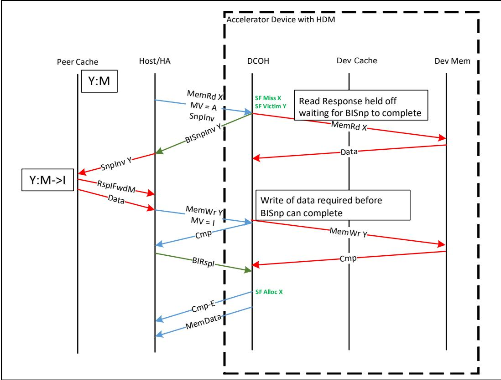

## 3.5.1.3 Conflict Handling

A conflict is defined as a case where S2M BISnp and M2S Req are active at the same time to the same address. There are two cases to consider: Early Conflict and Late Conflict. The two cases are ambiguous to the host side of the link until observation of a Cmp message relative to BIConflictAck. The conflict handshake starts when by the host detecting a BISnp to the same address as a pending Req. The host sends a BIConflict with the Tag of the M2S Req. The device responds to a BIConflict with a BIConflictAck which must push prior Cmp\* messages within the NDR channel. This ordering relationship is fundamental to allow the host to correctly resolve the two cases.

The Early Conflict case in Figure 3-24 is defined as a case where M2S Req is blocked (or in flight) at the device while S2M BISnp is active. The host observing BIConflictAck before Cmp-E determines the M2S MemRd is still pending so that the host can reply with RspI.

## Figure 3-24. BISnp Early Conflict

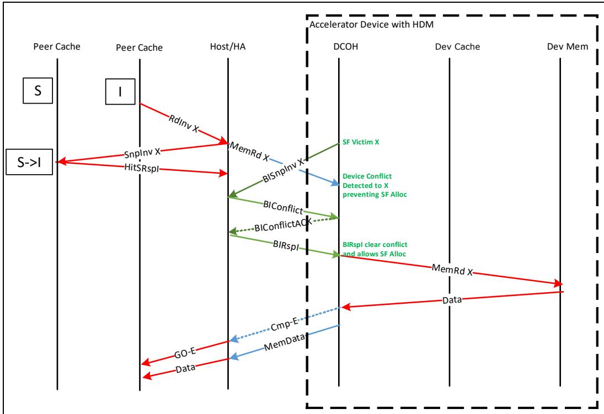

Late conflict is captured in Figure 3-25 and is defined as the case where M2S Req was processed and completions are in flight when BISnp is started. In the example provided, the Cmp-E message is observed at the host before BIConflictAck, so the host must process the BISnpInv with E-state ownership, which requires it to degrade E to I before completing the BISnpInv with BIRspI.

Note that MemData has no ordering requirement and can be observed either before or after the BIConflictAck. The example shown in Figure 3-25 shows the MemData after the BIConflictAck, which delays the host’s ability to immediately process the internal SnpInv X.

Figure 3-25. BISnp Late Conflict  
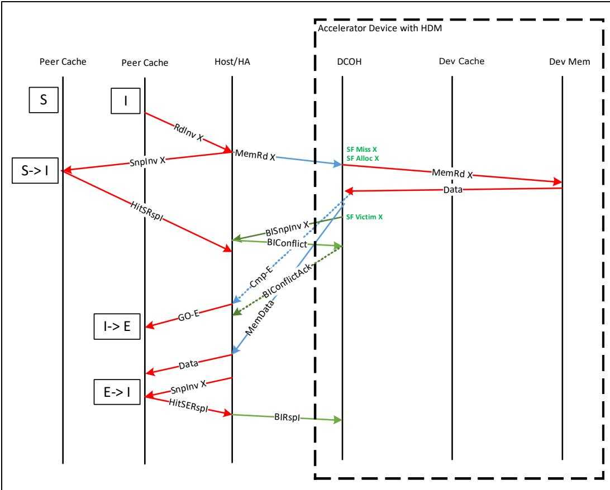

## 3.5.1.4 Block Back-Invalidate Snoops

To support increased efficient snooping the BISnp channel defines messages that can Snoop multiple cachelines in the host in a single message. These messages support either 2 or 4 cachelines where the base address must be naturally aligned with the length (128B or 256B). The host is allowed to respond with either a single block response or individual snoop responses per cacheline.

Figure 3-26 is an example of a Block response case. In this example, the host receives the BISnpInvBlk for Y, which is a 256B block. Internally, the host logic is showing resolving coherence by snooping Y0 and Y2 and the host HA tracker knows the other portions of the block Y1 and Y3 are already in the invalid state, so it does not need to snoop for that portion of the 256B block. Once snoop responses for Y0 and Y2 are completed, the Host HA can send the BIRspIBlk indicating that the entire block is in Istate within the host, thereby allowing the device to have Exclusive access to the block. This results in the SF in I-state for the block and the device cache in E-state.

Figure 3-26. Block BISnp with Block Response  
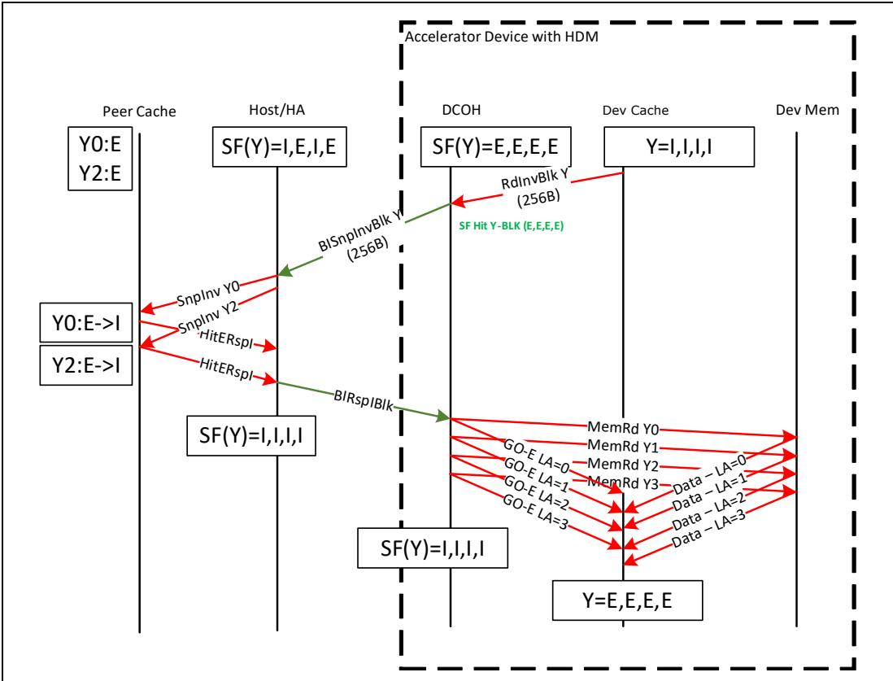  
Figure 3-27 is an example where the host sends individual cacheline responses on CXL.mem for each cacheline of the block. The host encodes the 2-bit Lower Address (LowAddr) of the cacheline (Address[7:6]) with each cacheline response to allow the device to determine for which portion of the block the response is intended. The device may see the response messages in any order, which is why LA must be explicitly sent. In a Block, BISnp Address[7:6] is used to indicate the offset and length of the block as defined in Table 3-48 and is naturally aligned to the length.

Figure 3-27. Block BISnp with Cacheline Response  
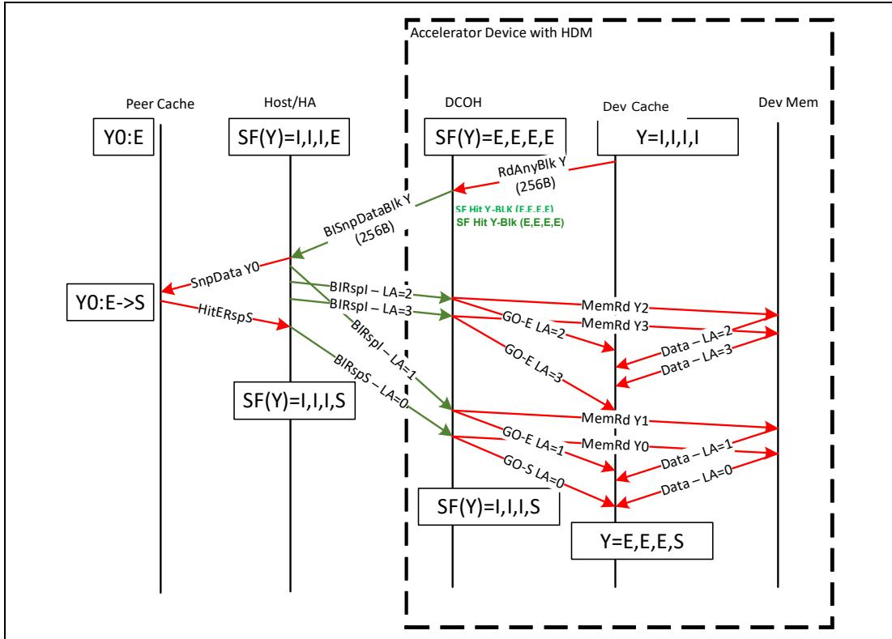

## 3.5.2

Flows for Type 1 Devices and Type 2 Devices

## 3.5.2.1 Notes and Assumptions

The transaction flow diagrams below are intended to be illustrative of the flows between the Host and device for access to device-attached memory using the Bias-Based Coherency mechanism described in Section 2.2.2. However, these flows are not comprehensive of every Host and device interaction. The following assumptions apply to the flow diagrams that appear in the subsections that follow:

• The device contains a coherency engine, referred to as DCOH in the flow diagrams.

• The DCOH contains a Snoop Filter that tracks any caches (referred to as Dev cache) implemented on the device. This is not strictly required, and the device is free to choose an implementation specific mechanism as long as the coherency rules are obeyed.

• The DCOH contains host coherence tracking logic for the device-attached memory. This tracking logic is referred to as a Bias Table in the context of the HDM-D memory region. For HDM-DB, it is referred to as a Directory or a Host Snoop Filter. The implementation of this is device specific.

• The device-specific aspects of the flow, illustrated using red flow arrows, need not conform exactly to the diagrams below. These can be implemented in a devicespecific manner.

• Device-attached Memory exposed in a Type 2 device can be either HDM-D or HDM-DB. HDM-D will resolve coherence using a request that is issued on CXL.cache and the Host will send a Mem\*Fwd as a response on the CXL.mem Req channel. The HDM-DB region uses the separate CXL.mem BISnp channel to manage coherence with detailed flows covered in Section 3.5.1. This section will indicate where the flows differ.

Figure 3-28 provides the legend for the flow diagrams that appear in the subsections that follow.

Figure 3-28. Flows Legend for Type 1/2/3 Devices


## 3.5.2.2 Requests from Host

Note that the flows shown in this section (Requests from Host) do not change on the CXL interface regardless of the target region’s bias state. This effectively means that the device needs to give the Host a consistent response, as expected by the Host and shown in Figure 3-29.

Figure 3-29. Example Cacheable Read from Host

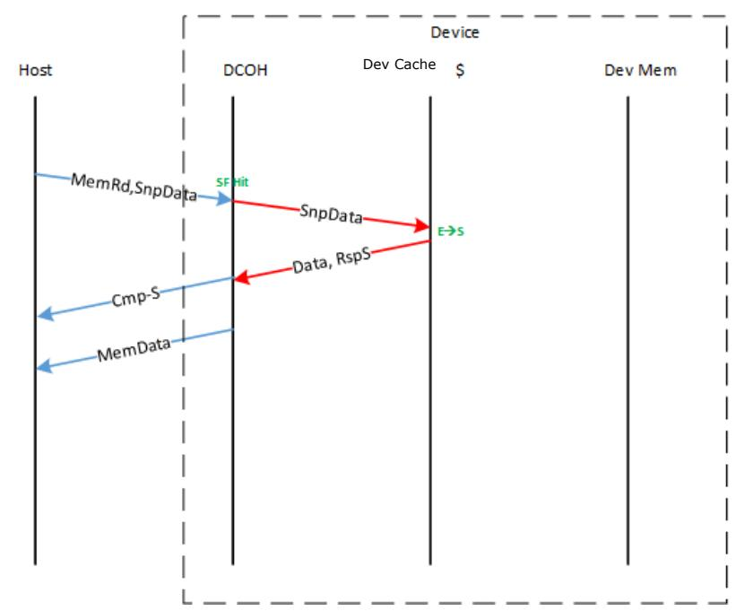

In the example shown in Figure 3-29, the Host requested a cacheable non-exclusive copy of the line. The non-exclusive aspect of the request is communicated using the “SnpData” semantic. In this example, the request got a snoop filter hit in the DCOH, which caused the device cache to be snooped. The device cache downgraded the state from Exclusive to Shared and returned the Shared data copy to the Host. The Cmp-S semantic is used to communicate the line state to the Host.

Figure 3-30. Example Read for Ownership from Host  
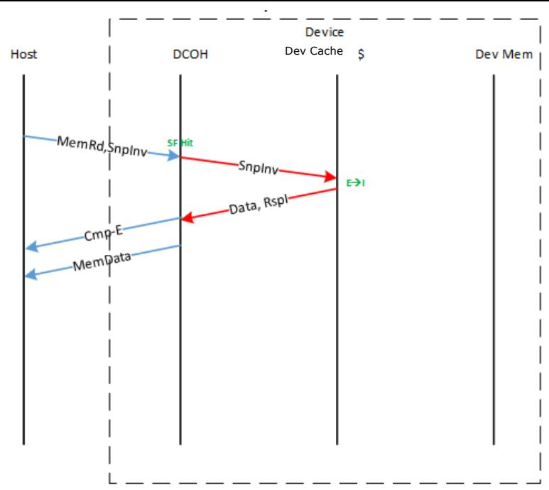

In the example shown in Figure 3-30, the Host requested a cacheable exclusive copy of the line. The exclusive aspect of the request is communicated using the “SnpInv” semantic, which asks the device to invalidate its caches. In this example, the request got a snoop filter hit in the DCOH, which caused the device cache to be snooped. The device cache downgraded the state from Exclusive to Invalid and returned the Exclusive data copy to the Host. The Cmp-E semantic is used to communicate the line state to the Host.

Figure 3-31. Example Non-cacheable Read from Host  
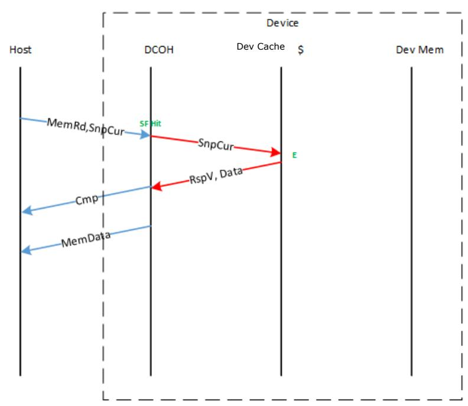  
In the example shown in Figure 3-31, the Host requested a non-cacheable copy of the line. The non-cacheable aspect of the request is communicated using the “SnpCur” semantic. In this example, the request got a snoop filter hit in the DCOH, which caused the device cache to be snooped. The device cache did not need to change its caching state; however, it gave the current snapshot of the data. The Cmp semantic is used to inform the Host that the Host is not permitted to cache the line.

Figure 3-32. Example Ownership Request from Host — No Data Required  
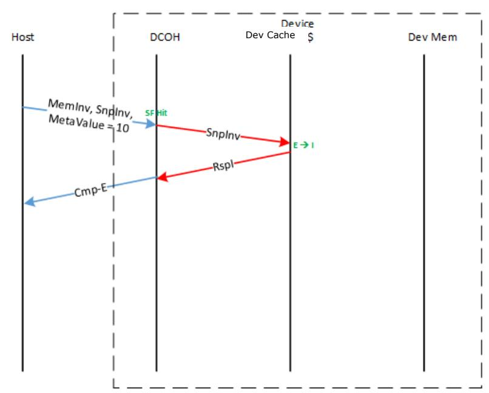

In the example shown in Figure 3-32, the Host requested exclusive access to a line without requiring the device to send data. The Host communicates that to the device using an opcode of MemInv with a MetaValue of 10b (Any), which is significant in this case. The Host also asks the device to invalidate its caches with the SnpInv command. The device invalidates its caches and uses the Cmp-E semantic to inform the Host that the device has given exclusive ownership of the line to the Host.

Figure 3-33. Example Flush from Host — No Data Required  
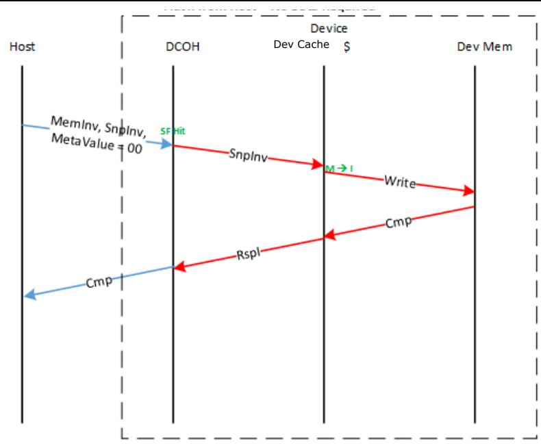  
In the example shown in Figure 3-33, the Host wants to flush a line from all caches, including the device’s caches, to device memory. To do so, the Host uses an opcode of MemInv with a MetaValue of 00b (Invalid) and a SnpInv. The device flushes its caches and returns a Cmp indication to the Host.

Figure 3-34. Example Weakly Ordered Write from Host  
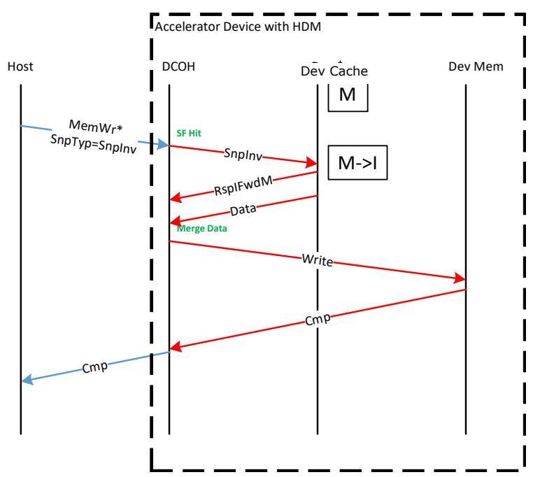  
In the example shown in Figure 3-34, the Host issues a weakly ordered write (partial or full line). The weakly ordered semantic is communicated by the embedded SnpInv. In this example, the device had a copy of the line cached. This resulted in a merge within the device before writing it back to memory and sending a Cmp indication to the Host. The term “weakly ordered” in this context refers to an expected-use model in the host CPU in which ordering of the data is not guaranteed until after the Cmp message is received. This is in contrast to a “data visibility is guaranteed with the host” CPU cache in M-state.