Figure 3-34. Example Weakly Ordered Write from Host  
  
In the example shown in Figure 3-34, the Host issues a weakly ordered write (partial or full line). The weakly ordered semantic is communicated by the embedded SnpInv. In this example, the device had a copy of the line cached. This resulted in a merge within the device before writing it back to memory and sending a Cmp indication to the Host. The term “weakly ordered” in this context refers to an expected-use model in the host CPU in which ordering of the data is not guaranteed until after the Cmp message is received. This is in contrast to a “data visibility is guaranteed with the host” CPU cache in M-state.

Figure 3-35. Example Strongly Ordered Write from Host with Invalid Host Caches  
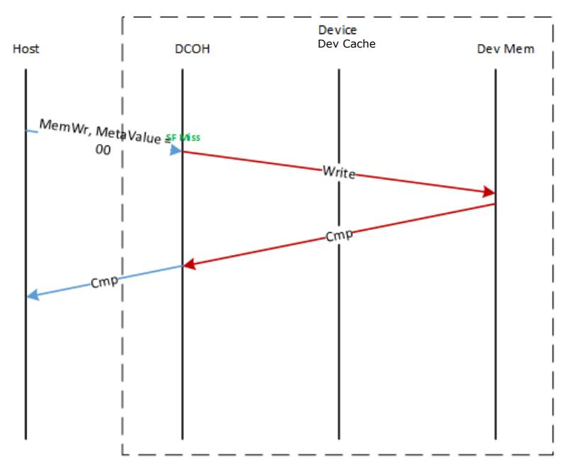

In the example shown in Figure 3-35, the Host performed a write while guaranteeing to the device that the Host no longer has a valid cached copy of the line. The fact that the Host didn’t need to snoop the device’s caches means that the Host previously acquired an exclusive copy of the line. The guarantee on no valid cached copy is indicated by a MetaValue of 00b (Invalid).

Figure 3-36. Example Write from Host with Valid Host Caches

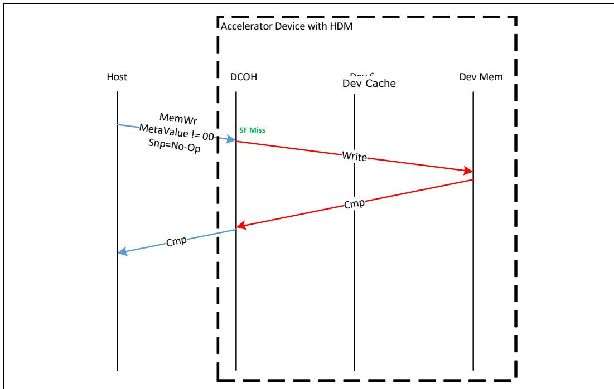

The two flows in Figure 3-37 both start with an internal CXL.cache request (RdAny) that targets the device’s HDM-D address region.

The example shown in Figure 3-36 is the same as the example shown in Figure 3-35 except that the Host chose to retain a valid cacheable copy of the line after the write. This is communicated to the device using a MetaValue of not 00b (Invalid).

## 3.5.2.3 Requests from Device in Host and Device Bias

Figure 3-37. Example Device Read to Device-attached Memory (HDM-D)

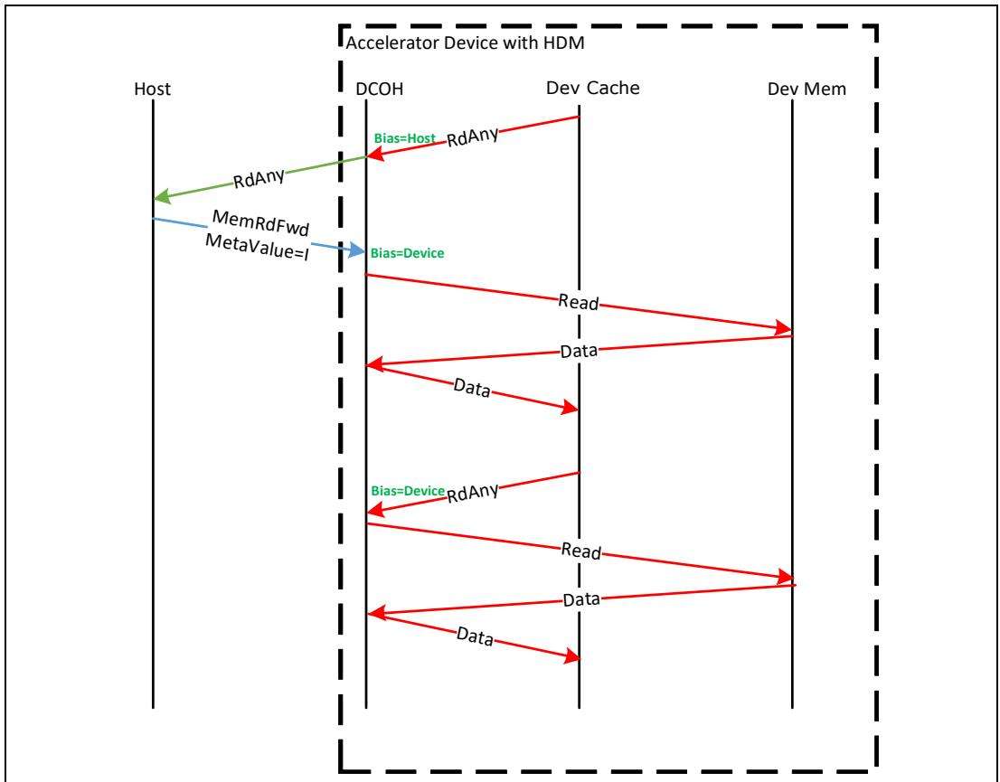

In the first flow in Figure 3-37, a device read to device-attached memory happened to find the line in Host bias. Because it is in Host bias, the device needs to send the request to the Host to resolve coherency. The Host, after resolving coherency, sends a MemRdFwd on CXL.mem to complete the transaction, at which point the device can internally complete the read.

In the second flow in Figure 3-37, the device read happened to find the line in Device Bias. Because it is in Device Bias, the read can be completed entirely within the device itself and a request does not need to be sent to the Host.

The same device request is shown in Figure 3-38, but in this case the target is the HDM-DB address region, meaning that the BISnp channel is used to resolve coherence with the host. In this flow, the difference is that the SF Hit (similar to BIAS=host) indicates that the host could have a cached copy, so BISnpData is sent to the host to resolve coherence. After the host resolves coherence, the host responds with BIRspI indicating that the host is in I-state and that the device can proceed to access its data.

Figure 3-38. Example Device Read to Device-attached Memory (HDM-DB)  
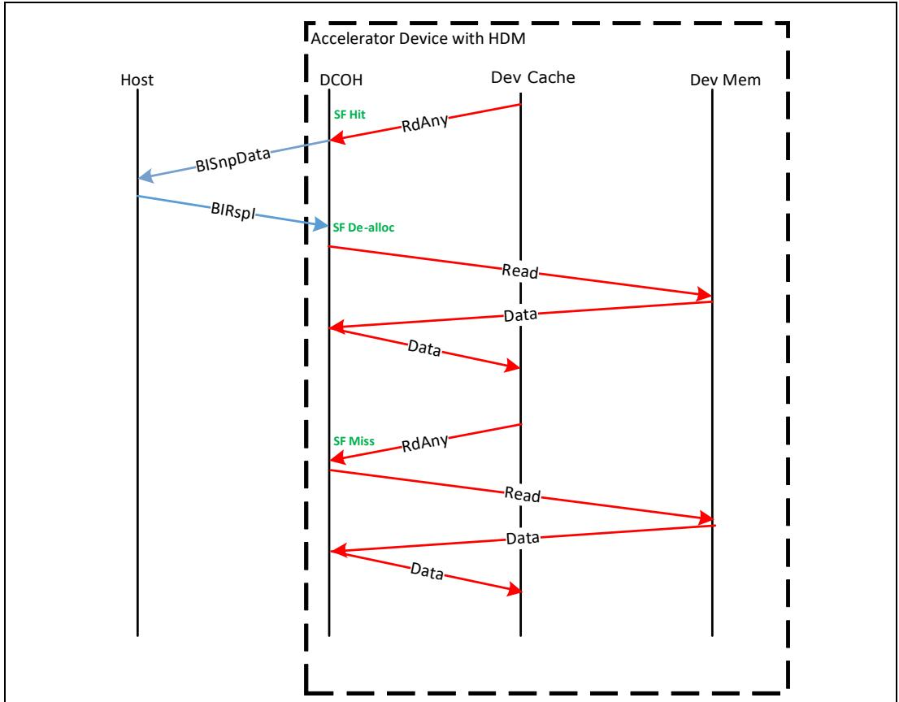

Figure 3-39. Example Device Write to Device-attached Memory in Host Bias (HDM-D)  
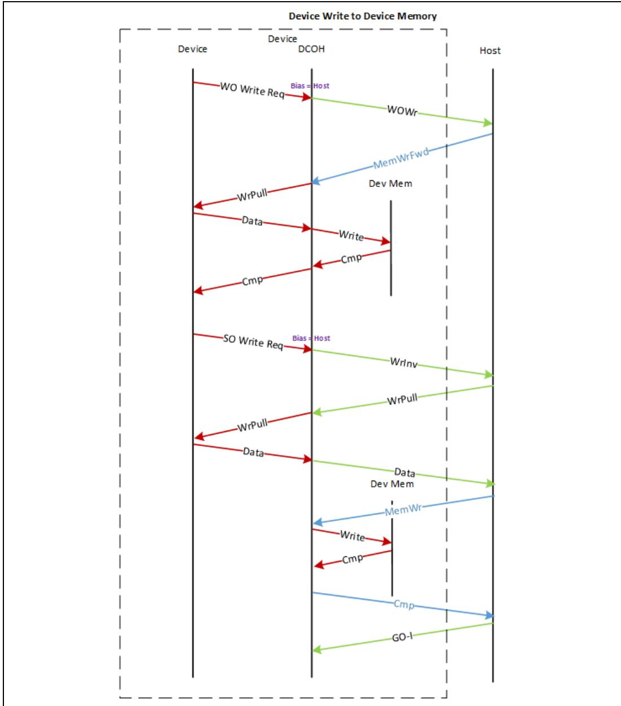

There are two flows shown in Figure 3-39 for the HDM-D region. Both flows start with the line in Host Bias: a weakly ordered write request and a strongly ordered write request.

In the case of the weakly ordered write request, the request is issued by the device to the Host to resolve coherency. The Host resolves coherency and sends a CXL.mem MemWrFwd opcode, which carries the completion for the WOWrInv\* command on CXL.cache. The CQID associated with the CXL.cache WOWrInv\* command is reflected in the Tag of the CXL.mem MemWrFwd command. At this point, the device is permitted to complete the write internally. After sending the MemWrFwd, because the Host no longer prevents future accesses to the same line, this is considered a weakly ordered write.

In the second flow, the write is strongly ordered. To preserve the strongly ordered semantic, the Host can prevent future accesses to the same line while this write completes. However, as can be seen, this involves two transfers of the data across the link, which is inefficient. Unless strongly ordered writes are absolutely required, it is recommended to use weakly ordered writes to optimize performance.

Figure 3-40. Example Device Write to Device-attached Memory in Host Bias (HDM-DB)

## Device Write to Device Memory

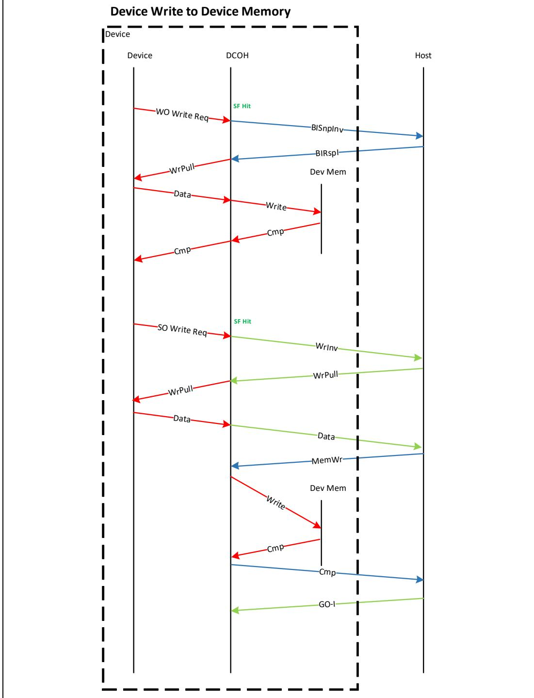

Figure 3-40 for HDM-DB is in contrast to Figure 3-39 for the HDM-D region. In the HDM-DB flow, the BISnp channel in the CXL.mem protocol is used to resolve coherence with the host for the internal weakly ordered write. The strongly ordered write follows the same flow for both HDM-DB and HDM-D.

Figure 3-41. Example Device Write to Device-attached Memory

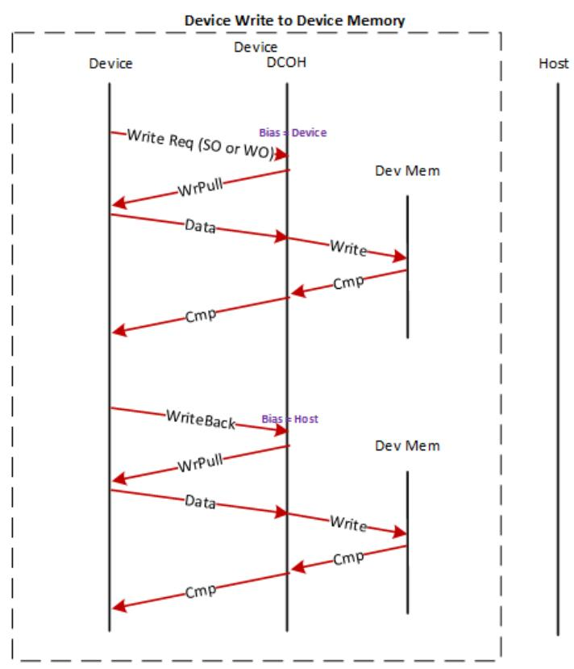

Two flows are shown in Figure 3-41. In the first flow, if a weakly ordered write or strongly ordered write finds the line in Device Bias, the write can be completed entirely within the device without having to send any indication to the Host.

The second flow shows a device writeback to device-attached memory. Note that if the device is performing a writeback to device-attached memory, regardless of bias state, the request can be completed within the device without having to send a request to the Host.

The HDM-DB vs. HDM-D regions have the same basic assumption in these flows such that no interaction is required with the host.

Figure 3-42. Example Host to Device Bias Flip (HDM-D)  
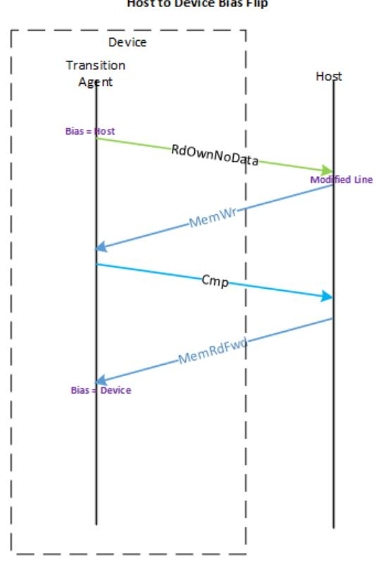  
Figure 3-42 captures the “Bias Flip” flows for HDM-D memory. For the HDM-DB memory region, see Section 3.3.3 for details regarding how this case is handled. Note that the MemRdFwd will carry the CQID of the RdOwnNoData transaction in the Tag. The reason for placing the RdOwnNoData completion (MemRdFwd) on CXL.mem is to ensure that subsequent M2S Req Channel requests from the Host to the same address are ordered behind the MemRdFwd. This allows the device to assume ownership of a line as soon as the device receives a MemRdFwd without having to monitor requests from the Host.

## Memory Flows for Type 2 Devices and Type 3 Devices

## 3.5.3.1 Speculative Memory Read

To support latency saving, CXL.mem includes a speculative memory read command (MemSpecRd) which is used to start memory access before the home agent has resolved coherence. This command does not receive a completion message and can be arbitrarily dropped. The host, after resolving coherence, may issue a demand read (i.e., MemRd or MemRdData) that the device should merge with the earlier MemSpecRd to achieve latency savings. See Figure 3-43 for an example of this type of flow.

The MemSpecRd command can be observed while another memory access is in progress in the device to the same cacheline address. In this condition, it is recommended that the device drops the MemSpecRd.

To avoid performance impact, it is recommended that MemSpecRd commands are treated as low priority to avoid adding latency to demand accesses. Under loaded conditions the MemSpecRd can hurt performance because of the extra bandwidth it consumes and should be dropped when loading of memory or loading of the CXL link is detected. QoS Telemetry data as indicated by the DevLoad field is one way that loading of memory can be detected in the host or switch.

Figure 3-43. Example MemSpecRd

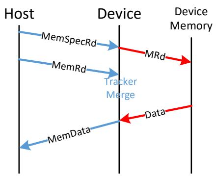

## Flows to HDM-H in a Type 3 Device

The HDM-H address region in a Type 3 device is used as a memory expander or for Shared FAM device with software coherence where the device does not require active management of coherence with the Host. Thus, access to HDM-H does not use a DCOH agent. This allows the transaction flows to HDM-H to be simplified to just two classes, reads and writes, as shown below.

In Figure 3-44, the optimized read flow is shown for the HDM-H address region. In this flow, only a Data message is returned. In contrast, in the HDM-D/HDM-DB address region, both NDR and Data are returned. The legend shown in Figure 3-28 also applies to the transaction flows.

Figure 3-44. Read from Host to HDM-H  
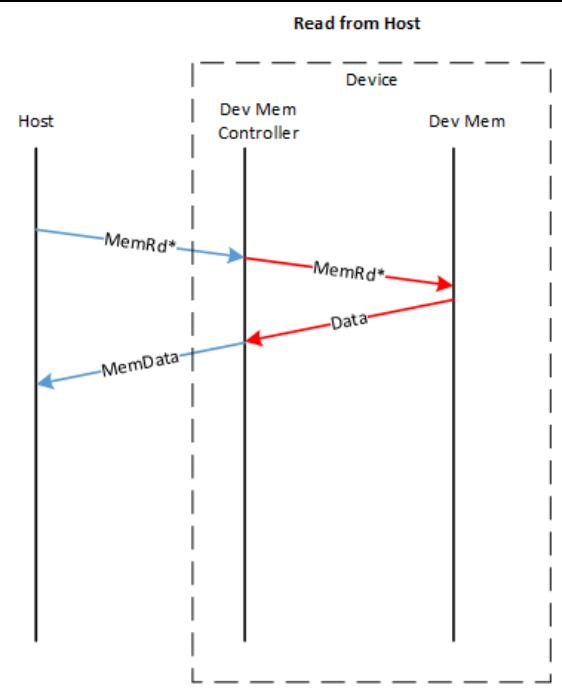  
Unlike reads, writes to the HDM-H region use the same flow as the HDM-D/HDM-DB region and always complete with an S2M NDR Cmp message. This common write flow is shown in Figure 3-45.

Figure 3-45. Write from Host to All HDM Regions

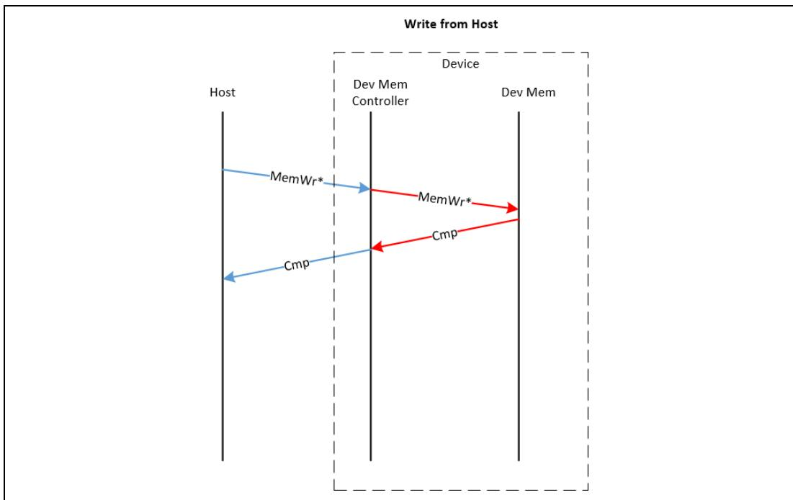

# CXL Link Layers

## 4.1 CXL.io Link Layer

The CXL.io link layer acts as an intermediate stage between the CXL.io transaction layer and the Flex Bus Physical layer. Its primary responsibility is to provide a reliable mechanism for exchanging transaction layer packets (TLPs) between two components on the link. The PCIe\* Data Link Layer is utilized as the link layer for CXL.io Link layer. See the “Data Link Layer Specification” chapter of the PCIe Base Specification for details. In 256B Flit mode, the PCIe-defined PM and Link Management DLLPs are not applicable for CXL.io and must not be used.

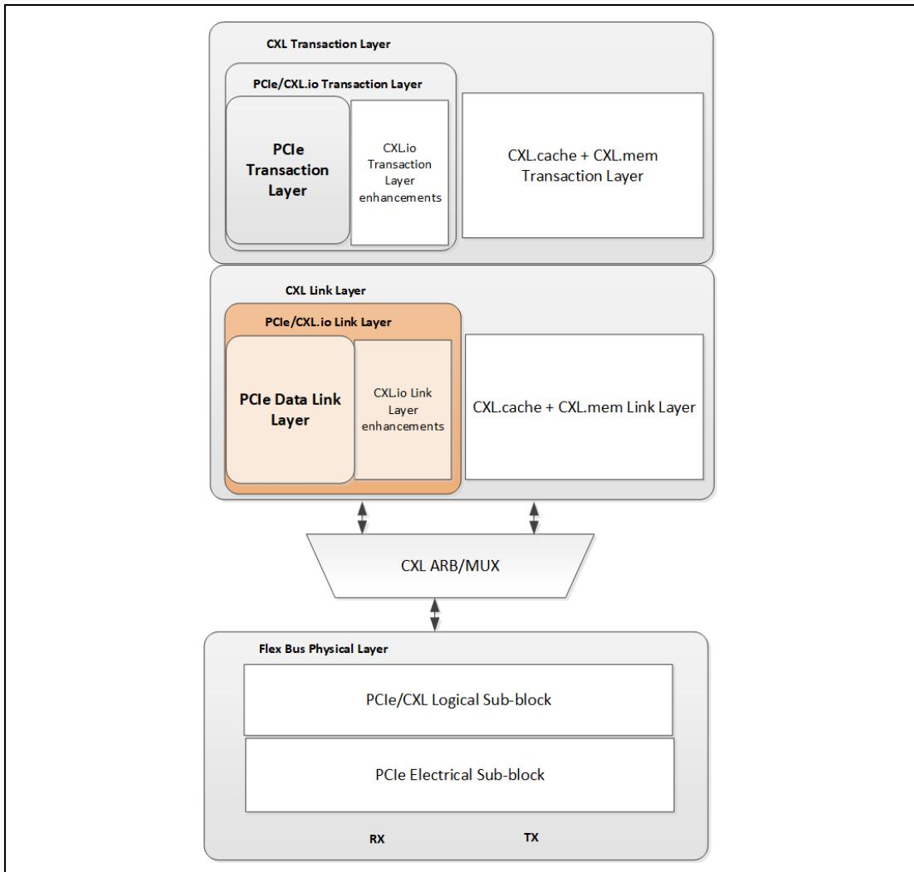

In addition, for 68B Flit mode, the CXL.io link layer implements the framing/deframing of CXL.io packets. CXL.io uses the Encoding for 8 GT/s, 16 GT/s, and 32 GT/s data rates only (see “128b/130b Encoding for 8.0 GT/s, 16.0 GT/s, and 32.0 GT/s Data Rates” in the PCIe Base Specification for details).

This chapter highlights the notable framing and application of symbols to lanes that are specific for CXL.io. Note that when viewed on the link, the framing symbol-to-lane mapping will be shifted as a result of additional CXL framing (i.e., two bytes of Protocol ID and two reserved bytes) and of interleaving with other CXL protocols.

For CXL.io, only the x16 Link transmitter and receiver framing requirements described in the PCIe Base Specification apply regardless of the negotiated link width. The framing related rules for N = 1, 2, 4, and 8 do not apply. For downgraded Link widths, where number of active lanes is less than x16, a single x16 data stream is formed using x16 framing rules and transferred over x16/(degraded link width) degraded link width streams.

The CXL.io link layer forwards a framed I/O packet to the Flex Bus Physical layer. The Flex Bus Physical layer framing rules are defined in Chapter 6.0.

For 256B Flit mode, the NOP TLP alignment rules from the PCIe Base Specification for PCIe Flit mode are shifted as a result of the two bytes of Flit Header at the beginning of the flit. The NOP TLP alignment is additionally shifted by the six bytes of CRC at the end of the first flit half in latency-optimized 256B flits. In other words, NOP TLP alignment must be calculated relative to the TLP payload, which is the 236 bytes of Flit Data in standard 256B flits and the 232 bytes of Flit Data in latency-optimized 256B flits. See Figure 4-2 and Figure 4-3 where the thick black lines are the NOP TLP alignment boundary.

The maximum non-NOP TLP rules from the PCIe Base Specification are applied to CXL flits as described below (see Figure 4-2 and Figure 4-3 where the blue and white groups represent the two groups described in the below bullet items):

• For standard 256B flits, the rules are applied independently to the following two groups of bytes: 1) the first 128 TLP bytes and 2) the remaining 108 TLP bytes.

• For latency-optimized 256B flits, the rules are applied independently to the following two groups of bytes: 1) the first 128 TLP bytes and 2) the remaining 104 TLP bytes.

• For each of the above groups, the PCIe rule of no more than 8 non-NOP TLPs, including partial TLPs, applies for 64 GT/s and lower data rates. For 128 GT/s data rates, the maximum number of non-NOP TLPs is either 4 or 8 and determined as described in the PCIe Base Specification.

Note, depending on implementation choices on the receive side, the logic may have to handle processing more than 8 (or 4, if specified per above) non-NOP TLPs in a clock cycle.

Figure 4-2. Standard 256B Flit NOP Alignment and Max TLP

<table><tr><td></td><td></td><td></td><td></td><td></td><td></td><td></td><td></td><td></td></tr><tr><td></td><td></td><td></td><td></td><td></td><td></td><td></td><td></td><td></td></tr><tr><td></td><td></td><td></td><td></td><td></td><td></td><td></td><td></td><td></td></tr><tr><td></td><td></td><td></td><td></td><td></td><td></td><td></td><td></td><td></td></tr><tr><td></td><td></td><td></td><td></td><td></td><td></td><td></td><td></td><td></td></tr><tr><td></td><td></td><td></td><td></td><td></td><td></td><td></td><td></td><td></td></tr><tr><td></td><td></td><td></td><td></td><td></td><td></td><td></td><td></td><td></td></tr><tr><td></td><td></td><td></td><td></td><td>DLLP</td><td colspan="2">CRC</td><td colspan="2">FEC</td></tr></table>

Figure 4-3. Latency-Optimized 256B Flit NOP Alignment and Max TLP  
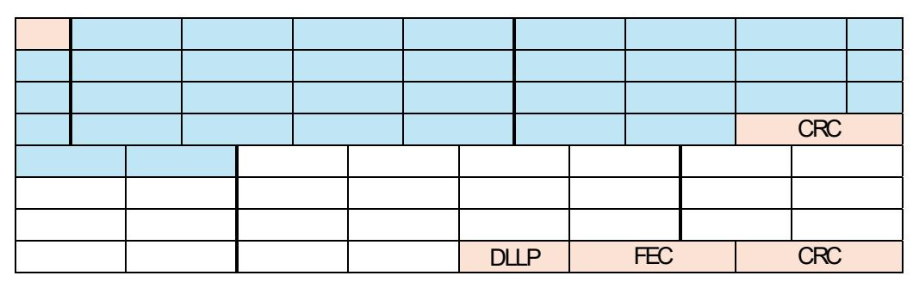  
The CXL.io link layer must guarantee that if a transmitted TLP ends exactly at the flit boundary, there must be a subsequent transmitted CXL.io flit. See Section 6.2.2.7 for additional details.

## CXL.cache and CXL.mem 68B Flit Mode Common Link Layer

## 4.2.1 Introduction

Figure 4-4 shows where the CXL.cache and CXL.mem link layer exists in the Flex Bus layered hierarchy. The link layer has two modes of operation: 68B flit and 256B flit. 68B flit, which defines 66B in the link layer and 2B in the ARB/MUX, supports the physical layer up to 32 GT/s. To support higher speeds a flit definition of 256B is defined; the reliability flows for that flit definition are handled in the Physical layer, so retry flows from 68B Flit mode are not applicable. 256B flits can support any legal transfer rate, but are required for >32 GT/s. The 256B flit definition and requirements are captured in Section 4.3. There are Transaction Layer features that require 256B flits and those features include CacheID, Back-Invalidate Snoop (BISnp), and Port Based Routing (PBR).

Figure 4-4. Flex Bus Layers — CXL.cache + CXL.mem Link Layer Highlighted  
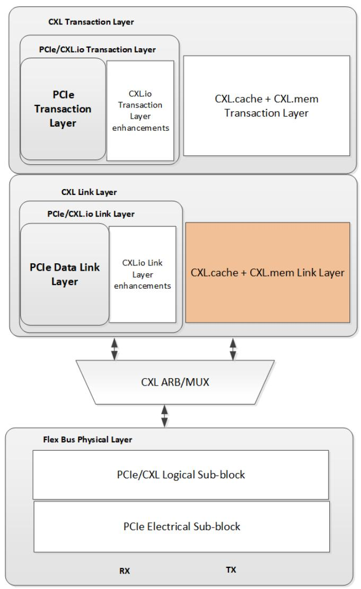

As previously mentioned, CXL.cache and CXL.mem protocols use a common Link Layer. This chapter defines the properties of this common Link Layer. Protocol information, including definition of fields, opcodes, transaction flows, etc., can be found in Section 3.2 and Section 3.3, respectively.

<table><tr><td colspan="3">Bit #</td></tr><tr><td></td><td>7</td><td>6 5 4 3 2 1 0</td></tr><tr><td>0</td><td colspan="2">Flit Header</td></tr><tr><td>1</td><td colspan="2">1</td></tr><tr><td>2</td><td colspan="2">2</td></tr><tr><td>3</td><td colspan="2">3</td></tr><tr><td>4</td><td colspan="2">4</td></tr><tr><td>5</td><td colspan="2">5</td></tr><tr><td>6</td><td colspan="2">6</td></tr><tr><td>7</td><td colspan="2">7</td></tr><tr><td>8</td><td colspan="2">8</td></tr><tr><td>9</td><td colspan="2">9</td></tr><tr><td>10</td><td colspan="2">10</td></tr><tr><td>11</td><td colspan="2">11</td></tr><tr><td>12</td><td colspan="2">12</td></tr><tr><td>13</td><td colspan="2">13</td></tr><tr><td>14</td><td colspan="2">14</td></tr><tr><td>15</td><td colspan="2">15</td></tr><tr><td>16</td><td colspan="2">0</td></tr><tr><td>17</td><td colspan="2">1</td></tr><tr><td>18</td><td colspan="2">2</td></tr><tr><td>19</td><td colspan="2">3</td></tr><tr><td>20</td><td colspan="2">4</td></tr><tr><td>21</td><td colspan="2">5</td></tr><tr><td>22</td><td colspan="2">6</td></tr><tr><td>23</td><td colspan="2">7</td></tr><tr><td>24</td><td colspan="2">8</td></tr><tr><td>25</td><td colspan="2">9</td></tr><tr><td>26</td><td colspan="2">10</td></tr><tr><td>27</td><td colspan="2">11</td></tr><tr><td>28</td><td colspan="2">12</td></tr><tr><td>29</td><td colspan="2">13</td></tr><tr><td>30</td><td colspan="2">14</td></tr><tr><td>31</td><td colspan="2">15</td></tr><tr><td>32</td><td colspan="2">0</td></tr><tr><td>33</td><td colspan="2">1</td></tr><tr><td>34</td><td colspan="2">2</td></tr><tr><td>35</td><td colspan="2">3</td></tr><tr><td>36</td><td colspan="2">4</td></tr><tr><td>37</td><td colspan="2">5</td></tr><tr><td>38</td><td colspan="2">6</td></tr><tr><td>39</td><td colspan="2">7</td></tr><tr><td>40</td><td colspan="2">8</td></tr><tr><td>41</td><td colspan="2">9</td></tr><tr><td>42</td><td colspan="2">10</td></tr><tr><td>43</td><td colspan="2">11</td></tr><tr><td>44</td><td colspan="2">12</td></tr><tr><td>45</td><td colspan="2">13</td></tr><tr><td>46</td><td colspan="2">14</td></tr><tr><td>47</td><td colspan="2">15</td></tr><tr><td>48</td><td colspan="2">0</td></tr><tr><td>49</td><td colspan="2">1</td></tr><tr><td>50</td><td colspan="2">2</td></tr><tr><td>51</td><td colspan="2">3</td></tr><tr><td>52</td><td colspan="2">4</td></tr><tr><td>53</td><td colspan="2">5</td></tr><tr><td>54</td><td colspan="2">6</td></tr><tr><td>55</td><td colspan="2">7</td></tr><tr><td>56</td><td colspan="2">8</td></tr><tr><td>57</td><td colspan="2">9</td></tr><tr><td>58</td><td colspan="2">10</td></tr><tr><td>59</td><td colspan="2">11</td></tr><tr><td>60</td><td colspan="2">12</td></tr><tr><td>61</td><td colspan="2">13</td></tr><tr><td>62</td><td colspan="2">14</td></tr><tr><td>63</td><td colspan="2">15</td></tr><tr><td>64</td><td colspan="2">0</td></tr><tr><td>65</td><td colspan="2">1</td></tr></table>

## 4.2.2 High-Level CXL.cachemem Flit Overview

The CXL.cachemem flit size is a fixed 528b. There are 2B of CRC code and 4 slots of 16B each as shown below.

## Figure 4-5. CXL.cachemem Protocol Flit Overview

Figure 4-6. CXL.cachemem All Data Flit Overview

<table><tr><td colspan="3">Bit #</td></tr><tr><td></td><td>7</td><td>6 5 4 3 2 1 0</td></tr><tr><td>0</td><td>0</td><td></td></tr><tr><td>1</td><td>1</td><td></td></tr><tr><td>2</td><td>2</td><td></td></tr><tr><td>3</td><td>3</td><td></td></tr><tr><td>4</td><td>4</td><td></td></tr><tr><td>5</td><td>5</td><td></td></tr><tr><td>6</td><td>6</td><td></td></tr><tr><td>7</td><td>7</td><td></td></tr><tr><td>8</td><td>8</td><td></td></tr><tr><td>9</td><td>9</td><td></td></tr><tr><td>10</td><td>10</td><td></td></tr><tr><td>11</td><td>11</td><td></td></tr><tr><td>12</td><td>12</td><td></td></tr><tr><td>13</td><td>13</td><td></td></tr><tr><td>14</td><td>14</td><td></td></tr><tr><td>15</td><td>15</td><td></td></tr><tr><td>16</td><td>0</td><td></td></tr><tr><td>17</td><td>1</td><td></td></tr><tr><td>18</td><td>2</td><td></td></tr><tr><td>19</td><td>3</td><td></td></tr><tr><td>20</td><td>4</td><td></td></tr><tr><td>21</td><td>5</td><td></td></tr><tr><td>22</td><td>6</td><td></td></tr><tr><td>23</td><td>7</td><td></td></tr><tr><td>24</td><td>8</td><td></td></tr><tr><td>25</td><td>9</td><td></td></tr><tr><td>26</td><td>10</td><td></td></tr><tr><td>27</td><td>11</td><td></td></tr><tr><td>28</td><td>12</td><td></td></tr><tr><td>29</td><td>13</td><td></td></tr><tr><td>30</td><td>14</td><td></td></tr><tr><td>31</td><td>15</td><td></td></tr><tr><td>32</td><td>0</td><td></td></tr><tr><td>33</td><td>1</td><td></td></tr><tr><td>34</td><td>2</td><td></td></tr><tr><td>35</td><td>3</td><td></td></tr><tr><td>36</td><td>4</td><td></td></tr><tr><td>37</td><td>5</td><td></td></tr><tr><td>38</td><td>6</td><td></td></tr><tr><td>39</td><td>7</td><td></td></tr><tr><td>40</td><td>8</td><td></td></tr><tr><td>41</td><td>9</td><td></td></tr><tr><td>42</td><td>10</td><td></td></tr><tr><td>43</td><td>11</td><td></td></tr><tr><td>44</td><td>12</td><td></td></tr><tr><td>45</td><td>13</td><td></td></tr><tr><td>46</td><td>14</td><td></td></tr><tr><td>47</td><td>15</td><td></td></tr><tr><td>48</td><td>0</td><td></td></tr><tr><td>49</td><td>1</td><td></td></tr><tr><td>50</td><td>2</td><td></td></tr><tr><td>51</td><td>3</td><td></td></tr><tr><td>52</td><td>4</td><td></td></tr><tr><td>53</td><td>5</td><td></td></tr><tr><td>54</td><td>6</td><td></td></tr><tr><td>55</td><td>7</td><td></td></tr><tr><td>56</td><td>8</td><td></td></tr><tr><td>57</td><td>9</td><td></td></tr><tr><td>58</td><td>10</td><td></td></tr><tr><td>59</td><td>11</td><td></td></tr><tr><td>60</td><td>12</td><td></td></tr><tr><td>61</td><td>13</td><td></td></tr><tr><td>62</td><td>14</td><td></td></tr><tr><td>63</td><td>15</td><td></td></tr><tr><td>64</td><td>0</td><td></td></tr><tr><td>65</td><td>1</td><td></td></tr></table>

An example of a Protocol flit in the device to Host direction is shown below. For detailed descriptions of slot formats, see Section 4.2.3. Example of a Protocol Flit from Device to Host

G<sup>2</sup>

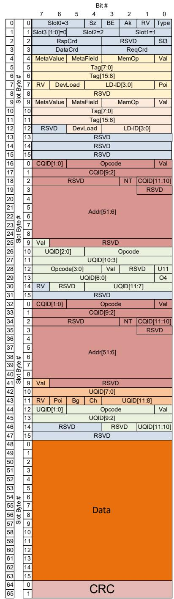

A “Header” Slot is defined as one that carries a “Header” of link-layer specific information, including the definition of the protocol-level messages contained in the remainder of the header as well as in the other slots in the flit.

A “Generic” Slot can carry one or more request/response messages or a single 16B data chunk.

The flit can be composed of a Header Slot and 3 Generic Slots or four 16B Data Chunks.

The Link Layer flit header uses the same definition for both the Upstream Ports, as well as the Downstream Ports, as summarized in Table 4-1.

CXL.cachemem Link Layer Flit Header Definition

<table><tr><td>Field Name</td><td>Brief Description</td><td>Length in Bits</td></tr><tr><td>Type</td><td>This field distinguishes between a Protocol or a Control flit.</td><td>1</td></tr><tr><td>Ak</td><td>This is an acknowledgment of 8 successful flit transfers.Reserved for RETRY, and for INIT control flits.</td><td>1</td></tr><tr><td>BE</td><td>Byte Enable (Reserved for control flits).</td><td>1</td></tr><tr><td>Sz</td><td>Size (Reserved for control flits).</td><td>1</td></tr><tr><td>ReqCrd</td><td>Request Credit Return.Reserved for RETRY, and for INIT control flits.</td><td>4</td></tr><tr><td>DataCrd</td><td>Data Credit Return.Reserved for RETRY, and for INIT control flits.</td><td>4</td></tr><tr><td>RspCrd</td><td>Response Credit Return.Reserved for RETRY, and for INIT control flits.</td><td>4</td></tr><tr><td>Slot 0</td><td>Slot 0 Format Type (Reserved for control flits).</td><td>3</td></tr><tr><td>Slot 1</td><td>Slot 1 Format Type (Reserved for control flits).</td><td>3</td></tr><tr><td>Slot 2</td><td>Slot 2 Format Type (Reserved for control flits).</td><td>3</td></tr><tr><td>Slot 3</td><td>Slot 3 Format Type (Reserved for control flits).</td><td>3</td></tr><tr><td>RSVD</td><td>Reserved</td><td>4</td></tr><tr><td>Total</td><td></td><td>32</td></tr></table>

In general, bits or encodings that are not defined are marked as “Reserved” or “RSVD” in this specification. These bits should be cleared to 0 by the sender of the packet and the receiver should ignore them. Note that certain fields with static 0/1 values will be checked by the receiving Link Layer when decoding a packet. For example, Control flits have several static bits defined. A Control flit that passes the CRC check but fails the static bit check should be treated as a standard CRC error or as a fatal error when in RETRY\_LOCAL\_NORMAL state of the LRSM. Logging and reporting of such errors is device specific. Checking of these bits reduces the probability of silent error under conditions where the CRC check fails to detect a long burst error. However, the link layer must not cause a fatal error whenever it is under the shadow of CRC errors (i.e., its LRSM is not in RETRY\_LOCAL\_NORMAL state). This is prescribed because an all-data flit can alias to control messages after a CRC error and those alias cases may result in static bit check failure.

The following describes how the flit header information is encoded.

Type Encoding

<table><tr><td>Value</td><td>Flit Type</td><td>Description</td></tr><tr><td>0</td><td>Protocol</td><td>This is a flit that carries CXL.cache or CXL.mem protocol-related information.</td></tr><tr><td>1</td><td>Control</td><td>This is a flit inserted by the link layer only for link layer-specific functionality. These flits are not exposed to the upper layers.</td></tr></table>

The Ak field is used as part of the link layer retry protocol to signal CRC-passing receipt of flits from the remote transmitter. The transmitter sets the Ak bit to acknowledge successful receipt of eight flits; a cleared Ak bit is ignored by the receiver.

The BE (Byte Enable) and Sz (Size) fields are related to the variable size of data messages. To reach its efficiency targets, the CXL.cachemem link layer assumes that generally all bytes are enabled for most data, and that data is transmitted at the full cacheline granularity. When all bytes are enabled, the link layer does not transmit the byte enable bits; instead, the link layer clears the Byte Enable field in the corresponding flit header. When the receiver decodes that the Byte Enable field is cleared, the receiver must regenerate the byte enable bits as all 1s before passing the data message on to the transaction layer. If the Byte Enable bit is set, the link layer Rx expects an additional data chunk slot that contains byte enable information. Note that this will always be the last slot of data for the associated request.

Similarly, the Sz field reflects the fact that the CXL.cachemem protocol allows transmission of data at the half cacheline granularity. When the Size bit is set, the link layer Rx expects four slots of data chunks, corresponding to a full cacheline. When the Size bit is cleared, it expects only two slots of data chunks. In the latter case, each half cacheline transmission will be accompanied by its own data header. A critical assumption of packing the Size and Byte Enable information in the flit header is that the Tx flit packet may begin at most one data message per flit.

Multi-Data Headers are not allowed to be sent when Sz=0 or BE=1 as described in the flit packing rules in Section 4.2.5.

Table 4-3 describes legal values of Sz and BE for various data transfers. For cases where a 32B split transfer is sent that includes Byte Enables, the trailing Byte Enables apply only to the 32B sent. The Byte Enable bits that are applicable to that transfer are aligned based on which half of the cacheline is applicable to the transfer (BE[63:32] for Upper half of the cacheline or BE[31:0] for the lower half of the cacheline). This means that each of the split 32B transfers that are used to form a cacheline of data will include Byte Enables if Byte Enables are needed. Illegal use will cause an uncorrectable error. The Reserved bits included in the BE slot may not be preserved when passing through a switch.

Legal Values of Sz and BE Fields

<table><tr><td>Type of Data Transfer</td><td>32B Transfer Permitted in 68B Flit? $^{1}$ </td><td>BE Permitted?</td></tr><tr><td>CXL.cache H2D Data</td><td>Yes</td><td>No</td></tr><tr><td>CXL.mem M2S Data</td><td>No</td><td>Yes</td></tr><tr><td>CXL.cache D2H Data</td><td>Yes</td><td>Yes</td></tr><tr><td>CXL.mem S2M Data</td><td>Yes</td><td>No</td></tr></table>

1. The 32B transfer allowance is only defined for 68B flit definition and does not apply for 256B flit.

The transmitter sets the CRD fields to indicate freed resources that are available in the co-located receiver for use by the remote transmitter. Credits are given for transmission per message class, which is why the flit header contains independent Request, Response, and Data CRD fields. Note that there are no Requests sourced in the S2M direction, and that there are no Responses sourced in the M2S direction. Details of the channel mapping are captured in Table 4-5. Credits returned for channels not supported by the device or the host should be silently discarded. The granularity of credits is per message. These fields are encoded exponentially, as delineated in Table 4-4.

Messages sent on Data channels require a single data credit for the entire message. This means that one credit allows for one data transfer, including the header of the message, regardless of whether the transfer is 64B, or 32B, or contains Byte Enables.

Table 4-5. ReqCrd/DataCrd/RspCrd Channel Mapping

The transaction layer requires all messages that carry payload to send 64B and the link layer allows for those to be sent as independent 32B messages to optimize latency for implementation-specific cases in which only 32B of data is ready to send.

CXL.cachemem Credit Return Encodings

<table><tr><td>Credit Return Encoding[3]</td><td>Protocol</td></tr><tr><td>0</td><td>CXL.cache</td></tr><tr><td>1</td><td>CXL.mem</td></tr><tr><td>Credit Return Encoding[2:0]</td><td>Number of Credits</td></tr><tr><td>000b</td><td>0</td></tr><tr><td>001b</td><td>1</td></tr><tr><td>010b</td><td>2</td></tr><tr><td>011b</td><td>4</td></tr><tr><td>100b</td><td>8</td></tr><tr><td>101b</td><td>16</td></tr><tr><td>110b</td><td>32</td></tr><tr><td>111b</td><td>64</td></tr></table>

<table><tr><td>Credit Field</td><td>Credit Bit[3] Encoding</td><td>Link Direction</td><td>Channel</td></tr><tr><td rowspan="4">ReqCrd</td><td rowspan="2">0 = CXL.cache</td><td>Upstream</td><td>D2H Request</td></tr><tr><td>Downstream</td><td>H2D Request</td></tr><tr><td rowspan="2">1 = CXL.mem</td><td>Upstream</td><td>Reserved</td></tr><tr><td>Downstream</td><td>M2S Request</td></tr><tr><td rowspan="4">DataCrd</td><td rowspan="2">0 = CXL.cache</td><td>Upstream</td><td>D2H Data</td></tr><tr><td>Downstream</td><td>H2D Data</td></tr><tr><td rowspan="2">1 = CXL.mem</td><td>Upstream</td><td>S2M DRS</td></tr><tr><td>Downstream</td><td>M2S RwD</td></tr><tr><td rowspan="4">RspCrd</td><td rowspan="2">0 = CXL.cache</td><td>Upstream</td><td>D2H Rsp</td></tr><tr><td>Downstream</td><td>H2D Rsp</td></tr><tr><td rowspan="2">1 = CXL.mem</td><td>Upstream</td><td>S2M NDR</td></tr><tr><td>Downstream</td><td>Reserved</td></tr></table>

Finally, the Slot Format Type fields encode the Slot Format of both the header slot and of the other generic slots in the flit (if the Flit Type bit specifies that the flit is a Protocol flit). The subsequent sections detail the protocol message contents of each slot format, but Table 4-6 provides a quick reference for the Slot Format field encoding.

Format H6 is defined for use with Integrity and Data Encryption. See details of requirements for its use in Chapter 11.0.

Table 4-6.  
Slot Format Field Encoding

<table><tr><td rowspan="2">Slot Format Encoding</td><td colspan="2">H2D/M2S</td><td colspan="2">D2H/S2M</td></tr><tr><td>Slot 0</td><td>Slots 1, 2, and 3</td><td>Slot 0</td><td>Slots 1, 2, and 3</td></tr><tr><td>000b</td><td>H0</td><td>G0</td><td>H0</td><td>G0</td></tr><tr><td>001b</td><td>H1</td><td>G1</td><td>H1</td><td>G1</td></tr><tr><td>010b</td><td>H2</td><td>G2</td><td>H2</td><td>G2</td></tr><tr><td>011b</td><td>H3</td><td>G3</td><td>H3</td><td>G3</td></tr><tr><td>100b</td><td>H4</td><td>G4</td><td>H4</td><td>G4</td></tr><tr><td>101b</td><td>H5</td><td>G5</td><td>H5</td><td>G5</td></tr><tr><td>110b</td><td>H6</td><td>RSVD</td><td>H6</td><td>G6</td></tr><tr><td>111b</td><td>RSVD</td><td>RSVD</td><td>RSVD</td><td>RSVD</td></tr></table>

Table 4-7 and Table 4-8 describe the slot format and the type of message contained by each format for both directions.

Table 4-7. H2D/M2S Slot Formats

<table><tr><td rowspan="2">Format to Req Type Mapping</td><td colspan="2">H2D/M2S</td></tr><tr><td>Type</td><td>Length in Bits</td></tr><tr><td>H0</td><td>CXL.cache Req + CXL.cache Rsp</td><td>96</td></tr><tr><td>H1</td><td>CXL.cache Data Header + 2 CXL.cache Rsp</td><td>88</td></tr><tr><td>H2</td><td>CXL.cache Req + CXL.cache Data Header</td><td>88</td></tr><tr><td>H3</td><td>4 CXL.cache Data Header</td><td>96</td></tr><tr><td>H4</td><td>CXL.mem RwD Header</td><td>87</td></tr><tr><td>H5</td><td>CXL.mem Req Only</td><td>87</td></tr><tr><td>H6</td><td>MAC slot used for link integrity</td><td>96</td></tr><tr><td>G0</td><td>CXL.cache/ CXL.mem Data Chunk</td><td>128</td></tr><tr><td>G1</td><td>4 CXL.cache Rsp</td><td>128</td></tr><tr><td>G2</td><td>CXL.cache Req + CXL.cache Data Header + CXL.cache Rsp</td><td>120</td></tr><tr><td>G3</td><td>4 CXL.cache Data Header + CXL.cache Rsp</td><td>128</td></tr><tr><td>G4</td><td>CXL.mem Req + CXL.cache Data Header</td><td>111</td></tr><tr><td>G5</td><td>CXL.mem RwD Header + CXL.cache Rsp</td><td>119</td></tr></table>

Table 4-8.

D2H/S2M Slot Formats

<table><tr><td rowspan="2">Format to Req Type Mapping</td><td colspan="2">D2H/S2M</td></tr><tr><td>Type</td><td>Length in Bits</td></tr><tr><td>H0</td><td>CXL.cache Data Header + 2 CXL.cache Rsp + CXL.mem NDR</td><td>87</td></tr><tr><td>H1</td><td>CXL.cache Req + CXL.cache Data Header</td><td>96</td></tr><tr><td>H2</td><td>4 CXL.cache Data Header + CXL.cache Rsp</td><td>88</td></tr><tr><td>H3</td><td>CXL.mem DRS Header + CXL.mem NDR</td><td>70</td></tr><tr><td>H4</td><td>2 CXL.mem NDR</td><td>60</td></tr><tr><td>H5</td><td>2 CXL.mem DRS Header</td><td>80</td></tr><tr><td>H6</td><td>MAC slot used for link integrity</td><td>96</td></tr><tr><td>G0</td><td>CXL.cache/ CXL.mem Data Chunk</td><td>128</td></tr><tr><td>G1</td><td>CXL.cache Req + 2 CXL.cache Rsp</td><td>119</td></tr><tr><td>G2</td><td>CXL.cache Req + CXL.cache Data Header + CXL.cache Rsp</td><td>116</td></tr><tr><td>G3</td><td>4 CXL.cache Data Header</td><td>68</td></tr><tr><td>G4</td><td>CXL.mem DRS Header + 2 CXL.mem NDR</td><td>100</td></tr><tr><td>G5</td><td>2 CXL.mem NDR</td><td>60</td></tr><tr><td>G6</td><td>3 CXL.mem DRS Header</td><td>120</td></tr></table>

## 4.2.3 Slot Format Definition

Slot diagrams in this section include abbreviations for bit field names to allow them to fit into the diagram. In the diagrams, most abbreviations are obvious, but the following abbreviation list ensures clarity:

• Bg = Bogus

• Ch = ChunkValid

• LA0 = LowerAddr[0]

• LA1 = LowerAddr[1]

• LI3 = LD-ID[3]

• MV0 = MetaValue[0]

• MV1 = MetaValue[1]

• O4 = Opcode[4]

• Op0 = Opcode[0]

• Poi = Poison

• R11 = RspData[11]

• RSVD = Reserved

• RV = Reserved

• SL3 = Slot3[2]

• Tag15 = Tag[15]

• U11 = UQID[11]

• Val = Valid

## 4.2.3.1 H2D and M2S Formats

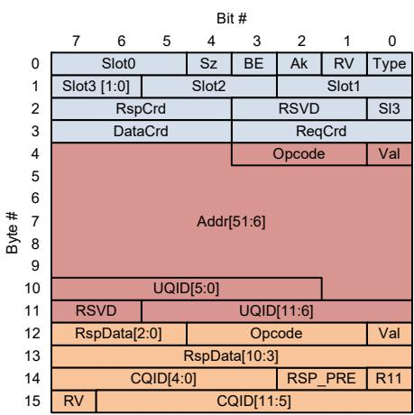

## Figure 4-9. H1 — H2D Data Header + H2D Rsp + H2D Rsp

<table><tr><td colspan="8">Bit #</td></tr><tr><td></td><td>7</td><td>6</td><td>5</td><td>4</td><td>3</td><td>2</td><td>1</td></tr><tr><td>0</td><td colspan="3">Slot0</td><td>Sz</td><td>BE</td><td>Ak</td><td>RV</td></tr><tr><td>1</td><td colspan="2">Slot3 [1:0]</td><td colspan="3">Slot2</td><td colspan="2">Slot1</td></tr><tr><td>2</td><td colspan="4">RspCrd</td><td colspan="2">RSVD</td><td>SI3</td></tr><tr><td>3</td><td colspan="4">DataCrd</td><td colspan="3">ReqCrd</td></tr><tr><td>4</td><td colspan="6">CQID[6:0]</td><td>Val</td></tr><tr><td>5</td><td>GO-E</td><td>Poi</td><td>Ch</td><td colspan="4">CQID[11:7]</td></tr><tr><td>6</td><td colspan="7">RSVD</td></tr><tr><td>7</td><td colspan="3">RspData[2:0]</td><td colspan="3">Opcode</td><td>Val</td></tr><tr><td>8</td><td colspan="7">RspData[10:3]</td></tr><tr><td>9</td><td colspan="5">CQID[4:0]</td><td>RSP_PRE</td><td>R11</td></tr><tr><td>10</td><td>RV</td><td colspan="6">CQID[11:5]</td></tr><tr><td>11</td><td colspan="3">RspData[2:0]</td><td colspan="3">Opcode</td><td>Val</td></tr><tr><td>12</td><td colspan="7">RspData[10:3]</td></tr><tr><td>13</td><td colspan="5">CQID[4:0]</td><td>RSP_PRE</td><td>R11</td></tr><tr><td>14</td><td>RV</td><td colspan="6">CQID[11:5]</td></tr><tr><td>15</td><td colspan="7">RSVD</td></tr></table>

Figure 4-10. H2 — H2D Req + H2D Data Header  
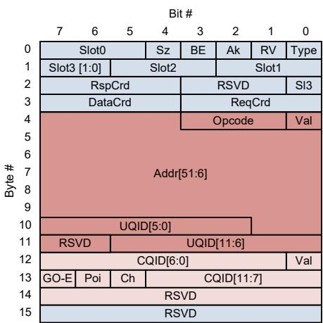

Figure 4-11. H3 — 4 H2D Data Header

<table><tr><td colspan="8">Bit #</td></tr><tr><td></td><td>7</td><td>6</td><td>5</td><td>4</td><td>3</td><td>2</td><td>1</td></tr><tr><td>0</td><td colspan="3">Slot0</td><td>Sz</td><td>BE</td><td>Ak</td><td>RV</td></tr><tr><td>1</td><td colspan="2">Slot3 [1:0]</td><td colspan="3">Slot2</td><td colspan="2">Slot1</td></tr><tr><td>2</td><td colspan="4">RspCrd</td><td colspan="3">RSVD</td></tr><tr><td>3</td><td colspan="4">DataCrd</td><td colspan="3">ReqCrd</td></tr><tr><td>4</td><td colspan="6">CQID[6:0]</td><td>Val</td></tr><tr><td>5</td><td>GO-E</td><td>Poi</td><td>Ch</td><td colspan="4">CQID[11:7]</td></tr><tr><td>6</td><td colspan="7">RSVD</td></tr><tr><td>7</td><td colspan="6">CQID[6:0]</td><td>Val</td></tr><tr><td>8</td><td>GO-E</td><td>Poi</td><td>Ch</td><td colspan="4">CQID[11:7]</td></tr><tr><td>9</td><td colspan="7">RSVD</td></tr><tr><td>10</td><td colspan="6">CQID[6:0]</td><td>Val</td></tr><tr><td>11</td><td>GO-E</td><td>Poi</td><td>Ch</td><td colspan="4">CQID[11:7]</td></tr><tr><td>12</td><td colspan="7">RSVD</td></tr><tr><td>13</td><td colspan="6">CQID[6:0]</td><td>Val</td></tr><tr><td>14</td><td>GO-E</td><td>Poi</td><td>Ch</td><td colspan="4">CQID[11:7]</td></tr><tr><td>15</td><td colspan="7">RSVD</td></tr></table>

Figure 4-12. H4 — M2S RwD Header

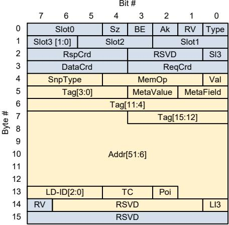

Figure 4-13. H5 — M2S Req  
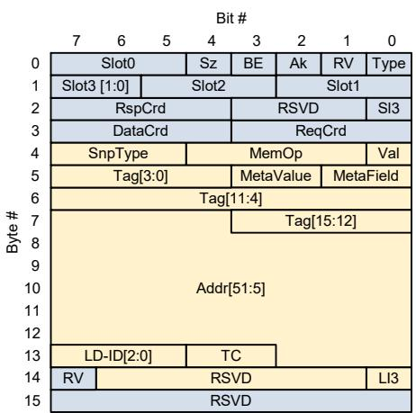

Figure 4-14. H6 — MAC  
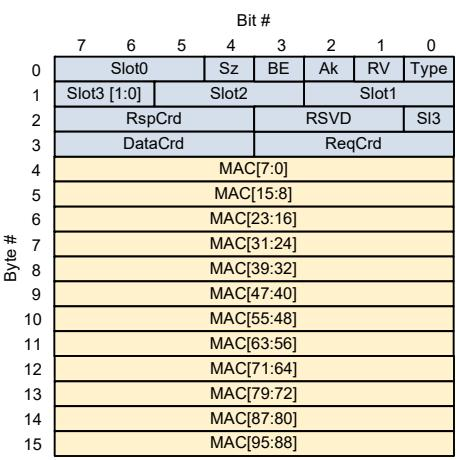

Figure 4-15. G0 — H2D/M2S Data  
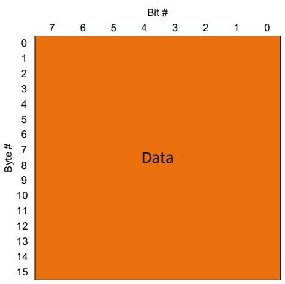

Figure 4-16. G0 — M2S Byte Enable  


Figure 4-17. G1 — 4 H2D Rsp  


Figure 4-18. G2 — H2D Req + H2D Data Header + H2D Rsp  
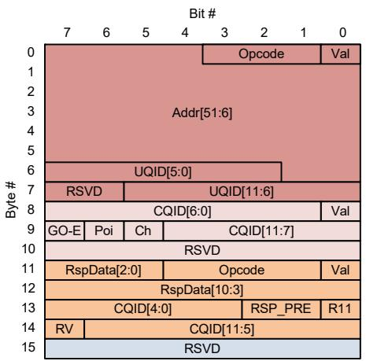

Figure 4-19. G3 — 4 H2D Data Header + H2D Rsp  


Figure 4-20. G4 — M2S Req + H2D Data Header  
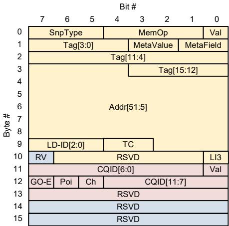

Figure 4-21. G5 — M2S RwD Header + H2D Rsp  
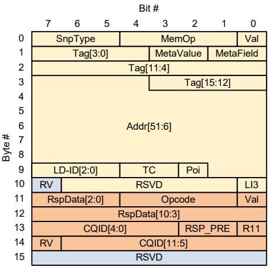

## 4.2.3.2 D2H and S2M Formats

The original slot definitions ensured that all header bits for a message are in contiguous bits. The S2M NDR message expanded by two bits to fit the 2-bit DevLoad field. Some slot formats that carry NDR messages include non-contiguous bits within the slot to account for the DevLoad. The formats impacted are H4, G4, and G5 and the noncontiguous bits are denoted as “DevLoad\*” (“\*” is the special indicator with separate color/pattern for the NDR message with non-contiguous bits). By expanding the slots in this way, backward compatibility with the original contiguous bit definition is maintained by ensuring that only RSVD slot bits are used to expand the headers. Other slot formats that carry a single NDR message can be expanded and keep the contiguous header bits because the NDR message is the last message in the slot formats (see Formats H0 and H3).

Figure 4-22. H0 — D2H Data Header + 2 D2H Rsp + S2M NDR

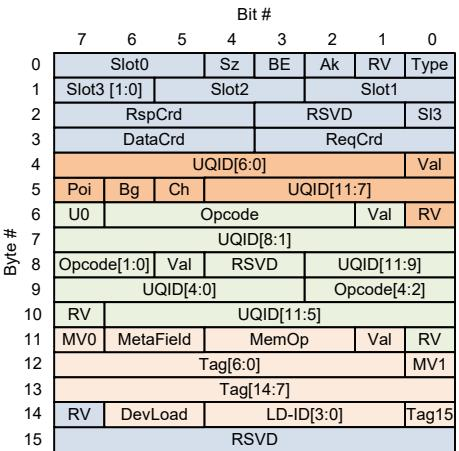

Figure 4-23. H1 — D2H Req + D2H Data Header  
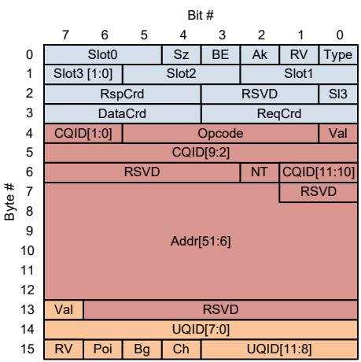

Figure 4-24. H2 — 4 D2H Data Header + D2H Rsp

<table><tr><td colspan="8">Bit #</td></tr><tr><td></td><td>7</td><td>6</td><td>5</td><td>4</td><td>3</td><td>2</td><td>1</td></tr><tr><td>0</td><td colspan="3">Slot0</td><td>Sz</td><td>BE</td><td>Ak</td><td>RV</td></tr><tr><td>1</td><td colspan="2">Slot3 [1:0]</td><td colspan="3">Slot2</td><td colspan="2">Slot1</td></tr><tr><td>2</td><td colspan="4">RspCrd</td><td colspan="3">RSVD</td></tr><tr><td>3</td><td colspan="4">DataCrd</td><td colspan="3">ReqCrd</td></tr><tr><td>4</td><td colspan="6">UQID[6:0]</td><td>Val</td></tr><tr><td>5</td><td>Poi</td><td>Bg</td><td>Ch</td><td colspan="4">UQID[11:7]</td></tr><tr><td>6</td><td colspan="5">UQID[5:0]</td><td>Val</td><td>RV</td></tr><tr><td>7</td><td>Bg</td><td>Ch</td><td colspan="5">UQID[11:6]</td></tr><tr><td>8</td><td colspan="4">UQID[4:0]</td><td>Val</td><td>RV</td><td>Poi</td></tr><tr><td>9</td><td>Ch</td><td colspan="6">UQID[11:5]</td></tr><tr><td>10</td><td colspan="4">UQID[3:0]</td><td>Val</td><td>RV</td><td>Poi</td></tr><tr><td>11</td><td colspan="7">UQID[11:4]</td></tr><tr><td>12</td><td colspan="2">Opcode[2:0]</td><td>Val</td><td>RV</td><td>Poi</td><td>Bg</td><td>Ch</td></tr><tr><td>13</td><td colspan="5">UQID[5:0]</td><td colspan="2">Opcode[4:3]</td></tr><tr><td>14</td><td colspan="2">RSVD</td><td colspan="5">UQID[11:6]</td></tr><tr><td>15</td><td colspan="7">RSVD</td></tr></table>

Figure 4-25. H3 — S2M DRS Header + S2M NDR

<table><tr><td rowspan="17">Byte #</td><td>7</td><td>6</td><td>5</td><td>4</td><td>3</td><td>2</td><td>1</td><td>0</td></tr><tr><td>0</td><td colspan="2">Slot0</td><td>Sz</td><td>BE</td><td>Ak</td><td>RV</td><td>Type</td></tr><tr><td>1</td><td colspan="2">Slot3 [1:0]</td><td colspan="2">Slot2</td><td colspan="3">Slot1</td></tr><tr><td>2</td><td colspan="3">RspCrd</td><td colspan="3">RSVD</td><td>SI3</td></tr><tr><td>3</td><td colspan="3">DataCrd</td><td colspan="4">ReqCrd</td></tr><tr><td>4</td><td colspan="2">MetaValue</td><td>MetaField</td><td colspan="3">MemOp</td><td>Val</td></tr><tr><td>5</td><td colspan="7">Tag[7:0]</td></tr><tr><td>6</td><td colspan="7">Tag[15:8]</td></tr><tr><td>7</td><td>RV</td><td>DevLoad</td><td colspan="4">LD-ID[3:0]</td><td>Poi</td></tr><tr><td>8</td><td colspan="7">RSVD</td></tr><tr><td>9</td><td colspan="2">MetaValue</td><td>MetaField</td><td colspan="3">MemOp</td><td>Val</td></tr><tr><td>10</td><td colspan="7">Tag[7:0]</td></tr><tr><td>11</td><td colspan="7">Tag[15:8]</td></tr><tr><td>12</td><td colspan="2">RSVD</td><td>DevLoad</td><td colspan="4">LD-ID[3:0]</td></tr><tr><td>13</td><td colspan="7">RSVD</td></tr><tr><td>14</td><td colspan="7">RSVD</td></tr><tr><td>15</td><td colspan="7">RSVD</td></tr></table>

Figure 4-26. H4 — 2 S2M NDR

<table><tr><td rowspan="17">Byte #</td><td>7</td><td>6</td><td>5</td><td>4</td><td>3</td><td>2</td><td>1</td><td>0</td></tr><tr><td>0</td><td colspan="2">Slot0</td><td>Sz</td><td>BE</td><td>Ak</td><td>RV</td><td>Type</td></tr><tr><td>1</td><td>Slot3 [1:0]</td><td colspan="2">Slot2</td><td colspan="4">Slot1</td></tr><tr><td>2</td><td colspan="3">RspCrd</td><td colspan="3">RSVD</td><td>SI3</td></tr><tr><td>3</td><td colspan="3">DataCrd</td><td colspan="4">ReqCrd</td></tr><tr><td>4</td><td>MetaValue</td><td colspan="2">MetaField</td><td colspan="3">MemOp</td><td>Val</td></tr><tr><td>5</td><td colspan="7">Tag[7:0]</td></tr><tr><td>6</td><td colspan="7">Tag[15:8]</td></tr><tr><td>7</td><td colspan="2">MemOp</td><td>Val</td><td colspan="4">LD-ID[3:0]</td></tr><tr><td>8</td><td colspan="3">Tag[3:0]</td><td>MetaValue</td><td colspan="3">MetaField</td></tr><tr><td>9</td><td colspan="7">Tag[11:4]</td></tr><tr><td>10</td><td colspan="3">LD-ID[3:0]</td><td colspan="4">Tag[15:12]</td></tr><tr><td>11</td><td colspan="3">RSVD</td><td>DevLoad*</td><td colspan="3">DevLoad</td></tr><tr><td>12</td><td colspan="7">RSVD</td></tr><tr><td>13</td><td colspan="7">RSVD</td></tr><tr><td>14</td><td colspan="7">RSVD</td></tr><tr><td>15</td><td colspan="7">RSVD</td></tr></table>

Figure 4-27. H5 — 2 S2M DRS Header  
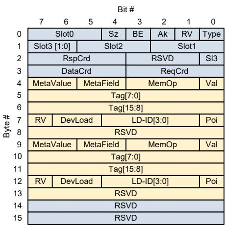

Figure 4-28. H6 — MAC  
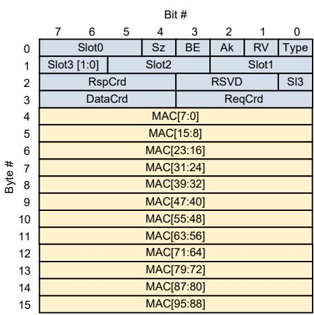

Figure 4-29. G0 — D2H/S2M Data  


Figure 4-30. G0 — D2H Byte Enable  
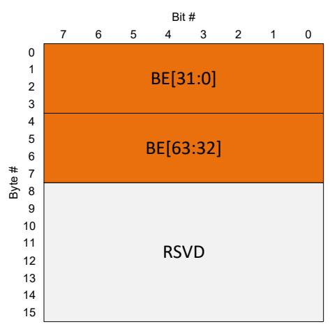

Figure 4-31. G1 — D2H Req + 2 D2H Rsp  
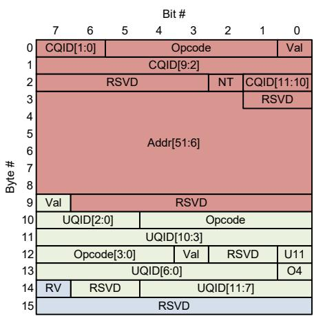

Figure 4-32. G2 — D2H Req + D2H Data Header + D2H Rsp  
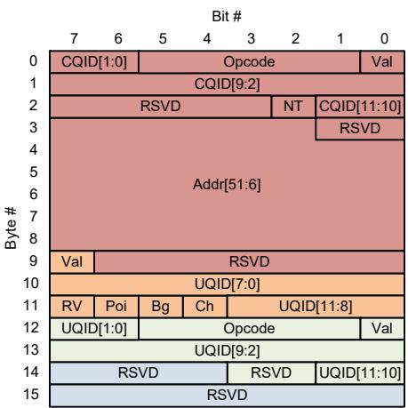

Figure 4-33. G3 — 4 D2H Data Header

<table><tr><td colspan="7">Bit #</td></tr><tr><td></td><td>7</td><td>6</td><td>5</td><td>4</td><td>3</td><td>2</td></tr><tr><td>0</td><td colspan="5">UQID[6:0]</td><td>Val</td></tr><tr><td>1</td><td>Poi</td><td>Bg</td><td>Ch</td><td colspan="3">UQID[11:7]</td></tr><tr><td>2</td><td colspan="4">UQID[5:0]</td><td>Val</td><td>RV</td></tr><tr><td>3</td><td>Bg</td><td>Ch</td><td colspan="4">UQID[11:6]</td></tr><tr><td>4</td><td colspan="4">UQID[4:0]</td><td>Val</td><td>RV</td></tr><tr><td>5</td><td>Ch</td><td colspan="5">UQID[11:5]</td></tr><tr><td>6</td><td colspan="3">UQID[3:0]</td><td>Val</td><td>RV</td><td>Poi</td></tr><tr><td>7</td><td colspan="6">UQID[11:4]</td></tr><tr><td>8</td><td colspan="3">RSVD</td><td>RV</td><td>Poi</td><td>Bg</td></tr><tr><td>9</td><td colspan="6">RSVD</td></tr><tr><td>10</td><td colspan="6">RSVD</td></tr><tr><td>11</td><td colspan="6">RSVD</td></tr><tr><td>12</td><td colspan="6">RSVD</td></tr><tr><td>13</td><td colspan="6">RSVD</td></tr><tr><td>14</td><td colspan="6">RSVD</td></tr><tr><td>15</td><td colspan="6">RSVD</td></tr></table>

Figure 4-34. G4 — S2M DRS Header + 2 S2M NDR

<table><tr><td colspan="6">Bit #</td></tr><tr><td></td><td>7</td><td>6</td><td>5</td><td>4</td><td>3</td></tr><tr><td>0</td><td colspan="2">MetaValue</td><td>MetaField</td><td>MemOp</td><td>Val</td></tr><tr><td>1</td><td colspan="5">Tag[7:0]</td></tr><tr><td>2</td><td colspan="5">Tag[15:8]</td></tr><tr><td>3</td><td>RV</td><td>DevLoad</td><td colspan="2">LD-ID[3:0]</td><td>Poi</td></tr><tr><td>4</td><td colspan="5">RSVD</td></tr><tr><td>5</td><td colspan="2">MetaValue</td><td>MetaField</td><td>MemOp</td><td>Val</td></tr><tr><td>6</td><td colspan="5">Tag[7:0]</td></tr><tr><td>7</td><td colspan="5">Tag[15:8]</td></tr><tr><td>8</td><td colspan="2">MemOp</td><td>Val</td><td colspan="2">LD-ID[3:0]</td></tr><tr><td>9</td><td colspan="3">Tag[3:0]</td><td>MetaValue</td><td>MetaField</td></tr><tr><td>10</td><td colspan="5">Tag[11:4]</td></tr><tr><td>11</td><td colspan="3">LD-ID[3:0]</td><td colspan="2">Tag[15:12]</td></tr><tr><td>12</td><td colspan="3">RSVD</td><td>DevLoad*</td><td>DevLoad</td></tr><tr><td>13</td><td colspan="5">RSVD</td></tr><tr><td>14</td><td colspan="5">RSVD</td></tr><tr><td>15</td><td colspan="5">RSVD</td></tr></table>

Figure 4-35. G5 — 2 S2M NDR

<table><tr><td colspan="5">Bit #</td></tr><tr><td></td><td>7</td><td>6</td><td>5</td><td>4</td></tr><tr><td>0</td><td>MetaValue</td><td>MetaField</td><td>MemOp</td><td>Val</td></tr><tr><td>1</td><td colspan="4">Tag[7:0]</td></tr><tr><td>2</td><td colspan="4">Tag[15:8]</td></tr><tr><td>3</td><td>MemOp</td><td>Val</td><td colspan="2">LD-ID[3:0]</td></tr><tr><td>4</td><td colspan="2">Tag[3:0]</td><td>MetaValue</td><td>MetaField</td></tr><tr><td>5</td><td colspan="4">Tag[11:4]</td></tr><tr><td>6</td><td colspan="2">LD-ID[3:0]</td><td colspan="2">Tag[15:12]</td></tr><tr><td>7</td><td colspan="2">RSVD</td><td>DevLoad*</td><td>DevLoad</td></tr><tr><td>8</td><td colspan="4">RSVD</td></tr><tr><td>9</td><td colspan="4">RSVD</td></tr><tr><td>10</td><td colspan="4">RSVD</td></tr><tr><td>11</td><td colspan="4">RSVD</td></tr><tr><td>12</td><td colspan="4">RSVD</td></tr><tr><td>13</td><td colspan="4">RSVD</td></tr><tr><td>14</td><td colspan="4">RSVD</td></tr><tr><td>15</td><td colspan="4">RSVD</td></tr></table>

Figure 4-36. G6 — 3 S2M DRS Header

<table><tr><td colspan="5">Bit #</td></tr><tr><td></td><td>7</td><td>6</td><td>5</td><td>4</td></tr><tr><td>0</td><td>MetaValue</td><td>MetaField</td><td>MemOp</td><td>Val</td></tr><tr><td>1</td><td colspan="4">Tag[7:0]</td></tr><tr><td>2</td><td colspan="4">Tag[15:8]</td></tr><tr><td>3</td><td>RV</td><td>DevLoad</td><td>LD-ID[3:0]</td><td>Poi</td></tr><tr><td>4</td><td colspan="4">RSVD</td></tr><tr><td>5</td><td>MetaValue</td><td>MetaField</td><td>MemOp</td><td>Val</td></tr><tr><td>6</td><td colspan="4">Tag[7:0]</td></tr><tr><td>7</td><td colspan="4">Tag[15:8]</td></tr><tr><td>8</td><td>RV</td><td>DevLoad</td><td>LD-ID[3:0]</td><td>Poi</td></tr><tr><td>9</td><td colspan="4">RSVD</td></tr><tr><td>10</td><td>MetaValue</td><td>MetaField</td><td>MemOp</td><td>Val</td></tr><tr><td>11</td><td colspan="4">Tag[7:0]</td></tr><tr><td>12</td><td colspan="4">Tag[15:8]</td></tr><tr><td>13</td><td>RV</td><td>DevLoad</td><td>LD-ID[3:0]</td><td>Poi</td></tr><tr><td>14</td><td colspan="4">RSVD</td></tr><tr><td>15</td><td colspan="4">RSVD</td></tr></table>

## 4.2.4 Link Layer Registers

Architectural registers associated with CXL.cache and CXL.mem are defined in Section 8.2.4.19.

## 4.2.5 68B Flit Packing Rules

The packing rules are defined below. It is assumed that a given queue has credits toward the Rx and any protocol dependencies (e.g., SNP-GO ordering) have already been considered:

• Rollover is defined as any time a data transfer needs more than one flit. Note that a data chunk that contains 128b (Format G0), can only be scheduled in Slot 1, Slot 2, and Slot 3 of a protocol flit because Slot 0 has only 96b available, because 32b are taken up by the flit header. The following rules apply to Rollover data chunks:

— If there’s a rollover of more than three 16B data chunks, the next flit must necessarily be an all-data flit.

— If there’s a rollover of three 16B data chunks, Slot 1, Slot 2, and Slot 3 must necessarily contain the three rollover data chunks. Slot 0 will be packed independently (it is allowed for Slot 0 to have the Data Header for the next data transfer).

— If there’s a rollover of two 16B data chunks, Slot 1 and Slot 2 must necessarily contain the two rollover data chunks. Slot 0 and Slot 3 will be packed independently.

— If there’s a rollover of one 16B data chunk, Slot 1 must necessarily contain the rollover data chunk. Slot 0, Slot 2, and Slot 3 will be packed independently.

— If there’s no rollover, each of the four slots will be packed independently.

• Care must be taken to ensure fairness between packing of CXL.cache and CXL.mem transactions. Similarly, care must be taken to ensure fairness between channels within a given protocol. The exact mechanism to ensure fairness is implementation specific.

• Valid messages within a given slot must be tightly packed. Which means, if a slot contains multiple possible locations for a given message, the Tx must pack the message in the first available location before advancing to the next available location.

• Valid messages within a given flit must be tightly packed. Which means, if a flit contains multiple possible slots for a given message, the Tx must pack the message in the first available slot before advancing to the next available slot.

• Empty slots are defined as slots without any valid bits set and they may be mixed with other slots in any order as long as all other packing rules are followed. For an example refer to Figure 4-7 where Slot H3 could have no valid bits set indicating an empty slot, but the 1st and 2nd generic slots, G1 and G2 in the example, may have mixed valid bits set.

• If a valid Data Header is packed in a given slot, the next available slot for data transfer (Slot 1, Slot 2, Slot 3, or an all-data flit) will be guaranteed to have data associated with the header. The Rx will use this property to maintain a shadow copy of the Tx Rollover counts. This enables the Rx to expect all-data flits where a flit header is not present.

• For data transfers, the Tx must send 16B data chunks in cacheline order. That is, chunk order 01 for 32B transfers and chunk order 0123 for 64B transfers.

• A slot with more than one data header (e.g., H5 in the S2M direction, or G3 in the H2D direction) is referred to as a multi-data header slot or an MDH slot. MDH slots can only be sent for full cacheline transfers when both 32B chunks are immediately available to pack (i.e., BE = 0, Sz = 1). An MDH slot can only be used if both agents support MDH (defeature is defined in Section 8.2.4.19.7). If MDH is received when it is disabled it is considered a fatal error.

• An MDH slot format may be selected by the Tx only if there is more than one valid Data Header to pack in that slot.

• Control flits cannot be interleaved with all-data flits. This also implies that when an all-data flit is expected following a protocol flit (due to Rollover), the Tx cannot send a Control flit before the all-data flit.

• For non-MDH containing flits, there can be at most one valid Data Header in that flit. Also, an MDH containing flit cannot be packed with another valid Data Header in the same flit.

• The maximum number of messages that can be sent in a given flit is restricted to reduce complexity in the receiver, which writes these messages into credited queues. By restricting the number of messages across the entire flit, the number of write ports into the receiver’s queues are constrained. The maximum number of messages per type within a flit (sum, across all slots) is:

```srt
D2H Request --> 4
D2H Response --> 2
D2H Data Header --> 4
D2H Data --> 4*16B
S2M NDR --> 2
S2M DRS Header --> 3
S2M DRS Data --> 4*16B
H2D Request --> 2
H2D Response --> 4
H2D Data Header --> 4
H2D Data --> 4*16B
M2S Req --> 2
M2S RwD Header --> 1
M2S RwD Data --> 4*16B
```

• For a given slot, lower bit positions are defined as bit positions that appear starting from lower order Byte #. That is, bits are ordered starting from (Byte 0, Bit 0) through (Byte 15, Bit 7).

• For multi-bit message fields like Address[MSB:LSB], the least significant bits will appear in lower order bit positions.

• Message ordering within a flit is based on flit bit numbering (i.e., the earliest messages are placed at the lowest flit bit positions and progressively later messages are placed at progressively higher bit positions). Examples: An M2S Req 0 packed in Slot 0 precedes an M2S Req 1 packed in Slot 1. Similarly, a Snoop packed in Slot 1 follows a GO packed in Slot 0, and this ordering must be maintained. Finally, for Header Slot Format H1, an H2D Response packed starting from Byte 7 precedes an H2D Response packed starting from Byte 11.

## 4.2.6 Link Layer Control Flit

Link Layer Control flits do not follow flow control rules applicable to protocol flits. That is, they can be sent from an entity without any credits. These flits must be processed and consumed by the receiver within the period to transmit a flit on the channel because there are no storage or flow control mechanisms for these flits. Table 4-9 lists all the Controls flits supported by the CXL.cachemem link layer.

Table 4-9. CXL.cachemem Link Layer Control Types

<table><tr><td>LLCTRL Encoding</td><td>LLCTRL Type Name</td><td>Description</td><td>Retryable? (Enters the LLRB)</td></tr><tr><td>0001b</td><td>RETRY</td><td>Link layer RETRY flit</td><td>No</td></tr><tr><td>0000b</td><td>LLCRD</td><td>Flit containing link layer credit return and/or Ack information, but no protocol information.</td><td>Yes</td></tr><tr><td>0010b</td><td>IDE</td><td>Integrity and Data Encryption control messages. Used in the flows described in Chapter 11.0 (CXL 2.0 and higher).</td><td>Yes</td></tr><tr><td>1100b</td><td>INIT</td><td>Link layer initialization flit</td><td>Yes</td></tr><tr><td>Others</td><td>Reserved</td><td>N/A</td><td>N/A</td></tr></table>

The 3-bit CTL\_FMT field was added to control messages and uses bits that were reserved in CXL 1.1 control messages. All control messages used in CXL 1.1 have this field encoded as 000b to maintain backward compatibility. This field is used to distinguish formats added in CXL 2.0 control messages that require a larger payload field. The new format increases the payload field from 64 bits to 96 bits and uses CTL\_FMT encoding of 001b.

Table 4-10 presents a detailed description of the control flits.  
Table 4-10. CXL.cachemem Link Layer Control Details (Sheet 1 of 2)

<table><tr><td>Flit Type</td><td>CTL_FMT/LLCTRL</td><td>SubType</td><td>SubType Description</td><td>Payload</td><td>Payload Description</td></tr><tr><td rowspan="6">LLCRD</td><td rowspan="6">000b/0000b</td><td>0000b</td><td>RSVD</td><td>63:0</td><td>RSVD</td></tr><tr><td rowspan="4">0001b</td><td rowspan="4">Acknowledge</td><td>2:0</td><td>Acknowledge[2:0]</td></tr><tr><td>3</td><td>RSVD</td></tr><tr><td>7:4</td><td>Acknowledge[7:4]</td></tr><tr><td>63:8</td><td>RSVD</td></tr><tr><td>Others</td><td>RSVD</td><td>63:0</td><td>RSVD</td></tr><tr><td rowspan="17">RETRY</td><td rowspan="17">000b/0001b</td><td>0000b</td><td>RETRY.Idle</td><td>63:0</td><td>RSVD</td></tr><tr><td rowspan="5">0001b</td><td rowspan="5">RETRY.Req</td><td>7:0</td><td>Requester&#x27;s Retry Sequence Number (Eseq)</td></tr><tr><td>15:8</td><td>RSVD</td></tr><tr><td>20:16</td><td>Contains NUM_RETRY</td></tr><tr><td>25:21</td><td>Contains NUM_PHY_REINIT (for debug)</td></tr><tr><td>63:26</td><td>RSVD</td></tr><tr><td rowspan="9">0010b</td><td rowspan="9">RETRY.Ack</td><td>0</td><td>Empty: The Empty bit indicates that the LLR contains no valid data and therefore the NUM_RETRY value should be reset</td></tr><tr><td>1</td><td>Viral: The Viral bit indicates that the transmitting agent is in a Viral state</td></tr><tr><td>2</td><td>RSVD</td></tr><tr><td>7:3</td><td>Contains an echo of the NUM_RETRY value from the RETRY_LLRREQ</td></tr><tr><td>15:8</td><td>Contains the WrPtr value of the retry queue for debug purposes</td></tr><tr><td>23:16</td><td>Contains an echo of the Eseq from the RETRY_LLRREQ</td></tr><tr><td>31:24</td><td>Contains the NumFreeBuf value of the retry queue for debug purposes</td></tr><tr><td>47:32</td><td>Viral LD-ID Vector[15:0]: Included for MLD links to indicate which LD-ID is impacted by viral. Applicable only when the Viral bit (bit[1] of this payload) is set. Bit[0] of the vector encodes LD-ID=0, bit[1] is LD-ID=1, etc. Field is treated as Reserved for ports that do not support LD-ID.</td></tr><tr><td>63:48</td><td>RSVD</td></tr><tr><td>0011b</td><td>RETRY.Frame</td><td>63:0</td><td>Payload is RSVD.Flit required to be sent before a RETRY.Req or RETRY.Ack flit to allow said flit to be decoded without risk of aliasing.</td></tr><tr><td>Others</td><td>RSVD</td><td>63:0</td><td>RSVD</td></tr></table>

Table 4-10. CXL.cachemem Link Layer Control Details (Sheet 2 of 2)

<table><tr><td>Flit Type</td><td>CTL_FMT/LLCTRL</td><td>SubType</td><td>SubType Description</td><td>Payload</td><td>Payload Description</td></tr><tr><td rowspan="4">IDE</td><td rowspan="4">001b/0010b</td><td>0000b</td><td>IDE.Idle</td><td>95:0</td><td>Payload RSVDMessage sent as part of IDE flows to pad sequences with IDE.Idle flits.See Chapter 11.0 for details on the use of this message.</td></tr><tr><td>0001b</td><td>IDE.Start</td><td>95:0</td><td>Payload RSVDMessage sent to begin flit encryption.</td></tr><tr><td>0010b</td><td>IDE.TMAC</td><td>95:0</td><td>MAC Field uses all 96 bits of payload.Truncated MAC Message sent to complete a MAC epoch early. Only used when no protocol messages exist to send.</td></tr><tr><td>Others</td><td>RSVD</td><td>95:0</td><td>RSVD</td></tr><tr><td rowspan="7">INIT</td><td rowspan="7">000b/1100b</td><td rowspan="6">1000b</td><td rowspan="6">INIT.Param</td><td>3:0</td><td>Interconnect Version: Version of CXL with which the port is compliant.CXL 1.0/1.1 = 0001bCXL 2.0 and above = 0010bAll other encodings are reserved.</td></tr><tr><td>7:4</td><td>RSVD</td></tr><tr><td>12:8</td><td>RSVD</td></tr><tr><td>23:13</td><td>RSVD</td></tr><tr><td>31:24</td><td>LLR Wrap Value: Value after which LLR sequence counter should wrap to 0.</td></tr><tr><td>63:32</td><td>RSVD</td></tr><tr><td>Others</td><td>RSVD</td><td>63:0</td><td>RSVD</td></tr></table>

In the LLCRD flit, the total number of flit acknowledgments being returned is determined by creating the Full\_Ack return value, where:  
Full\_Ack = {Acknowledge[7:4],Ak,Acknowledge[2:0]}, where the Ak bit is from the flit header.  
The flit formats for the control flit are illustrated below.  
Figure 4-37. LLCRD Flit Format (Only Slot 0 is Valid; Others are Reserved)

<table><tr><td colspan="6">Bit #</td></tr><tr><td></td><td>7</td><td>6</td><td>5</td><td>4</td><td>3</td></tr><tr><td>0</td><td>CTL_FMT=0h</td><td colspan="2">RSVD</td><td>Ak</td><td>RV Type=1</td></tr><tr><td>1</td><td colspan="5">RSVD</td></tr><tr><td>2</td><td>RspCrd</td><td colspan="4">RSVD</td></tr><tr><td>3</td><td>DataCrd</td><td colspan="4">ReqCrd</td></tr><tr><td>4</td><td>SubType</td><td colspan="4">LLCTRL</td></tr><tr><td>5</td><td rowspan="3" colspan="5">0h</td></tr><tr><td>6</td></tr><tr><td>7</td></tr><tr><td>8</td><td colspan="5">Payload[7:0]</td></tr><tr><td>9</td><td colspan="5">Payload[15:8]</td></tr><tr><td>10</td><td colspan="5">Payload[23:16]</td></tr><tr><td>11</td><td colspan="5">Payload[31:24]</td></tr><tr><td>12</td><td colspan="5">Payload[39:32]</td></tr><tr><td>13</td><td colspan="5">Payload[47:40]</td></tr><tr><td>14</td><td colspan="5">Payload[55:48]</td></tr><tr><td>15</td><td colspan="5">Payload[63:56]</td></tr></table>

Figure 4-38. RETRY Flit Format (Only Slot 0 is Valid; Others are Reserved)  
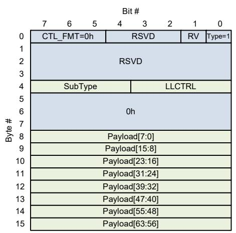

Figure 4-39. IDE Flit Format (Only Slot 0 is Valid; Others are Reserved)  
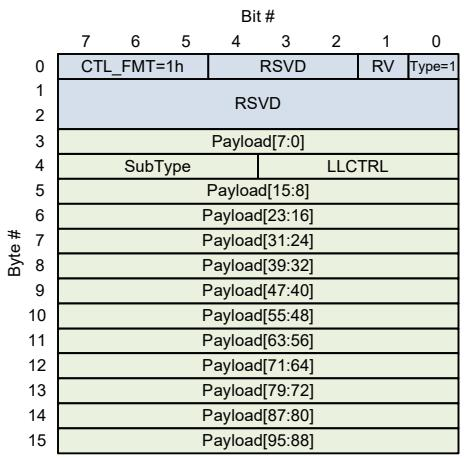

Figure 4-40. INIT Flit Format (Only Slot 0 is Valid; Others are Reserved)

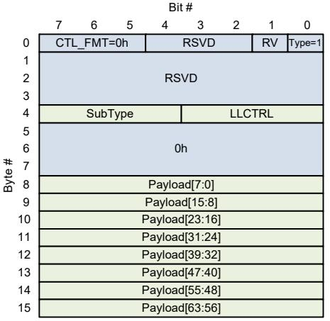

The RETRY.Req and RETRY.Ack flits belong to the type of flit to which receiving devices must respond, even in the shadow of a previous CRC error. In addition to checking the CRC of a RETRY flit, the receiving device should also check as many defined bits (those listed as having hardcoded 1/0 values) as possible to increase confidence in qualifying an incoming flit as a RETRY message.

## Link Layer Initialization

Link Layer Initialization must be started after a Physical Layer Link Down to Link Up transition and the link has trained successfully to L0. During Initialization and after the INIT flit has been sent, the CXL.cachemem Link Layer can only send Control-RETRY flits until Link Initialization is complete. The following describes how the link layer is initialized and how credits are exchanged.

• The Tx portion of the Link Layer must wait until the Rx portion of the Link Layer has received at least one valid flit that is CRC clean before sending the Control-INIT.Param flit. Before this condition is met, the Link Layer must transmit only Control-RETRY flits (i.e., RETRY.Frame/Req/Ack/Idle flits).

— If for any reason the Rx portion of the Link Layer is not ready to begin processing flits beyond Control-INIT and Control-RETRY, the Tx will stall transmission of LLCTRL-INIT.Param flit.

— RETRY.Frame/Req/Ack are sent during this time as part of the regular Retry flow.

— RETRY.Idle flits are sent prior to sending a INIT.Param flit even without a retry condition to ensure the remote agent can observe a valid flit.

• The Control-INIT.Param flit must be the first non-Control-RETRY flit transmitted by the Link Layer.

• The Rx portion of the Link Layer must be able to receive a Control-INIT.Param flit immediately upon completion of Physical Layer initialization because the first valid flit may be a Control-INIT.Param.

• Received Control-INIT.Param values (i.e., LLR Wrap Value) must be made active (i.e., applied to their respective hardware states within eight flit clocks of error-free reception of a Control-INIT.Param flit).

— Until an error-free INIT.Param flit is received and these values are applied, LLR Wrap Value shall assume a default value of 9 for the purposes of ESEQ tracking.

• Any non-RETRY flits received before Control-INIT.Param flit will trigger an Uncorrectable Error.

• Only a single Control-INIT.Param flit is sent. Any CRC error conditions with a Control-INIT.Param flit will be dealt with by the Retry state machine and replayed from the Link Layer Retry Buffer.

• Receipt of a Control-INIT.Param flit after a Control-INIT.Param flit has already been received should be considered an Uncorrectable Error.

• It is the responsibility of the Rx to transmit credits to the sender using standard credit return mechanisms after link initialization. Each entity should know how many buffers it has and set its credit return counters to these values. Then, during normal operation, the standard credit return logic will return these credits to the sender.

• Immediately after link initialization, the credit exchange mechanism will use the LLCRD flit format.

• It is possible that the receiver will make more credits available than the sender can track for a given message class. For correct operation, it is therefore required that the credit counters at the sender be saturating. Receiver will drop all credits it receives for unsupported channels (e.g., Type 3 device receiving any CXL.cache credits).

• Credits should be sized to achieve desired levels of bandwidth considering roundtrip time of credit return latency. This is implementation and usage dependent.

## CXL.cachemem Link Layer Retry

The link layer provides recovery from transmission errors using retransmission, or Link Layer Retry (LLR). The sender buffers every retryable flit sent in a local Link Layer Retry Buffer (LLRB). To uniquely identify flits in this buffer, the retry scheme relies on sequence numbers which are maintained within each device. Unlike in PCIe, CXL.cachemem sequence numbers are not communicated between devices with each flit to optimize link efficiency. The exchange of sequence numbers occurs only through link layer control flits during an LLR sequence. The sequence numbers are set to a predetermined value (0) during Link Layer Initialization and they are implemented using a wraparound counter. The counter wraps back to 0 after reaching the depth of the retry buffer. This scheme makes the following assumptions:

• The round-trip delay between devices is more than the maximum of the link layer clock or flit period.

• All protocol flits are stored in the retry buffer. See Section 4.2.8.5.1 for further details on the handling of non-retryable control flits.

Note that for efficient operation, the size of the retry buffer must be larger than the round-trip delay. This includes:

• Time to send a flit from the sender

• Flight time of the flit from sender to receiver

• Processing time at the receiver to detect an error in the flit

• Time to accumulate and, if needed, force the Ack return and send an embedded Ack return to the sender

• Flight time of the Ack return from the receiver to the sender

• Processing time of the Ack return at the original sender

Otherwise, the LLR scheme will introduce latency because the transmitter will have to wait for the receiver to confirm correct receipt of a previous flit before the transmitter can free-up space in its LLRB and send a new flit. Note that the error case is not significant because transmission of new flits is effectively stalled until successful retransmission of the erroneous flit.

## 4.2.8.1 LLR Variables

The retry scheme maintains two state machines and several state variables. Although the following text describes them in terms of one transmitter and one receiver, both the transmitter and receiver side of the retry state machines and the corresponding state variables are present at each device because of the bidirectional nature of the link. Because both sides of the link implement both transmitter and receiver state machines, for clarity this discussion uses the term “local” to refer to the entity that detects a CRC error, and the term “remote” to refer to the entity that sent the flit that was erroneously received.

The receiving device uses the following state variables to keep track of the sequence number of the next flit to arrive.

• ESeq: This indicates the expected sequence number of the next valid flit at the receiving link layer entity. ESeq is incremented by one (modulo the size of the LLRB) on error-free reception of a retryable flit. ESeq stops incrementing after an error is detected on a received flit until retransmission begins (RETRY.Ack message is received). Link Layer Initialization sets ESeq to 0. Note that there is no way for the receiver to know that an error was for a non-retryable flit vs. a retryable flit.

For any CRC error, the receiver will initiate the link layer retry flow as usual, and effectively the transmitter will resend from the first retryable flit sent.

The sending entity maintains two indexes into its LLRB, as indicated below.

• WrPtr: This indexes the entry of the LLRB that will record the next new flit. When an entity sends a flit, it copies that flit into the LLRB entry indicated by the WrPtr and then increments the WrPtr by one (modulo the size of the LLRB). This is implemented using a wraparound counter that wraps around to 0 after reaching the depth of the LLRB. Non-Retryable Control flits do not affect the WrPtr. WrPtr stops incrementing after receiving an error indication at the remote entity (RETRY.Req message) except as described in the implementation note below, until normal operation resumes again (all flits from the LLRB have been retransmitted). WrPtr is initialized to 0 and is incremented only when a flit is placed into the LLRB.

## IMPLEMENTATION NOTE

WrPtr may continue to increment after receiving RETRY.Req message if there are pre scheduled All Data Flits that are not yet sent over the link. This implementation will ensure that All Data Flits not interleaved with other flits are correctly logged into the Link Layer Retry Buffer.

• RdPtr: This is used to read the contents out of the LLRB during a retry scenario. The value of this pointer is set by the sequence number sent with the retransmission request (RETRY.Req message). The RdPtr is incremented by one (modulo the size of the LLRB) whenever a flit is sent, either from the LLRB in response to a retry request or when a new flit arrives from the transaction layer and regardless of the states of the local or remote retry state machines. If a flit is being sent when the RdPtr and WrPtr are the same, then RdPtr indicates that a new flit is being sent; otherwise, the flit must be a flit from the retry buffer.

The LLR scheme uses an explicit acknowledgment that is sent from the receiver to the sender to remove flits from the LLRB at the sender. The acknowledgment is indicated via an ACK bit in the headers of flits flowing in the reverse direction. In CXL.cachemem, a single ACK bit represents eight acknowledgments. Each entity keeps track of the number of available LLRB entries and the number of received flits pending acknowledgment through the following variables:

• NumFreeBuf: This indicates the number of free LLRB entries at the entity. NumFreeBuf is decremented by 1 whenever an LLRB entry is used to store a transmitted flit. NumFreeBuf is incremented by the value encoded in the Ack/ Full\_Ack (Ack is the protocol flit bit Ak, Full\_Ack defined as part of LLCRD message) field of a received flit. NumFreeBuf is initialized at reset time to the size of the LLRB. The maximum number of retry queue entries at any entity is limited to 255 (8-bit counter). Also, note that the retry buffer at any entity is never filled to its capacity; therefore, NumFreeBuf is never 0. If there is only one retry buffer entry available, then the sender cannot send a Retryable flit. This restriction is required to avoid ambiguity between a full retry buffer or an empty retry buffer during a retry sequence that may result in an incorrect operation. This implies that if there are only two retry buffer entries left (NumFreeBuf = 2), then the sender can send an Ack-bearing flit only if the outgoing flit encodes a value of at least 1 (which may be a Protocol flit with Ak bit set); else, an LLCRD control flit is sent with a Full\_Ack value of at least 1. This is required to avoid deadlock at the link layer due to the retry buffer becoming full at both entities on a link and their inability to send an ACK through header flits. This rule also creates an implicit expectation that a sequence of “All Data Flits” cannot be started that is unable to be completed before NumFreeBuf=2 because the Ack-bearing flit must be able to be injected when NumFreeBuf=2 is reached.

• NumAck: This indicates the number of acknowledgments accumulated at the receiver. NumAck increments by 1 when a retryable flit is received. NumAck is decremented by 8 when the ACK bit is set in the header of an outgoing flit. If the outgoing flit is coming from the LLRB and its ACK bit is set, NumAck does not decrement. At initialization, NumAck is set to 0. The minimum size of the NumAck field is the size of the LLRB. NumAck at each entity must be able to keep track of at least 255 acknowledgments.

The LLR protocol requires that the number of retry queue entries at each entity must be at least 22 entries (Size of Forced Ack (16) + Max All-Data Flit (4) + 2) to prevent deadlock.

## 4.2.8.2 LLCRD Forcing

Recall that the LLR protocol requires space available in the LLRB to transmit a new flit, and that the sender must receive explicit acknowledgment from the receiver before freeing space in the LLRB. In scenarios where the traffic flow is asymmetric, this requirement could result in traffic throttling and possibly even starvation.

Suppose that the A→B direction has heavy traffic, but there is no traffic in the B→A direction. In this case, A could exhaust its LLRB size, while B never has any return traffic in which to embed Acks. In CXL, we want to minimize injected traffic to reserve bandwidth for the other traffic stream(s) sharing the link.

To avoid starvation, CXL must permit LLCRD Control message forcing (injection of a non-traffic flit to carry an Acknowledge and a Credit return (ACK/CRD)), but this function must be constrained to avoid wasting bandwidth. In CXL, when B has accumulated a programmable minimum number of Acks to return, B’s CXL.cachemem link layer will inject an LLCRD flit to return an Acknowledge. The threshold of pending Acknowledges before forcing the LLCRD can be adjusted using the Ack Force Threshold field in the CXL Link Layer Ack Timer Control register (see Table 8-110).

There is also a timer-controlled mechanism to force LLCRD when the timer reaches a threshold. The timer will clear whenever an ACK/CRD carrying message is sent. It will increment every link layer clock in which an ACK/CRD carrying message is not sent and any Credit value to return is greater than 0 or Acknowledge to return is greater than 1. The reason the Acknowledge threshold value is specified as “greater than $1 ^ { \prime \prime }$ instead of “greater than $0 ^ { \prime \prime }$ is to avoid repeated forcing of LLCRD when no other retryable flits are being sent. If the timer incremented when the pending Acknowledge count is “greater than $\mathit { \Pi } _ { \overline { { 0 } } , \overline { { { \mathbf { \Theta } } } } ^ { \prime \prime } }$ there would be a continuous exchange of LLCRD messages carrying Acknowledges on an otherwise idle link; this is because the LLCRD is itself retryable and results in a returning Acknowledge in the other direction. The result is that the link layer would never be truly idle when the transaction layer traffic is idle. The timer threshold to force LLCRD is configurable using the Ack or CRD Flush Retimer field in the CXL Link Layer Ack Timer Control register. It should also be noted that the CXL.cachemem link layer must accumulate a minimum of eight Acks to set the ACK bit in a CXL.cachemem flit header. If LLCRD forcing occurred after the accumulation of eight Acks, it could result in a negative beat pattern where real traffic always arrives soon after a forced Ack, but not long enough after for a sufficient number of Acks to reaccumulate to set the ACK bit. In the worst case, this could double the bandwidth consumption of the CXL.cachemem side. By waiting for at least 16 Acks to accumulate, the CXL.cachemem link layer ensures that it can still opportunistically return Acks in a protocol flit and thereby avoid the need to force an LLCRD for Ack return. It is recommended that the Ack Force Threshold value be set to 16 or greater in the CXL Link Layer Ack Timer Control register to reduce overhead of LLCRD injection.

It is recommended that link layer prioritize other link layer flits before LLCRD forcing.

Pseudo-code for forcing function below:

IF (SENDING\_ACK\_CRD\_MESSAGE==FALSE AND (ACK\_TO\_RETURN >1 OR CRD\_TO\_RETURN>0)) TimerValue++ ELSE TimerValue=0 IF (TimerValue >=Ack\_or\_CRD\_Flush\_Retimer OR ACK\_TO\_RETURN >= Ack Force\_Threshold) Force\_LLCRD = TRUE ELSE Force\_LLCRD=FALSE

Ack or CRD Flush Retimer and Ack Force Threshold are values that come from the CXL Link Layer Ack Timer Control register (see Table 8-110).

Figure 4-41. Retry Buffer and Related Pointers  
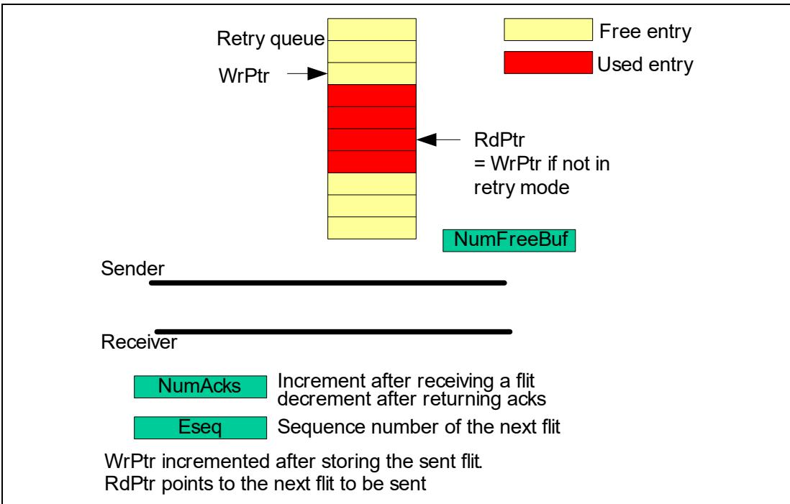

## 4.2.8.3 LLR Control Flits

The LLR Scheme uses several link layer control flits of the RETRY format to communicate the state information and the implicit sequence numbers between the entities.

• RETRY.Req: This flit is sent from the entity that received a flit in error to the sending entity. The flit contains the expected sequence number (ESeq) at the receiving entity, indicating the index of the flit in the retry queue at the remote entity that must be retransmitted. It also contains the NUM\_RETRY value of the sending entity which is defined in Section 4.2.8.5.1. This message is also triggered as part of the Initialization sequence even when no error is observed as described in Section 4.2.7.

• RETRY.Ack: This flit is sent from the entity that is responding to an error detected at the remote entity. It contains a reflection of the NUM\_RETRY value from the corresponding RETRY.Req message. The flit contains the WrPtr value at the sending entity for debug purposes only. The WrPtr value should not be used by the retry state machines in any way. This flit will be followed by the flit identified for retry by the ESeq number.

• RETRY.Idle: This flit is sent during the retry sequence when there are no protocol flits to be sent (see Section 4.2.8.5.2 for details) or a retry queue is not ready to be sent. For example, it can be used for debug purposes for designs that need additional time between sending the RETRY.Ack and the actual contents of the LLR queue.

• RETRY.Frame: This flit is sent along with a RETRY.Req or RETRY.Ack flit to prevent aliased decoding of these flits (see Section 4.2.8.5 for further details).

Table 4-11 describes the impact of RETRY messages on the local and remote retry state machines. In this context, the “sender” refers to the Device sending the message and the “receiver” refers to the Device receiving the message. Note that how this maps to which device detected the CRC error and which sent the erroneous message depends on the message type. For example, for a RETRY.Req sequence, the sender detected the CRC error, but for a RETRY.Ack sequence, it is the receiver that detected the CRC error.

## 4.2.8.4 RETRY Framing Sequences

Recall that the CXL.cachemem flit formatting specifies an all-data flit for link efficiency. This flit is encoded as part of the header of the preceding flit and contains no header information of its own. This introduces the possibility that the data contained in this flit could happen to match the encoding of a RETRY flit.

This introduces a problem at the receiver. It must be certain to decode the actual RETRY flit, but it must not falsely decode an aliasing data flit as a RETRY flit. In theory it might use the header information of the stream it receives in the shadow of a CRC error to determine whether it should attempt to decode the subsequent flit. Therefore, the receiver cannot know with certainty which flits to treat as header-containing (decode) and which to ignore (all-data).

CXL introduces the RETRY.Frame flit for this purpose to disambiguate a control sequence from an All-Data Flit (ADF). Due to MDH, 4 ADF can be sent back-to-back. Hence, a RETRY.Req sequence comprises 5 RETRY.Frame flits immediately followed by a RETRY.Req flit, and a RETRY.Ack sequence comprises 5 RETRY.Frame flits immediately followed by a RETRY.Ack flit. This is shown in Figure 4-42.

Table 4-11. Control Flits and Their Effect on Sender and Receiver States

<table><tr><td>RETRY Message</td><td>Sender State</td><td>Receiver State</td></tr><tr><td>RETRY.Idle</td><td>Unchanged.</td><td>Unchanged.</td></tr><tr><td>RETRY.Frame + RETRY.Req Sequence</td><td>Local Retry State Machine (LRSM) is updated. NUM_RETRY is incremented. See Section 4.2.8.5.1.</td><td>Remote Retry State Machine (RRSM) is updated. RdPtr is set to ESeq sent with the flit. See Section 4.2.8.5.3.</td></tr><tr><td>RETRY.Frame + RETRY.Ack Sequence</td><td>RRSM is updated.</td><td>LRSM is updated.</td></tr><tr><td>RETRY.Frame, RETRY.Req, or RETRY.Ack message that is not as part of a valid framed sequence</td><td>Unchanged.</td><td>Unchanged (drop the flit).</td></tr></table>

A RETRY.Ack sequence that arrives when a RETRY.Ack is not expected will be treated as an error by the receiver. Error resolution in this case is device specific though it is recommended that this results in the machine halting operation. It is recommended that this error condition not change the state of the LRSM.

## 4.2.8.5 LLR State Machines

The LLR scheme is implemented with two state machines: Remote Retry State Machine (RRSM) and Local Retry State Machine (LRSM). These state machines are implemented by each entity and together determine the overall state of the transmitter and receiver at the entity. The states of the retry state machines are used by the send and receive controllers to determine what flit to send and the actions needed to process a received flit.

This state machine is activated at the entity that detects an error on a received flit. The possible states for this state machine are:

• RETRY\_LOCAL\_NORMAL: This is the initial or default state indicating normal operation (no CRC error has been detected).

• RETRY\_LLRREQ: This state indicates that the receiver has detected an error on a received flit and a RETRY.Req sequence must be sent to the remote entity.

• RETRY\_LOCAL\_IDLE: This state indicates that the receiver is waiting for a RETRY.Ack sequence from the remote entity in response to its RETRY.Req sequence. The implementation may require substates of RETRY\_LOCAL\_IDLE to capture, for example, the case where the last flit received is a Frame flit and the next flit expected is a RETRY.Ack.

• RETRY\_PHY\_REINIT: The state machine remains in this state for the duration of the virtual Link State Machine (vLSM) being in Retrain.

• RETRY\_ABORT: This state indicates that the retry attempt has failed and the link cannot recover. Error logging and reporting in this case is device specific. This is a terminal state.

The local retry state machine also has the three counters described below. The counters and thresholds described below are implementation specific.

• TIMEOUT: This counter is enabled whenever a RETRY.Req request is sent from an entity and the LRSM state becomes RETRY\_LOCAL\_IDLE. The TIMEOUT counter is disabled and the counting stops when the LRSM state changes to some state other than RETRY\_LOCAL\_IDLE. The TIMEOUT counter is reset to 0 at link layer initialization and whenever the LRSM state changes from RETRY\_LOCAL\_IDLE to RETRY\_LOCAL\_NORMAL or RETRY\_LLRREQ. The TIMEOUT counter is also reset when the vLSM transitions from Retrain to Active (the LRSM transition through RETRY\_PHY\_REINIT to RETRY\_LLRREQ). If the counter has reached its threshold without receiving a RETRY.Ack sequence, then the RETRY.Req request is sent again to retry the same flit. See Section 4.2.8.5.2 for a description of when TIMEOUT increments.

It is suggested that the value of TIMEOUT should be no less than 4096 transfers.

• NUM\_RETRY: This counter is used to count the number of RETRY.Req requests sent to retry the same flit. The counter remains enabled during the whole retry sequence (state is not RETRY\_LOCAL\_NORMAL). It is reset to 0 at initialization. It is also reset to 0 when a RETRY.Ack sequence is received with the Empty bit set or whenever the LRSM state is RETRY\_LOCAL\_NORMAL and an error-free retryable flit is received. The counter is incremented whenever the LRSM state changes from RETRY\_LLRREQ to RETRY\_LOCAL\_IDLE. If the counter reaches a threshold (referred to as MAX\_NUM\_RETRY), then the local retry state machine transitions to the RETRY\_PHY\_REINIT. The NUM\_RETRY counter is also reset when the vLSM transitions from Retrain to Active (the LRSM transition through RETRY\_PHY\_REINIT to RETRY\_LLRREQ).

Note:

It is suggested that the value of MAX\_NUM\_RETRY should be no less than Ah.

• NUM\_PHY\_REINIT: This counter is used to count the number of transitions to RETRY\_PHY\_REINIT that are generated during an LLR sequence due to the number of retries that exceed MAX\_NUM\_RETRY. The counter remains enabled during the whole retry sequence (state is not RETRY\_LOCAL\_NORMAL). It is reset to 0 at initialization and after successful completion of the retry sequence. The counter is incremented whenever the LRSM changes from RETRY\_LLRREQ to RETRY\_PHY\_REINIT due to the number of retries that exceed MAX\_NUM\_RETRY. If the counter reaches a threshold (referred to as MAX\_NUM\_PHY\_REINIT) instead of transitioning from RETRY\_LLRREQ to RETRY\_PHY\_REINIT, the LRSM will transition to RETRY\_ABORT. The NUM\_PHY\_REINIT counter is also reset whenever a RETRY.Ack sequence is received with the Empty bit set.

It is suggested that the value of MAX\_NUM\_PHY\_REINIT should be no less than Ah.

Note that the condition of TIMEOUT reaching its threshold is not mutually exclusive with other conditions that cause the LRSM state transitions. RETRY.Ack sequences can be assumed to never arrive at the time at which the retry requesting device times out and sends a new RETRY.Req sequence (by appropriately setting the value of TIMEOUT; see Section 4.2.8.5.2). If this case occurs, no guarantees are made regarding the behavior of the device (behavior is “undefined” from a Spec perspective and is not validated from an implementation perspective). Consequently, the LLR Timeout value should not be reduced unless it can be certain this case will not occur. If an error is detected at the same time as TIMEOUT reaches its threshold, then the error on the received flit is ignored, TIMEOUT is taken, and a repeat RETRY.Req sequence is sent to the remote entity.

Table 4-12. Local Retry State Transitions (Sheet 1 of 2)

<table><tr><td>Current Local Retry State</td><td>Condition</td><td>Next Local Retry State</td><td>Actions</td></tr><tr><td>RETRY_LOCAL_NORMAL</td><td>An error free retryable flit is received.</td><td>RETRY_LOCAL_NORMAL</td><td>Increment NumFreeBuf using the amount specified in the ACK or Full_Ack fields.Increment NumAck by 1.Increment Eseq by 1.NUM_RETRY is reset to 0.NUM_PHY_REINIT is reset to 0.Received flit is processed normally by the link layer.</td></tr><tr><td>RETRY_LOCAL_NORMAL</td><td>Error free non-retryable flit (other than RETRY.Req sequence) is received.</td><td>RETRY_LOCAL_NORMAL</td><td>Received flit is processed.</td></tr><tr><td>RETRY_LOCAL_NORMAL</td><td>Error free RETRY.Req sequence is received.</td><td>RETRY_LOCAL_NORMAL</td><td>RRSM is updated.</td></tr><tr><td>RETRY_LOCAL_NORMAL</td><td>Error is detected on a received flit.</td><td>RETRY_LLRREQ</td><td>Received flit is discarded.</td></tr><tr><td>RETRY_LOCAL_NORMAL</td><td>PHY_RESET $^{1}$  / PHY_REINIT $^{2}$  is detected.</td><td>RETRY_PHY_REINIT</td><td>None.</td></tr><tr><td>RETRY_LLRREQ</td><td>NUM_RETRY == MAX_NUM_RETRY and NUM_PHY_REINIT == MAX_NUM_PHY_REINIT</td><td>RETRY_ABORT</td><td>Indicate link failure.</td></tr><tr><td>RETRY_LLRREQ</td><td>NUM_RETRY == MAX_NUM_RETRY and NUM_PHY_REINIT &lt; MAX_NUM_PHY_REINIT</td><td>RETRY_PHY_REINIT</td><td>If an error-free RETRY.Req or RETRY.Ack sequence is received, process the flit.Any other flit is discarded.RetrainRequest is sent to physical layer. Increment NUM_PHY_REINIT.</td></tr></table>

Table 4-12. Local Retry State Transitions (Sheet 2 of 2)

<table><tr><td>Current Local Retry State</td><td>Condition</td><td>Next Local Retry State</td><td>Actions</td></tr><tr><td>RETRY_LLRREQ</td><td>NUM_RETRY &lt; MAX_NUM_RETRY and a RETRY.Req sequence has not been sent.</td><td>RETRY_LLRREQ</td><td>If an error-free RETRY.Req or RETRY.Ack sequence is received, process the flit.Any other flit is discarded.</td></tr><tr><td>RETRY_LLRREQ</td><td>NUM_RETRY &lt; MAX_NUM_RETRY and a RETRY.Req sequence has been sent.</td><td>RETRY_LOCAL_IDLE</td><td>If an error free RETRY.Req or RETRY.Ack sequence is received, process the flit.Any other flit is discarded.Increment NUM_RETRY.</td></tr><tr><td>RETRY_LLRREQ</td><td>PHY_RESET $^{1}$  / PHY_REINIT $^{2}$  is detected.</td><td>RETRY_PHY_REINIT</td><td>None.</td></tr><tr><td>RETRY_LLRREQ</td><td>Error is detected on a received flit</td><td>RETRY_LLRREQ</td><td>Received flit is discarded.</td></tr><tr><td>RETRY_PHY_REINIT</td><td>Physical layer is still in reinit.</td><td>RETRY_PHY_REINIT</td><td>None.</td></tr><tr><td>RETRY_PHY_REINIT</td><td>Physical layer returns from Reinit.</td><td>RETRY_LLRREQ</td><td>Received flit is discarded.NUM_RETRY is reset to 0.</td></tr><tr><td>RETRY_LOCAL_IDLE</td><td>RETRY.Ack sequence is received and NUM_RETRY from RETRY.Ack matches the value of the last RETRY.Req sent by the local entity.</td><td>RETRY_LOCAL_NORMAL</td><td>TIMEOUT is reset to 0.If RETRY.Ack sequence is received with Empty bit set, NUM_RETRY is reset to 0 and NUM_PHY_REINIT is reset to 0.</td></tr><tr><td>RETRY_LOCAL_IDLE</td><td>RETRY.Ack sequence is received and NUM_RETRY from RETRY.Ack does NOT match the value of the last RETRY.Req sent by the local entity.</td><td>RETRY_LOCAL_IDLE</td><td>Any received retryable flit is discarded.</td></tr><tr><td>RETRY_LOCAL_IDLE</td><td>TIMEOUT has reached its threshold.</td><td>RETRY_LLRREQ</td><td>TIMEOUT is reset to 0.</td></tr><tr><td>RETRY_LOCAL_IDLE</td><td>Error is detected on a received flit.</td><td>RETRY_LOCAL_IDLE</td><td>Any received retryable flit is discarded.</td></tr><tr><td>RETRY_LOCAL_IDLE</td><td>A flit other than RETRY.Ack/ RETRY.Req sequence is received.</td><td>RETRY_LOCAL_IDLE</td><td>Any received retryable flit is discarded.</td></tr><tr><td>RETRY_LOCAL_IDLE</td><td>A RETRY.Req sequence is received.</td><td>RETRY_LOCAL_IDLE</td><td>RRSM is updated.</td></tr><tr><td>RETRY_LOCAL_IDLE</td><td>PHY_RESET $^{1}$  / PHY_REINIT $^{2}$  is detected.</td><td>RETRY_PHY_REINIT</td><td>None.</td></tr><tr><td>RETRY_ABORT</td><td>A flit is received.</td><td>RETRY_ABORT</td><td>All received flits are discarded.</td></tr></table>

1. PHY\_RESET is the condition of the vLSM informing the Link Layer that it needs to initiate a Link Layer Retry due to exit from Retrain state.  
2. PHY\_REINIT is the condition of the Link Layer instructing the Phy to retrain.

## 4.2.8.5.2 TIMEOUT Definition

After the local receiver has detected a CRC error, triggering the LRSM, the local Tx sends a RETRY.Req sequence to initiate LLR. At this time, the local Tx also starts its TIMEOUT counter.

The purpose of this counter is to decide that either the RETRY.Req sequence or corresponding RETRY.Ack sequence has been lost, and that another RETRY.Req attempt should be made. Recall that it is a fatal error to receive multiple RETRY.Ack sequences (i.e., a subsequent Ack without a corresponding Req is unexpected). To reduce the risk of this fatal error condition we check NUM\_RETRY value returned to filter out RETRY.Ack messages from the prior retry sequence. This is done to remove fatal condition where a single retry sequence incurs a timeout while the Ack message is in flight. The TIMEOUT counter should be capable of handling worst-case latency for a RETRY.Req sequence to reach the remote side and for the corresponding RETRY.Ack sequence to return.

Certain unpredictable events (e.g., low power transitions, etc.) that interrupt link availability could add a large amount of latency to the RETRY round-trip. To make the TIMEOUT robust to such events, instead of incrementing per link layer clock, TIMEOUT increments whenever the local Tx transmits a flit, protocol, or control. Due to the TIMEOUT protocol, TIMEOUT must force injection of RETRY.Idle flits if it has no real traffic to send, so that the TIMEOUT counter continues to increment.

## Remote Retry State Machine (RRSM)

The remote retry state machine is activated at an entity if a flit sent from that entity is received in error by the local receiver, resulting in a link layer retry request (RETRY.Req sequence) from the remote entity. The possible states for this state machine are:

• RETRY\_REMOTE\_NORMAL: This is the initial or default state indicating normal operation.

• RETRY\_LLRACK: This state indicates that a link layer retry request (RETRY.Req sequence) has been received from the remote entity and a RETRY.Ack sequence followed by flits from the retry queue must be (re)sent.

The remote retry state machine transitions are described in Table 4-13.

## Table 4-13. Remote Retry State Transition

<table><tr><td>Current Remote Retry State</td><td>Condition</td><td>Next Remote Retry State</td></tr><tr><td>RETRY_REMOTE_NORMAL</td><td>Any flit, other than error free RETRY.Req sequence, is received.</td><td>RETRY_REMOTE_NORMAL</td></tr><tr><td>RETRY_REMOTE_NORMAL</td><td>Error free RETRY.Req sequence is received.</td><td>RETRY_LLRACK</td></tr><tr><td>RETRY_LLRACK</td><td>RETRY.Ack sequence is not sent.</td><td>RETRY_LLRACK</td></tr><tr><td>RETRY_LLRACK</td><td>RETRY.Ack sequence is sent.</td><td>RETRY_REMOTE_NORMAL</td></tr><tr><td>RETRY_LLRACK</td><td>vLSM in Retrain state.</td><td>RETRY_REMOTE_NORMAL</td></tr></table>

To select the priority of sending flits, the following rules apply:

1. Whenever the RRSM state becomes RETRY\_LLRACK, the entity must give priority to sending the Control flit with RETRY.Ack.

2. Except RRSM state of RETRY\_LLRACK, the priority goes to LRSM state of RETRY\_LLRREQ and in that case the entity must send a Control flit with RETRY.Req over all other flits except an all-data flit sequence.

The overall sequence of replay is shown in Figure 4-42.

Figure 4-42. CXL.cachemem Replay Diagram  
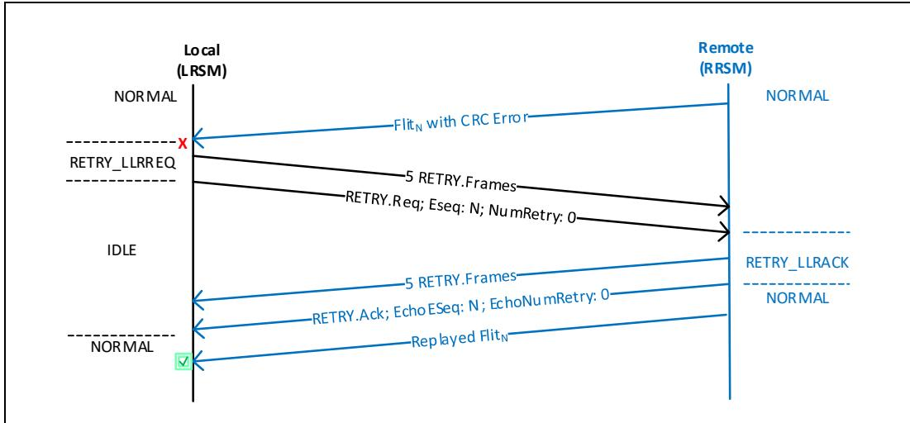

## 4.2.8.6 Interaction with vLSM Retrain State

On detection by the Link Layer of the vLSM transition from Active to Retrain state, the receiver side of the link layer must force a link layer retry on the next flit. Forcing an error will either initiate LLR or cause a current LLR to follow the correct error path. The LLR will ensure that no retryable flits are dropped during the physical layer reinit. Without initiating an LLR it is possible that packets/flits in flight on the physical wires could be lost or the sequence numbers could get mismatched.

Upon detection of a vLSM transition to Retrain, the LLR RRSM needs to be reset to its initial state and any instance of RETRY.Ack sequence needs to be cleared in the link layer and physical layer. The device needs to ensure that it receives a RETRY.Req sequence before it transmits a RETRY.Ack sequence.

## 4.2.8.7 CXL.cachemem Flit CRC

The CXL.cachemem Link Layer uses a 16b CRC for transmission error detection. The 16b CRC is over the 528-bit flit. The assumptions about the type errors are as follows:

• Bit ordering runs down each lane.

• Bit Errors occur randomly or in bursts down a lane, with the majority of the errors being single-bit random errors.

• Random errors can statistically cause multiple bit errors in a single flit, so it is more likely to get 2 errors in a flit than 3 errors, and more likely to get 3 errors in a flit than 4 errors, and so on.

• There is no requirement for primitive polynomial (a polynomial that generates all elements of an extension field from a base field) because there is no fixed payload. Primitive may be the result, but it is not required.

## 4.2.8.7.1 CRC-16 Polynomial and Detection Properties

The CRC polynomial to be used is 1F053h. The 16b CRC Polynomial has the following properties:

• All single, double, and triple bit errors detected

• Polynomial selection based on best 4-bit error detection characteristics and perfect 1-bit, 2-bit, and 3-bit error detection

## 4.2.8.7.2 CRC-16 Calculation

Below are the 512 bit data masks for use with an XOR tree to produce the 16 CRC bits. Data Mask bits [511:0] for each CRC bit are applied to the flit bits [511:0] and XOR is performed. The resulting CRC bits are included as flit bits [527:512] are defined to be CRC[15:00]. Pseudo code example for CRC bit[15] of this is CRC[15] = XOR (DM[15][511:0] AND Flit[511:0]).

The flit Data Masks for the 16 CRC bits are located below:

DM[15][511:0] = 512'hEF9C\_D9F9\_C4BB\_B83A\_3E84\_A97C\_D7AE\_DA13\_FAEB\_01B8\_5B20\_4A4C\_AE1E\_79D9\_7753\_5D21\_DC7F\_DD6A\_ 38F0\_3E77\_F5F5\_2A2C\_636D\_B05C\_3978\_EA30\_CD50\_E0D9\_9B06\_93D4\_746B\_2431 DM[14][511:0] = 512'h9852\_B505\_26E6\_6427\_21C6\_FDC2\_BC79\_B71A\_079E\_8164\_76B0\_6F6A\_F911\_4535\_CCFA\_F3B1\_3240\_33DF\_ 2488\_214C\_0F0F\_BF3A\_52DB\_6872\_25C4\_9F28\_ABF8\_90B5\_5685\_DA3E\_4E5E\_B629 DM[13][511:0] = 512'h23B5\_837B\_57C8\_8A29\_AE67\_D79D\_8992\_019E\_F924\_410A\_6078\_7DF9\_D296\_DB43\_912E\_24F9\_455F\_C485\_ AAB4\_2ED1\_F272\_F5B1\_4A00\_0465\_2B9A\_A5A4\_98AC\_A883\_3044\_7ECB\_5344\_7F25 DM[12][511:0] = 512'h7E46\_1844\_6F5F\_FD2E\_E9B7\_42B2\_1367\_DADC\_8679\_213D\_6B1C\_74B0\_4755\_1478\_BFC4\_4F5D\_7ED0\_3F28\_ EDAA\_291F\_0CCC\_50F4\_C66D\_B26E\_ACB5\_B8E2\_8106\_B498\_0324\_ACB1\_DDC9\_1BA3 DM[11][511:0] = 512'h50BF\_D5DB\_F314\_46AD\_4A5F\_0825\_DE1D\_377D\_B9D7\_9126\_EEAE\_7014\_8DB4\_F3E5\_28B1\_7A8F\_6317\_C2FE\_ 4E25\_2AF8\_7393\_0256\_005B\_696B\_6F22\_3641\_8DD3\_BA95\_9A94\_C58C\_9A8F\_A9E0 DM[10][511:0] = 512'hA85F\_EAED\_F98A\_2356\_A52F\_8412\_EF0E\_9BBE\_DCEB\_C893\_7757\_380A\_46DA\_79F2\_9458\_BD47\_B18B\_E17F\_ 2712\_957C\_39C9\_812B\_002D\_B4B5\_B791\_1B20\_C6E9\_DD4A\_CD4A\_62C6\_4D47\_D4F0 DM[09][511:0] = 512'h542F\_F576\_FCC5\_11AB\_5297\_C209\_7787\_4DDF\_6E75\_E449\_BBAB\_9C05\_236D\_3CF9\_4A2C\_5EA3\_D8C5\_F0BF\_ 9389\_4ABE\_1CE4\_C095\_8016\_DA5A\_DBC8\_8D90\_6374\_EEA5\_66A5\_3163\_26A3\_EA78 DM[08][511:0] = 512'h2A17\_FABB\_7E62\_88D5\_A94B\_E104\_BBC3\_A6EF\_B73A\_F224\_DDD5\_CE02\_91B6\_9E7C\_A516\_2F51\_EC62\_F85F\_ C9C4\_A55F\_0E72\_604A\_C00B\_6D2D\_6DE4\_46C8\_31BA\_7752\_B352\_98B1\_9351\_F53C DM[07][511:0] = 512'h150B\_FD5D\_BF31\_446A\_D4A5\_F082\_5DE1\_D377\_DB9D\_7912\_6EEA\_E701\_48DB\_4F3E\_528B\_17A8\_F631\_7C2F\_ E4E2\_52AF\_8739\_3025\_6005\_B696\_B6F2\_2364\_18DD\_3BA9\_59A9\_4C58\_C9A8\_FA9E DM[06][511:0] = 512'h8A85\_FEAE\_DF98\_A235\_6A52\_F841\_2EF0\_E9BB\_EDCE\_BC89\_3775\_7380\_A46D\_A79F\_2945\_8BD4\_7B18\_BE17\_ F271\_2957\_C39C\_9812\_B002\_DB4B\_5B79\_11B2\_0C6E\_9DD4\_ACD4\_A62C\_64D4\_7D4F DM[05][511:0] = 512'hAADE\_26AE\_AB77\_E920\_8BAD\_D55C\_40D6\_AECE\_0C0C\_5FFC\_C09A\_F38C\_FC28\_AA16\_E3F1\_98CB\_E1F3\_8261\_ C1C8\_AADC\_143B\_6625\_3B6C\_DDF9\_94C4\_62E9\_CB67\_AE33\_CD6C\_C0C2\_4601\_1A96 DM[04][511:0] = 512'hD56F\_1357\_55BB\_F490\_45D6\_EAAE\_206B\_5767\_0606\_2FFE\_604D\_79C6\_7E14\_550B\_71F8\_CC65\_F0F9\_C130\_ E0E4\_556E\_0A1D\_B312\_9DB6\_6EFC\_CA62\_3174\_E5B3\_D719\_E6B6\_6061\_2300\_8D4B DM[03][511:0] = 512'h852B\_5052\_6E66\_4272\_1C6F\_DC2B\_C79B\_71A0\_79E8\_1647\_6B06\_F6AF\_9114\_535C\_CFAF\_3B13\_2403\_3DF2\_ 4882\_14C0\_F0FB\_F3A5\_2DB6\_8722\_5C49\_F28A\_BF89\_0B55\_685D\_A3E4\_E5EB\_6294 DM[02][511:0] = 512'hC295\_A829\_3733\_2139\_0E37\_EE15\_E3CD\_B8D0\_3CF4\_0B23\_B583\_7B57\_C88A\_29AE\_67D7\_9D89\_9201\_9EF9\_ 2441\_0A60\_787D\_F9D2\_96DB\_4391\_2E24\_F945\_5FC4\_85AA\_B42E\_D1F2\_72F5\_B14A

DM[01][511:0] = 512'h614A\_D414\_9B99\_909C\_871B\_F70A\_F1E6\_DC68\_1E7A\_0591\_DAC1\_BDAB\_E445\_14D7\_33EB\_CEC4\_C900\_CF7C\_ 9220\_8530\_3C3E\_FCE9\_4B6D\_A1C8\_9712\_7CA2\_AFE2\_42D5\_5A17\_68F9\_397A\_D8A5

DM[00][511:0] = 512'hDF39\_B3F3\_8977\_7074\_7D09\_52F9\_AF5D\_B427\_F5D6\_0370\_B640\_9499\_5C3C\_F3B2\_EEA6\_BA43\_B8FF\_BAD4 71E0\_7CEF\_EBEA\_5458\_C6DB\_60B8\_72F1\_D461\_9AA1\_C1B3\_360D\_27A8\_E8D6\_4863

## 4.2.9 Viral

Viral is a containment feature as described in Section 12.4, “CXL Viral Handling.” As such, when the local socket is in a viral state, it is the responsibility of all off-die interfaces to convey this state to the remote side for appropriate handling. The CXL.cachemem link layer conveys viral status information. As soon as the viral status is detected locally, the link layer forces a CRC error on the next outgoing flit. If there is no traffic to send, the transmitter will send an LLCRD flit with a CRC error. It then embeds viral status information in the RETRY.Ack message it generates as part of the defined CRC error recovery flow.

There are two primary benefits to this methodology. First, by using the RETRY.Ack to convey viral status, we do not have to allocate a bit for this in protocol flits. Second, it allows immediate indication of viral and reduces the risk of race conditions between the viral distribution path and the data path. These risks could be particularly exacerbated by the large CXL.cache flit size and the potential limitations in which components (header, slots) allocate dedicated fields for viral indication.

To support MLD components, first introduced in CXL 2.0, a Viral LD-ID Vector is defined in the RETRY.Ack to encode which LD-ID is impacted by the viral state. This allows viral to be indicated to any set of Logical Devices. This vector is applicable only when the primary viral bit is set, and only to links that support multiple LD-ID (referred to as a Multi-Logical Device (MLD)). Links without LD-ID support (referred to as a Single Logical Device (SLD)) will treat the vector as Reserved. For an MLD, the encoding of all 0s indicates that all LD-ID are in viral and is equivalent to an encoding of all 1s.

## CXL.cachemem Link Layer 256B Flit Mode

## 4.3.1 Introduction

This mode of operation builds on PCIe Flit mode, in which the reliability flows are handled in the Physical Layer. The flit definition in the link layer defines the slot boundary, slot packing rules, and the message flow control. The flit overall has fields that are defined in the physical layer and are shown in this chapter; however, details are not defined in this chapter. The concept of “all Data” as defined in 68B Flit mode does not exist in 256B Flit mode.

## 4.3.2 Flit Overview

There are two variations of the 256B flit: Standard, and Latency-Optimized (LOpt). The mode of operation must be in sync with the physical layer. The Standard 256B flit supports either standard messages or Port Based Routing (PBR) messages where PBR messages carry additional ID space (DPID and sometimes SPID) to enable moreadvanced scaling/routing solutions as described in Chapter 3.0.

256B flit messages are also referred to as Hierarchy Based Routing (HBR) messages, when comparing to PBR flits/messages. A message default is HBR unless explicitly stated as being PBR.

Figure 4-43 is the Standard 256B flit. The Physical Layer controls 16B of the flit in this mode where the fields are: HDR, CRC, and FEC. All other fields are defined in the link layer.

Figure 4-43. Standard 256B Flit

<table><tr><td rowspan="2"></td><td colspan="2">Bytes</td></tr><tr><td colspan="2">0 1 2 3 4 5 6 7 8 9 10 11 12 13 14 15</td></tr><tr><td colspan="3">Byte 0 &gt; 2B HDR Slot0-14B (H-Slot)</td></tr><tr><td colspan="3">Byte 16 &gt; Slot1 - 16B (G-Slot)</td></tr><tr><td colspan="3">Byte 32 &gt; Slot2</td></tr><tr><td colspan="3">Byte 48 &gt; slot 3</td></tr><tr><td colspan="3">Byte 64 &gt; slot 4</td></tr><tr><td colspan="3">Byte 80 &gt; slot 5</td></tr><tr><td colspan="3">Byte 96 &gt; slot 6</td></tr><tr><td colspan="3">Byte 112 &gt; Slot 7</td></tr><tr><td colspan="3">Byte 128 &gt; Slot 8</td></tr><tr><td colspan="3">Byte 144 &gt; Slot 9</td></tr><tr><td colspan="3">Byte 160 &gt; Slot 10</td></tr><tr><td colspan="3">Byte 176 &gt; Slot 11</td></tr><tr><td colspan="3">Byte 192 &gt; Slot 12</td></tr><tr><td colspan="3">Byte 208 &gt; Slot 13</td></tr><tr><td colspan="3">Byte 224 &gt; Slot 14</td></tr><tr><td colspan="2">Byte 240 &gt; 2B CRD 8B CRC</td><td>6B FEC</td></tr></table>

Figure 4-44 is the latency-optimized flit definition. In this definition, more bytes are allocated to the physical layer to enable less store-and-forward when the transmission is error free. In this flit, 20B are allocated to the Physical Layer, where the fields are: 12B CRC (split across 2 6B CRC codes), 6B FEC, and 2B HDR.

Figure 4-44. Latency-Optimized (LOpt) 256B Flit

<table><tr><td rowspan="2"></td><td colspan="2">Bytes</td></tr><tr><td colspan="2">0 1 2 3 4 5 6 7 8 9 10 11 12 13 14 15</td></tr><tr><td colspan="3">Byte 0 &gt; 2B HDR Slot0-14B (H-Slot)</td></tr><tr><td colspan="3">Byte 16 &gt; Slot1 - 16B (G-Slot)</td></tr><tr><td colspan="3">Byte 32 &gt; Slot2</td></tr><tr><td colspan="3">Byte 48 &gt; slot 3</td></tr><tr><td colspan="3">Byte 64 &gt; slot 4</td></tr><tr><td colspan="3">Byte 80 &gt; slot 5</td></tr><tr><td colspan="3">Byte 96 &gt; slot 6</td></tr><tr><td colspan="2">Byte 112 &gt; Slot 7</td><td>6B CRC</td></tr><tr><td colspan="2">Byte 128 &gt; Slot 8 -12B (HS-Slot) -- Last 2B at the bottom</td><td>Slot 7</td></tr><tr><td colspan="3">Byte 144 &gt; Slot 9</td></tr><tr><td colspan="3">Byte 160 &gt; Slot 10</td></tr><tr><td colspan="3">Byte 176 &gt; Slot 11</td></tr><tr><td colspan="3">Byte 192 &gt; Slot 12</td></tr><tr><td colspan="3">Byte 208 &gt; Slot 13</td></tr><tr><td colspan="3">Byte 224 &gt; Slot 14</td></tr><tr><td colspan="2">Byte 240 &gt; 2B CRD Slot 8 - 2B 6B FEC</td><td>6B CRC</td></tr></table>

In both flit modes, the flit message packing rules are common, with the exception of Slot 8, which in LOpt 256B flits is a 12B slot with special packing rules. These are a subset of Slot 0 packing rules. This slot format is referred to as the H Subset (HS) format.

PBR packing is a subset of HBR message packing rules. PBR messages are not supported in LOpt 256B Flits, so HS-slot does not apply.

Some bits of Slot 7 are split across the 128B halves of the flit, and the result is that some messages in Slot 7 cannot be consumed until the CRC for the second half of the flit is checked.

Slot formats are defined by a 4-bit field at the beginning of each slot that carries header information, which is a departure from the 68B formats, where the 3-bit format field is within the flit header. The packing rules are constrained to a subset of messages for upstream and downstream links to match the Transaction Layer requirements. The encodings are non-overlapping between upstream and downstream except when the message(s) in the format are enabled to be sent in both directions. This is a change from the 68B flit definition where the slot format was uniquely defined for upstream and downstream.

The packing rules for the H-slot are a strict subset of the G-slot rules. The subset relationship is defined by the 14B H-slot size where any G-slot messages that extend beyond the 14th byte are not supported in the H-slot format. HS-slot follows the same subset relationship where the cutoff size is 12B.

For the larger PBR message packing, the messages in each slot are a subset of 256B flit message packing rules because of the larger message size required for PBR. PBR flits and messages can be fully symmetric when flowing between switches where the link is not upstream or downstream (also known as “Cross-Link” or “Inter-Switch Link” (ISL)).

For Data and Byte-Enable Slots, a slot-format field is not explicitly included, but is instead known based on prior header messages that must be decoded. This is similar to the “all-data flit” definition in 68B Flit mode in which expected data slots encompass the flit’s entire payload.

Table 4-14 defines the 256B G-slots for HBR messages and PBR messages.

Table 4-14. 256B G-Slot Formats (Sheet 1 of 2)

<table><tr><td rowspan="2">Format</td><td rowspan="2">SlotFmt Encoding</td><td colspan="4">HBR</td><td colspan="2">PBR</td></tr><tr><td>Messages</td><td> $Downstream^1$ </td><td> $Upstream^1$ </td><td>Length in Bits (Max 124)</td><td>Messages</td><td>Length in Bits (Max 124)</td></tr><tr><td>G0</td><td>0000b</td><td>H2D Req + H2D Rsp</td><td>X</td><td></td><td>112</td><td>H2D Req</td><td>92</td></tr><tr><td>G1</td><td>0001b</td><td>3 H2D Rsp</td><td>X</td><td></td><td>120</td><td>2 H2D Rsp</td><td>96</td></tr><tr><td>G2</td><td>0010b</td><td>D2H Req + 2 D2H Rsp</td><td></td><td>X</td><td>124</td><td>D2H Req</td><td>96</td></tr><tr><td>G3</td><td>0011b</td><td>4 D2H Rsp</td><td></td><td>X</td><td>96</td><td>3 D2H Rsp</td><td>108</td></tr><tr><td>G4</td><td>0100b</td><td>M2S Req</td><td>X</td><td>D</td><td>100</td><td>M2S Req</td><td>120</td></tr><tr><td>G5</td><td>0101b</td><td>3 M2S BIRsp</td><td>X</td><td>D</td><td>120</td><td>2 M2S BIRsp</td><td>104</td></tr><tr><td>G6</td><td>0110b</td><td>S2M BISnp + S2M NDR</td><td>D</td><td>X</td><td>124</td><td>S2M BISnp</td><td>96</td></tr><tr><td>G7</td><td>0111b</td><td>3 S2M NDR</td><td>D</td><td>X</td><td>120</td><td>2 S2M NDR</td><td>96</td></tr></table>

Table 4-14. 256B G-Slot Formats (Sheet 2 of 2)

<table><tr><td rowspan="2">Format</td><td rowspan="2">SlotFmt Encoding</td><td colspan="4">HBR</td><td colspan="2">PBR</td></tr><tr><td>Messages</td><td>Downstream $^{1}$ </td><td>Upstream $^{1}$ </td><td>Length in Bits (Max 124)</td><td>Messages</td><td>Length in Bits (Max 124)</td></tr><tr><td>G8</td><td>1000b</td><td rowspan="4">RSVD</td><td rowspan="4"></td><td rowspan="4"></td><td rowspan="4"></td><td rowspan="4">RSVD</td><td rowspan="4"></td></tr><tr><td>G9</td><td>1001b</td></tr><tr><td>G10</td><td>1010b</td></tr><tr><td>G11</td><td>1011b</td></tr><tr><td>G12</td><td>1100b</td><td>4 H2D DH</td><td>X</td><td></td><td>112</td><td>3 H2D DH</td><td>108</td></tr><tr><td>G13</td><td>1101b</td><td>4 D2H DH</td><td></td><td>X</td><td>96</td><td>3 D2H DH</td><td>108</td></tr><tr><td>G14</td><td>1110b</td><td>M2S RwD</td><td>X</td><td>D</td><td>104</td><td>M2S RwD</td><td>124</td></tr><tr><td>G15</td><td>1111b</td><td>3 S2M DRS</td><td>D</td><td>X</td><td>120</td><td>2 S2M DRS</td><td>96</td></tr></table>

1. D = Supported only for Direct P2P CXL.mem-capable ports.

Table 4-15 captures the H-slot formats. Notice that “zero extended” is used in PBR messages sent using slot formats H4 and H14 because they do not fit in the slot. This method allows the messages to use this format provided that the unsent bits are all 0s. The zero-extended method can be avoided by using the G-slot format, but use is allowed for these cases to optimize link efficiency. An example PBR H14, in Figure 4-67, “256B Packing: G14/H14 PBR Messages” on page 263, requires that the bits in Bytes 14 and 15 are all 0s to be able to use the format. This includes CKID[12:8], TC field, and reserved bits within those bytes. Any other field, including CKID[7:0], will be sent normally and can have supported encodings.

Table 4-15. 256B H-Slot Formats (Sheet 1 of 2)

<table><tr><td rowspan="2">Format</td><td rowspan="2">SlotFmt Encoding</td><td colspan="4">HBR</td><td colspan="2">PBR</td></tr><tr><td>Messages</td><td> $Downstream^1$ </td><td> $Upstream^1$ </td><td>Length in Bits (Max 108)</td><td>Messages</td><td>Length in Bits (Max 108)</td></tr><tr><td>H0</td><td>0000b</td><td> $H2D\ Req^2$ </td><td>X</td><td></td><td>72</td><td>H2D Req</td><td>92</td></tr><tr><td>H1</td><td>0001b</td><td> $2 H2D Rsp^2$ </td><td>X</td><td></td><td>80</td><td>2 H2D Rsp</td><td>96</td></tr><tr><td>H2</td><td>0010b</td><td> $D2H\ Req + 1 D2H Rsp^2$ </td><td></td><td>X</td><td>100</td><td>D2H Req</td><td>96</td></tr><tr><td>H3</td><td>0011b</td><td>4 D2H Rsp</td><td></td><td>X</td><td>96</td><td>3 D2H Rsp</td><td>108</td></tr><tr><td>H4</td><td>0100b</td><td>M2S Req</td><td>X</td><td>D</td><td>100</td><td>M2S Req (Zero Extended)</td><td>108 (120)</td></tr><tr><td>H5</td><td>0101b</td><td> $2 M2S\ BIRsp^2$ </td><td>X</td><td>D</td><td>80</td><td>2 M2S BIRsp</td><td>104</td></tr><tr><td>H6</td><td>0110b</td><td> $S2M\ BISnp^2$ </td><td>D</td><td>X</td><td>84</td><td>S2M BISnp</td><td>96</td></tr><tr><td>H7</td><td>0111b</td><td> $2 S2M\ NDR^2$ </td><td>D</td><td>X</td><td>80</td><td>2 S2M NDR</td><td>96</td></tr><tr><td>H8</td><td>1000b</td><td colspan="4">LLCTRL</td><td colspan="2">LLCTRL</td></tr><tr><td>H9</td><td>1001b</td><td rowspan="3">RSVD</td><td></td><td></td><td></td><td rowspan="3">RSVD</td><td></td></tr><tr><td>H10</td><td>1010b</td><td></td><td></td><td></td><td></td></tr><tr><td>H11</td><td>1011b</td><td></td><td></td><td></td><td></td></tr><tr><td>H12</td><td>1100b</td><td> $3 H2D\ DH^2$ </td><td>X</td><td></td><td>84</td><td>3 H2D DH</td><td>108</td></tr></table>

Table 4-15. 256B H-Slot Formats (Sheet 2 of 2)

<table><tr><td rowspan="2">Format</td><td rowspan="2">SlotFmt Encoding</td><td colspan="4">HBR</td><td colspan="2">PBR</td></tr><tr><td>Messages</td><td>Downstream $^{1}$ </td><td>Upstream $^{1}$ </td><td>Length in Bits (Max 108)</td><td>Messages</td><td>Length in Bits (Max 108)</td></tr><tr><td>H13</td><td>1101b</td><td>4 D2H DH</td><td></td><td>X</td><td>96</td><td>3 D2H DH</td><td>108</td></tr><tr><td>H14</td><td>1110b</td><td>M2S RwD</td><td>X</td><td>D</td><td>104</td><td>M2S RwD (Zero Extended)</td><td>108 (124)</td></tr><tr><td>H15</td><td>1111b</td><td>2 S2M  $DRS^{2}$ </td><td>D</td><td>X</td><td>80</td><td>2 S2M DRS</td><td>96</td></tr></table>

1. D = Supported only for Direct P2P CXL.mem-capable ports.  
2. Cases in which the H-slot is a subset of the corresponding G-slot because not all messages fit into the format.

Table 4-16 captures the HS-slot formats. The HS-slot format is used only in LOpt 256B flits. Notice that “zero extended” for slot formats are used in HS4 and HS14.

Note: PBR messages never use LOpt 256B flits, and therefore do not use the HS-slot format.

Table 4-16. 256B HS-Slot Formats

<table><tr><td rowspan="2">Format</td><td rowspan="2">SlotFmt Encoding</td><td colspan="4">HBR</td></tr><tr><td>Messages</td><td> $Downstream^1$ </td><td> $Upstream^1$ </td><td>Length in Bits (Max 92)</td></tr><tr><td>HS0</td><td>0000b</td><td>H2D Req</td><td>X</td><td></td><td>72</td></tr><tr><td>HS1</td><td>0001b</td><td>2 H2D Rsp</td><td>X</td><td></td><td>80</td></tr><tr><td>HS2</td><td>0010b</td><td> $D2H\ \text{Req}^2$ </td><td></td><td>X</td><td>76</td></tr><tr><td>HS3</td><td>0011b</td><td>3 D2H  $Rsp^2$ </td><td></td><td>X</td><td>72</td></tr><tr><td>HS4</td><td>0100b</td><td>M2S Req (Zero Extended)</td><td>X</td><td>D</td><td>92 (100)</td></tr><tr><td>HS5</td><td>0101b</td><td>2 M2S BIRsp</td><td>X</td><td>D</td><td>80</td></tr><tr><td>HS6</td><td>0110b</td><td>S2M BISnp</td><td>D</td><td>X</td><td>84</td></tr><tr><td>HS7</td><td>0111b</td><td>2 S2M NDR</td><td>D</td><td>X</td><td>80</td></tr><tr><td>HS8</td><td>1000b</td><td colspan="4">LLCTRL</td></tr><tr><td>HS9</td><td>1001b</td><td rowspan="3">RSVD</td><td></td><td></td><td></td></tr><tr><td>HS10</td><td>1010b</td><td></td><td></td><td></td></tr><tr><td>HS11</td><td>1011b</td><td></td><td></td><td></td></tr><tr><td>HS12</td><td>1100b</td><td>3 H2D DH</td><td>X</td><td></td><td>84</td></tr><tr><td>HS13</td><td>1101b</td><td>3 D2H  $DH^2$ </td><td></td><td>X</td><td>72</td></tr><tr><td>HS14</td><td>1110b</td><td>M2S RwD (Zero Extended)</td><td>X</td><td>D</td><td>92 (104)</td></tr><tr><td>HS15</td><td>1111b</td><td>2 S2M DRS</td><td>D</td><td>X</td><td>80</td></tr></table>

1. D = Supported only for Direct P2P CXL.mem-capable ports.  
2. Cases in which the HS-slot is a subset of the corresponding H-slot because not all messages fit into the format.

## 4.3.3 Slot Format Definition

The slot diagrams in this section capture the detailed bit field placement within the slot. Each Diagram is inclusive of G-slot, H-slot, and HS-slot where a subset is created such that H-slot is a subset of G-slot where messages that extend beyond the 14-byte boundary are excluded. Similarly, the HS-slot format is a subset of H-slot and G-slot where messages that extend beyond the 12-byte boundary are excluded.

This G to H to HS subset relationship is captured in Figure 4-45, where the size of each subset is shown.

All messages within the slots are aligned to nibble (4 bit) boundary. This results in some variation in number of reserved bits to align to that boundary.

Figure 4-45. 256B Packing: Slot and Subset Definition


Slot diagrams in the section include abbreviations for bit field names to allow them to fit into the diagram. In the diagrams, most abbreviations are obvious, but the following abbreviation list ensures clarity:

• Bg = Bogus

• BT11 = BITag[11]

• Ch = ChunkValid

• CID3 = CacheID[3]

• CK12 = CKID[12]

• CQ0 = CQID[0]

• CQ11 = CQID[11]

• DP0 = DPID[0]

• LD0 = LD-ID[0]

• MO3 = MemOpcode[3]

• Op3 = Opcode[3]

• Poi = Poison

• RSVD = Reserved

• RV = Reserved

• SP11 = SPID[11]

• UQ11 = UQID[11]

• Val = Valid

## Figure 4-46. 256B Packing: G0/H0/HS0 HBR Messages

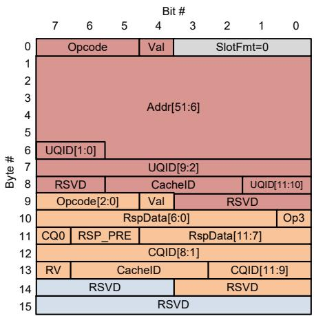

H2D Req + H2D Rsp

Figure 4-47. 256B Packing: G0/H0 PBR Messages

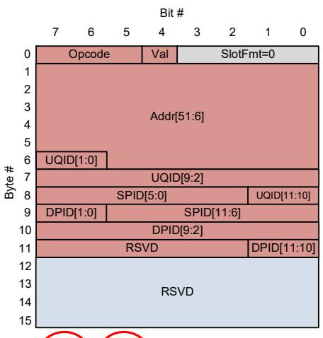

Figure 4-48. 256B Packing: G1/H1/HS1 HBR Messages  


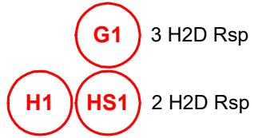

## Figure 4-49. 256B Packing: G1/H1 PBR Messages

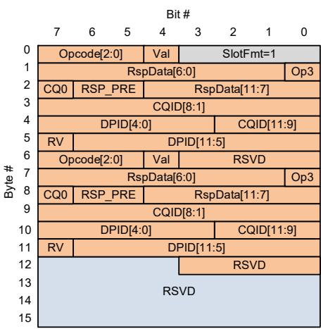


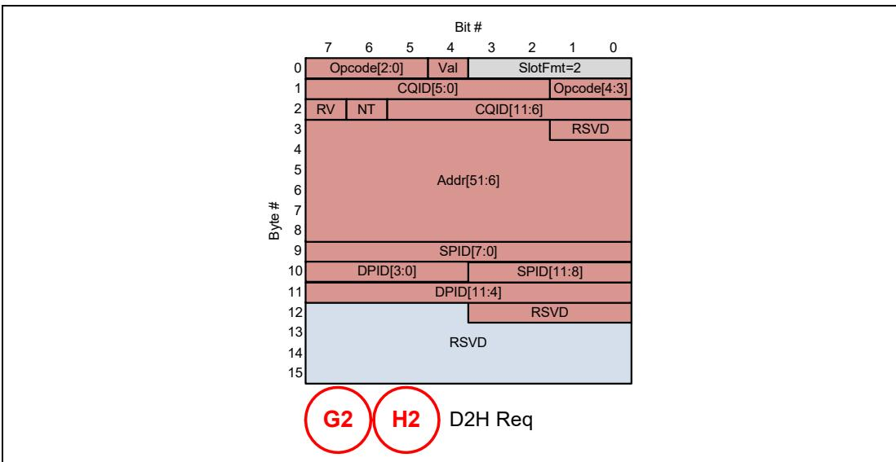

Figure 4-50. 256B Packing: G2/H2/HS2 HBR Messages  
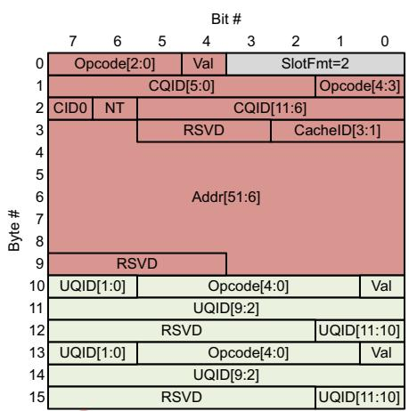  
Figure 4-51. 256B Packing: G2/H2 PBR Messages

Figure 4-52. 256B Packing: G3/H3/HS3 HBR Messages  
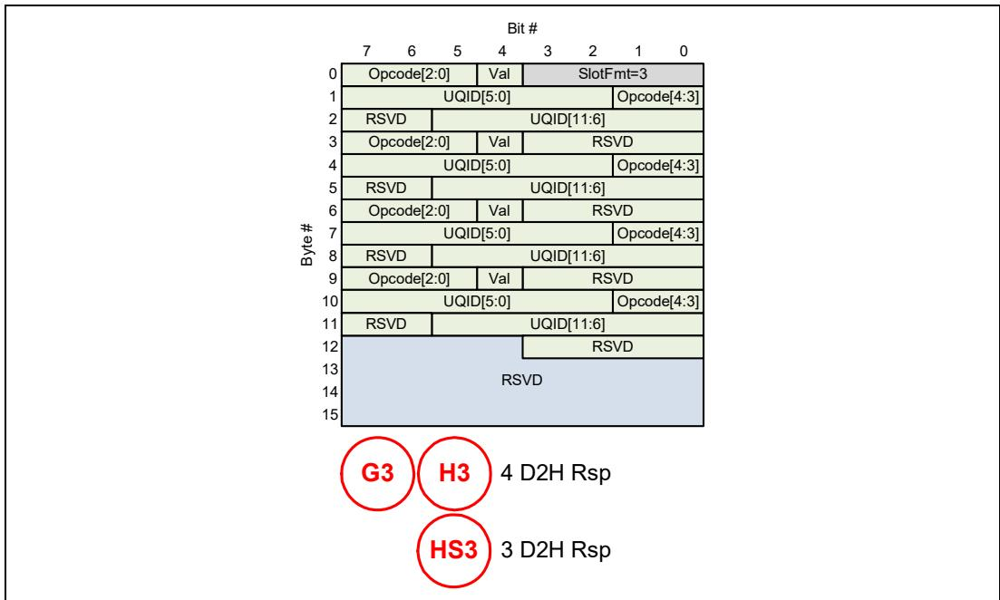

Figure 4-53. 256B Packing: G3/H3 PBR Messages  
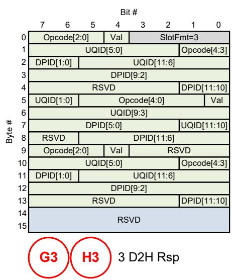


Figure 4-54. 256B Packing: G4/H4/HS4 HBR Messages  
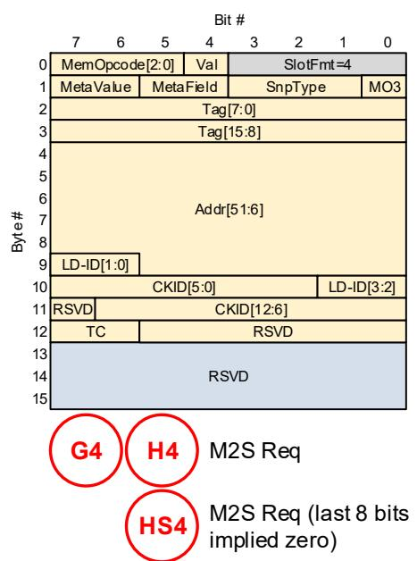  
Figure 4-55. 256B Packing: G4/H4 PBR Messages

Figure 4-56. 256B Packing: G5/H5/HS5 HBR Messages  
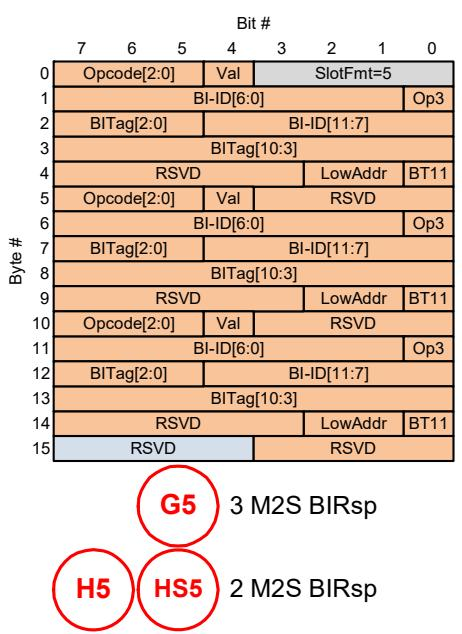

Figure 4-57. 256B Packing: G5/H5 PBR Messages  
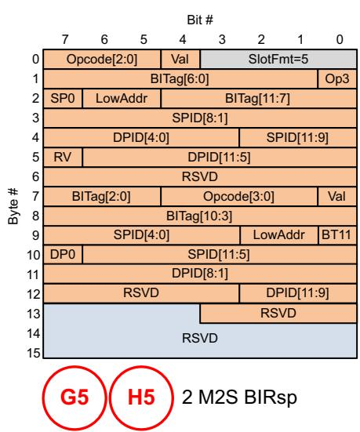

Figure 4-58. 256B Packing: G6/H6/HS6 HBR Messages  


## Figure 4-59. 256B Packing: G6/H6 PBR Messages


Figure 4-60. 256B Packing: G7/H7/HS7 HBR Messages  
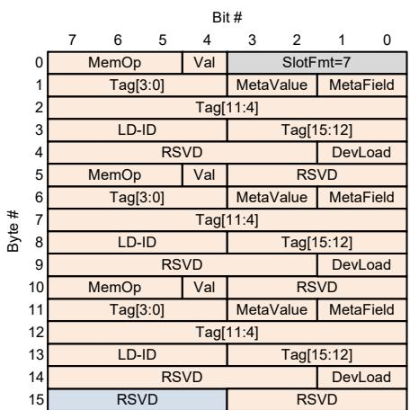

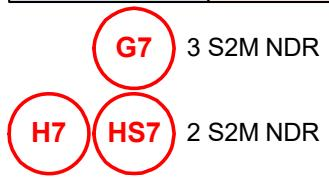

## Figure 4-61. 256B Packing: G7/H7 PBR Messages


Figure 4-62. 256B Packing: G12/H12/HS12 HBR Messages  
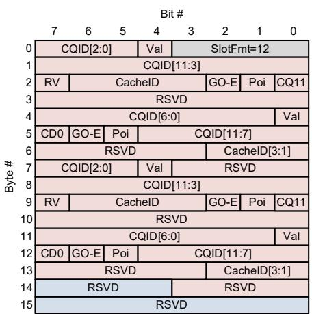

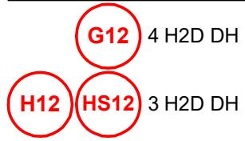

## Figure 4-63. 256B Packing: G12/H12 PBR Messages

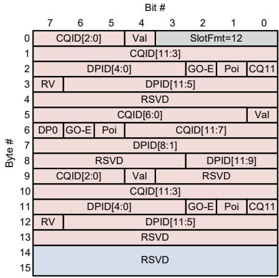


Figure 4-64. 256B Packing: G13/H13/HS13 HBR Messages  
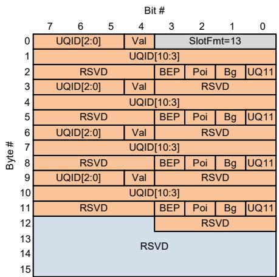

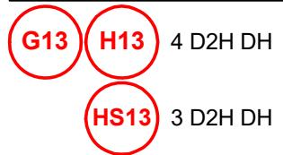

## Figure 4-65. 256B Packing: G13/H13 PBR Messages

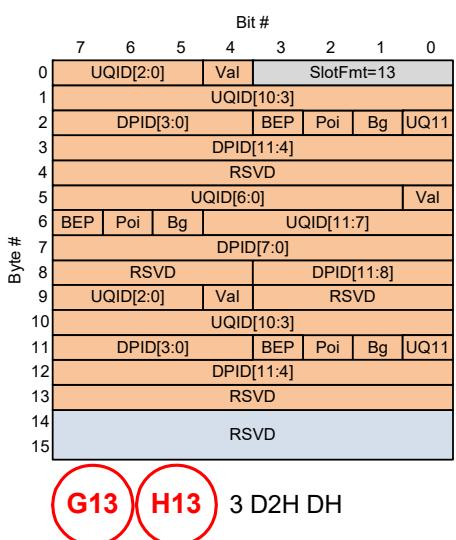

Figure 4-66. 256B Packing: G14/H14/HS14 HBR Messages  
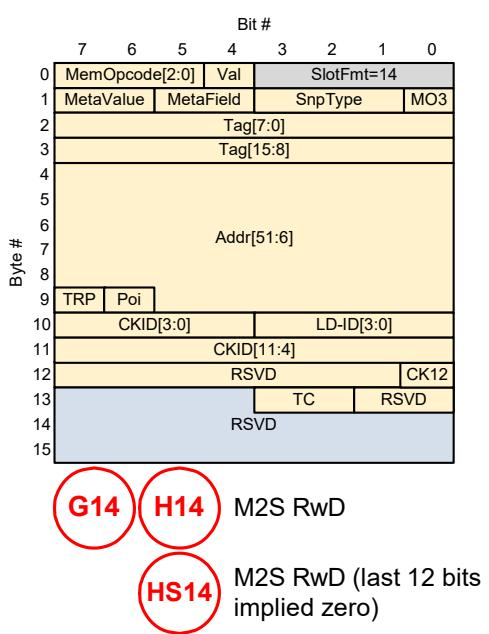

## Figure 4-67. 256B Packing: G14/H14 PBR Messages

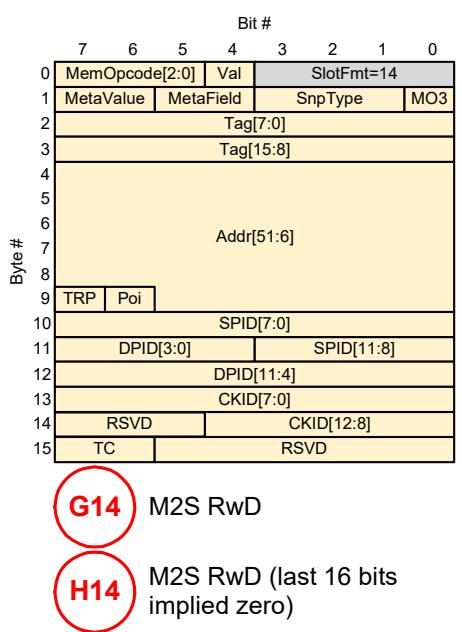

## Figure 4-68. 256B Packing: G15/H15/HS15 HBR Messages

<table><tr><td colspan="6">Bit #</td></tr><tr><td></td><td>7</td><td>6</td><td>5</td><td>4</td><td>3</td></tr><tr><td>0</td><td colspan="2">MemOp</td><td>Val</td><td colspan="2">SlotFmt=15</td></tr><tr><td>1</td><td colspan="3">Tag[3:0]</td><td>MetaValue</td><td>MetaField</td></tr><tr><td>2</td><td colspan="5">Tag[11:4]</td></tr><tr><td>3</td><td>LD0</td><td>DevLoad</td><td>Poi</td><td colspan="2">Tag[15:12]</td></tr><tr><td>4</td><td colspan="3">RSVD</td><td>TRP</td><td>LD-ID[3:1]</td></tr><tr><td>5</td><td colspan="2">MemOp</td><td>Val</td><td colspan="2">RSVD</td></tr><tr><td>6</td><td colspan="3">Tag[3:0]</td><td>MetaValue</td><td>MetaField</td></tr><tr><td>7</td><td colspan="5">Tag[11:4]</td></tr><tr><td>8</td><td>LD0</td><td>DevLoad</td><td>Poi</td><td colspan="2">Tag[15:12]</td></tr><tr><td>9</td><td colspan="3">RSVD</td><td>TRP</td><td>LD-ID[3:1]</td></tr><tr><td>10</td><td colspan="2">MemOp</td><td>Val</td><td colspan="2">RSVD</td></tr><tr><td>11</td><td colspan="3">Tag[3:0]</td><td>MetaValue</td><td>MetaField</td></tr><tr><td>12</td><td colspan="5">Tag[11:4]</td></tr><tr><td>13</td><td>LD0</td><td>DevLoad</td><td>Poi</td><td colspan="2">Tag[15:12]</td></tr><tr><td>14</td><td colspan="3">RSVD</td><td>TRP</td><td>LD-ID[3:1]</td></tr><tr><td>15</td><td colspan="3">RSVD</td><td colspan="2">RSVD</td></tr></table>

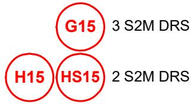

## Figure 4-69. 256B Packing: G15/H15 PBR Messages

<table><tr><td colspan="6">Bit #</td></tr><tr><td></td><td>7</td><td>6</td><td>5</td><td>4</td><td>3</td></tr><tr><td>0</td><td colspan="2">MemOp</td><td>Val</td><td colspan="2">SlotFmt=15</td></tr><tr><td>1</td><td colspan="3">Tag[3:0]</td><td>MetaValue</td><td>MetaField</td></tr><tr><td>2</td><td colspan="5">Tag[11:4]</td></tr><tr><td>3</td><td>DP0</td><td>DevLoad</td><td>Poi</td><td colspan="2">Tag[15:12]</td></tr><tr><td>4</td><td colspan="5">DPID[8:1]</td></tr><tr><td>5</td><td colspan="3">RSVD</td><td>TRP</td><td>DPID[11:9]</td></tr><tr><td>6</td><td colspan="2">MemOp</td><td>Val</td><td colspan="2">RSVD</td></tr><tr><td>7</td><td colspan="3">Tag[3:0]</td><td>MetaValue</td><td>MetaField</td></tr><tr><td>8</td><td colspan="5">Tag[11:4]</td></tr><tr><td>9</td><td>DP0</td><td>DevLoad</td><td>Poi</td><td colspan="2">Tag[15:12]</td></tr><tr><td>10</td><td colspan="5">DPID[8:1]</td></tr><tr><td>11</td><td colspan="3">RSVD</td><td>TRP</td><td>DPID[11:9]</td></tr><tr><td>12</td><td colspan="5">RSVD</td></tr><tr><td>13</td><td rowspan="3" colspan="5">RSVD</td></tr><tr><td>14</td></tr><tr><td>15</td></tr></table>


Figure 4-70. 256B Packing: Implicit Data  


Figure 4-71. 256B Packing: Implicit Trailer RwD  
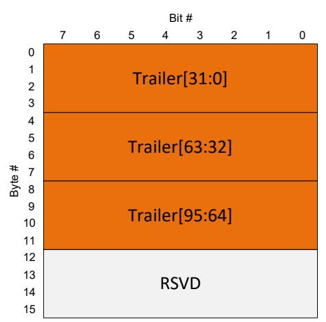

Figure 4-72. 256B Packing: Implicit Trailer DRS  


Figure 4-73. 256B Packing: Byte-Enable Trailer for D2H Data  
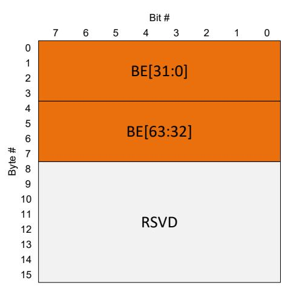

## 4.3.3.1 Implicit Data Slot Decode

Data and Byte-Enable slots are implicitly known for G-slots based on prior message headers. To simplify decode of the slot format fields, SlotFmt can be used as a quick decode to know if the next 4 G-slots are data slots. Additional G-slots beyond the next 4 may also carry data depending on rollover values, the number of valid Data Headers, and BE bit within headers.

H-slots and HS-slots never carry data, so they always have an explicit 4-bit encoding defining the format.

## IMPLEMENTATION NOTE

The quick decode of the current slot is used to determine whether the next 4 G-slots are data slots. The decode required is different for H/HS-slot compared to G-slots. The H/HS slots comparing SlotFmt[3:2] are equal to 11b, and for G slots reduce the compare to only SlotFmt[3] equal to 1. The difference in decode requirement is because the formats H8/HS8 indicates LLCTRL message where G8 is a reserved encoding.

More generally, the optimization for quick decode can be used to limit the logic levels required to determine whether later slots (by number) are data vs. header slots.

## IMPLEMENTATION NOTE

With Link Layer data path of 64B wide, only 4 slots are processed per clock, which enables a simplified decode to reduce critical paths in the logic to determine whether a G-slot is a data slot vs. a header slot. All further decode is carried over from the previous clock cycle.

Figure 4-74 shows examples where a quick decode of the SlotFmt field can be used to determine which slots are implicit data slots. The Rollover column is the number of data slots carried over from previous flits. Because H-slots never carry data, their decode can proceed without knowledge of prior headers.

Figure 4-74. Header Slot Decode Example  
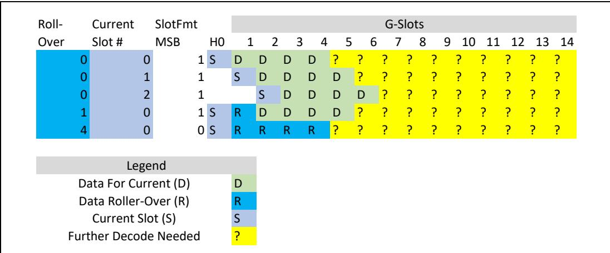

## 4.3.3.2 Trailer Decoder

A trailer is defined to be included with data carrying messages when the TRP or BEP bit is set in the header. The trailer size can vary depending on the link’s capability. The base functionality requires support of the Byte-Enable use case for trailers. The Extended Metadata (EMD) use of trailers is optional. Table 4-17 defines the use cases that are supported for each data-carrying channel.

Trailer Size and Modes Supported per Channe

<table><tr><td>Channel</td><td>Trailer Use</td><td>Trailer Size Max</td></tr><tr><td>M2S RwD</td><td>Byte-Enables (BE) and/or Extended Metadata (EMD)</td><td>96-bit if Extended Metadata is supported; otherwise, 64-bit for Byte-Enables.</td></tr><tr><td>S2M DRS</td><td>Extended Metadata (EMD)</td><td>96 bits max (32 bits per DRS message) when EMD is enabled; otherwise, 0-bits.</td></tr><tr><td>D2H Data Header (DH)</td><td>Byte-Enables</td><td>64-bit for Byte-Enables.</td></tr><tr><td>Other Channels</td><td>None</td><td>0 bits</td></tr></table>

For RwD and D2H DH messages, the Trailer always follow 4 Data Slots if TRP or BEP is set for the message.

For DRS, the Trailer enables packing of up to 3 trailers together after the first 64B data transfer for Header 0 even when Header 0 does not have an associated trailer. The trailers are tightly packed for each header with TRP bit set. Figure 4-75 illustrates an example case in which the 3 DRS (G15) format is sent where the 1st and 3rd headers have TRP=1 and the 2nd has TRP=0. The trailer comes after the first data transfer (D0) and the valid trailers are tightly packed.

The “tightly packed” trailer rule is for future extensibility with larger trailers where a complete set of trailers for a multi-data header will not fit into a single slot and sparse use of TRP=1 with tightly packed trailers enables higher efficiency.

Figure 4-75. DRS Trailer Slot Decode Example  
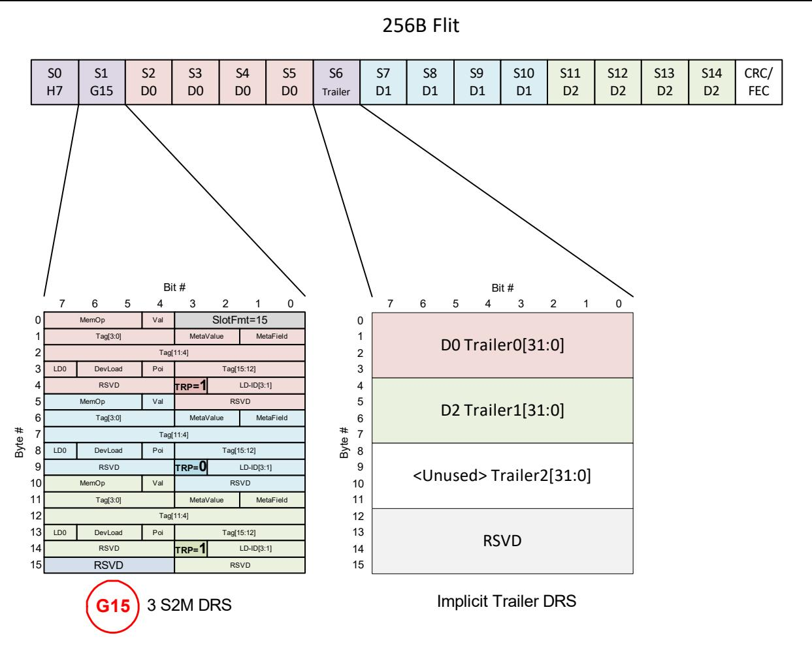

## 4.3.4 256B Flit Packing Rules

Rules for 256B flits follow the same basic requirements as 68B flits, in terms of bit order and tightly packed rules. The tightly packed rules apply within groups of up to 4 slots together instead of across the entire flit. The groups are defined as: 0 to 3, 4 to 7, 8 to 11, and 12 to 14. Note that the final group spans only 3 slots.

• The Tx must not inject data headers in H-slots/HS-slots unless the remaining data slots to send is less than or equal to 16.

This limits the maximum count of the remaining data to be 36 (16 + 4 (new Data headers) \* 5 (4 Data Slots + 1 Byte Enable slot) = 36):

• The MDH disable control bit is used to restrict the number of valid data header bits to one per slot

• If a Data Header slot format is used (G/H/HS 12 to 15) the first message must have the valid bit set

• Tightly packed rules for valid messages in a group are applied to slot formats that support zero-extended message packing. The result is that a transmit packing must not use a format of H/HS-type message with Valid=0 where it is unable to pack because of nonzero bits in the zero-extended portion of the message followed by

Valid=1 for the same message type in G format (e.g., it would always be illegal to use HS4 with Valid=0 for M2S Req followed by G4 with Valid=1 for M2S Req within the same group).

The maximum message rules are applicable on a rolling 128B group in which the groups are as follows:

• A = Slots 0 to 3

• B = Slots 4 to 7

• C = Slots 8 to 11

• D = Slots 12 to 14

Extending these rules to 128B boundary enables the 256B flit slot formats to be fully utilized. The 256B flit slots often have more messages per slot than the legacy 68B flit message rate would allow. Extending to 128B enables the use of these high message count slots while not increasing the message rate per bandwidth.

The definition of rolling is such that the groups combine into 128B rolling groups:

• AB (Slots 0 to 7)

• BC (Slots 4 to 11)

• CD (Slots 8 to 14)

• DA (Slots 12 to 14 in the current flit and Slots 0 to 3 in the following flit)

The maximum message rates apply to each group. The LOpt 256B flit creates one modification to this rule such that Slot 7 is included in Group B and Group C as follows:

• B = Slots 4 to 7

• C = Slots 7 to 11

Group C has five slots with this change. Note that this special case is applicable only to the maximum message rate requirement where Group CD considers Slots 7 to 14 instead of Slots 8 to 14.

The maximum message rate per 128B group is defined in Table 4-18, and the 68B flit message rate is included for comparison.

The term “128B group” is looking at the 128B grouping boundaries of the 256B flit. The actual number of bytes in the combined slots varies, depending on where the alignment is within the 256B flit that has other overhead (e.g., CRC, FEC, 2B HDR, etc.).

The maximum message count was selected based on a worst-case workload requirement for the steady-state message requirement in conjunction with the packing rules to achieve the most-efficient operating point. In some cases, this is 2x from the 68B message rate, which is what would be expected, but that is not true in all cases.

Table 4-18. 128B Group Maximum Message Rates (Sheet 1 of 2)

<table><tr><td>Message Type</td><td>Maximum Message Count per 128B Group</td><td>Maximum Message Count for Each 68B Flit</td></tr><tr><td>D2H Req</td><td>4</td><td>4</td></tr><tr><td>D2H Rsp</td><td>4</td><td>2</td></tr><tr><td>D2H Data Header (DH)</td><td>4</td><td>4</td></tr><tr><td>S2M BISnp</td><td>2</td><td>N/A</td></tr><tr><td>S2M NDR</td><td>6</td><td>2</td></tr><tr><td>S2M DRS-DH</td><td>3</td><td>3</td></tr></table>

Table 4-18. 128B Group Maximum Message Rates (Sheet 2 of 2)

<table><tr><td>Message Type</td><td>Maximum Message Count per 128B Group</td><td>Maximum Message Count for Each 68B Flit</td></tr><tr><td>H2D Req</td><td>2</td><td>2</td></tr><tr><td>H2D Rsp</td><td>6</td><td>4</td></tr><tr><td>H2D Data Header (DH)</td><td>4</td><td>4</td></tr><tr><td>M2S Req</td><td>4</td><td>2</td></tr><tr><td>M2S RwD-DH</td><td>2</td><td>1</td></tr><tr><td>M2S BIRsp</td><td>3</td><td>N/A</td></tr></table>

Other 68B rules that do not apply to 256B flits:

• MDH rule that requires >1 valid header per MDH. In 256B slots, only one format is provided for packing each message type, so this rule is not applicable.

• Rules related to BE do not apply because they are handled with a separate message header bit instead of a flit header bit, and because there are no special constraints placed on the number of messages when the TRP or BEP bit is set.

• 32B transfer rules do not apply because only 64B transfers are supported.

## IMPLEMENTATION NOTE

Packing choices between H-slot and G-slot can have a direct impact on efficiency in many traffic patterns. Efficiency may be improved if messages that can fully utilize an H-slot (or HS-slot) are prioritized for those slots compared to messages that can better utilize a G-slot.

An example analyzed CXL.mem traffic pattern that sends steady state downstream traffic of MemRd, MemWr, and BIRsp. In this example, MemRd and MemWr can fully utilize an H-slot and do not see a benefit from being packed into a G-slot. The BIRsp packing allows more messages to fit into G-slot (3) compared to an H-slot (2), so prioritizing it for G-slot allows for improvement. In this example, we can see approximately 1.5% bandwidth improvement from prioritizing BIRsp to G-slots as compared to a simple weighted round-robin arbitration.

Prioritizing must be carefully handled to ensure that fairness is provided between each message class.

## 4.3.5 Credit Return

Table 4-19 defines the 2-byte credit return encoding in the 256B flit.

Table 4-19. Credit Returned Encoding (Sheet 1 of 3)

<table><tr><td rowspan="2">Field</td><td rowspan="2">Encoding (hex)</td><td colspan="5">Definition</td></tr><tr><td>Protocol</td><td>Channel</td><td> $Downstream^1$ </td><td> $Upstream^1$ </td><td>Credit Count</td></tr><tr><td rowspan="25">CRD[4:0]</td><td>00h</td><td colspan="4">No credit return</td><td>0</td></tr><tr><td>01h</td><td colspan="4">No Credit Return and the current flit is an Empty flit as defined in Section 4.3.8.1.</td><td>0</td></tr><tr><td>02h-03h</td><td colspan="5">Reserved</td></tr><tr><td>04h</td><td rowspan="10">Cache</td><td rowspan="5">H2D Request</td><td rowspan="5">X</td><td rowspan="5"></td><td>1</td></tr><tr><td>05h</td><td>4</td></tr><tr><td>06h</td><td>8</td></tr><tr><td>07h</td><td>12</td></tr><tr><td>08h</td><td>16</td></tr><tr><td>09h</td><td rowspan="5">D2H Request</td><td rowspan="5"></td><td rowspan="5">X</td><td>1</td></tr><tr><td>0Ah</td><td>4</td></tr><tr><td>0Bh</td><td>8</td></tr><tr><td>0Ch</td><td>12</td></tr><tr><td>0Dh</td><td>16</td></tr><tr><td>0Eh-13h</td><td colspan="5">Reserved</td></tr><tr><td>14h</td><td rowspan="10">Memory</td><td rowspan="5">M2S Request</td><td rowspan="5">X</td><td rowspan="5">D</td><td>1</td></tr><tr><td>15h</td><td>4</td></tr><tr><td>16h</td><td>8</td></tr><tr><td>17h</td><td>12</td></tr><tr><td>18h</td><td>16</td></tr><tr><td>19h</td><td rowspan="5">S2M BISnp</td><td rowspan="5">D</td><td rowspan="5">X</td><td>1</td></tr><tr><td>1Ah</td><td>4</td></tr><tr><td>1Bh</td><td>8</td></tr><tr><td>1Ch</td><td>12</td></tr><tr><td>1Dh</td><td>16</td></tr><tr><td>1Eh-1Fh</td><td colspan="5">Reserved</td></tr></table>

Table 4-19. Credit Returned Encoding (Sheet 2 of 3)

<table><tr><td rowspan="2">Field</td><td rowspan="2">Encoding (hex)</td><td colspan="5">Definition</td></tr><tr><td>Protocol</td><td>Channel</td><td> $Downstream^1$ </td><td> $Upstream^1$ </td><td>Credit Count</td></tr><tr><td rowspan="24">CRD[9:5]</td><td>00h</td><td colspan="4">No credit return</td><td>0</td></tr><tr><td>01h-03h</td><td colspan="5">Reserved</td></tr><tr><td>04h</td><td rowspan="10">Cache</td><td rowspan="5">H2D Data</td><td rowspan="5">X</td><td rowspan="5"></td><td>1</td></tr><tr><td>05h</td><td>4</td></tr><tr><td>06h</td><td>8</td></tr><tr><td>07h</td><td>12</td></tr><tr><td>08h</td><td>16</td></tr><tr><td>09h</td><td rowspan="5">D2H Data</td><td rowspan="5"></td><td rowspan="5">X</td><td>1</td></tr><tr><td>0Ah</td><td>4</td></tr><tr><td>0Bh</td><td>8</td></tr><tr><td>0Ch</td><td>12</td></tr><tr><td>0Dh</td><td>16</td></tr><tr><td>0Eh-13h</td><td colspan="5">Reserved</td></tr><tr><td>14h</td><td rowspan="10">Memory</td><td rowspan="5">M2S RwD</td><td rowspan="5">X</td><td rowspan="5">D</td><td>1</td></tr><tr><td>15h</td><td>4</td></tr><tr><td>16h</td><td>8</td></tr><tr><td>17h</td><td>12</td></tr><tr><td>18h</td><td>16</td></tr><tr><td>19h</td><td rowspan="5">S2M DRS</td><td rowspan="5">D</td><td rowspan="5">X</td><td>1</td></tr><tr><td>1Ah</td><td>4</td></tr><tr><td>1Bh</td><td>8</td></tr><tr><td>1Ch</td><td>12</td></tr><tr><td>1Dh</td><td>16</td></tr><tr><td>1Eh-1Fh</td><td colspan="5">Reserved</td></tr></table>

Table 4-19. Credit Returned Encoding (Sheet 3 of 3)

<table><tr><td rowspan="2">Field</td><td rowspan="2">Encoding (hex)</td><td colspan="5">Definition</td></tr><tr><td>Protocol</td><td>Channel</td><td> $Downstream^1$ </td><td> $Upstream^1$ </td><td>Credit Count</td></tr><tr><td rowspan="24">CRD[14:10]</td><td>00h</td><td colspan="4">No credit return</td><td>0</td></tr><tr><td>01h-03h</td><td colspan="5">Reserved</td></tr><tr><td>04h</td><td rowspan="10">Cache</td><td rowspan="5">H2D Rsp</td><td rowspan="5">X</td><td rowspan="5"></td><td>1</td></tr><tr><td>05h</td><td>4</td></tr><tr><td>06h</td><td>8</td></tr><tr><td>07h</td><td>12</td></tr><tr><td>08h</td><td>16</td></tr><tr><td>09h</td><td rowspan="5">D2H Rsp</td><td rowspan="5"></td><td rowspan="5">X</td><td>1</td></tr><tr><td>0Ah</td><td>4</td></tr><tr><td>0Bh</td><td>8</td></tr><tr><td>0Ch</td><td>12</td></tr><tr><td>0Dh</td><td>16</td></tr><tr><td>0Eh-13h</td><td colspan="5">Reserved</td></tr><tr><td>14h</td><td rowspan="10">Memory</td><td rowspan="5">M2S BIRsp</td><td rowspan="5">X</td><td rowspan="5">D</td><td>1</td></tr><tr><td>15h</td><td>4</td></tr><tr><td>16h</td><td>8</td></tr><tr><td>17h</td><td>12</td></tr><tr><td>18h</td><td>16</td></tr><tr><td>19h</td><td rowspan="5">S2M NDR</td><td rowspan="5">D</td><td rowspan="5">X</td><td>1</td></tr><tr><td>1Ah</td><td>4</td></tr><tr><td>1Bh</td><td>8</td></tr><tr><td>1Ch</td><td>12</td></tr><tr><td>1Dh</td><td>16</td></tr><tr><td>1Eh-1Fh</td><td colspan="5">Reserved</td></tr><tr><td>CRD[15]</td><td colspan="6">Reserved</td></tr></table>

1. D = Credit channel mapping is applicable only on a Direct P2P CXL.mem link between a device and the switch Downstream Port to which it is attached.

## Link Layer Control Messages

In 256B Flit mode, control messages are encoded using the H8 format and sometimes using the HS8 format. Figure 4-76 captures the 256B packing for LLCTRL messages. H8 provides 108 bits to be used to encode the control message after accounting for 4-bit slot format encoding. 8 bits are used to encode LLCTRL/SubType, and 4 bits are kept as reserved, with a 96-bit payload. For HS8, it is limited to 2 bytes less, which cuts the available payload to 80 bits. Table 4-20 captures the defined control messages. In almost all cases, the remaining slots after the control message are considered to be reserved (i.e., cleared to all 0s) and do not carry any protocol information. The exception case is IDE.MAC, which allows for protocol messages in the other slots within the flit. For messages that are injected in the HS slot, the slots prior to the HS slot may carry protocol information but the slots after the HS slot are reserved.

Table 4-20. 256B Flit Mode Control Message Details

<table><tr><td>Flit Type</td><td>LLCTRL</td><td>SubType</td><td>SubType Description</td><td>Payload</td><td>Payload Description</td><td>Remaining Slots are Reserved?1</td></tr><tr><td rowspan="6"> $IDE^2$ </td><td rowspan="6">0010b</td><td>0000b</td><td>IDE.Idle</td><td>95:0</td><td>Payload RSVDMessage sent as part of IDE flows to pad sequences with IDE.Idle flits.See Chapter 11.0 for details on the use of this message.</td><td rowspan="3">Yes</td></tr><tr><td>0001b</td><td>IDE.Start</td><td>95:0</td><td>Payload RSVDMessage sent to begin flit encryption.</td></tr><tr><td>0010b</td><td>IDE.TMAC</td><td>95:0</td><td>MAC Field uses all 96 bits of payload.Truncated MAC Message sent to complete a MAC epoch early. Used only when no protocol messages exist to send.</td></tr><tr><td>0011b</td><td>IDE.MAC</td><td>95:0</td><td>MAC Field uses all 96 bits of payload.This encoding is the standard MAC used at the natural end of the MAC epoch and is sent with other protocol slots encoded within the flit.</td><td>No</td></tr><tr><td>0100b</td><td>IDE.Stop</td><td>95:0</td><td>Payload RSVD.Message used to disable IDE.See Chapter 11.0 for details on the use of this message.</td><td rowspan="2">Yes</td></tr><tr><td>Others</td><td>RSVD</td><td>95:0</td><td>RSVD</td></tr><tr><td rowspan="7"> $In-band Error^3$ </td><td rowspan="7">0011b</td><td rowspan="3">0000b</td><td rowspan="3">Viral</td><td>15:0</td><td>Viral LD-ID Vector[15:0]: Included for MLD links to indicate which LD-ID is impacted by viral. Bit[0] of the vector encodes LD-ID=0, bit[1] is LD-ID=1, etc. Field is treated as Reserved for ports that do not support LD-ID.</td><td rowspan="7">Yes</td></tr><tr><td>79:16</td><td>RSVD</td></tr><tr><td>95:80</td><td>RSVD (these bits do not exist in HS format).</td></tr><tr><td rowspan="3">0001b</td><td rowspan="3">Poison</td><td>3:0</td><td>Poison Message Offset encodes the data message offset at which the poison applies. There can be up to eight outstanding Data carrying messages to which the poison can be applied.0h = Poison the currently active data message1h = Poison the message one after the current data message...7h = Poison the message seven after the current data messageSee Section 4.3.6.3 for additional details.</td></tr><tr><td>79:4</td><td>RSVD</td></tr><tr><td>95:80</td><td>RSVD (these bits do not exist in HS format).</td></tr><tr><td>Others</td><td>RSVD</td><td>95:0</td><td>RSVD</td></tr><tr><td rowspan="3"> $INIT^2$ </td><td rowspan="3">1100b</td><td rowspan="2">1000b</td><td rowspan="2">INIT.Param</td><td>0</td><td>Direct P2P CXL.mem-capable port.Credits for the channels enabled in this feature are not returned unless both sides support it.</td><td rowspan="4">Yes</td></tr><tr><td>95:1</td><td>RSVD</td></tr><tr><td>Others</td><td>RSVD</td><td>95:0</td><td>RSVD</td></tr><tr><td>Reserved</td><td>Others</td><td></td><td>RSVD</td><td>95:0</td><td>RSVD</td></tr></table>

2. Supported only in H-slot.  
3. Supported in either H-slot or HS-slot.  
1. If yes, all the slots in the current flit after this message are Reserved, If no, the slots after this may carry protocol messages (header or data).

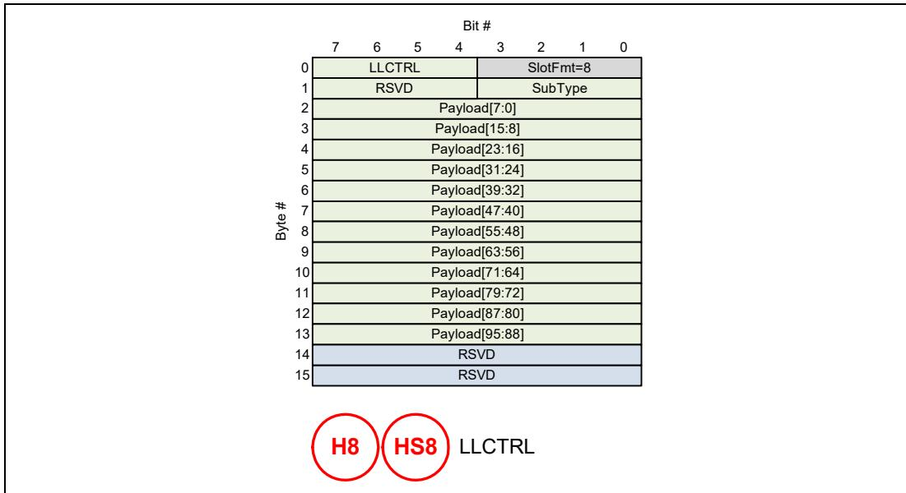

Figure 4-76. 256B Packing: H8/HS8 Link Layer Control Message Slot Format

## 4.3.6.1 Link Layer Initialization

After initial link training (from Link Down), the link layer must send and receive the INIT.Param flit before beginning normal operation. After reaching normal operation, the Link Layer will start by returning all possible credits using the standard credit return mechanism. Normal operation is also required before sending other control messages (IDE, In-band Error).

## 4.3.6.2 Viral Injection and Containment

The Viral control flit is injected as soon as possible after the viral condition is observed. For cases in which the error that triggers Viral can impact the current flit, the link layer should signal to the physical layer to stop the currently partially sent CXL.cachemem flit (Flit 0) by injection of a CRC/FEC corruption that ensures a retry condition (note that this does not directly impact CXL.io flits or flits that are being replayed from the Physical Layer retry buffer). Then the Logical Physical Layer will also remove that flit (Flit 0) from the retry buffer and replace it with the Viral control flit (Flit 1) that must be sent immediately by the link layer. The Link Layer must also resend the flit that was corrupted (Flit 0) after the viral flit. Figure 4-77 captures an example of a Link Layer to Logical Physical Layer (LogPhy) with a half-flit interface where CRC is corrupted and Viral is injected. At Cycle “x3”, it is signaled to corrupt the current flit (FlitA). At Cycle “x4”, the CRC(bad) is indicated and the link layer starts sending the Viral control. In Cycle “x5”, the retry buffer pointer (WrPtr) is stepped back to ensure that FlitA is removed from the retry buffer and then replaced with the Viral flit sent from the link layer. At Cycle “x6”, the CTRL-Viral flit is also sent with corrupted CRC to ensure the full retry flow (disallowing the single flit retry). Also starting at Cycle “x6”, FlitA is resent from the link layer and forwarded normally through the LogPhy and retry buffer. FlitA is identical to the flit started in Cycle “x2”.

With link IDE enabled and 256B Standard Flit mode negotiated, this flow works the same and FlitA is retransmitted with the same encryption mask and without altering the integrity state. The control message is not included in link IDE and thus does not impact the IDE requirements. With link IDE enabled and 256B Latency-Optimized Flit mode negotiated, a Viral in HS and the following Slots 9 to 14 carrying 0s will be encrypted and integrity protected.

Figure 4-77. Viral Error Message Injection Standard 256B Flit  
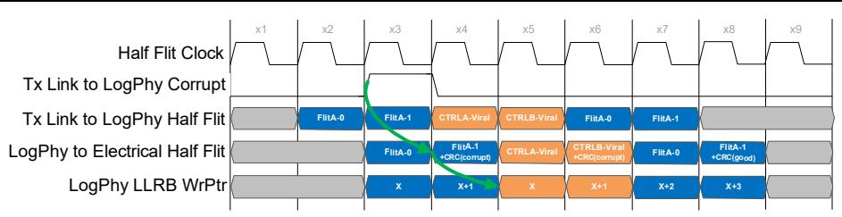

The Error signaling with CRC corruption flow requires special handling for LOpt flits. If the link layer is in the first 128B phase of the flit, the flow is identical to Standard Flit mode. However, if the link layer is in the second phase of the 128B flit (when the first 128B was committed), then the flit corruption is guaranteed only on the second half, but the Physical Layer will remove the entire flit from the retry buffer. The link layer will send the first 128B identically to what was sent before, and then the link layer will inject the Viral control message in Slot 8 (HS-format) and Slots 9 to 14 are considered RSVD and normal operation continues in the next flit. Any data slots and other message encodings are continued in the next flit. Figure 4-78 captures the unique case for the LOpt flit. The difference from the standard 256B flit is in three areas of this flow. First at Cycle “x4”, the link layer resends FlitA-0 because this half of the flit may have already been consumed. Then at Cycle “x5”, in the second half of that flit, the link layer injects the control message for Viral (after the final portion of Slot 7). At Cycle “x6”, the second half of the original flit (starting with Slot 8) is repacked in the first half of FlitB following the standard packing rules.

This flow cannot be supported with link IDE, thus any error containment must either be detected sufficiently early to corrupt the CRC in the first half of the flit, or must be injected in the second half of the flit without corrupting the CRC.

Figure 4-78. Viral Error Message Injection LOpt 256B Flit

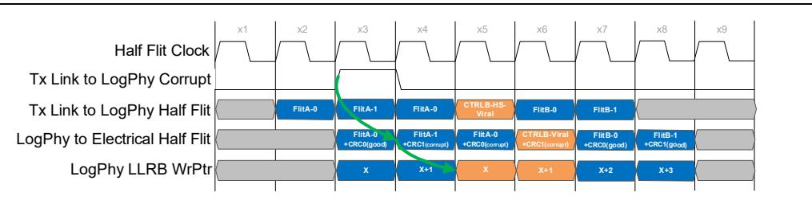

## 4.3.6.3 Late Poison

Late poison applies to cases in which the header is already sent and the Tx intends to poison the corresponding data. For cases in which the header is not already sent, the Tx must poison the header if the Tx intends to poison the corresponding data. Poison can be injected at a point after the header was sent by injecting an Error Control message with the Poison sub-type. The message includes a payload encoding that indicates the data message offset at which the poison applies. It is possible that any one of up to eight active messages can be targeted. In 256B Flit mode, in all cases, and with link IDE enabled, a maximum of eight back-to-back In-band Error Poison control flits can be sent every two protocol flits. If more In-band Error Poison control flits are received and the containment buffer overflows, the receiver must set the Rx Error Status field in the CXL IDE Error Status register (see Table 8-136) to 9h “Containment Buffer Overflow” and then transition to Insecure State. The encoding is an offset that is relative to the data that is yet to be sent, including the currently active data transmission. The poison applies to the entire message payload, just as it does when poison is included in the message header.

If a message is currently active, but not all data slots have been sent, the offset value of zero applies to that message. If a receiver implementation uses “wormhole switching” techniques, where data is forwarded through the on-die fabric before all the data has arrived, then it is possible that data already sent may be consumed. In this case, the only guarantee is that the poison is applied to the remaining data after the poison control message. The following are examples of how this would apply in specific cases.

## Example 1:

• Flit 1 — 1st three slots of data Message A in Slots 12 to 14.

• Flit 2 — In-band error poison message in Slot 0 with a poison message offset value of 0.

• Flit 3 — 4th slot of data Message A in Slot 1 and data Message B in Slots 2 to 5.

• The poison control message applies to Message A, but is only guaranteed to be applied to the final data slot of that message. But it may also be applied to the entire message.

## Example 2:

• Flit 1 — Four slots of data Message A in Slots 11 to 14 where the message header has the Byte-Enables Present (BEP) bit or Trailer Present (TRP) bit set.

• Flit 2 — In-band error poison message in Slot 0 with a poison message offset value of 0.

• Flit 3 — The Trailer (e.g., Byte enables) for data Message A in Slot 1 and data Message B in Slots 2 to 5.

• The poison control message applies to Message A, but is not guaranteed to be applied to any of the data because it was already sent. Note that the use of Trailer in this example could be any supported trailer (e.g., Extended Meta Data and/or Byte-Enables).

## Example 3:

• Flit 1 — 1st three slots of data Message A in Slots 12 to 14.

• Flit 2 — In-band error poison message in Slot 0 with a poison message offset value of 1.

• Flit 3 — 4th slot of data Message A in Slot 1 and data Message B in Slots 2 to 5.

• The poison control message applies to Message B.

To inject poison on data that is scheduled to be sent in the current flit, and no H-slot/ HS-slot exists to interrupt the data transmission, the same CRC corruption flows as described in Section 4.3.6.2 are used.

## 4.3.6.3.1 Data Carrying Messages on 256B Flits Sequence

A 256B flit has 15 slots and there can be at most 14 slots of data because Slot 0 is an H-slot and cannot carry data.

Every two 256B flits there can be, at most, eight data-carrying messages and seven as maximum average (because one data-carrying message will overflow to the next flit):

• First flit can carry data for at most five active messages:

— One slot for the last 16 bytes of data message carried from the previous flit

— 12 slots for three data messages × 64 bytes

— One slot for the first 16 bytes of data message • Second flit can carry at most three new active messages plus one started in the previous flit

— Three slots for the last 48 bytes of data message carried from the previous flit

— Eight slots for two data messages × 64 bytes

— Three slots for the first 48 bytes of data message

## 4.3.6.4 Link Integrity and Data Encryption (IDE)

For the IDE flow, see Chapter 11.0.

## Credit Return Forcing

To avoid starvation, credit return rules ensure that Credits are sent even when there are no protocol messages pending. In 68B Flit mode, this uses a special control message, LLCRD (see Section 4.2.8.2 for a description of the LLCRD algorithm). For 256B Flit mode, the same underlying algorithm for forcing is used, but with the following changes:

• Ack forcing is not applicable with 256B flit.

• With 256B flits, CRD is part of standard flit definition, so no special control message is required.

• There is a packing method described in Section 4.3.8. When implementing this algorithm, the end of the flit is tagged as empty if no valid messages and no Credit return is included. With this flit packing method, the flit should return a nonzero credit value only if there are other valid messages sent unless the credit forcing algorithm has triggered.

• No requirement to prioritize protocol messages vs. CRD because they are both part of 256B flits.

## Latency Optimizations

To get the best latency characteristics, the 256B flit is expected to be sent with a link layer implementing 64B or 128B pipeline and the Latency-Optimized flit (which is optional). The basic reasoning for these features is self-evident.

Additional latency optimization is possible sending idle slot scheduling of flits to the ARB/MUX which avoids needing to wait for the next start of flit alignment. There are trade-offs between CXL.io vs. empty slots being scheduled, so overall bandwidth should be considered.

## IMPLEMENTATION NOTE

A case to consider for idle slot scheduling is with a Link Layer pipeline of 64B in which idle slots allow late-arriving messages to be packed later in the flit. By doing this, the Transmitter can avoid stalls by starting the flit with empty slots. An example case of this is with a x4 port in which a message shows and just misses the first 64B of the flit. In this case, it is necessary to wait an additional 192B before sending the message because the ARB/MUX is injecting an empty flit or a flit from CXL.io. In this example, the observed additional latency at 64 GT/s link speed on a x4 link would be 6 ns (192 bytes/x4 \* 8 bits/byte / 64 GT/s); at 128 GT/s link speed the additional latency on a x4 link would be 3 ns.

## 4.3.8.1 Empty Flit

As part of the latency optimizations described in this chapter, the Link Layer needs to include a way to indicate that the current flit does not have messages or CRD information. The definition of Empty in this context is that the entire flit can be dropped without side effects in the Link Layer:

• No Data Slots are sent

• No Valid bits are set in any protocol slots

• No control message is sent

• No Credits are returned in the CRD field

A special encoding of the CRD field provides this such that CRD[4:0] = 01h as captured in Table 4-19.

When IDE is enabled, the Empty Encoding shall not used as all protocol flits are required to be fully processed.

## CXL ARB/MUX

Figure 5-1 shows where the CXL ARB/MUX exists in the Flex Bus layered hierarchy. The ARB/MUX provides dynamic muxing of the CXL.io and CXL.cachemem link layer control and data signals to interface with the Flex Bus physical layer.

Figure 5-1. Flex Bus Layers — CXL ARB/MUX Highlighted

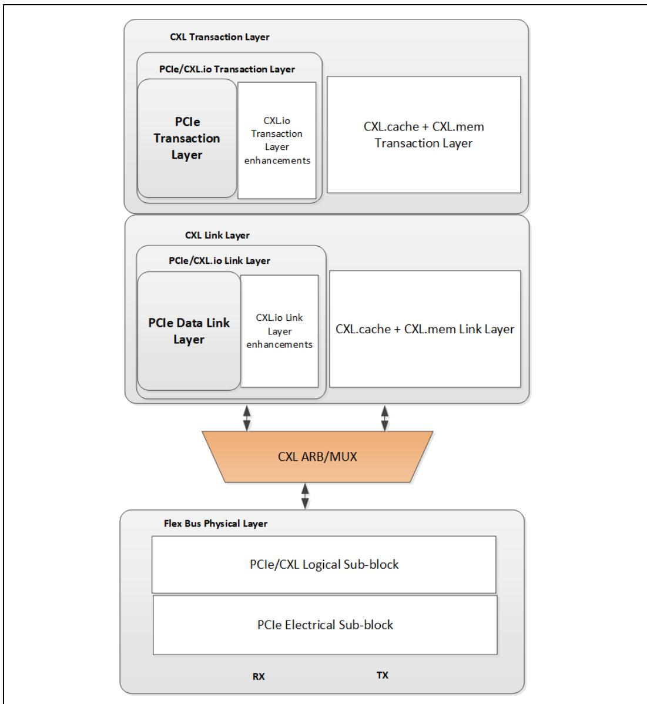

In the transmit direction, the ARB/MUX arbitrates between requests from the CXL link layers and multiplexes the data. It also processes power state transition requests from the link layers: resolving them to a single request to forward to the physical layer, maintaining virtual link state machines (vLSMs) for each link layer interface, and generating ARB/MUX link management packets (ALMPs) to communicate the power state transition requests across the link on behalf of each link layer. See Section 10.3, Section 10.4, and Section 10.5 for additional details on how the ALMPs are utilized in the overall flow for power state transitions. In PCIe\* mode, the ARB/MUX is bypassed, and thus ALMP generation by the ARB/MUX is disabled.

In the receive direction, the ARB/MUX determines the protocol associated with the CXL flit and forwards the flit to the appropriate link layer. It also processes the ALMPs, participating in any required handshakes and updating its vLSMs as appropriate.

For 256B Flit mode, the replay buffer is part of the Physical Layer. ALMPs have a different flit format than in 68B Flit mode, and are protected by forward error correction (FEC) and cyclic redundancy check (CRC). They must also be allocated to the replay buffer in the Physical Layer and follow the replay sequence protocols. Hence, they are guaranteed to be delivered to the remote ARB/MUX error free.

## 5.1 vLSM States

The ARB/MUX maintains vLSMs for each CXL link layer it interfaces with, transitioning the state based on power state transition requests it receives from the local link layer or from the remote ARB/MUX on behalf of a remote link layer. Table 5-1 lists the different possible states for the vLSMs. PM States and Retrain are virtual states that can differ across interfaces (CXL.io, CXL.cache, and CXL.mem); however, all other states such as LinkReset, LinkDisable, and LinkError are forwarded to the Link Layer and are therefore synchronized across interfaces.

Table 5-1. vLSM States Maintained per Link Layer Interface

<table><tr><td>vLSM State</td><td>Description</td></tr><tr><td>Reset</td><td>Power-on default state during which initialization occurs</td></tr><tr><td>Active</td><td>Normal operational state</td></tr><tr><td>Active.PMNAK</td><td>Substate of Active to indicate unsuccessful ALMP negotiation of PM entry. This is not a state requested by the Link Layer. It is applicable only for Upstream Ports. It is not applicable for 68B Flit mode.</td></tr><tr><td>L1.0</td><td>Power savings state, from which the link can enter Active via Retrain (maps to PCIe L1)</td></tr><tr><td>L1.1</td><td>Power savings state, from which the link can enter Active via Retrain (reserved for future use)</td></tr><tr><td>L1.2</td><td>Power savings state, from which the link can enter Active via Retrain (reserved for future use)</td></tr><tr><td>L1.3</td><td>Power savings state, from which the link can enter Active via Retrain (reserved for future use)</td></tr><tr><td>DAPM</td><td>Deepest Allowable PM State (not a resolved state; a request that resolves to an L1 substate)</td></tr><tr><td>SLEEP_L2</td><td>Power savings state, from which the link must go through Reset to reach Active</td></tr><tr><td>LinkReset</td><td>Reset propagation state resulting from software-initiated or hardware-initiated reset</td></tr><tr><td>LinkError</td><td>Link Error state due to hardware-detected errors that cannot be corrected through link recovery (e.g., uncorrectable internal errors or surprise link down)</td></tr><tr><td>LinkDisable</td><td>Software-controlled link disable state</td></tr><tr><td>Retrain</td><td>Transitory state that transitions to Active</td></tr></table>

Note: When the Physical Layer LTSSM enters Hot Reset or Disabled state, that state is communicated to all link layers as LinkReset or LinkDisable, respectively. No ALMPs are exchanged, regardless of who requested them, for these transitions. LinkError must take the LTSSM to Detect or Disabled. For example, it is permitted to map CXL.io Downstream Port Containment to LinkError (when the LTSSM is in Disabled state).

The ARB/MUX looks at the state of each vLSM to resolve to a single state request to forward to the physical layer as specified in Table 5-2. For example, if the current vLSM[0] state is L1.0 (row = L1.0) and the current vLSM[1] state is Active (column = Active), then the resolved request from the ARB/MUX to the Physical layer will be Active.

Table 5-2. ARB/MUX Multiple vLSM Resolution Table

<table><tr><td>Resolved Request from ARB/MUX to Flex Bus Physical Layer (Row = current vLSM[0] state; Column = current vLSM[1] state)</td><td>Reset</td><td>Active</td><td>L1.0</td><td>L1.1 (reserved for future use)</td><td>L1.2 (reserved for future use)</td><td>L1.3 (reserved for future use)</td><td>SLEEP_L2</td></tr><tr><td>Reset</td><td>RESET</td><td>Active</td><td>L1.0</td><td>L1.1 or lower</td><td>L1.2 or lower</td><td>L1.3 or lower</td><td>SLEEP_L2</td></tr><tr><td>Active</td><td>Active</td><td>Active</td><td>Active</td><td>Active</td><td>Active</td><td>Active</td><td>Active</td></tr><tr><td>L1.0</td><td>L1.0</td><td>Active</td><td>L1.0</td><td>L1.0</td><td>L1.0</td><td>L1.0</td><td>L1.0</td></tr><tr><td>L1.1 (reserved for future use)</td><td>L1.1 or lower</td><td>Active</td><td>L1.0</td><td>L1.1 or lower</td><td>L1.1 or lower</td><td>L1.1 or lower</td><td>L1.1 or lower</td></tr><tr><td>L1.2 (reserved for future use)</td><td>L1.2 or lower</td><td>Active</td><td>L1.0</td><td>L1.1 or lower</td><td>L1.2 or lower</td><td>L1.2 or lower</td><td>L1.2 or lower</td></tr><tr><td>L1.3 (reserved for future use)</td><td>L1.3 or lower</td><td>Active</td><td>L1.0</td><td>L1.1 or lower</td><td>L1.2 or lower</td><td>L1.3 or lower</td><td>L1.3 or lower</td></tr><tr><td>SLEEP_L2</td><td>SLEEP_L2</td><td>Active</td><td>L1.0</td><td>L1.1 or lower</td><td>L1.2 or lower</td><td>L1.3 or lower</td><td>SLEEP_L2</td></tr></table>

Based on the requested state from one or more of the Link Layers, ARB/MUX wil change the state request to the physical layer for the desired link state.

For implementations in which the Link Layers support directing the ARB/MUX to LinkReset or LinkError or LinkDisable, the ARB/MUX must unconditionally propagate these requests from the requesting Link Layer to the Physical Layer; this takes priority over Table 5-2.

Table 5-3 describes the conditions under which a vLSM transitions from one state to the next. A transition to the next state occurs after all the steps in the trigger conditions column are complete. Some of the trigger conditions are sequential and indicate a series of actions from multiple sources. For example, on the transition from Active to L1.x state on an Upstream Port, the state transition will not occur until the vLSM has received a request to enter L1.x from the Link Layer followed by the vLSM sending a Request ALMP{L1.x} to the remote vLSM. Next, the vLSM must wait to receive a Status ALMP{L1.x} from the remote vLSM. Once all these conditions are met in sequence, the vLSM will transition to the L1.x state as requested. Certain trigger conditions are applicable only when operating in 68B Flit mode, and these are highlighted in the table as “For 68B Flit mode only.”

Table 5-3. ARB/MUX State Transition Table (Sheet 1 of 2)

<table><tr><td>Current vLSM State</td><td>Next State</td><td>Upstream Port Trigger Condition</td><td>Downstream Port Trigger Condition</td></tr><tr><td rowspan="3">Active</td><td>L1.x</td><td>Upon receiving a Request to enter L1.x from Link Layer, the ARB/MUX must initiate a Request ALMP{L1.x} and receive a Status ALMP{L1.x} from the remote vLSM.</td><td>Upon receiving a Request to enter L1.x from Link Layer and receiving a Request ALMP{L1.x} from the Remote vLSM, the ARB/MUX must send Status ALMP{L1.x} to the remote vLSM.</td></tr><tr><td>L2</td><td>Upon receiving a Request to enter L2 from Link Layer the ARB/MUX must initiate a Request ALMP{L2} and receive a Status ALMP{L2} from the remote vLSM.</td><td>Upon receiving a Request to enter L2 from Link Layer and receiving a Request ALMP{L2} from the Remote vLSM the ARB/MUX must send Status ALMP{L2} to the remote vLSM.</td></tr><tr><td>Active.PMNAK</td><td>For 256B Flit mode: Upon receiving a PMNAK ALMP from the Downstream Port ARB/MUX.This arc is not applicable for 68B Flit mode.</td><td>N/A</td></tr><tr><td>Active.PMNAK</td><td>Active</td><td>For 256B Flit mode: Upon receiving a request to enter Active from the Link Layer (see Section 5.1.2.4.2.2).This arc is not applicable for 68B Flit mode.</td><td>N/A</td></tr><tr><td>L1.x</td><td>Retrain</td><td>Upon receiving an ALMP Active request from remote ARB/MUX.</td><td>Upon receiving an ALMP Active request from remote ARB/MUX.</td></tr><tr><td>Active</td><td>Retrain</td><td>For 68B Flit mode only: Any of the following two conditions are met:Physical Layer LTSSM enters Recovery.Physical Layer transitions from Recovery to L0 and State Status ALMP synchronization for Recovery exit resolves to Retrain (see Section 5.1.2.3).For 256B Flit mode, this arc is not applicable because the replay buffer is moved to logPHY, and thus there is no reason to expose Active to Retrain arc to protocol layer vLSMs.</td><td>For 68B Flit mode only: Physical Layer LTSSM enters Recovery.For 256B Flit mode, this arc is not applicable because the replay buffer is moved to logPHY, and thus there is no reason to expose Active to Retrain arc to protocol layer vLSMs.</td></tr><tr><td>Retrain</td><td>Active</td><td>Link Layer is requesting Active and any of the following conditions are met:For 68B Flit mode only: Physical Layer transitions from Recovery to L0 and State Status ALMP synchronization for Recovery exit resolves to Active.For 68B Flit mode only: Physical Layer transitions from Recovery to L0 and State Status ALMP synchronization for Recovery exit does not resolve to Active. Entry to Active ALMP exchange protocol is complete (see Section 5.1.2.2).Physical Layer has been in L0. Entry to Active ALMP exchange protocol is complete (see Section 5.1.2.2).</td><td>Link Layer is requesting Active and any of the following conditions are met:For 68B Flit mode only: Physical Layer transitions from Recovery to L0 and State Status ALMP synchronization for Recovery exit resolves to Active.For 68B Flit mode only: Physical Layer transitions from Recovery to L0 and State Status ALMP synchronization for Recovery exit does not resolve to Active. Entry to Active ALMP exchange protocol is complete (see Section 5.1.2.2).Physical Layer has been in L0. Entry to Active ALMP exchange protocol is complete (see Section 5.1.2.2).</td></tr><tr><td>Retrain</td><td>Reset</td><td>For 68B Flit mode: Physical Layer transitions from Recovery to L0 and State Status ALMP synchronization for Recovery exit resolves to Reset (see Section 5.1.2.3).For 256B Flit mode, this arc is N/A.</td><td>N/A</td></tr></table>

Table 5-3. ARB/MUX State Transition Table (Sheet 2 of 2)

<table><tr><td>Current vLSM State</td><td>Next State</td><td>Upstream Port Trigger Condition</td><td>Downstream Port Trigger Condition</td></tr><tr><td>ANY (Except Disable/LinkError)</td><td>LinkReset</td><td>Physical Layer LTSSM in Hot Reset.</td><td>Physical Layer LTSSM in Hot Reset.</td></tr><tr><td>ANY (Except LinkError)</td><td>Disabled</td><td>Physical Layer LTSSM in Disabled state.</td><td>Physical Layer LTSSM in Disabled state.</td></tr><tr><td>ANY</td><td>LinkError</td><td>Directed to enter LinkError from Link Layer or indication of LinkError from Physical Layer.</td><td>Directed to enter LinkError from Link Layer or indication of LinkError from Physical Layer.</td></tr><tr><td>L2</td><td>Reset</td><td>Implementation  $Specific^1$ .</td><td>Implementation  $Specific^1$ .</td></tr><tr><td>Disabled</td><td>Reset</td><td>Implementation  $Specific^1$ .</td><td>Implementation  $Specific^1$ .</td></tr><tr><td>LinkError</td><td>Reset</td><td>Implementation  $Specific^1$ .</td><td>Implementation  $Specific^1$ .</td></tr><tr><td>LinkReset</td><td>Reset</td><td>Implementation  $Specific^1$ .</td><td>Implementation  $Specific^1$ .</td></tr><tr><td>Reset</td><td>Active</td><td>Any of the following conditions are met:• Link Layer is asking for Active and Entry to Active ALMP exchange protocol is complete (see Section 5.1.2.2).• For 68B Flit mode only: Physical Layer transitions from Recovery to L0 and State Status ALMP synchronization for Recovery exit resolves to Active (see Section 5.1.2.3).</td><td>Any of the following conditions are met:• Link Layer is asking for Active and Entry to Active ALMP exchange protocol is complete (see Section 5.1.2.2).• For 68B Flit mode only: Physical Layer transitions from Recovery to L0 and State Status ALMP synchronization for Recovery exit resolves to Active (see Section 5.1.2.3).</td></tr></table>

1. See Rule 3 in Section 5.1.1 for details.

## Additional Rules for Local vLSM Transitions

1. For 68B Flit mode, if any Link Layer requests entry into Retrain to the ARB/MUX, the ARB/MUX must forward the request to the Physical Layer to initiate LTSSM transition to Recovery. In accordance with the Active to Retrain transition trigger condition, after the LTSSM is in Recovery, the ARB/MUX should reflect Retrain to all vLSMs that are in Active state. For 256B Flit mode, there is no Active to Retrain arc in the ARB/MUX vLSM because Physical Layer LTSSM transitions to Recovery do not impact vLSM state.

For 256B Flit mode: Not exposing the Physical Layer LTSSM transition to Recovery to the Link Layer vLSMs allows for optimizations in which the Rx Retry buffer can drain while the LTSSM is in Recovery. It also avoids corner cases in which the vLSMs become out of sync with the remote Link partner. To handle error conditions such as UpdateFC DLLP timeouts, implementations must have a sideband mechanism from the Link Layers to the Physical Layer for triggering the LTSSM transition to Recovery.

2. Once a vLSM is in Retrain state, it is expected that the corresponding Link Layer will eventually request ARB/MUX for a transition to Active.

3. If the LTSSM moves to Detect, each vLSM must eventually transition to Reset.

## Rules for vLSM State Transitions across Link

This section refers to vLSM state transitions.

## 5.1.2.1 General Rules

• The link cannot operate for any other protocols if the CXL.io protocol is down (CXL.io operation is a minimum requirement)

## 5.1.2.2 Entry to Active Exchange Protocol

The ALMP protocol required for the entry to active consists of 4 ALMP exchanges between the local and remote vLSMs as seen in Figure 5-2. Entry to Active begins with an Active State Request ALMP sent to the remote vLSM which responds with an Active State Status ALMP. The only valid response to an Active State Request is an Active State Status once the corresponding Link Layer is ready to receive protocol flits. The remote vLSM must also send an Active State Request ALMP to the local vLSM which responds with an Active State Status ALMP.

During initial link training, the Upstream Port (UP in Figure 5-2) must wait for a nonphysical layer flit (i.e., a flit that was not generated by the physical layer of the Downstream Port (DP in Figure 5-2)) before transmitting any ALMPs (see Section 6.4.1). Thus, during initial link training, the first ALMP is always sent from the Downstream Port to the Upstream Port. If additional Active exchange handshakes subsequently occur (e.g., as part of PM exit), the Active request ALMP can be initiated from either side.

Once an Active State Status ALMP has been sent and received by a vLSM, the vLSM transitions to Active State.

Figure 5-2. Entry to Active Protocol Exchange

<table><tr><td rowspan="5">vLSMStatus = Reset</td><td rowspan="5">DPLTSSM</td><td>CHANNEL</td><td rowspan="5">UPLTSSM</td><td rowspan="5">vLSMStatus = Reset</td></tr><tr><td>STATE_REQ ALMP {ACTIVE} vLSM[0]</td></tr><tr><td>STATE_STS ALMP {ACTIVE} vLSM[0]</td></tr><tr><td>STATE_REQ ALMP {ACTIVE} vLSM[0]</td></tr><tr><td>STATE_STS ALMP {ACTIVE} vLSM[0]</td></tr></table>

## 5.1.2.3 Status Synchronization Protocol

For 256B Flit mode, because the retry buffer is in the physical layer, all ALMPs are guaranteed to be delivered error free to the remote ARB/MUX. Additionally, all ALMPs are guaranteed to get a response. Therefore, there is no scenario where the Upstream Port and Downstream Port vLSMs can become out of sync.

Status Synchronization Protocol is only applicable for 68B Flit mode. The following description and rules are applicable for 68B Flit mode.

After the highest negotiated speed of operation is reached during initial link training, all subsequent LTSSM Recovery transitions must be signaled to the ARB/MUX. vLSM Status Synchronization Protocol must be performed after Recovery exit. A Link Layer cannot conduct any other communication on the link coming out of LTSSM recovery until Status Synchronization Protocol is complete for the corresponding vLSM. Figure 5-3 shows an example of Status Synchronization Protocol.

The Status Synchronization Protocol completion requires the following events in the order listed:

1. Status Exchange: Transmit a State Status ALMP, and receive an error free State Status ALMP. The state indicated in the transmitted State Status ALMP is a snapshot of the vLSM state. See Section 5.1.2.3.1.

2. A corresponding State Status Resolution based on the sent and received State Status ALMPs during the synchronization exchange. See Table 5-4 for determining the resolved vLSM state.

3. New State Request and Status ALMP exchanges when applicable. This occurs if the resolved vLSM state is not the same as the Link Layer requested state.

## 5.1.2.3.1 vLSM Snapshot Rule

A STATUS\_EXCHANGE\_PENDING variable is used to determine when a snapshot of the vLSM can be taken. The following rules apply:

• Snapshot of the vLSM is taken before entry to LTSSM Recovery if the STATUS\_EXCHANGE\_PENDING variable is cleared for that vLSM

• STATUS\_EXCHANGE\_PENDING variable is set for a vLSM once a snapshot is taken

• STATUS\_EXCHANGE\_PENDING variable is cleared on reset or on completion of Status Exchange (i.e., Transmit a State Status ALMP, and receive an error free State Status ALMP)

This is to account for situations where a corrupted State Status ALMP during Status Exchange can lead to additional LTSSM transitions through Recovery. See Figure 5-16 for an example of this flow.

Figure 5-3. Example Status Exchange  
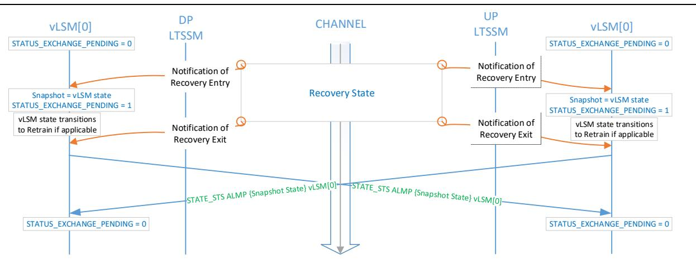

vLSM State Resolution after Status Exchange

<table><tr><td>No.</td><td>Sent Status ALMP</td><td>Received Status ALMP</td><td>Resolved vLSM State</td></tr><tr><td>1.</td><td>Reset</td><td>Reset</td><td>Reset</td></tr><tr><td>2.</td><td>Reset</td><td>Active</td><td>Active</td></tr><tr><td>3.</td><td>Reset</td><td>L2</td><td>Reset</td></tr><tr><td>4.</td><td>Active</td><td>Reset</td><td>Active</td></tr><tr><td>5.</td><td>Active</td><td>Active</td><td>Active</td></tr><tr><td>6.</td><td>Active</td><td>Retrain</td><td>Active</td></tr><tr><td>7.</td><td>Active</td><td>L1.x</td><td>Retrain</td></tr><tr><td>8.</td><td>Active</td><td>L2</td><td>Reset</td></tr><tr><td>9.</td><td>Retrain</td><td>Active</td><td>Active</td></tr><tr><td>10.</td><td>Retrain</td><td>Retrain</td><td>Retrain</td></tr><tr><td>11.</td><td>Retrain</td><td>L1.x</td><td>Retrain</td></tr><tr><td>12.</td><td>L1.x</td><td>Active</td><td>L1.x</td></tr><tr><td>13.</td><td>L1.x</td><td>Retrain</td><td>L1.x</td></tr><tr><td>14.</td><td>L1.x</td><td>L1.x</td><td>L1.x</td></tr><tr><td>15.</td><td>L2</td><td>Active</td><td>L2</td></tr><tr><td>16.</td><td>L2</td><td>Reset</td><td>L2</td></tr><tr><td>17.</td><td>L2</td><td>L2</td><td>L2</td></tr></table>

## Notes on State Resolution after Status Exchange (Table 5-4)

• For the rows where the resolved state is Active, the corresponding ARB/MUX must ensure that protocol flits received immediately after the State Status ALMP from remote ARB/MUX can be serviced by the Link Layer of the corresponding vLSM. One way to guarantee this is to ensure that for these cases the Link Layer receiver is ready before sending the State Status ALMP during Status Exchange.

• Rows 7 and 11 will result in L1 exit flow following state resolution. The corresponding ARB/MUX must initiate a transition to Active through new State Request ALMPs. Once both the Upstream Port VLSM and Downstream Port vLSM are in Active, the Link Layers can redo PM entry negotiation if required. Similarly, for row 10 if reached during PM negotiation, it is required for both vLSMs to initiate Active request ALMPs.

• When supported, rows 3 and 8 will result in L2 exit flow following state resolution. Because the LTSSM will eventually move to Detect, each vLSM will eventually transition to Reset state.

• Rows 7 and 8 are applicable only for Upstream Ports. Because entry into PM is always initiated by the Upstream Port, and it cannot transition its vLSM to PM unless the Downstream Port has done so, there is no case where these rows can apply for Downstream Ports.

• Behavior is undefined and implementation specific for combinations not captured in Table 5-4.

## 5.1.2.4 State Request ALMP

The following rules apply for sending a State Request ALMP. A State Request ALMP is sent to request a state change to Active or PM. For PM, the request can only be initiated by the ARB/MUX on the Upstream Port.

## 5.1.2.4.1 For Entry into Active

• All Recovery state operations must complete before the entry to Active sequence starts. For 68B Flit mode, this includes the completion of Status Synchronization Protocol after LTSSM transitions from Recovery to L0.

• An ALMP State Request is sent to initiate the entry into Active State.

• A vLSM must send a Request and receive a Status before the transmitter is considered active. This is not equivalent to vLSM Active state.

• Protocol layer flits must only be transmitted once the vLSM has reached Active state.

Figure 5-4 shows an example of entry into the Active state. The flows in Figure 5-4 show four independent actions (ALMP handshakes) that may not necessarily occur in the order or small timeframe shown. The vLSM transmitter and receiver may become active independent of one another. Both transmitter and receiver must be active before the vLSM state is Active. The transmitter becomes active after a vLSM has transmitted a Request ALMP{Active} and received a Status ALMP{Active}. The receiver becomes active after a vLSM receives a Request ALMP{Active} and sends a Status ALMP{Active} in response.

See Section 5.1.2.2 for rules regarding the Active State Request/Status handshake protocol.

Figure 5-4. CXL Entry to Active Example Flow  
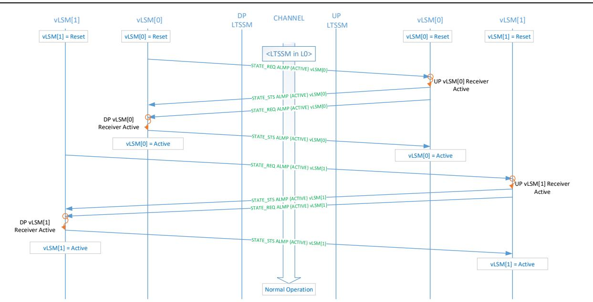

## 5.1.2.4.2 For Entry into PM State (L1/L2)

• An ALMP State Request is sent to initiate the entry into PM States. Only Upstream Ports can initiate entry into PM states.

• For Upstream Ports, a vLSM must send a Request and receive a Status before the PM negotiation is considered complete for the corresponding vLSM.

Figure 5-5 shows an example of Entry to PM State (L1) initiated by the Upstream Port (UP in the figure) ARB/MUX. Each vLSM will be ready to enter L1 State once the vLSM has sent a Request ALMP{L1} and received a Status ALMP{L1} in return or the vLSM has received a Request ALMP{L1} and sent a Status ALMP{L1} in return. The vLSMs operate independently and actions may not complete in the order or within the timeframe shown. Once all vLSMs are ready to enter PM State (L1), the Channel will complete the EIOS exchange and enter L1.

## Figure 5-5. CXL Entry to PM State Example

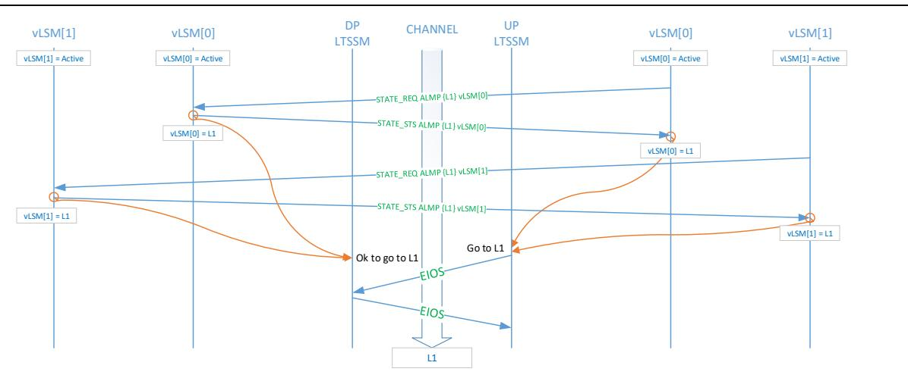

## 5.1.2.4.2.1 PM Retry and Reject Scenarios for 68B Flit Mode

This section is applicable for 68B Flit mode only. If PM entry is not accepted by the Downstream Port, it must not respond to the PM State Request. In this scenario:

• The Upstream Port is permitted to retry entry into PM with another PM State Request after a 1-ms (not including time spent in recovery states) timeout, when waiting for a response for a PM State Request. Upstream Port must not expect a PM State Status response for every PM State Request ALMP. Even if the Upstream Port has sent multiple PM State Requests because of PM retries, if it receives a single PM State Status ALMP, it must move the corresponding vLSM to the PM state indicated in the ALMP. For a Downstream Port, if the vLSM is Active and it has received multiple PM State Request ALMPs for that vLSM, it is permitted to treat the requests as a single PM request and respond with a single PM State Status only if the vLSM transitions into the PM state. Figure 5-6 shows an example of this flow.

Figure 5-6. Successful PM Entry following PM Retry  


• The Upstream Port is also permitted to abort entry into PM by sending an Active State Request ALMP for the corresponding vLSM. Two scenarios are possible in this case:

Downstream Port receives the Active State Request before the commit point of PM acceptance. The Downstream Port must abort PM entry and respond with Active State Status ALMP. The Upstream Port can begin flit transfer toward the Downstream Port once Upstream Port receives Active State Status ALMP. Because the vLSMs are already in Active state and flit transfer was already allowed from the Downstream Port to the Upstream Port direction during this flow, there is no Active State Request ALMP from the Downstream Port-to-Upstream Port direction. Figure 5-7 shows an example of this flow.

Figure 5-7. PM Abort before Downstream Port PM Acceptance  
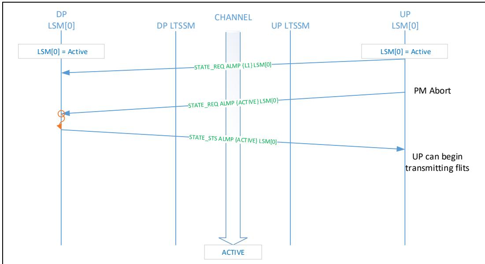

— Downstream Port receives the Active State Request after the commit point of PM acceptance or after its vLSM is in a PM state. The Downstream Port must finish PM entry and send PM State Status ALMP (if not already done so). The Upstream Port must treat the received PM State Status ALMP as an unexpected ALMP and trigger link Recovery. Figure 5-8 shows an example of this flow.

PM Abort after Downstream Port PM Acceptance  
  
5.1.2.4.2.2 PM Retry and Reject Scenario for 256B Flit Mode

This section is applicable for 256B Flit mode only. Upon receiving a PM Request ALMP, the Downstream Port must respond to it with either a PM Status ALMP or an Active.PMNAK Status ALMP.

It is strongly recommended for the Downstream Port ARB/MUX to send the response ALMP to the Physical Layer within 10 us of receiving the request ALMP from the Physical Layer (the time is counted only during the L0 state of the physical LTSSM, excluding the time spent in the Downstream Port’s Rx Retry buffer for the request, or the time spent in the Downstream Port’s Tx Retry buffer for the response). If the Downstream Port does not meet the conditions to accept PM entry within that time window, it must respond with an Active.PMNAK Status ALMP.

The Downstream Port ARB/MUX must wait for at least 1 us after receiving the PM Request ALMP from the Physical Layer before deciding whether to schedule an Active.PMNAK Status ALMP.

There is no difference between a PM Request ALMP for PCI-PM vs. ASPM. For both cases on the CXL.io Downstream Port, idle time with respect to lack of TLP flow triggers the Link Layer to request L1 to ARB/MUX. Waiting for at least 1 us on the Downstream Port, the ARB/MUX provides sufficient time for the PCI-PM-related CSR completion from the Upstream Port to the Downstream Port for the write to the non-D0 state to exit the Downstream Port’s CXL.io Link Layer, and reduces the likelihood of returning an Active.PMNAK Status ALMP.

Upon receiving an Active.PMNAK Status ALMP, the Upstream Port must transition the corresponding vLSM to Active.PMNAK state. The Upstream port must continue to receive and process flits while the vLSM state is Active or Active.PMNAK. If PMTimeout (see Section 8.2.5.1) is enabled and a response is not received for a PM Request ALMP within the programmed time window, the ARB/MUX must treat this as an uncorrectable internal error and escalate accordingly.

For Upstream Ports, after the Link Layer requests PM entry, the Link Layer must not change this request until it observes the vLSM status change to either the requested state or Active.PMNAK or one of the non-virtual states (LinkError, LinkReset, LinkDisable, or Reset). If Active.PMNAK is observed, the Link Layer must request Active to the ARB/MUX and wait for the vLSM to transition to Active before transmitting flits or re-requesting PM entry (if PM entry conditions are met).

The PM handshakes are reset by any events that cause physical layer LTSSM transitions that result in vLSM states of LinkError, LinkReset, LinkDisable, or Reset; these can occur at any time. Because these are Link down events, no response will be received for any outstanding Request ALMPs.

Figure 5-9. Example of a PMNAK Flow  
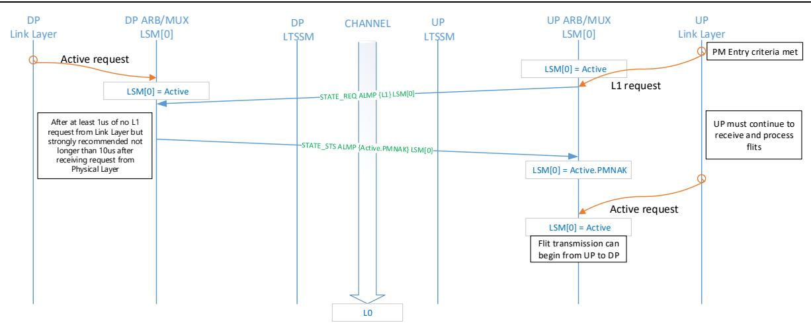

## 5.1.2.5 L0p Support

256B Flit mode supports L0p as defined in the PCIe Base Specification; however, instead of using Link Management DLLPs, the ARB/MUX ALMPs are used to negotiate the L0p width with the Link partner. PCIe rules related to DLLP transmission, corruption, and consequent abandonment of L0p handshakes do not apply to CXL. This section defines the additional rules that are required when ALMPs are used for negotiation of L0p width. See Section 6.9 for information on L0p registers.

When L0p is enabled, the ARB/MUX must aggregate the requested link width indications from the CXL.io and CXL.cachemem Link Layers to determine the L0p width for the physical link. The Link Layers must also indicate to the ARB/MUX whether the L0p request is a priority request (e.g., such as in the case of thermal throttling). The aggregated width must be greater than or equal to the larger link width that is requested by the Link Layers if it is not a priority request. The aggregated width can be greater if the ARB/MUX decides that the two protocol layers combined require a larger width than the width requested by each protocol layer. For example, if CXL.io is requesting a width of x2, and CXL.cachemem is requesting a width of x2, the ARB/MUX is permitted to request and negotiate x4 with the remote Link partner. The specific algorithm for aggregation is implementation specific.

In the case of a priority request from either Link Layer, the aggregated width is the lowest link width that is priority requested by the Link Layers. The ARB/MUX uses L0p ALMP handshakes to negotiate the L0p link width changes with its Link partner.

The following sequence is followed for L0p width changes:

1. Each Link Layer indicates its minimum required link width to the ARB/MUX. It also indicates whether the request is a priority request.

2. If the ARB/MUX determines that the aggregated L0p width is different from the current width of the physical link, the ARB/MUX must initiate an L0p width change request to the remote ARB/MUX using the L0p request ALMP. It also indicates whether the request is a priority request in the ALMP.

3. The ARB/MUX must ensure that there is only one outstanding L0p request at a time to the remote Link partner.

4. The ARB/MUX must respond with an L0p ACK or an L0p NAK to any outstanding L0p request ALMP within 1 us. (The time is counted only during the L0 state of the physical LTSSM. Time is measured from the receipt of the request ALMP from the Physical Layer to the scheduling of the response ALMP from the ARB/MUX to the Physical Layer. The time does not include the time spent by the ALMPs in the Rx or Tx Retry buffers.)

5. Whether to send an L0p ACK or an L0p NAK response must be determined using the L0p resolution rules from the PCIe Base Specification.

6. If PMTimeout (see Section 8.2.5.1) is enabled and a response is not received for an L0p Request ALMP within the programmed time window, the ARB/MUX must treat this as an uncorrectable internal error and escalate accordingly.

7. Once the L0p ALMP handshake is complete, the ARB/MUX must direct the Physical Layer to take the necessary steps for downsizing or upsizing the link, as follows:

a. Downsizing: If the ARB/MUX receives an L0p ACK in response to its L0p request to downsize, the ARB/MUX notifies the Physical Layer to start the flow for transitioning to the corresponding L0p width at the earliest opportunity. If the ARB/MUX sends an L0p ACK in response to an L0p request, the ARB/MUX notifies the Physical Layer to participate in the flow for transitioning to the corresponding L0p width once the downsizing process has been initiated by the remote partner. After a successful L0p width change, the corresponding width must be reflected back to the Link Layers.

b. Upsizing: If the ARB/MUX receives an L0p ACK in response to its L0p request to upsize, the ARB/MUX notifies the Physical Layer to immediately begin the upsizing process. If the ARB/MUX sends an L0p ACK in response to an L0p request, the ARB/MUX notifies the Physical Layer of the new width and an indication to wait for the upsizing process from the remote Link partner. After a successful L0p width change, the corresponding width must be reflected back to the Link Layers.

If the Link has not reached the negotiated L0p width 24 ms after the L0p ACK was sent or received, the ARB/MUX must trigger the Physical Layer to transition the LTSSM to Recovery.

The L0p ALMP handshakes can occur concurrently with vLSM ALMP handshakes. L0p width changes do not affect vLSM states.

In 256B Flit mode, the PCIe-defined PM and Link Management DLLPs are not applicable for CXL.io and must not be used.

Similar to PCIe, the Physical Layer’s entry to Recovery or link down conditions restores the link to its maximum configured width and any Physical Layer states related to L0p are reset as if no width change was made. The ARB/MUX must finish any outstanding L0p handshakes before requesting the Physical Layer to enter a PM state. If the ARB/ MUX is waiting for an L0p ACK or NAK from the remote ARB/MUX when the link enters Recovery, after exit from Recovery, the ARB/MUX must continue to wait for the L0p response, discard that response, and then, if desired, reinitiate the L0p handshake.

## State Status ALMP

## When State Request ALMP Is Received

A State Status ALMP is sent after a valid State Request ALMP is received for Active State (if the current vLSM state is already in Active, or if the current vLSM state is not Active and the request is following the entry into Active protocol) or PM States (when entry to the PM state is accepted). For 68B Flit mode, no State Status ALMP is sent if the PM state is not accepted. For 256B Flit mode, an Active.PMNAK State Status ALMP must be sent if the PM state is not accepted.

## 5.1.2.6.2 Recovery State (68B Flit Mode Only)

The rules in this section apply only for 68B Flit mode. For 256B Flit mode, physical layer Recovery does not trigger the Status Synchronization protocol.

• The vLSM will trigger link Recovery if a State Status ALMP is received without a State Request first being sent by the vLSM except when the State Status ALMP is received for synchronization purposes (i.e., after the link exits Recovery).

Figure 5-10 shows a general example of Recovery exit. See Section 5.1.2.3 for details on the status synchronization protocol.

Figure 5-10. CXL Recovery Exit Example Flow  
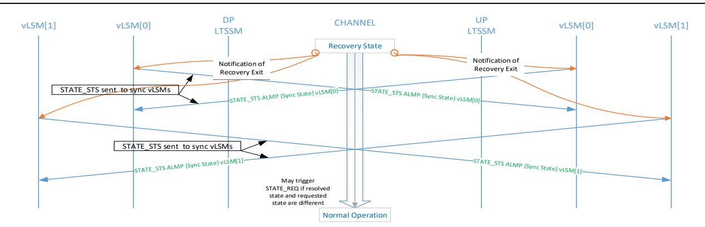

On Exit from Recovery, the vLSMs on either side of the channel will send a Status ALMP to synchronize the vLSMs. The Status ALMPs for synchronization may trigger a State Request ALMP if the resolved state and the Link Layer requested state are not the same, as seen in Figure 5-11. See Section 5.1.2.3 for the rules that apply during state synchronization. The ALMP for synchronization may trigger a re-entry to recovery in the case of unexpected ALMPs. This is explained using the example of initial link training flows in Section 5.1.3.1. If the resolved states from both vLSMs are the same as the Link Layer requested state, the vLSMs are considered to be synchronized and will continue normal operation.

Figure 5-11 shows an example of the exit from a PM State (L1) through Recovery. The Downstream Port (DP in the figure) vLSM[0] in L1 state receives the Active Request, and the link enters Recovery. After the exit from recovery, each vLSM sends Status ALMP{L1} to synchronize the vLSMs. Because the resolved state after synchronization is not equal to the requested state, Request ALMP{Active} and Status ALMP{Active} handshakes are completed to enter Active State.

Figure 5-11. CXL Exit from PM State Example  
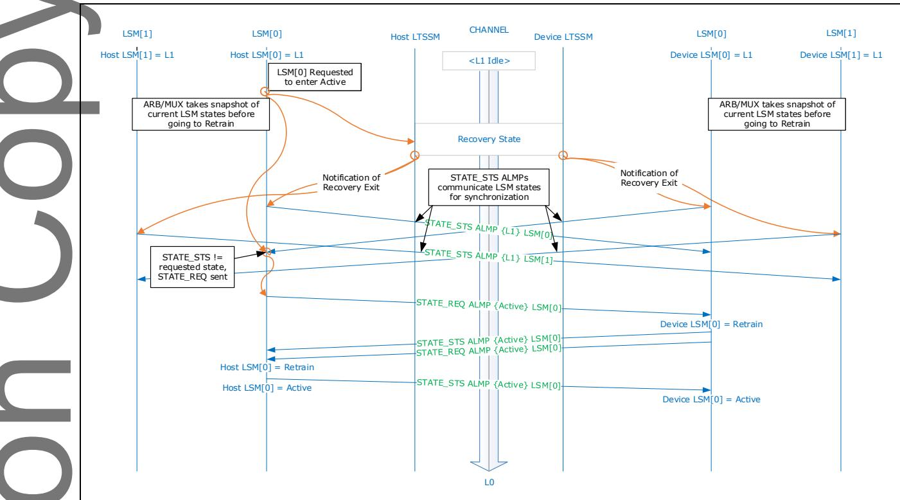

## 5.1.2.7 Unexpected ALMPs (68B Flit Mode Only)

Unexpected ALMPs are applicable only for 68B Flit mode. For 256B Flit mode, there are no scenarios that lead to unexpected ALMPs.

The following situations describe circumstances where an unexpected ALMP will trigger link recovery:

• When performing the Status Synchronization Protocol after exit from recovery, any ALMP other than a Status ALMP is considered an unexpected ALMP and will trigger recovery.

• When an Active Request ALMP has been sent, receipt of any ALMP other than an Active State Status ALMP or an Active Request ALMP is considered an unexpected ALMP and will trigger recovery.

• As outlined in Section 5.1.2.6.2, a State Status ALMP received without a State Request ALMP first being sent is an unexpected ALMP except during the Status Synchronization Protocol.

## Applications of the vLSM State Transition Rules for 68B Flit Mode

## 5.1.3.1 Initial Link Training

As the link trains from 2.5 GT/s speed to the highest supported speed (8.0 GT/s or higher for CXL), the LTSSM may go through several Recovery to L0 to Recovery transitions. Implementations are not required to expose ARB/MUX to all of these Recovery transitions. Depending on whether these initial Recovery transitions are hidden from the ARB/MUX, there are four possible scenarios for the initial ALMP

handshakes. In all cases, the vLSM state transition rules guarantee that the situation will resolve itself with the vLSMs reaching Active state. These scenarios are presented in the following figures. Note that the figures are illustrative examples, and implementations must follow the rules outlined in the previous sections. Only one vLSM handshake is shown in the figures, but the similar handshakes can occur for the second vLSM as well. Figure 5-12 shows an example of the scenario where both the Upstream Port and Downstream Port (UP and DP in the figure, respectively) are hiding the initial recovery transitions from ARB/MUX. Because neither Port saw a notification of recovery entry, both Ports proceed with the exchange of Active request and status ALMPs to transition into the Active state. Note that the first ALMP (Active request ALMP) is sent from the Downstream Port to the Upstream Port.

Both Upstream Port and Downstream Port Hide Recovery Transitions from ARB/MUX

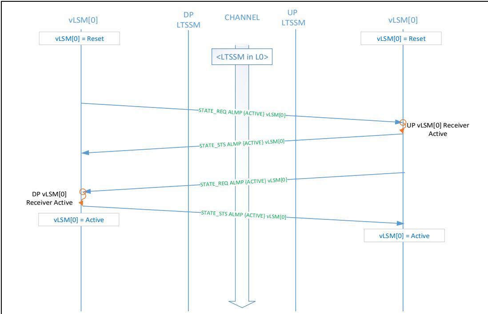

Figure 5-13 shows an example where both the Upstream Port and Downstream Port (UP and DP in the figure, respectively) notify the ARB/MUX of at least one recovery transition during initial link training. In this case, first state status synchronization ALMPs are exchanged (indicating Reset state), followed by regular exchange of Active request and status ALMPs (not explicitly shown). Note that the first ALMP (Reset status) is sent from the Downstream Port to the Upstream Port.

Figure 5-13. Both Upstream Port and Downstream Port Notify ARB/MUX of Recovery Transitions  


Figure 5-14 shows an example of the scenario where the Downstream Port (DP in the figure) hides initial recovery transitions from the ARB/MUX, but the Upstream Port (UP in the figure) does not. In this case, the Downstream Port ARB/MUX has not seen recovery transition, so it begins by sending an Active state request ALMP to the Upstream Port. The Upstream Port interprets this as an unexpected ALMP, which triggers link recovery (which must now be communicated to the ARB/MUX because it is after reaching operation at the highest supported link speed). State status synchronization with state=Reset is performed, followed by regular Active request and status handshakes (not explicitly shown).

Figure 5-14. Downstream Port Hides Initial Recovery, Upstream Port Does Not

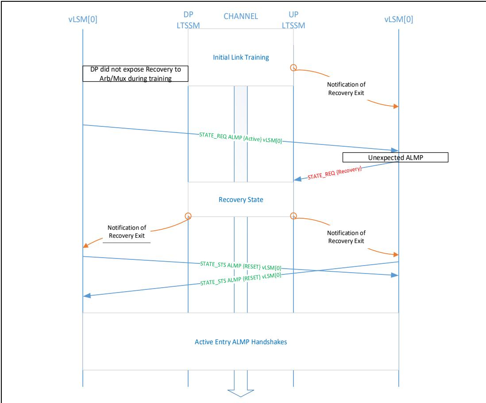

Figure 5-15 shows an example of the scenario where the Upstream Port (UP in the figure) hides initial recovery transitions, but the Downstream Port (DP in the figure) does not. In this case, the Downstream Port first sends a Reset status ALMP. This will cause the Upstream Port to trigger link recovery as a result of the rules in Section 5.1.2.4.2.1 (which must now be communicated to the ARB/MUX because it is after reaching operation at the highest supported link speed). State status synchronization with state=Reset is performed, followed by regular Active request and status handshakes (not explicitly shown).

## Figure 5-15. Upstream Port Hides Initial Recovery, Downstream Port Does Not

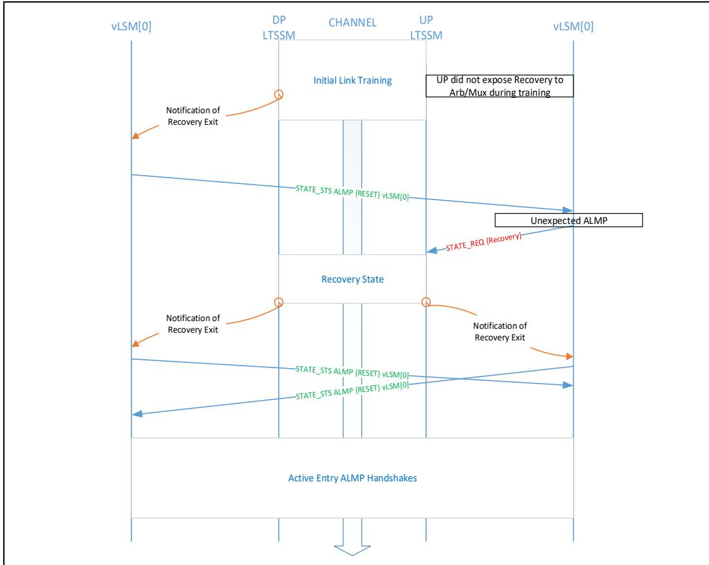

## 5.1.3.2 Status Exchange Snapshot Example

Figure 5-16 shows an example case where a State Status ALMP during Status Exchange gets corrupted for vLSM[1] on the Upstream Port (UP in the figure). A corrupted ALMP is when the lower four DWORDs do not match for a received ALMP; it indicates a bit error on the lower four DWORDs of the ALMP during transmission. The ARB/MUX triggers LTSSM Recovery as a result. When the recovery entry notification is received for the second Recovery entry, the snapshot of vLSM[1] on the Upstream Port is still Active because the status exchanges had not successfully completed.

Figure 5-16. Snapshot Example during Status Synchronization  
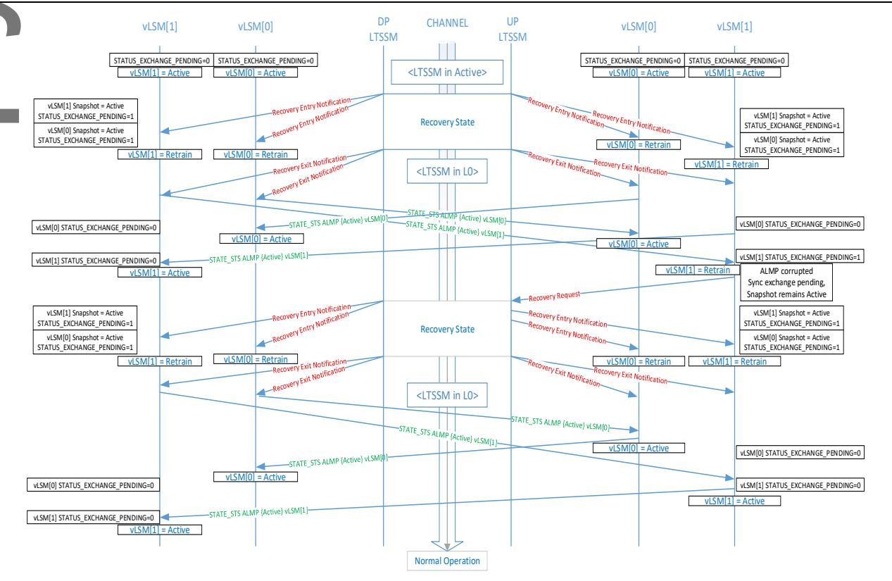

## 5.1.3.3 L1 Abort Example

Figure 5-17 shows an example of a scenario that could arise during L1 transition of the physical link. The scenario begins with successful L1 entry by both vLSMs through corresponding PM request and status ALMP handshakes. The ARB/MUX even requests the Physical Layer to take the LTSSM to L1 for both the Upstream Port and Downstream Port (UP and DP in Figure 5-17, respectively). However, there is a race and one of the vLSMs requests Active before EIOS is received by the Downstream Port Physical Layer. This causes the ARB/MUX to remove the request for L1 entry (L1 Abort), while sending an Active request ALMP to the Upstream Port. When EIOS is eventually received by the physical layer, because the ARB/MUX on the Downstream Port side is not requesting L1 (and there is no support for L0s in CXL), the Physical Layer must take the LTSSM to Recovery to resolve this condition. On Recovery exit, both the Upstream Port and Downstream Port ARB/MUX send their corresponding vLSM state status as part of the synchronization protocol. For vLSM[1], because the resolved state status (Retrain) is not the same as the desired state status (Active), another Active request ALMP must be sent by the Downstream Port to the Upstream Port. Similarly, on the Upstream Port side, the received state status (L1) is not the same as the desired state status (Active because the vLSM moving to Retrain will trigger the Upstream Port link layer to request Active), the Upstream Port ARB/MUX will initiate an Active request ALMP to the Downstream Port. After the Active state status ALMP has been sent and received, the corresponding ARB/MUX will move the vLSM to Active, and the protocol level flit transfer can begin.

Figure 5-17. L1 Abort Example  
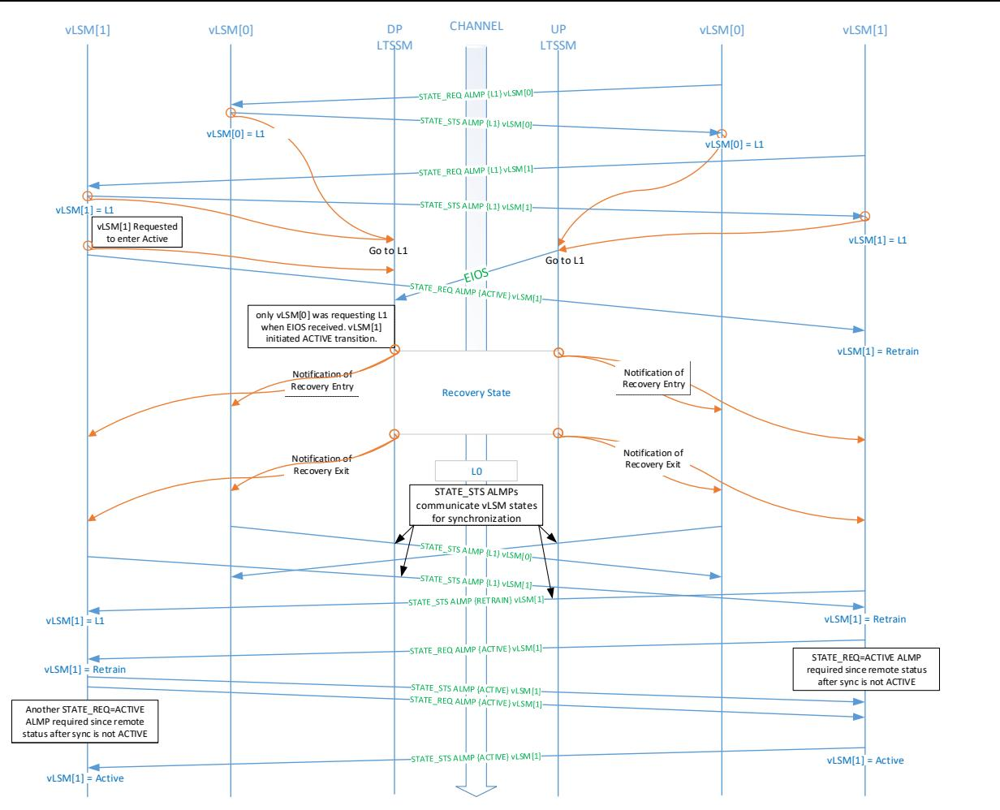

## ARB/MUX Link Management Packets

The ARB/MUX uses ALMPs to communicate virtual link state transition requests and responses associated with each link layer to the remote ARB/MUX.

An ALMP is a 1-DWORD packet with the format shown in Figure 5-18. For 68B Flit mode, this 1-DWORD packet is replicated four times on the lower 16 bytes of a 528-bit flit to provide data integrity protection; the flit is zero-padded on the upper bits. If the ARB/MUX detects an error in the ALMP, it initiates a retrain of the link.

Figure 5-18. ARB/MUX Link Management Packet Format

<table><tr><td rowspan="2"></td><td colspan="8">Byte 0</td><td colspan="8">Byte 1</td><td colspan="8">Byte 2</td><td colspan="8">Byte 3</td></tr><tr><td>7</td><td>6</td><td>5</td><td>4</td><td>3</td><td>2</td><td>1</td><td>0</td><td>7</td><td>6</td><td>5</td><td>4</td><td>3</td><td>2</td><td>1</td><td>0</td><td>7</td><td>6</td><td>5</td><td>4</td><td>3</td><td>2</td><td>1</td><td>0</td><td>7</td><td>6</td><td>5</td><td>4</td><td>3</td><td>2</td><td>1</td><td>0</td></tr><tr><td colspan="9">Reserved</td><td colspan="8">Message</td><td colspan="16">Message Specific</td></tr></table>

For 256B Flit mode, Bytes 0, 1, 2, and 3 of the ALMP are placed on Bytes 2, 3, 4, and 5 of the 256B flit, respectively (as defined in Section 6.2.3.1). There is no replication because the ALMP is now protected through CRC and FEC. Figure 5-19 shows the ALMP byte positions in the Standard 256B flit. Figure 5-20 shows the ALMP byte positions in the Latency-Optimized 256B flit. See Section 6.2.3.1 for definitions of the FlitHdr, CRC, and FEC bytes.

Figure 5-19. ALMP Byte Positions in Standard 256B Flit

<table><tr><td>FlitHdr(2 bytes)</td><td>ALMPByte 0</td><td>ALMPByte 1</td><td>ALMPByte 2</td><td>ALMPByte 3</td><td colspan="2">122 bytes of 00h</td></tr><tr><td colspan="5">114 bytes of 00h</td><td>CRC (8 bytes)</td><td>FEC (6 bytes)</td></tr></table>

Figure 5-20. ALMP Byte Positions in Latency-Optimized 256B Flit

<table><tr><td>FlitHdr(2 bytes)</td><td>ALMPByte 0</td><td>ALMPByte 1</td><td>ALMPByte 2</td><td>ALMPByte 3</td><td colspan="2">116 bytes of 00h</td><td>CRC (6 bytes)</td></tr><tr><td colspan="6">116 bytes of 00h</td><td>FEC (6 bytes)</td><td>CRC (6 bytes)</td></tr></table>

For 256B Flit mode, there are two categories of ALMPs: the vLSM ALMPs and the L0p Negotiation ALMPs. For 68B Flit mode, only vLSM ALMPs are applicable. Byte 1 of the ALMP is shown in Table 5-5.

Table 5-5. ALMP Byte 1 Encoding

<table><tr><td>Byte 1 Bits</td><td>Description</td></tr><tr><td>7:0</td><td>Message Encoding0000 0001b = L0p Negotiation ALMP (for 256B Flit mode; reserved for 68B Flit mode)0000 1000b = vLSM ALMP is encoded in Bytes 2 and 3All other encodings are reserved</td></tr></table>

Bytes 2 and 3 for vLSM ALMPs are shown in Table 5-6. Bytes 2 and 3 for L0p Negotiation ALMPs are shown in Table 5-7.

ALMP Byte 2 and 3 Encodings for vLSM ALMP

<table><tr><td>Byte 2 Bits</td><td>Description</td></tr><tr><td>3:0</td><td>vLSM State EncodingNote:Rx should treat this as reserved for L0p ALMP.0000b = Reset (for Status ALMP)0000b = Reserved (for Request ALMP)0001b = Active0010b = Reserved (for Request ALMP)0010b = Active.PMNAK (for Status ALMP for 256B Flit mode; reserved for 68B Flit mode)0011b = DAPM (for Request ALMP)0011b = Reserved (for Status ALMP)0100b = IDLE_L1.0 (maps to PCIe L1)0101b = IDLE_L1.1 (reserved for future use)0110b = IDLE_L1.2 (reserved for future use)0111b = IDLE_L1.3 (reserved for future use)1000b = L21011b = Retrain (for Status ALMP only)1011b = Reserved (for Request ALMP)All other encodings are reserved</td></tr><tr><td>6:4</td><td>Reserved</td></tr><tr><td>7</td><td>Request/Status Type0 = vLSM Status ALMP1 = vLSM Request ALMP</td></tr><tr><td>Byte 3 Bits</td><td>Description</td></tr><tr><td>3:0</td><td>Virtual LSM Instance Number:Indicates the targeted vLSM interface when there are multiple vLSMs present.0001b = ALMP for CXL.io0010b = ALMP for CXL.cache and CXL.memAll other encodings are reserved</td></tr><tr><td>7:4</td><td>Reserved</td></tr></table>

ALMP Byte 2 and 3 Encodings for L0p Negotiation ALMP (Sheet 1 of 2)

<table><tr><td>Byte 2 Bits</td><td>Description</td></tr><tr><td>5:0</td><td>Reserved</td></tr><tr><td>6</td><td>0 = Not an L0p.Priority Request1 = L0p.Priority Request</td></tr><tr><td>7</td><td>Request/Status Type0 = L0p Response ALMP1 = L0p Request ALMP</td></tr></table>

Table 5-7.

ALMP Byte 2 and 3 Encodings for L0p Negotiation ALMP (Sheet 2 of 2)

<table><tr><td>Byte 3 Bits</td><td>Description</td></tr><tr><td>3:0</td><td>0100b = ALMP for L0p (for 256B Flit mode; reserved for 68B Flit mode)All other encodings are reserved</td></tr><tr><td>7:4</td><td>L0p WidthNote:Encodings 0000b to 0100b are requests for L0p Request ALMP, and imply an ACK for L0p Response ALMP.0000b = x160001b = x80010b = x40011b = x20100b = x11000b = Reserved for L0p Request ALMP1000b = L0p NAK for L0p Response ALMPAll other encodings are reservedIf the width encoding in an ACK does not match the requested L0p width, the ARB/MUX must consider it a NAK. It is permitted to resend an L0p request, if the conditions of entry are still met.</td></tr></table>

For vLSM ALMPs, the message code used in Byte 1 of the ALMP is 0000 1000b. These ALMPs can be request or status type. The local ARB/MUX initiates transition of a remote vLSM using a request ALMP. After receiving a request ALMP, the local ARB/MUX processes the transition request and returns a status ALMP. For 68B Flit mode, if the transition request is not accepted, a status ALMP is not sent and both local and remote vLSMs remain in their current state. For 256B Flit mode, if the PM transition request is not accepted, an Active.PMNAK Status ALMP is sent.

For L0p Negotiation ALMPs, the message code used in Byte 1 of the ALMP is 0000 0001b. These ALMPs can be of request or response type. See Section 5.1.2.5 for L0p negotiation flow.

## ARB/MUX Bypass Feature

The ARB/MUX must disable generation of ALMPs when the Flex Bus link is operating in PCIe mode. Determination of the bypass condition can be via HwInit or during link training.

## Arbitration and Data Multiplexing/Demultiplexing

The ARB/MUX is responsible for arbitrating between requests from the CXL link layers and multiplexing the data based on the arbitration results. The arbitration policy is implementation specific as long as it satisfies the timing requirements of the higherlevel protocols being transferred over the Flex Bus link. Additionally, there must be a way to program the relative arbitration weightages associated with the CXL.io and CXL.cache + CXL.mem link layers as they arbitrate to transmit traffic over the Flex Bus link. See Section 8.2.5 for additional details. Interleaving of traffic between different CXL protocols is done at the 528-bit flit boundary for 68B Flit mode, and at the 256B flit boundary for 256B Flit mode.

## Flex Bus Physical Layer

## 6.1 Overview

Figure 6-1. Flex Bus Layers — Physical Layer Highlighted

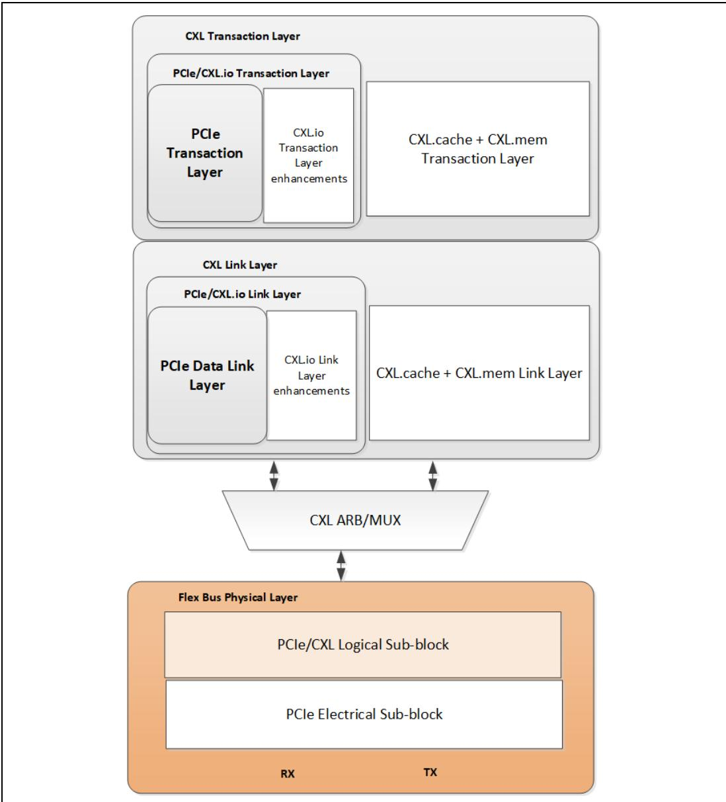

The figure above shows where the Flex Bus physical layer exists in the Flex Bus layered hierarchy. On the transmitter side, the Flex Bus physical layer prepares data received from either the PCIe\* link layer or the CXL ARB/MUX for transmission across the Flex Bus link. On the receiver side, the Flex Bus physical layer deserializes the data received on the Flex Bus link and converts it to the appropriate format to forward to the PCIe link layer or the ARB/MUX. The Flex Bus physical layer consists of a logical sub-block, aka the logical PHY, and an electrical sub-block. The logical PHY operates in PCIe mode during initial link training and switches over to CXL mode, if appropriate, depending on the results of alternate protocol negotiation, during recovery after training to 2.5 GT/s. The electrical sub-block follows the PCIe Base Specification.

In CXL mode, normal operation occurs at native link width and 32 GT/s, 64 GT/s, or 128 GT/s link speed. Bifurcation (aka link subdivision) into x8 and x4 widths is supported in CXL mode. At 128 GT/s link speed, x2 native width is also supported. Table 6-1 summarizes the recommended minimum supported CXL combinations for normal and degraded modes of operation. In PCIe mode, the link supports all widths and speeds defined in the PCIe Base Specification, as well as the ability to bifurcate.

Flex Bus.CXL Link Speeds and Widths for Normal and Degraded Mode

<table><tr><td>Max Supported Link Speed</td><td>Recommended Supported Native Width</td><td>Degraded Modes Supported</td></tr><tr><td rowspan="3">32 GT/s</td><td>x16</td><td>x16 at 16 GT/s or 8 GT/s;x8, x4, x2, or x1 at 32 GT/s or 16 GT/s or 8 GT/s</td></tr><tr><td>x8</td><td>x8 at 16 GT/s or 8 GT/s;x4, x2, or x1 at 32 GT/s or 16 GT/s or 8 GT/s</td></tr><tr><td>x4</td><td>x4 at 16 GT/s or 8 GT/s;x2 or x1 at 32 GT/s or 16 GT/s or 8 GT/s</td></tr><tr><td rowspan="3">64 GT/s</td><td>x16</td><td>x16 at 32 GT/s or 16 GT/s or 8 GT/s;x8, x4, x2, or x1 at 64 GT/s or 32 GT/s or 16 GT/s or 8 GT/s</td></tr><tr><td>x8</td><td>x8 at 32 GT/s or at 16 GT/s or 8 GT/s;x4, x2, or x1 at 64GT/s or 32 GT/s or 16 GT/s or 8 GT/s</td></tr><tr><td>x4</td><td>x4 at 32 GT/s or at 16 GT/s or 8 GT/s;x2 or x1 at 64 GT/s or 32 GT/s or 16 GT/s or 8 GT/s</td></tr><tr><td rowspan="4">128 GT/s</td><td>x16</td><td>x16 at 64 GT/s or 32 GT/s or 16 GT/s or 8 GT/s;x8, x4, x2, or x1 at 128 GT/s, 64 GT/s, 32 GT/s, 16 GT/s or 8 GT/s</td></tr><tr><td>x8</td><td>x8 at 64 GT/s or 32 GT/s or 16 GT/s or 8 GT/s;x4, x2, or x1 at 128 GT/s, 64 GT/s, 32 GT/s, 16 GT/s or 8 GT/s</td></tr><tr><td>x4</td><td>x4 at 64 GT/s or 32 GT/s or 16 GT/s or 8 GT/s;x2 or x1 at 128 GT/s, 64 GT/s, 32 GT/s, 16 GT/s, or 8 GT/s</td></tr><tr><td>x2</td><td>x2 at 64 GT/s or 32 GT/s or 16 GT/s or 8 GT/s;x1 at 128 GT/s, 64 GT/s, 32 GT/s, 16 GT/s or 8 GT/s</td></tr></table>

This chapter focuses on the details of the logical PHY. The Flex Bus logical PHY is based on the PCIe logical PHY; PCIe mode follows the PCIe Base Specification exactly while Flex Bus.CXL mode has deltas from PCIe that affect link training and framing. See the “Physical Layer Logical Block” chapter of the PCIe Base Specification for details on PCIe mode. The Flex Bus.CXL deltas are described in this chapter.

## Flex Bus.CXL Framing and Packet Layout

The Flex Bus.CXL framing and packet layout is described in this section for x16, x8, x4, x2, and x1 link widths.

## Ordered Set Blocks and Data Blocks

Flex Bus.CXL uses the PCIe concept of Ordered Set blocks and data blocks. Each block spans 128 bits per lane and potentially two bits of Sync Header per lane.

Ordered Set blocks are used for training, entering and exiting Electrical Idle, transitions to data blocks, and clock tolerance compensation; they are the same as defined in the PCIe Base Specification. A 2-bit Sync Header with value 01b is inserted before each 128 bits transmitted per lane in an Ordered Set block when 128b/130b encoding is used; in the Sync Header bypass latency-optimized mode, there is no Sync Header. Additionally, as per the PCIe Base Specification, there is no Sync Header when 1b/1b encoding is used.

Data blocks are used for transmission of the flits received from the CXL ARB/MUX. In 68B Flit mode, a 16-bit Protocol ID field is associated with each 528-bit flit payload (512 bits of payload + 16 bits of CRC) received from the link layer, which is striped across the lanes on an 8-bit granularity; the placement of the Protocol ID depends on the width. A 2-bit Sync Header with value 10b is inserted before every 128 bits transmitted per lane in a data block when 128b/130b encoding is used; in the latencyoptimized Sync Header Bypass mode, there is no Sync Header. A 528-bit flit may traverse the boundary between data blocks. In 256B Flit mode, the flits are 256 bytes, which includes the Protocol ID information in the Flit Type field.

Transitions between Ordered Set blocks and data blocks are indicated in a couple of ways, only a subset of which may be applicable depending on the data rate and CXL mode. One way is via the 2-bit Sync Header of 01b for Ordered Set blocks and 10b for data blocks. The second way is via the use of Start of Data Stream (SDS) Ordered Sets and End of Data Stream (EDS) tokens. Unlike PCIe where the EDS token is explicit, Flex Bus.CXL encodes the EDS indication in the Protocol ID value in 68B Flit mode; the latter is referred to as an “implied EDS token.” In 256B Flit mode, transitions from Data Blocks to Ordered Set Blocks are permitted to occur at only fixed locations as specified in the PCIe Base Specification for PCIe Flit mode.

## 6.2.2 68B Flit Mode

Selection of 68B Flit mode vs. 256B Flit mode occurs during PCIe link training. The following subsections describe the physical layer framing and packet layout for 68B Flit mode. See Section 6.2.3 for 256B Flit mode.

## 6.2.2.1 Protocol ID[15:0]

The 16-bit Protocol ID field specifies whether the transmitted flit is CXL.io, CXL.cachemem, or some other payload. Table 6-2 provides a list of valid 16-bit Protocol ID encodings. Encodings that include an implied EDS token signify that the next block after the block in which the current flit ends is an Ordered Set block. Implied EDS tokens can only occur with the last flit transmitted in a data block.

Flex Bus.CXL Protocol IDs (Sheet 1 of 2)

<table><tr><td>Protocol ID[15:0]</td><td>Description</td></tr><tr><td>FFFFh</td><td>CXL.io</td></tr><tr><td>D2D2h</td><td>CXL.io with Implied EDS Token</td></tr><tr><td>5555h</td><td>CXL.cachemem</td></tr><tr><td>8787h</td><td>CXL.cachemem with Implied EDS Token</td></tr><tr><td>9999h</td><td>NULL Flit: Null flit generated by the Physical Layer</td></tr></table>

Table 6-2. Flex Bus.CXL Protocol IDs (Sheet 2 of 2)

<table><tr><td>Protocol ID[15:0]</td><td>Description</td></tr><tr><td>4B4Bh</td><td>NULL flit with Implied EDS Token: Variable length flit containing NULLs that ends exactly at the data block boundary that precedes the Ordered Set block (generated by the Physical Layer)</td></tr><tr><td>CCCCh</td><td>CXL ARB/MUX Link Management Packets (ALMPs)</td></tr><tr><td>1E1Eh</td><td>CXL ARB/MUX Link Management Packets (ALMPs) with Implied EDS Token</td></tr><tr><td>All other encodings</td><td>Reserved</td></tr></table>

NULL flits are inserted into the data stream by the physical layer when there are no valid flits available from the link layer. A NULL flit transferred with an implied EDS token ends exactly at the data block boundary that precedes the Ordered Set block; these are variable length flits, up to 528 bits, intended to facilitate transition to Ordered Set blocks as quickly as possible. When 128b/130b encoding is used, the variable length NULL flit ends on the first block boundary encountered after the 16-bit Protocol ID has been transmitted, and the Ordered Set is transmitted in the next block. Because Ordered Set blocks are inserted at fixed block intervals that align to the flit boundary when Sync Headers are disabled (as described in Section 6.8.1), variable length NULL flits will always contain a fixed 528-bit payload when Sync Headers are disabled. See Section 6.8.1 for examples of NULL flit with implied EDS usage scenarios. A NULL flit is composed of an all 0s payload.

An 8-bit encoding with a hamming distance of four is replicated to create the 16-bit encoding for error protection against bit flips. A correctable Protocol ID framing error is logged but no additional error handling action is required if only one 8-bit encoding group looks incorrect; the correct 8-bit encoding group is used for normal processing. If both 8-bit encoding groups are incorrect, an uncorrectable Protocol ID framing error is logged, the flit is dropped, and the physical layer enters into recovery to retrain the link.

The physical layer is responsible for dropping any flits it receives with invalid Protocol IDs. This includes dropping any flits with unexpected Protocol IDs that correspond to Flex Bus-defined protocols that have not been enabled during negotiation; Protocol IDs associated with flits generated by physical layer or by the ARB/MUX must not be treated as unexpected. When a flit is dropped due to an unexpected Protocol ID, the physical layer logs an unexpected protocol ID error in the DVSEC Flex Bus Port Status register (see Table 8-68).

See Section 6.2.2.8 for additional details regarding Protocol ID error detection and handling.

## 6.2.2.2 x16 Packet Layout

Figure 6-2 shows the x16 packet layout. First, the 16 bits of Protocol ID are transferred, split on an 8-bit granularity across consecutive lanes; this is followed by transfer of the 528-bit flit, striped across the lanes on an 8-bit granularity. Depending on the symbol time, as labeled on the leftmost column in the figure, the Protocol ID plus flit transfer may start on Lane 0, Lane 4, Lane 8, or Lane 12. The pattern of transfer repeats after every 17 symbol times. The two-bit Sync Header shown in the figure, inserted after every 128 bits transferred per lane, is not present for the latencyoptimized mode where Sync Header bypass is negotiated.

Figure 6-2. Flex Bus x16 Packet Layout

<table><tr><td></td><td>L0</td><td>L1</td><td>L2</td><td>L3</td><td>L4</td><td>L5</td><td>L6</td><td>L7</td><td>L8</td><td>L9</td><td>L10</td><td>L11</td><td>L12</td><td>L13</td><td>L14</td><td>L15</td></tr><tr><td rowspan="2">Sync Hdr</td><td>0</td><td>0</td><td>0</td><td>0</td><td>0</td><td>0</td><td>0</td><td>0</td><td>0</td><td>0</td><td>0</td><td>0</td><td>0</td><td>0</td><td>0</td><td>0</td></tr><tr><td>1</td><td>1</td><td>1</td><td>1</td><td>1</td><td>1</td><td>1</td><td>1</td><td>1</td><td>1</td><td>1</td><td>1</td><td>1</td><td>1</td><td>1</td><td>1</td></tr><tr><td>Symbol0</td><td>ProtID[7.0]</td><td>ProtID[15.8]</td><td>Flit[7.0]</td><td>Flit[15.8]</td><td>Flit[23.16]</td><td>Flit[31.24]</td><td>Flit[39.32]</td><td>Flit[47.40]</td><td>Flit[55.48]</td><td>Flit[63.56]</td><td>Flit[71.64]</td><td>Flit[79.72]</td><td>Flit[87.80]</td><td>Flit[95.88]</td><td>Flit[103.96]</td><td>Flit[111.104]</td></tr><tr><td>Symbol1</td><td>Flit[119.112]</td><td>Flit[127.120]</td><td>Flit[135.128]</td><td>Flit[143.136]</td><td>Flit[151.144]</td><td>Flit[159.152]</td><td>Flit[167.160]</td><td>Flit[175.168]</td><td>Flit[183.176]</td><td>Flit[191.184]</td><td>Flit[199.192]</td><td>Flit[207.200]</td><td>Flit[215.208]</td><td>Flit[223.216]</td><td>Flit[231.224]</td><td>Flit[239.232]</td></tr><tr><td>Symbol2</td><td>Flit[247.240]</td><td>Flit[255.248]</td><td>Flit[263.256]</td><td>Flit[271.264]</td><td>Flit[279.272]</td><td>Flit[287.280]</td><td>Flit[295.288]</td><td>Flit[303.296]</td><td>Flit[311.304]</td><td>Flit[319.312]</td><td>Flit[327.320]</td><td>Flit[335.328]</td><td>Flit[343.336]</td><td>Flit[351.344]</td><td>Flit[359.352]</td><td>Flit[367.360]</td></tr><tr><td>Symbol3</td><td>Flit[375.368]</td><td>Flit[383.376]</td><td>Flit[391.384]</td><td>Flit[399.392]</td><td>Flit[407.400]</td><td>Flit[415.408]</td><td>Flit[423.416]</td><td>Flit[431.424]</td><td>Flit[439.432]</td><td>Flit[447.440]</td><td>Flit[455.448]</td><td>Flit[463.456]</td><td>Flit[471.464]</td><td>Flit[479.472]</td><td>Flit[487.480]</td><td>Flit[495.488]</td></tr><tr><td>Symbol4</td><td>Flit[503.496]</td><td>Flit[511.504]</td><td>Flit[519.512]</td><td>Flit[527.520]</td><td>ProtID[7.0]</td><td>ProtID[15.8]</td><td>Flit[7.0]</td><td>Flit[15.8]</td><td>Flit[23.16]</td><td>Flit[31.24]</td><td>Flit[39.32]</td><td>Flit[47.40]</td><td>Flit[55.48]</td><td>Flit[63.56]</td><td>Flit[7l.64]</td><td>Flit[79.72]</td></tr><tr><td>Symbol5</td><td>Flit[87.80]</td><td>Flit[95.88]</td><td>Flit[103.96]</td><td>Flit[111.104]</td><td>Flit[119.112]</td><td>Flit[127.120]</td><td>Flit[135.128]</td><td>Flit[143.136]</td><td>Flit[151.144]</td><td>Flit[159.152]</td><td>Flit[167.160]</td><td>Flit[175.168]</td><td>Flit(183.176)</td><td>Flit[191.184]</td><td>Flit[199.192]</td><td>Flit[207.200]</td></tr><tr><td>Symbol6</td><td>Flit[215.208]</td><td>Flit[223.216]</td><td>Flit[231.224]</td><td>Flit[239.232]</td><td>Flit[247.240]</td><td>Flit[255.248]</td><td>Flit[263.256]</td><td>Flit[271.264]</td><td>Flit[279.272]</td><td>Flit[287.280]</td><td>Flit[295.288]</td><td>Flit[303.296]</td><td>Flit311.304]</td><td>Flit[319.312]</td><td>Flit[327.320]</td><td>Flit[335.328]</td></tr><tr><td>Symbol7</td><td>Flit[343.336]</td><td>Flit[351.344]</td><td>Flit[359.352]</td><td>Flit[367.360]</td><td>Flit[375.368]</td><td>Flit[383.376]</td><td>Flit[391.384]</td><td>Flit[399.392]</td><td>Flit[407.400]</td><td>Flit[415.408]</td><td>Flit[423.416]</td><td>Flit[431.424]</td><td>Flit439.432]</td><td>Flit[447.440]</td><td>Flit[455.448]</td><td>Flit[463.456]</td></tr><tr><td>Symbol8</td><td>Flit[471.464]</td><td>Flit[479.472]</td><td>Flit[487.480]</td><td>Flit[495.488]</td><td>Flit[503.496]</td><td>Flit[511.504]</td><td>Flit[519.512]</td><td>Flit[527.520]</td><td>ProtID[7.0]</td><td>ProtID[15.8]</td><td>Flit[7.0]</td><td>Flit[15.8]</td><td>Flit[23.16]</td><td>Flit[31. 24]</td><td>Flit[39.32]</td><td>Flit[47.40]</td></tr><tr><td>Symbol9</td><td>Flit[55.48]</td><td>Flit[63.56]</td><td>Flit[71.64]</td><td>Flit[79.72]</td><td>Flit[87.80]</td><td>Flit[95.88]</td><td>Flit[103.96]</td><td>Flit[111.104]</td><td>Flit[119.112]</td><td>Flit[127.120]</td><td>Flit[135.128]</td><td>Flit[143.136]</td><td>Flit[151. 144]</td><td>Flit[159.152]</td><td>Flit[167.160]</td><td>Flit[175.168]</td></tr><tr><td>Symbol10</td><td>Flit[183.176]</td><td>Flit[191.184]</td><td>Flit[199.192]</td><td>Flit[207.200]</td><td>Flit[215.208]</td><td>Flit[223.216]</td><td>Flit[231.224]</td><td>Flit[239.232]</td><td>Flit[247.240]</td><td>Flit[255.248]</td><td>Flit[263.256]</td><td>Flit[271.264]</td><td>Flit279.272]</td><td>Flit[287.280]</td><td>Flit[295.288]</td><td>Flit[303.296]</td></tr><tr><td>Symbol11</td><td>Flit[311.304]</td><td>Flit[319.312]</td><td>Flit[327.320]</td><td>Flit[335.328]</td><td>Flit[343.336]</td><td>Flit[351.344]</td><td>Flit[359.352]</td><td>Flit[367.360]</td><td>Flit[375.368]</td><td>Flit[383.376]</td><td>Flit[391.384]</td><td>Flit[399.392]</td><td>Flit407.400]</td><td>Flit[415.408]</td><td>Flit[423.416]</td><td>Flit[431.424]</td></tr><tr><td>Symbol12</td><td>Flit[439.432]</td><td>Flit[447.440]</td><td>Flit[455.448]</td><td>Flit[463.456]</td><td>Flit[471.464]</td><td>Flit[479.472]</td><td>Flit[487.480]</td><td>Flit[495.488]</td><td>Flit[503.496]</td><td>Flit[511.504]</td><td>Flit[519.512]</td><td>Flit[527.520]</td><td>ProtID [7.0]</td><td>ProtID [15.8]</td><td>Flit[7.0]</td><td>Flit[15.8]</td></tr><tr><td>Symbol13</td><td>Flit[23.16]</td><td>Flit[31.24]</td><td>Flit[39.32]</td><td>Flit[47.40]</td><td>Flit[55.48]</td><td>Flit[63.56]</td><td>Flit[71.64]</td><td>Flit[79.72]</td><td>Flit[87.80]</td><td>Flit[95.88 ]</td><td>Flit[103.96]</td><td>Flit[111.104]</td><td>Flit[119.112]</td><td>Flit[127.120]</td><td>Flit[135.128]</td><td>Flit[143.136]</td></tr><tr><td>Symbol14</td><td>Flit[151.144]</td><td>Flit[159.152]</td><td>Flit[167.160]</td><td>Flit[175.168]</td><td>Flit[183.176]</td><td>Flit[191.184]</td><td>Flit[199.192]</td><td>Flit[207.200]</td><td>Flit215.208]</td><td>Flit[223.216]</td><td>Flit[231.224]</td><td>Flit[239.232]</td><td>Flit[247.240]</td><td>Flit[255.248]</td><td>Flit[263.256]</td><td>Flit[271.264]</td></tr><tr><td>Symbol15</td><td>Flit[279.272]</td><td>Flit[287.280]</td><td>Flit[295.288]</td><td>Flit[303.296]</td><td>Flit[311.304]</td><td>Flit[319.312]</td><td>Flit[327.320]</td><td>Flit[335.328]</td><td>Flit343.336]</td><td>Flit[351.344]</td><td>Flit[359.352]</td><td>Flit[367.360]</td><td>Flit[375.368]</td><td>Flit[383.376]</td><td>Flit[391.384]</td><td>Flit[399.392]</td></tr><tr><td rowspan="2">Sync Hdr</td><td>0</td><td>0</td><td>0</td><td>0</td><td>0</td><td>0</td><td>0</td><td>0</td><td>0</td><td>0</td><td>0</td><td>0</td><td>0</td><td>0</td><td>0</td><td>0</td></tr><tr><td>1</td><td>1</td><td>1</td><td>1</td><td>1</td><td>1</td><td>1</td><td>1</td><td>1</td><td>1</td><td>1</td><td>1</td><td>1</td><td>1</td><td>1</td><td>1</td></tr><tr><td>Symbol0</td><td>Flit[407.400]</td><td>Flit[415.408]</td><td>Flit[423.416]</td><td>Flit[431.424]</td><td>Flit[439.432]</td><td>Flit[447.440]</td><td>Flit[455.448]</td><td>Flit[463.456]</td><td>Flit471.464]</td><td>Flit[479.472]</td><td>Flit[487.480]</td><td>Flit[495.488]</td><td>Flit[503.496]</td><td>Flit[511.504]</td><td>Flit[519.512]</td><td>Flit[527.520]</td></tr><tr><td>Symbol1</td><td>ProtID[7.0]</td><td>ProtID[15.8]</td><td>Flit[7.0]</td><td>Flit[15.8]</td><td>Flit[23.16]</td><td>Flit[31.24]</td><td>Flit[39.32]</td><td>Flit[47.40]</td><td>Flit[55.48]</td><td>Flit[63.56]</td><td>Flit[7 l.64]</td><td>Flit[79.72]</td><td>Flit[87.80]</td><td>Flit[95.88]</td><td>Flit[103.96]</td><td>Flit[111.104]</td></tr></table>

Figure 6-3 provides an example where CXL.io and CXL.cachemem traffic is interleaved with an interleave granularity of two flits on a x16 link. The upper part of the figure shows what the CXL.io stream looks like before mapping to the Flex Bus lanes and before interleaving with CXL.cachemem traffic; the framing rules follow the x16 framing rules specified in the PCIe Base Specification, as specified in Section 4.1. The lower part of the figure shows the final result when the two streams are interleaved on the Flex Bus lanes. For CXL.io flits, after transferring the 16-bit Protocol ID, 512 bits are used to transfer CXL.io traffic and 16 bits are unused. For CXL.cachemem flits, after transferring the 16-bit Protocol ID, 528 bits are used to transfer a CXL.cachemem flit. See Chapter 4.0 for additional details on the flit format. As this example illustrates, the PCIe TLPs and DLLPs encapsulated within the CXL.io stream may be interrupted by non-related CXL traffic if those PCIe TLPs and DLLPs cross a flit boundary.

Figure 6-3. Flex Bus x16 Protocol Interleaving Example

<table><tr><td></td><td>L0</td><td>L1</td><td>L2</td><td>L3</td><td>L4</td><td>L5</td><td>L6</td><td>L7</td><td>L8</td><td>L9</td><td>L10</td><td>L11</td><td>L12</td><td>L13</td><td>L14</td><td>L15</td></tr><tr><td rowspan="2">Sync Hdr</td><td>0</td><td>0</td><td>0</td><td>0</td><td>0</td><td>0</td><td>0</td><td>0</td><td>0</td><td>0</td><td>0</td><td>0</td><td>0</td><td>0</td><td>0</td><td>0</td></tr><tr><td>1</td><td>1</td><td>1</td><td>1</td><td>1</td><td>1</td><td>1</td><td>1</td><td>1</td><td>1</td><td>1</td><td>1</td><td>1</td><td>1</td><td>1</td><td>1</td></tr><tr><td>Symbol0</td><td colspan="4">PCIe STP Token</td><td colspan="4">PCIe TLP Header DW0</td><td colspan="4">PCIe TLP Header DW1</td><td colspan="4">PCIe TLP Header DW2</td></tr><tr><td>Symbol1</td><td colspan="4">PCIe TLP Data Payload DW0</td><td colspan="4">PCIe TLP Data Payload DW1</td><td colspan="4">PCIe TLP Data Payload DW2</td><td colspan="4">PCIe TLP LCRC</td></tr><tr><td>Symbol2</td><td colspan="2">PCIe SDP Token</td><td colspan="4">PCIe DLLP Payload</td><td colspan="2">PCIe DLLP CRC</td><td>PCIe IDL</td><td>PCIe IDL</td><td>PCIe IDL</td><td>PCIe IDL</td><td>PCIe IDL</td><td>PCIe IDL</td><td>PCIe IDL</td><td>PCIe IDL</td></tr><tr><td>Symbol3</td><td colspan="4">PCIe STP Token</td><td colspan="4">PCIe TLP Header DW0</td><td colspan="4">PCIe TLP Header DW1</td><td colspan="4">PCIe TLP Header DW2</td></tr><tr><td>Symbol4</td><td colspan="4">PCIe TLP Data Payload DW0</td><td colspan="4">PCIe TLP Data Payload DW1</td><td colspan="4">PCIe TLP Data Payload DW2</td><td colspan="4">PCIe TLP Data Payload DW3</td></tr><tr><td>Symbol5</td><td colspan="4">PCIe TLP Data Payload DW4</td><td colspan="4">PCIe TLP Data Payload DW5</td><td colspan="4">PCIe TLP Data Payload DW6</td><td colspan="4">PCIe TLP Data Payload DW7</td></tr><tr><td>Symbol6</td><td colspan="4">PCIe TLP Data Payload DW8</td><td colspan="4">PCIe TLP LCRC</td><td colspan="2">PCIe SDP Token</td><td colspan="4">PCIe DLLP Payload</td><td colspan="2">PCIe DLLP CRC</td></tr><tr><td>Symbol7</td><td colspan="4">PCIe STP Token</td><td colspan="4">PCIe TLP Header DW0</td><td colspan="4">PCIe TLP Header DW1</td><td colspan="4">PCIe TLP Header DW2</td></tr><tr><td>Symbol8</td><td colspan="4">PCIe TLP Data Payload DW0</td><td colspan="4">PCIe TLP Data Payload DW1</td><td colspan="4">PCIe TLP Data Payload DW2</td><td colspan="4">PCIe TLP LCRC</td></tr></table>

<table><tr><td></td><td>L0</td><td>L1</td><td>L2</td><td>L3</td><td>L4</td><td>L5</td><td>L6</td><td>L7</td><td>L8</td><td>L9</td><td>L10</td><td>L11</td><td>L12</td><td>L13</td><td>L14</td><td>L15</td></tr><tr><td rowspan="2">Sync Hdr</td><td>0</td><td>0</td><td>0</td><td>0</td><td>0</td><td>0</td><td>0</td><td>0</td><td>0</td><td>0</td><td>0</td><td>0</td><td>0</td><td>0</td><td>0</td><td>0</td></tr><tr><td>1</td><td>1</td><td>1</td><td>1</td><td>1</td><td>1</td><td>1</td><td>1</td><td>1</td><td>1</td><td>1</td><td>1</td><td>1</td><td>1</td><td>1</td><td>1</td></tr><tr><td>Symbol0</td><td>ProtID[7:0]=CXLio</td><td>ProtID[15:8]=CXLio</td><td colspan="4">PCIe STP Token</td><td colspan="4">PCIe TLP Header DW0</td><td colspan="4">PCIe TLP Header DW1</td><td colspan="2">PCIe TLP Header DW2[15:0]</td></tr><tr><td>Symbol1</td><td colspan="2">PCIe TLP Header DW2[31:16]</td><td colspan="4">PCIe TLP Data Payload DW0</td><td colspan="4">PCIe TLP Data Payload DW1</td><td colspan="4">PCIe TLP Data Payload DW2</td><td colspan="2">PCIe TLP LCRC</td></tr><tr><td>Symbol2</td><td colspan="2">PCIe TLP LCRC</td><td colspan="2">PCIe SDPToken</td><td colspan="4">PCIe DLLP Payload</td><td colspan="2">PCIe DLLP CRC</td><td>PCIe IDL</td><td>PCIe IDL</td><td>PCIe IDL</td><td>PCIe IDL</td><td>PCIe IDL</td><td>PCIe IDL</td></tr><tr><td>Symbol3</td><td>PCIe IDL</td><td>PCIe IDL</td><td colspan="4">PCIe STP Token</td><td colspan="4">PCIe TLP Header DW0</td><td colspan="4">PCIe TLP Header DW1</td><td colspan="2">PCIe TLP Header DW2[15:0]</td></tr><tr><td>Symbol4</td><td colspan="2">PCIe TLP Header DW2[31:16]</td><td>Reserved</td><td>Reserved</td><td>ProtID[7:0]=CXLio</td><td>ProtID[15:8]=CXLio</td><td colspan="4">PCIe TLP Data Payload DW0</td><td colspan="4">PCIe TLP Data Payload DW1</td><td colspan="2">PCIe TLP Data Payload DW2[15:0]</td></tr><tr><td>Symbol5</td><td colspan="2">PCIe TLP Data Payload DW2[31:16]</td><td colspan="4">PCIe TLP Data Payload DW3</td><td colspan="4">PCIe TLP Data Payload DW4</td><td colspan="4">PCIe TLP Data Payload DW5</td><td colspan="2">PCIe TLP Data Payload DW6[15:0]</td></tr><tr><td>Symbol6</td><td colspan="2">PCIe TLP Data Payload DW6[31:16]</td><td colspan="4">PCIe TLP Data Payload DW7</td><td colspan="4">PCIe TLP Data Payload DW8</td><td colspan="4">PCIe TLP LCRC</td><td colspan="2">PCIe SDPToken</td></tr><tr><td>Symbol7</td><td colspan="4">PCIe DLLP Payload</td><td colspan="2">PCIe DLLP CRC</td><td colspan="4">PCIe STPToken</td><td colspan="4">PCIe TLP Header DW0</td><td colspan="2">PCIe TLP Header DW1[15:0]</td></tr><tr><td>Symbol8</td><td colspan="2">PCIe TLP Header DW1[31:16]</td><td colspan="4">PCIe TLP Header DW2</td><td>Reserved</td><td>Reserved</td><td>ProtID[7:0]=CXLcamem</td><td>ProtID[15:8]=CXLcamem</td><td>Flit[7:0]</td><td>Flit[15:8]</td><td>Flit[23:16]</td><td>Flit[31:24]</td><td>Flit[39:32]</td><td>Flit[47:40]</td></tr><tr><td>Symbol9</td><td>Flit[55:48]</td><td>Flit[63:56]</td><td>Flit[71:64]</td><td>Flit[79:72]</td><td>Flit[87:80]</td><td>Flit[95:88]</td><td>Flit[103:96]</td><td>Flit[111:104]</td><td>Flit[119:112]</td><td>Flit[127:120]</td><td>Flit[135:128]</td><td>Flit[143:136]</td><td>Flit[151:144]</td><td>Flit[159:152]</td><td>Flit[167:160]</td><td>Flit[175:168]</td></tr><tr><td>Symbol10</td><td>Flit[183:176]</td><td>Flit[191:184]</td><td>Flit[199:192]</td><td>Flit[207:200]</td><td>Flit[215:208]</td><td>Flit[223:216]</td><td>Flit[231:224]</td><td>Flit[239:232]</td><td>Flit[247:240]</td><td>Flit[255:248]</td><td>Flit[263:256]</td><td>Flit[271:264]</td><td>Flit[279:272]</td><td>Flit[287:280]</td><td>Flit[295:288]</td><td>Flit[303:296]</td></tr><tr><td>Symbol11</td><td>Flit[311:304]</td><td>Flit[319:312]</td><td>Flit[327:320]</td><td>Flit[335:328]</td><td>Flit[343:336]</td><td>Flit[351:344]</td><td>Flit[359:352]</td><td>Flit[367:360]</td><td>Flit[375:368]</td><td>Flit[383:376]</td><td>Flit[391:384]</td><td>Flit[399:392]</td><td>Flit[407:400]</td><td>Flit[415:408]</td><td>Flit[423:416]</td><td>Flit[431:424]</td></tr><tr><td>Symbol12</td><td>Flit[439:432]</td><td>Flit[447:440]</td><td>Flit[455:448]</td><td>Flit[463:456]</td><td>Flit[471:464]</td><td>Flit[479:472]</td><td>Flit[487:480]</td><td>Flit[495:488]</td><td>Flit[503:496]</td><td>Flit[511:504]</td><td>CRC</td><td>CRC</td><td>ProtID[7:0]=CXLcamem</td><td>ProtID[15:8]=CXLcamem</td><td>Flit[7:0]</td><td>Flit[15:8]</td></tr><tr><td>Symbol13</td><td>Flit[23:16]</td><td>Flit[31:24]</td><td>Flit[39:32]</td><td>Flit[47:40]</td><td>Flit[55:48]</td><td>Flit[63:56]</td><td>Flit[71:64]</td><td>Flit[79:72]</td><td>Flit[87:80]</td><td>Flit[95:88]</td><td>Flit[103:96]</td><td>Flit[111:104]</td><td>Flit[119:112]</td><td>Flit[ 127:120]</td><td>Flit[135:128]</td><td>Flit[143:136]</td></tr><tr><td>Symbol14</td><td>Flit[151:144]</td><td>Flit[159:152]</td><td>Flit[167:160]</td><td>Flit[175:168]</td><td>Flit[183:176]</td><td>Flit[191:184]</td><td>Flit[199:192]</td><td>Flit[207:200]</td><td>Flit[215:208]</td><td>Flit[223:216]</td><td>Flit[231:224]</td><td>Flit[239:232]</td><td>Flit247:240]</td><td>Flit[255:248]</td><td>Flit[263:256]</td><td>Flit[271:264]</td></tr><tr><td>Symbol15</td><td>Flit[279:272]</td><td>Flit[287:280]</td><td>Flit[295:288]</td><td>Flit[303:296]</td><td>Flit[311:304]</td><td>Flit[319:312]</td><td>Flit[327:320]</td><td>Flit[335:328]</td><td>Flit[343:336]</td><td>Flit[351:344]</td><td>Flit[359:352]</td><td>Flit[367:360]</td><td>Flit375:368]</td><td>Flit[383:376]</td><td>Flit[391:384]</td><td>Flit[399:392]</td></tr><tr><td rowspan="2">Sync Hdr</td><td>0</td><td>0</td><td>0</td><td>0</td><td>0</td><td>0</td><td>0</td><td>0</td><td>0</td><td>0</td><td>0</td><td>0</td><td>0</td><td>0</td><td>0</td><td>0</td></tr><tr><td>1</td><td>1</td><td>1</td><td>1</td><td>1</td><td>1</td><td>1</td><td>1</td><td>1</td><td>1</td><td>1</td><td>1</td><td>1</td><td>1</td><td>1</td><td>1</td></tr><tr><td>Symbol0</td><td>Flit[407:400]</td><td>Flit[415:408]</td><td>Flit[423:416]</td><td>Flit[431:424]</td><td>Flit[439:432]</td><td>Flit[447:440]</td><td>Flit[455:448]</td><td>Flit[463:456]</td><td>Flit[471:464]</td><td>Flit[479:472]</td><td>Flit[487:480]</td><td>Flit[495:488]</td><td>Flit503:496]</td><td>Flit[511:504]</td><td>CRC</td><td>CRC</td></tr><tr><td>Symbol1</td><td>ProtID[7:0]=CXLio</td><td>ProtID[15:8]=CXLio</td><td colspan="4">PCIe TLP Data Payload DW0</td><td colspan="4">PCIe TLP Data Payload DW1</td><td colspan="4">PCIe TLP Data Payload DW2</td><td colspan="2">PCIe TLP LCRC[15:0]</td></tr></table>

## 6.2.2.3 x8 Packet Layout

Figure 6-4 shows the x8 packet layout. 16 bits of Protocol ID followed by a 528-bit flit are striped across the lanes on an 8-bit granularity. Depending on the symbol time, the Protocol ID plus flit transfer may start on Lane 0 or Lane 4. The pattern of transfer repeats after every 17 symbol times. The two-bit Sync Header shown in the figure is not present for the Sync Header bypass latency-optimized mode.

Flex Bus x8 Packet Layout

<table><tr><td></td><td>L0</td><td>L1</td><td>L2</td><td>L3</td><td>L4</td><td>L5</td><td>L6</td><td>L7</td></tr><tr><td rowspan="2">Sync Hdr</td><td>0</td><td>0</td><td>0</td><td>0</td><td>0</td><td>0</td><td>0</td><td>0</td></tr><tr><td>1</td><td>1</td><td>1</td><td>1</td><td>1</td><td>1</td><td>1</td><td>1</td></tr><tr><td>Symbol0</td><td>ProtID[7:0]</td><td>ProtID[15:8]</td><td>Flit[7:0]</td><td>Flit[15:8]</td><td>Flit[23:16]</td><td>Flit[31:24]</td><td>Flit[39:32]</td><td>Flit[47:40]</td></tr><tr><td>Symbol1</td><td>Flit[55:48]</td><td>Flit[63:56]</td><td>Flit[71:64]</td><td>Flit[79:72]</td><td>Flit[87:80]</td><td>Flit[95:88]</td><td>Flit[103:96]</td><td>Flit[111:104]</td></tr><tr><td>Symbol2</td><td>Flit[119:112]</td><td>Flit[127:120]</td><td>Flit[135:128]</td><td>Flit[143:136]</td><td>Flit[151:144]</td><td>Flit[159:152]</td><td>Flit[167:160]</td><td>Flit[175:168]</td></tr><tr><td>Symbol3</td><td>Flit[183:176]</td><td>Flit[191:184]</td><td>Flit[199:192]</td><td>Flit[207:200]</td><td>Flit[215:208]</td><td>Flit[223:216]</td><td>Flit[231:224]</td><td>Flit[239:232]</td></tr><tr><td>Symbol4</td><td>Flit[247:240]</td><td>Flit[255:248]</td><td>Flit[263:256]</td><td>Flit[271:264]</td><td>Flit[279:272]</td><td>Flit[287:280]</td><td>Flit[295:288]</td><td>Flit[303:296]</td></tr><tr><td>Symbol5</td><td>Flit[311:304]</td><td>Flit[319:312]</td><td>Flit[327:320]</td><td>Flit[335:328]</td><td>Flit[343:336]</td><td>Flit[351:344]</td><td>Flit[359:352]</td><td>Flit[367:360]</td></tr><tr><td>Symbol6</td><td>Flit[375:368]</td><td>Flit[383:376]</td><td>Flit[391:384]</td><td>Flit[399:392]</td><td>Flit[407:400]</td><td>Flit[415:408]</td><td>Flit[423:416]</td><td>Flit[431:424]</td></tr><tr><td>Symbol7</td><td>Flit[439:432]</td><td>Flit[447:440]</td><td>Flit[455:448]</td><td>Flit[463:456]</td><td>Flit[471:464]</td><td>Flit[479:472]</td><td>Flit[487:480]</td><td>Flit[495:488]</td></tr><tr><td>Symbol8</td><td>Flit[503:496]</td><td>Flit[511:504]</td><td>Flit[519:512]</td><td>Flit[527:520]</td><td>ProtID[7:0]</td><td>ProtID[15:8]</td><td>Flit[7:0]</td><td>Flit[15:8]</td></tr><tr><td>Symbol9</td><td>Flit[23:16]</td><td>Flit[31:24]</td><td>Flit[39:32]</td><td>Flit[47:40]</td><td>Flit[55:48]</td><td>Flit[63:56]</td><td>Flit[71:64]</td><td>Flit[79:72]</td></tr><tr><td>Symbol10</td><td>Flit[87:80]</td><td>Flit[95:88]</td><td>Flit[103:96]</td><td>Flit[111:104]</td><td>Flit[119:112]</td><td>Flit[127:120]</td><td>Flit[135:128]</td><td>Flit[143:136]</td></tr><tr><td>Symbol11</td><td>Flit[151:144]</td><td>Flit[159:152]</td><td>Flit[167:160]</td><td>Flit[175:168]</td><td>Flit[183:176]</td><td>Flit[191:184]</td><td>Flit[199:192]</td><td>Flit[207:200]</td></tr><tr><td>Symbol12</td><td>Flit[215:208]</td><td>Flit[223:216]</td><td>Flit[231:224]</td><td>Flit[239:232]</td><td>Flit[247:240]</td><td>Flit[255:248]</td><td>Flit[263:256]</td><td>Flit[271:264]</td></tr><tr><td>Symbol13</td><td>Flit[279:272]</td><td>Flit[287:280]</td><td>Flit[295:288]</td><td>Flit[303:296]</td><td>Flit[311:304]</td><td>Flit[319:312]</td><td>Flit[327:320]</td><td>Flit[335:328]</td></tr><tr><td>Symbol14</td><td>Flit[343:336]</td><td>Flit[351:344]</td><td>Flit[359:352]</td><td>Flit[367:360]</td><td>Flit[375:368]</td><td>Flit[383:376]</td><td>Flit[391:384]</td><td>Flit[399:392]</td></tr><tr><td>Symbol15</td><td>Flit[407:400]</td><td>Flit[415:408]</td><td>Flit[423:416]</td><td>Flit[431:424]</td><td>Flit[439:432]</td><td>Flit[447:440]</td><td>Flit[455:448]</td><td>Flit[463:456]</td></tr><tr><td rowspan="2">Sync Hdr</td><td>0</td><td>0</td><td>0</td><td>0</td><td>0</td><td>0</td><td>0</td><td>0</td></tr><tr><td>1</td><td>1</td><td>1</td><td>1</td><td>1</td><td>1</td><td>1</td><td>1</td></tr><tr><td>Symbol0</td><td>Flit[471:464]</td><td>Flit[479:472]</td><td>Flit[487:480]</td><td>Flit[495:488]</td><td>Flit[503:496]</td><td>Flit[511:504]</td><td>Flit[519:512]</td><td>Flit[527:520]</td></tr><tr><td>Symbol1</td><td>ProtID[7:0]</td><td>ProtID[15:8]</td><td>Flit[7:0]</td><td>Flit[15:8]</td><td>Flit[23:16]</td><td>Flit[31:24]</td><td>Flit[39:32]</td><td>Flit[47:40]</td></tr></table>

Figure 6-5 illustrates how CXL.io and CXL.cachemem traffic is interleaved on a x8 Flex Bus link. The same traffic from the x16 example in Figure 6-3 is mapped to a x8 link.

Figure 6-5. Flex Bus x8 Protocol Interleaving Example

<table><tr><td></td><td>L0</td><td>L1</td><td>L2</td><td>L3</td><td>L4</td><td>L5</td><td>L6</td><td>L7</td></tr><tr><td rowspan="2">Sync Hdr</td><td>0</td><td>0</td><td>0</td><td>0</td><td>0</td><td>0</td><td>0</td><td>0</td></tr><tr><td>1</td><td>1</td><td>1</td><td>1</td><td>1</td><td>1</td><td>1</td><td>1</td></tr><tr><td>Symbol0</td><td>ProtID[7:0]=CXL.io</td><td>ProtID[15:8]=CXL.io</td><td colspan="4">PCIe STPToken</td><td colspan="2">PCIe TLP Header DW0[15:0]</td></tr><tr><td>Symbol1</td><td colspan="2">PCIe TLP Header DW0[31:16]</td><td colspan="4">PCIe TLP Header DW1</td><td colspan="2">PCIe TLP Header DW2[15:0]</td></tr><tr><td>Symbol2</td><td colspan="2">PCIe TLP Header DW2[31:16]</td><td colspan="4">PCIe TLP Data Payload DW0</td><td colspan="2">PCIe TLP Data Payload DW1[15:0]</td></tr><tr><td>Symbol3</td><td colspan="2">PCIe TLP Data Payload DW1[31:16]</td><td colspan="4">PCIe TLP Data Payload DW2</td><td colspan="2">PCIe TLP LCRC</td></tr><tr><td>Symbol4</td><td colspan="2">PCIe TLP LCRC</td><td colspan="2">PCIe SDP Token</td><td colspan="4">PCIe DLLP Payload</td></tr><tr><td>Symbol5</td><td colspan="2">PCIe DLLP CRC</td><td>PCIe IDL</td><td>PCIe IDL</td><td>PCIe IDL</td><td>PCIe IDL</td><td>PCIe IDL</td><td>PCIe IDL</td></tr><tr><td>Symbol6</td><td>PCIe IDL</td><td>PCIe IDL</td><td colspan="4">PCIe STPToken</td><td colspan="2">PCIe TLP Header DW0[15:0]</td></tr><tr><td>Symbol7</td><td colspan="2">PCIe TLP Header DW0[31:16]</td><td colspan="4">PCIe TLP Header DW1</td><td colspan="2">PCIe TLP Header DW2[15:0]</td></tr><tr><td>Symbol8</td><td colspan="2">PCIe TLP Header DW2[31:16]</td><td>Reserved</td><td>Reserved</td><td>ProtID[7:0]=CXL.io</td><td>ProtID[15:8]=CXL.io</td><td colspan="2">PCIe TLP Data Payload DW0[15:0]</td></tr><tr><td>Symbol9</td><td colspan="2">PCIe TLP Data Payload DW0[31:16]</td><td colspan="4">PCIe TLP Data Payload DW1</td><td colspan="2">PCIe TLP Data Payload DW2[15:0]</td></tr><tr><td>Symbol10</td><td colspan="2">PCIe TLP Data Payload DW2[31:16]</td><td colspan="4">PCIe TLP Data Payload DW3</td><td colspan="2">PCIe TLP Data Payload DW4[15:0]</td></tr><tr><td>Symbol11</td><td colspan="2">PCIe TLP Data Payload DW4[31:16]</td><td colspan="4">PCIe TLP Data Payload DW5</td><td colspan="2">PCIe TLP Data Payload DW6[15:0]</td></tr><tr><td>Symbol12</td><td colspan="2">PCIe TLP Data Payload DW6[31:16]</td><td colspan="4">PCIe TLP Data Payload DW7</td><td colspan="2">PCIe TLP Data Payload DW8[15:0]</td></tr><tr><td>Symbol13</td><td colspan="2">PCIe TLP Data Payload DW8[31:16]</td><td colspan="4">PCIe TLP LCRC</td><td colspan="2">PCIe SDP Token</td></tr><tr><td>Symbol14</td><td colspan="4">PCIe DLLP Payload</td><td colspan="2">PCIe DLLP CRC</td><td colspan="2">PCIe STPToken[15:0]</td></tr><tr><td>Symbol15</td><td colspan="2">PCIe STPToken[31:16]</td><td colspan="4">PCIe TLP Header DW0</td><td colspan="2">PCIe TLP Header DW1[15:0]</td></tr><tr><td rowspan="2">Sync Hdr</td><td>0</td><td>0</td><td>0</td><td>0</td><td>0</td><td>0</td><td>0</td><td>0</td></tr><tr><td>1</td><td>1</td><td>1</td><td>1</td><td>1</td><td>1</td><td>1</td><td>1</td></tr><tr><td>Symbol0</td><td colspan="2">PCIe TLP Header DW1[31:16]</td><td colspan="4">PCIe TLP Header DW2</td><td>Reserved</td><td>Reserved</td></tr><tr><td>Symbol1</td><td>ProtID[7:0]=CXL.camem</td><td>ProtID[15:8]=CXL.camem</td><td>Flit[7:0]</td><td>Flit[15:8]</td><td>Flit[23:16]</td><td>Flit[31:24]</td><td>Flit[39:32]</td><td>Flit[47:40]</td></tr><tr><td>Symbol2</td><td>Flit[55:48]</td><td>Flit[63:56]</td><td>Flit[71:64]</td><td>Flit[79:72]</td><td>Flit[87:80]</td><td>Flit[95:88]</td><td>Flit[103:96]</td><td>Flit[111:104]</td></tr><tr><td>Symbol3</td><td>Flit[119:112]</td><td>Flit[127:120]</td><td>Flit[135:128]</td><td>Flit[143:136]</td><td>Flit[151:144]</td><td>Flit[159:152]</td><td>Flit[167:160]</td><td>Flit[175:168]</td></tr><tr><td>Symbol4</td><td>Flit[183:176]</td><td>Flit[191:184]</td><td>Flit[199:192]</td><td>Flit[207:200]</td><td>Flit[215:208]</td><td>Flit[223:216]</td><td>Flit[231:224]</td><td>Flit[239:232]</td></tr><tr><td>Symbol5</td><td>Flit[247:240]</td><td>Flit[255:248]</td><td>Flit[263:256]</td><td>Flit[271:264]</td><td>Flit[279:272]</td><td>Flit[287:280]</td><td>Flit[295:288]</td><td>Flit[303:296]</td></tr><tr><td>Symbol6</td><td>Flit[311:304]</td><td>Flit[319:312]</td><td>Flit[327:320]</td><td>Flit[335:328]</td><td>Flit[343:336]</td><td>Flit[351:344]</td><td>Flit[359:352]</td><td>Flit[367:360]</td></tr><tr><td>Symbol7</td><td>Flit[375:368]</td><td>Flit[383:376]</td><td>Flit[391:384]</td><td>Flit[399:392]</td><td>Flit[407:400]</td><td>Flit[415:408]</td><td>Flit[423:416]</td><td>Flit[431:424]</td></tr><tr><td>Symbol8</td><td>Flit[439:432]</td><td>Flit[447:440]</td><td>Flit[455:448]</td><td>Flit[463:456]</td><td>Flit[471:464]</td><td>Flit[479:472]</td><td>Flit[487:480]</td><td>Flit[495:488]</td></tr><tr><td>Symbol9</td><td>Flit[503:496]</td><td>Flit[511:504]</td><td>CRC</td><td>CRC</td><td>ProtID[7:0]=CXL.camem</td><td>ProtID[15:8]=CXL.camem</td><td>Flit[7:0]</td><td>Flit[15:8]</td></tr><tr><td>Symbol10</td><td>Flit[23:16]</td><td>Flit[31:24]</td><td>Flit[39:32]</td><td>Flit[47:40]</td><td>Flit[55:48]</td><td>Flit[63:56]</td><td>Flit[71:64]</td><td>Flit[79:72]</td></tr><tr><td>Symbol11</td><td>Flit[87:80]</td><td>Flit[95:88]</td><td>Flit[103:96]</td><td>Flit[111:104]</td><td>Flit[119:112]</td><td>Flit[127:120]</td><td>Flit[135:128]</td><td>Flit[143:136]</td></tr><tr><td>Symbol12</td><td>Flit[151:144]</td><td>Flit[159:152]</td><td>Flit[167:160]</td><td>Flit[175:168]</td><td>Flit[183:176]</td><td>Flit[191:184]</td><td>Flit[199:192]</td><td>Flit[207:200]</td></tr><tr><td>Symbol13</td><td>Flit[215:208]</td><td>Flit[223:216]</td><td>Flit[231:224]</td><td>Flit[239:232]</td><td>Flit[247:240]</td><td>Flit[255:248]</td><td>Flit[263:256]</td><td>Flit[271:264]</td></tr><tr><td>Symbol14</td><td>Flit[279:272]</td><td>Flit[287:280]</td><td>Flit[295:288]</td><td>Flit[303:296]</td><td>Flit[311:304]</td><td>Flit[319:312]</td><td>Flit[327:320]</td><td>Flit[335:328]</td></tr><tr><td>Symbol15</td><td>Flit[343:336]</td><td>Flit[351:344]</td><td>Flit[359:352]</td><td>Flit[367:360]</td><td>Flit[375:368]</td><td>Flit[383:376]</td><td>Flit[391:384]</td><td>Flit[399:392]</td></tr><tr><td rowspan="2">Sync Hdr</td><td>0</td><td>0</td><td>0</td><td>0</td><td>0</td><td>0</td><td>0</td><td>0</td></tr><tr><td>1</td><td>1</td><td>1</td><td>1</td><td>1</td><td>1</td><td>1</td><td>1</td></tr><tr><td>Symbol0</td><td>Flit[407:400]</td><td>Flit[415:408]</td><td>Flit[423:416]</td><td>Flit[431:424]</td><td>Flit[439:432]</td><td>Flit[447:440]</td><td>Flit[455:448]</td><td>Flit[463:456]</td></tr><tr><td>Symbol1</td><td>Flit[471:464]</td><td>Flit[479:472]</td><td>Flit[487:480]</td><td>Flit[495:488]</td><td>Flit[503:496]</td><td>Flit[511:504]</td><td>CRC</td><td>CRC</td></tr><tr><td>Symbol2</td><td>ProtID[7:0]=CXL.io</td><td>ProtID[15:8]=CXL.io</td><td colspan="4">PCIe TLP Data Payload DW0</td><td colspan="2">PCIe TLP Data Payload DW1[15:0]</td></tr><tr><td>Symbol3</td><td colspan="2">PCIe TLP Data Payload DW1[31:16]</td><td colspan="4">PCIe TLP Data Payload DW2</td><td colspan="2">PCIe TLP LCRC[15:0]</td></tr></table>

Figure 6-6. Flex Bus x4 Packet Layout

## 6.2.2.4 x4 Packet Layout

Figure 6-6 shows the x4 packet layout. 16 bits of Protocol ID followed by a 528-bit flit are striped across the lanes on an 8-bit granularity. The Protocol ID plus flit transfer always starts on Lane 0; the entire transfer takes 17 symbol times. The two-bit Sync Header shown in the figure is not present for Latency-optimized Sync Header Bypass mode.

<table><tr><td></td><td>L0</td><td>L1</td><td>L2</td><td>L3</td></tr><tr><td rowspan="2">Sync Hdr</td><td>0</td><td>0</td><td>0</td><td>0</td></tr><tr><td>1</td><td>1</td><td>1</td><td>1</td></tr><tr><td>Symbol0</td><td>ProtID[7:0]</td><td>ProtID[15:8]</td><td>Flit[7:0]</td><td>Flit[15:8]</td></tr><tr><td>Symbol1</td><td>Flit[23:16]</td><td>Flit[31:24]</td><td>Flit[39:32]</td><td>Flit[47:40]</td></tr><tr><td>Symbol2</td><td>Flit[55:48]</td><td>Flit[63:56]</td><td>Flit[71:64]</td><td>Flit[79:72]</td></tr><tr><td>Symbol3</td><td>Flit[87:80]</td><td>Flit[95:88]</td><td>Flit[103:96]</td><td>Flit[111:104]</td></tr><tr><td>Symbol4</td><td>Flit[119:112]</td><td>Flit[127:120]</td><td>Flit[135:128]</td><td>Flit[143:136]</td></tr><tr><td>Symbol5</td><td>Flit[151:144]</td><td>Flit[159:152]</td><td>Flit[167:160]</td><td>Flit[175:168]</td></tr><tr><td>Symbol6</td><td>Flit[183:176]</td><td>Flit[191:184]</td><td>Flit[199:192]</td><td>Flit[207:200]</td></tr><tr><td>Symbol7</td><td>Flit[215:208]</td><td>Flit[223:216]</td><td>Flit[231:224]</td><td>Flit[239:232]</td></tr><tr><td>Symbol8</td><td>Flit[247:240]</td><td>Flit[255:248]</td><td>Flit[263:256]</td><td>Flit[271:264]</td></tr><tr><td>Symbol9</td><td>Flit[279:272]</td><td>Flit[287:280]</td><td>Flit[295:288]</td><td>Flit[303:296]</td></tr><tr><td>Symbol 10</td><td>Flit[311:304]</td><td>Flit[319:312]</td><td>Flit[327:320]</td><td>Flit[335:328]</td></tr><tr><td>Symbol 11</td><td>Flit[343:336]</td><td>Flit[351:344]</td><td>Flit[359:352]</td><td>Flit[367:360]</td></tr><tr><td>Symbol 12</td><td>Flit[375:368]</td><td>Flit[383:376]</td><td>Flit[391:384]</td><td>Flit[399:392]</td></tr><tr><td>Symbol 13</td><td>Flit[407:400]</td><td>Flit[415:408]</td><td>Flit[423:416]</td><td>Flit[431:424]</td></tr><tr><td>Symbol 14</td><td>Flit[439:432]</td><td>Flit[447:440]</td><td>Flit[455:448]</td><td>Flit[463:456]</td></tr><tr><td>Symbol 15</td><td>Flit[471:464]</td><td>Flit[479:472]</td><td>Flit[487:480]</td><td>Flit[495:488]</td></tr><tr><td rowspan="2">Sync Hdr</td><td>0</td><td>0</td><td>0</td><td>0</td></tr><tr><td>1</td><td>1</td><td>1</td><td>1</td></tr><tr><td>Symbol0</td><td>Flit[503:496]</td><td>Flit[511:504]</td><td>Flit[519:512]</td><td>Flit[527:520]</td></tr><tr><td>Symbol1</td><td>ProtID[7:0]</td><td>ProtID[15:8]</td><td>Flit[7:0]</td><td>Flit[15:8]</td></tr></table>

## 6.2.2.5 x2 Packet Layout

The x2 packet layout looks similar to the x4 packet layout in that the Protocol ID aligns to Lane 0. 16 bits of Protocol ID followed by a 528-bit flit are striped across two lanes on an 8-bit granularity, taking 34 symbol times to complete the transfer.

## 6.2.2.6 x1 Packet Layout

The x1 packet layout is used only in degraded mode. The 16 bits of Protocol ID followed by 528-bit flit are transferred on a single lane, taking 68 symbol times to complete the transfer.

## 6.2.2.7 Special Case: CXL.io — When a TLP Ends on a Flit Boundary

For CXL.io traffic, if a TLP ends on a flit boundary and there is no additional CXL.io traffic to send, the receiver still requires a subsequent EDB indication if it is a nullified TLP or all IDLE flit or a DLLP to confirm it is a good TLP before processing the TLP. Figure 6-7 illustrates a scenario where the first CXL.io flit encapsulates a TLP that ends at the flit boundary, and the transmitter has no more TLPs or DLLPs to send. To ensure that the transmitted TLP that ended on the flit boundary is processed by the receiver, a subsequent CXL.io flit containing PCIe IDLE tokens is transmitted. The Link Layer generates the subsequent CXL.io flit.

Figure 6-7. CXL.io TLP Ending on Flit Boundary Example

<table><tr><td></td><td>L0</td><td>L1</td><td>L2</td><td>L3</td><td>L4</td><td>L5</td><td>L6</td><td>L7</td><td>L8</td><td>L9</td><td>L10</td><td>L11</td><td>L12</td><td>L13</td><td>L14</td><td>L15</td></tr><tr><td rowspan="2">Sync Hdr</td><td>0</td><td>0</td><td>0</td><td>0</td><td>0</td><td>0</td><td>0</td><td>0</td><td>0</td><td>0</td><td>0</td><td>0</td><td>0</td><td>0</td><td>0</td><td>0</td></tr><tr><td>1</td><td>1</td><td>1</td><td>1</td><td>1</td><td>1</td><td>1</td><td>1</td><td>1</td><td>1</td><td>1</td><td>1</td><td>1</td><td>1</td><td>1</td><td>1</td></tr></table>

<table><tr><td rowspan="2">Sync Hdr</td><td>0</td><td>0</td><td>0</td><td>0</td><td>0</td><td>0</td><td>0</td><td>0</td><td>0</td><td>0</td><td>0</td><td>0</td><td>0</td><td>0</td><td>0</td></tr><tr><td>1</td><td>1</td><td>1</td><td>1</td><td>1</td><td>1</td><td>1</td><td>1</td><td>1</td><td>1</td><td>1</td><td>1</td><td>1</td><td>1</td><td>1</td></tr><tr><td>Symbol0</td><td>ProtID(7.0)=CXLio</td><td>ProtID(15.8)=CXLio</td><td colspan="4">PCIe STP Token</td><td colspan="4">PCIe TLP Header DW0</td><td colspan="4">PCIe TLP Header DW1</td><td>PCIe TLP Header DW2(15.0)</td></tr><tr><td>Symbol1</td><td colspan="2">PCIe TLP Header DW2(31:16)</td><td colspan="4">PCIe TLP Data Payload DW0</td><td colspan="4">PCIe TLP Data Payload DW1</td><td colspan="4">PCIe TLP Data Payload DW2</td><td>PCIe TLP Data Payload DW3(31:16)</td></tr><tr><td>Symbol2</td><td colspan="2">PCIe TLP Data Payload DW3(31:16)</td><td colspan="4">PCIe TLP Data Payload DW4</td><td colspan="4">PCIe TLP Data Payload DW5</td><td colspan="4">PCIe TLP Data Payload DW6</td><td>PCIe TLP Header DW7(15.0)</td></tr><tr><td>Symbol3</td><td colspan="2">PCIe TLP Header DW7(31:16)</td><td colspan="4">PCIe TLP Data Payload DW8</td><td colspan="4">PCIe TLP Data Payload DW9</td><td colspan="4">PCIe TLP Data Payload DW10</td><td>PCIe TLP LCRC(15.0)</td></tr><tr><td>Symbol4</td><td colspan="2">PCIe TLP LCRC(31:16)</td><td>Reserved</td><td>Reserved</td><td>ProtID(7.0)=CXLio</td><td>ProtID(15.8)=CXLio</td><td>PCIe IDL</td><td>PCIe IDL</td><td>PCIe IDL</td><td>PCIe IDL</td><td>PCIe IDL</td><td>PCIe IDL</td><td>PCIe IDL</td><td>PCIe IDL</td><td>PCIe IDL</td></tr><tr><td>Symbol5</td><td>PCIe IDL</td><td>PCIe IDL</td><td>PCIe IDL</td><td>PCIe IDL</td><td>PCIe IDL</td><td>PCIe IDL</td><td>PCIe IDL</td><td>PCIe IDL</td><td>PCIe IDL</td><td>PCIe IDL</td><td>PCIe IDL</td><td>PCIe IDL</td><td>PCIe IDL</td><td>PCIe IDL</td><td>PCIe IDL</td></tr><tr><td>Symbol6</td><td>PCIe IDL</td><td>PCIe IDL</td><td>PCIe IDL</td><td>PCIe IDL</td><td>PCIe IDL</td><td>PCIe IDL</td><td>PCIe IDL</td><td>PCIe IDL</td><td>PCIe IDL</td><td>PCIe IDL</td><td>PCIe IDL</td><td>PCIe IDL</td><td>PCIe IDL</td><td>PCIe IDL</td><td>PCIe IDL</td></tr><tr><td>Symbol7</td><td>PCIe IDL</td><td>PCIe IDL</td><td>PCIe IDL</td><td>PCIe IDL</td><td>PCIe IDL</td><td>PCIe IDL</td><td>PCIe IDL</td><td>PCIe IDL</td><td>PCIe IDL</td><td>PCIe IDL</td><td>PCIe IDL</td><td>PCIe IDL</td><td>PCIe IDL</td><td>PCIe IDL</td><td>PCIe IDL</td></tr><tr><td>Symbol8</td><td>PCIe IDL</td><td>PCIe IDL</td><td>PCIe IDL</td><td>PCIe IDL</td><td>PCIe IDL</td><td>PCIe IDL</td><td>Reserved</td><td>Reserved</td><td>ProtID(7.0)=CXL.camem</td><td>ProtID(15.8)=CXL.camem</td><td>Flt[7.0]</td><td>Flt[15.8]</td><td>Flt[23:16]</td><td>Flt[31:24]</td><td>Flt[39:32]</td></tr><tr><td>Symbol9</td><td>Flt[55:48]</td><td>Flt[63:56]</td><td>Flt[71:64]</td><td>Flt[79:72]</td><td>Flt[87:80]</td><td>Flt[95:88]</td><td>Flt[103:96]</td><td>Flt[111:104]</td><td>Flt[119:112]</td><td>Flt[127:120]</td><td>Flt[135:128]</td><td>Flt[143:136]</td><td>Flt[151:144]</td><td>Flt[159:152]</td><td>Flt[167:160]</td></tr><tr><td>Symbol10</td><td>Flt[183:176]</td><td>Flt[191:184]</td><td>Flt[199:192]</td><td>Flt[207:200]</td><td>Flt[215:208]</td><td>Flt[223:216]</td><td>Flt[231:224]</td><td>Flt[239:232]</td><td>Flt[247:240]</td><td>Flt[255:248]</td><td>Flt[263:256]</td><td>Flt[271:264]</td><td>Flt[279:272]</td><td>Flt[287:280]</td><td>Flt[295:288]</td></tr><tr><td>Symbol11</td><td>Flt[311:304]</td><td>Flt[319:312]</td><td>Flt[327:320]</td><td>Flt[335:328]</td><td>Flt[343:336]</td><td>Flt[351:344]</td><td>Flt[359:352]</td><td>Flt[367:360]</td><td>Flt[375:368]</td><td>Flt[383:376]</td><td>Flt[391:384]</td><td>Flt[399:392]</td><td>Flt[407:400]</td><td>Flt[415:408]</td><td>Flt[423:416]</td></tr><tr><td>Symbol12</td><td>Flt[439:432]</td><td>Flt[447:440]</td><td>Flt[455:448]</td><td>Flt[463:456]</td><td>Flt[471:464]</td><td>Flt[479:472]</td><td>Flt[487:480]</td><td>Flt[495:488]</td><td>Flt[503:496]</td><td>Flt[511:504]</td><td>CRC</td><td>CRC</td><td>ProtID(7.0)=CXL.camem</td><td>ProtID(15.8)=CXLcamem</td><td>Flt[7.0]</td></tr><tr><td>Symbol13</td><td>Flt[23:16]</td><td>Flt[31:24]</td><td>Flt[39:32]</td><td>Flt[47:40]</td><td>Flt[55:48]</td><td>Flt[63:56]</td><td>Flt[71:64]</td><td>Flt[79:72]</td><td>Flt[87:80]</td><td>Flt[95:88]</td><td>Flt[103:96]</td><td>Flt[111:104]</td><td>Flt[119:112]</td><td>Flt[ 127:120]</td><td>Flt[135:128]</td></tr><tr><td>Symbol14</td><td>Flt[151:144]</td><td>Flt[159:152]</td><td>Flt[167:160]</td><td>Flt[175:168]</td><td>Flt[183:176]</td><td>Flt[191:184]</td><td>Flt[199:192]</td><td>Flt[207:200]</td><td>Flt[215:208]</td><td>Flt[223:216]</td><td>Flt[231:224]</td><td>Flt[239:232]</td><td>Flt247:240]</td><td>Flt[255:248]</td><td>Flt[263:256]</td></tr><tr><td>Symbol15</td><td>Flt[279:272]</td><td>Flt[287:280]</td><td>Flt[295:288]</td><td>Flt[303:296]</td><td>Flt[311:304]</td><td>Flt[319:312]</td><td>Flt[327:320]</td><td>Flt[335:328]</td><td>Flt[343:336]</td><td>Flt[351:344]</td><td>Flt[359:352]</td><td>Flt[367:360]</td><td>Flt375:368]</td><td>Flt[383:376]</td><td>Flt[391:384]</td></tr><tr><td rowspan="2">Sync Hdr</td><td>0</td><td>0</td><td>0</td><td>0</td><td>0</td><td>0</td><td>0</td><td>0</td><td>0</td><td>0</td><td>0</td><td>0</td><td>0</td><td>0</td><td>0</td></tr><tr><td>1</td><td>1</td><td>1</td><td>1</td><td>1</td><td>1</td><td>1</td><td>1</td><td>1</td><td>1</td><td>1</td><td>1</td><td>1</td><td>1</td><td>1</td></tr><tr><td>Symbol0</td><td>Flt[407:400]</td><td>Flt[415:408]</td><td>Flt[423:416]</td><td>Flt[431:424]</td><td>Flt[439:432]</td><td>Flt[447:440]</td><td>Flt[455:448]</td><td>Flt[463:456]</td><td>Flt[471:464]</td><td>Flt[479:472]</td><td>Flt[487:480]</td><td>Flt[495:488]</td><td>Flt503:496]</td><td>Flt[511:504]</td><td>CRC</td></tr></table>

## 6.2.2.8 Framing Errors

The physical layer is responsible for detecting framing errors and, subsequently, for initiating entry into recovery to retrain the link.

The following are framing errors detected by the physical layer:

• Sync Header errors

• Protocol ID framing errors

• EDS insertion errors

• PCIe framing errors located within the 528-bit CXL.io flit

Protocol ID framing errors are described in Section 6.2.2 and summarized in Table 6-3. A Protocol ID with a value that is defined in the CXL specification is considered a valid Protocol ID. A valid Protocol ID is either expected or unexpected. An expected Protocol ID is one that corresponds to a protocol that was enabled during negotiation. An unexpected Protocol ID is one that corresponds to a protocol that was not enabled during negotiation. A Protocol ID with a value that is not defined in the CXL specification is considered an invalid Protocol ID. Whenever a flit is dropped by the physical layer due to either an Unexpected Protocol ID Framing Error or an

Uncorrectable Protocol ID Framing Error, the physical layer enters LTSSM recovery to retrain the link and notifies the link layers to enter recovery and, if applicable, to initiate link level retry.

Protocol ID Framing Errors

<table><tr><td>Protocol ID[7:0]</td><td>Protocol ID[15:8]</td><td>Expected Action</td></tr><tr><td>Invalid</td><td>Valid &amp; Expected</td><td>Process normally using Protocol ID[15:8].Log as CXL_Correctable_Protocol_ID_Framing_Error in the DVSEC Flex Bus Port Status register $^{1}$ .</td></tr><tr><td>Valid &amp; Expected</td><td>Invalid</td><td>Process normally using Protocol ID[7:0].Log as CXL_Correctable_Protocol_ID_Framing_Error in the DVSEC Flex Bus Port Status register $^{1}$ .</td></tr><tr><td>Valid &amp; Unexpected</td><td>Valid &amp; Unexpected &amp; Equal to Protocol ID[7:0]</td><td>Drop flit and log asCXL_Unexpected_Protocol_ID_Dropped in the DVSEC Flex Bus Port Status register $^{1}$ ; enter LTSSM recovery to retrain the link; notify link layers to enter recovery and, if applicable, initiate link level retry.</td></tr><tr><td>Invalid</td><td>Valid &amp; Unexpected</td><td>Drop flit and log asCXL_Unexpected_Protocol_ID_Dropped in the DVSEC Flex Bus Port Status register $^{1}$ ; enter LTSSM recovery to retrain the link; notify link layers to enter recovery and, if applicable, initiate link level retry.</td></tr><tr><td>Valid &amp; Unexpected</td><td>Invalid</td><td>Drop flit and log asCXL_Unexpected_Protocol_ID_Dropped in the DVSEC Flex Bus Port Status register $^{1}$ ; enter LTSSM recovery to retrain the link; notify link layers to enter recovery and, if applicable, initiate link level retry.</td></tr><tr><td>Valid</td><td>Valid &amp; Not Equal to Protocol ID[7:0]</td><td>Drop flit and log asCXL_Uncorrectable_Protocol_ID_Framing_Error in the DVSEC Flex Bus Port Status register $^{1}$ ; enter LTSSM recovery to retrain the link; notify link layers to enter recovery and, if applicable, initiate link level retry.</td></tr><tr><td>Invalid</td><td>Invalid</td><td>Drop flit and log asCXL_Uncorrectable_Protocol_ID_Framing_Error in the DVSEC Flex Bus Port Status register $^{1}$ ; enter LTSSM recovery to retrain the link; notify link layers to enter recovery and, if applicable, initiate link level retry.</td></tr></table>

1. See Table 8-68.

## 256B Flit Mode

256B Flit mode operation relies on support of the PCIe Base Specification. Selection of 68B Flit mode or 256B Flit mode occurs during PCIe link training. Table 6-4 specifies the scenarios in which the link operates in 68B Flit mode and in 256B Flit mode. CXL mode is supported at PCIe link rates of 8 GT/s or higher; CXL mode is not supported at 2.5 GT/s or 5 GT/s link rates, regardless of whether PCIe Flit mode is negotiated. If PCIe Flit mode is selected during training, as described in the PCIe Base Specification, and the link speed is 8 GT/s or higher, 256B Flit mode is used. If PCIe Flit mode is not selected during training and the link speed is 8 GT/s or higher, 68B Flit mode is used.

Table 6-4.

256B Flit Mode vs. 68B Flit Mode Operation

<table><tr><td>Data Rate</td><td>PCIe Flit Mode</td><td>Encoding</td><td>CXL Flit Mode</td></tr><tr><td>2.5 GT/s, 5 GT/s</td><td>No</td><td>8b/10b</td><td>CXL is not supported</td></tr><tr><td>2.5 GT/s, 5 GT/s</td><td>Yes</td><td>8b/10b</td><td>CXL is not supported</td></tr><tr><td>8 GT/s, 16 GT/s, 32 GT/s</td><td>No</td><td>128b/130b</td><td>68B flits</td></tr><tr><td>8 GT/s, 16 GT/s, 32 GT/s</td><td>Yes</td><td>128b/130b</td><td>256B flits</td></tr><tr><td>64 GT/s, 128 GT/s</td><td>Yes</td><td>1b/1b</td><td>256B flits</td></tr></table>

## 6.2.3.1 256B Flit Format

The 256B flit leverages several elements from the PCIe flit. There are two variants of the 256B flit:

• Standard 256B flit

• Latency-optimized 256B flit with 128-byte flit halves

## 6.2.3.1.1 Standard 256B Flit

The standard 256B flit format is shown in Figure 6-8. The 256-byte flit includes 2 bytes of Flit Header information as specified in Table 6-5. There are 240 bytes of Flit Data, for which the format differs depending on whether the flit carries CXL.io payload, CXL.cachemem payload, or ALMP payload, or whether an IDLE flit is being transmitted. For CXL.io, the Flit Data includes TLP payload and a 4-byte DLLP payload as specified in the PCIe Base Specification; the DLLP payload is located at the end of the Flit Data as shown in Figure 6-9. For CXL.cachemem, the Flit Data format is specified in Chapter 4.0. The 8 bytes of CRC protects the Flit Header and Flit Data and is calculated as specified in the PCIe Base Specification. The 6 bytes of FEC protects the Flit Header, Flit Data, and CRC, and is calculated as specified in the PCIe Base Specification. The application of flit bits to the PCIe physical lanes is shown in Figure 6-10.

Figure 6-8. Standard 256B Flit

<table><tr><td>FlitHdr (2 bytes)</td><td colspan="3">FlitData (126 bytes)</td></tr><tr><td colspan="2">FlitData (114 bytes)</td><td>CRC (8 bytes)</td><td>FEC (6 bytes)</td></tr></table>

Figure 6-9. CXL.io Standard 256B Flit

<table><tr><td>FlitHdr (2 bytes)</td><td colspan="4">FlitData (126 bytes)</td></tr><tr><td colspan="2">FlitData (110 bytes)</td><td>DLLP (4 bytes)</td><td>CRC (8 bytes)</td><td>FEC (6 bytes)</td></tr></table>

The two bytes of Flit Header as defined in Table 6-5 are transmitted as the first two bytes of the flit. The 2-bit Flit Type field indicates whether the flit carries CXL.io traffic, CXL.cachemem traffic, ALMPs, IDLE flits, Empty flits, or NOP flits. See Section 6.2.3.1.1.1 for additional details. The Prior Flit Type definition is as defined in the PCIe Base Specification; it enables the receiver to know that the prior flit was a NOP flit or IDLE flit, and thus does not require replay (i.e., can be discarded) if the flit has a CRC error. The Type of DLLP Payload definition is as defined in the PCIe Base Specification for CXL.io flits; otherwise, this bit is reserved. The Replay Command[1:0] and Flit Sequence Number[9:0] definitions are as defined in the PCIe Base Specification.

Table 6-5. 256B Flit Header

<table><tr><td>Flit Header Field</td><td>Flit Header Bit Location</td><td>Description</td></tr><tr><td>Flit Type[1:0]</td><td>[7:6]</td><td>00b = Physical Layer IDLE flit, Physical Layer NOP flit, or CXL.io NOP flit01b = CXL.io Payload flit10b = If CXL.cachemem is enabled, CXL.cachemem Payload flit or CXL.cachemem-generated Empty flit; reserved if CXL.cachemem is not enabled11b = ALMPSee Table 6-6 for additional details.</td></tr><tr><td>Prior Flit Type</td><td>[5]</td><td>0 = Prior flit was a NOP or IDLE flit (not allocated into Replay buffer)1 = Prior flit was a Payload flit or Empty flit (allocated into Replay buffer)</td></tr><tr><td>Type of DLLP Payload</td><td>[4]</td><td>If (Flit Type = (CXL.io Payload or CXL.io NOP): Use as defined in the PCIe Base SpecificationIf (Flit Type != (CXL.io Payload or CXL.io NOP)): Reserved</td></tr><tr><td>Replay Command[1:0]</td><td>[3:2]</td><td>Same as defined in the PCIe Base Specification.</td></tr><tr><td>Flit Sequence Number[9:0]</td><td>{[1:0], [15:8]}</td><td>10-bit Sequence Number as defined in the PCIe Base Specification. When the transmission of a NOP Flit is required while a replay is in progress (i.e., when the REPLAY_IN_PROGRESS variable is a value of 1), it is strongly recommended $^{1}$  that the transmitter set the Explicit Sequence Number to the Sequence Number of the previous Payload Flit that was sent (instead of NEXT_TX_FLIT_SEQ_NUM - 1). This recommendation applies to any reference made to the Explicit Sequence Number of NOP flits.</td></tr></table>

1. Future revisions of the CXL specification will make this recommendation mandatory.

Note: If an Explicit Sequence Number NOP flit is sent during Replay with the sequence number NEXT\_TX\_FLIT\_SEQ\_NUM – 1 and the NOP flit is followed by a Payload flit with an Implicit Sequence Number, a Nak Schedule 2 may be triggered or valid data may be placed in an invalid location.

6.2.3.1.1.1 256B Flit Type

Table 6-6 specifies the different flit payloads that are associated with each Flit Type encoding.

Table 6-6. Flit Type[1:0] (Sheet 1 of 2)

<table><tr><td>Encoding</td><td>Flit Payload</td><td>Source</td><td>Description</td><td>Allocated to Retry Buffer?</td></tr><tr><td rowspan="3">00b</td><td>Physical Layer NOP</td><td rowspan="2">Physical Layer</td><td>Physical Layer generated (and sunk) flit with no valid payload; inserted in the data stream when its Tx retry buffer is full and it is backpressuring the upper layer or when no other flits from upper layers are available to transmit.</td><td>No</td></tr><tr><td>IDLE</td><td>Physical Layer generated (and consumed) all 0s payload flit used to facilitate LTSSM transitions as described in the PCIe Base Specification.</td><td>No</td></tr><tr><td>CXL.io NOP</td><td rowspan="2">CXL.io Link Layer</td><td>Valid CXL.io DLLP payload (no TLP payload); periodically inserted by the CXL.io link layer to satisfy the PCIe Base Specification requirement for a credit update interval if no other CXL.io flits are available to transmit.</td><td>No</td></tr><tr><td>01b</td><td>CXL.io Payload</td><td>Valid CXL.io TLP and valid DLLP payload.</td><td>Yes</td></tr></table>

Table 6-6. Flit Type[1:0] (Sheet 2 of 2)

<table><tr><td>Encoding</td><td>Flit Payload</td><td>Source</td><td>Description</td><td>Allocated to Retry Buffer?</td></tr><tr><td rowspan="2">10b</td><td>CXL.cachemem Payload</td><td rowspan="2">CXL.cachemem Link Layer</td><td>Valid CXL.cachemem slot and/or CXL.cachemem credit payload.</td><td>Yes</td></tr><tr><td>CXL.cachemem Empty</td><td>No valid CXL.cachemem payload; generated when CXL.cachemem link layer speculatively arbitrates to transfer a flit to reduce idle to valid transition time but no valid CXL.cachemem payload arrives in time to use any slots in the flit.</td><td>Yes, allocate only to the Tx Retry Buffer</td></tr><tr><td>11b</td><td>ALMP</td><td>ARB/MUX</td><td>ARB/MUX Link Management Packet.</td><td>Yes</td></tr></table>

Prior to the Sequence Number Handshake upon each entry to L0, as described in the PCIe Base Specification, a Flit Type encoding of 00b indicates an IDLE flit. These IDLE flits contain an all 0s payload and are generated and consumed by the Physical Layer. During and after the Sequence Number Handshake in L0, a Flit Type encoding of 00b indicates either a Physical Layer NOP flit or a CXL.io NOP flit. The Physical Layer must insert NOP flits when the Physical Layer backpressures the upper layers due to its Tx retry buffer filling up. The Physical Layer is also required to insert NOP flits when traffic is not generated by the upper layers. These NOP flits must not be allocated into the transmit retry buffer or receive retry buffer. Physical Layer NOP flits carry 0s in the bit positions that correspond to the bit positions in CXL.io flits that are used to carry DLLP payload; the remaining bits in Physical Layer NOP flits are reserved.

CXL.io NOP flits are generated by the CXL.io Link Layer and carry only a valid DLLP payload. When a Flit Type of 00b is decoded, the Physical Layer must always check for a valid DLLP payload. CXL.io NOP flits must not be allocated into the transmit retry buffer or into the receive retry buffer.

A Flit Type encoding of 01b indicates CXL.io Payload traffic; these flits can encapsulate both a valid TLP payload and valid DLLP payload.

A Flit Type encoding of 10b indicates either a flit with valid CXL.cachemem Payload flit or a CXL.cachemem Empty flit. This enables CXL.cachemem to minimize idle to valid traffic transitions by arbitrating for use of the ARB/MUX transmit data path even while it does not have valid traffic to send so that it can potentially fill later slots in the flit with late arriving traffic, instead of requiring CXL.cachemem to wait until the next 256-byte flit boundary to begin transmitting valid traffic. CXL.cachemem Empty flits are retryable and must be allocated in the transmit retry buffer. The Physical Layer must decode the Link Layer CRD[4:0] bits to determine whether the flit carries valid payload or whether the flit is an empty CXL.cachemem Empty flit. See Table 4-19 in Chapter 4.0 for additional details.

A Flit Type encoding of 11b indicates an ALMP.

Figure 6-10 shows how the flit is mapped to the physical lanes on the link. The flit is striped across the lanes on an 8-bit granularity starting with a 16-bit Flit Header, followed by the 240 bytes of Flit Data, the 8-byte CRC, and finally the 6-byte FEC (3- way interleaved ECC is as described in the PCIe Base Specification).

Figure 6-10. Standard 256B Flit Applied to Physical Lanes (x16)

<table><tr><td></td><td>L0</td><td>L1</td><td>L2</td><td>L3</td><td>L4</td><td>L5</td><td>L6</td><td>L7</td><td>L8</td><td>L9</td><td>L10</td><td>L11</td><td>L12</td><td>L13</td><td>L14</td><td>L15</td></tr><tr><td>Symbol0</td><td>FlitHdr[7:0]</td><td>FlitHdr[15:8]</td><td>FlitD[7:0]</td><td>FlitD[15:8]</td><td>FlitD[23:16]</td><td>FlitD[31:24]</td><td>FlitD[39:32]</td><td>FlitD[47:40]</td><td>FlitD[55:48]</td><td>FlitD[63:56]</td><td>FlitD[71:64]</td><td>FlitD[79:72]</td><td>FlitD[87:80]</td><td>FlitD[95:88]</td><td>FlitD[103:96]</td><td>FlitD[111:104]</td></tr><tr><td>Symbol1</td><td>FlitD[119:112]</td><td>FlitD[127:120]</td><td>FlitD[135:128]</td><td>FlitD[143:136]</td><td>FlitD[151:144]</td><td>FlitD[159:152]</td><td>FlitD[167:160]</td><td>FlitD[175:168]</td><td>FlitD[183:176]</td><td>FlitD[191:184]</td><td>FlitD[199:192]</td><td>FlitD[207:200]</td><td>FlitD[215:208]</td><td>FlitD[223:216]</td><td>FlitD[231:224]</td><td>FlitD[239:232]</td></tr><tr><td>Symbol2</td><td>FlitD[247:240]</td><td>FlitD[255:248]</td><td>FlitD[263:256]</td><td>FlitD[271:264]</td><td>FlitD[279:272]</td><td>FlitD[287:280]</td><td>FlitD[295:288]</td><td>FlitD[303:296]</td><td>FlitD[311:304]</td><td>FlitD[319:312]</td><td>FlitD[327:320]</td><td>FlitD[335:328]</td><td>FlitD[243:336]</td><td>FlitD[351:344]</td><td>FlitD[359:352]</td><td>FlitD[367:360]</td></tr><tr><td>Symbol3</td><td>FlitD[375:368]</td><td>FlitD[383:376]</td><td>FlitD[391:384]</td><td>FlitD[399:392]</td><td>FlitD[407:400]</td><td>FlitD[415:408]</td><td>FlitD[423:416]</td><td>FlitD[431:424]</td><td>FlitD[439:432]</td><td>FlitD[447:440]</td><td>FlitD[455:448]</td><td>FlitD[463:456]</td><td>FlitD[471:464]</td><td>FlitD[479:472]</td><td>FlitD[487:480]</td><td>FlitD[495:488]</td></tr><tr><td>Symbol4</td><td>FlitD[503:496]</td><td>FlitD[511:504]</td><td>FlitD[519:512]</td><td>FlitD[527:520]</td><td>FlitD[535:528]</td><td>FlitD[543:536]</td><td>FlitD[551:544]</td><td>FlitD[559:552]</td><td>FlitD[567:560]</td><td>FlitD[575:568]</td><td>FlitD[583:576]</td><td>FlitD[591:584]</td><td>FlitD[599:592]</td><td>FlitD[607:600]</td><td>FlitD[615:608]</td><td>FlitD[623:616]</td></tr><tr><td>Symbol5</td><td>FlitD[631:624]</td><td>FlitD[639:632]</td><td>FlitD[647:640]</td><td>FlitD[655:648]</td><td>FlitD[663:656]</td><td>FlitD[671:664]</td><td>FlitD[679:672]</td><td>FlitD[687:680]</td><td>FlitD[695:688]</td><td>FlitD[703:696]</td><td>FlitD[711:704]</td><td>FlitD[719:712]</td><td>FlitD[727:720]</td><td>FlitD[735:728]</td><td>FlitD[743:736]</td><td>FlitD[751:744]</td></tr><tr><td>Symbol6</td><td>FlitD[759:752]</td><td>FlitD[767:760]</td><td>FlitD[775:768]</td><td>FlitD[783:776]</td><td>FlitD[791:784]</td><td>FlitD[799:792]</td><td>FlitD[807:800]</td><td>FlitD[815:808]</td><td>FlitD[823:816]</td><td>FlitD[831:824]</td><td>FlitD[839:832]</td><td>FlitD[847:840]</td><td>FlitD[855:848]</td><td>FlitD[863:856]</td><td>FlitD[871:864]</td><td>FlitD[879:872]</td></tr><tr><td>Symbol7</td><td>FlitD[887:880]</td><td>FlitD[895:888]</td><td>FlitD[903:896]</td><td>FlitD[911:904]</td><td>FlitD[919:912]</td><td>FlitD[927:920]</td><td>FlitD[935:928]</td><td>FlitD[943:936]</td><td>FlitD[951:944]</td><td>FlitD[959:952]</td><td>FlitD[967:960]</td><td>FlitD[975:968]</td><td>FlitD[983:976]</td><td>FlitD[991:984]</td><td>FlitD[999:992]</td><td>FlitD[1007:1000]</td></tr><tr><td>Symbol8</td><td>FlitD[1015:1008]</td><td>FlitD[1023:1016]</td><td>FlitD[1031:1024]</td><td>FlitD[1039:1032]</td><td>FlitD[1047:1040]</td><td>FlitD[1055:1048]</td><td>FlitD[1063:1056]</td><td>FlitD[1071:1064]</td><td>FlitD[1079:1072]</td><td>FlitD[1087:1080]</td><td>FlitD[1095:1088]</td><td>FlitD[1103:1096]</td><td>FlitD[1111:1104]</td><td>FlitD[1119:1112]</td><td>FlitD[1127:1120]</td><td>FlitD[1135:1128]</td></tr><tr><td>Symbol9</td><td>FlitD[1143:1136]</td><td>FlitD[1151:1144]</td><td>FlitD[1159:1152]</td><td>FlitD[1167:1160]</td><td>FlitD[1175:1168]</td><td>FlitD[1183:1176]</td><td>FlitD[1191:1184]</td><td>FlitD[1199:1192]</td><td>FlitD[1207:1200]</td><td>FlitD[1215:1208]</td><td>FlitD[1223:1216]</td><td>FlitD[1231:1224]</td><td>FlitD[1239:1232]</td><td>FlitD[1247:1240]</td><td>FlitD[1255:1248]</td><td>FlitD[1263:1256]</td></tr><tr><td>Symbol10</td><td>FlitD[1271:1264]</td><td>FlitD[1279:1272]</td><td>FlitD[1287:1280]</td><td>FlitD[1295:1288]</td><td>FlitD[1303:1296]</td><td>FlitD[1311:1304]</td><td>FlitD[1319:1312]</td><td>FlitD[1327:1320]</td><td>FlitD[1335:1328]</td><td>FlitD[1343:1336]</td><td>FlitD[1351:1344]</td><td>FlitD[1359:1352]</td><td>FlitD[1367:1360]</td><td>FlitD[1375:1368]</td><td>FlitD[1383:1376]</td><td>FlitD[1391:1384]</td></tr><tr><td>Symbol11</td><td>FlitD[1399:1392]</td><td>FlitD[1407:1400]</td><td>FlitD[1415:1408]</td><td>FlitD[1423:1416]</td><td>FlitD[1431:1424]</td><td>FlitD[1439:1432]</td><td>FlitD[1447:1440]</td><td>FlitD[1455:1448]</td><td>FlitD[1463:1456]</td><td>FlitD[1471:1464]</td><td>FlitD[1479:1472]</td><td>FlitD[1487:1480]</td><td>FlitD[1495:1488]</td><td>FlitD[1503:1496]</td><td>FlitD[1511:1504]</td><td>FlitD[1519:1512]</td></tr><tr><td>Symbol12</td><td>FlitD[1527:1520]</td><td>FlitD[1535:1528]</td><td>FlitD[1543:1536]</td><td>FlitD[1551:1544]</td><td>FlitD[1559:1552]</td><td>FlitD[1567:1560]</td><td>FlitD[1575:1568]</td><td>FlitD[1583:1576]</td><td>FlitD[1591:1584]</td><td>FlitD[1599:1592]</td><td>FlitD[1607:1600]</td><td>FlitD[1615:1608]</td><td>FlitD[1623:1616]</td><td>FlitD[1631:1624]</td><td>FlitD[1639:1632]</td><td>FlitD[1647:1640]</td></tr><tr><td>Symbol13</td><td>FlitD[1655:1648]</td><td>FlitD[1663:1656]</td><td>FlitD[1671:1664]</td><td>FlitD[1679:1672]</td><td>FlitD[1687:1680]</td><td>FlitD[1695:1688]</td><td>FlitD[1703:1696]</td><td>FlitD[1711:1704]</td><td>FlitD[1719:1712]</td><td>FlitD[1727:1720]</td><td>FlitD[1735:1728]</td><td>FlitD[1743:1736]</td><td>FlitD[1751:1744]</td><td>FlitD[1759:1752]</td><td>FlitD[1767:1760]</td><td>FlitD[1775:1768]</td></tr><tr><td>Symbol14</td><td>FlitD[1783:1776]</td><td>FlitD[1791:1784]</td><td>FlitD[1799:1792]</td><td>FlitD[1807:1800]</td><td>FlitD[1815:1808]</td><td>FlitD[1823:1816]</td><td>FlitD[1831:1824]</td><td>FlitD[1839:1832]</td><td>FlitD[1847:1840]</td><td>FlitD[1855:1848]</td><td>FlitD[1863:1856]</td><td>FlitD[1871:1864]</td><td>FlitD[1879:1872]</td><td>FlitD[1887:1880]</td><td>FlitD[1895:1888]</td><td>FlitD[1903:1896]</td></tr><tr><td>Symbol15</td><td>FlitD[1911:1904]</td><td>FlitD[1919:1912]</td><td>CRC0</td><td>CRC1</td><td>CRC2</td><td>CRC3</td><td>CRC4</td><td>CRC5</td><td>CRC6</td><td>CRC7</td><td>ECC 0A</td><td>ECC 0B</td><td>ECC 0C</td><td>ECC 1A</td><td>ECC 1B</td><td>ECC 2B</td></tr></table>

## 6.2.3.1.2 Latency-Optimized 256B Flit with 128-byte Flit Halves

Figure 6-11 shows the latency-optimized 256B flit format. This latency-optimized flit format is optionally supported by components that support 256B flits. The decision to operate in standard 256B flit format or the latency-optimized 256B flit format occurs once during CXL alternate protocol negotiation; dynamic switching between the two formats is not supported.

Figure 6-11. Latency-Optimized 256B Flit

<table><tr><td>FlitHdr (2 bytes)</td><td colspan="2">FlitData (120 bytes)</td><td>CRC (6 bytes)</td></tr><tr><td colspan="2">FlitData (116 bytes)</td><td>FEC (6 bytes)</td><td>CRC (6 bytes)</td></tr></table>

The latency-optimized flit format organizes the 256-byte flit into 128-byte flit halves. The even flit half consists of the 2-byte Flit Header, 120 bytes of Flit Data, and 6 bytes of CRC that protects the even 128-byte flit half. The odd flit half consists of 116 bytes of Flit Data, 6 bytes of FEC that protects the entire 256 bytes of the flit, and 6 bytes of CRC that protects the 128-byte odd flit half excluding the 6-byte FEC. The benefit of the latency-optimized flit format is reduction of flit accumulation latency. Because each 128-byte flit half is independently protected by CRC, the first half of the flit can be consumed by the receiver if CRC passes without waiting for the second half to be received for FEC decode. The flit accumulation latency savings increases for smaller link widths; for x4 link widths the round trip flit accumulation latency is 8 ns at 64 GT/s link speed. Similarly, the odd flit half can be consumed if CRC passes, without having to wait for the more-complex FEC decode operation to first complete. If CRC fails for either flit half, FEC decode and correct is applied to the entire 256-byte flit. Subsequently, each flit half is consumed if CRC passes, if the flit half was not already previously consumed, and if all data previous to the flit half has been consumed.

For CXL.io, due to the potential of a Flit Marker, the last TLP of the first 128-byte flit half is not permitted to be consumed until the entire flit is successfully received. Additionally, the CXL.io Transaction Layer must wait until the second half of the flit is successfully received before responding to a PTM request that was received in the first half of the flit so that it responds with the correct master timestamp.

Note that flits are still retried on a 256-byte granularity even with the latency-optimized 256-byte flit. If either flit half fails CRC after FEC decode and correct, the receiver requests a retry of the entire 256-byte flit. The receiver is responsible for tracking whether it has previously consumed either half during a retry and must drop any flit halves that have been previously consumed.

The following error scenario example illustrates how latency-optimized flits are processed. The even flit half passes CRC check prior to FEC decode and is consumed. The odd flit half fails CRC check. The FEC decode and correct is applied to the 256-byte flit; subsequently, the even flit half now fails CRC and the odd flit half passes. In this scenario, the FEC correction is suspect because a previously passing CRC check now fails. The receiver requests a retry of the 256-byte flit, and the odd flit half is consumed from the retransmitted flit, assuming it passes FEC and CRC checks. Note that even though the even flit half failed CRC post-FEC correction in the original flit, the receiver must not re-consume the even flit half from the retransmitted flit. The expectation is that this scenario occurs most likely due to multiple errors in the odd flit half exceeding FEC correction capability, thus causing additional errors to be injected due to FEC correction.

Table 6-7 summarizes processing steps for different CRC scenarios, depending on results of the CRC check for the even flit half and the odd flit half on the original flit, the post-FEC corrected flit, and the retransmitted flit.

Table 6-7. Latency-Optimized Flit Processing for CRC Scenarios (Sheet 1 of 2)

<table><tr><td colspan="3">Original Flit</td><td colspan="3">Post-FEC Corrected Flit</td><td colspan="3">Retransmitted Flit</td></tr><tr><td>Even CRC</td><td>Odd CRC</td><td>Action</td><td>Even CRC</td><td>Odd CRC</td><td>Subsequent Action</td><td>Even CRC</td><td>Odd CRC</td><td>Subsequent Action</td></tr><tr><td>Pass</td><td>Pass</td><td>Consume Flit</td><td>N/A</td><td>N/A</td><td>N/A</td><td>N/A</td><td>N/A</td><td>N/A</td></tr><tr><td rowspan="8">Pass</td><td rowspan="8">Fail</td><td rowspan="8">Permitted to consume even flit half; perform FEC decode and correct</td><td>Pass</td><td>Pass</td><td>Consume even flit half if not previously consumed (must drop even flit half if previously consumed); Consume odd flit half</td><td>N/A</td><td>N/A</td><td>N/A</td></tr><tr><td rowspan="3">Pass</td><td rowspan="3">Fail</td><td rowspan="3">Permitted to consume even flit half if not previously consumed; Request Retry</td><td>Pass</td><td>Pass</td><td>Consume even flit half if not previously consumed (must drop even flit half if previously consumed); Consume odd flit half</td></tr><tr><td>Pass</td><td>Fail</td><td>Permitted to consume even flit half if not previously consumed (must drop even flit half if previously consumed); perform FEC decode and correct</td></tr><tr><td>Fail</td><td>Pass/Fail</td><td>Perform FEC decode and correct and evaluate next steps</td></tr><tr><td rowspan="4">Fail</td><td rowspan="4">Pass/Fail</td><td rowspan="4">Request Retry; Log error for even flit half if previously  $consumed^1$ </td><td>Pass</td><td>Pass</td><td>Consume even flit half if not previously consumed (must drop even flit half if previously consumed); Consume odd flit half</td></tr><tr><td>Pass</td><td>Fail</td><td>Permitted to consume even flit half if not previously consumed (must drop even flit half if previously consumed); perform FEC decode and correct</td></tr><tr><td>Fail</td><td>Pass</td><td>Perform FEC decode and correct and evaluate next steps</td></tr><tr><td>Fail</td><td>Fail</td><td>Perform FEC decode and correct and evaluate next steps</td></tr><tr><td rowspan="8">Fail</td><td rowspan="8">Pass</td><td rowspan="8">Perform FEC decode and correct</td><td>Pass</td><td>Pass</td><td>Consume flit</td><td>N/A</td><td>N/A</td><td>N/A</td></tr><tr><td rowspan="4">Pass</td><td rowspan="4">Fail</td><td rowspan="4">Permitted to consume even flit half; Request Retry</td><td>Pass</td><td>Pass</td><td>Consume even flit half if not previously consumed (must drop even flit half if previously consumed); Consume odd flit half</td></tr><tr><td>Pass</td><td>Fail</td><td>Permitted to consume even flit half if not previously consumed; Perform FEC decode and correct and evaluate next steps</td></tr><tr><td>Fail</td><td>Pass</td><td>Perform FEC decode and correct and evaluate next steps</td></tr><tr><td>Fail</td><td>Fail</td><td>Perform FEC decode and correct and evaluate next steps</td></tr><tr><td rowspan="3">Fail</td><td rowspan="3">Pass/Fail</td><td rowspan="3">Request Retry</td><td>Pass</td><td>Pass</td><td>Consume flit</td></tr><tr><td>Pass</td><td>Fail</td><td>Permitted to consume even flit half; Perform FEC decode and correct and evaluate next steps</td></tr><tr><td>Fail</td><td>Pass/Fail</td><td>Perform FEC decode and correct and evaluate next steps</td></tr></table>

Table 6-7. Latency-Optimized Flit Processing for CRC Scenarios (Sheet 2 of 2)

<table><tr><td colspan="3">Original Flit</td><td colspan="3">Post-FEC Corrected Flit</td><td colspan="3">Retransmitted Flit</td></tr><tr><td>Even CRC</td><td>Odd CRC</td><td>Action</td><td>Even CRC</td><td>Odd CRC</td><td>Subsequent Action</td><td>Even CRC</td><td>Odd CRC</td><td>Subsequent Action</td></tr><tr><td rowspan="8">Fail</td><td rowspan="8">Fail</td><td rowspan="8">Perform FEC decode and correct</td><td>Pass</td><td>Pass</td><td>Consume flit</td><td>N/A</td><td>N/A</td><td>N/A</td></tr><tr><td rowspan="4">Pass</td><td rowspan="4">Fail</td><td rowspan="4">Permitted to consume even flit half; Request Retry</td><td>Pass</td><td>Pass</td><td>Consume even flit half if not previously consumed (must drop even flit half if previously consumed); Consume odd flit half</td></tr><tr><td>Pass</td><td>Fail</td><td>Permitted to consume even flit half if not previously consumed; Perform FEC decode and correct and evaluate next steps</td></tr><tr><td>Fail</td><td>Pass</td><td>Perform FEC decode and correct and evaluate next steps</td></tr><tr><td>Fail</td><td>Fail</td><td>Perform FEC decode and correct and evaluate next steps</td></tr><tr><td rowspan="3">Fail</td><td rowspan="3">Pass/Fail</td><td rowspan="3">Request Retry</td><td>Pass</td><td>Pass</td><td>Consume flit</td></tr><tr><td>Pass</td><td>Fail</td><td>Permitted to consume even flit half; Perform FEC decode and correct and evaluate next steps</td></tr><tr><td>Fail</td><td>Pass/Fail</td><td>Perform FEC decode and correct and evaluate next steps</td></tr></table>

1. The receiver must not consume the FEC-corrected odd flit half that passes CRC because the FEC correction operation is potentially suspect in this particular scenario.

For CXL.io, the Flit Data includes TLP and DLLP payload; the four bytes of DLLP are transferred just before the FEC in the flit as shown in Figure 6-12.

## Figure 6-12. CXL.io Latency-Optimized 256B Flit

<table><tr><td>FlitHdr (2 bytes)</td><td colspan="3">FlitData (120 bytes)</td><td>CRC (6 bytes)</td></tr><tr><td colspan="2">FlitData (112 bytes)</td><td>DLLP (4 bytes)</td><td>FEC (6 bytes)</td><td>CRC (6 bytes)</td></tr></table>

## 6.2.3.1.2.1 Latency-Optimized Flit 6-byte CRC Calculation

The 6-byte CRC is chosen to optimize the data path as well as allow reuse of the 8-byte CRC logic from PCIe to save area. The CRC for the even flit half is calculated independent of the calculation for the odd flit half.

A (130, 136) Reed-Solomon code is used, where six bytes of CRC are generated over a 130-byte message to generate a 136-byte codeword. For the even flit half, Bytes 0 to 121 of the message are the 122 non-CRC bytes of the flit (with Byte 0 of flit mapping to Byte 0 of the message, Byte 1 of the flit mapping to Byte 1 of the message and so on), whereas Bytes 122 to 129 are zero (these are not sent on the link, but both transmitter and receiver must zero pad the remaining bytes before computing CRC). For the odd flit half, Bytes 0 to 115 of the message are the 116 non-CRC and non-FEC bytes of the flit (with Byte 128 of the flit mapping to Byte 0 of the message, Byte 129 of the flit mapping to Byte 1 of the message and so on), whereas Bytes 116 to 129 of the message are zero.

The CRC generator polynomial defined over $\mathsf { G F } ( 2 ^ { 8 } ) , \mathsf { i s ~ } \mathsf { g } ( \mathbf { x } ) = ( \mathbf { x } + \boldsymbol { \alpha } ) ( \mathbf { x } + \boldsymbol { \alpha } ^ { 2 } ) . . . ( \mathbf { x } + \boldsymbol { \alpha } ^ { 6 } ) .$ where is the root of the primitive polynomial of degree 8: . Thus,α x<sup>8</sup> x<sup>5</sup> x<sup>3</sup> + + + +x 1 $\operatorname { g } ( \mathbf { x } ) = \mathbf { x } ^ { 6 } + \alpha ^ { 1 4 7 } \mathbf { x } ^ { 5 } + \alpha ^ { 1 0 7 } \mathbf { x } ^ { 4 } + { \dot { \alpha } } ^ { 2 5 0 } \mathbf { x } ^ { 3 } + \alpha ^ { 1 \dot { 1 } 4 } \mathbf { x } ^ { \dot { 2 } } + \alpha ^ { 1 6 1 } \mathbf { x } + \alpha ^ { 2 1 }$

When reusing the PCIe logic of 8B CRC generation, the first step is to generate the 8- byte CRC from the PCIe logic. The flit bytes must be mapped to a specific location within the 242 bytes of input to the PCIe logic of 8B CRC generation.

Byte Mapping for Input to PCIe 8B CRC Generation

<table><tr><td>PCIe CRC Input Bytes</td><td>Even Flit Half Mapping</td><td>Odd Flit Half Mapping</td></tr><tr><td>Byte 0 to Byte 113</td><td>00h for all bytes</td><td>00h for all bytes</td></tr><tr><td>Byte 114 to Byte 229</td><td>Byte 0 to Byte 115 of the flit</td><td>Byte 128 to Byte 243 of the flit</td></tr><tr><td>Byte 230 to Byte 235</td><td>Byte 116 to Byte 121 of the flit</td><td>00h for all bytes</td></tr><tr><td>Byte 236 to Byte 241</td><td>00h for all bytes</td><td>00h for all bytes</td></tr></table>

If the polynomial form of the result is: $\mathbf { r } ^ { 1 } ( \mathbf { x } ) = \mathbf { r } _ { 7 } \mathbf { x } ^ { 7 } + \mathbf { r } _ { 6 } \mathbf { x } ^ { 6 } + \mathbf { r } _ { 5 } \mathbf { x } ^ { 5 } + \mathbf { r } _ { 4 } \mathbf { x } ^ { 4 } + \mathbf { r } _ { 3 } \mathbf { x } ^ { 3 } + \mathbf { r } _ { 2 } \mathbf { x } ^ { 2 } + \mathbf { r } _ { 1 } \mathbf { x } + \mathbf { r } _ { 0 } \mathbf { \Omega }$ then the 6-byte CRC can be computed using the following (equation shows the polynomial form of the 6-byte CRC):

$$
\begin{array}{c} \mathrm {r(x) = (r_ {5} + \alpha^ {147} r_ {6} + \alpha^ {90} r_ {7}) x ^ {5} +(r_ {4} + \alpha^ {107} r_ {6} + \alpha^ {202} r_ {7}) x ^ {4} +} \\ (\mathrm {r_ {3} + \alpha^ {250} r_ {6} + \alpha^ {41} r_ {7}) x ^ {3} +(r_ {2} + \alpha^ {114} r_ {6} + \alpha^ {63} r_ {7}) x ^ {2} +} \\ (\mathrm {r_ {1} + \alpha^ {161} r_ {6} + \alpha^ {147} r_ {7}) x +(r_ {0} + \alpha^ {21} r_ {6} + \alpha^ {168} r_ {7})} \end{array}
$$

Figure 6-13 shows the two concepts of computing the 6-byte CRC.  
Figure 6-13. Different Methods for Generating 6-byte CRC  
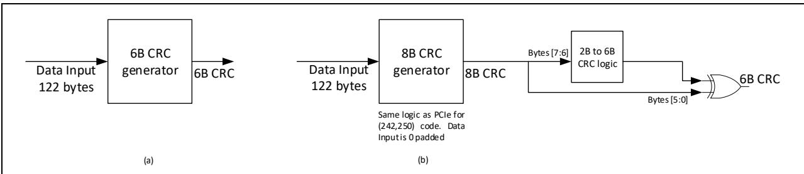  
The following are provided as attachments to the CXL specification:

• 6B CRC generator matrix (see the PCIe Base Specification for the 8B CRC generator matrix).

• 6B CRC Register Transfer Level (RTL) code (see the PCIe Base Specification for the 8B CRC RTL code). A single module with 122 bytes of input and 128 bytes of output is provided and can be used for both the even flit half and the odd flit half (by assigning Bytes 116 to 121 of the input to be 00h for the odd flit half).

• 8B CRC to 6B CRC converter RTL code. A single module with 122 bytes of input and 128 bytes of output is provided and can be used for both the even flit half and the odd flit half (by assigning Bytes 116 to 121 of the input to be 00h for the odd flit half).

## 6.2.3.2 CRC Corruption for Containment with 256B Flits

CXL has multiple scenarios that require CRC to be intentionally corrupted during transmission of a 256B flit to force the receiver to reject the flit and initiate a replay. During the subsequent replay, the transmitter has the opportunity to inject additional information about the flit. These scenarios include viral containment and late poison and nullify scenarios.

To corrupt the CRC in these scenarios, the transmitter must invert all the bits of the CRC field during transmission. FEC generation must be done using the corrupted CRC. For latency-optimized 256B flits, the transmitter must invert the CRC bits associated with either the even flit half or the odd flit half.

## 6.2.3.2.1 CXL.cachemem Viral Injection and Late Poison for 256B Flits

See Chapter 4.0 for details on CXL.cachemem viral injection and late poison scenarios. Section 4.3.6.2 describes the viral injection flow. Section 4.3.6.3 describes the late poison injection flow.

## 6.2.3.2.2 Late Nullify or Poison for CXL.io

The PCIe Base Specification defines a Flit Marker that is used to nullify or poison the last TLP in the flit. Because the Flit Header is forwarded at the beginning of a flit transmission, a transmitter may not know sufficiently early whether a Flit Marker is required to nullify or poison the last TLP. If the transmitter realizes after the Flit Header has been forwarded that a TLP must be poisoned or nullified, the transmitter must corrupt the CRC by inverting all the CRC bits. When the flit is subsequently replayed, the transmitter must use a Flit Header. For latency-optimized flits, if the last TLP that must be nullified or poisoned is in the even half, the even CRC must be inverted; if the last TLP that must be nullified or poisoned is in the odd half, the odd CRC must be inverted. FEC is calculated on the transmit side using the inverted CRC in these scenarios.

## 6.2.3.3 Framing Errors in 256B Flit Mode

An Unexpected Flit Type error is detected upon receiving a flit with a Flit Type encoding associated with a protocol that was not enabled during negotiation. For example, if a CXL.cachemem Flit Type is received while only CXL.io is enabled, this must be handled as an Unexpected Flit Type error. This is logged as an Unrecognized Flit in the PCIe Flit Logging Extended Capability, Flit Error Log 1 register. Any interrupt signaling as a result of the logged error follows the PCIe Base Specification definition.

## 256B Flit Mode Retry Buffers

Following the PCIe Base Specification, in 256B Flit mode, the Physical Layer implements the transmit retry buffer and the optional receive retry buffer. Whereas the retry buffers are managed independently in the CXL.io link layer and the CXL.cachemem link layer in 68B Flit mode, there is a single unified transmit retry buffer that handles all retryable CXL traffic in 256B Flit mode. Similarly, in 256B Flit mode, there is a single unified receive retry buffer that handles all retryable CXL traffic in 256B Flit mode. Retry requests are on a 256-byte flit granularity even when using the latency-optimized 256B flit composed of 128-byte flit halves. See Section 6.2.3.1.2 for additional details.

## Link Training

## 6.4.1 PCIe Mode vs. Flex Bus.CXL Mode Selection

Upon exit from LTSSM Detect, a Flex Bus link begins training and completes link width negotiation and speed negotiation according to the PCIe LTSSM rules. During link training, the Downstream Port initiates Flex Bus mode negotiation via the PCIe alternate protocol negotiation mechanism. Flex Bus mode negotiation is completed before entering L0 at 2.5 GT/s. If Sync Header bypass is negotiated (applicable only to 8 GT/s, 16 GT/s, and 32 GT/s link speeds), Sync Headers are bypassed as soon as the link has transitioned to a speed of 8 GT/s or higher. For 68B Flit mode, the Flex Bus logical PHY transmits NULL flits after it sends the SDS Ordered Set as soon as it transitions to 8 GT/s or higher link speeds if CXL mode was negotiated earlier in the training process. These NULL flits are used in place of PCIe Idle Symbols to facilitate certain LTSSM transitions to L0 as described in Section 6.5. After the link has transitioned to its final speed, the link can start sending CXL traffic on behalf of the upper layers after the SDS Ordered Set is transmitted if that was what was negotiated earlier in the training process. For Upstream Ports, the physical layer notifies the upper layers that the link is up and available for transmission only after it has received a flit that was not generated by the physical layer of the partner Downstream Port (see Table 6-2 for 68B Flit mode and Table 6-6 for 256B Flit mode). To operate in CXL mode, the link speed must be at least 8 GT/s. If the link is unable to transition to a speed of 8 GT/s or greater after committing to CXL mode during link training at 2.5 GT/s, the link may ultimately fail to link up even if the device is PCIe capable.

## 6.4.1.1 Hardware-autonomous Mode Negotiation

Dynamic hardware negotiation of Flex Bus mode occurs during link training in the LTSSM Configuration state before entering L0 at Gen 1 speeds using the alternate protocol negotiation mechanism, facilitated by exchanging modified TS1 and TS2 Ordered Sets as defined by the PCIe Base Specification. The Downstream Port initiates the negotiation process by sending TS1 Ordered Sets advertising its Flex Bus capabilities. The Upstream Port responds with a proposal based on its own capabilities and those advertised by the host. The host communicates the final decision of which capabilities to enable by sending modified TS2 Ordered Sets before or during Configuration.Complete.

See the PCIe Base Specification for details on how the various fields in the modified TS1/TS2 OS are set. Table 6-9 shows how the modified TS1/TS2 OS is used for Flex Bus mode negotiation. The Flex Bus Mode Negotiation Usage column describes the deltas from the PCIe Base Specification definition that are applicable for Flex Bus mode negotiation. Additional explanation is provided in Table 6-10 and Table 6-11. The presence of Retimer1 and Retimer2 must be programmed into the DVSEC Flex Bus Port by software before the negotiation begins. If retimers are present, the relevant retimer bits in the modified TS1/TS2 OS are used.

Table 6-9. Modified TS1/TS2 Ordered Set for Flex Bus Mode Negotiation (Sheet 1 of 2)

<table><tr><td>Symbol Number</td><td>PCIe Description</td><td>Flex Bus Mode Negotiation Usage</td></tr><tr><td>0 through 4</td><td>See the PCIe Base Specification Symbol</td><td></td></tr><tr><td>5</td><td>Training Control:Bits[5:0]: See the PCIe Base SpecificationBits[7:6]: Modified TS1/TS2 Supported: See the PCIe Base Specification for details</td><td>Bits[7:6]: Value is 11b</td></tr><tr><td>6</td><td>For Modified TS1: TS1 Identifier, Encoded as D10.2 (4Ah)For Modified TS2: TS2 Identifier, Encoded as D5.2 (45h)</td><td>TS1 Identifier during Phase 1 of Flex Bus mode negotiationTS2 Identifier during Phase 2 of Flex Bus mode negotiation</td></tr><tr><td>7</td><td>For Modified TS1: TS1 Identifier, Encoded as D10.2 (4Ah)For Modified TS2: TS2 Identifier, Encoded as D5.2 (45h)</td><td>TS1 Identifier during Phase 1 of Flex Bus mode negotiationTS2 Identifier during Phase 2 of Flex Bus mode negotiation</td></tr><tr><td>8 and 9</td><td>Bits[2:0]: Usage: See the PCIe Base SpecificationBits[4:3]: Alternate Protocol Negotiation Status:- Alternate Protocol Negotiation Status when Usage is 010b- Otherwise, reserved (see the PCIe Base Specification for details)Bits[15:5]: Alternate Protocol Details</td><td>Bits[2:0]: Value is 010b (indicating alternate protocols)Bits[4:3]: Alternate Protocol Negotiation Status: See the PCIe Base SpecificationBits[7:5]: Alternate Protocol ID:- 000b = Flex BusBit[8]: Common ClockBits[15:9]: ReservedSee Table 6-10for additional details.</td></tr></table>

Table 6-9. Modified TS1/TS2 Ordered Set for Flex Bus Mode Negotiation (Sheet 2 of 2)

<table><tr><td>Symbol Number</td><td>PCIe Description</td><td>Flex Bus Mode Negotiation Usage</td></tr><tr><td>10 and 11</td><td>Alternate Protocol ID/Vendor ID:Alternate Protocol ID/Vendor ID when Usage = 010bSee the PCIe Base Specification for descriptions that are applicable to other Usage values</td><td>1E98h</td></tr><tr><td>12 through 14</td><td>See the PCIe Base SpecificationSpecific proprietary usage when Usage = 010b</td><td>Bits[7:0]: Flex Bus Mode Selection:- Bit[0]: PCIe Capable/Enable- Bit[1]: CXL.io Capable/Enable- Bit[2]: CXL.mem Capable/Enable- Bit[3]: CXL.cache Capable/Enable- Bit[4]: CXL 68B Flit and VH Capable/Enable (formerly known as &quot;CXL 2.0 Capable/Enable&quot;)- Bit [5]: Streamlined Port- Bits[7:6]: ReservedBits[23:8]: Flex Bus Additional Info:- Bit[8]: Multi-Logical Device Capable/Enable- Bit[9]: Reserved- Bit[10]: Sync Header Bypass Capable/Enable- Bit[11]: Latency-Optimized 256B Flit Capable/Enable- Bit[12]: Retimer1 CXL Aware $^{1}$ - Bit[13]: Reserved- Bit[14]: Retimer2 CXL Aware $^{2}$ - Bit[15]: CXL.io Throttle Required at 64 GT/s and 128 GT/s- Bits[17:16]: CXL NOP Hint Info[1:0]- Bit[18]: PBR Flit Capable/Enable- Bit [19]: Retimer3 CXL Aware $^{3}$ - Bit [20]: Retimer4 CXL Aware $^{4}$ - Bits[23:21]: ReservedSee Table 6-11 for additional details.</td></tr><tr><td>15</td><td>See the PCIe Base Specification</td><td></td></tr></table>

1. Retimer1 is equivalent to Retimer X, Retimer $Z ,$ Retimer J, or Retimer P in the PCIe Base Specification.  
2. Retimer2 is equivalent to Retimer Y, Retimer K, or Retimer Q in the PCIe Base Specification.  
3. Retimer3 is equivalent to Retimer L or Retimer R in the PCIe Base Specification.  
4. Retimer4 is equivalent to Retimer M in the PCIe Base Specification.

Table 6-10. Additional Information on Symbols 8 and 9 of Modified TS1/TS2 Ordered Set

<table><tr><td>Bit Field in Symbols 8 and 9</td><td>Description</td></tr><tr><td>Bit[8]: Common Clock</td><td>The Downstream Port uses this bit to communicate to retimers that there is a common reference clock. Depending on implementation, retimers may use this information to determine which features to enable.</td></tr></table>

Additional Information on Symbols 12 through 14 of Modified TS1/TS2 Ordered Sets (Sheet 1 of 3)

<table><tr><td>Bit Field in Symbols 12 through 14</td><td>Description</td></tr><tr><td>Bit[0]:PCIe Capable/Enable</td><td>The Downstream Port and Upstream Port advertise their capability in Phase 1. The Downstream Port communicates the results of the negotiation in Phase 2. $^{1}$ </td></tr><tr><td>Bit[1]:CXL.io Capable/Enable</td><td>The Downstream Port and Upstream Port advertise their capability in Phase 1 as set in the DVSEC Flex Bus Port Control register $^{2}$ . The Downstream Port communicates the results of the negotiation in Phase 2. This bit must be set to 1 if the CXL 68B Flit and VH Capable/Enable bit in this register is set.</td></tr></table>

Table 6-11.  
Additional Information on Symbols 12 through 14 of Modified TS1/TS2 Ordered Sets (Sheet 2 of 3)

<table><tr><td>Bit Field in Symbols 12 through 14</td><td>Description</td></tr><tr><td>Bit[2]: CXL.mem Capable/Enable</td><td>The Downstream Port and Upstream Port advertise their capability in Phase 1 as set in the DVSEC Flex Bus Port Control register $^{2}$ . The Downstream Port communicates the results of the negotiation in Phase 2.</td></tr><tr><td>Bit[3]: CXL.cache Capable/Enable</td><td>The Downstream Port and Upstream Port advertise their capability in Phase 1 as set in the DVSEC Flex Bus Port Control register $^{2}$ . The Downstream Port communicates the results of the negotiation in Phase 2.</td></tr><tr><td>Bit[4]: CXL 68B Flit and VH Capable/Enable (formerly known as &quot;CXL 2.0 capable/ enable&quot;)</td><td>The Downstream Port and Upstream Port advertise their capability in Phase 1 as set in the DVSEC Flex Bus Port Control register $^{2}$ . The Downstream Port communicates the results of the negotiation in Phase 2. The Downstream Port must not enable this if PCIe Flit mode is enabled as described in the PCIe Base Specification. For Streamlined Ports, this bit must be set to 1 during Phase 1 and only indicates &quot;VH Capable&quot; because 68B Flit mode is not supported for Streamlined Ports.</td></tr><tr><td>Bit[5]: Streamlined Port</td><td>The Upstream Port and Downstream Port advertise whether they are a Streamlined Port in Phase 1. A Streamlined Port does not support 68B Flit Mode or RCH/RCD functionality. See Section 6.4.1.7 for additional details.</td></tr><tr><td>Bit[8]: Multi-Logical Device Capable/Enable</td><td>The Downstream Port and Upstream Port advertise their capability in Phase 1 as set in the DVSEC Flex Bus Port Control register $^{2}$ . An Upstream Switch Port must always advertise 0 in this bit. The Downstream Port communicates the results of the negotiation in Phase 2.</td></tr><tr><td>Bit[10]: Sync Header Bypass Capable/Enable</td><td>The Downstream Port, Upstream Port, and any retimers advertise their capability in Phase 1; the Downstream Port and Upstream Port advertise the value as set in the DVSEC Flex Bus Port Control register $^{2}$ . The Downstream Port communicates the results of the negotiation in Phase 2.Note: The Retimer must pass this bit unmodified from its Upstream Pseudo Port to its Downstream Pseudo Port. The retimer clears this bit if the retimer does not support this feature when passing from its Downstream Pseudo Port to its Upstream Pseudo Port, but it must never set this bit (only an Upstream Port can set this bit in that direction). If the retimer(s) do not advertise that they are CXL aware, the Downstream Port assumes that this feature is not supported by the Retimer(s) regardless of whether this bit is set.Note: This bit is applicable only at 8 GT/s, 16 GT/s, and 32 GT/s link speeds.</td></tr><tr><td>Bit[11]: Latency-Optimized 256B Flit Capable/Enable</td><td>The Downstream Port and Upstream Port advertise their capability in Phase 1 as set in the DVSEC Flex Bus Port Control register $^{2}$ . The Downstream Port communicates the results of the negotiation in Phase 2. See Section 6.2.3.1.2 for details of the latency-optimized 256B flit.Note: This bit is applicable only when PCIe Flit mode is negotiated.</td></tr><tr><td>Bit[12]: Retimer1 CXL Aware</td><td>Retimer1 advertises whether it is CXL aware in Phase 1. If Retimer1 is CXL aware, Retimer1 must use the Sync Header Bypass Capable/Enable bit. $^{3}$ </td></tr><tr><td>Bit[14]: Retimer2 CXL Aware</td><td>Retimer2 advertises whether it is CXL aware in Phase 1. If Retimer2 is CXL aware, Retimer2 must use the Sync Header Bypass Capable/Enable bit. $^{4}$ </td></tr><tr><td>Bit[15]: CXL.io Throttle Required at 64 GT/s and 128 GT/s</td><td>During Phase 1, an Upstream Port uses this bit to communicate to the Downstream Port that the Upstream Port does not support receiving consecutive CXL.io flits (including CXL.io NOP flits) when 64 GT/s link speed is negotiated; the Upstream Port does not support receiving more than one CXL.io flit within any window of four consecutive flits when 128 GT/s link speed is negotiated (see Section 6.4.1.3 for additional details). Downstream Ports are required to support this feature. The Downstream Port logs the value communicated by the partner Upstream Port in its DVSEC Flex Bus Port Status register (see Table 8-68).</td></tr></table>

Additional Information on Symbols 12 through 14 of Modified TS1/TS2 Ordered Sets (Sheet 3 of 3)

<table><tr><td>Bit Field in Symbols 12 through 14</td><td>Description</td></tr><tr><td>Bits[17:16]: CXL NOP Hint Info[1:0]</td><td>During Phase 1, the Downstream Port and Upstream Port advertise whether they support injecting NOP flits in response to receiving NOP hints and also whether they require receiving a single NOP flit or two back-to-back NOP flits to switch over from a higher-latency FEC pipeline to a lower-latency pipeline. This field is encoded as follows:00b = No support for injecting NOP flits in response to receiving NOP hints.01b = Supports injecting NOP flits. Requires receiving a single NOP flit to switch over from a higher-latency FEC pipeline to a lower-latency pipeline.10b = Reserved.11b = Supports injecting NOP flits. Requires receiving two back-to-back NOP flits to switch over from a higher-latency FEC pipeline to a lower-latency pipeline.</td></tr><tr><td>Bit[18]: PBR (Port Based Routing) Flit Capable/Enable</td><td>The Upstream Port and Downstream Port advertise that they support PBR flits in Phase 1, as set in the DVSEC Flex Bus Port Control register $^{2}$ . The Downstream Port communicates the results of the negotiation in Phase 2. The Downstream Port must not enable PBR flits if PCIe Flit mode is not enabled as defined in the PCIe Base Specification.</td></tr><tr><td>Bit[19]: Retimer3 CXL Aware</td><td>Retimer3 advertises whether it is CXL aware in Phase 1. If Retimer3 is CXL aware, Retimer3 must use the Sync Header Bypass Capable/Enable bit. $^{5}$ </td></tr><tr><td>Bit[20]: Retimer4 CXL Aware</td><td>Retimer4 advertises whether it is CXL aware in Phase 1. If Retimer4 is CXL aware, Retimer4 must use the Sync Header Bypass Capable/Enable bit. $^{6}$ </td></tr></table>

1. PCIe mode and CXL mode are mutually exclusive when the Downstream Port communicates the results of the negotiation in Phase 2.  
2. See Section 8.2.1.3.2 for the DVSEC Flex Bus Port Control register definition.  
3. Retimer1 is equivalent to Retimer X, Retimer Z, Retimer J, or Retimer P in the PCIe Base Specification.  
5. Retimer3 is equivalent to Retimer L or Retimer R in the PCIe Base Specification.  
6. Retimer4 is equivalent to Retimer M in the PCIe Base Specification.

Hardware-autonomous mode negotiation is a two-phase process that occurs while in Configuration.Lanenum.Wait, Configuration.Lanenum.Accept, and Configuration.Complete before entering L0 at Gen 1 speed:

• Phase 1: The Downstream Port sends a stream of modified TS1 Ordered Sets advertising its Flex Bus capabilities; the Upstream Port responds by sending a stream of modified TS1 Ordered Sets indicating which Flex Bus capabilities it wishes to enable. This exchange occurs during Configuration.Lanenum.Wait and/or Configuration.Lanenum.Accept. At the end of this phase, the Downstream Port has enough information to make a final selection of which capabilities to enable. The Downstream Port uses the Flex Bus capabilities information received in the first two consecutively received modified TS1 Ordered Sets in which the Alternate Protocol Negotiation status indicates that the Upstream Port supports the requested protocol.

• Phase 2: The Downstream Port sends a stream of modified TS2 Ordered Sets to the Upstream Port to indicate whether the link should operate in PCIe mode or in CXL mode; for CXL mode, it also specifies which CXL protocols, modes, and features to enable. The Downstream Port must set the Flex Bus enable bits identically in the 16 consecutive modified TS2 Ordered Sets sent before transitioning to Configuration.Idle. The Upstream Port acknowledges the enable request by sending modified TS2 Ordered Sets with the same Flex Bus enable bits set. This exchange occurs during Configuration.Complete. CXL alternate protocol negotiation successfully completes only after the Downstream Port has confirmed that the Flex Bus enable bits reflected in the eight consecutive modified TS2 Ordered Sets it receives that causes the transition to Configuration.Idle match what it transmitted; otherwise, the Downstream Port logs an error in the DVSEC Flex Bus Port Status register (see Table 8-68) and the physical layer LTSSM returns to Detect. If the

Upstream Port receives an enable request in which the Flex Bus enable bits are not a subset of what it advertised in Phase 1, the behavior is undefined.

The Flex Bus negotiation process is complete before entering L0 at 2.5 GT/s. At this point the upper layers may be notified of the decision. If CXL mode is negotiated, the physical layer enables all the negotiated modes and features only after reaching L0 at 8 GT/s or higher speed.

If CXL is negotiated but the link does not achieve a speed of at least 8 GT/s, the link will fail to link up and return to LTSSM Detect.

A flow chart describing the mode negotiation process during link training is provided in Figure 6-14. Note that while this flow chart represents the flow for several scenarios, it is not intended to cover all possible scenarios.

Figure 6-14. Flex Bus Mode Negotiation during Link Training (Sample Flow)  
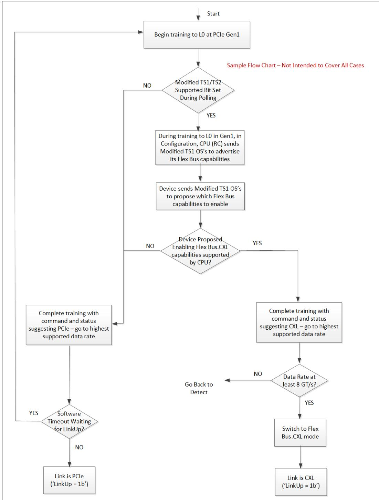

## Virtual Hierarchy vs. Restricted CXL Device Negotiation

VH-capable devices support switching and hot add, features that are not supported in exclusive Restricted CXL Devices (eRCDs). This difference in supported features impacts the link training behavior. Table 6-12 specifies the Flex Bus physical layer link training result for all possible combinations of upstream and downstream components. The table was constructed based upon the following assumptions:

• VH-capable Endpoints and switches are required to support hot add as a downstream component.

• VH-capable Downstream Ports are not required to support hot add; however, this capability is enforced at the software level. The Flex Bus physical layer will allow the link to train successfully for hot-add scenarios if both the upstream component and downstream component are VH capable.

• For exclusive Restricted CXL Hosts (eRCHs), BIOS prevents CXL hot-add scenarios by disabling CXL alternate protocol negotiation before handing control over to the OS. The Flex Bus physical layer does not have to handle these scenarios.

• For VH-capable Downstream Ports, BIOS sets the Disable\_RCD\_Training bit in the DVSEC Flex Bus Port Control register (see Table 8-67) before handing control to the OS. For a host, the Flex Bus physical layer uses the Disable\_RCD\_Training bit to distinguish between initial power-on scenarios and hot-add scenarios to determine appropriate link training behavior with eRCDs.

In the context of this section, the following terminology has changed for CXL 3.0 and newer:

• “VH-capable” was formerly known as “CXL 2.0 and newer”

• “eRCD” was formerly known as a “CXL 1.1 capable device”

• “eRCH” was formerly known as “CXL 1.1 capable host”

Table 6-12. VH vs. RCD Link Training Resolution

<table><tr><td>Upstream Component</td><td>Downstream Component</td><td>Link Training Result</td></tr><tr><td>Host — VH capable</td><td>Switch</td><td>VH mode</td></tr><tr><td>Host — eRCH</td><td>Switch</td><td>Fail CXL alternate protocol negotiation</td></tr><tr><td>Host — VH capable</td><td>Endpoint — VH capable</td><td>VH mode</td></tr><tr><td>Host — VH capable</td><td>Endpoint — eRCD</td><td>RCD for initial power-on scenario; fail CXL alternate protocol negotiation for hot-add scenario</td></tr><tr><td>Host — eRCH</td><td>Endpoint — VH capable</td><td>RCD — Assumes no hot add</td></tr><tr><td>Host — eRCH</td><td>Endpoint — eRCD</td><td>RCD — Assumes no hot add</td></tr><tr><td>Switch</td><td>Endpoint — VH capable</td><td>VH mode</td></tr><tr><td>Switch</td><td>Endpoint — eRCD</td><td>RCD for initial power-on scenario; fail CXL alternate protocol negotiation for hot-add scenario</td></tr></table>

The motivation for forcing the Flex Bus physical layer to fail CXL training for certain combinations of upstream component and downstream component is to avoid unpredictable software behavior if the link were allowed to train. For the specific combination of an eRCH and a switch, the Upstream Switch Port is responsible for ensuring that CXL alternate protocol negotiation fails by returning a value of 01b in the Alternate Protocol Negotiation Status field in the modified TS1 to indicate that it does not support the requested protocol; this must occur during Phase 1 of the alternate protocol negotiation process after the Upstream Switch Port observes that the host is not VH capable.

## 6.4.1.2.1 Retimer Presence Detection

During CXL alternate protocol negotiation, the presence of a retimer impacts whether the Sync Header bypass optimization can be enabled as described in Table 6-11. While eRCH Downstream Ports rely on BIOS to program the Retimer1\_Present and Retimer2\_Present bits in the DVSEC Flex Bus Port Control register (see Table 8-67) prior to the start of link training, VH-capable Downstream Ports must ignore those register bits because BIOS is not involved with Hot-Plug scenarios.

VH-capable Downstream Ports must determine retimer presence for CXL alternateprotocol negotiation by sampling the Retimers Present bit and Two Retimers Present bit in the received TS2 Ordered Sets. VH-capable Downstream Ports adhere to the following steps for determining and using retimer presence information:

1. During Polling.Configuration LTSSM state, the Downstream Port samples the Retimer Present bit and the Two Retimers Present bit for use during CXL alternate protocol negotiation. If the Retimer Present bit is set to 1 in the eight consecutively received TS2 Ordered Sets that causes the transition to Configuration, then the Downstream Port must assume that a retimer is present for the purposes of CXL alternate protocol negotiation. If the Two Retimers Present bit is set to 1 in the eight consecutively received TS2 Ordered Sets that causes the transition to Configuration, then the Downstream Port must assume that two retimers are present for the purposes of CXL alternate protocol negotiation.

2. During CXL alternate protocol negotiation, the Downstream Port uses the information sampled in step 1 along with the CXL Alternate Protocol Negotiation Status bits in the modified TS1 Ordered Set to determine whether to enable Sync Header bypass optimization. If a retimer was detected in step 1 on any lane associated with the configured link, then the Downstream Port assumes that a retimer is present. If two retimers were detected in step 1 on any lane associated with the configured link, then the Downstream Port assumes that two retimers are present.

3. During Configuration.Complete, per the PCIe Base Specification, the Downstream Port captures “Retimer Present” information and “Two Retimers Present” information from the received modified TS2 Ordered Sets into the Link Status 2 register. If the values sampled in this step are inconsistent with the values sampled during Polling.Configuration, then the Downstream Port logs an error in the DVSEC Flex Bus Port Status register (see Table 8-68), brings the LTSSM to Detect, and then retrains the link with the Sync Header bypass optimization disabled.

4. During Configuration.Complete, per the PCIe Base Specification, the Downstream Port determines the number of Four Retimer Aware (FRA) Retimers that are present from the received modified TS2 Ordered Sets. If it is determined that three or four FRA Retimers are present and the Retimer3 CXL Aware bit was not set in the previously received modified TS1 Ordered Sets, then the Sync Header bypass optimization must not be enabled. If it is determined that four FRA Retimers are present and the Retimer4 CXL Aware bit was not set in the previously received modified TS1 Ordered Sets, then the Sync Header bypass optimization must not be enabled. If the Downstream Port already communicated enabling of the Sync Header bypass optimization and then determines that the optimization must not be enabled, the Downstream Port logs an error in the DVSEC Flex Bus Port Status register, brings the LTSSM to Detect, and then retrains the link with the Sync Header bypass optimization disabled. Support for mixing of FRA Retimers and non-FRA Retimers is not defined in this specification.

## 6.4.1.3 256B Flit Mode

Certain protocol features, such as Back-Invalidate (BI), rely on 256B Flit mode. There is no explicit bit for 256B Flit mode negotiation. The following subsections describe 256B Flit mode negotiation, and Section 6.4.1.4 provides additional details of how negotiation results in either 256B Flit mode or 68B Flit mode.

## 6.4.1.3.1 256B Flit Mode Negotiation

As shown in Table 6-4, 256B Flit mode is implied if PCIe Flit mode is enabled during PCIe link training as described in the PCIe Base Specification. PCIe Flit mode is known prior to starting alternate protocol negotiation. No explicit bit is defined in the modified TS1/TS2 Ordered Sets for negotiating 256B Flit mode. 256B Flit mode is supported only at 8 GT/s and higher speeds.

For 256B Flit mode, the Upstream and Downstream Ports additionally negotiate whether to enable the latency-optimized 256B flit format or the standard CXL flit format. See Section 6.2.3.1.2 and Table 6-9.

## 6.4.1.3.2 CXL.io Throttling

The Upstream Port must communicate to the Downstream Port during Phase 1 of alternate protocol negotiation if its CXL.io inbound path does not support receiving consecutive CXL.io flits (including CXL.io NOP flits with a DLLP payload) at a link speed of 64 GT/s. For the purpose of this feature, consecutive CXL.io flits are CXL.io Payload flits or CXL.io NOP flits with a DLLP payload that are not separated by either an intervening flit not associated with CXL.io or an intervening Ordered Set. At 128 GT/s link speed, the Upstream Port communicates that its CXL.io inbound path does not support receiving more than one CXL.io flit within any window of four consecutive flits. Downstream Ports are required to support throttling transmission of CXL.io traffic to meet this requirement if the Upstream Port advertises this bandwidth limitation in the Modified TS1 Ordered Set (see Table 6-9). One possible usage model for this is Type 3 memory devices that need 64 GT/s or 128 GT/s link bandwidth for CXL.mem traffic but do not have much CXL.io traffic; this feature enables such devices to simplify their hardware to provide potential buffer and power savings.

## 6.4.1.3.3 NOP Insertion Hint Performance Optimization

256B Flit mode allows the Physical Layer to use a lower-latency path that bypasses FEC; however, whenever a CRC error is detected, the Physical Layer must switch over to a higher-latency path that includes the FEC logic. To switch back from the higherlatency FEC path to the lower-latency path, the Physical Layer relies on bubbles in the received data that occur due to SKP OSs or NOPs or flits that can be discarded while waiting for a specific sequence number during a replay or any other gaps. Note that NOPs or any other flits with valid DLLP payload cannot be discarded. Due to the 1E-6 bit error rate, the frequency of SKP OS insertion is insufficient to enable the Physical Layer to spend the majority of its time in the lower-latency path.

To address this, a device that detects a CRC error is permitted to send a NOP Insertion Hint to request the partner device to insert NOPs. The NOP insertion hint is defined as a NAK with a sequence number of 0. Upon receiving a NOP insertion hint, the Physical Layer may schedule a single NOP or two back-to-back NOPs to enable its link partner to switch back over to its low-latency path.

During link training, the Physical Layer communicates to its link partner whether the Physical Layer supports responding to NOP hints by inserting NOPs. The Physical Layer also communicates to its link partner whether the Physical Layer requires only a single NOP or whether it requires two back-to-back NOPs to switch over from its higherlatency FEC path to its lower-latency path.

## 6.4.1.4 Flit Mode and VH Negotiation

Table 6-13 specifies the negotiation results that the Downstream Port must communicate during Phase 2 depending on the modes advertised by both sides during Phase 1. For example, if both sides advertise PCIe Flit mode and Latency-Optimized 256B Flit mode, then the negotiation results in Latency-Optimized 256B Flit mode.

<table><tr><td colspan="4">Both Components Advertise Support during Phase 1 of Negotiation?</td><td rowspan="2">Phase 2 Negotiation Results</td></tr><tr><td>PCIe Flit Mode</td><td>PBR Flit Mode</td><td>Latency-Optimized 256B Flit Mode</td><td>68B Flit and VH Capable</td></tr><tr><td>Yes</td><td>Yes</td><td>Yes/No</td><td>Yes</td><td>PBR Flit mode, Standard 256B Flit mode</td></tr><tr><td>Yes</td><td>No</td><td>Yes</td><td>Yes</td><td>Latency-Optimized 256B Flit mode</td></tr><tr><td>Yes</td><td>No</td><td>No</td><td>Yes</td><td>Standard 256B Flit mode</td></tr><tr><td>No</td><td>No</td><td>No</td><td>Yes</td><td>68B Flit mode, VH mode</td></tr><tr><td>No</td><td>No</td><td>No</td><td>No</td><td>See Table 6-12 for VH mode vs. RCD mode; 68B flits</td></tr></table>

## 6.4.1.5 Flex Bus.CXL Negotiation with Maximum Supported Link Speed of 8 GT/s or 16 GT/s

If an eRCH or eRCD physical layer implementation supports Flex Bus.CXL operation only at a maximum speed of 8 GT/s or 16 GT/s, it must still advertise support of 32 GT/ s speed during link training at 2.5 GT/s to perform alternate protocol negotiation using modified TS1 and TS2 Ordered Sets. After the alternate protocol negotiation is complete, the Flex Bus logical PHY can then advertise the true maximum link speed that it supports as per the PCIe Base Specification. It is strongly recommended that VH-capable devices support 32 GT/s link rate; however, a VH-capable device is permitted to use the algorithm described in this section to enable CXL alternate protocol negotiation if it does not support 32 GT/s link rate.

## IMPLEMENTATION NOTE

A CXL device that advertises support of 32 GT/s in early training when it does not truly support the 32 GT/s link rate may have compatibility issues for Polling.Compliance and Loopback entry from Config.LinkWidthStart. See the PCIe Base Specification for additional details. Devices that do this must ensure that the device provides a mechanism to disable this behavior for the purposes of Polling.Compliance and Loopback testing scenarios.

## 6.4.1.6 Link Width Degradation and Speed Downgrade

If the link is operating in Flex Bus.CXL and degrades to a lower speed or lower link width that is still compatible with Flex Bus.CXL mode, the link should remain in Flex Bus.CXL mode after exiting recovery without having to go through the process of mode negotiation again. If the link drops to a speed or width that is incompatible with Flex Bus.CXL and cannot recover, the link must go down to the LTSSM Detect state; any subsequent action is implementation specific.

If the link is operating in 256B Flit mode and the link speed drops below 8 GT/s but the Port is still attempting to recover to a higher speed, the transmitter and receiver must not exit the IDLE Flit Handshake Phase until the link has recovered to a speed that is compatible with CXL, ignoring the PCIe Base Specification rules to move to the Sequence Number Handshake Phase.

## 6.4.1.7 Negotiation with Streamlined Ports

When two or more Ports of a device are bundled together as part of a Bundled Port, only one of the Ports in that group is required to be fully backward compatible in terms of supporting 68B Flit Mode and RCH/RCD functionality. The remaining Ports in the bundle are permitted to optimize their design to not provide backward compatibility support for 68B Flit Mode and RCH/RCD functionality; these optimized Ports are referred to as Streamlined Ports and only support 256B Flit Mode.

A Downstream Port connected to an open slot is required to provide full backward compatibility (i.e., the Downstream Port is not permitted to be a Streamlined Port). A Downstream Port that is part of a closed system is permitted to eliminate unnecessary backward-compatibility support. An Upstream Port that is meant to be bundled with other Ports is permitted to be optimized as a Streamlined Port as long as there is at least one other Port in the bundle that provides full backward compatibility. Ports that are meant to be bundled together are identified through the Related Function Extended Capability Structure as described in the PCIe Base Specification. A Device that does not implement a Related Function Extended Capability Structure in any of its Ports is required to implement at least one Port that provides full backward compatibility. These rules of backward compatibility are checked during Compliance testing and are not enforced through any hardware mechanisms.

The modified TS1/TS2 Ordered Sets described in Table 6-9 and Table 6-11 define a Streamlined Port. Table 6-14 specifies how this bit impacts negotiation results.

## Table 6-14. Streamlined Port Negotiation

<table><tr><td colspan="3">Phase 1 Advertised Values Set to 1? $^{1}$ </td><td rowspan="3">Phase 2 Negotiation Results</td><td rowspan="3">Additional Requirements</td></tr><tr><td rowspan="2">PCIe Flit Mode (DP and UP)</td><td colspan="2">Streamlined Port</td></tr><tr><td>DP</td><td>UP</td></tr><tr><td>Yes</td><td>Yes/No</td><td>Yes/No</td><td>See Table 6-12 and Table 6-13 to determine results</td><td></td></tr><tr><td>No</td><td>No</td><td>No</td><td>See Table 6-12 and Table 6-13 to determine results</td><td></td></tr><tr><td>No</td><td>No</td><td>Yes</td><td>Fail CXL APN</td><td>Downstream device is responsible for ensuring that the APN fails (via the APN Status field $^{2}$ )</td></tr><tr><td>No</td><td>Yes</td><td>Yes/No</td><td>Fail CXL APN</td><td></td></tr></table>

1. DP and UP represent the Downstream Port and Upstream Port, respectively.  
2. Alternate Protocol Negotiation Status field in the Modified TS1/TS2 as defined in the PCIe Base Specification.

## 68B Flit Mode: Recovery.Idle and Config.Idle Transitions to L0

The PCIe Base Specification requires transmission and receipt of a specific number of consecutive Idle data Symbols on configured lanes to transition from Recovery.Idle to L0 or Config.Idle to L0 (see the PCIe Base Specification) while in non-Flit mode. When the Flex Bus logical PHY is in CXL mode operating in 68B Flit mode, it looks for NULL flits instead of Idle Symbols to initiate the transition to L0. When in Recovery.Idle or Config.Idle, the next state is L0 if four consecutive NULL flits are received and eight NULL flits are sent after receiving one NULL flit; all other PCIe Base Specification rules regarding these transitions apply.

## L1 Abort Scenario

Because the CXL ARB/MUX virtualizes the link state that is seen by the link layers and only requests the physical layer to transition to L1 when the link layers are in agreement, there may be a race condition that results in an L1 Abort scenario. In this scenario, the physical layer may receive an EIOS or detect Electrical Idle when the ARB/MUX is no longer requesting entry to L1. In this scenario, the physical layer is required to initiate recovery on the link to bring it back to L0.

## 68B Flit Mode: Exit from Recovery

In 68B Flit mode, upon exit from recovery, the receiver assumes that any partial TLPs that were transmitted prior to recovery entry are terminated and must be retransmitted in full via a link-level retry. Partial TLPs include TLPs for which a subsequent EDB, Idle, or valid framing token were not received before entering recovery. The transmitter must satisfy any requirements to enable the receiver to make this assumption.

## 6.8 Retimers and Low Latency Mode

The CXL specification supports the following features that can be enabled to optimize latency: bypass of sync header insertion and use of a drift buffer instead of an elastic buffer. Enablement of Sync Header bypass is negotiated during the Flex Bus mode negotiation process described in Section 6.4.1.1. The Downstream Port, Upstream Port, and any retimers advertise their Sync Header bypass capability during Phase 1; and the Downstream Port communicates the final decision on whether to enable Sync Header bypass during Phase 2. Drift buffer mode is decided locally by each component. The rules for enabling each feature are summarized in Table 6-15; these rules are expected to be enforced by hardware.

Table 6-15. Rules of Enable Low-latency Mode Features

<table><tr><td>Feature</td><td>Conditions for Enabling</td><td>Notes</td></tr><tr><td>Sync Header Bypass</td><td>All components supportCommon reference clockNo retimer is present or retimer cannot add or delete SKPs (e.g., in low-latency bypass mode)Not in loopback mode</td><td></td></tr><tr><td>Drift Buffer (instead of elastic buffer)</td><td>Common reference clock</td><td>Each component can independently enable this (i.e., does not have to be coordinated). The physical layer logs in the DVSEC Flex Bus Port when this is enabled.</td></tr></table>

The Sync Header Bypass optimization applies only at 8 GT/s, 16 GT/s, and 32 GT/s link speeds. At 64 GT/s and 128 GT/s link speeds, 1b/1b encoding is used as specified in the PCIe Base Specification; thus, the Sync Header Bypass optimization is not applicable. If PCIe Flit mode is not enabled and the Sync Header Bypass optimization is enabled, then the CXL specification dictates insertion of Ordered Sets at a fixed interval. If PCIe Flit mode is enabled or Sync Header Bypass is not enabled, the Ordered Set insertion rate follows the PCIe Base Specification.

Table 6-16. Sync Header Bypass Applicability and Ordered Set Insertion Rate

<table><tr><td>Data Rate</td><td>PCIe Flit Mode</td><td>Sync Header Bypass Applicable</td><td>Ordered Set Insertion Interval while in Data Stream</td></tr><tr><td>8 GT/s, 16 GT/s, 32 GT/s</td><td>No</td><td>Yes (common clock only)</td><td>With Sync Header bypassed, after every 340 data blocks $^{1}$ With Sync Header enabled, per the PCIe Base Specification</td></tr><tr><td>8 GT/s, 16 GT/s, 32 GT/s</td><td>Yes</td><td>Yes (common clock only)</td><td>Regardless of whether Sync Header is bypassed, per the PCIe Base Specification (where flit interval refers to a 256-byte flit)</td></tr><tr><td>64 GT/s, 128 GT/s</td><td>Yes (required)</td><td>No</td><td>Per the PCIe Base Specification (where flit interval refers to 256-byte flit)</td></tr></table>

1. See Section 6.8.1 for details.

## 68B Flit Mode: SKP Ordered Set Frequency and L1/Recovery Entry

This section is applicable only for 68B Flit mode.

In Flex Bus.CXL mode, if Sync Header bypass is enabled, the following rules apply:

• After the SDS, the physical layer must schedule a control SKP OS or a standard SKP OS after every 340 data blocks, unless it is exiting the data stream.

The control SKP OSs are alternated with standard SKP OSs at 16 GT/s or higher speeds; at 8 GT/s, only standard SKP OSs are scheduled.

• When exiting the data stream, the physical layer must replace the scheduled control SKP OS (or SKP OS) with either an EIOS (for L1 entry) or EIEOS (for all other cases including recovery).

When Sync Header bypass optimization is enabled, retimers rely on the above mechanism to know when L1/recovery entry is occurring. When Sync Header bypass is not enabled, retimers must not rely on the above mechanism.

While the above algorithm dictates the control SKP OS and standard SKP OS frequency within the data stream, it should be noted that CXL devices must still satisfy the PCIe Base Specification requirement of control SKP OS and standard SKP OS insertion, which is at least once every 370 to 375 blocks when not operating in Separate Reference Clocks with Independent Spread Spectrum Clocking (SRIS), as defined in the PCIe Base Specification.

Figure 6-15 illustrates a scenario where a NULL flit with implied EDS token is sent as the last flit before exiting the data stream in the case where Sync Header bypass is enabled. In this example, near the end of the 339th block, the link layer has no flits to send, so the physical layer inserts a NULL flit. Because there is exactly one flit’s worth of time before the next Ordered Set must be sent, a NULL flit with implied EDS token is used. In this case, the variable length NULL flit with EDS token crosses a block boundary and contains a 528-bit payload of 0s.

Figure 6-15. NULL Flit with EDS and Sync Header Bypass Optimization

<table><tr><td rowspan="36"></td><td>Lane 0</td><td>Lane 1</td><td>Lane 2</td><td>Lane 3</td><td></td></tr><tr><td colspan="2">ProtID=NULL w/EDS</td><td>00h</td><td>00h</td><td>Symbol 15</td></tr><tr><td></td><td></td><td></td><td></td><td></td></tr><tr><td>00h</td><td>00h</td><td>00h</td><td>00h</td><td>Symbol 0</td></tr><tr><td>00h</td><td>00h</td><td>00h</td><td>00h</td><td>Symbol 1</td></tr><tr><td>00h</td><td>00h</td><td>00h</td><td>00h</td><td>Symbol 2</td></tr><tr><td>00h</td><td>00h</td><td>00h</td><td>00h</td><td>Symbol 3</td></tr><tr><td>00h</td><td>00h</td><td>00h</td><td>00h</td><td>Symbol 4</td></tr><tr><td>00h</td><td>00h</td><td>00h</td><td>00h</td><td>Symbol 5</td></tr><tr><td>00h</td><td>00h</td><td>00h</td><td>00h</td><td>Symbol 6</td></tr><tr><td>00h</td><td>00h</td><td>00h</td><td>00h</td><td>Symbol 7</td></tr><tr><td>00h</td><td>00h</td><td>00h</td><td>00h</td><td>Symbol 8</td></tr><tr><td>00h</td><td>00h</td><td>00h</td><td>00h</td><td>Symbol 9</td></tr><tr><td>00h</td><td>00h</td><td>00h</td><td>00h</td><td>Symbol 10</td></tr><tr><td>00h</td><td>00h</td><td>00h</td><td>00h</td><td>Symbol 11</td></tr><tr><td>00h</td><td>00h</td><td>00h</td><td>00h</td><td>Symbol 12</td></tr><tr><td>00h</td><td>00h</td><td>00h</td><td>00h</td><td>Symbol 13</td></tr><tr><td>00h</td><td>00h</td><td>00h</td><td>00h</td><td>Symbol 14</td></tr><tr><td>00h</td><td>00h</td><td>00h</td><td>00h</td><td>Symbol 15</td></tr><tr><td></td><td></td><td></td><td></td><td></td></tr><tr><td>OS</td><td>OS</td><td>OS</td><td>OS</td><td>Symbol 0</td></tr><tr><td>OS</td><td>OS</td><td>OS</td><td>OS</td><td>Symbol 1</td></tr><tr><td>OS</td><td>OS</td><td>OS</td><td>OS</td><td>Symbol 2</td></tr><tr><td>OS</td><td>OS</td><td>OS</td><td>OS</td><td>Symbol 3</td></tr><tr><td>OS</td><td>OS</td><td>OS</td><td>OS</td><td>Symbol 4</td></tr><tr><td>OS</td><td>OS</td><td>OS</td><td>OS</td><td>Symbol 5</td></tr><tr><td>OS</td><td>OS</td><td>OS</td><td>OS</td><td>Symbol 6</td></tr><tr><td>OS</td><td>OS</td><td>OS</td><td>OS</td><td>Symbol 7</td></tr><tr><td>OS</td><td>OS</td><td>OS</td><td>OS</td><td>Symbol 8</td></tr><tr><td>OS</td><td>OS</td><td>OS</td><td>OS</td><td>Symbol 9</td></tr><tr><td>OS</td><td>OS</td><td>OS</td><td>OS</td><td>Symbol 10</td></tr><tr><td>OS</td><td>OS</td><td>OS</td><td>OS</td><td>Symbol 11</td></tr><tr><td>OS</td><td>OS</td><td>OS</td><td>OS</td><td>Symbol 12</td></tr><tr><td>OS</td><td>OS</td><td>OS</td><td>OS</td><td>Symbol 13</td></tr><tr><td>OS</td><td>OS</td><td>OS</td><td>OS</td><td>Symbol 14</td></tr><tr><td>OS</td><td>OS</td><td>OS</td><td>OS</td><td>Symbol 15</td></tr></table>

Figure 6-16 illustrates a scenario where a NULL flit with implied EDS token is sent as the last flit before exiting the data stream in the case where 128b/130b encoding is used. In this example, the NULL flit contains only a 16-bit payload of 0s.

Figure 6-16. NULL Flit with EDS and 128b/130b Encoding  
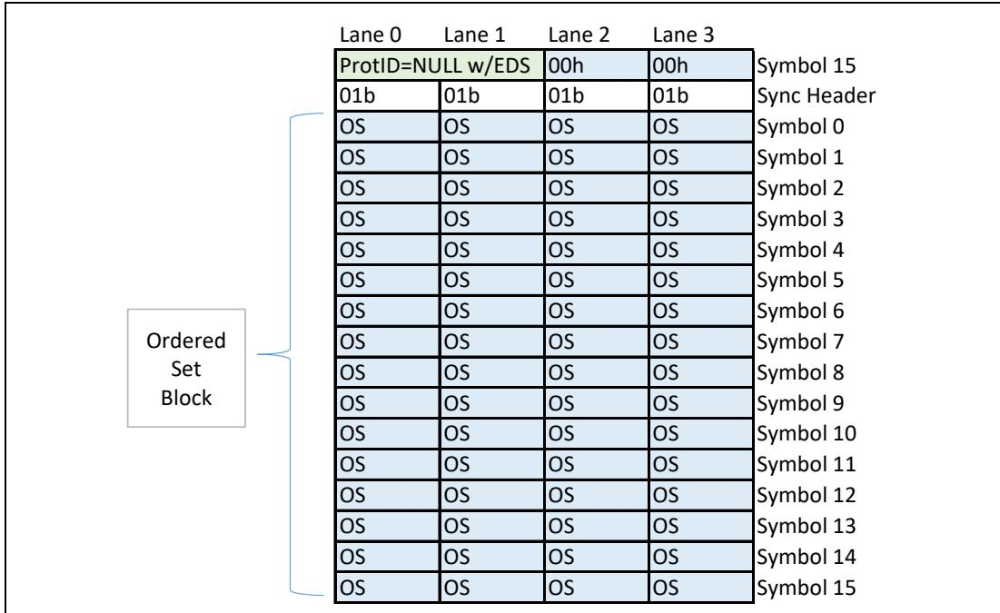

## L0p Support

CXL supports L0p Link width change as defined in the PCIe Base Specification with deltas specified in Section 5.1.2.5 and in this section.

The Hardware Autonomous Width Disable (HAWD) bit in the Link Control register impacts both CXL.cachemem and CXL.io with the same effect as described in the PCIe Base Specification, except where the PCIe Base Specification permits a receiver to not respond to an L0p request even after L0p support has been negotiated.

The L0p Enable bit in the Device Control 3 register is defined in the PCIe Base Specification as determining Port behavior when sending or responding to Link Management DLLPs. For CXL, the L0p Enable bit determines Port behavior when sending or responding to L0p ALMPs for CXL.cachemem and for CXL.io. All other behavior described in the PCIe Base Specification regarding this bit is also applicable to CXL, except where the PCIe Base Specification permits a receiver to not respond to an L0p request even after L0p support has been negotiated.

The Target Link Width field in the Device Control 3 register should be set to 111b for CXL. When the L0p Enable bit is set and the Target Link Width field is set to a nonreserved value other than 111b, the resulting link width is implementation specific.

## Inference of Electrical Idle

Unlike PCIe where absence of UpdateFC DLLPs or SKP Ordered Sets may be used to infer Electrical Idle in L0, for CXL, only absence of SKP Ordered Sets are permitted to be used for inferring Electrical Idle while in L0.

## Switching

## 7.1 Overview

This section provides an architecture overview of different CXL switch configurations.

## 7.1.1 Single VCS

A single VCS consists of a single CXL Upstream Port and one or more Downstream Ports as illustrated in Figure 7-1.

Figure 7-1. Example of a Single VCS

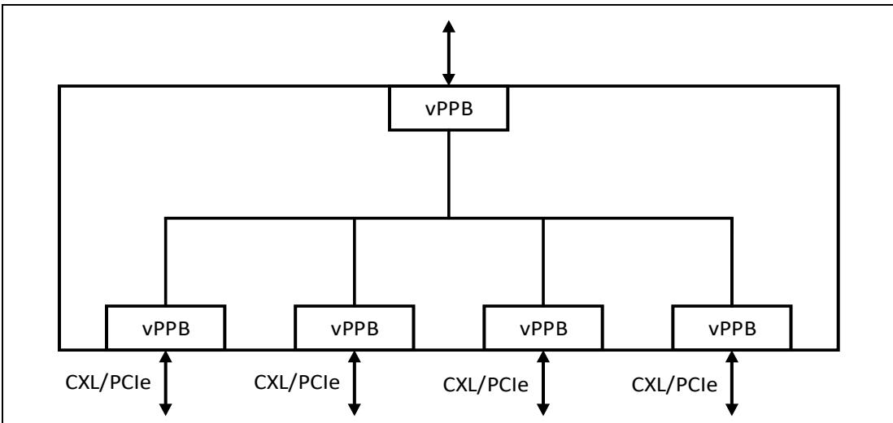

A Single VCS is governed by the following rules:

• Must have a single USP

• Must have one or more DSPs

• DSPs must support operating in CXL mode or PCIe\* mode

• All non-MLD (includes PCIe and SLD) ports support a single Virtual Hierarchy below the vPPB

• Downstream Switch Port must be capable of supporting RCD mode

• Must support the CXL Extensions DVSEC for Ports (see Section 8.1.5)

• The DVSEC defines registers to support CXL.io decode to support RCD below the Switch and registers for CXL Memory Decode. The address decode for CXL.io is in addition to the address decode mechanism supported by vPPB.

• Fabric Manager (FM) is optional for a Single VCS

## 7.1.2 Multiple VCS

A Multiple VCS consists of multiple Upstream Ports and one or more Downstream Ports per VCS as illustrated in Figure 7-2.

Example of a Multiple VCS with SLD Ports  
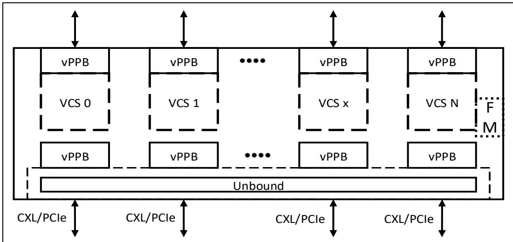

A Multiple VCS is governed by the following rules:

• Must have more than one USP.

• Must have one or more DS vPPBs per VCS.

• The initial binding of upstream (US) vPPB to physical port and the structure of the VCS (including number of vPPBs, the default vPPB capability structures, and any initial bindings of downstream (DS) vPPBs to physical ports) is defined using switch vendor specific methods.

• Each DSP must be bound to a PPB or vPPB.

• FM is optional for Multiple VCS. An FM is required for a Multiple VCS that requires bind/unbind, or that supports MLD ports. Each DSP can be reassigned to a different VCS through the managed Hot-Plug flow orchestrated by the FM.

• When configured, each USP and its associated DS vPPBs form a Single VCS Switch and operate as per the Single VCS rules.

• DSPs must support operating in CXL mode or PCIe mode.

• All non-MLD, non-Fabric, and non-GFD HBR ports support a single Virtual Hierarchy below the Downstream Switch Port.

• DSPs must be capable of supporting RCD mode.

## 7.1.3 Multiple VCS with MLD Ports

A Multiple VCS with MLD Ports consists of multiple Upstream Ports and a combination of one or more Downstream MLD Ports, as illustrated in Figure 7-3.

## Example of a Multiple Root Switch Port with Pooled Memory Devices


A Multiple VCS with MLD Ports is governed by the following rules:

• More than one USP.

• One or more Downstream vPPBs per VCS.

• Each SLD DSP can be bound to a Single VCS.

• An MLD-capable DSP can be connected to up to 16 USPs.

• Each of the SLD DSPs can be reassigned to a different VCS through the managed Hot-Plug flow orchestrated by the FM.

• Each of the LD instances in an MLD component can be reassigned to a different VCS through the managed Hot-Plug flow orchestrated by the FM.

• When configured, each USP and its associated vPPBs form a Single VCS, and operate as per the Single VCS rules.

• DSPs must support operating in CXL mode or PCIe mode.

• All non-MLD ports support a single Virtual Hierarchy below the DSP.

• DSPs must be capable of supporting RCD mode.

## 7.1.4 vPPB Ordering

vPPBs within a VCS are ordered in the following sequence: the USP vPPB, then the DSP vPPBs in increasing Device Number, Function Number order. This means Function 0 of all vPPBs in order of Device Number, then all vPPBs enumerated at Function 1 in order of Device Number, etc.

For a switch with 65 DSP vPPBs whose USP vPPB was assigned a Bus Number of 3, that would result in the vPPB ordering listed in Table 7-1.

Example of vPPB Ordering — Switch with 65 DSP vPPBs

<table><tr><td>vPPB #</td><td>PCIe ID</td></tr><tr><td>0</td><td>USP 3:0.0</td></tr><tr><td>1</td><td>DSP 4:0.0</td></tr><tr><td>2</td><td>DSP 4:1.0</td></tr><tr><td>3</td><td>DSP 4:2.0</td></tr><tr><td>...</td><td>...</td></tr><tr><td>32</td><td>DSP 4:31.0</td></tr><tr><td>33</td><td>DSP 4:0.1</td></tr><tr><td>34</td><td>DSP 4:1.1</td></tr><tr><td>...</td><td>...</td></tr><tr><td>64</td><td>DSP 4:31.1</td></tr><tr><td>65</td><td>DSP 4:0.2</td></tr></table>

This ordering also applies in cases where multi-function vPPBs exist but not all 32 Device Numbers are assigned. For example, a switch with 8 DSP vPPBs whose USP vPPB was assigned a Bus Number of 3 could present its DSP vPPBs in such a way that the host enumeration would result in the vPPB ordering listed in Table 7-2.

Example of vPPB Ordering — Switch with 8 DSP vPPBs

<table><tr><td>vPPB #</td><td>PCIe ID</td></tr><tr><td>0</td><td>USP 3:0.0</td></tr><tr><td>1</td><td>DSP 4:0.0</td></tr><tr><td>2</td><td>DSP 4:1.0</td></tr><tr><td>3</td><td>DSP 4:2.0</td></tr><tr><td>4</td><td>DSP 4:0.1</td></tr><tr><td>5</td><td>DSP 4:1.1</td></tr><tr><td>6</td><td>DSP 4:2.1</td></tr><tr><td>7</td><td>DSP 4:0.2</td></tr><tr><td>8</td><td>DSP 4:1.2</td></tr></table>

## Switch Configuration and Composition

This section describes the CXL switch initialization options and related configuration and composition procedures.

## CXL Switch Initialization Options

The CXL switch can be initialized using three different methods:

• Static

• FM boots before the host(s)

• FM and host boot simultaneously

## 7.2.1.1 Static Initialization

Figure 7-4 shows a statically initialized CXL switch with two VCSs. In this example, the downstream vPPBs are statically bound to ports and are available to the host at boot. Managed hot-add of Devices is supported using standard PCIe mechanisms.

## Static CXL Switch with Two VCSs

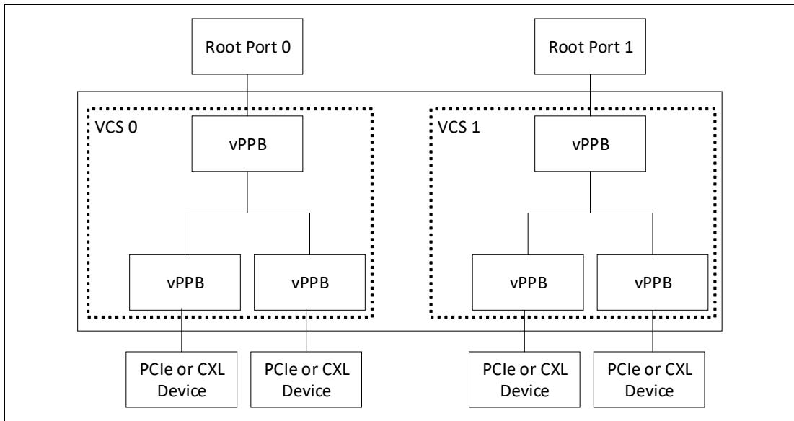

Static Switch Characteristics:

• No support for MLD Ports

• No support for rebinding of ports to a different VCS

• No FM is required

• At switch boot, all VCSs and Downstream Port bindings are statically configured using switch vendor defined mechanisms (e.g., configuration file in SPI Flash)

• Supports RCD mode, CXL VH mode, or PCIe mode

• VCSs, including vPPBs, behave identically to a PCIe switch, along with the addition of supporting CXL protocols

• Each VCS is ready for enumeration when the host boots

• Hot-add and managed hot-remove are supported

• No explicit support for Async removal of CXL devices; Async removal requires that root ports implement CXL Isolation (see Section 12.3)

A switch that provides internal Endpoint functions is beyond the scope of this specification.

## 7.2.1.2 Fabric Manager Boots First

In cases where the FM boots first (prior to host(s)), the switch is permitted to be initialized as described in the example shown in Figure 7-5.

Example of CXL Switch Initialization when FM Boots First  
  
1. FM boots while hosts are held in reset.

2. All attached DSPs link up and are bound to FM-owned PPBs.

3. DSPs link up and the switch notifies the FM using a managed hot-add notification.

Figure 7-6. Example of CXL Switch after Initialization Completes  


As shown in the example above in Figure 7-6, the following steps are taken to configure the switch after initialization completes:

1. FM sends bind command BIND (VCS0, vPPB1, PHY\_PORT\_ID1) to the switch. The switch then configures virtual to physical binding.

2. Switch remaps vPPB virtual port numbers to physical port numbers.

— Virtual port number is the index of the vPPB (as specified in the Bind vPPB command discussed in Section 7.6.7.2.2) per virtual hierarchy

3. Switch remaps the vPPB connector definition (PERST#, PRSNT#) to a physical connector.

4. Switch disables the link using PPB Link Disable.

5. At this point, all Physical downstream PPB functionality (e.g., Capabilities, etc.) maps directly to the vPPB including Link Disable, which releases the port for linkup.

6. The FM-owned PPB no longer exists for this port.

7. When the hosts boot, the switch is ready for enumeration.

## 7.2.1.3 Fabric Manager and Host Boot Simultaneously

## gure 7-7. Example of Switch with Fabric Manager and Host Booting Simultaneously

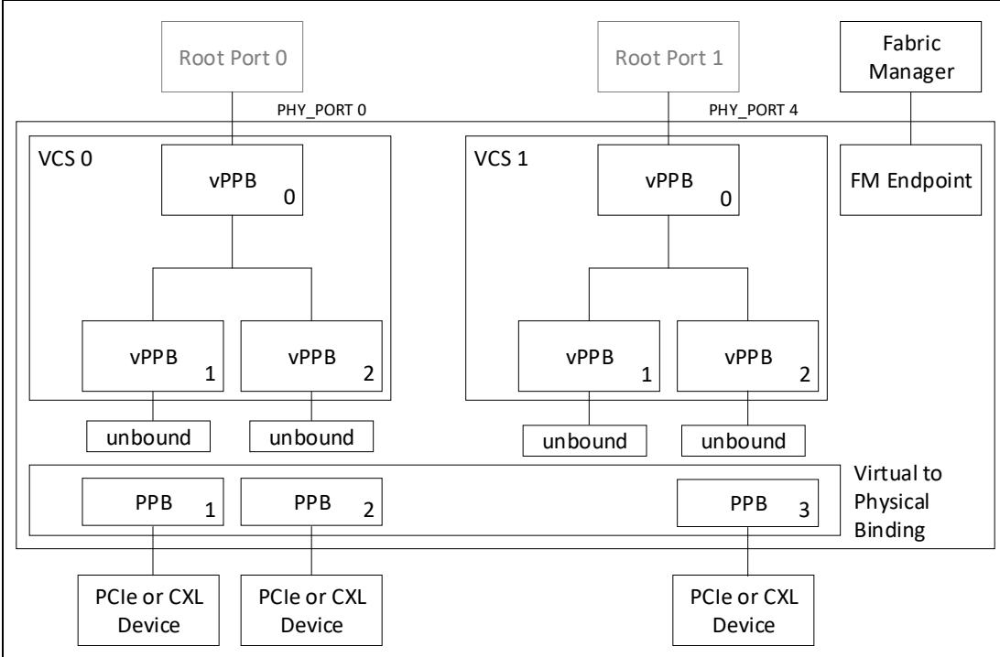

In the case where the switch, FM, and host boot at the same time:

1. VCSs are statically defined.

2. DSP vPPBs within each VCS are unbound and presented to the host as Link Down.

3. Switch discovers downstream devices and presents them to the FM.

4. Host enumerates the VH and configures the DVSEC registers.

5. FM performs port binding to vPPBs.

6. Switch performs virtual to physical binding.

7. Each bound port results in a hot-add indication to the host.

Figure 7-8. Example of Simultaneous Boot after Binding  


## Sideband Signal Operation

The availability of slot sideband control signals is decided by the form-factor specifications. Any form factor can be supported, but if the form factor supports the signals listed in Table 7-3, the signals must be driven by the switch, or connected to the switch, for correct operation.

All other sideband signals have no constraints and are supported exactly as in PCIe.

Table 7-3. CXL Switch Sideband Signal Requirements

<table><tr><td>Signal Name</td><td>Signal Description</td><td>Requirement</td></tr><tr><td>USP PERST#</td><td>PCIe Reset provides a fundamental reset to the VCS</td><td>This signal must be connected to the switch if implemented</td></tr><tr><td>USP ATTN#</td><td>Attention button indicates a request to the host for a managed hot-remove of the switch</td><td>If hot-remove of the switch is supported, this signal must be generated by the switch</td></tr><tr><td>DSP PERST#</td><td>PCIe Reset provides a power-on reset to the downstream link partner</td><td>This signal must be generated by the switch if implemented</td></tr><tr><td>DSP PRSNT#</td><td>Out-of-band Presence Detect indicates that a device has been connected to the slot</td><td>This signal must be connected to the switch if implemented</td></tr><tr><td>DSP ATTN#</td><td>Attention button indicates a request to the host for a managed hot-remove of the downstream slot</td><td>If managed hot-remove is supported, this signal must be connected to the switch</td></tr></table>

This list provides the minimum sideband signal set to support managed Hot-Plug. Other optional sidebands signals such as Attention LED, Power LED, Manual Retention Latch, Electromechanical Lock, etc. may also be used for managed Hot-Plug. The behavior of these sideband signals is identical to PCIe.

## Binding and Unbinding

This section describes the details of Binding and Unbinding of CXL devices to a vPPB.

## Binding and Unbinding of a Single Logical Device Port

A Single Logical Device (SLD) port refers to a port that is bound to only one VCS. That port can be linked up with a PCIe device or a CXL Type 1, Type 2, or Type 3 SLD component. In general, the vPPB bound to the SLD port behaves the same as a PPB in a PCIe switch. An exception is that a vPPB can be unbound from any physical port. In this case the vPPB appears to the host as if it is in a Link Down state with no Presence Detect indication. If optional rebinding is desired, this switch must have an FM API support and FM connection. The Fabric Manager can bind any unused physical port to the unbound vPPB. After binding, all the vPPB port settings are applied to that physical port.

Figure 7-9 shows a switch with bound DSPs.  
Figure 7-9. Example of Binding and Unbinding of an SLD Port  
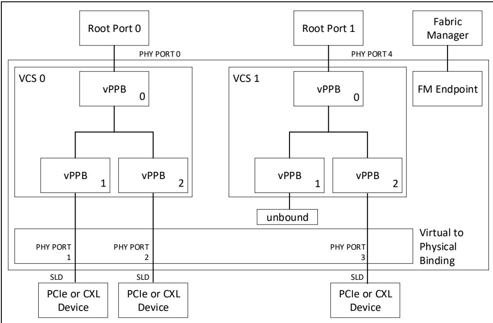

Figure 7-10 shows the state of the switch after the FM has executed an unbind command to vPPB2 in VCS0. Unbind of the vPPB causes the switch to assert Link Disable to the port. The port then becomes FM-owned and is controlled by the PPB settings for that physical port. Through the FM API, the FM has CXL.io access to each FM-owned SLD port or FM-owned LD within an MLD component. The FM can choose to prepare the logical device for rebinding by triggering FLR or CXL Reset. The switch prohibits any CXL.io access from the FM to a bound SLD port and any CXL.io access from the FM to a bound LD within an MLD component. The FM API does not support FM generation of CXL.cache or CXL.mem transactions to any port.

Figure 7-10. Example of CXL Switch Configuration after an Unbind Command  
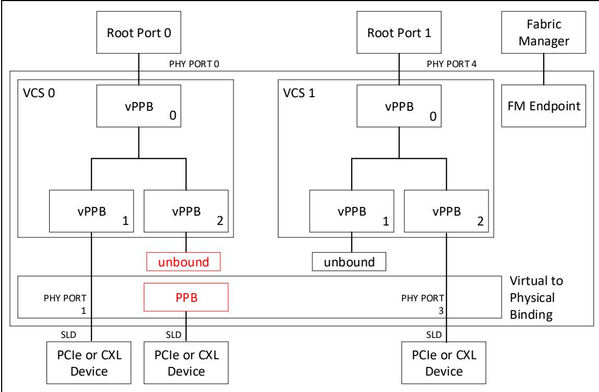  
Figure 7-11 shows the state of the switch after the FM executes the bind command to connect VCS1.vPPB1 to the unbound physical port. The successful command execution results in the switch sending a hot-add indication to Host 1. Enumeration, configuration, and operation of the host and Type 3 device is identical to a hot-add of a device.

Figure 7-11. Example of CXL Switch Configuration after a Bind Command  
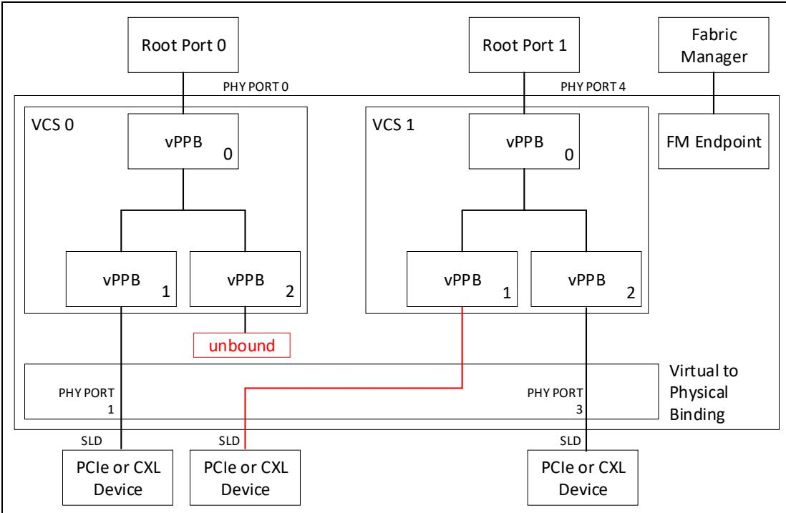  
Binding and Unbinding of a Pooled Device

A pooled device contains multiple Logical Devices (LDs) so that traffic over the physical port can be associated with multiple DS vPPBs. The switch behavior for binding and unbinding of an MLD component is similar to that of an SLD component, but with some notable differences:

• The physical link cannot be impacted by binding and unbinding of an LD within an MLD component. Thus, PERST#, Hot Reset, and Link Disable cannot be asserted, and there must be no impact to the traffic of other VCSs during the bind or unbind commands.

• The physical PPB for an MLD port is always owned by the FM. The FM is responsible for port link control, AER, DPC, etc., and manages it using the FM API.

• The FM may need to manage the pooled device to change memory allocations, enable the LD, etc.

Figure 7-12 shows a CXL switch after boot and before binding of any LDs within the pooled device. Note that the FM is not a PCIe Root Port and that the switch is responsible for enumerating the FMLD after any physical reset because the switch is responsible for proxying commands from the FM to the device. The PPB of an MLD port is always owned by the FM because the FM is responsible for configuration and error handling of the physical port. After linkup, the FM is notified that the switch is a Type 3 pooled device.

Figure 7-12. Example of a CXL Switch before Binding of LDs within Pooled Device  


The FM configures the pooled device for Logical Device 1 (LD 1) and sets its memory allocation, etc. The FM performs a bind command for the unbound vPPB 2 in VCS 0 to LD 1 in the Type 3 pooled device. The switch performs the virtual-to-physical translations such that all CXL.io and CXL.mem transactions that target vPPB 2 in VCS 0 are routed to the MLD port with LD-ID set to 1. Additionally, all CXL.io and CXL.mem transactions from LD 1 in the pooled device are routed according to the host configuration of VCS 0. After binding, the vPPB notifies the VCS 0 host of a hot-add the same as if it were binding a vPPB to an SLD port.

Figure 7-13 shows the state of the switch after binding LD 1 to VCS 0.  
igure 7-13. Example of a CXL Switch after Binding of LD-ID 1 within Pooled Device  
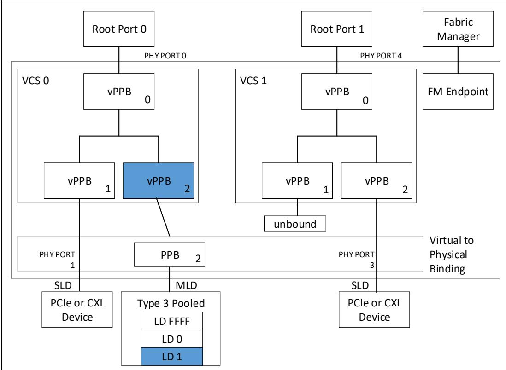  
The FM configures the pooled device for Logical Device 0 (LD 0) and sets its memory allocation, etc. The FM performs a bind command for the unbound vPPB 1 in VCS 1 to LD 0 in the Type 3 pooled device. The switch performs the virtual to physical translations such that all CXL.io and CXL.mem transactions targeting the vPPB in VCS 1 are routed to the MLD port with LD-ID set to 0. Additionally, all CXL.io and CXL.mem transactions from LD-ID = 0 in the pooled device are routed to the USP of VCS 1. After binding, the vPPB notifies the VCS 1 host of a hot-add the same as if it were binding a vPPB to an SLD port.

Figure 7-14 shows the state of the switch after binding LD 0 to VCS 1.  
7-14. Example of a CXL Switch after Binding of LD-IDs 0 and 1 within Pooled Device  
  
After binding LDs to vPPBs, the switch behavior is different from a bound SLD Port with respect to control, status, error notification, and error handling. Section 7.3.4 describes the differences in behavior for all bits within each register.

## PPB and vPPB Behavior for MLD Ports

An MLD port provides a virtualized interface such that multiple vPPBs can access LDs over a shared physical interface. As a result, the characteristics and behavior of a vPPB that is bound to an MLD port are different than the behavior of a vPPB that is bound to an SLD port. This section defines the differences between them. If not mentioned in this section, the features and behavior of a vPPB that is bound to an MLD port are the same as those for a vPPB that is bound to an SLD port.

This section uses the following terminology:

• Hardwire to 0 refers to status and optional control register bits that are initialized to 0. Writes to these bits have no effect.

• The term “Read/Write with no Effect” refers to control register bits where writes are recorded but have no effect on operation. Reads to those bits reflect the previously written value or the initialization value if it has not been changed since initialization.

## 7.2.4.1 MLD Type 1 Configuration Space Header

Table 7-4.

MLD Type 1 Configuration Space Header

<table><tr><td>Register</td><td>Register Fields</td><td>FM-owned PPB</td><td>All Other vPPBs</td></tr><tr><td rowspan="4">Bridge Control Register</td><td>Parity Error Response Enable</td><td>Supported</td><td>Hardwire to 0s</td></tr><tr><td>SERR# Enable</td><td>Supported</td><td>Read/Write with no effect</td></tr><tr><td>ISA Enable</td><td>Not supported</td><td>Not supported</td></tr><tr><td>Secondary Bus Reset (see Section 7.5 for SBR details for MLD ports)</td><td>Supported</td><td>Read/Write with no effect. Optional FM Event.</td></tr></table>

Table 7-5. MLD PCIe-compatible Configuration Registers

<table><tr><td>Register/Capability Structure</td><td>Capability Register Fields</td><td>FM-owned PPB</td><td>All vPPBs Bound to the MLD Port</td></tr><tr><td rowspan="6">Command Register</td><td>I/O Space Enable</td><td>Hardwire to 0s</td><td>Hardwire to 0s</td></tr><tr><td>Memory Space Enable</td><td>Supported</td><td>Supported per vPPB</td></tr><tr><td>Bus Master Enable</td><td>Supported</td><td>Supported per vPPB</td></tr><tr><td>Parity Error Response</td><td>Supported</td><td>Read/Write with no effect</td></tr><tr><td>SERR# Enable</td><td>Supported</td><td>Supported per vPPB</td></tr><tr><td>Interrupt Disable</td><td>Supported</td><td>Hardwire to 0s</td></tr><tr><td rowspan="4">Status Register</td><td>Interrupt Status</td><td>Hardwire to 0 (INTx is not supported)</td><td>Hardwire to 0s</td></tr><tr><td>Master Data Parity Error</td><td>Supported</td><td>Hardwire to 0s</td></tr><tr><td>Signaled System Error</td><td>Supported</td><td>Supported per vPPB</td></tr><tr><td>Detected Parity Error</td><td>Supported</td><td>Hardwire to 0s</td></tr></table>

## 7.2.4.3 MLD PCIe Capability Structure

Table 7-6. MLD PCIe Capability Structure (Sheet 1 of 3)

<table><tr><td>Register/Capability Structure</td><td>Capability Register Fields</td><td>FM-owned PPB</td><td>All vPPBs Bound to the MLD Port</td></tr><tr><td rowspan="3">Device Capabilities Register</td><td>Max_Payload_Size Supported</td><td>Configured by the FM to the max value supported by switch hardware and min value configured in all vPPBs</td><td>Mirrors PPB</td></tr><tr><td>Phantom Functions Supported</td><td>Hardwire to 0s</td><td>Hardwire to 0s</td></tr><tr><td>Extended Tag Field Supported</td><td>Supported</td><td>Mirrors PPB</td></tr><tr><td>Device Control Register</td><td>Max_Payload_Size</td><td>Configured by the FM to Max_Payload Size Supported</td><td>Read/Write with no effect</td></tr><tr><td>Link Capabilities Register</td><td>Link Bandwidth Notification Capability</td><td>Hardwire to 0s</td><td>Hardwire to 0s</td></tr></table>

Table 7-6. MLD PCIe Capability Structure (Sheet 2 of 3)

<table><tr><td>Register/Capability Structure</td><td>Capability Register Fields</td><td>FM-owned PPB</td><td>All vPPBs Bound to the MLD Port</td></tr><tr><td rowspan="2">Link Capabilities</td><td>ASPM Support</td><td>No L0s support</td><td>No L0s support</td></tr><tr><td>Clock Power Management</td><td>No PM L1 Substates support</td><td>No PM L1 Substates support</td></tr><tr><td rowspan="9">Link Control</td><td>ASPM Control</td><td>Supported</td><td>Switch only enables ASPM if all vPPBs that are bound to this MLD have enabled ASPM</td></tr><tr><td>Link Disable</td><td>Supported</td><td>Switch handles it as an unbind by discarding all traffic to/from this LD-ID</td></tr><tr><td>Retrain Link</td><td>Supported</td><td>Read/Write with no effect</td></tr><tr><td>Common Clock Configuration</td><td>Supported</td><td>Read/Write with no effect</td></tr><tr><td>Extended Synch</td><td>Supported</td><td>Read/Write with no effect</td></tr><tr><td>Hardware Autonomous Width Disable</td><td>Supported</td><td>Read/Write with no effect</td></tr><tr><td>Link Bandwidth Management Interrupt Enable</td><td>Supported</td><td>Read/Write with no effect</td></tr><tr><td>Link Autonomous Bandwidth Interrupt Enable</td><td>Supported</td><td>Supported per vPPB. Each host can be notified of autonomous speed change</td></tr><tr><td>DRS Signaling Control</td><td>Supported</td><td>Switch sends DRS after receiving DRS on the link and after binding of the vPPB to an LD</td></tr><tr><td rowspan="6">Link Status register</td><td>Current Link Speed</td><td>Supported</td><td>Mirrors PPB</td></tr><tr><td>Negotiated Link Width</td><td>Supported</td><td>Mirrors PPB</td></tr><tr><td>Link Training</td><td>Supported</td><td>Hardwire to 0s</td></tr><tr><td>Slot Clock Configuration</td><td>Supported</td><td>Mirrors PPB</td></tr><tr><td>Data Link Layer Active</td><td>Supported</td><td>Mirrors PPB</td></tr><tr><td>Link Autonomous Bandwidth Status</td><td>Supported</td><td>Supported per vPPB</td></tr><tr><td rowspan="2">Slot Capabilities Register</td><td>Hot-Plug Surprise</td><td>Hardwire to 0s</td><td>Hardwired to 0s</td></tr><tr><td>Physical Slot Number</td><td>Supported</td><td>Mirrors PPB</td></tr><tr><td rowspan="8">Slot Status Register</td><td>Attention Button Pressed</td><td>Supported</td><td>Mirrors PPB or is set by the switch on unbind</td></tr><tr><td>Power Fault Detected</td><td>Supported</td><td>Mirrors PPB</td></tr><tr><td>MRL Sensor Changed</td><td>Supported</td><td>Mirrors PPB</td></tr><tr><td>Presence Detect Changed</td><td>Supported</td><td>Mirrors PPB or is set by the switch on unbind</td></tr><tr><td>MRL Sensor State</td><td>Supported</td><td>Mirrors PPB</td></tr><tr><td>Presence Detect State</td><td>Supported</td><td>Mirrors PPB or set by the switch on bind or unbind</td></tr><tr><td>Electromechanical Interlock Status</td><td>Supported</td><td>Mirrors PPB</td></tr><tr><td>Data Link Layer State Changed</td><td>Supported</td><td>Mirrors PPB or set by the switch on bind or unbind</td></tr><tr><td>Device Capabilities 2 Register</td><td>OBFF Supported</td><td>Hardwire to 0s</td><td>Hardwire to 0s</td></tr></table>

Table 7-6. MLD PCIe Capability Structure (Sheet 3 of 3)

<table><tr><td>Register/Capability Structure</td><td>Capability Register Fields</td><td>FM-owned PPB</td><td>All vPPBs Bound to the MLD Port</td></tr><tr><td rowspan="5">Device Control 2 Register</td><td>ARI Forwarding Enable</td><td>Supported</td><td>Supported per vPPB</td></tr><tr><td>Atomic Op Egress Blocking</td><td>Supported</td><td>Mirrors PPB. Read/Write with no effect</td></tr><tr><td>LTR Mechanism Enabled</td><td>Supported</td><td>Supported per vPPB</td></tr><tr><td>Emergency Power Reduction Request</td><td>Supported</td><td>Read/Write with no effect. Optional FM notification.</td></tr><tr><td>End-End TLP Prefix Blocking</td><td>Supported</td><td>Mirrors PPB. Read/Write with no effect</td></tr><tr><td rowspan="8">Link Control 2 Register</td><td>Target Link Speed</td><td>Supported</td><td>Read/Write with no effect. Optional FM notification.</td></tr><tr><td>Enter Compliance</td><td>Supported</td><td>Read/Write with no effect</td></tr><tr><td>Hardware Autonomous Speed Disable</td><td>Supported</td><td>Read/Write with no effect. Optional FM notification.</td></tr><tr><td>Selectable De-emphasis</td><td>Supported</td><td>Read/Write with no effect</td></tr><tr><td>Transmit Margin</td><td>Supported</td><td>Read/Write with no effect</td></tr><tr><td>Enter Modified Compliance</td><td>Supported</td><td>Read/Write with no effect</td></tr><tr><td>Compliance SOS</td><td>Supported</td><td>Read/Write with no effect</td></tr><tr><td>Compliance Preset/De-emphasis</td><td>Supported</td><td>Read/Write with no effect</td></tr><tr><td rowspan="11">Link Status 2 Register</td><td>Current De-emphasis Level</td><td>Supported</td><td>Mirrors PPB</td></tr><tr><td>Equalization 8.0 GT/s Complete</td><td>Supported</td><td>Mirrors PPB</td></tr><tr><td>Equalization 8.0 GT/s Phase 1 Successful</td><td>Supported</td><td>Mirrors PPB</td></tr><tr><td>Equalization 8.0 GT/s Phase 2 Successful</td><td>Supported</td><td>Mirrors PPB</td></tr><tr><td>Equalization 8.0 GT/s Phase 3 Successful</td><td>Supported</td><td>Mirrors PPB</td></tr><tr><td>Link Equalization Request 8.0 GT/s</td><td>Supported</td><td>Read/Write with no effect</td></tr><tr><td>Retimer Presence Detected</td><td>Supported</td><td>Mirrors PPB</td></tr><tr><td>Two Retimers Presence Detected</td><td>Supported</td><td>Mirrors PPB</td></tr><tr><td>Crosslink Resolution</td><td>Hardwire to 0s</td><td>Hardwire to 0s</td></tr><tr><td>Downstream Component Presence</td><td>Supported</td><td>Reflects the binding state of the vPPB</td></tr><tr><td>DRS Message Received</td><td>Supported</td><td>Switch sends DRS after receiving DRS on the link and after binding of the vPPB to an LD</td></tr></table>

## 7.2.4.4

## MLD PPB Secondary PCIe Capability Structure

All fields in the Secondary PCIe Capability Structure for a Virtual PPB shall behave identically to PCIe except as indicated in Table 7-7.

MLD Secondary PCIe Capability Structure

<table><tr><td>Register/Capability Structure</td><td>Capability Register Fields</td><td>FM-owned PPB</td><td>All vPPBs Bound to the MLD Port</td></tr><tr><td rowspan="3">Link Control 3 Register</td><td>Perform Equalization</td><td>Supported</td><td>Read/Write with no effect</td></tr><tr><td>Link Equalization Request Interrupt Enable</td><td>Supported</td><td>Read/Write with no effect</td></tr><tr><td>Enable Lower SKP OS Generation Vector</td><td>Supported</td><td>Read/Write with no effect</td></tr><tr><td>Lane Error Status Register</td><td>All fields</td><td>Supported</td><td>Mirrors PPB</td></tr><tr><td>Lane Equalization Control Register</td><td>All fields</td><td>Supported</td><td>Read/Write with no effect</td></tr><tr><td>Data Link Feature Capabilities Register</td><td>All fields</td><td>Supported</td><td>Hardwire to 0s</td></tr><tr><td>Data Link Feature Status Register</td><td>All fields</td><td>Supported</td><td>Hardwire to 0s</td></tr></table>

## MLD Physical Layer 16.0 GT/s Extended Capability

All fields in the Physical Layer 16.0 GT/s Extended Capability Structure for a Virtual PPB shall behave identically to PCIe except as indicated in Table 7-8.

MLD Physical Layer 16.0 GT/s Extended Capability

<table><tr><td>Register/Capability Structure</td><td>Capability Register Fields</td><td>FM-owned PPB</td><td>All vPPBs Bound to the MLD Port</td></tr><tr><td>16.0 GT/s Status Register</td><td>All fields</td><td>Supported</td><td>Mirrors PPB</td></tr><tr><td>16.0 GT/s Local Data Parity Mismatch Status Register</td><td>Local Data Parity Mismatch Status Register</td><td>Supported</td><td>Mirrors PPB</td></tr><tr><td>16.0 GT/s First Retimer Data Parity Mismatch Status Register</td><td>First Retimer Data Parity Mismatch Status</td><td>Supported</td><td>Mirrors PPB</td></tr><tr><td>16.0 GT/s Second Retimer Data Parity Mismatch Status Register</td><td>Second Retimer Data Parity Mismatch Status</td><td>Supported</td><td>Mirrors PPB</td></tr><tr><td>16.0 GT/s Lane Equalization Control Register</td><td>Downstream Port 16.0 GT/s Transmitter Preset</td><td>Supported</td><td>Mirrors PPB</td></tr></table>

## 7.2.4.6

## MLD Physical Layer 32.0 GT/s Extended Capability

Table 7-9.

MLD Physical Layer 32.0 GT/s Extended Capability

<table><tr><td>Register/Capability Structure</td><td>Capability Register Fields</td><td>FM-owned PPB</td><td>All vPPBs Bound to the MLD Port</td></tr><tr><td>32.0 GT/s Capabilities Register</td><td>All fields</td><td>Supported</td><td>Mirrors PPB</td></tr><tr><td>32.0 GT/s Control Register</td><td>All fields</td><td>Supported</td><td>Read/Write with no effect</td></tr><tr><td rowspan="2">32.0 GT/s Status Register</td><td>Link Equalization Request 32.0 GT/s</td><td>Supported</td><td>Read/Write with no effect</td></tr><tr><td>All fields except Link Equalization Request 32.0 GT/s</td><td>Supported</td><td>Mirrors PPB</td></tr><tr><td>Received Modified TS Data 1 Register</td><td>All fields</td><td>Supported</td><td>Mirrors PPB</td></tr><tr><td>Received Modified TS Data 2 Register</td><td>All fields</td><td>Supported</td><td>Mirrors PPB</td></tr><tr><td>Transmitted Modified TS Data 1 Register</td><td>All fields</td><td>Supported</td><td>Mirrors PPB</td></tr><tr><td>32.0 GT/s Lane Equalization Control Register</td><td>Downstream Port 32.0 GT/s Transmitter Preset</td><td>Supported</td><td>Mirrors PPB</td></tr></table>

## MLD Lane Margining at the Receiver Extended Capability

Table 7-10. MLD Lane Margining at the Receiver Extended Capability

<table><tr><td>Register/Capability Structure</td><td>Capability Register Fields</td><td>FM-owned PPB</td><td>All vPPBs Bound to the MLD Port</td></tr><tr><td>Margining Port Status Register</td><td>All fields</td><td>Supported</td><td>Always indicates Margining Ready and Margining Software Ready</td></tr><tr><td>Margining Lane Control Register</td><td>All fields</td><td>Supported</td><td>Read/Write with no effect</td></tr></table>

## 7.2.5 MLD ACS Extended Capability

CXL.io Requests and Completions are routed to the USP.

Table 7-11. MLD ACS Extended Capability

<table><tr><td>Register/Capability Structure</td><td>Capability Register Fields</td><td>FM-owned PPB</td><td>All vPPBs Bound to the MLD Port</td></tr><tr><td>ACS Capability Register</td><td>All fields</td><td>Supported</td><td>Supported because a vPPB can be bound to any port type</td></tr><tr><td rowspan="10">ACS Control Register</td><td>ACS Source Validation Enable</td><td>Hardwire to 0</td><td>Read/Write with no effect</td></tr><tr><td>ACS Translation Blocking Enable</td><td>Hardwire to 0</td><td>Read/Write with no effect</td></tr><tr><td>ACS P2P Request Redirect Enable</td><td>Hardwire to 1</td><td>Read/Write with no effect</td></tr><tr><td>ACS P2P Completion Redirect Enable</td><td>Hardwire to 1</td><td>Read/Write with no effect</td></tr><tr><td>ACS Upstream Forwarding Enable</td><td>Hardwire to 0</td><td>Read/Write with no effect</td></tr><tr><td>ACS P2P Egress Control Enable</td><td>Hardwire to 0</td><td>Read/Write with no effect</td></tr><tr><td>ACS Direct Translated P2P Enable</td><td>Hardwire to 0</td><td>Read/Write with no effect</td></tr><tr><td>ACS I/O Request Blocking Enable</td><td>Hardwire to 0</td><td>Read/Write with no effect</td></tr><tr><td>ACS DSP Memory Target Access Control</td><td>Hardwire to 0s</td><td>Read/Write with no effect</td></tr><tr><td>ACS Unclaimed Request Redirect Control</td><td>Hardwire to 0</td><td>Read/Write with no effect</td></tr></table>

## 7.2.6 MLD PCIe Extended Capabilities

All fields in the PCIe Extended Capability structures for a vPPB shall behave identically to PCIe.

## 7.2.7 MLD Advanced Error Reporting Extended Capability

AER in an MLD port is separated into Triggering, Notifications, and Reporting. Triggering and AER Header Logging is handled at switch ingress and egress using switch-vendorspecific means. Notification is also switch-vendor specific, but it results in the vPPB logic for all vPPBs that are bound to the MLD port being informed of the AER errors that have been triggered. The vPPB logic is responsible for generating the AER status and error messages for each vPPB based on the AER Mask and Severity registers.

vPPBs that are bound to an MLD port support all the AER Mask and Severity configurability; however, some of the Notifications are suppressed to avoid confusion.

The PPB has its own AER Mask and Severity registers and the FM is notified of error conditions based on the Event Notification settings.

Errors that are not vPPB specific are provided to the host with a header log containing all 1s data. The hardware header log is provided only to the FM through the PPB.

Table 7-12 lists the AER Notifications and their routing indications for PPBs and vPPBs. MLD Advanced Error Reporting Extended Capability

<table><tr><td>Hardware Triggers</td><td>AER Error</td><td>FM-owned PPB</td><td>All vPPBs Bound to the MLD Port</td></tr><tr><td rowspan="23">AER Notifications</td><td>Data Link Protocol Error</td><td>Supported</td><td>Supported per vPPB</td></tr><tr><td>Surprise Down Error</td><td>Supported</td><td>Supported per vPPB</td></tr><tr><td>Poisoned TLP Received</td><td>Supported</td><td>Hardwire to 0</td></tr><tr><td>Flow Control Protocol Error</td><td>Supported</td><td>Supported per vPPB</td></tr><tr><td>Completer Abort</td><td>Supported</td><td>Supported to the vPPB that generated it</td></tr><tr><td>Unexpected Completion</td><td>Supported</td><td>Supported to the vPPB that received it</td></tr><tr><td>Receiver Overflow</td><td>Supported</td><td>Supported per vPPB</td></tr><tr><td>Malformed TLP</td><td>Supported</td><td>Supported per vPPB</td></tr><tr><td>ECRC Error</td><td>Supported</td><td>Hardwire to 0</td></tr><tr><td>Unsupported Request</td><td>Supported</td><td>Supported per vPPB</td></tr><tr><td>ACS Violation</td><td>Supported</td><td>Hardwire to 0</td></tr><tr><td>Uncorrectable Internal Error</td><td>Supported</td><td>Supported per vPPB</td></tr><tr><td> $MC^1$  Blocked</td><td>Supported</td><td>Hardwire to 0</td></tr><tr><td>Atomic Op Egress Block</td><td>Supported</td><td>Hardwire to 0</td></tr><tr><td>E2E TLP Prefix Block</td><td>Supported</td><td>Hardwire to 0</td></tr><tr><td>Poisoned TLP Egress block</td><td>Supported</td><td>Hardwire to 0</td></tr><tr><td>Bad TLP (correctable)</td><td>Supported</td><td>Supported per vPPB</td></tr><tr><td>Bad DLLP (correctable)</td><td>Supported</td><td>Supported per vPPB</td></tr><tr><td>Replay Timer Timeout (correctable)</td><td>Supported</td><td>Supported per vPPB</td></tr><tr><td>Replay Number Rollover (correctable)</td><td>Supported</td><td>Supported per vPPB</td></tr><tr><td>Other Advisory Non-Fatal (correctable)</td><td>Supported</td><td>Supported per vPPB</td></tr><tr><td>Corrected Internal Error Status (correctable)</td><td>Supported</td><td>Supported per vPPB</td></tr><tr><td>Header Log Overflow Status (correctable)</td><td>Supported</td><td>Supported per vPPB</td></tr></table>

1. Refers to Multicast.

## MLD DPC Extended Capability

Downstream Port Containment has special behavior for an MLD Port. The FM configures the AER Mask and Severity registers in the PPB and also configures the AER Mask and Severity registers in the FMLD in the pooled device. As in an SLD port an unmasked uncorrectable error detected in the PPB and an ERR\_NONFATAL and/or ERR\_FATAL received from the FMLD can trigger DPC.

Continuing the model of the ultimate receiver being the entity that detects and reports errors, the ERR\_FATAL and ERR\_NONFATAL messages sent by a Logical Device can trigger a virtual DPC in the PPB. When a virtual DPC is triggered, the switch discards all traffic received from and transmitted to that specific LD. The LD remains bound to the vPPB and the FM is also notified. Software triggered DPC also triggers virtual DPC on a vPPB.

When the DPC trigger is cleared the switch autonomously allows passing of traffic to/ from the LD. Reporting of the DPC trigger to the host is identical to PCIe.

<table><tr><td>Register/ Capability Structure</td><td>Capability Register Fields</td><td>FM-owned PPB</td><td>All vPPBs Bound to the MLD Port</td></tr><tr><td rowspan="2">DPC Control Register</td><td>DPC Trigger Enable</td><td>Supported</td><td>Switch internally detected unmasked uncorrectable errors do not trigger virtual DPC</td></tr><tr><td>DPC Trigger Reason</td><td>Supported</td><td>Unmasked uncorrectable error is not a valid value</td></tr></table>

## 7.2.9 Switch Mailbox CCI

CXL Switch Mailbox CCIs are optional. They are exposed as PCIe Endpoints (EPs) with a Type 0 configuration space. In Single VCS and Multiple VCS, the Mailbox CCI is optional. If implemented, the Mailbox CCI shall be exposed to the Host in one of two possible configurations. In the first, it is exposed as an additional PCIe function in the Upstream Switch Port, as illustrated in Figure 7-15.

Figure 7-15. Multi-function Upstream vPPB  


Switch Mailbox CCIs may also be exposed in a VCS with no vPPBs. In this configuration, the Mailbox CCI device is the only PCIe function that is present in the Upstream Port, as illustrated in Figure 7-16.

Figure 7-16. Single-function Mailbox CCI  
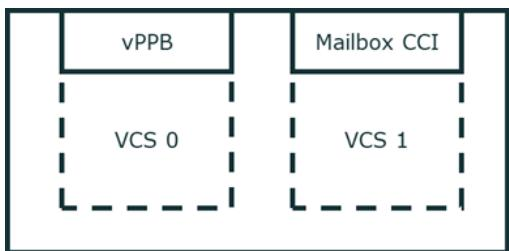

## CXL.io, CXL.cachemem Decode and Forwarding

## CXL.io

Within a VCS, the CXL.io traffic must obey the same request, completion, address decode, and forwarding rules for a Switch as defined in the PCIe Base Specification. There are additional decode rules that are defined to support an eRCD connected to a switch (see Section 9.12.4).

## 7.3.1.1 CXL.io Decode

When a TLP is decoded by a PPB, it determines the destination PPB to route the TLP based on the rules defined in the PCIe Base Specification. Unless specified otherwise, all rules defined in the PCIe Base Specification apply for routing of CXL.io TLPs. TLPs must be routed to PPBs within the same VCS. Routing of TLPs to and from an FM-owned PPB need to follow additional rules as defined in Section 7.2.3. P2P inside a Switch complex is limited to PPBs within a VCS.

## 7.3.1.2 RCD Support

RCDs are not supported behind ports that are configured to operate as FM-owned PPBs. When connected behind a switch, RCDs must appear to software as RCiEP devices. The mechanism defined in this section enables this functionality.

Figure 7-17. CXL Switch with a Downstream Link Auto-negotiated to Operate in RCD Mode

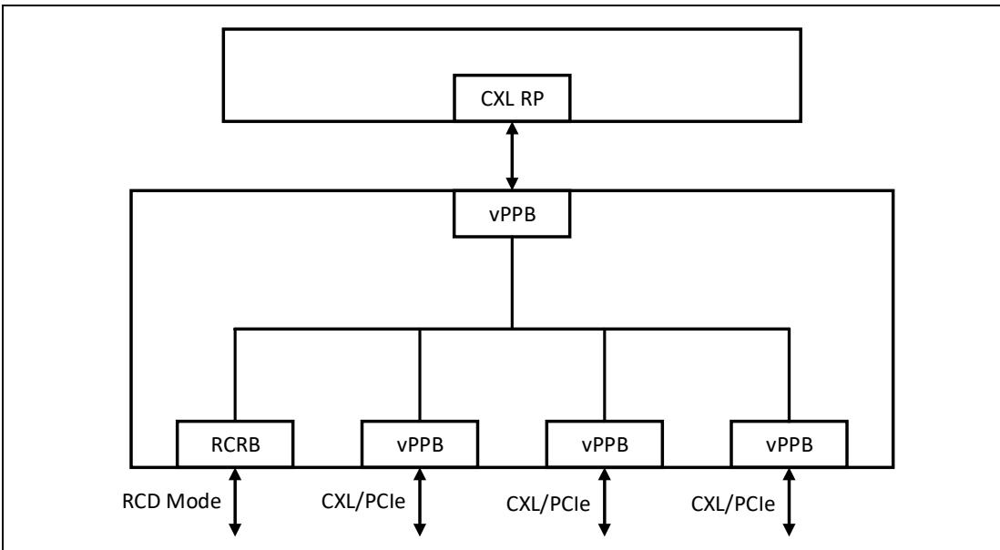  
The CXL Extensions DVSEC for Ports (see Section 8.1.5) defines the alternate MMIO and Bus Range Decode windows for forwarding of requests to eRCDs connected behind a Downstream Port.

## 7.3.2 CXL.cache

If the switch does not support CXL.cache protocol enhancements that enable multidevice scaling (as described in Section 8.2.4.28), only one of the CXL SLD ports in the VCS is allowed to be enabled to support Type 1 devices or Type 2 devices. Requests and Responses received on the USP are routed to the associated DSP and vice-versa. Therefore, additional decode registers are not required for CXL.cache for such switches.

If the switch supports CXL.cache protocol enhancements that enable multi-device scaling, more than one of the CXL SLD ports in the VCS can be configured to support Type 1 devices or Type 2 devices. Section 9.15.2 and Section 9.15.3 describe how such a CXL switch routes CXL.cache traffic.

CXL.cache is not supported over FM-owned PPBs.

## 7.3.2.1 CXL.cache Reserved Bit Forwarding

A switch shall forward a 256B flit message’s Reserved bits between the ingress port and the egress port. Both HBR and PBR formats are defined for 256B flit messages where a switch can translate between those formats. When performing the translation between HBR and PBR formats defined for 256B flits, the Reserved bits shall be preserved. When a switch with 256B flit capability sends Reserved bits to a port with 68B flit format, the Reserved bits shall be cleared to 0. Similarly, messages received as 68B flit formats shall never have Reserved bits forwarded to a port with 256B flit messages.

The reason for forwarding of reserved bits is to allow new features to be supported without requiring changes to existing switches. The reason for not forwarding in 68B flit format is that new features are expected to be added only to 256B flit formats; thus there is no need to support the complexity of translating Reserved bits to/from 68B flits.

## 7.3.3 CXL.mem

The HDM Decode DVSEC capability contains registers that define the Memory Address Decode Ranges for Memory. CXL.mem requests originate from the Host/RP and flow downstream to the Devices through the switch. CXL.mem responses originate from the Device and flow upstream to the RP.

## 7.3.3.1 CXL.mem Request Decode

All CXL.mem Requests received by the USP target one of the Downstream PPBs within the VCS. The address decode registers in the VCS determine the downstream VCS PPB to route the request. The VCS PPB may be a VCS-owned PPB or an FM-owned PPB. See Section 7.3.4 for additional routing rules.

## 7.3.3.2 CXL.mem Response Decode

CXL.mem Responses received by the DSP target one and only one Upstream Port. For VCS-owned PPB the responses are routed to the Upstream Port of that VCS. Responses received on an FM-owned PPB go through additional decode rules to determine the VCS ID to route the requests to. See Section 7.3.4 for additional routing rules.

## 7.3.3.3 CXL.mem Reserved Bit Forwarding

CXL.mem follows the same Reserved bit forwarding rules as those defined for CXL.cache in Section 7.3.2.1.

## 7.3.4 FM-owned PPB CXL Handling

All PPBs are FM-owned. A PPB can be connected to a port that is disconnected or linked up. SLD components can be bound to a host or unbound. Unbound SLD components can be accessed by the FM using CXL.io transactions via the FM API. LDs within an MLD component can be bound to a host or unbound. Unbound LDs are FM-owned and can be accessed through the switch using CXL.io transactions via the FM API.

For all CXL.io transactions driven by the FM API, the switch acts as a virtual Root Complex for PPBs and Endpoints. The switch is responsible for enumerating the functions associated with that port and sending/receiving CXL.io traffic.

## CXL Switch PM

## CXL Switch ASPM L1

ASPM L1 for switch Ports is as defined in Chapter 10.0.

## CXL Switch PCI-PM and L2

A vPPB in a VCS operates the same as a PCIe vPPB for handling of PME messages.

## 7.4.3 CXL Switch Message Management

CXL VDMs are of the “Local-Terminate at Receiver” type. When a switch is present in the hierarchy, the switch implements the message aggregation function and therefore all Host-generated messages terminate at the switch. The switch aggregation function is responsible for regenerating these messages on the Downstream Port. All messages and responses generated by the directly attached CXL components are aggregated and consolidated by the DSP and consolidated messages or responses are generated by the USP.

The PM message credit exchanges occur between the Host and Switch Aggregation port, and separately between the Switch Aggregation Port and device.

Table 7-14. CXL Switch Message Management

<table><tr><td>Message Type</td><td>Type</td><td>Switch Message Aggregation and Consolidation Responsibility</td></tr><tr><td>PM Reset Messages</td><td rowspan="4">Host Initiated</td><td rowspan="4">Host-generated requests terminate at Upstream Port, broadcast messages to all ports within VCS hierarchy</td></tr><tr><td>Sx Entry</td></tr><tr><td>GPF Phase 1 Request</td></tr><tr><td>GPF Phase 2 Request</td></tr><tr><td>PM Reset Acknowledge</td><td rowspan="4">Device Responses</td><td rowspan="4">Device-generated responses terminate at Downstream Port within VCS hierarchy. Switch aggregates responses from all other connected ports within VCS hierarchy.</td></tr><tr><td>Sx Entry</td></tr><tr><td>GPF Phase 1 Response</td></tr><tr><td>GPF Phase 2 Response</td></tr></table>

## 7.5 CXL Switch RAS

Table 7-15. CXL Switch RAS

<table><tr><td>Triggering Action</td><td>Description</td><td>Switch Action for Non-pooled Devices</td><td>Switch Action for Pooled Devices</td></tr><tr><td>Switch boot</td><td>Optional power-on reset pin</td><td>Assert PERST#Deassert PERST#</td><td>Assert PERST#Deassert PERST#</td></tr><tr><td>Upstream PERST# assert</td><td>VCS fundamental reset</td><td>Send Hot Reset</td><td>Write to MLD DVSEC to trigger LD Hot Reset of the associated LDNote: Only the FMLD provides the MLD DVSEC capability.</td></tr><tr><td>FM issues port reset command</td><td>Reset of an FM-owned DSP</td><td>Send Hot Reset</td><td>Send Hot Reset</td></tr><tr><td>PPB Secondary Bus Reset</td><td>Reset of an FM-owned DSP</td><td>Send Hot Reset</td><td>Write to MLD DVSEC to trigger LD Hot Reset of all LDs</td></tr><tr><td>USP receives Hot Reset</td><td>VCS fundamental reset</td><td>Send Hot Reset</td><td>Write to MLD DVSEC to trigger LD Hot Reset of the associated LD</td></tr><tr><td>USP vPPB Secondary Bus Reset</td><td>VCS US SBR</td><td>Send Hot Reset</td><td>Write to MLD DVSEC to trigger LD Hot Reset of the associated LD</td></tr><tr><td>DSP vPPB Secondary Bus Reset</td><td>VCS DS SBR</td><td>Send Hot Reset</td><td>Write to MLD DVSEC to trigger LD Hot Reset of the associated LD</td></tr><tr><td>Host writes FLR</td><td>Device FLR</td><td>No switch involvement</td><td>No switch involvement</td></tr><tr><td>Switch watchdog timeout</td><td>Switch fatal error</td><td>Equivalent to power-on reset</td><td>Equivalent to power-on reset</td></tr></table>

Because the MLD DVSEC only exists in the FMLD, the switch must use the FM LD-ID in the CXL.io configuration write transaction when triggering LD reset.

## Fabric Manager Application Programming Interface

This section describes the Fabric Manager Application Programming Interface.

## 7.6.1 CXL Fabric Management

CXL devices can be configured statically or dynamically via a Fabric Manager (FM), an external logical process that queries and configures the system’s operational state using the FM commands defined in this specification. The FM is defined as the logical process that decides when reconfiguration is necessary and initiates the commands to perform configurations. It can take any form, including, but not limited to, software running on a host machine, embedded software running on a BMC, embedded firmware running on another CXL device or CXL switch, or a state machine running within the CXL device itself.

## 7.6.2 Fabric Management Model

CXL devices are configured by FMs through the Fabric Manager Application Programming Interface (FM API) command sets, as defined in Section 8.2.10.10, through a CCI. A CCI is exposed through a device’s Mailbox registers (see Section 8.2.9.4) or through an MCTP-capable interface. See Section 9.19 for details on the CCI processing of these commands.

Figure 7-18. Example of Fabric Management Model  
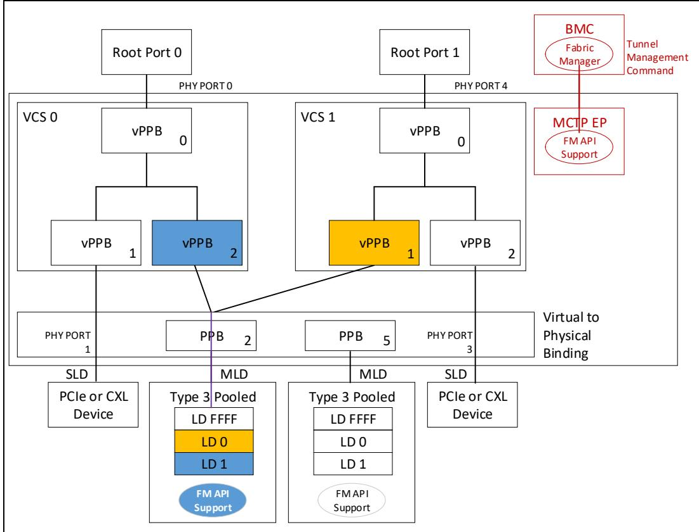

FMs issue request messages and CXL devices issue response messages. CXL components may also issue the “Event Notification” request if notifications are supported by the component and the FM has requested notifications from the component using the Set MCTP Event Interrupt Policy command. See Section 7.6.3 for transport protocol details.

The following list provides a number of examples of connectivity between an FM and a component’s CCI, but should not be considered a complete list:

• An FM directly connected to a CXL device through any MCTP-capable interconnect can issue FM commands directly to the device. This includes delivery over MCTPcapable interfaces such as SMBus as well as VDM delivery over a standard PCIe tree topology where the responder is mapped to a CXL attached device.

• An FM directly connected to a CXL switch may use the switch to tunnel FM commands to MLD components directly attached to the switch. In this case, the FM issues the “Tunnel Management Command” command to the switch specifying the switch port to which the device is connected. Responses are returned to the FM by the switch. In addition to MCTP message delivery, the FM command set provides the FM with the ability to have the switch proxy config cycles and memory accesses to a Downstream Port on the FM’s behalf.

• An FM or part of the overall FM functionality may be embedded within a CXL component. The communication interface between such an embedded FM FW module and the component hardware is considered a vendor implementation detail and is not covered in this specification.

## 7.6.3 CCI Message Format and Transport Protocol

CCI commands are transmitted across MCTP-capable interconnects as MCTP messages using the format defined in Figure 7-19 and listed in Table 7-16.

Figure 7-19. CCI Message Format

<table><tr><td>31</td><td>30</td><td>29</td><td>28</td><td>27</td><td>26</td><td>25</td><td>24</td><td>23</td><td>22</td><td>21</td><td>20</td><td>19</td><td>18</td><td>17</td><td>16</td><td>15</td><td>14</td><td>13</td><td>12</td><td>11</td><td>10</td><td>9</td><td>8</td><td>7</td><td>6</td><td>5</td><td>4</td><td>3</td><td>2</td><td>1</td><td>0</td><td>Byte Offset</td></tr><tr><td colspan="8">Command Opcode [7:0]</td><td colspan="8">Reserved</td><td colspan="8">Message Tag</td><td colspan="4">Reserved</td><td colspan="4">Message Category</td><td>000h</td></tr><tr><td>BO</td><td colspan="2">Reserved</td><td colspan="21">Message Payload Length</td><td colspan="8">Command Opcode [15:8]</td><td>004h</td></tr><tr><td colspan="16">Vendor Specific Extended Status</td><td colspan="16">Return Code</td><td>008h</td></tr><tr><td colspan="32">Message Payload(Variable Size)</td><td>00Ch...</td></tr></table>

Table 7-16. CCI Message Format

<table><tr><td>Byte Offset</td><td>Length in Bytes</td><td>Description</td></tr><tr><td>0h</td><td>1</td><td>Bits[3:0]:Message Category:Type of CCI message:- 0h = Request- 1h = Response- All other encodings are reservedBits[7:4]:Reserved</td></tr><tr><td>1h</td><td>1</td><td>Message Tag:Tag number assigned to request messages by the Requester used to track response messages when multiple request messages are outstanding. Response messages shall use the tag number from the corresponding Request message.</td></tr><tr><td>2h</td><td>1</td><td>Reserved</td></tr><tr><td>3h</td><td>2</td><td>Command Opcode[15:0]: As defined in Table 8-215, Table 8-308, and Table 8-397.</td></tr><tr><td>5h</td><td>2</td><td>Message Payload Length[15:0]: Expressed in bytes.The rules regarding the Minimum Input Payload Length are specified in Section 8.2.10.</td></tr><tr><td>7h</td><td>1</td><td>Bits[4:0]:Message Payload Length[20:16]: Expressed in bytes. The rules regarding the Minimum Input Payload Length are specified in Section 8.2.10.Bits[6:5]:Reserved.Bit[7]:Background Operation (BO): As defined in Section 8.2.9.4.6.</td></tr><tr><td>8h</td><td>2</td><td>Return Code[15:0]: As defined in Table 8-208. Must be 0 for Request messages.</td></tr><tr><td>Ah</td><td>2</td><td>Vendor Specific Extended Status[15:0]: As defined in Section 8.2.9.4.6. Must be 0 for Request messages.</td></tr><tr><td>Ch</td><td>Varies</td><td>Message Payload:Variably sized payload for message in little-endian format. The length of this field is specified in theMessage Payload Length[20:0]fields above. The format depends onOpcodeandMessage Category, as defined in Table 8-215, Table 8-308, and Table 8-397.</td></tr></table>

Commands from the FM API Command Sets may be transported as MCTP messages as defined in the CXL Fabric Manager API over MCTP Binding Specification (DSP0234). All other CCI commands may be transported as MCTP messages as defined by the respective binding specification, such as the CXL Type 3 Device Component Command Interface over MCTP Binding Specification (DSP0281).

## 7.6.3.1 Transport Details for MLD Components

MLD components that do not implement an MCTP-capable interconnect other than their CXL interface shall expose a CCI through their CXL interface(s) using the MCTP PCIe VDM Transport Binding Specification (DSP0238). FMs shall use the Tunnel Management Command to pass requests to the FM-owned LD, as illustrated in Figure 7-20.

Figure 7-20. Tunneling Commands to an MLD through a CXL Switch

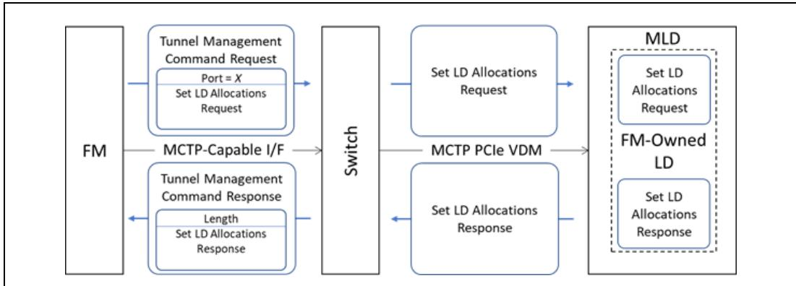

## 7.6.4

## CXL Switch Management

Dynamic configuration of a switch by an FM is not required for basic switch functionality, but is required to support MLDs or CXL fabric topologies.

## 7.6.4.1

## Initial Configuration

The non-volatile memory of the switch stores, in a vendor-specific format, all necessary configuration settings that are required to prepare the switch for initial operation. This includes:

• Port configuration, including direction (upstream or downstream), width, supported rates, etc.

• Virtual CXL Switch configuration, including number of vPPBs for each VCS, initial port binding configuration, etc.

• CCI access settings, including any vendor-defined permission settings for management.

## 7.6.4.2 Dynamic Configuration

After initial configuration is complete and a CCI on the switch is operational, an FM can send Management Commands to the switch.

An FM may perform the following dynamic management actions on a CXL switch:

• Query switch information and configuration details

• Bind or Unbind ports

• Register to receive and handle event notifications from the switch (e.g., Hot-Plug, surprise removal, and failures)

When a switch port is connected to a downstream PCIe switch, and that port is bound to a vPPB, the management of that PCIe switch and its downstream device will be handled by the VCS’s host, not the FM.

## 7.6.4.3 MLD Port Management

A switch with MLD Ports requires an FM to perform the following management activities:

• MLD discovery

• LD binding/unbinding

• Management Command Tunneling

## MLD Component Management

The FM can connect to an MLD over a direct connection or by tunneling its management commands through the CCI of the CXL switch to which the device is connected. The FM can perform the following operations:

• Memory allocation and QoS Telemetry management

• Security (e.g., LD erasure after unbinding)

• Error handling

## Figure 7-21. Example of MLD Management Requiring Tunneling

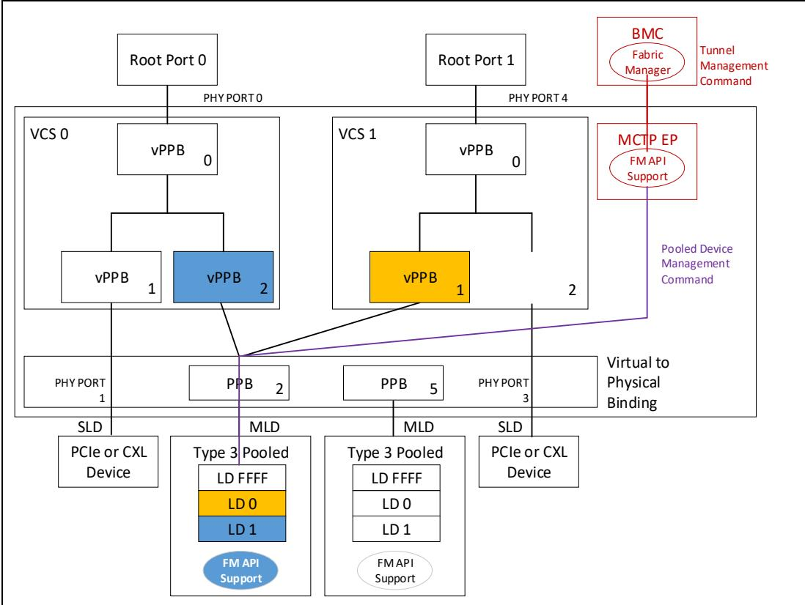

## Management Requirements for System Operations

This section presents examples of system use cases to highlight the role and responsibilities of the FM in system management. These use case discussions also serve to itemize the FM commands that CXL devices must support to facilitate each specific system behavior.

## 7.6.6.1 Initial System Discovery

As the CXL system initializes, the FM can begin discovering all direct attached CXL devices across all supported media interfaces. Devices supporting the FM API may be discovered using transport specific mechanisms such as the MCTP discovery process, as defined in the MCTP Base Specification (DSP0236).

When a component is discovered, the FM shall issue the Identify command (see Section 8.2.10.1.1) prior to issuing any other commands to check the component’s type and its maximum supported command message size. A return of “Retry Required” indicates that the component is not yet ready to accept commands. After receiving a successful response to the Identify request, the FM may issue the Set Response Message Limit command (see Section 8.2.10.1.4) to limit the size of response messages from the component based on the size of the FM’s receive buffer. The FM shall not issue any commands with input arguments such that the command’s response message exceeds the FM’s maximum supported message size. Finally, the FM issues Get Log, as defined in Section 8.2.10.5.2.1, to read the Command Effects Log to determine which command opcodes are supported.

## 7.6.6.2 CXL Switch Discovery

After a CXL switch is released from reset (i.e., PERST# has been deasserted), it loads its initial configuration from non-volatile memory. Ports configured as DS PPBs will be released from reset to link up. Upon detection of a switch, the FM will query its configuration, capabilities, and connected devices. The Physical Switch Command Set is required for all switches implementing FM API support. The Virtual Switch Command Set is required for all switches that support multiple host ports.

An example of an FM Switch discovery process is as follows:

1. FM issues Identify Switch Device to check switch port count, enabled Port IDs, number of supported LDs, and enabled VCS IDs.

2. FM issues Get Physical Port State for each enabled port to check port configuration (US or DS), link state, and attached device type. This allows the FM to check for any port link-up issues and create an inventory of devices for binding. If any MLD components are discovered, the FM can begin MLD Port management activities.

3. If the switch supports multiple host ports, FM issues Get Virtual CXL Switch Info for each enabled VCS to check for all bound vPPBs in the system and create a list of binding targets.

## MLD and Switch MLD Port Management

MLDs must be connected to a CXL switch to share their LDs among VCSs. If an MLD is discovered in the system, the FM will need to prepare it for binding. A switch must support the MLD Port Command Set to support the use of MLDs. All MLD components shall support the MLD Component Command Set.

1. FM issues management commands to the device’s LD FFFFh using Tunnel Management Command.

2. FM can execute advanced or vendor-specific management activities, such as encryption or authentication, using the Send LD CXL.io Configuration Request and Send LD CXL.io Memory Request commands.

## 7.6.6.4 Event Notifications

Events can occur on both devices and switches. The event types and records are listed in Section 7.6.8 for FM API events and in Section 8.2.10.2 for component events. The Event Records framework is defined in Section 8.2.10.2.1 to provide a standard event record format that all CXL components shall use when reporting events to the managing entity. The managing entity specifies the notification method, such as MSI/ MSI-X, EFN VDM, or MCTP Event Notification. The Event Notification message can be signaled by a device or by a switch; the notification always flows toward the managing entity. An Event Record is not sent with the Event Notification message. After the managing entity knows that an event has occurred, the entity can use component commands to read the Event Record.

1. To facilitate some system operations, the FM requires event notifications so it can execute its role in the process in a timely manner (e.g., notifying hosts of an asserted Attention Button on an MLD during a Managed Hot-Removal). If supported by the device, the FM can check and modify the current event notification settings with the Events command set.

2. If supported by the device, the event logs can be read with the Get Event Records command to check for any error events experienced by the device that might impact normal operation.

## Binding Ports and LDs on a Switch

Once all devices, VCSs, and vPPBs have been discovered, the FM can begin binding ports and LDs to hosts as follows:

1. FM issues the Bind vPPB command specifying a physical port, VCS ID and vPPB index to bind the physical port to the vPPB. An LD-ID must also be specified if the physical port is connected to an MLD. The switch is permitted to initiate a Managed Hot-Add if the host has already booted, as defined in Section 9.9.

2. Upon completion of the binding process, the switch notifies the FM by generating a Virtual CXL Switch Event Record.

## Unbinding Ports and LDs on a Switch

The FM can unbind devices or LDs from a VCS with the following steps:

1. FM issues the Unbind vPPB command specifying a VCS ID and vPPB index to unbind the physical port from the vPPB. The switch initiates a Managed Hot-Remove or Surprise Hot-Remove depending on the command options, as defined in the PCIe Base Specification.

2. Upon completion of the unbinding process, the switch will generate a Virtual CXL Switch Event Record.

## Hot-Add and Managed Hot-Removal of Devices

When a device is Hot-Added to an unbound port on a switch, the FM receives a notification and is responsible for binding as described in the following steps:

1. The switch notifies the FM by generating Physical Switch Event Records as the Presence Detect sideband signal is asserted or when a Link Up is detected if the PPB does not support Presence Detect.

2. FM issues the Get Physical Port State command for the physical port that has linked up to discover the connected device type. The FM can now bind the physical port to a vPPB. If it is an MLD, then the FM can proceed with MLD Port management activities; otherwise, the device is ready for binding.

When a device is Hot-Removed from an unbound port on a switch, the FM receives a notification. The switch notifies the FM by generating Physical Switch Event Records as the Presence Detect sideband is deasserted and the associated port links down.

1. The switch notifies the FM by generating Physical Switch Event Records as the Presence Detect sideband is deasserted and the associated port links down.

When an SLD or PCIe device is Hot-Added to a bound port, the FM can be notified but is not involved. When a Surprise or Managed Hot-Removal of an SLD or PCIe device occurs on a bound port, the FM can be notified but is not involved.

A bound port will not advertise support for MLDs during negotiation, so MLD components will link up as an SLD.

The FM manages managed hot-removal of MLDs as follows:

1. When the Attention Button sideband is asserted on an MLD port, the Attention state bit is updated in the corresponding PPB and vPPB CSRs and the switch notifies the FM and hosts with LDs that are bound and below that MLD port. The hosts are notified with the MSI/MSI-X interrupts assigned to the affected vPPB and a Virtual CXL Switch Event Record is generated.

2. As defined in the PCIe Base Specification, hosts will read the Attention State bit in their vPPB’s CSR and prepare for removal of the LD. When a host is ready for the LD to be removed, it will set the Attention LED bit in the associated vPPB’s CSR. The switch records these CSR updates by generating Virtual CXL Switch Event Records. The FM unbinds each assigned LD with the Unbind vPPB command as it receives notifications from each host.

3. When all host handshakes are complete, the MLD is ready for removal. The FM uses the Send PPB CXL.io Configuration Request command to set the Attention LED bit in the MLD port PPB to indicate that the MLD can be physically removed. The timeout value for the host handshakes to complete is implementation specific. There is no requirement for the FM to force the unbind operation, but it can do so using the “Simulate Surprise Hot-Remove” unbinding option in the Unbind vPPB command.

## 7.6.6.8 Surprise Removal of Devices

There are two kinds of surprise removals: physical removal of a device, and surprise Link Down. The main difference between the two is the state of the presence pin, which will be deasserted after a physical removal but will remain asserted after a surprise Link Down. The switch notifies the FM of a surprise removal by generating Virtual CXL Switch Event Records for the change in link status and Presence Detect, as applicable.

Three cases of Surprise Removal are described below:

• When a Surprise Removal of a device occurs on an unbound port, the FM must be notified.

• When a Surprise Removal of an SLD or PCIe device occurs on a bound port, the FM is permitted to be notified but must not be involved in any error handling operations.

• When a Surprise Removal of an MLD component occurs, the FM must be notified. The switch will automatically unbind any existing LD bindings. The FM must perform error handling and port management activities, the details of which are considered implementation specific.

## Fabric Management Application Programming Interface

The FM manages all devices in a CXL system via the sets of commands defined in the FM API. This specification defines the minimum command set requirements for each device type.

Table 7-17. FM API Command Sets

<table><tr><td>Command Set Name</td><td>HBR Switch FM API Requirement $^{1}$ </td><td>MLD FM API Requirement $^{1}$ </td></tr><tr><td>Physical Switch (Section 7.6.7.1)</td><td>M</td><td>P</td></tr><tr><td>Virtual Switch (Section 7.6.7.2)</td><td>O</td><td>P</td></tr><tr><td>MLD Port (Section 7.6.7.3)</td><td>O</td><td>P</td></tr><tr><td>MLD Component (Section 7.6.7.4)</td><td>P</td><td>M</td></tr><tr><td>Multi-Headed Device (Section 7.6.7.5)</td><td>P</td><td>P</td></tr><tr><td>DCD Management (Section 7.6.7.6)</td><td>P</td><td>O</td></tr><tr><td>PBR Switch (Section 7.7.13)</td><td>P</td><td>P</td></tr><tr><td>Global Memory Access Endpoint (Section 7.7.14)</td><td>P</td><td>P</td></tr></table>

1. M = Mandatory, O = Optional, P = Prohibited.

CXL switches and MLDs require FM API support to facilitate the advanced system capabilities outlined in Section 7.6.6. FM API is optional for all other CXL device types.

Command opcodes are listed in Table 8-397. Table 8-397 also identifies the minimum command sets and commands that are required to implement defined system capabilities. The following subsections define the commands grouped in each command set. Within each command set, commands are marked as mandatory (M) or optional (O). If a command set is supported, the required commands within that set must be implemented, but only if the Device supports that command set. For example, the Get Virtual CXL Switch Information command is required in the Virtual Switch Command Set, but that set is optional for switches. This means that a switch does not need to support the Get Virtual CXL Switch Information command if it does not support the Virtual Switch Command Set.

All commands have been defined as stand-alone operations; there are no explicit dependencies between commands, so optional commands can be implemented or not implemented on a per-command basis. Requirements for the implementation of commands are driven instead by the desired system functionality.

## 7.6.7.1 Physical Switch Command Set

This command set is only supported by and must be supported by CXL switches that have FM API support.

## 7.6.7.1.1 Identify Switch Device (Opcode 5100h)

This command retrieves information about the capabilities and configuration of a CXL switch.

Possible Command Return Codes:

• Success

• Internal Error

• Retry Required

Command Effects:

• None

Identify Switch Device Response Payload

<table><tr><td>Byte Offset</td><td>Length in Bytes</td><td>Description</td></tr><tr><td>00h</td><td>1</td><td>Ingress Port ID: Ingress CCI port index of the received request message. For CXL/PCIe ports, this corresponds to the physical port number. For non-CXL/PCIe, this corresponds to a vendor-specific index of the buses that the device supports, starting at 0. For example, a request received on the second of 2 SMBuses supported by a device would return a 1.</td></tr><tr><td>01h</td><td>1</td><td>Reserved</td></tr><tr><td>02h</td><td>1</td><td>Number of Physical Ports: Total number of physical ports in the CXL switch, including inactive/disabled ports.</td></tr><tr><td>03h</td><td>1</td><td>Number of VCSs: Maximum number of virtual CXL switches that are supported by the CXL switch.</td></tr><tr><td>04h</td><td>20h</td><td>Active Port Bitmask: Bitmask that defines whether a physical port is enabled (1) or disabled (0). Each bit corresponds 1:1 with a port, with the least significant bit corresponding to Port 0.</td></tr><tr><td>24h</td><td>20h</td><td>Active VCS Bitmask: Bitmask that defines whether a VCS is enabled (1) or disabled (0). Each bit corresponds 1:1 with a VCS ID, with the least significant bit corresponding to VCS 0.</td></tr><tr><td>44h</td><td>2</td><td>Total Number of vPPBs: The number of virtual PPBs that are supported by the CXL switch across all VCSs.</td></tr><tr><td>46h</td><td>2</td><td>Number of Bound vPPBs: Total number of vPPBs, across all VCSs, that are bound.</td></tr><tr><td>48h</td><td>1</td><td>Number of HDM Decoders: Number of HDM decoders available per USP.</td></tr></table>

7.6.7.1.2 Get Physical Port State (Opcode 5101h)

This command retrieves the physical port information.

Possible Command Return Codes:

• Success

• Invalid Input

• Internal Error

• Retry Required

Command Effects:

• None

Table 7-19. Get Physical Port State Request Payload

<table><tr><td>Byte Offset</td><td>Length in Bytes</td><td>Description</td></tr><tr><td>0h</td><td>1</td><td>Number of Ports: Number of ports requested.</td></tr><tr><td>1h</td><td>Varies</td><td>Port ID List: 1-byte ID of requested port, repeated Number of Ports times.</td></tr></table>

Table 7-20. Get Physical Port State Response Payload

<table><tr><td>Byte Offset</td><td>Length in Bytes</td><td>Description</td></tr><tr><td>0h</td><td>1</td><td>Number of Ports: Number of port information blocks returned.</td></tr><tr><td>1h</td><td>3</td><td>Reserved</td></tr><tr><td>4h</td><td>Varies</td><td>Port Information List: Port information block as defined in Table 7-21, repeated Number of Ports times.</td></tr></table>

Table 7-21. Get Physical Port State Port Information Block Format (Sheet 1 of 2)

<table><tr><td>Byte Offset</td><td>Length in Bytes</td><td>Description</td></tr><tr><td>0h</td><td>1</td><td>Port ID</td></tr><tr><td>1h</td><td>1</td><td>Bits[3:0]:Current Port Configuration State:- 0h = Disabled- 1h = Bind in progress- 2h = Unbind in progress- 3h = DSP- 4h = USP- 5h = Fabric Port- Fh = Invalid Port_ID; all subsequent field values are undefined- All other encodings are reservedBit[4]:GAE Support:Indicates whether GAE support is present (1) or not present (0) on a port. Valid only for PBR switches if Current Port Configuration State is 4h (USP).Bits[7:5]:Reserved.</td></tr><tr><td>2h</td><td>1</td><td>Bits[3:0]:Connected Device Mode:Formerly known as &quot;Connected Device CXL Version.&quot; This field is reserved for all values of Current Port Configuration State except DSP.- 0h = Connection is not CXL or is disconnected- 1h = RCD mode- 2h = CXL 68B Flit and VH mode- 3h = Standard 256B Flit mode- 4h = CXL Latency-Optimized 256B Flit mode- 5h = PBR mode- All other encodings are reservedBits[7:4]:Reserved.</td></tr><tr><td>3h</td><td>1</td><td>Reserved</td></tr><tr><td>4h</td><td>1</td><td>Connected Device Type00h = No device detected01h = PCIe Device02h = CXL Type 1 device03h = CXL Type 2 device or HBR switch04h = CXL Type 3 SLD05h = CXL Type 3 MLD06h = PBR componentAll other encodings are reservedThis field is reserved ifSupported CXL Modesis 00h. This field is reserved for all values ofCurrent Port Configuration Stateexcept 3h (DSP) or 5h (Fabric Port).</td></tr><tr><td>5h</td><td>1</td><td>Supported CXL Modes:Formerly known as &quot;Connected CXL Version.&quot; Bitmask that defines which CXL modes are supported (1) or not supported (0) by this port:Bit[0]:RCD ModeBit[1]:CXL 68B Flit and VH CapableBit[2]:256B Flit CapableBit[3]:CXL Latency-Optimized 256B Flit CapableBit[4]:PBR CapableBits[7:5]:Reserved for future CXL useUndefined when the value is 00h.</td></tr></table>

Table 7-21. Get Physical Port State Port Information Block Format (Sheet 2 of 2)

<table><tr><td>Byte Offset</td><td>Length in Bytes</td><td>Description</td></tr><tr><td>6h</td><td>1</td><td>Bits[5:0]:Maximum Link Width:Value encoding matches the Maximum Link Width field in the PCIe Link Capabilities register in the PCIe Capability structure.Bits[7:6]:Reserved.</td></tr><tr><td>7h</td><td>1</td><td>Bits[5:0]:Negotiated Link Width:Value encoding matches the Negotiated Link Width field in PCIe Link Capabilities register in the PCIe Capability structure.Bits[7:6]:Reserved.</td></tr><tr><td>8h</td><td>1</td><td>Bits[5:0]:Supported Link Speeds Vector:Value encoding matches the Supported Link Speeds Vector field in the PCIe Link Capabilities 2 register in the PCIe Capability structure.Bits[7:6]:Reserved.</td></tr><tr><td>9h</td><td>1</td><td>Bits[5:0]:Max Link Speed:Value encoding matches the Max Link Speed field in the PCIe Link Capabilities register in the PCIe Capability structure.Bits[7:6]:Reserved.</td></tr><tr><td>Ah</td><td>1</td><td>Bits[5:0]:Current Link Speed:Value encoding matches the Current Link Speed field in the PCIe Link Status register in the PCIe Capability structure.Bits[7:6]:Reserved.</td></tr><tr><td>Bh</td><td>1</td><td>LTSSM State:Current link LTSSM Major state:00h = Detect01h = Polling02h = Configuration03h = Recovery04h = L005h = L0s06h = L107h = L208h = Disabled09h = Loopback0Ah = Hot ResetAll other encodings are reservedLink substates should be reported through vendor-defined diagnostics commands.</td></tr><tr><td>Ch</td><td>1</td><td>First Negotiated Lane Number</td></tr><tr><td>Dh</td><td>2</td><td>Link State FlagsBit[0]:Lane Reversal State:- 0 = Standard lane ordering- 1 = Reversed lane orderingBit[1]:Port PCIe Reset State (PERST#):- 0 = Not in reset- 1 = In resetBit[2]:Port Presence Pin State (PRSNT#):- 0 = Not present- 1 = PresentBit[3]:Power Control State:- 0 = Power on- 1 = Power offBits[15:4]:Reserved</td></tr><tr><td>Fh</td><td>1</td><td>Supported LD Count:Number of additional LDs supported by this port. All ports must support at least one LD.</td></tr></table>

## 7.6.7.1.3 Physical Port Control (Opcode 5102h)

This command is used by the FM to control unbound ports and MLD ports, including issuing resets and controlling sidebands.

Possible Command Return Codes:

• Success

• Unsupported

• Invalid Input

• Internal Error

• Retry Required

Command Effects:

• None

Table 7-22. Physical Port Control Request Payload

<table><tr><td>Byte Offset</td><td>Length in Bytes</td><td>Description</td></tr><tr><td>0h</td><td>1</td><td>PPB ID: Physical PPB ID, which corresponds 1:1 to associated physical port number.</td></tr><tr><td>1h</td><td>1</td><td>Port Opcode: Code that defines which operation to perform:00h = Assert PERST#01h = Deassert PERST#02h = Reset PPBAll other encodings are reserved</td></tr></table>

7.6.7.1.4 Send PPB CXL.io Configuration Request (Opcode 5103h)

This command sends CXL.io Config requests to the specified physical port’s PPB. This command is only processed for unbound ports and MLD ports.

Possible Command Return Codes:

• Success

• Invalid Input

• Internal Error

• Retry Required

Command Effects:

• None

Table 7-23. Send PPB CXL.io Configuration Request Input Payload

<table><tr><td>Byte Offset</td><td>Length in Bytes</td><td>Description</td></tr><tr><td>0h</td><td>1</td><td>PPB ID: Target PPB&#x27;s physical port.</td></tr><tr><td>1h</td><td>3</td><td>Bits[7:0]: Register Number: As defined in the PCIe Base SpecificationBits[11:8]: Extended Register Number: As defined in the PCIe Base SpecificationBits[15:12]: First Dword Byte Enable: As defined in the PCIe Base SpecificationBits[22:16]: ReservedBit[23]: Transaction Type:- 0 = Read- 1 = Write</td></tr><tr><td>4h</td><td>4</td><td>Transaction Data: Write data. Valid only for write transactions.</td></tr></table>

Send PPB CXL.io Configuration Request Output Payload

<table><tr><td>Byte Offset</td><td>Length in Bytes</td><td>Description</td></tr><tr><td>0h</td><td>4</td><td>Return Data: Read data. Valid only for read transactions.</td></tr></table>

7.6.7.1.5 Get Domain Validation SV State (Opcode 5104h)

This command is used by the Host to check the state of the secret value.

Possible Command Return Codes:

• Success

• Internal Error

• Retry Required

Command Effects:

• None

Table 7-25. Get Domain Validation SV State Response Payload

<table><tr><td>Byte Offset</td><td>Length in Bytes</td><td>Description</td></tr><tr><td>0h</td><td>1</td><td>Secret Value State: State of the secret value:00h = Not set01h = SetAll other encodings are reserved</td></tr></table>

7.6.7.1.6 Set Domain Validation SV (Opcode 5105h)

This command is used by the Host to set the secret value of its VCS. The secret value can be set only once. This command will fail with Invalid Input if it is called more than once.

Possible Command Return Codes:

• Success

• Invalid Input

• Internal Error

• Retry Required

Command Effects:

• None

Table 7-26. Set Domain Validation SV Request Payload

<table><tr><td>Byte Offset</td><td>Length in Bytes</td><td>Description</td></tr><tr><td>0h</td><td>10h</td><td>Secret Value: UUID used to uniquely identify a host hierarchy.</td></tr></table>

## 7.6.7.1.7 Get VCS Domain Validation SV State (Opcode 5106h)

This command is used by the FM to check the state of the secret value in a VCS.

Possible Command Return Codes:

• Success

• Internal Error

• Retry Required

Command Effects:

• None

Table 7-27. Get VCS Domain Validation SV State Request Payload

<table><tr><td>Byte Offset</td><td>Length in Bytes</td><td>Description</td></tr><tr><td>0h</td><td>1</td><td>VCS ID: Index of VCS to query.</td></tr></table>

Table 7-28. Get VCS Domain Validation SV State Response Payload

<table><tr><td>Byte Offset</td><td>Length in Bytes</td><td>Description</td></tr><tr><td>0h</td><td>1</td><td>Secret Value State: State of the secret value:00h = Not set01h = SetAll other encodings are reserved</td></tr></table>

7.6.7.1.8 Get Domain Validation SV (Opcode 5107h)

This command is used by the FM to retrieve the secret value from a VCS.

Possible Command Return Codes:

• Success

• Internal Error

• Retry Required

Command Effects:

• None

Table 7-29. Get Domain Validation SV Request Payload

<table><tr><td>Byte Offset</td><td>Length in Bytes</td><td>Description</td></tr><tr><td>0h</td><td>1</td><td>VCS ID: Index of VCS to query.</td></tr></table>

Table 7-30. Get Domain Validation SV Response Payload

<table><tr><td>Byte Offset</td><td>Length in Bytes</td><td>Description</td></tr><tr><td>0h</td><td>10h</td><td>Secret Value: UUID used to uniquely identify a host hierarchy.</td></tr></table>

## 7.6.7.2 Virtual Switch Command Set

This command set is supported only by the CXL switch. It is required for switches that support more than one VCS. Table 7-31 lists the defined commands and their requirements.

Virtual Switch Command Set Requirements

<table><tr><td>Command Name</td><td>Requirement $^{1}$ </td></tr><tr><td>Get Virtual CXL Switch Info</td><td>M</td></tr><tr><td>Bind vPPB</td><td>O</td></tr><tr><td>Unbind vPPB</td><td>O</td></tr><tr><td>Generate AER Event</td><td>O</td></tr></table>

1. M = Mandatory, O = Optional.

7.6.7.2.1 Get Virtual CXL Switch Info (Opcode 5200h)

This command retrieves information on a specified number of VCSs in the switch. Because of the possibility of variable numbers of vPPBs within each VCS, the returned array has variably sized elements.

Possible Command Return Codes:

• Success

• Invalid Input

• Internal Error

• Retry Required

• Invalid Payload Length

Command Effects:

• None

Table 7-32. Get Virtual CXL Switch Info Request Payload

<table><tr><td>Byte Offset</td><td>Length in Bytes</td><td>Description</td></tr><tr><td>0h</td><td>1</td><td>Start vPPB: Specifies the ID of the first vPPB for each VCS to include in the vPPB information list in the response (bytes 4 through 7 in Table 7-34). This enables compatibility with devices that have small maximum command message sizes.</td></tr><tr><td>1h</td><td>1</td><td>vPPB List Limit: The maximum number of vPPB information entries to include in the response (bytes 4 through 7 in Table 7-34). This enables compatibility with devices that have small maximum command message sizes. This field shall have a minimum value of 1.</td></tr><tr><td>2h</td><td>1</td><td>Number of VCSs: Number of VCSs requested. This field shall have a minimum value of 1.</td></tr><tr><td>3h</td><td>Number of VCSs</td><td>VCS ID List: 1-byte ID of requested VCS, repeated Number of VCSs times.</td></tr></table>

Table 7-33. Get Virtual CXL Switch Info Response Payload

<table><tr><td>Byte Offset</td><td>Length in Bytes</td><td>Description</td></tr><tr><td>0h</td><td>1</td><td>Number of VCSs: Number of VCS information blocks returned.</td></tr><tr><td>1h</td><td>3</td><td>Reserved</td></tr><tr><td>4h</td><td>Varies</td><td>VCS Information List: VCS information block as defined in Table 7-34, repeated Number of VCSs times.</td></tr></table>

Get Virtual CXL Switch Info VCS Information Block Format (Sheet 1 of 2)

<table><tr><td>Byte Offset</td><td>Length in Bytes</td><td>Description</td></tr><tr><td>0h</td><td>1</td><td>Virtual CXL Switch ID</td></tr><tr><td>1h</td><td>1</td><td>VCS State: Current state of the VCS:00h = Disabled01h = EnabledFFh = Invalid VCS ID; all subsequent field values are invalidAll other encodings are reserved</td></tr><tr><td>2h</td><td>1</td><td>USP ID: Physical Port ID of the current VCS&#x27;s Upstream Port, or the current VCS&#x27;s fabric physical Port ID of a Downstream ES VCS. Valid only when the VCS is enabled.</td></tr><tr><td>3h</td><td>1</td><td>Number of vPPBs: Total number of vPPBs in the VCS. This value may be larger than the vPPB List Limit field specified in the request. In this case, the length of vPPB information list, starting at Byte 4, is defined by &#x27;vPPB List Limit&#x27;, not by this field. vPPB information list consists of vPPB List Entry Count number of entries and each entry is 4B in length.vPPB List Entry Count=min(vPPB List Limit, Number of vPPBs).</td></tr><tr><td>4h</td><td>1</td><td>vPPB[Start vPPB] Binding Status00h = Unbound01h = Bind or unbind in progress02h = Bound Physical Port03h = Bound LD04h = Bound PIDAll other encodings are reserved</td></tr><tr><td>5h</td><td>2</td><td>For PBR Switches when Binding Status is 02h or 03h and for HBR Switches:Bits[7:0]: vPPB[Start vPPB] Bound Port ID:Physical port number of the bound port. Valid only when Binding Status is 02h or 03h.Bits[15:8]: vPPB[Start vPPB] Bound LD ID: LD-ID of the LD that is bound to the port from the MLD on an associated physical port. Valid only when vPPB[Start vPPB] Binding Status is 03h; otherwise, the value is FFh.For PBR Switches when Binding Status is 04h:Bits[11:0]: vPPB[Start vPPB] Bound PID: PID of the bound vPPB, as defined in Section 7.7.12.3.Bits[15:12]: Reserved.</td></tr><tr><td>7h</td><td>1</td><td>Reserved</td></tr><tr><td>...</td><td></td><td>...</td></tr><tr><td>4 + (vPPB List Entry Count - 1) * 4</td><td>1</td><td>vPPB[Start vPPB + vPPB List Entry Count $^{1}$  - 1]Binding Status: As defined above.</td></tr></table>

Table 7-34. Get Virtual CXL Switch Info VCS Information Block Format (Sheet 2 of 2)

<table><tr><td>Byte Offset</td><td>Length in Bytes</td><td>Description</td></tr><tr><td>5 + (vPPB List Entry Count - 1) * 4</td><td>1</td><td>vPPB[Start vPPB + vPPB List Entry Count $^{1}$  - 1]Bound Port ID: As defined above.</td></tr><tr><td>6 + (vPPB List Entry Count - 1) * 4</td><td>1</td><td>vPPB[Start vPPB + vPPB List Entry Count $^{1}$  - 1]Bound LD ID: As defined above.</td></tr><tr><td>7 + (vPPB List Entry Count - 1) * 4</td><td>1</td><td>Reserved</td></tr></table>

1. The vPPB information list length is defined by the lesser of the vPPB List Limit field in the command request and the Number of vPPBs field in the command response.

## 7.6.7.2.2 Bind vPPB (Opcode 5201h)

This command performs a binding operation on the specified vPPB. If the bind target is a physical port connected to a Type 1, Type 2, Type 3, or PCIe device or a physical port whose link is down, the specified physical port of the CXL switch is fully bound to the vPPB. If the bind target is a physical port connected to an MLD, then a corresponding LD-ID must also be specified.

All binding operations are executed as background commands. The switch notifies the FM of binding completion through the generation of event records, as defined in Section 7.6.6.

Possible Command Return Codes:

• Success

• Background Command Started

• Unsupported

• Invalid Input

• Internal Error

• Retry Required

• Busy

Command Effects:

• Background Operation

## Table 7-35. Bind vPPB Request Payload

<table><tr><td>Byte Offset</td><td>Length in Bytes</td><td>Description</td></tr><tr><td>0h</td><td>1</td><td>Virtual CXL Switch ID</td></tr><tr><td>1h</td><td>1</td><td>vPPB ID: Index of the vPPB within the VCS specified in the VCS ID.</td></tr><tr><td>2h</td><td>1</td><td>Physical Port ID</td></tr><tr><td>3h</td><td>1</td><td>Reserved</td></tr><tr><td>4h</td><td>2</td><td>LD ID: LD-ID if the target port is an MLD port. Must be FFFFh for other EP types.</td></tr></table>

## 7.6.7.2.3 Unbind vPPB (Opcode 5202h)

This command unbinds the physical port or LD from the virtual hierarchy vPPB. All unbinding operations are executed as background commands. The switch notifies the FM of unbinding completion through the generation of event records, as defined in Section 7.6.6.

Possible Command Return Codes:

• Success

• Unsupported

• Background Command Started

• Invalid Input

• Internal Error

• Retry Required

• Busy

Command Effects:

• Background Operation

## Table 7-36. Unbind vPPB Request Payload

<table><tr><td>Byte Offset</td><td>Length in Bytes</td><td>Description</td></tr><tr><td>0h</td><td>1</td><td>Virtual CXL Switch ID</td></tr><tr><td>1h</td><td>1</td><td>vPPB ID: Index of the vPPB within the VCS specified in the VCS ID.</td></tr><tr><td>2h</td><td>1</td><td>Bits[3:0]: Unbind Option:- 0h = Wait for port Link Down before unbinding- 1h = Simulate Managed Hot-Remove- 2h = Simulate Surprise Hot-Remove- All other encodings are reservedBits[7:4]: Reserved</td></tr></table>

## 7.6.7.2.4 Generate AER Event (Opcode 5203h)

This command generates an AER event on a specified VCS’s vPPB (US vPPB or DS vPPB). The switch must respect the Host’s AER mask settings.

Possible Command Return Codes:

• Success

• Unsupported

• Invalid Input

• Internal Error

• Retry Required

Command Effects:

• None

Table 7-37. Generate AER Event Request Payload (Sheet 1 of 2)

<table><tr><td>Byte Offset</td><td>Length in Bytes</td><td>Description</td></tr><tr><td>0h</td><td>1</td><td>Virtual CXL Switch ID</td></tr><tr><td>1h</td><td>1</td><td>vPPB Instance: The value of 0 represents USP. The values of 1 and above represent the DSP vPPBs in increasing Device Number, Function Number order, as defined in Section 7.1.4.</td></tr></table>

Table 7-37. Generate AER Event Request Payload (Sheet 2 of 2)

<table><tr><td>Byte Offset</td><td>Length in Bytes</td><td>Description</td></tr><tr><td>2h</td><td>2</td><td>Reserved</td></tr><tr><td>4h</td><td>4</td><td>AER ErrorBits[4:0]:If Severity=0, bit position of the error type in the AER Correctable Error Status register, as defined in the PCIe Base SpecificationIf Severity=1, bit position of the error type in the AER Uncorrectable Error Status register, as defined in the PCIe Base SpecificationBits[30:5]:ReservedBit[31]:Severity0 = Correctable Error1 = Uncorrectable Error</td></tr><tr><td>8h</td><td>20h</td><td>AER Header:TLP Header to place in AER registers, as defined in the PCIe Base Specification.</td></tr></table>

## 7.6.7.3 MLD Port Command Set

This command set is applicable to CXL switches and MLDs. Table 7-38 lists the defined commands and their requirements.

## Table 7-38. MLD Port Command Set Requirements

<table><tr><td rowspan="2">Command Name</td><td colspan="2">Requirement</td></tr><tr><td> $Switches^1$ </td><td> $MLDs^1$ </td></tr><tr><td>Tunnel Management Command</td><td>M</td><td>O</td></tr><tr><td>Send LD CXL.io Configuration Request</td><td>M</td><td>P</td></tr><tr><td>Send LD CXL.io Memory Request</td><td>M</td><td>P</td></tr></table>

1. M = Mandatory, O = Optional, P = Prohibited.

## 7.6.7.3.1 Tunnel Management Command (Opcode 5300h)

This command may be used to communicate with a Device that is not directly accessible. Various scenarios are described in this section.

This command instructs a switch to tunnel the provided command to the FM-owned LD of the MLD on the specified port, using the transport defined in Section 7.6.3.1.

When sent to an MLD, the provided command is tunneled by the FM-owned LD to the specified LD, as illustrated in the example in Figure 7-22 of a “Set LSA Request” being tunneled to LD 1 in an MLD.

Figure 7-22. Tunneling Commands to an LD in an MLD  
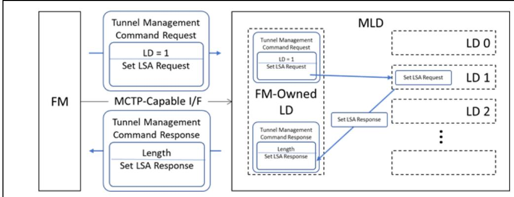

The Management Command input payload field includes the tunneled command encapsulated in the CCI Message Format, as defined in Figure 7-19. This can include an additional layer of tunneling for commands issued to LDs in an MLD that is accessible only through a CXL switch’s MLD Port, as illustrated in Figure 7-23.

Figure 7-23. Tunneling Commands to an LD in an MLD through a CXL Switch  
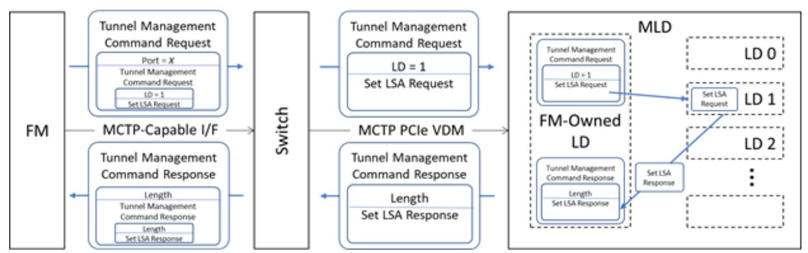

Response size varies, based on the tunneled FM command’s definition. Valid targets for the tunneled commands include switch MLD Ports, valid LDs within an MLD, and the LD Pool CCI in a Multi-Headed device. Tunneled commands sent to any other targets shall be discarded and this command shall return an Invalid Input return code. The FMowned LD (LD=FFFFh) is an invalid target in MLDs.

The LD Pool CCI in Multi-Headed devices is targeted using the Target Type field, as illustrated in Figure 7-24. This command shall return an Invalid Input return code failure if tunneling to the LD Pool CCI is not permitted on the CCI that receives the request.

Figure 7-24. Tunneling Commands to the LD Pool CCI in a Multi-Headed Device  
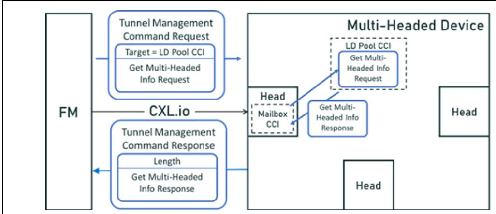  
A Multi-Headed device shall terminate the processing of a request that includes more than three layers of tunneling and return the Unsupported return code.

The Tunnel Management Command itself does not cause any Command Effects, but the Management Command provided in the request will cause Command Effects as per its definition.

Possible Command Return Codes:

• Success

• Unsupported

• Invalid Input

• Internal Error

• Retry Required

Command Effects:

• None

Table 7-39. Tunnel Management Command Request Payload

<table><tr><td>Byte Offset</td><td>Length in Bytes</td><td>Description</td></tr><tr><td>0h</td><td>1</td><td>Port or LD ID: Egress Port ID for commands sent to a switch, or LD-ID for commands sent to an MLD. Valid only when Target Type is 0.</td></tr><tr><td>1h</td><td>1</td><td>Bits[3:0]:Target Type: Specifies the type of tunneling target for this command:0h = Port based or LD based. Indicates that the Port or LD ID field is used to determine the target.1h = LD Pool CCI. Indicates that the tunneling target is the LD Pool CCI of a Multi-Headed device.All other encodings are reserved.Bits[7:4]:Reserved</td></tr><tr><td>2h</td><td>2</td><td>Command Size:Number of valid bytes inManagement Command.</td></tr><tr><td>4h</td><td>Varies</td><td>Management Command:Request message formatted in the CCI Message Format as defined inFigure 7-19.</td></tr></table>

Table 7-40. Tunnel Management Command Response Payload

<table><tr><td>Byte Offset</td><td>Length in Bytes</td><td>Description</td></tr><tr><td>0h</td><td>2</td><td>Response Length: Number of valid bytes in Response Message.</td></tr><tr><td>2h</td><td>2</td><td>Reserved</td></tr><tr><td>4h</td><td>Varies</td><td>Response Message: Response message formatted in the CCI Message Format as defined in Figure 7-19.</td></tr></table>

This command allows the FM to read or write the CXL.io Configuration Space of an unbound LD or FMLD. The switch will convert the request into CfgRd/CfgWr TLPs to the target device. Invalid Input Return Code shall be generated if the requested LD is bound.

Possible Command Return Codes:

• Success

• Unsupported

• Invalid Input

• Internal Error

• Retry Required

Command Effects:

• None

Table 7-41. Send LD CXL.io Configuration Request Payload

<table><tr><td>Byte Offset</td><td>Length in Bytes</td><td>Description</td></tr><tr><td>0h</td><td>1</td><td>PPB ID: Target PPB&#x27;s physical port.</td></tr><tr><td>1h</td><td>3</td><td>Bits[7:0]: Register Number: As defined in the PCIe Base SpecificationBits[11:8]: Extended Register Number: As defined in the PCIe Base SpecificationBits[15:12]: First Dword Byte Enable: As defined in the PCIe Base SpecificationBits[22:16]: ReservedBit[23]: Transaction Type:- 0 = Read- 1 = Write</td></tr><tr><td>4h</td><td>2</td><td>LD ID: Target LD-ID.</td></tr><tr><td>6h</td><td>2</td><td>Reserved</td></tr><tr><td>8h</td><td>4</td><td>Transaction Data: Write data. Valid only for write transactions.</td></tr></table>

Table 7-42. Send LD CXL.io Configuration Response Payload

<table><tr><td>Byte Offset</td><td>Length in Bytes</td><td>Description</td></tr><tr><td>0h</td><td>4</td><td>Return Data: Read data. Valid only for read transactions.</td></tr></table>

## 7.6.7.3.3 Send LD CXL.io Memory Request (Opcode 5302h)

This command allows the FM to batch read or write the CXL.io Memory Space of an unbound LD or FMLD. The switch will convert the request into MemRd/MemWr TLPs to the target device. Invalid Input Return Code shall be generated if the requested LD is bound.

Possible Command Return Codes:

• Success

• Unsupported

• Invalid Input

• Internal Error

• Retry Required

Command Effects:

• None

Table 7-43. Send LD CXL.io Memory Request Payload

<table><tr><td>Byte Offset</td><td>Length in Bytes</td><td>Description</td></tr><tr><td>00h</td><td>1</td><td>Port ID: Target MLD port.</td></tr><tr><td>01h</td><td>2</td><td>Bits[11:0]: ReservedBits[15:12]: First Dword Byte Enable: As defined in the PCIe Base SpecificationBits[19:16]: Last Dword Byte Enable: As defined in the PCIe Base SpecificationBits[22:20]: ReservedBit[23]: Transaction Type:- 0 = Read- 1 = Write</td></tr><tr><td>04h</td><td>2</td><td>LD ID: Target LD-ID.</td></tr><tr><td>06h</td><td>2</td><td>Transaction Length: Transaction length in bytes, up to a maximum of 4 KB (1000h).</td></tr><tr><td>08h</td><td>8</td><td>Transaction Address: The target HPA that points into the target device&#x27;s MMIO Space.</td></tr><tr><td>10h</td><td>Varies</td><td>Transaction Data: Write data. Valid only for write transactions.</td></tr></table>

Table 7-44. Send LD CXL.io Memory Request Response Payload

<table><tr><td>Byte Offset</td><td>Length in Bytes</td><td>Description</td></tr><tr><td>0h</td><td>2</td><td>Return Size: Number of successfully transferred bytes.</td></tr><tr><td>2h</td><td>2</td><td>Reserved</td></tr><tr><td>4h</td><td>Varies</td><td>Return Data: Read data. Valid only for read transactions.</td></tr></table>

## 7.6.7.4 MLD Component Command Set

This command set is only supported by, and must be supported by, MLD components that implement FM API support. These commands are processed by MLDs. When an FM is connected to a CXL switch that supports the FM API and does not have a direct connection to an MLD, these commands are passed to the MLD using the Tunnel Management Command. Table 7-45 lists the defined commands and their requirements.

Table 7-45. MLD Component Command Set Requirements

<table><tr><td>Command Name</td><td>Requirement $^{1}$ </td></tr><tr><td>Get LD Info</td><td>M</td></tr><tr><td>Get LD Allocations</td><td>M</td></tr><tr><td>Set LD Allocations</td><td>O</td></tr><tr><td>Get QoS Control</td><td>M</td></tr><tr><td>Set QoS Control</td><td>M</td></tr><tr><td>Get QoS Status</td><td>O</td></tr><tr><td>Get QoS Allocated BW</td><td>M</td></tr><tr><td>Set QoS Allocated BW</td><td>M</td></tr><tr><td>Get QoS BW Limit</td><td>M</td></tr><tr><td>Set QoS BW Limit</td><td>M</td></tr></table>

1. M = Mandatory, O = Optional.

## 7.6.7.4.1 Get LD Info (Opcode 5400h)

This command retrieves the configurations of the MLD.

Possible Command Return Codes:

• Success

• Unsupported

• Invalid Input

• Internal Error

• Retry Required

Command Effects:

• None

Table 7-46. Get LD Info Response Payload

<table><tr><td>Byte Offset</td><td>Length in Bytes</td><td>Description</td></tr><tr><td>0h</td><td>8</td><td>Memory Size: Total device memory capacity.</td></tr><tr><td>8h</td><td>2</td><td>LD Count: Number of logical devices supported.</td></tr><tr><td>Ah</td><td>1</td><td>QoS Telemetry Capability: Optional QoS Telemetry for memory MLD capabilities for management by an FM (see Section 3.3.4).Bit[0]: Egress Port Congestion Supported: When set, the associated feature is supported and the Get QoS Status command must be implemented (see Section 3.3.4.3.9).Bit[1]: Temporary Throughput Reduction Supported: When set, the associated feature is supported (see Section 3.3.4.3.5).Bits[7:2]: Reserved.</td></tr></table>

## 7.6.7.4.2 Get LD Allocations (Opcode 5401h)

This command retrieves the memory allocations of the MLD.

Possible Command Return Codes:

• Success

• Unsupported

• Internal Error

• Retry Required

• Invalid Payload Length

Command Effects:

• None

Table 7-47. Get LD Allocations Request Payload

<table><tr><td>Byte Offset</td><td>Length in Bytes</td><td>Description</td></tr><tr><td>0h</td><td>1</td><td>Start LD ID: LD-ID of the first LD in the LD Allocation List.</td></tr><tr><td>1h</td><td>1</td><td>LD Allocation List Limit: Maximum number of LD information blocks returned. This field shall have a minimum value of 1.</td></tr></table>

## Table 7-48. Get LD Allocations Response Payload

<table><tr><td>Byte Offset</td><td>Length in Bytes</td><td>Description</td></tr><tr><td>0h</td><td>1</td><td>Number of LDs: Number of LDs enabled in the device.</td></tr><tr><td>1h</td><td>1</td><td>Memory Granularity: This field specifies the granularity of the memory sizes configured for each LD:0h = 256 MB1h = 512 MB2h = 1 GBAll other encodings are reserved</td></tr><tr><td>2h</td><td>1</td><td>Start LD ID: LD-ID of the first LD in the LD Allocation List.</td></tr><tr><td>3h</td><td>1</td><td>LD Allocation List Length: Number of LD information blocks returned. This value is the lesser of the request&#x27;s LD Allocation List Limit and the response&#x27;s Number of LDs.</td></tr><tr><td>4h</td><td>Varies</td><td>LD Allocation List: LD Allocation blocks for each LD, as defined in Table 7-49, repeated LD Allocation List Length times.</td></tr></table>

## Table 7-49. LD Allocations List Format

<table><tr><td>Byte Offset</td><td>Length in Bytes</td><td>Description</td></tr><tr><td>0h</td><td>8</td><td>Range 1 Allocation Multiplier: Memory Allocation Range 1 for LD. This value is multiplied with Memory Granularity to calculate the memory allocation range in bytes.</td></tr><tr><td>8h</td><td>8</td><td>Range 2 Allocation Multiplier: Memory Allocation Range 2 for LD. This value is multiplied with Memory Granularity to calculate the memory allocation range in bytes.</td></tr></table>

## 7.6.7.4.3 Set LD Allocations (Opcode 5402h)

This command sets the memory allocation for each LD. This command will fail if the device fails to allocate any of the allocations defined in the request. The allocations provided in the response reflect the state of the LD allocations after the command is processed, which allows the FM to check for partial success.

Possible Command Return Codes:

• Success

• Unsupported

• Invalid Input

• Internal Error

• Retry Required

• Invalid Payload Length

Command Effects:

• Configuration Change after Cold Reset

• Configuration Change after Conventional Reset

• Configuration Change after CXL Reset

• Immediate Configuration Change

• Immediate Data Change

## Table 7-50. Set LD Allocations Request Payload

<table><tr><td>Byte Offset</td><td>Length in Bytes</td><td>Description</td></tr><tr><td>0h</td><td>1</td><td>Number of LDs: Number of LDs to configure. This field shall have a minimum value of 1.</td></tr><tr><td>1h</td><td>1</td><td>Start LD ID: LD-ID of the first LD in the LD Allocation List.</td></tr><tr><td>2h</td><td>2</td><td>Reserved</td></tr><tr><td>4h</td><td>Varies</td><td>LD Allocation List: LD Allocation blocks for each LD, starting at Start LD ID, as defined in Table 7-49, repeated Number of LDs times.</td></tr></table>

## Table 7-51. Set LD Allocations Response Payload

<table><tr><td>Byte Offset</td><td>Length in Bytes</td><td>Description</td></tr><tr><td>0h</td><td>1</td><td>Number of LDs: Number of LDs configured.</td></tr><tr><td>1h</td><td>1</td><td>Start LD ID: LD-ID of the first LD in the LD Allocation List.</td></tr><tr><td>2h</td><td>2</td><td>Reserved</td></tr><tr><td>4h</td><td>Varies</td><td>LD Allocation List: Updated LD Allocation blocks for each LD, starting at Start LD ID, as defined in Table 7-49, repeated Number of LDs times.</td></tr></table>

## 7.6.7.4.4 Get QoS Control (Opcode 5403h)

This command retrieves the MLD’s QoS control parameters.

Possible Command Return Codes:

• Success

• Internal Error

• Retry Required

• Invalid Payload Length

Command Effects:

• None

Payload for Get QoS Control Response, Set QoS Control Request, and Set QoS Control Response

<table><tr><td>Byte Offset</td><td>Length in Bytes</td><td>Description</td></tr><tr><td>0h</td><td>1</td><td>QoS Telemetry Control: Default is 00h.• Bit[0]: Egress Port Congestion Enable: See Section 3.3.4.3.9• Bit[1]: Temporary Throughput Reduction Enable: See Section 3.3.4.3.5• Bits[7:2]: Reserved</td></tr><tr><td>1h</td><td>1</td><td>Egress Moderate Percentage: Threshold in percent for Egress Port Congestion mechanism to indicate moderate congestion. Valid range is 1-100. Default is 10.</td></tr><tr><td>2h</td><td>1</td><td>Egress Severe Percentage: Threshold in percent for Egress Port Congestion mechanism to indicate severe congestion. Valid range is 1-100. Default is 25.</td></tr><tr><td>3h</td><td>1</td><td>Backpressure Sample Interval: Interval in ns for Egress Port Congestion mechanism to take samples. Valid range is 0-15. Default is 8 (800 ns of history for 100 samples). Value of 0 disables the mechanism. See Section 3.3.4.3.4.</td></tr><tr><td>4h</td><td>2</td><td>ReqCmpBasis: Estimated maximum sustained sum of requests and recent responses across the entire device, serving as the basis for QoS Limit Fraction. Valid range is 0-65,535. Value of 0 disables the mechanism. Default is 0. See Section 3.3.4.3.7.</td></tr><tr><td>6h</td><td>1</td><td>Completion Collection Interval: Interval in ns for Completion Counting mechanism to collect the number of transmitted responses in a single counter. Valid range is 0-255. Default is 64 (1.024 us of history, given 16 counters). See Section 3.3.4.3.10.</td></tr></table>

## 7.6.7.4.5 Set QoS Control (Opcode 5404h)

This command sets the MLD’s QoS control parameters, as defined in Table 7-52. The device must complete the set operation before returning the response. The command response returns the resulting QoS control parameters, as defined in the same table. This command will fail, returning Invalid Input, if any of the parameters are outside their valid range.

Possible Command Codes:

• Success

• Invalid Input

• Internal Error

• Retry Required

• Invalid Payload Length

Command Effects:

• Immediate Policy Change

Payload for Set QoS Control Request and Response is documented in Table 7-52.

## 7.6.7.4.6 Get QoS Status (Opcode 5405h)

This command retrieves the MLD’s QoS Status. This command is mandatory if the Egress Port Congestion Supported bit is set (see Table 7-46).

Possible Command Return Codes:

• Success

• Unsupported

• Internal Error

• Retry Required

• Invalid Payload Length

Command Effects:

• None

Table 7-53. Get QoS Status Response Payload

<table><tr><td>Byte Offset</td><td>Length in Bytes</td><td>Description</td></tr><tr><td>0h</td><td>1</td><td>Backpressure Average Percentage: Current snapshot of the measured Egress Port average congestion. See Section 3.3.4.3.4.</td></tr></table>

7.6.7.4.7 Get QoS Allocated BW (Opcode 5406h)

This command retrieves the MLD’s QoS allocated bandwidth on a per-LD basis (see Section 3.3.4.3.7).

Possible Command Return Codes:

• Success

• Invalid Input

• Internal Error

• Retry Required

• Invalid Payload Length

Command Effects:

• None

Table 7-54. Payload for Get QoS Allocated BW Request

<table><tr><td>Byte Offset</td><td>Length in Bytes</td><td>Description</td></tr><tr><td>0h</td><td>1</td><td>Number of LDs: Number of LDs queried. This field shall have a minimum value of 1.</td></tr><tr><td>1h</td><td>1</td><td>Start LD ID: LD-ID of the first LD in the QoS Allocated BW List.</td></tr></table>

Table 7-55. Payload for Get QoS Allocated BW Response

<table><tr><td>Byte Offset</td><td>Length in Bytes</td><td>Description</td></tr><tr><td>0h</td><td>1</td><td>Number of LDs: Number of LDs queried.</td></tr><tr><td>1h</td><td>1</td><td>Start LD ID: LD-ID of the first LD in the QoS Allocated BW List.</td></tr><tr><td>2h</td><td>Number of LDs</td><td>QoS Allocation Fraction: Byte array of allocated bandwidth fractions for LDs, starting at Start LD ID. The valid range of each array element is 0 to 255. Default value is 0. Value in each byte is the fraction multiplied by 256.</td></tr></table>

7.6.7.4.8 Set QoS Allocated BW (Opcode 5407h)

This command sets the MLD’s QoS allocated bandwidth on a per-LD basis, as defined in Section 3.3.4.3.7. The device must complete the set operation before returning the response. The command response returns the resulting QoS allocated bandwidth, as defined in the same table. This command will fail, returning Invalid Input, if any of the parameters are outside their valid range.

Possible Command Return Codes:

• Success

• Invalid Input

• Internal Error

• Retry Required

• Invalid Payload Length

Command Effects:

• Configuration Change after Cold Reset

• Configuration Change after Conventional Reset

• Configuration Change after CXL Reset

• Immediate Configuration Change

• Immediate Data Change

Table 7-56. Payload for Set QoS Allocated BW Request and Set QoS Allocated BW Response

<table><tr><td>Byte Offset</td><td>Length in Bytes</td><td>Description</td></tr><tr><td>0h</td><td>1</td><td>Number of LDs: Number of LDs configured.</td></tr><tr><td>1h</td><td>1</td><td>Start LD ID: LD-ID of the first LD in the QoS Allocated BW List.</td></tr><tr><td>2h</td><td>Number of LDs</td><td>QoS Allocation Fraction: Byte array of allocated bandwidth fractions for LDs, starting at Start LD ID. The valid range of each array element is 0 to 255. Default value is 0. Value in each byte is the fraction multiplied by 256.</td></tr></table>

7.6.7.4.9 Get QoS BW Limit (Opcode 5408h)

This command retrieves the MLD’s QoS bandwidth limit on a per-LD basis (see Section 3.3.4.3.7).

Possible Command Return Codes:

• Success

• Invalid Input

• Internal Error

• Retry Required

• Invalid Payload Length

Command Effects:

• None

Table 7-57. Payload for Get QoS BW Limit Request

<table><tr><td>Byte Offset</td><td>Length in Bytes</td><td>Description</td></tr><tr><td>0h</td><td>1</td><td>Number of LDs: Number of LDs queried. This field shall have a minimum value of 1.</td></tr><tr><td>1h</td><td>1</td><td>Start LD ID: LD-ID of the first LD in the QoS BW Limit List.</td></tr></table>

Table 7-58. Payload for Get QoS BW Limit Response

<table><tr><td>Byte Offset</td><td>Length in Bytes</td><td>Description</td></tr><tr><td>0h</td><td>1</td><td>Number of LDs: Number of LDs queried.</td></tr><tr><td>1h</td><td>1</td><td>Start LD ID: LD-ID of the first LD in the QoS BW Limit List.</td></tr><tr><td>2h</td><td>Number of LDs</td><td>QoS Limit Fraction: Byte array of allocated bandwidth limit fractions for LDs, starting at Start LD ID. The valid range of each array element is 0 to 255. Default value is 0. Value in each byte is the fraction multiplied by 256.</td></tr></table>

## 7.6.7.4.10 Set QoS BW Limit (Opcode 5409h)

This command sets the MLD’s QoS bandwidth limit on a per-LD basis, as defined in Section 3.3.4.3.7. The device must complete the set operation before returning the response. The command response returns the resulting QoS bandwidth limit, as defined in the same table. This command will fail, returning Invalid Input, if any of the parameters are outside their valid range. This command will fail, returning Internal Error, if the device was able to set the QoS BW Limit for some of the LDs in the request, but not all the LDs.

Possible Command Return Codes:

• Success

• Invalid Input

• Internal Error

• Retry Required

• Invalid Payload Length

Command Effects:

• Configuration Change after Cold Reset

• Configuration Change after Conventional Reset

• Configuration Change after CXL Reset

• Immediate Configuration Change

• Immediate Data Change

Table 7-59. Payload for Set QoS BW Limit Request and Set QoS BW Limit Response

<table><tr><td>Byte Offset</td><td>Length in Bytes</td><td>Description</td></tr><tr><td>0h</td><td>1</td><td>Number of LDs: Number of LDs configured.</td></tr><tr><td>1h</td><td>1</td><td>Start LD ID: LD-ID of the first LD in the QoS BW Limit List.</td></tr><tr><td>2h</td><td>Number of LDs</td><td>QoS Limit Fraction: Byte array of allocated bandwidth limit fractions for LDs, starting at Start LD ID. The valid range of each array element is 0 to 255. Default value is 0. Value in each byte is the fraction multiplied by 256.</td></tr></table>

## 7.6.7.5 Multi-Headed Device Command Set

The Multi-Headed device command set includes commands for querying the Head-to-LD mapping in a Multi-Headed device. Support for this command set is required on the LD Pool CCI of a Multi-Headed device.