Table 7-58. Payload for Get QoS BW Limit Response

<table><tr><td>Byte Offset</td><td>Length in Bytes</td><td>Description</td></tr><tr><td>0h</td><td>1</td><td>Number of LDs: Number of LDs queried.</td></tr><tr><td>1h</td><td>1</td><td>Start LD ID: LD-ID of the first LD in the QoS BW Limit List.</td></tr><tr><td>2h</td><td>Number of LDs</td><td>QoS Limit Fraction: Byte array of allocated bandwidth limit fractions for LDs, starting at Start LD ID. The valid range of each array element is 0 to 255. Default value is 0. Value in each byte is the fraction multiplied by 256.</td></tr></table>

## 7.6.7.4.10 Set QoS BW Limit (Opcode 5409h)

This command sets the MLD’s QoS bandwidth limit on a per-LD basis, as defined in Section 3.3.4.3.7. The device must complete the set operation before returning the response. The command response returns the resulting QoS bandwidth limit, as defined in the same table. This command will fail, returning Invalid Input, if any of the parameters are outside their valid range. This command will fail, returning Internal Error, if the device was able to set the QoS BW Limit for some of the LDs in the request, but not all the LDs.

Possible Command Return Codes:

• Success

• Invalid Input

• Internal Error

• Retry Required

• Invalid Payload Length

Command Effects:

• Configuration Change after Cold Reset

• Configuration Change after Conventional Reset

• Configuration Change after CXL Reset

• Immediate Configuration Change

• Immediate Data Change

Table 7-59. Payload for Set QoS BW Limit Request and Set QoS BW Limit Response

<table><tr><td>Byte Offset</td><td>Length in Bytes</td><td>Description</td></tr><tr><td>0h</td><td>1</td><td>Number of LDs: Number of LDs configured.</td></tr><tr><td>1h</td><td>1</td><td>Start LD ID: LD-ID of the first LD in the QoS BW Limit List.</td></tr><tr><td>2h</td><td>Number of LDs</td><td>QoS Limit Fraction: Byte array of allocated bandwidth limit fractions for LDs, starting at Start LD ID. The valid range of each array element is 0 to 255. Default value is 0. Value in each byte is the fraction multiplied by 256.</td></tr></table>

## 7.6.7.5 Multi-Headed Device Command Set

The Multi-Headed device command set includes commands for querying the Head-to-LD mapping in a Multi-Headed device. Support for this command set is required on the LD Pool CCI of a Multi-Headed device.

## 7.6.7.5.1 Get Multi-Headed Info (Opcode 5500h)

This command retrieves the number of heads, number of supported LDs, and Head-to-LD mapping of a Multi-Headed device.

Possible Command Return Codes:

• Success

• Unsupported

• Invalid Input

• Internal Error

• Retry Required

Command Effects:

• None

Table 7-60. Get Multi-Headed Info Request Payload

<table><tr><td>Byte Offset</td><td>Length in Bytes</td><td>Description</td></tr><tr><td>0h</td><td>1</td><td>Start LD ID: LD-ID of the first LD in the LD Map.</td></tr><tr><td>1h</td><td>1</td><td>LD Map List Limit: Maximum number of LD Map entries returned. This field shall have a minimum value of 1.</td></tr></table>

## Table 7-61. Get Multi-Headed Info Response Payload

<table><tr><td>Byte Offset</td><td>Length in Bytes</td><td>Description</td></tr><tr><td>0h</td><td>1</td><td>Number of LDs: Total number of LDs in the LD Pool. This field shall have a minimum value of 1.</td></tr><tr><td>1h</td><td>1</td><td>Number of Heads: Total number of CXL heads. This field shall have a minimum value of 1.</td></tr><tr><td>2h</td><td>2</td><td>Reserved</td></tr><tr><td>4h</td><td>1</td><td>Start LD ID: LD-ID of the first LD in the LD Map.</td></tr><tr><td>5h</td><td>1</td><td>LD Map Length: Number of LD Map entries returned.LD Map Length = Min (LD Map List Limit, (Number of LDs - Start LD ID)).</td></tr><tr><td>6h</td><td>2</td><td>Reserved</td></tr><tr><td>8h</td><td>LD Map Length</td><td>LD Map: Port number of the head to which each LD is assigned, starting at Start LD ID, repeated LD Map Length times. A value of FFh indicates that the LD is not currently assigned to a head.</td></tr></table>

## 7.6.7.5.2 Get Head Info (Opcode 5501h)

This command retrieves information for one or more heads.

This command fails with the Invalid Input return code if the values of the Start Head and Number of Heads fields request the information for a nonexistent head.

Possible Command Return Codes:

• Success

• Unsupported

• Invalid Input

• Internal Error

• Retry Required

Command Effects:

• None

Table 7-62. Get Head Info Request Payload

<table><tr><td>Byte Offset</td><td>Length in Bytes</td><td>Description</td></tr><tr><td>0h</td><td>1</td><td>Start Head: Specifies the ID of the first head information block requested.</td></tr><tr><td>1h</td><td>1</td><td>Number of Heads: Number of head information blocks requested.</td></tr></table>

Table 7-63. Get Head Info Response Payload

<table><tr><td>Byte Offset</td><td>Length in Bytes</td><td>Description</td></tr><tr><td>0h</td><td>1</td><td>Number of Heads: Number of head information blocks returned.</td></tr><tr><td>1h</td><td>3</td><td>Reserved</td></tr><tr><td>4h</td><td>Varies</td><td>Head Information List: Head information block as defined in Table 7-64, repeated Number of Heads times.</td></tr></table>

Table 7-64. Get Head Info Head Information Block Format (Sheet 1 of 2)

<table><tr><td>Byte Offset</td><td>Length in Bytes</td><td>Description</td></tr><tr><td>0h</td><td>1</td><td>Port Number: Value encoding matches the Port Number field in the PCIe Link Capabilities register in the PCIe Capability structure.</td></tr><tr><td>1h</td><td>1</td><td>Bits[5:0]: Maximum Link Width: Value encoding matches the Maximum Link Width field in the PCIe Link Capabilities register in the PCIe Capability structureBits[7:6]: Reserved</td></tr><tr><td>2h</td><td>1</td><td>Bits[5:0]: Negotiated Link Width: Value encoding matches the Negotiated Link Width field in the PCIe Link Capabilities register in the PCIe Capability structureBits[7:6]: Reserved</td></tr><tr><td>3h</td><td>1</td><td>Bits[5:0]: Supported Link Speeds Vector: Value encoding matches the Supported Link Speeds Vector field in the PCIe Link Capabilities 2 register in the PCIe Capability structureBits[7:6]: Reserved</td></tr><tr><td>4h</td><td>1</td><td>Bits[5:0]: Max Link Speed: Value encoding matches the Max Link Speed field in the PCIe Link Capabilities register in the PCIe Capability structureBits[7:6]: Reserved</td></tr><tr><td>5h</td><td>1</td><td>Bits[5:0]: Current Link Speed: Value encoding matches the Current Link Speed field in the PCIe Link Status register in the PCIe Capability structureBits[7:6]: Reserved</td></tr></table>

Table 7-64. Get Head Info Head Information Block Format (Sheet 2 of 2)

<table><tr><td>Byte Offset</td><td>Length in Bytes</td><td>Description</td></tr><tr><td>6h</td><td>1</td><td>LTSSM State: Current link LTSSM Major state:00h = Detect01h = Polling02h = Configuration03h = Recovery04h = L005h = L0s06h = L107h = L208h = Disabled09h = Loopback0Ah = Hot ResetAll other encodings are reservedLink substates should be reported through vendor-defined diagnostics commands.</td></tr><tr><td>7h</td><td>1</td><td>First Negotiated Lane Number</td></tr><tr><td>8h</td><td>1</td><td>Link State FlagsBit[0]: Lane Reversal State:- 0 = Standard lane ordering- 1 = Reversed lane orderingBit[1]: Port PCIe Reset State (PERST#):- 0 = Not in reset- 1 = In resetBits[7:2]: Reserved</td></tr></table>

## 7.6.7.6 DCD Management Command Set for LD-FAM

The DCD Management command set, described in the following subsections, includes commands for querying and configuring Dynamic Capacity for LD-FAM (SLDs and MLDs). It is used by the FM to manage memory assignment within an LD-FAM DCD. Memory management for G-FAM (GFDs) is defined in Section 8.2.10.9.10.

## 7.6.7.6.1 Get DCD Info (Opcode 5600h)

This command retrieves the number of supported hosts, total Dynamic Capacity of the device, and supported region configurations for an LD-FAM DCD. To retrieve the corresponding DCD info for a GFD, see Section 8.2.10.9.10.1.

Possible Command Return Codes:

• Success

• Unsupported

• Internal Error

• Retry Required

Command Effects:

• None

Table 7-65. Get DCD Info Response Payload

<table><tr><td>Byte Offset</td><td>Length in Bytes</td><td>Description</td></tr><tr><td>00h</td><td>1</td><td>Number of Hosts: Total number of hosts that the device supports. This field shall have a minimum value of 1.</td></tr><tr><td>01h</td><td>1</td><td>Number of Supported DC Regions: The device shall report the total number of Dynamic Capacity Regions available per LD. DCDs shall report between 1 and 8 regions. All other encodings are reserved.</td></tr><tr><td>02h</td><td>2</td><td>Reserved</td></tr><tr><td>04h</td><td>2</td><td>Bits[3:0]: Supported Add Capacity Selection Policies: Bitmask that specifies the selection policies, as defined in Section 7.6.7.6.5, that the device supports when capacity is added. At least one policy shall be supported. A value of 1 indicates that a policy is supported, and a value of 0 indicates that a policy is not supported:- Bit[0]: Free- Bit[1]: Contiguous- Bit[2]: Prescriptive- Bit[3]: Must be 0Bits[15:4]: Reserved</td></tr><tr><td>06h</td><td>2</td><td>Reserved</td></tr><tr><td>08h</td><td>2</td><td>Bits[1:0]: Supported Release Capacity Removal Policies: Bitmask that specifies the removal policies, as defined in Section 7.6.7.6.6, that the device supports when capacity is released. At least one policy shall be supported. A value of 1 indicates that a policy is supported, and a value of 0 indicates that a policy is not supported:- Bit[0]: Tag-based- Bit[1]: PrescriptiveBits[15:2]: Reserved</td></tr><tr><td>0Ah</td><td>1</td><td>Sanitize on Release Configuration Support Mask: Bitmask, where bit position corresponds to region number, indicating whether the Sanitize on Release capability is configurable (1) or not configurable (0) for that region.</td></tr><tr><td>0Bh</td><td>1</td><td>Reserved</td></tr><tr><td>0Ch</td><td>8</td><td>Total Dynamic Capacity: Total memory media capacity of the device available for dynamic assignment to any host in multiples of 256 MB.</td></tr><tr><td>14h</td><td>8</td><td>Region 0 Supported Block Size Mask: Indicates the block sizes that the region supports. Each bit indicates a power of 2 supported block size, where bit  $n$  being set indicates that block size  $2^n$  is supported. Bits[5:0] and bits[63:52] shall be 0. At least one block size shall be supported.</td></tr><tr><td>1Ch</td><td>8</td><td>Region 1 Supported Block Size Mask: As defined in Region 0 Supported Block Size Mask. Valid only if Number of Supported Regions &gt; 1.</td></tr><tr><td>24h</td><td>8</td><td>Region 2 Supported Block Size Mask: As defined in Region 0 Supported Block Size Mask. Valid only if Number of Supported Regions &gt; 2.</td></tr><tr><td>2Ch</td><td>8</td><td>Region 3 Supported Block Size Mask: As defined in Region 0 Supported Block Size Mask. Valid only if Number of Supported Regions &gt; 3.</td></tr><tr><td>34h</td><td>8</td><td>Region 4 Supported Block Size Mask: As defined in Region 0 Supported Block Size Mask. Valid only if Number of Supported Regions &gt; 4.</td></tr><tr><td>3Ch</td><td>8</td><td>Region 5 Supported Block Size Mask: As defined in Region 0 Supported Block Size Mask. Valid only if Number of Supported Regions &gt; 5.</td></tr><tr><td>44h</td><td>8</td><td>Region 6 Supported Block Size Mask: As defined in Region 0 Supported Block Size Mask. Valid only if Number of Supported Regions &gt; 6.</td></tr><tr><td>4Ch</td><td>8</td><td>Region 7 Supported Block Size Mask: As defined in Region 0 Supported Block Size Mask. Valid only if Number of Supported Regions &gt; 7.</td></tr></table>

## 7.6.7.6.2 Get Host DC Region Configuration (Opcode 5601h)

This command retrieves the Dynamic Capacity configuration for an LD-FAM DCD, for a specified host.

Possible Command Return Codes:

• Success

• Unsupported

• Invalid Input

• Internal Error

• Retry Required

Command Effects:

• None

Table 7-66. Get Host DC Region Configuration Request Payload

<table><tr><td>Byte Offset</td><td>Length in Bytes</td><td>Description</td></tr><tr><td>0h</td><td>2</td><td>Host ID: For an LD-FAM device, the LD-ID of the host interface configuration to query.</td></tr><tr><td>2h</td><td>1</td><td>Region Count: The maximum number of region configurations to return in the output payload.</td></tr><tr><td>3h</td><td>1</td><td>Starting Region Index: Index of the first requested region.</td></tr></table>

Table 7-67. Get Host DC Region Configuration Response Payload

<table><tr><td>Byte Offset</td><td>Length in Bytes</td><td>Description</td></tr><tr><td>0h</td><td>2</td><td>Host ID: For an LD-FAM device, the LD-ID of the host interface configuration returned.</td></tr><tr><td>2h</td><td>1</td><td>Number of Available Regions: As defined in Get Dynamic Capacity Configuration Output Payload.</td></tr><tr><td>3h</td><td>1</td><td>Number of Regions Returned: The number of entries in the Region Configuration List.</td></tr><tr><td>4h</td><td>Varies</td><td>Region Configuration List: DC Region Info for region specified via Starting Region Index input field. The format of each entry is defined in Table 7-68.</td></tr><tr><td>Varies</td><td>4</td><td>Total Number of Supported Extents: Total number of extents that the device supports on this LD.</td></tr><tr><td>Varies</td><td>4</td><td>Number of Available Extents: Remaining number of extents that the device supports, as defined in Section 9.13.3.3.</td></tr><tr><td>Varies</td><td>4</td><td>Total Number of Supported Tags: Total number of Tag values that the device supports on this LD.</td></tr><tr><td>Varies</td><td>4</td><td>Number of Available Tags: Remaining number of Tag values that the device supports, as defined in Section 9.13.3.3.</td></tr></table>

Table 7-68. DC Region Configuration (Sheet 1 of 2)

<table><tr><td>Byte Offset</td><td>Length in Bytes</td><td>Description</td></tr><tr><td>00h</td><td>8</td><td>Region Base: As defined in Table 8-347.</td></tr><tr><td>08h</td><td>8</td><td>Region Decode Length: As defined in Table 8-347.</td></tr><tr><td>10h</td><td>8</td><td>Region Length: As defined in Table 8-347.</td></tr></table>

Table 7-68. DC Region Configuration (Sheet 2 of 2)

<table><tr><td>Byte Offset</td><td>Length in Bytes</td><td>Description</td></tr><tr><td>18h</td><td>8</td><td>Region Block Size: As defined in Table 8-347.</td></tr><tr><td>20h</td><td>1</td><td>Attributes1Bits[1:0]: ReservedBit[2]: NonVolatile: As defined in the Flags field of Device Scoped Memory Affinity Structure defined in Coherent Device Attribute Table (CDAT) SpecificationBit[3]: Sharable: As defined in the Flags field of Device Scoped Memory Affinity Structure defined in the CDAT SpecificationBit[4]: Hardware Managed Coherency: As defined in the Flags field of Device Scoped Memory Affinity Structure defined in the CDAT SpecificationBit[5]: Interconnect specific Dynamic Capacity Management: As defined in the Flags field of Device Scoped Memory Affinity Structure defined in the CDAT SpecificationBit[6]: Read-Only: As defined in the Flags field of Device Scoped Memory Affinity Structure defined in the CDAT SpecificationBit[7]: ReservedNote: More than one bit may be set at a time.</td></tr><tr><td>21h</td><td>3</td><td>Reserved</td></tr><tr><td>24h</td><td>1</td><td>Attributes2Bit[0]: Sanitize on Release: As defined in Table 8-347Bits[7:1]: Reserved</td></tr><tr><td>25h</td><td>3</td><td>Reserved</td></tr></table>

## 7.6.7.6.3 Set DC Region Configuration (Opcode 5602h)

This command sets the configuration of a DC Region for an LD-FAM DCD. This command shall be processed only when all capacity has been released from the region on all LDs. The device shall generate an Event Record of type Region Configuration Updated upon successful processing of this command.

This command shall fail with Unsupported under the following conditions:

• When all capacity has been released from the DC Region on all hosts, and one or more blocks are allocated to the specified region

• When the Sanitize on Release field does not match the region’s configuration, as reported from the Get Host DC Region Configuration, and the device does not support reconfiguration of the Sanitize on Release setting, as advertised by the Sanitize on Release Configuration Support Mask in the Get DCD Info response payload

This command shall fail with Invalid Security State under the following condition:

• In support of confidential computing, if the device has been locked while utilizing secure CXL TSP interfaces, the device shall reject any attempts to change the DCD configuration by returning Invalid Security State status. See Section 11.5 for details on locking a device and locked device behavior.

Possible Command Return Codes:

• Success

• Unsupported

• Invalid Input

• Internal Error

• Retry Required

• Invalid Security State

Command Effects:

• Configuration Change after Cold Reset

• Configuration Change after Conventional Reset

• Configuration Change after CXL Reset

• Immediate Configuration Change

• Immediate Data Change

Table 7-69. Set DC Region Configuration Request and Response Payload

<table><tr><td>Byte Offset</td><td>Length in Bytes</td><td>Description</td></tr><tr><td>0h</td><td>1</td><td>Region ID: Specifies which region to configure. Valid range is from 0 to 7.</td></tr><tr><td>1h</td><td>3</td><td>Reserved</td></tr><tr><td>4h</td><td>8</td><td>Region Block Size: As defined in Table 8-347.</td></tr><tr><td>Ch</td><td>1</td><td>Bit[0]: Sanitize on Release: As defined in Table 8-347Bits[7:1]: Reserved</td></tr><tr><td>Dh</td><td>3</td><td>Reserved</td></tr></table>

7.6.7.6.4 Get DC Region Extent Lists (Opcode 5603h)

This command retrieves the Dynamic Capacity Extent List for an LD-FAM DCD, for a specified host.

Possible Command Return Codes:

• Success

• Unsupported

• Invalid Input

• Internal Error

• Retry Required

Command Effects:

• None

Table 7-70. Get DC Region Extent Lists Request Payload

<table><tr><td>Byte Offset</td><td>Length in Bytes</td><td>Description</td></tr><tr><td>0h</td><td>2</td><td>Host ID: For an LD-FAM device, the LD-ID of the host interface.</td></tr><tr><td>2h</td><td>2</td><td>Reserved</td></tr><tr><td>4h</td><td>4</td><td>Extent Count: The maximum number of extents to return in the output response. The device may not return more extents than requested; however, it can return fewer extents. 0 is valid and allows the FM to retrieve the Total Extent Count and Extent List Generation Number without retrieving any extent data.</td></tr><tr><td>8h</td><td>4</td><td>Starting Extent Index: Index of the first requested extent. A value of 0 will retrieve the first extent in the list.</td></tr></table>

Table 7-71. Get DC Region Extent Lists Response Payload

<table><tr><td>Byte Offset</td><td>Length in Bytes</td><td>Description</td></tr><tr><td>00h</td><td>2</td><td>Host ID: For an LD-FAM device, the LD-ID of the host interface query.</td></tr><tr><td>02h</td><td>2</td><td>Reserved</td></tr><tr><td>04h</td><td>4</td><td>Starting Extent Index: Index of the first extent in the list.</td></tr><tr><td>08h</td><td>4</td><td>Returned Extent Count: The number of extents returned in Extent List[ ].</td></tr><tr><td>0Ch</td><td>4</td><td>Total Extent Count: The total number of extents in the list.</td></tr><tr><td>10h</td><td>4</td><td>Extent List Generation Number: A device-generated value that is used to indicate that the list has changed.</td></tr><tr><td>14h</td><td>4</td><td>Reserved</td></tr><tr><td>18h</td><td>Varies</td><td>Extent List[ ]: Extent list for the specified host as defined in Table 8-230.</td></tr></table>

## 7.6.7.6.5 Initiate Dynamic Capacity Add (Opcode 5604h)

This command initiates the addition of Dynamic Capacity for an LD-FAM DCD, to the specified region on a host. This command shall complete when the device initiates the Add Capacity procedure, as defined in Section 8.2.10.2.2. The processing of the actions initiated in response to this command may or may not result in a new entry or multiple entries grouped via the More flag (see Table 8-229) in the Dynamic Capacity Event Log. To perform Dynamic Capacity Add on a GFD, see Section 8.2.10.9.10.7.

A Selection Policy is specified to govern the device’s selection of which memory resources to add:

• Free: Unassigned extents are selected by the device, with no requirement for contiguous blocks

• Contiguous: Unassigned extents are selected by the device and shall be contiguous

• Prescriptive: Extent list of capacity to assign is included in the request payload

• Enable Shared Access: Enable access to extent(s) previously added to another host in a DC Region that reports the “Sharable” flag, as designated by the specified tag value

See Section 9.13.3.2 for examples of how this command may be used to set up different types of sharing arrangements.

The command shall fail with Invalid Input under the following conditions:

• When the command is sent with an invalid Host ID, or an invalid region number, or an unsupported Selection Policy

• When the Length field is not a multiple of the Block size and the Selection Policy is either Free or Contiguous

The command, with selection policy Enable Shared Access, shall also fail with Invalid Input under the following conditions:

• When the specified region is not Sharable

• When the tagged capacity is already mapped to any Host ID via a non-Sharable region

• When the tagged capacity cannot be added to the requested region due to deviceimposed restrictions

• When the same tagged capacity is currently accessible by the same LD

The command shall fail with Resources Exhausted when the length of the added capacity plus the current capacity present in all extents associated with the specified region exceeds the decode length for that region, or if there is insufficient contiguous space to satisfy a request with Selection Policy set to Contiguous.

The command shall fail with Invalid Extent List under the following conditions:

• When the Selection Policy is set to Prescriptive and the Extent Count is invalid

• When the Selection Policy is set to Prescriptive and any of the DPAs are already accessible to the same LD

The command shall fail with Resources Exhausted if the Extent List would cause the device to exceed its extent or tag tracking ability.

The command shall fail with Retry Required if its execution would cause the specified LD’s Dynamic Capacity Event Log to overflow.

Possible Command Return Codes:

• Success

• Unsupported

• Invalid Input

• Internal Error

• Retry Required

• Invalid Extent List

• Resources Exhausted

Command Effects:

• Configuration Change after Cold Reset

• Configuration Change after Conventional Reset

• Configuration Change after CXL Reset

• Immediate Configuration Change

• Immediate Data Change

Table 7-72. Initiate Dynamic Capacity Add Request Payload (Sheet 1 of 2)

<table><tr><td>Byte Offset</td><td>Length in Bytes</td><td>Description</td></tr><tr><td>00h</td><td>2</td><td>Host ID: For an LD-FAM device, the LD-ID of the host interface to which the capacity is being added.</td></tr><tr><td>02h</td><td>1</td><td>Bits[3:0]:Selection Policy: Specifies the policy to use for selecting which extents comprise the added capacity:— 0h = Free— 1h = Contiguous— 2h = Prescriptive— 3h = Enable Shared Access— All other encodings are reservedBits[7:4]:Reserved</td></tr><tr><td>03h</td><td>1</td><td>Region Number: Dynamic Capacity Region to which the capacity is being added. Valid range is from 0 to 7. This field is reserved when the Selection Policy is set to Prescriptive.</td></tr><tr><td>04h</td><td>8</td><td>Length: The number of bytes of capacity to add. Always a multiple of the configured Region Block Size returned in Get DCD Info. Shall be &gt; 0. This field is reserved when the Selection Policy is set to Prescriptive or Enable Shared Access.</td></tr></table>

Table 7-72. Initiate Dynamic Capacity Add Request Payload (Sheet 2 of 2)

<table><tr><td>Byte Offset</td><td>Length in Bytes</td><td>Description</td></tr><tr><td>0Ch</td><td>10h</td><td>Tag: Context field utilized by implementations that make use of the Dynamic Capacity feature. This field is reserved when the Selection Policy is set to Prescriptive.</td></tr><tr><td>1Ch</td><td>4</td><td>Extent Count: The number of extents in the Extent List. Present only when the Selection Policy is set to Prescriptive.</td></tr><tr><td>20h</td><td>Varies</td><td>Extent List: Extent list of capacity to add as defined in Table 8-230. Present only when the Selection Policy is set to Prescriptive.</td></tr></table>

## 7.6.7.6.6 Initiate Dynamic Capacity Release (Opcode 5605h)

This command initiates the release of Dynamic Capacity for an LD-FAM DCD, from a host. This command shall complete when the device initiates the Remove Capacity procedure, as defined in Section 8.2.10.9.9. The processing of the actions initiated in response to this command may or may not result in a new entry in the Dynamic Capacity Event Log. To perform Dynamic Capacity removal on a GFD, see Section 8.2.10.9.10.8.

A removal policy is specified to govern the device’s selection of which memory resources to remove:

• Tag-based: Extents are selected by the device based on tag, with no requirement for contiguous extents

• Prescriptive: Extent list of capacity to release is included in request payload

To remove a host’s access to the shared extent, the FM issues Initiate Dynamic Capacity Release Request with Selection Policy=Tag-based with the Host ID associated with that host. The Tag field must match the Tag value used during Capacity Add. The host access can be removed in any order. The physical memory resources and tag associated with a shared extent shall remain assigned and unavailable for re-use until that extent has been released from all hosts that have been granted access.

When the FM issues an Initiate Dynamic Capacity Release Request with the Forced Removal flag set to release an extent in “Pending” state (as defined in Section 9.13.3.3), the request shall be fulfilled by the device marking the Extent Group as “Dead” without appending a new entry to the Dynamic Capacity Event Log. The Add Capacity Event records that correspond to the “Dead” Extent Group in the “Pending” list are unmodified. The “Dead” state is tracked internally by the device.

The command shall fail with Invalid Input under the following conditions:

• When the command is sent with an invalid Host ID, or an invalid region number, or an unsupported Removal Policy

• When the command is sent with a Removal Policy of Tag-based and the input Tag does not correspond to any currently allocated capacity

• When Sanitize on Release is set but is not supported by the device

• When the Tag represents sharable capacity, and the Extent List covers only a portion of the capacity associated with the Tag

The command shall fail with Invalid Extent List when the Removal Policy is set to Prescriptive and the Extent Count is invalid or when the Extent List includes blocks that are not currently assigned to the region.

The command shall fail with Retry Required if its execution would cause the specified LD’s Dynamic Capacity Event Log to overflow, unless the Forced Removal flag is set, in which case the removal occurs regardless of whether an Event is logged.

The command shall fail with Resources Exhausted under the following conditions:

• When the length of the removed capacity exceeds the total assigned capacity for that region or for the specified tag when the Removal Policy is set to Tag-based

• If the Extent List would cause the device to exceed its extent or tag tracking ability

The command shall fail with Invalid Physical Address if an extent in the Extent List covers a nonexistent or pending (Pending state as defined in Section 9.13.3.3) DPA range and the Forced Removal flag is not set.

Possible Command Return Codes:

• Success

• Unsupported

• Invalid Input

• Internal Error

• Invalid Physical Address

• Retry Required

• Invalid Extent List

• Resources Exhausted

Command Effects:

• Configuration Change after Cold Reset

• Configuration Change after Conventional Reset

• Configuration Change after CXL Reset

• Immediate Configuration Change

• Immediate Data Change

Table 7-73. Initiate Dynamic Capacity Release Request Payload (Sheet 1 of 2)

<table><tr><td>Byte Offset</td><td>Length in Bytes</td><td>Description</td></tr><tr><td>00h</td><td>2</td><td>Host ID: For an LD-FAM device, the LD-ID of the host interface from which the capacity is being released.</td></tr><tr><td>02h</td><td>1</td><td>FlagsBits[3:0]:Removal Policy: Specifies the policy to use for selecting which extents comprise the released capacity:- 0h = Tag-based- 1h = Prescriptive- All other encodings are reservedBit[4]:Forced Removal:- 1 = Device does not wait for a Release Dynamic Capacity command from the host. Host immediately loses access to released capacity.Bit[5]:Sanitize on Release:- 1 = Device shall sanitize all released capacity as a result of this request using the method described in Section 8.2.10.9.5.1. If this is a shared capacity, the sanitize operation shall be performed after the last host has released the capacity.Bits[7:6]:Reserved</td></tr><tr><td>03h</td><td>1</td><td>Reserved</td></tr><tr><td>04h</td><td>8</td><td>Length: The number of bytes of capacity to remove. Always a multiple of the configured Region Block Size returned in Get DCD Info. Shall be &gt; 0. This field is reserved when the Removal Policy is set to Prescriptive.</td></tr></table>

Table 7-73. Initiate Dynamic Capacity Release Request Payload (Sheet 2 of 2)

<table><tr><td>Byte Offset</td><td>Length in Bytes</td><td>Description</td></tr><tr><td>0Ch</td><td>10h</td><td>Tag: Optional opaque context field utilized by implementations that make use of the Dynamic Capacity feature. This field is reserved when the Removal Policy is set to Prescriptive.</td></tr><tr><td>1Ch</td><td>4</td><td>Extent Count: The number of extents in the Extent List. Present only when the Removal Policy is set to Prescriptive.</td></tr><tr><td>20h</td><td>Varies</td><td>Extent List: Extent list of capacity to release as defined in Table 8-230. Present only when the Removal Policy is set to Prescriptive.</td></tr></table>

## 7.6.7.6.7 Dynamic Capacity Add Reference (Opcode 5606h)

This command prevents the tagged sharable capacity for an LD-FAM DCD, from being sanitized, freed, and/or reallocated, regardless of whether it is currently visible to any hosts via extent lists. The tagged capacity will remain allocated, and contents will be preserved even if all DCD Extents that reference it are removed.

This command has no effect and will return Success if the FM has already added a reference to the tagged capacity.

This command shall return Invalid Input if the Tag in the payload does not match an existing sharable tag.

Possible Command Return Codes:

• Success

• Invalid Input

• Internal Error

• Retry Required

Command Effects:

• Configuration Change after Cold Reset

• Configuration Change after Conventional Reset

• Configuration Change after CXL Reset

• Immediate Configuration Change

Table 7-74. Dynamic Capacity Add Reference Request Payload

<table><tr><td>Byte Offset</td><td>Length in Bytes</td><td>Description</td></tr><tr><td>00h</td><td>10h</td><td>Tag: Tag that is associated with the memory capacity to be preserved.</td></tr></table>

## 7.6.7.6.8 Dynamic Capacity Remove Reference (Opcode 5607h)

This command removes a reference to tagged sharable capacity for an LD-FAM DCD, that was previously added via Dynamic Capacity Add Reference (see Section 7.6.7.6.7). If there are no remaining extent lists that reference the tagged capacity, the memory will be freed and sanitized if appropriate.

This command shall return Invalid Input if the Tag in the payload does not match an existing sharable tag.

Possible Command Return Codes:

• Success

• Invalid Input

• Internal Error

• Retry Required

Command Effects:

• Configuration Change after Cold Reset (if freed)

• Configuration Change after Conventional Reset (if freed)

• Configuration Change after CXL Reset (if freed)

• Immediate Configuration Change (if freed)

Table 7-75. Dynamic Capacity Remove Reference Request Payload

<table><tr><td>Byte Offset</td><td>Length in Bytes</td><td>Description</td></tr><tr><td>00h</td><td>10h</td><td>Tag: Tag that is associated with the memory capacity.</td></tr></table>

7.6.7.6.9 Dynamic Capacity List Tags (Opcode 5608h)

This command allows an FM to re-establish context for an LD-FAM DCD, by receiving a list of all existing tags, with bitmaps indicating which LDs have access, and a flag indicating whether the FM holds a reference.

Possible Command Return Codes:

• Success

• Invalid Input

• Internal Error

Command Effects:

• None

Table 7-76. Dynamic Capacity List Tags Request Payload

<table><tr><td>Byte Offset</td><td>Length in Bytes</td><td>Description</td></tr><tr><td>00h</td><td>04h</td><td>Starting Index: Index of the first tag to return.</td></tr><tr><td>04h</td><td>04h</td><td>Max Tags: Maximum number of tags to return in the response payload. If Max Tags is 0, no tags list will be returned; however, the Generation Number shall be valid.</td></tr></table>

Table 7-77. Dynamic Capacity List Tags Response Payload (Sheet 1 of 2)

<table><tr><td>Byte Offset</td><td>Length in Bytes</td><td>Description</td></tr><tr><td>00h</td><td>4</td><td>Generation Number: Generation number of the tags list. This number shall change every time the remainder of the command&#x27;s payload would change.</td></tr><tr><td>04h</td><td>4</td><td>Total Number of Tags: Maximum number of tags to return in the response payload.</td></tr><tr><td>08h</td><td>4</td><td>Number of Tags Returned: Number of tags returned in the Tags List.</td></tr></table>

Table 7-77. Dynamic Capacity List Tags Response Payload (Sheet 2 of 2)

<table><tr><td>Byte Offset</td><td>Length in Bytes</td><td>Description</td></tr><tr><td>0Ch</td><td>1</td><td>Validity BitmapBit[0]: Reference Bitmaps Valid: A value of 1 indicates that the Reference Bitmap fields in the Tags List are valid. This bit shall be 0 for GFDs and 1 for all other device types.Bit[1]: Pending Reference Bitmaps Valid: A value of 1 indicates that the Pending Reference Bitmap fields in the Tags List are valid. This bit shall be 0 for GFDs and 1 for all other device types.Bits[7:2]: Reserved.</td></tr><tr><td>0Dh</td><td>3</td><td>Reserved</td></tr><tr><td>10h</td><td>Varies</td><td>Tags List: List of Dynamic Capacity Tag Information structures. The format of each entry is defined in Table 7-78.</td></tr></table>

Table 7-78. Dynamic Capacity Tag Information

<table><tr><td>Byte Offset</td><td>Length in Bytes</td><td>Description</td></tr><tr><td>00h</td><td>10h</td><td>Tag: Tag that is associated with the memory capacity.</td></tr><tr><td>10h</td><td>1</td><td>FlagsBit[0]: FM Holds Reference: When set, this bit indicates that the FM holds a reference on this TagBits[7:1]: Reserved</td></tr><tr><td>11h</td><td>3</td><td>Reserved</td></tr><tr><td>14h</td><td>20h</td><td>Reference Bitmap: Each 1 indicates an LD that has accepted the capacity associated with this tag. Bit[0] of the first byte represents LD 0, and bit[7] of the last byte represents LD 255. This field is reserved if the Reference Bitmaps Valid bit is not set in the Dynamic Capacity List Tags Response Payload (see Table 7-77).</td></tr><tr><td>34h</td><td>20h</td><td>Pending Reference Bitmap: Each 1 indicates an LD for which the tagged capacity has been added with no host response yet. Bit[0] of the first byte represents LD 0, and bit[7] of the last byte represents LD 255. This field is reserved if the Pending Reference Bitmaps Valid bit is not set in the Dynamic Capacity List Tags Response Payload (see Table 7-77).</td></tr></table>

## Fabric Management Event Records

The FM API uses the Event Records framework defined in Section 8.2.10.2.1. This section defines the format of event records specific to Fabric Management activities.

## Physical Switch Event Records

Physical Switch Event Records define events that are related to physical switch ports, as defined in Table 7-79.

Table 7-79. Physical Switch Events Record Format

<table><tr><td>Byte Offset</td><td>Length in Bytes</td><td>Description</td></tr><tr><td>00h</td><td>30h</td><td>Common Event Record: See corresponding common event record fields defined in Section 8.2.10.2.1. The Event Record Identifier field shall be set to 77cf9271-9c02-470b-9fe4-bc7b75f2da97, which identifies a Physical Switch Event Record.</td></tr><tr><td>30h</td><td>1</td><td>Physical Port ID: Physical Port that is generating the event.</td></tr><tr><td>31h</td><td>1</td><td>Event Type: Identifies the type of event that occurred:00h = Link State Change01h = Slot Status Register Updated</td></tr><tr><td>32h</td><td>2</td><td>Slot Status Register: As defined in the PCIe Base Specification.</td></tr><tr><td>34h</td><td>1</td><td>Reserved</td></tr><tr><td>35h</td><td>1</td><td>Bits[3:0]: Current Port Configuration State: See Table 7-21Bits[7:4]: Reserved</td></tr><tr><td>36h</td><td>1</td><td>Bits[3:0] Connected Device Mode: See Table 7-21Bits[7:4]: Reserved</td></tr><tr><td>37h</td><td>1</td><td>Reserved</td></tr><tr><td>38h</td><td>1</td><td>Connected Device Type: See Table 7-21</td></tr><tr><td>39h</td><td>1</td><td>Supported CXL Modes: See Table 7-21</td></tr><tr><td>3Ah</td><td>1</td><td>Bits[5:0]: Maximum Link Width: Value encoding matches the Maximum Link Width field in the PCIe Link Capabilities register in the PCIe Capability structureBits[7:6]: Reserved</td></tr><tr><td>3Bh</td><td>1</td><td>Bits[5:0]: Negotiated Link Width: Value encoding matches the Negotiated Link Width field in the PCIe Link Capabilities register in the PCIe Capability structureBits[7:6]: Reserved</td></tr><tr><td>3Ch</td><td>1</td><td>Bits[5:0]: Supported Link Speeds Vector: Value encoding matches the Supported Link Speeds Vector field in the PCIe Link Capabilities 2 register in the PCIe Capability structureBits[7:6]: Reserved</td></tr><tr><td>3Dh</td><td>1</td><td>Bits[5:0]: Max Link Speed: Value encoding matches the Max Link Speed field in the PCIe Link Capabilities register in the PCIe Capability structureBits[7:6]: Reserved</td></tr><tr><td>3Eh</td><td>1</td><td>Bits[5:0]: Current Link Speed: Value encoding matches the Current Link Speed field in the PCIe Link Status register in the PCIe Capability structureBits[7:6]: Reserved</td></tr><tr><td>3Fh</td><td>1</td><td>LTSSM State: See Section 7.6.7.1.</td></tr><tr><td>40h</td><td>1</td><td>First Negotiated Lane Number: Lane number of the lowest lane that has negotiated.</td></tr><tr><td>41h</td><td>2</td><td>Link state flags: See Section 7.6.7.1.</td></tr><tr><td>43h</td><td>3Dh</td><td>Reserved</td></tr></table>

## 7.6.8.2 Virtual CXL Switch Event Records

Virtual CXL Switch Event Records define events that are related to VCSs and vPPBs, as defined in Table 7-80.

Virtual CXL Switch Event Record Format

<table><tr><td>Byte Offset</td><td>Length in Bytes</td><td>Description</td></tr><tr><td>00h</td><td>30h</td><td>Common Event Record: See corresponding common event record fields defined in Section 8.2.10.2.1. The Event Record Identifier field shall be set to 40d26425-3396-4c4d-a5da-3d47263af425, which identifies a Virtual Switch Event Record.</td></tr><tr><td>30h</td><td>1</td><td>VCS ID</td></tr><tr><td>31h</td><td>1</td><td>vPPB ID</td></tr><tr><td>32h</td><td>1</td><td>Event Type: Identifies the type of event that occurred:00h = Binding Change01h = Secondary Bus Reset02h = Link Control Register Updated03h = Slot Control Register Updated</td></tr><tr><td>33h</td><td>1</td><td>vPPB Binding Status: Current vPPB binding state, as defined in Table 7-34. If Event Type is 00h, this field contains the updated binding state of a vPPB following the binding change. Successful bind and unbind operations generate events to the Informational Event Log. Failed bind and unbind operations generate events to the Warning Event Log.</td></tr><tr><td>34h</td><td>1</td><td>vPPB Port ID: Current vPPB bound Port ID, as defined in Table 7-34. If Event Type is 00h, this field contains the updated binding state of a vPPB following the binding change. Successful bind and unbind operations generate events to the Informational Event Log. Failed bind and unbind operations generate events to the Warning Event Log.</td></tr><tr><td>35h</td><td>1</td><td>vPPB LD ID: Current vPPB bound LD-ID, as defined in Table 7-34. If Event Type is 00h, this field contains the updated binding state of a vPPB following the binding change. Successful bind and unbind operations generate events to the Informational Event Log. Failed bind and unbind operations generate events to the Warning Event Log.</td></tr><tr><td>36h</td><td>2</td><td>Link Control Register Value: Current Link Control register value, as defined in the PCIe Base Specification.</td></tr><tr><td>38h</td><td>2</td><td>Slot Control Register Value: Current Slot Control register value, as defined in the PCIe Base Specification.</td></tr><tr><td>3Ah</td><td>46h</td><td>Reserved</td></tr></table>

## 7.6.8.3 MLD Port Event Records

MLD Port Event Records define events that are related to switch ports connected to MLDs, as defined in Table 7-81.

## Table 7-81. MLD Port Event Records Payload

<table><tr><td>Byte Offset</td><td>Length in Bytes</td><td>Description</td></tr><tr><td>00h</td><td>30h</td><td>Common Event Record: See corresponding common event record fields defined in Section 8.2.10.2.1. The Event Record Identifier field shall be set to 8dc44363-0c96-4710-b7bf-04bb99534c3f, which identifies an MLD Port Event Record.</td></tr><tr><td>30h</td><td>1</td><td>Event Type: Identifies the type of event that occurred:00h = Error Correctable Message Received. Events of this type shall be added to the Warning Event Log.01h = Error Non-Fatal Message Received. Events of this type shall be added to the Failure Event Log.02h = Error Fatal Message Received. Events of this type shall be added to the Failure Event Log.</td></tr><tr><td>31h</td><td>1</td><td>Port ID: ID of the MLD port that is generating the event.</td></tr><tr><td>32h</td><td>2</td><td>Reserved</td></tr><tr><td>34h</td><td>8</td><td>Error Message: The first 8 bytes of the PCIe error message (ERR_COR, ERR_NONFATAL, or ERR_FATAL) that is received by the switch.</td></tr><tr><td>3Ch</td><td>44h</td><td>Reserved</td></tr></table>

## CXL Fabric Architecture

The CXL fabric architecture adds new features to scale from a node to a rack-level interconnect to service the growing computational needs in many fields. Machine learning/AI, drug discovery, agricultural and life sciences, materials science, and climate modeling are some of the fields with significant computational demand. The computation density required to meet the demand is driving innovation in many areas, including near and in-memory computing. CXL Fabric features provide a robust path to build flexible, composable systems at rack scale that are able to capitalize on simple load/store memory semantics or Unordered I/O (UIO).

CXL fabric extensions allow for topologies of interconnected fabric switches using 12-bit PIDs (SPIDs/DPIDs) to uniquely identify up to 4096 Edge Ports. The following are the main areas of change to extend CXL as an interconnect fabric for server composability and scale-out systems:

• Expand the size of CXL fabric using Port Based Routing and 12-bit PIDs.

• Enable support for G-FAM devices (GFDs). A GFD is a highly scalable memory resource that is accessible by all hosts and all peer devices.

• Host and device peer communication may be enabled using UIO.

Figure 7-25. High-level CXL Fabric Diagram  

Figure 7-25 is a high-level illustration of a routable CXL Fabric. The fabric consists of one or more interconnected fabric switches. In this figure, there are “n” Switch Edge Ports (SEP ) on the Fabric where each Edge Port can connect to a CXL host root port or a CXL/PCIe device (Dev). As shown, a Fabric Manager (FM) connects to the CXL Fabric and may connect to selected endpoints over an out-of-band management network. The management network may be a simple 2-wire interface, such as SMBus, I2C, I3C, or a complex fabric such as Ethernet. The FM is responsible for the initialization and setup of the CXL Fabric and the assignment of devices to different Virtual Hierarchies. Extensions to FM API (see Section 7.6) to handle cross-domain traffic will be taken up as a future ECN.

Initially, the FM binds a set of devices to the host’s Virtual Hierarchies, essentially composing a system. After the system has booted, the FM may add or remove devices from the system using fabric bind and unbind operations. These system changes are presented to the hosts by the fabric switches as managed Hot-Add and Hot-Remove events as described in Section 9.9. This allows for dynamic reconfiguration of systems that are composed of hosts and devices.

Root ports on the CXL Fabric may be part of the same or different domains. If the root ports are in different domains, hardware coherency across those root ports is not a requirement. However, devices that support sharing (including MLDs, Multi-Headed devices, and GFDs) may support hardware-managed cache coherency across root ports in multiple domains.

## CXL Fabric Use Case Examples

This section provides a few examples of systems that may benefit from using CXLswitched Fabric for low-latency communication.

## 7.7.1.1 Machine-learning Accelerators

Accelerators used for machine-learning applications may use a dedicated CXL-switched Fabric for direct communication between devices in different domains. The same Fabric may also be used for sharing GFDs among accelerators. Each host and accelerator of same color shown in Figure 7-26 (basically, those that are directly above and below one another) belongs to a single domain. Accelerator devices can use UIO transactions to access memory on other accelerator and GFDs. In such a system, each accelerator is attached to a host and expected to be hardware-cache coherent with the host when using a CXL link. Communication between accelerators across domains is via the I/O coherency model. Device caching of data from another device memory (HDM or PDM) requires software-managed coherency with appropriate cache flushes and barriers. A

Switch Edge ingress port is expected to implement a common set of address decoders that is to be used for Upstream Ports and Downstream Ports. Implementations may enable a dedicated CXL Fabric for accelerators using features available in this revision. However, it is not fully defined by the specification. Peer communication is defined in Section 7.7.9.

## Figure 7-26. ML Accelerator Use Case

## 7.7.1.2 HPC/Analytics Use Case

High-performance computing and Big Data Analytics are two areas that may also benefit from a dedicated CXL Fabric for host-to-host communication and sharing of G-FAM. CXL.mem or UIO may be used to access GFDs. Some G-FAM implementations may enable cross-domain hardware cache coherency. Software cache coherency may still be used for shared-memory implementations. Host-to-host communication is defined in Section 7.7.3.

NICs may be used to directly move data from network storage to G-FAM devices, using the UIO traffic class. CXL.mem and UIO use fabric address decoders to route to target GFDs that are members of many domains.

## Figure 7-27. HPC/Analytics Use Case

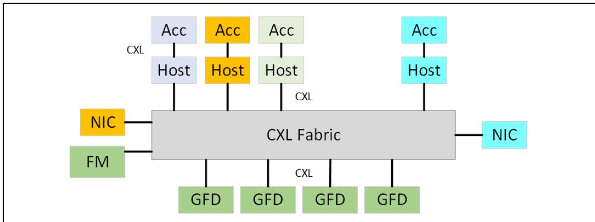

## 7.7.1.3 Composable Systems

Support for multi-level switches with PBR fabric extensions provides additional capabilities for building software-composable systems. In Figure 7-28, a leaf/spine switch architecture is shown in which all resources are attached to the leaf switches. Each domain may span multiple switches. All devices must be bound to a host or an FM. Cross-domain traffic is limited to CXL.mem and UIO transactions.

Composing systems from resources within a single leaf switch allows for low-latency implementations. In such implementations, a spine switch is used only for crossdomain and G-FAM accesses.

Figure 7-28. Sample System Topology for Composable Systems  
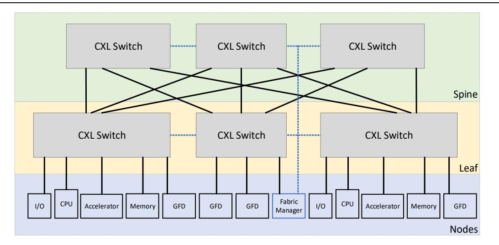  
Global-Fabric-Attached Memory (G-FAM)

## 7.7.2.1 Overview

G-FAM provides a highly scalable memory resource that is accessible by all hosts and peer devices within a CXL fabric. G-FAM ranges can be assigned exclusively to a single host/peer requester or can be shared by multiple hosts/peers. When shared, multirequester cache coherency can be managed by either software or hardware. Access rights to G-FAM ranges are enforced by decoders in Requester Edge ports and the target GFD.

GFD HDM space can be accessed by hosts/peers from multiple domains using CXL.mem, and by peer devices from multiple domains using CXL.io UIO. GFDs implement no PCIe configuration space, and they are configured and managed instead via Global Memory Access Endpoints (GAEs) in Edge USPs or via out-of-band mechanisms.

Unlike an MLD, which has a separate Device Physical Address (DPA) space for each host/peer interface (LD), a GFD has one DPA space that is common across all hosts and peer devices. The GFD translates the Host Physical Address (HPA)1 in each incoming request into a DPA, using per-requester translation information that is stored in the GFD Decoder Table. To create shared memory, two or more HPA ranges (each from a different requester) are mapped to the same DPA range. When the GFD needs to issue a BISnp, the GFD translates the DPA into an HPA for the associated host using the same GFD decoder information.

When a GFD receives a request, the requester is identified by the SPID in the request, which is referred to as the Requester PID or RPID. Using this term avoids confusion when describing messages that the GFD sends to the requester, where the RPID is used for the DPID, and the GFD PID is used for the SPID.

All memory capacity on a GFD is managed by the Dynamic Capacity (DC) mechanisms, as defined in Section 8.2.10.9.9. A GFD allows each requester to access up to 8 RPID non-overlapping decoders, where the maximum number of decoders per SPID is implementation dependent. Each decoder has a translation from HPA space to the common DPA space, a flag that indicates whether cache coherency is maintained by software or hardware, and information about multiple GFD interleaving, if used. For each requester, the FM may define DC Regions in DPA space and convey this information to the host via a GAE. It is expected that the host will program the Fabric Address Segment Table (FAST) decoders and GFD decoders for all RPIDs in its domain to map the entire DPA range of each DC Region that needs to be accessed by the host or by one of its associated accelerators.

G-FAM memory ranges can be interleaved across any power-of-two number of GFDs from 2 to 256, with an Interleave Granularity of 256B, 512B, 1 KB, 2 KB, 4 KB, 8 KB, or 16 KB. GFDs that are located anywhere within the CXL fabric, as defined in Section 2.7, may be used to contribute memory to an Interleave Set.

If a GFD supports UIO Direct P2P to HDM (see Section 7.7.9.1), all GFD ports shall support UIO, and for each GFD link whose link partner also supports UIO, VC3 shall be auto-enabled by the ports (see Section 7.7.11.5.1).

## 7.7.2.2 Host Physical Address View

Hosts that access G-FAM shall allocate a contiguous address range for Fabric Address space within their Host Physical Address (HPA) space, as shown in Figure 7-29. The Fabric Address range is defined by the FabricBase and FabricLimit registers. All host requests that fall within the Fabric Address range are routed to a selected CXL port. Hosts that use multiple CXL ports for G-FAM may either address interleave requests across the ports or may allocate a Fabric Address space for each port.

G-FAM requests from a host flow to a PBR Edge USP. In the USP, the Fabric Address range is divided into N equal-sized segments. A segment may be any power-of-two size from 64 GB to 8 TB, and must be naturally aligned. The number of segments implemented by a switch is implementation dependent. Host software is responsible for configuring the segment size so that the number of segments times the segment size fully spans the Fabric Address space. The FabricBase and FabricLimit registers can be programmed to any multiple of the segment size.

Each segment has an associated GFD or Interleave Set of GFDs. Requests whose HPA falls anywhere within the segment are routed to the specified GFD or to a GFD within the Interleave Set. Segments are used only for request routing and may be larger than the accessible portion of a GFD. When this occurs, the accessible portion of the GFD starts at address offset zero within the segment. Any requests within the segment that are above the accessible portion of the GFD will fail to positively decode in the GFD and will be handled as described in Section 8.2.4.20.

Host interleaving across root ports is entirely independent from GFD interleaving. Address bits that are used for root port interleaving and for GFD interleaving may be fully overlapping, partially overlapping, or non-overlapping. When the host uses root port interleaving, FabricBase, FabricLimit, and segment size in the corresponding PBR Edge USPs must be identically configured.

Figure 7-29. Example Host Physical Address View

## 7.7.2.3 G-FAM Capacity Management

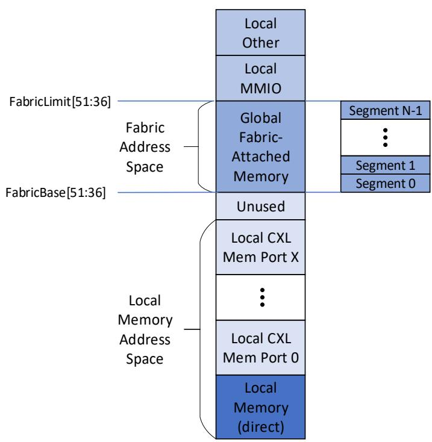

GFDs are managed using CCIs like all other classes of CXL components. A GFD requires support for the PBR Link CCI message format, as defined in Section 7.7.11.6, on its CXL link and may optionally implement additional MCTP-based CCIs (e.g., SMBus).

G-FAM relies exclusively on the Dynamic Capacity (DC) mechanism for capacity management, as described in Section 8.2.10.9.9. GFDs have no “legacy” static capacity as shown in the left side of Figure 9-24 in Chapter 9.0. Dynamic Capacity for G-FAM has much in common with the Dynamic Capacity for LD-FAM:

• Both have identical concepts for DC Regions, Extents, and Blocks

• Both support up to 8 DC Regions per host/peer interface

• DC-related parameters in the CDAT for each are identical

• Mailbox commands for each are highly similar; however, the specific Mailbox access methods are considerably different

— For LD-FAM, the Mailbox for each host’s LD is accessed via LD structures

— For G-FAM, management for each host is defined in Section 7.7.2.6

An LD-FAM DCD (i.e., DCD-capable SLDs or MLDs) allocates memory capacity and binds it to a specific Host ID in one operation. A GFD allocates Dynamic Capacity to a named Memory Group in one operation and binds specific Host IDs to named Memory Groups in a separate operation. Thus, the GFD requires different DCD Management commands than LD-FAM DCDs.

In contrast to LD-FAM, each GFD has a single DPA space instead of a separate DPA space per host. G-FAM DPA space is organized by Device Media Partitions (DMPs), as shown in Figure 7-30. DMPs are DPA ranges with certain attributes. A fundamental DMP attribute is the media type (e.g., DRAM or PM). A DMP attribute that is configured by the FM is the DC Block size. DMPs expose all GFD memory that is assignable for host use.

The rules for DMPs are as follows:

• Each GFD contains 1-4 DMPs, whose size is configured by the FM.

• Each DC Region consists of part or all of one DMP assigned to a host/peer. Each DC Region can be mapped into an RPID’s HPA space using the GFD Decoder Table.

• Each DC Region inherits associated DMP attributes.

## Figure 7-30. Example HPA Mapping to DMPs

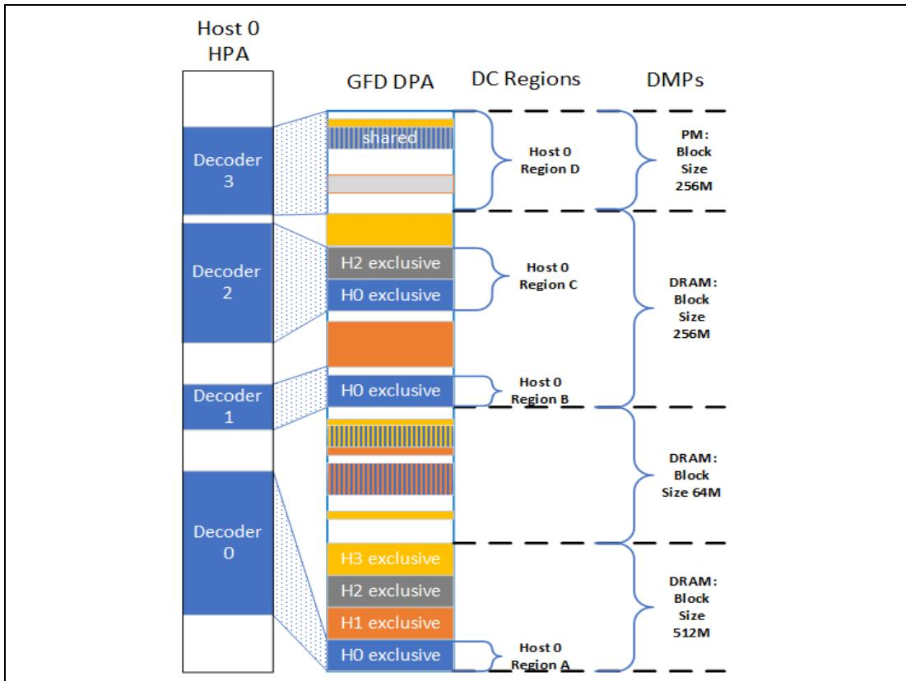  
Table 7-82 lists the key differences between LD-FAM and G-FAM.

Table 7-82. Differences between LD-FAM and G-FAM (Sheet 1 of 2)

<table><tr><td>Feature or Attribute</td><td>LD-FAM</td><td>G-FAM</td></tr><tr><td>Number of supported hosts</td><td>16 max</td><td>1000s architecturally;100s more realistic</td></tr><tr><td>Support for DMPs</td><td>No</td><td>Yes</td></tr><tr><td>Architected FM API support for DMP configuration by the FM</td><td>N/A</td><td>Yes</td></tr></table>

Table 7-82. Differences between LD-FAM and G-FAM (Sheet 2 of 2)

<table><tr><td>Feature or Attribute</td><td>LD-FAM</td><td>G-FAM</td></tr><tr><td>Routing and decoders used for HDM addresses</td><td>Interleave RP routing by host HDM decoderInterleave VH routing by USP HDM decoderInterleave fabric routing by USP LDST/IDT decoder1 to 10 HDM decoders in each LD</td><td>Interleave RP routing by host HDM decoderInterleave fabric routing by USP FAST/ IDT decoder1 to 8 GFD decoders per RPID in the GFD</td></tr><tr><td>Interleave Ways (IW)</td><td>1/2/4/8/16 plus 3/6/12</td><td>2 to 256 in powers of 2</td></tr><tr><td>DC Block Size</td><td>Powers of 2, as indicated by Region * Supported Block Size Mask</td><td>64 MB and up in powers of 2</td></tr></table>

Additional differences exist in how MLDs and GFDs process requests. An MLD has three types of decoders that operate sequentially on incoming requests:

• Per-LD HDM decoders translate from HPA space to a per-LD DPA space, removing the interleaving bits

• Per-LD decoders determine within which per-LD DC Region the DPA resides, and then whether the addressed DC block within the Region is accessible by the LD

• Per-LD implementation-dependent decoders translate from the DPA to the media address

A GFD has two types of decoders that operate sequentially on incoming requests:

• Per-RPID GFD decoders translate from HPA space to a common DPA space, removing the interleaving bits. This DPA may be used as the media address directly or via a simple mapping.

• A common decoder determines within which Device Media Partition (DMP) the DPA is located, and then whether the block that is addressed within the DMP is accessible by the RPID.

## 7.7.2.4 G-FAM Request Routing, Interleaving, and Address Translations

The mechanisms for GFD request routing, interleaving, and address translations within both the Edge ingress port and the GFD are shown in Figure 7-31. GFD requests may arrive either at an Edge USP from a host or at an Edge DSP from a peer device. This is referred to as the Edge request port.

Figure 7-31. G-FAM Request Routing, Interleaving, and Address Translations  
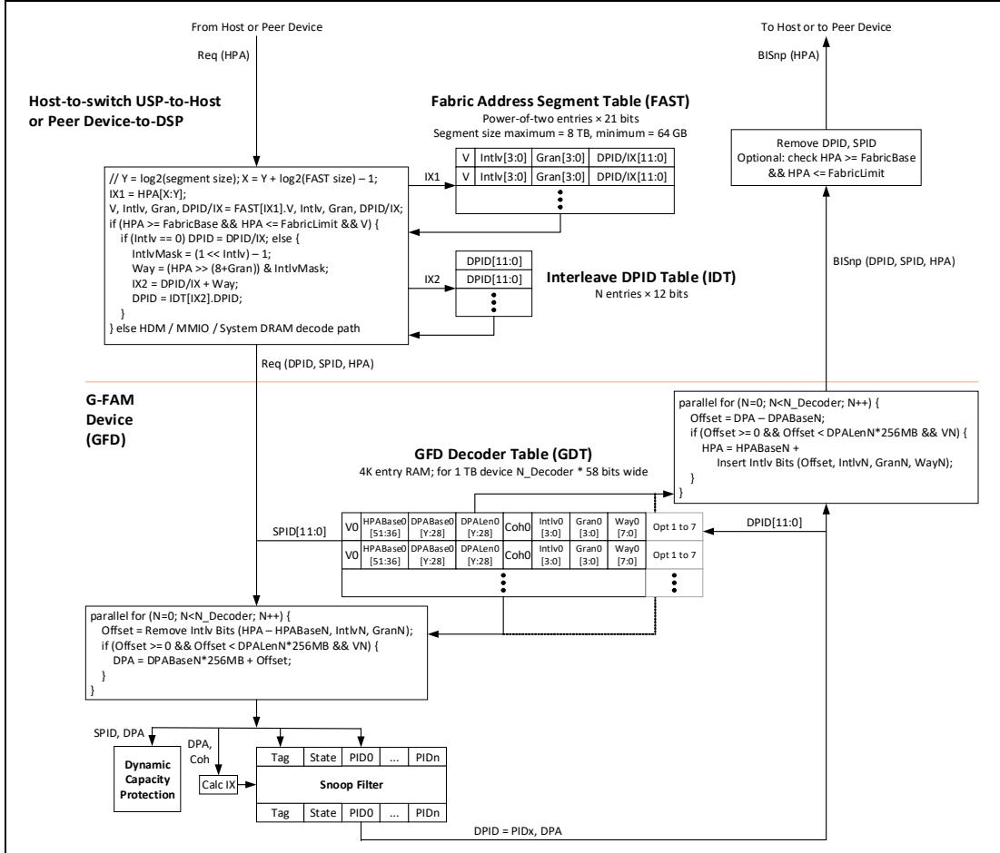  
The Edge request port shall decode the request HPA to determine the DPID of the target GFD using the $\mathsf { F A S T ^ { 1 } }$ and the Interleave DPID Table (IDT). The FAST contains one entry per segment. The FAST depth must be a power-of-two but is implementation dependent. The segment size is specified by the FSegSz[2:0] register as defined in Table 7-83. The FAST entry accessed is determined by bits X:Y of the request address, where $\textsf { Y } = \log 2$ of the segment size in bytes and $\mathsf { X } = \mathsf { \dot { Y } } + \mathsf { l o g } 2$ of the FAST depth in entries. The maximum Fabric Address space and the HPA bits that are used to address the FAST are shown in Table 7-83 for all supported segment sizes for some example FAST depths. For a host with a 52-bit HPA, the maximum Fabric Address space is 4 PB minus one segment each above and below the Fabric Address space for local memory and for MMIO, as shown in Figure 7-29.

Table 7-83. Fabric Segment Size Table1

<table><tr><td rowspan="2">FSegSz[2:0]</td><td rowspan="2">Fabric Segment Size</td><td colspan="4">FAST Depth (Entries)</td></tr><tr><td>256</td><td>1K</td><td>4K</td><td>16K</td></tr><tr><td>000b</td><td>64 GB</td><td>16 TBHPA[43:36]</td><td>64 TBHPA[45:36]</td><td>256 TBHPA[47:36]</td><td>1 PBHPA[49:36]</td></tr><tr><td>001b</td><td>128 GB</td><td>32 TBHPA[44:37]</td><td>128 TBHPA[46:37]</td><td>512 TBHPA[48:37]</td><td>2 PBHPA[50:37]</td></tr><tr><td>010b</td><td>256 GB</td><td>64 TBHPA[45:38]</td><td>256 TBHPA[47:38]</td><td>1 PBHPA[49:38]</td><td>4 PB to 512 GBHPA[51:38]</td></tr><tr><td>011b</td><td>512 GB</td><td>128 TBHPA[46:39]</td><td>512 TBHPA[48:39]</td><td>2 PBHPA[50:39]</td><td></td></tr><tr><td>100b</td><td>1 TB</td><td>256 TBHPA[47:40]</td><td>1 PBHPA[49:40]</td><td>4 PB to 2 TBHPA[51:40]</td><td></td></tr><tr><td>101b</td><td>2 TB</td><td>512 TBHPA[48:41]</td><td>2 PBHPA[50:41]</td><td></td><td></td></tr><tr><td>110b</td><td>4 TB</td><td>1 PBHPA[49:42]</td><td>4 PB to 8 TBHPA[51:42]</td><td></td><td></td></tr><tr><td>111b</td><td>8 TB</td><td>2 PBHPA[50:43]</td><td></td><td></td><td></td></tr></table>

1. LDST Segment Size (LSegSz) uses the same encodings as those defined for FSegSz.

Each FAST entry contains a valid bit (V), the number of interleaving ways (Intlv), the interleave granularity (Gran), and a DPID or IDT index (DPID/IX). The encodings for the Intlv and Gran fields are defined in Table 7-84 and Table 7-85, respectively. If the HPA is between FabricBase and FabricLimit inclusive and the FAST entry valid bit is set, then there is a FAST hit, and the FAST is used to determine the DPID. Otherwise, the target device is determined by other architected decoders.

Table 7-84. Segment Table Intlv[3:0] Field Encoding

<table><tr><td>Intlv[3:0]</td><td>GFD Interleaving Ways</td></tr><tr><td>0h</td><td>Interleaving is disabled</td></tr><tr><td>1h</td><td>2-way interleaving</td></tr><tr><td>2h</td><td>4-way interleaving</td></tr><tr><td>3h</td><td>8-way interleaving</td></tr><tr><td>4h</td><td>16-way interleaving</td></tr><tr><td>5h</td><td>32-way interleaving</td></tr><tr><td>6h</td><td>64-way interleaving</td></tr><tr><td>7h</td><td>128-way interleaving</td></tr><tr><td>8h</td><td>256-way interleaving</td></tr><tr><td>9h to Fh</td><td>Reserved</td></tr></table>

Table 7-85. Segment Table Gran[3:0] Field Encoding

<table><tr><td>Gran [3:0]</td><td>GFD Interleave Granularity</td></tr><tr><td>0h</td><td>256B</td></tr><tr><td>1h</td><td>512B</td></tr><tr><td>2h</td><td>1 KB</td></tr><tr><td>3h</td><td>2 KB</td></tr><tr><td>4h</td><td>4 KB</td></tr><tr><td>5h</td><td>8 KB</td></tr><tr><td>6h</td><td>16 KB</td></tr><tr><td>7h to Fh</td><td>Reserved</td></tr></table>

Note that FabricBase and FabricLimit may be used to restrict the amount of the FAST used. For example, for a host with a 52-bit HPA space, if the FAST is accessed using HPA[51:40] without restriction, then it would consume the entire HPA space. In this case, FabricBase and FabricLimit must be set to restrict the Fabric Address space to the desired range of HPA space. This has the effect of reducing the number of entries in the FAST that are being used.

FabricBase and FabricLimit may also be used to allow the FAST to start at an HPA that is not a multiple of the FAST depth. For example, for a host with a 52-bit HPA space, if 2 PB of Fabric Address space is needed to start at an HPA of 1 PB, then a 4K entry FAST with 512 GB segments can be accessed using HPA[50:39] with FabricBase set to 1 PB and FabricLimit set to 3 PB. HPAs 1 PB to 2 PB-1 will then correspond to FAST entries 2048 to 4095, while HPAs 2 PB to 3 PB-1 will wrap around and correspond to FAST entries 0 to 2047. When programming FabricBase, FabricLimit, and segment size, care must be taken to ensure that a wraparound does not occur that would result in aliasing multiple HPAs to the same segment.

On a FAST hit, if the FAST Intlv field is 0h, then GFD interleaving is not being used for this segment and the DPID/IX field contains the GFD’s DPID. If the Intlv field is nonzero, then the Interleave Way is selected from the HPA using the Gran and Intlv fields, and then added to the DPID/IX field to generate an index into the IDT. The IDT defines the set of DPIDs for each Interleave Set that is accessible by the Edge request port. For an N-way Interleave Set, the set of DPIDs is determined by N contiguous entries in the IDT, with the first entry pointed to by DPID/IX which may be anywhere in the IDT. The IDT depth is implementation dependent.

After the GFD’s DPID is determined, a request that contains the SPID of the Edge request port and the unmodified HPA is sent to the target GFD. The GFD shall then use the SPID to access the GFD Decoder Table (GDT) to select the decoders that are associated with the requester. Note that a host and its associated CXL devices will each have a unique RPID, and therefore each will use a different entry in the GDT. The GDT provides up to 8 decoders per RPID. Each decoder within a GFD Decoder Table entry contains structures defined in Section 8.2.10.9.10.19.

The GFD shall then compare, in parallel, the request HPA against all decoders to determine whether the request hits any decoder’s HPA range. To accomplish this, for each decoder, a DPA offset is calculated by first subtracting HPABase from HPA and then removing the interleaving bits. The LSB of the interleaving bits to remove is determined by the interleave granularity and the number of bits to remove is determined by the interleave ways. If offset ≥ 0, offset < DPALen, and the Valid bit is set, then the request hits within that decoder. If only one decoder hits, then the DPA is calculated by adding DPABase to the offset. If zero or multiple decoders hit, then an access error is returned.

After the request HPA is translated to DPA, the RPID and the DPA are used to perform the Dynamic Capacity access check, as described in Section 7.7.2.5, and to access the GFD snoop filter. The design of the snoop filter is beyond the scope of this specification.

When the snoop filter needs to issue a back-invalidate to a host/peer, the DPA is translated to an HPA by performing the HPA-to-DPA steps in reverse. The RPID is used to access the GDT to select the decoders for the requester, which may be the host itself or one of its devices that performs Direct P2P. The GFD shall then compare, in parallel, the DPA against all selected decoders to determine whether the back-invalidate hits any decoder’s DPA range.

This is accomplished by first calculating DPA offset = DPA – DPABase, and then testing whether offset ≥ 0, offset < DPALen, and the decoder is valid. If only one decoder hits, then the HPA is calculated by inserting the interleaving bits into the offset and then adding it to HPABase. When inserting the interleaving bits, the LSB is determined by interleave granularity, the number of bits is determined by the interleaving ways, and the value of the bits is determined by the way within the interleave set. If zero or multiple decoders hit, then an internal snoop filter error has occurred which will be handled as defined in a future specification update.

After the HPA is calculated, a BISnp with the GFD’s SPID and HPA is issued to the Edge Port containing the FAST decoder of the host/peer that owns this HDM-DB Region, using the PID stored in the snoop filter as the DPID. The FAST decoder then optionally checks whether the HPA is located within the FAST decoder’s Fabric Address space. The DPID and SPID are then removed, and the BISnp is then issued to the host/peer in HBR format.

## IMPLEMENTATION NOTE

It is recommended that a PBR switch size structures to support the typical to full scale of a PBR fabric.

It is recommended that the FAST have 4K to 16K entries.

It is recommended that the IDT have 4K to 16K entries to support a sufficient number of interleave groups and interleave ways to cover all GFDs in a system.

## 7.7.2.5

## G-FAM Access Protection

G-FAM access protection is available at three levels of the hierarchy (see Figure 7-32):

• The first level of protection is through the host’s (or peer device’s) page tables. This fine-grained protection is used to restrict the Fabric Address space that is accessible by each process to a subset of that which is accessible by the host/peer.

• The second level of protection is described in the GAE in the form of the Global Memory Mapping Vector (GMV), described in Section 7.7.2.6.

• The third level of protection is at the target GFD itself and is fine grained. This section describes this third level of GFD protection.

Figure 7-32. Memory Access Protection Levels  
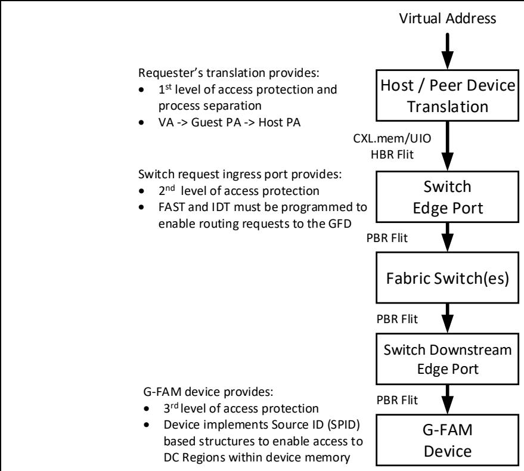

The GFD’s DPA space is divided into one or more Device Media Partitions (DMPs). Each DMP is defined by a base address within DPA space (DMPBase), a length (DMPLength), and a block size (DMPBlockSize). DMPBase and DMPLength must be a multiple of 256 MB, while DMPBlockSize must be a power-of-two size in bytes. The DMPBlockSize values that are supported by a device are device dependent and are defined in the GFD Supported Block Size Mask register. Each GFD decoder targets the DPA range of a DC Region within a single DMP (i.e., must not straddle DMP boundaries). The DC Region’s block size is determined by the associated DMP’s block size. The number of DMPs is device-implementation dependent. Unique DMPs are typically used for different media types (e.g., DRAM, NVM, etc.) and to provide sufficient DC block sizes to meet customer needs.

The GFD Dynamic Capacity protection mechanism is shown in Figure 7-33. To support scaling to 4096 CXL requesters, the GFD DC protection mechanism uses a concept called Memory Groups. A Memory Group is a set of DMP blocks that can be accessed by the same set of requesters. The maximum number of Memory Groups (NG) that are supported by a GFD is implementation dependent. Each DMP block is assigned a Memory Group ID (GrpID), using a set of Memory Group Tables (MGTs). There is one MGT per DMP. Each MGT has one entry per DMP block within the DMP, with entry 0 in the MGT corresponding to Block 0 within the DMP. The depth of each MGT is implementation dependent. DPA is decoded to determine within which DMP a request falls, and then that DMP’s MGT is used to determine the GrpID. The GrpID width is X = ceiling (log2 (NG) ) bits. For example, a device with 33 to 64 groups would require 6-bit GrpIDs.

In parallel with determining the GrpID for a request, the Request SPID is used to index the SPID Access Table (SAT) to produce a vector that identifies which Memory Groups the SPID is allowed to access (GrpAccVec). After the GrpID for a request is determined, the GrpID is used to select a GrpAccVec bit to determine whether access is allowed.

## IMPLEMENTATION NOTE

To support allocation of GFD capacity to hosts in sufficiently small percentages of the GFD, it is recommended that devices implement a minimum of 1K entries per MGT. Implementations may choose to use a separate RAM per MGT, or may use a single partitioned RAM for all MGTs.

To support a sufficient number of memory ranges with different host access lists, it is recommended that devices implement a minimum of 64 Memory Groups.

## Figure 7-33. GFD Dynamic Capacity Access Protections

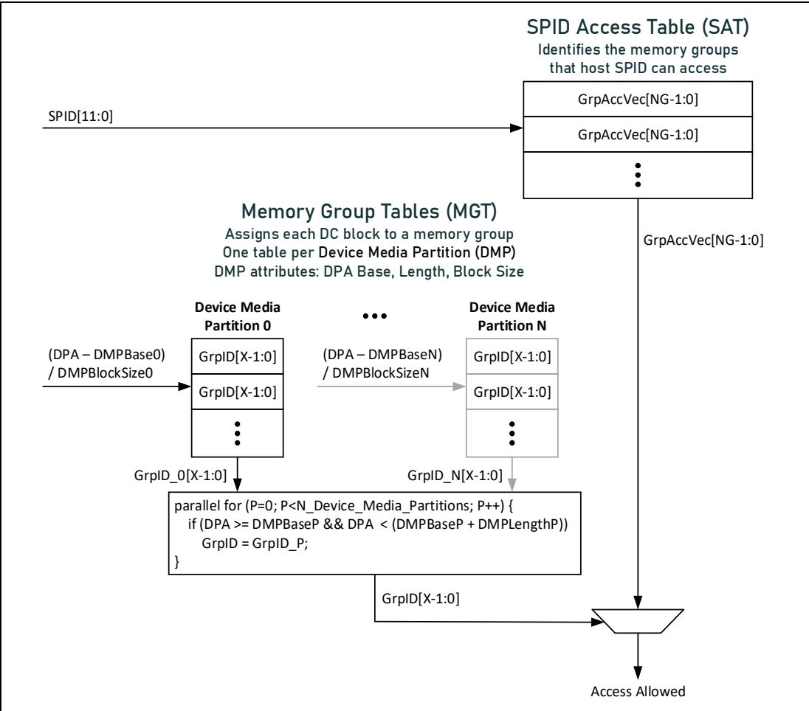

## 7.7.2.6 Global Memory Access Endpoint

Access to G-FAM/GIM resources and configuration of the FAST through a PBR fabric edge switch is facilitated by a Global Memory Access Endpoint (GAE) which is a Mailbox CCI that includes support for the Global Memory Access Endpoint Command set and the opcodes required to configure and enable FAST use, including Get PID Access Vectors and Configure FAST. The GAE is presented to the host as a PCIe Endpoint with a Type 0 configuration space as defined in Section 7.2.9.

There are two configurations under which a host edge port USP will expose a GAE. The first configuration, illustrated in Figure 7-34, provides LD-FAM and G-FAM/GIM resources to a host. In this configuration, the GAE Mailbox CCI is used to configure G-FAM/GIM access for the USP and any DSPs connected to EPs. It may also include support for opcodes necessary to manage the CXL switch capability providing LD-FAM resources.

The second configuration, illustrated in Figure 7-35, only provides access to G-FAM/ GIM resources. In this configuration, there is no CXL switch instantiated in the VCS and the GAE is the only PCIe function presented to the host.

Figure 7-35. PBR Fabric Providing Only G-FAM Resources

A GAE is also required in the vUSP of a Downstream ES VCS. This GAE is used for configuring that VCS, including configuring the FAST and LDST in the Edge DSPs and providing CDAT information, as described in Section 7.7.12.4.

Each GAE maintains two access vectors, which are used to control whether the host has access to a particular PID:

• Global Memory Mapping Vector (GMV): 4k bitmask indicating which PIDs have been enabled for G-FAM or GIM access

• VendPrefixL0 Target Vector (VTV): 4k bitmask indicating which PIDs have been enabled for VendPrefixL0

## 7.7.2.7 Event Notifications from GFDs

GFDs do not maintain individual logs for every requester. Instead, events of interest are reported using the Enhanced Event Notifications defined in Section 8.2.10.2.9 and Section 8.2.10.2.10. These notifications are transported across the fabric using GAM VDMs, as defined in Section 3.1.11.6.

For event notifications sent to a host, the GAM VDM’s DPID is the PID of the host’s GAE. When received by the GAE, the GAM VDM’s 32B payload is written into the host’s GAM Buffer. All GAM VDMs that are received by the GAE are logged into the same GAM Buffer, regardless of their SPID.

The GAM Buffer is a circular buffer in host memory that is configured for 32B entries. Its location in host memory is configured with the Set GAM Buffer request. The GAE writes received GAM VDM payloads into the buffer offset that is specified by the head index reported by the Get GAM Buffer request (see Section 8.2.10.2.11). As the host reads entries, the host increments the tail index using the Set GAM Buffer request (see Section 8.2.10.2.12). Head and tail indexes wrap to the beginning of the buffer when they increment beyond the buffer size.

The buffer is empty when the head index and tail index are equal. The buffer is full when the head index is immediately before the tail index. Old entries are not overwritten by the GAE until the host removes them from the buffer by incrementing the tail index. The GAE will report a buffer overflow condition if a GAM VDM is received when the buffer is full.

GAM VDMs are not forwarded to peer devices and are instead silently dropped by the peer’s edge switch.

## 7.7.3

## Global Integrated Memory (GIM)

A host domain may include multiple tiers of memory:

• Memory natively attached to a host (e.g., DDR, HBM, etc.)

• Device memory attached to a host CXL link

• Device memory attached to a host through CXL switches

All the memory tiers listed above are managed by a host operating system. CXL devices may be a Type 2 device or Type 3 device and may optionally support backinvalidate channels. A CXL Fabric may be composed of many host domains and G-FAM devices (GFD) as shown in Figure 7-36. GFD is a scalable memory resource that is accessible by all hosts and peer devices within a CXL Fabric.

Each host domain may allow other host domains within the CXL Fabric to access locally managed memory at any tier. Global Integrated Memory (GIM) refers to the memory in remote host domains that is mapped into local host physical address space. Hosts and devices are allowed to initiate cross-domain accesses to GIM, utilizing Unordered I/O (UIO) transactions. CXL.mem or CXL.cache must not be used for GIM accesses.

Cross-domain accesses are considered I/O coherent — data is coherent at the time of access. Remote domains may either mark this memory as uncacheable or manage caches with SW mechanisms.

GIM is primarily used for enabling remote DMA and messaging across domains. It is not intended for memory pooling or borrowing use cases.

Figure 7-36. CXL Fabric Example with Multiple Host Domains and Memory Types  

## 7.7.3.1 Host GIM Physical Address View

Hosts and devices may use proprietary decode mechanisms to identify the target DPID and may bypass address decoders in the switch ingress port. Hosts and devices are typically limited to access between homogeneous peers. See Section 7.7.3.2 for ways by which hosts/devices can access Global Integrated Memory (GIM) without using the FAST decoders. This section covers the decode path that uses the FAST decoders.

Hosts that access GIM and rely on address decoders in the switch must map this range in the Fabric Address Space. Hosts that access GIM and GFD must include both ranges in the Fabric Address Space and must use a contiguous address range within the Host Physical Address (HPA) space as shown in Figure 7-37.

## Figure 7-37. Example Host Physical Address View with GFD and GIM

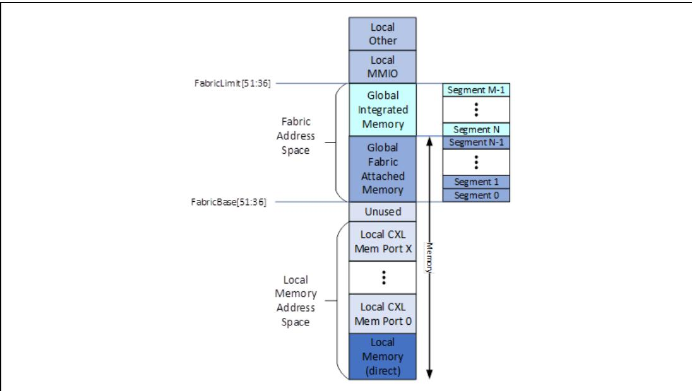

All accesses to GIM regions must only use UIO. It is recommended to map GIM as MMIO instead of a normal write back memory type to avoid potential deadlock. However, implementations may use proprietary methods to guarantee UIO use even when internally using a cacheable memory type. Thus, MMIO mapping of GIM is only a recommendation and not a requirement.

Host and device accesses to GFD and GIM are decoded using a common FAST decoder to determine the target’s DPID.

## 7.7.3.2 Use Cases

ML and HPC applications are typically distributed across many compute nodes and need a scalable and efficient network for low-latency communication and synchronization. Figure 7-38 is an example of a system with a compute node composed of a Host, an Accelerator, and a cluster of nodes connected through a CXL switch fabric. Each host may expose a region or all available memory to other compute nodes.

Figure 7-38. Example Multi-host CXL Cluster with Memory on Host and Device Exposed as GIM

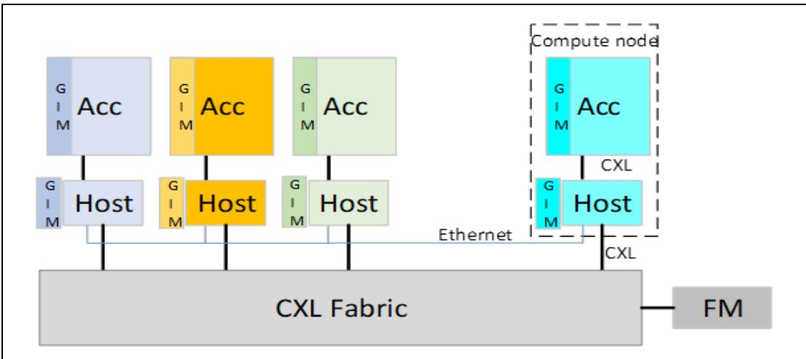  
A second example in Figure 7-39 shows a CXL Fabric that connects all the accelerators. In this example, only the memory attached to the device is exposed to other devices as GIM. UIO allows flexible implementation options to enable RDMA semantics between devices. Software and security requirements are beyond the scope of this specification. GIM builds a framework for using the same set of capabilities for host-to-host communication, device-to-device communication, host-to-device communication, and device-to-host communication.

Figure 7-39. Example ML Cluster Supporting Cross-domain Access through GIM  
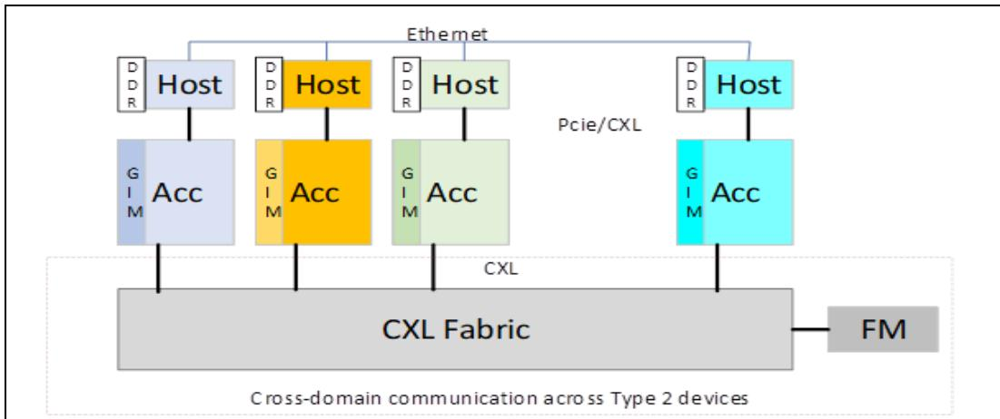

## 7.7.3.3 Transaction Flows and Rules for GIM

The flow in Figure 7-40 describes how a host can access GIM in another host, using the fabric address model described earlier in this chapter. While Figure 7-40 uses host-tohost as the example, the same model works for host-to-device, device-to-device and device-to-host as well. A device that implements GIM as target is expected to have the required functionality that translates the combination of <Address: PID> in the incoming UIO TLP to a local memory address and to provide the required security on cross-domain accesses. This functionality can also use more information than just <Address:PID> from the TLP (e.g., PASID) for additional functionality/security. Designs can choose to reuse the GFD architecture for defining this translation/protection functionality or can implement a proprietary IOMMU-like logic. Details of this functionality are beyond the scope of this specification.

Figure 7-40. GIM Access Flows Using FASTs  
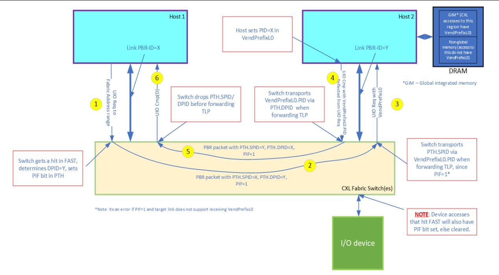

Figure 7-41. GIM Access Flows without FASTs  

Although the flows described in Figure 7-40 and Figure 7-41 are self-explanatory, here are the key rules for PBR switches/Hosts/Devices that support the GIM flows:

• FM enables usage of VendPrefixL0 on non-PBR edge ports, using the FM API discussed in Table 7-189. By default, VendPrefixL0 usage is disabled on edge ports.

The mechanism that the FM uses to determine on which ports to enable this functionality is beyond the scope of this specification.

## 7.7.3.3.1 GIM Rules for PBR Switch Ingress Port

• GIM flows are supported only via UIO transactions in this version of the specification. At this time, GIM flows are NOT supported via CXL.cachemem transactions or Non-UIO TLPs.

— If switch ingress port receives a Non-UIO request with VendPrefixL0, it treats it as a UR.

• At the Non-PBR edge ingress port, for UIO request TLPs that do not have VendPrefixL0 and that are decoded via the FASTs, the switch sets the PTH.PIF bit when forwarding the request into the PBR fabric.

— For UIO request TLPs that are not decoded via the FASTs, this bit is cleared when forwarded to the PBR fabric.

• At the Non-PBR edge ingress port, if the port is enabled for Ingress Request VendPrefixL0 usage and UIO request TLP has VendPrefixL0 and VendPrefixL0.PID matches one of the allowed PIDs in VTV (see Section 7.7.2.6), the switch bypasses all decode, sets PTH.DPID=VendPrefixL0.PID, PTH.SPID=Ingress Port PID, and PTH.PIF=1 when forwarding the request to the PBR fabric.

— If a UIO request TLP is received with VendPrefixL0 but the port is not enabled for Ingress Request VendPrefixL0 usage or if the PID in the prefix does not match any of the allowed PIDs in VTV, the switch treats the request as a UR.

• At the Non-PBR edge ingress port, for UIO completion TLPs, the switch forwards the received VendPrefixL0.PID on PTH.DPID when forwarding the packet to the PBR fabric, if Ingress Completion VendPrefixL0 usage is enabled on the port (see

Section 7.7.15.5) and VendPrefixL0.PID matches one of the allowed PIDs in VTV (see Section 7.7.2.6). PTH.SPID on the completion TLP is set to the PID of the ingress port.

— If a UIO completion TLP is received on a Non-PBR edge ingress port when Ingress Completion VendPrefixL0 usage is disabled on the port or if the PID in the prefix does not match any of the allowed PIDs in VTV, the switch must drop the packet and treat it as an Unexpected Completion.

— Switch sets the PIF bit whenever it successfully forwards the received completion TLP to the PBR fabric.

## 7.7.3.3.2 GIM Rules for PBR Switch Egress Port

• At the Non-PBR edge egress port, for UIO request TLPs with the PTH.PIF bit set, the switch forwards the PTH.SPID field in the request TLP on the VendPrefixL0.PID field if the egress port is enabled for Egress Request VendPrefixL0 usage.

— If the PTH.PIF bit is set but the egress port is not enabled for Egress Request VendPrefixL0 usage, the switch should treat the request as a UR.

— If the PTH.PIF bit is cleared in the UIO request TLP, the request TLP is forwarded to the egress link without VendPrefixL0, regardless of whether the port is enabled for Egress Request VendPrefixL0 usage.

• At the Non-PBR edge egress port, the switch does not send VendPrefixL0 on completion TLPs.

• If the Non-PBR edge egress port is in a ‘Link Down’ state, GIM packets shall be silently dropped.

• Switch forwards the PTH.PIF bit as-is on edge PBR links

## 7.7.3.3.3 GIM Rules for Host/Devices

• Host/Devices that support VendPrefixL0 semantics and receive a UIO Request TLP with VendPrefixL0 must return the received PID value in the associated completion’s VendPrefixL0.

• Host/Devices must always return a value of 0 for Completer ID in the UIO completions.

## 7.7.3.3.4 Other GIM Rules

• VendPrefixL0 must never be sent on edge PBR links, such as the links connecting to a GFD

• GFD must ignore the PTH.PIF bit on TLPs that the GFD receives

• GFD is permitted to set the PTH.PIF bit on CXL.io request TLPs that the GFD sources and always sets this bit on CXL.io completion TLPs that the GFD sources

If setting the PTH.PIF bit on request TLPs, the GFD must do so only if the GFD is sure that the ultimate destination (e.g., GIM) needs to be aware of the PID of the source agent that is generating the request (such as for functional/security reasons); otherwise, the GFD should not set the bit.

## 7.7.3.4 Restrictions with Host-to-Host UIO Usages

GIM is a standardized mechanism supporting Host-to-Host (H2H) UIO DMA. However, implementations may leverage PBR fabric mechanisms architected for GIM to support other (including proprietary) H2H protocols that use UIO. This section covers restrictions that apply to both GIM and H2H UIO communications in general.

H2H UIO usages can result in deadlock if a host introduces shared resources between the following two roles. See the Implementation Note below to see an example deadlock.

• H2H responder role: The host is an H2H UIO responder.

• UIO forwarding role: The host performs any operation where a given UIO TLP is ingressed at an RP and later egressed at the same RP or another RP. This includes forwarding H2H or non-H2H TLPs, as well as reflecting TLPs sent to the RC for validation and/or remapping (e.g., by ACS P2P Redirect mechanisms).

There are different approaches to avoid such deadlocks. For example, with a host that plays an H2H responder role, ensure that the host never plays a UIO forwarding role. More specifically, ensure that no devices send UIO TLPs that require forwarding or reflecting by their local host. Note that:

• UIO Direct P2P to HDM traffic within a PBR fabric requires no host forwarding.

• H2H UIO traffic originated by host CPU load/store accesses requires no host forwarding.

• UIO traffic by devices to resources within their local host (e.g., for local DMA) requires no host forwarding.

• H2H UIO traffic by devices to remote hosts (e.g., using GIM) does require their local host to perform H2H UIO forwarding. This is not supported if the device’s local host is concurrently playing the H2H responder role.

• UIO P2P traffic between devices that is forwarded by a host’s RPs may be challenging to identify and avoid (e.g., any UIO P2P traffic redirected by ACS P2P Redirect mechanisms). Regardless, this is not supported if the host is concurrently playing the H2H responder role.

A future ECN may formalize deadlock avoidance options beyond those listed above.

## IMPLEMENTATION NOTE

Figure 7-42 shows an example deadlock with GIM, based on circular request dependencies that arise when devices under multiple GIM hosts are accessing remote GIM concurrently. In this example, circles 1 through 4 represent UIO TLPs in the path when Device 1 accesses GIM 1 on Host 1. Circles 5 through 8 represent UIO TLPs in the path when Device 2 accesses GIM 2 on Host 2.

## Figure 7-42. Example Deadlock with GIM

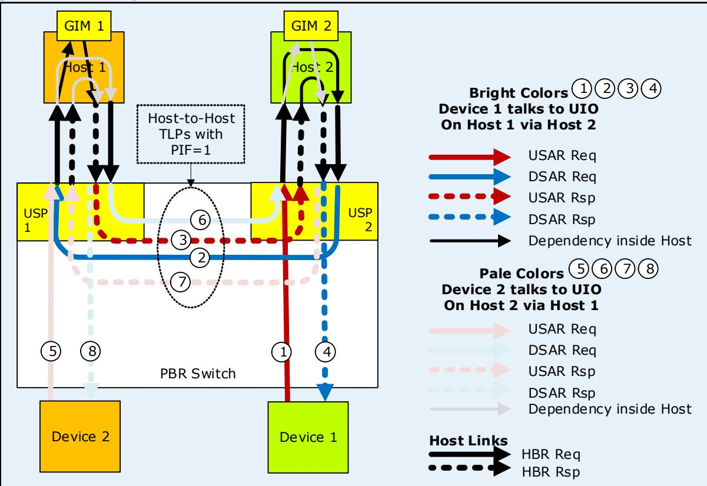

In this example, UIO Request (Req) dependencies form a closed loop of head-of-line (HOL) blocking instances, specifically:

• At USP 1 egress, USAR Req 5 blocks DSAR Req 2 due to HOL blocking

• At Host 2 egress, DSAR Req 2 blocks USAR Req 1 due to HOL blocking

• At USP 2 egress, USAR Req 1 blocks DSAR Req 6 due to HOL blocking

• At Host 1 egress, DSAR Req 6 blocks USAR Req 5 due to HOL blocking

• This completes the circle, resulting in deadlock

In each HOL blocking case, the fundamental cause is comingling USAR and DSAR Requests in the same flow control class traversing an HBR link.

A similar example exists with circular UIO Response (Rsp) dependencies.

## Non-GIM Usages with VendPrefixL0

When Hosts/Devices initiate UIO requests with VendPrefixL0, address decoding is bypassed in the Switch ingress port. This allows for proprietary implementations in which the address/data information in the TLP can potentially be vendor-defined. Such usages are beyond the scope of this specification; however, GIM-related rules enumerated in Section 7.7.3.3 allow such implementations as well.

## HBR and PBR Switch Configurations

CXL supports two types of switches: HBR (Hierarchy Based Routing) and PBR (Port Based Routing). “HBR” is the shorthand name for the CXL switches introduced in the CXL 2.0 specification and enhanced in subsequent CXL ECNs and specifications. In this section, the interaction between the two will be discussed.

A variety of HBR/PBR switch combinations are supported. The basic rules are as follows:

• Host RP must be connected to an HBR USP, PBR USP, or a non-GFD

• Non-GFD must be connected to an HBR DSP, a PBR DSP, or a Host RP

• PBR USP may be connected only to a host RP; connecting it to an HBR DSP is not supported

• HBR USP may be connected to a host RP, a PBR DSP, or an HBR DSP

• GFD may be connected only to a PBR DSP

• PBR FPort may be connected only to a PBR FPort of a different PBR switch

Figure 7-43 illustrates some example supported switch configurations, but should not be considered a complete list.

Figure 7-43. Example Supported Switch Configurations

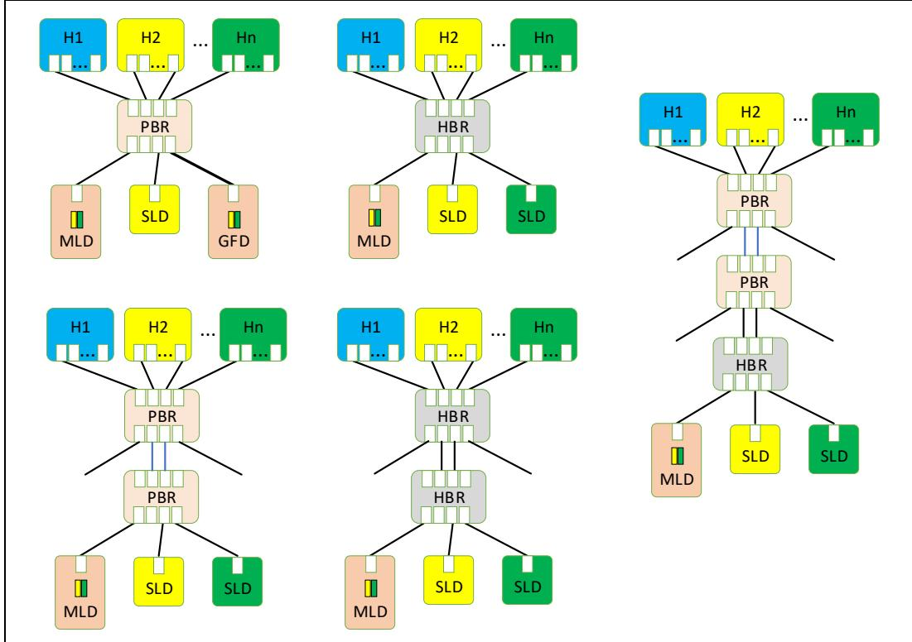

CXL fabric topology is non-prescriptive when using PBR switches. There is no predefined list of supported topologies. PID-based routing combined with flexible routing tables enables a high degree of freedom in choosing a topology. The PBR portion of the fabric may freely use any topology for which deadlock-free routing can be found.

To name a few examples, a PBR fabric might implement a simple PCIe-like tree topology, more-complex tree topologies such as fat tree (aka folded Clos), or non-tree topologies such as mesh, ring, star, linear, butterfly, or HyperX, as well as hybrids and multi-dimensional variants of these topologies.

Figure 7-44 illustrates an example of fully connected mesh topology (aka 1- dimensional HyperX). It has the notable ability to connect a relatively large number of components while still limiting the number of switch traversals. A direct link exists between each pair of switches, so it is possible for the FM to set up routing tables such that all components connected to the same switch can reach one another with a single switch traversal, and all components connected to different switches can reach one another with two switch traversals.

Figure 7-44. Example PBR Mesh Topology

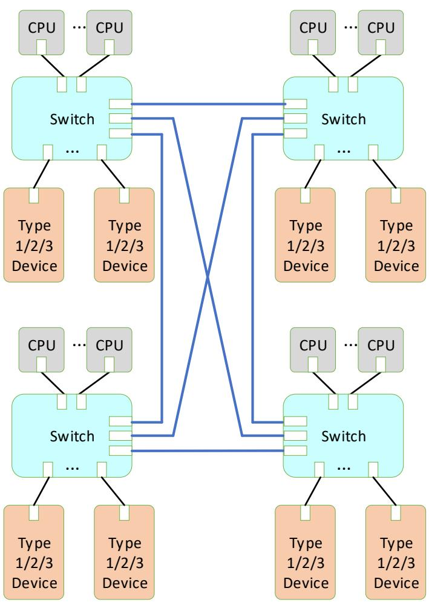

## 7.7.5.1 PBR Forwarding Dependencies, Loops, and Deadlocks

When messages are forwarded through PBR switches from one Fabric Port to another, a dependency is created — acceptance of arriving messages into one PBR Fabric Port is conditional upon the ability to transmit messages out of another PBR Fabric Port. Other arriving traffic commingled on the same inbound link is also affected by the dependency. Thus, traffic waiting to be forwarded can block traffic that needs to exit the PBR portion of the fabric via a USP or DSP of the PBR switch.

Some topologies, such as PCIe tree or fat tree, are inherently free of loops. Thus, the resulting Fabric Port-forwarding dependencies are inherently non-circular. However, in topologies that contain loops, dependencies can form a closed loop, thereby resulting in a deadlock.

The routing table programming in the PBR switches, performed by the FM, must take potential deadlock into account. The dependencies must not be allowed to form a closed loop.

This can be illustrated using the mesh topology presented in Figure 7-45.

Figure 7-45. Example Routing Scheme for a Mesh Topology  
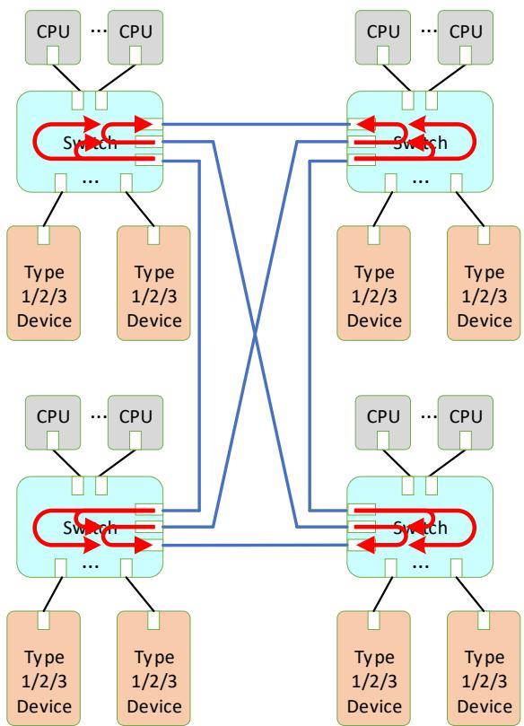

One simplistic approach for the mesh topology would be to support only minimal routes. Messages traverse at most one inter-switch PBR link en route from any source host or device to any destination host or device. This simplistic solution is deadlock-free because no message forwarding occurs between PBR Fabric Ports of any switch, and thus there are no forwarding dependencies created from which loops may form. The single route choice, however, limits bandwidth.

Figure 7-45 illustrates a more-sophisticated routing scheme applied to the same mesh topology as Figure 7-44. Each PBR switch is programmed to support three forwarding paths out of the 6 possible pairings. The arrows show permitted forwarding between Fabric Ports. For example, a message traveling from the lower-left switch to the upperright switch has two route choices:

• Via the direct link

• Indirectly via the upper-left switch

Note that the message cannot travel via the lower-right switch because that switch has no forwarding arrow shown between those Fabric Ports.

The forwarding arrows do not form closed loops; thus, there are no circular dependencies that could lead to deadlock.

This approach to mesh routing (i.e., restricting the choice of intermediate nodes to avoid circular dependencies) can also be applied to larger 1D-HyperX topologies. For a fully connected mesh that contains N switches, there are N-2 potential intermediate switches to consider for possible indirect routes between any pair of switches. However, this deadlock-avoidance restriction limits the usable intermediate switch choices to one-half of that number ((N-2)/2), rounding down if N is odd.

Multi-dimensional HyperX topologies can be routed deadlock-free by using this technique within each dimension, and implementing dimension-ordered routing.

Although this section covers some cases for circular dependency avoidance, fully architected deadlock dependency avoidance with topologies that contain fabric loops is beyond the scope of this specification.

## PBR Switching Details

## 7.7.6.1 Virtual Hierarchies Spanning a Fabric

Hosts connected to CXL Fabrics (composed of PBR switches) do not require special, fabric-specific discovery mechanisms. The fabric complexities are abstracted, and the host is presented with a simple switching topology that is compliant with the PCIe Base Specification. All intermediate Fabric switches are obscured from host view. At most, two layers of Edge Switches (ESs) are presented:

• Host ES: The host discovers a single switch representative of the edge to which it is connected. Any EPs also physically connected to this PBR switch and bound to the host’s VH are seen as being directly connected to PPBs within the VCS.

• Downstream ES: As desired, the FM may establish binding connections between the Host ES VCS and one or more remote PBR switches within the Fabric. When such a binding connection is established, the remote switch presents a VCS that is connected to one of the Host ES vPPBs. The Host discovers a single link between a virtualized DSP (vDSP) in the Host ES and a virtualized USP (vUSP) in the Downstream ES, regardless of the number of intermediate fabric switches, if any. The link state is virtualized by the Host ES and is representative of the routing path between the two ESs; if any intermediate ISLs go down, the Host ES will report a surprise Link Down error on the corresponding vPPB.

• If an HBR switch is connected to a PBR DSP, that HBR switch and any HBR switches below it will be visible to the host. HBR switches are not Fabric switches.

A PBR switch’s operation as a “Host ES” or a “Downstream ES” per the above descriptions is relative to each host’s VH. A PBR switch may simultaneously support Host ES Ports and Downstream ES Ports for different VHs. ISLs within the Fabric are capable of carrying bidirectional traffic for more than one VH at the same time. Edge DSPs support PCIe devices, SLDs, MLDs, GFDs, PCIe switches, and CXL HBR switches.

A Mailbox CCI is required in the vUSP of a Downstream ES VCS for management purposes.

ure 7-46. Physical Topology and Logical View

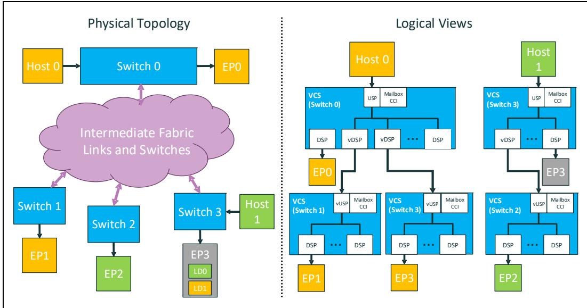

## 7.7.6.2 PBR Message Routing across the Fabric

PBR switches can support both static and dynamic routing for each DPID, as determined by message class.

With static routing, messages of a given message class use a single fixed path between source and destination Edge Ports. Messages that use a vDSP/vUSP binding (see Section 7.7.6.4) always use static routing as well, though the vUSP as a source or destination is always associated with an FPort instead of an Edge Port.

With dynamic routing, messages of a given message class can use different paths between source and destination Edge Ports, dynamically determined by factors such as congestion avoidance, algorithms to distribute traffic across multiple links, or changes with link connectivity. Each DPID supports static routing for those message classes that require it, and it can support either static or dynamic routing for the other message classes.

Dynamic routing is generally preferred when suitable, but in certain cases static routing must be used to ensure in-order delivery of messages as required by ordering rules. Due to its ability to distribute traffic across multiple links, dynamic routing is especially preferred for messages that carry payload data, as indicated in Table 7-86.

Somewhat orthogonal to dynamic vs. static routing, PBR switches support hierarchical and edge-to-edge decoding and routing. With hierarchical routing, a message is decoded and routed within each ES using HBR mechanisms and statically routed between ESs, using vDSP/vUSP bindings. With edge-to-edge routing, a message is routed from a source Edge Port to a destination Edge Port, using a DPID determined at the source Edge Port or GFD. Edge-to-edge routing uses either dynamic or static routing, as determined by the message class.

Table 7-86 summarizes the type of PBR decoding and routing used, by message class.

Table 7-86. PBR Fabric Decoding and Routing, by Message Class

<table><tr><td colspan="2">Message Class** Payload Data</td><td>Ordering Rules</td><td>Preferred  $Routing^1$ </td><td>Decoding and Routing Mechanism</td></tr><tr><td rowspan="6">CXL.cache</td><td>D2H Req</td><td></td><td>Dynamic</td><td rowspan="6">Edge-to-edge routing using the Cache ID lookups or vPPB bindings</td></tr><tr><td>H2D Rsp</td><td>I11a: Snoop (H2D Req) push GO (H2D Rsp)</td><td>Static</td></tr><tr><td>H2D DH **</td><td></td><td>Dynamic</td></tr><tr><td>H2D Req</td><td>I11a: Snoop (H2D Req) push GO (H2D Rsp)</td><td>Static</td></tr><tr><td>D2H Rsp</td><td></td><td>Dynamic</td></tr><tr><td>D2H DH **</td><td></td><td>Dynamic</td></tr><tr><td rowspan="8">CXL.mem</td><td rowspan="2">M2S Req</td><td rowspan="2">G8a (HDM-D to Type 2): MemRd*/MemInv* push Mem*Fwd</td><td rowspan="2">HDM-H: DynamicHDM-D: StaticHDM-DB: Dynamic</td><td>LD-FAM: Edge-to-edge routing if using  $LDST^2$ Hierarchical routing if using HDM Decoder</td></tr><tr><td>G-FAM: edge-to-edge routing using FAST</td></tr><tr><td rowspan="2">M2S RwD **</td><td rowspan="2">-</td><td rowspan="2">Dynamic</td><td>LD-FAM: Edge-to-edge routing if using  $LDST^2$ Hierarchical routing if using HDM Decoder</td></tr><tr><td>G-FAM: Edge-to-edge routing using FAST</td></tr><tr><td>S2M NDR</td><td>E6a: BI-ConflictAck pushes Cmp*</td><td>Static</td><td rowspan="4">Edge-to-edge routing using vPPB bindings or BI-ID lookups</td></tr><tr><td>S2M DRS **</td><td>-</td><td>Dynamic</td></tr><tr><td>S2M BISnp</td><td>-</td><td>Dynamic</td></tr><tr><td>M2S BIRsp</td><td>-</td><td>Dynamic</td></tr><tr><td rowspan="2">CXL.io</td><td>All CXL.io TLPs ** except next row</td><td>PCIe (many)</td><td>Static</td><td>Hierarchical decoding within each ESvDSP/vUSP between Host ES and each Downstream ES</td></tr><tr><td>UIO Direct P2P to HDM TLPs **</td><td>-</td><td>Dynamic</td><td>Edge-to-edge routing using FAST or LDST decoder</td></tr></table>

1. When dynamic routing is preferred, static routing is still permitted.  
2. LDST decoders do not support HDM-D.

The Ordering Rules column primarily covers a few special cases with CXL.cachemem messages in which the fabric is required to enforce ordering within a single message class or between two message classes. The alphanumeric identifier refers to ordering summary table entries in Table 3-58 and Table 3-60.

With LD-FAM, host software may use either HDM Decoders or LDST decoders, though LDST decoders do not support HDM-D. Host software implemented solely against the CXL 2.0 Specification comprehends only HDM Decoders, and such host software may continue to use them with PBR Fabrics. Newer host software that comprehends and uses LDST decoders can benefit from edge-to-edge routing, which uses dynamic routing for suitable message classes.

For CXL.io TLPs, the PTH.Hie (hierarchical) bit determines when intermediate PBR switches must use static routing. When the PTH.Hie bit is 1, intermediate PBR switches shall use static routing for the TLP; otherwise, such switches are permitted to use dynamic routing for the TLP. When a PTH is pre-pended to a TLP, the Hie bit shall be 1 if the TLP is a vDSP/vUSP message; otherwise, the Hie bit shall be 0.

## 7.7.6.3 PBR Message Routing within a Single PBR Switch

A message received or converted to PBR format at a PBR switch ingress port is routed to one of the switch’s egress ports, as determined by the ingress port’s DPID Routing Table (DRT) and its associated Routing Group Table (RGT). Their structures are described in detail in Section 7.7.13.10 and Section 7.7.13.12, respectively, and this section provides a high-level summary.

A DRT has 4096 entries and is indexed by a DPID. Each DRT entry contains a 2-bit entry type field that indicates whether the entry is valid, and whether the entry contains a single physical port number or an RGT index.

DRT entries that contain an RGT index are required when multiple egress ports need to be specified for use with dynamic routing. An RGT is a power-of-2-sized table with up to 256 entries. Each RGT entry contains an ordered list of up to eight physical port numbers, along with two 3-bit fields that indicate how many in the list are valid and how many of those are primary vs. secondary. This allows one or more primary and zero or more secondary egress ports to be listed. Cases that require static routing must always use the first list entry. The RGT entry also contains a 3-bit dynamic routing mode and 3-bit mix setting. The distinction between primary vs. secondary varies by dynamic routing mode and mix setting.

In routing modes that utilize the mix setting, its value determines the mix of the primary and secondary egress port group usage, assuming that one or more secondary egress ports are specified. Using the mix setting supports egress port selection based on known bandwidth differences that exist elsewhere in the fabric or based on preferred vs. overflow routing paths. Secondary egress ports should be specified only when there are significant differences with primary egress ports; otherwise, all suitable egress ports should be specified as primary. When no secondary egress ports have been specified, the mix setting shall be ignored.

<table><tr><td>Mix Setting</td><td>% Primary</td><td>% Secondary</td></tr><tr><td>0</td><td>87.5</td><td>12.5</td></tr><tr><td>1</td><td>75</td><td>25</td></tr><tr><td>2</td><td>62.5</td><td>37.5</td></tr><tr><td>3</td><td>50</td><td>50</td></tr><tr><td>4</td><td>37.5</td><td>62.5</td></tr><tr><td>5</td><td>25</td><td>75</td></tr><tr><td>6</td><td>12.5</td><td>87.5</td></tr><tr><td>7</td><td>Preferred</td><td>Overflow</td></tr></table>

Mix setting 7 is intended for use in cases where primary and secondary egress port groups represent preferred and overflow ports, respectively. Mix setting 7 mandates the choice of a primary (preferred) path route whenever flow-control conditions and link state permit.

The term candidate egress port refers to a port that is present in the appropriate RGT entry, where the message can be queued or internally routed immediately. The egress port need not have link credits to send the packet immediately. An implementation may optionally base part of the candidate selection on the egress port state (e.g., link-up or containment states).

The mix dynamic routing mode descriptions that follow describe routing outcomes in terms of probability, consistent with a weighted (pseudo) random implementation. Random selection has the advantage that each routing decision is stateless and independent of one another, and it has high immunity to hot-route problems that might otherwise arise from repetitive patterns in packet arrivals. The specific random routing implementation is not prescribed. Implementations that achieve the specified mix by deterministic means, such as by weighted round-robin, are permitted.

The architected dynamic routing modes include the optional modes listed in Table 7-87.

Optional Architected Dynamic Routing Modes

<table><tr><td>Mode</td><td>Description</td></tr><tr><td>Mix with Random</td><td>The candidate list is first narrowed to select either the primary or the secondary group based on the configured mix. A random selection is then made within that group. A message class shall stall when the selected subset is empty due to flow-control conditions.The FM may choose to select this mode (if supported) as an alternative to Mix with Congestion Avoidance if the latter is not supported.</td></tr><tr><td>Mix with Congestion Avoidance</td><td>The candidate list is first narrowed to select either the primary or the secondary group based on the configured mix. A local congestion-avoiding selection is then made within that group. A message class shall stall when the selected subset is empty due to flow-control conditions. Congestion-avoiding candidate selection is based on vendor-specific congestion metrics, favoring the selection of less-congested egress ports. For example, the congestion metric might be a measure of egress port backlog, considering all queued traffic for that egress port across the entire switch.The FM may choose to select this mode (if supported) when Advanced Congestion Avoidance mode is inappropriate or not supported, of if fixed-traffic ratio apportionment or preferred/overflow behavior is needed.</td></tr><tr><td>Advanced Congestion Avoidance</td><td>A congestion-avoiding selection is made considering both primary and secondary candidate egress ports, ignoring the mix setting value. Egress ports with the minimal remaining hop count should be specified as primary; any suitable egress ports that have higher remaining hop counts should be specified as secondary. Candidate selection is based on vendor-specific metrics, favoring less-congested egress ports in general, and especially avoiding secondary candidates that are already heavily scheduled with primary traffic, regardless of the target DPID.An example congestion metric might be backlog-based, but with different weightings for primary vs. secondary backlogs. Congestion metric values for primary backlogs should be higher than secondary backlogs when assessing the congestion level of a secondary candidate egress port. This discourages the use of secondary candidate ports that have a high primary backlog. In congestion metrics, messages that are queued or internally routed via the physical port number in a DRT or via dynamic routing modes other than Advanced Congestion Avoidance should be considered primary backlog.The FM may choose to select this mode (if supported) for routing egress ports that carry commingled minimal and non-minimal traffic.</td></tr></table>

PBR switches that implement RGTs shall support at least one of the three architected dynamic routing modes (those listed in Table 7-87) within each RGT.

DRT entries that contain a single physical port instead of an RGT index are useful when there is only one reasonable egress port choice (e.g., routing to an Edge Port). This avoids an RGT look-up and additional processing to determine which egress port to use. This may also help reduce the number of entries that need to be implemented in the associated RGT.

## 7.7.6.4 PBR Switch vDSP/vUSP Bindings and Connectivity

Within the context of a single VH, the virtual connection between a VCS in the Host ES and a VCS in a Downstream ES is accomplished with a vDSP/vUSP binding. A vDSP is a vPPB in the Host ES VCS that the host sees as a DSP. A vUSP is a vPPB in the Downstream ES VCS that the host sees as a USP. Host software always sees a single virtual link connecting the vDSP and vUSP, even though one or more intermediate Fabric switches may be physically present.

Figure 7-47 shows an example PBR Fabric that consists of one Host ES, one Downstream ES, and an unspecified number of intermediate Fabric switches connecting the two.

Figure 7-47. Example PBR Fabric

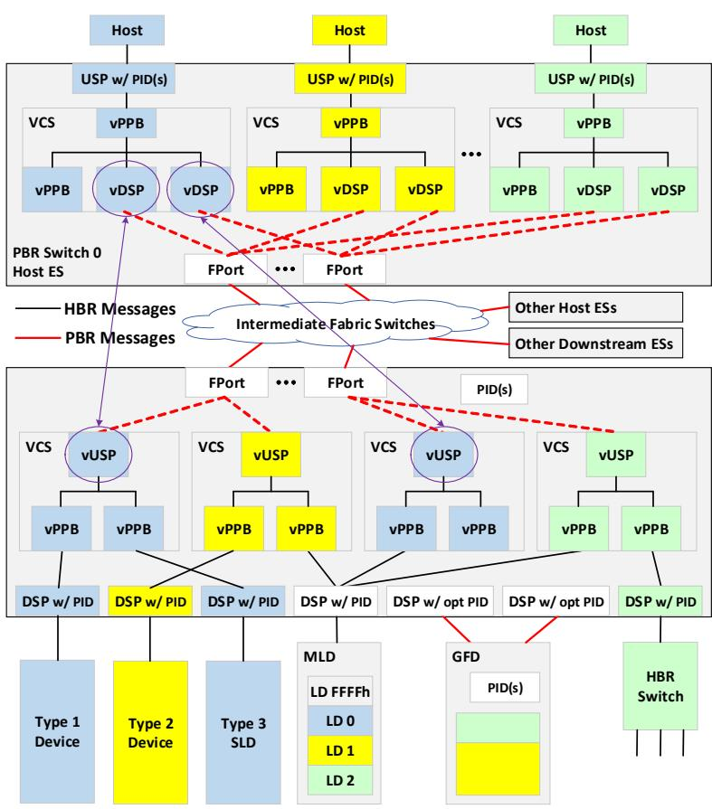

The rules for vDSP/vUSP bindings are as follows:

• Each active Host ES vDSP is bound to one Host ES FPort and one Downstream ES vUSP

• Each active Downstream ES vUSP is bound to one Downstream ES FPort and one Host ES vDSP

• All messages routed using a vDSP/vUSP binding must contain both a DPID and an SPID

• vDSPs and vUSPs are never assigned PIDs

• Each PID used for vDSP/vUSP bindings may support both static and dynamic routing; however, vDSP/vUSP traffic always uses static routing

• Each vDSP/vUSP binding has a single host USP PID that determines which Host ES FPort will be used to route from vUSP to vDSP

• Each vDSP/vUSP binding has a single Downstream ES PID that determines which Downstream ES FPort will be used to route from vDSP to vUSP

When a Host ES FPort transmits a vDSP/vUSP message downstream in a PBR flit, the message contains the DPID and SPID taken from the vDSP’s binding. Assuming no errors, the message traverses any intermediate Fabric switches that are present and is received by an FPort that is bound to the Downstream ES vUSP. A vUSP there claims the message by matching both the DPID and SPID from its binding.

Similarly, when a Downstream ES FPort transmits a vDSP/vUSP message upstream in a PBR flit, the message contains the DPID and SPID taken from the vUSP’s binding. Assuming no errors, the message traverses any intermediate Fabric switches that are present and is received by an FPort that is bound to the Host ES vDSP. A vDSP there claims the message by matching both the DPID and SPID from its binding.

## 7.7.6.5 PID Use Models and Assignments

The example PBR Fabric illustrated in Figure 7-47 illustrates key aspects of how PIDs can be assigned and used. PIDs are either assigned by the FM or by static fabric initialization (see Section 7.7.12.1.1).

A Host ES USP often has one PID but may have multiple PIDs assigned to support multiple vDSP/vUSP bindings in the same Downstream ES. Each vDSP/vUSP binding may use a different Host ES FPort and/or Downstream ES FPort, providing traffic isolation for differentiated quality of service. If multiple vDSP bindings use the same PID for the Downstream ES, different PIDs for the USP can distinguish their bindings.

The Downstream ES FPorts may have one or more PIDs assigned, where each PID can be associated with a different set of FPorts. In an example scenario, there might be one PID for the left set of FPorts for multipathing and another PID for the right set. For a PID assigned to an FPort set for multipathing, DRTs in different USPs can specify different egress ports for static routing, distributing the static routing traffic for certain topologies without requiring additional Downstream ES PIDs.

A DSP usually has one PID but may be assigned multiple PIDs when needed for CacheID or BI-ID translation. If one or more HBR switches below an Edge DSP attach multiple devices that are enabled for caching or multiple devices that are enabled for HDM-DB, then the Edge switch must assign multiple PIDs to the Edge DSP so that each device assigned with a CacheID or BI-ID can be distinguished for correct PBR/HBR format translation at the Edge DSP.

A GFD may have one or more PIDs assigned. A multi-ported GFD may have multiple PIDs assigned for differentiated quality of service, though a single PID may be sufficient for congestion avoidance.

As mentioned in the previous section, each vDSP/vUSP binding has two PIDs assigned. For downstream vDSP/vUSP messages that use a given binding, the SPID is a PID associated with the host Edge USP, and the DPID is a PID associated with the Downstream ES FPort. Such messages are always transmitted by the same Host ES FPort and received by the same Downstream ES FPort. Then, the FPort uses various vUSP info decoding mechanisms to route the message to the appropriate Downstream ES vPPB using PBR mechanisms or HBR mechanisms, depending upon the message class. See CXL Switch Message Conversion (see Section 7.7.6.6). If there are any intermediate Fabric switches, such messages always take a single static path.

Upstream vDSP/vUSP messages are handled in a similar manner, but only involve CXL.io message classes. On a given binding, the SPID is the PID associated with the Downstream ES FPort, and the DPID is the PID associated with the host Edge USP. Such messages are always transmitted by the same Downstream ES FPort and received by the same Host ES FPort. Then, the receiving FPort uses the associated vDSP context to identify the appropriate target using HBR mechanisms. If the target is an egress port, the message is routed there for transmission. If the target is another vDSP, that vDSP converts the PIDs to its bound PIDs and transmits it from its associated FPort, which may be the same FPort on which it arrived or on a different FPort. If there are any intermediate Fabric switches, such messages always take a single static path.

A PBR switch requires an assigned PID to send and receive management requests, responses, and notifications. Transactions that target this PID are processed by central logic or by FW within the switch.

FMs connected to a PBR switch via an MCTP-based CCI also consume a PID. This PID is communicated to the PBR switch when the FM claims ownership of the device. The PID is used to direct transactions to the FM, such as Event Notifications generated by components owned by the FM.

PID FFFh is reserved and is used to indicate that a transaction should be processed locally. It allows FMs to target devices before they have had a valid PID assigned and when they have an assigned PID of which the FM is unaware.

## 7.7.6.6 CXL Switch Message Format Conversion

A PBR switch converts messages received from HBR hosts, devices, and switches to the PBR message format for routing across a PBR Fabric. In addition, messages received from the PBR fabric that target the HBR hosts, devices, and switches are converted to messages using the non-PID spaces (i.e., CacheID, BI-ID, and LD-ID). The following subsections provide the conversion flow for each message class.

The FM assigns PIDs to various PBR switch ports, as described in Section 7.7.6.5. The DPID value for request messages is determined by a variety of ways, including HDM Decoders, vPPB bindings, and lookup tables or CAMs using non-PID spaces. The DPID value for a response message is often the SPID value from the associated request message but is sometimes determined by one of the ways mentioned for request messages.

With HBR format messages, MLDs support a 4-bit LD-ID field in CXL.mem protocol for selection and routing of MLD messages, and CXL.cache includes a 4-bit CacheID field that is used to allow up to 16 Type 1 Devices or Type 2 Devices below an RP. PBR format messages use 12-bit PIDs to support large Fabrics. This section describes the support required in PBR switches for routing messages from non-fabric-aware hosts and devices that support the 4-bit LD-ID and 4-bit CacheID fields. It also covers BI-IDbased routing.

Considering the wide range of supported PBR/HBR switch topologies, the variety of specific routing techniques for the many different cases of port connectivity is quite complex. Below is a general description for the HBR and PBR switch routing mechanisms that are used by key message classes, followed by port processing tables with more-specific details for both classes of switches.

## 7.7.6.6.1 CXL.io, Including UIO

An HBR switch routes most CXL.io TLPs between its ports using standard mechanisms defined by the PCIe Base Specification. A DSP above an MLD uses LD-ID Prefixes to identify which LD a downstream TLP is targeting or from which LD an upstream TLP came.

UIO Requests that directly target HDM ranges can use enhanced UIO-capable HDM Decoders for their routing. This includes UIO Requests from the host that target devices with HDM, as well as “Direct P2P” cases where UIO Requests from one device target other devices with HDM. UIO Direct P2P to HDM traffic goes upstream, P2P, and downstream along different portions of its path.

A PBR switch converts PCIe-format TLPs or CXL.io HBR-format TLPs to PBR-format TLPs by pre-pending to each TLP a 4B CXL PBR TLP Header (PTH), which includes an SPID and DPID. Conversion from PBR format to HBR format or PCIe format consists of stripping the CXL PTH from the TLP.

CXL.cache

A number of CXL.cache messages in 256B HBR format have a 4-bit CacheID field that enables up to 16 caching devices below a single RP. CXL.cache messages in 68B HBR format do not support this feature, and thus never carry a CacheID field. CXL.cache messages in PBR format do support this feature, but convey the necessary information via PIDs instead of a CacheID field. Table 7-88 summarizes which message classes contain the CacheID field.

Table 7-88. Summary of CacheID Field

<table><tr><td rowspan="2">Msg Class</td><td colspan="3">CacheID Field</td></tr><tr><td>68B HBR</td><td>256B HBR</td><td>256B PBR</td></tr><tr><td>D2H Req</td><td>No</td><td>Yes</td><td>No</td></tr><tr><td>H2D Rsp</td><td>No</td><td>Yes</td><td>No</td></tr><tr><td>H2D DH</td><td>No</td><td>Yes</td><td>No</td></tr><tr><td>H2D Req</td><td>No</td><td>Yes</td><td>No</td></tr><tr><td>D2H Rsp</td><td>No</td><td>No</td><td>No</td></tr><tr><td>D2H DH</td><td>No</td><td>No</td><td>No</td></tr></table>

For HBR format messages that contain a CacheID field, in some cases an HBR or PBR DSP needs to know whether to propagate or assign the CacheID. This information is configured by host software and is contained in the CXL Cache ID Decoder Capability Structure (see Section 8.2.4.29).

Table 7-89 summarizes the HBR switch routing for CXL.cache message classes. Table 7-90 summarizes the PBR switch routing for CXL.cache message classes.

Summary of HBR Switch Routing for CXL.cache Message Classes

<table><tr><td>Message Class</td><td>Switch Routing</td></tr><tr><td>D2H Request</td><td>For HBR switch routing of D2H requests upstream to the bound host, the D2H request to the USP relies on the DSP&#x27;s vPPB binding at each switch level. CacheID is added to the message by the DSP above the device to enable routing of the H2D response.</td></tr><tr><td>H2D Response or Data Header</td><td>For HBR switch routing of H2D responses or data headers downstream to the DSP, the USP at each switch level looks up the PCIe-defined PortID from the Cache ID Route Table.</td></tr><tr><td>H2D Request</td><td>For HBR switch routing of H2D requests downstream to the DSP, the USP at each switch level looks up the PCIe-defined PortID from the Cache ID Route Table.</td></tr><tr><td>D2H Response or Data Header</td><td>For HBR switch routing of D2H responses or data headers upstream to the bound host, the D2H response or data header to the USP relies upon the DSP&#x27;s vPPB binding at each switch level.</td></tr></table>

Within a PBR fabric, all CXL.cache messages are routed edge-to-edge, and they never use vDSP/vUSP bindings.

In contrast to most 256B HBR-format CXL.cache messages, PBR-format cache messages never contain a CacheID field, thus the equivalent information when needed must be conveyed via PIDs.

When multiple caching devices are attached to an HBR switch below a PBR fabric, the FM must allocate and assign a unique PID for each such caching device. This enables PBR switches to convert between a caching device’s unique PID and CacheID when needed.

Summary of PBR Switch Routing for CXL.cache Message Classes

<table><tr><td>Message Class</td><td>Switch Routing</td></tr><tr><td>D2H Request</td><td>For PBR switch routing of these messages upstream to the host, Edge DSPs get the Host USP DPID from their vPPB. Those above an SLD get their SPID from their vPPB. Those above an HBR USP look up the SPID from the Cache ID Route Table using the CacheID contained in the HBR-format message.For converting to HBR format at the Edge USP, the USP derives the CacheID from a 16-entry CAM using the SPID.</td></tr><tr><td>H2D Response or Data Header</td><td>For PBR switch routing of these messages downstream to the Edge DSP, the Edge USP looks up the DPID from the Cache ID Route Table using the CacheID in the HBR-format message.For converting to HBR format at the Edge DSP, above an SLD the CacheID is unused, and above an HBR USP the Cache ID is derived from a 16-entry CAM match using the DPID.</td></tr><tr><td>H2D Request</td><td>For PBR switch routing of these messages downstream to the Edge DSP, the Edge USP looks up the DPID from the Cache ID Route Table using the CacheID. The USP gets the SPID from its vPPB.For converting to HBR format at the Edge DSP, above an SLD the CacheID is unused, and above an HBR USP the CacheID is derived from a 16-entry CAM match using the DPID.</td></tr><tr><td>D2H Response or Data Header</td><td>For PBR switch routing of these messages upstream to the host, Edge DSPs get the DPID from their vPPB.For converting to HBR format at the Edge USP, the CacheID field is not present in the message.</td></tr></table>

At an Edge DSP, when converting a downstream CXL.cache message from PBR format to HBR format, if the CacheID field is unused, its value shall be cleared to 0.

## 7.7.6.6.3 CXL.mem

Several CXL.mem message classes in HBR format have a 4-bit LD-ID field that is used by Type 3 MLDs for determining the targeted LD. This feature is supported by both 68B and 256B HBR formats. PBR format conveys the necessary information via PIDs instead of an LD-ID field. Table 7-91 summarizes which message classes contain the LD-ID field.

Table 7-91. Summary of LD-ID Field

<table><tr><td rowspan="2">Msg Class</td><td colspan="3">LD-ID Field</td></tr><tr><td>68B HBR</td><td>256B HBR</td><td>256B PBR</td></tr><tr><td>M2S Req</td><td>Yes</td><td>Yes</td><td>No</td></tr><tr><td>M2S RwD</td><td>Yes</td><td>Yes</td><td>No</td></tr><tr><td>S2M NDR</td><td>Yes</td><td>Yes</td><td>No</td></tr><tr><td>S2M DRS</td><td>Yes</td><td>Yes</td><td>No</td></tr><tr><td>S2M BISnp</td><td>N/A</td><td>In BI-ID</td><td>No</td></tr><tr><td>M2S BIRsp</td><td>N/A</td><td>In BI-ID</td><td>No</td></tr></table>

CXL.mem BISnp/BIRsp messages support the Back-Invalidate feature in 256B HBR format via a 12-bit BI-ID field, which determines the routing for BIRsp. This feature and its associated field are not supported in 68B HBR format. PBR format supports this feature and conveys the necessary information via 12-bit PIDs. Table 7-92 summarizes which message classes contain the BI-ID field.

In 256B HBR format over an MLD link, the 12-bit BI-ID field in BISnp/BIRsp carries the 4-bit LD-ID value, and the remaining 8 bits are all 0s. In 256B HBR format over non-MLD links, the 12-bit BI-ID field carries the 8-bit Bus Number of the HDM-DB device, and the remaining 4 bits are all 0s.

<table><tr><td rowspan="2">Msg Class</td><td colspan="3">BI-ID Field</td></tr><tr><td>68B HBR</td><td>256B HBR</td><td>256B PBR</td></tr><tr><td>S2M BISnp</td><td>N/A</td><td>Yes</td><td>No</td></tr><tr><td>M2S BIRsp</td><td>N/A</td><td>Yes</td><td>No</td></tr></table>

For messages that contain a BI-ID field, in some cases an HBR or PBR DSP needs to know whether to propagate or assign the BI-ID. This information is configured by host software and is contained in the CXL BI Decoder Capability Structure (see Section 8.2.4.27).

The Direct P2P CXL.mem for Accelerators use case, supported only by PBR fabrics, is not covered in this section; see Section 7.7.10.

Table 7-93 summarizes the HBR switch routing for CXL.mem message classes. Table 7-94 summarizes the PBR switch routing for CXL.mem message classes.

Summary of HBR Switch Routing for CXL.mem Message Classes

<table><tr><td>Message Class</td><td>Switch Routing</td></tr><tr><td>M2S Request</td><td>For HBR switch routing of M2S requests downstream toward the device, the HDM Decoder at the USP determines the PCIe-defined PortID of the DSP at each switch level. For a DSP above an MLD, there is a vPPB for each LD, which provides the LD-ID to insert in the request message.</td></tr><tr><td>S2M Response</td><td>For HBR switch routing of S2M responses upstream to the USP, the DSP relies on its vPPB binding at each switch level. For a DSP immediately above an MLD, there is a vPPB for each LD, and the LD-ID in the response message identifies the associated vPPB.</td></tr><tr><td>S2M BISnp</td><td>For HBR switch routing of S2M BISnp requests upstream to the USP, the DSP relies on its vPPB binding at each switch level. For a DSP immediately above an MLD, there is a vPPB for each LD, and the BI-ID in the response message carries an LD-ID that identifies the associated vPPB. The DSP then looks up the BusNum associated with its vPPB, places the BusNum in the BI-ID for later use in routing the associated BIRsp back to the DSP.</td></tr><tr><td>M2S BIRsp</td><td>For HBR switch routing of M2S BIRsp messages downstream to the DSP immediately above the device, the USP at each switch level relies on the BI-ID that carries the BusNum of the target DSP. The HBR switch then uses BusNum routing.</td></tr></table>

In an HBR switch, when filling in a subset of the bits in the BI-ID field with a value, the remaining bits in the BI-ID field shall be cleared to 0.

Within a PBR fabric, most CXL.mem message classes are routed edge-to-edge and do not use vDSP/vUSP bindings. The exceptions are M2S Req/RwD message classes with LD-FAM when host software has configured HDM Decoders in the Host ES USP to route them, in which case vDSP/vUSP bindings are used. See details regarding PBR Message Routing across the Fabric in Section 7.7.6.2.

When HDM-DB devices are attached to an HBR switch below a PBR fabric, the FM must allocate and assign a unique PID for each HDM-DB device. This enables PBR switches to convert between an HDM-DB device’s unique PID and Bus Number when needed.

Table 7-94. Summary of PBR Switch Routing for CXL.mem Message Classes

<table><tr><td>Message Class</td><td>Switch Routing</td></tr><tr><td>M2S Request</td><td>FAST/LDST Decoder Case: For Host ES routing of M2S requests downstream to the Edge DSP, the FAST/LDST decoder at the USP determines the DPID for routing the message edge-to-edge.HDM Decoder Case: For hierarchical routing of M2S requests downstream toward the Edge DSP, the HDM Decoder at the USP of each ES determines the egress vPPB (EvPPB), which contains an appropriate DPID. A vDSP in the Host ES contains the DPID/SPID that is used for targeting its partner Downstream ES vUSP. A DSP vPPB contains its dedicated DPID. Both host and Downstream ESs use PBR routing locally because a DSP above an MLD relies on the request having a valid SPID.For a DSP immediately above an MLD, a 16-entry CAM match using the SPID returns the associated LD-ID, which determines the LD-specific vPPB to use and is also inserted in the request message. For a DSP above a GFD, the message remains in PBR format.</td></tr><tr><td>S2M Response</td><td>For Edge DSP routing of S2M responses upstream to the Edge USP, the Edge DSP&#x27;s vPPB contains the DPID for routing the message edge-to-edge. For a DSP immediately above an MLD, there is a vPPB for each LD, and the LD-ID in the response message identifies the associated vPPB. For a DSP above a GFD, the message is already in PBR format and remains so.</td></tr><tr><td>S2M BISnp</td><td>For Edge DSP routing of S2M BISnp messages upstream to the Edge USP, the Edge DSP&#x27;s vPPB contains the DPID for routing the message edge-to-edge. For an Edge DSP immediately above an MLD, there is a vPPB for each LD, and the BI-ID in the BISnp carries an LD-ID that identifies the associated vPPB. The Edge DSP uses its vPPB&#x27;s PID for the SPID.For an Edge DSP above an HBR USP, the BI-ID contains the BusNum associated with the HDM-DB device. The Edge DSP uses the BusNum to look up the associated SPID from a 256-entry table.At the Edge USP, the USP converts the BISnp to HBR format, copying the SPID value into the BI-ID.</td></tr><tr><td>M2S BIRsp</td><td>For Edge USP routing of M2S BIRsp messages downstream to the Edge DSP above the HDM-DB device, the Edge USP converts the BIRsp to PBR format, using the BI-ID value as the DPID, and then routes the BIRsp edge-to-edge. For an Edge DSP immediately above an MLD, a 16-entry CAM match using the SPID returns the associated LD-ID, which determines the LD-specific vPPB to use and is also inserted in the BI-ID field in the BIRsp. For an Edge DSP above an HBR switch USP, the DSP converts the BIRsp to HBR format, looking up the target BusNum in a 4k-entry table using the DPID, then copying it to the BI-ID. For a DSP above a GFD, the message remains in PBR format.</td></tr></table>

At an Edge DSP, when converting a downstream CXL.mem message from PBR format to HBR format, if an LD-ID or BI-ID field is unused, its value shall be cleared to 0. Also, when filling in a subset of the bits in the BI-ID field with a value, the remaining bits in the BI-ID field shall be cleared to 0.

## HBR Switch Port Processing of CXL Messages

Table 7-95, Table 7-96, and Table 7-97 summarize how HBR switches perform port processing of CXL.io, CXL.cache, and CXL.mem messages, respectively. A USP is below either an RP, a PBR DSP, or an HBR DSP. A USP can be in only one Virtual Hierarchy. A DSP is above an HBR switch USP, an SLD, or an MLD.

For conciseness, there are many abbreviations within the tables. US stands for upstream. DS stands for downstream. P2P stands for peer-to-peer. DMA stands for direct memory access. Direct P2P stands for UIO Direct P2P to HDM. BusNum stands for Bus Number. “” stands for assignment (e.g., “LD-ID Prefix  vPPB context” means “the LD-ID prefix is assigned a value from the associated vPPB context”). Text beginning with “PCIe” (also shown in gold) means that the routing is defined in the PCIe Base Specification.

In the CXL.io table (see Table 7-95), not all TLP types are explicitly covered; however, those not listed are usually handled by standard PCIe routing mechanisms (e.g., PCIe Messages are not explicitly covered, but ID-routed Messages are handled by PCIe ID routing, and address-routed Messages are handled by PCIe Memory Address routing).

Table 7-95. HBR Switch Port Processing Table for CXL.io

<table><tr><td rowspan="2">Message Class and Direction</td><td rowspan="2">HBR USP below RP or PBR/HBR DSP</td><td colspan="3">HBR DSP</td></tr><tr><td>Above HBR USP</td><td>Above SLD</td><td>Above MLD</td></tr><tr><td>Cfg ReqDS</td><td>PCIe ID routing</td><td colspan="2">PCIe ID routing</td><td>PCIe ID routingLD-ID Prefix←vPPB context</td></tr><tr><td>Mem ReqDS/US/P2PIncl UIO DMAExcl HDM UIO</td><td>PCIe Mem addr routing</td><td colspan="2">PCIe Mem addr routing</td><td>PCIe Mem addr routingUS: LD-ID Prefix identifies vPPBDS: LD-ID Prefix←vPPB context</td></tr><tr><td>HDM UIO ReqDirect P2P and Host Requester</td><td>US: PCIe Mem addr routingDS: HDM Decoder routing</td><td colspan="2">US: PCIe Mem addr routingDS/Direct P2P: USP HDM Decoder</td><td>US: PCIe Mem addr routingDS/Direct P2P: USP HDM DecoderUS: LD-ID Prefix identifies vPPBDS: LD-ID Prefix←vPPB context</td></tr><tr><td>CplUS</td><td>PCIe ID routing</td><td colspan="2">PCIe ID routing</td><td>LD-ID Prefix identifies vPPBPCIe ID routing</td></tr><tr><td>CplDS</td><td>PCIe ID routing</td><td colspan="2">PCIe ID routing</td><td>PCIe ID routingLD-ID Prefix←vPPB context</td></tr></table>

Table 7-96. HBR Switch Port Processing Table for CXL.cache

<table><tr><td rowspan="2">Message Class and Direction</td><td rowspan="2">HBR USP below RP or PBR/HBR DSP</td><td colspan="3">HBR DSP</td></tr><tr><td>Above HBR USP</td><td>Above SLD</td><td>Above MLD</td></tr><tr><td>D2H ReqUS</td><td>Propagate CacheID</td><td>Propagate CacheIDvPPB binding routing to USP</td><td>CacheID←Local Cache ID fieldvPPB binding routing to USP</td><td></td></tr><tr><td>H2D Rsp/DHDS</td><td rowspan="2">Propagate CacheIDPortID←Cache IDRoute TablePortID routing to DSPOS must handle multi-level HBR</td><td rowspan="2">Propagate CacheID</td><td rowspan="2">Propagate Cache ID(SLD should ignore it)</td><td></td></tr><tr><td>H2D ReqDS</td><td></td></tr><tr><td>D2H Rsp/DHUS</td><td>—</td><td colspan="2">vPPB binding routing to USP</td><td></td></tr></table>

Table 7-97. HBR Switch Port Processing Table for CXL.mem

<table><tr><td rowspan="2">Message Class and Direction</td><td rowspan="2">HBR USP below RP or PBR/HBR DSP</td><td colspan="3">HBR DSP</td></tr><tr><td>Above HBR USP</td><td>Above SLD</td><td>Above MLD</td></tr><tr><td>M2S Req DS</td><td>PortID←HDM Decoder (HPA)Routing to DSP uses PortID</td><td colspan="2">Propagate LD-ID (not used by these receivers)</td><td>LD-ID←vPPB context</td></tr><tr><td>S2M Rsp US</td><td>Propagate LD-ID (not used by these receivers)</td><td colspan="2">vPPB binding routing to USP Propagate LD-ID (not used for internal switch routing)</td><td>LD-ID identifies vPPB vPPB binding routing to USP</td></tr><tr><td>S2M BISnp US</td><td>BI-ID[7:0] contains BusNum Propagate BI-ID</td><td>Propagate BI-ID vPPB binding routing to USP</td><td>Received BI-ID is ignored BI-ID[7:0]←BusNum(vPPB) vPPB binding routing to USP</td><td>BI-ID[3:0] contains LD-ID LD-ID identifies vPPB BI-ID[7:0]←BusNum(vPPB) vPPB binding routing to USP</td></tr><tr><td>M2S BIRsp DS</td><td>Target BusNum← BI-ID[7:0] PCIe BusNum routing to DSP</td><td>Propagate BI-ID</td><td>Propagate BI-ID (SLD should ignore it)</td><td>BI-ID[3:0]←LD-ID(vPPB)</td></tr></table>

## 7.7.6.8 PBR Switch Port Processing of CXL Messages

Table 7-98, Table 7-99, and Table 7-100 summarize how PBR switches perform port processing of CXL.io, CXL.cache, and CXL.mem messages, respectively. A PBR USP must be below an RP and can be in only one Virtual Hierarchy. A PBR DSP is above an SLD, an MLD, a GFD, or an HBR switch USP. A PBR FPort can only be connected to another PBR FPort in a different PBR switch.

For conciseness, there are many abbreviations within the tables. US stands for upstream. DS stands for downstream. P2P stands for peer-to-peer. DMA stands for direct memory access. Direct P2P stands for UIO Direct P2P to HDM. EvPPB stands for Egress vPPB. BusNum stands for Bus Number. RT stands for the Cache ID Route Table. “” stands for assignment (e.g., “LD-ID Prefix  vPPB context” means “the LD-ID prefix is assigned a value from the associated vPPB context”). Also referring to a vPPB context, vPPB.root.PID stands for the PID of the associated Edge USP, and vPPB.self.PID stands for the PID of the vPPB itself. Eg2Eg means Edge-to-Edge. Text beginning with “PCIe” (also shown in gold) means that the routing is defined in the PCIe Base Specification.

In the CXL.io table (see Table 7-98), not all TLP types are explicitly covered; however, those not listed are usually handled by standard PCIe routing mechanisms (e.g., PCIe Messages are not explicitly covered, but ID-routed Messages are handled by PCIe ID routing, and address-routed Messages are handled by PCIe Memory Address routing).

In the CXL.mem table (see Table 7-100), the Direct P2P CXL.mem for Accelerators use case is not covered; see Section 7.7.10.3.

Ta ble 7-98 . P B R Switch Po rt Processi ng Ta ble for CXL. io ( Sheet 1 of 2 )y

<table><tr><td rowspan="2">Message Class and Direction</td><td rowspan="2"></td><td rowspan="2">Host ES FPort with vDSP(s)</td><td rowspan="2">Downstream ES FPort with vUSP(s)</td><td colspan="4">Edge DSP in Either Host ES or Downstream ES</td></tr><tr><td>Above HBR Switch USP</td><td>Above SLD</td><td>Above MLD</td><td>Above GFD</td></tr><tr><td>Cfg Req DS</td><td></td><td>vDSP converts to PBR fmt; FPort xmits to vUSP&#x27;s FPort</td><td>vUSP matches DPID/SPID; vUSP converts to HBR fmt; PCIe ID routing to DSP</td><td colspan="2">PCIe ID routing</td><td>PCIe ID routing LD-ID Prefix←vPPB LD-ID</td><td>N/A</td></tr><tr><td rowspan="2">Mem Req DS/US/P2P Incl UIO DMA Excl HDM UIO</td><td></td><td>DS: vDSP converts to PBR fmt; FPort xmits to vUSP&#x27;s FPort</td><td>DS: vUSP matches DPID/SPID; vUSP converts to HBR fmt; PCIe Mem addr routing</td><td rowspan="2" colspan="2">PCIe Mem addr routing</td><td rowspan="2">PCIe Mem addr routing DS: LD-ID Prefix←vPPB.LD-ID US/P2P: LD-ID Prefix identifies vPPB</td><td rowspan="2">N/A</td></tr><tr><td>PCIe Mem addr routing </td><td>US/P2P: vDSP matches DPID/SPID; vDSP converts to HBR fmt; PCIe Mem addr routing</td><td>US: vUSP converts to PBR fmt; FPort xmits to vDSP&#x27;s FPort</td></tr><tr><td>Cpl US/P2P Excl HDM UIO</td><td></td><td>vDSP matches DPID/SPID; vDSP converts to HBR fmt; PCIe ID routing</td><td>vUSP converts to PBR fmt; FPort xmits to vDSP&#x27;s FPort</td><td colspan="2">PCIe ID routing</td><td>LD-ID Prefix identifies vPPB PCIe ID routing</td><td>N/A</td></tr><tr><td>Cpl DS Excl HDM UIO</td><td></td><td>vDSP converts to PBR fmt; FPort xmits to vUSP&#x27;s FPort</td><td>vUSP matches DPID/SPID; vUSP converts to HBR fmt; PCIe ID routing to DSP</td><td colspan="2">PCIe ID routing</td><td>PCIe ID routing LD-ID Prefix←vPPB.LD-ID</td><td>N/A</td></tr><tr><td rowspan="2">HDM UIO Req HDM Decoder case for Direct P2P and Host Requester</td><td rowspan="2">Direct P2P: N/A Host Requester (DS): HDM Decoder routes to DSP or vDSP</td><td>DS: vDSP converts to PBR fmt; FPort xmits to vUSP&#x27;s FPort</td><td>DS: vUSP matches DPID/SPID; vUSP converts to HBR fmt; HDM Decoder routes to DSP</td><td rowspan="2" colspan="3">US/P2P: If above MLD, LD-ID Prefix identifies vPPB; USP/vUSP HDM Decoder routes US or P2P within same switch DS: Convert to HBR fmt; if above MLD, LD-ID Prefix←vPPB.LD-ID</td><td rowspan="2">N/A</td></tr><tr><td>US/P2P: vDSP matches DPID/SPID; vDSP converts to HBR fmt; USP&#x27;s HDM Decoder routes P2P</td><td>US: vUSP converts to PBR fmt; FPort xmits to vDSP&#x27;s FPort</td></tr></table>

Ta ble 7-98. PBR Switch Port Processi ng Ta ble for CXL. io (Sheet 2 of 2)

<table><tr><td rowspan="2">Message Class and Direction</td><td rowspan="2">Edge USP Always below an RP</td><td rowspan="2">Host ES FPort with vDSP(s)</td><td rowspan="2">Downstream ES FPort with vUSP(s)</td><td colspan="4">Edge DSP in Either Host ES or Downstream ES</td></tr><tr><td>Above HBR Switch USP</td><td>Above SLD</td><td>Above MLD</td><td>Above GFD</td></tr><tr><td>HDM UIO CplHDM Decoder case for Direct P2P and Host Requester</td><td>Direct P2P: N/A Host Requester (US): PCIe ID routing</td><td>vDSP matches DPID/SPID; vDSP converts to HBR fmt; PCIe ID routing</td><td>vUSP converts to PBR fmt; FPort xmits to vDSP&#x27;s FPort</td><td colspan="3">US: If above MLD, LD-ID Prefix identifies vPPB; PCIe ID routingDS: PCIe ID routing; if above MLD, LD-ID Prefix←vPPB.LD-ID</td><td>N/A</td></tr><tr><td>HDM UIO Req FAST/LDST case for Direct P2P and Host Requester</td><td>Direct P2P: N/A Host Requester (DS): FAST/LDST converts to PBR and routes Eg2Eg</td><td>Route Eg2Eg</td><td>Route Eg2Eg</td><td colspan="3">US/P2P: If above MLD, LD-ID Prefix identifies vPPB; FAST/LDST converts to PBR and routes Eg2EgDS: Convert to HBR fmt; if above MLD, LD-ID Prefix← $CAM_{16}$ (SPID)</td><td>US: N/ADS: Keep in PBR</td></tr><tr><td>HDM UIO CplFAST/LDST case for Direct P2P and Host Requester</td><td>Direct P2P: N/A Host Requester (US): Convert to HBR</td><td>Route Eg2Eg</td><td>Route Eg2Eg</td><td colspan="3">US: If above MLD, LD-ID Prefix identifies vPPB; convert to PBR using UIO ID-Based Re-Router; route Eg2EgDS: Convert to HBR</td><td>US: Keep in PBR; route Eg2EgDS: N/A</td></tr></table>

Ta ble 7-99 . P B R Switch Port Processi ng Ta ble for CXL. cacheo

<table><tr><td rowspan="2">Message Class and Direction</td><td rowspan="2">Edge USP Always below an RP</td><td rowspan="2">Host ES FPort with vDSP(s)</td><td rowspan="2">Downstream ES FPort with vUSP(s)</td><td colspan="4">Edge DSP in Either Host ES or Downstream ES</td></tr><tr><td>Above HBR Switch USP</td><td>Above SLD</td><td>Above MLD</td><td>Above GFD</td></tr><tr><td>D2H Req US</td><td>Convert to HBR fmt CacheID←CAM16(SPID)</td><td>Route Eg2Eg</td><td>Route Eg2Eg</td><td>Convert to PBR fmt DPID←vPPB.root.PID SPID←RT(CacheID)</td><td>Convert to PBR fmt DPID←vPPB.root.PID SPID←vPPB.self.PID</td><td></td><td></td></tr><tr><td>H2D Rsp/DH DS</td><td>Convert to PBR fmt DPID←RT(CacheID)</td><td>Route Eg2Eg</td><td>Route Eg2Eg</td><td rowspan="2">Convert to HBR fmt 256B: CacheID←CAM16(DPID) 68B: Has no CacheID</td><td rowspan="2">Convert to HBR fmt 256B: CacheID←0 68B: Has no CacheID</td><td></td><td></td></tr><tr><td>H2D Req DS</td><td>Convert to PBR fmt DPID←RT(CacheID) SPID←vPPB.self.PID</td><td>Route Eg2Eg</td><td>Route Eg2Eg</td><td></td><td></td></tr><tr><td>D2H Rsp/DH US</td><td>Convert to HBR fmt</td><td>Route Eg2Eg</td><td>Route Eg2Eg</td><td>Convert to PBR fmt DPID←vPPB.root.PID</td><td>Convert to PBR fmt DPID←vPPB.root.PID</td><td></td><td></td></tr></table>

Ta ble 7- 1 00 . PBR Switch Port Processi ng Ta ble for CXL. memy

<table><tr><td rowspan="2">Message Class and Direction</td><td rowspan="2">Edge USP Always below an RP</td><td rowspan="2">Host ES FPort with vDSP(s)</td><td rowspan="2">Downstream ES FPort with vUSP(s)</td><td colspan="4">Edge DSP in Either Host ES or Downstream ES</td></tr><tr><td>Above HBR Switch USP</td><td>Above SLD</td><td>Above MLD</td><td>Above GFD</td></tr><tr><td rowspan="2">M2S Req/RwD DS</td><td>FAST or LDST: Convert to PBR fmt DPID←xxST(HPA) SPID←vPPB.self.PID</td><td>Route Eg2Eg</td><td>Route Eg2Eg</td><td rowspan="2" colspan="2">Convert to HBR fmt LD-ID←0; is unused</td><td rowspan="2">LD-ID←CAM16(SPID) Convert to HBR MLD fmt</td><td>LD-ID is N/A Keep in PBR fmt</td></tr><tr><td>HDM Decoder: Convert to PBR fmt EvPPB←HDM-Dec(HPA) DPID←EvPPB.bndg.PID SPID←vPPB.self.PID Route to local DSP or vDSP FPort</td><td>vDSP&#x27;s FPort xmits to vUSP&#x27;s FPort</td><td>vUSP matches DPID/SPID vUSP keeps in PBR fmt EvPPB←HDM-Dec(HPA) DPID←EvPPB.self.PID Route to egress DSP</td><td>N/A</td></tr><tr><td>S2M NDR/DRS US</td><td>Convert to HBR fmt LD-ID←0; is unused</td><td>Route Eg2Eg</td><td>Route Eg2Eg</td><td colspan="2">LD-ID is unused Convert to PBR fmt DPID←vPPB.root.PID</td><td>LD-ID identifies vPPB Convert to PBR fmt DPID←vPPB.root PID</td><td>Keep in PBR fmt LD-ID is N/A</td></tr><tr><td>S2M BISnp US</td><td>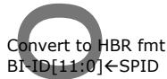</td><td>Route Eg2Eg</td><td>Route Eg2Eg</td><td>Convert to PBR fmt DPID←vPPB.root.PID BusNum←BI-ID[7:0] SPID←RAM256(BusNum)</td><td>Convert to PBR fmt DPID←vPPB.root.PID SPID←vPPB.self.PID</td><td>BI-ID[3:0] contains LD-ID LD-ID identifies vPPB Convert to PBR fmt DPID←vPPB.root PID SPID←vPPB.self.PID</td><td>Keep in PBR fmt</td></tr><tr><td>M2S BIRsp DS</td><td>Convert to PBR fmt DPID←BI-ID[11:0]</td><td>Route Eg2Eg</td><td>Route Eg2Eg</td><td>Convert to HBR fmt BusNum←RAM4k(DPID) BI-ID[7:0]←BusNum</td><td>Convert to HBR fmt BI-ID is unused</td><td>Convert to HBR fmt LD-ID←CAM16(SPID) BI-ID[3:0]←vPPB.LD-ID</td><td>Keep in PBR fmt</td></tr></table>

## PPB and vPPB Behavior of PBR Link Ports

A PBR Link port has two varieties: an Inter-Switch Link (ISL) and a GFD Link.

The ISL case is a downstream-to-downstream crosslink. The DSP on each side of the link is managed by the FM with assistance from switch firmware. The full PCIe capabilities of a DSP shall be available. Bus master enable, AER, DPC, and other capabilities that an host typically controls will be controlled by the FM and/or switch firmware.

Other users of an ISL can be any number of VHs. The ISL (and as many switch hops and additional ISLs as it takes) functions as a single link between vDSP and vUSP. Any one ISL can potentially be shared by multiple VHs. Because a VH shares the link with other VHs, there is no way for a VH to control any of the link physical characteristics. However, the Host ES vDSP shall reflect the physical link settings for the fabric port DSP to which it is bound (e.g., link speed, lane margining, etc.).

A GFD PBR link is similar to an ISL in that many VH can share it. It is different however in that no vDSP nor vUSP is associated with it. The link itself is a simple up-down link, with the switch having an (FM-owned) DSP leading, via the PBR link, to the USP of a GFD. A switch DSP should have full PCIe capabilities, just like for an ISL or any other DSP.

The remainder of this section focuses on the vDSP and vUSP perspective, from the PCIe configuration space, for a variety of capabilities:

• “Supported” means that the PCIe register is available to be read and written by the host

• “Not supported” means that the register is either read-only or the capability is unavailable

• “Mirrors DSP” means that the values reflect the (typically physical link) value in the DSP

• “Read/Write with no effect” implies that the vDSP/vUSP register will be unaffected by reads and writes

It is expected that a fabric port DSP supports all PCIe capabilities required by the PCIe Base Specification for a downstream port. DPC, which is optional for PCIe, is required for CXL for a DSP that is a fabric port.

## 7.7.6.9.1 ISL Type 1 Configuration Space Header

Table 7-101. ISL Type 1 Configuration Space Header

<table><tr><td>Register</td><td>Register Fields</td><td>FM-owned DSP</td><td>vDSP</td><td>vUSP</td></tr><tr><td rowspan="4">Bridge Control Register</td><td>Parity Error Response Enable</td><td>Supported</td><td>Supported</td><td>Supported</td></tr><tr><td>SERR# Enable</td><td>Supported</td><td>Supported</td><td>Supported</td></tr><tr><td>ISA Enable</td><td>Not Supported</td><td>Not Supported</td><td>Not Supported</td></tr><tr><td>Secondary Bus Reset</td><td>Supported</td><td>Supported</td><td>Supported</td></tr></table>

## 7.7.6.9.2 ISL PCIe-compatible Configuration Register

ble 7-102. ISL PCIe Configuration Space Header

<table><tr><td>Register</td><td>Register Fields</td><td>FM-owned DSP</td><td>vDSP</td><td>vUSP</td></tr><tr><td>Command</td><td>I/O Space Enable</td><td>Hardwire to 0</td><td>Supported</td><td>Supported</td></tr><tr><td rowspan="5">Command</td><td>Memory Space Enable</td><td>Supported</td><td>Supported</td><td>Supported</td></tr><tr><td>Bus Master Enable</td><td>Not Supported</td><td>Supported</td><td>Supported</td></tr><tr><td>Parity Error Response</td><td>Supported</td><td>Supported</td><td>Supported</td></tr><tr><td>SERR# Enable</td><td>Supported</td><td>Supported</td><td>Supported</td></tr><tr><td>Interrupt Disable</td><td>Supported</td><td>Supported</td><td>Supported</td></tr><tr><td rowspan="4">Status</td><td>Interrupt Status</td><td>Hardwire to 0</td><td>Supported</td><td>Supported</td></tr><tr><td>Master Data Parity Error</td><td>Supported</td><td>Supported</td><td>Supported</td></tr><tr><td>Signaled System Error</td><td>Supported</td><td>Supported</td><td>Supported</td></tr><tr><td>Detected Parity Error</td><td>Supported</td><td>Supported</td><td>Supported</td></tr></table>

## 7.7.6.9.3 ISL PCIe Capability Structure

Table 7-103. ISL PCIe Capability Structure (Sheet 1 of 3)

<table><tr><td>Register</td><td>Register Fields</td><td>FM-owned DSP</td><td>vDSP</td><td>vUSP</td></tr><tr><td rowspan="3">Device Capabilities</td><td>Max Payload Size Supported</td><td>FM Configured</td><td>Mirrors DSP</td><td>Mirrors DSP</td></tr><tr><td>Phantom Functions Supported</td><td>0</td><td>0</td><td>0</td></tr><tr><td>Extended Tag Field Supported</td><td>Supported</td><td>Supported</td><td>Supported</td></tr><tr><td>Device Control</td><td>Max Payload Size</td><td>FM Configured</td><td>Mirrors DSP</td><td>Mirrors DSP</td></tr><tr><td rowspan="3">Link Capabilities</td><td>Link Bandwidth Notification Capability</td><td>0</td><td>0</td><td>0</td></tr><tr><td>ASPM Support</td><td>No L0s</td><td>no L0s</td><td>no L0s</td></tr><tr><td>Clock Power Management</td><td>No PM L1 Substates</td><td>Mirrors DSP</td><td>Mirrors DSP</td></tr><tr><td rowspan="10">Link Control</td><td>ASPM Control</td><td>Supported</td><td>Not Supported</td><td>Not Supported</td></tr><tr><td>Link Disable</td><td>Supported</td><td>Supported</td><td>Not Supported</td></tr><tr><td>Retrain Link</td><td>Supported</td><td>Read/Write with no effect</td><td>Not Supported</td></tr><tr><td>Common Clock Configuration</td><td>Supported</td><td colspan="2">Read/Write with no effect</td></tr><tr><td>Extended Synch</td><td>Supported</td><td colspan="2">Read/Write with no effect</td></tr><tr><td>Hardware Autonomous Width Disable</td><td>Supported</td><td colspan="2">Read/Write with no effect</td></tr><tr><td>Link Bandwidth Management Interrupt Enable</td><td>Supported</td><td>Read/Write with no effect</td><td>Not Supported</td></tr><tr><td>Link Autonomous Bandwidth Interrupt Enable</td><td>Supported</td><td>Supported</td><td>Not Supported</td></tr><tr><td>Flit Mode Disable</td><td>0</td><td>0</td><td>0</td></tr><tr><td>DRS Signaling Control</td><td>Supported</td><td>Supported</td><td>Not Supported</td></tr></table>

Table 7-103. ISL PCIe Capability Structure (Sheet 2 of 3)

<table><tr><td>Register</td><td>Register Fields</td><td>FM-owned DSP</td><td>vDSP</td><td>vUSP</td></tr><tr><td rowspan="7">Link Status</td><td>Current Link Speed</td><td>Supported</td><td>Mirrors DSP</td><td>Mirrors DSP</td></tr><tr><td>Negotiated Link Speed</td><td>Supported</td><td>Mirrors DSP</td><td>Mirrors DSP</td></tr><tr><td>Link Training</td><td>Supported</td><td>0</td><td>0</td></tr><tr><td>Slot Clock Configuration</td><td>Supported</td><td>Mirrors DSP</td><td>Mirrors DSP</td></tr><tr><td>Data Link Layer Active</td><td>Supported</td><td>Mirrors DSP</td><td>0</td></tr><tr><td>Link Bandwidth Management Status</td><td>Supported</td><td>Mirrors DSP</td><td>0</td></tr><tr><td>Link Autonomous Bandwidth Status</td><td>Supported</td><td>Mirrors DSP</td><td>0</td></tr><tr><td rowspan="2">Slot Capabilities</td><td>Hot-Plug Surprise</td><td>Supported</td><td>Mirrors DSP</td><td>0</td></tr><tr><td>Physical Slot Number</td><td>Supported</td><td>Supported</td><td>0</td></tr><tr><td rowspan="8">Slot Status</td><td>Attention Button Pressed</td><td>Supported</td><td>Supported</td><td>0</td></tr><tr><td>Power Fault Detected</td><td>Supported</td><td>Mirrors DSP</td><td>0</td></tr><tr><td>MRL Sensor Changed</td><td>Supported</td><td>Mirrors DSP</td><td>0</td></tr><tr><td>Presence Detect Changed</td><td>Supported</td><td>Supported</td><td>0</td></tr><tr><td>MRL Sensor State</td><td>Supported</td><td>Mirrors DSP</td><td>0</td></tr><tr><td>Presence Detect State</td><td>Supported</td><td>Supported</td><td>0</td></tr><tr><td>Electromechanical Interlock Status</td><td>Supported</td><td>Mirrors DSP</td><td>0</td></tr><tr><td>Data Link Layer State Changed</td><td>Supported</td><td>Supported</td><td>0</td></tr><tr><td>Device Capabilities 2</td><td>All bits</td><td>Supported</td><td>Supported</td><td>0</td></tr><tr><td rowspan="5">Device Control 2</td><td>ARI Forwarding Enable</td><td>Supported</td><td>Supported</td><td>0</td></tr><tr><td>Atomic Op Egress Blocking</td><td>Supported</td><td>Supported</td><td>0</td></tr><tr><td>LTR Mechanism Enabled</td><td>Supported</td><td>Supported</td><td>0</td></tr><tr><td>Emergency Power Reduction Request</td><td>Supported</td><td>Read/Write with no effect</td><td>0</td></tr><tr><td>End-End TLP Prefix Blocking</td><td>Supported</td><td>Mirrors DSP. Read/Write with no effect</td><td>0</td></tr><tr><td rowspan="8">Link Control 2</td><td>Target Link Speed</td><td>Supported</td><td>Read/Write with no effect</td><td>Read/Write with no effect</td></tr><tr><td>Enter Compliance</td><td>Supported</td><td>Read/Write with no effect</td><td>Read/Write with no effect</td></tr><tr><td>Hardware Autonomous Speed Disable</td><td>Supported</td><td>Read/Write with no effect</td><td>Read/Write with no effect</td></tr><tr><td>Selectable De-emphasis</td><td>Supported</td><td>Read/Write with no effect</td><td>Read/Write with no effect</td></tr><tr><td>Transmit Margin</td><td>Supported</td><td>Read/Write with no effect</td><td>Read/Write with no effect</td></tr><tr><td>Enter Modified Compliance</td><td>Supported</td><td>Read/Write with no effect</td><td>Read/Write with no effect</td></tr><tr><td>Compliance SOS</td><td>Supported</td><td>Read/Write with no effect</td><td>Read/Write with no effect</td></tr><tr><td>Compliance Preset/De-emphasis</td><td>Supported</td><td>Read/Write with no effect</td><td>Read/Write with no effect</td></tr></table>

Table 7-103. ISL PCIe Capability Structure (Sheet 3 of 3)

<table><tr><td>Register</td><td>Register Fields</td><td>FM-owned DSP</td><td>vDSP</td><td>vUSP</td></tr><tr><td rowspan="12">Link Status 2</td><td>Current De-emphasis Level</td><td>Supported</td><td>Mirrors DSP</td><td>Mirrors DSP</td></tr><tr><td>Equalization 8.0 GT/s Complete</td><td>Supported</td><td>Mirrors DSP</td><td>Mirrors DSP</td></tr><tr><td>Equalization 8.0 GT/s Phase 1 Successful</td><td>Supported</td><td>Mirrors DSP</td><td>Mirrors DSP</td></tr><tr><td>Equalization 8.0 GT/s Phase 2 Successful</td><td>Supported</td><td>Mirrors DSP</td><td>Mirrors DSP</td></tr><tr><td>Equalization 8.0 GT/s Phase 3 Successful</td><td>Supported</td><td>Mirrors DSP</td><td>Mirrors DSP</td></tr><tr><td>Link Equalization Request 8.0 GT/s</td><td>Supported</td><td>Read/Write with no effect</td><td>Read/Write with no effect</td></tr><tr><td>Retimer Presence Detected</td><td>Supported</td><td>Mirrors DSP</td><td>Mirrors DSP</td></tr><tr><td>Two Retimers Presence Detected</td><td>Supported</td><td>Mirrors DSP</td><td>Mirrors DSP</td></tr><tr><td>Crosslink Resolution</td><td>Supported</td><td>All 0s</td><td>All 0s</td></tr><tr><td>Flit Mode Status</td><td>Supported</td><td>Supported</td><td>Supported</td></tr><tr><td>Downstream Component Presence</td><td>Supported</td><td>Supported</td><td>0</td></tr><tr><td>DRS Message Received</td><td>Supported</td><td>Supported</td><td>0</td></tr></table>

## 7.7.6.9.4 ISL Secondary PCIe Capability Structure

All fields in the Secondary PCIe Capability Structure for a Virtual PPB shall behave identically to PCIe except as indicated in Table 7-104.

## Table 7-104. ISL Secondary PCIe Extended Capability

<table><tr><td>Register</td><td>Register Fields</td><td>FM-owned DSP</td><td>vDSP</td><td>vUSP</td></tr><tr><td rowspan="3">Link Control 3</td><td>Perform Equalization</td><td>Supported</td><td>Read/Write with no effect</td><td>Read/Write with no effect</td></tr><tr><td>Link Equalization Request Interrupt Enable</td><td>Supported</td><td>Read/Write with no effect</td><td>Read/Write with no effect</td></tr><tr><td>Enable Lower SKP OS Generation Vector</td><td>Supported</td><td>Read/Write with no effect</td><td>Read/Write with no effect</td></tr><tr><td>Lane Error Status</td><td>All fields</td><td>Supported</td><td>Mirrors DSP</td><td>Mirrors DSP</td></tr><tr><td>Lane Equalization Control</td><td>All fields</td><td>Supported</td><td>Read/Write with no effect</td><td>Read/Write with no effect</td></tr><tr><td>Data Link Features Capabilities</td><td>All fields</td><td>Supported</td><td>Mirror DSP</td><td>Mirror DSP</td></tr></table>

## 7.7.6.9.5 ISL Physical Layer 16.0 GT/s Extended Capability

All fields in the Physical Layer 16.0 GT/s Extended Capability Structure for a Virtual PPB shall behave identically to PCIe except as indicated in Table 7-105.

## Table 7-105. ISL Physical Layer 16.0 GT/s Extended Capability

<table><tr><td>Register</td><td>Register Fields</td><td>FM-owned DSP</td><td>vDSP</td><td>vUSP</td></tr><tr><td>16.0 GT/s Status</td><td>All fields</td><td>Supported</td><td>Mirrors DSP</td><td>Mirrors DSP</td></tr><tr><td>16.0 GT/s Local Data Parity Mismatch Status</td><td>Local Data Parity Mismatch Status</td><td>Supported</td><td>Mirrors DSP</td><td>Mirrors DSP</td></tr><tr><td>16.0 GT/s First Retimer Data Parity Mismatch Status</td><td>First Retimer Data Parity Mismatch Status</td><td>Supported</td><td>Mirrors DSP</td><td>Mirrors DSP</td></tr><tr><td>16.0 GT/s Second Retimer Data Parity Mismatch Status</td><td>Second Retimer Data Parity Mismatch Status</td><td>Supported</td><td>Mirrors DSP</td><td>Mirrors DSP</td></tr><tr><td>16.0 GT/s Lane Equalization Control</td><td>Downstream Port 16.0 GT/s Transmitter Preset</td><td>Supported</td><td>Mirrors DSP</td><td>Mirrors DSP</td></tr></table>

## 7.7.6.9.6 ISL Physical Layer 32.0 GT/s Extended Capability

All fields in the Physical Layer 32.0 GT/s Extended Capability Structure for a Virtual PPB shall behave identically to PCIe except as indicated in Table 7-106.

Table 7-106. ISL Physical Layer 32.0 GT/s Extended Capability

<table><tr><td>Register</td><td>Register Fields</td><td>FM-owned DSP</td><td>vDSP</td><td>vUSP</td></tr><tr><td>32.0 GT/s Control Register</td><td>All fields</td><td>Supported</td><td>Read/Write with no effect</td><td>Read/Write with no effect</td></tr><tr><td rowspan="2">32.0 GT/s Status Register</td><td>Link Equalization Request 32.0 GT/s</td><td>Supported</td><td>Read/Write with no effect</td><td>Read/Write with no effect</td></tr><tr><td>All fields except Link Equalization Request 32.0 GT/s</td><td>Supported</td><td>Mirrors DSP</td><td>Mirrors DSP</td></tr><tr><td>Received Modified TS Data 1 Register</td><td>All fields</td><td>Supported</td><td>Mirrors DSP</td><td>Mirrors DSP</td></tr><tr><td>Received Modified TS Data 2</td><td>All fields</td><td>Supported</td><td>Mirrors DSP</td><td>Mirrors DSP</td></tr><tr><td>Transmitted Modified TS Data 1</td><td>All fields</td><td>Supported</td><td>Mirrors DSP</td><td>Mirrors DSP</td></tr><tr><td>32.0 GT/s Lane Equalization Control</td><td>Downstream Port 32.0 GT/s Transmitter Preset</td><td>Supported</td><td>Mirrors DSP</td><td>Mirrors DSP</td></tr></table>

## 7.7.6.9.7 ISL Physical Layer 64.0 GT/s Extended Capability

All fields in the Physical Layer 64.0 GT/s Extended Capability Structure for a Virtual PPB shall behave identically to PCIe except as indicated in Table 7-107.

Table 7-107. ISL Physical Layer 64.0 GT/s Extended Capability

<table><tr><td>Register</td><td>Register Fields</td><td>FM-owned DSP</td><td>vDSP</td><td>vUSP</td></tr><tr><td>64.0 GT/s Control Register</td><td>All fields</td><td>Supported</td><td>Read/Write with no effect</td><td>Read/Write with no effect</td></tr><tr><td rowspan="2">64.0 GT/s Status Register</td><td>Link Equalization Request 64.0 GT/s</td><td>Supported</td><td>Read/Write with no effect</td><td>Read/Write with no effect</td></tr><tr><td>All fields except Link Equalization Request 64.0 GT/s</td><td>Supported</td><td>Mirrors DSP</td><td>Mirrors DSP</td></tr><tr><td>Received Modified TS Data 1 Register</td><td>All fields</td><td>Supported</td><td>Mirrors DSP</td><td>Mirrors DSP</td></tr><tr><td>Received Modified TS Data 2</td><td>All fields</td><td>Supported</td><td>Mirrors DSP</td><td>Mirrors DSP</td></tr><tr><td>Transmitted Modified TS Data 1</td><td>All fields</td><td>Supported</td><td>Mirrors DSP</td><td>Mirrors DSP</td></tr><tr><td>64.0 GT/s Lane Equalization Control</td><td>Downstream Port 64.0 GT/s Transmitter Preset</td><td>Supported</td><td>Mirrors DSP</td><td>Mirrors DSP</td></tr></table>

## 7.7.6.9.8 ISL Lane Margining at the Receiver Extended Capability

All fields in the ISL Lane Margining at the Receiver for a Virtual PPB shall behave identically to PCIe except as indicated in Table 7-108.

Table 7-108. ISL Lane Margining at the Receiver Extended Capability

<table><tr><td>Register</td><td>Register Fields</td><td>FM-owned DSP</td><td>vDSP</td><td>vUSP</td></tr><tr><td>Margining Port Status Register</td><td>All fields</td><td>Supported</td><td>Mirrors DSP</td><td>Mirrors DSP</td></tr><tr><td>Margining Lane Control Register</td><td>All fields</td><td>Supported</td><td>Read/Write with no effect</td><td>Read/Write with no effect</td></tr></table>

## 7.7.6.9.9 ISL ACS Extended Capability

ACS applies only to a Downstream Port which, for a PBR link, applies to either a DSP above a GFD, a DSP connected to a crosslink, or a vDSP in a VH. All fields in the ISL ACS at the Receiver for a Virtual PPB shall behave identically to PCIe.

## 7.7.6.9.10 ISL Advanced Error Reporting Extended Capability

AER can apply to a vPPB on any side of a link. FM-owned DSPs, vDSPs, and vUSPs support all AER fields.

## 7.7.6.9.11 ISL DPC Extended Capability

DPC for both vDSP and vUSP is supported for all fields. The FM-owned DSP above an ISL must have DPC. DPC on the DSP above an ISL shall always be enabled by FM. DPC support is required to provide sufficient delay so that the various software entities — switch firmware, host software, fabric manager — are able to complete DPC event processing at their own pace.

## 7.7.7 Inter-Switch Links (ISLs)

Inter-Switch Links (ISLs) carry PBR-format flits and must support all message classes and associated sub-channels, including one UIO VC. It is also additionally required that these message classes come up enabled automatically at power on, including the default UIO VC (VC3).

Figure 7-48. ISL Message Class Sub-channels

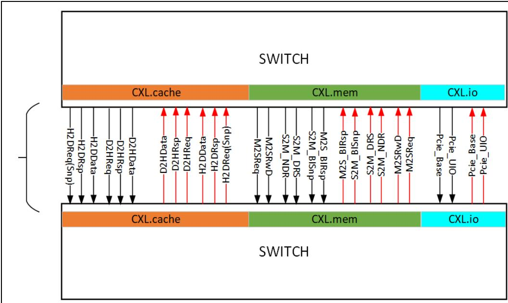

## 7.7.7.1 .io Deadlock Avoidance on ISLs/PBR Fabric

ISLs and PBR switches carry CXL.io Upstream traffic and CXL.io Downstream traffic from different hosts in the same physical direction/queues. To avoid deadlocks, these two traffic types need to be kept independent on ISLs and internally through PBR switches. To assist in maintaining the required independence, each TLP inside the PBR fabric is tagged with a DSAR (Downstream Acceptance Rules) bit. Here are the rules for setting the value of the DSAR bit within the PTH:

• When an Edge DSP converts a received TLP from HBR format to PBR format, the Edge DSP shall clear the DSAR bit.

• When an Edge USP converts a received TLP from HBR format to PBR format, the Edge USP shall clear the DSAR bit if the TLP is a UIO completion with VendPrefixL0, and set the DSAR bit in all other cases.

• When a switch VCS forwards a TLP within its virtual hierarchy P2P (from coming upstream to going downstream), the VCS shall set the forwarded TLP’s DSAR bit.

• When a function in a PBR switch originates a CXL.io request or completion TLP that travels upstream, it shall clear the DSAR bit. If the TLP travels downstream, the function shall set the DSAR bit.

• When a GFD sends a TLP (which is always in PBR format), the GFD shall clear the DSAR bit.

• When an Edge DSP above a GFD forwards a TLP to the GFD, the Edge DSP shall set the DSAR bit.

For the remainder of this section, traffic with DSAR=0 is referred to as USAR (Upstream Acceptance Rules) traffic, and DSAR=1 traffic is referred to as DSAR (Downstream Acceptance Rules) traffic. On an ISL, this bit is carried in the PTH. Traffic within each VC is required to follow the ordering rules specified in Table 7-109 and Table 7-110.

Table 7-109. PBR Fabric .io Ordering Table — Non-UIO

<table><tr><td rowspan="3" colspan="3">Row Pass Column?</td><td colspan="4">DSAR</td><td colspan="4">USAR</td></tr><tr><td rowspan="2">Posted Request</td><td colspan="2">Non-Posted Request</td><td rowspan="2">Completion</td><td rowspan="2">Posted Request</td><td colspan="2">Non-Posted Request</td><td rowspan="2">Completion</td></tr><tr><td>Read Request</td><td>NP Request with Data</td><td>Read Request</td><td>NP Request with Data</td></tr><tr><td rowspan="4">DSAR</td><td colspan="2">Posted Request</td><td rowspan="4" colspan="4">Per the PCIe Base Specification</td><td>Yes</td><td>Yes</td><td>Yes</td><td>Yes</td></tr><tr><td rowspan="2">Non-Posted Request</td><td>Read Request</td><td>Yes/No</td><td>Yes</td><td>Yes</td><td>Yes/No</td></tr><tr><td>NP Request with data</td><td>Yes/No</td><td>Yes</td><td>Yes</td><td>Yes/No</td></tr><tr><td colspan="2">Completion</td><td>Yes</td><td>Yes</td><td>Yes</td><td>Yes</td></tr><tr><td rowspan="4">USAR</td><td colspan="2">Posted Request</td><td>Yes/No</td><td>Yes</td><td>Yes</td><td>Yes/No</td><td rowspan="4" colspan="4">Per the PCIe Base Specification</td></tr><tr><td rowspan="2">Non-Posted Request</td><td>Read Request</td><td>Yes/No</td><td>Yes/No</td><td>Yes/No</td><td>Yes/No</td></tr><tr><td>NP Request with data</td><td>Yes/No</td><td>Yes/No</td><td>Yes/No</td><td>Yes/No</td></tr><tr><td colspan="2">Completion</td><td>Yes/No</td><td>Yes</td><td>Yes</td><td>Yes/No</td></tr></table>

Table 7-110. PBR Fabric .io Ordering Table — UIO

<table><tr><td rowspan="2" colspan="2">Row Pass Column?</td><td colspan="3">DSAR</td><td colspan="3">USAR</td></tr><tr><td>UIO PR-FC TLP</td><td>UIONPR-FC TLP</td><td>UIO Completion</td><td>UIO PR-FC TLP</td><td>UIONPR-FC TLP</td><td>UIO Completion</td></tr><tr><td rowspan="3">DSAR</td><td>UIO PR-FC TLP</td><td rowspan="3" colspan="3">Per the PCIe Base Specification</td><td>Yes</td><td>Yes</td><td>Yes/No</td></tr><tr><td>UIONPR-FC TLP</td><td>Yes</td><td>Yes</td><td>Yes/No</td></tr><tr><td>UIO Completion</td><td>Yes</td><td>Yes</td><td>Yes</td></tr><tr><td rowspan="3">USAR</td><td>UIO PR-FC TLP</td><td>Yes/No</td><td>Yes/No</td><td>Yes/No</td><td rowspan="3" colspan="3">Per the PCIe Base Specification</td></tr><tr><td>UIONPR-FC TLP</td><td>Yes/No</td><td>Yes/No</td><td>Yes/No</td></tr><tr><td>UIO Completion</td><td>Yes</td><td>Yes</td><td>Yes/No</td></tr></table>

To support the additional ordering requirements stated above, the following rules apply on ISL (also pictorially depicted in Figure 7-49):

gure 7-49. Deadlock Avoidance Mechanism on ISL

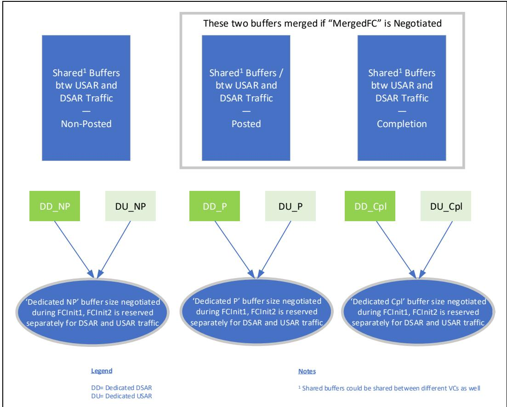

• PBR Fabric .io ordering rules apply independently within each VC implemented

• On edge HBR/PCIe links and on edge PBR links, PBR Fabric ordering rules do not apply

— On edge PBR links, the PTH bit can be ignored for ordering purposes and only the regular CXL.io ordering rules from the PCIe Base Specification apply.

• Nonzero dedicated credits are always required on ISL for each VC, regardless of whether multiple VCs are enabled

• Baseline Shared and Merged FC initialization and usage rules, as described in the PCIe Base Specification, apply on ISLs as well, with some additional rules/ exceptions as noted below:

— Dedicated buffers are required separately per FC class for DSAR traffic and USAR traffic and both buffers are the same value as negotiated during FC initialization.

• As an example, if one Posted HDR and one Posted DATA credit were exchanged for Dedicated buffers during InitFC1/2, the transmitter assumes that there is one Posted data credit for DSAR traffic and one Posted data credit for USAR traffic and similarly for Posted HDR Credit as well.

• Shared buffers can be shared between DSAR traffic and USAR traffic.

• UpdateFC DLLP is modified as shown in Figure 7-50, to indicate the release of the DSAR buffer or USAR buffer. Transmitters can use this information on shared credits to implement QoS limiting between DSAR traffic and USAR traffic.

— This modification is implicitly enabled on ISLs and requires no negotiation

To aid debug, Switches are recommended to capture the Hdr and DataScale values negotiated at initialization so that debug software can access the values.

• Optimized\_Update\_FC DLLP applies to USAR traffic only and it is implicit on ISLs. All DSAR traffic’s shared buffer credit return occurs only via UpdateFC DLLP.

## Figure 7-50. UpdateFC DLLP Format on ISL

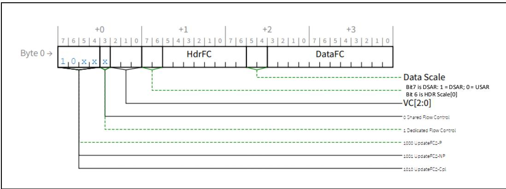

## PBR TLP Header (PTH) Rules

For the purposes of this discussion, a “PBR link” is a link that negotiated to PBR flit format via the physical layer TS “PBR Flit bit” (see Section 6.4). See Section 3.1.8 for details of PTH format.

• A PTH is inserted (via an appropriate decode mechanism) on CXL.io TLPs by an Edge Switch or the PTH is directly generated by devices (e.g., GFD) that natively support PBR link

• A PTH is forwarded as-is (unless explicitly noted otherwise as in handling PTH.DSAR bit on an edge PBR link) on a CXL.io TLP if the egress port is connected to a PBR link

• A PTH is removed when its CXL.io TLP exits to an edge non-PBR link

— Note that some contents of PTH could be transferred to VendPrefixL0 if the egress port is an HBR link and the VendPrefixL0 is supported and enabled on the link. See Section 7.7.3 and Section 7.7.4.

• A PTH is included in link-IDE Integrity protection, if supported and enabled, when the PTH traverses PBR links.

• PTH is not included in .io selective IDE protection.

## PBR Support for UIO Direct P2P to HDM

PBR switches support special routing mechanisms to enable the UIO Direct P2P to HDM use case with edge-to-edge routing, which often can be much more efficient compared to the hierarchical routing used in HBR switches. For backward compatibility, legacy software unaware of these special PBR routing mechanisms can continue to use HDM decoders, providing limited UIO Direct P2P capability.

An enhanced version of the FAST decoder as defined in Section 7.7.2.4 can be implemented in the Edge DSP above the UIO requester, providing edge-to-edge routing for UIO requests that target GFDs.

Another instance of the FAST decoder hardware can provide edge-to-edge routing for UIO requests that target LD-FAM devices. This instance is referred to as an LD-FAM Segment Table (LDST), and it is usually configured with a different segment size and amount of mapped HDM space from any FAST decoders in use.

With LD-FAM devices, UIO completions can be routed edge-to-edge with an ID-Based Re-Router mechanism, which can be implemented in the Edge DSP above each LD-FAM device. The Re-Router matches against the requester’s PCI segment number (if applicable) and bus number in the UIO completion to determine the DPID for edge-toedge routing. G-FAM devices automatically use edge-to-edge routing for UIO completions without this mechanism.

FAST decoders, LDST decoders, and ID-Based Re-Routers are each configured by host software using CCI command sets, as documented in Section 7.7.14 for FAST decoders, and Section 7.7.13 for LDST decoders and ID-Based Re-Routers.

GFDs are not associated with any VH, thus they have no PCIe ID (segment, bus, device, function number) assigned by any host. When a GFD sends a UIO completion, the completer segment field (if present) and the completer ID field in the completion are reserved and shall be 0.

## 7.7.9.1

## FAST Decoder Use for UIO Direct P2P to G-FAM

FAST decoder instances in Edge USPs and DSPs have several similarities:

• Both convert requests from HBR format to PBR format, and route edge-to-edge to target GFDs.

• For the SPID, each uses the PID associated with its port.

• Both support CXL.mem and (CXL.io) UIO requests.

• A USP FAST decoder receives HBR format downstream requests coming from the RP. CXL.mem requests result from host accesses to GFDs.

• A DSP FAST decoder receives HBR format upstream requests coming from the requester device. UIO requests result from UIO Direct P2P traffic, where the UIO requester may be directly connected to an Edge DSP, or it may be connected via one or more HBR switches below the Edge DSP. CXL.mem requests result from the Direct P2P CXL.mem for accelerators use case, covered in Section 7.7.10.

A DSP FAST decoder can be configured with a segment size different from the host’s USP FAST decoder(s), but it is recommended for all FAST decoders to use the same segment size to avoid software complexity.

A DSP FAST decoder may need to be configured with a different number of segments from the host’s USP FAST decoder(s) (e.g., a requester device may not need access to the entire Fabric Address space mapped by the USP FAST decoder). On the other hand, a requester device may need to access the Fabric Address space associated with an entire host Domain, not just a single RP within a host domain.

## 7.7.9.2 LDST Decoder Use for UIO Direct P2P to LD-FAM

LDST decoder instances in Edge USPs and DSPs have several similarities:

• Both convert requests from HBR format to PBR format, and route edge-to-edge to target LD-FAM devices.

• For the SPID, each uses the PID associated with its port.

• Both support CXL.mem and (CXL.io) UIO requests.

• A USP LDST decoder receives HBR format downstream requests coming from the RP. CXL.mem requests result from host accesses to LD-FAM devices. UIO requests currently have no architected use cases, but they are not prohibited.

• Host software determines whether host accesses to LD-FAM devices use LDST decoders versus HDM Decoders in Edge USPs. For backward compatibility, legacy software that’s unaware of LDST decoders can continue to use HDM decoders. For overcoming scaling limitations with the number of HDM decoders supported by Edge USPs, LDST-aware software can use LDST decoders, though LDST decoders do not support HDM-D.

• A DSP LDST decoder receives HBR format upstream requests coming from the requester device. UIO requests result from UIO Direct P2P traffic. CXL.mem requests result from the Direct P2P CXL.mem for accelerators use case, covered in Section 7.7.10.

A DSP LDST decoder can be configured with a segment size different from the host’s USP LDST decoder(s), but it is recommended for all LDST decoders to use the same segment size to avoid software complexity.

A DSP LDST decoder may need to be configured with a different number of segments from the host’s USP LDST decoder(s) (e.g., a requester device may not need access to the entire LD-FAM HDM space mapped by the USP LDST decoder). On the other hand, an accelerator may need to access the LD-FAM HDM space associated with the entire host Domain, not a single RP in the host Domain.

When any LDST decoders are in use, host SW needs to configure any HDM decoders mapping the same LD-FAM HDM ranges with decoder characteristics compatible with LDST decoders. This applies to HDM decoders present in the host, PBR switches, HBR switches, or LD-FAM devices. These decoder characteristics include:

• Minimum decoder granularity: 64 GB for LDST

• Interleave Ways (IW): neither HBR nor PBR switches have the special logic required to support 3/6/12, but LDST supports the other architected IW values.

Note that Dynamic Capacity (DC) Block Sizes are not visible to either type of decoder.

LDST decoders insert a requester segment field in UIO requests when necessary. This is described in Section 7.7.9.3.

## 7.7.9.3 ID-Based Re-Router for UIO Completions with LD-FAM

For UIO Direct P2P to LD-FAM devices, UIO completions by default are routed using hierarchical PCIe ID-based routing, and the ID may include a PCIe segment number in addition to bus, device, and function numbers. If present in the Edge DSP above an LD-FAM device, the ID-Based Re-Router does a CAM match using the PCIe ID, returning the DPID needed for edge-to-edge routing. This mechanism efficiently handles intra-VH cases, and it is especially efficient for cross-VH cases by avoiding P2P through the Root Complex.

PCIe segment numbers in TLPs, a feature defined in the PCIe Base Specification, and PCIe segments should not be confused with “segments” in the context of FAST/LDST decoders. LDST decoders support the PCIe convention that requesters generally do not include PCIe segment numbers in requests1 but rely instead on routing mechanisms to add PCIe segment number fields when needed for cross-segment routing. Host software configures LDST decoders to add2 the requester segment field in the request

1. With Selective IDE non-configuration requests, the requester is required to include the requester segment field in the request because a routing element inserting the field would cause an integrity violation with Selective IDE.

when it targets a different PCIe segment. When the LD-FAM device responds to the UIO request with a UIO completion, it automatically includes segment fields when necessary in the Destination ID and Completer ID. Host software shall configure the ID-Based Re-Router with the PCIe segment number in entries that need it.

## LDST and ID-Based Re-Router Access Protection

LDST and ID-Based Re-Router use is protected by the LDST Access Vector (LAV) to ensure that only valid PIDs are programmed by the host into the LDST and ID-Based Re-Router structures. The LAV is a 4k-bit vector with a similar functionality as the GMVs and VTVs.

The FM is responsible for enabling access to PIDs in the LAV before the host can program those PIDs into the LDST or ID-Based Re-Router structures. For cross-VH use cases, the FM is also responsible for using the Domain Validation SV mechanism, when available, to confirm that every VH that is enabled for cross-VH access belongs to the same host domain.

## 7.7.10 PBR Support for Direct P2P CXL.mem for Accelerators

Direct P2P CXL.mem provides the ability for an accelerator to access peer Type 3 memory devices using CXL.mem. PBR switches require special routing mechanisms to support this, specifically the FAST decoders and LDST decoders. For Direct P2P CXL.mem, these decoders function essentially the same as they do for supporting the UIO Direct P2P to HDM use case, with the following exceptions:

• They intercept and forward upstream CXL.mem requests instead of UIO requests

• They target only Type 3 (HDM) devices, not Type 2 devices

• The accelerator (requester device) and Type 3 device must each be directly connected to an Edge DSP

• With an MLD (Type 3 device), each accelerator must be assigned a dedicated LD distinct from the host’s LD

Note that both types of decoders support .mem requests when they are implemented in Edge USPs, so .mem support is not unique to the Direct P2P CXL.mem use case.

Same as with the UIO Direct P2P use case, a FAST decoder can be implemented in the Edge DSP above an accelerator, providing edge-to-edge routing for .mem requests that target G-FAM devices (GFDs). The same FAST decoder instance can support either the UIO Direct P2P or Direct P2P CXL.mem use case.

Similarly, an LDST decoder can be implemented in the Edge DSP above an accelerator, providing edge-to-edge routing for .mem requests that target LD-FAM devices. The same LDST decoder instance can support either the UIO Direct P2P or Direct P2P CXL.mem use case.

Type 3 devices used with Direct P2P CXL.mem can be mapped under either HDM-H or HDM-DB coherency ranges. If mapped under HDM-DB, peer devices other than the associated accelerator can access the HDM-DB memory using UIO Direct P2P to HDM, in which case the associated accelerator serves the role of the host participating in BI protocol (i.e., the HDM-DB device directs BISnps to the accelerator).

Direct P2P CXL.mem traffic going to or from an MLD (directly connected to an Edge DSP) works essentially the same as with host .mem traffic, as documented in Section 7.7.6.6.3 and Section 7.7.6.8.

2. Although the PCIe Base Specification forbids PCIe switches from inserting a Requester Segment field, the CXL UIO Direct P2P to HDM mechanisms in CXL switches are beyond the scope of the PCIe Base Specification and do not violate the underlying architecture principles.

CXL.mem responses for the Direct P2P CXL.mem use case require no special routing mechanism. For S2M responses from G-FAM, the GFD’s RPID context for the accelerator contains the DPID needed for edge-to-edge routing back to the accelerator. For S2M responses from LD-FAM, the vPPB in the Edge DSP above the Type 3 device contains the DPID needed for edge-to-edge routing back to the accelerator.

Same as with the UIO Direct P2P use case, FAST decoders and LDST decoders are each configured by host software using CCI command sets, as documented in Section 7.7.15 for FAST decoders and Section 7.7.13 for LDST decoders.

## 7.7.10.1 Message Routing for Direct P2P CXL.mem Accesses with GFD

Direct P2P CXL.mem messages are routed using standard PBR mechanisms. Figure 7-51 illustrates an example PBR Fabric with a Direct P2P CXL.mem enabled Type 2 accelerator and two peer GFDs accessible to it. The dashed lines indicate the paths taken by the Direct P2P CXL.mem messages. Upstream .mem requests from the accelerator are routed edge-to-edge to the appropriate GFD by the FAST decoder in vPPB 6. Upstream .mem responses from either GFD are routed edge-to-edge back to the accelerator by standard PBR routing.

For an HDM-DB GFD sending a BISnp, the GFD’s RPID context for the accelerator contains the DPID that is needed for edge-to-edge routing to the accelerator.

## Figure 7-51. Example Topology with Direct P2P CXL.mem with GFD

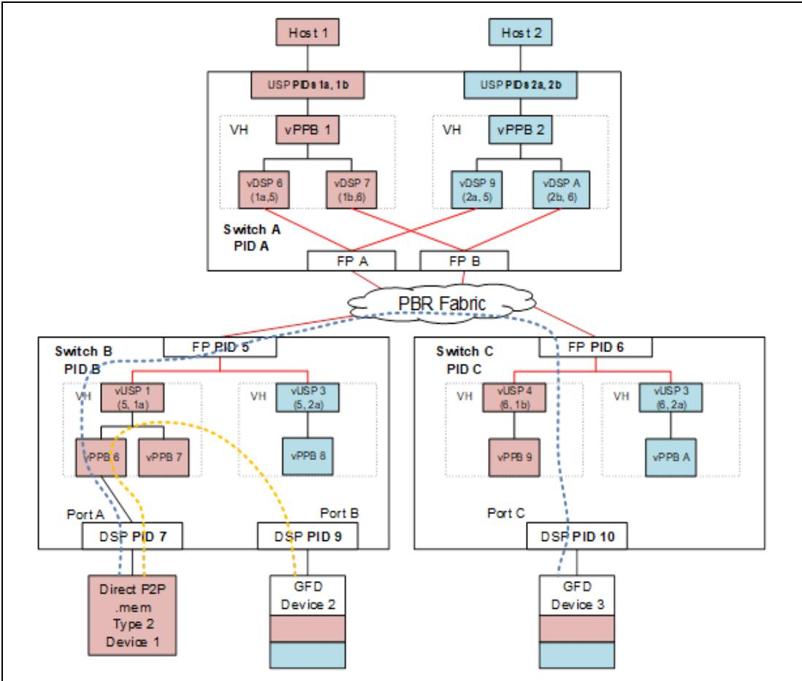

## 7.7.10.2 Message Routing for Direct P2P CXL.mem Accesses with MLD

Direct P2P CXL.mem accesses to an MLD require a distinct LD and associated peer requester LD-ID on the link between the MLD and the Edge DSP to which it is attached. This is accomplished by assigning a vPPB in the DSP in the same Domain as the host that owns the requester. The host and any peer accelerators will each have their own vPPB bound to them, which utilize their individual LD-IDs.

Figure 7-52 illustrates an example PBR Fabric with a Direct P2P CXL.mem enabled Type 2 accelerator and two peer MLDs accessible to it. Other than the dashed line to Host 1, the dashed lines indicate the paths taken by the Direct P2P CXL.mem messages. Upstream CXL.mem requests from the accelerator are routed edge-to-edge to the appropriate MLD by the LDST decoder in vPPB 6. Upstream CXL.mem responses from either MLD are routed edge-to-edge back to the accelerator by standard PBR routing using the accelerator’s PID, which in each case is retrieved from the accelerator’s vPPB in the DSP above the MLD.

Figure 7-52. Example Topology with Direct P2P CXL.mem with MLD

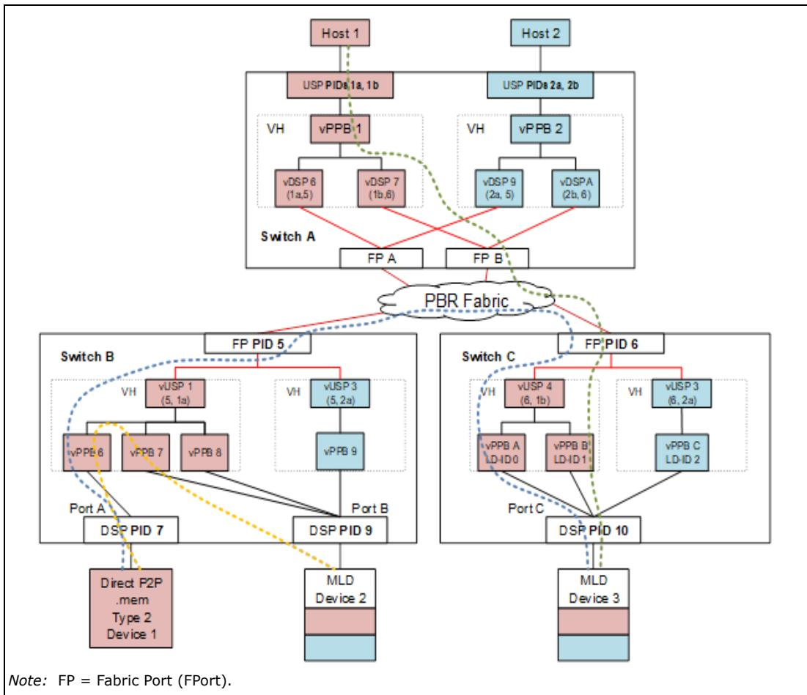

In this example, the path taken by CXL.mem messages between the host and one MLD is also shown. Downstream CXL.mem requests from the host are routed edge-to-edge to the appropriate MLD by the LDST decoder in vPPB 1. Upstream CXL.mem responses from the MLD are routed edge-to-edge back to the host by standard PBR routing using the host’s PID contained in vPPB B.

Fo r a n H D M - D B LD - FAM d evi ce se n d i n g a BI S n p th e Ed g e D S P a bove th e LD - FAM d evi ce co nta i n s th e D PI D th at i s n eed ed fo r ed g e -to ed g e ro u ti n g to th e a cce l e ra to r.y

## 7 . 7 . 1 0 . 3 P B R Switch Port Processi ng of Di rect P2 P CXL. mem M essages

Ta b l e 7 - 1 1 1 s u m m a ri zes h ow P B R sw i tc h es pe rfo rm po rt p rocess i n g of CX L . m e m m essa g es w i th th e D i rect P2 P CX L . m e m fo r Acce l e ra to rs u se ca se . Th i s tra ffi c n eve r fl ows th ro u g h Ed g e U S Ps o r H B R sw i tc h es . Th e a cce l e ra to r ( req u este r) i s a l ways a n S LD th a t i s d i rectly co n n ected to a n Ed g e D S P a n d ea ch Type 3 m e m o ry d evi ce i s a l ways d i rectl y co n n ected to a n Ed g e D S P. Al l m essa g es i n PB R fo rm at a re ro u ted ed g e -to - ed g e .o

Fo r co n ci se n ess th e re a re seve ra l a b b revi a ti o n s w ith i n th e ta b l e Beyo n d “ a cce l ” sta n d i n g fo r a cce l e ra to r see Secti o n 7 7 6 8 fo r oth e r a b b revi a ti o n s .

Ta ble 7- 1 1 1 . PBR Switch Port Processi ng Ta ble for Di rect P2P CXL. mem

<table><tr><td rowspan="2" colspan="2">Message Class and Direction</td><td rowspan="2">Edge USP Always below an RP</td><td rowspan="2">Host ES FPort or Downstream ES FPort</td><td colspan="4">Edge DSP in Either Host ES or Downstream ES</td></tr><tr><td>Above HBR Switch USP</td><td>Above SLD</td><td>Above MLD</td><td>Above GFD</td></tr><tr><td rowspan="2">M2S Req/RwD Direct P2P CXL.mem</td><td rowspan="2">US from accel </td><td rowspan="2">N/A</td><td rowspan="2">PBR routing</td><td rowspan="2">N/A</td><td>Convert to PBR fmt using FAST or LDST</td><td>N/A</td><td>N/A</td></tr><tr><td>Convert to HBR fmt LD-ID←0; is unused</td><td>LD-ID←CAM16(SPID) Convert to HBR MLD fmt</td><td>LD-ID is N/A Keep in PBR fmt</td></tr><tr><td rowspan="2">S2M NDR/DRS Direct P2P CXL.mem</td><td></td><td rowspan="2">N/A</td><td rowspan="2">PBR routing</td><td rowspan="2">N/A</td><td>LD-ID is unused Convert to PBR fmt DPID←vPPB.root.PID</td><td>LD-ID identifies vPPB Convert to PBR fmt DPID←vPPB.root.PID</td><td>Keep in PBR fmt LD-ID is N/A</td></tr><tr><td></td><td>Convert to HBR fmt LD-ID←0; is unused</td><td>N/A</td><td>N/A</td></tr><tr><td rowspan="2">S2M BISnp Direct P2P CXL.mem</td><td></td><td rowspan="2">N/A</td><td rowspan="2">PBR routing</td><td rowspan="2">N/A</td><td>Convert to PBR fmt DPID←vPPB.root.PID SPID←vPPB.self.PID</td><td>BI-ID[3:0] contains LD-ID LD-ID identifies vPPB Convert to PBR fmt DPID←vPPB.root.PID SPID←vPPB.self.PID</td><td>Keep in PBR fmt</td></tr><tr><td>DS to accel</td><td>Convert to HBR fmt BI-ID[11:0]←SPID</td><td>N/A</td><td>N/A</td></tr><tr><td rowspan="2">M2S BIRsp Direct P2P CXL.mem</td><td></td><td rowspan="2">N/A</td><td rowspan="2">PBR routing</td><td rowspan="2">N/A</td><td>Convert to PBR fmt DPID←BI-ID[11:0] SPID←vPPB.self.PID</td><td>N/A</td><td>N/A</td></tr><tr><td></td><td>Convert to HBR fmt BI-ID←0; is unused</td><td>Convert to HBR fmt LD-ID←CAM16(SPID) BI-ID[3:0]←vPPB.LD-ID</td><td>Keep in PBR fmt</td></tr></table>

## 7.7.11 PBR Link Events and Messages

A PBR link can carry traffic from many different VH at the same time. Some events may occur that only affect a single VH, while other events need to apply to all VH sharing the link.

Basic PBR link requirements are discussed in Section 7.7.11.1.

A summary of all the CXL Vendor Defined Messages (VDMs) that are PTH routed to the destination is provided in Section 7.7.11.2.

PCIe events for a single VH are discussed in Section 7.7.11.3.

PCIe events for multiple VH sharing a link are discussed in Section 7.7.11.4.

Events that occur outside PCIe are discussed in Section 7.7.11.5.1.

Messaging to and from a host to a GFD is discussed in Section 3.1.11.1.

## 7.7.11.1 PBR Link Fundamentals

CXL defines two types of PBR links:

• Inter-Switch Link (ISL)

• GFD link

All PBR links must support PBR Flit mode. Because PBR Flit mode relies on PCIe Flit mode, all host-OS-visible DSPs should report PCIe Flit mode as enabled. The DSPs include both a Host Edge Switch vDSP and a DSP above a PBR link that leads to a GFD.

The owner of a PBR link is an FM-managed DSP. Switch firmware may assist the FM in managing the DSP. An ISL is a downstream-to-downstream crosslink and thus has an FM-managed DSP on each side of the link. A GFD link has only one DSP and thus has only one FM-managed DSP. The speed and width of a PBR link is solely controlled by the FM-managed DSP(s) on the link and not by any vDSPs that share the link.

Each side of an ISL is managed separately. Each DSP above an ISL must support DPC, to allow firmware on each side of the link an independent amount of time to process fabric port events. DPC shall be enabled for all cases on ISL except when the ISL is the only path to the FM, in which case the DSP furthest from the FM shall not have DPC enabled.

FM-initiated CXL.io traffic sent across a PBR link shall be limited to DMTF-format VDMs. The PTH.DPID is used to indicate whether the PBR Link Partner should sink the TLP or forward the TLP. If the PTH.DPID = FFFh, the PBR Link Partner must sink the VDM because that is how the initial device discovery occurs and how PIDs are assigned. If the PTH.DPID = the device’s PID, then the device must also sink the VDM because that is how the device is accessed by the FM.

All VH users of a PBR link have their functionality ride on top of the FM-managed link. For example, a VH’s DSP cannot see a Link Up if the fabric link is not up. A VH cannot change the width or speed of its shared link, rather it will inherit the setting of the FMmanaged DSP.

To manage different software response times to events, every vDSP for every VH must support DPC. DPC allows a host to keep its Link Down from its (VH) perspective until it is ready to re-enable it, having cleaned up all the side effects of a Link Down. A Host may or may not choose to enable DPC.

L0p is optional on a PBR link. The FM-managed DSP initiates any L0p transitions via a mechanism that is beyond this specification.

Every CXL.io TLP on a PBR link will carry a 4B PTH. The VDMs described in this section follow the same rule. See Section 3.1.8. There are three fields of note in the PTH that are required for the VDMs described in this section:

• SPID: Source PID

— From a vDSP: Use vDSP’s USP PID

— From a vUSP: Use vUSP’s FPort PID

— From a switch: Use switch’s PID

— From a downstream edge: Use DSP’s PID

— From a host edge: Use USP’s PID

• DPID: Destination PID

— To a vDSP: Use vDSP’s USP PID

— To a vUSP: Use vUSP’s FPort PID

— To a switch: Use switch’s PID

— To a downstream edge: Use DSP’s PID

— To host edge: Use USP’s PID

• DSAR flag

## 7.7.11.2 CXL VDMs

See Section 3.1.11 for a list of VDMs that are used in the PBR fabric.

## 7.7.11.3 Single VH Events

Events that are contained within a single VH should not affect other VHs that share an ISL.

PCIe visible events that are contained within a single VH include:

• Assert Reset

• Deassert Reset

• Link Up

Figure 7-53 shows the virtual hierarchy from a Host 1 perspective (other hierarchies are grayed out). In Switch A, Host 1 finds only a single switch VCS 0. However, in Switch B, two switches VCS 1 and VCS 4 are in the Host 1 hierarchy. Switch B VCS 1 has vUSP 0 connected below Switch A VCS 0 vDSP 2, and Switch B VCS 4 has vUSP 0 below Switch A VCS 0 vDSP 3. Switch C has a GFD with that is accessible by Host 1 devices, but the GFD is not visible to the Host 1 PCIe hierarchy. See Section 7.7.14 for more details on control of the GFD.

Figure 7-53. Single VH  
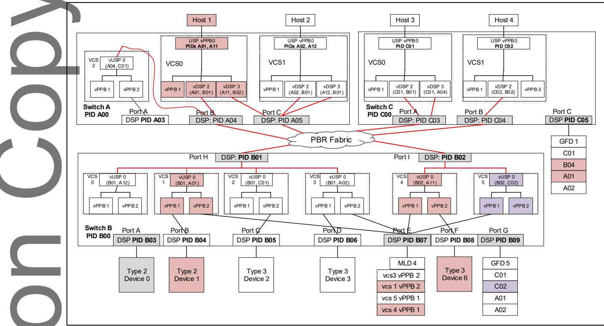

## 7.7.11.3.1 Assert Reset VDM

Every PCIe hierarchy supports three levels of Conventional Reset:

• Fundamental Cold Reset (PERST#): Input pin

• Fundamental Warm Reset (PERST#): Input pin

• Hot Reset due to Link Down, in-band Hot Reset, USP Secondary Bus Reset, DSP Secondary Bus Reset, or link disabled

CXL Fabric links support propagation of these resets. The ISL link state is not affected by any VH’s Assert Reset or Assert PERST# VDM. Assertion of reset is accomplished using one of two different VDM opcodes:

• Assert PERST#: Used for Fundamental Reset assertion for that VH, Opcode 0

• Assert Reset: Used for Hot Reset assertion for that VH, Opcode 1

The separate PERST# message allows for Fundamental Reset functionality without the need for extra pins between switches.

Assert PERST# should be triggered whenever a VH has its input Fundamental Reset asserted on a Host ES. Assert Reset should be triggered whenever the Host ES:

• Receives a Hot Reset input

• Has a Secondary Bus Reset on its USP

• Has a Secondary Bus Reset on its VDSP

• Has a link disable on its vDSP

The Assert Reset VDMs all are sent from a vDSP to its paired vUSP. The VDM sent will have a PTH with:

• SPID = vDSP’s host PID

• DPID = vUSP’s FPort PID

• DSAR flag = 1

VDM header fields for Assert Reset VDMs:

• CXL VDM code of 80h

• PBR Opcode 0 or 1 indicates which Assert PERST# or Assert Reset message

It is expected that the Assert Reset VDM will reach a vUSP uniquely identified by the SPID and DPID at the destination switch.

A vDSP, upon sending Assert Reset VDM, will have its link state transition to Hot Reset.

A vUSP, upon receiving an Assert Reset VDM, will have its link state transition to Hot Reset. While in Hot Reset, all Port non-sticky registers and state machines that belong to the VH must return to their initialized state.

A vUSP, upon receiving an Assert PERST# VDM, shall have its link state transition to Hot Reset and also shall clear any sticky bits as outlined by the PCIe Base Specification for PERST# behavior.

It is possible to send any number of Assert Reset VDMs or Assert PERST# VDMs.

In Figure 7-54, if Host 1 asserts its PERST#, then both Switch A VCS 0 vDSP 2 and Switch A VCS 0 vDSP 3 shall issue an AssertPERST# VDM. The format of the PTH would be (SPID=A01, DPID=B01) for vDSP 2 and (SPID=A11, DPID=B02) for vDSP 3. If Host 1 instead asserted vDSP 2 secondary bus reset, then only vDSP 2 would send an AssertReset VDM with (SPID=A01, DPID=B01).

## 7.7.11.3.2 Deassert Reset VDM

A Deassert Reset VDM signals a release of reset and an exiting of the Hot Reset state to enter Detect for that VH. This VDM shall be sent from the Host Edge Switch due to a deassertion of the PERST# input resulting from an exit from Hot Reset.

If DSP is enabled the DPC trigger status must be cleared before a Deassert Reset VDM can be sent because DPC triggered prevents any TLPs from egressing that port.

Propagation of reset deassertion over an ISL is enabled via a Deassert Reset VDM, which is used for hot reset deassertion for that VH, Opcode 3.

A Deassert Reset VDM is used to instruct the vUSP to exit Hot Reset and enter Detect. The Deassert Reset VDM sent will have a PTH with:

• SPID = vDSP’s host PID

• DPID = vUSP’s FPort PID

• DSAR flag = 1

VDM header fields for Deassert Reset VDMs:

• CXL VDM code of 80h

• PBR Opcode 3

A vDSP, upon sending a Deassert Reset VDM, will have its link state transition from Hot Reset to Detect. A vUSP, upon receiving a Deassert Reset VDM, will have its link state transition from Hot Reset to Detect. If the link state is not in Hot Reset, a link state change will not occur.

The link for that VH will remain in Detect until the vUSP sends a Link Up VDM and the vDSP receives a Link Up VDM. If a Link Up VDM is not received within 10 ms, a subsequent Deassert Reset VDM shall be sent. This can repeat until 10 Deassert Reset VDMs have been sent. After a tenth Deassert Reset VDM is sent, if a Link Up VDM is still not received within 10 ms, the reset deassertion failed and the FM shall be notified.

In Figure 7-54, if Host 1 clears the secondary bus reset in Switch A VCS 0 vDSP 2, then Switch A VCS 0 vDSP 2 would send a Deassert Reset VDM with (SPID=A01, DPID=B01). Switch B VCS 1 vUSP 0 would exit the hot reset state. As part of the exit from LTSSM Detect and due to the shared link nature of an ISL, Switch B VCS 1 vUSP 0 will bypass the PCIe LTSSM states of Polling and Configuration and transition the vDSPto-vUSP link back to L0 (Link Up) by sending a Response Link Up VDM.

## 7.7.11.3.3 Link Up VDM

A Link Up VDM signals a transition to L0 active for that VH’s link. The Link Up VDM is sent by a vUSP to its paired vDSP to convey a post-Detect state across the shared ISL.

The vUSP sends a Link Up VDM after receiving a Deassert Reset VDM. The vUSP can perform any required post-reset initialization before sending the Link Up VDM. The vUSP may take as long as it needs after Deassert Reset to send the Link Up VDM. Any number of Deassert Reset VDMs may be received by the vUSP; for each Deassert Reset VDM received, a Link Up VDM shall be sent.

The vUSP, after sending a Link Up VDM, shall have its link state transition to L0 from Detect. Polling and Configuration link states are bypassed by the Link Up VDM because the required TS1 and TS2 Ordered Sets cannot be sent over a shared ISL.

A vDSP, after receiving a Link Up VDM, shall have its link state transition to L0 from Detect. If not in Detect, there is no state change. Any number of Link Up VDMs may be received. Polling and Configuration link states are bypassed by the Link Up VDM, with the link directly transitioning from Detect to L0.

Neither a vDSP nor vUSP should ever have their link state reach Polling or Configuration state.

The VDM sent will have a PTH with:

• SPID = vUSP’s FPort PID

• DPID = vDSP’s host PID

• DSAR flag = 1

VDM header fields for LinkUp VDMs:

• CXL VDM code of 80h

• PBR Opcode 4

## 7.7.11.3.4 Dynamic vDSP-to-vUSP Bind

See Section 7.7.12.3 for more details on the Configure PID Binding API sequence. After Configure PID Bind, the vDSP or vUSP shall be in a Hot Reset state. A vDSP may issue an Assert Reset VDM or a Deassert Reset VDM from the reset state, as dictated by its VH. A vUSP shall remain in Hot Reset until the vUSP receives a Deassert Reset VDM, upon which, after processing the necessary post-reset tasks, the vUSP will send a Link Up VDM.

## 7.7.11.4 Shared Link Events

Events that affect multiple VHs on the same link need to be reported to the FM. The FM shall take any necessary action.

The FM is required to keep an inventory for each ISL. Figure 7-54 shows how the link from Switch A Port B (indicated by an oval with 1) is shared by both a Host 1 hierarchy and a Host 3 hierarchy. Events on this link will affect both hierarchies. The oval with 2 is another shared link used by multiple hierarchies, of which only a Host 1 hierarchy is colored in but the ISL also includes Host 3 (VCS 2) and two hierarchies of Host 2 (VCS 0 and VCS 3).

Figure 7-54. Shared Link Events  
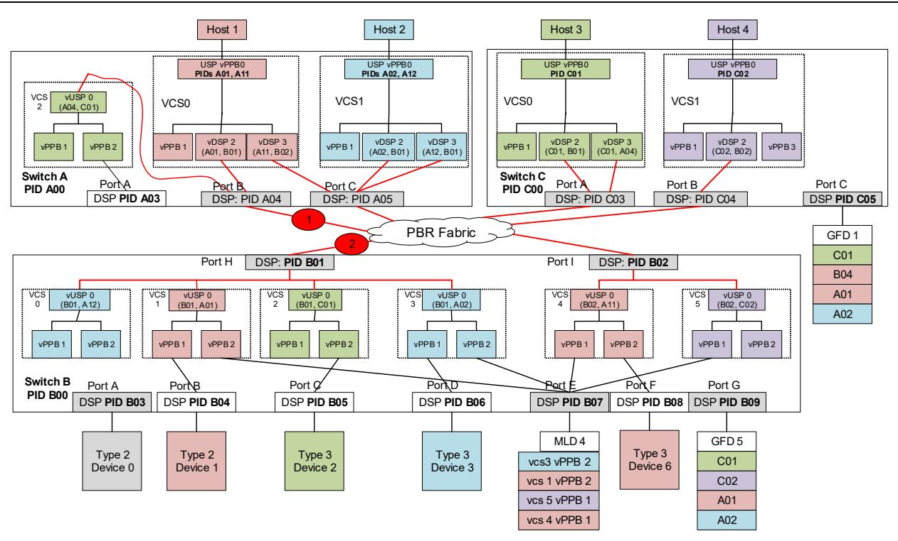

## 7.7.11.4.1 Inter-Switch Link (ISL) Down

An ISL going down may affect one or more VHs.

A switch on each side of the ISL knows if the link had any issues. The fabric port’s DPC is used to handle link issues. If DPC triggers, switch firmware will be notified. DPC may trigger due to Link Down or due to other reasons, such as software trigger; the net result is that the ISL will go down. Once the link goes down the switch reports the event to its primary FM. The FM is responsible for resolving the ISL Down event for all involved VHs.

The fabric port’s DPC should remain triggered until switch firmware can resolve the side effects of an ISL Down event. When the FM has finished its resolution tasks, the FM will instruct the switch to clear the DPC trigger on the fabric port DSP. DPC trigger clear indicates resolution of the event and also allows the ISL to come back up.

The FM requires an inventory of users of an ISL to correctly resolve an ISL Down event. FM tasks for the resolution of an ISL Down event involves the following:

• Unbinding any affected VHs’ vDSP

• Unbinding any affected VHs’ vUSP

• Clearing any affected multi-path in a switch’s RGT

• Clearing any affected GFD Access Vector in a switch’s GAE

For example, if the link at Oval #1 in Figure 7-54 breaks, Switch A and an unlabeled PBR fabric switch will both notify their primary FM. The FM will then unbind the following affected vDSPs and vUSPs:

• Switch A VCS 0 vDSP 2 and VCS 2 vUSP 0

• Switch B VCS 1 vUSP 0

• Switch C VCS 0 vDSP 2

As another example, if the link at Oval #2 in Figure 7-54 breaks, Switch B and an unlabeled PBR fabric switch will both notify their primary FM. The FM will then unbind the following affected vDSPs and vUSPs:

• Switch A VCS 0 vDSP 2, VCS 1 vDSP 3, and VCS 1 vDSP 2

• Switch B VCS 0 vUSP 0, VCS 1 vUSP 0, VCS 2 vUSP 0, and VCS 3 vUSP 0

• Switch C VCS 0 vDSP 2

In addition to the unbinding of the vDSP and vUSP pair affected by an ISL Down event, the RGT and GAE GFD access vectors may be updated by the FM. The RGT would be updated to avoid the path leading to the fault. The GFD Access Vector may be updated to remove a GFD that is no longer reachable.

## 7.7.11.5 Switch Reported Events

Some events are switch specific or are outside normal PCIe reporting methods and thus require switch-specific intervention. These include:

• Link Partner Info

## 7.7.11.5.1 Link Partner Info VDM

A Link Partner Info VDM is sent on all PBR links immediately after the InitFC process finishes for VC0. Each side of the link will send a Link Partner Info VDM at this time.

A Link Partner Info VDM is also sent whenever a payload field value is updated. Only the side of the link with an updated value needs to send the VDM.

This is a message with payload. For CXL 3.1 (and higher), the payload is a fixed size of 16 DWORDs.

There are two types of PBR links: ISL and GFD. Both send the same Link Partner Info format but have a different value for the device type of the sender.

The Link Partner Info payload includes the following details about the sender of the VDM:

• 1B Physical Port ID: The ID number (port number) of the port that is sourcing (transmitting) the Link Partner Info VDM payload.

• 12-bit PID (if FFFh, indicates that the sending port’s PID is un-initialized).

• 4-bit Device Type (0 = PBR switch, 1 = GFD, all other encodings are reserved).

• 16B Link Partner ID: Defined as the first 16 bytes of the Identify Output Payload as specified in Table 8-216, for the hardware that is sourcing the Link Partner Info VDM Payload. Thus, this 16B string is a globally unique ID that is associated only with the sourcing hardware.

• 1B Standard FC VC list.

• 1B UIO FC VC list.

• 16B FM Primary UUID. If this value has not been initialized, this value shall read all 0s.

• 16B FM Secondary UUID. If this value has not been initialized, this value shall read all 0s.

Table 7-112. Link Partner Info Payload

<table><tr><td colspan="4">+3</td><td colspan="4">+2</td><td colspan="4">+1</td><td colspan="101">+0</td><td></td><td></td><td></td><td></td><td></td><td></td><td></td><td></td><td></td><td></td><td></td><td></td><td></td><td></td><td></td><td></td><td></td><td></td><td></td><td></td><td></td><td></td><td></td><td></td><td></td><td></td><td></td></tr><tr><td>7</td><td>6</td><td>5</td><td>4</td><td>3</td><td>2</td><td>1</td><td>0</td><td>7</td><td>6</td><td>5</td><td>4</td><td>3</td><td>2</td><td>1</td><td>0</td><td>7</td><td>6</td><td>5</td><td>4</td><td>3</td><td>2</td><td>1</td><td>0</td><td>7</td><td>6</td><td>5</td><td>4</td><td>3</td><td>2</td><td>1</td><td>0</td><td>7</td><td>6</td><td>5</td><td>4</td><td>3</td><td>2</td><td>1</td><td>0</td><td></td><td></td><td></td><td></td><td></td><td></td><td></td><td></td><td></td><td></td><td></td><td></td><td></td><td></td><td></td><td></td><td></td><td></td><td></td><td></td><td></td><td></td><td></td><td></td><td></td><td></td><td></td><td></td><td></td><td></td><td></td><td></td><td></td><td></td><td></td><td></td><td></td><td></td><td></td><td></td><td></td><td></td><td></td><td></td><td></td><td></td><td></td><td></td><td></td><td></td><td></td><td></td><td></td><td></td><td></td><td></td><td></td><td></td><td></td><td></td><td></td><td></td><td></td><td></td><td></td><td></td><td></td><td></td><td></td><td></td><td></td><td></td><td></td><td></td><td></td><td></td><td></td><td></td><td></td><td></td><td></td><td></td><td></td><td></td><td></td><td></td><td></td><td></td><td></td><td></td><td></td><td></td><td></td><td></td><td></td><td></td><td></td><td></td><td></td><td></td></tr><tr><td colspan="4">DevType[3:0]</td><td colspan="12">PID[11:0]</td><td colspan="16">Reserved[7:0]</td><td colspan="100">PortID[7:0]</td><td>+0</td><td></td><td></td><td></td><td></td><td></td><td></td><td></td></tr><tr><td colspan="96">Link Partner ID[127:0]</td><td></td><td></td><td></td><td></td><td></td><td></td><td></td><td></td><td></td><td></td><td></td><td></td><td></td><td></td><td></td><td></td><td></td><td></td><td></td><td></td><td></td><td></td><td></td><td></td><td></td><td></td><td></td><td></td><td></td><td></td><td></td><td></td><td></td><td></td><td></td><td></td><td></td><td></td><td></td><td></td><td></td><td></td><td></td><td></td></tr><tr><td colspan="16">Primary FM UUID[15:0]</td><td colspan="16">UIO FC VC List[7:0]</td><td colspan="95">Standard FC VC List[7:0]</td><td>+20</td><td></td><td></td><td></td><td></td><td></td><td></td><td></td><td></td><td></td><td></td><td></td><td></td></tr><tr><td rowspan="2" colspan="99">Primary FM UUID[111:16]</td><td rowspan="2"></td><td rowspan="2"></td><td></td><td></td><td></td><td></td><td></td><td></td><td></td><td></td><td></td><td></td><td></td><td></td><td></td><td></td><td></td><td></td><td></td><td></td><td></td><td></td><td></td><td></td><td></td><td></td><td></td><td></td><td></td><td></td><td></td><td></td><td></td><td></td><td></td><td></td><td></td><td></td><td></td><td></td><td></td></tr><tr><td></td><td></td><td></td><td></td><td></td><td></td><td></td><td></td><td></td><td></td><td></td><td></td><td></td><td></td><td></td><td></td><td></td><td></td><td></td><td></td><td></td><td></td><td></td><td></td><td></td><td></td><td></td><td></td><td></td><td></td><td></td><td></td><td></td><td></td><td></td><td></td><td></td><td></td><td></td></tr><tr><td colspan="16">Secondary FM UUID[15:0]</td><td colspan="99">Primary FM UUID[127:112]</td><td>-36</td><td></td><td></td><td></td><td></td><td></td><td></td><td></td><td></td><td></td><td></td><td></td><td></td><td></td><td></td><td></td><td></td><td></td><td></td><td></td><td></td><td></td><td></td><td></td><td></td></tr><tr><td colspan="90">Secondary FM UUID[111:16]</td><td></td><td></td><td></td><td></td><td></td><td></td><td></td><td></td><td></td><td></td><td></td><td></td><td></td><td></td><td></td><td></td><td></td><td></td><td></td><td></td><td></td><td></td><td></td><td></td><td></td><td></td><td></td><td></td><td></td><td></td><td></td><td></td><td></td><td></td><td></td><td></td><td></td><td></td><td></td><td></td><td></td><td></td><td></td><td></td><td></td><td></td><td></td><td></td><td></td><td></td></tr><tr><td colspan="16">Reserved</td><td colspan="76">Secondary FM UUID[127:112]</td><td>+52</td><td></td><td></td><td></td><td></td><td></td><td></td><td></td><td></td><td></td><td></td><td></td><td></td><td></td><td></td><td></td><td></td><td></td><td></td><td></td><td></td><td></td><td></td><td></td><td></td><td></td><td></td><td></td><td></td><td></td><td></td><td></td><td></td><td></td><td></td><td></td><td></td><td></td><td></td><td></td><td></td><td></td><td></td><td></td><td></td><td></td><td></td><td></td></tr><tr><td colspan="88">Reserved</td><td></td><td></td><td></td><td></td><td></td><td></td><td></td><td></td><td></td><td></td><td></td><td></td><td></td><td></td><td></td><td></td><td></td><td></td><td></td><td></td><td></td><td></td><td></td><td></td><td></td><td></td><td></td><td></td><td></td><td></td><td></td><td></td><td></td><td></td><td></td><td></td><td></td><td></td><td></td><td></td><td></td><td></td><td></td><td></td><td></td><td></td><td></td><td></td><td></td><td></td><td></td><td></td></tr></table>

With multi-byte fields, the least significant byte of the field starts with the lowest byte offset, and subsequent bytes are strictly increasing in significance (i.e., this is little endian format within each multi-byte field as well as the overall payload).

The Link Partner Info VDM.PTH fields are as listed below. This VDM will terminate at the Receiver.

• SPID = Originator’s (switch’s/GFD’s) PID. A value of FFFh indicates that the sender’s PID is un-initialized.

• DPID = FFFh (fixed value that indicates the receiving port is to process the VDM payload).

• DSAR flag = 1.

VDM header fields for LinkPartnerInfo VDMs:

• Type 74h (Message with Data, Terminate at Receiver)

• CXL VDM code of 90h

• PBR Opcode 0

A single message is sufficient to carry all the link info for CXL 3.1 (and higher).

## 7.7.11.6 PBR Link CCI Message Format and Transport Protocol

CCI commands are transported on PBR links as defined in Section 7.6.3 and its associated binding specifications (see the DSP0234, DSP0238, and DSP0281) with some notable caveats and clarifications:

• As with all .io traffic across PBR links, MCTP PCIe VDMs include a PTH whose SPID and DPID define the routing of the message

• PCIe enumeration is not required for ISL PPBs and GFDs

• GFDs do not implement a PCIe Physical Function

• The Requester ID field and Target ID field in the VDM’s TLP header are reserved because IDs are not assigned to many elements within the fabric (e.g., FM, ISL PPBs, Switch Management FW, GFDs, etc.)

## 7.7.12 PBR Fabric Management

## 7.7.12.1 Fabric Boot and Initialization

Much like as outlined for HBR switches in Section 7.2.1, PBR switches may be initialized in one of three different ways:

• Statically

• FM boots before the host(s)

• FM and host boot simultaneously

## 7.7.12.1.1 Static Fabric Initialization

A static fabric deployment uses statically predefined configuration data to define the fabric configuration settings typically assigned dynamically by an FM.

Static Fabric Characteristics:

• No support for G-FAM or MLD

• No support for dynamic binding changes or DCD

• No FM is required, but may be needed for error handling

• At switch boot, all ports have a PID assigned, DRT and RGT tables are prepopulated, and EP and PID binding settings are predefined as defined by vendorspecific switch configuration data (e.g., configuration file in SPI Flash)

• Each VH is ready for enumeration when the host boots

• Hot-add and managed hot-remove are supported on Downstream Edge Ports

## 7.7.12.1.2 Fabric Manager Boots First

With this method, the FM configures the fabric binding relationships and access permissions before the host boots and enumerates its VH.

• FM boots while hosts are held in reset

• All attached ISLs and DSPs link up and, when negotiated in PBR mode, exchange the PBR Link Information VDM

• FM discovers fabric topology, claims ownership of all components under its management, and assign PIDs

• FM binds EPs to VCSs and configures GFDs

• FM configures GMV and VTV to enable G-FAM, GIM and Edge-to-edge P2P, as required when available

## 7.7.12.1.3 Fabric Manager and Host Boot Simultaneously

In the case where the switches, FM, and host boot at the same time:

• VCSs, PID assignment, GFD configuration, and bindings between Host ES to Downstream ES VCSs are statically defined

• Edge vPPBs within each VCS are unbound and presented to the host as Link Down

• Switch discovers downstream devices and presents them to the FM

• Host enumerates the VH and configures the DVSEC registers

• FM performs port binding to edge vPPBs

• Switch performs virtual to physical binding

• Each bound port results in a Presence Detect Change or Link State Change notification to the host

• For G-FAM access, FM updates GMV and VTV access vectors for hosts

## 7.7.12.2 PBR Fabric Discovery

To effectively manage a PBR fabric, the FM must understand the physical topology through a fabric discovery process. A typical fabric discovery may proceed as follows.

1. FM discovers the component to which it is directly connected and claims primary FM ownership.

Management of a PBR device requires that a primary FM is registered. A PBR device shall accept only the following commands from an FM that is not registered as the primary FM:

— Identify

— Get Supported Logs

— Get Log

— Identify PBR Component

— Claim Ownership

All other commands shall fail with Unsupported Request. A PBR device shall only advertise support for the CEL and the CEL shall only advertise the commands in the above list when the supported logs or CEL contents are queried by an FM that is not registered as the primary FM.

If the FM is connected to a switch, crawl out and discovery of the fabric continues.

2. FM explores all switch ports.

As primary FM, the switch capabilities and switch port status can be queried. The Get Physical Port State and Get PBR Link Partner Info commands provide information on the devices connected to each port.

PBR switches can determine the type of device present at the far end of a link after negotiation using the link state information provided in Table 7-113.

Table 7-113. Far End Device Type Detection (Sheet 1 of 2)

<table><tr><td>Device Type</td><td>Negotiated Link Direction</td><td>Negotiated PBR-Enabled</td><td>Negotiated MLD-Enabled</td><td>Received “Link Partner Info” Type</td></tr><tr><td>Host</td><td>USP</td><td>N</td><td>N</td><td>N/A</td></tr><tr><td>PBR Switch</td><td>DSP-DSP Crosslink</td><td>Y</td><td>N</td><td>Switch</td></tr></table>

Table 7-113. Far End Device Type Detection (Sheet 2 of 2)

<table><tr><td>Device Type</td><td>Negotiated Link Direction</td><td>Negotiated PBR-Enabled</td><td>Negotiated MLD-Enabled</td><td>Received “Link Partner Info” Type</td></tr><tr><td>GFD</td><td>DSP</td><td>Y</td><td>N</td><td>GFD</td></tr><tr><td>MLD</td><td>DSP</td><td>N</td><td>Y</td><td>N/A</td></tr><tr><td>SLD, PCIe EP, or HBR Switch</td><td>DSP</td><td>N</td><td>N</td><td>N/A</td></tr></table>

3. FM may choose to first continue discovery of any connected switches or to manage devices on the far end of all switch ports.

PBR switch PPBs connected as ISLs are configured by the FM with the Send PPB CXL.io Configuration Request command.

The FM uses the Fabric Crawl Out command, as defined in Section 7.7.13.2, using switch port number as the target to manage the devices on the far end of each switch port. The FM claims ownership and assigns a PID to each defined as covered in step 1.

Once the far end device has been assigned a PID, the FM must program the PBR switch’s DRT to enable routing of that PID to the appropriate switch port. The FM can now use this new assigned PID as the target for subsequent Fabric Crawl Out requests.

Steps 1 through 3 are repeated for all PBR switches discovered.

## 7.7.12.3 Assigning and Binding PIDs

As defined in Section 7.7.6.5, there are many entities within a fabric that require PIDs to be assigned. GFDs and PBR switches are assigned a PID for device management purposes when the FM registers with these devices using the Claim Ownership command. A PBR switch reports all additional possible PID assignments with the Get PID Target List command.

The FM may start performing binding operations after all required PIDs have been assigned using the Configure PID Assignment commands. There are two methods for binding, depending on the location of the source and target of the operation. The Bind vPPB command is used to bind a direct attached device or LD to a switch’s VCS.

The Configure PID Binding command is used to bind Downstream ES VCS vUSPs to Host ES vDSPs in a two-step operation. First, a binding command is sent to the Downstream ES, assigning the PID of the Host edge port to a Downstream ES VCS. Assignment of this PID allows the Downstream ES FPorts to select appropriate decoding and routing logic based on the SPID of incoming transactions. As detailed in Section 7.7.12.4, latency and BW values are configured with this binding so that CDAT information can be generated in the Downstream ES.

A binding command is also sent to the Host ES, assigning the PID of the desired Downstream ES FPort and associating the binding with a specified vDSP. The Host ES uses this as the DPID for downstream transactions.

## 7.7.12.4 Reporting Fabric Route Performance via CDAT

Hosts require CDAT information that defines the attributes and performance characteristics of regions of memory for all memory interconnect configurations, including PBR fabrics. Special mechanisms are defined for determining and reporting this information in a PBR fabric because hosts have no visibility of intermediate ISLs, as outlined in Section 7.7.6.1. The mechanisms used for LD-FAM differ from those used for G-FAM.

## 7.7.12.4.1 Accessing CDAT Information for LD-FAM

There are up to three components involved in the path to LD-FAM in a PBR fabric: a Host ES, a Downstream ES, and an LD-FAM device. The Host ES and LD-FAM devices require no special handling and report CDAT information covering their own characteristics as they would in an HBR system deployment. The Downstream ES, however, is required to report CDAT information that covers its own device-level performance factoring in the impact of the fabric routing path, as described below.

Latency and BW values are provided when the binding between a Host ES VCS and Downstream ES VCS is configured with the Configure PID Binding command. Routes through a fabric are expected to have symmetric performance characteristics. As such, only one latency and BW value is provided to define the fabric routing path. The Downstream ES adds the latency of the routing path to its own latency and uses the lesser of the BW values.

Hosts access CDAT information for Downstream ES VCSs from a DOE instance that is present in the vUSP.

## 7.7.12.4.2 Accessing CDAT Information for G-FAM

The access mechanism for CDAT from G-FAM is necessarily different from LD-FAM as a result of 2 key architectural differences: G-FAM is presented through the FAST, not a switch-based topology, and GFDs do not implement nor expose a DOE instance to the host. CDAT access for G-FAM instead relies on the use of CCI opcodes.

The GAE providing G-FAM access is responsible for producing the CDAT for each segment of the FAST. Latency and BW values are provided when PID access is enabled with the Configure VCS PID Access command. The CDAT information is queried by the host using the Read CDAT command.

GFDs are responsible for providing CDAT information covering their own characteristics. The host queries CDAT information from GFDs using the Proxy GFD Management Command request to initiate the Read CDAT command.

## 7.7.12.5 Configuring CacheID in PBR Fabric

From the host’s perspective, the configuration of CacheID for VHs that span multiple PBR switches is performed identically to such configuration in an exclusively HBR topology. PBR switches internally configure and exchange CacheID/PID configuration information in the following manner:

1. The Host ES presents a Cache ID Route Table capability in its Edge USP. The Downstream ES, if present, presents a Cache ID Route Table capability in its vUSP (see Section 8.2.4.28 for details on the Cache ID Route Table).

2. The host will enumerate and assign all CacheIDs and program the Cache ID Route Table capabilities, which triggers the Commit bit to complete the configuration.

3. In a Host ES USP or Downstream ES vUSP, setting the Commit bit in its Cache ID Route Table capability triggers the ES to configure its internal CacheID/PID mapping mechanism for any of its Edge DSPs that are mapped by its Cache ID Route Table entries.

4. In a Downstream ES, setting the Commit bit in its Cache ID Route Table capability triggers the Downstream ES to generate one or more RTUpdate VDMs, as defined in Section 3.1.11.7, targeting the Host PID. The Host ES will intercept this VDM based on its PBR opcode.

5. Upon receipt of the VDM, the Host ES programs the necessary CacheID to PID translation logic in the Host edge port.

6. The Host ES acknowledges successful programming of the CacheID/PID translation logic with an RTUpdateAck VDM, as defined in Section 3.1.11.8, sent to the Downstream ES for each RTUpdate VDM that was received and successfully processed.

7. Upon receipt of the VDM, the Downstream ES sets the Cache ID RT Committed bit to 1 in the CXL Cache ID RT Status register (see Table 8-162) in the vUSP.

An HBR switch topology below an Edge DSP (in either a Host ES or Downstream ES) requires PIDs for each unique potential target so that PID/CacheID translation can occur at that Edge DSP. For CacheID, the translation is valid if the Valid bit is set in a CXL Cache ID Target entry in the CXL Cache ID Route Table Capability Structure. The corresponding PID used is the PID of the DSP to which the Route Table entry has been configured to map. Multiple PIDs must be assigned to a DSP if multiple CacheIDs map to targets below that DSP.

## 7.7.12.6 Dynamic Fabric Changes

This section outlines how FMs and PBR switches handle various changes to the system configuration during runtime.

## 7.7.12.6.1 Hot-Add and Link Up Events

A new Link Up on an unbound edge port is indicated to the FM via a Physical Switch Event Record. The FM uses the Get Physical Port State and Get PBR Link Partner Info commands to query information on the device connected to the port.

When an SLD or PCIe device is Hot-Added to a bound port, the FM can be notified but is not involved.

## 7.7.12.6.2 Dynamic Configuration Changes

There are many runtime configuration changes that an FM can trigger on a fabric:

• Binding/Unbinding: New bindings are presented to hosts as hot-add operations. Unbinding an EP is presented as a hot-remove operation.

• Updates to GMV/VTV: The GAE generates a notification to the host when changes are made to the GMV or VTV enabling or disabling access to a particular PID.

• GFD DCD changes: GFDs generate notifications to all impacted GAEs when updates are made to a host group’s extent list.

## 7.7.12.6.3 Hot/Surprise Remove and Link Down Events

The FM is responsible for managing a Link Down event:

• The PBR switch that experienced the Link Down notifies the FM with a Physical Switch Event Record

• EP Link Down events are represented as surprise removes to the host

• The FM manages any required topology changes associated with an ISL Link Down event, including clearing the PID binding between the Upstream ES and Downstream ES VCSs, which is presented to the host as a hot-remove of the Downstream ES VCS

• GFD Link Down events prompt the FM to disable access to the corresponding PID in all impacted hosts’ GAE GMV and VTV

• PBR switches drop unroutable transactions

## 7.7.13 PBR Switch Command Set

This command set is only supported by, and must be supported by, PBR switches to facilitate the discovery of a PBR fabric and configuration of routing and bindings.

## 7.7.13.1 Identify PBR Switch (Opcode 5700h)

This command provides information to the FM about a PBR switch’s fabric capabilities.

Possible Command Return Codes:

• Success

• Unsupported

• Internal Error

• Retry Required

Command Effects:

• None

Table 7-114. Identify PBR Switch Response Payload

<table><tr><td>Byte Offset</td><td>Length in Bytes</td><td>Description</td></tr><tr><td>0h</td><td>8</td><td>GAE Support Map: Bitmask indicating whether a VCS includes (1) or does not include (0) a GAE instance in the host edge switch USP or downstream edge switch vUSP where bit position corresponds to VCS ID.</td></tr><tr><td>8h</td><td>1</td><td>Number of DRTs: Total number of DRTs supported by the switch. This value shall be greater than 0.</td></tr><tr><td>9h</td><td>1</td><td>Number of RGTs: Total number of RGTs supported by the switch.</td></tr><tr><td>Ah</td><td>1</td><td>Reserved</td></tr><tr><td>Bh</td><td>1</td><td>Bit[0]: Random Supported: Indicates whether “Random” dynamic routing mode is supported (1) or not supported (0)Bit[1]: Congestion Avoidance Supported: Indicates whether “Mix with CA” dynamic routing mode is supported (1) or not supported (0)Bit[2]: Advanced Congestion Avoidance Supported: Indicates whether “Advanced CA” dynamic routing mode is supported (1) or not supported (0)Bits[5:3]: ReservedBit[6]: Vendor-specific Routing Mode 1 Supported: Indicates whether the vendor-specific routing mode configured by dynamic routing mode value 6 is supported (1) or not supported (0)Bit[7]: Vendor-specific Routing Mode 2 Supported: Indicates whether the vendor-specific routing mode configured by mode value 7 is supported (1) or not supported (0)</td></tr></table>

## 7.7.13.2 Fabric Crawl Out (Opcode 5701h)

This command is used to tunnel management commands at components in a PBR fabric in two scenarios:

• PBR devices with no assigned PID: Tunneled command is sent to the PBR switch to which the PBR device is attached with a target specifying the PBR switch port to which the PBR device is connected. The receiving switch will transmit the command out the specified port using the reserved DPID FFFh.

• PBR devices with an assigned PID: Tunnel command is sent to a PBR switch with a target specifying the PID assigned to the PBR device.

The transport of these commands across PBR links is defined in Section 7.7.11.6.

Figure 7-55. Tunneling Commands to Remote Devices  
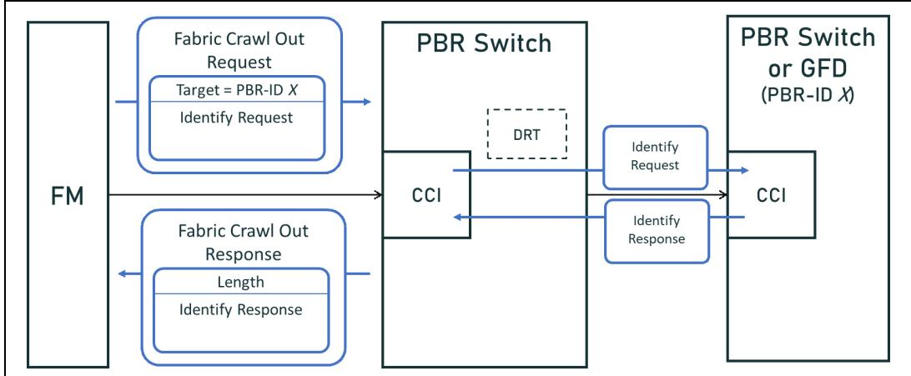  
The Management Command input payload field includes the tunneled command encapsulated in the CCI Message Format, as defined in Figure 7-19. This can include an additional layer of tunneling for commands issued to components with no assigned PID, as illustrated in Figure 7-56.  
Figure 7-56. Tunneling Commands to Remote Devices with No Assigned PID

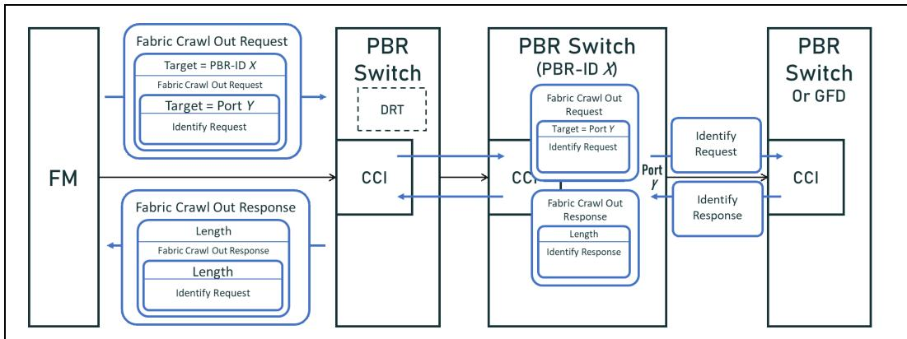

Response size varies, based on the tunneled command’s definition. Valid targets for the tunneled commands include PBR switch ports, and PBR devices within a fabric.

This command fails with Invalid Input if the target specifies a nonexistent switch port or a PID with no valid entry in the DRT.

Components shall terminate the processing of a request that includes more than two layers of tunneling and provide an Unsupported return code.

Possible Command Return Codes:

• Success

• Unsupported

• Invalid Input

• Internal Error

• Retry Required

Command Effects:

• None

Table 7-115. Fabric Crawl Out Request Payload

<table><tr><td>Byte Offset</td><td>Length in Bytes</td><td>Description</td></tr><tr><td>0h</td><td>2</td><td>Target: Encoding depends on Target Type:• Target Type = 0:— Bits[7:0]: Port Number: Switch shall transmit command out specified egress port.— Bits[15:8]: Reserved.• Target Type = 1:— Bits[11:0]: PBR-ID: Target PID. Switch shall determine egress port using DRT.— Bits[15:12]: Reserved.• All other encodings are reserved</td></tr><tr><td>2h</td><td>1</td><td>• Bits[3:0]: Target Type: Specifies the type of tunneling target for this command:— 0h = Port Number: Indicates that the tunneling target is a component on the far end of a switch port— 1h = PBR-ID: Indicates that the tunneling target is a component in the PBR fabric address by a PID— All other encodings are reserved• Bits[7:4]: Reserved</td></tr><tr><td>3h</td><td>1</td><td>Reserved</td></tr><tr><td>4h</td><td>2</td><td>Command Size: Number of valid bytes in Management Command.</td></tr><tr><td>6h</td><td>Varies</td><td>Management Command: Request message formatted in the CCI Message Format as defined in Figure 7-19.</td></tr></table>

## Table 7-116. Fabric Crawl Out Response Payload

<table><tr><td>Byte Offset</td><td>Length in Bytes</td><td>Description</td></tr><tr><td>0h</td><td>2</td><td>Response Length: Number of valid bytes in Response Message.</td></tr><tr><td>2h</td><td>2</td><td>Reserved</td></tr><tr><td>4h</td><td>Varies</td><td>Response Message: Response message formatted in the CCI Message Format as defined in Figure 7-19.</td></tr></table>

## 7.7.13.3 Get PBR Link Partner Info (Opcode 5702h)

This command reads the data received from the latest “Link Partner Info” VDM on a PBR link.

Possible Command Return Codes:

• Success

• Unsupported

• Invalid Input

• Internal Error

• Retry Required

Command Effects:

• None

Table 7-117. Get PBR Link Partner Info Request Payload

<table><tr><td>Byte Offset</td><td>Length in Bytes</td><td>Description</td></tr><tr><td>0h</td><td>1h</td><td>Number of Ports: Number of ports requested.</td></tr><tr><td>1h</td><td>Varies</td><td>Port ID List: 1-byte ID of requested port, repeated Number of Ports times.</td></tr></table>

Table 7-118. Get PBR Link Partner Info Response Payload

<table><tr><td>Byte Offset</td><td>Length in Bytes</td><td>Description</td></tr><tr><td>0h</td><td>1</td><td>Number of Ports: Number of port information blocks returned.</td></tr><tr><td>1h</td><td>3</td><td>Reserved</td></tr><tr><td>4h</td><td>Varies</td><td>Link Partner Info List: Link Partner Info block as defined in Table 7-119, repeated Number of Ports times.</td></tr></table>

Table 7-119. Get Link Partner Info Block Format

<table><tr><td>Byte Offset</td><td>Length in Bytes</td><td>Description</td></tr><tr><td>00h</td><td>1</td><td>Port ID: Number of the port that is reporting this Link Partner Info.</td></tr><tr><td>01h</td><td>1</td><td>Far End Port ID: Port Number (Port ID) of the source (sender) of the Link Partner Info VDM.</td></tr><tr><td>02h</td><td>2</td><td>Bits[11:0]: PID: As reported in Link Partner Info VDMBits[15:12]: Device Type: As reported in Link Partner Info VDM</td></tr><tr><td>04h</td><td>10h</td><td>Link Partner ID: As reported in Link Partner Info VDM.</td></tr><tr><td>14h</td><td>1</td><td>Standard FC VC List: As reported in Link Partner Info VDM.</td></tr><tr><td>15h</td><td>1</td><td>UIO FC VC List: As reported in Link Partner Info VDM.</td></tr><tr><td>16h</td><td>10h</td><td>Primary FM UUID: As reported in Link Partner Info VDM.</td></tr><tr><td>26h</td><td>10h</td><td>Secondary FM UUID: As reported in Link Partner Info VDM.</td></tr></table>

## 7.7.13.4 Get PID Target List (Opcode 5703h)

This command retrieves the list of targets within a PBR switch to which a PID may be assigned. This does not include the PID assigned to the switch itself as part of the Claim FM Ownership command. As outlined in Section 7.7.6.5, the following restrictions apply when assigning PIDs:

• A fabric port may be assigned one PID that can be shared among multiple fabric ports

• A Downstream Edge Port may be assigned one PID that must be unique

• A Host Edge Port may be assigned more than one PID, each of which must be unique

Possible Command Return Codes:

• Success

• Unsupported

• Invalid Input

• Internal Error

• Retry Required

Command Effects:

• None

Table 7-120. Get PID Target List Request Payload

<table><tr><td>Byte Offset</td><td>Length in Bytes</td><td>Description</td></tr><tr><td>0h</td><td>2</td><td>Start Index: Index of first target to return.</td></tr><tr><td>2h</td><td>2</td><td>Number of Targets: Maximum number of targets to return.</td></tr></table>

Table 7-121. Get PID Target List Response Payload

<table><tr><td>Byte Offset</td><td>Length in Bytes</td><td>Description</td></tr><tr><td>0h</td><td>2</td><td>Total Number of Targets: Total number of PID targets supported by the device.</td></tr><tr><td>2h</td><td>2</td><td>Number of Targets: Number of targets returned in Target List.</td></tr><tr><td>4h</td><td>Varies</td><td>Target List: List of PID target as defined in Table 7-122.</td></tr></table>

Table 7-122. Target List Format

<table><tr><td>Byte Offset</td><td>Length in Bytes</td><td>Description</td></tr><tr><td>0h</td><td>2</td><td>Target ID: ID of PID Target for use in Configure PID Assignment.</td></tr><tr><td>2h</td><td>1</td><td>Bits[2:0]: Target Type: — 000b = Fabric Port — 001b = Host Edge Port (USP/GAE) — 010b = Downstream Edge Port — All other encodings are reservedBits[7:3]: Reserved</td></tr><tr><td>3h</td><td>1</td><td>Instance ID: Index of PID for targets that can support multiple PIDs.</td></tr><tr><td>4h</td><td>1</td><td>VCS ID: ID of associated VCS. Valid only when Target Type is 1 (Host Edge Port).</td></tr><tr><td>5h</td><td>1</td><td>Physical Port ID: Physical Port ID of the target.</td></tr><tr><td>6h</td><td>2</td><td>Bits[11:0]: PID: Current PID assignment. FFFh if unassigned.Bits[15:12]: Reserved.</td></tr></table>

## 7.7.13.5 Configure PID Assignment (Opcode 5704h)

This command is used to assign PIDs to targets within a PBR switch.

Note:

This command does not update the corresponding DRT entries for assigned or cleared PIDs. The DRT must be updated separately, using the Set DRT command as necessary.

This command shall return Invalid Input under the following conditions:

• Specified target is invalid

• PID has already been assigned to another target within the switch

Possible Command Return Codes:

• Success

• Unsupported

• Invalid Input

• Internal Error

• Retry Required

Command Effects:

• None

Table 7-123. Configure PID Assignment Request Payload

<table><tr><td>Byte Offset</td><td>Length in Bytes</td><td>Description</td></tr><tr><td>0h</td><td>1</td><td>Bits[2:0]:Operation: Specifies the PID assignment operation: 000b = Assign PID 001b = Clear PID All other encodings are reservedBits[7:3]:Reserved</td></tr><tr><td>2h</td><td>2</td><td>Number of Targets:Number of entries in PID Assignment List.</td></tr><tr><td>4h</td><td>Varies</td><td>PID Assignment List:List of PID assignments as defined inTable 7-124.</td></tr></table>

Table 7-124. PID Assignment

<table><tr><td>Byte Offset</td><td>Length in Bytes</td><td>Description</td></tr><tr><td>0h</td><td>2</td><td>Bits[11:0]: PID: PID to assign to the specified targetBits[15:12]: Reserved</td></tr><tr><td>2h</td><td>2</td><td>Target ID: Index of PID target, as reported in Get PID Target List response.</td></tr><tr><td>4h</td><td>1</td><td>Instance ID: Index of PID for targets that can support multiple PIDs.</td></tr></table>

## 7.7.13.6 Get PID Binding (Opcode 5705h)

This command reads the binding of Downstream ES PIDs to Upstream ES vDSPs or Upstream ES USP PIDs to Downstream ES vUSPs. The output also includes latency and BW values for the fabric routing path for use in generating associated CDAT information.

Possible Command Return Codes:

• Success

• Unsupported

• Invalid Input

• Internal Error

• Retry Required

• Busy

Command Effects:

• Background Operation

Table 7-125. Get PID Binding Request Payload

<table><tr><td>Byte Offset</td><td>Length in Bytes</td><td>Description</td></tr><tr><td>0h</td><td>1</td><td>Target VCS: ID of the VCS to query.</td></tr><tr><td>1h</td><td>1</td><td>Target vPPB: Index of the vPPB to query. Reserved when the binding target is a Host ES VCS.</td></tr></table>

Table 7-126. Get PID Binding Response Payload

<table><tr><td>Byte Offset</td><td>Length in Bytes</td><td>Description</td></tr><tr><td>00h</td><td>2</td><td>Bits[11:0]: PID: PID of the remote binding target. FFFh if unbound.Bits[15:12]: Reserved.</td></tr><tr><td>02h</td><td>2</td><td>Reserved</td></tr><tr><td>04h</td><td>8</td><td>Latency Entry Base Unit: Latency Entry Base Unit for path between host and target device, as defined in ACPI HMAT System Locality Latency and Bandwidth Information Structure. Valid only when the binding target is a Downstream ES VCS.</td></tr><tr><td>0Ch</td><td>2</td><td>Latency Entry: Latency Entry for path between host and target device, as defined in ACPI HMAT System Locality Latency and Bandwidth Information Structure. Valid only when the binding target is a Downstream ES VCS.</td></tr><tr><td>0Eh</td><td>8</td><td>BW Entry Base Unit: Bandwidth Entry Base Unit for path between host and target device, as defined in ACPI HMAT System Locality Latency and Bandwidth Information Structure. Valid only when the binding target is a Downstream ES VCS.</td></tr><tr><td>16h</td><td>2</td><td>BW Entry: Bandwidth Entry for path between host and target device, as defined in ACPI HMAT System Locality Latency and Bandwidth Information Structure. Valid only when the binding target is a Downstream ES VCS.</td></tr></table>

## 7.7.13.7

## Configure PID Binding (Opcode 5706h)

This command configures the binding of a PID to a target. It is used to bind:

• Downstream ES PIDs to Upstream ES vDSPs

• Upstream ES USP PIDs to Downstream ES vUSPs

The command input includes latency and BW values for the fabric routing path for use in generating associated CDAT information.

Possible Command Return Codes:

• Success

• Unsupported

• Background Command Started

• Invalid Input

• Internal Error

• Retry Required

• Busy

Command Effects:

• Background Operation

Table 7-127. Configure PID Binding Request Payload (Sheet 1 of 2)

<table><tr><td>Byte Offset</td><td>Length in Bytes</td><td>Description</td></tr><tr><td>00h</td><td>1</td><td>Bits[2:0]:Operation:- 000b = Bind- 001b = Unbind- All other encodings are reservedBits[7:3]:Reserved</td></tr><tr><td>01h</td><td>1</td><td>Target VCS: ID of the VCS to which the PID is being bound.</td></tr><tr><td>02h</td><td>1</td><td>Target vPPB: Index of the vPPB to which the PID is being bound. Reserved when the binding target is a Downstream ES VCS.</td></tr></table>

Table 7-127. Configure PID Binding Request Payload (Sheet 2 of 2)

<table><tr><td>Byte Offset</td><td>Length in Bytes</td><td>Description</td></tr><tr><td>03h</td><td>1</td><td>Reserved</td></tr><tr><td>04h</td><td>2</td><td>Bits[11:0]: PID: PID of the remote binding targetBits[15:12]: Reserved</td></tr><tr><td>06h</td><td>2</td><td>Reserved</td></tr><tr><td>08h</td><td>8</td><td>Latency Entry Base Unit: Latency Entry Base Unit for path between host and target device, as defined in ACPI HMAT System Locality Latency and Bandwidth Information Structure. Reserved when the binding target is a Host ES VCS.</td></tr><tr><td>10h</td><td>2</td><td>Latency Entry: Latency Entry for path between host and target device, as defined in ACPI HMAT System Locality Latency and Bandwidth Information Structure. Reserved when the binding target is a Host ES VCS.</td></tr><tr><td>12h</td><td>8</td><td>BW Entry Base Unit: Bandwidth Entry Base Unit for path between host and target device, as defined in ACPI HMAT System Locality Latency and Bandwidth Information Structure. Reserved when the binding target is a Host ES VCS.</td></tr><tr><td>1Ah</td><td>2</td><td>BW Entry: Bandwidth Entry for path between host and target device, as defined in ACPI HMAT System Locality Latency and Bandwidth Information Structure. Reserved when the binding target is a Host ES VCS.</td></tr></table>

## 7.7.13.8 Get Table Descriptors (Opcode 5707h)

This command reads descriptors of the DPID Routing Tables and Routing Group Tables in a PBR Switch.

Possible Command Return Codes:

• Success

• Unsupported

• Invalid Input

• Internal Error

• Retry Required

Command Effects:

• None

Table 7-128. Get Table Descriptors Request Payload

<table><tr><td>Byte Offset</td><td>Length in Bytes</td><td>Description</td></tr><tr><td>0h</td><td>2</td><td>Start Index: Starting index into list of descriptors.</td></tr><tr><td>2h</td><td>2</td><td>Number of Descriptors: Number of descriptors to read.</td></tr></table>

Table 7-129. Get Table Descriptors Response Payload

<table><tr><td>Byte Offset</td><td>Length in Bytes</td><td>Description</td></tr><tr><td>0h</td><td>2</td><td>Start Index: Starting index into list of descriptors.</td></tr><tr><td>2h</td><td>2</td><td>Number of Descriptors: Number of table descriptors.</td></tr><tr><td>4h</td><td>Varies</td><td>Get Table Descriptors List: List of table descriptors as defined in Table 7-130.</td></tr></table>

Table 7-130. Get Table Descriptor Format

<table><tr><td>Byte Offset</td><td>Length in Bytes</td><td>Description</td></tr><tr><td>0h</td><td>1</td><td>Bits[1:0]: Table Type:- 00b = DRT- 01b = RGT- All other encodings are reservedBits[7:2]: Reserved</td></tr><tr><td>1h</td><td>2</td><td>Table Index: Index of table.</td></tr><tr><td>3h</td><td>20h</td><td>Active Port Mask: Bitmask defining which ports actively use (1) or do not actively use (0) this table. Bit position corresponds to physical port number.</td></tr><tr><td>23h</td><td>4</td><td>Reserved</td></tr></table>

7.7.13.9 Get DRT (Opcode 5708h)

This command reads the DPID Routing Tables in a PBR Switch.

Possible Command Return Codes:

• Success

• Unsupported

• Invalid Input

• Internal Error

• Retry Required

Command Effects:

• None

Table 7-131. Get DRT Request Payload

<table><tr><td>Byte Offset</td><td>Length in Bytes</td><td>Description</td></tr><tr><td>0h</td><td>1</td><td>DRT Index: Index of DRT to read.</td></tr><tr><td>1h</td><td>1</td><td>Reserved</td></tr><tr><td>2h</td><td>2</td><td>Number of Entries: Number of DRT entries to read.</td></tr><tr><td>4h</td><td>2</td><td>Start Entry: Starting index into DRT entries.</td></tr></table>

Table 7-132. Get DRT Response Payload

<table><tr><td>Byte Offset</td><td>Length in Bytes</td><td>Description</td></tr><tr><td>0h</td><td>1</td><td>DRT Index: Index of DRT.</td></tr><tr><td>1h</td><td>1</td><td>Reserved</td></tr><tr><td>2h</td><td>2</td><td>Number of Entries: Number of DRT entries.</td></tr><tr><td>4h</td><td>2</td><td>Start Entry: Starting index into DRT entries.</td></tr><tr><td>6h</td><td>1</td><td>Associated RGT Index: Index of RGT used by this DRT.</td></tr><tr><td>7h</td><td>1</td><td>Reserved</td></tr><tr><td>8h</td><td>Varies</td><td>DRT Entry List: List of DRT entry values as defined in Table 7-133.</td></tr></table>

Table 7-133. DRT Entry Format

<table><tr><td>Byte Offset</td><td>Length in Bytes</td><td>Description</td></tr><tr><td>0h</td><td>1</td><td>Bits[1:0]:Entry Type:Type of routing target specifier and M2S Req routing:00b = Invalid01b = Physical Port number10b = RGT index11b = ReservedBits[7:2]:Reserved</td></tr><tr><td>1h</td><td>1</td><td>Routing Target:Encoding depends onEntry Type:00h = Reserved01h = Physical port number02h = RGT entry index</td></tr></table>

## 7.7.13.10 Set DRT (Opcode 5709h)

This command sets the DPID Routing Tables in a PBR Switch.

Possible Command Return Codes:

• Success

• Unsupported

• Invalid Input

• Internal Error

• Retry Required

Command Effects:

• None

Table 7-134. Set DRT Request Payload

<table><tr><td>Byte Offset</td><td>Length in Bytes</td><td>Description</td></tr><tr><td>0h</td><td>1</td><td>DRT Index: Index of DRT to configure.</td></tr><tr><td>1h</td><td>1</td><td>Reserved</td></tr><tr><td>2h</td><td>2</td><td>Number of Entries: Number of DRT entries to configure.</td></tr><tr><td>4h</td><td>2</td><td>Start Entry: Starting index into DRT entries.</td></tr><tr><td>6h</td><td>Varies</td><td>DRT Entry List: List of DRT entry values as defined in Table 7-133.</td></tr></table>

## 7.7.13.11 Get RGT (Opcode 570Ah)

This command reads the Routing Group Tables in a PBR Switch.

Possible Command Return Codes:

• Success

• Unsupported

• Invalid Input

• Internal Error

• Retry Required

Command Effects:

• None

Table 7-135. Get RGT Request Payload

<table><tr><td>Byte Offset</td><td>Length in Bytes</td><td>Description</td></tr><tr><td>0h</td><td>1</td><td>RGT Index: Index of RGT.</td></tr><tr><td>1h</td><td>1</td><td>Reserved</td></tr><tr><td>2h</td><td>2</td><td>Number of Entries: Number of RGT entries.</td></tr><tr><td>4h</td><td>2</td><td>Start Entry: Starting index into RGT entries.</td></tr></table>

Table 7-136. Get RGT Response Payload

<table><tr><td>Byte Offset</td><td>Length in Bytes</td><td>Description</td></tr><tr><td>0h</td><td>1</td><td>RGT Index: Index of RGT.</td></tr><tr><td>1h</td><td>1</td><td>Reserved</td></tr><tr><td>2h</td><td>2</td><td>Number of Entries: Number of RGT entries.</td></tr><tr><td>4h</td><td>2</td><td>Start Entry: Starting index into RGT entries.</td></tr><tr><td>6h</td><td>Varies</td><td>RGT Entry List: List of RGT entry values as defined in Table 7-137.</td></tr></table>

Table 7-137. RGT Entry Format

<table><tr><td>Byte Offset</td><td>Length in Bytes</td><td>Description</td></tr><tr><td>0h</td><td>1</td><td>Egress Port[0]: Physical port number.</td></tr><tr><td>1h</td><td>1</td><td>Egress Port[1]: Physical port number.</td></tr><tr><td>2h</td><td>1</td><td>Egress Port[2]: Physical port number.</td></tr><tr><td>3h</td><td>1</td><td>Egress Port[3]: Physical port number.</td></tr><tr><td>4h</td><td>1</td><td>Egress Port[4]: Physical port number.</td></tr><tr><td>5h</td><td>1</td><td>Egress Port[5]: Physical port number.</td></tr><tr><td>6h</td><td>1</td><td>Egress Port[6]: Physical port number.</td></tr><tr><td>7h</td><td>1</td><td>Egress Port[7]: Physical port number.</td></tr><tr><td>8h</td><td>1</td><td>Bits[2:0]: Highest Valid Entry: Highest index in the Egress Port list that is valid.Bits[5:3]: Highest Primary Entry: Highest index in the Egress Port list that specifies a primary routing path. Subsequent valid egress ports are considered secondary paths.Bits[7:6]: Reserved.</td></tr><tr><td>9h</td><td>1</td><td>Bits[2:0]: Dynamic Routing Mode: Specifies the dynamic routing mode to be used for this entry:000b = Random001b = Congestion Avoidance010b = Advanced Congestion Avoidance011b, 101b = Reserved110b, 111b = Vendor-specificBits[5:3]: Mix Setting: Specifies the mix used for dynamic routing mode, as defined in Section 7.7.6.3Bits[7:6]: Reserved</td></tr><tr><td>Ah</td><td>2</td><td>Reserved</td></tr></table>

## 7.7.13.12 Set RGT (Opcode 570Bh)

This command configures the Routing Group Tables in a PBR switch.

Possible Command Return Codes:

• Success

• Unsupported

• Invalid Input

• Internal Error

• Retry Required

Command Effects:

• None

Table 7-138. Set RGT Request Payload

<table><tr><td>Byte Offset</td><td>Length in Bytes</td><td>Description</td></tr><tr><td>0h</td><td>1</td><td>RGT Index: Index of RGT to configure.</td></tr><tr><td>1h</td><td>1</td><td>Reserved</td></tr><tr><td>2h</td><td>2</td><td>Number of Entries: Number of RGT entries to configure.</td></tr><tr><td>4h</td><td>2</td><td>Start Entry: Starting index into RGT entries.</td></tr><tr><td>6h</td><td>Varies</td><td>RGT Entry List: List of RGT entry values as defined in Table 7-136.</td></tr></table>

## 7.7.13.13 Get LDST/IDT Capabilities (Opcode 570Ch)

This command retrieves a vPPB’s LDST and IDT Capabilities, per Section 7.7.9.

Possible Command Return Codes:

• Success

• Unsupported

• Invalid Input

• Internal Error

• Retry Required

Command Effects:

• None

Table 7-139. Get LDST/IDT Capabilities Request Payload

<table><tr><td>Byte Offset</td><td>Length in Bytes</td><td>Description</td></tr><tr><td>0h</td><td>1</td><td>vPPB Instance: The value of 0 represents USP. The values of 1 and above represent the DSP vPPBs in increasing Device Number, Function Number order, as defined in Section 7.1.4.</td></tr></table>

Table 7-140. Get LDST/IDT Capabilities Response Payload

<table><tr><td>Byte Offset</td><td>Length in Bytes</td><td>Description</td></tr><tr><td>0h</td><td>1</td><td>vPPB Instance: The value of 0 represents USP. The values of 1 and above represent the DSP vPPBs in increasing Device Number, Function Number order, as defined in Section 7.1.4.</td></tr><tr><td>1h</td><td>2</td><td>Number of Segments: Number of LDST segments that are supported by this LDST/IDT. The number of entries must be 0 or a power of 2.</td></tr><tr><td>3h</td><td>1</td><td>LDST Segment SizeBits[2:0]: LSegSz per the FSegSz encoding defined in Table 7-83Bits[7:3]: ReservedThe device shall return 0h if this value has not been initialized.</td></tr><tr><td>4h</td><td>2</td><td>Number of IDT: Number of Interleave Device Table entries supported by this LDST/IDT.</td></tr><tr><td>6h</td><td>2</td><td>Number of Completer ID-Based Re-Routers: Number of Completer ID-Based Re-Router entries supported by this LDST/IDT.</td></tr><tr><td>8h</td><td>2</td><td>Bits[11:0]: Local PID: PID assigned to this vPPB. FFFh if unassigned.Bits[15:12]: Reserved.</td></tr><tr><td>Ah</td><td>8</td><td>Fabric Base: Base HPA of this LDST.FabricBase shall be aligned to the programmed LDST Segment Size.The device shall return 0h if this value has not been initialized.</td></tr><tr><td>12h</td><td>8</td><td>Fabric Limit: Upper HPA of this LDST. Shall be greater than FabricBase. Shall be aligned to the programmed LDST Segment Size.The device shall return 0h if this value has not been initialized.</td></tr></table>

## 7.7.13.14 Set LDST/IDT Configuration (Opcode 570Dh)

This command sets the GAE’s LDST and IDT Capabilities, per Section 7.7.9. Because the FabricBase and FabricLimit values must be aligned to the programmed LDST Segment Size, all three Host-chosen values are configured in one request.

Possible Command Return Codes:

• Success

• Unsupported

• Invalid Input

• Internal Error

• Retry Required

Command Effects:

• Immediate Configuration Change

Table 7-141. Set LDST/IDT Configuration Request Payload

<table><tr><td>Byte Offset</td><td>Length in Bytes</td><td>Description</td></tr><tr><td>0h</td><td>1</td><td>vPPB Instance: The value of 0 represents USP. The values of 1 and above represent the DSP vPPBs in increasing Device Number, Function Number order, as defined in Section 7.1.4.</td></tr><tr><td>1h</td><td>1</td><td>LDST Segment SizeBits[2:0]: LSegSz per the FSegSz encoding defined in Table 7-83Bits[7:3]: Reserved</td></tr><tr><td>2h</td><td>8</td><td>FabricBase: Base HPA of this LDST. FabricBase shall be aligned to the programmed LDST Segment Size. The value 0h will disable this LDST/IDT decoder.</td></tr><tr><td>Ah</td><td>8</td><td>FabricLimit: Upper HPA of this LDST. Shall be greater than FabricBase. Shall be aligned to the programmed LDST Segment Size. The value 0h will disable this LDST/IDT decoder.</td></tr></table>

## 7.7.13.15 Get LDST Segment Entries (Opcode 570Eh)

This command reads the configuration of LDST Segment entries. The Host is responsible for mapping the LD-FAM range of HPAs to the appropriate number of available Segment Entries. Should the Host or the GAE have limited message payload capacity, the Host shall be responsible for breaking up the configuration operation into suitably sized requests.

Possible Command Return Codes:

• Success

• Unsupported

• Invalid Input

• Internal Error

• Retry Required

Command Effects:

• None

Table 7-142. Get LDST Segment Entries Request Payload

<table><tr><td>Byte Offset</td><td>Length in Bytes</td><td>Description</td></tr><tr><td>0h</td><td>1</td><td>vPPB Instance: The value of 0 represents USP. The values of 1 and above represent the DSP vPPBs in increasing Device Number, Function Number order, as defined in Section 7.1.4.</td></tr><tr><td>1h</td><td>1</td><td>Reserved</td></tr><tr><td>2h</td><td>2</td><td>Seg Count: Number of LDST Segment Entries requested. Value should be &gt;0 and not more than the lesser of the total Segment table entries available, or that number of entries that can be contained in the maximum message size handled by the host and the target GAE.</td></tr><tr><td>4h</td><td>2</td><td>Starting Segment Index: Index of the first segment being requested. An index of 0 shall designate the configuration of the  $1^{st}$  Segment, corresponding to HPA = FabricBase. The starting index given shall not be larger than the maximum segment entry number supported. The starting index Plus the Seg Count value shall not be larger than the maximum segment entry number supported.</td></tr></table>

Table 7-143. Get LDST Segment Entries Response Payload

<table><tr><td>Byte Offset</td><td>Length in Bytes</td><td>Description</td></tr><tr><td>0h</td><td>2</td><td>Seg Count: Number of LDST Segment Entries described in the Seg Entry_List[ ]. Value should be &gt;0 and not more than the lesser of the total Segment table entries available, or that number of entries that can be contained in the maximum message size handled by the host and the target GAE.</td></tr><tr><td>2h</td><td>2</td><td>Starting Segment Index: Index of the first segment being returned. An index of 0 shall designate the configuration of the  $1^{st}$  Segment, corresponding to HPA = FabricBase. The starting index given shall not be larger than the maximum segment entry number supported. The starting index Plus the Seg Count value shall not be larger than the maximum segment entry number supported.</td></tr><tr><td>4h</td><td>Varies</td><td>Segment List[ ]: List of Segment Entries as defined in Table 7-144.</td></tr></table>

Table 7-144. LDST Segment Entry Format

<table><tr><td>Byte Offset</td><td>Length in Bytes</td><td>Description</td></tr><tr><td>0h</td><td>1</td><td>ValidBit[0]: Valid Entry: As per Figure 7-31Bit[1]: Enable PCIe Segment: Indicates that the target is in a separate PCIe segment, thus the request will include the requester&#x27;s segment numberBits[7:2]: Reserved</td></tr><tr><td>1h</td><td>1</td><td>IntlvBits[3:0]: Interleave Mode: As per Table 7-84Bits[7:4]: Reserved</td></tr><tr><td>2h</td><td>1</td><td>GranBits[3:0]: Interleave Granularity: As per Table 7-85Bits[7:4]: Reserved</td></tr><tr><td>3h</td><td>1</td><td>Reserved</td></tr><tr><td>4h</td><td>2</td><td>DPID/IX: DPID or IDT Index, depending on Intlv field value:Bits[11:0]:If Intlv == 0, this is the actual DPID to which the LD-FAM request is to be sent.Else, this is Index of the IDT entry that contains the DPID of the first EP in the interleave set. See Figure 7-31 and the description of interleaving in Section 7.7.2.4.Bits[15:12]: Reserved</td></tr><tr><td>6h</td><td>2</td><td>Reserved</td></tr></table>

## 7.7.13.16 Set LDST Segment Entries (Opcode 570Fh)

This command is used by the Host to set the configuration of LDST Segment entries. The Host is responsible for mapping the LD-FAM range of HPAs to the appropriate number of available Segment Entries, per Section 7.7.2.4. Should the Host or the GAE have limited message payload capacity, the Host shall be responsible for breaking up the configuration operation into suitably sized requests.

This command fails with Invalid Input if access to the specified DPID is not enabled in the LAV.

Possible Command Return Codes:

• Success

• Unsupported

• Invalid Input

• Internal Error

• Retry Required

Command Effects:

• Immediate Configuration Change

## Table 7-145. Set LDST Segment Entries Request Payload

<table><tr><td>Byte Offset</td><td>Length in Bytes</td><td>Description</td></tr><tr><td>0h</td><td>1</td><td>vPPB Instance: The value of 0 represents USP. The values of 1 and above represent the DSP vPPBs in increasing Device Number, Function Number order, as defined in Section 7.1.4.</td></tr><tr><td>1h</td><td>1</td><td>Reserved</td></tr><tr><td>2h</td><td>2</td><td>Seg Count: Number of LDST Segment Entries described in the Seg Entry_List[ ]. Value should be &gt;0 and not more than the lesser of the total Segment table entries available, or that number of entries that can be contained in the maximum message size handled by the host and the target GAE.</td></tr><tr><td>4h</td><td>2</td><td>Starting Segment Index: Index of the first segment being configured. An index of 0 shall designate the configuration of the  $1^{st}$  Segment, corresponding to HPA = FabricBase. The starting index given shall not be larger than the maximum segment entry number supported. The starting index Plus the Seg Count value shall not be larger than the maximum segment entry number supported.</td></tr><tr><td>6h</td><td>Varies</td><td>Segment List[ ]: List of Segment Entries as defined in Table 7-144.</td></tr></table>

## 7.7.13.17 Get LDST IDT DPID Entries (Opcode 5710h)

This command reads the configuration of IDT entries that are used by the LDST. The Host is responsible for mapping the capacity of specific devices targeted by LDST into interleaved regions of HPA. Should the Host or the switch mailbox have limited message payload capacity, the Host shall be responsible for breaking up the configuration operation into suitably sized requests.

Possible Command Return Codes:

• Success

• Unsupported

• Invalid Input

• Internal Error

• Retry Required

Command Effects:

• None

Table 7-146. Get LDST IDT DPID Entries Request Payload

<table><tr><td>Byte Offset</td><td>Length in Bytes</td><td>Description</td></tr><tr><td>0h</td><td>1</td><td>vPPB Instance: The value of 0 represents USP. The values of 1 and above represent the DSP vPPBs in increasing Device Number, Function Number order, as defined in Section 7.1.4.</td></tr><tr><td>1h</td><td>1</td><td>Reserved</td></tr><tr><td>2h</td><td>2</td><td>LDST IDT Entry Count: Number of LDST IDT Entries requested. Value should be &gt;0 and not more than the lesser of the total LDST IDT table entries available, or that number of entries that can be contained in the maximum message size handled by the host and the target switch mailbox.</td></tr><tr><td>4h</td><td>2</td><td>Starting LDST IDT Entry Index: Index of the first LDST IDT entry being requested. An index of 0 shall designate the configuration of the  $1^{st}$ entry. The starting index Plus the LDST IDT Entry Count value shall not be larger than the maximum LDST IDT entry number supported.</td></tr></table>

Table 7-147. Get LDST IDT DPID Entries Response Payload

<table><tr><td>Byte Offset</td><td>Length in Bytes</td><td>Description</td></tr><tr><td>0h</td><td>2</td><td>LDST IDT Entry Count:Number of LDST IDT Entries returned. Value should be &gt;0 and not more than the lesser of the total LDST IDT table entries available, or that number of entries that can be contained in the maximum message size handled by the host and the target switch mailbox.</td></tr><tr><td>2h</td><td>2</td><td>Starting LDST IDT Entry Index:Index of the first LDST IDT entry being returned. An index of 0 shall designate the configuration of the  $1^{st}$ entry. The starting index Plus the LDST IDT Entry Count value shall not be larger than the maximum LDST IDT entry number supported.</td></tr><tr><td>4h</td><td>Varies</td><td>LDST IDT DPID[ ]:DPID of the target device for the LDST IDT entry. See Figure 7-31and the description of interleaving in Section 7.7.2.4.Repeats LDST IDT Entry Count number of times.•Bits[11:0]: PID of the target device•Bits[15:12]:Reserved</td></tr></table>

## 7.7.13.18 Set LDST IDT DPID Entries (Opcode 5711h)

This command sets the configuration of IDT entries that are used by the LDST. The Host is responsible for mapping the capacity of specific devices targeted by LDST into interleaved regions of HPA. Should the Host or the switch mailbox have limited message payload capacity, the Host shall be responsible for breaking up the configuration operation into suitably sized requests.

Possible Command Return Codes:

• Success

• Unsupported

• Invalid Input

• Internal Error

• Retry Required

Command Effects:

• Immediate Configuration Change

Table 7-148. Set LDST IDT DPID Entries Request Payload

<table><tr><td>Byte Offset</td><td>Length in Bytes</td><td>Description</td></tr><tr><td>0h</td><td>1</td><td>vPPB Instance: The value of 0 represents USP. The values of 1 and above represent the DSP vPPBs in increasing Device Number, Function Number order, as defined in Section 7.1.4.</td></tr><tr><td>1h</td><td>1</td><td>Reserved</td></tr><tr><td>2h</td><td>2</td><td>LDST IDT Entry Count: Number of LDST IDT Entries being configured. Value should be &gt;0 and not more than the lesser of the total LDST IDT table entries available, or that number of entries that can be contained in the maximum message size handled by the host and the target switch mailbox.</td></tr><tr><td>4h</td><td>2</td><td>Starting LDST IDT Entry Index: Index of the first LDST IDT entry being configured. An index of 0 shall designate the configuration of the  $1^{st}$  entry. The starting index Plus the LDST IDT Entry Count value shall not be larger than the maximum LDST IDT entry number supported.</td></tr><tr><td>6h</td><td>2</td><td>Reserved</td></tr><tr><td>8h</td><td>Varies</td><td>LDST IDT DPID: DPID of the device for the LDST IDT entry. See Figure 7-31 and the description of interleaving in Section 7.7.2.4.Repeats LDST IDT Entry Count number of times.• Bits[11:0]: PID of the target device• Bits[15:12]: Reserved</td></tr></table>

## 7.7.13.19 Get Completer ID-Based Re-Router Entries (Opcode 5712h)

This command reads the configuration of Completer ID-Based Re-Router entries.

Possible Command Return Codes:

• Success

• Unsupported

• Invalid Input

• Internal Error

• Retry Required

Command Effects:

• None

Table 7-149. Get Completer ID-Based Re-Router Entries Request Payload

<table><tr><td>Byte Offset</td><td>Length in Bytes</td><td>Description</td></tr><tr><td>0h</td><td>1</td><td>vPPB Instance: The value of 0 represents USP. The values of 1 and above represent the DSP vPPBs in increasing Device Number, Function Number order, as defined in Section 7.1.4.</td></tr><tr><td>1h</td><td>1</td><td>Reserved</td></tr><tr><td>2h</td><td>2</td><td>Completer ID-Based Re-Router Entry Count: Number of Completer ID-Based Re-Router Entries requested. Value should be &gt;0 and not more than the lesser of the total Completer ID-Based Re-Router table entries available, or that number of entries that can be contained in the maximum message size handled by the host and the target GAE.</td></tr><tr><td>4h</td><td>2</td><td>Starting Completer ID-Based Re-Router Entry Index: Index of the first Completer ID-Based Re-Router entry being requested. An index of 0 shall designate the configuration of the  $1^{st}$  entry. The starting index Plus the Completer ID-Based Re-Router Entry Count value shall not be larger than the maximum Completer ID-Based Re-Router entry number supported.</td></tr></table>

Table 7-150. Get Completer ID-Based Re-Router Entries Response Payload

<table><tr><td>Byte Offset</td><td>Length in Bytes</td><td>Description</td></tr><tr><td>0h</td><td>2</td><td>Completer ID-Based Re-Router Entry Count: Number of Completer ID-Based Re-Router Entries returned. Value should be &gt;0 and not more than the lesser of the total Completer ID-Based Re-Router table entries available, or that number of entries that can be contained in the maximum message size handled by the host and the target GAE.</td></tr><tr><td>2h</td><td>2</td><td>Starting Completer ID-Based Re-Router Entry Index: Index of the first Completer ID-Based Re-Router entry being returned. An index of 0 shall designate the configuration of the  $1^{st}$ entry. The starting index Plus the Completer ID-Based Re-Router Entry Count value shall not be larger than the maximum Completer ID-Based Re-Router entry number supported.</td></tr><tr><td>4h</td><td>Varies</td><td>Completer ID-Based Re-Router Entry List[ ]: As defined in Table 7-151.Repeats Completer ID-Based Re-Router Entry Count number of times.</td></tr></table>

Table 7-151. Completer ID-Based Re-Router Entry

<table><tr><td>Byte Offset</td><td>Length in Bytes</td><td>Description</td></tr><tr><td>0h</td><td>2</td><td>Completer ID-Based Re-Router DPID[ ]: DPID of the requester for the Completer ID-Based Re-Router entry.• Bits[11:0]: PID of the requester• Bit[12]: Enable PCIe Segment: Indicates that the requester is in a separate PCIe segment, so the request will include the requester&#x27;s and completer&#x27;s segment numbers• Bits[15:13]: Reserved</td></tr><tr><td>2h</td><td>1</td><td>Requester PCIe Segment: PCIe Segment number for the requester. Valid only if Enable PCIe Segment is set.</td></tr><tr><td>3h</td><td>1</td><td>Requester Bus Number: PCIe Bus number for requester.</td></tr><tr><td>4h</td><td>1</td><td>• Bits[2:0]: Requester Function Number: PCIe Function number for requester• Bits[7:3]: Requester Device Number: PCIe Device number for requester</td></tr></table>

## 7.7.13.20 Set Completer ID-Based Re-Router Entries (Opcode 5713h)

This command sets the configuration of Completer ID-Based Re-Router entries.

This command fails with Invalid Input if access to the specified DPID is not enabled in the LAV.

Possible Command Return Codes:

• Success

• Unsupported

• Invalid Input

• Internal Error

• Retry Required

Command Effects:

• Immediate Configuration Change

Table 7-152. Set Completer ID-Based Re-Router Entries Request Payload

<table><tr><td>Byte Offset</td><td>Length in Bytes</td><td>Description</td></tr><tr><td>0h</td><td>1</td><td>vPPB Instance: The value of 0 represents USP. The values of 1 and above represent the DSP vPPBs in increasing Device Number, Function Number order, as defined in Section 7.1.4.</td></tr><tr><td>1h</td><td>1</td><td>Reserved</td></tr><tr><td>2h</td><td>2</td><td>Completer ID-Based Re-Router Entry Count: Number of Completer ID-Based Re-Router Entries being configured. Value should be &gt;0 and not more than the lesser of the total Completer ID-Based Re-Router table entries available, or that number of entries that can be contained in the maximum message size handled by the host and the target GAE.</td></tr><tr><td>4h</td><td>2</td><td>Starting Completer ID-Based Re-Router Entry Index: Index of the first Completer ID-Based Re-Router entry being configured. An index of 0 shall designate the configuration of the  $1^{st}$  entry. The starting index given shall not be larger than the maximum Completer ID-Based Re-Router entry number supported. The starting index Plus the Completer ID-Based Re-Router Entry Count value shall not be larger than the maximum Completer ID-Based Re-Router entry number supported.</td></tr><tr><td>6h</td><td>Varies</td><td>Completer ID-Based Re-Router Entry List[ ]: As defined in Table 7-151. Repeats Completer ID-Based Re-Router Entry Count number of times.</td></tr></table>

## 7.7.13.21 Get LDST Access Vector (Opcode 5714h)

This command is used by the host to query its current LAV.

This command will return Invalid Input when the requested byte range exceeds the size of the access vector buffer, as defined in Table 7-166.

Possible Command Return Codes:

• Success

• Unsupported

• Invalid Input

• Internal Error

• Retry Required

Command Effects:

• None

Table 7-153. Get LDST Access Vector Request Payload

<table><tr><td>Byte Offset</td><td>Length in Bytes</td><td>Description</td></tr><tr><td>0h</td><td>4</td><td>Start Byte: Offset in bytes into Vector Data.</td></tr><tr><td>4h</td><td>4</td><td>Number of Bytes: Size in bytes of Vector Data requested.</td></tr></table>

Table 7-154. Get LDST Access Vector Response Payload

<table><tr><td>Byte Offset</td><td>Length in Bytes</td><td>Description</td></tr><tr><td>0h</td><td>4</td><td>Number of Bytes: Size in bytes of Vector Data returned.</td></tr><tr><td>4h</td><td>Varies</td><td>Vector Data: Excerpt of data from LDST Access Vector, defined in Table 7-155. Excerpt begins a Start Byte and is Number of Bytes long.</td></tr></table>

Table 7-155. LDST Access Vector

<table><tr><td>Byte Offset</td><td>Length in Bytes</td><td>Description</td></tr><tr><td>000h</td><td>200h</td><td>LDST Access Vector: 4-Kb vector in which each bit corresponds to the associated PID (i.e., bit n represents PID n). A value of 1 in a bit position indicates that LDST and ID-Based Re-Router access to the corresponding PID is enabled. A value of 0 in a bit position indicates that access to the corresponding PID is blocked.</td></tr></table>

## 7.7.13.22 Get VCS LDST Access Vector (Opcode 5715h)

This command is used by the FM to query a VCS’s current LAV.

This command will return Invalid Input when the requested byte range exceeds the size of the access vector buffer, as defined in Table 7-166.

Possible Command Return Codes:

• Success

• Unsupported

• Invalid Input

• Internal Error

• Retry Required

Command Effects:

• None

Table 7-156. Get VCS LDST Access Vector Request Payload

<table><tr><td>Byte Offset</td><td>Length in Bytes</td><td>Description</td></tr><tr><td>0h</td><td>1</td><td>VCS ID: ID of VCS to query.</td></tr><tr><td>1h</td><td>3</td><td>Reserved</td></tr><tr><td>4h</td><td>4</td><td>Start Byte: Offset in bytes into Vector Data.</td></tr><tr><td>8h</td><td>4</td><td>Number of Bytes: Size in bytes of Vector Data requested.</td></tr></table>

The Get VCS LDST Access Vector Response Payload is defined in Table 7-154.

## 7.7.13.23 Configure VCS LDST Access (Opcode 5716h)

This command is used by the FM to control access to a specified PID as reported in the LAV.

Possible Command return codes:

• Success

• Unsupported

• Invalid Input

• Internal Error

• Retry Required

Command Effects:

• None

able 7-157. Configure VCS LDST Access Request Payload

<table><tr><td>Byte Offset</td><td>Length in Bytes</td><td>Description</td></tr><tr><td>0h</td><td>1</td><td>VCS ID: ID of VCS to configure.</td></tr><tr><td>1h</td><td>1</td><td>Reserved</td></tr><tr><td>2h</td><td>2</td><td>Bits[11:0]: PID: PID of LDST or Completer ID-Based Re-Router targetBits[14:12]: Operation: Specifies which configuration to perform:- 000b = Enable PID access in the LAV- 001b = Disable PID access in the LAV- All other encodings are reservedBit[15]: Reserved</td></tr></table>

## Global Memory Access Endpoint Command Set

This command set is used by a host to discover and manage the structures and devices involved in providing access to G-FAM and GIM resources.

## 7.7.14.1 Identify GAE (Opcode 5800h)

This command is used by the Host to query a GAE’s capabilities, including maximum number of supported enabled PIDs and maximum number of simultaneous outstanding proxy operations and VendPrefixL0 support. It also reports the remaining number of proxy threads currently available.

Possible Command Return Codes:

• Success

• Unsupported

• Invalid Input

• Internal Error

• Retry Required

Command Effects:

• None

Table 7-158. Identify GAE Request Payload

<table><tr><td>Byte Offset</td><td>Length in Bytes</td><td>Description</td></tr><tr><td>0h</td><td>1</td><td>Start vPPB Instance: Index of vPPB whose FAST Segment Info should be provided in the first entry in vPPB Global Memory Support Info List. The value of 0 represents the GAE. The values of 1 and above represent the DSP vPPBs in increasing Device Number, Function Number order, as defined in Section 7.1.4.</td></tr><tr><td>1h</td><td>1</td><td>Number of vPPBs: Number of vPPBs in vPPB Global Memory Support Info List.</td></tr></table>

Table 7-159. Identify GAE Response Payload

<table><tr><td>Byte Offset</td><td>Length in Bytes</td><td>Description</td></tr><tr><td>0h</td><td>2</td><td>Bits[11:0]: Total Number of Supported Enabled PIDs: Maximum number of PIDs that can be enabled for concurrent use with the Configure VCS PID Access commandBit[12]: Egress Request/Ingress Completion VendPrefixL0 Supported: Indicates whether VendPrefixL0 is supported (1) or not supported (0) for Egress UIO Requests and Ingress UIO completions, as configured by the FM for this host with the Set VendPrefixL0 State commandBit[13]: Ingress Request VendPrefixL0 Supported: Indicates whether VendPrefixL0 is supported (1) or not supported (0) for Ingress UIO requests, as configured by the FM for this host with the Set VendPrefixL0 State commandBit[14]: G-FAM/GIM Configuration Supported: Indicates whether the switch supports (1) or does not support (0) re-configuration of the GIM Support bit with the Set FAST Segment Entry commandBit[15]: Reserved</td></tr><tr><td>2h</td><td>2</td><td>Total Number of Supported Threads: Maximum number of simultaneous proxy operations supported by the GAE.</td></tr><tr><td>4h</td><td>2</td><td>Number of Available Threads: Remaining number of simultaneous proxy operations supported by the GAE.</td></tr><tr><td>6h</td><td>1</td><td>Start vPPB Instance: Index of vPPB whose FAST Segment Info is provided in the first entry in vPPB Global Memory Support Info List.</td></tr><tr><td>7h</td><td>1</td><td>Number of vPPBs: Number of vPPBs whose FAST Segment Info is provided in the first entry in vPPB Global Memory Support Info List.</td></tr><tr><td>8h</td><td>Varies</td><td>vPPB Global Memory Support Info List: List of vPPB Global Memory Support Info, as defined in Table 7-160, for the vPPBs identified with Start vPPB Instance and Number of vPPBs.</td></tr></table>

Table 7-160. vPPB Global Memory Support Info

<table><tr><td>Byte Offset</td><td>Length in Bytes</td><td>Description</td></tr><tr><td>0h</td><td>2</td><td>Number of FAST Segments: Total number of segments in the FAST for the specified GAE/vPPB.</td></tr><tr><td>2h</td><td>2</td><td>Reserved</td></tr></table>

## 7.7.14.2 Get PID Interrupt Vector (Opcode 5801h)

This command queries a GAE’s PID interrupt vector.

Possible Command Return Codes:

• Success

• Unsupported

• Invalid Input

• Internal Error

• Retry Required

Command Effects:

• None

Table 7-161. Get PID Interrupt Vector Request Payload

<table><tr><td>Byte Offset</td><td>Length in Bytes</td><td>Description</td></tr><tr><td>0h</td><td>4</td><td>Start Byte: Offset in bytes into PID Interrupt Vector.</td></tr><tr><td>4h</td><td>4</td><td>Number of Bytes: Size in bytes of PID Interrupt Vector requested.</td></tr><tr><td>8h</td><td>1</td><td>Bit[0]: Clear on Read: A value of 1 indicates that the PID Interrupt Vector should be cleared to all 0s when this command completes. A GAE must ensure that no interrupts are lost in between capturing the current PID Interrupt Vector value for the response payload and clearing the vector&#x27;s contents.Bits[7:1]: Reserved.</td></tr></table>

Table 7-162. Get PID Interrupt Vector Response Payload

<table><tr><td>Byte Offset</td><td>Length in Bytes</td><td>Description</td></tr><tr><td>0h</td><td>4</td><td>Number of Bytes: Size in bytes of PID Interrupt Vector returned.</td></tr><tr><td>4h</td><td>Varies</td><td>PID Interrupt Vector Data: Excerpt of data from PID Interrupt Vector, defined in Table 7-163. Excerpt begins a Start Byte and is Number of Bytes long.</td></tr></table>

Table 7-163. PID Interrupt Vector

<table><tr><td>Byte Offset</td><td>Length in Bytes</td><td>Description</td></tr><tr><td>000h</td><td>200h</td><td>PID Interrupt Vector: 4-Kb vector in which each bit corresponds to the associated PID (i.e., bit n represents PID n). A value of 1 in a bit position indicates that the GAE has received a GAM VDM from the corresponding PID since the PID Interrupt Vector was last cleared.</td></tr></table>

## 7.7.14.3 Get PID Access Vectors (Opcode 5802h)

This command is used by the Host to query a GAE’s current GFD Mapping Vector and VendPrefixL0 Target Vector.

This command will return Invalid Input when the requested byte range exceeds the size of the access vector buffer, as defined in Table 7-166.

Possible Command Return Codes:

• Success

• Unsupported

• Invalid Input

• Internal Error

• Retry Required

Command Effects:

• None

Table 7-164. Get PID Access Vectors Request Payload

<table><tr><td>Byte Offset</td><td>Length in Bytes</td><td>Description</td></tr><tr><td>0h</td><td>4</td><td>Start Byte: Offset in bytes into Vector Data.</td></tr><tr><td>1h</td><td>4</td><td>Number of Bytes: Size in bytes of Vector Data requested.</td></tr></table>

Table 7-165. Get PID Access Vectors Response Payload

<table><tr><td>Byte Offset</td><td>Length in Bytes</td><td>Description</td></tr><tr><td>0h</td><td>4</td><td>Number of Bytes: Size in bytes of Vector Data returned.</td></tr><tr><td>4h</td><td>Varies</td><td>Vector Data: Excerpt of data from PID Access Vector, defined in Table 7-166. Excerpt begins a Start Byte and is Number of Bytes long.</td></tr></table>

Table 7-166. PID Access Vector

<table><tr><td>Byte Offset</td><td>Length in Bytes</td><td>Description</td></tr><tr><td>000h</td><td>200h</td><td>GFD Mapping Vector: 4-Kb vector in which each bit corresponds to the associated PID (i.e., bit n represents PID n). A value of 1 in a bit position indicates that FAST access to the corresponding PID is enabled. A value of 0 in a bit position indicates that access to the corresponding PID is blocked.</td></tr><tr><td>200h</td><td>200h</td><td>VendPrefixL0 Target Vector: 4-Kb vector in which each bit corresponds to the associated PID (i.e., bit n represents PID n). A value of 1 in a bit position indicates that VendPrefixL0 access to the corresponding PID is enabled. A value of 0 in a bit position indicates that access to the corresponding PID is blocked.</td></tr></table>

## 7.7.14.4 Get FAST/IDT Capabilities (Opcode 5803h)

This command is used by the Host to retrieve the GAE’s FAST and IDT Capabilities, per Section 7.7.2.4.

The host should re-discover the FAST/IDT Capabilities of a vPPB after a Presence Detect Changed notification has been received indicating that an adapter is present if the vPPB supports Presence Detect, or when a Link Up is detected if the vPPB does not support Presence Detect.

Possible Command Return Codes:

• Success

• Unsupported

• Invalid Input

• Internal Error

• Retry Required

Command Effects:

• None

Table 7-167. Get FAST/IDT Capabilities Request Payload

<table><tr><td>Byte Offset</td><td>Length in Bytes</td><td>Description</td></tr><tr><td>0h</td><td>1</td><td>vPPB Instance: The value of 0 represents GAE. The values of 1 and above represent the DSP vPPBs in increasing Device Number, Function Number order, as defined in Section 7.1.4.</td></tr><tr><td>1h</td><td>3</td><td>Reserved</td></tr></table>

Table 7-168. Get FAST/IDT Capabilities Response Payload

<table><tr><td>Byte Offset</td><td>Length in Bytes</td><td>Description</td></tr><tr><td>0h</td><td>1</td><td>vPPB Instance: The value of 0 represents USP. The values of 1 and above represent the DSP vPPBs in increasing Device Number, Function Number order, as defined in Section 7.1.4.</td></tr><tr><td>1h</td><td>2</td><td>Number of Segments: Number of FAST segments that are supported by this FAST/IDT. The number of entries must be 0 or a power of 2.</td></tr><tr><td>3h</td><td>1</td><td>FAST Segment SizeBits[2:0]: FSegSz per Table 7-83Bits[7:3]: ReservedThe device shall return 0h if this value has not been initialized.</td></tr><tr><td>4h</td><td>2</td><td>Number of IDT: Number of Interleave Device Table entries supported by this FAST/IDT.</td></tr><tr><td>6h</td><td>1</td><td>vPPB PID List Length: Number of PIDs assigned to this vPPB, as reported in vPPB PID List. Shall be 0 for vDSPs and vUSPs.</td></tr><tr><td>7h</td><td>1</td><td>Bit[0]: Egress Request/Ingress Completion VendPrefixL0 Enabled: Indicates whether VendPrefixL0 is enabled (1) or disabled (0) for Egress UIO Requests and Ingress UIO completionsBit[1]: Ingress Request VendPrefixL0 Enabled: Indicates whether VendPrefixL0 is enabled (1) or disabled (0) for Ingress UIO requestsBit[7:2]: Reserved</td></tr><tr><td>8h</td><td>2</td><td>Reserved</td></tr><tr><td>Ah</td><td>8</td><td>Fabric Base: Base HPA of this FAST.The device shall return 0h if this value has not been initialized.</td></tr><tr><td>12h</td><td>8</td><td>Fabric Limit: Upper HPA of this FAST.The device shall return 0h if this value has not been initialized.</td></tr><tr><td>1Ah</td><td>Varies</td><td>vPPB PID: List of PIDs assigned to this vPPB, as defined in Table 7-169.</td></tr></table>

Table 7-169. vPPB PID List Entry Format

<table><tr><td>Byte Offset</td><td>Length in Bytes</td><td>Description</td></tr><tr><td>0h</td><td>2d</td><td>Bits[11:0]: vPPB PID: PID assigned to the vPPBBits[15:12]: Reserved</td></tr></table>

## 7.7.14.5 Set FAST/IDT Configuration (Opcode 5804h)

This command is used by the Host to set the GAE’s FAST and IDT Capabilities, per Section 7.7.2.4. Because the FabricBase and FabricLimit values must be aligned to the programmed FAST Segment Size, all three Host-chosen values are configured in one request.

Possible Command Return Codes:

• Success

• Unsupported

• Invalid Input

• Internal Error

• Retry Required

Command Effects:

• Immediate Configuration Change

## Table 7-170. Set FAST/IDT Configuration Request Payload

<table><tr><td>Byte Offset</td><td>Length in Bytes</td><td>Description</td></tr><tr><td>0h</td><td>1</td><td>vPPB Instance: The value of 0 represents USP. The values of 1 and above represent the DSP vPPBs in increasing Device Number, Function Number order, as defined in Section 7.1.4.</td></tr><tr><td>1h</td><td>1</td><td>FAST Segment SizeBits[2:0]: FSegSz per Table 7-83Bits[7:3]: Reserved</td></tr><tr><td>2h</td><td>1</td><td>Bit[0]: Enable Egress Request/Ingress Completion VendPrefixL0: Configures whether VendPrefixL0 is enabled (1) or disabled (0) for Egress UIO Requests and Ingress UIO completionsBit[1]: Enable Ingress Request VendPrefixL0: Configures whether VendPrefixL0 is enabled (1) or disabled (0) for Ingress UIO requestsBit[7:2]: Reserved</td></tr><tr><td>3h</td><td>1</td><td>Reserved</td></tr><tr><td>4h</td><td>8</td><td>FabricBase: Base HPA of this FAST. FabricBase shall be aligned to the programmed FAST Segment Size. The value 0h will disable this FAST/IDT decoder.</td></tr><tr><td>Ch</td><td>8</td><td>FabricLimit: Upper HPA of this FAST. Shall be greater than FabricBase. Shall be aligned to the programmed FAST Segment Size. The value 0h will disable this FAST/IDT decoder.</td></tr></table>

## 7.7.14.6 Get FAST Segment Entries (Opcode 5805h)

This command reads the configuration of FAST Segment entries. The Host is responsible for mapping the GFAM range of HPAs to the appropriate number of available Segment Entries. Should the Host or the GAE have limited message payload capacity, the Host shall be responsible for breaking up the configuration operation into suitably sized requests.

Possible Command Return Codes:

• Success

• Unsupported

• Invalid Input

• Internal Error

• Retry Required

Command Effects:

• None

Table 7-171. Get FAST Segment Entries Request Payload

<table><tr><td>Byte Offset</td><td>Length in Bytes</td><td>Description</td></tr><tr><td>0h</td><td>1</td><td>vPPB Instance: The value of 0 represents USP. The values of 1 and above represent the DSP vPPBs in increasing Device Number, Function Number order, as defined in Section 7.1.4.</td></tr><tr><td>1h</td><td>1</td><td>Reserved</td></tr><tr><td>2h</td><td>2</td><td>Seg Count: Number of FAST Segment Entries requested. Value should be &gt;0 and not more than the lesser of the total Segment table entries available, or that number of entries that can be contained in the maximum message size handled by the host and the target GAE.</td></tr><tr><td>4h</td><td>2</td><td>Starting Segment Index: Index of the first segment being requested. An index of 0 shall designate the configuration of the  $1^{st}$  Segment, corresponding to HPA = FabricBase. The starting index Plus the Seg Count value shall not be larger than the maximum segment entry number supported.</td></tr></table>

Table 7-172. Get FAST Segment Entries Response Payload

<table><tr><td>Byte Offset</td><td>Length in Bytes</td><td>Description</td></tr><tr><td>0h</td><td>2</td><td>Seg Count: Number of FAST Segment Entries described in the Seg Entry_List[ ]. Value should be &gt;0 and not more than the lesser of the total Segment table entries available, or that number of entries that can be contained in the maximum message size handled by the host and the target GAE.</td></tr><tr><td>2h</td><td>2</td><td>Starting Segment Index: Index of the first segment being returned. An index of 0 shall designate the configuration of the  $1^{st}$  Segment, corresponding to HPA = FabricBase. The starting index Plus the Seg Count value shall not be larger than the maximum segment entry number supported.</td></tr><tr><td>4h</td><td>Varies</td><td>Segment List[ ]: List of Segment Entries as defined in Table 7-173.</td></tr></table>

Table 7-173. FAST Segment Entry Format

<table><tr><td>Byte Offset</td><td>Length in Bytes</td><td>Description</td></tr><tr><td>0h</td><td>1</td><td>ValidBit[0]: Valid Entry: As per Figure 7-31Bit[1]: GIM Segment: Segment used for GIM accessBits[7:2]: Reserved</td></tr><tr><td>1h</td><td>1</td><td>IntlvBits[3:0]: Interleave Mode: As per Table 7-84Bits[7:4]: Reserved</td></tr><tr><td>2h</td><td>1</td><td>GranBits[3:0]: Interleave Granularity: As per Table 7-85Bits[7:4]: Reserved</td></tr><tr><td>3h</td><td>1</td><td>Reserved</td></tr><tr><td>4h</td><td>2</td><td>DPID/IX: DPID or IDT Index, depending on Intlv field value:Bits[11:0]:If Intlv == 0, this is the actual DPID to which the GFAM request is to be sent.Else, this is Index of the IDT entry that contains the DPID of the first GFD in the interleave set. See Figure 7-31 and the description of interleaving in Section 7.7.2.4.Bits[15:12]: Reserved</td></tr><tr><td>6h</td><td>2</td><td>Reserved</td></tr></table>

## 7.7.14.7 Set FAST Segment Entries (Opcode 5806h)

This command is used by the Host to set the configuration of FAST Segment entries. The Host is responsible for mapping the GFAM range of HPAs to the appropriate number of available Segment Entries, per Section 7.7.2.4. Should the host or the GAE have limited message payload capacity, the Host shall be responsible for breaking up the configuration operation into suitably sized requests.

There are two types of segments: those that access G-FAM, and those that access GIM. Valid PID targets for G-FAM segments are defined in the GMV. Valid targets for GIM segments are defined in the VTV.

This command will complete with an Invalid Input status if the requester is not authorized to access the specified ID, as advertised by the GMV or VTV.

Possible Command Return Codes:

• Success

• Unsupported

• Invalid Input

• Internal Error

• Retry Required

Command Effects:

• Immediate Configuration Change

Table 7-174. Set FAST Segment Entries Request Payload

<table><tr><td>Byte Offset</td><td>Length in Bytes</td><td>Description</td></tr><tr><td>0h</td><td>1</td><td>vPPB Instance: The value of 0 represents USP. The values of 1 and above represent the DSP vPPBs in increasing Device Number, Function Number order, as defined in Section 7.1.4.</td></tr><tr><td>1h</td><td>1</td><td>Reserved</td></tr><tr><td>2h</td><td>2</td><td>Seg Count: Number of FAST Segment Entries described in the Seg Entry_List[ ]. Value should be &gt;0 and not more than the lesser of the total Segment table entries available, or that number of entries that can be contained in the maximum message size handled by the host and the target GAE.</td></tr><tr><td>4h</td><td>2</td><td>Starting Segment Index: Index of the first segment being configured. An index of 0 shall designate the configuration of the  $1^{st}$  Segment, corresponding to HPA = FabricBase. The starting index Plus the Seg Count value shall not be larger than the maximum segment entry number supported.</td></tr><tr><td>6h</td><td>Varies</td><td>Segment List[ ]: List of Segment Entries as defined in Table 7-173.</td></tr></table>

## 7.7.14.8 Get IDT DPID Entries (Opcode 5807h)

This command reads the configuration of IDT entries. The Host is responsible for mapping the capacity of specific GFDs into interleaved regions of HPA. Should the Host or the GAE have limited message payload capacity, the Host shall be responsible for breaking up the configuration operation into suitably sized requests.

Possible Command Return Codes:

• Success

• Unsupported

• Invalid Input

• Internal Error

• Retry Required

Command Effects:

• None

Table 7-175. Get IDT DPID Entries Request Payload

<table><tr><td>Byte Offset</td><td>Length in Bytes</td><td>Description</td></tr><tr><td>0h</td><td>1</td><td>vPPB Instance: The value of 0 represents USP. The values of 1 and above represent the DSP vPPBs in increasing Device Number, Function Number order, as defined in Section 7.1.4.</td></tr><tr><td>1h</td><td>1</td><td>Reserved</td></tr><tr><td>2h</td><td>2</td><td>IDT Entry Count: Number of IDT Entries requested. Value should be &gt;0 and not more than the lesser of the total IDT table entries available, or that number of entries that can be contained in the maximum message size handled by the host and the target GAE.</td></tr><tr><td>4h</td><td>2</td><td>Starting IDT Entry Index: Index of the first IDT entry being requested. An index of 0 shall designate the configuration of the  $1^{st}$ entry. The starting index Plus the IDT Entry Count value shall not be larger than the maximum IDT entry number supported.</td></tr></table>

Table 7-176. Get IDT DPID Entries Response Payload

<table><tr><td>Byte Offset</td><td>Length in Bytes</td><td>Description</td></tr><tr><td>0h</td><td>2</td><td>IDT Entry Count:Number of IDT Entries returned. Value should be &gt;0 and not more than the lesser of the total IDT table entries available, or that number of entries that can be contained in the maximum message size handled by the host and the target GAE.</td></tr><tr><td>2h</td><td>2</td><td>Starting IDT Entry Index:Index of the first IDT entry being returned. An index of 0 shall designate the configuration of the  $1^{st}$ entry. The starting index Plus the IDT Entry Count value shall not be larger than the maximum IDT entry number supported.</td></tr><tr><td>4h</td><td>Varies</td><td>IDT DPID[ ]:DPID of the GFD for the IDT entry. See Figure 7-31and the description of interleaving in Section 7.7.2.4.Repeats IDT Entry Count number of times.•Bits[11:0]: PID of the target GFD•Bits[15:12]:Reserved</td></tr></table>

## 7.7.14.9 Set IDT DPID Entries (Opcode 5808h)

This command sets the configuration of IDT entries. The Host is responsible for mapping the capacity of specific GFDs into interleaved regions of HPA. Should the Host or the GAE have limited message payload capacity, the Host shall be responsible for breaking up the configuration operation into suitably sized requests.

Possible Command Return Codes:

• Success

• Unsupported

• Invalid Input

• Internal Error

• Retry Required

Command Effects:

• Immediate Configuration Change

Table 7-177. Set IDT DPID Entries Request Payload

<table><tr><td>Byte Offset</td><td>Length in Bytes</td><td>Description</td></tr><tr><td>0h</td><td>1</td><td>vPPB Instance: The value of 0 represents USP. The values of 1 and above represent the DSP vPPBs in increasing Device Number, Function Number order, as defined in Section 7.1.4.</td></tr><tr><td>1h</td><td>1</td><td>Reserved</td></tr><tr><td>2h</td><td>2</td><td>IDT Entry Count: Number of IDT Entries being configured. Value should be &gt;0 and not more than the lesser of the total IDT table entries available, or that number of entries that can be contained in the maximum message size handled by the host and the target GAE.</td></tr><tr><td>4h</td><td>2</td><td>Starting IDT Entry Index: Index of the first IDT entry being configured. An index of 0 shall designate the configuration of the  $1^{st}$ entry. The starting index Plus the IDT Entry Count value shall not be larger than the maximum IDT entry number supported.</td></tr><tr><td>6h</td><td>2</td><td>Reserved</td></tr><tr><td>8h</td><td>Varies</td><td>IDT DPID: DPID of the GFD for the IDT entry. See Figure 7-31 and the description of interleaving in Section 7.7.2.4.Repeats IDT Entry Count number of times.• Bits[11:0]: PID of the target GFD• Bits[15:12]: Reserved</td></tr></table>

## 7.7.14.10 Proxy GFD Management Command (Opcode 5809h)

This command is used to initiate the transfer of a management command to a GFD, as defined in Section 3.1.11.1.

Only one proxy request may be outstanding per target PID regardless of the number of available proxy threads. A proxy request that targets a PID with an existing outstanding proxy request shall fail with Invalid Input. The command shall fail with Resources Exhausted if there are no available proxy operation threads.

The GAE increments and tracks Command Sequence Number on a per-Target PID basis.

This command will complete with an Invalid Input status if the requester is not authorized to access the specified ID, as advertised by the GMV.

Possible Command Return Codes:

• Success

• Unsupported

• Invalid Input

• Internal Error

• Retry Required

• Resources Exhausted

Command Effects:

• None

Table 7-178. Proxy GFD Management Command Request Payload

<table><tr><td>Byte Offset</td><td>Length in Bytes</td><td>Description</td></tr><tr><td>00h</td><td>2</td><td>Bits[11:0]: PBR-ID: Target PID for the management commandBits[15:12]: Reserved</td></tr><tr><td>02h</td><td>8</td><td>Request Address: Pointer to request message in Host memory that is formatted in the CCI Message Format as defined in Figure 7-19.</td></tr><tr><td>0Ah</td><td>2</td><td>Request Size: Size of the request at Request Address in bytes.</td></tr><tr><td>0Ch</td><td>8</td><td>Response Address: Pointer in Host memory at which the response should be written. The response shall be formatted in the CCI Message Format as defined in Figure 7-19.</td></tr><tr><td>14h</td><td>2</td><td>Maximum Response Size: Size of the response at Request Address in bytes.</td></tr></table>

Table 7-179. Proxy GFD Management Command Response Payload

<table><tr><td>Byte Offset</td><td>Length in Bytes</td><td>Description</td></tr><tr><td>0h</td><td>1</td><td>Bits[2:0]:Command Sequence Number:Proxy thread identifier for use withGet Proxy Thread StatusrequestBits[7:3]:Reserved</td></tr><tr><td>1h</td><td>2</td><td>Number of Available Threads:Remaining number of simultaneous proxy operations supported by the GAE.</td></tr></table>

## 7.7.14.11 Get Proxy Thread Status (Opcode 580Ah)

This command queries whether the GAE is tracking the specified Command Sequence Number and Target PID as ‘In Progress’.

Possible Command Return Codes:

• Success

• Unsupported

• Invalid Input

• Internal Error

• Retry Required

Command Effects:

• None

Table 7-180. Get Proxy Thread Status Request Payload

<table><tr><td>Byte Offset</td><td>Length in Bytes</td><td>Description</td></tr><tr><td>0h</td><td>2</td><td>Bits[11:0]: PBR-ID: Target PID for the management commandBits[14:12]: Command Sequence Number: Proxy thread identifier returned by Proxy GFD Management Command requestBit[15]: Reserved</td></tr></table>

Table 7-181. Get Proxy Thread Status Response Payload

<table><tr><td>Byte Offset</td><td>Length in Bytes</td><td>Description</td></tr><tr><td>0h</td><td>1</td><td>Bit[0]:In Progress:A value of 1 indicates that the GAE is tracking the specified Thread Handle. A value of 0 indicates that the GAE is not tracking the specified Thread Handle.Bits[7:1]:Reserved.</td></tr><tr><td>1h</td><td>1</td><td>Reserved</td></tr><tr><td>2h</td><td>2</td><td>Number of Available Threads:Remaining number of simultaneous proxy operations supported by the GAE.</td></tr></table>

## 7.7.14.12 Cancel Proxy Thread (Opcode 580Bh)

This command effectively cancels a proxy thread that is in progress by instructing the GAE to no longer track the specified thread handle as ‘In Progress’. The GAE shall discard any transactions associated with threads that are not being tracked as ‘In Progress’.

Possible Command Return Codes:

• Success

• Unsupported

• Invalid Input

• Internal Error

• Retry Required

Command Effects:

• None

Table 7-182. Cancel Proxy Thread Request Payload

<table><tr><td>Byte Offset</td><td>Length in Bytes</td><td>Description</td></tr><tr><td>0h</td><td>2</td><td>Bits[11:0]: PBR-ID: Target PID for the management commandBits[14:12]: Command Sequence Number: Proxy thread identifier returned by Proxy GFD Management Command requestBit[15]: Reserved</td></tr></table>

Table 7-183. Cancel Proxy Thread Response Payload

<table><tr><td>Byte Offset</td><td>Length in Bytes</td><td>Description</td></tr><tr><td>0h</td><td>2</td><td>Number of Available Threads: Remaining number of simultaneous proxy operations supported by the GAE.</td></tr></table>

## 7.7.15 Global Memory Access Endpoint Management Command Set

This command set is used by the FM to discover and manage the structures and devices involved in providing access to G-FAM and GIM resources.

## 7.7.15.1 Identify VCS GAE (Opcode 5900h)

This command is used by the FM to query a GAE’s capabilities, including maximum number of supported enabled PIDs and maximum number of simultaneous outstanding proxy operations and VendPrefixL0 support. It also reports the remaining number of proxy threads currently available.

Possible Command Return Codes:

• Success

• Unsupported

• Invalid Input

• Internal Error

• Retry Required

Command Effects:

• None

Table 7-184. Identify VCS GAE Request Payload

<table><tr><td>Byte Offset</td><td>Length in Bytes</td><td>Description</td></tr><tr><td>0h</td><td>1</td><td>VCS ID: ID of VCS to query.</td></tr><tr><td>1h</td><td>1</td><td>Start vPPB Instance: Index of vPPB whose FAST Segment Info should be provided in the first entry in vPPB Global Memory Support Info List. The value of 0 represents the GAE. The values of 1 and above represent the DSP vPPBs in increasing Device Number, Function Number order, as defined in Section 7.1.4.</td></tr><tr><td>2h</td><td>1</td><td>Number of vPPBs: Number of vPPBs whose FAST Segment Info should be provided in vPPB Global Memory Support Info List.</td></tr></table>

The Identify VCS GAE Response Payload is defined in Table 7-159.

## 7.7.15.2 Get VCS PID Access Vectors (Opcode 5901h)

This command is used by the FM to query a GAE’s current GFD Mapping Vector and VendPrefixL0 Target Vector.

This command will return Invalid Input under the following conditions:

• The requested byte range exceeds the size of the access vector buffer, as defined in Table 7-166

• The specified VCS does not include a GAE

Possible Command Return Codes:

• Success

• Unsupported

• Invalid Input

• Internal Error

• Retry Required

Command Effects:

• None

Table 7-185. Get VCS PID Access Vectors Request Payload

<table><tr><td>Byte Offset</td><td>Length in Bytes</td><td>Description</td></tr><tr><td>0h</td><td>1</td><td>VCS ID: ID of VCS to query.</td></tr><tr><td>1h</td><td>3</td><td>Reserved</td></tr><tr><td>4h</td><td>4</td><td>Start Byte: Offset in bytes into Vector Data.</td></tr><tr><td>8h</td><td>4</td><td>Number of Bytes: Size in bytes of Vector Data requested.</td></tr></table>

The Get VCS PID Access Vectors Response Payload is defined in Table 7-165.

## 7.7.15.3 Configure VCS PID Access (Opcode 5902h)

This command is used by the FM to control access to a specified PID as reported in the GFD Mapping Vector or VendPrefixL0 Target Vector. It is used by the FM to enable or disable access to a PID from a GAE.

Possible Command return codes:

• Success

• Unsupported

• Invalid Input

• Internal Error

• Retry Required

Command Effects:

• None

Table 7-186. Configure VCS PID Access Request Payload

<table><tr><td>Byte Offset</td><td>Length in Bytes</td><td>Description</td></tr><tr><td>0h</td><td>1</td><td>VCS ID: ID of VCS to configure.</td></tr><tr><td>1h</td><td>1</td><td>Reserved</td></tr><tr><td>2h</td><td>2</td><td>Bits[11:0]: PID: PID of GFD or VendPrefixL0 targetBits[14:12]: Operation: Specifies which configuration to perform:- 000b = Enable PID access in the GMV- 001b = Disable PID access in the GMV- 010b = Enable PID access in the VTV- 011b = Disable PID access in the VTV- 100b = Update Latency/BW- All other encodings are reservedBit[15]: Reserved</td></tr><tr><td>4h</td><td>8</td><td>Latency Entry Base Unit: Latency Entry Base Unit for path between host and target device, as defined in ACPI HMAT System Locality Latency and Bandwidth Information Structure. Reserved whenOperationis 001b or 011b.</td></tr><tr><td>Ch</td><td>2</td><td>Latency Entry: Latency Entry for path between host and target device, as defined in ACPI HMAT System Locality Latency and Bandwidth Information Structure. Reserved whenOperationis 001b or 011b.</td></tr><tr><td>Eh</td><td>8</td><td>BW Entry Base Unit: Bandwidth Entry Base Unit for path between host and target device, as defined in ACPI HMAT System Locality Latency and Bandwidth Information Structure. Reserved whenOperationis 001b or 011b.</td></tr><tr><td>16h</td><td>2</td><td>BW Entry: Bandwidth Entry for path between host and target device, as defined in ACPI HMAT System Locality Latency and Bandwidth Information Structure. Reserved whenOperationis 001b or 011b.</td></tr></table>

## 7.7.15.4 Get VendPrefixL0 State (Opcode 5903h)

This command is used by the FM to query the enable state of VendPrefixL0 in a VCS. Support for this command indicates whether a PBR switch supports VendPrefixL0. The Get VendPrefixL0 State command shall only be implemented by PBR switches that support VendPrefixL0.

Possible Command Return Codes:

• Success

• Unsupported

• Invalid Input

• Internal Error

• Retry Required

Command Effects:

• None

Table 7-187. Get VendPrefixL0 State Request Payload

<table><tr><td>Byte Offset</td><td>Length in Bytes</td><td>Description</td></tr><tr><td>0h</td><td>1</td><td>VCS ID: ID of the VCS to which the GAE or vPPB belongs.</td></tr></table>

Table 7-188. Get VendPrefixL0 State Response Payload

<table><tr><td>Byte Offset</td><td>Length in Bytes</td><td>Description</td></tr><tr><td>0h</td><td>1</td><td>Bit[0]: Egress Request/Ingress Completion VendPrefixL0 Enabled: Indicates whether support for VendPrefixL0 is enabled (1) or disabled (0) for Egress UIO Requests and Ingress UIO completions in the specified VCSBit[1]: Ingress Request VendPrefixL0 Enabled: Indicates whether support for VendPrefixL0 is enabled (1) or disabled (0) for Ingress UIO requests in the specified VCSBit[7:2]: Reserved</td></tr></table>

## 7.7.15.5 Set VendPrefixL0 State (Opcode 5904h)

This command is used by the FM to enable or disable support for VendPrefixL0 in a VCS. Support for this command indicates whether a PBR switch supports VendPrefixL0; it shall be implemented by and shall only be implemented by PBR switches that support VendPrefixL0.

Possible Command Return Codes:

• Success

• Unsupported

• Invalid Input

• Internal Error

• Retry Required

Command Effects:

• None

Table 7-189. Set VendPrefixL0 State Request Payload

<table><tr><td>Byte Offset</td><td>Length in Bytes</td><td>Description</td></tr><tr><td>0h</td><td>1</td><td>VCS ID: ID of the VCS to configure.</td></tr><tr><td>1h</td><td>1</td><td>Reserved</td></tr><tr><td>2h</td><td>1</td><td>Bit[0]: Enable Egress Request/Ingress Completion VendPrefixL0: Enables (1) or disables (0) support for VendPrefixL0 for Egress UIO Requests and Ingress UIO completions in the specified VCSBit[1]: Enable Ingress Request VendPrefixL0: Enables (1) or disables (0) support for VendPrefixL0 for Ingress UIO requests in the specified VCSBit[7:2]: Reserved</td></tr></table>

## Control and Status Registers

The CXL component control and status registers are mapped into separate spaces:

• Configuration Space: Registers are accessed using configuration reads and configuration writes

• Memory mapped space: Registers are accessed using memory reads and memory writes

Table 8-1 summarizes the attributes for the register bits defined in this chapter. Unless specified otherwise, the definition of these attributes is consistent with the PCIe\* Base Specification.

All numeric values in various registers and data structures are always encoded in littleendian format. All UUIDs in this section follow the format defined in the IETF RFC 4122 specification.

CXL components have the same requirements as PCIe with respect to hardware initializing the register fields to their default values, with notable exceptions for systemintegrated devices. See the PCIe Base Specification for details.

Register Attributes

<table><tr><td>Attribute</td><td>Description</td></tr><tr><td>RO</td><td>Read Only</td></tr><tr><td>ROS</td><td>Read Only Sticky: Not affected by CXL Reset. Otherwise, the behavior follows the PCIe Base Specification.</td></tr><tr><td>RW</td><td>Read-Write</td></tr><tr><td>RWS</td><td>Read-Write-Sticky: Not affected by CXL Reset. Otherwise, the behavior follows the PCIe Base Specification.</td></tr><tr><td>RWO</td><td>Read-Write-One-To-Lock: This attribute is not defined in the PCIe Base Specification and is unique to CXL.Field becomes RO after writing 1 to it. Cleared by a Hot Reset, a Warm Reset, or a Cold Reset. Not affected by CXL Reset.</td></tr><tr><td>RWL</td><td>Read-Write-Lockable: This attribute is not defined in the PCIe Base Specification and is unique to CXL.These bits follow RW behavior until they are locked. After the bits are locked, the value cannot be altered by software until the next Hot Reset, Warm Reset, or Cold Reset. Upon Hot Reset, Warm Reset, or Cold Reset, the behavior reverts to RW. Not affected by CXL Reset after the bits are locked.The locking condition associated with each RWL field is specified as part of the field definition.</td></tr><tr><td>RW1C</td><td>Read-Write-One-To-Clear</td></tr><tr><td>RW1CS</td><td>Read-Write-One-To-Clear-Sticky: Not affected by CXL Reset. Otherwise, the behavior follows the PCIe Base Specification.</td></tr><tr><td>HwInit</td><td>Hardware Initialized</td></tr><tr><td>RsvdP</td><td>Reserved and Preserved</td></tr><tr><td>RsvdZ</td><td>Reserved and Zero</td></tr></table>

## Configuration Space Registers

This section describes the Configuration Space registers that may be used to discover and configure CXL functionality. RCH Downstream Port does not map any registers into Configuration Space.

## PCIe Designated Vendor-Specific Extended Capability (DVSEC) ID Assignment

The CXL specification-defined Configuration Space registers are grouped into blocks, and each block is enumerated as a PCIe Designated Vendor-Specific Extended Capability (DVSEC) structure. The DVSEC Vendor ID field is set to 1E98h to indicate that these Capability structures are defined by the CXL specification.

The DVSEC Revision field represents the version of the DVSEC structure. The DVSEC Revision is incremented whenever the structure is extended to add more functionality. Backward compatibility shall be maintained during this process. For all values of n, a DVSEC Revision n+1 structure may extend Revision n by replacing fields that are marked as reserved in Revision n, but must not redefine the meaning of existing fields. In addition, Revision n+1 may append new registers to Revision n structure and thereby increasing the DVSEC Length field. Software that was written for a lower Revision may continue to operate on CXL DVSEC structures with a higher Revision, but will not be able to take advantage of new functionality.

The following values of DVSEC ID, as listed in Table 8-2, are defined by the CXL specification.

Table 8-2 in this version of the specification does not define the behavior of the CXL fabric switches (see Section 2.7) and G-FAM devices (see Section 2.8).

Table 8-2. CXL DVSEC ID Assignment (Sheet 1 of 2)

<table><tr><td>CXL Capability</td><td>DVSEC ID</td><td>Highest DVSEC Revision</td><td>Mandatory1</td><td>Not Permitted1</td><td>Optional1</td></tr><tr><td>PCIe DVSEC for CXL Devices (see Section 8.1.3)</td><td>0000h</td><td>3</td><td>D1, D2, LD, FMLD, SLD-B</td><td>P, UP1, DP1, R, USP, DSP</td><td></td></tr><tr><td>Non-CXL Function Map DVSEC (see Section 8.1.4)</td><td>0002h</td><td>0</td><td></td><td>P, UP1, DP1, R, DSP</td><td>D1. D2, LD, FMLD, USP2, SLD-B</td></tr><tr><td>CXL Extensions DVSEC for Ports (formerly known as &quot;CXL 2.0 Extensions DVSEC for Ports&quot;; see Section 8.1.5)</td><td>0003h</td><td>0</td><td>R, USP, DSP</td><td>P, D1, D2, LD, FMLD, UP1, DP1, SLD-B</td><td></td></tr><tr><td>GPF DVSEC for CXL Ports (see Section 8.1.6)</td><td>0004h</td><td>0</td><td>R, DSP</td><td>P, D1, D2, LD, FMLD, UP1, DP1, USP, SLD-B</td><td></td></tr><tr><td>GPF DVSEC for CXL Devices (see Section 8.1.7)</td><td>0005h</td><td>0</td><td>D2, LD, SLD-B</td><td>P, UP1, DP1, R, USP, DSP, FMLD</td><td>D1</td></tr><tr><td>PCIe DVSEC for Flex Bus Port (see Section 8.1.8)</td><td>0007h</td><td>2</td><td>D1, D2, LD, FMLD, UP1, DP1, R, USP, DSP, SLD-B</td><td>P</td><td></td></tr></table>

Table 8-2.

CXL DVSEC ID Assignment (Sheet 2 of 2)

<table><tr><td>CXL Capability</td><td>DVSEC ID</td><td>Highest DVSEC Revision</td><td>Mandatory1</td><td>Not Permitted1</td><td>Optional1</td></tr><tr><td>Register Locator DVSEC (see Section 8.1.9)</td><td>0008h</td><td>0</td><td>D2, LD, FMLD, R, USP, DSP, SLD-B</td><td>P</td><td>D1, UP1, DP1</td></tr><tr><td>MLD DVSEC (see Section 8.1.10)</td><td>0009h</td><td>0</td><td>FMLD</td><td>P, D1, D2, LD,UP1, DP1, R, USP, DSP, SLD-B</td><td></td></tr><tr><td>PCIe DVSEC for Test Capability (see Section 14.16.1)</td><td>000Ah</td><td>0</td><td>D1</td><td>P, LD, FMLD, DP1, UP1, R, USP, DSP, SLD-B</td><td>D2</td></tr></table>

1. P — PCIe device, D1 — RCD, D2 — SLD, LD — Logical Device, FMLD — Fabric Manager owned LD FFFFh, UP1 — RCD Upstream Port, DP1 — RCH Downstream Port, R — CXL root port, USP — CXL Upstream Switch Port, DSP — CXL Downstream Switch Port. A physical component may be capable of operating in multiple modes. For example, a CXL device may operate either as an RCD or SLD based on the link training. In such cases, these definitions refer to the current mode of operation.  
2. Non-CXL Function Map DVSEC is mandatory for CXL USPs that include a Switch Mailbox CCI as an additional Function.

## CXL Data Object Exchange (DOE) Type Assignment

Data Object Exchange (DOE) is a PCI-SIG\*-defined mechanism for the host to perform data object exchanges with a PCIe Function.

The following values of DOE Type are defined by the CXL specification. The CXL specification-defined DOE Messages use Vendor ID 1E98h.

Table 8-3 in this version of the specification does not define the behavior of CXL fabric switches (see Section 2.7) and G-FAM devices (see Section 2.8).

CXL DOE Type Assignment

<table><tr><td>CXL Capability</td><td>DOE Type</td><td>Mandatory $^{1}$ </td><td>Not Permitted $^{1}$ </td><td>Optional $^{1}$ </td></tr><tr><td>Compliance(see Chapter 14.0) $^{2}$ </td><td>0</td><td>LD, FMLD</td><td>P, UP1, DP1,R, USP, DSP</td><td>D1, D2</td></tr><tr><td>Reserved</td><td>1</td><td></td><td></td><td></td></tr><tr><td>Table Access(Coherent Device Attributes;see Section 8.1.11)</td><td>2</td><td>D2, LD, USP</td><td>FMLD, P, UP1,DP1, R, DSP</td><td>D1</td></tr></table>

1. P — PCIe device, D1 — RCD, D2 — SLD, LD — Logical Device, FMLD — Fabric Manager owned LD FFFFh, UP1 — RCD Upstream Port, DP1 — RCH Downstream Port, R — CXL root port, USP — CXL Upstream Switch Port, DSP — CXL Downstream Switch Port. A physical component may be capable of operating in multiple modes. For example, a CXL device may operate either as an RCD or SLD based on the link training. In such cases, these definitions refer to the current mode of operation.  
2. eRCDs are required to implement PCIe DVSEC for Test Capability (see Section 14.16.1). For all other Devices, support for the Compliance DOE Type is highly recommended and PCIe DVSEC for Test Capability is not required if the Compliance DOE Type is implemented. If Compliance DOE Type is not implemented by a device, the device shall implement PCIe DVSEC for Test Capability (see Section 14.16.1).

## 8.1.3 PCIe DVSEC for CXL Devices

The CXL 1.1 specification referred to this DVSEC as “PCIe DVSEC for Flex Bus Device” and used the term “Flex Bus” while referring to various register names and fields. The CXL 2.0 specification renamed the DVSEC and the register/field names by replacing the term “Flex Bus” with the term “CXL” while retaining the functionality.

PCIe DVSEC for CXL Devices — Header

An RCD creates a new PCIe enumeration hierarchy. As such, it spawns a new Root Bus and can expose one or more PCIe device numbers and function numbers at this bus number. These are exposed as Root Complex Integrated Endpoints (RCiEP). The PCIe Configuration Space of Device 0, Function 0 shall include the PCIe DVSEC for CXL devices as shown in Figure 8-1.

A non-RCD is enumerated like a standard PCIe Endpoint and appears below a CXL Root Port or a CXL Switch. A non-RCD shall expose one PCIe device number and one or more function numbers at the parent Port’s secondary bus number. These devices set PCI Express Capabilities Register.Device/Port Type=PCI Express Endpoint and thus appear as standard PCIe Endpoints (EP). The PCIe Configuration Space of Function 0 shall include the PCIe DVSEC for CXL devices as shown in Figure 8-1.

In either case, the capability, status, and control fields in Function 0 DVSEC control the CXL functionality of the entire device.

Software may use the presence of this DVSEC to differentiate between a CXL device and a PCIe device. As such, a standard PCIe device must not expose this DVSEC. See Table 8-2 for the complete listing.

See the PCIe Base Specification for a description of the standard DVSEC register fields.

PCIe DVSEC for CXL Devices

<table><tr><td colspan="2">PCI Express Extended Capability Header</td></tr><tr><td colspan="2">Designated Vendor-specific Header 1</td></tr><tr><td>CXL Capability</td><td>Designated Vendor-specific Header 2</td></tr><tr><td>CXL Status</td><td>CXL Control</td></tr><tr><td>CXL Status2</td><td>CXL Control2</td></tr><tr><td>CXL Capability2</td><td>CXL Lock</td></tr><tr><td colspan="2">Range 1 Size High</td></tr><tr><td colspan="2">Range 1 Size Low</td></tr><tr><td colspan="2">Range 1 Base High</td></tr><tr><td colspan="2">Range 1 Base Low</td></tr><tr><td colspan="2">Range 2 Size High</td></tr><tr><td colspan="2">Range 2 Size Low</td></tr><tr><td colspan="2">Range 2 Base High</td></tr><tr><td colspan="2">Range 2 Base Low</td></tr><tr><td>Reserved</td><td>CXL Capability3</td></tr></table>

To advertise this CXL capability, the standard DVSEC register fields shall be set to the values shown in Table 8-4. The DVSEC Length field is set to 03Ch bytes to accommodate the registers included in the DVSEC. The DVSEC ID is cleared to 0h to advertise that this is a PCIe DVSEC for the CXL Device structure. An RCD may implement a DVSEC Revision of 0h or higher. Devices that are not RCDs must implement a DVSEC Revision of 1h or higher.

Table 8-4.

<table><tr><td>Register</td><td>Bit Location</td><td>Field</td><td>Value</td></tr><tr><td rowspan="3">Designated Vendor-Specific Header 1 (Offset 04h)</td><td>15:0</td><td>DVSEC Vendor ID</td><td>1E98h</td></tr><tr><td>19:16</td><td>DVSEC Revision</td><td>3h</td></tr><tr><td>31:20</td><td>DVSEC Length</td><td>03Ch</td></tr><tr><td>Designated Vendor-Specific Header 2 (Offset 08h)</td><td>15:0</td><td>DVSEC ID</td><td>0000h</td></tr></table>

The CXL device-specific registers are described in the following subsections.

## DVSEC CXL Capability (Offset 0Ah)

DVSEC CXL Capability (Offset 0Ah) (Sheet 1 of 2)

<table><tr><td>Bit</td><td>Attributes</td><td>Description</td></tr><tr><td>0</td><td>RO</td><td>Cache_Capable: If set, indicates that the CXL.cache protocol is supported when operating in Flex Bus.CXL mode. This must be 0 for all LDs of an MLD.</td></tr><tr><td>1</td><td>RO</td><td>IO_Capable: If set, indicates that the CXL.io protocol is supported when operating in Flex Bus.CXL mode. Must be 1.</td></tr><tr><td>2</td><td>RO</td><td>Mem_Capable: If set, indicates that the CXL.mem protocol is supported when operating in Flex Bus.CXL mode. This must be 1 for all LDs of an MLD.</td></tr><tr><td>3</td><td>RO</td><td>Mem_HwInit_Mode: If set, indicates that this CXL.mem-capable device initializes memory with assistance from hardware and firmware located on the device. If cleared, indicates that memory is initialized by host software such as a device driver. This bit must be ignored when Mem_Capable=0.Functions that implements the Class Code specified in Section 8.1.12.1 shall set this bit to 1.</td></tr><tr><td>5:4</td><td>RO</td><td>HDM_Count: Number of HDM ranges implemented by the CXL device and reported through this function. This field must return 00b if Mem_Capable=0.00b = Zero ranges. This setting is illegal when Mem_Capable=1.01b = One HDM range.10b = Two HDM ranges.11b = Reserved.</td></tr><tr><td>6</td><td>RO</td><td>Cache Writeback and Invalidate Capable: If set, indicates that the device implements the Disable Caching and Initiate Cache Write Back and Invalidation control bits in the DVSEC CXL Control2 register $^{1}$ , and the Cache Invalid status bit in the DVSEC CXL Status2 register $^{2}$ . All devices that are not RCDs shall set this capability bit when Cache_Capable=1. $^{3}$ </td></tr><tr><td>7</td><td>RO</td><td>CXL Reset Capable: If set, indicates that the device supports CXL Reset and implements the CXL Reset Timeout field in this register, the Initiate CXL Reset bit in the DVSEC CXL Control2 register $^{1}$ , and the DVSEC CXL Reset Complete status bit in the DVSEC CXL Status2 register $^{2}$ . $^{3}$ This bit must report the same value for all LDs of an MLD.</td></tr><tr><td>10:8</td><td>RO</td><td>CXL Reset Timeout: If the CXL Reset Capable bit in this register is set, this field indicates the maximum time that the device may take to complete the CXL Reset. If the CXL Reset Mem Clr Capable bit in this register is 1, this time also accounts for the time that is needed for clearing or randomizing of volatile HDM Ranges. If the CXL Reset Complete status bit in the DVSEC CXL Status2 register $^{2}$ is not set after the passage of this time duration, software may assume that CXL Reset has failed. The value of this field must be the same for all LDs of an MLD. $^{3}$ 000b = 10 ms001b = 100 ms010b = 1 second011b = 10 seconds100b = 100 secondsAll other encodings are reserved</td></tr><tr><td>11</td><td>HwInit</td><td>CXL Reset Mem Clr Capable: When set, the Device is capable of clearing or randomizing volatile HDM Ranges during CXL Reset. $^{3}$ </td></tr><tr><td>12</td><td>HwInit</td><td>TSP Capable: When set, the Device is capable of supporting TSP and shall support TSP requests (see Section 11.5.5) and MemRdFill (see Table 3-41). $^{4}$ </td></tr></table>

Table 8-5.  
DVSEC CXL Capability (Offset 0Ah) (Sheet 2 of 2)

<table><tr><td>Bit</td><td>Attributes</td><td>Description</td></tr><tr><td>13</td><td>HwInit</td><td>Multiple Logical Device: If set, indicates that the Device is a Logical Device (which could be an FM-owned LD) within an MLD. If cleared, indicates that the Device is an SLD or an RCD. $^{3}$ </td></tr><tr><td>14</td><td>RO</td><td>Viral_Capable: If set, indicates that the CXL device supports Viral handling. This value must be 1 for all devices.</td></tr><tr><td>15</td><td>HwInit</td><td>PM Init Completion Reporting Capable: If set, indicates that the CXL device is capable of supporting the Power Management Initialization Complete flag $^{2}$ . All devices that are not RCDs shall set this capability bit. RCDs may implement this capability. $^{3}$ This capability is not applicable to switches and root ports. Switches and root ports shall hardwire this bit to 0.</td></tr></table>

1. Bit in the DVSEC CXL Control2 register (see Table 8-8).

2. Bit in the DVSEC CXL Status2 register (see Table 8-9).

3. This bit/field was introduced as part of DVSEC Revision=1.

4. This bit/field was introduced as part of DVSEC Revision=3.

## 8.1.3.2 DVSEC CXL Control (Offset 0Ch)

Table 8-6.

DVSEC CXL Control (Offset 0Ch) (Sheet 1 of 2)

<table><tr><td>Bit</td><td>Attributes</td><td>Description</td></tr><tr><td>0</td><td>RWL</td><td>Cache_Enable: When set to 1, enables CXL.cache protocol operation when in Flex Bus.CXL mode. Locked by the CONFIG_LOCK bit $^{1}$ . If this bit is 0 (default), the component is permitted to silently drop all CXL.cache transactions.</td></tr><tr><td>1</td><td>RO</td><td>IO_Enable: When set to 1, enables CXL.io protocol operation when in Flex Bus.CXL mode.This bit always returns 1.</td></tr><tr><td>2</td><td>RWL</td><td>Mem_Enable: When set to 1, enables CXL.mem protocol operation when in Flex Bus.CXL mode. Locked by the CONFIG_LOCK bit $^{1}$ . If this bit is 0 (default), the component is permitted to silently drop all CXL.mem transactions.</td></tr><tr><td>7:3</td><td>RWL</td><td>Cache_SF_Coverage: Performance hint to the device. Locked by the CONFIG_LOCK bit $^{1}$ .00h = Indicates no Snoop Filter coverage on the host (default)For all other values of N = Indicates Snoop Filter coverage on the host of  $2^{(N+15d)}$  bytes (e.g., value of 5h indicates 1-MB snoop filter coverage)</td></tr><tr><td>10:8</td><td>RWL</td><td>Cache_SF_Granularity: Performance hint to the device. Locked by the CONFIG_LOCK bit $^{1}$ .000b = Indicates 64B granular tracking on the host (default)001b = Indicates 128B granular tracking on the host010b = Indicates 256B granular tracking on the host011b = Indicates 512B granular tracking on the host100b = Indicates 1-KB granular tracking on the host101b = Indicates 2-KB granular tracking on the host110b = Indicates 4-KB granular tracking on the host111b = Reserved</td></tr><tr><td>11</td><td>RWL</td><td>Cache_Clean_Eviction: Performance hint to the device. Locked by the CONFIG_LOCK bit $^{1}$ .0 = Indicates clean evictions from device caches are needed for best performance (default)1 = Indicates clean evictions from device caches are NOT needed for best performance</td></tr></table>

DVSEC CXL Status (Offset 0Eh)

Table 8-6. DVSEC CXL Control (Offset 0Ch) (Sheet 2 of 2)

<table><tr><td>Bit</td><td>Attributes</td><td>Description</td></tr><tr><td>12</td><td>RWL/RsvdP</td><td>Direct P2P Mem Enable: This bit must be RWL if the Direct P2P Mem Capable bit is set in the DVSEC CXL Capability3 register (see Table 8-20); otherwise, this bit is permitted to be hardwired to 0. Software must not set this bit unless the Direct P2P Mem Capable bit is set. $^{2}$ When set, enables Direct P2P CXL.mem protocol operation. If this bit is 0 (default), the component is not permitted to initiate Direct P2P CXL.mem transactions.Locked by the CONFIG_LOCK bit $^{1}$ .</td></tr><tr><td>13</td><td>RsvdP</td><td>Reserved</td></tr><tr><td>14</td><td>RWL</td><td>Viral_Enable: When set, enables Viral handling in the CXL device.Locked by the CONFIG_LOCK bit $^{1}$ .If this bit is 0 (default), the CXL device may ignore the viral that it receives.</td></tr><tr><td>15</td><td>RsvdP</td><td>Reserved</td></tr></table>

1. CONFIG\_LOCK bit in the DVSEC CXL Lock register (see Table 8-10). 2. This bit was introduced as part of DVSEC Revision=3.

## 8.1.3.3 DVSEC CXL Status (Offset 0Eh)

Table 8-7.

<table><tr><td>Bit</td><td>Attributes</td><td>Description</td></tr><tr><td>13:0</td><td>RsvdZ</td><td>Reserved</td></tr><tr><td>14</td><td>RW1CS</td><td>Viral_Status: When set, indicates that the CXL device has encountered a Viral condition. This bit does not indicate that the device is currently in Viral condition.See Section 12.4 for additional details.</td></tr><tr><td>15</td><td>RsvdZ</td><td>Reserved</td></tr></table>

## 8.1.3.4 DVSEC CXL Control2 (Offset 10h)

DVSEC CXL Control2 (Offset 10h) (Sheet 1 of 2)

<table><tr><td>Bit</td><td>Attributes</td><td>Description</td></tr><tr><td>0</td><td>RW</td><td>Disable Caching: When set to 1, device shall no longer cache new modified lines in its local cache. Device shall continue to correctly respond to CXL.cache transactions. $^{1}$ Default value is 0.</td></tr><tr><td>1</td><td>RW</td><td>Initiate Cache Write Back and Invalidation: When set to 1, the device shall write back all modified lines in the local cache and then invalidate all lines. The device shall send a CacheFlushed message to the host, as required by CXL.cache protocol, to indicate that the device does not hold any modified lines. $^{1}$ If this bit is set when Disable Caching=0, the device behavior is undefined.This bit always returns the value of 0 when read by the software. A write of 0 is ignored.</td></tr><tr><td>2</td><td>RW</td><td>Initiate CXL Reset: When set to 1, the device shall initiate CXL Reset as defined in Section 9.7. This bit always returns the value of 0 when read by the software. A write of 0 is ignored. $^{1}$ If Software sets this bit while the previous CXL Reset is in progress, the results are undefined.</td></tr><tr><td>3</td><td>RW</td><td>CXL Reset Mem Clr Enable: When set to 1, and the CXL Reset Mem Clr Capable bit returns a value of 1 in the DVSEC CXL Capability register (see Table 8-5), the device shall clear or randomize volatile HDM ranges as part of the CXL Reset operation. When the CXL Reset Mem Clr Capable bit is cleared, this bit is ignored and volatile HDM ranges may or may not be cleared or randomized during CXL Reset. $^{1}$ Default value is 0.</td></tr></table>

DVSEC CXL Control2 (Offset 10h) (Sheet 2 of 2)

<table><tr><td>Bit</td><td>Attributes</td><td>Description</td></tr><tr><td>4</td><td>RWS/RO</td><td>Desired Volatile HDM State after Hot Reset: This bit must be RWS if the Volatile HDM State after Hot Reset - Configurability bit is set in the DVSEC CXL Capability3 register (see Table 8-20); otherwise, this bit is permitted to be hardwired to 0. Software must not set this bit unless the Volatile HDM State after Hot Reset - Configurability bit is set. $^{2}$ Reset default value is 0.0 = Follow the Default Volatile HDM State after the Hot Reset bit in the DVSEC CXL Capability3 register (see Table 8-20)1 = Device shall preserve the Volatile HDM content across Hot Reset</td></tr><tr><td>5</td><td>RW/RO</td><td>Modified Completion Enable: This bit must be RW if the Modified Completion Capable bit is set in the DVSEC CXL Capability2 register (see Table 8-11); otherwise, this bit is permitted to be hardwired to 0. Software must not set this bit unless the Modified Completion Capable bit is set. $^{3}$ Reset default value is 0.0 = This device is not permitted to return modified data1 = This device is permitted to return modified data using the Cmp-M response</td></tr><tr><td>15:6</td><td>RsvdP</td><td>Reserved</td></tr></table>

1. This bit was introduced as part of DVSEC Revision=1.  
2. This bit was introduced as part of DVSEC Revision=2.  
3. This bit was introduced as part of DVSEC Revision=3.

## 8.1.3.5 DVSEC CXL Status2 (Offset 12h)

DVSEC CXL Status2 (Offset 12h)

<table><tr><td>Bit</td><td>Attributes</td><td>Description</td></tr><tr><td>0</td><td>RO</td><td>Cache Invalid: When set, the device guarantees that it does not hold any valid lines and Disable Caching=1 $^{1}$ . This bit shall read as 0 when Disable Caching=0 $^{2}$ .</td></tr><tr><td>1</td><td>RO</td><td>CXL Reset Complete: When set, the device has successfully completed CXL Reset as defined in Section 9.7. $^{2}$ Device shall clear this bit upon transition of the Initiate CXL Reset bit $^{1}$  from 0 to 1, prior to initiating the CXL Reset flow.</td></tr><tr><td>2</td><td>RO</td><td>CXL Reset Error: When set, the device has completed CXL Reset with errors. Additional information may be available in device error records (see Section 8.2.10.2.1). Host software or Fabric Manager may optionally reissue CXL Reset. $^{2}$ Device shall clear this bit upon transition of the Initiate CXL Reset bit $^{1}$  from 0 to 1, prior to initiating the CXL Reset flow.</td></tr><tr><td>3</td><td>RW1CS/RsvdZ</td><td>Volatile HDM Preservation Error: This bit shall be set if the Software requested the device to preserve Volatile HDM content across a Hot Reset but the device failed to preserve the content. $^{3}$ RW1CS if the Volatile HDM State after Hot Reset - Configurability bit is set in the DVSEC CXL Capability3 register (see Table 8-20); otherwise, this bit is RsvdZ.</td></tr><tr><td>14:4</td><td>RsvdZ</td><td>Reserved</td></tr><tr><td>15</td><td>RO</td><td>Power Management Initialization Complete: When set, indicates that the device has successfully completed the Power Management Initialization flow described in Figure 3-4 and is ready to process various Power Management messages. $^{2}$ If this bit is not set within 100 ms of link-up, software may conclude that Power Management initialization has failed and may then issue a Secondary Bus Reset to force link re-initialization and Power Management re-initialization.</td></tr></table>

1. Bit in the DVSEC CXL Control2 register (see Table 8-8).  
2. This bit was introduced as part of DVSEC Revision=1.  
3. This bit was introduced as part of DVSEC Revision=2.

## 8.1.3.6 DVSEC CXL Lock (Offset 14h)

DVSEC CXL Lock (Offset 14h)

<table><tr><td>Bit</td><td>Attributes</td><td>Description</td></tr><tr><td>0</td><td>RWO</td><td>CONFIG_LOCK: When set, all register fields in the PCIe DVSEC for CXL Devices Capability with the RWL attribute become read only. Consult individual register fields for details.This bit is cleared upon device Conventional Reset. This bit and all the fields that are locked by this bit are unaffected by CXL Reset.Default value is 0.</td></tr><tr><td>15:1</td><td>RsvdP</td><td>Reserved</td></tr></table>

8.1.3.7 DVSEC CXL Capability2 (Offset 16h)

Table 8-11. DVSEC CXL Capability2 (Offset 16h)

<table><tr><td>Bit</td><td>Attributes</td><td>Description</td></tr><tr><td>3:0</td><td>RO</td><td>Cache Size Unit:A CXL device that is not CXL.cache-capable shall return the value of 0h.10h = Cache size is not reported1h = 64 KB2h = 1 MBAll other encodings are reserved</td></tr><tr><td>5:4</td><td>HwInit</td><td>Fallback Capability:Defines the fallback operation mode of a Type 2 Device. Fallback operation mode is where the device does not appear as a Type 2 CXL device, yet provides useful functionality. This field is not intended for advertising debug modes of operation.200b = Device either does not support fallback mode or does not advertise fallback mode01b = PCIe10b = CXL Type 111b = CXL Type 3</td></tr><tr><td>6</td><td>HwInit</td><td>Modified Completion Capable:When set to 1, indicates that this device is capable of returning modified data using the Cmp-M response.3</td></tr><tr><td>7</td><td>HwInit</td><td>No Clean Writeback:Specifies that a device shall not issue clean writebacks. This bit shall be set to 1 if the device does not support CXL.cache and does not support Direct P2P CXL.mem as a requester. For DVSEC Revisions = 1h or 2h, software can consider the device &#x27;No Clean Writeback&#x27; capable if the Cache_Capable bit is not set in the DVSEC CXL Capability register (see Table 8-5).30 = Device may or may not generate clean writebacks1 = Device guarantees to never generate clean writebacks at the device&#x27;s cacheline granularity</td></tr><tr><td>15:8</td><td>RO</td><td>Cache Size:Expressed in multiples of Cache Size Unit. If Cache Size=4 and Cache Size Unit=1h, the device has a 256-KB cache.1A CXL device that is not CXL.cache-capable shall return the value of 00h.</td></tr></table>

1. This field was introduced as part of DVSEC Revision=1.  
2. This field was introduced as part of DVSEC Revision=2.  
3. This bit was introduced as part of DVSEC Revision=3.

## 8.1.3.8 DVSEC CXL Range Registers

These registers are not applicable to an FM-owned LD.

The DVSEC CXL Range 1 register set must be implemented if Mem\_Capable=1 in the DVSEC CXL Capability register (see Table 8-5). The DVSEC CXL Range 2 register set must be implemented if (Mem\_Capable=1 and HDM\_Count=10b in the DVSEC CXL Capability register). Each set contains four registers — Size High, Size Low, Base High, and Base Low.

A CXL.mem-capable device is permitted to report zero memory size.

8.1.3.8.1 DVSEC CXL Range 1 Size High (Offset 18h)

Table 8-12. DVSEC CXL Range 1 Size High (Offset 18h)

<table><tr><td>Bit</td><td>Attributes</td><td>Description</td></tr><tr><td>31:0</td><td>RO</td><td>Memory_Size_High:Corresponds to bits[63:32] of the CXL Range 1 memory size regardless of whether the device implements CXL HDM Decoder Capability Structure registers (see Section 8.2.4.20).</td></tr></table>

8.1.3.8.2 DVSEC CXL Range 1 Size Low (Offset 1Ch)

Table 8-13. DVSEC CXL Range 1 Size Low (Offset 1Ch) (Sheet 1 of 2)

<table><tr><td>Bit</td><td>Attributes</td><td>Description</td></tr><tr><td>0</td><td>RO</td><td>Memory_Info_Valid:When set, indicates that the CXL Range 1 Size High and Size Low registers are valid regardless of whether the device implements CXL HDM Decoder Capability Structure registers $^{1}$ . Must be set within 1 second of reset deassertion to the CXL device.</td></tr><tr><td>1</td><td>RO</td><td>Memory_Active:When set, indicates that the CXL Range 1 memory is fully initialized and available for software use regardless of whether the device implements CXL HDM Decoder Capability Structure registers $^{1}$ . When cleared, indicates that the CXL Range 1 memory may be unavailable for software use regardless of whether the device implements CXL HDM Decoder Capability Structure registers. Must be set within Range 1 Memory_Active_Timeout of reset deassertion to the CXL device when Mem_HwInit_Mode=1 in the DVSEC CXL Capability register $^{2}$ .</td></tr><tr><td>4:2</td><td>RO</td><td>Media_Type:Indicates the memory media characteristics regardless of whether the device implements CXL HDM Decoder Capability Structure registers $^{1}$ . All CXL.mem devices that are not eRCDs shall set this field to 010b.000b = Volatile memory. This setting is deprecated starting with the CXL 2.0 specification.001b = Non-volatile memory. This setting is deprecated starting with the CXL 2.0 specification.010b = Memory characteristics are communicated via CDAT (see Section 8.1.11) and not via this field. $^{3}$ All other encodings are reserved.</td></tr><tr><td>7:5</td><td>RO</td><td>Memory_Class:Indicates the class of memory regardless of whether the device implements CXL HDM Decoder Capability Structure registers $^{1}$ . All CXL.mem devices that are not eRCDs shall set this field to 010b.000b = Memory Class (e.g., normal DRAM). This setting is deprecated starting with the CXL 2.0 specification.001b = Storage Class. This setting is deprecated starting with the CXL 2.0 specification.010b = Memory characteristics are communicated via CDAT (see Section 8.1.11) and not via this field. $^{3}$ All other encodings are reserved.</td></tr></table>

Table 8-13. DVSEC CXL Range 1 Size Low (Offset 1Ch) (Sheet 2 of 2)

<table><tr><td>Bit</td><td>Attributes</td><td>Description</td></tr><tr><td>12:8</td><td>RO</td><td>Desired_Interleave:If a CXL.mem-capable eRCD is connected to a single CPU via multiple CXL links, this field represents the memory interleaving desired by the device. BIOS will configure the CPU to interleave accesses to this HDM range across links at this granularity or to the closest possible value that the host supports.In all other cases, this field represents the minimum desired interleave granularity for optimal device performance regardless of whether the device implements CXL HDM Decoder Capability Structure registers $^{1}$ . Software should program the Interleave Granularity (IG) field in the CXL HDM Decoder Control register(s) (see Table 8-123) to be an exact match or any larger granularity than the device advertises via the CXL HDM Decoder Capability register (see Table 8-116). This field is treated as a hint. The device shall function correctly if the actual value that is programmed in the Interleave Granularity (IG) field in the CXL HDM Decoder Control register(s) is less than what is reported via this field.00h = No Interleave01h = 256-Byte Granularity02h = 4-KB Interleave03h = 512 Bytes $^{3}$ 04h = 1024 Bytes $^{3}$ 05h = 2048 Bytes $^{3}$ 06h = 8192 Bytes $^{3}$ 07h = 16,384 Bytes $^{3}$ All other encodings are reservedNote:If a CXL device has different desired interleave values for DPA ranges that are covered by this CXL Range 1, the device should report a value that best fits the requirements for all such ranges (e.g., the maximum of the values).Note:If CXL devices in an Interleave Set advertise different values for this field, Software may choose the smallest value that best fits the set.</td></tr><tr><td>15:13</td><td>HwInit</td><td>Memory_Active_Timeout:For devices that advertise Mem_HwInit_Mode=1 in the DVSEC CXL Capability register $^{2}$ , this field indicates the maximum time that the device is permitted to take to set the Memory_Active bit in this register after a Hot Reset, a Warm Reset, or a Cold Reset regardless of whether the device implements CXL HDM Decoder Capability Structure registers $^{1}$ . If the Memory_Active bit is not set after the passage of this time duration, software may assume that the HDM reported by this range has failed. This value must be the same for all LDs of an MLD. $^{3}$ 000b = 1 second001b = 4 seconds010b = 16 seconds011b = 64 seconds100b = 256 secondsAll other encodings are reserved</td></tr><tr><td>16</td><td>RO</td><td>Memory_Active_Degraded:When set, indicates that the CXL Range 1 memory is initialized and available for software use regardless of whether the device implements CXL HDM Decoder Capability Structure registers $^{1}$ . When set, it also signifies a reduction in capacity or performance relative to what is expected. $^{4}$ If this bit is 1, the Memory_Active flag in this register shall be 0. If the Memory_Active flag in this register is 1, this bit shall be 0.Either Memory_Active or Memory_Active_Degraded shall be set within Range_1 Memory_Active_Timeout of reset deassertion to the CXL device when Mem_HwInit_Mode=1 in the DVSEC CXL Capability register $^{2}$ .</td></tr><tr><td>27:17</td><td>RsvdP</td><td>Reserved</td></tr><tr><td>31:28</td><td>RO</td><td>Memory_Size_Low:Corresponds to bits[31:28] of the CXL Range 1 memory size regardless of whether the device implements CXL HDM Decoder Capability Structure registers $^{1}$ .</td></tr></table>

2. See Table 8-5.  
1. See Section 8.2.4.20.  
3. Introduced as part of DVSEC Revision=1.  
4. This bit was introduced as part of DVSEC Revision=3.

## 8.1.3.8.3 DVSEC CXL Range 1 Base High (Offset 20h)

ble 8-14. DVSEC CXL Range 1 Base High (Offset 20h)

<table><tr><td>Bit</td><td>Attributes</td><td>Description</td></tr><tr><td>31:0</td><td>RWL</td><td>Memory_Base_High:Corresponds to bits[63:32] of CXL Range 1 base in the host address space. Locked by the CONFIG_LOCK bit in the DVSEC CXL Lock register (see Table 8-10).If a device implements CXL HDM Decoder Capability Structure registers (see Section 8.2.4.20) and software has enabled the HDM Decoder by setting the HDM Decoder Enable bit to 1 in the CXL HDM Decoder Global Control register (see Table 8-118), the value of this register is not used during address decode. It is recommended that software program this register to match the CXL HDM Decoder 0 Base High register (see Table 8-120) for backward compatibility.Default value is 0000 0000h.</td></tr></table>

8.1.3.8.4 DVSEC CXL Range 1 Base Low (Offset 24h)

Table 8-15. DVSEC CXL Range 1 Base Low (Offset 24h)

<table><tr><td>Bit</td><td>Attributes</td><td>Description</td></tr><tr><td>27:0</td><td>RsvdP</td><td>Reserved.</td></tr><tr><td>31:28</td><td>RWL</td><td>Memory_Base_Low:Corresponds to bits[31:28] of the CXL Range 1 base in the host address space. Locked by the CONFIG_LOCK bit in the DVSEC CXL Lock register (see Table 8-10).If a device implements CXL HDM Decoder Capability Structure registers (see Section 8.2.4.20) and software has enabled the HDM Decoder by setting the HDM Decoder Enable bit to 1 in the CXL HDM Decoder Global Control register (see Table 8-118), the value of this field is not used during address decode. It is recommended that software program this field to match CXL HDM Decoder 0 Base Low register field (see Table 8-119) for backward compatibility.Default value is 0h.</td></tr></table>

A CXL.mem-capable device that does not implement CXL HDM Decoder Capability Structure registers (see Section 8.2.4.20) directs host accesses to an Address A within its local HDM if the following two equations are satisfied:

Equation 8-1.

Memory\_Base[63:28] ≤ (A >>28) < Memory\_Base[63:28] + Memory\_Size[63:28]

Equation 8-2.

## Memory\_Active AND DVSEC CXL Mem\_Enable=1

where >> represents a bitwise right-shift operation.

A CXL.mem-capable device that implements CXL HDM Decoder Capability Structure registers follows the above behavior as long as the HDM Decoder Enable bit is cleared to 0 in the CXL HDM Decoder Global Control register (see Table 8-118).

Software is required to set the HDM Decoder Enable bit to 1 in the CXL HDM Decoder Global Control register (see Table 8-118) to enable the device to issue a BISnp request or to allow UIO access to its HDM. In these scenarios, the DVSEC CXL Range 1 Base Low register, DVSEC CXL Range 1 Base High register, DVSEC CXL Range 2 Base Low register, and DVSEC CXL Range 2 Base High register (see Table 8-15, Table 8-14, Table 8-19, and Table 8-18, respectively) do not participate in CXL.mem address decode.

If Address A is not backed by real memory (e.g., a device with less than 256 MB of memory), a device that does not implement CXL HDM Decoder Capability Structure registers must gracefully handle those accesses (i.e., return all 1s on reads and drop writes).

Aliasing (mapping more than one Host Physical Address (HPA) to a single Device Physical Address) is forbidden.

DVSEC CXL Range 2 Size High (Offset 28h)

Table 8-16. DVSEC CXL Range 2 Size High (Offset 28h)

<table><tr><td>Bit</td><td>Attributes</td><td>Description</td></tr><tr><td>31:0</td><td>RO</td><td>Memory_Size_High:Corresponds to bits[63:32] of the CXL Range 2 memory size regardless of whether the device implements CXL HDM Decoder Capability Structure registers (see Section 8.2.4.20).</td></tr></table>

DVSEC CXL Range 2 Size Low (Offset 2Ch)

Table 8-17. DVSEC CXL Range 2 Size Low (Offset 2Ch) (Sheet 1 of 2)

<table><tr><td>Bit</td><td>Attributes</td><td>Description</td></tr><tr><td>0</td><td>RO</td><td>Memory_Info_Valid:When set, indicates that the CXL Range 2 Size High and Size Low registers (seeTable 8-16and this register, respectively) are valid regardless of whether the device implements CXL HDM Decoder Capability Structure registers $^{1}$ . Must be set within 1 second of reset deassertion to the CXL device.</td></tr><tr><td>1</td><td>RO</td><td>Memory_Active:When set, indicates that the CXL Range 2 memory is fully initialized and available for software use, regardless of whether the device implements CXL HDM Decoder Capability Structure registers $^{1}$ . When cleared, indicates that the CXL Range 2 memory may be unavailable for software use regardless of whether the device implements CXL HDM Decoder Capability Structure registers $^{1}$ . Must be set within Range 2 Memory_Active_Timeout of reset deassertion to the CXL device when Mem_HwInit_Mode=1 in the DVSEC CXL Capability register $^{2}$ .</td></tr><tr><td>4:2</td><td>RO</td><td>Media_Type:Indicates the memory media characteristics regardless of whether the device implements CXL HDM Decoder Capability Structure registers $^{1}$ . All CXL.mem devices that are not eRCDs shall set this field to 010b.000b = Volatile memory. This setting is deprecated starting with the CXL 2.0 specification.001b = Non-volatile memory. This setting is deprecated starting with the CXL 2.0 specification.010b = Memory characteristics are communicated via CDAT (seeSection 8.1.11) and not via this field. $^{3}$ 111b = Not Memory. This setting is deprecated starting with the CXL 2.0 specification.All other encodings are reserved.</td></tr><tr><td>7:5</td><td>RO</td><td>Memory_Class:Indicates the class of memory regardless of whether the device implements CXL HDM Decoder Capability Structure registers $^{1}$ . All CXL.mem devices that are not eRCDs shall set this field to 010b.000b = Memory Class (e.g., normal DRAM). This setting is deprecated starting with the CXL 2.0 specification.001b = Storage Class. This setting is deprecated starting with the CXL 2.0 specification.010b = Memory characteristics are communicated via CDAT (seeSection 8.1.11) and not via this field. $^{3}$ All other encodings are reserved.</td></tr><tr><td>12:8</td><td>RO</td><td>Desired_Interleave:See the Desired_Interleave field definition in the DVSEC CXL Range 1 Size Low register (seeTable 8-13).</td></tr></table>

Table 8-17. DVSEC CXL Range 2 Size Low (Offset 2Ch) (Sheet 2 of 2)

<table><tr><td>Bit</td><td>Attributes</td><td>Description</td></tr><tr><td>15:13</td><td>HwInit</td><td>Memory_Active_Timeout: For devices that advertise Mem_HwInit_Mode=1 in the DVSEC CXL Capability register $^{2}$ , this field indicates the maximum time that the device is permitted to take to set the Memory_Active bit in this register after a Conventional Reset regardless of whether the device implements CXL HDM Decoder Capability Structure registers $^{1}$ . If the Memory_Active bit is not set after the passage of this time duration, software may assume that the HDM reported by this range has failed. This value must be the same for all LDs of an MLD. $^{3}$ 000b = 1 second001b = 4 seconds010b = 16 seconds011b = 64 seconds100b = 256 secondsAll other encodings are reserved</td></tr><tr><td>16</td><td>RO</td><td>Memory_Active_Degraded: When set, indicates that the CXL Range 2 memory is initialized and available for software use regardless of whether the device implements CXL HDM Decoder Capability Structure registers $^{1}$ . When set, also signifies a reduction in capacity or performance relative to what is expected. $^{4}$ If this bit is 1, the Memory_Active flag in this register shall be 0. If the Memory_Active flag in this register is 1, this bit shall be 0.Either Memory_Active or Memory_Active_Degraded shall be set within Range_2 Memory_Active_Timeout of reset deassertion to the CXL device when Mem_HwInit_Mode=1 in the DVSEC CXL Capability register $^{2}$ .</td></tr><tr><td>27:17</td><td>RsvdP</td><td>Reserved</td></tr><tr><td>31:28</td><td>RO</td><td>Memory_Size_Low: Corresponds to bits[31:28] of the CXL Range 2 memory size regardless of whether the device implements CXL HDM Decoder Capability Structure registers $^{1}$ .</td></tr></table>

1. See Section 8.2.4.20.  
2. See Table 8-5.  
3. Introduced as part of DVSEC Revision=1.  
4. This bit was introduced as part of DVSEC Revision=3.

## 8.1.3.8.7 DVSEC CXL Range 2 Base High (Offset 30h)

Table 8-18. DVSEC CXL Range 2 Base High (Offset 30h)

<table><tr><td>Bit</td><td>Attributes</td><td>Description</td></tr><tr><td>31:0</td><td>RWL</td><td>Memory_Base_High:Corresponds to bits[63:32] of CXL Range 2 base in the host address space. Locked by the CONFIG_LOCK bit in the DVSEC CXL Lock register (see Table 8-10).If a device implements CXL HDM Decoder Capability Structure registers (see Section 8.2.4.20) and software has enabled the HDM Decoder by setting the HDM Decoder Enable bit in the CXL HDM Decoder Global Control register (see Table 8-118), the value of this register is not used during address decode. It is recommended that software program this register to match the corresponding CXL HDM Decoder Base High register (see Table 8-120) for backward compatibility. Default value is 0000 0000h.</td></tr></table>

## 8.1.3.8.8 DVSEC CXL Range 2 Base Low (Offset 34h)

ble 8-19. DVSEC CXL Range 2 Base Low (Offset 34h)

<table><tr><td>Bit</td><td>Attributes</td><td>Description</td></tr><tr><td>27:0</td><td>RsvdP</td><td>Reserved</td></tr><tr><td>31:28</td><td>RWL</td><td>Memory_Base_Low:Corresponds to bits[31:28] of the CXL Range 2 base in the host address space. Locked by the CONFIG_LOCK bit in the DVSEC CXL Lock register (seeTable 8-10).If a device implements CXL HDM Decoder Capability Structure registers (see Section 8.2.4.20) and software has enabled the HDM Decoder by setting the HDM Decoder Enable bit in the CXL HDM Decoder Global Control register (see Table 8-118), the value of this field is not used during address decode. It is recommended that software program this field to match the corresponding CXL HDM Decoder Base Low register field (seeTable 8-119) for backward compatibility.Default value is 0h.</td></tr></table>

8.1.3.9 DVSEC CXL Capability3 (Offset 38h)

Table 8-20. DVSEC CXL Capability3 (Offset 38h)

<table><tr><td>Bit</td><td>Attributes</td><td> $Description^{1}$ </td></tr><tr><td>0</td><td>HwInit</td><td>Default Volatile HDM State after Cold  $Reset^{2}$ 0 = The Volatile HDM content after a Cold Reset is undefined. The content may or may not be cleared. The content may or may not be randomized.1 = The device shall clear or randomize the volatile HDM content after a Cold reset. The clear or randomize operation shall be completed before Memory_Active is set.</td></tr><tr><td>1</td><td>HwInit</td><td>Default Volatile HDM State after Warm  $Reset^{2}$ 0 = The Volatile HDM content after a Warm Reset is undefined. The content may or may not be cleared. The content may or may not be randomized.1 = The device shall clear or randomize the volatile HDM content after a Warm Reset. The clear or randomize operation shall be completed before Memory_Active is set.</td></tr><tr><td>2</td><td>HwInit</td><td>Default Volatile HDM State after Hot  $Reset^{2}$ 0 = The Volatile HDM content after a Hot Reset is undefined. The content may or may not be cleared. The content may or may not be randomized.1 = The device shall clear or randomize the volatile HDM content after a Hot Reset. The clear or randomize operation shall be completed before Memory_Active is set.If the Volatile HDM State after Hot Reset - Configurability bit in this register is set, the software is permitted to override the Default State and request that the memory be preserved across a Hot Reset.</td></tr><tr><td>3</td><td>HwInit</td><td>Volatile HDM State after Hot Reset -  $Configurability^{2}$ 0 = The device does not support preservation of Volatile HDM State across Hot Reset.1 = The device supports preservation of Volatile HDM State across a Hot Reset. The Software may request the device to preserve Volatile HDM content across a Hot Reset by setting the Desired Volatile HDM State after Hot Reset bit in the DVSEC CXL Control2 register (see Table 8-8) prior to the Hot Reset event.</td></tr><tr><td>4</td><td>HwInit</td><td>Direct P2P Mem Capable: If set, indicates that the Direct P2P CXL.mem protocol is supported. $^{3}$ </td></tr><tr><td>15:5</td><td>RsvdP</td><td>Reserved</td></tr></table>

1. This register was added as part of DVSEC Revision=2.

2. This bit was introduced as part of DVSEC Revision=2.

3. This bit was introduced as part of DVSEC Revision=3.

## 8.1.4 Non-CXL Function Map DVSEC

gure 8-2. Non-CXL Function Map DVSEC

<table><tr><td colspan="2">PCI Express Extended Capability Header</td></tr><tr><td colspan="2">Designated Vendor-specific Header 1</td></tr><tr><td>Reserved</td><td>Designated Vendor-specific Header 2</td></tr><tr><td colspan="2">Non-CXL Function Map Register 0</td></tr><tr><td colspan="2">Non-CXL Function Map Register 1</td></tr><tr><td colspan="2">Non-CXL Function Map Register 2</td></tr><tr><td colspan="2">Non-CXL Function Map Register 3</td></tr><tr><td colspan="2">Non-CXL Function Map Register 4</td></tr><tr><td colspan="2">Non-CXL Function Map Register 5</td></tr><tr><td colspan="2">Non-CXL Function Map Register 6</td></tr><tr><td colspan="2">Non-CXL Function Map Register 7</td></tr></table>

This DVSEC capability identifies the list of device and function numbers associated with non-virtual functions (i.e., functions that are not a Virtual Function) implemented by CXL device that are not capable of participating in CXL.cache/CXL.mem protocol. The PCIe Configuration Space of Function 0 of a CXL device may include Non-CXL Function Map DVSEC as shown in Figure 8-2. See Table 8-2 for the complete listing. To advertise this capability, the standard DVSEC register fields must be set to the values shown in Table 8-21. The DVSEC Length field must be set to 02Ch bytes to accommodate the registers included in the DVSEC. The DVSEC ID must be set to 0002h to advertise that this is a Non-CXL Function Map DVSEC capability structure for CXL ports.

If this DVSEC capability is present, it must be included in Function 0 of a CXL device and the Non-CXL Function Map bit corresponding to that Function shall be 0.

Absence of Non-CXL Function Map DVSEC indicates that PCIe DVSEC for CXL devices (see Section 8.1.3) located on Function 0 governs whether all Functions participate in CXL.cache and CXL.mem protocol.

Table 8-21. Non-CXL Function Map DVSEC — Header

<table><tr><td>Register</td><td>Bit Location</td><td>Field</td><td>Value</td></tr><tr><td rowspan="3">Designated Vendor-Specific Header 1 (Offset 04h)</td><td>15:0</td><td>DVSEC Vendor ID</td><td>1E98h</td></tr><tr><td>19:16</td><td>DVSEC Revision</td><td>0h</td></tr><tr><td>31:20</td><td>DVSEC Length</td><td>02Ch</td></tr><tr><td>Designated Vendor-Specific Header 2 (Offset 08h)</td><td>15:0</td><td>DVSEC ID</td><td>0002h</td></tr></table>

## 8.1.4.1 Non-CXL Function Map Register 0 (Offset 0Ch)

Table 8-22. Non-CXL Function Map Register 0 (Offset 0Ch)

<table><tr><td>Bit</td><td>Attributes</td><td>Description</td></tr><tr><td>31:0</td><td>HwInit</td><td>Non CXL Function: Each bit represents a non-virtual function number implemented by the device on the same bus as the physical function that carries PCIe DVSEC for CXL devices.When a bit is set, the corresponding Function number is not capable of participating in CXL.cache or CXL.mem protocol. Bits corresponding to nonexistent Function numbers shall always return 0.If the device does not support ARI, bit x in this register maps to Function 0.If the device supports ARI, bit x in this register maps to Function x.</td></tr></table>

## 8.1.4.2 Non-CXL Function Map Register 1 (Offset 10h)

Table 8-23. Non-CXL Function Map Register 1 (Offset 10h)

<table><tr><td>Bit</td><td>Attributes</td><td>Description</td></tr><tr><td>31:0</td><td>HwInit</td><td>Non CXL Function: Each bit represents a non-virtual function number implemented by the device on the same bus as the physical function that carries PCIe DVSEC for CXL devices.When a bit is set, the corresponding Function number is not capable of participating in CXL.cache or CXL.mem protocol. Bits corresponding to nonexistent Function numbers shall always return 0.If the device does not support ARI, bit x in this register maps to Function 1.If the device supports ARI, bit x in this register maps to Function x + 32.</td></tr></table>

## 8.1.4.3 Non-CXL Function Map Register 2 (Offset 14h)

Table 8-24. Non-CXL Function Map Register 2 (Offset 14h)

<table><tr><td>Bit</td><td>Attributes</td><td>Description</td></tr><tr><td>31:0</td><td>HwInit</td><td>Non CXL Function: Each bit represents a non-virtual function number implemented by the device on the same bus as the physical function that carries PCIe DVSEC for CXL devices.When a bit is set, the corresponding Function number is not capable of participating in CXL.cache or CXL.mem protocol. Bits corresponding to nonexistent Function numbers shall always return 0.If the device does not support ARI, bit x in this register maps to Function 2.If the device supports ARI, bit x in this register maps to Function (x + 64).</td></tr></table>

## 8.1.4.4 Non-CXL Function Map Register 3 (Offset 18h)

Table 8-25. Non-CXL Function Map Register 3 (Offset 18h)

<table><tr><td>Bit</td><td>Attributes</td><td>Description</td></tr><tr><td>31:0</td><td>HwInit</td><td>Non CXL Function: Each bit represents a non-virtual function number implemented by the device on the same bus as the physical function that carries PCIe DVSEC for CXL devices.When a bit is set, the corresponding Function number is not capable of participating in CXL.cache or CXL.mem protocol. Bits corresponding to nonexistent Function numbers shall always return 0.If the device does not support ARI, bit x in this register maps to Function 3.If the device supports ARI, bit x in this register maps to Function (x + 96).</td></tr></table>

## 8.1.4.5 Non-CXL Function Map Register 4 (Offset 1Ch)

Table 8-26. Non-CXL Function Map Register 4 (Offset 1Ch)

<table><tr><td>Bit</td><td>Attributes</td><td>Description</td></tr><tr><td>31:0</td><td>HwInit</td><td>Non CXL Function: Each bit represents a non-virtual function number implemented by the device on the same bus as the physical function that carries PCIe DVSEC for CXL devices.When a bit is set, the corresponding Function number is not capable of participating in CXL.cache or CXL.mem protocol. Bits corresponding to nonexistent Function numbers shall always return 0.If the device does not support ARI, bit x in this register maps to Function 4.If the device supports ARI, bit x in this register maps to Function (x + 128).</td></tr></table>

8.1.4.6 Non-CXL Function Map Register 5 (Offset 20h)

Table 8-27. Non-CXL Function Map Register 5 (Offset 20h)

<table><tr><td>Bit</td><td>Attributes</td><td>Description</td></tr><tr><td>31:0</td><td>HwInit</td><td>Non CXL Function: Each bit represents a non-virtual function number implemented by the device on the same bus as the physical function that carries PCIe DVSEC for CXL devices.When a bit is set, the corresponding Function number is not capable of participating in CXL.cache or CXL.mem protocol. Bits corresponding to nonexistent Function numbers shall always return 0.If the device does not support ARI, bit x in this register maps to Function 5.If the device supports ARI, bit x in this register maps to Function (x + 160).</td></tr></table>

8.1.4.7 Non-CXL Function Map Register 6 (Offset 24h)

Table 8-28. Non-CXL Function Map Register 6 (Offset 24h)

<table><tr><td>Bit</td><td>Attributes</td><td>Description</td></tr><tr><td>31:0</td><td>HwInit</td><td>Non CXL Function: Each bit represents a non-virtual function number implemented by the device on the same bus as the physical function that carries PCIe DVSEC for CXL devices.When a bit is set, the corresponding Function number is not capable of participating in CXL.cache or CXL.mem protocol. Bits corresponding to nonexistent Function numbers shall always return 0.If the device does not support ARI, bit x in this register maps to Function 6.If the device supports ARI, bit x in this register maps to Function (x + 192).</td></tr></table>

Table 8-29. Non-CXL Function Map Register 7 (Offset 28h)

<table><tr><td>Bit</td><td>Attributes</td><td>Description</td></tr><tr><td>31:0</td><td>HwInit</td><td>Non CXL Function: Each bit represents a non-virtual function number implemented by the device on the same bus as the physical function that carries PCIe DVSEC for CXL devices.When a bit is set, the corresponding Function number is not capable of participating in CXL.cache or CXL.mem protocol. Bits corresponding to nonexistent Function numbers shall always return 0.If the device does not support ARI, bit x in this register maps to Function 7.If the device supports ARI, bit x in this register maps to Function (x + 224).</td></tr></table>

## 8.1.5 CXL Extensions DVSEC for Ports

Figure 8-3. CXL Extensions DVSEC for Ports

<table><tr><td colspan="3">PCI Express Extended Capability Header</td></tr><tr><td colspan="3">Designated Vendor-specific Header 1</td></tr><tr><td colspan="2">CXL Port Extension Status</td><td>Designated Vendor-specific Header 2</td></tr><tr><td>Alt Bus Limit</td><td>Alt Bus Base</td><td>Port Control Extensions</td></tr><tr><td colspan="2">Alternate Memory Limit</td><td>Alternate Memory Base</td></tr><tr><td colspan="2">Alt Prefetch Memory Limit</td><td>Alt Prefetch Memory Base</td></tr><tr><td colspan="3">Alternate Prefetchable Memory Base High</td></tr><tr><td colspan="3">Alternate Prefetchable Memory Limit High</td></tr><tr><td colspan="3">CXL RCRB Base</td></tr><tr><td colspan="3">CXL RCRB Base High</td></tr></table>

The PCIe Configuration Space of a CXL root port, CXL Downstream Switch Port, and CXL Upstream Switch Port must implement this DVSEC capability as shown in Figure 8-3. See Table 8-2 for the complete listing. To advertise this capability, the standard DVSEC register fields must be set to the values shown in Table 8-30. The DVSEC Length field must be set to 028h bytes to accommodate the registers included in the DVSEC. The DVSEC ID must be set to 0003h to advertise that this is a CXL Extension DVSEC capability structure for CXL ports.

Table 8-30. CXL Extensions DVSEC for Ports — Header

<table><tr><td>Register</td><td>Bit Location</td><td>Field</td><td>Value</td></tr><tr><td rowspan="3">Designated Vendor-Specific Header 1 (Offset 04h)</td><td>15:0</td><td>DVSEC Vendor ID</td><td>1E98h</td></tr><tr><td>19:16</td><td>DVSEC Revision</td><td>0h</td></tr><tr><td>31:20</td><td>DVSEC Length</td><td>028h</td></tr><tr><td>Designated Vendor-Specific Header 2 (Offset 08h)</td><td>15:0</td><td>DVSEC ID</td><td>0003h</td></tr></table>

## 8.1.5.1 CXL Port Extension Status (Offset 0Ah)

Table 8-31. CXL Port Extension Status (Offset 0Ah) (Sheet 1 of 2)

<table><tr><td>Bit</td><td>Attributes</td><td>Description</td></tr><tr><td>0</td><td>RO</td><td>Port Power Management Initialization Complete: When set, indicates that the root port, the Upstream Switch Port or the Downstream Switch Port has successfully completed the Power Management Initialization Flow as described in Figure 3-4 and is ready to process various Power Management events.If this bit is not set within 100 ms of link-up, software may conclude that the Power Management initialization has failed and may issue Secondary Bus Reset to force link re-initialization and Power Management re-initialization. See the Implementation Note that follows this table.</td></tr></table>

Table 8-31. CXL Port Extension Status (Offset 0Ah) (Sheet 2 of 2)

<table><tr><td>Bit</td><td>Attributes</td><td>Description</td></tr><tr><td>13:1</td><td>RsvdP</td><td>Reserved</td></tr><tr><td>14</td><td>RW1CS</td><td>Viral Status: When set, indicates that the Upstream Switch Port or the Downstream Switch Port has entered Viral (see Section 12.4 for more details). This bit is not applicable to Root Ports, and reads shall return the value of 0.</td></tr><tr><td>15</td><td>RsvdP</td><td>Reserved</td></tr></table>

## IMPLEMENTATION NOTE

Certain conditions such as Link Down, Secondary Bus Reset, or Downstream Port Containment reset the Downstream Component’s bus number. If the Component generates the CREDIT\_RTN IP2PM message with Requester Bus=0, the Downstream Port may reject the IP2PM message if software has enabled ACS Source Validation. In this scenario, Power Management initialization may fail to complete and another Secondary Bus Reset alone will not facilitate recovery. Software may use the following sequence to recover from this failure:

1. Save the ACS Source Validation bit and the Bus Master Enable bit in the Downstream Port.

2. Clear the Downstream Port’s Bus Master Enable bit to 0.

3. Clear the Downstream Port’s ACS Source Validation bit to 0.

4. Generate a Secondary Bus Reset.

5. Wait until the Port Power Management Initialization Complete bit is set in the Downstream Port.

6. Restore the ACS Source Validation bit and the Bus Master Enable setting in the Downstream Port.

7. Continue with device re-initialization.

Port Control Extensions (Offset 0Ch)

## 8.1.5.2 Port Control Extensions (Offset 0Ch)

<table><tr><td>Bit</td><td>Attributes</td><td>Description</td></tr><tr><td>0</td><td>RW</td><td>Unmask SBR: When cleared to 0 (default), the SBR bit in this Port&#x27;s Bridge Control register has no effect. When set to 1, the Port shall issue a Hot Reset when the SBR bit in the Port&#x27;s Bridge Control register is set to 1.When the Port is operating in PCIe mode or RCD mode, this bit has no effect on SBR functionality and the Port shall follow the PCIe Base Specification.</td></tr><tr><td>1</td><td>RW</td><td>Unmask Link Disable: When cleared to 0 (default), the Link Disable bit in this Port&#x27;s Link Control register has no effect.When set to 1, the Port shall disable the CXL Link when the Link Disable bit in the Port&#x27;s Link Control register is set to 1. The Link is re-enabled when the Link Disable bit in the Link Control register is cleared to 0.When the Port is operating in PCIe mode or RCD mode, this bit has no effect on Link Disable functionality and the Port shall follow the PCIe Base Specification.</td></tr><tr><td>2</td><td>RW</td><td>Alt Memory and ID Space Enable: When set to 1, the Port positively decodes downstream transactions to ranges specified in Alternate Memory Base/Limit registers, Alternate Prefetchable Memory Base/Limit, Alternate Prefetchable Base/ Limit Upper 32 Bits and Alternate Bus Base/Limit registers regardless of the Memory Space Enable bit in the PCIe Command register.When cleared to 0 (default), the Port does not decode downstream transactions to ranges specified in the Alternate Memory Base/Limit registers, Alternate Prefetchable Memory Base/Limit registers, Alternate Prefetchable Base/Limit Upper 32 Bits registers, and Alternate Bus Base/Limit registers.Firmware/Software must ensure this bit is 0 when the Port is operating in PCIe mode.</td></tr><tr><td>3</td><td>RW</td><td>Alt BME: This bit overrides the state of the BME bit in the Command register if the requester&#x27;s bus number is within the range specified by the Alternate Bus Base and Alternate Bus Limit range.This bit alone controls forwarding of Memory Requests or I/O Requests by a Port in the Upstream direction if the requester&#x27;s bus number is within the range specified by the Alternate Bus Base and Alternate Bus Limit range.If the requester&#x27;s bus number is within the range specified by the Alternate Bus Base and Alternate Bus Limit range and this bit is 0, Memory Requests and I/O Requests received at a Root Port or the Downstream side of a Switch Port must be handled as Unsupported Requests (UR), and for Non-Posted Requests a Completion with UR Completion Status must be returned. This bit does not affect forwarding of Completions in either the Upstream direction or Downstream direction.Default value is 0.Firmware/Software must ensure this bit is 0 when the Port is operating in PCIe mode.</td></tr><tr><td>4</td><td>RW/RsvdP</td><td>UIO To HDM EnableDSP that is capable of UIO Direct P2P accesses to HDM: This bit is RW. If 0 (default), return Completer Abort to UIO accesses with Complete of Partial Match.See Table 9-18 for details.All others: This bit is RsvdP. It is permitted to be hardwired to 0 and software must not set this bit.</td></tr><tr><td>13:5</td><td>RsvdP</td><td>Reserved</td></tr><tr><td>14</td><td>RW</td><td>Viral Enable: When set to 1, enables Viral generation functionality of the Upstream Switch Port or the Downstream Switch Port. See Section 12.4 for additional details. If cleared to 0 (default), the port shall not generate viral.Regardless of the state of this bit, a switch shall always forward viral as described in Section 12.4.This bit is not applicable to root ports, and reads shall return the value of 0. Viral behavior of a Root Port may be controlled by a host-specific configuration mechanism.</td></tr><tr><td>15</td><td>RsvdP</td><td>Reserved</td></tr></table>

## 8.1.5.3 Alternate Bus Base (Offset 0Eh)

Alternate Bus Base Number and Alternate Bus Limit Number registers define a bus range that is decoded by the Port in addition to the standard Secondary Bus Number to Subordinate Bus Number range. An ID-routed TLP transaction received from the

primary interface is forwarded to the secondary interface if the bus number is not less than the Alternate Bus Base and not greater than the Alternate Bus Limit. See Figure 9-11.

Alternate Bus Base (Offset 0Eh)

<table><tr><td>Bit</td><td>Attributes</td><td>Description</td></tr><tr><td>7:0</td><td>RW</td><td>Alt Bus Base: The lowest bus number that is positively decoded by this Port as part of alternate decode path.Default value is 0.</td></tr></table>

## Alternate Bus Limit (Offset 0Fh)

See Section 8.1.5.3, “Alternate Bus Base (Offset 0Eh),” for additional details.  
Table 8-34. Alternate Bus Limit (Offset 0Fh)

<table><tr><td>Bit</td><td>Attributes</td><td>Description</td></tr><tr><td>7:0</td><td>RW</td><td>Alt Bus Limit:The highest bus number that is positively decoded by this Port as part of alternate decode path.Default value is 0.Alternate bus decoder is disabled if Alt Memory and ID Space Enable=0.</td></tr></table>

## 8.1.5.5 Alternate Memory Base (Offset 10h)

Alternate Memory Base and Alternate Memory Limit registers define a memory mapped address range that is in addition to the standard Memory Base and Memory Limit registers. Alternate Memory Base and Alternate Memory Limit registers are functionally equivalent to PCIe-defined Memory Base and Memory Limit registers. These are used by the Port to determine when to forward memory transactions from one interface to the other. See Figure 9-10.

Table 8-35. Alternate Memory Base (Offset 10h)

<table><tr><td>Bit</td><td>Attributes</td><td>Description</td></tr><tr><td>3:0</td><td>RsvdP</td><td>Reserved</td></tr><tr><td>15:4</td><td>RW</td><td>Alt Mem Base:Corresponds to A[31:20] of the CXL.io Alternate memory base address. See definition of Memory Base register in the PCIe Base Specification. Default value is 000h.</td></tr></table>

## 8.1.5.6 Alternate Memory Limit (Offset 12h)

See Section 8.1.5.5, “Alternate Memory Base (Offset 10h),” for additional details.

Table 8-36. Alternate Memory Limit (Offset 12h)

<table><tr><td>Bit</td><td>Attributes</td><td>Description</td></tr><tr><td>3:0</td><td>RsvdP</td><td>Reserved</td></tr><tr><td>15:4</td><td>RW</td><td>Alt Mem Limit:Corresponds to A[31:20] of the CXL.io Alternate memory limit address. See definition of Memory Limit register in the PCIe Base Specification. Default value is 000h.</td></tr></table>

## 8.1.5.7 Alternate Prefetchable Memory Base (Offset 14h)

Alternate Prefetchable Memory Base, Alternate Prefetchable Memory Base High, Alternate Prefetchable Memory Limit, and Alternate Prefetchable Memory Limit High registers define a 64-bit memory mapped address range that is in addition to the one defined by the PCIe Base Specification Prefetchable Memory Base, Prefetchable Base Upper 32 bits, Prefetchable Memory Limit, and Prefetchable Limit Upper 32 bits registers.

Alternate Prefetchable Memory registers are functionally equivalent to PCIe-defined Prefetchable Memory registers. These are used by the Port to determine when to forward Prefetchable memory transactions from one interface to the other.

Table 8-37. Alternate Prefetchable Memory Base (Offset 14h)

<table><tr><td>Bit</td><td>Attributes</td><td>Description</td></tr><tr><td>3:0</td><td>RsvdP</td><td>Reserved</td></tr><tr><td>15:4</td><td>RW</td><td>Alt Prefetch Mem Base:Corresponds to A[31:20] of the CXL.io Alternate Prefetchable memory base address. See definition of Prefetchable Memory Base register in the PCIe Base Specification.Default value is 000h.</td></tr></table>

## 8.1.5.8 Alternate Prefetchable Memory Limit (Offset 16h)

See Section 8.1.5.7, “Alternate Prefetchable Memory Base (Offset 14h),” for additional details.

Table 8-38. Alternate Prefetchable Memory Limit (Offset 16h)

<table><tr><td>Bit</td><td>Attributes</td><td>Description</td></tr><tr><td>3:0</td><td>RsvdP</td><td>Reserved</td></tr><tr><td>15:4</td><td>RW</td><td>Alt Prefetch Mem Limit:Corresponds to A[31:20] of the CXL.io Alternate Prefetchable memory limit address. See the definition of the Prefetchable memory limit register in the PCIe Base Specification.Default value is 000h.</td></tr></table>

## 8.1.5.9 Alternate Memory Prefetchable Base High (Offset 18h)

See Section 8.1.5.7, “Alternate Prefetchable Memory Base (Offset 14h),” for additional details.

Table 8-39. Alternate Memory Prefetchable Base High (Offset 18h)

<table><tr><td>Bit</td><td>Attributes</td><td>Description</td></tr><tr><td>31:0</td><td>RW</td><td>Alt Prefetch Base High:Corresponds to A[63:32] of the CXL.io Alternate Prefetchable memory base address. See the definition of the Prefetchable Base Upper 32 Bits register in the PCIe Base Specification.Default value is 0000 0000h.</td></tr></table>

## 8.1.5.10 Alternate Prefetchable Memory Limit High (Offset 1Ch)

See Section 8.1.5.7, “Alternate Prefetchable Memory Base (Offset 14h),” for additional details.

Table 8-40. Alternate Prefetchable Memory Limit High (Offset 1Ch)

<table><tr><td>Bit</td><td>Attributes</td><td>Description</td></tr><tr><td>31:0</td><td>RW</td><td>Alt Prefetch Limit High:Corresponds to A[63:32] of the CXL.io Alternate Prefetchable memory limit address. See the definition of the Prefetchable Limit Upper 32 Bits register in the PCIe Base Specification.Default value is 0000 0000h.</td></tr></table>

## 8.1.5.11 CXL RCRB Base (Offset 20h)

This register is only relevant to CXL root ports and Downstream Switch Ports. Software programs this register to transition a Port to operate using RCD addressing. Software may take this step upon determining that the Port is connected to an eRCD.

System Firmware must ensure CXL RCRB Enable is 0, whenever the Port is operating in PCIe mode.

Table 8-41. CXL RCRB Base (Offset 20h)

<table><tr><td>Bit</td><td>Attributes</td><td>Description</td></tr><tr><td>0</td><td>RW</td><td>CXL RCRB Enable: When set, the RCRB region is enabled and the registers belonging to this Port can be accessed via RCH Downstream Port RCRB. After this write is complete, the Port registers shall no longer appear in Configuration Space, but rather in MMIO space starting at RCRB Base. Once a Port is transitioned to use RCD addressing, the software is responsible for ensuring it remains in that mode until the next Conventional Reset and RCRB Base Address is not modified; otherwise, the hardware behavior is undefined.Default value is 0.</td></tr><tr><td>12:1</td><td>RsvdP</td><td>Reserved</td></tr><tr><td>31:13</td><td>RW</td><td>CXL RCRB Base Address Low: This points to the address bits[31:13] of an 8-KB memory region where the lower 4-KB hosts the RCH Downstream Port RCRB and the upper 4-KB hosts the RCD Upstream Port RCRB.Default value is 0 0000h.</td></tr></table>

## 8.1.5.12 CXL RCRB Base High (Offset 24h)

Table 8-42. CXL RCRB Base High (Offset 24h)

<table><tr><td>Bit</td><td>Attributes</td><td>Description</td></tr><tr><td>31:0</td><td>RW</td><td>CXL RCRB Base Address High: This points to the address bits[63:32] of an 8-KB memory region where the lower 4-KB hosts the RCH Downstream Port RCRB and the upper 4-KB hosts the RCD Upstream Port RCRB.Default value is 0000 0000h.</td></tr></table>

GPF DVSEC for CXL Port

Figure 8-4. GPF DVSEC for CXL Port

<table><tr><td colspan="2">PCI Express Extended Capability Header</td></tr><tr><td colspan="2">Designated Vendor-specific Header 1</td></tr><tr><td>Reserved</td><td>Designated Vendor-specific Header 2</td></tr><tr><td>GPF Phase 2 Control</td><td>GPF Phase 1 Control</td></tr></table>

The PCIe Configuration Space of CXL Downstream Switch Ports and CXL root ports must implement this DVSEC capability as shown in Figure 8-4. See Table 8-2 for the complete listing.

To advertise this capability, the standard DVSEC register fields must be set to the values shown in Table 8-43. The DVSEC Length field must be set to 010h bytes to accommodate the registers included in the DVSEC. The DVSEC ID must be set to 0004h to advertise that this is an GPF DVSEC capability structure for CXL ports.

Table 8-43. GPF DVSEC for CXL Port — Header

<table><tr><td>Register</td><td>Bit Location</td><td>Field</td><td>Value</td></tr><tr><td rowspan="3">Designated Vendor-Specific Header 1 (Offset 04h)</td><td>15:0</td><td>DVSEC Vendor ID</td><td>1E98h</td></tr><tr><td>19:16</td><td>DVSEC Revision</td><td>0h</td></tr><tr><td>31:20</td><td>DVSEC Length</td><td>010h</td></tr><tr><td>Designated Vendor-Specific Header 2 (Offset 08h)</td><td>15:0</td><td>DVSEC ID</td><td>0004h</td></tr></table>

8.1.6.1 GPF Phase 1 Control (Offset 0Ch)

Table 8-44. GPF Phase 1 Control (Offset 0Ch)

<table><tr><td>Bit</td><td>Attributes</td><td>Description</td></tr><tr><td>3:0</td><td>RW</td><td>Port GPF Phase 1 Timeout Base: This field determines the GPF Phase 1 timeout. The timeout duration is calculated by multiplying the Timeout Base with the Timeout Scale.</td></tr><tr><td>7:4</td><td>RsvdP</td><td>Reserved</td></tr><tr><td>11:8</td><td>RW</td><td>Port GPF Phase 1 Timeout Scale: This field specifies the time scale associated with GPF Phase 1 Timeout.0h = 1 us1h = 10 us2h = 100 us3h = 1 ms4h = 10 ms5h = 100 ms6h = 1 second7h = 10 secondsAll other encodings are reserved</td></tr><tr><td>15:12</td><td>RsvdP</td><td>Reserved</td></tr></table>

8.1.6.2 GPF Phase 2 Control (Offset 0Eh)

Table 8-45. GPF Phase 2 Control (Offset 0Eh)

<table><tr><td>Bit</td><td>Attributes</td><td>Description</td></tr><tr><td>3:0</td><td>RW</td><td>Port GPF Phase 2 Timeout Base: This field determines the GPF Phase 2 timeout. The timeout duration is calculated by multiplying the Timeout Base with the Timeout Scale.</td></tr><tr><td>7:4</td><td>RsvdP</td><td>Reserved</td></tr><tr><td>11:8</td><td>RW</td><td>Port GPF Phase 2 Timeout Scale: This field specifies the time scale associated with GPF Phase 2 Timeout.0h = 1 us1h = 10 us2h = 100 us3h = 1 ms4h = 10 ms5h = 100 ms6h = 1 second7h = 10 secondsAll other encodings are reserved</td></tr><tr><td>15:12</td><td>RsvdP</td><td>Reserved</td></tr></table>

## 8.1.7 GPF DVSEC for CXL Device

gure 8-5. GPF DVSEC for CXL Device

<table><tr><td colspan="2">PCI Express Extended Capability Header</td></tr><tr><td colspan="2">Designated Vendor-specific Header 1</td></tr><tr><td>GPF Phase 2 Duration</td><td>Designated Vendor-specific Header 2</td></tr><tr><td colspan="2">GPF Phase 2 Power</td></tr></table>

Function 0 of CXL.mem-capable devices must implement this DVSEC capability (see Figure 8-5) if the device supports GPF (see Table 8-2 for the complete listing). A device that does not support CXL.mem must not implement DVSEC Revision 0 of this DVSEC capability. To advertise this capability, the standard DVSEC register fields must be set to the values shown in Table 8-46. The DVSEC Length field must be set to 010h bytes to accommodate the registers included in the DVSEC. The DVSEC ID must be set to 0005h to advertise that this is an GPF DVSEC structure for CXL devices.

Table 8-46. GPF DVSEC for CXL Device — Header

<table><tr><td>Register</td><td>Bit Location</td><td>Field</td><td>Value</td></tr><tr><td rowspan="3">Designated Vendor-Specific Header 1 (Offset 04h)</td><td>15:0</td><td>DVSEC Vendor ID</td><td>1E98h</td></tr><tr><td>19:16</td><td>DVSEC Revision</td><td>0h</td></tr><tr><td>31:20</td><td>DVSEC Length</td><td>010h</td></tr><tr><td>Designated Vendor-Specific Header 2 (Offset 08h)</td><td>15:0</td><td>DVSEC ID</td><td>0005h</td></tr></table>

## 8.1.7.1 GPF Phase 2 Duration (Offset 0Ah)

Table 8-47. GPF Phase 2 Duration (Offset 0Ah)

<table><tr><td>Bit</td><td>Attributes</td><td>Description</td></tr><tr><td>3:0</td><td>RO</td><td>Device GPF Phase 2 Time Base: This field reports the maximum amount of time this device would take to complete GPF Phase 2. The time duration is calculated by multiplying the Time Base with the Time Scale.</td></tr><tr><td>7:4</td><td>RsvdP</td><td>Reserved</td></tr><tr><td>11:8</td><td>RO</td><td>Device GPF Phase 2 Time Scale: This field specifies the time scale associated with Device GPF Phase 2 Time.0h = 1 us1h = 10 us2h = 100 us3h = 1 ms4h = 10 ms5h = 100 ms6h = 1 second7h = 10 secondsAll other encodings are reserved</td></tr><tr><td>15:12</td><td>RsvdP</td><td>Reserved</td></tr></table>

## 8.1.7.2 GPF Phase 2 Power (Offset 0Ch)

Table 8-48. GPF Phase 2 Power (Offset 0Ch)

<table><tr><td>Bit</td><td>Attributes</td><td>Description</td></tr><tr><td>31:0</td><td>RO</td><td>GPF Phase 2 Active Power: Active power consumed by the device during GPF Phase 2. Expressed in multiples of mW.</td></tr></table>

## PCIe DVSEC for Flex Bus Port

See Section 8.2.1.3 for the register layout.

In RCHs and RCDs that implement RCRB, this DVSEC is accessed via RCRB.

The DVSEC associated with all other CXL devices shall be accessible via Function 0 of the device. Upstream Switch Ports, Downstream Switch Ports, and CXL root ports shall implement this DVSEC in the Configuration Space associated with the Port. See Table 8-2 for the complete listing.

## 8.1.9 Register Locator DVSEC

The PCIe Configuration Space of a CXL root port, CXL Downstream Switch Port, CXL Upstream Switch Port, and non-RCDs must implement this DVSEC capability. If a CXL device implements Register Locator DVSEC, the Register Locator DVSEC must appear in Function 0 of the device. This requirement does not apply to CXL Switches.

This DVSEC capability contains one or more Register Block entries. Figure 8-6 illustrates a DVSEC Capability with three Register Block Entries. See Table 8-2 for the complete listing.

Register Locator DVSEC with Three Register Block Entries

<table><tr><td colspan="2">PCI Express Extended Capability Header</td><td>00h</td></tr><tr><td colspan="2">Designated Vendor-specific Header 1</td><td>04h</td></tr><tr><td>Reserved</td><td>Designated Vendor-specific Header 2</td><td>08h</td></tr><tr><td colspan="2">Register Block 1 - Register Offset Low</td><td>0Ch</td></tr><tr><td colspan="2">Register Block 1 - Register Offset High</td><td>10h</td></tr><tr><td colspan="2">Register Block 2 - Register offset Low</td><td>14h</td></tr><tr><td colspan="2">Register Block 2 - Register offset High</td><td>18h</td></tr><tr><td colspan="2">Register Block 3 - Register Offset Low</td><td>1Ch</td></tr><tr><td colspan="2">Register Block 3 - Register offset High</td><td>20h</td></tr></table>

Each register block included in the Register Locator DVSEC has an Offset Low and an Offset High register to specify the location of the registers within the Memory Space. The Offset Low register includes an identifier which specifies the type of CXL registers. Each register block identifier shall only occur once in the Register Locator DVSEC structure, except for the Designated Vendor Specific register block identifier or the CPMU register block identifier where multiple instances are allowed. Each register block must be contained within the address range covered by the associated BAR.

To advertise this capability, the standard DVSEC register fields must be set to the values shown in Table 8-49. The DVSEC Length field must be set to (0Ch+ n \* 8) bytes to accommodate the registers included in the DVSEC, where n is the number of Register Blocks described by this Capability. The DVSEC ID must be set to 0008h to advertise that this is a CXL Register Locator DVSEC capability structure.

Register Locator DVSEC — Header

<table><tr><td>Register</td><td>Bit Location</td><td>Field</td><td>Value</td></tr><tr><td rowspan="3">Designated Vendor-Specific Header 1 (Offset 04h)</td><td>15:0</td><td>DVSEC Vendor ID</td><td>1E98h</td></tr><tr><td>19:16</td><td>DVSEC Revision</td><td>0h</td></tr><tr><td>31:20</td><td>DVSEC Length</td><td>varies</td></tr><tr><td>Designated Vendor-Specific Header 2 (Offset 08h)</td><td>15:0</td><td>DVSEC ID</td><td>0008h</td></tr></table>

## 8.1.9.1 Register Offset Low (Offset: Varies)

This register reports the BAR Indicator Register (BIR), the Register Block Identifier, and the lower address bits in the BAR offset associated with the Register Block.

## Table 8-50. Register Offset Low (Offset: Varies)

<table><tr><td>Bit</td><td>Attributes</td><td>Description</td></tr><tr><td>2:0</td><td>HwInit</td><td>Register BIR: Indicates which one of a Function&#x27;s BARs, located beginning at Offset 10h in Configuration Space, or entry in the Enhanced Allocation capability with a matching BAR Equivalent Indicator (BEI), is used to map the CXL registers into Memory Space. Defined encodings are:000b = Base Address Register 10h001b = Base Address Register 14h010b = Base Address Register 18h011b = Base Address Register 1Ch100b = Base Address Register 20h101b = Base Address Register 24hAll other encodings are reservedThe Register block must be contained within the specified BAR. The specified BAR must be associated with the Function that implements the Register Locator DVSEC. For a 64-bit BAR, the Register BIR indicates the lower DWORD.</td></tr><tr><td>7:3</td><td>RsvdP</td><td>Reserved</td></tr><tr><td>15:8</td><td>HwInit</td><td>Register Block Identifier: Identifies the type of CXL registers. Defined encodings are:00h = Indicates the register block entry is empty and the Register BIR, Register Block Offset Low, and Register Block Offset High fields are invalid.01h = Component Registers. The format of the Component register block is defined in Section 8.2.3.02h = BAR Virtualization ACL registers. The format of the BAR Virtualization ACL register block is defined in Section 8.2.6.03h = CXL Device registers. The format of the CXL Device register block is defined in Section 8.2.9.04h = CPMU registers. More than one instance per Register Locator DVSEC instance is permitted. The CPMU register format is defined in Section 8.2.7.05h = CHMU Registers. More than one instance per Register Locator DVSEC instance is permitted. The CHMU register format is defined in Section 8.2.8.FFh = Designated Vendor Specific registers. The format of the designated vendor specific register block starts with the header defined in Table 8-51.All other encodings are reserved.</td></tr><tr><td>31:16</td><td>HwInit</td><td>Register Block Offset Low: A[31:16] byte offset from the starting address of the Function&#x27;s BAR associated with the Register BIR field to point to the base of the Register Block. Register Block Offset is 64-KB aligned. Hence A[15:0] is 0000h.</td></tr></table>

Table 8-51. Designated Vendor Specific Register Block Header

<table><tr><td>Offset</td><td>Bit Location</td><td>Attributes</td><td>Description</td></tr><tr><td rowspan="4">00h</td><td>15:0</td><td>RO</td><td>Vendor ID: The PCI-SIG-assigned Vendor ID for the organization that defined the layout and controls the specification for this register block.</td></tr><tr><td>31:16</td><td>RO</td><td>Vendor Register Block ID: Value defined by the Vendor ID in bits[15:0] that indicates the nature and format of the vendor specific registers.</td></tr><tr><td>35:32</td><td>RO</td><td>Vendor Register Block Revision: Version number defined by the Vendor ID in bits[15:0] that indicates the version of the register block.</td></tr><tr><td>63:36</td><td>RsvdP</td><td>Reserved</td></tr><tr><td rowspan="2">08h</td><td>31:0</td><td>RO</td><td>Vendor Register Block Length: The number of bytes in the register block, including the Designated Vendor Specific Register Block Header and the vendor specific registers.</td></tr><tr><td>63:32</td><td>RsvdP</td><td>Reserved</td></tr></table>

## 8.1.9.2 Register Offset High (Offset: Varies)

This register reports the higher address bits in the BAR offset associated with the Register Block. Cleared to all 0s if the register block entry in the Register Locator DVSEC is empty.

Table 8-52. Register Offset High (Offset: Varies)

<table><tr><td>Bit</td><td>Attributes</td><td>Description</td></tr><tr><td>31:0</td><td>HwInit</td><td>Register Block Offset High: A[63:32] byte offset from the starting address of the Function’s BAR associated with the Register BIR field to point to the base of the Register Block.</td></tr></table>

## 8.1.10 MLD DVSEC

The MLD DVSEC (see Figure 8-7) applies only to FM-owned LDs and must not be implemented by any other functions. See Table 8-2 for the complete listing.

To advertise this capability, the standard DVSEC register fields must be set to the values shown in Table 8-53. The DVSEC Length field must be set to 010h bytes to accommodate the registers included in the DVSEC. The DVSEC ID must be set to 0009h to advertise that this is an MLD DVSEC capability structure.

Figure 8-7. MLD DVSEC

<table><tr><td colspan="2">PCI Express Extended Capability Header</td></tr><tr><td colspan="2">Designated Vendor-specific Header 1</td></tr><tr><td>Number of LDs supported</td><td>Designated Vendor-specific Header 2</td></tr><tr><td>Reserved</td><td>LD-ID Hot Reset Vector</td></tr></table>

Table 8-53. MLD DVSEC — Header

<table><tr><td>Register</td><td>Bit Location</td><td>Field</td><td>Value</td></tr><tr><td rowspan="3">Designated Vendor-Specific Header 1 (Offset 04h)</td><td>15:0</td><td>DVSEC Vendor ID</td><td>1E98h</td></tr><tr><td>19:16</td><td>DVSEC Revision</td><td>0h</td></tr><tr><td>31:20</td><td>DVSEC Length</td><td>010h</td></tr><tr><td>Designated Vendor-Specific Header 2 (Offset 08h)</td><td>15:0</td><td>DVSEC ID</td><td>0009h</td></tr></table>

## 8.1.10.1 Number of LD Supported (Offset 0Ah)

This register is used by an MLD to advertise the number of LDs supported.

Table 8-54. Number of LD Supported (Offset 0Ah)

<table><tr><td>Bit</td><td>Attributes</td><td>Description</td></tr><tr><td>15:0</td><td>HwInit</td><td>Number of LDs Supported: This field indicates the number of LDs (not counting FM-owned LDs) that are supported. An MLD must be associated with at least one LD. As such, 0000h is an illegal value for this field. Up to 16 LDs are supported; encodings greater than 16 are reserved.</td></tr></table>

## 8.1.10.2 LD-ID Hot Reset Vector (Offset 0Ch)

This register is used by the switch to trigger hot reset of the logical device or devices associated with LD-ID Hot Reset Vector bit positions that are set to a value of 1.

Table 8-55. LD-ID Hot Reset Vector (Offset 0Ch)

<table><tr><td>Bit</td><td>Attributes</td><td>Description</td></tr><tr><td>15:0</td><td>RW</td><td>LD-ID Hot Reset Vector: Each bit position in this vector represents an LD-ID. Up to 16 LD-IDs are supported. Setting any bit position to 1 triggers a hot reset of the associated logical device. Multiple bits can be set simultaneously to trigger hot reset of multiple logical devices. Read of this register returns a value of 0000h.</td></tr></table>

## 8.1.11 Table Access DOE

Coherent Device Attributes Table (CDAT) allows a device or a switch to expose its performance attributes such as latency and bandwidth characteristics and other attributes of the device or the switch. A CXL Upstream Switch Port or Function 0 of a CXL device may implement Table Access DOE capability, which can be used to read out CDAT, one entry at a time. See Table 8-3 for the complete listing.

A device may interrupt the host when CDAT content changes using the MSI associated with this DOE Capability instance. A device may share the instance of this DOE mailbox with other Data Objects.

Each CXL.cache-capable SLD-B shall advertise the presence of an initiator via CDAT.

Each CXL.mem-capable SLD-B shall expose the associated HDM capacity and the attributes via CDAT. The aggregate HDM capacity of a BPD is the sum of HDM capacity returned by the SLD-B instances it incorporates.

This type of Data Object is identified as shown below. The Vendor ID must be set to the CXL Vendor ID to indicate that this Object Type is defined by the CXL specification. The Data Object Type must be set to 02h to advertise that this is a Table Access type of data object.

Table 8-56.

Coherent Device Attributes — Data Object Header

<table><tr><td>Bit Location</td><td>Field</td><td>Value</td></tr><tr><td>15:0</td><td>Vendor ID</td><td>1E98h</td></tr><tr><td>23:16</td><td>Data Object Type</td><td>02h</td></tr></table>

## 8.1.11.1 Read Entry

Read the specified entry from the specified table within the device or the switch. For CXL, the table type is always CDAT. If the HDM\_Count field is 01b in the DVSEC CXL Capability register (see Table 8-5), CDAT content is valid only when the Memory\_Info\_Valid flag is 1 in the DVSEC CXL Range 1 Size Low register (see Table 8-13). If the HDM\_Count field is 10b, CDAT content is valid only when Memory\_Info\_Valid flag is 1 in both the DVSEC CXL Range 1 Size Low register and DVSEC CXL Range 2 Size Low register (see Table 8-13 and Table 8-17, respectively).

Table 8-57. Read Entry Request

<table><tr><td>Data Object Byte Location</td><td>Length in Bytes</td><td>Description</td></tr><tr><td>00h</td><td>8</td><td>Standard DOE Request Header: See the PCIe Base Specification.</td></tr><tr><td>08h</td><td>1</td><td>Table Access Request Code: 0 to indicate this is a request to read an entry.All other values are reserved.</td></tr><tr><td>09h</td><td>1</td><td>Table Type• 0 = CDAT• All other types are reserved</td></tr><tr><td>0Ah</td><td>2</td><td>EntryHandle: Handle value associated with the entry being requested. For Table Type = 0, EntryHandle = 0 specifies that the request is for the CDAT header and EntryHandle &gt; 0 indicates the request is for the CDAT Structure[EntryHandle - 1].</td></tr></table>

Table 8-58. Read Entry Response

<table><tr><td>Data Object Byte Location</td><td>Length in Bytes</td><td>Description</td></tr><tr><td>00h</td><td>8</td><td>Standard DOE Request Header: See the PCIe Base Specification.</td></tr><tr><td>08h</td><td>1</td><td>Table Access Response Code: 0 to indicate this is a response to read entry request.</td></tr><tr><td>09h</td><td>1</td><td>Table Type:• 0 = CDAT• All other types are reserved Shall match the input supplied during the matching Read Entry Request.</td></tr><tr><td>0Ah</td><td>2</td><td>EntryHandle: EntryHandle value associated with the next entry in the Table. EntryHandle = FFFFh represents the last entry in the table and thus the end of the table.</td></tr><tr><td>0Ch</td><td>Variable</td><td>The table entry that corresponds to the EntryHandle field in the Read Entry Request (see Table 8-57).</td></tr></table>

## 8.1.12 Memory Device Configuration Space Layout

This section defines the Configuration Space registers required for CXL memory devices to advertise support for the memory device capabilities (see Section 8.2.9.5) and memory device command sets (see Section 8.2.10.9).

## 8.1.12.1 PCIe Configuration Space Header — Class Code Register (Offset 09h)

The PCIe Configuration Space Header, Class Code register (Offset 09h) shall be implemented as follows, indicating that the Function is a “CXL Memory Device following the CXL 2.0 or later specification”. Such a CXL device shall advertise a Register Locator DVSEC entry with Register Block Identifier=03h.

Table 8-59. PCIe Configuration Space Header — Class Code Register (Offset 09h)

<table><tr><td>Bit</td><td>Attributes</td><td>Description</td></tr><tr><td>7:0</td><td>RO</td><td>Programming Interface (PI): Shall be set to 10h.</td></tr><tr><td>15:8</td><td>RO</td><td>Sub Class Code (SCC): Indicates the sub class code as CXL memory device. Shall be set to 02h.</td></tr><tr><td>23:16</td><td>RO</td><td>Base Class Code (BCC): Indicates the base class code as a memory controller. Shall be set to 05h.</td></tr></table>

## 8.1.12.2 Memory Device PCIe Capabilities and Extended Capabilities

The optional PCIe capabilities described in this section are required for a CXL memory device that implements the Class Code specified in Section 8.1.12.1. See the PCIe Base Specification for definitions of the associated registers.

Memory Device PCIe Capabilities and Extended Capabilities

<table><tr><td>PCIe Capabilities and Extended Capabilities</td><td>Exceptions</td><td>Notes</td></tr><tr><td>Device Serial Number Extended Capability</td><td></td><td>Uniquely identifies the CXL memory device.</td></tr></table>

## 8.1.13 FM Mailbox CCI Configuration Space Layout

This section defines the Configuration Space registers that are required for FM Mailbox CCI (see Section 8.2.9.6) and FM API command sets (see Section 8.2.10.10).

## 8.1.13.1 PCIe Configuration Space Header — Class Code Register (Offset 09h) for FM Mailbox CCI

To advertise FM Mailbox CCI support, the PCIe Configuration Space Header, Class Code register (Offset 09h) shall be implemented as indicated in Table 8-61, indicating that the Function is a “CXL Fabric Management Host Interface controller”. Such a CXL Function shall advertise a Register Locator DVSEC entry with Register Block Identifier=03h.

PCIe Configuration Space Header — Class Code Register (Offset 09h) for FM Mailbox CCI

<table><tr><td>Bit</td><td>Attributes</td><td>Description</td></tr><tr><td>7:0</td><td>RO</td><td>Programming Interface (PI): Shall be cleared to 00h.</td></tr><tr><td>15:8</td><td>RO</td><td>Sub Class Code (SCC): Shall be set to 0Bh.</td></tr><tr><td>23:16</td><td>RO</td><td>Base Class Code (BCC): Shall be set to 0Ch.</td></tr></table>

## Memory Mapped Registers

CXL memory mapped registers are located in six general regions as specified in Table 8-62. Notably, the RCH Downstream Port and RCD Upstream Port are not discoverable through PCIe Configuration Space. Instead, the RCH Downstream and RCD Upstream Port registers are implemented using PCIe Root Complex register blocks (RCRBs). Additionally, the RCH Downstream Ports and RCD Upstream Ports each implement an MEMBAR0 region (also known as Component registers) to host registers for configuring the CXL subsystem components associated with the respective Port. The MEMBAR0 register (see Figure 8-9) holds the address of Component registers.

The RCH Downstream Port and RCD Upstream Port memory mapped register regions appear in memory space as shown in Figure 8-8. Note that the RCRBs do not overlap with the MEMBAR0 regions. Also, note that the RCD Upstream Port’s MEMBAR0 region must fall within the range specified by the RCH Downstream Port’s memory base and limit register. As long as these requirements are satisfied, the details of how the RCRBs are mapped into memory space are implementation specific.

Software shall use CXL.io Memory Read and Write to access memory mapped register defined in this section. Unless specified otherwise, software shall restrict the accesses width based on the following:

• A 32-bit register shall be accessed as a 1-byte, 2-byte, or 4-byte quantity.

• A 64-bit register shall be accessed as a 1-byte, 2-byte, 4-byte, or 8-byte quantity.

• The address shall be a multiple of the access width (e.g., when accessing a register as a 4-byte quantity, the address shall be a multiple of 4).

• The accesses shall map to contiguous bytes.

If these rules are not followed, the behavior is undefined.

Table 8-62. CXL Memory Mapped Register Regions (Sheet 1 of 2)

<table><tr><td>Memory Mapped Region</td><td>Description</td><td>Location</td></tr><tr><td>RCH Downstream Port RCRB</td><td>This is a 4-KB region with registers based upon PCIe defined registers for a root port with deltas listed in this chapter. Includes registers from PCIe Type 1 Config Header and PCIe capabilities and extended capabilities.</td><td>This is a contiguous 4-KB memory region relocatable via an implementation specific mechanism. This region is located outside the Downstream Port&#x27;s MEMBAR0 region.Note:The combined Downstream and Upstream Port RCRBs are a contiguous 8-KB region.</td></tr><tr><td>RCD Upstream Port RCRB</td><td>This is a 4-KB region with registers based upon PCIe defined registers for an Upstream Port with deltas listed in this chapter. Includes 64B Config Header and PCIe capabilities and extended capabilities.</td><td>This is a contiguous 4-KB memory region relocatable via an implementation specific mechanism. This region is located outside the Upstream Port&#x27;s MEMBAR0 region. This region may be located within the range specified by the Downstream Port&#x27;s memory base/limit registers, but that is not a requirement.Note:The combined Downstream and Upstream Port RCRBs are a contiguous 8-KB region. The RCD Upstream Port captures the base of its RCRB from the Address field in the first MMIO Read (MRd) request received after the Conventional Reset.</td></tr><tr><td>RCH Downstream Port Component Registers</td><td>This memory region hosts registers that allow software to configure CXL Downstream Port subsystem components, such as the CXL protocol, link, and physical layers and the CXL ARB/MUX.</td><td>The location of this region is specified by a 64-bit MEMBAR0 register located at Offsets 10h and 14h of the Downstream Port&#x27;s RCRB.</td></tr></table>

Table 8-62. CXL Memory Mapped Register Regions (Sheet 2 of 2)

<table><tr><td>Memory Mapped Region</td><td>Description</td><td>Location</td></tr><tr><td>RCD Upstream Port Component Registers</td><td>This memory region hosts registers that allow software to configure CXL Upstream Port subsystem components, such as CXL protocol, link, and physical layers and the CXL ARB/MUX.</td><td>The location of this region is specified by a 64-bit MEMBAR0 register located at Offsets 10h and 14h of the Upstream Port&#x27;s RCRB. This region is located within the range specified by the Downstream Port&#x27;s memory base/limit registers.</td></tr><tr><td>Component Registers for All Other CXL Components</td><td>This memory region hosts registers that allow software to configure CXL Port subsystem components, such as CXL protocol, link, and physical layers and the CXL ARB/MUX. These are located in CXL root ports, CXL DSPs, CXL USPs, and CXL devices that do not have a CXL RCRB.</td><td>The CXL Port specific component registers are mapped in memory space allocated via a standard PCIe BAR associated with the appropriate PCIe non-virtual Function.Register Locator DVSEC structure (see Section 8.1.9) describes the BAR number and the offset within the BAR where these registers are mapped.</td></tr><tr><td>CXL CHBCR (CXL Host Bridge Component Registers)</td><td>This memory region hosts registers that allow software to configure CXL functionality that affects multiple root ports such as Memory Interleaving.</td><td>These registers are mapped in memory space, but the base address is discovered via ACPI CEDT (see Section 9.18.1).</td></tr></table>

## Figure 8-8. RCD and RCH Memory Mapped Register Regions

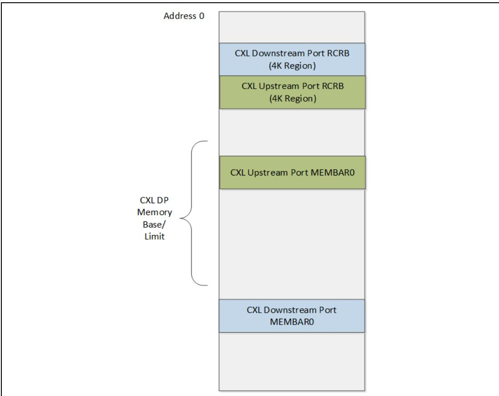

## RCD Upstream Port and RCH Downstream Port Registers

## .1 RCH Downstream Port RCRB

The RCH Downstream Port RCRB is a 4-KB memory region that contains registers based upon the PCIe-defined registers for a root port. Figure 8-9 illustrates the layout of the CXL RCRB for a Downstream Port. With the exception of the first DWORD, the first 64 bytes of the RCH Downstream Port RCRB implement the registers from a PCIe Type 1 Configuration Header. The first DWORD of the RCRB contains a NULL Extended Capability ID with a Version of 0h and a Next Capability Offset pointer. A 64-bit MEMBAR0 is implemented at Offsets 10h and 14h; this points to a private memory region that hosts registers for configuring Downstream Port subsystem components as specified in Table 8-62. The supported PCIe capabilities and extended capabilities are discovered by following the linked lists of pointers. Supported PCIe capabilities are mapped into the offset range from 040h to 0FFh. Supported PCIe extended capabilities are mapped into the offset range from 100h to FFFh. Table 8-63 lists the RCH Downstream Port-supported PCIe capabilities and extended capabilities (see the PCIe Base Specification for definitions of the associated registers).

Figure 8-9. RCH Downstream Port RCRB

<table><tr><td>31</td><td>20 19</td><td>16 15</td><td>8 7</td><td>0 Byte</td></tr><tr><td colspan="2"></td><td colspan="2"></td><td>Offset</td></tr><tr><td colspan="2">Next Capability Offset</td><td>Version = 0h</td><td colspan="2">Null Extended Capability ID = 0000h</td></tr><tr><td colspan="3">Status</td><td colspan="2">Command</td></tr><tr><td colspan="4">Class Code</td><td>Revision ID</td></tr><tr><td>Reserved</td><td colspan="2">Header Type</td><td>Reserved</td><td>Cache Line Size</td></tr><tr><td colspan="5">MEMBAR0</td></tr><tr><td colspan="5">...rest of PCIe Type 1 Config Header registers...</td></tr><tr><td colspan="5">...supported PCIe capabilities registers...</td></tr><tr><td colspan="5">...supported PCIe extended capabilities registers...</td></tr></table>

Table 8-63. RCH Downstream Port PCIe Capabilities and Extended Capabilities (Sheet 1 of 2)

<table><tr><td>PCIe Capabilities and Extended Capabilities</td><td> $Exceptions^1$ </td><td>Notes</td></tr><tr><td>PCIe Capability</td><td>Slot Capabilities, Slot Control, Slot Status, Slot Capabilities 2, Slot Control 2, and Slot Status 2 registers are not applicable.</td><td>N/A</td></tr><tr><td>PCI Power Management Capability</td><td>N/A. Software should ignore.</td><td>N/A</td></tr><tr><td>MSI Capability</td><td>N/A. Software should ignore.</td><td>N/A</td></tr><tr><td>Advanced Error Reporting Extended Capability</td><td>N/A. Software should ignore.</td><td>Required for CXL device despite being optional for PCIe.Downstream Port is required to forward ERR_messages.</td></tr></table>

RCH Downstream Port PCIe Capabilities and Extended Capabilities (Sheet 2 of 2)

<table><tr><td>PCIe Capabilities and Extended Capabilities</td><td> $Exceptions^1$ </td><td>Notes</td></tr><tr><td>ACS Extended Capability</td><td>None</td><td>N/A</td></tr><tr><td>Multicast Extended Capability</td><td>N/A. Software should ignore.</td><td>N/A</td></tr><tr><td>Downstream Port Containment Extended Capability</td><td>Use with care. DPC trigger will bring down physical link, reset device state, disrupt CXL.cache and CXL.mem traffic.</td><td>N/A</td></tr><tr><td>Designated Vendor-Specific Extended Capability (DVSEC)</td><td>None</td><td>See Section 8.2.1.3 for DVSEC Flex Bus Port definition.</td></tr><tr><td>Secondary PCIe Extended Capability</td><td>None</td><td>None</td></tr><tr><td>Data Link Feature Extended Capability</td><td>None</td><td>None</td></tr><tr><td>Physical Layer 16.0 GT/s Extended Capability</td><td>None</td><td>None</td></tr><tr><td>Physical Layer 32.0 GT/s Extended Capability</td><td>None</td><td>None</td></tr><tr><td>Lane Margining at the Receiver Extended Capability</td><td>None</td><td>None</td></tr><tr><td>Alternate Protocol Extended Capability</td><td>None</td><td>None</td></tr></table>

1. It is the responsibility of software to be aware of the registers within the capabilities that are not applicable in CXL mode in case designs choose to use a common code base for PCIe mode and CXL mode.

## 8.2.1.2 RCD Upstream Port RCRB

The RCD Upstream Port RCRB is a 4-KB memory region that contains registers based upon the PCIe Base Specification-defined registers. The Upstream Port captures the upper address bits[63:12] of the first memory read received after link initialization as the base address for the Upstream Port RCRB. Figure 8-10 illustrates the layout of the RCRB for an RCD Upstream Port. With the exception of the first DWORD, the first 64 bytes of the RCD Upstream Port RCRB implement the registers from a PCIe Type 0 Configuration Header. The first DWORD of the RCRB contains a NULL Extended Capability ID with a Version of 0h and a Next Capability Offset pointer. A 64-bit BAR (labeled MEMBAR0) is implemented at Offsets 10h and 14h; this points to a memory region that hosts registers for configuring the Upstream Port subsystem CXL.mem as specified in Table 8-62. The supported PCIe capabilities and extended capabilities are discovered by following the linked lists of pointers. Supported PCIe capabilities are mapped into the offset range from 040h to 0FFh. Supported PCIe extended capabilities are mapped into the offset range from 100h to FFFh. Table 8-64 lists the CXL Upstream Port-supported PCIe capabilities and extended capabilities (see the PCIe Base Specification for definitions of the associated registers).

The following standard registers that are part of the PCIe Type 0 header definition are considered reserved and have no effect on the behavior of an RCD Upstream Port:

• Command register (Offset 04h)

• Status register (Offset 06h)

Per the PCIe Base Specification, the following registers in the PCIe Capability are marked reserved for an RCiEP and shall not be implemented by Device 0, Function 0 of the RCD:

• Link Registers — Link Capabilities, Link Control, Link Status, Link Capabilities 2, Link Control 2, and Link Status 2

• Slot Registers — Slot Capabilities, Slot Control, Slot Status, Slot Capabilities 2, Slot Control 2, and Slot Status 2

• Root Port Registers — Root Capabilities, Root Control, and Root Status

Software must reference the Link registers in the Upstream Port RCRB PCIe capability structure to discover the link capabilities and link status, and to configure the link properties. These registers shall follow the PCIe Base Specification definition of an Upstream Switch Port. Software must set the ASPM Control field in the Link Control register if it wishes to enable CXL.io L1.

All fields in the Upstream Port’s Device Capabilities register, Device Control register, Device Status register, Device Capabilities 2 register, Device Control 2 register, and Device Status 2 register are reserved.

The Device/Port Type, Slots Implemented, and Interrupt Message Number fields in the Upstream Port’s Capability register are reserved.

Figure 8-10. RCD Upstream Port RCRB

<table><tr><td>31</td><td>20 19</td><td>16 15</td><td>8 7</td><td>0 Byte</td></tr><tr><td colspan="2"></td><td colspan="2"></td><td>Offset</td></tr><tr><td colspan="2">Next Capability Offset</td><td>Version = 0h</td><td colspan="2">Null Extended Capability ID = 0000h</td></tr><tr><td colspan="3">Status</td><td colspan="2">Command</td></tr><tr><td colspan="4">Class Code</td><td>Revision ID</td></tr><tr><td>Reserved</td><td colspan="2">Header Type</td><td>Reserved</td><td>Cache Line Size</td></tr><tr><td colspan="5">MEMBAR0</td></tr><tr><td colspan="5">Reserved</td></tr><tr><td colspan="3">Subsystem ID</td><td colspan="2">Subsystem Vendor ID</td></tr><tr><td colspan="5">Reserved</td></tr><tr><td colspan="4">Reserved</td><td>Capabilities Pointer</td></tr><tr><td colspan="5">Reserved</td></tr><tr><td colspan="3">Reserved</td><td>Interrupt Pin</td><td>Interrupt Line</td></tr><tr><td colspan="5">...supported PCIe capabilities registers...</td></tr><tr><td colspan="5">...supported PCIe extended capabilities registers...</td></tr></table>

RCD Upstream Port PCIe Capabilities and Extended Capabilities

<table><tr><td>PCIe Capabilities and Extended Capabilities</td><td> $Exceptions^1$ </td><td>Notes</td></tr><tr><td>PCIe Capability</td><td>See Section 8.2.1.2.</td><td>None</td></tr><tr><td>Advanced Error Reporting Extended Capability</td><td>N/A. Software should ignore.</td><td>Required for CXL devices despite being optional for PCIe. Link/Protocol errors detected by Upstream Port are logged/reported via RCiEP.</td></tr><tr><td>Virtual Channel Extended Capability</td><td>None</td><td>VC0 and VC1</td></tr><tr><td>Designated Vendor-Specific Extended Capability (DVSEC)</td><td>None</td><td>See Section 8.2.1.3 for DVSEC Flex Bus Port definition.</td></tr><tr><td>Secondary PCIe Extended Capability</td><td>None</td><td>None</td></tr><tr><td>Data Link Feature Extended Capability</td><td>None</td><td>None</td></tr><tr><td>Physical Layer 16.0 GT/s Extended Capability</td><td>None</td><td>None</td></tr><tr><td>Physical Layer 32.0 GT/s Extended Capability</td><td>None</td><td>None</td></tr><tr><td>Lane Margining at the Receiver Extended Capability</td><td>None</td><td>None</td></tr><tr><td>Alternate Protocol Extended Capability</td><td>None</td><td>None</td></tr></table>

1. It is the responsibility of software to be aware of the registers within the capabilities that are not applicable in CXL mode in case designs choose to use a common code base for PCIe mode and CXL mode.

## 8.2.1.3 DVSEC Flex Bus Port

All CXL ports implement a DVSEC Flex Bus Port. This DVSEC is located in the RCRBs of the RCD Upstream Ports and RCH Downstream Ports. RCD and RCH ports may implement any DVSEC Revision of this DVSEC. See Table 8-2 for the complete listing.

This DVSEC is also located in the Configuration Space of CXL root ports, Upstream Switch Ports, Downstream Switch Port, and CXL device’s primary function (Function 0) if the device does not implement CXL RCRB. A CXL component that is neither an RCD nor an RCH shall report a DVSEC Revision that is greater than or equal to 1. Three additional registers were added in Revision 2.

Figure 8-11 shows the layout of the DVSEC Flex Bus Port and Table 8-65 shows how the Header 1 and Header 2 registers shall be set. The following subsections give details of the registers defined in the DVSEC Flex Bus Port.

Figure 8-11. PCIe DVSEC for Flex Bus Port

<table><tr><td colspan="2">PCI Express Extended Capability Header</td></tr><tr><td colspan="2">Designated Vendor-specific Header 1</td></tr><tr><td>DVSEC Flex Bus Port Capability</td><td>Designated Vendor-specific Header 2</td></tr><tr><td>DVSEC Flex Bus Port Status</td><td>DVSEC Flex Bus Port Control</td></tr><tr><td colspan="2">DVSEC Flex Bus Port Received Modified TS Data Phase1</td></tr><tr><td colspan="2">DVSEC Flex Bus Port Capability2</td></tr><tr><td colspan="2">DVSEC Flex Bus Port Control2</td></tr><tr><td colspan="2">DVSEC Flex Bus Port Status2</td></tr></table>

Table 8-65. PCIe DVSEC Header Register Settings for Flex Bus Port

<table><tr><td>Register</td><td>Bit Location</td><td>Field</td><td>Value</td></tr><tr><td rowspan="3">Designated Vendor-Specific Header 1 (Offset 04h)</td><td>15:0</td><td>DVSEC Vendor ID</td><td>1E98h</td></tr><tr><td>19:16</td><td>DVSEC Revision</td><td>3h</td></tr><tr><td>31:20</td><td>DVSEC Length</td><td>020h</td></tr><tr><td>Designated Vendor-Specific Header 2 (Offset 08h)</td><td>15:0</td><td>DVSEC ID</td><td>0007h</td></tr></table>

## 8.2.1.3.1 DVSEC Flex Bus Port Capability (Offset 0Ah)

The Mem\_Capable, IO\_Capable, and Cache\_Capable fields are also present in the DVSEC Flex Bus for the device. This allows for future scalability where multiple devices, each with potentially different capabilities, may be populated behind a single Port.

Table 8-66. DVSEC Flex Bus Port Capability (Offset 0Ah) (Sheet 1 of 2)

<table><tr><td>Bit</td><td>Attributes</td><td>Description</td></tr><tr><td>0</td><td>HwInit</td><td>Cache_Capable: If set, indicates CXL.cache protocol support when operating in Flex Bus.CXL mode. This should be cleared to 0 for all LDs of an MLD.</td></tr><tr><td>1</td><td>HwInit</td><td>IO_Capable: If set, indicates CXL.io protocol support when operating in Flex Bus.CXL mode. Must be 1.</td></tr><tr><td>2</td><td>HwInit</td><td>Mem_Capable: If set, indicates CXL.mem protocol support when operating in Flex Bus.CXL mode. This must be 1 for all LDs of an MLD.</td></tr><tr><td>4:3</td><td>RsvdP</td><td>Reserved</td></tr><tr><td>5</td><td>HwInit</td><td>CXL 68B Flit and VH Capable: Formerly known as “CXL2p0_Capable.” If set, indicates CXL VH functionality support with 68B flits is available when operating in Flex Bus.CXL mode. This must be 1 for all LDs of an MLD. $^{1}$ </td></tr><tr><td>6</td><td>HwInit</td><td>CXL_Multi-Logical_Device_Capable: If set, indicates Multi-Logical Device support available when operating in Flex Bus.CXL mode. This bit must be cleared to 0 on CXL host Downstream Ports. The value must be the same for all LDs of an MLD. $^{1}$ </td></tr><tr><td>12:7</td><td>RsvdP</td><td>Reserved</td></tr></table>

Table 8-66. DVSEC Flex Bus Port Capability (Offset 0Ah) (Sheet 2 of 2)

<table><tr><td>Bit</td><td>Attributes</td><td>Description</td></tr><tr><td>13</td><td>HwInit</td><td>CXL Latency_Optimized_256B_Flit_Capable: If set, indicates support for latency-optimized 256B flits as described in Section 6.2.3.1.2 when operating in Flex Bus.CXL mode. The value must be the same for all LDs of an MLD. $^{2}$ </td></tr><tr><td>14</td><td>HwInit</td><td>CXL PBR Flit Capable: If set, indicates support for PBR flits as described in Table 6-11 when operating in Flex Bus.CXL mode. $^{2}$ </td></tr><tr><td>15</td><td>RsvdP</td><td>Reserved</td></tr></table>

1. Introduced as part of DVSEC Revision=1.  
2. Introduced as part of DVSEC Revision=2.

## 8.2.1.3.2 DVSEC Flex Bus Port Control (Offset 0Ch)

The Flex Bus physical layer uses the values that software sets in this register as a starting point for alternate protocol negotiation as long as the corresponding bit in the Flex Bus Port Capability register is set. The Flex Bus physical layer shall sample the values in this register only during exit from the Detect LTSSM state; the physical layer shall ignore any changes to this register in all other LTSSM states.

Table 8-67. DVSEC Flex Bus Port Control (Offset 0Ch) (Sheet 1 of 2)

<table><tr><td>Bit</td><td>Attributes</td><td>Description</td></tr><tr><td>0</td><td>RW if Downstream Port; otherwise, HwInit</td><td>Cache_Enable: When set, enables CXL.cache protocol operation when in Flex Bus.CXL mode. Default value is 0.</td></tr><tr><td>1</td><td>RO</td><td>IO_Enable: When set, enables CXL.io protocol operation when in Flex Bus.CXL mode. Must always be set to 1.</td></tr><tr><td>2</td><td>RW if Downstream Port; otherwise HwInit</td><td>Mem_Enable: When set, enables CXL.mem protocol operation when in Flex Bus.CXL mode. Default value is 0.</td></tr><tr><td>3</td><td>HwInit</td><td>CXL_Sync_Hdr_Bypass_Enable: When set, enables bypass of the 2-bit sync header by the Flex Bus physical layer when operating in Flex Bus.CXL mode. This is a performance optimization.</td></tr><tr><td>4</td><td>HwInit</td><td>Drift_Buffer_Enable: When set, enables drift buffer (instead of elastic buffer) if there is a common reference clock.</td></tr><tr><td>5</td><td>RW if Downstream Port; otherwise HwInit</td><td>CXL 68B Flit and VH Enable: Formerly known as &quot;CXL2p0_Enable.&quot; When set, enables CXL VH operation with 68B flits when in Flex Bus.CXL mode. This bit is reserved if CXL 68B Flit and VH Capable=0. $^{1}$  Default value is 0.</td></tr><tr><td>6</td><td>RW if Downstream Port; otherwise HwInit</td><td>CXL_Multi-Logical_Device_Enable: When set, enable Multi-Logical Device operation when in Flex Bus.CXL mode. This bit shall always be cleared to 0 for CXL root ports and RCH Downstream Ports. $^{1}$  Default value is 0.</td></tr><tr><td>7</td><td>RW if Downstream Port; otherwise HwInit</td><td>Disable_RCD_Training: Formerly known as &quot;Disable_CXL1p1_Training.&quot; When set, RCD mode is disabled. Typical usage model is that System Firmware will use this bit to disable Hot-Plug of an eRCD below a CXL root port or DSP. This bit is reserved on all RCD and RCH Upstream Ports. $^{1}$  Default value is 0.</td></tr><tr><td>8</td><td>RW if Downstream Port; otherwise, RsvdP</td><td>Retimer1_Present: When set, indicates presence of Retimer1. This bit is defined only for a Downstream Port. This bit is reserved for an Upstream Port. Default value is 0. This bit is only used by RCH Downstream Ports. All other ports shall ignore this bit.</td></tr></table>

Table 8-67. DVSEC Flex Bus Port Control (Offset 0Ch) (Sheet 2 of 2)

<table><tr><td>Bit</td><td>Attributes</td><td>Description</td></tr><tr><td>9</td><td>RW if Downstream Port; otherwise, RsvdP</td><td>Retimer2_Present: When set, indicates presence of Retimer2. This bit is defined only for a Downstream Port. This bit is reserved for an Upstream Port. Default value is 0.This bit is only used by RCH Downstream Ports. All other ports shall ignore this bit.</td></tr><tr><td>12:10</td><td>RsvdP</td><td>Reserved</td></tr><tr><td>13</td><td>RW if Downstream Port; otherwise HwInit</td><td>CXL Latency_Optimized_256B_Flit_Enable: When set, enables latency-optimized 256B flits when in Flex Bus.CXL mode. This bit is reserved on components that do not support 256B Flit mode. $^{2}$ Default value is 0.</td></tr><tr><td>14</td><td>RW if Downstream Port; otherwise, HwInit</td><td>CXL PBR Flit Enable: When set, enables PBR flits when in Flex Bus.CXL mode. This bit is reserved on components that do not support PBR Flit mode. See Table 6-11. $^{2}$ Default value is 0.</td></tr><tr><td>15</td><td>RsvdP</td><td>Reserved</td></tr></table>

1. Introduced as part of DVSEC Revision=1. 2. Introduced as part of DVSEC Revision=2.

## 8.2.1.3.3 DVSEC Flex Bus Port Status (Offset 0Eh)

The Flex Bus physical layer reports the results of alternate protocol negotiation in this register.

DVSEC Flex Bus Port Status (Offset 0Eh) (Sheet 1 of 2)

<table><tr><td>Bit</td><td>Attributes</td><td>Description</td></tr><tr><td>0</td><td>RO</td><td>Cache_Enabled: When set, indicates that CXL.cache protocol operation has been enabled as a result of PCIe alternate protocol negotiation for Flex Bus.</td></tr><tr><td>1</td><td>RO</td><td>IO_Enabled: When set, indicates that CXL.io protocol operation has been enabled as a result of PCIe alternate protocol negotiation for Flex Bus.</td></tr><tr><td>2</td><td>RO</td><td>Mem_Enabled: When set, indicates that CXL.mem protocol operation has been enabled as a result of PCIe alternate protocol negotiation for Flex Bus.</td></tr><tr><td>3</td><td>RO</td><td>CXL_Sync_Hdr_Bypass_Enabled: When set, indicates that bypass of the 2-bit sync header by the Flex Bus physical layer has been enabled when operating in Flex Bus.CXL mode as a result of PCIe alternate protocol negotiation for Flex Bus.</td></tr><tr><td>4</td><td>RO</td><td>Drift_Buffer_Enabled: When set, indicates that the physical layer has enabled its drift buffer instead of its elastic buffer.</td></tr><tr><td>5</td><td>RO</td><td>CXL 68B Flit and VH Enabled: Formerly known as &quot;CXL2p0_Enabled.&quot; When set, indicates that CXL VH operation with 68B Flit mode has been enabled as a result of PCIe alternate protocol negotiation for Flex Bus. $^{1}$ </td></tr><tr><td>6</td><td>RO</td><td>CXL_Multi-Logical_Device_Enabled: When set, indicates that CXL Multi-Logical Device operation has been negotiated. $^{1}$ </td></tr><tr><td>7</td><td>RW1CS</td><td>Even Half Failed: When set, indicates the Physical Layer detected a CRC error on the even flit half of a post-FEC corrected flit; however, the even flit half was previously consumed because the even flit half passed CRC in the original flit. This bit is reserved in 68B Flit mode.This error is also logged as a Receiver Error in the AER Correctable Status register by the associated root port. $^{2}$ </td></tr><tr><td>8</td><td>RW1CS</td><td>CXL_Correctable_Protocol_ID_Framing_Error: See Section 6.2.2 for additional details. This bit is reserved in 256B Flit mode.It is recommended that this error also be logged as a Receiver Error in the AER Correctable Status register by the associated root port.</td></tr></table>

1. This register was introduced as part of DVSEC Revision=1. 2. This field was introduced as part of DVSEC Revision=1.

Table 8-68. DVSEC Flex Bus Port Status (Offset 0Eh) (Sheet 2 of 2)

<table><tr><td>Bit</td><td>Attributes</td><td>Description</td></tr><tr><td>9</td><td>RW1CS</td><td>CXL_Uncorrectable_Protocol_ID_Framing_Error: See Section 6.2.2 for more details. This bit is reserved in 256B Flit mode.It is recommended that this error also be logged as a Receiver Error in the AER Correctable Status register by the associated root port.</td></tr><tr><td>10</td><td>RW1CS</td><td>CXL_Unexpected_Protocol_ID_Dropped: When set, indicates that the physical layer dropped a flit with an unexpected Protocol ID that is not the result of an Uncorrectable Protocol ID Framing Error. See Section 6.2.2 for more details. This bit is reserved in 256B Flit mode.It is recommended that this error also be logged as a Receiver Error in the AER Correctable Status register by the associated root port.</td></tr><tr><td>11</td><td>RW1CS</td><td>CXL_Retimers_Present_Mismatched: When set, indicates that the Downstream Port physical layer detected an inconsistency in the Retimers Present bit or Two Retimers Present bit in the received TS2 Ordered Sets during Polling.Config vs.Config.Complete LTSSM states. When three or four Four Retimer Aware (FRA) Retimers are present, this indicates that the Downstream Port Physical Layer previously communicated enabling of the Sync Header bypass optimization and subsequently determined that the third or fourth Retimer is not CXL aware. The physical layer will force disable of the sync header bypass optimization when this error condition has been detected. See Section 6.4.1.2.1 for more details. This bit is reserved on Upstream Ports.</td></tr><tr><td>12</td><td>RW1CS</td><td>FlexBusEnableBits_Phase2_Mismatch: When set, indicates that the Downstream Port physical layer detected that the Upstream Port did not exactly reflect the Flex Bus enable bits located in symbols 12-14 of the modified TS2 during Phase 2 of the negotiation. See Section 6.4.1.1 for more details. This bit is reserved on Upstream Ports.</td></tr><tr><td>13</td><td>RO</td><td>CXL Latency_Optimized_256B_Flit_Enabled: When set, indicates that latency-optimized 256B flits have been enabled as a result of PCIe alternate protocol negotiation for Flex Bus. $^{2}$ </td></tr><tr><td>14</td><td>RO</td><td>CXL PBR Flit Enabled: When set, indicates that PBR flits have been enabled as a result of PCIe alternate protocol negotiation for Flex Bus. See Table 6-11. $^{2}$ </td></tr><tr><td>15</td><td>RO</td><td>CXL.io_Throttle_Required_at_64GT/s: When set, indicates that the partner Upstream Port does not support receiving consecutive CXL.io flits at 64 GT/s (see Section 6.4.1.3).This bit is only defined for Downstream Ports; this bit is reserved on Upstream Ports. $^{2}$ </td></tr></table>

1. Introduced as part of DVSEC Revision=1.  
2. Introduced as part of DVSEC Revision=2.

## 8.2.1.3.4 DVSEC Flex Bus Port Received Modified TS Data Phase1 (Offset 10h)

If CXL alternate protocol negotiation is enabled and the Modified TS Received bit is set in the 32.0 GT/s Status register (see the PCIe Base Specification), then this register contains the values received in Symbols 12 through 14 of the Modified TS1 Ordered Set during Phase 1 of CXL alternate protocol negotiation.

Table 8-69. DVSEC Flex Bus Port Received Modified TS Data Phase1 (Offset 10h)

<table><tr><td>Bit</td><td>Attributes</td><td> $Description^{1}$ </td></tr><tr><td>23:0</td><td>RO</td><td>Received_Flex_Bus_Data_Phase_1: This field contains the values received in Symbols 12 through 14 of the Modified TS1 Ordered Set during Phase 1 of CXL alternate protocol negotiation. $^{2}$ </td></tr><tr><td>31:24</td><td>RsvdZ</td><td>Reserved</td></tr></table>

DVSEC Flex Bus Port Capability2 (Offset 14h)

1. This register was introduced as part of DVSEC Revision=2. 2. This field was introduced as part of DVSEC Revision=2. 3. This bit was introduced as part of DVSEC Revision=3.

## 8.2.1.3.5 DVSEC Flex Bus Port Capability2 (Offset 14h)

<table><tr><td>Bit</td><td>Attributes</td><td> $Description^{1}$ </td></tr><tr><td>0</td><td>RO</td><td>NOP_Hint_Capable: If set, indicates support for sending and processing NOP hints when operating with 256B flits in Flex Bus.CXL mode. $^{2}$ </td></tr><tr><td>1</td><td>HwInit</td><td>Streamlined Port: If set, indicates that this port is optimized to support 256B Flit Mode and does not support 68B Flit Mode or RCH/RCD functionality. $^{3}$ </td></tr><tr><td>31:2</td><td>RsvdP</td><td>Reserved</td></tr></table>

1. This register was introduced as part of DVSEC Revision=2.  
2. This bit was introduced as part of DVSEC Revision=2.  
3. This bit was introduced as part of DVSEC Revision=3.

## 8.2.1.3.6 DVSEC Flex Bus Port Control2 (Offset 18h)

The Flex Bus Physical Layer uses the values that software sets in this register as a starting point for alternate protocol negotiation as long as the corresponding bit is set to 1 in the DVSEC Flex Bus Port Capability2 register (see Table 8-70). The Flex Bus Physical Layer shall sample the values in this register only during exit from the Detect LTSSM state; the Physical Layer shall ignore any changes to this register in all other LTSSM states.

Table 8-71. DVSEC Flex Bus Port Control2 (Offset 18h)

<table><tr><td>Bit</td><td>Attributes</td><td> $Description^{1}$ </td></tr><tr><td>0</td><td>RW</td><td>NOP_Hint_Enable: If set, enables sending and processing NOP hints when operating with 256B flits in Flex Bus.CXL mode. $^{2}$ Default value is 0.</td></tr><tr><td>31:1</td><td>RsvdP</td><td>Reserved</td></tr></table>

1. This register was introduced as part of DVSEC Revision=2. 2. This bit was introduced as part of DVSEC Revision=2.

## 8.2.1.3.7 DVSEC Flex Bus Port Status2 (Offset 1Ch)

The Flex Bus Physical Layer reports the results of alternate protocol negotiation in this register.

DVSEC Flex Bus Port Status2 (Offset 1Ch)

<table><tr><td>Bit</td><td>Attributes</td><td> $Description^{1}$ </td></tr><tr><td>1:0</td><td>RO</td><td>NOP_Hint_Info:The Physical Layer captures what the remote link partner advertises during Phase 1 of link training. $^{2}$ </td></tr><tr><td>2</td><td>RO</td><td>Streamlined Port:The Physical Layer captures what the remote link partner advertises in Phase 1 of link training in the Streamlined Port bit in the Modified TS1 OS. $^{3}$ </td></tr><tr><td>31:3</td><td>RsvdP</td><td>Reserved</td></tr></table>

## 8.2.2 Accessing Component Registers

The RCD Upstream Port maps the Component registers in memory space that are allocated via the MEMBAR0 register in the RCD RCRB if the RCD implements RCRB. Similarly, the RCH Downstream Port maps the Component registers in memory space that are allocated via the MEMBAR0 register in the RCH RCRB. Section 8.2.3 defines the architected registers. Table 8-73 lists the relevant offset ranges from MEMBAR0 for CXL.io, CXL.cache, CXL.mem, and CXL ARB/MUX registers.

For an RCD Upstream Port that does not implement RCRB and for CXL components that are part of a CXL VH, the Component registers are mapped in memory space allocated via a standard PCIe BAR. The Register Locator DVSEC structure (see Section 8.1.9) describes the BAR number and the offset within the BAR where these registers are mapped.

A CXL Host Bridge contains Component registers that control the functionality of one or more CXL root ports. These are labeled CHBCR. These registers are also mapped in memory space, and the base address is discovered via the ACPI CEDT (see Section 9.18.1.2).

For register layout, see Figure 9-14 and Figure 9-15.

## Component Register Layout and Definition

The layout and discovery mechanism of the Component register is identical for all CXL Components and CXL Host Bridges (CHBCR). Table 8-73 lists the relevant offset ranges from the Base of the Component register block for CXL.io, CXL.cache, CXL.mem, and CXL ARB/MUX registers.

Software shall use CXL.io Memory Reads and Writes to access CXL Component registers defined in Section 8.2.4 and Section 8.2.5. Software shall restrict the access width based on the following rules:

• A 32-bit register shall be accessed as a 4-byte quantity. Partial reads are not permitted.

• A 64-bit register shall be accessed as an 8-byte quantity. Partial reads are not permitted.

• Accesses shall map to contiguous bytes.

If these rules are not followed, the behavior is undefined. Note that these rules are more stringent than the general rules for the memory mapped registers that are specified in Section 8.2.

This section and Table 8-74 in this version of the specification do not define the behavior of CXL fabric switches (see Section 2.7) and G-FAM devices (see Section 2.8).

Table 8-73. CXL Subsystem Component Register Ranges

<table><tr><td>Range</td><td>Size</td><td>Description</td></tr><tr><td>0000 0000h to 0000 0FFFh</td><td>4 KB</td><td>Reserved for CXL.io registers. This specification does not define any CXL.io registers, hence the entire range is considered reserved.</td></tr><tr><td>0000 1000h to 0000 1FFFh</td><td>4 KB</td><td>CXL.cachemem Primary Range.</td></tr><tr><td>0000 2000h to 0000 DFFFh</td><td>48 KB</td><td>Implementation specific. May host zero or more instances of CXL.cachemem Extended Ranges.</td></tr><tr><td>0000 E000h to 0000 E3FFh</td><td>1 KB</td><td>CXL ARB/MUX registers.</td></tr><tr><td>0000 E400h to 0000 FFFFh</td><td>7 KB</td><td>Reserved. The range F000h to FFFFh may host CXL.cachemem Extended Range.</td></tr></table>

## 8.2.4 CXL.cache and CXL.mem Registers

CXL.cache and CXL.mem registers are located in the CXL.cachemem Primary Range (Offset 1000h to 1FFFh) or one of the CXL.cachemem Extended Ranges. Within each of the 4-KB region of memory space assigned to CXL.cache and CXL.mem, the location of architecturally specified registers is described using an array of pointers. The array, described in Table 8-75, is located starting at Offset 00h of this 4-KB region. The first element of the array will declare the version of CXL.cache and CXL.mem protocols, as well as the size of the array. Each subsequent element will then host the pointers to capability-specific register blocks within the 4-KB region. Table 8-76 and Table 8-77 illustrate this concept with an example.

Structures with Capability ID of 1 through 0Ah are not permitted to be part of the CXL.cachemem Extended Ranges. Capability ID 0Ah structure identifies the CXL.cachemem Extended Ranges. Structures with Capability ID 0 or Capability ID greater than 0Ah are permitted to be part of the CXL.cachemem Primary Range or any of the CXL.cachemem Extended Ranges.

For each capability ID, CXL\_Capability\_Version field is incremented whenever the structure is extended to add more functionality. Backward compatibility shall be maintained during this process. For all values of n, CXL\_Capability\_Version=n+1 structure may extend CXL\_Capability\_Version=n by replacing fields that are marked as reserved in CXL\_Capability\_Version= n, but shall not redefine the meaning of existing fields. In addition, CXL\_Capability\_Version n+1 may append new registers to the CXL\_Capability\_Version n structure. Software that was written for a lower CXL\_Capability\_Version may continue to operate on structures with a higher CXL\_Capability\_Version, but will not be able to take advantage of new functionality.

CXL\_Capability\_ID field represents the functionality and CXL\_Capability\_Version represents the version of the structure. The following values of CXL\_Capability\_ID are defined by the CXL specification.

Table 8-74. CXL\_Capability\_ID Assignment (Sheet 1 of 2)

<table><tr><td>Capability</td><td>ID</td><td>Highest Version</td><td>Mandatory1</td><td>Not Permitted1</td><td>Optional1</td></tr><tr><td>CXL NULL Capability — Software shall ignore this structure and skip to the next CXL Capability</td><td>0</td><td>Undefined</td><td></td><td>P</td><td>D1, D2, LD, FMLD, DP1, UP1, USP, vUSP, DSP, vDSP, R, RC, SLD-B</td></tr><tr><td>CXL Capability (Section 8.2.4.1)</td><td>1</td><td>1</td><td>D1, D2, LD, FMLD, UP1, DP1, R, USP, vUSP, DSP, vDSP, RC, SLD-B</td><td>P</td><td></td></tr><tr><td>CXL RAS Capability (Section 8.2.4.17)</td><td>2</td><td>3</td><td>D1, D2, LD, FMLD, UP1, DP1, R, USP, DSP, SLD-B</td><td>P, RC</td><td>vUSP, vDSP</td></tr><tr><td>CXL Security Capability (Section 8.2.4.18)</td><td>3</td><td>1</td><td>DP1</td><td>All others</td><td></td></tr><tr><td>CXL Link Capability (Section 8.2.4.19)</td><td>4</td><td>4</td><td>D1, D2, LD, FMLD, UP1, DP1, R, USP, DSP, SLD-B</td><td>P, RC, vUSP, vDSP</td><td></td></tr><tr><td>CXL HDM Decoder Capability (Section 8.2.4.20)</td><td>5</td><td>3</td><td>Type 3 D2, LD, RC except RCH, USP, vUSP, SLD-B</td><td>All others</td><td>Type 2 D2, D1</td></tr><tr><td>CXL Extended Security Capability (Section 8.2.4.21)</td><td>6</td><td>2</td><td>RC</td><td>All others</td><td></td></tr><tr><td>CXL IDE Capability (Section 8.2.4.22)</td><td>7</td><td>2</td><td></td><td>P, D1, LD, UP1, DP1</td><td>D2, FMLD, R, USP, vUSP, DSP, vDSP, SLD-B</td></tr><tr><td>CXL Snoop Filter Capability (Section 8.2.4.23)</td><td>8</td><td>1</td><td>R</td><td>P, D1, D2, LD, FMLD, UP1, USP, vUSP, DSP, vDSP, RC, SLD-B</td><td>DP1</td></tr></table>

Table 8-74. CXL\_Capability\_ID Assignment (Sheet 2 of 2)

<table><tr><td>Capability</td><td>ID</td><td>Highest Version</td><td>Mandatory1</td><td>Not Permitted1</td><td>Optional1</td></tr><tr><td>CXL Timeout and Isolation Capability (Section 8.2.4.24)</td><td>9</td><td>1</td><td></td><td>P, D1, D2, LD, FMLD, UP1, USP, vUSP, DSP, vDSP, RC, SLD-B</td><td>R</td></tr><tr><td>CXL.cachemem Extended Register Capability (Section 8.2.4.25)</td><td>0Ah</td><td>1</td><td></td><td>P</td><td>D1, D2, LD, FMLD, UP1, R. USP, vUSP, DSP, vDSP, RC, SLD-B</td></tr><tr><td>CXL BI Route Table Capability (Section 8.2.4.26)</td><td>0Bh</td><td>1</td><td>USP or vUSPs that require explicit BI commit</td><td>All others</td><td>All other USPs or vUSPs</td></tr><tr><td>CXL BI Decoder Capability (Section 8.2.4.27)</td><td>0Ch</td><td>1</td><td>DSP, vDSPs, Type 2 D2, or Type 2 SLD-B that advertises 256B Flit mode</td><td>P, D1, FMLD, UP1, DP1, R, USPs, RC</td><td>R2, all other DSPs, all other vDSPs, all other D2s, LD</td></tr><tr><td>CXL Cache ID Route Table Capability (Section 8.2.4.28)</td><td>0Dh</td><td>1</td><td></td><td>All others</td><td>RC, USP</td></tr><tr><td>CXL Cache ID Decoder Capability (Section 8.2.4.29)</td><td>0Eh</td><td>1</td><td></td><td>P, D1, D2, LD, FMLD, UP1, DP1, R, USP, vUSP, RC, SLD-B</td><td>R, DSP, vDSP</td></tr><tr><td>CXL Extended HDM Decoder Capability (Section 8.2.4.30)</td><td>0Fh</td><td>3</td><td></td><td>All others</td><td>RC, USP, vUSP</td></tr><tr><td>CXL Extended Metadata Capability (Section 8.2.4.31)</td><td>10h</td><td>1</td><td></td><td>All others</td><td>CXL.mem-capable LD, D2, or one SLD-B per BPD that supports 256B Flit mode</td></tr></table>

1. P — PCIe device, D1 — RCD, D2 — CXL device that is not RCD, LD — Logical Device, FMLD — Fabric Manager-owned LD FFFFh, UP1 — RCD Upstream Port RCRB, DP1 — RCH Downstream Port, R — CXL root port, RC — CXL Host Bridge registers in CHBCR, USP — CXL Upstream Switch Port, vUSP — see Table 1-1, DSP — CXL Downstream Switch Port, vDSP — see Table 1-1. A physica component may be capable of operating in multiple modes (e.g., a CXL device may operate either in D1 mode or D2 mode based on the link training). In such cases, these definitions refer to the current mode of operation. 2. Strongly recommended for a host that supports 256B Flit mode.

Table 8-75. CXL.cache and CXL.mem Architectural Register Discovery

<table><tr><td>Offset</td><td>Register Name</td></tr><tr><td>00h</td><td>CXL Capability Header</td></tr><tr><td>04h (Length = n*4, where n is the number of capability headers)</td><td>An array of individual capability headers. See Table 8-74 for the enumeration.</td></tr></table>

Table 8-76. CXL.cache and CXL.mem Architectural Register Header Example (Primary Range)

<table><tr><td>Byte Offset</td><td>Register Name</td></tr><tr><td>00h</td><td>CXL Capability Header</td></tr><tr><td>04h</td><td>CXL RAS Capability Header</td></tr><tr><td>08h</td><td>CXL Security Capability Header</td></tr><tr><td>0Ch</td><td>CXL Link Capability Header</td></tr><tr><td>10h</td><td>CXL.cachemem Extended Register Capability Header</td></tr></table>

Table 8-77. CXL.cache and CXL.mem Architectural Register Header Example (Any Extended Range)

<table><tr><td>Byte Offset</td><td>Register Name</td></tr><tr><td>00h</td><td>CXL Capability Header</td></tr><tr><td>04h</td><td>CXL BI Decoder Capability Header</td></tr><tr><td>08h</td><td>CXL NULL Capability Header</td></tr><tr><td>0Ch</td><td>CXL Cache ID Decoder Capability Header</td></tr></table>

8.2.4.1 CXL Capability Header Register (Offset 00h)

Table 8-78. CXL Capability Header Register (Offset 00h)

<table><tr><td>Bit Location</td><td>Attributes</td><td>Description</td></tr><tr><td>15:0</td><td>RO</td><td>CXL_Capability_ID: This defines the nature and format of the CXL_Capability register. For the CXL Capability Header register, this field must be 0001h.</td></tr><tr><td>19:16</td><td>RO</td><td>CXL_Capability_Version: This defines the version number of the CXL_Capability structure present. For this and the prior version of the specification, this field must be 1h.</td></tr><tr><td>23:20</td><td>RO</td><td>CXL_Cache_Mem_Version: This defines the version of the CXL.cachemem Protocol supported. For this and the prior versions of the specification, this field must be 1h.</td></tr><tr><td>31:24</td><td>RO</td><td>Array_Size: This defines the number of elements present in the CXL_Capability array, not including the CXL Capability Header element. Each element is 1 DWORD in size and is located contiguous with previous elements.</td></tr></table>

8.2.4.2 CXL RAS Capability Header (Offset: Varies)

Table 8-79. CXL RAS Capability Header (Offset: Varies)

<table><tr><td>Bit Location</td><td>Attributes</td><td>Description</td></tr><tr><td>15:0</td><td>RO</td><td>CXL_Capability_ID: This defines the nature and format of the CXL_Capability register. For the CXL RAS Capability Header register, this field shall be 0002h.</td></tr><tr><td>19:16</td><td>RO</td><td>CXL_Capability_Version: This defines the version number of the CXL_Capability structure present. Version 3h represents the structure as defined in this specification.</td></tr><tr><td>31:20</td><td>RO</td><td>CXL_RAS_Capability_Pointer: This defines the offset of the CXL RAS Capability relative to the beginning of the CXL Capability Header register. Details in Section 8.2.4.17.</td></tr></table>

## 8.2.4.3 CXL Security Capability Header (Offset: Varies)

Table 8-80. CXL Security Capability Header (Offset: Varies)

<table><tr><td>Bit Location</td><td>Attributes</td><td>Description</td></tr><tr><td>15:0</td><td>RO</td><td>CXL_Capability_ID: This defines the nature and format of the CXL_Capability register. For the CXL Security Capability Header register, this field shall be 0003h.</td></tr><tr><td>19:16</td><td>RO</td><td>CXL_Capability_Version: This defines the version number of the CXL_Capability structure present. For this version of the specification, this field must be 1h.</td></tr><tr><td>31:20</td><td>RO</td><td>CXL_Security_Capability_Pointer: This defines the offset of the CXL Security Capability relative to the beginning of the CXL Capability Header register. Details in Section 8.2.4.18.</td></tr></table>

## 8.2.4.4 CXL Link Capability Header (Offset: Varies)

Table 8-81. CXL Link Capability Header (Offset: Varies)

<table><tr><td>Bit Location</td><td>Attributes</td><td>Description</td></tr><tr><td>15:0</td><td>RO</td><td>CXL_Capability_ID: This defines the nature and format of the CXL_Capability register. For the CXL Link Capability Header register, this field shall be 0004h.</td></tr><tr><td>19:16</td><td>RO</td><td>CXL_Capability_Version: This defines the version number of the CXL_Capability structure present. Version 4h represents the structure as defined in this specification.</td></tr><tr><td>31:20</td><td>RO</td><td>CXL_Link_Capability_Pointer: This defines the offset of the CXL Link Capability relative to the beginning of the CXL Capability Header register. Details in Section 8.2.4.19.</td></tr></table>

8.2.4.5 CXL HDM Decoder Capability Header (Offset: Varies)

Table 8-82. CXL HDM Decoder Capability Header (Offset: Varies)

<table><tr><td>Bit Location</td><td>Attributes</td><td>Description</td></tr><tr><td>15:0</td><td>RO</td><td>CXL_Capability_ID: This defines the nature and format of the CXL_Capability register. For the CXL HDM Decoder Capability Header register, this field shall be 0005h.</td></tr><tr><td>19:16</td><td>RO</td><td>CXL_Capability_Version: This defines the version number of the CXL_Capability structure present. For this version of the specification, this field must be 3h.</td></tr><tr><td>31:20</td><td>RO</td><td>CXL_HDM_Decoder_Capability_Pointer: This defines the offset of the CXLHDM Decoder Capability relative to the beginning of the CXL Capability Header register. Details in Section 8.2.4.20.</td></tr></table>

## 8.2.4.6 CXL Extended Security Capability Header (Offset: Varies)

Table 8-83. CXL Extended Security Capability Header (Offset: Varies)

<table><tr><td>Bit Location</td><td>Attributes</td><td>Description</td></tr><tr><td>15:0</td><td>RO</td><td>CXL_Capability_ID: This defines the nature and format of the CXL_Capability register. For the CXL Extended Security Capability Header register, this field shall be 0006h.</td></tr><tr><td>19:16</td><td>RO</td><td>CXL_Capability_Version: This defines the version number of the CXL_Capability structure present. For this version of the specification, this field must be 2h.</td></tr><tr><td>31:20</td><td>RO</td><td>CXL_Extended_Security_Capability_Pointer: This defines the offset of the CXL Extended Security Capability relative to the beginning of the CXL Capability Header register. Details in Section 8.2.4.21.</td></tr></table>

## 8.2.4.7 CXL IDE Capability Header (Offset: Varies)

This capability header is present in all ports that implement CXL IDE.

Table 8-84. CXL IDE Capability Header (Offset: Varies)

<table><tr><td>Bit Location</td><td>Attributes</td><td>Description</td></tr><tr><td>15:0</td><td>RO</td><td>CXL_Capability_ID: This defines the nature and format of the CXL_Capability register. For the CXL IDE Capability Header register, this field shall be 0007h.</td></tr><tr><td>19:16</td><td>RO</td><td>CXL_Capability_Version: This defines the version number of the CXL_Capability structure present. For this version of the specification, this field must be 2h.</td></tr><tr><td>31:20</td><td>RO</td><td>CXL IDE Capability Pointer: This defines the offset of the CXL IDE Capability relative to the beginning of the CXL Capability Header register. Details in Section 8.2.4.22.</td></tr></table>

## 8.2.4.8 CXL Snoop Filter Capability Header (Offset: Varies)

This capability header is required for Root Ports and optional for RCH Downstream Ports.

Table 8-85. CXL Snoop Filter Capability Header (Offset: Varies)

<table><tr><td>Bit Location</td><td>Attributes</td><td>Description</td></tr><tr><td>15:0</td><td>RO</td><td>CXL_Capability_ID: This defines the nature and format of the CXL_Capability register. For the CXL Snoop Filter Capability Header register, this field shall be 0008h.</td></tr><tr><td>19:16</td><td>RO</td><td>CXL_Capability_Version: This defines the version number of the CXL_Capability structure present. For this version of the specification, this field shall be 1h.</td></tr><tr><td>31:20</td><td>RO</td><td>CXL Snoop Filter Capability Pointer: This defines the offset of the CXL Snoop Filter Capability relative to the beginning of the CXL Capability Header register. Details in Section 8.2.4.23.</td></tr></table>

## 8.2.4.9 CXL Timeout and Isolation Capability Header (Offset: Varies)

able 8-86. CXL Timeout and Isolation Capability Header (Offset: Varies)

<table><tr><td>Bit Location</td><td>Attributes</td><td>Description</td></tr><tr><td>15:0</td><td>RO</td><td>CXL_Capability_ID: This defines the nature and format of the CXL Capability register. For the CXL Timeout and Isolation Capability Header register, this field shall be 0009h.</td></tr><tr><td>19:16</td><td>RO</td><td>CXL_Capability_Version: This defines the version number of the CXL Capability structure present. For this version of the specification, this field must be 1h.</td></tr><tr><td>31:20</td><td>RO</td><td>CXL_Timeout_and_Isolation_Capability_Pointer: This defines the offset of the CXL Timeout and Isolation Capability structure relative to the beginning of the CXL Capability Header register. Details in Section 8.2.4.24.</td></tr></table>

## CXL.cachemem Extended Register Capability Header (Offset: Varies)

Table 8-87. CXL.cachemem Extended Register Capability Header (Offset: Varies)

<table><tr><td>Bit Location</td><td>Attributes</td><td>Description</td></tr><tr><td>15:0</td><td>RO</td><td>CXL_Capability_ID: This defines the nature and format of the CXL Capability register. For the CXL.cachemem Extended Register Capability Header register, this field shall be 000Ah.</td></tr><tr><td>19:16</td><td>RO</td><td>CXL_Capability_Version: This defines the version number of CXL Capability structure present. For this version of the specification, this field must be 1h.</td></tr><tr><td>31:20</td><td>RO</td><td>CXL.cachemem Extended Register Capability Pointer: This defines the offset of the CXL.cachemem Extended Register Capability structure relative to the beginning of the CXL Capability Header register. Details in Section 8.2.4.25.</td></tr></table>

## 8.2.4.11 CXL BI Route Table Capability Header (Offset: Varies)

Table 8-88. CXL BI Route Table Capability Header (Offset: Varies)

<table><tr><td>Bit Location</td><td>Attributes</td><td>Description</td></tr><tr><td>15:0</td><td>RO</td><td>CXL_Capability_ID: This defines the nature and format of the CXL Capability register. For the CXL BI Route Table Capability Header register, this field shall be 000Bh.</td></tr><tr><td>19:16</td><td>RO</td><td>CXL_Capability_Version: This defines the version number of CXL Capability structure present. For this version of the specification, this field must be 1h.</td></tr><tr><td>31:20</td><td>RO</td><td>CXL BI Route Table Capability Pointer: This defines the offset of the CXL BI Route Table Capability structure relative to the beginning of the CXL Capability Header register. Details in Section 8.2.4.26.</td></tr></table>

## 8.2.4.12 CXL BI Decoder Capability Header (Offset: Varies)

Table 8-89. CXL BI Decoder Capability Header (Offset: Varies)

<table><tr><td>Bit Location</td><td>Attributes</td><td>Description</td></tr><tr><td>15:0</td><td>RO</td><td>CXL_Capability_ID: This defines the nature and format of the CXL Capability register. For the CXL BI Decoder Capability Header register, this field shall be 000Ch.</td></tr><tr><td>19:16</td><td>RO</td><td>CXL_Capability_Version: This defines the version number of CXL Capability structure present. For this version of the specification, this field must be 1h.</td></tr><tr><td>31:20</td><td>RO</td><td>CXL BI Decoder Capability Pointer: This defines the offset of the CXL BI Decoder Capability structure relative to the beginning of the CXL Capability Header register. Details in Section 8.2.4.27.</td></tr></table>

## 8.2.4.13 CXL Cache ID Route Table Capability Header (Offset: Varies)

Table 8-90. CXL Cache ID Route Table Capability Header (Offset: Varies)

<table><tr><td>Bit Location</td><td>Attributes</td><td>Description</td></tr><tr><td>15:0</td><td>RO</td><td>CXL_Capability_ID: This defines the nature and format of the CXL Capability register. For the CXL Cache ID Route Table Capability Header register, this field shall be 000Dh.</td></tr><tr><td>19:16</td><td>RO</td><td>CXL_Capability_Version: This defines the version number of CXL Capability structure present. For this version of the specification, this field must be 1h.</td></tr><tr><td>31:20</td><td>RO</td><td>CXL Cache ID Route Table Capability Pointer: This defines the offset of the CXL Cache ID Route Table Capability structure relative to the beginning of the CXL Capability Header register. Details in Section 8.2.4.28.</td></tr></table>

## 8.2.4.14 CXL Cache ID Decoder Capability Header (Offset: Varies)

Table 8-91. CXL Cache ID Decoder Capability Header (Offset: Varies)

<table><tr><td>Bit Location</td><td>Attributes</td><td>Description</td></tr><tr><td>15:0</td><td>RO</td><td>CXL_Capability_ID: This defines the nature and format of the CXL Capability register. For the CXL Cache ID Decoder Capability Header register, this field shall be 000Eh.</td></tr><tr><td>19:16</td><td>RO</td><td>CXL_Capability_Version: This defines the version number of CXL Capability structure present. For this version of the specification, this field must be 1h.</td></tr><tr><td>31:20</td><td>RO</td><td>CXL Cache ID Local Decoder Capability Pointer: This defines the offset of the CXL Cache ID Decoder Capability structure relative to the beginning of the CXL Capability Header register. Details in Section 8.2.4.29.</td></tr></table>

## CXL Extended HDM Decoder Capability Header (Offset: Varies)

able 8-92. CXL Extended HDM Decoder Capability Header (Offset: Varies)

<table><tr><td>Bit Location</td><td>Attributes</td><td>Description</td></tr><tr><td>15:0</td><td>RO</td><td>CXL_Capability_ID: This defines the nature and format of the CXL Capability register. For the CXL Extended HDM Decoder Capability Header register, this field shall be 000Fh.</td></tr><tr><td>19:16</td><td>RO</td><td>CXL_Capability_Version: This defines the version number of CXL Capability structure present. For this version of the specification, this field must be 3h and shall track the version of the CXL HDM Decoder Capability structure (see Section 8.2.4.20).</td></tr><tr><td>31:20</td><td>RO</td><td>CXL Extended HDM Decoder Capability Pointer: This defines the offset of the CXL Extended HDM Decoder Capability structure relative to the beginning of the CXL Capability Header register. Details in Section 8.2.4.30.</td></tr></table>

8.2.4.16 CXL Extended Metadata Capability Header (Offset: Varies)

Table 8-93. CXL Extended Metadata Capability Header (Offset: Varies)

<table><tr><td>Bit Location</td><td>Attributes</td><td>Description</td></tr><tr><td>15:0</td><td>RO</td><td>CXL_Capability_ID: This defines the nature and format of the CXL Capability register. For the CXL Extended Metadata Capability Header register, this field shall be 0010h.</td></tr><tr><td>19:16</td><td>RO</td><td>CXL_Capability_Version: This defines the version number of CXL Capability structure present. For this version of the specification, this field must be 1h.</td></tr><tr><td>31:20</td><td>RO</td><td>CXL Extended Metadata Capability Pointer: This defines the offset of the CXL Extended Metadata Capability structure relative to the beginning of the CXL Capability Header register. Details in Section 8.2.4.31.</td></tr></table>

## 8.2.4.17 CXL RAS Capability Structure

Table 8-94. CXL RAS Capability Structure

<table><tr><td>Offset</td><td>Register Name</td></tr><tr><td>00h</td><td>Uncorrectable Error Status Register</td></tr><tr><td>04h</td><td>Uncorrectable Error Mask Register</td></tr><tr><td>08h</td><td>Uncorrectable Error Severity Register</td></tr><tr><td>0Ch</td><td>Correctable Error Status Register</td></tr><tr><td>10h</td><td>Correctable Error Mask Register</td></tr><tr><td>14h</td><td>Error Capability and Control Register</td></tr><tr><td>18h</td><td>Header Log Registers</td></tr></table>

## 8.2.4.17.1 Uncorrectable Error Status Register (Offset 00h)

Uncorrectable Error Status Register (Offset 00h) (Sheet 1 of 4)

<table><tr><td>Bit Location</td><td>Attributes</td><td>Description</td></tr><tr><td>0</td><td>RW1CS</td><td>Cache_Data_Parity: Internal Uncorrectable Data error such as Data Parity error or Uncorrectable Data ECC error on CXL.cache that are not signaled by using poison on the CXL interface. The Header Log register contains the H2D Data Header if detected by either a host or a DSP. The Header Log register contains the D2H Data Header if detected by either a device or a USP.For CXL RAS Capability Version ≥ 3, DWORD 0 of the Header Log register is reserved and the Data Header shall start at Byte Offset 4 of the Header Log register.For CXL RAS Capability Version &lt; 3, the position of the Data Header in the Header Log register is not defined by this specification.</td></tr><tr><td>1</td><td>RW1CS</td><td>Cache_Address_Parity: Internal Uncorrectable Address Parity error or other uncorrectable errors associated with the Address field on CXL.cache. The Header Log register contains the H2D Request Header if detected by either a host or a DSP. The Header Log register contains D2H Request Header if detected by either a device or a USP.For CXL RAS Capability Version ≥ 3, DWORD 0 of the Header Log register is reserved and the Request Header shall start at Byte Offset 4 of the Header Log register.For CXL RAS Capability Version &lt; 3, the position of the Request Header in the Header Log register is not defined by this specification.</td></tr><tr><td>2</td><td>RW1CS</td><td>Cache_BE_Parity: Internal Uncorrectable Byte Enable Parity error or other Byte Enable uncorrectable errors on CXL.cache. The Header Log register contains the D2H Data Header if detected by either a device or a USP.For CXL RAS Capability Version ≥ 3, DWORD 0 of the Header Log register is reserved and the Data Header shall start at Byte Offset 4 of the Header Log register.For CXL RAS Capability Version &lt; 3, the position of the Data Header in the Header Log register is not defined by this specification.</td></tr><tr><td>3</td><td>RW1CS</td><td>Cache_Data_ECC: Internal Uncorrectable Data ECC error on CXL.cache that are not signaled using poison on the CXL interface. The Header Log register contains the H2D Data Header if detected by either a host or a DSP. The Header Log register contains the D2H Data Header if detected by either a device or a USP.Note: For CXL RAS Capability Version &lt; 3, it is permissible to log any Uncorrectable Data error on CXL.cache in bit[0] and not in this bit.For CXL RAS Capability Version ≥ 3, this bit is deprecated and all Uncorrectable Data errors on CXL.cache that are not signaled by using CXL poison are logged in bit[0].For CXL RAS Capability Version &lt; 3, the position of the Data Header in the Header Log register is not defined by this specification.</td></tr><tr><td>4</td><td>RW1CS</td><td>Mem_Data_Parity: Internal Uncorrectable Data error such as Data Parity error or Uncorrectable Data ECC error on CXL.mem that are not signaled by using poison on the CXL interface. The Header Log register contains the M2S RwD Data Header if detected by either a host or a DSP. The Header Log register contains the S2M DRS Data header if detected by either a device or a USP.For CXL RAS Capability Version ≥ 3, DWORD 0 of the Header Log register is reserved and the Data Header shall start at Byte Offset 4 of the Header Log register.For CXL RAS Capability Version &lt; 3, the position of the Data Header in the Header Log register is not defined by this specification.</td></tr></table>

Table 8-95. Uncorrectable Error Status Register (Offset 00h) (Sheet 2 of 4)

<table><tr><td>Bit Location</td><td>Attributes</td><td>Description</td></tr><tr><td>5</td><td>RW1CS</td><td>Mem_Address_Parity: Internal Uncorrectable Address Parity error or other uncorrectable errors associated with the Address field on CXL.mem.For CXL RAS Capability Version &lt; 3, the position of the M2S Req message, M2S RwD Data Header, or a BISnp Req message in the Header Log register is not defined by this specification.Logging by a Host or a DSP: If bit[0] of the Header Log register is 0, the remainder of the Header Log contains the M2S Req message. If bit[0] of the Header Log register is 1, the remainder of the Header Log contains the M2S RwD Data Header.Logging by a Device or a USP: The remainder of the Header Log contains the BISnp message.For CXL RAS Capability Version ≥ 3:Logging by a Host or a DSP: If DWORD 0 bit[0] of the Header Log register is 0, the Header Log register contains the M2S Req message, starting at Byte Offset 4. If DWORD 0 bit[0] of the Header Log register is 1, the remainder of the Header Log contains the M2S RwD Data Header. The Data Header shall start at Byte Offset 4 of the Header Log register. DWORD 0 bits[31:1] of the Header Log register are reserved.Logging by a Device or a USP: Header Log register contains the BISnp Req message, starting at Byte Offset 4.</td></tr><tr><td>6</td><td>RW1CS</td><td>Mem_BE_Parity: Internal Uncorrectable Byte Enable Parity error or other Byte Enable uncorrectable errors on CXL.mem. The Header Log register contains the M2S RwD Data Header if detected by either a host or a DSP.For CXL RAS Capability Version ≥ 3, DWORD 0 of the Header Log register is reserved and the Data Header shall start at Byte Offset 4 of the Header Log register.For CXL RAS Capability Version &lt; 3, the position of the M2S RwD or S2M DRS Data Header in the Header Log register is not defined by this specification.</td></tr><tr><td>7</td><td>RW1CS</td><td>Mem_Data_ECC: Internal Uncorrectable Data ECC error on CXL.mem. The Header Log register contains the M2S RwD Data Header if detected by either a host or a DSP. The Header Log register contains the S2M DRS Data header if detected by either a device or a USP.Note: For CXL RAS Capability Version &lt; 3, it is permissible to log any Uncorrectable Data error on CXL.mem in bit[4] and not in this bit. For CXL RAS Capability Version ≥ 3, this bit is deprecated and all Uncorrectable Data errors on CXL.mem that are not signaled by using CXL poison are logged in bit[4].For CXL RAS Capability Version &lt; 3, the position of the Data Header in the Header Log register is not defined by this specification.</td></tr><tr><td>8</td><td>RW1CS/RsvdZ</td><td>REINIT_Threshold: REINIT Threshold Hit (i.e., (NUM_PHY_REINIT ≥ MAX_NUM_PHY_REINIT). See Section 4.2.8.5.1 for the definitions of NUM_PHY_REINIT and MAX_NUM_PHY_REINIT. Header Log is not applicable. No data is logged in the Header Log.This bit is reserved for 256B Flit mode.</td></tr></table>

Table 8-95. Uncorrectable Error Status Register (Offset 00h) (Sheet 3 of 4)

<table><tr><td>Bit Location</td><td>Attributes</td><td>Description</td></tr><tr><td>9</td><td>RW1CS</td><td>Rsvd_Encoding_Violation: Received unrecognized encoding. Header Log contains the entire flit received when operating in 68B Flit mode. This bit should be set upon a Link-Layer-related encoding violation.For CXL RAS Capability Version &lt; 3 and operating in 68B Flit mode, the scope of encoding checking should include the scope where it falls into the &quot;Reserved&quot; or &quot;RSVD&quot; definitions in Table 4-5, Table 4-6, and Table 4-9.For CXL RAS Capability Version ≥ 3 and operating in 68B Flit mode, the scope of checking shall include the encodings that are marked as &quot;Reserved&quot; or &quot;RSVD&quot; in Table 4-5, Table 4-6, Table 4-9, and Table 4-10.For CXL RAS Capability Version &lt; 3 and operating in 256B Flit mode, the content of the Header Log register is not defined by this specification.For CXL RAS Capability Version ≥ 3 and operating in 256B Flit mode, the scope of checking shall include the encodings that are marked as &quot;Reserved&quot; or &quot;RSVD&quot; in Table 4-14, Table 4-15, Table 4-16, Table 4-19, and Table 4-20. In these cases, DWORD 0 of the Header Log register must be either 0 or 1. The component is permitted to log other unsupported encodings beyond what is required by this specification. In that scenario, DWORD 0 must be set to 2. DWORD 0 of the Header Log register indicates what is captured in the remaining DWORDs.DWORD 0 = 0: DWORD 1 of the Header Log register shall contain the first DWORD in the offending slotDWORD 0 = 1: The lower 16 bits of DWORD 1 of the Header Log register shall contain the Credit fieldDWORD 0 = 2: The layout of the remaining DWORDs in the Header Log register is vendor specific</td></tr><tr><td>10</td><td>RW1CS</td><td>Poison_Received: Received Poison from the peer. No data is logged in the Header Log.</td></tr><tr><td>11</td><td>RW1CS</td><td>Receiver_Overflow0 = A buffer did not overflow1 = A buffer overflowed and the receiver of messages is unable to sink a messageThe first four bits of DWORD 0 of the Header Log register indicate which buffer overflowed, and should be interpreted as follows:0000b --&gt; D2H Req (Applicable to the Downstream Port)0001b --&gt; D2H Rsp (Applicable to the Downstream Port)0010b --&gt; D2H Data (Applicable to the Downstream Port)0011b --&gt; M2S Req (Applicable to the Upstream Port)0100b --&gt; S2M NDR (Applicable to the Downstream Port)0101b --&gt; S2M DRS (Applicable to the Downstream Port)0110b --&gt; H2D Req (Applicable to the Upstream Port)0111b --&gt; H2D Rsp (Applicable to the Upstream Port)1000b --&gt; H2D Data (Applicable to the Upstream Port)1001b --&gt; M2S RwD (Applicable to the Upstream Port)1010b --&gt; BISnp (Applicable to the Downstream Port)1011b --&gt; BIRsp (Applicable to the Upstream Port)All other encodings are reservedBits [31:4] of DWORD 0 are reserved.</td></tr><tr><td>13:12</td><td>RsvdZ</td><td>Reserved (Do not use)</td></tr><tr><td>14</td><td>RW1CS</td><td>Internal_Error: Component-specific error. The format of the Header Log is component-specific.</td></tr><tr><td>15</td><td>RW1CS</td><td>CXL_IDE_Tx_Error: See Section 8.2.4.22.4 for the next level details. No data is logged in the Header Log. $^{1}$ </td></tr></table>

Table 8-95. Uncorrectable Error Status Register (Offset 00h) (Sheet 4 of 4)

<table><tr><td>Bit Location</td><td>Attributes</td><td>Description</td></tr><tr><td>16</td><td>RW1CS</td><td>CXL_IDE_Rx_Error: See Section 8.2.4.22.4 for the next level details.1For CXL RAS Capability Version &lt; 3, no data is logged in the Header Log.For CXL RAS Capability Version ≥ 3, DWORD 0 defines the content of subsequent DWORDs.If DWORD 0 is 0 (applies to Rx Error Status=6h)DWORD 1: Current Idle Flit countDWORD 2: Expected Idle Flit count after early MAC terminationAll other DWORDs are reservedIf DWORD 0 is 1 (applies to Rx Error Status=7h)DWORD 1: Current Idle Flit countDWORD 2: Expected Idle Flit count after Key RefreshAll other DWORDs are reservedIf DWORD 0 is 2 (applies to Rx Error Status=7h)DWORD 1: Current Idle Flit countDWORD 2: Expected Idle Flit count after IDE termination handshakeAll other DWORDs are reservedAll other DWORD 0 values are reserved.</td></tr><tr><td>17</td><td>RW1CS</td><td>Extended Metadata Error: An error associated with Extended Metadata field.2DWORD 0 of the Header Log register captures the type of error:0 = A Root Port in an Extended Metadata-aware host received unexpected Extended Metadata on S2M DRS.1 = An Extended Metadata-aware device received unexpected Extended Metadata on M2S RwD.2 = A Root Port in an Extended Metadata-aware host expected but did not receive Extended Metadata on S2M DRS.3 = An Extended Metadata-aware device expected but did not receive Extended Metadata on M2S RwD(DWORD 1 of the Header Log register contains the following:Bits[15:0]: Tag field associated with the value of the transaction with the EMDErr.Bits[17:16]: MetaField value of the transaction with the EMDErr.Bits[19:18]: MetaValue value of the transaction with the EMDErr.Bit[20]: Indicates that an EMD value was captured with the EMDErr and is stored in DWORD 1. Must be 0 if the Enable Extended Metadata Error Logging bit is 0 in the CXL Extended Metadata Control register (see Table 8-170).DWORD 2 of the Header Log register captures the Extended Metadata field value if bit[20] of DWORD 2[1] is 1. This bit must be 0 if the Enable Extended Metadata Error Logging bit is 0.</td></tr><tr><td>31:18</td><td>RsvdZ</td><td>Reserved</td></tr></table>

1. Introduced as part of Version=2.  
2. Introduced as part of Version=3.

## 8.2.4.17.2 Uncorrectable Error Mask Register (Offset 04h)

The Uncorrectable Error Mask register controls reporting of individual errors. When a bit is set, the corresponding error status bit in Uncorrectable Error Status register upon the error event is not set, the error is not recorded or reported in the Header Log and is not signaled.

Uncorrectable Error Mask Register (Offset 04h)

<table><tr><td>Bit Location</td><td>Attributes</td><td>Description</td></tr><tr><td>0</td><td>RWS</td><td>Cache_Data_Parity_MaskDefault value for this bit is 1.</td></tr><tr><td>1</td><td>RWS</td><td>Cache_Address_Parity_MaskDefault value for this bit is 1.</td></tr><tr><td>2</td><td>RWS</td><td>Cache_BE_Parity_MaskDefault value for this bit is 1.</td></tr><tr><td>3</td><td>RWS</td><td>Cache_Data_ECC_MaskDefault value for this bit is 1.</td></tr><tr><td>4</td><td>RWS</td><td>Mem_Data_Parity_MaskDefault value for this bit is 1.</td></tr><tr><td>5</td><td>RWS</td><td>Mem_Address_Parity_MaskDefault value for this bit is 1.</td></tr><tr><td>6</td><td>RWS</td><td>Mem_BE_Parity_MaskDefault value for this bit is 1.</td></tr><tr><td>7</td><td>RWS</td><td>Mem_Data_ECC_MaskDefault value for this bit is 1.</td></tr><tr><td>8</td><td>RWS/RsvdP</td><td>REINIT_Threshold_MaskDefault value for this bit is 1. This bit is reserved for 256B Flit mode.</td></tr><tr><td>9</td><td>RWS</td><td>Rsvd_Encoding_Violation_MaskDefault value for this bit is 1.</td></tr><tr><td>10</td><td>RWS</td><td>Poison_Received_MaskDefault value for this bit is 1.</td></tr><tr><td>11</td><td>RWS</td><td>Receiver_Overflow_MaskDefault value for this bit is 1.</td></tr><tr><td>13:12</td><td>RsvdP</td><td>Reserved (Do not use)</td></tr><tr><td>14</td><td>RWS</td><td>Internal_Error_MaskDefault value for this bit is 1.</td></tr><tr><td>15</td><td>RWS</td><td>CXL_IDE_Tx_Mask $^{1}$ Default value for this bit is 1.</td></tr><tr><td>16</td><td>RWS</td><td>CXL_IDE_Rx_Mask $^{1}$ Default value for this bit is 1.</td></tr><tr><td>17</td><td>RWS</td><td>Extended_Data_Data_Error_Mask $^{2}$ Default value for this bit is 1.</td></tr><tr><td>31:18</td><td>RsvdP</td><td>Reserved</td></tr></table>

1. Introduced as part of Version=2. 2. Introduced as part of Version=3.

## 8.2.4.17.3 Uncorrectable Error Severity Register (Offset 08h)

The Uncorrectable Error Severity register controls whether an individual error is considered to be a Non-fatal error or Fatal error. An error is considered fatal uncorrectable when the corresponding error bit in the severity register is set. If an error is considered fatal and viral is enabled, a Viral indication shall be generated (see Section 12.4). If the bit is cleared, the corresponding error is considered non-fatal uncorrectable and shall not trigger a Viral indication. This register does not control whether an error is signaled as ERR\_FATAL or ERR\_NONFATAL over CXL.io.

Table 8-97.

Uncorrectable Error Severity Register (Offset 08h)

<table><tr><td>Bit Location</td><td>Attributes</td><td>Description</td></tr><tr><td>0</td><td>RWS</td><td>Cache_Data_Parity_SeverityDefault value for this bit is 1.</td></tr><tr><td>1</td><td>RWS</td><td>Cache_Address_Parity_SeverityDefault value for this bit is 1.</td></tr><tr><td>2</td><td>RWS</td><td>Cache_BE_Parity_SeverityDefault value for this bit is 1.</td></tr><tr><td>3</td><td>RWS</td><td>Cache_Data_ECC_SeverityDefault value for this bit is 1.</td></tr><tr><td>4</td><td>RWS</td><td>Mem_Data_Parity_SeverityDefault value for this bit is 1.</td></tr><tr><td>5</td><td>RWS</td><td>Mem_Address_Parity_SeverityDefault value for this bit is 1.</td></tr><tr><td>6</td><td>RWS</td><td>Mem_BE_Parity_SeverityDefault value for this bit is 1.</td></tr><tr><td>7</td><td>RWS</td><td>Mem_Data_ECC_SeverityDefault value for this bit is 1.</td></tr><tr><td>8</td><td>RWS/RsvdP</td><td>REINIT_Threshold_SeverityDefault value for this bit is 1. This bit is reserved for 256B Flit mode.</td></tr><tr><td>9</td><td>RWS</td><td>Rsvd_Encoding_Violation_SeverityDefault value for this bit is 1.</td></tr><tr><td>10</td><td>RWS</td><td>Poison_Received_SeverityDefault value for this bit is 1.</td></tr><tr><td>11</td><td>RWS</td><td>Receiver_Overflow_SeverityDefault value for this bit is 1.</td></tr><tr><td>13:12</td><td>RsvdP</td><td>Reserved (Do not use)</td></tr><tr><td>14</td><td>RWS</td><td>Internal_Error_SeverityDefault value for this bit is 1.</td></tr><tr><td>15</td><td>RWS</td><td>CXL_IDE_Tx_Severity $^{1}$ Default value for this bit is 1.</td></tr><tr><td>16</td><td>RWS</td><td>CXL_IDE_Rx_Severity $^{1}$ Default value for this bit is 1.</td></tr><tr><td>17</td><td>RWS</td><td>Extended_Data_Data_Error_Severity $^{2}$ Default value for this bit is 1.</td></tr><tr><td>31:18</td><td>RsvdP</td><td>Reserved</td></tr></table>

1. Introduced as part of Version=2. 2. Introduced as part of Version=3.

## 8.2.4.17.4 Correctable Error Status Register (Offset 0Ch)

Table 8-98. Correctable Error Status Register (Offset 0Ch)

<table><tr><td>Bit Location</td><td>Attributes</td><td>Description</td></tr><tr><td>0</td><td>RW1CS</td><td>Cache_Data_ECC: Internal correctable error such as correctable Data ECC error on CXL.cache.</td></tr><tr><td>1</td><td>RW1CS</td><td>Mem_Data_ECC: Internal correctable error such as correctable Data ECC error on CXL.mem.</td></tr><tr><td>2</td><td>RW1CS/RsvdZ</td><td>CRC_Threshold: CRC Threshold Hit. The CRC threshold is component specific. Applicable only to 68B Flit mode. Reserved for 256B Flit mode.</td></tr><tr><td>3</td><td>RW1CS/RsvdZ</td><td>Retry_Threshold: Retry Threshold Hit. (NUM_RETRY ≥ MAX_NUM_RETRY). See Section 4.2.8.5.1 for the definitions of NUM_RETRY and MAX_NUM_RETRY. Applicable only to 68B Flit mode. Reserved for 256B Flit mode.</td></tr><tr><td>4</td><td>RW1CS</td><td>Cache_Poison_Received: Received Poison from the peer on CXL.cache.</td></tr><tr><td>5</td><td>RW1CS</td><td>Mem_Poison_Received: Received Poison from the peer on CXL.mem.</td></tr><tr><td>6</td><td>RW1CS</td><td>Physical_Layer_Error: Received error indication from Physical Layer. The error indication may or may not be associated with a CXL.cachemem flit.</td></tr><tr><td>31:7</td><td>RsvdZ</td><td>Reserved</td></tr></table>

## 8.2.4.17.5 Correctable Error Mask Register (Offset 10h)

The Correctable Error Mask register controls reporting of individual errors. When a bit is set in this register, the corresponding error status bit is not set upon the error event, and the error is not signaled.

Table 8-99. Correctable Error Mask Register (Offset 10h)

<table><tr><td>Bit Location</td><td>Attributes</td><td>Description</td></tr><tr><td>0</td><td>RWS</td><td>Cache_Data_ECC_MaskDefault value for this bit is 1.</td></tr><tr><td>1</td><td>RWS</td><td>Mem_Data_ECC_MaskDefault value for this bit is 1.</td></tr><tr><td>2</td><td>RWS</td><td>CRC_Threshold_MaskDefault value for this bit is 1.</td></tr><tr><td>3</td><td>RWS</td><td>Retry_Threshold_MaskDefault value for this bit is 1.</td></tr><tr><td>4</td><td>RWS</td><td>Cache_Poison_Received_MaskDefault value for this bit is 1.</td></tr><tr><td>5</td><td>RWS</td><td>Mem_Poison_Received_MaskDefault value for this bit is 1.</td></tr><tr><td>6</td><td>RWS</td><td>Physical_Layer_Error_MaskDefault value for this bit is 1.</td></tr><tr><td>31:7</td><td>RsvdP</td><td>Reserved</td></tr></table>

## 8.2.4.17.6 Error Capabilities and Control Register (Offset 14h)

Table 8-100. Error Capabilities and Control Register (Offset 14h)

<table><tr><td>Bit Location</td><td>Attributes</td><td>Description</td></tr><tr><td>5:0</td><td>ROS</td><td>First_Error_Pointer: This identifies the bit position of the first error reported in the Uncorrectable Error Status register.</td></tr><tr><td>8:6</td><td>RsvdP</td><td>Reserved</td></tr><tr><td>9</td><td>RO</td><td>Multiple_HeaderRecording_Capability: If this bit is set, indicates if recording of more than one error header is supported.</td></tr><tr><td>12:10</td><td>RsvdP</td><td>Reserved</td></tr><tr><td>13</td><td>RWS</td><td>Poison_Enabled: If this bit is 0, the CXL port shall treat poison received on CXL.cache or CXL.mem as an uncorrectable error and log the error in the Uncorrectable Error Status register. If this bit is 1, the CXL ports shall treat poison received on CXL.cache or CXL.mem as a correctable error and log the error in the Correctable Error Status register. This bit defaults to 1. This bit is hardwired to 1 in CXL Upstream Switch Port, CXL Downstream Switch Port, and CXL devices that are not eRCDs.</td></tr><tr><td>31:14</td><td>RsvdZ</td><td>Reserved</td></tr></table>

## 8.2.4.17.7 Header Log Registers (Offset 18h)

Header Log registers are accessed as a series of 32-bit wide individual registers even though it is represented as a single 512-bit long entity for convenience. In accordance with Section 8.2.2, each individual register shall be accessed as an aligned 4-Byte quantity.

Table 8-101. Header Log Registers (Offset 18h)

<table><tr><td>Bit Location</td><td>Attributes</td><td>Description</td></tr><tr><td>511:0</td><td>ROS</td><td>Header Log: The information logged here depends on the type of Uncorrectable Error Status bit recorded as described in Section 8.2.4.17.1. If multiple errors are logged in the Uncorrectable Error Status register, the First_Error_Pointer field in the Error Capabilities and Control register identifies the error that this log corresponds to.</td></tr></table>

## 8.2.4.18 CXL Security Capability Structure

This capability structure applies only for RCH Downstream Ports.

## Table 8-102. CXL Security Capability Structure

<table><tr><td>Offset</td><td>Register Name</td></tr><tr><td>00h</td><td>CXL Security Policy Register</td></tr></table>

## 8.2.4.18.1 CXL Security Policy Register (Offset 00h)

Table 8-103. Device Trust Level

<table><tr><td>Bit Location</td><td>Attributes</td><td>Description</td></tr><tr><td>1:0</td><td>RW</td><td>Device Trust Level00b = Trusted CXL device. At this setting, a CXL device will be able to get access on CXL.cache for both host-attached and device-attached memory ranges. The Host can still protect security sensitive memory regions.01b = Trusted for device-attached Memory Range Only. At this setting, a CXL device will be able to get access on CXL.cache for device-attached memory ranges only. Requests on CXL.cache for host-attached memory ranges will be aborted by the Host.10b = Untrusted CXL device (default). At this setting, all requests on CXL.cache will be aborted by the Host.Note that these settings only apply to requests on CXL.cache. The device can still source requests on CXL.io regardless of these settings. Protection on CXL.io will be implemented using IOMMU-based page tables.</td></tr><tr><td>31:2</td><td>RsvdP</td><td>Reserved</td></tr></table>

## 8.2.4.19 CXL Link Capability Structure

Table 8-104. CXL Link Capability Structure

<table><tr><td>Offset</td><td>Register Name</td></tr><tr><td>00h</td><td>CXL Link Layer Capability Register</td></tr><tr><td>08h</td><td>CXL Link Control and Status Register</td></tr><tr><td>10h</td><td>CXL Link Rx Credit Control Register</td></tr><tr><td>18h</td><td>CXL Link Rx Credit Return Status Register</td></tr><tr><td>20h</td><td>CXL Link Tx Credit Status Register</td></tr><tr><td>28h</td><td>CXL Link Ack Timer Control Register</td></tr><tr><td>30h</td><td>CXL Link Defeature Register</td></tr><tr><td>38h</td><td>CXL Link Rx Credit Control2 Register</td></tr><tr><td>40h</td><td>CXL Link Rx Credit Return Status2 Register</td></tr><tr><td>48h</td><td>CXL Link Tx Credit Status2 Register</td></tr></table>

## 8.2.4.19.1 CXL Link Layer Capability Register (Offset 00h)

Table 8-105. CXL Link Layer Capability Register (Offset 00h) (Sheet 1 of 2)

<table><tr><td>Bit Location</td><td>Attributes</td><td>Description</td></tr><tr><td>3:0</td><td>RWS</td><td>CXL Link Version Supported: The value in this field does not affect the link behavior. This field has been deprecated and software must not rely on its value.</td></tr><tr><td>7:4</td><td>RO</td><td>CXL Link Version Received: Version of CXL Specification received from INIT.Param flit. This field has been deprecated and software must not rely on its value.</td></tr><tr><td>15:8</td><td>RWS/RsvdP</td><td>LLR Wrap Value Supported: LLR Wrap value supported by this entity. Used for debug.Default value is implementation dependent. This field is reserved for 256B Flit mode.</td></tr><tr><td>23:16</td><td>RO/ RsvdP</td><td>LLR Wrap Value Received: LLR Wrap value received from INIT.Param flit. Used for debug. This field is reserved for 256B Flit mode.</td></tr></table>

Table 8-105. CXL Link Layer Capability Register (Offset 00h) (Sheet 2 of 2)

<table><tr><td>Bit Location</td><td>Attributes</td><td>Description</td></tr><tr><td>28:24</td><td>RO/RsvdP</td><td>NUM_Retry_Received: Num_Retry value reflected in the last RETRY.Req message received. Used for debug. This field is reserved for 256B Flit mode.</td></tr><tr><td>33:29</td><td>RO/RsvdP</td><td>NUM_Phy_Reinit_Received: Num_Phy_Reinit value reflected in the last RETRY.Req message received. Used for debug. This field is reserved for 256B Flit mode.</td></tr><tr><td>41:34</td><td>RO/RsvdP</td><td>Wr_Ptr_Received: Wr_Ptr value reflected in the last RETRY.Ack message received. This field is reserved for 256B Flit mode.</td></tr><tr><td>49:42</td><td>RO/RsvdP</td><td>Echo_Eseq_Received: Echo_Eseq value reflected in the last RETRY.Ack message received. This field is reserved for 256B Flit mode.</td></tr><tr><td>57:50</td><td>RO/RsvdP</td><td>Num_Free_Buf_Received: Num_Free_Buf value reflected in the last RETRY.Ack message received. This field is reserved for 256B Flit mode.</td></tr><tr><td>58</td><td>RO/RsvdP</td><td>No_LL_Reset_Support: If set, indicates that the LL_Reset configuration bit is not supported. $^{1}$ </td></tr><tr><td>63:59</td><td>RsvdP</td><td>Reserved</td></tr></table>

1. Introduced as part of Version=2.

8.2.4.19.2 CXL Link Layer Control and Status Register (Offset 08h)

Table 8-106. CXL Link Layer Control and Status Register (Offset 08h)

<table><tr><td>Bit Location</td><td>Attributes</td><td>Description</td></tr><tr><td>0</td><td>RW</td><td>LL_Reset:Re-initialize without resetting values in sticky registers.When this bit is set, the link layer reset is initiated. When link layer reset completes, hardware will clear the bit to 0.Entity that triggers LL_Reset should ensure that the link is quiesced.Support for this bit is optional. If LL_Reset is not supported, the NO_LL_Reset_Support bit in the CXL Link Layer Capability register shall be set (see Section 8.2.4.19.1).The use of this bit is expected to be for debug. Any production need for Link Layer re-initialization is to be satisfied using CXL Hot Reset.</td></tr><tr><td>1</td><td>RWS</td><td>LL_Init_Stall:If set, link layer stalls the transmission of the LLCTRL-INIT.Param flit until this bit is cleared.Default value is 0.</td></tr><tr><td>2</td><td>RWS</td><td>LL_Crd_Stall:If set, link layer stalls credit initialization until this bit is cleared.Reset default value is 0.</td></tr><tr><td>4:3</td><td>RO</td><td>INIT_State:This field reflects the current initialization status of the Link Layer, including any stall conditions controlled by bits[2:1]:00b = NOT_RDY_FOR_INIT (stalled or unstalled): LLCTRL-INIT.Param flit not sent01b = PARAM_EX: LLCTRL-INIT.Param sent and waiting to receive it10b = CRD_RETURN_STALL: Parameter exchanged successfully, and Credit return is stalled11b = INIT_DONE: Link Initialization Done: LLCTRL-INIT.Param flit sent and received, and initial credit refund not stalled</td></tr><tr><td>12:5</td><td>RO/RsvdP</td><td>LL_Retry_Buffer_Consumed:Snapshot of link layer retry buffer consumed. This field is reserved for 256B Flit mode.</td></tr><tr><td>63:13</td><td>RsvdP</td><td>Reserved</td></tr></table>

## 8.2.4.19.3 CXL Link Layer Rx Credit Control Register (Offset 10h)

The default settings are component specific. The contents of this register represent the credits advertised by the component.

Software may program this register and issue a hot reset to operate the component with credit settings that are lower than the default. The values in these registers take effect on the next hot reset. If software configures any of these fields to a value that is higher than the default, the results will be undefined.

Table 8-107. CXL Link Layer Rx Credit Control Register (Offset 10h)

<table><tr><td>Bit Location</td><td>Attributes</td><td>Description</td></tr><tr><td>9:0</td><td>RWS</td><td>Cache Req Credits: Credits to advertise for CXL.cache Request channel at init. For an Upstream Port, this field represents the credits to advertise for CXL.cache H2D Req channel at init. For a Downstream Port or Fabric Port, this field represents the credits to advertise for CXL.cache D2H Req channel at init. The default value represents the maximum number of CXL.cache Request channel credits that the component supports.</td></tr><tr><td>19:10</td><td>RWS</td><td>Cache Rsp Credits: Credits to advertise for CXL.cache Response channel at init. For an Upstream Port, this field represents the credits to advertise for CXL.cache H2D Rsp channel at init. For a Downstream Port or Fabric Port, this field represents the credits to advertise for CXL.cache D2H Rsp channel at init. The default value represents the maximum number of CXL.cache Response channel credits that the component supports.</td></tr><tr><td>29:20</td><td>RWS</td><td>Cache Data Credits: Credits to advertise for CXL.cache Data channel at init. For an Upstream Port, this field represents the credits to advertise for CXL.cache H2D Data channel at init. For a Downstream Port or Fabric Port, this field represents the credits to advertise for CXL.cache D2H Data channel at init. The default value represents the maximum number of CXL.cache Data channel credits that the component supports.</td></tr><tr><td>39:30</td><td>RWS</td><td>Mem Req_Rsp Credits: For an Upstream Port, this field represents the credits to advertise for CXL.mem Request channel at init. For a Downstream Port or Fabric Port, this field represents the credits to advertise for CXL.mem NDR channel at init. The default value represents the maximum number of credits that the port supports.</td></tr><tr><td>49:40</td><td>RWS</td><td>Mem Data Credits: Credits to advertise for CXL.mem Data channel at init. For an Upstream Port, this field represents the number of advertised RwD channel credits at init. For a Downstream Port or Fabric Port, this field represents the number of advertised DRS channel credits at init. The default value represents the maximum number of channel credits that the port supports.</td></tr><tr><td>59:50</td><td>RWS/RsvdP</td><td>BI Credits: For an Upstream Port, this field represents the number of advertised BIRsp channel credits at init. For a Downstream Port or Fabric Port, this field represents the number of advertised BISnp channel credits at init. The default value represents the maximum number of the appropriate Back- Invalidate channel credits of which the port is capable. $^{1}$  This field is reserved for 68B Flit mode and for components that do not support BI.</td></tr><tr><td>63:60</td><td>RsvdP</td><td>Reserved</td></tr></table>

1. Introduced as part of Version=3.

## 8.2.4.19.4 CXL Link Layer Rx Credit Return Status Register (Offset 18h)

ble 8-108. CXL Link Layer Rx Credit Return Status Register (Offset 18h)

<table><tr><td>Bit Location</td><td>Attributes</td><td>Description</td></tr><tr><td>9:0</td><td>RO</td><td>Cache Req Credits: Running snapshot of accumulated CXL.cache Request credits to be returned. For an Upstream Port, this field represents the running snapshot of the accumulated CXL.cache H2D Req channel credits to be returned. For a Downstream Port or Fabric Port, this field represents the running snapshot of the accumulated CXL.cache D2H Req channel credits to be returned.</td></tr><tr><td>19:10</td><td>RO</td><td>Cache Rsp Credits: Running snapshot of accumulated CXL.cache Response credits to be returned. For an Upstream Port, this field represents the running snapshot of the accumulated CXL.cache H2D Rsp channel credits to be returned. For a Downstream Port or Fabric Port, this field represents the running snapshot of the accumulated CXL.cache D2H Rsp channel credits to be returned.</td></tr><tr><td>29:20</td><td>RO</td><td>Cache Data Credits: Running snapshot of accumulated CXL.cache Data credits to be returned. For an Upstream Port, this field represents the running snapshot of the accumulated CXL.cache H2D Data channel credits to be returned. For a Downstream Port or Fabric Port, this field represents the running snapshot of the accumulated CXL.cache D2H Data channel credits to be returned.</td></tr><tr><td>39:30</td><td>RO</td><td>Mem Req_Rsp Credits: For an Upstream Port, this field represents the running snapshot of the accumulated CXL.mem Request channel credits to be returned. For a Downstream Port or Fabric Port, this field represents the running snapshot of the accumulated CXL.mem NDR channel credits to be returned.</td></tr><tr><td>49:40</td><td>RO</td><td>Mem Data Credits: Running snapshot of accumulated CXL.mem Data credits to be returned. For an Upstream Port, this field represents the running snapshot of the accumulated RwD channel credits to be returned. For a Downstream Port or Fabric Port, this field represents the running snapshot of the accumulated DRS channel credits to be returned.</td></tr><tr><td>59:50</td><td>RO/RsvdP</td><td>BI Credits: For an Upstream Port, this field represents the running snapshot of the accumulated BIRsp channel credits to be returned. For a Downstream Port or Fabric Port, this field represents the running snapshot of accumulated BISnp channel credits to be returned. $^{1}$  This field is reserved for 68B Flit mode and for components that do not support BI.</td></tr><tr><td>63:60</td><td>RsvdP</td><td>Reserved</td></tr></table>

1. Introduced as part of Version=3.

## 8.2.4.19.5 CXL Link Layer Tx Credit Status Register (Offset 20h)

ble 8-109. CXL Link Layer Tx Credit Status Register (Offset 20h)

<table><tr><td>Bit Location</td><td>Attributes</td><td>Description</td></tr><tr><td>9:0</td><td>RO</td><td>Cache Req Credits: Running snapshot of CXL.cache Request credits for Tx. For an Upstream Port, this field represents the running snapshot of the CXL.cache D2H Req channel credits for Tx. For a Downstream Port or Fabric Port, this field represents the running snapshot of the CXL.cache H2D Req channel credits for Tx.</td></tr><tr><td>19:10</td><td>RO</td><td>Cache Rsp Credits: Running snapshot of CXL.cache Response credits for Tx. For an Upstream Port, this field represents the running snapshot of the CXL.cache D2H Rsp channel credits for Tx. For a Downstream Port or Fabric Port, this field represents the running snapshot of the CXL.cache H2D Rsp channel credits for Tx.</td></tr><tr><td>29:20</td><td>RO</td><td>Cache Data Credits: Running snapshot of CXL.cache Data credits for Tx. For an Upstream Port, this field represents the running snapshot of the CXL.cache D2H Data channel credits for Tx. For a Downstream Port or Fabric Port, this field represents the running snapshot of the CXL.cache H2D Data channel credits for Tx.</td></tr><tr><td>39:30</td><td>RO</td><td>Mem Req_Rsp Credits: For an Upstream Port, this field represents the running snapshot of the CXL.mem NDR channel credits for Tx. For a Downstream Port or Fabric Port, this field represents the running snapshot of the CXL.mem Request channel credits for Tx.</td></tr><tr><td>49:40</td><td>RO</td><td>Mem Data Credits: Running snapshot of CXL.mem Data credits for Tx. For an Upstream Port, this field represents the number of DRS channel credits for Tx. For a Downstream Port or Fabric Port, this field represents the number of RwD channel credits for Tx.</td></tr><tr><td>59:50</td><td>RO/RsvdP</td><td>BI Credits: For an Upstream Port, this field represents the running snapshot of the accumulated BISnp channel credits for Tx. For a Downstream Port or Fabric Port, this field represents the running snapshot of accumulated BIRsp channel credits for Tx. $^{1}$  This field is reserved for 68B Flit mode and for components that do not support BI.</td></tr><tr><td>63:60</td><td>RsvdP</td><td>Reserved</td></tr></table>

1. Introduced as part of Version=3.

## 8.2.4.19.6 CXL Link Layer Ack Timer Control Register (Offset 28h)

The default settings are component specific.

Software may program this register and issue a hot reset to operate the component with settings that are different from the default. The values in these registers take effect on the next hot reset.

Table 8-110. CXL Link Layer Ack Timer Control Register (Offset 28h)

<table><tr><td>Bit Location</td><td>Attributes</td><td>Description</td></tr><tr><td>7:0</td><td>RWS</td><td>Ack Force Threshold: This specifies how many Flit Acks the Link Layer should accumulate before injecting an LLCRD. The recommended default value is 10h (16 decimal).If configured to a value greater than (LLR Wrap Value Received - 6), the behavior will be undefined.If configured to a value below 10h, the behavior will be undefined.See Section 4.2.8.2 for additional details.</td></tr><tr><td>17:8</td><td>RWS</td><td>Ack or CRD Flush Retimer: This specifies how many link layer clock cycles the entity should wait in case of idle, before flushing accumulated Acks or CRD using an LLCRD. This applies for any case where accumulated Acks is greater than 1 or accumulated CRD for any channel is greater than 0. The recommended default value is 20h. If configured to a value below 20h, the behavior will be undefined.See Section 4.2.8.2 for additional details.</td></tr><tr><td>63:18</td><td>RsvdP</td><td>Reserved</td></tr></table>

8.2.4.19.7 CXL Link Layer Defeature Register (Offset 30h)

Table 8-111. CXL Link Layer Defeature Register (Offset 30h)

<table><tr><td>Bit Location</td><td>Attributes</td><td>Description</td></tr><tr><td>0</td><td>RWS/RsvdP</td><td>MDH Disable: Write 1 to disable MDH. Software needs to ensure it programs this value consistently on the Upstream Port and Downstream Port. After programming, a Hot Reset is required for the disable to take effect.Default value is 0.</td></tr><tr><td>63:1</td><td>RsvdP</td><td>Reserved</td></tr></table>

8.2.4.19.8 CXL Link Layer Rx Credit Control2 Register (Offset 38h)

Table 8-112. CXL Link Layer Rx Credit Control2 Register (Offset 38h) (Sheet 1 of 2)

<table><tr><td>Bit Location</td><td>Attributes</td><td> $Description^{1}$ </td></tr><tr><td>9:0</td><td>RWS/RsvdP</td><td>\( Symmetric\ Cache\ Req\ Credits^{2}: For\ a\ Fabric\ Port, this\ field represents the credits to advertise for CXL.cache H2D Req channel at init. The default value represents the maximum number of channel credits that the port supports. For an Upstream Port and a Downstream Port, this field is RsvdP and it is permitted to be hardwired to 0.</td></tr><tr><td>19:10</td><td>RWS/RsvdP</td><td>\( Symmetric\ Cache\ Rsp\ Credits^{2}: For\ a\ Fabric\ Port, this\ field represents the credits to advertise for CXL.cache H2D Rsp channel at init. The default value represents the maximum number of channel credits that the port supports. For an Upstream Port and a Downstream Port, this field is RsvdP and it is permitted to be hardwired to 0.</td></tr><tr><td>29:20</td><td>RWS/RsvdP</td><td>\( Symmetric\ Cache\ Data\ Credits^{2}: For\ a\ Fabric\ Port, this\ field represents the credits to advertise for CXL.cache H2D Data channel at init. The default value represents the maximum number of channel credits that the port supports. For an Upstream Port and a Downstream Port, this field is RsvdP and it is permitted to be hardwired to 0.</td></tr></table>

Table 8-112. CXL Link Layer Rx Credit Control2 Register (Offset 38h) (Sheet 2 of 2)

<table><tr><td>Bit Location</td><td>Attributes</td><td> $Description^1$ </td></tr><tr><td>39:30</td><td>RWS/RsvdP</td><td>Symmetric Mem Req_Rsp  $Credits^2$ : For a Fabric Port, this field represents the credits to advertise for CXL.mem Request channel at init. The default value represents the maximum number of channel credits that the port supports.For an Upstream Port, this field represents the credits to advertise for the Direct P2P CXL.mem NDR channel at init. This field must be RWS if the Direct P2P Mem Capable bit is set in the DVSEC CXL Capability3 register (see Table 8-20); otherwise, this field is permitted to be hardwired to 0.For a Downstream Port, this field represents the credits to advertise for Direct P2P CXL.mem Request channel at init. The default value represents the maximum number of credits that the port supports. This field must be RWS for an Edge DSP that supports Direct P2P CXL.mem; otherwise, this field is permitted to be hardwired to 0.</td></tr><tr><td>49:40</td><td>RWS/RsvdP</td><td>Symmetric Mem Data  $Credits^2$ : For a Fabric Port, this field represents the credits to advertise for CXL.mem RwD channel at init. The default value represents the maximum number of channel credits that the port supports.For an Upstream Port, this field represents the number of advertised Direct P2P CXL.mem DRS channel credits at init. This field must be RWS if the Direct P2P Mem Capable bit is set in the DVSEC CXL Capability3 register (see Table 8-20); otherwise, this field is permitted to be hardwired to 0.For a Downstream Port, this field represents the number of advertised Direct P2P CXL.mem RwD channel credits at init. The default value represents the maximum number of channel credits of which the port is capable. This field must be RWS for an Edge DSP that supports Direct P2P CXL.mem; otherwise, this field is permitted to be hardwired to 0.</td></tr><tr><td>59:50</td><td>RWS/RsvdP</td><td>Symmetric BI  $Credits^2$ : For a Fabric Port, this field represents the credits to advertise for BIRsp channel at init. The default value represents the maximum number of channel credits that the port supports. For an Upstream Port and a Downstream Port, this field is RsvdP and is permitted to be hardwired to 0.</td></tr><tr><td>63:60</td><td>RsvdP</td><td>Reserved</td></tr></table>

1. This register was introduced as part of Version=4.  
2. This field was introduced as part of Version=4.

8.2.4.19.9 CXL Link Layer Rx Credit Return Status2 Register (Offset 40h)

Table 8-113. CXL Link Layer Rx Credit Return Status2 Register (Offset 40h) (Sheet 1 of 2)

<table><tr><td>Bit Location</td><td>Attributes</td><td> $Description^{1}$ </td></tr><tr><td>9:0</td><td>RO/RsvdP</td><td> $Symmetric\ Cache\ Req\ Credits^{2}: For\ a\ Fabric\ Port, this\ field represents the running snapshot of the accumulated CXL.cache H2D Req channel credits to be returned. For an Upstream Port and a Downstream Port, this field is RsvdP.$ </td></tr><tr><td>19:10</td><td>RO/RsvdP</td><td> $Symmetric\ Cache\ Rsp\ Credits^{2}: For\ a\ Fabric\ Port, this\ field represents the running snapshot of the accumulated CXL.cache H2D Rsp channel credits to be returned. For an Upstream Port and a Downstream Port, this field is RsvdP.$ </td></tr><tr><td>29:20</td><td>RO/RsvdP</td><td> $Symmetric\ Cache\ Data\ Credits^{2}: For\ a\ Fabric\ Port, this\ field represents the running snapshot of the accumulated CXL.cache H2D Data channel credits to be returned. For an Upstream Port and a Downstream Port, this field is RsvdP.$ </td></tr></table>

Table 8-113. CXL Link Layer Rx Credit Return Status2 Register (Offset 40h) (Sheet 2 of 2)

<table><tr><td>Bit Location</td><td>Attributes</td><td> $Description^{1}$ </td></tr><tr><td>39:30</td><td>RO/RsvdP</td><td>Symmetric Mem Req_Rsp  $Credits^{2}$ : For a Fabric Port, this field represents the running snapshot of the accumulated CXL.mem Request channel credits to be returned.For an Upstream Port, this field represents the running snapshot of the accumulated Direct P2P CXL.mem NDR channel credits to be returned. This field must be RO if the Direct P2P Mem Capable bit is set in the DVSEC CXL Capability3 register (see Table 8-20); otherwise, this field is RsvdP.For a Downstream Port, this field represents the running snapshot of the accumulated Direct P2P CXL.mem Request channel credits to be returned. This field must be RO for an Edge DSP that supports Direct P2P CXL.mem; otherwise, this field is RsvdP.</td></tr><tr><td>49:40</td><td>RO/RsvdP</td><td>Symmetric Mem Data  $Credits^{2}$ : For a Fabric Port, this field represents the running snapshot of the accumulated CXL.mem RwD channel credits to be returned.For an Upstream Port, this field represents the running snapshot of the accumulated Direct P2P CXL.mem DRS channel credits to be returned. This field must be RO if the Direct P2P Mem Capable bit is set in the DVSEC CXL Capability3 register (see Table 8-20); otherwise, this field is RsvdP.For a Downstream Port, this field represents the running snapshot of the accumulated Direct P2P CXL.mem RwD channel credits to be returned. This field must be RO for an Edge DSP that supports Direct P2P CXL.mem; otherwise, this field is RsvdP.</td></tr><tr><td>59:50</td><td>RO/RsvdP</td><td>Symmetric BI  $Credits^{2}$ : For a Fabric Port, this field represents the running snapshot of the accumulated BIRsp channel credits to be returned. For an Upstream Port and a Downstream Port, this field is RsvdP.</td></tr><tr><td>63:60</td><td>RsvdP</td><td>Reserved</td></tr></table>

1. This register was introduced as part of Version=4.  
2. This field was introduced as part of Version=4.

## 8.2.4.19.10 CXL Link Layer Tx Credit Status2 Register (Offset 48h)

Table 8-114. CXL Link Layer Tx Credit Status2 Register (Offset 48h) (Sheet 1 of 2)

<table><tr><td>Bit Location</td><td>Attributes</td><td> $Description^{1}$ </td></tr><tr><td>9:0</td><td>RO/RsvdP</td><td> $Symmetric\ Cache\ Req\ Credits^{2}: For a Fabric Port, this field represents the running snapshot of the CXL.cache D2H Req channel credits for Tx. For an Upstream Port and a Downstream Port, this field is RsvdP.$ </td></tr><tr><td>19:10</td><td>RO/RsvdP</td><td> $Symmetric\ Cache\ Rsp\ Credits^{2}: For a Fabric Port, this field represents the running snapshot of the CXL.cache D2H Rsp channel credits for Tx. For an Upstream Port and a Downstream Port, this field is RsvdP.$ </td></tr><tr><td>29:20</td><td>RO/RsvdP</td><td> $Symmetric\ Cache\ Data\ Credits^{2}: For Fabric Port, this field represents the running snapshot of the CXL.cache D2H Data channel credits for Tx. For an Upstream Port and a Downstream Port, this field is RsvdP.$ </td></tr></table>

Table 8-114. CXL Link Layer Tx Credit Status2 Register (Offset 48h) (Sheet 2 of 2)

<table><tr><td>Bit Location</td><td>Attributes</td><td> $Description^1$ </td></tr><tr><td>39:30</td><td>RO/RsvdP</td><td>Symmetric Mem Req_Rsp  $Credits^{2}$ : For a Fabric Port, this field represents the running snapshot of the CXL.mem NDR channel credits for Tx.For an Upstream Port, this field represents the running snapshot of the Direct P2P CXL.mem Request channel credits for Tx. This field must be RO if the Direct P2P Mem Capable  $bit^3$  is set; otherwise, this field is RsvdP.For a Downstream Port, this field represents the running snapshot of the Direct P2P CXL.mem NDR channel credits for Tx. This field must be RO for an Edge DSP that supports Direct P2P CXL.mem; otherwise, this field is RsvdP.</td></tr><tr><td>49:40</td><td>RO/RsvdP</td><td>Symmetric Mem Data  $Credits^{2}$ : For a Fabric Port, this field represents the running snapshot of the accumulated DRS channel credits for Tx.For an Upstream Port, this field represents the number of Direct P2P CXL.mem RwD channel credits for Tx. This field must be RO if the Direct P2P Mem Capable  $bit^3$  is set; otherwise, this field is RsvdP.For a Downstream Port, this field represents the number of Direct P2P CXL.mem DRS channel credits for Tx. This field must be RO for an Edge DSP that supports Direct P2P CXL.mem; otherwise, this field is RsvdP.</td></tr><tr><td>59:50</td><td>RO/RsvdP</td><td>Symmetric BI  $Credits^{2}$ : For a Fabric Port, this field represents the running snapshot of the accumulated BISnp channel credits for Tx. For an Upstream Port and a Downstream Port, this field is RsvdP.</td></tr><tr><td>63:60</td><td>RsvdP</td><td>Reserved</td></tr></table>

1. This register was introduced as part of Version=4.  
2. This field was introduced as part of Version=4.

3. Bit in the DVSEC CXL Capability3 register (see Table 8-20).

## 8.2.4.20 CXL HDM Decoder Capability Structure

CXL HDM Decoder Capability structure facilitates routing of CXL.mem as well as UIO transactions that target HDM and optionally enables interleaving of HDM across CXL.mem-capable devices.

A CXL Host Bridge is identified as an ACPI device with a Hardware ID (HID) of “ACPI0016” and is associated with one or more CXL root ports. Any CXL Host Bridge that is associated with more than one CXL root port must contain one instance of this capability structure in the CHBCR. This capability structure resolves the target CXL root ports for a given memory address.

A CXL switch component may contain one Upstream Switch Port and one or more Downstream Switch Ports. A CXL Upstream Switch Port that is capable of routing CXL.mem traffic to more than one Downstream Switch Ports shall contain one instance of this capability structure. The capability structure, located in CXL Upstream Switch Port, resolves the target CXL Downstream Switch Ports for a given memory address.

A CXL Type 3 device that is not an eRCD shall contain one instance of this capability structure. A CXL Type 2 device that supports BI or supports UIO access to its HDM shall contain one instance of this capability structure. The capability structure, located in a device, translates the Host Physical Address (HPA) into a Device Physical Address (DPA) after taking any interleaving into account.

Table 8-115. CXL HDM Decoder Capability Structure

<table><tr><td>Offset</td><td>Register Name</td></tr><tr><td>00h</td><td>CXL HDM Decoder Capability Register</td></tr><tr><td>04h</td><td>CXL HDM Decoder Global Control Register</td></tr><tr><td>08h</td><td>Reserved</td></tr><tr><td>0Ch</td><td>Reserved</td></tr><tr><td colspan="2">Decoder 0:</td></tr><tr><td>10h</td><td>CXL HDM Decoder 0 Base Low Register</td></tr><tr><td>14h</td><td>CXL HDM Decoder 0 Base High Register</td></tr><tr><td>18h</td><td>CXL HDM Decoder 0 Size Low Register</td></tr><tr><td>1Ch</td><td>CXL HDM Decoder 0 Size High Register</td></tr><tr><td>20h</td><td>CXL HDM Decoder 0 Control Register</td></tr><tr><td>24h</td><td>CXL HDM Decoder 0 Target List Low Register (not applicable to devices)CXL HDM Decoder 0 DPA Skip Low Register (devices only)</td></tr><tr><td>28h</td><td>CXL HDM Decoder 0 Target List High Register (not applicable to devices)CXL HDM Decoder 0 DPA Skip High Register (devices only)</td></tr><tr><td>2Ch to 2Fh</td><td>Reserved</td></tr><tr><td colspan="2">Decoder 1:</td></tr><tr><td>30h to 4Fh</td><td>CXL HDM Decoder 1 registers</td></tr><tr><td></td><td>...</td></tr><tr><td colspan="2">Decoder n:</td></tr><tr><td>20h *n + 10h to 20h*n + 2Fh</td><td>CXL HDM Decoder n registers (see Section 8.2.4.20.3 through Section 8.2.4.20.11).0 ≤ n &lt; Raw Decoder Count. The Raw Decoder count is derived from the Decoder Count field in the CXL HDM Decoder Capability register (see Table 8-116).</td></tr></table>

## 8.2.4.20.1 CXL HDM Decoder Capability Register (Offset 00h)

ble 8-116. CXL HDM Decoder Capability Register (Offset 00h) (Sheet 1 of 2)

<table><tr><td>Bit Location</td><td>Attributes</td><td>Description</td></tr><tr><td>3:0</td><td>RO</td><td>Decoder Count:Reports the number of memory address decoders implemented by the component. CXL devices shall not advertise more than 10 decoders. CXL switches and Host Bridges may advertise up to 32 decoders.0h = 1 Decoder1h = 2 Decoders2h = 4 Decoders3h = 6 Decoders4h = 8 Decoders5h = 10 Decoders6h = 12  $Decoders^2$ 7h = 14  $Decoders^2$ 8h = 16  $Decoders^2$ 9h = 20  $Decoders^2$ Ah = 24  $Decoders^2$ Bh = 28  $Decoders^2$ Ch = 32  $Decoders^2$ All other encodings are reserved</td></tr><tr><td>7:4</td><td>RO</td><td>Target Count:The number of target ports each decoder supports (applicable only to Upstream Switch Port and CXL Host Bridge). Maximum of 8.1h = 1 target port2h = 2 target ports4h = 4 target ports8h = 8 target portsAll other encodings are reserved</td></tr><tr><td>8</td><td>RO</td><td>A11to8 Interleave Capable:If set, the component supports interleaving based on Address bits[11:8].CXL Host Bridges and Upstream Switch Ports shall always set this bit indicating support for interleaving based on Address bits[11:8].</td></tr><tr><td>9</td><td>RO</td><td>A14to12 Interleave Capable:If set, the component supports interleaving based on Address bits[14:12].CXL Host Bridges and switches shall always set this bit indicating support for interleaving based on Address bits[14:12].</td></tr><tr><td>10</td><td>RO</td><td>Poison On Decode Error Capability:If set, the component is capable of returning poison on read access to addresses that are not positively decoded by any HDM Decoders in this component. If cleared, the component is not capable of returning poison under such scenarios.</td></tr><tr><td>11</td><td>RO</td><td>3, 6, 12 Way Interleave Capable:If set, the CXL.mem devices supports 3-way, 6-way, and 12-way interleaving, respectively. Not applicable to Upstream Switch Ports and CXL Host Bridges. Upstream Switch Ports and CXL Host Bridges shall hardwire this bit to  $0.^{1}$ </td></tr><tr><td>12</td><td>RO</td><td>16 Way Interleave Capable:If set, the CXL.mem device supports 16-way interleaving.Not applicable to Upstream Switch Ports and CXL Host Bridges. Upstream Switch Ports and CXL Host Bridges shall hardwire this bit to  $0.^{1}$ </td></tr><tr><td>13</td><td>HwInit</td><td>UIO Capable $^{2}$ For CXL.mem devices:If set, the device supports UIO accesses to its HDMFor USPs:If set, the switch is capable of routing UIO accesses that target HDM across its portsFor CXL Host Bridges:If set, all the root ports within this Host Bridge are capable of routing UIO requests that target HDM across root ports within this Host Bridge</td></tr><tr><td>15:14</td><td>RsvdP</td><td>Reserved</td></tr></table>

Table 8-116. CXL HDM Decoder Capability Register (Offset 00h) (Sheet 2 of 2)

<table><tr><td>Bit Location</td><td>Attributes</td><td>Description</td></tr><tr><td>19:16</td><td>HwInit/RsvdP</td><td>UIO Capable Decoder Count:Reports the total number of memory address decoders that are implemented by components that support UIO. Software is permitted to set the UIO bit in non-consecutive HDM decoders as long as the number of UIO-enabled decoders does not exceed this count. If the software attempts to set the UIO bit (see Section 8.2.4.20.2) in an HDM decoder beyond this limit, the component shall fail the HDM decoder commit operation.See the Decoder Count field in this register for enumeration.This field is reserved for a component if the UIO Capable bit in this register is 0. This field is reserved for CXL.mem devices. A UIO-capable CXL.mem device is not permitted to limit the number of UIO-capable HDM decoders and must operate correctly even when the UIO bit is set in all of its HDM decoders. $^{2}$ </td></tr><tr><td>20</td><td>HwInit</td><td>MemData-NXM Capable:If set, the component supports MemData-NXM opcode (see Table 3-53). If cleared, the component does not support MemData-NXM opcode. All 256B Flit mode-capable components shall set this bit to 1.See Table 8-117for the description of how this bit affects the handling of CXL.mem read requests in case of errors. $^{2}$ </td></tr><tr><td>22:21</td><td>HwInit/RsvdP</td><td>Supported Coherency Models:Indicates the coherency models that are supported by a CXL.mem device. This field is reserved for all other components. $^{2}$ 00b = Unknown.01b = Device Coherent. The Target Range Type bit in an HDM decoder must be 0 when the HDM decoder is committed; otherwise, the device behavior is undefined.10b = Host-only Coherent. The Target Range Type bit in an HDM decoder must be 1 when the HDM decoder is committed; otherwise, the device behavior is undefined.11b = Host-only Coherent or Device Coherent. The Target Range Type bit in an HDM decoder is RW and may be set to 1 or cleared to 0 by software before committing the HDM decoder.</td></tr><tr><td>31:23</td><td>RsvdP</td><td>Reserved</td></tr></table>

1. Introduced as part of Version=2.  
2. Introduced as part of Version=3.

Table 8-117. CXL.mem Read Response — Error Cases

<table><tr><td>Error Case</td><td>Poison On Decode Error Enable</td><td>MemData-NXM Capable $^{1}$ </td><td>Component Behavior</td></tr><tr><td rowspan="4">HPA does not match any HDM decoder</td><td>0</td><td>1</td><td>Return MemData-NXM with no poison.</td></tr><tr><td>1</td><td>1</td><td>Return MemData-NXM with poison.</td></tr><tr><td>0</td><td>0</td><td>Return all 1s data response with no poison. Component to choose whether to send DRS only or NDR+DRS.</td></tr><tr><td>1</td><td>0</td><td>Return poison response. Component to choose whether to send DRS only or NDR+DRS.</td></tr><tr><td rowspan="2">HPA matches an HDM decoder, but the address is not assigned to the requester (e.g., DPA is not assigned to the host by DCD)</td><td>0</td><td>x</td><td>Return all 1s data response with no poison. Target Range Type field in HDM Decoder n Control register chooses whether to send DRS only or NDR+DRS.</td></tr><tr><td>1</td><td>x</td><td>Return poison response. Target Range Type field in HDM Decoder n Control register chooses whether to send DRS only or NDR+DRS.</td></tr></table>

1. x indicates don’t care.

## 8.2.4.20.2 CXL HDM Decoder Global Control Register (Offset 04h)

ble 8-118. CXL HDM Decoder Global Control Register (Offset 04h)

<table><tr><td>Bit Location</td><td>Attributes</td><td>Description</td></tr><tr><td>0</td><td>RW/RO</td><td>Poison On Decode Error Enable: This bit is RO and is hardwired to 0 if Poison On Decode Error Capability=0 in the CXL HDM Decoder Capability register (see Table 8-116).SeeTable 8-117for the description of how this bit affects the handling of CXL.mem read requests in case of errors.Note:Writes to addresses that are not positively decoded shall be dropped and a No Data Response (seeSection 3.3.9) shall be sent regardless of the state of this bit.Default value is 0.</td></tr><tr><td>1</td><td>RW</td><td>HDM Decoder Enable: This bit is only applicable to CXL.mem devices and shall return 0 on CXL Host Bridges and Upstream Switch Ports. When this bit is set, device shall use HDM decoders to decode CXL.mem transactions and not use HDM Base registers in PCIe DVSEC for CXL devices (seeSection 8.1.3.8.3, Section 8.1.3.8.4, Section 8.1.3.8.7, andSection 8.1.3.8.8). CXL Host Bridges and Upstream Switch Ports always use HDM Decoders to decode CXL.mem transactions.Default value is 0.</td></tr><tr><td>31:2</td><td>RsvdP</td><td>Reserved</td></tr></table>

8.2.4.20.3 CXL HDM Decoder n Base Low Register (Offset 20h\*n+10h)

Table 8-119. CXL HDM Decoder n Base Low Register (Offset 20h\*n+10h)

<table><tr><td>Bit Location</td><td>Attributes</td><td>Description</td></tr><tr><td>27:0</td><td>RsvdP</td><td>Reserved</td></tr><tr><td>31:28</td><td>RWL</td><td>Memory Base Low:Corresponds to bits[31:28] of the base of the address range managed by Decoder n. The locking behavior is described in Section 8.2.4.20.13.Default value is 0h.</td></tr></table>

8.2.4.20.4 CXL HDM Decoder n Base High Register (Offset 20h\*n+14h)

Table 8-120. CXL HDM Decoder n Base High Register (Offset 20h\*n+14h)

<table><tr><td>Bit Location</td><td>Attributes</td><td>Description</td></tr><tr><td>31:0</td><td>RWL</td><td>Memory Base High:Corresponds to bits[63:32] of the base of the address range managed by Decoder n. The locking behavior is described in Section 8.2.4.20.13.Default value is 0000 0000h.</td></tr></table>

8.2.4.20.5 CXL HDM Decoder n Size Low Register (Offset 20h\*n+18h)

Table 8-121. CXL HDM Decoder n Size Low Register (Offset 20h\*n+18h)

<table><tr><td>Bit Location</td><td>Attributes</td><td>Description</td></tr><tr><td>27:0</td><td>RsvdP</td><td>Reserved</td></tr><tr><td>31:28</td><td>RWL</td><td>Memory Size Low:Corresponds to bits[31:28] of the size of the address range managed by Decoder n. The locking behavior is described in Section 8.2.4.20.13.Default value is 0h.</td></tr></table>

## 8.2.4.20.6 CXL HDM Decoder n Size High Register (Offset 20h\*n+1Ch)

able 8-122. CXL HDM Decoder n Size High Register (Offset 20h\*n+1Ch)

<table><tr><td>Bit Location</td><td>Attributes</td><td>Description</td></tr><tr><td>31:0</td><td>RWL</td><td>Memory Size High:Corresponds to bits[63:32] of the size of address range managed by Decoder n. The locking behavior is described in Section 8.2.4.20.13.Default value is 0000 0000h.</td></tr></table>

8.2.4.20.7 CXL HDM Decoder n Control Register (Offset 20h\*n+20h)

Table 8-123. CXL HDM Decoder n Control Register (Offset 20h\*n+20h) (Sheet 1 of 2)

<table><tr><td>Bit Location</td><td>Attributes</td><td>Description</td></tr><tr><td>3:0</td><td>RWL</td><td>Interleave Granularity (IG): The number of consecutive bytes that are assigned to each target in the Target List.0h = 256 Bytes (default)1h = 512 Bytes2h = 1024 Bytes (1 KB)3h = 2048 Bytes (2 KB)4h = 4096 Bytes (4 KB)5h = 8192 Bytes (8 KB)6h = 16,384 Bytes (16 KB)All other encodings are reservedThe device reports its desired interleave setting via the Desired_Interleave field in the DVSEC CXL Range 1/Range 2 Size Low registers (see Table 8-13 and Table 8-17, respectively).The locking behavior is described in Section 8.2.4.20.13.</td></tr><tr><td>7:4</td><td>RWL</td><td>Interleave Ways (IW): The number of targets across which Decoder n memory range is interleaved.0h = 1 way (no interleaving; default)1h = 2-way interleaving2h = 4-way interleaving3h = 8-way interleaving4h = 16-way interleaving (valid only for CXL.mem devices) $^{1}$ 8h = 3-way interleaving (valid only for CXL.mem devices) $^{1}$ 9h = 6-way interleaving (valid only for CXL.mem devices) $^{1}$ Ah = 12-way interleaving (valid only for CXL.mem devices) $^{1}$ All other encodings are reservedThe locking behavior is described in Section 8.2.4.20.13.</td></tr><tr><td>8</td><td>RWL</td><td>Lock On Commit: If set, all RWL fields in Decoder n shall become read only when the Committed bit in this register changes to 1.The locking behavior is described in Section 8.2.4.20.13.Default value is 0.</td></tr><tr><td>9</td><td>RWL</td><td>Commit: Software sets this to 1 to commit Decoder n.The locking behavior is described in Section 8.2.4.20.13.Default value is 0.A 1 to 0 transition of this bit shall cause the associated Committed bit in this register to transition from 1 to 0.</td></tr><tr><td>10</td><td>RO</td><td>Committed: If 1, indicates Decoder n is active.</td></tr><tr><td>11</td><td>RO</td><td>Error Not Committed: If 1, indicates that the programming of Decoder n had an error and Decoder n is not active.</td></tr></table>