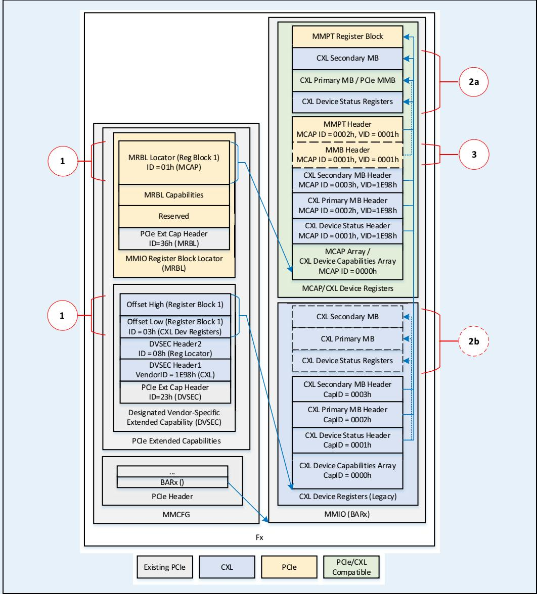

## 8.2.4.20.6 CXL HDM Decoder n Size High Register (Offset 20h\*n+1Ch)

able 8-122. CXL HDM Decoder n Size High Register (Offset 20h\*n+1Ch)

<table><tr><td>Bit Location</td><td>Attributes</td><td>Description</td></tr><tr><td>31:0</td><td>RWL</td><td>Memory Size High:Corresponds to bits[63:32] of the size of address range managed by Decoder n. The locking behavior is described in Section 8.2.4.20.13.Default value is 0000 0000h.</td></tr></table>

8.2.4.20.7 CXL HDM Decoder n Control Register (Offset 20h\*n+20h)

Table 8-123. CXL HDM Decoder n Control Register (Offset 20h\*n+20h) (Sheet 1 of 2)

<table><tr><td>Bit Location</td><td>Attributes</td><td>Description</td></tr><tr><td>3:0</td><td>RWL</td><td>Interleave Granularity (IG): The number of consecutive bytes that are assigned to each target in the Target List.0h = 256 Bytes (default)1h = 512 Bytes2h = 1024 Bytes (1 KB)3h = 2048 Bytes (2 KB)4h = 4096 Bytes (4 KB)5h = 8192 Bytes (8 KB)6h = 16,384 Bytes (16 KB)All other encodings are reservedThe device reports its desired interleave setting via the Desired_Interleave field in the DVSEC CXL Range 1/Range 2 Size Low registers (see Table 8-13 and Table 8-17, respectively).The locking behavior is described in Section 8.2.4.20.13.</td></tr><tr><td>7:4</td><td>RWL</td><td>Interleave Ways (IW): The number of targets across which Decoder n memory range is interleaved.0h = 1 way (no interleaving; default)1h = 2-way interleaving2h = 4-way interleaving3h = 8-way interleaving4h = 16-way interleaving (valid only for CXL.mem devices) $^{1}$ 8h = 3-way interleaving (valid only for CXL.mem devices) $^{1}$ 9h = 6-way interleaving (valid only for CXL.mem devices) $^{1}$ Ah = 12-way interleaving (valid only for CXL.mem devices) $^{1}$ All other encodings are reservedThe locking behavior is described in Section 8.2.4.20.13.</td></tr><tr><td>8</td><td>RWL</td><td>Lock On Commit: If set, all RWL fields in Decoder n shall become read only when the Committed bit in this register changes to 1.The locking behavior is described in Section 8.2.4.20.13.Default value is 0.</td></tr><tr><td>9</td><td>RWL</td><td>Commit: Software sets this to 1 to commit Decoder n.The locking behavior is described in Section 8.2.4.20.13.Default value is 0.A 1 to 0 transition of this bit shall cause the associated Committed bit in this register to transition from 1 to 0.</td></tr><tr><td>10</td><td>RO</td><td>Committed: If 1, indicates Decoder n is active.</td></tr><tr><td>11</td><td>RO</td><td>Error Not Committed: If 1, indicates that the programming of Decoder n had an error and Decoder n is not active.</td></tr></table>

Table 8-123. CXL HDM Decoder n Control Register (Offset 20h\*n+20h) (Sheet 2 of 2)

<table><tr><td>Bit Location</td><td>Attributes</td><td>Description</td></tr><tr><td>12</td><td>RWL/RO</td><td>Target Range Type: Formerly known as &quot;Target Device Type.&quot; This bit is RWL for CXL Host Bridges, and Upstream Switch Ports. This bit is permitted to be RO for devices that do not support this reconfigurability and it may return the value of 0 or 1 to represent the only coherency model that the devices support.0 = Target is a Device Coherent Address range (HDM-D or HDM-DB) (default)1 = Target is a Host-only Coherent Address range (HDM-H)The locking behavior is described in Section 8.2.4.20.13.</td></tr><tr><td>13</td><td>RWL/RsvdP</td><td>BI: This bit is RWL for BI-capable components. This bit is reserved for components that do not support BI. Devices that require BI for managing coherency are permitted to hardwire this bit to  $1.^{2}$ 0 = Device is not permitted to issue BISnp requests to this range1 = Device is permitted to issue BISnp requests to this range</td></tr><tr><td>14</td><td>RWL</td><td>UIO: This bit is RWL if the UIO Capable  $bit^{3}$  is set; otherwise, this bit is permitted to be hardwired to 0. Software must not set this bit unless the UIO Capable bit is set to 1.Default value is 0.See Table 9-18 for how various components utilize the setting of this bit during the processing of UIO messages. $^{2}$ </td></tr><tr><td>15</td><td>RsvdP</td><td>Reserved</td></tr><tr><td>19:16</td><td>RWL/RsvdP</td><td>Upstream Interleave Granularity (UIG): The aggregate interleave granularity applied to the HPA by the HDM decode stages that are upstream of this port. For enumeration of legal values, see the definition of Interleave Granularity in this register. $^{2}$ This bit is RWL for switches and Host Bridges if the UIO Capable  $bit^{3}$  is set.This field is reserved for CXL.mem devices. This field is also reserved for switches and Host Bridges that are not UIO capable.Default value is 0h.</td></tr><tr><td>23:20</td><td>RWL/RsvdP</td><td>Upstream Interleave Ways (UIW): The aggregate Interleave granularity ways produced by HDM decode stages that are upstream of this port. For enumeration of legal values, see the definition of Interleave Ways in this register. $^{2}$ This bit is RWL for switches and Host Bridges if the UIO Capable  $bit^{3}$  is set.This field is reserved for CXL.mem devices. This field is also reserved for switches and Host Bridges that are not UIO capable.Default value is 0h.</td></tr><tr><td>27:24</td><td>RWL/RsvdP</td><td>Interleave Set Position (ISP): The position of this component in the interleave set formed when all HDM decode stages that are upstream of this port are considered. Expressed as a 0-based quantity. For switches and Host Bridges, ISP must be configured to a value that is lower than the number of Upstream Interleave Ways (the raw value, not the encoded value); otherwise, the results are undefined. $^{2}$ This field is RWL for a BI-capable CXL.mem device. This field is also RWL for switches and Host Bridges if the UIO Capable  $bit^{3}$  is set.This field is reserved for switches and Host Bridges that are not UIO capable.This field is also reserved for CXL.mem devices that are not BI-capable.Default value is 0h.</td></tr><tr><td>31:28</td><td>RsvdP</td><td>Reserved</td></tr></table>

1. Introduced as part of Version=2.  
2. Introduced as part of Version=3.

3. Bit in the CXL HDM Decoder Capability register (see Table 8-116).

## IMPLEMENTATION NOTE

## UIW, UIG, and ISP Examples

The switch in Figure 9-16 receives all the HPAs within the range 16 to 20 TB because interleaving is not performed upstream to the switch. If the switch is capable of routing UIO accesses to CXL.mem, then the HDM decoder that spans 16 to 20 TB in that switch should be configured as follows:

• UIW=0

• ISP=0

• UIG=Any legal value

The four CXL.mem devices, from left to right, are assigned ISP=0 through 3, respectively.

The switch in Figure 9-17 receives every other 4K HPA chunk when the host accesses the range 16 to 20 TB because the Host Bridge is configured to 2-way interleave at 4K granularity. If the switch is capable of routing UIO accesses to CXL.mem, then the HDM decoder that spans 16 to 20 TB in that switch should be configured as follows:

• UIW=1 (every other chunk, so 2-way)

• ISP=0 because the switch shown in the figure receives the first chunk (ISP=1 for the switch is not shown in the figure)

• UIG= 4 (every chunk is 4K)

The 8 CXL.mem devices, from left to right, are assigned ISP=0 through 7, respectively.

The switch in Figure 9-18 receives every 4th 2K HPA chunk when the host accesses the range 16 to 20 TB. If the switch is capable of routing UIO accesses to CXL.mem, then the HDM decoder that spans 16 to 20 TB in that switch should be configured as follows:

• UIW=2 (every fourth chunk, so 4-way)

• ISP=0 because the switch receives the first chunk

• UIG= 3 (every chunk is 2K)

The eight CXL.mem devices, from left to right, are assigned ISP=0 through 7, respectively.

## 8.2.4.20.8 CXL HDM Decoder n Target List Low Register (Offset 20h\*n+24h)

This register is not applicable to devices, which use this field as DPA Skip Low as described in Section 8.2.4.20.9. The targets must be distinct and the identifier cannot repeat. For example, Target Port Identifiers for Interleave Way=0, 1, 2, 3 must be distinct if Control.IW=2.

The Target Port Identifier for a given Downstream Port is reported via the Port Number field in the Link Capabilities register (see the PCIe Base Specification).

Table 8-124. CXL HDM Decoder n Target List Low Register (Offset 20h\*n+24h)

<table><tr><td>Bit Location</td><td>Attributes</td><td>Description</td></tr><tr><td>7:0</td><td>RWL</td><td>Target Port Identifier for Interleave Way=0: The locking behavior is described in Section 8.2.4.20.13.Default value is 00h.</td></tr><tr><td>15:8</td><td>RWL</td><td>Target Port Identifier for Interleave Way=1: Valid if Decoder n Control.IW &gt; 0.The locking behavior is described in Section 8.2.4.20.13.Default value is 00h.</td></tr><tr><td>23:16</td><td>RWL</td><td>Target Port Identifier for Interleave Way=2: Valid if Decoder n Control.IW &gt; 1.The locking behavior is described in Section 8.2.4.20.13.Default value is 00h.</td></tr><tr><td>31:24</td><td>RWL</td><td>Target Port Identifier for Interleave Way=3: Valid if Decoder n Control.IW &gt; 1.The locking behavior is described in Section 8.2.4.20.13.Default value is 00h.</td></tr></table>

## 8.2.4.20.9 CXL HDM Decoder n DPA Skip Low Register (Offset 20h\*n + 24h)

This register is applicable only to devices. For non-devices, this field contains the Target List Low register as described in Section 8.2.4.20.8.

Table 8-125. CXL HDM Decoder n DPA Skip Low Register (Offset 20h\*n + 24h)

<table><tr><td>Bit Location</td><td>Attributes</td><td>Description</td></tr><tr><td>27:0</td><td>RsvdP</td><td>Reserved</td></tr><tr><td>31:28</td><td>RWL</td><td>DPA Skip Low:Corresponds to bits[31:28] of the DPA Skip length which, when nonzero, specifies a length of DPA space that is skipped, unmapped by any decoder, prior to the HPA-to-DPA mapping provided by this decoder.Default value is 0h.</td></tr></table>

## 8.2.4.20.10 CXL HDM Decoder n Target List High Register (Offset 20h\*n+28h)

This register is not applicable to devices, which use this field as DPA Skip High as described in Section 8.2.4.20.11. Returns the Target Port associated with Interleave Way 4 through 7.

The targets must be distinct. For example, all eight Target Port Identifiers must be distinct if Control.IW=3.

Table 8-126. CXL HDM Decoder n Target List High Register (Offset 20h\*n+28h) (Sheet 1 of 2)

<table><tr><td>Bit Location</td><td>Attributes</td><td>Description</td></tr><tr><td>7:0</td><td>RWL</td><td>Target Port Identifier for Interleave Way=4: Valid if Decoder n Control.IW &gt; 2.The locking behavior is described in Section 8.2.4.20.13.Default value is 00h.</td></tr><tr><td>15:8</td><td>RWL</td><td>Target Port Identifier for Interleave Way=5: Valid if Decoder n Control.IW &gt; 2.The locking behavior is described in Section 8.2.4.20.13.Default value is 00h.</td></tr></table>

Table 8-126. CXL HDM Decoder n Target List High Register (Offset 20h\*n+28h) (Sheet 2 of 2)

<table><tr><td>Bit Location</td><td>Attributes</td><td>Description</td></tr><tr><td>23:16</td><td>RWL</td><td>Target Port Identifier for Interleave Way=6: Valid if Decoder n Control.IW &gt; 2.The locking behavior is described in Section 8.2.4.20.13.Default value is 00h.</td></tr><tr><td>31:24</td><td>RWL</td><td>Target Port Identifier for Interleave Way=7: Valid if Decoder n Control.IW &gt; 2.The locking behavior is described in Section 8.2.4.20.13.Default value is 00h.</td></tr></table>

## 8.2.4.20.11 CXL HDM Decoder n DPA Skip High Register (Offset 20h\*n + 28h)

This register is applicable only to devices. For non-devices, this field contains the Target List High register as described in Section 8.2.4.20.10.

Table 8-127. CXL HDM Decoder n DPA Skip High Register (Offset 20h\*n + 28h)

<table><tr><td>Bit Location</td><td>Attributes</td><td>Description</td></tr><tr><td>31:0</td><td>RWL</td><td>DPA Skip High:Corresponds to bits[63:32] of the DPA Skip length which, when nonzero, specifies a length of DPA space that is skipped, unmapped by any decoder, prior to the HPA-to-DPA mapping provided by this decoder.Default value is 0000 0000h.</td></tr></table>

## 8.2.4.20.12 Committing Decoder Programming

If Software intends to set Lock On Commit, Software must configure the decoders in order. In other words, decoder m must be configured and committed before decoder m+1 for all values of m. Decoder m must cover an HPA range that is below decoder m+1.

Each interleave decoder must be committed before it actively decodes CXL.mem transactions. Software configures all the registers associated with the individual decoder and optionally sets the Lock On Commit bit prior to setting the Commit bit. When the Commit bit in decoder m+1 transitions from 0 to 1 and Lock On Commit=1, the decoder logic shall perform the following consistency checks before setting Committed bit:

• Decoder[m+1].Base ≥ (Decoder[m].Base+Decoder[m].Size). This ensures that the Base of the decoder being committed is greater than or equal to the limit of the previous decoder. This check is not applicable when committing Decoder 0.

• Decoder[m+1].Base ≤ Decoder[m+1].Base+Decoder[m+1].Size (no wraparound)

• If Decoder[m+1].IW ≥ 8, Decoder[m+1].Size is a multiple of 3.

• Target Port Identifiers for Interleave Way=0 through 2\*\*IW –1 must be distinct. This ensures no two interleave ways are pointing to the same target.

• Decoder[m].Committed=1. This ensures that the previous decoder is committed and has passed the above checks.

Decoder logic does not allow Decoder[m+1] registers to be modified while these checks are in progress (Commit=1, (Committed OR ErrorNotCommited)=0). If software attempts to modify Decoder[m+1] while the checks are in progress, it will lead to undefined behavior.

These checks ensure that all decoders within a given component are self-consistent and do not create aliasing.

It is legal for software to program Decoder Size to 0 and commit it. Such a decoder will not participate in HDM decode.

If these checks fail and the decoder is not committed, decoder logic shall set Error Not Committed flag. Software may remedy this situation by clearing the Commit bit, reprogramming the decoder with legal values and setting Commit bit once again.

If Lock On Commit=0, decoder logic does not implement the address aliasing checks. Software is fully responsible for avoiding aliasing and protecting the HDM Decoder registers via other mechanisms such as CPU page tables.

Regardless of the setting of the Lock on Commit bit, the decoder logic in a UIO-capable switch or root port shall ensure that the number of decoders configured with UIO=1 does not exceed the number of UIO-capable decoders encoded in the CXL HDM Decoder Capability register (see Table 8-116). If software attempts to violate this restriction, the decode logic shall set ErrorOnCommit=1.

If the device requires BI for managing coherency, software must ensure that the BI bit is set to 1 in the CXL HDM Decoder Control register(s) (see Table 8-123) before committing the HDM decoder; otherwise, the device operation is undefined. Software must ensure that the device and any applicable DSPs, USPs, and the RP are configured such that the device is able to issue a BISnp request before committing any HDM decoder with the BI bit set to 1; otherwise, the device operation is undefined.

Decoder logic shall set either Committed or Error Not Committed flag within 10 ms of a write to the Commit bit.

## 8.2.4.20.13 Decoder Protection

Software may choose to set the Lock On Commit bit prior to setting Commit. If the Lock On Commit bit is 1, Decoder logic shall perform alias checks listed in the previous section prior to committing the decoder and further disallow modifications to all RWL fields in that decoder when the decoder is in Committed state.

If the Lock On Commit bit is 0, software may clear the Commit bit, reprogram the decoder fields, and then set the Commit bit again for the new values to take effect. Reprogramming the decoder while the Commit bit is set results in undefined behavior. To avoid misbehavior, software is responsible for quiescing memory traffic that is targeting the decoder while it is being reprogrammed. If decoder logic does not positively decode an address of a read, it may either return all 1s or return poison based on the CXL HDM Decoder Global Control register setting (see Table 8-118). During reprogramming, software must follow the same restrictions as the initial programming. Specifically, decoder m must be configured and committed before decoder m+1 for all values of m; Decoder m must cover an HPA range that is below decoder m+1 and all Targets must be distinct.

## IMPLEMENTATION NOTE

Software may set Lock On Commit=1 in systems that do not support Hot-Plug. In such systems, the decoders are generally programmed at boot, can be arranged in increasing HPA order and never modified until the next reset.

If the system supports CXL Hot-Plug, software may need significant flexibility in terms of reprogramming the decoders during runtime. In such systems, software may choose to leave Lock On Commit=0.

## IMPLEMENTATION NOTE

## CXL Host Bridge and Upstream Switch Port Decode Flow

Step 1: Check if the incoming HPA satisfies Base ≤ HPA < Base+Size for any active decoder. If no decoder satisfies this equation for a write, drop the writes. If no decoder satisfies this equation for a read and Poison On Decode Error Enable=0, return all 1s. If no decoder satisfies this equation for a read and Poison On Decode Error Enable=1, return poison.

Step 2: If Decoder[n] satisfies this equation:

• Extract IW bits starting with bit position IG+8 in the $\mathsf { H P A } ^ { 1 }$ . This returns the Interleave Way.

• Send transactions to Downstream Port=Decoder[n].Target List[Interleave Way].

## Example:

• HPA = 129 GB + 1028d

• Decoder[2].Base= 128 GB, Decoder[2].Size = 4 GB.

• Assume IW=2 (4 way), IG = 1 (512 bytes).

Step 1: Decoder[2] positively decodes this address, so n=2.

Step 2: Extracting bits[10:9] from the HPA returns Interleave Way=2 (HPA=… xxxx 0000 0100 0000 0100b).

Forward access to Port number Decoder[2].Target List Low[23:16].

## IMPLEMENTATION NOTE

## Device Decode Logic

As part of Commit processing flow, the device decoder logic may accumulate DPABase field for every decoder as follows:

• Decoder[0].DPABase = Decoder[0].DPASkip

• If IW < 8, Decoder[m+1]. DPABase = Decoder[m+1].DPASkip + Decoder[m].DPABase + (Decoder[m].Size / 2 \*\* Decoder[m].IW)

• If IW ≥ 8, Decoder[m+1]. DPABase = Decoder[m+1].DPASkip + Decoder[m].DPABase + (Decoder[m].Size / (3 \* 2 \*\* (Decoder[m].IW-8)

DPABase is not exposed to software, but may be tracked internally by the decoder logic to speed up decode process. Decoder[m].DPABase represents the lowest DPA that the lowest HPA decoded by Decoder[m] maps to. The DPA mappings for a device typically start at DPA 0 for Decoder[0] and are sequentially accumulated with each additional decoder used; however, the DPASkip field in the decoder may be used to leave ranges of DPA unmapped, as required by the needs of the platform.

## During the decode:

Step 1: Check if the incoming HPA satisfies Base ≤ HPA < Base+Size for any active decoder. If no decoder satisfies this equation for a write, drop the writes. If no decoder satisfies this equation for a read and Poison On Decode Error Enable=0, return all 1s. If no decoder satisfies this equation for a read and Poison On Decode Error Enable=1, return poison.

Step 2: If Decoder[n] satisfies this equation.

• Calculate HPAOffset = HPA – Decoder[n].Base

If IW <8, removes IW bits starting with bit position IG+8 in HPAOffset to get DPAOffset. This operation will right shift the bits above IG+IW+8 by IW positions. DPAOffset[51:IG+8]=(HPAOffset[51:IG+8+IW] DPAOffset[IG+7:0]=HPAOffset[IG+7:0].

DPAOffset[IG+7:0]=HPAOffset[IG+7:0]

• DPA=DPAOffset + Decoder[n].DPABase.

The above calculation is applied by the device regardless of the Interleave Arithmetic field in the corresponding CFMWS entry.

## Example:

• HPA = 129 GB + 1028d

• Software programmed Decoder[0].Base= 32 GB, Decoder[0].Size = 32 GB.

• Software programmed Decoder[1].Base= 128 GB, Decoder[1].Size = 4 GB.

• Assume IW=3 (8 way), IG = 1 (512 bytes) for both decoders.

• Decoder[1].DPABase= 32/8 GB = 4 GB

Step 1: Select Decoder[1].

## Step 2:

• HPAOffset = 1 GB + 1028d (4000 0404h, 0404h=0000 0100 0000 0100b)

• Removing bits[11:9] from HPA returns DPAOffset=800 0004h.

Add DPABase 4 GB to get DPA= 1 0800 0004h.

## Example 2:

• HPA = 128 GB + 24920d

• Software programmed Decoder[0].Base= 32 GB, Decoder[0].Size = 48 GB.

• Software programmed Decoder[1].Base= 128 GB, Decoder[1].Size = 24 GB.

• Assume IW=10 (12 way), IG = 1 (512 bytes) for both decoders. Notice the Size of both decoders is a multiple of 3.

• Decoder[1].DPABase= 48 GB/12 = 4 GB

Step 1: Select Decoder[1].

## Step 2:

• HPAOffset = 24920d=0110 0001 0101 1000h

• DPAOffset[51:9]=HPAOffset[51:11]/3d= 0 1100b /3=04h

• DPAOffset[8:0]= HPAOffset[8:0]=1 0101 1000b

• DPAOffset=1001 0101 1000b=958h

Add DPABase 4 GB to get DPA= 1 0000 0958h.

## 8.2.4.21 CXL Extended Security Capability Structure

This capability structure applies only to the CXL Host Bridge and may be located in CHBCR.

Table 8-128. CXL Extended Security Capability Structure

<table><tr><td>Offset</td><td>Register Name</td></tr><tr><td>00h</td><td>CXL Extended Security Structure Entry Count.n (Max 256)</td></tr><tr><td>04h</td><td>Root Port 1 Security Policy</td></tr><tr><td>08h</td><td>Root Port 1 ID</td></tr><tr><td>0Ch</td><td>Root Port 2 Security Policy</td></tr><tr><td>10h</td><td>Root Port 2 ID</td></tr><tr><td>...</td><td>...</td></tr><tr><td>8*n-4</td><td>Root Port n Security Policy</td></tr><tr><td>8*n</td><td>Root Port n ID</td></tr></table>

Table 8-129. CXL Extended Security Structure Entry Count (Offset 00h)

<table><tr><td>Bit Location</td><td>Attributes</td><td>Description</td></tr><tr><td>7:0</td><td>HwInit</td><td>Root Port Count:The number of Extended Security Structures that are part of this capability structure.The number of entries must match the CXL.cache-capable Root Ports that are associated with this Host Bridge. Each entry consists of two DWORD registers — Security Policy and Root Port ID.</td></tr><tr><td>31:8</td><td>RsvdP</td><td>Reserved</td></tr></table>

Table 8-130. Root Port n Security Policy Register (Offset 8\*n-4)

<table><tr><td>Bit Location</td><td>Attributes</td><td>Description</td></tr><tr><td>1:0</td><td>RW</td><td>Trust Level: If the host supports only 1 CXL.cache device per VCS, this field defines the Trust Level for the CXL.cache Device below Root Port n (see Table 8-103 for definition of this field).If the host supports more than 1 CXL.cache device per VCS, this field defines the Trust Level that is applied to all the CXL.cache devices below this root port. For an HDM-DB device, Trust Level=01b is equivalent to 00b.Default value is 10b.</td></tr><tr><td>31:2</td><td>RsvdP</td><td>Reserved</td></tr></table>

Table 8-131. Root Port n ID Register (Offset 8\*n)

<table><tr><td>Bit Location</td><td>Attributes</td><td>Description</td></tr><tr><td>7:0</td><td>HwInit</td><td>Port Identifier of Root Port n (referenced using the Port Number field in the Link Capabilities register (see the PCIe Base Specification)).</td></tr><tr><td>31:8</td><td>RsvdP</td><td>Reserved</td></tr></table>

## 8.2.4.22 CXL IDE Capability Structure

able 8-132. CXL IDE Capability Structure

<table><tr><td>Offset</td><td>Register Name</td></tr><tr><td>00h</td><td>CXL IDE Capability Register</td></tr><tr><td>04h</td><td>CXL IDE Control</td></tr><tr><td>08h</td><td>CXL IDE Status</td></tr><tr><td>0Ch</td><td>CXL IDE Error Status</td></tr><tr><td>10h</td><td>Key Refresh Time Capability</td></tr><tr><td>14h</td><td>Truncation Transmit Delay Capability</td></tr><tr><td>18h</td><td>Key Refresh Time Control</td></tr><tr><td>1Ch</td><td>Truncation Transmit Delay Control</td></tr><tr><td>20h</td><td>Key Refresh Time Capability2</td></tr></table>

8.2.4.22.1 CXL IDE Capability (Offset 00h)

Table 8-133. CXL IDE Capability (Offset 00h)

<table><tr><td>Bit Location</td><td>Attributes</td><td>Description</td></tr><tr><td>0</td><td>HwInit</td><td>CXL IDE Capable: When set, indicates that the Port supports CXL IDE.</td></tr><tr><td>16:1</td><td>HwInit</td><td>Supported CXL IDE ModesBit[1]: If set, Skid mode is supported.Bit[2]: If set, Containment mode is supported. If bit[0] in this register is set, this bit must be set as well.Bits[16:3]: Reserved.</td></tr><tr><td>21:17</td><td>HwInit</td><td>Supported Algorithms: Indicates the supported algorithms for securing CXL IDE, encoded as:00h = AES-GCM 256-bit key size, 96-bit MACAll other encodings are reserved</td></tr><tr><td>22</td><td>HwInit/RsvdP</td><td>IDE.Stop Capable: Indicates that the port Tx supports generation of an IDE.Stop control flit and the port Rx supports processing of an IDE.Stop control flit when operating in 256B Flit mode (see Section 11.3.10). This bit is reserved for ports that are not capable of operating in 256B Flit mode.1</td></tr><tr><td>23</td><td>HwInit/RsvdP</td><td>LOpt IDE Capable: If set, this component supports IDE when the link is operating in Latency-Optimized 256B Flit mode (see Figure 11-13 and Figure 11-14).2If 0, this component does not support IDE when the link is operating in Latency-Optimized 256B Flit mode. If the link is operating in Latency-Optimized 256B Flit mode, the System Firmware or System Software must clear the CXL_Latency_Optimized_256B_Flit_Enable bit in the DVSEC Flex Bus Port Control register (see Table 8-67) in the Downstream Port and then retrain the link prior to enabling IDE. After IDE is terminated, the System Firmware or System Software may set the CXL_Latency_Optimized_256B_Flit_Enable bit in the Downstream Port and then retrain the link so that the link can transition to Latency-Optimized 256B Flit mode.</td></tr><tr><td>24</td><td>HwInit/RsvdP</td><td>IDE Protect LLCTRL Poison Message Capable: If set, this component supports IDE protection of LLCTRL In-band Error poison information.</td></tr><tr><td>31:25</td><td>RsvdP</td><td>Reserved</td></tr></table>

1. This bit was introduced as part of Version=2. 2. This bit was introduced as part of Version=3.

## 8.2.4.22.2 CXL IDE Control (Offset 04h)

Table 8-134. CXL IDE Control (Offset 04h)

<table><tr><td>Bit Location</td><td>Attributes</td><td>Description</td></tr><tr><td>0</td><td>RW</td><td>PCRC Disable: When set, PCRC generation is disabled and MAC calculation does not include PCRC. Software must ensure that this bit is programmed consistently on both ends of the CXL link.Changes to this bit when CXL.cachemem IDE is active results in undefined behavior.Default value is 0.</td></tr><tr><td>1</td><td>RW/RsvdP</td><td>IDE.Stop Enable: Enables generation of IDE.Stop control flit by the port Tx and processing of IDE.Stop control flit by the port Rx when operating in 256B Flit mode. $^{1}$ This bit must be RW if the IDE.Stop Capable bit $^{2}$ is set; otherwise, this bit is permitted to be hardwired to 0. Software must not set this bit unless the IDE.Stop Capable bit is set to 1.Default value is 0.</td></tr><tr><td>2</td><td>RW/RsvdP</td><td>IDE Protect LLCTRL Poison Message Enable: Enables IDE protection of LLCTRL In-band Error poison. The bit must be RW if the IDE Protect LLCTRL Poison Message Capable bit $^{2}$ is set.Software must not set this bit unless both ends of the link have the IDE Protect LLCTRL Poison Message Capable bit set.Default value is 0.</td></tr><tr><td>31:3</td><td>RsvdP</td><td>Reserved</td></tr></table>

1. This bit was introduced as part of Version=2.

2. Bit in the CXL IDE Capability register (see Table 8-133).

## 8.2.4.22.3 CXL IDE Status (Offset 08h)

Table 8-135. CXL IDE Status (Offset 08h)

<table><tr><td>Bit Location</td><td>Attributes</td><td>Description</td></tr><tr><td>3:0</td><td>RO</td><td>Rx IDE Status0h = Reserved1h = Active Containment mode2h = Active Skid mode4h = Insecure StateAll other encodings are reserved</td></tr><tr><td>7:4</td><td>RO</td><td>Tx IDE Status0h = Reserved1h = Active Containment mode2h = Active Skid mode4h = Insecure StateAll other encodings are reserved</td></tr><tr><td>31:8</td><td>RsvdZ</td><td>Reserved</td></tr></table>

8.2.4.22.4 CXL IDE Error Status (Offset 0Ch)  
Table 8-136. CXL IDE Error Status (Offset 0Ch)

<table><tr><td>Bit Location</td><td>Attributes</td><td>Description</td></tr><tr><td>3:0</td><td>RW1CS</td><td>Rx Error Status:Describes the error condition that transitioned the link to Insecure state if IDE stream is active. The component behavior upon this transition is defined in Section 11.3.8.0h = No Error1h = Integrity failure on received secure traffic2h = MAC or Truncated MAC received when the link is not in secure mode (when integrity is not enabled and the receiver detects MAC header)3h = MAC header received when not expected (No MAC epoch is running, but the receiver detects a MAC header)4h = MAC header is not received when expected (MAC header not received within six flits after MAC epoch has terminated)5h = Truncated MAC flit is received when not expected (if the receiver receives a Truncated MAC flit that corresponds to a completed MAC epoch)6h = After early MAC termination, the receiver detects a protocol flit (or LLCTRL Poison flit when the IDE Protect LLCTRL Poison Message Enable bit $^{1}$ is set to 1) before the truncation delay7h = This error code encompasses the following conditions:- Protocol flit (or LLCTRL Poison flit when the IDE Protect LLCTRL Poison Message Enable bit $^{2}$ is set to 1) received earlier than expected after key change (see Section 11.3.7 for the detailed timing requirements)- Rx IDE Stop.Enable=1 and a protocol flit (or LLCTRL Poison flit when the IDE Protect LLCTRL Poison Message Enable bit $^{2}$ is set to 1) received earlier than expected after an IDE Termination Handshake (see Section 11.3.10 for the detailed timing requirements)8h = CXL.cachemem IDE Establishment Security error. This error code encompasses the following conditions:- IDE.Start is received prior to a successful CXL_KEY_PROG since the last Conventional Reset- IDE.Start is received prior to a successful CXL_KEY_PROG since the last IDE.Start- IDE.Start is received prior to a successful CXL_K_SET_GO since the last Conventional Reset- IDE.Start is received prior to a successful CXL_K_SET_GO since the last IDE.Start- CXL_IDE_KM message received over a different SPDM session (see Section 11.4.2)- IDE.Start is received in the middle of a MAC epoch (see Section 11.3.7)9h = Containment Buffer OverflowAll other encodings are reserved</td></tr><tr><td>7:4</td><td>RW1CS</td><td>Tx IDE Status0h = No ErrorAll other encodings are reserved</td></tr><tr><td>8</td><td>RW1CS</td><td>Unexpected IDE.Stop Received:This bit is set by the Rx port upon the following conditions:Received IDE.Stop Link Layer Control flit while CXL.cachemem IDE is active, but prior to a successful CXL_K_SET_STOP since the last IDE.Start (see Section 11.4.6)Received IDE.Stop Link Layer Control flit while IDE Stop.Enable=0 and IDE Stop.Capable=1 (see Section 11.3.10)Received IDE.Stop Link Layer Control flit while IDE session is not active (see Section 11.3.10)Valid TMAC sequence not received before IDE.Stop (see Section 11.3.10)In all of these cases, the Rx shall drop the IDE.Stop but shall not terminate the CXL.cachemem IDE session if one is active.</td></tr><tr><td>31:9</td><td>RsvdZ</td><td>Reserved</td></tr></table>

1. Bit in the CXL IDE Control register (see Table 8-134).

## 8.2.4.22.5 Key Refresh Time Capability (Offset 10h)

Table 8-137. Key Refresh Time Capability (Offset 10h)

<table><tr><td>Bit Location</td><td>Attributes</td><td>Description</td></tr><tr><td>31:0</td><td>HwInit</td><td>Rx Min Key Refresh Time:Number of IDE.Idle flits the receiver needs before it is ready to receive protocol flits after IDE.Start is received when operating in 68B Flit mode. The Tx Key Refresh Time field in the Key Refresh Time Control register (see Table 8-139) in the transmitter is configured by System Software to block transmission of protocol flits for at least this duration when switching keys (see Section 11.3.7) or terminating IDE (see Section 11.3.10) when the link is operating in 68B Flit mode.</td></tr></table>

## 8.2.4.22.6 Truncation Transmit Delay Capability (Offset 14h)

Table 8-138. Truncation Transmit Delay Capability (Offset 14h)

<table><tr><td>Bit Location</td><td>Attributes</td><td>Description</td></tr><tr><td>7:0</td><td>HwInit</td><td>Rx Min Truncation Transmit Delay: Number of IDE.Idle flits the receiver needs before it is ready to receive protocol flits after a Truncated MAC is received when operating in 68B Flit mode. The Tx Truncation Transmit Delay field (see Table 8-140) in the transmitter is configured, by software, to block transmission of protocol flits for at least this duration when the link is operating in 68B Flit mode.</td></tr><tr><td>15:8</td><td>HwInit</td><td>Rx Min Truncation Transmit Delay2: Number of IDE.Idle flits the receiver needs before it is ready to receive protocol flits after a Truncated MAC is received when operating in 256B Flit mode. The Tx Truncation Transmit Delay field (see Table 8-140) in the transmitter is configured, by software, to block transmission of protocol flits for at least this duration when the link is operating in 256B Flit mode. $^{1}$ </td></tr><tr><td>31:16</td><td>RsvdP</td><td>Reserved</td></tr></table>

1. This field was introduced as part of Version=2.

## 8.2.4.22.7 Key Refresh Time Control (Offset 18h)

Table 8-139. Key Refresh Time Control (Offset 18h)

<table><tr><td>Bit Location</td><td>Attributes</td><td>Description</td></tr><tr><td>31:0</td><td>RW</td><td>Tx Key Refresh Time: For 68B Flit mode, this register represents the minimum number of flits that the transmitter needs to block transmission of protocol flits after IDE.Start has been sent. For 256B Flit mode, this register represents the minimum number of flits that the transmitter needs to block transmission of protocol flits after IDE.Start has been sent or after IDE.Stop has been sent. Used when switching keys (see Section 11.3.7) or gracefully terminating IDE (256B Flit mode only, see Section 11.3.10).Default value is 0000 0000h.</td></tr></table>

## 8.2.4.22.8 Truncation Transmit Delay Control (Offset 1Ch)

Table 8-140. Truncation Transmit Delay Control (Offset 1Ch)

<table><tr><td>Bit Location</td><td>Attributes</td><td>Description</td></tr><tr><td>7:0</td><td>RW</td><td>Tx Truncation Transmit Delay:Configuration parameter to account for the potential discarding of any precomputed values by the receiver. This parameter feeds into the computation of the minimum number of IDE.Idle flits that the Transmitter needs to send after sending a Truncated MAC flit. See Equation 11-1.Default value is 00h.</td></tr><tr><td>31:8</td><td>RsvdP</td><td>Reserved</td></tr></table>

8.2.4.22.9 Key Refresh Time Capability2 (Offset 20h)

Table 8-141. Key Refresh Time Capability2 (Offset 20h)

<table><tr><td>Bit Location</td><td>Attributes</td><td> $Description^{1}$ </td></tr><tr><td>31:0</td><td>HwInit</td><td>Rx Min Key Refresh Time2:Number of IDE.Idle flits the receiver needs to be ready to receive protocol flits after either IDE.Start or IDE.Stop is received when operating in 256B Flit mode. The Tx Key Refresh Time field in the Key Refresh Time Control register (see Table 8-139) in the transmitter is configured by System Software to block transmission of protocol flits for at least this duration when switching keys (see Section 11.3.7) or terminating IDE (see Section 11.3.10) when the link is operating in 256B Flit mode.</td></tr></table>

1. This register was introduced as part of Version=2.

## 8.2.4.23 CXL Snoop Filter Capability Structure

Table 8-142. CXL Snoop Filter Capability Structure

<table><tr><td>Offset</td><td>Register Name</td></tr><tr><td>00h</td><td>Snoop Filter Group ID</td></tr><tr><td>04h</td><td>Snoop Filter Capacity</td></tr></table>

## 8.2.4.23.1 Snoop Filter Group ID (Offset 00h)

Table 8-143. Snoop Filter Group ID (Offset 00h)

<table><tr><td>Bit Location</td><td>Attributes</td><td>Description</td></tr><tr><td>15:0</td><td>HwInit</td><td>Group ID: Uniquely identifies a snoop filter instance that is used to track CXL.cache devices below this Port. All Ports that share a single Snoop Filter instance shall set this field to the same value.</td></tr><tr><td>31:16</td><td>RsvdP</td><td>Reserved</td></tr></table>

## 8.2.4.23.2 Snoop Filter Effective Size (Offset 04h)

Table 8-144. Snoop Filter Effective Size (Offset 04h)

<table><tr><td>Bit Location</td><td>Attributes</td><td>Description</td></tr><tr><td>31:0</td><td>HwInit</td><td>Capacity:Effective Snoop Filter Capacity representing the size of cache that can be effectively tracked by the Snoop Filter with this Group ID, in multiples of 64K.</td></tr></table>

## 8.2.4.24 CXL Timeout and Isolation Capability Structure

Table 8-145. CXL Timeout and Isolation Capability Structure

<table><tr><td>Offset</td><td>Register Name</td></tr><tr><td>00h</td><td>CXL Timeout and Isolation Capability Register</td></tr><tr><td>04h</td><td>Reserved</td></tr><tr><td>08h</td><td>CXL Timeout and Isolation Control Register</td></tr><tr><td>0Ch</td><td>CXL Timeout and Isolation Status Register</td></tr></table>

8.2.4.24.1 CXL Timeout and Isolation Capability Register (Offset 00h)

Table 8-146. CXL Timeout and Isolation Capability Register (Offset 00h) (Sheet 1 of 2)

<table><tr><td>Bit Location</td><td>Attributes</td><td>Description</td></tr><tr><td>3:0</td><td>RO</td><td>CXL.mem Transaction Timeout Ranges Supported: This field indicates support for transaction timeout ranges on CXL.mem.Four time value ranges are defined:Range A: Default range: 50 us to 10 ms.Range B: 10 ms to 250 msRange C: 250 ms to 4 secondsRange D: 4 seconds to 64 secondsBits are set according to the values listed below to show the supported timeout value ranges:0h = Transaction Timeout programming is not supported — the function must implement a timeout value within the range of 50 us to 10 ms.1h = Range A2h = Range B3h = Ranges A and B6h = Ranges B and C7h = Ranges A, B, and CEh = Ranges B, C, and DFh = Ranges A, B, C, and DAll other encodings are reserved</td></tr><tr><td>4</td><td>RO</td><td>CXL.mem Transaction Timeout Supported: The value of 1 indicates support for CXL.mem Transaction Timeout mechanism.</td></tr><tr><td>7:5</td><td>RsvdP</td><td>Reserved</td></tr><tr><td>11:8</td><td>RO</td><td>CXL.cache Transaction Timeout Ranges Supported: This field indicates support for transaction timeout ranges on CXL.cache.Four time value ranges are defined:Range A: Default range: 50 us to 10 ms.Range B: 10 ms to 250 msRange C: 250 ms to 4 secondsRange D: 4 seconds to 64 secondsBits are set according to the values listed below to show the supported timeout value ranges:0h = Transaction Timeout programming is not supported — the function must implement a timeout value within the range of 5O us to 10 ms.1h = Range A2h = Range B3h = Ranges A and B6h = Ranges B and C7h = Ranges A, B, and CEh = Ranges B, C, and DFh = Ranges A, B, C, and DAll other encodings are reserved</td></tr></table>

Table 8-146. CXL Timeout and Isolation Capability Register (Offset 00h) (Sheet 2 of 2)

<table><tr><td>Bit Location</td><td>Attributes</td><td>Description</td></tr><tr><td>12</td><td>RO</td><td>CXL.cache Transaction Timeout Supported: The value of 1 indicates support for CXL.cache Transaction Timeout mechanism.</td></tr><tr><td>15:13</td><td>RsvdP</td><td>Reserved</td></tr><tr><td>16</td><td>RO</td><td>CXL.mem Isolation Supported: This bit indicates support for Isolation on CXL.mem.</td></tr><tr><td>17</td><td>RO</td><td>CXL.mem Isolation Link Down Supported: This bit indicates support for triggering of Link Down on the CXL port if CXL.mem enters Isolation mode. This bit can only be set to 1 if the CXL.mem Isolation Supported bit is also set to 1.</td></tr><tr><td>18</td><td>RO</td><td>CXL.cache Isolation Supported: This bit indicates support for Isolation on CXL.cache.</td></tr><tr><td>19</td><td>RO</td><td>CXL.cache Isolation Link Down Supported: This bit indicates support for triggering of Link Down on the CXL Root Port if CXL.cache enters Isolation mode. This bit can only be set to 1 if the CXL.cache Isolation Supported bit is also set to 1.</td></tr><tr><td>24:20</td><td>RsvdP</td><td>Reserved</td></tr><tr><td>25</td><td>RO</td><td>Isolation ERR_COR Signaling Supported: If set, this bit indicates that the Root Port supports the ability to signal with ERR_COR when Isolation is triggered.</td></tr><tr><td>26</td><td>RO</td><td>Isolation Interrupt Supported: This bit indicates support for signaling an interrupt when Isolation is triggered.</td></tr><tr><td>31:27</td><td>RO</td><td>Isolation Interrupt Message Number: This field indicates which MSI/MSI-X vector is used for the interrupt message generated in association with the CXL Timeout and Isolation Capability structure. This field is valid only if Isolation Interrupt Supported is 1.For MSI, the value in this field indicates the offset between the base Message Data and the interrupt message that is generated. Hardware is required to update this field so that it is correct if the number of MSI Messages assigned to the Function changes when software writes to the Multiple Message Enable field in the Message Control register for MSI.For MSI-X, the value in this field indicates which MSI-X Table entry is used to generate the interrupt message. The entry must be one of the first 32 entries even if the Function implements more than 32 entries. For a given MSI-X implementation, the entry must remain constant.If both MSI and MSI-X are implemented, they are permitted to use different vectors, though software is permitted to enable only one mechanism at a time. If MSI-X is enabled, the value in this field must indicate the vector for MSI-X. If MSI is enabled or neither is enabled, the value in this field must indicate the vector for MSI. If software enables both MSI and MSI-X at the same time, the value in this field is undefined.</td></tr></table>

## 8.2.4.24.2 CXL Timeout and Isolation Control Register (Offset 08h)

Table 8-147. CXL Timeout and Isolation Control Register (Offset 08h) (Sheet 1 of 3)

<table><tr><td>Bit Location</td><td>Attributes</td><td>Description</td></tr><tr><td>3:0</td><td>RW/RO</td><td>CXL.mem Transaction Timeout Value: In CXL Root Port Functions that support Transaction Timeout programmability, this field allows system software to modify the Transaction Timeout Value for CXL.mem.Functions that support Transaction Timeout programmability must support the values provided below that correspond to the programmability ranges indicated in the CXL.mem Transaction Timeout Ranges Supported field1. Defined encodings:0h = Default range: 50 us to 10 msValues available if Range A (50 us to 10 ms) is supported:- 1h = 50 us to 100 us- 2h = 1 ms to 10 msValues available if Range B (10 ms to 250 ms) is supported:- 5h = 16 ms to 55 ms- 6h = 65 ms to 210 msValues available if Range C (250 ms to 4 seconds) is supported:- 9h = 260 ms to 900 ms- Ah = 1 second to 3.5 secondsValues available if Range D (4 seconds to 64 seconds) is supported:- Dh = 4 seconds to 13 seconds- Eh = 17 seconds to 64 secondsAll other encodings are reservedSoftware is permitted to change the value of this field at any time. For Requests already pending when the Transaction Timeout Value is changed, hardware is permitted to:Use either the new value or the old value for the outstanding RequestsBase the start time for each Request on either the time at which this value was changed or the time at which each request was issuedThis field must be RW if the CXL.mem Transaction Timeout Supported bit1is set; otherwise, this field is permitted to be hardwired to 0h.Default value is 0h.</td></tr><tr><td>4</td><td>RW/RO</td><td>CXL.mem Transaction Timeout Enable: When set, this bit enables the CXL.mem Transaction Timeout detection mechanism.Software is permitted to set or clear this bit at any time. If there are outstanding Transactions when the bit is set, hardware is permitted but not required to apply the completion timeout mechanism to the outstanding Transactions. If this is done, hardware is permitted to base the start time for each Transaction on either the time at which this bit was set or the time at which each Request was issued.This bit must be RW if the CXL.mem Transaction Timeout Supported bit1is set; otherwise, this bit is permitted to be hardwired to 0. Software must not set this bit unless the CXL.mem Transaction Timeout Supported bit is set.Default value is 0.</td></tr><tr><td>7:5</td><td>RsvdP</td><td>Reserved</td></tr></table>

Table 8-147. CXL Timeout and Isolation Control Register (Offset 08h) (Sheet 2 of 3)

<table><tr><td>Bit Location</td><td>Attributes</td><td>Description</td></tr><tr><td>11:8</td><td>RW/RO</td><td>CXL.cache Transaction Timeout Value: In CXL Root Port Functions that support Transaction Timeout programmability, this field allows system software to modify the Transaction Timeout Value for CXL.cache.Functions that support Transaction Timeout programmability must support the values provided below that correspond to the programmability ranges indicated in the CXL.cache Transaction Timeout Ranges Supported field $^{1}$ .Defined encodings:0h = Default range: 50 us to 10 msValues available if Range A (50 us to 10 ms) is supported:— 1h = 50 us to 100 us— 2h = 1 ms to 10 msValues available if Range B (10 ms to 250 ms) is supported:— 5h = 16 ms to 55 ms— 6h = 65 ms to 210 msValues available if Range C (250 ms to 4 seconds) is supported:— 9h = 260 ms to 900 ms— Ah = 1 second to 3.5 secondsValues available if Range D (4 seconds to 64 seconds) is supported:— Dh = 4 seconds to 13 seconds— Eh = 17 seconds to 64 secondsAll other encodings are reservedSoftware is permitted to change the value of this field at any time. For Requests already pending when the Transaction Timeout Value is changed, hardware is permitted to:Use either the new value or the old value for the outstanding RequestsBase the start time for each Request on either the time at which this value was changed or the time at which each request was issuedThis field must be RW if the CXL.cache Transaction Timeout Supported bit $^{1}$  is set; otherwise, this field is permitted to be hardwired to 0h.Default value is 0h.</td></tr><tr><td>12</td><td>RW/RO</td><td>CXL.cache Transaction Timeout Enable: When set, this bit enables the CXL.cache Transaction Timeout detection mechanism.Software is permitted to set or clear this bit at any time. If there are outstanding Transactions when the bit is set, hardware is permitted but not required to apply the completion timeout mechanism to the outstanding Transactions. If this is done, hardware is permitted to base the start time for each Transaction on either the time at which this bit was set or the time at which each Request was issued.This bit must be RW if the CXL.cache Transaction Timeout Supported bit $^{1}$  is set; otherwise, this bit is permitted to be hardwired to 0. Software must not set this bit unless the CXL.cache Transaction Timeout Supported bit is set.Default value is 0.</td></tr><tr><td>15:13</td><td>RW/RO</td><td>Reserved</td></tr><tr><td>16</td><td>RW/RO</td><td>CXL.mem Isolation Enable: This bit allows System Software to enable CXL.mem Isolation actions. If this bit is set, Isolation actions will be triggered if either a CXL.mem Transaction Timeout is detected or if the CXL link went down. This bit must be RW if the CXL.mem Isolation Supported bit $^{1}$  is set; otherwise, this bit is permitted to be hardwired to 0. Software must not set this bit unless the CXL.mem Isolation Supported bit is set.The software is required to quiesce the CXL.mem traffic passing through the Root Port when changing the state of this bit. If Software modifies this bit in the presence of CXL.mem traffic, the results are undefined.</td></tr><tr><td>17</td><td>RW/RO</td><td>CXL.mem Isolation Link Down Enable: When set, the CXL root port shall trigger a Link Down condition when CXL.mem enters Isolation.This bit must be RW if the CXL.mem Isolation Link Down Supported bit $^{1}$  is set; otherwise, this bit is permitted to be hardwired to 0. Software must not set this bit unless the CXL.mem Isolation Link Down Supported bit is set.</td></tr></table>

Table 8-147. CXL Timeout and Isolation Control Register (Offset 08h) (Sheet 3 of 3)

<table><tr><td>Bit Location</td><td>Attributes</td><td>Description</td></tr><tr><td>18</td><td>RW/RO</td><td>CXL.cache Isolation Enable: This bit allows System Software to enable CXL.cache Isolation actions. If this bit is set, Isolation actions will be triggered if either a CXL.cache Transaction Timeout is detected or if the CXL link went down.This bit must be RW if the CXL.cache Isolation Supported bit $^{1}$ is set; otherwise, this bit is permitted to be hardwired to 0. Software must not set this bit unless the CXL.cache Isolation Supported bit is set.The software is required to quiesce the CXL.cache traffic passing through the Root Port when changing the state of this bit. If Software modifies this bit in the presence of CXL.cache traffic, the results are undefined.</td></tr><tr><td>19</td><td>RW/RO</td><td>CXL.cache Isolation Link Down Enable: When set, the CXL root port shall trigger a Link Down condition when CXL.cache enters Isolation.This bit must be RW if the CXL.cache Isolation Link Down Supported bit $^{1}$ is set; otherwise, this bit is permitted to be hardwired to 0. Software must not set this bit unless the CXL.cache Isolation Link Down Supported bit is set.</td></tr><tr><td>24:20</td><td>RW/RO</td><td>Reserved</td></tr><tr><td>25</td><td>RW/RO</td><td>Isolation ERR_COR Signaling Enable: When set, this bit enables the sending of an ERR_COR Message to indicate Isolation has been triggered.Default value is 0.This bit must be RW if the Isolation ERR_COR Signaling Supported bit $^{1}$ is set; otherwise, this bit is permitted to be hardwired to 0. Software must not set this bit unless the Isolation ERR_COR Signaling Supported bit is set.</td></tr><tr><td>26</td><td>RW/RO</td><td>Isolation Interrupt Enable: When set, this bit enables the generation of an interrupt to indicate that Isolation has been triggered.Default value is 0.This bit must be RW if the Isolation Interrupt Supported bit $^{1}$ is set; otherwise, this bit is permitted to be hardwired to 0. Software must not set this bit unless the Isolation Interrupt Supported bit is set.</td></tr><tr><td>31:27</td><td>RW/RO</td><td>Reserved</td></tr></table>

1. Field or bit in the CXL Timeout and Isolation Capability register (see Table 8-146).

## 8.2.4.24.3 CXL Timeout and Isolation Status Register (Offset 0Ch)

Table 8-148. CXL Timeout and Isolation Status Register (Offset 0Ch) (Sheet 1 of 2)

<table><tr><td>Bit Location</td><td>Attributes</td><td>Description</td></tr><tr><td>0</td><td>RW1CS/RsvdZ</td><td>CXL.mem Transaction Timeout: When set, this indicates that a CXL.mem transaction timed out.</td></tr><tr><td>3:1</td><td>RsvdZ</td><td>Reserved</td></tr><tr><td>4</td><td>RW1CS/RsvdZ</td><td>CXL.cache Transaction Timeout: When set, this indicates that a CXL.cache transaction timed out.</td></tr><tr><td>7:5</td><td>RsvdZ</td><td>Reserved</td></tr><tr><td>8</td><td>RW1CS/RsvdZ</td><td>CXL.mem Isolation Status: This bit indicates that Isolation mode for CXL.mem was triggered. When this bit is set, CXL.mem is in isolation and the link is forced to be down if the CXL.mem Isolation Link Down Enable bit $^{1}$  is set.Software is permitted to clear this bit as part of recovery actions regardless of the state of other status bits, after which the CXL Root Port is no longer in Isolation mode for CXL.mem transactions. The link must transition through the Link Down state before software can attempt re-enumeration and device recovery.</td></tr><tr><td>9</td><td>RW1CS/RsvdZ</td><td>CXL.mem Isolation Link Down Status: This bit indicates that Isolation mode for CXL.mem was triggered because of Link Down.</td></tr><tr><td>11:10</td><td>RsvdZ</td><td>Reserved</td></tr></table>

Table 8-148. CXL Timeout and Isolation Status Register (Offset 0Ch) (Sheet 2 of 2)

<table><tr><td>Bit Location</td><td>Attributes</td><td>Description</td></tr><tr><td>12</td><td>RW1CS/RsvdZ</td><td>CXL.cache Isolation Status: This bit indicates that Isolation mode for CXL.cache was triggered. When this bit is set, CXL.cache is in isolation and the link is forced to be down if the CXL.cache Isolation Link Down Enable bit $^{1}$ is set.Software is permitted to clear this bit as part of recovery actions, after which the CXL Root Port is no longer in Isolation mode for CXL.cache transactions. The link must transition through the Link Down state before software can attempt re-enumeration and device recovery.</td></tr><tr><td>13</td><td>RW1CS/RsvdZ</td><td>CXL.cache Isolation Link Down Status: This bit indicates that Isolation mode for CXL.cache was triggered because of Link Down.</td></tr><tr><td>14</td><td>RO/RsvdZ</td><td>CXL RP Busy: When either the CXL.mem Isolation Status bit or the CXL.cache Isolation Status bit in this register is set and this bit is set, the Root Port is busy with internal activity that must complete before software is permitted to clear the CXL.mem Isolation Status bit or the CXL.cache Isolation Status bit. If software violates this requirement, the behavior is undefined.This bit is valid only when either the CXL.mem Isolation Status bit or the CXL.cache Isolation Status bit is set; otherwise, the value of this bit is undefined.Default value is undefined.</td></tr><tr><td>31:15</td><td>RsvdZ</td><td>Reserved</td></tr></table>

1. Field or bit in the CXL Timeout and Isolation Control register (see Table 8-147).

## 8.2.4.25 CXL.cachemem Extended Register Capability

This capability identifies all the extended 4-KB ranges in the Component Register Space that host CXL.cachemem registers.

<table><tr><td>Offset</td><td>Register Name</td></tr><tr><td>00h</td><td>CXL.cachemem Extended Ranges Register</td></tr></table>

## Table 8-149. CXL.cachemem Extended Register Capability

## 8.2.4.25.1 CXL.cachemem Extended Ranges Register (Offset 00h)

This register describes which 4-KB ranges in the Component Register Space that host CXL.cachemem Extended Range(s).

Table 8-150. CXL.cachemem Extended Ranges Register (Offset 00h)

<table><tr><td>Bit Location</td><td>Attributes</td><td>Description</td></tr><tr><td>15:0</td><td>HwInit</td><td>Extended Ranges BitmapBits[0, 1, 14]:ReservedMore than one of the following bits may be set to 1.Bit[2]: If set, the range 2000h to 2FFFh within the Component Register space is a CXL.cachemem extended rangeBit[3]: If set, the range 3000h to 3FFFh within the Component Register space is a CXL.cachemem extended rangeBit[4]: If set, the range 4000h to 4FFFh within the Component Register space is a CXL.cachemem extended rangeBit[5]: If set, the range 5000h to 5FFFh within the Component Register space is a CXL.cachemem extended rangeBit[6]: If set, the range 6000h to 6FFFh within the Component Register space is a CXL.cachemem extended rangeBit[7]: If set, the range 7000h to 7FFFh within the Component Register space is a CXL.cachemem extended rangeBit[8]: If set, the range 8000h to 8FFFh within the Component Register space is a CXL.cachemem extended rangeBit[9]: If set, the range 9000h to 9FFFh within the Component Register space is a CXL.cachemem extended rangeBit[10]: If set, the range A000h to AFFFh within the Component Register space is a CXL.cachemem extended rangeBit[11]: If set, the range B000h to BFFFh within the Component Register space is a CXL.cachemem extended rangeBit[12]: If set, the range C000h to CFFFh within the Component Register space is a CXL.cachemem extended rangeBit[13]: If set, the range D000h to DFFFh within the Component Register space is a CXL.cachemem extended rangeBit[15]: If set, the range F000h to FFFFh within the Component Register space is a CXL.cachemem extended range</td></tr><tr><td>31:16</td><td>RsvdP</td><td>Reserved</td></tr></table>

## 8.2.4.26 CXL BI Route Table Capability Structure

A switch uses this capability structure to manage updates to the routing of the BI messages in the upstream and downstream directions.

Revision 1 of this Capability Structure is optional for switches that do not require an explicit BI RT Commit operation. If this structure is present, it must be associated with the USP Function.

Revision 1 of this Capability Structure is not applicable to root ports, CXL devices, or DSPs.

See Section 9.14.2 for details.

able 8-151. CXL BI Route Table Capability Structure

<table><tr><td>Offset</td><td>Register Name</td></tr><tr><td>00h</td><td>BI RT Capability</td></tr><tr><td>04h</td><td>BI RT Control</td></tr><tr><td>08h</td><td>BI RT Status</td></tr></table>

## 8.2.4.26.1 BI RT Capability (Offset 00h)

Table 8-152. BI RT Capability (Offset 00h)

<table><tr><td>Bit Location</td><td>Attributes</td><td>Description</td></tr><tr><td>0</td><td>HwInit</td><td>Explicit BI RT Commit Required: If 1, indicates that the software must set the BI RT Commit bit in the BI RT Control register (see Table 8-153) whenever a new BI device is enabled anywhere below this port or any component below this port undergoes bus number reassignment. If 1, the BI RT Commit bit, and the BI RT Committed bit, the BI RT Commit Timeout Scale field, the BI RT Commit Timeout Base field, and BI RT Error Not Committed bit in the BI RT Status register (see Table 8-154) are implemented.BI RT Commit operation may be used by a component to update its internal structures or perform consistency checks.</td></tr><tr><td>31:1</td><td>RsvdP</td><td>Reserved</td></tr></table>

8.2.4.26.2 BI RT Control (Offset 04h)

Table 8-153. BI RT Control (Offset 04h)

<table><tr><td>Bit Location</td><td>Attributes</td><td>Description</td></tr><tr><td>0</td><td>RW/RsvdP</td><td>BI RT Commit: If Explicit BI RT Commit Required=1 in the BI RT Capability register (see Table 8-152), software must cause this bit to transition from 0 to 1 to commit the BI-ID updates.Default value is 0.This bit must be RW if the Explicit BI RT Commit Required bit is set; otherwise, this bit is permitted to be hardwired to 0 and the BI Route Table update does not require an explicit commit. Software must not set this bit unless the Explicit BI RT Commit Required bit is set.</td></tr><tr><td>31:1</td><td>RsvdP</td><td>Reserved</td></tr></table>

## 8.2.4.26.3 BI RT Status (Offset 08h)

Table 8-154. BI RT Status (Offset 08h)

<table><tr><td>Bit Location</td><td>Attributes</td><td>Description</td></tr><tr><td>0</td><td>RO/RsvdP</td><td>BI RT Committed:When set to 1, indicates that the last write that caused BI RT Commit bit $^{1}$ to transition from 0 to 1 was successfully processed by the component. This bit is cleared when the software causes the BI RT Commit bit to transition from 1 to 0.This bit is reserved if Explicit BI RT Commit Required=0 $^{2}$ .</td></tr><tr><td>1</td><td>RO/RsvdP</td><td>BI RT Error Not Committed:When set to 1, indicates that the last write that caused the BI RT Commit bit $^{1}$ to transition from 0 to 1 was processed by the component, but resulted in an error. This bit is cleared when the software causes the BI RT Commit bit to transition from 1 to 0.This bit is reserved if Explicit BI RT Commit Required=0 $^{2}$ .</td></tr><tr><td>7:2</td><td>RsvdP</td><td>Reserved</td></tr><tr><td>11:8</td><td>HwInit/RsvdP</td><td>BI RT Commit Timeout Scale:This field specifies the time scale associated with BI RT Commit Timeout.0000b = 1 us0001b = 10 us0010b = 100 us0011b = 1 ms0100b = 10 ms0101b = 100 ms0110b = 1 second0111b = 10 secondsAll other encodings are reservedThis field is reserved if Explicit BI RT Commit Required=0 $^{2}$ .</td></tr><tr><td>15:12</td><td>HwInit / RsvdP</td><td>BI RT Commit Timeout Base:This field determines the BI RT Commit timeout. The timeout duration is calculated by multiplying the Timeout Base with the Timeout Scale. Failure to set either the BI RT Committed bit or the BI RT Error Not Committed bit in this register within the timeout duration is treated as equivalent to a commit error. In case of a timeout, the software must clear the BI RT Commit bit $^{1}$ to 0 prior to setting the bit to 1 again. This field is reserved if Explicit BI RT Commit Required=0 $^{2}$ .</td></tr><tr><td>31:16</td><td>RsvdP</td><td>Reserved</td></tr></table>

1. Bit in the BI RT Control register (see Table 8-153). 2. Bit in the BI RT Capability register (see Table 8-152).

## 8.2.4.27 CXL BI Decoder Capability Structure

This capability structure may be present in DSPs, root ports, or a device. The presence of this capability structure indicates that the component supports BI messages.

## Table 8-155. CXL BI Decoder Capability Structure

<table><tr><td>Offset</td><td>Register Name</td></tr><tr><td>00h</td><td>CXL BI Decoder Capability</td></tr><tr><td>04h</td><td>CXL BI Decoder Control</td></tr><tr><td>08h</td><td>CXL BI Decoder Status</td></tr></table>

See Section 9.14.2 for details regarding the decoding of BI messages.

Table 8-157. CXL BI Decoder Control (Offset 04h)

## 8.2.4.27.1 CXL BI Decoder Capability (Offset 00h)

Table 8-156. CXL BI Decoder Capability (Offset 00h)

<table><tr><td>Bit Location</td><td>Attributes</td><td>Description</td></tr><tr><td>0</td><td>HwInit/RsvdP</td><td>HDM-D Capable: If 1, indicates that the Device supports HDM-D flows. If 0, indicates that the Device does not support HDM-D flows.This bit is reserved for DSPs and Root Ports.</td></tr><tr><td>1</td><td>HwInit/RsvdP</td><td>Explicit BI Decoder Commit Required: If 1, indicates that the software must set the BI Decoder Commit bit $^{1}$  whenever a new BI device is enabled anywhere below this port or any component below this port undergoes bus number reassignment. If 1, the BI Decoder Commit bit, and the BI Decoder Committed bit, the BI Decoder Commit timeout Scale field, the BI Decoder Commit Timeout Base field, and BI Decoder Error Not Committed bit $^{2}$  are implemented.BI Decoder Commit operation may be used by a component to update its internal structures or perform consistency checks.This bit is reserved for CXL devices and CXL root ports.</td></tr><tr><td>31:2</td><td>RsvdP</td><td>Reserved</td></tr></table>

1. Bit in the CXL BI Decoder Control register (see Table 8-157).  
2. Bit/field in the CXL BI Decoder Status register (see Table 8-158).

## 8.2.4.27.2 CXL BI Decoder Control (Offset 04h)

See Table 9-13 and Table 9-14 for handling of BISnp and BIRsp messages by the DSP and RP.

<table><tr><td>Bit Location</td><td>Attributes</td><td>Description</td></tr><tr><td>0</td><td>RW/RsvdP</td><td>BI ForwardDSP or RP: Controls whether BI messages are forwarded.Reset default value is 0.This bit is reserved for CXL devices.</td></tr><tr><td>1</td><td>RW</td><td>BI EnableDSP or Root Port: If set to 1, indicates a BI-capable device is connected directly to this Downstream Port.Device: If set to 1, the device is allowed to generate BISnp requests to addresses covered by any of its local HDM decoders with BI=1 (see Section 8.2.4.20.7).Reset default value is 0.</td></tr><tr><td>2</td><td>RW/RsvdP</td><td>BI Decoder Commit: If Explicit BI Decoder Commit Required=1, software must cause this bit to transition from 0 to 1 to commit the BI-ID assignment change to this BI Decoder instance.Default value is 0.This bit must be RW if the Explicit BI Decoder Commit Required bit is set in the CXL BI Decoder Capability register (see Table 8-156); otherwise, this bit is permitted to be hardwired to 0 and the BI Decoder update does not require an explicit commit. Software must not set this bit unless the Explicit BI Decoder Commit Required bit is set.</td></tr><tr><td>31:3</td><td>RsvdP</td><td>Reserved</td></tr></table>

## 8.2.4.27.3 CXL BI Decoder Status (Offset 08h)

## ble 8-158. CXL BI Decoder Status (Offset 08h)

<table><tr><td>Bit Location</td><td>Attributes</td><td>Description</td></tr><tr><td>0</td><td>RO</td><td>BI Decoder Committed:When set to 1, indicates that the last write that caused the BI Decoder Commit bit $^{1}$ to transition from 0 to 1 was successfully processed by the component.This bit is cleared when the software causes the BI Decoder Commit bit to transition from 1 to 0.</td></tr><tr><td>1</td><td>RO</td><td>BI Decoder Error Not Committed:When set to 1, indicates that the last write that caused the BI Decoder Commit bit $^{1}$ to transition from 0 to 1 was processed by the component, but resulted in an error.This bit is cleared when the software causes the BI Decoder Commit bit to transition from 1 to 0.</td></tr><tr><td>7:2</td><td>RsvdP</td><td>Reserved</td></tr><tr><td>11:8</td><td>HwInit</td><td>BI Decoder Commit Timeout Scale:This field specifies the time scale associated with BI Decoder Commit Timeout.0000b = 1 us0001b = 10 us0010b = 100 us0011b = 1 ms0100b = 10 ms0101b = 100 ms0110b = 1 second0111b = 10 secondsAll other encodings are reserved</td></tr><tr><td>15:12</td><td>HwInit</td><td>BI Decoder Commit Timeout Base:This field determines the BI Decoder Commit timeout. The timeout duration is calculated by multiplying the Timeout Base with the Timeout Scale. Failure to set either the BI Decoder Committed bit or BI Decoder Error Not Committed bit in this register within the timeout duration is treated as equivalent to a commit error. In case of a timeout, the software must clear the BI Decoder Commit bit $^{1}$ to 0 prior to setting the bit to 1 again.</td></tr><tr><td>31:16</td><td>RsvdP</td><td>Reserved</td></tr></table>

1. Bit in the CXL BI Decoder Control register (see Table 8-157).

## 8.2.4.28 CXL Cache ID Route Table Capability Structure

The presence of this capability structure in the USP of a Switch indicates that the Switch supports CXL.cache protocol enhancements that enable multi-device scaling. Presence of this capability structure in the Host Bridge indicates that the Host supports CXL.cache protocol enhancements that enable multi-device scaling. This capability structure is mandatory if the Switch or the Host supports CXL.cache protocol enhancements that enable multi-device scaling.

The number of CXL Cache ID Target entries is reported via the Cache ID Target Count field in the CXL Cache ID Route Table Capability register (see Table 8-160). For a CXL Switch, this field must be set to the maximum value permitted by the flit formats (10h for 256B flit format). The length of this capability structure is 10h + (2 \* Cache ID Target Count) bytes.

See Section 9.15.2 and Section 9.15.4 for details.

Table 8-159. CXL Cache ID Route Table Capability Structure

<table><tr><td>Offset</td><td>Register Name</td></tr><tr><td>00h</td><td>CXL Cache ID Route Table Capability</td></tr><tr><td>04h</td><td>CXL Cache ID RT Control</td></tr><tr><td>08h</td><td>CXL Cache ID RT Status</td></tr><tr><td>0Ch</td><td>Reserved</td></tr><tr><td>10h</td><td>CXL Cache ID Target 0</td></tr><tr><td>12h</td><td>CXL Cache ID Target 1</td></tr><tr><td>...</td><td>...</td></tr></table>

8.2.4.28.1 CXL Cache ID Route Table Capability (Offset 00h)

Table 8-160. CXL Cache ID Route Table Capability (Offset 00h)

<table><tr><td>Bit Location</td><td>Attributes</td><td>Description</td></tr><tr><td>4:0</td><td>HwInit/RsvdP</td><td>Cache ID Target Count:The number of CXL Cache ID Target entries in this capability structure. For a CXL switch, this field must be set to the maximum value amongst all the flit formats that the switch supports. For example, a switch that supports the 68B flit format and the 256B flit format must set this to field to 10h even when the USP link is operating in 68B Flit mode. A Host Bridge may report a number that is smaller than the maximum value amongst all the flit formats that the host supports.</td></tr><tr><td>7:5</td><td>RsvdP</td><td>Reserved</td></tr><tr><td>11:8</td><td>HwInit/RsvdP</td><td>HDM-D Type 2 Device Max Count:The number of Type 2 devices using HDM-D flows that this Host Bridge is capable of supporting.This field is reserved for switches.</td></tr><tr><td>15:12</td><td>RsvdP</td><td>Reserved</td></tr><tr><td>16</td><td>HwInit</td><td>Explicit Cache ID RT Commit Required:If 1, indicates that the software must set Cache ID RT Commit bit in the CXL Cache ID RT Control register (see Table 8-161) after any changes to this Cache ID Route Table for those changes to take effect. If 1, the Cache ID RT Commit bit, and the Cache ID RT Committed bit, the Cache ID RT Commit Timeout Scale field, the Cache ID RT Commit Timeout Base field, and Cache ID RT Error Not Committed bit in the CXL Cache ID RT Status register (see Table 8-162) are implemented.Cache ID RT Commit operation may be used by a component to update its internal structures or perform consistency checks.</td></tr><tr><td>31:17</td><td>RsvdP</td><td>Reserved</td></tr></table>

8.2.4.28.2 CXL Cache ID RT Control (Offset 04h)

Table 8-161. CXL Cache ID RT Control (Offset 04h)

<table><tr><td>Bit Location</td><td>Attributes</td><td>Description</td></tr><tr><td>0</td><td>RW/RsvdP</td><td>Cache ID RT Commit: If Explicit Cache ID RT Commit Required=1 in the CXL Cache ID Route Table Capability register (see Table 8-160), software must cause this bit to transition from 0 to 1 to commit the contents of this Cache ID Route Table instance.Default value is 0.This bit must be RW if the Explicit Cache ID RT Commit Required bit is set; otherwise, this bit is permitted to be hardwired to 0 and the Cache ID Route Table update does not require an explicit commit. Software must not set this bit unless the Explicit Cache ID RT Commit Required bit is set.</td></tr><tr><td>31:1</td><td>RsvdP</td><td>Reserved</td></tr></table>

## 8.2.4.28.3 CXL Cache ID RT Status (Offset 08h)

ble 8-162. CXL Cache ID RT Status (Offset 08h)

<table><tr><td>Bit Location</td><td>Attributes</td><td>Description</td></tr><tr><td>0</td><td>RO/RsvdP</td><td>Cache ID RT Committed:When set to 1, indicates that the last write that caused the Cache ID RT Commit bit $^{1}$ to transition from 0 to 1 was successfully processed by the component. This bit is cleared when the software causes the Cache ID RT Commit bit to transition from 1 to 0.This bit is reserved if Explicit Cache ID RT Commit Required= $0^{2}$ .</td></tr><tr><td>1</td><td>RO/RsvdP</td><td>Cache ID RT Error Not Committed:When set to 1, indicates that the last write that caused the Cache ID RT Commit bit $^{1}$ to transition from 0 to 1 was processed by the component, but resulted in an error. This bit is cleared when the software causes the Cache ID RT Commit bit to transition from 1 to 0.This bit is reserved if Explicit Cache ID RT Commit Required= $0^{2}$ .</td></tr><tr><td>7:2</td><td>RsvdP</td><td>Reserved</td></tr><tr><td>11:8</td><td>HwInit/RsvdP</td><td>Cache ID RT Commit Timeout Scale:This field specifies the time scale associated with Cache ID RT Commit Timeout.0000b = 1 us0001b = 10 us0010b = 100 us0011b = 1 ms0100b = 10 ms0101b = 100 ms0110b = 1 second0111b = 10 secondsAll other encodings are reservedThis field is reserved if Explicit Cache ID RT Commit Required= $0^{2}$ .</td></tr><tr><td>15:12</td><td>HwInit/RsvdP</td><td>Cache ID RT Commit Timeout Base:This field determines the Cache ID RT Commit timeout. The timeout duration is calculated by multiplying the Timeout Base with the Timeout Scale. Failure to set either the Cache ID RT Committed bit or the Cache ID RT Error Not Committed bit in this register within the timeout value is treated as equivalent to a commit error. In case of a timeout, the software must clear the Cache ID RT Commit bit $^{1}$ to 0 prior to setting the bit to 1 again.This field is reserved if Explicit Cache ID RT Commit Required= $0^{2}$ .</td></tr><tr><td>31:16</td><td>RsvdP</td><td>Reserved</td></tr></table>

1. Bit in the CXL Cache ID RT Control register (see Table 8-161).

2. Bit in the CXL Cache ID Route Table Capability register (see Table 8-160).

## 8.2.4.28.4 CXL Cache ID Target N (Offset 10h+ 2\*N)

## Table 8-163. CXL Cache ID Target N (Offset 10h+ 2\*N)

<table><tr><td>Bit Location</td><td>Attributes</td><td>Description</td></tr><tr><td>0</td><td>RW</td><td>Valid0 = This Entry is invalid.1 = This Entry is valid. Further changes to any other fields in this register lead to undefined behavior.Software is permitted to update the Port Number field and set the Valid bit in a single register write operation.Reset default value is 0.</td></tr><tr><td>7:1</td><td>RsvdP</td><td>Reserved</td></tr><tr><td>15:8</td><td>RW</td><td>Port Number:This is the Port Number to which an H2D transaction with CacheID=N maps. A switch and a Host Bridge route a CXL.cache H2D transaction with CacheID=N to the Downstream Port with this Port Number. Reset default value is 00h.</td></tr></table>

## 8.2.4.29 CXL Cache ID Decoder Capability Structure

This capability structure may be present in DSPs and root ports. The presence of this capability structure indicates that the component supports CXL.cache protocol enhancements that enable multi-device scaling. This capability structure is mandatory if the switch or the host supports CXL.cache protocol enhancements that enable multidevice scaling. See Section 9.15.2 for details.

Table 8-164. CXL Cache ID Decoder Capability Structure

<table><tr><td>Offset</td><td>Register Name</td></tr><tr><td>00h</td><td>CXL Cache ID Decoder Capability</td></tr><tr><td>04h</td><td>CXL Cache ID Decoder Control</td></tr><tr><td>08h</td><td>CXL Cache ID Decoder Status</td></tr></table>

8.2.4.29.1 CXL Cache ID Decoder Capability (Offset 00h)

Table 8-165. CXL Cache ID Decoder Capability (Offset 00h)

<table><tr><td>Bit Location</td><td>Attributes</td><td>Description</td></tr><tr><td>0</td><td>HwInit</td><td>Explicit Cache ID Decoder Commit Required: If 1, indicates that the software must set the Cache ID Decoder Commit bit in the CXL Cache ID Decoder Control register (see Table 8-166) whenever a new CXL.cache device is enabled anywhere below this port. Also, the Cache ID Decoder Commit bit, and the Cache ID Decoder Committed bit, the Cache ID Decoder Commit Timeout Scale field, the Cache ID Decoder Commit Timeout Base field, and Cache ID Decoder Error Not Committed bit in the CXL Cache ID Decoder Status register (see Table 8-167) are implemented. Cache ID Decoder Commit operation may be used by a component to update its internal structures or perform consistency checks.</td></tr><tr><td>31:1</td><td>RsvdP</td><td>Reserved</td></tr></table>

## 8.2.4.29.2 CXL Cache ID Decoder Control (Offset 04h)

Table 8-166. CXL Cache ID Decoder Control (Offset 04h) (Sheet 1 of 2)

<table><tr><td>Bit Location</td><td>Attributes</td><td>Description</td></tr><tr><td>0</td><td>RW</td><td>Forward Cache ID: 1 indicates that the Port forwards CXL.cache messages in both directions. Reset default value is 0.</td></tr><tr><td>1</td><td>RW</td><td>Assign Cache ID: 1 indicates that this Downstream Port is connected directly to a CXL.cache Device or the link is operating in 68B Flit mode. In these cases, the Downstream Port assigns a Cache ID=Local Cache ID to it. Reset default value is 0.</td></tr><tr><td>2</td><td>RW</td><td>HDM-D Type 2 Device Present: 1 indicates that there is a Type 2 Device below this Downstream Port that is using HDM-D flows. Reset default value is 0.</td></tr><tr><td>3</td><td>RW/RsvdP</td><td>Cache ID Decoder Commit: If Explicit Cache ID Decoder Commit Required=1 in the CXL Cache ID Decoder Capability register (see Table 8-165), software must cause this bit to transition from 0 to 1 to commit the Cache ID assignment change to this Cache ID Decoder instance. Default value is 0. This bit must be RW if the Explicit Cache ID Decoder Commit Required bit is set; otherwise, this bit is permitted to be hardwired to 0 and the Cache ID Decoder update does not require an explicit commit. Software must not set this bit unless the Explicit Cache ID Decoder Commit Required bit is set.</td></tr><tr><td>7:4</td><td>RsvdP</td><td>Reserved</td></tr></table>

Table 8-166. CXL Cache ID Decoder Control (Offset 04h) (Sheet 2 of 2)

<table><tr><td>Bit Location</td><td>Attributes</td><td>Description</td></tr><tr><td>11:8</td><td>RW</td><td>HDM-D Type 2 Device Cache ID: If HDM-D Type 2 Device Present=1 in this register, this field represents the Cache ID that has been assigned to the Type 2 device below this Downstream Port that is using HDM-D flows. This field may be used by the port to identify a Type 2 device that is using HDM-D flows and must not be used for assigning a Cache ID. Reset default value is 0h.</td></tr><tr><td>15:12</td><td>RsvdP</td><td>Reserved</td></tr><tr><td>19:16</td><td>RW</td><td>Local Cache ID: If Assign Cache ID=1, the Port assigns this Cache ID to the directly connected CXL.cache device regardless of whether it is using HDM-D flows or HDM-DB flows. Reset default value is 0h.</td></tr><tr><td>31:20</td><td>RsvdP</td><td>Reserved</td></tr></table>

## 8.2.4.29.3 CXL Cache ID Decoder Status (Offset 08h)

Table 8-167. CXL Cache ID Decoder Status (Offset 08h)

<table><tr><td>Bit Location</td><td>Attributes</td><td>Description</td></tr><tr><td>0</td><td>RO/RsvdP</td><td>Cache ID Decoder Committed:When set to 1, indicates that the last write that caused the Cache ID Decoder Commit bit $^{1}$ to transition from 0 to 1 was successfully processed by the component. This bit is cleared when the software causes the Cache ID Decoder Commit bit to transition from 1 to 0.This bit is reserved if Explicit Cache ID Decoder Commit Required=0 $^{2}$ .</td></tr><tr><td>1</td><td>RO/RsvdP</td><td>Cache ID Decoder Error Not Committed:When set to 1, indicates that the last write that caused the Cache ID Decoder Commit bit $^{1}$ to transition from 0 to 1 was processed by the component, but resulted in an error. This bit is cleared when the software causes the Cache ID Decoder Commit bit to transition from 1 to 0.This bit is reserved if Explicit Cache ID Decoder Commit Required=0 $^{2}$ .</td></tr><tr><td>7:2</td><td>RsvdP</td><td>Reserved</td></tr><tr><td>11:8</td><td>HwInit/RsvdP</td><td>Cache ID Decoder Commit Timeout Scale:This field specifies the time scale associated with Cache ID Decoder Commit Timeout.0000b = 1 us0001b = 10 us0010b = 100 us0011b = 1 ms0100b = 10 ms0101b = 100 ms0110b = 1 second0111b = 10 secondsAll other encodings are reservedThis field is reserved if Explicit Cache ID Decoder Commit Required=0 $^{2}$ .</td></tr><tr><td>15:12</td><td>HwInit/RsvdP</td><td>Cache ID Decoder Commit Timeout Base:This field determines the Cache ID Decoder Commit timeout. The timeout duration is calculated by multiplying the Timeout Base with the Timeout Scale. Failure to set either the Cache ID Decoder Committed bit or the Cache ID Decoder Error Not Committed bit in this register within the timeout value is treated as equivalent to a commit error. In case of a timeout, the software must clear the Cache ID Decoder Commit bit $^{1}$ to 0 prior to setting the bit to 1 again.This field is reserved if Explicit Cache ID Decoder Commit Required=0 $^{2}$ .</td></tr><tr><td>31:16</td><td>RsvdP</td><td>Reserved</td></tr></table>

1. Bit in the CXL Cache ID Decoder Control register (see Table 8-166). 2. Bit in the CXL Cache ID Decoder Capability register (see Table 8-165).

## 8.2.4.30 CXL Extended HDM Decoder Capability Structure

CXL Extended HDM Decoder Capability structure allows CXL Upstream Switch Ports to implement more HDM decoders than the limit defined in the CXL HDM Decoder Capability structure. A CXL Upstream Switch Port that is capable of routing CXL.mem traffic to more than one Downstream Switch Port may contain one instance of this capability structure.

The layout of this capability structure is identical to the CXL HDM Decoder Capability structure and will track it (see Section 8.2.4.20).

## 8.2.4.31 CXL Extended Metadata Capability Structure

This capability structure may be present in CXL.mem-capable devices that support 256B Flit mode. The presence of this capability structure indicates that the component is capable of storing and returning Extended Metadata.

This specification does not describe how a device with persistent memory capacity may implement Extended Metadata.

See Section 4.3.3.2, Table 3-43, and Table 3-54 for details regarding Extended Metadata transfer over CXL.

Table 8-168. CXL Extended Metadata Capability Structure

<table><tr><td>Offset</td><td>Register Name</td></tr><tr><td>00h</td><td>CXL Extended Metadata Capability Register</td></tr><tr><td>04h</td><td>CXL Extended Metadata Control Register</td></tr></table>

8.2.4.31.1 CXL Extended Metadata Capability Register (Offset 00h)

Table 8-169. CXL Extended Metadata Capability Register (Offset 00h)

<table><tr><td>Bit Location</td><td>Attributes</td><td>Description</td></tr><tr><td>6:0</td><td>RO</td><td>Max Size of Extended Metadata: Defines the maximum size of the Extended Metadata Field within the EMD trailer. Valid values are from 1 to 32.1 = 1 bit of EMD...32 = 32 bits of EMD</td></tr><tr><td>7</td><td>RO</td><td>Reserved</td></tr><tr><td>8</td><td>RO</td><td>Support for Extended Metadata Error Logging: Indicates whether the component is capable of logging Extended Metadata content in the Header Log.</td></tr><tr><td>31:9</td><td>RO</td><td>Reserved</td></tr></table>

## 8.2.4.31.2 CXL Extended Metadata Control Register (Offset 04h)

The device behavior is undefined if the contents of this register are modified under the following conditions:

• CXL.mem accesses to the device are in progress

• Device is operating in 68B Flit mode

Modification to this register content shall have no impact on the Memory capacity reported via Memory\_Size fields in the DVSEC CXL Range Size registers, CDAT content, Identify Memory Device output, and Get Partition Info output.

Table 8-170. CXL Extended Metadata Control Register (Offset 04h)

<table><tr><td>Bit Location</td><td>Attributes</td><td>Description</td></tr><tr><td>6:0</td><td>RWL</td><td>Size of Extended Metadata: Defines the Extended Metadata Field size of a transfer. The device behavior is undefined if this register is set to a value that exceeds the Max Size of Extended Metadata reported via the CXL Extended Metadata Capability register $^{1}$ .1 = 1-bit EMD field. Corresponds to the LSB of the EMD Trailer....31 = 31-bit EMD field, Corresponds to the 31 least significant bits in the EMD Trailer.32 = 32-bit EMD fieldLocked by the CONFIG_LOCK bit $^{2}$ .</td></tr><tr><td>7</td><td>RO</td><td>Reserved</td></tr><tr><td>8</td><td>RWL/RO</td><td>Enable Extended Metadata Error Logging: This bit must be RWL if the Support for Extended Metadata Error Logging bit in the CXL Extended Metadata Capability register $^{1}$  is set; otherwise, this bit is permitted to be hardwired to 0. Software must not set this bit unless the Support for Extended Metadata Error Logging bit is set.If set, the device logs Extended Metadata content associated with the error, if possible, in the Header Log (see Table 8-95 for details).Locked by the CONFIG_LOCK bit $^{2}$ .</td></tr><tr><td>30:9</td><td>RO</td><td>Reserved</td></tr><tr><td>31</td><td>RWL</td><td>Enable Extended Metadata Field Transfers: If set, the CXL device expects to receive and send Extended Metadata on data transfers via the trailer. Locked by the CONFIG_LOCK bit $^{2}$ .</td></tr></table>

1. See Table 8-169.  
2. CONFIG\_LOCK bit in the DVSEC CXL Lock register (see Table 8-10).

## 8.2.5 CXL ARB/MUX Registers

The following registers are located within the 1-KB region of memory space assigned to CXL ARB/MUX. The register offsets below are listed from CXL ARB/MUX register space, starting at Offset E000h in the Component Register Range (see Section 8.2.3).

## 8.2.5.1 ARB/MUX PM Timeout Control Register (Offset 00h)

This register configures the ARB/MUX timeout mechanism for a PM Request ALMP that is awaiting a response, when operating in 256B Flit mode (see Section 5.1.2.4.2.2). This register is reserved in 68B Flit mode.

## Table 8-171. ARB/MUX PM Timeout Control Register (Offset 00h)

<table><tr><td>Bit</td><td>Attributes</td><td>Description</td></tr><tr><td>0</td><td>RW</td><td>PMTimeout Enable: When set, this enables the ARB/MUX timeout mechanism for PM Request ALMPs waiting for a response.Default value is 1.</td></tr><tr><td>2:1</td><td>RW</td><td>PMTimeout Value: This field configures the timeout value that the ARB/MUX uses while waiting for PM Response ALMPs.00b = 1 ms (default)All other encodings are reserved</td></tr><tr><td>31:3</td><td>RsvdP</td><td>Reserved</td></tr></table>

## 8.2.5.2 ARB/MUX Uncorrectable Error Status Register (Offset 04h)

This register logs the timeouts that are encountered during ARB/MUX PM flows when operating in 256B Flit mode. This register is reserved in 68B Flit mode.

Table 8-172. ARB/MUX Uncorrectable Error Status Register (Offset 04h)

<table><tr><td>Bit</td><td>Attributes</td><td>Description</td></tr><tr><td>0</td><td>RW1CS</td><td>PM Timeout Error: For 256B Flit mode, this bit is set by the ARB/MUX to signal that a PM Request ALMP did not receive a response of ACTIVE.PMNAK or the corresponding PM Status ALMP by the time the PMTimeout counter expired. The error must only be logged if the PMTimeout Enable bit is set in the ARB/MUX PM Timeout Control register $^{1}$  and the ARB/MUX is operating in 256B Flit mode.</td></tr><tr><td>1</td><td>RW1CS</td><td>L0p Timeout Error: For 256B Flit mode, this bit is set by the ARB/MUX to signal that an L0p Request ALMP did not receive a response from the remote Link partner by the time the PMTimeout counter expires. The error must only be logged if the PMTimeout Enable bit is set in the ARB/MUX PM Timeout Control register $^{1}$  and the ARB/MUX is operating in 256B Flit mode.</td></tr><tr><td>31:2</td><td>RsvdZ</td><td>Reserved</td></tr></table>

1. See Table 8-171.

## 8.2.5.3 ARB/MUX Uncorrectable Error Mask Register (Offset 08h)

This register controls the logging and signaling of the timeouts that are encountered during ARB/MUX PM flows when operating in 256B Flit mode. This register is reserved in 68B Flit mode.

Table 8-173. ARB/MUX Uncorrectable Error Mask Register (Offset 08h)

<table><tr><td>Bit</td><td>Attributes</td><td>Description</td></tr><tr><td>0</td><td>RWS</td><td>PM Timeout Error Mask0 = PM Timeout Error is logged as an Internal Uncorrected Error in the associated root port, similar to CXL.cachemem errors1 = PM Timeout Error is not recorded or reported (default)</td></tr><tr><td>1</td><td>RWS</td><td>L0p Timeout Error Mask0 = L0p Timeout Error is logged as an Internal Uncorrected Error in the associated root port, similar to CXL.cachemem errors1 = L0p Timeout Error is not recorded or reported (default)</td></tr><tr><td>31:2</td><td>RsvdZ</td><td>Reserved</td></tr></table>

## 8.2.5.4 ARB/MUX Arbitration Control Register for CXL.io (Offset 180h)

Table 8-174. ARB/MUX Arbitration Control Register for CXL.io (Offset 180h)

<table><tr><td>Bit</td><td>Attributes</td><td>Description</td></tr><tr><td>3:0</td><td>RsvdP</td><td>Reserved</td></tr><tr><td>7:4</td><td>RW</td><td>CXL.io Weighted Round Robin Arbitration Weight: This is the weight assigned to CXL.io in the weighted round-robin arbitration between CXL protocols. Default value is 0h.</td></tr><tr><td>31:8</td><td>RsvdP</td><td>Reserved</td></tr></table>

## 8.2.5.5 ARB/MUX Arbitration Control Register for CXL.cache and CXL.mem (Offset 1C0h)

Table 8-175. ARB/MUX Arbitration Control Register for CXL.cache and CXL.mem (Offset 1C0h)

<table><tr><td>Bit</td><td>Attributes</td><td>Description</td></tr><tr><td>3:0</td><td>RsvdP</td><td>Reserved</td></tr><tr><td>7:4</td><td>RW</td><td>CXL.cache and CXL.mem Weighted Round Robin Arbitration Weight: This is the weight assigned to CXL.cache and CXL.mem in the weighted round-robin arbitration between CXL protocols.Default value is 0h.</td></tr><tr><td>31:8</td><td>RsvdP</td><td>Reserved</td></tr></table>

## BAR Virtualization ACL Register Block

These registers are located at a 64-KB-aligned offset within one of the device’s BARs (or BEI) as indicated by the Register Locator DVSEC (see Section 8.1.9) BAR Virtualization ACL Register Base register. They may be implemented by a CXL device that implements the DVSEC BAR Virtualization ACL Register Base register. The registers specify a standard way of communicating to the hypervisors which sections of the device BAR space are safe to assign to a Virtual Machine (VM) when the PF is directly assigned to that VM. Identifying which registers are unsafe for assigning to a VM will depend on the device micro architecture and the device security objectives, and is beyond the scope of this specification. However, examples could include registers that might affect correct operation of the device memory controller, perform device burn-in by altering its frequency or voltage, or bypass hypervisor protections for isolation of device memory assigned to one VM from the remainder of the system.

The registers consist of an array of 3 tuples of register blocks. Each tuple represents a set of contiguous registers that are safe to assign to a VM. The 3 tuples consist of the BAR number (or BAR Equivalent Index), Offset within the BAR to the start of the registers which can be safely assigned (64-KB aligned), and the size of the assigned register block (multiple of 64 KB).

Table 8-176. BAR Virtualization ACL Register Block Layout

<table><tr><td>Offset</td><td>Register Name</td></tr><tr><td>00h</td><td>BAR Virtualization ACL Size Register</td></tr><tr><td colspan="2">Entry 0:</td></tr><tr><td>08h</td><td>BAR Virtualization ACL Array Entry Offset Register[0]</td></tr><tr><td>10h</td><td>BAR Virtualization ACL Array Entry Size Register[0]</td></tr><tr><td colspan="2">Entry 1:</td></tr><tr><td>18h</td><td>BAR Virtualization ACL Array Entry Offset Register[1]</td></tr><tr><td>20h</td><td>BAR Virtualization ACL Array Entry Size Register[1]</td></tr><tr><td colspan="2">Entry n:</td></tr><tr><td>10h *n+ 8</td><td>...</td></tr></table>

## 8.2.6.1 BAR Virtualization ACL Size Register (Offset 00h)

Table 8-177. BAR Virtualization ACL Size Register (Offset 00h)

<table><tr><td>Bit</td><td>Attributes</td><td>Description</td></tr><tr><td>9:0</td><td>HwInit</td><td>Number of Array Entries: Number of array elements starting at Offset 08h in this register block. Each array element consists of two 64-bit registers — Entry offset register, Entry Size register.</td></tr><tr><td>31:10</td><td>RsvdP</td><td>Reserved</td></tr></table>

8.2.6.1.1 BAR Virtualization ACL Array Entry Offset Register (Offset: Varies)

Table 8-178. BAR Virtualization ACL Array Entry Offset Register (Offset: Varies)

<table><tr><td>Bit</td><td>Attributes</td><td>Description</td></tr><tr><td>3:0</td><td>HwInit</td><td>Register BIR: Indicates which one of a Function’s BARs, located beginning at Offset 10h in Configuration Space, or entry in the Enhanced Allocation capability with a matching BAR Equivalent Indicator (BEI), is being referenced. Defined encodings are:0h = Base Address Register 10h1h = Base Address Register 14h2h = Base Address Register 18h3h = Base Address Register 1Ch4h = Base Address Register 20h5h = Base Address Register 24hAll other encodings are reserved</td></tr><tr><td>15:4</td><td>RsvdP</td><td>Reserved</td></tr><tr><td>63:16</td><td>HwInit</td><td>Start Offset: Offset[63:16] from the address contained by the function’s BAR to the register block within that BAR that can be safely assigned to a Virtual Machine. The starting offset is 64-KB aligned because Offset[15:0] are assumed to be all 0s.</td></tr></table>

BAR Virtualization ACL Array Entry Size Register (Offset: Varies)

Table 8-179. BAR Virtualization ACL Array Entry Size Register (Offset: Varies)

<table><tr><td>Bit</td><td>Attributes</td><td>Description</td></tr><tr><td>15:0</td><td>RsvdP</td><td>Reserved</td></tr><tr><td>63:16</td><td>HwInit</td><td>Size: Indicates the Size[63:16] of the register space in bytes within the BAR that can be safely assigned to a VM.Size is a multiple of 64 KB because Size[15:0] are assumed to be all 0s.</td></tr></table>

## 8.2.7 CPMU Register Interface

Each CPMU implements a set of CPMU scoped registers and a set of Counter scoped registers. Unimplemented registers such as Counter Data and Counter Configuration registers for nonexistent Counters follow the RsvdP behavior.

Table 8-180. CPMU Register Layout (Version=1) (Sheet 1 of 2)

<table><tr><td>Byte Offset</td><td>Length in Bytes</td><td>Register Name</td></tr><tr><td>00h</td><td>8</td><td>CPMU Capability (see Section 8.2.7.1.1)</td></tr><tr><td>08h</td><td>8</td><td>Reserved</td></tr><tr><td>10h</td><td>8</td><td>CPMU Overflow Status (see Section 8.2.7.1.2)</td></tr></table>

Table 8-180. CPMU Register Layout (Version=1) (Sheet 2 of 2)

<table><tr><td>Byte Offset</td><td>Length in Bytes</td><td>Register Name</td></tr><tr><td>18h</td><td>8</td><td>CPMU Freeze (see Section 8.2.7.1.3)</td></tr><tr><td>20h</td><td>224</td><td>Reserved</td></tr><tr><td>100h</td><td>8</td><td>CPMU Event Capabilities [0] (see Section 8.2.7.1.4)</td></tr><tr><td>108h</td><td>8</td><td>CPMU Event Capabilities [1]</td></tr><tr><td>...</td><td>...</td><td>...</td></tr><tr><td>1F8h</td><td>8</td><td>CPMU Event Capabilities [31]</td></tr><tr><td>200h</td><td>8</td><td>Counter Unit 0 — Counter Configuration (see Section 8.2.7.2.1)</td></tr><tr><td>208h</td><td>8</td><td>Counter Unit 1 — Counter Configuration</td></tr><tr><td>...</td><td>...</td><td>...</td></tr><tr><td>3F8h</td><td>8</td><td>Counter Unit 63 — Counter Configuration</td></tr><tr><td>400h</td><td>4</td><td>Counter Unit 0 Filter ID 0 — Filter Configuration (see Section 8.2.7.2.2)</td></tr><tr><td>404h</td><td>4</td><td>Counter Unit 0 Filter ID 1 — Filter Configuration</td></tr><tr><td>...</td><td>...</td><td>...</td></tr><tr><td>41Ch</td><td>4</td><td>Counter Unit 0 Filter ID 7 — Filter Configuration</td></tr><tr><td>420h</td><td>4</td><td>Counter Unit 1 Filter ID 0 — Filter Configuration</td></tr><tr><td>...</td><td>...</td><td>...</td></tr><tr><td>BFCh</td><td>4</td><td>Counter Unit 63 Filter ID 7 — Filter Configuration</td></tr><tr><td>C00h</td><td>8</td><td>Counter Unit 0 — Counter Data (see Section 8.2.7.2.3)</td></tr><tr><td>C08h</td><td>8</td><td>Counter Unit 1 — Counter Data</td></tr><tr><td>...</td><td>...</td><td>...</td></tr><tr><td>DF8h</td><td>8</td><td>Counter Unit 63 — Counter Data</td></tr></table>

## 8.2.7.1 Per-CPMU Registers

Each CPMU instance is associated with a CPMU Capability register, a CPMU Overflow Status register, zero or one CPMU Freeze register, and one or more CPMU Event Capabilities registers.

## 8.2.7.1.1 CPMU Capability

The CPMU-wide capabilities shall be enumerated by the CPMU Capability register.

Table 8-181. CPMU Capability (Sheet 1 of 3)

<table><tr><td>Bit</td><td>Attributes</td><td>Description</td></tr><tr><td>5:0</td><td>HwInit</td><td>Number of Counter Units: The number of Counter Units that are part of this CPMU, represented using 0-based encoding.00h = 1 Counter Unit01h = 2 Counter Units...3Fh = 64 Counter Units</td></tr><tr><td>7:6</td><td>RsvdP</td><td>Reserved</td></tr><tr><td>15:8</td><td>HwInit</td><td>Counter Width: The number of bits supported by every Counter Data register. If the value of this field is n, then each Counter Data register (see Section 8.2.7.2.3) implements n least significant bits and the maximum value it can count is  $2^{n-1}$ .</td></tr><tr><td>19:16</td><td>RsvdP</td><td>Reserved</td></tr></table>

Table 8-181. CPMU Capability (Sheet 2 of 3)

<table><tr><td>Bit</td><td>Attributes</td><td>Description</td></tr><tr><td>24:20</td><td>HwInit</td><td>Number of Event Capabilities Registers Supported: Indicates the number of CPMU Event Capabilities registers, represented using 0-based encoding.00h = 1 CPMU Event Capabilities register01h = 2 CPMU Event Capabilities registers...1Fh = 32 CPMU Event Capabilities registers</td></tr><tr><td>31:25</td><td>RsvdP</td><td>Reserved</td></tr><tr><td>39:32</td><td>HwInit</td><td>Filters Supported: Bitmask that indicates the entire set of Filter IDs are supported by this CPMU. The Filter IDs available for a given Event may be restricted further.Table 13-5 describes which Filter IDs are permitted for each Event.Section 8.2.7.2.2 describes the details for each of the filters supported. The number of Filter Configuration registers per Counter Unit corresponds to the number of 1s in this field.</td></tr><tr><td>43:40</td><td>RsvdP</td><td>Reserved</td></tr><tr><td>47:44</td><td>HwInit</td><td>Interrupt Message Number: If Interrupt on Overflow Support=1, this field indicates which MSI/MSI-X vector is used for the interrupt message generated in association with this CPMU instance.For MSI, the value in this field indicates the offset between the base Message Data and the interrupt message that is generated. Hardware is required to update this field so that it is correct if the number of MSI Messages assigned to the Function changes when software writes to the Multiple Message Enable field in the Message Control register for MSI. For MSI-X, the value in this field indicates which MSI-X Table entry is used to generate the interrupt message. The entry shall be one of the first 16 entries even if the Function implements more than 16 entries. The value in this field shall be within the range configured by system software to the device. For a given MSI-X implementation, the entry shall remain constant.If both MSI and MSI-X are implemented, they are permitted to use different vectors, though software is permitted to enable only one mechanism at a time. If MSI-X is enabled, the value in this field shall indicate the vector for MSI-X. If MSI is enabled or neither is enabled, the value in this field indicate the vector for MSI. If software enables both MSI and MSI-X at the same time, the value in this field is undefined.It is recommended that the component allocate a distinct Interrupt Message Number to each CPMU instance.</td></tr><tr><td>48</td><td>HwInit</td><td>Counters Writable while Frozen0 = Indicates that the software must not write to any Counter Data register while that counter is enabled or frozen. If software writes to the Counter data register when counter is enabled or frozen, it leads to undefined behavior. Fixed Function Counter Data registers as well as Configurable Counter Data registers are always writable while disabled regardless of the state of this bit. Free-running Counter Data registers are never writable regardless of the state of this bit.1 = Indicates that the software is permitted to write and modify any Fixed-function Counter Data register or any Configurable Counter Data register while it is frozen.</td></tr><tr><td>49</td><td>HwInit</td><td>Counter Freeze Support0 = The CPMU does not support Counter Freeze capability. The CPMU Freeze register and the Global Freeze on Overflow bit in the Counter Configuration registers are reserved.1 = The CPMU supports Counter Freeze capability. The CPMU Freeze register and the Global Freeze on Overflow bit in the Counter Configuration registers are implemented.</td></tr><tr><td>50</td><td>HwInit</td><td>Interrupt on Overflow Support0 = The CPMU does not support generation of interrupts upon counter overflow.1 = The CPMU supports generation of interrupt upon counter overflow. Interrupt generation is controlled by the Interrupt on Overflow bit in the Counter Configuration register. The interrupt Message Number is reported in the Interrupt Message Number field.</td></tr></table>

Table 8-181. CPMU Capability (Sheet 3 of 3)

<table><tr><td>Bit</td><td>Attributes</td><td>Description</td></tr><tr><td>59:51</td><td>RsvdP</td><td>Reserved</td></tr><tr><td>63:60</td><td>HwInit</td><td>Version:Set to 1. The layout of CPMU registers for Version=1 is shown in Table 8-180.The version is incremented whenever the CPMU register structure is extended to add more functionality. Backward compatibility shall be maintained during this process. For all values of n, version n+1 may extend version n by replacing fields that are marked as reserved in version n or appending new registers but must not redefine the meaning of existing fields. Software that was written for a lower version may continue to operate on CPMU registers with a higher version but will not be able to take advantage of new functionality. Each field in the CPMU register structure is assumed to be introduced in version 1 of that structure unless specified otherwise in the field’s definition in this specification.</td></tr></table>

## 8.2.7.1.2 CPMU Overflow Status (Offset 10h)

The CPMU Overflow Status register indicates the overflow status associated with all the Counter Units.

When any bit in Overflow Status transitions from 0 to 1, the CPMU shall issue an MSI/ MSI-X if the Interrupt on Overflow bit for the corresponding Counter Unit is 1.

## Table 8-182. CPMU Overflow Status (Offset 10h)

<table><tr><td>Bit</td><td>Attributes</td><td>Description</td></tr><tr><td>C:0</td><td>RW1C</td><td>Overflow Status: Bitmask with 1 bit per Counter Unit. The bit N indicates whether the Counter Unit N has encountered an overflow condition.0 = The Counter Unit N has not encountered an overflow condition1 = The Counter Unit N has encountered an overflow condition where  $0 \leq N \leq C$ .C equals the raw value reported by the Number of Counter Units field in the CPMU Capability register (seeTable 8-181).</td></tr><tr><td>63:C+1</td><td>RsvdP</td><td>Reserved</td></tr></table>

## 8.2.7.1.3 CPMU Freeze (Offset 18h)

The CPMU Freeze register indicates the freeze status associated with all the Counter Units and may be used to freeze or unfreeze individual Counter Units. This register is implemented only if the Counter Freeze Support bit is set to 1 in the CPMU Capability register (see Table 8-181).

## IMPLEMENTATION NOTE

If Counter Freeze Support as well as Counters Writable while Frozen are both 1, software may use the following flow to start counting multiple events simultaneously:

1. Freeze the counters that are involved in counting these events.

2. Initialize the Counter Data registers that correspond to these counters.

3. Unfreeze the counters.

Table 8-183. CPMU Freeze (Offset 18h)

<table><tr><td>Bit</td><td>Attributes</td><td>Description</td></tr><tr><td>C:0</td><td>RW/RsvdZ</td><td>Freeze Control and Status:The attribute for the bits corresponding to Free-running Counter Units is RsvdZ.Writing 0 to bit N:The Counter Unit N is unfrozen and resumes counting unless Counter Enable=0, in which case the Counter Unit remains disabled. If the Counter Unit N is enabled but not currently frozen, it is unaffected and continues to count events.Writing 1 to bit N:The Counter Unit N, if enabled, is frozen and stops counting further events, and retains its current value. If the Counter Unit N is already frozen when this bit is set, it remains frozen.Reads return the current freeze status of each counter:If bit N reads as 0:The Counter Unit N is currently not frozen. The Counter Unit N may be disabled (Counter Enable=0), or may be enabled and counting events.If bit N reads as 1:The Counter Unit N is currently frozen and not counting events. Counter Unit N remains frozen until explicitly unfrozen by software. where  $0 \leq N \leq C$ .C equals the raw value reported by the Number of Counter Units field in the CPMU Capability register (seeTable 8-181).</td></tr><tr><td>63:C</td><td>RsvdZ</td><td>Reserved</td></tr></table>

## 8.2.7.1.4 CPMU Event Capabilities (Offset: Varies)

Each CPMU Event Capabilities register corresponds to an Event group and reports the set of Event IDs supported by the Counter Units in the CPMU for that Event group including the Fixed Counter Units. The number of CPMU Event Capabilities registers corresponds to the Number of Event Groups encoded in the CPMU Capability register (see Table 8-181).

Table 8-184. CPMU Event Capabilities (Offset: Varies)

<table><tr><td>Bit</td><td>Attributes</td><td>Description</td></tr><tr><td>31:0</td><td>HwInit</td><td>Supported Events: Bitmask that identifies the Event IDs within this Event Group that each Configurable Counter Unit in this CPMU is capable of counting. 0 is not a valid value.</td></tr><tr><td>47:32</td><td>HwInit</td><td>Event Group ID: The Group ID assigned to this Event Group by the vendor identified by the Event Vendor ID field.</td></tr><tr><td>63:48</td><td>HwInit</td><td>Event Vendor ID: The Vendor ID assigned by the PCI-SIG to the vendor that defined this event. The values of 0000h and FFFFh are reserved per the PCIe Base Specification.</td></tr></table>

## 8.2.7.2 Per Counter Unit Registers

## 8.2.7.2.1 Counter Configuration (Offset: Varies)

The Counter Configuration registers specify the set of events that are to be monitored by each Counter Unit and how they are counted. They also control interrupt generation behavior and the behavior upon overflow detection. The number of Counter Configuration registers is specified by the Number of Counter Units field in the CPMU Capability register (see Table 8-181). When a counter is enabled, changes to any field and/or bit except for the Counter Enable bit results in undefined behavior.

Table 8-185. Counter Configuration (Offset: Varies) (Sheet 1 of 2)

<table><tr><td>Bit</td><td>Attributes</td><td>Description</td></tr><tr><td>1:0</td><td>HwInit</td><td>Counter Type00b = This is a Free-running Counter Unit. Some of the fields in this register are RO. See individual field definitions.01b = This is a Fixed-function Counter Unit. Some of the fields in this register are RO. See individual field definitions.10b = This is a Configurable Counter Unit.11b = Reserved.</td></tr><tr><td>7:2</td><td>RsvdP</td><td>Reserved</td></tr><tr><td>8</td><td>RW/RO</td><td>Counter Enable0 = This Counter Unit is disabled1 = This Counter Unit is enabled to count eventsIf this is a free-running Counter Unit, this bit is RO and returns 1 to indicate this Counter Unit is always counting.If this bit is RW, the reset default value of this bit is 0.</td></tr><tr><td>9</td><td>RW/RO</td><td>Interrupt on Overflow0 = An Interrupt is not generated.1 = Generate an Interrupt when this Counter Unit overflows. The interrupt Message Number is reported in the Interrupt Message Number field.This bit must be RW if the Interrupt on Overflow Support bit is set in the CPMU Capability register (see Table 8-181); otherwise, this bit is permitted to be hardwired to 0. Software must not set this bit unless the Interrupt on Overflow Support bit is set. If this bit is RW, the reset default value of this bit is 0.</td></tr><tr><td>10</td><td>RW/RO</td><td>Global Freeze on Overflow0 = No global freeze1 = When this Counter Unit overflows, all Counter Units in the CPMU except the free-running Counter Units are frozenThis bit must be RW if the Counter Freeze Support bit is set in the CPMU Capability register (see Table 8-181); otherwise, this bit is permitted to be hardwired to 0. Software must not set this bit unless the Counter Freeze Support bit is set. If this bit is RW, the reset default value of this bit is 0.</td></tr><tr><td>11</td><td>RW/RO</td><td>Edge: When Edge is 1, the Counter Data is incremented when the Event State transitions from 0 to 1. The Event State is defined as the OR of the events enabled by the Events mask field.If this is a Free-running Counter Unit, this bit is RO.If this is a Fixed-function Counter Unit, this bit is RO.If this bit is RW, the reset default value of this bit is 0.</td></tr><tr><td>12</td><td>RW/RO</td><td>Invert: See the definition of the Threshold field.If this is a Free-running Counter Unit, this bit is RO.If this is a Fixed-function Counter Unit, this bit is RO.If this bit is RW, the reset default value of this bit is 0.</td></tr><tr><td>15:13</td><td>RsvdP</td><td>Reserved</td></tr><tr><td>23:16</td><td>RW/RO</td><td>Threshold: Some events may ordinarily increment the Counter Data by more than 1 per cycle. Queue entry count is one example of such an event. For such events, the Threshold field can be used to modify the counting behavior. If Threshold is 0, the Counter Data register is incremented by the raw event count. If Threshold is not 0 and Invert=0, Counter Data register is incremented by 1 every clock cycle where the raw event count is greater than or equal to the Threshold. If Threshold is not 0 and Invert=1, Counter Data register is incremented by 1 every clock cycle where the raw event count is less than or equal to the Threshold.For events that generate no more than one raw event per clock, Threshold shall be set to 1 by software.If this is a Free-running Counter Unit, this field is RO.If this is a Fixed-function Counter Unit, this field is RO.If this field is RW, the reset default value of this field is 01h.</td></tr></table>

Table 8-185. Counter Configuration (Offset: Varies) (Sheet 2 of 2)

<table><tr><td>Bit</td><td>Attributes</td><td>Description</td></tr><tr><td>55:24</td><td>RW/RO</td><td>Events: Bitmask that specifies the set of events that are to be monitored by this counter, corresponding to the Event Group selected by the Event Group ID Index field. The set of supported events depends on the value of Event Group as well as the CPMU implementation. Setting unsupported bits results in undefined behavior.If this is a Free-running Counter Unit, this field is RO. More than one bit may be set.If this is a Fixed Function Counter Unit, this field is RO. More than one bit may be set.If this field is RW, the reset default value of this field is 0000 0000h.</td></tr><tr><td>58:56</td><td>RsvdP</td><td>Reserved</td></tr><tr><td>63:59</td><td>RW/RO</td><td>Event Group ID Index: Identifies the CPMU Event Capabilities register (see Table 8-184) that describes the Event Group ID. The value of 0 indicates the Event Vendor ID and Event Group ID that is identified by the first CPMU Event Capabilities register.If this is a Free-running Counter Unit, this field shall be RO and return the Event Group ID Index that this counter supports. The Event Group ID Index field for a Configurable Counter Unit must not be set to the Event Group ID Index reported by a Free-running Counter Unit.If this is a Fixed-function Counter Unit, this field shall be RO and return the Event Group ID Index that this counter supports. The Event Group ID Index field for a Configurable Counter Unit must not be set to the Event Group ID Index reported by a Fixed-function Counter Unit.If this field is RW, the reset default value of this field is 00h.</td></tr></table>

## 8.2.7.2.2 Filter Configuration (Offset: Varies)

Each Counter Unit may support a set of Filter Configuration registers, one for each Filter ID. Filters constrain the counting of selected events based on one or more conditions specified in the Filter Configuration registers. For example, Counter Unit N Filter ID 0 - Filter Configuration register selects the HDM decoder(s) to monitor for events in Counter N.

Each Counter Unit is associated with zero or more Filter Configuration registers, one for each supported Filter ID. The number of Filter Configuration registers per Counter Unit is derived by counting the 1s in the Filters Supported field in the CPMU Capability register (see Table 8-181).

If a filter is enabled for an event that it does not apply to, the Counter Unit behavior is undefined. When counting multiple events (multiple bits are set in Events field), Filter Configuration register must be set to all 1s. Otherwise, the Counter Unit behavior is undefined.

When multiple filters are configured for a counter, only the events that satisfy all the specified filters are counted (a logical AND of all the filter conditions).

When a counter is enabled, any changes to this register result in undefined behavior.

Table 8-186. Filter Configuration (Offset: Varies)

<table><tr><td>Bit</td><td>Attributes</td><td>Description</td></tr><tr><td>31:0</td><td>RW</td><td>Filter Value: Specifies the filter value to be used for the Filter associated with this register.Reset default value is FFFF FFFFh.If this register is set to FFFF FFFFh, filtering is not performed for the associated Filter ID. When set to a value different from FFFF FFFFh, bits beyond the maximum value allowed for that filter are ignored.The encoding of this register varies based on the Filter ID. See Table 8-187 for the encoding.</td></tr></table>

Table 8-187. Filter ID and Values

<table><tr><td>Filter ID</td><td>Description and Definition of the Filter Value Field</td></tr><tr><td>0</td><td>Counts the events associated with the HDM decoder(s) specified in the Filter Value field in the Filter Configuration register. If bit[n] in the Filter Configuration register is set, events associated with HDM Decoder n are counted. For example, Filter Value=0Ah counts events associated with HDM Decoder 1 and HDM Decoder 3.</td></tr><tr><td>1</td><td>Counts the events associated with the combinations of the Channel, Rank and Bank Groups, and Banks that are specified in the Filter Value field. Refer toTable 8-225for definitions of these terms.• Bits[7:0]:Bank Number, represented using 0-based encoding. The events associated with this DDR Bank are counted. If set to FFh, the CPMU shall count events associated with all Banks.• Bits[15:8]:Bank Group, represented using 0-based encoding. The events associated with this DDR Bank Group are counted. If set to FFh, the CPMU shall count events associated with all Bank Groups.• Bits[23:16]:Rank Number, represented using 0-based encoding. The events associated with this DDR Rank are counted. If set to FFh, the CPMU shall count events associated with all Ranks.• Bits[31:24]:Channel Number, represented using 0-based encoding. The events associated with this DDR Channel are counted. If set to FFh, the CPMU shall count events associated with all Channels.For example, Filter Value=0004 FF00h counts events associated with Bank 0 in all Bank Groups associated with Rank 4 in Channel 0.</td></tr><tr><td>7:2</td><td>Reserved. Filter ID registers 2 through 7 for every counter are also reserved.</td></tr></table>

## 8.2.7.2.3 Counter Data (Offset: Varies)

The Counter Data register must be accessed as an 8-byte quantity.

Table 8-188. Counter Data (Offset: Varies)

<table><tr><td>Bit</td><td>Attributes</td><td>Description</td></tr><tr><td>N-1:0</td><td>RW</td><td>Event Count:The current count value.If the Counters Writable while Frozen bit is 0 in the CPMU Capability register (see Table 8-181), any changes to this register while the counter is Enabled or Frozen leads to undefined results.The value N should be chosen such that the counter takes more than one hour before the counter overflows, regardless of which Event it is counting.Once written, the counter continues to increment from the written value. A freeze operation causes the counter to stop accumulating additional events and to retain its value at the time of freeze. An unfreeze operation allows the counter to resume counting subsequent events. When the counter reaches its maximum value, it automatically wraps around upon the next event and starts counting from 0. This transition is defined as the overflow event. Other than the overflow scenario, the counter value is never decremented.N equals the raw value reported by the Counter Width field in the CPMU Capability register (see Table 8-181).</td></tr><tr><td>63:N</td><td>RsvdP</td><td>Reserved</td></tr></table>

## CHMU Register Interface

The CXL Hot-range Monitoring Unit (CHMU) is an interface that allows software running on CXL hosts to identify the hot memory ranges (i.e., memory ranges with higher access frequency relative to other memory ranges) in CXL memory devices in terms of memory access counts. The CHMU is not expected to be used for cold region tracking and shall not impact device performance.

The CHMU applies to HDM-H devices, HDM-DB devices, MLDs, and Multi-Headed devices. For MH-SLD devices, the CHMU is on a per-head basis. For LD-FAM devices, the CHMU must be implemented on a per LD-ID basis. A CXL device may implement multiple CHMUs.

The CHMU interface is used to manage the hardware units that are responsible for counting accesses, including discovering capabilities, setting configuration parameters, checking status, and collecting results.

To configure the hot-range threshold, the CHMU management software shall first configure the unit size such that the device could arrange the internal counting structure resources to manage the configured unit size. Then, the device returns the actual counter width in the CHMU Status register(s) (see Table 8-194). Finally, the hotrange threshold can be configured depending on the counter width returned by the device.

The CHMU only counts CXL.mem M2S requests and does not count UIO Direct Peer-topeer accesses through CXL.io. The CHMU does not count CXL.cache accesses.

The CHMU counts accesses on specific DPA granularities, referred to as units. Unit sizes, set by the host software, may range from 256B to 2 GB. The CHMU identifies DPA units that have an access frequency that is higher than a configurable threshold. These DPA units are referred to as hot units.

The CHMUs contain a set of counters to count accesses to DPA units. The counter set is implementation specific and counters within the set are not directly accessible via the CHMU interface.

Access counting may be enabled on multiple address ranges with 256-MB granularity. Host software is responsible for correctly setting the number of ranges after considering the unit size (e.g., if the unit size is 1 GB, a single range of at least 1 GB should be configured).

The device counts accesses to DPA units for programmed time intervals, referred to as epochs. The device reports the supported minimum and maximum epoch intervals that provide a high level of fidelity for the hot-range tracking. Software is expected to program an epoch interval between the minimum value and the maximum value. During an epoch, each accessed DPA unit is mapped to a counter within the set according to an implementation-specific mapping function. Examples of mapping function could be direct-mapped, set-associative, hash-function, etc. If the counter is free, the counter is allocated to the DPA unit and initialized to 1. If the counter is already allocated to the same DPA unit, the counter is incremented. If the counter is allocated to another DPA unit, the access might be not counted. All counters are freed at the end of their epochs.

If the counter related to a specific unit reaches the programmed Hot-range Threshold during an epoch, the unit is considered hot, and is then reported to software. To report hot units to software, the CHMU supports a circular structure referred to as the CHMU Hotlist. The Hotlist is accessible through the CHMU’s MMIO address space. There is a single Hotlist per CHMU instance for all the address ranges that can be configured on that CHMU. Each CHMU Hotlist entry is a 64-bit structure that contains a DPA unit address, referred to as the Unit ID, and its counter value. The Unit ID is the starting DPA address of the DPA unit, divided by the Unit Size. After the unit size is configured by the software, the remaining bits in the 64-bit entry can be allocated for the counters. Therefore, the hot-range threshold can only be configured after setting the unit size. The counter size is retrieved through the CHMU Status register(s) (see Table 8-194).

The CHMU reports new hot units at the Hotlist’s Tail pointer and increments the Tail. The software is expected to read the Hotlist entries at the Head pointer and increment the Head. When the Head and the associated Tail are equal, the Hotlist is considered empty. When the Tail is logically 1 behind the associated Head, the Hotlist is considered full. The Hotlist can be cleared by setting the Head register to be equal to the associated Tail register.

Two reporting modes are defined for reporting hot units into the CHMU Hotlist — Epochbased or Always-on. Software is responsible for enabling one of the two modes. Table 8-189 describes the behavior of each mode when enabled.

Table 8-189. CHMU-related Reporting Modes

<table><tr><td>Reporting Mode</td><td>Behavior when Enabled</td></tr><tr><td>Epoch-based</td><td>Hot units are reported in the CHMU Hotlist at the end of their counter&#x27;s current epoch. The counters count until the epoch ends, regardless of whether the counters reach their hot-range threshold before the epoch ends. Consequently, the counter values in the CHMU Hotlist entries will contain the number of hot unit accesses within the epoch. The counters within the counting structure are freed at the end of their respective epochs.</td></tr><tr><td>Always-on</td><td>After the counters reach the hot-range threshold, their corresponding Unit ID is immediately reported in the CHMU Hotlist and becomes visible to software through the CHMU Hotlist-related registers. The hot unit-related counters are freed when the counters are reported in the Hotlist. The counters within the counting structure are freed at the end of their respective epochs.</td></tr></table>

Epochs can be global or per-counter as specified by the Epoch Type field in the CHMU Capability register(s) (see Table 8-192). When a global epoch ends, a new epoch starts immediately after freeing all counters used in the epoch. When a per-counter epoch ends, a new epoch for that counter will start when the counter is allocated again.

The CHMU supports a down-sampling factor for the incoming M2S requests that allows sampling at a configurable rate, or at a rate that is controlled by the device. The downsampling factor can either be selectable by software (if supported by the device) or selected by the device.

The CHMU interface supports MSI/MSI-X interrupts to alert when the:

• CHMU Hotlist overflows

• CHMU Hotlist crosses a level of fullness

If the CHMU Hotlist overflows, the new hot units may be discarded or retained as outstanding hot units that will be reported when space is available in the CHMU Hotlist. The ability to report these outstanding hot units is indicated in the device capabilities. If the CHMU is disabled, any outstanding hot units will be dropped and never added to the CHMU Hotlist.

Each CHMU implements a set of CHMU-scoped registers within a register block. Multiple CHMU register block identifiers are permitted. In this version of the specification, within a CHMU register block, the device can support up to eight CHMU instances, and a single instance is composed of CHMU Capability, CHMU Configuration, CHMU Status, CHMU Hotlist Head, CHMU Hotlist Tail, CHMU Range Configuration Bitmap, and CHMU Hotlist Entry registers (see Table 8-190). The CHMU Configuration register(s) (see Table 8-193) may be configured only when the CHMU is disabled. When the CHMU is enabled, all the CHMU Configuration register(s) are locked (i.e., Read Only) except for the Control field in those register(s). The CHMU Configuration register(s) remain Read Only until the CHMU is disabled again.

Table 8-190. CHMU Register Layout (Version=1) (Sheet 1 of 2)

<table><tr><td>Byte Offset</td><td>Length in Bytes</td><td>Register Name</td></tr><tr><td>00h</td><td>10h</td><td>CHMU Common Capabilities</td></tr><tr><td>10h</td><td>40h</td><td>CHMU Capability [0]</td></tr><tr><td>50h</td><td>20h</td><td>CHMU Configuration [0]</td></tr><tr><td>70h</td><td>8</td><td>CHMU Status [0]</td></tr><tr><td>78h</td><td>2</td><td>CHMU Hotlist Head [0]</td></tr></table>

Table 8-190. CHMU Register Layout (Version=1) (Sheet 2 of 2)

<table><tr><td>Byte Offset</td><td>Length in Bytes</td><td>Register Name</td></tr><tr><td>7Ah</td><td>2</td><td>CHMU Hotlist Tail [0]</td></tr><tr><td>7Ch</td><td>4</td><td>Reserved</td></tr><tr><td> $10h + R_0^1$ </td><td> $H_0^2 - R_0$ </td><td>CHMU Range Configuration Bitmap [0]</td></tr><tr><td> $10h + H_0$ </td><td> $M_0^3 * 8$ </td><td>CHMU Hotlist [0]</td></tr><tr><td> $10h + L^4$ </td><td>40h</td><td>CHMU Capability [1]</td></tr><tr><td>50h + L</td><td>20h</td><td>CHMU Configuration [1]</td></tr><tr><td>70h + L</td><td>8</td><td>CHMU Status [1]</td></tr><tr><td>78h + L</td><td>2</td><td>CHMU Hotlist Head [1]</td></tr><tr><td>7Ah + L</td><td>2</td><td>CHMU Hotlist Tail [1]</td></tr><tr><td>7Ch + L</td><td>4</td><td>Reserved</td></tr><tr><td> $10h + L + R_1$ </td><td> $H_1 - R_1$ </td><td>CHMU Range Configuration Bitmap [1]</td></tr><tr><td> $10h + L + H_1$ </td><td> $M_1 * 8$ </td><td>CHMU Hotlist [1]</td></tr><tr><td>...</td><td>...</td><td>...</td></tr><tr><td> $10h + L * 7d$ </td><td>40h</td><td>CHMU Capability [7]</td></tr><tr><td>50h + L * 7d</td><td>20h</td><td>CHMU Configuration [7]</td></tr><tr><td>70h + L* 7d</td><td>8</td><td>CHMU Status [7]</td></tr><tr><td>78h + L * 7d</td><td>2</td><td>CHMU Hotlist Head [7]</td></tr><tr><td>7Ah + L * 7d</td><td>2</td><td>CHMU Hotlist Tail [7]</td></tr><tr><td>7Ch + L * 7d</td><td>4</td><td>Reserved</td></tr><tr><td> $10h + L * 7d + R_7$ </td><td> $H_7 - R_7$ </td><td>CHMU Range Configuration Bitmap [7]</td></tr><tr><td> $10h + L * 7d + H_7$ </td><td> $M_7 * 8$ </td><td>CHMU Hotlist [7]</td></tr></table>

1. Value Ri is reported in the CHMU Range Configuration Bitmap Register Offset field in the CHMU Capability register(s) (see Table 8-192).  
2. Value H is reported in the CHMU Hotlist Register Offset field in the CHMU Capability register(s) (see Table 8-192).  
3. Value M depends on the Hotlist size in the CHMU instance.  
4. Value L corresponds to the CHMU Instance Length field value in the CHMU Common Capabilities register(s) (see Table 8-191).

## 8.2.8.1 CHMU Common Capability Register (Offset 00h)

Each CHMU Common Capability register must be accessed as an 8-byte quantity.

Table 8-191. CHMU Common Capability Register (Offset 00h)

<table><tr><td>Bit</td><td>Attributes</td><td>Description</td></tr><tr><td>3:0</td><td>HwInit</td><td>Version:Set to 1. The version is incremented whenever the CHMU register structure is extended to add more functionality. Backward compatibility shall be maintained during this process. For all values of n, version n + 1 may extend version n by replacing fields that are marked as Reserved in version n or appending new registers but must not redefine the meaning of existing fields. Software that was written for a lower version may continue to operate on CHMU registers with a higher version but will be unable to take advantage of new functionality. Each field in the CHMU register structure is assumed to be introduced in version 1 of that structure unless specified otherwise in the field&#x27;s definition within this specification.</td></tr><tr><td>7:4</td><td>RsvdP</td><td>Reserved</td></tr><tr><td>15:8</td><td>HwInit</td><td>Number of Supported CHMU Instances:Number of CHMU instances supported within the CHMU register block. In this version of the specification, the value of this field shall be less than or equal to 8.</td></tr><tr><td>63:16</td><td>RsvdP</td><td>Reserved</td></tr><tr><td>79:64</td><td>HwInit</td><td>CHMU Instance Length:Length in bytes of a single CHMU instance.</td></tr><tr><td>127:80</td><td>RsvdP</td><td>Reserved</td></tr></table>

## 8.2.8.2 CHMU Capability Register (Offset 10h + CHMU Instance Length \* i1)

Each CHMU Capability register must be accessed as an 8-byte quantity.

Table 8-192. CHMU Capability Register (Sheet 1 of 3)

<table><tr><td>Bit</td><td>Attributes</td><td>Description</td></tr><tr><td>3:0</td><td>HwInit</td><td>Interrupt Message Number:If Interrupt on Hotlist Overflow Support=1, this field indicates which MSI/MSI-X vector is used for the interrupt message that is generated in association with this CHMU instance.For MSI, the value in this field indicates the offset between the base Message Data and the interrupt message that is generated. Hardware is required to update this field so that it is correct if the number of MSI Messages assigned to the Function changes when software writes to the Multiple Message Enable field in the Message Control register for MSI. For MSI-X, the value in this field indicates which MSI-X Table entry is used to generate the interrupt message. The entry shall be one of the first 16 entries, regardless of whether the Function implements more than 16 entries. The value in this field shall be within the range configured by system software to the device. For a given MSI-X implementation, the entry shall remain constant.If both MSI and MSI-X are implemented, they are permitted to use different vectors, though software is permitted to enable only one mechanism at a time. If MSI-X is enabled, the value in this field shall indicate the vector for MSI-X. If MSI is enabled, or neither MSI nor MSI-X is enabled, the value in this field indicates the vector for MSI. If software enables both MSI and MSI-X at the same time, the value in this field is undefined.It is strongly recommended that a component allocate a distinct Interrupt Message Number to each CHMU instance.</td></tr><tr><td>4</td><td>HwInit</td><td>Interrupt on Hotlist Overflow Support0 = The CHMU does not support generation of interrupts upon Hotlist overflow.1 = The CHMU supports generation of interrupts upon Hotlist overflow. Interrupt generation is controlled by bit[9] of the Flags field, &quot;Interrupt on Hotlist Overflow&quot;1. The Interrupt Message Number is reported in the Interrupt Message Number field in this register.</td></tr></table>

Table 8-192. CHMU Capability Register (Sheet 2 of 3)

<table><tr><td>Bit</td><td>Attributes</td><td>Description</td></tr><tr><td>5</td><td>HwInit</td><td>Interrupt on Hotlist Levels Crossing Support0 = CHMU does not support generation of interrupts upon Hotlist levels crossing.1 = CHMU supports generation of interrupts upon Hotlist levels crossing. Interrupt generation is controlled by bit[10] of the Flags field, &quot;Interrupt on Hotlist Levels Crossing&quot;1. The Interrupt Message Number is reported in the Interrupt Message Number field in this register.</td></tr><tr><td>7:6</td><td>HwInit</td><td>Epoch Type00b = Global. All counters start and end their epoch simultaneously.01b = Per counter. Each counter starts and ends its epoch independently. The counter&#x27;s epoch starts when the counter is allocated.All other encodings are reserved.</td></tr><tr><td>15:8</td><td>HwInit</td><td>Tracked M2S Requests: CXL.mem requests that can be tracked by the device.Bit[8]: Non-TEE Read Only (MemRd, MemRdData, MemSpecRd, MemInv)Bit[9]: Non-TEE Write Only (MemWr, MemWrPtl)Bit[10]: Non-TEE Read and Non-TEE Write (MemRd, MemRdData, MemSpecRd, MemInv, MemRdTEE, MemRdDataTEE, MemSpecRdTEE)Bit[11]: Non-TEE and TEE Read (MemRd, MemRdData, MemSpecRd, MemInv, MemRdTEE, MemRdDataTEE, MemSpecRdTEE)Bit[12]: Non-TEE and TEE Write (MemWr, MemWrPtl, MemWrTEE, MemWrPtlTEE)Bit[13]: Non-TEE Read, TEE Read, Non-TEE Write, TEE WriteBits[15:14]: Reserved</td></tr><tr><td>31:16</td><td>HwInit</td><td>Max Epoch Length: Maximum epoch length that the device supports.Bits[19:16]: These bits specify the time scale.- 1h = 100 us- 2h = 1 ms- 3h = 10 ms- 4h = 100 ms- 5h = 1 second- All other encodings are reservedBits[31:20]: These bits specify the maximum epoch length, using the time scale indicated in bits[19:16]. Maximum value is 4095. A value of 0 is not permitted.</td></tr><tr><td>47:32</td><td>HwInit</td><td>Min Epoch Length: Minimum epoch length that the device supports.Bits[35:32]: These bits specify the time scale.- 1h = 100 us- 2h = 1 ms- 3h = 10 ms- 4h = 100 ms- 5h = 1 second- All other encodings are reservedBits[47:36]: These bits specify the minimum epoch length, using the time scale indicated in bits[35:32]. Maximum value is 4095. A value of 0 is not permitted.</td></tr><tr><td>63:48</td><td>HwInit</td><td>Hotlist Size: Maximum number of Hotlist entries. Minimum value is 64. Maximum value is 65,535.</td></tr></table>

Table 8-192. CHMU Capability Register (Sheet 3 of 3)

<table><tr><td>Bit</td><td>Attributes</td><td>Description</td></tr><tr><td>95:64</td><td>HwInit</td><td>Supported Unit Sizes: Each bit corresponds to the granularity of memory for which accesses are counted separately. Supported values are expressed as a power of 2 and range from 256B to 2 GB. It is recommended to support at least one unit size of 2 MB or smaller granularity. The parameter is represented by a bitmap in which the unit size doubles with each bit increment.Bit[64]: 256BBit[65]: 512BBit[66]: 1 KBBit[67]: 2 KBBit[68]: 4 KB...Bit[86]: 1 GBBit[87]: 2 GBBits[95:88]:Reserved</td></tr><tr><td>111:96</td><td>HwInit</td><td>Supported Down-sampling Factor: The device can be configured to track one M2S request over one of the values encoded in this field.Bit[96]: 1 (the device can sustain the full request rate)Bit[97]: 2Bit[98]: 4Bit[99]: 8Bit[100]: 16Bit[101]: 32...Bit[111]: 32,768</td></tr><tr><td>127:112</td><td>HwInit</td><td>Capability Flags: Features supported for hot-range tracking.Bit[112]: Epoch-based Reporting Mode: if set, the device updates the list of hot units in the Hotlist at the end of an epoch.Bit[113]: Always-on Reporting Mode: When set to 1, the device pushes entries into the Hotlist as soon as the related unit reaches or exceeds the hot-range threshold.Bit[114]: Randomized Down-sampling: When set to 1, the device supports implementation-specific randomization for selecting accesses to perform down-sampling.Bit[115]: Address Overlap: When set to 1, the CHMU can overlap address ranges that are covered by other CHMU instances within the same register block.Bit[116]: Postponed Outstanding Hot Units Insertion in the CHMU Hotlist on Overflow: When set to 1, if the CHMU Hotlist overflows, outstanding hot units identified when the Hotlist is in Overflow state become visible when one or more CHMU Hotlist entries are freed. The hot units detected in Overflow state will be visible within 10 ms if the number of entries that are freed is sufficient.Bits[127:117]:Reserved</td></tr><tr><td>191:128</td><td>HwInit</td><td>CHMU Range Configuration Bitmap Register Offset: Offset from the first byte of the CHMU Capability register $^{2}$  in which the CHMU Range Configuration Bitmap starts.</td></tr><tr><td>255:192</td><td>HwInit</td><td>CHMU Hotlist Register Offset: Offset from the first byte of the CHMU Capability register $^{2}$  in which the CHMU Hotlist starts.</td></tr><tr><td>511:256</td><td>RsvdP</td><td>Reserved</td></tr></table>

1. Bit/field in, and/or reference to, the CHMU Configuration register(s) (see Table 8-193).

## 8.2.8.3 CHMU Configuration [i] (Offset 50h + CHMU Instance Length \* i)

Each CHMU Configuration register must be accessed as an 8-byte quantity.

Table 8-193. CHMU Configuration Register (Sheet 1 of 2)

<table><tr><td>Bit</td><td>Attributes</td><td>Description</td></tr><tr><td>7:0</td><td>RW</td><td>M2S Requests to Track:CXL.mem requests to be tracked by the device. The following values are defined:01h = Non-TEE read only (MemRd, MemRdData, MemSpecRd, MemInv)02h = Non-TEE write only (MemWr, MemWrPtl)03h = Non-TEE read and non-TEE write (MemRd, MemRdData, MemSpecRd, MemInv, MemWr, MemWrPtl)04h = Non-TEE and TEE read (MemRd, MemRdData, MemSpecRd, MemInv, MemRdTEE, MemRdDataTEE, MemSpecRdTEE)05h = Non-TEE and TEE write (MemWr, MemWrPtl, MemWrTEE, MemWrPtlTEE)06h = Non-TEE read, TEE read, non-TEE write, TEE writeAll other encodings are reserved</td></tr><tr><td>15:8</td><td>RW</td><td>Flags: Features supported for hot-range tracking.Bit[8]: Randomized Down-sampling: When set to 1, the device uses implementation-specific randomization for selecting accesses to perform down-sampling.Bit[9]: Interrupt on Hotlist Overflow: When set to 1, the device generates an interrupt when the Hotlist overflows. The Interrupt Message Number is reported in the Interrupt Message Number field $^{1}$ . This bit can be set to 1 if the Interrupt on Hotlist Overflow Support bit $^{1}$  is set to 1; otherwise, this bit is permitted to be hardwired to 0.Bit[10]: Interrupt on Hotlist Levels Crossing: When set to 1, the device generates an interrupt when the Hotlist reaches a number of host-configured elements through the Hot-range Notification Threshold parameter. The Interrupt Message Number is reported in the Interrupt Message Number field $^{1}$ . This bit can be set to 1 if the Interrupt on Hotlist Levels Crossing Support bit $^{1}$  is set; otherwise, this bit is permitted to be hardwired to 0.Bits[15:11]: Reserved.</td></tr><tr><td>31:16</td><td>RW</td><td>Control: This field is used to require the performing of operations on the CHMU.Bit[16]: Enable Hot-range Monitoring Unit: This bit is set to 1 to enable the CHMU. This bit is cleared to 0 to disable the CHMU. CHMU enablement and/or disablement completion status can be retrieved from the CHMU Status register(s) $^{2}$ .Bit[17]: Reset Counters: This bit is set to 1 to clear the counters in the CHMU. The completion of reset counter operation can be established by polling the Operation in Progress field $^{2}$ . When the device completes clearing of the counters, this bit returns to a value of 0. The configuration is not affected.Bits[31:18]: Reserved.</td></tr><tr><td>63:32</td><td>RW</td><td>Hot-range Threshold: Host-configured hot-range threshold value. This value cannot exceed the maximum counter width value returned in the Counter Width field $^{2}$ .</td></tr><tr><td>95:64</td><td>RW</td><td>Unit Size: Host-configured counting granularity. Configurable values are a power of 2 ranging from 256B to 2 GB.The unit sizes that the device supports are in the Supported Unit Sizes field $^{1}$ .</td></tr><tr><td>103:96</td><td>RW</td><td>Down-sampling Factor: If down-sampling is enabled, the device tracks one M2S request over the value encoded in this field.Bits[99:96]: Down-sampling factor: One of the 16 possible values reported in the Supported Down-sampling Factor field $^{1}$ .Bits[103:100]: Reserved.</td></tr></table>

Table 8-193. CHMU Configuration Register (Sheet 2 of 2)

<table><tr><td>Bit</td><td>Attributes</td><td>Description</td></tr><tr><td>111:104</td><td>RW</td><td>Reporting Mode: This field is used to enable one of the reporting modes that the device supports.00h = Enable Epoch-based reporting mode. The device ignores this field if the host programs a value that corresponds to an unsupported capability.01h = Enable Always-on reporting mode. The device ignores this field if the host programs a value that corresponds to an unsupported capability.All other encodings are reserved.</td></tr><tr><td>127:112</td><td>RW</td><td>Epoch Length: Host-configured epoch length.Bits[115:112]: These bits specify the time scale.- 1h = 100 us- 2h = 1 ms- 3h = 10 ms- 4h = 100 ms- 5h = 1 second- All other encodings are reserved.Bits[127:116]: These bits specify the epoch length, using the time scale indicated in bits[115:112].</td></tr><tr><td>143:128</td><td>RW</td><td>Hotlist Notification Threshold: The device generates an interrupt when the number of entries in the Hotlist is greater than or equal to the value in this field and bit[41] of the Overflow Interrupt Status field,&quot;Hotlist Level Crossed,&quot; $^{1}$  is equal to 0. Upon this condition, bit[41] of the Overflow Interrupt Status field is set to 1.The value in this field cannot exceed the Hotlist size programmed in the Hotlist Size field $^{1}$ . If the value of this field exceeds the programmed Hotlist size, this field is ignored, and no interrupts are generated.When bit[10] of the Flags field, &quot;Interrupt on Hotlist Levels Crossing,&quot; is cleared to 0, this field is ignored.</td></tr><tr><td>255:144</td><td>RsvdP</td><td>Reserved</td></tr></table>

1. Bit/field in the CHMU Capability register(s) (see Table 8-192).

2. Bit/field in, and/or reference to, the CHMU Status register(s) (see Table 8-194).

## 8.2.8.4 CHMU Status [i] (Offset 70h + CHMU Instance Length \* i)

Each CHMU Status register must be accessed as an 8-byte quantity.

Table 8-194. CHMU Status Register

<table><tr><td>Bit</td><td>Attributes</td><td>Description</td></tr><tr><td>15:0</td><td>RO</td><td>Status: This field is used to retrieve CHMU-related status and error information.Bit[0]: Tracking enabled: When set to 1, the CHMU is enabled. When cleared to 0, the CHMU is disabled.Bits[15:1]: Reserved.</td></tr><tr><td>31:16</td><td>RO</td><td>Operation in Progress: This status information returns the operation currently in progress.0000h = No operation is in progress. Indicates that no operations that can be started through the Control field in the CHMU Configuration register(s) (see Table 8-193) are in progress.0001h = Enablement is in progress. Indicates that enabling of the CHMU is not yet complete.0002h = Disablement is in progress. Indicates that disabling of the CHMU is not yet complete.0003h = Reset of counters is in progress. Indicates that resetting of the CHMU counters is not yet complete.All other encodings are reserved.</td></tr><tr><td>39:32</td><td>RO</td><td>Counter Width: Current number of bits in each counter used for counting the accesses.This field also indicates the counter width in each Hotlist entry.</td></tr><tr><td>47:40</td><td>RW1C</td><td>Overflow Interrupt StatusBit[40]: Hotlist Overflow. When set to 1, the Hotlist has encountered an overflow condition. Additional Hotlist Overflow interrupts are not generated until software clears this bit.Bit[41]: Hotlist Level Crossed. When set to 1, the Hotlist has reached the Hotlist Notification Threshold set by software. Additional Hotlist Level Crossed interrupts are not generated until software clears this bit to 0.Bits[47:42]: Reserved.</td></tr><tr><td>63:48</td><td>RsvdP</td><td>Reserved</td></tr></table>

## 8.2.8.5

CHMU Hotlist Head Register (Offset 78h + CHMU Instance Length \* i)

Each CHMU Hotlist Head register must be accessed as a 2-byte quantity.

Table 8-195. CHMU Hotlist Head Register

<table><tr><td>Bit</td><td>Attributes</td><td>Description</td></tr><tr><td>15:0</td><td>RW</td><td>Head:Index that points to the oldest hot Unit ID in the Hotlist that has not yet been read by software. Software reads the Hot Unit entries at this index. This field can be written, by way the host, to the first unread entry.The Hotlist is considered empty when Head == Tail.The Hotlist is considered full when Head == (Tail + 1) mod (Hotlist Size).In this condition, the number of units in the CHMU Hotlist is equal to the Hotlist Size - 1.</td></tr></table>

## 8.2.8.6 CHMU Hotlist Tail Register (Offset 7Ah + CHMU Instance Length \* i)

Each CHMU Hotlist Tail register must be accessed as a 2-byte quantity. The value of this register must not be changed while the CHMU is enabled. If the value is changed while the CHMU is enabled, the device behavior is undefined.

Table 8-196. CHMU Hotlist Tail Register

<table><tr><td>Bit</td><td>Attributes</td><td>Description</td></tr><tr><td>15:0</td><td>RW</td><td>Tail: Index that points to the Hotlist entry in which the device will report the next hot unit. The device increments this field after writing a hot unit entry at this index.The Hotlist is considered empty when Head == Tail.The Hotlist is considered full when Head == (Tail + 1) mod (Hotlist Size). In this condition, the number of units in the CHMU Hotlist is equal to the Hotlist Size -1.</td></tr></table>

## 8.2.8.7 CHMU Range Configuration Bitmap Register (Offset 10h + CHMU Instance Length \* i + CHMU Range Configuration Bitmap Offset[i])

The CHMU Range Configuration Bitmap register is used to enable tracking with a 256- MB DPA range granularity. The valid number of Range Configuration Bitmap fields will cover the total device memory capacity. The register may be padded with Reserved bits (with values of 0) until the offset indicated by the device through the CHMU Hotlist Register Offset field in the CHMU Capability register(s) (see Table 8-192). The CHMU Range Configuration Bitmap register length is equal to:

Equation 8-3.

CHMU Hotlist Register Offset – CHMU Range Configuration Bitmap Register Offset

These offset parameters are reported in the CHMU Capability register(s).

Each bitmap # within a CHMU Range Configuration Bitmap register must be accessed as an 8-byte quantity.

Table 8-197. CHMU Range Configuration Bitmap Register

<table><tr><td>Bit</td><td>Attributes</td><td>Description</td></tr><tr><td>63:0</td><td>RW</td><td>Range Configuration Bitmap 0: Bitmap indicating 256-MB DPA ranges that are enabled to track accesses starting from DPA = 0000 0000 0000 0000h.</td></tr><tr><td>127:64</td><td>RW</td><td>Range Configuration Bitmap 1: Bitmap indicating 256-MB DPA ranges that are enabled to track accesses starting from DPA = 0000 0004 0000 0000h.</td></tr><tr><td>...</td><td>RW</td><td>...</td></tr></table>

## 8.2.8.8 CHMU Hotlist Entry Register (Offset 10h + CHMU Instance Length \* i + CHMU Hotlist Register Offset[i])

The CHMU Hotlist entries provide the Unit ID that exceeds the programmed Hot-range Threshold and the corresponding counter value. The number of bits for the counter values is the same as the one returned by the device in the CHMU Status register(s) (see Table 8-194) after the unit size is programmed by the Unit Size field in the CHMU Configuration register(s) (see Table 8-193). The number of bits associated with the Unit IDs depend on the programmed unit size. The counter bits will be placed in the least significant bits of the entry.

Each entry # within a CHMU Hotlist Entry register must be accessed as an 8-byte quantity.

Table 8-198. CHMU Hotlist Register

<table><tr><td>Bit</td><td>Attributes</td><td>Description</td></tr><tr><td>63:0</td><td>RO</td><td>Entry 0: CHMU Hotlist Entry 0, which reports the Unit ID and related counter value that exceeds the programmed Hot-range Threshold:Bits[63:N]: Unit IDBits[N-1:0]: Counter valueN is the Counter width value returned by the device in the CHMU Status register(s) $^{1}$ .The counter value is invalid if Always-on reporting mode is enabled.</td></tr><tr><td>127:64</td><td>RO</td><td>Entry 1: CHMU Hotlist Entry 1, which reports the Unit ID and related counter value exceeding the programmed Hot-range Threshold:Bits[63:N] Unit IDBits[N-1:0] Counter valueN is the Counter width value returned by the device in the CHMU Status register(s) $^{1}$ .The counter value is invalid if Always-on reporting mode is enabled.</td></tr><tr><td>...</td><td>RO</td><td>...</td></tr><tr><td>(64 * M-1):(64 * (M-1))</td><td>RO</td><td>Entry M-1 $^{2}$ : CHMU Hotlist Entry M-1, which reports the Unit ID and related value counter exceeding the programmed Hot-range Threshold:Bits[63:N] Unit IDBits[N-1:0] Counter valueN is the Counter width value returned by the device in the CHMU Status register(s) $^{1}$ .The counter value is invalid if Always-on reporting mode is enabled.</td></tr></table>

1. See Table 8-194.  
2. M is the value of the Hotlist Size field in the CHMU Capability register(s) (see Table 8-192).

## CXL Device Register Interface

CXL device registers are mapped in memory space allocated via a standard PCIe BAR. The entry in the Register Locator DVSEC structure (see Section 8.1.9) with Register Identifier = 03h describes the BAR number and the offset within the BAR where these registers are mapped. The PCIe BAR shall be marked as prefetchable in the PCIe Configuration Space Header. At the beginning of the CXL device register block is a legacy CXL Device Capabilities Array register (see Section 8.2.9.1) that defines the size of the legacy CXL Device Capabilities Array followed by a list of CXL Device Capability headers. Each header contains an offset to the capability-specific register structure from the start of the CXL device register block.

## IMPLEMENTATION NOTE

CXL components are recommended to transition to the equivalent PCIe MCAP Array as defined in the PCIe Base Specification.

An MLD shall implement one instance of CXL Device registers in the MMIO space of each applicable LD.

## IMPLEMENTATION NOTE

## Compatibility with PCIe MMIO Capabilities (MCAP) Register Block

CXL components are expected to transition to the PCIe Base Specification MCAP register block to enumerate CXL-defined capabilities. When doing so, CXL components are required to maintain compatibility with legacy CXL software as shown in Figure 8-12.

Figure 8-12. PCIe MCAP/CXL Compatibility

## IMPLEMENTATION NOTE

## Continued

1. CXL components are required to advertise CXL-defined capabilities in both the legacy CXL Device Capabilities Array and the PCIe MCAP Array. Legacy CXL software discovers the legacy CXL Device Capabilities Array using the entry in the CXL Register Locator DVSEC with Register Identifier = 03h (CXL Device registers; see Section 8.1.9). Updated software discovers the PCIe MCAP Array using the entry in the PCIe MMIO Register Block Locator (MRBL) Extended Capability with Register Block Identifier = 01h (MMIO Capabilities). Updated software should check the PCIe MCAP Array first, and only fall back to the legacy CXL Device Capabilities Array if the PCIe MCAP Array is not supported.

2. While CXL-defined capabilities must be advertised in both the legacy CXL Device Capabilities Array and the PCIe MCAP Array, CXL components may choose to implement the register structures for CXL-defined capabilities in one of the following ways:

a. CXL components may alias the location of CXL-defined capabilities specified in the legacy CXL Device Capabilities Array and the PCIe MCAP Array to a single instance of the register structure. In this case, the legacy CXL Device Capabilities Array, the PCIe MCAP Array, and the register structures are required to be located in the same PCIe BAR. Additionally, the legacy CXL Device Capabilities Array and the PCIe MCAP Array must both be located below the register structures.

b. CXL components may choose to implement two instances of the register structures for CXL-defined capabilities — one located from the offset specified in the header in the legacy CXL Device Capabilities Array, and one located from the offset specified in the header in the PCIe MCAP Array. Updated software is required to use the instance of the register structure located via the PCIe MCAP Array.

In either case, legacy software locates the register structure from the offset specified in the header in the legacy CXL Device Capabilities Array. Updated software locates the register structure from the offset specified in the header in the PCIe MCAP Array.

3. CXL components that support both the CXL primary mailbox and the PCIe MMIO Mailbox Capability (MMB) are required to alias the PCIe MMB (Vendor ID = 0001h and MCAP ID = 0001h) to the CXL Primary Mailbox registers (see Section 9.20 for complete details).

No registers defined in Section 8.2.9 are larger than 64-bit wide; therefore, that is the maximum access size allowed for these registers. If this rule is not followed, the behavior is undefined.

To illustrate how the fields fit together, the layouts in Section 8.2.9.1, Section 8.2.9.2, and Figure 8-14 (Mailbox registers) are shown as wider than a 64-bit register. Implementations are expected to use any size accesses for this information up to 64 bits without loss of functionality — the information is designed to be accessed in chunks, each no greater than 64 bits.

Figure 8-13. CXL Device Registers

<table><tr><td rowspan="2">CXL Device Capabilities Array Register</td><td>Byte Offset</td></tr><tr><td>+00h</td></tr><tr><td>CXL Device Capability 1 Header</td><td>+10h</td></tr><tr><td>CXL Device Capability 2 Header</td><td>+20h</td></tr><tr><td>CXL Device Capability n Header</td><td>+n*10h</td></tr></table>

## 8.2.9.1 Legacy CXL Device Capabilities Array Register (Offset 00h)

## IMPLEMENTATION NOTE

CXL components are recommended to transition to the equivalent PCIe MCAP Array register as defined in the PCIe Base Specification.

## Table 8-199. Legacy CXL Device Capabilities Array Register (Offset 00h)

<table><tr><td>Bits</td><td>Attributes</td><td>Description</td></tr><tr><td>15:0</td><td>—</td><td>Capability ID: See the equivalent MCAP ID field in the MCAP Array register $^{1}$ .</td></tr><tr><td>23:16</td><td>—</td><td>Version: See the equivalent MCAP Array Version field in the MCAP Array register $^{1}$ .</td></tr><tr><td>27:24</td><td>—</td><td>Type: See the equivalent MCAP Type field in the MCAP Array register $^{1}$ . For CXL, bit bit[27] is fixed to 0, and bits[26:24] are defined in Table 8-200.</td></tr><tr><td>31:28</td><td>—</td><td>See the PCIe Base Specification for the definition of this field.</td></tr><tr><td>47:32</td><td>—</td><td>Capabilities Count: See the equivalent MCAP Count field in the MCAP Array register $^{1}$ .</td></tr><tr><td>127:48</td><td>—</td><td>See the PCIe Base Specification for the definition of this field.</td></tr></table>

1. See the PCIe Base Specification for the definition of this field.

## Table 8-200. CXL-defined Type-specific Capabilities

<table><tr><td>Type</td><td>Description</td></tr><tr><td>000b</td><td>Reserved for  $PCIe^1$ .</td></tr><tr><td>001b</td><td>Memory Device Capabilities (see Section 8.2.9.5).</td></tr><tr><td>010b</td><td>FM Mailbox CCI Capabilities (see Section 8.2.9.6).</td></tr><tr><td>011b to 111b</td><td>Reserved</td></tr></table>

1. See the PCIe Base Specification for the definition of this type.

## 8.2.9.2 CXL Device Capability Header Register (Offset: Varies)

Each capability in the legacy CXL Device Capabilities Array is described by a CXL Device Capability Header register that identifies the specific capability and points to the capability register structure in register space.

## IMPLEMENTATION NOTE

CXL components are recommended to transition to the equivalent PCIe MCAP Header register as defined in the PCIe Base Specification.

Table 8-201. CXL Device Capability Header Register (Offset: Varies)

<table><tr><td>Bits</td><td>Attributes</td><td>Description</td></tr><tr><td>15:0</td><td>—</td><td>Capability ID: See the equivalent MCAP ID field in the MCAP Header register $^{1}$ . See Section 8.2.9.2.1 for the list of CXL-defined capability identifiers.</td></tr><tr><td>23:16</td><td>—</td><td>Version: See the equivalent MCAP Version field in the MCAP Header register $^{1}$ .</td></tr><tr><td>31:24</td><td>—</td><td>See the PCIe Base Specification for the definition of this field.</td></tr><tr><td>63:32</td><td>—</td><td>Offset: See the equivalent MCAP Offset field in the MCAP Header register $^{1}$ .</td></tr><tr><td>95:64</td><td>—</td><td>Length: See the equivalent MCAP Length field in the MCAP Header register $^{1}$ .</td></tr><tr><td>127:96</td><td>—</td><td>See the PCIe Base Specification for the definition of this field.</td></tr></table>

1. See the PCIe Base Specification for the definition of this field.

## 8.2.9.2.1 CXL Device Capabilities

CXL-defined device capability register structures are identified by a 2-byte identifier.

• CXL-defined capability identifiers 0000h to 3FFFh describe generic CXL device capabilities as specified in Table 8-202.

• Capability identifiers 4000h to 7FFFh describe type-specific capabilities associated with the type specified in the legacy CXL Device Capabilities Array register (see Section 8.2.9.1).

• Capability identifiers 8000h to FFFFh describe vendor specific capabilities.

CXL-defined Capability identifiers 0000h to 3FFFh that are not specified in this table are reserved.

Table 8-202. CXL-defined Capability Identifiers (Vendor ID = 1E98h or 0000h)

<table><tr><td>Capability ID</td><td>Description</td><td> $Required^{1}$ </td><td>Version</td></tr><tr><td>0001h</td><td>Device Status Registers: Describes the generic CXL device status registers. Only one instance of this register structure shall exist per device.</td><td>M</td><td>02h</td></tr><tr><td>0002h</td><td>Primary Mailbox Registers: Describes the primary mailbox registers. Only one instance of this register structure shall exist per device.</td><td>M</td><td>01h</td></tr><tr><td>0003h</td><td>Secondary Mailbox Registers: Describes the secondary mailbox registers. At most one instance of this register structure shall exist per device.</td><td>O</td><td>01h</td></tr></table>

1. M = Mandatory for all devices that implement the CXL Device Register entry (Register Block Identifier=03h) in the Register Locator DVSEC (see Section 8.1.9). O = Optional.

## IMPLEMENTATION NOTE

CXL components are permitted to set the PCIe MCAP Vendor ID to 0000h for CXLdefined capabilities (0000h is a PCI-SIG reserved value for legacy CXL compatibility). However, it is strongly recommended to use the CXL Vendor ID (1E98h) to identify CXL-defined capabilities.

## Device Status Registers (Offset: Varies)

## 8.2.9.3.1 Event Status Register (Device Status Registers Capability Offset + 00h)

The Event Status register indicates which events are currently ready for host actions, such as fetching event log records. The host may choose to poll for these events by periodically reading this register, or it may choose to enable interrupts for some of these events. The only pollable/interruptible events that are not indicated in this register are mailbox command completions because each set of mailbox registers provides that information.

Unless specified otherwise in Table 8-203, each field is present in version 1 and later of this structure. The device shall report the version of this structure in the Version field in the CXL Device Capability Header register (see Table 8-201).

Table 8-203. Event Status Register (Device Status Registers Capability Offset + 00h)

<table><tr><td>Bits</td><td>Attributes</td><td>Description</td></tr><tr><td>31:0</td><td>RO</td><td>Event Status:When set, one or more event records exist in the specified event log. The device implements a single instance of the event log for host use, which can be accessed either via the Primary Mailbox or Secondary mailbox, if applicable. The negotiation between the Operating System and the System Firmware for Memory Error Event Log ownership is managed by the CXL _OSC mechanism (see Section 9.18.2).Use the Get and Clear Event Records commands to retrieve and clear the event records. Once the event log has zero event records, the bit is cleared.Bit[0]: Informational Event LogBit[1]: Warning Event LogBit[2]: Failure Event LogBit[3]: Fatal Event LogBit[4]: Dynamic Capacity Event Log $^{1}$ Bits[31:5]: Reserved</td></tr><tr><td>63:32</td><td>RO</td><td>Reserved</td></tr></table>

1. This bit was introduced with Version=2.

## 8.2.9.4 Mailbox Registers (Offset: Varies)

This section describes the CXL-defined extensions to the PCIe Base Specification MMIO Mailbox Capability (MMB) registers. For the definitions of fields not listed, see the “MMIO Mailbox Capability (MMB)” section of the PCIe MMPT ECN.

There are two types of CXL mailboxes provided through the device’s register interface: primary and secondary. Each mailbox represents a unique CCI instance in the device. The properties of each CCI instance are defined in Section 9.1.1. The secondary mailbox does not support background operations. The status of a background operation issued to a device’s primary mailbox can be retrieved from the Background Command Status register (see Section 8.2.9.4.7 for details).

The register interface for both types of mailboxes is the same and is described in the “MMB Registers” section of the PCIe MMPT ECN. The difference between the two types of mailboxes is their intended use and permitted commands. Section 8.2.9.4.1 and Section 8.2.9.4.2 detail the differences between the primary and secondary mailboxes, respectively.

Commands that require a longer execution time than the MMB command timeout shall be completed asynchronously in the background. Only one command can be executed in the background at a time. The status of a background command can be retrieved from the Background Command Status register (see Table 8-210). Background commands do not continue to execute across Conventional Resets. For devices with multiple mailboxes, only the primary mailbox shall be used to issue background commands.

The device shall report the version of these structures in the Version field in the CXL Device Capability Header register (see Table 8-201).

In case of a timeout, the caller may attempt to recover the device by either issuing a Conventional Reset or CXL Reset to the device.

When a command is successfully started as a background operation, the device shall return the Background Command Started return code defined in Section 8.2.9.4.5.1. While the command is executing in the background, the device should update the percentage complete in the Background Command Status register at least once per second. An ongoing background command may be aborted by issuing a Request Abort Background Operation command (see Section 8.2.10.1.5). It is strongly recommended that devices continue to accept new non-background commands while the background operation is running. The background operation shall not write to the Command Payload registers. Once the command completes in the background, the device shall update the Background Command Status register with the appropriate return code as defined in Section 8.2.9.4.5.1. The caller may then retrieve the results of the background operation from the Background Command Status register.

Figure 8-14 describes the Mailbox registers.

Figure 8-14. Mailbox Registers

<table><tr><td>Bits 31</td><td>16 15</td><td>0 Byte Offset</td></tr><tr><td></td><td>MB Capabilities</td><td>+00h</td></tr><tr><td></td><td>MB Control</td><td>+04h</td></tr><tr><td></td><td>Command Register</td><td>+08h</td></tr><tr><td></td><td>MB status</td><td>+10h</td></tr><tr><td></td><td>Background Command Status Register</td><td>+18h</td></tr><tr><td></td><td>Command Payload Registers</td><td>+20h</td></tr></table>

## 8.2.9.4.1 Attributes of the Primary Mailbox

The primary mailbox supports all commands described in Section 8.2.10. The primary mailbox also supports the optional feature to provide mailbox completion interrupts, if implemented by a device. Implementation of the primary mailbox is mandatory.

The exact details on how the primary mailbox is used may vary. The intended use is to provide the main method for submitting commands to the device, used by both preboot software and OS software. The platform shall coordinate the use of the primary mailbox so that only one software entity “owns” the mailbox at a given time and that the transfer of ownership happens in-between mailbox commands so that one entity cannot corrupt the mailbox state of the other. The intended practice is that the pre-boot software uses the primary mailbox until control is transferred to the OS being booted, and at that time the OS takes over sole ownership of the primary mailbox until the OS is shut down. Because the physical address of the primary mailbox can change as the result of a PCIe reconfiguration performed by the primary mailbox owner, each time the primary mailbox changes ownership, the new owner shall read the appropriate configuration registers to discover the current location of the mailbox registers, just as it does during device initialization.

## 8.2.9.4.2 Attributes of the Secondary Mailbox

The secondary mailbox, if optionally implemented by a device, supports only a subset of the commands described in Section 8.2.10. The Command Effects Log shall specify which CXL-defined commands are allowed on the secondary mailbox, and all other commands shall return the error Unsupported Mailbox or CCI. The secondary mailbox does not support mailbox completion interrupts; therefore, any fields related to command interrupts shall be cleared to 0 on the secondary mailbox.

The exact details on how the secondary mailbox is used may vary. The intended use is to provide a method for submitting commands to the device by platform firmware that processes events while the OS owns the primary mailbox. By using the secondary mailbox, platform firmware does not corrupt the state of any in-progress mailbox operations on the primary mailbox.

The secondary mailbox shall return identical information as the primary mailbox for a Get Log command issued with Log Identifier=CEL. Devices shall indicate which commands are allowed on the secondary mailbox by setting the Secondary Mailbox Supported flag for the supported opcodes in the Command Effects Log. The set of commands that are supported on the secondary mailbox is implementation specific. It is recommended (but not required) that the secondary mailbox supports all commands in the Events, Logs, and Identify command sets defined in Section 8.2.10.

Because the physical address of the secondary mailbox can change as the result of a PCIe reconfiguration performed by the primary mailbox owner, each time the secondary mailbox is used, the software using it shall read the appropriate configuration registers to discover the current location of the mailbox registers.

## Mailbox Capabilities Register (Mailbox Registers Capability Offset + 00h)

The Mailbox Capabilities register extends the definition of the PCIe MMB Capabilities register with the CXL-defined fields listed in Table 8-204.

Table 8-204. Mailbox Capabilities Register (Mailbox Registers Capability Offset + 00h)

<table><tr><td>Bits</td><td>Attributes</td><td>Description</td></tr><tr><td>4:0</td><td>—</td><td>Payload Size: See the equivalent MMB Payload Registers Size field in the MMB Capabilities register $^{1}$ .</td></tr><tr><td>5</td><td>—</td><td>MB Doorbell Interrupt Capable: See the equivalent Command Ready Interrupt Capable field in the MMB Capabilities register $^{1}$ .</td></tr><tr><td>6</td><td>RO</td><td>Background Command Complete Interrupt Capable: When set, indicates that the device supports signaling an MSI/MSI-X interrupt when a command completes in the background. Only valid for the primary mailbox. This bit shall be 0 for the secondary mailbox.</td></tr><tr><td>10:7</td><td>—</td><td>Interrupt Message Number: See the equivalent Interrupt Message Number field in the MMB Capabilities register $^{1}$ .</td></tr><tr><td>18:11</td><td>—</td><td>Mailbox Ready Time: See the equivalent MMB Ready Time field in the MMB Capabilities register $^{1}$ .</td></tr><tr><td>22:19</td><td>—</td><td>Type: See the equivalent Type field in the MMB Capabilities register $^{1}$ . For CXL, bit[22] is fixed to 0, and bits[21:19] are defined in Table 8-205.</td></tr><tr><td>31:23</td><td>—</td><td>See the PCIe Base Specification for the definition of this field.</td></tr></table>

1. See the PCIe Base Specification for the definition of this field.

Table 8-205. CXL Defined Mailbox Type Identifiers

<table><tr><td>Type</td><td>Description</td></tr><tr><td>000b</td><td>Reserved for  $PCIe^1$ .</td></tr><tr><td>001b</td><td>Memory Device commands (see Section 8.2.10.9).</td></tr><tr><td>010b</td><td>FM API commands (see Section 8.2.10.10).</td></tr><tr><td>011b to 111b</td><td>Reserved</td></tr></table>

1. See the PCIe Base Specification for the definition of this type.

8.2.9.4.4 Mailbox Control Register (Mailbox Registers Capability Offset + 04h)

The Mailbox Control register extends the definition of the PCIe MMB Control register with the CXL-defined fields listed in Table 8-206.

Table 8-206. Mailbox Control Register (Mailbox Registers Capability Offset + 04h)

<table><tr><td>Bits</td><td>Attributes</td><td>Description</td></tr><tr><td>0</td><td>—</td><td>Doorbell: See the equivalent Doorbell field in the MMB Control register $^{1}$ .</td></tr><tr><td>1</td><td>—</td><td>MB Doorbell Interrupt: See the equivalent Command Ready Interrupt Enable field in the MMB Control register $^{1}$ .</td></tr><tr><td>2</td><td>RW/RO</td><td>Background Command Complete Interrupt: If background command complete interrupts are supported on this mailbox, this register is set by the caller to enable signaling an interrupt when the command completes in the background. Ignored if the command is not a background command. RO when the doorbell is set. Ignored if background command complete interrupts are not supported on this mailbox instance (Background Command Complete Interrupt Capable = 0 in the Mailbox Capabilities register).0 = Disabled1 = Enabled</td></tr><tr><td>31:3</td><td>—</td><td>See the PCIe Base Specification for the definition of this field.</td></tr></table>

1. See the PCIe Base Specification for the definition of this field.

## 8.2.9.4.5 Command Register (Mailbox Registers Capability Offset + 08h)

The Command register is equivalent to the PCIe MMB Command register with the CXLdefined fields listed in Table 8-207.

Table 8-207. Command Register (Mailbox Registers Capability Offset + 08h)

<table><tr><td>Bits</td><td>Attributes</td><td>Description</td></tr><tr><td>15:0</td><td>—</td><td>Command Opcode: See the equivalent MMB Command Opcode field in the MMB Command register $^{1}$ .</td></tr><tr><td>36:16</td><td>—</td><td>Payload Length: See the equivalent MMB Payload Length field in the MMB Command register $^{1}$ .</td></tr><tr><td>63:37</td><td>—</td><td>See the PCIe Base Specification for the definition of this field.</td></tr></table>

1. See the PCIe Base Specification for the definition of this field.

## IMPLEMENTATION NOTE

CXL components shall interpret the PCIe MMB Command Opcode Vendor ID = 1E98h or 0000h with CXL-defined commands. 0000h is a PCI-SIG-reserved value for legacy CXL compatibility. However, it is strongly recommended for callers to use the CXL Vendor ID (1E98h) to identify CXL-defined commands.

## 8.2.9.4.5.1 Command Return Codes

CXL-defined command return codes are only interpreted for CXL-defined commands.

Table 8-208. CXL-defined Command Return Codes (Vendor ID = 1E98h or 0000h) (Sheet 1 of 2)

<table><tr><td>Value</td><td>Definition</td></tr><tr><td>0000h</td><td>Success: The command successfully completed.</td></tr><tr><td>0001h</td><td>Background Command Started: The background command successfully started. See the Background Command Status register (see Table 8-210) to retrieve the command result.</td></tr><tr><td>0002h</td><td>Invalid Input: A command input was invalid.</td></tr><tr><td>0003h</td><td>Unsupported: The command is not supported.</td></tr><tr><td>0004h</td><td>Internal Error: The command was not completed because of an internal device error.</td></tr><tr><td>0005h</td><td>Retry Required: The command was not completed because of a temporary error. An optional single retry may resolve the issue.</td></tr><tr><td>0006h</td><td>Busy: The device is currently busy processing a background operation. Wait until background command completes and then retry the command.</td></tr><tr><td>0007h</td><td>Media Disabled: The command could not be completed because it requires media access and media is disabled.</td></tr><tr><td>0008h</td><td>FW Transfer in Progress: Only one FW package can be transferred at a time. Complete the current FW package transfer before starting a new one.</td></tr><tr><td>0009h</td><td>FW Transfer Out of Order: The FW package transfer was aborted because the FW package content was transferred out of order.</td></tr><tr><td>000Ah</td><td>FW Verification Failed: The FW package was not saved to the device because the FW package verification failed.</td></tr><tr><td>000Bh</td><td>Invalid Slot: The FW slot specified is not supported or not valid for the requested operation.</td></tr><tr><td>000Ch</td><td>Activation Failed, FW Rolled Back: The new FW failed to activate and rolled back to the previous active FW.</td></tr><tr><td>000Dh</td><td>Activation Failed, Cold Reset Required: The new FW failed to activate. A Cold Reset is required.</td></tr><tr><td>000Eh</td><td>Invalid Handle: One or more Event Record Handles were invalid or specified out of order.</td></tr></table>

Table 8-208. CXL-defined Command Return Codes (Vendor ID = 1E98h or 0000h) (Sheet 2 of 2)

<table><tr><td>Value</td><td>Definition</td></tr><tr><td>000Fh</td><td>Invalid Physical Address: The physical address specified is invalid.</td></tr><tr><td>0010h</td><td>Inject Poison Limit Reached: The device&#x27;s limit on allowed poison injection has been reached. Clear injected poison requests before attempting to inject more.</td></tr><tr><td>0011h</td><td>Permanent Media Failure: The device could not clear poison because of a permanent issue with the media.</td></tr><tr><td>0012h</td><td>Aborted: The background command was aborted by the device, either on its own or as a result of a Request Abort Background Operation command.</td></tr><tr><td>0013h</td><td>Invalid Security State: The command is invalid in the current security state.</td></tr><tr><td>0014h</td><td>Incorrect Passphrase: The passphrase does not match the currently set passphrase.</td></tr><tr><td>0015h</td><td>Unsupported Mailbox or CCI: The command is not supported on the mailbox or CCI it was issued on.</td></tr><tr><td>0016h</td><td>Invalid Payload Length: The input payload length specified for the command is invalid or exceeds the component&#x27;s Maximum Supported Message Size. The device is required to perform this check prior to processing any command defined in this specification.</td></tr><tr><td>0017h</td><td>Invalid Log: The log page is not supported or not valid.</td></tr><tr><td>0018h</td><td>Interrupted: The command could not be successfully completed because of an asynchronous event.</td></tr><tr><td>0019h</td><td>Unsupported Feature Version: The Feature version in the input payload is not supported.</td></tr><tr><td>001Ah</td><td>Unsupported Feature Selection Value: The selection value in the input payload is not supported.</td></tr><tr><td>001Bh</td><td>Feature Transfer in Progress: Only one Feature data can be transferred at a time for each Feature. Complete the current Feature data transfer before starting a new one.</td></tr><tr><td>001Ch</td><td>Feature Transfer Out of Order: The Feature data transfer was aborted because the Feature data content was transferred out of order.</td></tr><tr><td>001Dh</td><td>Resources Exhausted: The Device cannot perform the operation because resources are exhausted.</td></tr><tr><td>001Eh</td><td>Invalid Extent List: The Dynamic Capacity Extent List contains invalid starting DPA and length that are not contained within the Extent List the device is maintaining.</td></tr><tr><td>001Fh</td><td>Transfer Out of Order: The input parameters data transfer was aborted because it occurred out of order.</td></tr><tr><td>0020h</td><td>Request Abort Not Supported by Background Operation: The ongoing background operation does not support the Request Abort command.</td></tr></table>

8.2.9.4.6 Mailbox Status Register (Mailbox Registers Capability Offset + 10h)

The Mailbox Status register extends the definition of the PCIe MMB Status register with the CXL-defined fields listed in Table 8-209.

Table 8-209. Mailbox Status Register (Mailbox Registers Capability Offset + 10h)

<table><tr><td>Bits</td><td>Attributes</td><td>Description</td></tr><tr><td>0</td><td>RO</td><td>Background Operation: When set, the device is executing a command in the background. Only one command can be executing in the background; therefore, additional background commands shall be rejected with the busy return code. See the Background Command Status register (see Table 8-210) to retrieve the status of the background command. Only valid for the primary mailbox. This bit shall be cleared to 0 for the secondary mailbox.</td></tr><tr><td>31:1</td><td>—</td><td>See the PCIe Base Specification for the definition of this field.</td></tr><tr><td>47:32</td><td>RO</td><td>Return Code: See the equivalent MMB Return Code field in the MMB Status register $^{1}$ .</td></tr><tr><td>63:48</td><td>RO</td><td>Vendor Specific Extended Status: See the equivalent Vendor Specific Extended Status field in the MMB Status register $^{1}$ .</td></tr></table>

1. See the PCIe Base Specification for the definition of this field.

Background Command Status Register (Mailbox Registers Capability Offset + 18h)

Reports information about the last command executed in the background since the last Conventional Reset. Cleared to all 0s if background command status is unavailable. Valid only for the primary mailbox. This register shall also be cleared to all 0s for the secondary mailbox.

Table 8-210. Background Command Status Register (Mailbox Registers Capability Offset + 18h)

<table><tr><td>Bits</td><td>Attributes</td><td>Description</td></tr><tr><td>15:0</td><td>RO</td><td>Command Opcode: The command identifier of the ongoing command or the last command executed in the background. See Section 8.2.10 for the list of command opcodes.</td></tr><tr><td>22:16</td><td>RO</td><td>Percentage Complete: The percentage complete (0 to 100) of the background command.</td></tr><tr><td>31:23</td><td>RsvdP</td><td>Reserved</td></tr><tr><td>47:32</td><td>RO</td><td>Return Code: The result of the command run in the background. Only valid when Percentage Complete=100 or when the Background Operation bit is cleared to 0 in the Mailbox Status register (see Table 8-209). See Section 8.2.9.4.5.1 for the command return codes.</td></tr><tr><td>63:48</td><td>RO</td><td>Vendor Specific Extended Status: The vendor specific extended status of the last background command. Only valid when Percentage Complete=100.</td></tr></table>

## Command Payload Registers (Mailbox Registers Capability Offset + 20h)

The Command Payload registers are equivalent to the PCIe MMB Payload registers (see the PCIe Base Specification for the definition). See Section 8.2.10 for the payload data format of each CXL-defined command.

## 8.2.9.5 Memory Device Capabilities

This section describes the capability registers specific to CXL memory devices that implement the PCIe Configuration Space Header Class Code register defined in Section 8.1.12.1 or advertise Memory Device Capabilities support in the legacy CXL Device Capabilities Array register (see Section 8.2.9.1).

CXL memory device capability identifiers 4000h to 7FFFh that are not specified in Table 8-211 are reserved.

Table 8-211. CXL-defined Memory Device Capabilities Identifiers (Vendor ID = 1E98h or 0000h)

<table><tr><td>Capability ID</td><td>Description</td><td> $Required^{1}$ </td><td>Version</td></tr><tr><td>4000h</td><td>Memory Device Status Registers: Describes the memory device-specific status registers. Only one instance of this register structure shall exist per device.</td><td>M</td><td>01h</td></tr></table>

1. M = mandatory for all CXL memory devices.

## IMPLEMENTATION NOTE

CXL components are permitted to set the PCIe MCAP Vendor ID to 0000h for CXLdefined memory device capabilities. 0000h is a PCI-SIG-reserved value for legacy CXL compatibility. However, it is strongly recommended to use the CXL Vendor ID (1E98h) to identify CXL-defined memory device capabilities.

## 8.2.9.5.1 Memory Device Status Registers (Offset: Varies)

The CXL Memory Device Status registers provide information about the status of the memory device.

Memory Device Status Register (Memory Device Status Registers Capability Offset + 00h)

Unless specified otherwise in Table 8-212, each field is present in version 1 and later of this structure. The device shall report the version of this structure in the Version field in the CXL Device Capability Header register (see Table 8-201).

Memory Device Status Register (Memory Device Status Registers Capability Offset + 00h)

<table><tr><td>Bits</td><td>Attributes</td><td>Description</td></tr><tr><td>0</td><td>RO</td><td>Device Fatal: When set, the device has encountered a fatal error. Vendor specific device replacement or recovery is recommended.</td></tr><tr><td>1</td><td>RO</td><td>FW Halt: When set, the device has encountered an FW error and is not responding.</td></tr><tr><td>3:2</td><td>RO</td><td>Media Status: Describes the status of the device media.00b = Not Ready. Media training is incomplete.01b = Ready. The media trained successfully and is ready for use.10b = Error. The media failed to train or encountered an error.11b = Disabled. Access to the media is disabled.If the media is not in the Ready state, user data is not accessible.</td></tr><tr><td>4</td><td>RO</td><td>Mailbox Interfaces Ready: When set, the device is ready to accept commands through the mailbox register interfaces. Devices that report a nonzero mailbox ready time shall set this bit after a Conventional Reset or CXL Reset within the time reported in the Mailbox Capabilities register and it shall remain set until the next reset or the device encounters an error that prevents any mailbox communication.</td></tr><tr><td>7:5</td><td>RO</td><td>Reset Needed: When nonzero, indicates the least impactful reset type needed to return the device to the operational state. A cold reset is considered more impactful than a warm reset. A warm reset is considered more impactful that a hot reset, which is more impactful than a CXL reset. This field returns nonzero value if FW Halt is set, Media Status is in the Error or Disabled state, or the Mailbox Interfaces Ready does not become set.000b = Device is operational and a reset is not required001b = Cold Reset010b = Warm Reset011b = Hot Reset100b = CXL Reset (device must not report this value if it does not support CXL Reset)All other encodings are reserved</td></tr><tr><td>63:8</td><td>RsvdP</td><td>Reserved</td></tr></table>

## 8.2.9.6 FM Mailbox CCI Capability

This section describes the capability registers specific to FM Mailbox CCIs that implement the PCIe Configuration Space Header Class Code register defined in Section 8.1.13.1 or advertise FM Mailbox CCI Capabilities support in the legacy CXL Device Capabilities Array register (see Section 8.2.9.1).

FM Mailbox CCI capability identifiers 4000h to 7FFFh that are not specified in Table 8-213 are reserved.

Table 8-213. CXL-defined FM Mailbox CCI Capabilities Identifiers (Vendor ID = 1E98h or 0000h)

<table><tr><td>Capability ID</td><td>Description</td><td> $Required^{1}$ </td><td>Version</td></tr><tr><td>4000h</td><td>FM Mailbox CCI Status Registers: Describes the FM mailbox CCI-specific status registers. Only one instance of this register structure shall exist per device.</td><td>M</td><td>01h</td></tr></table>

1. M = Mandatory for all FM Mailbox CCI devices.

## IMPLEMENTATION NOTE

CXL components are permitted to set the PCIe MCAP Vendor ID to 0000h for CXLdefined switch device capabilities. 0000h is a PCI-SIG-reserved value for legacy CXL compatibility. However, it is strongly recommended to use the CXL Vendor ID (1E98h) to identify CXL-defined switch device capabilities.

## 8.2.9.6.1 FM Mailbox CCI Status Registers (Offset: Varies)

The FM Mailbox CCI status registers provide information about the status of the FM’s Mailbox interface.

FM Mailbox CCI Status Register (FM Mailbox CCI Status Registers Capability Offset + 00h)

Unless specified otherwise in Table 8-214, each field is present in version 1 and later of this structure. The device shall report the version of this structure in the Version field in the CXL Device Capability Header register (see Table 8-201).

FM Mailbox CCI Status Register (FM Mailbox CCI Status Registers Capability Offset + 00h)

<table><tr><td>Bits</td><td>Attributes</td><td>Description</td></tr><tr><td>0</td><td>RO</td><td>Mailbox Interfaces Ready: When set, the device is ready to accept commands through the mailbox register interfaces. Devices that report a nonzero mailbox ready time shall set this bit after a Conventional Reset or CXL Reset within the time reported in the Mailbox Capabilities register and it shall remain set until the next reset or the device encounters an error that prevents any mailbox communication.</td></tr><tr><td>63:1</td><td>RsvdP</td><td>Reserved</td></tr></table>

## 8.2.10 Component Command Interface

CXL component commands are identified by a 2-byte Opcode and the CXL Vendor ID (1E98h or 0000h).

• Opcodes 0000h to 3FFFh describe generic CXL component commands as specified in Table 8-215.

• Opcodes 4000h to BFFFh describe type-specific commands associated with the type specified in the Mailbox Capabilities register (see Section 8.2.9.4.3). Two Type-Specific command sets are defined — Memory Device commands (see Table 8-308) and FM API commands (see Table 8-397).

• Opcodes C000h to FFFFh describe vendor specific commands.

Opcodes also provide an implicit major version number, which means a command’s definition will not change in an incompatible way in future revisions of this specification. Instead, if an incompatible change is required, the specification defining the change will define a new opcode for the changed command. Commands may evolve by defining new fields in the payload definitions that were originally defined as Reserved or by

appending new fields, but only in a way where software written using the earlier definition will continue to work correctly, and software written to the new definition can use the 0 value or the payload size to detect components that do not support the new field. This implicit minor versioning allows software to be written with the understanding that an opcode will only evolve by adding backward-compatible changes. If a component receives an input payload that is less than the size of the structure it has implemented, but greater than or equal to the Minimum Input Payload Length, then the component shall treat the unsent portion of the structure as 0. For each command, any fields in the input payload that are not included in the calculation of the Minimum Input Payload Length are explicitly identified. For commands in which no fields are identified, all the fields in the input payload are to be included in the calculation of the Minimum Input Payload Length.

For several commands, the size of the payload that needs to be transfered for a unit of operation may exceed the minimum message size permitted by a CCI. Such commands are defined in such a manner that the payload may be split across multiple messages. For example, the device may implement a mailbox with Payload size of 256 Byte, but its Firmware image may be much larger. The Transfer FW command (see Section 8.2.10.3.2) is defined such that the host can split the Firmware image into 256-byte or smaller chunks and then transfer each chunk as a separate message over the Mailbox CCI.

Opcodes within the range of 0000h to 3FFFh that are not specified in Table 8-215 are reserved.

Generic CXL Device commands can be sent to devices and to switches as long as the devices and switches advertise support for those commands. FM API commands can be sent to switches and to certain types of devices that support them.

Some CCIs may receive commands from more than one command set. The command sets use an overlapping command opcode space, so the transport message contains a field to indicate which command set is being used. For MCTP messages, the DMTFdefined message type field indicates the command set. The MCTP Base Specification (DSP0236) describes a method by which the component advertises which command sets the component supports.

Table 8-215. CXL-defined Generic Component Command Opcodes (Vendor ID = 1E98h or 0000h) (Sheet 1 of 2)

<table><tr><td rowspan="2" colspan="5">Opcode</td><td colspan="5"> $Required^1$ </td></tr><tr><td colspan="2">Type 1/2/3 Device</td><td rowspan="2">Switch</td><td colspan="2">GFD</td></tr><tr><td colspan="2">Command Set Bits[15:8]</td><td colspan="2">Command Bits[7:0]</td><td>Combined Opcode</td><td>Mailbox</td><td>MCTP</td><td>Host  $Interface^2$ </td><td>FM  $Interface^3$ </td></tr><tr><td rowspan="5">00h</td><td rowspan="5">Information and Status</td><td>01h</td><td>Identify (Section 8.2.10.1.1)</td><td>0001h</td><td>PMB</td><td>MO</td><td>MS</td><td>MGFD</td><td>MGFD</td></tr><tr><td>02h</td><td>Background Operation Status (Section 8.2.10.1.2)</td><td>0002h</td><td>PMB</td><td>MO</td><td>MS</td><td>MGFD</td><td>MGFD</td></tr><tr><td>03h</td><td>Get Response Message Limit (Section 8.2.10.1.3)</td><td>0003h</td><td>PMB</td><td>MO</td><td>MS</td><td>P</td><td>MGFD</td></tr><tr><td>04h</td><td>Set Response Message Limit (Section 8.2.10.1.4)</td><td>0004h</td><td>PMB</td><td>MO</td><td>MS</td><td>P</td><td>MGFD</td></tr><tr><td>05h</td><td>Request Abort Background Operation (Section 8.2.10.1.5)</td><td>0005h</td><td>O</td><td>O</td><td>O</td><td>P</td><td>O</td></tr><tr><td rowspan="11">01h</td><td rowspan="11">Events</td><td>00h</td><td>Get Event Records (Section 8.2.10.2.2)</td><td>0100h</td><td>M</td><td>O</td><td>O</td><td>P</td><td>MGFD</td></tr><tr><td>01h</td><td>Clear Event Records (Section 8.2.10.2.3)</td><td>0101h</td><td>M</td><td>O</td><td>O</td><td>P</td><td>MGFD</td></tr><tr><td>02h</td><td>Get Event Interrupt Policy (Section 8.2.10.2.4)</td><td>0102h</td><td>M</td><td>P</td><td>P</td><td>P</td><td>P</td></tr><tr><td>03h</td><td>Set Event Interrupt Policy (Section 8.2.10.2.5)</td><td>0103h</td><td>M</td><td>P</td><td>P</td><td>P</td><td>P</td></tr><tr><td>04h</td><td>Get MCTP Event Interrupt Policy (Section 8.2.10.2.6)</td><td>0104h</td><td>PMB</td><td>O</td><td>O</td><td>P</td><td>MGFD</td></tr><tr><td>05h</td><td>Set MCTP Event Interrupt Policy (Section 8.2.10.2.7)</td><td>0105h</td><td>PMB</td><td>O</td><td>O</td><td>P</td><td>MGFD</td></tr><tr><td>06h</td><td>Event Notification (Section 8.2.10.2.8)</td><td>0106h</td><td>PMB</td><td>O</td><td>O</td><td>P</td><td>MGFD</td></tr><tr><td>07h</td><td>GFD Enhanced Event Notification (Section 8.2.10.2.9)</td><td>0107h</td><td>P</td><td>P</td><td>P</td><td>O</td><td>MGFD</td></tr><tr><td>08h</td><td>GFD to GAE Enhanced Event Notification (Section 8.2.10.2.10)</td><td>0108h</td><td>P</td><td>P</td><td>P</td><td>O</td><td>MGFD</td></tr><tr><td>09h</td><td>Get GAM Buffer (Section 8.2.10.2.11)</td><td>0109h</td><td>P</td><td>P</td><td>MGAE</td><td>P</td><td>P</td></tr><tr><td>0Ah</td><td>Set GAM Buffer (Section 8.2.10.2.12)</td><td>010Ah</td><td>P</td><td>P</td><td>MGAE</td><td>P</td><td>P</td></tr><tr><td rowspan="3">02h</td><td rowspan="3">Firmware Update</td><td>00h</td><td>Get FW Info (Section 8.2.10.3.1)</td><td>0200h</td><td>O</td><td>O</td><td>O</td><td>P</td><td>O</td></tr><tr><td>01h</td><td>Transfer FW (Section 8.2.10.3.2)</td><td>0201h</td><td>O</td><td>O</td><td>O</td><td>P</td><td>O</td></tr><tr><td>02h</td><td>Activate FW (Section 8.2.10.3.3)</td><td>0202h</td><td>O</td><td>O</td><td>O</td><td>P</td><td>O</td></tr></table>

Table 8-215. CXL-defined Generic Component Command Opcodes (Vendor ID = 1E98h or 0000h) (Sheet 2 of 2)

<table><tr><td rowspan="2" colspan="5">Opcode</td><td colspan="5"> $Required^1$ </td></tr><tr><td colspan="2">Type 1/2/3 Device</td><td rowspan="2">Switch</td><td colspan="2">GFD</td></tr><tr><td colspan="2">Command Set Bits[15:8]</td><td colspan="2">Command Bits[7:0]</td><td>Combined Opcode</td><td>Mailbox</td><td>MCTP</td><td>Host Interface $^2$ </td><td>FM Interface $^3$ </td></tr><tr><td rowspan="2">03h</td><td rowspan="2">Timestamp</td><td>00h</td><td>Get Timestamp (Section 8.2.10.4.1)</td><td>0300h</td><td>O</td><td>O</td><td>O</td><td>P</td><td>O</td></tr><tr><td>01h</td><td>Set Timestamp (Section 8.2.10.4.2)</td><td>0301h</td><td>O</td><td>O</td><td>O</td><td>P</td><td>O</td></tr><tr><td rowspan="6">04h</td><td rowspan="6">Logs</td><td>00h</td><td>Get Supported Logs (Section 8.2.10.5.1)</td><td>0400h</td><td>M</td><td> $O^4$ </td><td>O</td><td>MGFD</td><td>MGFD</td></tr><tr><td>01h</td><td>Get Log (Section 8.2.10.5.2)</td><td>0401h</td><td>M</td><td>O</td><td>O</td><td>MGFD</td><td>MGFD</td></tr><tr><td>02h</td><td>Get Log Capabilities (Section 8.2.10.5.3)</td><td>0402h</td><td>O</td><td>O</td><td>O</td><td>P</td><td>O</td></tr><tr><td>03h</td><td>Clear Log (Section 8.2.10.5.4)</td><td>0403h</td><td>O</td><td>O</td><td>O</td><td>P</td><td>O</td></tr><tr><td>04h</td><td>Populate Log (Section 8.2.10.5.5)</td><td>0404h</td><td>O</td><td>O</td><td>O</td><td>P</td><td>O</td></tr><tr><td>05h</td><td>Get Supported Logs Sub-List (Section 8.2.10.5.6)</td><td>0405h</td><td>O</td><td> $O^4$ </td><td>O</td><td>P</td><td>O</td></tr><tr><td rowspan="3">05h</td><td rowspan="3">Features</td><td>00h</td><td>Get Supported Features (Section 8.2.10.6.1)</td><td>0500h</td><td>O</td><td>O</td><td>O</td><td>P</td><td>O</td></tr><tr><td>01h</td><td>Get Feature (Section 8.2.10.6.2)</td><td>0501h</td><td>O</td><td>O</td><td>O</td><td>P</td><td>O</td></tr><tr><td>02h</td><td>Set Feature (Section 8.2.10.6.3)</td><td>0502h</td><td>O</td><td>O</td><td>O</td><td>P</td><td>O</td></tr><tr><td>06h</td><td>Maintenance</td><td>00h</td><td>Perform Maintenance (Section 8.2.10.7.1)</td><td>0600h</td><td>O</td><td>O</td><td>O</td><td>P</td><td>O</td></tr><tr><td rowspan="3">07h</td><td rowspan="3">PBR Components</td><td>00h</td><td>Identify PBR Component (Section 8.2.10.8.1)</td><td>0700h</td><td>O</td><td>MP</td><td>MP</td><td>P</td><td>MGFD</td></tr><tr><td>01h</td><td>Claim Ownership (Section 8.2.10.8.2)</td><td>0701h</td><td>O</td><td>MP</td><td>MP</td><td>P</td><td>MGFD</td></tr><tr><td>02h</td><td>Read CDAT (Section 8.2.10.8.3)</td><td>0702h</td><td>MP</td><td>MP</td><td>MP</td><td>MGFD</td><td>MGFD</td></tr></table>

1. M = Mandatory for all devices that implement the CXL Device Register entry (Identifier=03h) in the Register Locator DVSEC (see Section 8.1.9); PMB = Prohibited on the primary and secondary mailboxes; P = Prohibited; MO = Mandatory for components that implement an MCTP-based CCI; MP = Mandatory for PBR Components; MGFD = Mandatory for GFDs; MS = Mandatory on MCTP-based CCIs for components that support the FM API MCTP message type; MGAE = Mandatory for GAEs; O = Optional. 2. “Host Interface” refers to commands issued/received via the Proxy GFD Management mechanism (see Section 7.7.14.10 for details).  
3. “FM Interface” refers to commands issued/received via the Fabric Crawl Out mechanism (see Section 7.7.13.2 for details).  
4. Type 3 devices that implement support for the Get Supported Logs opcode on an MCTP-based CCI shall also support the Get Supported Logs Sub-List opcode (see Section 8.2.10.5.1 and Section 8.2.10.5.6, respectively, for details).

## IMPLEMENTATION NOTE

CXL components shall interpret the PCIe MMB Command Opcode Vendor ID = 1E98h or 0000h with CXL-defined commands. 0000h is a PCI-SIG-reserved value for legacy CXL compatibility. However, it is strongly recommended for callers to use the CXL Vendor ID (1E98h) to identify CXL-defined commands.

## 8.2.10.1 Information and Status Command Set

The Information and Status command set includes commands for querying component capabilities and status.

## 8.2.10.1.1 Identify (Opcode 0001h)

Retrieves status information about the component, including whether it is ready to process commands. A component that is not ready to process commands shall return Retry Required.

Possible Command Return Codes:

• Success

• Internal Error

• Retry Required

Command Effects:

• None

Table 8-216. Identify Output Payload (Sheet 1 of 2)

<table><tr><td>Byte Offset</td><td>Length in Bytes</td><td>Description</td></tr><tr><td>00h</td><td>2</td><td>PCIe Vendor ID: Identifies the manufacturer of the component, as defined in the PCIe Base Specification.</td></tr><tr><td>02h</td><td>2</td><td>PCIe Device ID: Identifier for this particular component assigned by the vendor, as defined in the PCIe Base Specification.</td></tr><tr><td>04h</td><td>2</td><td>PCIe Subsystem Vendor ID: Identifies the manufacturer of the subsystem, as defined in the PCIe Base Specification.</td></tr><tr><td>06h</td><td>2</td><td>PCIe Subsystem ID: Identifier for this particular subsystem assigned by the vendor, as defined in the PCIe Base Specification.</td></tr></table>

Table 8-216. Identify Output Payload (Sheet 2 of 2)

<table><tr><td>Byte Offset</td><td>Length in Bytes</td><td>Description</td></tr><tr><td>08h</td><td>8</td><td>Device Serial Number: Unique identifier for this device, as defined in the Device Serial Number Extended Capability in the PCIe Base Specification.</td></tr><tr><td>10h</td><td>1</td><td>Maximum Supported Message Size: The maximum supported size of the Message Payload (as defined in Figure 7-19) in bytes for any requests sent to this component, expressed as  $2^{n}$ . The minimum supported size is 256 bytes (n=8) and the maximum supported size is 1024 bytes (n=10). This field is used by the caller to limit the Message Payload size such that the size of the Message Body does not exceed the capabilities of the component. The component shall discard any received messages that exceed the maximum Message Payload size advertised in this field in a manner that prevents any internal receiver hardware errors. The component shall return a response message with the &#x27;Invalid Payload Length&#x27; return code for all received request messages with Message Payload Length that exceeds the maximum size advertised in this field. The CXL specification guarantees that the size of the Identify Output Payload shall never exceed 256 bytes.</td></tr><tr><td>11h</td><td>1</td><td>Component Type: Indicates the type of component.00h = Switch03h = Type 3 Device04h = GFDAll other encodings are reserved</td></tr></table>

## 8.2.10.1.2 Background Operation Status (Opcode 0002h)

Retrieve information about outstanding Background Operations processing on the interface from which this command was received.

Possible Command Return Codes:

• Success

• Internal Error

• Retry Required

• Invalid Payload Length

Command Effects:

• None

Table 8-217. Background Operation Status Output Payload

<table><tr><td>Byte Offset</td><td>Length in Bytes</td><td>Description</td></tr><tr><td>00h</td><td>1</td><td>Background Operation Status: Reports the status of outstanding Background Operations.• Bit[0]: Background Operation: Indicates whether a background operation is in progress, as defined in Section 8.2.9.4.6.• Bits[7:1]: Percentage Complete: The percentage complete (0-100) of the background command, as defined in Section 8.2.9.4.7.</td></tr><tr><td>01h</td><td>1</td><td>Reserved</td></tr><tr><td>02h</td><td>2</td><td>Command Opcode: The command identifier of the last command executed in the background. See Section 8.2.10 for the list of command opcodes.</td></tr><tr><td>04h</td><td>2</td><td>Return Code: The result of the command run in the background. Only valid when Percentage Complete = 100. See Section 8.2.9.4.5.1.</td></tr><tr><td>06h</td><td>2</td><td>Vendor Specific Extended Status: The vendor specific extended status of the last background command. Valid only when Percentage Complete = 100.</td></tr></table>

## 8.2.10.1.3 Get Response Message Limit (Opcode 0003h)

Retrieves the current configured response message limit used by the component. The component shall limit the output payload size of commands with variably sized outputs such that the Message Payload does not exceed the value reported by this command.

Possible Command Return Codes:

• Success

• Internal Error

• Retry Required

Command Effects:

• None

Table 8-218. Get Response Message Limit Output Payload

<table><tr><td>Byte Offset</td><td>Length in Bytes</td><td>Description</td></tr><tr><td>00h</td><td>1</td><td>Response Message Limit: The configured maximum size of the Message Payload for the response message generated by the component (as defined in Figure 7-19) in bytes, expressed as  $2^{n}$ . The minimum supported size is 256 bytes (n=8) and the maximum supported size is 1024 bytes (n=10).</td></tr></table>

## 8.2.10.1.4 Set Response Message Limit (Opcode 0004h)

Configures the response message limit used by the component. The component shall limit the output payload size of commands with variably sized outputs such that the Message Payload does not exceed the value programmed with this command. Components shall return Internal Error if any errors within the component prevent it from limiting its response message size to a value lower than or equal to the requested size.

Possible Command Return Codes:

• Success

• Invalid Input

• Internal Error

• Retry Required

• Invalid Payload Length

Command Effects:

• None

Table 8-219. Set Response Message Limit Input Payload

<table><tr><td>Byte Offset</td><td>Length in Bytes</td><td>Description</td></tr><tr><td>00h</td><td>1</td><td>Response Message Limit: The configured maximum size of the Message Payload for response messages generated by the component (as defined in Figure 7-19) in bytes, expressed as  $2^{n}$ . The minimum supported size is 256 bytes (n=8) and the maximum supported size is 1024 bytes (n=10).</td></tr></table>

Table 8-220. Set Response Message Limit Output Payload

<table><tr><td>Byte Offset</td><td>Length in Bytes</td><td>Description</td></tr><tr><td>00h</td><td>1</td><td>Response Message Limit: The configured maximum size of the Message Payload for response messages generated by the component (as defined in Figure 7-19) in bytes, expressed as  $2^{n}$ . The value returned is the Response Message Limit used by the component after processing this request, which may be less than the requested value. The minimum supported size is 256 bytes (n=8) and the maximum supported size is 1024 bytes (n=10). The FM shall discard any messages sent by the component with Message Payload Length that exceed the maximum size set with this field in a manner that prevents any internal receiver hardware errors.</td></tr></table>

## 8.2.10.1.5 Request Abort Background Operation (Opcode 0005h)

Request Abort Background Operation requests the device to abort the ongoing background operation on the same CCI. In response, the device may choose to interrupt the ongoing background operation or may choose to continue its execution until completion. If the background operation is interrupted, the Success return code shall be returned, the Percentage Complete field in the Background Command Status register (see Table 8-210) shall indicate a value smaller than 100, and the Background Operation bit shall be cleared to 0 in the Mailbox Status register (see Table 8-209). If the ongoing background operation does not support abort capability, the Request Abort Background Operation return code shall be set to Request Abort Not Supported by Background Operation. For this command, both the Input Payload and Output Payload are empty.

Possible Command Return Codes:

• Success

• Unsupported

• Internal Error

• Request Abort Not Supported by Background Operation

Command Effects:

• None

## 8.2.10.2 Events

This section defines the standard event record format that all CXL devices shall use when reporting events to the host. Also defined are the Get Event Record and Clear Event Record commands that operate on those event records. The device shall support at least 1 event record within each event log. Devices shall return event records to the host in the temporal order the device detected the events in. The event occurring the earliest in time, in the specific event log, shall be returned first.

## 8.2.10.2.1 Event Records

This section describes the events reported by devices through the Get Event Records command. The device shall use the Common Event Record format when generating events for any event log.

A CXL memory device that implements the PCIe Configuration Space Header Class Code defined in Section 8.1.12.1 or advertises Memory Device Command support in the Mailbox Capabilities register (see Section 8.2.9.4.3) shall use the Memory Module Event Record format when reporting general device events. Additionally, the CXL memory device shall use either the General Media Event Record or DRAM Event Record (see Table 8-224 or Table 8-225, respectively) when reporting media events.

Table 8-221. Common Event Record Format (Sheet 1 of 2)

<table><tr><td>Byte Offset</td><td>Length in Bytes</td><td>Description</td></tr><tr><td>00h</td><td>10h</td><td>Event Record Identifier: UUID representing the specific Event Record format. The following UUIDs are defined in this spec:fbcd0a77-c260-417f-85a9-088b1621eba6 — General Media Event Record (see Table 8-224)601dcb3-9c06-4eab-b8af-4e9bfb5c9624 — DRAM Event Record (see Table 8-225)fe927475-dd59-4339-a586-79bab113b774 — Memory Module Event Record (see Table 8-226)e71f3a40-2d29-4092-8a39-4d1c966c7c65 — Memory Sparing Event Record (see Table 8-227)77cf9271-9c02-470b-9fe4-bc7b75f2da97 — Physical Switch Event Record (see Table 7-79)40d26425-3396-4c4d-a5da-3d47263af425 — Virtual Switch Event Record (see Table 7-80)8dc44363-0c96-4710-b7bf-04bb99534c3f — MLD Port Event Record (see Table 7-81)ca95afa7-f183-4018-8c2f-95268e101a2a — Dynamic Capacity Event Record (see Table 8-229)</td></tr><tr><td>10h</td><td>1</td><td>Event Record Length: Number of valid bytes that are in the event record, including all fields.</td></tr><tr><td>11h</td><td>3</td><td>Event Record Flags: Multiple bits may be set.Bits[1:0]: Event Record Severity: The severity of the event.— 00b = Informational Event— 01b = Warning Event— 10b = Failure Event— 11b = Fatal EventBit[2]: Permanent Condition: The event reported represents a permanent condition for the device. This shall not be set when reporting Event Record Severity of Informational.Bit[3]: Maintenance Needed: The device requires maintenance. This shall not be set when reporting Event Record Severity of Informational.Bit[4]: Performance Degraded: The device is no longer operating at optimal performance. This shall not be set when reporting Event Record Severity of Informational.Bit[5]: Hardware Replacement Needed: The device should immediately be replaced. This shall not be set when reporting Event Record Severity of Informational. If this bit is set and the Component Identifier field in the event record is valid, the hardware to be replaced is the hardware identified by the Component Identifier field. If this bit is set and the Component Identifier field in the event record is invalid or not part of the event record, the hardware to be replaced is the entire device.Bit[6]: Maintenance Operation Subclass Valid Flag: If set, the Maintenance Operation Subclass is valid. This bit applies only to CXL devices.Bit[7]: LD-ID Valid Flag: If set to 1, the LD-ID field in this record is valid and this event is applicable to only the specified LD. If cleared to 0 and the Head ID Valid Flag is also cleared to 0, the event is applicable to the entire device. If cleared to 0 and the Head ID Valid Flag is set to 1, the event is applicable the entire device head.Bit[8]: Head ID Valid Flag: If set to 1, the Head ID field in this register is valid. MH-SLDs and MH-MLDs shall set this Flag to 1 if setting the LD-ID Valid Flag to 1.Bits[23:9]: Reserved</td></tr><tr><td>14h</td><td>2</td><td>Event Record Handle: The event log unique handle for this event record. This is the value that the host shall use when requesting the device to clear events using the Clear Event Records command. This value shall be nonzero.</td></tr><tr><td>16h</td><td>2</td><td>Related Event Record Handle: Optional event record handle to another related event in the same event log. If there are no related events, this field shall be cleared to 0000h.</td></tr></table>

Table 8-221. Common Event Record Format (Sheet 2 of 2)

<table><tr><td>Byte Offset</td><td>Length in Bytes</td><td>Description</td></tr><tr><td>18h</td><td>8</td><td>Event Record Timestamp: The time the device recorded the event. The number of unsigned nanoseconds that have elapsed since midnight, 01-Jan-1970, UTC. If the device does not have a valid timestamp, return all 0s.</td></tr><tr><td>20h</td><td>1</td><td>Maintenance Operation Class: This field indicates the maintenance operation the device requests to initiate. If the device does not have any requests, this field shall be cleared to 00h. This field applies only to CXL devices. See Table 8-292.</td></tr><tr><td>21h</td><td>1</td><td>Maintenance Operation Subclass: This field indicates the maintenance operation subclass that the device recommends to initiate. If the device does not have a specific recommendation for the subclass, the Maintenance Operation Subclass Valid flag shall be 0. This field applies only to CXL devices. See Table 8-292.</td></tr><tr><td>22h</td><td>2</td><td>LD-ID: LD-ID of the LD from where the event originated. Only valid if the LD-ID Valid Flag is set to 1.</td></tr><tr><td>24h</td><td>1</td><td>Head ID: ID of the Device head from where the event originated. Only valid if the Head ID Valid Flag is set to 1.</td></tr><tr><td>25h</td><td>0Bh</td><td>Reserved</td></tr><tr><td>30h</td><td>50h</td><td>Event Record Data: Format depends on the Event Record Identifier</td></tr></table>

When reporting events using per-LD-level Primary Mailbox or Secondary Mailbox CCI instances, the event consumer considers that LD as an independent device regardless of whether the LD is:

• An SH-SLD, or

• One of multiple LDs in an SH-MLD, or

• From an MH-SLD, or

• From one of multiple LDs in an MH-MLD

As such, it is recommended that the device clear the LD-ID Valid Flag to 0 and Head ID Valid Flag to 0, thereby not reporting any LD-ID or Head ID details.

When reporting events using CCI instances that are potentially common to multiple LDs (e.g., MCTP-based CCI instances), the event consumer will be aware of all LDs that are discoverable through that CCI instance. Table 8-222 provides recommended guidelines that the device should follow for usage of the LD-ID Valid Flag, Head ID Valid Flag, LD-ID, and Head ID fields to inform the event consumer about the origin and scope of the reported events. The recommended guidelines vary, depending on the device type.

Table 8-222. Recommended Usage Guidelines for Reported Events

<table><tr><td>Device Type</td><td>Recommended Usage Guideline</td></tr><tr><td>SH-SLD</td><td>Device should choose to clear the LD-ID Valid Flag and Head ID Valid Flag to 0 to indicate that the LD-ID and Head ID fields are invalid. The event consumer would have already discovered that the device is an SH-SLD as part of the device discovery, initialization, and configuration process; hence, the event consumer already has head and LD association.</td></tr><tr><td>SH-MLD</td><td>Device should choose to keep the Head ID Valid Flag cleared to 0 to indicate that the Head ID field is invalid because the event consumer would have already discovered that the device is an SH-MLD as part of the device discovery, initialization, and configuration process; hence, the event consumer already has head association. Whether the associated fields and flags are set/cleared varies, as follows:If the given event impacts only one LD out of all LDs, then the LD-ID Valid Flag should be set to 1 and LD-ID field should contain the LD-ID of the impacted LD.If the given event impacts more than one LD, the device should send multiple events (one for every impacted LD) with the LD-ID Valid Flag set to 1 and the LD-ID field indicating the impacted LD. Additionally, the device should use the Related Event Record Handle field and Event Record Timestamp field to link all related events to one another. Separate event records should be generated if the event applies to a specific physical memory location that is shared across multiple LDs, and that physical memory location is represented using different DPAs on those LDs.If the given event globally impacts all LDs, the device should choose to send the event with the LD-ID Valid Flag cleared to 0 to indicate that the LD-ID field is invalid and the event impacts the entire device.</td></tr><tr><td>MH-SLDMH-MLD</td><td>Whether associated fields and flags are set/cleared varies, as follows:If the given event impacts only one head out of all heads, the Head ID Valid Flag should be set to 1 and the Head ID field should contain the Head ID of the impacted head.If the given event impacts more than one head, the device should send multiple events (one for each impacted head) with the Head ID Valid Flag set to 1 and the Head ID field indicating the impacted head. Additionally, the device should use the Related Event Record Handle field and Event Record Timestamp field to link all related events to one another. Separate event records should be generated if the event applies to a specific physical memory location that is shared across multiple LDs across multiple heads, and that physical memory location is represented using different DPAs on those LDs across multiple heads.If the given event globally impacts all heads, the device should choose to send the event with the Head ID Valid Flag cleared to 0 to indicate that the Head ID field is invalid and the event impacts the entire device.If the given event impacts only one LD on a given head, the LD-ID Valid Flag should be set to 1 and the LD-ID field should contain the LD-ID of the impacted LD.If the given event impacts more than one LD on a given head, the device should send multiple events (one for each impacted LD) with the LD-ID Valid Flag set to 1 and the LD-ID field indicating the impacted LDs. Additionally, the device should use the Related Event Record Handle field and Event Record Timestamp field to link all related events to one another. Separate event records should be generated if the event applies to a specific physical memory location that is shared across multiple LDs on the given head, and that physical memory location is represented using different DPAs on those LDs on the given head.If the given event globally impacts all LDs on a given head, the device should choose to send the event with the LD-ID Valid Flag cleared to 0 to indicate that the LD-ID field is invalid and the event impacts all LDs on the given head.Note that if the device needs to report an event while setting the LD-ID Valid Flag to 1, the device must also set the Head ID Valid Flag to 1 and provide a valid Head ID.</td></tr></table>

A number of Event Record formats include a Component Identifier Field. The format of this field is defined in Table 8-223.

## ble 8-223. Component Identifier Format

<table><tr><td>Byte Offset</td><td>Length in Bytes</td><td>Description</td></tr><tr><td>00h</td><td>1</td><td>ID Validity Flags: Indicators of which fields are valid.Bit[0]: If set, PLDM Entity Identification Information is validBit[1]: If set, PLDM Resource ID is validBits[7:2]:Reserved</td></tr><tr><td>01h</td><td>15h</td><td>If ID Validity Flags[1:0]=00b:Bytes[14:0] are reservedIf ID Validity Flags[1:0]=01b:Bytes[5:0] = PLDM Entity Identification Information for the lowest-level entity impactedBytes[14:6] are reservedIf ID Validity Flags[1:0]=10b:Bytes[5:0] are reservedBytes[9:6] = Resource ID for the lowest-level entity impactedBytes[14:10] are reserved.If ID Validity Flags[1:0]=11b:Bytes[5:0] = PLDM Entity Identification Information for the lowest-level entity impactedBytes[9:6] = Resource ID for the lowest-level entity impactedBytes[14:10] are reservedThe format of the Entity Identification Information (including the endianness) is defined in the Platform-Level Data Model (PLDM) for Platform Monitoring and Control Specification.The format of (including the endianness) is also defined in the PLDM for Platform Monitoring and Control Specification.</td></tr></table>

## IMPLEMENTATION NOTE

The Component ID field points to the lowest isolated entity of a device’s hierarchical model. When the Component ID format is governed by this specification, Entity Identification Information and/or Resource ID are handled as follows:

• If a CXL Type 3 Device has field-replaceable sub-components such as DIMMs and the error is associated with a specific DRAM device, the Entity Identification Information and/or Resource ID for that DRAM device is provided.

If a specific DIMM on a CXL Type 3 Device fails training, but the device does not know which DRAM device on that DIMM is the source of the error, the Entity Identification Information and/or Resource ID for the failing DIMM is provided.

If a CXL Type 3 Device reports an event, but it is unable to isolate to a specific sub-component or sub-FRU, then the Entity Identification Information and/or Resource ID for that CXL device is provided.

## 8.2.10.2.1.1 General Media Event Record

The General Media Event Record defines a general media related event. The device shall generate a General Media Event Record for each general media event occurrence. Unless specifically stated otherwise, event record content shall be generated with information on what triggered the event. For example, when a corrected error threshold is exceeded, the memory address and transaction type for the actual corrected error at the time of being exceeded shall be used.

If a General Media event occurs on multiple identifiable components related to the same cacheline, and if the Component Identifier field is valid, a General Media Event Record shall be generated for each component. Additionally, the Related Event Record Handle field in the Common Event Record (see Table 8-221) shall be used to describe such relationships.

The layout of a General Media event record is shown in Table 8-224.

Table 8-224. General Media Event Record (Sheet 1 of 3)

<table><tr><td>Byte Offset</td><td>Length in Bytes</td><td>Description</td></tr><tr><td>00h</td><td>30h</td><td>Common Event Record: See corresponding common event record fields defined in Section 8.2.10.2.1. The Event Record Identifier field shall be set to fbcd0a77-c260-417f-85a9-088b1621eba6 which identifies a General Media Event Record.</td></tr><tr><td>30h</td><td>8</td><td>Physical Address: The physical address where the memory event occurred.• Bit[0]: Volatile: When set, indicates the DPA field is within the volatile memory range. When cleared, indicates the DPA is within the persistent memory range.• Bit[1]: DPA not repairable. $^{1}$ • Bits[5:2]: Reserved.• Bits[7:6]: DPA[7:6].• Bits[15:8]: DPA[15:8].• ...• Bits[63:56]: DPA[63:56].</td></tr><tr><td>38h</td><td>1</td><td>Memory Event Descriptor: Additional memory event information. Unless specified below, these shall be valid for every Memory Event Type reported.• Bit[0]: Uncorrectable Event: When set, indicates the reported event is uncorrectable by the device. When cleared, indicates the reported event was corrected by the device.• Bit[1]: Threshold Event: When set, the event is the result of a threshold on the device having been reached. When cleared, the event is not the result of a threshold limit.• Bit[2]: Poison List Overflow Event: When set, the Poison List has overflowed, and this event is not in the Poison List. When cleared, the Poison List has not overflowed.• Bits[7:3]: Reserved</td></tr><tr><td>39h</td><td>1</td><td>Memory Event Type: Identifies the type of event that occurred. The specific memory event types logged by the device will depend on the RAS mechanisms implemented in the device and is implementation dependent.• 00h = Media ECC Error. ECC error discovered during normal operations or background operations other than scrub operations.• 01h = Invalid Address. A host access was for an invalid address range. The DPA field shall contain the invalid DPA the host attempted to access. When returning this event type, the Poison List Overflow Event descriptor does not apply.• 02h = Data Path Error. Internal device data path, media link, or internal device structure errors not directly related to the media.• 03h = TE State Violation. The device detected a TE State access control violation during a memory request. Access control checks, device behavior, and logging are described in Section 11.5.• 04h = Scrub Media ECC Error. ECC error discovered during scrub operations.• 05h = Advanced Programmable Corrected Memory Error Counter Expiration. Indicates that corrected memory error counters used by an Advanced Programmable Threshold Feature have expired and reset. If this event type is set, the Threshold Event bit in the Memory Event Descriptor shall be set.• 06h = CKID Violation. The device detected a CKID access control violation during a memory request. Access control checks, device behavior, and logging are described in Section 11.5.• 07h = Advanced Programmable Corrected Memory Error Patrol Scrub Cycle End. Indicates that Patrol Scrub error counters used by an Advanced Programmable Threshold Feature have expired and reset. If this event type is set, the Threshold Event bit in the Memory Event Descriptor shall be set.• All other encodings are reserved.Note: The ECC errors event types listed above are detected by the memory media or memory controller.</td></tr></table>

Table 8-224. General Media Event Record (Sheet 2 of 3)

<table><tr><td>Byte Offset</td><td>Length in Bytes</td><td>Description</td></tr><tr><td>3Ah</td><td>1</td><td>Transaction Type: The first device detected transaction that caused the event to occur.00h = Unknown/Unreported.01h = Host Read.02h = Host Write.03h = Host Scan Media.04h = Host Inject Poison.05h = Media Patrol Scrub.06h = Media Management.07h = Internal Media Error Check Scrub.08h = Media Initialization. Media training and testing before Memory_Active or Memory_Active_Degraded is set.All other encodings are reserved.</td></tr><tr><td>3Bh</td><td>2</td><td>Validity Flags: Indicators of which fields are valid in the returned data.Bit[0]: When set, the Channel field is validBit[1]: When set, the Rank field is validBit[2]: When set, the Device field is validBit[3]: When set, the Component Identifier field is validBit[4]: When bit[3] and bit[4] are both set, the format of the Component Identifier field is governed by Table 8-223Bits[15:5]: Reserved</td></tr><tr><td>3Dh</td><td>1</td><td>Channel: The channel of the memory event location. A channel is defined as an interface that can be independently accessed for a transaction. The CXL device may support one or more channels.</td></tr><tr><td>3Eh</td><td>1</td><td>Rank: The rank of the memory event location. A rank is defined as a set of memory devices on a channel that together execute a transaction. Multiple ranks may share a channel.</td></tr><tr><td>3Fh</td><td>3</td><td>Device: Bitmask that represents all devices in the rank associated with the memory event location.</td></tr><tr><td>42h</td><td>10h</td><td>Component Identifier: Device-specific component identifier for the event. This may describe a field-replaceable sub-component of the device. This field is valid when bit[3] of the Validity Flags field is set.When bit[4] of the Validity Flags field is set, the component identifier is defined by Table 8-223; otherwise, the component identifier format is device specific.</td></tr><tr><td>52h</td><td>1</td><td>Advanced Programmable Corrected Memory Error Threshold Event Flags: Field is valid if the Threshold Event bit is set in the Memory Event Descriptor field and an Advanced Programmable Threshold Feature is enabled.Bit[0]: The device has detected corrected memory errors in more than one memory media component before the counter has expiredBit[1]: The programmable threshold has been exceededBits[7:2]: Reserved</td></tr></table>

Table 8-224. General Media Event Record (Sheet 3 of 3)

<table><tr><td>Byte Offset</td><td>Length in Bytes</td><td>Description</td></tr><tr><td>53h</td><td>3</td><td>Corrected Memory Error Count at Event:Accumulated corrected memory error count that is used by an Advanced Programmable Corrected Memory Error Threshold Feature at the time of the event. This field is valid if the Threshold Event bit is set in the Memory Event Descriptor field and an Advanced Programmable Corrected Memory Error Threshold Feature is enabled.For events in which the advanced programmable threshold is exceeded, this field value shall be equal to the threshold that is exceeded.For events in which the advanced programmable threshold counter has expired, this field value shall be a value greater than 0. Counter expiration events in which the corrected memory error count is 0 shall not generate a media event record.For events in which the advanced programmable threshold Patrol Scrub cycle has ended, this field value shall be a value greater than 0. Patrol Scrub cycle end events in which the CVME count is 0 shall not generate a media event record.</td></tr><tr><td>56h</td><td>1</td><td>Memory Event Sub-Type:Identifies the sub-type of the Memory Event Type that occurred.If Memory Event Type = 02h (Data Path Error), this field is defined as follows:00h = Memory Event Sub-Type Not Reported01h = Internal Datapath Error02h = Media Link Command Training Error03h = Media Link Control Training Error04h = Media Link Data Training Error05h = Media Link CRC ErrorAll other encodings are reservedOther Memory Event Type values:00h = Memory Event Sub-Type Not ReportedAll other encodings are reserved</td></tr><tr><td>57h</td><td>29h</td><td>Reserved</td></tr></table>

1. If the DPA needs to be repaired but there is no resource available, then bit[1] of Physical Address field shall be set to 1 and Maintenance Needed bit in Event Record Flags shall be cleared to 0.

## 8.2.10.2.1.2 DRAM Event Record

The DRAM Event Record defines a DRAM-related event. The device shall generate a DRAM Event Record for each DRAM event occurrence. The layout of a DRAM Event Record is shown Table 8-225. Unless specifically stated otherwise, event record content shall be generated with information on what triggered the event. For example, when a corrected error threshold is exceeded, the memory address and transaction type for the actual corrected error at the time of being exceeded shall be used.

If a DRAM event occurs on multiple components related to the same cacheline, and if the Component Identifier field is valid, a DRAM Event Record shall be generated for each component. Additionally, the Related Event Record Handle field in the Common Event Record (see Table 8-221) shall be used to describe such relationships.

Table 8-225. DRAM Event Record (Sheet 1 of 3)

<table><tr><td>Byte Offset</td><td>Length in Bytes</td><td>Description</td></tr><tr><td>00h</td><td>30h</td><td>Common Event Record: See corresponding common event record fields defined in Section 8.2.10.2.1. The Event Record Identifier field shall be set to 601dcbb3-9c06-4eab-b8af-4e9bfb5c9624 which identifies a DRAM Event Record.</td></tr><tr><td>30h</td><td>8</td><td>Physical Address: The physical address where the memory event occurred.• Bit[0]: Volatile: When set, indicates the DPA field is within the volatile memory range. When cleared, indicates the DPA is within the persistent memory range.• Bit[1]: DPA not repairable.1• Bits[5:2]: Reserved.• Bits[7:6]: DPA[7:6].• Bits[15:8]: DPA[15:8].• ...• Bits[63:56]: DPA[63:56].</td></tr><tr><td>38h</td><td>1</td><td>Memory Event Descriptor: Additional memory event information. Unless specified below, these shall be valid for every Memory Event Type reported.• Bit[0]: Uncorrectable Event: When set, indicates the reported event is uncorrectable by the device. When cleared, indicates the reported event was corrected by the device.• Bit[1]: Threshold Event: When set, the event is the result of a threshold on the device having been reached. When cleared, the event is not the result of a threshold limit.• Bit[2]: Poison List Overflow Event: When set, the Poison List has overflowed, and this event is not in the Poison List.• Bits[7:3]: Reserved.</td></tr><tr><td>39h</td><td>1</td><td>Memory Event Type: Identifies the type of event that occurred. The specific memory event types logged by the device will depend on the RAS mechanisms implemented in the device and is implementation dependent.• 00h = Media ECC Error. ECC error discovered during normal operations or background operations other than scrub operations.• 01h = Scrub Media ECC Error. ECC error discovered during scrub operations.• 02h = Invalid Address. A host access was for an invalid address. The DPA field shall contain the invalid DPA the host attempted to access. When returning this event type, the Poison List Overflow Event descriptor does not apply.• 03h = Data Path Error. Internal device data path, media link, or internal device structure errors not directly related to the media.• 04h = TE State Violation. The device detected a Non-TEE access to TEE Exclusive memory or a TEE access to Non-TEE Exclusive memory and has returned all 1s if the Transaction Type is a Host Read or dropped the transaction if the Transaction Type is a Host Write of a partial cacheline. Memory events of this type shall utilize the Informational Event Log and report an Event Record Severity of Informational Event. This is described in Section 11.5.• 05h = Advanced Programmable Corrected Memory Error Counter Expiration. Indicates that corrected memory error counters used by an Advanced Programmable Threshold Feature have expired and reset. If this event type is set, the Threshold Event bit in the Memory Event Descriptor shall be set.• 06h = CKID Violation. The device detected a CKID value in the memory transaction that was outside the device&#x27;s configured range, or the memory transaction CKID referenced an OSCKID utilizing a TEE opcode, or the memory transaction CKID referenced a TVMCKID utilizing a non-TEE opcode. Events of this type shall utilize the Informational Event Log and report an Event Record Severity of Informational Event. This is described in Section 11.5.• 07h = Advanced Programmable Corrected Memory Error Patrol Scrub Cycle End. Indicates that Patrol Scrub error counters used by an Advanced Programmable Threshold Feature have expired and reset. If this event type is set, the Threshold Event bit in the Memory Event Descriptor shall be set.• All other encodings are reserved.Note: The ECC errors event types listed above are detected by the memory media or memory controller.</td></tr></table>

Table 8-225. DRAM Event Record (Sheet 2 of 3)

<table><tr><td>Byte Offset</td><td>Length in Bytes</td><td>Description</td></tr><tr><td>3Ah</td><td>1</td><td>Transaction Type: The first device detected transaction that caused the event to occur.00h = Unknown/Unreported.01h = Host Read.02h = Host Write.03h = Host Scan Media.04h = Host Inject Poison.05h = Media Patrol Scrub.06h = Media Management.07h = Internal Media Error Check Scrub.08h = Media Initialization. Media training and testing before Memory_Active or Memory_Active_Degraded is set.All other encodings are reserved.</td></tr><tr><td>3Bh</td><td>2</td><td>Validity Flags: Indicators of which fields are valid in the returned data.Bit[0]: When set, the Channel field is validBit[1]: When set, the Rank field is validBit[2]: When set, the Nibble Mask field is validBit[3]: When set, the Bank Group field is validBit[4]: When set, the Bank field is validBit[5]: When set, the Row field is validBit[6]: When set, the Column field is validBit[7]: When set, the Correction Mask field is validBit[8]: When set, the Component Identifier field is validBit[9]: When bit[8] and bit[9] are both set, the format of the Component Identifier field is governed by Table 8-223Bit[10]: When set, the Sub-channel field is validBits[15:11]: Reserved</td></tr><tr><td>3Dh</td><td>1</td><td>Channel: The channel of the memory event location. A channel is defined as an interface that can be independently accessed for a transaction. The CXL device may support one or more channels.</td></tr><tr><td>3Eh</td><td>1</td><td>Rank: The rank of the memory event location. A rank is defined as a set of memory devices on a channel that together execute a transaction. Multiple ranks may share a channel.</td></tr><tr><td>3Fh</td><td>3</td><td>Nibble Mask: Identifies one or more nibbles in error on the memory bus producing the event. Nibble Mask bit[0] shall be set if Nibble 0 on the memory bus produced the event, etc. This field should be valid for corrected memory errors. See the implementation note following this table for an example of this field&#x27;s intended use.</td></tr><tr><td>42h</td><td>1</td><td>Bank Group: The Bank Group of the memory event location.</td></tr><tr><td>43h</td><td>1</td><td>Bank: The Bank Number of the memory event location.</td></tr><tr><td>44h</td><td>3</td><td>Row: The row number of the memory event location.</td></tr><tr><td>47h</td><td>2</td><td>Column: The column number of the memory event location.</td></tr><tr><td>49h</td><td>20h</td><td>Correction Mask: Identifies the bits in error within that nibble in error on the memory bus that is producing the event. The lowest nibble in error in the Nibble Mask uses Correction Mask 0, the next-lowest nibble uses Correction Mask 1, etc. Burst Position 0 uses Correction Mask Nibble 0, etc. Four correction masks allow for up to four nibbles in error. This field should be valid for corrected memory errors. See the implementation note following this table for an example of this field&#x27;s intended use.Offset 49h: Correction Mask 0 (8 bytes)Offset 51h: Correction Mask 1 (8 bytes)Offset 59h: Correction Mask 2 (8 bytes)Offset 61h: Correction Mask 3 (8 bytes)</td></tr></table>

Table 8-225. DRAM Event Record (Sheet 3 of 3)

<table><tr><td>Byte Offset</td><td>Length in Bytes</td><td>Description</td></tr><tr><td>69h</td><td>10h</td><td>Component Identifier: Device-specific component identifier for the event. This may describe a field-replaceable sub-component of the device. This field is valid when bit[8] of the Validity Flags field is set.When bit[9] of the Validity Flags field is set, the component identifier is defined by Table 8-223; otherwise, the component identifier format is device specific.</td></tr><tr><td>79h</td><td>1</td><td>Sub-channel: The sub-channel of the memory event location.</td></tr><tr><td>7Ah</td><td>1</td><td>Advanced Programmable Corrected Memory Error Threshold Event Flags:This field is valid if the Threshold Event bit is set in the Memory Event Descriptor Field and the Advanced Programmable CVME Threshold Feature is enabled.Bit[0]: The device has detected corrected memory errors in more than one memory media component before the counter has expiredBit[1]: The programmable threshold has been exceededBits[7:2]: Reserved</td></tr><tr><td>7Bh</td><td>3</td><td>CVME Count at Event: Accumulated CVME count used by the Advanced Programmable CVME Threshold Feature at the time of the event. This field is valid when the Threshold Event bit is set in the Memory Event Descriptor field and the Advanced Programmable CVME Threshold Feature is enabled.For events in which the advanced programmable threshold is exceeded, this field value shall be equal to the threshold that is exceeded.For events in which the advanced programmable threshold counter has expired, this field value shall be a value greater than 0. Counter expiration events in which the CVME count is 0 shall not generate a DRAM event record.For events in which the advanced programmable threshold Patrol Scrub cycle has ended, this field value shall be a value greater than 0. Patrol Scrub cycle end events in which the CVME count is 0 shall not generate a DRAM event record.</td></tr><tr><td>7Eh</td><td>1</td><td>Memory Event Sub-Type: Identifies the sub-type of Memory Event Type that occurred.If Memory Event Type = 03h (Data Path Error), this field is defined as follows:00h = Memory Event Sub-Type Not Reported01h = Internal Datapath Error02h = Media Link Command Training Error03h = Media Link Control Training Error04h = Media Link Data Training Error05h = Media Link CRC ErrorAll other encodings are reservedOther Memory Event Type values:00h = Memory Event Sub-Type Not ReportedAll other encodings are reserved</td></tr><tr><td>7Fh</td><td>1</td><td>Reserved</td></tr></table>

1. If the DPA needs to be repaired but there is no resource available, then bit[1] of the Physical Address field shall be set to 1 and the Maintenance Needed bit in Event Record Flags shall be cleared to 0.

## IMPLEMENTATION NOTE

Figure 8-15 shows how the Nibble Mask and Correction Mask are used for a sample DDR4 and DDR5 DRAM implementation behind a CXL memory device where nibble #3 and #9 contain the location of the corrected error.

Figure 8-15. Example Mask Use for a Sample DDR4 and DDR5 DRAM Implementation

<table><tr><td></td><td></td><td colspan="15">Nibble #</td></tr><tr><td></td><td></td><td>0</td><td>1</td><td>2</td><td>3</td><td>4</td><td>...</td><td>8</td><td>9</td><td>10</td><td>...</td><td>17</td><td>18</td><td>19</td><td></td><td></td></tr><tr><td rowspan="16">Burst Position</td><td>0</td><td>0000</td><td>0000</td><td>0000</td><td>0000</td><td>0000</td><td></td><td>0000</td><td>0000</td><td>0000</td><td></td><td>0000</td><td>0000</td><td>0000</td><td></td><td></td></tr><tr><td>1</td><td>0000</td><td>0000</td><td>0000</td><td>0001</td><td>0000</td><td></td><td>0000</td><td>0010</td><td>0000</td><td></td><td>0000</td><td>0000</td><td>0000</td><td></td><td></td></tr><tr><td>2</td><td>0000</td><td>0000</td><td>0000</td><td>0000</td><td>0000</td><td></td><td>0000</td><td>0000</td><td>0000</td><td></td><td>0000</td><td>0000</td><td>0000</td><td></td><td></td></tr><tr><td>3</td><td>0000</td><td>0000</td><td>0000</td><td>0110</td><td>0000</td><td></td><td>0000</td><td>1111</td><td>0000</td><td></td><td>0000</td><td>0000</td><td>0000</td><td></td><td></td></tr><tr><td>4</td><td>0000</td><td>0000</td><td>0000</td><td>1000</td><td>0000</td><td></td><td>0000</td><td>0101</td><td>0000</td><td></td><td>0000</td><td>0000</td><td>0000</td><td></td><td></td></tr><tr><td>5</td><td>0000</td><td>0000</td><td>0000</td><td>0000</td><td>0000</td><td></td><td>0000</td><td>0000</td><td>0000</td><td></td><td>0000</td><td>0000</td><td>0000</td><td></td><td></td></tr><tr><td>6</td><td>0000</td><td>0000</td><td>0000</td><td>1001</td><td>0000</td><td></td><td>0000</td><td>0011</td><td>0000</td><td></td><td>0000</td><td>0000</td><td>0000</td><td></td><td></td></tr><tr><td>7</td><td>0000</td><td>0000</td><td>0000</td><td>0000</td><td>0000</td><td></td><td>0000</td><td>0000</td><td>0000</td><td></td><td>0000</td><td>0000</td><td>0000</td><td></td><td></td></tr><tr><td>8</td><td>0000</td><td>0000</td><td>0000</td><td>0000</td><td>0000</td><td></td><td>0000</td><td>0000</td><td>0000</td><td></td><td>0000</td><td>0000</td><td>0000</td><td></td><td></td></tr><tr><td>9</td><td>0000</td><td>0000</td><td>0000</td><td>0000</td><td>0000</td><td></td><td>0000</td><td>0000</td><td>0000</td><td></td><td>0000</td><td>0000</td><td>0000</td><td></td><td></td></tr><tr><td>10</td><td>0000</td><td>0000</td><td>0000</td><td>0000</td><td>0000</td><td></td><td>0000</td><td>0000</td><td>0000</td><td></td><td>0000</td><td>0000</td><td>0000</td><td></td><td></td></tr><tr><td>11</td><td>0000</td><td>0000</td><td>0000</td><td>0010</td><td>0000</td><td></td><td>0000</td><td>0000</td><td>0000</td><td></td><td>0000</td><td>0000</td><td>0000</td><td></td><td></td></tr><tr><td>12</td><td>0000</td><td>0000</td><td>0000</td><td>0000</td><td>0000</td><td></td><td>0000</td><td>0000</td><td>0000</td><td></td><td>0000</td><td>0000</td><td>0000</td><td></td><td></td></tr><tr><td>13</td><td>0000</td><td>0000</td><td>0000</td><td>0000</td><td>0000</td><td></td><td>0000</td><td>0000</td><td>0000</td><td></td><td>0000</td><td>0000</td><td>0000</td><td></td><td></td></tr><tr><td>14</td><td>0000</td><td>0000</td><td>0000</td><td>0000</td><td>0000</td><td></td><td>0000</td><td>0000</td><td>0000</td><td></td><td>0000</td><td>0000</td><td>0000</td><td></td><td></td></tr><tr><td>15</td><td>0000</td><td>0000</td><td>0000</td><td>0000</td><td>0000</td><td></td><td>0000</td><td>0000</td><td>0000</td><td></td><td>0000</td><td>0000</td><td>0000</td><td></td><td></td></tr><tr><td></td><td></td><td></td><td></td><td></td><td></td><td></td><td></td><td></td><td></td><td></td><td></td><td></td><td></td><td></td><td></td><td></td></tr><tr><td></td><td></td><td></td><td></td><td colspan="4">DDR4</td><td colspan="4">DDR5</td><td></td><td></td><td></td><td></td><td></td></tr><tr><td></td><td></td><td colspan="2">NibbleMask</td><td colspan="4">0x000208</td><td colspan="4">0x000208</td><td></td><td></td><td></td><td></td><td></td></tr><tr><td></td><td></td><td colspan="2">CorrMask[0]</td><td colspan="4">0x000000009086010</td><td colspan="4">0x000020009086010</td><td colspan="5">&lt;-- Data[0] corresponds to 1st least-significant nibble</td></tr><tr><td></td><td></td><td colspan="2">CorrMask[1]</td><td colspan="4">0x0000000305F020</td><td colspan="4">0x0000000305F020</td><td colspan="5">&lt;-- Data[1] corresponds to 2nd least-significant nibble</td></tr><tr><td></td><td></td><td colspan="2">CorrMask[2]</td><td colspan="4">0x0000000000000</td><td colspan="4">0x000000000000</td><td></td><td></td><td></td><td></td><td></td></tr><tr><td></td><td></td><td colspan="2">CorrMask[3]</td><td colspan="4">0x000000000000</td><td colspan="4">0x0000000000</td><td></td><td></td><td></td><td></td><td></td></tr></table>

## 8.2.10.2.1.3 Memory Module Event Record

The layout of a Memory Module Event Record is shown in Table 8-226.

Table 8-226. Memory Module Event Record

<table><tr><td>Byte Offset</td><td>Length in Bytes</td><td>Description</td></tr><tr><td>00h</td><td>30h</td><td>Common Event Record: See corresponding common event record fields defined in Section 8.2.10.2.1. The Event Record Identifier field shall be set to fe927475-dd59-4339-a586-79bab113b774 which identifies a Memory Module Event Record.</td></tr><tr><td>30h</td><td>1</td><td>Device Event Type: Identifies the type of event that occurred. The specific device event types logged by the device will depend on the RAS mechanisms implemented in the device and is implementation dependent.00h = Health Status Change.01h = Media Status Change.02h = Life Used Change.03h = Temperature Change.04h = Data Path Error. Internal device data path, media link or internal device structure errors not directly related to the media, training, or CRC.05h = LSA Error. An error occurred in the device Label Storage Area.06h = Unrecoverable Internal Sideband Bus Error.07h = Memory Media FRU Error.08h = Power Management Fault. All other encodings are reserved.</td></tr><tr><td>31h</td><td>12h</td><td>Device Health Information: A complete copy of the device&#x27;s health info at the time of the event. The format of this field is described in Table 8-315.</td></tr><tr><td>43h</td><td>2</td><td>Validity Flags: Indicators of which fields within the record are valid.Bit[0]: When set, the Component Identifier field is validBit[1]: When bit[0] and bit[1] are both set, the format of the Component Identifier field is governed by Table 8-223Bits[15:2]: Reserved</td></tr><tr><td>45h</td><td>10h</td><td>Component Identifier: Device-specific component identifier for the event. This may describe a field-replaceable sub-component of the device. This field is valid when bit[0] of the Validity Flags field is set.When bit[1] of the Validity Flags field is set, the component identifier is defined by Table 8-223; otherwise, the component identifier format is device specific.</td></tr><tr><td>55h</td><td>1</td><td>Device Event Sub-Type: Identifies the sub-type of Device Event Type that occurred.If Device Event Type = 07h (Memory Media FRU Error), this field is defined as follows:00h = Device Event Sub-Type Not Reported.01h = Invalid Configuration Data. Configuration data (e.g., SPD) for memory media FRU is invalid or corrupt.02h = Unsupported Configuration Data. Configuration data (e.g., SPD) for memory media FRU is unsupported or unrecognized.03h = Unsupported Memory Media FRU.All other encodings are reserved.Other Device Event Type values:00h = Device Event Sub-Type Not Reported.All other encodings are reserved.</td></tr><tr><td>56h</td><td>2Ah</td><td>Reserved</td></tr></table>

## 8.2.10.2.1.4 Memory Sparing Event Record

The layout of a Memory Sparing Event Record is shown in Table 8-227. The device shall add events to the event log as soon as they are detected, even if the memory is not active yet. Events that occur when Memory\_Active = 0 shall be added to event logs and related Event Status bits shall be set in the Event Status register. These events can be retrieved when CCIs are ready.

Table 8-227. Memory Sparing Event Record (Sheet 1 of 2)

<table><tr><td>Byte Offset</td><td>Length in Bytes</td><td>Description</td></tr><tr><td>00h</td><td>30h</td><td>Common Event Record: See corresponding common event record fields defined in Section 8.2.10.2.1. The Event Record Identifier field shall be set to e71f3a40-2d29-4092-8a39-4d1c966c7c65 which identifies a Memory Sparing Event Record.</td></tr><tr><td>30h</td><td>1</td><td>Maintenance Operation Class: This field identifies the Class of a maintenance operation. See Table 8-292.</td></tr><tr><td>31h</td><td>1</td><td>Maintenance Operation Subclass: This field identifies the subclass of the maintenance operation together with the Maintenance Operation Class. See Table 8-292.</td></tr><tr><td>32h</td><td>1</td><td>FlagsBit[0]: Query Resources Flag: If set, the CXL device is responding to a check for resourcesBit[1]: Hard Sparing Flag: If set, the host performed a sparing of permanent type; therefore, the sparing will be irreversible and will survive any Conventional ResetBit[2]: Device Initiated: If set, the CXL device was the originator of the sparing action; otherwise, the host initiated the sparing actionBit[3]: Performed at Device Boot1: If set, the sparing operation was performed when Memory_Active was 0.Bits[7:4]: Reserved</td></tr><tr><td>33h</td><td>1</td><td>Result00h = Success01h = Resources ExhaustedFFh = General FailureAll other encodings are reserved</td></tr><tr><td>34h</td><td>2</td><td>Validity Flags: Indicators of which fields are valid within the returned data.Bit[0]: When set, the Channel field is validBit[1]: When set, the Rank field is validBit[2]: When set, the Nibble Mask field is validBit[3]: When set, the Bank Group field is validBit[4]: When set, the Bank field is validBit[5]: When set, the Row field is validBit[6]: When set, the Column field is validBit[7]: When set, the Component Identifier field is validBit[8]: When bit[8] and bit[7] are both set, the format of the Component Identifier field is governed by Table 8-223Bit[9]: When set, the Sub-channel field is validBits[15:10]: Reserved</td></tr><tr><td>36h</td><td>6</td><td>Reserved</td></tr><tr><td>3Ch</td><td>2</td><td>Spare Resource Available: Specifies the remaining quantity of sparing resources available of the same granularity and at the same location in which the sparing occurred after the sparing operation is performed. This field is valid if the Result field is cleared to 00h.00h = No more resources are available01h = 1 more resource is available02h = 2 more resources are available03h = 3 or more resources are availableAll other encodings are reserved</td></tr></table>

Table 8-227. Memory Sparing Event Record (Sheet 2 of 2)

<table><tr><td>Byte Offset</td><td>Length in Bytes</td><td>Description</td></tr><tr><td>3Eh</td><td>1</td><td>Channel: Channel associated with the spared address as reported in the DRAM event for the errors (see Table 8-225).</td></tr><tr><td>3Fh</td><td>1</td><td>Rank: Rank associated with the spared address as reported in the DRAM event for the errors (see Table 8-225).</td></tr><tr><td>40h</td><td>3</td><td>Nibble Mask: Mask of the final nibbles that are associated with the spared bits by the command (this could be greater than the requested spare nibble). Format for spared address as reported in the DRAM event for the errors. See Table 8-225.</td></tr><tr><td>43h</td><td>1</td><td>Bank Group: Bank group associated with the spared address as reported in the DRAM event for the errors (see Table 8-225).</td></tr><tr><td>44h</td><td>1</td><td>Bank: Bank number associated with the spared address as reported in the DRAM event for the errors (see Table 8-225).</td></tr><tr><td>45h</td><td>3</td><td>Row: Row associated with the spared address as reported in the DRAM event for the errors (see Table 8-225).</td></tr><tr><td>48h</td><td>2</td><td>Column: Column number associated with the spared address as reported in the DRAM event for the errors (see Table 8-225).</td></tr><tr><td>4Ah</td><td>10h</td><td>Component Identifier: Device-specific component identifier for the event. This may describe a field-replaceable sub-component of the device. This field is valid when bit[7] of the Validity Flags field is set. When bit[8] of the Validity Flags field is not set, the component identifier is device specific; otherwise, the component identifier format is defined by Table 8-223.This field should be provided for all subclasses of Memory Sparing and PPR.</td></tr><tr><td>5Ah</td><td>1</td><td>Sub-Channel: The sub-Channel field associated with the spared address (see Table 8-225). This field is valid when bit[9] of the Validity Flags field is set.This field should be provided if the Maintenance Operation Class field is Memory Sparing.</td></tr><tr><td>5Bh</td><td>25h</td><td>Reserved</td></tr></table>

1. Performed at Device Boot bit is valid under the following conditions: 1) When the Maintenance Operation Class is 01h (PPR) and the corresponding Get Feature Version is 04h or higher, or 2) When the Maintenance Operation Class is 02h (Memory Sparing) and the corresponding Get Feature Version is 02h or higher. If neither condition is met, the Performed at Device Boot bit is reserved.

## 8.2.10.2.1.5 Vendor Specific Event Record

The layout of a vendor specific event record is shown in Table 8-228.

Table 8-228. Vendor Specific Event Record

<table><tr><td>Byte Offset</td><td>Length in Bytes</td><td>Description</td></tr><tr><td>00h</td><td>30h</td><td>Common Event Record: See corresponding common event record fields defined in Section 8.2.10.2.1. The Event Record Identifier field shall be set to Vendor specific UUID representing the format of this vendor specific event.</td></tr><tr><td>30h</td><td>50h</td><td>Vendor Specific Event Data</td></tr></table>

## 8.2.10.2.1.6 Dynamic Capacity Event Record

All Dynamic Capacity event records shall set the Event Record Severity field in the Common Event Record Format to Informational Event. All Dynamic Capacity related events shall be logged in the Dynamic Capacity Event Log. This definition of the event is for an LD-FAM DCD. See Table 8-229.

Table 8-229. Dynamic Capacity Event Record (Sheet 1 of 2)

<table><tr><td>Byte Offset</td><td>Length in Bytes</td><td>Description</td></tr><tr><td>00h</td><td>30h</td><td>Common Event Record: See corresponding common event record fields defined in Section 8.2.10.2.1. The Event Record Identifier field shall be set to ca95afa7-f183-4018-8c2f-95268e101a2a which identifies a Dynamic Capacity Event Record.</td></tr><tr><td>30h</td><td>1</td><td>Dynamic Capacity Event Type: Identifies the type of Dynamic Capacity event that occurred.00h = Add Capacity. The device is requesting add of Dynamic Capacity for the host and the Dynamic Capacity Extent field in this structure specifies the added capacity. The host shall respond with a single Add Dynamic Capacity Response command. This event shall only be reported to the host.01h = Release Capacity. The device is requesting release of Dynamic Capacity from the host and the Dynamic Capacity Extent field in this structure specifies the released capacity. The host may respond with zero or more Release Dynamic Capacity requests. This event shall only be reported to the host.02h = Forced Capacity Release. The device has forcefully released Dynamic Capacity from the host and the Dynamic Capacity Extent field in this structure specifies the released capacity. The host may respond with zero or more Release Dynamic Capacity requests. This event shall only be reported to the host.03h = Region Configuration Updated. The configuration of a DC Region has been updated, as indicated by the Updated Region Index field. This event shall only be reported to the host.04h = Add Capacity Response. The host has responded to the Add Capacity event and the Dynamic Capacity Extent field in this structure specifies the capacity accepted by the host. This event shall only be reported to the FM.05h = Capacity Released. The host has released capacity and the Dynamic Capacity Extent field in this structure specifies the released capacity. This event shall only be reported to the FM.All other encodings are reserved.</td></tr><tr><td>31h</td><td>1</td><td>Validity FlagsBit[0]: When set, the Number of Available Extents field and the Number of Available Tags field are validBits[7:1]: Reserved</td></tr><tr><td>32h</td><td>2</td><td>Host ID: For an LD-FAM device, the LD-ID of the host interface that triggered the generation of the event. For a GFD, the PBR ID (PID) of the Edge USP of the host that triggered the generation of the event. This field is valid only for events of type Add Capacity Response and Capacity Released.</td></tr><tr><td>34h</td><td>1</td><td>Updated Region Index: Index of region whose configuration was updated. This field is only valid for events of type Region Configuration Updated.</td></tr><tr><td>35h</td><td>1</td><td>FlagsBit[0]: More:- 0 = This is the last (or the only) record associated with this event.- 1 = The next Event Record is also associated with this event, providing an additional extent. Records grouped this way shall be continuous in the Event Log, with no unrelated records between them, and shall contain the same Dynamic Capacity Event Type.Bits[7:1]: Reserved</td></tr></table>

Table 8-229. Dynamic Capacity Event Record (Sheet 2 of 2)

<table><tr><td>Byte Offset</td><td>Length in Bytes</td><td>Description</td></tr><tr><td>36h</td><td>2</td><td>Reserved</td></tr><tr><td>38h</td><td>28h</td><td>Dynamic Capacity Extent: See Table 8-230.</td></tr><tr><td>60h</td><td>18h</td><td>Reserved</td></tr><tr><td>78h</td><td>4</td><td>Number of Available Extents: The remaining number of extents that the device supports, as defined in Section 9.13.3.3.</td></tr><tr><td>7Ch</td><td>4</td><td>Number of Available Tags: The remaining number of Tag values that the device supports, as defined in Section 9.13.3.3.</td></tr></table>

For simplicity, Dynamic Capacity Event Records with Dynamic Capacity Event Type field set to Add Capacity is referred to as Add Capacity Event Record. The term Release Capacity Event Record is used elsewhere in the document to refer to Dynamic Capacity Event Records with Dynamic Capacity Event Type set to Release Capacity. The term Forced Release Capacity Event Record is used to refer to Dynamic Capacity Event Records with Dynamic Capacity Event Type set to Forced Capacity Release.

Table 8-230. Dynamic Capacity Extent

<table><tr><td>Byte Offset</td><td>Length in Bytes</td><td>Description</td></tr><tr><td>00h</td><td>08h</td><td>Starting DPA: The start address of the first block of extent data. Always aligned to the Configured Region Block Size returned in Get Dynamic Capacity Configuration. The extent described by the Starting DPA and Length shall not cross a DC Region boundary.• Bits[5:0]: Reserved• Bits[63:6]: DPA[63:6]</td></tr><tr><td>08h</td><td>08h</td><td>Length: The number of contiguous bytes of extent data. Always a multiple of the configured Region Block Size returned in Get Dynamic Capacity Configuration. The Length shall be &gt; 0. The extent described by the Starting DPA and Length shall not cross a DC Region boundary.</td></tr><tr><td>10h</td><td>10h</td><td>Tag: Optional opaque context field utilized by implementations making use of the Dynamic Capacity feature. Within sharable regions, all extents targeting the same range this field is required and all Tag values shall be identical for all hosts sharing the same extent. See Section 7.6.7.6.5 for how the Tag field is utilized while setting up sharing.</td></tr><tr><td>20h</td><td>02h</td><td>Shared Extent Sequence: The relative order that hosts place this extent within the virtual address space. Each instance of shared memory is presented to the sharing hosts with the same Tag value. The Shared Extent Sequence is used so that the same offsets reach the same data accessed by all hosts. For extents that describe non-shareable regions, this field shall be 0. For extents describing shareable regions this field shall be within the range of 0 to n-1 where n is the number of extents, with each value appearing only once. Extents may appear in any order and may contain gaps between them in DPA space.</td></tr><tr><td>22h</td><td>06h</td><td>Reserved</td></tr></table>

## 8.2.10.2.2 Get Event Records (Opcode 0100h)

Retrieve the next event records that may exist in the device’s requested event log. This command shall retrieve as many event records from the event log that fit into the mailbox output payload. The device shall set the More Event Records indicator if there are more events to get beyond what fits into the output payload. Devices shall return event records to the host in the temporal order the device detected the events in. The event occurring the earliest in time, in the specific event log, shall be returned first.

Event records shall be cleared from the device for the device to recycle those entries for a future event. Each returned event record includes an event-log specific, nonzero, record handle that the host shall use when clearing events from the device’s event log. The device shall maintain unique handles for every event that is placed in each event log.

In response to this command, the device shall return an overflow indicator when there are more events detected than could be stored in the specific event log. This indicator shall remain set until the host has consumed one or more events and called Clear Event Records to return the event handles to the device. When an event log overflows, the device shall retain all event records, in the specific event log, that occurred before the overflow event.

Possible Command Return Codes:

• Success

• Invalid Input

• Internal Error

• Retry Required

• Invalid Payload Length

• Media Disabled

• Busy

Command Effects:

• None

Table 8-231. Get Event Records Input Payload

<table><tr><td>Byte Offset</td><td>Length in Bytes</td><td>Description</td></tr><tr><td>00h</td><td>1</td><td>Event Log:The specific device event log for which to retrieve the next event records.00h = Informational Event Log01h = Warning Event Log02h = Failure Event Log03h = Fatal Event Log04h = Dynamic Capacity Event LogAll other encodings are reserved</td></tr></table>

Table 8-232. Get Event Records Output Payload

<table><tr><td>Byte Offset</td><td>Length in Bytes</td><td>Description</td></tr><tr><td>00h</td><td>1</td><td>FlagsBit[0]:Overflow: This bit shall be set by the device when errors occur that the device cannot log without overwriting an existing log event. When set, the Overflow Error Count, First Overflow Event Timestamp and Last Overflow Event Timestamp fields shall be valid. This indicator shall remain set until the host has consumed one or more events and returned the event handles to the device or cleared all the events using the Clear Event Records command.Bit[1]:More Event Records: This bit shall be set by the device if there are more event records in this event log to retrieve than fit into the Get Event Records output payload. The host should continue to retrieve records using this command, until this indicator is no longer set by the device.Bits[7:2]:Reserved.</td></tr><tr><td>1</td><td>1</td><td>Reserved</td></tr><tr><td>2</td><td>2</td><td>Overflow Error Count:The number of errors detected by the device that were not logged because of an overflow of this event log. The counter does not wrap if more errors occur than can be counted. A value of 0 indicates the device does not have a count of errors that occurred after the overflow was established. This field is only valid if the overflow indicator is set.</td></tr><tr><td>4</td><td>8</td><td>First Overflow Event Timestamp:The time of the first event that caused the overflow of the event log to occur. This field is only valid if the overflow indicator is set. The number of unsigned nanoseconds that have elapsed since midnight, 01-Jan-1970, UTC. If the device does not have a valid timestamp, return 0.</td></tr><tr><td>0Ch</td><td>8</td><td>Last Overflow Event Timestamp:The time of the last event that the device detected since the overflow of the event log occurred. This field is only valid if the overflow indicator is set. The number of unsigned nanoseconds that have elapsed since midnight, 01-Jan-1970, UTC. If the device does not have a valid timestamp, return 0.</td></tr><tr><td>14h</td><td>2</td><td>Event Record Count:The number of event records in the Event Records list. A value of 0 indicates that there are no more event records to return.</td></tr><tr><td>16h</td><td>0Ah</td><td>Reserved</td></tr><tr><td>20h</td><td>Varies</td><td>Event Records:A list of returned Event Records.</td></tr></table>

## 8.2.10.2.3 Clear Event Records (Opcode 0101h)

Clear Event Records provides a mechanism for the host to clear events that it has consumed from the device’s Event Log.

If the host has more events to clear than space in the input payload, it shall use multiple calls to Clear Event Records to clear them all.

If the Event Log has overflowed, the host may clear all the device’s stored event logs for the requested Event Log instead of explicitly clearing each event with the unique handle. Events shall be cleared in temporal order. The device shall verify the event record handles specified in the input payload are in temporal order. If the device detects an older event record that will not be cleared when Clear Event Records is executed, the device shall return the Invalid Handle return code and shall not clear any of the specified event records.

Possible Command Return Codes:

• Success

• Invalid Input

• Internal Error

• Retry Required

• Invalid Handle

• Invalid Payload Length

• Media Disabled

• Busy

Command Effects:

• Immediate Log Change

## Table 8-233. Clear Event Records Input Payload

<table><tr><td>Byte Offset</td><td>Length in Bytes</td><td>Description</td></tr><tr><td>00h</td><td>1</td><td>Event Log: The specific device Event Log for which to clear the Event Records.00h = Informational Event Log01h = Warning Event Log02h = Failure Event Log03h = Fatal Event Log04h = Dynamic Capacity Event LogAll other encodings are reserved</td></tr><tr><td>01h</td><td>1</td><td>Clear Event Flags: If 0, the device shall clear the event records specified in the Event Record Handles list.Bit[0]: Clear All Events: When set, the device shall clear all events that it currently has stored internally for the requested Event Log. Clear All Events is only allowed when the Event Log has overflowed; otherwise, the device shall return Invalid Input.Bits[7:1]: Reserved.</td></tr><tr><td>02h</td><td>1</td><td>Number of Event Record Handles: The number of Event Record Handles in the Clear Event Records input payload. If Clear All Events is set, this shall be 0.</td></tr><tr><td>03h</td><td>3</td><td>Reserved</td></tr><tr><td>06h</td><td>Varies</td><td>Event Record Handles: A list of Event Record Handles the host has consumed and the device shall now remove from its internal Event Log store. These values are device specific and reported to the host in each event record using the Get Event Records command. All event record handles shall be nonzero value. A value of 0 shall be treated by the device as an invalid handle.</td></tr></table>

## 8.2.10.2.4 Get Event Interrupt Policy (Opcode 0102h)

Retrieve the settings for interrupts that are signaled for device events.

Possible Command Return Codes:

• Success

• Internal Error

• Retry Required

• Invalid Payload Length

Command Effects:

• None

Table 8-234. Get Event Interrupt Policy Output Payload

<table><tr><td>Byte Offset</td><td>Length in Bytes</td><td>Description</td></tr><tr><td>00h</td><td>1</td><td>Informational Event Log Interrupt Settings: When enabled, the device shall signal an interrupt when the information event log transitions from having no entries to having one or more entries.• Bits[1:0]:Interrupt Mode:— 00b = No interrupts— 01b = MSI/MSI-X— 10b = FW Interrupt (EFN VDM)— 11b = Reserved• Bits[3:2]:Reserved• Bits[7:4]:Interrupt Message Number: See definition below</td></tr><tr><td>01h</td><td>1</td><td>Warning Event Log Interrupt Settings: When enabled, the device shall signal an interrupt when the warning event log transitions from having no entries to having one or more entries.• Bits[1:0]:Interrupt Mode:— 00b = No interrupts— 01b = MSI/MSI-X— 10b = FW Interrupt (EFN VDM)— 11b = Reserved• Bits[3:2]:Reserved• Bits[7:4]:Interrupt Message Number: See definition below</td></tr><tr><td>02h</td><td>1</td><td>Failure Event Log Interrupt Settings: When enabled, the device shall signal an interrupt when the failure event log transitions from having no entries to having one or more entries.• Bits[1:0]:Interrupt Mode:— 00b = No interrupts— 01b = MSI/MSI-X— 10b = FW Interrupt (EFN VDM)— 11b = Reserved• Bits[3:2]:Reserved• Bits[7:4]:Interrupt Message Number: See definition below</td></tr><tr><td>03h</td><td>1</td><td>Fatal Event Log Interrupt Settings: When enabled, the device shall signal an interrupt when the fatal event log transitions from having no entries to having one or more entries.• Bits[1:0]:Interrupt Mode:— 00b = No interrupts— 01b = MSI/MSI-X— 10b = FW Interrupt (EFN VDM)— 11b = Reserved• Bits[3:2]:Reserved• Bits[7:4]:Interrupt Message Number: See definition below</td></tr><tr><td>04h</td><td>1</td><td>Dynamic Capacity Event Log Interrupt Settings: When enabled, the device shall signal an interrupt when the Dynamic Capacity event log transitions from having no entries to having one or more entries• Bits[1:0]:Interrupt Mode:— 00b = No interrupts— 01b = MSI/MSI-X— 10b = Reserved— 11b = Reserved• Bits[3:2]:Reserved• Bits[7:4]:Interrupt Message Number: See definition below</td></tr></table>

Interrupt Message Number is defined as follows:  
If Interrupt Mode = MSI/MSI-X:

• For MSI, interrupt message number indicates the offset between the base Message Data and the interrupt message that is generated. Hardware is required to update this field so that it is correct if the number of MSI Messages assigned to the Function changes when software writes to the Multiple Message Enable field in the Message Control register for MSI.

• For MSI-X, interrupt message number indicates which MSI-X Table entry is used to generate the interrupt message. The entry shall be one of the first 16 entries even if the Function implements more than 16 entries. The value shall be within the range configured by system software to the device. For a given MSI-X implementation, the entry shall remain constant.

• If both MSI and MSI-X are implemented, they are permitted to use different vectors, though software is permitted to enable only one mechanism at a time. If MSI-X is enabled, interrupt message number shall indicate the vector for MSI-X. If MSI is enabled or neither is enabled, interrupt message number shall indicate the vector for MSI. If software enables both MSI and MSI-X at the same time, interrupt message number is undefined.

If Interrupt Mode = FW Interrupt:

• Interrupt message number is the FW Interrupt vector the device uses to issue Firmware Notification via Event Firmware Notification (EFN) message.

## 8.2.10.2.5 Set Event Interrupt Policy (Opcode 0103h)

Change the settings for the interrupts that are signaled for device events. All event log interrupt settings shall be reset to 00b (No Interrupts) by the device on Conventional Reset.

Possible Command Return Codes:

• Success

• Invalid Input

• Internal Error

• Retry Required

• Invalid Payload Length

Command Effects:

• Immediate Policy Change

Table 8-235. Set Event Interrupt Policy Input Payload

<table><tr><td>Byte Offset</td><td>Length in Bytes</td><td>Description</td></tr><tr><td>00h</td><td>1</td><td>Informational Event Log Interrupt Settings: Specifies the settings for the interrupt when the information event log transitions from having no entries to having one or more entries.• Bits[1:0]:Interrupt Mode:— 00b = No interrupts— 01b = MSI/MSI-X— 10b = FW Interrupt (EFN VDM)— 11b = Reserved• Bits[3:2]:Reserved.• Bits[7:4]:FW Interrupt Message Number: Specifies the FW interrupt vector the device shall use to issue the firmware notification. Valid only if Interrupt Mode = FW Interrupt.</td></tr><tr><td>01h</td><td>1</td><td>Warning Event Log Interrupt Settings: Specifies the settings for the interrupt when the warning event log transitions from having no entries to having one or more entries.• Bits[1:0]:Interrupt Mode:— 00b = No interrupts— 01b = MSI/MSI-X— 10b = FW Interrupt (EFN VDM)— 11b = Reserved• Bits[3:2]:Reserved.• Bits[7:4]:FW Interrupt Message Number: Specifies the FW interrupt vector the device shall use to issue the firmware notification. Valid only of Interrupt Mode = FW Interrupt.</td></tr><tr><td>02h</td><td>1</td><td>Failure Event Log Interrupt Settings: Specifies the settings for the interrupt when the failure event log transitions from having no entries to having one or more entries.• Bits[1:0]:Interrupt Mode:— 00b = No interrupts— 01b = MSI/MSI-X— 10b = FW Interrupt (EFN VDM)— 11b = Reserved• Bits[3:2]:Reserved.• Bits[7:4]:FW Interrupt Message Number: Specifies the FW interrupt vector the device shall use to issue the firmware notification. Valid only by Interrupt Mode = FW Interrupt.</td></tr><tr><td>03h</td><td>1</td><td>Fatal Event Log Interrupt Settings: Specifies the settings for the interrupt when the fatal event log transitions from having no entries to having one or more entries.• Bits[1:0]:Interrupt Mode:— 00b = No interrupts— 01b = MSI/MSI-X— 10b = FW Interrupt (EFN VDM)— 11b = Reserved• Bits[3:2]:Reserved.• Bits[7:4]:FW Interrupt Message Number: Specifies the FW interrupt vector the device shall use to issue the firmware notification. Valid only is Interrupt Mode = FW Interrupt.</td></tr><tr><td>04h</td><td>1</td><td>Dynamic Capacity Event Log Interrupt Settings: Specifies the settings for the interrupt when the Dynamic Capacity Event Log transitions from having no entries to having one or more entries.1• Bits[1:0]:Interrupt Mode:— 00b = No interrupts— 01b = MSI/MSI-X— 10b = Reserved— 11b = Reserved• Bits[7:2]:Reserved</td></tr></table>

1. This field is not included in the Minimum Input Payload Length.

## 8.2.10.2.6 Get MCTP Event Interrupt Policy (Opcode 0104h)

Retrieve the settings for interrupts that are signaled for component events over MCTP management media. When notifications are enabled for a particular log on a component, the component may issue no more than one Event Notification for that log type when the log contents transition from zero entries to one or more entries. The FM must be able to receive at least one Event Notification message from the component for each log for which interrupts have been enabled.

When notifications are enabled for Background Operation completion, the component shall issue an Event Notification upon the completion of every Background Operation. This setting shall be ignored if the component does not support Background Operations.

Possible Command Return Codes:

• Success

• Internal Error

• Retry Required

• Invalid Payload Length

Command Effects:

• None

Table 8-236. Payload for Get MCTP Event Interrupt Policy Output, Set MCTP Event Interrupt Policy Input, and Set MCTP Event Interrupt Policy Output

<table><tr><td>Byte Offset</td><td>Length in Bytes</td><td>Description</td></tr><tr><td>00h</td><td>2</td><td>Event Interrupt Settings: Bitmask indicating whether event notifications are enabled (1) or disabled (0) for a particular event.• Bit[0]: New uncleared Informational Event Log record(s)• Bit[1]: New uncleared Warning Event Log record(s)• Bit[2]: New uncleared Failure Event Log record(s)• Bit[3]: New uncleared Fatal Event Log record(s)• Bit[4]: New uncleared Dynamic Capacity Event Log record(s)• Bits[14:5]: Reserved• Bit[15]: Background Operation completed</td></tr></table>

## 8.2.10.2.7 Set MCTP Event Interrupt Policy (Opcode 0105h)

Change the settings for the interrupts that are signaled for component events. The receiver may capture the address of the requesting component in a transport-specific way. The subsequent enabled events shall be sent to that address.

Interrupts shall only be generated for events that occur after this command is received by the component with input parameters that enable logging for the corresponding log type. Components should immediately terminate the retransmission of Event Notification requests that have not been acknowledged if a request of this type has been received with input parameters that disable logging for the corresponding log type.

Possible Command Return Codes:

• Success

• Invalid Input

• Internal Error

• Retry Required

• Invalid Payload Length

Command Effects:

• Immediate Policy Change

Input and output payloads for this command are documented in Table 8-236.

## 8.2.10.2.8 Event Notification (Opcode 0106h)

This command is used by a CXL component to send notifications from its MCTP-based CCIs to the agent that issued the Set MCTP Event Interrupt Policy request (see Section 8.2.10.2.7). It is only sent by CXL components. Any commands of this type received by a CXL component’s MCTP-based CCI shall be silently discarded.

This command is a notification that there are new events to be read from the event logs specified in the Event payload field. A notification for log-based events is triggered when both of the following conditions are met:

• The log transitions from having no entries to having one or more entries

• MCTP interrupts have been enabled with the Set MCTP Event Interrupt Policy command

Log entries are cleared with the Clear Event Logs command. After clearing log entries, the Get Event Records command should be used to confirm that all entries have been cleared from the log to ensure that the notification trigger has been rearmed. A notification for Background Operations is sent when a Background Operation completes.

The recipient of this message may optionally acknowledge a notification by returning a response.

Possible Command Return Codes:

• Success

• Invalid Input

• Internal Error

• Retry Required

Command Effects:

• None

Table 8-237. Event Notification Input Payload

<table><tr><td>Byte Offset</td><td>Length in Bytes</td><td>Description</td></tr><tr><td>00h</td><td>2</td><td>Event: Bitmask that indicates the event.• Bit[0]: Informational Event Log has uncleared record(s)• Bit[1]: Warning Event Log has uncleared record(s)• Bit[2]: Failure Event Log has uncleared record(s)• Bit[3]: Fatal Event Log has uncleared record(s)• Bit[4]: Dynamic Capacity Event Log has uncleared record(s)• Bits[14:5]: Reserved• Bit[15]: Background Operation completed</td></tr></table>

## 8.2.10.2.9 GFD Enhanced Event Notification (Opcode 0107h)

This VDM payload format is used by a GFD component to send notifications to the FM. It is only sent by GFD components.

This is a notification to the FM that there are new events to be read from the event logs specified in the “Event” payload field. A notification for log-based events is triggered when both of the following conditions are met:

• Log transitions from having no entries to having one or more entries

• MCTP interrupts have been enabled with the Set MCTP Event Interrupt Policy command

Log entries are cleared with the Clear Event Logs command. After clearing log entries, the FM should use the Get Event Records command to confirm that all entries have been cleared from the log to ensure that the notification trigger has been re-armed. A notification for Background Operations is sent when a Background Operation completes.

The FM acknowledges a notification by returning a response.

GFDs may use the general Event Notification (see Section 8.2.10.2.8) mechanism to signal the FM, but are highly encouraged to use the Enhanced Event Notification format to deliver more-timely details about the specific event that triggered this notification.

Because GFDs do not have Event Logs per host, this enhanced event payload format shall be used by GFDs to signal individual host GAEs of specific GFD events that require host notification, such as Dynamic Capacity Change Events or asynchronous write failures.

Possible Command Return Codes:

• Success

• Invalid Input

• Internal Error

• Retry Required

Command Effects:

• None

Table 8-238. Enhanced Event Notification Input Payload (Sheet 1 of 2)

<table><tr><td>Byte Offset</td><td>Length in Bytes</td><td>Description</td></tr><tr><td>00h</td><td>2</td><td>PBR_ID: PBR_ID of the GFD that is generating this Notification.</td></tr><tr><td>02h</td><td>2</td><td>Event: Bitmask that indicates the event logs that need attention.Bit[0]: Informational Event Log has uncleared record(s)Bit[1]: Warning Event Log has uncleared record(s)Bit[2]: Failure Event Log has uncleared record(s)Bit[3]: Fatal Event Log has uncleared record(s)Bit[4]: Dynamic Capacity Event Log has uncleared record(s) $^{1}$ Bits[14:5]:ReservedBit[15]: Background Operation completed</td></tr><tr><td>04h</td><td>1</td><td>GFD Notification Type: Encoded as per Table 8-239.</td></tr><tr><td>05h</td><td>1</td><td>Notification Type Trigger: Details of root cause of error or event that triggered this notification.The encoding of this field is dependent on the GFD Notification Type. See Table 8-240 for these encodings.</td></tr></table>

Table 8-238. Enhanced Event Notification Input Payload (Sheet 2 of 2)

<table><tr><td>Byte Offset</td><td>Length in Bytes</td><td>Description</td></tr><tr><td>06h</td><td>2</td><td>RPID: Requester PID of request that was being processed for which an error was detected and/or this event notification triggered. If no specific request can be identified, the RPID shall not be marked valid.• Bits[11:0]:RPID of Request• Bits[15:12]:Reserved</td></tr><tr><td>08h</td><td>8</td><td>DPA: Device Physical Address decoded from requester&#x27;s provided HPA. See Section 7.7.2.4. DPA value is valid only if the Request Associated bit is set AND the DPA valid bit is set.</td></tr><tr><td>10h</td><td>8</td><td>HPA: Host Physical Address extracted from request. SeeSection 7.7.2.4.HPA value is valid only if the Request Associated bit is set AND the HPA valid bit is set.</td></tr><tr><td>18h</td><td>2</td><td>Memory Group ID (GrpID): The GrpID value decoded from the DPA. GFDs allocate the device&#x27;s DPA space to Memory Groups (seeSection 7.7.2.5), which have a handle (GrpID). Every DPA that has memory allocated to back it must resolve to a defined GrpID.GrpID value is valid only if the Request Associated bit is set AND the Memory Group valid bit is set.Note:If this Enhanced Event Notification is sent to a non-FM PBR_ID, the Memory Group valid bit shall be false and this Memory Group ID field is reserved.</td></tr><tr><td>1Ah</td><td>1</td><td>Memory Req Opcode: The opcode extracted from the memory request.• Bits[3:0]:Memory Req Opcode(seeTable 3-35)• Bits[7:4]:ReservedMemory Req Opcode value is valid only if the Request Associated bit is set AND the Memory Req Opcode bit is set.</td></tr><tr><td>1Bh</td><td>1</td><td>Reserved</td></tr><tr><td>1Ch</td><td>2</td><td>Flags: Various valid and condition flags.• Bit[0]:Reserved• Bit[1]:Request Associated: If 1, device has associated a single memory request with the triggering event, and the request&#x27;s details may be valid, per remaining flags• Bit[2]:DPA Valid: If 1, DPA field is valid• Bit[3]:HPA Valid: If 1, HPA field is valid• Bit[4]:Memory Group ID Valid: If 1, GrpID value is valid• Bit[5]:Memory Req Opcode Valid: If 1, Memory Req Opcode value is valid• Bits[15:6]:Reserved</td></tr><tr><td>1Eh</td><td>2</td><td>Event Record Handle: The event log unique handle for the associated event record.</td></tr><tr><td>20h</td><td>8</td><td>Timestamp: Event Record Timestamp perTable 8-221.</td></tr></table>

Table 8-239. GFD Notification Type Values (Sheet 1 of 2)

<table><tr><td>Notification Type</td><td>Description</td><td>Encoding</td></tr><tr><td>No-Op</td><td>Reserved for testing of Enhanced Event Notification delivery process. The FM shall ignore this notification.</td><td>00h</td></tr><tr><td>Standard Event Notification</td><td>Standard Event Notification. This command is a notification to the FM that there are new events to be read from the event logs specified in the Event payload field. No more specific Notification Type is applicable; however, some of the Enhanced Event Notification Payload fields may be valid.</td><td>01h</td></tr><tr><td>GFD Access Error</td><td>Memory request failed.Device could not validate Host SPID has access permissions to the specific HPA in the request, or could not decode a valid DPA from the supplied HPA.</td><td>02h</td></tr><tr><td>GFD Unrecognized Request</td><td>Device does not recognize the request Opcode.</td><td>03h</td></tr></table>

Table 8-239. GFD Notification Type Values (Sheet 2 of 2)

<table><tr><td>Notification Type</td><td>Description</td><td>Encoding</td></tr><tr><td>GFD Unexpected Packet</td><td>Device received a Response packet, a notification packet, a request type reserved for FM, etc., for which it has no associated context.</td><td>04h</td></tr><tr><td>GFD Invalid Input</td><td>Request fields contained invalid values or incompatible settings.</td><td>05h</td></tr><tr><td>GFD Persistent Flush Failure</td><td>Device&#x27;s attempts to flush Persistent Memory Write Buffers have failed. This notification may be associated with the state of the Dirty Shutdown Count. See Table 8-315.</td><td>06h</td></tr><tr><td>GFD Execution Failure: Non-Fatal</td><td>Device failed to successfully execute a Memory Request, device state is Non-Fatal and device is capable of processing subsequent Memory Requests.</td><td>07h</td></tr><tr><td>GFD Execution Failure: Fatal</td><td>Device failed to successfully execute a Memory Request, device state is Fatal and device is not capable of processing subsequent Memory Requests.</td><td>08h</td></tr><tr><td>GFD Health Alerts</td><td>Device Health Events have been logged and one or more notification thresholds have been reached.</td><td>09h</td></tr><tr><td>GFD Extent List Change</td><td>Dynamic Capacity associated with this host may have changed. Host must reread the Extent List of this GFD.</td><td>0Ah</td></tr><tr><td>Reserved</td><td>Reserved</td><td>0Bh to FFh</td></tr></table>

Table 8-240. GFD Notification Type Triggers (Sheet 1 of 2)

<table><tr><td>Notification Type</td><td>Notification Type Trigger Values</td></tr><tr><td>No-Op</td><td>Bits[7:0]:Reserved</td></tr><tr><td>Standard Event Notification</td><td>Bits[7:0]:Reserved</td></tr><tr><td>GFD Access Error</td><td>Bit[0]: HPA-to-DPA mapping is nonexistent, HPA was not claimed by any of the host&#x27;s decodersBit[1]: DPA-to-HPA snoop mapping failed, Back-Invalidate HPA unresolvedBit[2]: DPA to Memory Group ID (GrpID) failed, GrpID is undefinedBit[3]: SPID access permission denied, GrpAccVec[GrpID] is not set in SAT[SPID]Bits[7:4]:Reserved</td></tr><tr><td>GFD Unrecognized Request</td><td>Bit[0]: Not a valid memory request opcodeBit[1]: Not a supported request typeBits[7:2]:Reserved</td></tr><tr><td>GFD Unexpected Packet</td><td>Bits[7:0]:Reserved</td></tr><tr><td>GFD Invalid Input</td><td>Bits[7:0]:Reserved</td></tr><tr><td>GFD Persistent Flush Failure</td><td>Bit[0]: Dirty Shutdown Counter has incremented (detected after reset)Bit[1]: Internal error detected during the flush (detected before reset)Bit[2]: Media error detected during flush (detected before reset)Bits[7:3]:Reserved</td></tr><tr><td>GFD Execution Failure: Non-Fatal</td><td>Bit[0]: DPA-to-HPA snoop mapping failed, Back-Invalidate HPA unresolved. Error occurred using a sharer&#x27;s PBR_ID, not the requester&#x27;s.Bit[1]: Back-Invalidate request received unsuccessful responseBit[2]: Back-Invalidate request received no responseBit[3]: Transient internal uncorrectable ECC error detectedBits[7:4]:Reserved</td></tr></table>

Table 8-240. GFD Notification Type Triggers (Sheet 2 of 2)

<table><tr><td>Notification Type</td><td>Notification Type Trigger Values</td></tr><tr><td>GFD Execution Failure: Fatal</td><td>Bit[0]: Persistent internal uncorrectable ECC error detectedBit[1]: Persistent media access errorBits[7:2]:Reserved</td></tr><tr><td>GFD Health Alerts</td><td>Health Alerts: Indicators of which alert thresholds have been exceeded.Bit[0]: When set, the Life Used Programmable Warning Threshold has trippedBit[1]: When set, the Device Over-Temperature Programmable Warning Threshold has trippedBit[2]: When set, the Device Under-Temperature Programmable Warning Threshold has trippedBit[3]: When set, the Corrected Volatile Memory Error Programmable Warning Threshold has trippedBit[4]: When set, the Corrected Persistent Memory Error Programmable Warning Threshold has trippedBits[7:5]:Reserved</td></tr></table>

## 8.2.10.2.10 GFD to GAE Enhanced Event Notification (Opcode 0108h)

This command is used by a GFD component to send asynchronous event notifications to a host GAE. It is sent only by GFD components.

Because a GFD does not keep logs on a per-host basis, a standard Event Notification (see Section 8.2.10.2.8) will not suffice when signaling a host of an asynchronous error or event that has occurred as a result of processing a host’s request. The host does not have access to the global event logs of the GFD.

This enhanced event payload format shall be used by GFDs to signal individual host GAEs of specific GFD events that require host attention, mainly to report asynchronous write failures. The enhanced event notification payload contains relevant fields from the host’s failed memory request.

This Event Notification is transported to the target host GAE using the GAM VDM, as described in Section 3.1.11.7. Its payload is logged in the GAM Buffer, a circular buffer in host memory

Possible Command Return Codes:

• Success

• Invalid Input

• Internal Error

Command Effects:

• None

Table 8-241. Enhanced Event Notification Input Payload (Sheet 1 of 2)

<table><tr><td>Byte Offset</td><td>Length in Bytes</td><td>Description</td></tr><tr><td>00h</td><td>2</td><td>PBR_ID: PBR_ID of the GFD that is generating this Notification.</td></tr><tr><td>02h</td><td>1</td><td>GFD Notification Type: Encoded as per Table 8-239.</td></tr><tr><td>03h</td><td>1</td><td>Memory Req Opcode: The Opcode extracted from the memory request.• Bits[3:0]: Memory Req Opcode (see Table 3-35)• Bits[7:4]: ReservedMemory Req Opcode value is valid only if the Memory Req Opcode bit is set.</td></tr></table>

Table 8-241. Enhanced Event Notification Input Payload (Sheet 2 of 2)

<table><tr><td>Byte Offset</td><td>Length in Bytes</td><td>Description</td></tr><tr><td>04h</td><td>2</td><td>Flags: Various valid and condition flags.Bit[0]:ReservedBit[1]: Hardwire to 1Bit[2]:DPA Valid: If 1, DPA field is validBit[3]:HPA Valid: If 1, HPA field is validBit[4]:ReservedBit[5]:Memory Req Opcode Valid: If 1, Memory Req Opcode value is validBits[15:6]:Reserved</td></tr><tr><td>06h</td><td>2</td><td>RPID: Requester PID of request that was being processed for which an error was detected and/or this event notification triggered. This PID must match one in use within this host&#x27;s domain.Bits[11:0]:RPID of RequestBits[15:12]:Reserved</td></tr><tr><td>08h</td><td>8</td><td>DPA: Device Physical Address decoded from requester&#x27;s provided HPA. See Section 7.7.2.4. DPA value is valid only if the DPA valid bit is set.</td></tr><tr><td>10h</td><td>8</td><td>HPA: Host Physical Address extracted from request. See Section 7.7.2.4. HPA value is valid only if the HPA valid bit is set.</td></tr><tr><td>18h</td><td>8</td><td>Timestamp: Event Record Timestamp per Table 8-221, Common Event Record Format.</td></tr></table>

## 8.2.10.2.11 Get GAM Buffer (Opcode 0109h)

This command is used by a host to read the local pointer used for the GAM Buffer, as described in Section 3.1.11.7 and Section 8.2.10.2.10. It is supported only by GAEs.

The format of the GAM Buffer entries is defined in Table 8-240.

Possible Command Return Codes:

• Success

• Invalid Input

• Internal Error

Command Effects:

• None

Table 8-242. Get GAM Buffer Response Payload

<table><tr><td>Byte Offset</td><td>Length in Bytes</td><td>Description</td></tr><tr><td>00h</td><td>8</td><td>Bit[0]:Valid: Indicates whether the GAM Buffer Address is valid (1) or invalid (0)Bit[1]:Buffer Overflow: When set, indicates that the GAE was unable to log a received GAM payload to the GAM Buffer because there were no available entriesBits[4:2]:ReservedBits[51:5]:GAM Buffer Address[51:5]:Address to which the GAM payload will be written by the GAEBits[55:52]:ReservedBits[63:56]:Head Index: Indicates the index at which the GAE will log the next received GAM payload</td></tr></table>

## 8.2.10.2.12 Set GAM Buffer (Opcode 010Ah)

This command is used by a host to update the local pointer used for the GAM Buffer, as described in Section 3.1.11.7 and Section 8.2.10.2.10. It is supported only by GAEs.

Possible Command Return Codes:

• Success

• Invalid Input

• Internal Error

Command Effects:

• None

Table 8-243. Set GAM Buffer Address Request Payload

<table><tr><td>Byte Offset</td><td>Length in Bytes</td><td>Description</td></tr><tr><td>00h</td><td>8</td><td>Bit[0]:Valid: Indicates whether the GAM Buffer Address is valid (1) or invalid (0)Bit[1]:Clear Overflow: When set, clears the Buffer Overflow bit reported in Get GAM BufferBits[4:2]:ReservedBits[51:5]:GAM Buffer Address[51:5]:Address to which the GAM payload will be written by the GAEBits[55:52]:ReservedBits[63:56]:Tail Index: Indicates the index up to which the host has read GAM Buffer entries</td></tr></table>

## 8.2.10.3 Firmware Update

FW Update is an optional feature for devices to provide a mechanism to update the FW. If supported, the Get FW Info command and the Transfer FW command shall be supported; the Activate FW command is optional.

FW refers to an FW package that may contain multiple FW images. The management of multiple FW images or the FW on multiple controllers is the responsibility of the device and beyond the scope of this specification. Product vendors can implement any means of managing multiple FW images, provided those means do not conflict with or alter the specifications described herein.

The number of FW slots the device supports is vendor specific, up to four. The minimum FW slots supported shall be two, one slot for the active FW and one slot for an FW package that is staged for activation. Only one slot may be active at a time and only one slot may be staged for activation at a time. The staged FW will transition to the active FW on next reset (as specified in the Transfer FW command effects) or upon successful execution of the Activate FW command, if supported. Other FW packages that are fully transferred and stored in a slot shall persist across power cycles.

## 8.2.10.3.1 Get FW Info (Opcode 0200h)

Retrieve information about the device FW.

Possible Command Return Codes:

• Success

• Unsupported

• Internal Error

• Retry Required

• Invalid Payload Length

Command Effects:

• None

Table 8-244. Get FW Info Output Payload

<table><tr><td>Byte Offset</td><td>Length in Bytes</td><td>Description</td></tr><tr><td>00h</td><td>1</td><td>FW Slots Supported: The number of FW slots the device supports, up to four. The minimum FW slots supported shall be two, one slot for the active FW and one slot for an FW that is staged for activation.</td></tr><tr><td>01h</td><td>1</td><td>FW Slot Info: Indicates the active and staged FW slots.• Bits[2:0]: The slot number of the active FW version. Only one slot may be active at a time. 0 is an illegal value. Values greater than “FW Slots Supported” are also illegal.• Bits[5:3]: The slot number of the FW that will be activated on the next reset or on successful execution of the Activate FW command, if supported. If 0, no FW is currently staged for activation. Refer to the FW Activation Capabilities to determine whether the FW can be activated at runtime. If the FW fails to activate, the device shall fall back to the previously active FW. Only one slot may be staged for activation at a time. Values greater than “FW Slots Supported” are illegal.• Bits[7:6]: Reserved</td></tr><tr><td>02h</td><td>1</td><td>FW Activation Capabilities: Defines the capabilities supported by the device for activating a new FW without a reset.• Bit[0]: When set to 1, the currently active FW on the device supports online FW activation with the Activate FW command.• Bit[1]: When set to 1, per-slot FW activation information is available. When cleared to 0, bits[5:2] at this offset are reserved.• Bit[2]: When set to 1, the FW package in Slot 1 is capable of being activated online. If cleared to 0, either there is no FW available in Slot 1, or the FW package in Slot 1 is incapable of being activated online.• Bit[3]: When set to 1, the FW package in Slot 2 is capable of being activated online. If cleared to 0, either there is no FW available in Slot 2, or the FW package in Slot 2 is incapable of being activated online.• Bit[4]: When set to 1, the FW package in Slot 3 is capable of being activated online. If cleared to 0, either there is no FW available in Slot 3, or the FW package in Slot 3 is incapable of being activated online.• Bit[5]: When set to 1, the FW package in Slot 4 is capable of being activated online. If cleared to 0, either there is no FW available in Slot 4, or the FW package in Slot 4 is incapable of being activated online.• Bits[7:6]: Reserved</td></tr><tr><td>03h</td><td>0Dh</td><td>Reserved</td></tr><tr><td>10h</td><td>10h</td><td>Slot 1 FW Revision: Contains the revision of the FW package in Slot 1, formatted as an ASCII string. If there is no FW in Slot 1, this field shall be cleared to all 0s.</td></tr><tr><td>20h</td><td>10h</td><td>Slot 2 FW Revision: Contains the revision of the FW package in Slot 2, formatted as an ASCII string. If there is no FW in Slot 2, this field shall be cleared to all 0s.</td></tr><tr><td>30h</td><td>10h</td><td>Slot 3 FW Revision: Contains the revision of the FW package in Slot 3, formatted as an ASCII string. If there is no FW in Slot 3 or the device does not support three or more FW slots, this field shall be cleared to all 0s.</td></tr><tr><td>40h</td><td>10h</td><td>Slot 4 FW Revision: Contains the revision of the FW package in Slot 4, formatted as an ASCII string. If there is no FW in Slot 4 or the device does not support four FW slots, this field shall be cleared to all 0s.</td></tr></table>

## 8.2.10.3.2 Transfer FW (Opcode 0201h)

Transfer all or part of an FW package from the caller to the device. FW packages and all parts of each FW package shall be 128-byte aligned.

If the FW package is transferred in its entirety, the caller makes one call to Update FW with Action = Full FW Transfer.

If an FW package is transferred in parts, the caller makes one call to Transfer FW with Action = Initiate FW Transfer, zero or more calls with Action = Continue FW Transfer, and one call with Action = End Transfer or Abort Transfer. The FW package parts shall be transferred in order; otherwise, the device shall return the FW Transfer Out of Order return code. Back-to-back retransmission of any FW package part is permitted during a transfer.

## IMPLEMENTATION NOTE

## Example FW Image Transmissions

The following example sequence transfers 380h bytes worth of an FW image. Note that the Offset field is expressed in multiples of 80h Bytes:

1. Transfer FW (Action=Initiate FW Transfer, Slot=x, Offset=0, 100h B package).

2. Transfer FW (Action=Continue FW Transfer, Slot=x, Offset=2, 100h B package).

3. Transfer FW (Action=Continue FW Transfer, Slot=x, Offset=4, 100h B package).

4. Transfer FW (Action=End Transfer, Slot=1, Offset=6, 80h B package).

The following example is also a valid in-order sequence. It also transfers 380h bytes worth of an FW image. Note that Bytes 100h-1FFh are transmitted twice, but are sent back-to-back and are therefore legal:

1. Transfer FW (Action=Initiate FW Transfer, Slot=x, Offset=0, 100h B package).

2. Transfer FW (Action=Continue FW Transfer, Slot=x, Offset=2, 100h B package).

3. Transfer FW (Action=Continue FW Transfer, Slot=x, Offset=2, 100h B package).

4. Transfer FW (Action=Continue FW Transfer, Slot=x, Offset=4, 100h B package).

5. Transfer FW (Action=End Transfer, Slot=1, Offset=6, 80h B package).

The following example is an invalid in-order sequence:

1. Transfer FW (Action=Initiate FW Transfer, Slot=x, Offset=0, 100h B package).

2. Transfer FW (Action=Continue FW Transfer, Slot=x, Offset=2, 100h B package).

3. Transfer FW (Action=Continue FW Transfer, Slot=x, Offset=3, 180h B package).

4. Transfer FW (Action=End Transfer, Slot=1, Offset=6, 80h B package).

The following example is also an invalid in-order sequence:

1. Transfer FW (Action=Initiate FW Transfer, Slot=x, Offset=0, 100h B package).

2. Transfer FW (Action=Continue FW Transfer, Slot=x, Offset=2, 100h B package).

3. Transfer FW (Action=Continue FW Transfer, Slot=x, Offset=5, 80h B package).

4. Transfer FW (Action=End Transfer, Slot=1, Offset=6, 80h B package).

If an FW package transfer that initiated on a Mailbox CCI is interrupted by a Conventional Reset or a CXL Reset, the FW package transfer shall be aborted by the device. If a FW package transfer is aborted prior to the entire FW package being successfully stored on the device, the device shall require the FW package transfer to be started from the beginning of the FW package.

Only one FW package may be transferred to a single CCI at a time. The device shall return the FW Transfer in Progress return code if it receives a Transfer FW command with Action = Full FW Transfer or Action = Initiate FW Transfer until the current FW package transfer is completed or aborted.

In case of a device with multiple CCIs, the device shall return the FW Transfer in Progress return code if it receives a Transfer FW request on any other CCI than the CCI that initiated the current FW package transfer until that transfer is completed or aborted. The timeout between FW package parts is 30 seconds, after which point the device shall consider the current FW package transfer aborted.

After the entire FW package is fully transferred to the device, the device shall verify the FW package and store the package in the specified slot. Verification of the FW package is vendor specific.

In support of confidential computing, if the device has been locked while utilizing secure CXL TSP interfaces and the device was not enabled for FW update after being locked, the device shall reject the Transfer FW command by returning Invalid Security State status. See Section 11.5 for details on locking a device and locked device behavior.

Possible Command Return Codes:

• Success

• Background Command Started

• Unsupported

• Invalid Input

• Internal Error

• Retry Required

• Invalid Payload Length

• Media Disabled

• Busy

• FW Transfer in Progress

• FW Transfer Out of Order

• FW Verification Failed

• Invalid Slot

• Aborted

• Invalid Security State

Command Effects:

• Configuration Change after Cold Reset

• CEL[11:10] Valid

• Configuration Change after Conventional Reset

• Configuration Change after CXL Reset

• Background Operation

• Request Abort Background Operation command is supported

Table 8-245. Transfer FW Input Payload

<table><tr><td>Byte Offset</td><td>Length in Bytes</td><td>Description</td></tr><tr><td>00h</td><td>1</td><td>Action: Specifies the stage of the FW package transfer.00h = Full FW Transfer01h = Initiate FW Transfer02h = Continue FW Transfer03h = End Transfer04h = Abort TransferAll other encodings are reserved</td></tr><tr><td>01h</td><td>1</td><td>Slot: Specifies the FW slot number to store the FW once the transfer is complete and the FW package is validated. Shall not be the active FW slot; otherwise, the Invalid Slot return code shall be returned. Valid only if Action = Full transfer or End Transfer; otherwise, ignored.</td></tr><tr><td>02h</td><td>2</td><td>Reserved</td></tr><tr><td>04h</td><td>4</td><td>Offset: The byte offset in the FW package data. Expressed in multiples of 128 bytes. Ignored if Action = Full FW Transfer.</td></tr><tr><td>08h</td><td>78h</td><td>Reserved</td></tr><tr><td>80h</td><td>Varies</td><td>Data: The FW package data.</td></tr></table>

## 8.2.10.3.3 Activate FW (Opcode 0202h)

Activate FW is an optional command that can be used to make a FW previously stored on the device with the Transfer FW command, the active FW. Devices may support activating a new FW while the device is online or upon reset, as indicated by the Get FW Info command.

This command may be executed as a background command as indicated by the command return code.

If the new FW fails to online activate, the device shall roll back to the previous FW, if possible. A Cold Reset may be required to restore the operating state of the FW on activation failure.

If Software attempts to online activate a FW package that is not online activatable, the device shall return an error code. It is strongly recommended that the device return Activation Failed, FW Rolled Back in this scenario.

Online FW activation does not affect the data, the Metadata bits (if present), and/or Extended Metadata (if present), that are stored by the device. In addition, CXL requests are correctly processed during online firmware activation.

In support of confidential computing, if the device has been locked while utilizing secure CXL TSP interfaces and the device was not enabled for FW update after being locked, the device shall reject the Activate FW command by returning Invalid Security State status. See Section 11.5 for details on locking a device and locked device behavior.

Possible Command Return Codes:

• Success

• Background Command Started

• Unsupported

• Invalid Input

• Internal Error

• Retry Required

• Invalid Payload Length

• Busy

• Activation Failed, FW Rolled Back

• Activation Failed, Cold Reset Required

• Invalid Slot

• Aborted

• Invalid Security State

## Command Effects:

• Configuration Change after Cold Reset

• CEL[11:10] Valid

• Configuration Change after Conventional Reset

• Configuration Change after CXL Reset

• Immediate Configuration Change

• Background Operation

• Request Abort Background Operation command is supported

## Table 8-246. Activate FW Input Payload

<table><tr><td>Byte Offset</td><td>Length in Bytes</td><td>Description</td></tr><tr><td>00h</td><td>1</td><td>Action: Specifies the activation method.00h = Online01h = On the next reset (as specified in the command effects)All other encodings are reserved</td></tr><tr><td>01h</td><td>1</td><td>Slot: Specifies the FW slot number to activate. Shall not be the active FW slot; otherwise, the Invalid Slot return code shall be returned.</td></tr></table>

## 8.2.10.4 Timestamp

Timestamp is an optional setting that enables the host to set a time value in the device to correlate the device timer with the system time. The use of the timestamp is beyond the scope of this specification. The accuracy of the timestamp after it is set may be affected by vendor specific factors. Therefore, the timestamp shouldn’t be used for time sensitive applications. Although the format of the timestamp is in nanoseconds, the resolution of time maintained by the device is implementation specific, so software shall not assume a device provides nanosecond resolution.

## 8.2.10.4.1 Get Timestamp (Opcode 0300h)

Get the timestamp from the device. The timestamp is initialized via the Set Timestamp command. If the timestamp has never been set, the output shall be 0.

Possible Command Return Codes:

• Success

• Unsupported

• Internal Error

• Retry Required

• Invalid Payload Length

Command Effects:

• None

Table 8-247. Get Timestamp Output Payload

<table><tr><td>Byte Offset</td><td>Length in Bytes</td><td>Description</td></tr><tr><td>00h</td><td>8</td><td>Timestamp: The current device timestamp which represents the value set with the Set Timestamp command plus the number of nanoseconds that have elapsed since the timestamp was set.</td></tr></table>

## 8.2.10.4.2 Set Timestamp (Opcode 0301h)

Set the timestamp on the device. It is recommended that the host set the timestamp after every Conventional Reset or CXL Reset. Otherwise, the timestamp may be inaccurate.

Possible Command Return Codes:

• Success

• Unsupported

• Invalid Input

• Internal Error

• Retry Required

• Invalid Payload Length

Command Effects:

• Immediate Policy Change

Table 8-248. Set Timestamp Input Payload

<table><tr><td>Byte Offset</td><td>Length in Bytes</td><td>Description</td></tr><tr><td>00h</td><td>8</td><td>Timestamp: The number of unsigned nanoseconds that have elapsed since midnight, 01-Jan-1970, UTC.</td></tr></table>

## 8.2.10.5 Logs

Commands to return device-specific logs.

## 8.2.10.5.1 Get Supported Logs (Opcode 0400h)

Retrieve the list of device-specific logs (identified by UUID) and the maximum size of each Log.

Possible Command Return Codes:

• Success

• Internal Error

• Retry Required

• Invalid Payload Length

Command Effects:

• None

Table 8-249. Get Supported Logs Output Payload

<table><tr><td>Byte Offset</td><td>Length in Bytes</td><td>Description</td></tr><tr><td>00h</td><td>2</td><td>Number of Supported Log Entries: The number of Supported Log Entries returned in the output payload.</td></tr><tr><td>02h</td><td>6</td><td>Reserved</td></tr><tr><td>08h</td><td>Varies</td><td>Supported Log Entries: Device-specific list of supported log identifier UUIDs and the current size of each log.</td></tr></table>

## IMPLEMENTATION NOTE

It is strongly recommended that the Get Supported Logs Sub-List (see Section 8.2.10.5.6) is supported by Components and used by software instead of Get Supported Logs so that requesters may control the output payload size, as needed. Type 3 Devices that implement support for the Get Supported Logs opcode on an MCTP-based CCI shall also support the Get Supported Logs Sub-List opcode.

## Table 8-250. Get Supported Logs Supported Log Entry

<table><tr><td>Byte Offset</td><td>Length in Bytes</td><td>Description</td></tr><tr><td>00h</td><td>10h</td><td>Log Identifier: UUID representing the log for which to retrieve data. The following Log Identifier UUIDs are defined in this specification:0da9c0b5-bf41-4b78-8f79-96b1623b3f17 — Command Effects Log (CEL)5e1819d9-11a9-400c-811f-d60719403d86 — Vendor Debug Logb3fab4cf-01b6-4332-943e-5e9962f23567 — Component State Dump Logf1720d60-a7a9-4306-a003-11948f9e077c — DDR5 Error Check Scrub (ECS) Loge6dfa32c-d13e-4a5c-8ca8-99bebbf731a4 — Media Test Capability Log2c255522-8ce4-11ec-b909-0242ac120002 — Media Test Results Short Logc1fe0b3e-7a00-448e-a24e-a6aabbfe587a — Media Test Results Long Log</td></tr><tr><td>10h</td><td>4</td><td>Log Size: The maximum number of bytes of log data available to retrieve for the log identifier.</td></tr></table>

## 8.2.10.5.2 Get Log (Opcode 0401h)

Retrieve a log from the device, identified by a specific UUID. The host shall retrieve the size of the log first using the Get Supported Logs command, then issue enough of these commands to retrieve all the log information, incrementing the Log Offset each time. The device shall return Invalid Input if the Offset or Length fields attempt to access beyond the size of the log as reported by Get Supported Logs.

Possible Command Return Codes:

• Success

• Invalid Input

• Internal Error

• Retry Required

• Invalid Payload Length

• Invalid Log

• Media Disabled

• Busy

Command Effects:

• None

Table 8-251. Get Log Input Payload

<table><tr><td>Byte Offset</td><td>Length in Bytes</td><td>Description</td></tr><tr><td>00h</td><td>10h</td><td>Log Identifier: UUID representing the log for which to retrieve data. See Table 8-250 for the list of Log Identifier UUIDs defined in this specification.</td></tr><tr><td>10h</td><td>4</td><td>Offset: The byte offset in the log data to return in the output payload.</td></tr><tr><td>14h</td><td>4</td><td>Length: Length in bytes of log data to return in the output payload.</td></tr></table>

Table 8-252. Get Log Output Payload

<table><tr><td>Byte Offset</td><td>Length in Bytes</td><td>Description</td></tr><tr><td>00h</td><td>Varies</td><td>Log Data</td></tr></table>

## 8.2.10.5.2.1 Command Effects Log (CEL)

The Command Effects Log (CEL) is a variable-length log page that reports each CXLdefined command supported by the CCI that was queried (with the exception of the secondary mailbox, as described in Section 8.2.9.4.2) and the effect each command may have on the device subsystem. The effects of a given command may be different based on various factors (e.g., the input payload specified when the command was issued). Therefore, all possible command effects for a given command shall be reported by the device in the CEL.

Devices shall implement the CEL for all commands supported by the device, including any vendor specific commands that extend beyond those specified in this specification.

Some host drivers may not allow unspecified commands to be passed through to the device if the commands are not advertised in the CEL.

The CEL shall use a Log Identifier of:

• 0da9c0b5-bf41-4b78-8f79-96b1623b3f17

Table 8-253. CEL Output Payload

<table><tr><td>Byte Offset</td><td>Length in Bytes</td><td>Description</td></tr><tr><td>00h</td><td>4</td><td>Command 1 CEL Entry: Contains the Command Effects Log Entry for 1st supported command.</td></tr><tr><td>04h</td><td>4</td><td>Command 2 CEL Entry: Contains the Command Effects Log Entry for 2nd supported command.</td></tr><tr><td>(4*(n-1))h</td><td>4</td><td>Command n CEL Entry: Contains the Command Effects Log Entry for nth supported command.</td></tr></table>

Each CEL entry shall have a specific set of bit definitions describing the effect of issuing the command as outlined below.

Table 8-254. CEL Entry Structure

<table><tr><td>Byte Offset</td><td>Length in Bytes</td><td>Description</td></tr><tr><td>00h</td><td>2</td><td>Opcode: The command opcode.</td></tr><tr><td>02h</td><td>2</td><td>Command Effect: Bitmask that contains one or more effects for the command opcode.Bit[0]:Configuration Change after Cold Reset: When set, this opcode makes a driver visible change to the configuration of the device or data contained within persistent memory regions of the device. The change takes effect after a device cold reset.Bit[1]:Immediate Configuration Change: When set, this opcode makes an immediate driver visible change to the configuration of the device or data contained within persistent memory regions of the device.Bit[2]:Immediate Data Change: When set, this opcode makes an immediate driver visible change to the data written to the device.Bit[3]:Immediate Policy Change: When set, this opcode makes an immediate change to the policies used by the device.Bit[4]:Immediate Log Change: When set, this opcode makes an immediate change to a device log.Bit[5]:Security State Change: When set, this opcode results in an immediate driver visible change in the security state of the device. Security state changes that require a reboot to take effect do not use this effect.Bit[6]:Background Operation: When set, this opcode is executed in the background.Bit[7]:Secondary Mailbox Supported: When set, submitting this opcode via the secondary mailbox is supported; otherwise, this opcode will return Unsupported Mailbox or CCI if issued on the secondary mailbox. Only valid when returned on the primary or secondary mailbox. This bit is reserved if the CEL is being returned from any CCI other than the primary or secondary mailbox.Bit[8]:Request Abort Background Operation Supported: When set, this opcode can be requested to be aborted by issuing aRequest Abort Background Operationcommand.This bit is reserved if bit[6] is cleared to 0.Bit[9]:CEL[11:10] Valid: When set, bit[11] and bit[10] of this field are valid.Bit[10]:Configuration Change after Conventional Reset: When set, this opcode makes a driver visible change to the configuration of the device or data contained within persistent memory regions of the device. The change takes effect after a Conventional Reset.Bit[11]:Configuration Change after CXL Reset: When set, this opcode makes a driver visible change to the configuration of the device or data contained within persistent memory regions of the device. The change takes effect after a CXL Reset.Bits[15:12]:Reserved: Shall be cleared to 0h.</td></tr></table>

## 8.2.10.5.2.2 Vendor Debug Log

All devices that support a debug log shall support the Vendor Debug Log to allow the log to be accessed through a common host driver, for any device, with Log Identifier of:

• 5e1819d9-11a9-400c-811f-d60719403d86

The contents of the output payload are vendor specific.

## 8.2.10.5.2.3 Component State Dump Log

Log Identifier: b3fab4cf-01b6-4332-943e-5e9962f23567

The Component State Dump Log is an optional method for allowing vendor specific state information to be extracted using standard drivers.

The Component State Dump Log can be populated in two ways:

• Auto populate

• Manual populate using Populate Log

A component that supports the Component State Dump Log shall support at least one of the above methods.

The two methods and their associated trigger requirements are detailed in Table 8-255. The Component State Dump Log shall be populated by a given method if the trigger occurs, and the logical AND of all the conditions for that trigger is true.

Table 8-255. Component State Dump Log Population Methods and Triggers

<table><tr><td>Method</td><td>Trigger</td><td>Condition</td><td>Condition Reference</td></tr><tr><td rowspan="2">Auto Populate</td><td rowspan="2">Vendor-specific</td><td>Auto Populate Trigger Count Since Clear = 0</td><td>Table 8-256. Component State Dump Log Format</td></tr><tr><td>Auto Populate Supported = 1</td><td>Table 8-269. Get Log Capabilities Output Payload</td></tr><tr><td rowspan="2">Manual Populate</td><td rowspan="2">Populate Log command received</td><td>Log Identifier = b3fab4cf-01b6-4332-943e-5e9962f23567</td><td>Table 8-271. Populate Log Input Payload</td></tr><tr><td>Populate Log Supported = 1</td><td>Table 8-269. Get Log Capabilities Output Payload</td></tr></table>

The trigger for the auto populate method is vendor specific, but one example may be a severe internal error in the component.

When a population method triggers and all required conditions are met, any existing Component State Dump Data is cleared before populating the new log contents.

The log contents should persist across cold reset. The component shall indicate whether the log persists across cold reset using the Persistent Across Cold Reset bit in the Get Log Capabilities Output Payload.

If the component has Component State Dump Data available to be reported in the Component State Dump Log after a subsequent reset, the Component State Dump Log contents shall be available when the Mailbox Interfaces Ready bit in the Memory Device Status register is set to 1.

To handle corner cases related to an existing Component State Dump Log being overwritten by an Auto Populate trigger while host software is reading the existing contents of the log, host software must begin each Component State Dump Log fetch sequence by issuing a Get Log command with Offset = 0, followed by zero or more Get Log commands with nonzero offset. If the component is reset, host software must start a new fetch sequence.

If a Get Log command with nonzero Offset is received requesting the Component State Dump Log, the component shall apply the first applicable case from the following list:

• Return Invalid Input if the component has not previously returned Success for a Get Log command with Offset = 0 requesting the Component State Dump Log.

• Return Interrupted if the contents of the Component State Dump Log have changed since the last time the component returned Success for a Get Log command with Offset = 0 requesting the Component State Dump Log.

• Return Success and provide the log contents of the specified offset corresponding to the state of the Component State Dump Log when the current fetch sequence began (i.e., when the last Get Log command with Offset = 0 requesting the Component State Dump Log was completed with a return code of Success).

If a Get Log command with Offset = 0 is received requesting the Component State Dump Log, the component shall apply the first applicable case from the following list:

• Return Retry Required if the log contents are not fully populated.

• Return Success and provide the log contents starting at Offset = 0.

When starting a new fetch sequence for a Component State Dump Log that was manually populated using Populate Log, host software should issue a single Get Log command requesting the Component State Dump Log with Offset = 0 and Length ≥ 24h. Host software should verify that the Auto Populate Data flag is cleared to 0. If the Auto Populate Data flag is set to 1, this indicates the manually populated Component State Dump Log was overwritten by an Auto Populate operation, and the Component State Dump Data corresponds to the results of that Auto Populate operation.

If an Auto Populate trigger occurs while the component is processing a Manual Populate operation triggered by a Populate Log command, and the component is still capable of returning a completion, the component shall complete the Populate Log command with a return code of Interrupted.

The format of the Component State Dump Log is defined in Table 8-256.

Table 8-256. Component State Dump Log Format

<table><tr><td>Byte Offset</td><td>Length in Bytes</td><td>Description</td></tr><tr><td>00h</td><td>4</td><td>Component State Dump Data Length: Length of the Component State Dump Data field in bytes.</td></tr><tr><td>04h</td><td>1</td><td>Auto Populate Trigger Count Since Clear: The number of times the component has encountered the Trigger for the Auto Populate method since the last time the Component State Dump Log was cleared. Tracking this value is optional. If this value is tracked, it should persist across cold reset.This value is cleared to 00h when the Component State Dump Log is cleared using Clear Log, or the Component State Dump Log is populated using Populate Log.If the component tracks this value, and the Auto Populate Data bit in the Flags field is set to 1, this field shall be at least 01h.If the component does not track this value, this field shall be cleared to 00h.This value shall saturate at FFh instead of rolling over to 00h.</td></tr><tr><td>05h</td><td>1</td><td>Event Log: The Event Log, as defined in Table 8-231 (Get Event Records Input Payload), containing the Associated Event Record Handle. If the Associated Event Record Handle is 0, the value of this field is undefined.</td></tr><tr><td>06h</td><td>2</td><td>Associated Event Record Handle: The Event Record Handle, as defined in Table 8-221 (Common Event Record Format), corresponding to an Event Record that is associated with the Auto Populate trigger that generated the Component State Dump Data. If there are no associated Event Records, this field shall be cleared to 00h. If there was an associated Event Record, but it is no longer in the Event Log, this field shall be cleared to 00h. If the Auto Populate Data bit in the Flags field is cleared to 0, this field is undefined.</td></tr><tr><td>08h</td><td>8</td><td>Timestamp: The Timestamp, as defined by the Timestamp field in Table 8-247 (Get Timestamp Output Payload), at the time the Component State Dump Data was generated.</td></tr><tr><td>10h</td><td>10h</td><td>Component State Dump Format UUID: Optional value to uniquely identify the format of the Component State Dump Data field. A value of all 0s indicates that the format of the Component State Dump Data is not indicated.</td></tr><tr><td>20h</td><td>4</td><td>FlagsBit[0]: Auto Populate Data: Set to 1 if the Component State Dump Data was generated using the Auto Populate method. Cleared to 0 if the Component State Dump Data Length is 0, or if the Component State Dump Data was generated using Populate Log.Bits[31:1]: Reserved</td></tr><tr><td>24h</td><td>1Ch</td><td>Reserved</td></tr><tr><td>40h</td><td>Varies</td><td>Component State Dump Data: Vendor specific.</td></tr></table>

## 8.2.10.5.2.4 DDR5 Error Check Scrub (ECS) Log

Log Identifier: f1720d60-a7a9-4306-a003-11948f9e077c

DDR5 ECS Log allows the host to observe the ECS operation results. The format of the DDR5 ECS Log is shown in Table 8-257.

Table 8-257. DDR5 Error Check Scrub (ECS) Log (Sheet 1 of 2)

<table><tr><td>Byte Offset</td><td>Length in Bytes</td><td>Description</td></tr><tr><td>00h</td><td>4</td><td>Common HeaderBits[9:0]: Total Number of Entries: The total number of entries. If the log entry type is per DRAM, then the total number of entries depends on the number of memory media FRUs within the device and the number of monolithic memory dies for each memory media FRU. If the log entry type is per memory media FRU, then the total number of entries depends only on the number of memory media FRUs within the device (i.e., only one entry per memory media FRU).Bit[10]: If 0, indicates that the format of Component ID field is vendor specific. If 1, the format of the Component ID field is defined in Table 8-223.Bits[12:11]: Entry Type: The entry type of how the ECS log is reported. The entry type is defined commonly for all memory media FRUs within the device.— 00b = Per DRAM— 01b = Per Memory Media FRU— All other encodings are reservedBits[31:13]: Reserved</td></tr><tr><td>04h</td><td>10h</td><td>Entry 1 Component Identifier: This is used to identify a field replaceable sub-component associated with Entry[1]. When bit[10] of the Common Header is set, the component identifier is defined by Table 8-223; otherwise, the component identifier format is device specific.</td></tr><tr><td>14h</td><td>2</td><td>Entry 1 DDR5 ECS ConfigurationsBits[2:0]: ECS Threshold Count per Gb of Memory Cells:— 011b = 256 (default)— 100b = 1024— 101b = 4096— All other encodings are reservedBit[3]: Codeword/Row Count Mode:— 0 = ECS counts rows with errors— 1 = ECS counts codewords with errorsBits[15:4]: Reserved</td></tr><tr><td>16h</td><td>10h</td><td>Entry 1 Error Count and Address Information: If the entry type is DRAM, then each entry includes the error count and address information for each DRAM monolithic die. If the entry type is Memory Media FRU, then each entry includes the error count that is the sum of error counts accumulated from all DRAMs placed in the memory media FRU associated with the entry, and the address with the highest error count among all DRAMs placed in the memory media FRU associated with the entry.Bit[0]: Error Found: Error exists in the DRAM die and a valid log exists. If no error exists and the log is not required to be read, then this bit is cleared to 0.Bits[7:1]: Reserved.Bits[23:8]: Error Count or the Number of Rows or Codeword Errors: Error count is tracked based on two different modes selected by DDR5 ECS Control Feature — Codeword mode and Row Count mode. If the ECS is under Codeword mode, then the error count increments each time a codeword with check bit errors is detected. If the ECS is under Row Count mode, then the error counter increments each time a row with check bit errors is detected. The count is subject to the ECS Threshold count per Gbit, which masks error counts less than the Threshold.Bits[31:24]: Max Row Error Count: Number of errors within the row with the most errors. This count is also used to determine the DRAM row address with the maximum number of errors.Bits[95:32]: Address with Max Errors: Address with the highest error count, where the address is the DPA translated from the row, the Bank, and the Bank Group addresses of the DRAM.Bits[127:96]: Reserved.</td></tr><tr><td>...</td><td>...</td><td>...</td></tr><tr><td>04h+((n-1)*22h)</td><td>10h</td><td>Entry n Component Identifier</td></tr></table>

Table 8-257. DDR5 Error Check Scrub (ECS) Log (Sheet 2 of 2)

<table><tr><td>Byte Offset</td><td>Length in Bytes</td><td>Description</td></tr><tr><td>14h+((n-1)*22h)</td><td>2</td><td>Entry n DDR5 ECS Configurations</td></tr><tr><td>16h+((n-1)*22h)</td><td>10h</td><td>Entry n Error Count and Address Information</td></tr></table>

8.2.10.5.2.5 Media Test Capability Log

Media Test Capability Log is a variable-length log structure that conveys the attributes of the different media tests that the CXL device supports. It is composed of a common header (see Table 8-258) and Media Test Capability Log Entries (see Table 8-260) for each supported test.

Table 8-258. Media Test Capability Log Output Payload

<table><tr><td>Byte Offset</td><td>Length in Bytes</td><td>Description</td></tr><tr><td>00h</td><td>16</td><td>Common Header: Reports attributes applicable to all the tests and general capabilities of the device.</td></tr><tr><td>10h</td><td>16</td><td>Test 1 Media Test Capability Log Entry: Contains the descriptor of the first supported media test.</td></tr><tr><td>20h</td><td>16</td><td>Test 2 Media Test Capability Log Entry: Contains the descriptor of the second supported media test.</td></tr><tr><td>...</td><td>...</td><td>...</td></tr><tr><td>(16+16*(n-1))h</td><td>16</td><td>Test n Media Test Capability Log Entry: Contains the descriptor of the nth supported media test.</td></tr></table>

Table 8-259 describes the attributes that are common to all the tests that the device supports (e.g., Error Signature List Size, Media Test Result Long, and Short Log versions and Capabilities flags).

Table 8-259. Media Test Capability Log Common Header (Sheet 1 of 2)

<table><tr><td>Byte Offset</td><td>Length in Bytes</td><td>Description</td></tr><tr><td>00h</td><td>1</td><td>Number of Supported Tests: Total number of test types that the device supports.</td></tr><tr><td>01h</td><td>4</td><td>Total Number of Error Signatures: Maximum number of Error Signatures tracked by the device that are related to all executed tests. Error Signatures of each test are reported in the Media Test Results Log. If the total number of errors occurred during the execution of the test overflows, it will be signaled in the Media Test Results Log.</td></tr><tr><td>05h</td><td>1</td><td>Media Test Result Long Log Version: Version of the Media Test Results Long Log that is used to report the test results (see Table 8-265).</td></tr><tr><td>06h</td><td>1</td><td>Media Test Result Short Log Version: Version of the Media Test Results Short Log that is used to report the test results (see Table 8-262).</td></tr></table>

Table 8-259. Media Test Capability Log Common Header (Sheet 2 of 2)

<table><tr><td>Byte Offset</td><td>Length in Bytes</td><td>Description</td></tr><tr><td>07h</td><td>1</td><td>Capabilities: Common capabilities applicable to all the tests that the device supports.·Bit[0]: Data ECC Disablement Capability: Value 1 indicates that the ECC implemented for the user data on the CXL Type 3 device controller can be disabled. The area on the medium that is used to store ECC parity bits can be tested with the same algorithm and pattern as the area that contains user data. If cleared to 0, the ECC implemented on the CXL Type 3 device internal controller cannot be disabled and the area that is used for the ECC parity cannot be tested.·Bit[1]: Metadata ECC Disablement Capability: Value 1 indicates that the ECC implemented for the metadata (e.g., Meta0-State Value) on the CXL Type 3 device controller can be disabled. The area on the medium that is used to store ECC parity bits can be tested with the same algorithm and pattern as the area that contains user data. If cleared to 0, the ECC implemented on the CXL Type 3 device internal controller cannot be disabled and the area that is used for the ECC parity cannot be tested.·Bit[2]: Data and Metadata ECC Disablement Capability: Value 1 indicates that the ECC implemented for data and metadata (e.g., Meta0-State Value) on the CXL Type 3 device controller can be disabled. The area on the medium that is used to store ECC parity bits can be tested with the same algorithm and pattern as the area that contains user data. If cleared to 0, the ECC implemented on the CXL Type 3 device internal controller cannot be disabled and the area that is used for the ECC parity cannot be tested. If bit[0] and bit[1] are set to 1, bit[2] shall also be set to 1.·Bit[3]: Metadata Area Testing Capability: Value 1 indicates that the area on the medium that is used to store metadata (e.g., Meta0-State Value and Extended Metadata) is tested with the same algorithm and pattern as the area that contains user data. If cleared to 0, the area that is used to store metadata is not tested.·Bits[7:4]: Reserved.</td></tr><tr><td>08h</td><td>8</td><td>Reserved</td></tr></table>

For each media test that the device supports, an individual Media Test Capability Log Entry shall be defined. A single test shall be described by the fields defined in Table 8-260, comprising the Test ID, the Algorithm of the Test, the estimated Execution time per GB, etc.

Table 8-260. Media Test Capability Log Entry Structure (Sheet 1 of 2)

<table><tr><td>Byte Offset</td><td>Length in Bytes</td><td>Description</td></tr><tr><td>00h</td><td>2</td><td>Test ID: Unique ID to identify the Test. Test ID shall be used to reference the test to be executed in the Perform Maintenance command input payload.</td></tr><tr><td>02h</td><td>1</td><td>Algorithm: Media test algorithm supported.00h = Reserved01h = Write, Read and Compare pattern02h = Checkerboard03h = MARCH04h = MATS05h = MATS+06h = Walking 1s07h = Walking 0sAll other encodings are reserved</td></tr></table>

Table 8-260. Media Test Capability Log Entry Structure (Sheet 2 of 2)

<table><tr><td>Byte Offset</td><td>Length in Bytes</td><td>Description</td></tr><tr><td>03h</td><td>1</td><td>Execution Time: Maximum test execution time per GB.• Bits[3:0]: These bits specify the time scale.— 1h = 10 ms— 2h = 100 ms— 3h = 1 second— 4h = 10 seconds— 5h = 100 seconds— 6h = 1000 seconds— All other encodings are reserved• Bits[7:4]: These bits specify the maximum operation latency with the time scale indicated in bits[3:0].</td></tr><tr><td>04h</td><td>2</td><td>Capabilities:• Bit[0]: Address Configurable Flag: If set, the address range is configurable.• Bit[1]: Inverse Pattern Support: If set, the test can be repeated. complementing the selected pattern.• Bit[2]: Exit on Uncorrectable Error: The test can be stopped on the first uncorrectable error. If the ECC is disabled, any bit error on the media will result in an uncorrectable error.• Bit[3]: Error Count Threshold Programmable.• Bit[4]: Update Poison List on Uncorrectable Error: The device can record the DPA impacted by an uncorrectable error in the Poison List if the device supports the Poison List.• Bits[8:5]: Addressing Mode:— Bit[5]: Ascending— Bit[6]: Descending— Bit[7]: Algorithm Specific— Bit[8]: Random• Reserved.For each supported algorithm, the permitted Address mode settings are summarized as follows:• Write pattern: Ascending, Descending, Random• Write, Read and Compare pattern: Ascending, Descending, Random• Read pattern: Ascending, Descending, Random• Checkerboard: Algorithm specific• MARCH: Algorithm specific• MATS: Algorithm specific• MATS+: Algorithm specific• Walking 1s: Algorithm specific• Walking 0s: Algorithm specific</td></tr><tr><td>06h</td><td>2</td><td>Supported Patterns: Bitmap to advertise supported 64B patterns. This field is invalid if the Algorithm field value is 03h (Read pattern).• Bit[0]: User provided.• Bit[1]: Vendor specific.• Bit[2]: Generated by a PRBS whose length is reported in the PRBS length field.• Bit[3]: DPA[63:0] value is repeated 8 times to cover 64B. If the device allows testing of the area that stores ECC parity or metadata, the DPA value shall be used to cover the corresponding bits.• Bit[4]: 55h.• Bit[5]: AAh.• Bits[15:6]: Reserved.</td></tr><tr><td>08h</td><td>1</td><td>PRBS Length: Length of the PRBS sequence, calculated as  $2^{PRBS\ Length -1}$ . Maximum value is 32. Value 0 is invalid. This field is valid if PRBS pattern is supported.</td></tr><tr><td>09h</td><td>7</td><td>Reserved</td></tr></table>

## 8.2.10.5.2.6 Media Test Results Logs

The Media Test Results Logs are variable-length logs that provide the results of one or more Media Tests. Two types of logs are available:

• Media Test Results Short Log: Status info and results of the execute tests (see Table 8-261)

• Media Test Results Long Log: Detailed error information and error signatures of the executed tests (see Table 8-264)

Media Test Result Logs are produced at the end of the execution of the tests and are cleared when a new test starts or when the Clear Log command is issued.

Media Test Results Short Log enumerates the results of the tests executed by the CXL device.

Table 8-261. Media Test Results Short Log

<table><tr><td>Byte Offset</td><td>Length in Bytes</td><td>Description</td></tr><tr><td>00h</td><td>10h</td><td>Common Header: Common output information from test execution.</td></tr><tr><td>10h</td><td>20h</td><td>Test 1 Media Test Results Short Log Entry: Contains the results of the first executed media test in short format.</td></tr><tr><td>30h</td><td>20h</td><td>Test 2 Media Test Results Short Log Entry: Contains the results of the second executed media test in short format.</td></tr><tr><td>...</td><td>...</td><td>...</td></tr><tr><td>(10h+20h*(n-1))h</td><td>20h</td><td>Test n Media Test Results Short Log Entry: Contains the results of the nth configured media test in short format.</td></tr></table>

Each Media Test Results Short Log Entry contains the results of the test executed (see Table 8-263). They are preceded by a common header described in Table 8-262.

Table 8-262. Media Test Results Short Log Entry Common Header

<table><tr><td>Byte Offset</td><td>Length in Bytes</td><td>Description</td></tr><tr><td>00h</td><td>1</td><td>Number of Tests Executed: Total number of tests executed by the device. This number can be smaller than the total number of tests that were requested.</td></tr><tr><td>01h</td><td>1</td><td>Version: Version of the Media Test Result Short Log. This field shall be set to 01h.The version is incremented whenever the Media Test Results Short Log is extended to add more functionalities. Backward compatibility shall be maintained during this process. For all values of n, version n+1 may extend version n by replacing fields that are marked as reserved in version n or appending new fields but must not redefine the meaning of existing fields.</td></tr><tr><td>02h</td><td>1</td><td>Result: This field indicates the outcome of the execution of the requested list of tests.00h = All the tests completed successfully.01h = At least one test completed with a failure.02h = Test execution was interrupted by a Request Abort Background Operation command. All the tests that were complete, before the abort request was processed, ended successfully.03h = Test execution was interrupted by a Request Abort Background Operation command. At least one test completed with failure before the abort request ended.All other encodings are reserved.</td></tr><tr><td>03h</td><td>Dh</td><td>Reserved</td></tr></table>

Table 8-263. Media Test Results Short Log Entry Structure

<table><tr><td>Byte Offset</td><td>Length in Bytes</td><td>Description</td></tr><tr><td>00h</td><td>2</td><td>Test ID: ID of the test.</td></tr><tr><td>02h</td><td>8</td><td>Start Time: Expressed as timestamp, it represents the number of unsigned nanoseconds that have elapsed since midnight, 01-Jan-1970, UTC.</td></tr><tr><td>0Ah</td><td>8</td><td>End Time: Expressed as timestamp, it represents the number of unsigned nanoseconds that have elapsed since midnight, 01-Jan-1970, UTC.</td></tr><tr><td>12h</td><td>1</td><td>Result: This field indicates the outcome of the test execution.00h = Completed with success01h = Completed with failure02h = Aborted by a Request Abort Background Operation commandAll other encodings are reserved</td></tr><tr><td>13h</td><td>1</td><td>Flags: Bit values indicating conditions occurred during the test execution.Bit[0]: Error Signature List OverflowBits[7:1]: Reserved</td></tr><tr><td>14h</td><td>4</td><td>Uncorrectable Error Count: Total number of uncorrectable memory errors that the device detected during the test.If the ECC is disabled and the Algorithm of the test performs a pattern compare, this field counts the pattern mismatches.</td></tr><tr><td>18h</td><td>4</td><td>Correctable Error Count: Total number of correctable memory errors that the device detected during the test.The output of the test will not change Corrected Error Counts tracked by the device and output by the Get Health Info command.This field is invalid and is equal to 0 if the ECC is disabled during the test.</td></tr><tr><td>1Ch</td><td>4</td><td>Reserved</td></tr></table>

Media Test Results Long Log reports the same fields defined for the Short version. It also includes the capacity tested by the device and the error signature, which consists of:

• Test iteration in which the error occurred

• Failed DPA with a flag that indicates the error type (i.e., uncorrectable or correctable)

• Memory component address following the format defined in the DRAM Event Record

When using the Media Test Results Long Log, two reporting options are available:

• Complete: Count and report all the error signatures (with and without threshold programmed)

• Single error signature:

— If error count threshold is set, only the signature of the first error after the threshold is exceeded is reported

— If error count threshold is not set, only the signature of the first error encountered is reported

The device tracks the error information in the Error Signature Lists. The total number of Error Signatures cannot exceed the value indicated by the Total Number of Error Signatures field in the Media Test Capability Log (see Table 8-258). If the Error Signature Configuration bit (see Table 8-290) is set and the total number of errors exceeds the Total Number of Error Signatures, bit[1] in the Flags field shall be set and the test execution shall be interrupted by the device. The test may be resumed from the point at which it was interrupted due to the lack of resources to log the error signatures.

Table 8-264. Media Test Results Long Log

<table><tr><td>Byte Offset</td><td>Length in Bytes</td><td>Description</td></tr><tr><td>00h</td><td>10h</td><td>Common Header: Common output information from test execution.</td></tr><tr><td>10h</td><td>variable $^{1}$ </td><td>Test 1 Media Test Results Long Log Entry: Contains the results of the first executed media test in long format.</td></tr><tr><td>variable</td><td>variable</td><td>Test 2 Media Test Results Long Log Entry: Contains the results of the second executed media test in long format.</td></tr><tr><td>...</td><td>...</td><td>...</td></tr><tr><td>variable</td><td>variable</td><td>Test n Media Test Results Long Log Entry: Contains the results of the nth configured media test in long format.</td></tr></table>

1. Each entry size depends on the number of error signatures logged by the device for each test executed.

Media Test Results Long Log Entries contain the results of the test executed (described in Table 8-266). They are preceded by a common header described in Table 8-265. The error signatures are described in Table 8-267; the number of error signatures logged for each test executed is reported by the field at byte offset 28h of the Media Test Results Long Log Entry Structure.

Table 8-265. Media Test Results Long Log Entry Common Header

<table><tr><td>Byte Offset</td><td>Length in Bytes</td><td>Description</td></tr><tr><td>00h</td><td>1</td><td>Number of Tests Executed: Total number of tests executed by the device. This number can be smaller than the total number of tests that were requested.</td></tr><tr><td>01h</td><td>1</td><td>Version: Version of the Media Test Result Long Log. This field shall be set to 1. The version is incremented whenever the Media Test Results Long Log is extended to add more functionalities. Backward compatibility shall be maintained during this process. For all values of n, version n+1 may extend version n by replacing fields that are marked as reserved in version n or appending new fields but must not redefine the meaning of existing fields.</td></tr><tr><td>02h</td><td>1</td><td>Result: Execution outcome of the requested list of tests.00h = All the tests completed successfully.01h = At least one test completed with a failure.02h = Test execution was interrupted by a Request Abort Background Operation command. All the tests that were complete, before the abort request was processed, ended successfully.03h = Test execution was interrupted by a Request Abort Background Operation command. At least one test completed with a failure before the abort request ended.All other encodings are reserved.</td></tr><tr><td>03h</td><td>Dh</td><td>Reserved</td></tr></table>

Table 8-266. Media Test Results Long Log Entry Structure (Sheet 1 of 2)

<table><tr><td>Byte Offset</td><td>Length in Bytes</td><td>Description</td></tr><tr><td>00h</td><td>2</td><td>Test ID: ID of the test.</td></tr><tr><td>02h</td><td>8</td><td>Start Time: Expressed as timestamp, it represents the number of unsigned nanoseconds that have elapsed since midnight, 01-Jan-1970, UTC.</td></tr><tr><td>0Ah</td><td>8</td><td>End Time: Expressed as timestamp, it represents the number of unsigned nanoseconds that have elapsed since midnight, 01-Jan-1970, UTC.</td></tr></table>

Table 8-266. Media Test Results Long Log Entry Structure (Sheet 2 of 2)

<table><tr><td>Byte Offset</td><td>Length in Bytes</td><td>Description</td></tr><tr><td>12h</td><td>1</td><td>Result: This field indicates the outcome of the test execution.00h = Completed with success01h = Completed with failure02h = Aborted by a Request Abort Background Operation commandAll other encodings are reserved</td></tr><tr><td>13h</td><td>1</td><td>Flags: Bit values indicating conditions occurred during the test execution.Bit[0]: Error Signature List OverflowBits[7:1]: Reserved</td></tr><tr><td>14h</td><td>4</td><td>Uncorrectable Error Count: Total number of uncorrectable memory errors that the device detected during the test configured by the host.</td></tr><tr><td>18h</td><td>4</td><td>Correctable Error Count: Total number of correctable memory errors that the device detected during the test configured by the host.</td></tr><tr><td>1Ch</td><td>4</td><td>Reserved</td></tr><tr><td>20h</td><td>8</td><td>Capacity Tested: This field indicates the capacity tested of the device.Expressed in multiples of 256 MB.</td></tr><tr><td>28h</td><td>4</td><td>Number of Error Signatures: Total number of error signatures reported by the device in the test.</td></tr><tr><td>2Ch</td><td>4</td><td>Reserved</td></tr><tr><td>30h</td><td>50h</td><td>Error Signature 1</td></tr><tr><td>80h</td><td>50h</td><td>Error Signature 2</td></tr><tr><td>...</td><td>...</td><td>...</td></tr><tr><td>30h+((N-1)*50)h</td><td>50h</td><td>Error Signature N (N is the Number of error signatures)</td></tr></table>

Table 8-267. Error Signature (Sheet 1 of 2)

<table><tr><td>Byte Offset</td><td>Length in Bytes</td><td>Description</td></tr><tr><td>00h</td><td>2</td><td>Iteration: This field indicates the test iteration in which the error occurred.</td></tr><tr><td>02h</td><td>8</td><td>Physical Address: The physical address at which the error occurred during the test execution.• Bit[0]: Volatile:— 0 = DPA is within the persistent memory range— 1 = DPA field is within the volatile memory range• Bits[2:1]: Error Type:— 00b = Uncorrectable— 01b = Correctable— All other encodings are reserved• Bit[3]: Inverse Pattern: This field is valid if the device supports the use of the inverse pattern (see Capability field in Media Test Capability Log Entry Structure, Table 8-260) and the test was configured to use the inverse pattern (through the Inverse field described in Table 8-291)— 1 = Error occurred on the test that used the inverse pattern• Bits[5:4]: Reserved• Bits[63:6]: DPA</td></tr></table>

Table 8-267. Error Signature (Sheet 2 of 2)

<table><tr><td>Byte Offset</td><td>Length in Bytes</td><td>Description</td></tr><tr><td>0Ah</td><td>2</td><td>Validity Flags: Indicators of which fields are valid within the returned data.·Bit[0]:— 1 = Channel field is valid·Bit[1]:— 1 = Rank field is valid·Bit[2]:— 1 = Nibble Mask field is valid·Bit[3]:— 1 = Bank Group field is valid·Bit[4]:— 1 = Bank field is valid·Bit[5]:— 1 = Row field is valid·Bit[6]:— 1 = Column field is valid·Bit[7]:— 1 = Correction Mask field is valid·Bit[8]:— 1 = Component Identifier field is valid·Bit[9]: When bit[8] and bit[9] are both set, the format of the Component Identifier field is governed by Table 8-223·Bit[10]:— 1 = Sub-channel field is valid·Bits[15:11]: Reserved</td></tr><tr><td>0Ch</td><td>1</td><td>Channel: The channel of the memory error location. A channel is defined as an interface that can be independently accessed for a transaction. The CXL device may support one or more channels.</td></tr><tr><td>0Dh</td><td>1</td><td>Rank: The rank of the memory error location. A rank is defined as a set of memory devices on a channel that together execute a transaction. Multiple ranks may share a channel.</td></tr><tr><td>0Eh</td><td>3</td><td>Nibble Mask: Identifies one or more nibbles in error on the memory bus producing the event. Nibble Mask bit[0] shall be set if Nibble 0 on the memory bus produced the event, etc. This field should be valid for corrected memory errors.</td></tr><tr><td>11h</td><td>1</td><td>Bank Group: The Bank Group of the memory error location.</td></tr><tr><td>12h</td><td>1</td><td>Bank: The Bank Number of the memory error location.</td></tr><tr><td>13h</td><td>3</td><td>Row: The row number of the memory error location.</td></tr><tr><td>16h</td><td>2</td><td>Column: The column number of the memory error location.</td></tr><tr><td>18h</td><td>20h</td><td>Correction Mask: Identifies the bits in error within that nibble in error on the memory bus that produced the error. The lowest nibble in error in the Nibble Mask uses Correction Mask 0, the next-lowest nibble uses Correction Mask 1, etc. Burst Position 0 uses Correction Mask Nibble 0, etc. Four correction masks allow for up to four nibbles in error. This field should be valid for corrected memory errors.·Offset 18h: Correction Mask 0 (8 bytes)·Offset 20h: Correction Mask 1 (8 bytes)·Offset 28h: Correction Mask 2 (8 bytes)·Offset 30h: Correction Mask 3 (8 bytes)</td></tr><tr><td>38h</td><td>10h</td><td>Component Identifier: Device-specific component identifier. This may describe a field-replaceable sub-component of the device.This field is valid when bit[8] of the Validity Flags field is set. When bit[9] of the Validity Flags field is also set, the component identifier is defined by Table 8-223; otherwise, the component identifier format is device specific.</td></tr><tr><td>48h</td><td>1</td><td>Sub-channel: The sub-channel of the memory event location</td></tr><tr><td>49h</td><td>7</td><td>Reserved</td></tr></table>

## 8.2.10.5.3 Get Log Capabilities (Opcode 0402h)

Gets capabilities related to the specified log. If the component supports this command, it shall be implemented for all Log Identifier UUIDs that the component supports. This command shall return Invalid Log if the specified Log Identifier is not supported by the component.

Possible Command Return Codes:

• Success

• Unsupported

• Internal Error

• Invalid Log

Command Effects:

• None

Table 8-268. Get Log Capabilities Input Payload

<table><tr><td>Byte Offset</td><td>Length in Bytes</td><td>Description</td></tr><tr><td>00h</td><td>10h</td><td>Log Identifier: UUID representing the log for which to get capabilities.</td></tr></table>

Table 8-269. Get Log Capabilities Output Payload

<table><tr><td>Byte Offset</td><td>Length in Bytes</td><td>Description</td></tr><tr><td>00h</td><td>4</td><td>Parameter FlagsBit[0]:Clear Log Supported:This bit is set to 1 if the log supports being cleared via the Clear Log command.Bit[1]:Populate Log Supported:This bit is set to 1 if the log supports being populated via the Populate Log command.Bit[2]:Auto Populate Supported:This bit is set to 1 if the log supports the ability of being auto populated. Details on the meaning of this bit are specific to each Log Identifier UUID.Bit[3]:Persistent across Cold Reset:This bit is set to 1 if the log is persistent across Cold Reset.Bits[31:4]:Reserved.</td></tr></table>

## 8.2.10.5.4 Clear Log (Opcode 0403h)

Clears the contents of the specified log.

This command shall return Invalid Log if the specified Log Identifier is not supported by the component.

This command shall return Invalid Input if the specified Log Identifier does not have the Clear Log Supported bit set to 1 in the Get Log Capabilities Output Payload.

Possible Command Return Codes:

• Success

• Unsupported

• Invalid Input

• Internal Error

• Invalid Log

Command Effects:

• Immediate Log Change

Table 8-270. Clear Log Input Payload

<table><tr><td>Byte Offset</td><td>Length in Bytes</td><td>Description</td></tr><tr><td>00h</td><td>10h</td><td>Log Identifier: UUID representing the log to clear.</td></tr></table>

8.2.10.5.5 Populate Log (Opcode 0404h)

Populates the contents of the specified log.

This may be a background operation. If the component implements this command as a background operation for any supported Log Identifier, the Background Operation bit in the Command Effects Log entry for Populate Log shall be set to 1.

This command shall return Invalid Log if the specified Log Identifier is not supported by the component.

This command shall return Invalid Input if the specified Log Identifier does not have the Populate Log Supported bit set to 1 in the Get Log Capabilities Output Payload.

Possible Command Return Codes:

• Success

• Background Command Started

• Unsupported

• Invalid Input

• Internal Error

• Invalid Log

• Interrupted

• Busy

• Aborted

Command Effects:

• Immediate Log Change

• Background Operation (if the component implements this command as a background operation for any supported Log Identifier)

• (if the component implements this command as a background operation for any supported Log Identifier and also supports the Request Abort Background Operation command)

Table 8-271. Populate Log Input Payload

<table><tr><td>Byte Offset</td><td>Length in Bytes</td><td>Description</td></tr><tr><td>00h</td><td>10h</td><td>Log Identifier: UUID representing the log to populate.</td></tr></table>

8.2.10.5.6 Get Supported Logs Sub-List (Opcode 0405h)

Retrieve a sub-list of device-specific log identifiers (each identified by a UUID) and the maximum capacity of each log. This command can retrieve a maximum of 255 log entries. The output of this command shall be consistent with the output of the Get Supported Logs command.

Possible Command Return Codes:

• Success

• Unsupported

• Internal Error

• Retry Required

• Invalid Payload Length

Command Effects:

• None

Table 8-272. Get Supported Logs Sub-List Input Payload

<table><tr><td>Byte Offset</td><td>Length in Bytes</td><td>Description</td></tr><tr><td>00h</td><td>1</td><td>Maximum Number of Supported Log Entries: The maximum number of Supported Log Entries requested. This field shall have a minimum value of 01h.</td></tr><tr><td>01h</td><td>1</td><td>Start Log Entry Index: Index of the first requested Supported Log Entry.</td></tr></table>

Table 8-273. Get Supported Logs Sub-List Output Payload

<table><tr><td>Byte Offset</td><td>Length in Bytes</td><td>Description</td></tr><tr><td>00h</td><td>1</td><td>Number of Supported Log Entries: The number of Supported Log Entries returned in the output payload.</td></tr><tr><td>01h</td><td>1</td><td>Reserved</td></tr><tr><td>02h</td><td>2</td><td>Total Number of Supported Log Entries: The total number of Supported Log Entries supported by the component.</td></tr><tr><td>04h</td><td>1</td><td>Start Log Entry Index: Index of the first Supported Log Entry in the output payload.</td></tr><tr><td>05h</td><td>3</td><td>Reserved</td></tr><tr><td>08h</td><td>Varies</td><td>Supported Log Entries: Device-specific list of supported log identifier UUIDs and the maximum capacity of each log, as defined in Table 8-250.</td></tr></table>

## 8.2.10.6 Features

A Feature is a configuration, control or capability whose setting(s) can be retrieved using Get Feature and optionally modified using Set Feature. Get Feature is used for reporting the values of the associated setting(s). The scope of a Feature is featurespecific and shall be described as part of each Feature’s definition. The scope of the Feature may be at the CXL device, LD, Fabric Manager device, or a combination of all these levels.

If a Feature supports changeable attributes that are optional for an implementation, the Set Feature payload describes all changeable attributes and a field that specifies the attribute(s) to update. Any dependencies between different attributes shall be defined by the Feature specification.

If a Feature is supported on the secondary mailbox, the secondary mailbox shall return identical Set Feature Effects value as the primary mailbox for the Supported Feature Entry for the Get Supported Features command.

Features may evolve by defining new fields in the payload definitions that were originally defined as reserved or by appending new fields.

## 8.2.10.6.1 Get Supported Features (Opcode 0500h)

Retrieve the list of supported device-specific features (identified by UUID) and general information about each Feature. The device shall return Invalid Input if the Starting Feature Index value is greater than the Device Supported Features value.

Possible Command Return Codes:

• Success

• Unsupported

• Invalid Input

• Internal Error

• Retry Required

• Invalid Payload Length

Command Effects:

• None

Table 8-274. Get Supported Features Input Payload

<table><tr><td>Byte Offset</td><td>Length in Bytes</td><td>Description</td></tr><tr><td>00h</td><td>4</td><td>Count: Count in bytes of the supported Feature data to return in the output payload. The device can return fewer bytes than requested, but shall not return more bytes than requested.</td></tr><tr><td>04h</td><td>2</td><td>Starting Feature Index: Index of the first requested Supported Feature Entry. Feature index is a zero-based value.</td></tr><tr><td>06h</td><td>2</td><td>Reserved</td></tr></table>

Table 8-275. Get Supported Features Output Payload

<table><tr><td>Byte Offset</td><td>Length in Bytes</td><td>Description</td></tr><tr><td>00h</td><td>2</td><td>Number of Supported Feature Entries: The number of Supported Feature Entries returned in the output payload.</td></tr><tr><td>02h</td><td>2</td><td>Device Supported Features: The number of supported Features.</td></tr><tr><td>04h</td><td>4</td><td>Reserved</td></tr><tr><td>08h</td><td>Varies</td><td>Supported Feature Entries: Device-specific list of supported feature identifier UUIDs and general information about each feature (see Table 8-276). For each Feature Entry, the device shall return all the bytes defined in Table 8-276.</td></tr></table>

Table 8-276. Supported Feature Entry for Get Supported Features (Sheet 1 of 2)

<table><tr><td>Byte Offset</td><td>Length in Bytes</td><td>Description</td></tr><tr><td>00h</td><td>10h</td><td>Feature Identifier: UUID that represents the feature for which to retrieve data.</td></tr><tr><td>10h</td><td>2</td><td>Feature Index: A zero-based value that is used to uniquely identify the feature. The Feature Index shall be less than the Device Supported Features value.</td></tr><tr><td>12h</td><td>2</td><td>Get Feature Size: The maximum number of bytes that are required to retrieve this Feature data through the Get Feature command(s).</td></tr><tr><td>14h</td><td>2</td><td>Set Feature Size: The maximum number of bytes that are required to update this Feature data through the Set Feature command(s). This field shall have a value of 0 if this Feature cannot be changed.</td></tr></table>

Table 8-276. Supported Feature Entry for Get Supported Features (Sheet 2 of 2)

<table><tr><td>Byte Offset</td><td>Length in Bytes</td><td>Description</td></tr><tr><td>16h</td><td>4</td><td>Attribute FlagsBit[0]:Changeable:If set to 1, the Feature attribute(s) can be changed.Bits[3:1]:Deepest Reset Persistence:Indicates the reset that maintains the current value of Feature attribute(s) (seeTable 8-277).000b = None. Any reset will restore the default value. The Saved Selection Supported bit shall be cleared to 0 for this value.001b = CXL reset.010b = Hot reset.011b = Warm reset.100b = Cold reset. All other encodings are reserved.Bit[4]:Persist across Firmware Update:If set to 1, the current value of Feature attribute(s) persist across a firmware update.Bit[5]:Default Selection Supported:If set to 1, the Feature supports the Default selection value in theGet Featurecommand.Bit[6]:Saved Selection Supported:If set to 1, the Feature supports the Saved selection value in theGet Featurecommand.Bits[31:7]:Reserved.</td></tr><tr><td>1Ah</td><td>1</td><td>Get Feature Version:Feature version. The Feature version is incremented whenever the format of the Get Feature output payload data is changed. All changes made to the format of the Get Feature output payload data shall be backward compatible with the previous version.</td></tr><tr><td>1Bh</td><td>1</td><td>Set Feature Version:Feature version. The Feature version is incremented whenever the format of the Feature data supported in theSet Featurecommand is changed. All changes made to the format of the Feature data in theSet Featurecommand shall be backward compatible with the previous version. This field shall have a value of 0 if the Feature cannot be changed.</td></tr><tr><td>1Ch</td><td>2</td><td>Set Feature Effects:Bitmask that contains one or more effects for the Set Feature. See the Command Effect field in the CEL Entry Structure inTable 8-254for the bitmask definition. This field shall have a value of 0 if the Feature cannot be changed.</td></tr><tr><td>1Eh</td><td>12h</td><td>Reserved</td></tr></table>

Table 8-277. Feature Attribute(s) Value after Reset

<table><tr><td rowspan="2">Reset Event</td><td colspan="5"> $Reset Persistence^{1\ 2\ 3}$ </td></tr><tr><td>0h: None</td><td>1h: CXL Reset</td><td>2h: Hot Reset</td><td>3h: Warm Reset</td><td>4h: Cold Reset</td></tr><tr><td>CXL Reset</td><td>Default Value</td><td>Saved Value</td><td>Current Value</td><td>Current Value</td><td>Current Value</td></tr><tr><td>Hot Reset</td><td>Default Value</td><td>Saved Value</td><td>Saved Value</td><td>Current Value</td><td>Current Value</td></tr><tr><td>Warm Reset</td><td>Default Value</td><td>Saved Value</td><td>Saved Value</td><td>Saved Value</td><td>Current Value</td></tr><tr><td>Cold Reset</td><td>Default Value</td><td>Saved Value</td><td>Saved Value</td><td>Saved Value</td><td>Saved Value</td></tr></table>

1. Default Value: The value set by the vendor when the device is shipped and cannot be changed by the host. If Saved Selection supported flag is 0, the Default Value is the Feature Current Value after reset.  
2. Current Value: The current value of Feature attribute(s). If some of Feature attributes are writable, the value used by the device is the current attribute value which may be different than the Default Value or the Saved Value.  
3. Saved Value: The value set after reset when Saved Selection Supported is 1. Saved Value shall be equal to Default Value when the device is shipped.

## 8.2.10.6.2 Get Feature (Opcode 0501h)

Retrieve the attributes of the Feature identified by a specific UUID. The caller discovers the size of the Feature first using the Get Supported Features command. The Get Feature command returns the bytes specified in the input payload by the Count payload field and starting from the Offset payload field. The Device shall return Invalid

Input if the Offset payload field is beyond the maximum size of the Feature as reported by Get Supported Features. If the Offset is less than the maximum size of the Feature and the sum of Offset and Count is greater than the maximum size of the Feature, the Device shall return the data from Offset to the maximum size of the Feature.

Possible Command Return Codes:

• Success

• Unsupported

• Unsupported Feature Selection Value

• Invalid Input

• Internal Error

• Retry Required

• Invalid Payload Length

Command Effects:

• None

Table 8-278. Get Feature Input Payload

<table><tr><td>Byte Offset</td><td>Length in Bytes</td><td>Description</td></tr><tr><td>00h</td><td>10h</td><td>Feature Identifier: UUID representing the Feature identifier for which data is being retrieved.</td></tr><tr><td>10h</td><td>2</td><td>Offset: The offset of the first byte in the Feature data to return in the output payload.</td></tr><tr><td>12h</td><td>2</td><td>Count: Count in bytes of the Feature data to return in the output payload.</td></tr><tr><td>14h</td><td>1</td><td>Selection: Specifies which value of the Feature to return in the output payload.0h = Current value. The current value of Feature attribute(s). If some of Feature attributes are writable, the current attribute value may be different than the Default or Saved value.1h = Default value. The default attribute value for the Feature at device manufacture time. Support for this selection is feature-specific.2h = Saved value. The last saved value of the Feature. This is the value of the last Set Feature with the Saved across Reset bit set. Support for this selection is feature-specific.All other encodings are reserved.</td></tr></table>

Table 8-279. Get Feature Output Payload

<table><tr><td>Byte Offset</td><td>Length in Bytes</td><td>Description</td></tr><tr><td>00h</td><td>Varies</td><td>Feature Data</td></tr></table>

## 8.2.10.6.3 Set Feature (Opcode 0502h)

Update the attribute(s) of the Feature identified by a specific UUID. The caller may retrieve the Set Feature Size of the Feature by using the Get Supported Features command. One or more Set Feature commands may be required to transfer all the Feature data, incrementing the Feature Offset each time. The Device shall return Invalid Input if the Offset attempts to access beyond the Set Feature Size of the Feature as reported by Get Supported Features or the sum of Offset and Feature Data size exceeds the Set Feature Size of the Feature as reported by Get Supported Features.

If the Feature data is transferred in its entirety, the caller makes one call to Set Feature with Action = Full Data Transfer. The Offset field is not used and shall be ignored.

If a Feature data is transferred in parts, the caller makes one call to Set Feature with Action = Initiate Data Transfer, zero or more calls with Action = Continue Data Transfer, and one call with Action = Finish Data Transfer or Abort Data Transfer. The Feature data parts shall be transferred in ascending order based on the Offset value, and the Device shall return the Feature Transfer Out of Order return code if data parts are not transferred in ascending order. Back-to-back retransmission of any Set Feature data is permitted during a transfer. The Saved across Reset flag is valid for Set Feature command with Action = Initiate Data Transfer or Action = Full Data Transfer and shall be ignored for all other Action values. A Set Feature with Action = Abort Data Transfer shall be supported for Feature data that can be transferred using multiple Set Feature commands. An attempt to call Set Feature with Action = Abort Data Transfer for a Feature whose data has been fully transferred shall fail with Invalid Input.

Only one Feature may be updated at a time in the device. The device shall return the Feature Transfer in Progress return code if it receives a Set Feature command with Action = Full Data Transfer or Action = Initiate Data Transfer until the current Feature data transfer is completed or aborted.

If the Feature data transfer is interrupted by a Conventional Reset or a CXL Reset, the Feature data transfer shall be aborted by the device. If a Feature data transfer is aborted prior to the entire Feature data being transferred, the device shall require the Feature data transfer to be started from the beginning of the Feature data.

Once the entire Feature data is fully transferred to the device (i.e., Action = Full Data Transfer or Action = Finish Data Transfer), the device shall update the Feature’s attribute(s).

The Command Effects Log (CEL) entry for Set Feature shall describe all possible command effects (i.e., bits[0 to 5]) from supported Features that are changeable.

If a component receives an input payload that is less than the size of the structure it has implemented, but is greater than or equal to the Minimum Feature Data Size (as specified in the Feature definition), then it shall treat the unsent portion of the structure as 0. For each feature, any fields in the feature data that are not included in the calculation of the Minimum Feature Data Size are explicitly identified. For features where no fields are identified, all the fields in the feature data are to be included in the calculation of the Minimum Feature Data Size.

In support of confidential computing, if the device has been locked while utilizing secure CXL TSP interfaces, the device shall reject any attempt to alter the features of the locked device by returning Invalid Security State status for this command. See Section 11.5 for details on locking a device and locked device behavior.

Possible Command Return Codes:

• Success

• Unsupported

• Unsupported Feature Version

• Invalid Input

• Internal Error

• Retry Required

• Invalid Payload Length

• Feature Transfer in Progress

• Feature Transfer Out of Order

• Invalid Security State

Command Effects:

• Configuration Change after Cold Reset

• Configuration Change after Conventional Reset

• Configuration Change after CXL Reset

• Immediate Configuration Change

• Immediate Data Change

• Immediate Policy Change

• Immediate Log Change

• Security State Change

## Table 8-280. Set Feature Input Payload

<table><tr><td>Byte Offset</td><td>Length in Bytes</td><td>Description</td></tr><tr><td>00h</td><td>10h</td><td>Feature Identifier: UUID representing the Feature identifier for which data is being updated. The UUID value of all Fs is a special value that represents the current Feature whose data is in the process of being transferred.</td></tr><tr><td>10h</td><td>4</td><td>Set Feature FlagsBits[2:0]:Action: Specifies the stage of Feature data transfer— 000b = Full Data Transfer— 001b = Initiate Data Transfer— 010b = Continue Data Transfer— 011b = Finish Data Transfer— 100b = Abort Data Transfer— All other encodings are reservedBit[3]: Saved across Reset: If set to 1, the modified value is saved across the Deepest Reset Persistence value for the FeatureBits[31:4]: Reserved</td></tr><tr><td>14h</td><td>2</td><td>Offset: The byte offset of the Feature data to update.</td></tr><tr><td>16h</td><td>1</td><td>Version: Feature version of the data in Feature Data.</td></tr><tr><td>17h</td><td>9</td><td>Reserved</td></tr><tr><td>20h</td><td>Varies</td><td>Feature Data</td></tr></table>

## 8.2.10.6.4 Metabits Storage Feature Discovery and Configuration

The Feature Identifier of this feature is 3568da82-e69c-4518-95a2-446fe34ea865.

This feature allows the host to discover and configure the support for storage of Metadata Value bits and TE State in the CXL device’s HDM-H address region. It is not applicable to the HDM-DB address region. This feature is not applicable when TE State granularity is larger than 64B.

Any changes to HDM-H Metabits Storage Configuration require a Conventional Reset to take effect. The Saved across Reset bit shall be set to 1 in the Set Feature Flags field in the Set Feature Input Payload; otherwise, the device shall return Invalid Input. Changes to HDM-H Metabits Storage Configuration may result in changes to the device capacity and CDAT.

An SH-MLD, MH-SLD, or MH-MLD that supports this feature shall report Set Feature Size = 0 and Attribute Flags bit[0] = 0 over CCI that is exposed to individual hosts to indicate that the Feature Data cannot be modified over these CCI.

An SH-MLD, MH-SLD, or MH-MLD that supports this feature shall report Set Feature Size=1 and Attribute Flags bit[0]=1 over CCI that is exposed to individual hosts to indicate that the Feature Data can be modified over these CCI.

After a successful CXL Reset, a Conventional Reset, or a successful Secure Erase operation, a subsequent read to any device cacheline (DPA) shall return MetaField=00b (Meta0-State abbreviation MS0) and MetaValue=00b if the device is configured with nonzero Metadata bits via this Feature. As per Section 12.2.3, a device must set the MetaField to No-Op in the CXL.cachemem return response when the Metadata is suspect.

Table 8-281 shows the information that is returned in the Get Supported Features output payload for the Metabits Storage Feature. Some feature attributes are changeable.

Table 8-281. Supported Feature Entry for Metabits Storage Feature

<table><tr><td>Byte Offset</td><td>Length in Bytes</td><td>Attribute</td><td>Value</td></tr><tr><td>00h</td><td>10h</td><td>Feature Identifier</td><td>3568da82-e69c-4518-95a2-446fe34ea865</td></tr><tr><td>10h</td><td>2</td><td>Feature Index</td><td>Device Specific</td></tr><tr><td>12h</td><td>2</td><td>Get Feature Size</td><td>3 Bytes</td></tr><tr><td>14h</td><td>2</td><td>Set Feature Size</td><td>1 Bytes</td></tr><tr><td>16h</td><td>4</td><td>Attribute Flags</td><td>Bit[0]: Vendor-specific value (Changeable)Bits[3:1]: 010b (Deepest Reset Persistence = Hot Reset). Conventional Reset will restore the saved value.Bit[4]: 1 (Persist across Firmware Update)Bit[5]: 1 (Default Selection Supported)Bit[6]: 1 (Saved Selection Supported)Bits[31:7]: Reserved</td></tr><tr><td>1Ah</td><td>1</td><td>Get Feature Version</td><td>01h</td></tr><tr><td>1Bh</td><td>1</td><td>Set Feature Version</td><td>01h</td></tr><tr><td>1Ch</td><td>2</td><td>Set Feature Effects</td><td>Bit[0]: 1 (Configuration Change after Cold Reset)Bit[1]: 0 (Immediate Configuration Change)Bit[2]: 0 (Immediate Data Change)Bit[3]: 0 (Immediate Policy Change)Bit[4]: Vendor-specific value (Immediate Log Change)Bit[5]: Vendor-specific value (Security State Change)Bit[6]: 0 (Background Operation)Bit[7]: Vendor-specific value (Secondary Mailbox Supported)Bit[8]: 0 (Request Abort Background Operation Supported)Bit[9]: 1 (CEL[11:10] Valid)Bit[10]: 1 (Configuration Change after Conventional Reset)Bit[11]: 0 (Configuration Change after CXL Reset)Bits[15:12]: 0h</td></tr><tr><td>1Eh</td><td>12h</td><td>Reserved</td><td>All 0s</td></tr></table>

Table 8-282 shows the output payload returned by a Get Feature command with its Selection field cleared to 0h (Current Value), or set to 1h (Default Value) or 2h (Saved Value).

Table 8-282. Metabits Storage Feature Readable Attributes

<table><tr><td>Byte Offset</td><td>Length in Bytes</td><td>Description</td></tr><tr><td>00h</td><td>2</td><td>HDM-H Metabits Storage Capabilities:Bit[0]: Two bits of Metadata are supported, as defined for Meta0-State in Table 3-36, “Metadata Field Definition.” Two bits of storage are supported.Bit[1]: No Metadata is supported. No storage is supported.Bit[2]: One bit of Metadata is supported. Bit[0] of Meta0-State Value will be stored. One bit of storage is supported.Bit[3]: One bit of Metadata is supported. Bit[1] of Meta0-State Value will be stored. One bit of storage is supported.Bit[4]: Two bits of Metadata + 1 TE State bit are supported. Three bits of are storage supported.Bit[5]: No Metadata + one TE State bit is supported. One bit of storage is supported.Bit[6]: One bit of Metadata + one TE State bit are supported. Bit[0] of Meta0-State Value will be stored. Two bits of storage are supported.Bit[7]: One bit of Metadata + one TE State bit are supported. Bit[1] of Meta0-State Value will be stored. Two bits of storage are supported.Bits[15:8]: Reserved</td></tr><tr><td>02h</td><td>1</td><td>Bits[2:0]: HDM-H Metabits Storage Configuration: Default value is Vendor Specific.— 000b = Two bits of Metadata— 001b = No Metadata— 010b = One bit of Metadata, bit[0] of Meta0-State Value— 011b = One bit of Metadata, bit[1] of Meta0-State Value— 100b = Two bits of Metadata + one TE State bit— 101b = No Metadata + one TE State bit— 110b = One bit of Metadata, bit[0] of Meta0-State Value + one TE State bit— 111b = One bit of Metadata, bit[1] of Meta0-State Value + one TE State bitBits[7:3]: Reserved</td></tr></table>

Table 8-283 shows the input payload for the Set Feature command.

Table 8-283. Metabits Storage Feature Writable Attributes

<table><tr><td>Byte Offset</td><td>Length in Bytes</td><td>Description</td></tr><tr><td>0h</td><td>1</td><td>Bits[2:0]: Values are as defined for the HDM-H Metabits Storage Configuration field in the Metabits Storage Feature Readable Attributes (see Table 8-282)Bits[7:3]:Reserved</td></tr></table>

## 8.2.10.7 Maintenance

## 8.2.10.7.1 Perform Maintenance (Opcode 0600h)

This command requests the device to execute the maintenance operation specified by the Maintenance Operation Class and the Maintenance Operation Subclass. If the operation is not supported, the command shall be terminated with the Invalid Input return code.

The Perform Maintenance command may be performed in the foreground or in the background, based on the characteristics of the maintenance operation. When the device is executing a Perform Maintenance command in the background, the device may indicate operation progress using the Background Command Status register (see Table 8-210).

No more than one maintenance operation may be initiated at a time.

The device shall terminate a foreground or background Perform Maintenance command with the Busy return code if it is already processing a maintenance operation in the background.

Some restrictions may apply during the execution of a maintenance operation. For example, it might not be possible to read or write a CXL memory device. These restrictions are specified in the description of the maintenance operation and there can be Feature attributes that indicate device capabilities.

In support of confidential computing, if the device has been locked while utilizing secure CXL TSP interfaces, the device shall reject any attempt to perform maintenance PPR, sPPR, hPPR, built-in self-tests, and/or other maintenance operations that might alter the data and/or TE State on the device, affect the devices ability to maintain data coherency, and/or compromise the link’s integrity by returning Invalid Security State status for this command. See Section 11.5 for details on locking a device and locked device behavior.

Possible Command Return Codes:

• Success

• Unsupported

• Background Command Started

• Invalid Input

• Internal Error

• Retry Required

• Invalid Payload Length

• Busy

• Transfer Out of Order

• Aborted

• Invalid Physical Address

• Resources Exhausted

• Invalid Security State

Command Effects:

• Immediate Configuration Change if a maintenance operation restricts the operations that a host can do

• Immediate Data Change if a maintenance operation impacts the data written to the device

• Immediate Log Change if a maintenance operation impacts a device log

• Background Operation if a maintenance operation is executed in background

• Request Abort Background Operation command is supported

Table 8-284 shows the input payload for this command. There is no output payload.

Table 8-284. Perform Maintenance Input Payload

<table><tr><td>Byte Offset</td><td>Length in Bytes</td><td>Description</td></tr><tr><td>00h</td><td>1</td><td>Maintenance Operation Class: This field identifies the Class of a maintenance operation. See Table 8-292.</td></tr><tr><td>01h</td><td>1</td><td>Maintenance Operation Subclass: This field identifies the maintenance operation together with the Maintenance Operation Class. See Table 8-292.</td></tr><tr><td>02h</td><td>Varies</td><td>Maintenance operation parameters.</td></tr></table>

## 8.2.10.7.1.1 PPR Maintenance Operations

Post Package Repair (PPR) maintenance operations may be supported by CXL devices that implement CXL.mem protocol. A PPR maintenance operation requests the CXL device to perform a repair operation on its media.

For example, a CXL device with DRAM components that support PPR features may implement PPR maintenance operations. DRAM components may support two types of PPR:

• Soft PPR (sPPR) — Used for temporary row repairs

• Hard PPR (hPPR) — Used for permanent row repairs

Although sPPR is much faster than hPPR, the repair is lost with a power cycle.

Note that PPR maintenance operations may also apply to other types of media component.

During the execution of a PPR maintenance operation, a CXL memory device:

• May or may not retain data

• May or may not be able to process CXL.mem requests correctly, including the ones that target the DPA involved in the repair

If the device is not capable of correctly processing a CXL.mem request during a PPR maintenance operation, then:

• A read shall return poison

• A write shall be dropped, and an NDR shall be sent

• Any subsequent reads of DPA for which writes may have been incorrectly processed shall return poison

These CXL Memory Device capabilities are specified by Restriction Flags in the sPPR Feature and hPPR Feature (see Section 8.2.10.7.2.1 and Section 8.2.10.7.2.2, respectively).

An sPPR maintenance operation may be executed at runtime, if data is retained and CXL.mem requests are correctly processed. For CXL devices with DRAM components, an hPPR maintenance operation may be executed only at boot because the data will not be retained.

When a CXL device identifies a failure on a memory component, the device may inform the host about the need for a PPR maintenance operation by using an Event Record, where the Maintenance Needed flag is set. The Event Record specifies the DPA that should be repaired. A CXL device may not keep track of the requests that have already been sent and the information on which DPA should be repaired may be lost upon power cycle.

The Host or the FM may or may not initiate a PPR maintenance operation in response to a device request.

The Host or the FM may initiate a repair operation by issuing a Perform Maintenance command, setting the Maintenance Operation Class to 01h (PPR), the Maintenance Operation Subclass to either 00h (sPPR) or 01h (hPPR), and indicating the DPA (if supported).

If Memory\_Active = 1, the Host or the FM can request the device to defer the PPR maintenance operation until Memory\_Active = 0 by setting the Perform at Next Device Boot Flag to 1 in the PPR Perform Maintenance command input payload. Note that the power supply may be removed; therefore, the request shall be stored on a persistent media.

It is possible to check whether resources are available by issuing a Perform Maintenance command for the PPR maintenance operation with the Query Resources flag set to 1. If the controller does not support reporting whether a resource is available, and a Perform Maintenance operation for PPR is issued with Query Resources set to 1, the controller shall return Invalid Input.

If resources are available, then the command shall be completed with the Success return code; otherwise, the command shall be completed with the Resources Exhausted return code. The response shall also take into account any resources already allocated for deferred PPR maintenance operations scheduled for the next device boot.

During the execution of a PPR maintenance operation, the device operation may be restricted as indicated by the Restriction Flags in the sPPR Feature and hPPR Feature (see Section 8.2.10.7.2.1 and Section 8.2.10.7.2.2, respectively).

Upon completion of a PPR maintenance operation, the device shall produce a Memory Sparing Event Record with updated resource availability, if the Memory Sparing Event Record Enable bit is set (see Table 8-295 or Table 8-298 for sPPR or hPPR, respectively).

## 8.2.10.7.1.2 sPPR Maintenance Operation

This maintenance operation requests the device to perform an sPPR operation. The sPPR Feature provides parameters and configurations related to this operation. See Section 8.2.10.7.2.1. Table 8-285 shows the input payload for this maintenance operation.

Table 8-285. sPPR Perform Maintenance Input Payload (Sheet 1 of 2)

<table><tr><td>Byte Offset</td><td>Length in Bytes</td><td>Description</td></tr><tr><td>00h</td><td>1</td><td>Maintenance Operation Class: This field shall be set to 01h.</td></tr><tr><td>01h</td><td>1</td><td>Maintenance Operation Subclass: This field shall be cleared to 00h.</td></tr></table>

Table 8-285. sPPR Perform Maintenance Input Payload (Sheet 2 of 2)

<table><tr><td>Byte Offset</td><td>Length in Bytes</td><td>Description</td></tr><tr><td>02h</td><td>1</td><td>FlagsBit[0]: Query Resources Flag: If set, the CXL device checks whether resources are available to perform the sPPR maintenance operation but does not attempt to perform the operationBit[1]: Perform at Next Device Boot Flag: If set, the CXL device will perform the sPPR maintenance operation when Memory_Active = 0. The command shall be terminated with the Invalid Input Command return code if this bit is set, and:— sPPR Operation Mode bit[2] is 0 (see Table 8-295), or— The number of sPPR Perform Maintenance commands received by the device exceeds the value indicated by Maximum Number of Deferred sPPR Maintenance Operations (see Table 8-295)Bits[7:2]: Reserved</td></tr><tr><td>03h</td><td>8</td><td>DPA: Physical address to be repaired.This field is ignored if the DPA support flag in the sPPR Feature is cleared to 0 (see Table 8-295).</td></tr><tr><td>0Bh</td><td>3</td><td>Nibble Mask: Identifies one or more nibbles on the memory bus. Nibble mapping is the same of DRAM Event Record nibble mapping, see Table 8-225. A Nibble Mask bit set to 1 indicates the request to perform sPPR operation in the specific device. All Nibble Mask bits set to 1 indicates the request to perform the operation in all devices.This field is ignored if the Nibble support flag in the sPPR Feature is cleared to 0 (see Table 8-295), and the sPPR is performed in all devices.</td></tr></table>

## 8.2.10.7.1.3 hPPR Maintenance Operation

This maintenance operation requests the device to perform an hPPR operation. The hPPR Feature provides parameters and configurations related to this operation, see Section 8.2.10.7.2.2. Table 8-286 shows the input payload for this maintenance operation.

## Table 8-286. hPPR Perform Maintenance Input Payload

<table><tr><td>Byte Offset</td><td>Length in Bytes</td><td>Description</td></tr><tr><td>00h</td><td>1</td><td>Maintenance Operation Class: This field shall be set to 01h.</td></tr><tr><td>01h</td><td>1</td><td>Maintenance Operation Subclass: This field shall be set to 01h.</td></tr><tr><td>02h</td><td>1</td><td>FlagsBit[0]: Query Resources Flag: If set, the CXL device checks whether resources are available to perform the hPPR maintenance operationBit[1]: Perform at Next Device Boot Flag: If set, the CXL device will perform the hPPR maintenance operation when Memory_Active = 0. The command shall be terminated with the Invalid Input Command return code if this bit is set, and:- hPPR Operation Mode bit[2] is 0 (see Table 8-298), or- The number of hPPR Perform Maintenance commands received by the device exceeds the value indicated by Maximum Number of Deferred hPPR Maintenance Operations (see Table 8-298)Bits[7:2]: Reserved</td></tr><tr><td>03h</td><td>8</td><td>DPA: Physical address to be repaired. This field is ignored if the DPA support flag bit in the hPPR Feature is cleared to 0 (see Table 8-298).</td></tr><tr><td>0Bh</td><td>3</td><td>Nibble Mask: Identifies one or more nibbles on the memory bus. Nibble mapping is the same of DRAM Event Record nibble mapping, see Table 8-225. A Nibble Mask bit set to 1 indicates the request to perform hPPR operation in the specific device. All Nibble Mask bits set to 1 indicates the request to perform the operation in all devices.This field is ignored if the Nibble support flag in the hPPR Feature is cleared to 0 (see Table 8-298), and the hPPR is performed in all devices.</td></tr></table>

## 8.2.10.7.1.4 Memory Sparing Maintenance Operations

The associated Class and Subclasses are defined in Table 8-292.

Memory sparing is defined as a repair function that replaces a portion of memory (the “spared memory”) with a portion of functional memory at that same DPA. The Subclasses for this operation vary in terms of the scope of the sparing being performed. The Cacheline sparing subclass refers to a sparing action that can replace a full cacheline. Row sparing is provided as an alternative to PPR sparing functions and its scope is that of a single DDR row. Bank sparing allows an entire bank to be replaced. Rank sparing is defined as an operation in which an entire DDR rank is replaced.

The Input Payload specifies the memory portion to be replaced. In particular, the Nibble Mask field in the Input Payload may be used to request sparing on specific components. The nibble mapping is the same as DRAM Event Record nibble mapping (see Table 8-225). Components are specified by setting the Nibble Mask Valid flag and the related Nibble Mask bits. The device may apply memory sparing to more components than requested. If the Nibble Mask Valid flag is 0, the memory sparing request is for all components.

If Memory\_Active = 1, the Host or the FM can request the device to defer the memory sparing maintenance operation until Memory\_Active = 0 by setting the Perform at Next Device Boot Flag to 1 in the Input Payload (see Table 8-287). Note that the power supply may be removed; therefore, the request shall be stored on a persistent media.

If the host requests an operation Subclass for an address and the device is out of resources, the device shall respond with the Resources Exhausted return code.

The host may issue a query command by setting the Query Resources flag in the Input Payload (see Table 8-287) to determine the availability of sparing resources for a given address. In response to a query request, the device shall report the resource availability by producing the Memory Sparing Event Record (see Table 8-227) in which the Channel, Rank, Nibble Mask, Bank Group, Bank, Row, Column, Sub-Channel fields are a copy of the values specified in the request. Resource availability shall take into account any resources already allocated for deferred memory sparing maintenance operations scheduled for the next device boot. If the controller does not support reporting of whether a resource is available, and a Perform Maintenance operation for Memory Sparing is issued with Query Resources set to 1, the controller shall return Invalid Input.

All memory sparing maintenance operations shall be executed as background operations and are capable of being aborted by the Request Abort Background Operation command.

Table 8-287 shows the input payload for this maintenance operation. The device shall communicate the operation’s results by producing a Memory Sparing Event Record (see Table 8-227) in response to the request.

Table 8-287. Memory Sparing Input Payload

<table><tr><td>Byte Offset</td><td>Length in Bytes</td><td>Description</td></tr><tr><td>00h</td><td>1</td><td>Maintenance Operation Class: This field shall be set to 02h.</td></tr><tr><td>01h</td><td>1</td><td>Maintenance Operation Subclass: The legal values for this field are defined in Table 8-292.</td></tr><tr><td>02h</td><td>1</td><td>FlagsBit[0]: Query Resources Flag: If set, the CXL device checks whether resources are available to perform the maintenance operation.Bit[1]: Hard Sparing Flag: If set, the Host is requesting of the device that the sparing action be permanent. The device is permitted to perform a soft sparing action if hard sparing resources are unavailable for this subclass.Bit[2]: Sub-channel Valid Flag: If set, the Sub-channel field is valid; otherwise, that field shall be ignored.Bit[3]: Nibble Mask Valid Flag: If set, the Nibble Mask field is valid; otherwise, that field shall be ignored, and the sparing request applies to all components.Bit[4]: Perform at Next Device Boot Flag: If set, the CXL device will perform the memory sparing maintenance operation when Memory_Active = 0. The command shall be terminated with the Invalid Input Command return code if this bit is set, and:- Memory Sparing Operation Mode bit[1] is 0 (see Table 8-301), or- The total number of deferred Perform Maintenance commands received by the device exceeds the value indicated by Maximum Number of Deferred Memory Sparing Operations (see Table 8-301)Bits[7:5]: Reserved.</td></tr><tr><td>03h</td><td>1</td><td>Channel: The Channel field associated with the DPA that is to be spared $^{1}$ . This field applies to all subclasses.</td></tr><tr><td>04h</td><td>1</td><td>Rank: The rank field associated with the DPA that is to be spared $^{1}$ . This field applies to all subclasses.</td></tr><tr><td>05h</td><td>3</td><td>Nibble Mask: This field may be used to specify one or more components to be spared $^{1}$ . It may be provided for all subclasses.</td></tr><tr><td>08h</td><td>1</td><td>Bank Group: The bank group associated with the DPA that is to be spared $^{1}$ . This field applies to Cacheline Sparing subclass [00h], Row Sparing subclass [01h], and Bank Sparing subclass [02h]. It is reserved for all other subclasses.</td></tr><tr><td>09h</td><td>1</td><td>Bank: The bank number associated with the DPA that is to be spared $^{1}$ . This field applies to Cacheline Sparing subclass [00h], Row Sparing subclass [01h], and Bank Sparing subclass [02h]. It is reserved for all other subclasses.</td></tr><tr><td>0Ah</td><td>3</td><td>Row: The row associated with the DPA that is to be spared $^{1}$ . This field applies to Cacheline Sparing subclass [00h] and Row Sparing subclass [01h]. It is reserved for all other subclasses.</td></tr><tr><td>0Dh</td><td>2</td><td>Column: The column number associated with the DPA that is to be spared $^{1}$ . This field applies to Cacheline Sparing subclass [00h]. It is reserved for all other subclasses.</td></tr><tr><td>0Fh</td><td>1</td><td>Sub-channel: The sub-channel associated with the DPA that is to be spared $^{1}$ . If the device implements sub-channels, this field applies to Cacheline Sparing subclass [00h]. It is reserved for all other subclasses.</td></tr></table>

1. See Table 8-225 for definition.

## 8.2.10.7.1.5 Device Built-in Test Operations

This function is used to request a CXL.mem-capable device to execute one or more tests.

Media Test Subclass requires the device to execute one or more tests on the memory media. Media Tests that a device supports and their attributes can be discovered by getting the Media Test Capability Log (see Section 8.2.10.5.2.5). The host may discover the media tests that the device supports and then request the device to perform a single test or a list of tests from the supported tests. The test results can be retrieved accessing the Media Test Results Log (see Section 8.2.10.5.2.6). It is expected that CXL.mem traffic to the device is quiesced when a media test is started on the device. If

CXL.mem requests are issued during tests execution, the device behavior is undefined. For configuring and launching the Media Test operation, the Perform Maintenance command shall have the Input Payload described in Table 8-288.

One or more tests that belong to the same subclass may be requested via a single command (see Table 8-289). For each requested test, a single Test Parameters Entry shall be set up. Because multiple tests may be scheduled via a single command, the Test Parameters length is variable. The Test Parameters may be fully transferred in a single chunk or transferred in multiple chunks by issuing multiple Perform Maintenance commands. If the Test Parameters are transferred in its entirety, the caller issues a single Perform Maintenance command with Action=Full Transfer. If the Test Parameters are transferred in parts, the caller makes one call to Perform Maintenance with Action=Initiate Transfer, zero or more calls with Action=Continue Transfer, and one call with Action=End Transfer or Abort Transfer. The Test Parameters parts shall be transferred in order; otherwise, the device returns the Transfer Out of Order return code.

If the test is executing in background, the device may be asked to abort the test via the Request Abort Background Operation mailbox command. If a component supports Perform Maintenance Operation with this class, the component must also support the Request Abort Background Operation command.

Table 8-288. Device Built-in Test Input Payload

<table><tr><td>Byte Offset</td><td>Length in Bytes</td><td>Description</td></tr><tr><td>00h</td><td>1</td><td>Maintenance Operation Class: This field shall be set to 03h.</td></tr><tr><td>01h</td><td>1</td><td>Maintenance Operation Subclass00h = Media Test01h to BCh = ReservedC0h to FFh = Vendor Specific Test</td></tr><tr><td>02h</td><td>1</td><td>Action: Specifies the stage of the Test Parameters transfer.00h = Full Transfer01h = Initiate Transfer02h = Continue Transfer03h = End Transfer04h = Abort TransferAll other encodings are reserved</td></tr><tr><td>03h</td><td>4</td><td>Offset: The byte offset in the Test Parameters data. Expressed in multiples of 32 bytes. Ignored if Action = Full Transfer.</td></tr><tr><td>07h</td><td>1</td><td>Reserved</td></tr><tr><td>08h</td><td>20h+20h*n</td><td>Test parameters: See Table 8-289.</td></tr></table>

Table 8-289. Test Parameters (Sheet 1 of 2)

<table><tr><td>Byte Offset</td><td>Length in Bytes</td><td>Description</td></tr><tr><td>00h</td><td>20h</td><td>Common Configuration Parameters: Input configuration parameters that apply to all the tests within a given subclass. The common configuration parameters for Media Test are defined in Table 8-290. The common configuration parameters for vendor specific test are defined by the vendor.</td></tr><tr><td>20h</td><td>20h</td><td>Test 1 Parameters Entry: Input parameters of Test 1. The format of the Test Parameter Entry for Media Test is defined in Table 8-291. The common configuration parameters for vendor specific test are defined by the vendor.</td></tr></table>

Table 8-289. Test Parameters (Sheet 2 of 2)

<table><tr><td>Byte Offset</td><td>Length in Bytes</td><td>Description</td></tr><tr><td>40h</td><td>20h</td><td>Test 2 Parameters Entry: Input parameters of Test 2.</td></tr><tr><td>...</td><td>...</td><td>...</td></tr><tr><td>(20h+20h*(n-1))</td><td>20h</td><td>Test n Parameters Entry: Input parameters of Test n.</td></tr></table>

Table 8-290. Common Configuration Parameters for Media Test Subclass

<table><tr><td>Byte Offset</td><td>Length in Bytes</td><td>Description</td></tr><tr><td>00h</td><td>1</td><td>Number of Tests: Total number of tests requested.</td></tr><tr><td>01h</td><td>8</td><td>Start Address: Start DPA of the test, applies to all the tests.If the requester needs to initiate media tests on different ranges, it shall issue one command per address range.</td></tr><tr><td>09h</td><td>8</td><td>Length: The range of physical addresses to test, applies to all the tests. This length shall be in multiples of 64 bytes.</td></tr><tr><td>11h</td><td>1</td><td>Media Test Results Configuration: Configuration flags applicable to Media Test Results Logs.Bit[0]: Error Signature Configuration:- 0 = Complete. All the error signatures are reported.- 1 = Single error signature. If error count threshold is programmed, only the signature of the first error after the threshold is exceeded is reported.If error count threshold is not programmed, only the signature of the first error encountered is reported.Bits[7:1]: Reserved</td></tr><tr><td>12h</td><td>1</td><td>Configuration Flags: Common configuration flags applicable to all the tests.Bits[1:0]: ECC Disablement:- 00b = Data ECC is enabled and metadata ECC is enabled.- 01b = Data ECC is disabled and metadata ECC is enabled. This value is permitted if bit[0] in the Capabilities field in the Media Test Capability Log Common header (see Table 8-259) is set to 1.- 10b = Data ECC is enabled and metadata ECC is disabled. This value is permitted if bit[1] in the Capabilities field in the Media Test Capability Log Common header is set to 1.- 11b = Data ECC is disabled and metadata ECC is disabled. This value is permitted if bit[2] or both bit[0] and bit[1] in the Capabilities field in the Media Test Capability Log Common header are set to 1.Bits[7:2]: Reserved</td></tr><tr><td>13h</td><td>Dh</td><td>Reserved</td></tr></table>

Table 8-291. Test Parameters Entry Media Test Subclass

<table><tr><td>Byte Offset</td><td>Length in Bytes</td><td>Description</td></tr><tr><td>00h</td><td>2</td><td>Test ID: This field identifies the Test. The value discovered through the Media Test Capability Log Entry Structures (see Table 8-260).</td></tr><tr><td>02h</td><td>1</td><td>Number of iterations: Number of repetitions of the test.</td></tr><tr><td>03h</td><td>2</td><td>FlagsBit[0]: Inverse Pattern Enable: If set, the test is repeated after complementing the selected pattern.Bit[1]: Exit on Uncorrectable Error: The test is stopped on the first uncorrectable error. If bit[2] is set, the test will stop on the first uncorrectable error after exceeding the threshold. If the ECC is disabled, any bit error on the media results in an uncorrectable error.Bit[2]: Error Count Threshold Programmed: If set, the error count threshold is provided via the Error Count Threshold field at offset 0Eh.Bit[3]: Reserved.Bits[7:4]: Addressing Mode:- 0h = Ascending- 1h = Descending- 2h = Algorithm Specific- 3h = Random- All other values are reservedBit[8]: Update Poison List on Uncorrectable Error: If set, the DPA impacted by uncorrectable error are added to the poison list if the Poison List is supported.Bits[15:9]: Reserved.</td></tr><tr><td>05h</td><td>2</td><td>Pattern Type: This field selects the 64B pattern applied during the test.00h = User provided01h = Vendor specific02h = PRBS03h = DPA[63:0] by eight04h = 55h05h = AAhAll other encodings are reserved</td></tr><tr><td>07h</td><td>1</td><td>Pattern Value: Pattern value provided by the user. This field is reserved if Pattern Type is not 00h.</td></tr><tr><td>08h</td><td>2</td><td>Vendor Specific: This field is set if Pattern Type field is 01h. The interpretation of this field is vendor specific.</td></tr><tr><td>0Ah</td><td>4</td><td>PRBS Seed: User-provided PRBS Seed. This field is valid if Pattern Type is PRBS.</td></tr><tr><td>0Eh</td><td>2</td><td>Error Count Threshold: User-programmable error count threshold. If Flags[2] is set, error tracking starts after exceeding the Error Count Threshold.</td></tr><tr><td>10h</td><td>10h</td><td>Reserved</td></tr></table>

## 8.2.10.7.2 Features Associated with Maintenance Operations

Maintenance operations leverage the Features command set (see Section 8.2.10.6).

A Feature that provides capabilities and configurations may be defined for a maintenance operation. The list of maintenance operations that the device supports can be discovered by analyzing the device’s supported Features. This can be accomplished by issuing the Get Supported Features command.

Table 8-292 shows the Maintenance Operation Classes, Subclasses, and related Feature UUID.

Table 8-292. Maintenance Operation: Classes, Subclasses, and Feature UUIDs

<table><tr><td colspan="2">Maintenance Operation Class</td><td colspan="2">Maintenance Operation Subclass</td><td>Feature</td></tr><tr><td>Value</td><td>Description</td><td>Value</td><td>Description</td><td>UUID</td></tr><tr><td>00h</td><td>No operation</td><td>00h</td><td>No operation</td><td>—</td></tr><tr><td rowspan="3">01h</td><td rowspan="3">PPR</td><td>00h</td><td>Soft PPR</td><td>892ba475-fad8-474e-9d3e-692c917568bb</td></tr><tr><td>01h</td><td>Hard PPR</td><td>80ea4521-786f-4127-afb1-ec7459fb0e24</td></tr><tr><td>Others</td><td>Reserved</td><td>—</td></tr><tr><td rowspan="5">02h</td><td rowspan="5">Memory Sparing</td><td>00h</td><td>Cacheline — Memory Sparing</td><td>96C33386-91dd-44c7-9ecb-fdaf6503baC4</td></tr><tr><td>01h</td><td>Row — Memory Sparing $^{1}$ </td><td>450ebf67-b135-4f97-a498-c2d57f279bed</td></tr><tr><td>02h</td><td>Bank — Memory Sparing</td><td>78b79636-90ac-4b64-A4ef-faac5d18a863</td></tr><tr><td>03h</td><td>Rank — Memory Sparing</td><td>34dbaff5-0552-4281-8f76-da0b5e7a76a7</td></tr><tr><td>Others</td><td>Reserved</td><td>—</td></tr><tr><td rowspan="3">03h</td><td rowspan="3">Device Built-in Test</td><td>00h</td><td>Media Test</td><td>No associated feature</td></tr><tr><td>01h to BFh</td><td>Reserved</td><td>—</td></tr><tr><td>0C0h to 0FFh</td><td>Vendor Specific</td><td>Vendor Specific</td></tr><tr><td>04h to DFh</td><td>Reserved</td><td>All</td><td>Reserved</td><td>—</td></tr><tr><td>E0h to FFh</td><td>Vendor specific</td><td>All</td><td>Vendor specific</td><td>Vendor specific</td></tr></table>

1. Row sparing in the Memory Sparing is equivalent to PPR; however, memory sparing is preferred when possible.

These Features represent maintenance operations capabilities and settings. Some fields of the Features are writable to configure the desired device behavior. Table 8-293 shows the Maintenance Operation Feature format. The first 16 bytes are common to all Maintenance Operation Features.

Table 8-293. Common Maintenance Operation Feature Format

<table><tr><td>Byte Offset</td><td>Length in Bytes</td><td>Attribute</td><td>Description</td></tr><tr><td>00h</td><td>1</td><td>RO</td><td>Maximum Maintenance Operation Latency: This field indicates the maximum latency of the maintenance operation.• Bits[3:0]: These bits specify the time scale. - 0h = 1 us - 1h = 10 us - 2h = 100 us - 3h = 1 ms - 4h = 10 ms - 5h = 100 ms - 6h = 1 second - 7h = 10 seconds - All other encodings are reserved.• Bits[7:4]: These bits specify the maximum operation latency with the time scale indicated in bits[3:0].</td></tr><tr><td>01h</td><td>2</td><td>RO</td><td>Operation Capabilities• Bit[0]: Device Initiated Capability: A value of 1 indicates that the device has the capability to initiate a maintenance operation without host involvement. Individual Feature (e.g., sPPR or hPPR) may provide additional description.• Bits[15:1]: Reserved.</td></tr><tr><td>03h</td><td>2</td><td>RW</td><td>Operation Mode• Bit[0]: Device Initiated: A value of 1 indicates that the device may initiate the maintenance operation without host involvement. Individual Feature may provide additional description. If bit[0] of the Operation Capabilities field returns 0, this bit is considered reserved.• Bits[15:1]: Reserved.Operation Mode default value is 0000h.</td></tr><tr><td>05h</td><td>1</td><td>RO</td><td>Maintenance Operation Class: This field specifies the Maintenance Operation Class. This value is set in Event Records to request this operation and in the Perform Maintenance input payload to initiate this maintenance operation.</td></tr><tr><td>06h</td><td>1</td><td>RO</td><td>Maintenance Operation Subclass: This field specifies the Maintenance Operation Subclass. This value is set in the Perform Maintenance input payload to initiate this maintenance operation.</td></tr><tr><td>07h</td><td>9</td><td>RsvdZ</td><td>Reserved</td></tr><tr><td>10h</td><td>Varies</td><td>-</td><td>Operation specific fields</td></tr></table>

## 8.2.10.7.2.1 sPPR Feature Discovery and Configuration

The UUID of this feature is defined in Table 8-292.

Table 8-294 shows the information returned in the Get Supported Features output payload for the sPPR Feature. Some Feature attributes are changeable.

Table 8-294. Supported Feature Entry for the sPPR Feature (Sheet 1 of 2)

<table><tr><td>Byte Offset</td><td>Length in Bytes</td><td>Attribute</td><td>Value</td></tr><tr><td>00h</td><td>10h</td><td>Feature Identifier</td><td>892ba475-fad8-474e-9d3e-692c917568bb</td></tr><tr><td>10h</td><td>2</td><td>Feature Index</td><td>Device specific</td></tr><tr><td>12h</td><td>2</td><td>Get Feature Size</td><td>15h</td></tr><tr><td>14h</td><td>2</td><td>Set Feature Size</td><td>04h</td></tr></table>

Table 8-294. Supported Feature Entry for the sPPR Feature (Sheet 2 of 2)

<table><tr><td>Byte Offset</td><td>Length in Bytes</td><td>Attribute</td><td>Value</td></tr><tr><td>16h</td><td>4</td><td>Attribute Flags</td><td>Bit[0]: Vendor-specific value (Changeable).Bits[3:1]: 010b if saved selection is supported (Bit[6] = 1); otherwise, 000b (Deepest Reset Persistence).Bit[4]: Vendor-specific value (Persist across Firmware Update).Bit[5]: 1 (Default Selection Supported).Bit[6]: Vendor-specific value $^{1}$  (Saved Selection Supported).Bits[31:7]:Reserved.</td></tr><tr><td>1Ah</td><td>1</td><td>Get Feature Version</td><td>04h</td></tr><tr><td>1Bh</td><td>1</td><td>Set Feature Version</td><td>04h</td></tr><tr><td>1Ch</td><td>2</td><td>Set Feature Effects</td><td>Bit[0]: 0 (Configuration Change after Cold Reset)Bit[1]: 1 (Immediate Configuration Change)Bit[2]: 0 (Immediate Data Change)Bit[3]: 0 (Immediate Policy Change)Bit[4]: Vendor-specific value (Immediate Log Change)Bit[5]: 0 (Security State Change)Bit[6]: 0 (Background Operation)Bit[7]: Vendor-specific value (Secondary Mailbox Supported)Bit[8]: 0 (Request Abort Background Operation Supported)Bit[9]: 1 is recommended, 0 is permitted (CEL[11:10] Valid)Bit[10]: 0 (Configuration Change after Conventional Reset)Bit[11]: 0 (Configuration Change after CXL Reset)Bits[15:12]: 0h</td></tr><tr><td>1Eh</td><td>12h</td><td>Reserved</td><td>All 0s</td></tr></table>

1. This bit shall be set to 1 if the Device Initiated at Device Boot Capability bit is 1 or Host Request at Device Boot Capability bit is 1 (see Table 8-295).

Table 8-295 shows the output payload returned by a Get Feature command with its Selection field cleared to 0h (Current Value) or set to 1h (Default Value).

Table 8-295. sPPR Feature Readable Attributes (Sheet 1 of 2)

<table><tr><td>Byte Offset</td><td>Length in Bytes</td><td>Description</td></tr><tr><td>00h</td><td>1</td><td>Maximum Maintenance Operation Latency $^{1}$ </td></tr><tr><td>01h</td><td>2</td><td>Operation Capabilities $^{1}$ If the Device Initiated Capability bit is set to 1, the device has the capability to initiate the sPPR maintenance operation without host involvement at runtime. The Device Initiated Capability bit shall be cleared to 0 if Restriction Flags bit[0] or bit[2] is set to 1.</td></tr><tr><td>03h</td><td>2</td><td>Operation Mode $^{1,2}$ If the Device Initiated bit is set to 1, the device may initiate the sPPR maintenance operation without host involvement at runtime.</td></tr><tr><td>05h</td><td>1</td><td>Maintenance Operation Class: This field shall be set to 01h (PPR).</td></tr><tr><td>06h</td><td>1</td><td>Maintenance Operation Subclass: This field shall be cleared to 00h (Soft PPR).</td></tr><tr><td>07h</td><td>9</td><td>Reserved</td></tr></table>

Table 8-295. sPPR Feature Readable Attributes (Sheet 2 of 2)

<table><tr><td>Byte Offset</td><td>Length in Bytes</td><td>Description</td></tr><tr><td>10h</td><td>1</td><td>sPPR FlagsBit[0]: DPA Support Flag: If set, the device supports DPA argument in the Perform Maintenance command input payload.Bit[1]: Nibble Support Flag: If set, the device supports Nibble Mask argument in the Perform Maintenance command input payload.Bit[2]: Memory Sparing Event Record Capability Flag3: If set, the device has the capability to produce a Memory Sparing Event Record upon completion of the sPPR maintenance operation. This bit shall be set if Get Feature Version is 02h or greater.Bit[3]: Device Initiated at Device Boot Capability4: A value of 1 indicates that the device has the capability to initiate the sPPR maintenance operation without host involvement when Memory_Active = 0. This bit may be set to 1 even if Restriction Flags bit[0] or bit[2] is set to 1. This bit may be set to 1 even if the Device Initiated Capability bit in the Operation Capabilities is cleared to 0.Bit[4]: Host Request at Device Boot Capability5: A value of 1 indicates that the device can defer the execution of an sPPR maintenance operation. The host initiates the sPPR by issuing a Perform Maintenance command with the Perform at Next Device Boot Flag set to 1. The maintenance operation will be carried out when Memory_Active flag = 0. This bit may be set to 1 even if Restriction Flags bit[0] or bit[2] is set to 1.Bits[7:5]: Reserved.</td></tr><tr><td>11h</td><td>2</td><td>Restriction FlagsBit[0]: This bit indicates the ability of the device to process CXL.mem requests during sPPR maintenance operation execution.— 0 = CXL.mem requests are correctly processed.— 1 = Media is not accessible. The device shall return poison on read access and drop write access.Bit[1]: Reserved.Bit[2]: This bit indicates the ability of the device to retain data across an sPPR maintenance operation execution.— 0 = Data is retained.— 1 = Data may or may not be retained.Bits[15:3]: Reserved.</td></tr><tr><td>13h</td><td>1</td><td>sPPR Operation Mode3Bit[0]: Memory Sparing Event Record Enable: If set, the Device shall produce a Memory Sparing Event Record upon completion of the sPPR maintenance operation. This bit is reserved if sPPR Flags bit[2] is cleared to 0.Bit[1]: Device Initiated at Device Boot4,6: A value of 1 indicates that the device may initiate the sPPR maintenance operation without host involvement when Memory_Active = 0. This bit may be set to 1 even if the Device Initiated bit in the Operation Mode is cleared to 0. This bit is reserved if sPPR Flags bit[3] is cleared to 0.Bit[2]: Host Request at Device Boot5: If set, the device will defer the execution of an sPPR maintenance operation initiated by a Perform Maintenance command with the Perform at Next Device Boot Flag set to 1. The maintenance operation will be carried out when Memory_Active flag = 0. This bit is reserved if sPPR Flags bit[4] is 0.Bits[7:3]: Reserved.sPPR Operation Mode default value is 00h.</td></tr><tr><td>14h</td><td>1</td><td>Maximum Number of Deferred sPPR Maintenance Operations5,7: This field indicates the maximum number of sPPR Perform Maintenance commands with Perform at Next Device Boot Flag = 1 that the CXL device can accept.</td></tr></table>

1. This field is defined in Table 8-293.  
2. If Saved Selection Supported is 0, any reset will clear the Device Initiated bit to 0 (default value). If Saved Selection Supported is 1, Deepest Reset Persistence will be 010b; therefore, the saved value is restored upon Conventional Reset.  
3. Introduced as part of Get Feature Version=02h.  
4. Introduced as part of Get Feature Version=03h.  
5. Introduced as part of Get Feature Version=04h.  
6. If the Device Initiated bit and Device Initiated at Device Boot bit are both cleared to 0, the device shall initiate the sPPR maintenance operation only when the device receives an explicit maintenance command.  
7. Memory\_Active\_Timeout shall include the time needed to execute a number of sPPR maintenance operations equal to the value specified in Maximum Number of Deferred sPPR Maintenance Operations.

Table 8-296 shows the Feature Data for the Set Feature command.

Table 8-296. sPPR Feature Writable Attributes

<table><tr><td>Byte Offset</td><td>Length in Bytes</td><td>Description</td></tr><tr><td>00h</td><td>2</td><td>Operation ModeBit[0]:Device Initiated:A value of 1 indicates that the device may initiate the sPPR maintenance operation without host involvement at runtime.Bits[15:1]:Reserved.</td></tr><tr><td>02h</td><td>1</td><td>sPPR Operation Mode $^{1}$ Bit[0]:Memory Sparing Event Record Enable:If set, the device shall produce a Memory Sparing Event Record upon completion of the sPPR maintenance operation. This bit is reserved if sPPR Flags bit[2] is cleared to 0.Bit[1]:Device Initiated at Device Boot $^{2}$ :A value of 1 indicates that the device may initiate the sPPR maintenance operation without host involvement when Memory_Active = 0. This bit is reserved if sPPR Flags bit[3] is cleared to 0.Bit[2]:Host Request at Device Boot $^{3}$ :If set, the device will defer the execution of an sPPR maintenance operation initiated by a Perform Maintenance command with Perform at Next Device Boot Flag set to 1. The maintenance operation will be carried out when Memory_Active = 0. This bit is reserved if sPPR Flags bit[4] is cleared to 0.Bits[7:3]:Reserved.</td></tr></table>

1. Introduced as part of Set Feature Version=02h. This field is not included in the Minimum Feature Data Size. 2. Introduced as part of Set Feature Version=03h.

3. Introduced as part of Set Feature Version=04h.

8.2.10.7.2.2 hPPR Feature Discovery and Configuration

The UUID of this feature is defined in Table 8-292.

Table 8-297 shows the information returned in the Get Supported Features output payload for the hPPR Feature. Some Feature attributes are changeable.

Table 8-297. Supported Feature Entry for the hPPR Feature (Sheet 1 of 2)

<table><tr><td>Byte Offset</td><td>Length in Bytes</td><td>Attribute</td><td>Value</td></tr><tr><td>00h</td><td>10h</td><td>Feature Identifier</td><td>80ea4521-786f-4127-afb1-ec7459fb0e24</td></tr><tr><td>10h</td><td>2</td><td>Feature Index</td><td>Device specific</td></tr><tr><td>12h</td><td>2</td><td>Get Feature Size</td><td>15h</td></tr><tr><td>14h</td><td>2</td><td>Set Feature Size</td><td>04h</td></tr><tr><td>16h</td><td>4</td><td>Attribute Flags</td><td>Bit[0]: Vendor-specific value (Changeable).Bits[3:1]: 010b if saved selection is supported (Bit[6] = 1); otherwise, 000b (Deepest Reset Persistence).Bit[4]: Vendor-specific value (Persist across Firmware Update).Bit[5]: 1 (Default Selection Supported).Bit[6]: Vendor-specific value $^{1}$  (Saved Selection Supported).Bits[31:7]: Reserved.</td></tr><tr><td>1Ah</td><td>1</td><td>Get Feature Version</td><td>04h</td></tr><tr><td>1Bh</td><td>1</td><td>Set Feature Version</td><td>04h</td></tr></table>

Table 8-297. Supported Feature Entry for the hPPR Feature (Sheet 2 of 2)

<table><tr><td>Byte Offset</td><td>Length in Bytes</td><td>Attribute</td><td>Value</td></tr><tr><td>1Ch</td><td>2</td><td>Set Feature Effects</td><td>Bit[0]: 0 (Configuration Change after Cold Reset)Bit[1]: 1 (Immediate Configuration Change)Bit[2]: 0 (Immediate Data Change)Bit[3]: 0 (Immediate Policy Change)Bit[4]: Vendor-specific value (Immediate Log change)Bit[5]: 0 (Security State Change)Bit[6]: 0 (Background Operation)Bit[7]: Vendor-specific value (Secondary Mailbox Supported)Bit[8]: 0 (Request Abort Background Operation Supported)Bit[9]: 1 is recommended, 0 is permitted (CEL[11:10] Valid)Bit[10]: 0 (Configuration Change after Conventional Reset)Bit[11]: 0 (Configuration Change after CXL Reset)Bits[15:12]: 0h</td></tr><tr><td>1Eh</td><td>2</td><td>Reserved</td><td>All 0s</td></tr></table>

1. This bit shall be set to 1 if the Device Initiated at Device Boot Capability bit is 1 or Host Request at Device Boot Capability bit is 1 (see Table 8-298).

Table 8-298 shows the output payload returned by a Get Feature command with its Selection field cleared to 0h (Current Value) or set to 1h (Default Value).

Table 8-298. hPPR Feature Readable Attributes (Sheet 1 of 2)

<table><tr><td>Byte Offset</td><td>Length in Bytes</td><td>Description</td></tr><tr><td>00h</td><td>1</td><td>Maximum Maintenance Operation Latency $^{1}$ </td></tr><tr><td>01h</td><td>2</td><td>Operation Capabilities $^{1}$ If the Device Initiated Capability bit is set to 1, the device has the capability to initiate the hPPR maintenance operation without host involvement at runtime. The Device Initiated Capability bit shall be cleared to 0 if Restriction Flags bit[0] or bit[2] is set to 1.</td></tr><tr><td>03h</td><td>2</td><td>Operation Mode $^{1,2}$ If the Device Initiated bit is set to 1, the device may initiate the hPPR maintenance operation without host involvement at runtime.</td></tr><tr><td>05h</td><td>1</td><td>Maintenance Operation Class: This field shall be set to 01h (PPR).</td></tr><tr><td>06h</td><td>1</td><td>Maintenance Operation Subclass: This field shall be set to 01h (Hard PPR).</td></tr><tr><td>07h</td><td>9</td><td>Reserved</td></tr></table>

Table 8-298. hPPR Feature Readable Attributes (Sheet 2 of 2)

<table><tr><td>Byte Offset</td><td>Length in Bytes</td><td>Description</td></tr><tr><td>10h</td><td>1</td><td>hPPR FlagsBit[0]: DPA Support Flag: If set, the device supports the DPA argument in the Perform Maintenance command input payload.Bit[1]: Nibble Support Flag: If set, the device supports the Nibble Mask argument in the Perform Maintenance command input payload.Bit[2]: Memory Sparing Event Record Capability Flag3: If set, the device has the capability to produce a Memory Sparing Event Record upon completion of the hPPR maintenance operation. This bit shall be set if Get Feature Version is 02h or greater.Bit[3]: Device Initiated at Device Boot Capability4: A value of 1 indicates that the device has the capability to initiate the hPPR maintenance operation without host involvement when Memory_Active = 0. This bit may be set to 1 even if Restriction Flags bit[0] or bit[2] is set to 1. This bit may be set to 1 even if the Device Initiated Capability bit in the Operation Capabilities is cleared to 0.Bit[4]: Host Request at Device Boot Capability5: A value of 1 indicates that the device can defer the execution of an hPPR maintenance operation. The host initiates the hPPR by issuing a Perform Maintenance command with Perform at Next Device Boot Flag set to 1. The maintenance operation will be carried out when Memory_Active flag = 0. This bit may be set to 1 even if Restriction Flags bit[0] or bit[2] is set to 1.Bits[7:5]: Reserved.</td></tr><tr><td>11h</td><td>2</td><td>Restriction FlagsBit[0]: This bit indicates the ability of the device to process CXL.mem requests during hPPR maintenance operation execution.- 0 = CXL.mem requests are correctly processed.- 1 = Media is not accessible. The device shall return poison on read access and drop write access.Bit[1]: Reserved.Bit[2]: This bit indicates the ability of the device to retain data across an hPPR maintenance operation execution.- 0 = Data is retained.- 1 = Data may or may not be retained.Bits[15:3]: Reserved.</td></tr><tr><td>13h</td><td>1</td><td>hPPR Operation Mode3Bit[0]: Memory Sparing Event Record Enable: If set, the device shall produce a Memory Sparing Event Record upon completion of the hPPR maintenance operation. This bit is reserved if hPPR Flags bit[2] is cleared to 0.Bit[1]: Device Initiated at Device Boot4,6: A value of 1 indicates that the device may initiate the hPPR maintenance operation without host involvement when Memory_Active = 0. This bit may be set to 1 even if the Device Initiated bit in the Operation Mode is cleared to 0. This bit is reserved if hPPR Flags bit[3] is cleared to 0.Bit[2]: Host Request at Device Boot5: If set, the device will defer the execution of an hPPR maintenance operation initiated by a Perform Maintenance command with the Perform at Next Device Boot Flag set to 1. The maintenance operation will be carried out when Memory_Active flag = 0. This bit is reserved if hPPR Flags bit[4] is cleared to 0.Bits[7:3]: Reserved.hPPR Operation Mode default value is 00h.</td></tr><tr><td>14h</td><td>1</td><td>Maximum Number of Deferred hPPR Maintenance Operations5,7: This field indicates the maximum number of hPPR Perform Maintenance commands with Perform at Next Device Boot Flag = 1 that the CXL device can accept.</td></tr></table>

1. This field is defined in Table 8-293.  
2. If Saved Selection Supported is 0, any reset will clear the Device Initiated bit to 0 (default value). If Saved Selection Supported is 1, Deepest Reset Persistence will be 010b; therefore, the saved value is restored upon Conventional Reset.  
3. Introduced as part of Get Feature Version=02h.  
4. Introduced as part of Get Feature Version=03h.  
5. Introduced as part of Get Feature Version=04h.  
6. If the Device Initiated bit and Device Initiated at Device Boot bit are both cleared to 0, the device shall initiate the hPPR maintenance operation only when the device receives an explicit maintenance command.  
7. Memory\_Active\_Timeout shall include the time needed to execute a number of hPPR maintenance operations equal to the value specified in Maximum Number of Deferred hPPR Maintenance Operations.

Table 8-299 shows the Feature Data for the Set Feature command.  
Table 8-299. hPPR Feature Writable Attributes

<table><tr><td>Byte Offset</td><td>Length in Bytes</td><td>Description</td></tr><tr><td>00h</td><td>2</td><td>Operation ModeBit[0]:Device Initiated:A value of 1 indicates that the device may initiate the hPPR maintenance operation without host involvement at runtime.Bits[15:1]:Reserved.</td></tr><tr><td>02h</td><td>1</td><td>hPPR Operation Mode $^{1}$ Bit[0]:Memory Sparing Event Record Enable:If set, the device shall produce a Memory Sparing Event Record upon completion of the hPPR maintenance operation. This bit is reserved if hPPR Flags bit[2] is cleared to 0.Bit[1]:Device Initiated at Device Boot $^{2}$ :A value of 1 indicates that the device may initiate the hPPR maintenance operation without host involvement when Memory_Active = 0. This bit is reserved if hPPR Flags bit[3] is cleared to 0.Bit[2]:Host Request at Device Boot $^{3}$ :If set, the device will defer the execution of an hPPR maintenance operation initiated by a Perform Maintenance command with Perform at Next Device Boot Flag set to 1. The maintenance operation will be carried out when Memory_Active = 0. This bit is reserved if hPPR Flags bit[4] is 0.Bits[7:3]:Reserved.</td></tr></table>

1. Introduced as part of Set Feature Version=02h. This field is not included in the Minimum Feature Data Size.

3. Introduced as part of Set Feature Version=04h.

## 8.2.10.7.2.3 Memory Sparing Features

The UUIDs associated with these features are defined in Table 8-292.

Table 8-300 shows the information returned in the Get Supported Features output payload for the Enhanced Memory Sparing Feature. Some Feature attributes are changeable.

Table 8-300. Supported Feature Entry for the Memory Sparing Feature (Sheet 1 of 2)

<table><tr><td>Byte Offset</td><td>Length in Bytes</td><td>Attribute</td><td>Value</td></tr><tr><td>00h</td><td>10h</td><td>Feature Identifier</td><td>Depends on the Maintenance Operation subclass (see Table 8-292 for details)</td></tr><tr><td>10h</td><td>2</td><td>Feature Index</td><td>Device specific</td></tr><tr><td>12h</td><td>2</td><td>Get Feature Size</td><td>15h</td></tr><tr><td>14h</td><td>2</td><td>Set Feature Size</td><td>03h</td></tr><tr><td>16h</td><td>4</td><td>Attribute Flags</td><td>Bit[0]: Vendor-specific value (Changeable)Bits[3:1]: 010b if saved selection is supported (bit[6] = 1); otherwise, 000b (Deepest Reset Persistence)Bit[4]: Vendor-specific value (Persist across Firmware Update)Bit[5]: 1 (Default Selection Supported)Bit[6]: Vendor-specific value $^{1}$  (Saved Selection Supported)Bits[31:7]: Reserved</td></tr><tr><td>1Ah</td><td>1</td><td>Get Feature Version</td><td>02h</td></tr></table>

Table 8-300. Supported Feature Entry for the Memory Sparing Feature (Sheet 2 of 2)

<table><tr><td>Byte Offset</td><td>Length in Bytes</td><td>Attribute</td><td>Value</td></tr><tr><td>1Bh</td><td>1</td><td>Set Feature Version</td><td>02h</td></tr><tr><td>1Ch</td><td>2</td><td>Set Feature Effects</td><td>Bit[0]: 0 (Configuration Change after Cold Reset)Bit[1]: 1 (Immediate Configuration Change)Bit[2]: 0 (Immediate Data Change)Bit[3]: 0 (Immediate Policy Change)Bit[4]: Vendor-specific value (Immediate Log Change)Bit[5]: 0 (Security State Change)Bit[6]: 0 (Background Operation)Bit[7]: Vendor-specific value (Secondary Mailbox Supported)Bit[8]: 0 (Request Abort Background Operation Supported)Bit[9]: 1 (CEL[11:10] Valid)Bit[10]: 0 (Configuration Change after Conventional Reset)Bit[11]: 0 (Configuration Change after CXL Reset)Bits[15:12]: 0h</td></tr><tr><td>1Eh</td><td>12h</td><td>Reserved</td><td>All 0s</td></tr></table>

1. This bit shall be set to 1 if the Device Initiated at Device Boot Capability bit is 1 or the Host Request at Device Boot Capability bit is 1 (see Table 8-301).

Table 8-301 shows the output payload returned by a Get Feature command with its Selection field cleared to 0h (Current Value), or set to 1h (Default Value) or 2h (Saved Value).

Table 8-301. Memory Sparing Feature Readable Attributes (Sheet 1 of 2)

<table><tr><td>Byte Offset</td><td>Length in Bytes</td><td>Description</td></tr><tr><td>00h</td><td>1</td><td>Maximum Maintenance Operation Latency $^{1}$ </td></tr><tr><td>01h</td><td>2</td><td>Operation Capabilities $^{1}$ The Device Initiated Capability bit shall be cleared to 0 if Restriction Flags bit[0] is set to 1.</td></tr><tr><td>03h</td><td>2</td><td>Operation Mode $^{1,2}$ </td></tr><tr><td>05h</td><td>1</td><td>Maintenance Operation Class: This field shall be set to 02h (Memory Sparing).</td></tr><tr><td>06h</td><td>1</td><td>Maintenance Operation Subclass: Depends on the scope of the sparing needed.</td></tr><tr><td>07h</td><td>9</td><td>Reserved</td></tr><tr><td>10h</td><td>1</td><td>Memory Sparing Flags $^{3}$ Bit[0]: Device Initiated at Device Boot Capability: A value of 1 indicates that the device has the capability to initiate this memory sparing maintenance operation without host or FM involvement when Memory_Active = 0. This bit may be set to 1 even if Restriction Flags bit[0] is set to 1. This bit may be set to 1 even if the Device Initiated Capability bit in the Operation Capabilities is cleared to 0.Bit[1]: Host Request at Device Boot Capability: A value of 1 indicates that the device can defer the execution of this memory sparing maintenance operation. The host or FM initiates the operation by issuing a Perform Maintenance command with the Perform at Next Device Boot Flag set to 1. The memory sparing maintenance operation will be carried out when Memory_Active flag = 0. This bit may be set to 1 even if Restriction Flags bit[0] is set to 1.Bits[7:2]: Reserved.</td></tr></table>

Table 8-301. Memory Sparing Feature Readable Attributes (Sheet 2 of 2)

<table><tr><td>Byte Offset</td><td>Length in Bytes</td><td>Description</td></tr><tr><td>11h</td><td>2</td><td>Restriction FlagsBit[0]:Sparing Side Effects:0 = The device preserves the memory content and remains responsive to CXL.mem requests during the sparing operation.1 = The device is permitted to drop CXL.mem write requests, return poison in response to CXL.mem read requests during the sparing operation. The device does not guarantee preservation of HDM contents across the sparing operation.Bit[1]:Hard Sparing:If set, the device has the capability for performing the sparing that is irreversible and that can survive any Conventional Reset.Bit[2]:Soft Sparing:If set, the device has the capability for performing the sparing in a nonpermanent way; thus, the change will be reverted after any Conventional Reset.Bits[15:3]:Reserved.</td></tr><tr><td>13h</td><td>1</td><td>Memory Sparing Operation Mode $^{3}$ Bit[0]:Device Initiated at Device Boot $^{4}$ :A value of 1 indicates that the device may initiate this memory sparing maintenance operation without host or FM involvement when Memory_Active = 0. This bit may be set to 1 even if the Device Initiated bit in the Operation Mode is cleared to 0. This bit is reserved if Memory Sparing Flags bit[0] is 0.Bit[1]:Host Request at Device Boot:If set, the device will defer the execution of a memory sparing maintenance operation initiated by a Perform Maintenance command with the Perform at Next Device Boot Flag set to 1. The memory sparing maintenance operation will be carried out when Memory_Active flag = 0. This bit is reserved if Memory Sparing Flags bit[1] is 0.Bits[7:2]:Reserved.Memory Sparing Operation Mode default value is 00h.</td></tr><tr><td>14h</td><td>1</td><td>Maximum Number of Deferred Memory Sparing Operations $^{3,5}$ :This field indicates the maximum number of deferred memory sparing maintenance operations (Perform Maintenance commands with Perform at Next Device Boot Flag = 1) that the CXL device can accept. This value applies to all deferred memory sparing commands regardless of their subclass.</td></tr></table>

1. This field is defined in Table 8-293.  
2. If Saved Selection Supported is 0, any reset will clear the Device Initiated bit to 0 (default value). If Saved Selection Supported is 1, Deepest Reset Persistence will be 010b; therefore, the saved value is restored upon a Conventional Reset.  
3. Introduced as part of Get Feature Version=02h.  
4. If the Device Initiated bit and Device Initiated at Device Boot bit are both cleared to 0, the device shall initiate the memory sparing maintenance operation only when the device receives an explicit maintenance command.  
5. Memory\_Active\_Timeout shall include the time needed to execute a number of memory sparing maintenance operations equal to the value specified in Maximum Number of Deferred Memory Sparing Operations. Note that the memory sparing maintenance operations may have any supported subclass.

Table 8-302 shows the Feature Data for the Set Feature command.

able 8-302. Memory Sparing Feature Writable Attributes

<table><tr><td>Byte Offset</td><td>Length in Bytes</td><td>Description</td></tr><tr><td>00h</td><td>2</td><td>Operation ModeBit[0]:Device Initiated:A value of 1 indicates that the device may initiate the memory sparing maintenance operation without host involvement at runtime.Bits[15:1]:Reserved.</td></tr><tr><td>02h</td><td>1</td><td>Memory Sparing Operation Mode $^{1}$ Bit[0]:Device Initiated at Device Boot:A value of 1 indicates that the device may initiate the memory sparing maintenance operation without host or FM involvement when Memory_Active = 0. This bit is reserved if Memory Sparing Flags bit[0] is 0.Bit[1]:Host Request at Device Boot:If set, the device will defer the execution of a memory sparing maintenance operation initiated by a Perform Maintenance command with Perform at Next Device Boot Flag set to 1. The maintenance operation will be carried out when Memory_Active = 0.Bits[7:2]:Reserved.</td></tr></table>

1. Introduced as part of Set Feature Version=02h.

## 8.2.10.8 PBR Component Command Set

Support for this command set is required for all devices that are PBR link capable (i.e., PBR switches and GFDs).

## 8.2.10.8.1 Identify PBR Component (Opcode 0700h)

This command provides information about a component specific to its PBR fabric capabilities.

Possible Command Return Codes:

• Success

• Unsupported

• Internal Error

• Retry Required

Command Effects:

• None

Table 8-303. Identify PBR Component Response Payload

<table><tr><td>Byte Offset</td><td>Length in Bytes</td><td>Description</td></tr><tr><td>00h</td><td>2</td><td>Bits[11:0]: PID: Assigned PID of this device or FFFh if no PID has been assignedBits[15:12]: Reserved.</td></tr><tr><td>02h</td><td>2</td><td>Bits[11:0]: Primary FM PID: PID of the FM registered as primary FM. A value of FFFh indicates no primary FM is registered.Bits[15:12]: Reserved.</td></tr><tr><td>04h</td><td>10h</td><td>Primary FM UUID: UUID of the FM registered as primary FM.</td></tr><tr><td>14h</td><td>2</td><td>Bits[11:0]: Secondary FM PID: PID of the FM registered as secondary FM. A value of FFFh indicates no secondary FM is registered.Bits[15:12]: Reserved.</td></tr><tr><td>16h</td><td>10h</td><td>Secondary FM UUID: UUID of the FM registered as secondary FM.</td></tr></table>

## 8.2.10.8.2 Claim Ownership (Opcode 0701h)

This command is used by an FM to register itself as either the primary or secondary FM. The device’s PID is also assigned as part of this operation. The device’s PID assignment shall only be updated if the FW ownership registration operation is successful.

Registration of FMs and assignment of a PID apply to all CCIs on a PBR component.

Invalid Input status is associated with the following conditions:

• Operation 0 (Register Primary FM and Assign PID) shall fail with Invalid Input if a device already has a primary FM registered

• Operation 1 (Register Secondary FM) shall fail with Invalid Input if a device already has a secondary FM registered or if the request was initiated by an FM other than the registered primary FM

• Operation 2 (Update PID) is valid only when received from the primary FM and shall terminate with Invalid Input otherwise

• Operation 3 (Promote Secondary FM) is valid only when received from the secondary FM and shall terminate with Invalid Input otherwise

• Attempting to register or assign a PID of FFFh shall result in an Invalid Input failure return code

Promoting a secondary FM to the primary FM position leaves the secondary FM position unregistered.

Possible Command Return Codes:

• Success

• Unsupported

• Invalid Input

• Internal Error

• Retry Required

Command Effects:

• None

Table 8-304. Claim Ownership Request Payload

<table><tr><td>Byte Offset</td><td>Length in Bytes</td><td>Description</td></tr><tr><td>0h</td><td>1</td><td>Operation: Indicates which operation is being performed:00h = Register Primary FM and assign PID01h = Register Secondary FM02h = Update PID03h = Promote Secondary FML All other encodings are reserved</td></tr><tr><td>1h</td><td>2</td><td>Bits[11:0]: FM PID: PID of the FM requesting ownership. Valid only if Operation is cleared to 00h or set to 01h.Bits[15:12]: Reserved.</td></tr><tr><td>3h</td><td>10h</td><td>UUID: UUID of the FM requesting ownership. Valid only if Operation is cleared to 00h or set to 01h.</td></tr><tr><td>13h</td><td>2</td><td>Bits[11:0]: Assigned PID: PID value being assigned to the device. Valid only if Operation is 00h or 02h.Bits[15:12]: Reserved.</td></tr></table>

Table 8-305. Claim Ownership Response Payload

<table><tr><td>Byte Offset</td><td>Length in Bytes</td><td>Description</td></tr><tr><td>0h</td><td>2</td><td>Bits[11:0]:Primary FM PID: PID of the FM registered as primary FM. A value of FFFh indicates no primary FM is registered.Bits[15:12]:Reserved.</td></tr><tr><td>2h</td><td>10h</td><td>Primary FM UUID: UUID of the FM registered as primary FM.</td></tr><tr><td>12h</td><td>2</td><td>Bits[11:0]:Secondary FM PID: PID of the FM registered as secondary FM.A value of FFFh indicates no secondary FM is registered.Bits[15:12]:Reserved</td></tr><tr><td>14h</td><td>10h</td><td>Secondary FM UUID: UUID of the FM registered as secondary FM.</td></tr></table>

8.2.10.8.3 Read CDAT (Opcode 0702h)

This command is used to read the CDAT from GAEs and GFDs.

Possible Command Return Codes:

• Success

• Unsupported

• Invalid Input

• Internal Error

• Retry Required

Command Effects:

• None

Table 8-306. Read CDAT Request Payload

<table><tr><td>Byte Offset</td><td>Length in Bytes</td><td>Description</td></tr><tr><td>0h</td><td>2</td><td>Bits[11:0]:Target PID: PID of device routing path CDAT to query. Valid only for PBR switches.Bits[15:12]:Reserved.</td></tr><tr><td>2h</td><td>2</td><td>Reserved</td></tr><tr><td>4h</td><td>8</td><td>Start Byte: Offset in bytes into CDAT Data.</td></tr><tr><td>Ch</td><td>8</td><td>Number of Bytes: Size in bytes of CDAT Data requested.</td></tr></table>

Table 8-307. Read CDAT Response Payload

<table><tr><td>Byte Offset</td><td>Length in Bytes</td><td>Description</td></tr><tr><td>0h</td><td>8</td><td>Total CDAT Size: Size in bytes of the full CDAT.</td></tr><tr><td>8h</td><td>8</td><td>Number of Bytes: Size in bytes of returned CDAT Data.</td></tr><tr><td>10h</td><td>Varies</td><td>CDAT Data: CDAT for the specified target, as defined in the CDAT Specification.</td></tr></table>

## 8.2.10.9 Memory Device Command Sets

This section describes the commands specific to CXL memory devices that implement the PCIe Configuration Space Header Class Code defined in Section 8.1.12.1, advertise Memory Device Command support in the Mailbox Capabilities register (see Section 8.2.9.4.3), or report a Type value of 03h or 04h in the Identify response payload.

Opcodes also provide an implicit major version number, which means a command’s definition shall not change in an incompatible way in future revisions of this specification. Instead, if an incompatible change is required, the specification defining the change shall define a new opcode for the changed command. Commands may evolve by defining new fields in the payload definitions that were originally defined as Reserved, but only in a way where software written using the earlier definition will continue to work correctly, and software written to the new definition can use the 0 value or the payload size to detect devices that do not support the new field. This implicit minor versioning allows software to be written with the understanding that an opcode shall only evolve by adding backward-compatible changes.

Table 8-308 and the following sections use the terms “Persistent memory device” and “CXL Memory Device that supports Persistence” interchangeably. A persistent memory device behaves in the following ways:

• All writes targeting persistent memory ranges that have been completed on CXL, but are still held in volatile buffers on the device, shall be flushed to media under the following conditions:

— Any reset event

— Reception of GPF Phase 2

— Surprise power loss

• If the device is unable, for any reason, to flush all the writes that have been completed on CXL to persistent memory successfully, the Device shall increment the Dirty Shutdown Count in the Health Info (see Table 8-315) on the next reset. Incrementing the Dirty Shutdown Count may be considered a failure event by the Host and may indicate user data loss.

Opcodes 4000h to BFFFh that are not specified in Table 8-308 are reserved.

Table 8-308. CXL-defined Memory Device Command Opcodes (Vendor ID = 1E98h or 0000h) (Sheet 1 of 4)

<table><tr><td rowspan="2" colspan="5">Opcode</td><td colspan="4">Required</td></tr><tr><td colspan="2">Type 1/2/3 Device $^{1}$ </td><td colspan="2">GFD</td></tr><tr><td colspan="2">Command Set Bits[15:8]</td><td colspan="2">Command Bits[7:0]</td><td>Combined Opcode</td><td>Mailbox</td><td>MCTP</td><td>FM Interface $^{2}$ </td><td>Host Interface $^{3}$ </td></tr><tr><td>40h</td><td>Identify Memory Device</td><td>00h</td><td>Identify Memory Device (Section 8.2.10.9.1.1)</td><td>4000h</td><td>M</td><td>M</td><td>M</td><td>M</td></tr><tr><td rowspan="4">41h</td><td rowspan="4">Capacity Config and Label Storage</td><td>00h</td><td>Get Partition Info (Section 8.2.10.9.2.1)</td><td>4100h</td><td>O</td><td>O</td><td>P</td><td>P</td></tr><tr><td>01h</td><td>Set Partition Info (Section 8.2.10.9.2.2)</td><td>4101h</td><td>O</td><td>O $^{4}$ </td><td>P</td><td>P</td></tr><tr><td>02h</td><td>Get LSA (Section 8.2.10.9.2.3)</td><td>4102h</td><td>PM</td><td>O</td><td>P</td><td>P</td></tr><tr><td>03h</td><td>Set LSA (Section 8.2.10.9.2.4)</td><td>4103h</td><td>PM</td><td>O $^{4}$ </td><td>P</td><td>P</td></tr></table>

Table 8-308. CXL-defined Memory Device Command Opcodes (Vendor ID = 1E98h or 0000h) (Sheet 2 of 4)

<table><tr><td rowspan="2" colspan="5">Opcode</td><td colspan="4">Required</td></tr><tr><td colspan="2">Type 1/2/3 Device $^{1}$ </td><td colspan="2">GFD</td></tr><tr><td colspan="2">Command Set Bits[15:8]</td><td colspan="2">Command Bits[7:0]</td><td>Combined Opcode</td><td>Mailbox</td><td>MCTP</td><td>FM Interface $^{2}$ </td><td>Host Interface $^{3}$ </td></tr><tr><td rowspan="5">42h</td><td rowspan="5">Health Info and Alerts</td><td>00h</td><td>Get Health Info (Section 8.2.10.9.3.1)</td><td>4200h</td><td>M</td><td>O</td><td>M</td><td>O</td></tr><tr><td>01h</td><td>Get Alert Configuration (Section 8.2.10.9.3.2)</td><td>4201h</td><td>M</td><td>O</td><td>M</td><td>O</td></tr><tr><td>02h</td><td>Set Alert Configuration (Section 8.2.10.9.3.3)</td><td>4202h</td><td>M</td><td>O</td><td>M</td><td>O</td></tr><tr><td>03h</td><td>Get Shutdown State (Section 8.2.10.9.3.4)</td><td>4203h</td><td>PM</td><td>O</td><td>P</td><td>P</td></tr><tr><td>04h</td><td>Set Shutdown State (Section 8.2.10.9.3.5)</td><td>4204h</td><td>PM</td><td>P</td><td>P</td><td>P</td></tr><tr><td rowspan="6">43h</td><td rowspan="6">Media and Poison Management</td><td>00h</td><td>Get Poison List (Section 8.2.10.9.4.1)</td><td>4300h</td><td>PM</td><td>O</td><td>O</td><td>O</td></tr><tr><td>01h</td><td>Inject Poison (Section 8.2.10.9.4.2)</td><td>4301h</td><td>O</td><td>P</td><td>O</td><td>O</td></tr><tr><td>02h</td><td>Clear Poison (Section 8.2.10.9.4.3)</td><td>4302h</td><td>O</td><td>O $^{4}$ </td><td>O</td><td>O</td></tr><tr><td>03h</td><td>Get Scan Media Capabilities (Section 8.2.10.9.4.4)</td><td>4303h</td><td>PM</td><td>O</td><td>O</td><td>O</td></tr><tr><td>04h</td><td>Scan Media (Section 8.2.10.9.4.5)</td><td>4304h</td><td>PM</td><td>O $^{4}$ </td><td>O</td><td>O</td></tr><tr><td>05h</td><td>Get Scan Media Results (Section 8.2.10.9.4.6)</td><td>4305h</td><td>PM</td><td>O</td><td>O</td><td>O</td></tr><tr><td rowspan="3">44h</td><td rowspan="3">Sanitize and Media Operations</td><td>00h</td><td>Sanitize (Section 8.2.10.9.5.1)</td><td>4400h</td><td>O</td><td>O $^{4}$ </td><td>O</td><td>O</td></tr><tr><td>01h</td><td>Secure Erase (Section 8.2.10.9.5.2)</td><td>4401h</td><td>O</td><td>O $^{4}$ </td><td>O</td><td>O</td></tr><tr><td>02h</td><td>Media Operations (Section 8.2.10.9.5.3)</td><td>4402h</td><td>O</td><td>P</td><td>O</td><td>O</td></tr><tr><td rowspan="6">45h</td><td rowspan="6">Persistent Memory Data-at-rest Security</td><td>00h</td><td>Get Security State (Section 8.2.10.9.6.1)</td><td>4500h</td><td>O</td><td>O</td><td>P</td><td>P</td></tr><tr><td>01h</td><td>Set Passphrase (Section 8.2.10.9.6.2)</td><td>4501h</td><td>O</td><td>O $^{4}$ </td><td>P</td><td>P</td></tr><tr><td>02h</td><td>Disable Passphrase (Section 8.2.10.9.6.3)</td><td>4502h</td><td>O</td><td>O $^{4}$ </td><td>P</td><td>P</td></tr><tr><td>03h</td><td>Unlock (Section 8.2.10.9.6.4)</td><td>4503h</td><td>O</td><td>O $^{4}$ </td><td>P</td><td>P</td></tr><tr><td>04h</td><td>Freeze Security State (Section 8.2.10.9.6.5)</td><td>4504h</td><td>O</td><td>O $^{4}$ </td><td>P</td><td>P</td></tr><tr><td>05h</td><td>Passphrase Secure Erase (Section 8.2.10.9.6.6)</td><td>4505h</td><td>O</td><td>O $^{4}$ </td><td>P</td><td>P</td></tr></table>

Table 8-308. CXL-defined Memory Device Command Opcodes (Vendor ID = 1E98h or 0000h) (Sheet 3 of 4)

<table><tr><td rowspan="2" colspan="5">Opcode</td><td colspan="4">Required</td></tr><tr><td colspan="2">Type 1/2/3 Device $^{1}$ </td><td colspan="2">GFD</td></tr><tr><td colspan="2">Command Set Bits[15:8]</td><td colspan="2">Command Bits[7:0]</td><td>Combined Opcode</td><td>Mailbox</td><td>MCTP</td><td>FM Interface $^{2}$ </td><td>Host Interface $^{3}$ </td></tr><tr><td rowspan="2">46h</td><td rowspan="2">Security Passthrough</td><td>00h</td><td>Security Send (Section 8.2.10.9.7.1)</td><td>4600h</td><td>O</td><td>O $^{4}$ </td><td>P</td><td>P</td></tr><tr><td>01h</td><td>Security Receive (Section 8.2.10.9.7.2)</td><td>4601h</td><td>O</td><td>O</td><td>P</td><td>P</td></tr><tr><td rowspan="3">47h</td><td rowspan="3">SLD QoS Telemetry</td><td>00h</td><td>Get SLD QoS Control (Section 8.2.10.9.8.1)</td><td>4700h</td><td>O</td><td>O</td><td>P</td><td>P</td></tr><tr><td>01h</td><td>Set SLD QoS Control (Section 8.2.10.9.8.2)</td><td>4701h</td><td>O</td><td>O $^{4}$ </td><td>P</td><td>P</td></tr><tr><td>02h</td><td>Get SLD QoS Status (Section 8.2.10.9.8.3)</td><td>4702h</td><td>O</td><td>O</td><td>P</td><td>P</td></tr><tr><td rowspan="4">48h</td><td rowspan="4">Dynamic Capacity for LD-FAM</td><td>00h</td><td>Get Dynamic Capacity Configuration (Section 8.2.10.9.9.1)</td><td>4800h</td><td>DC</td><td>P</td><td>P</td><td>P</td></tr><tr><td>01h</td><td>Get Dynamic Capacity Extent List (Section 8.2.10.9.9.2)</td><td>4801h</td><td>DC</td><td>P</td><td>P</td><td>P</td></tr><tr><td>02h</td><td>Add Dynamic Capacity Response (Section 8.2.10.9.9.3)</td><td>4802h</td><td>DC</td><td>P</td><td>P</td><td>P</td></tr><tr><td>03h</td><td>Release Dynamic Capacity (Section 8.2.10.9.9.4)</td><td>4803h</td><td>DC</td><td>P</td><td>P</td><td>P</td></tr><tr><td rowspan="10">49h</td><td rowspan="10">GFD Component Management</td><td>00h</td><td>Identify GFD (Section 8.2.10.9.10.1)</td><td>4900h</td><td>P</td><td>P</td><td>M</td><td>M</td></tr><tr><td>01h</td><td>Get GFD Status (Section 8.2.10.9.10.2)</td><td>4901h</td><td>P</td><td>P</td><td>M</td><td>M</td></tr><tr><td>02h</td><td>Get GFD DC Region Configuration (Section 8.2.10.9.10.3)</td><td>4902h</td><td>P</td><td>P</td><td>M</td><td>M</td></tr><tr><td>03h</td><td>Set GFD DC Region Configuration (Section 8.2.10.9.10.4)</td><td>4903h</td><td>P</td><td>P</td><td>O</td><td>O</td></tr><tr><td>04h</td><td>Get GFD DC Region Extent Lists (Section 8.2.10.9.10.5)</td><td>4904h</td><td>P</td><td>P</td><td>M</td><td>M</td></tr><tr><td>05h</td><td>Get GFD DMP Configuration (Section 8.2.10.9.10.6)</td><td>4905h</td><td>P</td><td>P</td><td>M</td><td>O</td></tr><tr><td>06h</td><td>Set GFD DMP Configuration (Section 8.2.10.9.10.7)</td><td>4906h</td><td>P</td><td>P</td><td>O</td><td>O</td></tr><tr><td>07h</td><td>GFD Dynamic Capacity Add (Section 8.2.10.9.10.8)</td><td>4907h</td><td>P</td><td>P</td><td>M</td><td>O</td></tr><tr><td>08h</td><td>GFD Dynamic Capacity Release (Section 8.2.10.9.10.9)</td><td>4908h</td><td>P</td><td>P</td><td>M</td><td>O</td></tr><tr><td>09h</td><td>GFD Dynamic Capacity Add Reference (Section 8.2.10.9.10.10)</td><td>4909h</td><td>P</td><td>P</td><td>O</td><td>O</td></tr></table>

Table 8-308. CXL-defined Memory Device Command Opcodes (Vendor ID = 1E98h or 0000h) (Sheet 4 of 4)

<table><tr><td rowspan="14"></td><td rowspan="2" colspan="5">Opcode</td><td colspan="4">Required</td></tr><tr><td colspan="2">Type 1/2/3 Device $^{1}$ </td><td colspan="2">GFD</td></tr><tr><td colspan="2">Command Set Bits[15:8]</td><td colspan="2">Command Bits[7:0]</td><td>Combined Opcode</td><td>Mailbox</td><td>MCTP</td><td>FM Interface $^{2}$ </td><td>Host Interface $^{3}$ </td></tr><tr><td rowspan="11">49h</td><td rowspan="11">GFD Component Management</td><td>0Ah</td><td>GFD Dynamic Capacity Remove Reference (Section 8.2.10.9.10.11)</td><td>490Ah</td><td>P</td><td>P</td><td>O</td><td>O</td></tr><tr><td>0Bh</td><td>GFD Dynamic Capacity List Tags (Section 8.2.10.9.10.12)</td><td>490Bh</td><td>P</td><td>P</td><td>O</td><td>O</td></tr><tr><td>0Ch</td><td>Get GFD SAT Entry (Section 8.2.10.9.10.13)</td><td>490Ch</td><td>P</td><td>P</td><td>M</td><td>O</td></tr><tr><td>0Dh</td><td>Set GFD SAT Entry (Section 8.2.10.9.10.14)</td><td>490Dh</td><td>P</td><td>P</td><td>M</td><td>O</td></tr><tr><td>0Eh</td><td>Get GFD QoS Control (Section 8.2.10.9.10.15)</td><td>490Eh</td><td>P</td><td>P</td><td>M</td><td>O</td></tr><tr><td>0Fh</td><td>Set GFD QoS Control (Section 8.2.10.9.10.16)</td><td>490Fh</td><td>P</td><td>P</td><td>M</td><td>O</td></tr><tr><td>10h</td><td>Get GFD QoS Status (Section 8.2.10.9.10.17)</td><td>4910h</td><td>P</td><td>P</td><td>M</td><td>O</td></tr><tr><td>11h</td><td>Get GFD QoS BW Limit (Section 8.2.10.9.10.18)</td><td>4911h</td><td>P</td><td>P</td><td>M</td><td>O</td></tr><tr><td>12h</td><td>Set GFD QoS BW Limit (Section 8.2.10.9.10.19)</td><td>4912h</td><td>P</td><td>P</td><td>M</td><td>O</td></tr><tr><td>13h</td><td>Get GDT Configuration (Section 8.2.10.9.10.20)</td><td>4913h</td><td>P</td><td>P</td><td>P</td><td>M</td></tr><tr><td>14h</td><td>Set GDT Configuration (Section 8.2.10.9.10.21)</td><td>4914h</td><td>P</td><td>P</td><td>P</td><td>M</td></tr></table>

1. M = Mandatory; PM = Mandatory for devices that support persistence; DC = Mandatory for devices that support Dynamic Capacity; O = Optional. P = Prohibited.  
It is prohibited for switches to support any commands from the Memory Device Command Set.  
2. “FM Interface” refers to commands issued/received via the Fabric Crawl Out mechanism (see Section 7.7.13.2 for details).  
3. “Host Interface” refers to commands issued/received via the Proxy GFD Management mechanism (see Section 7.7.14.10 for details).  
4. Systems capable of management from Mailbox registers and an MCTP-based CCI shall ensure that these commands are not issued as MCTP messages while a device’s mailboxes are operational.

## IMPLEMENTATION NOTE

CXL components shall interpret the PCIe MMB Command Opcode Vendor ID = 1E98h or 0000h with CXL-defined commands. 0000h is a PCI-SIG-reserved value for legacy CXL compatibility. However, it is strongly recommended for callers to use the CXL Vendor ID (1E98h) to identify CXL-defined commands.

## 8.2.10.9.1 Identify Memory Device

## 8.2.10.9.1.1 Identify Memory Device (Opcode 4000h)

Retrieve basic information about the memory device. If the HDM\_Count field is set to 01b in the DVSEC CXL Capability register (see Table 8-5), the output payload is only valid if the Memory\_Info\_Valid flag is set to 1 in the DVSEC CXL Range 1 Size Low register (see Table 8-13). If the HDM\_Count field is set to 10b in the DVSEC CXL

Capability register, the output payload is only valid if the Memory\_Info\_Valid flag is set to 1 in the DVSEC CXL Range 1 Size Low register and also in the DVSEC CXL Range 2 Size Low register (see Table 8-17).

Possible Command Return Codes:

• Success

• Internal Error

• Retry Required

• Invalid Payload Length

Command Effects:

• None

Table 8-309. Identify Memory Device Output Payload (Sheet 1 of 2)

<table><tr><td>Byte Offset</td><td>Length in Bytes</td><td>Description</td></tr><tr><td>00h</td><td>10h</td><td>FW Revision:Contains the revision of the active FW, formatted as an ASCII string. This is the same information that may be retrieved with the Get FW Info command.</td></tr><tr><td>10h</td><td>8</td><td>Total Capacity:This field indicates the total usable capacity of the device. Expressed in multiples of 256 MB. Total device usable capacity is divided between volatile only capacity, persistent only capacity, and capacity that can be either volatile or persistent. Total Capacity shall be greater than or equal to the sum of Volatile Only Capacity and Persistent Only Capacity.</td></tr><tr><td>18h</td><td>8</td><td>Volatile Only Capacity:This field indicates the total usable capacity of the device that may be used only as volatile memory. Expressed in multiples of 256 MB.</td></tr><tr><td>20h</td><td>8</td><td>Persistent Only Capacity:This field indicates the total usable capacity of the device that may be used only as persistent memory. Expressed in multiples of 256 MB.</td></tr><tr><td>28h</td><td>8</td><td>Partition Alignment:If the device has capacity that may be used as either volatile memory or persistent memory, this field indicates the partition alignment size. Expressed in multiples of 256 MB. Partitionable capacity is equal to Total Capacity - Volatile Only Capacity - Persistent Only Capacity. If 0, the device does not support partitioning the capacity into both volatile capacity and persistent capacity.</td></tr><tr><td>30h</td><td>2</td><td>Informational Event Log Size:The number of events that the device can store in the Informational Event Log before the log overflows. The device shall support 1 or more events in each Event Log.</td></tr><tr><td>32h</td><td>2</td><td>Warning Event Log Size:The number of events that the device can store in the Warning Event Log before the log overflows. The device shall support 1 or more events in each Event Log.</td></tr><tr><td>34h</td><td>2</td><td>Failure Event Log Size:The number of events that the device can store in the Failure Event Log before the log overflows. The device shall support 1 or more events in each Event Log.</td></tr><tr><td>36h</td><td>2</td><td>Fatal Event Log Size:The number of events that the device can store in the Fatal Event Log before the log overflows. The device shall support 1 or more events in each Event Log.</td></tr><tr><td>38h</td><td>4</td><td>LSA Size:The size of the Label Storage Area. Expressed in bytes. The minimum LSA size is defined in Section 9.13.2.</td></tr><tr><td>3Ch</td><td>3</td><td>Poison List Maximum Media Error Records:The maximum number of Media Error Records that the device can track in its Poison List. The device shall set the Poison List Overflow in the Get Poison List output if this limit is exceeded. The device shall size the poison list accordingly to limit the chances of the list overflowing.</td></tr></table>

Table 8-309. Identify Memory Device Output Payload (Sheet 2 of 2)

<table><tr><td>Byte Offset</td><td>Length in Bytes</td><td>Description</td></tr><tr><td>3Fh</td><td>2</td><td>Inject Poison Limit: The device&#x27;s supported maximum number of physical addresses that can be poisoned by the Inject Poison command. When 0, the device does not have a poison injection limit. When nonzero, the device has a maximum limit of poison that can be injected using the Inject Poison command.</td></tr><tr><td>41h</td><td>1</td><td>Poison Handling Capabilities: The device&#x27;s poison handling capabilities.• Bit[0]: Injects Persistent Poison: When set and the device supports poison injection, any poison injected in non-volatile DPA shall remain persistent across all types of device resets. When cleared and the device supports poison injection, a Conventional Reset or CXL Reset shall automatically clear the injected poison.• Bit[1]: Scans for Poison: When set, the device shall periodically scan its media for errors and shall automatically alert the host of those errors. If cleared, the device does not periodically scan for memory errors and does not generate an alert.• Bits[7:2]: Reserved.</td></tr><tr><td>42h</td><td>1</td><td>QoS Telemetry Capabilities: Optional QoS Telemetry for memory SLD capabilities for management by system software (see Section 3.3.4).• Bit[0]: Egress Port Congestion Supported: When set, the associated feature is supported, and the Get SLD QoS Control, Set SLD QoS Control, and Get SLD QoS Status commands shall be implemented (see Section 3.3.4.3.4)• Bit[1]: Temporary Throughput Reduction Supported: When set, the associated feature is supported, and the Get SLD QoS Control and Set SLD QoS Control commands shall be implemented (see Section 3.3.4.3.5)• Bits[7:2]: Reserved</td></tr><tr><td>43h</td><td>2</td><td>Dynamic Capacity Event Log Size: The number of events that the device can store in the Dynamic Capacity Event Log before the log overflows. A DCD shall support one or more events in this Event Log. If the Dynamic Capacity Event Log overflows, the host shall retrieve the complete list of extents that utilize the Get Dynamic Capacity Extent List to retrieve the correct Dynamic Capacity.</td></tr></table>

## 8.2.10.9.2 Capacity Configuration and Label Storage

## 8.2.10.9.2.1 Get Partition Info (Opcode 4100h)

Get the Active and Next capacity settings for a memory device, describing the amount of volatile and persistent memory capacities available. The Active values describe the current capacities provided by the device in the currently active configuration. The Next values describe a new configuration that has not yet taken effect, to become active on the next reset (as specified in the Set Partition command effects). If the HDM\_Count field is set to 01b in the DVSEC CXL Capability register (see Table 8-5), the output payload is only valid if the Memory\_Info\_Valid flag is set to 1 in the DVSEC CXL Range 1 Size Low register (see Table 8-13). If the HDM\_Count field is set to 10b in the DVSEC CXL Capability register, the output payload is only valid if the Memory\_Info\_Valid flag is set to 1 in the DVSEC CXL Range 1 Size Low register and also in the DVSEC CXL Range 2 Size Low register (see Table 8-17).

Possible Command Return Codes:

• Success

• Unsupported

• Internal Error

• Retry Required

• Invalid Payload Length

Command Effects:

• None

Table 8-310. Get Partition Info Output Payload

<table><tr><td>Byte Offset</td><td>Length in Bytes</td><td>Description</td></tr><tr><td>00h</td><td>8</td><td>Active Volatile Capacity: Total device volatile memory capacity in multiples of 256 MB. This is the sum of the device&#x27;s Volatile Only capacity and the capacity that is partitioned for volatile use. The device shall provide this volatile capacity starting at DPA 0.</td></tr><tr><td>08h</td><td>8</td><td>Active Persistent Capacity: Total device persistent memory capacity in multiples of 256 MB. This is the sum of the device&#x27;s Persistent Only capacity and the capacity that is partitioned for persistent use. The device shall provide this persistent capacity starting at the DPA immediately following the volatile capacity.</td></tr><tr><td>10h</td><td>8</td><td>Next Volatile Capacity: If nonzero, this value shall become the Active Volatile Capacity on the next reset (as specified in the Set Partition command effects). If both this field and the Next Persistent Capacity field are 0, there is no pending change to the partitioning.</td></tr><tr><td>18h</td><td>8</td><td>Next Persistent Capacity: If nonzero, this value shall become the Active Persistent Capacity on the next reset (as specified in the Set Partition command effects). If both this field and the Next Volatile Capacity field are 0, there is no pending change to the partitioning.</td></tr></table>

## 8.2.10.9.2.2 Set Partition Info (Opcode 4101h)

Set the partitioning between volatile capacity and persistent capacity for the partitionable capacity. Partitionable capacity is equal to (Total Capacity – Volatile Only Capacity – Persistent Only Capacity). This command shall fail with an Unsupported error if there is no partitionable capacity (i.e., Identify Memory Device reports Partition Alignment as zero). The device shall return Invalid Input if the specified capacity is not aligned to the partition alignment requirement reported in the Identify Memory Device command. Using this command to change the size of the persistent capacity shall result in the loss of data stored.

In support of confidential computing, if the device has been locked while utilizing secure CXL TSP interfaces, the device shall reject any attempt to change the partitioning of the device with the Immediate flag set by returning Invalid Security State status for this command. See Section 11.5 for details on locking a device and locked device behavior.

Possible Command Return Codes:

• Success

• Unsupported

• Invalid Input

• Internal Error

• Retry Required

• Invalid Payload Length

• Media Disabled

• Busy

• Invalid Security State

Command Effects:

• Configuration Change after Cold Reset

• CEL[11:10] Valid

• Configuration Change after Conventional Reset

• Configuration Change after CXL Reset

• Immediate Configuration Change

• Immediate Data Change

## Table 8-311. Set Partition Info Input Payload

<table><tr><td>Byte Offset</td><td>Length in Bytes</td><td>Description</td></tr><tr><td>00h</td><td>8</td><td>Volatile Capacity: The amount of partitionable capacity that shall be allocated to volatile capacity, in multiples of 256 MB aligned to the partition alignment requirement reported in theIdentify Memory Devicecommand. The remainder of the partitionable capacity shall be allocated to persistent capacity.</td></tr><tr><td>08h</td><td>1</td><td>FlagsBit[0]:Immediate: When set, the change is immediately requested. If cleared, the change in partitioning shall become the &quot;next&quot; configuration, to become active on the next reset (as specified in the command effects). In this case, the new configuration shall be reported in the Next Volatile Capacity and Next Persistent Capacity fields returned by theGet Partition Infocommand. It is the caller&#x27;s responsibility to avoid immediate changes to the partitioning when the device is in use.Bits[7:1]:Reserved.</td></tr></table>

## 8.2.10.9.2.3 Get LSA (Opcode 4102h)

The Label Storage Area (LSA) shall be supported by a memory device that provides persistent memory capacity and may be supported by a device that provides only volatile memory capacity. The format of the LSA is specified in Section 9.13.2. The size of the Label Storage Area is retrieved from the Identify Memory Device command.

Possible Command Return Codes:

• Success

• Unsupported

• Invalid Input

• Internal Error

• Retry Required

• Invalid Payload Length

• Media Disabled

• Busy

Command Effects:

• None

Table 8-312. Get LSA Input Payload

<table><tr><td>Byte Offset</td><td>Length in Bytes</td><td>Description</td></tr><tr><td>00h</td><td>4</td><td>Offset: The byte offset in the LSA to return in the output payload.</td></tr><tr><td>04h</td><td>4</td><td>Length: Length in bytes of LSA to return in the output payload.</td></tr></table>

Table 8-313. Get LSA Output Payload

<table><tr><td>Byte Offset</td><td>Length in Bytes</td><td>Description</td></tr><tr><td>00h</td><td>Varies</td><td>Data: Requested bytes from the LSA.</td></tr></table>

8.2.10.9.2.4 Set LSA (Opcode 4103h)

The format of the Label Storage Area is specified in Section 9.13.2.

Possible Command Return Codes:

• Success

• Unsupported

• Invalid Input

• Internal Error

• Retry Required

• Invalid Payload Length

• Media Disabled

• Busy

• Invalid Security State

Command Effects:

• Immediate Configuration Change

• Immediate Data Change

Table 8-314. Set LSA Input Payload

<table><tr><td>Byte Offset</td><td>Length in Bytes</td><td>Description</td></tr><tr><td>00h</td><td>4</td><td>Offset: The byte offset in the LSA.</td></tr><tr><td>04h</td><td>4</td><td>Reserved</td></tr><tr><td>08h</td><td>Varies</td><td>Data: The data to be written to LSA at the specified offset.</td></tr></table>

## 8.2.10.9.3 Health Information and Alerts

8.2.10.9.3.1 Get Health Info (Opcode 4200h)

Get the current instantaneous health of the device. It is not necessary to poll for health changes. Whenever the health of the device changes, the device shall add an appropriate event to its internal event log, update the Event Status register (see Table 8-203), and if configured, interrupt the host.

Possible Command Return Codes:

• Success

• Unsupported

• Internal Error

• Retry Required

• Invalid Payload Length

Command Effects:

• None  
able 8-315. Get Health Info Output Payload (Sheet 1 of 2)

<table><tr><td>Byte Offset</td><td>Length in Bytes</td><td>Description</td></tr><tr><td>00h</td><td>1</td><td>Health Status: Overall device health summary. Normal health status is all bits cleared.Bit[0]: Maintenance Needed: The device requires maintenance. When transitioning from 0 to 1, the device shall add an event to the Warning or Failure Event Log, update the Event Status register $^{1}$ , and if configured, interrupt the host.Bit[1]: Performance Degraded: The device is no longer operating at optimal performance. When transitioning from 0 to 1, the device shall add an event to the Warning Event Log, update the Event Status register $^{1}$ , and if configured, interrupt the host.Bit[2]: Hardware Replacement Needed: The device should immediately be replaced. When transitioning from 0 to 1, the device shall add an event to the Failure or Fatal Event Log, update the Event Status register $^{1}$ , and if configured, interrupt the host.Bit[3]: Memory Capacity Degraded: The device is no longer operating at the expected memory capacity. When transitioning from 0 to 1, the device shall add an event to the Warning Event Log, update the Event Status register $^{1}$ , and if configured, interrupt the host.Bits[7:4]: Reserved.</td></tr><tr><td>01h</td><td>1</td><td>Media Status: Overall media health summary. When transitioning from any state to any other state, the device shall add an event to the Failure or Fatal Event Log, update the Event Status register $^{1}$ , and if configured, interrupt the host. When transitioning from Not Ready to Normal state, no Event Record is required.00h = Normal. The device&#x27;s media is operating normally.01h = Not Ready. The device&#x27;s media is not ready.02h = Write persistency Lost. The device cannot persist write requests but is able to read stored data. This is considered an abnormal status only for reporting if the device media can be written to and not an indicator of whether the device is in a security state that allows writing.03h = All data lost. All data has been lost from the device.04h = Write Persistency Loss in the Event of Power Loss. The device&#x27;s ability to persist subsequent write requests may be lost in the event of a power loss.05h = Write Persistency Loss in Event of Shutdown. The device&#x27;s ability to persist subsequent write requests may be lost when the device is shut down.06h = Write Persistency Loss Imminent. The device&#x27;s ability to persist subsequent write requests may be lost.07h = All Data Loss in the Event of Power Loss. All data on the device may be lost in the event of a power loss.08h = All Data Loss in the Event of Shutdown. All data on the device may be lost when the device is shut down.09h = All Data Loss Imminent. All data on the device may be lost.All other encodings are reserved.</td></tr></table>

Table 8-315. Get Health Info Output Payload (Sheet 2 of 2)

<table><tr><td>Byte Offset</td><td>Length in Bytes</td><td>Description</td></tr><tr><td>02h</td><td>1</td><td>Additional StatusBits[1:0]:Life Used:The device&#x27;s current life used status.00b = Normal. The device&#x27;s life used is within normal operating range.01b = Warning. The device&#x27;s Life Used has risen to the user-programmable warning threshold. When transitioning from Normal to Warning status, the device shall add an event to the Warning Event Log, update the Event Status register $^{1}$ , and if configured, interrupt the host.10b = Critical. The device Life Used has risen to the point where the device&#x27;s performance or reliability may be affected, and the device should be replaced. When transitioning from Normal or Warning to Critical status, the device shall add an event to the Failure or Fatal Event Log, update the Event Status register $^{1}$ , and if configured, interrupt the host.11b = Reserved.Bits[3:2]:Device Temperature:The device&#x27;s current temperature status.00b = Normal. The device&#x27;s temperature is within normal operating range. When transitioning from Warning or Critical state to Normal, the device shall add an event to the Informational Event Log, update the Event Status register $^{1}$ , and if configured, interrupt the host.01b = Warning. The device&#x27;s temperature has reached the user-programmable warning threshold. When transitioning from Normal to Warning status, the device shall add an event to the Warning Event Log, update the Event Status register $^{1}$ , and if configured, interrupt the host.10b = Critical. The device temperature has reached the point at which the device&#x27;s performance or reliability may be affected, and immediate action should be taken to correct the device temperature. When transitioning from Normal or Warning to Critical status, the device shall add an event to the Failure or Fatal Event Log, update the Event Status register $^{1}$ , and if configured, interrupt the host.11b = Reserved.Bit[4]:Corrected Volatile Error Count:The device&#x27;s current corrected volatile error count.0 = Normal. The device&#x27;s corrected error counts are below the warning threshold.1 = Warning or Failure. The device&#x27;s count of total corrected errors has risen to or above the user-programmable Warning or Failure threshold. When transitioning from Normal to Warning or Failure status, the device shall add an event to the Warning or Failure Event Log, update the Event Status register $^{1}$ , and if configured, interrupt the host.Bit[5]:Corrected Persistent Error Count:The device&#x27;s current corrected persistent error count.0 = Normal. The device&#x27;s corrected error counts are below the warning threshold.1 = Warning. The device&#x27;s count of total corrected errors has risen to or above the user-programmable warning threshold. When transitioning from Normal to Warning status, the device shall add an event to the Warning Event Log, update the Event Status register $^{1}$ , and if configured, interrupt the host.Bits[7:6]:Reserved.</td></tr><tr><td>03h</td><td>1</td><td>Life Used:The device&#x27;s used life as a percentage value (0 to 100) of factory-expected life span. A value of 100 means that the device&#x27;s calculated useful life span has been reached and the device should be replaced. It does not imply that the device stops functioning when it reaches 100. Returns FFh if not implemented.</td></tr><tr><td>04h</td><td>2</td><td>Device Temperature:The device&#x27;s current temperature in degrees Celsius, represented as a 2&#x27;s complement value. Returns 7FFFh if not implemented.</td></tr><tr><td>06h</td><td>4</td><td>Dirty Shutdown Count:A monotonically increasing counter that is incremented whenever the device fails to save and/or flush data to the persistent media or is unable to determine whether data loss may have occurred. The count is persistent across power loss and wraps back to 0 at overflow.</td></tr><tr><td>0Ah</td><td>4</td><td>Corrected Volatile Error Count:The total number of correctable memory errors that the device has detected as having occurred in the volatile memory partition. The initial value of this counter shall be 0 and the counter shall saturate at FFFF FFFFh. The counter shall be maintained by the device and cannot be modified by the host. Return 0 for devices that do not track corrected errors. This count is reset on a Conventional Reset.</td></tr><tr><td>0Eh</td><td>4</td><td>Corrected Persistent Error Count:The total number of correctable memory errors that the device has detected as having occurred in the persistent memory partition. The initial value of this counter shall be 0 and the counter shall saturate at FFFF FFFFh. The counter shall be maintained by the device and cannot be modified by the host. Return 0 for devices that do not track corrected errors. This count is reset on a Conventional Reset.</td></tr></table>

1. See Table 8-203.

## 8.2.10.9.3.2 Get Alert Configuration (Opcode 4201h)

Retrieve the device’s critical alert and programmable warning configuration. Critical alerts shall automatically be configured by the device after a Conventional Reset. If supported, programmable warning thresholds shall be initialized to vendorrecommended defaults by the device on a Conventional Reset.

Possible Command Return Codes:

• Success

• Unsupported

• Internal Error

• Retry Required

• Invalid Payload Length

Command Effects:

• None

Table 8-316. Get Alert Configuration Output Payload (Sheet 1 of 2)

<table><tr><td>Byte Offset</td><td>Length in Bytes</td><td>Description</td></tr><tr><td>00h</td><td>1</td><td>Valid Alerts: Indicators of which alert fields are valid in the returned data.Bit[0]: When set, the Life Used Programmable Warning Threshold field is validBit[1]: When set, the Device Over-Temperature Programmable Warning Threshold field is validBit[2]: When set, the Device Under-Temperature Programmable Warning Threshold field is validBit[3]: When set, the Corrected Volatile Memory Error Programmable Warning Threshold field is validBit[4]: When set, the Corrected Persistent Memory Error Programmable Warning Threshold field is validBits[7:5]: Reserved</td></tr><tr><td>01h</td><td>1</td><td>Programmable Alerts: Indicators of which device alerts are programmable by the host.Bit[0]: When set, the Life Used Programmable Warning Threshold is programmable by the hostBit[1]: When set, the Device Over-Temperature Programmable Warning Threshold field is programmable by the hostBit[2]: When set, the Device Under-Temperature Programmable Warning Threshold field is programmable by the hostBit[3]: When set, the Corrected Volatile Memory Error Programmable Warning is programmable by the hostBit[4]: When set, the Corrected Persistent Memory Error Programmable Warning is programmable by the hostBits[7:5]: Reserved</td></tr><tr><td>02h</td><td>1</td><td>Life Used Critical Alert Threshold: The device&#x27;s default alert when the Life Used rises above this percentage-based value. Valid values are 0-100.</td></tr><tr><td>03h</td><td>1</td><td>Life Used Programmable Warning Threshold: The device&#x27;s currently programmed warning threshold when the life used rises to or above this percentage-based value. Valid values are 0-100. The life used warning threshold shall be less than the life used critical alert value.</td></tr><tr><td>04h</td><td>2</td><td>Device Over-Temperature Critical Alert Threshold: The device&#x27;s default critical over-temperature alert threshold when the device temperature rises to or above this threshold in degrees Celsius, represented as a 2&#x27;s complement value.</td></tr><tr><td>06h</td><td>2</td><td>Device Under-Temperature Critical Alert Threshold: The device&#x27;s default critical under-temperature alert threshold when the device temperature falls to or below this threshold in degrees Celsius, represented as a 2&#x27;s complement value.</td></tr><tr><td>08h</td><td>2</td><td>Device Over-Temperature Programmable Warning Threshold: The device&#x27;s currently programmed over-temperature warning threshold when the device temperature rises to or above this threshold in degrees Celsius, represented as a 2&#x27;s complement value. Note that the device temperature set by this field (not the 2&#x27;s complement value) shall be less than the device temperature set by the Device Over-Temperature Critical Alert Threshold field (not its 2&#x27;s complement value).</td></tr></table>

Table 8-316. Get Alert Configuration Output Payload (Sheet 2 of 2)

<table><tr><td>Byte Offset</td><td>Length in Bytes</td><td>Description</td></tr><tr><td>0Ah</td><td>2</td><td>Device Under-Temperature Programmable Warning Threshold: The device&#x27;s currently programmed under-temperature warning threshold when the device temperature falls to or below this threshold in degrees Celsius, represented as a 2&#x27;s complement value. Note that the device temperature set by this field (not the 2&#x27;s complement value) shall be higher than the device temperature set by the Device Under-Temperature Critical Alert Threshold field (not its 2&#x27;s complement value).</td></tr><tr><td>0Ch</td><td>2</td><td>Corrected Volatile Memory Error Programmable Warning Threshold: The device&#x27;s currently programmed warning threshold for corrected volatile memory errors before signaling a corrected error event to the host. A single event is generated whenever the total number of corrected errors on the device becomes equal to this threshold value and no corrected error events are generated before that has occurred.</td></tr><tr><td>0Eh</td><td>2</td><td>Corrected Persistent Memory Error Programmable Warning Threshold: The device&#x27;s currently programmed warning threshold for corrected persistent memory errors before signaling a corrected error event to the host. A single event is generated whenever the total number of corrected errors on the device becomes equal to this threshold value and no corrected error events are generated before that has occurred.</td></tr></table>

## 8.2.10.9.3.3 Set Alert Configuration (Opcode 4202h)

Set Alert Configuration allows the host to configure programmable warning thresholds optionally. If supported, programmable warning thresholds shall be initialized to vendor-recommended defaults by the device on a Conventional Reset. After completion of this command, the requested programmable warning thresholds shall replace any previously programmed warning thresholds.

Whenever a programmed warning threshold is reached, the device shall add an appropriate event record to its event log, update the Event Status register (see Table 8-203), and if configured, interrupt the host. If the conditions are already met for the newly programmed warning at the time this command is executed, the device shall immediately generate the event record and interrupt for the alert.

Possible Command Return Codes:

• Success

• Unsupported

• Invalid Input

• Internal Error

• Retry Required

• Invalid Payload Length

Command Effects:

• Immediate Policy Change

Table 8-317. Set Alert Configuration Input Payload

<table><tr><td>Byte Offset</td><td>Length in Bytes</td><td>Description</td></tr><tr><td>00h</td><td>1</td><td>Valid Alert Actions: Indicators of which alert fields are valid in the supplied input payload.Bit[0]: When set, the Life Used Programmable Warning Threshold Enable Alert Action and field shall be validBit[1]: When set, the Device Over-Temperature Programmable Warning Threshold Enable Alert Action and field shall be validBit[2]: When set, the Device Under-Temperature Programmable Warning Threshold Enable Alert Action and field shall be validBit[3]: When set, the Corrected Volatile Memory Error Programmable Warning Threshold Enable Alert Action and field shall be validBit[4]: When set, the Corrected Persistent Memory Error Programmable Warning Threshold Enable Alert Action and field shall be validBits[7:5]: Reserved</td></tr><tr><td>01h</td><td>1</td><td>Enable Alert Actions: The device shall enable the following programmable alerts.Bit[0]: When set, the device shall enable its Life Used Programmable Warning Threshold. When cleared, the device shall disable its life used programmable warning.Bit[1]: When set, the device shall enable its Device Over-Temperature Programmable Warning Threshold. When cleared, the device shall disable its device Under-Temperature programmable warning.Bit[2]: When set, the device shall enable its Device Under-Temperature Programmable Warning Threshold. When cleared, the device shall disable its device Under-Temperature programmable warning.Bit[3]: When set, the device shall enable its Corrected Volatile Memory Error Programmable Warning Threshold. When cleared, the device shall disable its corrected volatile memory error programmable warning.Bit[4]: When set, the device shall enable its Corrected Persistent Memory Error Programmable Warning Threshold. When cleared, the device shall disable its corrected persistent memory error programmable warning.Bits[7:5]: Reserved.</td></tr><tr><td>02h</td><td>1</td><td>Life Used Programmable Warning Threshold: The device&#x27;s updated life used programmable warning threshold.</td></tr><tr><td>03h</td><td>1</td><td>Reserved</td></tr><tr><td>04h</td><td>2</td><td>Device Over-Temperature Programmable Warning Threshold: The device&#x27;s updated Over-Temperature programmable warning threshold.</td></tr><tr><td>06h</td><td>2</td><td>Device Under-Temperature Programmable Warning Threshold: The device&#x27;s updated Under-Temperature programmable warning threshold.</td></tr><tr><td>08h</td><td>2</td><td>Corrected Volatile Memory Error Programmable Warning Threshold: The device&#x27;s updated programmable warning threshold for corrected volatile memory errors before signaling a corrected error event to the host. A single event is generated whenever the total number of corrected errors on the device becomes equal to this threshold value and no corrected error events are generated before that has occurred.</td></tr><tr><td>0Ah</td><td>2</td><td>Corrected Persistent Memory Error Programmable Warning Threshold: The device&#x27;s updated programmable warning threshold for corrected persistent memory errors before signaling a corrected error event to the host. A single event is generated whenever the total number of corrected errors on the device becomes equal to this threshold value and no corrected error events are generated before that has occurred.</td></tr></table>

8.2.10.9.3.4 Get Shutdown State (Opcode 4203h)

Possible Command Return Codes:

• Success

• Unsupported

• Internal Error

• Retry Required

• Invalid Payload Length

• Media Disabled

Command Effects:

• None

Table 8-318. Get Shutdown State Output Payload

<table><tr><td>Byte Offset</td><td>Length in Bytes</td><td>Description</td></tr><tr><td>00h</td><td>1</td><td>State: The current Shutdown State.Bit[0]: Dirty: A 1 value indicates the device&#x27;s internal Shutdown State is &quot;dirty&quot;. A 0 value indicates &quot;clean&quot;.Bits[7:1]: Reserved.</td></tr></table>

8.2.10.9.3.5 Set Shutdown State (Opcode 4204h)

Possible Command Return Codes:

• Success

• Unsupported

• Internal Error

• Retry Required

• Invalid Payload Length

• Media Disabled

Command Effects:

• Immediate Policy Change

Table 8-319. Set Shutdown State Input Payload

<table><tr><td>Byte Offset</td><td>Length in Bytes</td><td>Description</td></tr><tr><td>00h</td><td>1</td><td>State: The current Shutdown State.Bit[0]: Dirty: A 1 value sets the device&#x27;s internal Shutdown State to &quot;dirty&quot;. A 0 value sets the state to &quot;clean&quot;. The device shall persistently store this state and use it after the next Conventional Reset to determine whether the Dirty Shutdown Count described in Section 8.2.10.9.3.1 gets updated. If the Shutdown State is &quot;dirty&quot;, the device shall increment the Dirty Shutdown Count and then set the Shutdown State to &quot;clean&quot;. This post-reset logic shall occur before the device accepts any commands or memory I/O. The value set by this mailbox command shall be overridden by the device in two cases:— On a successful GPF flow, the device shall set the Shutdown State to &quot;clean&quot;— When handling a shutdown/reset, if the device detects an internal failure that jeopardizes data integrity (e.g., a failed internal flush), the device shall set the Shutdown State to &quot;dirty&quot;Bits[7:1]: Reserved</td></tr></table>

8.2.10.9.4 Media and Poison Management

8.2.10.9.4.1 Get Poison List (Opcode 4300h)

The Get Poison List command shall return an unordered list of locations that are poisoned or result in poison if the addresses were accessed by the host. This command is not a background operation and the device shall return data without delay. The device may reject this command if the requested range spans the device’s volatile and persistent partitions.

The device shall return the known list of locations with media errors for the requested address range when the device processes the command. Whenever the device detects a new poisoned location, the device shall add the DPA to the Poison List, add an appropriate event to its Warning, Informational, or Failure Event Log, update the Event Status register (see Table 8-203), and if configured, interrupt the host. In response, the host should reissue this command to retrieve the updated Poison List.

When poison is written:

• Using CXL.mem: The device shall add the new DPA to the device’s Poison List and then shall set the error source to an external error.

• Using a CXL-defined poison injection interface (e.g., Inject Poison command): The device shall add the new DPA to the device’s Poison List and then shall set the error source to an injected error.

• By the device because of a device-detected internal error (e.g., device media scrub discovers new media error): The device shall add the new DPA to the device’s Poison List and then shall set the error source to an internal error.

When poison is cleared, the DPA shall no longer be reported in the device’s Poison List.

If the device does not support poison list for volatile ranges and any location in the requested list maps to volatile, the device shall return Invalid Physical Address.

Possible Command Return Codes:

• Success

• Unsupported

• Invalid Input

• Internal Error

• Retry Required

• Invalid Payload Length

• Media Disabled

• Invalid Physical Address

• Invalid Security State

Command Effects:

• None

Table 8-320. Get Poison List Input Payload

<table><tr><td>Byte Offset</td><td>Length in Bytes</td><td>Description</td></tr><tr><td>00h</td><td>8</td><td>Poison List Flags: Flags that affect the returned list.Bit[0]: Restart Request: If set to 1, the device shall send the Poison List starting from the first entry, even if a previous transfer was incomplete. A device supporting this flag shall set the Restart Ack bit in the output payload in response to this flag being set. A device that does not support this flag must not set the Restart Ack bit.Bits[5:1]: Reserved.Get Poison List Physical Address: The starting DPA for which to retrieve the Poison List.Bits[7:6]: DPA[7:6]Bits[15:8]: DPA[15:8]...Bits[63:56]: DPA[63:56]</td></tr><tr><td>08h</td><td>8</td><td>Get Poison List Physical Address Length: The range of physical addresses for which to retrieve the Poison List. This length shall be in units of 64 bytes (e.g., if this field is 2h, that indicates the length is 128 bytes).</td></tr></table>

Table 8-321. Get Poison List Output Payload

<table><tr><td>Byte Offset</td><td>Length in Bytes</td><td>Description</td></tr><tr><td>00h</td><td>1</td><td>Poison List Flags: Flags that describe the returned list.Bit[0]: More Media Error Records: When set, the device has more Media Error Records to return for the given Get Poison List address range. The host should keep issuing the Get List Poison command with the same Get Poison List Physical Address/Length, and retrieve records until this indicator is no longer set. Requests with a different Physical Address of Physical Address Length must return entries, that are within the address range specified by the new request, until More Media Error Records is not set; however, this is not guaranteed to be a complete list.Bit[1]: Poison List Overflow: When set, the returned list has overflowed, and the returned list can no longer be considered a complete list. The device shall freeze the contents of the list and continue to report the overflow condition until the list is cleared and rebuilt by performing a Scan Media request using the full address range. There is no guarantee that rebuilding the list will remove the overflow condition. When set, the Overflow Timestamp field shall be valid.Bit[2]: Scan Media in Progress: When set, a background operation to scan the media is executing and the returned list may or may not be a complete list while this flag is set.Bit[3]: Restart Ack: Set by a device that supports the Restart Request flag in response to that flag being set in the Input Payload.Bits[7:4]: Reserved.</td></tr><tr><td>01h</td><td>1</td><td>Reserved</td></tr><tr><td>02h</td><td>8</td><td>Overflow Timestamp: The time at which the device determined the poison list overflowed. This field is only valid if the overflow indicator is set. The number of unsigned nanoseconds that have elapsed since midnight, 01-Jan-1970, UTC. If the device does not have a valid timestamp, return 0.</td></tr><tr><td>0Ah</td><td>2</td><td>Media Error Record Count: Number of records in the Media Error Records list.</td></tr><tr><td>0Ch</td><td>14h</td><td>Reserved</td></tr><tr><td>20h</td><td>Varies</td><td>Media Error Records: The list of media error records.</td></tr></table>

The Media Error Records returned here are also used for the Get Scan Media Results command (see Section 8.2.10.9.4.6) and are defined in Table 8-322.

## Table 8-322. Media Error Record

<table><tr><td>Byte Offset</td><td>Length in Bytes</td><td>Description</td></tr><tr><td>00h</td><td>8</td><td>Media Error Address: The DPA of the memory error and error source.• Bits[2:0]: Error Source: The device shall report one of the following error sources with each DPA reported— 000b = Unknown.— 001b = External. Poison received from a source external to the device.— 010b = Internal. The device generated poison from an internal source.— 011b = Injected. The error was injected into the device for testing purposes.— 111b = Vendor Specific.— All other encodings are reserved.• Bits[5:3]: Reserved• Bits[7:6]: DPA[7:6]• Bits[15:8]: DPA[15:8]• ...• Bits[63:56]: DPA[63:56]</td></tr><tr><td>08h</td><td>4</td><td>Media Error Length: The number of adjacent DPAs in this media error record. This shall be nonzero. Devices may coalesce adjacent memory errors into a single entry. This length shall be in units of 64 bytes.</td></tr><tr><td>0Ch</td><td>4</td><td>Reserved</td></tr></table>

## 8.2.10.9.4.2 Inject Poison (Opcode 4301h)

An optional command to inject poison into a requested physical address. If the host injects poison using this command, the device shall return poison when the address is accessed through the CXL.mem bus.

Injecting poison shall add the new physical address to the device’s poison list and the error source shall be set to an injected error. In addition, the device shall add an appropriate poison creation event to its internal Informational Event Log, update the Event Status register (see Table 8-203), and if configured, interrupt the host.

It is not an error to inject poison into a DPA that already has poison present and no error is returned.

In support of confidential computing, if the device has been locked while utilizing secure CXL TSP interfaces, the device shall reject any attempt to change the data on the device or inject poison by returning Invalid Security State status for this command. See Section 11.5 for details on locking a device and locked device behavior.

Possible Command Return Codes:

• Success

• Unsupported

• Internal Error

• Retry Required

• Invalid Payload Length

• Media Disabled

• Invalid Physical Address

• Inject Poison Limit Reached

• Invalid Security State

Command Effects:

• Immediate Data Change

Table 8-323. Inject Poison Input Payload

<table><tr><td>Byte Offset</td><td>Length in Bytes</td><td>Description</td></tr><tr><td>00h</td><td>8</td><td>Inject Poison Physical Address: The requested DPA at which poison shall be injected by the device.• Bits[5:0]: Reserved• Bits[7:6]: DPA[7:6]• Bits[15:8]: DPA[15:8]• ...• Bits[63:56]: DPA[63:56]</td></tr></table>

## 8.2.10.9.4.3 Clear Poison (Opcode 4302h)

An optional command to clear poison from the requested physical address and atomically write the included data in its place. This provides the same functionality as the host directly writing new data to the device.

Clearing poison shall remove the physical address from the device’s Poison List. It is not an error to clear poison from an address that does not have poison set. If the device detects that it is not possible to clear poison from the physical address, the device shall return a permanent media failure code for this command.

In support of confidential computing, if the device has been locked while utilizing secure CXL TSP interfaces, the device shall reject any attempt to change the data on the device or clear poison by returning Invalid Security State status for this command. See Section 11.5 for details on locking a device and locked device behavior.

This command must not modify the content of the Extended Metadata field associated with this address. If the device is configured with nonzero Metadata bits as defined by the HDM-H Metabits Storage Configuration field in the Metabits Storage Feature Readable Attributes (see Table 8-282), then for a subsequent read to the DPA, the device shall return MetaField=00b (Meta0-State abbreviation MS0) and MetaValue=00b.

Possible Command Return Codes:

• Success

• Unsupported

• Invalid Input

• Internal Error

• Retry Required

• Invalid Payload Length

• Media Disabled

• Permanent Media Failure

• Invalid Physical Address

• Invalid Security State

Command Effects:

• Immediate Data Change

Table 8-324. Clear Poison Input Payload

<table><tr><td>Byte Offset</td><td>Length in Bytes</td><td>Description</td></tr><tr><td>00h</td><td>8</td><td>Clear Poison Physical Address: The requested DPA from which poison shall be cleared by the device.• Bits[5:0]: Reserved• Bits[7:6]: DPA[7:6]• Bits[15:8]: DPA[15:8]• ...• Bits[63:56]: DPA[63:56]</td></tr><tr><td>08h</td><td>64</td><td>Clear Poison Write Data: The data the device shall always write into the requested physical address, atomically, while clearing poison if the location is marked as being poisoned.</td></tr></table>

## 8.2.10.9.4.4 Get Scan Media Capabilities (Opcode 4303h)

This command allows the device to report capabilities and options for the Scan Media feature based on the requested range. The device may reject this command if the range requested spans the device’s volatile and persistent partitions.

Possible Command Return Codes:

• Success

• Unsupported

• Invalid Input

• Internal Error

• Retry Required

• Invalid Payload Length

• Media Disabled

• Invalid Physical Address

• Invalid Security State

Command Effects:

• None

Table 8-325. Get Scan Media Capabilities Input Payload

<table><tr><td>Byte Offset</td><td>Length in Bytes</td><td>Description</td></tr><tr><td>00h</td><td>8</td><td>Get Scan Media Capabilities Start Physical Address: The starting DPA from which to retrieve Scan Media capabilities.• Bits[5:0]: Reserved• Bits[7:6]: DPA[7:6]• Bits[15:8]: DPA[15:8]• ...• Bits[63:56]: DPA[63:56]</td></tr><tr><td>08h</td><td>8</td><td>Get Scan Media Capabilities Physical Address Length: The range of physical addresses for which to retrieve Scan Media capabilities. This length shall be in units of 64 bytes.</td></tr></table>

Table 8-326. Get Scan Media Capabilities Output Payload

<table><tr><td>Byte Offset</td><td>Length in Bytes</td><td>Description</td></tr><tr><td>00h</td><td>4</td><td>Estimated Scan Media Time: The number of milliseconds that the device estimates are required to complete the Scan Media request over the range specified in the input. The device shall return all 0s if it cannot estimate a time for the specified range.</td></tr></table>

8.2.10.9.4.5 Scan Media (Opcode 4304h)

The Scan Media command causes the device to initiate a scan of a portion of its media for locations that are poisoned or result in poison if the addresses were accessed by the host. The device may update its Poison List as a result of executing the scan and shall complete any changes to the Poison List before signally completion of the Scan Media background operation. If the device updates its Poison List while the Scan Media background operation is executing, the device shall indicate that a media scan is in progress if Get Poison List is called during the scan. The host should use this command only if the poison list has overflowed and is no longer a complete list of the memory errors that exist on the media. The device may reject this command if the requested range spans the device’s volatile and persistent partitions.

If interrupts are enabled for reporting internally or externally generated poison, and the poison list has not overflowed, the host should avoid using this command. It is expensive and may impact the performance of other operations on the device. This is intended only as a backup to retrieve the list of memory error locations in the event the poison list has overflowed.

Because the execution of a media scan may take significant time to complete, it is considered a background operation. The Scan Media command shall initiate the background operation and provide immediate status on the device’s ability to start the scan operation. Any previous Scan Media results are discarded by the device upon receiving a new Scan Media command. After the Scan Media command is successfully started, the Background Command Status register (see Table 8-210) is used to retrieve the status. The Get Scan Media Results command shall return the list of poisoned memory locations.

Possible Command Return Codes:

• Success

• Unsupported

• Background Command Started

• Invalid Input

• Internal Error

• Retry Required

• Invalid Payload Length

• Media Disabled

• Busy

• Aborted

• Invalid Physical Address

• Invalid Security State

Command Effects:

• Background Operation

• Request Abort Background Operation command is supported

Table 8-327. Scan Media Input Payload

<table><tr><td>Byte Offset</td><td>Length in Bytes</td><td>Description</td></tr><tr><td>00h</td><td>8</td><td>Scan Media Physical Address: The starting DPA from which to start the scan.• Bits[5:0]: Reserved• Bits[7:6]: DPA[7:6]• Bits[15:8]: DPA[15:8]• ...• Bits[63:56]: DPA[63:56]</td></tr><tr><td>08h</td><td>8</td><td>Scan Media Physical Address Length: The range of physical addresses to scan. This length shall be in units of 64 bytes.</td></tr><tr><td>10h</td><td>1</td><td>Scan Media Flags• Bit[0]: No Event Log: When set, the device shall not generate event logs for media errors found during the Scan Media operation.• Bits[7:1]: Reserved.</td></tr></table>

8.2.10.9.4.6 Get Scan Media Results (Opcode 4305h)

The Get Scan Media Results command returns an unordered list of poisoned memory locations, in response to the Scan Media command. If the Scan Media command has not been called since the last Conventional Reset, the device shall return the Unsupported return code. The completion status for the Scan Media command is returned in the Background Command Status register (see Table 8-210) and is not repeated here.

Because the returned list can be larger than the output payload size, it is possible to return the list in multiple calls to Get Scan Media Results. The More Media Error Records indicator shall be set by the device whenever there are more records to retrieve. The caller should continue to issue this command until this indicator is no longer set.

If the device cannot complete the scan and requires the host to retrieve scan media results before the device can continue the scan, the device shall set the Scan Media Stopped Prematurely indicator, return a valid Scan Media Restart Physical Address and Scan Media Restart Physical Address Length. This is the physical address range the device would require the Scan Media command to be called again with to continue the scan. It is the responsibility of the host to issue the Scan Media command, using this restart context, to guarantee that the Device’s entire physical address range is eventually scanned.

Possible Command Return Codes:

• Success

• Unsupported

• Internal Error

• Retry Required

• Invalid Payload Length

• Media Disabled

• Busy

• Invalid Security State

Command Effects:

• None

Table 8-328. Get Scan Media Results Output Payload

<table><tr><td>Byte Offset</td><td>Length in Bytes</td><td>Description</td></tr><tr><td>00h</td><td>8</td><td>Scan Media Restart Physical Address: The location from which the host should restart the Scan Media operation if the device could not complete the requested scan. The device shall report a valid restart address if it returns Scan Media Stopped Prematurely status.• Bits[5:0]: Reserved• Bits[7:6]: DPA[7:6]• Bits[15:8]: DPA[15:8]• ...• Bits[63:56]: DPA[63:56]</td></tr><tr><td>08h</td><td>8</td><td>Scan Media Restart Physical Address Length: The remaining range from which the host should restart the Scan Media operation if the device could not complete the requested scan. The device shall report a valid restart length if it returns Scan Media Stopped Prematurely status. This length shall be in units of 64 bytes.</td></tr><tr><td>10h</td><td>1</td><td>Scan Media Flags• Bit[0]: More Media Error Records: When set, the device has more Media Error Records to return for the given Scan Media address range. The host should keep issuing the Get Scan Media Results command with the same Scan Media Physical Address &amp; Scan Media Physical Address Length and retrieve records until this indicator is no longer set.• Bit[1]: Scan Stopped Prematurely: The device has run out of internal storage space for the error list. The device shall report a valid Scan Media Restart Physical Address and Scan Media Restart Physical Address Length to allow the host to restart the Scan Media command after retrieving the errors from the current scan.• Bits[7:2]: Reserved.</td></tr><tr><td>11h</td><td>1</td><td>Reserved</td></tr><tr><td>12h</td><td>2</td><td>Media Error Record Count: The number of records in the Media Error Records list.</td></tr><tr><td>14h</td><td>0Ch</td><td>Reserved</td></tr><tr><td>20h</td><td>Varies</td><td>Media Error Records: The list of media error records.</td></tr></table>

The Media Error Records returned here are also used for the Get Poison List command (see Section 8.2.10.9.4.1) and are defined in Table 8-322.

## 8.2.10.9.5 Sanitize

## 8.2.10.9.5.1 Sanitize (Opcode 4400h)

Sanitize the device to securely repurpose or decommission it. This is done by ensuring that all user data and metadata, whether it resides in persistent capacity, volatile capacity, or the label storage area, is made permanently unavailable by whatever means is appropriate for the media type. The exact method used to sanitize is vendor specific. Sanitize also deletes all event logs on the device. Sanitize does not reset any internal usage statistics or counters and shall not artificially prolong the life of the device in any way. Unlike Secure Erase, which erases data by changing encryption keys, a successful Sanitize command ensures that no user data is available, encrypted or otherwise.

After the Sanitize command has started successfully, the device shall be placed in the Media Disabled state. If the command fails or is interrupted by a reset or power failure, the command shall remain in the Media Disabled state until a successful Sanitize command has been completed. In this state, the Media Status field in the Memory Device Status register (see Table 8-212) will indicate 11b (Disabled), all memory writes to the device will have no effect, and all memory reads will return random values (no user data is returned, even for locations that the failed Sanitize operation did not

sanitize yet). Mailbox commands shall still be processed in the disabled state; however, commands that access Sanitized areas (e.g., Get LSA or Set LSA) shall fail with the Media Disabled error code.

Prior to using the Sanitize command, any security applied to the user data areas of the device shall be disabled.

This command does not have any input or output payloads.

In support of confidential computing, if the device has been locked while utilizing secure CXL TSP interfaces, the device shall reject any attempt to change the data or TE State on the device by returning Invalid Security State status for this command. See Section 11.5 for details on locking a device and locked device behavior.

Possible Command Return Codes:

• Success

• Unsupported

• Background Command Started

• Internal Error

• Retry Required

• Invalid Payload Length

• Media Disabled

• Busy

• Aborted

• Invalid Security State

Command Effects:

• Immediate Data Change

• Security State Change

• Background Operation

• Request Abort Background Operation command is supported

## 8.2.10.9.5.2 Secure Erase (Opcode 4401h)

Erase user data by changing the media encryption keys for all user data areas of the device.

Prior to using the secure erase command, any security applied to the user data areas of the device shall be disabled or unlocked.

This command does not have any input or output payloads.

In support of confidential computing, if the device has been locked while utilizing secure CXL TSP interfaces, the device shall reject any attempt to change the data or TE State on the device by returning Invalid Security State status for this command. See Section 11.5 for details on locking a device and locked device behavior.

Possible Command Return Codes:

• Success

• Unsupported

• Internal Error

• Retry Required

• Invalid Payload Length

• Media Disabled

• Invalid Security State

Command Effects:

• Immediate Data Change

• Security State Change

## 8.2.10.9.5.3 Media Operation (Opcode 4402h)

This command runs an operation on ranges of media. An output payload is provided only if defined for the specified operation.

The device shall respond with Invalid Input if the DPA range list refers to invalid media locations (e.g., blocks that are not present in the host’s DC extent list), the Start DPA is not aligned to the DCD’s DPA range granularity, the Length is not a multiple of the DPA range granularity, and/or an unsupported operation has been specified.

Changes to the contents of a cacheline whose coherency is managed under the HDM-DB model shall cause BISnp requests to be generated if required per Section 2.2.1.

Possible Command Return Codes:

• Success

• Unsupported

• Background Command Started

• Invalid Input

• Internal Error

• Retry Required

• Busy

Command Effects:

• Immediate Data Change

• Background Operation

Table 8-329. Media Operation Input Payload

<table><tr><td>Byte Offset</td><td>Length in Bytes</td><td>Description</td></tr><tr><td>00h</td><td>1</td><td>Media Operation Class: This field identifies the Class of a media operation. See Table 8-331.</td></tr><tr><td>01h</td><td>1</td><td>Media Operation Subclass: This field identifies the media operation together with the Media Operation Class. See Table 8-331.</td></tr><tr><td>02h</td><td>2</td><td>Reserved</td></tr><tr><td>04h</td><td>4</td><td>DPA Range Count: The number of entries in the list of DPA ranges. A value of 0 for this field is valid and indicates that the DPA Range List parameter is not included in the request payload.</td></tr><tr><td>08h</td><td>Varies</td><td>DPA Range List: List of DPA ranges on which to run the operation as defined in Table 8-330.</td></tr><tr><td>Varies</td><td>Varies</td><td>Operation-specific Arguments: Additional arguments, as specified by Operation definition.</td></tr></table>

Table 8-330. DPA Range Format

<table><tr><td>Byte Offset</td><td>Length in Bytes</td><td>Description</td></tr><tr><td>00h</td><td>8</td><td>Starting DPABits[5:0]:ReservedBits[63:6]:DPA[63:6]</td></tr><tr><td>08h</td><td>8</td><td>Length:Expressed as number of bytes.</td></tr></table>

Table 8-331. Media Operations Classes and Subclasses

<table><tr><td>Class</td><td>Subclass</td><td>Description</td></tr><tr><td>00h — General</td><td>00h — Discovery</td><td>The discovery operation returns a list of all Media Operations that the device supports, with the exception of the Discovery operation (Class=0, Subclass=0). Requests shall always specify a DPA Range Count of 0.The input payload is defined in Table 8-329. This operation defines operation-specific arguments as defined in Table 8-332.The output payload is defined in Table 8-333. The device shall return Invalid Input if DPA Range Count is not 0 or if Start Index exceeds the maximum list length of supported Media Operations.</td></tr><tr><td rowspan="2">01h — Sanitize</td><td>00h — Sanitize</td><td>Device shall sanitize all media in the specified DPA ranges as a result of this request using the method described in Section 8.2.10.9.5.1.The input payload is defined in Table 8-329. No operation-specific arguments are defined.No output payload is provided.</td></tr><tr><td>01h — Zero</td><td>Device shall write 0s to all addresses spanning the DPA ranges such that a subsequent read from the host would return 0.The input payload is defined in Table 8-329. No operation-specific arguments are defined.No output payload is provided.</td></tr></table>

Table 8-332. Discovery Operation-specific Arguments

<table><tr><td>Byte Offset</td><td>Length in Bytes</td><td>Description</td></tr><tr><td>0h</td><td>2</td><td>Start Index: Index of the first Media Operation to return.</td></tr><tr><td>2h</td><td>2</td><td>Number of Supported Operations: Maximum number of Media Operation to return.</td></tr></table>

Table 8-333. Media Operations Output Payload — Discovery Operation

<table><tr><td>Byte Offset</td><td>Length in Bytes</td><td>Description</td></tr><tr><td>00h</td><td>8</td><td>DPA Range Granularity: Minimum granularity in bytes at which the DPA ranges can be specified for Media Operations. Must be a power of 2 and a multiple of 40h.</td></tr><tr><td>08h</td><td>2</td><td>Total Number of Supported Operations: Total number of operations that the device supports.</td></tr><tr><td>0Ah</td><td>2</td><td>Number of Supported Operations: Number of entries in the Supported Operations List.</td></tr><tr><td>0Ch</td><td>Varies</td><td>Supported Operations List: List of supported Media Operations, as defined in Table 8-334.</td></tr></table>

Table 8-334. Supported Operations List Entries

<table><tr><td>Byte Offset</td><td>Length in Bytes</td><td>Description</td></tr><tr><td>0h</td><td>1</td><td>Media Operation Class: This field identifies the Class of a media operation, as defined in Table 8-331.</td></tr><tr><td>1h</td><td>1</td><td>Media Operation Subclass: This field identifies the media operation together with the Media Operation Class, as defined in Table 8-331.</td></tr></table>

## 8.2.10.9.6 Persistent Memory Security

Persistent Memory security is an optional feature that gates access to persistent memory with a user passphrase. When enabled, the persistent memory shall be locked on a Conventional Reset until the user passphrase is supplied with the Unlock command. When the persistent memory is locked, any commands that require access to the media shall return the Invalid Security State return code.

A master passphrase may optionally be supported to passphrase secure erase the persistent memory and disable security should the user passphrase be lost.

8.2.10.9.6.1 Get Security State (Opcode 4500h)

This command retrieves the current persistent memory security state.

Possible Command Return Codes:

• Success

• Unsupported

• Internal Error

• Retry Required

• Invalid Payload Length

Command Effects:

• None

Table 8-335. Get Security State Output Payload

<table><tr><td>Byte Offset</td><td>Length in Bytes</td><td>Description</td></tr><tr><td>00h</td><td>4</td><td>Security State: Describes the current persistent memory security state.Bit[0]:User Passphrase Set: The user passphrase is set. Persistent memory security is enabled.Bit[1]:Master Passphrase Set: The master passphrase is set.Bit[2]:Locked: The persistent memory is currently locked.Bit[3]:Frozen: No changes can be made to the persistent memory security state of the device until a Cold Reset.Bit[4]:User Passphrase Attempt Count Reached: An incorrect user passphrase was supplied three times in a row. A Cold Reset is required to reset the user passphrase attempt count. Until then, commands that require a user passphrase shall return Invalid Security State.Bit[5]:Master Passphrase Attempt Count Reached: An incorrect master passphrase was supplied three times in a row. A Cold Reset is required to reset the master passphrase attempt count. Until then, commands that require a master passphrase shall return Invalid Security State.Bits[31:6]:Reserved.</td></tr></table>

## 8.2.10.9.6.2 Set Passphrase (Opcode 4501h)

This command sets or changes the user or master passphrase. When the user passphrase is set, the device persistent memory shall be locked on Conventional Reset until the user passphrase is supplied. When the master passphrase is set, the master passphrase may be used to passphrase secure erase the device if the user passphrase is lost. The master passphrase shall only be set in the security disabled state when the user passphrase is not set.

Possible Command Return Codes:

• Success

• Unsupported

• Invalid Input

• Internal Error

• Retry Required

• Invalid Payload Length

• Incorrect Passphrase

• Busy

• Invalid Security State

Command Effects:

• Security State Change

## Table 8-336. Set Passphrase Input Payload

<table><tr><td>Byte Offset</td><td>Length in Bytes</td><td>Description</td></tr><tr><td>00h</td><td>1</td><td>Passphrase Type: Specifies the type of passphrase supplied in the input payload.00h = Master passphrase01h = User passphraseAll other encodings are reserved</td></tr><tr><td>01h</td><td>1Fh</td><td>Reserved</td></tr><tr><td>20h</td><td>20h</td><td>Current Passphrase: The current passphrase. Ignored if the passphrase is not currently set.</td></tr><tr><td>40h</td><td>20h</td><td>New Passphrase: The new passphrase.</td></tr></table>

## 8.2.10.9.6.3 Disable Passphrase (Opcode 4502h)

This command disables the user or master passphrase. When the user passphrase is disabled, the device persistent memory shall not be locked on Conventional Reset. When the master passphrase is disabled, the device shall return Invalid Input for the Passphrase Secure Erase command with the master passphrase.

Possible Command Return Codes:

• Success

• Invalid Input

• Internal Error

• Retry Required

• Invalid Payload Length

• Incorrect Passphrase

• Busy

• Invalid Security State

Command Effects:

• Security State Change

Table 8-337. Disable Passphrase Input Payload

<table><tr><td>Byte Offset</td><td>Length in Bytes</td><td>Description</td></tr><tr><td>00h</td><td>1</td><td>Passphrase Type: Specifies the type of passphrase supplied in the input payload.00h = Master passphrase01h = User passphraseAll other encodings are reserved</td></tr><tr><td>01h</td><td>1Fh</td><td>Reserved</td></tr><tr><td>20h</td><td>20h</td><td>Current Passphrase: The current passphrase.</td></tr></table>

8.2.10.9.6.4 Unlock (Opcode 4503h)

This command supplies the user passphrase to unlock the device persistent memory.

Possible Command Return Codes:

• Success

• Unsupported

• Internal Error

• Retry Required

• Invalid Payload Length

• Incorrect Passphrase

• Busy

• Invalid Security State

Command Effects:

• Security State Change

Table 8-338. Unlock Input Payload

<table><tr><td>Byte Offset</td><td>Length in Bytes</td><td>Description</td></tr><tr><td>00h</td><td>20h</td><td>Current Passphrase: The current user passphrase.</td></tr></table>

8.2.10.9.6.5 Freeze Security State (Opcode 4504h)

This command prevents changes to persistent memory security state until a Cold Reset. In the frozen security state, the Set Passphrase, Disable Passphrase, Unlock, and Passphrase Secure Erase commands shall return Invalid Security State. This command does not have any input or output payloads.

Possible Command Return Codes:

• Success

• Unsupported

• Internal Error

• Retry Required

• Invalid Payload Length

• Invalid Security State

Command Effects:

• Security State Change

## 8.2.10.9.6.6 Passphrase Secure Erase (Opcode 4505h)

This command erases the device persistent memory by changing the media encryption keys. The user passphrase shall be disabled after secure erase, but the master passphrase, if set, shall be unchanged.

In support of confidential computing, if the device has been locked while utilizing secure CXL TSP interfaces, the device shall reject any attempt to change the data or TE State on the device by returning Invalid Security State status for this command. See Section 11.5 for details on locking a device and locked device behavior.

Possible Command Return Codes:

• Success

• Unsupported

• Invalid Input

• Internal Error

• Retry Required

• Invalid Payload Length

• Media Disabled

• Incorrect Passphrase

• Invalid Security State

Command Effects:

• Immediate Data Change

• Security State Change

## Table 8-339. Passphrase Secure Erase Input Payload

<table><tr><td>Byte Offset</td><td>Length in Bytes</td><td>Description</td></tr><tr><td>00h</td><td>1</td><td>Passphrase Type: Specifies the type of passphrase supplied in the input payload.00h = Master passphrase01h = User passphraseAll other encodings are reserved</td></tr><tr><td>01h</td><td>1Fh</td><td>Reserved</td></tr><tr><td>20h</td><td>20h</td><td>Current Passphrase: The current passphrase. If Passphrase Type is 01h (User Passphrase) and the user passphrase is not currently set or is not supported by the device, this value is ignored. If Passphrase Type is 00h (Master Passphrase), the master passphrase is required.</td></tr></table>

## 8.2.10.9.7 Security Passthrough

CXL devices may support security protocols defined in other industry specifications. The Security Send and Security Receive commands provide a transport interface that is utilized to pass through security protocol data to the device.

## 8.2.10.9.7.1 Security Send (Opcode 4600h)

The Security Send command is used to transfer security protocol data to the device. The data structure transferred to the device as part of this command contains security protocol specific commands to be performed by the device. The data structure transferred may also contain data or parameters associated with the security protocol commands. Status and data that is to be returned to the host for the security protocol commands submitted by a Security Send command are retrieved with the Security Receive command.

The association between a Security Send command and subsequent Security Receive command is Security Protocol field dependent as defined in the Security Features for SCSI Commands (SFSC). Available from webstore.ansi.org.

In support of confidential computing, if the device has been locked while utilizing secure CXL TSP interfaces, the device shall reject any attempt to send security commands that could change the data or TE State on the device by returning Invalid Security State status for this command. See Section 11.5 for details on locking a device and locked device behavior.

Possible Command Return Codes:

• Success

• Unsupported

• Invalid Input

• Internal Error

• Retry Required

• Invalid Payload Length

• Busy

• Invalid Security State

Command Effects:

• Security State Change

Table 8-340. Security Send Input Payload

<table><tr><td>Byte Offset</td><td>Length in Bytes</td><td>Description</td></tr><tr><td>00h</td><td>1</td><td>Security Protocol: Identifies the security command protocol interface.</td></tr><tr><td>01h</td><td>2</td><td>SP Specific: Contains bits[15:0] of the Security Protocol Specific Field defined in the SFSC.</td></tr><tr><td>03h</td><td>5</td><td>Reserved</td></tr><tr><td>08h</td><td>Varies</td><td>Data</td></tr></table>

8.2.10.9.7.2 Security Receive (Opcode 4601h)

The Security Receive command transfers the status and data result of one or more Security Send commands that were previously submitted to the device.

The association between a Security Receive command and previous Security Send command is dependent on the Security Protocol. The format of the data to be transferred is dependent on the Security Protocol. See the SFSC for Security Protocol details.

Each Security Receive command returns the appropriate data corresponding to a Security Send command as defined by the rules of the Security Protocol. The Security Receive command data may or may not be retained if there is a loss of communication between the device and the host, or if a device Conventional Reset occurs.

Possible Command Return Codes:

• Success

• Unsupported

• Invalid Input

• Internal Error

• Retry Required

• Invalid Payload Length

Command Effects:

• None

Table 8-341. Security Receive Input Payload

<table><tr><td>Byte Offset</td><td>Length in Bytes</td><td>Description</td></tr><tr><td>00h</td><td>1</td><td>Security Protocol: Identifies the security command protocol interface.</td></tr><tr><td>01h</td><td>2</td><td>SP Specific: Contains bits[15:0] of the Security Protocol Specific Field defined in the SFSC.</td></tr><tr><td>03h</td><td>5</td><td>Reserved</td></tr></table>

Table 8-342. Security Receive Output Payload

<table><tr><td>Byte Offset</td><td>Length in Bytes</td><td>Description</td></tr><tr><td>00h</td><td>Varies</td><td>Data</td></tr></table>

8.2.10.9.8 SLD QoS Telemetry

These commands enable system software to manage QoS Telemetry features in SLDs.

8.2.10.9.8.1 Get SLD QoS Control (Opcode 4700h)

This command retrieves the SLD’s QoS control parameters, as defined in Table 8-343. This command is mandatory if the Egress Port Congestion Supported bit or the Temporary Throughput Reduction Supported bit is set (see Table 8-309).

Possible Command Return Codes:

• Success

• Unsupported

• Internal Error

• Retry Required

• Invalid Payload Length

Command Effects:

• None

Table 8-343. Get SLD QoS Control Output Payload and Set SLD QoS Control Input Payload

<table><tr><td>Byte Offset</td><td>Length in Bytes</td><td>Description</td></tr><tr><td>00h</td><td>1</td><td>QoS Telemetry Control: Default is 00h.• Bit[0]: Egress Port Congestion Enable (see Section 3.3.4.3.4)• Bit[1]: Temporary Throughput Reduction Enable (see Section 3.3.4.3.5)• Bits[7:2]: Reserved</td></tr><tr><td>01h</td><td>1</td><td>Egress Moderate Percentage: Threshold in percent for the Egress Port Congestion mechanism to indicate moderate congestion. Valid range is 1-100. Default is 10.</td></tr><tr><td>02h</td><td>1</td><td>Egress Severe Percentage: Threshold in percent for the Egress Port Congestion mechanism to indicate severe congestion. Valid range is 1-100. Default is 25.</td></tr><tr><td>03h</td><td>1</td><td>Backpressure Sample Interval: Interval in ns for the Egress Port Congestion mechanism to take samples. Valid range is 0-15. Default is 8-ns sample interval, which corresponds to 800 ns of history. Value of 0 disables the mechanism. See Section 3.3.4.3.6.</td></tr></table>

## 8.2.10.9.8.2 Set SLD QoS Control (Opcode 4701h)

This command sets the SLD’s QoS control parameters. The input payload is defined in Table 8-343. The device must complete the set operation before returning the response. The command response does not return a payload. This command will fail, returning Invalid Input, if any of the parameters are outside their valid range.

This command is mandatory if the Egress Port Congestion Supported bit or the Temporary Throughput Reduction Supported bit is set (see Table 8-309).

Possible Command Return Codes:

• Success

• Unsupported

• Invalid Input

• Internal Error

• Retry Required

• Invalid Payload Length

Command Effects:

• Immediate Policy Change

## 8.2.10.9.8.3 Get SLD QoS Status (Opcode 4702h)

This command retrieves the SLD’s QoS status as defined in Table 8-344.

This command is mandatory if the Egress Port Congestion Supported bit is set (see Table 8-309).

Possible Command Return Codes:

• Success

• Unsupported

• Internal Error

• Retry Required

• Invalid Payload Length

Command Effects:

• None

Table 8-344. Get SLD QoS Status Output Payload

<table><tr><td>Byte Offset</td><td>Length in Bytes</td><td>Description</td></tr><tr><td>00h</td><td>1</td><td>Backpressure Average Percentage: Current snapshot of the measured Egress Port average congestion (see Section 3.3.4.3.9).</td></tr></table>

8.2.10.9.9 Dynamic Capacity

See Section 9.13.3 for an overview of Dynamic Capacity Device (DCD).

8.2.10.9.9.1 Get Dynamic Capacity Configuration (Opcode 4800h)

Retrieve the DC Region configuration of the LD-FAM DCD. The returned Region Base and Length allow the device to report the DPA range that the host shall account for when programming the HDM decoders for Dynamic Capacity.

Possible Command Return Codes:

• Success

• Unsupported

• Invalid Input

• Internal Error

Command Effects:

• None

Table 8-345. Get Dynamic Capacity Configuration Input Payload

<table><tr><td>Byte Offset</td><td>Length in Bytes</td><td>Description</td></tr><tr><td>0h</td><td>1</td><td>Region Count: The maximum number of region configuration structures to return in the output payload.</td></tr><tr><td>1h</td><td>1</td><td>Starting Region Index: The zero-based index of the first requested region.</td></tr></table>

Table 8-346. Get Dynamic Capacity Configuration Output Payload (Sheet 1 of 2)

<table><tr><td>Byte Offset</td><td>Length in Bytes</td><td>Description</td></tr><tr><td>00h</td><td>1</td><td>Number of Available Regions: The device shall report the total number of available Dynamic Capacity Regions. Each region may be unconfigured or configured with a different block size and capacity. A DCD shall report between 1 and 8 regions. All other values are reserved.</td></tr><tr><td>01h</td><td>1</td><td>Regions Returned: The number of region configurations returned in this payload.</td></tr><tr><td>02h</td><td>6</td><td>Reserved</td></tr><tr><td>08h</td><td>Varies</td><td>Region Configuration Structure: The current configuration of the regions (see Table 8-347) starting with Starting Region Index and ending with Min(Number of Available Regions-1, Starting Region Index+Region Count-1).</td></tr><tr><td>Varies</td><td>4</td><td>Total Number of Supported Extents: Total number of extents that the device supports on this LD.</td></tr><tr><td>Varies</td><td>4</td><td>Number of Available Extents: Remaining number of extents that the device supports, as defined in Section 9.13.3.3.</td></tr></table>

Table 8-346. Get Dynamic Capacity Configuration Output Payload (Sheet 2 of 2)

<table><tr><td>Byte Offset</td><td>Length in Bytes</td><td>Description</td></tr><tr><td>Varies</td><td>4</td><td>Total Number of Supported Tags: Total number of Tag values that the device supports on this LD.</td></tr><tr><td>Varies</td><td>4</td><td>Number of Available Tags: Remaining number of Tag values that the device supports, as defined in Section 9.13.3.3.</td></tr></table>

Table 8-347. DC Region Configuration

<table><tr><td>Byte Offset</td><td>Length in Bytes</td><td>Description</td></tr><tr><td>00h</td><td>8</td><td>Region Base: The device-assigned DPA base of this region aligned to 256 MB. All extents for this region shall describe a memory range  $\geq$  the Region Base and &lt; the Region Base + Region Decode Length.</td></tr><tr><td>08h</td><td>8</td><td>Region Decode Length: The device-assigned number of bytes of DPA that this region consumes, in multiples of 256 MB. This specifies the size of the DPA range that should be accounted for when programming HDM decoders for this region. All extents for this region shall describe a memory range  $\geq$  the Region Base and &lt; the Region Base + Region Decode Length. Report 0 if the region is unavailable for Dynamic Capacity.</td></tr><tr><td>10h</td><td>8</td><td>Region Length: The actual usable length of the region in bytes. This field shall be evenly divisible by the Region Block Size and shall be  $\leq$  Region Decode Length. Report 0 if the region is unavailable for Dynamic Capacity.</td></tr><tr><td>18h</td><td>8</td><td>Region Block Size: The Dynamic Capacity block size for this region in bytes. All Starting DPAs in all extents for this region shall be aligned to this block size. All Lengths in all extents for this region shall be multiples of this block size. Report 0 if the region is unavailable for Dynamic Capacity. Region Block Size must be a power of 2 and a multiple of 40h.</td></tr><tr><td>20h</td><td>4</td><td>DSMADHandle: The CDAT DSMAD instance with which this region can be utilized. The CDAT is utilized to describe the attributes associated with each region of memory and this provides the association to a specific CDAT DSMAS entry.</td></tr><tr><td>24h</td><td>1</td><td>FlagsBit[0]: Sanitize on Release: If 1, the device has been configured such that capacity released from this region will be sanitized using the method defined in Section 8.2.10.9.5.1 before it is made available to any host.Bits[7:1]: Reserved.</td></tr><tr><td>25h</td><td>3</td><td>Reserved</td></tr></table>

## 8.2.10.9.9.2 Get Dynamic Capacity Extent List (Opcode 4801h)

Retrieve the Dynamic Capacity Extent List of the LD-FAM DCD. Because the Extent List is DPA based, a single Extent List can describe multiple regions. The host shall retrieve the complete Extent List using this command after enabling the Dynamic Capacity feature or whenever the Dynamic Capacity Event Log overflows. The device shall return Invalid Input if the Starting Extent Index value is greater than the Total Extent Count value. The Generation Number is used by the host to detect a changing Extent List during a multi-step list retrieval. The device shall report any changes to the Extent List utilizing the Dynamic Capacity Event Record mechanism.

Possible Command Return Codes:

• Success

• Unsupported

• Invalid Input

• Internal Error

Command Effects:

• None

Table 8-348. Get Dynamic Capacity Extent List Input Payload

<table><tr><td>Byte Offset</td><td>Length in Bytes</td><td>Description</td></tr><tr><td>0h</td><td>4</td><td>Extent Count: The maximum number of extents to return in the output payload. The device shall not return more extents than requested, but it may return fewer extents. If this field is cleared to 0, the device shall return the Total Extent Count and Extent List Generation Number without returning any extent data.</td></tr><tr><td>4h</td><td>4</td><td>Starting Extent Index: Index of the first requested extent. A value of 0 specifies the first extent in the list.</td></tr></table>

Table 8-349. Get Dynamic Capacity Extent List Output Payload

<table><tr><td>Byte Offset</td><td>Length in Bytes</td><td>Description</td></tr><tr><td>00h</td><td>4</td><td>Returned Extent Count: The number of extents returned in the output payload. Utilized when calculating the next Starting Extent Index when calling this command multiple times to retrieve the complete list.</td></tr><tr><td>04h</td><td>4</td><td>Total Extent Count: The total number of extents in the list.</td></tr><tr><td>08h</td><td>4</td><td>Extent List Generation Number: A device-generated value that is used to indicate whether the list has changed.</td></tr><tr><td>0Ch</td><td>4</td><td>Reserved</td></tr><tr><td>10h</td><td>Varies</td><td>Dynamic Capacity Extent[ ]: See Table 8-230.</td></tr></table>

8.2.10.9.9.3 Add Dynamic Capacity Response (Opcode 4802h)

In response to an Add Capacity Event Record, or multiple Add Capacity Event records grouped via the More flag (see Table 8-229), the host is expected to respond with exactly one Add Dynamic Capacity Response acknowledgment, corresponding to the order of the Add Capacity Events received. If the order does not match, the device shall return Invalid Input. The Add Dynamic Capacity Response acknowledgment must be sent in the same order as the Add Capacity Event Records.

The Add Dynamic Capacity Response acknowledgment is used to communicate to the LD-FAM DCD the explicit portions of the added Dynamic Capacity that the host is now utilizing. The acknowledgment operation may consist of multiple back-to-back Add Dynamic Capacity Response messages that are linked using the More flag in the Input Payload (see Table 8-350). For non-sharable capacity, the host may send the Add Dynamic Capacity Response command with no Extent List, if the host does not utilize any of the added capacity, or an Extent List describing a subset of the original Extents present in the Add Capacity Event Record. This device shall respond with Success when the Extent List is empty even when the pending extent is part of a Dead Extent Group (see Section 9.13.3). After this command is received, the device is free to reclaim capacity that the host does not utilize. For sharable capacity, the host shall respond with either no Extent List or an Extent List that describes the full capacity — it shall accept all or none of the sharable capacity or the device shall return Invalid Extent List.

The device shall report Invalid Physical Address if:

• One or more extents in the updated extent list specify a DPA range that is outside the range of the Extent List contained within the Add Capacity Event Record associated with this response, and the device receives an out-of-order Add Dynamic Capacity Response with a nonzero Updated Extent List Size

• One or more extents in the updated extent list specify a DPA range that has already been added with a previous call to the Add Dynamic Capacity Response

• The Extent Group referred to by the Add Capacity Event Record is Dead as a result of forced removal of one or more of its extents

The device shall report Invalid Extent List if it detects a malformed Extent List. Examples of a malformed Extent List include:

• Overlapping DPA ranges for multiple extents

• Starting DPA not aligned to the Region Block Size

• Length not a multiple of the Region Block Size

The device shall report Resources Exhausted if the Updated Extent List would cause the device to exceed its extent tracking ability.

Possible Command Return Codes:

• Success

• Unsupported

• Invalid Input

• Internal Error

• Invalid Physical Address

• Invalid Extent List

• Resources Exhausted

Command Effects:

• Immediate Configuration Change

Table 8-350. Add Dynamic Capacity Response Input Payload

<table><tr><td>Byte Offset</td><td>Length in Bytes</td><td>Description</td></tr><tr><td>0h</td><td>4</td><td>Updated Extent List Size: The number of added Extent List entries that follow. May be 0 if no capacity is added.</td></tr><tr><td>4h</td><td>1</td><td>FlagsBit[0]: More:0 = This is the last (or only) payload associated with this operation.1 = The next Add Dynamic Capacity Response Input Payload is also associated with this operation, providing additional extents. Payloads can be grouped this way to overcome limits due to maximum mailbox payload sizes.Bits[7:1]: Reserved</td></tr><tr><td>5h</td><td>3</td><td>Reserved</td></tr><tr><td>8h</td><td>Varies</td><td>Updated Extent List: List of Updated Extents. See Table 8-351 for format of each entry. This list may be empty.</td></tr></table>

Table 8-351. Updated Extent

<table><tr><td>Byte Offset</td><td>Length in Bytes</td><td>Description</td></tr><tr><td>00h</td><td>8</td><td>Starting DPA: The address of the first block for this extent.• Bits[5:0]: Reserved• Bits[63:6]: DPA[63:6]</td></tr><tr><td>08h</td><td>8</td><td>Length: The number of contiguous bytes for this extent. Length shall be &gt; 0.</td></tr><tr><td>10h</td><td>8</td><td>Reserved</td></tr></table>

8.2.10.9.9.4 Release Dynamic Capacity (Opcode 4803h)

Release Dynamic Capacity back to the LD-FAM DCD. This may be in response to a Release Capacity Event Record or multiple Release Capacity Event records grouped via the More flag (see Table 8-229), a Forced Release Capacity Event Record or multiple Force Release Capacity Event records grouped via the More flag (see Table 8-229), or an unsolicited release of capacity that is not associated with an event. This command is only called if the host has capacity to release to the device and the updated Extent List in the input payload describes the portions of the capacity that the host has released.

The device shall report Invalid Physical Address if:

• One or more extents in the updated extent list specify a DPA range that is out of range of a current Extent List maintained by the device

• One or more extents in the updated extent list specify a DPA range that has already been released with a previous call to Release Dynamic Capacity

The device shall report Invalid Extent List if it detects a malformed Extent List. Examples of a malformed Extent List include:

• Overlapping DPA range for multiple extents

• Starting DPA not aligned to the Region Block Size

• Length not a multiple of the Region Block Size

• The Extent List covers only a portion of a tagged sharable capacity

In support of confidential computing, if the device has been locked while utilizing secure CXL TSP interfaces, the device shall overwrite or cryptographically scramble the data and reset the TE State to 0 for all memory contained in the released capacity extent list, before the device allows the released memory capacity to be added to another host. This prevents a host from injecting data that could be silently consumed by another host when Dynamic Capacity is moved. See Section 11.5 for details on locking a device and locked device behavior.

The device shall report Resources Exhausted if the Updated Extent List would cause the device to exceed its extent tracking ability.

Possible Command Return Codes:

• Success

• Unsupported

• Invalid Input

• Internal Error

• Invalid Physical Address

• Invalid Extent List

• Resources Exhausted

Command Effects:

• Immediate Configuration Change

Table 8-352. Release Dynamic Capacity Input Payload

<table><tr><td>Byte Offset</td><td>Length in Bytes</td><td>Description</td></tr><tr><td>0h</td><td>4</td><td>Updated Extent List Size: The number of host-released Extent List entries that follow. Shall be &gt; 0.</td></tr><tr><td>4h</td><td>1</td><td>FlagsBit[0]: More:0 = This is the last (or only) payload associated with this operation.1 = The next Release Dynamic Capacity Input Payload is also associated with this operation, providing additional extents. Payloads can be grouped this way to overcome limits due to maximum mailbox payload sizes. Payloads grouped this way shall be submitted with no unrelated records between them and shall contain the same mailbox opcode.Bits[7:1]: Reserved</td></tr><tr><td>5h</td><td>3</td><td>Reserved</td></tr><tr><td>8h</td><td>Varies</td><td>Updated Extent List[ ]: The extents that have been released by the host. For format, see Table 8-351.</td></tr></table>

8.2.10.9.10 GFD Component Management Command Set

8.2.10.9.10.1 Identify GFD (Opcode 4900h)

This command retrieves the number of supported Memory Groups, total Dynamic Capacity of the device, the volatile and non-volatile dynamic capacities, the number of Device Media Partitions (DMPs; see Section 8.2.10.9.10.6), and supported DC Region configurations. In addition, a GFD will return the currently available capacity and media type details.

A GFD has only one DPA space and one set of DC Regions, thus every host and the FM see the same values. A GFD also has DMPs that are mapped to this one DPA space and associated with the one set of DC Regions. Thus, the GFD FM API enables the FM to establish the relationships of DMPs and DC Regions to the one DPA space.

Possible Command Return Codes:

• Success

• Unsupported

• Internal Error

• Retry Required

Command Effects:

• None

Table 8-353. Identify GFD Response Payload (Sheet 1 of 3)

<table><tr><td>Byte Offset</td><td>Length in Bytes</td><td>Description</td></tr><tr><td>00h</td><td>1</td><td>Number of Supported Device Media Partitions (DMPs): Device shall report the total number of available DMPs. GFDs shall report between 1 and 4 available DMPs. All other encodings are reserved.</td></tr><tr><td>01h</td><td>1</td><td>Number of Supported DC Regions: Device shall report the total number of Dynamic Capacity Regions available per host. GFDs shall report between 1 and 8 regions. All other encodings are reserved.</td></tr><tr><td>02h</td><td>2</td><td>Number of Supported Memory Group IDs (GrpIDs): Device shall report the total number of GrpIDs that the device supports.</td></tr></table>

Table 8-353. Identify GFD Response Payload (Sheet 2 of 3)

<table><tr><td>Byte Offset</td><td>Length in Bytes</td><td>Description</td></tr><tr><td>04h</td><td>2</td><td>Bits[3:0]: Supported Add Capacity Selection Policies: Bitmask that specifies the selection policies, as defined in Section 7.6.7.6.5, that the device supports when capacity is added. At least one policy shall be supported. A value of 1 indicates that a policy is supported, and a value of 0 indicates that a policy is not supported:- Bit[0]: Free- Bit[1]: Contiguous- Bit[2]: Prescriptive- Bit[3]: Must be 0Bits[15:4]: Reserved</td></tr><tr><td>06h</td><td>1</td><td>QoS Telemetry Capability: Optional QoS Telemetry for memory GFD capabilities for management by an FM (see Section 3.3.4):Bit[0]: Egress Port Congestion Supported: When set, the associated feature is supported and the Get QoS Status command must be implemented (see Section 3.3.4.3.8)Bit[1]: Temporary Throughput Reduction Supported: When set, the associated feature is supported (see Section 3.3.4.3.5)Bits[7:2]: Reserved</td></tr><tr><td>07h</td><td>1</td><td>Reserved</td></tr><tr><td>08h</td><td>2</td><td>Bits[1:0]: Supported Release Capacity Removal Policies: Bitmask that specifies the removal policies, as defined in Section 7.6.7.6.5, that the device supports when capacity is released. At least one policy shall be supported. A value of 1 indicates that a policy is supported, and a value of 0 indicates that a policy is not supported:- Bit[0]: Tag-based- Bit[1]: PrescriptiveBits[15:2]: Reserved</td></tr><tr><td>0Ah</td><td>1</td><td>Sanitize on Release Configuration Support Mask: Bitmask, where bit position corresponds to region number, indicating whether the Sanitize on Release capability is configurable (1) or not configurable (0) for that region.</td></tr><tr><td>0Bh</td><td>1</td><td>Reserved</td></tr><tr><td>0Ch</td><td>8</td><td>Total Dynamic Capacity: Total memory media capacity of the device available for dynamic assignment to a memory group in multiples of 256 MB.</td></tr><tr><td>14h</td><td>8</td><td>Region 0 Supported Block Size Mask: Indicates the block sizes that the region supports. Each bit indicates a power of 2 supported block size, where bit n being set indicates that block size  $2^n$  is supported. Bits[5:0] and bits[63:52] shall be 0. At least one block size shall be supported.</td></tr><tr><td>1Ch</td><td>8</td><td>Region 1 Supported Block Size Mask: As defined in Region 0 Supported Block Size Mask. Valid only if Number of Supported Regions &gt; 1.</td></tr><tr><td>24h</td><td>8</td><td>Region 2 Supported Block Size Mask: As defined in Region 0 Supported Block Size Mask. Valid only if Number of Supported Regions &gt; 2.</td></tr><tr><td>2Ch</td><td>8</td><td>Region 3 Supported Block Size Mask: As defined in Region 0 Supported Block Size Mask. Valid only if Number of Supported Regions &gt; 3.</td></tr><tr><td>34h</td><td>8</td><td>Region 4 Supported Block Size Mask: As defined in Region 0 Supported Block Size Mask. Valid only if Number of Supported Regions &gt; 4.</td></tr><tr><td>3Ch</td><td>8</td><td>Region 5 Supported Block Size Mask: As defined in Region 0 Supported Block Size Mask. Valid only if Number of Supported Regions &gt; 5.</td></tr><tr><td>44h</td><td>8</td><td>Region 6 Supported Block Size Mask: As defined in Region 0 Supported Block Size Mask. Valid only if Number of Supported Regions &gt; 6.</td></tr><tr><td>4Ch</td><td>8</td><td>Region 7 Supported Block Size Mask: As defined in Region 0 Supported Block Size Mask. Valid only if Number of Supported Regions &gt; 7.</td></tr><tr><td>54h</td><td>8</td><td>DMP 0 Supported Block Size Mask: Indicates the block sizes that DMP 0 supports. Each bit indicates a power of 2 supported block size, where bit n being set indicates that block size  $2^n$  is supported. Bits[5:0] and bits[63:52] shall be 0. At least one block size shall be supported.</td></tr><tr><td>5Ch</td><td>8</td><td>DMP 1 Supported Block Size Mask: As defined in DMP 0 Supported Block Size Mask. Valid only if Number of Supported DMPs &gt; 1.</td></tr></table>

Table 8-353. Identify GFD Response Payload (Sheet 3 of 3)

<table><tr><td>Byte Offset</td><td>Length in Bytes</td><td>Description</td></tr><tr><td>64h</td><td>8</td><td>DMP 2 Supported Block Size Mask: As defined in DMP 0 Supported Block Size Mask. Valid only if Number of Supported DMPs &gt; 2.</td></tr><tr><td>6Ch</td><td>8</td><td>DMP 3 Supported Block Size Mask: As defined in DMP 0 Supported Block Size Mask. Valid only if Number of Supported DMPs &gt; 3.</td></tr><tr><td>74h</td><td>8</td><td>Volatile Only Capacity: This field indicates the total usable capacity of the device that may be used only as volatile memory. Expressed in multiples of 256 MB.</td></tr><tr><td>8Ch</td><td>8</td><td>Persistent Only Capacity: This field indicates the total usable capacity of the device that may be used only as persistent memory. Expressed in multiples of 256 MB.</td></tr></table>

## 8.2.10.9.10.2 Get GFD Status (Opcode 4901h)

This command retrieves the GFD’s Status.

Possible Command Return Codes:

• Success

• Unsupported

• Invalid Input

• Internal Error

• Retry Required

Command Effects:

• None

Table 8-354. Get GFD Status Response Payload (Sheet 1 of 2)

<table><tr><td>Byte Offset</td><td>Length in Bytes</td><td>Description</td></tr><tr><td>0h</td><td>1</td><td>Bit[0]:Device Fatal:When set, the device has encountered a fatal error. Vendor specific device replacement or recovery is recommended.Bit[1]:FW Halt:When set, the device has encountered an FW error and is not responding.Bits[3:2]:Media Status:Describes the status of the device media.— 00b = Not Ready. Media training is incomplete.— 01b = Ready. The media trained successfully and is ready for use.— 10b = Error. The media failed to train or encountered an error.— 11b = Disabled. Access to the media is disabled. If the media is not in the Ready state, user data is not accessible.Bit[4]:Reserved.Bits[7:5]:Reset Needed:When nonzero, indicates the least impactful reset type needed to return the device to the operational state. A cold reset is considered more impactful than a warm reset. A warm reset is considered more impactful that a hot reset, which is more impactful than a CXL reset. This field returns a nonzero value if FW Halt is set, Media Status is in the Error or Disabled state, or the Mailbox Interfaces Ready bit does not become set.— 000b = Device is operational and a reset is not required— 001b = Cold Reset— 010b = Warm Reset— 011b = Hot Reset— 100b = CXL Reset (device must not report this value if it does not support CXL Reset)— All other encodings are reserved</td></tr></table>

Table 8-354. Get GFD Status Response Payload (Sheet 2 of 2)

<table><tr><td>Byte Offset</td><td>Length in Bytes</td><td>Description</td></tr><tr><td>1h</td><td>1</td><td>Bits[3:0]: Negotiated Link Mode:- 0h = Connection is not CXL or is disconnected- 1h = RCD mode- 2h = CXL 68B Flit and VH mode- 3h = Standard 256B Flit mode- 4h = CXL Latency-Optimized 256B Flit mode- 5h = PBR mode- All other encodings are reservedBits[7:4]: Reserved.</td></tr><tr><td>2h</td><td>1</td><td>Bits[5:0]: Maximum Link Width: Value encoding matches the Maximum Link Width field in the PCIe Link Capabilities register in the PCIe Capability structure.Bits[7:6]: Reserved.</td></tr><tr><td>3h</td><td>1</td><td>Bits[5:0]: Negotiated Link Width: Value encoding matches the Negotiated Link Width field in PCIe Link Capabilities register in the PCIe Capability structure.Bits[7:6]: Reserved.</td></tr><tr><td>4h</td><td>1</td><td>Bits[5:0]: Supported Link Speeds Vector: Value encoding matches the Supported Link Speeds Vector field in the PCIe Link Capabilities 2 register in the PCIe Capability structure.Bits[7:6]: Reserved.</td></tr><tr><td>5h</td><td>1</td><td>Bits[5:0]: Max Link Speed: Value encoding matches the Max Link Speed field in the PCIe Link Capabilities register in the PCIe Capability structure.Bits[7:6]: Reserved.</td></tr><tr><td>6h</td><td>1</td><td>Bits[5:0]: Current Link Speed: Value encoding matches the Current Link Speed field in the PCIe Link Status register in the PCIe Capability structure.Bits[7:6]: Reserved.</td></tr><tr><td>7h</td><td>1</td><td>LTSSM State: Current link LTSSM Major state:00h = Detect01h = Polling02h = Configuration03h = Recovery04h = L005h = L0s06h = L107h = L208h = Disabled09h = Loopback0Ah = Hot ResetAll other encodings are reservedLink substates should be reported through vendor-defined diagnostics commands.</td></tr><tr><td>8h</td><td>1</td><td>First Negotiated Lane Number</td></tr><tr><td>9h</td><td>2</td><td>Link State FlagsBit[0]: Lane Reversal State:- 0 = Standard lane ordering- 1 = Reversed lane orderingBit[1]: Port PCIe Reset State (PERST#):- 0 = Not in reset- 1 = In resetBit[2]: Port Presence Pin State (PRSNT#):- 0 = Not present- 1 = PresentBit[3]: Power Control State:- 0 = Power on- 1 = Power offBits[15:4]: Reserved</td></tr></table>

## 8.2.10.9.10.3 Get GFD DC Region Configuration (Opcode 4902h)

This command retrieves the GFD’s Dynamic Capacity Region configurations.

Possible Command Return Codes:

• Success

• Unsupported

• Invalid Input

• Internal Error

• Retry Required

Command Effects:

• None

Table 8-355. Get GFD DC Region Configuration Request Payload

<table><tr><td>Byte Offset</td><td>Length in Bytes</td><td>Description</td></tr><tr><td>0h</td><td>2</td><td>Reserved</td></tr><tr><td>2h</td><td>1</td><td>Region Count: Maximum number of region configurations to return in the response payload.</td></tr><tr><td>3h</td><td>1</td><td>Starting Region Index: Index of the first requested region.</td></tr></table>

Table 8-356. Get GFD DC Region Configuration Response Payload

<table><tr><td>Byte Offset</td><td>Length in Bytes</td><td>Description</td></tr><tr><td>0h</td><td>2</td><td>Reserved</td></tr><tr><td>2h</td><td>1</td><td>Number of Available Regions: As defined in Get Dynamic Capacity Configuration Output Payload.</td></tr><tr><td>3h</td><td>1</td><td>Number of Regions Returned: Number of entries in the Region Configuration List.</td></tr><tr><td>4h</td><td>Varies</td><td>Region Configuration List: GFD DC Region Info for region specified via Starting Region Index input field. The format of each entry is defined in Table 8-357.</td></tr><tr><td>Varies</td><td>4</td><td>Total Number of Supported Extents: Total number of extents that the device supports.</td></tr><tr><td>Varies</td><td>4</td><td>Number of Available Extents: Remaining number of extents that the device supports, as defined in Section 9.13.3.3.</td></tr><tr><td>Varies</td><td>4</td><td>Total Number of Supported Tags: Total number of Tag values that the device supports.</td></tr><tr><td>Varies</td><td>4</td><td>Number of Available Tags: Remaining number of Tag values that the device supports, as defined in Section 9.13.3.3.</td></tr></table>

Table 8-357. GFD DC Region Configuration (Sheet 1 of 2)

<table><tr><td>Byte Offset</td><td>Length in Bytes</td><td>Description</td></tr><tr><td>00h</td><td>8</td><td>Region Base: As defined in Table 8-347.</td></tr><tr><td>08h</td><td>8</td><td>Region Decode Length: As defined in Table 8-347.</td></tr><tr><td>10h</td><td>8</td><td>Region Length: As defined in Table 8-347.</td></tr><tr><td>18h</td><td>8</td><td>Region Block Size: As defined in Table 8-347.</td></tr></table>

Table 8-357. GFD DC Region Configuration (Sheet 2 of 2)

<table><tr><td>Byte Offset</td><td>Length in Bytes</td><td>Description</td></tr><tr><td>20h</td><td>1</td><td>Note: More than one bit may be set at a time.• Bits[1:0]: Reserved• Bit[2]: NonVolatile: As defined in the Flags field of Device Scoped Memory Affinity Structure defined in the CDAT Specification• Bit[3]: Sharable: As defined in the Flags field of Device Scoped Memory Affinity Structure defined in the CDAT Specification• Bit[4]: Hardware Managed Coherency: As defined in the Flags field of Device Scoped Memory Affinity Structure defined in the CDAT Specification• Bit[5]: Interconnect specific Dynamic Capacity Management: As defined in the Flags field of Device Scoped Memory Affinity Structure defined in the CDAT Specification• Bit[6]: Read-Only: As defined in the Flags field of Device Scoped Memory Affinity Structure defined in the CDAT Specification• Bit[7]: Reserved</td></tr><tr><td>21h</td><td>3</td><td>Reserved</td></tr><tr><td>24h</td><td>1</td><td>• Bit[0]: Sanitize on Release: As defined in Table 8-347• Bits[7:1]: Reserved</td></tr><tr><td>25h</td><td>3</td><td>Reserved</td></tr></table>

8.2.10.9.10.4 Set GFD DC Region Configuration (Opcode 4903h)

This command sets the configuration of a DC Region. For a GFD, this command will set not only the block size, but the region base DPA, the region length, and the region decode length because these parameters are tied to the GFD’s Device Memory Partitions.

This command shall fail with Unsupported when the Sanitize on Release field does not match the region’s configuration, as reported from the Get GFD DC Region Configuration, and the device does not support reconfiguration of the Sanitize on Release setting, as advertised by the Sanitize on Release Configuration Support Mask in the Identify GFD response payload.

Possible Command Return Codes:

• Success

• Unsupported

• Invalid Input

• Internal Error

• Retry Required

Command Effects:

• Configuration Change after Cold Reset

• Immediate Configuration Change

• Immediate Data Change

Table 8-358. Set GFD DC Region Configuration Request Payload (Sheet 1 of 2)

<table><tr><td>Byte Offset</td><td>Length in Bytes</td><td>Description</td></tr><tr><td>00h</td><td>1</td><td>Region ID: Specifies which region to configure. Valid range is from 0 to 7.</td></tr><tr><td>01h</td><td>3</td><td>Reserved</td></tr><tr><td>04h</td><td>8</td><td>Region Block Size: As defined in Table 8-347.</td></tr></table>

Table 8-358. Set GFD DC Region Configuration Request Payload (Sheet 2 of 2)

<table><tr><td>Byte Offset</td><td>Length in Bytes</td><td>Description</td></tr><tr><td>0Ch</td><td>1</td><td>Bit[0]: Sanitize on Release: As defined in Table 8-347Bits[7:1]: Reserved</td></tr><tr><td>0Dh</td><td>3</td><td>Reserved</td></tr><tr><td>10h</td><td>8</td><td>Region Base: As defined in Table 8-347.</td></tr><tr><td>18h</td><td>8</td><td>Region Decode Length: As defined in Table 8-347.</td></tr><tr><td>20h</td><td>8</td><td>Region Length: As defined in Table 8-347.</td></tr></table>

8.2.10.9.10.5 Get GFD DC Region Extent Lists (Opcode 4904h)

This command retrieves the Dynamic Capacity Extent List for a specified Memory Group ID (GrpID). This command shall fail with Invalid Input if proxied from a host with no access rights to the specified Memory Group.

Possible Command Return Codes:

• Success

• Unsupported

• Invalid Input

• Internal Error

• Retry Required

Command Effects:

• None

Table 8-359. Get GFD DC Region Extent Lists Request Payload

<table><tr><td>Byte Offset</td><td>Length in Bytes</td><td>Description</td></tr><tr><td>0h</td><td>2</td><td>GrpID: GFD&#x27;s Memory Group ID for which the Extent List is requested.</td></tr><tr><td>2h</td><td>2</td><td>Reserved</td></tr><tr><td>4h</td><td>4</td><td>Extent Count: Maximum number of extents to return in the output payload. The device may not return more extents than requested; however, the device can return fewer extents. 0 is valid and allows the FM to retrieve the Total Extent Count and Extent List Generation Number without retrieving any extent data.</td></tr><tr><td>8h</td><td>4</td><td>Starting Extent Index: Index of the first requested extent. A value of 0 will retrieve the first extent in the list.</td></tr></table>

Table 8-360. Get GFD DC Region Extent Lists Response Payload (Sheet 1 of 2)

<table><tr><td>Byte Offset</td><td>Length in Bytes</td><td>Description</td></tr><tr><td>00h</td><td>2</td><td>GrpID: GFD&#x27;s Memory Group ID for which the Extent List is requested.</td></tr><tr><td>02h</td><td>2</td><td>Reserved</td></tr><tr><td>04h</td><td>4</td><td>Starting Extent Index: Index of the first extent in the list.</td></tr><tr><td>08h</td><td>4</td><td>Returned Extent Count: Number of extents returned in Extent List[ ].</td></tr><tr><td>0Ch</td><td>4</td><td>Total Extent Count: Total number of extents in the list for the given GrpID.</td></tr><tr><td>10h</td><td>4</td><td>Extent List Generation Number: Device-generated value that is used to indicate that the list has changed.</td></tr></table>

Table 8-360. Get GFD DC Region Extent Lists Response Payload (Sheet 2 of 2)

<table><tr><td>Byte Offset</td><td>Length in Bytes</td><td>Description</td></tr><tr><td>14h</td><td>4</td><td>Reserved</td></tr><tr><td>18h</td><td>Varies</td><td>Extent List[ ]: Extent list for the specified Memory Group as defined in Table 8-230.</td></tr></table>

8.2.10.9.10.6 Get GFD DMP Configuration (Opcode 4905h)

This command retrieves the GFD’s Device Memory Partition configurations. A GFD’s DMP configuration details are a mix of attributes that are set by the device based on media attributes and quantities, and those that are set by the FM to organize the available media capacities into associated DPA ranges.

On a GFD, DC Region block size and memory attributes shall align with those of the DMP that sources the media capacity. To which DMP a given DC Region is associated is determined by the respective DPA ranges claimed.

Possible Command Return Codes:  
• Success  
• Unsupported  
• Invalid Input  
• Internal Error  
• Retry Required  
Command Effects:  
• None  
Table 8-361. Get GFD DMP Configuration Request Payload

<table><tr><td>Byte Offset</td><td>Length in Bytes</td><td>Description</td></tr><tr><td>0h</td><td>2</td><td>Reserved</td></tr><tr><td>2h</td><td>1</td><td>DMP Count: Maximum number of DMP configurations to return in the response payload. Value should be &gt;0 and less than (Max DMPs Supported).</td></tr><tr><td>3h</td><td>1</td><td>Starting DMP Index: Index of the first requested DMP. An index of 0 shall return the configuration of the  $1^{st}$  DMP.</td></tr></table>

## Table 8-362. Get GFD DMP Configuration Response Payload

<table><tr><td>Byte Offset</td><td>Length in Bytes</td><td>Description</td></tr><tr><td>0h</td><td>2</td><td>Reserved</td></tr><tr><td>2h</td><td>1</td><td>Number of Available DMPs: As defined in Get GFD DCD Info response.</td></tr><tr><td>3h</td><td>1</td><td>Number of DMP Configurations Returned: The number of entries in the DMP Configuration List.</td></tr><tr><td>4h</td><td>Varies</td><td>DMP Configuration List[ ]: DMP Info for region specified via Starting DMP Index input field. The format of each entry is defined in Table 8-363.</td></tr></table>