Table 8-360. Get GFD DC Region Extent Lists Response Payload (Sheet 2 of 2)

<table><tr><td>Byte Offset</td><td>Length in Bytes</td><td>Description</td></tr><tr><td>14h</td><td>4</td><td>Reserved</td></tr><tr><td>18h</td><td>Varies</td><td>Extent List[ ]: Extent list for the specified Memory Group as defined in Table 8-230.</td></tr></table>

8.2.10.9.10.6 Get GFD DMP Configuration (Opcode 4905h)

This command retrieves the GFD’s Device Memory Partition configurations. A GFD’s DMP configuration details are a mix of attributes that are set by the device based on media attributes and quantities, and those that are set by the FM to organize the available media capacities into associated DPA ranges.

On a GFD, DC Region block size and memory attributes shall align with those of the DMP that sources the media capacity. To which DMP a given DC Region is associated is determined by the respective DPA ranges claimed.

Possible Command Return Codes:  
• Success  
• Unsupported  
• Invalid Input  
• Internal Error  
• Retry Required  
Command Effects:  
• None  
Table 8-361. Get GFD DMP Configuration Request Payload

<table><tr><td>Byte Offset</td><td>Length in Bytes</td><td>Description</td></tr><tr><td>0h</td><td>2</td><td>Reserved</td></tr><tr><td>2h</td><td>1</td><td>DMP Count: Maximum number of DMP configurations to return in the response payload. Value should be &gt;0 and less than (Max DMPs Supported).</td></tr><tr><td>3h</td><td>1</td><td>Starting DMP Index: Index of the first requested DMP. An index of 0 shall return the configuration of the  $1^{st}$  DMP.</td></tr></table>

## Table 8-362. Get GFD DMP Configuration Response Payload

<table><tr><td>Byte Offset</td><td>Length in Bytes</td><td>Description</td></tr><tr><td>0h</td><td>2</td><td>Reserved</td></tr><tr><td>2h</td><td>1</td><td>Number of Available DMPs: As defined in Get GFD DCD Info response.</td></tr><tr><td>3h</td><td>1</td><td>Number of DMP Configurations Returned: The number of entries in the DMP Configuration List.</td></tr><tr><td>4h</td><td>Varies</td><td>DMP Configuration List[ ]: DMP Info for region specified via Starting DMP Index input field. The format of each entry is defined in Table 8-363.</td></tr></table>

Table 8-363. GFD DMP Configuration

<table><tr><td>Byte Offset</td><td>Length in Bytes</td><td>Description</td></tr><tr><td>00h</td><td>8</td><td>DMP Base: As defined for DC Regions in Table 8-347.</td></tr><tr><td>08h</td><td>8</td><td>DMP Decode Length: As defined for DC Regions in Table 8-347.</td></tr><tr><td>10h</td><td>8</td><td>DMP Length: As defined for DC Regions in Table 8-347 (expected to be the same as DMP Decode Length).</td></tr><tr><td>18h</td><td>8</td><td>DMP Block Size: As defined for DC Regions in Table 8-347.</td></tr><tr><td>20h</td><td>1</td><td>Note: More than one bit may be set at a time.• Bits[1:0]: Reserved• Bit[2]: NonVolatile: As defined in the Flags field of Device Scoped Memory Affinity Structure defined in Coherent Device Attribute Table (CDAT) Specification• Bit[3]: Sharable: As defined in the Flags field of Device Scoped Memory Affinity Structure defined in the CDAT Specification• Bit[4]: Hardware Managed Coherency: As defined in the Flags field of Device Scoped Memory Affinity Structure defined in the CDAT Specification• Bit[5]: Interconnect specific Dynamic Capacity Management: As defined in the Flags field of Device Scoped Memory Affinity Structure defined in the CDAT Specification• Bit[6]: Read-Only: As defined in the Flags field of Device Scoped Memory Affinity Structure defined in the CDAT Specification• Bit[7]: Reserved</td></tr><tr><td>21h</td><td>1</td><td>DMP Index: Index of this DMP.</td></tr><tr><td>22h</td><td>2</td><td>Reserved</td></tr><tr><td>24h</td><td>1</td><td>• Bit[0]: Sanitize on Release: As defined in Table 8-347• Bits[7:1]: Reserved</td></tr><tr><td>25h</td><td>3</td><td>Reserved</td></tr></table>

8.2.10.9.10.7 Set GFD DMP Configuration (Opcode 4906h)

This command sets the configuration of a DMP. For a GFD, this command will set not only the block size, but the DMP base DPA, the region length, and the region decode length. This command does not set the media attributes as those are supplied by the device. This command is intended for use only at initial configuration of a GFD, or when the target DMP’s current claimed DPA range is not in use (no valid bits set in the DMP’s associated GDT entries).

This command shall fail with Invalid Input when the device has any defined Memory Groups active in the DMP’s decoded DPA range.

Possible Command Return Codes:

• Success

• Unsupported

• Invalid Input

• Internal Error

• Retry Required

Command Effects:

• Immediate Configuration Change

Table 8-364. Set GFD DMP Configuration Request Payload

<table><tr><td>Byte Offset</td><td>Length in Bytes</td><td>Description</td></tr><tr><td>0h</td><td>2</td><td>Reserved</td></tr><tr><td>2h</td><td>1</td><td>DMP Count: Number of DMP configurations that are described in the DMP_List[ ]. Value should be &gt;0 and not more than (Max DMPs Supported).</td></tr><tr><td>3h</td><td>1</td><td>Starting DMP Index: Index of the first requested DMP. An index of 0 shall return the configuration of the  $1^{st}$  DMP.</td></tr><tr><td>4h</td><td>Varies</td><td>DMP Configuration List[ ]: Info for DMP specified via Starting DMP Index input field. The format of each entry is defined in Table 8-363.</td></tr></table>

## 8.2.10.9.10.8 GFD Dynamic Capacity Add (Opcode 4907h)

This command adds Dynamic Capacity to the specified Memory Group ID (GrpID). It returns the list of all DC Extents that are mapped to the Memory Group ID.

A Selection Policy is specified to govern the device’s selection of which memory resources to add:

• Free: Unassigned extents are selected by the device, with no requirement for contiguous blocks

• Contiguous: Unassigned extents are selected by the device and shall be contiguous

• Prescriptive: Extent list of capacity to assign is included in the request payload

• Enable Shared Access: Enable access to extent(s) previously added to another Memory Group in a region that reports the “Sharable” flag, as designated by the specified tag value

The FM might use the following example sequence to set up sharing of GFD Memory Groups between hosts:

• Issue GFD Dynamic Capacity Add Request with the GrpID for the associated Memory Group. The DC Region number must correspond to a region that is advertised as sharable and has the required memory attributes.

• If the above request is successful, all allowed hosts can be enabled for access to the new memory group, using the Set GFD SAT commands (see Section 7.7.2.5).

• The Set GFD SAT commands enable access by specific hosts to specific Memory Groups. The FM may enable the GFD to send a GFD Asynchronous Message VDM to the impacted hosts upon completion of a Set GFD SAT command. This notification causes each impacted host to reread the associated Extent Lists and thus learn of newly shared Extents.

If the FM is adding capacity to an already defined Memory Group, the current users (if any) of the Group are not automatically notified of a change in capacity. The FM can trigger such notifications from the GFD to the impacted hosts by reissuing the Set GFD SAT Entry command for each host with the Notify RPID bit set to 1 (see Section 8.2.10.9.10.14).

The FM might use the following example sequence to allocate a set of tagged capacity and allow it to be initialized by a host in one Memory Group and then shared with one or more hosts as read-only in another sharable region.

1. Issue a GFD Dynamic Capacity Add with the Selection Policy set to Free or Contiguous or Prescriptive, with the Memory Group ID associated with the first host. The region number must correspond to a region that is advertised as writable and sharable.

2. If the above request is successful, the tagged sharable capacity can be initialized by the first host.

3. Issue a GFD Dynamic Capacity Add Reference for the tag associated with the capacity. Holding this Reference prevents the tagged capacity from being freed and sanitized in step 4.

4. After the first host has initialized the tagged sharable capacity, issue GFD Dynamic Capacity Release for the tag associated with the capacity. The capacity associated with the Tag is preserved but is not accessible from any Memory Groups.

5. Issue GFD Dynamic Capacity Add with Selection Policy set to Enable Shared Access with the Memory Group ID associated with the second host, specifying a region that is Sharable and read-only. The Tag field must match the Tag value used in step 1.

6. Any other hosts that need to share the tagged capacity can be added to the Memory Group specified in step 5.

7. Issue a GFD Dynamic Capacity Remove Reference to remove the FM reference to the tagged capacity.

8. To withdraw the shared capacity, issue a GFD Dynamic Capacity Release command for the Memory Group.

9. When the tagged capacity has been released from all hosts, if the FM does not hold a reference, the tagged capacity will be sanitized (if appropriate) and freed, at which point the tag no longer exists and the capacity is available for future use.

The command shall fail with Invalid Input under the following conditions:

• When the command is sent with an invalid Memory Group ID, or an invalid region number, or an unsupported Selection Policy

• When the Length field is not a multiple of the Block size

The command, with selection policy Enable Shared Access, shall also fail with Invalid Input under the following conditions:

• When the specified region is not Sharable

• When the tagged capacity is already mapped to any Host Group via a non-Sharable region

• When the tagged capacity cannot be added to the requested region due to deviceimposed restrictions

• When the same tagged capacity is currently accessible by the same Memory Group

The command shall fail with Retry Required when the device determines that its FM CCI interface is already busy and cannot queue this command for execution at this time. (Forward progress of retried commands is beyond the scope of this specification.)

The command shall fail with Invalid Extent List under the following conditions:

• When the Selection Policy is set to Prescriptive and the Extent Count is invalid

• When the Selection Policy is set to Prescriptive and any of the DPAs are already accessible to the same Host Group

The command shall fail with Resources Exhausted under the following conditions:

• When the length of the added capacity plus the current capacity present in all extents associated with the specified region exceeds the decode length for that region.

• If the total capacity requested cannot be added. The GFD shall not partially fulfill a GFD Dynamic Capacity Add request. These requests are ‘All or Nothing’ in nature, and the device shall atomically update impacted Extent Lists and Memory Groups upon success or leave them unchanged upon failure.

• There is insufficient contiguous space to satisfy a request with Selection Policy set to Contiguous.

The device shall report Resources Exhausted if the Updated Extent List would cause the device to exceed its extent tracking ability.

Possible Command Return Codes:

• Success

• Unsupported

• Invalid Input

• Internal Error

• Retry Required

• Invalid Extent List

• Resources Exhausted

Command Effects:

• Immediate Configuration Change

Table 8-365. GFD Dynamic Capacity Add Request Payload

<table><tr><td>Byte Offset</td><td>Length in Bytes</td><td>Description</td></tr><tr><td>00h</td><td>2</td><td>GrpID: Memory Group ID to which the requested capacity is to be added. If the GrpID is new and not in use, the device creates the Memory Group and attempts to assign the requested capacity to it. If the GrpID already exists, the device attempts to increase the existing capacity accordingly.The GrpID values start at 0, and continue consecutively up to (maximum number of supported Memory Group IDs - 1). All other GrpID values are reserved.</td></tr><tr><td>02h</td><td>1</td><td>Bits[3:0]:Selection Policy: Specifies the policy to use for selecting which extents comprise the added capacity:- 0h = Free- 1h = Contiguous- 2h = Prescriptive- 3h = Enable Shared Access- All other encodings are reservedBits[7:4]:Reserved</td></tr><tr><td>03h</td><td>1</td><td>Region Number: Dynamic Capacity Region to which the capacity is being added. Valid range is from 0 to 7. This field is reserved when the Selection Policy is set to Prescriptive.</td></tr><tr><td>04h</td><td>8</td><td>Length: Number of bytes of capacity to add. Always a multiple of the configured Region Block Size returned in Get DCD Info. Shall be &gt; 0. This field is reserved when the Selection Policy is set to Prescriptive or Enable Shared Access.</td></tr><tr><td>0Ch</td><td>10h</td><td>Tag: Context field utilized by implementations that make use of the Dynamic Capacity feature. This field is reserved when the Selection Policy is set to Prescriptive.</td></tr><tr><td>1Ch</td><td>4</td><td>Extent Count: Number of extents in the Extent List. Present only when the Selection Policy is set to Prescriptive.</td></tr><tr><td>20h</td><td>4</td><td>Max Response Extent List Size: Maximum number of Extent List members to be returned in the response. The FM may use this field to limit the size of the response message.</td></tr><tr><td>24h</td><td>Varies</td><td>Extent List: Extent list of capacity to add as defined inTable 8-230. Present only when the Selection Policy is set to Prescriptive.</td></tr></table>

Table 8-366. GFD Dynamic Capacity Add Response Payload

<table><tr><td>Byte Offset</td><td>Length in Bytes</td><td>Description</td></tr><tr><td>00h</td><td>2</td><td>GrpID: Memory Group ID to which the requested capacity was to be added.</td></tr><tr><td>02h</td><td>2</td><td>Reserved</td></tr><tr><td>04h</td><td>4</td><td>Starting Extent Index: Index of the first extent in the list.</td></tr><tr><td>08h</td><td>4</td><td>Returned Extent Count: Number of extents returned in Extent List[ ].</td></tr><tr><td>0Ch</td><td>4</td><td>Total Extent Count: Total number of extents in the list for that Memory Group. If the Total Extent Count is greater than the Returned Extent Count, the requester must use the Get GFD DC Region Extent Lists command to obtain the full list.</td></tr><tr><td>10h</td><td>4</td><td>Extent List Generation Number: Device-generated value that is used to indicate that the list has changed.</td></tr><tr><td>14h</td><td>4</td><td>Reserved</td></tr><tr><td>18h</td><td>Varies</td><td>Extent List[ ]: Extent list for the specified Memory Group, as defined in Table 8-230. Unless limited by the requester to Max Response Extent List Size, this Extent List[ ] shall contain all capacity that is currently assigned to the Memory Group ID (GrpID).</td></tr></table>

## 8.2.10.9.10.9 GFD Dynamic Capacity Release (Opcode 4908h)

This command initiates the release of Dynamic Capacity from a GFD Memory Group. It returns the list of all DC Extents that are mapped to the Memory Group ID after this command was executed.

The FM is responsible for negotiating with all impacted hosts through out-of-band channels (beyond the scope of this specification) about the release of a DCD capacity in a GFD. After all impacted consumers have given up access attempts to the capacity to be reclaimed:

1. FM determines which Memory Group has capacity that needs to be reclaimed. The capacity of a Memory Group can be reduced, but only by reclaiming entire Extents. Further, if Extents are tagged (as they should be for all GFD allocations), tagged capacity should be reclaimed all at once. Thus, the FM must describe the capacity to be reclaimed as one or more sets of tagged extents.

2. Given the desired tagged extents, the FM must now negotiate with all impacted hosts through out-of-band channels (beyond the scope for this specification) about the release of any DCD capacity in a GFD.

3. After all impacted consumers have given up access attempts to the capacity to be reclaimed, the FM can issue the appropriate GFD Dynamic Capacity Release command for the targeted Memory Group with the list of tagged extents.

4. GFD will send the list of tagged extents that remain associated with the Memory Group in the response to the FM.

5. FM shall examine the remaining Extents of the Memory Group to validate that the correct capacity reduction has occurred. Because the FM had previously recalled all impacted capacity from the working images of the hosts, there should be no subsequent requests for these DPAs; thus, any capacity remaining within the Memory Group can still be in use.

6. If the Memory Group is devoid of any remaining capacity, the FM should remove all impacted hosts from the Memory Groups enabled list.

7. If the Memory Group has no remaining capacity, and no enabled RPIDs, the associated GrpID is automatically reclaimed to the ‘unused’ list by the GFD.

The FM uses the following sequence to remove a host’s access to shared GFD Memory Groups:

1. FM disables hosts’ accesses to given Memory Groups, utilizing the Set GFD SAT command (see Section 8.2.10.9.10.14).

2. Set GFD SAT command enables or disables access by specific hosts, but it does not automatically notify the hosts that their access rights or any DCD capacity changes have been made. The FM can enable the GFD to send such notifications by setting the Notify RPID bit in the command request.

A removal policy is specified to govern the device’s selection of which memory resources to remove:

• Tag-based: Extents are selected by the device based on tag, with no requirement for contiguous extents

• Prescriptive: Extent list of capacity to release is included in request payload

The command shall fail with Invalid Input under the following conditions:

• When the command is sent with an invalid GrpID, or an invalid region number, or an unsupported Removal Policy

• When the command is sent with a Removal Policy of Tag-based and the input Tag does not correspond to any currently allocated capacity

• When Sanitize on Release is set but is not supported by the device

The command shall fail with Invalid Extent List under the following conditions:

• When the Removal Policy is set to Prescriptive and the Extent Count is invalid

• When the Removal Policy is set to Prescriptive and any extents are part of sharable, tagged capacity

• When the Extent List includes blocks that are not currently assigned to the region

The command shall fail with Resources Exhausted when the length of the removed capacity exceeds the total assigned capacity for that region or for the specified tag when the Removal Policy is set to Tag-based.

The device shall report Resources Exhausted if the Updated Extent List would cause the device to exceed its extent tracking ability.

Possible Command Return Codes:

• Success

• Unsupported

• Invalid Input

• Internal Error

• Retry Required

• Invalid Extent List

• Resources Exhausted

Command Effects:

• Configuration Change after Cold Reset

• Immediate Configuration Change

• Immediate Data Change

Table 8-367. Initiate Dynamic Capacity Release Request Payload

<table><tr><td>Byte Offset</td><td>Length in Bytes</td><td>Description</td></tr><tr><td>00h</td><td>2</td><td>GrpID: the Memory Group ID from which the capacity is being released.</td></tr><tr><td>02h</td><td>1</td><td>FlagsBits[3:0]:Removal Policy: Specifies the policy to use for selecting which extents comprise the released capacity:- 0h = Tag-based- 1h = Prescriptive- All other encodings are reservedBit[4]:ReservedBit[5]:Sanitize on Release:- 1 = Device shall sanitize all released capacity as a result of this request using the method described inSection 8.2.10.9.5.1. If this is a shared capacity, the sanitize operation shall be performed after the last host has released the capacity.Bits[7:6]:Reserved</td></tr><tr><td>03h</td><td>1</td><td>Reserved</td></tr><tr><td>04h</td><td>8</td><td>Length:Number of bytes of capacity to remove. Always a multiple of the configured Region Block Size returned in Get GFD DCD Info. Shall be &gt;0. This field is reserved when the Removal Policy is set to Prescriptive.</td></tr><tr><td>0Ch</td><td>10h</td><td>Tag: Tag associated with the capacity to be released, if the Removal Policy is set to Tag-Based. This field is reserved when the Removal Policy is set to Prescriptive.</td></tr><tr><td>1Ch</td><td>4</td><td>Extent Count:Number of extents in the Extent List. Present only when the Removal Policy is set to Prescriptive.</td></tr><tr><td>20h</td><td>4</td><td>Max Response Extent List Size: Maximum number of Extent List members to be returned in the response. The FM may use this field to limit the size of the response message.</td></tr><tr><td>24h</td><td>Varies</td><td>Extent List: Extent list of capacity to release as defined inTable 8-230. Present only when the Removal Policy is set to Prescriptive.</td></tr></table>

## Table 8-368. GFD Dynamic Capacity Release Response Payload

<table><tr><td>Byte Offset</td><td>Length in Bytes</td><td>Description</td></tr><tr><td>00h</td><td>2</td><td>GrpID: The Memory Group ID to which the requested capacity was to be released.</td></tr><tr><td>02h</td><td>2</td><td>Reserved</td></tr><tr><td>04h</td><td>4</td><td>Starting Extent Index: Index of the first extent in the list.</td></tr><tr><td>08h</td><td>4</td><td>Returned Extent Count: Number of extents returned in Extent List[ ].</td></tr><tr><td>0Ch</td><td>4</td><td>Total Extent Count: Total number of extents in the list for that Memory Group. If the Total Extent Count is greater than the Returned Extent Count, the requester must use the Get GFD DC Region Extent Lists command to obtain the full list.</td></tr><tr><td>10h</td><td>4</td><td>Extent List Generation Number: Device-generated value that is used to indicate that the list has changed.</td></tr><tr><td>14h</td><td>4</td><td>Reserved</td></tr><tr><td>18h</td><td>Varies</td><td>Extent List[ ]: Extent list for the specified Memory Group, as defined in Table 8-230. Unless limited by the requester to Max Response Extent List Size, this Extent List[ ] shall contain all capacity that is currently assigned to the Memory Group ID (GrpID).</td></tr></table>

## 8.2.10.9.10.10GFD Dynamic Capacity Add Reference (Opcode 4909h)

This command prevents the tagged sharable capacity from being sanitized, freed, or reallocated, regardless of whether it is currently visible to any host groups via extent lists. The tagged capacity will remain allocated, and contents will be preserved even if all DCD Extents that reference it are removed.

This command has no effect and will return Success if the FM has already added a reference to the tagged capacity.

This command shall return Invalid Input if the Tag in the payload does not match an existing sharable tag.

Possible Command Return Codes:

• Success

• Unsupported

• Invalid Input

• Internal Error

• Retry Required

Command Effects:

• Configuration Change after Cold Reset

• Configuration Change after Conventional Reset

• Configuration Change after CXL Reset

• Immediate Configuration Change

Table 8-369. GFD Dynamic Capacity Add Reference Request Payload

<table><tr><td>Byte Offset</td><td>Length in Bytes</td><td>Description</td></tr><tr><td>0h</td><td>10h</td><td>Tag: Tag that is associated with the memory capacity to be preserved.</td></tr></table>

8.2.10.9.10.11GFD Dynamic Capacity Remove Reference (Opcode 490Ah)

This command removes a reference to tagged sharable capacity that was previously added via GFD Dynamic Capacity Add Reference (see Section 8.2.10.9.10.10). If there are no remaining extent lists that reference the tagged capacity, the memory will be freed and sanitized if appropriate.

This command shall return Invalid Input if the Tag in the payload does not match an existing sharable tag.

Possible Command Return Codes:

• Success

• Unsupported

• Invalid Input

• Internal Error

• Retry Required

Command Effects:

• Configuration Change after Cold Reset (if freed)

• Configuration Change after Conventional Reset (if freed)

• Configuration Change after CXL Reset (if freed)

• Immediate Configuration Change (if freed)

Table 8-370. GFD Dynamic Capacity Remove Reference Request Payload

<table><tr><td>Byte Offset</td><td>Length in Bytes</td><td>Description</td></tr><tr><td>0h</td><td>10h</td><td>Tag: Tag that is associated with the memory capacity.</td></tr></table>

8.2.10.9.10.12GFD Dynamic Capacity List Tags (Opcode 490Bh)

This command allows an FM to re-establish context by receiving a list of all existing tags and a flag indicating whether the FM holds a reference.

Possible Command Return Codes:

• Success

• Unsupported

• Invalid Input

• Internal Error

• Retry Required

Command Effects:

• None

Table 8-371. GFD Dynamic Capacity List Tags Request Payload

<table><tr><td>Byte Offset</td><td>Length in Bytes</td><td>Description</td></tr><tr><td>0h</td><td>4</td><td>Starting Index: Index of the first tag to return.</td></tr><tr><td>4h</td><td>4</td><td>Max Tags: Maximum number of tags to return in the response payload. If max tags is 0, no tags list will be returned; however, the Generation Number shall be valid.</td></tr></table>

Table 8-372. GFD Dynamic Capacity List Tags Response Payload

<table><tr><td>Byte Offset</td><td>Length in Bytes</td><td>Description</td></tr><tr><td>0h</td><td>4</td><td>Generation Number: Generation number of the tags list. This number shall change every time the remainder of the command&#x27;s payload would change.</td></tr><tr><td>4h</td><td>4</td><td>Total Number of Tags: Maximum number of tags to return in the response payload.</td></tr><tr><td>8h</td><td>4</td><td>Reserved</td></tr><tr><td>Ch</td><td>Varies</td><td>Tags List: List of GFD Dynamic Capacity Tag Information structures. The format of each entry is defined in Table 8-373.</td></tr></table>

Table 8-373. GFD Dynamic Capacity Tag Information

<table><tr><td>Byte Offset</td><td>Length in Bytes</td><td>Description</td></tr><tr><td>00h</td><td>10h</td><td>Tag: Tag that is associated with the memory capacity.</td></tr><tr><td>10h</td><td>1</td><td>FlagsBit[0]: FM Holds Reference: When set, this bit indicates that the FM holds a reference on this TagBits[7:1]: Reserved</td></tr><tr><td>11h</td><td>3</td><td>Reserved</td></tr></table>

## 8.2.10.9.10.13Get GFD SAT Entry (Opcode 490Ch)

This command retrieves the GFD’s SPID Access Table (SAT) entry for a specific RPID. The RPID is the PID that defines a CXL.mem request initiator. For a host, the RPID is the host’s Edge Switch’s USP PID. Note that a host and its associated CXL devices will each have a unique RPID, and therefore each will use a different entry in the GDT.

The SAT entry is an N-bit vector (GrpAccVec). Each bit of the GrpAccVec is the enable access control for a specific Memory Group ID (GrpID). Each memory request initiator is given access to a specific memory group number GrpID by setting bit of the SAT vector, where k=GrpID. An SAT entry is therefore a list of Memory Groups to which a given memory requester (known by the given RPID) has access.

An FM enables multiple hosts and other requesters to share access to a given Memory Group by setting the corresponding Memory Group Mask bit in each requester’s SAT entry.

Possible Command Return Codes:

• Success

• Unsupported

• Invalid Input

• Internal Error

• Retry Required

Command Effects:

• None

Table 8-374. Get GFD SAT Entry Request Payload

<table><tr><td>Byte Offset</td><td>Length in Bytes</td><td>Description</td></tr><tr><td>0h</td><td>2</td><td>Reserved</td></tr><tr><td>2h</td><td>2</td><td>SAT Entry Count: Number of SAT entries to return in the response payload. Value should be &gt;0 and not greater than 4096.</td></tr><tr><td>4h</td><td>2</td><td>Starting RPID Index: Index of the first requested SAT entry. An index of 0 shall return the SAT for RPID = 0.</td></tr></table>

Table 8-375. Get GFD SAT Entry Response Payload

<table><tr><td>Byte Offset</td><td>Length in Bytes</td><td>Description</td></tr><tr><td>0h</td><td>2</td><td>Reserved</td></tr><tr><td>2h</td><td>2</td><td>Number of SAT Entries Returned: Number of entries in the SAT Entry List.</td></tr><tr><td>4h</td><td>2</td><td>Starting RPID Index: Index of the first SAT entry in the SAT_Entry_List[ ]. An index of 0 shall return the SAT for SPID = 0.</td></tr><tr><td>5h</td><td>Varies</td><td>SAT_Entry List[ ]: List of SAT entries requested via request. The format of each entry is defined in Table 8-376.</td></tr></table>

Table 8-376. GFD SAT Entry Format

<table><tr><td>Byte Offset</td><td>Length in Bytes</td><td>Description</td></tr><tr><td>00h</td><td>4</td><td>GrpAccVec: NG-bit permission mask for a given RPID.NG = Number of Memory Groups supported by this device.Note: More than one bit may be set at a time.• Bits[NG-1:0]: GrpAccVec:— If GrpAccVec[k] = 0: Memory Group ID (where k = GrpID) is not accessible to requesters that use the RPID associated with this SAT entry— If GrpAccVec[k] = 1: Memory Group ID (where k = GrpID) is accessible with full RW access to requesters that use the RPID associated with this SAT entry• Bits[31:NG]: ReservedNote: There is no mechanism to select read-only access on a per-RPID basis using the SAT entries. Writes to writable regions will be allowed, but writes to read-only regions will be dropped.</td></tr></table>

## 8.2.10.9.10.14Set GFD SAT Entry (Opcode 490Dh)

This command updates the GFD’s SPID Access Table (SAT) entry for a specific RPID. The RPID is the PID that defines a CXL.mem request initiator. For a host, the RPID is the host’s Edge Switch’s USP PID. Note that a host and its associated CXL devices will each have a unique RPID, and therefore each will use a different entry in the GDT.

The SAT entry is an N-bit vector (GrpAccVec). Each bit of the vector is the enable access control for a specific Memory Group ID (GrpID). Each memory request initiator is given access to a specific memory group number GrpID by setting bit of the SAT vector, where k=GrpID. An SAT entry is therefore a list of Memory Groups to which a given memory requester (known by the given RPID) has access. The FM grants specific memory requesters access to different Memory Groups by setting the corresponding Memory Group Mask bit in that requester’s SAT entry.

An FM enables multiple hosts and other requesters to share access to a given Memory Group by setting the corresponding GrpAccVec bit in each requester’s SAT entry.

The FM may enable the GFD to send a GFD Asynchronous Message VDM to the impacted hosts upon completion of a Set GFD SAT command. This notification causes each impacted host to reread the associated Extent Lists and thus learn of changed permissions.

This command shall return Invalid Input when any bit GrpAccVec[k] is set when k is larger than (max Memory Groups -1) because this attempts to enable a Memory Group that cannot exist.

The device shall make single GrpAccVec updates atomically; the single GrpAccVec update is completely successful, or the failed attempt has no impact on the original GrpAccVec contents. If more than one GrpAccVec update is requested (i.e., more than one SPID’s GrpAccVec is requested), each may atomically succeed, or fail. However, this command shall not return Success if multiple SAT GrpAccVec updates are requested and any one of them fails for any reason.

In the event of an unsuccessful request of a multiple GrpAccVec update request, the FM should perform an appropriate Get GFD SAT Entry request to determine which of the requested updates were successful, and which were unsuccessful.

Possible Command Return Codes:

• Success

• Unsupported

• Invalid Input

• Internal Error

• Retry Required

Command Effects:

• Immediate Configuration Change

## Table 8-377. Set GFD SAT Entry Request Payload

<table><tr><td>Byte Offset</td><td>Length in Bytes</td><td>Description</td></tr><tr><td>0h</td><td>2</td><td>SAT Update Count:Number of SAT entries to be updated by this request. Value should be &gt;0 and not greater than 4096, and shall further be limited by the maximum size of request payload that the device will accept.</td></tr><tr><td>2h</td><td>Varies</td><td>SAT Update List[ ]: List of SAT updates to be made. The format of each entry is defined in Table 8-378.Note:The SAT update list format for a Set command is different than the SAT_Entry_List of the Get command.</td></tr></table>

Table 8-378. GFD SAT Update Format

<table><tr><td>Byte Offset</td><td>Length in Bytes</td><td>Description</td></tr><tr><td>0h</td><td>2</td><td>Bits[11:0]:RPID:Requester PID to which the following GrpAccVec is to be assignedBits[15:12]:Reserved</td></tr><tr><td>2h</td><td>4</td><td>GrpAccVec:NG-bit permission mask for a given RPID.NG = Number of Memory Groups supported by this device.Note:More than one bit may be set at a time.Bits[NG-1:0]:GrpAccVec:If GrpAccVec[k] = 0: Memory Group ID (where k = GrpID) is not accessible to requesters that use the RPID associated with this SAT entryIf GrpAccVec[k] = 1: Memory Group ID (where k = GrpID) is accessible with full RW access to requesters that use the RPID associated with this SAT entryBits[30:NG]:ReservedBit[31]:Notify RPID:If set to 1, the GFD shall send a GFD Asynchronous Message VDM to the RPID whose GrpAccVec is being updatedNote:There is no mechanism to select read-only access on a per-RPID basis using the SAT entries. Writes to writable regions will be allowed, but writes to read-only regions will be dropped.</td></tr></table>

## 8.2.10.9.10.15Get GFD QoS Control (Opcode 490Eh)

This command retrieves the GFD’s QoS control parameters.

Possible Command Return Codes:

• Success

• Unsupported

• Internal Error

• Retry Required

• Invalid Payload Length

Command Effects:

• None

Table 8-379. QoS Payload for Get GFD QoS Control Response, Set GFD QoS Control Request, and Set GFD QoS Control Response

<table><tr><td>Byte Offset</td><td>Length in Bytes</td><td>Description</td></tr><tr><td>0h</td><td>1</td><td>QoS Telemetry Control: Default is 00h.Bit[0]: Egress Port Congestion Enable: See Section 3.3.4.3.8Bit[1]: Temporary Throughput Reduction Enable: See Section 3.3.4.3.5Bits[7:2]: Reserved</td></tr><tr><td>1h</td><td>1</td><td>Egress Moderate Percentage: Threshold in percent for Egress Port Congestion mechanism to indicate moderate congestion. Valid range is 1 to 100. Default is 10.</td></tr><tr><td>2h</td><td>1</td><td>Egress Severe Percentage: Threshold in percent for Egress Port Congestion mechanism to indicate severe congestion. Valid range is 1 to 100. Default is 25.</td></tr><tr><td>3h</td><td>1</td><td>Backpressure Sample Interval: Interval in ns for Egress Port Congestion mechanism to take samples. Valid range is 0 to 15. Default is 8 (800 ns of history for 100 samples). Value of 0 disables the mechanism. See Section 3.3.4.3.4.</td></tr><tr><td>4h</td><td>2</td><td>ReqCmpBasis: Estimated maximum sustained sum of requests and recent responses across the entire device, serving as the basis for QoS Limit Fraction. Valid range is 0 to 65,535. Value of 0 disables the mechanism. Default is 0. See Section 3.3.4.3.7.</td></tr><tr><td>6h</td><td>1</td><td>Completion Collection Interval: Interval in ns for Completion Counting mechanism to collect the number of transmitted responses in a single counter. Valid range is 0 to 255. Default is 64 (1.024 us of history, given 16 counters). See Section 3.3.4.3.9.</td></tr></table>

## 8.2.10.9.10.16Set GFD QoS Control (Opcode 490Fh)

This command sets the GFD’s QoS control parameters, as defined in Table 8-379. The device must complete the set operation before returning the response. The command response returns the resulting QoS control parameters, as defined in the same table. This command will fail, returning Invalid Input, if any of the parameters are outside their valid range.

Possible Command Codes:

• Success

• Unsupported

• Invalid Input

• Internal Error

• Retry Required

• Invalid Payload Length

Command Effects:

• Immediate Policy Change

Payload for Set GFD QoS Control Request and Response is documented in Table 8-379.

## 8.2.10.9.10.17Get GFD QoS Status (Opcode 4910h)

This command retrieves the GFD’s QoS Status. This command is mandatory if the Egress Port Congestion Supported bit is set (see Table 8-379).

Possible Command Return Codes:

• Success

• Unsupported

• Internal Error

• Retry Required

• Invalid Payload Length

Command Effects:

• None

Table 8-380. Get GFD QoS Status Response Payload

<table><tr><td>Byte Offset</td><td>Length in Bytes</td><td>Description</td></tr><tr><td>0h</td><td>1</td><td>Backpressure Average Percentage: Current snapshot of the measured Egress Port average congestion (see Section 3.3.4.3.4).</td></tr></table>

8.2.10.9.10.18Get GFD QoS BW Limit (Opcode 4911h)

This command retrieves the GFD’s QoS bandwidth limit on a per-RPID basis (see Section 3.3.4.3.7).

Possible Command Return Codes:

• Success

• Unsupported

• Invalid Input

• Internal Error

• Retry Required

• Invalid Payload Length

Command Effects:

• None

Table 8-381. Payload for Get GFD QoS BW Limit Request

<table><tr><td>Byte Offset</td><td>Length in Bytes</td><td>Description</td></tr><tr><td>0h</td><td>2</td><td>Number of RPIDs: Number of RPIDs queried. This field shall have a minimum value of 1.</td></tr><tr><td>2h</td><td>2</td><td>Bits[11:0]: Start RPID: ID of the first RPID in the QoS BW Limit ListBits[15:12]: Reserved</td></tr></table>

Table 8-382. Payload for Get GFD QoS BW Limit Response

<table><tr><td>Byte Offset</td><td>Length in Bytes</td><td>Description</td></tr><tr><td>0h</td><td>2</td><td>Number of RPIDs: Number of RPIDs queried.</td></tr><tr><td>2h</td><td>2</td><td>Bits[11:0]: Start RPID: ID of the first RPID in the QoS BW Limit ListBits[15:12]: Reserved</td></tr><tr><td>4h</td><td>Number of RPIDs</td><td>QoS Limit Fraction: Byte array of allocated bandwidth limit fractions for RPIDs, starting at Start RPID. The valid range of each array element is 0 to 255. Default value is 0. Value in each byte is the fraction multiplied by 256.</td></tr></table>

8.2.10.9.10.19Set GFD QoS BW Limit (Opcode 4912h)

This command sets the GFD’s QoS bandwidth limit on a per-RPID basis, as defined in Section 3.3.4.3.7. The device must complete the set operation before returning the response. The command response returns the resulting QoS bandwidth limit, as defined in Table 8-383. This command will fail, returning Invalid Input, if any of the parameters are outside their valid range. This command will fail, returning Internal Error, if the device was able to set the QoS BW Limit for some of the RPIDs in the request, but not all the RPIDs.

Possible Command Return Codes:

• Success

• Unsupported

• Invalid Input

• Internal Error

• Retry Required

• Invalid Payload Length

Command Effects:

• Configuration Change after Cold Reset

• Immediate Configuration Change

• Immediate Data Change

Table 8-383. Payload for Set GFD BW Limit Request and Set GFD QoS BW Limit Response

<table><tr><td>Byte Offset</td><td>Length in Bytes</td><td>Description</td></tr><tr><td>0h</td><td>2</td><td>Number of RPIDs: Number of RPIDs queried.</td></tr><tr><td>2h</td><td>2</td><td>Bits[11:0]: Start RPID: ID of the first RPID in the QoS BW Limit ListBits[15:12]: Reserved</td></tr><tr><td>4h</td><td>Number of RPIDs</td><td>QoS Limit Fraction: Byte array of allocated bandwidth limit fractions for RPIDs, starting at Start RPID. The valid range of each array element is 0 to 255. Default value is 0. Value in each byte is the fraction multiplied by 256.</td></tr></table>

## 8.2.10.9.10.20Get GDT Configuration (Opcode 4913h)

This command retrieves the Host’s GDT decoder configurations. The HPA base address, the DPA base address, and the decoded length establish the Host’s chosen HPA-to-DPA mapping.

Note:

The Host ID included in the CCI request and response is the PBR\_ID for the SPID that an actual memory request will contain.

Possible Command Return Codes:

• Success

• Unsupported

• Invalid Input

• Internal Error

• Retry Required

Command Effects:

• None

Table 8-384. Get GDT Configuration Request Payload

<table><tr><td>Byte Offset</td><td>Length in Bytes</td><td>Description</td></tr><tr><td>0h</td><td>2</td><td>Bits[11:0]:RPID: PID of the host&#x27;s Edge USP, or the PBR_ID of an accelerator functioning as a host. This is the PBR_ID that will be listed as the SPID in a memory request being validated against these GDT entries.Bits[15:12]:Reserved.</td></tr><tr><td>2h</td><td>2</td><td>Reserved</td></tr><tr><td>4h</td><td>1</td><td>GDT Count:Number of GDT configurations to return in the response payload. The device may not return more GDT configurations than requested; however, it can return fewer configurations. 0 is valid and allows the Host to retrieve the Total GDT Count without retrieving any GDT config data. Shall not be greater than 8.</td></tr><tr><td>5h</td><td>1</td><td>Starting GDT Index:Index of the first requested GDT configuration. A value of 0 will retrieve the first GDT entry in the table.</td></tr></table>

Table 8-385. Get GDT Configuration Response Payload

<table><tr><td>Byte Offset</td><td>Length in Bytes</td><td>Description</td></tr><tr><td>0h</td><td>2</td><td>Bits[11:0]:RPID: PID of the host&#x27;s Edge USP, or the PBR_ID of an accelerator functioning as a host (seeSection 7.7.2). This is the PBR_ID that will be listed as the SPID in a memory request being validated against these GDT entries.Bits[15:12]:Reserved.</td></tr><tr><td>2h</td><td>2</td><td>Reserved</td></tr><tr><td>4h</td><td>1</td><td>Starting GDT Index:Index of the first GDT configuration in the GDT.</td></tr><tr><td>5h</td><td>1</td><td>Returned GDT Count:Number of entries returned in GDT_Entry List[ ].</td></tr><tr><td>6h</td><td>1</td><td>Total GDT Count:Total number of available GDT entries.</td></tr><tr><td>7h</td><td>1</td><td>Reserved</td></tr><tr><td>8h</td><td>Varies</td><td>GDT Entry List[ ]:List of GDT Entries as defined inTable 8-386.</td></tr></table>

Table 8-386. GDT Entry Format (Sheet 1 of 2)

<table><tr><td>Byte Offset</td><td>Length in Bytes</td><td>Description</td></tr><tr><td>00h</td><td>1</td><td>GDT Index:Entry number of this configuration description within the GDT.</td></tr><tr><td>01h</td><td>1</td><td>V: Valid entry setting:Bit[0]:— 1 = Configuration Data in entry is valid— 0 = Configuration Data in entry is invalidBits[7:1]:Reserved</td></tr><tr><td>02h</td><td>1</td><td>Coh: Hardware Coherency Enabled setting:Bit[0]:— 1 = Hardware Coherency is enabled— 0 = Hardware Coherency is disabledBits[7:1]:Reserved</td></tr><tr><td>03h</td><td>1</td><td>Reserved</td></tr><tr><td>04h</td><td>8</td><td>HPABase:The 64-bit host physical address that forms the base of the HPA range claimed by this decoder. The HPA base must be aligned with the block size of the DC Region being claimed by this decoder entry.Bits[5:0]:ReservedBits[63:6]:HPA[63:6]</td></tr></table>

Table 8-386. GDT Entry Format (Sheet 2 of 2)

<table><tr><td>Byte Offset</td><td>Length in Bytes</td><td>Description</td></tr><tr><td>0Ch</td><td>8</td><td>DPABase: DPA of the first byte of the range claimed by this decoder. The DPA base must be aligned with the block size of the DC Region being claimed by this decoder entry.• Bits[5:0]: Reserved• Bits[63:6]: DPA[63:6]</td></tr><tr><td>14h</td><td>8</td><td>DPALen: Length of the DPA range claimed by this decoder:• Bits[5:0]: Reserved• Bits[63:6]: Size of decoded range</td></tr><tr><td>1Ch</td><td>1</td><td>Intlv: Number of interleave ways:• Bits[3:0]: Intlv value, as defined in Table 7-84• Bits[7:4]: Reserved</td></tr><tr><td>1Dh</td><td>1</td><td>Gran: Granularity of the interleaving:• Bits[3:0]: Gran value, as defined in Table 7-85• Bits[7:4]: Reserved</td></tr><tr><td>1Eh</td><td>1</td><td>Way: This GFD is &#x27;way&#x27; or member number of the interleave set.</td></tr><tr><td>1Fh</td><td>1</td><td>Reserved</td></tr></table>

## 8.2.10.9.10.21Set GDT Configuration (Opcode 4914h)

This command sets the Host’s GDT decoder configurations. The HPA base address, the DPA base address, and the decoded length establish the Host’s chosen HPA-to-DPA mapping.

The device shall report Unsupported if the Coh (hardware coherency enable) bit is set for a decoder range that is not mapped to a DC Region that supports hardware coherency.

The device shall report Invalid Input if it detects:

• Overlapping Starting DPA and Lengths for multiple GDT entries

• Starting DPA not aligned to the GDT Block Size

• Length not a multiple of the GDT Block Size

The device shall report Resources Exhausted if the number of GDT entries submitted exceed the number of GDT decoders that are available to this host.

Possible Command Return Codes:

• Success

• Unsupported

• Invalid Input

• Internal Error

• Retry Required

• Resources Exhausted

Command Effects:

• Immediate Configuration Change

Table 8-387. Set GDT Configuration Request Payload

<table><tr><td>Byte Offset</td><td>Length in Bytes</td><td>Description</td></tr><tr><td>0h</td><td>2</td><td>Bits[11:0]:RPID: PID of the host&#x27;s Edge USP, or the PBR_ID of an accelerator functioning as a host (seeSection 7.7.6). This is the PBR_ID that will be listed as the SPID in a memory request being validated against these GDT entries.Bits[15:12]:Reserved.</td></tr><tr><td>2h</td><td>2</td><td>Reserved</td></tr><tr><td>4h</td><td>1</td><td>GDT Count:Number of GDT configurations contained in this request payload. Count shall be greater than 0. Shall not be greater than 8.</td></tr><tr><td>5h</td><td>1</td><td>Starting GDT Index:Index of the first GDT to be configured. A value of 0 will configure the first GDT entry in the table.</td></tr><tr><td>6h</td><td>Varies</td><td>GDT_Entry List[ ]: List of GDT entry configurations for the specified host, formatted as defined inTable 8-386.</td></tr></table>

8.2.10.9.11 Memory Device Features

## 8.2.10.9.11.1 Device Patrol Scrub Control Feature

The UUID of this feature is defined in Table 8-388.

The Device Patrol Scrub proactively locates and makes corrections to errors during normal device operation. The patrol scrub control allows the requester to configure patrol scrub configurations during system boot or at runtime.

The patrol scrub control feature allows the requester to specify the number of hours during which the patrol scrub cycles must be completed, provided that the requested number is not less than the minimum number of hours for the patrol scrub cycle of which the device is capable. In addition, the patrol scrub controls allow the host to disable and enable Patrol Scrub. When the patrol scrub cycle duration is reported to the host via the Get Feature, the number of hours for the configured patrol scrub cycle returns the default value or the current value depending on the Selection field.

For memory errors that are detected during the patrol scrub, the CXL device shall generate either the General Media Event Record or the DRAM Event Record when the number of memory errors detected exceeds the configured threshold. Handling of both uncorrectable errors and corrected errors are expected by the patrol scrub. For the General Media Event Record, the Memory Event Type field is set to Scrub Media ECC error (04h). For the DRAM Event Record, the Memory Event Type field is set to Scrub Media ECC error (01h). In both cases, Transaction Type field is set to Media Patrol Scrub (05h).

Table 8-388 shows the information returned in the Get Supported Features output payload for the Device Patrol Scrub Control Feature. Some feature attributes are changeable.

Table 8-388. Supported Feature Entry for the Device Patrol Scrub Control Feature (Sheet 1 of 2)

<table><tr><td>Byte Offset</td><td>Length in Bytes</td><td>Attribute</td><td>Value</td></tr><tr><td>00h</td><td>10h</td><td>Feature Identifier</td><td>96dad7d6-fde8-482b-a733-75774e06db8a</td></tr><tr><td>10h</td><td>2</td><td>Feature Index</td><td>Device Specific</td></tr><tr><td>12h</td><td>2</td><td>Get Feature Size</td><td>4</td></tr><tr><td>14h</td><td>2</td><td>Set Feature Size</td><td>2</td></tr></table>

Table 8-388. Supported Feature Entry for the Device Patrol Scrub Control Feature (Sheet 2 of 2)

<table><tr><td>Byte Offset</td><td>Length in Bytes</td><td>Attribute</td><td>Value</td></tr><tr><td>16h</td><td>4</td><td>Attribute Flags</td><td>Bit[0]: 1 (Changeable)Bits[3:1]: 000b (Deepest Reset Persistence=None. Any reset will restore the default value.)Bit[4]: 0 (Persist across Firmware Update)Bit[5]: 1 (Default Selection Supported)Bit[6]: 0 (Saved Selection Supported)Bits[31:7]: Reserved</td></tr><tr><td>1Ah</td><td>1</td><td>Get Feature Version</td><td>01h</td></tr><tr><td>1Bh</td><td>1</td><td>Set Feature Version</td><td>01h</td></tr><tr><td>1Ch</td><td>2</td><td>Set Feature Effects</td><td>Bit[0]: 0 (Configuration Change after Cold Reset)Bit[1]: 1 (Immediate Configuration Change)Bit[2]: 0 (Immediate Data Change)Bit[3]: 0 (Immediate Policy Change)Bit[4]: Vendor-specific value (Immediate Log Change)Bit[5]: 0 (Security State Change)Bit[6]: 0 (Background Operation)Bit[7]: Vendor-specific value (Secondary Mailbox Supported)Bit[8]: 0 (Request Abort Background Operation Supported)Bit[9]: 1 (CEL[11:10] Valid)Bit[10]: 0 (Configuration Change after Conventional Reset)Bit[11]: 0 (Configuration Change after CXL Reset)Bits[15:12]: 0h</td></tr><tr><td>1Eh</td><td>12h</td><td>Reserved</td><td>All 0s</td></tr></table>

Table 8-389 shows the output payload returned by a Get Feature command with its Selection field cleared to 0h (Current Value) or set to 1h (Default Value).

Table 8-389. Device Patrol Scrub Control Feature Readable Attributes (Sheet 1 of 2)

<table><tr><td>Byte Offset</td><td>Length in Bytes</td><td>Description</td></tr><tr><td>0h</td><td>1</td><td>Device Patrol Scrub CapabilitiesBit[0]:Patrol Scrub Cycle Change Capable:If set, scrub cycle (the interval of scrub results reported) can be changed to a value other than the default value.Bit[1]:Patrol Scrub Real-time Reporting Capable:If set, event records are generated as the device finds errors. Otherwise, event records are generated at the end of the scrub cycle.</td></tr></table>

Table 8-389. Device Patrol Scrub Control Feature Readable Attributes (Sheet 2 of 2)

<table><tr><td>Byte Offset</td><td>Length in Bytes</td><td>Description</td></tr><tr><td>1h</td><td>2</td><td>Device Patrol Scrub Cycle SupportBits[7:0]: Number of Hours for the Configured Patrol Scrub Cycle: A nonzero value that represents the currently configured scrub cycle in hours. If the Set Feature Effects field in the Supported Feature Entry is set to output default selection, then the default patrol scrub cycle will be shown. If the Set Feature Effects field is set to output saved selection, then the currently saved patrol scrub cycle updated by the host request will be shown.Bits[15:8]: Smallest Number of Hours for the Patrol Scrub Cycle Supported by the Device: It indicates the shortest scrub intervals that the device can support, expressed in hours. Legal value ranges from 01h to FFh.</td></tr><tr><td>3h</td><td>1</td><td>Device Patrol Scrub FlagsBit[0]: Patrol Scrub Enabled— 0 = Scrub is disabled— 1 = Scrub is enabledBits[7:1]: Reserved</td></tr></table>

Table 8-390 shows the Feature Data for the Set Feature command.

Table 8-390. Device Patrol Scrub Control Feature Writable Attributes

<table><tr><td>Byte Offset</td><td>Length in Bytes</td><td>Description</td></tr><tr><td>0h</td><td>1</td><td>Device Patrol Scrub Cycle Change RequestBits[7:0]:Number of Hours for the Configured Scrub Cycle:A nonzero value that represents the currently configured scrub cycle in hours. Only the range of numbers greater than or equal to the smallest number of hours for the Patrol Scrub Cycle supported by the device is valid; any number outside the range is invalid and the Command Return Code of Invalid Input shall be returned. This field is reserved if Patrol Scrub Cycle Change Capable bit (see Table 8-389) is cleared to 0.</td></tr><tr><td>1h</td><td>1</td><td>Device Patrol Scrub FlagsBit[0]:Patrol Scrub Enable— 0 = Disable Scrub— 1 = Enable ScrubBits[7:1]:Reserved</td></tr></table>

## 8.2.10.9.11.2 DDR5 Error Check Scrub Control Feature

The UUID of this feature is defined in Table 8-391.

The Error Check Scrub (ECS), a feature defined in the JEDEC DDR5 SDRAM Specification (JESD79-5), allows the DRAM to internally read, correct single-bit errors, and write back corrected data bits to the DRAM array while providing transparency to error counts. The ECS control feature may be used to configure ECS parameters.

The ECS control allows the requester to change the ECS threshold count provided that the request is within the definition specified in DDR5 mode registers, change the mode of operation between codeword count mode and row count mode, and reset the ECS counter.

The outputs from the ECS operation including the error count and the row address with the most errors are accessible from the DDR5 ECS Log, defined in Table 8-257.

DDR5 ECS is able to handle corrected errors only. When a corrected error is fixed by ECS, the CXL device shall generate a DRAM Event Record or a Generic Media Event Record with the following attributes:

• Memory Event Type = Scrub Media ECC error (01h)

• Transaction Type = Internal Media Error Check Scrub (07h)

Table 8-391 shows the information returned in the Get Supported Features output payload for the DDR5 Error Check Scrub (ECS) Control Feature. Some feature attributes are changeable.

Table 8-391. Supported Feature Entry for the DDR5 ECS Control Feature

<table><tr><td>Byte Offset</td><td>Length in Bytes</td><td>Attribute</td><td>Value</td></tr><tr><td>00h</td><td>10h</td><td>Feature Identifier</td><td>e5b13f22-2328-4a14-b8ba-b9691e893386</td></tr><tr><td>10h</td><td>2</td><td>Feature Index</td><td>Device Specific</td></tr><tr><td>12h</td><td>2</td><td>Get Feature Size</td><td>Varies (n*4+1, where n is the number of memory media FRUs in the device)</td></tr><tr><td>14h</td><td>2</td><td>Set Feature Size</td><td>Varies (n*2+1, where n is the number of memory media FRUs in the device)</td></tr><tr><td>16h</td><td>4</td><td>Attribute Flags</td><td>Bit[0]: 1 (Changeable)Bits[3:1]: 000b (Deepest Reset Persistence=None. Any reset will restore the default value.)Bit[4]: 0 (Persist across Firmware Update)Bit[5]: 1 (Default Selection Supported)Bit[6]: 0 (Saved Selection Supported)Bits[31:7]: Reserved</td></tr><tr><td>1Ah</td><td>1</td><td>Get Feature Version</td><td>01h</td></tr><tr><td>1Bh</td><td>1</td><td>Set Feature Version</td><td>01h</td></tr><tr><td>1Ch</td><td>2</td><td>Set Feature Effects</td><td>Bit[0]: 0 (Configuration Change after Cold Reset)Bit[1]: 1 (Immediate Configuration Change)Bit[2]: 0 (Immediate Data Change)Bit[3]: 0 (Immediate Policy Change)Bit[4]: Vendor-specific value (Immediate Log Change)Bit[5]: 0 (Security State Change)Bit[6]: 0 (Background Operation)Bit[7]: Vendor-specific value (Secondary Mailbox Supported)Bit[8]: 0 (Request Abort Background Operation Supported)Bit[9]: 1 (CEL[11:10] Valid)Bit[10]: 0 (Configuration Change after Conventional Reset)Bit[11]: 0 (Configuration Change after CXL Reset)Bits[15:12]: 0h</td></tr><tr><td>1Eh</td><td>12h</td><td>Reserved</td><td>All 0s</td></tr></table>

Table 8-392 shows the output payload returned by a Get Feature command with its Selection field cleared to 0h (Current Value) or set to 1h (Default Value).

ble 8-392. DDR5 ECS Control Feature Readable Attributes

<table><tr><td>Byte Offset</td><td>Length in Bytes</td><td>Description</td></tr><tr><td>00h</td><td>1</td><td>Common DDR5 ECS Log CapabilitiesBits[1:0]:Log Entry Type:The log entry type of how the ECS log is reported. The entry type is defined commonly for all memory media FRUs within the device.- 00b = Per DRAM- 01b = Per Memory Media FRU- All other encodings are reservedBits[7:2]:Reserved.</td></tr><tr><td>01h</td><td>1</td><td>Memory Media FRU 1 DDR5 ECS CapabilitiesBit[0]:ECS Real-time Reporting Capable:If capable, scrub events are generated as the device finds errors. If not capable, reporting is available only at the end of the scrub cycle. Per definition in the JESD79-5, this bit shall be cleared to 0 because ECS is not capable of real-time reporting.Bits[7:1]:Reserved.</td></tr><tr><td>02h</td><td>2</td><td>Memory Media FRU 1 DDR5 ECS ConfigurationsBits[2:0]:ECS Threshold Count per Gb of Memory Cells:- 011b = 256 (default)- 100b = 1024- 101b = 4096- All other encodings are reservedBit[3]:Codeword/Row Count Mode:- 0 = ECS counts rows with errors- 1 = ECS counts codewords with errorsBits[15:4]:Reserved</td></tr><tr><td>04h</td><td>1</td><td>Memory Media FRU 1 ECS FlagsBits[7:0]:Reserved</td></tr><tr><td>...</td><td>...</td><td>...</td></tr><tr><td>(1+4*(n-1))</td><td>1</td><td>Memory Media FRU n DDR5 ECS Capabilities:ECS capabilities of the nth memory media FRU of the device.</td></tr><tr><td>(2+4*(n-1))</td><td>2</td><td>Memory Media FRU n DDR5 ECS Configurations:ECS configurations of the nth memory media FRU of the device.</td></tr><tr><td>(4*n)</td><td>1</td><td>Memory Media FRU n ECS Flags:ECS flags of the nth memory media FRU of the device.</td></tr></table>

Table 8-393 shows the Feature Data for the Set Feature command.  
able 8-393. DDR5 ECS Control Feature Writable Attributes

<table><tr><td>Byte Offset</td><td>Length in Bytes</td><td>Description</td></tr><tr><td>00h</td><td>1</td><td>Common DDR5 ECS Log CapabilitiesBits[1:0]:Log Entry Type:The log entry type of how the ECS log is reported. The entry type is defined commonly for all memory media FRUs within the device.- 00b = Per DRAM- 01b = Per Memory Media FRU- All other encodings are reservedBits[7:2]:Reserved.</td></tr><tr><td>01h</td><td>2</td><td>Memory Media FRU 1 DDR5 ECS ConfigurationsBits[2:0]:ECS Threshold Count per Gb of Memory Cells:- 011b = 256 (default)- 100b = 1024- 101b = 4096- All other encodings are reservedBit[3]:Codeword/Row Count Mode:- 0 = ECS counts rows with errors- 1 = ECS counts codewords with errorsBit[4]:ECS Reset Counter:- 0 = Normal, counter running actively (default)- 1 = Reset ECC counter to default value (automatically cleared to 0 by the device after the reset is complete)Bits[15:5]:Reserved</td></tr><tr><td>...</td><td>...</td><td>...</td></tr><tr><td>(1+2*(n-1))</td><td>2</td><td>Memory Media FRU n DDR5 ECS Configurations</td></tr></table>

8.2.10.9.11.3 Advanced Programmable Corrected Volatile Memory Error Threshold Feature Discovery and Configuration

The UUID of this feature is defined in Table 8-394.

Table 8-394 shows the information returned in the Get Supported Features output payload for the Advanced Programmable Corrected Volatile Memory Error (CVME) Threshold Feature. Some feature attributes are changeable. Feature attributes cannot be saved.

Table 8-394. Supported Feature Entry for the Advanced Programmable Corrected Volatile Memory Error Threshold Feature (Sheet 1 of 2)

<table><tr><td>Byte Offset</td><td>Length in Bytes</td><td>Attribute</td><td>Value</td></tr><tr><td>00h</td><td>10h</td><td>Feature Identifier</td><td>1478ad9d-ce00-4733-9db8-f392a4c2d0cc</td></tr><tr><td>10h</td><td>2</td><td>Feature Index</td><td>Device Specific</td></tr><tr><td>12h</td><td>2</td><td>Get Feature Size</td><td>20h</td></tr><tr><td>14h</td><td>2</td><td>Set Feature Size</td><td>20h</td></tr><tr><td>16h</td><td>4</td><td>Attribute Flags</td><td>Bit[0]: 1 (Changeable)Bits[3:1]: 000b (Deepest Reset Persistence=None.Any reset will restore the default value.)Bit[4]: 0 (Persist across Firmware Update)Bit[5]: 1 (Default Selection Supported)Bit[6]: 0 (Saved Selection Supported)Bits[31:7]: Reserved</td></tr><tr><td>1Ah</td><td>1</td><td>Get Feature Version</td><td>01h</td></tr><tr><td>1Bh</td><td>1</td><td>Set Feature Version</td><td>01h</td></tr></table>

Table 8-394. Supported Feature Entry for the Advanced Programmable Corrected Volatile Memory Error Threshold Feature (Sheet 2 of 2)

<table><tr><td>Byte Offset</td><td>Length in Bytes</td><td>Attribute</td><td>Value</td></tr><tr><td>1Ch</td><td>2</td><td>Set Feature Effects</td><td>Bit[0]: 0 (Configuration Change after Cold Reset)Bit[1]: 1 (Immediate Configuration Change)Bit[2]: 0 (Immediate Data Change)Bit[3]: 0 (Immediate Policy Change)Bit[4]: Vendor-specific value (Immediate Log Change)Bit[5]: 0 (Security State Change)Bit[6]: 0 (Background Operation)Bit[7]: Vendor-specific value (Secondary Mailbox Supported)Bit[8]:0 (Request Abort Background Operation Supported)Bit[9]: 1 (CEL[11:10] Valid)Bit[10]: 0 (Configuration Change after Conventional Reset)Bit[11]: 0 (Configuration Change after CXL Reset)Bits[15:12]: 0h</td></tr><tr><td>1Eh</td><td>12h</td><td>Reserved</td><td>All 0s</td></tr></table>

Table 8-395 shows the output payload returned by a Get Feature command with its Selection field cleared to 0h (Current Value) or set to 1h (Default Value).

Table 8-395. Advanced Programmable Corrected Volatile Memory Error Threshold Feature Readable Attributes (Sheet 1 of 4)

<table><tr><td>Byte Offset</td><td>Length in Bytes</td><td>Description</td></tr><tr><td>00h</td><td>1</td><td>Supported Corrected Volatile Memory Error (CVME) Threshold Granularity FlagsBit[0]: Per Memory Media FRU Granularity: If set, the device implements a dedicated CVME counter for each memory media FRU (e.g., counter per DIMM). The device shall generate a memory media event record when the CVME counter for a given memory media FRU exceeds a programmed threshold.Bit[1]: Per Rank Granularity: If set, the device implements a dedicated CVME counter for each rank of media on the device. The device shall generate a memory media event record when the CVME counter for a given rank exceeds a programmed threshold.Bit[2]: Per-Block Granularity: If set, the device implements a dedicated CVME counter for each N blocks of media on the device. The device will generate a memory media event record when the CVME counter for a given block exceeds a programmed threshold.Bits[7:3]: Reserved.All memory devices support Full HDM Range Granularity as available by the Set Alert Configuration command.</td></tr><tr><td>01h</td><td>1</td><td>Configured Corrected Volatile Memory Error (CVME) Threshold Granularity00h = Full HDM Range Granularity: When used, the programmable thresholds shall cover the entire range of HDM on the device. The device shall maintain a global CVME counter for the entire device HDM. When the global CVME counter exceeds a programmed threshold, the device shall generate a memory media event record.01h = Per Memory Media FRU Granularity: When used, the programmable thresholds are at a per-memory media FRU granularity (e.g., threshold per DIMM) across all memory media FRUs. The device shall maintain a separate CVME counter for each memory media FRU connected to the device. When the CVME counter for a given memory media FRU exceeds a programmed threshold, the device shall generate a memory media event record.02h = Per Rank Granularity: When used, the programmable thresholds are at a per-rank of device granularity (e.g., threshold per rank) across all ranks. The device shall maintain a separate CVME counter for each rank of media on the device. When the CVME counter for a given rank exceeds a programmed threshold, the device shall generate a memory media event record.03h = Per Block Granularity: When used, the programmable thresholds are at a per-Block of device granularity. The device shall maintain a separate CVME counter for each N blocks of media on the device (which may not cover the full CXL memory). When the CVME counter for a given block exceeds a programmed threshold, the device shall generate a memory media event record. The CXL Device is responsible for selecting the blocks to be tracked.All other encodings are reserved.</td></tr><tr><td>02h</td><td>1</td><td>Supported Corrected Volatile Memory Error (CVME) Threshold Configuration FlagsBit[0]: Corrected Error Type Filtering Supported: When set, the device is capable of filtering out corrected single bit errors and corrected multi-bit errors from its CVME counters used for advanced thresholding.Bit[1]: Patrol Scrub CVME Threshold Supported: When set, the device is capable of maintaining separate counters and thresholds for CVMEs detected during patrol scrub accesses. CVME counters used by Patrol Scrub CVME Thresholds are automatically reset at the end of every Patrol Scrub cycle.Bits[7:2]: Reserved.Flags in this field apply to all severity thresholds (e.g., Informational, Warning, etc.). Feature does not support individual filtering per severity threshold.</td></tr></table>

Table 8-395. Advanced Programmable Corrected Volatile Memory Error Threshold Feature Readable Attributes (Sheet 2 of 4)

<table><tr><td>Byte Offset</td><td>Length in Bytes</td><td>Description</td></tr><tr><td>03h</td><td>1</td><td>Configured Corrected Volatile Memory (CVME) Error Threshold Configuration FlagsBit[0]: Single Bit Error Mask: When set, the device shall not include single bit errors in the corrected volatile memory errors count for the advanced programmable volatile memory error thresholds and subsequent memory media events associated with those thresholds.Bit[1]: Corrected Multi Bit Error Mask: When set, the device shall not include corrected multi-bit errors in the corrected volatile memory errors count for the advanced programmable volatile memory error thresholds and subsequent memory media events associated with those thresholds.Bit[2]: Enable Patrol Scrub CVME Threshold: When set, the device shall maintain separate counters and thresholds for CVMEs detected during patrol scrub. CVME counters used by Patrol Scrub CVME Thresholds are automatically reset at the end of every Patrol Scrub cycle. When cleared, the device shall combine CVME counts from patrol scrub and non-patrol scrub accesses. Additionally, when cleared, the device shall ignore all other parameters related to Patrol Scrub CVME Thresholds.Bit[3]: Enable Counter Expiration: When set, the device shall expire and restart all CVME counters used by the Advanced Programmable CVME Threshold Feature after a configured time duration. Counter expiration does not apply to Patrol Scrub CVME counters if Patrol Scrub Thresholds are enabled. If Patrol Scrub Thresholds are disabled, CVMEs counted by the patrol scrubber will reset alongside non-patrol scrub CVMEs when the counter expires.Bit[4]: Enable Counter Expiration Reporting: When set, the device shall generate a media event record each time the CVME counter has expired. For Per-Block granularity, only the highest CVME counter shall be reported to avoid a large number of events generated. Media event records are created with Informational severity and a flag to indicate Threshold Expiration. Counter expiration must be enabled and its timer input correctly configured for the device to report counter expiration. If the CVME count is 0 at the time of counter expiration, the device shall not generate a media event record.Use of this flag and a low expiration timer may yield a large number of events generated.Bit[5]: Enable Patrol Scrub Cycle End Reporting: When set, the device shall generate a media event record each time a Patrol Scrub cycle ends. For Per-Block granularity, only the highest CVME counter shall be reported to avoid a large number of events generated. Media event record shall have Informational severity and a flag to indicate Threshold Expiration. If the CVME count is 0 at the time of counter expiration, the device shall not generate a media event record. This bit shall be ignored if the Enable Patrol Scrub CVME Threshold Flag is cleared to 0.Bits[7:6]: Reserved.Flags in this field apply to all severity thresholds (e.g., Informational, Warning, etc.). Feature does not support individual filtering per severity threshold. Enabling all filters may still result in corrected error counting and thresholding for other error types not filterable by this feature.</td></tr><tr><td>04h</td><td>3</td><td>Configured Corrected Volatile Memory Error Counter Expiration Timer: Time in seconds after which the device shall expire and restart all corrected volatile memory error programmable counters. An input of 00 0000h shall render the expiration timer as disabled. Counter expiration does not apply to Patrol Scrub CVME counters if Patrol Scrub Thresholds are enabled.</td></tr></table>

Table 8-395. Advanced Programmable Corrected Volatile Memory Error Threshold Feature Readable Attributes (Sheet 3 of 4)

<table><tr><td>Byte Offset</td><td>Length in Bytes</td><td>Description</td></tr><tr><td>07h</td><td>1</td><td>Configured Corrected Volatile Memory Error Threshold Event Records Flags: Enabling an advanced CVME threshold shall cause the device to automatically disable any CVME thresholds set by other methods (such as the one set by the Set Alert Configuration command). Those CVME thresholds are not automatically re-enabled whenever advanced CVME thresholds are disabled. Enabling other CVME thresholds shall cause the device to automatically disable any advanced CVME thresholds. Advanced CVME thresholds also do not automatically re-enable when other CVME thresholds are disabled.If Patrol Scrub CVME Thresholds are enabled, the settings in this parameter shall only apply to non-patrol scrub CVMEs counters and thresholds.Bit[0]: Enable Programmable Informational Threshold: When set, the device shall enable the advanced programmable informational threshold and generate any informational memory media event records associated with that threshold.Bit[1]: Enable Programmable Warning Threshold: When set, the device shall enable the advanced programmable warning threshold and generate any warning memory media event records associated with that threshold.Bit[2]: Enable Programmable Failure Threshold: When set, the device shall enable the advanced programmable failure threshold and generate any failure memory media event records associated with that threshold.Bit[3]: Enable Programmable Hardware Replacement Flags for Warning Events: When set, the device shall generate memory media events caused by the advanced programmable warning threshold using the &#x27;Hardware Replacement Needed&#x27; flag.Bit[4]: Enable Programmable Hardware Replacement Flags for Failure Events: When set, the device shall generate memory media events caused by the advanced programmable failure threshold using the &#x27;Hardware Replacement Needed&#x27; flag.Bits[7:5]: Reserved.</td></tr><tr><td>08h</td><td>3</td><td>Programmable Corrected Volatile Memory Error Informational Event Threshold: The device&#x27;s current programmable informational threshold for corrected volatile memory errors. A single memory media event record with informational severity is generated once the total number of CVMEs for the programmed threshold granularity becomes equal to or greater than this threshold value. The device may generate additional event records if the threshold expiration function is used. An input of 00 0000h shall render the Programmable CVME Informational Event Threshold as disabled. If Patrol Scrub CVME Thresholds are enabled, this parameter shall only apply to non-patrol scrub CVMEs regardless of whether the Patrol Scrub CVME Informational Event Threshold is disabled.</td></tr><tr><td>0Bh</td><td>3</td><td>Programmable Corrected Volatile Memory Error Warning Event Threshold: The device&#x27;s current programmable warning threshold for corrected volatile memory errors. A single memory media event record with warning severity is generated once the total number of CVMEs for the programmed threshold granularity becomes equal to or greater than this threshold value. The device may generate additional event records if the threshold expiration function is used. An input of 00 0000h shall render the Programmable CVME Warning Event Threshold as disabled. If Patrol Scrub CVME Thresholds are enabled, this parameter shall only apply to non-patrol scrub CVMEs regardless of whether the Patrol Scrub CVME Warning Event Threshold is disabled.</td></tr><tr><td>0Eh</td><td>3</td><td>Programmable Corrected Volatile Memory Error Failure Event Threshold: The device&#x27;s current programmable failure threshold for corrected volatile memory errors. A single memory media event record with failure severity is generated once the total number of CVMEs for the programmed threshold granularity becomes equal to or greater than this threshold value. The device may generate additional event records if the threshold expiration function is used. An input of 00 0000h shall render the Programmable CVME Failure Event Threshold as disabled. If Patrol Scrub CVME Thresholds are enabled, this parameter shall only apply to non-patrol scrub CVMEs regardless of whether the Patrol Scrub CVME Failure Event Threshold is disabled.</td></tr></table>

Table 8-395. Advanced Programmable Corrected Volatile Memory Error Threshold Feature Readable Attributes (Sheet 4 of 4)

<table><tr><td>Byte Offset</td><td>Length in Bytes</td><td>Description</td></tr><tr><td>11h</td><td>1</td><td>Configured Patrol Scrub CVME Threshold Event Records Flags: Enabling a Patrol Scrub CVME threshold shall cause the device to automatically disable any CVME thresholds set by other methods (such as the one set by the Set Alert Configuration command) regardless of whether Non-Patrol Scrub CVME thresholds are disabled. Those other CVME thresholds are not automatically re-enabled whenever Patrol Scrub CVME thresholds are disabled. Enabling other CVME thresholds shall cause the device to automatically disable any Patrol Scrub CVME thresholds. Patrol Scrub CVME thresholds also do not automatically re-enable when other CVME thresholds are disabled.Settings for this parameter are ignored if Patrol Scrub CVME Threshold is disabled.Bit[0]: Enable Programmable Informational Patrol Scrub Threshold: When set, the device shall enable the advanced programmable informational patrol scrub threshold and generate any informational memory media event records associated with that threshold.Bit[1]: Enable Programmable Warning Patrol Scrub Threshold: When set, the device shall enable the advanced programmable warning patrol scrub threshold and generate any warning memory media event records associated with that threshold.Bit[2]: Enable Programmable Failure Patrol Scrub Threshold: When set, the device shall enable the advanced programmable failure patrol scrub threshold and generate any failure memory media event records associated with that threshold.Bit[3]: Enable Programmable Hardware Replacement Flags for Warning Patrol Scrub Events: When set, the device shall generate memory media events caused by the advanced programmable warning patrol scrub threshold using the &#x27;Hardware Replacement Needed&#x27; flag.Bit[4]: Enable Programmable Hardware Replacement Flags for Failure Patrol Scrub Events: When set, the device shall generate memory media events caused by the advanced programmable failure patrol scrub threshold using the &#x27;Hardware Replacement Needed&#x27; flag.Bits[7:5]: Reserved.</td></tr><tr><td>12h</td><td>3</td><td>Programmable Patrol Scrub CVME Informational Event Threshold: The device&#x27;s current programmable informational threshold for corrected volatile memory errors found by the patrol scrubber. A single memory media event record with informational severity is generated whenever the total number of patrol scrub CVMEs for the programmed threshold granularity becomes equal to or greater than this threshold value. The device may generate additional event records after the patrol scrub cycle has completed and restarted its counters. An input of 00 0000h shall render the Programmable Patrol Scrub CVME Informational Event Threshold as disabled.</td></tr><tr><td>15h</td><td>3</td><td>Programmable Patrol Scrub CVME Warning Event Threshold: The device&#x27;s current programmable warning threshold for corrected volatile memory errors found by the patrol scrubber. A single memory media event record with warning severity is generated whenever the total number of patrol scrub CVMEs for the programmed threshold granularity becomes equal to or greater than this threshold value. The device may generate additional event records after the patrol scrub cycle has completed and restarted its counters. An input of 00 0000h shall render the Programmable Patrol Scrub CVME Warning Event Threshold as disabled.</td></tr><tr><td>18h</td><td>3</td><td>Programmable Patrol Scrub CVME Failure Event Threshold: The device&#x27;s current programmable failure threshold for corrected volatile memory errors found by the patrol scrubber. A single memory media event record with failure severity is generated whenever the total number of patrol scrub CVMEs for the programmed threshold granularity becomes equal to or greater than this threshold value. The device may generate additional event records after the patrol scrub cycle has completed and restarted its counters. An input of 00 0000h shall render the Programmable Patrol Scrub CVME Failure Event Threshold as disabled.</td></tr><tr><td>1Bh</td><td>1</td><td>Configured Corrected Volatile Memory Error Block Size: This field indicates the block size when Per-Block Granularity is configured, and it is ignored for the other granularities. Values are expressed as a power of 2 and range from 256B (i.e., 8) to 16 MB (i.e., 24).</td></tr><tr><td>1Ch</td><td>2</td><td>Supported Number of Blocks for Per-Block Granularity: This field indicates the number of blocks supported by the device (N). These blocks may not cover the full CXL memory.</td></tr><tr><td>1Eh</td><td>2</td><td>Reserved</td></tr></table>

Table 8-396 shows the Feature Data for the Set Feature command. When this Feature is set, a media event record should be generated with Informational severity to deliver the corrected memory error count, and the device should reset timers and all counters. For Per-Block granularity, only the highest CVME counter shall be reported to avoid a large number of events generated. No event shall be generated if the CVME count is 0.

Table 8-396. Advanced Programmable Corrected Volatile Memory Error Threshold Feature Writable Attributes (Sheet 1 of 3)

<table><tr><td>Byte Offset</td><td>Length in Bytes</td><td>Description</td></tr><tr><td>00h</td><td>1</td><td>Configured Corrected Volatile Memory Error Threshold Granularity00h = Full HDM Range Granularity:When used, the programmable thresholds shall cover the entire range of HDM on the device. The device shall maintain a global CVME counter for the entire device HDM. When the global CVME counter exceeds a programmed threshold, the device shall generate a memory media event record.01h = Per Memory Media FRU Granularity:When used, the programmable thresholds are at a per-memory media FRU granularity (e.g., threshold per DIMM) across all memory media FRUs. The device shall maintain a separate CVME counter for each memory media FRU connected to the device. When the CVME counter for a given memory media FRU exceeds a programmed threshold, the device shall generate a memory media event record.02h = Per Rank Granularity:When used, the programmable thresholds are at a per-rank of device granularity (e.g., threshold per rank) across all ranks. The device shall maintain a separate CVME counter for each rank of media on the device. When the CVME counter for a given rank exceeds a programmed threshold, the device shall generate a memory media event record.03h = Per Block Granularity:When used, the programmable thresholds are at a per-Block of device granularity. The device shall maintain a separate CVME counter for each N blocks of media on the device (which may not cover the full CXL memory). When the CVME counter for a given block exceeds a programmed threshold, the device shall generate a memory media event record. The CXL Device is responsible for selecting the blocks to be tracked.All other encodings are reserved.</td></tr><tr><td>01h</td><td>1</td><td>Configured Corrected Volatile Memory (CVME) Error Threshold Configuration Flags:Flags in this field apply to all severity thresholds (e.g., Informational, Warning, etc.). Feature does not support individual filtering per severity threshold. Enabling all filters may still result in corrected error counting and thresholding for other error types not filterable by this feature.Bit[0]:Enable Single Bit Error Mask:When set, the device shall not include single bit errors in the corrected volatile memory errors count for the advanced programmable volatile memory error thresholds and subsequent memory media events associated with those thresholds.Bit[1]:Enable Corrected Multi Bit Error Mask:When set, the device shall not include corrected multi-bit errors in the corrected volatile memory errors count for the advanced programmable volatile memory error thresholds and subsequent memory media events associated with those thresholds.Bit[2]:Enable Patrol Scrub CVME Threshold:When set, the device shall maintain separate counters and thresholds for CVMEs detected during patrol scrub and non-patrol scrub accesses. CVME counters used by Patrol Scrub CVME Thresholds are automatically reset at the end of every Patrol Scrub cycle. When disabled, the device shall combine CVME counts from patrol scrub and non-patrol scrub accesses. Additionally, when disabled, the device shall ignore all other parameters related to Patrol Scrub CVME Thresholds.Bit[3]:Enable Counter Expiration:When set, the device shall expire and restart all CVME counters used by the Advanced Programmable CVME Threshold Feature after a configured time duration. Counter expiration does not apply to Patrol Scrub CVME counters if Patrol Scrub Thresholds are enabled. If Patrol Scrub Thresholds are disabled, CVMEs counted by the patrol scrubber will reset alongside non-patrol scrub CVMEs when the counter expires.Bit[4]:Enable Counter Expiration Reporting:When set, the device shall generate a media event record each time the CVME counter has expired. For Per-Block granularity, only the highest CVME counter shall be reported to avoid a large number of events generated. Media event records are created with Informational severity and a flag to indicate Threshold Expiration. Counter Expiration must be enabled and its timer input correctly configured for the device to report counter expiration. If the CVME count is 0 at the time of counter expiration, the device shall not generate a media event record.Bit[5]:Enable Patrol Scrub Cycle End Reporting:When set, the device shall generate a media event record each time a Patrol Scrub cycle ends. For Per-Block granularity, only the highest CVME counter shall be reported to avoid a large number of events generated. Media event record shall have Informational severity and a flag to indicate Threshold Expiration. If the CVME count is 0 at the time of counter expiration, the device shall not generate a media event record. This bit shall be ignored if the Enable Patrol Scrub CVME Threshold Flag is cleared to 0.Bits[7:6]:Reserved.</td></tr></table>

Table 8-396. Advanced Programmable Corrected Volatile Memory Error Threshold Feature Writable Attributes (Sheet 2 of 3)

<table><tr><td>Byte Offset</td><td>Length in Bytes</td><td>Description</td></tr><tr><td>02h</td><td>3</td><td>Configured Corrected Volatile Memory Error Counter Expiration Timer: Time in seconds after which the device shall expire and restart all corrected volatile memory error programmable counters. An input of 00 0000h shall render the expiration timer as disabled. Counter expiration does not apply to Patrol Scrub CVME counters if Patrol Scrub Thresholds are enabled.</td></tr><tr><td>05h</td><td>1</td><td>Configured Corrected Volatile Memory Error Threshold Event Records Flags: Enabling an advanced CVME threshold shall cause the device to automatically disable any CVME thresholds set by other methods (such as the one set by the Set Alert Configuration command). Those CVME thresholds are not automatically re-enabled whenever advanced CVME thresholds are disabled. Enabling other CVME thresholds shall cause the device to automatically disable any advanced CVME thresholds. Advanced CVME thresholds also do not automatically re-enable when other CVME thresholds are disabled.If Patrol Scrub CVME Thresholds are enabled, the settings in this parameter shall only apply to non-patrol scrub CVMEs counters and thresholds.Bit[0]: Enable Programmable Informational Threshold: When set, the device shall enable the advanced programmable informational threshold and generate any informational memory media event records associated with that threshold.Bit[1]: Enable Programmable Warning Threshold: When set, the device shall enable the advanced programmable warning threshold and generate any warning memory media event records associated with that threshold.Bit[2]: Enable Programmable Failure Threshold: When set, the device shall enable the advanced programmable failure threshold and generate any failure memory media event records associated with that threshold.Bit[3]: Enable Programmable Hardware Replacement Flags for Warning Events: When set, the device shall generate memory media events caused by the advanced programmable warning threshold using the &#x27;Hardware Replacement Needed&#x27; flag.Bit[4]: Enable Programmable Hardware Replacement Flags for Failure Events: When set, the device shall generate memory media events caused by the advanced programmable failure threshold using the &#x27;Hardware Replacement Needed&#x27; flag.Bits[7:5]: Reserved.</td></tr><tr><td>06h</td><td>3</td><td>Programmable Corrected Volatile Memory Error Informational Event Threshold: The device&#x27;s programmable informational threshold for corrected volatile memory errors. A single memory media event record with informational severity is generated whenever the total number of CVMEs for the programmed threshold granularity becomes equal to or greater than this threshold value. The device may generate additional event records if the threshold expiration function is used. An input of 00 0000h shall render the Programmable CVME Informational Event Threshold as disabled. If Patrol Scrub CVME Thresholds are enabled, this parameter shall only apply to non-patrol scrub CVMEs regardless of whether the Patrol Scrub CVME Informational Event Threshold is disabled.</td></tr><tr><td>09h</td><td>3</td><td>Programmable Corrected Volatile Memory Error Warning Event Threshold: The device&#x27;s programmable warning threshold for corrected volatile memory errors. A single memory media event record with warning severity is generated whenever the total number of CVMEs for the programmed threshold granularity becomes equal to or greater than this threshold value. The device may generate additional event records if the threshold expiration function is used. An input of 00 0000h shall render the Programmable CVME Warning Event Threshold as disabled. If Patrol Scrub CVME Thresholds are enabled, this parameter shall only apply to non-patrol scrub CVMEs regardless of whether the Patrol Scrub CVME Warning Event Threshold is disabled.</td></tr><tr><td>0Ch</td><td>3</td><td>Programmable Corrected Volatile Memory Error Failure Event Threshold: The device&#x27;s programmable failure threshold for corrected volatile memory errors. A single memory media event record with failure severity is generated whenever the total number of CVMEs for the programmed threshold granularity becomes equal to or greater than this threshold value. The device may generate additional event records if the threshold expiration function is used. An input of 00 0000h shall render the Programmable CVME Failure Event Threshold as disabled. If Patrol Scrub CVME Thresholds are enabled, this parameter shall only apply to non-patrol scrub CVMEs regardless of whether the Patrol Scrub CVME Failure Event Threshold is disabled.</td></tr></table>

Table 8-396. Advanced Programmable Corrected Volatile Memory Error Threshold Feature Writable Attributes (Sheet 3 of 3)

<table><tr><td>Byte Offset</td><td>Length in Bytes</td><td>Description</td></tr><tr><td>0Fh</td><td>1</td><td>Configured Patrol Scrub CVME Threshold Event Records Flags: Enabling a Patrol Scrub CVME threshold shall cause the device to automatically disable any CVME thresholds set by other methods (such as the one set by the Set Alert Configuration command) regardless of whether Non-Patrol Scrub CVME thresholds are disabled. Those other CVME thresholds are not automatically re-enabled whenever Patrol Scrub CVME thresholds are disabled. Enabling other CVME thresholds shall cause the device to automatically disable any Patrol Scrub CVME thresholds. Patrol Scrub CVME thresholds also do not automatically re-enable when other CVME thresholds are disabled.Settings for this parameter are ignored if Patrol Scrub CVME Threshold is disabled.Bit[0]: Enable Programmable Informational Patrol Scrub Threshold: When set, the device shall enable the advanced programmable informational patrol scrub threshold and generate any informational memory media event records associated with that threshold.Bit[1]: Enable Programmable Warning Patrol Scrub Threshold: When set, the device shall enable the advanced programmable warning patrol scrub threshold and generate any warning memory media event records associated with that threshold.Bit[2]: Enable Programmable Failure Patrol Scrub Threshold: When set, the device shall enable the advanced programmable failure patrol scrub threshold and generate any failure memory media event records associated with that threshold.Bit[3]: Enable Programmable Hardware Replacement Flags for Warning Patrol Scrub Events: When set, the device shall generate memory media events caused by the advanced programmable warning patrol scrub threshold using the &#x27;Hardware Replacement Needed&#x27; flag.Bit[4]: Enable Programmable Hardware Replacement Flags for Failure Patrol Scrub Events: When set, the device shall generate memory media events caused by the advanced programmable failure patrol scrub threshold using the &#x27;Hardware Replacement Needed&#x27; flag.Bits[7:5]: Reserved.</td></tr><tr><td>10h</td><td>3</td><td>Programmable Patrol Scrub CVME Informational Event Threshold: The device&#x27;s programmable informational threshold for corrected volatile memory errors found by the patrol scrubber. A single memory media event record with informational severity is generated whenever the total number of patrol scrub CVMEs for the programmed threshold granularity becomes equal to or greater than this threshold value. The device may generate additional event records after the patrol scrub cycle has completed and restarted its counters. An input of 00 0000h shall render the Programmable Patrol Scrub CVME Informational Event Threshold as disabled.</td></tr><tr><td>13h</td><td>3</td><td>Programmable Patrol Scrub CVME Warning Event Threshold: The device&#x27;s programmable warning threshold for corrected volatile memory errors found by the patrol scrubber. A single memory media event record with warning severity is generated whenever the total number of patrol scrub CVMEs for the programmed threshold granularity becomes equal to or greater than this threshold value. The device may generate additional event records after the patrol scrub cycle has completed and restarted its counters. An input of 00 0000h shall render the Programmable Patrol Scrub CVME Warning Event Threshold as disabled.</td></tr><tr><td>16h</td><td>3</td><td>Programmable Patrol Scrub CVME Failure Event Threshold: The device&#x27;s programmable failure threshold for corrected volatile memory errors found by the patrol scrubber. A single memory media event record with failure severity is generated whenever the total number of patrol scrub CVMEs for the programmed threshold granularity becomes equal to or greater than this threshold value. The device may generate additional event records after the patrol scrub cycle has completed and restarted its counters. An input of 00 0000h shall render the Programmable Patrol Scrub CVME Failure Event Threshold as disabled.</td></tr><tr><td>19h</td><td>1</td><td>Configured Corrected Volatile Memory Error Block Size: This field indicates the block size when Per-Block Granularity is configured, and it is ignored for the other granularities. Values are expressed as a power of 2 and range from 256B (i.e., 8) to 16 MB (i.e., 24).</td></tr><tr><td>1Ah</td><td>6</td><td>Reserved</td></tr></table>

## 8.2.10.10 FM API Command Sets

CXL FM API commands are identified by a 2-byte Opcode as specified in Table 8-397. Opcodes also provide an implicit major version number, which means a command’s definition shall not change in an incompatible way in future revisions of this specification. Instead, if an incompatible change is required, the specification defining the change shall define a new opcode for the changed command. Commands may evolve by defining new fields in the payload definitions that were originally defined as Reserved, but only in a way where software written using the earlier definition will continue to work correctly, and software written to the new definition can use the 0

value or the payload size to detect devices that do not support the new field. This implicit minor versioning allows software to be written with the understanding that an opcode shall only evolve by adding backward-compatible changes.

Table 8-397. CXL-defined FM API Command Opcodes (Vendor ID = 1E98h or 0000h) (Sheet 1 of 5)

<table><tr><td rowspan="2" colspan="5">Opcode</td><td colspan="4"> $Required^1$ </td></tr><tr><td colspan="2">Type 1/2/3 Device</td><td colspan="2">Switch</td></tr><tr><td colspan="2">Command Set Bits[15:8]</td><td colspan="2">Command Bits[7:0]</td><td>Combined Opcode</td><td> $Mailbox^2$ </td><td> $MCTP^3$ </td><td>Host Mailbox</td><td> $MCTP^3$ </td></tr><tr><td rowspan="8">51h</td><td rowspan="8">Physical Switch</td><td>00h</td><td>Identify Switch Device (Section 7.6.7.1.1)</td><td>5100h</td><td>P</td><td>P</td><td>MSW</td><td>MSW</td></tr><tr><td>01h</td><td>Get Physical Port State (Section 7.6.7.1.2)</td><td>5101h</td><td>P</td><td>P</td><td>MSW</td><td>MSW</td></tr><tr><td>02h</td><td>Physical Port Control (Section 7.6.7.1.3)</td><td>5102h</td><td>P</td><td>P</td><td>P</td><td>O</td></tr><tr><td>03h</td><td>Send PPB CXL.io Configuration Request (Section 7.6.7.1.4)</td><td>5103h</td><td>P</td><td>P</td><td>P</td><td>O</td></tr><tr><td>04h</td><td>Get Domain Validation SV State (Section 7.6.7.1.5)</td><td>5104h</td><td>P</td><td>P</td><td>O</td><td>O</td></tr><tr><td>05h</td><td>Set Domain Validation SV (Section 7.6.7.1.6)</td><td>5105h</td><td>P</td><td>P</td><td>O</td><td>P</td></tr><tr><td>06h</td><td>Get VCS Domain Validation SV State (Section 7.6.7.1.7)</td><td>5106h</td><td>P</td><td>P</td><td>P</td><td>O</td></tr><tr><td>07h</td><td>Get Domain Validation SV (Section 7.6.7.1.8)</td><td>5107h</td><td>P</td><td>P</td><td>P</td><td>O</td></tr><tr><td rowspan="4">52h</td><td rowspan="4">Virtual Switch</td><td>00h</td><td>Get Virtual CXL Switch Info (Section 7.6.7.2.1)</td><td>5200h</td><td>P</td><td>P</td><td>P</td><td>O</td></tr><tr><td>01h</td><td>Bind vPPB (Section 7.6.7.2.2)</td><td>5201h</td><td>P</td><td>P</td><td>P</td><td>O</td></tr><tr><td>02h</td><td>Unbind vPPB (Section 7.6.7.2.3)</td><td>5202h</td><td>P</td><td>P</td><td>P</td><td>O</td></tr><tr><td>03h</td><td>Generate AER Event (Section 7.6.7.2.4)</td><td>5203h</td><td>P</td><td>P</td><td>P</td><td>O</td></tr><tr><td rowspan="3">53h</td><td rowspan="3">MLD Port</td><td>00h</td><td>Tunnel Management Command (Section 7.6.7.3.1)</td><td>5300h</td><td>P</td><td>MO</td><td>P</td><td>O</td></tr><tr><td>01h</td><td>Send LD CXL.io Configuration Request (Section 7.6.7.3.2)</td><td>5301h</td><td>P</td><td>P</td><td>P</td><td>O</td></tr><tr><td>02h</td><td>Send LD CXL.io Memory Request (Section 7.6.7.3.3)</td><td>5302h</td><td>P</td><td>P</td><td>P</td><td>O</td></tr></table>

Table 8-397. CXL-defined FM API Command Opcodes (Vendor ID = 1E98h or 0000h) (Sheet 2 of 5)

<table><tr><td rowspan="2" colspan="5">Opcode</td><td colspan="4"> $Required^1$ </td></tr><tr><td colspan="2">Type 1/2/3 Device</td><td colspan="2">Switch</td></tr><tr><td colspan="2">Command Set Bits[15:8]</td><td colspan="2">Command Bits[7:0]</td><td>Combined Opcode</td><td> $Mailbox^2$ </td><td> $MCTP^3$ </td><td>Host Mailbox</td><td> $MCTP^3$ </td></tr><tr><td rowspan="10">54h</td><td rowspan="10">MLD Components</td><td>00h</td><td>Get LD Info (Section 7.6.7.4.1)</td><td>5400h</td><td>MM</td><td>MMS</td><td>P</td><td>P</td></tr><tr><td>01h</td><td>Get LD Allocations (Section 7.6.7.4.2)</td><td>5401h</td><td>MM</td><td>MO</td><td>P</td><td>P</td></tr><tr><td>02h</td><td>Set LD Allocations (Section 7.6.7.4.3)</td><td>5402h</td><td>MO</td><td>MO</td><td>P</td><td>P</td></tr><tr><td>03h</td><td>Get QoS Control (Section 7.6.7.4.4)</td><td>5403h</td><td>MM</td><td>MO</td><td>P</td><td>P</td></tr><tr><td>04h</td><td>Set QoS Control (Section 7.6.7.4.5)</td><td>5404h</td><td>MM</td><td>MO</td><td>P</td><td>P</td></tr><tr><td>05h</td><td>Get QoS Status (Section 7.6.7.4.6)</td><td>5405h</td><td>MO</td><td>MO</td><td>P</td><td>P</td></tr><tr><td>06h</td><td>Get QoS Allocated BW (Section 7.6.7.4.7)</td><td>5406h</td><td>MM</td><td>MO</td><td>P</td><td>P</td></tr><tr><td>07h</td><td>Set QoS Allocated BW (Section 7.6.7.4.8)</td><td>5407h</td><td>MM</td><td>MO</td><td>P</td><td>P</td></tr><tr><td>08h</td><td>Get QoS BW Limit (Section 7.6.7.4.9)</td><td>5408h</td><td>MM</td><td>MO</td><td>P</td><td>P</td></tr><tr><td>09h</td><td>Set QoS BW Limit (Section 7.6.7.4.10)</td><td>5409h</td><td>MM</td><td>MO</td><td>P</td><td>P</td></tr><tr><td rowspan="2">55h</td><td rowspan="2">Multi-Headed Devices</td><td>00h</td><td>Get Multi-Headed Info (Section 7.6.7.5.1)</td><td>5500h</td><td>MHO</td><td>MHS</td><td>P</td><td>P</td></tr><tr><td>01h</td><td>Get Head Info (Section 7.6.7.5.2)</td><td>5501h</td><td>MHO</td><td>MHO</td><td>P</td><td>P</td></tr><tr><td rowspan="9">56h</td><td rowspan="9">DCD Management for LD-FAM</td><td>00h</td><td>Get DCD Info (Section 7.6.7.6.1)</td><td>5600h</td><td>DCO</td><td>DCS</td><td>P</td><td>P</td></tr><tr><td>01h</td><td>Get Host DC Region Configuration (Section 7.6.7.6.2)</td><td>5601h</td><td>DCO</td><td>DCS</td><td>P</td><td>P</td></tr><tr><td>02h</td><td>Set DC Region Configuration (Section 7.6.7.6.3)</td><td>5602h</td><td>DCO</td><td>DCS</td><td>P</td><td>P</td></tr><tr><td>03h</td><td>Get DC Region Extent Lists (Section 7.6.7.6.4)</td><td>5603h</td><td>DCO</td><td>DCS</td><td>P</td><td>P</td></tr><tr><td>04h</td><td>Initiate Dynamic Capacity Add (Section 7.6.7.6.5)</td><td>5604h</td><td>DCO</td><td>DCS</td><td>P</td><td>P</td></tr><tr><td>05h</td><td>Initiate Dynamic Capacity Release (Section 7.6.7.6.6)</td><td>5605h</td><td>DCO</td><td>DCS</td><td>P</td><td>P</td></tr><tr><td>06h</td><td>Dynamic Capacity Add Reference (Section 7.6.7.6.7)</td><td>5606h</td><td>DCO</td><td>DCS</td><td>P</td><td>P</td></tr><tr><td>07h</td><td>Dynamic Capacity Remove Reference (Section 7.6.7.6.8)</td><td>5607h</td><td>DCO</td><td>DCS</td><td>P</td><td>P</td></tr><tr><td>08h</td><td>Dynamic Capacity List Tags (Section 7.6.7.6.9)</td><td>5608h</td><td>DCO</td><td>DCS</td><td>P</td><td>P</td></tr></table>

Table 8-397. CXL-defined FM API Command Opcodes (Vendor ID = 1E98h or 0000h) (Sheet 3 of 5)

<table><tr><td rowspan="2" colspan="5">Opcode</td><td colspan="4"> $Required^1$ </td></tr><tr><td colspan="2">Type 1/2/3 Device</td><td colspan="2">Switch</td></tr><tr><td colspan="2">Command Set Bits[15:8]</td><td colspan="2">Command Bits[7:0]</td><td>Combined Opcode</td><td> $Mailbox^2$ </td><td> $MCTP^3$ </td><td>Host Mailbox</td><td> $MCTP^3$ </td></tr><tr><td rowspan="21">57h</td><td rowspan="21">PBR Switch</td><td>00h</td><td>Identify PBR Switch (Section 7.7.13.1)</td><td>5700h</td><td>P</td><td>P</td><td>P</td><td>MPSW</td></tr><tr><td>01h</td><td>Fabric Crawl Out (Section 7.7.13.2)</td><td>5701h</td><td>P</td><td>P</td><td>P</td><td>MPSW</td></tr><tr><td>02h</td><td>Get PBR Link Partner Info (Section 7.7.13.3)</td><td>5702h</td><td>P</td><td>P</td><td>P</td><td>MPSW</td></tr><tr><td>03h</td><td>Get PID Target List (Section 7.7.13.4)</td><td>5703h</td><td>P</td><td>P</td><td>P</td><td>MPSW</td></tr><tr><td>04h</td><td>Configure PID Assignment (Section 7.7.13.5)</td><td>5704h</td><td>P</td><td>P</td><td>P</td><td>MPSW</td></tr><tr><td>05h</td><td>Get PID Binding (Section 7.7.13.6)</td><td>5705h</td><td>P</td><td>P</td><td>P</td><td>MPSW</td></tr><tr><td>06h</td><td>Configure PID Binding (Section 7.7.13.7)</td><td>5706h</td><td>P</td><td>P</td><td>P</td><td>MPSW</td></tr><tr><td>07h</td><td>Get Table Descriptors (Section 7.7.13.8)</td><td>5707h</td><td>P</td><td>P</td><td>P</td><td>MPSW</td></tr><tr><td>08h</td><td>Get DRT (Section 7.7.13.9)</td><td>5708h</td><td>P</td><td>P</td><td>P</td><td>MPSW</td></tr><tr><td>09h</td><td>Set DRT (Section 7.7.13.10)</td><td>5709h</td><td>P</td><td>P</td><td>P</td><td>MPSW</td></tr><tr><td>0Ah</td><td>Get RGT (Section 7.7.13.11)</td><td>570Ah</td><td>P</td><td>P</td><td>P</td><td>O</td></tr><tr><td>0Bh</td><td>Set RGT (Section 7.7.13.12)</td><td>570Bh</td><td>P</td><td>P</td><td>P</td><td>O</td></tr><tr><td>0Ch</td><td>Get LDST/IDT Capabilities (Section 7.7.13.13)</td><td>570Ch</td><td>P</td><td>P</td><td>O</td><td> $p^4$ </td></tr><tr><td>0Dh</td><td>Set LDST/IDT Configuration (Section 7.7.13.14)</td><td>570Dh</td><td>P</td><td>P</td><td>O</td><td> $p^4$ </td></tr><tr><td>0Eh</td><td>Get LDST Segment Entries (Section 7.7.13.15)</td><td>570Eh</td><td>P</td><td>P</td><td>O</td><td> $p^4$ </td></tr><tr><td>0Fh</td><td>Set LDST Segment Entries (Section 7.7.13.16)</td><td>570Fh</td><td>P</td><td>P</td><td>O</td><td> $p^4$ </td></tr><tr><td>10h</td><td>Get LDST IDT DPID Entries (Section 7.7.13.17)</td><td>5710h</td><td>P</td><td>P</td><td>O</td><td> $p^4$ </td></tr><tr><td>11h</td><td>Set LDST IDT DPID Entries (Section 7.7.13.18)</td><td>5711h</td><td>P</td><td>P</td><td>O</td><td> $p^4$ </td></tr><tr><td>12h</td><td>Get Completer ID-Based Re-Router Entries (Section 7.7.13.19)</td><td>5712h</td><td>P</td><td>P</td><td>O</td><td> $p^4$ </td></tr><tr><td>13h</td><td>Set Completer ID-Based Re-Router Entries (Section 7.7.13.20)</td><td>5713h</td><td>P</td><td>P</td><td>O</td><td> $p^4$ </td></tr><tr><td>14h</td><td>Get LDST Access Vector (Section 7.7.13.21)</td><td>5714h</td><td>P</td><td>P</td><td>O</td><td> $p^4$ </td></tr></table>

Table 8-397. CXL-defined FM API Command Opcodes (Vendor ID = 1E98h or 0000h) (Sheet 4 of 5)

<table><tr><td rowspan="2" colspan="5">Opcode</td><td colspan="4"> $Required^1$ </td></tr><tr><td colspan="2">Type 1/2/3 Device</td><td colspan="2">Switch</td></tr><tr><td colspan="2">Command Set Bits[15:8]</td><td colspan="2">Command Bits[7:0]</td><td>Combined Opcode</td><td> $Mailbox^2$ </td><td> $MCTP^3$ </td><td>Host Mailbox</td><td> $MCTP^3$ </td></tr><tr><td rowspan="2">57h</td><td rowspan="2">PBR Switch</td><td>15h</td><td>Get VCS LDST Access Vector (Section 7.7.13.22)</td><td>5715h</td><td>P</td><td>P</td><td>P</td><td>O</td></tr><tr><td>16h</td><td>Configure VCS LDST Access (Section 7.7.13.23)</td><td>5716h</td><td>P</td><td>P</td><td>P</td><td>O</td></tr><tr><td rowspan="12">58h</td><td rowspan="12">Global Memory Access Endpoint</td><td>00h</td><td>Identify GAE (Section 7.7.14.1)</td><td>5800h</td><td>P</td><td>P</td><td>MG</td><td> $P^4$ </td></tr><tr><td>01h</td><td>Get PID Interrupt Vector (Section 7.7.14.2)</td><td>5801h</td><td>P</td><td>P</td><td>MG</td><td> $P^4$ </td></tr><tr><td>02h</td><td>Get PID Access Vectors (Section 7.7.14.3)</td><td>5802h</td><td>P</td><td>P</td><td>MG</td><td> $P^4$ </td></tr><tr><td>03h</td><td>Get FAST/IDT Capabilities (Section 7.7.14.4)</td><td>5803h</td><td>P</td><td>P</td><td>MG</td><td> $P^4$ </td></tr><tr><td>04h</td><td>Set FAST/IDT Configuration (Section 7.7.14.5)</td><td>5804h</td><td>P</td><td>P</td><td>MG</td><td> $P^4$ </td></tr><tr><td>05h</td><td>Get FAST Segment Entries (Section 7.7.14.6)</td><td>5805h</td><td>P</td><td>P</td><td>MG</td><td> $P^4$ </td></tr><tr><td>06h</td><td>Set FAST Segment Entries (Section 7.7.14.7)</td><td>5806h</td><td>P</td><td>P</td><td>MG</td><td> $P^4$ </td></tr><tr><td>07h</td><td>Get IDT DPID Entries (Section 7.7.14.8)</td><td>5807h</td><td>P</td><td>P</td><td>MG</td><td> $P^4$ </td></tr><tr><td>08h</td><td>Set IDT DPID Entries (Section 7.7.14.9)</td><td>5808h</td><td>P</td><td>P</td><td>MG</td><td> $P^4$ </td></tr><tr><td>09h</td><td>Proxy GFD Management Command (Section 7.7.14.10)</td><td>5809h</td><td>P</td><td>P</td><td>MG</td><td> $P^4$ </td></tr><tr><td>0Ah</td><td>Get Proxy Thread Status (Section 7.7.14.11)</td><td>580Ah</td><td>P</td><td>P</td><td>MG</td><td> $P^4$ </td></tr><tr><td>0Bh</td><td>Cancel Proxy Thread (Section 7.7.14.12)</td><td>580Bh</td><td>P</td><td>P</td><td>MG</td><td> $P^4$ </td></tr></table>

Table 8-397. CXL-defined FM API Command Opcodes (Vendor ID = 1E98h or 0000h) (Sheet 5 of 5)

<table><tr><td rowspan="2" colspan="5">Opcode</td><td colspan="4"> $Required^1$ </td></tr><tr><td colspan="2">Type 1/2/3 Device</td><td colspan="2">Switch</td></tr><tr><td colspan="2">Command Set Bits[15:8]</td><td colspan="2">Command Bits[7:0]</td><td>Combined Opcode</td><td> $Mailbox^2$ </td><td> $MCTP^3$ </td><td>Host Mailbox</td><td> $MCTP^3$ </td></tr><tr><td rowspan="5">59h</td><td rowspan="5">Global Memory Access Endpoint Management</td><td>00h</td><td>Identify VCS GAE (Section 7.7.15.1)</td><td>5900h</td><td>P</td><td>P</td><td>P</td><td>MG</td></tr><tr><td>01h</td><td>Get VCS PID Access Vectors (Section 7.7.15.2)</td><td>5901h</td><td>P</td><td>P</td><td>P</td><td>MG</td></tr><tr><td>02h</td><td>Configure VCS PID Access (Section 7.7.15.3)</td><td>5902h</td><td>P</td><td>P</td><td>P</td><td>MG</td></tr><tr><td>03h</td><td>Get VendPrefixL0 State (Section 7.7.15.4)</td><td>5903h</td><td>P</td><td>P</td><td>P</td><td>O</td></tr><tr><td>04h</td><td>Set VendPrefixL0 State (Section 7.7.15.5)</td><td>5904h</td><td>P</td><td>P</td><td>P</td><td>O</td></tr></table>

1. O = Optional, P = Prohibited, MM = Mandatory for all MLD components (prohibited for SLD components), MO = Optional for MLD components (prohibited for SLD components), MMS = Mandatory for all MLD components that implement an MCTP-based CCI (prohibited for SLD components), MHO = Optional for Multi-Headed devices, MHS = Mandatory for all Multi-Headed devices that implement an MCTP-based CCI, DCO = Optional for DCDs, DCS = Mandatory for all DCDs that implement an MCTP-based CCI, MSW = mandatory on MCTP-based CCIs for all switches that support the FM API MCTP message type, MPSW = Mandatory for PBR Switches, MG = Mandatory for GAE.  
2. Any host-visible LD in an MLD, MH-SLD, or MH-MLD may implement FM Mailbox in a separate Function number (see Section 8.1.13).  
3. CXL Fabric Manager API over MCTP Binding Specification (DSP0234).  
4. A Mailbox CCI configured for FM use is permitted to also operate as a GAE. In such a case, these commands may optionally be supported.

## IMPLEMENTATION NOTE

CXL components shall interpret the PCIe MMB Command Opcode Vendor ID = 1E98h or 0000h with CXL-defined commands. 0000h is a PCI-SIG-reserved value for legacy CXL compatibility. However, it is strongly recommended for callers to use the CXL Vendor ID (1E98h) to identify CXL-defined commands.

## Reset, Initialization, Configuration, and Manageability

## 9.1

## CXL Boot and Reset Overview

## 9.1.1

## General

Boot sequencing and Power-up sequencing of CXL devices follows the applicable formfactor specifications and as such, will not be discussed in detail in this section.

CXL devices can encounter three types of resets:

• Hot Reset — Triggered via link (via LTSSM or Link Down)

• Warm Reset — Triggered via external signal, PERST# (or equivalent, form-factorspecific mechanism)

• Cold Reset — Involves main Power removal and PERST# (or equivalent, formfactor-specific mechanism)

These three reset types are labeled as Conventional Reset. Function Level Reset (see Section 9.5) and CXL Reset (see Section 9.7) are not considered to be Conventional Resets. These definitions are consistent with the PCIe\* Base Specification.

Flex Bus Physical Layer link states across cold reset, warm reset, surprise reset, and Sx entry match PCIe Physical Layer link states.

This chapter highlights the differences that exist between CXL and native PCIe for these reset operations.

A PCIe device generally cannot determine which system-level flow triggered a Conventional Reset. System-level reset and Sx-entry flows require coordinated coherency domain shutdown before the sequence can progress. Therefore, the CXL flow will adhere to the following rules:

• Warnings shall be issued to all CXL devices before the system initiates system-level reset and Sx-entry transitions.

• CXL PM messages shall be used to communicate between the host and the device. Devices must respond to these messages with the correct acknowledge, even if no actions are actually performed on the device. To prevent deadlock in cases where one or more downstream components do not respond, the host must implement a timeout, after which the host proceeds as if the response has been received.

• A device shall correctly process the reset trigger regardless of whether they are preceded by these warning messages. Not all device resets are preceded by a warning message. For example, setting Secondary Bus Reset bit in a Downstream Port above the device results in a device Hot Reset, but it is not preceded by any warning message. It is also possible that the PM VDM warning message may be lost due to an error condition.

Sx states are system Sleep States and are enumerated in the ACPI Specification.

## Comparing CXL and PCIe Behavior

Table 9-1 summarizes the difference in event sequencing and signaling methods across System Reset and Sx flows, for CXL.io, CXL.cache, CXL.mem, and PCIe.

The terms used in the table are as follows:

• Warning: An early notification of the upcoming event. Devices with coherent cache or memory are required to complete outstanding transactions, flush internal caches as needed, and then place memory in a safe state such as Self-refresh as required. Devices are required to complete all internal actions and then respond with a correct Ack to the processor

• Signaling: Actual initiation of the state transition, using either wires and/or linklayer messaging

Event Sequencing for Reset and Sx Flows

<table><tr><td>Case</td><td>PCIe</td><td>CXL</td></tr><tr><td>System Reset Entry</td><td>Warning: None.Signaling: LTSSM Hot Reset.</td><td>Warning: PM2IP (ResetWarn, System Reset) $^1$ .Signaling: LTSSM Hot Reset.</td></tr><tr><td>Surprise System Reset Entry</td><td>Warning: None.Signaling: LTSSM detect-entry or PERST#.</td><td>Warning: None.Signaling: LTSSM detect-entry or PERST#.</td></tr><tr><td>System Sx Entry</td><td>Warning: PME_Turn_Off/Ack.Signaling: PERST# (Main power will go down).</td><td>Warning: PM2IP (ResetWarn, Sx) $^1$ .PME_Turn_Off/Ack.Signaling: PERST# (Main power will go down).</td></tr><tr><td>System Power Failure</td><td>Warning: None.</td><td>Warning: PM2IP (GPF Phase 1 and Phase 2) $^1$ ; see Section 9.8.</td></tr></table>

1. CXL PM VDM with different encodings for different events. If CXL.io devices do not respond to the CXL PM VDM, the host may still end up in the correct state due to timeouts.

## 9.1.2.1 Switch Behavior

When a CXL Switch (physical or virtual) is present, the Switch shall forward PM2IP messages received on its primary interface to CXL components on the secondary interface subject to rules specified below. The Switch shall aggregate IP2PM messages from the secondary interface prior to responding on its primary interface subject to rules specified below. (See Table 3-1 for PM Commands.) When communicating with a pooled device, these messages shall carry LD-ID TLP Prefix in both directions.

Table 9-2. CXL Switch Behavior Message Aggregation Rules (Sheet 1 of 2)

<table><tr><td>PM Logical Opcode Value</td><td>PM Command</td><td>Action</td></tr><tr><td>0</td><td>AGENT_INFO</td><td>Do not forward PM2IP messages to downstream Devices.Execute Credits and PM Initialization flow against the downstream entity whenever a link trains up in CXL mode.Save CAPABILITY_VECTOR from the response.</td></tr><tr><td>2</td><td>RESETPREP</td><td>Never forward PM2IP messages to PCIe links.Forward PM2IP messages to all active downstream CXL links.Gather the IP2PM messages from all active downstream CXL links.</td></tr></table>

Table 9-2. CXL Switch Behavior Message Aggregation Rules (Sheet 2 of 2)

<table><tr><td>PM Logical Opcode Value</td><td>PM Command</td><td>Action</td></tr><tr><td>4</td><td>PMREQ</td><td>Never forward PM2IP messages to PCIe links.Forward PM2IP messages to all active downstream CXL links.Gather the IP2PM messages from all active downstream CXL links. “Conglomerate” Latency Tolerance Reporting (LTR) requests from all Devices by following the rules defined in “LTR Mechanism” in the PCIe Base Specification.</td></tr><tr><td>6</td><td>GPF</td><td>Never forward PM2IP messages to PCIe links.Never forward PM2IP messages to all downstream CXL links that returned CAPABILITY_VECTOR[1]=0.Forward PM2IP messages to all downstream CXL links that returned CAPABILITY_VECTOR[1]=1 and gather the IP2PM responses from all such links.</td></tr><tr><td>FEh</td><td>CREDIT_RTN</td><td>Do not forward PM2IP message to downstream Devices.PM Credit management on the primary interface is independent of PM credit management on the secondary interface.</td></tr></table>

Figure 9-1. PMREQ/RESETPREP Propagation by CXL Switch  
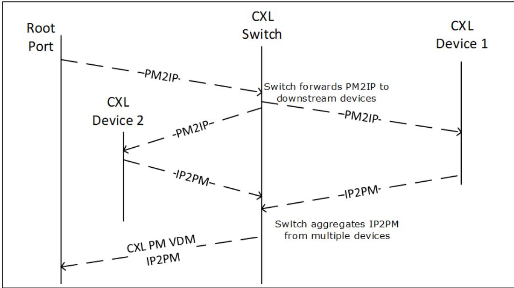

## 9.1.2.2 Bundled Ports

Ports that are part of a Bundle may be Hot Reset independently of one another. Various Upstream Ports that are part of a bundle may receive PM2IP messages. The behavior observed by each Upstream Port shall match Table 9-1.

The form factor shall guarantee that a BPD has a single source of Warm Reset and Cold Reset.

## CXL Device Boot Flow

CXL devices shall follow the appropriate form factor specification regarding the boot flows.

This specification uses the terms “Warm Reset” and “Cold Reset” in a manner that is consistent with the PCIe Base Specification.

## CXL System Reset Entry Flow

In an OS-orchestrated reset flow, it is expected that the CXL devices are already in an Inactive State with their contexts flushed to the system memory or CXL-attached memory before the platform reset flow is triggered.

In a platform-triggered reset flow (e.g., due to a fatal error), a CXL device may not be in an Inactive State when the device receives the ResetPrep message.

During system reset flow, the host shall issue a CXL PM VDM (see Table 3-1) to the downstream CXL components with the following values:

• PM Logical Opcode[7:0]=RESETPREP

• Parameter[15:0]=REQUEST

• ResetType = System Reset

• PrepType = General Prep

The CXL device shall flush any relevant context to the host, clean up the data serving the host, and then place any CXL device connected memory into a safe state such as self-refresh. The CXL device shall take any additional steps that are necessary for the CXL host to enter LTSSM Hot Reset. After all the Reset preparation is complete, the CXL device shall issue a CXL PM VDM with the following value:

• PM Logical Opcode[7:0]=RESETPREP

• Parameter[15:0]=RESPONSE

• ResetType = System Reset

• PrepType = General Prep

The CXL device may have PERST# asserted after the reset handshake is complete. On PERST# assertion, the CXL device should clear any sticky content internal to the device unless they are on auxiliary power. The CXL device’s handling of sticky register state is consistent with the PCIe Base Specification.

To prevent a deadlock in the case where one or more downstream components do not respond with an Ack, the host must implement a timeout, after which the host proceeds as if the response has been received.

Figure 9-2. CXL Device Reset Entry Flow

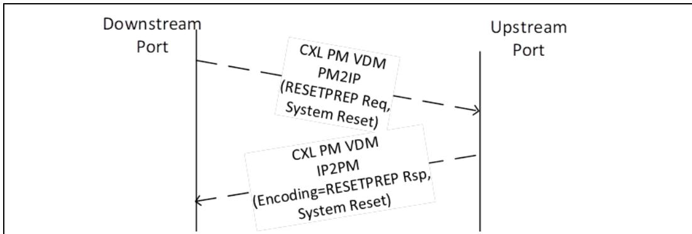

## CXL Device Sleep State Entry Flow

Because OS is always the orchestrator of Sx entry flows, it is expected that the CXL devices are already in an Inactive State with their contexts flushed to the CPU-attached memory or CXL-attached memory before the Sx entry flow is triggered.

During Sx entry flow, the host shall issue a CXL PM VDM (see Table 3-1) to the downstream components with the following values:

• PM Logical Opcode[7:0]=RESETPREP

• Parameter[15:0]=REQUEST

• ResetType = System transition from S0 to Sx (S1, S3, S4, or S5)

• PrepType = General Prep

The CXL device shall flush any relevant context to the host, clean up the data serving the host, and then place any CXL device connected memory into a safe state such as self-refresh. The CXL device shall take any additional steps that are necessary for the CXL host to initiate an L2 entry flow. After all the Sx preparation is complete, the CXL device shall issue a CXL PM VDM with the following values:

• PM Logical Opcode[7:0]=RESETPREP

• Parameter[15:0]=RESPONSE

• ResetType = System transition from S0 to Sx (based on the target sleep state)

• PrepType = General Prep

PERST# to the CXL device may be asserted any time after this handshake is complete. On PERST# assertion, the CXL device should clear any sticky content internal to the device unless they are on auxiliary power. The CXL device’s handling of sticky register state is consistent with the PCIe Base Specification.

CXL.mem-capable adapters may need auxiliary power to retain memory context across S3.

PERST# shall always be asserted for CXL Sx Entry flows.

Figure 9-3. CXL Device Sleep State Entry Flow

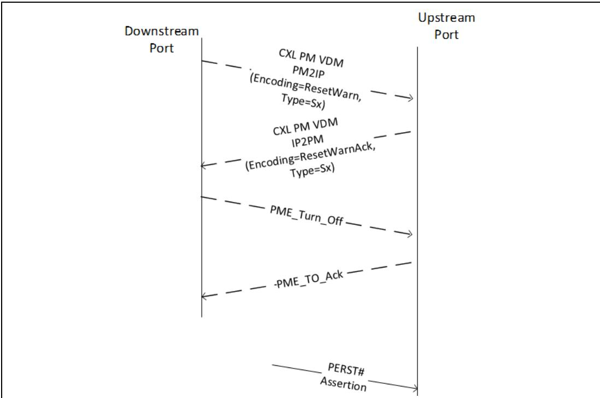

## Function Level Reset (FLR)

The PCIe FLR mechanism enables software to quiesce and reset Endpoint hardware with Function-level granularity. CXL devices expose one or more PCIe functions to host software. These functions can expose FLR capability and existing PCIe-compatible software can issue an FLR to these functions. The PCIe Base Specification provides specific guidelines regarding the impact of an FLR on PCIe function level state and control registers. For compatibility with existing PCIe software, CXL PCIe functions shall follow those guidelines if the Functions support FLR. For example, any softwarereadable state that potentially includes secret information associated with any preceding use of the Function must be cleared by an FLR.

FLRs do not affect the CXL.cache and CXL.mem protocols. Any CXL.cache-related and CXL.mem-related control registers, including CXL DVSEC structures and state held by the CXL device, are not affected by FLRs. The memory controller that hosts the HDM is not reset by an FLR. After an FLR, all address translations associated with the corresponding Function are invalidated in accordance with the PCIe Base Specification. Because the CXL Function accesses cache using the system physical address held in the address translation cache, the Function is unable to access any cachelines after the FLR until software explicitly re-enables ATS. The device is not required to write back its cache during an FLR flow. To avoid an adverse effect on the performance of other Functions, it is strongly recommended that the device not write back its cache content during an FLR if the cache is shared by multiple functions. Cache coherency must be maintained.

In some cases, system software may use an FLR to attempt error recovery. In the context of CXL devices, errors in CXL.cache logic and in CXL.mem logic cannot be recovered by an FLR. An FLR may succeed in recovering from CXL.io domain errors.

In a CXL device other than an eRCD, all Functions that participate in CXL.cache or CXL.mem are required to support either FLR or CXL Reset (see Section 9.7).

## Cache Management

A CXL-unaware OS or PCIe bus driver is unaware of CXL.cache capability. The device driver is expected to be aware of this CXL.cache capability and may manage the CXL.cache. Software shall not assume that lines in device cache that map to HDM will be flushed by CPU cache flush instructions. The behavior may vary from one host to another.

System software may wish to ensure that a CXL.cache-capable device does not contain any valid cachelines without resetting the system or the entire device. Because a device is not required to clear cache contents upon FLR, separate control and status bits are defined for this purpose. This capability is highly recommended for CXL.cachecapable eRCDs and mandatory for all other CXL.cache-capable devices. A CXL.cachecapable BPD shall expose this capability on exactly one SLD-B per Bundle, and the capability shall cover all the SLD-B instances within that Bundle. The capability is advertised via the Cache Writeback and Invalidate Capable flag in the DVSEC CXL Capability register (see Table 8-5).

Software shall take the following steps to ensure that the Device does not contain any valid cachelines:

1. Set Disable Caching=1. This bit is located in the DVSEC CXL Control2 register (see Table 8-8).

2. Set Initiate Cache Write Back and Invalidation=1. This step may be combined with step 1 as a single configuration space register write to the DVSEC CXL Control2 register (see Table 8-8).

3. Wait until Cache Invalid=1. This bit is located in the DVSEC CXL Status2 register (see Table 8-9). Software may leverage the cache size reported in the DVSEC CXL Capability2 register (see Table 8-11) to compute a suitable timeout value.

Software is required to Set Disable Caching=0 to re-enable caching. When the Disable Caching bit transitions from 1 to 0, the device shall transition the Cache Invalid bit to 0 if the bit was previously set to 1.

## CXL Reset

CXL.cache resources and CXL.mem resources such as controllers, buffers, and caches are likely to be shared at the device level. CXL Reset is a mechanism that is used to reset all CXL.cache states and CXL.mem states in addition to CXL.io in all non-Virtual Functions that support CXL.cache protocols and/or CXL.mem protocols. Reset of CXL.io has the same scope as FLR. Section 9.5 describes FLR in the context of CXL devices. CXL Reset will not affect non-CXL Functions or the physical link. Non-CXL Function Map DVSEC capability is used to advertise to the System Software which non-Virtual Functions are considered non-CXL (i.e., they neither participate in CXL.cache nor in CXL.mem).

All Functions in an SLD or SLD-B that participate in CXL.cache or CXL.mem are required to support either FLR or CXL Reset. MLDs, on the other hand, are required to support CXL Reset.

Capability, Control, and Status fields for CXL Reset are exposed in the configuration space of Function 0 of a CXL device but these affect all physical and virtual functions within the device that participate in CXL.cache or CXL.mem. A BPD shall expose these Capability, Control and Status fields on no more than one SLD-B per Bundle, and the fields shall cover all the SLD-B instances within that Bundle.

The system software is responsible for quiescing all the Functions that are impacted due to reset of the CXL.cache state and CXL.mem state in the device and offlining any associated HDM ranges. Once the CXL Reset is complete, all CXL Functions on the device must be re-initialized prior to use.

CXL Reset may be issued by the System Software or the Fabric Manager. To quiesce the impacted non-virtual Functions prior to issuing CXL Reset, the System Software shall complete the following actions for each of the CXL non-virtual Functions:

1. Offline any volatile or persistent HDM Ranges. When offlining is complete, there shall be no outstanding or new CXL.mem transactions to the affected CXL Functions.

2. Configure these Functions to stop initiating new CXL.io requests. This procedure is identical to that for FLR.

The FM may issue CXL Reset for various cases described in Chapter 7.0. In the case of the FM use of CXL Reset, there may be outstanding commands in the device which shall be silently discarded.

CXL.io reset of the device shall follow the definition of FLR in the PCIe Base Specification. Note that only PCIe-mapped memory shall be cleared or randomized by the non-virtual Functions during FLR.

Reset of the CXL.cache state and CXL.mem state as part of the CXL Reset flow at the device level has the following behavior:

• All outstanding or new CXL.mem reads shall be silently discarded. Previously accepted writes to persistent HDM ranges shall be persisted. Writes to volatile HDM ranges may be discarded.

• The device caches (Type 1 Devices and Type 2 Devices) shall be written back and invalidated by the device. Software is not required to write back and invalidate the device cache (see Section 9.6) prior to issuing the CXL Reset.

• No new CXL.cache requests shall be issued except for the above cache-flushing operation. Snoops shall continue to be serviced.

• Contents of volatile HDM ranges may or may not be retained and the device may optionally clear or randomize these ranges if this capability is supported and is requested during CXL Reset (see the CXL Reset Mem Clr Capable bit in the DVSEC CXL Capability register and the CXL Reset Mem Clr Enable bit in the DVSEC CXL Control2 register in Table 8-5 and Table 8-8, respectively). Contents of the persistent HDM ranges will be retained by the device.

• Any errors during a CXL Reset shall be logged in the error status registers in the usual manner. Failure to complete a CXL Reset shall result in the CXL Reset Error bit in the DVSEC CXL Status2 register (see Table 8-9) being set. The system software may choose to retry CXL Reset, assert other types of device resets, or restart the system in response to a CXL Reset failure.

• Unless specified otherwise, all non-sticky registers defined in this specification shall be initialized to their default values upon CXL Reset. The CONFIG\_LOCK bit in the DVSEC CXL Lock register (see Table 8-10) and any register fields that are locked by CONFIG\_LOCK shall not be affected by CXL Reset. Any sticky registers, such as the error status registers, shall be preserved across CXL Reset. If the device is in the viral state, it shall remain in that state after a CXL Reset.

If the device is unable to complete CXL Reset within the specified timeout period, the System Software shall consider this a failure and may choose to take action similar to when the CXL Reset Error bit is set.

A pooled Type 3 device (MLD) must ensure that only the LD assigned to the host that is issuing CXL Reset is impacted. This includes the clearing or randomizing of the volatile HDM ranges on the device. Other LDs must continue to operate normally.

## Effect on the Contents of the Volatile HDM

Because ownership of the volatile HDM ranges may change following a CXL Reset, it is important to ensure that there is no leak of volatile memory content that was present prior to the CXL Reset. (This condition does not apply to persistent memory content whose security is ensured by other means not discussed here.)

## There are two cases to consider:

• The device remains bound to the same host and the System Software reallocates the volatile HDM ranges to a different software entity. The System Software is often responsible for ensuring that the memory range is re-initialized prior to any allocation. The device may implement an optional capability to perform clearing or randomizing of all impacted volatile HDM ranges. This may be invoked using the optional Secure Erase function (see Section 8.2.10.9.5.2). Optionally, the device may be capable of clearing or randomizing volatile HDM content as part of CXL Reset. If this capability is available, the System Software may take advantage of it. However, because this is an optional capability, the System Software should not depend on this capability.

• The device is migrated to a different host with FM involvement as described in Chapter 7.0. The FM must use either the Secure Erase operation (see Section 8.2.10.9.5.2) or utilize CXL Reset if the CXL Reset Mem Clr capability exists to clear or randomize any volatile HDM ranges prior to reassigning the device to a different host.

Capability for clearing and randomizing volatile HDM ranges in the device is reported by the CXL Reset Mem Clr Capable bit in the DVSEC CXL Capability register (see Table 8-5). If present, this capability may optionally be used by setting the CXL Reset Mem Clr Enable bit in the DVSEC CXL Control2 register (see Table 8-8).

## Software Actions

System Software or Fabric Manager shall follow these steps while performing CXL Reset:

1. Verify that the device supports CXL Reset by consulting the CXL Reset Capable bit in the DVSEC CXL Capability register (see Table 8-5).

2. Prepare the system for CXL Reset as described in Section 9.7.

3. Determine whether the device supports the CXL Reset Mem Clr Capable bit by consulting the DVSEC CXL Capability register (see Table 8-5).

4. If the device supports the CXL Reset Mem Clr capability, program the CXL Reset Mem Clr Enable bit in the DVSEC CXL Control2 register (see Table 8-8) as required.

5. Determine the timeout for completion by consulting the CXL Reset Timeout field in the DVSEC CXL Capability register (see Table 8-5).

6. Set the Initiate CXL Reset=1 in the DVSEC CXL Control2 register (see Table 8-8).

7. Wait for CXL Reset Complete=1 or CXL Reset Error=1 in the DVSEC CXL Status2 register (see Table 8-9) for up to the timeout period.

System Software should follow these steps while re-initializing and onlining a device:

1. Set up the device as required to enable functions impacted by CXL Reset.

2. Optionally check whether the device performed clearing or randomizing of memory during the CXL Reset. If yes, skip software-based initialization prior to reallocation. If not, perform software-based initialization.

## CXL Reset and Request Retry Status (RRS)

The device must successfully complete the configuration write that triggered the CXL Reset. The device behavior in response to Configuration Space access to the device within 100 ms of initiating a CXL Reset is undefined. After 100 ms from the issuance of CXL Reset, the CXL Function is permitted to return RRS for all Configuration Space accesses except to the DVSEC CXL Status2 register (see Table 8-9). After 100 ms from the issuance of CXL Reset, software should not access any device register other than the DVSEC CXL Status2 register until CXL Reset completion, timeout, or error.

## Global Persistent Flush (GPF)

Global Persistent Flush (GPF) is a hardware-based mechanism associated with persistent memory that is used to flush cache and memory buffers to a persistence domain. A persistence domain is defined as a location that is guaranteed to preserve the data contents across a restart of the device containing the data. GPF operation is global in nature because all CXL agents that are part of a cache coherency domain participate in the GPF flow. A CXL.cache coherency domain consists of one or more hosts, all CXL Root Ports that belong to these hosts, and the virtual hierarchies associated with these Root Ports.

GPF may be triggered in response to an impending non-graceful shutdown such as a sudden power loss. The host may initiate GPF to ensure that any in-flight data is written back to persistent media prior to a power loss. GPF may also be triggered upon other asynchronous or synchronous events that may or may not involve power loss. The complete list of such events, the mechanisms by which the host is notified, and coordination across CXL Root Ports are beyond the scope of this specification.

## Host and Switch Responsibilities

With the exception of eRCHs, all hosts and all CXL switches shall support GPF as outlined in this section.

GPF flow consists of two phases, GPF Phase 1 and GPF Phase 2. During Phase 1, the devices are expected to stop injecting new traffic and write back their caches. During Phase 2, the persistent devices are expected to flush their local write buffers to a persistence domain. This two-phase approach ensures that a device does not receive any new traffic while it is flushing its local memory buffers. The host shall enforce a barrier between the two phases. The host shall ensure that it stops injecting new CXL.cache transactions and that its local caches are written back prior to entering GPF Phase 2.

In certain configurations, the cache write back step may be skipped during GPF Phase 1. There are various possible reasons for implementing this mode of operation that are beyond the scope of this specification. One possible reason could be that the host does not have the required energy to write back all the caches before the power loss. When operating in this mode, the system designer may use other means, beyond the scope of this specification, to ensure that the data that is meant to be persistent is not lost. The host shall set the Payload[1] flag in the GPF Phase 1 request to indicate that the devices shall write back their caches during Phase 1. The host uses a host-specific mechanism to determine the correct setting of Payload[1].

During each phase, the host shall transmit a CXL GPF PM VDM request to each GPFcapable device or Switch that is connected directly to each of its Root Ports and then wait for a response. Table 3-1 describes the format of these messages. The Switch’s handling of a GPF PM VDM is described in Section 9.1.2.1. The CXL Root Ports and CXL downstream Switch Ports shall implement timeouts to prevent a single device from blocking GPF forward progress. These timeouts are configured by system software (see Section 8.1.6). A host or a Switch may assume that the GPF timeouts configured across Downstream Ports at the same level in the hierarchy are identical. If a Switch detects a timeout, it shall set the Payload[8] in the response to indicate an error condition. This enables a CXL Root Port to detect GPF Phase 1 errors anywhere in the virtual hierarchy it spawns. If an error is detected by any Root Port in the coherency domain, the host shall set the Payload[8] flag during the Phase 2 flow, thereby informing every CXL device of an error during GPF Phase 1. Persistent devices may log this indication in a device-specific manner and make this information available to system software. If the host is positively aware that the GPF event will be followed by a power failure, it should set Payload[0] in the GPF Phase 1 request message. If the host cannot guarantee that the GPF event will be followed by a power failure, it shall not set Payload[0] in the GPF Phase 1 request message.

The CXL devices and switches must be able to receive and process GPF messages without dependency on any other PM messages. GPF messages do not use a credit, and CREDIT\_RTN messages are not expected in response to a GPF request.

The host may reset the device any time after GPF Phase 2 completes.

If the host detection or processing of a GPF event and a reset event overlap, the host may process either event and ignore the other event. If the host detection or processing of a GPF event and an Sx event overlap, the host may process either event and ignore the other event. If the host detects a GPF event while the host is entering a lower power state, the host is required to process the GPF event in a timely manner.

## Device Responsibilities

If a device supports GPF, it shall set bit[1] in the CAPABILITY\_VECTOR field in its AGENT\_INFO response (see Table 3-1). All CXL devices with the exception of eRCDs shall support GPF. An eRCD may support GPF functionality. If a device supports GPF, the Device shall respond to all GPF request messages regardless of whether the Device is required to take any action. The host may interpret a lack of response within a software-configured timeout window as an error. For example, a Type 3 device may or may not take any specific action during GPF Phase 1 other than generating a GPF Phase 1 response message.

Upon receiving a GPF Phase 1 request message, a CXL device shall execute the following steps in the specified order:

1. Stop injecting new CXL.cache transactions except for cache write backs described in step 3.

2. If CXL.cache capable and Payload[1]=1, disable caching. This will ensure that the device no longer caches any coherent memory and thereby not cache any writes that are received over the CXL interface in its CXL.cache.

3. If CXL.cache capable and Payload[1]=1, write back all modified lines in the device cache. The memory destination may be local or remote.

— To minimize GPF latency, the device should ignore lines that are not dirty.

— To minimize GPF latency, the device should not write back lines that it knows are mapped to volatile memory. The mechanism by which the device obtains this knowledge is beyond the scope of this specification.

— The device must use device internal mechanisms to write back all dirty lines that are mapped to its local persistent HDM.

— The device must write back all dirty lines that are not mapped to its local HDM and may be of persistent type. Each such dirty line must be written back to the destination HDM in two steps:

i. Issue DirtyEvict request to the host (see Section 3.2.4.2.15).

ii. Issue CLFlush request to the host (see Section 3.2.4.2.13).

4. Indicate that the device is ready to move to GPF Phase 2 by sending a GPF Phase 1 response message. Set the Payload[8] flag in the response if the Phase 1 processing was unsuccessful.

A device may take additional steps to reduce power draw from the system if the Payload[0] flag is set in the request message indicating that power failure is imminent. For example, a device may choose to not wait for responses to the previously issued reads before initiating the write back operation [step 3] above as long as the read responses do not impact persistent memory content.

Until the GPF Phase 2 request message is received, the device must respond to and complete any accesses that it receives over the CXL interface. This is to ensure that the other requesters can continue to make forward progress through the GPF flow.

Upon receiving a GPF Phase 2 request, a CXL device shall execute the following steps in the specified order:

1. If it is a persistent memory device and the Payload[8] flag is set, increment the Dirty Shutdown Count (see Section 8.2.10.9.3.1).

2. Flush internal memory buffers to local memory if applicable.

3. Acknowledge the request by sending a GPF Phase 2 response message.

4. Enter the lowest possible power state.

As this exchange may be performed in the event of an impending power loss, it is important that any flushing activity in either phase is performed in an expedient manner, and that the acknowledgment of each phase is sent as quickly as possible.

A device may have access to an alternate power source (e.g., a device with a large memory buffer may include a charged capacitor or battery) and may acknowledge GPF Phase 2 requests as soon as it has switched over to the alternate power source. Such a device shall ensure that PERST# assertion does not interfere with the local flush flow and shall correctly handle a subsequent power-up sequence even if the local flush is in progress.

A device is not considered to be fully operational after it receives a GPF Phase 1 Request. In this state, a device shall correctly process a Conventional Reset request, and return to operational state upon successful completion of these resets.

If the device detection or processing of a GPF event and a reset event overlap, the device may process either event and ignore the other event. If the device detection or processing of a GPF event and an Sx event overlap, the device may process either event and ignore the other event. If a device receives a GPF request while it is entering a lower power state, it shall process the GPF request in a timely manner.

A pooled device is composed of multiple LDs that are assigned to different Virtual Hierarchies. Because a GPF event may or may not be coordinated across these hierarchies, each LD shall be capable of independently processing GPF messages targeting that individual LD, without affecting any other LD within the MLD. An MLD cannot enter a lower power state until all LDs associated with the device have indicated that they are ready to enter the lower power state. In addition, the MLD must be able to process multiple GPF events (from different VCS targeting unique LDs).

If a device receives a GPF Phase 2 request message without a prior GPF Phase 1 request message, it shall respond to that GPF Phase 2 request message.

In the case of a BPD, various Upstream Ports that are part of a bundle receive their own GPF requests. It is strongly recommended that each Port process these requests independently of one another. The BPD is said to have successfully completed GPF Phase 1 when all links have issued a successful GPF Phase 1 Response. The BPD is said to have successfully completed GPF Phase 2 when all links have issued a successful GPF Phase 2 Response.

## 9.8.3

## Energy Budgeting

It is often necessary to assess whether a system has sufficient energy to handle GPF during a power failure scenario. System software may use the information available in various CXL DVSEC registers along with its knowledge of the remainder of the system to make this determination.

This information may also be used to calculate appropriate GPF timeout values at various points in the CXL hierarchy. See the implementation note below. The timeout values are configured through GPF DVSEC for CXL Ports (see Section 8.1.6).

## IMPLEMENTATION NOTE

System software may determine the total energy needs during power failure GPF. There may always be a nonzero possibility that power failure GPF may not successfully complete (e.g., under unusual thermal conditions or fatal errors). The goal of the system designer is to ensure that the probability of failure is sufficiently low and meets the system design objectives.

The following high-level algorithm may be followed for calculating timeouts and energy requirements

1. Iterate through every CXL device and calculate T1 and T2 as defined in the Time Needed column in Table 9-3.

2. Calculate T1MAX and T2MAX.

a. T1MAX = MAX of T1 values calculated for all devices plus propagation delay, host-side processing delays, and any other host/system-specific delays.

b. T2MAX = MAX of T2 values calculated for all devices in the hierarchy plus propagation delay, host-side processing delays, and any other host/system specific delays. This could be same as GPF Phase 2 timeout at RC.

3. Calculate E1 and E2 for each device. See the Energy Needed column in Table 9-3.

4. Do summation over all CXL devices (E1+E2). Add energy needs for host and non-CXL devices during this window.

The GPF timeout registers in the root port and the Downstream Switch Port CXL Port GPF Capability structure may be programmed to T1MAX and T2MAX, respectively. Device active power is the amount of power that the device consumes in D0 state and may be reported by the device via the Power Budgeting Extended Capability as defined in the PCIe Base Specification. Cache size is reported via PCIe DVSEC for CXL devices (Revision 1). This computation may have to be redone periodically as some of these factors may change. When a CXL device is hot-added/removed, it may warrant recomputation. See Table 9-3.

Cache size, T2, and GPF Phase 2 Power parameters are reported by the device via GPF DVSEC for CXL devices (see Section 8.1.7). The other parameters are system dependent. System software may use ACPI HMAT to determine average persistent memory bandwidth, but the software could apply additional optimizations if the software is aware of the specific persistent device on which the accelerator is operating. In some cases, System Firmware may be performing that computation. Because System Firmware may or may not be aware of workloads, the firmware may make conservative assumptions.

## IMPLEMENTATION NOTE

## Continued

If the system determines that it does not have sufficient energy to handle all CXL devices, the system may be able to take certain steps, such as to reconfigure certain devices to stay within the system budget by reducing the size of cache allocated to persistent memory or limiting persistent memory usages. Several system level and device-level optimizations are possible:

• Certain accelerators may always operate on volatile memory and could skip the flush. For these accelerators, T1 would be 0.

Device could partition cache among volatile vs. non-volatile memory and thus lower T1. Such partitioning may be accomplished with assistance from system software.

• A device could force certain blocks (e.g., execution engines) into a lower power state upon receiving a GPF Phase 1 request.

• Device may include a local power source and therefore could lower its T1 and T2.

• System software may configure all devices so that all T1s and T2s are roughly equal. This may require performance and/or usage model trade-offs.

## Table 9-3. GPF Energy Calculation Example

<table><tr><td>Device Step</td><td>Time Needed</td><td>Energy Needed</td></tr><tr><td>Stop traffic generation</td><td>Negligible</td><td>Negligible</td></tr><tr><td>Disable caching</td><td>Negligible</td><td>Negligible</td></tr><tr><td>Write back cache content to persistent memory</td><td>T1= Cache size * % of lines in cache mapped to persistent memory / worst-case persistent memory bandwidth.</td><td>E1= T1MAX * device active Power</td></tr><tr><td>Flush local Memory buffers to local memory</td><td>T2</td><td>E2= T2 * GPF Phase 2 Power</td></tr></table>

## Hot-Plug

By definition, RCDs and RCHs do not support Hot-Plug.

CXL Root Ports and CXL Downstream Switch Ports may support Hot-Add and managed Hot-Remove. All CXL Ports shall be designed to avoid electrical damage upon surprise Hot-Remove. All CXL switches and CXL devices, with the exception of eRCDs, shall be capable of being Hot-Plugged, subject to the Form Factor limitations. In a managed Hot-Remove flow, software is notified of a hot removal request. This provides CXLaware system software the opportunity to write back device cachelines and to offline device memory prior to removing power. During a Hot-Add flow, CXL-aware system software discovers the CXL.cache and CXL.mem capabilities of the adapter and initializes them so they are ready to be used.

CXL leverages PCIe Hot-Plug model and Hot-Plug elements as defined in the PCIe Base Specification and the applicable form-factor specifications.

CXL isolation is the mechanism that is used for graceful handling of Surprise Hot-Remove of CXL adapters. If a CXL adapter that holds modified lines in its cache is removed without any prior notification and CXL.cache isolation is not enabled, subsequent accesses to those addresses may result in timeouts that may be fatal to host operation. If a CXL adapter with HDM is removed without any prior notification and

CXL.mem isolation is not enabled, subsequent accesses to HDM locations may result in timeouts that may be fatal to host operation.

All CXL Downstream Ports, including RCH Downstream Ports, shall hardwire the Hot-Plug Surprise bit in the Slot Capabilities register to 0. Software may leverage Downstream Port Containment capability of the Downstream Port to gracefully handle surprise hot removal of PCIe adapters or contain errors that result from surprise hot removal or Link Down of CXL adapters.

Support for Coherent Device Attribute Table (CDAT) by way of ReadTable DOE (see Section 8.1.11) is optional for eRCDs, but mandatory for all other CXL devices and is also mandatory for CXL switches. Software may use this interface to learn about performance and other attributes of the device or the Switch.

The Host Bridge and Upstream Switch Ports implement the CXL HDM Decoder Capability structure (see Section 8.2.4.20). Software may program these to account for the HDM capacity with an appropriate interleaving scheme (see Section 9.13.1). Software may choose to leave the decoders unlocked for maximum flexibility and use other protections (e.g., page tables) to limit access to the registers. All unused decoders are unlocked by definition and software may claim these to decode additional HDM capacity during a Hot-Add flow.

All CXL.cache-capable devices, with the exception of eRCDs, shall implement the Cache Writeback and Invalidation capability (see Section 9.6). Software may use this capability to ensure that a CXL.cache-capable device does not have any modified cachelines prior to removing power.

Software shall ensure that the device has completed Power Management Initialization (see Section 8.1.3.5) prior to enabling its CXL.cache capabilities or CXL.mem capabilities if the device reports PM Init Completion Reporting Capable=1.

Software shall ensure that it does not enable a CXL.cache device below a given Root Port if the Root Port does not support CXL.cache. The Root Port’s capabilities are exposed via the DVSEC Flex Bus Port Capability register. All CXL.cache-capable devices should expose the size of their cache via the DVSEC CXL Capability2 register (see Table 8-11). Software may cross-check this against the host’s effective snoop filter capabilities (see Section 8.2.4.23.2) during Hot-Add of CXL.cache-capable device. Software may configure the Cache\_SF\_Coverage field in the DVSEC CXL Control register (see Table 8-6) to indicate to the device how much snoop filter capacity it should use (0 being a legal value). In extreme scenarios, software may disable CXL.cache devices to avoid snoop filter oversubscription.

During Hot-Add, System Software may reassess the GPF energy budget and take corrective action if necessary.

Hot-Add of an eRCD may result in unpredictable behavior if the device is exposed to software. The following mechanisms are defined to ensure that an eRCD that is hotadded in runtime is not discoverable by standard PCIe software:

• For Root Ports connected to Hot-Plug capable slots, it is recommended that System Firmware set the Disable\_RCD\_Training bit to 1 in the DVSEC Flex Bus Port Control register (see Table 8-67) after System Firmware PCIe enumeration completion, but before OS hand-off. This will ensure that a CXL root port will fail link training if an eRCD is hot-added. A Hot-Plug event may be generated in these cases, and the Hot-Plug handler may be invoked. The Hot-Plug handler may treat this condition as a failed Hot-Plug, notify the user, and then power down the slot.

• A Downstream Switch Port may itself be hot-added and cannot rely on System Firmware setting the Disable\_RCD\_Training bit. A Switch shall not report a Link Up condition and shall not report presence of an adapter when it is connected to an eRCD. System Firmware or CXL-aware software may still consult DVSEC Flex Bus

Port Status register (see Table 8-68) and discover that the Port is connected to an eRCD.

## IMPLEMENTATION NOTE

## CXL Type 3 Device Hot-Add Flow

1. System Firmware may prepare the system for a future Hot-Add (e.g., pad resources to accommodate the needs of an adapter to be hot-added).

2. User hot-adds a CXL memory expander in an empty slot. Downstream Ports bring up the link in CXL VH mode.

3. PCIe Hot-Plug interrupt is generated.

4. Bus driver performs the standard PCIe Hot-Add operations, thus enabling CXL.io. This process assigns BARs to the device.

5. CXL-aware software (e.g., CXL bus driver in OS, the device driver, or other software entity) probes CXL DVSEC capabilities on the device and ensures that the HDM is active. Memory may be initialized either by hardware, by the FW on the adapter or the device driver.

6. CXL-aware software configures the CXL DVSEC structures on the device, switches, and Host Bridge (e.g., GPF DVSEC, HDM decoders).

7. CXL-aware software notifies the OS memory manager about the new memory and its attributes such as latency and bandwidth. Memory manager processes a request and adds the new memory to its allocation pool.

8. The user may be notified via attention indicator or some other user interface of successful completion.

## IMPLEMENTATION NOTE

## CXL Type 3 Device-managed Hot-Remove Flow

1. User initiates a Hot-Remove request via attention button or some other user interface.

2. The standard PCIe Hot-Remove flow is triggered (e.g., via Hot-Plug interrupt if attention button was used).

3. CXL-aware software (e.g., CXL bus driver in OS, the device driver, or other software entity) probes CXL DVSEC capabilities on the device and determines active memory ranges.

4. CXL-aware software requests the OS memory manager to vacate these ranges.

5. If the Memory Manager is unable to fulfill this request (e.g., because of presence of pinned pages), CXL-aware software will return an error to the Hot-Remove handler, which will notify the user that the operation has failed.

6. If the Memory Manager is able to fulfill this request, CXL-aware system software reconfigures HDM Decoders in CXL switches and Root Ports. This is followed by the standard PCIe Hot-Remove flow that will process CXL.io resource deallocation.

7. If the PCIe Hot-Remove flow fails, the user is notified that the Hot-Remove operation has failed; otherwise, the user is notified that the Hot-Remove flow has successfully completed.

## IMPLEMENTATION NOTE

## CXL Type 1 Device Hot-Add Flow

1. System Firmware may prepare the system for a future Hot-Add (e.g., pad MMIO resources to accommodate the needs of an adapter to be hot-added).

2. The user Hot-Adds a CXL Type 1 device in an empty slot. The Downstream Port brings up the link in CXL VH operation with 68B Flit mode.

3. A PCIe Hot-Plug interrupt is generated.

4. The bus driver performs the standard PCIe Hot-Add operations, thus enabling CXL.io. This process assigns BARs to the device.

5. CXL-aware software (e.g., CXL bus driver in OS, the device driver, or other software entity) probes CXL DVSEC capabilities on the device. If the device is hotadded below a Root Port that cannot accommodate a CXL.cache-enabled device, Hot-Add is rejected. If the device has a cache that is larger than what the host snoop filter can handle, Hot-Add is rejected. The user may be notified via attention indicator or some other user interface of this.

6. If the above checks pass, CXL-aware software configures the CXL DVSEC structures on the device and switches (e.g., GPF DVSEC).

7. The Hot-Add flow is complete. The user may be notified via attention indicator or some other user interface of successful completion.

## Software Enumeration

This section describes two types of CXL device enumeration flows. Although discovery of CXL devices follows the PCIe model, there are some important differences:

• RCD Enumeration: As the name suggests, RCD mode (see Section 9.11.1) imposes some restrictions and leads to a much-simpler enumeration flow. Each RCD is exposed to host software as one or more PCIe Root Complex Integrated Endpoints as indicated by setting PCI Express Capabilities Register.Device/Port Type=RCiEP. Each RCD creates a new PCIe enumeration hierarchy that is compatible with an ACPI-defined PCIe Host Bridge (PNP ID PNP0A08). The RCD enumeration flow is described in Section 9.11.

• CXL VH enumeration: A CXL root port is the root of a CXL VH. A CXL VH may include zero or more CXL switches, zero or more PCIe switches, zero or more PCIe devices, and one or more CXL devices that are not in RCD mode. A CXL VH represents a software view and may differ from the physical topology. The CXL VH enumeration flow is described in Section 9.12.

A CXL device cannot claim I/O resources because it is not a Legacy Endpoint. For the definition of Legacy Endpoint, see the PCIe Base Specification.

## RCD Enumeration

## RCD Mode

Restricted CXL device (RCD) mode is a CXL operating mode with the following restrictions:

• Hot-Plug is not supported

• CXL devices operating in this mode always set the Device/Port Type field in the PCI Express Capabilities register to RCiEP

• Flit modes other than 68B Flit mode are not supported

• Routing types other than HBR are not supported

• Link is not visible to non-CXL-aware software

## 9.11.2 PCIe Software View of an RCH and RCD

Figure 9-4. PCIe Software View of an RCH and RCD

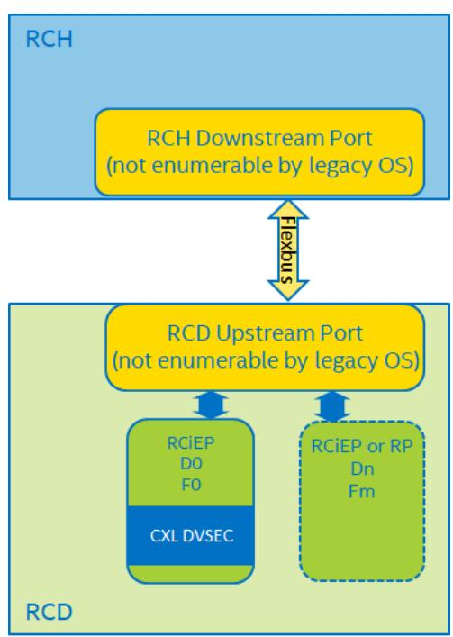

Because the CXL link is not exposed to CXL-unaware OSs, the System Firmware view of the hierarchy is different than that of the CXL-unaware OS.

## 9.11.3 System Firmware View of an RCH and RCD

The functionality of the RCH Downstream Port and the RCD Upstream Port can be accessed via memory mapped registers. These will not show up in a standard PCIe bus scan by CXL-unaware OSs. The base addresses of these registers are set up by System Firmware and System Firmware can use that knowledge to configure CXL.

System Firmware configures the RCH Downstream Port to decode the memory resource needs of the CXL device as expressed by PCIe BARs and Upstream Port BAR(s). PCIe BARs are not to be configured to decode any HDM that are associated with the CXL device.

## 9.11.4 OS View of an RCH and RCD

Each RCH-RCD pair is presented as one ACPI Host bridge. The \_BBN method for this Host Bridge matches the bus number that hosts the RCD.

This ACPI Host Bridge spawns a legal PCIe hierarchy. All PCIe Endpoints located in the RCD are children of this ACPI Host Bridge. These Endpoints may appear directly on the Root bus number or may appear behind a Root Port located on the Root bus.

The \_CRS method for PCIe root bridge returns bus and memory resources claimed by the CXL Endpoints. \_CRS response does not include HDM on CXL.mem-capable devices, and does not comprehend any Upstream Port BARs (hidden from OS).

A CXL-aware OS may use CXL Early Discovery Table (CEDT) or \_CBR object in ACPI namespace to locate the Downstream Port registers and Upstream Port registers. CEDT enumerates all CXL Host Bridges that are present at the time of OS hand-off and \_CBR is limited to CXL Host Bridges that are hot-added.

## 9.11.5 System Firmware-based RCD Enumeration Flow

Because RCDs do not support Hot-Add, RCDs can be fully enumerated by System Firmware prior to OS hand-off.

In the presence of RCD mode, the Hardware-autonomous mode selection flow cannot automatically detect the number of retimers. If the system includes retimers, the System Firmware shall follow these steps to ensure that the number of retimers is correctly configured:

1. Prior to the link training, the System Firmware should set the DVSEC Flex Bus Port Control register (see Table 8-67), based on the available information, to indicate whether there are 0, 1, or 2 retimers present. (It is possible that retimers on a CXL add-in card or a backplane may not be detected by the System Firmware prior to link training and the initial programming may not account for all retimers in the path.)

2. After the link training completes successfully or fails, the System Firmware should read the Retimer Presence Detected and Two Retimers Presence Detected values logged in the PCIe Base Specification Link Status 2 register and determine whether they are consistent with what was set in the DVSEC Flex Bus Port Control register in step 1. If they differ, the System Firmware should bring the Link Down by setting the Link Disable bit in the Downstream Port, update the Retimer1\_Present and Retimer2\_Present bits in the DVSEC Flex Bus Port Control register, and then reinitiate link training.

## 9.11.6 RCD Discovery

1. Parse configuration space of Device 0, Function 0 on the Secondary bus # and discover CXL-specific attributes. These are exposed via Capability structures within the PCIe DVSEC for CXL Devices (see Section 8.1.3).

2. If the device supports CXL.cache, configure the CPU coherent bridge and then set the Cache\_Enable bit in the DVSEC CXL Control register (see Table 8-6).

3. If the device supports CXL.mem, check Mem\_HwInit\_Mode by reading the DVSEC CXL Capability register (see Table 8-5) and determine the number of supported HDM ranges by reading the HDM\_Count field in the same register.

4. If Mem\_HwInit\_Mode=1:

— The device must set the Memory\_Info\_Valid bit in each applicable DVSEC CXL Range X Size Low register<sup>1</sup> within 1 second of reset deassertion.

— The device must set the Memory\_Active\_Valid bit in each applicable DVSEC CXL Range X Size Low register<sup>1</sup> within the Memory\_Active\_Timeout duration of reset deassertion.

— When Memory\_Info\_Valid is 1, System Firmware reads the Memory\_Size\_High and Memory\_Size\_Low fields for each supported HDM range. If System Firmware cannot delay boot until the Memory\_Active bit is set, the System

Firmware may continue with HDM base assignment and may delay OS hand-off until the Memory\_Active bit is set.

— System Firmware computes the size of each HDM range and maps those in system address space.

— System Firmware programs the Memory\_Base\_Low and the Memory\_Base\_High fields for each HDM range.

— System Firmware programs the ARB/MUX arbitration control registers if necessary.

— System Firmware sets CXL.mem Enable. Once Memory\_Active=1, any subsequent accesses to HDM are decoded and routed to the local memory by the device.

— Each HDM range is later exposed to the OS as a separate, memory-only NUMA node via ACPI SRAT.

— System Firmware obtains CDAT from the UEFI device driver or directly from the device via Table Access DOE (see Section 8.1.11) and then uses this information during construction of the memory map, ACPI SRAT, and ACPI HMAT. See the ACPI Specification, CDAT Specification, and UEFI Specification for additional details.

## 5. If Mem\_HwInit\_Mode =0

— The device must set the Memory\_Info\_Valid bit in each applicable DVSEC CXL Range X Size Low register<sup>1</sup> within 1 second of reset deassertion.

— When Memory\_Info\_Valid is 1, System Firmware reads the Memory\_Size\_High and Memory\_Size\_Low fields for supported HDM ranges.

— System Firmware computes the size of each HDM range and maps those in system address space.

— System Firmware programs the Memory\_Base\_Low and the Memory\_Base\_High fields for each HDM range.

— System Firmware programs the ARB/MUX arbitration control registers if necessary.

— System Firmware sets CXL.mem Enable. Any subsequent accesses to the HDM ranges are decoded and completed by the device. The reads shall return all 1s and the writes will be dropped.

— Each HDM range is later exposed to the OS as a separate, memory-only NUMA node via ACPI SRAT.

— If the memory is initialized prior to OS boot by UEFI device driver:

• The UEFI driver is responsible for causing Memory\_Active to be set. The driver can accomplish that by device-specific methods, such as by setting a device-specific register bit.

• After Memory\_Active is set, any subsequent accesses to the HDM range are decoded and routed to the local memory by the device.

• System Firmware uses the information supplied by UEFI driver or Table Access DOE (see Section 8.1.11) during construction of the memory map and ACPI HMAT. See the UEFI Specification for additional details.

— If the memory is initialized by an OS device driver post OS boot:

• System Firmware may use the information supplied by UEFI driver or Table Access DOE (see Section 8.1.11) during construction of the memory map and ACPI HMAT. See the UEFI Specification for additional details. In the future, a CXL-aware OS may extract this information directly from the device via Table Access DOE.

• At OS hand-off, System Firmware reports that the memory size associated with HDM NUMA node is 0.

• The OS device driver is responsible for causing the Memory\_Active bit to be set to 1 by using device-specific methods after memory initialization is complete. Any subsequent accesses to the HDM are decoded and routed to the local memory by the device.

• Memory availability is signaled to the OS via an OS-specific mechanism.

CXL.io resource needs are discovered as part of PCIe enumeration. PCIe Root Complex registers, including Downstream Port registers, are appropriately configured to decode these resources. CXL Downstream Ports and Upstream Ports require MMIO resources. These are also accounted for during this process.

System Firmware programs the memory base and limit registers in the Downstream Port to decode CXL Endpoint MMIO BARs, CXL Downstream Port MMIO BARs, and CXL Upstream Port MMIO BARs.

## 9.11.7 eRCDs with Multiple Flex Bus Links

This section is applicable only to eRCDs that are directly connected to an eRCH. It does not apply to CXL VH. Also, it does not apply to eRCDs that are connected to CXL switches.

## 9.11.7.1 Single CPU Topology

Figure 9-5. One CPU Connected to a Dual-headed RCD by Two Flex Bus Links

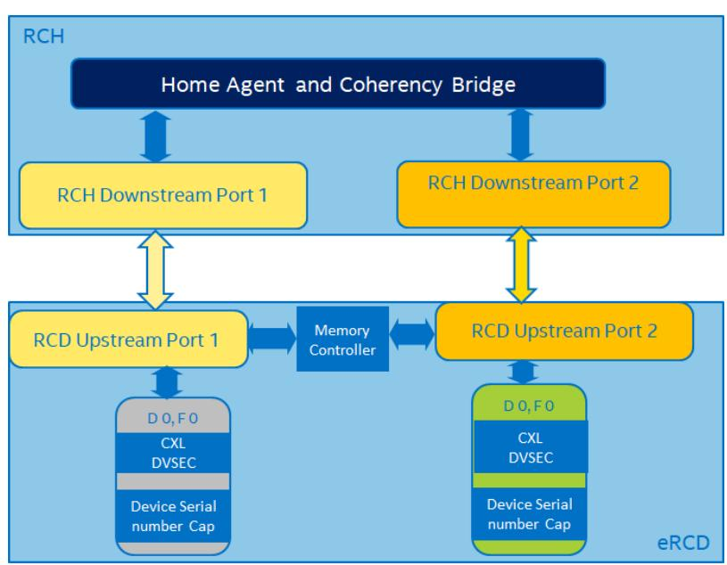

In this configuration, the System Firmware shall report two PCIe Host Bridges to the OS, one that hosts Device 0, Function 0 on the left, and a second one that hosts Device 0, Function 0 on the right. Both Device 0, Function 0 instances implement PCIe DVSEC for CXL Devices and a Device Serial Number PCIe Extended Capability. A Vendor ID and serial number match indicates that the two links are connected to a single CXL device, which enables System Firmware to perform certain optimizations.

In some cases, the CXL device may expose a single CXL device function that is managed by the CXL device’s driver, whereas the other Device 0, Function 0 represents a dummy device. In this configuration, application software may submit work to the single CXL device instance. However, the CXL device hardware is free to use both links for traffic and snoops as long as the programming model is not violated.

The System Firmware maps the HDM into system address space using the rules listed in Table 9-4.

Table 9-4. Memory Decode Rules in Presence of One CPU/Two Flex Bus Links

<table><tr><td>Left D0, F0 Mem_Capable</td><td>Left D0, F0 Mem_Size</td><td>Right D0, F0 Mem_Capable</td><td>Right D0, F0 Mem_Size</td><td>System Firmware Requirements</td></tr><tr><td>0</td><td>N/A</td><td>0</td><td>N/A</td><td>No HDM.</td></tr><tr><td>1</td><td>M</td><td>0</td><td>N/A</td><td>Range of size M decoded by Left Flex Bus link. Right Flex Bus link does not receive CXL.mem traffic.</td></tr><tr><td>0</td><td>N/A</td><td>1</td><td>N</td><td>Range of size N decoded by Right Flex Bus link. Left Flex Bus link does not receive CXL.mem traffic.</td></tr><tr><td>1</td><td>M</td><td>1</td><td>N</td><td>Two ranges set up, Range of size M decoded by Left Flex Bus link, Range of size N decoded by Right Flex Bus link.</td></tr><tr><td>1</td><td>M</td><td>1</td><td>0</td><td>Single range of size M. CXL.mem traffic is interleaved across two links.</td></tr><tr><td>1</td><td>0</td><td>1</td><td>N</td><td>Single range of size N. CXL.mem traffic is interleaved across two links.</td></tr></table>

9.11.7.2 Multiple CPU Topology

Figure 9-6. Two CPUs Connected to One CXL Device by Two Flex Bus Links  
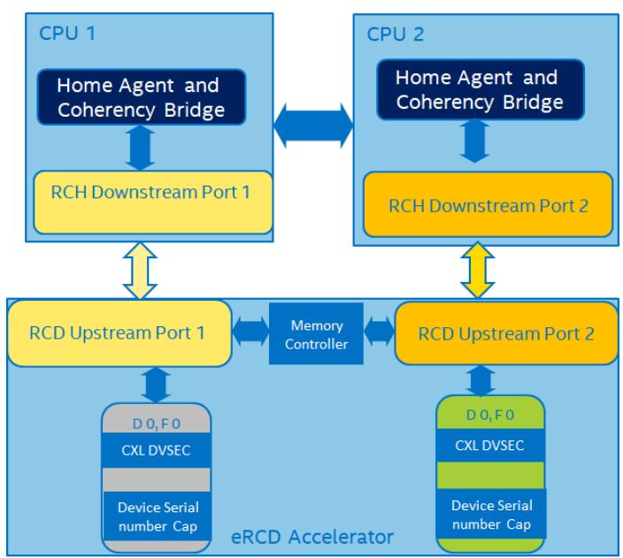

In this configuration, System Firmware shall report two PCIe Host Bridges to the OS, one that hosts Device 0, Function 0 on the left, and a second one that hosts Device 0, Function 0 on the right. Both Device 0, Function 0 instances implement PCIe DVSEC for

CXL Devices and a Device Serial Number PCIe Extended Capability. A Vendor ID and serial number match indicates that the two links are connected to a single accelerator, which enables System Firmware to perform certain optimizations.

In some cases, the accelerator may choose to expose a single accelerator function that is managed by the accelerator device driver and handles all work requests. This may be necessary if the accelerator framework or applications do not support distributing work across multiple accelerator instances. Even in this case, both links should spawn a legal PCIe Host Bridge hierarchy with at least one PCIe function. However, the accelerator hardware is free to use both links for traffic and snoops as long as the programming model is not violated. To minimize the snoop penalty, the accelerator needs to be able to distinguish between the system memory range decoded by CPU 1 vs. CPU 2. The device driver can obtain this information via ACPI SRAT and communicate it to the accelerator using device-specific mechanisms.

The System Firmware maps the HDM into system address space using the following rules. Unlike the single CPU case, the System Firmware shall never interleave the memory range across the two Flex Bus links.

Table 9-5. Memory Decode Rules in Presence of Two CPUs/Two Flex Bus Links

<table><tr><td>Left D0, F0Mem_Capable</td><td>Left D0, F0Mem_Size</td><td>Right D0, F0Mem_Capable</td><td>Right D0, F0Mem_Size</td><td>System Firmware Requirements</td></tr><tr><td>0</td><td>N/A</td><td>0</td><td>N/A</td><td>No HDM</td></tr><tr><td>1</td><td>M</td><td>0</td><td>N/A</td><td rowspan="2">Range of size M decoded by Left Flex Bus link. Right Flex Bus link does not receive CXL.mem traffic.</td></tr><tr><td>1</td><td>M</td><td>1</td><td>0</td></tr><tr><td>0</td><td>N/A</td><td>1</td><td>N</td><td rowspan="2">Range of size N decoded by Right Flex Bus link. Left Flex Bus link does not receive CXL.mem traffic.</td></tr><tr><td>1</td><td>0</td><td>1</td><td>N</td></tr><tr><td>1</td><td>M</td><td>1</td><td>N</td><td>Two ranges set up, Range of size M decoded by Left Flex Bus link, Range of size N decoded by Right Flex Bus link.</td></tr></table>

## 9.11.8 CXL Devices Attached to an RCH

When an eRCD is attached to an RCH, the register layout matches Figure 9-4.

When a CXL device other than an eRCD is attached to a CXL RP or a CXL DSP, the device’s Upstream Port registers are accessed via the CXL Device’s PCIe Configuration space and BAR. A CXL device may be designed so that the layout of the device’s Upstream Port and Component Registers follow Figure 9-4 when connected to an RCH. For such a device, some of these registers must be remapped so that they are accessible via an RCD Upstream Port RCRB (see Section 8.2.1.2, Section 8.2.1.3, and Section 8.2.2). This register remapping is illustrated in Figure 9-7. The left half shows the register layout when a CXL device with a single PCIe Function is connected to a CXL Root Port or CXL DSP. The right half shows the register layout when the same device is connected to an RCH. Such a device shall capture the upper address bits [63:12] of the first memory read received after link initialization as the base address of the Upstream Port RCRB (see Section 8.2.1.2).

Figure 9-7. CXL Device Remaps Upstream Port and Component Registers  
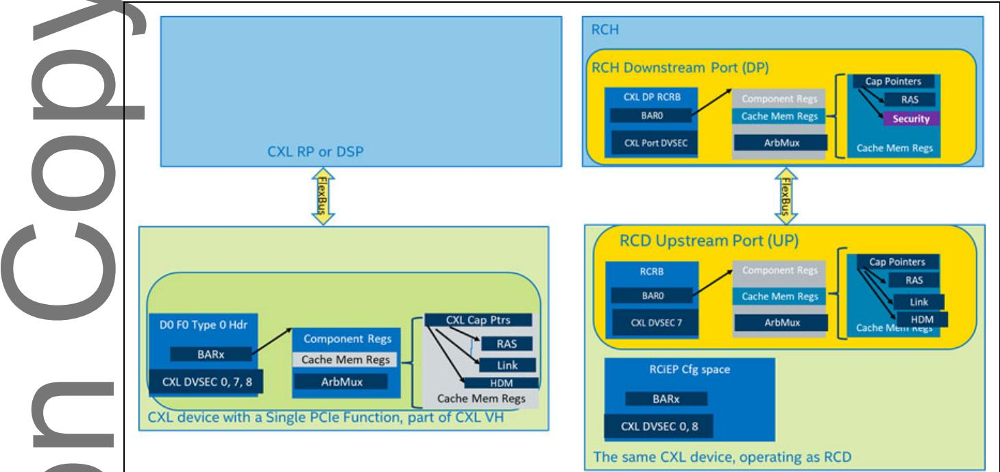

A CXL device may be designed so that the layout of the device’s Upstream Port and Component Registers still follows the CXL device layout for a CXL VH when connected to an RCH. In that case, the register remapping is unnecessary. This is illustrated in Figure 9-8. The left half shows the register layout when a CXL device with a single PCIe Function is connected to a CXL Root Port or a CXL DSP. The right half shows the register layout when the same device is connected to an RCH. Such a device shall capture the upper address bits [63:12] of the first memory read received after link initialization as the base address of the Upstream Port RCRB, but all reads to the Upstream Port RCRB range shall return all 1s. Additionally, all writes shall be completed, but silently dropped by such a device. The software may rely upon this behavior to detect a device. Note that the DWORD read to RCRB Base + 4 KB is guaranteed to return a value other than FFFF FFFFh when directed at an eRCD or a CXL device that follows the Figure 9-4 register layout when connected to an RCH (see Figure 8-10). An RCD is also permitted to implement the register mapping scheme shown in the right half of Figure 9-8. In both cases, the RCD appears as an RCiEP.

Figure 9-8. CXL Device that Does Not Remap Upstream Port and Component Registers  
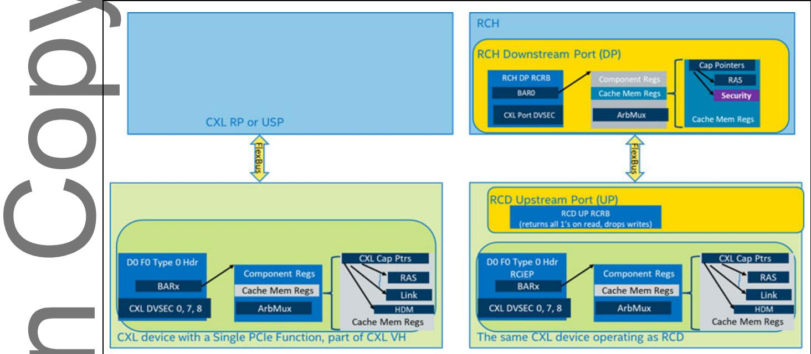

## IMPLEMENTATION NOTE

## Host Firmware/Software Flow for Detecting the RCD Registers Mapping Scheme

1. System Firmware reads the DVSEC Flex Bus Port Status register (see Section 8.2.1.3.3) in the Downstream Port to determine whether the link trained up in RCD mode. If the register’s Cache\_Enabled bit or Mem\_Enabled bit is set to 1, but the CXL 68B Flit and VH Enabled bit is cleared to 0, the link trained up in RCD mode.

2. If an RCD is detected, System Firmware programs the Downstream Port registers to decode the 8-KB RCRB range among other memory ranges.

3. System Firmware issues a DWORD read to the address RCRB Base + 4 KB. As explained in Section 8.2.1.2, the device captures the address and assigns it as the base of RCRB. The device implementation may rely on a read to RCRB Base + 4 KB because the CXL 1.1 specification requires such a read.

4. If the returned data is not FFFF FFFFh, the System Firmware assumes that the register layout follows the right side of Figure 9-7 and enumerates the device accordingly.

5. If the returned data is FFFF FFFFh and the Register Locator DVSEC includes a pointer to the Component Registers, the System Firmware assumes that the register layout follows the right side of Figure 9-8 and enumerates the device accordingly.

## 9.12 CXL VH Enumeration

At the top level, a CXL system may be represented to the system software as zero or more CXL Host bridges, and zero or more PCIe Host Bridges. A CXL Host Bridge is a software concept that represents one of the following:

• A collection of CXL Root Ports that share some logic, such as CHBCR

• An RCH-RCD pair

• One or more CXL Root Complex Integrated Endpoints, all of which are part of the Root Complex and appear at the same bus number

Enumeration of PCIe Host Bridges and PCIe hierarchy underneath them is governed by the PCIe Base Specification. Enumeration of CXL Host Bridges is described below.

In an ACPI-compliant system, CXL Host Bridges are identified with an ACPI Hardware ID (HID) of “ACPI0016”. CXL Early Discovery Table (CEDT) may be used to differentiate between the three software concepts listed above. RCD enumeration is described in Section 9.11.

## 9.12.1 CXL Root Ports

Each CXL Host Bridge is associated with a Base Bus Number. If the Host Bridge is not associated with RCDs or CXL RCiEPs, that bus number shall contain one or more CXL Root Ports. These Root Ports appear in PCIe configuration space with a Type 1 header, and the Device/Port Type field in the PCIe Capabilities Register shall identify these as standard PCIe Root Ports. Unless specified otherwise, CXL Root Ports may implement all Capabilities that are defined in the PCIe Base Specification as legal for PCIe Root Ports. These Root Ports can be in one of four states:

• Disconnected

• Connected to an eRCD

• Connected to CXL Device that is not an eRCD, or connected to a CXL Switch

• Connected to a PCIe Device/Switch

Section 9.12.3 describes how software can determine the current state of a CXL Root Port and the corresponding enumeration algorithm.

## 9.12.2 CXL Virtual Hierarchy

CXL Root Ports may be directly connected to a CXL device that is not an eRCD, or a CXL Switch. These Root Ports spawn a CXL Virtual Hierarchy (VH). Enumeration within a CXL VH is described below.

These CXL devices appear as a standard PCIe Endpoints with a Type 0 Header. The CXL device’s primary function (Function 0) shall carry one instance of CXL DVSEC ID 0 with Revision 1 or greater. Software may use this DVSEC instance to distinguish a CXL device from an ordinary PCIe device. Unless specified otherwise, CXL devices may implement all Capabilities that are defined in the PCIe Base Specification as legal for PCIe devices.

A CXL VH may include zero or more CXL switches. Specific configuration constraints are documented in Chapter 7.0. From an enumeration software perspective, each CXL Switch consists of one Upstream Switch Port and one or more Downstream Switch Ports.

The configuration space of the Upstream Switch Port of a CXL Switch has a Type 1 header and the Device/Port Type field in the PCIe Capabilities Register shall identify it as an Upstream Port of a PCIe Switch. The configuration space carries one instance of CXL DVSEC ID 3 and one instance of CXL DVSEC ID 7. The DVSEC Flex Bus Port Status register (see Table 8-68) in the CXL DVSEC ID 7 capability structure of the peer Port shall indicate that CXL VH operation with 68B Flit mode was negotiated with the Upstream Switch Port during link training. Unless specified otherwise, CXL Upstream Switch Ports may implement all Capabilities that are defined in the PCIe Base Specification as legal for PCIe Upstream Switch Ports.

The configuration space of a Downstream Switch Port of CXL Switch also has a Type 1 header, but the Device/Port Type field in the PCIe Capabilities register shall identify these as a Downstream Port of a PCIe Switch. Unless specified otherwise, CXL Downstream Switch Ports may implement all capabilities that are defined in the PCIe Base Specification as legal for PCIe Downstream Switch Ports. All these Ports are CXL capable and can be in one of four states, just like the CXL Root Ports:

• Disconnected

• Connected to an eRCD

• Connected to CXL Device that is not an eRCD, or connected to a CXL Switch

• Connected to a PCIe Device/Switch

Section 9.12.3 describes how software can determine the current state of a CXL Downstream Switch Port and the corresponding enumeration algorithm.

A CXL Downstream Switch Port may be connected to another CXL Switch or a CXL device. The rules for enumerating CXL switches and CXL devices are already covered earlier in this section.

## 9.12.3 Enumerating CXL RPs and DSPs

Software may use the combination of the Link Status registers and the CXL DVSEC ID 7 capability in root port or DSP configuration space to determine which state a CXL Downstream Port is in, as follows:

1. CXL root port or DSP is in the Disconnected state when they do not have an active link. The status of the link can be detected by following the PCIe Base Specification. If the link is not up, software shall ignore the CXL DVSEC ID 3 capability structure and the CXL DVSEC ID 7 capability structure. A Hot-Add event may transition a Disconnected Port to a CXL Connected state or a PCIe Connected state. Hot-adding an eRCD adapter will transition the Port to an Undefined state.

2. CXL root port or DSP connected to a CXL device that is not an RCD or connected to a CXL switch shall expose one instance of the CXL DVSEC ID 3 capability structure and one instance of the CXL DVSEC ID 7 capability structure. The DVSEC Flex Bus Port Status register (see Table 8-68) in the CXL DVSEC ID 7 capability structure shall indicate that CXL VH operation with 68B Flit mode was successfully negotiated during link training. System Firmware may leave the Unmask SBR bit and the Unmask Link Disable bit in the Port Control Extensions register (see Table 8-32) of the Downstream Port at the default (0) values to prevent CXL-unaware PCIe software from resetting the device and the link, respectively.

3. CXL root port or DSP connected to an eRCD shall expose one instance of the CXL DVSEC ID 3 capability structure and one instance of the CXL DVSEC ID 7 capability structure. The DVSEC Flex Bus Port Status register in the CXL DVSEC ID 7 capability structure shall indicate that CXL VH operation with 68B Flit mode was not negotiated, but that either the CXL.cache protocol or the CXL.mem protocol was negotiated during link training. There are two possible substates:

a. Not Operating with RCH Downstream Port addressing — Immediately after the link negotiation, the Port registers appear in the PCIe configuration space with a Type 1 header.

b. Operating with RCH Downstream Port addressing — System Firmware may program the RCRB Base register in the Port’s CXL DVSEC ID 3 capability structure to transition the Port to this mode. After the Port is in this mode, the Port can only transition out of the mode after a reset. A Downstream Port operating in this mode shall ignore Hot Reset requests received from the Upstream Port.

4. CXL root port or DSP connected to a PCIe device/switch may or may not expose the CXL DVSEC ID 3 capability structure and the CXL DVSEC ID 7 capability structure.

a. If the PCIe root port configuration space contains an instance of the CXL DVSEC ID 3 capability structure, the configuration space shall also contain an instance of the CXL DVSEC ID 7 capability structure.

b. If the PCIe root port configuration space contains an instance of the CXL DVSEC ID 7 capability structure, the DVSEC Flex Bus Port Status register shall indicate that this Port did not train up in CXL mode. Software shall ignore the contents of the CXL DVSEC ID 3 capability structure for such a Port.

Figure 9-9. CXL Root Port/DSP State Diagram  
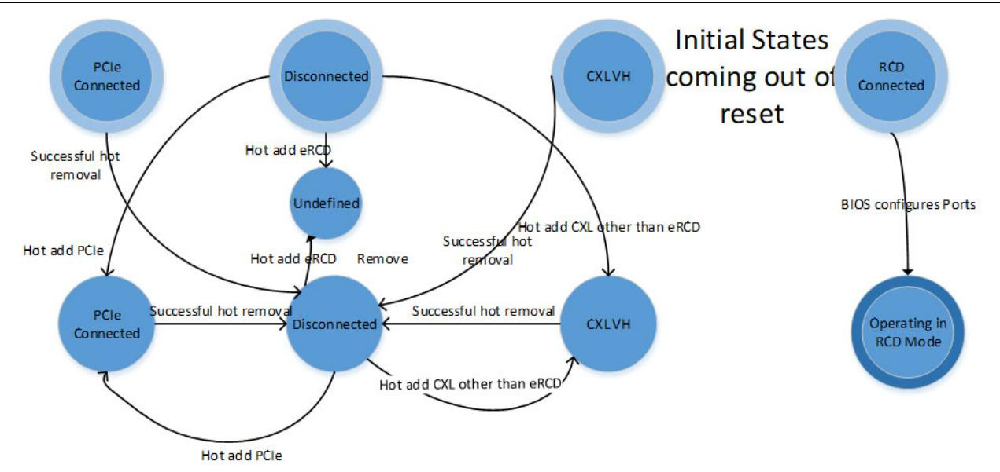  
If the Port is in the disconnected state, the branch does not need further enumeration.

If the Port is connected to a CXL device other than an eRCD or connected to a CXL switch, the software follows Section 9.12.2 for further enumeration until it reaches the leaf endpoint.

If the Port is connected to an RCD, the software follows Section 9.12.4 to enumerate the device.

If the Port is connected to a PCIe device/switch, the enumeration flow is governed by the PCIe Base Specification.

## 9.12.4 eRCD Connected to a CXL RP or DSP

An eRCD may be connected to a CXL Root Port or a CXL Downstream Switch Port. Each RCD Function must report itself as an RCiEP and therefore cannot appear, to software, to be below a PCIe-enumerable Downstream Port. System Firmware is responsible for detecting such a case and reconfiguring the CXL Ports in the path so that the RCD appears to software to be directly connected to an RCH Downstream Port and not in a CXL VH.

## 9.12.4.1 Boot Time Reconfiguration of CXL RP or DSP to Enable an eRCD

1. At reset, the Downstream Port registers are visible in the PCIe configuration space with a Type 1 header. During enumeration, System Firmware shall identify all the Downstream Ports that are connected to the eRCD by reading the CXL DVSEC ID 7 register instead of the Link Status registers.

— If the link training was successful, the DVSEC Flex Bus Port Status register (see Table 8-68) in the CXL DVSEC ID 7 capability structure shall indicate that CXL VH operation with 68B Flit mode was not negotiated, but shall indicate that either the CXL.cache protocol or the CXL.mem protocol was negotiated during link training.

— If the link training was unsuccessful, the DVSEC Flex Bus Port Received Modified TS Data Phase1 register (see Table 8-69) in the CXL DVSEC ID 7 capability structure shall indicate that the device is CXL capable but not CXL VH capable. A DSP shall not report link-up status in the PCIe Link Status register when the DSP detects an eRCD on the other end to prevent the CXL-unaware software from discovering the eRCD.

2. System Firmware identifies MMIO and bus resource needs for all RCDs below a CXL root port. System Firmware adds MMIO resources needed for the RCH Downstream Port RCRB and RCD Upstream Port RCRB (8-KB MMIO per link) and CXL Component registers (128-KB MMIO per link).

3. System Firmware assigns MMIO and bus resources and programs the Alternate MMIO Base/Limit and Alternate Bus Base/Limit registers in all the Root Ports and the Switch Ports in the path and the eRCD BARs except the Downstream Ports that are directly connected to eRCDs. These Alternate decoders are described in Section 8.1.5.

4. System Firmware sets the Alt BME and Alt Memory and ID Space Enable bits in all the Root Ports and the Switch Ports in the path of every eRCD.

5. For each Downstream Port that is connected to an eRCD, System Firmware programs the CXL RCRB Base Address. System Firmware then writes 1 to the CXL RCRB Enable bit in the CXL RCRB Base register (see Table 8-41), which transitions the port addressing to RCH addressing. The Downstream Port registers now appear in MMIO space at CXL RCRB Base and not in configuration space. System Firmware issues a read to the address CXL RCRB Base + 4 KB. The RCD Upstream Port captures its RCRB Base as described in Section 8.1.5. System Firmware configures the Upstream Port and Downstream Port registers, as necessary. If this is a DSP, the Downstream Port shall ignore any hot reset requests received from the Upstream Port.

6. System Firmware configures the eRCD, using the algorithm described in Section 9.11.6.

The System Firmware shall report each RCD under a separate Host Bridge and not as part of the CXL VH.

The Switch shall ensure that there is always a DSP visible at Device 0, Function 0.

These concepts are illustrated by the configuration shown in Figure 9-10. In this configuration, eRCD F and D are attached to a CXL Switch. The Switch DSPs are labeled E and C. The Switch USP and the CXL Root Port are labeled B and A, respectively. The left half of Figure 9-10 represents the address map and how the normal decoders and the Alt Mem decoders of A, B, C, and E are configured.

If the host accesses an MMIO address belonging to D, the access flows through A, B, and C as follows:

1. Host issues a read.

2. A Alt Decoder positively decodes the access and sends to B because A’s Alt MSE=1.

3. B Alt Decoder positively decodes the access because B’s Alt MSE=1.

4. C normal decoder positively decodes the access and forwards it to D because C MSE=1.

5. D positively decodes and responds because D MSE=1.

Figure 9-10. eRCD MMIO Address Decode Example

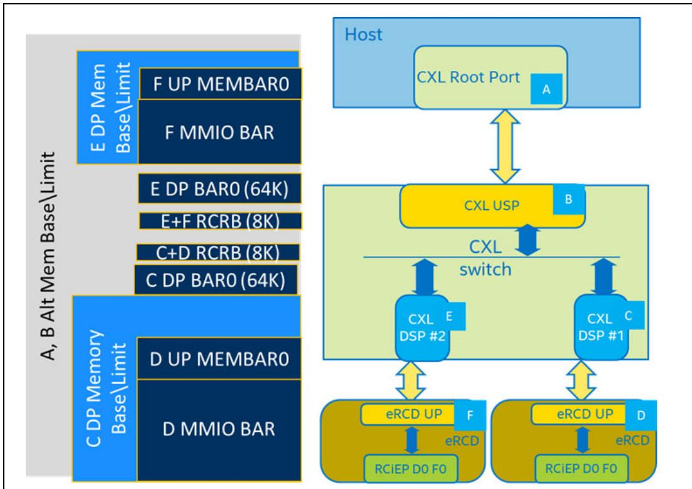

The left half of Figure 9-11 represents the configuration space map for the same configuration as in Figure 9-10 and how the bus decoders and the Alt Mem decoders of A, B, C, and E are configured.

If the host accesses configuration space of F, the access flows through A, B, and E as follows:

1. Host issues configuration read to F’s configuration space

2. A’s Alt Decoder positively decodes, forwards to B as Type 1

3. B’s Alt Decoder positively decodes, forwards down as Type 1

4. E’s RCRB regular decoder positively decodes, forwards to F as Type 0 because the bus number matches E’s RCRB Secondary Bus number

5. F positively decodes and responds

If D detects a protocol or link error, the error signal will flow to the system via the following path:

1. D issues ERR\_ message with the Requester ID of D.

2. C shall not expose DPC capability.

3. C forwards ERR\_ message to B.

4. B forwards the message to A.

5. A forwards the message to RCEC in the Root Complex because the requester’s bus number hits Alt Bus Decoder.

6. RCEC generates MSI if enabled.

7. Root Complex Event Collector Endpoint Association Extended Capability of RCEC describes that it can handle errors from bus range = Alt Bus Decoder in RP.

8. A shall not trigger DPC upon ERR\_ message. Because the requester’s bus number hits Alt Bus Decoder, it is treated differently than a normal ERR\_ message.

## Figure 9-11. eRCD Configuration Space Decode Example

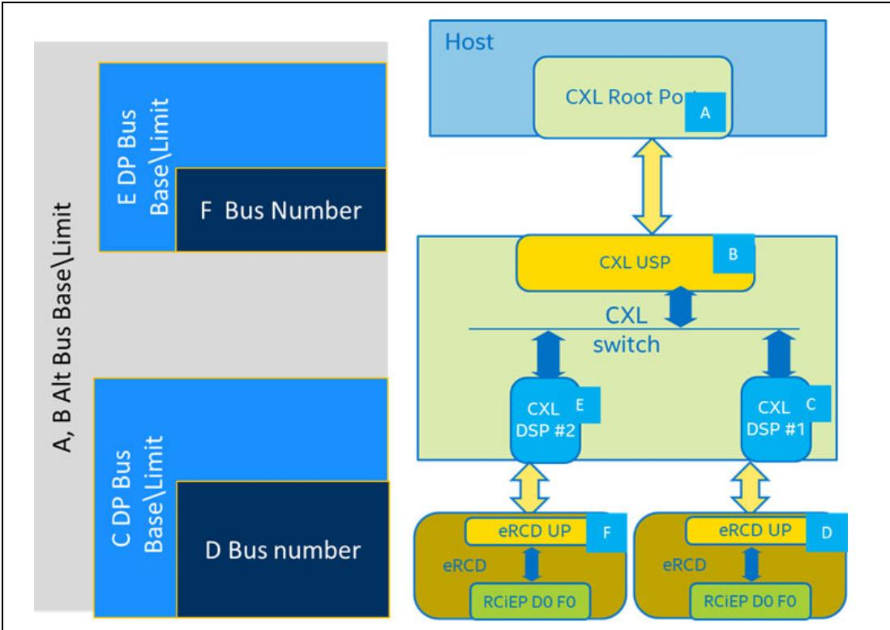

## 9.12.5 CXL eRCD below a CXL RP and DSP Example

Figure 9-12 represents the physical connectivity of a host with four Root Ports, one Switch, and five devices (see Figure 9-13 for the corresponding software view). Note that the numbers (e.g., the “1” in PCIe Device 1) in this diagram do not represent the device number or the function number.

Figure 9-12. Physical Topology Example  
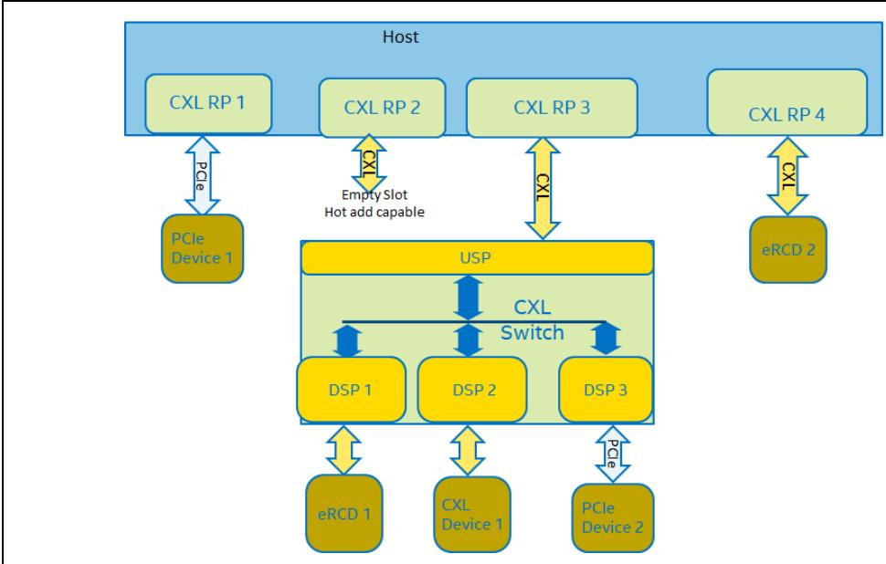

As shown in Figure 9-12, the Switch makes eRCD 1, below its DSP (DSP 1), appear as an RCiEP under an RCH. eRCD 1 is exposed as a separate Host Bridge to the Operating System. The device hosts a CXL DVSEC ID 0 instance in Device 0, Function 0 Configuration Space. The RCH Downstream Port registers and the RCD Upstream Port registers appear in MMIO space as expected.

When a CXL Root Port detects a PCIe device (PCIe Device 1), the Root Port trains up in PCIe mode. The Root Port configuration space (Type 1) may include the CXL DVSEC ID 3 and the CXL DVSEC ID 7. If present, the CXL DVSEC ID 7 instance will indicate that the link trained up in PCIe mode. Other CXL DVSEC ID capability structures may be present as well.

If a CXL Root Port (RP 2) is connected to an empty slot, its configuration space (Type 1) hosts the CXL DVSEC ID 3 and the CXL DVSEC ID 7, but the CXL DVSEC ID 7 shall indicate no CXL connectivity and the PCIe Link Status register shall indicate that there is no PCIe connectivity. Other CXL DVSEC ID capability structures may be present as well. The user can hot-add a CXL device other than eRCD, a CXL Switch, or a PCIe device in this slot.

A CXL Root Port (RP 3) connected to a CXL Switch spawns a CXL VH. The Root Port as well as the Upstream Switch Port configuration space (Type 1) each host an instance of CXL DVSEC ID 3 and an instance of CXL DVSEC ID 7, but the CXL DVSEC ID 7 instance will indicate that these Ports are operating in CXL VH operation with 68B Flit mode. Other CXL DVSEC ID capability structures may be present as well.

If a CXL Downstream Switch Port (DSP 2) is connected to a CXL device that is not an eRCD, DSP 2’s configuration space (Type 1) hosts an instance of CXL DVSEC ID 3 and an instance of CXL DVSEC ID 7, but the CXL DVSEC ID 7 instance will indicate that this Port is connected to a CXL device and is part of a CXL VH. Other CXL DVSEC ID capability structures may be present as well.

In this example, CXL Downstream Switch Port (DSP 3) is connected to a PCIe device and its configuration space (Type 1) does not host an instance of CXL DVSEC ID 7. Absence of a CXL DVSEC ID 7 indicates that this Port is not operating in CXL mode.

Note that it is legal for DSP 3 to host a CXL DVSEC ID 7 instance as long as the DVSEC Flex Bus Port Status register (see Table 8-68) in the CXL DVSEC ID 7 capability structure reports that the link is not operating in CXL mode.

If a CXL Root Port (RP 4) is connected to an eRCD, the Root Port operates as an RCH Downstream Port. eRCD 2 appears as an RCiEP under its own Host Bridge. This device hosts an instance of CXL DVSEC ID 0 in Device 0, Function 0 Configuration Space. The RCH Downstream Port registers and the RCD Upstream Port registers appear in MMIO space as expected.

If the Switch is Hot-Pluggable, System Firmware may instantiate a \_DEP object in the ACPI namespace to indicate that PCIe Device 1 is dependent on the CXL USP. A legacy PCIe bus driver interprets that to mean that the Switch hot removal has a dependency on eRCD 1, even though the ACPI/PCIe hierarchy does not show such a dependency.

## Figure 9-13. Software View

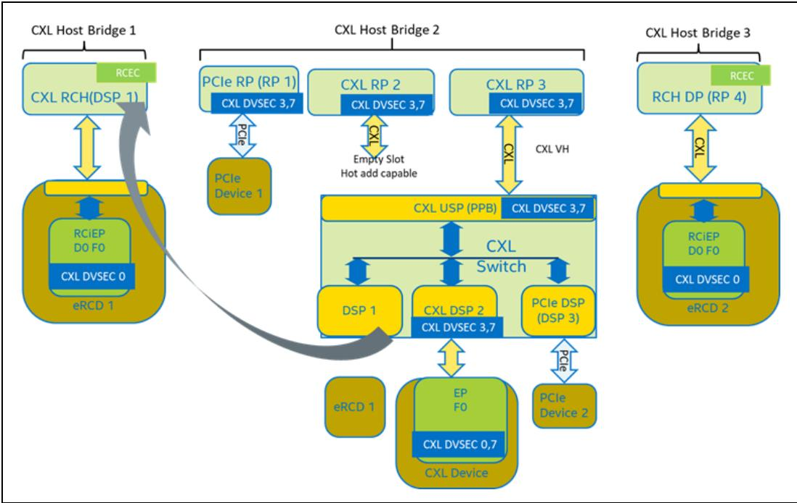

## Mapping of Link and Protocol Registers in CXL VH

In the presence of an eRCD, the link and protocol registers appear in MMIO space (RCRB and Component registers in the Downstream Port and the Upstream Port). See Figure 9-7 and Figure 9-8.

Because a CXL Virtual Hierarchy appears as a true PCIe hierarchy, the Component Register block is mapped using a standard BAR of CXL components.

Each CXL Host Bridge that is not an RCH includes CHBCR, which includes the registers that are common to all Root Ports under that Host Bridge. In an ACPI-compliant system, the base address of this register block is discovered via ACPI CEDT or the \_CBR method. The CHBCR includes the HDM Decoder registers.

Each CXL Root Port carries a single BAR that maps the associated Component Register block. The offset within that BAR is discovered via the CXL DVSEC ID 8. See Section 8.1.9. The layout of the Component Register Block is shown in Section 8.2.3.

Each CXL device that is not an RCD can map its Component Register Block to any of its six BARs and a 64-KB-aligned offset within that BAR. The BAR number and the offset are discovered via CXL DVSEC ID 8. A Type 3 device Component Register Block includes HDM Decoder registers.

Each CXL USP carries a single BAR that maps the associated Component Register block. The offset within that BAR is discovered via CXL DVSEC ID 8. The Upstream Switch Port Component Register Block contains the registers that are not associated with a particular Downstream Port, such as HDM Decoder registers.

Each CXL DSP carries a single BAR that points to the associated CHBCR, the format of which closely mirrors that of a Root Port. The offset within that BAR is discovered via CXL DVSEC ID 8.

Figure 9-14. CXL Link/Protocol Register Mapping in a CXL VH  
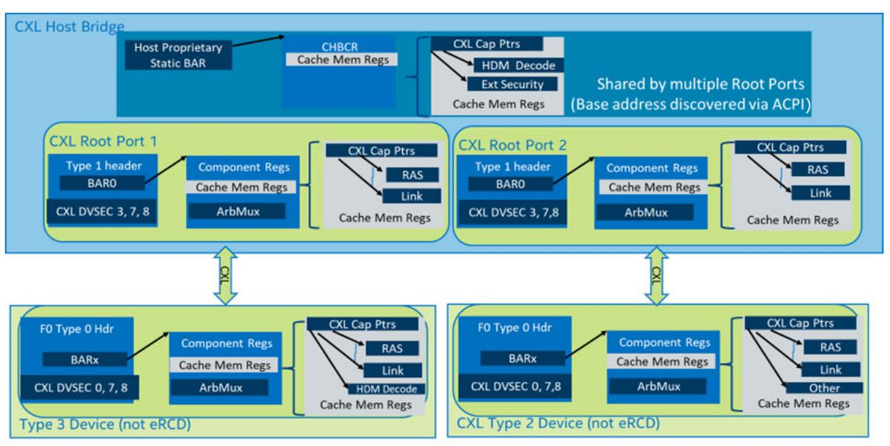

Figure 9-15. CXL Link/Protocol Registers in a CXL Switch  
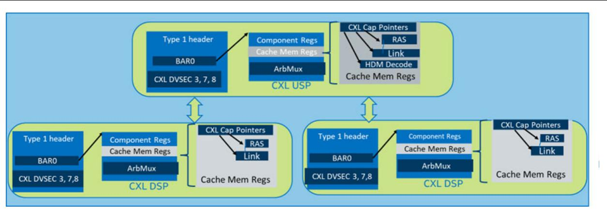

## Software View of HDM

HDM is exposed to the OS/VMM as normal memory. However, HDM likely has different performance/latency attributes compared to host-attached memory. Therefore, a system with CXL.mem devices can be considered as a heterogeneous memory system.

ACPI HMAT was introduced for such systems and can report memory latency and bandwidth characteristics associated with different memory ranges. The ACPI Specification version 6.2 and later carry the definition of revision 1 of HMAT. As of August 2018, the ACPI WG deprecated revision 1 of HMAT because of the revision’s shortcomings. As a result, the subsequent discussion refers to revision 2 of HMAT. In addition, the ACPI Specification includes the Generic Affinity (GI) structure. GI structure is useful for describing execution engines such as accelerators that are not processors. CXL.mem-capable accelerators will result in two SRAT entries — One GI entry to represent the accelerator cores and one memory entry to represent the attached HDM. GI entry is especially useful when describing the CXL.cache accelerator. Previous to the introduction of GI, the CXL.cache accelerator could not be described as a separate entity in SRAT/HMAT and had to be combined with the attached CPU. With this specification change, the CXL.cache accelerator can be described as a separate proximity domain. \_PXM method can be used to identify the proximity domain associated with the PCIe device. Because Legacy OSs do not understand GI, System Firmware is required to return the processor domain that is most closely associated with the I/O device when running such an OS. ASL code can use bit[17] of Platform-Wide \_OSC Capabilities DWORD 2 to detect whether the OS supports GI.

System Firmware must construct and report SRAT and HMAT to the OS in systems with CXL.cache devices and CXL.mem devices. Because System Firmware is not aware of HDM properties, that information must come from the CXL device in the form of CDAT. A device may export CDAT via Table Access DOE or via a UEFI driver.

System Firmware combines the information that it has about the host and CXL connectivity with CDAT content obtained from various CXL components during construction of SRAT and HMAT.

## 9.13.1 Memory Interleaving

Memory interleaving allows consecutive memory addresses to be mapped to different CXL devices or different ports of a BPD at a uniform interval. eRCDs may support a limited form of interleaving as described in Section 9.11.7.1, whereby memory is interleaved across the two links between a CPU and a dual-headed device.

The CXL 2.0 specification introduced a mechanism for interleaving across different devices. The set of devices that are interleaved together is known as the Interleave Set.

An Interleave Set is identified by the following:

• Base HPA — Multiple of 256 MB

• Size — Also a multiple of 256 MB

• Interleave Way

• Interleave Granularity

• Targets (applicable only to Root Ports and Upstream Switch Ports)

These terms are described below.

Interleave Way: A CXL Interleave Set may contain either 1, 2, 3, 4, 6, 8, 12, or 16 CXL devices. 1-way Interleave is equivalent to no interleaving. The number of devices in an Interleave set is known as Interleave Ways (IW).

Interleave Granularity: Each device in an Interleave Set decodes a specific number of consecutive bytes, referred to as Chunk, in HPA Space. The size of Chunk is known as Interleave Granularity (IG). The starting address of each Chunk is a multiple of IG.

• CXL Host Bridges (except RCH) and CXL switches must support the following IG values:

— 256 Bytes (Interleaving on HPA[8])

— 512 Bytes (Interleaving on HPA[9])

— 1024 Bytes (Interleaving on HPA[10])

— 2048 Bytes (Interleaving on HPA[11])

— 4096 Bytes (Interleaving on HPA[12])

— 8192 Bytes (Interleaving on HPA[13])

— 16,384 Bytes (Interleaving on HPA[14])

• CXL memory devices must support at least one of the two IG groups as reported via the CXL HDM Decoder Capability register (see Table 8-116):

— Group 1: Interleaving on HPA[8], HPA[9], HPA[10], and HPA[11]

— Group 2: Interleaving on HPA[12], HPA[13], and HPA[14]

Target: The HDM Decoders in the CXL Host Bridge are responsible for looking up the incoming HPA in a CXL.mem transaction and forwarding the HPA to the appropriate Root Port Target. The HDM Decoders in the CXL Upstream Switch Port are responsible for looking up the incoming HPA in a CXL.mem transaction and forwarding the HPA to the appropriate Downstream Switch Port Target.

An HDM Decoder in a device is responsible for converting HPA into DPA by stripping off specific address bits. These flows are described in Section 8.2.4.20.13.

An Interleave Set is established by programing an HDM Decoder and committing it (see Section 8.2.4.20.12). The number of decoders implemented by a component are enumerated via the CXL HDM Decoder Capability register (see Table 8-116). HDM Decoders within a component must be configured in a congruent manner and the Decoder Commit flow performs certain self-consistency checks to assist with correct programming.

Software is responsible for ensuring that HDM Decoders located inside the components along the path of a transaction must be configured in a consistent manner.

Figure 9-16 illustrates a simple memory fan-out topology with four memory devices behind a CXL Switch. A single HDM Decoder in each Device as well as the Upstream Switch Port is configured to decode the HPA range 16 TB to 20 TB, at 1-KB granularity. The leftmost Device receives 1-KB ranges starting with HPAs 16 TB, 16 TB + 4 KB, 16 TB + 8 KB, …, 20 TB – 4 KB (every 4th Chunk). The Root Complex does not participate in the interleaving process.

Figure 9-16. One-level Interleaving at Switch Example  
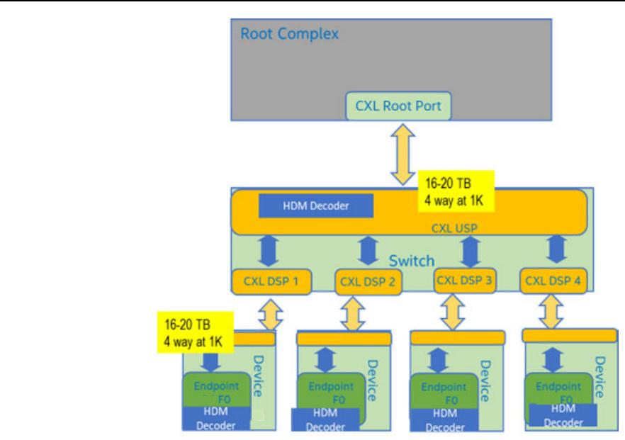  
Multiple-level interleaving is supported as long as all the levels use different, but consecutive, HPA bits to select the target and no Interleave Set has more than eight devices. This is illustrated in Figure 9-17 and Figure 9-18.

Figure 9-17. Two-level Interleaving

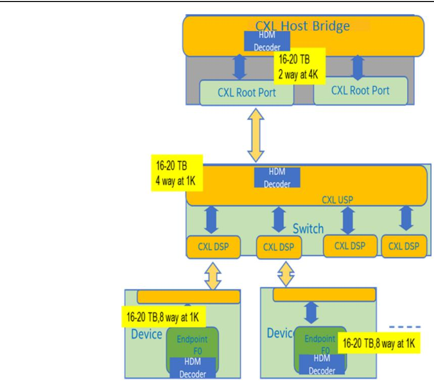

Figure 9-17 illustrates a two-level Interleave scheme where the Host Bridge as well as the switch participates in the interleaving process. This topology has four memory devices behind each CXL Switch. One HDM Decoder in each of the eight devices, both Upstream Switch Ports and the Host Bridge are configured to decode the HPA range 16 TB to 20 TB. The Host Bridge partitions the address range in two halves at 4-KB granularity (based on HPA[12]), with each half directed to a Root Port. Each Upstream Switch Port further splits each half into four subranges at 1-KB granularity (based on HPA[11:10]). To each device, it appears as though the HPA range 16-20 TB is 8-way interleaved at 1-KB granularity based on HPA[12:10]. The leftmost Device receives 1- KB ranges starting with HPAs 16 TB, 16 TB + 8 KB, 16 TB + 16 KB, …, 20 TB – 8 KB.

Figure 9-18 illustrates a three-level Interleave scheme where the cross-host Bridge logic, the Host Bridge, and the switch participate in the interleaving process. The crosshost Bridge logic is configured to interleave the address range in two halves, using host proprietary registers at 4-KB granularity. One HDM Decoder in eight devices, four Upstream Switch Ports, and two Host Bridges are configured to decode the HPA range 16 TB to 20 TB. The Host Bridge further subdivides the address range in two at 2-KB granularity (using HPA[11]). The Upstream Switch Port in every switch further splits HPA space into two subranges at 1-KB granularity (using HPA[10]). To each device, it appears as though the HPA range 16-20 TB is 8-way interleaved at 1-KB granularity based on HPA[12:10]. Similar to Figure 9-17, the leftmost Device receives 1-KB ranges starting with HPAs 16 TB, 16 TB + 8 KB, 16 TB + 16 KB, …, 20 TB – 8 KB.

## Figure 9-18. Three-level Interleaving Example

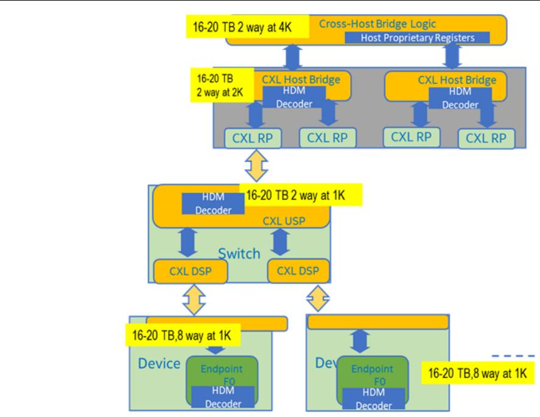

## 9.13.1.1 Legal Interleaving Configurations: 12-way, 6-way, and 3-way

This section describes the legal 12-way, 6-way, and 3-way interleaving configurations. The term IGB represents the interleave granularity in number of bytes. The cross-host Bridge Interleaving logic selects the target Host Bridge according to the configurations specified in Table 9-6, Table 9-7, and Table 9-8, respectively. The Root Complex and the switch select the target port as described in Section 9.18.1.

Table 9-6. 12-Way Device-level Interleave at IGB

<table><tr><td>Cross-host Bridge Logic Interleaving</td><td>CXL Root Complex-level Interleaving</td><td>CXL Switch-level Interleaving</td></tr><tr><td>12 way at IGB</td><td>No interleaving</td><td>No interleaving/Absent</td></tr><tr><td>6 way at 2*IGB</td><td>2 way at IGB</td><td>No interleaving/Absent</td></tr><tr><td>6 way at 2*IGB</td><td>No interleaving</td><td>2 way at IGB</td></tr><tr><td>3 way at 4*IGB</td><td>4 way at IGB</td><td>No interleaving</td></tr><tr><td>3 way at 4*IGB</td><td>No interleaving</td><td>4 way at IGB</td></tr><tr><td>3 way at 4*IGB</td><td>2 way at IGB</td><td>2 way at 2*IGB</td></tr><tr><td>3 way at 4*IGB</td><td>2 way at 2*IGB</td><td>2 way at IGB</td></tr></table>

Table 9-7. 6-Way Device-level Interleave at IGB

<table><tr><td>Cross-host Bridge Logic Interleaving</td><td>CXL Host Bridge-level Interleaving</td><td>CXL Switch-level Interleaving</td></tr><tr><td>6 way at IGB</td><td>No interleaving</td><td>No interleaving/Absent</td></tr><tr><td>3 way at 2*IGB</td><td>2 way at IGB</td><td>No interleaving</td></tr><tr><td>3 way at 2*IGB</td><td>No interleaving</td><td>2 way at IGB</td></tr></table>

Table 9-8. 3-Way Device-level Interleave at IGB

<table><tr><td>Cross-host Bridge Logic Interleaving</td><td>CXL Host Bridge-level Interleaving</td><td>CXL Switch-level Interleaving</td></tr><tr><td>3 way at IGB</td><td>No interleaving</td><td>No interleaving/Absent</td></tr></table>

## 9.13.2 CXL Memory Device Label Storage Area

CXL memory devices that provide volatile memory, such as DRAM, may be exposed with different interleave geometries each time the system is booted. This can happen due to the addition or removal of other devices or changes to the platform’s default interleave policies. For volatile memory, these changes to the interleave usually do not impact host software because there is generally no expectation that volatile memory contents are preserved across reboots. However, with persistent memory, the exact preservation of the interleave geometry is critical so that the persistent memory contents are presented to host software the same way each time the system is booted.

Similar to the interleaving configuration, persistent memory devices may be partitioned into namespaces, which define volumes of persistent memory. These namespaces must also be reassembled the same way each time the system is booted to prevent data loss.

Section 8.2.10 defines mailbox operations for reading and writing the Label Storage Area (LSA) on CXL memory devices: Get LSA and Set LSA. In addition, the Identify Memory Device mailbox command exposes the size of the LSA for a given CXL memory device. The LSA allows both interleave and namespace configuration details to be stored persistently on all the devices involved, so that the configuration data “follows the device” if the device is moved to a different socket or machine. The use of an LSA is analogous to how disk RAID arrays write configuration information to a reserved area of each disk in the array so that the geometry is preserved across configuration changes.

Figure 9-19. Overall LSA Layout

A CXL memory device may contribute to multiple persistent memory interleave sets, limited by interleave resources such as HDM decoders or other platform resources. Each persistent memory Interleave Set may be partitioned into multiple namespaces, limited by resources such as label storage space and supported platform configurations.

The LSA format and the rules for updating and interpreting the LSA are specified in this section. CXL memory devices do not directly interpret the LSA, they just provide the storage area and mailbox commands for accessing it. Software configuring Interleave Sets and namespaces, such as pre-boot firmware or host operating systems shall follow the LSA rules specified here to correctly inter-operate with CXL-compliant memory devices.

## 9.13.2.1 Overall LSA Layout

The LSA consists of two Label Index Blocks followed by an array of label slots. As shown in Figure 9-19, the Label Index Blocks are always a multiple of 256 bytes in size, and each label slot is exactly 256 bytes in size.

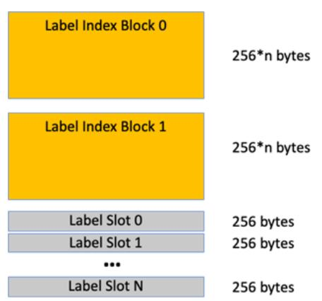

The LSA size is implementation dependent and software must discover the size using the Identify Memory Device mailbox command. The minimum allowed size is two index blocks, 256-bytes each in length, two label slots (providing space for a minimal one region label and one namespace label), and one free slot to allow for updates. This makes the total minimum LSA size 1280 bytes. It is recommended (but not required) that a device provides for configuration flexibility by implementing an LSA large enough for two region labels per device and one namespace label per 8 GB of persistent memory capacity available on the device.

All updates to the LSA shall follow the update rules laid out in this section, which guarantee that the LSA remains consistent in the face of interruptions such as power loss or software crashes. There are no atomicity requirements on the Set LSA mailbox operation — the operation simply updates the range of bytes provided by the caller. Atomicity and LSA consistency are achieved using checksums and the principle that only free slots (currently unused) are written to — in-use data structures are never written, avoiding the situation where an interrupted update to an in-use data structure makes it inconsistent. Instead, all updates are made by writing to a free slot and then following the rules laid out in this section to atomically swap the in-use data structure with the newly written copy.

The LSA layout uses Fletcher64 checksums. Figure 9-20 shows a Fletcher64 checksum implementation that produces the correct result for the data structures in this specification when run on a 64-bit system. When performing a checksum on a

structure, any multi-byte integer fields shall be in little-endian byte order. If the structure contains its own checksum, as is commonly the case, that field shall contain 0 when this checksum routine is called.

## Figure 9-20. Fletcher64 Checksum Algorithm in C

```c
/*
 * checksum -- compute a Fletcher64 checksum
 */
uint64_t

checksum(void *addr, size_t len)
{
    uint32_t *p32 = addr;
    uint32_t *p32end = addr + len;
    uint32_t lo32 = 0;
    uint32_t hi32 = 0;

    while (p32 < p32end) {
    lo32 += *p32++;
    hi32 += lo32;
    }

    return (uint64_t)hi32 << 32 | lo32;
}
```

The algorithm for updating the LSA is single-threaded. Software is responsible for protecting a device’s LSA so that only a single thread is updating the LSA at any time. This is typically done with a common mutex lock.

## 9.13.2.2 Label Index Blocks

Table 9-9 shows the layout of a Label Index Block.

Table 9-9. Label Index Block Layout (Sheet 1 of 2)

<table><tr><td>Field</td><td>Byte Offset</td><td>Length in Bytes</td><td>Description</td></tr><tr><td>Sig</td><td>00h</td><td>10h</td><td>Signature indicating a Label Index Block. Shall be set to &quot;NAMESPACE_INDEX\0&quot;.</td></tr><tr><td>Flags</td><td>10h</td><td>3</td><td>No flags defined yet, shall be 0.</td></tr><tr><td>LabelSize</td><td>13h</td><td>1</td><td>Shall be 1. This indicates the size of labels in this LSA in multiples of 256 bytes (e.g., 1 for 256, 2 for 512, etc.).</td></tr><tr><td>Seq</td><td>14h</td><td>4</td><td>Sequence number. Only the two least significant bits of this field are used and shown in Figure 9-21. All other bits shall be 0.</td></tr><tr><td>MyOff</td><td>18h</td><td>8</td><td>Offset of this index block in the LSA. Label Index Block 0 shall have 0 in this field, Label Index Block 1 shall have the size of the index block as its offset.</td></tr></table>

Table 9-9. Label Index Block Layout (Sheet 2 of 2)

<table><tr><td>Field</td><td>Byte Offset</td><td>Length in Bytes</td><td>Description</td></tr><tr><td>MySize</td><td>20h</td><td>8</td><td>Size of an index block in bytes. Shall be a multiple of 256.</td></tr><tr><td>OtherOff</td><td>28h</td><td>8</td><td>Offset of the other index block paired with this one.</td></tr><tr><td>LabelOff</td><td>30h</td><td>8</td><td>Offset of the first slot where labels are stored.</td></tr><tr><td>NSlot</td><td>38h</td><td>4</td><td>Total number of label slots.</td></tr><tr><td>Major</td><td>3Ch</td><td>2</td><td>The major version number of this layout. Shall be 2.</td></tr><tr><td>Minor</td><td>3Eh</td><td>2</td><td>The minor version number of this layout. Shall be 1.</td></tr><tr><td>Checksum</td><td>40h</td><td>8</td><td>Fletcher64 checksum of all fields in this Label Index Block. This field is assumed to be 0 when the checksum is calculated.</td></tr><tr><td>Free</td><td>48h</td><td>Varies</td><td>NSlot bits, padded with 0s to align index block to 256 bytes.</td></tr></table>

When reading Label Index Blocks, software shall consider index blocks to be valid only when their Sig, MyOff, OtherOff, and Checksum fields are correct. In addition, any blocks with Seq cleared to 0 are discarded as invalid. Finally, if more than 1 Label Index Block is found to be valid, the one with the older sequence number (immediately counterclockwise to the other, according to Figure 9-21) is discarded. If all checks pass and the sequence numbers match, the index block at the higher offset shall be considered the valid block. If no valid Label Index Blocks are found, the entire LSA is considered uninitialized.

Figure 9-21. Sequence Numbers in Label Index Blocks

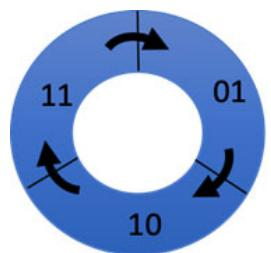

When updating the Label Index Block, the current valid block, according to the rules above, is never directly written to. Instead, the alternate block is updated with the appropriate fields and a sequence number that is immediately clockwise as shown in Figure 9-21). It is the appearance of a new block that passes all the checks and has a higher sequence number that makes this update atomic in the face of interruption.

Using this method of atomic update, software can allocate and deallocate label slots, even multiple slots, in a single, atomic operation. This is done by setting the Free bits to indicate which slots are free and which are in-use, and then updating the Label Index Block atomically as described above. To ensure that it is always possible to update a label atomically, there must always be at least one free label slot. That way, any used label slots can be updated by writing the new contents to the free slot and using the Label Index Block update algorithm to mark the new version and in-use and the old version and free in one atomic operation. For this reason, software must report a “label storage area full” error when a caller tries to use the last label slot.

The Free field contains an array of NSlot bits, indicating which label slots are currently free. The Label Index Block is then padded with 0 bits until the total size is a multiple of 256 bytes. This means that up to 1472 label slots are supported by Label Index Blocks that are 256 bytes in length. For 1473 to 3520 label slots, the Label Index Block size must be 512 bytes in length, and so on.

## 9.13.2.3 Common Label Properties

Three types of labels may occupy the label slots in the LSA: Region Labels, Namespace Labels, and Vendor Specific Labels. The first two are identified by type fields containing UUIDs as specified in the following sections. Vendor Specific Labels contain a type UUID determined by the vendor per the IETF RFC 4122. Software shall ignore any labels with unknown types. In this way, the Type field in the labels provides a major version number, where software can assume that a UUID that it expects to find indicates a label that it understands, because only backward-compatible changes are allowed to the label layout from the point where that UUID first appears in a published CXL specification.

Region Labels and Namespace Labels contain a 4-byte Flags field that is used to indicate the existence of new features. Because those features must be backward compatible, software may ignore unexpected flags encountered in this field (no error generated). Software should always write 0s for Flags bits that were not defined at the time of implementation. In this way, the Flags field provides a minor version number for the label.

It is sometimes necessary to update labels atomically across multiple CXL devices. For example, when a Region or Namespace is being defined, the labels are written to every device that contributes to it. Region Labels and Namespace Labels define a flag, UPDATING, that indicates a multi-device update is in-progress. Software shall follow this flow when creating or updates a set of labels across devices:

1. Write each label across all devices with the UPDATING flag set.

2. Update each label, using the update algorithm described in the previous section, clearing the UPDATING flag.

Whenever software encounters a set of labels with any UPDATING flags, it shall execute these rules:

• If there are missing labels (some components with the expected UUID are missing), then the entire set of labels is rolled-back due to the update operation being interrupted before all labels are written. The roll-back means marking each label in the set as free, following the update algorithm described in the previous section.

• If there are no missing labels, then the entire set of labels is rolled-forward, completing the interrupted update operation by removing the UPDATING flag from all labels in the set, following the update algorithm described in the previous section.

When sets of Region Labels or Namespace Labels are found to have missing components, software shall consider them invalid and not attempt to configure the regions or surface the namespaces with these errors. Exactly how these errors are reported and how users recover from them is implementation-specific, but it is recommended that software first report the missing components, providing the opportunity to correct the misconfiguration, before deleting the erroneous regions or namespaces.

## 9.13.2.4 Region Labels

Region labels describe the geometry of a persistent memory Interleave Set (the term “region” is synonymous with “Interleave Set” in this section). Once software has configured a functional Interleave Set for a set of CXL memory devices, region labels are added to the LSA for each device that contributes capacity to it. Table 9-10 shows the layout of a Region Label.

Table 9-10. Region Label Layout

<table><tr><td>Field</td><td>Byte Offset</td><td>Length in Bytes</td><td>Description</td></tr><tr><td>Type</td><td>00h</td><td>16</td><td>Shall contain this UUID: 529d7c61-da07-47c4-a93f-ecdf2c06f444. In the future, if a new, incompatible Region Label is defined, it shall be assigned a new UUID in the CXL specification defining it.</td></tr><tr><td>UUID</td><td>10h</td><td>16</td><td>UUID of this region per the IETF RFC 4122. This field is used to match up labels on separate devices that together describe a region.</td></tr><tr><td>Flags</td><td>20h</td><td>4</td><td>Boolean attributes of the region:0000 0008h = UPDATINGThe UPDATING flag is used to coordinate Region Label updates across multiple CXL devices, as described in Section 9.13.2.3.All bits below 0000 0008h are reserved and shall be written as 0 and ignored when read.All bits above 0000 0008h are currently unused and shall be written as 0. The intention is to indicate the existence of backward-compatible features added in the future, so any unexpected 1s in this area shall be ignored (i.e., not treated as an error).</td></tr><tr><td>NLabel</td><td>24h</td><td>2</td><td>Total number of devices in this Interleave Set (interleave ways).</td></tr><tr><td>Position</td><td>26h</td><td>2</td><td>Position of this device in the Interleave Set, starting with the first device in position 0 and counting up from there.</td></tr><tr><td>DPA</td><td>28h</td><td>8</td><td>The DPA where the region begins on this device.</td></tr><tr><td>RawSize</td><td>30h</td><td>8</td><td>The capacity this device contributes to the Interleave Set (bytes).</td></tr><tr><td>HPA</td><td>38h</td><td>8</td><td>If nonzero, this region needs to be mapped at this HPA. This field is for platforms that need to restore an Interleave Set to the same location in the system memory map each time. A platform that does not support this shall report an error when a nonzero HPA field is encountered.</td></tr><tr><td>Slot</td><td>40h</td><td>4</td><td>Slot index of this label in the LSA.</td></tr><tr><td>Interleave Granularity</td><td>44h</td><td>4</td><td>The number of consecutive bytes that are assigned to this device:0 = 256 Bytes1 = 512 Bytes2 = 1024 Bytes (1 KB)3 = 2048 Bytes (2 KB)4 = 4096 Bytes (4 KB)5 = 8192 Bytes (8 KB)6 = 16,384 Bytes (16 KB)All other encodings are reserved</td></tr><tr><td>Alignment</td><td>48h</td><td>4</td><td>The desired region alignment in multiples of 256 MB:0 = No desired alignment1 = 256-MB desired alignment2 = 512-MB desired alignmentetc.</td></tr><tr><td>Reserved</td><td>4Ch</td><td>ACh</td><td>Shall be 0.</td></tr><tr><td>Checksum</td><td>F8h</td><td>8</td><td>Fletcher64 checksum of all fields in this Region Label. This field is assumed to be 0 when the checksum is calculated.</td></tr></table>

## 9.13.2.5 Namespace Labels

Namespace labels describe partitions of persistent memory that are exposed as volumes to software, analogous to NVMe\* namespaces or SCSI logical unit numbers (LUNs). Exactly how an operating system uses these volumes is beyond the scope of this specification — namespaces may be exposed to applications directly, exposed via file systems, or used internally by the operating system. Table 9-11 shows the layout of a Namespace Label.

Table 9-11. Namespace Label Layout

<table><tr><td>Field</td><td>Byte Offset</td><td>Length in Bytes</td><td>Description</td></tr><tr><td>Type</td><td>00h</td><td>10h</td><td>Shall contain this UUID: 68bb2c0a-5a77-4937-9f85-3caf41a0f93c. In the future, if a new, incompatible Namespace Label is defined, it shall be assigned a new UUID in the CXL specification defining it.</td></tr><tr><td>UUID</td><td>10h</td><td>10h</td><td>UUID of this namespace per the IETF RFC 4122. All labels for this namespace shall contain matching UUIDs.</td></tr><tr><td>Name</td><td>20h</td><td>40h</td><td>&quot;Friendly name&quot; for the namespace, null-terminated UTF-8 characters. This field may be cleared to all 0s if no name is desired.</td></tr><tr><td>Flags</td><td>60h</td><td>4</td><td>Boolean attributes of the region:0000 0008h = UPDATINGThe UPDATING flag is used to coordinate Namespace Label updates across multiple CXL devices, as described in Section 9.13.2.3.All bits below 0000 0008h are reserved and shall be written as 0 and ignored when read.All bits above 0000 0008h are currently unused and shall be written as 0. The intention is to indicate the existence of backward-compatible features added in the future, so any unexpected 1s in this area shall be ignored (i.e., not treated as an error).</td></tr><tr><td>NRange</td><td>64h</td><td>2</td><td>Number of discontinuous ranges that this device contributes to namespace, used when the capacity contributed by this device is not contiguous. Each contiguous range will be described by a label and NRange described how many labels were required.</td></tr><tr><td>Position</td><td>66h</td><td>2</td><td>Position of this device in the range set, starting with zero for the first label and counting up from there.</td></tr><tr><td>DPA</td><td>68h</td><td>8</td><td>The DPA where the namespace begins on this device.</td></tr><tr><td>RawSize</td><td>70h</td><td>8</td><td>The capacity this range contributes to the namespace (bytes).</td></tr><tr><td>Slot</td><td>78h</td><td>4</td><td>Slot index of this label in the LSA.</td></tr><tr><td>Alignment</td><td>7Ch</td><td>4</td><td>The desired region alignment in multiples of 256 MB:0 = No desired alignment1 = 256-MB desired alignment2 = 512-MB desired alignmentetc.</td></tr><tr><td>RegionUUID</td><td>80h</td><td>10h</td><td>UUID of the region that contains this namespace. If a valid region does not exist with this UUID, then this namespace is also considered unusable.</td></tr><tr><td>AddressAbstractionUUID</td><td>90h</td><td>10h</td><td>If nonzero, the address abstraction used by this namespace. Software defines the UUIDs used in this field and their meaning in software-specific and beyond the scope of this specification.</td></tr><tr><td>LBASize</td><td>A0h</td><td>2</td><td>If nonzero, logical block size of this namespace.</td></tr><tr><td>Reserved</td><td>A2h</td><td>56h</td><td>Shall be 0.</td></tr><tr><td>Checksum</td><td>F8h</td><td>8</td><td>Fletcher64 checksum of all fields in this Namespace Label. This field is assumed to be 0 when the checksum is calculated.</td></tr></table>

## 9.13.2.6 Vendor-specific Labels

Table 9-12 shows the layout of a Vendor-specific Label. Other than the Type field and the Checksum field, the vendor is free to store anything in the remaining 232 (E8h) bytes of the label.

Table 9-12. Vendor Specific Label Layout

<table><tr><td>Field</td><td>Byte Offset</td><td>Length in Bytes</td><td>Description</td></tr><tr><td>Type</td><td>00h</td><td>10h</td><td>Vendor-specific UUID.</td></tr><tr><td></td><td>10h</td><td>E8h</td><td>Vendor-specific content.</td></tr><tr><td>Checksum</td><td>F8h</td><td>8</td><td>Fletcher64 checksum of all fields in this Vendor-specific Label. This field is assumed to be 0 when the checksum is calculated.</td></tr></table>

## 9.13.3 Dynamic Capacity Device (DCD)

Dynamic Capacity is a feature of a CXL memory device that allows memory capacity to change dynamically without the need for resetting the device. A DCD is a CXL memory device that implements Dynamic Capacity. Unlike a traditional DPA range that a CXL memory device might support, a Dynamic Capacity DPA range is subdivided into 1 to 8 DC Regions, each of which is subdivided by the DCD into a number of fixed-size blocks, referred to as DC blocks. The host software is expected to program the maximum potential capacity utilizing one or more HDM decoders to span the entire DPA range of all configured regions. The DCD controls the allocation of these DC blocks to the host and utilizes events to signal the host when changes to the allocation of these DC blocks occurs. The DCD communicates the state of these DC blocks through an Extent List that describes the starting DPA and length of all DC blocks the host can access. The Extent List does not contain extents that are still pending acceptance from the host via the Add Dynamic Capacity Response command (see Section 8.2.10.9.9.3). Similarly, the Extent List does contain extents that are still pending release acceptance from the host via the Release Dynamic Capacity command (see Section 8.2.10.9.9.4). Figure 9-22 illustrates a typical Extent List. Figure 9-23 illustrates an Extent List in which the DC blocks are shared by multiple hosts. Adding and releasing capacity utilizes the Extent List to control the host’s access to portions of the memory without the need to alter the HDM programming of the total potential Dynamic Capacity.

Figure 9-22. Extent List Example (No Sharing)  
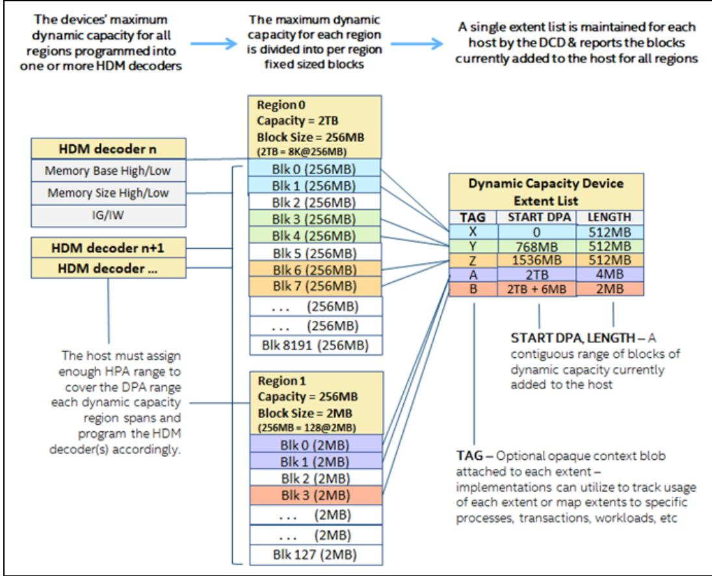

Figure 9-23. Shared Extent List Example  
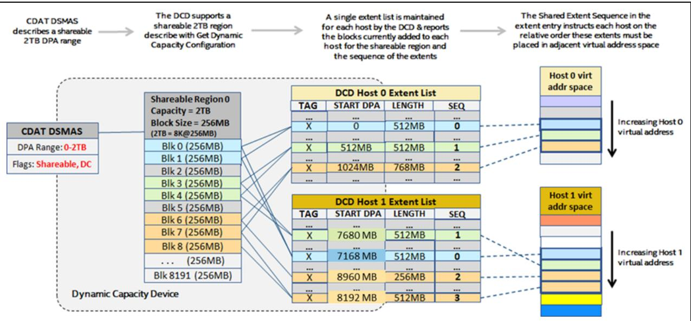

Dynamic Capacity is organized into 1 to 8 DC Regions as defined by the device. Figure 9-24 illustrates this. Each DC Region has a unique maximum potential capacity, supported block size, and memory attributes. While the beginning and end of each region is 256 MB aligned, the start of the first block of data within each region is controlled by the DCD and aligned to the Dynamic Capacity block size configured for that region. Because the Extent List is DPA based, a single list can describe the extents in all regions. When the host fetches the current Extent List using the Get Dynamic Capacity Extent List mailbox command, the returned Extent List contains the deviceassigned starting DPA and length for each extent that is assigned to the host. Regions are used in increasing-DPA order, with Region 0 being used for the lowest DPA of Dynamic Capacity and Region 7 for the highest DPA.

The DCD controls which DPA range it assigns to each region for each host. The DPA ranges exposed by the device to each host are independent of one another.

If the host issues a read to a DPA that is not allocated to the host, the device behavior is specified in Table 8-117. If the host issues a write to a DPA that is not allocated to the host, the device shall drop the write and send an NDR (see Section 3.3.9) as a response. If the host issues a write to any DPA in a read-only DC Region, the device shall drop the write and send an NDR (see Section 3.3.9) as a response.

## Figure 9-24. DCD DPA Space Example

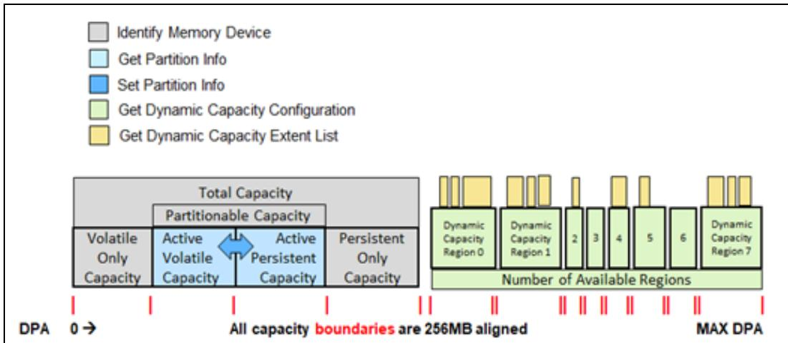

The attributes associated with each region are described in the device’s CDAT. The device associates each supported region with a specific DSMAS instance so the host can determine the memory attributes associated with each given region. A device that supports Dynamic Capacity shall report its configured regions in one or more CDAT DSMAS structures and shall set the Dynamic Capacity DSMAS Flag in each structure to indicate a Dynamic Capacity supported range. When reporting the region configuration, the DCD shall supply the DSMAD Handle with which each region is associated.

Devices that instantiate multiple LDs, including MLDs and Multi-Headed devices, share certain region configuration parameters, as defined in Table 7-69, across all LDs in that device.

The basic sequence to utilize Dynamic Capacity include:

• Utilize Get Supported Logs sub-list (see Section 8.2.10.5.6) or Get Supported Logs (see Section 8.2.10.5.1) and Get Log (see Section 8.2.10.5.2) to retrieve the Command Effects Log (CEL). Verify that the necessary Dynamic Capacity commands are returned in the CEL, indicating Dynamic Capacity is supported by the device.

• Issue Get Dynamic Capacity Configuration command: The device reports its number of available regions and each region’s base address, length, block size, and DSMAD Handle (see Section 8.2.10.9.9.1).

• Program the HDM decoders appropriately for each region’s base and length from Get Dynamic Capacity Configuration data. The host may utilize one or more HDM decoders to span the current configuration of Dynamic Capacity reported by the device. It is strongly recommended that the host provide adequate decoder size to cover all the regions that are enabled. If not, the host may not be able to accept some of the Add Dynamic Capacity offers from the DCD.

• Retrieve the initial Extent List with one or more calls to Get Dynamic Capacity Extent List (see Section 8.2.10.9.9.2). If the list contains extents, then that memory can be utilized immediately.

The basic sequence to add Dynamic Capacity to a host:

• The DCD adds an Add Capacity Event Record (see Section 8.2.10.2.1.6) to the device’s Dynamic Capacity Event Log containing the extent of the capacity being added, sets the Dynamic Capacity Event Log bit in the Event Status register (see Table 8-203) and, if enabled, generates an interrupt to alert the host to the new event record. The DCD does this for each extent in the Add Capacity operation being performed, using the More flag as necessary (see Table 8-229), avoiding overflow, and allowing the host to consume the events as necessary to complete the operation. If the Dynamic Capacity Event Log overflows at any point, the host shall utilize Get Dynamic Capacity Extent List to retrieve the current list of host accessible DC blocks.

• When the host software retrieves the Add Capacity event record containing the extent of the capacity to be added, it responds back to the device with the updated extent for the exact capacity it added with a single call to Add Dynamic Capacity Response (see Section 8.2.10.9.9.3). This allows the host to control exactly how much of the added capacity it wishes to utilize, which may be less than the amount of capacity sent in the add capacity event, or even 0.

• If supported by the device, the host may utilize Get Poison List or Scan Media with the Starting DPA and Length of the added capacity extent to check for poisoned addresses.

The basic sequence to release Dynamic Capacity from a host:

• The DCD adds a Release Capacity Event Record to the device’s Dynamic Capacity Event Log (see Section 8.2.10.2.1.6) containing the extent of the capacity it is requesting to be released, sets the Dynamic Capacity Event Log bit in the Event Status register (see Table 8-203) and, if enabled, generates an interrupt to alert the host to the new event record. The DCD does this for each extent in the Release Capacity operation being performed, using the More flag as necessary (see Table 8-229), avoiding overflow, and allowing the host to consume the events as necessary to complete the operation. If the Dynamic Capacity Event Log overflows at any point, the host shall utilize Get Dynamic Capacity Extent List to retrieve the current list of host accessible DC blocks.

• When the host software retrieves the Release Capacity event record containing the extent of the capacity to be released, the host software releases some or all the capacity from use and responds back to the device with the updated Extent List for the exact capacity it released using the Release Dynamic Capacity command (see Section 8.2.10.9.9.4). If desired, the host may choose to make unavailable the contents of the capacity being released by whatever means it chooses, including but not limited to issuing the Sanitize or Secure Erase commands, if supported by the device, before the Release Dynamic Capacity command. The host may call Release Dynamic Capacity multiple times, returning different portions of the total capacity over time, in response to the Release Capacity event record. This allows the host to control exactly how much of the released capacity it wishes to release and when it is released.

Prior to issuing Release Dynamic Capacity command, the host software is required to off-line the capacity and complete the necessary coherence management actions.

The basic sequence to release Dynamic Capacity asynchronously from a host (not associated with an event from the device):

• The host may release Dynamic Capacity back to the device, at any time, without receiving a Release Capacity Event Record by calling Release Dynamic Capacity (see Section 8.2.10.9.9.4) with an Extent List containing specific released capacity.

Devices may forcefully release Dynamic Capacity from a host:

• Host access to the released capacity may be immediately disabled and the DCD behaves as if the capacity is no longer allocated to the host. The DCD adds a Forced Capacity Release Event Record to the device’s Dynamic Capacity Event Log containing the extent of the capacity being released, sets the Dynamic Capacity Event Log bit in the Event Status register (see Table 8-203) and, if enabled, generates an interrupt to alert the host to the new event record. If the Dynamic Capacity Event Log overflows at any point, the forced removal still occurs and the host shall utilize Get Dynamic Capacity Extent List to retrieve a new list of host accessible DC blocks.

LD-FAM-based DCD shall forcefully release any shared Dynamic Capacity associated with an LD upon a Conventional Reset or a CXL Reset of that LD. MH-SLD-based or MH-MLD-based DCD shall forcefully release shared Dynamic Capacity associated with all associated hosts upon a Conventional Reset of a head. LD-FAM-based DCD shall forcefully release shared Dynamic Capacity associated with all associated hosts upon a Conventional Reset of the entire DCD. No Forced Capacity Release Event Record is created when capacity is released as a result of a reset and all entries in the Dynamic Capacity Event Log shall be cleared by the DCD.

The host retrieves the Release Capacity event record containing the extent of the capacity that has been released. The host may respond back to the device with the updated Extent List for the released capacity using the Release Dynamic Capacity command. The host may call Release Dynamic Capacity multiple times, returning different portions of the total capacity over time. Host responses to this event are optional and shall not influence the device’s release of the capacity.

## 9.13.3.1 DCD Management by FM

LD-FAM DCDs implement multiple LDs to support multiple host interfaces and can dynamically assign and reassign memory capacity among those LDs. All G-FAM Devices (GFDs) are DCDs because GFDs exclusively use Dynamic Capacity mechanisms for their capacity management.

The FM is responsible for discovering a DCD’s capabilities and for configuring memory assignment.

1. The FM issues Get DCD Info (see Section 7.6.7.6.1) to discover the number of supported hosts, supported features, and dynamic memory capacity. The current assignment of capacity to a specific host is queried with Get Host DC Region Configuration and Get DC Region Extent Lists (see Section 7.6.7.6.2 and Section 7.6.7.6.4, respectively). See Section 8.2.10.9.10 for the equivalent GFD commands.

2. Resources are assigned to each host using Initiate Dynamic Capacity Add and Initiate Dynamic Capacity Release (see Section 7.6.7.6.5 and Section 7.6.7.6.6, respectively). The device generates a Dynamic Capacity Event Record (see Section 8.2.10.9.9.4) to notify the FM of any host responses. See Section 7.7.2 and Section 7.7.14 for the equivalent GFD commands and policies.

## 9.13.3.2 Setting up Memory Sharing

The FM may use the following sequence to set up sharing between hosts, where all hosts are able to read and write to the shared capacity:

1. Issue Initiate Dynamic Capacity Add Request with the Selection Policy set to Free or Contiguous or Prescriptive with the Host ID associated with the first host. The region number must correspond to a region that is advertised as sharable.

2. If the above request is successful as indicated by a new Add Capacity Response event in the Dynamic Capacity Event record, issue Initiate Dynamic Capacity Add Request with Selection Policy=Enable Shared access with the Host ID associated with the second host. The Tag field must match the Tag value used in step 1.

3. Repeat step 2 for any other hosts that need to share this memory range.

The FM may use the following example sequence to allocate a set of tagged capacity and allow it to be initialized by a host and then shared with one or more hosts as readonly.

1. Issue Initiate Dynamic Capacity Add Request with the Selection Policy set to Free or Contiguous or Prescriptive with the Host ID associated with the first host. The region number must correspond to a region that is advertised as writable and sharable.

2. If the above request is successful, the tagged shared capacity can be initialized by the first host.

3. Issue a Dynamic Capacity Add Reference Request for the tag associated with the capacity. Holding this Reference prevents the tagged capacity from being freed and sanitized in step 4.

4. After the first host has initialized the tagged shared capacity, issue an Initiate Dynamic Capacity Release Request for the tag associated with the capacity, and then await completion.

5. If the request in step 4 is successful as indicated by a new Release Capacity Response event in the Dynamic Capacity Event record, the capacity associated with the Tag is preserved but not mapped to any hosts.

6. Issue an Initiate Dynamic Capacity Add Request with Selection Policy=Enable Shared Access with the Host ID associated with the second host, specifying a Region that is Sharable and read-only. The Tag field must match the Tag value used in step 1.

7. Repeat step 5 for any other hosts that need to share the tagged capacity.

8. Issue a Dynamic Capacity Remove Reference Request to remove the FM reference to the tagged capacity.

9. To withdraw the shared capacity, issue a Initiate Dynamic Capacity Release command for each host.

10. When the tagged capacity has been released from all hosts, if the FM does not hold a reference, the tagged capacity will be sanitized (if appropriate) and freed, at which point the tag no longer exists and the capacity is available for future use.

## 9.13.3.3 Extent List Tracking

The storage of extent list information, including individual extents and their associated tags, consumes resources in a DCD. As such, DCDs are permitted to limit the number of extents and number of tags of which they are capable of tracking. This capability is reported in a DCD’s Get Host DC Region Configuration and Get Dynamic Capacity Configuration responses.

A DCD is responsible for tracking all extents and tags that comprise extent lists in the following states:

• Pending: Defining capacity specified in an Initiate Dynamic Capacity Add request that has not been responded to by a host. This includes extents that form part of Dead Extent Groups, those that have been Force Removed while in pending state.

• Added: Defining capacity that has been accepted by a host as part of an Add Dynamic Capacity request and is present in the extent list returned to the host in the response to a Get Dynamic Capacity Extent List request.

• FM-referenced: Defining capacity to which an FM reference has been added, as reported by the FM Holds Reference bit in the response to Dynamic Capacity List Tags.

A DCD reports its Number of Available Extents and Number of Available Tags as its total capacity minus all extents and tags tracked for capacity in the Pending, Added, and FM-referenced states, respectively.

## 9.13.4 Capacity or Performance Degradation

A CXL device may detect an unrecoverable error during its initialization and may be able to operate with a reduced capacity or reduced performance. If this failure results in capacity degradation and it is detected prior to Memory\_Info\_Valid=1, the device shall update the Memory\_Size fields in the corresponding DVSEC CXL Range Size registers (see Table 8-12, Table 8-13, Table 8-16, and Table 8-17), CDAT DSMAS structures, response to the Identify Memory Device command, and response to the Get Partition Info command to report the reduced size. It is recommended that the device also set the Memory Capacity Degraded flag in the Health Status field (see Table 8-315).

If the failure results in performance degradation and it is detected prior to Memory\_Info\_Valid=1, the CDAT DSLBIS structure shall be updated and the Performance Degraded flag in the Health Status field (see Table 8-315) should be set. If Mem\_HwInit\_Mode=1, Memory\_Active bit(s) shall be set when the memory range is fully initialized and available for software use.

If this failure is detected after the Memory\_Info\_Valid bit is set, but before the Memory\_Active bit is set, the device shall not set the Memory\_Active bit. The device updates the CDAT in the following manner:

• CDAT sequence number shall be incremented to indicate to SW that CDAT content has changed.

• If the failure results in capacity degradation, the CDAT DSEMTS entries shall mark the bad memory as “EFIUnusableMemory” indicating to the SW that it shall not use the associated DPA range on this device. The Memory Capacity Degraded flag in the Health Status field (see Table 8-315) shall be set.

• If the failure results in performance degradation, the CDAT DSLBIS structure shall be updated and the Performance Degraded flag in the Health Status field (see Table 8-315) shall be set.

If Mem\_HwInit\_Mode=1, Memory\_Active\_Degraded shall be set when the reduced capacity is fully initialized and available for software use.

The device capacity reported by the Identify Memory Device (see Section 8.2.10.9.1.1) and Get Partition Info (see Section 8.2.10.9.2.1) commands shall be consistent with capacity advertised by CDAT that is not marked as EFIUnusableMemory.

## Back-Invalidate Configuration

This section describes how System Software may discover whether a component supports Back-Invalidate and how BI-IDs are assigned.

## 9.14.1 Discovery

Back-Invalidate (BI) messages require the link to operate in 256B Flit mode. Alternate Protocol Negotiation flow establishes the optimal Flit mode and PCIe DVSEC for Flex Bus Port registers (see Section 8.2.1.3) identifies the negotiated Flit mode. The presence of the CXL BI Decoder Capability structure (see Section 8.2.4.27) indicates that the component is capable of supporting BI.

## 9.14.2 Configuration

Before enabling a device to issue BI requests, System Software must ensure that the device, the host, and any switch(es) in the path are capable of BI and that the link(s) between the device and the host are operating in 256B Flit mode.

BI-capable Downstream Ports and devices advertise the CXL BI Decoder Capability structure (see Section 8.2.4.27). System Software configures them to enable BI functionality. The BI-ID of a device must be unique within a VH. This is ensured by using the device’s Bus Number as the BI-ID. The Downstream Port decode functionality is described in Table 9-13 and Table 9-14.

Table 9-13. Downstream Port Handling of BISnp

<table><tr><td>BI Enable Value</td><td>BI Forward Value</td><td>Behavior</td></tr><tr><td>0</td><td>0</td><td>Discard</td></tr><tr><td>0</td><td>1</td><td>Forward upstream as is</td></tr><tr><td>1</td><td>0</td><td>Perform the following checks:Locate the HDM decoder in the USP or RC that decodes the BISnp address.Verify that the BI bit in that HDM decoder is set.Optionally, verify that the Target Port that corresponds to the BISnp address matches the port that generated the BISnp request.If this is a DSP:If above checks pass, Set BI-ID= Secondary Bus Number and forward upstream; otherwise, discard.If this is a root port:If above checks pass, forward upstream; otherwise, discard. Root port may use host proprietary mechanisms to initialize BI-ID and route the associated BIRsp messages.</td></tr><tr><td>1</td><td>1</td><td>Discard (Invalid setting)</td></tr></table>

Table 9-14. Downstream Port Handling of BIRsp

<table><tr><td>BI Enable Value</td><td>BI Forward Value</td><td>Behavior</td></tr><tr><td>0</td><td>0</td><td>Discard</td></tr><tr><td>0</td><td>1</td><td>Forward downstream as is</td></tr><tr><td>1</td><td>0</td><td>If this is a DSP:If BI-ID=Secondary Bus Number, forward downstream; otherwise, discard.If this is a root port:Use host-specific checks to ensure correct routing of the BISnp response. Forward downstream if these checks pass; otherwise, discard.</td></tr><tr><td>1</td><td>1</td><td>Discard (Invalid setting)</td></tr></table>

The USP in a BI-capable Switch may advertise the CXL BI Route Table capability Structure (see Section 8.2.4.26). If a USP receives an M2S BIRsp message, the USP shall look up the Port Number associated with the Bus Number that is carried in the message’s BI-ID field, and then forward the message to that Port. The BI-ID is guaranteed to correspond to a valid BI-capable device, specifically the one that generated the BISnp request. If the Port Number does not match any DSP due to incorrect programming, the BIRsp message shall be dropped.

If a USP receives an S2M BISnp message, the USP may look up the Port Number associated with the Bus Number that is carried in the message’s BI-ID field, and then verify that the Port Number matches the Port Number of the originating DSP before forwarding the BISnp message upstream. If the Port Number derived from this structure does not match the DSP’s Port Number, the BISnp message may be dropped.

## IMPLEMENTATION NOTE

System software may use the following sequence to configure a BI-capable Device D below a Switch S as follows:

1. Verify that all the CXL link(s) between Device D and the host are operating in 256B Flit mode.

2. Ensure the device has been assigned a valid Bus number.

3. Enable BI on the DSP of Switch S that is directly connected to Device D: a. BI Forward=0.

b. BI Enable=1.

4. If the DSP’s CXL BI Decoder Capability register (see Table 8-156) indicates Explicit BI Decoder Commit Required=1, commit the BI-ID changes via the following sequence:

a. BI Decoder Commit=0 to rearm.

b. BI Decoder Commit=1.

c. Poll bits[0 and 1] of the CXL BI Decoder Status register (see Table 8-158) until timeout or one of them is set. The timeout value is reported in the CXL BI Decoder Status register.

d. If BI Decoder Committed=1, the changes were committed. Proceed to step 5.

e. If BI Decoder Error Not Committed=1, the changes were not committed. Software should treat this as an error condition.

f. If neither bit is set and the timeout is reached, Software should treat this as an error condition.

5. If the USP implements CXL BI Route Table Capability Structure and Explicit BI RT Commit Required=1, commit the BI-ID changes as follows:

a. BI RT Decoder Commit=0 to rearm.

b. BI RT Decoder Commit=1.

c. Poll bits[0 and 1] of the BI RT Status register (see Table 8-154) until timeout or one of them is set. The timeout value is reported in the BI RT Status register.

d. If BI RT Error Not Committed=1, the changes were not committed. Software should treat this as an error condition.

e. If BI RT Committed=1, the changes were committed. Proceed to step 6.

f. If neither bit is set and the timeout is reached, Software should treat this as an error condition.

6. If the previous steps were successful, configure the Root Port that is directly connected to Switch S to forward BI messages if it is not already set up that way: a. If BI Forward=0, set BI Forward=1.

b. Ensure BI Enable=0.

7. If the previous steps were successful, configure Device D to enable BI:

a. BI Enable=1.

8. If the previous steps were successful, inform the device driver that Device D may now issue BI requests.

## IMPLEMENTATION NOTE

System software may use the following sequence to deallocate the BI-ID B that was previously assigned to Device D below Switch S as follows:

1. Notify Device D’s device driver that Device D is no longer allowed to issue BI requests and then wait for acknowledgment.

2. Configure Device D to disable BI:

a. BI Enable=0.

3. Configure the DSP of Switch S that is directly connected to Device D to unassign BI-ID B as follows:

a. BI Forward=0.

b. BI Enable=0.

4. If the DSP’s CXL BI Decoder Capability register (see Table 8-156) indicates Explicit BI Decoder Commit Required=1, commit the BI-ID changes as follows:

a. BI Decoder Commit=0 to rearm.

b. BI Decoder Commit=1.

c. Poll bits[0 and 1] of the CXL BI Decoder Status register (see Table 8-158) until timeout or one of them is set. The timeout value is reported in the CXL BI Decoder Status register.

d. If BI Decoder Error Not Committed=1, the changes were not committed. Software should treat this as an error condition.

e. If BI Decoder Committed=1, the changes were committed. Proceed to step 5.

f. If neither bit is set and the timeout is reached, Software should treat this as an error condition.

5. If the USP implements CXL BI Route Table Capability Structure and Explicit BI RT Commit Required=1, commit the BI-ID changes as follows:

a. BI RT Commit=0 to rearm.

b. BI RT Commit=1.

c. Poll bits[0 and 1] of the BI RT Status register (see Table 8-154) until timeout or one of them is set. The timeout value is reported in the BI RT Status register.

d. If BI RT Error Not Committed=1, the changes were not committed. Software should treat this as an error condition.

e. If BI RT Committed=1, the changes were committed. Proceed to step 6.

f. If neither bit is set and the timeout is reached, Software should treat this as an error condition.

6. If the previous steps were successful, and no other devices in this VCS have been assigned a BI-ID, configure the Root Port that is directly connected to Switch S to stop forwarding BI messages as follows:

a. BI Forward=0.

b. Ensure BI Enable=0.

## 9.14.3 Mixed Configurations

This section describes scenarios where a BI-capable device is plugged into a system that does not support BI.

## 9.14.3.1 BI-capable Type 2 Device

If a BI-capable Type 2 device is connected to a Downstream Port that does not support 256B Flit mode, the device is able to detect this condition during the Hardwareautonomous Mode Negotiation (see Section 6.4.1.1) and fall back to another mode (e.g., Type 2 HDM-D mode or PCIe mode) based on the device vendor’s policy.

If a BI-capable Type 2 device is connected to a switch that supports BI, but the host does not support BI, the device cannot be operated in BI mode. In this case, the System Software or the System Firmware may choose to reconfigure the Type 2 device to operate in a fallback mode.

It is legal for BI-capable Type 2 devices to not support HDM-D flow; however, such a device must support fallback to either operate as a PCIe device, Type 1 device, or a Type 3 device. These flows are described in Section 9.14.3.2.

If a Type 2 device advertises support for HDM-D flow via the CXL BI Decoder Capability register (see Table 8-156), the device is operated in that mode as long as the number of Type 2 devices using HDM-D flow does not exceed the host’s capabilities and the CXL specification restrictions. A CXL Type 2 device that supports HDM-D flow may be unable to operate in that mode due to system configuration restrictions. In many scenarios, the device may be unable to make that determination on its own and may require assistance from System Software or System Firmware. See Section 9.14.3.2.

## 9.14.3.2 Type 2 Device Fallback Modes

Table 9-15 describes the actions that System Software or System Firmware may take when a Type 2 device cannot be operated in either HDM-DB mode or in HDM-D mode, based on the Fallback Capability field value in the DVSEC CXL Capability2 register (see Table 8-11).

CXL Type 2 Device Behavior in Fallback Operation Mode

<table><tr><td> $Register\ Value^{1}$ </td><td>Behavior</td></tr><tr><td>00b</td><td>The device can be operated as an RCD.If the device does not support HDM-DB flow, it supports HDM-D flow.If the device supports HDM-DB flow, it also supports HDM-D flow and must return HDM-D Capable=1 (seeTable 8-156).If the device cannot be operated as a Type 2 device, it must be disabled.</td></tr><tr><td>01b</td><td>The device supports either HDM-DB flow or HDM-D flow or both. In addition, it can operate as a PCIe device.If the device cannot be operated in either HDM-DB mode or in HDM-D mode, System Firmware or System Software may disable Alternate Protocol Negotiation by programming the DSP registers and issuing a Secondary Bus Reset so that the link comes up in PCIe mode.</td></tr><tr><td>10b</td><td>The device supports either HDM-DB flow or HDM-D flow or both. In addition, it can operate as a CXL Type 1 device.If the device cannot be operated in either HDM-DB mode or in HDM-D mode, System Firmware or System Software may reconfigure the DVSEC Flex Bus Port Control register (seeSection 8.2.1.3.2) in the Downstream Port above the device to not advertise CXL.mem and then issue a Secondary Bus Reset, thereby bringing up the device as a CXL Type 1 device.</td></tr><tr><td>11b</td><td>The device supports either HDM-DB flow or HDM-D flow or both. In addition, it can operate as a CXL Type 3 device.If the device cannot be operated in either HDM-DB mode or in HDM-D mode, System Firmware or System Software may reconfigure the Flex Bus Port Control register (seeSection 8.2.1.3.2) in the Downstream Port above the device to not advertise CXL.cache and then issue a Secondary Bus Reset, thereby bringing up the device as a CXL Type 3 device.</td></tr></table>

1. Fallback Capability field values in the DVSEC CXL Capability2 register (see Table 8-11).

More-complex policies, such as configuring the Device to operate in CXL.io only mode or another mode based on peer devices, are possible; however, those policies are beyond the scope of this specification.

## 9.14.3.3 BI-capable Type 3 Device

A BI-capable Type 3 device is required to operate correctly when System Software has not enabled BI. In this case, the device functionality that is dependent on BI will not be available.

If a BI-capable Type 3 device is connected to a Downstream Port that does not support 256B Flit mode, the device may continue to advertise BI capability via the CXL BI Decoder Capability Structure (see Section 8.2.4.27). The System Software shall ensure that the BI bit in none of the HDM decoders in the device, the switch, or the host that spans the device’s HDM is set. If a BI-capable Type 3 device is present in a system where the host does not support BI, the System Software shall ensure that the BI bit in none of the HDM decoders in the device, the switch, or the host that spans the device’s HDM is set. In both cases, the System Software is responsible for ensuring that the BI bit in the CXL BI Decoder Control register (see Table 8-157) in the device, as well as the Downstream Port it is connected to, is programmed to 0.

## Cache ID Configuration and Routing

The CXL 3.0 specification introduces protocol enhancements that allow for more than one active CXL.cache agent per VCS. The identity of the CXL.cache agent is carried via the CacheID field in the CXL.cache messages. If the CXL link is operating in 256B Flit mode, the CXL.cache messages can carry 4 CacheID bits. Before enabling more than one CXL.cache device per VCS, Software must ensure that the host and any switch(es) in the path advertise the CXL Cache ID Decoder Capability Structure, and that all the link(s) between the lowest-level switch and the host are operating in 256B Flit mode.

Downstream Ports advertise the CXL Cache ID Decoder Capability structure to indicate that the Downstream Ports can assign and decode the CacheID field in CXL.cache messages (see Section 8.2.4.29). Software configures the Downstream Ports to enable CacheID forwarding functionality and assign a CacheID to the device. The CacheID must be unique within a VH and must account for the constraints placed by the Flit mode and the host capabilities.

Any CXL.cache device can operate correctly in a system that is capable of supporting more than one active CXL.cache agent per VCS; however, System Firmware or System Software that is aware of this new capability and capable of correctly configuring the switch and/or host is required to take advantage of this capability.

## 9.15.1 Host Capabilities

The host requires dedicated resources to track each CacheID source. As such, it is necessary to account for host constraints when assigning CacheID. The host constraints are expressed in terms of the total number of CacheIDs that the host can track per CXL Host Bridge. This information is conveyed via the Cache ID Target Count field in the CXL Cache ID Route Table Capability register (see Table 8-160) associated with the Host Bridge.

## 9.15.2 Downstream Port Decode Functionality

Downstream Port decode functionality is described in Table 9-16 and Table 9-17. The associated registers are defined in Section 8.2.4.14.

Table 9-16. Downstream Port Handling of D2H Request Messages

<table><tr><td>Assign Cache ID Value</td><td>Forward Cache ID Value</td><td>Behavior</td></tr><tr><td>0</td><td>0</td><td>Discard</td></tr><tr><td>0</td><td>1</td><td>Forward upstream. If the message was received over a link operating in 68B Flit mode, the request is processed as if CacheID field is 0.</td></tr><tr><td>1</td><td>0</td><td>Set CacheID=Local Cache ID and forward upstream.The link between the device and the Downstream Port may be operating in 68B Flit mode, in which case the D2H request message received by the Downstream Port does not contain the CacheID field.</td></tr><tr><td>1</td><td>1</td><td>Discard (Invalid setting)</td></tr></table>

In addition to the checks documented in Table 9-16, the root port shall implement the following steps before forwarding the message upstream:

• If HDM-D Type 2 Device Present=1, compare CacheID with the HDM-D Type 2 Device Cache ID field. If there is a match, identify this device as a Type 2 device that is using HDM-D flows. The host shall follow the HDM-D flows when responding to this device, which includes enforcing the setting in the CXL.cache Trust Level field in the Root Port Security Policy register (see Table 8-130).

• If the Requester is using HDM-DB flows, abort the request if Block CXL.cache HDM-DB=1.

Downstream Port Handling of H2D Response Message and H2D Request Message

<table><tr><td>Assign Cache ID Value</td><td>Forward Cache ID Value</td><td>Behavior</td></tr><tr><td>0</td><td>0</td><td>Discard</td></tr><tr><td>0</td><td>1</td><td>Forward downstream as is</td></tr><tr><td>1</td><td>0</td><td>If CacheID=Local CacheID, forward downstream; otherwise, discard. The link between the device and the Downstream Port may be operating in 68B Flit mode, in which case the H2D message received by the device does not contain the CacheID field.The device shall ignore the CacheID field in H2D messages, if present.</td></tr><tr><td>1</td><td>1</td><td>Discard (Invalid setting)</td></tr></table>

D2H response messages and D2H data messages do not carry CacheID and are always routed back to the host.

## 9.15.3 Upstream Switch Port Routing Functionality

When a USP receives a D2H request message from a DSP, the USP shall forward the message upstream. A USP may look up the Port Number associated with the CacheID field in the message from the CXL Cache ID Route Table and may compare that to the Port Number of the DSP that the message came from before forwarding the message.

When a USP receives an H2D request message, H2D data message or an H2D response message, the USP shall use the message’s CacheID field to look up the corresponding CXL Cache ID Target N register (see Table 8-163). If the Valid bit in the CXL Cache ID Target register is 0, the H2D message shall be discarded without a response. If the Valid bit is 1, the message shall be forwarded to the local DSP based on the Port Number field that is programmed in the CXL Cache ID Target N register.

D2H response messages and D2H data messages do not carry CacheID and are always routed back to the host.

If a USP receives CXL.cache message over a link operating in 68B Flit mode, it shall process the request as if the CacheID field is 0. A switch that is not capable of decoding CacheID field must be configured such that no more than one DSP is enabled for CXL.cache traffic (indicated by Cache\_Enabled=1 in the DVSEC Flex Bus Port Status register; see Table 8-68). The USP shall direct all H2D traffic to that DSP.

## 9.15.4 Host Bridge Routing Functionality

When the Host Bridge receives the equivalent of an H2D request or an H2D response message from the host, the Host Bridge logic shall use the CacheID field to look up the corresponding CXL Cache ID Target N register (see Table 8-163). If the Valid bit is 0, the H2D message is discarded. If the Valid bit is 1, the message is forwarded to the local root port based on the Port Number field that is programmed in the CXL Cache ID Target N register.

When the Host Bridge receives a D2H request message from the root port, the Host Bridge shall forward the message to the host, using host-specific mechanisms. The Host Bridge may optionally look up the root port that is associated with the CacheID and discard the message if the message was received from a different root port.

## IMPLEMENTATION NOTE

System Software may use the following sequence to allocate a Cache ID to a BIcapable CXL.cache Device D below a Switch S and enable the Device to generate CXL.cache transactions that target any memory:

1. Verify that the CXL link between Switch S and the host is operating in 256B Flit

2. Identify an unused and legal CacheID value, c, and allocate it to Device D. Software must take into account the current Flit mode, as well as the Cache ID Target Count fields, while assigning Cache IDs to devices.

3. Configure the DSP of Switch S that is directly connected to Device D to assign Cache ID=c to Device D:

a. Forward Cache ID=0.

b. Local Cache ID=c.

c. Assign Cache ID=1.

4. If the above DSP of Switch S reports Explicit Cache ID Decoder Commit Required=1, commit the Cache ID changes as follows:

a. Cache ID Decoder Commit=0 to rearm.

b. Cache ID Decoder Commit=1.

c. Poll bits[0 and 1] of the CXL Cache ID Decoder Status register (see Table 8-167) until timeout or one of them is set. The timeout value is reported in the CXL Cache ID Decoder Status register.

d. If Cache ID Decoder Error Not Committed=1, the changes were not committed. Software should treat this as an error condition.

e. If Cache ID Decoder Committed=1, the changes were committed. Proceed to step 5.

If neither bit is set and the timeout is reached, software should treat this as an error condition.

5. Configure the USP of Switch S to route Cache ID c:

a. Route Table[c]= Port Number register in the DSP that is connected directly to Device D.

6. If the USP reports Explicit Cache ID RT Commit Required=1, commit the Cache ID changes as follows:

a. Cache ID RT Commit=0 to rearm.

b. Cache ID RT Commit=1.

c. Poll bits[0 and 1] of the CXL Cache ID RT Status register (see Table 8-162) until timeout or one of them is set. The timeout value is reported in the CXL Cache ID RT Status register.

d. If Cache ID RT Error Not Committed=1, the changes were not committed. Software should treat this as an error condition.

e. If Cache ID RT Committed=1, the changes were committed. Proceed to step 7.

f. If neither bit is set and the timeout is reached, software should treat this as an error condition.

7. Configure the Root Port, R, that is directly connected to Switch S to decode the CXL.cache messages from Device D:

a. If Forward Cache ID=0, set Forward Cache ID=1.

b. Ensure Assign Cache ID=0.

8. If the previous steps were successful, configure the CXL Cache ID Route Table (see Table 8-160) in the Host Bridge:

a. Route Table[c].Port Number=Port Number register of Root Port R.

9. If the previous steps were successful, inform the device driver that Device D may now issue CXL.cache requests.

## UIO Direct P2P to HDM

CXL.mem devices that can complete UIO requests that target its HDM, advertise the capability via the UIO Capable bit in the CXL HDM Decoder Capability register (see Table 8-116). CXL switches may allow routing of UIO accesses to HDM in the same VH as the UIO requester and advertise this capability via the same bit. CXL Host Bridges may allow routing of UIO accesses to host memory or HDM below another root ports in the same Host Bridge and advertise this capability via this bit. Prior to setting up a UIO path from a UIO requester to an HDM or to host memory, the Software must consult the capabilities of the target device and any switches or Host Bridges in the path.

Figure 9-25 shows a configuration with four CXL.mem devices that form three separate interleave sets and how a UIO requester is able to access the HDM range. UIO accesses to UIO Target 1 and UIO Target 2 are directly routed by the switch, whereas UIO accesses to UIO Target 3 and UIO Target 4 are routed through the host. As shown, UIO Target 1 and UIO Target 2 participate in a 2-way interleave set. The UIO requester can efficiently access this interleave set without going through the host.

Figure 9-25. UIO Direct P2P to Interleaved HDM

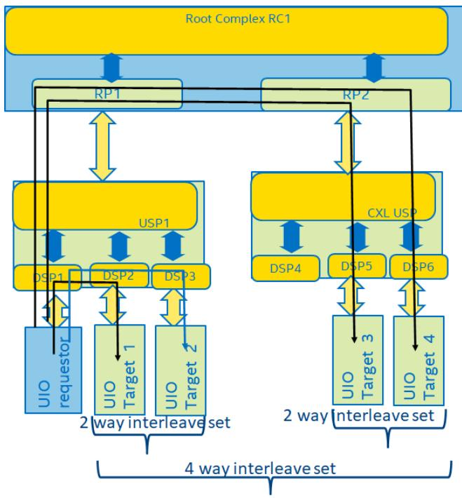

The HDM that is a target of P2P UIO accesses must be part of either a 1-way, 2-way, 4- way, 8-way, or 16-way interleave set. Any HDM that is part of a 3-way, 6-way, or 12- way interleave arrangement cannot be a P2P UIO target. The HDM address must be carved out of a CFMWS entry with Interleave Arithmetic=Standard Modulo arithmetic (see Table 9-22). In addition, P2P UIO traffic may be protected by Selective IDE Streams.

In addition, Software must configure the switch and Host Bridge HDM decoders with additional information regarding any HDM interleaving calculations that are performed upstream to it before setting the UIO bit in that HDM decoder. The UIG, UIW, and ISP fields allow the switch and the Host Bridge to determine whether the UIO target address belongs to itself or to a peer component. The rules regarding the processing of UIO Direct P2P to HDM requests are described in Table 9-18. The ISP field in the target CXL.mem device allow the device to determine how it should respond.

These requirements are in addition to the UIO related requirements that are defined in the PCIe Base Specification.

## Processing of UIO Direct P2P to HDM Messages

This section describes how CXL components handle UIO Direct P2P accesses to HDM.

UIO To HDM Enable bit is defined in Section 8.1.5.2 and allows System Software to control whether a requester below a switch can use UIO to access HDM.

## Handling of UIO Accesses

<table><tr><td>Received by</td><td>UIO Address</td><td>Behavior</td></tr><tr><td rowspan="4">CXL.mem device that reports UIO Capable=1 (see Section 8.2.4.20.1)</td><td>Complete match with an HDM decoder with UIO=1</td><td>Respond to the UIO request per the PCIe Base Specification</td></tr><tr><td>Complete match with an HDM decoder with UIO=0</td><td>Return Completer Abort, do not commit data if it is a UIO write</td></tr><tr><td>Partial match with an HDM decoder, irrespective of the UIO bit</td><td>Return Completer Abort, do not commit data if it is a UIO write</td></tr><tr><td>Mismatch</td><td>Handle per the PCIe Base Specification</td></tr><tr><td rowspan="2">USP ingress of a CXL Switch that reports UIO Capable=1 (see Section 8.2.4.20.1)</td><td>Either Partial or Complete match with an HDM decoder, irrespective of the UIO bit</td><td>Identify the port number of the target DSP and forward</td></tr><tr><td>Mismatch</td><td>Handle per the PCIe Base Specification</td></tr><tr><td rowspan="5">DSP ingress of a CXL Switch that reports UIO Capable=1 (see Section 8.2.4.20.1)</td><td>Complete match with an HDM decoder with UIO=1 $^{1}$  and UIO To HDM Enable=1</td><td>Identify the port number of the target DSP and forward to that peer port regardless of ACS configuration including egress control vector</td></tr><tr><td>Complete match with an HDM decoder with UIO=0 and UIO To HDM Enable=1</td><td>Forward toward the host regardless of ACS configuration including egress control vector</td></tr><tr><td>Partial match with an HDM decoder and UIO To HDM Enable=1</td><td>Forward toward the host regardless of ACS configuration including egress control vector</td></tr><tr><td>Complete or Partial match, and UIO To HDM Enable=0</td><td>Return Completer Abort</td></tr><tr><td>Mismatch</td><td>Handle per the PCIe Base Specification</td></tr><tr><td rowspan="4">RP ingress of a Host Bridge that reports UIO Capable=1 (see Section 8.2.4.20.1)</td><td>Complete match with an HDM decoder with UIO=1</td><td>Identify the port number of the target RP and forward to that peer port, subject to host-specific access controls</td></tr><tr><td>Complete match with an HDM decoder with UIO=0</td><td>Handle via host-specific mechanisms</td></tr><tr><td>Partial match with an HDM decoder</td><td>Handle via host-specific mechanisms</td></tr><tr><td>Mismatch</td><td>Handle via host-specific mechanisms</td></tr></table>

1. Because the DSP does not take length into account during this check, transactions that cross an interleave boundary are forwarded to the device that owns the starting address. The device aborts these transactions because the device checks the length field. If the UIO traffic is encrypted using Stream IDE, some of the address bits may be encrypted and the switch may unknowingly forward these to the wrong device, which wil issue a Completer Abort.

## 9.16.1.1 UIO Address Match (DSP and Root Port)

For a DSP or a root port, UIO address is considered a complete match if there exists an HDM Decoder[n] (see Section 8.2.4.20 and Section 8.2.4.30) for which the following conditions are true:

1. AT field in the UIO request indicates that it is carrying a translated address.

2. UIO.Address[63:2] ≥ Decoder[n].Base[63:2].

3. UIO.Address[63:2]+UIO.Length[63:2] ≤ Decoder[n].Base[63:2]+ Decoder[n].Size[63:2].

4. Either of these sub-conditions are true:

a. Decoder[n].UIW=0.

b. UIO.Address[Decoder[n].UIW+Decoder[n].UIG+7:Decoder[n].UIG+8]=ISP.

where UIO.Address[63:2] is derived from the Address field in the UIO TLP request, and UIO.Length[63:2] is derived from the Length field in the UIO TLP request.

DSP calculations use the HDM decoders in the corresponding USP. The root port calculations make use of the HDM decoders in the associated Host Bridge.

The first condition is in place because HDM decoder operates on translated address. The second and the third condition ensures that all addresses fall within one of the HDM decoders. The fourth condition ensures that the interleave set positions match (i.e., a CXL.mem request from the host to the start address would ordinarily be decoded by this component). 4a is the trivial case where the memory is not interleaved.

If the first three conditions are met but the fourth condition is not met, it is considered a partial match. If the first three conditions are not met, it is considered a mismatch.

## 9.16.1.2 UIO Address Match (CXL.mem Device)

For a CXL.mem device, UIO address is considered a complete match if there exists an HDM Decoder[n] (see Section 8.2.4.20 and Section 8.2.4.30) for which the following conditions are met:

1. AT field in the UIO request indicates it is carrying a translated address.

2. UIO.Address[63:2] ≥ Decoder[n].Base[63:2].

3. UIO.Address[63:2]+UIO.Length[63:2] ≤ Decoder[n].Base[63:2]+ Decoder[n].Size[63:2].

4. Either of these sub-conditions are true:

a. Decoder[n].UIW=0.

b. UIO.Address[Decoder[n].IW+Decoder[n].IG+7:Decoder[n].IG+8]=ISP.

5. UIO.Address[Decoder[n].IG+7:2] + UIO.Length[Decoder[n].IG+7:2] ≤ (2\*\* IG+8).

The first three conditions are identical to the DSP case. The terms involved in the fourth check are different, but it serves the same purpose (i.e., ensures that a CXL.mem request from the host to the start address would ordinarily be decoded by this component). The fifth condition ensures that the access does not cross an interleave boundary, thus ensuring that all the addresses that are referenced by the request are owned by the device.

If the first three conditions are met but either of the other two conditions are not met, it is considered a partial match. If the first three conditions are not met, it is considered a mismatch.

## Direct P2P CXL.mem for Accelerators

The Direct P2P CXL.mem feature enables accelerators to use .mem semantics to access peer Type 3 devices. This feature is supported only by PBR Fabrics, and each accelerator and peer Type 3 device must be attached directly to an Edge Port. Configuration of the Fabric and Edge Ports is performed by the host and FM.

Through mechanisms beyond the scope of this specification, the FM is preconfigured or informed of which Type 3 device(s) (i.e., SLD, MLD, or GFD) are to be configured for Direct P2P CXL.mem access by a given accelerator.

## Peer SLD Configuration

Host software and the FM may use the following high-level flow to configure Direct P2P CXL.mem communication between an accelerator and a peer Type 3 SLD:

1. The FM binds the SLD’s Edge Port to the host VH of the accelerator, setting the vPPB.root.PID field to the PBR ID (PID) of the accelerator’s Edge Port. This enables the host to configure the SLD, but the accelerator to carry out CXL.mem transactions with the SLD.

2. Using the Set LDST Segment Entries command (see Section 7.7.13.16), the host configures the LDST in the accelerator’s Edge Port with one or more LDST Segments for the HPA range of the SLD, specifying the vPPB of the SLD’s Edge Port.

3. Host software configures the SLD, notably its HDM Decoders, on behalf of the accelerator. HDM addresses in the SLD are HPAs.

## 9.17.2 Peer MLD Configuration

Host software and the FM may use the following high-level flow to configure Direct P2P CXL.mem communication between one or more accelerators that belong to the host and a peer Type 3 MLD:

1. The FM binds a vPPB in the MLD’s Edge Port to the host VH of its accelerator(s) and an additional vPPB for each accelerator under that host that will be accessing the MLD. Each of these will have a distinct LD-ID. For each vPPB assigned to an accelerator, the vPPB.root.PID field is set to the PID of the accelerator’s Edge Port.

2. Using the Set LDST Segment Entries command (see Section 7.7.13.16), the host configures the LDST in each accelerator’s Edge Port with one or more LDST Segments for the HPA range of the accelerator’s LD, specifying the accelerator’s vPPB in the MLD’s Edge Port.

3. Host software configures its LDs in the MLD, notably their HDM Decoders, on behalf of itself and its accelerator(s). HDM addresses in the LD of the host and the LD(s) of the accelerator(s) are HPAs.

## 9.17.3 Peer GFD Configuration

Host software and the FM may use the following high-level flow to configure Direct P2P CXL.mem communication between one or more accelerators that belong to a host and a peer Type 3 GFD:

1. The FM configures the GFD for host access normally, while configuring each of the host’s accelerators as an additional RPID within the GFD.

2. Using the Set FAST Segment Entries command (see Section 7.7.14.7), the host configures the FAST decoder in its Edge Port as well as each accelerator’s Edge Port with one or more FAST Segments for the HPA range, specifying the GFD’s PID.

## CXL OS Firmware Interface Extensions

## 9.18.1 CXL Early Discovery Table (CEDT)

CXL Early Discovery Table enables OSs to locate CXL Host Bridges and the location of Host Bridge registers early during the boot (i.e., prior to parsing of ACPI namespace). The information in this table may be used by early boot code to perform preinitialization of CXL hosts, such as configuration of CXL.cache and CXL.mem.

Table 9-19. CEDT Header

## 9.18.1.1 CEDT Header

The pointer to CEDT is found in RSDT or XSDT, as described in the ACPI Specification. An ACPI specification-compliant CXL system shall support CEDT and shall include a CHBS entry for every CXL host bridge that is present at boot.

CEDT begins with the header listed in Table 9-19.

<table><tr><td>Field</td><td>Length in Bytes</td><td>Byte Offset</td><td>Description</td></tr><tr><td>Signature</td><td>4</td><td>00h</td><td>‘CEDT’. Signature for the CXL Early Discovery Table.</td></tr><tr><td>Length</td><td>4</td><td>04h</td><td>Length, in bytes, of the entire CEDT.</td></tr><tr><td>Revision</td><td>1</td><td>08h</td><td>Value is 2.</td></tr><tr><td>Checksum</td><td>1</td><td>09h</td><td>Entire table must sum to 0.</td></tr><tr><td>OEM ID</td><td>6</td><td>0Ah</td><td>OEM ID</td></tr><tr><td>OEM Table ID</td><td>8</td><td>10h</td><td>Manufacturer Model ID</td></tr><tr><td>OEM Revision</td><td>4</td><td>18h</td><td>OEM Revision</td></tr><tr><td>Creator ID</td><td>4</td><td>1Ch</td><td>Vendor ID of the utility that created the table.</td></tr><tr><td>Creator Revision</td><td>4</td><td>20h</td><td>Revision of the utility that created the table.</td></tr><tr><td>CEDT Structure[n]</td><td>Varies</td><td>24h</td><td>A list of CEDT structures for this implementation.</td></tr></table>

Table 9-20. CEDT Structure Types

<table><tr><td>Value</td><td>Description</td></tr><tr><td>0</td><td>CXL Host Bridge Structure (CHBS)</td></tr><tr><td>1</td><td>CXL Fixed Memory Window Structure (CFMWS)</td></tr><tr><td>2</td><td>CXL XOR Interleave Math Structure (CXIMS)</td></tr><tr><td>3</td><td>RCEC Downstream Port Association Structure (RDPAS)</td></tr><tr><td>4</td><td>CXL System Description Structure (CSDS) $^{1}$ </td></tr><tr><td>5 to 255</td><td>Reserved</td></tr></table>

1. Introduced in Revision 2 of CEDT.

## 9.18.1.2 CXL Host Bridge Structure (CHBS)

The CHBS structure describes a CXL Host Bridge.

In an ACPI-compliant system, there shall be one instance of the CXL Host Bridge Device object in ACPI namespace (HID=“ACPI0016”) for every CHBS entry. The \_UID object under a CXL Host Bridge object, when evaluated, shall match the UID field in the associated CHBS entry.

Table 9-21. CHBS Structure (Sheet 1 of 2)

<table><tr><td>Field</td><td>Length in Bytes</td><td>Byte Offset</td><td>Description</td></tr><tr><td>Type</td><td>1</td><td>00h</td><td>=0 to indicate that this is a CHBS entry</td></tr><tr><td>Reserved</td><td>1</td><td>01h</td><td>Reserved</td></tr><tr><td>Record Length</td><td>2</td><td>02h</td><td>Length of this record (20h).</td></tr></table>

Table 9-21. CHBS Structure (Sheet 2 of 2)

<table><tr><td>Field</td><td>Length in Bytes</td><td>Byte Offset</td><td>Description</td></tr><tr><td>UID</td><td>4</td><td>04h</td><td>CXL Host Bridge Unique ID. Used to associate a CHBS instance with a CXL Host Bridge instance. The value of this field shall match the output of _UID under the associated CXL Host Bridge in ACPI namespace.</td></tr><tr><td>CXL Version</td><td>4</td><td>08h</td><td>0000 0000h: RCH0000 0001h: Host Bridge that is associated with one or more CXL root ports</td></tr><tr><td>Reserved</td><td>4</td><td>0Ch</td><td>Reserved</td></tr><tr><td>Base</td><td>8</td><td>10h</td><td>If CXL Version = 0000 0000h, this represents the base address of the RCH Downstream Port RCRBIf CXL Version = 0000 0001h, this represents the base address of the CHBCRSee Table 8-62 for more details.</td></tr><tr><td>Length</td><td>8</td><td>18h</td><td>If CXL Version = 0000 0000h, this field must be set to 8 KB (2000h)If CXL Version = 0000 0001h, this field must be set to 64 KB (1 0000h)</td></tr></table>

## 9.18.1.3 CXL Fixed Memory Window Structure (CFMWS)

The CFMWS structure describes zero or more Host Physical Address (HPA) windows that are associated with each CXL Host Bridge. Each window represents a contiguous HPA range that may be interleaved across one or more targets, some of which are CXL Host Bridges. Associated with each window are a set of restrictions that govern its usage. It is the OSPM’s responsibility to utilize each window for the specified use.

The HPA ranges described by CFMWS may include addresses that are currently assigned to CXL.mem devices. Before assigning HPAs from a fixed-memory window, the OSPM must check the current assignments and avoid any conflicts.

For any given HPA, it shall not be described by more than one CFMWS entry.

Table 9-22. CFMWS Structure (Sheet 1 of 3)

<table><tr><td>Field</td><td>Length in Bytes</td><td>Byte Offset</td><td>Description</td></tr><tr><td>Type</td><td>1</td><td>00h</td><td>1 = Indicates that this is a CFMWS entry</td></tr><tr><td>Reserved</td><td>1</td><td>01h</td><td>Reserved</td></tr><tr><td>Record Length</td><td>2</td><td>02h</td><td>Length of this record = 024h + 4 * NIW.NIW is the raw count of Interleave ways whereas ENIW is the encoded value:If ENIW &lt; 8, NIW = 2**ENIIf ENIW ≥ 8, NIW = 3* 2**(ENIW - 8)</td></tr><tr><td>Reserved</td><td>4</td><td>04h</td><td>Reserved</td></tr><tr><td>Base HPA</td><td>8</td><td>08h</td><td>Base of this HPA range. This value shall be a 256-MB-aligned address.</td></tr><tr><td>Window Size</td><td>8</td><td>10h</td><td>The total number of consecutive bytes of HPA this window represents. This value shall be a multiple of 256 MB.</td></tr><tr><td>Encoded Number of Interleave Ways (ENIW)</td><td>1</td><td>18h</td><td>The encoded number of targets with which this window is interleaved. The valid encoded values are specified in the Interleave Ways (IW) field in the CXL HDM Decoder n Control register (see Table 8-123). This field determines the number of entries in the Interleave Target List, starting at Offset 24h.</td></tr><tr><td>Interleave Arithmetic</td><td>1</td><td>19h</td><td>This field defines the arithmetic used for mapping HPA to an interleave target in the Interleave Target List:00h = Standard Modulo arithmetic01h = Modulo arithmetic combined with XORAll other encodings are reserved</td></tr><tr><td>Reserved</td><td>2</td><td>1Ah</td><td>Reserved</td></tr><tr><td>Host Bridge Interleave Granularity (HBIG)</td><td>4</td><td>1Ch</td><td>The number of consecutive bytes within the interleave that are decoded by each target in the Interleave Target List represented in an encoded format. The valid values are specified in the Interleave Granularity (IG) field in the CXL HDM Decoder n Control register (see Table 8-123).</td></tr><tr><td>Window Restrictions</td><td>2</td><td>20h</td><td>A bitmap describing the restrictions being placed on the OSPM&#x27;s use of the window. It is the OSPM&#x27;s responsibility to adhere to these restrictions. Failure to adhere to these restrictions results in undefined behavior. More than one bit within this field may be set.Bit[0]: Device Coherent: Formerly known as &quot;CXL Type 2 Memory&quot;:— 1 = Window is configured to expose device-coherent memory (HDM-D if bit[5]=0; HDM-DB if bit[5]=1).Bit[1]: Host-only Coherent: Formerly known as &quot;CXL Type 3 Memory&quot;:— 1 = Window is configured to expose Host-only coherent memory (HDM-H). If an HDM decoder that is mapped to this windows has the BI bit set (bit[5]=1), it will result in undefined behavior.Bit[2]: Volatile:— 1 = Window is configured for use with volatile memory.Bit[3]: Persistent:— 1 = Window is configured for use with persistent memory.Bit[4]: Fixed Device Configuration:— 1 = Any device ranges that have been assigned an HPA from this window must not be reassigned.Bit[5]: BI:— 1 = Window is configured for use with Back-Invalidate flows.Bits[15:6]: Reserved</td></tr><tr><td>QTG ID</td><td>2</td><td>22h</td><td>The ID of the QoS Throttling Group associated with this window. The _DSM for retrieving QTG ID is utilized by the OSPM to determine to which QTG a device HDM range should be assigned.This field must not exceed the Max Supported QTG ID returned by the _DSM for retrieving QTG.</td></tr></table>

Table 9-22. CFMWS Structure (Sheet 2 of 3)

<table><tr><td>Field</td><td>Length in Bytes</td><td>Byte Offset</td><td>Description</td></tr><tr><td>Interleave Target List</td><td>4*NIW</td><td>24h</td><td>A list of all the Interleave Targets. The number of entries in this list shall match the Number of Interleave Ways (NIW). The order of the targets reported in this List indicates the order in the Interleave Set.For Interleave Sets that only span CXL Host Bridges, this is a list of CXL Host Bridge _UIDs that are part of the Interleave Set. In this case, for each _UID value in this list, there must exist a corresponding CHBS structure.If the Interleave Set spans non-CXL domains, this list may contain values that do not match _UID field in any CHBS structures. These entries represent Interleave Targets that are not CXL Host Bridges.The set of HPAs decoded by Entry N in the Interleave Target List shall satisfy the following equations.Base HPA ≤ HPA &lt; Base HPA + Windows Size and:1. If (Interleave Arithmetic==0):a. If ENIW=0N=0b. If ENIW=1N= HPA[8+HBIG]c. If ENIW&lt;8 AND ENIW&gt;1N = HPA[7+HBIG+ENIW:8+HBIG]d. If NIW = 8 // 3 wayN = HPA[51:8+HBIG] MOD 3e. If NIW=9 // 6 wayN = HPA[8+HBIG]+ 2* HPA[51:9+HBIG] MOD 3f. If NIW=10 //12 wayN = HPA[9+HBIG:8+HBIG]+ 4* HPA[51:10+HBIG] MOD 32. If (Interleave Arithmetic==1):a. If NIW=0 //1 wayN=0b. If NIW =1 // 2 wayN = XORALLBITS (HPA AND XORMAP[0])If NIW=2 // 4 wayN = XORALLBITS (HPA AND XORMAP[0]) + 2* XORALLBITS (HPA AND XORMAP[1])</td></tr></table>

Table 9-22. CFMWS Structure (Sheet 3 of 3)

<table><tr><td>Field</td><td>Length in Bytes</td><td>Byte Offset</td><td>Description</td></tr><tr><td>Interleave Target List</td><td>4*NIW</td><td>24h</td><td>c. If NIW=3 // 8 wayN = XORALLBITS (HPA AND XORMAP[0]) + * XORALLBITS (HPA AND XORMAP[1]) + * XORALLBITS (HPA AND XORMAP[2])d. If NIW=4 //16 wayN = XORALLBITS (HPA AND XORMAP[0])+ 2* XORALLBITS (HPA AND XORMAP[1]) + 4* XORALLBITS (HPA AND XORMAP[2]) + 8* XORALLBITS (HPA AND XORMAP[3])e. If NIW =8 // 3 way, same as Interleave Arithmetic=0N = HPA[51:8+HBIG] MOD 3f. If NIW =9 // 6 wayN = XORALLBITS (HPA AND XORMAP[0]) + 2* HPA[51:9+HBIG] MOD 3g. If NIW=10 // 12 wayN = XORALLBITS (HPA AND XORMAP[0]) + 2* XORALLBITS (HPA AND XORMAP[1]) + 4* HPA[51:10+HBIG] MOD 3N is 0 based (0 ≤ N &lt; NIW).Where XORALLBITS is an operation that outputs a single bit by XORing all the bits in the input. AND is a standard bitwise AND operation and XORMAP[m] is the mth element (m is 0 based) in the XORMAP array that is part of the CXIMS entry with the matching HBIG value.</td></tr></table>

## IMPLEMENTATION NOTE

In most cases, the Base HPA and Window Size fields of CFMWS are a multiple of NIW. However, there are some exceptions. Here is an example of an x86 system:

• 192 GB CXL memory, no DDR-attached memory

MMIO Low Hole spans 2 GB to 4 GB, out of which 1 GB of memory is reclaimed (i.e., remapped to 192 GB) and 1 GB of memory is lost

• 3-way Interleave

Such a system may report two CFMWS entries. Note that the address range of 2 GB to 4 GB is not described by any CFMWS because those addresses are not decoded by the CXL HDM.

1. CFMWS[0]={Base=0, Size=2 GB, 3-way}

2. CFMWS[1]={Base=4 GB, Size=189 GB, 3-way}

In this example, CFMWS[0] Size, CFMWS[1] Base, and CFMWS[1] Size are multiples of 256 MB but not multiples of NIW.

The HDM Decoders of each of the three devices may be configured as follows:

1. HDM[0] = (Base=0, Size=3 GB)

2. HDM[1] = (Base=4 GB, Size=193 GB)

Note that part of the DPA mapped via HDM[0] is not accessible to software.

## 9.18.1.4 CXL XOR Interleave Math Structure (CXIMS)

If a CFMWS entry reports Interleave Arithmetic=1, there must be one CXIMS entry associated with the HBIG value in the CFMWS. CXIMS carries an array of bitmaps. Each bitmap represents the bits that are XORed together to calculate the individual bits in the Interleave Way as described in the definition of the Interleave Target List field in CFMWS. The host implementation is responsible for selecting an XOR function that generates even distribution of addresses and does not lead to address aliasing.

Table 9-23. CXIMS Structure

<table><tr><td>Field</td><td>Length in Bytes</td><td>Byte Offset</td><td>Description</td></tr><tr><td>Type</td><td>1</td><td>00h</td><td>2 = Indicates that this is a CXIMS entry</td></tr><tr><td>Reserved</td><td>1</td><td>01h</td><td>Reserved</td></tr><tr><td>Record Length</td><td>2</td><td>02h</td><td>Length of this record = 8 + 8 * NIB.</td></tr><tr><td>Reserved</td><td>2</td><td>04h</td><td>Reserved</td></tr><tr><td>HBIG</td><td>1</td><td>06h</td><td>Host Bridge Interleave Granularity to which this CXIMS instance corresponds. See Table 9-22 for the definition of the term HBIG.</td></tr><tr><td>Number of Bitmap Entries (NIB)</td><td>1</td><td>07h</td><td>The number of entries in the XORMAP list.</td></tr><tr><td>XORMAP List</td><td>8 * NIB</td><td>08h</td><td>A list of Bitmaps. XORMAP[0] is the first entry.</td></tr></table>

## 9.18.1.5 RCEC Downstream Port Association Structure (RDPAS)

RDPAS structure enables error handler to locate the Downstream Port(s) that report errors to a given RCEC. For every RCEC, zero or more entries of this type are permitted.

RDPAS Structure

<table><tr><td>Field</td><td>Length in Bytes</td><td>Byte Offset</td><td>Description</td></tr><tr><td>Type</td><td>1</td><td>00h</td><td>3 = Indicates that this is an RDPAS entry</td></tr><tr><td>Reserved</td><td>1</td><td>01h</td><td>Reserved</td></tr><tr><td>Record Length</td><td>2</td><td>02h</td><td>Length of this record = 14h</td></tr><tr><td>RCEC Segment Number</td><td>2</td><td>04h</td><td>The PCIe segment number associated with this RCEC</td></tr><tr><td>RCEC BDF</td><td>2</td><td>06h</td><td>Bits[2:0]: RCEC Function NumberBits[7:3]: RCEC Device NumberBits[15:8]: RCEC Bus Number</td></tr><tr><td>Base Address</td><td>8</td><td>08h</td><td>If Protocol Type = CXL.io, this field shall be the RCRB base associated with the Downstream Port.If Protocol Type = CXL.cachemem, this will be the Component Base Register Base associated with the Downstream Port.</td></tr><tr><td>Protocol Type</td><td>1</td><td>10h</td><td>00h = The error source is CXL.io01h = The error source is CXL.cachemem</td></tr><tr><td>Reserved</td><td>3</td><td>11h</td><td>Reserved</td></tr></table>

## IMPLEMENTATION NOTE

CXL-aware software may take the following steps upon observing an Uncorrected Internal Error or a Corrected Internal Error being logged in an RCEC at Segment Number S and BDF=B.

If the CEDT contains RDPAS structures:

• For all RDPAS structures where RCEC Segment Number=S and RCEC BDF= B:

If Protocol Type=CXL.io, read the Base Address field and use that information to access the RCRB AER registers and determine whether any errors are logged there

If Protocol Type=CXL.cachemem, read the Base Address field and use that information to access the Component Register RAS Capability registers (see Section 8.2.4.17) and determine whether any errors are logged there

Else:

• Probe all CXL Downstream Ports and determine whether they have logged an error in the CXL.io or CXL.cachemem status registers

## 9.18.1.6 CXL System Description Structure (CSDS)

The CSDS describes CXL System Wide Description and Configuration.

In a system, there shall be only one instance of the CSDS in the CEDT.

CSDS Structure

<table><tr><td>Field</td><td>Length in Bytes</td><td>Byte Offset</td><td>Description</td></tr><tr><td>Type</td><td>1</td><td>00h</td><td>4 = Indicates that this is a CSDS entry</td></tr><tr><td>Reserved</td><td>1</td><td>01h</td><td>Reserved</td></tr><tr><td>Record Length</td><td>2</td><td>02h</td><td>Length of this record = 08h</td></tr><tr><td>System Capabilities</td><td>2</td><td>04h</td><td>A bitmap that describes system-wide capabilities. More than one bit within this field is permitted to be set.• Bit[0]:Cmp-M:— 1 = System is configured for use with devices that return modified data using the Cmp-M response.• Bit[1]:No Clean Writeback: Specifies the clean writeback behavior of the host.— 0 = The host may or may not generate clean writebacks— 1 = The host guarantees to never generate clean writeback transactions at the host&#x27;s cacheline granularity• Bit[2]:Viral Policy: If 1, the system policy is to enable Viral.• Bits[5:3]:Metabits Storage Configuration: Upon a Hot-Add, the OS may configure the device to match host metadata storage requirements.— 0h: 2 bits of Metadata— 1h: No Metadata— 2h: 1 bit of Metadata, bit[0] of Meta0-State Value— 3h: 1 bit of Metadata, bit[1] of Meta0-State Value— 4h: 2 bits of Metadata + 1 TE State bit— 5h: No Metadata + 1 TE State bit— 6h: 1 bit of Metadata, bit[0] of Meta0-State Value + 1 TE State bit— 7h: 1 bit of Metadata, bit[1] of Meta0-State Value + 1 TE State bit• Bits[15:6]:Reserved</td></tr><tr><td>Reserved</td><td>2</td><td>06h</td><td>Reserved</td></tr></table>

## 9.18.2

## CXL \_OSC

According to the ACPI Specification, \_OSC (Operating System Capabilities) is a control method that is used by OSs to communicate to the System Firmware the capabilities supported by the OS and to negotiate ownership of specific capabilities.

The \_OSC interface defined in this section applies only to “Host Bridge” ACPI devices that originate CXL hierarchies. As specified in Section 9.12, these ACPI devices must have an \_HID of (or a \_CID that includes) EISAID(“ACPI0016”). CXL \_OSC is required for a CXL VH. CXL \_OSC is optional for an RCD. A CXL Host Bridge also originates a PCIe hierarchy and will have a \_CID of EISAID(“PNP0A08”). As such, a CXL Host Bridge device may expose both CXL \_OSC and PCIe \_OSC.

The \_OSC interface for a CXL Host Bridge is identified by the Universal Unique Identifier (UUID) 68f2d50b-c469-4d8a-bd3d-941a103fd3fc.

A revision ID of 1 encompasses fields defined within this section, composed of five DWORDs, as listed in Table 9-26.

Table 9-26.

\_OSC Capabilities Buffer DWORDs

<table><tr><td>_OSC Capabilities Buffer DWORD #</td><td>Description</td></tr><tr><td>1</td><td>Contains bits that are generic to _OSC and defined by ACPI. These include status and error information.</td></tr><tr><td>2</td><td>PCIe Support Field as defined by the PCI Firmware Specification.</td></tr><tr><td>3</td><td>PCIe Control Field as defined by the PCI Firmware Specification.</td></tr><tr><td>4</td><td>CXL Support Field: Bits defined in the CXL Support Field provide information regarding CXL features supported by the OS. Just like the PCIe Support field, contents in the CXL Support Field are passed in a single direction; the OS will disregard any changes to this field when returned.</td></tr><tr><td>5</td><td>CXL Control Field: Just like the PCIe Control Field, bits defined in the CXL Control Field are used to submit OS requests for control/handling of the associated feature, typically including but not limited to features that utilize native interrupts or events that are handled by an OS-level driver. If any bits in the CXL Control Field are returned cleared (i.e., masked to 0) by the _OSC control method, the respective feature is designated as unsupported by the platform and must not be enabled by the OS. Some of these features may be controlled by System Firmware prior to OS boot or during runtime for an OS that is unaware of these features, while others may be disabled/inoperative until native OS support for such features is available.If the CXL _OSC control method is absent from the scope of a Host Bridge device, then the OS must not enable or attempt to use any features defined in this section for the hierarchy originated by the Host Bridge. Doing so could conflict with System Firmware operations, or produce undesired results. It is recommended that a machine with multiple Host Bridge devices should report the same capabilities for all Host Bridges, and also negotiate control of the features described in the CXL Control Field in the same way for all Host Bridges.</td></tr></table>

Table 9-27. Interpretation of CXL \_OSC Support Field

<table><tr><td>Support Field Bit Offset</td><td>Interpretation</td></tr><tr><td>0</td><td>RCD and RCH Port Register Access SupportedThe OS sets this bit to 1 if it supports access to RCD and RCH Port registers as defined in Section 9.11. Otherwise, the OS clears this bit to 0.</td></tr><tr><td>1</td><td>CXL VH Register Access SupportedThe OS sets this bit to 1 if it supports access to CXL VH component registers as defined in Section 9.12. If this bit is 1, bit[0] must also be 1. Otherwise, the OS clears this bit to 0.</td></tr><tr><td>2</td><td>CXL Protocol Error Reporting SupportedThe OS sets this bit to 1 if it supports handling of CXL Protocol Errors. Otherwise, the OS clears this bit to 0.If the OS sets this bit, it must also set either bit[0] or bit[1] above.Note: Firmware may retain control of AER if the OS does not support CXL Protocol Error reporting because the owner of AER owns CXL Protocol error management.</td></tr><tr><td>3</td><td>CXL Native Hot-Plug SupportedThe OS sets this bit to 1 if it supports CXL hot-add and managed CXL Hot-Remove without firmware assistance. Otherwise, the OS clears this bit to 0.If the OS sets this bit, it must request PCIe Native Hot-Plug control. If PCIe Native Hot-Plug control is granted to the OS, such an OS must natively handle CXL Hot-Plug as well.If the OS sets this bit, it must also set bit[1] above.</td></tr><tr><td>31:4</td><td>Reserved</td></tr></table>

Table 9-28. Interpretation of CXL \_OSC Control Field, Passed in via Arg3

<table><tr><td>Control Field Bit Offset</td><td>Interpretation</td></tr><tr><td>0</td><td>CXL Memory Error Reporting ControlThe OS sets this bit to 1 to request control over CXL Memory Error Reporting (i.e.,Set Event Interrupt Policycommand for devices that implement Memory Device commands (see Section 8.2.10.9)).If the OS sets this bit, the OS must also set either bit[0] or bit[1] in the CXL _OSC Support Field (seeTable 9-26).</td></tr><tr><td>31:1</td><td>Reserved</td></tr></table>

Table 9-29. Interpretation of CXL \_OSC Control Field, Returned Value

<table><tr><td>Control Field Bit Offset</td><td>Interpretation</td></tr><tr><td>0</td><td>CXL Memory Error Reporting ControlThe firmware sets this bit to 1 to grant control over CXL Memory Expander Error Reporting (i.e.,Set Event Interrupt Policycommand for devices that implement Memory Device commands (seeSection 8.2.10.9)). If firmware grants control of this feature, firmware must ensure that these devices are not configured in Firmware First error reporting mode.If control of this feature was requested and denied or was not requested, firmware returns this bit cleared to 0.</td></tr><tr><td>31:1</td><td>Reserved</td></tr></table>

## 9.18.2.1 Rules for Evaluating \_OSC

This section defines when and how the OS must evaluate \_OSC, as well as restrictions on firmware implementations.

## 9.18.2.1.1 Query Support Flag

If the Query Support Flag (\_OSC Capabilities Buffer DWORD 1, bit[0]) is set by the OS while evaluating \_OSC, hardware settings are not permitted to be changed by firmware in the context of the \_OSC call. It is strongly recommended that the OS evaluate \_OSC with the Query Support Flag set until \_OSC returns the Capabilities Masked bit cleared to negotiate the set of features to be granted to the OS for native support. A platform may require a specific combination of features to be natively supported by an OS before granting native control of a given feature.

## 9.18.2.1.2 Evaluation Conditions

The OS must evaluate \_OSC under the following conditions:

• During initialization of any driver that provides native support for features described in the section above. These features may be supported by one or many drivers, but should be evaluated only by the main bus driver for that hierarchy. Secondary drivers must coordinate with the bus driver to install support for these features. Drivers shall not relinquish control of previously obtained features. That is, bits set in \_OSC Capabilities Buffer DWORD 3 and DWORD 5 after the negotiation process must be set on all subsequent negotiation attempts.

• When a Notify(<device>, 8) is delivered to the CXL Host Bridge device.

• Upon resume from S4, System Firmware will handle context restoration when resuming from S1 through S3.

If a CXL Host Bridge device exposes CXL \_OSC, CXL-aware OSPM shall evaluate CXL \_OSC and not evaluate PCIe \_OSC.

## 9.18.2.1.3 Sequence of \_OSC Calls

The following rules govern sequences of calls to \_OSC that are issued to the same Host Bridge and occur within the same boot:

• The OS is permitted to evaluate \_OSC an arbitrary number of times.

• If the OS declares support of a feature in the Status Field in one call to \_OSC, then it must preserve the set state of that bit (and thereby declare support for that feature) in all subsequent calls.

• If the OS is granted control of a feature in the Control Field in one call to \_OSC, then it must preserve the set state of that bit (requesting that feature) in all subsequent calls.

• Firmware shall not reject control of any feature to which the firmware has previously granted control.

• There is no mechanism for the OS to relinquish control of a previously requested and granted feature.

## 9.18.2.1.4 ASL Example

```txt
Device(CXL0)
{
    Name(_HID,EISAID("ACPI0016"))    // CXL Host Bridge
    Name(_CID, Package(2) {
    EISAID("PNP0A03"),    // PCI Compatible Host Bridge
    EISAID("PNP0A08")    // PCI Express Compatible Host Bridge
    }

    Name(SUPP,0)    // PCI _OSC Support Field value
    Name(CTRL,0)    // PCI _OSC Control Field value
    Name(SUPC,0)    // CXL _OSC Support Field value
    Name(CTRC,0)    // CXL _OSC Control Field value

    Method(OSC,4)
    {    // Check for proper UUID
    If(LEqual(Arg0,ToUUID("68f2d50b-c469-4d8a-bd3d-941a103fd3fc ")))
    {
    // Create DWord-adressable fields from the Capabilities Buffer
    CreateDWordField(Arg3,0,CDW1)
    CreateDWordField(Arg3,4,CDW2)
    CreateDWordField(Arg3,8,CDW3)
    CreateDWordField(Arg3,12,CDW4)
    CreateDWordField(Arg3,16,CDW5)
    // Save Capabilities DWord2, 3. 4. 5
    Store(CDW2,SUPP)
    Store(CDW3,CTRL)

    Store(CDW4,SUPC)
    Store(CDW4,CTRc)
    ..
    ...
    } Else {
    Or(CDW1,4,CDW1)    // Unrecognized UUID
    Return(Arg3)
    }
} // End OSC
// Other methods such as _BBN, _CRS, PCIe _OSC
} //End CXLO
```

## 9.18.3 CXL Root Device Specific Methods (\_DSM)

DSM is a control method that enables devices to provide device-specific functions for the benefit of the device driver. See the ACPI Specification for details. Table 9-30 lists the \_DSM Functions that are associated with the CXL Root Device (HID=“ACPI0017”).

Table 9-30.

DSM Definitions for CXL Root Device

<table><tr><td>UUID</td><td>Revision</td><td>Function</td><td>Description</td></tr><tr><td rowspan="2">F365F9A6-A7DE-4071-A66A-B40C0B4F8E52</td><td>1</td><td>1</td><td>Retrieve QTG ID (see Section 9.18.3.1)</td></tr><tr><td>—</td><td>All others</td><td>Reserved</td></tr></table>

All other Function values are reserved. The Revision field represents the version of the individual \_DSM Function. The Revision associated with a \_DSM Function is incremented whenever that \_DSM Function is extended to add more functionality. Backward compatibility shall be maintained during this process. Specifically, for all values of n, a \_DSM Function with Revision n+1 may extend Revision ID n by assigning meaning to the fields that are marked as reserved in Revision n but must not redefine the meaning of existing fields and must not change the size or type of I/O parameters. Software that was written for a lower Revision may continue to operate on \_DSM Functions with a higher Revision but will not be able to take advantage of new functionality. It is legal for software to invoke a \_DSM Function and pass in any nonzero Revision ID value that does not exceed the Revision ID defined in this specification for that \_DSM Function.

For example, if the most-current version of this specification defines Revision ID=4 for DSM Function Index f, software is permitted to invoke the \_DSM Function with Function Index f with a Revision ID value that belongs to the set {1, 2, 3, 4}.

## 9.18.3.1 \_DSM Function for Retrieving QTG ID

This section describes how the OSPM can request the firmware to determine the optimum QoS Throttling Group (QTG) to which a device HDM range should be assigned, based on its performance characteristics. It is strongly recommended that OSPM evaluate this \_DSM Function to retrieve QTG recommendations and map the device HDM range to an HPA range that is described by a CFMWS entry that follows the platform recommendations.

For each Device Scoped Memory Affinity Structure (DSMAS) in the Device CDAT, the OSPM should calculate the Read Latency, Write Latency, Read Bandwidth, and Write Bandwidth from the CXL Root Port within the same VCS. The term DSMAS is defined in Coherent Device Attribute Table Specification. This calculation must consider the latency and bandwidth contribution of any intermediate switches. The OSPM should call this \_DSM with the performance characteristics for the Device HDM range thus calculated, utilize the return ID value(s) to pick an appropriate CFMWS, and then map the DSMAS DPA range to HPAs that are covered by that CFMWS. This process may be repeated for each DSMAS memory range that the OSPM wishes to utilize from the device.

## Location:

This object shall be a child of the CXL Root Device (HID=“ACPI0017”).

## Arguments:

Arg0: UUID: f365f9a6-a7de-4071-a66a-b40c0b4f8e52

Arg1: Revision ID: 1

Arg2: Function Index: 01h

Arg3: A package of memory device performance characteristic. The package consists of four DWORDs.

Package {

Read Latency

Write Latency

Read Bandwidth

Write Bandwidth

}

Return:

A package containing two elements — a WORD that returns the maximum throttling group that the platform supports, and a package containing the QTG ID(s) that the platform recommends.

Package {

Max Supported QTG ID

Package {QTG Recommendations}

## }

\_DSM for Retrieving QTG, Inputs, and Outputs

<table><tr><td>Field</td><td>Size</td><td>Description</td></tr><tr><td colspan="3">Input Package:</td></tr><tr><td>Read Latency</td><td>DWORD</td><td>The best-case read latency as measured from the CXL root port within the same VCS, expressed in picoseconds.</td></tr><tr><td>Write Latency</td><td>DWORD</td><td>The best-case write latency as measured from the CXL root port within the same VCS, expressed in picoseconds.</td></tr><tr><td>Read Bandwidth</td><td>DWORD</td><td>The best-case read bandwidth as measured from the CXL root port within the same VCS, expressed in MB/s.</td></tr><tr><td>Write Bandwidth</td><td>DWORD</td><td>The best-case write bandwidth as measured from the CXL root port within the same VCS, expressed in MB/s.</td></tr><tr><td colspan="3">Return Package:</td></tr><tr><td>Max Supported QTG ID</td><td>WORD</td><td>The highest QTG ID supported by the platform. The platform must be capable of supporting all QTGs whose ID, Q, satisfies the following equation: $0 > Q \geq Max Supported QTG ID$ For every value of Q, there may be zero or more CFMWS entries.</td></tr><tr><td>QTG Recommendations</td><td>Package</td><td>A package that consists of 0 or more WORD elements. It is a prioritized list of QTG IDs that are considered acceptable by the platform for the specified performance characteristics. If the package contains more than one element, element[n] is preferred by the platform over element[n+1]. If the package is empty, the platform is unable to find any suitable QTGs for this set of input values. If the OSPM does not follow platform QTG recommendations, it may result in severe performance degradation.Every element in this package must be no greater than the Max Supported QTG ID above.For example, if QTG Recommendations = Package () {2, 1}, the OSPM should first attempt to assign from QTG ID 2, and then attempt to assign QTG ID 1 if an assignment cannot be found in QTG ID 2.</td></tr></table>

## Manageability Model for CXL Devices

Manageability is the set of capabilities that a managed entity exposes to a management entity. In the context of CXL, a CXL device is the managed entity. These capabilities are generally classified in sensors and effectors. An Event Log is an example of a sensor, whereas the ability to update the device firmware is an example of an effector. Sensors and effectors can either be accessed in-band (i.e., by OS/VMM resident software), or out-of-band (i.e., by firmware running on a management controller that is OS independent).

In-band software can access a CXL device’s manageability capabilities by issuing PCIe configuration read/write or MMIO read/write transactions to its Mailbox registers. These accesses are generally mediated by the CXL device driver. This is consistent with how PCIe adapters are managed.

Out-of-band manageability in S0 state can leverage transports for which an MCTP binding specification has been defined (see DSP0281). This assumes that the CXL.io path will decode and forward MCTP over PCIe VDMs in both directions. Form factors, such as the PCIe CEM Specification, provision two SMBUS pins (clock and data). The SMBUS path can be used for out-of-band manageability in Sx state or in the Link Down case. This is consistent with PCIe adapters. CXL components may also support additional management capabilities defined in other specifications, such as Platform-Level Data Model (PLDM).

## Component Command Interface

Runtime management of CXL components is facilitated by a Component Command Interface (CCI). A CCI represents a command target that is used to process management and configuration commands that are issued to the component. Table 8-215, Table 8-308, and Table 8-397 define the commands that a CCI can support.

A component can implement multiple CCIs of varying types that operate independently of one another and that have a uniquely defined list of supported commands. There are two types of CCIs:

• CXL Mailbox Registers: A component can expose up to two CXL mailboxes through its Mailbox registers for every instance of CXL Device registers, as defined in Section 8.2.9.4. Each mailbox represents a unique CCI instance.

• MCTP-based CCIs: Components with MCTP-capable interconnects can expose up to one CCI per interconnect. There is a 1:1 relationship between the component’s MCTP-based CCIs and MCTP-capable interconnects. Transfer of commands via MCTP uses the transport protocol defined in Section 7.6.3.

All CCIs shall comply with the properties described in Section 9.20.1.

## IMPLEMENTATION NOTE

The CXL mailbox is derived from the PCIe Base Specification MMIO Mailbox Capability (MMB) with extensions defined in Section 8.2.9.4 for supporting CXL defined commands. Therefore, the CXL mailbox may also support PCI-SIG\*-defined commands (MMB Command Opcode Vendor ID = 0001h) or commands defined by other entities. However, non-CXL defined commands are not reported in the CXL CEL and discovery of those commands is beyond of the scope of this specification.

CXL components that need to be compatible with non-CXL aware software may advertise both the CXL Primary Mailbox (Vendor ID = 1E98h or 0000h, ID = 0002h) and the PCIe MMB (Vendor ID = 0001h, ID = 0001h). However, those CXL components are required to alias the PCIe MMB header to the CXL Primary Mailbox registers (see Section 8.2.9, Figure 8-12). CXL components that do not need to be compatible with non-CXL aware software should only advertise the CXL Primary Mailbox and not the PCIe MMB.

## 9.20.1 CCI Properties

Components that implement more than one CCI shall process commands from those CCIs in a manner that avoids starvation so that commands submitted to one CCI do not prevent commands from other CCIs from being handled. The exact algorithm for accepting commands from multiple CCIs is implementation specific. Each CCI within a component reports its supported command list through the Command Effects Log (CEL), as described in Section 8.2.10.5.2.1.

Interface-specific properties of commands, background operation, and timeouts are defined in Section 8.2.9.4 for mailbox CCIs and in Section 9.20.2 for MCTP-based CCIs. Each CCI can support the execution of only one background command at a time.

When a command is successfully started as a background operation, the component shall return the Background Command Started return code defined in Section 8.2.9.4.5.1. While the command is executing in the background, the component should update the percentage complete at least once per second.

A component may return the Busy return code if a command is sent to initiate a Background Operation while a Background Operation is already running on any other CCI.

An ongoing background command may be aborted by issuing a Request Abort Background Operation command on the same CCI (see Section 8.2.10.1.5).

Each CCI within a component shall maintain a unique context with respect to CEL content.

With respect to the following capabilities, the Primary and Secondary Mailbox register’s CCI instance pairs shall share the context, but the MCTP CCI within a component shall have a unique context:

• Events, including reading contents, clearing entries, and configuring interrupt settings

## IMPLEMENTATION NOTE

It is recommended that components with multiple CCIs that support commands that run as Background Operations only advertise support for those commands on one CCI.

Coordination between management entities attempting concurrent commands over separate CCIs that have component-level impact (e.g., FW update, etc.) is beyond the scope of this specification.

## 9.20.2 MCTP-based CCI Properties

The CCI command timeout is 2 seconds, measured from when the command has been received by the component to when the component has started to transmit its response. Components should respond within this time limit; otherwise, requesters may time out. Requesters must account for round-trip transmission time in addition to the command timeout.

## IMPLEMENTATION NOTE

MCTP-based CCIs are intended to provide a dedicated management interface that operates independently from the state of any of the component’s CXL interfaces; it is strongly recommended, but not required, that commands initiated on MCTP-based CCIs are not interrupted by Conventional Resets or any other changes of state of a component’s CXL interface(s).

MCTP-based CCIs report background operation status using the Background Operation Status command as defined in Section 8.2.10.1.2.

In the event of a command timeout, the requester may retransmit the request. New Message Tags shall be used every time that a request is retransmitted. Requesters may discard responses that arrive after the command timeout period has lapsed.

Commands sent to MCTP-based CCIs on MLD components are processed by the FMowned LD.

## Power Management

## Statement of Requirements

All CXL implementations are required to support Physical Layer Power management as defined in this chapter. CXL Power management is divided into protocol-specific Link Power management and CXL Physical Layer power management. The ARB/MUX Layer is also responsible for managing protocol-specific Link Power Management between the Protocols on both sides of the links. The ARB/MUX coordinates the Power Management states between Multiple Protocols on both sides of the links, consolidates the Power states, and drives the Physical Layer Power Management.

## Policy-based Runtime Control — Idle Power — Protocol Flow

## 10.2.1 General

For CXL-connected devices, there is a need to optimize power management of the entire system, with the device included.

As such, a hierarchical power-management architecture scheme is defined, where the discrete device is viewed as a single autonomous entity, with thermal and power management executed locally, but in coordination with the processor. Vendor-defined Messages (VDMs) over CXL are used to coordinate state transitions with the processor. The coordination between the primary Power Management (PM) Controller on the host and the device is best accomplished via PM2IP and IP2PM messages that are encoded as VDMs.

Because native support of PCIe\* is also required, support of more-simplified protocols is also possible. Table 10-1 highlights the required and recommended handling method for Idle transitions.

Table 10-1. Runtime Control — CXL vs. PCIe Control Methodologies

<table><tr><td>Case</td><td>PCIe</td><td>CXL $^{1}$ </td></tr><tr><td>Pkg-C Entry/Exit</td><td>Devices that do not share coherency with CPU can work with the PCIe profile:• LTR-notifications from Device• Allow-L1 signaling from CPU on Pkg_C entry</td><td>Optimized handshake protocol, for all non-PCIe CXL profiles:• LTR-notifications from Device• PMreq/Rsp (VDM) signaling between CPU and device on Pkg_C entry and exit $^{2}$ </td></tr></table>

1. All CXL components support PM VDMs and use PM Controller - PM Controller sequences where possible. 2. PM2IP: VDMs are associated with different Reset/PM flows.

## 10.2.2 Package-level Idle (C-state) Entry and Exit Coordination

At a high level, a discrete CXL device that is coherent with the processor is treated like another processor package. The expectation is that there is coordination and agreement between the processor and the discrete device before the platform can enter idle power state. Neither the device nor the processor can individually enter a

low-power state as long as its memory resources are needed by the other components. For example, in a case where the device may contain shared High-Bandwidth memory (HBM), while the processor controls the system’s DDR, if the device wants to be able to enter a low-power state, the Device must take into account the processor’s need for accessing the HBM. Likewise, if the processor wants to enter a low-power state, the processor must take into account, among other things, the need for the device to access DDR. These requirements are encapsulated in the LTR requirements that are provided by entities that need QoS for memory access. In this case, we would have a notion of LTR for DDR access and LTR for HBM access. We would expect the device to inform the processor about its LTR with regard to DDR, and the processor to inform the device about its LTR with regard to HBM.

Latency requirements can be managed by using either of the following two methods:

• CXL devices that do not share coherency with the CPU (i.e., either a shared coherent memory or a coherent cache), can notify the processor of changes in its latency tolerance via the PMReq() and PMRsp() messages. When appropriate latency is supported and the processor execution has stopped, the processor will enter an Idle state and proceed to transition the Link to L1 (see Link-Layer Section 10.3).

• CXL devices that include a coherent cache or memory device are required to coordinate their state transitions using the CXL-optimized, VDM-based protocol, which includes the ResetPrep(), PMReq(), PMRsp(), and PMGo() messages, to prevent memory coherency loss.

## 10.2.2.1 PMReq Message Generation and Processing Rules

The rules associated with generation and processing of PMReq.Req, PMReq.Rsp, and PMReq.Go messages are as follows:

• A CXL device communicates its latency tolerance via a PMReq.Req message. A host communicates it latency tolerance either via a PMReq.Rsp message or a PMReq.Go message.

• A CXL device is permitted to unilaterally generate a PMReq.Req message as long as the Device has the necessary credits. A host shall not generate a PMReq.Req message.

• A CXL device shall not generate a PMReq.Rsp message. A host is permitted to unilaterally generate a PMReq.Rsp message as long as the Host has the necessary credits, even if the Host has never received a PMReq.Req message. A CXL device must process a PMReq.Rsp message normally, even if that CXL device has never previously issued a PMReq.Req message.

• A CXL device is not permitted to generate a PMReq.Go message. A host is permitted to unilaterally generate a PMReq.Go message as long as the Host has the necessary credits, even if the Host has never received a PMReq.Req message. A CXL device must process a PMReq.Go message normally, even if that CXL device has never:

— Previously issued a PMReq.Req message.

— Received a PMReq.Rsp message.

• A CXL device must continue to operate correctly, even if the device never receives a PMReq.Rsp in response to the device generating a PMReq.Req.

• A CXL device must continue to operate correctly, even if the device never receives a PMReq.Go in response to the device generating PMReq.Req.

• The Requirement bit associated with the non-snoop Latency Tolerance field in the PMReq messages must be cleared to 0 by all non-eRCD components.

Section 10.2.3 and Section 10.2.4 include example flows that illustrate these rules.

PMReq(), PMRsp(), and PMGo() Encoding

<table><tr><td>Message</td><td>PM Logical Opcode[7:0]</td><td>Parameter[15:0]</td></tr><tr><td>PMReq.Req, abbreviated as PMReq</td><td>04h</td><td>0001h</td></tr><tr><td>PMReq.Rsp, abbreviated as PMRsp</td><td>04h</td><td>0000h</td></tr><tr><td>PMReq.Go, abbreviated as PMGo</td><td>04h</td><td>0004h or 0005h</td></tr></table>

## 10.2.3 PkgC Entry Flows

Figure 10-1. PkgC Entry Flow Initiated by Device Example

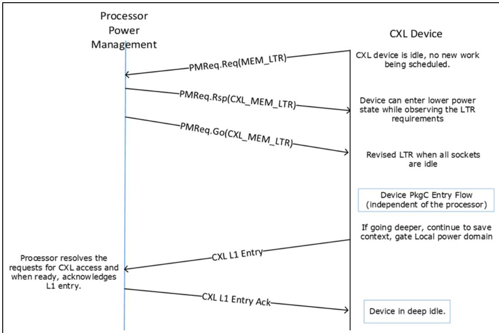

Figure 10-1 illustrates the PkgC entry flow. When a Device needs to enter a higherlatency Idle state, in which the CPU is not active, the Device will issue a PMReq.Req with the LTR field marking the memory-access tolerance of the entity. As specified in Section 10.2.2.1, a device may unilaterally generate PMReq.Req to communicate any changes to its latency, without any dependency on receipt of a prior PMReq.Rsp or PMReq.Go. Specifically, a device may transmit two PMReq.Req messages without an intervening PMReq.Rsp from the host. The LTR value communicated by the device is labeled MEM\_LTR, and represents the Device’s latency tolerance regarding CXL.cache accesses and it could be different from what is communicated via LTR messages over CXL.io.

If Idle state is allowed, the processor will respond with a matching PMReq.Rsp message, with the negotiated allowable latency-tolerance LTR (labeled CXL\_MEM\_LTR). Both entities can independently enter an Idle state without coordination as long as the shared resources remain accessible.

For a full PkgC entry, both entities need to negotiate as to the depth/latency tolerance by responding with a PMReq.Rsp message that includes the agreeable latency tolerance. After the master power management agent has coordinated LTR across all the agents within the system, the agent will send a PMReq.Go() with the correct Latency field set (labeled CXL\_MEM\_LTR), indicating that local idle power actions can be taken subject to the communicated latency-tolerance value.

In case of a transition into deep-idle states, mostly typical of client systems, the device will initiate a CXL transition into L1.

These diagrams represent sequences, but do not imply any timing requirements. A host may respond much later with a PMReq.Rsp to a PMReq.Req from a device when the Host is ready to enter a low-power state, or the Host may not respond at all. A device, having sent a PMReq.Req, shall not implement a timeout to wait for PMReq.Rsp or PMReq.Go. Similarly, a device is not required to reissue PMReq.Req if the Device’s latency-tolerance requirements have not changed since any previous communication and the link has remained up. As shown in Figure 10-2, a CXL Type 3 device may issue PMReq.Req after the link is up to indicate to the host that the Device either has no latency requirements or has a high latency tolerance. The host may communicate any changes to its latency expectations to such a device. Such a device may initiate lowpower entry based only on the latency-tolerance value that the Device receives from the host, as shown in Figure 10-2. When the host communicates a sufficiently high latency-tolerance value to the device, the device may enter a low-power state. A CXL Type 3 device may enter and exit a low-power state based only on the PMReq.Go message that the Device received from the host, without dependency on a prior PMReq.Rsp.

Figure 10-2. PkgC Entry Flows for CXL Type 3 Device Example  
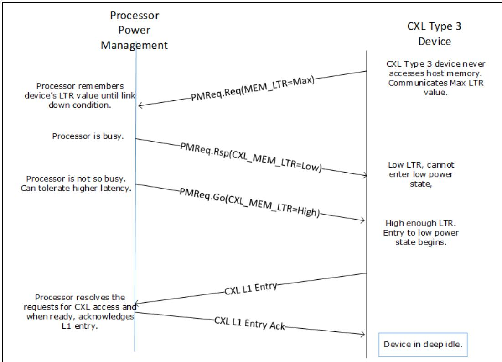

## 10.2.4 PkgC Exit Flows

gure 10-3. PkgC Exit Flows — Triggered by Device Access to System Memory

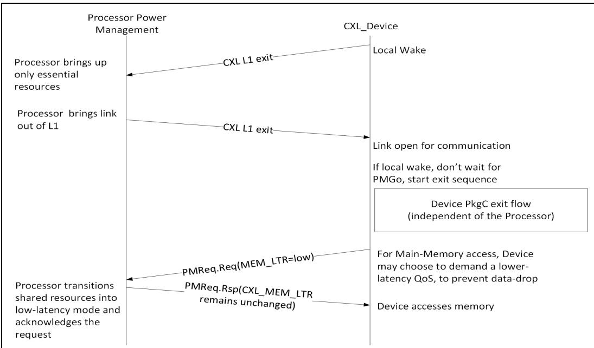

Figure 10-3 illustrates the PkgC exit flow initiated by the device. Link state during Idle may be in one of the select L1.x states, during Deep-Idle (as depicted here). In-band wake signaling will be used to transition the link back to L0. For more details, see Section 10.3.

After the CXL link exits L1, signaling can be used to transfer the device into a PkgC state, in which shared resources are available across CXL. The device requests a lowlatency tolerance value to the processor. Based on that value, the processor will bring the shared resources out of Idle and communicate its latest latency requirements with a PMReq.Rsp().

Figure 10-4. PkgC Exit Flows — Execution Required by Processor  
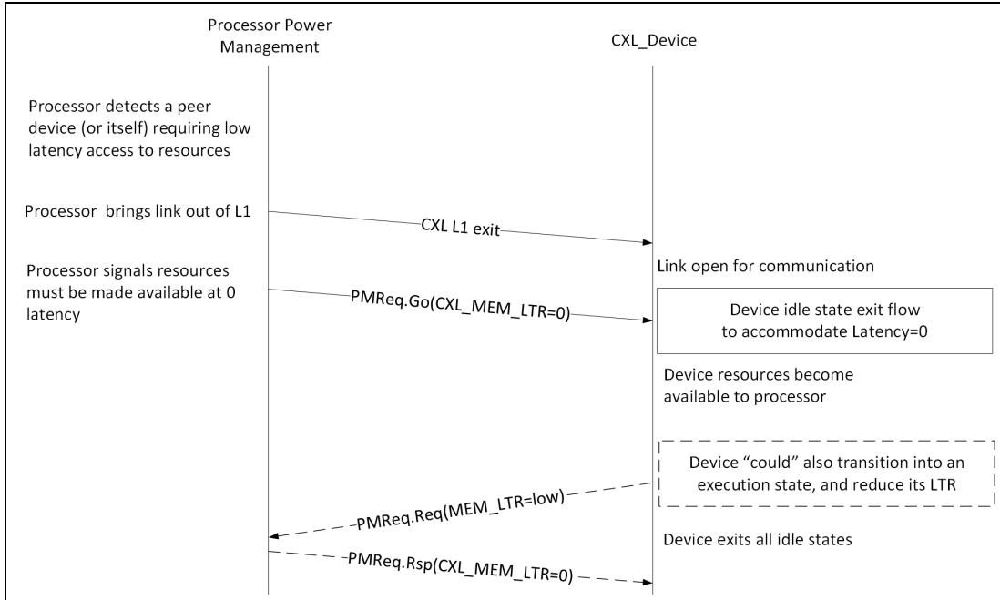

Figure 10-4 illustrates the PkgC exit flow initiated by the processor. In the case where the processor, or one of the peer devices connected to the processor, must have coherent low-latency access to system memory, the processor will initiate a Link L1 exit toward the device.

After the link is running, the processor will follow with a PMGo(Latency=0), indicating some device in the platform requires low-latency access to coherent memory and resources. A device that receives PMReq.Go with Latency=0 must ensure that additional low-power actions that might impede memory access are not taken.

## 10.2.5 CXL Physical Layer Power Management States

CXL Physical layer supports L1 and L2 states as defined in the PCIe Base Specification. CXL Physical Layer does not support L0s. The entry and exit conditions from these states are also as defined in the PCIe Base Specification. The notable difference is that for CXL Physical Layer, entry and exit from Physical Layer Power Management states is directed by the CXL ARB/MUX.

## 10.3 CXL Power Management

CXL Link Power Management supports Active Link State Power Management (ASPM), and L1 and L2 are the only 2 Power states supported. For 256B Flit mode, L0p negotiation is also supported. The PM Entry/Exit process is further divided into 3 phases as described below.

For 68B Flit mode, if the LTSSM goes through Recovery before the ARB/MUX vLSM moves to PM state, then the PM Entry process must restart from Phase 1, if the conditions for PM entry are still met after exit from Recovery and ARB/MUX Status Synchronization Protocol. For 256B Flit mode, the PM entry handshakes are not impacted by Link Recovery transitions because Link Recovery is not forwarded to the ARB/MUX vLSMs.

## 10.3.1 CXL PM Entry Phase 1

CXL PM Entry Phase 1 involves protocol-specific mechanisms to negotiate entry into a supported PM state. As shown in Figure 10-5, in 256B Flit mode, this transition does not require any synchronization between the ARB/MUX instances on the two ends. 68B Flit mode, however, does require such synchronization (see Figure 10-6). After the conditions to enter the PM state as defined in Section 10.2 are satisfied, the Transaction Layer is ready for Phase 2 entry and directs the ARB/MUX to enter the PM State.

Figure 10-5. CXL Link PM Phase 1 for 256B Flit Mode

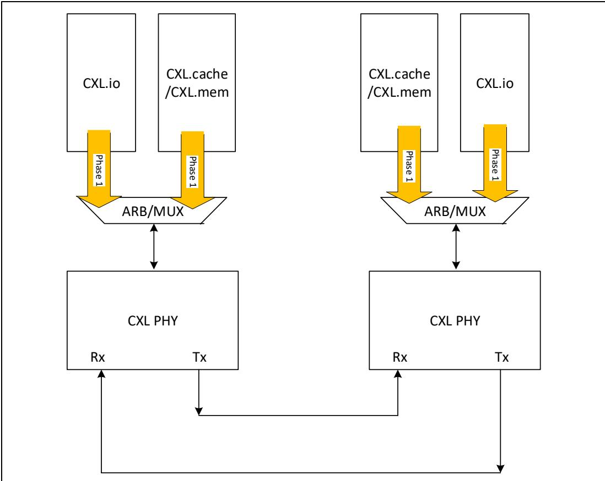

Figure 10-6. CXL Link PM Phase 1 for 68B Flit Mode  
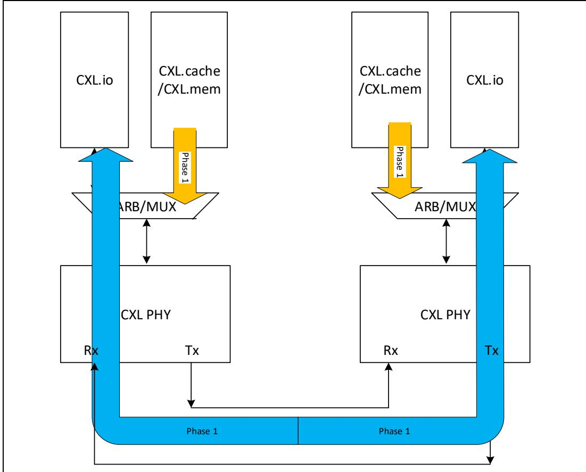

## 10.3.2 CXL PM Entry Phase 2

When directed by the Transaction Layer to enter PM, the ARB/MUX initiates the CXL PM Entry Phase 2 process. Phase 2 consists of bringing the ARB/MUX interface of both sides of the Link into a supported PM state. ALMPs are used to coordinate PM state entry as described below. Phase 2 entry is independently managed for each protocol. The Physical Layer continues to be in L0 until all the Transaction Layers enter Phase 2 state.

Figure 10-7. CXL Link PM Phase 2

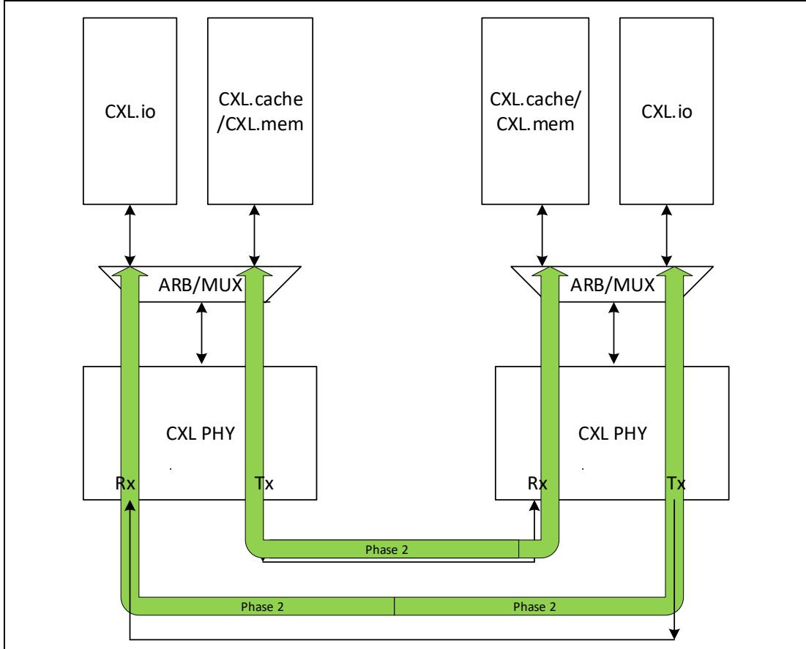  
Rules for the Phase 2 entry into ASPM are as follows (summarized in Figure 10-7):

1. Phase 2 Entry into the supported PM State is always initiated by the ARB/MUX on the Downstream Component.

2. When directed by the Transaction Layer, the ARB/MUX on the Downstream Component must transmit an ALMP request to enter vLSM state PM.

3. When the ARB/MUX on the Upstream Component is directed to enter L1 and receives an ALMP request from the Downstream Component, the Upstream Component responds with an ALMP response indicating acceptance of entry into L1 state. The Transaction Layer on the Upstream Component must also be notified that the ARB/MUX port has accepted entry into the supported PM state.

4. The Upstream Component ARB/MUX port does not respond with an ALMP response if not directed by the upper layers to enter PM state.

5. When the ARB/MUX on the Downstream Component is directed to enter L1 and receives an ALMP response from the Upstream Component, the ARB/MUX notifies acceptance of entry into the PM state to the Transaction Layer on the Downstream Component.

6. The Downstream Component ARB/MUX port must wait for at least 1 ms (not including time spent in recovery states) for a response from the Upstream Component before retrying PM entry. The Downstream Component ARB/MUX is permitted to abort the PM entry before the 1-ms timeout by sending an Active Request ALMP for the corresponding vLSM.

7. L2 entry is an exception to Rule 6. Protocol must ensure that the Upstream Component is directed to enter L2 before setting up the conditions for the Downstream Component to request L2 state entry. This ensures that L2 Abort or L2 Retry conditions do not exist. The Downstream Component may use indications such as the PME\_Turn\_Off message or a RESETPREP VDM to trigger L2 state entry.

8. The Transaction Layer on either side of the Link is permitted to directly exit from L1 state after the ARB/MUX interface enters L1 state.

## 10.3.3 CXL PM Entry Phase 3

CXL PM Entry Phase 3 is a conditional phase of PM entry and is executed only when all the Protocol interfaces of ARB/MUX have entered the same virtual PM state. The phase consists of bringing the Tx lanes to electrical idle and is always initiated by the Downstream Component. As shown in Figure 10-8, the PHY Layers on the two ends of the link communicate. If the link transitions to recovery during or after entry into electrical idle, the Downstream Component must wait for at least 1 us after entering L0 before re-initiating entry into electrical idle. This is to allow sufficient time for an Active State Request ALMP transfer to occur in case either side wants to initiate a PM exit (and to provide sufficient time for the remote ARB/MUX to stop requesting PM entry to LogPHY). The electrical idle entry flow is defined in the “Power Management” chapter of the PCIe Base Specification.

Figure 10-8. CXL PM Phase 3

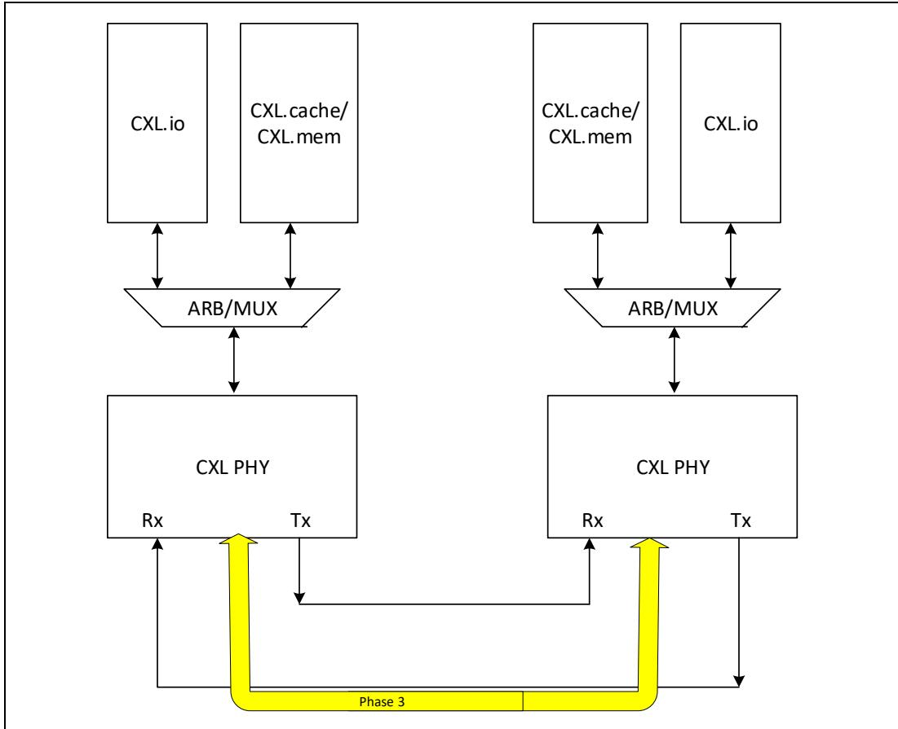

## 10.3.4 CXL Exit from ASPM L1

Components on either end of the Link may initiate exit from the L1 Link State. The ASPM L1 exit depends on whether the exit is from Phase 3 or Phase 2 of L1. The exit is hierarchical and Phase 3 must exit before Phase 2.

Phase 3 exit is initiated when directed by the ARB/MUX from either end of the link. The ARB/MUX Layer initiates exit from Phase 3 when there is an exit requested on any one of its primary protocol interfaces. The Phase 3 ASPM L1 exit is the same as exit from L1 state as defined in the PCIe Base Specification. The steps are followed until the LTSSM enters L0 state. Protocol-level information is not permitted to be exchanged until the vLSM on the ARB/MUX interface has exited L1 state.

Phase 2 exit involves bringing the protocol interface independently out of L1 state at the ARB/MUX. The Transaction Layer directs the ARB/MUX state to exit vLSM state. If the PHY is in Phase 3 L1, then the ARB/MUX waits for the PHY LTSSM to enter L0 state. After the PHY is in L0 state, the following rules apply:

1. The ARB/MUX on the protocol side that is triggering an exit transmits an ALMP requesting entry into Active state.

2. Any ARB/MUX interface that receives the ALMP request to enter Active State must transmit an ALMP acknowledge response on behalf of that interface. The ALMP acknowledge response is an indication that the corresponding protocol side is ready to process received packets.

3. Any ARB/MUX interface that receives the ALMP request to enter Active State must also transmit an ALMP Active State request on behalf of that interface if not already sent.

4. Protocol-level transmission must be permitted by the ARB/MUX after an Active State Status ALMP is transmitted and received. This guarantees that the receiving protocol is ready to process packets.

## L0p Negotiation for 256B Flit Mode

See Chapter 5.0 for the L0p negotiation rules.

## CXL.io Link Power Management

CXL.io Link Power Management is as defined in the PCIe Base Specification with the following notable differences:

• RCD links support ASPM-directed L1 entry but do not support PCI-PM-directed L1 entry. An eRCD is not required to initiate entry into L1 state when software transitions the device into D3Hot or D1 device state. When a component is not operating in RCD mode, the component shall support PCI-PM and optionally support ASPM L1. As such, a component not operating in RCD mode shall initiate CXL.io L1 entry when the device is placed in D3Hot or D1 device state.

• L0s state is not supported.

All CXL functions shall implement PCI Power Management Capability Structure as defined in the PCIe Base Specification and shall support D0 and D3 device states.

## 10.4.1 CXL.io ASPM Entry Phase 1 for 256B Flit Mode

There must not be any DLLP exchanges initiated for PM entry for 256B Flit mode. The Link Layer on each side independently requests its local ARB/MUX to enter a PM state. The ARB/MUX Layers on both sides of the Link coordinate entry into a PM state using ALMPs as part of Phase 2.

## CXL.io ASPM L1 Entry Phase 1 for 68B Flit Mode

The first phase consists of completing the ASPM L1 negotiation rules as defined in the PCIe Base Specification with the following notable exception for the rules in case of acceptance of ASPM L1 Entry:

• All rules up to the completion of the ASPM L1 handshake are maintained; however, the process of bringing the Transmit Lanes into Electrical Idle state are divided into the two additional phases described in Section 10.3.

See the PCIe Base Specification for the PCIe ASPM L1 Entry flow.

## CXL.io ASPM L1 Entry Phase 2

Phase 2 of L1 entry consists of bringing the CXL.io ARB/MUX interface of both sides of the Link into L1 state. ALMPs are used to coordinate L1 state entry. For 256B Flit mode, the ALMP exchange rules are the same for CXL.io and CXL.cachemem, and are defined in Chapter 5.0.

The rules for Phase 2 entry into ASPM L1 for 68B Flit mode are as follows:

1. CXL.io on the Upstream Component must direct the ARB/MUX to be ready to enter L1 before returning the PM\_Request\_Ack DLLPs as shown above in Phase 1.

2. When the PM\_Request\_Ack DLLPs are successfully received by the CXL.io on the Downstream Component, the CXL.io must direct the ARB/MUX on the Downstream Component to transmit the ALMP request to enter vLSM state L1.

3. When the ARB/MUX on the Upstream Component is directed to enter L1 and receives an ALMP request from the Downstream Component, the ARB/MUX notifies the CXL.io that the interface has received an ALMP request to enter L1 state and has entered L1 state.

4. When the Upstream Component is notified of the vLSM state L1 entry, the Upstream Component ceases sending PM\_Request\_Ack DLLPs.

5. When the ARB/MUX on the Downstream Component is directed to enter L1 and receives ALMP Status from the Upstream Component, the ARB/MUX notifies the CXL.io that the interface has entered L1 state.

## 10.4.4 CXL.io ASPM Entry Phase 3

Phase 3 entry is dependent on the vLSM state of multiple protocols and is managed by the ARB/MUX as described in Section 10.3.3.

## CXL.cache + CXL.mem Link Power Management

CXL.cache and CXL.mem both support only ASPM. Unlike CXL.io, there is no PM Entry handshake defined between the Link Layers. Each side independently requests the ARB/MUX to enter L1. The ARB/MUX Layers on both sides of the Link coordinate the entry into a PM state using ALMPs. CXL.cache + CXL.mem Link Power Management follows the process for PM entry and exit as defined in Section 10.3.

## CXL Security

## 11.1

## CXL IDE Overview

CXL Integrity and Data Encryption (CXL IDE) defines mechanisms for providing Confidentiality, Integrity, and Replay protection for data that traverses the CXL link. The cryptographic schemes are aligned with current industry best practices. CXL IDE supports a variety of usage models while providing for broad interoperability. CXL IDE can be used to secure traffic within a Trusted Execution Environment (TEE) that is composed of multiple components (see Section 11.5).

This chapter focuses on the changes for CXL.cache and CXL.mem traffic that traverses the link, and updates and constraints to the PCIe\* Base Specification that govern CXL.io traffic.

• CXL.io IDE definition including CXL.io IDE key establishment is based on PCIe IDE. Differences and constraints for CXL.io usage are identified in Section 11.2.

• CXL.cachemem IDE may use the CXL.io-based mechanisms for discovery, negotiation, device attestation, and key negotiation using a standard mechanism as described in Section 11.4.

In this specification, the term CXL IDE is used to refer to the scheme that protects CXL.io, CXL.cache, and CXL.mem traffic. The term CXL.cachemem IDE is used to refer to the protections associated with CXL.cache and CXL.mem traffic.

## IMPLEMENTATION NOTE

## Security Model

## • Assets

Assets that are in scope are as follows:

Transactions (data + metadata communicated) between the two sides of the physical link. Only the definition for providing integrity, replay protection and encryption/decryption of traffic between the ports is included in this specification.

## Notes:

— This threat model does not cover the security exposure due to inadequate Device implementation.

Agents that are on each side of the physical link are within the trust boundary of the respective devices/hardware blocks in which they reside. These agents will need to provide implementation-specific mechanisms to protect data internal to the device and any external connections over which such data can be sent by the device. Mechanisms for such protection are beyond the scope of this definition.

Symmetric cryptographic keys are used to provide confidentiality, integrity, and replay protection of data in transit between physically connected CXL ports. This specification does not define mechanisms for protecting these keys inside the host and the device.

Certificates and asymmetric keys that are used for device authentication and key exchange are beyond the scope of this specification. The device attestation and key exchange mechanism determine the security model for those assets.

## • TCB

The TCB consists of the following:

— Functional blocks on each side of the link that implement the link encryption and integrity.

Agents that are used to configure the cryptographic engines in the functional blocks on each side of link. For example, trusted firmware/software agent and/or security agent hardware and firmware that implement key exchange protocol or facilitate programming of the keys.

— Other hardware blocks in the device that may have direct or indirect access to the assets, including those that perform operations such as reset, debug, and link power management.

## • Adversaries and Threats

Threats from physical attacks on links, including cases where an adversary can examine data intended to be confidential, modify data or protocol metadata, record and replay recorded transactions, reorder and/or delete data flits, inject transactions including requests/data or non-data responses, using lab equipment, purpose-built interposers, and/ or malicious Extension Devices.

Threats arising from physical replacement of a trusted device with an untrusted device, and/or removal of a trusted device and accessing the trusted device with a system that is under an adversary’s control.

CXL.cachemem IDE provides point-to-point protection. Any switches present in the path between the Host and the Endpoint, or between two Endpoints, must support this specification. In these cases, such switches will be in the TCB.

Denial of service attacks are beyond the scope of this specification.

## 11.2 CXL.io IDE

CXL.io IDE follows the PCIe IDE definition. This section covers the notable constraints and differences between the CXL.io IDE definition and the PCIe IDE definition.

Table 11-1. Mapping of PCIe IDE to CXL.io

<table><tr><td>PCIe IDE Definition</td><td>CXL.io Support</td><td>Notes</td></tr><tr><td>Link IDE stream</td><td>Supported</td><td></td></tr><tr><td>Selective IDE stream</td><td>Supported</td><td>Selective IDE stream applies only to CXL.io.</td></tr><tr><td>Aggregation</td><td>Supported</td><td>PCIe-defined aggregation levels apply only to CXL.io traffic.</td></tr><tr><td>Switches with flow-through selective IDE streams</td><td>Supported</td><td>CXL switches may support CXL.io link IDE streams. CXL Switches may either operate as a boundary for selective IDE streams or forward the IDE streams toward Endpoints.</td></tr><tr><td>PCRC mechanism</td><td>Supported</td><td>PCRC mechanism may be optionally enabled for the CXL.io ports.</td></tr></table>

One of the PCIe IDE reserved sub-stream encodings (1000b) is assigned for CXL.cachemem usage.

## 11.3

## CXL.cachemem IDE

All protocol-level retryable flits are encrypted and integrity protected.

When operating in 68B Flit mode:

• Link Layer control flits and flit CRC are not encrypted or integrity protected. There is no confidentiality or integrity on these flits.

• Link CRC shall be calculated on encrypted flits. Link retries occur first and only flits that pass Link CRC will be decrypted and then integrity checked.

When operating in 256B Flit mode:

• Link Layer control information, flit header, and flit CRC/FEC is not encrypted or integrity protected. There is no confidentiality protection, integrity protection, or replay protection for this content.

• Link CRC shall be calculated on encrypted flits. Link retries occur first and only flits that pass Link CRC will be decrypted and then integrity checked.

Any integrity check failures shall result in all future secure traffic being dropped.

Multi-data Header capability must be supported. This allows packing of multiple (up to 4) data headers into a single slot, followed immediately by 16 slots of all-data.

IDE will operate on a flit granularity for CXL.cache and CXL.mem protocols. IDE makes use of the Advanced Encryption Standard-Galois Counter Mode Advanced Encryption and Advanced Decryption Functions (referred to herein as AES-GCM), as defined in NIST\* Special Publication 800-38D. AES-GCM with a 256-bit key size shall be used for confidentiality protection, integrity protection, and replay protection. The AES-GCM Functions take three inputs:

• additional authentication data (AAD; denoted as A)

• plaintext (denoted as P)

• initialization vector (denoted as IV)

Key refresh without any data loss must be supported. There are a number of scenarios where the keys need to be refreshed. Some examples include:

• An accelerator device that is migrated from one VM (or process) to a different VM (or process).

• Crypto considerations (concerns about key wear-out) for long-running devices or devices that are part of the platform.

Key refresh is not expected to occur frequently. It is acceptable to take a latency/ bandwidth hit; however, there must not be any data loss.

Encrypted PCRC mechanism is supported to provide robustness against hard and soft faults that are internal to the encryption and decryption engines. Encrypted PCRC integrates into the standard MAC check mechanism, does not consume incremental link bandwidth, and can be implemented without adding significant incremental latency. Root ports and endpoints must be PCRC capable and it shall be enabled by default. It is recommended that PCRC be enabled when IDE is enabled. Software is permitted to disable it.

## 11.3.1 CXL.cachemem IDE Architecture in 68B Flit Mode

IDE shall operate on a flit granularity for CXL.cachemem protocols. IDE makes use of the AES-GCM algorithm, and AES-GCM takes three inputs — A, P, and IV — as described earlier in Section 11.3.

In the case of CXL.cachemem protocol header flits, the 32 bits in the flit header that are part of Slot 0 map to A — it is not encrypted, but it is integrity protected. The remainder of the Slot 0/1/2/3 contents maps to P, which is encrypted and integrity protected (see handling of MAC slot below). CXL.cachemem protocol also supports ADF. In the case of an ADF, all four slots in the flit map to P.

The link CRC is not encrypted or integrity protected. The CRC is calculated on the flit content after the flit has been encrypted.

As with other protocol flits, IDE flits shall be covered by link layer mechanisms for detecting and correcting errors. This process shall operate on flits after the flits are cryptographically processed by the transmitter and before the flits are submitted for cryptographic processing by the receiver.

AES-GCM is applied to an aggregation of multiple flits referred to as a MAC epoch. The number of flits in the aggregation is determined by the Aggregation Flit Count (see Section 11.3.5 for details). If PCRC (see Section 11.3.3) is enabled in the CXL IDE Control register (see Table 8-134), the 32 bits of PCRC shall be appended to the end of the aggregated flit content to contribute to the final P value that is integrity protected. However, the 32 bits of PCRC are not transmitted across the link. Figure 11-1 shows the mapping of the flit contents into A and P for the case of aggregation of MAC across five flits.

Figure 11-1. 68B Flit — CXL.cachemem IDE Showing Aggregation of Five Flits  
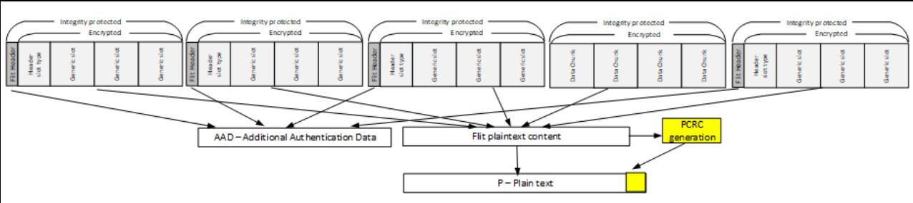

The Message Authentication Code (MAC), also referred to as the authentication tag in NIST Special Publication 800-38D, shall be 96 bits. The MAC must be transmitted in a Slot 0 header of type H6 (see Figure 4-14). Unlike other Slot 0 headers, the MAC itself is neither encrypted nor integrity protected. Figure 11-2 shows the mapping of flit contents to A and P for the case of aggregation of MAC across five flits with one of the flits carrying a MAC.

Figure 11-2. 68B Flit — CXL.cachemem IDE Showing Aggregation across Five Flits where One Flit Contains MAC Header in Slot 0

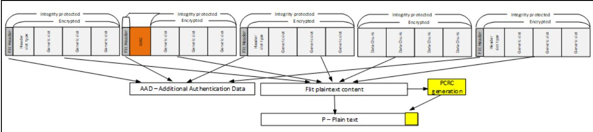

Figure 11-3 provides a more-detailed view of the 5-flit MAC epoch example. Flit0 shown on the top is the first flit to be transmitted in this MAC epoch. The figure shows the header fields that are only integrity protected, and plaintext content that is encrypted and integrity protected. Flit0 plaintext0 byte0 is the first byte of the plaintext. Flit1 plaintext0 byte0 shall immediately follow flit0 plaintext3 byte15.

Figure 11-3. 68B Flit — More-detailed View of a Five-flit MAC Epoch Example  
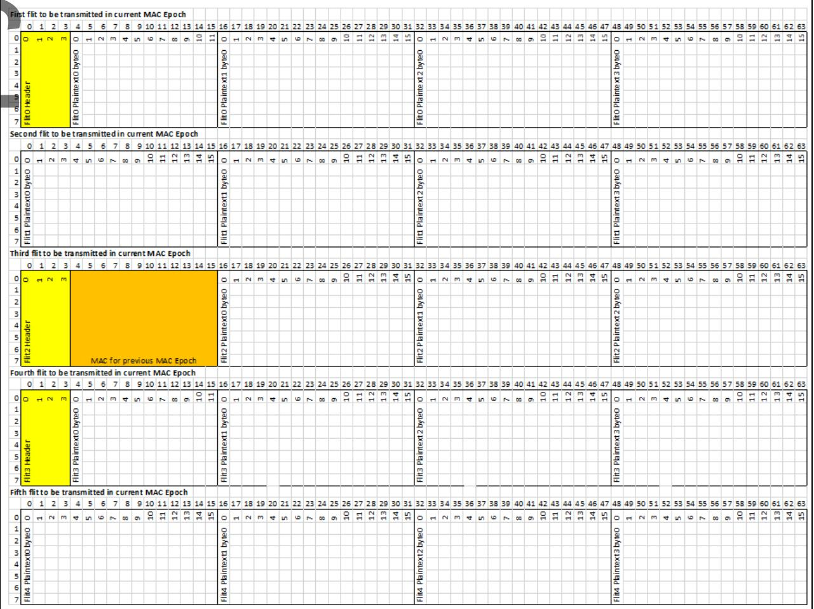  
Figure 11-4 shows the mapping of the header bytes to AES-GCM AAD (A) for the example in Figure 11-3.

Figure 11-4. 68B Flit — Mapping of AAD Bytes for the Example Shown in Figure 11-3  
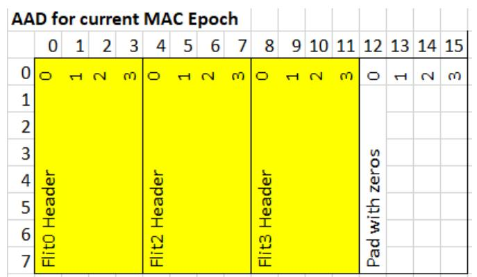

## 11.3.2 CXL.cachemem IDE Architecture in 256B Flit Mode

If the header slot is used for sending control messages other than IDE.MAC, the entire flit shall not carry any protocol traffic. This applies for other usages of IDE type (IDE.TMAC, IDE.Start, and IDE.Idle), In-band Error, and INIT.

The receiver uses 4 bits in the header slot that encode the slot type to determine whether the slot contains control or protocol information. If the header slot is carrying protocol information, then 4 bits in the header slot that encode the slot type will map to AES-GCM input A. Although the slot type will not be encrypted, it is integrity protected. If the header slot is carrying control information, then the entire slot is neither encrypted nor integrity protected.

In case the header slot is carrying protocol information, then the plaintext (P) starts at bit[20]. To simplify implementation and align to the AES block size of 128 bits, 20 bits of 0s shall be padded in front of the header slot content and the padded 128 bits of information shall be mapped to AES-GCM input P.

• The padded header slot will be used when calculating PCRC (see Section 11.3.3).

• Encrypted pad will not be transmitted on the link. Receiver must reconstruct the ciphertext for the padded region when calculating the AES-GCM MAC.

Credit return (CRD) field does not carry any confidential data. The CRD field needs to be integrity protected, so the CRD field shall map to AES-GCM input A.

The rules for handling latency-optimized flits are as follows:

• Slot 7 bytes shall be packed together before mapping to AES-GCM input P.

• Slot 8 is only 12 bytes long. It shall be padded with 32 bits of 0 at the end of slot content. This will enable subsequent slots to be aligned on the 128-bit AES block boundary.

• Packed Slot 7 and padded Slot 8 should be used when calculating PCRC (see Section 11.3.3).

• Receiver must reconstruct the ciphertext for the padded region in Slot 8 when calculating AES-GCM MAC.

• AES-GCM input A for each flit shall be padded with 0s to align it to 32 bits.

• Header slot contains protocol header: slot\_type|CRD|012.

• Header slot contains MAC: CRD|016.

In the case of 256B flits, only Slot 0 and Slot 15 contribute to the AAD. Figure 11-5, Figure 11-6, Figure 11-7, Figure 11-8, Figure 11-9, and Figure 11-10 depict handling of the AAD field.

Figure 11-5 depicts the case when Slot 0 contains LLCTRL (H8) slot format encoding with an IDE.MAC message. In this case, Slot 0 does not contain any bits that require integrity protection; therefore, Slot 0 is not IDE protected.

Figure 11-5. 256B Flit — Handling of Slot 0 when It Carries H8

<table><tr><td>bit</td><td colspan="18">bytes</td></tr><tr><td></td><td>0</td><td>1</td><td>2</td><td>3</td><td>4</td><td>5</td><td>6</td><td>7</td><td>8</td><td>9</td><td>10</td><td>11</td><td>12</td><td>13</td><td>14</td><td>15</td><td></td><td></td></tr><tr><td></td><td></td><td></td><td></td><td></td><td></td><td></td><td></td><td></td><td></td><td></td><td></td><td></td><td></td><td></td><td></td><td></td><td></td><td></td></tr><tr><td>0</td><td rowspan="3" colspan="2">B0</td><td rowspan="3">B1</td><td rowspan="3">B2</td><td rowspan="3">B3</td><td rowspan="3">B4</td><td rowspan="3">B5</td><td rowspan="3">B6</td><td rowspan="3">B7</td><td rowspan="3">B8</td><td rowspan="3">B9</td><td rowspan="3">B10</td><td rowspan="3">B11</td><td rowspan="3">B12</td><td rowspan="3">B13</td><td></td><td></td><td></td></tr><tr><td>1</td><td></td><td></td><td></td></tr><tr><td>2</td><td></td><td></td><td></td></tr><tr><td>3</td><td rowspan="5" colspan="18">2B HDR</td></tr><tr><td>4</td></tr><tr><td>5</td></tr><tr><td>6</td></tr><tr><td>7</td></tr><tr><td colspan="11">Slot 0 contains LLCTRL (H8) slot format encoding with IDE.MAC message</td><td></td><td></td><td></td><td></td><td></td><td></td><td></td><td></td></tr><tr><td></td><td></td><td></td><td></td><td></td><td></td><td></td><td></td><td></td><td></td><td></td><td></td><td></td><td></td><td></td><td></td><td></td><td></td><td></td></tr><tr><td colspan="7">No IDE protection</td><td></td><td></td><td></td><td></td><td></td><td></td><td></td><td></td><td></td><td></td><td></td><td></td></tr><tr><td colspan="7">Integrity protection only (AES GCM AAD)</td><td></td><td></td><td></td><td></td><td></td><td></td><td></td><td></td><td></td><td></td><td></td><td></td></tr><tr><td colspan="7">Encrypt and Integrity protect (AES-GCM P)</td><td></td><td></td><td></td><td></td><td></td><td></td><td></td><td></td><td></td><td></td><td></td><td></td></tr></table>

Figure 11-6 shows the case where Slot 0 contains protocol header slot format encoding (H0 through H7, H9 through H15). The first 2 bytes that contain the flit header are not IDE protected. Bits[0:3] of Slot 0 that carry the slot format encoding are not encrypted, but are integrity protected and therefore map to the AAD field. The slot’s remaining bits are encrypted and integrity protected (additional details regarding mapping to the P field are provided in Figure 11-11).

Figure 11-6. 256B Flit — Handling of Slot 0 when It Does Not Carry H8

<table><tr><td>bit</td><td></td><td></td><td></td><td></td><td></td><td></td><td></td><td></td><td>bytes</td><td></td><td></td><td></td><td></td><td></td><td></td><td></td><td></td></tr><tr><td></td><td>0</td><td>1</td><td>2</td><td>3</td><td>4</td><td>5</td><td>6</td><td>7</td><td>8</td><td>9</td><td>10</td><td>11</td><td>12</td><td>13</td><td>14</td><td>15</td><td></td></tr><tr><td></td><td></td><td></td><td></td><td></td><td></td><td></td><td></td><td></td><td></td><td></td><td></td><td></td><td></td><td></td><td></td><td></td><td></td></tr><tr><td>0</td><td rowspan="8" colspan="2">2B HDR</td><td rowspan="4">b0-3</td><td rowspan="8">B1</td><td rowspan="8">B2</td><td rowspan="8">B3</td><td rowspan="8">B4</td><td rowspan="8">B5</td><td rowspan="8">B6</td><td rowspan="8">B7</td><td rowspan="8">B8</td><td rowspan="8">B9</td><td rowspan="8">B10</td><td rowspan="8">B11</td><td rowspan="8">B12</td><td rowspan="8">B13</td><td></td></tr><tr><td>1</td><td></td></tr><tr><td>2</td><td></td></tr><tr><td>3</td><td></td></tr><tr><td>4</td><td rowspan="4">b4-7</td><td></td></tr><tr><td>5</td><td></td></tr><tr><td>6</td><td></td></tr><tr><td>7</td><td></td></tr><tr><td colspan="11">Slot 0 contains protocol header slot format encodings</td><td></td><td></td><td></td><td></td><td></td><td></td><td></td></tr><tr><td></td><td></td><td></td><td></td><td></td><td></td><td></td><td></td><td></td><td></td><td></td><td></td><td></td><td></td><td></td><td></td><td></td><td></td></tr><tr><td colspan="7">No IDE protection</td><td></td><td></td><td></td><td></td><td></td><td></td><td></td><td></td><td></td><td></td><td></td></tr><tr><td colspan="7">Integrity protection only (AES GCM AAD)</td><td></td><td></td><td></td><td></td><td></td><td></td><td></td><td></td><td></td><td></td><td></td></tr><tr><td colspan="7">Encrypt and Integrity protect (AES-GCM P) - detailed handling shown in subsequent figure</td><td></td><td></td><td></td><td></td><td></td><td></td><td></td><td></td><td></td><td></td><td></td></tr></table>

Figure 11-7 shows the handling of Slot 15. When the flit carries protocol information, the CRD field carried in Slot 15 needs to be integrity protected. In this case, the first two bytes of CRD information (Credit return byte 0 and Credit return byte 1) map to the AES-GCM AAD field.

Figure 11-7. 256B Flit — Handling of Slot 15

<table><tr><td></td><td></td><td></td><td></td><td></td><td></td><td></td><td>bytes</td><td></td><td></td><td></td><td></td><td></td><td></td><td></td><td></td></tr><tr><td>0</td><td>1</td><td>2</td><td>3</td><td>4</td><td>5</td><td>6</td><td>7</td><td>8</td><td>9</td><td>10</td><td>11</td><td>12</td><td>13</td><td>14</td><td>15</td></tr><tr><td>COBO</td><td>COB1</td><td colspan="9">CRC (8B)</td><td colspan="5">FEC (6B)</td></tr><tr><td></td><td></td><td></td><td></td><td></td><td></td><td></td><td></td><td></td><td></td><td></td><td></td><td></td><td></td><td></td><td></td></tr><tr><td colspan="7">No IDE protection</td><td></td><td></td><td></td><td></td><td></td><td></td><td></td><td></td><td></td></tr><tr><td colspan="7">Integrity protection only (AES GCM AAD)</td><td></td><td></td><td></td><td></td><td></td><td></td><td></td><td></td><td></td></tr><tr><td colspan="7">Encrypt and Integrity protect (AES-GCM P)</td><td></td><td></td><td></td><td></td><td></td><td></td><td></td><td></td><td></td></tr></table>

Figure 11-8 shows the first case of how the bits that only need to be integrity protected are mapped to the AAD field when the first flit carries a protocol header in Slot 0 and the second flit carries IDE.MAC in Slot 0.

Figure 11-8. Mapping of Integrity-only Protected Bits to AAD — Case 1

<table><tr><td></td><td colspan="4">Flit0 H8 MAC</td><td colspan="4">Flit1 protocol header</td></tr><tr><td>bit</td><td colspan="8">bytes</td></tr><tr><td></td><td>0</td><td>1</td><td>2</td><td>3</td><td>4</td><td>5</td><td>6</td><td>7</td></tr><tr><td>0</td><td>C0b0</td><td>C1b0</td><td>0</td><td>0</td><td rowspan="4">b0-3</td><td>C0b4</td><td>C1b4</td><td>0</td></tr><tr><td>1</td><td>C0b1</td><td>C1b1</td><td>0</td><td>0</td><td>C0b5</td><td>C1b5</td><td>0</td></tr><tr><td>2</td><td>C0b2</td><td>C1b2</td><td>0</td><td>0</td><td>C0b6</td><td>C1b6</td><td>0</td></tr><tr><td>3</td><td>C0b3</td><td>C1b3</td><td>0</td><td>0</td><td>C0b7</td><td>C1b7</td><td>0</td></tr><tr><td>4</td><td>C0b4</td><td>C1b4</td><td>0</td><td>0</td><td>C0b0</td><td>C1b0</td><td>0</td><td>0</td></tr><tr><td>5</td><td>C0b5</td><td>C1b5</td><td>0</td><td>0</td><td>C0b1</td><td>C1b1</td><td>0</td><td>0</td></tr><tr><td>6</td><td>C0b6</td><td>C1b6</td><td>0</td><td>0</td><td>C0b2</td><td>C1b2</td><td>0</td><td>0</td></tr><tr><td>7</td><td>C0b7</td><td>C1b7</td><td>0</td><td>0</td><td>C0b3</td><td>C1b3</td><td>0</td><td>0</td></tr><tr><td colspan="4">(b) First flit carries MAC in Slot 0</td><td></td><td></td><td></td><td></td><td></td></tr><tr><td></td><td></td><td></td><td></td><td></td><td></td><td></td><td></td><td></td></tr><tr><td colspan="8">No IDE protection</td><td></td></tr><tr><td colspan="8">Header bits for Integrity protection only (AES GCM AAD)</td><td></td></tr><tr><td colspan="8">Zero padding required by CXL.cachemem IDE. Include these bits in the computation of AAD length.</td><td></td></tr></table>

Figure 11-9 shows the second case of how the bits that only need to be integrity protected are mapped to the AAD field when the first flit carries IDE.MAC in Slot 0 and the second flit carries a protocol header.

Figure 11-9. Mapping of Integrity-only Protected Bits to AAD — Case 2

<table><tr><td></td><td colspan="4">Flit1 H8 MAC</td><td colspan="4">Flit1 protocol header</td></tr><tr><td>bit</td><td colspan="8">bytes</td></tr><tr><td></td><td>4</td><td>5</td><td>6</td><td>7</td><td>4</td><td>5</td><td>6</td><td>7</td></tr><tr><td>0</td><td>C0b0</td><td>C1b0</td><td>0</td><td>0</td><td rowspan="4">b0-3</td><td>C0b4</td><td>C1b4</td><td>0</td></tr><tr><td>1</td><td>C0b1</td><td>C1b1</td><td>0</td><td>0</td><td>C0b5</td><td>C1b5</td><td>0</td></tr><tr><td>2</td><td>C0b2</td><td>C1b2</td><td>0</td><td>0</td><td>C0b6</td><td>C1b6</td><td>0</td></tr><tr><td>3</td><td>C0b3</td><td>C1b3</td><td>0</td><td>0</td><td>C0b7</td><td>C1b7</td><td>0</td></tr><tr><td>4</td><td>C0b4</td><td>C1b4</td><td>0</td><td>0</td><td>C0b0</td><td>C1b0</td><td>0</td><td>0</td></tr><tr><td>5</td><td>C0b5</td><td>C1b5</td><td>0</td><td>0</td><td>C0b1</td><td>C1b1</td><td>0</td><td>0</td></tr><tr><td>6</td><td>C0b6</td><td>C1b6</td><td>0</td><td>0</td><td>C0b2</td><td>C1b2</td><td>0</td><td>0</td></tr><tr><td>7</td><td>C0b7</td><td>C1b7</td><td>0</td><td>0</td><td>C0b3</td><td>C1b3</td><td>0</td><td>0</td></tr><tr><td colspan="4">First flit carries MAC in Slot 0</td><td></td><td></td><td></td><td></td><td></td></tr><tr><td></td><td></td><td></td><td></td><td></td><td></td><td></td><td></td><td></td></tr><tr><td colspan="8">No IDE protection</td><td></td></tr><tr><td colspan="8">Header bits for Integrity protection only (AES GCM AAD)</td><td></td></tr><tr><td colspan="8">Zero padding required by CXL.cachemem IDE. Include these bits in the computation of AAD length.</td><td></td></tr></table>

Figure 11-10 shows the third case of how the bits that only need to be integrity protected are mapped to the AAD field. In this case, both flits carry protocol headers in Slot 0. When the flit carries a protocol header, there are 20 bits that require integrity protection. These 20 bits are composed of four bits of Slot encoding (Slot 0) and 16 bits of CRD (Slot 15). These bits are padded with trailing 0s to create a 32-bit AAD input.

Figure 11-10. Mapping of Integrity-only Protected Bits to AAD — Case 3  
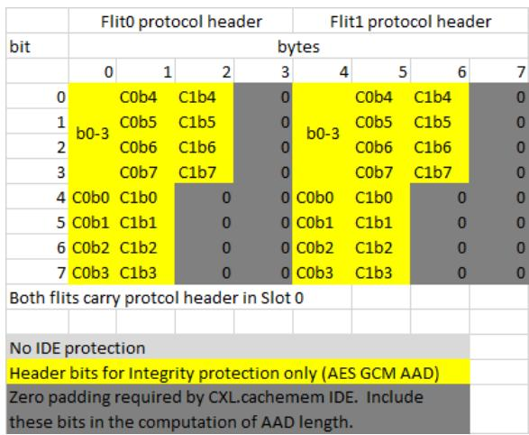

Because there can be only one IDE.MAC within any given MAC epoch, it is impossible for both flits to carry IDE.MAC. Such a case does not exist and hence not shown here.

Figure 11-11 shows the transmitter’s handling of bits that require both encryption and integrity protection for the standard 256B flit when Slot 0 contains LLCTRL (H8) Slot format encoding with an IDE.MAC message. Slot 0 content is not IDE protected. Slots 1 through 14 are mapped to P.

Figure 11-11. Standard 256B Flit — Mapping to AAD and P Bits when Slot 0 Carries H8

<table><tr><td></td><td>bit</td><td>0</td><td>1</td><td>2</td><td>3</td><td>4</td><td>5</td><td>6</td><td>7</td><td>8</td><td>9</td><td>10</td><td>11</td><td>12</td><td>13</td><td>14</td><td>15</td></tr><tr><td>slot0</td><td></td><td colspan="2">2B HDR</td><td>B0</td><td>B1</td><td>B2</td><td>B3</td><td>B4</td><td>B5</td><td>B6</td><td>B7</td><td>B8</td><td>B9</td><td>B10</td><td>B11</td><td>B12</td><td>B13</td></tr><tr><td>slot1</td><td>0-7</td><td>B0</td><td>B1</td><td>B2</td><td>B3</td><td>B4</td><td>B5</td><td>B6</td><td>B7</td><td>B8</td><td>B9</td><td>B10</td><td>B11</td><td>B12</td><td>B13</td><td>B14</td><td>B15</td></tr><tr><td>slot2</td><td>0-7</td><td>B0</td><td>B1</td><td>B2</td><td>B3</td><td>B4</td><td>B5</td><td>B6</td><td>B7</td><td>B8</td><td>B9</td><td>B10</td><td>B11</td><td>B12</td><td>B13</td><td>B14</td><td>B15</td></tr><tr><td>slot3</td><td>0-7</td><td>B0</td><td>B1</td><td>B2</td><td>B3</td><td>B4</td><td>B5</td><td>B6</td><td>B7</td><td>B8</td><td>B9</td><td>B10</td><td>B11</td><td>B12</td><td>B13</td><td>B14</td><td>B15</td></tr><tr><td>slot4</td><td>0-7</td><td>B0</td><td>B1</td><td>B2</td><td>B3</td><td>B4</td><td>B5</td><td>B6</td><td>B7</td><td>B8</td><td>B9</td><td>B10</td><td>B11</td><td>B12</td><td>B13</td><td>B14</td><td>B15</td></tr><tr><td>slot5</td><td>0-7</td><td>B0</td><td>B1</td><td>B2</td><td>B3</td><td>B4</td><td>B5</td><td>B6</td><td>B7</td><td>B8</td><td>B9</td><td>B10</td><td>B11</td><td>B12</td><td>B13</td><td>B14</td><td>B15</td></tr><tr><td>slot6</td><td>0-7</td><td>B0</td><td>B1</td><td>B2</td><td>B3</td><td>B4</td><td>B5</td><td>B6</td><td>B7</td><td>B8</td><td>B9</td><td>B10</td><td>B11</td><td>B12</td><td>B13</td><td>B14</td><td>B15</td></tr><tr><td>slot7</td><td>0-7</td><td>B0</td><td>B1</td><td>B2</td><td>B3</td><td>B4</td><td>B5</td><td>B6</td><td>B7</td><td>B8</td><td>B9</td><td>B10</td><td>B11</td><td>B12</td><td>B13</td><td>B14</td><td>B15</td></tr><tr><td>slot8</td><td>0-7</td><td>B0</td><td>B1</td><td>B2</td><td>B3</td><td>B4</td><td>B5</td><td>B6</td><td>B7</td><td>B8</td><td>B9</td><td>B10</td><td>B11</td><td>B12</td><td>B13</td><td>B14</td><td>B15</td></tr><tr><td>slot9</td><td>0-7</td><td>B0</td><td>B1</td><td>B2</td><td>B3</td><td>B4</td><td>B5</td><td>B6</td><td>B7</td><td>B8</td><td>B9</td><td>B10</td><td>B11</td><td>B12</td><td>B13</td><td>B14</td><td>B15</td></tr><tr><td>slot10</td><td>0-7</td><td>B0</td><td>B1</td><td>B2</td><td>B3</td><td>B4</td><td>B5</td><td>B6</td><td>B7</td><td>B8</td><td>B9</td><td>B10</td><td>B11</td><td>B12</td><td>B13</td><td>B14</td><td>B15</td></tr><tr><td>slot11</td><td>0-7</td><td>B0</td><td>B1</td><td>B2</td><td>B3</td><td>B4</td><td>B5</td><td>B6</td><td>B7</td><td>B8</td><td>B9</td><td>B10</td><td>B11</td><td>B12</td><td>B13</td><td>B14</td><td>B15</td></tr><tr><td>slot12</td><td>0-7</td><td>B0</td><td>B1</td><td>B2</td><td>B3</td><td>B4</td><td>B5</td><td>B6</td><td>B7</td><td>B8</td><td>B9</td><td>B10</td><td>B11</td><td>B12</td><td>B13</td><td>B14</td><td>B15</td></tr><tr><td>slot13</td><td>0-7</td><td>B0</td><td>B1</td><td>B2</td><td>B3</td><td>B4</td><td>B5</td><td>B6</td><td>B7</td><td>B8</td><td>B9</td><td>B10</td><td>B11</td><td>B12</td><td>B13</td><td>B14</td><td>B15</td></tr><tr><td>slot14</td><td>0-7</td><td>B0</td><td>B1</td><td>B2</td><td>B3</td><td>B4</td><td>B5</td><td>B6</td><td>B7</td><td>B8</td><td>B9</td><td>B10</td><td>B11</td><td>B12</td><td>B13</td><td>B14</td><td>B15</td></tr><tr><td>slot15</td><td></td><td>COBO</td><td>COB1</td><td colspan="14">CRC (8B) FEC (6B)</td></tr><tr><td colspan="11">Slot 0 contains LLCTRL (H8) slot format encoding with IDE.MAC message</td><td></td><td></td><td></td><td></td><td></td><td></td><td></td></tr><tr><td></td><td></td><td></td><td></td><td></td><td></td><td></td><td></td><td></td><td></td><td></td><td></td><td></td><td></td><td></td><td></td><td></td><td></td></tr><tr><td></td><td></td><td></td><td></td><td></td><td></td><td></td><td></td><td></td><td></td><td></td><td></td><td></td><td></td><td></td><td></td><td></td><td></td></tr><tr><td colspan="7">No IDE protection</td><td></td><td></td><td></td><td></td><td></td><td></td><td></td><td></td><td></td><td></td><td></td></tr><tr><td colspan="7">Integrity protection only (AES GCMAAD)</td><td></td><td></td><td></td><td></td><td></td><td></td><td></td><td></td><td></td><td></td><td></td></tr><tr><td colspan="7">Encrypt and Integrity protect (AES-GCM P)</td><td></td><td></td><td></td><td></td><td></td><td></td><td></td><td></td><td></td><td></td><td></td></tr><tr><td colspan="7">Zero padding required by CXL.cachemem IDE. Encrypt and Integrity protect (AES-GCM P). Include these bits in the computation of P length.</td><td></td><td></td><td></td><td></td><td></td><td></td><td></td><td></td><td></td><td></td><td></td></tr></table>

Figure 11-12 shows the transmitter’s handling of bits that require both encryption and integrity protection for the standard 256B flit when Slot 0 contains protocol header slot format encoding (H0 through H7 and H9 through H15). Slot 0 contains 108 bits, starting from bit[4] of the slot header. These bits are padded with leading 0s to align the content to a 128-bit boundary. The padded Slot 0 content, and Slots 1 through 14, are mapped to P.  
Figure 11-12. Standard 256B Flit — Mapping to AAD and P Bits when Slot 0 Does Not Carry H8

<table><tr><td></td><td></td><td colspan="17">bytes</td></tr><tr><td></td><td>bit</td><td>0</td><td>1</td><td>2</td><td>3</td><td>4</td><td>5</td><td>6</td><td>7</td><td>8</td><td>9</td><td>10</td><td>11</td><td>12</td><td>13</td><td>14</td><td>15</td><td></td></tr><tr><td rowspan="8">slot0</td><td>0</td><td>0</td><td>0</td><td>0</td><td></td><td></td><td></td><td></td><td></td><td></td><td></td><td></td><td></td><td></td><td></td><td></td><td></td><td></td></tr><tr><td>1</td><td>0</td><td>0</td><td>0</td><td></td><td></td><td></td><td></td><td></td><td></td><td></td><td></td><td></td><td></td><td></td><td></td><td></td><td></td></tr><tr><td>2</td><td>0</td><td>0</td><td>0</td><td></td><td></td><td></td><td></td><td></td><td></td><td></td><td></td><td></td><td></td><td></td><td></td><td></td><td></td></tr><tr><td>3</td><td>0</td><td>0</td><td>0</td><td>B1</td><td>B2</td><td>B3</td><td>B4</td><td>B5</td><td>B6</td><td>B7</td><td>B8</td><td>B9</td><td>B10</td><td>B11</td><td>B12</td><td>B13</td><td></td></tr><tr><td>4</td><td>0</td><td>0</td><td></td><td></td><td></td><td></td><td></td><td></td><td></td><td></td><td></td><td></td><td></td><td></td><td></td><td></td><td></td></tr><tr><td>5</td><td>0</td><td>0</td><td>b4-7</td><td></td><td></td><td></td><td></td><td></td><td></td><td></td><td></td><td></td><td></td><td></td><td></td><td></td><td></td></tr><tr><td>6</td><td>0</td><td>0</td><td></td><td></td><td></td><td></td><td></td><td></td><td></td><td></td><td></td><td></td><td></td><td></td><td></td><td></td><td></td></tr><tr><td>7</td><td>0</td><td>0</td><td></td><td></td><td></td><td></td><td></td><td></td><td></td><td></td><td></td><td></td><td></td><td></td><td></td><td></td><td></td></tr><tr><td>slot1</td><td>0-7</td><td>B0</td><td>B1</td><td>B2</td><td>B3</td><td>B4</td><td>B5</td><td>B6</td><td>B7</td><td>B8</td><td>B9</td><td>B10</td><td>B11</td><td>B12</td><td>B13</td><td>B14</td><td>B15</td><td></td></tr><tr><td>slot2</td><td>0-7</td><td>B0</td><td>B1</td><td>B2</td><td>B3</td><td>B4</td><td>B5</td><td>B6</td><td>B7</td><td>B8</td><td>B9</td><td>B10</td><td>B11</td><td>B12</td><td>B13</td><td>B14</td><td>B15</td><td></td></tr><tr><td>slot3</td><td>0-7</td><td>B0</td><td>B1</td><td>B2</td><td>B3</td><td>B4</td><td>B5</td><td>B6</td><td>B7</td><td>B8</td><td>B9</td><td>B10</td><td>B11</td><td>B12</td><td>B13</td><td>B14</td><td>B15</td><td></td></tr><tr><td>slot4</td><td>0-7</td><td>B0</td><td>B1</td><td>B2</td><td>B3</td><td>B4</td><td>B5</td><td>B6</td><td>B7</td><td>B8</td><td>B9</td><td>B10</td><td>B11</td><td>B12</td><td>B13</td><td>B14</td><td>B15</td><td></td></tr><tr><td>slot5</td><td>0-7</td><td>B0</td><td>B1</td><td>B2</td><td>B3</td><td>B4</td><td>B5</td><td>B6</td><td>B7</td><td>B8</td><td>B9</td><td>B10</td><td>B11</td><td>B12</td><td>B13</td><td>B14</td><td>B15</td><td></td></tr><tr><td>slot6</td><td>0-7</td><td>B0</td><td>B1</td><td>B2</td><td>B3</td><td>B4</td><td>B5</td><td>B6</td><td>B7</td><td>B8</td><td>B9</td><td>B10</td><td>B11</td><td>B12</td><td>B13</td><td>B14</td><td>B15</td><td></td></tr><tr><td>slot7</td><td>0-7</td><td>B0</td><td>B1</td><td>B2</td><td>B3</td><td>B4</td><td>B5</td><td>B6</td><td>B7</td><td>B8</td><td>B9</td><td>B10</td><td>B11</td><td>B12</td><td>B13</td><td>B14</td><td>B15</td><td></td></tr><tr><td>slot8</td><td>0-7</td><td>B0</td><td>B1</td><td>B2</td><td>B3</td><td>B4</td><td>B5</td><td>B6</td><td>B7</td><td>B8</td><td>B9</td><td>B10</td><td>B11</td><td>B12</td><td>B13</td><td>B14</td><td>B15</td><td></td></tr><tr><td>slot9</td><td>0-7</td><td>B0</td><td>B1</td><td>B2</td><td>B3</td><td>B4</td><td>B5</td><td>B6</td><td>B7</td><td>B8</td><td>B9</td><td>B10</td><td>B11</td><td>B12</td><td>B13</td><td>B14</td><td>B15</td><td></td></tr><tr><td>slot10</td><td>0-7</td><td>B0</td><td>B1</td><td>B2</td><td>B3</td><td>B4</td><td>B5</td><td>B6</td><td>B7</td><td>B8</td><td>B9</td><td>B10</td><td>B11</td><td>B12</td><td>B13</td><td>B14</td><td>B15</td><td></td></tr><tr><td>slot11</td><td>0-7</td><td>B0</td><td>B1</td><td>B2</td><td>B3</td><td>B4</td><td>B5</td><td>B6</td><td>B7</td><td>B8</td><td>B9</td><td>B10</td><td>B11</td><td>B12</td><td>B13</td><td>B14</td><td>B15</td><td></td></tr><tr><td>slot12</td><td>0-7</td><td>B0</td><td>B1</td><td>B2</td><td>B3</td><td>B4</td><td>B5</td><td>B6</td><td>B7</td><td>B8</td><td>B9</td><td>B10</td><td>B11</td><td>B12</td><td>B13</td><td>B14</td><td>B15</td><td></td></tr><tr><td>slot13</td><td>0-7</td><td>B0</td><td>B1</td><td>B2</td><td>B3</td><td>B4</td><td>B5</td><td>B6</td><td>B7</td><td>B8</td><td>B9</td><td>B10</td><td>B11</td><td>B12</td><td>B13</td><td>B14</td><td>B15</td><td></td></tr><tr><td>slot14</td><td>0-7</td><td>B0</td><td>B1</td><td>B2</td><td>B3</td><td>B4</td><td>B5</td><td>B6</td><td>B7</td><td>B8</td><td>B9</td><td>B10</td><td>B11</td><td>B12</td><td>B13</td><td>B14</td><td>B15</td><td></td></tr><tr><td>slot15</td><td></td><td>COBO</td><td>COB1</td><td colspan="14">CRC (8B) FEC (6B)</td><td></td></tr><tr><td colspan="18">Slot 0 contains protocol header slot format encoding (H0-H7, H9-H 15)</td><td></td></tr><tr><td></td><td></td><td></td><td></td><td></td><td></td><td></td><td></td><td></td><td></td><td></td><td></td><td></td><td></td><td></td><td></td><td></td><td></td><td></td></tr><tr><td colspan="8">No IDE protection</td><td></td><td></td><td></td><td></td><td></td><td></td><td></td><td></td><td></td><td></td><td></td></tr><tr><td colspan="8">Integrity protection only (AES GCMAAD)</td><td></td><td></td><td></td><td></td><td></td><td></td><td></td><td></td><td></td><td></td><td></td></tr><tr><td colspan="8">Encrypt and Integrity protect (AES-GCM P)</td><td></td><td></td><td></td><td></td><td></td><td></td><td></td><td></td><td></td><td></td><td></td></tr><tr><td colspan="8">Zero padding required by CXL.cachemem IDE. Encrypt and Integrity protect (AES-GCM P). Include these bits in the computation of P length.</td><td></td><td></td><td></td><td></td><td></td><td></td><td></td><td></td><td></td><td></td><td></td></tr></table>

Figure 11-13 shows the transmitter’s handling of bits that require both encryption and integrity protection for the latency-optimized 256B flit when Slot 0 contains LLCTRL (H8) Slot format encoding with an IDE.MAC message. Slot 0 content is not IDE protected. Slots 1 through 14 are mapped to P.  
Figure 11-13. Latency-Optimized 256B Flit — Mapping to AAD and P Bits when Slot 0 Carries H8

<table><tr><td></td><td></td><td colspan="16">bytes</td></tr><tr><td></td><td>bit</td><td>0</td><td>1</td><td>2</td><td>3</td><td>4</td><td>5</td><td>6</td><td>7</td><td>8</td><td>9</td><td>10</td><td>11</td><td>12</td><td>13</td><td>14</td><td>15</td></tr><tr><td>slot0</td><td></td><td colspan="2">2B HDR</td><td>B0</td><td>B1</td><td>B2</td><td>B3</td><td>B4</td><td>B5</td><td>B6</td><td>B7</td><td>B8</td><td>B9</td><td>B10</td><td>B11</td><td>B12</td><td>B13</td></tr><tr><td>slot1</td><td>0-7</td><td>B0</td><td>B1</td><td>B2</td><td>B3</td><td>B4</td><td>B5</td><td>B6</td><td>B7</td><td>B8</td><td>B9</td><td>B10</td><td>B11</td><td>B12</td><td>B13</td><td>B14</td><td>B15</td></tr><tr><td>slot2</td><td>0-7</td><td>B0</td><td>B1</td><td>B2</td><td>B3</td><td>B4</td><td>B5</td><td>B6</td><td>B7</td><td>B8</td><td>B9</td><td>B10</td><td>B11</td><td>B12</td><td>B13</td><td>B14</td><td>B15</td></tr><tr><td>slot3</td><td>0-7</td><td>B0</td><td>B1</td><td>B2</td><td>B3</td><td>B4</td><td>B5</td><td>B6</td><td>B7</td><td>B8</td><td>B9</td><td>B10</td><td>B11</td><td>B12</td><td>B13</td><td>B14</td><td>B15</td></tr><tr><td>slot4</td><td>0-7</td><td>B0</td><td>B1</td><td>B2</td><td>B3</td><td>B4</td><td>B5</td><td>B6</td><td>B7</td><td>B8</td><td>B9</td><td>B10</td><td>B11</td><td>B12</td><td>B13</td><td>B14</td><td>B15</td></tr><tr><td>slot5</td><td>0-7</td><td>B0</td><td>B1</td><td>B2</td><td>B3</td><td>B4</td><td>B5</td><td>B6</td><td>B7</td><td>B8</td><td>B9</td><td>B10</td><td>B11</td><td>B12</td><td>B13</td><td>B14</td><td>B15</td></tr><tr><td>slot6</td><td>0-7</td><td>B0</td><td>B1</td><td>B2</td><td>B3</td><td>B4</td><td>B5</td><td>B6</td><td>B7</td><td>B8</td><td>B9</td><td>B10</td><td>B11</td><td>B12</td><td>B13</td><td>B14</td><td>B15</td></tr><tr><td>slot7</td><td>0-7</td><td>B0</td><td>B1</td><td>B2</td><td>B3</td><td>B4</td><td>B5</td><td>B6</td><td>B7</td><td>B8</td><td>B9</td><td>B10</td><td>B11</td><td>B12</td><td>B13</td><td>B14</td><td>B15</td></tr><tr><td>slot8</td><td>0-7</td><td>B0</td><td>B1</td><td>B2</td><td>B3</td><td>B4</td><td>B5</td><td>B6</td><td>B7</td><td>B8</td><td>B9</td><td>B10</td><td>B11</td><td>0</td><td>0</td><td>0</td><td>0</td></tr><tr><td>slot9</td><td>0-7</td><td>B0</td><td>B1</td><td>B2</td><td>B3</td><td>B4</td><td>B5</td><td>B6</td><td>B7</td><td>B8</td><td>B9</td><td>B10</td><td>B11</td><td>B12</td><td>B13</td><td>B14</td><td>B15</td></tr><tr><td>slot10</td><td>0-7</td><td>B0</td><td>B1</td><td>B2</td><td>B3</td><td>B4</td><td>B5</td><td>B6</td><td>B7</td><td>B8</td><td>B9</td><td>B10</td><td>B11</td><td>B12</td><td>B13</td><td>B14</td><td>B15</td></tr><tr><td>slot11</td><td>0-7</td><td>B0</td><td>B1</td><td>B2</td><td>B3</td><td>B4</td><td>B5</td><td>B6</td><td>B7</td><td>B8</td><td>B9</td><td>B10</td><td>B11</td><td>B12</td><td>B13</td><td>B14</td><td>B15</td></tr><tr><td>slot12</td><td>0-7</td><td>B0</td><td>B1</td><td>B2</td><td>B3</td><td>B4</td><td>B5</td><td>B6</td><td>B7</td><td>B8</td><td>B9</td><td>B10</td><td>B11</td><td>B12</td><td>B13</td><td>B14</td><td>B15</td></tr><tr><td>slot13</td><td>0-7</td><td>B0</td><td>B1</td><td>B2</td><td>B3</td><td>B4</td><td>B5</td><td>B6</td><td>B7</td><td>B8</td><td>B9</td><td>B10</td><td>B11</td><td>B12</td><td>B13</td><td>B14</td><td>B15</td></tr><tr><td>slot14</td><td>0-7</td><td>B0</td><td>B1</td><td>B2</td><td>B3</td><td>B4</td><td>B5</td><td>B6</td><td>B7</td><td>B8</td><td>B9</td><td>B10</td><td>B11</td><td>B12</td><td>B13</td><td>B14</td><td>B15</td></tr><tr><td>slot15</td><td></td><td>COBO</td><td>COB1</td><td colspan="3">Slot8 B10, B11</td><td colspan="7">CRC (88)</td><td colspan="4">FEC (68)</td></tr><tr><td colspan="11">Slot 0 contains LLCTRL (H8) slot format encoding with IDE.MAC message</td><td></td><td></td><td></td><td></td><td></td><td></td><td></td></tr><tr><td></td><td></td><td></td><td></td><td></td><td></td><td></td><td></td><td></td><td></td><td></td><td></td><td></td><td></td><td></td><td></td><td></td><td></td></tr><tr><td colspan="8">No IDE protection</td><td></td><td></td><td></td><td></td><td></td><td></td><td></td><td></td><td></td><td></td></tr><tr><td colspan="8">Integrity protection only (AES GCM AAD)</td><td></td><td></td><td></td><td></td><td></td><td></td><td></td><td></td><td></td><td></td></tr><tr><td colspan="8">Encrypt and Integrity protect (AES-GCMP)</td><td></td><td></td><td></td><td></td><td></td><td></td><td></td><td></td><td></td><td></td></tr><tr><td colspan="8">Zero padding required by CXL.cachemem IDE. Encrypt and Integrity protect (AES-GCM P). Include these bits in the computation of P length.</td><td></td><td></td><td></td><td></td><td></td><td></td><td></td><td></td><td></td><td></td></tr></table>

Figure 11-14 shows the transmitter’s handling of bits that require both encryption and integrity protection for the latency-optimized 256B flit when Slot 0 contains protocol header slot format encoding (H0 through H7 and H9 through H15). Slot 0 contains 108

bits, starting from bit[4] of the slot header. These bits are padded with leading 0s to align the content to a 128-bit boundary. The padded Slot 0 content, and Slots 1 through 14, are mapped to P.

igure 11-14. Latency-Optimized 256B Flit — Mapping to AAD and P Bits when Slot 0 Does Not Carry H8

<table><tr><td></td><td></td><td colspan="16">bytes</td></tr><tr><td></td><td>bit</td><td>0</td><td>1</td><td>2</td><td>3</td><td>4</td><td>5</td><td>6</td><td>7</td><td>8</td><td>9</td><td>10</td><td>11</td><td>12</td><td>13</td><td>14</td><td>15</td></tr><tr><td rowspan="8">slot0</td><td>0</td><td>0</td><td>0</td><td>0</td><td></td><td></td><td></td><td></td><td></td><td></td><td></td><td></td><td></td><td></td><td></td><td></td><td></td></tr><tr><td>1</td><td>0</td><td>0</td><td>0</td><td></td><td></td><td></td><td></td><td></td><td></td><td></td><td></td><td></td><td></td><td></td><td></td><td></td></tr><tr><td>2</td><td>0</td><td>0</td><td>0</td><td></td><td></td><td></td><td></td><td></td><td></td><td></td><td></td><td></td><td></td><td></td><td></td><td></td></tr><tr><td>3</td><td>0</td><td>0</td><td>0</td><td>B1</td><td>B2</td><td>B3</td><td>B4</td><td>B5</td><td>B6</td><td>B7</td><td>B8</td><td>B9</td><td>B10</td><td>B11</td><td>B12</td><td>B13</td></tr><tr><td>4</td><td>0</td><td>0</td><td></td><td></td><td></td><td></td><td></td><td></td><td></td><td></td><td></td><td></td><td></td><td></td><td></td><td></td></tr><tr><td>5</td><td>0</td><td>0</td><td>b4-7</td><td></td><td></td><td></td><td></td><td></td><td></td><td></td><td></td><td></td><td></td><td></td><td></td><td></td></tr><tr><td>6</td><td>0</td><td>0</td><td></td><td></td><td></td><td></td><td></td><td></td><td></td><td></td><td></td><td></td><td></td><td></td><td></td><td></td></tr><tr><td>7</td><td>0</td><td>0</td><td></td><td></td><td></td><td></td><td></td><td></td><td></td><td></td><td></td><td></td><td></td><td></td><td></td><td></td></tr><tr><td>slot1</td><td>0-7</td><td>B0</td><td>B1</td><td>B2</td><td>B3</td><td>B4</td><td>B5</td><td>B6</td><td>B7</td><td>B8</td><td>B9</td><td>B10</td><td>B11</td><td>B12</td><td>B13</td><td>B14</td><td>B15</td></tr><tr><td>slot2</td><td>0-7</td><td>B0</td><td>B1</td><td>B2</td><td>B3</td><td>B4</td><td>B5</td><td>B6</td><td>B7</td><td>B8</td><td>B9</td><td>B10</td><td>B11</td><td>B12</td><td>B13</td><td>B14</td><td>B15</td></tr><tr><td>slot3</td><td>0-7</td><td>B0</td><td>B1</td><td>B2</td><td>B3</td><td>B4</td><td>B5</td><td>B6</td><td>B7</td><td>B8</td><td>B9</td><td>B10</td><td>B11</td><td>B12</td><td>B13</td><td>B14</td><td>B15</td></tr><tr><td>slot4</td><td>0-7</td><td>B0</td><td>B1</td><td>B2</td><td>B3</td><td>B4</td><td>B5</td><td>B6</td><td>B7</td><td>B8</td><td>B9</td><td>B10</td><td>B11</td><td>B12</td><td>B13</td><td>B14</td><td>B15</td></tr><tr><td>slot5</td><td>0-7</td><td>B0</td><td>B1</td><td>B2</td><td>B3</td><td>B4</td><td>B5</td><td>B6</td><td>B7</td><td>B8</td><td>B9</td><td>B10</td><td>B11</td><td>B12</td><td>B13</td><td>B14</td><td>B15</td></tr><tr><td>slot6</td><td>0-7</td><td>B0</td><td>B1</td><td>B2</td><td>B3</td><td>B4</td><td>B5</td><td>B6</td><td>B7</td><td>B8</td><td>B9</td><td>B10</td><td>B11</td><td>B12</td><td>B13</td><td>B14</td><td>B15</td></tr><tr><td>slot7</td><td>0-7</td><td>B0</td><td>B1</td><td>B2</td><td>B3</td><td>B4</td><td>B5</td><td>B6</td><td>B7</td><td>B8</td><td>B9</td><td>B10</td><td>B11</td><td>B12</td><td>B13</td><td>B14</td><td>B15</td></tr><tr><td>slot8</td><td>0-7</td><td>B0</td><td>B1</td><td>B2</td><td>B3</td><td>B4</td><td>B5</td><td>B6</td><td>B7</td><td>B8</td><td>B9</td><td>B10</td><td>B11</td><td>0</td><td>0</td><td>0</td><td>0</td></tr><tr><td>slot9</td><td>0-7</td><td>B0</td><td>B1</td><td>B2</td><td>B3</td><td>B4</td><td>B5</td><td>B6</td><td>B7</td><td>B8</td><td>B9</td><td>B10</td><td>B11</td><td>B12</td><td>B13</td><td>B14</td><td>B15</td></tr><tr><td>slot10</td><td>0-7</td><td>B0</td><td>B1</td><td>B2</td><td>B3</td><td>B4</td><td>B5</td><td>B6</td><td>B7</td><td>B8</td><td>B9</td><td>B10</td><td>B11</td><td>B12</td><td>B13</td><td>B14</td><td>B15</td></tr><tr><td>slot11</td><td>0-7</td><td>B0</td><td>B1</td><td>B2</td><td>B3</td><td>B4</td><td>B5</td><td>B6</td><td>B7</td><td>B8</td><td>B9</td><td>B10</td><td>B11</td><td>B12</td><td>B13</td><td>B14</td><td>B15</td></tr><tr><td>slot12</td><td>0-7</td><td>B0</td><td>B1</td><td>B2</td><td>B3</td><td>B4</td><td>B5</td><td>B6</td><td>B7</td><td>B8</td><td>B9</td><td>B10</td><td>B11</td><td>B12</td><td>B13</td><td>B14</td><td>B15</td></tr><tr><td>slot13</td><td>0-7</td><td>B0</td><td>B1</td><td>B2</td><td>B3</td><td>B4</td><td>B5</td><td>B6</td><td>B7</td><td>B8</td><td>B9</td><td>B10</td><td>B11</td><td>B12</td><td>B13</td><td>B14</td><td>B15</td></tr><tr><td>slot14</td><td>0-7</td><td>B0</td><td>B1</td><td>B2</td><td>B3</td><td>B4</td><td>B5</td><td>B6</td><td>B7</td><td>B8</td><td>B9</td><td>B10</td><td>B11</td><td>B12</td><td>B13</td><td>B14</td><td>B15</td></tr><tr><td>slot15</td><td></td><td>COBO</td><td>COB1</td><td colspan="3">Slot8 B10, B11</td><td colspan="7">CRC (8B)</td><td colspan="4">FEC (6B)</td></tr><tr><td colspan="14">Slot 0 contains protocol header slot format encoding (H0-H7, H9-H 15)</td><td></td><td></td><td></td><td></td></tr><tr><td></td><td></td><td></td><td></td><td></td><td></td><td></td><td></td><td></td><td></td><td></td><td></td><td></td><td></td><td></td><td></td><td></td><td></td></tr><tr><td colspan="7">No IDE protection</td><td></td><td></td><td></td><td></td><td></td><td></td><td></td><td></td><td></td><td></td><td></td></tr><tr><td colspan="7">Integrity protection only (AES GCM AAD)</td><td></td><td></td><td></td><td></td><td></td><td></td><td></td><td></td><td></td><td></td><td></td></tr><tr><td colspan="7">Encrypt and Integrity protect (AES-GCMP)</td><td></td><td></td><td></td><td></td><td></td><td></td><td></td><td></td><td></td><td></td><td></td></tr><tr><td colspan="7">Zero padding required by CXL.cachemem IDE. Encrypt and Integrity protect (AES-GCMP). Include these bits in the computation of P length.</td><td></td><td></td><td></td><td></td><td></td><td></td><td></td><td></td><td></td><td></td><td></td></tr></table>

When operating in Skid mode, implementations can choose to maximize the benefits of latency optimization by decrypting and processing Slot 8 bytes 0 through 9, and Slots 9 through 14 as soon as they are received. Only MAC computation and decryption of Slot 8 bytes 10 and 11 needs to wait until Slot 14 is received. In such cases, implementation-specific mechanisms should exist to unwind IDE processing if CRC/FEC checks fail.

## 11.3.3 Encrypted PCRC

A polynomial with the coefficients 1EDC 6F41h shall be used for PCRC calculation. PCRC calculation shall begin with an initial value of FFFF FFFFh. The PCRC shall be calculated across all the bytes of plaintext in the aggregated flits that are part of the given MAC epoch. PCRC calculation shall begin with bit0 byte0 of flit plaintext content and sequentially include bits[0:7] for each byte of the flit contents that are mapped to the plaintext. After accumulating the 32-bit value across the flit contents, the PCRC value shall be finalized by taking 1’s complement of the bits of accumulated value to obtain PCRC[31:0].

On the transmitter side (see Figure 11-15), the PCRC value shall be appended to the end of the aggregated flit plaintext content, encrypted, and then included in the MAC calculation. The encrypted PCRC value is not transmitted across the link.

On the receiver side (see Figure 11-16), the PCRC value shall be recalculated based on the received, decrypted ciphertext. When the last flit of the current MAC epoch has been processed, the accumulated PCRC value shall be XORed (encrypted) with the AES keystream bits that immediately follow the values that are used for decrypting the received cipher flit. This encrypted PCRC value shall be appended to the end of the received ciphertext for the purposes of MAC computation.

Figure 11-15. Inclusion of the PCRC Mechanism in the AES-GCM Advanced Encryption Function (Transmitter Side)

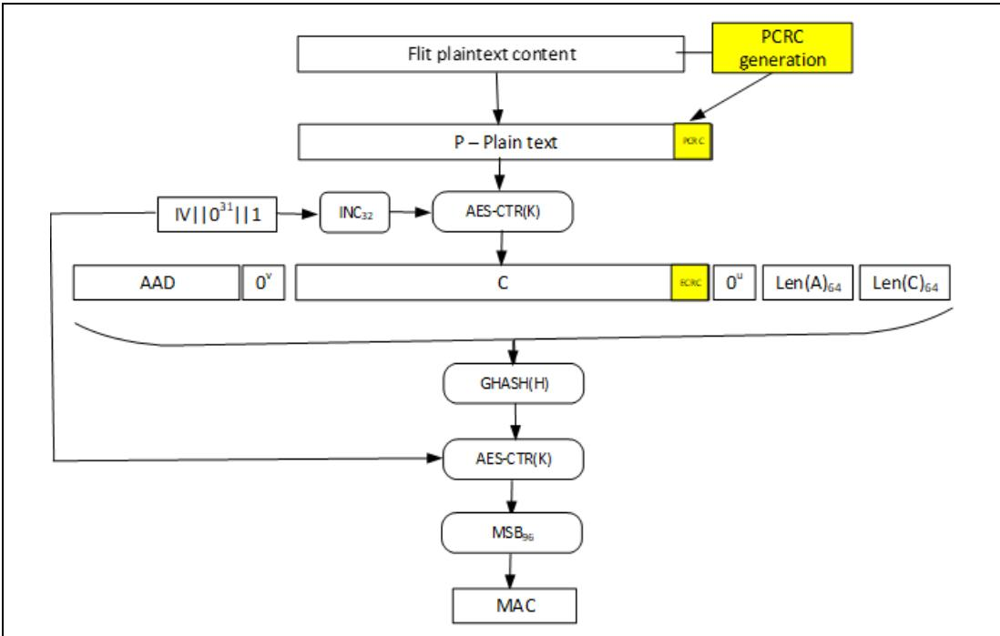

Figure 11-16. Inclusion of the PCRC Mechanism in the AES-GCM Advanced Decryption Function (Receiver Side)  
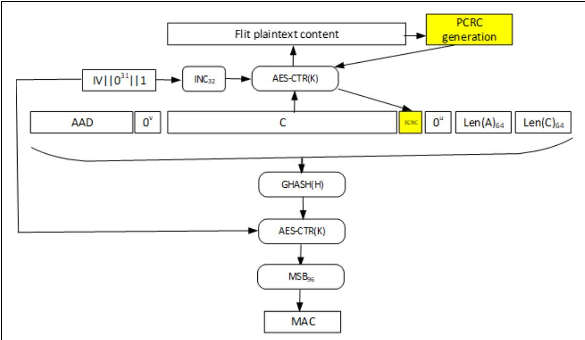

## 11.3.4 Cryptographic Keys and IV

Initialization of a CXL.cachemem IDE Stream involves multiple steps. It is possible that some of these steps can be merged or performed in a different order. The first step is to establish the authenticity and identity of the components that contain the two ports that operate as endpoints for a CXL.cachemem IDE Stream. The second step is to establish the IDE Stream keys. In some cases, these two steps may be combined. Third, the IDE is configured. Finally, the establishment of the IDE Stream is triggered.

CXL.cachemem IDE may make use of CXL.io IDE mechanisms for device attestation and key exchange using a standard mechanism, as described in Section 11.4.

IV construction of CXL.cachemem IDE is described below. A 96-bit IV of deterministic construction is used as per NIST Special Publication 800-38D for AES-GCM.

All ports shall support the Default IV Construction. The default IV construction is as follows:

• A fixed field is located at bits[95:64] of the IV, where bits[95:92] contain the substream identifier, 1000b, and bits[91:64] are all 0s. The same sub-stream encoding is used for both transmitted and received flits; however, the keys that the port uses during transmit and receive flows must be distinct.

Bits[63:0] of the IV are referred to as the invocation field. The invocation field contains a monotonically incrementing counter with rollover properties. The invocation field is initially set to the value 0000 0001h for each sub-stream upon establishment of the IDE Stream including a rekeying flow. If the CXL.cachemem IV Generation Capable bit in the CXL\_QUERY\_RESP response (see Table 11-7) returns the value of 1, the port is capable of initially setting IV to a value other than what is generated via the Default IV Construction. See the CXL\_KEY\_PROG message definition (see Section 11.4.5) for details.

In either case, the invocation field is incremented every time an IV is consumed. Neither the transmitter nor the receiver are required to detect IV rollover<sup>1</sup> and are not required to take any special action when the IV rolls over.

## 11.3.5 CXL.cachemem IDE Modes

CXL.cachemem IDE supports two modes of operation:

• Containment mode: In Containment mode, the data is released for further processing only after the integrity check passes. This mode impacts both latency and bandwidth. The latency impact is due to the need to buffer several flits until the integrity value has been received and checked. The bandwidth impact comes from the fact that integrity value is sent quite frequently. If Containment mode is supported and enabled, the devices (and hosts) shall use an Aggregation Flit Count of 5 in 68B Flit mode and 2 in 256B Flit mode.

• Skid mode: Skid mode allows the data to be released for further processing without waiting for the integrity value to be received and checked. This allows for lessfrequent transmission of the integrity value. Skid mode allows for near-zero latency overhead and low bandwidth overhead. In this mode, data modified by an adversary is potentially consumed by software; however, such an attack will subsequently be detected when the integrity value is received and checked. If Skid mode is supported and enabled, all devices (and hosts) shall use an Aggregation Flit Count of 128 in 68B Flit mode and of 32 in 256B Flit mode. When using this mode, the software and application stack must be capable of tolerating attacks within a narrow time window, or the result is undefined.

## 11.3.5.1 Discovery of Integrity Modes and Settings

Each port shall enumerate the modes that the port supports and other capabilities via registers in the CXL IDE Capability Structure (see Section 8.2.4.22). All devices adherent to this specification shall support Containment mode.

## Negotiation of Operating Mode and Settings

The operating mode and timing parameters are configured in the CXL IDE Capability Structure (see Section 8.2.4.22) prior to enabling of CXL.cachemem IDE.

## 11.3.5.3 Rules for MAC Aggregation

The rules for generation and transfer of MAC are as follows:

• MAC epoch: A MAC epoch is defined as the set of consecutive flits that are part of a given aggregation unit. The IDE mode (see Section 11.3.5) determines the number of flits in a standard MAC epoch. This number is known as Aggregation Flit Count (referred to as N below). Every MAC epoch with the exception of early MAC termination (see Section 11.3.6) carries N flits. A given MAC header shall contain the tag for exactly one MAC epoch. The transmitter shall accumulate the integrity value over flits in exactly one MAC epoch (that is at most N flits) prior to transmitting the MAC epoch.

• In all cases, the transmitter must send MACs in the same order as MAC epochs.

Figure 11-17 shows an example of MAC generation and transmission for one MAC epoch in the presence of back-to-back protocol traffic for the 68B flit format. Figure 11-17 (a) shows that the earliest MAC may be transmitted, assuming that the transmitter completes MAC computation (and gets MAC ready) one cycle after the MAC epoch completes. The earliest flit to be transmitted or received is shown on the top of the figure. Thus, Flits 0 to N – 1 (shown in yellow) belonging to MAC Epoch 1 are transmitted in that order. The MAC is calculated over Flits 0 to N – 1.

Figure 11-17. MAC Epochs and MAC Transmission in Case of Back-to-back Traffic (a) Earliest MAC Header Transmit (b) Latest MAC Header Transmit in the Presence of Multi-data Header  
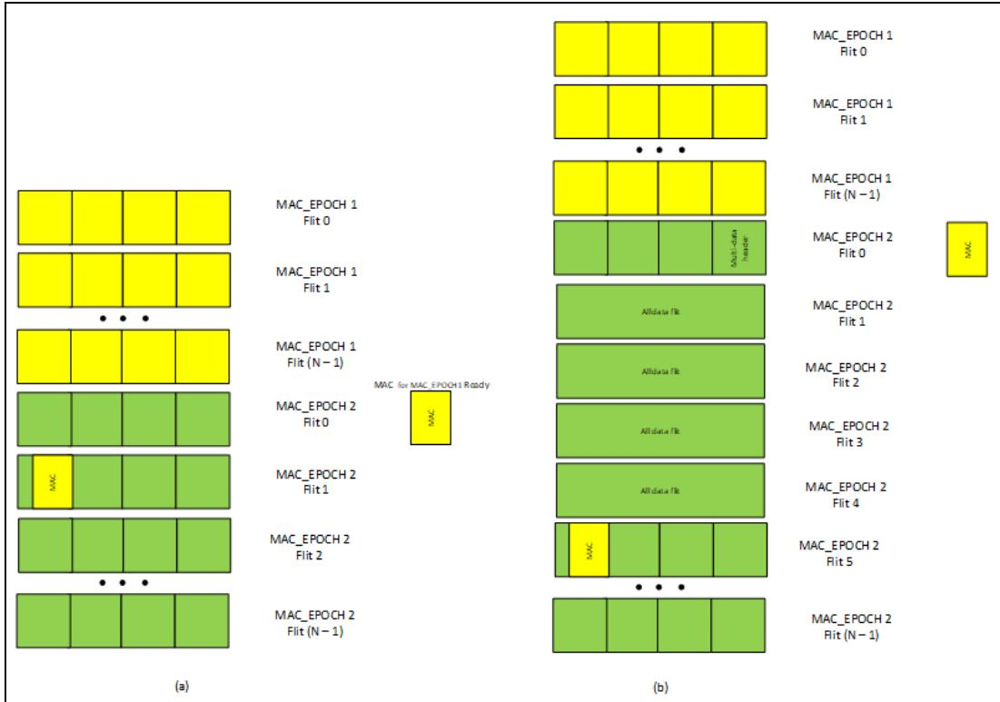

• The transmitter shall send the MAC header that contains this integrity value at the earliest possible time. Protocol flits belonging to the next MAC epoch are permitted to be sent between the last flit of the current epoch and the transmission of the MAC header for the current epoch. This is needed to handle the transmission of alldata flits and is also useful for avoiding bandwidth bubbles due to MAC calculation latency. It is recommended that the transmitter send the MAC header on the first available Slot 0 header immediately after the MAC calculations are complete.

• On the receiver side, the receiver may expect the MAC header to come in on any protocol flit, from first to sixth protocol flits, after the last flit of the previous MAC epoch (see Figure 11-17 (b)).

Figure 11-18. Example of MAC Header Being Received in the First Flit of the Current MAC Epoch  
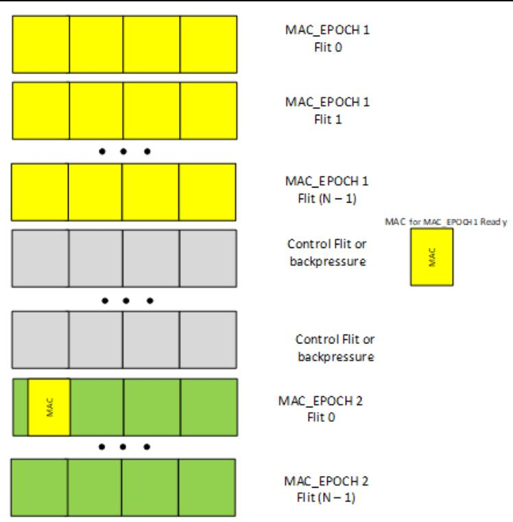

• In Containment mode, the receiver must not release flits of a given MAC epoch for consumption until the MAC header that contains the integrity value for those flits has been received and the integrity check has passed. In 68B Flit mode, because the receiver can receive up to five protocol flits that belong to the current MAC epoch before receiving the MAC header for the previous MAC epoch, the receiver shall buffer the current MAC epoch’s flits to ensure that there is no data loss. For example, referring to Figure 11-17 (b), both the yellow and green flits are buffered until MAC Epoch 1’s MAC header is received and the integrity check passes. If the check passes, the yellow flits can be released for consumption. The green flits cannot, however, be released until the green MAC flit has been received and the integrity verified. Section 11.3.8 defines the receiver behavior upon integrity check failure.

• In Skid mode, the receiver may decrypt and release the flits for consumption as soon as they are received. The MAC value shall be accumulated as needed and then checked when the MAC header for the flits in the MAC epoch arrives. Again, referring to Figure 11-17 (b), both the yellow and green flits may be decrypted and released for consumption without waiting for the MAC header for MAC Epoch 1 to be received and verified. When MAC Epoch 1’s MAC header is received, the header is verified. If the check passes, there is no action to be taken. If the MAC header is not received within six protocol flits after the end of the previous MAC epoch, the receiver shall treat the absence of MAC as an error. Section 11.3.8 defines the receiver behavior upon integrity check failure, a missing MAC header, or a delayed MAC header.

• In 68B Flit mode, in all cases (including the cases with multi-data headers), at most five protocol flits that belong to the current MAC epoch are allowed to be transmitted prior to the transmission of the MAC for the previous MAC epoch. If the MAC header is not received within six protocol flits after the end of the previous MAC epoch, the receiver shall treat the absence of MAC as an error.

• In 256B Flit mode, in all cases, at most one protocol flit that belongs to the current MAC epoch is allowed to be transmitted prior to the transmission of the MAC for the previous MAC epoch. If the MAC header is not received within two protocol flits after the end of the previous MAC epoch, the receiver shall treat the absence of MAC as an error.

• In 256B Flit mode, in all cases, the containment buffer should be sized to hold at least the following flits:

— Two Protocol flits of the previous epoch

— Two Protocol flits of the current epoch

— 12 or 15 (when in-band error poison flits are integrity protected) Control flits: with a maximum of five in-band error poison flits can be received between two Protocol flits, with three and a half as the maximum average (see Section 4.3.6.3.1 for details)

— 1 Viral Control flit

In the event the containment buffer overflows, due to too many Control flits received, the receiver must set the Rx Error Status field in the CXL IDE Error Status register (see Table 8-136) to 9h “Containment Buffer Overflow” and then transition to Insecure State.

## IMPLEMENTATION NOTE

In Containment mode, the receiver must not release any decrypted flits for consumption unless their associated MAC check has been performed and passed. This complies with the algorithm for the AES-GCM Authenticated Decryption Function as defined in NIST Special Publication 800-38D.

In Skid mode, the receiver is permitted to release any decrypted flits for consumption without waiting for their associated MAC check to be performed. Unless there are additional device-specific mechanisms to prevent this consumption, the use of Skid mode will not meet the requirements of the above-mentioned algorithm.

Solution stack designers must carefully weigh the benefits vs. the constraints when choosing between Containment mode and Skid mode. Containment mode guarantees that potentially corrupted data will not be consumed. Skid mode provides data privacy and eventual detection of data integrity loss, with significantly less latency impact and link-bandwidth loss compared to Containment mode. However, the use of Skid mode may be more vulnerable to security attacks and will require additional device-specific mechanisms if it is necessary to prevent corrupt data from being consumed.

## 11.3.6 Early MAC Termination

A transmitter is permitted to terminate the MAC epoch early and transmit the MAC for the flits in a Truncated MAC epoch when fewer than the Aggregation Flit Count of flits have been transmitted in the current MAC epoch. This can occur as part of link idle handling. The link may be ready to go idle after the transmission of a number of protocol flits, less than the Aggregation Flit Count, in the current MAC epoch.

The following rules shall apply to the early MAC epoch termination and the MAC transmission.

• The transmitter is permitted to terminate the MAC epoch early if and only if the number of protocol flits in the current MAC epoch is less than the Aggregation Flit Count. The MAC for this Truncated MAC epoch shall be transmitted by itself in the IDE.TMAC Link Layer Control flit (see Table 4-10). This subtype is referred to as a Truncated MAC flit within this specification.

• Any subsequent protocol flits would become part of a new MAC epoch and would be transmitted after the Truncated MAC flit.

• The MAC for the Truncated MAC epoch is calculated identically to the MAC calculation for normal cases, except that it is accumulated over fewer flits.

Figure 11-20 shows an example of truncating the current MAC epoch after three protocol flits. Flits in the current MAC epoch can contain any valid protocol flit, including a header flit that contains the MAC for the previous MAC epoch. The MAC for the current MAC epoch shall be sent using a Truncated MAC flit. The Truncated MAC flit will be transmitted following the three protocol flits of the current MAC epoch with no other intervening protocol flits from the next MAC epoch.

Figure 11-19. Early Termination and Transmission of Truncated MAC Flit

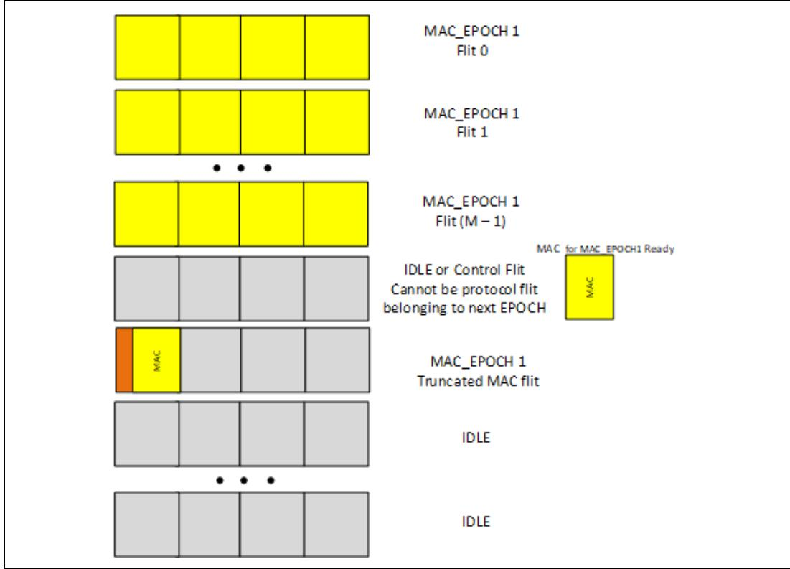

Figure 11-20. CXL.cachemem IDE Transmission with Truncated MAC Flit  
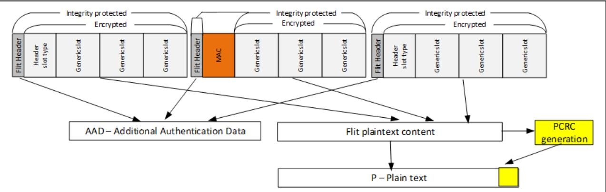

In the case where the link goes idle after sending exactly the Aggregation Flit Count number of flits in the MAC epoch, the Truncated MAC flit as defined above must not be used. The MAC header must be part of the next MAC epoch. This new MAC epoch is permitted to be terminated early using the Truncated MAC flit (see Figure 11-21).

Figure 11-21. Link Idle Case after Transmission of Aggregation Flit Count Number of Flits

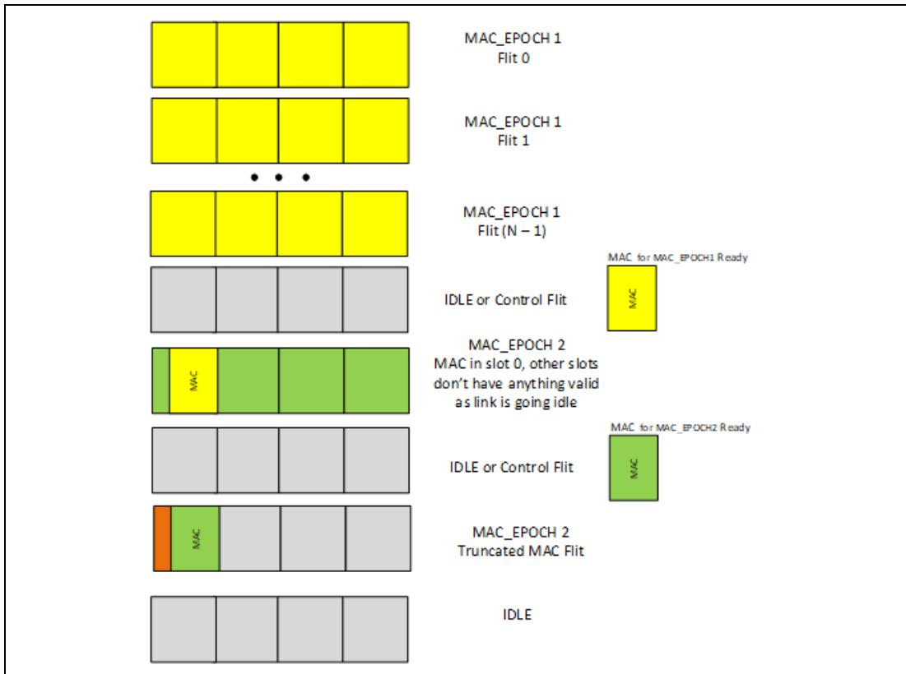

After the transmitter sends out the MAC flit for all the previous flits that were in flight, the transmitter may go idle. The receiver is permitted to go idle after the MAC flit that corresponds to the previously received flits has been received and verified. IDE.Idle control flits are retryable and may be resent as part of replay.

After early MAC termination and transmittal of the Truncated MAC, the transmitter must send at least TruncationDelay number of IDE.Idle flits before the transmitter can transmit any protocol flits. TruncationDelay is defined via the following equation:

## Equation 11-1.

TruncationDelay = Min(Remaining Flits, Tx Truncation Transmit Delay)

Tx Truncation Transmit Delay (see Table 8-140) is a configuration parameter that is used to account for the potential discarding of any precalculated AES keystream values for the current MAC epoch that need to be discarded. Remaining Flits represent the number of flits that remain to complete the current MAC epoch and is calculated as follows:

## Equation 11-2.

Remaining Flits = Aggregation Flit Count – Number of protocol flits transmitted in current MAC epoch

## 11.3.7 Handshake to Trigger the Use of Keys

Each port exposes a register interface that software can use to program the transmit and receive keys and their associated parameters. These programmed keys remain pending in registers until activation. While the keys are in the process of being exchanged and configured in the Upstream and Downstream Ports, the link may actively be using a previously configured key. The new keys shall not take effect until the actions described below are taken.

The mechanism described below is used to switch the backup keys to the active state. This is needed to ensure that the Transmitter and Receiver change to using the programmed keys in a coordinated manner.

After the keys are programmed into pending registers on both sides of the link, receipt of the CXL\_K\_SET\_GO request shall cause each transmitter on each port to trigger the transmission of an IDE.Start Link Layer Control flit (see Table 4-10 and Table 4-20).

After the IDE.Start flit has been sent, all future protocol flits shall be protected by the new keys. To allow the receiver to prepare to receive the flits protected by the new key, the Transmitter is required to send IDE.Idle flits, as defined in Table 4-10 for the number of flits specified by the Tx Key Refresh Time field in the Key Refresh Time Control register (see Table 8-139) prior to sending any protocol flits with the new key. These IDE.Idle flits are not encrypted or integrity protected. To prepare to use the new keys, the Tx Key Refresh Time in the transmitter must be configured to a value that is higher than the worst-case latency in the receiver, which is advertised by the receiver via Rx Min Key Refresh Time field in the Key Refresh Time Capability register (see Table 8-137) or Rx Min Key Refresh Time2 field in the Key Refresh Time Capability2 register (see Table 8-141), depending on the Flit mode.

After receiving the IDE.Start flit, the receiver must change to using the new keys if the transmitter has met the AES-GCM requirements. During key refresh, it is recommended that the transmitter send an IDE.TMAC before sending an IDE.Start.

It is also permissible for the transmitter to send an IDE.Start after the MAC epoch ends but before the corresponding MAC header is transmitted. In this scenario, the receiver must use the old keys to decrypt the message and to check the MAC.

The transmitter must not send an IDE.Start in the middle of a MAC epoch because doing so violates the fundamental AES-GCM requirement that a single key be used as the input. If the IDE.Start is received in the middle of a MAC epoch, then the receiver shall drop the IDE.Start. The receiver may also set the Rx Error Status field in the CXL IDE Error Status register (see Table 8-136) to CXL.cachemem IDE Establishment Security error and may transition to Insecure state upon detecting this condition.

The IDE.Start flit shall be ordered with respect to the protocol flits. In case of link-level retries, the receiver shall complete retries of previously sent protocol flits before handling the IDE.Start flit and changing to the new key. Other events such as link retraining can occur in the middle of this flow as long as the ordering specified above is maintained.

## 11.3.8 Error Handling

CXL IDE does not impact or require any changes to the link CRC error handling and the link retry flow.

CXL.cachemem IDE error conditions are enumerated and logged in the Rx Error Status field, Tx IDE Status, or Unexpected IDE.Stop Received fields in the CXL IDE Error Status register (see Table 8-136). When a CXL.cachemem IDE error is detected, the

appropriate bits in the Uncorrectable Error Status register (see Table 8-95) are also set and the error is signaled using the standard CXL.cachemem protocol error signaling mechanism.

Unless stated otherwise, errors logged in Rx Error Status field or Tx IDE Status field cause the CXL.cachemem IDE stream to transition from Active State to Insecure state if it is Active at the time of the error. Note that some of the error conditions that are logged under CXL.cachemem IDE Establishment may not always result in termination of the CXL.cachemem IDE stream.

Upon transition to Insecure state:

• Any buffered protocol flits are dropped and all subsequent protocol traffic is dropped until the link is reset.

• Components shall prevent any leakage of keys or user data. The component may need to implement mechanisms to clear the data/state or have access control to prevent leakage of secrets. Such mechanisms and actions are component specific and beyond the scope of this specification.

## 11.3.9 Switch Support

CXL switches that support CXL.cachemem IDE may optionally support CXL.io IDE and may support link IDE or selective IDE streams for CXL.io traffic, including flow through. If supporting CXL.io IDE, CXL switches should follow PCIe IDE switch rules for CXL.io traffic.

A CXL switch may also optionally support Selective Stream IDE for CXL.io traffic, including flow-through Selective IDE Streams. A CXL switch may only support Selective Stream IDE in flow-through mode for CXL.io traffic. In this case, CXL.cachemem IDE cannot be enabled on the host side. In the case of multi-VCS capable switches, CXL IDE may be enabled on a per-root port basis. However, after any root port has enabled CXL IDE, the downstream link from the switch to the MLDs that support CXL IDE, must also have Link IDE enabled. Thus, the traffic from a root port which has not enabled CXL IDE that is targeting an MLD that has enabled CXL IDE would be encrypted and integrity protected between the switch and the device.

## IMPLEMENTATION NOTE

## IDE Configuration of CXL Switches

The following examples describe three different models for configuring the CXL.cachemem IDE and performing key exchanges with the CXL switches and the devices attached to them.

## • Model A

Host performs key exchange with the CXL switch and enables CXL IDE. The host will then enumerate the Downstream Ports in the CXL switch and perform key exchange with those downstream devices that support CXL IDE. The Host then programs the keys into the respective Downstream Ports of the switch and enables CXL IDE.

## • Model B

Host performs key exchange with the CXL switch and enables CXL IDE. In parallel, CXL switch will enumerate downstream devices and then perform key exchange with those downstream devices that support CXL IDE. The Switch then programs the keys into the respective Downstream Ports of the switch and enables CXL IDE. Host may obtain a report from the CXL switch regarding the enabling of CXL IDE for downstream devices, which includes information about the public key that was used to attest to the device EP. Host may directly obtain an attestation from the device Endpoint and confirm that the Endpoint in question has the same public key that the Switch used as part of the key exchange.

## • Model C

An out-of-band agent may configure keys into the host, switch, and devices via out-of-band means and then directly enable CXL IDE.

## 11.3.10 IDE Termination Handshake

This section describes a mechanism that disables IDE on both the transmitter and receiver. This is accomplished via IDE.Stop control flit (see Table 4-20). This optional capability for 256B Flit mode simplifies the software synchronization and quiescing requirements. This ensures that the transmitter and receiver disable CXL.cachemem IDE in a coordinated manner.

After IDE is enabled and functional, receipt of a CXL\_K\_SET\_STOP request shall cause each transmitter on each IDE.Stop capable port to trigger the transmission of an IDE.Stop Link Layer Control flit (see Table 4-20) if enabled by programming the CXL IDE Control register (see Table 8-134). The transmitter shall ensure that the currently active MAC epoch is terminated using an IDE.TMAC prior to sending an IDE.Stop message with no intervening protocol flits. IDE.TMAC sent before IDE.Stop shall follow the standard rules for early MAC termination defined in Section 11.3.6. If a valid TMAC sequence is not received before IDE.Stop, the IDE.Stop shall be dropped and the Unexpected IDE.Stop Received bit shall be set in the CXL IDE Error Status register (see Table 8-136).

After the IDE.Stop is sent, all future protocol flits shall not be IDE protected. To allow the receiver to cleanly clear any pending IDE states, including precomputed information, the transmitter is required to send IDE.Idle flits, as defined in Table 4-10, for the number of flits specified by the Tx Key Refresh Time field in the Key Refresh Time Control register (see Table 8-139) prior to sending any protocol flits without IDE protection.

After receiving an IDE.Stop flit, the receiver must complete all pending actions for the currently active MAC epoch prior to disabling IDE.

Any IDE.Stop message that is received prior to a successful CXL\_K\_SET\_STOP shall be dropped and the Unexpected IDE.Stop Received bit shall be set.

If the IDE.Stop is received by a receiver that is IDE.Stop capable but is not configured to process IDE.Stop, then the receiver shall drop the IDE.Stop flit and the Unexpected IDE.Stop Received bit shall be set. If the Rx port receives an IDE.Stop while the IDE stream is inactive, then the Rx port shall drop the IDE.Stop flit and set the Unexpected IDE.Stop Received bit.

## 11.3.11 Poison Handling

The CXL.cachemem protocol has two mechanisms for conveying poison:

• Use the Poison bit in the headers that have poisoned data associated with them (see the Poison bit in the CXL.cache D2H Data Header, CXL.cache H2D Request, and CXL.mem flit definitions).

• Utilize 256B flits with the LLCTRL message with Subtype Poison. This message can be carried in an H slot for standard flits and in an H slot or HS slot for LOpt flits (see the link layer Late Poison description in Section 4.3.6.3). The LLCTRL message includes a payload encoding that indicates the data message offset to which the poison applies. Because multiple data messages can be outstanding at the same time, there can be multiple in-band LLCTRL Poison messages outstanding at the same time.

In general, IDE does not apply to LLCTRL messages. However, the Poison message needs to have integrity protection by CXL.cachemem IDE. Otherwise, an adversary can inject/delete an in-band LLCTRL Poison message without being detected by IDE. Injection of an LLCTRL Poison message is not a concern because the message only impacts the availability of the TCB (which an adversary has many other simpler ways to achieve). However, deleting or modifying an in-band LLCTRL Poison message is problematic because doing so can lead to silent consumption of data that should have been poisoned.

When an LLCTRL Poison message is present in a standard or LOpt flit’s H slot, the message’s payload information shall be treated as additional bits of AAD. The CXL specification defines four bits of payload. Each LLCTRL Poison message shall result in 32 bits of AAD (4 payload bits plus 28 padding bits). The flit’s remaining slots that carry the poison indication shall be considered reserved, and those slots shall not be encrypted or be integrity protected. This AAD value shall be treated as additional AAD for the next protocol flit. Thus, the flit that carries an LLCTRL Poison message in its H slot does not count toward the MAC epoch, as shown in Figure 11-22 and Figure 11-23. The MAC epoch is still defined based on the protocol flits. Because the poison payload is incorporated into the integrity calculations as AAD, the poison payload can be authenticated without impacting IDE encryption.

Figure 11-22 illustrates the AAD construction for the case of two protocol flits that are part of the current MAC epoch with an in-band LLCTRL Poison message that is sent prior to the MAC epoch’s first flit. Figure 11-23 illustrates the AAD construction for the case of two protocol flits that are part of the current MAC epoch with an in-band LLCTRL Poison message that is sent after the MAC epoch’s first flit.

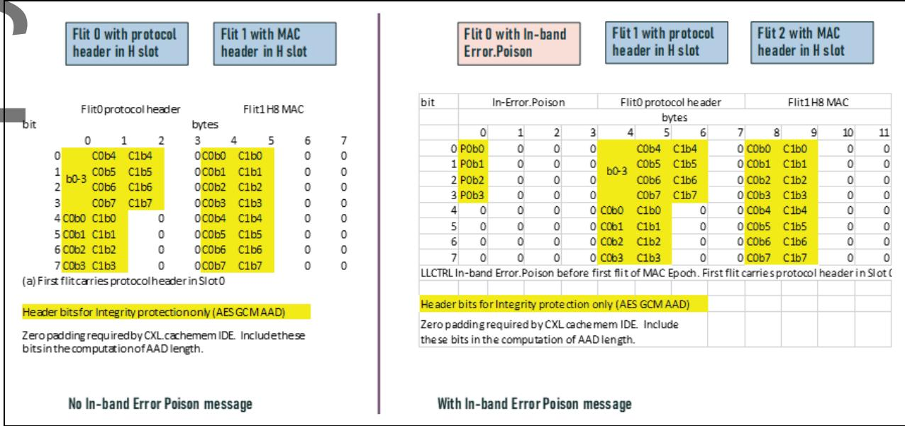

<table><tr><td>bit</td><td colspan="4">Flit0 protocol header</td><td colspan="4">In-Error.Poison</td><td colspan="4">Flit1 H8 MAC</td></tr><tr><td></td><td colspan="12">bytes</td></tr><tr><td></td><td>0</td><td>1</td><td>2</td><td>3</td><td>4</td><td>5</td><td>6</td><td>7</td><td>8</td><td>9</td><td>10</td><td>11</td></tr><tr><td>0</td><td rowspan="4">b0-3</td><td>C0b4</td><td>C1b4</td><td>0</td><td>P0b0</td><td>0</td><td>0</td><td>0</td><td>C0b0</td><td>C1b0</td><td>0</td><td>0</td></tr><tr><td>1</td><td>C0b5</td><td>C1b5</td><td>0</td><td>P0b1</td><td>0</td><td>0</td><td>0</td><td>C0b1</td><td>C1b1</td><td>0</td><td>0</td></tr><tr><td>2</td><td>C0b6</td><td>C1b6</td><td>0</td><td>P0b2</td><td>0</td><td>0</td><td>0</td><td>C0b2</td><td>C1b2</td><td>0</td><td>0</td></tr><tr><td>3</td><td>C0b7</td><td>C1b7</td><td>0</td><td>P0b3</td><td>0</td><td>0</td><td>0</td><td>C0b3</td><td>C1b3</td><td>0</td><td>0</td></tr><tr><td>4</td><td>C0b0</td><td>C1b0</td><td>0</td><td>0</td><td>0</td><td>0</td><td>0</td><td>0</td><td>C0b4</td><td>C1b4</td><td>0</td><td>0</td></tr><tr><td>5</td><td>C0b1</td><td>C1b1</td><td>0</td><td>0</td><td>0</td><td>0</td><td>0</td><td>0</td><td>C0b5</td><td>C1b5</td><td>0</td><td>0</td></tr><tr><td>6</td><td>C0b2</td><td>C1b2</td><td>0</td><td>0</td><td>0</td><td>0</td><td>0</td><td>0</td><td>C0b6</td><td>C1b6</td><td>0</td><td>0</td></tr><tr><td>7</td><td>C0b3</td><td>C1b3</td><td>0</td><td>0</td><td>0</td><td>0</td><td>0</td><td>0</td><td>C0b7</td><td>C1b7</td><td>0</td><td>0</td></tr><tr><td></td><td></td><td></td><td></td><td></td><td></td><td></td><td></td><td></td><td></td><td></td><td></td><td></td></tr><tr><td colspan="13">LLCTRL In-band Error. Poison after first flit of MAC Epoch. First flit carries protocol header in Slot 0</td></tr><tr><td></td><td></td><td></td><td></td><td></td><td></td><td></td><td></td><td></td><td></td><td></td><td></td><td></td></tr><tr><td colspan="8">Header bits for Integrity protection only (AES GCM AAD)</td><td></td><td></td><td></td><td></td><td></td></tr><tr><td colspan="8">Zero padding required by CXL.cachemem IDE. Include these bits in the computation of AAD length.</td><td></td><td></td><td></td><td></td><td></td></tr></table>

Figure 11-22. Poison Handling — Containment Mode Example 1

Flit 0 with protocol header in À slot

Flit 0 with In-band Error.Poison

Zeropaddingrequiredby CXL.cachemem IDE. Includethese bitsinthecomputationofAADlength.

No In-band Error Poison message

Flit 2 with MAC header in H slot

<table><tr><td>bit</td><td colspan="4">In-Error.Poison</td><td colspan="4">Flit0 protocol header</td><td colspan="4">Flit1H8 MAC</td></tr><tr><td></td><td colspan="12">bytes</td></tr><tr><td></td><td>0</td><td>1</td><td>2</td><td>3</td><td>4</td><td>5</td><td>6</td><td>7</td><td>8</td><td>9</td><td>10</td><td>11</td></tr><tr><td>0</td><td>P0b0</td><td>0</td><td>0</td><td>0</td><td rowspan="4">b0-3</td><td>C0b4</td><td>C1b4</td><td>0</td><td>C0b0</td><td>C1b0</td><td>0</td><td>0</td></tr><tr><td>1</td><td>P0b1</td><td>0</td><td>0</td><td>0</td><td>C0b5</td><td>C1b5</td><td>0</td><td>C0b1</td><td>C1b1</td><td>0</td><td>0</td></tr><tr><td>2</td><td>P0b2</td><td>0</td><td>0</td><td>0</td><td>C0b6</td><td>C1b6</td><td>0</td><td>C0b2</td><td>C1b2</td><td>0</td><td>0</td></tr><tr><td>3</td><td>P0b3</td><td>0</td><td>0</td><td>0</td><td>C0b7</td><td>C1b7</td><td>0</td><td>C0b3</td><td>C1b3</td><td>0</td><td>0</td></tr><tr><td>4</td><td>0</td><td>0</td><td>0</td><td>0</td><td>C0b0</td><td>C1b0</td><td>0</td><td>0</td><td>C0b4</td><td>C1b4</td><td>0</td><td>0</td></tr><tr><td>5</td><td>0</td><td>0</td><td>0</td><td>0</td><td>C0b1</td><td>C1b1</td><td>0</td><td>0</td><td>C0b5</td><td>C1b5</td><td>0</td><td>0</td></tr><tr><td>6</td><td>0</td><td>0</td><td>0</td><td>0</td><td>C0b2</td><td>C1b2</td><td>0</td><td>0</td><td>C0b6</td><td>C1b6</td><td>0</td><td>0</td></tr><tr><td>7</td><td>0</td><td>0</td><td>0</td><td>0</td><td>C0b3</td><td>C1b3</td><td>0</td><td>0</td><td>C0b7</td><td>C1b7</td><td>0</td><td>0</td></tr><tr><td colspan="13">LLCTRL In-band Error.Poison before first flit of MAC Epoch. First flit carries protocol header in Slot C</td></tr><tr><td></td><td></td><td></td><td></td><td></td><td></td><td></td><td></td><td></td><td></td><td></td><td></td><td></td></tr><tr><td colspan="8">Header bits for Integrity protection only (AES GCM AAD)</td><td></td><td></td><td></td><td></td><td></td></tr><tr><td colspan="8">Zero padding required by CXL cache mem IDE. Include these bits in the computation of AAD length.</td><td></td><td></td><td></td><td></td><td></td></tr></table>

## Figure 11-23. Poison Handling — Containment Mode Example 2

Flit 1 with protocol header in H slot

Flit 2 with MAC header in H slot

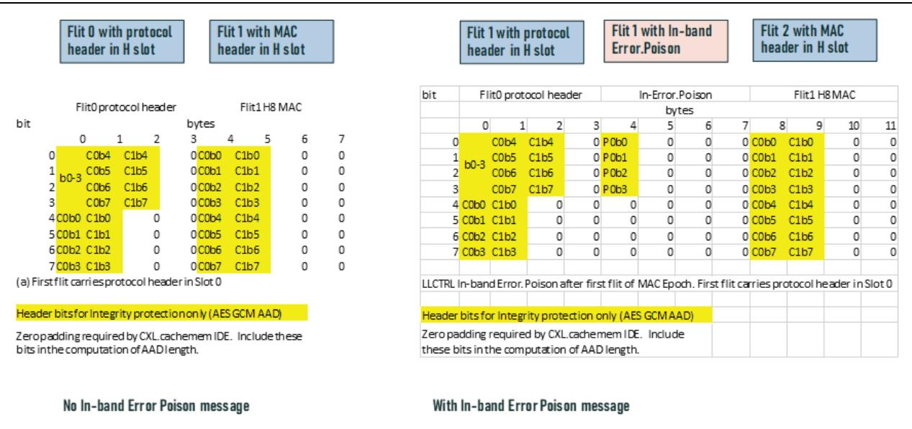

Header bitsfor Integrity protectiononly (AES GCM AAD)

Zeropadding required by CXL.cachemem IDE. Includethese bits inthecomputation ofAADlength.

No In-band Error Poison message

With In-band ErrorPoison message

When an LLCTRL Poison message is present in an LOpt flit’s HS slot, and the remainder of the flit already contains valid protocol information, the current IDE definition does not require additional changes because the HS slot is already authenticated.

## 11.3.11.1 Late Poison with CRC Corruption Flow

There is a variant of late poison for cases in which all the data that needs to be poisoned is packed into the current flit (see the Link Layer Late Poison description in Section 4.3.6.3). In this case, the flit’s CRC is corrupted prior to transmission, which ensures that a retry condition will be triggered. When the retry request is received, the LLCTRL Poison message is sent first, followed by the original flit without CRC

corruption. The approach described in Section 11.3.11 can be used with the late poison flow for standard flits and LOpt flits in which the CRC of the flit’s first half is corrupt and the LLCTRL Poison message is in the flit’s H slot. The transmitter shall ensure the following:

• Original flit with the corrupt CRC, LLCTRL Poison flit, and original flit with uncorrupted CRC are sent sequentially, with no intervening protocol flits

• MAC for the current MAC epoch that includes the flit with the corrupt CRC is not transmitted ahead of the CRC corruption flow because the MAC will need to be recomputed to include the AAD values from the LLCTRL Poison payload

As noted in Viral Injection and Containment (see Section 4.3.6.2), IDE cannot be supported in an LOpt flit that has CRC corruption in the flit’s second half. When IDE is enabled, any error containment shall either be detected sufficiently early to corrupt the CRC of the flit’s first half, or injected as an HS slot LLCTRL Poison message without needing to corrupt the CRC of the flit’s second half.

## 11.3.11.2 Support of Authenticated LLCTRL Poison Messages

Devices that support inclusion of the LLCTRL Poison message in the AAD shall declare this support by setting the IDE Protect LLCTRL Poison Message Capable bit to 1 in the CXL IDE Capability register (see Section 8-133). Hosts that need to enable this feature on the device shall set the IDE Protect LLCTRL Poison Message Enable bit to 1 in the CXL IDE Control register (see Section 8-134).

## 11.3.11.3 Error Reporting

Devices that are enabled for IDE Protection of the LLCTRL Poison message, and receive a Poison control flit prior to the requisite truncation delay, shall report the error in the CXL IDE Error Status register by setting its Rx Error Status field (see Table 8-136) to a value of 06h or 07h, as appropriate.

## 11.4 CXL.cachemem IDE Key Management (CXL\_IDE\_KM)

System software or system firmware may follow this specification to configure the ports at both ends of a CXL link that have matching CXL.cachemem IDE keys, Initial IV, and other settings, in an interoperable way. The software or firmware entity that performs this activity is referred to as CXL.cachemem IDE Key Management Agent (CIKMA).

The port pairs, also called the partner ports, may consist of the following:

• A CXL RP and a CXL USP

• A CXL RP and a CXL EP

• A CXL DSP and a CXL EP

CXL root port CXL.cachemem IDE key programming may be performed via host-specific method and may not use the programming steps described in this section.

The CXL.cachemem IDE Establishment flow consists of three major steps:

1. CIKMA reads CXL IDE capability registers on both ends of the CXL link and configures various CXL.cachemem IDE control registers on both ends of the CXL link. See Section 8.2.4.21 for definition of these registers and the programming guidelines.

2. CIKMA sets up an SPDM secure session with each of the partner ports that are being set up. This is accomplished by issuing SPDM key exchange messages over transports such as PCIe DOE or MCTP. If one of the partner ports is an RP and the RP supports a proprietary IDE programming flow, an SPDM secure session with RP may not be needed.

3. CIKMA queries port capabilities, optionally obtains locally generated key and IV from each port if they are capable, configures CXL.cachemem IDE Rx/Tx keys/IV, and enables CXL.cachemem IDE using CXL\_IDE\_KM messages that are defined in Section 11.4.1. These messages are secured using the SPDM session key that was established by CIKMA via step 2.

Figure 11-24. Various Interface Standards that are Referenced by this Specification and their Lineage  
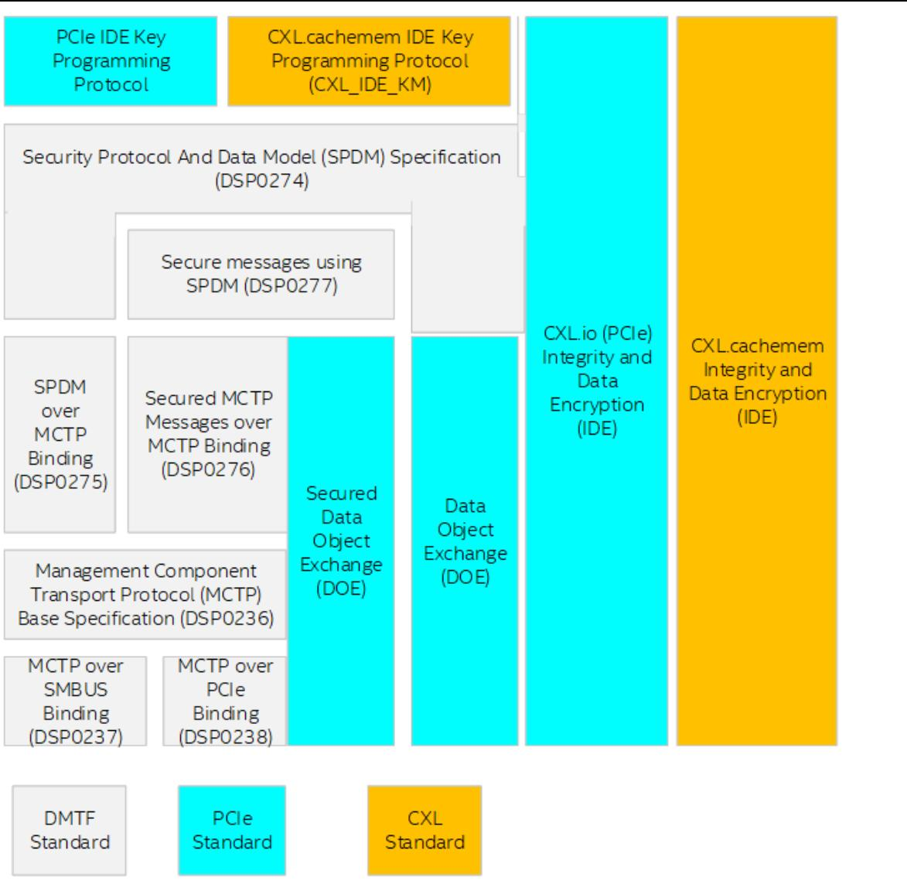

## 11.4.1 CXL\_IDE\_KM Protocol Overview

CXL\_IDE\_KM Messages are constructed as SPDM vendor-defined requests and SPDM vendor-defined responses. All request messages begin with a standard Request Header (see Table 11-2) and all response messages carry a standard Response Header (see Table 11-3). For the definition of individual fields in the Request and Response Header, see the DSP0274. Unless specified otherwise, the behaviors specified in the DSP0236, DSP0237, DSP0238, DSP0274, DSP0275, DSP0276, DSP0277, and PCIe Base Specification apply.

CXL\_IDE\_KM Messages shall be confidentiality protected and integrity protected in accordance with the DSP0277. These secured messages may be sent over a variety of transports, including Secured CMA/SPDM Messages over DOE (see the PCIe Base Specification) or Secured Messages over MCTP (see the DSP0276).

All CXL.cachemem IDE-capable CXL Switches and Endpoints shall support CMA/SPDM and Secured CMA/SPDM Data Object types over PCIe DOE mailbox. The specific rules regarding the placement of the DOE mailbox are governed by the PCIe Base Specification. These data object types are defined in the PCIe Base Specification. All CXL.cachemem IDE-capable switches and devices shall support CXL\_IDE\_KM protocol and CXL\_IDE\_KM being sent as Secured CMA/SPDM Data Objects. In the case of a BPD that supports IDE, a single SLD-B instance shall expose the CXL\_IDE\_KM. The PortIndex field in the CXL\_IDE\_KM messages shall be matched against the Port Number field in the Link Capabilities register (see the PCIe Base Specification) to determine the specific Port that is being configured.

CXL.cachemem IDE-capable switches and devices may optionally support CXL\_IDE\_KM messages over MCTP.

The maximum amount of time that the Responder has to provide a response to a CXL\_IDE\_KM request is 1 second. The requester shall wait for 1 second plus the transport-specific, round-trip transport delay prior to concluding that the request resulted in an error.

## 11.4.2 Secure Messaging Layer Rules

CXL\_IDE\_KM messages shall not be issued before an SPDM secure session has been established between the two ports. Any CXL\_IDE\_KM messages that are not secured shall be silently dropped by the receiver. The first CXL\_IDE\_KM request message after the SPDM secure session setup shall be CXL\_QUERY.

After a successful response to CXL\_QUERY, this SPDM session may be used to establish a CXL.cachemem IDE Stream. While this SPDM Session is in progress, any CXL\_IDE\_KM messages received using a different Session ID shall be silently dropped and shall not generate a CXL\_IDE\_KM response. Any CXL\_IDE\_KM messages that fail integrity check shall be silently dropped and shall not generate a CXL\_IDE\_KM response. The act of terminating this SPDM Session or establishment of a different SPDM Secure session by themselves shall not affect the state of the CXL.cachemem IDE stream.

If SPDM Session S1 is used to establish a CXL.cachemem IDE Stream I1, termination of SPDM Session S1 followed by receipt of any valid CXL\_IDE\_KM message with a new Session S2 shall transition CXL.cachemem IDE Stream I1 to Insecure state. The transition shall occur prior to processing the newly received CXL\_IDE\_KM message unless the receiver can ensure, via mechanisms not defined here, that S1 and S2 were set up by the same entity; otherwise, the receiver drops the CXL\_IDE\_KM message with a new Session S2. If the CXL.cachemem IDE stream enters Insecure state due to this condition, the receiver shall set the Rx Error Status field in the CXL IDE Error Status register (see Table 8-136) to CXL.cachemem IDE Establishment Security error.

It is permitted for a single DOE mailbox instance be used to service CXL\_IDE\_KM messages as well as CXL.io IDE\_KM messages. It is permitted for a single SPDM session be used to set up CXL.io IDE stream as well as CXL.cachemem IDE stream with a component. The operation and the establishment of CXL.cachemem IDE stream is independent of the operation and establishment of CXL.io IDE stream. It is permitted for a component to support CXL.io IDE but not CXL.cachemem IDE, and vice versa. If a component supports both CXL.io IDE and CXL.cachemem IDE, the component may be operated in a mode where only one of the two is active. It is permitted for CXL\_IDE\_KM messages to be interleaved with IDE\_KM messages. CIKMA shall ensure there is at most one outstanding SPDM request of any kind at any time in accordance with the DSP0274.

## 11.4.3 CXL\_IDE\_KM Common Data Structures

For consistency and reuse reasons, the names of the individual messages follow the PCIe Base Specification except for the addition of the prefix CXL, and the message contents closely match the PCIe Base Specification.

Unless specified otherwise, all fields are defined as little-endian.

See the DSP0274 for definitions of the fields in the CXL\_IDE\_KM Request header and Response header.

Table 11-2. CXL\_IDE\_KM Request Header

<table><tr><td>Byte Offset</td><td>Length in Bytes</td><td>Description</td></tr><tr><td>0h</td><td>1</td><td>SPDMVersion</td></tr><tr><td>1h</td><td>1</td><td>RequestResponseCode: Value is 0FEh (VENDOR_DEFINED_REQUEST).</td></tr><tr><td>2h</td><td>1</td><td>Reserved</td></tr><tr><td>3h</td><td>1</td><td>Reserved</td></tr><tr><td>4h</td><td>2</td><td>StandardsID: Value is 03h (PCI-SIG*), indicating that the Vendor ID is assigned by the PCI-SIG.</td></tr><tr><td>6h</td><td>1</td><td>Length of Vendor ID: Value is 02h.</td></tr><tr><td>7h</td><td>2</td><td>Vendor ID: Value is 1E98h (CXL).</td></tr><tr><td>9h</td><td>2</td><td>Request Length: The number of bytes in the message that follow this field. Varies based on the operation that is being requested.</td></tr></table>

Table 11-3. CXL\_IDE\_KM Successful Response Header

<table><tr><td>Byte Offset</td><td>Length in Bytes</td><td>Description</td></tr><tr><td>0h</td><td>1</td><td>SPDMVersion</td></tr><tr><td>1h</td><td>1</td><td>RequestResponseCode: Value is 07Eh (VENDOR_DEFINED_RESPONSE).</td></tr><tr><td>2h</td><td>1</td><td>Reserved</td></tr><tr><td>3h</td><td>1</td><td>Reserved</td></tr><tr><td>4h</td><td>2</td><td>StandardsID: Value is 03h (PCI-SIG), indicating that the Vendor ID is assigned by the PCI-SIG.</td></tr><tr><td>6h</td><td>1</td><td>Length of Vendor ID: Value is 02h.</td></tr><tr><td>7h</td><td>2</td><td>Vendor ID: Value is 1E98h (CXL).</td></tr><tr><td>9h</td><td>2</td><td>Response Length: The number of bytes in the message that follow this field. Varies based on the operation that was requested.</td></tr></table>

Table 11-4 lists the various generic error conditions that a responder may encounter during the processing of CXL\_IDE\_KM messages and how the conditions are handled.

Table 11-4. CXL\_IDE\_KM Generic Error Conditions

<table><tr><td>Error Condition</td><td>Response</td><td>Effect on an Active CXL.cachemem IDE Stream</td></tr><tr><td>CXL_IDE_KM message carries an Object ID that is not defined in this specification</td><td rowspan="2">No response is generated. The request is silently dropped.</td><td rowspan="2">No change</td></tr><tr><td>Unrecognized SPDM major version</td></tr></table>

## 11.4.4 Discovery Messages

The CXL\_QUERY request is used to discover the CXL.cachemem IDE capabilities and the current configuration of a port. The port supplies this information in the form of CXL\_QUERY\_RESP response. CIKMA shall not issue another type of CXL\_IDE\_KM request after CXL\_QUERY until CIKMA has received a successful CXL\_QUERY\_RESP response. If CXL\_QUERY request is not successful, CIKMA is permitted to retry it.

CIKMA may cross-check the CXL IDE Capability Structure contents that are returned by CXL\_QUERY\_RESP against the component’s CXL IDE Capability Structure register values. CIKMA shall abort the CXL.cachemem IDE Establishment flow if CIKMA detects a mismatch.

Table 11-5. CXL\_QUERY Request

<table><tr><td>Byte Offset</td><td>Length in Bytes</td><td>Description</td></tr><tr><td>0h</td><td>Bh</td><td>Standard Request Header: See Table 11-2.</td></tr><tr><td>Bh</td><td>1</td><td>Protocol ID: Value is 0.</td></tr><tr><td>Ch</td><td>1</td><td>Object ID: Value is 0, indicating CXL_QUERY request.</td></tr><tr><td>Dh</td><td>1</td><td>Reserved</td></tr><tr><td>Eh</td><td>1</td><td>PortIndex: See the PCIe Base Specification for components that are not a BPD. For a BPD, this field represents the specific Port being configured as identified by the Port Number field in the Link Capabilities register (see the PCIe Base Specification).</td></tr></table>

Table 11-6 lists the various error conditions that a responder may encounter that are unique to CXL\_QUERY and how the conditions are handled.

Table 11-6. CXL\_QUERY Processing Errors

<table><tr><td>Error Condition</td><td>Response</td><td>Effect on an Active CXL.cachemem IDE Stream</td></tr><tr><td>Protocol ID is nonzero</td><td rowspan="3">No response is generated. The request is silently dropped.</td><td rowspan="3">No change</td></tr><tr><td>Invalid Request Length</td></tr><tr><td>PortIndex does not correspond to a valid port</td></tr></table>

Table 11-7. Successful CXL\_QUERY\_RESP Response (Sheet 1 of 2)

<table><tr><td>Byte Offset</td><td>Length in Bytes</td><td>Description</td></tr><tr><td>00h</td><td>Bh</td><td>Standard Response Header: See Table 11-3.</td></tr><tr><td>0Bh</td><td>1</td><td>Protocol ID: Value is 0.</td></tr><tr><td>0Ch</td><td>1</td><td>Object ID: Value is 1, indicating CXL_QUERY response.</td></tr><tr><td>0Dh</td><td>1</td><td>Reserved</td></tr><tr><td>0Eh</td><td>1</td><td>PortIndex: See the PCIe Base Specification for components that are not a BPD. For a BPD, this field represents the specific Port being configured as identified by the Port Number field in the Link Capabilities register (see the PCIe Base Specification).</td></tr><tr><td>0Fh</td><td>1</td><td>Dev/Fun Number: See the PCIe Base Specification.</td></tr><tr><td>10h</td><td>1</td><td>Bus Number: See the PCIe Base Specification.</td></tr><tr><td>11h</td><td>1</td><td>Segment: See the PCIe Base Specification.</td></tr><tr><td>12h</td><td>1</td><td>MaxPortIndex: See the PCIe Base Specification for components that are not a BPD. For a BPD, the MaxPortIndex field value must indicate the maximum PortIndex value for this bundle. For other components, the MaxPortIndex field must be cleared to 00h.</td></tr></table>

Table 11-7. Successful CXL\_QUERY\_RESP Response (Sheet 2 of 2)

<table><tr><td>Byte Offset</td><td>Length in Bytes</td><td>Description</td></tr><tr><td>13h</td><td>1</td><td>Bits[3:0]:CXL IDE Capability Version:Must be set to 1. SeeSection 8.2.4.7.Bit[4]:CXL.cachemem IV Generation Capable:- 0 = Port is not capable of locally generating the 96-bit IV and shall always use the default IV construction.- 1 = Port is capable of locally generating the 96-bit IV. If a CXL_KEY_PROG message indicates Use Default IV=0, the port shall use the Locally generated CXL.cachemem IV in the Tx path and shall use the IV value supplied as part of the CXL_KEY_PROG message in the Rx path. The port shall return the Locally generated CXL.cachemem IV as part of CXL_GETKEY_ACK response.Bit[5]:CXL.cachemem IDE Key Generation Capable:- 0 = Port is not capable of locally generating an IDE key.- 1 = Port is capable of locally generating the IDE key, shall use that key in the Tx path, and then return that key as part of the CXL_GETKEY_ACK response.Bit[6]:CXL_K_SET_STOP Capable:- 0 = Port does not support CXL_K_SET_STOP.- 1 = Port supports CXL_K_SET_STOP.Bit[7]:Reserved</td></tr><tr><td>14h</td><td>Varies</td><td>CXL IDE Capability Structure:For CXL IDE Capability Version=1, the length shall be 20h.Carries the contents of the CXL IDE Capability Structure of this port (seeSection 8.2.4.21).</td></tr></table>

## 11.4.5 Key Programming Messages

Each CXL.cachemem IDE-capable port shall be capable of storing four keys — Rx active, Tx active, Rx pending, and Tx pending. If CXL.cachemem IDE is active, the Tx active key is used to encrypt the flits and generate the MAC. If CXL.cachemem IDE is active, the Rx active key is used to decrypt the flits and verify the MAC in the Rx direction. This specification does not define a mechanism for directly updating the active keys. A Conventional Reset shall reset the active CXL.cachemem IDE Stream and transition the stream to Insecure state. A CXL reset shall reset the active CXL.cachemem IDE Stream and transition the stream to Insecure state. Transition of the CXL.cachemem IDE session to Insecure state shall clear all the keys, make the keys unreadable, and then mark the keys as invalid. An FLR shall not affect an active CXL.cachemem IDE Stream or the CXL.cachemem IDE keys.

The CXL\_KEY\_PROG request is used to supply the pending keys. Offset 11h, bit[1], is used to select between the Rx and the Tx. If CXL.cachemem IV Generation Capable=1, the CXL\_KEY\_PROG request may also be used to establish the Initial CXL.cachemem IDE IV value to be used with the new IDE session including the rekeying flow.

If both ports (Port1 and Port2) return CXL.cachemem IV Generation Capable=1 in QUERY\_RSP, it is recommended that CIKMA issue a CXL\_GETKEY request to both ports and obtain Locally generated CXL.cachemem IV values. When issuing a CXL\_KEY\_PROG message to Port1 Rx and Port2 Tx, CIKMA should initialize the Initial CXL.cachemem IDE IV field (Offset 13h+KSIZE) to match the Port2 Locally generated CXL.cachemem IV and set Default IV=0. When issuing a CXL\_KEY\_PROG message to Port1 Tx and Port2 Rx, CIKMA should initialize the Initial CXL.cachemem IDE IV field (Offset 13h+KSIZE) to match the Port1 Locally generated CXL.cachemem IV and set Default IV=0.

If either port returns CXL.cachemem IV Generation Capable=0 in QUERY\_RSP, CIKMA should set Use Default IV=1 in the CXL\_KEY\_PROG messages to both ports to indicate that the ports should use the default IV construction in Rx directions and Tx directions.

If Port1 and Port2 are partner ports and if Port1 returns CXL.cachemem IDE Key Generation Capable=1 in QUERY\_RSP, it is recommended that CIKMA issue a CXL\_GETKEY request to Port1 and obtain its Locally generated CXL.cachemem IDE Key. When issuing the CXL\_KEY\_PROG message to Port1 Tx and Port2 Rx, CIKMA should initialize the CXL.cachemem IDE Key field to match the Port1 Locally generated CXL.cachemem IDE Key. If Port2 returns CXL.cachemem IDE Key Generation

Capable=1 in QUERY\_RSP, it is recommended that CIKMA issue a CXL\_GETKEY request to Port2 and obtain its Locally generated CXL.cachemem IDE Key. When issuing a CXL\_KEY\_PROG message to Port2 Tx and Port1 Rx, CIKMA should initialize the CXL.cachemem IDE Key field to match the Port2 Locally generated CXL.cachemem IDE Key. The port is expected to return a different IDE key during every CXL\_GETKEY\_ACK response. Therefore, CIKMA should ensure that the CXL.cachemem IDE Key supplied during a CXL\_KEY\_PROG request matches the locally generated CXL.cachemem IDE Key from the previous CXL\_GETKEY\_ACK responses from that port.

Table 11-8. CXL\_KEY\_PROG Request

<table><tr><td>Byte Offset</td><td>Length in Bytes</td><td>Description</td></tr><tr><td>00h</td><td>Bh</td><td>Standard Request Header: See Table 11-2.</td></tr><tr><td>0Bh</td><td>1</td><td>Protocol ID: Value is 0.</td></tr><tr><td>0Ch</td><td>1</td><td>Object ID: Value is 2, indicating CXL_KEY_PROG request.</td></tr><tr><td>0Dh</td><td>2</td><td>Reserved</td></tr><tr><td>0Fh</td><td>1</td><td>Stream ID: Value is 0.</td></tr><tr><td>10h</td><td>1</td><td>Reserved</td></tr><tr><td>11h</td><td>1</td><td>Bit[0]: ReservedBit[1]: RxTxB:- 0 = Rx- 1 = TxBit[2]: ReservedBit[3]: Use Default IV:- 0 = Port shall use the Initial IV specified at Offset 13h+KSIZE- 1 = Port shall use the Default IV constructionBits[7:4]: Key Sub-stream: Value is 1000b.</td></tr><tr><td>12h</td><td>1</td><td>PortIndex: See the PCIe Base Specification for components that are not a BPD. For a BPD, this field represents the specific Port being configured as identified by the Port Number field in the Link Capabilities register (see the PCIe Base Specification).</td></tr><tr><td>13h</td><td>KSIZE</td><td>CXL.cachemem IDE Key: Program the Pending Key with this value. KSIZE must be 32 for this version of the specification. For layout, see the PCIe Base Specification.</td></tr><tr><td>13h+KSIZE</td><td>Ch</td><td>Initial CXL.cachemem IDE IV: Overwrites the Pending Initial IV.This field must be ignored if Use Default IV=1.Byte Offsets 16h+KSIZE:13h+KSIZE carry the IV DWORD, IV[95:64].Byte Offsets 1Ah+KSIZE:17h+KSIZE carry the IV DWORD, IV[63:32].Byte Offsets 1Eh+KSIZE:1Bh+KSIZE carry the IV DWORD, IV[31:0].</td></tr></table>

Table 11-9 lists the various error conditions that a responder may encounter that are unique to CXL\_KEY\_PROG and how the conditions are handled. When these conditions are detected, the responder shall respond with a CXL\_KP\_ACK and set the Status field to a nonzero value.

Table 11-9. CXL\_KEY\_PROG Processing Errors

<table><tr><td>Error Condition</td><td>Response</td><td>Effect on an Active CXL.cachemem IDE Stream</td></tr><tr><td>Invalid Request Length</td><td rowspan="11">Do not update the key and IV. Return CXL_KP_ACK with Status=01h.</td><td rowspan="11">No change</td></tr><tr><td>PortIndex does not correspond to a valid port</td></tr><tr><td>Protocol ID is nonzero</td></tr><tr><td>Stream ID is nonzero</td></tr><tr><td>Key Sub-stream is not 1000b</td></tr><tr><td>CXL_KEY_PROG received prior to CXL_QUERY</td></tr><tr><td>Request to set the Tx Key, but the input Tx key is identical to the current Rx Pending Key. This check is optional.</td></tr><tr><td>Request to set the Rx Key, but the input Rx key is identical to the current Tx Pending Key. This check is optional.</td></tr><tr><td>Request to program the key failed because the pending key slot has a valid key</td></tr><tr><td>Request to update Tx key, but the supplied key does not match the locally generated CXL.cachemem IDE key returned during the last CXL_GETKEY_ACK response.</td></tr><tr><td>Request to update Tx IV, but the supplied IV does not match the Locally generated CXL.cachemem IV returned during the last CXL_GETKEY_ACK response. The port returned IV Generation Capable=0 in QUERY_RSP, but Use Default IV in CXL_KEY_PROG was not set.</td></tr></table>

Upon successful processing of CXL\_KEY\_PROG, the responder shall acknowledge by sending the CXL\_KP\_ACK response with Status=0. The nonzero Status values not listed here are reserved by this specification but should be interpreted as an error condition by the requester.

Table 11-10. CXL\_KP\_ACK Response

<table><tr><td>Byte Offset</td><td>Length in Bytes</td><td>Description</td></tr><tr><td>00h</td><td>Bh</td><td>Standard Response Header: See Table 11-3.</td></tr><tr><td>0Bh</td><td>1</td><td>Protocol ID: Value is 0.</td></tr><tr><td>0Ch</td><td>1</td><td>Object ID: Value is 3, indicating CXL_KP_ACK response.</td></tr><tr><td>0Dh</td><td>2</td><td>Reserved</td></tr><tr><td>0Fh</td><td>1</td><td>Stream ID: Value is 0.</td></tr><tr><td>10h</td><td>1</td><td>Status: See Table 11-9.</td></tr><tr><td>11h</td><td>1</td><td>Bit[0]: ReservedBit[1]: RxTxB: See the PCIe Base SpecificationBits[3:2]: ReservedBits[7:4]: Key Sub-stream: Value is 1000b</td></tr><tr><td>12h</td><td>1</td><td>PortIndex: See the PCIe Base Specification for components that are not a BPD. For a BPD, this field represents the specific Port being configured as identified by the Port Number field in the Link Capabilities register (see the PCIe Base Specification).</td></tr></table>

## 11.4.6 Activation/Key Refresh Messages

The CXL\_K\_SET\_GO request is used to prepare an Rx port for a CXL.cachemem IDE Stream. The port shall respond with a CXL\_K\_GOSTOP\_ACK message to indicate that the port is ready.

The CXL\_K\_SET\_GO request is also used to instruct a Tx port to generate an IDE.Start Link Layer Control flit and to start a CXL.cachemem IDE Stream that is protected with the pending Tx key as outlined in Section 11.3.7. As part of successful CXL\_K\_SET\_GO processing, the Tx port shall copy the pending key to be the active key and mark the pending key slot as invalid. If CXL.cachemem IV Generation Capable=1 and the last CXL\_KEY\_PROG request indicated Use Default IV=0, the Initial CXL.cachemem IDE IV shall also be re-initialized to the value supplied as part of the CXL\_KEY\_PROG request. If CXL.cachemem IV Generation Capable=0 or the last CXL\_KEY\_PROG request indicated Use Default IV=1, Default IV construction shall be used. All subsequent protocol flits shall be protected by the new active key until the port enters Insecure state.

Upon receipt of an IDE.Start Link Layer Control flit, the Rx port shall copy the pending key to the active key slot and then mark the pending key slot as invalid. If CXL.cachemem IV Generation Capable=1 and the last CXL\_KEY\_PROG request indicated Use Default IV=0, the Initial CXL.cachemem IDE IV shall also be re-initialized to the value supplied as part of the CXL\_KEY\_PROG request. If CXL.cachemem IV Generation Capable=0 or the last CXL\_KEY\_PROG request indicated Use Default IV=1, Default IV construction shall be used. All subsequent protocol flits shall be protected by the new active key until the port enters Insecure state.

If the Rx port receives an IDE.Start Link Layer Control flit prior to a successful CXL\_KEY\_PROG since the last Conventional Reset, the Rx port shall drop the IDE.Start flit and then optionally set the Rx Error Status field to CXL.cachemem IDE Establishment Security error in the CXL IDE Error Status register (see Table 8-136). If the Rx port receives an IDE.Start Link Layer Control flit while CXL.cachemem IDE is active, but prior to a successful CXL\_KEY\_PROG since the last IDE.Start, the Rx port shall either (1) drop the IDE.Start flit and then optionally program Rx Error Status=8h to CXL.cachemem IDE Establishment Security error or (2) set the Rx Error Status field to CXL.cachemem IDE Establishment Security error and then transition to Insecure state.

If the Rx port receives an IDE.Start Link Layer Control flit prior to a successful CXL\_K\_SET\_GO since the last Conventional Reset, the Rx port shall drop the IDE.Start flit and then optionally set the Rx Error Status field to CXL.cachemem IDE Establishment Security error. If the Rx port receives an IDE.Start Link Layer Control flit while CXL.cachemem IDE is active, but prior to a successful CXL\_K\_SET\_GO since the last IDE.Start, the Rx port shall either (1) drop the IDE.Start flit and then optionally set the Rx Error Status field to CXL.cachemem IDE Establishment Security error, or (2) program Rx Error Status=8h to CXL.cachemem IDE Establishment Security error and then transition to Insecure state.

Offset 11h, bit[1], is used to select between the Rx and Tx. Offset 11h, bit[3], controls whether the CXL.cachemem IDE operates in Skid mode or Containment mode.

CIKMA should issue a CXL\_K\_SET\_GO request message to an Rx port and wait for success before issuing a CXL\_K\_SET\_GO request message to the partner Tx port.

Table 11-11. CXL\_K\_SET\_GO Request

<table><tr><td>Byte Offset</td><td>Length in Bytes</td><td>Description</td></tr><tr><td>00h</td><td>Bh</td><td>Standard Request Header: See Table 11-2.</td></tr><tr><td>0Bh</td><td>1</td><td>Protocol ID: Value is 0.</td></tr><tr><td>0Ch</td><td>1</td><td>Object ID: Value is 4, indicating CXL_K_SET_GO structure.</td></tr><tr><td>0Dh</td><td>2</td><td>Reserved</td></tr><tr><td>0Fh</td><td>1</td><td>Stream ID: Value is 0.</td></tr><tr><td>10h</td><td>1</td><td>Reserved</td></tr><tr><td>11h</td><td>1</td><td>Bit[0]: ReservedBit[1]: RxTxB: See the PCIe Base SpecificationBit[2]: ReservedBit[3]: CXL IDE Mode:- 0 = Skid mode- 1 = Containment modeBits[7:4]: Key Sub-stream: Value is 1000b</td></tr><tr><td>12h</td><td>1</td><td>PortIndex: See the PCIe Base Specification for components that are not a BPD. For a BPD, this field represents the specific Port being configured as identified by the Port Number field in the Link Capabilities register (see the PCIe Base Specification).</td></tr></table>

Table 11-12 lists the various error conditions that a responder may encounter that are unique to CXL\_K\_SET\_GO and how the conditions are handled.

Table 11-12. CXL\_K\_SET\_GO Error Conditions

<table><tr><td>Error Condition</td><td>Response</td><td>Effect on an Active CXL.cachemem IDE Stream</td></tr><tr><td>Port receives CXL_K_SET_GO request, and pending key is invalid</td><td rowspan="8">No response is generated. The request is silently dropped.</td><td rowspan="8">No change</td></tr><tr><td>If a port receives CXL_K_SET_GO request with an IDE mode that is not supported</td></tr><tr><td>If a port receives CXL_K_SET_GO request while IDE is active and the current IDE mode does not match Byte Offset 11, bit[3], in the new CXL_K_SET_GO request</td></tr><tr><td>Protocol ID is nonzero</td></tr><tr><td>Stream ID is nonzero</td></tr><tr><td>Key Sub-stream is not 1000b</td></tr><tr><td>PortIndex does not correspond to a valid port</td></tr><tr><td>Invalid Request Length</td></tr></table>

When a port receives a valid CXL\_K\_SET\_STOP request, the port shall clear the active and pending CXL.cachemem IDE keys and then transition to IDE Insecure state. No errors shall be logged in the CXL IDE Status register (see Table 8-135) when an IDE stream is terminated in response to CXL\_K\_SET\_STOP because this is not an error condition. If both ports support the IDE.Stop message as advertised by the CXL IDE Capability register (see Table 8-133), CIKMA may enable IDE.Stop on both ends of the link by programming the CXL IDE Control register (see Table 8-134). If IDE.Stop is enabled on both ends, it is unnecessary to quiesce the CXL.cache and CXL.mem traffic prior to issuing the CXL\_K\_SET\_STOP request. If IDE.Stop is enabled, CIKMA is required to issue a CXL\_K\_SET\_STOP to the Rx and then wait for an acknowledgment of CXL\_K\_SET\_STOP before issuing a CXL\_K\_SET\_STOP to the Tx. If IDE.Stop is not enabled, the Software is expected to quiesce the CXL.cache and CXL.mem traffic prior to issuing a CXL\_K\_SET\_STOP request to a port that is actively participating in CXL.cachemem IDE to prevent spurious CXL.cachemem IDE errors. The port shall respond with a CXL\_K\_GOSTOP\_ACK message after the port has successfully processed a CXL\_K\_SET\_STOP request.

If the Rx port receives an IDE.Stop Link Layer Control flit while the CXL.cachemem IDE is active, but prior to a successful CXL\_K\_SET\_STOP since the last IDE.Start or any other CXL IDE Key Programming message, the Rx port shall drop the IDE.Stop flit, set the Unexpected IDE.Stop Received bit in the CXL IDE Error Status register (see Table 8-136) but not transition to Insecure state.

Table 11-13. CXL\_K\_SET\_STOP Request

<table><tr><td>Byte Offset</td><td>Length in Bytes</td><td>Description</td></tr><tr><td>00h</td><td>Bh</td><td>Standard Request Header: See Table 11-2.</td></tr><tr><td>0Bh</td><td>1</td><td>Protocol ID: Value is 0.</td></tr><tr><td>0Ch</td><td>1</td><td>Object ID: Value is 5, indicating CXL_K_SET_STOP structure.</td></tr><tr><td>0Dh</td><td>2</td><td>Reserved</td></tr><tr><td>0Fh</td><td>1</td><td>Stream ID: Value is 0.</td></tr><tr><td>10h</td><td>1</td><td>Reserved</td></tr><tr><td>11h</td><td>1</td><td>Bit[0]: ReservedBit[1]: RxTxB: See the PCIe Base SpecificationBits[3:2]: ReservedBits[7:4]: Key Sub-stream: Value is 1000b</td></tr><tr><td>12h</td><td>1</td><td>PortIndex: See the PCIe Base Specification for components that are not a BPD. For a BPD, this field represents the specific Port being configured as identified by the Port Number field in the Link Capabilities register (see the PCIe Base Specification).</td></tr></table>

Table 11-14 lists the various error conditions that a responder may encounter that are unique to CXL\_K\_SET\_STOP and how the conditions are handled.

Table 11-14. CXL\_K\_SET\_STOP Error Conditions

<table><tr><td>Error Condition</td><td>Response</td><td>Effect on an Active CXL.cachemem IDE Stream</td></tr><tr><td>Port does not support CXL_K_SET_STOP (CXL_K_SET_STOP Capable=0)</td><td rowspan="6">No response is generated. The request is silently dropped.</td><td rowspan="6">No change</td></tr><tr><td>Protocol ID is nonzero</td></tr><tr><td>Stream ID is nonzero</td></tr><tr><td>Key Sub-stream is not 1000b</td></tr><tr><td>PortIndex does not correspond to a valid port</td></tr><tr><td>Invalid Request Length</td></tr></table>

Table 11-15. CXL\_K\_GOSTOP\_ACK Response (Sheet 1 of 2)

<table><tr><td>Byte Offset</td><td>Length in Bytes</td><td>Description</td></tr><tr><td>00h</td><td>Bh</td><td>Standard Response Header: See Table 11-3.</td></tr><tr><td>0Bh</td><td>1</td><td>Protocol ID: Value is 0.</td></tr><tr><td>0Ch</td><td>1</td><td>Object ID: Value is 6, indicating CXL_K_GOSTOP_ACK structure.</td></tr><tr><td>0Dh</td><td>2</td><td>Reserved</td></tr></table>

Table 11-15. CXL\_K\_GOSTOP\_ACK Response (Sheet 2 of 2)

<table><tr><td>Byte Offset</td><td>Length in Bytes</td><td>Description</td></tr><tr><td>0Fh</td><td>1</td><td>Stream ID: Value is 0.</td></tr><tr><td>10h</td><td>1</td><td>Reserved</td></tr><tr><td>11h</td><td>1</td><td>Bit[0]: ReservedBit[1]: RxTxB: See the PCIe Base SpecificationBits[3:2]: ReservedBits[7:4]: Key Sub-stream: Value is 1000b</td></tr><tr><td>12h</td><td>1</td><td>PortIndex: See the PCIe Base Specification for components that are not a BPD. For a BPD, this field represents the specific Port being configured as identified by the Port Number field in the Link Capabilities register (see the PCIe Base Specification).</td></tr></table>

## 11.4.7 Get Key Messages

If the QUERY\_RSP response message from the port indicates CXL.cachemem IDE Key Generation Capable=1 or CXL.cachemem IV Generation Capable=1, the port shall support the CXL\_GETKEY message.

The CXL\_GETKEY message is used to get the Locally generated CXL.cachemem IDE Key from the port and Locally generated CXL.cachemem IV.

Table 11-16. CXL\_GETKEY Request

<table><tr><td>Byte Offset</td><td>Length in Bytes</td><td>Description</td></tr><tr><td>00h</td><td>Bh</td><td>Standard Request Header: See Table 11-2.</td></tr><tr><td>0Bh</td><td>1</td><td>Protocol ID: Value is 0.</td></tr><tr><td>0Ch</td><td>1</td><td>Object ID: Value is 7, indicating CXL_GETKEY request.</td></tr><tr><td>0Dh</td><td>2</td><td>Reserved</td></tr><tr><td>0Fh</td><td>1</td><td>Stream ID: Value is 0.</td></tr><tr><td>10h</td><td>1</td><td>Reserved</td></tr><tr><td>11h</td><td>1</td><td>Bits[3:0]: ReservedBits[7:4]: Key Sub-stream: Value is 1000b</td></tr><tr><td>12h</td><td>1</td><td>PortIndex: See the PCIe Base Specification for components that are not a BPD. For a BPD, this field represents the specific Port being configured as identified by the Port Number field in the Link Capabilities register (see the PCIe Base Specification).</td></tr></table>

Table 11-17 lists the various error conditions that a responder may encounter that are unique to CXL\_GETKEY and how the conditions are handled.

Table 11-17. CXL\_GETKEY Processing Error

<table><tr><td>Error Description</td><td>Error Code</td><td>Effect on an Active CXL.cachemem IDE Stream</td></tr><tr><td>Invalid Request Length</td><td rowspan="7">No response is generated. The request is silently dropped.</td><td rowspan="7">No change</td></tr><tr><td>PortIndex does not correspond to a valid port</td></tr><tr><td>Protocol ID is nonzero</td></tr><tr><td>Stream ID is nonzero</td></tr><tr><td>Key Sub-stream is not 1000b</td></tr><tr><td>CXL_GETKEY received prior to CXL_QUERY</td></tr><tr><td>Port does not support CXL_GETKEY</td></tr></table>

Upon successful processing of CXL\_GETKEY, the responder shall acknowledge by sending the CXL\_GETKEY\_ACK response.

Table 11-18. CXL\_GETKEY\_ACK Response

<table><tr><td>Byte Offset</td><td>Length in Bytes</td><td>Description</td></tr><tr><td>00h</td><td>Bh</td><td>Standard Response Header: See Table 11-3.</td></tr><tr><td>0Bh</td><td>1</td><td>Protocol ID: Value is 0.</td></tr><tr><td>0Ch</td><td>1</td><td>Object ID: Value is 8, indicating CXL_GETKEY_ACK response.</td></tr><tr><td>0Dh</td><td>2</td><td>Reserved</td></tr><tr><td>0Fh</td><td>1</td><td>Stream ID: Value is 0.</td></tr><tr><td>10h</td><td>1</td><td>Reserved</td></tr><tr><td>11h</td><td>1</td><td>Bits[3:0]: ReservedBits[7:4]: Key Sub-stream: Value is 1000b</td></tr><tr><td>12h</td><td>1</td><td>PortIndex: See the PCIe Base Specification for components that are not a BPD. For a BPD, this field represents the specific Port being configured as identified by the Port Number field in the Link Capabilities register (see the PCIe Base Specification).</td></tr><tr><td>13h</td><td>KSIZE</td><td>Locally Generated CXL.cachemem IDE Key: The KSIZE must be 32 for this version of the specification. For layout, see the PCIe Base Specification. This field must be ignored if the QUERY_RSP response message from the port indicates CXL.cachemem IDE Key Generation Capable=0.</td></tr><tr><td>13h+KSIZE</td><td>Ch</td><td>Locally Generated CXL.cachemem IV: This field must be ignored if the QUERY_RSP response message from the port indicates CXL.cachemem IV Generation Capable=0. Byte Offsets 16h+KSIZE:13h+KSIZE carry the IV DWORD, IV[95:64]. Byte Offsets 1Ah+KSIZE:17h+KSIZE carry the IV DWORD, IV[63:32]. Byte Offsets 1Eh+KSIZE:1Bh+KSIZE carry the IV DWORD, IV[31:0].</td></tr></table>

Figure 11-25 illustrates various key states and their transitions. Note that this figure is not meant to be exhaustive and does not include several legal transition arrows for simplicity.

Figure 11-25. Active and Pending Key State Transitions  
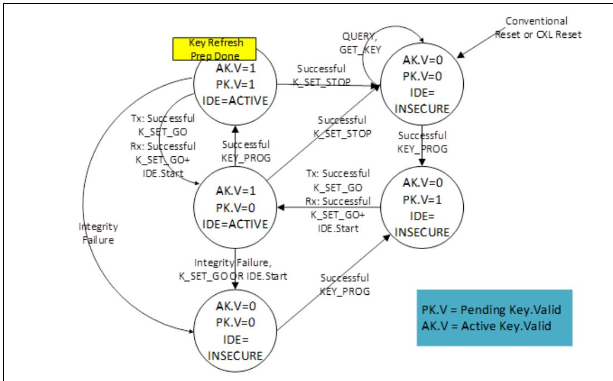

## IMPLEMENTATION NOTE

## Establishing CXL.cachemem IDE between a DSP and EP — Example

In this example, host software plays the role of the CIKMA. The switch implementation is such that the USP implements the DOE capability on behalf of all the DSPs and the specific DSP that is involved here is referenced as Port 4. Further, it is also assumed that the desired mode of operation is Skid mode. Host Software reads and configures the CXL IDE capability registers on the DSP and on the EP. See Section 8.2.4.21 for the definition of these registers and programming guidelines.

1. Host Software sets up independent SPDM secure sessions with the USP and the EP. This is accomplished by issuing SPDM key exchange messages over PCIe DOE.

2. All subsequent messages are secured as per the DSP0277. The messages to/from the USP are secured using the SPDM session key established with the USP. The messages to/from the EP are secured using the session key established with the EP.

a. Host Software sends a CXL\_QUERY (PortIndex=4) message to the USP DOE mailbox. The USP returns a CXL\_QUERY\_RESP. Host Software compares the CXL\_QUERY\_RESP contents against the CXL IDE Capability structure associated with the DSP. Host Software exits with an error if there is a mismatch or a timeout. In this example, the USP reports that it supports Locally generated CXL.cachemem IV and Locally generated CXL.cachemem IDE Key.

b. Host Software sends a CXL\_QUERY (PortIndex=0) message to the EP DOE mailbox. The EP returns a CXL\_QUERY\_RESP. Host Software compares the CXL\_QUERY\_RESP contents against the CXL IDE Capability structure associated with the EP. Host Software exits with an error if there is a mismatch or a timeout. In this example, the EP reports that it supports Locally generated CXL.cachemem IV and Locally generated CXL.cachemem IDE Key.

c. Host Software issues a CXL\_GETKEY request to the USP and saves the Locally generated CXL.cachemem IDE Key from the response as KEY2 and the Locally generated CXL.cachemem IV from the response as IV2. Host Software issues CXL\_GETKEY request to the EP and saves the Locally generated a CXL.cachemem IDE Key from the response as KEY1 and the Locally generated Tx IV from the response as IV1.

d. Host Software programs the Rx pending key in the EP by sending a CXL\_KEY\_PROG(RxTxB=0, Use Default IV=0, KEY2, IV2) message to the EP DOE mailbox. Host Software programs the Tx pending keys in the DSP by sending a CXL\_KEY\_PROG(PortIndex=4, RxTxB=1, Use Default IV=0, KEY2, IV2) message to the USP DOE mailbox. Host Software programs the Rx pending keys in the DSP by sending a CXL\_KEY\_PROG(PortIndex=4, RxTxB=0, Use Default IV=0, KEY1, IV1) message to the USP DOE mailbox. Host Software programs the Tx pending key in the EP by sending a CXL\_KEY\_PROG(RxTxB=1, Use Default IV=0, KEY1, IV1) message to the EP DOE mailbox. These 4 steps can be performed in any order. Host Software exits with an error if the CXL\_KP\_ACK indicates an error or if there is a timeout.

## IMPLEMENTATION NOTE

## Continued

e. Host Software instructs DSP Rx to be ready by sending a CXL\_K\_SET\_GO(PortIndex=4, Skid mode, RxTxB=0) to the USP DOE mailbox. Host Software instructs the EP Rx to be ready by sending a CXL\_K\_SET\_GO(Skid mode, RxTxB=0) to the EP DOE mailbox. Host Software exits with an error if either CXL\_K\_SET\_GO request times out.

f. Host Software instructs DSP Tx to enable CXL.cachemem IDE by sending a CXL\_K\_SET\_GO(PortIndex=4, Skid mode, RxTxB=1) to the USP DOE mailbox. DSP sends an IDE.Start Link Layer Control flit to EP and thus initiating IDE in one direction using KEY1 and Starting IV=IV1. Host Software exits with an error if the CXL\_K\_SET\_GO request times out.

g. Host Software instructs EP Tx to enable CXL.cachemem IDE by sending a CXL\_K\_SET\_GO(Skid mode, RxTxB=1) to the EP DOE mailbox. EP sends an IDE.Start Link Layer Control flit to the DSP and thus initiates IDE in the other direction, using KEY2 and Starting IV=IV2. Host Software exits with an error if CXL\_K\_SET\_GO request times out.

h. At the end of these steps, all the CXL.cachemem protocol flits traveling between the DSP and EP are protected by IDE.

If both ports support Locally generated CXL.cachemem IDE Key and Locally generated CXL.cachemem IV, the following sequence will result in a programming error and should be avoided:

1. CIKMA issues CXL\_GETKEY request to Port1 and saves the key, KEY1

2. CIKMA issues another CXL\_GETKEY request to Port1 and saves the IV, IV1

3. CIKMA issues CXL\_KEY\_PROG request to Port1 Tx and passes in KEY1 and IV1.

4. Port1 returns a CXL\_KP\_ACK with Status=08h because the 2nd CXL\_GETKEY request changed its locally CXL.cachemem IDE generated key to KEY2, which is not equal to KEY1.

## CXL Trusted Execution Environment Security Protocol (TSP)

## 11.5.1

## Overview

Virtualization-based Trusted Execution Environments (TEEs) are used to host confidential computing workloads that are isolated from hosting environments. This specification refers to such TEE as Trusted Execution Environment VMs (TVMs) to distinguish them from traditional virtual machines.

The PCI-SIG TEE Device Interface Security Protocol (TDISP) ECR specifies the architecture of a framework for trusted I/O virtualization to include PCIe devices within the TVM trust boundary. The CXL TEE Security Protocol (CXL-TSP), complements the PCI-SIG TDISP specification by specifying mechanisms to include direct attached CXL memory devices within the TVM trust boundary specifically for confidential computing scenarios.

## 11.5.2 Scope

This CXL security content scope focuses on features that are needed for confidential computing utilizing CXL Type 3 memory expander devices, referred to as targets in the TSP, directly connected to CXL Root Ports owned by the host which is an initiator in TSP. TSP defines the security objectives, capabilities, and interfaces, and the host, initiator, and target behaviors that are required to create a secure CXL memory hierarchy that meets the needs of confidential computing. The scope does not include details on initiator or target security implementation.

• This scope includes support for the following:

— SPDM 1.2 or newer for authentication and attestation

— Directly connected LDs, SLDs, and MH-SLDs

— Dynamic Capacity devices

— HDM-H memory

— HDM-DB memory

— 256B and PBR flit format

— Memory pooling — Multiple initiators accessing the same physical memory on a device but not sharing access to it

— Comprehensive Trust security model

— Selective Trust security model

— Implicit 64B Cacheline TE State Access Control

— Explicit TE State Access Control

• This scope does not include the following:

— CXL switches

• Devices connected via a CXL switch, including MLDs, GFDs

• Direct P2P using CXL.mem

• Direct P2P using UIO over CXL.io

— Type 1 and Type 2 accesses to Type 3 HDM memory

— HDM-D memory

— 68B flit format

— Memory sharing — Multiple initiators accessing the same physical memory on a device and simultaneously sharing access to it

## 11.5.3 Threat Model

This version of TSP shall focus on providing confidential computing support for direct attached CXL memory. Direct attached memory shall be defined as using the CXL protocol to communicate with a memory device, or target and the CXL Root Ports of the host, without intermediaries in the middle of the two. Within the context of extending CXL for confidential computing, one of TSP’s objectives is to minimize the Trusted Computing Base (TCB). The TSP supports both a selective trust and comprehensive trust security model.

## 11.5.3.1 Definitions

Table 11-19 defines additional terms that are utilized in this threat model section.

Table 11-19. Threat Model-related Terms

<table><tr><td>Term</td><td>Definition</td></tr><tr><td>Attacker</td><td>Entity that wants to extract information from a communication or influence a computation by modifying information that flows between two participants.</td></tr><tr><td>Confidential Computing</td><td>Computing that protects Data in Use, Data in Transit, and Data at Rest. Data at Rest applies to the CXL memory device and Data in Transit is applies to TSP Transport Security such as CXL IDE. Trusted Execution Environments (TEEs) prevent unauthorized access or modification of applications and data while in use, thereby increasing the security assurances for organizations that manage sensitive and regulated data.</td></tr><tr><td>Covert Channel</td><td>Method for an accomplice inside a trusted entity to signal to an attacker outside a trusted entity.</td></tr><tr><td>Host</td><td>Location in which multiple participants concurrently reside. The host is an initiator that contains CXL Root Ports.</td></tr><tr><td>Information</td><td>Data or properties of the data exchanged between two participants that would allow the attacker to take or cause an adverse action. Examples include cryptographic keys, questions being considered, decisions of the TEE, results of a database query, etc.</td></tr><tr><td>Intermediary/switch</td><td>Participant in the protocol that routes or forwards packets to targets. TSP initially focuses on direct attached confidential computing scenarios; thus, switch support in the threat model is beyond the scope of this specification.</td></tr><tr><td>Participant</td><td>Initiator or target in a communication that utilizes a correct and error free implementation of the protocol.</td></tr><tr><td>Peer Device</td><td>Initiator that does not contain CXL Root Ports.</td></tr><tr><td>Protocol Secrets</td><td>Secrets that shall be protected, from users of the protocol and/or attackers, to maintain the TEE.</td></tr><tr><td>Side Channel</td><td>Ability of an attacker to extract information without the knowledge of the participating parties.</td></tr><tr><td>Target</td><td>Participant in the protocol that does not forward packets to other participants. The memory device.</td></tr><tr><td>Trusted Execution Environment (TEE)</td><td>Execution environment designed to provide secure separation between itself and any other computation. The environment may include or be extended to multiple devices.</td></tr></table>

## 11.5.3.2 Assumptions

The threat model described below is based on the following assumptions:

• CXL does not guarantee that messages arrive in order. It requires initiator ordering. If the initiator has two messages that must be ordered, Message A and Message B, the initiator shall wait until Message A is acknowledged before submitting Message B.

• CXL relies on industry-standard secure protocols: SPDM and PCIe.

• CXL relies on industry-standard capabilities: Secure boot, trusted boot, and attestation.

• There are no errors in the implementation of the protocol, regardless of whether implemented in hardware, software, or firmware.

• An implementation of the protocol shall not disclose protocol secrets to an attacker. The participants shall have a secure location in which to store and/or retain this information.

• For confidential computing, everything inside the TEE shall not be observable by an attacker outside the TEE.

• When data is securely delivered to an attached target, the target shall protect that data from attacks. The TSP protocol facilitates multiple means of protecting the data. How the device implements such protections is beyond the scope of the threat model and TSP.

• There are non-overlapping resources for distinct hosts.

• Hardware in the host is trusted to maintain protocol separation between TEEs and keep TEEs isolated from one another.

• Hardware in the host is trusted to maintain protocol separation and isolation between Root Ports. Root Ports shall not accept incorrectly formatted transactions. If a host has a single port through which multiple sessions flow, the host hardware shall keep the sessions isolated and reliably deliver the transactions to the session owners, as defined by the hardware configuration.

• A correct implementation of the protocol. This means that the attacker cannot be inside the protocol.

• The protocol cannot defend against an attacker from within the TEE. Host hardware shall be responsible for defending the TEE from an attacker inside a host. An attacker in an initiator or target can use the protocol but is constrained by the requirements of this threat model.

• The target is directly connected to the host or peer device, and the host or peer device is functioning as the initiator; thus, there are no attackers in the intermediaries in the TSP threat model. Targets connected via CXL switches have not been evaluated and the presence of switches are considered to be outside the threat model. Fabric-attached memory may require initiator-based memory encryption to keep the intermediaries out of the TCB and shall be addressed in a future version of the TSP.

• TEEs that require confidentiality of the information flowing between the initiator and the target, shall enable a CXL-approved Transport Security such as CXL IDE.

• A target can concurrently hold data for a computation for multiple initiators, resulting in data from multiple participants residing concurrently on the target. The target shall be responsible for keeping each initiator’s data or computations separate and isolated. If the target has multiple ports, the target hardware shall keep the ports isolated and independent.

• If a target has a single port through which multiple sessions flow, the target hardware shall keep the sessions isolated and reliably deliver the transactions to their respective session owners, as defined by the hardware configuration. The target determines the threats from which initiator data is protected.

• Initiators and targets shall utilize an SPDM 1.2 or newer connection to authenticate and attest the target. For authenticated and trusted direct attached targets, multiple initiators can communicate with the same target without leaking information to other initiators.

• The protocol shall carry sufficient information to allow the target to maintain separation between initiators. Additionally, the protocol shall contain sufficient information to enable the target to enforce ciphertext hiding if needed.

• The protocol supports both initiator-based and target-based memory encryption so it shall carry sufficient information for the memory device to prevent access by non-TEEs to TEE memory.

• The protocol shall minimize the number of bits transmitted in the clear. These bits can be utilized as a covert channel if an application inside an initiator is compromised. PBR removes this exposure because all address bits can be encrypted; however, this is beyond the scope of the initial TSP.

## 11.5.3.3 Threats and Mitigations

Table 11-20 outlines the security threats considered as part of the threat model and how the threat is mitigated.

Table 11-20. Security Threats and Mitigations

<table><tr><td>Primary Threat of Attacker</td><td>Threat Mitigation</td></tr><tr><td>Extract protocol secrets</td><td>Transport Security such as CXL IDETSP initiator-based or target-based memory encryption</td></tr><tr><td>Masquerade as a legitimate initiator or target</td><td>SPDM attestation and authenticationSPDM mutual authentication</td></tr><tr><td>Insert itself between an initiator and target as a manipulator-in-the-middle</td><td>Prevent physical attackSPDM attestation and authenticationTransport Security such as CXL IDE</td></tr><tr><td>Derive actionable data or information from observed packets (side channel)</td><td>Minimize the number of address bits transmitted in the clear (possibly 0)Transport security such as CXL IDE</td></tr><tr><td>Insert data and/or requests/responses into an initiator/target communication</td><td>Transport Security such as CXL IDE</td></tr><tr><td>Modify data and/or requests/responses exchanged in an initiator/target communication</td><td>Transport Security such as CXL IDE</td></tr><tr><td>Remove data and/or requests/responses from an initiator/target communication</td><td>Transport Security such as CXL IDE</td></tr><tr><td>Replay legitimate packets</td><td>Transport Security such as CXL IDE</td></tr><tr><td>A non-TEE reading or writing of TEE data</td><td>TSP TE State checking for access control</td></tr><tr><td>A TEE reading or writing unauthorized non-TEE data</td><td>TEE is correctly configured to allow access only to memory for which the TEE is authorized to access</td></tr><tr><td>One TEE reading or writing another TEE&#x27;s data</td><td>TEE is correctly configured to allow access only to memory for which the TEE is authorized to accessTSP initiator-based or target-based memory encryption to protect each TEE&#x27;s data from other TEEs</td></tr><tr><td>A TEE on one host reading and/or writing resources that belong to a TEE of another host</td><td>Hosts shall maintain separation and isolation between TEEsTSP initiator-based or target-based memory encryption</td></tr><tr><td>A target on one port being able to send requests and/or responses on another port</td><td>Hardware within the host is trusted to maintain protocol separation and isolation between RPs. RPs shall not accept incorrectly formatted transactions. If a host has a single port through which multiple sessions flow, the host hardware shall keep the sessions isolated and reliably deliver the transactions to the session owners, as defined by the hardware&#x27;s configuration.</td></tr></table>

## 11.5.4 Reference Architecture

The reference architecture covers the security requirements and behaviors that are needed to support confidential computing use cases and covers the architectural scope, detecting TSP support, CMA/SPDM, attestation and authentication, memory encryption, transport security, access control, configuration, and Dynamic Capacity.

## 11.5.4.1 Architectural Scope

Figure 11-26 outlines the major components that the TSP considers to be inside the TCB or outside the TCB, the different connections between the TEE-capable initiator and TEE-capable target memory device, and those connections that are specified by the TSP. Hosts are the only initiators defined for the original CXL 3.1 version of the TSP architecture for support of direct attached confidential computing in the TSP

architecture. With the addition of HDM-DB support to the TSP, accelerators or directly attached CXL peer devices are also considered initiators and may be utilized for confidential computing.

## Figure 11-26. Reference Architecture

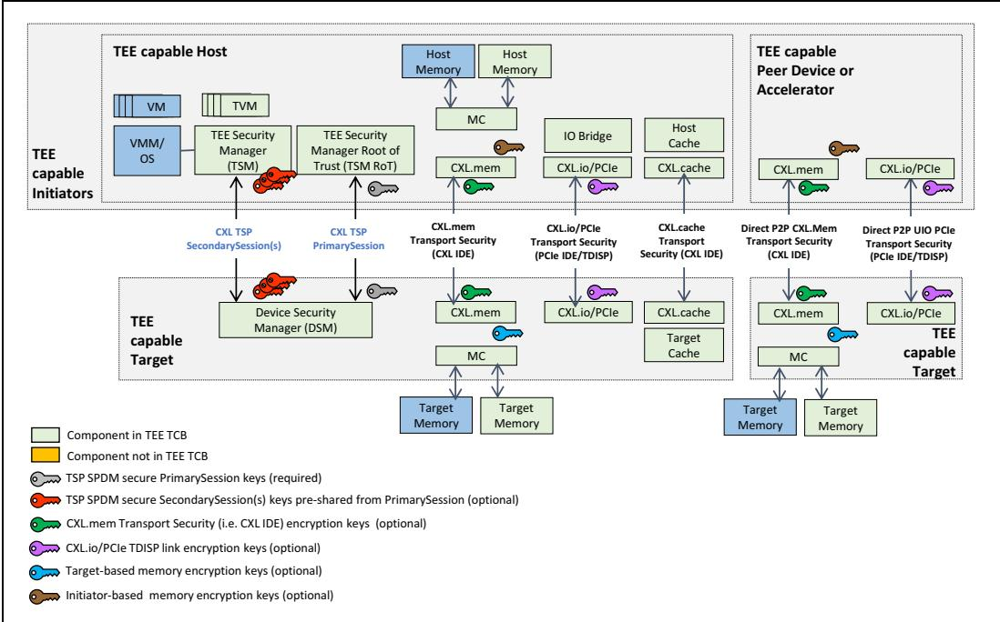

For implementations that utilize initiator-based memory encryption or target-based memory encryption, it is recommended to enable Transport Security (such as CXL IDE) as discussed in Section 11.5.4.7.

Securing CXL.io is optional from a TSP perspective.

## 11.5.4.2 Determining TSP Support

For targets that support the TSP, the DVSEC CXL Capability register TSP Capable bit (see Section 8.1.3.1) shall be set by the target to indicate support for the TSP requests and responses detailed in the following sections. This bit also indicates to the initiator that the target supports the MemRdFill memory request which is required for deadlock prevention with partial writes and initiator-based encryption.

## 11.5.4.3 CMA/SPDM

CMA/SPDM 1.2 or later secure sessions are utilized with CXL Vendor defined payloads for all TSP request and response payloads defined herein. The Protocol ID in the first byte of the Vendor Defined Payload identifies TSP requests independently from IDE or other requests that may also be defined by CXL. Figure 11-27 outlines the encapsulation of the TSP-defined payloads in a CMA/SPDM message, which is similar to those defined in the PCI-SIG TDISP, with the following changes to establish CXL control of the message interpretation:

• The DOE Data Object type shall report Vendor ID 0001h and Data Object Type 02h to point to Secured CMA/SPDM.

• The CMA/SPDM vendor defined message Standards ID shall utilize 0003h to indicate that PCI-SIG is the body that assigned the CMA/SPDM Message Vendor ID.

• The CMA/SPDM vendor defined message Vendor ID shall utilize 1E98h, indicating that the CXL Consortium assigned the interpretation of the CMA/SPDM vendor defined payload.

• The first byte in the CXL vendor defined payload is the Protocol ID. All CXL.cachemem IDE Key Management requests shall utilize Protocol ID = 00h. All TSP request and response messages shall utilize Protocol ID = 01h.

The encapsulation of TSP requests and responses inside an encrypted SPDM session is shown in Figure 11-27.

Figure 11-27. CMA/SPDM, CXL IDE, and CXL TSP Message Relationship

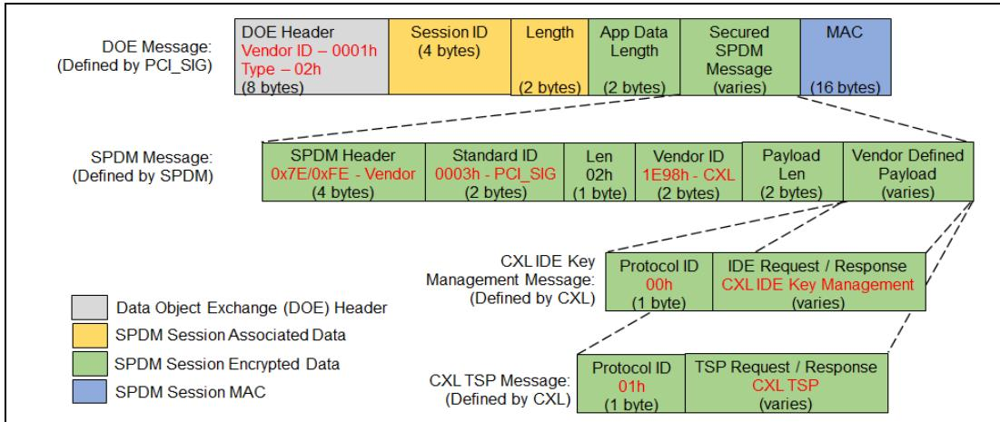  
CXL TSP messages shall not be issued before an SPDM secure session has been established between the initiator and the target. Any CXL TSP messages received by the target that are not secured shall be silently dropped by the target.

The Session ID that precedes the CMA/SPDM payload contains the TSP session utilized for each request or response payload. The TSP specification utilizes two types of sessions:

• PrimarySession: Required CMA/SPDM session that is established between the host and the target.

— Utilized to configure and lock the target as defined by TSP.

— For target-based memory encryption, this session may be utilized to set or clear memory encryption keys. The session utilized to set a key shall be the same session that is utilized to clear the same key.

— PrimarySession is the CMA/SPDM session that is utilized to receive the Set Target Configuration Response request to an unlocked device. The target shall terminate any existing SecondarySession(s) whenever a new PrimarySession is established.

— If a Transport Security (e.g., CXL IDE IDE\_KM) session and TSP are required:

• The PrimarySession shall be the same as the Transport Security session.

• There shall be no ordering dependency between sending of Transport Security messages and CXL TSP messages. The Transport Security session may be established first and later the same session may be utilized as the PrimarySession or vice versa.

• Once the SPDM session has been started, for any Transport Security messages received with a different Session ID, the target shall silently drop the request and not generate a response.

• Once the SPDM session has been started, for any TSP messages received with a different SPDM Session ID, the target shall drop the request and generate an Error Response of No Privilege.

• If the SPDM session has been terminated, any valid Transport Security message received with a different SPDM Session ID shall cause the target to transition the CXL.cachemem IDE to Insecure state and transition the TSP state to ERROR.

• If the SPDM session has been terminated, any valid TSP message received with a different SPDM Session ID shall cause the target to transition the CXL.cachemem IDE to Insecure state and transition the TSP state to ERROR.

— Primary SPDM Session shall be utilized to provision PSK Key Material for establishing each Secondary SPDM Session(s)

— The act of terminating the PrimarySession or the act of establishing a different PrimarySession by itself shall not affect the state of the TEE or TSP.

— Features that are enabled with Set Target Configuration to be allowed after the target is locked and require an SPDM session (e.g., enabling Locked Target FW Update) shall utilize the PrimarySession.

• SecondarySession(s): Optional CMA/SPDM sessions that are generated from the PrimarySession by utilizing CMA/SPDM PSK\_EXCHANGE between the host and the target.

— For target-based memory encryption, this session may be utilized to set or clear memory encryption keys. Some host implementations may need to utilize a separate but related SPDM SecondarySession for setting and clearing memory keys independently from the PrimarySession that is utilized to configure and lock the configuration. The session utilized to set a key shall be the same session that is utilized to clear the same key.

— Target advertises the number of SecondarySession(s) that it supports in Get Target Capabilities.

— Initiator can configure the number of SecondarySession(s) to utilize and the type of TEE opcode checking each will use through Set Target Configuration.

— PrimarySession is independent of these sessions. The termination or closing of any SecondarySession(s) shall have no effect on the PrimarySession.

— These sessions are independent of the PrimarySession. Termination or closing of the PrimarySession shall have no effect on these sessions. However, if a new PrimarySession is started, the target shall terminate these sessions because new secondary sessions will need to be generated based on the new primary session key material.

— CMA/SPDM session that successfully completes the CMA/SPDM PSK that utilizes the correct PSK hint shall be considered a valid SecondarySession.

— The act of terminating a SecondarySession or the act of establishing a different SecondarySession by itself shall not affect the state of the TEE or TSP.

— Any TSP requests sent over a session that is not the PrimarySession or one of the SecondarySession(s) shall be failed with Error Response, No Privilege. See Section 11.5.5.3.

Figure 11-28 outlines the high-level sequence for creating the PrimarySession and how TMVSession PSK Key Material is utilized by the target to generate keys for a secure CMA/SPDM SecondarySession(s).

Figure 11-28. CMA/SPDM Sessions Creation Sequence  
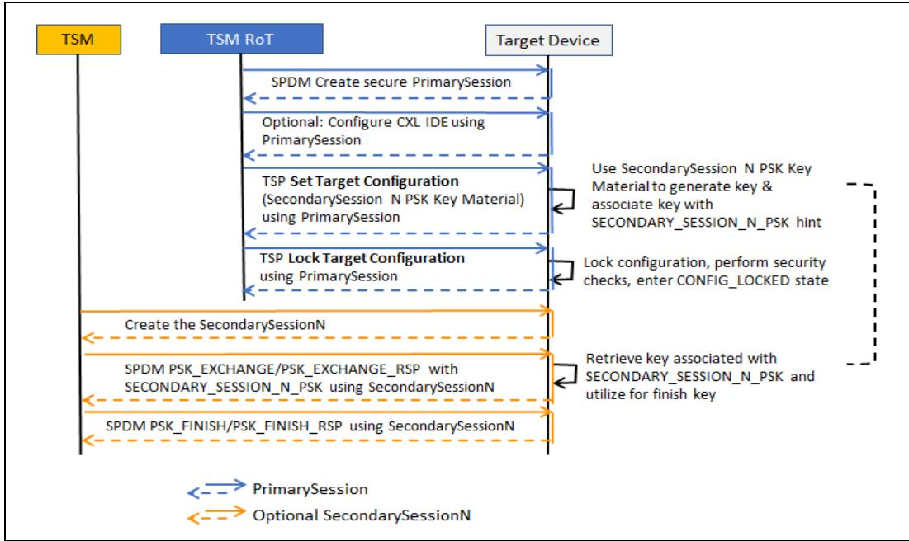

## 11.5.4.4 Authentication and Attestation

Because the TSP interface requires requests and responses to utilize a CMA/SPDM 1.2 (or later) secure session, target attestation and authentication is accomplished using the CMA/SPDM-defined secure session setup sequence.

## 11.5.4.5 TE State Changes and Access Control

The TEE Exclusive State (TE State) of memory indicates whether the content of the memory is for TEE or non-TEE data.

Initiators that generate memory accesses shall determine the TEE status of each memory transaction, referred to as the TEE Intent. TEEs are permitted to access both exclusive and non-exclusive memory, while non-TEE entities are permitted to access only memory that is not intended for the exclusive use of a TEE.

Access control is outlined in the following sections and is defined as the verification of the TEE Intent against the TE State of the memory being accessed and the resulting target behavior when the verification fails. Access control is split in to Write Access Control and Read Access Control that can be supported by the target independently and enabled independently by the initiator.

Initiators shall not generate memory accesses with TEE Intent if those accesses do not arise within the execution context of a TEE. Initiators that generate memory accesses that originate within the execution context of a TEE shall understand the request’s TEE Intent, based on the specific design of the TEE architecture, and shall express the correct TEE Intent. Because each request carries the correct TEE Intent, it is unnecessary for a request to indicate whether it originates from a TEE.

Initiators shall convey TEE Intent in a request by utilizing the TEE-specific M2S Req and M2S RwD opcodes specified in the CXL Transaction Layer. Targets shall convey the TE State by utilizing the S2M NDR and S2M DRS response opcodes specified in the CXL Transaction Layer. The specific opcodes utilized are specified in the tables provided later in this section.

Hosts that support implicit and explicit TE State changes:

• May enable either mechanism individually or both mechanisms at the same time on the target. When enabling implicit and explicit in-band TE State changes simultaneously, the TE State granularity utilized for explicit in-band TE State changes shall be 64B.

• Shall account for interleaving and send a single TE State change request to each target for a given interleave set.

Targets that have TE State changes enabled:

• Shall change the TE State of memory at a 64B cacheline granularity for implicit changes and at a 64B or greater granularity for explicit changes.

• Shall support explicit in-band TE State changes with a granularity of 64B when supporting implicit TE State changes.

• Shall utilize implicit and/or explicit TE State changes as enabled by the host.

• Shall support the TEUpdate memory transaction when implicit or explicit in-band TE State changes are enabled.

• Shall return the current TE State saved for the memory location being accessed

• For memory reads that only result in an uncorrectable error in the TE State storage, the target shall treat the read as a TE State mismatch and behave as specified in the following sections. This behavior is independent of, and in addition to, handling of uncorrectable errors that occur in the data storage those types of uncorrectable errors are governed by the CXL.cachemem device error-handling protocol (see Section 12.2.3). If uncorrectable errors occur in both the TE State storage and the data storage for the same access, then TE State mismatch handling and device error handling shall both be executed.

• For memory writes with poison:

— When utilizing Implicit TE State changes, the target shall update the TE State regardless of whether poison is present

— When Write Access Control is utilized, the target shall enforce the TE State mismatch rules regardless of whether poison is present

Targets that have TE State changes disabled and CKID-based memory encryption disabled:

• Shall return the TEE Intent from the memory request in the response opcode

Targets that have read and/or write access control enabled:

• Shall implement TE State changes

• Shall follow the rules defined below for implicit or explicit target behavior for updating TE State, verifying TE State, and responding to access control state verification

Targets optionally provide an event log entry of all dropped writes or failed reads that occur in response to failed TE State checks to aid in root-cause analysis of unexpected behavior by reporting a General Media or DRAM Event Record with a Memory Event Type of TE State Violation.

Targets that implement CKID-based target encryption shall perform CKID-type checks as described in Section 11.5.4.6.2.1.

The granularity utilized for TE State changes shall be consistent with the interleave granularity being configured. For example, if the host utilizes a 4K TE State change granularity on each target that is part of a 16-way interleave set with a 256B interleave granularity, each target will utilize 256B of DPA space to change 4K of TE State.

If the target was configured without having TE State storage in the device (by utilizing Set Features with Metabits Storage), then it is assumed that the target does not have TE State tracking capabilities and the target shall disable the following in Get Target Capabilities Response:

• Implicit TE State Change

• Explicit In-band TE State Change when TE State Granularity is set to 64B

• Explicit Out-of-band TE State Change when TE State Granularity is set to 64B

## 11.5.4.5.1 TEUpdate Memory Transaction

The TEUpdate memory transaction shall utilize the flit’s 3-bit SnpType field to provide a Length Index to preconfigured fixed granularities of TE State.

Length Index encodings 1 through 6 are configurable. Length Index encodings 0 and 7 are fixed, where 0 is defined as 64B and 7 is defined as the target’s entire memory space.

Targets that support implicit TE State changes or in-band explicit TE State changes shall support this transaction with Length Index = 0 and may support a Length Index of 7 as reported in Get Target Capabilities. If the target only supports implicit TE State changes, then Length Index encodings 1 through 6 shall be reserved.

The HPA present in the TEUpdate transaction shall be decoded by the target to the correct HDM decoder and the starting HPA, HDM decoder Interleave Granularity (IG), and HDM decoder Interleave Ways (IW) are utilized by the target to change the TE State of those HPA ranges within the granularity determined from the SnpType field.

The CKID field is reserved for the TEUpdate transaction and shall be ignored by the target.

There is no mechanism for the target to reject an explicit TEUpdate transaction.

## 11.5.4.5.2 Implicit TE State Changes

Implicit state changes shall always occur on a cacheline write and shall not utilize Write Access Control.

When utilizing implicit TE State changes, the target shall also support explicit in-band TE State changes with Length Index 0 to indicate a 64B length.

Implicit TE State changes and Write Access Control are mutually exclusive features, and at most, one shall be enabled.

Table 11-21 outlines the expected target behavior for implementing implicit TE State changes.

1. MemWrTEE, MemWrPtlTEE.2. MemWr, MemWrPtl.

Table 11-21. Target Behavior for Implicit TE State Changes

<table><tr><td rowspan="2">Target&#x27;s TE State Associated with Memory Access Address</td><td colspan="2">TEE Intent of Memory Transaction Received by the Target</td></tr><tr><td> $TEE\ Opcodes^1$ </td><td>Non-TEE  $Opcodes^2$ </td></tr><tr><td>TE 0</td><td>Writes:Full cacheline write shall cause an implicit state change to TE=1S2M NDR TEE opcode shall be returned</td><td>Writes:No change to TE StateS2M NDR non-TEE opcode shall be returned</td></tr><tr><td>TE 1</td><td>Writes:No change to TE StateS2M NDR TEE opcode shall be returned</td><td>Writes:Full cacheline writes shall cause an implicit state change to TE=0S2M NDR non-TEE opcode shall be returned</td></tr></table>

## 11.5.4.5.2.1 Partial Write Handling with Implicit TE State Changes

Full cacheline writes are required to change the TE State implicitly.

Initiator-based memory encryption shall be handled as follows:

• A partial write shall be treated as an under fill read, merging of partial write data with under fill read data, followed by a full cacheline write. The under fill read shall utilize the same TEE intent as the full cacheline write that follows.

Target-based memory encryption shall be handled as follows:

• A partial write shall be treated as an under fill read, merging of partial write data with under fill read data, followed by a full cacheline write. The under fill read shall utilize the same TEE intent as the full cacheline write that follows.

• The under fill read shall follow the rules for reads and the full cacheline write shall follow the rules for writes.

## 11.5.4.5.3 Explicit TE State Changes

If explicit state changes are supported, the target shall support utilizing the TEUpdate memory transaction for in-band state changes and/or the CMA/SPDM secure session TSP request, Set Target TE State, for out-of-band changes. For explicit TE State changes > 64B, the target shall pre-allocate resources for a single explicit state change request to avoid head-of-line blocking.

The target shall be configured to enable explicit in-band TE State changes or explicit out-of-band TE State changes and either may be enabled individually or both may be enabled at the same time. If the host is utilizing both simultaneously, the host shall maintain coherency between them.

Explicit TE State changes shall be initiated from the host. The host shall ensure that memory affected by the TE State change is flushed from caches before initiating the explicit state change request.

The host shall be responsible for maintaining coherency for accesses to memory ranges that are also executing an explicit state change.

While the explicit TE State change request is executing, the target shall handle memory transactions as follows:

• The target shall continue to process unrelated memory transactions while the state change is executing

• For explicit TE State changes > 64B:

— For writes to memory ranges that are undergoing the state change, the target shall drop the write and return the inverted TEE Intent in the write completion

— For reads to memory ranges that are undergoing the state change, the target shall return all 1s and the inverted TEE Intent in the read completion

When executing out-of-band explicit TE State changes that cover a large amount of data, the target may require additional execution time and may utilize the Delayed Response to prevent request timeouts as described in Section 11.5.5.9.

The target shall report optional support to sanitize the contents of memory with 0s whenever the explicit TE State change request is received. If enabled by the host, the target shall complete the overwrite of the affected range before the explicit state change is considered complete. This sanitize capability is reported in Get Target Capabilities and the host may enable its use with Set Target Configuration. Sanitizing large amounts of memory may require additional execution time and targets may utilize the Delayed Response to prevent request timeouts as described in Section 11.5.5.9.

If in-band and out-of-band explicit state changes overlap, the host shall ensure that those requests have non-overlapping address ranges. Otherwise, an indeterminate result could occur. If the target can detect this overlap, the target should generate an appropriate event record to aid in debug.

For explicit updates > 64B: A single explicit state change shall be sent to every target in the same interleave set. Explicit state changes specify a starting address and length that cover the entire range to be changed. The target shall change the state for all portions of the range that land on its portion of the interleave.

## 11.5.4.5.3.1 Optional Explicit In-band TE State Change

For explicit in-band TE State changes:

• The in-band mechanism shall utilize the TEUpdate memory transaction.

• The association of length index in the SnpType field to a given granularity is configured by the initiator utilizing Set Target Configuration. This is done to minimize the size of the TEUpdate flit to a single slot to minimize Transaction Layer complications.

• Length Index value of 0 (Length Index 0) is reserved for 64B state changes.

• Length Index value of 7 (Length Index 7) is reserved for state changes affecting the entire memory space of the target.

• Length Index values 1 through 6 (Length Index 1 through 6) are host configurable to any supported length that utilizes Set Target Configuration.

• If the in-band TE State change granularity is > 64B, the host shall only issue a single explicit in-band state change request at a time.

• If the in-band TE State change granularity is 64B, the host may issue multiple explicit in-band TE State change requests to non-overlapping address ranges and the target shall queue those requests waiting to execute.

Figure 11-29 outlines the association between the Explicit In-band TE State Granularity specified in Set Target Configuration and the Length Index specified in the TEUpdate transaction SnpType field.

Figure 11-29. Optional Explicit In-band TE State Change Architecture  
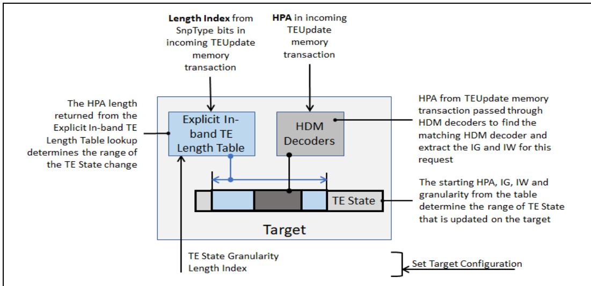  
Table 11-22 outlines the expected target behavior for utilizing explicit in-band TE State changes.

Table 11-22. Target Behavior for Explicit In-band TE State Changes

<table><tr><td rowspan="2">Target&#x27;s TE State Associated with Memory Access Address</td><td>TEE Intent of Memory Transaction Received by the Target</td></tr><tr><td>TEE  $Opcodes^1$ </td></tr><tr><td>TE 0</td><td>• TEUpdate(TE = 0):— No change in TE State• TEUpdate(TE = 1):— This shall cause an explicit state change to TE=1 for the affected memory granularity</td></tr><tr><td>TE 1</td><td>• TEUpdate(TE = 0):— This shall cause an explicit state change to TE=0 for the affected memory granularity• TEUpdate(TE = 1):— No change in TE State</td></tr></table>

1. TEUpdate.

## 11.5.4.5.3.2 Optional Explicit Out-of-Band TE State Change

For explicit out-of-band TE State changes:

• Out-of-band mechanism utilizes the Set TE State TSP request and supports a robust set of possible TE State change granularities reported in Get Target Capabilities that cannot be utilized with the limitations of the in-band mechanism

• Host shall only issue a single explicit out-of-band state change request at a time

• Target shall reject any request to set TE State when another TE State change request is already executing

Table 11-23 outlines the expected target behavior for utilizing explicit out-of-band TE State changes.

Table 11-23. Target Behavior for Explicit Out-of-band TE State Changes

<table><tr><td>Target&#x27;s TE State Associated with Memory Access Address</td><td>TE State of Set Target TE State Received By the Target</td></tr><tr><td>TE 0</td><td>SetTargetTEState (TE State = 0):— No change in TE StateSetTargetTEState (TE State = 1):— This shall cause an explicit state change to TE=1 for the affected memory address and granularity</td></tr><tr><td>TE 1</td><td>SetTargetTEState (TE State = 0):— This shall cause an explicit state change to TE=0 for the affected memory address and granularitySetTargetTEState (TE State = 1):— No change in TE State</td></tr></table>

## 11.5.4.5.4 Write Access Control

Table 11-24 outlines the required target behavior when Write Access Control is enabled on the target.

Table 11-24. Target Behavior for Write Access Control

<table><tr><td rowspan="2">Target&#x27;s TE State Associated with Memory Access Address</td><td colspan="2">TEE Intent of Memory Transaction Received by the Target</td></tr><tr><td>TEE  $Opcodes^1$ </td><td>Non-TEE  $Opcodes^2$ </td></tr><tr><td>TE 0</td><td>Writes:Full/Partial cacheline write shall be droppedS2M NDR non-TEE opcode shall be returnedOptionally log event</td><td>Writes:Full/Partial cacheline write allowedS2M NDR non-TEE opcode shall be returned</td></tr><tr><td>TE 1</td><td>Writes:Full/Partial cacheline write allowedS2M NDR TEE opcode shall be returned</td><td>Writes:Full/Partial cacheline write shall be droppedS2M NDR TEE opcode shall be returnedOptionally log event</td></tr></table>

1. MemWrTEE, MemWrPtlTEE.  
2. MemWr, MemWrPtl.

If Write Access Control is not enabled on the target, the target shall not check write requests for possible access control violations. See Section 11.5.4.5.2 for implicit TE State changes and required target behavior.

If Write Access Control is enabled on the target, the target shall clear the TE State to 0 for all addressable memory in response to the Lock Target Configuration Request and before generating a Lock Target Configuration Response.

Write Access Control requires the target to also support explicit TE State changes. The target shall reject attempts to enable Write Access Control without one or more explicit TE State change mechanisms also being enabled.

The target shall not perform Write Access Control when updating MetaValue. See Section 11.5.4.5.6 for requirements for handling MetaValue updates.

If enabled, the target shall perform Write Access Control when updating Extended Metadata (EMD). See Section 11.5.4.5.7 for requirements for handling EMD updates.

Implicit TE State changes and Write Access Control are mutually exclusive features, and at most, one shall be enabled.

## 11.5.4.5.4.1 Partial Write Handling with Write Access Control

Target-based memory encryption shall be handled as follows:

• A partial write shall be treated as an under fill read, merging of partial write data with under fill read data, followed by a full cacheline write.

• The under fill read shall follow the rules for reads and the full cacheline write shall follow the rules for writes. In case of a TEE mismatch between the TE State obtained in the under fill read and the TEE Intent of the request, the target shall drop the write.

## 11.5.4.5.5 Read Access Control

Table 11-25 outlines the required target behavior when Read Access Control is enabled on the target.

Table 11-25. Target Behavior for Read Access Control

<table><tr><td rowspan="2">Target&#x27;s TE State Associated with Memory Access Address</td><td colspan="2">TEE Intent of Memory Transaction Received by the Target</td></tr><tr><td>TEE  $Opcodes^1$ </td><td>Non-TEE  $Opcodes^2$ </td></tr><tr><td>TE 0</td><td>Reads:Reads shall return fixed data of all 1sS2M DRS non-TEE opcode shall be returnedOptionally log event</td><td>Reads:AllowedS2M DRS non-TEE opcode shall be returned</td></tr><tr><td>TE 1</td><td>Reads:AllowedS2M DRS TEE opcode shall be returned</td><td>Reads:Reads shall return fixed data of all 1sS2M DRS TEE opcode shall be returnedOptionally log event</td></tr></table>

1. MemRdTEE, MemRdDataTEE, MemRdFillTEE, and MemSpecRdTEE.  
2. MemRd, MemRdData, MemRdFill, and MemSpecRd.

If Read Access Control is not enabled on the target, the target shall not check read requests for possible access control violations.

The target shall not perform Read Access Control when updating MetaValue. See Section 11.5.4.5.6 for requirements for handling MetaValue updates.

If enabled, the target shall perform Read Access Control when updating Extended Metadata (EMD). See Section 11.5.4.5.7 for requirements for handling EMD updates.

## 11.5.4.5.6 MetaValue Updates for HDM-H

MetaValue is a property of the memory address and unrelated to any of the data associated with that address. Consequently, the target shall not perform access control checks on MetaValue updates.

## TEUpdate:

• TEUpdate uses the MetaValue to convey the TE State and does not update MetaValue

For all other (non-TEUpdate) transactions:

• There is no TE State associated with MetaValue

• Targets that implement access control shall ignore access control checks when updating the MetaValue and shall allow MetaValue updates, even if the associated read or write request fails access control checks.

Initiators are responsible for ensuring that changes to MetaValue do not negatively affect data coherency. How an initiator guarantees this is beyond the scope of CXL.

## 11.5.4.5.7 Extended Metadata Updates

Extended Metadata (EMD) is a property of the data and is updated using the same flows and transactions as data. Consequently, TE State and access control, if enabled, shall be utilized when updating EMD.

If Write Access Control checks fail, the target shall not update EMD.

If Read Access Control checks fail, the target shall return fixed data of all 1s for EMD.

## 11.5.4.6 Memory Encryption

Protecting data at rest in the target memory device is required for confidential computing and requires memory encryption. The TSP supports both initiator-based and target-based memory encryption capabilities, and an initiator shall utilize one or the other when adding a target to the TCB. If target-based memory encryption is not enabled by the initiator, it shall be the initiator’s responsibility to utilize initiator-based memory encryption.

This version of the TSP specification is focused on direct attached CXL devices. In such a configuration, there is a single initiator for a given memory range and all transactions to that memory region shall flow through that initiator. When initiator-based encryption is utilized, it is the initiator’s responsibility to ensure that the cryptographic keys are correct for all initiators and to maintain data coherency. Initiator-based encryption implementations that utilize partial writes require the initiator to perform a read of a complete cacheline, update the corresponding bytes, and write the complete cacheline back to the target. The target cannot modify any blocks that are encrypted by an initiator and thus cannot perform the RMW (read-modify-write) that is required to perform partial writes.

Target-based encryption requires Transaction Layer and Link Layer protocol changes to pass a CKID to the target so that the target can correctly choose the key that is utilized for the encryption/decryption of data associated with each transaction.

Both initiator-based and target-based memory encryption are optional. The target reports its supported memory encryption capabilities, and the initiator selects the memory encryption that it needs to utilize.

## 11.5.4.6.1 Initiator-based Memory Encryption

Initiator-based memory encryption may be utilized, independent of target-based memory encryption being enabled or disabled, as follows:

• Target shall support the MemRdFill memory request, which is required for deadlock prevention with partial writes and initiator-based encryption. Support for this request is a target requirement when indicating TSP Capable support in the DVSEC CXL Capability register.

• If target-based CKID memory encryption is not enabled, the CKID field in the memory transaction is reserved and ignored by the target.

## 11.5.4.6.2 Target-based Memory Encryption

Targets are not required to implement memory encryption. When memory encryption is implemented on the target, the following applies:

• Encryption shall be implemented using one of the Memory Encryption Algorithms Supported that are reported in Get Target Capabilities Response.

• TSP supports two target-based memory encryption mechanisms:

CKID-based encryption requires use of the CKID field in the Transaction Layer to identify a specific key to be utilized when encrypting/decrypting memory contents for a given transaction. This feature requires the use of TEE opcodes in the memory transaction to perform the proper CKID type checking.

— Range-based encryption utilizes memory range registers that are configured to associate a particular encryption key with a specific memory range and does not rely on the CKID field in the transaction.

— Host may enable CKID-based or range-based target memory encryption, but shall not enable both.

— Target shall reject attempts to enable both target-based encryption methods.

## 11.5.4.6.2.1 CKID-based Memory Encryption

When CKID-based target memory encryption is implemented, the following applies:

• For CKID-based encryption, the initiator and target shall utilize the CKID field in the Transaction Layer for memory requests.

• Each host Root Port has a unique 13-bit CKID value to be utilized across all targets. A host may choose to share CKID values across Root Ports.

• Target shall accept the entire range of the 13-bit CKID field defined in the Transaction Layer.

• CKIDs that are configured on each target can start and end anywhere within the CKID space supported by the protocol.

• Target reports the Number of CKIDs that it supports in Get Target Capabilities. How the target maps the supported number of CKIDs to the 13-bit CKID field in the transaction is target implementation specific.

• Number of CKIDs that the target supports may be sparsely distributed across the 13-bit range, or optionally the target may require that the CKIDs be assigned a contiguous range starting at a specific CKID Base.

• If the target does not require a CKID Base:

— CKID specified in Set Target CKID Specific Key, Set Target CKID Random Key, and Clear Target CKID Key shall not cause the target to utilize more than the Number of CKIDs that the target supports

• If the target requires a CKID Base to be utilized:

— Target shall indicate that a range of CKIDs using a CKID Base and Number of CKIDs is required in Get Target Capabilities

— Host shall configure a contiguous range of CKIDs on the target by specifying the CKID Base and Number of CKIDs that the target shall utilize with Set Target Configuration. The Number of CKIDs enabled by the host shall be ≤ Number of CKIDs reported by the target.

— CKID in the Transaction Layer memory requests from the initiator shall be CKID Base ≤ CKID < CKID Base + Number of CKIDs configured on the target. See Table 11-26 for the target behavior if the CKID in the transaction is outside the configured CKID of the target.

— CKID specified by the host in Set Target CKID Specific Key, Set Target CKID Random Key, and Clear Target CKID Key shall be CKID Base ≤ CKID < CKID Base + Number of CKIDs configured on the target.

• Initiator may configure a specific CKID to a specific initiator-supplied key by utilizing Set Target CKID Specific Key.

• Initiator may configure a specific CKID to a random target-generated key with optional initiator-supplied key entropy by utilizing Set Target CKID Random Key.

• Initiator may clear a previously configured key to allow the CKID to be recycled for another key by utilizing Clear Target CKID Key sent on the same session that was utilized to set the key. If the session utilized to set the key has terminated or closed then the target may need to be reset to break the memory encryption key to CKID association.

• Target implements the mapping of keys to CKIDs.

• Each CKID shall be a TVMCKID or OSCKID that is configured utilizing the CMA/ SPDM PrimarySession or SecondarySession(s) (see Figure 11-30, which describes this partitioning). See the description below on how the target utilizes the CKID Type to verify memory transactions and the behavior of the target when the verification fails.

• When utilizing target CKID-based memory encryption, the initiator’s transactions that contain TVMCKIDs shall utilize TEE opcodes and those that contain OSCKIDs shall utilize non-TEE opcodes. The target shall verify that the opcodes are correct for accessing each CKID Type.

• If target CKID-based encryption has not yet been enabled, the CKID field in the memory transaction shall be ignored by the target.

• If target CKID-based encryption has been enabled and the CKID field in the received memory transaction does not reference a CKID that has been previously set using Set Target CKID \* Key, the target’s response shall follow the existing CXL.cachemem nonexistent memory (NXM) handling.

Figure 11-30 demonstrates the target mixing of TVMCKIDs and OSCKIDs in a single range of possible CKIDs that utilize the CKID Base and Number of CKIDs.

Figure 11-30. CKID-based Memory Encryption Utilizing CKID Base

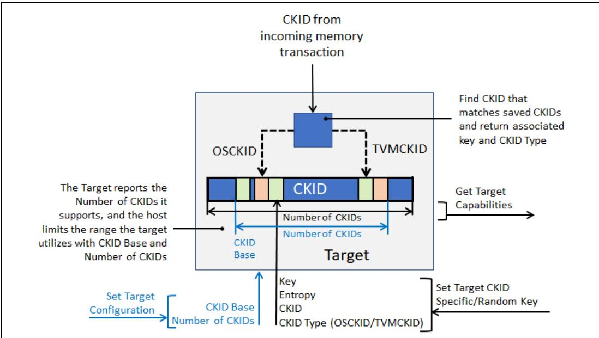

The target stores the CKID Type along with the CKID and key. The target shall verify that each incoming memory transaction passes the following checks:

• The memory transaction CKID is within the valid configured range of the target

• The memory transaction has a non-TEE opcode and the CKID is an OSCKID OR the memory transaction has a TEE opcode and the CKID is a TVMCKID

If any of these checks fail, the target should provide an event log entry to aid in rootcause analysis of unexpected behavior by reporting a General Media or DRAM Event Record with Memory Event Type of CKID Violation.

Table 11-26 outlines the target behavior for memory transactions that request a CKID that is outside the configured range of the target.

Table 11-26. Target Behavior for Invalid CKID Ranges

<table><tr><td rowspan="2">CKID</td><td colspan="2">Memory Transaction Received by the Target</td></tr><tr><td>Read Opcodes</td><td>Write Opcodes</td></tr><tr><td>Within Configured Range</td><td>• Allowed</td><td>• Allowed</td></tr><tr><td>Outside Configured Range</td><td>• Reads shall return fixed data of all 1s• S2M NDR non-TEE opcode shall be returned• Optionally log event</td><td>• Writes shall be dropped• S2M NDR non-TEE opcode shall be returned• Optionally log event</td></tr></table>

Table 11-27 outlines the target behavior for the CKID-type verification checks based on TEE Intent using TEE opcodes and non-TEE opcodes, which is described in Section 11.5.4.5.

Table 11-27. Target Behavior for Verifying CKID Type

<table><tr><td rowspan="2">Target&#x27;s CKID type Associated with CKID Contained in Memory Transaction</td><td colspan="2">TEE Intent of Memory Transaction Received by the Target</td></tr><tr><td>TEE  $Opcodes^1$ </td><td>Non-TEE  $Opcodes^2$ </td></tr><tr><td>OSCKID</td><td>Writes: — Writes shall be dropped — S2M NDR non-TEE opcode shall be returned — Optionally log eventReads: — Reads shall return fixed data of all 1s — S2M DRS non-TEE opcode shall be returned — Optionally log event</td><td>Writes: — Full/Partial cacheline write allowed — S2M NDR non-TEE opcode shall be returnedReads: — Allowed — S2M DRS non-TEE opcode shall be returned</td></tr><tr><td>TVMCKID</td><td>Writes: — Full/Partial cacheline write allowed — S2M NDR TEE opcode shall be returnedReads: — Allowed — S2M DRS TEE opcode shall be returned</td><td>Writes: — Writes shall be dropped — S2M NDR TEE opcode shall be returned — Optionally log eventReads: — Reads shall return fixed data of all 1s — S2M DRS TEE opcode shall be returned — Optionally log event</td></tr></table>

1. MemWrTEE, MemWrPtlTEE, MemRdTEE, MemRdDataTEE, MemRdFillTEE, and MemSpecRdTEE. 2. MemWr, MemWrPtl, MemRd, MemRdData, MemRdFill, and MemSpecRd.

## 11.5.4.6.2.2 Range-based Memory Encryption

• The initiator may configure a specific HPA memory range to use a specific initiatorsupplied key that utilizes Set Target Range Specific Key.

• The initiator may configure a specific HPA memory range to use a random targetgenerated key with optional initiator-supplied key entropy that utilizes Set Target Range Random Key.

• The initiator may clear a previously configured key to allow the memory range to be recycled for another key by utilizing Clear Target Range Key sent on the same session that was utilized to set the key. If the session utilized to set the key has terminated or closed, then the target may need to be reset to break the memory encryption key to memory range association.

• The target advertises the Memory Encryption Number of Range Based Keys that it supports in Get Target Capabilities, and the initiator assigns a Range ID and HPA range at the time the key is programmed. The target shall verify that the HPA memory ranges and Range IDs do not overlap. The HPA contained within the memory request shall be compared to the programmed memory ranges by the target to retrieve the correct key to utilize in the encryption. The Range ID specified in Set Target Range Specific Key and Set Target Range Random Key shall be 0 ≤ Range ID < Memory Encryption Number of Range Based Keys.

• The PrimarySession or SecondarySession(s) shall be utilized for setting and clearing range based keys. The session utilized to set a range based key shall be the same session utilized to clear the same range based key.

• If target range-based encryption has not yet been enabled, the address range in the memory transaction shall be ignored by the target for range-based memory encryption.

• If target range-based encryption has been enabled and the memory address in the received memory transaction does not reference a memory range that has been previously set using Set Target Range \* Key, the target’s response shall follow the existing CXL.cachemem nonexistent memory (NXM) handling.

Figure 11-31 outlines range-based memory encryption utilizing the HPA.

Figure 11-31. Range-based Memory Encryption

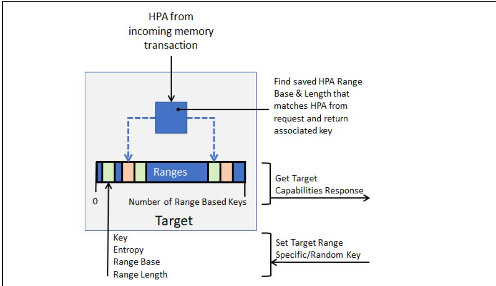

## 11.5.4.7 Transport Security

Transport security is optional for TSP. If supported and enabled, a CXL-approved Integrity and Data Encryption (IDE) mechanism shall be used. It is up to the TEE policy to decide whether targets that do not support transport security invalidates their use for confidential computing scenarios.

Currently hop-by-hop CXL IDE is the only defined CXL transport security mechanism, and determining the target’s IDE capabilities or enabling IDE modes is done through CXL IDE-defined registers. There are no Transport Security-specific TSP interfaces defined at this time.

Although Transport Security is optional, disabling of Transport Security adds additional exposure to physical attacks such as device removal and manipulator-in-the-middle because the binding provided by Transport Security is not utilized. If these attacks are considered part of the threat model for the TEE and cannot be protected via other methods, then Transport Security shall be enabled for confidential computing scenarios.

## 11.5.4.8 Configuration

The PrimarySession shall be utilized to configure the security for each target in the CXL hierarchy that utilizes TSP, supported CXL Transport Security mechanisms, and other interfaces to setup the TCB. After the targets are correctly configured, the PrimarySession shall be utilized to lock the target to disable initiator access to registers that could cause data coherency issues, loss of data, reveal TVM data to an untrusted VM, and/or otherwise compromise the TCB. After the target is locked, trusted memory transactions are allowed, and the target or initiator shall perform access verification by utilizing the TE State.

Figure 11-32 outlines the defined target security states that are utilized by TSP.

Figure 11-32. Target TSP Security States

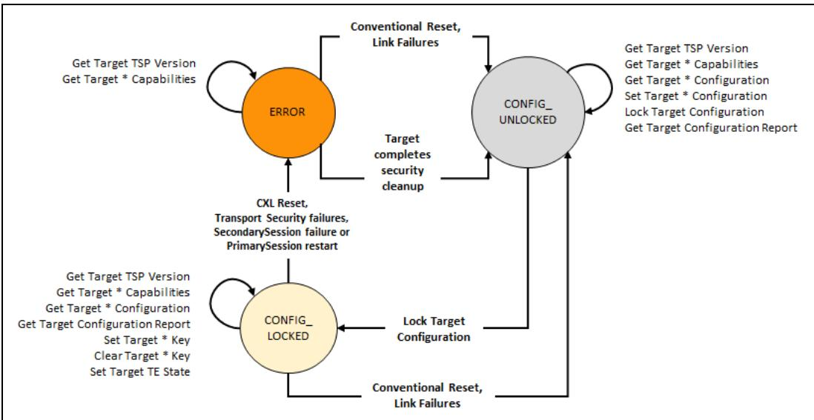

• CONFIG\_UNLOCKED

— Default security state after Conventional Reset (see Section 11.5.4.8.3 for details).

— TSP security configuration is performed in this state.

— TEE opcode transactions are not allowed by the target in this state (see Section 11.5.4.10.1).

— Non-TEE opcode transactions are allowed as discussed in Section 11.5.4.5.

— Transition to CONFIG\_LOCKED state:

• After successfully locking the target as discussed in Section 11.5.4.8.1.

## • CONFIG\_LOCKED

— Restrictions placed on register accesses, CCI commands to protect the TCB. See the Lock Target Configuration interface description (see Section 11.5.5.6.7 and Section 11.5.5.6.8) for more details on target behavior after locking.

— Target shall save TE State and if enabled, enforce TE State checking.

— Assigning keys to CKIDs or memory ranges, clearing of keys allowed in this state.

— Non-TEE opcode transactions are allowed as discussed in Section 11.5.4.5.

— TEE opcode transactions allowed as discussed in Section 11.5.4.5.

— Transition to ERROR state:

• The following are treated as errors that shall transition the target to ERROR state: Transport Security failures (e.g., CXL IDE becoming insecure), CXL Reset (which does not reset the entire device), and/or other cases in which the link can no longer be trusted or only a portion of the device is affected by the error (see Section 11.5.4.8.3 for details).

— Transition to CONFIG\_UNLOCKED state:

• Upon receipt of a Conventional Reset (see Section 11.5.4.8.3 for details).

## • ERROR

— The target shall continue to protect all TVM data when in ERROR state.

— After the target enters ERROR state, the target shall stop accepting all future TEE memory transactions. For transactions that were accepted prior to transitioning to ERROR state, it is permissible to handle those transactions as normal. See Section 11.5.4.8.3 for details.

— Non-TEE opcode transactions are allowed as discussed in Section 11.5.4.5.

— Transition to CONFIG\_UNLOCKED state:

• The target shall automatically transition from the ERROR to the CONFIG\_UNLOCKED state after it has cleaned up the current secure sessions and data (see Section 11.5.4.8.3 for details).

• Upon receipt of a Conventional Reset (see Section 11.5.4.8.3 for details).

Use of these states and the target’s behavior in each state are further detailed in Section 11.5.5.

• The TSP architecture assumes that a single authority model shall be utilized for configuration and locking of the target:

— The host owns all configuration policies

— The host establishes and locks the security configuration for all targets within its domain

— MH-SLDs implement separate target configurations for each host, thereby allowing each host to independently configure its SLDs

## 11.5.4.8.1 Locking the Target

As a pre-condition to performing the memory security checks, the DSM shall first lock the configuration to ensure that it cannot be modified during or after completion of the memory security checks. The mechanisms used by the DSM to lock the memory controller configuration, HDM decoder configuration, and other configuration context specific to the target micro-architecture are beyond the scope of this specification.

The target shall implement configuration and security checks that verify the locked configuration before successfully responding to the lock configuration request. Memory security checks are mechanisms that the target implements to verify whether its configuration is locked down and are acceptable to meet the confidential computing security objectives of protecting the TVM data. The TSM RoT relies on the DSM for these memory security checks.

• General Assumptions:

— Any target operation mode that exposes internal data or allows data logging or tracing is disabled.

— Any register that can lead to data corruption shall be locked for writing.

— Registers leading to reset events that are guaranteed to transition the DSM to ERROR state or CONFIG\_UNLOCKED state are not required to be locked for writing.

— Reading of security-sensitive registers shall be blocked. Reading of nonsecurity-sensitive registers do not need to be blocked.

— Transport Security cannot be assumed to be enabled.

• As part of the memory security checks, the DSM shall ensure the following:

— HDM decoders in the target are configured consistently and do not have aliases. These decoders are specific to the target’s implementation. An alias is present if two HPAs decode to the same DPA. See Section 8.2.4.20 for HDM decoder configuration details.

— Memory controllers and other logic in the target are configured consistently to meet the confidential computing security objectives. Such configuration shall be specific to the target’s implementation. Examples of such configuration include the DIMM population registers, interleave configuration, error-detection capabilities, ECC mode configuration, debug capabilities such as error/pattern injection logic, target row refresh controls, etc.

— HDM decoders of the LD are in a consistent state and do not have aliases or overlaps. The HDM decoders shall be locked with the Lock On Commit bit set to 1 in the CXL HDM Decoder Control register (see Table 8-123).

— Addresses that are decoded by the HDM decoders shall not overlap with addresses that are decoded as PCIe memory space for MMIO. The target shall prevent the overlapping of PCIe BARs.

— Error-detection capabilities that are required to ensure the security of TVM data shall be enabled in the Uncorrectable Error Mask register (see Table 8-96) in the CXL RAS Capability structure.

— CXL link-specific registers for the enabled TSP Transport Security mechanism control registers are programmed with parameters that are validated to be safe to support the confidential computing security objectives.

— If the target is configured to utilize Transport Security, all target CXL.cachemem links shall have Transport Security enabled to protect the security of the transport.

— PCIe DVSEC for CXL target shall be locked by asserting CONFIG\_LOCK.

— PCIe DVSEC for Test Capability, if implemented, shall be locked by asserting TestLock and no test algorithms, test capabilities, and/or error injection methods are currently active.

— No test algorithms, test capabilities, and/or error injection methods are currently active or configured through the compliance DOE mailbox.

— The compliance DOE shall be disabled, and register writes to enable the compliance DOE shall be blocked.

— Other target implementation-specific configuration checks as defined by the micro-architecture of the target.

— CXL Capabilities are configured on the target to prevent the leaking of cypher text from the target after a CXL Reset, as discussed in Section 11.5.4.8.3.

• Successfully locking the target should result in the following target behavior:

— The TEE’s memory range associated with the target is locked by making the HDM decoder configuration immutable after the target is locked.

— The target shall limit supported TSP requests to the subset of requests that are allowed when the target is in the CONFIG\_LOCKED state. See Table 11.5.5.1 for the TSP requests that are allowed on a locked target.

— Prevention of surprise changes to the target configuration that would allow unauthorized access to data that was written by a TVM, cause the target or initiator to break the data coherency model, and/or otherwise compromise TEE integrity. This may require the target to drop host writes to PCIe or CXL registers after the target is locked.

— The Get Target Configuration Report request and response (see Section 11.5.5.6.6) shall allow the initiator to securely retrieve and verify the content of specific PCIe and CXL configuration registers, after the target is locked. This allows the TSM RoT to check the configuration, securely independent of standard insecure PCIe or CXL register accesses.

— The following actions shall be prevented by making the associated registers immutable after the target is locked:

• Memory aliasing

CXL HDM Decoder Global Control register (see Table 8-118): Changing the HDM Decoder Enable state at runtime could allow an attacker to change the address for a write transaction, potentially affecting the data coherency and/or the TE State maintained on the target.

CXL HDM Decoder [n] Base Low/High, Size Low/High, and DPA Skip Low/High registers (see Section 8.2.4.20): Changing the HDM decoder programming at runtime could allow an attacker to change the address for a write transaction, potentially affecting the data coherency and/or the TE State maintained on the target.

— The host shall lock all target HDM decoders that were programmed for interleave sets that are within the TEE, utilizing the Lock On Commit feature. Register writes to locked HDM decoders are dropped.

— Writes to HDM decoders that are unlocked, not already programmed (size and skip = 0), and not considered part of the TEE must be permitted by the target. However, the target shall perform alias checking of those register writes to ensure that they do not alias address ranges that are already locked and considered to be in the TEE, independent of whether the host has set the Lock On Commit bit in the CXL HDM Decoder Control register (see Table 8-123) during decoder programming. The target shall treat aliased HDM decoders as a programming failure and shall behave the same way as if the Lock On Commit bit was set when the HDM decoder alias checks failed. The failed checks shall have no effect on the target, the TEE, and/or inflight transactions between them.

## • Altering target behavior at runtime

— CXL HDM Decoder Global Control register (see Table 8-118): Disabling the Poison On Decode Error Enable bit at runtime could cause an attacker to affect the data coherency of the target and allow the initiator to potentially consume invalid data and/or a fixed data pattern as valid data.

— DVSEC CXL Control register (see Table 8-6).

— DVSEC CXL Control2 register (see Table 8-8).

— DVSEC CXL Range 1 Base High/Low registers (see Table 8-14 and Table 8-15, respectively).

— DVSEC CXL Range 2 Base High/Low registers (see Table 8-18 and Table 8-19, respectively).

• Altering TEE memory interleave configuration at runtime

CXL HDM Decoder [n] Control register(s) (see Table 8-123): Altering IG, IW, Range Type, BI, UIO, UIG, UIW, and/or ISP at runtime could allow an attacker to steer transactions to another target and/or memory range, potentially affecting the data coherency and/or the memory integrity of the TE State stored in the target.

• Altering link or Transaction Layer behavior at runtime

— PCIe DVSEC for Flex Bus Port registers (see Section 8.1.8).

CXL IDE Control register (if utilizing CXL IDE for Transport Security; see Table 8-134): Altering PCRC Disable or IDE.Stop Enable at runtime could allow the link to operate incorrectly if there is a mismatch with the initiator. This should result in a MAC error which should cause the IDE on the link to transition to Insecure state (if IDE is enabled) and is indicated in the CXL IDE Error Status register, bit[1] and bit[7] (see Table 8-136). When IDE transitions to Insecure state, the target shall transition to ERROR state.

— Prevention of CCI commands that could allow untrusted access to data that was written by a TVM, cause the target or initiator to break the data coherency model, and/or otherwise compromise TEE integrity (see Section 11.5.4.9 for details).

— TEE opcodes shall be allowed by the target as outlined in the Access Control section (see Section 11.5.4.5).

— Enforce Read and/or Write Access Control if enabled (see Section 11.5.4.8).

— Prevention of surprise changes to the target configuration for any target implementation-specific registers, vendor-implementation-specific registers, and/or CCI commands that could allow untrusted access to data that was written by a TVM, cause the target or initiator to break the data coherency model, and/or otherwise compromise TEE integrity. This requires implementation-specific analysis and is beyond the scope of the TSP.

## 11.5.4.8.2 Considerations for Securing the Host

• The host is responsible for securing the Root Ports to secure the TEE environment, and such mechanism is beyond the scope of the TSP.

• The host should prevent surprise changes to the host configuration that would allow unauthorized access to data that was written by a TVM, cause the target and/ or host to break the data coherency model, and/or otherwise compromise TEE integrity.

• Some PCIe and CXL Root Port registers that should be protected by the host are outlined here (this is not an exhaustive list, but an example of some of the registers that affect the initiator’s link to the locked target):

— Memory aliasing

CXL HDM Decoder Global Control register (see Table 8-118): Changing the HDM Decoder Enable state at runtime could allow an attacker to change the address for a write transaction, potentially affecting the data coherency and/or the TE State maintained on the target.

• CXL HDM Decoder [n] Base Low/High, Size Low/High, and Target List Low/ High registers (see Section 8.2.4.20): Changing the HDM decoder programming at runtime could allow an attacker to change the address for a write transaction, potentially affecting the data coherency and/or the TE State maintained on the target.

• The host shall lock all HDM decoders that were programmed for interleave sets that are within the TEE, utilizing the Lock on Commit feature. Register writes to locked HDM decoders are dropped.

• Writes to HDM decoders that are unlocked, not already programmed (size and skip = 0), and not considered part of the TEE must be permitted by the initiator.

## — Altering host behavior at runtime

CXL HDM Decoder [n] Global Control register (see Table 8-118): Disabling the Poison On Decode Error Enable bit at runtime could cause an attacker to affect the data coherency of the target and allow the host to potentially consume invalid data and/or a fixed data pattern as valid data.

• CXL BI Decoder Control register (see Table 8-157): Toggling of BI Enable during runtime could affect data coherency of HDM-DB memory. If BI Decoder Commit is not toggled after reassigning bus numbers, data could be steered to the wrong location, thereby causing HDM-DB memory coherency issues.

CXL Cache ID RT Control register (see Table 8-161): If Cache ID RT Commit toggles at runtime and the Route Table contains invalid routing information, this could cause transactions to be steered to the wrong location, thereby causing data coherency issues.

• CXL Cache ID Target register(s) (see Table 8-163): Not toggling Valid and Port Number after a Route Table change could cause transactions to be steered to the wrong location, thereby causing data coherency issues.

— Altering memory interleave configuration at runtime

• CXL HDM Decoder [n] Control register(s) (see Table 8-123): Altering IG, IW, Range Type, BI, UIO, UIG, UIW, and/or ISP at runtime could allow an attacker to steer transactions to another target and/or memory range, potentially affecting the data coherency and/or the memory integrity of the TE State stored in the target.

— Altering link or Transaction Layer behavior at runtime

• PCIe DVSEC for Flex Bus Port registers (see Section 8.1.8)

• CXL Timeout and Isolation Control register (see Table 8-147)

• CXL IDE Control register (if utilizing CXL IDE for Transport Security; see Table 8-134): Altering PCRC Disable or IDE.Stop Enable at runtime could allow the link to operate incorrectly if there is a mismatch with the initiator. This should result in a MAC error which should cause the IDE on the link to transition to Insecure state (if IDE is enabled) and is indicated in the CXL IDE Error Status register, bit[1] and bit[7] (see Table 8-136). When IDE transitions to Insecure state, the target shall transition to ERROR state.

— Configuring CXL Capabilities on the target to prevent the leaking of cypher text from the target after a CXL Reset, as discussed in Section 11.5.4.8.3.

## 11.5.4.8.3 Reset and Error Handling Behavior of the Target

This section outlines the expected target TSP behavior to Conventional Reset, CXL Reset, Transport Security Failures, and changes in secure sessions. All other resets, including FLR, do not affect the secured link or Transport Security (i.e., CXL IDE) and therefore do not change the target’s TSP security state.

## 11.5.4.8.3.1 Conventional Reset and Link Failures

Because a Conventional Reset or link failure shall take down the CXL links to the target, all transactions shall immediately terminate. The target shall perform the following after receiving a Conventional Reset or on link failure:

• Terminate the CMA/SPDM SecondarySession(s) and PrimarySession

• Clear CMA/SPDM secure session keys to 0

• Target shall ensure that all TE State = 1 clear text data cannot be leaked

• If implementing target-based encryption:

— Clear association of CKID to encryption keys

— Clear association of HPA ranges to encryption keys

— Clear memory encryption keys

• Transition to CONFIG\_UNLOCKED state

## 11.5.4.8.3.2 CXL Reset, Transport Security Failures, SecondarySession(s) Termination, and PrimarySession Restart

CXL Reset, Transport Security failures such as IDE going insecure, SecondarySession(s) terminating, and/or a new PrimarySession being started all affect the target but do not take down the link. For these conditions, the target shall support the following additional requirements:

• Transition to ERROR state

• Target shall stop accepting all future TEE memory transactions

— Writes: TEE opcode writes shall be dropped and S2M NDR non-TEE opcode shall be returned for the write response.

— Reads: TEE opcode reads return a fixed data pattern of all 1s. S2M DRS non-TEE opcode shall be returned for the read response.

• Terminate the CMA/SPDM SecondarySession(s) and PrimarySession

• Clear CMA/SPDM secure session keys to 0

• Target shall ensure that all TE State = 1 clear text data cannot be leaked

• If implementing target-based encryption:

— Clear association of CKID to encryption keys

— Clear association of HPA ranges to encryption keys

— Clear memory encryption keys

• Transition to CONFIG\_UNLOCKED state

Prevention of the leaking of cypher text from the target after a CXL Reset:

• Data on the target is encrypted using initiator-based or target-based memory encryption. Clear text data is protected; however, the cipher text stored on the target could be leaked after a CXL Reset, which should be avoided.

• Target should support clearing or randomizing of volatile HDM data on reset and indicate this capability by setting the following bits to 1:

— CXL Reset Mem Clr Capable bit in the DVSEC CXL Capability register (see Table 8-5)

— Default Volatile HDM State after Cold Reset, Default Volatile HDM State after Warm Reset, and Default Volatile HDM State after Hot Reset bits in the DVSEC CXL Capability3 register (see Table 8-20)

• Target should clear the Volatile HDM State after Hot Reset Configurability bit to 0 in the DVSEC CXL Capability3 register (see Table 8-20) to indicate that the target is not capable of preserving volatile HDM state across Hot Reset.

• Target shall support resetting all TE State to 0 when enabling the ability to clear or randomize all data in response to a CXL Reset.

• If the target sets the CXL Reset Mem Clr Capable bit to 1, the host should allow the target to clear memory during CXL Reset by setting the CXL Reset Mem Clr Enable bit in the DVSEC CXL Control2 register (see Table 8-8).

## 11.5.4.9 Component Command Interfaces

When the target is locked, Component Command Interface (CCI) commands that allow the target’s configuration to be altered, new features to be set, maintenance operations to be executed, target memory partitioning changes, injecting and clearing of poison, sanitizing, and/or secure erasing shall be rejected by the target by returning Invalid Security State status.

Likewise, FM requests that can change the Dynamic Capacity configuration at runtime shall be rejected by the target by returning Invalid Security State status.

See Section 8.2.10 for the following command-specific additions that are relevant to TSP support:

• Transfer FW, Activate FW

• Set Features

• Perform Maintenance

• Set Partition Info

• Inject Poison, Clear Poison

• Sanitize, Secure Erase, Passphrase Secure Erase, Security Send

• Release Dynamic Capacity

See Section 7.6.7.6.3 for the following command-specific addition that is relevant to TSP support:

• Set DC Region Configuration

## 11.5.4.10 Dynamic Capacity

As described above, CXL security requires the device to implement configuration locking to prevent tampering with the trusted configuration at runtime. Dynamic Capacity allows for memory capacity to be added or released from one or more hosts at runtime but relies on a static maximum capacity configuration to have been configured at initialization time.

The following sections outline specific areas in which there are additional requirements for targets that implement both Dynamic Capacity and TSP.

## 11.5.4.10.1 TE State Changes

For Dynamic Capacity targets that implement TE State changes, there are additional responsibilities:

• Before a target adds any Dynamic Capacity to a host and before adding capacity to one host after releasing the capacity from a different host, the target shall overwrite or cryptographically clear the memory contents and reset the TE State to 0 for memory ranges described in extents that will be added to a host in response to an Add Dynamic Capacity command (see Section 8.2.10.9.9.3). By overwriting those ranges and resetting the TE State, the extents that will be added shall be

reset to an untrusted state to prevent stale trusted data released from one host from being exposed to a trusted entity when adding that memory to another host.

## 11.5.4.10.2 Multiple Host Considerations

For Dynamic Capacity implementations that utilize multiple hosts, only a single host may generate transactions to a specific DPA range at any given time.

• Target shall maintain an association between the host in which the Dynamic Capacity is being added and the target that is providing the memory. The target shall not allow other hosts to access the memory until the memory has been released from the current host, at which point the host to target association is removed and the TE State is reset as described above.

• Note that implementing Dynamic Capacity on a target already requires the target to maintain this host to target association and the target shall correctly reject transactions from hosts that do not currently own the Dynamic Capacity. This behavior is described in Section 9.13.3.

## 11.5.4.11 HDM-DB

The following sections describe the additional challenges that are present when utilizing HDM-DB memory with the TSP, and the resulting initiator and target requirements and behaviors that are needed for confidential computing with this type of memory.

With HDM-H memory, the host is responsible for maintaining the cache coherency state of the memory. With HDM-DB memory, the target that owns the HDM-DB memory maintains the cache coherency state for the memory. The initiator and target utilize the BISnp channel and BIRsp channel to resolve coherency.

In support of confidential computing, HDM-DB support in TSP enables target-side computing.

The target HDM Decoders shall be programmed before the target is locked through TSP. This allows the following functions:

• Target to utilize the BI indicator in the programmed HDM decoders to determine whether the HDM-DB-specific requirements and behaviors outlined here are to be utilized

• Host TEE architecture to ensure that HDM-DB support is only enabled if the architecture is capable of supporting such a configuration

To correctly pass TEE Intent and TE State, additional request and response opcodes are required for HDM-DB. These required opcodes are outlined below, and defined in the M2S Req Memory Opcodes definitions, S2M BISnp Opcodes definitions, S2M NDR Opcodes definitions, and Appendix C, as appropriate.

For the TSP to operate correctly with the HDM-DB protocol, the following subsections outline additional requirements, initiator behaviors, and target behaviors that define HDM-DB use with confidential computing. This includes:

• Initiator and target requirements for handling requester cache state and TE State changes

• M2S request opcodes to carry TEE Intent in support of HDM-DB:

— MemInvTEE

— MemInvP/MemInvPTEE — Memory invalidation requiring a precise TE State

— MemClnEvctU — Memory clean eviction with an unknown TE State

— MemClnEvctTEE