reset to an untrusted state to prevent stale trusted data released from one host from being exposed to a trusted entity when adding that memory to another host.

## 11.5.4.10.2 Multiple Host Considerations

For Dynamic Capacity implementations that utilize multiple hosts, only a single host may generate transactions to a specific DPA range at any given time.

• Target shall maintain an association between the host in which the Dynamic Capacity is being added and the target that is providing the memory. The target shall not allow other hosts to access the memory until the memory has been released from the current host, at which point the host to target association is removed and the TE State is reset as described above.

• Note that implementing Dynamic Capacity on a target already requires the target to maintain this host to target association and the target shall correctly reject transactions from hosts that do not currently own the Dynamic Capacity. This behavior is described in Section 9.13.3.

## 11.5.4.11 HDM-DB

The following sections describe the additional challenges that are present when utilizing HDM-DB memory with the TSP, and the resulting initiator and target requirements and behaviors that are needed for confidential computing with this type of memory.

With HDM-H memory, the host is responsible for maintaining the cache coherency state of the memory. With HDM-DB memory, the target that owns the HDM-DB memory maintains the cache coherency state for the memory. The initiator and target utilize the BISnp channel and BIRsp channel to resolve coherency.

In support of confidential computing, HDM-DB support in TSP enables target-side computing.

The target HDM Decoders shall be programmed before the target is locked through TSP. This allows the following functions:

• Target to utilize the BI indicator in the programmed HDM decoders to determine whether the HDM-DB-specific requirements and behaviors outlined here are to be utilized

• Host TEE architecture to ensure that HDM-DB support is only enabled if the architecture is capable of supporting such a configuration

To correctly pass TEE Intent and TE State, additional request and response opcodes are required for HDM-DB. These required opcodes are outlined below, and defined in the M2S Req Memory Opcodes definitions, S2M BISnp Opcodes definitions, S2M NDR Opcodes definitions, and Appendix C, as appropriate.

For the TSP to operate correctly with the HDM-DB protocol, the following subsections outline additional requirements, initiator behaviors, and target behaviors that define HDM-DB use with confidential computing. This includes:

• Initiator and target requirements for handling requester cache state and TE State changes

• M2S request opcodes to carry TEE Intent in support of HDM-DB:

— MemInvTEE

— MemInvP/MemInvPTEE — Memory invalidation requiring a precise TE State

— MemClnEvctU — Memory clean eviction with an unknown TE State

— MemClnEvctTEE

• S2M BISnp opcodes to carry TEE Intent in support of HDM-DB:

— BISnpCurTEE

— BISnpDataTEE

— BISnpInvTEE

— BISnpCurBlkTEE

— BISnpDataBlkTEE

— BISnpInvBlkTEE

• S2M NDR response opcodes to report TE State:

— MemInvP/MemInvPTEE returns Cmp, CmpTEE, CmpTEE-S, or CmpTEE-E

## 11.5.4.11.1 Determining TSP Support with HDM-DB

A target’s support of HDM-DB memory is determined by looking at the BI bit in each HDM Decoder Control register (see Table 8-123). HDM ranges with the BI flag set are enabled for HDM-DB. The target reports support for TSP with the TSP Capable bit in the DVSEC CXL Capability register (see Table 8-5).

Targets that report HDM-DB support and are TSP capable shall support all the request and response opcodes that are described here.

## 11.5.4.11.2 Requester Coherency State (RCS)

The Requester Coherency State (RCS) is the cache state maintained by the initiator. There are a variety of existing initiator implementations that handle RCS in fundamentally different ways. The following requirements take that into account and outline the expected initiator behaviors for maintaining RCS with HDM-DB and TSP, independent of implementation.

TSP behaviors for HDM-DB initiators:

• Initiators may update RCS without regard to the TE State. These initiators may utilize implicit and/or explicit TE State changes on the target.

• Initiators may update RCS by TE State. These initiators shall utilize explicit TE State changes on the target.

• When receiving a BISnp command, initiators may invalidate all RCS for a given address, regardless of whether the TE State specified in the BISnp command matches the TE State held in the RCS. However, initiators may safely retain RCS that does not match the TE State following a BISnp, as long as the initiator can guarantee that no internal or external entity can observe stale cache data.

• Initiators shall take additional actions (i.e., software-initiated cache flushes) to ensure RCS consistency on the target after a TE State mismatch when the target reports this requirement in the Additional Capabilities field of a Get Target Capabilities Response.

## 11.5.4.11.3 Device Tracked Requester Coherency State (DTRCS)

The Device Tracked Requester Coherency State (DTRCS) is the initiator’s cache state that is maintained by the target. There are a variety of existing target implementations that handle DTRCS in fundamentally different ways. The following requirements take that into account and outline the expected initiator and target behaviors for maintaining DTRCS with HDM-DB and TSP, independent of implementation.

TSP behaviors for HDM-DB initiators and targets:

• Targets that update DTRCS after a TE State mismatch shall require no special handling.

• Targets that do not update DTRCS after a TE State mismatch shall require one of the following target behaviors:

— When the target receives a request on the M2S Req channel that results in a TE State mismatch, the target completes the request, issues a BISnp with the current TE State being tracked for the address in the request, and then blocks all new M2S requests to the address (including requests internal to the device) from the time that the request that caused the mismatch is processed until the BISnp completion is received, or

— Target requires the initiator to take additional actions after a TE State mismatch occurs.

• Target indicates this dependency by setting the Initiator Actions Required following TE State Mismatch bit to 1 in the Get Target Capabilities Response (see Table 11-48).

• When this is indicated, the initiator is responsible for ensuring that coherency is maintained after the mismatch. Initiator responsibilities may include software-initiated target cache flushes, or disallowing the mismatched cacheline from allocating in the initiator’s cache.

• Targets shall relax buried state rules to avoid unexpected state downgrade on MemRd, MemRdTEE, MemRdData, and MemRdDataTEE that result in a TE State mismatch as described in Section 11.5.4.11.17 and the HDM-DB-related content in Section C.1.

## 11.5.4.11.4 TE State Changes

TSP behaviors for HDM-DB targets during a TE State change are as follows:

• Targets shall support explicit and/or implicit TE State changes as specified in Section 11.5.4.5.

• Targets shall use BISnp to snoop back all addresses that are affected by a TE State change, before any memory contents or TE State is updated. While the snoop-back cycle is in progress:

— Target shall block access to the affected memory (although it is legal to block the Request channel for short amounts of time without causing timeouts, the RwD channel cannot be blocked without risking deadlock), or

— Target shall handle the received transactions that address the same memory region that is undergoing the snoop back as a TE State mismatch and shall follow the mismatch behavior outlined in Section 11.5.4.5 and the subsections that follow.

TSP behavior for HDM-DB initiators during a TE State change is as follows:

• Initiators that retain the data following a BISnp that was requested with a TE State mismatch shall utilize an explicit TE State change command.

## 11.5.4.11.5 BISnp S2M Requests with TE State

The BISnp S2M requests are extended to encode a TE State. HDM-DB targets shall include TE State when sending a BISnp. This is provided for initiators that may require an accurate TE State to correctly resolve RCS for the target.

The TE State contained within the BISnp S2M request shall match the current TE State that is tracked by the target for the address being snooped.

If the BISnp is occurring in response to an explicit TE update, then all the BISnp associated with the TE State update shall complete before the TE State is updated.

All HDM-DB-capable targets that utilize TSP shall support the reporting of TE State with all BISnp S2M request opcodes.

Table 11-28 outlines the required BISnp S2M request opcodes that targets shall support.

Table 11-28. Supported BISnp S2M Request Opcodes

<table><tr><td>S2M Request Opcode</td><td>TEE Intent (that matches the current TE State)</td><td>Description</td></tr><tr><td>BISnpCurBISnpDataBISnpInvBISnpCurBlkBISnpDataBlkBISnpInvBlk</td><td>0</td><td>Back invalidate the memory with current TE State 0.</td></tr><tr><td>BISnpCurTEEBISnpDataTEEBISnpInvTEEBISnpCurBlkTEEBISnpDataBlkTEEBISnpInvBlkTEE</td><td>1</td><td>Back invalidate the memory with current TE State 1.</td></tr></table>

## 11.5.4.11.6 MemRd M2S Requests with TEE Intent

MemRd M2S requests shall include TEE Intent that utilizes MemRd or MemRdTEE M2S request opcodes. TEE intent is provided for targets that may require an accurate TE State to correctly process the read request. MemRd is utilized for TEE Intent = 0. MemRdTEE is utilized for TEE Intent = 1.

All HDM-DB-capable targets that utilize TSP shall support the MemRd/MemRdTEE M2S request opcodes.

Table 11-29 outlines the required MemRd M2S request opcodes that targets shall support.

Table 11-29. Supported MemRd M2S Request Opcodes

<table><tr><td>M2S Request Opcode</td><td>TEE Intent</td><td>Target Behavior</td></tr><tr><td>MemRd</td><td>0</td><td>Read memory with TEE Intent 0.</td></tr><tr><td>MemRdTEE</td><td>1</td><td>Read memory with TEE Intent 1.</td></tr></table>

## 11.5.4.11.7 MemRd S2M DRS Responses with TE State

MemRd/MemRdTEE S2M DRS responses shall return a TE State that utilizes MemData or MemDataTEE, respectively. The target shall respond with the current TE State associated with the underlying data being read.

MemRd/MemRdTEE with MetaValue I is not supported when the target has been locked with TSP. If this request is received while TSP is enabled, the target shall respond with MemData with all 1s data and optionally return poison, and the initiator shall not infer a TE State. This allows differentiation in behavior from a valid MemRd with MetaValue I that is received when TSP is not utilized.

All HDM-DB-capable targets that utilize TSP shall support the MemData/MemDataTEE responses for MemRd/MemRdTEE M2S request opcodes, respectively.

There are additional requirements for targets that maintain DTRCS. If a TE State mismatch is detected when executing the MemRd/MemRdTEE, the target shall not degrade the final DTRCS when handling the response. See Section C.1 for special cases for not downgrading DTRCS on a TE State mismatch.

Table 11-30 outlines the valid MemRd S2M DRS response opcodes that targets shall support when the current TE State matches the TEE Intent of the MemRd.

Supported MemRd S2M DRS Response Opcodes when Current TE State Matches TEE Intent

<table><tr><td>M2S Request Opcode</td><td>Valid S2M DRS Response</td><td>Target Behavior</td></tr><tr><td>MemRd</td><td>MemData</td><td>• Memory read with TE State = 0</td></tr><tr><td>MemRdTEE</td><td>MemDataTEE</td><td>• Memory read with TE State = 1</td></tr></table>

Table 11-31 outlines the valid MemRd S2M DRS response opcodes that targets shall support when the current TE State does not match the TEE Intent of the MemRd.

Table 11-31. Supported MemRd S2M DRS Response Opcodes when Current TE State Does Not Match TEE Intent

<table><tr><td>M2S Request Opcode</td><td>Valid S2M DRS Response</td><td>Target Behavior</td></tr><tr><td>MemRd</td><td>MemDataTEE</td><td>Memory read with TEE Intent = 0 resulted in a mismatch.</td></tr><tr><td>MemRdTEE</td><td>MemData</td><td>Memory read with TEE Intent = 1 resulted in a mismatch.</td></tr></table>

## 11.5.4.11.8 MemInv M2S Requests with TEE Intent

MemInv M2S requests shall include TEE Intent that utilizes MemInv or MemInvTEE M2S request opcodes. TEE Intent is provided for targets that may require an accurate TE State to change the state of the cacheline. MemInv is utilized for TEE Intent = 0. MemInvTEE is utilized for TEE Intent = 1. The TEE Intent shall indicate the intended TE State of memory following the DTRCS update.

The MemInv/MemInvTEE S2M NDR response does not convey TE State and shall not be utilized as an indicator of TE State. Initiators that require a precise TE State in the response shall utilize MemInvP/MemInvPTEE M2S requests.

All HDM-DB-capable targets that utilize TSP shall support the MemInv/MemInvTEE M2S request opcodes.

Table 11-32 outlines the required MemInv M2S request opcodes that targets shall support.

Table 11-32. Supported MemInv M2S Request Opcodes

<table><tr><td>M2S Request Opcode</td><td>TEE Intent</td><td>Target Behavior</td></tr><tr><td>MemInv</td><td>0</td><td>Invalidate the memory with TEE Intent 0. Initiator does not require TE State in the response as described below.</td></tr><tr><td>MemInvTEE</td><td>1</td><td>Invalidate the memory with TEE Intent 1. Initiator does not require TE State in the response as described below.</td></tr></table>

## 11.5.4.11.9 MemInvP M2S Requests with TEE Intent

MemInvP/MemInvPTEE M2S request opcodes are utilized to indicate the TEE Intent of the invalidate and that the initiator requires a precise TE State to accompany the MemInvP/MemInvPTEE completion response. TEE Intent is provided for targets that may require an accurate TEE Intent to change the DTRCS of the cacheline. The TEE Intent shall indicate the intended TE State of memory following the DTRCS update.

Initiators that retain RCS following a BISnp shall utilize MemInvP/MemInvPTEE if knowledge of the TE State being invalidated is required for that initiator’s cache implementation.

Targets shall determine the current TE State of the memory being invalidated before responding to these requests.

All HDM-DB-capable targets that utilize TSP shall support the MemInvP/MemInvPTEE M2S request opcodes.

Table 11-33 outlines the required MemInvP M2S request opcodes that targets shall support.

Table 11-33. Supported MemInvP M2S Request Opcodes

<table><tr><td>M2S Request Opcode</td><td>TEE Intent</td><td>Target Behavior</td></tr><tr><td>MemInvP</td><td>0</td><td>Invalidate the memory with TEE Intent 0Report the precise TE State in the response</td></tr><tr><td>MemInvPTEE</td><td>1</td><td>Invalidate the memory with TEE Intent 1Report the precise TE State in the response</td></tr></table>

## 11.5.4.11.10MemInv and MemInvP S2M NDR Responses with TE State

MemInvP/MemInvPTEE S2M NDR responses shall return a TE State that utilizes Cmp or CmpTEE, respectively. The target shall respond with the current TE State associated with the underlying data being invalidated. This may require the responding target to look up the TE State prior to completing the MemInv M2S request even though no data will be returned.

All HDM-DB-capable targets that utilize TSP shall support the Cmp/CmpTEE responses for MemInvP/MemInvPTEE M2S request opcodes, respectively.

Table 11-34 outlines the valid MemInv S2M NDR response opcodes that targets shall support when the current TE State matches the TEE Intent of the MemInv.

Table 11-34. Supported MemInv S2M NDR Response Opcodes when Current TE State Matches TEE Intent

<table><tr><td>M2S Request Opcode</td><td>Valid S2M NDR Response</td><td>Target Behavior</td></tr><tr><td>MemInv</td><td>Cmp</td><td rowspan="3">Invalidate memoryDo not return TE State in the response</td></tr><tr><td rowspan="2">MemInvTEE</td><td>Cmp-S</td></tr><tr><td>Cmp-E</td></tr><tr><td rowspan="3">MemInvP</td><td>Cmp</td><td rowspan="6">Invalidate memoryReturn current TE State in the response</td></tr><tr><td>Cmp-S</td></tr><tr><td>Cmp-E</td></tr><tr><td rowspan="3">MemInvPTEE</td><td>CmpTEE</td></tr><tr><td>CmpTEE-S</td></tr><tr><td>CmpTEE-E</td></tr></table>

Table 11-35 outlines the valid MemInv S2M NDR response opcodes that targets shall support when the current TE State does not match the TEE Intent of the MemInv.

Supported MemInv S2M NDR Response Opcodes when Current TE State Does Not Match TEE Intent

<table><tr><td>M2S Request Opcode</td><td>Valid S2M NDR Response</td><td>Target Behavior</td></tr><tr><td>MemInv</td><td rowspan="2">CmpCmp-SCmp-E</td><td rowspan="2">· Invalidate memory (because a precise TE State is not required, there is no reason not to invalidate the memory for the mismatch case)· Return Cmp· Optionally log an event</td></tr><tr><td>MemInvTEE</td></tr><tr><td>MemInvP</td><td>CmpTEECmpTEE-SCmpTEE-E</td><td rowspan="2">· Do not invalidate the memory· Return current TE State· Optionally log an event</td></tr><tr><td>MemInvPTEE</td><td>CmpCmp-SCmp-E</td></tr></table>

## 11.5.4.11.11MemRdData M2S Requests with TEE Intent

MemRdData M2S requests shall include TEE Intent that utilizes MemRdData or MemRdDataTEE M2S request opcodes. TEE intent is provided for targets that may require an accurate TE State to process the read request. MemRdData is utilized for TEE Intent = 0. MemRdDataTEE is utilized for TEE Intent = 1.

All HDM-DB-capable targets that utilize TSP shall support the MemRdData/ MemRdDataTEE M2S request opcodes.

Table 11-36 outlines the required MemRdData M2S request opcodes that targets shall support.

Table 11-36. Supported MemRdData M2S Request Opcodes

<table><tr><td>M2S Request Opcode</td><td>TEE Intent</td><td>Target Behavior</td></tr><tr><td>MemRdData</td><td>0</td><td>Read memory with TEE Intent 0.</td></tr><tr><td>MemRdDataTEE</td><td>1</td><td>Read memory with TEE Intent 1.</td></tr></table>

## 11.5.4.11.12MemRdData S2M DRS Responses with TE State

MemRdData/MemRdDataTEE S2M DRS responses shall return a TE State that utilizes MemData or MemDataTEE, respectively. The target shall respond with the current TE State associated with the underlying data being read.

All HDM-DB-capable targets that utilize TSP shall support the MemData/MemDataTEE S2M DRS responses for MemRdData/MemRdDataTEE M2S request opcodes, respectively.

There are additional requirements for targets that maintain DTRCS. If a TE State mismatch is detected when executing the MemRdData/MemRdDataTEE, the target shall not degrade the final DTRCS when handling the response. See Section C.1 for special cases for not downgrading DTRCS on a TE State mismatch.

Table 11-37 outlines the valid MemRdData S2M DRS response opcodes that targets shall support when the current TE State matches the TEE Intent of the MemRdData.

Supported MemRdData S2M DRS Response Opcodes when Current TE State Matches TEE Intent

<table><tr><td>M2S Request Opcode</td><td>Valid S2M DRS Response</td><td>Target Behavior</td></tr><tr><td>MemRdData</td><td>MemData</td><td>Memory read with TE State = 0.</td></tr><tr><td>MemRdDataTEE</td><td>MemDataTEE</td><td>Memory read with TE State = 1.</td></tr></table>

Table 11-38 outlines the valid MemRdData S2M DRS response opcodes that targets shall support when the current TE State does not match the TEE Intent of the MemRdData.

Table 11-38. Supported MemRdData S2M DRS Response Opcodes when Current TE State Does Not Match TEE Intent

<table><tr><td>M2S Request Opcode</td><td>Valid S2M DRS Response</td><td>Target Behavior</td></tr><tr><td>MemRdData</td><td>MemDataTEE</td><td>Memory read with TEE Intent = 0 resulted in a mismatch.</td></tr><tr><td>MemRdDataTEE</td><td>MemData</td><td>Memory read with TEE Intent = 1 resulted in a mismatch.</td></tr></table>

## 11.5.4.11.13MemSpecRd M2S Requests with TEE Intent

MemSpecRd M2S requests shall include TEE Intent that utilizes MemSpecRd or MemSpecRdTEE M2S request opcodes. TEE intent is provided for targets that may require an accurate TE State to process the speculative read request. MemSpecRd is utilized for TEE Intent = 0. MemSpecRdTEE is utilized for TEE Intent = 1.

All HDM-DB-capable targets that utilize TSP shall support the MemSpecRd/ MemSpecRdTEE M2S request opcodes.

Table 11-39 outlines the required MemSpecRd M2S request opcodes that targets shall support.

Table 11-39. Supported MemSpecRd M2S Request Opcodes

<table><tr><td>M2S Request Opcode</td><td>TEE Intent</td><td>Target Behavior</td></tr><tr><td>MemSpecRd</td><td>0</td><td>Speculatively read memory with TEE Intent 0.</td></tr><tr><td>MemSpecRdTEE</td><td>1</td><td>Speculatively read memory with TEE Intent 1.</td></tr></table>

## 11.5.4.11.14MemClnEvct M2S Requests without TEE Intent

The MemClnEvctU M2S request opcode may be utilized by initiators that do not know the TE State of the memory being clean evicted. The MemClnEvctU M2S request does not convey TEE intent and shall not be utilized as an indicator of TE State.

Initiators should avoid utilizing MemClnEvctU, and should utilize MemClnEvct or MemClnEvctTEE whenever possible for best performance. Initiators that utilize MemClnEvctU shall not track TE State when maintaining RCS.

HDM-DB targets that require an accurate TE State to process eviction requests and receive MemClnEvctU may evict by utilizing the current TE State, may evict both TE States, or may not evict anything. Initiators that require specific target behavior should utilize MemClnEvct or MemClnEvctTEE.

Targets should take additional measures to locate and clean the DTRCS associated with the eviction request because failure to complete a clean eviction may result in additional BISnp requests, which can potentially impact system performance.

All HDM-DB-capable targets that utilize TSP shall support the MemClnEvctU opcode.

## 11.5.4.11.15MemClnEvct M2S Requests with TEE Intent

MemClnEvct M2S requests shall include TEE Intent that utilizes MemClnEvct or MemClnEvctTEE M2S request opcodes. TEE Intent is provided for targets that may require the TE State to process the eviction request and reset the state of the cacheline. MemClnEvct is utilized for TEE Intent = 0. MemClnEvctTEE is utilized for TEE Intent = 1.

All HDM-DB-capable targets that utilize TSP shall support the MemClnEvct and MemClnEvctTEE M2S request opcodes.

Table 11-40 outlines the required MemClnEvct M2S request opcodes that targets shall support.

Table 11-40. Supported MemClnEvct M2S Request Opcodes

<table><tr><td>M2S Request Opcode</td><td>TEE Intent</td><td>Target Behavior</td></tr><tr><td>MemCInEvctU</td><td>N/A</td><td>Perform clean evict independent of TE State.</td></tr><tr><td>MemCInEvct</td><td>0</td><td>Perform clean evict using TEE Intent 0.</td></tr><tr><td>MemCInEvctTEE</td><td>1</td><td>Perform clean evict using TEE Intent 1.</td></tr></table>

## 11.5.4.11.16MemClnEvct S2M NDR Responses with TE State

Because MemClnEvctU/MemClnEvct/MemClnEvctTEE are provided for performance and not for correctness, none of these M2S requests require TE State to be reported in the response.

Table 11-41 outlines the valid MemClnEvct S2M NDR response opcodes that targets shall support when the current TE State matches or mismatches the TEE Intent of the MemClnEvct.

Table 11-41. Supported MemClnEvct S2M NDR Response Opcodes

<table><tr><td>M2S Request Opcode</td><td>Valid S2M NDR Response</td><td>Target Behavior</td></tr><tr><td>MemCInEvctU</td><td rowspan="3">Cmp</td><td>The current state of the memory evicted is unknown.</td></tr><tr><td>MemCInEvct</td><td>The current state of the memory evicted is TE State = 0.</td></tr><tr><td>MemCInEvctTEE</td><td>The current state of the memory evicted is TE State = 1.</td></tr></table>

## 11.5.4.11.17Buried State Behavior

For targets that maintain DTRCS and support TE State tracking, if the target detects a TE State mismatch when the initiator is requesting S state, the target shall not downgrade the final DTRCS. MemRd, MemRdTEE, MemRdData, and MemRdDataTEE shall not downgrade DTRCS for a TE State mismatch (see Section C.1 for details).

Targets that do not update DTRCS after a TE State mismatch and rely on additional host actions to correct RCS may leave the final device cache and/or DTRCS unchanged after the mismatch occurs, thereby relying on software actions to correct any coherency issues. See the UCM cases in the Device Cache and DTRCS columns of Table C-3 in Appendix C for details.

## 11.5.5 TSP Requests and Responses

Each TSP Request sent over the secure CMA/SPDM session shall result in exactly one TSP Response, the Delayed Response if the request will take significant time to complete, or the Error Response if the request could not be executed.

## 11.5.5.1 TSP Request Overview

Table 11-42 outlines the TSP Request payloads, defined in the sections that follow.

Table 11-42. TSP Request Payload Overview

<table><tr><td colspan="2">TSP Request Message</td><td> $Message Support^1$ </td><td rowspan="2">Payload Size</td><td rowspan="2">Legal TSP State</td><td rowspan="2">TSP Usage</td></tr><tr><td>Opcode</td><td>Name</td><td>HDM-H and HDM-DB Devices</td></tr><tr><td>81h</td><td>Get Target TSP Version</td><td rowspan="6">M</td><td>4</td><td rowspan="2">CONFIG_UNLOCKED CONFIG_LOCKED ERROR</td><td rowspan="5">Target config</td></tr><tr><td>82h</td><td>Get Target Capabilities</td><td>4</td></tr><tr><td>83h</td><td>Set Target Configuration</td><td>C2h+</td><td>CONFIG_UNLOCKED</td></tr><tr><td>84h</td><td>Get Target Configuration</td><td>4</td><td rowspan="2">CONFIG_UNLOCKED CONFIG_LOCKED</td></tr><tr><td>85h</td><td>Get Target Configuration Report</td><td>8</td></tr><tr><td>86h</td><td>Lock Target Configuration</td><td>4</td><td>CONFIG_UNLOCKED</td><td>Target config lock</td></tr><tr><td>87h</td><td>Set Target CKID Specific Key</td><td rowspan="3">O — CKID-based target memory encryption</td><td>10h+</td><td rowspan="8">CONFIG_LOCKED</td><td rowspan="3">Runtime CKID-based target memory encryption</td></tr><tr><td>88h</td><td>Set Target CKID Random Key</td><td>10h+</td></tr><tr><td>89h</td><td>Clear Target CKID Key</td><td>8</td></tr><tr><td>8Ah</td><td>Set Target Range Specific Key</td><td rowspan="3">O — Range-based target memory encryption</td><td>20h+</td><td rowspan="3">Runtime range-based target memory encryption</td></tr><tr><td>8Bh</td><td>Set Target Range Random Key</td><td>20h+</td></tr><tr><td>8Ch</td><td>Clear Target Range Key</td><td>8</td></tr><tr><td>8Dh</td><td>Set Target TE State</td><td>O — Explicit TE State changes</td><td>20h+</td><td>Runtime explicit state changes</td></tr><tr><td>8Eh</td><td>Check Target Delayed Completion</td><td>O — Delayed completion of a request</td><td>4</td><td>Checking for completion of a long executing request</td></tr></table>

1. M = Mandatory message, O = Optional message. Targets shall return a Error Response of Unsupported Request if the target does not support the request.

## 11.5.5.2 TSP Response Overview

Table 11-43 outlines the TSP Response payloads, defined in the sections that follow.

Table 11-43. TSP Response Payload Overview

<table><tr><td colspan="2">TSP Response Message</td><td>Message  $Support^{1}$ </td><td rowspan="2">Payload Size</td></tr><tr><td>Opcode</td><td>Name</td><td>HDM-H and HDM-DB Devices</td></tr><tr><td>01h</td><td>Get Target TSP Version Response</td><td rowspan="6">M</td><td>5+</td></tr><tr><td>02h</td><td>Get Target Capabilities Response</td><td>34h</td></tr><tr><td>03h</td><td>Set Target Configuration Response</td><td>4</td></tr><tr><td>04h</td><td>Get Target Configuration Response</td><td>C0h</td></tr><tr><td>05h</td><td>Get Target Configuration Report Response</td><td>8+</td></tr><tr><td>06h</td><td>Lock Target Configuration Response</td><td>4</td></tr><tr><td>07h</td><td>Set Target CKID Specific Key Response</td><td rowspan="3">O — CKID-based target memory encryption</td><td>4</td></tr><tr><td>08h</td><td>Set Target CKID Random Key Response</td><td>4</td></tr><tr><td>09h</td><td>Clear Target CKID Key Response</td><td>4</td></tr><tr><td>0Ah</td><td>Set Target Range Specific Key Response</td><td rowspan="3">O — Range-based target memory encryption</td><td>4</td></tr><tr><td>0Bh</td><td>Set Target Range Random Key Response</td><td>4</td></tr><tr><td>0Ch</td><td>Clear Target Range Key Response</td><td>4</td></tr><tr><td>0Dh</td><td>Set Target TE State Response</td><td>O — Explicit TE State changes</td><td>4</td></tr><tr><td>0Eh</td><td>Check Target Delayed Completion Response</td><td rowspan="2">O — Delayed completion of a request</td><td>4</td></tr><tr><td>7Eh</td><td>Delayed Response</td><td>8</td></tr><tr><td>7Fh</td><td>Error Response</td><td>M</td><td>0Ch+</td></tr></table>

1. M = Mandatory message, O = Optional message.

## 11.5.5.3 Request Response and CMA/SPDM Sessions

Table 11-44 outlines which TSP-defined Request and Response payloads are allowed on a given TSP-defined CMA/SPDM session and which of those payloads are prohibited.

## Table 11-44. TSP Request Response and CMA/SPDM Sessions

<table><tr><td>TSP Request Response Message</td><td>SPDM PrimarySession</td><td>SPDM SecondarySession(s)</td><td>Other non-TSP-related SPDM Session</td></tr><tr><td>Get Target TSP Version Get Target TSP Version Response</td><td rowspan="16">Allowed</td><td>Allowed</td><td>Allowed</td></tr><tr><td>Get Target Capabilities Get Target Capabilities Response</td><td>Allowed</td><td>Allowed</td></tr><tr><td>Set Target Configuration Set Target Configuration Response</td><td>Prohibited</td><td>Prohibited</td></tr><tr><td>Get Target Configuration Get Target Configuration Response</td><td>Allowed</td><td>Prohibited</td></tr><tr><td>Get Target Configuration Report Get Target Configuration Report Response</td><td>Allowed</td><td>Prohibited</td></tr><tr><td>Lock Target Configuration Lock Target Configuration Response</td><td>Prohibited</td><td>Prohibited</td></tr><tr><td>Set Target TE State Set Target TE State Response</td><td>Allowed</td><td>Prohibited</td></tr><tr><td>Check Target Delayed Completion Check Target Delayed Completion Response</td><td>Allowed</td><td>Prohibited</td></tr><tr><td>Set Target CKID Specific Key Set Target CKID Specific Key Response</td><td>Allowed</td><td>Prohibited</td></tr><tr><td>Set Target CKID Random Key Set Target CKID Random Key Response</td><td>Allowed</td><td>Prohibited</td></tr><tr><td>Clear Target CKID Key Clear Target CKID Key Response</td><td>Allowed</td><td>Prohibited</td></tr><tr><td>Set Target Range Specific Key Set Target Range Specific Key Response</td><td>Allowed</td><td>Prohibited</td></tr><tr><td>Set Target Range Random Key Set Target Range Random Key Response</td><td>Allowed</td><td>Prohibited</td></tr><tr><td>Clear Target Range Key Clear Target Range Key Response</td><td>Allowed</td><td>Prohibited</td></tr><tr><td>Delayed Response</td><td>Allowed</td><td>Allowed</td></tr><tr><td>Error Response</td><td>Allowed</td><td>Allowed</td></tr></table>

## 11.5.5.4 Version

## 11.5.5.4.1 TSP Version Negotiation

The PrimarySession shall be utilized to perform the following process to negotiate TSP version with TSP-capable targets:

• Initiator shall send Get Target TSP Version request with Major Version Number = 1h.

• DSM shall support Get Target TSP Version request with Major Version Number = 1h and shall return Get Target TSP Version Response with a list of all supported versions.

• Initiator shall select a common (typically highest) version supported and utilize this version number in all subsequent messages to the target.

• Initiator shall not issue requests to the target other than Get Target TSP Version until the initiator has received a successful Get Target TSP Version Response and selected a common version that is supported by both the initiator and the target.

## 11.5.5.4.2 Get Target TSP Version

The initiator shall utilize Get Target TSP Version to discover the TSP versions that the target supports.

Possible Error Response, Error Codes:

• None

Table 11-45. Get Target TSP Version

<table><tr><td>Byte Offset</td><td>Length in Bytes</td><td>Description</td></tr><tr><td>00h</td><td>1</td><td>TSP Version: V1.0 = 10h.</td></tr><tr><td>01h</td><td>1</td><td>Opcode: Get Target TSP Version = 81h.</td></tr><tr><td>02h</td><td>2</td><td>Reserved</td></tr></table>

## 11.5.5.4.3 Get Target TSP Version Response

If no error condition is detected, the DSM shall respond to the Get Target TSP Version with a Get Target TSP Version Response message.

Table 11-46. Get Target TSP Version Response

<table><tr><td>Byte Offset</td><td>Length in Bytes</td><td>Description</td></tr><tr><td>00h</td><td>1</td><td>TSP Version: V1.0 = 10h.</td></tr><tr><td>01h</td><td>1</td><td>Opcode: Get Target TSP Version Response = 01h.</td></tr><tr><td>02h</td><td>2</td><td>Reserved</td></tr><tr><td>04h</td><td>1</td><td>Version Number Entry Count: The number of version entries, N, that follow. Shall be &gt; 0.</td></tr><tr><td>05h</td><td>N</td><td>Version Number Entry: 8-bit version entry formatted as:Bits[7:4]: Major Version Number = 1Bits[3:0]: Minor Version Number = 0</td></tr></table>

## 11.5.5.5 Target Capabilities

The following request and response payload defines the TSP security features that the target supports.

## 11.5.5.5.1 Get Target Capabilities

Any SPDM session may utilize the Get Target Capabilities request to discover the target’s memory encryption, access control, and configuration capabilities.

Possible Error Response, Error Codes:

• Version Mismatch

Table 11-47. Get Target Capabilities

<table><tr><td>Byte Offset</td><td>Length in Bytes</td><td>Description</td></tr><tr><td>00h</td><td>1</td><td>TSP Version: V1.0 = 10h.</td></tr><tr><td>01h</td><td>1</td><td>Opcode: Get Target Capabilities = 82h.</td></tr><tr><td>02h</td><td>2</td><td>Reserved</td></tr></table>

## 11.5.5.5.2 Get Target Capabilities Response

If no error condition is detected, the DSM shall respond to the Get Target Capabilities request with a Get Target Capabilities Response message.

Table 11-48. Get Target Capabilities Response (Sheet 1 of 3)

<table><tr><td>Byte Offset</td><td>Length in Bytes</td><td>Description</td></tr><tr><td>00h</td><td>1</td><td>TSP Version: V1.0 = 10h.</td></tr><tr><td>01h</td><td>1</td><td>Opcode: Get Target Capabilities Response = 02h.</td></tr><tr><td>02h</td><td>2</td><td>Memory Encryption Features Supported: Memory encryption related features that the target supports. Zero or more bits may be set. 1 indicates supported, 0 indicates not supported.Bit[0]: Encryption: When set, memory encryption for data at rest is implemented on the target.Bit[1]: CKID-based Encryption: When set:— Target supports the CKID-based TSP requests and responses for memory encryption— Encryption bit in this field shall also be set— CKID Base Required bit in this field shall be valid— Number of CKIDs field shall be valid— Range-based Encryption bit in this field shall be clearedWhen cleared, the target does not support the CKID field in Transaction Layer requests.Bit[2]: Range-based Encryption: When set:— Target supports the range-based TSP requests and responses— Encryption bit in this field shall also be set— CKID-based Encryption bit in this field shall be cleared— Memory Encryption Number of Range Based Keys field shall be validBit[3]: Initiator Supplied Entropy: The target supports initiator-supplied entropy when generating a random key.Bit[4]: CKID Base Required: Valid only when the CKID-based Encryption bit is set in this field. When set, the target requires a CKID Base and Number of CKIDs to be programmed. When cleared, the target supports any CKID value within the 13-bit CKID field.Bits[15:5]: Reserved.</td></tr><tr><td>04h</td><td>4</td><td>Memory Encryption Algorithms Supported: Valid only if the Encryption bit is set in the Memory Encryption Features Supported field. 1 indicates supported, 0 indicates not supported. If target memory encryption is supported, one or more bits shall be set.Bit[0]: AES-XTS-128Bit[1]: AES-XTS-256Bits[30:2]: ReservedBit[31]: Vendor Specific Algorithm: When set, all other bits in this field are vendor specific</td></tr><tr><td>08h</td><td>2</td><td>Memory Encryption Number of Range Based Keys: Valid only if the Range-based Encryption bit is set in the Memory Encryption Features Supported field. This is the maximum Range ID that can be utilized with the range-based memory encryption requests. Targets that do not support range-based memory encryption shall report 0.</td></tr><tr><td>0Ah</td><td>2</td><td>Reserved</td></tr></table>

Table 11-48. Get Target Capabilities Response (Sheet 2 of 3)

<table><tr><td>Byte Offset</td><td>Length in Bytes</td><td>Description</td></tr><tr><td>0Ch</td><td>2</td><td>TE State Change and Access Control Features Supported: The TE State change and access control features that the target supports. Zero or more bits may be set. 1 indicates supported, 0 indicates not supported.Bit[0]: Write Access Control: When set:- Target supports dropping writes that fail the verification of TEE Intent to stored TE State- Explicit state changes shall be supported- One or more of bits[4:3] in this field shall also be setBit[1]: Read Access Control: When set:- Target supports returning all 1s for read data in response to reads that fail the verification of TEE Intent to stored TE State- One or more of bits[4:2] in this field shall also be setBit[2]: Implicit TE State Change: When set:- Target supports implicit TE State changes using a 64B granularity- Explicit In-band TE State Change bit in this field shall be set- Support for 64B shall be set in the Supported Explicit In-band TE State Granularity fieldBit[3]: Explicit Out-of-band TE State Change: When set:- Target supports the CMA/SPDM out-of-band explicit Set Target TE State change message- Supported Explicit Out-of-band TE State Granularity field shall be validSupport is optional for targets that support implicit TE State changes or explicit in-band TE State changes.Bit[4]: Explicit In-band TE State Change: When set:- Target supports explicit TE State changes utilizing the TEUpdate memory transaction- Supported Explicit In-band TE State Granularity field shall be validSupport is required for targets that support implicit TE State changes. Support is optional for targets that support explicit out-of-band TE State changes.Bit[5]: Explicit TE State Change Sanitize: When set:- Target supports overwriting data that is affected by the explicit state change with 0s when the explicit request is received and before the change is considered complete by the target- One or more of bits[4:3] in this field shall also be setBits[15:6]: Reserved.</td></tr><tr><td>0Eh</td><td>1</td><td>Additional Capabilities: Other security-related features and capabilities of the target.Bit[0]: Initiator Actions Required following TE State Mismatch: When set, indicates that the HDM-DB-capable target will require initiator actions (i.e., software-initiated cache flushes) to ensure that the correct DTRCS is maintained on the target after a TE State mismatch. When cleared, the target does not require additional initiator actions to maintain DTRCS after a TE State mismatch. This bit is only valid if the following conditions are met:- Target reports Device Coherent in the Supported Coherency Models field in the CXL HDM Decoder Capability register(s) (see Table 8-116)- BI is supported in the CXL HDM Decoder Control register(s) (see Table 8-123)Bits[7:1]: Reserved.</td></tr><tr><td>0Fh</td><td>1</td><td>Reserved</td></tr><tr><td>10h</td><td>4</td><td>Supported Explicit Out-of-band TE State Granularity: The granularity the target supports for explicit out-of-band TE State changes and verification in powers of 2, starting with 64B. Valid only if the Explicit Out-of-band TE State Change bit is set in the TE State Change and Access Control Features Supported field. One or more bits shall be set. 1 indicates target support, 0 indicates no target support.Bit[0]: 64B...Bit[6]: 4 KB...Bit[15]: 2 MB...Bit[24]: 1 GB...Bit[31]: 128 GB</td></tr></table>

Table 11-48. Get Target Capabilities Response (Sheet 3 of 3)

<table><tr><td>Byte Offset</td><td>Length in Bytes</td><td>Description</td></tr><tr><td>14h</td><td>4</td><td>Supported Explicit In-band TE State Granularity: The granularity the target supports for explicit in-band TE State changes and verification in powers of 2, starting with 64B. Valid only if the Explicit In-band TE State Change bit is set in the TE State Change and Access Control Features Supported field. One or more bits shall be set. 1 indicates target support, 0 indicates no target support.Bit[0]: 64Bit[1]: 128Bit[2]: 256Bit[3]: 512Bit[4]: 1 KBit[5]: 2 KBit[6]: 4 KBit[7]: 8 KBit[8]: 16 KBit[9]: 32 KBit[10]: 64 KBit[30:11]:ReservedBit[31]: The entire memory space of the device. When set, the target supports TEUpdate using Length Index 7 to change the TE State for the entire address range. When cleared, the target does not support use of Length Index 7.</td></tr><tr><td>18h</td><td>2</td><td>Configuration Features Supported: The configuration features that the target supports. Zero or more bits may be set. 1 indicates supported, 0 indicates not supported.Bit[0]:Locked Target FW Update: When set, the target supports FW updates after the target is locked. When cleared to 0, the target does not support FW updates after the target is locked.Bit[1]:Target Supports Additional CMA/SPDM Sessions: The target supports using CMA/SPDM PSK to set up one or more SecondarySession(s). When set, the Number of Secondary Sessions field shall be valid. When cleared, the target does not support secondary SPDM sessions.Bits[15:2]:Reserved.</td></tr><tr><td>1Ah</td><td>2</td><td>Reserved</td></tr><tr><td>1Ch</td><td>4</td><td>Number of CKIDs: Total number of CKIDs that the target supports. Valid only if CKID-based Encryption is set in the Memory Encryption Features Supported field. Shall be ≥ 2 and &lt;  $2^{13}$ .</td></tr><tr><td>20h</td><td>1</td><td>Number of Secondary Sessions: Total number of additional SPDM SecondarySessions that the target supports. When valid, this shall be &gt; 0 and ≤ 4.</td></tr><tr><td>21h</td><td>13h</td><td>Reserved</td></tr></table>

## 11.5.5.6 Target Configuration

The following request and response payloads provide TSP configuration, locking, and register reporting of the target.

## 11.5.5.6.1 Set Target Configuration

The PrimarySession is utilized with the Set Target Configuration request to place the target in the preferred transport configuration. This includes providing SecondarySession CMA/SPDM PSK Key Material that shall be utilized by the Target to generate random keys for this additional session.

Possible Error Response, Error Codes:

• Version Mismatch

• Invalid Request

— Entropy was not supplied

— Number of CKIDs being enabled is > Number of CKIDs the target reported in Get Target Configuration

— CKID Base is ≥ $2 ^ { 1 3 }$

— CKID Base + Number of CKIDs ≥ 213

— TE State Granularity specified is not supported by the target

— Length Indexes are not unique

— Length Index 0 or 7 was specified but the TE State Granularity was not 0

— Implicit TE State Change is enabled and Explicit In-band TE State Change is not enabled, or no Explicit In-band TE State Granularity Entries enable Length Index 0

— CKID-based Encryption and Range-based Encryption are both enabled

— Write Access Control and Implicit TE State Change are both enabled

## • No Privilege

— A PrimarySession is already established and this request was not received on the PrimarySession

— If Transport Security is required with TSP: A Transport Security session is already established, and this request was not received on that session

• Invalid Security State

• Target not in CONFIG\_UNLOCKED state

The following structure shall be utilized for associating explicit TE State lengths to specific indexes that are utilized with the TEUpdate memory transaction. Implementations that do not utilize explicit in-band TE State changes do not need to include valid information in the response payload for these entries.

Table 11-49. Explicit In-band TE State Granularity Entry

<table><tr><td>Byte Offset</td><td>Length in Bytes</td><td>Description</td></tr><tr><td>00h</td><td>8</td><td>TE State Granularity: The number of bytes of contiguous HPA space to which the explicit in-band TE State change will apply when the TEUpdate memory transaction is received by the target. Shall be one of the values reported by the target in the Supported Explicit In-band TE State Granularity field reported in Get Target Capabilities. When specifying Length Index 0 or 7, this field shall be 0 because the length is predefined. This field is ignored when Length Index is FFh.</td></tr><tr><td>08h</td><td>1</td><td>Length Index: The 3-bit length index that shall be utilized to represent the TE State Length in the SnpType portion of the TEUpdate memory transaction. Value shall be ≥ 0 and ≤ 7 for valid Explicit In-band TE State Granularity Entries. Each length entry specified shall utilize a unique Length Index. Value FFh is reported for unused Explicit In-band TE State Granularity Entries.</td></tr><tr><td>09h</td><td>7</td><td>Reserved</td></tr></table>

Table 11-50. Set Target Configuration (Sheet 1 of 4)

<table><tr><td>Byte Offset</td><td>Length in Bytes</td><td>Description</td></tr><tr><td>000h</td><td>1</td><td>TSP Version: V1.0 = 10h.</td></tr><tr><td>001h</td><td>1</td><td>Opcode: Set Target Configuration = 83h.</td></tr></table>

Table 11-50. Set Target Configuration (Sheet 2 of 4)

<table><tr><td>Byte Offset</td><td>Length in Bytes</td><td>Description</td></tr><tr><td>002h</td><td>2</td><td>Memory Encryption Features Enable: Enable the memory encryption features for the target. Zero or more bits may be set. 1 indicates to enable, 0 indicates to disable.Bit[0]:Encryption: When set, memory encryption for data at rest shall be enabled on the target. When cleared, target memory encryption shall be disabled.Bit[1]:CKID-based Encryption: When set: — CKID-based encryption shall be enabled on the target — Encryption bit in this field shall also be set — CKID Base Required field shall be valid — Range-based Encryption bit in this field shall be clearedWhen cleared, the target shall disable use of the CKID field in the Transaction Layer requests.Bit[2]:Range-based Encryption: When set: — Range-based encryption shall be enabled on the target — Encryption bit in this field shall also be set — CKID-based Encryption bit in this field shall be clearedWhen cleared, the target shall disable use of range-based target memory encryption.Bit[3]:CKID Base Required: Valid only when the CKID-based Encryption bit in this field is set. When set: — Target shall enable a valid CKID range — CKID Base field and Number of CKIDs field shall be validWhen cleared, the target shall enable any CKID value within the 13-bit CKID field.Bits[15:4]:Reserved.</td></tr><tr><td>004h</td><td>4</td><td>Memory Encryption Algorithm Select: Valid only if the Encryption bit is set in the Memory Encryption Features Enable field. Selects the target memory encryption algorithm to utilize. Only one bit shall be set. 1 indicates selected, 0 indicates not selected.Bit[0]:AES-XTS-128Bit[1]:AES-XTS-256Bits[30:2]:ReservedBit[31]:Vendor Specific Algorithm: When set, all other bits in this field are vendor specific</td></tr><tr><td>008h</td><td>4</td><td>Reserved</td></tr><tr><td>00Ch</td><td>2</td><td>TE State Change and Access Control Features Enable: Enable the TE State change and access control features for the target. Zero or more bits may be set. 1 indicates to enable, 0 indicates to disable.Bit[0]:Write Access Control: When set: — Target shall enable dropping writes that fail the verification of TEE Intent to the stored TE State — Explicit state changes shall be enabled — One or more of bits[4:3] in this field shall also be set — Implicit TE State Change bit in this field shall be clearedBit[1]:Read Access Control: When set: — Target shall enable returning all 1s for read data in response to reads that fail the verification of TEE Intent to stored TE State — One or more of bits[4:2] in this field shall also be setBit[2]:Implicit TE State Change: When set: — Implicit TE State changes shall be enabled on the target using 64B granularity — Explicit In-band TE State Change bit in this field shall be set — At least one Explicit In-band TE State Granularity Entry with Length Index 0 shall be enabled — Write Access Control bit in this field shall be clearedWhen cleared, implicit TE State changes shall be disabled on the target.Bit[3]:Explicit Out-of-band TE State Change: When set: — Target shall be enabled to utilize the explicit CMA/SPDM out-of-band explicit Set Target TE State change request — Explicit Out-of-band TE State Granularity field shall be validBit[4]:Explicit In-band TE State Change: When set: — Target shall be enabled for explicit in-band TE State changes utilizing the TEUpdate memory transaction — Explicit In-band TE State Granularity Entries shall be validBit[5]:Explicit TE State Change Sanitize: When set: — Target shall be enabled to overwrite data that is affected by the explicit state change with 0s when the explicit request is received and before the change is considered complete by the target — One or more of bits[4:3] in this field shall also be setBits[15:6]:Reserved.</td></tr><tr><td>00Eh</td><td>2</td><td>Reserved</td></tr></table>

Table 11-50. Set Target Configuration (Sheet 3 of 4)

<table><tr><td>Byte Offset</td><td>Length in Bytes</td><td>Description</td></tr><tr><td>010h</td><td>4</td><td>Explicit Out-of-band TE State Granularity: The granularity that the initiator is requesting the target to utilize for explicit out-of-band TE State changes in powers of 2, starting with 64B. Valid only if the Explicit Out-of-band TE State Change bit is set in the TE State Change and Access Control Features Enable field. Only one bit may be set. 1 indicates target shall enable, 0 indicates target shall disable.Bit[0]: 64B...Bit[6]: 4 KB...Bit[15]: 2 MB...Bit[24]: 1 GB...Bit[31]: 128 GB</td></tr><tr><td>014h</td><td>4</td><td>Reserved</td></tr><tr><td>018h</td><td>2</td><td>Configuration Features Enable: Enable the configuration features for the target. Zero or more bits may be set. 1 indicates to enable, 0 indicates to disable.Bit[0]: Locked Target FW Update: When set, the target shall enable FW updates after the target is locked. When cleared, the target shall disable FW updates after the target is locked.Bit[1]: Special Purpose Memory: When set, memory reported to the initiator should not be treated as general-purpose memory. Accelerator devices shall set this bit to indicate that the exposed memory capacity cannot be utilized as general-purpose memory by the initiator. The target should also report EFI Memory Type and Attribute of EfiConventionalMemory EFI_MEMORY_SP for the corresponding memory ranges in the CDAT DSEMTS. When cleared, the initiator may utilize the memory capacity as general-purpose memory.Bits[15:2]: Reserved.</td></tr><tr><td>01Ah</td><td>2</td><td>Reserved</td></tr><tr><td>01Ch</td><td>4</td><td>CKID Base: The lowest CKID that the target shall enable. Valid only if the CKID Base Required bit is set in the Memory Encryption Features Enable field. Shall be  $< 2^{13}$ .</td></tr><tr><td>020h</td><td>4</td><td>Number of CKIDs: Number of contiguous CKIDs that the target shall enable, starting at the CKID Base. Valid only if the CKID Base Required bit is set in the Memory Encryption Features Enable field. Shall be  $\leq$  Number of CKIDs reported by the target in Get Target Capabilities. CKID Base + Number of CKIDs shall be  $< 2^{13}$ .</td></tr><tr><td>024h</td><td>0Ch</td><td>Reserved</td></tr><tr><td>030h</td><td>10h</td><td>Explicit In-band TE State Granularity Entry 0</td></tr><tr><td>040h</td><td>10h</td><td>Explicit In-band TE State Granularity Entry 1</td></tr><tr><td>050h</td><td>10h</td><td>Explicit In-band TE State Granularity Entry 2</td></tr><tr><td>060h</td><td>10h</td><td>Explicit In-band TE State Granularity Entry 3</td></tr><tr><td>070h</td><td>10h</td><td>Explicit In-band TE State Granularity Entry 4</td></tr><tr><td>080h</td><td>10h</td><td>Explicit In-band TE State Granularity Entry 5</td></tr><tr><td>090h</td><td>10h</td><td>Explicit In-band TE State Granularity Entry 6</td></tr><tr><td>0A0h</td><td>10h</td><td>Explicit In-band TE State Granularity Entry 7</td></tr><tr><td>0B0h</td><td>10h</td><td>Reserved</td></tr></table>

Table 11-50. Set Target Configuration (Sheet 4 of 4)

<table><tr><td>Byte Offset</td><td>Length in Bytes</td><td>Description</td></tr><tr><td>0C0h</td><td>2</td><td>Configuration Validity Flags: Indicators of which fields are valid in the remaining portion of this request. Zero or more bits may be set.Bit[0]: Secondary Session 0: When set, the Secondary Session 0 PSK Key Material field and Secondary Session 0 CKID Type field shall both be valid and utilized by the target to generate a key for use when a SecondarySession0 is created utilizing CMA/SPDM PSK. When cleared, no SecondarySession0 is allowed by the target. This bit shall be set only if Get Target Capabilities, Number of Secondary Sessions field is &gt; 0.Bit[1]: Secondary Session 1: When set, the Secondary Session 1 PSK Key Material field and Secondary Session 1 CKID Type field shall both be valid and utilized by the target to generate a key for use when a SecondarySession1 is created utilizing CMA/SPDM PSK. When cleared, no SecondarySession1 is allowed by the target. This bit shall be set only if Get Target Capabilities, Number of Secondary Sessions field is &gt; 1.Bit[2]: Secondary Session 2: When set, the Secondary Session 2 PSK Key Material field and Secondary Session 2 CKID Type field shall both be valid and utilized by the target to generate a key for use when a SecondarySession2 is created utilizing CMA/SPDM PSK. When cleared, no SecondarySession2 is allowed by the target. This bit shall be set only if Get Target Capabilities, Number of Secondary Sessions field is &gt; 2.Bit[3]: Secondary Session 3: When set, the Secondary Session 3 PSK Key Material field and Secondary Session 3 CKID Type field shall both be valid and utilized by the target to generate a key for use when a SecondarySession3 is created utilizing CMA/SPDM PSK. When cleared, no SecondarySession3 is allowed by the target. This bit shall be set only if Get Target Capabilities, Number of Secondary Sessions field is &gt; 3.• Bits[15:4]: Reserved.</td></tr><tr><td>0C2h</td><td>0Eh</td><td>Reserved</td></tr><tr><td>0D0h</td><td>1</td><td>Secondary Session CKID Type: The CKID Type to assign to a SecondarySession.Bit[0]: Secondary Session 0 CKID Type: When set, the CKID shall be considered a TVMCKID. When cleared, the CKID shall be considered an OSCKID. This field shall be valid if the Configuration Validity Flags, Secondary Session 0 bit is set.Bit[1]: Secondary Session 1 CKID Type: When set, the CKID shall be considered a TVMCKID. When cleared, the CKID shall be considered an OSCKID. This field shall be valid if the Configuration Validity Flags, Secondary Session 1 bit is set.Bit[2]: Secondary Session 2 CKID Type: When set, the CKID shall be considered a TVMCKID. When cleared, the CKID shall be considered an OSCKID. This field shall be valid if the Configuration Validity Flags, Secondary Session 2 bit is set.Bit[3]: Secondary Session 3 CKID Type: When set, the CKID shall be considered a TVMCKID. When cleared, the CKID shall be considered an OSCKID. This field shall be valid if the Configuration Validity Flags, Secondary Session 3 bit is set.• Bits[7:4]: Reserved.</td></tr><tr><td>0D1h</td><td>0Fh</td><td>Reserved</td></tr><tr><td>0E0h</td><td>20h</td><td>Secondary Session 0 PSK Key Material: The CMA/SPDM PSK key material that the target shall utilize for key derivation when the SecondarySession0 CMA/SPDM secure session is created. This field shall be valid if the Configuration Validity Flags, Secondary Session 0 bit is set. When this PSK key material is used to set up the CMA/SPDM SecondarySession0, the associated CMA/SPDM PSK Hint entry in the CMA/SPDM PSK_EXCHANGE request shall be a “SECONDARY_SESSION_0_PSK” string with a NUL terminator.</td></tr><tr><td>100h</td><td>20h</td><td>Secondary Session 1 PSK Key Material: The CMA/SPDM PSK key material that the target shall utilize for key derivation when the SecondarySession1 CMA/SPDM secure session is created. This field shall be valid if the Configuration Validity Flags, Secondary Session 1 bit is set. When this PSK key material is used to set up the CMA/SPDM SecondarySession1, the associated CMA/SPDM PSK Hint entry in the CMA/SPDM PSK_EXCHANGE request shall be a “SECONDARY_SESSION_1_PSK” string with a NUL terminator.</td></tr><tr><td>120h</td><td>20h</td><td>Secondary Session 2 PSK Key Material: The CMA/SPDM PSK key material that the target shall utilize for key derivation when the SecondarySession2 CMA/SPDM secure session is created. This field shall be valid if the Configuration Validity Flags, Secondary Session 2 bit is set. When this PSK key material is used to set up the CMA/SPDM SecondarySession2, the associated CMA/SPDM PSK Hint entry in the CMA/SPDM PSK_EXCHANGE request shall be a “SECONDARY_SESSION_2_PSK” string with a NUL terminator.</td></tr><tr><td>140h</td><td>20h</td><td>Secondary Session 3 PSK Key Material: The CMA/SPDM PSK key material that the target shall utilize for key derivation when the SecondarySession3 CMA/SPDM secure session is created. This field shall be valid if the Configuration Validity Flags, Secondary Session 3 bit is set. When this PSK key material is used to set up the CMA/SPDM SecondarySession3, the associated CMA/SPDM PSK Hint entry in the CMA/SPDM PSK_EXCHANGE request shall be a “SECONDARY_SESSION_3_PSK” string with a NUL terminator.</td></tr></table>

## 11.5.5.6.2 Set Target Configuration Response

If no error condition is detected, the DSM shall respond to the Set Target Configuration request with a Set Target Configuration Response message.

Table 11-51. Set Target Configuration Response

<table><tr><td>Byte Offset</td><td>Length in Bytes</td><td>Description</td></tr><tr><td>00h</td><td>1</td><td>TSP Version: V1.0 = 10h.</td></tr><tr><td>01h</td><td>1</td><td>Opcode: Set Target Configuration Response = 03h.</td></tr><tr><td>02h</td><td>2</td><td>Reserved</td></tr></table>

## 11.5.5.6.3 Get Target Configuration

The PrimarySession or SecondarySession(s) shall utilize the Get Target Configuration request to verify that the target is in the correct security mode after the target is locked. While it is possible to report the configuration with this request before the target is locked, the content cannot be trusted to be immutable until this request is executed after the target is successfully locked.

Possible Error Response, Error Codes:

• Version Mismatch

• No Privilege

— The request was not received on the PrimarySession or SecondarySession(s)

• Invalid Security State

— Target not in CONFIG\_LOCKED or CONFIG\_UNLOCKED state

Table 11-52. Get Target Configuration

<table><tr><td>Byte Offset</td><td>Length in Bytes</td><td>Description</td></tr><tr><td>00h</td><td>1</td><td>TSP Version: V1.0 = 10h.</td></tr><tr><td>01h</td><td>1</td><td>Opcode: Get Target Configuration = 84h.</td></tr><tr><td>02h</td><td>2</td><td>Reserved</td></tr></table>

## 11.5.5.6.4 Get Target Configuration Response

If no error condition is detected, the DSM shall respond to the Get Target Configuration request with a Get Target Configuration Response message.

Table 11-53. Get Target Configuration Response (Sheet 1 of 3)

<table><tr><td>Byte Offset</td><td>Length in Bytes</td><td>Description</td></tr><tr><td>00h</td><td>1</td><td>TSP Version: V1.0 = 10h.</td></tr><tr><td>01h</td><td>1</td><td>Opcode: Get Target Configuration Response = 04h.</td></tr><tr><td>02h</td><td>2</td><td>Memory Encryption Features Enabled: The memory encryption features that are enabled for the locked target. Zero or more bits may be set. 1 indicates to enable, 0 indicates to disable.Bit[0]: Encryption: When set, memory encryption for data at rest is enabled on the target.Bit[1]: CKID-based Encryption: When set:- CKID-based encryption is enabled on the target- Encryption bit in this field shall be set- CKID Base Required bit in this field shall be valid- Range-based Encryption bit in this field shall be clearedWhen cleared, the target has disabled use of the CKID field in the Transaction Layer requests.Bit[2]: Range-based Encryption: When set:- Range-based encryption is enabled on the target- Encryption bit in this field shall also be set- CKID-based Encryption bit in this field shall be clearedWhen cleared, the target has disabled use of range-based target memory encryption.Bit[3]: CKID Base Required: Valid only when the CKID-based Encryption bit is set in this field.When set:- Target has been enabled for a valid CKID range- CKID Base field and Number of CKIDs field shall be validWhen cleared, the target has enabled any CKID value within the 13-bit CKID field.Bits[15:4]: Reserved.</td></tr><tr><td>04h</td><td>4</td><td>Memory Encryption Algorithm Selected: Valid only if the Encryption bit is set in the Memory Encryption Features Enabled field. Indicates the target memory encryption algorithm that is selected for the locked target. Only one bit may be set. 1 indicates selected, 0 indicates not selected.Bit[0]: AES-XTS-128Bit[1]: AES-XTS-256Bits[30:2]: ReservedBit[31]: Vendor Specific Algorithm: When set, all other bits in this field are vendor specific</td></tr><tr><td>08h</td><td>4</td><td>Reserved</td></tr></table>

Table 11-53. Get Target Configuration Response (Sheet 2 of 3)

<table><tr><td>Byte Offset</td><td>Length in Bytes</td><td>Description</td></tr><tr><td>0Ch</td><td>2</td><td>TE State Change and Access Control Features Enabled: The TE State change and access control features that are enabled for the locked target. Zero or more bits may be set. 1 indicates enabled, 0 indicates disabled.Bit[0]: Write Access Control: When set:- Dropping writes that fail the verification of TEE Intent to stored TE State is enabled on the target- Explicit state changes shall be enabled- One or more of bits[4:3] in this field shall also be setBit[1]: Read Access Control: When set:- Returning all 1s for read data in response to reads that fail the verification of TEE Intent to stored TE State is enabled on the target- One or more of bits[4:2] in this field shall also be setBit[2]: Implicit TE State Change: When set:- Implicit TE State change feature has been enabled on the target- Explicit In-band TE State Change shall be enabled- At least one Explicit In-band TE State Granularity Entry with Length Index 0 shall be enabledWhen cleared, the implicit TE State change feature has been disabled on the target.Bit[3]: Explicit Out-of-band TE State Change: When set:- Use of the explicit CMA/SPDM out-of-band Set Target TE State change request is enabled on the target- Explicit Out-of-Band TE State Granularity field shall be validBit[4]: Explicit In-band TE State Change: When set:- Explicit in-band TE State changes utilizing the TEUpdate memory transaction is enabled on the target- Explicit In-band TE State Granularity Entries shall be validBit[5]: Explicit TE State Change Sanitize: When set:- Target is enabled to overwrite data that is affected by the explicit state change with 0s when the explicit request is received and before the change is considered complete by the target- One or more of bits[4:3] in this field shall also be setBits[15:6]: Reserved.</td></tr><tr><td>0Eh</td><td>2</td><td>Reserved</td></tr><tr><td>10h</td><td>4</td><td>Explicit Out-of-band TE State Granularity Enabled: The granularity that has been enabled on the target to utilize for explicit TE State changes in powers of 2, starting with 64B. Valid only if the Explicit Out-of-band TE State Change bit is set in the TE State Change and Access Control Features Enabled field. Only one bit shall be set. 1 indicates selected, 0 indicates not selected.Bit[0]: 64B...Bit[6]: 4 KB...Bit[15]: 2 MB...Bit[24]: 1 GB...Bit[31]: 128 GB</td></tr><tr><td>14h</td><td>4</td><td>Reserved</td></tr><tr><td>18h</td><td>2</td><td>Configuration Features Enabled: The configuration features that are enabled for the locked target. Zero or more bits may be set. 1 indicates to enable, 0 indicates to disable.Bit[0]: Locked Target FW Update: When set, FW updates after the target is locked are enabled on the target. When cleared, FW updates after the target is locked are disabled on the target.Bits[15:1]: Reserved.</td></tr><tr><td>1Ah</td><td>2</td><td>Reserved</td></tr><tr><td>1Ch</td><td>4</td><td>CKID Base: The lowest CKID that the target enabled. Valid only if the CKID Base Required bit is set in Memory Encryption Features Enabled field. Shall be  $< 2^{13}$ .</td></tr><tr><td>20h</td><td>4</td><td>Number of CKIDs: Number of contiguous CKIDs that the target enabled, starting at the CKID Base. Valid only if the CKID Base Required bit is set in the Memory Encryption Features Enabled field. CKID Base + Number of CKIDs shall be  $< 2^{13}$ .</td></tr></table>

Table 11-53. Get Target Configuration Response (Sheet 3 of 3)

<table><tr><td>Byte Offset</td><td>Length in Bytes</td><td>Description</td></tr><tr><td>24h</td><td>1</td><td>Current TSP State00h = CONFIG_UNLOCKED01h = CONFIG_LOCKED02h = ERRORAll other encodings are reserved</td></tr><tr><td>25h</td><td>0Bh</td><td>Reserved</td></tr><tr><td>30h</td><td>10h</td><td>Explicit In-band TE State Granularity Entry 0</td></tr><tr><td>40h</td><td>10h</td><td>Explicit In-band TE State Granularity Entry 1</td></tr><tr><td>50h</td><td>10h</td><td>Explicit In-band TE State Granularity Entry 2</td></tr><tr><td>60h</td><td>10h</td><td>Explicit In-band TE State Granularity Entry 3</td></tr><tr><td>70h</td><td>10h</td><td>Explicit In-band TE State Granularity Entry 4</td></tr><tr><td>80h</td><td>10h</td><td>Explicit In-band TE State Granularity Entry 5</td></tr><tr><td>90h</td><td>10h</td><td>Explicit In-band TE State Granularity Entry 6</td></tr><tr><td>A0h</td><td>10h</td><td>Explicit In-band TE State Granularity Entry 7</td></tr><tr><td>B0h</td><td>10h</td><td>Reserved</td></tr></table>

## 11.5.5.6.5 Get Target Configuration Report

The PrimarySession shall be utilized with the Get Target Configuration Report request to return specific CXL.mem configuration register TSP Report content that is utilized to verify the locked target’s configuration. Section 11.5.4.8 describes the checks that can be conducted on the TSP Report response payload that is returned from this request.

This request allows select CXL configuration register contents on the endpoint target to be returned for verification through the secure PrimarySession, and is modeled after the TDISP Get Interface Report request.

While it is possible to read the configuration with this request, before the target is locked, the content cannot be trusted to be immutable until this request is executed after the target is successfully locked.

Possible Error Response, Error Codes:

• Version Mismatch

• No Privilege

— Request was not received on the PrimarySession or SecondarySession(s)

• Invalid Security State

— Target not in CONFIG\_LOCKED or CONFIG\_UNLOCKED state

Table 11-54. Get Target Configuration Report (Sheet 1 of 2)

<table><tr><td>Byte Offset</td><td>Length in Bytes</td><td>Description</td></tr><tr><td>00h</td><td>1</td><td>TSP Version: V1.0 = 10h.</td></tr><tr><td>01h</td><td>1</td><td>Opcode: Get Target Configuration Report = 85h.</td></tr></table>

Table 11-54. Get Target Configuration Report (Sheet 2 of 2)

<table><tr><td>Byte Offset</td><td>Length in Bytes</td><td>Description</td></tr><tr><td>02h</td><td>2</td><td>Reserved</td></tr><tr><td>04h</td><td>2</td><td>Offset: Offset in bytes from the start of the report to where this request message begins. For the first Get Target Configuration Report request, the initiator shall clear this field to all 0s. For non-first requests, the offset is the sum of Portion Length values reported in all the previous Get Target Configuration Report Responses.</td></tr><tr><td>06h</td><td>2</td><td>Length: The length of the report in bytes to be returned in the corresponding response. Length is an unsigned 16-bit integer. This value is the smaller of the following values:Capacity of the initiator&#x27;s internal buffer for receiving the target&#x27;s reportRemainder Length of the preceding Get Target Configuration Report responseIf the Length is &gt; Remainder Length, the target shall transfer the remaining Report Data, Portion Length, and a Remainder Length of 0 in the response.</td></tr></table>

## 11.5.5.6.6 Get Target Configuration Report Response

If no error condition is detected, the DSM shall respond to the Get Target Configuration Report request with a Get Target Configuration Report Response message.

Table 11-55. Get Target Configuration Report Response

<table><tr><td>Byte Offset</td><td>Length in Bytes</td><td>Description</td></tr><tr><td>00h</td><td>1</td><td>TSP Version: V1.0 = 10h.</td></tr><tr><td>01h</td><td>1</td><td>Opcode: Get Target Configuration Report Response = 05h.</td></tr><tr><td>02h</td><td>2</td><td>Reserved</td></tr><tr><td>04h</td><td>2</td><td>Portion Length: Number of bytes of this portion of the TSP Report. This shall be less than or equal to Length received as part of the request. The target is permitted to set this field to a value that is less than the Length received in the request due to limitations on the target&#x27;s internal buffer.</td></tr><tr><td>06h</td><td>2</td><td>Remainder Length: Number of bytes of the TSP Report that have not been sent yet after the current response. For the last response, the target shall clear this field to all 0s as an indication to the initiator that the entire TSP Report has been sent.</td></tr><tr><td>08h</td><td>Portion Length</td><td>Report Data: Requested contents of TSP Report.</td></tr></table>

Table 11-56 presents the TSP Report structure.

Table 11-56. TSP Report (Sheet 1 of 2)

<table><tr><td>Byte Offset</td><td>Length in Bytes</td><td>Description</td></tr><tr><td>00h</td><td>1</td><td>Valid TSP Report Fields: Only one bit may be set.Bit[0]: CXL IDE Capability Structure Valid: When set, the TSP Report contains a valid CXL IDE Capability StructureBits[7:1]: Reserved</td></tr><tr><td>01h</td><td>3</td><td>Reserved</td></tr><tr><td>04h</td><td>3Ch</td><td>PCIe DVSEC for CXL Devices: See Section 8.1. Reports the first 3Ch bytes of the structure.</td></tr><tr><td>40h</td><td>20h</td><td>PCIe DVSEC for Flex Bus Port: See Section 8.2. Reports the first 20h bytes of the structure.</td></tr><tr><td>60h</td><td>38h</td><td>CXL Link Capability Structure: See Section 8.2.4.19. Reports the first 38h bytes of the structure.</td></tr></table>

Table 11-56. TSP Report (Sheet 2 of 2)

<table><tr><td>Byte Offset</td><td>Length in Bytes</td><td>Description</td></tr><tr><td>98h</td><td>10h</td><td>Reserved</td></tr><tr><td>A8h</td><td>10h + k*20h</td><td>CXL HDM Decoder Capability Structure: The number of HDM decoders (k) is specified in the Decoder Count field in the CXL HDM Decoder Capability register(s) (see Table 8-116). See Section 8.2.4.20. Reports the first 20h bytes of the structure.</td></tr><tr><td>B8h + k*20h</td><td>24h</td><td>CXL IDE Capability Structure: Structure for optionally reporting the CXL IDE Transport Security configuration. Valid if the CXL IDE Capability Structure Valid bit is set to 1 in the Valid TSP Report Fields field. Reports the first 24h bytes of the structure.</td></tr></table>

## 11.5.5.6.7 Lock Target Configuration

The PrimarySession shall be utilized with the Lock Target Configuration Request to lock the target configuration that is relevant to protecting the TEE configuration and TVM data, and perform memory security checks before responding to this request. The locked configuration includes the security configuration set, utilizing the Set Target Configuration request in addition to CXL and PCIe target registers that need to be made immutable to protect TEE integrity. This request does not lock configuration registers and other registers that are not part of protecting the TEE configuration and TVM data.

Once locked, the configuration shall be immutable until a subsequent Conventional Reset of the target.

The target shall reject requests to lock when already in the CONFIG\_LOCKED state.

If Write Access Control is enabled on the target, the target shall clear the TE State to 0 for all addressable memory in response to the Lock Target Configuration Request and before generating a Lock Target Configuration Response. The target may require additional execution time to clear the initial TE State and may utilize the Delayed Response to prevent request timeouts, as described in Section 11.5.5.9.

If target-based memory encryption is enabled on the target, the target shall clear any association between previous encryption keys and CKIDs or memory ranges, in response to the Lock Target Configuration Request and before generating a Lock Target Configuration Response.

See Section 11.5.4.8.1 for expected target locking behavior before successfully responding to this request.

Possible Error Response, Error Codes:

• Version Mismatch

• Invalid Security State

— Target not in CONFIG\_UNLOCKED state

• No Privilege

— Request was not received on the PrimarySession

• Invalid Security Configuration

— Locking security configuration failed due to memory security check failures

• Already Locked

— The target is already in CONFIG\_LOCKED state

Table 11-57. Lock Target Configuration

<table><tr><td>Byte Offset</td><td>Length in Bytes</td><td>Description</td></tr><tr><td>00h</td><td>1</td><td>TSP Version: V1.0 = 10h.</td></tr><tr><td>01h</td><td>1</td><td>Opcode: Lock Target Configuration = 86h.</td></tr><tr><td>02h</td><td>2</td><td>Reserved</td></tr></table>

## 11.5.5.6.8 Lock Target Configuration Response

The DSM responds with a Lock Target Configuration Response in response to Lock Target Configuration Request if the target security checks and lock operations were successful, and the target transitioned to the CONFIG\_LOCKED state. An Error Response shall be returned if the memory security checks failed, the configuration could not be locked, and/or other errors occurred.

See Section 11.5.4.8.1 for expected target behavior before sending this successful response to the lock request.

Table 11-58. Lock Target Configuration Response

<table><tr><td>Byte Offset</td><td>Length in Bytes</td><td>Description</td></tr><tr><td>00h</td><td>1</td><td>TSP Version: V1.0 = 10h.</td></tr><tr><td>01h</td><td>1</td><td>Opcode: Lock Target Configuration Response = 06h.</td></tr><tr><td>02h</td><td>2</td><td>Reserved</td></tr></table>

## 11.5.5.7 Optional Explicit TE State Change Requests and Responses

If the target supports explicit TE State changes, it shall support receiving a Set Target TE State request out-of-band that utilizes the CMA/SPDM secure PrimarySession/ SecondarySession(s), the TEUpdate in-band memory request opcode, or both. The target reports its supported explicit TE State change mechanisms in Get Target Capabilities. The host that supports explicit TE State changes shall enable explicit changes, utilizing Set Target Configuration. The explicit TE State change request shall be sent by the host to the target before the memory range is to be accessed, ensuring that the target has the correct TE State to perform the access checks before receiving the memory transactions that it will verify.

## 11.5.5.7.1 Set Target TE State (Out-of-band)

Targets that utilize explicit TE State change notifications from the host shall implement the following request and response for updating the TE State based on memory range. The target shall change the TE State as specified for all memory locations covered by the Starting Address and Length that are relevant to the target for the interleave set configured.

If the target is enabled to sanitize memory affected by a state change, the target shall overwrite all data affected by this state change with 0s before generating the response.

This request could take a significant amount of time to complete if sanitization of a large amount of memory is required and is handled as follows:

• If the request can be completed without an excessive delay that could cause an SPDM timeout, the target shall respond with Set Target TE State Response, once the request is complete.

• If the target is not capable of executing the request due to the execution time required or does not support delaying the request’s completion, the target may fail this request with a Long Execution Time Error Response.

• Otherwise, if the target is capable of executing the request and the request will take a significant amount of time to complete, the target shall respond with Delayed Response with a nonzero Delay Time in microseconds (us). The host should wait the prescribed amount of time and issue the Check Target Delayed Completion request to verify the state change is complete.

If the target is already executing a state change request and another state change request is received, the target shall fail the new request with Busy for Error Response.

Possible Error Response, Error Codes:

• Version Mismatch

• Invalid Request

— Number of Memory Ranges is 0

— One or more Memory Range Starting Address and Length is invalid for the target

— One or more Memory Range Starting Address is not aligned to Explicit Out-ofband TE State Granularity Selected reported in Get Target Configuration Response

— One or more Memory Range Length is not an exact multiple of the Explicit Outof-band TE State Granularity Selected reported in Get Target Configuration Response

— One or more Memory Range Starting Address and Length spans TEE and non-TEE ranges

• No Privilege

— Request was not received on the PrimarySession or SecondarySession(s)

• Invalid Security State

— Target not in CONFIG\_LOCKED state

• Busy

— Target is currently executing another state change.

• Long Execution Time

— Target cannot execute the request due to the amount of execution time required

Table 11-59. Memory Range

<table><tr><td>Byte Offset</td><td>Length in Bytes</td><td>Description</td></tr><tr><td>00h</td><td>8</td><td>Starting Address: HPA to start re-initializing the TE State. This address shall be aligned to the Explicit Out-of-band TE State Granularity enabled in Set Target Configuration.</td></tr><tr><td>08h</td><td>8</td><td>Length: The length of the memory range, in bytes, at which to re-initialize the TE State. This number shall be an exact multiple of the Explicit Out-of-band TE State Granularity enabled in Set Target Configuration.</td></tr></table>

Table 11-60. Set Target TE State

<table><tr><td>Byte Offset</td><td>Length in Bytes</td><td>Description</td></tr><tr><td>00h</td><td>1</td><td>TSP Version: V1.0 = 10h.</td></tr><tr><td>01h</td><td>1</td><td>Opcode: Set Target TE State = 8Dh.</td></tr><tr><td>02h</td><td>1</td><td>TE State: The new target TE State to set for the included memory ranges. Only one bit may be set.Bit[0]: TE State: When set to 1, the target shall set the TE State for all included memory ranges to TEE Exclusive. When cleared to 0, the target shall set the TE State for all included memory ranges to non-TEE Exclusive.Bits[7:1]: Reserved.</td></tr><tr><td>03h</td><td>1</td><td>Number of Memory Ranges: The number of Memory Range structures (N) that are included in this payload. This shall be ≤ 32 and &gt; 0.</td></tr><tr><td>04h</td><td>Ch</td><td>Reserved</td></tr><tr><td>10h</td><td>10h * N</td><td>List of Memory Range structures.</td></tr></table>

## 11.5.5.7.2 Set Target TE State Response (Out-of-band)

If no error condition is detected and the state change request has completed execution on the target, the DSM shall respond to the Set Target TE State request with a Set Target TE State Response message.

Table 11-61. Set Target TE State Response

<table><tr><td>Byte Offset</td><td>Length in Bytes</td><td>Description</td></tr><tr><td>00h</td><td>1</td><td>TSP Version: V1.0 = 10h.</td></tr><tr><td>01h</td><td>1</td><td>Opcode: Set Target TE State Response = 0Dh.</td></tr><tr><td>02h</td><td>2</td><td>Reserved</td></tr></table>

## 11.5.5.8 Optional Target-based Memory Encryption Requests and Responses

The following interfaces are optionally supported by the target for use when target memory encryption is enabled. The target reports support for these interfaces in the Memory Encryption Features Supported reported in the Get Target Capabilities Response.

## 11.5.5.8.1 Set Target CKID Specific Key

The PrimarySession or SecondarySession(s) shall be utilized with the Set Target CKID Specific Key request to define a specific CKID as a Memory Encryption Features Supported reported and associate that CKID with specific key material. This request is utilized with CKID-based target memory encryption. Once set, the association between an initiator CKID and the target’s keys are immutable and attempts to set a new key for the CKID shall fail. To change the association, the CKID shall be explicitly cleared by the initiator, utilizing Clear Target CKID Key before the CKID can be set for new keys using this request. The Attributes CKID Type shall be utilized by the target to ensure that each memory transaction TEE Intent matches the CKID Type (TVMCKID or OSCKID) as described in Section 11.5.4.6.2.1.

Possible Error Response, Error Codes:

• Version Mismatch

• Unsupported Request

— Target does not support CKID-based memory encryption

• Invalid Security State

— Target not in CONFIG\_LOCKED state

• No Privilege

— Request was not received on the PrimarySession or SecondarySession(s).

• Invalid CKID

— More CKIDs have been assigned to the target than the Number of CKIDs reported in Get Target Capabilities.

— Requested CKID is outside the range of CKID Base to CKID Base + Number of CKIDs configured in Set Target Configuration.

— CKID already has a key associated with it. Clear Target CKID Key shall be utilized to reset the CKID association before the CKID can be set again.

Table 11-62. Set Target CKID Specific Key

<table><tr><td>Byte Offset</td><td>Length in Bytes</td><td>Description</td></tr><tr><td>00h</td><td>1</td><td>TSP Version: V1.0 = 10h.</td></tr><tr><td>01h</td><td>1</td><td>Opcode: Set Target CKID Specific Key = 87h.</td></tr><tr><td>02h</td><td>2</td><td>Reserved</td></tr><tr><td>04h</td><td>4</td><td>CKID: The CKID assigned by the initiator to this encryption key. The attribute CKID Type defines whether the CKID is an OSCKID or TVMCKID.</td></tr><tr><td>08h</td><td>1</td><td>CKID Type: The type of CKID to utilize:00h = TVMCKID01h = OSCKIDAll other encodings are reserved</td></tr><tr><td>09h</td><td>6</td><td>Reserved</td></tr><tr><td>0Fh</td><td>1</td><td>Validity Flags: Indicators of which fields are valid in the remaining portion of this request. More than one bit may be set.Bit[0]: When set, the Data Encryption Key field is validBit[1]: When set, the Tweak Key field is validBits[7:2]: Reserved</td></tr><tr><td>10h</td><td>20h</td><td>Data Encryption Key: The memory encryption key to utilize with the CKID.</td></tr><tr><td>30h</td><td>20h</td><td>Tweak Key: The memory encryption tweak key to utilize with the CKID. If the configured encryption algorithm does not require a tweak key, then this field shall be ignored.</td></tr></table>

## 11.5.5.8.2 Set Target CKID Specific Key Response

If no error condition is detected, the DSM shall respond to the Set Target CKID Specific Key request with a Set Target CKID Specific Key Response message.

## Table 11-63. Set Target CKID Specific Key Response

<table><tr><td>Byte Offset</td><td>Length in Bytes</td><td>Description</td></tr><tr><td>00h</td><td>1</td><td>TSP Version: V1.0 = 10h.</td></tr><tr><td>01h</td><td>1</td><td>Opcode: Set Target CKID Specific Key Response = 07h.</td></tr><tr><td>02h</td><td>2</td><td>Reserved</td></tr></table>

## 11.5.5.8.3 Set Target CKID Random Key

The PrimarySession or SecondarySession(s) shall be utilized with the Set Target CKID Random Key request to define a specific CKID as an OSCKID or TVMCKID and associate the CKID with a random target-generated key utilizing optional initiator-generated entropy. This request is utilized with CKID-based target memory encryption. Once set, the association between an initiator CKID and the target’s keys are immutable and attempts to set a new key for the CKID shall fail. To change the association, the CKID shall be explicitly cleared by the initiator, utilizing Clear Target CKID Key before the CKID can be set for new keys using this request. The Attributes CKID Type shall be utilized by the target to ensure that each memory transaction TEE Intent matches the CKID Type (OSCKID or TVMCKID) as described in Section 11.5.4.6.2.1.

When the target is utilizing the initiator-generated entropy, the target should generate a unique key, even if the initiator-supplied entropy is equivalent to the entropy provided in a previous request.

Possible Error Response, Error Codes:

• Version Mismatch

• Unsupported Request

— Target does not support CKID-based memory encryption.

• Invalid Security State

— Target not in CONFIG\_LOCKED state.

• No Privilege

— Request was not received on the PrimarySession or SecondarySession(s).

• Invalid CKID

— More CKIDs have been assigned to the target than the Number of CKIDs reported in Get Target Capabilities.

— Requested CKID is outside the range of CKID Base to CKID Base + Number of CKIDs configured in Set Target Configuration.

— CKID already has a key associated with it. Clear Target CKID Key shall be utilized to reset the CKID association before the CKID can be set again.

• No Entropy

— The target was unable to obtain sufficient entropy to generate a random key.

Table 11-64. Set Target CKID Random Key (Sheet 1 of 2)

<table><tr><td>Byte Offset</td><td>Length in Bytes</td><td>Description</td></tr><tr><td>00h</td><td>1</td><td>TSP Version: V1.0 = 10h.</td></tr><tr><td>01h</td><td>1</td><td>Opcode: Set Target CKID Random Key = 88h.</td></tr><tr><td>02h</td><td>2</td><td>Reserved</td></tr><tr><td>04h</td><td>4</td><td>CKID: The CKID assigned by the initiator to this encryption key. The attribute CKID Type defines whether the CKID is an OSCKID or TVMCKID.</td></tr><tr><td>08h</td><td>1</td><td>Attributes: Additional attributes of the CKID. Only one bit may be set.Bit[0]: CKID Type: When set, the CKID is considered a TVMCKID. If cleared, the CKID is considered an OSCKID.Bits[7:1]: Reserved.</td></tr><tr><td>09h</td><td>6</td><td>Reserved</td></tr></table>

Table 11-64. Set Target CKID Random Key (Sheet 2 of 2)

<table><tr><td>Byte Offset</td><td>Length in Bytes</td><td>Description</td></tr><tr><td>0Fh</td><td>1</td><td>Validity Flags: Indicators of which fields are valid in the remaining portion of this request. More than one bit may be set.Bit[0]: When set, the Data Encryption Key Entropy field is validBit[1]: When set, the Tweak Key Entropy field is validBits[7:2]: Reserved</td></tr><tr><td>10h</td><td>20h</td><td>Data Encryption Key Entropy: Optional initiator-supplied memory encryption key entropy for the target to utilize when generating a random data encryption key for the CKID. This field shall be ignored if Initiator Supplied Entropy is not set in Memory Encryption Features Supported reported in Get Target Capabilities Response.</td></tr><tr><td>30h</td><td>20h</td><td>Tweak Key Entropy: Optional initiator-supplied memory encryption tweak key entropy for the target to utilize when generating a random tweak key for the CKID. This field shall be ignored if Initiator Supplied Entropy is not set in Memory Encryption Features Supported reported in Get Target Capabilities Response.</td></tr></table>

## 11.5.5.8.4 Set Target CKID Random Key Response

If no error condition is detected, the DSM shall respond to the Set Target CKID Random Key request with a Set Target CKID Random Key Response message.

## Table 11-65. Set Target CKID Random Key Response

<table><tr><td>Byte Offset</td><td>Length in Bytes</td><td>Description</td></tr><tr><td>00h</td><td>1</td><td>TSP Version: V1.0 = 10h.</td></tr><tr><td>01h</td><td>1</td><td>Opcode: Set Target CKID Random Key Response = 08h.</td></tr><tr><td>02h</td><td>2</td><td>Reserved</td></tr></table>

## 11.5.5.8.5 Clear Target CKID Key

The PrimarySession or SecondarySession(s) shall be utilized with the Clear Target CKID Key request to clear any association on the target between the previously set CKID and random or specific keys that may have been programmed. This request is utilized with CKID-based target memory encryption. This request is utilized by the initiator to clear the association between an initiator’s CKID and the target’s keys and allows a CKID to be utilized with a set of new keys. Once a CKID has been cleared the CKID Type is no longer a TVMCKID and encryption utilizing that CKID is bypassed.

The target shall break the association of CKID to key and shall clear the associated key to 0.

The same SPDM session that was utilized to set the key for the CKID shall be the same session that is utilized to clear the CKID. If the SPDM session utilized to set the key has been terminated or closed, then a Conventional Reset or CXL Reset shall be utilized to clear the CKID association with the key material.

Possible Error Response, Error Codes:

• Version Mismatch

• Unsupported Request

— Target does not support CKID-based memory encryption

• Invalid Security State

— Target not in CONFIG\_LOCKED state

• No Privilege

— Request was not received on the PrimarySession or SecondarySession(s)

— CKID was not set on the same SPDM session

• Invalid CKID

— Requested CKID is outside the range of CKID Base to CKID Base + Number of CKIDs configured in Set Target Configuration

— CKID is not currently programmed in the target

## Table 11-66. Clear Target CKID Key

<table><tr><td>Byte Offset</td><td>Length in Bytes</td><td>Description</td></tr><tr><td>00h</td><td>1</td><td>TSP Version: V1.0 = 10h.</td></tr><tr><td>01h</td><td>1</td><td>Opcode: Clear Target CKID Key = 89h.</td></tr><tr><td>02h</td><td>2</td><td>Reserved</td></tr><tr><td>04h</td><td>4</td><td>CKID: The CKID for which to clear the encryption key.</td></tr></table>

## 11.5.5.8.6 Clear Target CKID Key Response

If no error condition is detected, the DSM shall respond to the Clear Target CKID Key request with a Clear Target CKID Key Response message.

## Table 11-67. Clear Target CKID Key Response

<table><tr><td>Byte Offset</td><td>Length in Bytes</td><td>Description</td></tr><tr><td>00h</td><td>1</td><td>TSP Version: V1.0 = 10h.</td></tr><tr><td>01h</td><td>1</td><td>Opcode: Clear Target CKID Key Response = 09h.</td></tr><tr><td>02h</td><td>2</td><td>Reserved</td></tr></table>

## 11.5.5.8.7 Set Target Range Specific Key

The PrimarySession or SecondarySession(s) shall be utilized with the Set Target Range Specific Key request to associate a specific memory range with initiator-specified key material. This request is utilized with range-based target memory encryption. Once set, the association between an initiator HPA memory range and the target’s keys are immutable and attempts to set a new key for the same or subset of the same HPA range shall fail. To change the association, the memory range shall be explicitly cleared by the initiator, utilizing Clear Target Range Key before the memory range can be set for new keys using this request.

Possible Error Response, Error Codes:

• Version Mismatch

• Invalid Request

— The memory Range Base and Range Size is invalid for the target.

— The memory Range Base is not aligned to the Range Size.

— The Range Size is not a power of 2.

— The Range ID is ≥ Memory Encryption Number of Range Based Keys reported in Get Target Capabilities.

— The memory range register specified by the Range ID requested is already associated with keys.

— The request attempted to change a memory range or subset of the range already configured. Clear Target Range Key shall be utilized to reset the memory range association.

• Unsupported Request

— The target does not support range-based memory encryption.

• Invalid Security State

— Target not in CONFIG\_LOCKED state.

• No Privilege

— The request was not received on the PrimarySession or SecondarySession(s).

Table 11-68. Set Target Range Specific Key

<table><tr><td>Byte Offset</td><td>Length in Bytes</td><td>Description</td></tr><tr><td>00h</td><td>1</td><td>TSP Version: V1.0 = 10h.</td></tr><tr><td>01h</td><td>1</td><td>Opcode: Set Target Range Specific Key = 8Ah.</td></tr><tr><td>02h</td><td>2</td><td>Reserved</td></tr><tr><td>04h</td><td>4</td><td>Range ID: The range ID assigned to this encryption key. Shall be within the range specified in Get Target Capabilities Response, Memory Encryption Number of Range Based Keys.</td></tr><tr><td>08h</td><td>8</td><td>Range Start: HPA of the first 4-KB-aligned block within the range.• Bits[11:0]: Reserved• Bits[63:12]: Start HPA for the range, HPA[63:12]</td></tr><tr><td>10h</td><td>8</td><td>Range End: HPA of the last 4-KB-aligned block within the range.• Bits[11:0]: Reserved• Bits[63:12]: End HPA for the range, HPA[63:12]</td></tr><tr><td>18h</td><td>7</td><td>Reserved</td></tr><tr><td>1Fh</td><td>1</td><td>Validity Flags: Indicators of which fields are valid in the remaining portion of this request. More than one bit may be set.• Bit[0]: When set, the Data Encryption Key field is valid• Bit[1]: When set, the Tweak Key field is valid• Bits[7:2]: Reserved</td></tr><tr><td>20h</td><td>20h</td><td>Data Encryption Key: The memory encryption key to utilize with the range.</td></tr><tr><td>40h</td><td>20h</td><td>Tweak Key: The memory encryption tweak key to utilize with the range. If the configured encryption algorithm does not require a tweak key, then this field shall be ignored.</td></tr></table>

## 11.5.5.8.8 Set Target Range Specific Key Response

If no error condition is detected, the DSM shall respond to the Set Target Range Specific Key request with a Set Target Range Specific Key Response message.

Table 11-69. Set Target Range Specific Key Response

<table><tr><td>Byte Offset</td><td>Length in Bytes</td><td>Description</td></tr><tr><td>00h</td><td>1</td><td>TSP Version: V1.0 = 10h.</td></tr><tr><td>01h</td><td>1</td><td>Opcode: Set Target Range Specific Key Response = 0Ah.</td></tr><tr><td>02h</td><td>2</td><td>Reserved</td></tr></table>

## 11.5.5.8.9 Set Target Range Random Key

The PrimarySession or SecondarySession(s) shall be utilized with the Set Target Range Random Key request to associate a specific memory range with initiator-specified entropy material. This request is utilized with range-based target memory encryption. Once set, the association between an initiator HPA memory range and the target’s keys are immutable and attempts to set a new key for the same or subset of the same HPA range shall fail. To change the association, the memory range shall be explicitly cleared by the initiator, utilizing Clear Target Range Key before the memory range can be set for new keys using this request.

Possible Error Response, Error Codes:

• Version Mismatch

• Invalid Request

— Memory Range Base and Range Size is invalid for the target.

— Memory Range Base is not aligned to the Range Size.

— Range Size is not a power of 2.

— Range ID is ≥ Memory Encryption Number of Range Based Keys reported in Get Target Capabilities.

— Memory range register specified by the Range ID is already associated with keys.

— Request attempted to change a memory range or subset of the range already configured. Clear Target Range Key shall be utilized to reset the memory range association.

• Unsupported Request

— Target does not support range-based memory encryption.

• Invalid Security State

— Target not in CONFIG\_LOCKED state.

• No Privilege

— Request was not received on the PrimarySession or SecondarySession(s).

Table 11-70. Set Target Range Random Key (Sheet 1 of 2)

<table><tr><td>Byte Offset</td><td>Length in Bytes</td><td>Description</td></tr><tr><td>00h</td><td>1</td><td>TSP Version: V1.0 = 10h.</td></tr><tr><td>01h</td><td>1</td><td>Opcode: Set Target Range Random Key = 8Bh.</td></tr><tr><td>02h</td><td>2</td><td>Reserved</td></tr><tr><td>04h</td><td>4</td><td>Range ID: The range ID assigned to this encryption key. Shall be in the range specified in Get Target Capabilities Response, Memory Encryption Number of Range Based Keys.</td></tr><tr><td>08h</td><td>8</td><td>Range Start: HPA of the first 4-KB-aligned block within the range.• Bits[11:0]: Reserved• Bits[63:12]: Start HPA for the range, HPA[63:12]</td></tr><tr><td>10h</td><td>8</td><td>Range End: HPA of the last 4-KB-aligned block within the range.• Bits[11:0]: Reserved• Bits[63:12]: End HPA for the range, HPA[63:12]</td></tr><tr><td>18h</td><td>7</td><td>Reserved</td></tr></table>

Table 11-70. Set Target Range Random Key (Sheet 2 of 2)

<table><tr><td>Byte Offset</td><td>Length in Bytes</td><td>Description</td></tr><tr><td>1Fh</td><td>1</td><td>Validity Flags: Indicators of which fields are valid in the remaining portion of this request. More than one bit may be set.Bit[0]: When set, the Data Encryption Key Entropy field is validBit[1]: When set, the Tweak Key Entropy field is validBits[7:2]: Reserved</td></tr><tr><td>20h</td><td>20h</td><td>Data Key Entropy: Optional initiator-supplied data key entropy that is utilized by the target when generating an encryption key for the range.</td></tr><tr><td>40h</td><td>20h</td><td>Tweak Key Entropy: Optional initiator-supplied memory encryption tweak key entropy that is utilized by the target when generating a tweak key for the range. If the configured encryption algorithm does not require a tweak key, then this field shall be ignored.</td></tr></table>

## 11.5.5.8.10 Set Target Range Random Key Response

If no error condition is detected, the DSM shall respond to the Set Target Range Random Key request with a Set Target Range Random Key Response message.

Table 11-71. Set Target Range Random Key Response

<table><tr><td>Byte Offset</td><td>Length in Bytes</td><td>Description</td></tr><tr><td>00h</td><td>1</td><td>TSP Version: V1.0 = 10h.</td></tr><tr><td>01h</td><td>1</td><td>Opcode: Set Target Range Random Key Response = 0Bh.</td></tr><tr><td>02h</td><td>2</td><td>Reserved</td></tr></table>

## 11.5.5.8.11 Clear Target Range Key

The PrimarySession or SecondarySession(s) shall be utilized with the Clear Target Range Key request to clear any association between a previously set HPA memory range and random or specific keys that may have been programmed. This request is utilized with range-based target memory encryption. This request is utilized by the initiator to clear the association between an initiator’s memory range and the target’s keys and allows a memory range to be utilized with a new set of keys. The target shall break the association of HPA memory range to key, shall clear the associated key to 0 and memory encryption utilizing the cleared memory range shall be bypassed.

The same SPDM session that was utilized to set the key for the range shall be the same session that is utilized to clear the range. If the SPDM session utilized to set the key has been terminated or closed, then a Conventional Reset or CXL Reset shall be utilized to clear the memory range association with the key material.

Possible Error Response, Error Codes:

• Version Mismatch

• Unsupported Request

— The target does not support range-based memory encryption

• Invalid Security State

— Target not in CONFIG\_LOCKED state

• No Privilege

— The request was not received on the PrimarySession or SecondarySession(s)

— The range was not set on the same SPDM session

• Invalid Request

— Range-based encryption is not supported by the target

— The range specified is not currently set

Table 11-72. Clear Target Range Key

<table><tr><td>Byte Offset</td><td>Length in Bytes</td><td>Description</td></tr><tr><td>00h</td><td>1</td><td>TSP Version: V1.0 = 10h.</td></tr><tr><td>01h</td><td>1</td><td>Opcode: Clear Target Range Key = 8Ch.</td></tr><tr><td>02h</td><td>2</td><td>Reserved</td></tr><tr><td>04h</td><td>4</td><td>Range ID: The range ID assigned to this encryption key. Shall be within the range specified in Get Target Capabilities Response, Memory Encryption Number of Range Based Keys.</td></tr></table>

## 11.5.5.8.12 Clear Target Range Key Response

If no error condition is detected, the DSM shall respond to the Clear Target Range Key request with a Clear Target Range Key Response message.

## Table 11-73. Clear Target Range Key Response

<table><tr><td>Byte Offset</td><td>Length in Bytes</td><td>Description</td></tr><tr><td>00h</td><td>1</td><td>TSP Version: V1.0 = 10h.</td></tr><tr><td>01h</td><td>1</td><td>Opcode: Clear Target Range Key Response = 0Ch.</td></tr><tr><td>02h</td><td>2</td><td>Reserved</td></tr></table>

## 11.5.5.9 Optional Delayed Completion Requests and Responses

TSP provides a simple polling mechanism for requests that may take a significant amount of time to complete. If the time it takes for the target to execute the request might cause an SPDM timeout, the target may return a Delayed Response. This will notify the initiator that the request passed all the syntax checks, has started execution on the target, and will take additional time to complete.

The initiator utilizes the returned Delay Time to check on the completion of the request by sending the Check Target Delayed Completion request after waiting the prescribed amount of time. If the request has completed the target shall send a Check Target Delayed Completion Response. If the request is still executing the target shall respond with another Delayed Response with the updated time the initiator is expected to wait.

## 11.5.5.9.1 Delayed Response

The response that the target has started executing a request that could take a significant amount of time to complete. The target shall return the number of microseconds (us) that the target expects the initiator to wait before checking the completion of the request.

Table 11-74. Delayed Response (Sheet 1 of 2)

<table><tr><td>Byte Offset</td><td>Length in Bytes</td><td>Description</td></tr><tr><td>00h</td><td>1</td><td>TSP Version: V1.0 = 10h.</td></tr><tr><td>01h</td><td>1</td><td>Opcode: Delayed Response = 7Eh.</td></tr></table>

## Table 11-75. Check Target Delayed Completion

Table 11-74. Delayed Response (Sheet 2 of 2)

<table><tr><td>Byte Offset</td><td>Length in Bytes</td><td>Description</td></tr><tr><td>02h</td><td>2</td><td>Reserved</td></tr><tr><td>04h</td><td>4</td><td>Delay Time: Estimated number of microseconds (us) that the initiator should delay before checking for the completion of the long executing command. Shall be &gt; 0.</td></tr></table>

## 11.5.5.9.2 Check Target Delayed Completion

The initiator shall only utilize this request if a request returns a Delayed Response. This request is utilized to verify the completion of a long executing request. If the request has completed execution, the target shall return a Check Target Delayed Completion Response. If the request is still executing, the target shall respond with Delayed Response with the new Delay Time that the initiator should wait before issuing this request again. If Delayed Response was not returned for a request, there is no delayed completion, and the target shall fail this request.

Possible Error Response, Error Codes:

• Version Mismatch

• Invalid Request

— No request is outstanding that would result in a delayed completion

<table><tr><td>Byte Offset</td><td>Length in Bytes</td><td>Description</td></tr><tr><td>00h</td><td>1</td><td>TSP Version: V1.0 = 10h.</td></tr><tr><td>01h</td><td>1</td><td>Opcode: Check Target Delayed Completion = 8Eh.</td></tr><tr><td>02h</td><td>2</td><td>Reserved</td></tr></table>

## 11.5.5.9.3 Check Target Delayed Completion Response

If no error condition is detected and the execution of the long executing request has completed, the DSM shall respond to the Check Target Delayed Completion request with a Check Target Delayed Completion Response message. This indicates that the previously delayed completion of the request is now complete.

Table 11-76. Get Target TE State Change Completion Response

<table><tr><td>Byte Offset</td><td>Length in Bytes</td><td>Description</td></tr><tr><td>00h</td><td>1</td><td>TSP Version: V1.0 = 10h.</td></tr><tr><td>01h</td><td>1</td><td>Opcode: Check Target Delayed Completion Response = 0Eh.</td></tr><tr><td>02h</td><td>2</td><td>Reserved</td></tr></table>

## 11.5.5.10 Error Response

The Error Response is permitted to be used by the target to complete any of the requests issued to the target.

Table 11-77. Error Response

<table><tr><td>Byte Offset</td><td>Length in Bytes</td><td>Description</td></tr><tr><td>00h</td><td>1</td><td>TSP Version: V1.0 = 10h.</td></tr><tr><td>01h</td><td>1</td><td>Opcode: Error Response = 7Fh.</td></tr><tr><td>02h</td><td>2</td><td>Reserved</td></tr><tr><td>04h</td><td>4</td><td>Error Code: See Table 11-78.</td></tr><tr><td>08h</td><td>4</td><td>Error Data: See Table 11-78.</td></tr><tr><td>0Ch</td><td>Varies</td><td>Extended Error Data: See Table 11-78.</td></tr></table>

Table 11-78. Error Response — Error Code, Error Data, Extended Error Data

<table><tr><td>Error Code</td><td>Definition</td><td>Error Data</td><td>Extended Error Data</td></tr><tr><td>0000h</td><td>Reserved</td><td>0000h</td><td>None</td></tr><tr><td>0001h</td><td>Invalid Request: One or more fields in the request are invalid.</td><td>0000h</td><td>None</td></tr><tr><td>0002h</td><td>Busy: The target could not process the request but the target may be able to process the request if it is sent again in the future.</td><td>0000h</td><td>None</td></tr><tr><td>0003h</td><td>Unspecified: An unspecified error occurred.</td><td>0000h</td><td>None</td></tr><tr><td>0004h</td><td>Unsupported Request: The Message Type in the command is unsupported.</td><td>Unsupported Message Type</td><td>None</td></tr><tr><td>0005h</td><td>Version Mismatch: The version in the request is not supported.</td><td>Highest TSP version number that the target supports</td><td>None</td></tr><tr><td>0006h</td><td>Vendor Specific Error: A vendor defined error occurred.</td><td>Length of Extended Error Data</td><td>Vendor specific error data</td></tr><tr><td>0007h</td><td>No Privilege: The requested Session ID has no privilege to generate the request.</td><td>SPDM Session ID</td><td>None</td></tr><tr><td>0008h</td><td>No Entropy: Target failed to generate random numbers to execute the request.</td><td>0000h</td><td>None</td></tr><tr><td>0009h</td><td>Invalid CKID: The request contains an invalid CKID.</td><td>0000h</td><td>None</td></tr><tr><td>000Ah</td><td>Invalid Security Configuration: Target security checks failed due to an invalid configuration.</td><td>Length of Extended Error Data</td><td>Vendor specific error data</td></tr><tr><td>000Bh</td><td>Invalid Security State: The target was not in the correct TSP state to execute the request.</td><td>0000h</td><td>None</td></tr><tr><td>000Ch</td><td>Long Execution Time: The target did not start the execution of the request as it may cause SMTP timeouts waiting for the completion.</td><td>0000h</td><td>None</td></tr><tr><td>000Dh</td><td>Already Locked: An initiator is attempting to lock an already locked target.</td><td>0000h</td><td>None</td></tr></table>

## Reliability, Availability, and Serviceability

CXL RAS capabilities are built on top of PCIe\*. Additional capabilities are introduced to address cache coherency and memory as defined in this chapter.

## 12.1 Supported RAS Features

Table 12-1 lists the RAS features supported by CXL and their applicability to CXL.io vs. CXL.cache and CXL.mem.

## Table 12-1. CXL RAS Features

<table><tr><td>Feature</td><td>CXL.io</td><td>CXL.cache and CXL.mem</td></tr><tr><td>Link CRC and Retry</td><td>Required</td><td>Required</td></tr><tr><td>Link Retraining and Recovery</td><td>Required</td><td>Required</td></tr><tr><td>eDPC</td><td>Optional</td><td>Leverage CXL.io capabilityCXL.cache or CXL.mem errors may be signaled via ERR_FATAL or ERR_NONFATAL and may trigger eDPC</td></tr><tr><td>ECRC</td><td>Optional</td><td>N/A</td></tr><tr><td>Hot-Plug</td><td>Not Supported in RCD modeManaged Hot-Plug is supported in CXL VH mode</td><td>Same as CXL.io</td></tr><tr><td>Data Poisoning</td><td>Required</td><td>Required</td></tr><tr><td>CXL Isolation</td><td>N/A</td><td>Optional (see Section 12.3)</td></tr><tr><td>Viral</td><td>N/A</td><td>Required (see Section 12.4)</td></tr></table>

## CXL Error Handling

CXL Error handling can be subdivided into two parts:

• Link and Protocol Errors, which apply to the CXL component-to-component communication mechanism. These include errors detected by CXL.cache and CXL.mem protocol logic. This is further described in Section 12.2.1 and Section 12.2.2.

• Device Errors, which apply exclusively to the device itself. This is further described in Section 12.2.3.

## 12.2.1 Protocol and Link Layer Error Reporting

Protocol and Link errors are detected and communicated to the Host where the errors can be exposed and handled. Errors may also be reflected to Platform software if so configured. There are no error pins that connect CXL devices to the Host. Errors are communicated between the Host and the CXL device via messages over CXL.io.

CXL Protocol and Link errors detected by components that are part of a CXL VH are escalated and reported using standard PCIe error reporting mechanisms over CXL.io as UIEs and/or CIEs. See the PCIe Base Specification for details.

Reporting and logging of CXL Protocol and Link errors in RCD mode is described in this section.

## 12.2.1.1 RCH Downstream Port-detected Errors

RCH Downstream Port-detected CXL Protocol errors are escalated and reported via the Root Complex error-reporting mechanisms as UIEs and/or CIEs. The various signaling and logging steps are listed below and illustrated in Figure 12-1.

1. $\mathsf { D P _ { A } }$ CXL.io-detected errors are logged in the local AER Extended Capability in $\mathsf { D P _ { A } }$ RCRB. Software must ensure that the Root Port Control register in the $\mathsf { D P _ { A } }$ AER Extended Capability is not configured to generate interrupts.

2. $\mathsf { D P _ { A } }$ CXL.cache and CXL.mem log errors in the CXL RAS Capability (see Section 8.2.4.17).

3. $\mathsf { D P _ { A } }$ CXL.cache, CXL.mem, or CXL.io sends error message(s) to RCEC.

4. RCEC logs UIEs and/or CIEs. The RCEC Error Source Identification register shall log the RCEC’s Bus, Device, and Function Numbers because the RCH Downstream Port is not associated with one.

5. RCEC generates an MSI/MSI-X, if enabled.

The OS error handler may begin by inspecting the RCEC AER Extended Capability and following PCIe rules to discover the error source. The RCEC Error Source Identification register is insufficient for identifying the error source. The OS error handler may rely on RDPAS structures (see Section 9.18.1.5), if present, to identify such Downstream Port(s). The Platform Software Error Handler may interrogate the Platform-specific error logs in addition to the error logs defined in the PCIe Base Specification and this specification.

Figure 12-1. RCH Downstream Port Detects Error  
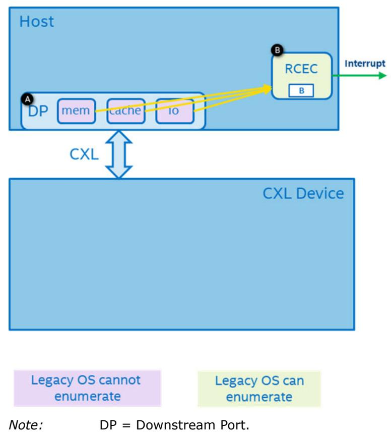

## 12.2.1.2 RCD Upstream Port-detected Errors

RCD Upstream Port-detected CXL protocol errors are also escalated and reported via the RCEC. The various signaling and logging steps are listed below and illustrated in Figure 12-2.

1. If a CXL.cache or CXL.mem logic block in $\mathsf { U P } _ { Z }$ detects a protocol or link error, the block shall log the error in the CXL RAS Capability structure (see Section 8.2.4.17).

2. Upstream Port RCRB shall not implement the AER Extended Capability.

$\mathsf { U P } _ { Z }$ sends an error message to all CXL.io Functions that are affected by this error. (This example shows a device with a single function. The message must include all the details that the CXL.io function needs for constructing an AER record.)

4. CXL.io Functions log the received message in their respective AER Extended Capability.

5. Each affected CXL.io Function sends an ERR\_ message to $\mathsf { U P } _ { Z }$ with its own Requester ID.

6. $\mathsf { U P } _ { Z }$ forwards this Error message across the Link without logging.

7. $\mathsf { D P _ { A } }$ forwards the Error message to the RCEC.

8. RCEC logs the error in the Root Error Status register and then signals an interrupt, if enabled, in accordance with the PCIe Base Specification. The Error Source Identification register in the RCEC shall point to the CXL.io Function that sent the ERR\_ message.

Figure 12-2. RCD Upstream Port Detects Error  
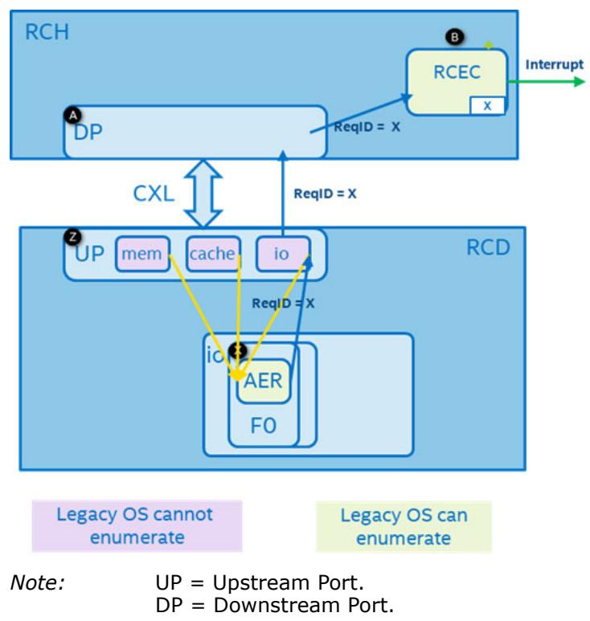

## 12.2.1.3 RCD RCiEP-detected Errors

CXL protocol errors detected by the RCD RCiEP are also escalated and reported via the RCEC. The various signaling and logging steps are listed below and illustrated in Figure 12-3.

1. CXL.cache (or CXL.mem) notifies all affected CXL.io Functions of the errors.

2. All affected CXL.io Functions log the UIEs and/or CIEs in their respective AER Extended Capability.

3. CXL.io Functions generate PCIe ERR\_ messages on the Link with Tag = 0.

4. $\mathsf { D P _ { A } }$ forwards the ERR\_ messages to the RCEC.

5. RCEC logs the errors in the Root Error Status register and then generates an MSI/ MSI-X, if enabled, in accordance with the PCIe Base Specification.

Figure 12-3. RCD RCiEP Detects Error  
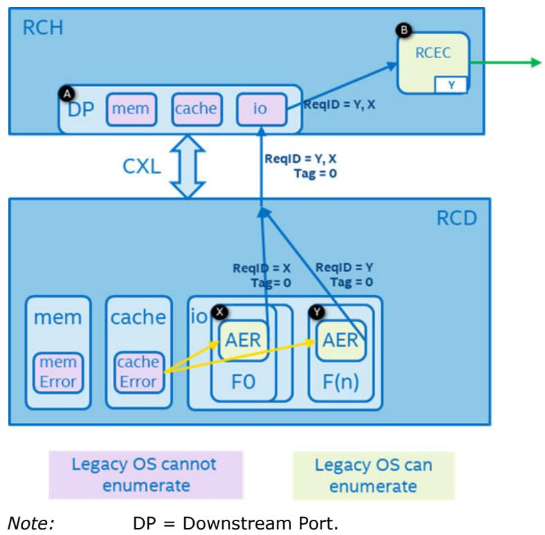

## 12.2.1.4 Header Log and Handling of Multiple Errors

Unmasked CXL protocol and link errors are captured in the Uncorrectable Error Status register and the Correctable Error Status register (see Table 8-95 and Table 8-98, respectively). In the scenarios where multiple bits are set in the Uncorrectable Error Status register, the First\_Error\_Pointer field in the Error Capabilities and Control register (see Table 8-100), if valid, points to the first uncorrectable error that was captured. The First\_Error\_Pointer is valid if the associated bit in the Uncorrectable Error Status register is set; otherwise, the First\_Error\_Pointer is invalid. By definition, First\_Error\_Pointer is considered invalid if bit[5] of that field is set to 1. For certain uncorrectable errors, the specification requires that the component capture part of the message header, called Error Header, in the Header Log register. Table 8-95 defines the format of the Error Header for each error.

If the Multiple\_Header\_Recording\_Capability bit in the Error Capabilities and Control register (see Table 8-100) is set, the component is capable of recording multiple Error Headers in the order in which they are detected. If header logging resources are unavailable when an unmasked uncorrectable error is detected, the corresponding error status bit is set to 1; however, the Error Header is not recorded in the Header Log register. After software has consumed the error to which the First\_Error\_Pointer points, software writes 1 to the corresponding error status bit to indicate that. The error status bit may remain set if there was another occurrence of the same error. If any bit in the Uncorrectable Error Status register remains set after this software action, the component must atomically update the Header Log register and the First\_Error\_Pointer to point to the next recorded error. If no other error is recorded, the component shall update the First\_Error\_Pointer to an invalid value. If Multiple\_Header\_Recording\_Capability=1, it is recommended that software not clear the Status bit other than the one pointed to by the First\_Error\_Pointer. If software violates this condition, the state of the Header Log register in the presence of other recorded errors is undefined.

## CXL Root Ports, Downstream Switch Ports, and Upstream Switch Ports

CXL protocol errors detected by CXL root ports, DSPs, and USPs are escalated and reported using PCIe error-reporting mechanisms as UIEs and/or CIEs. It is strongly recommended that CXL.cachemem protocol errors that are detected by a CXL root port be logged as CIEs or UIEs in the root port’s AER Extended Capability. The Error Source Identification register logs the Bus, Device, and Function Numbers of the Root Port itself. If the CXL.cachemem protocol errors detected by a CXL root port are logged as CIEs or UIEs in an RCEC’s AER Extended Capability, it is recommended that the System Firmware populate an RDPAS record (see Section 9.18.1.5) to establish the association between the RCEC and the root port.

The OS error handler may begin by inspecting the Root Port AER Extended Capability and follow PCIe rules to discover the error source. The Platform Software Error Handler may interrogate the Platform-specific error logs in addition to the error logs defined in the PCIe Base Specification and this specification.

If the CXL.cachemem errors are logged in an RCEC and the CEDT includes RDPAS structures (see Section 9.18.1.5) that reference the RCEC, the OS handler may consult those RDPAS structures to locate the CXL root port that is the error source.

## 12.2.3 CXL Device Error Handling

Whenever a CXL device returns data that is either known to be bad or suspect, the device must ensure that the consumer of the data is made aware of the nature of the data, either at the time of consumption or prior to data consumption. This allows the consumer to take appropriate containment action.

CXL defines two containment mechanisms — poison and viral:

• Poison: Return data on CXL.io and CXL.cachemem may be tagged as poisoned.

• Viral: CXL.cachemem supports viral, which is mainly used to indicate more-severe error conditions at the device (see Section 12.4). Any data returned by a device on CXL.cachemem after the device has communicated Viral is considered suspect, even if the data is not explicitly poisoned.

A device must set the MetaField to No-Op in the CXL.cachemem return response when the Metadata is suspect.

If a CXL component is not in the Viral condition, the component shall poison the data message on the CXL interface whenever the data being included is known to be bad or suspect.

If Viral is enabled and a CXL component is in the Viral condition, it is recommended that the component not poison the subsequent data responses on the CXL.cachemem interface to avoid error pollution.

The Host may send poisoned data to the CXL-connected device. How the CXL device responds to Poison is device specific but must follow the PCIe Base Specification. The device must consciously make a decision about how to handle poisoned data. In some cases, simply ignoring poisoned data may lead to Silent Data Corruption (SDC). A CXL device is required to keep track of any poison data that the device receives on a 64- byte granularity.

Any device errors that cannot be handled with Poison indication shall be signaled by the device back to the Host as messages because there are no error pins. To that end, Table 12-2 shows a summary of the error types and their mappings, and error reporting guidelines for devices that do not implement Memory Error Logging and Signaling Enhancements (see Section 12.2.3.2).

For devices that implement Memory Error Logging and Signaling Enhancements, Section 12.2.3.2 describes how memory errors are logged and signaled. Such devices should follow Table 12-2 for dealing with all non-memory errors.

Table 12-2. Device-specific Error Reporting and Nomenclature Guidelines

<table><tr><td>Error Severity</td><td>Definition/Example</td><td>Signaling Options (SW picks one)</td><td> $Logging^1$ </td><td>Host HW/FW/SW Response</td></tr><tr><td>Corrected</td><td>Memory single bit error corrected via ECC</td><td>MSI or MSI-X to Device driver</td><td>Device-specific registers</td><td>Device-specific flow in Device driver</td></tr><tr><td>Uncorrected Recoverable</td><td>UC errors from which the Device can recover, with minimal or no software help (e.g., error localized to single computation)</td><td>MSI or MSI-X to driver</td><td>Device-specific registers</td><td>Device-specific flow in driver (e.g., discard results of suspect computation)</td></tr><tr><td rowspan="2">Uncorrected NonFatal</td><td rowspan="2">Equivalent to PCIe UCNF, contained by the device (e.g., write failed, memory error that affects many computations)</td><td>MSI or MSI-X to Device Driver</td><td>Device-specific registers</td><td>Device-specific (e.g., reset affected device) flow in driver. Driver can escalate through software.</td></tr><tr><td>PCIe AER Internal Error</td><td>Device-specific registers + PCIe AER</td><td>System FW/SW AER flow, ends in reset</td></tr><tr><td rowspan="2">Uncorrected Fatal</td><td rowspan="2">Equivalent to PCIe UCF, poses containment risk (e.g., command/parity error, Power management Unit ROM error)</td><td>PCIe AER Internal error</td><td rowspan="2">Device-specific registers + PCIe AER</td><td>System FW/SW AER flow, ends in reset</td></tr><tr><td>AER + Viral</td><td>System FW/SW Viral flow</td></tr></table>

1. For CXL devices that implement memory error logging and signaling enhancements (see Section 12.2.3.2), the memory error logging and signaling mechanisms are defined by the CXL specification.

In keeping with the standard error logging requirements, all error logs should be sticky.

## 12.2.3.1 CXL.cache and CXL.mem Errors

If demand accesses to memory result in an uncorrected data error, the CXL device must return data with poison. The requester (processor core or a peer device) is responsible for dealing with the poison indication. The CXL device should not signal an uncorrected error along with the poison. If the processor core consumes the poison, the error will be logged and signaled by the Host.

Any non-demand uncorrected errors detected by a device (e.g., memory scrub logic in CXL device memory controller) that does not support the Memory Error Logging and Signaling Enhancements (see Section 12.2.3.2) will be signaled to the device driver via a device MSI or MSI-X. Any corrected memory errors will be signaled to the device driver via a device MSI or MSI-X. The driver may choose to deallocate memory pages that have repeated errors. Neither the platform firmware nor the OS directly deal with these errors. An eRCD may implement the capabilities described in Section 12.2.3.2, in which case a device driver is not required.

If a CXL component is unable to positively decode a CXL.mem address, the handling is described in Section 8.2.4.20.2. If a component does not implement HDM Decoders (see Section 8.2.4.20), the component shall drop such a write transaction and return all 1s in response to such a read transaction.

## 12.2.3.2 Memory Error Logging and Signaling Enhancements

Errors in memory may be encountered during a demand access or independent of any request issued to the memory. It is important to log sufficient data about such errors to enable the use of host platform-level RAS features, such as page retirement, without dependence on a driver.

In addition, general device events that are unrelated to the media, including changes in the device’s health or environmental conditions detected by the device, need to be reported using the same general-event logging facility.

Figure 12-4 illustrates a use case where the two methods of signaling supported by a CXL.mem device — VDM and MSI/MSI-X — are used by a host to implement Firmwarefirst and OS-first error handling.

Figure 12-4. CXL Memory Error Reporting Enhancements

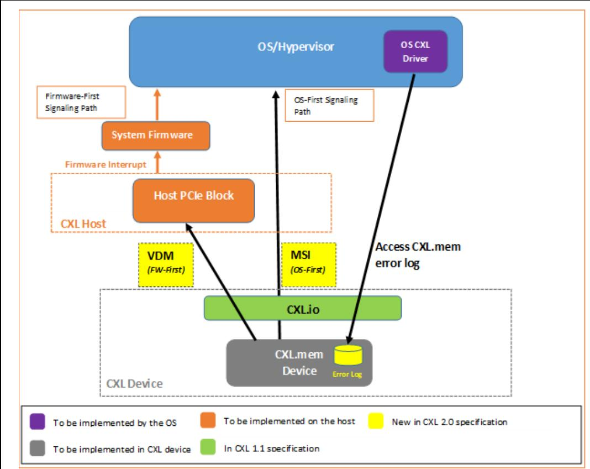

A CXL device that supports the Memory Error Logging and Signaling Enhancements capability must log such errors locally and expose the error log to system software via the MMIO Mailbox (see Section 8.2.9.4.3). Reading an error record from the mailbox will not automatically result in deletion of the error record on the device. An explicit clear operation is required to delete an error record from the device. To support error record access and deletion, the device shall implement the Get Event Records and Clear Event Records commands.

Both operations must execute atomically. Furthermore, all writes or updates to the error records by the CXL.mem device must also execute atomically.

Using these two operations, a host can retrieve an error record as follows:

1. The host reads a number of event records using the Get Event Records command.

2. When complete, the host clears the event records from the device with the Clear Event Records command, supplying one or more event record handles to clear.

The error records will be owned by the host firmware or OS so that all logged errors are made available to the host to support platform-level RAS features.

Error records stored on the CXL device must be sticky across device resets. The records must not be initialized or modified by a hot reset, an FLR, or CXL Reset (see Section 9.7). Devices that consume auxiliary power must preserve the error records when auxiliary power consumption is enabled. In these cases, the error records are neither initialized nor modified by hot reset, warm reset, or cold reset.

## 12.2.3.3 CXL Device Error Handling Flows

RCD errors may be sourced from a Root Port (RP) or Endpoint (RCiEP). For the purpose of differentiation, RCiEP-sourced errors shall use a tag value of 0, whereas RP-sourced errors shall use a tag of nonzero value.

Errors detected by the CXL device shall be communicated to the host via PCIe Error messages across the CXL.io link. Errors that are not related to a specific Function within the device (Non-Function errors) and not reported via an MSI/MSI-X are reported to the Host via PCIe error messages where the errors can be escalated to the platform.

The Upstream Port reports non-function errors to all EPs/RCiEPs where they are logged. Each EP/RCiEP reports the non-function-specific errors to the host via PCIe error messages. Software should be aware that although an RCiEP does not have a softwarevisible link, the RCiEP may still log link-related errors.

At most, one error message of a given severity is generated for a multi-function device. The error message must include the Requester ID of a function that is enabled to send the error message. Error messages with the same Requester ID may be merged for different errors with the same severity. No error message is sent if no function is enabled to do so. If different functions are enabled to send error messages of different severity, at most one error of each severity level is sent.

Errors generated by the RCD RCiEP will be sent to the corresponding RCEC. Each RCiEP must be associated with no more than one RCEC. Errors generated by a CXL component that is part of a CXL VH shall be logged in the CXL Root Port.

## Isolation on CXL.cache and CXL.mem

Isolation on CXL.cache and CXL.mem is an optional normative capability of a CXL Root Port. Such isolation halts traffic on the respective protocol. Further, once triggered, the Root Port synthesizes the response for all pending and subsequent transactions on that protocol. This is further described in Section 12.3.1 and Section 12.3.2, respectively.

The specification defines two trigger mechanisms:

• Link Down — If a Root Port supports CXL.cache isolation and software enables CXL.cache isolation, a Link Down condition shall unconditionally trigger CXL.cache isolation. If a Root Port supports CXL.mem isolation and software enables CXL.mem isolation, a Link Down condition shall unconditionally trigger CXL.mem isolation.

• Transaction timeout — A Root Port that supports CXL.cache isolation may be capable of being configured in such a way that a CXL.cache timeout triggers CXL.cache isolation. A Root Port that supports CXL.mem isolation may be capable of being configured in such a way that a CXL.mem timeout triggers CXL.mem isolation.

Transaction Timeout Value settings for CXL.cache and CXL.mem: The system needs to ensure that timeouts are appropriately set up. For example, a timeout should not be so short that isolation is triggered due to a non-erroneous, long-latency access to a CXL device. Software may need to temporarily disable the triggering of isolation upon timeout if one or more devices are being transitioned to a state (e.g., firmware update) where the device may violate the timeout.

The primary purpose of the isolation action is to complete pending and subsequent transactions that are associated with the isolated root port quickly, with architected semantics, after isolation is triggered. Because system memory and system caches must generally be assumed to be corrupted, software recovery generally relies on software to identify all software threads, VMs, containers, etc., whose system state might be corrupted, and then terminating them. Other software recovery mechanisms are also possible, and they are beyond the scope of this specification.

A Root Port indicates support for Isolation by implementing the CXL Timeout and Isolation Capability structure (see Section 8.2.4.24). The structure contains the capability, control, and status bits for both Transaction Timeout and Isolation on both CXL.cache and CXL.mem. Both Timeout and Isolation are disabled by default and must be explicitly and individually enabled by software for each protocol before they can be triggered. When Isolation is enabled for either CXL.cache or CXL.mem, software can optionally configure the Root Port to force a Link Down condition if the respective protocol enters Isolation.

When Isolation is entered, the Root Port, if capable, signals an MSI/MSI-X or send an ERR\_COR Message if enabled. Software may also choose to rely only on mandatory synchronous exception handling (see Section 12.3.1 and Section 12.3.2). Software may read the CXL Timeout and Isolation Status register to determine whether a Timeout or Isolation has occurred on CXL.cache and/or CXL.mem and if the Isolation was triggered due to a Timeout or due to a Link Down condition. The software must explicitly clear the corresponding Isolation status bits (see Section 8.2.4.24.3) for the root port to exit Isolation. The link must transition through the Link Down state before software can attempt re-enumeration and device recovery.

## 12.3.1 CXL.cache Transaction Layer Behavior during Isolation

This section specifies the CXL.cache Transaction Layer’s behavior while the Root Port is in Isolation.

The Root Port shall handle host requests that would ordinarily be mapped to (H2D) CXL.cache messages in the following manner.

For each host snoop that would ordinarily be mapped to (H2D) CXL.cache request messages:

• If the host is tracking the device as a possible exclusive owner of the line, then data is treated as poison.

• Else if the host knows the device can only have a Shared or Invalid state for the line, then the device cache is considered Invalid (no data poisoning is needed).

## IMPLEMENTATION NOTE

Exclusive vs. Shared/Invalid may be known based on an internal state within the host.

The Root Port timeout detection logic shall account for partial responses. For example, if the Root Port observes that the data is returned on the D2H Data channel in a timely manner, but no D2H Rsp was observed for a sufficient length of time, the Root Port shall treat it as a CXL.cache timeout.

For each pending Pull that is mapped to H2D CXL.cache Response of type \*WritePull\* which expects a data return, the Root Port must treat the returned data as poison.

## CXL.mem Transaction Layer Behavior during Isolation

This section specifies the CXL.mem Transaction Layer’s behavior while the CXL Root Port is in Isolation.

The Root Port shall handle host requests that it would ordinarily map to (M2S) CXL.mem messages in the following manner:

• For each host request that would ordinarily be mapped to CXL.mem Req and RwD:

— For Read transactions, the CXL Root Port synthesizes a synchronous exception response. The specific mechanism of synchronous exception response is CXL Root Port implementation specific. An example of a synchronous exception response would be returning data with Poison.

— For non-read transactions, the CXL Root Port synthesizes a response as appropriate. The specific mechanism of the synthesized response is implementation specific. An example would be returning a completion (NDR) for a write (RwD) transaction.

## CXL Viral Handling

CXL links and CXL devices are expected to be Viral compliant. Viral is an errorcontainment mechanism. A platform must choose to enable Viral at boot. The Host implementation of Viral allows the platform to enable the Viral feature by writing into a register. Similarly, a BIOS-accessible control register on the device is written to enable Viral behavior (both receiving and sending) on the device. Viral support capability and control for enabling are reflected in the DVSEC.

When enabled, a Viral indication is generated whenever an Uncorrected\_Fatal error is detected. Viral is not a replacement for existing error-reporting mechanisms. Instead, its purpose is an additional error-containment mechanism. The detector of the error is responsible for reporting the error through AER and generating a Viral indication. Any entity that is capable of reporting Uncorrected\_Fatal errors must also be capable of generating a Viral indication.

CXL.cache and CXL.mem are pre-enabled with the Viral concept. Viral needs to be communicated in both directions. When Viral is enabled and the Host runs into a Viral condition, the Host shall communicate Viral across CXL.cache and/or CXL.mem to all downstream components. The Viral indication must arrive before any data that may have been affected by the error (general Viral requirement). If the host receives a Viral indication from any CXL components, the Host shall propagate Viral to all downstream components.

All types of Conventional Resets shall clear the viral condition. CXL Resets and FLRs shall have no effect on the viral condition.

## 12.4.1 Switch Considerations

Viral is enabled on a per-vPPB basis and the expectation is that if Viral is enabled on one or more DSPs, then Viral will also be enabled on the USP within a VCS.

A Viral indication received on any port transitions that VCS into the Viral state, but does not trigger a new uncorrected fatal error inside the switch. A Viral indication in one VCS has no effect on other VCSs within the switch component. The switch continues to process all CXL.io traffic targeting the switch and forward all traffic. All CXL.cache and CXL.mem traffic sent to all ports within the VCS is considered to have the Viral bit set. The Viral indication shall propagate from an input port to all output ports in the VCS

faster than any subsequent CXL.cache or CXL.mem transaction. The Viral bit is propagated across upstream links and links connected to SLDs with the Viral LD-ID Vector (see Table 4-10) set to 0 for compatibility with the CXL 1.1 specification.

If the switch detects an uncorrected fatal error, the switch must determine whether that error affects one or multiple VCSs. Any affected VCS enters the Viral state, sets the Viral\_Status bit (see Section 8.1.3.3) to indicate that a Viral condition has occurred, asserts the Viral bit in all CXL.cache and CXL.mem traffic sent to all ports within the VCS, and then sends an AER message. The affected VCS continues to forward all CXL traffic.

Hot-remove and hot-add of devices below DSPs have no effect on the Viral state of the VCS within the switch.

If the switch has configured and enabled MLD ports, then there are additional considerations. When a VCS with an MLD port enters the Viral state, the VCS propagates the Viral indication to LDs within the MLD Component by setting the Viral bit in the Viral LD-ID Vector (see Table 4-10) for the LDs in that VCS. If an uncorrected fatal error causes one or more VCSs to enter the Viral state, then the corresponding bits in the Viral LD-ID Vector shall be set. An LD within an MLD component that has entered the Viral state sets the Viral bit in CXL.mem traffic with the Viral LD-ID Vector mask set to identify all the LD-IDs associated with all the affected VCSs. The indication from each LD-ID propagates the Viral state to all associated VCSs that have Viral containment enabled.

## 12.4.2 Device Considerations

Although the device’s reaction to Viral is device specific, the device is expected to take error-containment actions that are consistent with Viral requirements. Mainly, the device must prevent bad data from being committed to permanent storage. If the device is connected to any permanent storage or to an external interface that may be connected to permanent storage, then the device is required to self-isolate to be Viral compliant. This means that the device has to take containment actions without depending on help from the Host.

The containment actions taken by the device must not prevent the Host from making forward progress. This is important for diagnostic purposes as well as for avoiding error pollution (e.g., withholding data for read transactions to device memory may cause cascading timeouts in the Hosts). Therefore, on Viral detection, in addition to the containment requirements, the device shall:

• Drop writes to the persistent HDM ranges on the device or connected to the device.

• Always return a Completion response.

• Set MetaField to No-Op in all responses that carry MetaField.

• Fail the Set Shutdown State command (defined in Section 8.2.10.9.3.5) with an Internal Error when attempting to change the state from “dirty” to “clean”.

• Not transition the Shutdown State to “clean” after a GPF flow.

• Commit to the persistent HDM ranges any writes that were completed over the CXL interface before receipt of the viral condition.

• Keep responding to snoops.

• Complete pending writes to Host memory.

• Complete all reads and writes to Device volatile memory.

When the device itself runs into a Viral condition and Viral is enabled, the device shall:

• Set the Viral Status bit to indicate that a Viral condition has occurred • Containment — Take steps to contain the error within the device (or logical device in an MLD component) and follow the Viral containment steps listed above.

• Communicate the Viral condition back up to CXL.cache and CXL.mem, toward the Host.

— Viral propagates to all devices in the Virtual Hierarchy, including to the host.

Viral Control and Status bits are defined in the DVSEC (see Chapter 3.0 for details).

## Maintenance

Maintenance operations may include media maintenance, media testing, module testing, etc. A maintenance operation is identified by a Maintenance Operation Class and a Maintenance Operation Subclass. A Device may support one or more Maintenance Operation Subclasses related to a Maintenance Operation Class. See Table 8-284.

The Device may use Event Records to notify the System Software or System Firmware about needing a maintenance operation. When the Device requires maintenance, the Maintenance Needed bit in the Event Record Flags is set to 1, while the class of recommended maintenance operation is indicated by the Maintenance Operation Class field. See Table 8-221.

The Perform Maintenance command (see Section 8.2.10.7.1) initiates a maintenance operation. The maintenance operation to be executed is specified in the input payload by the Maintenance Operation Class field and the Maintenance Operation Subclass field.

## CXL Error Injection

The major aim of error-injection mechanisms is to allow system validation and system firmware/software development, etc., the means to create error scenarios and errorhandling flows. To this end, a CXL Upstream Port and Downstream Port are recommended to implement the following error injection hooks to a specified address (where applicable):

• One type of CXL.io UC error (optional; similar to PCIe)

— CXL.io is always present in any CXL connection

• One type of CXL.cache UC error (if applicable)

• One type of CXL.mem UC error (if applicable)

• Link Correctable errors

— Transient errors and

— Persistent errors

• Returning Poison on a read to a specified address (CXL.mem only)

Error injection interfaces are documented in Chapter 14.0.

## Performance Considerations

CXL provides a low-latency, high-bandwidth path for an accelerator to access the system. Performance on CXL is dependent on a variety of factors. Table 13-1 captures the main CXL performance attributes.

Table 13-1. CXL Performance Attributes

<table><tr><td>Characteristic</td><td>CXL via Flex Bus (if PCIe Gen 4)</td><td>CXL via Flex Bus (if PCIe Gen 5)</td><td>CXL via Flex Bus (if PCIe Gen 6)</td><td>CXL via Flex Bus (if PCIe Gen 7)</td></tr><tr><td>Width</td><td colspan="4">16 Lanes</td></tr><tr><td>Link Speed</td><td>16 GT/s</td><td>32 GT/s</td><td>64 GT/s</td><td>128 GT/s</td></tr><tr><td>Total Bandwidth per link $^{1}$ </td><td>32 GB/s</td><td>64 GB/s</td><td>128 GB/s</td><td>256 GB/s</td></tr></table>

1. Achieved bandwidth depends on protocol and payload size. Expect 60-90% efficiency on CXL.cache and CXL.mem. Efficiency similar to PCIe\* on CXL.io.

In general, it is expected that the Upstream Ports and Downstream Ports are ratematched. However, if the implementations are not rate-matched, it would require the faster of the implementations to limit the rate of its protocol traffic to match the slower (including bursts) whenever there is no explicit flow-control loop.

CXL allows accelerators/devices to coherently access host memory, and allows memory attached to an accelerator/device to be mapped into the system address map and to be accessed directly by the host as writeback memory. To support this, it supports Coherency models as described in Section 2.2.1 and Section 2.2.2.

## 13.1 Performance Recommendations

To minimize buffering requirements and provide good responsiveness, CXL components need to strive for low latency. Specific transaction flows merit special attention, depending on component type, to ensure the system performance is not negatively impacted.

It is recommended that components meet the latency targets listed in Table 13-2. These targets are measured at the component pins in an otherwise idle system. Measurements are for average idle response times, meaning that a single message is transmitted to the component and the response is received from the component before another message is transmitted to the component. Messages used for average measurements should have their addresses randomly distributed. All the targets listed in Table 13-2 assume a x16 link at full speed with IDE disabled.

Table 13-2. Recommended Latency Targets for Selected CXL Transactions

<table><tr><td>Case1</td><td>Component</td><td>Protocol</td><td>Received Message</td><td>Transmitted Message</td><td>Latency Target</td></tr><tr><td>1</td><td rowspan="2">Type 1/Type 2</td><td rowspan="2">CXL.cache</td><td>H2D Req Snoop (Miss Case)</td><td>D2H Resp Snoop Response</td><td>90 to 150 ns</td></tr><tr><td>2</td><td>H2D Resp WritePull</td><td>D2H Data</td><td>65 ns</td></tr><tr><td>3</td><td rowspan="2">Type 3 (DDR)</td><td rowspan="3">CXL.mem</td><td>M2S Req MemRd</td><td>S2M DRS MemData</td><td>80 ns</td></tr><tr><td>4</td><td>M2S RwD MemWr</td><td>S2M NDR Cmp</td><td>40 ns</td></tr><tr><td>5</td><td>Host</td><td>S2M BISnp</td><td>M2S BIRsp</td><td>90 ns</td></tr></table>

1. Case 1: The range provided accounts for implementation trade-offs, with a dedicated CXL interface snoop filter providing the lowest latency, and snoop filters embedded in the Device cache hierarchy resulting in higher latency.

Case 2: Assumes write data is ready to transmit in a CXL output buffer.

Cases 3 and 4: Applies to Type 3 Devices using DRAM media intended to provide system-level performance comparable to DDR DIMMs. Such Devices are assumed to be relatively simple, small, and low-power, and not complex, multi-ported, or pooled-memory Devices. Noting that Case 3 is more aggressive than the targets in Table 13-3, the Table 13-3 targets will be lower than the Case 3 target in these Devices. Memory Devices that use slower media, such as some persistent-memory types, will have longer latencies that must be considered by system designers.

Case 5: The BISnp will cause the host to resolve coherence for an HDM-DB memory address owned by a device that sent the BISnp. The target latency for resolving coherence is for the simple case in which the host does not have the cacheline in any host-managed cache (this scope includes peer CXL devices that are using CXL.cache).

For CXL devices and switches, CDAT (see Section 8.1.11) provides a mechanism for reporting both lowest latency and highest bandwidth to Host software (see the ACPI Specification for the definition of the System Locality Latency and Bandwidth Information Structure). That reporting structure, however, only assists Host software. Hardware and system designers must consider the topologies and components of interest at design time. Hardware designers should consider the maximum latency that their component needs to tolerate while still maintaining high-link bandwidth, sizing outstanding requests, and data buffers accordingly.

The QoS Telemetry mechanism (see Section 3.3.4) defines a mechanism by which Hosts can dynamically adjust their request rate to avoid overloading memory devices. This mechanism is particularly important for MLD components that are shared among multiple Hosts.

At the Link Layer, the maximum loaded latencies listed in Table 13-3 are recommended. If not adhered to, the link between two ports risks being throttled to less than the line rate. These recommendations apply to all CXL ports and both the CXL.cache and CXL.mem interfaces. The targets assume a x16 link with IDE disabled.

Table 13-3. Recommended Maximum Link Layer Latency Targets

<table><tr><td>Case1</td><td>Condition</td><td>Latency Target</td></tr><tr><td>1</td><td>Message received to Ack Transmitted</td><td>65 ns</td></tr><tr><td>2</td><td>Credit Received to Flit transmitted</td><td>50 ns</td></tr></table>

1. Case 1: Accounts for a sequence of 8 back-to-back flits with a clean CRC that needs to accumulate before the Ack can be transmitted. Applies only to links operating in 68B Flit mode and thus assumes a full link speed of 32 GT/s. Links operating in 256B Flit mode share Ack/Retry logic with PCIe and fall under any guidelines or requirements provided in the PCIe Base Specification.

Case 2: In this case, the port lacks the Link Layer credits that are needed to transmit a message and then receives a credit update that enables transmission of the message. Assumes full link speed of 64 GT/s.

## Performance Monitoring

Performance tuning and performance debug activities rely on performance counters that are located within different system components. This section introduces the Performance Monitoring infrastructure for CXL components.

The base hardware unit is called the CXL Performance Monitoring Unit (CPMU). A CXL component may have zero or more CPMU instances. Each CPMU instance includes one or more Counter Units. The registers associated with a CPMU are located by following the CXL Register Locator DVSEC with Register Block Identifier=4. Each CPMU instance in a Switch shall count events that are associated with a single Port. The CPMU instance associated with the Port can be identified by following the CXL Register Locator DVSEC in the Configuration Space of that Port. If a CXL multi-function device implements one or more CPMU instances, the Register Locator DVSEC that is associated with Function 0 shall point to them.

A CXL Event is defined as the occurrence of a specific component activity that is relevant to the operation of the CXL component. Events are grouped into Event Groups based on the type of activity that the Events represent. The pair <Event Vendor ID, Event Group ID> identifies an Event Group. Each Event Group can have up to 32 different types of events and each event is identified by a 5-bit Event ID. The tuple <Event Vendor ID, Event Group ID, Event ID> uniquely identifies the type of the Event. See Table 13-5 for the list of CXL Events that are defined by this specification. The Filter column lists all the Filter ID values that are applicable to the Event Group. The Multiple Event Counting (MEC) column defines the Counter Unit behavior when it is configured to simultaneously count more than one event within the Event Group by setting multiple bits. If the MEC column indicates ADD, the Counter Unit shall add the occurrences of all the enabled events every clock, which may result in the Counter Data being incremented by a value of more than one within a single clock. If the MEC column indicates OR, the Counter Unit shall logically OR the occurrences of all the enabled events every clock and the Counter Data shall never increment by more than one within any single clock.

None of the events defined in this specification are capable of incrementing the Counter Data by more than one per cycle. As such, software must set the Threshold field to 1 in the Counter Configuration register(s) (see Table 8-185) when counting any events specified here.

A Counter Unit is capable of counting the occurrence of one or more events. Counter Units are capable of being configured to count a subset of the Events that the Counter Unit is capable of counting. A Counter Unit may be capable of being configured to take certain predefined actions when the count overflows. Table 13-4 describes the three types of Counter Units.

Table 13-4. CPMU Counter Units

<table><tr><td>Counter Unit Type</td><td>Description</td></tr><tr><td>Fixed Function</td><td>Capable of counting a fixed set of one or more events within a single Event Group. Counting is halted when the Counter Unit is Frozen or Counter Enable= $0^{1}$ .</td></tr><tr><td>Free-running</td><td>Capable of counting a fixed set of one or more events within a single Event Group. Not affected by freeze. The Counter Enable bit $^{1}$ is RO and always returns 1.</td></tr><tr><td>Configurable</td><td>Capable of counting any events that are identified via the CPMU Event Capabilities register(s) (see Section 8.2.7.1.4), and may be configured by software to count a specific set of events in a specific manner. Counting is halted when the Counter Unit is Frozen or Counter Enable= $0^{1}$ .</td></tr></table>

1. Counter Enable bit in the Counter Configuration register(s) (see Table 8-185).

The CPMU register interface is defined in Section 8.2.7. These registers are for Host Software or System Firmware consumption. The component must not expose CPMU registers or the underlying resources to an out-of-band agent if such an access may interfere with the Host Software actions. Although a component may choose to implement a separate set of counters for out-of-band usage, use of such a mechanism is beyond the scope of this specification.

Table 13-5. Events under CXL Vendor ID (Sheet 1 of 5)

<table><tr><td>Event Group</td><td>Event ID</td><td>Mnemonic</td><td>Event Description</td><td>Filters</td><td>MEC1</td></tr><tr><td>00h(Base)</td><td>00h</td><td>Clock Ticks</td><td>Count the clock ticks of the always-on fixed-frequency clock that is used to increment the Counters. Every CPMU must allow counting of this event, either via a Fixed Function Counter Unit or via a Configurable Counter Unit.</td><td>None</td><td>N/A</td></tr><tr><td>01h to 0Fh</td><td>00h to 1Fh</td><td>Reserved</td><td>Reserved</td><td>N/A</td><td>N/A</td></tr><tr><td>10h(CXL.cache D2H Req Channel)</td><td>D2H Req Opcode encoding</td><td>D2HReq.Opcode mnemonic</td><td>Counts the number of messages in the D2H Req message class with Opcode=Event ID that were initiated, or forwarded, or received by the component. The D2H Req message class Opcode mnemonics and the Opcode encodings are enumerated in Table 3-22. All Event ID values corresponding to unused D2H Req message class Opcode encodings are reserved.For example, the mnemonic associated with the Event Group=10h, Event ID=01h is D2HReq.RdCurr and counts the number of RdCurr requests.</td><td>None</td><td>ADD</td></tr><tr><td>11h(CXL.cache D2H Rsp Channel)</td><td>D2H Rsp Opcode encoding</td><td>D2HRsp.Opcode mnemonic</td><td>Counts the number of messages in the D2H Rsp message class with Opcode=Event ID that were initiated, or forwarded, or received by the component. D2H Rsp message class Opcode mnemonics and Opcode encodings are enumerated in Table 3-25. All Event ID values corresponding to unused D2H Rsp message class Opcode encodings are reserved.For example, the mnemonic associated with the Event Group=11h, Event ID=05h is D2HRsp.RspIHitSE and counts the number of RspIHitSE messages.</td><td>None</td><td>ADD</td></tr><tr><td>12h(CXL.cache H2D Req Channel)</td><td>H2D Req Opcode encoding</td><td>H2DReq.Opcode mnemonic</td><td>Counts the number of messages in the H2D Req message class with Opcode=Event ID that were initiated, or forwarded, or received by the component. The H2D Req message class Opcode mnemonics and the Opcode encodings are enumerated in Table 3-26. All Event ID values corresponding to unused H2D Req message class Opcode encodings are reserved.For example, the mnemonic associated with the Event Group=12h, Event ID=02h is H2DReq.SnpInv and counts the number of SnpInv requests.</td><td>None</td><td>ADD</td></tr><tr><td>13h(CXL.cache H2D Rsp Channel)</td><td>H2D Rsp Opcode encoding</td><td>H2DRsp.Opcode mnemonic</td><td>Counts the number of messages in the H2D Rsp message class with Opcode=Event ID that were initiated, or forwarded, or received by the component. H2D Rsp message class Opcode mnemonics and Opcode encodings are enumerated in Table 3-27. All Event ID values corresponding to unused D2H Rsp message class Opcode encodings are reserved.For example, the mnemonic associated with the Event Group=13h, Event ID=01h is H2DRsp.WritePull and counts the number of WritePull messages.</td><td>None</td><td>ADD</td></tr><tr><td rowspan="3">14h(CXL.cache Data)</td><td>00h</td><td>D2H Data</td><td>Counts the number of D2H Data messages that were initiated, or forwarded, or received by the component.</td><td>None</td><td rowspan="2">ADD</td></tr><tr><td>01h</td><td>H2D Data</td><td>Counts the number of H2D Data messages that were initiated, or forwarded, or received by the component.</td><td>None</td></tr><tr><td>02h to 1Fh</td><td>Reserved</td><td>Reserved</td><td>N/A</td><td>N/A</td></tr></table>

Table 13-5. Events under CXL Vendor ID (Sheet 2 of 5)

<table><tr><td>Event Group</td><td>Event ID</td><td>Mnemonic</td><td>Event Description</td><td>Filters</td><td>MEC1</td></tr><tr><td>15h to 1Fh</td><td>00h to 1Fh</td><td>Reserved</td><td>Reserved</td><td>N/A</td><td>N/A</td></tr><tr><td>20h (CXL.mem M2S Req Channel)</td><td>M2S Req Opcode encoding</td><td>M2SReq.Opcode mnemonic</td><td>Counts the number of messages in the M2S Req message class with Opcode=Event ID that were initiated, or forwarded, or received by the component. The M2S Req message class Opcode mnemonics and the Opcode encodings are enumerated in Table 3-35. All Event ID values corresponding to unused M2S Req message class Opcode encodings are reserved.For example, the mnemonic associated with the Event Group=20h, Event ID=00h is M2SReq.MemInv and counts the number of MemInv requests.</td><td>Filter ID=0</td><td>ADD</td></tr><tr><td>21h (CXL.mem M2S RwD Channel)</td><td>M2S RwD Opcode encoding</td><td>M2SRwD.Opcode mnemonic</td><td>Counts the number of messages in the M2S RwD message class with Opcode=Event ID that were initiated, or forwarded, or received by the component. The M2S RwD message class Opcode mnemonics and the Opcode encodings are enumerated in Table 3-41. All Event ID values corresponding to unused M2S Req message class Opcode encodings are reserved.For example, the mnemonic associated with the Event Group=21h, Event ID=02h is M2SRwd.MemWrPtl and counts the number of MemWrPtl requests.</td><td>Filter ID=0</td><td>ADD</td></tr><tr><td>22h (CXL.mem M2S BIRsp Channel)</td><td>M2S BIRsp Opcode encoding</td><td>M2SBIRsp.Opcode mnemonic</td><td>Counts the number of messages in the M2S BIRsp message class with Opcode=Event ID that were initiated, or forwarded, or received by the component. The M2S BIRsp message class Opcode mnemonics and the Opcode encodings are enumerated in Table 3-45. All Event ID values corresponding to unused M2S BIRsp message class Opcode encodings are reserved.For example, the mnemonic associated with the Event Group=22h, Event ID=00h is M2SBIRsp.BIRspI and counts the number of BIRspI messages.</td><td>Filter ID=0</td><td>ADD</td></tr><tr><td>23h (CXL.mem S2M BISnp Channel)</td><td>S2M BISnp Opcode encoding</td><td>S2MBISnp.Opcode mnemonic</td><td>Counts the number of messages in the S2M BISnp message class with Opcode=Event ID that were initiated, or forwarded, or received by the component. The S2M BISnp message class Opcode mnemonics and the Opcode encodings are enumerated in Table 3-47. All Event ID values corresponding to unused S2M BISnp message class Opcode encodings are reserved.For example, the mnemonic associated with the Event Group=23h, Event ID=00h is S2MBISnp.BISnpCur and counts the number of BISnpCur requests.</td><td>Filter ID=0</td><td>ADD</td></tr><tr><td>24h (CXL.mem S2M NDR Channel)</td><td>S2M NDR Opcode encoding</td><td>S2MNDR.Opcode mnemonic</td><td>Counts the number of messages in the S2M NDR message class with Opcode=Event ID that were initiated, or forwarded, or received by the component. The S2M NDR message class Opcode mnemonics and the Opcode encodings are enumerated in Table 3-50. All Event ID values corresponding to unused S2M NDR message class Opcode encodings are reserved.For example, the mnemonic associated with the Event Group=24h, Event ID=02h is S2MNDR.Cmp-E and counts the number of Cmp-E messages.</td><td>Filter ID=0</td><td>ADD</td></tr><tr><td>25h (CXL.mem S2M DRS Channel)</td><td>S2M DRS Opcode encoding</td><td>S2MDRS.Opcode mnemonic</td><td>Counts the number of messages in the S2M DRS message class with Opcode=Event ID that were initiated, or forwarded, or received by the component. The S2M DRS message class Opcode mnemonics and the Opcode encodings are enumerated in Table 3-53. All Event ID values corresponding to unused S2M DRS message class Opcode encodings are reserved.For example, the mnemonic associated with the Event Group=25h, Event ID=00h is S2MDRS.MemData and counts the number of MemData messages.</td><td>Filter ID=0</td><td>ADD</td></tr><tr><td>26h to 2Fh</td><td>Reserved</td><td>Reserved</td><td>Reserved</td><td>N/A</td><td>N/A</td></tr></table>

Table 13-5. Events under CXL Vendor ID (Sheet 3 of 5)

<table><tr><td>Event Group</td><td>Event ID</td><td>Mnemonic</td><td>Event Description</td><td>Filters</td><td>MEC1</td></tr><tr><td>30h (DevLoad)</td><td>DevLoad encoding</td><td>DevLoad signaled by the device</td><td>Count the number of clock cycles that the device is in DevLoad = event ID condition.</td><td></td><td>N/A</td></tr><tr><td rowspan="3">31h (M2S Residency)</td><td>00h</td><td>M2S Req residency count</td><td>Cumulative number of clock cycles that there is any outstanding M2S Req pending for a completion to be sent to the host. This counter can be used to determine average latency over a large number of transactions when combined with command counts.</td><td></td><td>N/A</td></tr><tr><td>01h</td><td>M2S RwD residency count</td><td>Cumulative number of clock cycles that there is any outstanding M2S RwD pending for a completion to be sent to the host. This counter can be used to determine average latency over a large number of transactions when combined with command counts.</td><td></td><td>N/A</td></tr><tr><td>02h to 1Fh</td><td>Reserved</td><td>Reserved</td><td></td><td></td></tr><tr><td>32h to 7FFFh</td><td>Reserved</td><td>Reserved</td><td>Reserved</td><td>N/A</td><td>N/A</td></tr><tr><td rowspan="13">8000h (DDR Interface) $^{2}$ </td><td>00h</td><td>ACT Count</td><td>Counts the number of DRAM Activate commands that were issued by the Memory Controller associated with this CPMU.</td><td>Filter ID=1</td><td rowspan="13">ADD</td></tr><tr><td>01h</td><td>PRE Count</td><td>Counts the number of all DRAM Precharge commands that were issued by the Memory Controller associated with this CPMU.</td><td>Filter ID=1</td></tr><tr><td>02h</td><td>CAS Rd</td><td>Counts the number of all DRAM Column Address Strobe read commands that were issued by the Memory Controller associated with this CPMU.</td><td>Filter ID=1</td></tr><tr><td>03h</td><td>CAS Wr</td><td>Counts the number of all DRAM Column Address Strobe write commands that were issued by the Memory Controller associated with this CPMU.</td><td>Filter ID=1</td></tr><tr><td>04h</td><td>Refresh</td><td>Counts the number of all DRAM Refresh commands that were issued by the Memory Controller associated with this CPMU.</td><td>Filter ID=1</td></tr><tr><td>05h</td><td>Self Refresh Entry</td><td>Counts the number of Self Refresh Entry commands that were issued by the Memory Controller associated with this CPMU.</td><td>Filter ID=1</td></tr><tr><td>06h</td><td>RFM</td><td>Counts the number of Refresh Management (RFM) commands that were issued by the Memory Controller associated with this CPMU.</td><td>Filter ID=1</td></tr><tr><td>07h</td><td>CAS Rd AP</td><td>Counts the number of DRAM Column Address Strobe Read Commands with Auto Precharge that were issued by the Memory Controller associated with this CPMU.</td><td>Filter ID=1</td></tr><tr><td>08h</td><td>CAS Wr AP</td><td>Counts the number of DRAM Column Address Strobe Write Commands with Auto Precharge that were issued by the Memory Controller associated with this CPMU.</td><td>Filter ID=1</td></tr><tr><td>09h</td><td>Refresh All Banks</td><td>Counts the number of DRAM Refresh All Banks that were issued by the Memory Controller associated with this CPMU.</td><td>Filter ID=1</td></tr><tr><td>0Ah</td><td>Refresh Same Bank</td><td>Counts the number of DRAM Refresh Same Banks that were issued by the Memory Controller associated with this CPMU.</td><td>Filter ID=1</td></tr><tr><td>0Bh</td><td>Power Down Entry</td><td>Counts the number of DRAM Power Down Entry that were issued by the Memory Controller associated with this CPMU.</td><td>Filter ID=1</td></tr><tr><td>0Ch</td><td>Power Down Exit</td><td>Counts the number of DRAM Power Down Exit that were issued by the Memory Controller associated with this CPMU.</td><td>Filter ID=1</td></tr></table>

Table 13-5. Events under CXL Vendor ID (Sheet 4 of 5)

<table><tr><td>Event Group</td><td>Event ID</td><td>Mnemonic</td><td>Event Description</td><td>Filters</td><td>MEC1</td></tr><tr><td rowspan="4"> $8000h (DDR Interface)^2$ </td><td>0Dh</td><td>RD/WR DDR bus switching</td><td>Counts the number of times read to write or vice versa that DDR bus mode switching (DDR turnarounds) occurs for the memory controller bus.</td><td>Filter ID=1</td><td rowspan="3">ADD</td></tr><tr><td>0Eh</td><td>Incoming Read requests</td><td>Command count for incoming read requests at the memory controller interface. The event is supported only in the CPMU that is associated with the memory controller block. Memory controller interface point and requests being counted are vendor specific; additional vendor-supplied information may be needed.</td><td>Filter ID=1</td></tr><tr><td>0Fh</td><td>Incoming write requests</td><td>Command count for incoming write requests at the memory controller interface. The event is supported only in the CPMU that is associated with the memory controller block. Memory controller interface point and requests being counted are vendor specific; additional vendor-supplied information may be needed.</td><td>Filter ID=1</td></tr><tr><td>10h to 1Fh</td><td>Reserved</td><td>Reserved</td><td>N/A</td><td>N/A</td></tr><tr><td rowspan="5">8001h(Queue Occupancy)</td><td>00h</td><td>RD Queue Occupancy</td><td>Number of clock cycles that the read queue occupied exceeds the specified threshold in the counter configuration. The event is supported only when the controller implements separate read and write queues.</td><td>Filter ID=1</td><td>N/A</td></tr><tr><td>01h</td><td>WR Queue Occupancy</td><td>Number of clock cycles that the write queue occupied exceeds the specified threshold in the counter configuration. The event is supported only when the controller implements separate read and write queues.</td><td>Filter ID=1</td><td>N/A</td></tr><tr><td>02h</td><td>RD/WR merged Queue Occupancy</td><td>Number of clock cycles that the merged read/write queue occupied exceeds the specified threshold in the counter configuration. The event is supported only when the controller does not implement separate read and write queues.</td><td>Filter ID=1</td><td>N/A</td></tr><tr><td>03h</td><td>Power Down event</td><td>CKE power down cycles or residency in PDN state (number of clocks).</td><td>Filter ID=1</td><td>N/A</td></tr><tr><td>04h to 1Fh</td><td>Reserved</td><td>Reserved</td><td></td><td></td></tr><tr><td rowspan="3">8002h(Queue Residency)</td><td>00h</td><td>Memory controller Read residency count</td><td>Cumulative number of clock cycles that there is any outstanding read(s) pending for completion to be sent from the memory controller. This counter can be used to determine average latency over large number of transactions when combined with command counts.</td><td>Filter ID=1</td><td>N/A</td></tr><tr><td>01h</td><td>Memory controller Write residency count</td><td>Cumulative number of clock cycles that there is any outstanding write(s) pending for completion to be sent from the memory controller. This counter can be used to determine average latency over a large number of transactions when combined with command counts.</td><td>Filter ID=1</td><td>N/A</td></tr><tr><td>02h to 1Fh</td><td>Reserved</td><td>Reserved</td><td></td><td></td></tr><tr><td rowspan="5">8003h(Retry Events)</td><td>00h</td><td>Retry event triggered by Read CRC</td><td>Count the retry event triggered by the listed error event for the memory controller associated with this CPMU. Include host-issued transaction and/or internal patrol scrub.</td><td>Filter ID=1</td><td>ADD</td></tr><tr><td>01h</td><td>Retry event triggered by Write CRC</td><td>Count the retry event triggered by the listed error event for the memory controller associated with this CPMU. Include host-issued transaction and/or internal patrol scrub.</td><td>Filter ID=1</td><td>ADD</td></tr><tr><td>02h</td><td>Retry event triggered by CA parity</td><td>Count the retry event triggered by the listed error event for the memory controller associated with this CPMU. Include host-issued transaction and/or internal patrol scrub.</td><td>Filter ID=1</td><td>ADD</td></tr><tr><td>03h</td><td>Retry event triggered by ECC</td><td>Count the retry event triggered by the listed error event for the memory controller associated with this CPMU. Include host-issued transaction and/or internal patrol scrub.</td><td>Filter ID=1</td><td>ADD</td></tr><tr><td>04h to 1Fh</td><td>Reserved</td><td>Reserved</td><td></td><td></td></tr></table>

Table 13-5. Events under CXL Vendor ID (Sheet 5 of 5)

<table><tr><td>Event Group</td><td>Event ID</td><td>Mnemonic</td><td>Event Description</td><td>Filters</td><td>MEC $^{1}$ </td></tr><tr><td rowspan="3">8004h (Throttle Events)</td><td>00h</td><td>Thermal Throttle event</td><td>Count of cycles (number of clocks) when the CXL memory device is in any thermally throttled state (the throttle state definition is implementation specific).</td><td></td><td>N/A</td></tr><tr><td>01h</td><td>Power Throttle event</td><td>Count of cycles (number of clocks) when the CXL memory device is in any power-throttled state (the throttle state definition is implementation specific).</td><td></td><td>N/A</td></tr><tr><td>02h to 1Fh</td><td>Reserved</td><td>Reserved</td><td>N/A</td><td>N/A</td></tr><tr><td>8005h to FFFFh</td><td>Reserved</td><td>Reserved</td><td>Reserved</td><td>N/A</td><td>N/A</td></tr></table>

1. In the MEC column, ADD indicates that the Counter Unit shall add the occurrences of all the enabled events every clock, which may result in the Counter Data being incremented by a value of more than one within a single clock. In the MEC column, OR indicates that the Counter Unit shall logically OR the occurrences of all the enabled events every clock and the Counter Data shal never increment by more than one within any single clock.  
2. See the JEDEC DDR5 Specification (JESD79-5) for the definition of the specific commands that are referenced in the Event Description column.

## IMPLEMENTATION NOTE

Figure 13-1. Event Selection and Counting Summary  
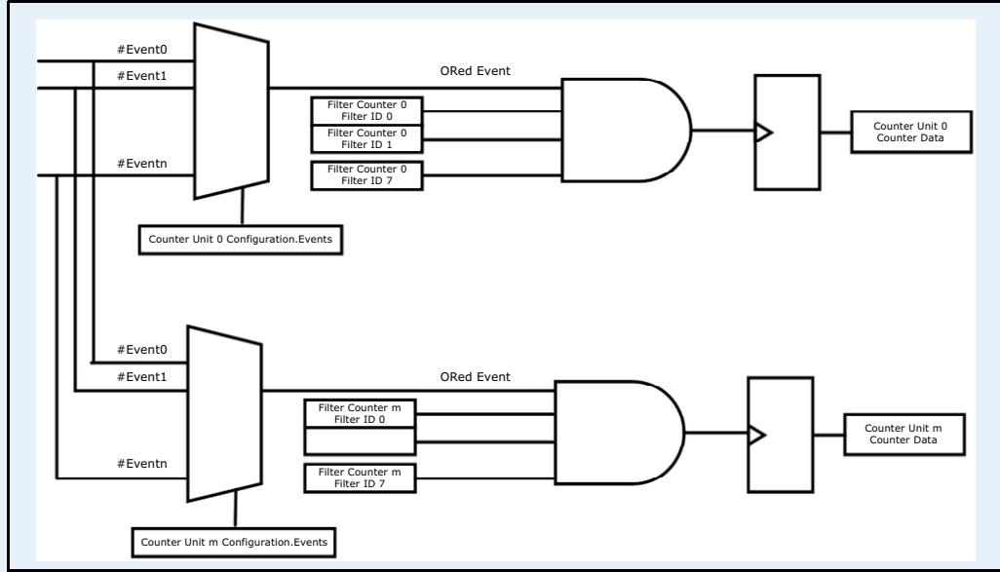  
Figure 13-1 pictorially represents how a simple CPMU that supports a single Event Group and two Configurable Counters counts events.

1. Every clock, the events selected via the Events field in the Counter Configuration register(s) (see Table 8-185), are ORed together.

2. The output of step 1, labeled ORed Event, is subjected to various configured filters.

3. The output of step 2 is added to the Counter Data.

Note: For readability, the Threshold, Edge, and Invert controls are not shown.

## CXL Compliance Testing

The tests outlined in this chapter are applicable to all devices that support alternate protocol negotiation and are capable of CXL only or CXL and PCIe\* protocols. The tests are broken into the different categories corresponding to the different chapters of CXL specification, starting with Chapter 3.0.

## 14.2 Starting Configuration/Topology (Common for All Tests)

In most tests, the initial conditions assumed are as follows (deviations from these conditions are pointed out in specific tests, if applicable): System is powered on, running in test environment OS, device-specific drivers have loaded on device, and link has trained to supported CXL modes. All error status registers should be cleared on the DUT.

Some tests make assumptions about only one CXL device being present in the system — this is identified in relevant tests. If nothing is mentioned, there is no limit on the number of CXL devices present in the system; however, the number of DUTs is limited to what the test software can support.

Certain tests may also require the presence of a protocol analyzer to monitor flits on the physical link for determining Pass or Fail results.

Figure 14-1. Example Test Topology

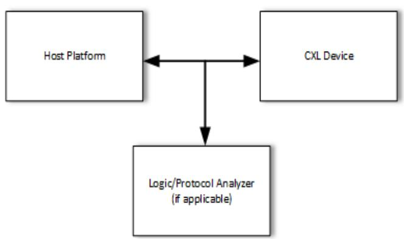

Each category of tests has certain device capability requirements to exercise the test patterns. The associated registers and programming is defined in the following sections.

See Section 14.16 for the registers that are applicable to the tests in the following sections.

## 14.2.1 Test Topologies

Some tests may require a specific topology to achieve the desired requirements. Throughout this chapter there will be references to these topologies as required. This section of the document will describe these topologies at a high level to provide context for the intended test configuration.

## 14.2.1.1 Single Host, Direct Attached SLD EP (SHDA)

Figure 14-2 is the most direct connected topology between a root port and an endpoint device.

## Figure 14-2. Example SHDA Topology

Topology Reference:

SHDA

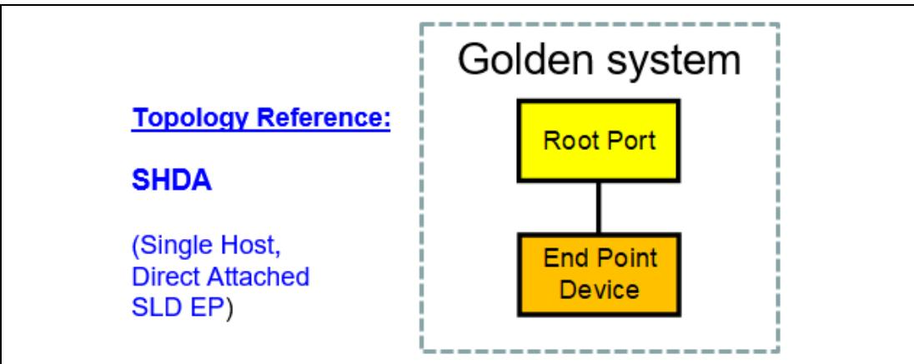

(Single Host, Direct Attached SLD EP)

## 14.2.1.2 Single Host, Switch Attached SLD EP (SHSW)

Figure 14-3 is the initial configuration for using a CXL-capable switch in the test configurations.

## Figure 14-3. Example Single Host, Switch Attached, SLD EP (SHSW) Topology

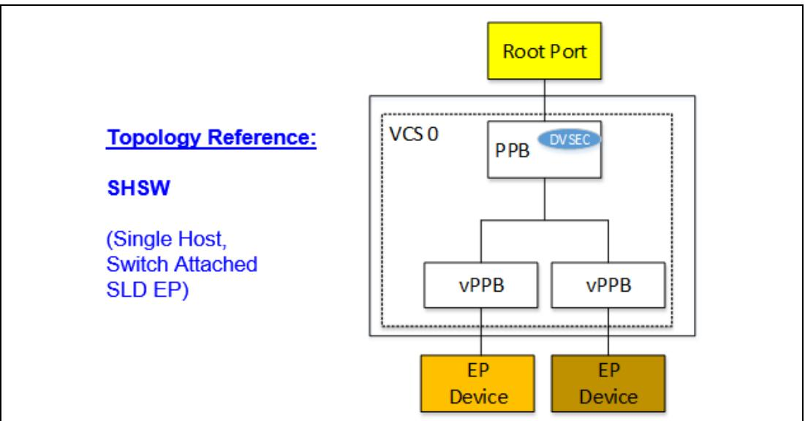

## 14.2.1.3 Single Host, Fabric Managed, Switch Attached SLD EP (SHSW-FM)

Figure 14-4 shows the configuration which will use the Fabric Manager as part of the test configuration.

Figure 14-4. Example SHSW-FM Topology

SHSW-FM

(Single Host, Fabric Managed, Switch Attached SLD EP)

Topology Reference:

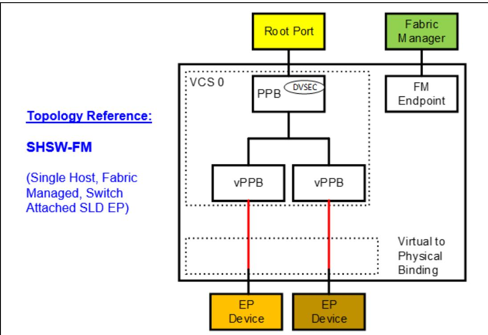

## 14.2.1.4 Dual Host, Fabric Managed, Switch Attached SLD EP (DHSW-FM)

Figure 14-5 shows an example configuration topology for having dual hosts during a test.

Figure 14-5. Example DHSW-FM Topology

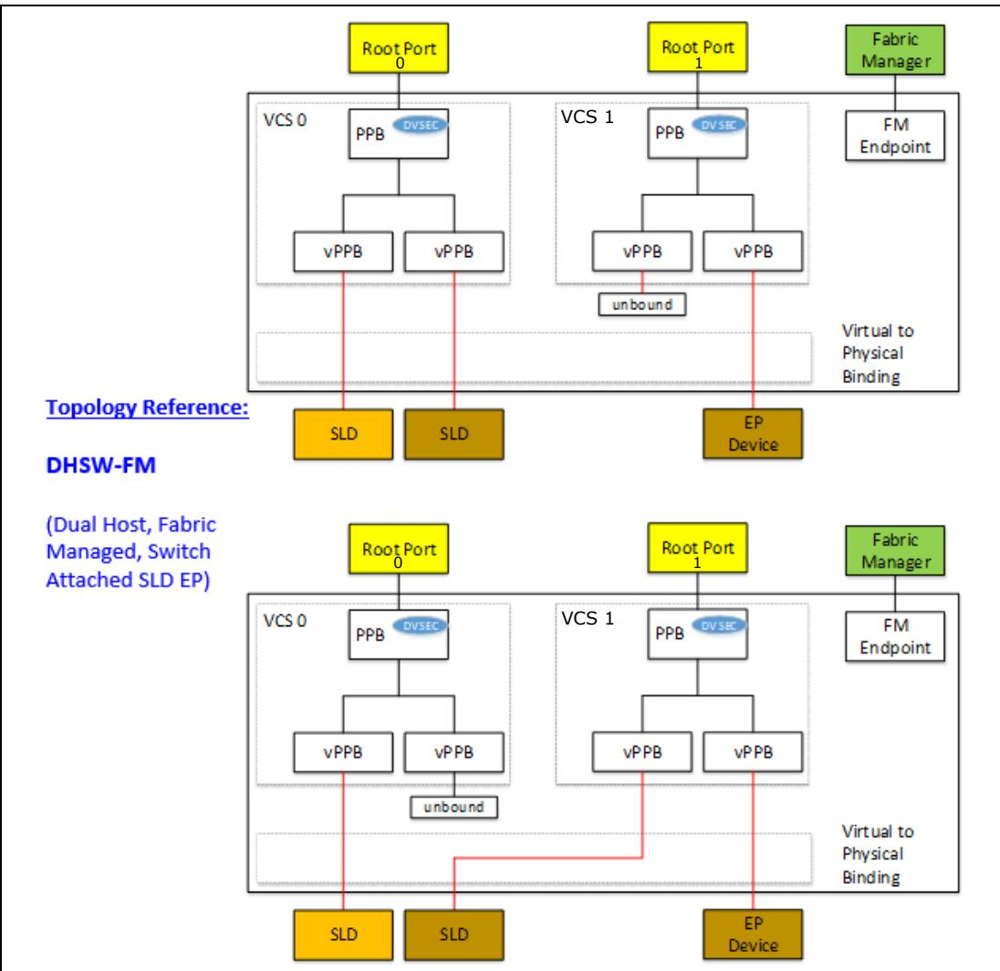

14.2.1.5

# Dual Host, Fabric Managed, Switch Attached MLD EP (DHSW-FM-MLD)

Figure 14-6 shows the topology for having dual hosts in a managed environment with multiple logical devices.

Figure 14-6. Example DHSW-FM-MLD Topology

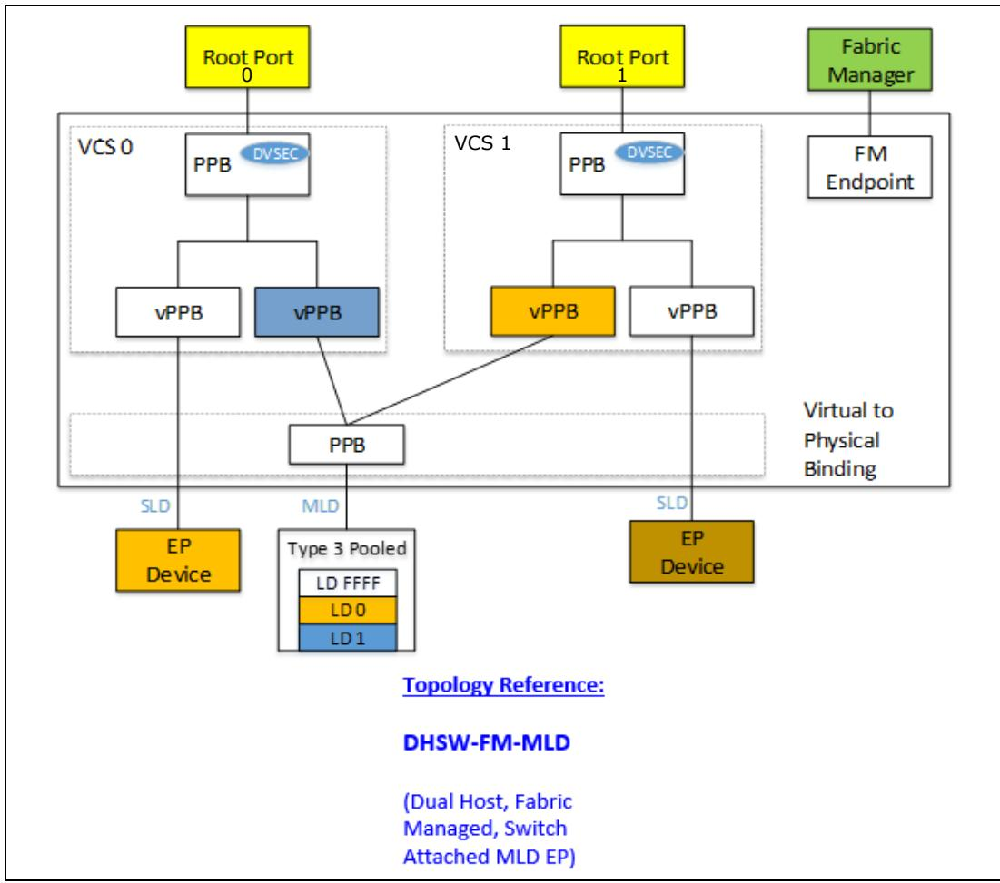

(Dual Host, Fabric Managed, Switch Attached MLD EP)

DHSW-FM-MLD

## 14.2.1.6 Cascaded Switch Topologies

PBR switches enable cascaded and mesh topologies. Figure 14-7 shows a cascaded switch topology that is supported by PBR switches. PBR switches use PBR flits for Interswitch Links (ISLs). A Fabric Manager is required to configure the fabric port routing. HBR switches may be attached to a PBR switch fabric.

Figure 14-7. Example Topology for Two PBR Switches

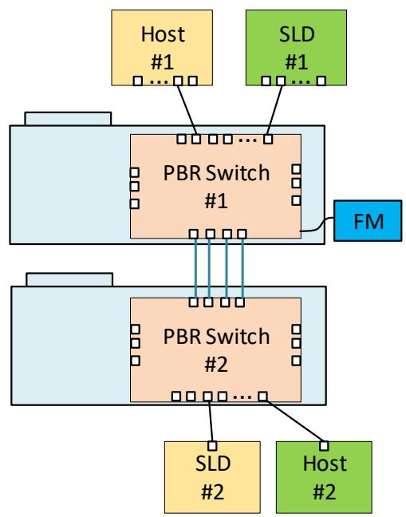

In a topology that has a single PBR switch and a single HBR switch (see Figure 14-8), the host devices are connected to the PBR switch and the HBR switch’s Upstream Switch Ports (USPs) are connected to the PBR switch, to allow for multiple-host routing. The HBR switch configures a unique VCS for each host.

Figure 14-8. Example Topology for a PBR Switch and an HBR Switch

## CXL.io and CXL.cache Application Layer/Transaction Layer Testing

## 14.3.1 General Testing Overview

Standard practices of testing coherency rely on “false sharing” of cachelines. Different agents in the system (e.g., cores, I/O, etc.) are assigned one or more fixed-byte locations within a shared set of cachelines. Each agent continuously executes an assigned Algorithm independently. Because multiple agents are sharing the same cacheline, stressful conflict scenarios can be exercised. Figure 14-9 illustrates the concept of false sharing. This can be used for CXL.io (Load/Store semantics) or CXL.cache (caching semantics) or (CXL.cache + CXL.mem) devices (Type 2 devices).

Figure 14-9. Representation of False Sharing between Cores (on Host) and CXL Devices  
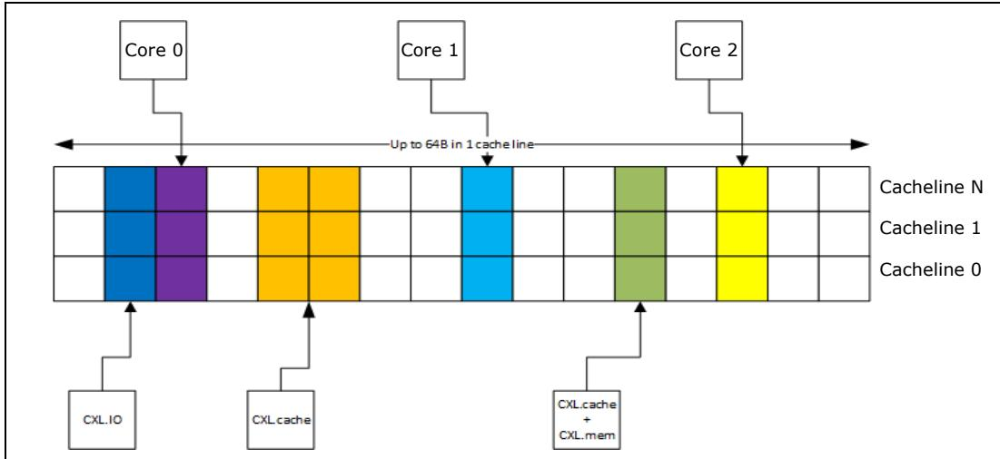

This document outlines three Algorithms that enable stressing the system with false sharing tests. In addition, this document specifies the prerequisites that are needed to execute, verify, and debug runs for the Algorithms. All the Algorithms are applicable for CXL.io and CXL.cache (protocols that originate requests to the host). Devices are permitted to be self-checking. Self-checking devices must have a way to disable the checking Algorithm independent of executing the Algorithm. All devices must support the non-self-checking flow in the Algorithms outlined below. The algorithms presented for false sharing require coordination with the cache on the device (if present). Hence, it may add certain responsibility on the application layer if the cache resides there.

## 14.3.2 Algorithms

## 14.3.3 Algorithm 1a: Multiple Write Streaming

In this Algorithm, the device is setup to stream an incrementing pattern of writes to different sets of cachelines. Each set of cacheline is defined by a base address $\mathsf { X } ,$ and an increment address Y. Increments are in multiples of 64B. The number of increments N dictates the size of the set beginning from base address X. The base address includes the byte offset within the cacheline. A pattern P (of variable length in bytes) determines the starting pattern to be written. Subsequent writes in the same set increment P. A device is required to provide a byte mask configuration capability that can be programmed to replicate pattern P in different parts of the cacheline. The programmed byte masks must be consistent with the base address.

Different sets of cachelines are defined by different base addresses (so a device may support a set like $\ " \mathsf { X } _ { 1 } , \ \mathsf { X } _ { 2 } , \ \mathsf { X } _ { 3 } \mathrm { ' } ) . \ \ " \mathsf { X } _ { 1 } \mathrm { ' }$ is programmed by software in the base address register, $\mathsf { X } _ { 2 }$ is obtained by adding a fixed offset to $\mathsf { X } _ { 1 }$ (offset is programmed by software in a different register). ${ \dot { \mathsf X } } _ { 3 }$ is obtained by adding the same offset to ${ \sf X } _ { 2 }$ and so on. Minimum support of 2 sets is required by the device. Figure 14-10 illustrates the flow of this Algorithm as implemented on the device. Address $\bar { Z }$ is the write back address where system software can poll to verify the expected pattern associated with this device, in cases where self-checking on the device is disabled. There is 1:1 correspondence between X and Z. It is the device’s responsibility to ensure that the writes in the execute phase are globally observable before beginning the verify phase. Depending on the write semantics used, this may imply additional fencing mechanism on the device to ensure the writes are globally visible before the verify phase can

begin. When beginning a new set iteration, devices must also give an option to use “P” again for the new set, or continue incrementing “P” for the next set. The select is programmed by software in “PatternParameter” field described in the register section.

PatternParameter, mentioned above, was in Table 14-41, which was removed in r3.0, v0.7. Please search the PDF for this term and determine how it and surrounding text should be revised. (PatternParameter also appears in Figure 14-10, Figure 14-11, Section 14.3.4, and Section 14.3.5.)

Figure 14-10. Flow Chart of Algorithm 1a

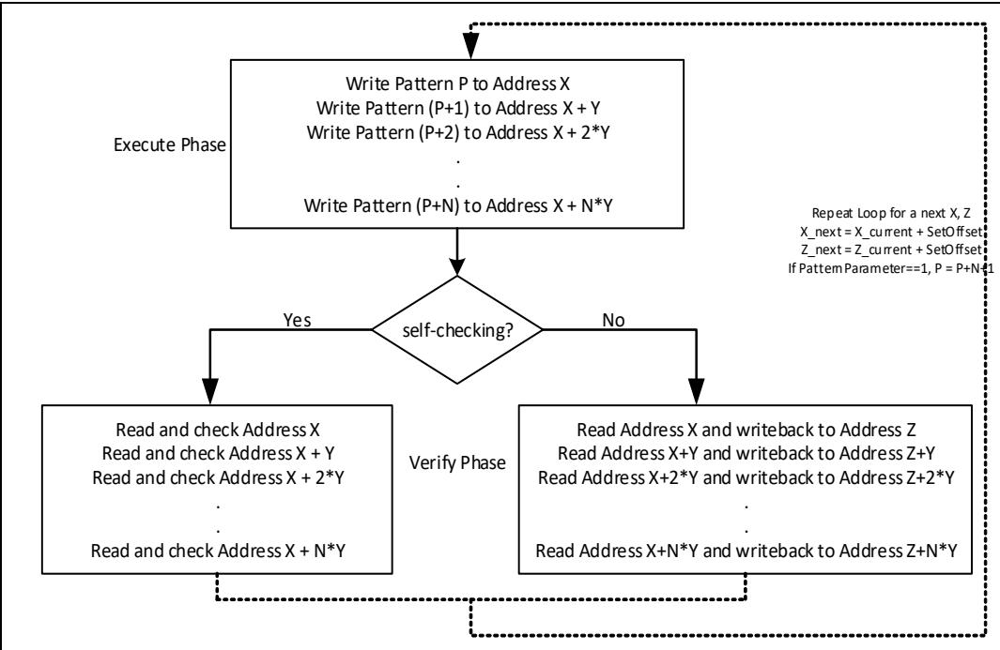  
14.3.4 Algorithm 1b: Multiple Write Streaming with Bogus Writes

This Algorithm is a variation on Algorithm 1a, except that before writing the expected pattern to an address, the device does “J” iterations of writing a bogus pattern “B” to that address. Figure 14-11 illustrates this Algorithm. In this case, if a pattern “B” is ever seen in the cacheline during the Verify phase, it is a Fail condition. The bogus writes help give a longer duration of conflicts in the system. It is the device’s responsibility to ensure that the writes in the execute phase are globally observable before beginning the verify phase. Depending on the write semantics used, this may imply additional fencing mechanism on the device to ensure the writes are globally visible before the verify phase can begin. When beginning a new set iteration, devices must also give an option to use “P” again for the new set, or continue incrementing “P” for the next set. The select is programmed by software in “PatternParameter” field described in the register section.

Figure 14-11. Flow Chart of Algorithm 1b  
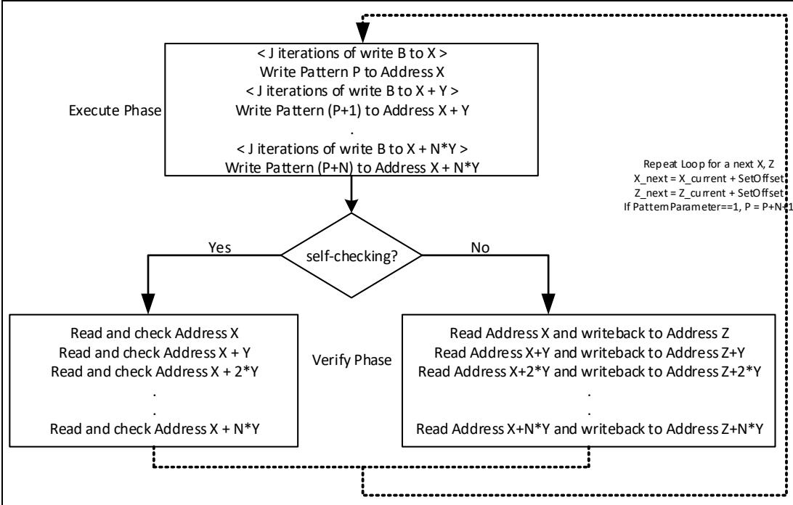

## 14.3.5 Algorithm 2: Producer Consumer Test

This Algorithm tests the scenario in which a Device is a producer and the CPU is a consumer. The Device simply executes a predetermined Algorithm of writing known patterns to a data location, followed by a flag update write. Threads on the CPU poll the flag, followed by reading the data patterns, followed by repolling the flag. This is a simple way of ensuring that the ordering rules of Producer-Consumer workloads are being followed through the stack. Device only participates in the execute phase of this Algorithm. Figure 14-12 illustrates the device execute phase. The Verify phase is run on the CPU, software reads addresses in the following order [F, X, (X+Y)…(X+N\*Y), F]. Knowing the value of the flag at two ends, the checker knows the range within which [X, (X+Y)…(X+N\*Y)] have to be. For example, if P=0, the first read of F returns a value of 3 and the next read of F returns a value of 4, then checker knows that all intermediate values have to be either 3 or 4. Moreover, if the device is using strongly ordered semantics, then the checker should never see a transition of values from 3 to 4 (implying monotonically decreasing values for the non-flag addresses). If using CXL.cache protocol, device must ensure global observability of previous data writes before updating the flag. When using strongly ordered semantics, each update must be globally visible before the next write. Depending on the flow used for dirty evicts, this can be implementation specific. It is the device’s responsibility to ensure that the writes in the execute phase are globally observable before updating the Flag F. The PatternParameter field is not relevant for this Algorithm. The Flag F should be written to Register 2: WriteBackAddress1 in the Device Capabilities to support the Test Algorithms.

Figure 14-12. Execute Phase for Algorithm 2  
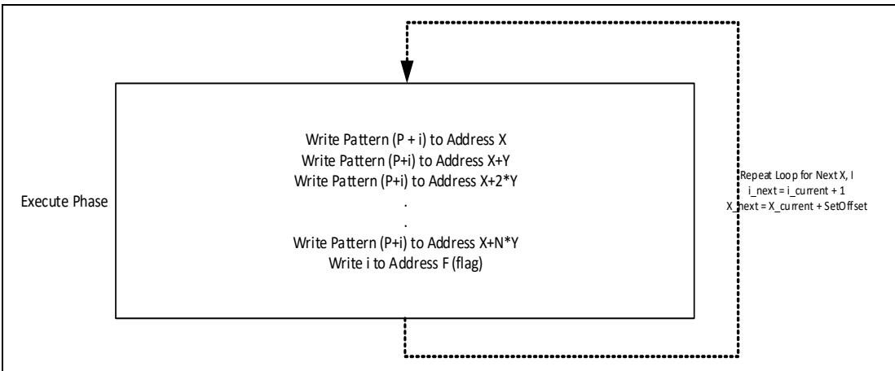

## 14.3.6 Test Descriptions

Unless specified otherwise, the tests in this section are applicable to both 68B Flit mode and 256B Flit mode.

## 14.3.6.1 Application Layer/Transaction Layer Tests

The Transaction Layer Tests implicitly give coverage for Link Layer functionality. Specific error injection cases for the Link Layer are covered in Section 14.12.

## 14.3.6.1.1 CXL.io Load/Store Test

For CXL.io, this test and associated capabilities are optional but strongly recommended. This test sets up the device to execute Algorithms 1a, 1b, and 2 in succession to stress the data path for CXL.io transactions. Configuration details are determined by the host platform testing the device. See Section 14.16 for the configuration registers and device capabilities. Each run includes execute/verify phases as described in Section 14.3.1.

Prerequisites:

• Hardware and configuration support for Algorithms 1a, 1b, and 2 described in Section 14.3.1 and Section 14.16

• If the device supports self-checking, it must escalate a fatal system error if the Verify phase fails (see Section 12.2 for specific error-escalation mechanisms)

• Device is permitted to log failing address, iteration number, and/or expected data vs. received data

## Test Steps:

1. Host software will set up the device for Algorithm 1a: Multiple Write Streaming.

2. If the device supports self-checking, enable it.

3. Host software decides the test runtime and runs the test for that period of time. (The software details of this are host-platform specific, but will be compliant with the flows mentioned in Section 14.3.1 and follow the configurations outlined in Section 14.16.)

4. Set up the device for Algorithm 1b: Multiple Write Streaming with Bogus writes.

5. If the device supports self-checking, enable it.

6. Host software decides the test runtime and runs the test for that period of time.

7. Set up the device for Algorithm 2: Producer Consumer Test.

8. Host software decides the test runtime and runs the test for that period of time.

## Pass Criteria:

• No data corruptions or system errors are reported

## Fail Conditions:

• Data corruptions or system errors are reported

## 14.3.6.1.2 CXL.cache Coherency Test

This test sets up the device and the host to execute Algorithms 1a, 1b, and 2 in succession to stress the data path for CXL.cache transactions. This test should only be run if the device and the host support CXL.cache or CXL.cache + CXL.mem protocols. Configuration details are determined by the host platform testing the device. See Section 14.16 for the configuration registers and device capabilities. Each run includes execute/verify phases as described in Section 14.3.1.

## Prerequisites:

• Device is CXL.cache capable

• Hardware and configuration support for Algorithms 1a, 1b, and 2 described in Section 14.3.1 and Section 14.16

• If a Device supports self-checking, it must escalate a fatal system error if the Verify phase fails (see Section 12.2 for specific error-escalation mechanisms)

• Device is permitted to log failing address, iteration number, and/or expected data vs. received data

## Test Steps:

1. Host software will set up the device and the host for Algorithm 1a: Multiple Write Streaming. An equivalent version of the algorithm is setup to be executed by host software so as to enable false sharing of the cachelines.

2. Set the Mem\_Enable bit in the DVSEC CXL Control register (see Table 8-6) on both the host and device side CXL.cachemem controllers.

3. If the device supports self-checking, enable it.

4. Host software decides the test runtime and runs the test for that period of time. (The software details of this are host-platform specific, but will be compliant with the flows mentioned in Section 14.3.1 and follow the configurations outlined in Section 14.16.)

5. Set up the device for Algorithm 1b: Multiple Write Streaming with Bogus writes.

6. If the device supports self-checking, enable it.

7. Host software decides the test runtime and runs the test for that period of time.

8. Set up the device for Algorithm 2: Producer Consumer Test.

9. Host software decides the test runtime and runs the test for that period of time.

## Pass Criteria:

• No data corruptions or system errors are reported.

• Reads to the written address locations must return the same data. Data integrity must be maintained.

## Fail Conditions:

• Data corruptions or system errors are reported

## 14.3.6.1.3 CXL Test for Receiving GO-ERR

This test is applicable only for devices that support CXL.cache protocols. This test sets up the device to execute Algorithm 1a while mapping one of the sets of the address to a memory range that is not accessible by the device. Test system software and configuration details are determined by the host platform and are system specific.

## Prerequisites:

• Device is CXL.cache capable

• Support for Algorithm 1a

## Test Steps:

1. Configure device for Algorithm 1a, and set up one of the base addresses to be an address not accessible by the DUT.

2. Disable self-checking in the DUT.

3. Host software decides test runtime and runs test for that period of time.

## Pass Criteria:

• No data corruptions or system errors are reported

• No fatal device errors on receiving GO-ERR

• Inaccessible memory range has not been modified by the device

## Fail Conditions:

• Data corruptions or system errors reported

• Fatal device errors on receiving GO-ERR

• Inaccessible memory range modified by the device (host error)

## 14.3.6.1.4 CXL.mem Test

This test sets up the host and the device to execute Algorithms 1a, 1b, and 2 in succession to stress the data path for CXL.mem transactions. An equivalent version of the algorithm is setup to be executed by host software so as to enable false sharing of the cachelines. Test system software and configuration details are determined by the host platform and are system specific.

## Prerequisites:

• Device is CXL.mem capable

## Test Steps:

1. Set the Mem\_Enable bit in the DVSEC CXL Control register (see Table 8-6) on both the host and device side CXL.cachemem controllers.

2. Map the device-attached memory to a test-memory range that is accessible by the host.

3. Run the equivalent of Algorithms 1a, 1b, and 2 on the host and the device targeting device-attached memory.

## Pass Criteria:

• No data corruptions or system errors are reported.

• Reads to the written address locations must return the same data. Data integrity must be maintained.

## Fail Conditions:

• Data corruptions or system errors are reported

## 14.3.6.1.5 Egress Port Backpressure Test

This test applies to an MLD that supports FM API or an SLD that supports the Memory Device command set. This test sets up the device to execute Algorithms 1a, 1b, and 2 in succession to stress the data path for CXL.mem transactions. An equivalent version of the algorithm is setup to be executed by host software so as to enable false sharing of the cachelines. Test system software and configuration details are determined by the host platform and are system specific. The NUMBER\_OF\_QOS\_TEST\_LOOPS, NUMBER\_OF\_CHECK\_AVERAGE, and BackpressureSample Interval settings in this test are decided upon by the testing platform/software.

Prerequisites:

• Device is CXL.mem capable

## Test Steps:

## For an MLD:

1. Through the FM API, check if Egress Port Congestion Supported is set by issuing a Get LD Info command.

2. If Egress Port Congestion Supported is enabled: Repeat for NUMBER\_OF\_QOS\_TEST\_LOOPS:

a. Set the BackpressureSample Interval setting to a value between 1 to 31 through the Set QoS Control command.

b. Set the Egress Port Congestion Enable bit through the Set QoS Control command.

c. Check that the Egress Port Congestion Enable bit was set successfully in the Get QoS Control Response.

d. Run the equivalent of Algorithms 1a, 1b, and 2 in succession on the host and the device targeting device-attached memory.

e. While Algorithms 1a, 1b, and 2 are running: Check the reported Backpressure Average Percentage through the Get QoS Status command and response. It should report values within the valid range which is 0 to 100. Repeat this step NUMBER\_OF\_CHECK\_AVERAGE times at a certain interval.

## For an SLD:

1. Check if Egress Port Congestion Supported is set by issuing an Identify Memory Device command, and checking the corresponding Identify Memory Device Output Payload.

2. If Egress Port Congestion Supported is enabled, repeat for NUMBER\_OF\_QOS\_TEST\_LOOPS:

a. Set the BackpressureSample Interval setting to a value between 1 to 31 through the Set SLD QoS Control Request command.

b. Set the Egress Port Congestion Enable bit through the Set SLD QoS Control Request.

c. Check that the Egress Port Congestion Enable bit was set successfully in the Get SLD QoS Control Response.

d. Check the reported Backpressure Average Percentage through the Get QoS Status command and response.

e. Run the equivalent of Algorithms 1a, 1b, and 2 in succession on the host and the device targeting device-attached memory.

f. While Algorithms 1a, 1b, and 2 are running: Check the reported Backpressure Average Percentage through the Get SLD QoS Status command and response. It should report values within the valid range which is 0 to 100. Repeat this step NUMBER\_OF\_CHECK\_AVERAGE times at a certain interval.

## Pass Criteria:

• Egress Port Congestion Enable is set after enabling it

• Backpressure Average Percentage reports valid values within 0 to 100.

• No data corruptions or system errors are reported while executing Algorithms 1a, 1b, and 2

## Fail Conditions:

• Egress Port Congestion Enable is not set after enabling it

• Backpressure Average Percentage reports any value outside the valid 0 to 100 range

• Data corruptions or system errors reported while executing Algorithms 1a, 1b, and 2

## 14.3.6.1.6 Temporary Throughput Reduction Test

This test applies to an MLD that supports FM API or an SLD that supports the Memory Device Command set. This test sets up the device to execute Algorithms 1a, 1b, and 2 in succession to stress the data path for CXL.mem transactions. For Type 3 (MLD or SLD), it is the responsibility of the host to take care of running the algorithms as appropriate. An equivalent version of the algorithm is setup to be executed by Host software so as to enable false sharing of the cachelines. Test system software and configuration details are determined by the host platform and are system specific. NUMBER\_OF\_QOS\_TEST\_LOOPS in the test steps is decided upon by the testing platform/software.

## Prerequisites:

• Device is CXL.mem capable

## Test Steps:

## For an MLD:

1. Through the FM API, check whether Temporary Throughput Reduction Supported is set by issuing a Get LD Info command.

2. If Temporary Throughput Reduction Supported is enabled, repeat for NUMBER\_OF\_QOS\_TEST\_LOOPS:

a. Set the Temporary Throughput Reduction Enable bit by issuing the Set QoS Control command.

b. Check that the Temporary Throughput Reduction Enable bit was set successfully in the Get QoS Control Response.

c. Run the equivalent of Algorithms 1a, 1b, and 2 in succession on the host and the device targeting device-attached memory.

## For an SLD:

1. Through the Memory Device Command set, check whether Temporary Throughput Reduction Supported is set by issuing an Identify Memory Device command, and checking corresponding Identify Memory Device Output Payload.

2. If Temporary Throughput Reduction Supported is enabled, repeat for NUMBER\_OF\_QOS\_TEST\_LOOPS:

a. Set the Temporary Throughput Reduction Enable bit through the Set SLD QoS Control Request.

b. Check that the Temporary Throughput Reduction Enable bit was set successfully in the Get SLD QoS Control Response.

c. Run the equivalent of Algorithms 1a, 1b, and 2 in succession on the host and the device targeting device-attached memory.

## Pass Criteria:

• Temporary Throughput Reduction Enable is set after enabling it

• No data corruptions or system errors are reported while executing Algorithms 1a, 1b, and 2

## Fail Conditions:

• Temporary Throughput Reduction Enable is not set after enabling it

• Data corruptions or system errors reported while executing Algorithms 1a, 1b, and 2

## Link Layer Testing

## RSVD Field Testing CXL.cachemem

Test Equipment:

• Exerciser

Prerequisites:

• Applicable for 68B and 256B Flit modes

• Device is CXL.cachemem capable

• CXL link is up

## 14.4.1.1 Device Test

## Test Steps:

1. Send from host Link Layer Control.INIT.Param with all RSVD fields set to 1.

2. Wait for Control-INIT.Param from the device.

3. Wait for the Link to reach L0 state and the device is in a configured state.

## Pass Criteria:

• CXL Link Layer Control and Status Register INIT\_State is 11b

• Link Layer initialization is successful and Reserved fields are ignored

## Fail Conditions:

• Pass criteria is not met

## 14.4.1.2 Host Test

## Test Steps:

1. Send from device Link Layer Control.INIT.Param with all RSVD fields set to 1.

2. Wait for Link to reach L0 state.

## Pass Criteria:

• CXL Link Layer Control and Status Register INIT\_State is 11b

• Link Layer initialization is successful and Reserved fields are ignored

## Fail Conditions:

• Pass criteria is not met

## 14.4.2 CRC Error Injection RETRY\_PHY\_REINIT

## Test Equipment:

• Protocol Analyzer

• Protocol Exerciser

## Prerequisites:

• Applicable for 68B Flit mode only

• CXL Host must support Algorithm 1a

• CXL Host must support Link Layer Error Injection capabilities for CXL.cache

## Test Steps:

1. Setup is the same as Test 14.3.6.1.2.

2. While a test is running, software will insert the following error injection. The Protocol Exerciser will retry the flit for at least MAX\_NUM\_RETRY times upon detecting a CRC error.

Table 14-1. CRC Error Injection RETRY\_PHY\_REINIT: Cache CRC Injection Request

<table><tr><td>Data Object Byte Offset</td><td>Length in Bytes</td><td>Description</td><td>Value</td></tr><tr><td>0h</td><td>8</td><td>Standard DOE Request Header</td><td></td></tr><tr><td>8h</td><td>1</td><td>Request Code</td><td>7, CRC Injection</td></tr><tr><td>9h</td><td>1</td><td>Version</td><td>2</td></tr><tr><td>Ah</td><td>2</td><td>Reserved</td><td></td></tr><tr><td>Ch</td><td>1</td><td>Protocol</td><td>2</td></tr><tr><td>Dh</td><td>1</td><td>Num Bits Flipped</td><td>1</td></tr><tr><td>Eh</td><td>1</td><td>Num Flits Injected</td><td>1</td></tr></table>

Pass Criteria:

• Same as Test 14.3.6.1.2

• Monitor and verify that CRC errors are injected (using the Protocol Analyzer), and that Retries are triggered as a result

• Five RETRY.Frame Flits are sent before RETRY.Req and RETRY.Ack (protocol analyzer)

• Check that link enters RETRY\_PHY\_REINIT

• Means value of NUM\_Phy\_Reinit\_Received: Num\_Phy\_Reinit value reflected in the last RETRY.Req message received in CXL Link Layer Capability register is greater than 1

## Fail Conditions:

• Same as Test 14.3.6.1.2

• Link does not reach RETRY\_PHY\_REINIT

## 14.4.3 CRC Error Injection RETRY\_ABORT

## Test Equipment:

• Protocol Analyzer

• Protocol Exerciser

## Prerequisites:

• Applicable for 68B Flit mode only

• CXL device must support Algorithm 1a

• CXL device must support Link Layer Error Injection capabilities for CXL.cache

## Test Steps:

1. Set up is the same as Test 14.3.6.1.2.

2. While a test is running, software will insert the following error injection. The Protocol Exerciser will retry the flit for at least (MAX\_NUM\_RETRY x MAX\_NUM\_PHY\_REINIT) times upon detecting a CRC error:

Table 14-2. CRC Error Injection RETRY\_ABORT: Cache CRC Injection Request

<table><tr><td>Data Object Byte Offset</td><td>Length in Bytes</td><td>Description</td><td>Value</td></tr><tr><td>0h</td><td>8</td><td>Standard DOE Request Header</td><td></td></tr><tr><td>8h</td><td>1</td><td>Request Code</td><td>7, CRC Injection</td></tr><tr><td>9h</td><td>1</td><td>Version</td><td>2</td></tr><tr><td>Ah</td><td>2</td><td>Reserved</td><td></td></tr><tr><td>Ch</td><td>1</td><td>Protocol</td><td>2</td></tr><tr><td>Dh</td><td>1</td><td>Num Bits Flipped</td><td>1</td></tr><tr><td>Eh</td><td>1</td><td>Num Flits Injected</td><td>1</td></tr></table>

## Pass Criteria:

• Same as Test 14.3.6.1.2

• Monitor and verify that CRC errors are injected (using the Protocol Analyzer), and that Retries are triggered as a result

• Five RETRY.Frame Flits are sent before RETRY.Req and RETRY.Ack (protocol analyzer)

• Link retrains for MAX\_NUM\_PHY\_REINIT number of times and fails to recover

## Fail Conditions:

• Same as Test 14.3.6.1.2

• Link does not reach RETRY\_PHY\_REINIT

• Link does not reach RETRY\_ABORT

## ARB/MUX

## 14.5.1 Reset to Active Transition

## Test Equipment:

• Protocol Analyzer

## Prerequisites:

• Applicable for 68B Flit mode, 256B Flit mode, and Latency-Optimized 256B Flit mode

• CXL link is not assumed to be up

• Device drivers are not assumed to have been loaded

## Test Steps:

1. With the link in Reset state, Link layer sends a Request to enter Active.

2. ARB/MUX waits to receive indication of Active from Physical Layer.

## Pass Criteria:

• ALMP Status sync exchange completes before ALMP Request{Active} sent by Local ARB/MUX (if applicable)

• Local ARB/MUX sends ALMP Request{Active} to the remote ARB/MUX

• Validate the first ALMP on the initial bring up is from the Downstream Port to the Upstream Port

• Local ARB/MUX waits for ALMP Status{Active} and ALMP Request{Active} from remote ARB/MUX

• Local ARB/MUX sends ALMP Status{Active} in response to Request

• Link transitions to Active after the ALMP handshake completes

• Link successfully enters Active state with no errors

## Fail Conditions:

• Link hangs and does not enter Active state

• Any error occurs before transition to Active state

## 14.5.2 ARB/MUX Multiplexing

## Test Equipment:

• Protocol Analyzer (used to ensure that traffic is sent simultaneously on both CXL.io and CXL.cachemem)

## Prerequisites:

• Applicable for 68B Flit mode, 256B Flit mode, and Latency-Optimized 256B Flit mode

• Device is CXL.cache capable and/or CXL.mem capable

• Host-generated traffic or Device-generated traffic

• Support for Algorithm 1a, 1b, or 2

## Test Steps:

1. Bring the link up into CXL mode with CXL.io and CXL.cache and/or CXL.mem enabled.

2. Ensure the arbitration weight is a nonzero value for both interfaces.

3. Send continuous traffic on both CXL.io and CXL.cache and/or CXL.mem using Algorithm 1a, 1b, or 2.

4. Allow time for traffic transmission while snooping the bus.

## Pass Criteria:

• Data from both CXL.io and CXL.cache and/or CXL.mem are sent across the link by the ARB/MUX

## Fail Conditions:

• Data on the link is only CXL.io

• Data on the link is only CXL.cache or CXL.mem (CXL.cache and CXL.mem share a single Protocol ID; see Table 6-2)

## Test Steps (256B Flit Mode):

1. Upstream Port sends PM state Request ALMP.

2. Wait for an ALMP Request for entry to a PM state.

3. Downstream Port rejects the request by responding Active.PMNAK Status ALMP.

4. On receiving Active.PMNAK Status ALMP, the Upstream Port must transition the corresponding vLSM to Active.PMNAK state.

5. After Active.PMNAK is observed, the Link Layer must request Active to the ARB/ MUX and then wait for the vLSM to transition to Active before transmitting flits.

## Pass Criteria:

• Upstream Port must continue to receive and process flits while the vLSM state is Active or Active.PMNAK

• Upstream Port must transition back to Active state

• For Upstream Ports, after the Link Layer has requested PM entry, the Link Layer must not change this request until it observes the vLSM status change to either the requested state or to Active.PMNAK or to one of the non-virtual states (LinkError, LinkReset, LinkDisable, or Reset)

## Fail Conditions:

• Any system error

## Active to L1.x Transition (If Applicable)

## Test Equipment:

• Protocol Analyzer

## Prerequisites:

• Applicable for 68B Flit mode, 256B Flit mode, and Latency-Optimized 256B Flit mode

• Support for ASPM L1

## Test Steps:

1. Force the remote and local link layer to send a request to the ARB/MUX for L1.x state.

2. This test should be run separately for each Link Layer independently (to test one Link Layer’s L1 entry while the other Link Layer is in ACTIVE), as well as both Link Layers concurrently requesting L1 entry.

## Pass Criteria:

• Upstream Port ARB/MUX sends ALMP Request{L1.x}

• Downstream Port ARB/MUX sends ALMP Status{L1.x} in response

• L1.x is entered after the local ARB/MUX receives ALMP Status

• State transition does not occur until the ALMP handshake is complete

• LogPHY enters L1 ONLY after both Link Layers enter L1 (applies to CXL mode only)

## Fail Conditions:

• Error in ALMP handshake

• Protocol layer packets sent after ALMP L1.x handshake is complete (requires Protocol Analyzer)

• State transition occurs before ALMP handshake completed

## 14.5.4

## L1.x State Resolution (If Applicable)

Test Equipment:

• Protocol Analyzer

## Prerequisites:

• Applicable for 68B Flit mode, 256B Flit mode, and Latency-Optimized 256B Flit mode

• Support for ASPM L1

## Test Steps:

1. Force the remote and local link layer to send a request to the ARB/MUX for different L1.x states.

## Pass Criteria:

• Upstream Port ARB/MUX sends ALMP Request{L1.x} according to what the link layer requested

• Upstream Port ARB/MUX sends ALMP Status{L1.y} response

• The state in the Status ALMP is the more-shallow L1.y state

• L1.y is entered after the local ARB/MUX receives ALMP Status

• State transition does not occur until the ALMP handshake is complete

• LogPHY enters L1 ONLY after both protocols enter L1 (applies to CXL mode only)

## Fail Conditions:

• Error in ALMP handshake

• Protocol layer packets sent after ALMP L1.x handshake is complete (requires Protocol Analyzer)

• State transition occurs before ALMP handshake completed

## 14.5.5 Active to L2 Transition

Test Equipment:

• Protocol Analyzer

## Prerequisites:

• Applicable for 68B Flit mode, 256B Flit mode, and Latency-Optimized 256B Flit mode

## Test Steps:

1. Force the remote and local link layer to send a request to the ARB/MUX for L2 state.

## Pass Criteria:

• Upstream Port ARB/MUX sends ALMP Request{L2} to the remote vLSM

• Upstream Port ARB/MUX waits for ALMP Status{L2} from the remote vLSM

• L2 is entered after the local ARB/MUX receives ALMP Status

• If there are multiple link layers, repeat step 1 for all link layers

• Physical link enters L2

• vLSM and physical link state transitions do not occur until ALMP handshake is complete

## Fail Conditions:

• Error in ALMP handshake

• Protocol layer packets sent after ALMP L2 handshake is complete (requires Protocol Analyzer)

• State transition occurs before ALMP handshake completed

## 14.5.6

## L1 to Active Transition (If Applicable)

Test Equipment:

• Protocol Analyzer Required

## Prerequisites:

• Applicable for 68B Flit mode, 256B Flit mode, and Latency-Optimized 256B Flit mode

• Support for ASPM L1

## Test Steps:

1. Bring the link into L1 state.

2. Force the link layer to send a request to the ARB/MUX to exit L1.

## Pass Criteria:

• Local ARB/MUX sends L1 exit notification to the Physical Layer

• Link exits L1

• Link enters L0 correctly

• 68B Flit mode

— Status synchronization handshake completes successfully

— Active ALMP exchange to exit vLSM L1 and transition to Active successfully

• 256B Flit mode and Latency-Optimized 256B Flit mode

— Active ALMP request and receive Active Status ALMP to exit vLSM L1 and transition to Active

## Fail Conditions:

• Link transition to L0 has not occurred

• 68B Flit mode

— No status exchange happened, or

— Active ALMP exchange has not occurred

• 256B Flit mode

— Active ALMP exchange has not occurred

## 14.5.7

## Reset Entry

Prerequisites:

• Applicable for 256B Flit mode and Latency-Optimized 256B Flit mode

## Test Steps:

1. Initiate warm reset flow.

Pass Criteria:

• Link sees hot reset and transitions to Detect state

## Fail Conditions:

• Link does not enter Detect

## Entry into L0 Synchronization

## Test Equipment:

• Protocol Analyzer

## Prerequisites:

• Applicable for 68B Flit mode

## Test Steps:

1. Place the link into Retrain state.

2. After exit from Retrain, check Status ALMPs to synchronize interfaces across the link.

## Pass Criteria:

• State contained in the Status ALMP is the same state the link was in before entry to Retrain

## Fail Conditions:

• No Status ALMPs are sent after exit from Retrain state

• State in Status ALMPs different from the state that the link was in before the link went into Retrain

• Other communication occurred on the link after Retrain before the Status ALMP handshake for synchronization completed

## 14.5.9

## ARB/MUX Tests Requiring Injection Capabilities

The tests in this section are optional but strongly recommended. The test configuration control registers for the tests in this section are implementation specific.

## 14.5.9.1

## ARB/MUX Bypass (Deprecated)

## 14.5.9.2

## PM State Request Rejection

Test Equipment:

• Protocol Analyzer

## Prerequisites:

• Applicable for 68B Flit mode, 256B Flit mode, and Latency-Optimized 256B Flit mode

• Host capability to place the host into a state where it will reject any PM request ALMP

## Test Steps:

1. Upstream Port sends PM state Request ALMP.

2. Wait for an ALMP Request for entry to a PM State.

3. Downstream Port rejects the request by not responding to the Request ALMP.

4. After a certain time (determined by the test), the Upstream Port aborts PM transition on its end and sends transactions to the Downstream Port. In the case of a Type 3 device, the host will issue a CXL.mem M2S request, which the DUT will honor by aborting CXL.mem L1 entry.

## Pass Criteria:

• Upstream Port continues operation despite no Status received and initiates an Active Request

## Fail Conditions:

• Any system error

## 14.5.9.3 Unexpected Status ALMP

## Prerequisites:

• Applicable for 68B Flit mode only

• Device capability to force the ARB/MUX to send a Status ALMP at any time

## Test Steps:

1. While the link is in Active state, force the ARB/MUX to send a Status ALMP without first receiving a Request ALMP.

## Pass Criteria:

• Link enters Retrain state without any errors being reported

## Fail Conditions:

• No error on the link and normal operation continues

• System errors are observed

## 14.5.9.4 ALMP Error

## Prerequisites:

• Applicable for 68B Flit mode only

• Device capability that allows the device to inject errors into a flit

## Test Steps:

1. Inject a single bit error into the lower 16 bytes of a 528-bit flit.

2. Send data across the link.

3. ARB/MUX detects error and enters Retrain.

4. Repeat steps 1 through 3 with a double-bit error.

## Pass Criteria:

• Link enters Retrain

## Fail Conditions:

• No errors are detected

## 14.5.9.5 Recovery Re-entry

## Prerequisites:

• Applicable for 68B Flit mode only

• Device capability that allows the device to ignore ALMP State Requests

## Test Steps:

1. Place the link into Active state.

2. Request link to enter Retrain State.

3. Prevent the Local ARB/MUX from entering Retrain.

4. Remote ARB/MUX enters Retrain state.

5. Remote ARB/MUX exits Retrain state and sends ALMP Status{Active} to synchronize.

6. Local ARB/MUX receives Status ALMP for synchronization but does not send.

7. Local ARB/MUX triggers re-entry to Retrain.

## Pass Criteria:

• Link successfully enters Retrain on re-entry attempt

## Fail Conditions:

• Link continues operation without proper synchronization

## L0p Feature

## 14.5.10.1

## Positive ACK for L0p

## Test Equipment:

• Protocol Analyzer

## Prerequisites:

• Link negotiation in 256B Flit mode is supported

• L0p feature is supported

## Test Steps:

1. Get current Link Width.

2. If Link Width = 1 and Link capability > 1:

a. Request L0p scale up to maximum supported width.

b. Successful Link scale up (assuming ACK).

c. Continue ALMP and traffic during L0p phases as normal.

## Pass Criteria:

• No packet errors

• Link Width scale up to value indicated is successful; else Link Width > 1

• Request L0p scale down to 1

## Fail Conditions:

• Pass criteria is not met

## 14.5.10.2 Force NAK for L0p Request

## Test Equipment:

• Protocol Analyzer

## Prerequisites:

• Link Negotiation in 256B Flit mode is supported

• L0p feature is supported

## Test Steps:

1. For L0p request, force a NAK.

## Pass Criteria:

• No change with Negotiated Link Width register

## Fail Conditions:

• Up/down scaling

• Data error transfers

## Physical Layer

## Tests Applicable to 68B Flit Mode

## Prerequisites:

• Applicable only when the link is expected to train to 68B Flit mode (see Table 6-12)

## 14.6.1.1

## Protocol ID Checks

## Test Equipment:

• Protocol Analyzer

## Test Steps:

1. Bring the link up to Active state.

2. Send one or more flits from the CXL.io interface, and then check for the correct Protocol ID.

3. If applicable, send one or more flits from the CXL.cache and/or CXL.mem interface, and then check for the correct Protocol ID.

4. Send one or more flits from the ARB/MUX, and then check for the correct Protocol ID.

## Pass Criteria:

• All Protocol IDs are correct

## Fail Conditions:

• Errors occur during test

• No communication

## 14.6.1.2 NULL Flit

## Test Equipment:

• Protocol Analyzer

## Test Steps:

1. Bring the link up to Active state.

2. Delay flits from the Link Layer.

3. Check for NULL flits from the Physical Layer.

4. Check that NULL flits have correct Protocol ID.

## Pass Criteria:

• NULL flits seen on the bus when Link Layer delayed

• NULL flits have correct Protocol ID

• NULL flits contain all zero data

## Fail Conditions:

• No NULL flits are sent from the Physical Layer

• Errors are logged during tests in the CXL DVSEC Port Status register

## 14.6.1.3 EDS Token

## Test Equipment:

• Protocol Analyzer

## Test Steps:

1. Bring the link up to Active state.

2. Send a flit with an implied EDS token.

## Pass Criteria:

• A flit with an implied EDS token is the last flit in the data block

• Next Block after a flit with an implied EDS token is an ordered set (OS)

• OS block follows the data block that contains a flit with the implied EDS token

## Fail Conditions:

• Errors logged during test

## 14.6.1.4 Correctable Protocol ID Error

This test is optional but strongly recommended.

## Test Equipment:

• Protocol Analyzer

## Test Steps:

1. Bring the link up to Active state.

2. Create a correctable Protocol ID framing error by injecting an error into one 8-bit encoding group of the Protocol ID such that the new 8b encoding is invalid.

3. Check that an error is logged and normal processing continues.

## Pass Criteria:

• Error correctly logged in DVSEC Flex Bus Port Status register (see Table 8-68)

• Correct 8-bit encoding group used for normal operation

## Fail Conditions:

• No errors are logged

• Flit with error dropped

• Error causes retrain

• Normal operation does not resume after error

## 14.6.1.5 Uncorrectable Protocol ID Error

This test is optional but strongly recommended.

## Test Equipment:

• Protocol Analyzer

## Test Steps:

1. Bring the link up to Active state.

2. Create an uncorrectable framing error by injecting an error into both 8-bit encoding groups of the Protocol ID such that both 8b encodings are invalid.

3. Check that an error is logged and that the flit is dropped.

4. Link enters Retrain state.

## Pass Criteria:

• Error is correctly logged in the DVSEC Flex Bus Port Status register (see Table 8-68)

• Link enters Retrain state

## Fail Conditions:

• No errors are logged in the DVSEC Flex Bus Port Status register

## 14.6.1.6 Unexpected Protocol ID

This test is informational only.

## Test Equipment:

• Protocol Analyzer

## Test Steps:

1. Bring the link up to Active state.

2. Send a flit with an unexpected Protocol ID.

3. Check that an error is logged and that the flit is dropped.

4. Link enters Retrain state.

## Pass Criteria:

• Error is correctly logged in the DVSEC Flex Bus Port Status register (see Table 8-68)

• Link enters Retrain state

## Fail Conditions:

• No Errors are logged in the DVSEC Flex Bus Port Status register

## 14.6.1.7 Recovery.Idle/Config.Idle Transition to L0

## Test Equipment:

• Protocol Analyzer

## Test Steps:

1. Bring the link up in CXL mode to Recovery.Idle or Config.Idle state.

2. Wait for the NULL flit to be received by the DUT.

3. Check that the DUT sends NULL flits after receiving NULL flits.

## Pass Criteria:

• LTSSM transitions to L0 after 8 NULL flits are sent and at least 4 NULL flits are received

## Fail Conditions:

• LTSSM remains in IDLE

## 14.6.1.8

## Uncorrectable Mismatched Protocol ID Error

This test is optional but strongly recommended.

## Prerequisites:

• Protocol ID error perception in the device Log PHY (device can forcibly react as though there is an error even if the Protocol ID is correct)

## Test Steps:

1. Bring the link up to Active state.

2. Create an uncorrectable Protocol ID framing error by injecting a flit such that both 8-bit encoding groups of the Protocol ID are valid but do not match.

3. Check that an error is logged and that the flit is dropped.

4. Link enters Retrain state.

## Pass Criteria:

• Error is correctly logged in the DVSEC Flex Bus Port Status register (see Table 8-68)

• Link enters Retrain state

## Fail Conditions:

• No errors are logged

• Error is corrected

## 14.6.2 Drift Buffer (If Applicable)

## Prerequisites:

• Drift buffer is supported

## Test Steps:

1. Enable the Drift buffer.

## Pass Criteria:

• Drift buffer is logged in the DVSEC Flex Bus

## Fail Conditions:

• No log in the DVSEC Flex Bus

## 14.6.3

## SKP OS Scheduling/Alternation (If Applicable)

## Test Equipment:

• Protocol Analyzer

## Prerequisites:

• Applicable only when the link trains to 32 GT/s or lower

• Support Sync Header Bypass

## Test Steps:

1. Bring the link up in CXL mode with Sync Header Bypass enabled.

2. Check for SKP OS.

## Pass Criteria:

• Physical Layer schedules SKP OS every 340 data blocks

• Control SKP OS and standard SKP OS alternate at 16 GT/s or higher

• Standard SKP OS is used only at 8 GT/s

## Fail Conditions:

• No SKP OS is observed

• SKP OS is observed at an interval other than 340 data blocks

## 14.6.4

## SKP OS Exiting the Data Stream (If Applicable)

Test Equipment:

• Protocol Analyzer

## Prerequisites:

• Applicable only when the link trains to 32 GT/s or lower

• Support Sync Header Bypass

## Test Steps:

1. Bring the link up in CXL mode with Sync Header Bypass enabled.

2. Exit Active state.

## Pass Criteria:

• Physical Layer replaces SKP OS with EIOS or EIEOS

## Fail Conditions:

• SKP OS is not replaced by the Physical Layer

## 14.6.5 Link Initialization Resolution

See Section 14.2.1 for the list of configurations that are used by this test.

## Test Equipment:

• Protocol Analyzer

## Test Steps:

1. For the DUT, set up the system as described in the Configurations to Test column of Table 14-3.

2. In each of the configurations marked “Yes” in the Retimer Check Required (If Present) column, if there are CXL-aware retimer(s) present in the path, ensure that bit[12] and bit[14] (in Symbols 12 to 14) of the Modified TS1/TS2 Ordered Set are set to 1 (as applicable). In addition, ensure that Sync Header Bypass capable/ enable is set.

3. Negotiate for CXL during PCIe alternate protocol negotiation.

Table 14-3. Link Initialization Resolution Table (Sheet 1 of 2)

<table><tr><td>DUT</td><td>Upstream Component</td><td>Downstream Component</td><td>Retimer Check Required (If Present)</td><td>Configurations to Test</td><td>Verify</td></tr><tr><td rowspan="4">CXL Switch</td><td>Host — CXL VH capable</td><td>DUT</td><td>Yes</td><td>SHSW</td><td>Link initializes to L0 in CXL VH mode</td></tr><tr><td>Host — RCH</td><td>DUT</td><td></td><td>SHSW</td><td>Link does not initialize to L0 in CXL mode</td></tr><tr><td>DUT</td><td>Endpoint — CXL VH capable</td><td>Yes</td><td>SHSW</td><td>Link initializes to L0 in CXL VH mode</td></tr><tr><td>DUT</td><td>Endpoint — eRCD</td><td>Yes</td><td>SHSW</td><td>Link initializes to CXL VH mode</td></tr></table>

Table 14-3. Link Initialization Resolution Table (Sheet 2 of 2)

<table><tr><td>DUT</td><td>Upstream Component</td><td>Downstream Component</td><td>Retimer Check Required (If Present)</td><td>Configurations to Test</td><td>Verify</td></tr><tr><td rowspan="3">Host — CXL VH capable</td><td>DUT</td><td>Switch — CXL VH capable</td><td></td><td>SHSW</td><td>Link initializes to L0 in CXL VH mode</td></tr><tr><td>DUT</td><td>Endpoint — CXL VH capable</td><td>Yes</td><td>SHDA</td><td>Link initializes to L0 in CXL VH mode</td></tr><tr><td>DUT</td><td>Endpoint — eRCD</td><td>Yes</td><td>SHDA</td><td>Link initializes to L0 in RCD mode</td></tr><tr><td rowspan="3">Endpoint — CXL VH capable</td><td>Host — CXL VH capable</td><td>DUT</td><td></td><td>SHDA</td><td>Link initializes to L0 in CXL VH mode</td></tr><tr><td>CXL Switch</td><td>DUT</td><td></td><td>SHSW</td><td>Link initializes to L0 in CXL VH mode</td></tr><tr><td>Host — RCH</td><td>DUT</td><td>Yes</td><td>SHDA</td><td>Link initializes to L0 in RCD mode</td></tr></table>

## Pass Criteria:

• For a given type of DUT (column 1), all Verify Conditions in Table 14-3 are met

• For cases where it is expected that the link initializes to CXL VH mode, IO\_Enabled is set and either one or both of the Cache\_Enabled bit and Mem\_Enabled bit are set in the DVSEC Flex Bus Port Status register (see Table 8-68)

## Fail Conditions:

• For a given type of DUT (column 1), any of the Verify Conditions in Table 14-3 are not met

• For cases where it is expected that the link initializes to CXL VH mode, neither the Cache\_Enabled bit nor Mem\_Enabled bit are set in the DVSEC Flex Bus Port Status register

## 14.6.6 Hot Add Link Initialization Resolution

See Section 14.2.1 for the list of configurations that are used by this test.

## Test Steps:

1. Set up the system as described in the Configurations to Test column of Table 14-4.

2. Attempt to Hot-Add the DUT in CXL mode in each configuration.

Table 14-4. Hot Add Link Initialization Resolution Table (Sheet 1 of 2)

<table><tr><td>DUT</td><td>Upstream Component</td><td>Downstream Component</td><td>Configurations to Test</td><td>Verify</td></tr><tr><td rowspan="3">CXL Switch</td><td>Host — CXL VH capable</td><td>DUT</td><td>SHSW</td><td>Hot-Add — Link initializes to L0 in CXL VH mode</td></tr><tr><td>DUT</td><td>Endpoint — CXL VH capable</td><td>SHSW</td><td>Hot-Add — Link initializes to L0 in CXL VH mode</td></tr><tr><td>DUT</td><td>Endpoint — eRCD</td><td>SHSW</td><td>Link does not initialize to L0 in CXL mode for Hot-Add</td></tr></table>

Table 14-4. Hot Add Link Initialization Resolution Table (Sheet 2 of 2)

<table><tr><td>DUT</td><td>Upstream Component</td><td>Downstream Component</td><td>Configurations to Test</td><td>Verify</td></tr><tr><td rowspan="3">Host</td><td>DUT</td><td>CXL Switch</td><td>SHSW</td><td>Hot-Add — Link initializes to L0 in CXL VH mode</td></tr><tr><td>DUT</td><td>Endpoint — CXL VH capable</td><td>SHDA</td><td>Hot-Add — Link initializes to L0 in CXL VH mode</td></tr><tr><td>DUT</td><td>Endpoint — eRCD</td><td>SHDA</td><td>Link does not initialize to L0 in CXL mode for Hot-Add</td></tr><tr><td rowspan="2">Endpoint — CXL VH capable</td><td>Host — CXL VH capable</td><td>DUT</td><td>SHDA</td><td>Hot-Add — Link initializes to L0 in CXL VH mode</td></tr><tr><td>CXL Switch</td><td>DUT</td><td>SHSW</td><td>Hot-Add — Link initializes to L0 in CXL VH mode</td></tr></table>

## Pass Criteria:

• For a given type of DUT (column 1), all Verify Conditions in Table 14-4 are met

• For cases where it is expected that the link initializes to CXL VH mode, IO\_Enabled is set and either one or both of the Cache\_Enabled bit and Mem\_Enabled bit are set in the DVSEC Flex Bus Port Status register (see Table 8-68)

## Fail Conditions:

• For a given type of DUT (column 1), any of the Verify Conditions in Table 14-4 are not met

• For cases where it is expected that the link initializes to CXL VH mode, neither the Cache\_Enabled bit nor Mem\_Enabled bit are set in the DVSEC Flex Bus Port Status register

## 14.6.7 Link Speed Advertisement

Test Equipment:

• Protocol Analyzer

Prerequisites:

• Applicable only for devices that support 8 GT/s or 16 GT/s in addition to also supporting 32 GT/s

## Test Steps:

1. Wait for initial link training at 2.5 GT/s.

2. Check speed advertisement before alternate protocol negotiations have completed (i.e., LTSSM enters Configuration.Idle with LinkUp=0 at 2.5 GT/s).

Pass Criteria:

• Advertised CXL speed is 32 GT/s until Configuration.Complete state is exited

Fail Conditions:

• Speed advertisement is not 32 GT/s

## 14.6.8

## Link Speed Degradation — CXL Mode

## Test Steps:

1. Train the CXL link up to the highest speed possible (at least 16 GT/s).

2. Degrade the Link Down to a lower CXL mode speed.

## Pass Criteria:

• Link degrades to slower speed without going through mode negotiation

## Fail Conditions:

• Link leaves CXL mode

## 14.6.9 Link Speed Degradation below 8 GT/s

## Test Steps:

1. Train the CXL link up to the highest speed possible (at least 8 GT/s).

2. Degrade the Link Down to a speed below CXL mode operation by requesting a speed change to data rate below 8 GT/s using Recovery State machine.

## Pass Criteria:

• Link degrades to slower speed and operates in PCIe mode, or

• Link enters Detect state if the link cannot recover. (One example case of link cannot recover is the test equipment’s DSP staying at EI state long enough to force DUT’s USP to enter Detect per LTSSM requirement.)

## Fail Conditions:

• Link remains in CXL mode

• Link does not change speed

## 14.6.10 Tests Requiring Injection Capabilities

The tests in this section are optional but strongly recommended. The test configuration control registers for the tests in this section are implementation specific.

## 14.6.10.1 TLP Ends on Flit Boundary

## Test Equipment:

• Protocol Analyzer

## Prerequisites:

• Applicable only when the link trains to 68B Flit mode

## Test Steps:

1. Bring the link up to Active state.

2. CXL.io sends a TLP that ends on a flit boundary.

3. Check that next flit sent by the Link Layer contains IDLE tokens, EDB, or more data.

## Pass Criteria:

• TLP that ends on flit boundary is not processed until a subsequent flit is transmitted

• IDLE tokens, EDB, or more data is observed after a TLP that ends on the flit boundary

## Fail Conditions:

• Errors are logged

• No IDLE, EDB, or data observed after TLP flit

## 14.6.10.2 Failed CXL Mode Link Up

## Test Equipment:

• Protocol Exerciser

## Test Steps:

1. Negotiate for CXL during PCIe alternate protocol negotiation.

2. After the link trains to L0 at 2.5 GT/s, direct a speed change to 8 GT/s (or higher) such that the speed change is unsuccessful at the device under test.

## Pass Criteria:

• Link transitions back to detect after being unable to reach 8 GT/s speed (or higher)

• Link training does not complete in CXL mode

## Fail Conditions:

• Link does not transition to detect

## Implementation Detail:

• Timing, false fail is possible. Backoff time before check may need to be tuned.

## 14.6.11

## Link Initialization in Standard 256B Flit Mode

## Prerequisites:

• Upstream Ports and Downstream Ports support PCIe Flit mode

## Test Steps:

1. Train the CXL link up at the highest possible speed.

## Pass Criteria:

• Link trains to L0 state

• PCIe Flit mode is selected during training — Flit Mode Status in the Link Status 2 register is set

• DVSEC Flex Bus Port Status register (see Table 8-68) has its IO\_Enabled bit set and either one or both of its Cache\_Enabled bit and Mem\_Enabled bit are set

## Fail Conditions:

• Link training is incomplete

• PCIe Flit mode is not selected during training — Flit Mode Status in the Link Status 2 register is not set

• DVSEC Flex Bus Port Status register does not have its IO\_Enabled bit set

• DVSEC Flex Bus Port Status register does not have both of its Cache\_Enabled bit and Mem\_Enabled bit set

## 14.6.12 Link Initialization in Latency-Optimized 256B Flit Mode

## Prerequisites:

• Upstream Ports and Downstream Ports support PCIe Flit mode

• Upstream Ports and Downstream Ports are Latency-Optimized 256B Flit capable

## Test Steps:

1. Train the CXL link up at the highest possible speed.

a. During link training, set the CXL Latency\_Optimized\_256B\_Flit\_Enable bit in the Downstream Port’s DVSEC Flex Bus Port Control register (see Table 8-67).

## Pass Criteria:

• Link trains to L0 state

• PCIe Flit mode is selected during training — Flit Mode Status in the Link Status 2 register is set

• DVSEC Flex Bus Port Status register (see Table 8-68) has its CXL Latency\_Optimized\_256B\_Flit\_Enabled bit set

• DVSEC Flex Bus Port Status register has its IO\_Enabled set and either one or both of its Cache\_Enabled bit and Mem\_Enabled bit set

## Fail Conditions:

• Link training is incomplete

• PCIe Flit mode is not selected during training — Flit Mode Status in Link Status 2 register is not set

• DVSEC Flex Bus Port Status register does not have its CXL Latency\_Optimized\_256B\_Flit\_Enable bit set

• DVSEC Flex Bus Port Status register does not have its IO\_Enabled bit set

• DVSEC Flex Bus Port Status register does not have both of its Cache\_Enabled bit and Mem\_Enabled bit set

## 14.6.13 Sync Header Bypass (If Applicable)

Test Equipment:

• Protocol Analyzer

Prerequisites:

• Support for Sync Header Bypass

## Test Steps:

1. Negotiate for Sync Header Bypass during PCIe alternate protocol negotiation.

2. Link trains to 2.5 GT/s.

3. Transition to each of the device-supported speeds: 8 GT/s, 16 GT/s, and 32 GT/s.

4. Check for Sync headers.

## Pass Criteria:

• No Sync Headers are observed after 8 GT/s transition

## Fail Conditions:

• Link training is incomplete

• Sync headers are observed at 8 GT/s or higher

• All conditions specified in Table 6-15 are not met while no Sync headers are observed

• LTSSM transitions before the exchange of NULL flits is complete

## 14.7 Switch Tests

## 14.7.1 Introduction to Switch Types

CXL supports two types of switches (see Section 7.7.5):

• HBR (Hierarchy Based Routing)

• PBR (Port Based Routing)

## 14.7.2 Compliance Testing

Compliance testing of switches requires a “Golden reference” host and endpoint devices. These are devices that have been tested and are trusted to operate in accordance with the CXL specifications.

Assemble a topology to allow testing of the switches to confirm that the CXL protocol is unencumbered by the switches for interoperability, to include the following:

• Validate all EP devices and address ranges are identified and accessible to the host (root port)

• Run tests to verify that attached memory is visible to the host and operates correctly

• Testing by function

• Managed device removal

• Managed addition of devices

• Link Down testing, link recovery for switched ports

• Device reset events for individual EP devices

## 14.7.2.1 HBR Switch Assumptions

The minimum configuration for an HBR switch is not managed by an FM and is defined as one Virtual CXL Switch (VCS) that has a USP and two or more DSPs. Compliance tests for a single VCS.

Figure 14-13. Compliance Testing Topology for an HBR Switch with a Single Host

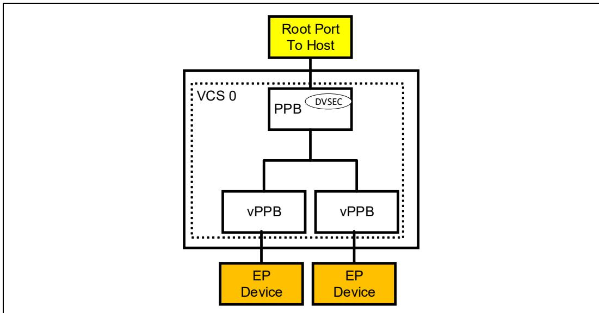  
The minimum configuration for a managed switch is defined as two VCS: each VCS has one USP and two or more DSPs.

Figure 14-14. Compliance Testing Topology for an HBR Switch with Two Hosts  

Known good Host devices are required to support managed Hot-Plug and managed removal of devices.

All connectors used in these tests must support Hot-Plug sideband signals.

An HBR switch that is not FM managed should have all ports bound to a VCS. An unmanaged switch cannot support unbound ports and MLDs because there is no managing function to control LD bindings.

An FM-managed HBR switch should have at least two VCSs configured for these test purposes, so that interactions between hosts on different VCSs can be monitored. Devices may be connected to unbound ports for a managed switch (i.e., an unallocated resource). Unbound ports may be bound to any VCS at any time. The switch is managed by a Fabric Manager of the vendor’s choice and supports MLDs.

A known good Endpoint should support Hot-Plug and should have passed previous tests in a direct attached system.

## 14.7.2.2 PBR Switch Assumptions

The minimum configuration for PBR switches is composed of two cascaded switches, at least one of which shall be a PBR switch. Switches shall be FM managed.

Figure 14-15. Compliance Testing Topology for Two PBR Switches

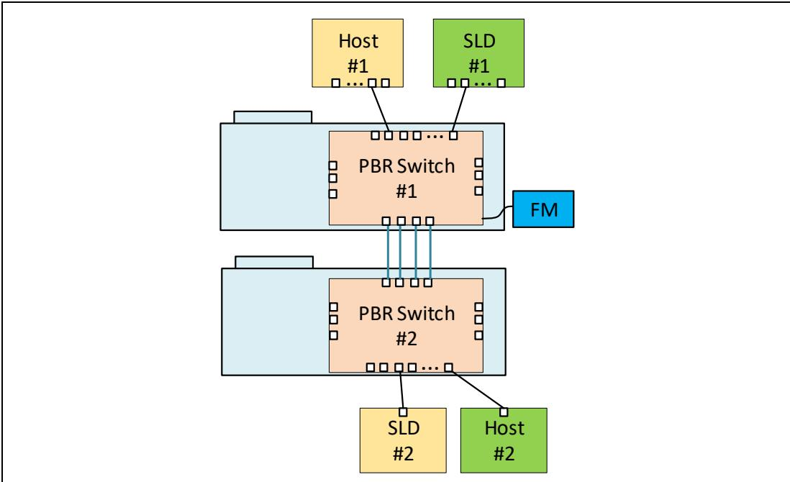

In a topology with a single PBR switch and a single HBR switch, the host devices are connected to the PBR switch and the HBR switch’s USPs are connected to the PBR switch, to allow for multiple-host routing. The HBR switch configures a unique VCS for each host.

Figure 14-16. Compliance Testing Topology for a PBR Switch and an HBR Switch

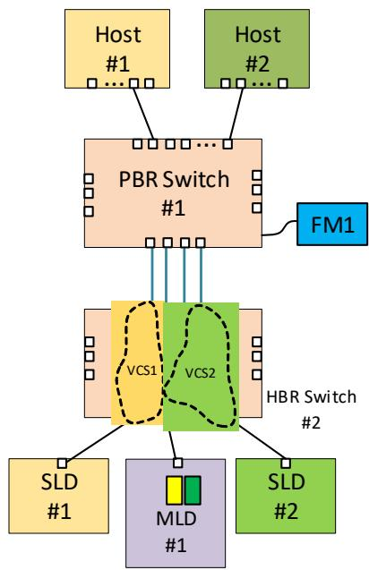

## 14.7.3 Unmanaged HBR Switch

This is a fixed-configuration test. This test is used for an HBR switch that has the ability for bindings to be preconfigured and immediately accessible to the attached host after power-up. This test is suitable only for SLDs because MLDs require management to determine which LDs to bind to each VCS. All port bindings that define the VCS are configured and allocated at boot time without any interaction from a Fabric Manager device.

## Test Steps:

1. An HBR switch that is not FM managed shall have all port bindings defined to be active at power-up.

2. An FM-managed HBR switch should be configured so that at least one port is bound to a VCS on power-up.

3. At least one SLD component shall be attached to a port.

4. Power-on or initialize the system (host, switch, and EP device).

## Pass Criteria:

• Devices attached to bound ports are identified by the host at initialization without any external intervention by a Fabric Manager, if any

## Fail Conditions:

• Devices attached to bound ports are not identified by the host on initialization

## 14.7.4

## Reset Propagation

## .7.4.1 Host PERST# Propagation

HBR switch overview: If an HBR switch receives a USP PERST#, then only devices or SLDs that are bound to the VCS for that USP shall be reset; other VCSs and ports shall not be reset. For an MLD component, only LDs that are bound to the VCS that received the USP PERST# shall be reset. LDs that are bound to another VCS shall be unaffected and shall continue to operate normally.

PBR switch overview: If a PBR switch receives a PERST#, then only devices attached to ports with access to the receiving port shall be reset. No other ports shall be reset. MLDs are not supported by PBR switches. All other ports shall continue to operate normally.

## 14.7.4.1.1 Host PERST# Propagation to an SLD Component (HBR Switch)

## Test Steps:

1. One or more SLDs are bound to a VCS.

2. Assert PERST# from the host to the USP of the VCS.

## Pass Criteria:

• Switch propagates reset to all SLDs that are connected to the VCS

• All SLDs that are bound to the VCS go through a Link Down and the host unloads the associated device drivers

• Hosts and all devices that are bound to any other VCS shall continue to be connected and bound; reset events shall not occur

## Fail Conditions:

• One or more SLDs that are bound to the VCS under test fails to go through a Link Down

• Hosts or SLDs that are bound to any other VCS are reset

## 14.7.4.1.2 Host PERST# Propagation to an SLD Component (PBR Switch)

## Test Steps:

1. One or more SLDs has port access to a host.

2. PERST# is asserted by the host.

## Pass Criteria:

• Switch propagates reset to all SLDs with port access to the host

• All SLD port access to the host goes through a Link Down and the host unloads the associated device drivers

• Hosts and all devices connected to other switch ports shall continue to be connected and no reset events occur

## Fail Conditions:

• One or more SLDs with port access to the host under test fail to go through a Link Down

• Hosts or SLDs connected to other switch ports are reset

## 14.7.4.1.3 Host PERST# Propagation to an MLD Port (HBR Switch Only)

## Prerequisites:

• Not applicable to PBR switches

• Switch with a minimum of two VCSs that are connected to respective Hosts

• An MLD with at least one LD that is bound to each VCS (i.e., at least two bound LDs)

• Optionally, SLDs may also be attached to each VCS

## Test Steps:

1. Host 0 asserts USP PERST#.

2. Reset is propagated to all VCS 0 vPPBs.

## Pass Criteria:

• Host 0 processes a Link Down for each LD that is bound to VCS 0 and unloads the associated device drivers

• All SLDs that are connected to VCS 0 go through a Link Down and Host 0 unloads the associated device drivers

• MLD remains link up

• Other hosts do not receive a Link Down for any LDs that are connected to them

## Fail Conditions:

• Host 0 does not process a Link Down for the LDs and SLDs that are bound to VCS 0

• Any other host processes a Link Down for LDs of the shared MLD

• MLD goes through a Link Down

## 14.7.4.2 LTSSM Hot Reset

HBR switch overview: If a switch USP receives an LTSSM Hot Reset, then the USP vPPB shall propagate a reset to all vPPBs for that VCS. Other vPPBs shall not be reset. In a topology where an HBR switch is connected to a PBR switch, the USP of a VCS that is reset should reset the Inter-switch Link (ISL) for the VCS USP.

PBR switch overview: If a PBR switch host port receives an LTSSM Hot Reset, then all switch ports with access to the host port shall be reset. No other ports shall be reset. ISLs should not be reset.

## 14.7.4.2.1 LTSSM Hot Reset Propagation to SLDs (HBR Switch)

## Test Steps:

1. One or more SLDs are bound to a VCS.

2. Initiate LTSSM Hot Reset from the host to the switch.

## Pass Criteria:

• Switch propagates hot reset to all SLDs that are connected to the VCS and their links go down

• Hosts and devices bound to any other VCS must not receive the reset

## Fail Conditions:

• Switch fails to send a hot reset to any SLDs that are connected to the VCS

• Hosts or devices bound to any other VCS are reset

## 14.7.4.2.2 LTSSM Hot Reset Propagation to SLDs (PBR Switch)

## Test Steps:

1. One or more SLDs have port access to the host port under test.

2. Initiate LTSSM Hot Reset from the host to the switch.

## Pass Criteria:

• Switch propagates hot reset to all SLDs that are connected with port access to the host and their links go down

• Hosts and devices connected to other ports shall not receive a connection reset

## Fail Conditions:

• Switch fails to send a hot reset to any SLDs that have port access to the host

• Hosts or devices connected to other ports are reset

## 14.7.4.2.3 LTSSM Hot Reset Propagation to SLDs (PBR Switch + HBR Switch)

Figure 14-17. LTSSM Hot Reset Propagation to SLDs (PBR Switch + HBR Switch)

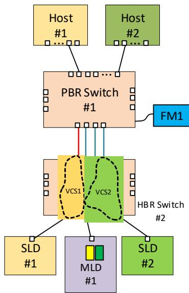

## Test Steps:

1. A PBR switch and an HBR switch compose the topology, with the host connected to the PBR switch.

2. One or more SLDs have port access to the host port under test.

3. Initiate LTSSM Hot Reset from the host to the switch.

## Pass Criteria:

• Switch propagates hot reset to all SLDs that are connected with port access to the host and their links go down

• The inter-switch link for the USP for the VCS of the HBR switch shall be reset (shown red in Figure 14-17 (leftmost/first connecting line between the two switches), where VCS 1 received LTSSM reset)

• Hosts and devices connected to other ports shall not receive a connection reset

## Fail Conditions:

• Switch fails to send a hot reset to any SLDs that have port access to the host

• Hosts or devices connected to other ports are reset

## 14.7.4.2.4 LTSSM Hot Reset Propagation to an MLD Component (HBR Switch Only)

## Prerequisites:

• Not applicable to PBR switches

• Switch with a minimum of two VCSs that are connected to respective Hosts

• An MLD with at least one LD that is bound to each VCS (i.e., at least two bound LDs)

• Optionally, SLDs may also be attached to each VCS

## Test Steps:

1. Host 0 asserts LTSSM Hot Reset to the switch.

2. The USP propagates a reset to all vPPBs associated with VCS 0.

## Pass Criteria:

• Host 0 processes a Link Down for all LDs and SLDs that are bound to VCS 0

• Host 1 does not receive a Link Down for any LDs that are bound to VCS 1

## Fail Conditions:

• MLD port goes through a Link Down

• Host 1 processes a Link Down for LDs of the shared MLD

• Host 0 does not process a Link Down for any LD or SLD that is bound to VCS 0

## 14.7.4.3 Secondary Bus Reset (SBR) Propagation

## 14.7.4.3.1 Secondary Bus Reset (SBR) Propagation to All Ports of a VCS with SLD Components

## Test Steps:

1. One or more SLDs are bound to a VCS.

2. The Host sets the SBR bit in the Bridge Control register in the USP vPPB.

## Pass Criteria:

• Switch sends a hot reset to all SLDs that are connected to the VCS and their links go down

• The Host processes a Link Down for all SLDs that are bound to the VCS and unloads the associated device drivers

## Fail Conditions:

• Switch fails to send a hot reset to any SLDs that are connected to the VCS

• The Host fails to unload an associated device driver for a device that is connected to the VCS

## 14.7.4.3.2

## Prerequisites:

• Switch with a minimum of two VCSs that are connected to respective Hosts

• An MLD with at least one LD that is bound to each VCS (i.e., at least two bound LDs)

• Optionally, SLDs may also be attached to each VCS

## Test Steps:

1. Host 0 sets the SBR bit in the Bridge Control register associated with the USP vPPB of the VCS under test.

## Pass Criteria:

• Host 0 processes a Link Down for the LDs and SLDs that are bound to VCS 0 and unloads the associated device drivers

• MLD port remains Link Up

• Other Hosts that share the MLD are unaffected

## Fail Conditions:

• MLD port goes through a Link Down

• Any other host processes a Link Down

• Host 0 does not process a Link Down for any LDs that are bound to VCS 0

• Host 0 does not process a Link Down for any SLDs that are connected to VCS 0

## 14.7.4.3.3 Secondary Bus Reset (SBR) Hot Reset Propagation to SLDs (PBR Switch + HBR Switch)

gure 14-18. Secondary Bus Reset (SBR) Hot Reset Propagation to SLDs (PBR Switch + HBR Switch)

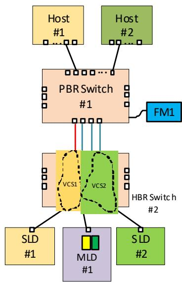

## Test Steps:

1. A PBR switch and an HBR switch compose the topology, with the host connected to the PBR switch.

2. One or more SLDs have port access to the host port under test.

3. Initiate LTSSM Hot Reset from the host to the switch.

## Pass Criteria:

• Switch propagates hot reset to all SLDs that are connected with port access to the host and their links go down

• The Inter-switch Link (ISL) for the USP for the VCS of the HBR switch shall be reset (shown red in Figure 14-18 (leftmost/first connecting line between the two switches), where VCS 1 received LTSSM reset)

• Hosts and devices connected to other ports shall not receive a connection reset

## Fail Conditions:

• Switch fails to send a hot reset to any SLDs that have port access to the host

• Hosts or devices connected to other ports are reset

14.7.4.3.4 Secondary Bus Reset (SBR) Propagation to One Specific Downstream Port (SLD) (HBR Switch)

All links in the path between the host and specific SLD shall be reset.

## Test Steps:

1. vPPB under test is connected to an SLD component.

2. Host sets the SBR bit in the Bridge Control register in the vPPB to be reset.

## Pass Criteria:

• Host processes a Link Down for the vPPB under test and unloads the device driver

• All other ports in the VCS remain unaffected

## Fail Conditions:

• Port under test does not go Link Down

• Any other port goes Link Down

## 14.7.4.3.5 Secondary Bus Reset (SBR) Propagation to One Specific Downstream Port (SLD) (PBR Switch + HBR Switch)

All links in the path between the host and the specific SLD shall be reset, including the VCS USP for the VCS connected to the specific SLD being reset.

## Test Steps:

1. A PBR switch and an HBR switch compose the topology, with the host connected to the PBR switch.

2. One or more SLDs have port access to the host port under test.

3. Initiate an SBR from the host to the switch for a specific SLD.

## Pass Criteria:

• Host processes a Link Down for the SLD port under test

• Reset the ISL of the VCS USP containing the SLD that received the SBR

• All other ports remain unaffected

## Fail Conditions:

• Port under test does not go Link Down

• ISL of the VCS USP containing the SLD that received the SBR failed to be reset

• Any other port goes Link Down

## 14.7.4.3.6

## Secondary Bus Reset (SBR) Propagation to One Specific Shared Downstream Port (MLD) (HBR Switch Only)

## Prerequisites:

• Not applicable to PBR switches

• Switch with a minimum of two VCSs that are connected to respective Hosts

• Each VCS is bound to an LD each from the MLD component

## Test Steps:

1. For the VCS under test, the host sets the SBR bit in the Bridge Control register in the vPPB bound to the LD.

## Pass Criteria:

• Host processes a Link Down for the vPPB under test and unloads the device driver

• MLD port remains Link Up

• Other Hosts sharing the MLD are unaffected

## Fail Conditions:

• Host processes a Link Down for the vPPB not under test

• Host does not process a Link Down for the vPPB under test

• Any switch port goes through a Link Down

## 14.7.5 Managed Hot-Plug — Adding a New Endpoint Device

This test is for adding a device to a switch and then subsequently hot adding the device to a host. The host should load any relevant driver(s) and operate with the newly added device.

## 14.7.5.1 Managed Add of an SLD Component

## 14.7.5.1.1 Incremental Add of an SLD to a VCS (HBR Switch)

## Prerequisites:

• Host has completed enumeration

• Host has loaded drivers for all attached devices

## Test Steps:

1. Perform a managed add of the SLD component to the port under test.

2. For an unmanaged switch, the port is already bound to a VCS.

3. For a managed switch, the FM must bind the port to a VCS.

## Pass Criteria:

• Host successfully enumerates the added device and loads the driver

## Fail Conditions:

• Host is unable to enumerate and fails to load the device driver for the added device

## 14.7.5.1.2 Incremental Add of an SLD to a VCS (PBR Switch)

## Prerequisites:

• Host has completed enumeration

• Host has loaded drivers for all attached devices

## Test Steps:

1. Perform a managed add of the SLD component to the port under test.

2. FM identifies the new device and enables port routing to the required host.

## Pass Criteria:

• Host successfully enumerates the added device and loads the device driver

## Fail Conditions:

• Host is unable to enumerate and fails to load the device driver for the added device

## 14.7.5.2 Managed Add of an MLD Component (HBR Switch Only)

The Switch reports PPB-related events to the Fabric Manager using the FM API. At the time of publication, there are no defined Fabric Manager reporting requirements to a user; thus parts of this test may only be observable through vendor-specific reporting.

## Prerequisites:

• Not applicable to PBR switches

• Host enumeration successfully completes for all devices prior to this test

• Switch port supports MLD and is unbound (i.e., not bound to a VCS)

## Test Steps:

1. Perform a managed add of the MLD to the port under test.

## Pass Criteria:

• Fabric Manager identifies the device but does not bind it to any host

• Hosts are not affected by the addition of the device to an unbound port

• Hosts do not identify the added device

• Interrupts are not sent to the hosts, and the system operates normally

## Fail Conditions:

• A host identifies the new device

## Managed Add of an MLD Component to an SLD Port (HBR Switch Only)

This test exercises the behavior of an MLD component when plugged into an SLD port. If the MLD capability is not common to both sides, an MLD operates as an SLD component.

## Prerequisites:

• Not applicable to PBR switches

• The port under test is configured as an SLD port

• Host enumeration successfully completes for all devices prior to this test

## Test Steps:

1. Perform a managed add of the MLD component to the port under test.

## Pass Criteria:

• Host successfully enumerates the added device and loads the driver.

• MLD component operates as an SLD (i.e., MLD capable but MLD is not enabled) and presents its full memory capacity to the host (i.e., does not divide into multiple LDs). For MH-MLDs, the component presents the full memory capacity that is allocated to the head under test.

## Fail Conditions:

• Host does not identify the new device

• Host does not identify the full memory capacity of the new device

## 14.7.6

## Managed Hot-Plug Removal of an Endpoint Device

A managed Hot-Plug remove operation requires the host to:

• Cease all read/write operations to the device

• Unload relevant drivers to allow the device to be removed

## Managed Removal of an SLD Component from a VCS (HBR Switch)

## Prerequisites:

• Host enumeration successfully completes for all devices prior to this test

## Test Steps:

1. Perform a managed remove of the SLD component from the port under test.

## Pass Criteria:

• Host recognizes the device removal and unloads the associated device driver

## Fail Conditions:

• Host does not unload the device driver

## Managed Removal of an SLD Component (PBR Switch)

## Prerequisites:

• Host enumeration successfully completes for all devices prior to this test

## Test Steps:

1. Perform a managed remove of the SLD component from the host.

2. FM removes port access for the SLD port and the host port.

## Pass Criteria:

• Host recognizes the device removal and unloads the associated device driver

## Fail Conditions:

• Host does not unload the device driver

## Managed Removal of an MLD Component from a Switch (HBR Switch Only)

## Prerequisites:

• Not applicable to PBR switches

• Host enumeration successfully completes for all devices prior to this test

• The MLD must have one or more LDs bound to the host

## Test Steps:

1. Perform a managed remove of the MLD component from the port under test.

2. Fabric Manager unbinds LDs from the vPPBs of the VCS.

## Pass Criteria:

• Host recognizes that the LD has been removed and unloads the associated device driver

## Fail Conditions:

• Host does not recognize removal of the LD

## 14.7.6.4 Removal of a Device from an Unbound Port

## Prerequisites:

• Host enumeration successfully completes for all devices prior to this test

• Device is to be removed from an unbound port (i.e., not bound to any VCS)

• A device is connected to a switch, but the FM has:

— Not bound the port to a VCS in an HBR switch, or

— Not assigned port access to any other ports in a PBR switch

## Test Steps:

1. Perform a managed remove of the device from the port under test.

## Pass Criteria:

• Fabric Manager identifies that the device has been removed

• Hosts are not affected by the removal of the device from an unbound port

• Interrupts are not sent to hosts, and the system operates normally

## Fail Conditions:

• A host is affected by the removal of the device

## 14.7.7 Bind/Unbind and Port Access Operations

HBR switches report PPB-related events to the Fabric Manager, using the FM API. Port changes on PBR switches are detected by a Fabric Manager. At the time of publication, there are no defined Fabric Manager-reporting requirements to the user; thus parts of this test may only be observable through vendor-specific reporting.

## Prerequisites:

• Applicable only to managed switches

• While the endpoint device remains connected to the port, the FM must:

— Bind or unbind ports for an HBR switch, or

— Enable or disable port access to other ports in a PBR switch

## 14.7.7.1 Binding and Granting Port Access of Pooled Resources to Hosts

## 14.7.7.1.1 Bind a Pooled SLD to a vPPB in an FM-managed HBR Switch

## Prerequisites:

• An SLD component is connected to a switch port that is not bound to a VCS

• Fabric Manager has identified the SLD

## Test Steps:

1. Bind the SLD to a vPPB of the host.

## Pass Criteria:

• Host recognizes the hot-added SLD and successfully enumerates the SLD

• Fabric Manager indicates that the SLD has been bound to the correct VCS

## Fail Conditions:

• Host does not successfully process the SLD’s managed add

• Fabric Manager does not indicate a successful bind operation

## 14.7.7.1.2 Assign Port Access of a Pooled SLD to a PBR Switch

## Prerequisites:

• Pooled SLD component is connected to a switch port that has not granted port access by the FM to any other ports

• Fabric Manager has identified the SLD

## Test Steps:

1. FM assigns port access of the SLD to the host port.

## Pass Criteria:

• Host recognizes the hot-added SLD and successfully enumerates the SLD

## Fail Conditions:

• Host does not successfully process the SLD’s managed add

## 14.7.7.1.3 Binding an MLD to Two Different VCSs (HBR Switch Only)

## Prerequisites:

• Not applicable to PBR switches

• An MLD component is connected to the Switch and the Fabric Manager has identified the MLD

• MLD has two or more LDs that are not bound to any hosts

## Test Steps:

1. Bind one or more LDs to VCS 0.

2. Bind one or more LDs to VCS 1.

## Pass Criteria:

• Both hosts recognize the hot-added LDs and successfully enumerates both LDs

• Fabric Manager indicates that the LDs have been bound to the correct VCS

## Fail Conditions:

• One or both hosts fail to recognize, enumerate, and load drivers for the hot-added LDs

• Fabric Manager indicates that one or more of the LDs are not bound to the correct VCSs

## Unbinding Resources from Hosts without Removing the Endpoint Devices

This test takes an allocated resource and unbinds it from a host. The resource remains available, but unallocated after a successful unbind operation.

## 14.7.7.2.1 Unbind an SLD from a VCS (HBR Switch)

## Prerequisites:

• An SLD component is bound to the vPPB of a VCS in an FM-managed HBR switch

• Associated host loads the device driver for the SLD

## Test Steps:

1. FM unbinds the SLD from the vPPB of the VCS.

## Pass Criteria:

• Host recognizes the SLD’s hot removal and successfully unloads the device driver

• Fabric Manager indicates that the SLD is present but has been unbound from the VCS

• SLD remains linked up

## Fail Conditions:

• Host does not successfully process the SLD’s managed remova

• Fabric Manager does not indicate a successful unbind operation

• SLD link goes down

## 14.7.7.2.2 Deallocate an SLD from a Host (PBR Switch)

## Prerequisites:

• Host has port access to the SLD

• Host has loaded drivers

## Test Steps:

1. FM indicates a managed removal to the host.

2. When the host completes hot removal, the FM revokes port access to the SLD, and then only the FM has access to the SLD.

## Pass Criteria:

• Host recognizes the SLD’s hot removal and successfully unloads the device driver

• FM indicates that the SLD is present and that there is no port access to other ports

• SLD remains linked up

## Fail Conditions:

• Host does not successfully process the SLD’s managed remova

• FM fails to revoke port access to the SLD for other ports

## • SLD link goes down

## Unbind LDs from Two Host VCSs (HBR Switch Only)

## Prerequisites:

• Not applicable to PBR switches

• An MLD component is connected to the switch and the Fabric Manager has identified the MLD

• MLD component has LDs that are bound to two or more host VCSs

## Test Steps:

1. FM unbinds the LDs from the vPPBs of the host VCSs.

## Pass Criteria:

• All hosts successfully recognize the managed removal of the LDs and unload the device drivers

• FM indicates that the LDs are present but have been unbound from the VCSs

• MLD remains linked up and all other LDs are unaffected

## Fail Conditions:

• One or more hosts do not successfully process the managed removal of the LDs

• FM status does not indicate a successful unbind operation

• Other LDs in the MLD are impacted

## 14.7.8

## Error Injection

## Test Equipment:

• A Jammer, Exerciser, or analyzer is required for many of these tests

## Prerequisites:

• Errors are injected into the DSP; therefore, the error status registers in the associated vPPB should reflect the injected error

## 14.7.8.1 AER Error Injection

An MLD port must ensure that the vPPB associated with each LD that is bound is notified of errors that are not vPPB specific.

## 14.7.8.1.1 AER Uncorrectable Error Injection for MLD Ports

## Test Equipment:

• This test requires an Exerciser if the MLD component is not capable of error injection

## Prerequisites:

• vPPB of VCS 0 and vPPB of VCS 1 are each bound to LDs from the same MLD component

## Test Steps:

1. Inject a CXL.io unmasked uncorrectable error into the MLD port of the Switch. The injected error should be categorized as ‘supported per vPPB’ per Section 7.2.7.

## Pass Criteria:

• The Uncorrectable Error Status register for the vPPBs that are bound to the LDs should reflect the appropriate error indicator bit

• The Uncorrectable Error Status register for the FM-owned PPB should reflect the appropriate error indicator bit

## Fail Conditions:

• PPB or vPPB AER Uncorrectable Error Status does not reflect the appropriate error indicator bit

## 14.7.8.1.2 AER Correctable Error Injection for MLD Ports

## Test Equipment:

• This test requires an Exerciser if the MLD component is not capable of error injection

## Prerequisites:

• vPPB of VCS 0 and vPPB of VCS 1 are each bound to LDs from the same MLD component

## Test Steps:

1. Inject a CXL.io correctable error into the MLD port of the Switch. The injected error should be categorized as ‘supported per vPPB’ per Section 7.2.7.

## Pass Criteria:

• The Correctable Error status register for the vPPBs that are bound to the LDs should reflect the appropriate error indicator bit

• The Correctable Error status register for the FM-owned PPB should reflect the appropriate error indicator bit

## Fail Conditions:

• PPB or vPPB AER Correctable Error status does not reflect the appropriate error indicator bit

## 14.7.8.1.3 AER Uncorrectable Error Injection for SLD Ports

## Test Equipment:

• This test requires an Exerciser if the SLD component is not capable of error injection

## Prerequisites:

• Host enumeration successfully completes for all devices prior to this test

## Test Steps:

1. Inject a CXL.io unmasked uncorrectable error into the SLD port under test.

## Pass Criteria:

• The Uncorrectable Error Status register for the vPPB that is bound to the SLD should reflect the appropriate error indicator bit

## Fail Conditions:

• The vPPB AER status does not reflect the appropriate error indicator bit

## 14.7.8.1.4 AER Correctable Error Injection for SLD Ports

## Test Equipment:

• This test requires an Exerciser if the SLD component is not capable of error injection

## Prerequisites:

• Host enumeration successfully completes for all devices prior to this test

## Test Steps:

1. Inject a CXL.io correctable error into the SLD port under test.

## Pass Criteria:

• The Correctable Error status register for the vPPB that is bound to the SLD should reflect the appropriate error indicator bit

## Fail Conditions:

• The vPPB AER status does not reflect the appropriate error indicator bit

## Configuration Register Tests

Configuration space register tests cover the registers defined in Chapter 3.0. These tests are run on the DUT, and require no additional hardware to complete. Tests must be run with Root/Administrator privileges. Test makes the assumption that there is one and only one CXL device in the system, and it is the DUT. This test section has granularity down to the CXL device.

See Section 14.2.1 for topology definitions that are referenced in this section.

## 14.8.1

## Device Presence

## Prerequisites:

• Applicable for VH components

## Test Steps:

1. If the DUT is a CXL switch:

a. Read the PCIe device hierarchy and filter for PCIe Upstream Port/Downstream Port of a switch.

b. Locate the PCIe Upstream/Downstream Port with PCIe DVSEC Capability with VID of 1E98h and ID of 0000h (PCIe DVSEC for CXL device).

c. Save the PCIe device location for additional tests. This will be referred to in subsequent tests as the DUT.

2. If the DUT is a CXL endpoint:

a. Read the PCIe device hierarchy and filter for PCI Express\* Endpoint Devices.

b. Locate the PCIe Endpoint device with PCIe DVSEC Capability with VID of 1E98h and ID of 0000h (PCIe DVSEC for CXL device).

c. Save the PCIe device location for additional tests. This will be referred to in subsequent tests as the DUT.

3. If the DUT is a CXL root port:

a. Read the PCIe device hierarchy and filter for PCIe root port devices.

b. Locate the PCIe root port device with PCIe DVSEC Capability with VID of 1E98h and ID of 0000h (PCIe DVSEC for CXL device).

c. Save the PCIe device location for additional tests. This will be referred to in subsequent tests as the DUT.

## Pass Criteria:

• One PCIe device with PCIe DVSEC for CXL devices capability found

## Fail Conditions:

• PCIe device with PCIe DVSEC for CXL devices capability not found

## 14.8.2 CXL Device Capabilities

## Prerequisites:

• Device is CXL.mem capable

## Test Steps:

1. Read the configuration space for the DUT.

2. Initialize variables with value 0.

3. Search for PCIe DVSEC for CXL device:

a. Read the configuration space for the DUT. Search for a PCIe DVSEC with VID of 1E98h and ID of 0000h.

b. Save this location as CXL\_DEVICE\_DVSEC\_BASE.

4. Search for Non-CXL Function Map DVSEC:

a. Read the configuration space for the DUT. Search for a PCIe DVSEC with VID of 1E98h and ID of 0002h.

b. If found, save this location as NON\_CXL\_FUNCTION\_DVSEC\_BASE.

5. Search for CXL Extensions DVSEC for ports:

a. Read the configuration space for the DUT. Search for a PCIe DVSEC with VID of 1E98h and ID of 0003h.

b. If found, save this location as CXL\_EXTENSION\_DVSEC\_BASE.

6. Search for GPF DVSEC for CXL ports:

a. Read the configuration space for the DUT. Search for a PCIe DVSEC with VID of 1E98h and ID of 0004h.

b. If found, save this location as CXL\_GPF\_PORT\_DVSEC\_BASE.

7. Search for GPF DVSEC for CXL devices:

a. Read the configuration space for the DUT. Search for a PCIe DVSEC with VID of 1E98h and ID of 0005h.

b. If found, save this location as CXL\_GPF\_DEVICE\_DVSEC\_BASE.

8. Search for PCIe DVSEC for Flex Bus Port:

a. Read the configuration space for the DUT. Search for a PCIe DVSEC with VID of 1E98h and ID of 0007h.

b. If found, save this location as CXL\_FLEXBUS\_DVSEC\_BASE.

9. Search for the Register Locator DVSEC:

a. Read the configuration space for the DUT. Search for a PCIe DVSEC with VID of 1E98h and ID of 0008h.

b. If found, save this location as CXL\_REGISTER\_DVSEC\_BASE.

## 10. Search for MLD DVSEC:

a. Read the configuration space for the DUT. Search for a PCIe DVSEC with a VID of 1E98h and ID of 0009h.

b. If found, save this location as CXL\_MLD\_DVSEC\_BASE.

11. Search for Advanced Error Reporting Capability:

a. If found, save this location as AER\_BASE.

12. Search for Table Access DOE:

a. Read Configuration Space for the DUT. Search for PCIe DVSEC with VID of 1E98h and type of 0002h.

b. If found, save this location as CXL\_TABLE\_ACCESS\_DOE\_BASE.

## 13. Verify:

## Variable

CXL\_DEVICE\_DVSEC\_BASE != 0 CXL\_EXTENSION\_DVSEC\_BASE != 0 CXL\_GPF\_PORT\_DVSEC\_BASE != 0 CXL\_GPF\_DEVICE\_DVSEC\_OFFSET != 0 CXL\_FLEXBUS\_DVSEC\_BASE != 0 CXL\_REGISTER\_DVSEC\_BASE != 0 CXL\_MLD\_DVSEC\_BASE != 0 AER\_BASE != 0 CXL\_TABLE\_ACCESS\_DOE\_BASE != 0

## Pass Criteria:

## Condition

Always Device is root port, Upstream Port, or Downstream Port of a switch Device is root port or Downstream Port of a switch Device is CXL.mem and supports GPF Always Always Device is MLD Always Always

• Test 14.8.1 passed

• Verify Conditions are met

## Fail Conditions:

• Verify Conditions failed

## 14.8.3 DOE Capabilities

Prerequisites:

• DOE is implemented

## Test Steps:

1. Read the Configuration space for DUT.

2. Loop until end of configuration space capabilities are found.

a. Search for DOE mailbox:

i. Read the configuration space for DUT. Search for a PCIe Extended Capability with type of 2Eh.

b. If found, repeatedly issue DOE Discovery until the response contains Vendor ID = FFFFh to get the list of supported Object Protocols for this mailbox.

c. If a response contains Vendor ID = 1E98h and Data Object Protocol = 0h: i. Save Mailbox location as CXL\_COMPLIANCE\_DOE\_MAILBOX.

d. If a response contains Vendor ID = 1E98h and Data Object Protocol = 2h: i. Save Mailbox location as CXL\_CDAT\_DOE\_MAILBOX.

## Pass Criteria:

• Test 14.8.2 passed

• Either Compliance or CDAT DOE mailbox has a valid response

## Fail Conditions:

• Verify Conditions failed

## 14.8.4 DVSEC Control Structure

## Test Steps:

1. Read the Configuration space for DUT, CXL\_DEVICE\_DVSEC\_BASE + Offset 04h, Length 4 bytes.

2. Decode this into:

Bits Variable 15:0 DVSEC Vendor ID 19:16 DVSEC Revision 31:20 DVSEC Length

3. Verify:

<table><tr><td>Variable</td><td>Value</td><td>Condition</td></tr><tr><td>DVSEC Vendor ID</td><td>1E98h</td><td>Always</td></tr><tr><td>DVSEC Revision</td><td>2h</td><td>Always</td></tr><tr><td>DVSEC Length</td><td>3Ch</td><td>Always</td></tr></table>

4. Read the Configuration space for DUT, CXL\_DEVICE\_DVSEC\_BASE + Offset 08h, Length 2 bytes.

5. Decode this into:

<table><tr><td>Bits</td><td>Variable</td></tr><tr><td>15:0</td><td>DVSEC ID</td></tr></table>

<table><tr><td colspan="3">6. Verify:</td></tr><tr><td>Variable</td><td>Value</td><td>Condition</td></tr><tr><td>DVSEC ID</td><td>0000h</td><td>Always</td></tr></table>

## Pass Criteria:

• Test 14.8.2 passed

• Verify Conditions are met

## Fail Conditions:

• Verify Conditions failed

## DVSEC CXL Capability

## Test Steps:

1. Read Configuration Space for DUT, CXL\_DEVICE\_DVSEC\_BASE + Offset 0Ah, Length 2 bytes.

## 2. Decode this into:

<table><tr><td>Bits</td><td>Variable</td></tr><tr><td>0:0</td><td>Cache_Capable</td></tr><tr><td>1:1</td><td>IO_Capable</td></tr><tr><td>2:2</td><td>Mem_Capable</td></tr><tr><td>3:3</td><td>Mem_HwInit_Mode</td></tr><tr><td>5:4</td><td>HDM_Count</td></tr><tr><td>6:6</td><td>Cache Writeback and Invalidate Capable</td></tr><tr><td>7:7</td><td>CXL Reset Capable</td></tr><tr><td>10:8</td><td>CXL Reset Timeout</td></tr><tr><td>14:14</td><td>Viral Capable</td></tr><tr><td>15:15</td><td>PM Init Completion Reporting Capable</td></tr></table>

## 3. Verify:

<table><tr><td>Variable</td><td>Value</td><td>Condition</td></tr><tr><td>IO_Capable</td><td>= 1</td><td>Always</td></tr><tr><td>HDM_Count</td><td>!= 11b</td><td>Always</td></tr><tr><td>HDM_Count</td><td>!= 00b</td><td>Mem_Capable = 1</td></tr><tr><td>HDM_Count</td><td>= 00b</td><td>Mem_Capable = 0</td></tr><tr><td>CXL Reset Timeout</td><td>!&gt; 100b</td><td>CXL Reset Capable = 1</td></tr></table>

## Pass Criteria:

• Test 14.8.4 passed

• Verify Conditions are met

## Fail Conditions:

• Verify Conditions failed

## 14.8.6 DVSEC CXL Control

## Test Steps:

1. Read the Configuration space for DUT, CXL\_DEVICE\_DVSEC\_BASE + Offset 0Ch, Length 2 bytes.

## 2. Decode this into:

<table><tr><td>Bits</td><td>Variable</td></tr><tr><td>0:0</td><td>Cache_Enable</td></tr><tr><td>1:1</td><td>IO_Enable</td></tr><tr><td>2:2</td><td>Mem_Enable</td></tr><tr><td>7:3</td><td>Cache_SF_Coverage</td></tr><tr><td>10:8</td><td>Cache_SF_Granularity</td></tr><tr><td>11:11</td><td>Cache_Clean_Eviction</td></tr><tr><td>14:14</td><td>Viral_Enable</td></tr></table>

<table><tr><td>Variable</td><td>Value</td><td>Condition</td></tr><tr><td>IO_Enable</td><td>== 1</td><td>Always</td></tr><tr><td>Cache_SF_Granularity</td><td>!= 111b</td><td>Always</td></tr></table>

## Pass Criteria:

• Test 14.8.4 passed

• Verify Conditions are met

## Fail Conditions:

• Verify Conditions failed

## 14.8.7 DVSEC CXL Lock

## Test Steps:

1. Read Configuration Space for DUT, CXL\_DEVICE\_DVSEC\_BASE + Offset 14h, Length 2 bytes.

2. Decode this into: Bits Variable 0:0 CONFIG\_LOCK

3. Read Configuration Space for DUT as per the following list, and then store it as a ‘List of Config Lock Registers’ for the next steps of this test.

These are only locked by Config Lock (see Section 8.2.4.20.13). There are other registers that are marked as RWL but a lock bit is not mentioned.

## DVSEC CXL Control (Offset 0Ch)

<table><tr><td>Bits</td><td>Variable</td></tr><tr><td>0:0</td><td>Cache_Enable</td></tr><tr><td>2:2</td><td>Mem_Enable</td></tr><tr><td>7:3</td><td>Cache_SF_Coverage</td></tr><tr><td>10:8</td><td>Cache_SF_Granularity</td></tr><tr><td>11</td><td>Cache_Clean_Eviction</td></tr><tr><td>14</td><td>Viral_Enable</td></tr></table>

<table><tr><td colspan="2">DVSEC CXL Range 1 Base High (Offset 20h)</td></tr><tr><td>Bits</td><td>Variable</td></tr><tr><td>31:0</td><td>Memory_Base_High</td></tr></table>

## DVSEC CXL Range 1 Base Low (Offset 24h)

<table><tr><td>Bits</td><td>Variable</td></tr><tr><td>31:28</td><td>Memory_Base_Low</td></tr></table>

4. Record all read values for each variable into the ‘Read Value List’ — R1.

5. Write Configuration for all registers listed above in the ‘List of Config Lock Registers’ with inverted values.

6. Record all read values for each variable into the ‘Read Value List’ — R2.

7. Verify:

<table><tr><td>Variable</td><td>Value</td><td>Condition</td></tr><tr><td>R1</td><td>= R2</td><td>CONFIG_LOCK = 1</td></tr><tr><td>R1</td><td>!= R2</td><td>CONFIG_LOCK = 0</td></tr></table>

## Pass Criteria:

• Test 14.8.4 passed

• Verify Conditions are met

## Fail Conditions:

• Verify Conditions failed

## 14.8.8

## DVSEC CXL Capability2

## Test Steps:

1. Read the Configuration space for DUT, CXL\_DEVICE\_DVSEC\_BASE + Offset 16h, Length 2 bytes.

2. Decode this into: Bits Variable 3:0 Cache Size Unit 15:8 Cache Size

3. Verify:

<table><tr><td>Variable</td><td>Value</td><td>Condition</td></tr><tr><td>Cache Size Unit</td><td>= 0h</td><td>Cache Capable = 0</td></tr><tr><td>Cache Size Unit</td><td>!= 0h</td><td>Cache Capable = 1</td></tr><tr><td>Cache Size Unit</td><td>!&gt; 2h</td><td>Always</td></tr></table>

## Pass Criteria:

• Test 14.8.4 passed

• Verify Conditions are met

Fail Conditions:

• Verify Conditions failed

## 14.8.9 Non-CXL Function Map DVSEC

## Test Steps:

1. Read the Configuration space for DUT, NON\_CXL\_FUNCTION\_DVSEC\_BASE + Offset 04h, Length 4 bytes.

## 2. Decode this into:

<table><tr><td>Bits</td><td>Variable</td></tr><tr><td>15:0</td><td>DVSEC Vendor ID</td></tr><tr><td>19:16</td><td>DVSEC Revision</td></tr><tr><td>31:20</td><td>DVSEC Length</td></tr></table>

3. Verify:

<table><tr><td>Variable</td><td>Value</td><td>Condition</td></tr><tr><td>DVSEC Vendor ID</td><td>1E98h</td><td>Always</td></tr><tr><td>DVSEC Revision</td><td>0h</td><td>Always</td></tr><tr><td>DVSEC Length</td><td>02Ch</td><td>Always</td></tr></table>

4. Read the Configuration space for DUT, Offset 08h, Length 2 bytes.

5. Decode this into:

<table><tr><td>Bits</td><td>Variable</td></tr><tr><td>15:0</td><td>DVSEC ID</td></tr></table>

6. Verify:

<table><tr><td>Variable</td><td>Value</td><td>Condition</td></tr><tr><td>DVSEC ID</td><td>0002h</td><td>Always</td></tr></table>

## Pass Criteria:

• Test 14.8.2 passed

• Verify Conditions are met

## Fail Conditions:

• Verify Conditions failed

## 14.8.10 CXL Extensions DVSEC for Ports Header

## Prerequisites:

• DUT is root port, Upstream Port, or Downstream Port of a switch

## Test Steps:

1. Read the Configuration space for DUT, CXL\_EXTENSION\_DVSEC\_BASE + Offset 04h, Length 4 bytes.

2. Decode this into:

<table><tr><td>Bits</td><td>Variable</td></tr><tr><td>15:0</td><td>DVSEC Vendor ID</td></tr><tr><td>19:16</td><td>DVSEC Revision</td></tr><tr><td>31:20</td><td>DVSEC Length</td></tr></table>

3. Verify:

<table><tr><td>Variable</td><td>Value</td><td>Condition</td></tr><tr><td>DVSEC Vendor ID</td><td>1E98h</td><td>Always</td></tr></table>

DVSEC Revision 0h Always DVSEC Length 028h Always

4. Read the Configuration space for DUT, CXL\_EXTENSION\_DVSEC\_BASE + Offset 08h, Length 2 bytes.

5. Decode this into: Bits Variable 15:0 DVSEC ID

6. Verify:

<table><tr><td>Variable</td><td>Value</td><td>Condition</td></tr><tr><td>DVSEC ID</td><td>0003h</td><td>Always</td></tr></table>

## Pass Criteria:

• Test 14.8.2 passed

• Verify Conditions are met

Fail Conditions:

• Verify Conditions failed

## 14.8.11 Port Control Override

## Prerequisites:

• DUT is root port, Upstream Port, or Downstream Port of a switch

## Test Steps:

1. Read the Configuration space for DUT, CXL\_EXTENSION\_DVSEC\_BASE + Offset 0Ch, Length 4 bytes.

2. Verify:

<table><tr><td>Bits</td><td>Value</td></tr><tr><td>0:0</td><td>0</td></tr><tr><td>1:1</td><td>0</td></tr></table>

3. Verify:

a. For Ports operating in PCIe mode or RCD mode:

i. Verify that the port’s SBR functionality is as defined in the PCIe Base Specification.

ii. Verify that the Link Disable functionality follows the PCIe Base Specification.

b. For Ports operating in 68B Flit mode:

i. Verify that writing to the SBR bit in this Port’s Bridge Control register has no effect.

ii. Verify that writing to the Link Disable bit in this Port’s Link Control register has no effect.

4. Store 1 into bit[0] at Offset 0Ch.

5. Verify:

a. For Ports operating in PCIe mode or RCD mode, verify that the port’s SBR functionality is as defined in the PCIe Base Specification.

b. For Ports operating in 68B Flit mode, verify that writing to the SBR bit in this Port’s Bridge Control register results in the Port issuing a Hot Reset.

6. Store 0 into bit[0] at Offset 0Ch.

7. Store 1 into bit[1] at Offset 0Ch.

8. Verify:

a. For Ports operating in PCIe mode or RCD mode, verify that the port’s Link Disable functionality is as defined in the PCIe Base Specification.

b. For Ports operating in 68B Flit mode, verify that writing to the Link Disable bit in this Port’s Link Control register results in the Port being able to disable and reenable the link.

## Pass Criteria:

• Test 14.8.10 passed

• Verify Conditions are met

## Fail Conditions:

• Verify Conditions failed

## 14.8.12 GPF DVSEC Port Capability

## Prerequisites:

• DUT is a root port or a Downstream Port of a switch

## Test Steps:

1. Read the Configuration space for DUT, CXL\_GPF\_PORT\_DVSEC\_BASE + Offset 04h, Length 4 bytes.

## 2. Decode this into:

<table><tr><td>Bits</td><td>Variable</td></tr><tr><td>15:0</td><td>DVSEC Vendor ID</td></tr><tr><td>19:16</td><td>DVSEC Revision</td></tr><tr><td>31:20</td><td>DVSEC Length</td></tr></table>

3. Verify:

<table><tr><td>Variable</td><td>Value</td><td>Condition</td></tr><tr><td>DVSEC Vendor ID</td><td>1E98h</td><td>Always</td></tr><tr><td>DVSEC Revision</td><td>0h</td><td>Always</td></tr><tr><td>DVSEC Length</td><td>010h</td><td>Always</td></tr></table>

4. Read the Configuration space for DUT, CXL\_GPF\_PORT\_DVSEC\_BASE + Offset 08h, Length 2 bytes.

5. Decode this into:

<table><tr><td>Bits</td><td>Variable</td></tr><tr><td>15:0</td><td>DVSEC ID</td></tr></table>

6. Verify:

<table><tr><td>Variable</td><td>Value</td><td>Condition</td></tr><tr><td>DVSEC ID</td><td>0004h</td><td>Always</td></tr></table>

## Pass Criteria:

• Test 14.8.2 passed

• Verify Conditions are met

## Fail Conditions:

• Verify Conditions failed

## 14.8.13 GPF Port Phase 1 Control

## Prerequisites

• DUT is a root port or a Downstream Port of a switch

## Test Steps:

1. Read the Configuration space for DUT, CXL\_GPF\_PORT\_DVSEC\_BASE + Offset 0Ch, Length 2 bytes.

2. Decode this into: Bits Variable 11:8 Port GPF Phase 1 Timeout Scale

3. Verify: Variable Value Condition Port GPF Phase 1 Timeout Scale < 8h Always

## Pass Criteria:

• Test 14.8.12 passed

• Verify Conditions are met

## Fail Conditions:

• Verify Conditions failed

## 14.8.14 GPF Port Phase 2 Control

## Prerequisites:

• DUT is a root port or a Downstream Port of a switch

## Test Steps:

1. Read the Configuration space for DUT, CXL\_GPF\_PORT\_DVSEC\_BASE + Offset 0Eh, Length 2 bytes.

2. Decode this into: Bits Variable 11:8 Port GPF Phase 2 Time Scale

3. Verify: Variable Value Condition Port GPF Phase 2 Time Scale < 8h Always

## Pass Criteria:

• Test 14.8.12 passed

## • Verify Conditions are met

## Fail Conditions:

• Verify Conditions failed

## 14.8.15 GPF DVSEC Device Capability

## Prerequisites:

• Device is CXL.mem capable

• Device is GPF capable

## Test Steps:

1. Read the Configuration space for DUT, CXL\_GPF\_DEVICE\_DVSEC\_BASE + Offset 04h, Length 4 bytes.

## 2. Decode this into:

<table><tr><td>Bits</td><td>Variable</td></tr><tr><td>15:0</td><td>DVSEC Vendor ID</td></tr><tr><td>19:16</td><td>DVSEC Revision</td></tr><tr><td>31:20</td><td>DVSEC Length</td></tr></table>

## 3. Verify:

<table><tr><td>Variable</td><td>Value</td><td>Condition</td></tr><tr><td>DVSEC Vendor ID</td><td>1E98h</td><td>Always</td></tr><tr><td>DVSEC Revision</td><td>0h</td><td>Always</td></tr><tr><td>DVSEC Length</td><td>010h</td><td>Always</td></tr></table>

4. Read the Configuration space for DUT, CXL\_GPF\_DEVICE\_DVSEC\_BASE + Offset 08h, Length 2 bytes.

## 5. Decode this into:

<table><tr><td>Bits</td><td>Variable</td></tr><tr><td>15:0</td><td>DVSEC ID</td></tr></table>

## 6. Verify:

<table><tr><td>Variable</td><td>Value</td><td>Condition</td></tr><tr><td>DVSEC ID</td><td>0005h</td><td>Always</td></tr></table>

## Pass Criteria:

• Test 14.8.2 passed

• Verify Conditions are met

## Fail Conditions:

• Verify Conditions failed

## 14.8.16 GPF Device Phase 2 Duration

## Prerequisites:

• Device is CXL.mem capable

• Device is GPF capable

## Test Steps:

1. Read the Configuration space for DUT, CXL\_GPF\_DEVICE\_DVSEC\_BASE + Offset 0Ah, Length 2 bytes.

2. Decode this into:

<table><tr><td>Bits</td><td>Variable</td></tr><tr><td>11:8</td><td>Device GPF Phase 2 Time Scale</td></tr></table>

<table><tr><td colspan="3">3. Verify:</td></tr><tr><td>Variable</td><td>Value</td><td>Condition</td></tr><tr><td>Device GPF Phase 2 Time Scale</td><td>&lt; 8h</td><td>Always</td></tr></table>

## Pass Criteria:

• Test 14.8.15 passed

• Verify Conditions are met

## Fail Conditions:

• Verify Conditions failed

## 14.8.17 DVSEC Flex Bus Port Capability Header

## Test Steps:

1. Read the Configuration space for DUT, CXL\_FLEXBUS\_DVSEC\_BASE + Offset 04h, Length 4 bytes.

## 2. Decode this into:

<table><tr><td>Bits</td><td>Variable</td></tr><tr><td>15:0</td><td>DVSEC Vendor ID</td></tr><tr><td>19:16</td><td>DVSEC Revision</td></tr><tr><td>31:20</td><td>DVSEC Length</td></tr></table>

3. Verify:

<table><tr><td>Variable</td><td>Value</td><td>Condition</td></tr><tr><td>DVSEC Vendor ID</td><td>1E98h</td><td>Always</td></tr><tr><td>DVSEC Revision</td><td>3h</td><td>Always</td></tr><tr><td>DVSEC Length</td><td>20h</td><td>Always</td></tr></table>

4. Read CXL\_FLEXBUS\_DVSEC\_BASE + Offset 08h, Length 2 bytes.

5. Decode this into:

<table><tr><td>Bits</td><td>Variable</td></tr><tr><td>15:0</td><td>DVSEC ID</td></tr></table>

6. Verify:

<table><tr><td>Variable</td><td>Value</td><td>Condition</td></tr><tr><td>DVSEC ID</td><td>0007h</td><td>Always</td></tr></table>

## Pass Criteria:

• Test 14.8.2 passed

• Verify Conditions are met

## Fail Conditions:

• Verify Conditions failed

## 14.8.18 DVSEC Flex Bus Port Capability

## Test Steps:

1. Read the Configuration space for DUT, CXL\_FLEXBUS\_DVSEC\_BASE + Offset 0Ah, Length 2 bytes.

2. Decode this into:

<table><tr><td>Bits</td><td>Variable</td></tr><tr><td>0:0</td><td>Cache_Capable</td></tr><tr><td>1:1</td><td>IO_Capable</td></tr><tr><td>2:2</td><td>Mem_Capable</td></tr><tr><td>5:5</td><td>68B_Flit_and_VH_Capable</td></tr><tr><td>6:6</td><td>CL_MLD_Capable</td></tr></table>

3. Verify:

<table><tr><td>Variable</td><td>Value</td><td>Condition</td></tr><tr><td>IO_Capable</td><td>1</td><td>Always</td></tr><tr><td>68B_Flit_and_VH_Capable</td><td>1</td><td>Always</td></tr></table>

## Pass Criteria:

• Test 14.8.2 passed

• Verify Conditions are met

## Fail Conditions:

• Verify Conditions failed

## 14.8.19 Register Locator

## Test Steps:

1. Read the Configuration space for DUT, CXL\_REGISTER\_DVSEC\_BASE + Offset 04h, Length 4 bytes.

2. Decode this into:

<table><tr><td>Bits</td><td>Variable</td></tr><tr><td>15:0</td><td>DVSEC Vendor ID</td></tr><tr><td>19:16</td><td>DVSEC Revision</td></tr><tr><td>31:20</td><td>DVSEC Length</td></tr></table>

3. Verify:

<table><tr><td>Variable</td><td>Value</td><td>Condition</td></tr><tr><td>DVSEC Vendor ID</td><td>1E98h</td><td>Always</td></tr><tr><td>DVSEC Revision</td><td>0h</td><td>Always</td></tr></table>

4. Read the Configuration space for DUT, CXL\_REGISTER\_DVSEC\_BASE + Offset 08h, Length 2 bytes.

## 5. Decode this into:

<table><tr><td>Bits</td><td>Variable</td></tr><tr><td>15:0</td><td>DVSEC ID</td></tr></table>

## 6. Verify:

<table><tr><td>Variable</td><td>Value</td><td>Condition</td></tr><tr><td>DVSEC ID</td><td>0008h</td><td>Always</td></tr></table>

## Pass Criteria:

• Test 14.8.2 passed

• Verify Conditions are met

## Fail Conditions:

• Verify Conditions failed

## 14.8.20 MLD DVSEC Capability Header

## Prerequisites:

• Device is MLD capable

## Test Steps:

1. Read the Configuration space for DUT, CXL\_MLD\_DVSEC\_BASE + Offset 04h, Length 4 bytes.

## 2. Decode this into:

<table><tr><td>Bits</td><td>Variable</td></tr><tr><td>15:0</td><td>DVSEC Vendor ID</td></tr><tr><td>19:16</td><td>DVSEC Revision</td></tr><tr><td>31:20</td><td>DVSEC Length</td></tr></table>

## 3. Verify:

<table><tr><td>Variable</td><td>Value</td><td>Condition</td></tr><tr><td>DVSEC Vendor ID</td><td>1E98h</td><td>Always</td></tr><tr><td>DVSEC Revision</td><td>0h</td><td>Always</td></tr><tr><td>DVSEC Length</td><td>010h</td><td>Always</td></tr></table>

4. Read the Configuration space for DUT, Offset 08h, Length 2 bytes.

## 5. Decode this into:

<table><tr><td>Bits</td><td>Variable</td></tr><tr><td>15:0</td><td>DVSEC ID</td></tr></table>

6. Verify:

<table><tr><td>Variable</td><td>Value</td><td>Condition</td></tr><tr><td>DVSEC ID</td><td>0009h</td><td>Always</td></tr></table>

## Pass Criteria:

• Test 14.8.2 Device Present passed

• Verify Conditions are met

## Fail Conditions:

• Verify Conditions failed

## 14.8.21 MLD DVSEC Number of LD Supported

## Prerequisites:

• Device is MLD capable

## Test Steps:

1. Read the Configuration space for DUT, CXL\_MLD\_DVSEC\_BASE + Offset 0Ah, Length 2 bytes.

2. Decode this into:

Bits Variable

15:0 Number of LDs Supported

3. Verify:

<table><tr><td>Variable</td><td>Value</td><td>Condition</td></tr><tr><td>Number of LDs Supported</td><td> $\leq 16$ </td><td>Always</td></tr><tr><td>Number of LDs Supported</td><td> $!= 0$ </td><td>Always</td></tr></table>

## Pass Criteria:

• Test 14.8.20 passed

• Verify Conditions are met

Fail Conditions:

• Verify Conditions failed

## 14.8.22 Table Access DOE

Prerequisites:

• Device supports Table Access DOE

## Test Steps:

1. For the following steps, use the DOE mailbox at CXL\_CDAT\_DOE\_MAILBOX.

2. Issue DOE Read Entry:

<table><tr><td>Offset</td><td>Length in Bytes</td><td>Value</td></tr><tr><td>00h</td><td>2</td><td>1E98h</td></tr><tr><td>02h</td><td>1</td><td>02h</td></tr><tr><td>04h</td><td>2</td><td>03h</td></tr><tr><td>08h</td><td>1</td><td>00h</td></tr><tr><td>09h</td><td>1</td><td>00h</td></tr><tr><td>0Ah</td><td>2</td><td>0000h</td></tr></table>

3. Read Response and decode this into:

<table><tr><td>Offset</td><td>Length in Bytes</td><td>Variable</td></tr><tr><td>08h</td><td>1</td><td>Table Access Response Code</td></tr><tr><td>09h</td><td>1</td><td>Table Type</td></tr></table>

4. Verify:

<table><tr><td>Variable</td><td>Value</td><td>Condition</td></tr><tr><td>Table Access Response Code</td><td>0</td><td>Always</td></tr><tr><td>Table Type</td><td>0</td><td>Always</td></tr></table>

## Pass Criteria:

• Test 14.8.3 passed

• Verify Conditions are met

## Fail Conditions:

• Verify Conditions failed

## PCIe Configuration Space Header — Class Code Register

## Prerequisites:

• DUT is a CXL.mem device

## Test Steps:

1. Read the Configuration space for DUT, Offset 09h, Length 4 bytes.

2. Decode this into:

Bits Variable 7:0 Programming Interface (PI) 15:8 Sub Class Code (SCC) 23:16 Base Class Code (BCC)

3. Verify:

<table><tr><td>Variable</td><td>Value</td><td>Condition</td></tr><tr><td>Programming Interface (PI)</td><td>10h</td><td>Always</td></tr><tr><td>Sub Class Code (SCC)</td><td>02h</td><td>Always</td></tr><tr><td>Base Class Code (BCC)</td><td>05h</td><td>Always</td></tr></table>

## Pass Criteria:

• Verify Conditions are met

## Failed Conditions:

• Verify Conditions failed

## 14.8.24 CHMU Register Capability

## Prerequisites:

• Device supports the CHMU register block

## Test Steps:

1. Locate the CHMU Register Block within the Register Locator DVSEC. Record the CHMU\_REGISTER\_BLOCK\_OFFSET.

2. Read CXL\_REGISTER\_DVSEC\_BASE + CHMU\_REGISTER\_BLOCK\_OFFSET.

3. Decode this into:

<table><tr><td>Bits</td><td>Variable</td></tr><tr><td>2:0</td><td>Register BIR</td></tr><tr><td>31:16</td><td>Register Block Offset Low</td></tr></table>

4. Record the CHMU\_REGISTER\_BASE = Base address indicated by Register BIR +‘Register Block Offset.

5. Read the memory mapped CHMU Common Capability register (see Table 8-191) at address CHMU\_REGISTER\_BASE length 16 bytes.

## 6. Decode this into:

<table><tr><td>Bits</td><td>Variable</td></tr><tr><td>3:0</td><td>Version</td></tr><tr><td>15:8</td><td>Number of supported CHMU Instances</td></tr><tr><td>79:64</td><td>CHMU Instance Length</td></tr></table>

## 7. Verify:

<table><tr><td>Variable</td><td>Value</td><td>Condition</td></tr><tr><td>Version</td><td>1h</td><td>Always</td></tr><tr><td>Number of supported CHMU Instances</td><td> $\leq 8h$ </td><td>Always</td></tr></table>

8. Read the memory mapped CHMU Capability register at address = CHMU\_REGISTER\_BASE + 10h + CHMU Instance Length \* CHMU instance number and length 64 bytes.

## 9. Decode this into:

<table><tr><td>Bits</td><td>Variable</td></tr><tr><td>31:16</td><td>Max epoch length</td></tr><tr><td>47:32</td><td>Min epoch length</td></tr></table>

10. Verify:

<table><tr><td>Variable</td><td>Value</td><td>Condition</td></tr><tr><td>Max epoch length</td><td>!= 0</td><td>Always</td></tr><tr><td>Min epoch length</td><td>!= 0</td><td>Always</td></tr></table>

11. Repeat steps 8 and 10 for CHMU Instance number 0 to Number of supported CHMU Instances – 1.

## Pass Criteria:

• Test 14.8.19 Passed

• Verify Conditions are met

## Fail Conditions:

• Verify Conditions failed

## Reset and Initialization Tests

## Warm Reset Test

## Prerequisites:

• DUT must be in D3 state with context flushed

## Test Steps:

1. Host issues CXL PM VDM, Reset Prep (ResetType= Warm Reset; PrepType=General Prep).

2. Host waits for CXL device to respond with CXL PM VDM ResetPrepAck.

## Pass Criteria:

• DUT responds with an ACK

## Fail Conditions:

• DUT fails to respond to ACK

## 14.9.2 Cold Reset Test

## Prerequisites:

• DUT must be in D3 state with context flushed

## Test Steps:

1. Host issues CXL PM VDM, Reset Prep (ResetType= Warm Reset; PrepType=General Prep).

2. Host waits for CXL device to respond with CXL PM VDM ResetPrepAck.

Pass Criteria:

• DUT responds with an ACK

Fail Conditions:

• DUT fails to respond to ACK

## 14.9.3 Sleep State Test

## Prerequisites:

• DUT must be in D3 state with context flushed

## Test Steps:

1. Host issues CXL PM VDM, Reset Prep (ResetType= S3; PrepType=General Prep).

2. Host waits for the CXL device to respond with CXL PM VDM ResetPrepAck.

## Pass Criteria:

• DUT responds with an ACK

## Fail Conditions:

• DUT fails to respond to ACK

## 14.9.4 Function Level Reset Test

This test is accomplished by running the Application Layer tests as described in Section 14.3.6.1, and issuing a Function Level Reset in the middle of it.

## Prerequisites:

• Device supports Function Level Reset

• CXL device maintains Cache Coherency

• Hardware configuration support for Algorithm 1a described in Section 14.3.1

• If the device supports self-checking, it must escalate a fatal system error

• Device is permitted to log failing information

## Test Steps:

1. Determine test runtime T, based on the amount of time available or allocated for this testing.

2. Host software sets up a Cache Coherency test for Algorithm 1a: Multiple Write Streaming.

3. If the device supports self-checking, enable it.

4. At a time between 1/3 and 2/3 of T and with at least 200 ms of test time remaining, the host initiates FLR by writing to the Initiate Function Level Reset bit.

## Pass Criteria:

• System does not elevate a fatal system error, and no errors are logged

## Fail Conditions:

• System error reported, logged failures exist

## 14.9.5 CXL Range Setup Time

## Prerequisites:

• Device is CXL.mem capable

• Ability to monitor the device reset

## Test Steps:

1. Reset the system, Monitor Reset until cleared.

2. Wait for 1 second.

3. Read Configuration Space for DUT, Offset 1Ch, Length 4 bytes.

4. Decode this into: Bits Variable 0:0 Memory\_Info\_Valid 1:1 Memory\_Active

<table><tr><td>Variable</td><td>Value</td><td>Condition</td></tr><tr><td>Memory_Info_Valid</td><td>1</td><td></td></tr><tr><td>Memory_Active</td><td>1</td><td>Mem_HW_Init_Mode = 1</td></tr></table>

## Pass Criteria:

• Test 14.8.2 passed

• Verify Conditions are met

## Fail Conditions:

• Verify Conditions failed

## 14.9.6 FLR Memory

This test ensures that an FLR does not affect data in device-attached memory.

## Prerequisites:

• Device is CXL.mem capable

## Test Steps:

1. Write a known pattern to a known location within the HDM.

<table><tr><td>Bits</td><td>Variable</td></tr><tr><td>511:0</td><td>Header Log</td></tr></table>

2. Host performs an FLR as defined in steps of Test 14.9.4.

3. Host reads the HDM’s location.

4. Verify that the read data matches the previously written data.

## Pass Criteria:

• HDM retains information after the FLR

Fail Conditions:

• HDM is reset

## CXL\_Reset Test

## Prerequisites:

• CXL Reset Capable bit in the DVSEC CXL Capability register is set

## Test Steps:

1. Determine test runtime T1 from the CXL Reset Timeout field in the DVSEC CXL Capability register.

2. Read and record the value of the following ROS registers for step 6:

<table><tr><td colspan="2">Error Capabilities and Control Register (Offset 14h)</td></tr><tr><td>Bits</td><td>Variable</td></tr><tr><td>5:0</td><td>First_Error_Pointer</td></tr></table>

## Header Log Registers (Offset 18h)

Register contents may or may not be 0.

3. Set the following RWS registers to settings as per list and record the written values for step 6.

## RWS Registers and settings:

<table><tr><td colspan="3">Uncorrectable Error Mask Register (Offset 04h)</td></tr><tr><td>Bits</td><td>Variable</td><td>Settings</td></tr><tr><td>11:0</td><td>Error Mask registers</td><td>Set to FFFh</td></tr><tr><td>16:14</td><td>Error Mask registers</td><td>Set to 111b</td></tr></table>

## Uncorrectable Error Severity Register (Offset 08h)

<table><tr><td>Bits</td><td>Variable</td><td>Settings</td></tr><tr><td>11:0</td><td>Error Severity registers</td><td>Set to FFFh</td></tr><tr><td>16:14</td><td>Error Severity registers</td><td>Set to 111b</td></tr></table>

<table><tr><td colspan="3">Correctable Error Mask Register (Offset 10h)</td></tr><tr><td>Bits</td><td>Variable</td><td>Settings</td></tr><tr><td>6:0</td><td>Error Mask registers</td><td>Clear to 00h</td></tr></table>

<table><tr><td colspan="3">Error Capabilities and Control Register (Offset 14h)</td></tr><tr><td>Bits</td><td>Variable</td><td>Settings</td></tr><tr><td>13:13</td><td>Poison_Enabled</td><td>Set to 1</td></tr></table>

CXL Link Layer Capability Register (Offset 00h)

<table><tr><td>Bits</td><td>Variable</td><td>Settings</td></tr><tr><td>3:0</td><td>CXL Link Version Supported</td><td>Set to 2h</td></tr><tr><td>15:8</td><td>LLR Wrap Value Supported</td><td>Set to FFh</td></tr></table>

Intention is to set the register to a nonzero value.

CXL Link Layer Control and Status Register (Offset 08h)

<table><tr><td>Bits</td><td>Variable</td><td>Settings</td></tr><tr><td>1:1</td><td>LL_Init_Stall</td><td>Set to 1</td></tr><tr><td>2:2</td><td>LL_Crd_Stall</td><td>Set to 1</td></tr></table>

CXL Link Layer Rx Credit Control Register (Offset 10h)

<table><tr><td>Bits</td><td>Variable</td><td>Settings</td></tr><tr><td>9:0</td><td>Cache Req Credits</td><td>Set to 3FFh</td></tr><tr><td>19:10</td><td>Cache Rsp Credits</td><td>Set to 3FFh</td></tr><tr><td>29:20</td><td>Cache Data Credits</td><td>Set to 3FFh</td></tr><tr><td>39:30</td><td>Mem Req_Rsp Credits</td><td>Set to 3FFh</td></tr><tr><td>49:40</td><td>Mem Data Credits</td><td>Set to 3FFh</td></tr><tr><td>59:50</td><td>BI Credits</td><td>Set to 3FFh</td></tr></table>

CXL Link Layer Ack Timer Control Register (Offset 28h)

<table><tr><td>Bits</td><td>Variable</td><td>Settings</td></tr><tr><td>7:0</td><td>Ack Force Threshold</td><td>Set to FFh</td></tr><tr><td>17:8</td><td>Ack or CRD Flush Retimer</td><td>Set to 1FFh</td></tr></table>

CXL Link Layer Defeature Register (Offset 30h)

<table><tr><td>Bits</td><td>Variable</td><td>Settings</td></tr><tr><td>0:0</td><td>MDH Disable</td><td>Set to 1</td></tr></table>

DVSEC CXL Control2 (Offset 10h)

<table><tr><td>Bits</td><td>Variable</td><td>Settings</td></tr><tr><td>4:4</td><td>Desired Volatile HDM State after Hot Reset</td><td>Set to 1 if DVSEC CXL Capability3 (Offset 38h) bit[3] Volatile HDM State after Hot Reset - Configurability == 1</td></tr></table>

4. Set Initiate CXL Reset = 1 in the DVSEC CXL Control2 register.

5. Wait for time T1.

6. Verify:

a. Confirm DVSEC Flex Bus Status2 CXL Reset complete is set.

b. ROS register values before and after CXL Reset are matching.

c. RWS register values before and after CXL Reset are matching.

## Pass Criteria:

• Verify Conditions are met

Fail Conditions:

• Verify Conditions failed

## 14.9.8 Global Persistent Flush (GPF)

## Test Equipment:

• Protocol Analyzer

## Prerequisites:

• Device is CXL.cache capable and/or CXL.mem capable

• Ability to monitor the link

## 14.9.8.1 Host and Switch Test

## Test Steps:

1. Bring system to operating state.

2. Initiate Shut Down process.

3. Verify:

a. System sends a CXL GPF PM VDM Phase 1 request.

b. After receiving the response message from the device, the System sends a CXL GPF PM VDM Phase 2 request.

c. After receiving the response message from the device, the Link transitions to the lowest-possible power state.

## Pass Criteria:

• Verify that the required CXL GPF PM VDM Phase 1 request is sent

• Verify that the required CXL GPF PM VDM Phase 2 request is sent after the Phase 1 response

• Verify that the Link enters the lowest-possible power state

## Fail Conditions:

• Verify Conditions failed

## 14.9.8.2 Device Test

## Test Steps:

1. Ensure that the link between the system and the device is in an initialized state.

2. Initiate Shut Down process.

3. Verify:

a. Cache transactions are not initiated by the device after CXL GPF PM VDM.

b. Verify GPF Response message is sent by the device in Phase 1.

c. Verify GPF Response message is sent by the device in Phase 2.

## Pass Criteria:

• Ensure that cache transactions are not initiated after the CXL GPF PM VDM in Phase 1

• Verify that the device sends a Response Message in Phase 1

• Check that the response message fields are correct

• Verify that the device sends a Response Message in Phase 2

• Verify that the Link enters the lowest-possible power state

## Fail Conditions:

• Verify Conditions failed

## 14.9.9

## Hot-Plug Test

## Prerequisites:

• Device supports Hot-Plug

## Test Steps:

1. Bring system to an operating state.

2. Initiate Hot-Plug remove.

3. Verify that the Hot-Plug remove process is complete.

4. Remove and then reinsert the device.

5. Initiate Hot-Plug add.

6. Verify that the Hot-Plug add process is complete.

## Pass Criteria:

• Verify Conditions are met

## Fail Conditions:

• Verify Conditions failed

## 14.9.10 Device to Host Cache Viral Injection

## Prerequisites:

• Device is CXL.cache capable

• Device must support Compliance mode DOE

## • Device must support Algorithm 1a

## Test Steps:

1. Host software will set up the device and the host for Algorithm 1a: Multiple Write Streaming.

2. Host software decides the test runtime and runs the test for that period.

3. While a test is running, software will perform the following steps to the Device registers:

a. Write the Compliance Mode DOE Request register with the following values:

• Request Code (Offset 08h) = 0Ch, Inject Viral

• Protocol (Offset 0Ch) = 1, CXL.cache

4. Host software waits for Poll Compliance mode DOE response Viral Injection response until the following is returned from the device:

— Request Code (Offset 08h) = 0Ch

— Status (Offset 0Bh) = 00h

## Pass Criteria:

• Host logs AER -Fatal Error

## Fail Conditions:

• Host does not log AER -Fatal Error

## 14.9.11 Device to Host Mem Viral Injection

## Prerequisites:

• Device is CXL.mem capable

• Device must support Compliance mode DOE

• Device must support Algorithm 1a

## Test Steps:

1. Host software will set up the device and the host for Algorithm 1a: Multiple Write Streaming.

2. Host software decides the test runtime and runs the test for that period.

3. While a test is running, software will perform the following steps to the Device registers:

a. Write the Compliance Mode DOE Request register with the following values:

• Request Code (Offset 08h) = 0Ch, Inject Viral

• Protocol (Offset 0Ch) = 2, CXL.mem

4. Host software waits for Poll Compliance mode DOE response Viral Injection response until the following is returned from the device:

— Request Code (Offset 08h) = 0Ch

— Status (Offset 0Bh) = 00h

## Pass Criteria:

• Host logs AER -Fatal Error

## Fail Conditions:

• Host does not log AER -Fatal Error

## 14.10 Power Management Tests

## 14.10.1 Pkg-C Entry (Device Test)

This test case is optional if the device does not support generating PMReq() with memory LTR reporting.

This test case will check the following conditions:

• Device initiates PkgC entry, and reports appropriate LTR

• All PMReq() fields adhere to the CXL specification

## Test Equipment:

• Protocol Analyzer (optional)

## Prerequisites:

• Applicable for 68B Flit mode and 256B Flit mode

• Power Management is complete

• Credit Initialization is complete

• CXL link is up

## Device Test Steps:

1. Host or Test Equipment maintains the link in an idle state, no CXL.cachemem requests are initiated by either the Host/Test Equipment or the DUT.

2. Host or Test equipment waits for the Link to enter CXL L1 Idle State.

3. Optionally, a Protocol Analyzer is used to inspect that the link enters L1 state, that the PMReq.Req is sent from the device, and that the host replies with PMReq.Rsp and PMReq.Go.

## Pass Criteria:

• Link enters L1

## Fail Conditions:

• Link enters L1 but PMReq.Req is missing

• LTR values in the PMReq.Req are invalid

## 14.10.2 Pkg-C Entry Reject (Device Test)

This test case is optional if the device does not support generating PMReq() with memory LTR reporting.

This test case will check the following conditions:

• Device initiates PkgC entry, and reports appropriate LTR

• All PMReq() fields adhere to the CXL specification

• DUT does not enter a low-power state when the Exerciser responds with Low LTR (processor busy condition)

## Test Equipment:

• Exerciser

## Prerequisites:

• Power Management is complete

• Credit Initialization is complete

• CXL link is up

## Device Test Steps:

1. Host or Test Equipment maintains the link in an idle state, no CXL.cachemem requests are initiated by either the Host/Test Equipment or the DUT.

2. Exerciser waits for the PMReq.Req from the device.

3. Exerciser sends PMReq.Rsp that advertises Low LTR, indicating that the processor is busy.

## Pass Criteria:

• Link does not enter L1

## Fail Conditions:

• Device requests L1 entry

• LTR values in the PMReq.Req are invalid

## 14.10.3 Pkg-C Entry (Host Test)

This test case will check the following conditions:

• Host sends PMReq.Go without a prior PMReq.Req from the device. Check that the Host behaves as expected.

• PMReq.Go() fields adhere to the CXL specification.

## Test Equipment:

• Exerciser (required)

• Protocol Analyzer (optional)

## Prerequisites:

• Initial CXL Power Management VDM exchange is complete

• Credit Initialization is complete

• CXL link is up

## Host Test Steps:

1. Host and device maintain the link in an idle state, no CXL.cachemem requests are initiated by either the host or the device.

2. Regardless of not having received a PMReq.Req from the device, the Exerciser sends a PMReq.Go message with a sufficiently high latency-tolerance value to the device.

3. Optionally, a Protocol Analyzer is used to inspect the host PMReq.Go message.

## Pass Criteria:

• Link enters L1 based on the PMReq.Go message, regardless of whether the CXL device sent a prior PMReq.Req message, and the PMReq.Go message adheres to the CXL specification

(or)

• Link does not enter L1, and the PMReq.Go message adheres to the CXL specification

## Fail Conditions:

• Host fails to send a PMReq.Go message

• LTR values in the PMReq.Go message are invalid

## 14.11 Security

## 14.11.1 Component Measurement and Authentication

## 14.11.1.1 DOE CMA Instance

Prerequisites:

• DOE CMA is supported by at least one Function

Modes:

• CXL.io

Topologies:

• SHDA

• SHSW

• SHSW-FM

## Test Steps:

1. Scan every function and read DOE CMA instances.

Pass Criteria:

• Each DOE CMA instance supports only DOE Discovery data object protocol, and CMA data object protocol

## Fail Conditions:

• DOE discovery is not supported

• CMA data object is not supported

## 14.11.1.2 FLR while Processing DOE CMA Request

Prerequisites:

• DOE CMA is supported by at least one Function

Modes:

• CXL.io

## Topologies:

• SHDA

• SHSW

• SHSW-FM

## Test Steps:

1. Send DOE CMA request.

2. Perform FLR to associated function (this should cancel the DOE request).

3. Attempt to read DOE CMA response.

## Pass Criteria:

• Target Function response does not indicate that a DOE CMA response is available (the request should be canceled from the FLR)

## Fail Conditions:

• Original DOE CMA request results in a response returned by the DOE CMA target function after FLR

## 14.11.1.3 OOB CMA while in Fundamental Reset

## Prerequisites:

• OOB CMA is supported

• Platform or slot supports asserting Fundamental Reset under host software control

Known Good Host support for Fundamental Reset shall be on either a per-slot basis under Host-software control or hold all in Fundamental Reset during POST.

Modes:

• CXL.io

• OOB

## Topologies:

• SHDA

• SHSW

• SHSW-FM

## Test Steps:

1. Assert Fundamental Reset on the device.

2. Perform authentication over OOB CMA.

## Pass Criteria:

• Device successfully authenticates while the device is held in reset

## Fail Conditions:

• Pass criteria is not met

## 14.11.1.4 OOB CMA while Function Gets FLR

## Prerequisites:

• OOB CMA is supported

• Function 0 supports FLR

## Modes:

• CXL.io

• OOB

## Topologies:

• SHDA

• SHSW

• SHSW-FM

## Test Steps:

1. Clear Authenticated state over OOB with GET\_VERSION request.

2. Host Issues FLR to Function 0 (Beginning a loop: Issue a single FLR with a delay until the FLR completes. Repeat.):

a. In parallel with the FLR loop, begin authentication with OOB (long CHALLENGE sequence beginning with GET\_VERSION and calling required intermediate functions ending with CHALLENGE).

3. Host continues FLR (exit loop of FLRs once Authentication succeeds):

a. In parallel with FLR, verify CHALLENGE\_AUTH succeeds over OOB.

## Pass Criteria:

• Authentication successfully completes with FLR on device Function 0 during OOB authentication

## Fail Conditions:

• OOB Authentication fails at any point using full authentication/negotiation sequence

## 14.11.1.5 OOB CMA during Conventional Reset

## Prerequisites:

• OOB CMA supported

• Host issues Link\_Disable on the device’s root port to create the Conventional Reset condition

## Modes:

• CXL.io

• OOB

## Topologies:

• SHDA

• SHSW

• SHSW-FM

## Test Steps:

1. Host issues Link\_Disable on the device’s root port.

2. Perform authentication over OOB CMA (long sequence beginning with GET\_VERSION, followed by intermediate requests as required and finishing with CHALLENGE).

3. Host enables Link on the device’s root port.

## Pass Criteria:

• Device successfully authenticates over OOB while the device’s Link is in disabled state.

Fail Conditions:

• Pass criteria is not met

## 14.11.2 Link Integrity and Data Encryption CXL.io IDE

Use protocol analyzer to verify that link traffic is encrypted. Test is informational only if the Protocol analyzer is unavailable.

Link IDE tests are based on configuring IDE in a specific configuration, and then running a compliance test algorithm specified in Test 14.3.6.1.1.

Test Equipment:

• Protocol Analyzer

## 14.11.2.1 CXL.io Link IDE Streams Functional

Prerequisites:

## Open:

Prerequisites to be completed later.

Modes:

• CXL.io

Topologies:

• SHDA

• SHSW

• SHSW-FM

Test Steps:

1. Establish Link IDE Streams on all links between the host and the DUT:

a. Disable aggregation.

b. Disable PCRC.

2. Start compliance test algorithm for CXL.io as defined in Test 14.3.6.1.1.

## Pass Criteria:

• Self-checking compliance test reports that there are no errors

• CXL link remains up

• No errors are reported in the AER or CXL IDE Status registers

## Fail Conditions:

• Pass criteria is not met

## 14.11.2.2 CXL.io Link IDE Streams Aggregation

## Prerequisites:

• Aggregation Supported bit is Set for both ports of each Link IDE Stream

Modes:

• CXL.io

## Topologies:

• SHDA

• SHSW

• SHSW-FM

## Test Steps:

1. Establish Link IDE Streams on all links between the host and the DUT:

a. Enable aggregation.

b. Disable PCRC.

2. Start compliance test algorithm for CXL.io as defined in Test 14.3.6.1.1.

3. Cycle through the following Tx aggregation modes:

a. NPR/PR/CPL all set to 01b (up to 2).

b. NPR/PR/CPL all set to 10b (up to 4).

c. NPR/PR/CPL all set to 11b (up to 8).

d. NPR=01b, PR=10b, CPL=11b.

## Pass Criteria:

• Self-checking compliance test reports that there are no errors

• CXL link remains up

• No errors are reported in the AER or CXL IDE Status registers

## Fail Conditions:

• Pass criteria is not met

## 14.11.2.3 CXL.io Link IDE Streams PCRC

## Prerequisites:

• PCRC Supported bit is Set for both ports of each Link IDE Stream

## Modes:

• CXL.io

Topologies:

• SHDA

• SHSW

• SHSW-FM

## Test Steps:

1. Establish Link IDE Streams on all links between the host and the DUT:

a. Disable aggregation.

b. Enable PCRC.

2. Start compliance test algorithm for CXL.io as defined in Test 14.3.6.1.1.

## Pass Criteria:

• Self-checking compliance test reports that there are no errors

• CXL link remains up

• No errors are reported in the AER or CXL IDE Status registers

Fail Conditions:

• Pass criteria is not met

## 14.11.2.4 CXL.io Selective IDE Stream Functional

Prerequisites:

• DOE CMA support

Modes:

• CXL.io

Topologies:

• SHDA

• SHSW

• SHSW-FM

## Test Steps:

1. Establish Selective IDE Streams on all links between the host and the DUT:

a. Disable aggregation.

b. Disable PCRC.

2. Start compliance test algorithm for CXL.io as defined in Test 14.3.6.1.1.

## Pass Criteria:

• Self-checking compliance test reports that there are no errors

• CXL link remains up

• No errors are reported in the AER or CXL IDE Status registers

## Fail Conditions:

• Pass criteria is not met

## 14.11.2.5 CXL.io Selective IDE Streams Aggregation

## Prerequisites:

• DOE CMA support

• Aggregation Support bit set for both ports of the Selective IDE stream

## Modes:

• CXL.io

## Topologies:

• SHDA

• SHSW

• SHSW-FM

## Test Steps:

1. Establish Selective IDE Streams on all links between the host and the DUT:

a. Enable aggregation.

b. Disable PCRC.

2. Start compliance test algorithm for CXL.io as defined in Test 14.3.6.1.1.

3. Cycle through the following Tx aggregation modes:

a. NPR/PR/CPL all set to 01b (up to 2).

b. NPR/PR/CPL all set to 10b (up to 4).

c. NPR/PR/CPL all set to 11b (up to 8).

d. NPR=01b, PR=10b, CPL=11b.

## Pass Criteria:

• Self-checking compliance test reports that there are no errors

• CXL link remains up

• No errors are reported in the AER or CXL IDE Status registers

## Fail Conditions:

• Pass criteria is not met

## 14.11.2.6 CXL.io Selective IDE Streams PCRC

## Prerequisites:

• DOE CMA support

• Aggregation Support bit is set for both ports of the Selective IDE stream

## Modes:

• CXL.io

## Topologies:

• SHDA

• SHSW

• SHSW-FM

## Test Steps:

1. Establish Selective IDE Streams on all links between the host and the DUT:

a. Disable aggregation.

b. Enable PCRC.

2. Start compliance test algorithm for CXL.io as defined in Test 14.3.6.1.1.

## Pass Criteria:

• Self-checking compliance test reports that there are no errors

• CXL link remains up

• No errors are reported in the AER or CXL IDE Status registers

## Fail Conditions:

• Pass criteria is not met

## 14.11.3 CXL.cachemem IDE

## 14.11.3.1 CXL.cachemem IDE Capability (SHDA, SHSW)

This test determines whether the CXL device is capable of a secure IDE link, is configured to enable secure IDE links, and checks that the CXL IDE Capability structure is read.

## Prerequisites:

• Device must support CXL.cachemem IDE security

• Device must support Compliance Mode DOE and SPDM over DOE

• Host software has established a secure SPDM link to the device

## Test Steps:

1. Read the CXL IDE Capability structure (see Section 8.2.4.22).

2. Issue a CXL\_QUERY request against the device.

## Pass Criteria:

• Bit[0] of CXL IDE Capability register (CXL IDE Capable) is set

• CXL IDE Capability structure read from configuration space matches the Capability structure from CXL\_QUERY\_RESP

## Fail Conditions:

• Pass criteria is not met

## 14.11.3.2 Establish CXL.cachemem IDE (SHDA) in Standard 256B Flit Mode

This test verifies the device’s ability to establish a CXL.cachemem IDE secure link between the downstream root port and an endpoint.

## Prerequisites:

• Device supports Standard 256B Flit mode and 256B Flit mode is enabled

• Device must support CXL.cachemem IDE security

• Device must support Compliance Mode DOE and SPDM over DOE

• Host software has established a secure SPDM link to the device

• Test 14.11.3.1 passed

## Test Steps:

1. Host software issues a CXL\_GETKEY request to the endpoint and saves the Locally generated key as KEY1.

2. Host software issues a CXL\_GETKEY request to the host Downstream Port, P, and saves the Locally generated key as KEY2.

3. Host software programs the endpoint keys with the following CXL\_KEY\_PROG requests to the Endpoint DOE mailbox. After each request, check the CXL\_KP\_ACK Status field for a nonzero value, and fail if found.

a. CXL\_KEY\_PROG (RxTxB=0, Use Default IV=1, KEY2).

b. CXL\_KEY\_PROG (RxTxB=1, Use Default IV=1, KEY1).

4. Host software programs the root port keys with the following CXL\_KEY\_PROG requests to the downstream root port. After each request, check the CXL\_KP\_ACK Status field for a nonzero value, and fail if found.

a. CXL\_KEY\_PROG (PortIndex = P, RxTxB=0, Use Default IV=1, KEY1). b. CXL\_KEY\_PROG (PortIndex = P, RxTxB=1, Use Default IV=1, KEY2).

5. Host software activates the endpoint keys with the following KEY\_SET\_GO requests to the Endpoint DOE mailbox. After each request, check:

a. CXL\_K\_SET\_GO (Skid mode, RxTxB=0).

b. CXL\_K\_SET\_GO (Skid mode, RxTxB=1).

6. Host software activates the Root Downstream Port keys with the following KEY\_SET\_GO requests:

a. CXL\_K\_SET\_GO (PortIndex= P, Skid mode, RxTxB=0).

b. CXL\_K\_SET\_GO (PortIndex= P, Skid mode, RxTxB=1).

## Pass Criteria:

• CXL.cachemem flits between the host and the endpoint are protected by IDE

## Fail Conditions:

• CXL\_KP\_ACK Status field is set to a nonzero value

## 14.11.3.3 Establish CXL.cachemem IDE (SHSW)

This test verifies the device’s ability to establish a CXL.cachemem IDE secure link between a switch’s Downstream Port and the endpoint device.

## Prerequisites:

• Device must support CXL.cachemem IDE security

• Device must support Compliance Mode DOE and SPDM over DOE

• Host software has established a secure SPDM link to the device

• Test 14.11.3.1 passed

## Test Steps:

1. Host software issues a CXL\_GETKEY request to the endpoint and saves the Locally generated key as KEY1.

2. Host software issues a CXL\_GETKEY request to the switch USP (Port index =P, where P is the DSP that the EP is connected to) and saves the Locally generated key as KEY2.

3. Host software programs the endpoint keys with the following CXL\_KEY\_PROG requests to the Endpoint DOE mailbox. After each request, check the CXL\_KP\_ACK Status field for a nonzero value, and fail if found.

a. CXL\_KEY\_PROG (RxTxB=0, Use Default IV=1, KEY2).

b. CXL\_KEY\_PROG (RxTxB=1, Use Default IV=1, KEY1).

4. Host software programs the root port keys with the following CXL\_KEY\_PROG requests to the downstream root port. After each request, check the CXL\_KP\_ACK Status field for a nonzero value, and fail if found.

a. CXL\_KEY\_PROG (PortIndex = P, RxTxB=1, Use Default IV=1, KEY2).

b. CXL\_KEY\_PROG (PortIndex = P, RxTxB=0, Use Default IV=1, KEY2).

5. Host software activates the endpoint keys with the following KEY\_SET\_GO requests to the Endpoint DOE mailbox. After each request, check:

a. CXL\_K\_SET\_GO (Skid mode, RxTxB=0).

b. CXL\_K\_SET\_GO (Skid mode, RxTxB=1).

6. Host software activates the Root Downstream Port keys with the following KEY\_SET\_GO requests:

a. CXL\_K\_SET\_GO (PortIndex=0, Skid mode, RxTxB=0).

b. CXL\_K\_SET\_GO (PortIndex=0, Skid mode, RxTxB=1).

## Open:

Pass criteria/fail conditions are missing.

## 14.11.3.4 Establish CXL.cachemem IDE (SHDA) Latency-Optimized 256B Flit Mode

This test verifies the device’s ability to establish a CXL.cachemem IDE secure link between the downstream root port and an endpoint.

## Prerequisites:

• Device supports Latency-Optimized 256B Flit mode, and Latency-Optimized 256B Flit mode is enabled

• Device must support CXL.cachemem IDE security

• Device must support Compliance Mode DOE and SPDM over DOE

• Host software has established a secure SPDM link to the device

• Test 14.11.3.1 passed

## Test Steps:

1. Host software issues a CXL\_GETKEY request to the endpoint and saves the Locally generated key as KEY1.

2. Host software issues a CXL\_GETKEY request to the host Downstream Port, P, and saves the Locally generated key as KEY2.

3. Host software programs the endpoint keys with the following CXL\_KEY\_PROG requests to the Endpoint DOE mailbox. After each request, check the CXL\_KP\_ACK Status field for a nonzero value, and fail if found.

a. CXL\_KEY\_PROG (RxTxB=0, Use Default IV=1, KEY2).

b. CXL\_KEY\_PROG (RxTxB=1, Use Default IV=1, KEY1).

4. Host software programs the root port keys with the following CXL\_KEY\_PROG requests to the downstream root port. After each request, check the CXL\_KP\_ACK Status field for a nonzero value, and fail if found.

a. CXL\_KEY\_PROG (PortIndex = P, RxTxB=0, Use Default IV=1, KEY1). b. CXL\_KEY\_PROG (PortIndex = P, RxTxB=1, Use Default IV=1, KEY2).

5. Host software activates the endpoint keys with the following KEY\_SET\_GO requests to the Endpoint DOE mailbox. After each request, check:

a. CXL\_K\_SET\_GO (Skid mode, RxTxB=0).

b. CXL\_K\_SET\_GO (Skid mode, RxTxB=1).

6. Host software activates the Root Downstream Port keys with the following KEY\_SET\_GO requests:

a. CXL\_K\_SET\_GO (PortIndex= P, Skid mode, RxTxB=0).

b. CXL\_K\_SET\_GO (PortIndex= P, Skid mode, RxTxB=1).

## Pass Criteria:

• CXL.cachemem flits between the host and the endpoint are protected by IDE

## Fail Conditions:

• CXL\_KP\_ACK Status field is set to a nonzero value

## 14.11.3.5 Establish CXL.cachemem IDE (SHDA) 68B Flit Mode

This test verifies the device’s ability to establish a CXL.cachemem IDE secure link between the downstream root port and an endpoint.

## Prerequisites:

• Device supports 68B Flit mode and 68B Flit mode is enabled

• Device must support CXL.cachemem IDE security

• Device must support Compliance Mode DOE and SPDM over DOE

• Host software has established a secure SPDM link to the device

• Test 14.11.3.x passed

## Test Steps:

1. Host software issues a CXL\_GETKEY request to the endpoint and saves the Locally generated key as KEY1.

2. Host software issues a CXL\_GETKEY request to the host Downstream Port, P, and saves the Locally generated key as KEY2.

3. Host software programs the endpoint keys with the following CXL\_KEY\_PROG requests to the Endpoint DOE mailbox. After each request, check the CXL\_KP\_ACK Status field for a nonzero value, and fail if found.

a. CXL\_KEY\_PROG (RxTxB=0, Use Default IV=1, KEY2).

b. CXL\_KEY\_PROG (RxTxB=1, Use Default IV=1, KEY1).

4. Host software programs the root port keys with the following CXL\_KEY\_PROG requests to the downstream root port. After each request, check the CXL\_KP\_ACK Status field for a nonzero value, and fail if found.

a. CXL\_KEY\_PROG (PortIndex = P, RxTxB=0, Use Default IV=1, KEY1).

b. CXL\_KEY\_PROG (PortIndex = P, RxTxB=1, Use Default IV=1, KEY2).

5. Host software activates the endpoint keys with the following KEY\_SET\_GO requests to the Endpoint DOE mailbox. After each request, check:

a. CXL\_K\_SET\_GO (Skid mode, RxTxB=0).

b. CXL\_K\_SET\_GO (Skid mode, RxTxB=1).

6. Host software activates the Root Downstream Port keys with the following KEY\_SET\_GO requests:

a. CXL\_K\_SET\_GO (PortIndex= P, Skid mode, RxTxB=0).

b. CXL\_K\_SET\_GO (PortIndex= P, Skid mode, RxTxB=1).

## Pass Criteria:

• CXL.cachemem flits between the host and the endpoint are protected by IDE

## Fail Conditions:

• CXL\_KP\_ACK Status field is set to a nonzero value

## 14.11.3.6 Locally Generate IV (SHDA)

## Prerequisites:

• Device must support CXL.cachemem IDE security

• Device must support Compliance Mode DOE and SPDM over DOE

• Host software has established a secure SPDM link to the device

• Test 14.11.3.1 passed

• Device supports Locally generated CXL.cachemem IV

## Test Steps:

1. Host software issues a CXL\_GETKEY request to the endpoint and saves the Locally generated key as KEY1, and the Initialization Vector as IV1.

2. Host software issues a CXL\_GETKEY request to the host Downstream Port, P, and saves the Locally generated key as KEY2, and the Initialization Vector as IV2.

3. Host software programs the endpoint keys with the following CXL\_KEY\_PROG requests to the Endpoint DOE mailbox. After each request, check the CXL\_KP\_ACK Status field for a nonzero value, and fail if found.

a. CXL\_KEY\_PROG (RxTxB=0, Use Default IV=0, KEY2, IV2).

b. CXL\_KEY\_PROG (RxTxB=1, Use Default IV=0, KEY1, IV1).

4. Host software programs the root port keys with the following CXL\_KEY\_PROG requests to the downstream root port. After each request, check the CXL\_KP\_ACK Status field for a nonzero value, and fail if found.

a. CXL\_KEY\_PROG (PortIndex = P, RxTxB=0, Use Default IV=0, KEY1, IV1).

b. CXL\_KEY\_PROG (PortIndex = P, RxTxB=1, Use Default IV=0, KEY2, IV2).

5. Host software activates the endpoint keys with the following KEY\_SET\_GO requests to the Endpoint DOE mailbox. After each request, check:

a. CXL\_K\_SET\_GO (Skid mode, RxTxB=0).

b. CXL\_K\_SET\_GO (Skid mode, RxTxB=1).

6. Host software activates the Root Downstream Port keys with the following KEY\_SET\_GO requests:

a. CXL\_K\_SET\_GO (PortIndex= P, Skid mode, RxTxB=0).

b. CXL\_K\_SET\_GO (PortIndex= P, Skid mode, RxTxB=1).

## Pass Criteria:

• No Failure is reported via the CXL IDE Status register or CXL IDE Error Status register (see Table 8-135 or Table 8-136, respectively)

• CXL\_KP\_ACK response with Status=0

## Fail Conditions:

• IDE Capabilities do not match

• CXL\_KP\_ACK response with Status!=0

## 14.11.3.7 Data Encryption — Decryption and Integrity Testing with Containment Mode for MAC Generation and Checking

## Prerequisites:

• Host and Device are both capable of and enabled for CXL.cache and CXL.mem

• Containment mode must be enabled

• Host software has established a secure SPDM link to the device

• Test 14.11.3.2/3/4/5 passed (depends on Flit mode operation and topology)

## Test Steps:

1. Enable the Containment mode of MAC generation.

2. Host Software should set up the device and the host for Algorithms 1a, 1b, and 2 to initiate traffic.

3. Enable Self-testing for checking validity of data.

4. Host software will control the test execution and test duration.

## Pass Criteria:

• No Failure is reported via the CXL IDE Status register or CXL IDE Error Status register (see Table 8-135 or Table 8-136, respectively)

## Fail Conditions:

• IDE reported failures

## 14.11.3.8

## Data Encryption — Decryption and Integrity Testing with Skid Mode for MAC Generation and Checking

## Prerequisites:

• Host and Device are both capable of and enabled for CXL.cache and CXL.mem

• Skid mode must be enabled

• Host software has established a secure SPDM link to the device

• Test 14.11.3.2/3/4/5 passed (depends on Flit mode operation and topology)

## Test Steps:

1. Enable the Skid mode of MAC generation via the CXL Link Encryption Configuration registers.

2. Host Software should set up the device and the host for Algorithms 1a, 1b, and 2 to initiate traffic (see Test 14.3.6.1.2).

3. Enable Self-testing for checking validity of data.

4. Host software will control the test execution and test duration.

## Pass Criteria:

• No Failure is reported via the CXL IDE Status register or CXL IDE Error Status register (see Table 8-135 or Table 8-136, respectively)

## Fail Conditions:

• IDE reported failures

## 14.11.3.9 Key Refresh

## Prerequisites:

• Device must support CXL.cachemem IDE security

• Device must support Compliance Mode DOE and SPDM over DOE

• Host software has established a secure SPDM link to the device

• Test 14.11.3.2/3/4/5 passed (depends on Flit mode operation and topology)

## Topologies:

• SHDA

## Test Steps:

1. See Test 14.11.3.2/3/4/5 (depends on Flit mode operation and topology) to set up an encrypted link between the host and the device and the initial KEY\_EXCHANGE.

2. Host software sets up the Device for Algorithms 1a, 1b, and 2 to initiate traffic (see Section 14.3.6.1).

3. Enable Self-testing for checking validity of data.

4. Host software controls the test execution and test duration.

5. Move IDE to Insecure state and reconfigure keys with the following steps:

a. Host Software/CIKMA initiates “CXL\_K\_SET\_STOP” to Tx and Rx of both ports for transition to IDE Insecure state.

b. If CXL.cachemem IDE Key Generation Capable=1 in QUERY\_RSP, CIKMA will issue the following:

i. Host Software/CIKMA initiates “CXL\_GETKEY” to get the locally generated keys from ports.

c. Host Software/CIKMA initiates “CXL\_KEY\_PROG” for setting up new set of Keys for Tx and Rx of ports.

d. Host/CIKMA initiates “CXL\_K\_SET\_GO” to Rx, waits for successful response, and then initiates “CXL\_K\_SET\_GO” to Tx ports to indicate/prepare for start of KEY\_EXCHANGE.

6. Initiate the next set of traffic by repeating steps 1, 2, and 3.

## Pass Criteria:

• No Failure is reported via the CXL IDE Status register or CXL IDE Error Status register (see Table 8-135 or Table 8-136, respectively)

• CXL\_KP\_ACK response with Status=0

## Fail Conditions:

• IDE reported failures

• CXL\_KP\_ACK response with Status!=0

• CXL\_K\_GOSTOP\_ACK is not received within the specified timeout period

## 14.11.3.10 Asynchronous Key Refresh

This test checks that the device and host are capable of refreshing keys without stopping the host CXL.cachemem transactions that are in-flight during the transition to new keys.

## Prerequisites:

• Device must support CXL.cachemem IDE security

• Device must support Compliance Mode DOE and SPDM over DOE

• Host software has established a secure SPDM link to the device

• Test 14.11.3.2/3/4/5 passed (depends on Flit mode operation and topology)

## Topologies:

• SHDA

## Test Steps:

1. See Test 14.11.3.2/3/4/5 (depends on Flit mode operation and topology) to set up an encrypted link between the host and the device and the initial KEY\_EXCHANGE.

2. Host software sets up the Device for Algorithms 1a, 1b, and 2 to initiate traffic (see Section 14.3.6.1).

3. Enable Self-testing for checking validity of data.

4. Host software controls the test execution and test duration.

5. Reconfigure keys with the following steps:

a. Host Software/CIKMA initiates “CXL\_KEY\_PROG” for setting up new set of Keys for Tx and Rx of ports.

b. Host/CIKMA initiates “CXL\_K\_SET\_GO” to Rx, waits for successful response, and then initiates “CXL\_K\_SET\_GO” to Tx ports to indicate/prepare for start of KEY\_EXCHANGE.

6. Initiated traffic and test execution continues during and after the key refresh.

## Pass Criteria:

• No Failure is reported via the CXL IDE Status register or CXL IDE Error Status register (see Table 8-135 or Table 8-136, respectively)

• CXL\_KP\_ACK response with Status=0

• CXL.cachemem transactions continue and are unheeded by the key refresh

## Fail Conditions:

• IDE reported failures

• CXL\_KP\_ACK response with Status!=0

• CXL\_K\_GOSTOP\_ACK is not received within the specified timeout period

• CXL.cachemem transactions are interrupted or timeout during the refresh

## 14.11.3.11 Early MAC Termination

## Prerequisites:

• Host and Device are both capable of and enabled for CXL.cache and CXL.mem

• Skid mode must be enabled

• Host software has established a secure SPDM link to the device

• Test 14.11.3.2/3/4/5 passed (depends on Flit mode operation and topology)

## Test Steps:

1. Host Software sets up the host and the device to initiate a number of protocol flits in the current MAC epoch that is less than the Aggregation Flit Count via Algorithms 1a, 1b, and 2 (see Test 14.3.6.1.2 and Test 14.3.6.1.4).

2. Device will send a TMAC LLCTRL flit.

3. Device should send TruncationDelay number of IDE.Idle flits (see Section 11.3.6).

4. Host software controls the test execution and test duration.

## Pass Criteria:

• No “Truncated MAC flit check error” error is reported in the CXL IDE Error Status register (see Table 8-136)

• Configured number of IDLE flits is observed

## Fail Conditions:

• Error is logged in the CXL IDE Error Status register (see Table 8-136)

• Configured number of IDE.Idle LLCTRL flits is not observed

## 14.11.3.12 Error Handling

14.11.3.12.1Invalid Keys (Host and Device Keys Are Not Synced)

Prerequisites:

• Host and Device are both capable of and enabled for CXL.cache and CXL.mem

• Skid mode must be enabled

• Host software has established a secure SPDM link to the device

• Test 14.11.3.2/3/4/5 passed (depends on Flit mode operation and topology)

## Test Steps:

1. Set up the device side for an invalid key via test steps mentioned in Test 14.11.3.2/ 3/4/5 with an invalid combination of KEY1 and KEY2 for the device’s Tx and Rx ports.

2. Host Software sets up the device to initiate traffic via Algorithms 1a, 1b, and 2 (see Section 14.3.6.1).

3. Stop the text execution as soon as the pass criteria is met.

## Pass Criteria:

• Integrity Failure error is reported in the CXL IDE Error Status register (see Table 8-136)

## Fail Conditions:

• No error is reported in the CXL IDE Error Status register (see Table 8-136)

## 14.11.3.12.2Inject MAC Delay

This test checks whether the MAC for the previous epoch is received within the first five flits of the MAC epoch.

## Prerequisites:

• Host and Device are both capable of and enabled for CXL.cache and CXL.mem

• Skid mode must be enabled

• Host software has established a secure SPDM link to the device

• Test 14.11.3.2/3/4/5 passed (depends on Flit mode operation and topology)

## Test Steps:

1. Write Compliance mode DOE with the “Inject MAC Delay” with following:

Table 14-5. Inject MAC Delay Setup

<table><tr><td>Data Object Byte Offset</td><td>Length in Bytes</td><td>Description</td><td>Value</td></tr><tr><td>0h</td><td>8</td><td>Standard DOE Request Header</td><td></td></tr><tr><td>8h</td><td>1</td><td>Request Code</td><td>0Bh, Delay MAC</td></tr><tr><td>9h</td><td>1</td><td>Version</td><td></td></tr><tr><td>Ah</td><td>2</td><td>Reserved</td><td></td></tr><tr><td>Ch</td><td>1</td><td>00h = Disable01h = Enable</td><td>01h</td></tr><tr><td>Dh</td><td>1</td><td>Mode00h = CXL.io01h = CXL.cache02h = CXL.mem</td><td>01h or 02h</td></tr></table>

2. Host Software sets up the device to initiate traffic via Algorithms 1a, 1b, and 2 (see Section 14.3.6.1).

3. Stop test execution as soon as the pass criteria is met.

## Pass Criteria:

• Link exits secure mode

• MAC header not received when not expected error (Error code 100h) reported in the CXL IDE Error Status register (see Table 8-136)

## Fail Conditions:

• Error is not logged in the CXL IDE Error Status register (see Table 8-136)

## 14.11.3.12.3Inject Unexpected MAC

## Prerequisites:

• Host and Device are both capable of and enabled for CXL.cache and CXL.mem

• Skid mode must be enabled

• Host software has established a secure SPDM link to the device

• Test 14.11.3.2/3/4/5 passed (depends on Flit mode operation and topology)

## Test Steps:

1. Write Compliance mode DOE with the “Inject Unexpected MAC” with following:

## Table 14-6. Inject Unexpected MAC Setup

<table><tr><td>Data Object Byte Offset</td><td>Length in Bytes</td><td>Description</td><td>Value</td></tr><tr><td>0h</td><td>8</td><td>Standard DOE Request Header</td><td></td></tr><tr><td>8h</td><td>1</td><td>Request Code</td><td>0Bh, Unexpected MAC</td></tr><tr><td>9h</td><td>1</td><td>Version</td><td></td></tr><tr><td>Ah</td><td>2</td><td>Reserved</td><td></td></tr><tr><td>Ch</td><td>1</td><td>00h = Disable01h = Insert message02h = Delete message</td><td>02h</td></tr><tr><td>Dh</td><td>1</td><td>Mode00h = CXL.io01h = CXL.cache02h = CXL.mem</td><td>01h or 02h</td></tr></table>

2. Host Software sets up the device to initiate traffic via Algorithms 1a, 1b, and 2 (see Section 14.3.6.1).

3. Stop test execution as soon as the pass criteria is met.

## Pass Criteria:

• MAC header received when not expected error (Error code 0011h) reported in the CXL IDE Error Status register (see Table 8-136)

## Fail Conditions:

• Error is not logged in the CXL IDE Error Status register (see Table 8-136)

## 14.11.3.12.4Invalid CXL Query Request (SHDA)

## Prerequisites:

• Device must support CXL.cachemem IDE security

• Device must support Compliance Mode DOE and SPDM over DOE

• Host software has established a secure SPDM link to the device

• Test 14.11.3.1 passed

## Test Steps:

1. Set up an encrypted link between the host and the device as per Test 14.11.3.2/3/ 4/5 (depends on Flit mode operation and topology).

2. Host software sets up the Device for Algorithms 1a, 1b, and 2 to initiate traffic (see Section 14.3.6.1).

3. Enable Self-testing for checking validity of data.

4. Host software controls the test execution and test duration.

5. Initiate the next set of traffic by repeating steps 1, 2, and 3.

6. Host software (CIKMA) sends a CXL QUERY Request except Protocol ID will use a nonzero value, thereby making the request invalid.

## Pass Criteria:

• Response is not generated

• Invalid request is silently dropped

• Active IDE data stream should continue passing valid data/traffic

• No Failure is reported via the CXL IDE Status register or CXL IDE Error Status register (see Table 8-135 or Table 8-136, respectively)

## Fail Conditions:

• IDE reported failures

## 14.11.3.12.5Invalid CXL\_KEY\_PROG Request (SHDA)

## Prerequisites:

• Device must support CXL.cachemem IDE security

• Device must support Compliance Mode DOE and SPDM over DOE

• Host software has established a secure SPDM link to the device

• Test 14.11.3.1 passed

## Test Steps:

1. Set up an encrypted link between the host and the device as per Test 14.11.3.2/3/ 4/5 (depends on Flit mode operation and topology).

2. Host software sets up the Device for Algorithms 1a, 1b, and 2 to initiate traffic (see Section 14.3.6.1).

3. Enable Self-testing for checking validity of data.

4. Host software controls the test execution and test duration.

5. Initiate the next set of traffic by repeating steps 1, 2, and 3.

6. Host software (CIKMA) sends a CXL\_KEY\_PROG Request except Stream ID will use a nonzero value, thereby making the request invalid.

## Pass Criteria:

• Key and IV are not updated

• Device returns CXL\_KP\_ACK with Status=04h

• IDE stream of data should continue

• No Failure is reported via the CXL IDE Status register or CXL IDE Error Status register (see Table 8-135 or Table 8-136, respectively)

## Fail Conditions:

• Key or IV are updated

• Successful status is returned

## 14.11.3.12.6Invalid SPDM Session ID on CXL\_IDE\_KM for CXL\_KEY\_PROG Request (SHDA)

This test verifies the device’s error response after the device receives CIKMA Invalid Messages for IDE.

## Prerequisites:

• Device must support CXL.cachemem IDE security

• Device must support Compliance Mode DOE and SPDM over DOE

• Host software has established a secure SPDM link to the device

• Test 14.11.3.1 passed

## Test Steps:

1. Set up an encrypted link between the host and the device as per Test 14.11.3.2/3/ 4/5 (depends on Flit mode operation and topology).

2. Host software sets up the Device for Algorithms 1a, 1b, and 2 to initiate traffic (see Section 14.3.6.1).

3. Enable Self-testing for checking validity of data.

4. Host software controls the test execution and test duration.

5. Initiate the next set of traffic by repeating steps 1, 2, and 5.

6. Host software (CIKMA) sends a CXL\_KEY\_PROG request with CXL\_IDE\_KM message header with an incorrect SPDM Session ID.

## Pass Criteria:

• Response is not generated

• Invalid request is silently dropped

• Active IDE data stream should continue passing valid data/traffic

• No Failure is reported via the CXL IDE Status register or CXL IDE Error Status register (see Table 8-135 or Table 8-136, respectively)

## Fail Conditions:

• IDE reported failures

## 14.11.3.12.7Invalid Key/IV Pair (SHDA, SHSW)

This test verifies that the Device detects an invalid key state and does not initiate an IDE stream in response.

## Prerequisites:

• Device must support CXL.cachemem IDE security

• Device must support Compliance Mode DOE and SPDM over DOE

• Host software has established a secure SPDM link to the device

• Test 14.11.3.1 passed

• Device supports both Locally generated CXL.cachemem IDE Key and Locally generated CXL.cachemem IV

## Test Steps:

1. Host software issues a CXL\_GETKEY request to the endpoint and saves the Locally generated key as KEY1.

2. Host software issues a CXL\_GETKEY request to the endpoint and saves the Locally generated Initialization Vector as IV1.

3. Host software issues a CXL\_GETKEY request to the host Downstream Port, P, and saves the Locally generated key as KEY2.

4. Host software issues a CXL\_GETKEY request to the host Downstream Port, P, and saves the Locally generated Initialization Vector as IV2.

5. Host software programs the endpoint keys with the following CXL\_KEY\_PROG requests to the Endpoint DOE mailbox. After each request, check the CXL\_KP\_ACK Status field for a nonzero value, and fail if found.

a. CXL\_KEY\_PROG (RxTxB=0, Use Default IV=0, KEY2, IV2). b. CXL\_KEY\_PROG (RxTxB=1, Use Default IV=0, KEY1, IV1).

6. Host software programs the root port keys with the following CXL\_KEY\_PROG requests to the downstream root port. After each request, check the CXL\_KP\_ACK Status field for a nonzero value, and fail if found.

a. CXL\_KEY\_PROG (PortIndex = P, RxTxB=0, Use Default IV=0, KEY1, IV1). b. CXL\_KEY\_PROG (PortIndex = P, RxTxB=1, Use Default IV=0, KEY2, IV2).

7. EP and DSP should return ACK with Status=08h.

## Pass Criteria:

• EP and DSP return CXL\_KP\_ACK with Status=08h at step 5

## Fail Conditions:

• IDE Capabilities do not match

• Key and IV mismatch not detected at step 5

## 14.11.4 Certificate Format/Certificate Chain

## Prerequisites:

• Certificate requirements for this test are drawn from the following external documents: SPDM 1.1, CMA ECN, PCIE-IDE ECN

## Test Steps:

1. Receiver sends GET\_DIGESTS to DUT.

2. Receiver verifies that the DUT responds with DIGESTS response.

3. Receiver records which Certificate Chains are populated, and then performs the following for each populated slot:

a. Receiver sends a series of GET\_CERTIFICATE requests to read the entire certificate chain.

b. Receiver verifies that the DUT provides a CERTIFICATE response to each request.

4. Test Software parses Certificate Chain and verifies:

a. Certificate Version (should be version 2 or 3).

b. Serial Number.

c. CA Distinguished Name.

d. Subject Name.

e. Certificate Validity Dates.

f. Subject Public key info.

g. Subject Alternate Name (if implemented).

h. All Certificates use X.509 v3 format.

i. All Certificates use DER / ASN.1.

j. All Certificates use ECDSA / NIST\* P-256.

k. All certificates use SHA-256 or SHA-384.

l. Leaf nodes do not exceed MaxLeafCertSize.

m. Intermediate nodes do not exceed MaxIntermediateCertSize.

n. Textual ASN.1 objects contained in certificates use UTF8String and do not exceed 64 bytes.

o. Common names appear in every certificate.

p. Common names use format “CXL:<vid><pid>” with VID in uppercase HEX.

q. If VID and/or PID appears, they are consistent within a certificate chain.

r. Organization name appears in Root Certificate in human-readable format.

Open:

Pass criteria/fail conditions are missing.

## 14.11.5 Security RAS

## 14.11.5.1 CXL.io Poison Inject from Device

Prerequisites:

• CXL device must support Algorithm 1a

• CXL device must support Link Layer Error Injection capabilities

Test Steps:

1. Set up the device for Multiple Write streaming:

a. Write a pattern {64{8’hFF}} to cache-aligned Address A1.

b. Write a Compliance mode DOE to inject poison:

Table 14-7. CXL.io Poison Inject from Device — I/O Poison Injection Request

<table><tr><td>Data Object Byte Offset</td><td>Length in Bytes</td><td>Description</td><td>Value</td></tr><tr><td>0h</td><td>8</td><td>Standard DOE Request Header</td><td></td></tr><tr><td>8h</td><td>1</td><td>Request Code</td><td>6, Poison Injection</td></tr><tr><td>9h</td><td>1</td><td>Version</td><td>2</td></tr><tr><td>Ah</td><td>2</td><td>Reserved</td><td></td></tr><tr><td>Ch</td><td>1</td><td>Protocol</td><td>0</td></tr></table>

## c. Write Compliance mode DOE with the following request:

CXL.io Poison Inject from Device — Multi-Write Streaming Request

<table><tr><td>Data Object Byte Offset</td><td>Length in Bytes</td><td>Description</td><td>Value</td></tr><tr><td>00h</td><td>8</td><td>Standard DOE Request Header</td><td></td></tr><tr><td>08h</td><td>1</td><td>Request Code</td><td>3, Multiple Write Streaming</td></tr><tr><td>09h</td><td>1</td><td>Version</td><td>2</td></tr><tr><td>0Ah</td><td>2</td><td>Reserved</td><td></td></tr><tr><td>0Ch</td><td>1</td><td>Protocol</td><td>1</td></tr><tr><td>0Dh</td><td>1</td><td>Virtual Address</td><td>0</td></tr><tr><td>0Eh</td><td>1</td><td>Self-checking</td><td>0</td></tr><tr><td>0Fh</td><td>1</td><td>Verify Read Semantics</td><td>0</td></tr><tr><td>10h</td><td>1</td><td>Num Increments</td><td>0</td></tr><tr><td>11h</td><td>1</td><td>Num Sets</td><td>0</td></tr><tr><td>12h</td><td>1</td><td>Num Loops</td><td>1</td></tr><tr><td>13h</td><td>1</td><td>Reserved</td><td></td></tr><tr><td>14h</td><td>8</td><td>Start Address</td><td>A1</td></tr><tr><td>1Ch</td><td>8</td><td>Write Address</td><td>0</td></tr><tr><td>24h</td><td>8</td><td>WriteBackAddress</td><td>A2 (Must be distinct from A1)</td></tr><tr><td>2Ch</td><td>8</td><td>Byte Mask</td><td>FFFF FFFF FFFF FFFFh</td></tr><tr><td>34h</td><td>4</td><td>Address Increment</td><td>0</td></tr><tr><td>38h</td><td>4</td><td>Set Offset</td><td>0</td></tr><tr><td>3Ch</td><td>4</td><td>Pattern &quot;P&quot;</td><td>AAh</td></tr><tr><td>40h</td><td>4</td><td>Increment Pattern &quot;B&quot;</td><td>0</td></tr></table>

Pass Criteria:

• Receiver (host) logs poisoned received error

• CXL.io IDE link state remains secured

Fail Conditions:

• Pass criteria is not met

## 14.11.5.2 CXL.cache Poison Inject from Device

## Prerequisites:

• Device is CXL.cache capable

• CXL device must support Algorithm 1a

• CXL device must support Link Layer Error Injection capabilities

## Test Steps:

1. Set up the device for Multiple Write streaming:

a. Write a pattern {64{8’hFF}} to cache-aligned Address A1.

b. Write a Compliance mode DOE to inject poison:

Table 14-9. CXL.cache Poison Inject from Device — Cache Poison Injection Request

<table><tr><td>Data Object Byte Offset</td><td>Length in Bytes</td><td>Description</td><td>Value</td></tr><tr><td>0h</td><td>8</td><td>Standard DOE Request Header</td><td></td></tr><tr><td>8h</td><td>1</td><td>Request Code</td><td>6, Poison Injection</td></tr><tr><td>9h</td><td>1</td><td>Version</td><td>2</td></tr><tr><td>Ah</td><td>2</td><td>Reserved</td><td></td></tr><tr><td>Ch</td><td>1</td><td>Protocol</td><td>0</td></tr></table>

c. Write Compliance mode DOE with the following request:

Table 14-10. CXL.cache Poison Inject from Device — Multi-Write Streaming Request

<table><tr><td>Data Object Byte Offset</td><td>Length in Bytes</td><td>Description</td><td>Value</td></tr><tr><td>00h</td><td>8</td><td>Standard DOE Request Header</td><td></td></tr><tr><td>08h</td><td>1</td><td>Request Code</td><td>3, Multiple Write Streaming</td></tr><tr><td>09h</td><td>1</td><td>Version</td><td>2</td></tr><tr><td>0Ah</td><td>2</td><td>Reserved</td><td></td></tr><tr><td>0Ch</td><td>1</td><td>Protocol</td><td>2</td></tr><tr><td>0Dh</td><td>1</td><td>Virtual Address</td><td>0</td></tr><tr><td>0Eh</td><td>1</td><td>Self-checking</td><td>0</td></tr><tr><td>0Fh</td><td>1</td><td>Verify Read Semantics</td><td>0</td></tr><tr><td>10h</td><td>1</td><td>Num Increments</td><td>0</td></tr><tr><td>11h</td><td>1</td><td>Num Sets</td><td>0</td></tr><tr><td>12h</td><td>1</td><td>Num Loops</td><td>1</td></tr><tr><td>13h</td><td>1</td><td>Reserved</td><td></td></tr><tr><td>14h</td><td>8</td><td>Start Address</td><td>A1</td></tr><tr><td>1Ch</td><td>8</td><td>Write Address</td><td>0</td></tr><tr><td>24h</td><td>8</td><td>WriteBackAddress</td><td>A2 (Must be distinct from A1)</td></tr><tr><td>2Ch</td><td>8</td><td>Byte Mask</td><td>FFFF FFFF FFFF FFFFh</td></tr><tr><td>34h</td><td>4</td><td>Address Increment</td><td>0</td></tr><tr><td>38h</td><td>4</td><td>Set Offset</td><td>0</td></tr><tr><td>3Ch</td><td>4</td><td>Pattern &quot;P&quot;</td><td>AAh</td></tr><tr><td>40h</td><td>4</td><td>Increment Pattern &quot;B&quot;</td><td>0</td></tr></table>

Pass Criteria:

• Receiver (host) logs poisoned received error

• CXL.io IDE link state remains secured

Fail Conditions:

• Pass criteria is not met

## 14.11.5.3 CXL.cache CRC Inject from Device

## Prerequisites:

• CXL device must support Algorithm 1a

• CXL device must support Link Layer Error Injection capabilities

## Test Steps:

1. Set up the device for Multiple Write streaming:

a. Write a pattern {64{8’hFF}} to cache-aligned Address A1.

b. Write a Compliance mode DOE to inject CRC errors:

Table 14-11. CXL.cache CRC Inject from Device — Cache CRC Injection Request

<table><tr><td>Data Object Byte Offset</td><td>Length in Bytes</td><td>Description</td><td>Value</td></tr><tr><td>0h</td><td>8</td><td>Standard DOE Request Header</td><td></td></tr><tr><td>8h</td><td>1</td><td>Request Code</td><td>7, CRC Injection</td></tr><tr><td>9h</td><td>1</td><td>Version</td><td>2</td></tr><tr><td>Ah</td><td>2</td><td>Reserved</td><td></td></tr><tr><td>Ch</td><td>1</td><td>Protocol</td><td>2</td></tr><tr><td>Dh</td><td>1</td><td>Num Bits Flipped</td><td>1</td></tr><tr><td>Eh</td><td>1</td><td>Num Flits Injected</td><td>1</td></tr></table>

c. Write Compliance mode DOE with the following request:

Table 14-12. CXL.cache CRC Inject from Device — Multi-Write Streaming Request

<table><tr><td>Data Object Byte Offset</td><td>Length in Bytes</td><td>Description</td><td>Value</td></tr><tr><td>00h</td><td>8</td><td>Standard DOE Request Header</td><td></td></tr><tr><td>08h</td><td>1</td><td>Request Code</td><td>3, Multiple Write Streaming</td></tr><tr><td>09h</td><td>1</td><td>Version</td><td>2</td></tr><tr><td>0Ah</td><td>2</td><td>Reserved</td><td></td></tr><tr><td>0Ch</td><td>1</td><td>Protocol</td><td>2</td></tr><tr><td>0Dh</td><td>1</td><td>Virtual Address</td><td>0</td></tr><tr><td>0Eh</td><td>1</td><td>Self-checking</td><td>0</td></tr><tr><td>0Fh</td><td>1</td><td>Verify Read Semantics</td><td>0</td></tr><tr><td>10h</td><td>1</td><td>Num Increments</td><td>0</td></tr><tr><td>11h</td><td>1</td><td>Num Sets</td><td>0</td></tr><tr><td>12h</td><td>1</td><td>Num Loops</td><td>1</td></tr><tr><td>13h</td><td>1</td><td>Reserved</td><td></td></tr><tr><td>14h</td><td>8</td><td>Start Address</td><td>A1</td></tr><tr><td>1Ch</td><td>8</td><td>Write Address</td><td>0</td></tr><tr><td>24h</td><td>8</td><td>WriteBackAddress</td><td>A2 (Must be distinct from A1)</td></tr><tr><td>2Ch</td><td>8</td><td>Byte Mask</td><td>FFFF FFFF FFFF FFFFh</td></tr><tr><td>34h</td><td>4</td><td>Address Increment</td><td>0</td></tr><tr><td>38h</td><td>4</td><td>Set Offset</td><td>0</td></tr><tr><td>3Ch</td><td>4</td><td>Pattern &quot;P&quot;</td><td>AAh</td></tr><tr><td>40h</td><td>4</td><td>Increment Pattern &quot;B&quot;</td><td>0</td></tr></table>

## Pass Criteria:

• Receiver (host) logs poisoned received error

• CXL.cache IDE link state remains secured

Fail Conditions:

• Pass criteria is not met

## 14.11.5.4 CXL.mem Poison Injection

## Prerequisites:

• Device is CXL.mem capable

• CXL device must support Link Layer Error Injection capabilities

## Test Steps:

1. Select a Memory target range on the Device Physical Address (DPA) that belongs to the DUT.

2. Translate the DPA to a Host Physical Address (HPA).

3. Perform continuous read/write operations on the HPA.

4. Write a Compliance mode DOE to inject Poison errors:

Table 14-13. CXL.mem Poison Injection — Mem-Poison Injection Request

<table><tr><td>Data Object Byte Offset</td><td>Length in Bytes</td><td>Description</td><td>Value</td></tr><tr><td>0h</td><td>8</td><td>Standard DOE Request Header</td><td></td></tr><tr><td>8h</td><td>1</td><td>Request Code</td><td>6, Poison Injection</td></tr><tr><td>9h</td><td>1</td><td>Version</td><td>2</td></tr><tr><td>Ah</td><td>2</td><td>Reserved</td><td></td></tr><tr><td>Ch</td><td>1</td><td>Protocol</td><td>3</td></tr></table>

## Pass Criteria:

• Receiver (host) logs poisoned received error

• CXL IDE link state remains secured

Fail Conditions:

• Pass criteria is not met

## 14.11.5.5 CXL.mem CRC Injection

Prerequisites:

• Device is CXL.mem capable

• CXL device must support Link Layer Error Injection capabilities

## Test Steps:

1. Select a Memory target range on the Device Physical Address (DPA) that belongs to the DUT.

2. Translate the DPA to a Host Physical Address (HPA).

3. Perform continuous read/write operations on the HPA.

4. Write a compliance mode DOE to inject CRC errors:

Table 14-14. CXL.mem CRC Injection — MEM CRC Injection Request

<table><tr><td>Data Object Byte Offset</td><td>Length in Bytes</td><td>Description</td><td>Value</td></tr><tr><td>0h</td><td>8</td><td>Standard DOE Request Header</td><td></td></tr><tr><td>8h</td><td>1</td><td>Request Code</td><td>7, CRC Injection</td></tr><tr><td>9h</td><td>1</td><td>Version</td><td>2</td></tr><tr><td>Ah</td><td>2</td><td>Reserved</td><td></td></tr><tr><td>Ch</td><td>1</td><td>Protocol</td><td>3</td></tr><tr><td>Dh</td><td>1</td><td>Num Bits Flipped</td><td>1</td></tr><tr><td>Eh</td><td>1</td><td>Num Flits Injected</td><td>1</td></tr></table>

Pass Criteria:

• Receiver (host) logs poisoned received error

• CXL IDE link state remains secured

Fail Conditions:

• Pass criteria is not met

## 14.11.5.6 Flow Control Injection

## Prerequisites:

• CXL device must support Algorithm 1a

• CXL device must support Link Layer Error Injection capabilities

Test Steps:

1. Set up the device for Multiple Write streaming:

a. Write a pattern {64{8’hFF}} to cache-aligned Address A1.

b. Write a Compliance mode DOE to inject poison:

Table 14-15. Flow Control Injection — Flow Control Injection Request

<table><tr><td>Data Object Byte Offset</td><td>Length in Bytes</td><td>Description</td><td>Value</td></tr><tr><td>0h</td><td>8</td><td>Standard DOE Request Header</td><td></td></tr><tr><td>8h</td><td>1</td><td>Request Code</td><td>8, Flow Control Injection</td></tr><tr><td>9h</td><td>1</td><td>Version</td><td>2</td></tr><tr><td>Ah</td><td>2</td><td>Reserved</td><td></td></tr><tr><td>Ch</td><td>1</td><td>Protocol</td><td>0</td></tr></table>

c. Write Compliance mode DOE with the following request:

Table 14-16. Flow Control Injection — Multi-Write Streaming Request (Sheet 1 of 2)

<table><tr><td>Data Object Byte Offset</td><td>Length in Bytes</td><td>Description</td><td>Value</td></tr><tr><td>00h</td><td>8</td><td>Standard DOE Request Header</td><td></td></tr><tr><td>08h</td><td>1</td><td>Request Code</td><td>3, Multiple Write Streaming</td></tr><tr><td>09h</td><td>1</td><td>Version</td><td>2</td></tr><tr><td>0Ah</td><td>2</td><td>Reserved</td><td></td></tr><tr><td>0Ch</td><td>1</td><td>Protocol</td><td>1</td></tr><tr><td>0Dh</td><td>1</td><td>Virtual Address</td><td>0</td></tr><tr><td>0Eh</td><td>1</td><td>Self-checking</td><td>0</td></tr><tr><td>0Fh</td><td>1</td><td>Verify Read Semantics</td><td>0</td></tr><tr><td>10h</td><td>1</td><td>Num Increments</td><td>0</td></tr><tr><td>11h</td><td>1</td><td>Num Sets</td><td>0</td></tr><tr><td>12h</td><td>1</td><td>Num Loops</td><td>1</td></tr><tr><td>13h</td><td>1</td><td>Reserved</td><td></td></tr><tr><td>14h</td><td>8</td><td>Start Address</td><td>A1</td></tr><tr><td>1Ch</td><td>8</td><td>Write Address</td><td>0</td></tr><tr><td>24h</td><td>8</td><td>WriteBackAddress</td><td>A2 (Must be distinct from A1)</td></tr><tr><td>2Ch</td><td>8</td><td>Byte Mask</td><td>FFFF FFFF FFFF FFFFh</td></tr><tr><td>34h</td><td>4</td><td>Address Increment</td><td>0</td></tr></table>

Table 14-16. Flow Control Injection — Multi-Write Streaming Request (Sheet 2 of 2)

<table><tr><td>Data Object Byte Offset</td><td>Length in Bytes</td><td>Description</td><td>Value</td></tr><tr><td>38h</td><td>4</td><td>Set Offset</td><td>0</td></tr><tr><td>3Ch</td><td>4</td><td>Pattern &quot;P&quot;</td><td>AAh</td></tr><tr><td>40h</td><td>4</td><td>Increment Pattern &quot;B&quot;</td><td>0</td></tr></table>

## Pass Criteria:

• Receiver (host) logs poisoned received error

• CXL.io IDE link state remains secured

Fail Conditions:

• Pass criteria is not met

## 14.11.5.7 Unexpected Completion Injection

## Prerequisites:

• CXL device must support Algorithm 1a

• CXL device must support Link Layer Error Injection capabilities

## Test Steps:

1. Set up the device for Multiple Write streaming:

a. Write a pattern {64{8’hFF}} to cache-aligned Address A1.

b. Write a Compliance mode DOE to inject an unexpected completion error:

Table 14-17. Unexpected Completion Injection — Unexpected Completion Injection Request

<table><tr><td>Data Object Byte Offset</td><td>Length in Bytes</td><td>Description</td><td>Value</td></tr><tr><td>0h</td><td>8</td><td>Standard DOE Request Header</td><td></td></tr><tr><td>8h</td><td>1</td><td>Request Code</td><td>Ah, Unexpected Completion Injection</td></tr><tr><td>9h</td><td>1</td><td>Version</td><td>2</td></tr><tr><td>Ah</td><td>2</td><td>Reserved</td><td></td></tr><tr><td>Ch</td><td>1</td><td>Protocol</td><td>0</td></tr></table>

## c. Write Compliance mode DOE with the following request:

ble 14-18. Unexpected Completion Injection — Multi-Write Streaming Request

<table><tr><td>Data Object Byte Offset</td><td>Length in Bytes</td><td>Description</td><td>Value</td></tr><tr><td>00h</td><td>8</td><td>Standard DOE Request Header</td><td></td></tr><tr><td>08h</td><td>1</td><td>Request Code</td><td>3, Multiple Write Streaming</td></tr><tr><td>09h</td><td>1</td><td>Version</td><td>2</td></tr><tr><td>0Ah</td><td>2</td><td>Reserved</td><td></td></tr><tr><td>0Ch</td><td>1</td><td>Protocol</td><td>1</td></tr><tr><td>0Dh</td><td>1</td><td>Virtual Address</td><td>0</td></tr><tr><td>0Eh</td><td>1</td><td>Self-checking</td><td>0</td></tr><tr><td>0Fh</td><td>1</td><td>Verify Read Semantics</td><td>0</td></tr><tr><td>10h</td><td>1</td><td>Num Increments</td><td>0</td></tr><tr><td>11h</td><td>1</td><td>Num Sets</td><td>0</td></tr><tr><td>12h</td><td>1</td><td>Num Loops</td><td>1</td></tr><tr><td>13h</td><td>1</td><td>Reserved</td><td></td></tr><tr><td>14h</td><td>8</td><td>Start Address</td><td>A1</td></tr><tr><td>1Ch</td><td>8</td><td>Write Address</td><td>0</td></tr><tr><td>24h</td><td>8</td><td>WriteBackAddress</td><td>A2 (Must be distinct from A1)</td></tr><tr><td>2Ch</td><td>8</td><td>Byte Mask</td><td>FFFF FFFF FFFF FFFFh</td></tr><tr><td>34h</td><td>4</td><td>Address Increment</td><td>0</td></tr><tr><td>38h</td><td>4</td><td>Set Offset</td><td>0</td></tr><tr><td>3Ch</td><td>4</td><td>Pattern &quot;P&quot;</td><td>AAh</td></tr><tr><td>40h</td><td>4</td><td>Increment Pattern &quot;B&quot;</td><td>0</td></tr></table>

Pass Criteria:

• Receiver (host) logs poisoned received error

• CXL.io IDE link state remains secured

Fail Conditions:

• Pass criteria is not met

## 14.11.5.8 Completion Timeout Injection

## Prerequisites:

• CXL device must support Algorithm 1a

• CXL device must support Link Layer Error Injection capabilities

## Test Steps:

1. Set up the device for Multiple Write streaming:

a. Write a pattern {64{8’hFF}} to cache-aligned Address A1.

b. Write a Compliance mode DOE to inject an unexpected completion error:

Table 14-19. Completion Timeout Injection — Completion Timeout Injection Request

<table><tr><td>Data Object Byte Offset</td><td>Length in Bytes</td><td>Description</td><td>Value</td></tr><tr><td>0h</td><td>8</td><td>Standard DOE Request Header</td><td></td></tr><tr><td>8h</td><td>1</td><td>Request Code</td><td>Ah, Completion Timeout Injection</td></tr><tr><td>9h</td><td>1</td><td>Version</td><td>2</td></tr><tr><td>Ah</td><td>2</td><td>Reserved</td><td></td></tr><tr><td>Ch</td><td>1</td><td>Protocol</td><td>0</td></tr></table>

c. Write Compliance mode DOE with the following request:

Table 14-20. Completion Timeout Injection — Multi-Write Streaming Request

<table><tr><td>Data Object Byte Offset</td><td>Length in Bytes</td><td>Description</td><td>Value</td></tr><tr><td>00h</td><td>8</td><td>Standard DOE Request Header</td><td></td></tr><tr><td>08h</td><td>1</td><td>Request Code</td><td>3, Multiple Write Streaming</td></tr><tr><td>09h</td><td>1</td><td>Version</td><td>2</td></tr><tr><td>0Ah</td><td>2</td><td>Reserved</td><td></td></tr><tr><td>0Ch</td><td>1</td><td>Protocol</td><td>1</td></tr><tr><td>0Dh</td><td>1</td><td>Virtual Address</td><td>0</td></tr><tr><td>0Eh</td><td>1</td><td>Self-checking</td><td>0</td></tr><tr><td>0Fh</td><td>1</td><td>Verify Read Semantics</td><td>0</td></tr><tr><td>10h</td><td>1</td><td>Num Increments</td><td>0</td></tr><tr><td>11h</td><td>1</td><td>Num Sets</td><td>0</td></tr><tr><td>12h</td><td>1</td><td>Num Loops</td><td>1</td></tr><tr><td>13h</td><td>1</td><td>Reserved</td><td></td></tr><tr><td>14h</td><td>8</td><td>Start Address</td><td>A1</td></tr><tr><td>1Ch</td><td>8</td><td>Write Address</td><td>0</td></tr><tr><td>24h</td><td>8</td><td>WriteBackAddress</td><td>A2 (Must be distinct from A1)</td></tr><tr><td>2Ch</td><td>8</td><td>Byte Mask</td><td>FFFF FFFF FFFF FFFFh</td></tr><tr><td>34h</td><td>4</td><td>Address Increment</td><td>0</td></tr><tr><td>38h</td><td>4</td><td>Set Offset</td><td>0</td></tr><tr><td>3Ch</td><td>4</td><td>Pattern &quot;P&quot;</td><td>AAh</td></tr><tr><td>40h</td><td>4</td><td>Increment Pattern &quot;B&quot;</td><td>0</td></tr></table>

Pass Criteria:

• CXL.cache IDE link state remains secure

• Host Receiver logs link error

Fail Conditions:

• Pass criteria is not met

## 14.11.5.9 Memory Error Injection and Logging

## Prerequisites:

• CXL device must support Algorithm 1a

• CXL device must support Link Layer Error Injection capabilities

• CXL Type 2 device or Type 3 device must support Memory Logging and Reporting

• CXL device must support Error Injection for Memory Logging and Reporting

## Test Steps:

1. Set up the device for Multiple Write streaming:

a. Write a pattern {64{8’hFF}} to cache-aligned Address A1.

b. Write a Compliance mode DOE to inject poison:

Table 14-21. Memory Error Injection and Logging — Poison Injection Request

<table><tr><td>Data Object Byte Offset</td><td>Length in Bytes</td><td>Description</td><td>Value</td></tr><tr><td>0h</td><td>8</td><td>Standard DOE Request Header</td><td></td></tr><tr><td>8h</td><td>1</td><td>Request Code</td><td>6, Poison Injection</td></tr><tr><td>9h</td><td>1</td><td>Version</td><td>2</td></tr><tr><td>Ah</td><td>2</td><td>Reserved</td><td></td></tr><tr><td>Ch</td><td>1</td><td>Protocol</td><td>3</td></tr></table>

c. Write Compliance mode DOE with the following request:

Table 14-22. Memory Error Injection and Logging — Multi-Write Streaming Request (Sheet 1 of 2)

<table><tr><td>Data Object Byte Offset</td><td>Length in Bytes</td><td>Description</td><td>Value</td></tr><tr><td>00h</td><td>8</td><td>Standard DOE Request Header</td><td></td></tr><tr><td>08h</td><td>1</td><td>Request Code</td><td>3, Multiple Write Streaming</td></tr><tr><td>09h</td><td>1</td><td>Version</td><td>2</td></tr><tr><td>0Ah</td><td>2</td><td>Reserved</td><td></td></tr><tr><td>0Ch</td><td>1</td><td>Protocol</td><td>3</td></tr><tr><td>0Dh</td><td>1</td><td>Virtual Address</td><td>0</td></tr><tr><td>0Eh</td><td>1</td><td>Self-checking</td><td>0</td></tr><tr><td>0Fh</td><td>1</td><td>Verify Read Semantics</td><td>0</td></tr><tr><td>10h</td><td>1</td><td>Num Increments</td><td>0</td></tr><tr><td>11h</td><td>1</td><td>Num Sets</td><td>0</td></tr><tr><td>12h</td><td>1</td><td>Num Loops</td><td>1</td></tr><tr><td>13h</td><td>1</td><td>Reserved</td><td></td></tr><tr><td>14h</td><td>8</td><td>Start Address</td><td>A1</td></tr><tr><td>1Ch</td><td>8</td><td>Write Address</td><td>0</td></tr><tr><td>24h</td><td>8</td><td>WriteBackAddress</td><td>A2 (Must be distinct from A1)</td></tr><tr><td>2Ch</td><td>8</td><td>Byte Mask</td><td>FFFF FFFF FFFF FFFFh</td></tr><tr><td>34h</td><td>4</td><td>Address Increment</td><td>0</td></tr></table>

Table 14-22. Memory Error Injection and Logging — Multi-Write Streaming Request (Sheet 2 of 2)

<table><tr><td>Data Object Byte Offset</td><td>Length in Bytes</td><td>Description</td><td>Value</td></tr><tr><td>38h</td><td>4</td><td>Set Offset</td><td>0</td></tr><tr><td>3Ch</td><td>4</td><td>Pattern &quot;P&quot;</td><td>AAh</td></tr><tr><td>40h</td><td>4</td><td>Increment Pattern &quot;B&quot;</td><td>0</td></tr></table>

## Pass Criteria:

• Receiver (host) logs error into DOE and error is signaled to the host

• CXL.cache IDE link state remains secured

Fail Conditions:

• Pass criteria is not met

## 14.11.5.10 CXL.io Viral Inject from Device

## Prerequisites:

• CXL device must support Algorithm 1a

• CXL device must support Link Layer Error Injection capabilities

## Test Steps:

1. Set up the device for Multiple Write streaming:

a. Write a pattern {64{8’hFF}} to cache-aligned Address A1.

b. Write a Compliance mode DOE to inject poison viral.

Table 14-23. CXL.io Viral Inject from Device — I/O Viral Injection Request

<table><tr><td>Data Object Byte Offset</td><td>Length in Bytes</td><td>Description</td><td>Value</td></tr><tr><td>0h</td><td>8</td><td>Standard DOE Request Header</td><td></td></tr><tr><td>8h</td><td>1</td><td>Request Code</td><td>Ch, Viral Injection</td></tr><tr><td>9h</td><td>1</td><td>Version</td><td>2</td></tr><tr><td>Ah</td><td>2</td><td>Reserved</td><td></td></tr><tr><td>Ch</td><td>1</td><td>Protocol</td><td>0</td></tr></table>

## c. Write Compliance mode DOE with the following request:

ble 14-24. CXL.io Viral Inject from Device — Multi-Write Streaming Request

<table><tr><td>Data Object Byte Offset</td><td>Length in Bytes</td><td>Description</td><td>Value</td></tr><tr><td>00h</td><td>8</td><td>Standard DOE Request Header</td><td></td></tr><tr><td>08h</td><td>1</td><td>Request Code</td><td>3, Multiple Write Streaming</td></tr><tr><td>09h</td><td>1</td><td>Version</td><td>2</td></tr><tr><td>0Ah</td><td>2</td><td>Reserved</td><td></td></tr><tr><td>0Ch</td><td>1</td><td>Protocol</td><td>1 CXL.io</td></tr><tr><td>0Dh</td><td>1</td><td>Virtual Address</td><td>0</td></tr><tr><td>0Eh</td><td>1</td><td>Self-checking</td><td>0</td></tr><tr><td>0Fh</td><td>1</td><td>Verify Read Semantics</td><td>0</td></tr><tr><td>10h</td><td>1</td><td>Num Increments</td><td>0</td></tr><tr><td>11h</td><td>1</td><td>Num Sets</td><td>0</td></tr><tr><td>12h</td><td>1</td><td>Num Loops</td><td>1</td></tr><tr><td>13h</td><td>1</td><td>Reserved</td><td></td></tr><tr><td>14h</td><td>8</td><td>Start Address</td><td>A1</td></tr><tr><td>1Ch</td><td>8</td><td>Write Address</td><td>0</td></tr><tr><td>24h</td><td>8</td><td>WriteBackAddress</td><td>A2 (Must be distinct from A1)</td></tr><tr><td>2Ch</td><td>8</td><td>Byte Mask</td><td>FFFF FFFF FFFF FFFFh</td></tr><tr><td>34h</td><td>4</td><td>Address Increment</td><td>0</td></tr></table>

Pass Criteria:

• Receiver (host) logs poisoned received error

• CXL.io IDE link state remains secured

Fail Conditions:

• Pass criteria is not met

## 14.11.5.11 CXL.cache Viral Inject from Device

## Prerequisites:

• Device is CXL.cache capable

• CXL device must support Algorithm 1a

• CXL device must support Link Layer Error Injection capabilities

## Test Steps:

1. Set up the device for Multiple Write streaming:

a. Write a pattern {64{8’hFF}} to cache-aligned Address A1.

b. Write a Compliance mode DOE to inject poison viral:

Table 14-25. CXL.cache Viral Inject from Device — Cache Viral Injection Request

<table><tr><td>Data Object Byte Offset</td><td>Length in Bytes</td><td>Description</td><td>Value</td></tr><tr><td>0h</td><td>8</td><td>Standard DOE Request Header</td><td></td></tr><tr><td>8h</td><td>1</td><td>Request Code</td><td>Ch, Viral Injection</td></tr><tr><td>9h</td><td>1</td><td>Version</td><td>2</td></tr><tr><td>Ah</td><td>2</td><td>Reserved</td><td></td></tr><tr><td>Ch</td><td>1</td><td>Protocol</td><td>2 CXL.cache.</td></tr></table>

c. Write Compliance mode DOE with the following request:

Table 14-26. CXL.cache Viral Inject from Device — Multi-Write Streaming Request

<table><tr><td>Data Object Byte Offset</td><td>Length in Bytes</td><td>Description</td><td>Value</td></tr><tr><td>00h</td><td>8</td><td>Standard DOE Request Header</td><td></td></tr><tr><td>08h</td><td>1</td><td>Request Code</td><td>3, Multiple Write Streaming</td></tr><tr><td>09h</td><td>1</td><td>Version</td><td>2</td></tr><tr><td>0Ah</td><td>2</td><td>Reserved</td><td></td></tr><tr><td>0Ch</td><td>1</td><td>Protocol</td><td>2 CXL.cache</td></tr><tr><td>0Dh</td><td>1</td><td>Virtual Address</td><td>0</td></tr><tr><td>0Eh</td><td>1</td><td>Self-checking</td><td>0</td></tr><tr><td>0Fh</td><td>1</td><td>Verify Read Semantics</td><td>0</td></tr><tr><td>10h</td><td>1</td><td>Num Increments</td><td>0</td></tr><tr><td>11h</td><td>1</td><td>Num Sets</td><td>0</td></tr><tr><td>12h</td><td>1</td><td>Num Loops</td><td>1</td></tr><tr><td>13h</td><td>1</td><td>Reserved</td><td></td></tr><tr><td>14h</td><td>8</td><td>Start Address</td><td>A1</td></tr><tr><td>1Ch</td><td>8</td><td>Write Address</td><td>0</td></tr><tr><td>24h</td><td>8</td><td>WriteBackAddress</td><td>A2 (Must be distinct from A1)</td></tr><tr><td>2Ch</td><td>8</td><td>Byte Mask</td><td>FFFF FFFF FFFF FFFFh</td></tr><tr><td>34h</td><td>4</td><td>Address Increment</td><td>0</td></tr></table>

Pass Criteria:

• Receiver (host) logs poisoned received error

• CXL.cache IDE link state remains secured

Fail Conditions:

• Pass criteria is not met

## 14.11.6 Security Protocol and Data Model

## .11.6.1 SPDM GET\_VERSION

## Prerequisites:

• SPDM version 1.0 or higher

• DOE for CMA (should include DOE Discovery Data object protocol and the CMA data object protocol)

• CMA over MCTP/SMBus for out-of-band validation should function while device is held in fundamental reset

• A fundamental link reset shall not impact the CMA connection over out-of-band

• Compliance Software must keep track of all transactions (per SPDM spec, “Request ordering and message transcript computation rules for M1/M2” table) to complete the CHALLENGE request after the sequence of test assertions are complete

## Modes:

• CXL.io

• OOB CMA

## Topologies:

• SHDA

• SHSW

• SHSW-FM

## Test Steps:

1. Issue GET\_VERSION over SPDM to target the device over DOE/CMA using HOST capabilities for SPDM version 1.0.

2. Optional OOB: Issue the Discovery command to gather version information over out-of-band.

3. Validate that the VERSION response matches the host’s capabilities and meets the minimum SPDM version 1.0 requirements.

4. Optional OOB: Valid JSON file is returned from the Discovery command for version.

5. Optional: Repeat for next version of SPDM if the Responder VERSION response includes a version that is higher than 1.0 and the Requester supports the same version. The higher version is then used throughout SPDM for the remaining test assertions.

## Pass Criteria:

• Shall return a VERSION response over the DOE interface (transfer is performed from the host over DOE/SPDM following the CMA interface)

• Responder answers with VERSION Request ResponseCode = 04h containing 10h, 11h, or 12h

• A valid version of 1.0, or higher version of 1.1 shall be returned in the VERSION response

• Optional OOB: JSON file shall contain a version of 1.0 or higher for SPDM for the target device

## Fail Conditions:

• ErrorCode=ResponseNotReady or 100-ms timeout

• CXL Compliance test suite should error/time out after 100 ms if a VERSION response is not received

• Version is not 1.0 or higher and does not match a version on the host

## 14.11.6.2 SPDM GET\_CAPABILITIES

## Prerequisites:

• Test steps must directly follow successful GET\_VERSION test assertion following SPDM protocol

Modes:

• CXL.io

• OOB CMA

## Topologies:

• SHDA

• SHSW

• SHSW-FM

## Test Steps:

1. Issue GET\_CAPABILITIES over SPDM to target the device over DOE/CMA, using Host capabilities for SPDM version 1.0 or higher as negotiated in the GET\_VERSION test assertion.

2. Optional OOB: Issue the Discovery command to gather capabilities information over out-of-band. Skip this step if performed in the GET\_VERSION test assertion as JSON should be the same.

3. Validate that the CAPABILITIES response matches the host’s capabilities and meets the minimum SPDM version 1.0 requirements.

4. Record Flags for the device capabilities and capture CTExponent for use in timeout of CHALLENGE response and MEASUREMENTS timeout.

5. Validate the CTExponent value within the range for the CMA Spec device. Crypto timeout (CT) time should be less than 223 us.

6. Optional OOB: Validate JSON file that is returned from the Discovery command for capabilities. The capabilities should match those of in-band.

## Pass Criteria:

• Valid CAPABILITIES response received that contains RequestResponseCode = 61h for CAPABILITIES and valid Flags (CACHE\_CAP, CERT\_CAP, CHAL\_CAP, MEAS\_CAP, MEAS\_FRESH\_CAP)

• Flags returned determine whether optional capability test assertions apply

• If CERT\_CAP is not set, then SPDM-based test assertions end after NEGOTIATE\_ALGORITHMS and there is no Certificate test supported

• Valid value for CTExponent should be populated in the CAPABILITIES response

• CTExponent Value must be less than 23

• MEAS\_CAP: Confirm the Responder’s MEASUREMENTS capabilities. If the responder returns:

— 00b: The Responder does not support MEASUREMENTS capabilities (i.e., the Measurement Test Assertion does not apply)

— 01b: The Responder supports MEASUREMENTS capabilities, but cannot perform signature generation (only the Measurement with Signature test assertion does not apply)

— 10b: The Responder supports MEASUREMENTS capabilities and can generate signatures (all Measurement Test Assertions apply)

— If MEAS\_FRESH\_CAP is set, then fresh measurements are expected on each MEASUREMENTS request and delays may be observed by Compliance Software

## Fail Conditions:

• ErrorCode=ResponsNotReady or 100-ms timeout (CXL Compliance test suite should error/timeout after 100 ms if no response to GET\_VERSION is received)

• Invalid Flags or no value for CTExponent

• CTExponent larger than 23

## 14.11.6.3 SPDM NEGOTIATE\_ALGORITHMS

Prerequisites:

• Test must directly follow successful GET\_CAPABILITIES test assertion following SPDM protoco

Modes:

• CXL.io

• OOB CMA

Topologies:

• SHDA

• SHSW

• SHSW-FM

## Test Steps:

1. Requester sends NEGOTIATE\_ALGORITHMS, including algorithms supported by the host for MeasurementHashAlgo and BaseAsymSel.

2. Responder sends the ALGORITHMS response.

This response is the negotiated state for the Requester/Responder pair until a new GET\_VERSION request is sent to clear the state.

3. Validate the ALGORITHMS response.

## Pass Criteria:

• Valid ALGORITHMS response is received that contains RequestResponseCode = 63h for ALGORITHMS

• Valid fields required:

— MeasurementSpecificationSel (bit selected should match Requester)

— MeasurementHashAlgo (Value of 0 if measurements are not supported. If measurements are supported, only one bit set represents the algorithm. Valid algorithms are: TPM\_ALG\_SHA\_256, TPM\_ALG\_SHA\_384, TPM\_ALG\_SHA\_512, TPM\_ALG\_SHA3\_256, TPM\_ALG\_SHA3\_384, and TPM\_ALG\_SHA3\_512.)

— Expected to support CXL-based algorithm TPM\_ALG\_SHA\_256 at a minimum; PCIe CMA requires TPM\_ALG\_SHA\_256 and TPM\_ALG\_SHA\_384

• If CHALLENGE is supported, these fields are valid:

— BaseAsymSel, BaseHashSel, ExtAsymSelCount, and ExtHashSelCount

• One of the following bits must be selected by the BaseAsymAlgo field for signature verification:

— TPM\_ALG\_RSASSA\_3072, TPM\_ALG\_ECDSA\_ECC\_NIST\_P256, TPM\_ALG\_ECDSA\_ECC\_NIST\_P384

— If CHALLENGE is not supported, then this field should be 0, and Extended Algorithms will not be used in compliance testing

## Fail Conditions:

• ErrorCode=ResponsNotReady or timeout (CXL Compliance test suite should error/ time out after 100 ms if no response to GET\_VERSION is received).

• Measurement is supported, but no algorithm is selected.

• If CHALLENGE is supported, one bit in the BaseAsymAlgo field should be set.

• Responder should match 1 ALGORITHMS capability with the Requester.

• If MEAS\_CAP, CERT\_CAP, and CHAL\_CAP are not supported, then SPDM tests stop.

• If some options are supported, then some tests may continue.

## 14.11.6.4 SPDM GET\_DIGESTS

## Prerequisites:

• CERT\_CAP=1

• Must directly follow NEGOTIATE\_ALGORITHMS test assertion

• Assumes that a cached copy of the Digest or the Certificate is unavailable to the Requester

## Modes:

• CXL.io

## Topologies:

• SHDA

• SHSW

• SHSW-FM

## Test Steps:

1. Requester sends GET\_DIGESTS.

2. Responder sends DIGESTS.

3. Requester saves the content provided by the Digest for future use. (Saved copy shall be known as cached Digest.)

4. If the Responder replies with Busy, then the Requester should repeat the test steps, starting with step 1.

## Pass Criteria:

• Param2 of Digests sent by the Responder shall contain a valid Slot Mask that denotes the number of certificate chain entries in the Digest

## Fail Conditions:

• Failure to return Digests or times out

• Responder always replies with Busy

## 14.11.6.5 SPDM GET\_CERTIFICATE

## Prerequisites:

• CERT\_CAP=1

• Directly follows GET\_DIGESTS test assertion

• If the device supports CMA, the device must also support Certificates on Slot 0 with DOE Function 0 and from OOB

## Modes:

• CXL.io

• OOB

## Topologies:

• SHDA

• SHSW

• SHSW-FM

## Test Steps:

1. Requester requests GET\_CERTIFICATE with a Param1 value of 0 for Slot 0 for DOE of Function 0. Use Offset 00h and byte length FFFFh to return the entire certificate.

2. Response returns CERTIFICATE over DOE.

3. Request Slot 0 Certificate over OOB method.

4. Host returns CERTIFICATE over OOB.

5. Verify Slot 0 Certificate matches between in-band and out-of-band.

6. Requester shall save the public key of the leaf certificate, which will be used to decode DIGESTS in future test assertions.

7. Use Certificate and Certificate Authority (CA).

8. Verify content from Certificate Format/Certificate Chain Test Assertion. Required fields on certificate to be validated:

## Open:

Add supporting text for step 8 above.

Pass Criteria:

• Same as Test 14.11.4

## Fail Conditions:

• Certificate with validity value invalid

• Required fields are missing

• Malformed format for Subject Alternative Name

• Key verification failure

• Mismatch between in-band and out-of-band

## 14.11.6.6 SPDM CHALLENGE

## Prerequisites:

• CERT\_CAP=1 and CHAL\_CAP=1 must both be supported. Test will issue a warning if both methods are not supported.

• Must follow test assertion sequence up to this point with GET\_VERSION, GET\_CAPABILITIES, NEGOTIATE\_ALGORITHMS, GET\_DIGESTS, and GET\_CERTIFICATE all being successful prior to CHALLENGE. If CERT\_CAP=0, GET\_VERSION, GET\_CAPABILITIES, NEGOTIATE\_ALGORITHMS, CHALLENGE is a valid sequence.

• Compliance Software must keep track of all transactions (per SPDM spec, “Request ordering and message transcript computation rules for $M i / M 2 ^ { \prime \prime }$ table) to complete the CHALLENGE request.

## Modes:

• CXL.io

• OOB CMA

## Topologies:

• SHDA

• SHSW

• SHSW-FM

## Test Steps:

1. Requester sends CHALLENGE using Param1=Slot0, Param2=:

a. 00h if MEAS\_CAP = 0 (no Measurement Summary Hash).

b. 01h = TCB Component Measurement Hash (if device supports only this Measurement).

c. FFh = All measurements Hash (if device supports multiple measurements).

d. Nonce sent must be a random value.

2. Requester starts a timer to track CT time using CTExponent from the earlier test assertion for Capabilities.

3. Responder returns CHALLENGE\_AUTH response before CT time or returns a ResponseNotReady with expected delay time:

a. If ResponseNotReady occurs, the Responder must wait CT time + RTT (Round Trip Time) before issuing RESPOND\_IF\_READY. CT time should be less than 223 us.

4. Record Nonce value returned by the Responder in the table for the final log report. Value should not match the Nonce sent by Requester. The Compliance Software Nonce/Token Table should contain all Nonce and Token entries for all test assertions that are performed on the device.

5. Validate the Signature of the CHALLENGE\_AUTH response.

6. Repeat steps 1 through 4.

7. Validate that the CHALLENGE\_AUTH response contains a unique Nonce Value and a valid Signature validated per SPDM spec. Compare the Nonce Value returned by the Responder to the value in the first pass of step 4 and then validate that the nonincremented value and numbers appear random.

## Pass Criteria:

• Valid CHALLENGE\_AUTH response and/or valid use of delay with ResponseNotReady before successfully answering with CHALLENGE\_AUTH

• Responder should be able to decode and approve CHALLENGE\_AUTH as containing a valid signature based on all prior transactions

• Verification of the CHALLENGE\_AUTH performed using public key of Cert Slot 0 along with a hash of transactions and signature using the negotiated algorithms from earlier Test Assertions

## Fail Conditions:

• CHALLENGE\_AUTH not ready by responder prior to expiration of CT time + RTT and ResponseNotReady is not sent by the Responder

• Failure of verification step for CHALLENGE\_AUTH contents

• Nonce Value is not unique

• CT time longer than $2 ^ { 2 3 }$ us

## 14.11.6.7 SPDM GET\_MEASUREMENTS Count

## Prerequisites:

• SPDM 1.0 or higher, DOE, CMA

• MEAS\_CAP = 01b or 10b

• Test assertion is valid after successful GET\_VERSION, GET\_CAPABILITIES, NEGOTIATE\_ALGORITHMS, GET\_DIGESTS, GET\_CERTIFICATE, CHALLENGE

• Note that issuing GET\_MEASUREMENTS resets the transcript to NULL

## Modes:

• CXL.io

• OOB

## Topologies:

• SHDA

• SHSW

• SHSW-FM

## Test Steps:

1. Responder sends GET\_MEASUREMENTS response code E0h with Param2 value of 00h to request a count of the device-supported measurements.

2. Responder returns MEASUREMENTS response code 60h with a count of the supported Measurements in Param1.

3. Optional: Compare result with OOB Measurement count.

## Pass Criteria:

• Responder sends valid MEASUREMENTS response that contains the count. ResponseNotReady response/delay is permitted.

## Fail Conditions:

• Responder fails to respond before timeout or sends an invalid response.

## 14.11.6.8 SPDM GET\_MEASUREMENTS All

## Prerequisites:

• SPDM 1.0 or higher, DOE, CMA

• MEAS\_CAP=1

• If MEAS\_FRESH\_CAP=1, measurements are expected to be fresh on each MEASUREMENTS request

## Modes:

• CXL.io

• OOB

## Topologies:

• SHDA

• SHSW

• SHSW-FM

## Test Steps:

1. Requester issues GET\_MEASUREMENTS requester response code E0h with Param2 value of FFh. If the device is capable of signatures, the request should be with signature.

2. Responder returns MEASUREMENTS response code 60h with all measurements returned. Signature is included if requested. Signature should be valid and nonce returned must be random and recorded into the Compliance Software table of values. ResponseNotReady delay is permitted within the timeout range. Any occurrence of ResponseNotReady should record a token value in the table in the Compliance Software to verify the random value.

3. Number of Measurement blocks shall match the count in the previous test assertion.

4. Repeat steps 1 through 3 and verify that the measurements match between the MEASUREMENTS responses.

5. OOB step if supported: QueryMeasurements using OOB script and compare the out-of-band measurement values with the in-band values.

## Pass Criteria:

• Message delay with ResponseNotReady is permitted

• Measurements match between repeated responses

## Fail Conditions:

• Invalid Message response or failure to respond prior to timeout

• Mismatch between measurements

## 14.11.6.9 SPDM GET\_MEASUREMENTS Repeat with Signature

## Prerequisites:

• SPDM 1.0 or higher, DOE, CMA.

• MEAS\_CAP=01b or 10b

• If MEAS\_FRESH\_CAP is set, then additional steps could apply

• If capable of signature, then Signature is required

— For Signature, device must support CHAL\_CAP, CERT\_CAP

— Golden Host must support CMA-required BaseAsymAlgo for signature verification: TPM\_ALG\_RSASSA\_3072, TPM\_ALG\_ECDSA\_ECC\_NIST\_P256, TPM\_ALG\_ECDSA\_ECC\_NIST\_P384. PCIe CMA requires TPM\_ALG\_SHA\_256 and TPM\_ALG\_SHA\_384 for MeasurementHashAlgo

Modes:

• CXL.io

• OOB

Topologies:

• SHDA

• SHSW

• SHSW-FM

## Test Steps:

1. Requester sends GET\_MEASUREMENTS (first measurement as supported by earlier test assertions for count and measurements and index to increment with each repeat of this step).

2. Request should be with signature on the last count of measurement if the device supports signature. If the device supports fresh measurements, measurements are expected to be fresh with each response.

3. Both the Requester and the Responder keep track of messages for validation of signature throughout GET\_MEASUREMENTS/MEASUREMENTS for each measurement in count. On the last Measurement, the Requester issues GET\_MEASUREMENTS with signature. The Responder may issue ResponseNotReady:

a. If ResponseNotReady is observed, validate the fields in ReponseNotReady, including Delay time value and token. Calculate the time required (see ResponseNotReady test assertion). Record the token value in the table for the final report. Token should be a random value.

b. Requester should RESPOND\_IF\_READY based on timeout value. RESPOND\_IF\_READY should include the same token that was sent by the Responder in ResponseNotReady.

4. Capture the Nonce value from the MEASUREMENTS response if signature is requested. Store the Nonce value in a table for logging in the final report. The value should not be a counter or increment.

5. Capture the measurement value and compare the value against the earlier MEASUREMENTS response. The value should not change after measurement.

6. Validate that the signature is the signature required for the last measurement. This step requires the requester/responder to keep track of all requested measurement messages until the measurement requesting signature, at which time the transcript state will be cleared.

7. Repeat - Requester sends GET\_MEASUREMENTS if additional measurements exist with last request including signature.

8. Repeat MEASUREMENTS request 10 times (for devices that have 1 measurement index, this is 10 MEASUREMENTS responses; for devices that have 5 measurement blocks, this is 5\*10 = 50 MEASUREMENTS responses).

9. If OOB is supported, compare the Measurement with OOB.

## Pass Criteria:

• Nonce Value is unique and random each time MEASUREMENTS response with signature is received.

• Value does not increment.

• Valid Measurement shall be returned and should match earlier requests for the same measurement index.

• ResponseNotReady, if required, shall include a random token value (should not be same as any nonce values).

• Requester should expect MEASUREMENTS response or another ResponseNotReady if not ready by time of expiry. Measurements are indexed blocks. During MEASUREMENTS requests for each index, requester/responder shall keep track of messages and use those in signature generation/calculation.

• Any SPDM message sent between MEASUREMENTS requests clears this calculation. Requester successfully decodes valid message with signature. Measurement values should be requested for each value supported based on response to the initial GET\_MEASUREMENTS request with index list.

• ResponseNotReady is permitted if the responder is approaching CT time + RTT before MEASUREMENTS response is ready. Delay in response is permitted and should meet timeout estimated in ResponseNotReady. If ResponseNotReady occurs, Token Value should be validated to be unique compared to any occurrences during compliance testing.

## Fail Conditions:

• Timeout without a ResponseNotReady or GET\_MEASUREMENTS

• Signature Failure

• Failure to return measurement/index requested

• Nonce Value is a counter or not a random number

• Timeout (CT time + RTT) occurs with no ResponseNotReady

• Timeout after ResponseNotReady of Wait time + RTT

• Measurement mismatch between responses of same index or mismatch with OOB

• Token value is not random in ResponseNotReady

## 14.11.6.10 SPDM CHALLENGE Sequences

Prerequisites:

• SPDM 1.0 or higher, DOE, CMA

## Note:

Reset does not occur between these test sequences.

• Requester sends CHALLENGE using Param1=Slot0, Param2=:

— 00h if MEAS\_CAP = 0 (no Measurement Summary Hash)

— 01h = TCB Component Measurement Hash (if device supports only this Measurement)

— FFh = All measurements Hash (if device supports multiple measurements)

Successful CHALLENGE clears the transcript as does GET\_DIGESTS, GET\_VERSION, and GET\_MEASUREMENTS. Delays in responses that generate ResponseNotReady and RESPOND\_IF\_READY messages should follow SPDM spec rules for transcripts regarding occurrences of these messages.

Modes:

• CXL.io

Topologies:

• SHDA

• SHSW

• SHSW-FM

## Test Steps:

1. Requester initiates Sequence 1 and Responder answers each step (Sequence 1: GET\_VERSION, GET\_CAPABILITIES, NEGOTIATE\_ALGORITHMS, GET\_DIGESTS, GET\_CERTIFICATE, CHALLENGE).

2. CHALLENGE\_AUTH should pass validation.

3. Requester issues CHALLENGE.

4. CHALLENGE\_AUTH should again pass validation.

5. Requester initiates Sequence 2 and Responder answers each step. Requester uses Slot 0 for GET\_CERTIFICATE (Sequence 2: GET\_VERSION, GET\_CAPABILITIES, NEGOTIATE\_ALGORITHMS, GET\_CERTIFICATE (“guess” Slot 0 certificate), CHALLENGE).

6. CHALLENGE\_AUTH should again pass validation.

7. Requester issues GET\_DIGESTS.

8. Responder returns DIGESTS.

9. Requester initiates Sequence 3 and Responder answers each step (Sequence 3: GET\_VERSION, GET\_CAPABILITIES, NEGOTIATE\_ALGORITHMS, GET\_DIGESTS, CHALLENGE).

10. CHALLENGE\_AUTH should again pass validation.

11. Requester issues GET\_DIGESTS.

12. Responder returns DIGESTS.

13. Requester issues CHALLENGE.

14. Responder returns CHALLENGE\_AUTH.

15. CHALLENGE\_AUTH should pass validation.

16. Requester initiates Sequence 4 and Responder answers each step (Sequence 4: GET\_VERSION, GET\_CAPABILITIES, NEGOTIATE\_ALGORITHMS, CHALLENGE).

17. CHALLENGE\_AUTH should pass validation.

18. Requester initiates Sequence 5 and Responder answers each step (Sequence 5: GET\_DIGESTS, GET\_CERTIFICATE, CHALLENGE).

## Pass Criteria:

• Responder may issue RESPOND\_IF\_READY during any CHALLENGE request, GET\_CERTIFICATE, or GET\_MEASUREMENTS. A delayed response can occur if the responder responds with ResponseNotReady (CXL Compliance test suite should error/timeout after CT time + RTT for CHALLENGE response). CT is the calculated time that is required by the responder, and is sent during GET\_CAPABILITIES. CT time applies to GET\_MEASUREMENTS with signature or CHALLENGE. The Requester must keep track of any timeout as described in other test assertions for SPDM.

• Each sequence results in a Valid CHALLENGE response.

• Requester shall successfully verify the fields in each CHALLENGE\_AUTH.

• ErrorCode=RequestResynch is permitted by the responder should the responder lose track of transactions. If RequestResynch occurs, the Requester should send GET\_VERSION to re-establish state restart test assertion at step 1. RequestResynch is not a failure. The Test should log a warning if this occurs at the same point in each sequence or repeatedly before completing all steps.

## Fail Conditions:

• Any failure to respond to CHALLENGE if the sequence is supported by CAPABILITIES in a FAIL

• CT time + RTT timeout occurs and responder does not send ResponseNotReady

• Any Invalid Response (e.g., CHALLENGE fails verify, or Digest content fails verify)

## 14.11.6.11 SPDM ErrorCode Unsupported Request

Prerequisites:

• SPDM 1.0 or higher, DOE, CMA

Modes:

• CXL.io

Topologies:

• SHDA

• SHSW

• SHSW-FM

## Test Steps:

1. Requester generates any SPDM message with a Request Response Code that is not listed as valid in spec. Invalid values include the following reserved values in SPDM 1.0: 0x80, 0x85 to 0xDF, 0xE2, and 0xE4 to 0xFD.

Pass Criteria:

• Responder generated error code response with unsupported request (07h)

Fail Conditions:

• No error response from responder or no response to request with any other response that is not error unsupported request

## 14.11.6.12 SPDM Major Version Invalid

## Prerequisites:

• SPDM 1.0 or higher, DOE, CMA

## Modes:

• CXL.io

## Topologies:

• SHDA

• SHSW

• SHSW-FM

## Test Steps:

1. Requester generates GET\_VERSION but uses 30h in the Version field.

## Pass Criteria:

• Responder generated error code response with MajorVersionMismatch (41h)

## Fail Conditions:

• No error response from responder or response to request with any other response that is not error MajorVersionMismatch

## 14.11.6.13 SPDM ErrorCode UnexpectedRequest

## Prerequisites:

• SPDM 1.0 or higher, DOE, CMA

Modes:

• CXL.io

Topologies:

• SHDA

• SHSW

• SHSW-FM

## Test Steps:

1. Requester generates GET\_VERSION.

2. Requester generates CHALLENGE.

## Pass Criteria:

• Responder generates Error Code response with UnexpectedRequest (04h)

## Fail Conditions:

• No error response from responder or response to request with any other response that is not error unsupported request

## 14.11.7 CXL.cachemem TSP

## .11.7.1 TSP Support

This test determines whether the CXL device supports CXL TSP.

## Prerequisites:

• Device must support CXL.cachemem TSP security

• Device must support Compliance Mode DOE and SPDM over DOE

• Host software has established a secure SPDM link to the device

## Topologies:

• SHDA

## Test Steps:

1. Read the DVSEC CXL Capability register (see Table 8-5).

2. Verify that the register’s TSP Capable bit is set.

## Pass Criteria:

• TSP Capable bit is set

## Fail Conditions:

• TSP Capable bit is not set

## 14.11.7.2 TSP Version

This test returns the TSP version of the device.

## Prerequisites:

• Device must support CXL.cachemem TSP security

• Device must support Compliance Mode DOE and SPDM over DOE

• Host software has established a secure SPDM link to the device

• Test 14.11.7.1 passed

## Topologies:

• SHDA

## Test Steps:

1. Host software issues Get Target TSP Version.

2. Host software receives Get Target TSP Version Response.

3. Verify that the TSP Version returned in Get Target TSP Version Response matches the version expected.

a. 1.0 — Initial CXL 3.1 TSP supported.

## Pass Criteria:

• Get Target TSP Version Response, TSP Version is reported as expected

## Fail Conditions:

• Get Target TSP Version Response, TSP Version is not reported as expected

• Get Target Version results in a TSP Error Response

## 14.11.7.3 TSP Capabilities

This test verifies the returned TSP capabilities of the device. The specific TSP features that a target supports are almost all optional from a CXL specification perspective. The TSP features listed in Table 14-27 outlines what is required for confidential computing and what is optional. Optional support depends on the host or device implementation and the specific security requirements of the TEE and device. The remainder of the TSP compliance tests depend on the capabilities reported here.

## Prerequisites:

• Device must support CXL.cachemem TSP security

• Device must support Compliance Mode DOE and SPDM over DOE

• Host software has established a secure SPDM link to the device

• Test 14.11.7.2 passed

## Topologies:

• SHDA

## Test Steps:

1. Host software issues Get Target Capabilities.

2. Host software receives Get Target Capabilities Response.

3. Verify that the capabilities returned in Get Target Capabilities Response support the required and optional device-expected security features for confidential computing.

## Pass Criteria:

The Get Target Capabilities Response payload will indicate which features are supported and can be tested. Required confidential computing features must be supported by the device. Table 14-27 outlines the basic TSP features, whether those features are required for confidential computing, and which compliance test applies to each feature.

Table 14-27. CXL.cachemem TSP Get Target Capabilities Response — Basic Features (Sheet 1 of 2)

<table><tr><td colspan="3">Get Target Capabilities Response</td><td>Confidential Computing Requirement</td><td>Additional Compliance Tests</td></tr><tr><td rowspan="4">Memory Encryption Features Supported</td><td>Encryption</td><td></td><td rowspan="4">Optional — Target-based or initiator-based encryption is required</td><td>14.11.7.8</td></tr><tr><td>CKID-based Encryption</td><td>Number of CKIDs</td><td>14.11.7.914.11.7.1014.11.7.11</td></tr><tr><td>Range-based Encryption</td><td>Memory Encryption Number of Range-based Keys</td><td>14.11.7.1214.11.7.13</td></tr><tr><td>CKID Base Required</td><td></td><td>14.11.7.9</td></tr></table>

Table 14-27. CXL.cachemem TSP Get Target Capabilities Response — Basic Features (Sheet 2 of 2)

<table><tr><td colspan="3">Get Target Capabilities Response</td><td>Confidential Computing Requirement</td><td>Additional Compliance Tests</td></tr><tr><td rowspan="5">TE State Change and Access Control Features Supported</td><td>Write Access Control</td><td></td><td rowspan="2">Optional</td><td>14.11.7.614.11.7.7</td></tr><tr><td>Read Access Control</td><td></td><td>14.11.7.514.11.7.614.11.7.7</td></tr><tr><td>Implicit TE State Change</td><td></td><td rowspan="3">Required — At least one method of TE State Change shall be supported</td><td>14.11.7.414.11.7.5</td></tr><tr><td>Explicit Out-of-band TE State Change</td><td>Supported Explicit Out-of-band TE State Granularity</td><td>14.11.7.7</td></tr><tr><td>Explicit In-band TE State Change</td><td>Supported Explicit In-band TE State Granularity</td><td>14.11.7.6</td></tr></table>

## Fail Conditions:

• Get Target Capabilities Response payload does not support the required confidential computing security features

• Get Target Capabilities Response payload does not support the expected optional confidential computing security features

• Get Target Capabilities results in a TSP Error Response

## 14.11.7.4 Implicit TE State Changes

This test verifies the target device’s basic optional Implicit TE State Change functionality. Specifically, this test covers the case with no Read Access Control enabled in which the target is expected to simply return the current TE State saved for the address being accessed. The following TSP-related table is tested:

• Table 11-21, “Target Behavior for Implicit TE State Changes”

## Prerequisites:

• Device must support CXL.cachemem TSP security

• Device must support Compliance Mode DOE and SPDM over DOE

• Host software has established a secure SPDM link to the device

• Test 14.11.7.3 passed AND the target reports support for Implicit TE State Changes

## Topologies:

• SHDA

## Test Steps:

1. Host software issues Set Target Configuration to enable Implicit TE State Changes:

a. TE State Change and Access Control Features Enable bit shall be set to 1 in the Implicit TE State Change field.

2. Host software receives Set Target Configuration Response.

3. Host software issues Lock Target Configuration to make the configuration immutable and to enable the ability to receive TEE opcodes.

4. Host software receives Lock Target Configuration Response.

5. Host-untrusted (VM) software generates a memory read request for the test address with a non-TEE opcode.

6. Host software verifies that the read returned a non-TEE opcode; however, the data is undefined.

7. Host-trusted TEE (TVM) software generates a full cacheline memory write request to the same test address but with a TEE opcode and known data pattern A.

8. Host software verifies that the write returned a TEE opcode in the response.

9. Host-trusted TEE (TVM) software generates a memory read request to the same test address but with a TEE opcode.

10. Host software verifies that the read returned a TEE opcode and expected data pattern A.

11. Host-untrusted (VM) software generates a full cacheline memory write request to the same test address but with a non-TEE opcode and known data pattern B.

12. Host software verifies that the write returned a non-TEE opcode in the response.

13. Host-untrusted (VM) software generates a memory read request to the same test address but with a non-TEE opcode.

14. Host software verifies that the read returned a non-TEE opcode and expected data pattern B.

15. Host-untrusted (VM) software generates a full cacheline memory write request to the same test address but with a non-TEE opcode and known data pattern A.

16. Host software verifies that the write returned a non-TEE opcode in the response.

17. Host-untrusted (VM) software generates a memory read request to the same test address but with a non-TEE opcode.

18. Host software verifies that the read returned a non-TEE opcode and expected data pattern A.

19. Host-trusted TEE (TVM) software generates a full cacheline memory write request to the same test address but with a TEE opcode and known data pattern B.

20. Host software verifies that the write returned a TEE opcode in the response.

21. Host-trusted TEE (TVM) software generates a memory read request to the same test address but with a TEE opcode.

22. Host software verifies that the read returned a TEE opcode and expected data pattern B.

## Pass Criteria:

• TEE/non-TEE opcode returned is correct for all reads

• Read data returned for all reads is as expected

## Fail Conditions:

• Set Target Configuration results in a TSP Error Response

• Lock Target Configuration results in a TSP Error Response

• Pass criteria is not met

## 14.11.7.5 Implicit TE State Changes with Read Access Control

This test verifies the target device’s basic optional Implicit TE State Change functionality. Specifically, this test covers the case with Read Access Control enabled in which the target is expected to check the TE State and return an all 1s data pattern and the opposite TE State in the read response. The following TSP-related tables are tested:

• Table 11-21, “Target Behavior for Implicit TE State Changes”

• Table 11-25, “Target Behavior for Read Access Control”

## Prerequisites:

• Device must support CXL.cachemem TSP security

• Device must support Compliance Mode DOE and SPDM over DOE

• Host software has established a secure SPDM link to the device

• Test 14.11.7.3 passed AND the target reports support for Implicit TE State Changes and Read Access Control

## Topologies:

• SHDA

## Test Steps:

1. Host software issues Set Target Configuration to enable Implicit TE State Changes and Read Access Control:

a. TE State Change and Access Control Features Enable bit shall be set to 1 in the Implicit TE State Change field.

2. Host software receives Set Target Configuration Response.

3. Host software issues Lock Target Configuration to make the configuration immutable and to enable the ability to receive TEE opcodes.

4. Host software receives Lock Target Configuration Response.

5. Host-trusted TEE (TVM) software generates a full cacheline memory write request to the test address with a TEE opcode and known data pattern.

6. Host-trusted TEE (TVM) software generates a memory read request to the same test address but with a TEE opcode.

7. Host software verifies that the read returned a TEE opcode and an expected data pattern.

8. Host-untrusted (VM) software generates a memory read request to the same test address but with a non-TEE opcode.

9. Host software verifies that the read returned a TEE opcode and all 1s for the data.

10. Host-untrusted (VM) software generates a full cacheline memory write request to the same test address but with a non-TEE opcode and known data pattern.

11. Host-untrusted (VM) software generates a memory read request to the same test address but with a non-TEE opcode.

12. Host software verifies that the read returned a non-TEE opcode and an expected data pattern.

13. Host-trusted TEE (TVM) software generates a memory read request to the same test address but with a TEE opcode.

14. Host software verifies that the read returned a non-TEE opcode and all 1s for the data.

## Pass Criteria:

• TEE/non-TEE opcode returned is correct for all reads

• Read data returned for all reads is as expected

• Data pattern of all 1s returned for reads that have a TE State mismatch

## Fail Conditions:

• Set Target Configuration results in a TSP Error Response

• Lock Target Configuration results in a TSP Error Response

• Pass criteria is not met

## 14.11.7.6 Explicit In-band TE State Changes with Read and Write Access Control

This test verifies the target device’s basic optional Explicit In-band TE State Change functionality. Specifically, this test covers the case with Read and Write Access Control both enabled in which the target is expected to perform the following:

• Check the TE State for writes and drop the write and return the current TE State in the write response if there is a TE State mismatch

• Check the TE State for reads and return the current TE State in the read response and return an all 1s data pattern if there is a TE State mismatch

Utilizing in-band memory transactions, the following TSP-related tables are tested:

• Table 11-22, “Target Behavior for Explicit In-band TE State Changes”

• Table 11-25, “Target Behavior for Read Access Control”

• Table 11-24, “Target Behavior for Write Access Control”

## Prerequisites:

• Device must support CXL.cachemem TSP security

• Device must support Compliance Mode DOE and SPDM over DOE

• Host software has established a secure SPDM link to the device

• Test 14.11.7.3 passed AND the target reports support for Explicit In-band TE State Changes, Read Access Control, and Write Access Control

## Topologies:

• SHDA

## Test Steps:

1. Host software issues Set Target Configuration to enable Explicit In-band TE State Changes, Read Access Control, and Write Access Control:

a. TE State Change and Access Control Features Enable bit, Explicit In-band TE State Change bit, Read Access Control bit, and Write Access Control bit shall each be set to 1 in the Implicit TE State Change field.

b. Explicit In-band TE State Granularity Entry 0 shall have a valid TE State Granularity and valid Length Index supported by the target; all other Granularity Entries are set to Invalid.

2. Host software receives Set Target Configuration Response.

3. Host software issues Lock Target Configuration to make the configuration immutable and to enable the ability to receive TEE opcodes.

4. Host software receives Lock Target Configuration Response.

5. Host software generates a TEUpdate memory request to set TE State to 1 for the test memory address.

6. Host-trusted TEE (TVM) software generates a full cacheline memory write request to the same test memory address but with a TEE opcode and known data pattern A.

7. Host software verifies that the write returned a TEE opcode in the response.

8. Host-trusted TEE (TVM) software generates a memory read request to the same test memory address but with a TEE opcode.

9. Host software verifies that the read returned a TEE opcode in the response and expected data pattern A.

10. Host-untrusted (VM) software generates a full cacheline memory write request to the same test memory address but with a non-TEE opcode and known data pattern B.

11. Host software verifies that the write returned a TEE opcode in the response.

12. Host-untrusted (VM) software generates a memory read request to the same test memory address but with a non-TEE opcode.

13. Host software verifies that the read returned a TEE opcode in the response and all 1s for the data.

14. Host-trusted TEE (TVM) software generates a memory read request to the same test memory address but with a TEE opcode.

15. Host software verifies that the read returned a TEE opcode in the response and expected data pattern A.

16. Host software generates a TEUpdate memory request to set TE State to 0 for the test memory address.

17. Host-untrusted (VM) software generates a full cacheline memory write request to the same test memory address but with a non-TEE opcode and known data pattern A.

18. Host software verifies that the write returned a non-TEE opcode in the response.

19. Host-untrusted (VM) software generates a memory read request to the same test memory address but with a non-TEE opcode.

20. Host software verifies that the read returned a non-TEE opcode in the response and expected data pattern A.

21. Host-trusted TEE (TVM) software generates a full cacheline memory write request to the same test memory address but with a TEE opcode and known data pattern B.

22. Host software verifies that the write returned a non-TEE opcode in the response.

23. Host-trusted TEE (TVM) software generates a memory read request to the same test memory address but with a TEE opcode.

24. Host software verifies that the read returned a non-TEE opcode in the response and all 1s for the data.

25. Host-untrusted (VM) software generates a memory read request to the same test memory address but with a non-TEE opcode.

26. Host software verifies that the read returned a non-TEE opcode in the response and expected data pattern A.

## Pass Criteria:

• TEE/non-TEE opcode returned is correct for all writes and reads

• Read data returned for all reads is as expected

• Data pattern of all 1s returned for reads that have a TE State mismatch

## Fail Conditions:

• Set Target Configuration results in a TSP Error Response

• Lock Target Configuration results in a TSP Error Response

• Pass criteria is not met

## .11.7.7 Explicit Out-of-band TE State Changes with Read and Write Access Control

This test verifies the target device’s basic optional Explicit Out-of-band TE State Change functionality. Specifically, this test covers the case with Read and Write Access Control both enabled in which the target is expected to perform the following:

• Check the TE State for writes and drop the write and return the current TE State in the write response if there is a TE State mismatch

• Check the TE State for reads and return the current TE State in the read response and return an all 1s data pattern if there is a TE State mismatch

Utilizing an out-of-band TSP TE State change request and response, the following TSPrelated tables are tested:

• Table 11-25, “Target Behavior for Read Access Control”

• Table 11-24, “Target Behavior for Write Access Control”

## Prerequisites:

• Device must support CXL.cachemem TSP security

• Device must support Compliance Mode DOE and SPDM over DOE

• Host software has established a secure SPDM link to the device

• Test 14.11.7.3 passed AND the target reports support for Explicit Out-of-band TE State Changes, Read Access Control, and Write Access Control

## Topologies:

• SHDA

## Test Steps:

1. Host software issues Set Target Configuration to enable Explicit Out-of-band TE State Changes, Read Access Control, and Write Access Control:

a. TE State Change and Access Control Features Enable bit, Explicit Out-of-band TE State Change bit, Read Access Control bit, and Write Access Control bit shall each be set to 1 in the Implicit TE State Change field.

b. One Explicit Out-of-band TE State Granularity bit is set.

2. Host software receives Set Target Configuration Response.

3. Host software issues Lock Target Configuration to make the configuration immutable and to enable the ability to receive TEE opcodes.

4. Host software receives Lock Target Configuration Response.

5. Host software issues Set Target TE State to set TE State to 1 for the test memory address.

6. Host-trusted TEE (TVM) software generates a full cacheline memory write request to the same test memory address with a TEE opcode and known data pattern A.

7. Host software verifies that the write returned a TEE opcode in the response.

8. Host-trusted TEE (TVM) software generates a memory read request to the same test memory address but with a TEE opcode.

9. Host software verifies that the read returned a TEE opcode in the response and expected data pattern A.

10. Host-untrusted (VM) software generates a full cacheline memory write request to the same test memory address but with a non-TEE opcode and known data pattern B.

11. Host software verifies that the write returned a TEE opcode in the response.

12. Host-untrusted (VM) software generates a memory read request to the same test memory address but with a non-TEE opcode.

13. Host software verifies that the read returned a TEE opcode in the response and all 1s for the data.

14. Host-trusted TEE (TVM) software generates a memory read request to the same test memory address but with a TEE opcode.

15. Host software verifies that the read returned a TEE opcode in the response and expected data pattern A.

16. Host software issues Set Target TE State to set TE State to 0 for the test memory address.

17. Host-untrusted (VM) software generates a full cacheline memory write request to the same test memory address but with a non-TEE opcode and known data pattern A.

18. Host software verifies that the write returned a non-TEE opcode in the response.

19. Host-untrusted (VM) software generates a memory read request to the same test memory address but with a non-TEE opcode.

20. Host software verifies that the read returned a non-TEE opcode in the response and expected data pattern A.

21. Host-trusted TEE (TVM) software generates a full cacheline memory write request to the same test memory address but with a TEE opcode and known data pattern B.

22. Host software verifies that the write returned a non-TEE opcode in the response.

23. Host-trusted TEE (TVM) software generates a memory read request to the same test memory address but with a TEE opcode.

24. Host software verifies that the read returned a non-TEE opcode in the response and all 1s for the data

25. Host-untrusted (VM) software generates a memory read request to the same test memory address but with a non-TEE opcode.

26. Host software verifies that the read returned a non-TEE opcode in the response and expected data pattern A.

## Pass Criteria:

• TEE/non-TEE opcode returned is correct for all writes and reads

• Read data returned for all reads is as expected

• Data pattern of all 1s returned for reads that have a TE State mismatch

## Fail Conditions:

• Set Target Configuration results in a TSP Error Response

• Lock Target Configuration results in a TSP Error Response

• Pass criteria is not met

## 14.11.7.8 Initiator-based Memory Encryption

This test verifies basic optional initiator-based memory encryption by disabling targetbased encryption.