# Arm Firmware Framework for Arm A-profile

Document number DEN0077A

Document quality ALP4

Document version 1.3

Document confidentiality Non-confidential

Copyright © 2026 Arm Limited or its affiliates. All rights reserved.

# Arm Firmware Framework for Arm A-profile

## Release information

## 1.3 ALP4 (2026-02-12)

## New features

• Add 64-bit Direct message encodings for FFA\_VERSION framework messages

• Enable support for FFA\_RUN in starting and stopping states

• Update quality of the FFA\_NS\_RES\_INFO\_GET ABI to BETA

• Introduce FF-A specific UUID as the FF-A Device Properties UUID

• Add guidance to resolve incompatibilities between the current and target SP images during LFA

## Clarifications

• Clarify error code handling for framework messages

• Clarify the size of the maximum RX/TX buffer size in FFA\_FEATURES

• Clarify handling of FFA\_PARTITION\_INFO\_GET\_REGS at the secure physical instance with the ERET conduit

• Clarify available discovery mechanisms for the SPMD

• Clarify FFA\_NS\_RES\_INFO\_GET ABI descriptor description

• Clarify FFA\_RUN usage with pinned vCPU contexts

• Clarify endpoint execution context count constraints for direct messaging

• Clarify error codes guidance for FF-A version negotiation

• Clarify usage of negotiated FF-A version at an Secure physical instance at runtime

• Clarify expected behaviour for a SYSTEM\_OFF2 PSCI call

## 1.3 ALP3 (2025-10-17)

## New features

• Add support for FF-A version renegotiation

• Introduce new query types to the FFA\_VERSION ABI

• Extend FFA\_MSG\_SEND\_DIRECT\_REQ/RESP ABIs to utilize x8-x17 registers

• Enable specifying support for 64-bit CPU cycle management FIDs via FFA\_FEATURES and partition manifest

• Enable use of SMC64 FIDs for additional framework messages

## Clarifications

• Clarify expected usage of 64-bit CPU cycle management and status reporting ABIs

• Add guidance on parameter register preservation with SMC64 FIDs

• Clarify parameter register usage for Direct messaging between different FF-A versions

• Clarify RX/TX buffer ownership state is preserved during a live activation

• Clarify interoperation between SMC64 and SMC32 FIDs

• Expand guidance on interrupt handling when entering the blocked state due to an FFA\_YIELD invocation

• Clarify description of Secure physical instance

• Clarify use of the FFA\_INTERRUPT ABI for an SP in the blocked state

• Improve description of LSPs and add additional example uses

• Provide additional examples of UUID encodings

• Clarify the behaviour of FF-A discovery ABIs at the non-secure physical instance

• Clarify the NPI is signalled via the vIRQ signal

• Clarify indirectly accessible memory region permissions for the FFA\_NS\_RES\_INFO\_GET ABI

• Improve guidance for extended FF-A notifications

• Rephrase guidance for other DMA isolation models

## Defects

• Fix boot information blob diagram size format

## 1.3 ALP2 (2025-07-09)

## New features

• Update changelog to new format to provide additional information

• Introduce memory offset type to FF-A boot information descriptor

• Introduce FFA\_NS\_RES\_INFO\_GET ABI

• Expand supported notification count from 64 up to 384

• Add new notification ABIs to support expanded notification bitmaps

– FFA\_NOTIFICATION\_BIND2

– FFA\_NOTIFICATION\_UNBIND2

– FFA\_NOTIFICATION\_SET2

– FFA\_NOTIFICATION\_GET2

• Enable discovery of implemented notification count via the FFA\_FEATURES ABI

• Enable retrieving of a subset of FF-A notifications via FFA\_NOTIFICATION\_GET2

• Enable memory regions to be marked as Guarded using FEAT\_BTI via a partition manifest

• Introduce Inter-partition setup protocol in the Appendix

• Add ACPI FF-A device and guidance on its integration with the OS FF-A driver

• Introduce the FFA\_ABORT ABI

• Introduce guidance to describe the complete lifecycle of a partition in lieu of partition runtime models

• Add guidance on SP live activation in the appendix

• Enable reporting of a partition’s FF-A version in FF-A discovery ABIs

• Introduce image UUIDs to uniquely identify a partition image during live activation

• Enable the SPMC to request cycles on behalf of a S-EL1 SP for interrupt handling

## Clarifications

• Clarify language and guidance on LSPs

• Clarify references to UUIDs used to identify protocols

• Clarify representation of the caller in a discovery ABI response

• Clarify ownership transfer of the caller’s RX buffer with the FFA\_PARTITION\_INFO\_GET ABI

• Clarify ownership of an endpoint’s RX buffer with indirect messaging

• Clarify partition discovery behaviour with callers at lower FF-A versions

• Provide example UUID encodings using 64-bit registers

• Clarify guidance on interrupt handling for SPs in the blocked and pre-empted state

• Clarify indirect messaging header and payload layout

• Clarify the responsibilities of the secure world when configuring the SRI

• Clarify that SMC32 Direct requests complete with SMC32 Direct responses but SMC64 Direct requests can complete with either SMC32 or SMC64 Direct response

• Clarify behaviour of FF-A discovery mechanisms when no partitions are available

• Update references of RFC4122 to RFC9562

## Defects

• Remove references to the X register view from 32-bit only SMCs

• Introduce 64-bit variants of CPU cycle management ABIs

## 1.3 ALP1 (2024-11-27)

• Removed Cooperative completion guidance

• Clarified multiple LSPs can coexist with the S-EL1 SPMC

## 1.3 ALP0 (2024-08-07)

• Introduced Cooperative completion semantics

• Enabled per-vcpu notifications to be an optional feature

• Clarified usage scenarios for the INVALID\_PARAMETERS error codes

• Allowed a call chain in Normal world scheduled mode to unwind via entry into the blocked state

## 1.2 REL0 (2024-08-05)

• Language fixes based upon feedback

## 1.2 EAC0 (2024-07-31)

• Introduced RX buffer ownership flag to FFA\_MSG\_WAIT

• Clarified guidance for endpoints exposing multiple UUIDs

• Fixed description of FFA\_VERSION output version number

• Clarified count of descriptors in an FF-A discovery ABI

• Clarified language for notification support without Hypervisor

• Clarified use of RX buffer full notification guidance

• Language fixes based upon feedback

## 1.2 BET0 (2024-05-03)

• Clarified SPMC and SPMD are both types of Relayers

• Fixed reference to Receiver in description of FFA\_NOTIFICATION\_SET ABI

• Dropped reference to SP Lifecycle supplement

• Added additional restrictions to the usage of the FFA\_RUN ABI

• Added guidance when exiting an allocation mode with pending virtual interrupts

• Clarified usage of FFA\_RX\_ACQUIRE during indirect message delivery

• Added example indirect messaging flows between different endpoint types

• Added example notification flows between different endpoint types

• Clarified description of SRI and NPI usage

• Relaxed VM and Hypevisor flags from MBZ to SBZ in FFA\_NOTIFICATION\_GET

• Introduced UUID field in partition message header

• Fixed duplicated register descriptions in FFA\_CONSOLE\_LOG ABI definition

• Clarified description of partition message header encoding

• Added Reserved (MBZ) condition of RXTX\_MAP page\_count

• Fixed Reserved (MBZ) encoding description in FFA\_FEATURES

• Fixed Reserved (SBZ) encoding description in FFA\_MSG\_SEND\_DIRECT\_RESP

## 1.2 ALP1 (2023-10- 4)

• Updated all ABIs to reserve extended register contents and clarified Reserved register usage

• Reverted changes to extended the IMPLEMENTATION DEFINED register usage of the DIRECT\_REQ and DIRECT\_RESP ABIs

• Added the DIRECT\_RESP2 ABI as a counter part to the DIRECT\_REQ2 ABI

• Added clarification that the DIRECT\_REQ2 ABI may be used with the Nil UUID

• Dropped the ability for the timeout parameter in FFA\_YIELD to be used by other endpoints

• Moved memory management guidance into FF-A memory management protocol supplement

• Enabled FFA\_CONSOLE\_LOG to utilize extended registers

• Clarified SP runtime model for power management messages

• Added implementation note to clarify partition information can be filtered by a callee

• Clarified definition of SPM LSPs

• Clarified FFA\_YIELD can be used in call chains

• Clarified diagram illustrating NS interrupt returning execution to the Nwld

• Added constraint for RXTX buffer allocation on 32-bit systems

• Aligned usage of the DENIED error code

• Clarified FFA\_VERSION is used to negotiate the version at an FF-A instance during initialization

• Added reference to SP Lifecycle supplement

• Added a maximum size value in FFA\_RXTX\_MAP properties of FFA\_FEATURES

• Added guidance to describe how notifications can be used by a Hypervisor

• Added a preface to describe the relationship between the Base specification and its supplement specifications

## 1.2 ALP0 (2023-03-17)

• Enabled platforms to optionally bypass multi-borrower checks

• Added FFA\_CONSOLE\_LOG ABI

• Added guidance to enable communication between EL3 Logical SPs and other SPs

• Added register based discovery mechanism PARTITION\_INFO\_GET\_REGS

• Enabled storing IMPLEMENTATION DEFINED information in EMAD

• Enabled FFA\_YIELD to be used with Direct messaging

• Enabled an SP to be periodically woken up

• Extended Direct messaging register usage

• Introduced the DIRECT\_REQ2 ABI

• Enabled a partition to export multiple UUIDs

• Allowed delegating of G0 interrupts in EL3 via FFA\_EL3\_INTR\_HANDLE

• Added a canonical UUID for SPs that speak the EFI MM communication protocol

• Added a maximum size value in FFA\_RXTX\_MAP properties of FFA\_FEATURES

## 1.1 REL0 (2022-11-30)

• Language fixes based upon feedback

• Clarified ABI return code if RX/TX buffers are used but not registered

• Clarified valid instances and conduits for direct requests and responses

• Restructured layout of FFA\_MEM\_PERM documentation

• Clarified Relayer responsibilities for memory transactions with both VMs and SPs

• Clarified terminology in FFA\_MEM\_LEND description to align with lender perspective

• Clarified when an owner can reclaim access to a memory region

• Clarified memory handle lifetime

• Added diagrams to illustrate memory management transactions

• Clarified allowed usage of FFA\_SECONDARY\_EP\_REGISTER

• Fixed the reference v1.0 memory descriptor format

• Clarified run-time model manifest entry depreciation notice

• Added IMPLEMENTATION DEFINED mechanism example to prevent privilege escalation with FFA\_MEM\_DONATE

## 1.1 EAC0 (2022-03-29)

• Clarified guidance on partition ID and UUID usage

• Revised protocol to pass boot information to the SPMC or an SP

• Added compliance requirements for various features supported by the Framework

• Clarified guidance on interrupt management in Secure world

• Updated guidance on direct message passing to be used with logical partitions

• Clarified usage of FFA\_INTERRUPT ABI depending upon endpoint state and FF-A instance

• Clarified usage of FFA\_VERSION to enable negotiation of a compatible Framework version

• Clarified responsibilities of FF-A components in memory management transactions involving multiple borrowers

• Added guidance to enable a Hypervisor signal creation and destruction of VMs to an SP

• Revised some data structures to make them forwards compatible

• Added support for reporting execution state of an endpoint through FFA\_PARTITION\_INFO\_GET

• Miscellaneous clarifications to better describe ABI behaviour and features

• Relaxed requirements around when the scheduler receiver interrupt is signalled by the SPMC

• Constrained configuration of a Notification pending interrupt as an SGI or PPI

## 1.1 BET0 (2021-07-05)

• Consolidated guidance on FF-A architecture in chapter 2

• Removed usage of AArch32 modes with usage of execution states

• Added concept of logical partitions that could be co-resident with the SPMC or resident in a separate EL but not isolated from the SPMC

• Replaced terms “isolated” and non-isolated” partitions with physical and logical partitions where applicable

• Updated guidance on direct message passing to be used with logical partitions

• Updated guidance on memory management to accommodate deployment of logical partitions

• Added more generalised guidance on isolation of DMA capable devices in Section 4.2

• Extended guidance on memory management to allow a partition to lend memory that it cannot access

• Reserved value -1 as an invalid memory handle

• Added guidance on interrupt management in the Secure world

• Added section on discovery of NS bit usage to allow v1.0 SPs to use the NS bit flag by discovering its presence and requesting this feature

• Added guidance in FFA\_PARTITION\_INFO\_GET to return the UUIDs and count of partitions in the system.

• Updated terminology in guidance on interrupt management for consistency and readability

• Added guidance for notification support without a Hypervisor

• Replaced RETRY error code with new NO\_DATA error code in FFA\_NOTIFICATION\_INFO\_GET

• Clarified guidance on Delay Schedule Receiver interrupt flag in FFA\_NOTIFICATION\_SET

• Updated minor version of the spec to 1

• Added VM ID field to FFA\_RX\_ACQUIRE and RELEASE ABIs at NS physical FF-A instance

• Allowed FFA\_SPM\_ID\_GET to be forwarded by SPMD to SPMC

• Added VM ID flag to FFA\_MSG\_SEND2 at NS physical FF-A instance

• Clarified encoding of information returned by FFA\_NOTIFICATION\_INFO\_GET ABI

• Clarified that multiple StMM SPs are identified using a single UUID

• Clarified guidance on SP to OS kernel indirect message passing

• Restricted usage of FFA\_MEM\_PERM\_GET/SET ABIs to primary PE and only during initialization

## 1.1 ALP0 (2021-03-15)

• Added guidance for notifications

• Added guidance for indirect messaging based upon notifications

• Extended indirect messaging to the Secure world

• Generalised guidance on scheduling

• Clarfied guidance on states of an endpoint execution context

• Added guidance on partition runtime models

• Added guidance on interrupt management in the Secure world

• Added guidance on power management

• Added interfaces to discover the ID of the SPMC and SPMD

• Added guidance to specify the security state of a memory region during retrieva

• Added guidance to discover a SEPID

## 1.0 REL (2020-07-24)

• Language fixes based upon feedback from editorial review

• Removed reference to PSA from document title

• Converted document to Arm spec format

• Converted ffa\_init\_info C structure into a table

• Clarified use of Sender ID field in FFA\_FRAG\_RX/TX

• Fixed clash in FIDs of FFA\_NORMAL\_WORLD\_RESUME and FFA\_MEM\_FRAG\_RX

• Clarified use of FFA\_MSG\_POLL with RX full interrupt

• Clarified multi-endpoint memory management is an optional feature

• Clarified how a receiver should request retransmission of a fragmented memory region description

• Clarified 64-bit registers can be used in direct messaging

## 1.0 EAC (2020-04-24)

• Replaced occurrences of SPCI with PSA FF-A

• Added flag to identify other borrowers in a memory retrieve operation

• Allowed time slicing of memory management operations at Non-secure physical SPCI instance

• Replaced Cookie with Handle in fragmented and time-sliced memory management operations

• Added separate ABIs for fragmented memory management operations

• Allowed multiple retrievals by a Borrower of a memory region

• Allowed retrieval by Hypervisor of a memory region on behalf of a VM

• Replaced separate memory transaction descriptors with a single one

• Removed Write-through attribute to cater for S2FWB

• Specified coherency requirements for memory zeroing

• Moved to 64-bit memory Handles

• Clarifications to existing memory management guidance

• Made guidance on power management IMPLEMENTATION DEFINED

• Allowed discovery of minimum buffer size through FFA\_FEATURES

• Changed FFA\_VERSION for negotiation of version number between caller and callee

• Clarified usage and description of FFA\_FEATURES

• Added section on compliance requirements

• Other errata fixes and language clarifications based on feedback from beta 1

## 1.0 beta 1 (2019-12-20)

• Added ability to pause and resume memory management transactions

• Restricted indirect messaging to Normal world

• Reworded guidance on Stream endpoint IDs (SEPIDs)

• Added ABI to resume Normal world execution after a Secure interrupt

• Reworded guidance on SPCI instances and Split SPM configuration

• Added clearer guidance on optional and mandatory interfaces

• Other errata fixes and language clarifications based on feedback from beta 0

## 1.0 beta 0 (2019-11-13)

• Replaced some occurrences of ARM with Arm

• Non-confidential release of beta 0 spec

## 1.0 beta 0 (2019-09-17)

• Added guidance on partition manifest and setup

• Significant rewrite of section on message passing

• Added support for multi-component memory management

• Added new interfaces for RX/TX management and deprecated old interfaces

• Device reassignment has been removed from the scope of this release

## 1.0 alpha 3 Draft 0 (2019-04-26)

• Significant rewrite of section on message passing

• Chapter on scheduling models has been removed

• Significant rewrite of section on memory management

• Chapter 5 has become Chapter 10. Its scope has been reduced temporarily due to preceding changes.

## 1.0 alpha 2 (2018-12-21)

• Changed content based on partner feedback since alpha 1

• There is a clear separation between message passing and scheduling

• Introduced use of RX/TX buffers to enable message passing

## Non-Confidential Proprietary Notice

This document is protected by copyright and other related rights and the use or implementation of the information contained in this document may be protected by one or more patents or pending patent applications. No part of this document may be reproduced in any form by any means without the express prior written permission of Arm Limited (“Arm”). No license, express or implied, by estoppel or otherwise to any intellectual property rights is granted by this document unless specifically stated.

Your access to the information in this document is conditional upon your acceptance that you will not use or permit others to use the information for the purposes of determining whether the subject matter of this document infringes any third party patents.

The content of this document is informational only. Any solutions presented herein are subject to changing conditions, information, scope, and data. This document was produced using reasonable efforts based on information available as of the date of issue of this document. The scope of information in this document may exceed that which Arm is required to provide, and such additional information is merely intended to further assist the recipient and does not represent Arm’s view of the scope of its obligations. You acknowledge and agree that you possess the necessary expertise in system security and functional safety and that you shall be solely responsible for compliance with all legal, regulatory, safety and security related requirements concerning your products, notwithstanding any information or support that may be provided by Arm herein. In addition, you are responsible for any applications which are used in conjunction with any Arm technology described in this document, and to minimize risks, adequate design and operating safeguards should be provided for by you.

This document may include technical inaccuracies or typographical errors. THIS DOCUMENT IS PROVIDED “AS IS”. ARM PROVIDES NO REPRESENTATIONS AND NO WARRANTIES, EXPRESS, IMPLIED OR STATUTORY, INCLUDING, WITHOUT LIMITATION, THE IMPLIED WARRANTIES OF MERCHANTABILITY, SATISFACTORY QUALITY, NON-INFRINGEMENT OR FITNESS FOR A PARTICULAR PURPOSE WITH RESPECT TO THE DOCUMENT. For the avoidance of doubt, Arm makes no representation with respect to, and has undertaken no analysis to identify or understand the scope and content of, any patents, copyrights, trade secrets, trademarks, or other rights.

TO THE EXTENT NOT PROHIBITED BY LAW, IN NO EVENT WILL ARM BE LIABLE FOR ANY DAMAGES, INCLUDING WITHOUT LIMITATION ANY DIRECT, INDIRECT, SPECIAL, INCIDENTAL, PUNITIVE, OR CONSEQUENTIAL DAMAGES, HOWEVER CAUSED AND REGARDLESS OF THE THEORY OF LIABILITY, ARISING OUT OF ANY USE OF THIS DOCUMENT, EVEN IF ARM HAS BEEN ADVISED OF THE POSSIBILITY OF SUCH DAMAGES.

Reference by Arm to any third party’s products or services within this document is not an express or implied approval or endorsement of the use thereof.

This document consists solely of commercial items. You shall be responsible for ensuring that any permitted use, duplication, or disclosure of this document complies fully with any relevant export laws and regulations to assure that this document or any portion thereof is not exported, directly or indirectly, in violation of such export laws. Use of the word “partner” in reference to Arm’s customers is not intended to create or refer to any partnership relationship with any other company. Arm may mak changes to this document at any time and without notice.

This document may be translated into other languages for convenience, and you agree that if there is any conflict between the English version of this document and any translation, the terms of the English version of this document shall prevail.

The validity, construction and performance of this notice shall be governed by English Law.

The Arm corporate logo and words marked with ® or ™ are registered trademarks or trademarks of Arm Limited (or its affiliates) in the US and/or elsewhere. Please follow Arm’s trademark usage guidelines at https://www.arm.com/company/policies/trademarks. All rights reserved. Other brands and names mentioned in this document may be the trademarks of their respective owners.

Copyright © 2026 Arm Limited or its affiliates. All rights reserved.

Arm Limited. Company 02557590 registered in England.

110 Fulbourn Road, Cambridge, England CB1 9NJ.

PRE-20349

8 March 2024

## Contents Arm Firmware Framework for Arm A-profile

Arm Firmware Framework for Arm A-profile . . . . . . . . . . . . . . . . . . . . . . . . . . . . . . . . . . . . . . . . . . . . . . . . . . . . . . . . . . . . . . . . . . . . . . . . . . . . . . . .
Release information . . . . . . . . . . . . . . . . . . . . . . . . . . . . . . . . . . . . . . . . . . . . . . . . . . . . . . . .  ii
Non-Confidential Proprietary Notice. viii
Rules-based writing xv
Identifiers xv
Examples xv
Quality level xvii
References xviii
Feedback xix
Document organization
Introduction
Software architecture
3.1 Isolation boundaries 26
3.2 Partitions 27
3.3 Partition manager 28
3.4 Example configurations 29
3.4.1 FF-A deployment without S-EL2 29
3.4.2 FF-A deployment with S-EL2 30
3.4.3 FF-A deployment with S-EL2 and Armv8.1-VHE 31
Concepts
4.1 SPM architecture 32
4.1.1 Secure EL2 SPM core component 34
4.1.2 S-EL1 SPM core component 35
4.1.3 EL3 SPM core component 35
4.1.4 Logical Secure Partitions 38
4.2 DMA isolation 39
4.2.1 Static DMA isolation 39
4.2.2 Dynamic DMA isolation 40
4.2.3 Other DMA isolation models 41
4.3 FF-A instances 43
4.4 Conduits 45
4.5 Memory types 46
4.6 Memory granularity and alignment 46
4.7 Execution context 47
4.8 System resource management 48
4.9 Primary scheduler 49
4.10 RX/TX buffers 52
Setup
5.1 Overview 59
5.2 Manifests 61
5.2.1 Partition manifest 61
5.2.2 SPMC manifest 66

5.2.3 Independent peripheral device manifest 67
5.3 Register state 69
5.4 Boot information protocol 70
5.4.1 Boot information descriptor 70
5.4.2 Boot information header 72
5.4.3 Boot information address 76
5.4.4 Boot information memory requirements 76
5.5 Protocol for completing execution context initialization 78

Identification and Discovery
6.1 Partition identification 79
6.2 Partition discovery 81
6.2.1 Partition information descriptor 81
6.2.2 Partition discovery ABI usage 83
6.2.3 Protocol UUID usage 85
6.3 Partition manager identification 88

Partition lifecycle
7.1 Overview 89
7.2 Lifecycle states 90
7.2.1 NULL state 90
7.2.2 Created state 91
7.2.3 Stopped state 91
7.2.4 Aborted state 91
7.2.5 Starting state 92
7.2.6 Stopping state 92
7.2.7 Waiting state 93
7.2.8 Preempted state 94
7.2.9 Blocked state 94
7.3 Discovery and setup 95
7.4 SP lifecycle transitions 97
7.4.1 Starting an SP execution context 97
7.4.2 Runtime model of an SP execution context 98
7.4.3 Stopping an SP execution context 99
7.4.4 Aborting an SP execution context 100

Message passing
8.1 Overview 103
8.2 Indirect messaging 105
8.3 Direct messaging 107
8.3.1 Discovery and setup 107
8.3.2 Message delivery and Receiver execution 109
8.4 Compliance requirements 113
8.4.1 Compliance requirements for Direct messaging 113
8.4.2 Compliance requirements for Indirect messaging 115

Interrupt management
9.1 Overview 117
9.2 Concepts 119
9.2.1 Secure interrupt signaling mechanisms 119
9.2.2 Physical interrupt types 121
9.2.3 CPU cycle allocation modes 121
9.2.4 SP call chains 122
9.3 Physical interrupt actions 125
9.3.1 Actions for a Non-secure interrupt 125

9.3.2 Actions for a Secure interrupt 134
9.4 Support for legacy run-time models 143

Notifications
10.1 Overview 144
10.1.1 Use cases 147
10.2 Notification bitmap permissions 148
10.3 Notification bitmap setup 149
10.4 Notification configuration 151
10.4.1 Notification interrupt setup 151
10.4.2 Notification binding 155
10.5 Notification signaling 158
10.5.1 Example signaling flows 159
10.6 Notification state machine 164
10.7 Compliance requirements 165
10.8 Framework Notifications 167
10.8.1 RX buffer full notification 167
10.9 Notification support without a Hypervisor 168
10.10 Notification support for a Hypervisor 170

Interface overview
11.1 Divergence from SMC calling convention 173
11.1.1 SMC Call Types 173
11.1.2 Parameter Register Preservation 174
11.2 Reserved parameter convention 181

Status reporting interfaces
12.1 Overview 183
12.2 FFA\_ERROR 184
12.3 FFA\_SUCCESS 186

Setup and discovery interfaces
13.1 Compliance requirements 189
13.2 FFA\_VERSION 191
13.2.1 Overview 192
13.2.2 Usage 193
13.3 FFA\_FEATURES 202
13.4 FFA\_RX\_ACQUIRE 205
13.5 FFA\_RX\_RELEASE 206
13.6 FFA\_RXTX\_MAP 207
13.7 FFA\_RXTX\_UNMAP 210
13.8 FFA\_PARTITION\_INFO\_GET 211
13.8.1 Overview 212
13.8.2 Usage 213
13.9 FFA\_PARTITION\_INFO\_GET\_REGS 214
13.9.1 Overview 217
13.9.2 Usage 217
13.10 FFA\_ID\_GET 219
13.11 FFA\_SPM\_ID\_GET 220
13.11.1 Overview 221
13.11.2 Usage 221
13.12 FFA\_CONSOLE\_LOG 222
13.13 FFA\_NS\_RES\_INFO\_GET 224
13.13.1 Overview 227
13.14 FFA\_ABORT 236

CPU cycle management interfaces
14.1 FFA\_MSG\_WAIT 238
14.2 FFA\_YIELD 241
14.3 FFA\_RUN 244
14.4 FFA\_INTERRUPT 246
14.4.1 Usage 246
14.5 FFA\_NORMAL\_WORLD\_RESUME 248
14.5.1 Overview 248

Messaging interfaces
15.1 FFA\_MSG\_SEND2 251
15.2 FFA\_MSG\_SEND\_DIRECT\_REQ 253
15.3 FFA\_MSG\_SEND\_DIRECT\_RESP 255
15.4 FFA\_MSG\_SEND\_DIRECT\_REQ2 257
15.5 FFA\_MSG\_SEND\_DIRECT\_RESP2 259

Notification interfaces
16.1 FFA\_NOTIFICATION\_BITMAP\_CREATE 262
16.2 FFA\_NOTIFICATION\_BITMAP\_DESTROY 264
16.3 FFA\_NOTIFICATION\_BIND 265
16.4 FFA\_NOTIFICATION\_UNBIND 267
16.5 FFA\_NOTIFICATION\_SET 269
16.5.1 Delay Schedule Receiver interrupt flag 271
16.6 FFA\_NOTIFICATION\_GET 272
16.7 FFA\_NOTIFICATION\_BIND2 276
16.8 FFA\_NOTIFICATION\_UNBIND2 278
16.9 FFA\_NOTIFICATION\_SET2 280
16.10 FFA\_NOTIFICATION\_GET2 282
16.11 FFA\_NOTIFICATION\_INFO\_GET 287
16.11.1 Usage 288

Interrupt management interfaces
17.1 FFA\_EL3\_INTR\_HANDLE 293
17.1.1 Overview 293

Appendix
18.1 S-EL0 partitions 296
18.1.1 UEFI PI Standalone Management Mode partitions 296
18.2 Power Management 300
18.2.1 Overview 300
18.2.2 Secondary boot protocol 300
18.2.3 Warm boot protocol 302
18.2.4 Power Management messages 303
18.3 VM availability signaling 307
18.3.1 Overview 307
18.3.2 VM availability messages 307
18.3.3 Discovery and setup 311
18.4 Legacy Indirect messaging usage 312
18.4.1 FFA\_MSG\_SEND 313
18.4.2 FFA\_MSG\_POLL 317
18.5 Changes to FF-A v1.0 data structures for forward compatibility 318
18.5.1 Changes to Partition information descriptor 318
18.5.2 Changes to Endpoint RX/TX descriptor 319
18.5.3 Compatibility requirements for FF-A v1.0 data structures 320
18.6 Example notification and Indirect messaging flows 321

18.6.1 Example notification flows 321  
18.6.2 Example Indirect messaging flows 323  
18.7 Inter-partition setup protocol 327  
18.7.1 Notification registration for a service in an endpoint 327  
18.7.2 Notification unregistration for a service in an endpoint 329  
18.8 ACPI usage of FF-A 332  
18.8.1 FF-A ACPI Device 332  
18.8.2 FF-A Device Properties 332  
18.8.3 FF-A Device Specific Method (\_DSM) 335  
18.8.4 FF-A Driver Responsibilities 337  
18.9 Partition lifecycle messages 339  
18.9.1 Partition stop request 339  
18.9.2 Partition stop response 339  
18.10 Live firmware activation 342  
18.10.1 Overview 342  
18.10.2 Start of live activation 344  
18.10.3 Completion of live activation 353  
18.10.4 Software flow of live activation 356  
Terms and abbreviations 358

## Rules-based writing

This specification consists of a set of individual rules. Each rule is clearly identified by the letter R.

Rules must not be read in isolation, and where more than one rule relating to a particular feature exists, individual rules are grouped into sections and subsections to provide the proper context. Where appropriate, these sections contain a short introduction to aid the reader. An implementation which is compliant with the architecture must conform to all of the rules in this specification.

Some architecture rules are accompanied by rationale statements which explain why the architecture was specified as it was. Rationale statements are identified by the letter X.

Some sections contain additional information and guidance that do not constitute rules. This information and guidance is provided purely as an aid to understanding the architecture. Information statements are clearl identified by the letter I.

Implementation notes are identified by the letter U.

Software usage descriptions are identified by the letter S.

Arm strongly recommends that implementers read all chapters and sections of this document to ensure that an implementation is compliant.

Rules, rationale statements, information statements, implementation notes and software usage statements are collectively referred to as content items.

## Identifiers

Each content item may have an associated identifier which is unique within the context of this specification.

When the document is prior to beta status:

• Content items are assigned numerical identifiers, in ascending order through the document (0001, 0002, . . . ).

• Identifiers are volatile: the identifier for a given content item may change between versions of the document.

After the document reaches beta status:

• Content items are assigned random alphabetical identifiers (HJQS, PZWL, . . . ).

• Identifiers are preserved: a given content item has the same identifier across versions of the document.

## Examples

Below are examples showing the appearance of each type of content item.

R This is a rule statement.

R<sub>X001</sub> This is a rule statement.

I This is an information statement.

X This is a rationale statement.

U This is an implementation note.

S This is a software usage description.

## Preface

The guidance in this document constitutes the Base specification of the Firmware Framework. This document is accompanied by the following supplement specification:

## 1. FF-A memory management protocol [1]

The topics covered by the supplement specification are an extension to the Base specification. It has been separated from the Base specification for the sake of its brevity. The complete specification of the Firmware Framework is a combination of the Base specification and the supplement specification. This change is applicable from v1.2 ALP1 of the Base specification.

The supplement specification is not versioned independently. Instead, when a supplement specification undergoes a change, it adopts the latest version of the Base specification at the time of its release.

The guidance in this document can be at a different ALPHA quality level as compared to a supplement specification. E.g. this document could be at ALP3 while a supplement specification is at ALP1. To achieve alignment with the supplement specification, this document can be at the BETA quality level only if all supplement specifications are also at the same quality level. This approach allows this document to evolve somewhat independently of a supplement specification w.r.t quality levels, but also provides a point of alignment at the BETA quality level.

The reader is expected to use the guidance in this document in conjunction with the supplement specification.

## Quality level

The following table identifies features that are designated at a quality level different from the overall specification. Any feature not explicitly listed in the table remains at the ALPHA quality level.

<table><tr><td>Feature</td><td>Quality level</td></tr><tr><td>FFA_NS_RES_INFO_GET ABI</td><td>BETA</td></tr></table>

## References

This section lists publications by Arm® and by third parties.

See Arm® Developer (http://developer.arm.com) for access to Arm® documentation.

[1] Arm® FF-A memory management protocol version 1.3. See https://developer.arm.com/documentation/de n0140/i

[2] Arm® System Memory Management Unit Architecture Specification. See https://developer.arm.com/docu mentation/ihi0070/latest

[3] Arm® System Memory Management Unit Architecture specification version 2.0. See https://developer.arm. com/documentation/ihi0062/latest

[4] Isolation using virtualization in the Secure world. See https://developer.arm.com/products/architecture/se curity-architectures

[5] SMC Calling Convention v1.2. See https://developer.arm.com/documentation/den0028/c

[6] Arm® Architecture Reference Manual for A-profile architecture. See https://developer.arm.com/document ation/ddi0487/latest

[7] Live Firmware Activation SMC Interface. (ARM DEN 0147) Arm Limited.

[8] Universally Unique IDentifiers. See https://datatracker.ietf.org/doc/html/rfc9562

[9] DRTM Architecture for Arm. See https://developer.arm.com/documentation/den0113/latest/

[10] VOLUME 4: Platform Initialization Specification, Management Mode Core Interface. See http://www.uefi. org/sites/default/files/resources/PI\_Spec\_1\_6.pdf

[11] Management Mode Interface Specification. See https://developer.arm.com/documentation/den0060/latest

[12] Secure Partition Memory Management. See https://trustedfirmware-a.readthedocs.io/en/latest/components /secure-partition-manager-mm.html#secure-partition-memory-management

[13] Power State Coordination Interface. See https://developer.arm.com/documentation/den0022/latest

[14] Arm FFH Specification. See https://developer.arm.com/documentation/den0048/latest/

[15] \_DSD Implementation Guide. See https://github.com/UEFI/DSD-Guide

[16] Advanced Configuration and Power Interface (ACPI) Specification. See https://uefi.org/sites/default/files/r esources/ACPI\_Spec\_6.5a\_Final.pdf

## Feedback

Arm welcomes feedback on its documentation.

If you have any comments or queries about our documentation, create a ticket at https://support.developer.arm.com/.

As part of the ticket, include:

• The title, Arm Firmware Framework for Arm A-profile.

• The document ID and version, DEN0077A 1.3.

• The section name to which your comments refer.

• The page number(s) to which your comments apply.

• The rule identifier(s) to which your comments apply, if applicable.

• A concise explanation of your comments.

Arm also welcomes general suggestions for additions and improvements.

## Chapter 1 Document organization

This document is organized as follows.

1. Chapter 2 Introduction provides an overview of the challenges being address by the Firmware Framework.

2. Chapter 3 Software architecture provides an overview of the Firmware Framework software architecture.

3. Chapter 4 Concepts describes some fundamental concepts that are used to define the Firmware Framework software architecture.

4. Chapter 5 Setup specifies the information contained in a partition manifest and how it is used to initialize a partition by a partition manager.

5. Chapter 6 Identification and Discovery describes how FF-A components are identified and can be discovered by other components in the system.

6. Chapter 7 Partition lifecycle describes the lifecycle of a partition.

7. Chapter 8 Message passing describes the mechanisms that partitions can use for message passing.

8. Chapter 9 Interrupt management specifies guidance on interrupt management in the Secure world.

9. Chapter 10 Notifications describes support for notifications. This is a mechanism that one partition can use to ring a doorbell of another partition.

10. Chapter 11 Interface overview provides an overview of the ABIs defined by the Firmware Framework.

11. ABIs used in the Firmware Framework for status reporting, setup and discovery of partitions, scheduling, messaging, notifications and interrupt management are specified in the following sections.

• Chapter 12 Status reporting interfaces.

• Chapter 13 Setup and discovery interfaces.

• Chapter 14 CPU cycle management interfaces.

• Chapter 15 Messaging interfaces.

• Chapter 16 Notification interfaces.

• Chapter 17 Interrupt management interfaces.

12. Chapter 18 Appendix provides guidance on the following additional topics.

• 18.1 S-EL0 partitions.

• 18.2 Power Management.

• 18.3 VM availability signaling.

• 18.4 Legacy Indirect messaging usage.

13. The FF-A memory management protocol [1] describes the mechanisms and ABIs that partitions can use for memory management.

## Chapter 2 Introduction

The Armv8.4 architecture introduces the Virtualization extension in the Secure state. The Arm® SMMU v3.2 architecture [2] adds support for stage 2 translations for Secure streams to complement the Secure EL2 translation regime in an Armv8.4 PE. These architectural features enable isolation of mutually mistrusting software components in the Secure state from each other. Isolation is a mechanism for implementing the principle of least privilege:

A software component must be able to access only regions in the physical address space and system resources for example, interrupts in the GIC that are necessary for its correct operation.

Virtualization in the Secure state enables application of this principle in the following ways:

1. Firmware in EL3 can be isolated from software in S-EL1 for example, a Trusted OS.

2. Firmware components in EL3 can be isolated from each other by migrating vendor-specific components to a sandbox in S-EL1 or S-EL0.

3. Normal world software can be isolated from software in S-EL1 to mitigate against privilege escalation attacks.

This specification describes a software architecture that achieves the following goals.

1. Uses the Virtualization extension to isolate software images provided by an ecosystem of vendors from each other.

2. Describes interfaces that standardize communication between the various software images. This includes communication between images in the Secure world and Normal world.

3. Generalizes interaction between a software image and privileged firmware in the Secure state.

This software architecture is the Firmware Framework<sup>1</sup> for Arm® A-profile processors. The term Framework and abbreviation FF-A are used interchangeably with Firmware Framework in this specification.

This Framework also goes beyond the preceding goals to ensure that the guidance can be used,

1. In the absence of the Virtualization extension in the Secure state. This provides a migration path for existing Secure world software images to a system that implements the Virtualization extension in the Secure state.

2. Between VMs managed by a Hypervisor in the Normal world. The Virtualization extension in the Secure state mirrors its counterpart in the Non-secure state (see also [3]). Therefore, a Hypervisor could use the Firmware Framework to enable communication and manage isolation between VMs it manages.

More rationale about the introduction of the Virtualization extension in Secure state and goals of the Firmware Framework is provided in the white-paper titled Isolation using virtualization in the Secure world [4].

Chapter 3 Software architecture  
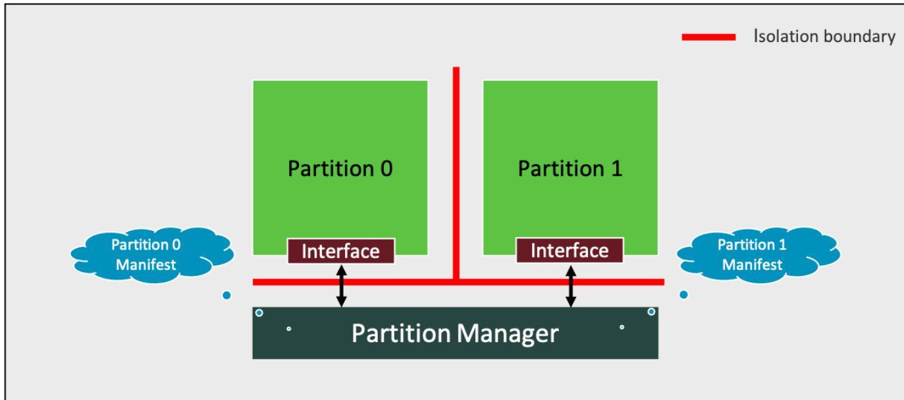  
Figure 3.1: FF-A software architecture

The Firmware Framework is made up of the following building blocks as illustrated in Figure 3.1.

1. Isolation boundaries.

2. Partition interfaces.

3. Partitions.

4. Partition manifest.

5. Partition manager.

The following sub-sections describe these building blocks in more detail

## 3.1 Isolation boundaries

The Framework defines two types of isolation boundaries.

1. A Logical isolation boundary that can be used to,

1. Isolate one software module e.g. a library or a device driver from another within a software image in an exception level through an IMPLEMENTATION DEFINED mechanism. One or more services implemented inside a module are accessed through a IMPLEMENTATION DEFINED application programming interface (API).

2. Isolate one software image from another by,

1. Deploying them in separate exception levels.

2. Deploying them in the same exception level. The images are temporally isolated from each other on a given PE.

One or more services implemented inside a software image are accessed through an application binary interface (ABI).

2. A Physical isolation boundary that can be used to spatially isolate the physical address space of one software image from another through the following mechanisms

1. The Arm® TrustZone Security extension. It is used to protect the Secure physical address space ranges assigned to software images in the Secure state from software images in the Non-secure state.

2. Virtual memory-based memory protection provided by the Arm A-profile VMSA. It is used to protect the physical address space ranges assigned to a software image from other software images in the same security state.

The Framework assumes that a physically isolated software image is logically isolated as well. For example,

• A Guest OS running inside a VM is both physically and logically isolated from a Guest OS in another VM.

• A Hypervisor running in EL2 is both physically and logically isolated from all VMs it manages.

• Firmware in EL3 is physically and logically isolated from any software image in the Normal world.

The Framework does not assume that a logically isolated software image is physically isolated as well. For example, a Trusted OS in S-EL1 is logically but not physically isolated from firmware in EL3 when any of the following scenarios apply.

1. S-EL2 is not present i.e. ID\_AA64PFR0\_EL1.SEL2=0.

2. S-EL2 is not enabled on the system by setting SCR\_EL3.EEL2=1.

3. S-EL2 is present and enabled but Stage 2 address translation in the Secure EL1&0 translation regime is disabled i.e. HCR\_EL2.VM=0.

The two images are not physically isolated since software in S-EL1 can access the physical address space of software in EL3.

The Framework defines ABIs that enable communication between software images across an exception level boundary. The images are logically isolated and could be physically isolated as well.

## 3.2 Partitions

A partition is defined as a software module or image that implements one or more services within an isolation boundary such that a service is accessible across the boundary only via well defined interfaces. If the partition is a software image, then the well defined interface is an FF-A ABI. If the partition is a software module, the well defined interface is an IMPLEMENTATION DEFINED API.

The Framework defines ABIs that partitions can invoke at their exception level boundaries for the following purposes.

1. Discover the presence of a partition, its properties and services it implements.

2. Synchronous and asynchronous message passing between partitions.

3. Memory management between partitions.

A partition that is logically isolated but not physically isolated is called a logical partition. A partition that is both physically and logically isolated is called a physical partition. The term partition is used when it is not required to distinguish between a logical and physical partition. The term endpoint is used interchangeably with the term partition.

1. A VM (when the virtualization extension is enabled) or the OS kernel (when the virtualization extension is disabled or unavailable) is a physical or logical endpoint that runs in EL1 in the Non-secure security state. These endpoints are called NS-Endpoints in scenarios where it is not necessary to distinguish between them.

2. A partition in the Secure security state is called a Secure Partition (SP) and could be,

1. A logical partition that runs in EL3, S-EL2 or S-EL1. A logical partition in the Secure security state is called a Logical Secure Partition (LSP) (see 4.1.4 Logical Secure Partitions).

2. A physical partition that runs in S-EL1 or S-EL0.

SPs are called S-Endpoints in scenarios where it is not necessary to distinguish between them on the basis of the exception level they run in.

A partition manifest describes the physical address space ranges and system resources a partition needs, identity of partition services to enable their discovery and other attributes of the partition that govern its run-time behavior (also see Chapter 5 Setup).

## 3.3 Partition manager

A partition manager is responsible for creating and managing the physical isolation boundary of a partition. It uses a partition manifest to assign physical address space ranges and system resources to a partition, initialize it as per the specified attributes and enable discovery of its services. The partition manager also implements FF-A ABIs to enable inter-partition communication for access to partition services.

1. In the Secure world, this component is called the Secure Partition Manager (SPM).

2. In the Normal world it is a Hypervisor<sup>1</sup> (if the virtualization extension is enabled).

A partition manager is physically isolated from physical partitions and logically isolated from logical partitions it manages. All partitions managed by a partition manager reside at the same or a numerically lower exception level than the partition manager.

The term partition manager is used in the rest of this specification to collectively refer to the SPM and Hypervisor in scenarios where they have the same responsibilities, and it is not necessary to distinguish between them.

The Hypervisor uses the virtualization extension in the Arm A-profile VMSA to create physical isolation boundaries as follows.

• The EL1&0 stage 2 translation regime, when EL2 is enabled in a PE in the Non-secure state, is used to restrict visibility of the Non-secure physical address space from a VM to only those regions that have been assigned to the VM.

See 4.1 SPM architecture for a description of how the SPM creates and manages isolation boundaries for SPs.

See 4.2 DMA isolation for a description of how a partition manager creates and manages isolation boundaries for DMA capable devices.

The following trust boundaries are defined by the Firmware Framework vis-a-vis the partition managers and partitions.

• The SPM is a part of the TCB for a system resource or physical address space range assigned to the Secure state.

• Both the Hypervisor and SPM are a part of the TCB for a system resource or physical address space range assigned to the Non-secure state.

• A VM trusts the Hypervisor to protect its resources from other VMs by creating and maintaining the correct physical isolation boundaries in the Non-secure physical address space.

• Every endpoint trusts the SPM to protect its resources from other endpoints by creating and maintaining the correct physical isolation boundaries in both the Secure and Non-secure physical address spaces.

• An SP does not trust the state of any Non-secure resource it has access to. Therefore, it does not trust the Hypervisor or a NS-Endpoint that could also access the same resource.

The term FF-A component is used to collectively refer to partitions and partition managers.

## 3.4 Example configurations

The Non-secure and Secure security states in the Arm A-profile architecture typically adopt a client-server model where a partition in the Non-secure state is a client of services implemented by a partition in the Secure state.

Partitions within a security state could adopt the client-server model as well. Furthermore, a partition can be both a consumer of another partition’s services and provider of its own services.

The FF-A software architecture generalizes the programming model to access a partition’s services within and between the Non-secure and Secure security states.

Some example deployment scenarios of the FF-A software architecture on various configurations of an Arm A-profile system are listed in the following sub-sections.

3.4.1 FF-A deployment without S-EL2  
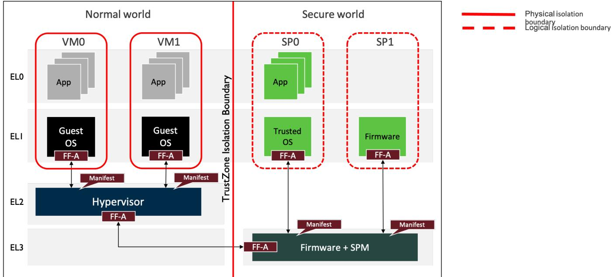  
Figure 3.2: Example FF-A deployment without S-EL2

In Figure 3.2, the virtualization extension is enabled in the Non-secure state. It is either unavailable or disabled in the Secure state.

Both VM0 and VM1 implement an FF-A driver in EL1 to access services in S-Endpoints. They could use the same driver to access each other’s services as well.

The Hypervisor facilitates access to services in S-Endpoints from VM0 and VM1 by implementing an FF-A driver in EL2. It could use the same driver to enable them to access each other’s services.

The following software images are deployed in the Secure world.

1. A firmware image in EL3. It implements the SPM.

2. A firmware image in S-EL1 (SP1).

3. A Trusted OS image in S-EL1 (SP0).

SP0 and SP1 are temporally isolated logical partitions and could access each other’s services via the SPM. The SPM is logically isolated from SP0 and SP1.

3.4.2 FF-A deployment with S-EL2  
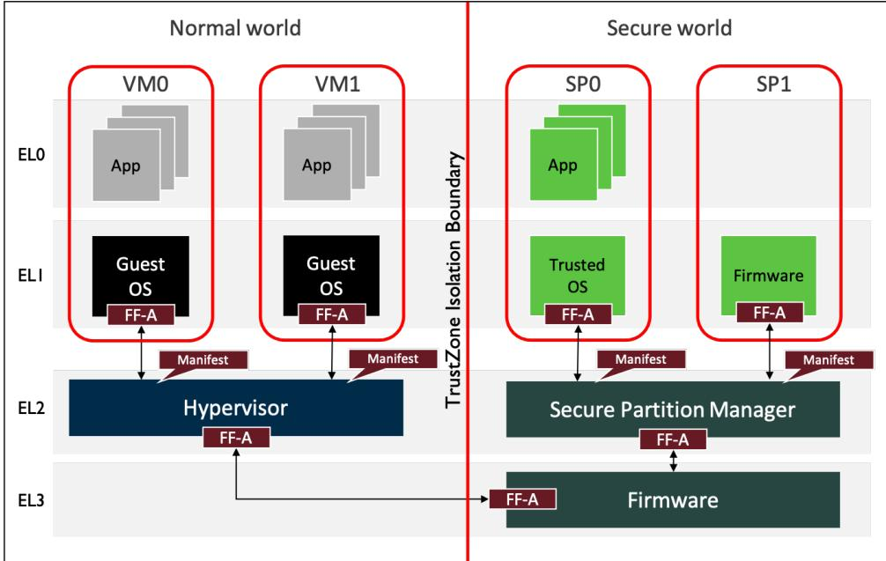  
Figure 3.3: Example FF-A deployment with S-EL2

In Figure 3.3, the virtualization extension is enabled in both security states. The Normal world software stack is unchanged from Figure 3.2.

The following software images are deployed in the Secure world.

1. A firmware image in EL3.

2. An SPM image in S-EL2.

3. A firmware image in S-EL1 (SP1).

4. A Trusted OS image in S-EL1 (SP0).

SP0 and SP1 are physical partitions and could access each other’s services via the SPM. The SPM is physically isolated from SP0 and SP1.

3.4.3 FF-A deployment with S-EL2 and Armv8.1-VHE  
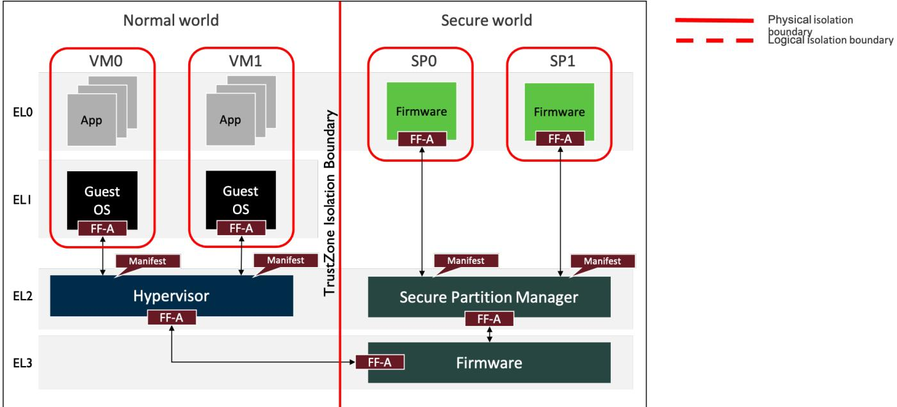  
Figure 3.4: Example FF-A deployment with S-EL2 and Armv8.1-VHE

In Figure 3.4, the virtualization extension is enabled in both security states. Additionally, Armv8.1 VHE is enabled in the Secure world to manage S-EL0 SPs. The Normal world software stack is unchanged from Figure 3.2.

The following software images are deployed in the Secure world.

1. A firmware image in EL3.

2. An SPM image in S-EL2.

3. A firmware image in S-EL0 (SP1).

4. A firmware image in S-EL0 (SP0).

SP0 and SP1 are physical partitions that could access each other’s services. The SPM is physically isolated from SP0 and SP1.

# Chapter 4 Concepts

## 4.1 SPM architecture

The responsibilities of the SPM are split between two components: the SPM Dispatcher (SPMD) and SPM Core (SPMC). Both components have access to the entire physical address space and are a part of the Trusted computing base. The term SPM is used when it is not necessary to distinguish between these two components. The responsibilities of these components are listed below.

1. The SPMD resides in EL3 and runs in either the AArch64 or AArch32 execution state. It is responsible for: • Initialization of LSPs co-resident with the SPMD (see 4.1.4 Logical Secure Partitions).

• SPM Core initialization at boot time.

• Forwarding FF-A calls from Normal world to the SPM Core.

• Forwarding FF-A calls from the SPM Core to the Normal world.

• Inter-partition communication at run-time between LSPs co-resident with SPMD and other FF-A components.

2. The SPMC either co-resides with the SPMD in EL3 or in an adjacent exception level i.e. S-EL1 or S-EL2. It is responsible for:

• Initialization of LSPs at boot time (see 4.1.4 Logical Secure Partitions).

• Initialization and isolation of physical SPs at boot time.

• Inter-partition isolation at run-time.

• Inter-partition communication at run-time between:

– S-Endpoints.

– S-Endpoints and NS-Endpoints.

Table 4.1 lists the SPMC and SPMD configurations supported by the Framework vis-a-vis the exception levels they can reside in and the execution states they can run in.

Table 4.1: Valid SPM configurations in AArch64 and AArch32 Execution state

<table><tr><td>SPM config number</td><td>SPMD EL and Execution state</td><td>SPMC EL and Execution state</td><td>Name of configuration</td></tr><tr><td>1.</td><td>EL3 (AArch64)</td><td>EL3 (AArch64)</td><td>EL3 SPMC</td></tr><tr><td>2.</td><td>EL3 (AArch32)</td><td>EL3 (AArch32)</td><td>EL3 SPMC</td></tr><tr><td>3.</td><td>EL3 (AArch64)</td><td>S-EL1 (AArch64)</td><td>S-EL1 SPMC</td></tr><tr><td>4.</td><td>EL3 (AArch64)</td><td>S-EL1 (AArch32)</td><td>S-EL1 SPMC</td></tr><tr><td>5.</td><td>EL3 (AArch64)</td><td>S-EL2 (AArch64)</td><td>S-EL2 SPMC</td></tr></table>

In SPM configurations where the SPMD and SPMC reside in adjacent exception levels,

• They implement and report a mutually compatible version of the Firmware Framework. See 13.2.2.1 Version negotiation for details.

• The mechanism used by the SPMD to initialize the SPMC is IMPLEMENTATION DEFINED. The guidance provided in Chapter 5 Setup could be used by the implementation.

• They use the ABIs defined in this specification for communication.

A description of each SPM configuration is provided in the following sections.

• 4.1.1 Secure EL2 SPM core component.

• 4.1.3 EL3 SPM core component.

• 4.1.2 S-EL1 SPM core component.

The SPM configurations without S-EL2 are used in the following scenarios.

• Reduce the size of the TCB by migrating EL3 & S-EL1 firmware components, that should not be a part of the TCB, to one or more physically isolated S-EL0 SPs.

• Make the TCB implementation more robust by migrating its components from EL3 & S-EL1 to one or more physically isolated S-EL0 SPs.

• Adopt the generalized programming model specified by the Framework to ease the migration of the Secure world software stack to an Arm A-profile system with S-EL2 enabled.

• Adopt the generalized programming model specified by the Framework for accessing services in S-Endpoints from NS-Endpoints irrespective of whether S-EL2 is used in the Secure world.

## 4.1.1 Secure EL2 SPM core component

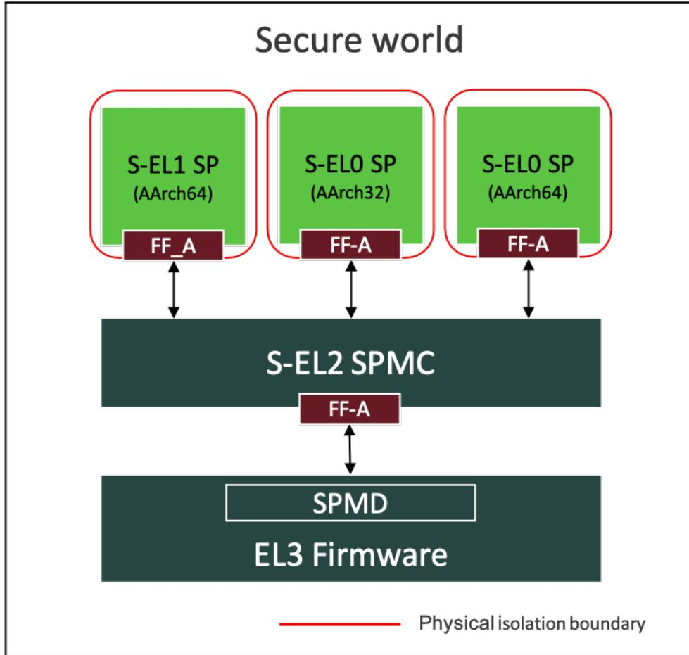  
Figure 4.1: Example S-EL2 SPM Core and SP configuration

The S-EL2 SPMC is fundamental to enforcing the principle of least privilege in the Secure state on Armv8.4 or later systems as described in Chapter 2 Introduction. It supports one or more of the following SP configurations

1. The SPMC uses Armv8.1 VHE to manage one or more physical SPs that run in S-EL0. Each SP runs in either the AArch32 or AArch64 execution state

The physical address space assigned to an SP is isolated from other FF-A components through the single stage of address translation implemented by the Secure EL2&0 translation regime.

2. The SPMC manages one or more physical SPs that run in S-EL1. Each SP runs in either the AArch32 or AArch64 execution state.

The physical address space assigned to an SP is isolated from other FF-A components by the Secure EL1&0 stage 2 translation regime, when EL2 is enabled.

An example of these configurations is illustrated in Figure 4.1. Additionally, in each of the above configurations the following LSP configurations can exist with the S-EL2 SPMC (see 4.1.4 Logical Secure Partitions):

1. LSPs that are co-resident with, and managed by the SPMD.

2. LSPs that are co-resident with, and managed by the S-EL2 SPMC.

## 4.1.2 S-EL1 SPM core component

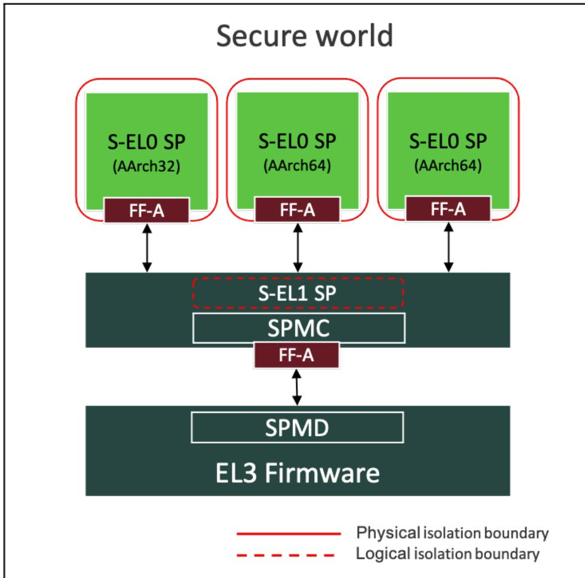  
Figure 4.2: Example S-EL1 SPM Core and SP configuration

A S-EL1 SPMC runs in either the AArch64 or AArch32 execution state. It supports one or more of the following SP configurations.

1. The SPMC manages one or more physical SPs that run in S-EL0. Each SP runs in either the AArch32 or AArch64 (only if S-EL1 SPMC runs in AArch64 too) execution state.

The physical address space assigned to an SP is isolated from other FF-A components through the single stage of address translation implemented by the Secure EL1&0 translation regime in either execution state.

2. The SPMC manages one or more co-resident LSPs (see 4.1.4 Logical Secure Partitions).

Figure 4.2 illustrates a combination of these configurations. Additionally, in each of the above configurations, LSPs can exist that are co-resident with, and managed by the SPMD.

## 4.1.3 EL3 SPM core component

The EL3 SPMC co-exists with the SPMD in either the AArch64 or AArch32 execution state. It supports one of the following mutually exclusive SP configurations.

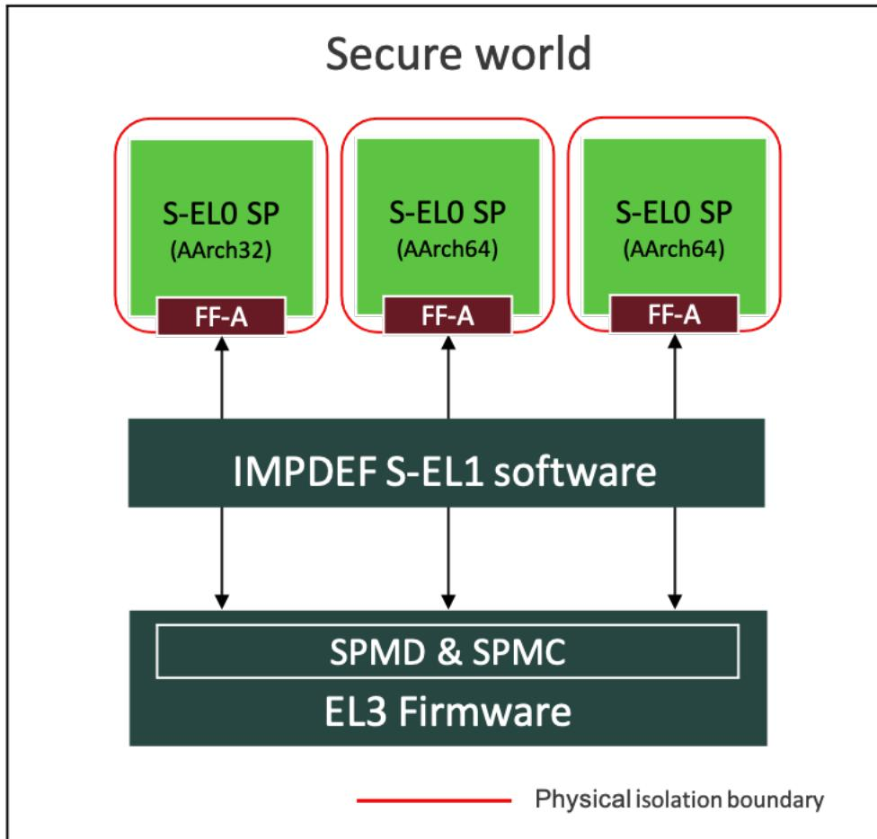  
Figure 4.3: Example EL3 SPM Core and S-EL0 SP configuration

1. One or more physical SPs that run in S-EL0. Each SP runs in either the AArch32 or AArch64 (only if EL3 SPMC runs in AArch64 too) execution state.

The physical address space assigned to an SP is isolated from other FF-A components through the single stage of address translation implemented by the Secure EL1&0 translation regime.

This configuration is illustrated in Figure 4.3.

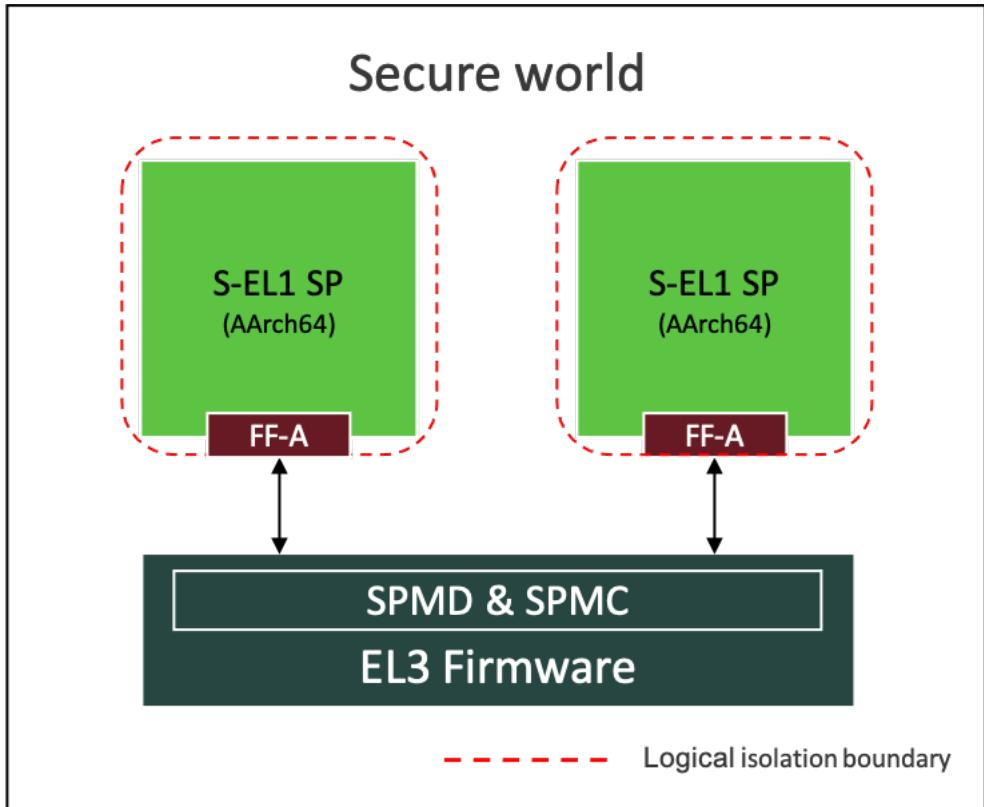  
Figure 4.4: Example EL3 SPM Core and S-EL1 SP configuration

2. The SPMC and SPMD co-exist in EL3 in the AArch64 execution state. One or more LSPs reside in S-EL1. Each SP runs in either the AArch32 or AArch64 execution state.

This configuration is illustrated in Figure 4.4.

Additionally, in each of the above configurations, LSPs can exist that are co-resident with both the SPMC and the SPMD (see 4.1.4 Logical Secure Partitions). The division of responsibilities between the SPMD and EL3 SPMC in managing these LSPs is IMPLEMENTATION DEFINED.

## 4.1.4 Logical Secure Partitions

D<sub>0001</sub> A Logical Secure Partition (LSP) that runs in the same Exception level as the SPMC, SPMD or both, is said to be co-resident with the SPMC and/or the SPMD.

I<sub>0002</sub> A LSP that is not co-resident with SPMC runs in a different Exception level from both the SPMC and SPMD, but is not physically isolated (see 3.1 Isolation boundaries).

I<sub>0003</sub> A co-resident LSP and the SPM component it is resident with, are packaged in the same software image and logically isolated from each other (see 3.1 Isolation boundaries).

In this configuration:

• The interface between the SPM component and the LSP is IMPLEMENTATION DEFINED, for example, a set of C programming language APIs.

• Any FF-A calls targeted to an LSP are received by the SPM component and forwarded to the SP component through the IMPLEMENTATION DEFINED interface

• The SPM component initializes the co-resident LSPs through an IMPLEMENTATION DEFINED mechanism. See Chapter 5 Setup for more information.

R<sub>0004</sub> A co-resident LSP can be discovered and is capable of discovering other SPs via an IMPLEMENTATION DEFINED interface with the SPM that results in an invocation of the an FF-A discovery ABI (see 6.2 Partition discovery).

A co-resident LSP can be the Sender and Recipient of FF-A direct messages (see 8.3 Direct messaging).

A co-resident LSP that resides at S-EL2 or S-EL1 can be the Lender or Receiver of FF-A Memory management operations (see [1]).

A co-resident LSP does not use any other FF-A functionality.

Some example usage scenarios for an LSP that is co-resident with the SPMD are listed below.

1. To facilitate the use of the FF-A framework within the Secure world without the Normal world being FF-A aware.

• An LSP may translate legacy SMC invocations originating from the Normal world into FF-A ABI-compliant messages that can be routed to S-Endpoints (see Figure 8.4).

– This configuration provides a migration path for deploying FF-A functionality in the Secure world independently of the Normal world’s capabilities.

• An LSP may issue FF-A ABI-compliant messages to Secure world components to enable use cases defined by other specifications.

– This configuration supports scenarios such as Live Activation (see 18.10 Live firmware activation), which requires coordination among Secure world components to complete successfully.

2. To expose services provided by IMPLEMENTATION DEFINED code executing at EL3 via standard FF-A message interfaces (see Figure 8.5).

• This configuration enables FF-A endpoints to access these services using standard FF-A interfaces.

• This scenario may also provide a migration path facilitating the relocation of functionality from EL3 to SPs executing at lower exception levels, helping to reduce the EL3 code footprint.

## 4.2 DMA isolation

The Framework enables the partition manager to control the visibility of the physical address space from a DMA capable device assigned to a partition. The Framework assumes that the system,

1. Implements an access control mechanism that can be programmed by a partition manager to limit accesses from DMA capable devices to specific ranges in the physical address space.

2. Guarantees that an access from a DMA capable device is allowed to complete only if,

1. It is permitted by the access control mechanism.

2. The access control mechanism is disabled by the partition manager.

The DMA capable device is said to reside upstream of the access control mechanism. Examples of access control mechanisms include an Arm® SMMU implementation or a vendor specific System MPU implementation.

If the system implements an Arm® SMMU, each access/transaction generated by a device is associated with a Stream ID. This Stream ID could be one of many that the device is configured to use. A Stream ID is used to determine the security state of the transaction and the stage 1 and/or stage 2 address translations that must be used for the transaction. It is also possible that one or both stages of translation could be bypassed for a Stream ID in the SMMU.

• The Hypervisor programs the SMMU to limit access to the Non-secure physical address space in response to transactions generated by a DMA capable device using a Non-secure Stream ID.

• The SPMC programs the SMMU to limit access to the Non-secure and Secure physical address spaces in response to transactions generated by a DMA capable device using a Secure Stream ID.

If enabled, the stage 2 translations corresponding to a Stream ID control access to the physical address space that the device has. A set of stage 2 translation tables could map to one or more Stream IDs. The Framework manages stage 2 translations in the SMMU as described in [1].

The Framework specifies the following programming models w.r.t DMA isolation.

1. Programming models that enable a partition to control the visibility that a DMA capable device, assigned to the partition has of the partition’s physical memory regions. These models are described in 4.2.1 Static DMA isolation and 4.2.2 Dynamic DMA isolation. A partition uses one or the other model but never both.

2. Programming models that allow,

1. A trusted DMA capable device to manage its access to the physical address space.

2. A trusted partition to act on behalf of a DMA capable device to manage its access to the physical address space.

These models are described in 4.2.3 Other DMA isolation models.

On a system that does not implement an Arm® SMMU, the Framework assumes that the guidance in this specification can be applied to the IMPLEMENTATION DEFINED access control mechanism available on the system.

## 4.2.1 Static DMA isolation

In this model, a partition uses its manifest to specify the memory regions in its physical address space that must be visible to each DMA capable device assigned to it along with memory attributes such as read, write and execute permissions. A device cannot access the partition’s memory regions unless access is explicitly granted in the partition manifest. The partition manager programs the access control mechanism to create the corresponding memory mappings before initializing the partition. These mappings remains in place for the lifetime of the partition. They cannot be changed during partition initialization and runtime through mechanisms defined by the Framework e.g. management transactions described in [1].

The static DMA isolation model is used on a system with an Arm® SMMU as described below.

1. The partition manager uses a single stage of address translation to enforce access control in the SMMU. This could be either the stage 1 or the stage 2 translation regime in the SMMU.

2. An EL1 partition in either security state uses this model to enable a DMA capable device to use a memory range in the partition’s IPA space to access a memory range in the partition’s PA space.

3. A S-EL0 partition uses this model to enable a DMA capable device to use a memory range in the partition’s VA space to access a memory range in the partition’s PA space.

4. The following properties of the device are specified in the memory region description (see Table 5.2) in the partition manifest (see 5.2.1 Partition manifest).

1. The identity of the stream ID generated by the device that must have access to the memory region.

2. The identity of the SMMU that the device is upstream of.

3. The instruction and data access permissions on the memory region that must be used by transactions associated with the stream ID.

The Framework assumes that the following attributes of the memory region are same irrespective of whether it is accessed by the partition or the device stream ID.

• Memory type

• Cacheability and shareability attributes.

• Security state.

5. The specified device stream ID accesses the physical memory region with either the same IPA range used by an EL1 or S-EL1 partition or the same VA range used by a S-EL0 SP. The partition manager creates mappings for the memory region in either the Stage 1 or Stage 2 translation regime of the SMMU.

## 4.2.2 Dynamic DMA isolation

In this model, a partition controls the visibility that DMA capable devices assigned to it have of the partition’s physical memory regions, during partition initialization and runtime. The partition manager programs the access control mechanism prior to partition initialization to ensure the devices cannot access the partition’s physical address space. Memory mappings for the devices are created and destroyed by the partition manager on behalf of the partition.

The dynamic DMA isolation model is used on a system with an Arm® SMMU as described below.

1. The partition manager enables a single or both stages of address translation to enforce access control in the SMMU. This could be the stage 1, stage 2 or both translation regimes in the SMMU.

2. An EL1 partition in either security state uses this model to enable a DMA capable device to use a memory range in the partition’s IPA or VA space to access a memory range in the partition’s PA space.

3. A S-EL0 partition uses this model to enable a DMA capable device to use a memory range in the partition’s VA space to access a memory range in the partition’s PA space.

4. The partition uses an IMPLEMENTATION DEFINED mechanism during initialization and runtime to describe a memory region to the partition manager that must be mapped or unmapped from a device assigned to it. For example,

1. A partition implements an SMMU driver to program Stage 1 translations so that memory regions in its VA space can be mapped or unmapped from a device.

The partition manager emulates the SMMU accesses from the partition and ensures accesses from the device are restricted to the physical memory regions assigned to the partition.

2. The partition manager exports a para-virtualized interface to the partition to program the SMMU so that memory regions in the partition’s VA space can be mapped or unmapped from a device. The partition is able to specify the address, size and attributes of the memory region through the interface.

5. The use of a single or both stages of translation in the SMMU by the partition manager is IMPLEMENTATION DEFINED. The Framework specifies the following rule if the partition manager enables both stages of translations in the SMMU.

Stage 2 translations for the partition are shared with the SMMU i.e. the Stream Table Entry (STE) in a Stream table selected by the stream ID references the same stage 2 translation tables used by the partition. The stream ID is generated by a device assigned to the partition. This also implies that any memory region,

1. Shared, lent or donated to the partition through memory management transactions described in [1] is automatically mapped into the IPA space of a DMA capable devices assigned to the partition.

The partition uses an IMPLEMENTATION DEFINED mechanism after the memory region is mapped in the stage 2 translation tables to program the Stage 1 translation tables in the SMMU to enable access to the memory region from a device.

2. Relinquished by the partition is automatically unmapped from the IPA space of a DMA capable devices assigned to the partition.

The partition uses an IMPLEMENTATION DEFINED mechanism before the memory region is unmapped from the stage 2 translation tables to program the Stage 1 translations in the SMMU to disable access to the memory region from a device.

## 4.2.3 Other DMA isolation models

The Framework supports use cases where an endpoint shares, lends or donates physical memory regions to a DMA capable device via FF-A memory management transactions described in [1]. The Framework categorises these devices as follows:

• Independent peripheral device. The device uses an IMPLEMENTATION DEFINED mechanism to communicate with the partition manager to map or unmap the memory regions from its physical address space.

E.g. the device implements a doorbell/mailbox interface that is accessible by the partition manager. The device and the partition manager exchange messages that are semantically equivalent to FF-A memory management interfaces.

• Dependent peripheral device. The device relies on a trusted PE endpoint to map and unmap the memory regions on its behalf via FF-A memory management interfaces.

E.g. a device could implement a protected mode in which it is assigned to, and accepts commands from an NS endpoint. In the protected mode, the device can read from memory regions that are also accessible from the NS endpoint. The device can write to only those memory regions that are inaccessible from the NS endpoint. The trusted PE endpoint uses FF-A memory management interfaces to enforce the access control policy expected by the device in protected mode.

The trusted PE endpoint is called a proxy endpoint.

Both types of devices are identified by a 16-bit ID called the Stream endpoint ID or SEPID. SEPIDs are used in FF-A memory management transactions to (also see [1]):

• Grant and revoke access to a physical memory region to a device.

• Transfer ownership of a physical memory region from or to a device.

On a system that implements the Arm® SMMU v3.2 architecture, the following rules apply:

• A device that generates a Secure Stream ID is identified by a Secure SEPID.

• A device that generates a Non-secure Stream ID is identified by a Non-secure SEPID.

• Each independent peripheral device specifies the following information in its partition manifest (see 5.2.3 Independent peripheral device manifest).

– A SEPID assigned to the device at boot time.

– The SMMU ID that the device is upstream of.

– Each Stream ID the device can generate.

– Regions in the physical address space that must be mapped in the translation tables corresponding to the SEPID at boot time.

This information enables the partition manager to create an association between a device and a SEPID at boot time.

• Each proxy endpoint of a dependent peripheral device specifies the following information in its partition manifest (see 5.2.1 Partition manifest) to create an association between a device and a SEPID at boot time.

– The SMMU ID that the device is upstream of.

– Each Stream ID the device can generate.

– The SEPID corresponding to each Stream ID.

The partition ID of the proxy endpoint is distinct from the SEPID allocated to manage the preceding association. The SEPID is specified in the partition manifest of the proxy endpoint (see Table 5.1).

A memory management transaction targeted to the SEPID is allowed to complete only if it is either initiated or authorized by the proxy endpoint for the device.

• The SEPIDs used by an independent peripheral device are distinct from the SEPIDs used by a dependent peripheral device.

## 4.3 FF-A instances

An FF-A instance is a valid combination of two FF-A components at an Exception level boundary. These instances are used to describe the interfaces specified by the Firmware Framework. An interface is accessed at an FF-A instance through a conduit described in 4.4 Conduits. The responsibilities of the caller and callee in each interface depend on the FF-A instance at which it is invoked.

• An instance is physical if:

– Each component can independently manage its translation regime.

– The translation regimes of each component map virtual addresses to physical addresses.

• An instance is virtual if it is not physical.

• The instance between the SPMC and SPMD is a Secure physical FF-A instance when the SPMC is not co-resident with the SPMD.

• Partitions are physically isolated at a virtual FF-A instance.

• Partitions are logically isolated at a physical FF-A instance.

• The instance between the SPMC, and an LSP that is not co-resident with the SPMC is a Secure physical FF-A instance.

• The instance between the SPMC and a physical SP is called the Secure virtual FF-A instance.

• In the Normal world, the instance between:

– The Hypervisor and a VM is called the Non-secure virtual FF-A instance.

– The Hypervisor and SPMD is called the Non-secure physical FF-A instance.

– The OS kernel and SPMD, in the absence of a Hypervisor is called the Non-secure physical FF-A instance.

Table 4.2 lists the valid Secure FF-A instances. Table 4.3 lists the valid Non-secure FF-A instances.

• Entries in the first row represent the higher Exception level at an Exception level boundary.

• Entries in the first column represent the lower Exception level at an Exception level boundary.

• Combinations of Exception levels that are not architecturally feasible are listed as Not applicable (NA).

Table 4.2: Secure FF-A instances

<table><tr><td>EL boundary</td><td>EL3 (AArch64)</td><td>EL3 (AArch32)</td><td>S-EL2</td><td>S-EL1 (AArch64)</td><td>S-EL1 (AArch32)</td></tr><tr><td>S-EL2</td><td>Secure physical</td><td>NA</td><td>NA</td><td>NA</td><td>NA</td></tr><tr><td>S-EL1 (AArch64)</td><td>Secure physical</td><td>NA</td><td>Secure virtual</td><td>NA</td><td>NA</td></tr><tr><td>S-EL1 (AArch32)</td><td>Secure physical</td><td>Secure physical</td><td>Secure virtual</td><td>NA</td><td>NA</td></tr><tr><td>S-EL0 (AArch64)</td><td>Secure virtual</td><td>NA</td><td>Secure virtual</td><td>Secure virtual</td><td>NA</td></tr><tr><td>S-EL0 (AArch32)</td><td>Secure virtual</td><td>Secure virtual</td><td>Secure virtual</td><td>Secure virtual</td><td>Secure virtual</td></tr></table>

Table 4.3: Non-secure FF-A instances

<table><tr><td>EL boundary</td><td>EL3 (AArch64)</td><td>EL3 (AArch32)</td><td>EL2 (AArch64)</td><td>EL2 (AArch32)</td></tr><tr><td>EL2 (AArch64)</td><td>Non-secure physical</td><td>NA</td><td>NA</td><td>NA</td></tr><tr><td>EL2 (AArch32)</td><td>Non-secure physical</td><td>Non-secure physical</td><td>NA</td><td>NA</td></tr></table>

Chapter 4. Concepts 4.3. FF-A instances

<table><tr><td>EL boundary</td><td>EL3 (AArch64)</td><td>EL3 (AArch32)</td><td>EL2 (AArch64)</td><td>EL2 (AArch32)</td></tr><tr><td>EL1 (AArch64)</td><td>Non-secure physical</td><td>NA</td><td>Non-secure virtual</td><td>Non-secure virtual</td></tr><tr><td>EL1 (AArch32)</td><td>Non-secure physical</td><td>Non-secure physical</td><td>Non-secure virtual</td><td>Non-secure virtual</td></tr></table>

The definition of an FF-A instance when both FF-A components reside in the same Exception level is IMPLEMEN-TATION DEFINED. This is applicable to the SPM configurations described in 4.1.3 EL3 SPM core component and 4.1.2 S-EL1 SPM core component respectively. For example, the implementation could maintain a logical separation between the two components through the use of an API that has the same semantics as the FF-A ABIs at the same instance.

## 4.4 Conduits

The Framework defines interfaces to enable communication between various FF-A components (see Chapter 11 Interface overview). Each interface is accessible through one or more conduits as follows.

The SMC conduit as described in [5] should be used to invoke an interface by an FF-A component executing in EL1 or S-EL1. When an interface is invoked from EL1, the SMC execution must be trapped by the Hypervisor at EL2. Similarly, when an interface is invoked at S-EL1 and the SPM resides in S-EL2, the SMC execution must be trapped by the SPM. This implies that the SMC conduit provides the flexibility that is required to support implementations with and without a hypervisor in EL2 or SPM in S-EL2.

If an endpoint executing in EL1 or S-EL1 cannot use the SMC conduit, it must use the HVC conduit instead.

A S-EL0 SP must use the SVC (Supervisor Call) instruction as a conduit to call into S-EL1. The SMC32 and SMC64 calling conventions are mirrored as SVC32 and SVC64 calling conventions respectively.

The Firmware Framework enables message exchange between any two FF-A components that might be at the same or a different Exception level relative to each other. A request, its results, or an error status could be sent from:

• A lower EL to a higher EL

• A higher EL to a lower EL.

To fulfill this requirement, this version of the Framework uses the ERET instruction as a conduit for transmitting requests and responses from a higher EL to a lower EL.

The parameter register usage in an SMC, HVC, or SVC call is mirrored in an ERET call for example, w0 contains a function identifier parameter in the ERET call. This ensures that messages can be passed at any FF-A instance irrespective of their direction of travel. An invocation through the SMC, HVC, or SVC conduits is completed through the ERET conduit. An invocation through the ERET conduit is completed through the SMC, HVC, or SVC conduits.

This usage of the ERET instruction as a conduit along with the SMC, HVC, and SVC conduits enables half-duplex communication between two FF-A components at an EL boundary at any FF-A instance.

The taxonomy of information transmitted through a conduit at an FF-A instance is as follows.

1. An interface invocation described in Chapter 11 Interface overview.

2. Results from the successful completion of the invoked interface.

3. Error code from an unsuccessful completion of the invoked interface.

Based on the preceding taxonomy, an interface invocation through one conduit at an FF-A instance can complete through another conduit in one of the following ways.

• A error code. The FFA\_ERROR function is used to return the error code (see 12.2 FFA\_ERROR).

• Results of the request. The FFA\_SUCCESS function is used to return the results (see 12.3 FFA\_SUCCESS).

• An invocation of another interface described in Chapter 11 Interface overview.

An invocation of a non-FF-A interface from a lower Exception level to a higher Exception level for example, through the SMC, HVC, or SVC conduits must not complete with an invocation of an FF-A function through the ERET conduit unless, the caller implements support to distinguish between the FF-A and non-FF-A register usage on completion. For example, w0 would contain a status code in the latter case while it will contain a function identifier in the former case.

## 4.5 Memory types

Each memory region is assigned to either the Secure or Non-secure physical address space at system reset or during system boot. Normal world can only access memory regions in the Non-secure physical address space. Secure world can access memory regions in both address spaces. The Non-secure (NS) attribute bit in the translation table descriptor determines whether an access is to Secure or Non-secure memory. In this version of the Framework:

• Memory that is accessed with the NS bit set in the translation regime of any FF-A component is called Normal memory.

• Memory that is accessed with the NS bit cleared in an FF-A component translation regime is called Secure memory.

## 4.6 Memory granularity and alignment

The Firmware Framework specifies support to map a memory region in the translation regimes of the two FF-A components at an FF-A instance (see 4.10 RX/TX buffers & the FF-A memory management protocol [1]). The translation regimes could use the same or a different translation granule size. To map the memory region correctly in both translation regimes, the following constraints must be met:

• If X is the larger translation granule size used by the two translation regimes, then the size of the memory region must be a multiple of X.

• The base address of the memory region must be aligned to X.

For example, at the Non-secure virtual FF-A instance, a VM and the Hypervisor could use translation granule sizes of 4K and 64K respectively. The size of any memory region that must be mapped in both their translation regimes must be a multiple of 64K and aligned to the 64K boundary.

An endpoint could specify its translation granule size in its partition manifest as described in 5.2.1 Partition manifest. The Hypervisor and SPM could also use an IMPLEMENTATION DEFINED mechanism to determine the translation granule size of an endpoint.

An endpoint must discover the minimum size and alignment boundary (that is, the minimum value of X) to share a memory region with its partition manager through the FFA\_FEATURES interface (see 13.3 FFA\_FEATURES).

## 4.7 Execution context

Each endpoint has one or more execution contexts depending on its implementation. An execution context comprises general-purpose, system, and any memory mapped register state that must be maintained by a partition manager.

A partition manager is responsible for allocating, initializing, and running the execution context of an endpoint on a physical or virtual PE in the system. An execution context is identified by using a 16-bit ID. This ID is referred to as the vCPU or execution context ID. Each execution context must be allocated an ID that is unique among all execution contexts that belong to the endpoint.

An execution context of an endpoint represents a logical processor to the partition manager. The partition manager delegates message processing to an execution context of an endpoint. It is independent of threads implemented inside an endpoint to process the messages and logic to schedule these threads (see also 4.9 Primary scheduler). Figure 4.5 illustrates this relationship.

Endpoint  
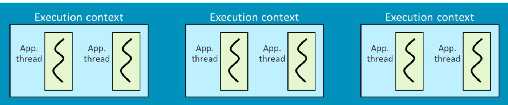  
Figure 4.5: Example endpoint with execution contexts and threads

An endpoint must be one of the following types:

• Implements a single execution context and is not capable of Symmetric multi-processing. It runs only on a single PE in the system at any point of time. This type of endpoint is called a UP endpoint.

• Implements multiple execution contexts and is capable of Symmetric multi-processing. These contexts run concurrently on separate PEs in the system. These endpoints are called MP endpoints.

An execution context of an endpoint could be capable of migrating. Migration capability means that the partition manager could save the execution context of an endpoint on one PE. It could then restore the saved execution context on another PE and resume endpoint execution. The endpoint must not make any assumptions about the PE it runs on.

This version of the Framework requires the following:

• UP endpoints must be capable of migrating.

• Execution contexts of MP endpoints could be capable of migrating between PEs or could be fixed to a particular PE. The latter are called pinned contexts.

• The migration capability must be specified in the endpoint manifest (see 5.2.1 Partition manifest).

• S-EL0 partitions must be UP.

The number of execution contexts an endpoint implements can differ from the number of PEs in the system. This must be specified in the manifest of the endpoint (see 4.8 System resource management). For example, a VM in the Normal world must use the manifest to inform the Hypervisor how many vCPUs it implements. The Hypervisor must maintain an execution context for each vCPU.

## 4.8 System resource management

Components in the Firmware Framework require access to the following system resources.

• Memory regions.

• Devices.

• CPU cycles.

The Framework associates the attributes of ownership and access with these resources. The Owner governs the following capabilities of non-Owners for each resource.

• The level of access a non-Owner has for using the resource. This could be exclusive, shared or no-access.

• The ability to grant access to the resource to other non-Owners. This is called access forwarding.

Also, the Owner could relinquish ownership to another component.

The Framework also specifies the transitions that result in a change of ownership and access attributes associated with a resource. A combination of these attributes and transitions determines how a resource is managed among components.

Rules associated with ownership and access of memory regions are described in the FF-A memory management protocol [1].

Rules associated with ownership and access of CPU cycles are described in 4.9 Primary scheduler.

For a device that is upstream of an SMMU, its access to the physical address space is managed using the rules associated with management of memory regions (also see 4.2 DMA isolation).

For all devices, ownership and access attributes are associated with its MMIO region. A partition could request access and/or ownership of a device through its manifest (see Table 5.3). This is done through one of the following ways.

• A partition requests ownership and exclusive access to the MMIO region of a device during boot time (see Chapter 5 Setup). The corresponding partition manager assigns the MMIO region with these attributes to the partition.

• One or more partitions request access to the MMIO region of a device during boot time. The corresponding partition manager is the Owner of the MMIO region and grants access to all the partitions.

This version of the Framework assumes that the following actions pertaining to the MMIO region of a device are performed through an IMPLEMENTATION DEFINED mechanism:

• Transfer of ownership of a device MMIO region to another partition during run-time.

• Grant of access to a device MMIO region to another partition during run-time.

• Revocation of access to a device MMIO region from a partition during run-time.

## 4.9 Primary scheduler

FF-A components require CPU cycles to do work. The Framework assumes a hierarchical model where a single FF-A component in the Normal world is the owner of CPU cycles across all PEs in the system. This component lends CPU cycles to other FF-A components.

This component is the Hypervisor if it is implemented in EL2. It could be one of the following.

1. The Host OS running in EL2 in the case of a Type 2 Hypervisor when the Virtualization host extension is used.

2. The Type 1 Hypervisor running in EL2.

This component is called the primary endpoint if it is implemented in an NS-Endpoint. It could be one of the following.

1. The OS kernel running in EL1 if the Virtualization extension is not used in the Normal world.

2. The Host OS running in EL1 in the case of a Type 2 Hypervisor when the Virtualization host extension is not implemented or used (see [6]).

3. A separate VM running in EL1 that has been delegated the responsibility of scheduling by the Hypervisor.

The scheduler implemented in the Hypervisor or primary endpoint is called the primary scheduler. This term is used in the context of CPU cycle allocation when it is not necessary to distinguish whether it is the Hypervisor or the primary endpoint that is owner of CPU cycles in the system.

An endpoint that does not implement the primary scheduler is called a secondary endpoint. A secondary endpoint could implement a secondary scheduler to manage allocated cycles among its threads. A secondary endpoint could be allocated CPU cycles,

1. By the primary scheduler. For example,

• For every VM managed by a Hypervisor, it implements a thread for each vCPU of a VM. A vCPU receives CPU cycles when its thread is scheduled by the primary scheduler.

• A Trusted OS has a counterpart driver in the primary endpoint. This driver is invoked by client applications to request Trusted OS services. The driver forwards requests to an execution context of the Trusted OS. It could do this as follows.

– Manage a set of threads to run an execution context of the Trusted OS.

– Run an execution context of the Trusted OS in the context of the client application thread that issued the request.

In both examples, an execution context of a secondary endpoint is scheduled by the primary scheduler.

2. By another secondary endpoint. A variant of the above example could be where a Trusted OS has a counterpart driver in the VM scheduled by the Hypervisor instead of the primary endpoint. This driver is invoked by client applications installed in the VM to request Trusted OS services. The driver runs an execution context of the Trusted OS to handle the request. The client applications are scheduled by a secondary scheduler implemented in the VM.

In this example, the primary scheduler in the Hypervisor schedules a secondary endpoint (VM). The secondary endpoint runs another secondary endpoint (Trusted OS SP).

The term scheduler is used in the context of CPU cycle allocation when it is not necessary to distinguish whether cycles are allocated by the primary or secondary scheduler.

Figure 4.6 illustrates an example of a primary endpoint. The primary scheduler manages threads that run execution contexts of VMs and SPs along with application threads. Application threads could in turn, run execution contexts of VMs and SPs as well.

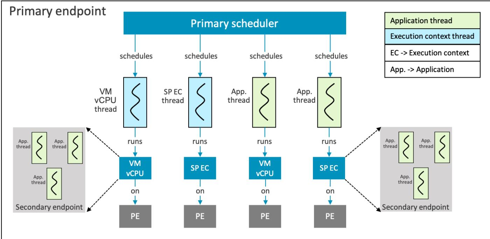  
Figure 4.6: Example primary endpoint configuration

Figure 4.7 illustrates this example of a secondary endpoint. The secondary scheduler manages application threads, that could in turn, run execution contexts of SPs.

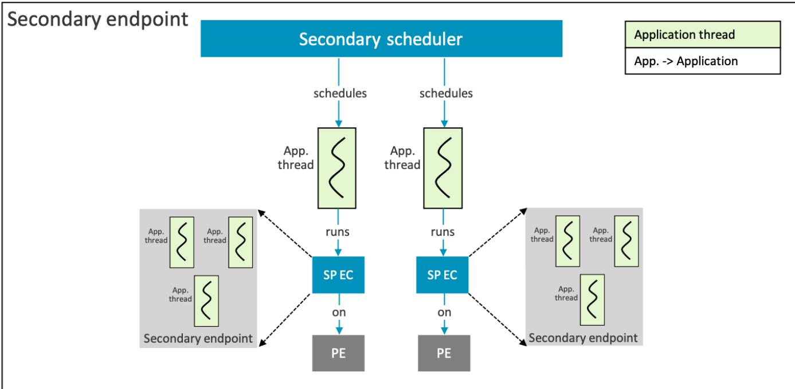  
Figure 4.7: Example secondary endpoint configuration

Secondary endpoint services could be accessed during boot before the primary endpoint or Hypervisor is initialized. For example, a boot loader in the Normal world could access services provides by a SP.

The Framework assumes that the software components that perform boot subsume the role of the primary scheduler before the Hypervisor or primary endpoint is initialized. Ownership of CPU cycles is relayed from one component to the next across the boot stages. Each component lends cycles to an endpoint if it accesses the services of the endpoint.

The Framework provides the following ABIs to endpoints to allocate CPU cycles to other endpoints. These are,

1. FFA\_MSG\_SEND\_DIRECT\_REQ. See 15.2 FFA\_MSG\_SEND\_DIRECT\_REQ.

2. FFA\_MSG\_SEND\_DIRECT\_REQ2. See 15.4 FFA\_MSG\_SEND\_DIRECT\_REQ2.

3. FFA\_RUN. See 14.3 FFA\_RUN.

## 4.10 RX/TX buffers

D<sub>0006</sub> A pair of FF-A components at an FF-A instance share a pair of memory regions to exchange information.

The memory region used by the FF-A component at the lower Exception level or lower level of privilege, to receive information from the FF-A component at the higher Exception level or higher level of privilege is called the RX buffer.

The buffer used by the FF-A component at the lower Exception level or lower level of privilege, to send information from the FF-A component at the higher Exception level or higher level of privilege is called the TX buffer.

I<sub>0007</sub> A VM shares its RX/TX buffer pair with the Hypervisor.

An NS-Endpoint shares its RX/TX buffer pair with the SPMC.

The Hypervisor shares its RX/TX buffer pair with the SPMC.

An SP shares its RX/TX buffer pair with the SPMC.

The SPM is split into the SPMD and SPMC components. In configurations where the SPMC resides in a separate Exception level from the SPMD, it is IMPLEMENTATION DEFINED whether the two SPM components share an RX/TX buffer pair. See also:

• 4.1 SPM architecture.

These message buffer configurations are illustrated in Figure 4.8.  
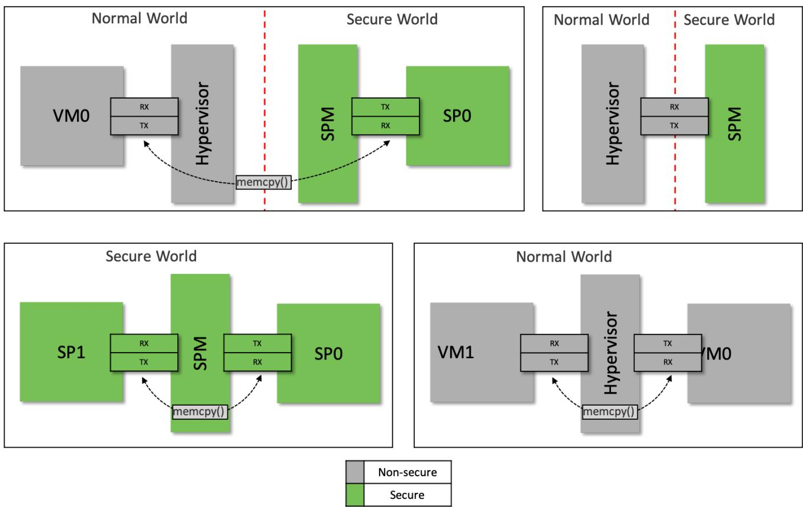  
Figure 4.8: Configurations of RX/TX buffer pair between FF-A components

The FF-A component at the lower Exception level or lower level of privilege is the Producer of the TX buffer. The FF-A component at the lower Exception level or lower level of privilege is the Consumer of the RX buffer.

D<sub>0009</sub> The FF-A component at the higher Exception level or higher level of privilege is the Producer of the RX buffer. The FF-A component at the higher Exception level or higher level of privilege is the Consumer of the TX buffer.

I<sub>0010</sub> The RX and TX buffers are written to by a Producer and read by a Consumer as described in Table 4.4. Concurrent accesses to these buffers from both entities on either side of an FF-A instance is synchronized to preserve the integrity of their contents.

Table 4.4: Producers and Consumers of RX/TX buffers

<table><tr><td>Buffer Type</td><td>Producers</td><td>Consumers</td></tr><tr><td>VM RX</td><td>Hypervisor, SPMC</td><td>VM</td></tr><tr><td>VM TX</td><td>VM</td><td>Hypervisor, SPMC</td></tr><tr><td>OS Kernel RX</td><td>SPMC</td><td>OS Kernel</td></tr><tr><td>OS Kernel TX</td><td>OS Kernel</td><td>SPMC</td></tr><tr><td>SP RX</td><td>SPMC</td><td>SP</td></tr><tr><td>SP TX</td><td>SP</td><td>SPMC</td></tr><tr><td>Hypervisor RX</td><td>SPMC</td><td>Hypervisor</td></tr><tr><td>Hypervisor TX</td><td>Hypervisor</td><td>SPMC</td></tr></table>

R<sub>0011</sub> The endianness of all information populated in the RX/TX buffers is little-endian.

R<sub>0012</sub> Messages are populated at the base or offset 0, of a TX or RX buffer.

The size of the RX and TX buffers in a pair is the same and a multiple of the larger translation granule size used by the FF-A components at an FF-A instance.

R<sub>0014</sub> The alignment of the RX and TX buffers in a pair is equal to the larger translation granule size used by the FF-A components at an FF-A instance. See also:

## • 4.6 Memory granularity and alignment.

I<sub>0015</sub> An endpoint discovers the minimum size, maximum size and alignment boundary for the RX/TX buffers by passing the function ID of the FFA\_RXTX\_MAP ABI as input in the FFA\_FEATURES interface. See also:

• 13.6 FFA\_RXTX\_MAP.

• 13.3 FFA\_FEATURES.

R<sub>0016</sub> The maximum size of the RX or TX buffer is an optional field and a value of 0 means that the partition manager does not enforce a maximum size.

R<sub>0017</sub> An RX/TX buffer pair is mapped with the following memory region attributes in all applicable stages of the translation regime of their respective Producers and Consumers.

• Normal memory.

• Write-Back Cacheable.

• Non-transient Read-Allocate.

• Non-transient Write-Allocate.

• Inner Shareable. Table 4.5 describes the minimum permission requirements of RX/TX buffer.

Table 4.5: RX/TX buffer minimum permission requirements

<table><tr><td>Buffer Type</td><td>Producer</td><td>Consumer</td><td>Description</td></tr><tr><td>RX</td><td>RW, XN</td><td>RO, XN</td><td>Produce must have write access to populate message payload.Consumer must have at least read access to read message payload.</td></tr><tr><td>TX</td><td>RW, XN</td><td>RO, XN</td><td>Produce must have Write-access to populate message payload.Consumer must have at least read access to copy the message payload to the target RX buffer.Consumer must also have Write- access to modify message payload if required.</td></tr></table>

R<sub>0018</sub> The physical memory of the RX/TX buffers accessible by an NS-Endpoint or the Hypervisor belongs to the Non-secure PAS.

R<sub>0019</sub> The physical memory of the RX/TX buffers that are accessible only by S-Endpoints and the SPM belongs to the Secure PAS.

R<sub>0020</sub> An FF-A component that has address translation disabled performs cache maintenance on the RX/TX buffers in scenarios listed in Table 4.6. The cache maintenance ensures that the buffer contents at any intermediate cache levels are not out of sync with the buffer contents at the Point of coherence (see [6]).

• A Producer performs cache maintenance before the Consumer reads the buffer.

• A Consumer performs cache maintenance before reading the buffer populated by the Producer.

Table 4.6: RX/TX buffer cache maintenance requirements

<table><tr><td>Config No.</td><td>Address translation in Producer</td><td>Address translation in Consumer</td><td>Cache maintenance required</td></tr><tr><td>1.</td><td>Disabled</td><td>Disabled</td><td>No</td></tr><tr><td>2.</td><td>Disabled</td><td>Enabled</td><td>Yes</td></tr><tr><td>3.</td><td>Enabled</td><td>Disabled</td><td>Yes</td></tr><tr><td>4.</td><td>Enabled</td><td>Enabled</td><td>No</td></tr></table>

X<sub>0021</sub> An RX/TX buffer pair is accessed with different memory region attributes from the translation regime of the Producer and Consumer, if address translation is disabled in one of them. Cache maintenance is required to avoid memory coherency issues in this scenario.

R<sub>0022</sub> The producer of a buffer ensures that there is no leakage of private information by clearing the unpopulated contents of the buffer. Within the data structures that populate the buffer, the following is done:

• The producer at the lower EL treats all unused fields in the data structure as Reserved (SBZ).

• The producer at the higher EL treats all unused fields in the structure as Reserved (MBZ).

The rules differ based upon the Exception level of the producer because of the following reasons:

• The consumer at the higher EL does not flag an error if the unused fields are not set to zero. Hence, it is strongly recommended but not mandatory for the producer to zero the unused fields.

• The consumer at the lower EL is not trusted and the producer must set the unused fields to zero.

I<sub>0024</sub> Setup of a buffer pair is done by a physical endpoint through one of the following mechanisms:

• An endpoint allocates the buffer pair and uses FFA\_RXTX\_MAP ABI (see 13.6 FFA\_RXTX\_MAP) to map it in the partition manager’s translation regime.

• The endpoint requests buffer allocation in its manifest by specifying their base addresses (as IPAs or VAs) and size. The partition manager maps the buffer pair in the stage of translation regime it manages on behalf of the endpoint and its own translation regime.

If the endpoint is a VM, the Hypervisor uses the FFA\_RXTX\_MAP ABI to map the buffer pair in the SPMC’s translation regime.

See also:

• 13.6 FFA\_RXTX\_MAP.

• 5.2.1 Partition manifest.

S<sub>0025</sub> Arm strongly recommends that an endpoint should not allocate the buffer pair in memory that could be donated, lent or shared with another endpoint via the FF-A memory management protocol [1]. If the memory is shared, another endpoint can access information exchanged with the SPMC. If the memory is lent or donated, the lender endpoint cannot access the buffer pair.

S<sub>0026</sub> Arm strongly recommends that the buffer pair should not be allocated in memory that has been lent or shared with the endpoint via the FF-A memory management protocol [1]. This avoids a scenario where the memory is relinquished by the endpoint while it is still registered with the SPMC as the buffer pair. If this scenario is unavoidable, the endpoint should ensure the buffer pair is unmapped before its memory is relinquished.

R<sub>0027</sub> If the endpoint uses the AArch32 calling convention to invoke this ABI, each buffer has a 32-bit address.

X<sub>0028</sub> The address of the buffer is encoded in a 32-bit register in the FFA\_RXTX\_MAP ABI when the AArch32 convention is used.

I<sub>0029</sub> The Hypervisor uses the FFA\_RXTX\_MAP ABI to map its buffer pair in the SPMC’s translation regime.

I<sub>0030</sub> An endpoint uses the FFA\_RXTX\_UNMAP ABI to unmap the buffer pair from the partition manager’s translation regime.

If the endpoint is a VM, the Hypervisor uses the FFA\_RXTX\_UNMAP ABI to unmap the buffer pair from the SPMC’s translation regime as well.

The Hypervisor uses the FFA\_RXTX\_UNMAP ABI to unmap the buffer pair it shares with the SPMC from the SPMC’s translation regime.

See also:

• 13.7 FFA\_RXTX\_UNMAP.

Figure 4.9 illustrates an example RX/TX buffer setup where the:

• SPM allocates the buffer pair on behalf of the SP.

• Hypervisor registers its buffer pair with the SPM.

• VM allocates and registers its buffer pair with the Hypervisor and SPM.

• VM unregisters its buffer pair with the Hypervisor and SPM.

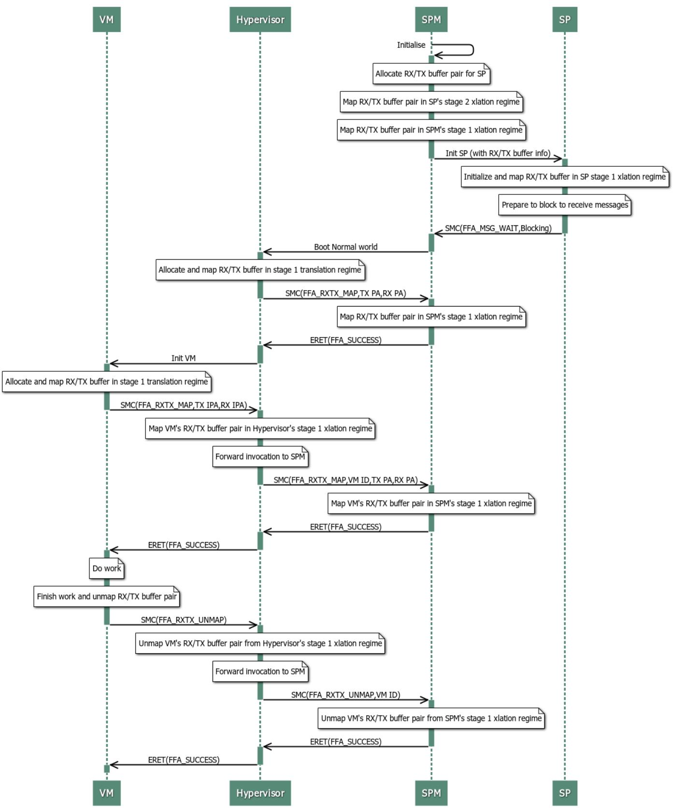  
Figure 4.9: RX/TX Buffer setup

R<sub>0032</sub> After a buffer is mapped in both the Producer and Consumer’s translation regimes and before it is first used, it is owned by its Producer.

I<sub>0033</sub> When an invocation of an FFA\_RXTX\_MAP call completes successfully, the caller is the owner of the TX buffer and the callee is the owner of the RX buffer.

R<sub>0034</sub> A Producer writes to a buffer when it owns the buffer. Otherwise, the result of the write is unpredictable as it could overwrite information being read by the Consumer.

R<sub>0035</sub> A Consumer reads from a buffer when it owns the buffer. Otherwise, the result of the read is unpredictable as invalid information could be read, because the Producer is writing to the buffer concurrently.

I<sub>0036</sub> After a Producer writes to a buffer, its ownership is transferred to the Consumer for reading the buffer. After a Consumer reads from a buffer, its ownership is transferred back to the Producer.

R<sub>0037</sub> The ownership of a TX buffer is transferred from the Producer to the Consumer upon invocation of an FF-A ABI that uses the TX buffer. Completion of the invocation of the FF-A ABI transfers the ownership of the TX buffer back to the Producer.

S<sub>0038</sub> An invocation of the FFA\_MSG\_SEND2 ABI transfers the ownership of the TX buffer from the Producer to the Consumer. Completion of an FFA\_MSG\_SEND2 ABI invocation transfers the ownership of the buffer from the Consumer to the Producer.

R<sub>0039</sub> The ownership of a RX buffer is transferred from the Producer to the Consumer upon invocation of an FF-A ABI that uses the RX buffer. An invocation of the following FF-A ABIs transfers the ownership of the RX buffer from the Consumer to the Producer.

• FFA\_MSG\_WAIT if the Retain RX Buffer Ownership flag is set to b’0 (see Table 14.3).

• FFA\_RX\_RELEASE.

See also:

• 14.1 FFA\_MSG\_WAIT.

• 13.5 FFA\_RX\_RELEASE.

Completion of an FFA\_NOTIFICATION\_GET or FFA\_NOTIFICATION\_GET2 ABI invocation by the Consumer, that signals the RX buffer full notification, transfers the ownership from the Producer to the Consumer.

Completion of the FFA\_PARTITION\_INFO\_GET ABI transfers the ownership of the RX buffer from the Producer to the Consumer.

Completion of the FFA\_NS\_RES\_INFO\_GET ABI transfers the ownership of the RX buffer from the Producer to the Consumer.

An invocation of the FFA\_MEM\_RETRIEVE\_RESP ABI [1] transfers the ownership of the RX buffer from the Producer to the Consumer.

See also:

• 10.8.1 RX buffer full notification.

• 16.6 FFA\_NOTIFICATION\_GET.

• 13.8 FFA\_PARTITION\_INFO\_GET.

• 13.13 FFA\_NS\_RES\_INFO\_GET.

FFA\_MSG\_WAIT transfers the ownership of the RX buffer to the Producer unless Retain RX buffer ownership flag is set (see Table 14.3).

On an MP endpoint, it is desirable to set this flag to avoid transfer of ownership of the RX buffer on one CPU, when another CPU is accessing the RX buffer. An example scenario is listed below:

• CPU0 receives an indirect message in its RX buffer via the RX buffer full notification. It acquires ownership of the RX buffer when the FFA\_NOTIFICATION\_GET or FFA\_NOTIFICATION\_GET2 ABI completes and starts reading the message from the buffer.

• CPU1 receives an interrupt via the FFA\_INTERRUPT ABI. After the interrupt is handled, the FFA\_MSG\_WAIT ABI is called.

If CPU1 does not set the Retain RX buffer ownership flag, the ownership of the RX buffer is transferred to the Producer while CPU0 is accessing the buffer. The Producer could write to the buffer and corrupt the indirect message payload. To avoid this scenario, the invocation of FFA\_MSG\_WAIT on CPU1 should set the Retain RX buffer ownership flag.

Arm strongly recommends that a caller always sets the Retain RX buffer Ownership flag in an invocation of the FFA\_MSG\_WAIT ABI unless there is an explicit need to relinquish ownership of the RX buffer, and the buffer is not being concurrently accessed on another CPU.

I<sub>0042</sub> Both the Hypervisor and the SPMC are Producers of a VM’s RX buffer.

R<sub>0043</sub> The SPMC is the owner of a VM’s RX buffer at the time of setup.

R<sub>0044</sub> The Hypervisor uses the FFA\_RX\_ACQUIRE ABI to acquire ownership of a VM’s RX buffer from the SPMC. See also:

## • 13.4 FFA\_RX\_ACQUIRE.

R<sub>0045</sub> The Hypervisor uses the FFA\_RX\_RELEASE ABI to release ownership of a VM’s RX buffer to the SPMC. See also:

• 13.5 FFA\_RX\_RELEASE.

I<sub>0046</sub> The Hypervisor does not acquire and release ownership of a VM’s RX buffer if the SPMC does not implement the FFA\_RX\_ACQUIRE ABI.

S<sub>0047</sub> An RX/TX buffer could be subject to concurrent accesses in an FF-A component that is the Producer or Consumer of the buffer. The FF-A component uses IMPLEMENTATION DEFINED synchronization mechanisms to protect the buffer from such concurrent accesses.

For example, multiple instances of the SPM run concurrently on different PEs. As the Producer of an RX buffer or as a Consumer of a TX buffer, the SPM can use a spinlock to protect each buffer from concurrent accesses made by its own instances.

## 5.1 Overview

The Firmware Framework is responsible for partition and partition manager setup during a cold and warm boot. This chapter describes how the Framework initializes the execution context of these components on the primary PE during a cold boot. See 18.2 Power Management for the role of the Framework in partition and partition manager setup during a cold boot of a secondary PE or a warm boot of any PE.

• In the Secure world,

– The SPMD initializes the following components.

The SPMC (also see 4.1 SPM architecture). If they reside in the same exception level, initialization is done in an IMPLEMENTATION DEFINED manner.

If they reside in separate exception levels, initialization is done either in an IMPLEMENTATION DEFINED manner or by using the following guidance.

· The SPMC manifest (see 5.2.2 SPMC manifest) to determine information such as the entry point address, execution state and Framework version of the SPMC.

· Guidance on programming general-purpose and system registers prior to invoking the SPMC entry point (see 5.3 Register state).

· Protocol for passing any boot information to the SPMC (see 5.4 Boot information protocol).

· Protocol for indicating completion of initialization (see 5.5 Protocol for completing execution context initialization).

Any co-resident LSPs (see 4.1.4 Logical Secure Partitions) if present. The initialization is done in an IMPLEMENTATION DEFINED manner

– The SPMC initializes each SP. If they reside in the same exception level (see 4.1.2 S-EL1 SPM core component and 4.1.3 EL3 SPM core component), initialization is done in an IMPLEMENTATION DEFINED manner. For example, the information required to initialize the LSP in the S-EL1 SPMC configuration could be encoded in the SPMC manifest.

If they reside in separate exception levels, the SPMC uses the SP manifest (see 5.2.1 Partition manifest) to initialize the SP as described below.

1. Validates the contents of the manifest.

2. Configures the partition as per the properties described in the manifest.

3. Assigns the requested physical address space ranges and system resources to the partition.

4. Isolates a physical SP as per the mechanism described for the SPMC configuration in 4.1 SPM architecture).

5. Programs the general-purpose and system register prior to invoking the SP entry point as described in 5.3 Register state.

6. Uses the protocol described in 5.4 Boot information protocol for passing any boot information to the SP.

7. Uses the state transitions described in 7.4.1 Starting an SP execution context to initialize the SP execution context.

## • In the Normal world,

– The Hypervisor or the OS kernel is initialized through an IMPLEMENTATION DEFINED mechanism after the Secure world hands control to the Normal world during cold boot.

– The Hypervisor initializes each VM through an IMPLEMENTATION DEFINED mechanism.

## 5.2 Manifests

## 5.2.1 Partition manifest

The following information must be specified in the manifest of a partition.

• Partition properties as described in Table 5.1.

• Memory regions as described in Table 5.2 (for more information see also [1]).

• Devices as described in Table 5.3.

• Partition boot protocol as described in Table 5.10.

The following aspects of the partition manifest are IMPLEMENTATION DEFINED.

• Format of the manifest.

• Time of creation of manifest. This could be at:

– Build time.

– Boot time.

– Combination of both.

• Mechanism used by the Hypervisor and SPM to obtain the information in the manifest and interpret its contents.

Table 5.1: Partition properties

<table><tr><td>Information fields</td><td>Mandatory</td><td>Description</td></tr><tr><td>FF-A version</td><td>Yes</td><td>• Version of FF-A expected by the partition at the FF-A instance it will execute.</td></tr><tr><td>Partition ID</td><td>No</td><td>• Pre-allocated partition ID.</td></tr><tr><td>Protocol UUIDs</td><td>Yes</td><td>• List of protocol UUIDs associated with the partition. Also see 6.2.3 Protocol UUID usage.</td></tr><tr><td>Image UUID</td><td>No</td><td>• The image UUID of this partition. Also see 6.2.3 Protocol UUID usage.</td></tr><tr><td>Messaging method</td><td>Yes</td><td>• This field specifies which messaging methods are supported by the partition for each UUID exported by it. This could be one or both of Direct and Indirect messaging. These methods are described in Chapter 8 Message passing. The following information must be provided in the manifest: - Indirect messaging is supported. This always includes support for both sending and receiving Indirect messages. - Direct messaging is supported. 8.3.1 Discovery and setup specifies the information that must be provided. • If the partition is associated with multiple protocol UUIDs and a subset of UUIDs are accessible by a specific messaging method, a mapping between a protocol UUID and messaging method can be provided. For more information see 6.2.3 Protocol UUID usage.</td></tr><tr><td>Auxiliary IDs</td><td>No</td><td>• List of pre-allocated 16-bit IDs that could be used in memory management transactions to allow a partition manager to handle the transaction in an IMPLEMENTATION DEFINED manner.</td></tr><tr><td>Name</td><td>No</td><td>• Name of the partition for example, for debugging purposes.</td></tr><tr><td>Number of execution contexts</td><td>Yes</td><td>Number of vCPUs that a VM or SP wants to instantiate.In the absence of virtualization, this is the number of execution contexts that a partition implements.If value of this field = 1 and number of PEs &gt; 1 then the partition is treated as UP &amp; migrate capable.If the value of this field &gt; 1 then the partition is treated as an MP capable partition irrespective of the number of PEs.See also R_WBYY about restrictions on the value of this field if Direct messaging is supported.</td></tr><tr><td>Run-time EL</td><td>Yes</td><td>EL1 or Secure EL1.Secure EL0.</td></tr><tr><td>Execution state</td><td>Yes</td><td>AArch64.AArch32.</td></tr><tr><td>Load address</td><td>No</td><td>Absence of this field indicates that the partition is position independent and can be loaded at any address chosen at boot time.</td></tr><tr><td>Entry point offset</td><td>No</td><td>Absence of this field indicates that the entry point is at offset 0x0 from the base of the partition binary image.If present, this field specifies the offset of the entry point from the base of the partition binary image.</td></tr><tr><td>Translation Granule</td><td>No</td><td>4KB (default value if not specified).16KB.64KB.</td></tr><tr><td>Boot order</td><td>No</td><td>A unique number among all partitions that specifies if this partition must be booted before others.For example, a partition could provide a service that other partitions need to initialize themselves. The manifest of this partition can use this field to ensure it is booted before others.</td></tr><tr><td>RX/TX information</td><td>No</td><td>Reference to memory region entries in this manifest that describes the RX/TX buffers expected by the partition.The memory region entries must specify the base addresses of both buffers.The size and attributes fields must fulfill the requirements specified in 4.10 RX/TX buffers.</td></tr><tr><td>Notification support</td><td>No</td><td>This field specifies if the partition supports receipt of notifications as described in Chapter 10 Notifications.Absence of this field indicates that the partition cannot receive notifications.</td></tr><tr><td>Extended Notification Support for VMs</td><td>No</td><td>This field specifies the count of VM notifications that can be signalled as described in Chapter 10 Notifications where 64 &lt;= count &lt;= 384.This field is ignored if the partition does not support notifications.If the partition supports notifications and this field is absent, 64 VM notifications are allocated to the partition.If the partition manager does not support the count requested, the partition manager does not boot the endpoint.</td></tr><tr><td>Extended Notification Support for SPs</td><td>No</td><td>This field specifies the count of SP notifications that can be signalled as described in Chapter 10 Notifications where 64 &lt;= count &lt;= 384.This field is ignored if the partition does not support notifications.If the partition supports notifications and this field is absent, 64 SP notifications are allocated to the partition.If the partition manager does not support the count requested, the partition manager does not boot the endpoint.</td></tr></table>

Chapter 5. Setup 5.2. Manifests

<table><tr><td>Information fields</td><td>Mandatory</td><td>Description</td></tr><tr><td>Primary Scheduler implemented</td><td>No</td><td>Presence of this field indicates that the partition implements the primary scheduler.Run-time EL must be EL1 if this field is specified.</td></tr><tr><td>Run-time model</td><td>No</td><td>If the run-time EL is S-EL0 then this field specifies the run-time model that the SPM must enforce for this SP.- Run to completion. SP execution must not be preempted. An execution context of this SP must only transition between the waiting and running states described in Chapter 7 Partition lifecycle.Preemptible. SP execution can be preempted. An execution context of this SP can transition between all states described in 7.4.2 Runtime model of an SP execution context This is the default run-time model for a S-EL0 SP if this field is not specified in the partition manifest.This field is deprecated in v1.1 of the Framework. Please see 9.4 Support for legacy run-time models for more details.</td></tr><tr><td>Action in response to Non-secure interrupts</td><td>Yes</td><td>This field specifies the action that the SPMC must take in response to a Non-secure physical interrupt as described in 9.3.1 Actions for a Non-secure interrupt.This field supersedes the Managed exit supported field in the FF-A v1.0 specification.</td></tr><tr><td>Tuples of (Name, SEPID, SMMU ID, Stream IDs)</td><td>No</td><td>If present, then each tuple specifies the association between its members that the partition manager must create. The members are as follows.- Stream endpoint ID that this endpoint is a proxy for. The dependent device must not be assigned to this endpoint (see 4.2.3 Other DMA isolation models).- SMMU ID identifies the SMMU instance on a system with multiple SMMUs.One or more Stream IDs that associate the device that generates them with the SEPID in the SMMU identified by SMMU ID.An optional Name for the SEPID for debugging purposes.</td></tr><tr><td>VM availability messages</td><td>No</td><td>This field specifies the VM availability messages the SP is interested in receiving. See 18.3 VM availability signaling.</td></tr><tr><td>Power management messages</td><td>No</td><td>This field specifies the power management messages the SP is interested in receiving. See 18.2.4 Power Management messages.</td></tr><tr><td>Cold boot reason register</td><td>No</td><td>Presence of this field indicates that the partition expects that the entry point offset field must be reused for a secondary cold boot (see 18.2 Power Management and 18.2.2 Secondary boot protocol).The reset reason is encoded in a general-purpose register as follows.- Value of 0 in the register indicates a primary cold boot.- Value of 1 in the register indicates a secondary cold boot.The register is specified in this field. Register must be between w0/x0-w7/x7. The width of the register is derived from its Execution state specified in the partition manifest.The specified register must be distinct from the register used to carry the address of the boot information blob specified in Table 5.10. The partition is not initialized if there is a clash.</td></tr></table>

Chapter 5. Setup 5.2. Manifests

<table><tr><td>Information fields</td><td>Mandatory</td><td>Description</td></tr><tr><td>Live activation supported</td><td>No</td><td>This field specifies if the partition can be live activated.The following fields in the partition manifest are mandatory if it can be live activated:- Image UUID.- CPU rendezvous required.- Live activation information register.</td></tr><tr><td>CPU rendezvous required</td><td>No</td><td>This field specifies if the partition requires CPU rendezvous in order to be live activated. See also [7].</td></tr><tr><td>Live activation information register</td><td>No</td><td>This field specifies the register that describes if the partition is undergoing live activation when its first execution context enters the starting state.The live activation status is encoded in the general-purpose register as follows:- Bit[63:1]: Reserved (MBZ).- Bit[0]: Live activation status.* 0b’0: This partition is not undergoing live activation.* 0b’1: This partition is undergoing a live activation.The register must be between x0-x7.The register must be distinct from the following registers:- Cold boot reason register.- Boot information address register.* See also Table 5.10.</td></tr><tr><td>64-bit CPU cycle management supported</td><td>No</td><td>This field specifies if the partition supports the SMC64 CPU cycle management FIDs. See also 11.1.2 Parameter Register Preservation.</td></tr></table>

Table 5.2: Memory regions

<table><tr><td>Information fields</td><td>Mandatory</td><td>Description</td></tr><tr><td>Base address or Load address relative offset</td><td>No</td><td>Absence of this field indicates that a memory region of specified size and attributes must be mapped into the partition translation regime. The PM must describe the memory region to the partition through an IMPLEMENTATION DEFINED mechanism.If present, this field could specify a PA, VA (for S-EL0 partitions), IPA (for S-EL1 and EL1 partitions) or a positive offset (for S-EL0 partitions) relative to theLoad addressof the partition image. This information must be specified using an IMPLEMENTATION DEFINED mechanism.If a PA is specified, then the memory region must be identity mapped with the same IPA or VA as the PA.If a VA or IPA is specified, then the memory could be identity or non-identity mapped.If an offset is specified, this must be indicated in the manifest through an IMPLEMENTATION DEFINED mechanism.If present, the address or offset must be aligned to the Translation granule size.</td></tr><tr><td>Page count</td><td>Yes</td><td>Size of memory region expressed as a count of 4K pages.For example, if the memory region size is 16K, value of this field is 4.</td></tr><tr><td>Attributes</td><td>Yes</td><td>·Memory access permissions. - Instruction access permission. - Data access permission. ·Memory region attributes. - Memory type. - Shareability attributes. - Cacheability attributes. ·Memory Security state. - Non-secure for a NS-Endpoint. - Non-secure or Secure for an S-Endpoint.</td></tr><tr><td>Guarded memory region</td><td>No</td><td>·If present, this field specifies if the memory region is Guarded or non-Guarded (see [6]), the partition manager does not boot the partition if any of the following conditions are true: - Run-time EL is EL1. - The memory region is Guarded and not executable. - FEAT_BTI is not supported. ·Absence of this field indicates the memory region is non-Guarded. ·On systems that implement FEAT_BTI, the partition manager may enable this feature irrespective of whether this field is specified.</td></tr><tr><td>Name</td><td>No</td><td>·Name of the memory region for example, for debugging purposes.</td></tr><tr><td>Stream &amp; SMMU IDs</td><td>No</td><td>·Identity of the SMMU and stream IDs of a device upstream of the SMMU that can access this memory region with the access permissions specified in the stream ID access permissions field.</td></tr><tr><td>Stream ID access permissions</td><td>No</td><td>·Device access permissions for each Stream ID if the Stream and SMMU IDs field is present. - Instruction access permission. - Data access permission.</td></tr><tr><td>Preserve during live activation</td><td>No</td><td>·If present, this field specifies if this memory region is preserved during a live activation of this SP. ·See also 18.10 Live firmware activation.</td></tr></table>

## Table 5.3: Device regions

<table><tr><td>Information fields</td><td>Mandatory</td><td>Description</td></tr><tr><td>Physical base address</td><td>Yes</td><td>PA of base of a device MMIO region.If the MMIO region is not physically contiguous, then an entry for each physically contiguous constituent region must be specified.Each entry must specify the PA and size of the constituent region. The size must be expressed as a count of 4K pages.</td></tr><tr><td>Page count</td><td>Yes</td><td>Total size of MMIO region expressed as a count of 4K pages.For example, if the MMIO region size is 16K, value of this field is 4.</td></tr><tr><td>Attributes</td><td>Yes</td><td>Memory attributes must be Device-nGnRnE.Instruction access permission must be not executable.Data access permissions must be one of the following:- Read/write.- Read-only.Security attributes must be:- Non-secure for a NS-Endpoint.- Non-secure or Secure for an S-Endpoint.</td></tr><tr><td>Interrupts</td><td>No</td><td>List of physical interrupt IDs.Attributes of each interrupt ID.- Interrupt type.* SPI.* PPI.* SGI.- Interrupt configuration.* Edge triggered.* Level triggered.- Interrupt Security state.* Secure.* Non-secure.- Interrupt priority value.* This is a virtual priority value for a S-EL1 SP that runs under the S-EL2 SPMC.- Target execution context/vCPU for each SPI.* This field is optional even if other interrupt properties are specified since interrupt affinity could be managed through an IMPLEMENTATION DEFINED interface between the endpoint and its partition manager.</td></tr><tr><td>SMMU ID</td><td>No</td><td>If present, then on a system with multiple SMMUs, this field must help the partition manager determine which SMMU instance is this device upstream of.Absence of this field implies that the device is not upstream of an SMMU.</td></tr><tr><td>Stream IDs</td><td>No</td><td>List of Stream IDs assigned to this device.Absence of Stream ID list indicates that the device is not upstream of an SMMU.</td></tr><tr><td>Exclusive access and ownership</td><td>No</td><td>If present, this field implies that this endpoint must be granted exclusive access and ownership of the MMIO region of the device.Absence of this field implies that access to the MMIO region of the device could be shared among multiple endpoints.</td></tr><tr><td>Name</td><td>No</td><td>Name of the device region for example, for debugging purposes.</td></tr></table>

## 5.2.2 SPMC manifest

The following aspects of the SPMC manifest are IMPLEMENTATION DEFINED.

• Format of the manifest.

• Time of creation of the manifest. This could be at:

– Build time.

– Boot time.

– Combination of both.

• Mechanism used by the SPMD to obtain information in the manifest and interpret its contents.

Table 5.4: SPMC properties

<table><tr><td>Information fields</td><td>Mandatory</td><td>Description</td></tr><tr><td>FF-A version</td><td>Yes</td><td>• Version of Firmware Framework implemented by the SPMC component. See 13.2 FFA_VERSION for more information about the usage of this field.</td></tr><tr><td>SPMC ID</td><td>No</td><td>• Pre-allocated ID for the SPMC.</td></tr><tr><td>Execution state</td><td>Yes</td><td>• AArch64.• AArch32.</td></tr><tr><td>Load address</td><td>No</td><td>• Absence of this field indicates that the SPMC image is position independent and can be loaded at any address chosen at boot time.</td></tr><tr><td>Entry point offset</td><td>No</td><td>• Absence of this field indicates that the entry point is at offset 0x0 from the base of the SPMC binary image.• If present, this field specifies the offset of the entrypoint from the base of the SPMC binary image.</td></tr><tr><td>FF-A boot protocol usage</td><td>No</td><td>• See Table 5.10.</td></tr><tr><td>Cold boot reason register</td><td>No</td><td>• Presence of this field indicates that the SPMC expects that the entry point offset field must be reused for a secondary cold boot (see 18.2 Power Management and 18.2.2 Secondary boot protocol).• The reset reason is encoded in a general-purpose register as follows.- Value of 0 in the register indicates a primary cold boot.- Value of 1 in the register indicates a secondary cold boot.• The register is specified in this field. Register must be between w0/x0-w7/x7. The width of the register is derived from its Execution state specified in the SPMC manifest.</td></tr></table>

## 5.2.3 Independent peripheral device manifest

This manifest must be used by independent peripheral devices to describe their properties to a partition manager. See 4.2.3 Other DMA isolation models for more details.

Table 5.5: Device properties

<table><tr><td>Information fields</td><td>Mandatory</td><td>Description</td></tr><tr><td>FF-A version</td><td>Yes</td><td>• Version of the Firmware Framework expected by the device.</td></tr><tr><td>Name</td><td>No</td><td>• Name of the partition for example, for debugging purposes.</td></tr><tr><td>Translation Granule</td><td>Yes</td><td>• 4KB.• 16KB.• 64KB.</td></tr><tr><td>SEPID</td><td>Yes</td><td>• Pre-allocated Stream endpoint ID.</td></tr></table>

Table 5.6: Memory regions accessible by the device

<table><tr><td>Information fields</td><td>Mandatory</td><td>Description</td></tr><tr><td>Base address</td><td>Yes</td><td>This field could specify a PA or IPA. This distinction must be specified using an IMPLEMENTATION DEFINED mechanism.If a PA is specified, then the memory region must be identity mapped with the same IPA as the PA.If an IPA is specified, then the memory could be identity or non-identity mapped.The address must be aligned to the Translation granule size.</td></tr><tr><td>Page count</td><td>Yes</td><td>Size of memory region expressed as a count of 4K pages.For example, if the memory region size is 16K, value of this field is 4.</td></tr><tr><td>Properties</td><td>Yes</td><td>Memory region properties (see [1]).Security attributes.Non-secure for a Non-secure device.Non-secure or Secure for a Secure device.</td></tr><tr><td>Name</td><td>No</td><td>Name of the memory region for example, for debugging purposes.</td></tr></table>

## Table 5.7: Device regions

<table><tr><td>Information fields</td><td>Mandatory</td><td>Description</td></tr><tr><td>Physical base address</td><td>Yes</td><td>PA of base of a device MMIO region.If the MMIO region is not physically contiguous, then an entry for each physically contiguous constituent region must be specified.Each entry must specify the PA and size of the constituent region. The size must be expressed as a count of 4K pages.</td></tr><tr><td>Properties</td><td>Yes</td><td>Memory type must be Device-nGnRnE.Instruction access permission must be not executable.Data access permissions must be one of the following:- Read/write.- Read-only.Security attributes must be:- Non-secure for a Non-secure device.- Non-secure or Secure for a Secure device.</td></tr><tr><td>Page count</td><td>Yes</td><td>Total size of MMIO region expressed as a count of 4K pages.For example, if the MMIO region size is 16K, value of this field is 4.</td></tr><tr><td>SMMU ID</td><td>Yes</td><td>On a system with multiple SMMUs, this field must help a partition manager determine which SMMU instance is this device upstream of.</td></tr><tr><td>Stream IDs</td><td>Yes</td><td>List of Stream IDs assigned to this device.</td></tr><tr><td>Name</td><td>No</td><td>Name of the device region for example, for debugging purposes.</td></tr></table>

## 5.3 Register state

The partition manager must program system and general-purpose registers that influence partition execution as follows.

• The MMU must be disabled for a partition that does not run in S-EL0 in either Execution state. The MMU must be enabled for S-EL0 partition that runs in either Execution state

• The partition manager must ensure that all memory regions allocated to a partition are clean to the Point of Coherency. Also, there must be no stale cached copies of executable memory held in any instruction caches visible to a PE on which the execution contexts of the partition may execute.

This could be achieved by executing cache maintenance instructions, after initializing the memory regions for a partition.

• The state of other System registers is IMPLEMENTATION DEFINED. If the partition manager must program a System register to fulfill a specific partition requirement then this must be encoded in its manifest through an IMPLEMENTATION DEFINED mechanism.

– For example, an S-EL0 partition could want the instruction alignment check to be disabled by setting SCTLR\_EL1.A, bit[1] = b’0.

• The state of general-purpose registers is IMPLEMENTATION DEFINED. Also see Table 5.10.

## 5.4 Boot information protocol

An SP or SPMC could rely on boot information for their initialization e.g. a flattened device tree with nodes to describe the devices and memory regions assigned to the SP or SPMC. The Framework specifies a protocol that can be used by a producer to pass boot information to a consumer at a Secure FF-A instance. The Framework assumes that the boot information protocol is used by a producer and consumer pair that reside at adjacent exception levels as listed below.

1. SPMD (producer) and an SPMC (consumer) in either S-EL1 or S-EL2.

2. An SPMC (producer) and SP (consumer) pair listed below.

1. EL3 SPMC and a Logical S-EL1 SP.

2. S-EL2 SPMC and Physical S-EL1 SP.

3. EL3 SPMC and a S-EL0 SP.

4. S-EL2 SPMC and a S-EL0 SP.

5. S-EL1 SPMC and a S-EL0 SP.

The boot information protocol used by a producer and consumer pair that reside at the same exception level is IMPLEMENTATION DEFINED.

The Framework also makes the following assumptions about the usage of the boot information protocol between a producer and consumer pair.

1. Boot information is passed only to the consumer execution context that is initialized on the primary PE by the producer.

2. Boot information is passed when the consumer execution context on the primary PE is first entered through an exception return from the producer.

3. Boot information is encoded in a format chosen by the consumer and the producer through an IMPLEMENTA-TION DEFINED mechanism e.g. a flattened device tree, a handover block list (HOB list) etc.

4. One or more distinct instances of boot information could be passed from the producer to the consumer.

A producer maintains backwards compatibility while using the boot information protocol described in this or an earlier version of the Framework. A consumer requests usage of the boot information protocol by specifying the corresponding field in their manifest (see Table 5.10). A consumer also specifies the version of the Framework it implements in its manifest. A producer parses the manifest of the consumer for this information and ensures it uses the boot information protocol specified in the version of the Framework specified in the manifest.

## 5.4.1 Boot information descriptor

The Framework defines a descriptor (see Table 5.8) to describe an distinct instance of boot information.

Table 5.8: Boot information descriptor

<table><tr><td>Field</td><td>Byte length</td><td>Byte offset</td><td>Description</td></tr><tr><td>Name</td><td>16</td><td>0</td><td>• Name of boot information passed to the consumer.</td></tr></table>

Chapter 5. Setup 5.4. Boot information protocol

<table><tr><td>Field</td><td>Byte length</td><td>Byte offset</td><td>Description</td></tr><tr><td>Type</td><td>1</td><td>16</td><td>• Type of boot information passed to the consumer. - Bit[7]: Boot information type. * b'0: Standard boot information. * b'1: IMPLEMENTATION DEFINED boot information. - Bit[6:0]: Boot information identifier. * Standard boot information (bit[7] = b'0). · 0: Flattened device tree (FDT). · 1: Hand-Off Block (HOB) List. · All other identifiers are reserved. * IMPLEMENTATION DEFINED identifiers (bit[7] = b'1). · Identifier is defined by the implementation.</td></tr><tr><td>Reserved</td><td>1</td><td>17</td><td>• Reserved (MBZ).</td></tr><tr><td>Flags</td><td>2</td><td>18</td><td>• Flags to describe properties of boot information associated with this descriptor. - Bits[15:4]: Reserved (MBZ). - Bits[3:2]: Format of Contents field. * b'00: Address of boot information identified by the Name and Type fields. * b'01: Value of boot information identified by the Name and Type fields. * b'10: Offset to the boot information identified by the Name and Type fields. * All other bit encodings are reserved for future use. - Bits[1:0]: Format of Name field. * b'0: Null terminated string. * b'1: UUID encoded in little-endian byte order. * All other bit encodings are reserved for future use.</td></tr><tr><td>Size</td><td>4</td><td>20</td><td>• Size (in bytes) of boot information identified by the Name and Type fields.</td></tr><tr><td>Contents</td><td>8</td><td>24</td><td>• Value, address or offset (see Flags field) of boot information identified by the Name and Type fields.- If in the Flags field, Bits[3:2] = b’00,* The address has the same attributes as the boot information blob address described in 5.4.3 Boot information address.* Size field contains the length (in bytes) of boot information at the specified address.- If in the Flags field, Bits[3:2] = b’01,* Size field contains the exact size of the value specified in this field.* Size is &gt;= 1 bytes and &lt;= 8 bytes.- If in the Flags field, Bits[3:2] = b’10,* The offset specified is relative to the base address of the boot information blob.* Size field contains the length (in bytes) of boot information at the offset address.</td></tr></table>

The fields of the descriptor are described below.

1. The Name and Type fields uniquely identify the boot information. The Type field is the primary identification mechanism. The Name field can be used as a secondary identification mechanism. This is described in the following usage models.

1. The Type field identifies the format in which boot information is encoded and the Name field identifies the contents of the boot information. For example,

1. An SP could consume two distinct FDTs during initialization. The Type field would be used to identify that boot information is encoded in the device tree format. The Name field could be a NULL terminated 15-byte string or a 16-byte UUID to identify what information is specified in an FDT.

2. The Type field identifies both the format and the contents of the boot information. For example, an SP could consume a HOB list during initialization.

The Type field uniquely identifies the format and contents of the boot information in both examples. The Name field could be unused or a NULL terminated string for debugging purposes.

The Flags field is used to specify whether the Name field encodes a NULL terminated string or a UUID.

2. The Contents and Size fields allow boot information to be,

1. Either referenced from the descriptor by populating the address of the boot information in the Contents field.

2. Or encoded in the descriptor in the Contents field. This is subject to the width of the Contents field.

The Flags field is used to specify whether the Contents field encodes the boot information or a reference to it.

## 5.4.2 Boot information header

The producer passes one or more instances of boot information to a consumer as an array of boot information descriptors (see Table 5.8). The array is preceded by a boot information header defined in Table 5.9.

The combination of boot information referenced from the boot information descriptor array, the array itself and the boot information header is called the Boot information blob.

Table 5.9: Boot information header

<table><tr><td>Field</td><td>Byte length</td><td>Byte offset</td><td>Description</td></tr><tr><td>Signature</td><td>4</td><td>0</td><td>Hexadecimal value 0xOFFA to identify the header.</td></tr><tr><td>Version</td><td>4</td><td>4</td><td>Version of the boot information blob encoded as per the Input version number field in Table 13.4.</td></tr><tr><td>Size of boot information blob</td><td>4</td><td>8</td><td>Size of boot information blob spanning contiguous memory.</td></tr><tr><td>Boot information descriptor size</td><td>4</td><td>12</td><td>Size of each boot information descriptor in the array (see Table 5.8).</td></tr><tr><td>Boot information descriptor count</td><td>4</td><td>16</td><td>Count of boot information descriptors in the array.</td></tr><tr><td>Boot information descriptor array offset</td><td>4</td><td>20</td><td>Offset to array of boot information descriptors.</td></tr><tr><td>Reserved</td><td>8</td><td>24</td><td>Reserved (MBZ).</td></tr><tr><td>Optional padding</td><td>-</td><td>32</td><td>This field is not a part of the boot information header. It has been included only for informational purposes.</td></tr><tr><td>Boot information descriptor array</td><td>-</td><td>-</td><td>Array of boot information descriptors.</td></tr></table>

The fields of the boot information header are described below.

1. The Signature field is a magic number to let a consumer ensure that an FF-A boot information blob has been passed by the partition manager.

2. The Version field identifies the version of the boot information blob. This includes the boot information header and descriptor. This version is equal to the version of the Framework (see 13.2.2.1 Version negotiation).

The producer determines the version of the Framework implemented by a consumer through its manifest (see Table 5.1) or an IMPLEMENTATION DEFINED mechanism.

The producer ensures that the version of the boot information blob passed to a consumer is the same as the version of the Framework implemented by the consumer.

3. The Size of boot information blob field specifies the size of the blob that spans one or more contiguous 4K pages used by the producer to populate it. It is calculated by adding the following values.

1. Boot information descriptor array offset.

2. Product of Boot information descriptor count and Boot information descriptor size.

3. Total size of all boot information referenced by boot information descriptors.

This is determined by adding the values in the Size field of each boot information descriptor whose Contents field contains an address or offset

4. Any padding between,

1. The boot information descriptor array and the boot information referenced from it.

2. Distinct instances of boot information referenced from the boot information descriptor array.

This field enables a consumer to map all of the boot information blob in its translation regime (not managed by the producer) or copy it to another memory location without parsing each element in the boot information descriptor array.

4. The Boot information descriptor size field contains the size of the descriptor. This enables a consumer to parse the array without relying on a static association between the Framework version it implements and the size of the boot information descriptor in that version of the Framework

5. The Boot information descriptor count field contains the number of descriptors in the boot information descriptor array.

6. The Boot information descriptor array offset field is the offset from the base address of the Boot information header to the first element in the Boot information descriptor array. The offset must be aligned to the 8-byte boundary.

Figure 5.1 illustrates an example boot information array that includes,

1. A reference to a FDT whose name is identified by a UUID. The FDT blob is populated at the next available address after the boot information array.

2. IMPLEMENTATION DEFINED boot information encoded as a value in the boot information descriptor.

The boot information array and FDT blob fit in a single 4K page.

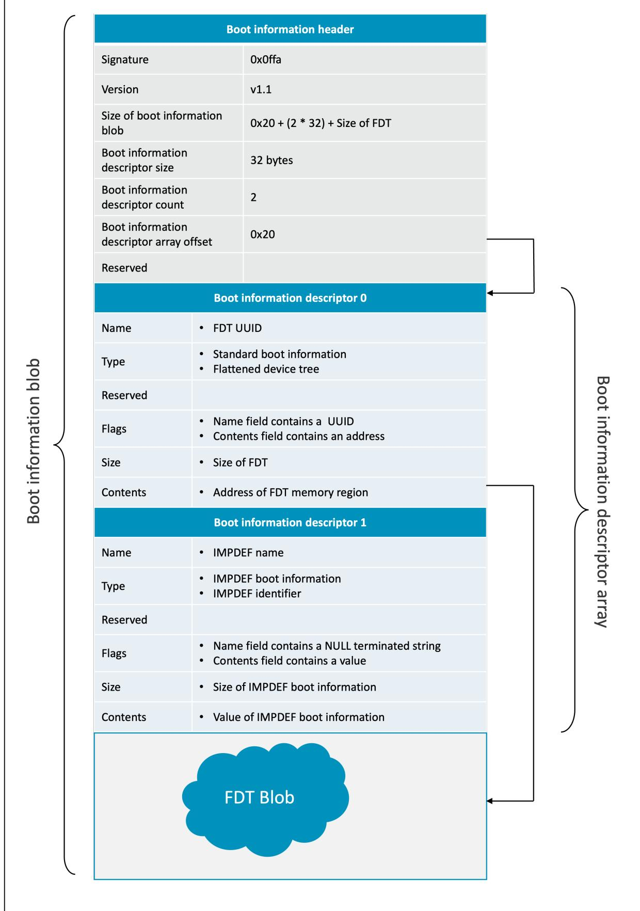  
Figure 5.1: Example boot information array

## 5.4.3 Boot information address

The producer passes the address of the boot information blob to a consumer in a general purpose register specified in the consumer manifest (see Table 5.10). The presence of this field in the consumer manifest enables the producer to discover that the consumer expects the boot information blob to be passed through the FF-A boot information protocol. The boot information blob address is,

1. A VA for a S-EL0 SP at the Secure virtual FF-A instance.

2. An IPA for a Physical S-EL1 SP at the Secure virtual FF-A instance.

3. A PA for a Logical S-EL1 SP, S-EL2 SPMC and S-EL1 SPMC at the Secure physical FF-A instance.

Table 5.10: Boot protocol information

<table><tr><td>Information fields</td><td>Mandatory</td><td>Description</td></tr><tr><td>FF-A boot protocol usage</td><td>No</td><td>The register in which the address of the boot information blob must be passed by the producer. Register must be between  $w0/x0-w3/x3$ . The width of the register is derived from its Execution state specified in the partition manifest.</td></tr></table>

## 5.4.4 Boot information memory requirements

The producer populates the boot information blob in a memory region that fulfill the following requirements.

1. Size of memory region is a multiple of the translation granule size used by the consumer.

2. Address of memory region is aligned to the translation granule size used by the consumer.

3. The memory region is mapped in the translation regime of the consumer that is managed by the producer (see [1]). The producer does not map the memory region in the translation regime of a consumer at the Secure physical FF-A instance.

4. The memory region is mapped in the producer and consumer’s translation regimes with the same memory attributes as the RX/TX buffers as described in 4.10 RX/TX buffers.

5. The memory region comprises of translation granule sized contiguous pages.

1. The pages are physically contiguous at the Secure physical FF-A instance.

2. The pages are virtually contiguous at the Secure virtual FF-A instance.

The boot information blob is populated at offset 0 in the memory region. The Framework uses the little-endian byte order to encode the boot information blob.

The memory region used to populate the boot information blob could be owned by the producer or consumer during the latter’s initialization.

• In the latter case, the consumer specifies a memory region in its manifest or through an IMPLEMENTATION DEFINED mechanism. The producer uses this memory region for populating the boot information blob. The producer maps the memory region in its translation regime to access it. It unmaps the memory region from its translation regime and maps it in the translation regime of the consumer (if applicable) prior to handing control to the consumer for initialization. The consumer is the owner of the memory region from this stage onwards.

• In the former case, the memory region is owned by the producer and shared with a consumer for the duration of its initialization. The consumer should not assume access to the memory region post-initialization (see 5.5 Protocol for completing execution context initialization).

– At the Secure virtual FF-A instance, the producer unmaps the memory region from the translation regime of the consumer that it manages ([1]).

– The Framework strongly recommends that the consumer at the Secure physical FF-A instance does not access the memory region post-initialization.

The producer could reuse the same memory region to pass boot information to multiple consumers. In this case, it ensures that boot information passed to one consumer is cleared in the memory region before boot information for another consumer is populated in the same memory region. The producer performs cache maintenance such that the memory region contents after clearing are coherent between any PE caches, system caches and system memory.

## 5.5 Protocol for completing execution context initialization

A partition must use the FFA\_MSG\_WAIT (also see 14.1 FFA\_MSG\_WAIT) interface or an IMPLEMENTATION DEFINED mechanism to indicate completion of initialization of its execution context to the partition manager.

A partition must use the FFA\_ERROR (also see 12.2 FFA\_ERROR) interface or an IMPLEMENTATION DEFINED mechanism to report an error during initialization of its execution context to the partition manager.

The SPMC initializes an SP execution context as described in 7.4.1 Starting an SP execution context.

# Chapter 6 Identification and Discovery

## 6.1 Partition identification

Partitions are identified in the Framework by a globally unique 16-bit ID. This implies that no two partitions in the Framework can be assigned the same ID. This ID is used in FF-A ABIs to identify the partition e.g. the Sender or receiver of a message, lender or borrower of shared memory.

An ID is assigned to the partition by its partition manager before the partition is initialized. A partition uses the FFA\_ID\_GET interface (also see 13.10 FFA\_ID\_GET) to discover its ID. The ID can be,

1. Specified in the manifest of the partition, validated and assigned by the partition manager. The partition manager does not boot a partition if the ID specified in the manifest cannot be assigned to the partition.

2. Allocated and assigned by the partition manager through an IMPLEMENTATION DEFINED mechanism.

The Hypervisor and SPM are collectively responsible for ensuring that an ID allocated to a partition is globally unique. This is done as described below.

1. Each partition manager ensures that it allocates unique IDs to the partitions it manages i.e. the Hypervisor allocates unique IDs to VMs and SPM does the same for SPs.

2. Both partition managers ensure that IDs are allocated without the risk of the same ID being allocated by both. This is done either through an IMPLEMENTATION DEFINED mechanism or one of the following mechanisms specified by the Framework.

1. The 16-bit partition ID namespace is split into two parts for use by the Hypervisor and SPM as described below.

• Bit[15]: Partition type identifier.

– b’0: Bits[14:0] are reserved for use by the Hypervisor to identify a VM.

– b’1: Bits[14:0] are reserved for use by the SPM to identify an SP.

• Bit[14:0]: IMPLEMENTATION DEFINED value chosen by,

– The Hypervisor if Bit[15] = b’0.

– The SPM if Bit[15] = b’1.

2. The Framework assumes that the SPM always initializes SPs before the Hypervisor initializes VMs. Hence, the SPM allocates IDs for SPs before the Hypervisor allocates IDs for VMs.

In this mechanism, the Hypervisor discovers the IDs assigned to SPs by invoking the

FFA\_PARTITION\_INFO\_GET or FFA\_PARTITION\_INFO\_GET\_REGS ABI at the Non-secure physical FF-A instance with the Nil UUID as the input. It assigns IDs to VMs that are not already used by the SPM for SPs.

The Framework assumes that the system integrator ensures that both the Hypervisor and SPM use the same mechanism.

In a configuration with the S-EL2 or S-EL1 SPMC, LSPs that are co-resident with the SPMD are initialized before the SPMC initializes its SPs. The SPMC must use one of the following mechanisms to ensure that IDs it allocates are unique.

• An IMPLEMENTATION DEFINED mechanism.

• The FFA\_PARTITION\_INFO\_GET\_REGS interface is used with the Nil UUID to discover the IDs of LSPs that are co-resident with the SPMD.

## 6.2 Partition discovery

The identity and other properties of a partition are discovered by an FF-A component as described below.

1. Each partition is associated with one or more UUIDs (Unique Universal Identifier) (see [8]) as follows:

1. An optional single image UUID to uniquely identify the partition image. For example, the image UUID is used by the SPMC to distinguish between multiple SP images when they are initialized during boot time.

2. One or more protocol UUIDs to identify the communication protocols and services implemented by the partition. See also 6.2.3 Protocol UUID usage.

Each UUID is specified in the partition manifest. See also Table 5.1 in 5.2.1 Partition manifest.

The image UUID is not equal to any protocol UUID for a given partition.

All instances of a partition’s image have the same image UUID. E.g. when an SP undergoes live activation, the current SP image and the target SP image have the same image UUID. See also:

• 18.10 Live firmware activation.

2. An FF-A component discovers the identity and properties of a partition by specifying a protocol UUID or a image UUID exported by the partition as an input to the FFA\_PARTITION\_INFO\_GET or FFA\_PARTITION\_INFO\_GET\_REGS interfaces (see 13.8 FFA\_PARTITION\_INFO\_GET and 13.9 FFA\_PARTITION\_INFO\_GET\_REGS). The Nil UUID is used to discover all available partitions and their protocol UUIDs and the image UUID at the FF-A instance where the ABI is invoked.

## 6.2.1 Partition information descriptor

The format of the partition information descriptor changed between Framework versions 1.0 and 1.1. The changes to the FF-A v1.0 descriptor (see Table 18.22) and implementation responsibilities to maintain backward compatibility are specified in 18.5 Changes to FF-A v1.0 data structures for forward compatibility.

Table 6.1: Partition information descriptor

<table><tr><td>Field</td><td>Byte length</td><td>Byte offset</td><td>Description</td></tr><tr><td>Partition ID</td><td>2</td><td>0</td><td>16-bit ID of the partition, stream or auxiliary endpoint.</td></tr><tr><td>Execution context count or Proxy partition ID</td><td>2</td><td>2</td><td>Number of execution contexts implemented by this partition (also see 4.7 Execution context) if Bit[5:4] = b&#x27;00 in the Partition properties field.ID of the proxy endpoint for a dependent peripheral device (see 4.2.3 Other DMA isolation models if Bit[5:4] = b&#x27;10 in the Partition properties field.Reserved (MBZ) for all other encodings of the Partition properties field.</td></tr><tr><td>Partition properties</td><td>4</td><td>4</td><td>Flags to specify partition properties for the UUID described by this descriptor (see also Table 6.2).</td></tr><tr><td>Protocol UUID</td><td>16</td><td>8</td><td>A UUID associated with the partition, stream or auxiliary endpoint (see 6.2.3 Protocol UUID usage) if the Nil UUID or the image UUID was specified as the input parameter.This field is Reserved (MBZ) if a protocol UUID was specified as an input parameter.</td></tr></table>

Chapter 6. Identification and Discovery 6.2. Partition discovery

<table><tr><td>Field</td><td>Byte length</td><td>Byte offset</td><td>Description</td></tr><tr><td>Image UUID</td><td>16</td><td>24</td><td>A UUID to uniquely identify the partition image (see 6.2.3 Protocol UUID usage).The Nil UUID is used if the partition has not specified the image UUID.</td></tr><tr><td>Partition FF-A version.</td><td>4</td><td>40</td><td>Supported FF-A version.- Bit[31]: Reserved (MBZ).Bits[30:16]: Major version number.Bits[15:0]: Minor version number.</td></tr><tr><td>Reserved (MBZ)</td><td>4</td><td>44</td><td>Reserved (MBZ).</td></tr></table>

Table 6.2: Partition properties descriptor

The properties of a partition returned via the discovery ABIs are encoded as shown in Table 6.2.

<table><tr><td>Field</td><td>Description</td></tr><tr><td>Bits[3:0]</td><td>Has the following encoding if Bits[5:4] = b’00. It is Reserved (MBZ) otherwise.- Bit[0] has the following encoding:* b’0: Cannot receive Direct requests via the FFA_MSG_SEND_DIRECT_REQ ABI.* b’1: Can receive Direct requests via the FFA_MSG_SEND_DIRECT_REQ ABI.- Bit[1] has the following encoding:* b’0: Cannot send Direct requests via the FFA_MSG_SEND_DIRECT_REQ ABI.* b’1: Can send Direct requests via the FFA_MSG_SEND_DIRECT_REQ ABI.- Bit[2] has the following encoding:* b’0: Cannot send and receive Indirect messages.* b’1: Can send and receive Indirect messages.- Bit[3] has the following encoding:* b’0: Does not support receipt of notifications.* b’1: Supports receipt of notifications.</td></tr><tr><td>Bits[5:4]</td><td>b’00: Partition ID is a PE endpoint ID.b’01: Partition ID is a SEPID for an independent peripheral device.b’10: Partition ID is a SEPID for an dependent peripheral device.b’11: Partition ID is an auxiliary ID 5.2.1 Partition manifest.</td></tr><tr><td>Bit[6]</td><td>b’0: Partition must not be informed about each VM that is created by the Hypervisor.b’1: Partition must be informed about each VM that is created by the Hypervisor.Bit[6] is used only if the following conditions are true. It is Reserved (MBZ) in all other scenarios.- This ABI is invoked at the Non-secure physical FF-A instance.- The partition is an SP that supports receipt of Direct requests i.e. Bit[0] = b’1.Also see 18.3 VM availability signaling.</td></tr><tr><td>Bit[7]</td><td>b’0: Partition must not be informed about each VM that is destroyed by the Hypervisor.b’1: Partition must be informed about each VM that is destroyed by the Hypervisor.Bit[7] is used only if the following conditions are true. It is Reserved (MBZ) in all other scenarios.- This ABI is invoked at the Non-secure physical FF-A instance.- The partition is an SP that supports receipt of Direct requests i.e. Bit[0] = b’1.Also see 18.3 VM availability signaling.</td></tr><tr><td>Bit[8]</td><td>b’0: Partition runs in the AArch32 execution state.b’1: Partition runs in the AArch64 execution state.</td></tr></table>

Chapter 6. Identification and Discovery 6.2. Partition discovery

<table><tr><td>Field</td><td>Description</td></tr><tr><td>Bits[10:9]</td><td>Has the following encoding if  $Bits[5:4] = b'00$ . It is Reserved (MBZ) otherwise.- Bit[9] has the following encoding:* b’0: Cannot receive Direct requests via the FFA_MSG_SEND_DIRECT_REQ2 ABI.* b’1: Can receive Direct requests via the FFA_MSG_SEND_DIRECT_REQ2 ABI.- Bit[10] has the following encoding:* b’0: Cannot send Direct requests via the FFA_MSG_SEND_DIRECT_REQ2 ABI.* b’1: Can send Direct requests via the FFA_MSG_SEND_DIRECT_REQ2 ABI.</td></tr><tr><td>Bit[11]</td><td>Has the following encoding if  $Bits[5:4] = b'00$ . It is Reserved (MBZ) otherwise.- b’0: Partition cannot undergo live activation.- b’1: Partition can undergo live activation.See also 18.10 Live firmware activation and Table 5.1.</td></tr><tr><td>Bit[12]</td><td>Has the following encoding if  $Bits[5:4] = b'00$ . It is Reserved (MBZ) otherwise.- b’0: Partition does not require CPU rendezvous to undergo live activation.- b’1: Partition requires CPU rendezvous to undergo live activation.See also 18.10 Live firmware activation and Table 5.1.</td></tr><tr><td>Bit[13]</td><td>Has the following encoding if  $Bit[8] = b'1$ . It is Reserved (MBZ) otherwise.- b’0: Partition does not support SMC64 CPU cycle management FIDs.- b’1: Partition supports SMC64 CPU cycle management FIDs.See also 11.1.2 Parameter Register Preservation.</td></tr><tr><td>Bits[31:14]</td><td>Reserved (MBZ).</td></tr></table>

## 6.2.2 Partition discovery ABI usage

The type of partitions (see 3.2 Partitions) that can be discovered via the discovery ABIs depend upon the caller and callee in an ABI invocation. This is listed in Table 6.3. There is no distinction between physical SPs and LSPs in the partition properties (see Table 6.2) returned by the discovery ABIs.

Table 6.3: Table of discoverable partitions between two FF-A components

<table><tr><td>Caller</td><td>Callee</td><td>Available Partitions for Discovery</td></tr><tr><td>VM</td><td>Hypervisor</td><td>• VMs• Physical SPs• LSPs</td></tr><tr><td>OS Kernel / Hypervisor</td><td>SPM</td><td>• Physical SPs• LSPs</td></tr><tr><td>SP</td><td>SPMC</td><td>• Physical SPs• LSPs</td></tr><tr><td>SPMC</td><td>SPMD</td><td>• LSPs co-resident with the SPMD</td></tr><tr><td>SPMDa</td><td>SPMC</td><td>• Physical SPs• LSPs co-resident with the SPMC• LSPs not co-resident with the SPMC</td></tr><tr><td>SPM</td><td>Hypervisor/ OS Kernel</td><td>• N/A</td></tr></table>

## <sup>a</sup> Only valid for the FFA\_PARTITION\_INFO\_GET\_REGS ABI.

The discovery ABIs can return the properties or count of discoverable partitions as detailed in Table 6.3. This is governed by the input parameters specified by the caller (e.g. flags and type of UUID (see 6.2.3 Protocol UUID usage)) in an ABI invocation and described below.

• If the FFA\_PARTITION\_INFO\_GET ABI is invoked with the Return information type flag in Flags input parameter = b’0 or the FFA\_PARTITION\_INFO\_GET\_REGS ABI is invoked and,

– If the Nil UUID is specified, information for all discoverable partitions is returned.

– If a non-Nil UUID is specified, information for discoverable partitions corresponding to the UUID is returned.

If the Nil UUID is specified at a valid FF-A instance and one or more matching partitions export multiple protocol UUIDs in their manifest and,

– The framework version of the caller is >= v1.2, the properties corresponding to each protocol UUID are returned in a distinct partition information descriptor. The descriptors corresponding to this partition have the same value in their Partition ID field and the image UUID field.

– The framework version of the caller is <= v1.1, the partition manager uses an IMPLEMENTATION DEFINED policy to select a protocol UUID to populate a single partition information descriptor for each partition.

• If the FFA\_PARTITION\_INFO\_GET ABI is invoked with the Return information type flag in Flags input parameter = b’1 and,

– If the Nil UUID is specified, count for all discoverable partitions is returned.

– If a non-Nil UUID is specified, count for partitions corresponding to the UUID is returned.

The count is 1 if the image UUID of a partition is specified.

If the Nil UUID is specified at a valid FF-A instance and one or more matching partitions export multiple protocol UUIDs in their manifest and,

– The framework version of the caller is >= v1.2, the returned count corresponds to the sum of the products of the number of partitions and the number of protocol UUIDs exported by each partition.

– The framework version of the caller is <= v1.1, the returned count corresponds to the count of partitions deployed in the system.

A callee includes partition information for the caller at an FF-A instance if the following are true:

• The FF-A instance is not a physical FF-A instance.

• Either the Nil UUID is specified, or a non-Nil UUID is specified and it is exported by the caller in its manifest.

A callee is allowed to provide a subset of partition information in an invocation of the discovery ABIs.

If there are no partitions that match the specified UUID, the callee treats the UUID as invalid and returns the INVALID\_PARAMETERS error status code.

Figure 6.1 illustrates discovery of physical SPs and LSPs by a Hypervisor on behalf of a VM.

Chapter 6. Identification and Discovery 6.2. Partition discovery  
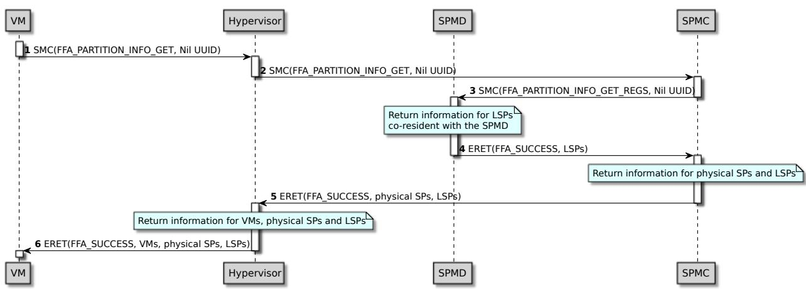  
Figure 6.1: Example use of discovery ABIs

## 6.2.3 Protocol UUID usage

A partition implements one or more services. Each service is accessed by a communication protocol built on top of FF-A messaging mechanisms. A protocol UUID exported by the partition identifies an implemented communication protocol. There is a one-to-many relationship between a communication protocol and the protocol UUIDs. Some example usage models are described below:

1. A partition implements N services. Each service is accessed via a unique communication protocol. It associates a protocol UUID with each service and exports N UUIDs in its manifest. The communication protocol used to access each service is implicitly identified by its protocol UUID. There is a 1:1 mapping between communication protocols and the protocol UUIDs.

2. A partition implements N services. Each service is accessed via a common communication protocol. It associates a protocol UUID with each service and exports N UUIDs in its manifest. The communication protocol used to access each service is implicitly identified by its protocol UUID. There is a 1:N mapping between the common communication protocol and the protocol UUIDs.

3. A partition implements N services. Each service is accessed via a common communication protocol. It associates a protocol UUID with the communication protocol and exports a single UUID in its manifest. The communication protocol provides an IMPLEMENTATION DEFINED mechanism to discover and access the N services. There is a 1:1 mapping between the common communication protocol and the protocol UUID.

To support the scenarios where a partition exports multiple protocol UUIDs, an entry corresponding to each protocol UUID is encoded in the returned partition information. E.g. SP0 exports UUID\_0 and UUID\_1. The returned partition information for SP0 has two entries as follows,

• SP0 ID, properties, UUID\_0.

• SP0 ID, properties, UUID\_1.

The Nil UUID is reserved by the Framework and must not be exported by a partition in its manifest as a valid protocol UUID.

If the Nil UUID is specified in an invocation of the FFA\_MSG\_SEND\_DIRECT\_REQ2 or in a partition message header (see Table 8.1) for Indirect messages using the FFA\_MSG\_SEND2 ABI then the communication protocol or service is determined by the callee through an IMPLEMENTATION DEFINED mechanism.

## 6.2.3.1 Protocol UUIDs and messaging methods

A partition could be associated with multiple protocol UUIDs. It could implement messaging methods that take a protocol UUID as an input parameter as well as those that do not. In such a partition, communication protocols corresponding to a subset of protocol UUIDs are accessible via one or more of the following:

• Only via messaging methods that take a protocol UUID as an input parameter.

• Only via messaging methods that do not take a protocol UUID as an input parameter.

• Via any messaging method.

When a communication protocol corresponding to a protocol UUID is accessible only via a specific messaging method, the Framework enables discovery of this property of the partition, by other partitions as follows:

• The partition specifies the mapping between the protocol UUID and the messaging method in its partition manifest. See also 5.2.1 Partition manifest.

• The partition manager specifies only the messaging methods that the protocol UUID is mapped to in the partition properties field of the partition information descriptor for that UUID.

Otherwise, in the partition properties in a partition information descriptor for that protocol UUID, the partition manager specifies all the messaging methods implemented by the partition.

For example, SP0 has the following properties:

• It implements two communication protocols with UUID\_0 and UUID\_1.

• It implements the FFA\_MSG\_SEND\_DIRECT\_REQ & FFA\_MSG\_SEND\_DIRECT\_REQ2 ABIs.

• The communication protocol corresponding to UUID\_0 is accessible only via FFA\_MSG\_SEND\_DIRECT\_REQ.

• The communication protocol corresponding to UUID\_1 is accessible only via FFA\_MSG\_SEND\_DIRECT\_REQ2.

If the SP specifies the mapping between the protocol UUIDs and the ABIs it implements, all of the following are true:

• An invocation of an FF-A discovery ABI with UUID\_0 returns a partition information descriptor where Bit[0] == b’1 and Bit[9] == b’0 in the partition properties descriptor.

• An invocation of an FF-A discovery ABI with UUID\_1 returns a partition information descriptor where Bit[0] == b’0 and Bit[9] == b’1 in the partition properties descriptor.

• An invocation of an FF-A discovery ABI with the Nil UUID returns a partition information descriptor for UUID\_0 where Bit[0] == b’1 and Bit[9] == b’0 in the partition properties descriptor.

• An invocation of an FF-A discovery ABI with the Nil UUID returns a partition information descriptor for UUID\_1 where Bit[0] == b’0 and Bit[9] == b’1 in the partition properties descriptor.

If the SP does not specify the mapping between the protocol UUIDs and the ABIs it implements, all of the following are true:

• An invocation of an FF-A discovery ABI with UUID\_0 returns a partition information descriptor where Bit[0] == b’1 and Bit[9] == b’1 in the partition properties descriptor.

• An invocation of an FF-A discovery ABI with UUID\_1 returns a partition information descriptor where Bit[0] == b’1 and Bit[9] == b’1 in the partition properties descriptor.

• An invocation of an FF-A discovery ABI with the Nil UUID returns a partition information descriptor for UUID\_0 where Bit[0] == b’1 and Bit[9] == b’1 in the partition properties descriptor.

• An invocation of an FF-A discovery ABI with the Nil UUID returns a partition information descriptor for UUID\_1 where Bit[0] == b’1 and Bit[9] == b’1 in the partition properties descriptor.

• The SP uses an IMPLEMENTATION DEFINED mechanism to map the communication protocol associated with a protocol UUID to a messaging method.

## 6.2.3.2 UUID encodings

A UUID (see [8]) can be encoded in a 32-bit, 64-bit or 128-bit values depending on the register or data structure that it is invoked with as follows,

• A UUID is mapped to 4 32-bit registers as defined in [5].

## Chapter 6. Identification and Discovery

6.2. Partition discovery

• A UUID is mapped to 2 64-bit registers as shown in Table 6.4.

• A UUID is mapped to a 128-bit data structure field as shown in Table 6.6.

R<sub>0049</sub>

Table 6.4: Encoding of a UUID in 64-bit registers

<table><tr><td>Register</td><td>Value</td></tr><tr><td>xN</td><td>Bytes 0...7 with byte 0 in the low-order bits.</td></tr><tr><td>xN + 1</td><td>Bytes 8...15 with byte 8 in the low-order bits.</td></tr></table>

S<sub>0050</sub> For example, the UUID string “0A1B2C3D-4E5F-6A7B-8C9D-1A2B3C4D5E6F” is encoded in 2 64-bit registers as follows.

<table><tr><td>Register</td><td>Value</td></tr><tr><td>xN</td><td>0x7B6A5F4E3D2C1B0A</td></tr><tr><td>xN + 1</td><td>0x6F5E4D3C2B1A9D8C</td></tr></table>

S<sub>0051</sub> The UUID string “0A1B2C3D-4E5F-6A7B-8C9D-1A2B3C4D5E6F” is encoded in 1 128-bit field as follows.

Table 6.6: Encoding of a UUID in 128-bit field

<table><tr><td>Field</td><td>Value</td></tr><tr><td>UUID</td><td>Bits[127:64]: 0x6F5E4D3C2B1A9D8CBits[63:0]: 0x7B6A5F4E3D2C1B0A</td></tr></table>

## 6.3 Partition manager identification

Partition managers are identified in the Framework as described below.

1. A partition manager is identified by a globally unique 16-bit ID. This ID is not assigned to any another FF-A component in the system.

2. The ID value 0 is reserved for the Hypervisor as described in [5].

3. The ID values assigned to the SPMC and SPMD components are IMPLEMENTATION DEFINED. From v1.1 of the Framework, the IDs assigned to the SPMC and SPMD can be discovered through the FFA\_SPM\_ID\_GET interface (see 13.11 FFA\_SPM\_ID\_GET).

The Framework can be deployed on an Arm A-profile system that does not implement EL2. The ID value 0 is reserved for the OS kernel in this configuration.

# Chapter 7 Partition lifecycle

## 7.1 Overview

52 Partition lifecycle describes the various states an execution context of a partition goes through from when it is created till it is destroyed, live activated or restarted.

S<sub>0053</sub> A partition manager uses the partition lifecycle to handle FF-A related communication that both originates from, or is targeted to a partition execution, on the basis of its state. Additionally, the partition lifecycle is used to enable use cases listed below:

• Live activation of an SP where it is restarted to execute an updated version of its binary code. See also:

– 18.10 Live firmware activation.

• Fatal Error handling where an SPMC is able to restart an SP that has encountered a fatal error.

The partition lifecycle is applicable to the following types of partitions:

• Any physical partition.

• Any logical partition that runs in a different Exception level from its partition manager.

The lifecycle of all other types of partitions is IMPLEMENTATION DEFINED.

I<sub>0055</sub> The state of each execution context of a partition is maintained by its partition manager.

R<sub>0056</sub> A state transition of a partition execution context takes place if any of the following are true:

• The execution context uses the SMC, HVC or SVC conduits to invoke an FF-A ABI.

• The partition manager uses the ERET conduit to run the execution context.

• The execution context is preempted by an interrupt.

• The execution context encounters an error.

D<sub>0057</sub> A partition execution context is unavailable if any of the following conditions are true:

• Clients of the partition are unable to communicate with the execution context to access the partition services.

• The execution context is unable to access services of others partitions.

Otherwise, the partition execution context is available.

R<sub>0058</sub> A partition execution context becomes available when all of the following conditions are true:

• The partition manager has allocated and initialized all resources that are required by the execution context to initialize itself.

• The partition execution context has initialized itself.

Otherwise, the partition execution context remains unavailable.

R<sub>0059</sub> A partition is available if one or more of its execution contexts are available. Otherwise it is unavailable.

D<sub>0060</sub> A partition execution context encounters a fatal error when an error condition makes it unavailable.

D<sub>0061</sub> A partition execution context is in the running state if it is executing on a PE. Otherwise the partition execution context is not in the running state.

R<sub>0062</sub> A partition execution context exits the running state by entering any other state permitted by the partition lifecycle.

## 7.2 Lifecycle states

## 7.2.1 NULL state

D<sub>0063</sub> A partition execution context is in the NULL state if it is unavailable because the partition manager has not allocated and initialized all resources that are required by the execution context to initialize itself.

I<sub>0064</sub> A partition manager uses the NULL state to signify that it is aware of the presence of a partition execution context but has not allocated resources to it e.g. translation tables, memory regions, devices, interrupts etc.

R<sub>0065</sub> A partition execution context is not in the running state if it is in the NULL state.

R<sub>0066</sub> An invocation of an FF-A ABI with a Receiver endpoint ID as an input parameter, is completed by the partition manager of the Receiver endpoint via the FFA\_ERROR interface with the INVALID\_PARAMETERS error code if all execution contexts of the Receiver endpoint are in the NULL state.

R<sub>0067</sub> If all execution contexts of a partition are in the NULL state, it is not discoverable via an partition discovery mechanism. Otherwise, the partition is discoverable. See also:

• 6.2 Partition discovery.

X<sub>0068</sub> A partition does not exist if all its executions are in the NULL state. The ID of the partition is considered invalid until the partition becomes available. Also, the existence of the partition cannot be discovered.

R<sub>0069</sub> An invocation of an FF-A ABI with a Receiver endpoint ID as an input parameter, is completed by the partition manager of the Receiver endpoint via the FFA\_ERROR interface with the NOT\_READY error code, if all of the following are true:

• All execution contexts of the Receiver endpoint are not in the NULL state.

• No execution context of the Receiver endpoint is in one of the following states:

– Waiting.

– Running when not in the starting or stopping states.

– Preempted.

– Blocked.

X<sub>0070</sub> If all of the above conditions are true then at least one execution context of the partition is in one of the aborted, created, starting, and stopping states. All other execution contexts of the partition are in one of the NULL, aborted, created, starting, and stopping states. The partition could be aborted, stopped, starting or stopping. It is not possible for another partition to communicate with it.

7.2. Lifecycle states

## 7.2.2 Created state

D<sub>0071</sub> A partition execution context is in the created state if it is unavailable because it has not initialized itself.

I<sub>0072</sub> A partition manager uses the created state to signify that it has allocated all resources required to initialize a partition execution context e.g. translation tables, memory regions, devices, interrupts etc.

R<sub>0073</sub> A partition execution context is not in the running state if it is in the created state.

## 7.2.3 Stopped state

D<sub>0074</sub> A partition execution context is in the stopped state if it is unavailable because it has uninitialized itself.

I<sub>0075</sub> A partition manager uses the stopped state to signify that a partition execution context is ready to be either deleted or reinitialized.

A transition from the stopped state to the NULL state indicates the former case where the partition manager has reclaimed all resources that were allocated to the partition execution context.

A transition from the stopped state to the Created state indicates the latter case where the partition manager has reallocated all resources that are required to initialize the partition execution context.

R<sub>0076</sub> A partition execution context is not in the running state if it is in the stopped state.

R<sub>0077</sub> If all execution contexts of a partition are in the stopped state after being requested to stop without live activation then all of the following are true:

• The RX/TX buffers of the partition are unmapped.

• All VM and SP notifications of the partition are unbound.

• No VM, SP or Framework notifications of the partition are pending.

• All memory regions shared or lent by the partition are reclaimed.

• All memory regions shared with, or lent to the partition are relinquished and reclaimed by the partitions that had shared or lent them

• No device assigned to the partition has a pending or active interrupt.

• The partition manager can reclaim all memory regions and device MMIO regions that were allocated to the partition execution contexts when they entered the created state.

A partition ensures that its execution contexts perform the above actions in the stopping state. This could be done collectively by more than one partition execution context. Alternatively, a single partition execution context could perform all the actions on behalf of other execution contexts. See also:

• 7.2.6 Stopping state.

## 7.2.4 Aborted state

D<sub>0079</sub> A partition execution context is in the aborted state after it encounters a fatal error.

I<sub>0080</sub> A partition manager uses the aborted state to signify that the partition execution context will be ready to enter the stopped state once the resources that it would have relinquished by uninitializing itself, are forcibly reclaimed by the partition manager.

R<sub>0081</sub> A partition execution context is not in the running state if it is in the aborted state.

I<sub>0082</sub> A partition execution context enters the aborted state by invoking the FFA\_ABORT ABI. See also:

• 13.14 FFA\_ABORT.

Also, a partition manager places a partition execution context in the aborted state upon detecting via an IMPLEMEN TATION DEFINED mechanism, that it has encountered a fatal error. E.g. after triaging an unexpected synchronous or asynchronous exception that can be attributed to the partition or detecting that an operation has exceeded an IMPLEMENTATION DEFINED duration.

## 7.2.5 Starting state

D<sub>0083</sub> A partition execution context is in the starting state if it is unavailable because it is initializing itself. See also:

• 5.5 Protocol for completing execution context initialization.

• 18.2.2 Secondary boot protocol.

R<sub>0084</sub> A partition manager invokes the ERET conduit to transition a partition execution context from the created state to the starting state. See also:

• 5.4 Boot information protocol.

R<sub>0085</sub> A partition execution context in the starting state invokes the FFA\_MSG\_WAIT interface to indicate that it has become available and enter the waiting state.

R<sub>0086</sub> A partition execution context in the starting state cannot invoke the following FF-A ABIs with the SMC, HVC or SVC conduit:

• FFA\_YIELD.

• FFA\_MSG\_SEND\_DIRECT\_RESP.

• FFA\_MSG\_SEND\_DIRECT\_RESP2.

The partition manager of the partition execution context completes the invocation of these ABIs via the FFA\_ERROR interface with the DENIED error code.

## 7.2.6 Stopping state

D<sub>0087</sub> A partition execution context is in the stopping state if it is unavailable because it is uninitializing itself.

R<sub>0088</sub> A partition manager sends the partition stop request to transition a partition execution context from the waiting state to the stopping state. See also:

• 18.9.1 Partition stop request.

R<sub>0089</sub> A partition execution context in the stopping state sends the response to a partition stop request with a SUCCESS status code to its partition manager to enter the stopped state. See also:

• 18.9.2 Partition stop response.

R<sub>0090</sub> Non-secure interrupts are queued when a partition execution context is in the stopping state. See also:

• 9.3.1.3 Non-secure interrupt is queued.

I<sub>0091</sub> Self S-Ints and Other S-Ints are handled as specified in 9.3.2.2 Secure interrupt triggers in Secure state. It is possible that the SP execution context transitions between the stopping state and the preempted state multiple times due to pending S-Ints.

R<sub>0092</sub> A partition has performed all of the following actions when its last execution context sends a response to a partition stop request without live activation to enter the stopped state:

• Invoked the FFA\_RXTX\_UNMAP interface to unmap its RX/TX buffers.

• Instructed each endpoint to which it has bound any VM or SP notification, to not pend that notification.

• Consumed all pending VM, SP or Framework notifications by invoking the FFA\_NOTIFICATION\_GET interface.

• Unbound all VM and SP notifications by invoking the FFA\_NOTIFICATION\_UNBIND interface.

• Instructed each endpoint to which it lent or shared any memory region, to relinquish that memory region.

• Reclaimed all memory regions that it had lent or shared by invoking the FFA\_MEM\_RECLAIM interface.

• Relinquished all memory regions that it was lent or that were shared with it, by invoking the FFA\_MEM\_RELINQUISH interface.

• Instructed each endpoint that had lent or shared a memory region with it to reclaim that memory region.

• Placed all devices that were assigned to it in a quiesced state.

• Handled all pending interrupts from devices that were assigned to it so that no interrupts are in the pending state.

• Deactivated all active interrupts from devices that were assigned to it so that no interrupts are in the active state.

Otherwise, all execution contexts of the partition enter the aborted state.

See also:

• 7.2.3 Stopped state.

• 7.2.4 Aborted state.

R<sub>0093</sub> A partition execution context in the stopping state cannot invoke the following FF-A ABIs with the SMC, HVC or SVC conduit:

• FFA\_YIELD.

• FFA\_MSG\_SEND\_DIRECT\_RESP

• FFA\_MSG\_SEND\_DIRECT\_RESP2

The partition manager of the partition execution context completes the invocation of these ABIs via the FFA\_ERROR interface with the DENIED error code.

## 7.2.7 Waiting state

D<sub>0094</sub> A partition execution context is in the waiting state if it is available and not in the running state because it is waiting to be allocated CPU cycles to do work.

I<sub>0095</sub> A partition execution context enters the waiting state by invoking one of the following FF-A ABIs with the SMC, HVC or SVC conduits:

• FFA\_MSG\_WAIT.

• FFA\_MSG\_SEND\_DIRECT\_RESP.

• FFA\_MSG\_SEND\_DIRECT\_RESP2.

I<sub>0096</sub> A partition execution context exits the waiting state when it enters the running state upon invocation one of the following FF-A ABIs with the ERET conduit by its partition manager:

• FFA\_INTERRUPT.

• FFA\_RUN.

• FFA\_MSG\_SEND\_DIRECT\_REQ.

• FFA\_MSG\_SEND\_DIRECT\_REQ2.

S<sub>0097</sub> The transition from the waiting state to the running state happens in response to an allocation of CPU cycles to the partition execution context for message processing or interrupt handling.

R<sub>0098</sub> When a partition execution context exits the running state to enter the waiting state, it relinquishes control back to the FF-A component that originally allocated CPU cycles to this partition execution context to transition it from the waiting state to the running state.

X<sub>0099</sub> The Framework does not allow a partition execution context to return control to a partition that is different from the partition that originally scheduled it.

R<sub>0100</sub> If a partition execution context transitions from the waiting state to the running state in response to an invocation of the FFA\_RUN interface or the FFA\_INTERRUPT interface, its next entry into the waiting state is permitted only via an invocation of the FFA\_MSG\_WAIT interface with the SMC, HVC or SVC conduits.

In this scenario, the partition manager of the partition execution context completes an invocation of the following FF-A ABIs to enter the waiting state from the running state via the FFA\_ERROR interface with the DENIED error code:

• FFA\_MSG\_SEND\_DIRECT\_RESP.

• FFA\_MSG\_SEND\_DIRECT\_RESP2.

If a partition execution context transitions from the waiting state to the running state in response to an invocation of the FFA\_MSG\_SEND\_DIRECT\_REQ interface or the FFA\_MSG\_SEND\_DIRECT\_REQ2 interface, its next entry into the waiting state is permitted only via an invocation of the FFA\_MSG\_SEND\_DIRECT\_RESP interface or the FFA\_MSG\_SEND\_DIRECT\_RESP2 interface respectively, with the SMC, HVC or SVC conduits.

In this scenario, the partition manager of the partition execution context completes an invocation of the FFA\_MSG\_WAIT interface to enter the waiting state from the running state via the FFA\_ERROR interface with the DENIED error code

## 7.2.8 Preempted state

D<sub>0102</sub> A partition execution context is in the preempted state if it is available and not in the running state because it was interrupted by an interrupt while doing work.

I<sub>0103</sub> A partition manager could either run another execution context in place of the interrupted execution context or resume the interrupted execution context. The Framework treats the interrupted execution context as being in the preempted state irrespective of whether it is resumed immediately or subsequently by the partition manager.

R<sub>0104</sub> A partition execution context exits the preempted state when it enters the running state upon being resumed by its partition manager via the ERET conduit.

## 7.2.9 Blocked state

D<sub>0105</sub> A partition execution context is in the blocked state if it is available and not in the running state because it is waiting for some work to complete on its behalf.

D<sub>0106</sub> An FF-A ABI invocation that terminates at a partition manager is called a hypcall. E.g. FFA\_RXTX\_MAP, FFA\_NOTIFICATION\_GET etc.

I<sub>0107</sub> A partition execution context enters the blocked state from a running state by invoking one of the following ABIs with the SMC, HVC or SVC conduits:

• FFA\_RUN.

• FFA\_YIELD.

• FFA\_MSG\_SEND\_DIRECT\_REQ.

• FFA\_MSG\_SEND\_DIRECT\_REQ2.

• Any hypcall request barring FFA\_ABORT.

I<sub>0108</sub> A partition execution context exits the blocked state when it enters the running state upon invocation one of the following FF-A ABIs with the ERET conduit by its partition manager:

• FFA\_INTERRUPT.

• FFA\_RUN.

• FFA\_YIELD.

• FFA\_MSG\_WAIT.

• FFA\_MSG\_SEND\_DIRECT\_RESP.

• FFA\_MSG\_SEND\_DIRECT\_RESP2.

• A hypcall response.

If a partition execution context enters the blocked state by invoking a hypcall request with the SMC, HVC, or SVC conduit, it exits the blocked state to enter the running state via an invocation of the corresponding hypcall response with the ERET conduit.

If a partition execution context enters the blocked state by invoking the FFA\_RUN interface with the SMC, HVC, or SVC conduit, it exits the blocked state to enter the running state via an invocation of any one of the following interfaces with the ERET conduit:

• FFA\_MSG\_WAIT.

• FFA\_INTERRUPT.

• FFA\_YIELD.

• FFA\_MSG\_SEND\_DIRECT\_RESP.

## • FFA\_MSG\_SEND\_DIRECT\_RESP2.

If a partition execution context enters the blocked state by invoking the FFA\_MSG\_SEND\_DIRECT\_REQ interface or the FFA\_MSG\_SEND\_DIRECT\_REQ2 interface with the SMC, HVC, or SVC conduit, it exits the blocked state to enter the running state via an invocation of any one of the following interfaces with the ERET conduit:

• FFA\_INTERRUPT.

• FFA\_YIELD.

• FFA\_MSG\_SEND\_DIRECT\_RESP.

• FFA\_MSG\_SEND\_DIRECT\_RESP2.

• FFA\_SUCCESS when the Direct request is completed without a corresponding Direct response.

R<sub>0112</sub> If a partition execution context enters the blocked state by invoking the FFA\_YIELD interface with the SMC, HVC or SVC conduit, it exits the blocked state to enter the running state via an invocation of the FFA\_RUN interface with the ERET conduit.

R<sub>0113</sub> If a partition execution context is in the running state in the SPMC scheduled mode, it cannot enter the blocked state by invoking the FFA\_RUN interface with the SMC, HVC, or SVC conduit when the target vCPU is in the waiting state.

In this scenario, the partition manager completes the invocation via the FFA\_ERROR interface with the DENIED error code. See also:

• 9.2.4 SP call chains.

X<sub>0114</sub> A partition execution context in the SPMC scheduled mode is not allowed to start or extend a call chain via the FFA\_RUN interface.

I<sub>0115</sub> When the Framework version is < v1.3, an SP execution context is considered to be in the running state during its initialization. The execution context is not permitted to enter the blocked state both when it invokes the FFA\_RUN interface or it invokes the FFA\_YIELD interface. In this scenario, the partition manager of the partition execution context completes an invocation of these interfaces via the FFA\_ERROR interface with the DENIED error code. See also:

• 7.2.5 Starting state.

• 7.2.4 Aborted state.

A partition execution context in the running state could use Direct request ABIs to call into another endpoint execution context and enter the blocked state. This sequence could be repeated for any number of times. All partition execution contexts in the sequence become a part of a call chain. See also:

• 9.2.3 CPU cycle allocation modes.

A partition execution context cannot transition from the blocked state to the running state if it is allocated CPU cycles by another partition execution context such that both execution contexts are already a part of a call chain. In this scenario, the partition manager of the partition execution context in the blocked state completes the invocation of the interface to allocate CPU cycles via the FFA\_ERROR interface with the DENIED error code.

The Framework does not allow a loop to be created in a call chain to avoid recursive dependencies between partitions.

## 7.3 Discovery and setup

A partition manager always supports the following states of the partition lifecycle for each execution context of a partition it manages irrespective of the version of the Framework it implements:

• Running state.

• Waiting state.

• Preempted state.

• Blocked state.

When an FF-A component implements a Framework version that is >= v1.3, it indicates support for all the partition lifecycle states via its manifest or an IMPLEMENTATION DEFINED mechanism. See also Table 7.1.

Table 7.1: SP lifecycle properties

<table><tr><td>Information fields</td><td>Mandatory</td><td>Description</td></tr><tr><td>Partition lifecycle support</td><td>No</td><td>• Presence of this field indicates that the SP supports all states defined in the partition lifecycle.</td></tr></table>

A partition can optionally specify the action taken by its partition manager if any partition execution context enters the aborted state. This is done either via an IMPLEMENTATION DEFINED mechanism or via the partition manifest. See also Table 7.2. If the action is not specified, the partition manager takes an IMPLEMENTATION DEFINED action.

Table 7.2: Abort action manifest entry

<table><tr><td>Information fields</td><td>Mandatory</td><td>Description</td></tr><tr><td>Abort action</td><td>No</td><td>This field specifies the action taken by the SPMC if the execution context of a partition encounters a fatal error.Destroy. The SPMC transitions all execution contexts of the SP to the NULL state.Restart. The SPMC transitions one or more execution contexts of the SP to the starting state (via the stopped and created states).Propagate. The SPMC aborts itself and informs the SPMD.IMPLEMENTATION DEFINED. The SPMC takes an IMPLEMENTATION DEFINED action.In the absence of this field, the action taken by the SPMC is IMPLEMENTATION DEFINED.</td></tr></table>

## 7.4 SP lifecycle transitions

I<sub>0122</sub> This section describes the state transitions that an SP execution context undergoes in the following scenarios:

• The SP execution context is started. See 7.4.1 Starting an SP execution context.

• The SP execution context is available. See 7.4.2 Runtime model of an SP execution context.

• The SP execution context is stopped. See 7.4.3 Stopping an SP execution context.

• The SP execution context aborts. See 7.4.4 Aborting an SP execution context.

## 7.4.1 Starting an SP execution context

R<sub>0123</sub> Figure 7.1 shows the state transitions that apply when an SP is started.

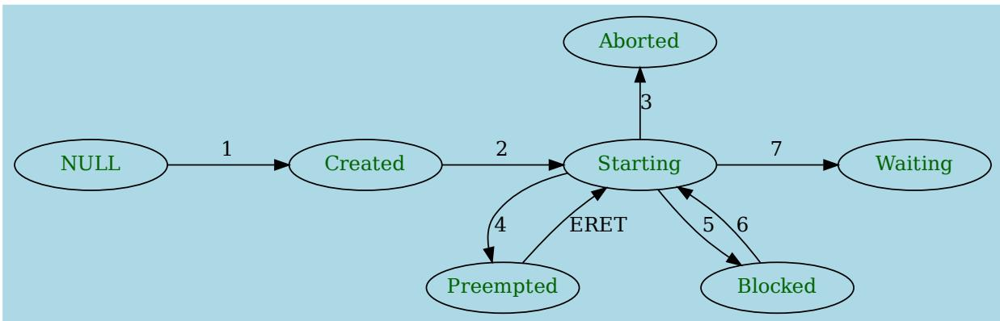  
Figure 7.1: State transition diagram for starting an SP execution context

The numbered transitions in Figure 7.1 are described below:

1. NULL state to Created state

• See also 7.2.1 NULL state.

• See also 7.2.2 Created state.

## 2. Created state to Starting state

• See also 7.2.2 Created state.

• See also 7.2.5 Starting state.

## 3. Starting state to Aborted state

• See also 7.2.5 Starting state.

• See also 7.2.4 Aborted state.

## 4. Starting state to Preempted state

• See also 7.2.5 Starting state.

• See also 7.2.8 Preempted state.

## 5. Starting state to Blocked state

• See also 7.2.5 Starting state.

• See also 7.2.9 Blocked state.

## 6. Blocked state to Starting state

• See also 7.2.5 Starting state.

• See also 7.2.9 Blocked state.

7. Starting state to Waiting state

• See also 7.2.7 Waiting state.

• See also 7.2.5 Starting state.

## 7.4.2 Runtime model of an SP execution context

D<sub>0124</sub> The runtime model of a partition execution context consists of the permitted transitions between the running, waiting, preempted and blocked states, when the partition execution context is available.

R<sub>0125</sub> Figure 7.2 shows the runtime state transitions of an SP execution context.

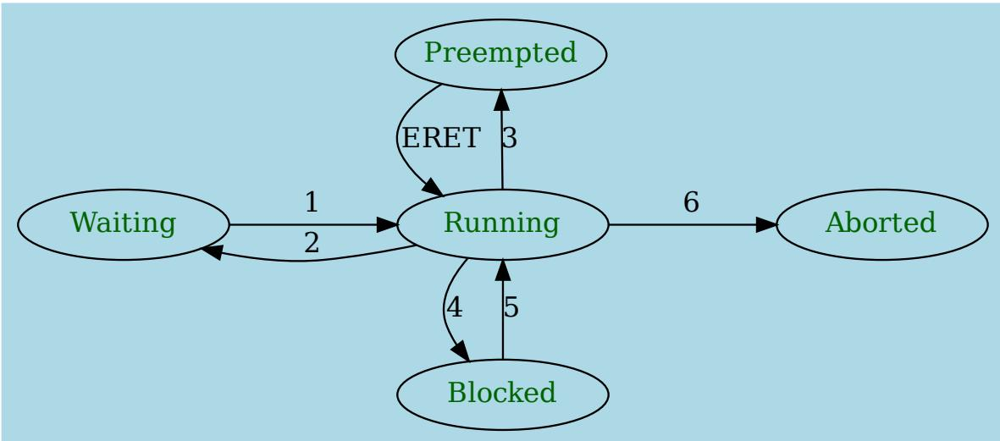  
Figure 7.2: Runtime state transitions of an SP execution context

The numbered transitions in Figure 7.1 are described below:

1. Waiting state to Running state

• See also 7.2.7 Waiting state.

2. Running state to Waiting state

• See also 7.2.7 Waiting state.

3. Running state to Preempted state

• See also 7.2.8 Preempted state.

4. Running state to Blocked state

• See also 7.2.9 Blocked state.

## 5. Blocked state to running state

• See also 7.2.9 Blocked state.

6. Running state to Aborted state

• See also 7.2.4 Aborted state.

## 7.4.3 Stopping an SP execution context

R<sub>0126</sub> Figure 7.3 shows the state transitions that apply when an SP execution context is stopped.

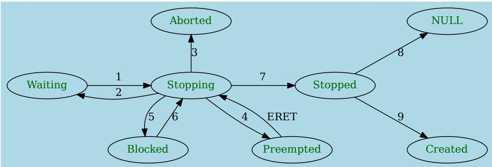  
Figure 7.3: State machine for stopping an SP execution context

The numbered transitions in Figure 7.3 are described below:

## 1. Waiting state to Stopping state

• See also 7.2.7 Waiting state.

• See also 7.2.6 Stopping state.

• See also 18.9.1 Partition stop request.

## 2. Stopping state to Waiting state

• See also 7.2.7 Waiting state.

• See also 7.2.6 Stopping state.

• See also 18.9.2 Partition stop response.

## 3. Stopping state to Aborted state

• See also 7.2.6 Stopping state.

• See also 7.2.4 Aborted state.

## 4. Stopping state to Preempted state

• See also 7.2.6 Stopping state.

• See also 7.2.8 Preempted state.

## 5. Stopping state to Blocked state

• See also 7.2.6 Stopping state.

• See also 7.2.9 Blocked state.

## 6. Blocked state to Stopping state

• See also 7.2.9 Blocked state.

• See also 7.2.6 Stopping state.

## 7. Stopping state to Stopped state

• See also 7.2.6 Stopping state.

• See also 7.2.3 Stopped state.

• See also 18.9.2 Partition stop response.

## 8. Stopped state to NULL state

• See also 7.2.3 Stopped state.

• See also 7.2.1 NULL state.

## 9. Stopped state to Created state

• See also 7.2.3 Stopped state.

• See also 7.2.2 Created state.

## 7.4.4 Aborting an SP execution context

Figure 7.4 shows the state transitions that apply when an SP execution context aborts.

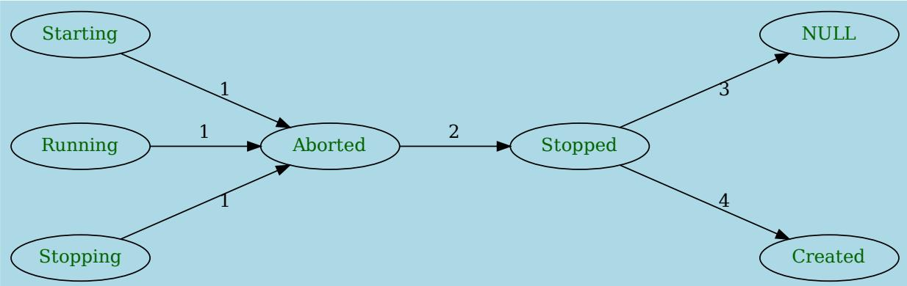  
Figure 7.4: State machine for aborting an SP execution context

## 1. Any Running SP execution context state to Aborted state

• See also 7.2.5 Starting state.

• See also 7.2.6 Stopping state.

• See also 7.2.4 Aborted state.

## 2. Aborted state to Stopped state

• See also 7.2.4 Aborted state.

• See also 7.2.3 Stopped state.

## 3. Stopped state to NULL state

• See also 7.2.3 Stopped state.

• See also 7.2.1 NULL state.

## 4. Stopped state to Created state

• See also 7.2.3 Stopped state.

• See also 7.2.2 Created state.

Chapter 8

Message passing

## 8.1 Overview

The Framework enables exchange of messages between FF-A components. The first FF-A component that sends a message is called the Sender. The last FF-A component that receives a message is called the Receiver.

A message exchange takes place in the phases listed below:

1. Transmission of the message payload from the Sender to the Receiver.

2. Allocation of CPU cycles to the Receiver to process the message on a PE in the system.

3. Message processing by the Receiver using the allocated cycles.

Messages are exchanged in the following locations:

• General purpose registers that can be used as parameter registers as specified in [5].

• Memory regions.

– A pair of endpoints can use the FF-A memory management protocol to share a memory region that is used to exchange messages with zero copying. See also [1].

– The Framework specifies a pair of memory regions called RX/TX buffers that can be used as bounce buffers to exchange messages between a pair of endpoints. See also 4.10 RX/TX buffers

If the Receiver is an endpoint, the partition manager is responsible for delivering a message from its Sender to the Receiver.

Each message has a message header and a message payload.

The message header contains information to deliver the message from its Sender to its Receiver. This information includes:

• The identity of the Sender and the Receiver.

• The size of the message payload.

• The location of the message payload.

The message payload contains instructions for the Receiver to process the message. The encoding of a message payload is known to its Sender and Receiver.

If a partition manager can interpret a message payload, the message is called a Framework message. Otherwise, it is called a Partition message.

The ABIs defined by the Framework enable exchange of messages synchronously and asynchronously. The distinction between the two semantics depends upon the FF-A component that is responsible for allocation of CPU cycles to the Receiver for processing the message.

When a message is exchanged synchronously, the Sender relinquishes control to the Receiver at the time of message transmission and blocks until its receives a response from the Receiver on the same PE. The Receiver depends upon the Sender to obtain CPU cycles for message processing. CPU cycle allocation is tightly coupled with message transmission.

Figure 8.1 illustrates an example synchronous message exchange between two endpoints that is facilitated by the partition manager.

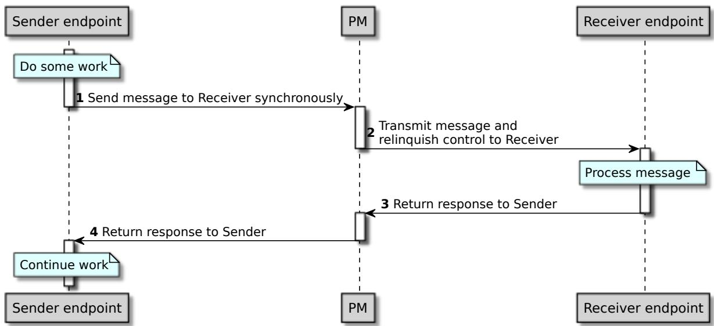  
Figure 8.1: Example synchronous message exchange

I<sub>0136</sub> When a message is exchanged asynchronously, the Sender does not relinquish control to the Receiver at the time of message transmission. Instead, the partition manager of the Sender requests the scheduler to allocate CPU cycles to the Receiver for message processing. The Sender continues its execution concurrently with the Receiver.

Figure 8.2 illustrates an example asynchronous message exchange.

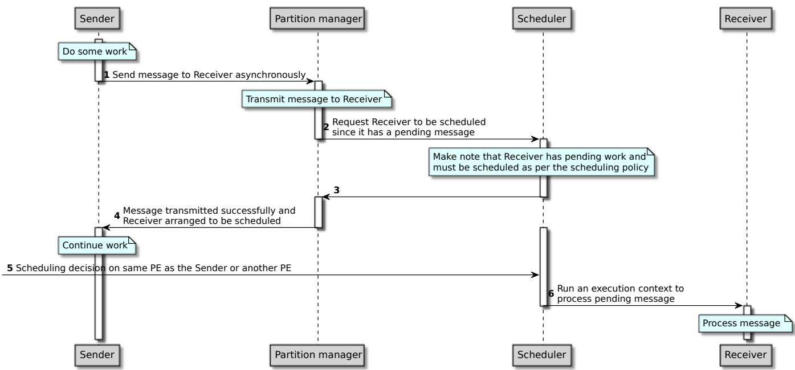  
Figure 8.2: Example asynchronous message exchange

## 8.2 Indirect messaging

D<sub>0137</sub> Asynchronous messaging between FF-A endpoints is also called Indirect messaging.

D<sub>0138</sub> A Partition message that is transmitted from a Sender to a Receiver through Indirect messaging is called an Indirect message.

R<sub>0139</sub> A Partition message is encoded at the base of an RX or TX buffer as per the encoding described in Table 8.1.

Table 8.1: Encoding of a Partition message header

<table><tr><td>Field</td><td>Byte length</td><td>Byte offset</td><td>Description</td></tr><tr><td>Flags</td><td>4</td><td>-</td><td>Bits[31:0]: Reserved (SBZ).</td></tr><tr><td>Reserved</td><td>4</td><td>4</td><td>Reserved (SBZ).</td></tr><tr><td>Message payload offset</td><td>4</td><td>8</td><td>Offset from the beginning of the buffer to the start of message payload.</td></tr><tr><td>Sender/Receiver IDs</td><td>4</td><td>12</td><td>Sender and Receiver endpoint IDs.- Bits[31:16]: Sender endpoint ID.- Bits[15:0]: Receiver endpoint ID.</td></tr><tr><td>Message payload size</td><td>4</td><td>16</td><td>Length of message payload in bytes in the buffer.</td></tr><tr><td>Reserved</td><td>4</td><td>20</td><td>Reserved (SBZ).</td></tr><tr><td>Protocol UUID</td><td>16</td><td>24</td><td>Bytes[0..15] of UUID (see 6.2.3 Protocol UUID usage).</td></tr></table>

R<sub>0140</sub> The partition message payload is populated immediately after the partition message header.

I<sub>0141</sub> The message payload offset is equal to the size of the partition message header.

S<sub>0142</sub> A partition manager uses the size of the message header to determine the version of the populated header.

I<sub>0143</sub> The FFA\_MSG\_SEND2 ABI is used to transmit an Indirect message from the TX buffer of the Sender endpoint to the RX buffer of the Receiver endpoint. See also:

## • 15.1 FFA\_MSG\_SEND2.

I<sub>0144</sub> A Hypervisor transmits an indirect message between VMs by copying it from the TX buffer of the Sender VM to the RX buffer of the Receiver VM.

I<sub>0145</sub> An SPMC transmits an indirect message between SPs by copying it from the TX buffer of the Sender SP to the RX buffer of the Receiver SP.

I<sub>0146</sub> An SPMC transmits an indirect message from a VM to a SP by copying it from the TX buffer of the Sender VM to the RX buffer of the Receiver SP. The invocation of FFA\_MSG\_SEND2 is forwarded by the Hypervisor to the SPMC.

I<sub>0147</sub> An SPMC transmits an indirect message from a SP to a VM by copying it from the TX buffer of the Sender SP to the RX buffer of the Receiver VM.

R<sub>0148</sub> An Indirect message is not transmitted between partitions if any of the following are true:

1. The Sender and Receiver partitions are in the same Security state, and their partition manager does not have ownership of the Receiver partition’s RX buffer see 4.10 RX/TX buffers.

2. The Sender and Receiver partitions are in different Security states and the SPMC does not have ownership of the Receiver partition’s RX buffer see 4.10 RX/TX buffers.

In a configuration without the Hypervisor, ID 0 is assigned to the OS Kernel. It is used by a SP to send an Indirect message to the OS Kernel. The SPMC does not have a mechanism to detect the presence or absence of a Hypervisor. It is possible for an SP to use ID 0 to send an Indirect message to the Hypervisor. The SPMC copies the message from the TX buffer of the SP to the RX buffer shared between the Hypervisor and SPMC. The Hypervisor should cater for this scenario through an IMPLEMENTATION DEFINED mechanism.

The partition manager of the Receiver endpoint performs the following actions after the Indirect message is copied into the Receiver endpoint’s RX buffer:

• It pends the RX buffer full notification in the notification bitmap of the Receiver endpoint that corresponds to the Sender endpoint.

• It informs the primary scheduler that the Receiver must be scheduled. The primary scheduler either runs the Receiver endpoint itself or informs the secondary scheduler responsible for running the Receiver endpoint.

An endpoint that can receive Indirect messages specifies this property in its manifest. See also:

## • 5.2.1 Partition manifest.

Any endpoint can send a Indirect message to another endpoint through the FFA\_MSG\_SEND2 ABI. In version 1.0 of the Framework, only VMs are allowed to send and receive Indirect messages. See also:

• 18.4 Legacy Indirect messaging usage.

18.6.2 Example Indirect messaging flows illustrates example end to end flows of sending an indirect message between different combinations of endpoints.

## 8.3 Direct messaging

D<sub>0154</sub> Synchronous messaging between FF-A endpoints is also called Direct messaging.

D<sub>0155</sub> A Partition message or a Framework message that is transmitted from a Sender to a Receiver through Direct messaging is called an Direct message.

S<sub>0156</sub> A Sender uses Direct messaging as an equivalent of invoking a procedure or function in the Receiver. The Sender sends a Direct request message The Receiver executes the function and returns the results through another Direct message.

I<sub>0157</sub> The following ABIs are used to implement Direct messaging between a Sender and Receiver.

• The FFA\_MSG\_SEND\_DIRECT\_REQ & FFA\_MSG\_SEND\_DIRECT\_REQ2 ABIs are used to transmit a Direct message from a Sender to a Receiver to request an operation, allocate CPU cycles to the Receiver and wait for a response to arrive. See also:

– 15.2 FFA\_MSG\_SEND\_DIRECT\_REQ.

– 15.4 FFA\_MSG\_SEND\_DIRECT\_REQ2.

• The FFA\_MSG\_SEND\_DIRECT\_RESP & FFA\_MSG\_SEND\_DIRECT\_RESP2 ABIs are used to transmit a Direct message from the Receiver to the Sender to provide a response for the requested operation, return CPU cycles to the Sender and wait for a new request to arrive. See also:

– 15.3 FFA\_MSG\_SEND\_DIRECT\_RESP.

– 15.5 FFA\_MSG\_SEND\_DIRECT\_RESP2.

• The FFA\_INTERRUPT ABI is used by the partition manager of the Receiver to inform the Sender that processing of the Direct request message was preempted. See also:

– 9.3 Physical interrupt actions).

• The FFA\_YIELD ABI is used by the Receiver to inform the Sender that processing of the Direct request message is blocked. See also:

– 14.2 FFA\_YIELD).

• The FFA\_RUN ABI is used by the Sender to resume a preempted Receiver. See also:

– 14.3 FFA\_RUN.

D<sub>0158</sub> FFA\_MSG\_SEND\_DIRECT\_REQ & FFA\_MSG\_SEND\_DIRECT\_REQ2 ABIs are referred to as Direct request ABIs. A message transmitted through these ABIs is called a Direct request message.

FFA\_MSG\_SEND\_DIRECT\_RESP & FFA\_MSG\_SEND\_DIRECT\_RESP2 ABIs are referred to as Direct re sponse ABIs. A message transmitted through these ABIs is called a Direct response message.

R<sub>0160</sub> The Sender of a Direct request message is able to receive a Direct response message.

R<sub>0161</sub> The Receiver of a Direct request message is able to send a Direct response message.

## 8.3.1 Discovery and setup

I<sub>0162</sub> The ability to send or receive Direct messages is specified by an endpoint as follows:

• In the manifest of a physical endpoint or a logical endpoint that is not co-resident with its partition manager in the same exception level. See also:

– Table 5.1 in 5.2.1 Partition manifest.

• In an IMPLEMENTATION DEFINED manner for a logical endpoint that is co-resident with its partition manager in the same exception level.

If an endpoint is able to send Direct requests, presence of support for each Direct request ABI is specified in the endpoint manifest. This enables properties of this partition w.r.t Direct messaging to be populated as specified in Table 6.1 in an invocation of an FF-A discovery ABI.

In a Direct message exchange, an execution context of the Receiver must be available on the same PE as the Sender to receive and process the message. To fulfill this requirement, the Receiver must make one of the following implementation choices.

• The Receiver is implemented as a UP endpoint. This enables the SPMC or Hypervisor to migrate the endpoint execution context to the PE on which a Direct message is received.

• The Receiver is implemented as a MP endpoint. In this case, the number of execution contexts that the endpoint implements is equal to the number of PEs in the system. Each execution context is pinned to a PE at system boot. This enables the SPMC or Hypervisor to guarantee availability of an Receiver endpoint execution context for Direct messages on the same PE as the Sender.

This implementation choice is applicable to,

• A physical endpoint.

• A logical endpoint that is not co-resident with its partition manager in the same exception level.

The implementation choice must be specified in the manifest of the endpoint (see Table 5.1 in 5.2.1 Partition manifest).

A partition manager or a logical endpoint that is co-resident with its partition manager in the same exception level can be recipients of Direct messages. The Framework assumes that they are implemented as per the constraints applicable to an MP endpoint i.e.

• They have as many execution contexts as PEs in the system.

• Each execution context runs only on the PE where it was initialized during boot. Hence, it can be considered to be pinned to that PE.

A partition manager discovers the properties of an endpoint it manages through the endpoint manifest. It discovers the properties of endpoints it does not manage via an FF-A discovery mechanism (see 6.2 Partition discovery). An endpoint uses the same mechanism to determine properties of other endpoints as well.

Control can be relinquished to the Sender before the Receiver’s execution context completes a Direct request in the following scenarios:

• The Receiver is preempted by a Non-secure interrupt. The Receiver enters the preempted state.

– See 9.3.1 Actions for a Non-secure interrupt.

– See 7.2.8 Preempted state.

• The Receiver performs a managed exit in response to a Non-secure interrupt. The Receiver enters the waiting state.

– See 9.3.1.2.1 Managed exit.

– See 9.3.1 Actions for a Non-secure interrupt.

– See 7.2.7 Waiting state.

• The Receiver yields control back to the Sender. The Receiver enters the blocked state:

– See 14.2 FFA\_YIELD.

– See 7.2.9 Blocked state.

The Sender must resume the Receiver’s execution context on the same PE on which the request was originally issued if all of the following are true:

• The Receiver is an MP endpoint.

• The Receiver is not in the waiting state.

Otherwise, an attempt to resume the Receiver’s execution context on a different PE completes with the INVALID\_PARAMETERS return status code.

This implies that the execution contexts of the Sender and Receiver are pinned to the same PE when the latter is resumed by the former. This requires all of the following:

• A Hypervisor pins the vCPU of the Sender VM that resumes the Receiver to the same PE.

• An OS pins the thread in the Sender VM that resumes the Receiver to the same PE.

## 8.3.2 Message delivery and Receiver execution

The Framework uses the Direct messaging ABIs to transmit,

1. Direct partition messages between a pair of Sender and Receiver endpoints.

2. Direct framework messages between,

1. The SPMD and SPMC.

2. The SPMC and an SP

3. The Hypervisor and an SP

See the following sections for more details.

• 18.2.4 Power Management messages.

• 18.3 VM availability signaling.

• 13.2.2.1 Version negotiation.

R<sub>0169</sub> A partition manager is responsible for ensuring that,

1. A Direct request or Direct response message has a valid message header.

2. A Direct request or Direct response message is sent only by an endpoint that is allowed to send that message type.

3. An NS-Endpoint cannot send a response message to an S-Endpoint.

4. An S-Endpoint cannot send a request message to an NS-Endpoint.

A request message is delivered by a Direct messaging ABI as follows.

1. The partition manager of the Receiver endpoint delivers the message to an execution context of the Receiver endpoint if,

1. It supports receipt of Direct request messages.

2. The execution context is in a waiting state.

3. The execution context can be run on the physical PE where the request message was received by the partition manager.

The message is delivered by the partition manager as described below.

1. A Hypervisor delivers the message to the Receiver VM by invoking the ABI with the ERET conduit at the Non-secure virtual FF-A instance.

2. An SPMC delivers the message to the Receiver SP as follows,

1. An EL3 SPMC delivers the message by invoking the ABI with the ERET conduit at the,

1. Secure physical FF-A instance for a Receiver LSP in S-EL1.

2. Secure virtual FF-A instance for a physical Receiver SP in S-EL0.

2. A S-EL2 or S-EL1 SPMC delivers the message by invoking the ABI with the ERET conduit at the Secure virtual FF-A instance for a physical Receiver SP in S-EL0 or S-EL1.

3. An SPMC delivers the message to a co-resident LSP through an IMPLEMENTATION DEFINED mechanism.

3. The SPMD (in a configuration with the EL3 SPMC) delivers the message to a co-resident LSP, through an IMPLEMENTATION DEFINED mechanism.

2. If the partition managers for the Sender and Receiver endpoints are different, the message is forwarded by the former to the latter as described below:

1. If the Sender of the message is a VM and the Receiver is an S-Endpoint, the message is forwarded to the SPMD by invoking the ABI at the Non-secure physical FF-A instance with the SMC conduit.

2. The SPMD forwards a message to the S-EL2 or S-EL1 SPMC if it is targeted to a S-Endpoint managed by them. This is done by invoking the ABI at the Secure physical FF-A instance with the ERET conduit.

3. The SPMD forwards a message targeted to a S-Endpoint managed by the EL3 SPMC through an IMPLEMENTATION DEFINED mechanism

4. If the Sender of the message is an S-Endpoint managed by the S-EL2 or S-EL1 SPMC and the receiver is an LSP co-resident with the SPMD, the SPMC forwards the message to the SPMD by invoking the ABI at the Secure physical FF-A instance with the SMC conduit.

The Receiver of the original request message is the Sender of the response message. The Sender of the original request message is the Receiver of the response message. The response message is delivered via a direct messaging ABI as follows.

1. The partition manager of the Receiver endpoint delivers the message to an execution context of the Receiver endpoint if,

1. The execution context is the one that sent the request message.

2. The execution context is in a blocked state.

3. The execution context can be run on the physical PE where the response message was received by the partition manager.

4. The message type is the same as the request message i.e.

• A Framework response message does not complete a Partition request message and vice-versa.

• A Framework response message does not complete a different Framework request message type.

The partition manager returns DENIED in case of an error.

The responsibilities of each partition manager are listed below:

1. A Hypervisor delivers the message to the Receiver VM by invoking the ABI with the ERET conduit at the Non-secure virtual FF-A instance.

2. The SPM delivers the message to the Receiver SP as follows,

1. An EL3 SPMC delivers the message by invoking the ABI with the ERET conduit at the,

1. Secure physical FF-A instance for a logical Receiver SP in S-EL1.

2. Secure virtual FF-A instance for a physical Receiver SP in S-EL0.

2. A S-EL2 or S-EL1 SPMC delivers the message by invoking the ABI with the ERET conduit at the Secure virtual FF-A instance for a physical Receiver SP.

3. The SPMC delivers the message to a co-resident LSP through an IMPLEMENTATION DEFINED mechanism.

4. The SPMD (in a configuration without the EL3 SPMC) delivers the message to a co-resident LSP through an IMPLEMENTATION DEFINED mechanism.

2. If the partition managers for the Sender and Receiver endpoints are different, the message is forwarded by the former to the latter as described below:

1. If the Sender of the message is an S-Endpoint managed by the S-EL2 or S-EL1 SPMC and the Receiver is an NS-Endpoint or an LSP co-resident with the SPMD, the SPMC forwards the message to the SPMD by invoking the ABI at the Secure physical FF-A instance with the SMC conduit.

2. If the Sender of the message is an S-Endpoint managed by the EL3 SPMC and the Receiver is an NS-Endpoint, the message is forwarded to the SPMD through an IMPLEMENTATION DEFINED mechanism.

3. The SPMD forwards a message to an NS-Endpoint by invoking the ABI at the Secure physical FF-A instance with the ERET conduit.

Figure 8.3 illustrates an example flow in which a VM sends a Direct message to an SP through the FFA\_MSG\_SEND\_DIRECT\_REQ interface. The SP processes the messages and returns the results using the FFA\_MSG\_SEND\_DIRECT\_RESP interface.

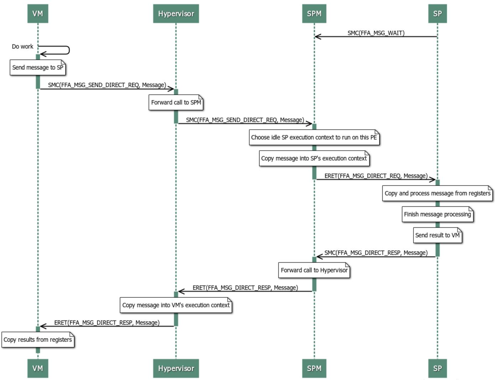  
Figure 8.3: Example Direct message exchange between a VM and SP

I<sub>0172</sub> Figure 8.4 illustrates an example flow in which an LSP co-resident with the SPMD sends a Direct request message to an SP managed by the S-EL2 or S-EL1 SPMC through the FFA\_MSG\_SEND\_DIRECT\_REQ interface. The SP processes the messages and returns the results using the FFA\_MSG\_SEND\_DIRECT\_RESP interface.

Chapter 8. Message passing 8.3. Direct messaging  
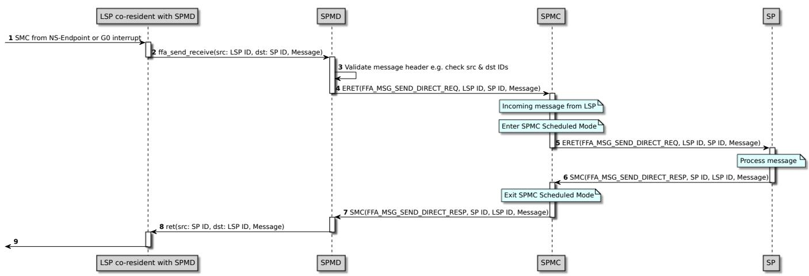  
Figure 8.4: Example Direct messaging sequence with an LSP co-resident with the SPMD

Figure 8.5 illustrates an example flow in which an LSP co-resident with the SPMD in EL3 receives a Direct request from an SP via the FFA\_MSG\_SEND\_DIRECT\_REQ interface.

The LSP processes the message and returns the results using the FFA\_MSG\_SEND\_DIRECT\_RESP interface.

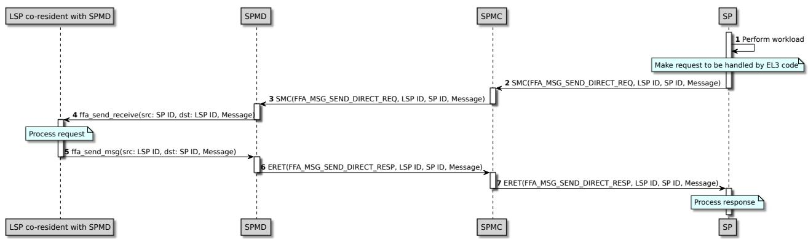  
Figure 8.5: Example LSP co-resident with EL3 SPMD Service Handling

## 8.4 Compliance requirements

This section describes the compliance requirements that must be met by an FF-A message passing implementation. These requirements specify ABIs and conduits that must be implemented at a relevant FF-A instance to correctly support a message passing mechanism.

## 8.4.1 Compliance requirements for Direct messaging

Compliance requirements for Direct messaging depend upon the location of the message Sender and Receiver relative to each other. These are described below.

1. Sender and Receiver are at adjacent exception levels.

1. Sender is at the higher exception level.

1. Sender implements the FFA\_MSG\_SEND\_DIRECT\_REQ and/or FFA\_MSG\_SEND\_DIRECT\_REQ2 ABI with the ERET conduit to send a request message to the Receiver.

2. Receiver implements the FFA\_MSG\_SEND\_DIRECT\_RESP and/or FFA\_MSG\_SEND\_DIRECT\_RESP2 ABI with the SMC, HVC or SVC conduit to send a response message to the Sender. The choice of conduit depends upon the FF-A instance where the message exchange takes place. Also see 4.4 Conduits.

2. Sender is at the lower exception level.

1. Sender implements the FFA\_MSG\_SEND\_DIRECT\_REQ and/or FFA\_MSG\_SEND\_DIRECT\_REQ2 ABI with the SMC, HVC or SVC conduit to send a request message to the Receiver. The choice of conduit depends upon the FF-A instance where the message exchange takes place. Also see 4.4 Conduits.

2. Receiver implements the FFA\_MSG\_SEND\_DIRECT\_RESP and/or FFA\_MSG\_SEND\_DIRECT\_RESP2 ABI with the ERET conduit to send a response message to the Sender.

2. Sender and Receiver are not at adjacent exception levels.

1. Sender implements the FFA\_MSG\_SEND\_DIRECT\_REQ and/or FFA\_MSG\_SEND\_DIRECT\_REQ2 ABI with the SMC, HVC or SVC conduit to send a request message to the Receiver. The choice of conduit depends upon the FF-A instance where the message exchange takes place. Also see 4.4 Conduits.

2. Sender implements the FFA\_MSG\_SEND\_DIRECT\_RESP and/or FFA\_MSG\_SEND\_DIRECT\_RESP2 ABI with the ERET conduit to receive a response message from the Receiver.

3. Receiver implements the FFA\_MSG\_SEND\_DIRECT\_REQ and/or FFA\_MSG\_SEND\_DIRECT\_REQ2 ABI with the ERET conduit to receive a request message from the Sender.

4. Receiver implements the FFA\_MSG\_SEND\_DIRECT\_RESP and/or FFA\_MSG\_SEND\_DIRECT\_RESP2 ABI with the SMC, HVC, or SVC conduit to send a response message to the Sender. The choice of conduit depends upon the FF-A instance where the message exchange takes place. Also see 4.4 Conduits.

5. Hypervisor at the Non-secure physical instance implements the FFA\_MSG\_SEND\_DIRECT\_REQ and/or FFA\_MSG\_SEND\_DIRECT\_REQ2 ABI with the SMC conduit to forward a request message from a VM to an SP.

6. Hypervisor at the Non-secure physical instance implements the FFA\_MSG\_SEND\_DIRECT\_RESP and/or FFA\_MSG\_SEND\_DIRECT\_RESP2 ABI with the ERET conduit to forward a response message from an SP to a VM.

7. S-EL2 or S-EL1 SPMC at the Secure physical instance implements the FFA\_MSG\_SEND\_DIRECT\_REQ and/or FFA\_MSG\_SEND\_DIRECT\_REQ2 ABI with the ERET conduit to forward a request message from a VM to an SP.

8. S-EL2 or S-EL1 SPMC at the Secure physical instance implements the FFA\_MSG\_SEND\_DIRECT\_RESP and/or FFA\_MSG\_SEND\_DIRECT\_RESP2 ABI with the SMC conduit to forward a response message from an SP to a VM.

I<sub>0173</sub> The register usage in the FFA\_MSG\_SEND\_DIRECT\_REQ and FFA\_MSG\_SEND\_DIRECT\_RESP ABIs from the perspective of a Sender and Receiver depends on the implemented FF-A version, the SMC variant invoked, and the execution state it is executing in. A partition manager uses the properties of a sender and receiver to ensure it exposes a consistent view of its registers.

I<sub>0174</sub> Table 8.2 describes the behaviour of the partition manager w.r.t parameter register usage, as observed by a sender and receiver while using the SMC64 variants of the FFA\_MSG\_SEND\_DIRECT\_REQ ABI and FFA\_MSG\_SEND\_DIRECT\_RESP ABIs. It is assumed that the Receiver has previously entered the Waiting state using an SMC64 variant of an FF-A ABI (see 11.1.2 Parameter Register Preservation).

Table 8.2: FFA\_MSG\_SEND\_DIRECT\_REQ/RESP SMC64 register usage in AArch64 execution state

<table><tr><td>Sender Version</td><td>Receiver Version</td><td>Sender register usage</td><td>Receiver register usage</td></tr><tr><td>&lt;1.2</td><td>&lt;1.2</td><td>x0-x7 IMPLEMENTATION DEFINED content forwarded to Receiverx8-x17 Sender content is preserved</td><td>x0-x7 IMPLEMENTATION DEFINED content from Senderx8-x17 Receiver content is preserved</td></tr><tr><td>1.2</td><td>&lt;1.2</td><td>x0-x7 IMPLEMENTATION DEFINED content forwarded to Receiverx8-x17 Reserved (SBZ)</td><td>x0-x7 IMPLEMENTATION DEFINED content from Senderx8-x17 Receiver content is preserved</td></tr><tr><td>&gt;1.2</td><td>&lt;1.2</td><td>x0-x7 IMPLEMENTATION DEFINED content forwarded to Receiverx8-x17 Ignored</td><td>x0-x7 IMPLEMENTATION DEFINED content from Senderx8-x17 Receiver content is preserved</td></tr><tr><td>&gt;1.2</td><td>1.2</td><td>x0-x7 IMPLEMENTATION DEFINED content forwarded to Receiverx8-x17 Ignored</td><td>x0-x7 IMPLEMENTATION DEFINED content from Senderx8-x17 Reserved (MBZ)</td></tr><tr><td>&lt;1.2</td><td>&gt;=1.2</td><td>x0-x7 IMPLEMENTATION DEFINED content forwarded to Receiverx8-x17 Register content is preserved</td><td>x0-x7 IMPLEMENTATION DEFINED content from Senderx8-x17 Reserved (MBZ)</td></tr><tr><td>1.2</td><td>&gt;1.2</td><td>x0-x7 IMPLEMENTATION DEFINED content forwarded to Receiverx8-x17 Reserved (SBZ)</td><td>x0-x7 IMPLEMENTATION DEFINED content from Senderx8-x17 Reserved (MBZ)</td></tr><tr><td>&gt;1.2</td><td>&gt;1.2</td><td>x0-x17 IMPLEMENTATION DEFINED content forwarded to Receiver</td><td>x0-x17 IMPLEMENTATION DEFINED content from Sender</td></tr></table>

I<sub>0175</sub> Table 8.3 describes the behaviour of the partition manager w.r.t parameter register usage, as observed by a sender and receiver while using the SMC32 variant of the FFA\_MSG\_SEND\_DIRECT\_REQ and FFA\_MSG\_SEND\_DIRECT\_RESP ABIs executing in the AArch64 execution state.

Table 8.3: FFA\_MSG\_SEND\_DIRECT\_REQ/RESP SMC32 register usage in AArch64 execution state

<table><tr><td>Sender Version</td><td>Receiver Version</td><td>Sender register usage</td><td>Receiver register usage</td></tr><tr><td>&lt;1.2</td><td>&lt;1.2</td><td>w0-w7 IMPLEMENTATION DEFINED content forwarded to Receiverx8-x17 Sender content is preserved</td><td>w0-w7 IMPLEMENTATION DEFINED content from Senderx8-x17 Receiver content is preserved</td></tr></table>

Chapter 8. Message passing 8.4. Compliance requirements

<table><tr><td>Sender Version</td><td>Receiver Version</td><td>Sender register usage</td><td>Receiver register usage</td></tr><tr><td>&gt;=1.2</td><td>&lt;1.2</td><td>w0-w7 IMPLEMENTATION DEFINED contentx8-x17 See 11.1.2 Parameter Register Preservation</td><td>w0-w7 IMPLEMENTATION DEFINED contentx8-x17 Receiver content is preserved</td></tr><tr><td>&lt;1.2</td><td>&gt;=1.2</td><td>w0-w7 IMPLEMENTATION DEFINED content forwarded to Receiverx8-x17 Sender content is preserved</td><td>w0-w7 IMPLEMENTATION DEFINED content from Senderx8-x17 See 11.1.2 Parameter Register Preservation</td></tr><tr><td>&gt;=1.2</td><td>&gt;=1.2</td><td>w0-w7 IMPLEMENTATION DEFINED contentx8-x17 See 11.1.2 Parameter Register Preservation</td><td>w0-w7 IMPLEMENTATION DEFINED contentx8-x17 See 11.1.2 Parameter Register Preservation</td></tr></table>

I<sub>0176</sub> Table 8.4 describes the behaviour of the partition manager w.r.t parameter register usage, as observed by a sender and receiver while using the SMC32 variant of the FFA\_MSG\_SEND\_DIRECT\_REQ and FFA\_MSG\_SEND\_DIRECT\_RESP ABIs executing in the AArch32 execution state.

Table 8.4: FFA\_MSG\_SEND\_DIRECT\_REQ/RESP SMC32 register usage in AArch32 execution state

<table><tr><td>Sender Version</td><td>Receiver Version</td><td>Sender register usage</td><td>Receiver register usage</td></tr><tr><td>All</td><td>All</td><td>w0-w7 IMPLEMENTATION DEFINED contentw8-w14 Register content is preserved</td><td>w0-w7 IMPLEMENTATION DEFINED contentw8-w14 Register content is preserved</td></tr></table>

## 8.4.2 Compliance requirements for Indirect messaging

Compliance requirements for Indirect messaging depend upon the role of a participating FF-A component in message transmission. These are described below.

1. Sender endpoint implements the FFA\_MSG\_SEND2 ABI with the SMC, HVC or SVC conduit to send a message populated in its TX buffer to the Receiver. The choice of conduit depends upon the FF-A instance where the ABL is invokedAlso see. 4 4 Conduits

2. The Scheduler implements the following FF-A ABIs and features to schedule a Receiver endpoint to process a message in its RX buffer.

1. Support for the Schedule receiver interrupt (see 10.5 Notification signaling) and the FFA\_NOTIFICATION\_INFO\_GET ABI with the SMC conduit at the Non-secure physical FF-A instance and the SMC or HVC conduits at the Non-secure virtual FF-A instance. Also see 10.7 Compliance requirements.

2. If the Receiver endpoint is scheduled via an invocation of a Direct request interface, support for Direct messaging is implemented as a Sender when the Receiver is not at the adjacent exception level as specified in 8.4.1 Compliance requirements for Direct messaging.

3. If the Receiver endpoint is scheduled via an invocation of the FFA\_RUN interface, support for this interface is implemented as specified below,

1. FFA\_RUN ABI with the SMC conduit at the Non-secure physical or the SMC or HVC conduit at Non-secure virtual FF-A instance.

2. FFA\_MSG\_WAIT ABI with the ERET conduit at the Non-secure physical or virtual FF-A instance.

## 3. FFA\_MSG\_YIELD ABI with the ERET conduit at the Non-secure physical or virtual FF-A instance.

## 3. Receiver endpoint implements support for,

1. The RX buffer full notification (see 10.8.1 RX buffer full notification). Also see 10.7 Compliance requirements.

2. The FFA\_MSG\_WAIT ABI with the SMC, HVC or SVC conduit, if it is scheduled via an invocation of the FFA\_RUN interface. The choice of conduit depends upon the FF-A instance where the ABI is invoked. Also see 4.4 Conduits.

3. Direct messaging as a Receiver when the Sender is not at the adjacent exception level as specified in 8.4.1 Compliance requirements for Direct messaging. This is applicable if it is scheduled via an invocation of a Direct request interface.

4. Partition managers implement support for the FFA\_RX\_ACQUIRE ABI (see 13.4 FFA\_RX\_ACQUIRE) if both a VM and an SP send Indirect messages to another VM. This is described below.

1. The Hypervisor implements this ABI with the SMC conduit at the Non-secure physical instance.

2. A S-EL2 or S-EL1 SPMC implements this ABI with the ERET conduit at the Secure physical instance.

# Chapter 9 Interrupt management

## 9.1 Overview

A physical interrupt can trigger on a PE where an endpoint execution context is in the running state. It could be targeted to this execution context or another FF-A component in the system. Alternatively, a physical interrupt targeted to an endpoint execution context could trigger when the context is in the waiting, blocked or preempted states.

The scope of the guidance provided in this chapter applies to management of physical interrupts in relation to FF-A components in the Secure world as described below.

• Management of a Non-secure physical interrupt that triggers in the Secure world by the SPMC.

• Management of a Secure physical interrupt that triggers in the Normal world by the SPMC.

• Management of a Secure physical interrupt that triggers in the Secure world by the SPMC.

• Management of a Secure virtual interrupt targeted to a physical SP in the Secure world by the SPMC.

• Management of CPU cycles allocated by an NS-Endpoint or the SPMC.

Management of interrupts in the Normal world is IMPLEMENTATION DEFINED. The guidance in this chapter makes the following assumptions about the system configuration

1. The SPMC has exclusive access to the physical GIC. This guidance could be extended to a configuration where the SPMC shares access to the physical GIC with a trusted S-EL1 SP in an IMPLEMENTATION DEFINED manner. This is beyond the scope of this specification.

2. A S-EL1 SP only has access to the virtual GIC. The SPMC signals interrupts through the virtual IRQ and FIQ lines and the ERET conduit. The model of the GIC presented by the SPMC to the SP is IMPLEMENTATION DEFINED. For example, it could export a para-virtualized or emulated GIC to an SP.

3. The SPMC signals virtual interrupts to a S-EL0 SP through the ERET conduit. This is because the Arm

A-profile architecture does not support signaling of interrupts to the S-EL0 exception level through the virtual IRQ and FIQ lines.

4. The GIC implements support for Secure EL2 introduced in version 3.1 of the Arm GIC architecture. This assumption is applicable to S-EL1 SPs managed by the SPMC in S-EL2.

5. The GIC implements version 2.0 or later of the Arm GIC architecture. This assumption is applicable to S-EL0 SPs managed by a SPMC in EL3 or S-EL1.

6. Secure interrupts are configured as G1S or G0 interrupts if the GIC architecture version is 3.0 or later.

7. Non-secure interrupts are configured as G1NS interrupts if the GIC architecture version is 3.0 or later.

8. Secure interrupts are configured as G0 interrupts if the GIC architecture version is 2.0.

9. Non-secure interrupts are configured as G1 interrupts if the GIC architecture version is 2.0

10. SCTLR\_EL1.UMA=0 during execution in a S-EL0 SP. It is not allowed to mask physical or virtual FIQs in the PSTATE register.

11. Secure interrupts are routed to EL3 when execution is in the Non-secure state by programming SCR\_EL3.FIQ=1.

12. All interrupts are routed to the SPMC when execution is in the Secure state. For example, with a S-EL2 SPMC, this is done by programming,

• SCR\_EL3.FIQ=0 and SCR\_EL3.IRQ=0.

• HCR\_EL2.IMO=1 and HCR\_EL2.FMO=1.

On some implementations it is possible that some G0 interrupts must be handled by EL3 firmware even though they are routed to the SPMC. The Framework defines the FFA\_EL3\_INTR\_HANDLE ABI to enable the SPMC to delegate handling of such an interrupt to EL3 firmware. Also see 17.1 FFA\_EL3\_INTR\_HANDLE.

The guidance in this chapter based upon the above assumptions is aimed at fulfilling the following (non-exhaustive) list of requirements w.r.t interrupt management in the Secure world.

1. In the absence of GIC virtualization in the Secure world, Secure physical interrupts are delivered directly to a logical S-EL1 SP. In the absence of physical address space isolation, the physical GIC is accessible from the S-EL1 exception level. It can be configured by the logical S-EL1 SP. The SP relies on EL3 firmware to ensure that physical interrupt routing controls are programmed as described above. Together, these mechanisms guarantee that Secure physical interrupts are delivered to the SP.

The SP does not depend on a primary or secondary scheduler in the Normal world to receive its interrupts and perform top-half interrupt handling. This is guaranteed by a combination of hardware and software configuration. The SP could still depend upon a primary or secondary scheduler in the Normal world for CPU cycles to perform bottom-half interrupt handling. This is an IMPLEMENTATION DEFINED aspect of the SP.

In the presence of GIC virtualization in the Secure world, the physical GIC is shared among multiple physical S-EL1 SPs. Each S-EL1 SP sees a virtual GIC and handles virtual interrupts. As mentioned above, how the SPMC exposes a virtual GIC to each SP is IMPLEMENTATION DEFINED and beyond the scope of this specification. The guidance in this chapter enables the SPMC to preserve the interrupt delivery guarantee to S-EL1 SPs as described above.

As per the interrupt routing controls described above, a Secure physical interrupt is delivered to the SPMC in S-EL2. The SPMC is responsible for signaling the corresponding Secure virtual interrupt to the target SP execution context. The SPMC ensures that this is done without a dependence on the primary or secondary scheduler in the Normal world for CPU cycles unless this is explicitly requested by the SP. This is discussed in 9.3.2 Actions for a Secure interrupt.

2. In the absence of GIC virtualization in the Secure world, Non-secure physical interrupts that trigger in the Secure world result in a world-switch to the Normal world. This enables a co-operative scheduling model between the two worlds where the Secure world software strives to minimize delivery latency of Non-secure physical interrupts while maintaining its security and availability guarantees.

A commonly deployed mechanism to enable this model is where Non-secure physical interrupts are delivered directly to a logical S-EL1 SP. The SP manages its internal state and requests EL3 firmware to perform the world switch. The SP does not alter the state of the Non-secure interrupt in the GIC so that it can be handled as usual in the Normal world.

A less commonly deployed mechanism is to configure interrupt routing controls in the Secure world such that Non-secure physical interrupts are routed to EL3. A logical S-EL1 SP is interrupted when such an interrupt triggers. EL3 firmware arranges the world-switch after saving the SP’s state. The SP is resumed when the Normal world runs it subsequently.

In the presence of GIC virtualization in the Secure world, a Non-secure physical interrupt is delivered to the SPMC in S-EL2. This is closer to the less commonly deployed mechanism described above. There is no equivalent for the more commonly deployed mechanism. The guidance in this chapter enables the SPMC to provide the equivalent of both mechanisms. This is discussed in 9.3.1 Actions for a Non-secure interrupt.

3. S-EL0 SPs are assigned devices which is akin to user space drivers in an OS. The device interrupts are handled by the driver in the S-EL0 SPs. The interrupts are configured as Secure physical interrupts in the physical GIC. The IRQ and FIQ lines cannot be used to signal interrupts to the S-EL0 exception level. The guidance in this chapter enables the SPMC to manage interrupts targeted to a S-EL0 SP.

## 9.2 Concepts

## 9.2.1 Secure interrupt signaling mechanisms

A virtual interrupt is signaled to a target SP execution context by the SPMC. Signaling means that the SPMC,

1. Uses a mechanism to indicate to the SP execution context that it has a pending virtual interrupt.

2. Runs the SP execution context so that it can handle the virtual interrupt.

The mechanism used by the SPMC to signal a virtual interrupt to the target execution context depends upon the type of SP and the run-time state from which the execution context will transition to the running state. The mechanisms used by the SPMC to signal an interrupt are,

1. The FFA\_INTERRUPT interface with the ERET conduit. This mechanism is used for signaling to both S-EL1 and S-EL0 SPs.

2. The vIRQ signal. This mechanism is only used for signaling to S-EL1 SPs.

The SPMC queues the interrupt if it cannot be signaled. Queuing is an IMPLEMENTATION DEFINED mechanism used by the SPMC to maintain internal state that indicates that a virtual interrupt must be signaled to the target SP execution context subsequently.

For each runtime state that the target execution context of a S-EL0 or S-EL1 SP can be in, Table 9.1 and Table 9.2 respectively describe whether the SPMC can signal or must queue the Secure virtual interrupt. If it is possible to signal the interrupt, it describes the mechanism used by the SPMC to do so. If it is not possible to signal the interrupt, it describes the next runtime state when the interrupt can be signaled to the target execution context.

When execution in Normal world is preempted by a Secure physical interrupt, the SPMD uses the FFA\_INTERRUPT ABI with the ERET conduit to signal the interrupt to the SPMC in S-EL2 or S-EL1.

Table 9.1: Secure interrupt signaling and queuing for a S-EL0 SP

<table><tr><td>No.</td><td>SP state</td><td>Conduit</td><td>Interface and parameters</td><td>Description</td></tr><tr><td>1.</td><td>Waiting</td><td>ERET</td><td>FFA_INTERRUPT, Interrupt ID</td><td>The SPMC can signal an interrupt to the target execution context.SPMC resumes execution of the SP through the ERET instruction.</td></tr><tr><td>2.</td><td>Blocked</td><td>NA</td><td>NA</td><td>The SPMC cannot signal an interrupt to the target execution context.The SPMC queues the interrupt and signals it when the SP execution context next enters the waiting state.</td></tr><tr><td>3.</td><td>Preempted</td><td>NA</td><td>NA</td><td>The SPMC cannot signal an interrupt to the target execution context.The SPMC queues the interrupt and signals it when the SP execution context next enters the waiting state.</td></tr><tr><td>4.</td><td>Running</td><td>NA</td><td>NA</td><td>The SPMC cannot signal an interrupt to the target execution context.The SPMC queues the interrupt and signals it when the SP execution context next enters the waiting state.</td></tr></table>

Table 9.2: Secure interrupt signaling and queuing for a S-EL1 SP

<table><tr><td>No.</td><td>SP state</td><td>Conduit</td><td>Interface and parameters</td><td>Description</td></tr><tr><td>1.</td><td>Waiting</td><td>ERET, vIRQ</td><td>FFA_INTERRUPT, Interrupt ID</td><td>The SPMC can signal an interrupt to the target execution context.SPMC also pends the vIRQ signal to allow the S-EL1 SP to handle the interrupt in a separate handler context.SPMC resumes execution of the SP through the ERET instruction.</td></tr><tr><td>2.</td><td>Blocked</td><td>ERET, vIRQ</td><td>FFA_INTERRUPT</td><td>The SPMC can signal an interrupt to the target execution contexta.The ID of the interrupt is not specified.SPMC pends the vIRQ signal to allow the S-EL1 SP to handle the interrupt in a separate handler context.SPMC resumes execution of the SP through the ERET instruction.The SPMC uses the FFA_INTERRUPT ABI to inform a callee if its request was preempted (see FFA_INTERRUPT usage).</td></tr></table>

Chapter 9. Interrupt management 9.2. Concepts

<table><tr><td>No.</td><td>SP state</td><td>Conduit</td><td>Interface and parameters</td><td>Description</td></tr><tr><td>3.</td><td>Preempted</td><td>vIRQ</td><td>NA</td><td>The SPMC can signal an interrupt to the target execution  $context^a$ .The ID of the interrupt is not specified.The FFA_INTERRUPT interface is not used.SPMC pends the vIRQ signal to allow the S-EL1 SP to handle the interrupt in a separate handler context.SPMC resumes execution of the SP through the ERET instruction.</td></tr><tr><td>4.</td><td>Running</td><td>ERET, vIRQ</td><td>NA</td><td>The SPMC cannot signal an interrupt to the target execution context.The SPMC queues the interrupt and signals it when the SP execution context next enters the waiting, preempted or blocked states as described above.</td></tr></table>

<sup>a</sup> It is possible that a Secure virtual interrupt is queued even if the target execution context of an SP is in a runtime state where an interrupt can be signaled to it. The decision to signal or queue the interrupt is taken by the SPMC. This scenario is described in the following sections.

• 9.3.2.2 Secure interrupt triggers in Secure state.

• 9.3.2.2.1 Signaling an Other S-Int in blocked state.

• 9.3.2.1 Secure interrupt triggers in Non-secure state.

## 9.2.2 Physical interrupt types

From the perspective of an SP execution context, a physical interrupt is of one of the types listed in Table 9.3.

Table 9.3: Physical interrupt types

<table><tr><td>Acronym</td><td>Interrupt description</td></tr><tr><td>NS-Int</td><td>A Non-secure physical interrupt. It requires a switch to the Normal world to be handled.</td></tr><tr><td>Other S-Int</td><td>A Secure physical interrupt targeted to, - An execution context of another SP on the PE where the Secure physical interrupt is taken. - An execution context of the same SP that is different from the execution context currently running on the PE where the Secure physical interrupt is taken. * For example, the physical interrupt and the corresponding virtual interrupt are SPIs. The virtual SPI is targeted to a different execution context of the same SP.</td></tr><tr><td>Self S-Int</td><td>A Secure physical interrupt targeted to the SP execution context that is currently running.</td></tr></table>

## 9.2.3 CPU cycle allocation modes

CPU cycles are allocated to an SP execution context on a PE by either the Normal world or the SPMC so that it enters the running state.

1. An SP execution context runs in the SPMC scheduled mode if cycles are allocated by the SPMC.

2. An SP execution context runs in the Normal world scheduled mode if cycles are allocated by the Normal world.

3. An SP execution context in the waiting state enters the running state in the SPMC scheduled mode if any one of the following conditions is true:

1. The SPMC signals a virtual Secure interrupt to it. Also see 9.2.1 Secure interrupt signaling mechanisms.

2. Another SP execution context in the SPMC scheduled mode allocates cycles to it through an invocation of a Direct request ABI.

4. An SP execution context enters the Normal world scheduled mode when it is in the waiting state and it enters the running state when any one of the following conditions is true:

1. A direct request ABI is used by any one of the following FF-A components to allocate CPU cycles:

1. An NS-Endpoint execution context.

2. An SP execution context that is in the Normal world scheduled mode.

2. The FFA\_RUN ABI is used by an NS-Endpoint to allocate CPU cycles.

The SPMC must return the DENIED error code in the case of an invalid state transition of an SP.

5. An SP execution context exits its CPU cycle allocation mode when it next enters the waiting state as described in 7.2.7 Waiting state.

## 9.2.4 SP call chains

An SP execution context in the running state in either CPU cycle allocation mode could run another SP execution context by invoking a Direct request ABI. This process could repeat any number of times. All SPs in this sequence of invocations are a part of a call chain (also see 7.2.9 Blocked state). The Framework defines two types of call chains.

1. Call chains in which all SP execution contexts run in the SPMC scheduled mode.

2. Call chains in which all SP execution contexts run in the Normal world scheduled mode.

Figure 9.1 illustrates an example of the two call chain types.

1. An NS-Endpoint issues a Direct request to SP0 to start the Normal world scheduled call chain in the Secure state. The NS-Endpoint enters the blocked state. SP0 enters the running state.

2. SP0 extends the call chain by issuing a Direct request to SP1. SP0 enters the blocked state. SP1 enters the running state.

3. SP1 gets preempted by a Secure physical interrupt. SP1 enters the preempted state.

4. The SPMC signals the corresponding Secure virtual interrupt to the target execution context of SP2. This starts the first call chain that runs in the SPMC scheduled mode. SP2 enters the running state.

5. SP2 extends the call chain by issuing a Direct request to SP3. SP2 enters the blocked state. SP3 enters the running state.

6. SP3 gets preempted by a Secure physical interrupt. SP3 enters the preempted state.

7. The SPMC signals the corresponding Secure virtual interrupt to the target execution context of SP4. This starts the second call chain that runs in the SPMC scheduled mode. SP4 enters the running state.

8. SP4 extends the call chain by issuing a Direct request to SP5. SP4 enters the blocked state. SP5 enters the running state.

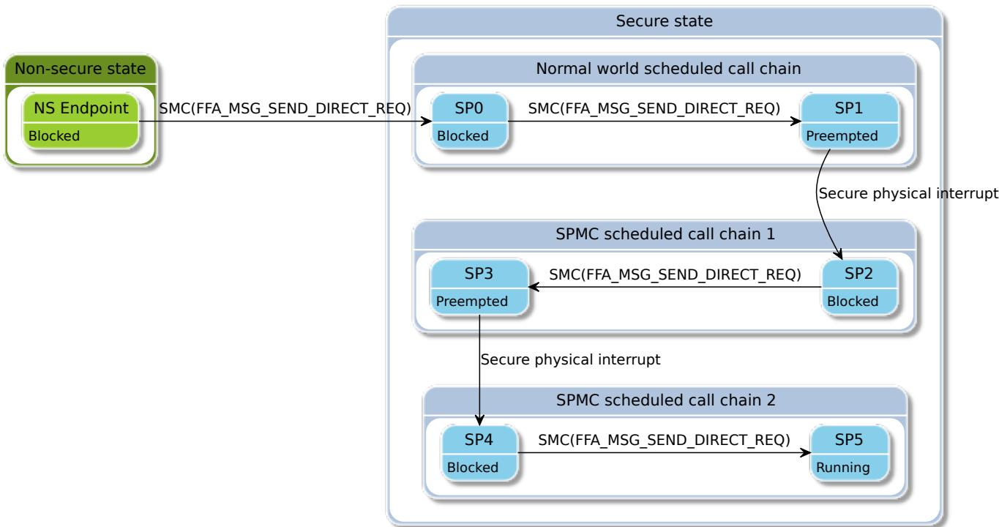  
Figure 9.1: Example call chains

The following rules and guidelines govern the behavior of call chains on any PE in the Secure state.

1. A call chain cannot span PEs i.e. it can exist only on a single PE.

2. A call chain starts winding when the first SP execution context enters the corresponding CPU cycle allocation mode on a given PE.

3. A call chain that runs in the SPMC scheduled mode cannot be preempted by an NS-Int. This implies that an NS-Int is always queued when a SP runs in this mode (also see 9.3.1 Actions for a Non-secure interrupt).

4. A call chain in either mode starts unwinding on a given PE when the last SP execution context in the call chain relinquishes control to its caller by invoking a Direct response ABI.

Additionally, a call chain in the Normal world scheduled mode starts unwinding on a given PE when the SPMC prepares to relinquish control to the Normal world as follows:

1. In response to an NS-Int. Each SP execution context in the call chain either enters the waiting or preempted state depending upon the action that was specified in response to an NS-Int in the SP manifest. Also see 9.3.1 Actions for a Non-secure interrupt.

2. In response to an invocation of the FFA\_YIELD ABI. Each SP execution context in the call chain that invokes this ABI enters the blocked state.

5. A call chain in the SPMC scheduled mode is unwound when each SP execution context in it enters the waiting state. It also exits its CPU cycle allocation mode when it enters the waiting state.

6. A call chain in the Normal world scheduled mode is unwound when each SP execution context in it enters one of the following states:

1. The waiting state. In this case, it also exits its CPU cycle allocation mode.

2. The preempted state or the blocked state. In this case, it continues to remain in its CPU cycle allocation mode. This implies that this SP execution context enters the running state subsequently when it is resumed by an NS-Endpoint or a call chain that runs in the same mode.

7. A call chain is unwound in an order that is reverse of how it was wound or created.

8. On a given PE, any call chain that is created after entry into the Secure state must be unwound prior to the next exit from the Secure state.

9. When execution on a PE is in the Secure state, only a single call chain that runs in the Normal world scheduled mode can exist.

10. When execution on a PE is in the Secure state, any number of call chains that run in the SPMC scheduled mode can exist.

11. SP execution contexts in different CPU cycle allocation modes cannot be a part of the same call chain.

12. Presence of more than one call chain on a PE implies that each call chain apart from the currently active call chain was preempted by a Secure physical interrupt.

13. A call chain that runs in the SPMC scheduled mode cannot be preempted by the call chain that runs in the Normal world scheduled mode (if this call chain already exists on the same PE).

This means that the call chain in the SPMC scheduled mode could be interrupted by a Secure physical interrupt. The corresponding Secure virtual interrupt could target an SP execution context in the call chain that runs in the Normal world scheduled mode. The SPMC queues this interrupt instead of signaling it. The interrupt is signaled after all call chains in the SPMC scheduled mode are unwound and the target execution context is subsequently resumed on this PE.

This rule also implies that a call chain cannot run in the Normal world scheduled mode on a PE when there are unwound call chains present that run in the SPMC scheduled mode on the same PE. This scenario is possible only if one of the SPMC scheduled call chains was preempted by the Normal world scheduled call chain which is not possible as per the constraint described above.

Figure 9.2 illustrates this constraint. SP3 is running in a call chain in the SPMC scheduled mode. This call chain was started the call chain comprising of SP0 and SP1 and running in the Normal world scheduled mode was preempted by Secure physical interrupt 0. Secure physical interrupt 1 targeted to SP0 could pend while SP3 is running. The SPMC ensures that it remains pending until the call chain in the SPMC scheduled mode unwinds.

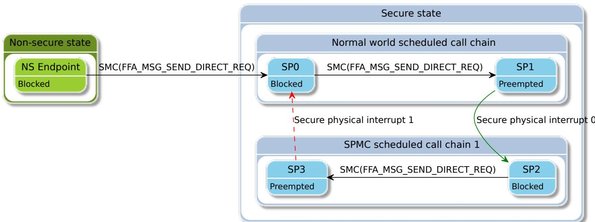  
Figure 9.2: Example of queuing Other S-Ints in SPMC scheduled mode

The concept of a call chain is central to how the SPMC manages physical interrupts in the Secure world. The constraints around unwinding call chains prior to exit from the Secure state, preventing them from crossing PEs and tracking who allocated CPU cycles to them, enables requests that were posted on a given PE to be completed on the same PE. This prevents the SPMC from implementing complex scheduling policies to ensure that SP execution contexts in various runtime states with pending work are able to make progress across PEs upon being interrupted by Secure and Non-secure physical interrupts.

## 9.3 Physical interrupt actions

The Framework defines the actions that can be specified in response to each type of physical interrupt. An action is taken by the SPMC and depends upon the following factors,

1. The type of physical interrupt (see 9.2.2 Physical interrupt types).

2. The type of SP which is the target of the interrupt.

3. The runtime state of the target SP execution context.

4. IMPLEMENTATION DEFINED policy in the SPMC.

The actions are described as follows.

1. 9.3.1 Actions for a Non-secure interrupt describes actions in response to an NS-Int.

2. 9.3.2 Actions for a Secure interrupt describes actions in response to an Self S-Int or an Other S-Int.

## 9.3.1 Actions for a Non-secure interrupt

An SP specifies one of the following actions in its partition manifest (see 5.2.1 Partition manifest) in response to an NS-Int that triggers on a PE where an execution context of the SP was running.

## 9.3.1.1 Non-secure interrupt is signaled

The SPMC hands control to the Normal world on the PE where the interrupt triggers. The interrupt is handled in the Normal world through an IMPLEMENTATION DEFINED mechanism.

This action can be specified by both S-EL1 and S-EL0 SPs. This action is only applicable to SP execution contexts in a call chain in the Normal world scheduled mode. The interrupt is queued in the SPMC scheduled mode (see 9.3.1.3 Non-secure interrupt is queued).

Each applicable SP execution context in the call chain that runs in the Normal world scheduled mode (see 9.2.4 SP call chains) on that PE undergoes the following steps.

1. Enters the preempted state.

2. The state of the execution context is saved by the SPMC.

3. The SPMC informs the execution context that ran the preempted SP execution context that it was preempted. The FFA\_INTERRUPT interface (also see 14.4 FFA\_INTERRUPT) is used by the SPMC.

This execution context subsequently uses the FFA\_RUN interface to resume the preempted SP execution context.

Figure 9.3 illustrates an example flow where a Client in an NS-Endpoint sends a Direct message to the single execution context EC0 on CPU0 of an UP-Migrate capable SP. Message processing in SP EC0 is preempted by a Non-secure interrupt. It is later resumed on CPU1 by the NS-Endpoint.

Chapter 9. Interrupt management 9.3. Physical interrupt actions  
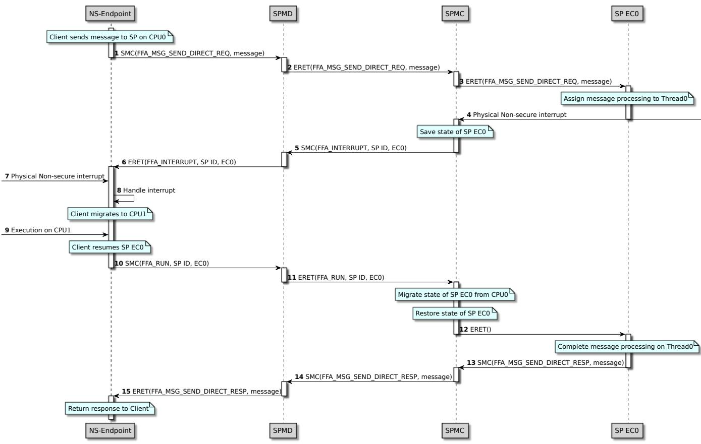  
Figure 9.3: Example SP preemption flow

## 9.3.1.2 Non-secure interrupt is signaled after a managed exit (ME)

The SPMC hands control to the Normal world on the PE where the interrupt triggers. The interrupt is handled in the Normal world through an IMPLEMENTATION DEFINED mechanism.

This action can be specified only by S-EL1 SPs. This action is only applicable to SP execution contexts in a call chain in the Normal world scheduled mode. The interrupt is queued in the SPMC scheduled mode (see 9.3.1.3 Non-secure interrupt is queued).

Each applicable SP execution context on that PE enters the waiting state as described in 9.3.1.2.1 Managed exit prior to exit to the Non-secure state.

## 9.3.1.2.1 Managed exit

## Overview

A managed exit is a mechanism in which a running SP execution context is notified about a pending physical Non-secure interrupt. This allows the SP to manage its internal state before relinquishing control to the Normal world where the interrupt is handled.

A managed exit stands in contrast to preemption of an SP execution context in the running state. In this case, the SP does not get an opportunity to manage its internal state before control is handed to the Normal world.

A managed exit could be used for the following reasons.

1. Within an SP execution context, the managed exit mechanism may place the running application thread in a preempted state. The execution context is able to enter the waiting runtime state upon completing the managed exit. This enables it to accept subsequent requests for work. Hence, other application threads running in the SP execution context are able to do work while one or more application threads have been preempted.

It is also possible that the preempted application thread is migrated to another SP execution context that runs on a different physical PE. This enables the thread to make progress. This is in contrast to the scenario where in the absence of a managed exit, the SP execution context gets preempted. In this case, the application thread gets preempted too and is unable to make progress until the SP execution context is resumed subsequently.

2. It ensures that the CPU cycles allocated to an SP execution context are used to process the request that the scheduler has issued instead of a request from another endpoint.

3. It ensures that critical events can be conveyed to the endpoint in time.

For example, the OS could issue a power state transition event through a PSCI function on a PE. The SPMC needs to inform SP execution contexts pinned to that PE about this event. This cannot be done if a SP execution context is in a preempted state. Also see 18.2.4 Power Management messages.

Figure 9.4 illustrates a managed exit flow using this reason as an example where a Client in a NS-Endpoint sends a Direct message to MP capable SP. The SP has access to the virtual GIC and two execution contexts EC0 and EC1 which are pinned to CPU0 and CPU1 respectively. SP EC0 stops message processing and performs a managed exit in response to a Non-secure physical interrupt. Message processing is later resumed on CPU1 by the NS-Endpoint.

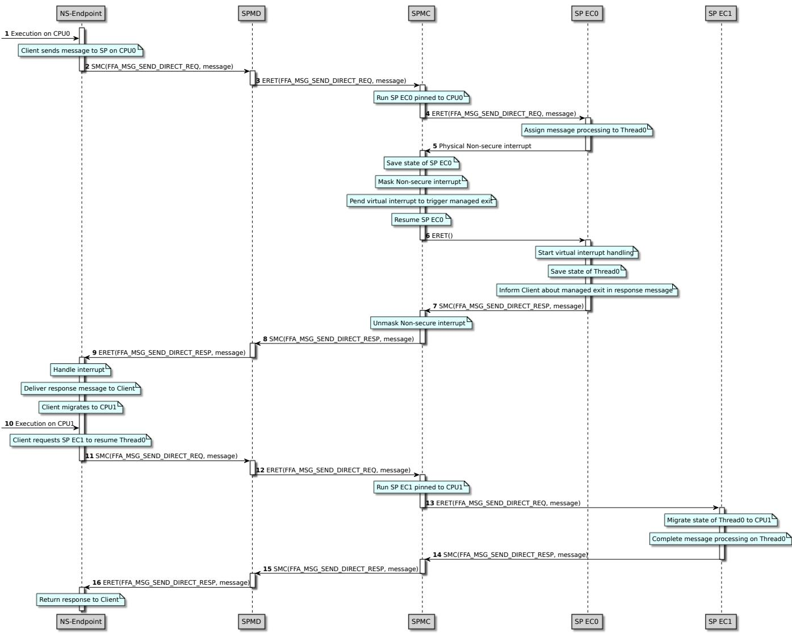  
Figure 9.4: Example managed exit flow

## Rules and guidelines

Use of a managed exit by the SPMC and a SP is subject to the following rules and guidelines.

1. A SP requests a managed exit in its partition manifest (see Table 5.1 in 5.2.1 Partition manifest) if it runs in S-EL1 in either execution state.

2. The SPMC ensures that the state of the Non-secure interrupt that triggers a managed exit does not change in the GIC through any software action until the managed exit has completed.

3. The SPMC ensures that a managed exit is performed for all SPs that have,

1. Requested this mechanism through their partition manifests and

2. Entered the preempted or blocked states after the most recent switch of execution from the Normal world to the Secure world on the current PE.

4. The SPMC can impose an IMPLEMENTATION DEFINED timeout within which a SP must complete the managed exit.

The SPMC takes an IMPLEMENTATION DEFINED action if the timeout expires before the managed exit is completed.

5. The SPMC masks Non-secure interrupts while a managed exit is in progress.

6. The SPMC can signal a Secure interrupt to a SP that is performing a managed exit. The SP handles these scenarios through an IMPLEMENTATION DEFINED mechanism.

7. An SP execution context uses a Direct response ABI to complete a managed exit if it was allocated cycles through a Direct request ABI.

8. An SP execution context uses the FFA\_MSG\_WAIT interface to complete a managed exit if it was allocated cycles through the FFA\_RUN interface.

9. A SP that has been asked to perform a managed exit could relinquish control and enter the waiting state without acknowledging the managed exit signal. The SPMC treats this as a valid response to the managed exit request and destroys any internal state to track the progress of the managed exit.

## Signaling mechanism

A managed exit is signaled by the SPMC to a SP execution context as described below.

1. A S-EL2 SPMC uses the vFIQ or vIRQ signals to signal a managed exit to a SP. The vFIQ signal is used if the SP does not explicitly indicate in its partition manifest that the vIRQ signal must be used. An example flow using this signaling mechanism is illustrated in Figure 9.5.

The mechanism used by a non-S-EL2 SPMC and a SP for signaling a managed exit is IMPLEMENTATION DEFINED.

2. If the vIRQ signal is used by a SP, the SPMC reserves an interrupt ID to allow the SP to distinguish between a managed exit request and other interrupts.

This ID can be discovered through the FFA\_FEATURES interface (see 13.3 FFA\_FEATURES) and Table 13.14.

The managed exit interrupt is signaled as a G1S interrupt to the SP. The interrupt is an SGI or a PPI.

An example flow using this signaling mechanism is illustrated in Figure 9.6.

Chapter 9. Interrupt management 9.3. Physical interrupt actions  
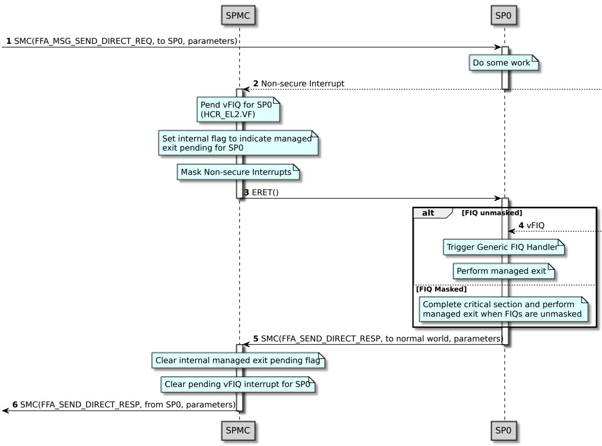  
Figure 9.5: Managed exit signaling through a vFIQ

Chapter 9. Interrupt management 9.3. Physical interrupt actions  
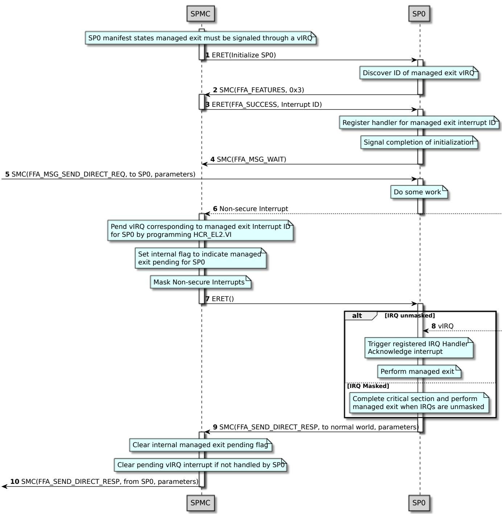  
Figure 9.6: Managed exit signaling through a vIRQ

## Example flows

Multiple SPs could be in a call chain where each SP is blocked on the next SP. Between any two adjacent SPs in the chain, a managed exit could be requested by one of them, none of them or both of them.

Figure 9.7, Figure 9.8, Figure 9.9 and Figure 9.10 illustrate how the SPMC returns control to the Normal world in response to a Non-secure interrupt in each of these scenarios. The first two SPs in the call chain are considered. The same sequence would apply to any other pair of adjacent SPs in a call chain with more than two SPs. The Normal world would be replaced by the SP preceding the pair.

Chapter 9. Interrupt management 9.3. Physical interrupt actions  
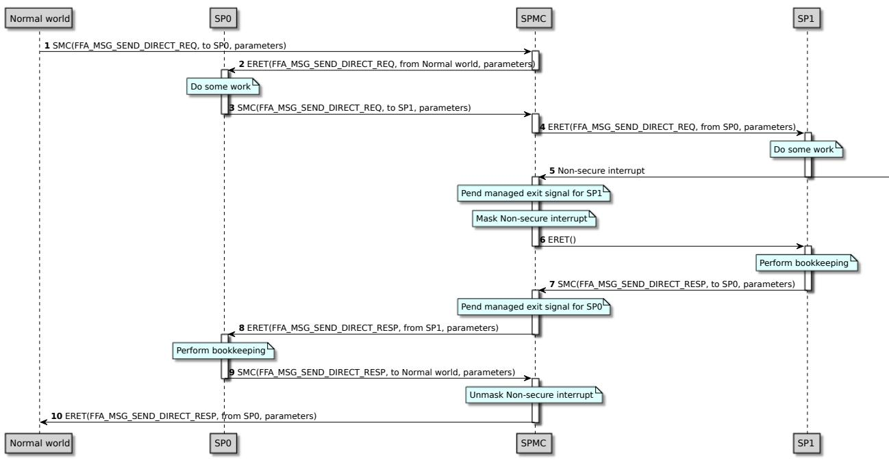  
Figure 9.7: Managed exit is supported by SP0 and SP1

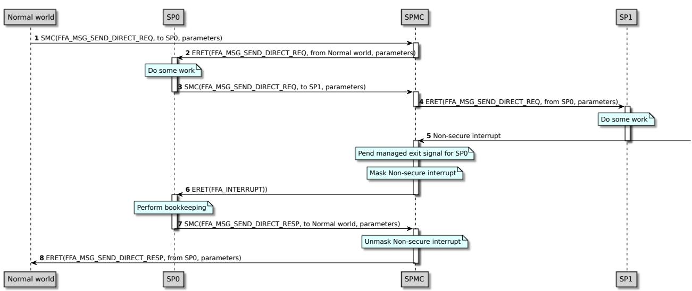  
Figure 9.8: Managed exit is supported by SP0 but not by SP1

Chapter 9. Interrupt management 9.3. Physical interrupt actions  
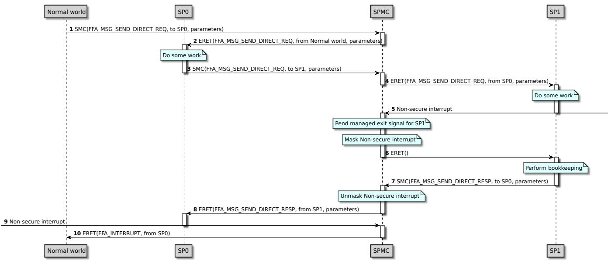  
Figure 9.9: Managed exit is supported by SP1 but not SP0

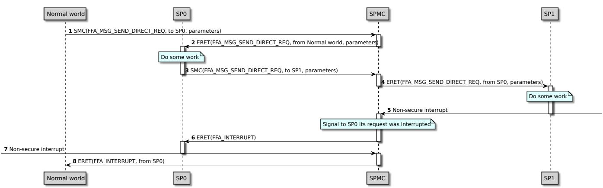  
Figure 9.10: Managed exit is not supported by SP1 and SP0

## 9.3.1.3 Non-secure interrupt is queued

The SPMC uses an IMPLEMENTATION DEFINED mechanism to queue the interrupt such that it is never signaled to any execution context of this SP that is in the running state. For e.g. the SPMC could mask Non-secure interrupts in the GIC. This action can be specified by both S-EL1 and S-EL0 SPs.

Figure 9.11 illustrates an example flow where two SPs (SP0 and SP1) specify the action to queue NS-Ints. Normal world requests SP0 to do some work on its behalf. SP0 requests SP1 to do some work on its behalf. The SPMC ensures that NS-Ints are masked for the duration execution is in either SP0 or SP1. A pending NS-Int is handled when execution returns to the Normal world.

Chapter 9. Interrupt management 9.3. Physical interrupt actions  
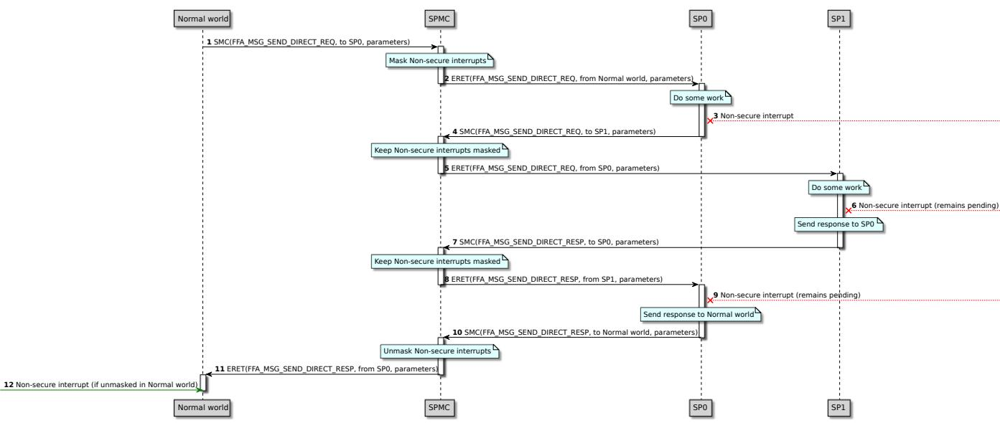  
Figure 9.11: Non-secure interrupt is queued by SP0 and SP1

## 9.3.1.4 Precedence rules for NS-Int actions

The actions in response to an NS-Int are governed by the following precedence rules. < should be read as is less permissive than.

• NS-Int is queued < NS-Int is signaled after a ME < NS-Int is signaled.

An SP execution context in a call chain (see 9.2.4 SP call chains) could specify a less permissive action than subsequent SP execution contexts in the same call chain. The less permissive action takes precedence over the more permissive actions specified by the subsequent execution contexts. This is applicable to a call chain in either CPU cycle allocation mode.

The rationale behind this constraint is that a less permissive action effectively decreases the priority of an NS-Int. Taking a more permissive action when there are SP execution contexts in a call chain that rely on a less permissive action violates their priority model w.r.t NS-Ints. This constraint enables the next SP execution context to effectively inherit the priority of NS-Ints w.r.t the previous SP execution context in a call chain

Figure 9.12 illustrates an example of this constraint as described below.

1. SP0 specifies the NS-Int is queued action for while running.

2. SP1 specifies the NS-Int is signaled action while running<sup>1</sup>.

3. SP0 runs SP1 by invoking FFA\_MSG\_SEND\_DIRECT\_REQ.

4. The SPMC ensures that the action specified by SP0 takes precedence over the action specified by SP1.

5. An NS-Int that triggers while SP1 is running remains pending.

6. The NS-Int is handled when SPMC forwards the response from SP0 to the Normal world.

A variant of the above example is where SP0 is preempted by a Secure interrupt targeted to an SP1 execution context (Other S-Int). The new call chain in the SPMC scheduled mode is started on the same PE if the SP1 execution context is run to handle the corresponding Secure virtual interrupt. The SPMC applies the same mitigation described above to avoid violating the action specified by SP0 and leaving the SP0 call chain unwound prior to exit to the Non-secure state.

Chapter 9. Interrupt management 9.3. Physical interrupt actions  
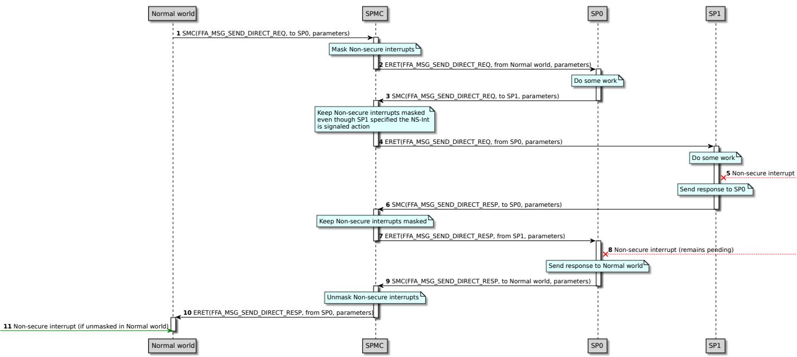  
Figure 9.12: SP0's action takes precedence over SP1's action

## 9.3.2 Actions for a Secure interrupt

A Secure physical interrupt could trigger in the Normal world or the Secure world. Depending upon the state of the target SP execution context, the SPMC either queues or signals the corresponding Secure virtual interrupt. When the Secure virtual interrupt is signaled, it is either handled in the Normal world scheduled mode or the SPMC scheduled mode.

## 9.3.2.1 Secure interrupt triggers in Non-secure state

A Secure physical interrupt preempts the Normal world if it triggers when execution is in the Non-secure state. The action taken by the SPMC in response to this interrupt depends upon the runtime state of the target SP execution context as listed below.

1. The execution context is in the waiting state. The action taken by the SPMC is described below.

In case of an S-EL0 SP, the SPMC signals the corresponding Secure virtual interrupt to the execution context as described in Table 9.1 and Table 9.2. This starts a new call chain that runs in the SPMC scheduled mode. In case of an S-EL1 SP, the action taken by the SPMC is governed by the virtual interrupt handling policy specified by the SP. See also 9.3.2.3 SP vIRQ handling policy.

2. The execution context is in the running state on a different PE. The SPMC queues the corresponding Secure virtual interrupt and signals it to the target execution context as described in Table 9.1 and Table 9.2.

3. The execution context is in the preempted state on the same or a different PE. The SPMC queues the corresponding Secure virtual interrupt.

In case of an S-EL1 SP, the interrupt is signaled when the execution context next enters the running state as described below.

1. The execution context was preempted by an NS-Int in the Normal world scheduled mode. In this case, the queued Secure virtual interrupt is signaled when the Normal world resumes the call chain that the execution context is a part of subsequently.

2. The execution context was preempted by an Other S-Int in either CPU cycle allocation mode on a PE different from where the Secure physical interrupt triggered. In this case, the queued Secure virtual interrupt is signaled when the SPMC resumes the execution context subsequently. This happens when the call chain that the SP execution context is a part of is resumed by the SPMC. This scenario is applicable to an un-pinned SP execution context.

The execution context could not have been preempted by an Other S-Int on the PE where the Secure physical interrupt triggered. This is because the SPMC must unwind all call chains prior to exit to the Non-secure state on a given PE. During unwinding, an SP execution context can enter the preempted state only in response to an NS-Int. This would happen if it does not request a managed exit instead. This scenario is applicable to a pinned SP execution context.

In case of an S-EL0 SP, the interrupt can be signaled only when the target SP execution context enters the waiting state (also see Table 9.1). Prior to entering this state, it enters the running state as described above. The interrupt is signaled only after it subsequently enters the waiting state.

4. The execution context is in the blocked state. This implies that one of the following is true:

• The Execution context is part of a call chain in the SPMC scheduled mode on a different PE.

• The Execution context is part of a call chain in the Normal world scheduled mode on any PE.

• The Execution context is not part of a call chain and has previously invoked FFA\_YIELD to relinquish its CPU cycles (see Figure 9.13).

In this scenario, the Secure virtual interrupt is queued by the SPMC.

As mentioned in Table 9.1, the interrupt cannot be signaled to a target S-EL0 SP execution context. It is signaled when the execution context next enters the waiting state via the running state.

If the target execution context is of a S-EL1 SP, it is signaled when the execution context next enters the running state on the same PE where it entered the blocked state.

These transitions happen when the call chain that the blocked SP execution context is a part of is unwound or rewound.

The SPMC in S-EL2 or S-EL1 uses the FFA\_NORMAL\_WORLD\_RESUME ABI to indicate completion of Secure interrupt handling to the SPMD. Also see 14.5 FFA\_NORMAL\_WORLD\_RESUME.

Chapter 9. Interrupt management 9.3. Physical interrupt actions  
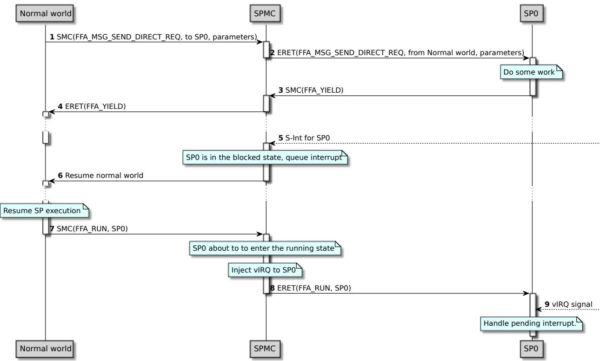  
Figure 9.13: Example S-Int delivery for S-EL1 SP in Blocked state after invoking FFA\_YIELD

## 9.3.2.2 Secure interrupt triggers in Secure state

A Secure physical interrupt preempts the running SP execution context if it triggers when execution is in the Secure state. The interrupted execution context enters the preempted state. The action chosen by the SPMC in response to this interrupt depends upon its type as described below (see 9.2.2 Physical interrupt types).

1. The interrupt is a Self S-Int and the target execution context belongs to a S-EL0 SP. The virtual interrupt is queued as it can be signaled only when the execution context enters the waiting state (also see Table 9.1).

2. The interrupt is a Self S-Int and the target execution context belongs to a S-EL1 SP. The virtual interrupt is signaled as specified in Table 9.2. The target execution context re-enters the running state.

3. The interrupt is an Other S-Int. The action taken by the SPMC depends upon its IMPLEMENTATION DEFINED policy. The SPMC could either signal or queue the corresponding Secure virtual interrupt. This decision depends upon the runtime state of the target SP execution context as listed below.

1. The execution context is in the waiting state. The action taken by the SPMC is described below.

In case of an S-EL0 SP, the SPMC signals the corresponding Secure virtual interrupt to the execution context as described in Table 9.1 and Table 9.2. This starts a new call chain that runs in the SPMC scheduled mode.

In case of an S-EL1 SP, the action taken by the SPMC is governed by the virtual interrupt handling policy specified by the SP. See also 9.3.2.3 SP vIRQ handling policy.

Based on the SPMC’s IMPLEMENTATION DEFINED policy or the SP’s virtual interrupt handling policy, if the interrupt must be signaled to the SP, the SPMC ensures that the virtual interrupt is signaled to the target SP execution context before the next exit to the Non-secure state on this PE.

2. The execution context is in the running state on a different PE. The SPMC queues the corresponding Secure virtual interrupt and signals it to the target execution context as described in Table 9.1 and Table 9.2. The SPMC ensures that the virtual interrupt is signaled to the target SP execution context before the next exit to the Non-secure state on this PE.

3. The execution context is in the blocked state. If the target execution context belongs to a S-EL0 SP, the interrupt is queued as it can be signaled only when the execution context enters the waiting state (also see Table 9.1). This happens when the corresponding call chain is unwound prior to exit from the Secure state.

The action taken by the SPMC in case of a S-EL1 SP is described in 9.3.2.2.1 Signaling an Other S-Int in blocked state.

4. The execution context is in the preempted state. In this case, the SPMC queues the Secure virtual interrupt. It is signaled when the execution context next enters the running state as described below.

1. The execution context was preempted by an NS-Int in the Normal world scheduled mode. In this case, the queued Secure virtual interrupt is signaled when the Normal world resumes the call chain that the SP execution context is a part of subsequently.

2. The execution context was preempted by an Other S-Int in either CPU cycle allocation mode. In this case, the queued Secure virtual interrupt is signaled when the SPMC subsequently resumes the call chain that the SP execution context is a part of.

## 9.3.2.2.1 Signaling an Other S-Int in blocked state

The action taken by the SPMC when an Other S-Int can be signaled to a target S-EL1 SP execution context in the blocked state depends upon the following factors.

1. The interrupted SP execution context (presently in preempted state) is a part of a call chain that was running in the SPMC scheduled mode or the Normal world scheduled mode.

2. The target SP execution context (presently in blocked state) is a part of a call chain and whether the call chain was running in the SPMC scheduled mode or the Normal world scheduled mode.

3. The interrupted and target execution contexts are a part of the same or different call chains. In the latter case, the call chains could reside on different PEs.

The scenarios that arise due to a combination of these factors are described in Table 9.4.

Table 9.4: Scenarios for signaling an Other S-Int in blocked state

<table><tr><td>No.</td><td>CPU cycle allocation mode of preempted execution context</td><td>CPU cycle allocation mode of target execution context</td><td>Part of the same call chain</td><td>Valid configuration</td></tr><tr><td>1</td><td>Normal world</td><td>Normal world</td><td>Yes</td><td>Yes</td></tr><tr><td>2</td><td>Normal world</td><td>Normal world</td><td>No</td><td>Yes</td></tr><tr><td>3</td><td>Normal world</td><td>SPMC</td><td>Yes</td><td> $No^2$ </td></tr><tr><td>4</td><td>Normal world</td><td>SPMC</td><td>No</td><td>Yes</td></tr><tr><td>5</td><td>SPMC</td><td>Normal world</td><td>Yes</td><td> $No^3$ </td></tr><tr><td>6</td><td>SPMC</td><td>Normal world</td><td>No</td><td>Yes</td></tr><tr><td>7</td><td>SPMC</td><td>SPMC</td><td>Yes</td><td>Yes</td></tr><tr><td>8</td><td>SPMC</td><td>SPMC</td><td>No</td><td>Yes</td></tr></table>

Each valid scenario in Table 9.4 is described below.

## 1. Scenario 1.

Chapter 9. Interrupt management 9.3. Physical interrupt actions

1. The virtual interrupt is targeted to an SP execution context that ran earlier in the same call chain before entering the blocked state.

An example of the scenario is illustrated in Figure 9.14. In an SP call chain comprising of SP0, SP1 and SP2, a Other S-Int targeted to SP0 occurs as step 3 when SP2 is running after step 2. SP0 is in the blocked state as it ran earlier in the same call chain.

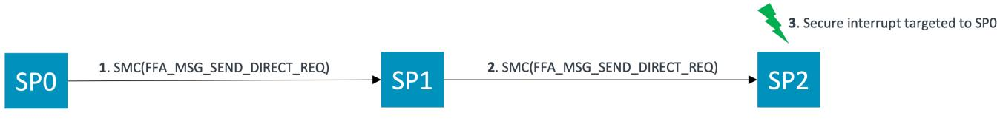  
Figure 9.14: Example of scenario 1

1. The SPMC can signal the virtual interrupt to the target SP execution context as described in Table 9.2. This rewinds the call chain.

There could be intermediate SP execution contexts in the blocked state in the call chain between the preempted and the target execution context. For example, in Figure 9.14, SP1 is an intermediate execution context.

1. The SPMC could leave all intermediate execution contexts in the blocked state and resume the target execution context for handling the interrupt. This is illustrated in Figure 9.15.

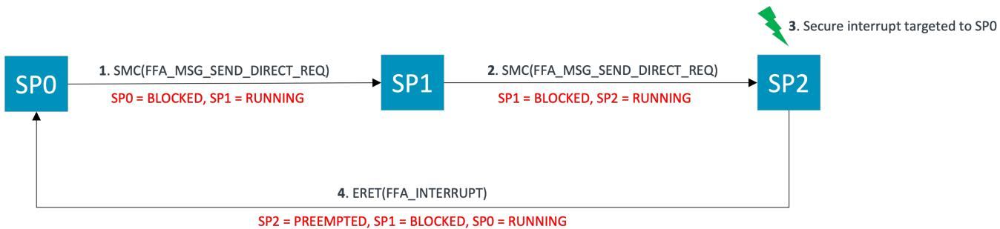  
Figure 9.15: Intermediate execution context is left in blocked state in scenario 1

1. The SPMC could place all intermediate execution contexts in the preempted state and resume the target execution context for handling the interrupt. This is illustrated in Figure 9.16.

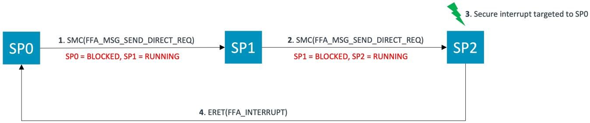  
Figure 9.16: Intermediate execution context is left in preempted state in scenario 1

The choice of mechanism used by the SPMC is IMPLEMENTATION DEFINED.

2. After the target SP execution context has handled the interrupt, it uses the FFA\_RUN ABI to resume the request due to which it had entered the blocked state earlier.

1. If the SPMC left all intermediate execution contexts in the blocked state as illustrated in Figure 9.15, then it bypasses these execution contexts and resumes the SP execution context that was originally preempted.

2. If the SPMC left all intermediate execution contexts in the preempted state as illustrated in Figure 9.16, then it places these execution contexts in the blocked state and resumes the SP execution context that was originally preempted. Effectively, the call chain is recreated.

2. The virtual interrupt is targeted to an intermediate SP execution context in the blocked state as illustrated in Figure 9.17 i.e. an interrupt targeted to SP1 occurs while SP0 is handling the earlier interrupt.

In this case, the SPMC queues the interrupt for the target execution context. It is signaled after the preempted execution context finishes interrupt handling. In the example illustrated in Figure 9.17, SP0 is resumed so that it can finish handling the original interrupt. SP1 is resumed subsequently.

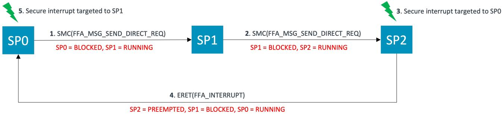  
Figure 9.17: Interrupt is targeted to an intermediate execution context in scenario 1

## 2. Scenario 2.

1. One of the following is true:

• The virtual interrupt is targeted to an SP execution context that ran earlier in a different call chain. Since that call chain is running in the Normal world scheduled mode, it is active on a different PE.

• The virtual interrupt is targeted to an SP execution context that has previously invoked FFA\_YIELD to relinquish its CPU cycles and unwind a Normal world scheduled mode call chain.

2. The SPMC queues the virtual interrupt and signals it to the target execution context when it next enters the running state on that PE. This happens when the call chain is unwound or rewound on that PE.

## 3. Scenario 4.

1. The virtual interrupt is targeted to an SP execution context that ran earlier in a call chain on a different PE. This is because a call chain cannot run in the Normal world scheduled mode when there are unwound call chains that run in the SPMC scheduled mode on the same PE (also see 9.2.4 SP call chains).

2. The SPMC queues the virtual interrupt and signals it to the target execution context when it next enters the running state on that PE. This happens when the call chain is unwound on that PE.

## 4. Scenario 6.

1. One of the following is true:

• The virtual interrupt is targeted to an SP execution context that ran earlier in a call chain on a different PE. This is because a call chain that runs in the SPMC scheduled mode cannot be preempted by a call chain that runs in the Normal world scheduled mode on the same PE (also see 9.2.4 SP call chains).

• The virtual interrupt is targeted to an SP execution context in the Normal world scheduled mode that has invoked FFA\_YIELD to relinquish its CPU cycles and unwind a Normal world scheduled mode call chain.

2. The SPMC queues the virtual interrupt and signals it to the target execution context when it next enters the running state on that PE. This happens when the call chain is unwound or rewound on that PE.

## 5. Scenario 7.

1. This scenario is the same as Scenario 1 apart from the difference that the call chain runs in the SPMC scheduled mode.

2. This scenario is handled in the same way as Scenario 1.

6. Scenario 8.

1. The virtual interrupt is targeted to an SP execution context that ran earlier in a different call chain. Since that call chain is running in the SPMC scheduled mode, it could be active on the same or a different PE.

2. The SPMC queues the virtual interrupt and signals it to the target execution context when it next enters the running state on that PE. This happens when the call chain is unwound on that PE.

## 9.3.2.3 SP vIRQ handling policy

An S-EL1 SP execution context can be in the waiting state and have a pending virtual interrupt in the following scenarios:

• A virtual interrupt is pending for a S-EL1 SP execution context when it enters the waiting state. The SPMC had previously signaled the interrupt to the SP execution context but it was not handled due to an IMPLEMENTATION DEFINED reason e.g. IRQs are masked because PSTATE.I = 1.

• The SPMC pends a virtual interrupt for an SP execution context that is already in the waiting state. The applicable scenarios are listed in the following sections:

– 9.3.2.1 Secure interrupt triggers in Non-secure state.

– 9.3.2.2 Secure interrupt triggers in Secure state.

An S-EL1 SP can specify whether CPU cycles for handling pending virtual interrupts for any of its execution contexts, are allocated by its scheduler in the Normal world or the SPMC. In the former case, the interrupts are handled in the Normal world scheduled mode. In the latter case, the interrupts are handled in the SPMC scheduled mode. See also 9.2.3 CPU cycle allocation modes.

A S-EL1 SP uses the manifest entry described in Table 9.5 to specify whether pending virtual interrupts for any of its execution contexts are handled in the Normal world scheduled mode or the SPMC scheduled mode in each scenario listed above.

If the manifest entry is absent, all pending virtual interrupts for any execution context of the S-EL1 SP are handled in the SPMC scheduled mode in all of the scenarios listed above.

Table 9.5: SP vIRQ interrupt handling policy

<table><tr><td>Information fields</td><td>Mandatory</td><td>Description</td></tr><tr><td>SP vIRQ handling policy</td><td>No</td><td>If present, this field specifies whether in each scenario listed above, a pending virtual interrupt for any execution context of the SP in the waiting state, is handled in the Normal world scheduled mode or the SPMC scheduled mode.</td></tr></table>

In a scenario where pending virtual interrupts are handled in the SPMC scheduled mode, the SPMC signals an interrupt to the target SP execution context in the waiting state as described in Table 9.1 and Table 9.2. This starts a new call chain that runs in the SPMC scheduled mode

In the scenario when an SP execution context has a pending virtual interrupt upon entry into the waiting state, the number of times the SPMC repeats this action is IMPLEMENTATION DEFINED. Figure 9.18 illustrates how the SPMC detects this scenario and arranges re-entry into the SP execution context so that it can handle its pending virtual interrupts.

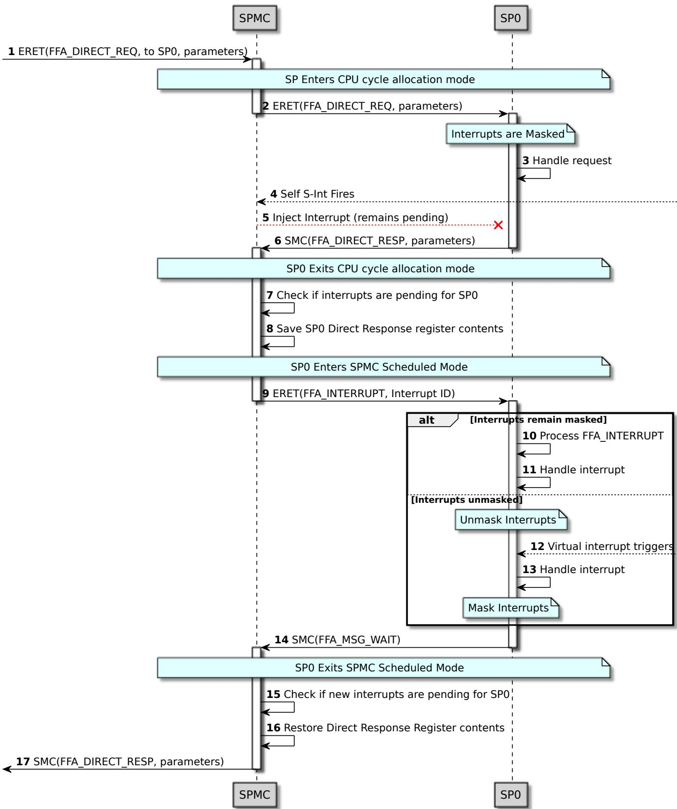  
Figure 9.18: Example Self S-Int delivery for S-EL1 SP with interrupts masked

In a scenario where pending virtual interrupts are handled in the Normal world scheduled mode, the combination of the SRI and the FFA. NOTIFICATION INFO GET interface are used by the SPMC to indicate to the scheduler (see also 4.9 Primary scheduler) that the SP has pending work and should be scheduled. See also:

• 16.11 FFA\_NOTIFICATION\_INFO\_GET.

• 10.4 Notification configuration.

In both the scenarios listed above, the SPMC records that the SP execution context has pending work i.e. a pending virtual interrupt, and pends the SRI. When the scheduler invokes the FFA\_NOTIFICATION\_INFO\_GET interface as a part of SRI handling, the SPMC lists the SP in the return parameters even though the SP does not have a pending NPI but a different pending virtual interrupt. The SP handles the virtual interrupt when it is scheduled by the scheduler e.g. via the FFA\_RUN interface.

An example flow for the scenario when there is a pending virtual interrupt for an SP execution context that is already in the waiting state is illustrated in Figure 9.19.

An example flow for the scenario when there is a pending virtual interrupt for an SP execution context when it enters the waiting state is illustrated in Figure 9.20.

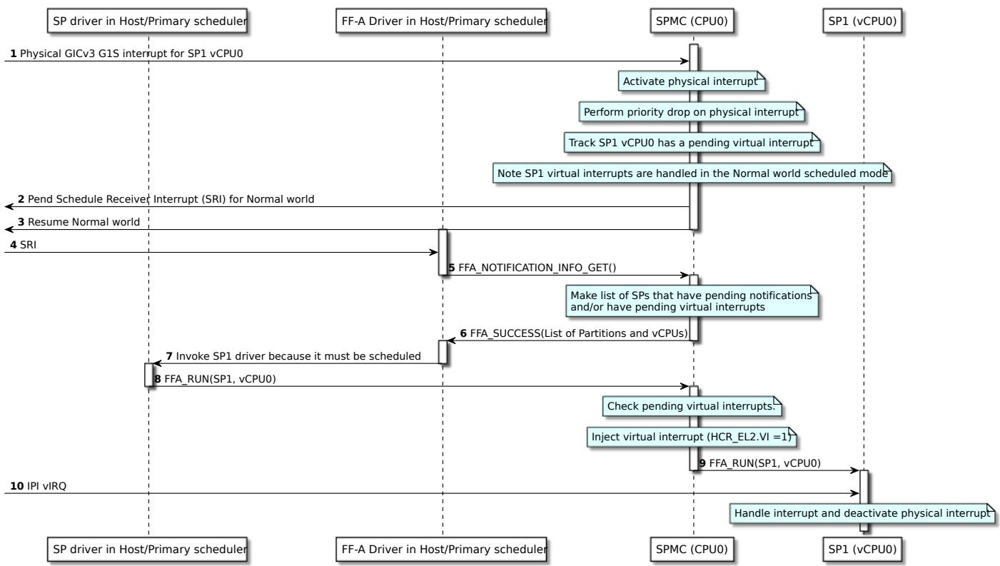  
Figure 9.19: Example flow for scheduling an SP with the SRI when in the waiting state

Chapter 9. Interrupt management 9.4. Support for legacy run-time models  
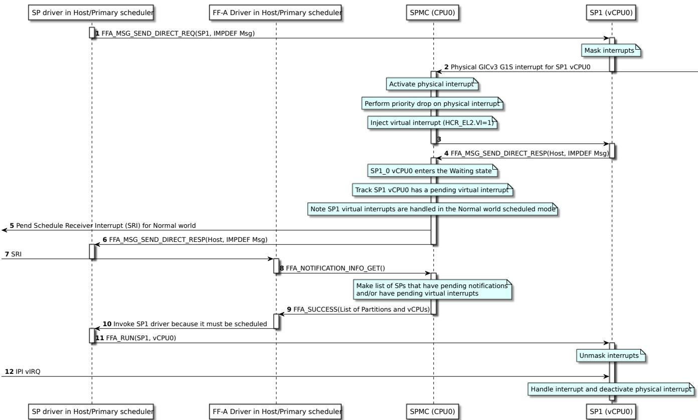  
Figure 9.20: Example flow for scheduling an SP with the SRI when entering the waiting state

## 9.4 Support for legacy run-time models

Version 1.0 of the Framework allows a S-EL0 SP to specify its run-time model in its partition manifest. It can specify the Run to completion or the Preemptible models. These models are deprecated in the current version of the Framework. To maintain backwards compatibility, the SPMC must convert these run-time models to scheduling actions as described below.

• The Run to completion model is recommended for S-EL0 SPs that only handle Secure interrupts. Hence, these SPs never run in the Normal world scheduled mode. The SP specifies the queued action for NS-Ints. Self S-Ints are always queued in the running state. The SP relies on an IMPLEMENTATION DEFINED mechanism provided by the SPMC to specify which Other S-Ints can preempt its execution e.g. through an interrupt priority scheme.

• The Preemptible model is recommended for S-EL0 SPs that only process messages. Hence, these SPs never run in the SPMC scheduled mode. The SP specifies the signaled action for NS-Ints. Self S-Ints are not used. The SP relies on an IMPLEMENTATION DEFINED mechanism provided by the SPMC to specify that Other S-Ints are signalable.

# Chapter 10 Notifications

## 10.1 Overview

The notification mechanism enables a requester endpoint (henceforth called the Sender) to notify a service provider endpoint (henceforth called the Receiver) about an event with non-blocking semantics.

A notification is akin to the doorbell between two endpoints in a communication protocol that is based upon the doorbell/mailbox mechanism. The term doorbell is used in lieu of notification in contexts where it makes it easier to understand a concept under discussion.

The Framework is responsible for the delivery of the notification from the Sender to the Receiver without blocking the Sender.

The Receiver endpoint relies on another software component for allocation of CPU cycles to handle a notification. This component is the primary or a secondary scheduler (see 4.9 Primary scheduler). It is called the Receiver’s scheduler in the context of notifications in the rest of this specification.

The Framework is responsible for informing the Receiver’s scheduler that the Receiver must be run since it has a pending notification.

Figure 10.1 illustrates the notification mechanism and its participants.

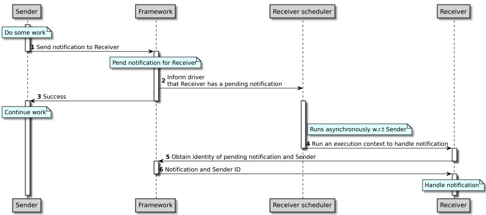  
Figure 10.1: Example notification flow

Support for notifications in the Framework for a configuration that includes both the Hypervisor and SPM is governed by the following common rules. Rules specific to a particular aspect of notification support are specified the following sub-sections.

1. Each endpoint is provided with n notifications that can be signaled to it by only SPs in the system. These are called SP notifications.

2. Each endpoint is provided with m notifications that can be signaled to it by only VMs in the system. These are called VM notifications.

3. The partition manager of each endpoint provides it with o notifications that can be signaled by the partition managers in the system.

1. o/2 notifications are reserved for signaling by the SPMC.

2. o/2 notifications are reserved for signaling by the Hypervisor.

These notifications are called Framework Notifications. See 10.8 Framework Notifications.

4. The number of notifications of each type that are supported for an endpoint depends of the implemented Framework version.

• When the Framework version is < v1.3 the number of supported notifications are as follows:

$$
\begin{array}{r l} & {- \mathrm{n=64}} \\ & {- \mathrm{m=64}} \\ & {- \mathrm{o=64}} \end{array}
$$

• When the Framework version is >= v1.3 the number of supported notifications are as follows:

$$
\begin{array}{l} - 6 4 <   = \mathrm{n} <   = 3 8 4 \\ - 6 4 <   = \mathrm{m} <   = 3 8 4 \\ - \mathrm{o} = 1 2 8 \end{array}
$$

5. If an endpoint supports receipt of > 64 VM, SP or Framework notifications, it is said to implement Extended notifications.

An endpoint specifies whether it supports Extended notifications and the requested count of notifications to its partition manager via its manifest (see Table 5.1) or an IMPLEMENTATION DEFINED mechanism.

6. The partition manager allocates VM and SP bitmaps on behalf of the endpoint based on whether it supports Extended notifications. Otherwise, the partition manager does not boot the endpoint.

An FF-A component can discover the number of supported VM and SP notifications by using Feature ID 0x4 with the FFA\_FEATURES interface (see 13.3 FFA\_FEATURES).

7. The Partition manager reserves memory for each notification bitmap at the time of endpoint creation. Also see 10.3 Notification bitmap setup.

8. The VM notifications and Hypervisor framework notifications bitmaps for a VM are written to by the Hypervisor.

9. The VM notifications and Hypervisor framework notifications bitmap for a SP are written to by the SPMC.

10. The SP notifications and SPMC framework notification bitmaps for both VMs and SPs are written to by the SPMC.

11. The identity of a notification is its bit position in a bitmap managed by the partition manager on behalf of a Receiver.

12. The Framework provides interfaces to an endpoint to manage its use of notifications via notification ABIs, if an endpoint supports Extended notifications it uses the Extended notification ABIs (see Chapter 16 Notification interfaces).

1. The Framework provides the 16.5 FFA\_NOTIFICATION\_SET interface to the Sender to specify the notification to signal to the Receiver.

If an implementation supports > 64 VM or SP notifications a Sender uses the Extended notification ABI 16.9 FFA\_NOTIFICATION\_SET2 to specify the notification.

A Sender signals a notification by requesting its Partition manager to set the corresponding bit in the notifications bitmap of the Receiver.

1. If the Sender is a VM, the bit is set in the VM notifications bitmap of the Receiver.

2. If the Sender is a SP, the bit is set in the SP notifications bitmap of the Receiver.

2. The Framework provides interfaces to the Receiver to specify which endpoint can signal a particular notification. The Receiver notification is bound to the Sender endpoint. Also see 10.4.2 Notification binding.

3. The Framework provides the 16.6 FFA\_NOTIFICATION\_GET interface to the Receiver to determine the identity of the notification.

If an implementation supports > 64 VM, SP or Framework notifications a Receiver uses the Extended notification ABI 16.9 FFA\_NOTIFICATION\_SET2 to determine the notification identity.

13. The Framework provides no guarantees when a notification will be handled by the Receiver.

14. The Framework does not provide a mechanism for a Sender to determine if the Receiver has handled the notification. If required, the Sender and Receiver must enable this through an IMPLEMENTATION DEFINED mechanism.

It is strongly recommended that an implementation uses the Extended notification ABIs to bind, unbind, set and get all types of notifications irrespective of the count of notifications of each type that is supported by the implementation.

We would welcome feedback on whether adding additional constraints on the number of VM and SP notifications, such as they must be multiples of 16, would be beneficial for implementations.

Guidance on discovering support for notifications is provided in 10.7 Compliance requirements.

Guidance on support for notifications in a Framework configuration without the Hypervisor is specified in 10.9 Notification support without a Hypervisor.

## 10.1.1 Use cases

The Framework provides guidance for support of notifications to address the requirements of the following types of use cases.

1. The blocking semantics associated with message exchange using Direct messaging (see 8.3 Direct messaging) are not desirable in a scenario where the Sender endpoint must make progress in tandem with the Receiver endpoint processing its request. For example,

• A secondary endpoint is scheduled by the primary scheduler and requests services implemented in a Trusted OS SP. It is not desirable to allocate cycles to the SP from the quota allocated to the secondary endpoint by the primary scheduler.

• The Trusted OS could request a service provided by another SP. It might too not want to allocate cycles to the SP from the quota allocated to it by its scheduler.

2. An asynchronous signaling mechanism is required by the Secure world to notify the Normal world. For example,

1. A Secure interrupt preempts the Normal world

2. The Secure interrupt is handled in a SP

3. The SP needs to signal the Normal world about an event signaled by the Secure interrupt e.g., completion of an operation previously requested by the Normal world.

The SP cannot send a Direct message to the Normal world and block until the response is received. This is because the Normal world is in a preempted state. Hence, a non-blocking mechanism is required that enables the SP to notify the Normal world.

In the same example above, it is possible that the SP only performs top-half interrupt handling and requires CPU cycles to perform bottom-half interrupt handling. These cycles are allocated by the SP’s scheduler in the Normal world. The SP cannot send a Direct message. It needs another mechanism to signal to its Scheduler that it must be run.

## 10.2 Notification bitmap permissions

The following rules govern the permissions an FF-A component has on a notification bitmap of an endpoint.

1. Each endpoint has read-write permissions on each of its bitmaps.

2. Permissions of the Hypervisor<sup>1</sup> and SPMC on the notification bitmap of each type of endpoint are described in Table 10.1.

3. Permissions of VMs and SPs on the notification bitmap of each type of endpoint are described in Table 10.2.

Table 10.1: Hypervisor and SPMC permissions on an endpoint notification bitmap

<table><tr><td>Endpoint type</td><td>Notifications bitmap</td><td>SPMC</td><td>Hypervisor</td></tr><tr><td>SP</td><td>SP</td><td>RW</td><td>NA</td></tr><tr><td>SP</td><td>VM</td><td>RW (Directed by Hypervisor)</td><td>RW</td></tr><tr><td>SP</td><td>SPMC framework</td><td>RW</td><td>NA</td></tr><tr><td>SP</td><td>HYP framework</td><td>RW (Directed by Hypervisor)</td><td>RW</td></tr><tr><td>VM</td><td>SP</td><td>RW</td><td>RO</td></tr><tr><td>VM</td><td>VM</td><td>NA</td><td>RW</td></tr><tr><td>VM</td><td>SPMC framework</td><td>RW</td><td>RO</td></tr><tr><td>VM</td><td>HYP framework</td><td>NA</td><td>RW</td></tr></table>

Table 10.2: VM and SP permissions on an endpoint notification bitmap

<table><tr><td>Endpoint type</td><td>Notifications bitmap</td><td>Implemented in</td><td>Other SP permissions</td><td>Other VM permissions</td></tr><tr><td>SP</td><td>SP</td><td>SPMC</td><td>Write-only</td><td>NA</td></tr><tr><td>SP</td><td>VM</td><td>SPMC</td><td>NA</td><td>Write-only</td></tr><tr><td>SP</td><td>SPMC framework</td><td>SPMC</td><td>NA</td><td>NA</td></tr><tr><td>SP</td><td>HYP framework</td><td>SPMC</td><td>NA</td><td>NA</td></tr><tr><td>VM</td><td>SP</td><td>SPMC</td><td>Write-only</td><td>NA</td></tr><tr><td>VM</td><td>VM</td><td>Hypervisor</td><td>NA</td><td>Write-only</td></tr><tr><td>VM</td><td>SPMC framework</td><td>SPMC</td><td>NA</td><td>NA</td></tr><tr><td>VM</td><td>HYP framework</td><td>Hypervisor</td><td>NA</td><td>NA</td></tr></table>

## 10.3 Notification bitmap setup

An endpoint’s notification bitmaps are setup before it configures its notifications and before other endpoints and partition managers can start signaling these notifications. Also see 10.4 Notification configuration and 10.5 Notification signaling.

The following rules govern the setup of a notification bitmap of an endpoint.

1. For a VM, the Hypervisor reserves memory for its VM and Hypervisor framework notification bitmaps before initializing it.

2. For a VM, the SPMC reserves memory for its SP and SPMC framework notification bitmaps before the Hypervisor initializes it.

3. The Hypervisor uses the FFA\_NOTIFICATION\_BITMAP\_CREATE interface to request the SPMC to allocate the SP and SPMC framework notification bitmaps for the VM prior to its initialization (see 16.1 FFA\_NOTIFICATION\_BITMAP\_CREATE).

The Hypervisor specifies the number of SP notifications that should be allocated on behalf of the VM. The SPMC returns the number of notifications it has allocated which may be equal to, or larger to the requested amount.

4. The Hypervisor does not initialize a VM if memory cannot be allocated for its notification bitmaps as per the requested count of notifications.

5. For a SP, the SPMC reserves memory for its VM, SP and framework notification bitmaps before initializing it.

6. The SPMC does not initialize a SP if memory cannot be allocated for its notification bitmaps as per the requested count of notifications.

7. The Hypervisor uses the FFA\_NOTIFICATION\_BITMAP\_DESTROY interface to inform the SPMC when it destroys a VM (see 16.2 FFA\_NOTIFICATION\_BITMAP\_DESTROY). The SPMC frees memory for the VM’s SP and SPMC framework notification bitmaps.

Within an endpoint, there could be one or more consumers of its VM and SP notifications. The mechanism used by the endpoint to manage access to its notifications amongst their consumers is IMPLEMENTATION DEFINED.

Figure 10.2 illustrates how the Hypervisor and SPMC create notification bitmaps on behalf of a VM and SP respectively as follows,

1. The SP requests 128 VM notifications and 64 SP notifications via its manifest.

2. The SPMC allocates the notification bitmaps before it initializes the SP.

3. The Hypervisor invokes the FFA\_FEATURES ABI to determine the maximum number of VM and SP notifications supported by the SPMC.

4. The Hypervisor invokes the FFA\_NOTIFICATION\_BITMAP\_CREATE ABI to specify the number of SP notifications the SPMC should allocate on behalf of a VM.

5. The SPMC responds with the number of SP notifications it has allocated for the VM for SPs to signal.

Chapter 10. Notifications 10.3. Notification bitmap setup  
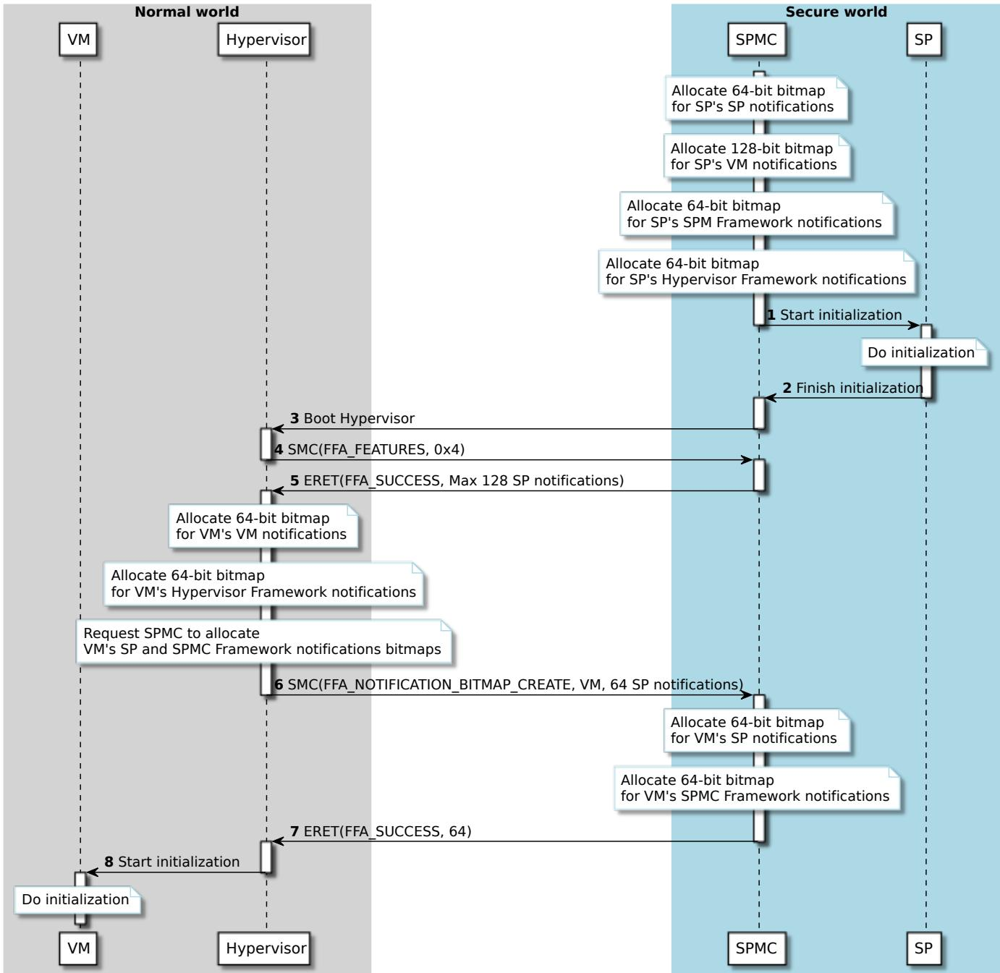  
Figure 10.2: Notification bitmap creation for a VM and SP

## 10.4 Notification configuration

A Receiver and its scheduler configure a notification as described below, before it can be signaled by other endpoints and partition managers. Also see 10.5 Notification signaling.

1. The Receiver and its scheduler configure support for handling interrupts used by the Framework for notification signaling. See 10.4.1 Notification interrupt setup.

2. The Receiver binds a non-framework notification to an endpoint that is allowed to signal it. See 10.4.2 Notification binding.

## 10.4.1 Notification interrupt setup

The following rules govern the configuration of interrupts used by the Framework for signaling notifications.

1. The Framework uses the Schedule Receiver interrupt (SRI) to inform the Receiver’s scheduler that the Receiver must be run to handle a pending notification.

2. The Framework uses the Notification pending interrupt (NPI) to inform the Receiver that it has a pending notification. This is a virtual interrupt and is used by the following type of Receivers.

1. A VM running under a Hypervisor.

2. An S-EL1 SP running under a S-EL2 SPMC.

3. A Receiver’s scheduler obtains the description of the Schedule Receiver interrupt by invoking the FFA\_FEATURES interface (see 13.3 FFA\_FEATURES).

Feature ID 0x2 is allocated to obtain a description of the Schedule Receiver interrupt.

The description of the Schedule Receiver interrupt is encoded as specified in Table 13.14.

4. A Receiver obtains the description of the Notification pending interrupt by invoking the FFA\_FEATURES interface (see 13.3 FFA\_FEATURES).

Feature ID 0x1 is allocated to obtain a description of the Notification pending interrupt.

The description of the Notification pending interrupt is encoded as specified in Table 13.14.

Figure 10.3 illustrates an example setup of the Schedule Receiver interrupt in the primary endpoint for a Receiver endpoint.

• The Receiver endpoint has a counterpart driver in the primary endpoint. The primary endpoint implements an FF-A driver that allows access to Framework functionality to other drivers including the Receiver endpoint driver. The Receiver endpoint driver runs an execution context of the Trusted OS in response to requests from a client application or a pending notification.

From the Framework’s perspective, the primary scheduler is the Receiver’s scheduler in this example. Within the primary endpoint, the Receiver endpoint driver is the Receiver’s scheduler.

• The FF-A driver discovers the Schedule Receiver interrupt.

• The Receiver endpoint driver registers a callback function with the FF-A driver.

• The FF-A driver calls this function if there is a pending notification for the Receiver endpoint and it must be scheduled by its driver.

Chapter 10. Notifications 10.4. Notification configuration  
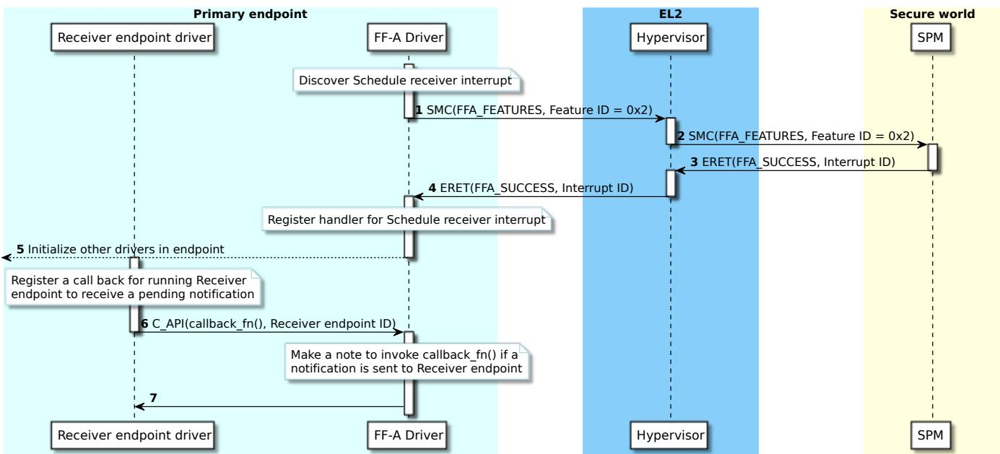  
Figure 10.3: Schedule receiver interrupt setup in primary endpoint

Figure 10.4 illustrates an example setup of the notification pending interrupt in a Receiver endpoint.

• The Receiver endpoint implements a service driver that can receive notifications. It also implements an FF-A driver that allows access to Framework function to the service driver.

• The FF-A driver discovers the notification pending interrupt.

• The Receiver service driver requests the FF-A driver to allocate a set of notification IDs. The notifications are used by clients to access this service.

• The Receiver service driver registers a callback function with the FF-A driver.

• The FF-A driver calls this function if there is a pending notification allocated to the Receiver service driver.

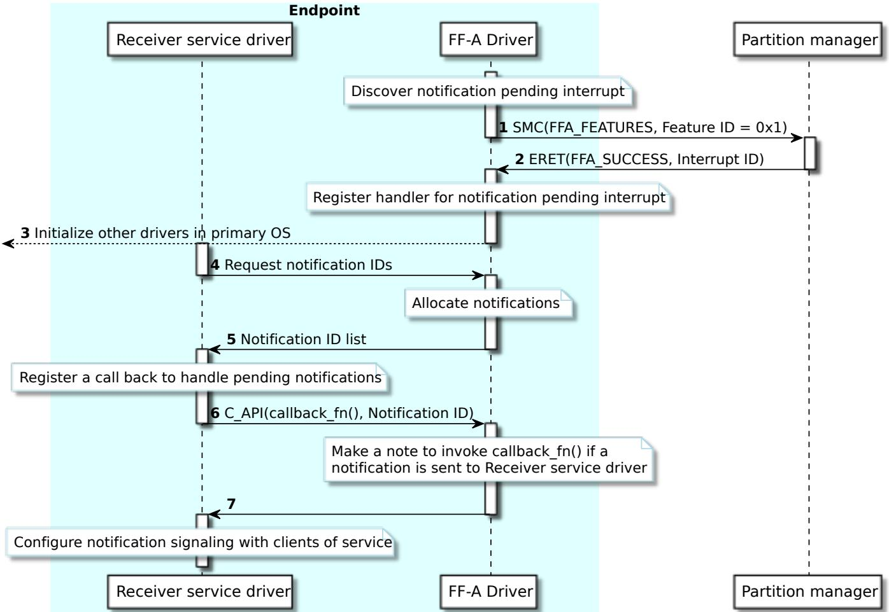  
Figure 10.4: Notification pending interrupt setup in a Receiver endpoint

Receipt of the Schedule Receiver Interrupt and/or Notification Pending Interrupt by an FF-A component depends upon the following conditions:

1. Endpoint is a recipient of one or more notifications.

2. Endpoint is responsible for scheduling another endpoint that is a recipient of notifications.

Table 10.3 describes which notification interrupts an FF-A component may receive.

Table 10.3: Valid Notification Interrupt configurations

<table><tr><td>Receiver Component</td><td>Sender Component</td><td>Responsible for scheduling another recipient of notifications</td><td>Recipient of Notifications</td><td>Receives Schedule Receiver interrupt</td><td>Receives Notification Pending interrupt</td></tr><tr><td>VM</td><td>Hypervisor</td><td>Yes</td><td>Yes</td><td>Yes</td><td>Yes</td></tr><tr><td>VM</td><td>Hypervisor</td><td>No</td><td>Yes</td><td>No</td><td>Yes</td></tr><tr><td>VM</td><td>Hypervisor</td><td>Yes</td><td>No</td><td>Yes</td><td>No</td></tr><tr><td>VM</td><td>Hypervisor</td><td>No</td><td>No</td><td>No</td><td>No</td></tr></table>

Chapter 10. Notifications 10.4. Notification configuration

<table><tr><td>Receiver Component</td><td>Sender Component</td><td>Responsible for scheduling another recipient of notifications</td><td>Recipient of Notifications</td><td>Receives Schedule Receiver interrupt</td><td>Receives Notification Pending interrupt</td></tr><tr><td>Physical SP (S-EL1)</td><td>SPMC (S-EL2)</td><td>No</td><td>Yes</td><td>No</td><td>Yes</td></tr><tr><td>Physical SP (S-EL1)</td><td>SPMC (S-EL2)</td><td>No</td><td>No</td><td>No</td><td>No</td></tr><tr><td>Hypervisor or OS Kernel</td><td>SPMC (S-EL1, S-EL2, EL3)</td><td>Yes</td><td>Yes</td><td>Yes</td><td>No</td></tr></table>

## 10.4.1.1 Interrupt properties

The following rules govern the properties of the Schedule Receiver interrupt.

1. The type of interrupt should be inferred from the interrupt ID specified in Table 13.14. For example, in the Arm GIC architecture, the interrupt ID indicates whether it is a PPI, SGI or SPI.

1. If the interrupt is a PPI, the same interrupt ID is used for this interrupt on all PEs in the system.

2. If the interrupt is an SGI, it is not signaled such that multiple PEs receive the interrupt independently and concurrently. The interrupt is signaled so that only a single PE receives it.

The Arm GIC architecture allows signaling of an SGI through the targeted list model. In this model, upon a write to the ICC\_SGIxR\_EL1 or ICC\_ASGI1R\_EL1 register, multiple PEs could receive the interrupt independently. The above rule disallows this signaling model. Instead, an SGI can be signaled only to the current PE like a PPI.

2. The interrupt is edge-triggered.

3. The Security state of the interrupt is Non-secure.

The delivery of the physical Schedule Receiver interrupt from the Secure state to the Non-secure state depends upon the state of the interrupt controller as configured by the Hypervisor. This is beyond the control of the Secure world. It is possible that the interrupt gets lost.

• For example, the Schedule Receiver interrupt could be a PPI and signaled on a PE when the Hypervisor is about to turn the PE off through a PSCI CPU\_OFF call. The interrupt would not be handled by the Hypervisor in this scenario.

The Framework makes the following recommendation w.r.t use of an SGI as the Schedule Receiver interrupt.

• The Arm GIC specification defines 16 SGIs. It recommends that they are equally divided between the Non-secure and Secure states. General-purpose operating systems in the Non-secure state typically do not have SGIs to spare. The usage of SGIs in the Secure state is limited. It is more likely that software in the Secure world does not use all the SGIs allocated to it. Arm recommends that the Secure world software donates an unused SGI to the Normal world for use as the Schedule Receiver interrupt. This implies that Secure world software must configure the SGI in the GIC as a Non-secure interrupt before presenting it to the Normal world through the FFA\_FEATURES ABI as described in 10.4.1 Notification interrupt setup.

The Secure world software ensures that the SRI is configured as a Group 1 NS interrupt by programming one of the following GICv3 registers depending upon the type of interrupt:

• GICR\_IGROUPR0

• GICR\_IGROUPRE

• GICR\_IGRPMODR0

• GICR\_IGRPMODRE

• GICD\_IGROUPR

• GICD\_IGROUPRE

• GICD\_IGRPMODR

• GICD\_IGRPMODRE

The Secure world software does not program any other properties or configuration of the SRI in the GIC Distributor (if the SRI is an SPI) or the GIC Redistributor (if the SRI is an SGI or PPI). This enables the Normal world software to configure the SRI like any other Group 1 NS interrupt that it discovers via a platform discovery mechanism e.g. a Flattened Device Tree or ACPI table.

The rules that govern the properties of the Notification pending interrupt are the same as the rules for the Schedule Receiver interrupt except for the following.

1. The type of the Notification pending interrupt is either a PPI or SGI.

2. The Notification pending interrupt is a virtual interrupt and signalled via the vIRQ signal.

## 10.4.2 Notification binding

A Receiver must bind a non-framework notification to a Sender before the latter can signal the notification to the former. Effectively, the Receiver assigns one or more doorbells to a specific Sender. Only the Sender can ring these doorbells.

The following rules govern the binding of notifications.

1. A Receiver uses the 16.3 FFA\_NOTIFICATION\_BIND interface to bind one or more notifications to the Sender.

If an implementation supports > 64 VM or SP notifications a Receiver uses the Extended notification ABI 16.7 FFA\_NOTIFICATION\_BIND2 to bind notifications to the Sender.

2. A notification is not bound to any Sender endpoint at the time of the Receiver initialization.

3. A notification is signaled and pended only if it is bound to a Sender endpoint.

4. The notification bitmap in which a notification is bound to a Sender endpoint is determined by the security state of the Sender endpoint.

1. If the Sender is a VM, the VM notifications bitmap is used.

2. If the Sender is a SP, the SP notifications bitmap is used.

5. A Receiver endpoint un-binds a notification from a Sender endpoint to stop the notification from being signaled. It uses the 16.4 FFA\_NOTIFICATION\_UNBIND interface to do this.

If an implementation supports > 64 VM or SP notifications a Receiver uses the Extended notification ABI 16.8 FFA\_NOTIFICATION\_UNBIND2 to un-bind a notification from a Sender.

6. A notification is unbound only if it is not in a pending state.

7. A notification is one of the following types.

• It is signaled to and handled by a specific execution context or vCPU of the Receiver endpoint. These notifications are called Per-vCPU notifications. The vCPU is specified by the Sender.

• It is signaled to the Receiver endpoint and is handled by an execution context or vCPU that is chosen by the Receiver’s scheduler or partition manager through an IMPLEMENTATION DEFINED mechanism. These notifications are called Global notifications.

A Receiver can have one or more per-vCPU and global notifications pending at any point of time. Additionally, the same per-vCPU notification could pend for multiple vCPUs of the same Receiver at the same time. Also see 10.5 Notification signaling.

Per-vCPU notifications are an optional feature. An endpoint uses the FFA\_FEATURES interface (see 13.3 FFA\_FEATURES) to detect if Per-vCPU notifications are supported by the Framework at an FF-A instance for a given type of notification.

Feature ID 0x4 is allocated to discover if Per-vCPU notifications are supported.

If per-vCPU notifications are supported, only the lower 64 bits of the VM and SP notification bitmap may be used.

8. The type of notification is specified by the Receiver endpoint when the notification is bound to the Sender endpoint.

9. An unbound notification is neither global nor per-vCPU i.e., it does not have a type associated with it.

Figure 10.5 illustrates an example flow of how a VM can bind a global notification to a SP

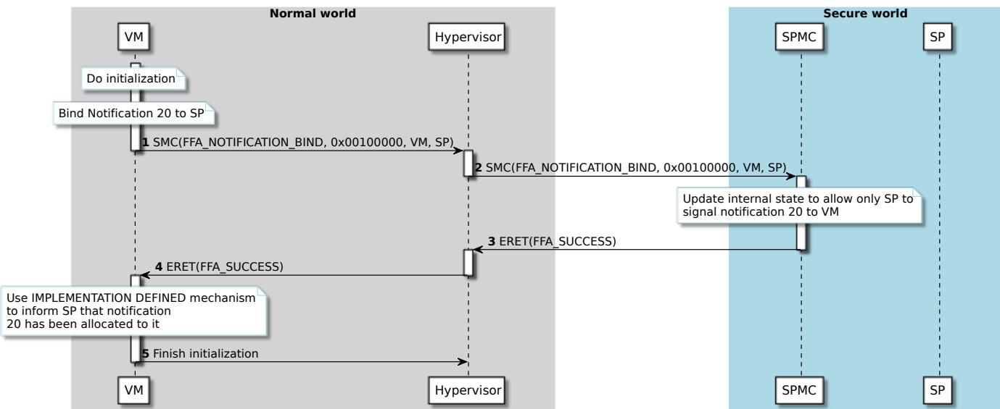  
Figure 10.5: Binding a global notification from VM to SP

The 18.7 Inter-partition setup protocol or an IMPLEMENTATION DEFINED mechanism is used by a Receiver and a Sender to negotiate the notification ID that the Sender will use to signal to the Receiver. Figure 10.6 illustrates an example flow of how,

• A SP binds a global notification to a VM.

• The VM discovers the identity of the notification.

Chapter 10. Notifications 10.4. Notification configuration  
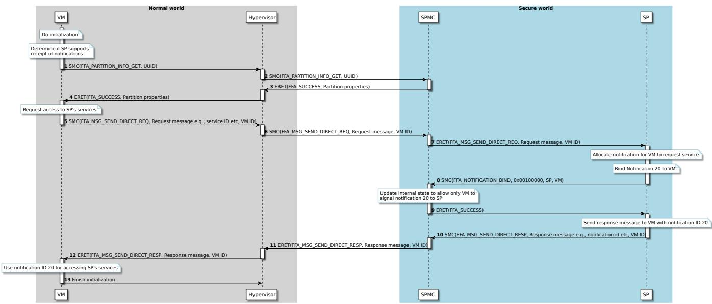  
Figure 10.6: Notification binding between a VM and SP

## 10.5 Notification signaling

Notification signaling is performed in the three phases.

1. The Sender requests the Receiver’s partition manager to ring a doorbell that was bound to the Sender by the Receiver.

2. The Sender’s partition manager informs the Receiver’s scheduler that one of the Receiver’s doorbells has been rung.

3. The Receiver obtains CPU cycles e.g. it is run by its scheduler. It obtains the identity of the doorbell that was rung from its partition manager.

The following rules govern the signaling of notifications.

1. A Sender uses the FFA\_NOTIFICATION\_SET or FFA\_NOTIFICATION\_SET2 interfaces to signal a notification to the Receiver (see 16.5 FFA\_NOTIFICATION\_SET and 16.9 FFA\_NOTIFICATION\_SET2).

2. The notification bitmap in which a notification is signaled to the Receiver is determined by the security state of the Sender endpoint.

1. If the Sender is a VM, the VM notifications bitmap is used.

2. If the Sender is a SP, the SP notifications bitmap is used.

3. For a global notification pended by a Sender, subsequent invocations of the FFA\_NOTIFICATION\_SET or FFA\_NOTIFICATION\_SET2 interfaces by the same Sender for the same notification have no effect until the notification is cleared.

4. For a per-vCPU notification pended by a Sender, subsequent invocations of the FFA\_NOTIFICATION\_SET or FFA\_NOTIFICATION\_SET2 interfaces by the same Sender for the same notification and Receiver vCPU have no effect until the notification is cleared for that Receiver vCPU.

5. A Receiver determines that it has a pending notification through one or more of the following mechanisms.

1. The partition manager signals the virtual Notification pending interrupt to the Receiver.

The interrupt is signaled when the target execution context of the Receiver next enters the running state.

1. For a per-vCPU notification, the target execution context is specified by the Sender in the invocation of the FFA\_NOTIFICATION\_SET or FFA\_NOTIFICATION\_SET2 interfaces.

2. For a global notification, the target execution context is determined by the partition manager of the Receiver through an IMPLEMENTATION DEFINED mechanism.

This mechanism is applicable to only partitions that run in EL1 or S-EL1.

2. The Receiver’s scheduler uses a Direct request interface to run and inform the Receiver through a partition message that it has a pending notification.

3. The Receiver uses the FFA\_NOTIFICATION\_GET or FFA\_NOTIFICATION\_GET2 interface to poll if it has pending notifications.

6. A Receiver endpoint uses the FFA\_NOTIFICATION\_GET or FFA\_NOTIFICATION\_GET2 interfaces to retrieve its pending notifications. For example, a S-EL1 SP could invoke these interfaces while handling the Notification pending interrupt.

1. The FFA\_NOTIFICATION\_GET ABI is used to retrieve notification IDs 0-63 of its pending notifications (see 16.6 FFA\_NOTIFICATION\_GET).

2. The FFA\_NOTIFICATION\_GET2 ABI is used to retrieve notification IDs from 0 to the the maximum number of supported notifications (see Table 13.14). A Receiver can retrieve a subset of its pending notifications by specifying a bitmask in the invocation (see 16.10 FFA\_NOTIFICATION\_GET2).

7. A pending notification is cleared by a partition manager when it is retrieved by the Receiver endpoint as described below. Any pending notifications that are not retrieved remain in the pending state.

1. The Hypervisor clears a pending notification in the VM and Hypervisor notifications bitmap of a VM.

2. The SPMC clears a pending notification in the SP and SPMC notifications bitmap of a VM.

3. The SPMC clears a pending notification in all notifications bitmap of a SP.

8. The Schedule Receiver interrupt (see 10.4.1 Notification interrupt setup) is used by the Partition manager to inform the Receiver’s scheduler that the Receiver has one or more pending notifications. Assertion of this interrupt to signal a pending notification is the responsibility of the partition manager that writes to the notifications bitmap of the Receiver.

The partition manager uses an IMPLEMENTATION DEFINED policy to determine when the Schedule Receiver interrupt must be asserted in response an invocation of the FFA\_NOTIFICATION\_SET or FFA\_NOTIFICATION\_SET2 interfaces. The interrupt could be asserted before or after an invocation of this interface completes.

This interrupt is used only if the Partition manager and the Receiver’s scheduler reside in separate exception levels.

9. The Receiver’s scheduler uses the FFA\_NOTIFICATION\_INFO\_GET interface to retrieve the list of endpoints that have pending notifications and must be run (see 16.11 FFA\_NOTIFICATION\_INFO\_GET).

10. A notification could be signaled by a Sender in the Secure world to a VM. The Hypervisor needs to determine which VM and vCPU (in case a per-vCPU notification is signaled) has a pending notification in this scenario. It obtains this information through an invocation of the FFA\_NOTIFICATION\_INFO\_GET ABI at the Non-secure physical FF-A instance.

## 10.5.1 Example signaling flows

This section describes some example notification signaling flows between the Normal and Secure worlds. The following scenarios are considered.

1. SP0 sends a notification to SP1.

2. SP0 sends a notification to VM0.

3. SP0 sends a notification to its scheduler.

For the sake of simplicity, the following assumptions have been made.

1. Schedulers of all Receivers are implemented in the primary endpoint.

2. The primary endpoint is responsible for handling physical G1NS interrupts. The Hypervisor does not signal the virtual Notification pending interrupt to the primary endpoint.

3. There could be multiple PEs in the system. However, the scenarios encountered in notification signaling due to the presence of multi-processing are ignored.

4. SP0 is an MP-capable partition. Each execution context of SP0 is pinned to a physical PE on the system. Also see 8.3.1 Discovery and setup.

5. The endpoints bind the following notifications as described in 10.4.2 Notification binding.

1. SP1 binds global notification 5 to SP0.

2. VM0 binds global notification 0 to SP0.

3. SP0’s scheduler in the primary endpoint binds per-vCPU notification 1 to SP0.

6. Each endpoint uses an IMPLEMENTATION DEFINED mechanism to inform another endpoint about a notification it can signal.

For example, a SP’s scheduler could inform the SP about a notification that it can signal by sending it a Direct message through the FFA\_MSG\_SEND\_DIRECT\_REQ ABI.

7. The Schedule Receiver interrupt is a physical PPI or a SGI that is signaled on the same PE on which the notification is signaled.

8. The discovery and setup associated with the Schedule Receiver interrupt and Notification pending interrupt is performed by the endpoints and their schedulers as described in 10.4.1 Notification interrupt setup.

18.6.1 Example notification flows illustrates some additional example end to end flows of signalling a notification between different combinations of endpoints and system configurations.

## 10.5.1.1 SP0 signals a notification to SP1, VM0 and its scheduler

Figure 10.7 illustrates an example flow where SP0 sends notifications to SP1, VM0 and its scheduler in the primary endpoint while handling a Secure interrupt that preempted the Normal world. It is assumed that the execution context of SP0 and VM0 on the PE where the interrupt triggers is in a waiting state.

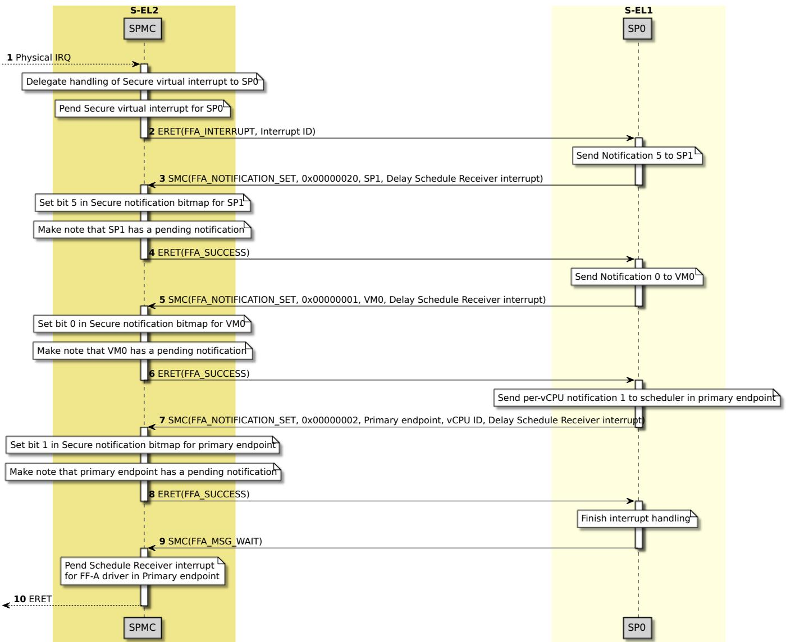  
Figure 10.7: Signaling from SP0 to SP1, VM0 and its scheduler

## 10.5.1.2 Primary endpoint handles Schedule Receiver interrupt

Figure 10.8 illustrates an example flow where the FF-A driver in the primary endpoint handles the Schedule Receiver interrupt.

1. The Primary endpoint receives the Schedule Receiver interrupt.

2. The endpoint calls the FFA\_NOTIFICATION\_INFO\_GET ABI to retrieve a list of endpoints that have pending notifications.

3. The endpoint prepares to iterate over each of the returned Endpoint IDs to invoke the corresponding schedule receiver callback.

Figure 10.9 illustrates an example flow where the SP1 driver in the primary endpoint schedules an SP1 execution context in response to the Schedule Receiver interrupt.

1. The Schedule Receiver callback that was previously registered for SP1 is invoked.

2. The SP1 Receiver Endpoint Driver allocates CPU cycles to SP1.

3. SP1 transitions to the Running state and receives the Notification Pending Interrupt.

4. SP1 invokes the FFA\_NOTIFICATION\_GET ABI to retrieve its notification bitmaps.

5. SP1 Handles its pending notifications.

Figure 10.10 illustrates an example flow where the VM0 driver in the primary endpoint schedules a VM0 execution context in response to the Schedule Receiver interrupt.

1. The Schedule Receiver callback that was previously registered for VM0 is invoked.

2. The VM0 Receiver Endpoint Driver allocates CPU cycles to VM0.

3. VM0 transitions to the Running state and receives the Notification Pending Interrupt.

4. VM0 invokes the FFA\_NOTIFICATION\_GET ABI to retrieve its notification bitmaps.

5. VM0 Handles its pending notifications.

Figure 10.11 illustrates an example flow where the SP0 driver in the primary endpoint handles the notification pended by SP0.

1. The primary endpoint Scheduler Receiver interrupt handler sees a pending notification for itself.

2. The endpoint invoked the FFA\_NOTIFICATION\_GET ABI to retrieve its notification bitmaps.

3. The endpoint iterates over each of its pending notifications to invoke the corresponding notification pending callback.

4. The Receiver Service Driver handles the signaled notification from SP0.

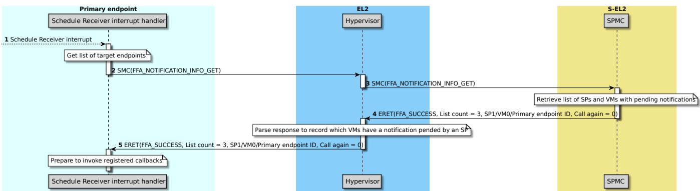  
Figure 10.8: Schedule Receiver interrupt handling in primary endpoint

Chapter 10. Notifications 10.5. Notification signaling  
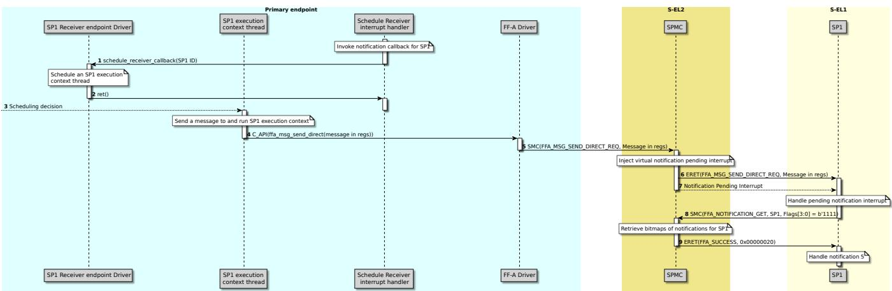  
Figure 10.9: SP1 Receiver Endpoint driver in primary endpoint schedules SP1

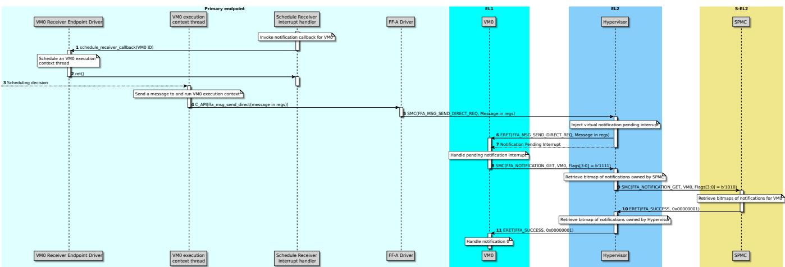  
Figure 10.10: VM0 Receiver Endpoint driver in primary endpoint schedules VM0

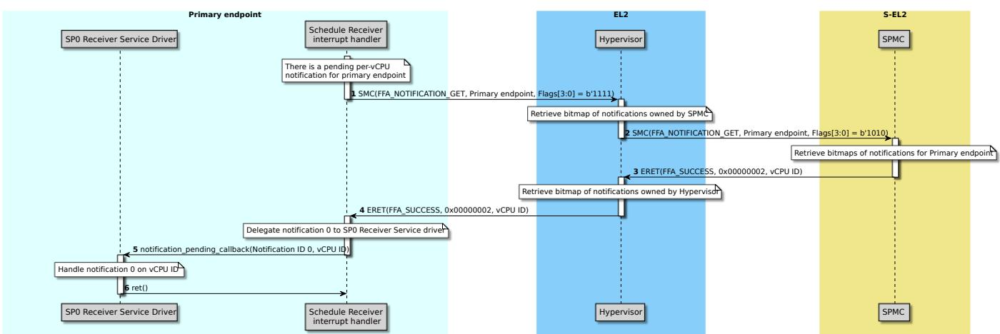  
Figure 10.11: SP0 Receiver Service driver in primary endpoint receives a notification

## 10.5.1.3 Endpoint handles Notification Pending interrupt

Figure 10.12 illustrates an example flow where an Endpoint handles its pending notifications in response to the Notification Pending interrupt.

1. The endpoint Receives the Notification Pending interrupt.

2. The endpoint invokes the FFA\_NOTIFICATION\_GET ABI to retrieve its notification bitmaps.

3. The endpoint iterates over each of its pending notifications to invoke the corresponding notification pending callback.

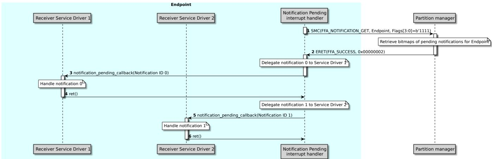  
Figure 10.12: Endpoint receives Notification Pending interrupt

## 10.6 Notification state machine

I<sub>0177</sub> Figure 10.13 describes the state diagram of a notification.

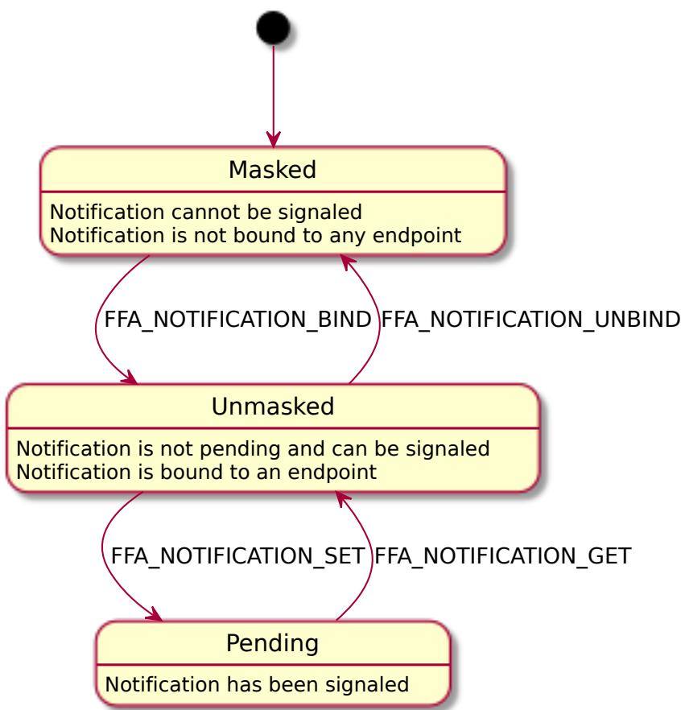  
Figure 10.13: Notification state transition diagram

## 10.7 Compliance requirements

The following rules govern discovery of support for notifications.

1. Support for receipt of notifications is optional. If an endpoint implements this support, it specifies this in its manifest (see Chapter 5 Setup).

2. A partition manager can choose to not implement support for notifications. It does not initialize an endpoint if this support is requested through the endpoint manifest.

It is possible that the Hypervisor does not implement support for notifications while the SPMC and one or more SPs do. Notifications will not be delivered in this configuration since there is no recipient of the Schedule Receiver interrupt in the Normal world. The system integrator must ensure that notifications are supported by the Hypervisor before enabling use of this feature by the SPMC or SPs.

3. An FF-A component in the Normal world uses an FF-A discovery interface to determine if another endpoint supports receipt of notifications (see 6.2 Partition discovery).

4. An invocation of the FFA\_FEATURES interface with Feature IDs 0x1 and 0x2, 0x4 or any notification ABI, completes with an invocation of the FFA\_ERROR interface with the NOT\_SUPPORTED error code, if the callee does not support notifications.

5. An invocation of the FFA\_FEATURES interface by an endpoint, with Feature ID 0x1, 0x4 or any Notification ABI, apart from FFA\_NOTIFICATION\_INFO\_GET, FFA\_NOTIFICATION\_SET and FFA\_NOTIFICATION\_SET2, completes with an invocation of the FFA\_ERROR interface with the NOT\_SUPPORTED error code, if the endpoint does not support receipt of notifications.

6. An invocation of any notification ABI by an endpoint that does not support receipt of notifications completes with an invocation of the FFA\_ERROR interface with the NOT\_SUPPORTED error code.

The compliance requirements for an implementation of FF-A notifications at an FF-A instance are expressed as the set of ABIs and features that must be implemented at that instance. These requirements are listed in Table 10.4.

Table 10.4: Compliance requirements for FF-A notifications

<table><tr><td>Caller role</td><td>Instance</td><td>Mandatory Interface</td><td>Conduit</td></tr><tr><td rowspan="2">Sender</td><td>Secure or NS virtualNS physical $^{a}$ Secure physical $^{b}$ </td><td>FFA_NOTIFICATION_SET(2)</td><td>SMC,HVC, SVC</td></tr><tr><td> $^{a}$ Interfaces are mandatory at this instance in the absence of an Hypervisor. $^{b}$ Interfaces are mandatory at this instance between the SPMC and a logical S-EL1 SP.</td><td></td><td></td></tr><tr><td>Scheduler</td><td>NS virtualNS physical</td><td>FFA_NOTIFICATION_INFO_GETHandler for Schedule receiver interrupt.</td><td>SMC, HVCPhysicalIRQ</td></tr><tr><td>Receiver</td><td>Secure or NS virtualSecure physicalNon-secure physical</td><td>FFA_NOTIFICATION_BIND(2)FFA_NOTIFICATION_UNBIND(2)FFA_NOTIFICATION_GET(2)</td><td>SMC,HVC, SVC</td></tr></table>

Chapter 10. Notifications 10.7. Compliance requirements

<table><tr><td>Caller role</td><td>Instance</td><td>Mandatory Interface</td><td>Conduit</td></tr><tr><td>Hypervisor or kernel2</td><td>NS physical</td><td>Handler for Notification pending interrupt.FFA_NOTIFICATION_BITMAP_CREATEFFA_NOTIFICATION_BITMAP_DESTROYFFA_NOTIFICATION_BIND(2)FFA_NOTIFICATION_UNBIND(2)FFA_NOTIFICATION_SET(2)FFA_NOTIFICATION_GET(2)FFA_NOTIFICATION_INFO_GET</td><td>Virtual IRQSMC</td></tr><tr><td>S-EL2 or S-EL1SPMC3</td><td>Secure physical</td><td>FFA_NOTIFICATION_BITMAP_CREATEFFA_NOTIFICATION_BITMAP_DESTROYFFA_NOTIFICATION_BIND(2)FFA_NOTIFICATION_UNBIND(2)FFA_NOTIFICATION_SET(2)FFA_NOTIFICATION_GET(2)FFA_NOTIFICATION_INFO_GET</td><td>ERET</td></tr></table>

## 10.8 Framework Notifications

Framework notifications are doorbells that are rung by the partition managers to signal common events to an endpoint. These doorbells cannot be rung by an endpoint directly. A partition manager can signal a Framework notification in response to an FF-A ABI invocation by an endpoint.

In this version of the Framework, the following doorbells are supported. Doorbells not listed below are reserved for future use.

1. RX buffer full notification. See 10.8.1 RX buffer full notification.

Doorbells not listed above are reserved for future use. A partition manager is expected to only reserve storage for those Framework notifications that are supported.

Framework notifications are global notifications.

## 10.8.1 RX buffer full notification

This notification is signaled by a partition manager during transmission of a partition message through Indirect messaging to,

1. Notify an endpoint that it has a pending message in its RX buffer.

2. Inform the message Receiver’s scheduler via the Schedule Receiver interrupt that the Receiver must be run. Also see 8.2 Indirect messaging.

The following rules govern usage of this notification.

1. This notification is signaled by setting Bit[0] in the framework notifications bitmap of an endpoint.

1. This notification is reserved in both the SPMC and Hypervisor framework notifications bitmaps of every endpoint.

2. This notification is signaled to only those endpoints that can receive messages through Indirect messaging.

2. In response to an FFA\_MSG\_SEND2 invocation by a Sender endpoint, the Framework performs the following actions after the message is copied from the TX buffer of the Sender to the RX buffer of the Receiver.

1. The notification is pended in the framework notification bitmap of the Receiver.

1. If the Sender is a SP, the notification is pended in the SPMC framework notifications bitmap of the Receiver.

2. If the Sender is a VM, the notification is pended in the Hypervisor framework notifications bitmap of the Receiver.

3. If the Receiver is a SP, the notification is pended by the SPMC irrespective of whether the Sender is a VM or a SP.

4. If the Receiver is a VM, the notification is pended by the SPMC if the Sender is a SP. It is pended by the Hypervisor if the Sender is a VM.

2. The partition manager of the endpoint that contains Receiver’s scheduler pends the Schedule Receiver interrupt for this endpoint.

The Receiver receives the notification as described in 10.5 Notification signaling and copies out the message from its RX buffer.

## 10.9 Notification support without a Hypervisor

Support for notifications on an Arm A-profile system without a Hypervisor is described below,

1. Only SP notifications and Framework notifications from the SPMC can be signaled to the OS Kernel. The SPMC has read-write and an SP has write-only permission on the notification bitmaps of the OS Kernel.

2. Both SP and VM notifications and Framework notifications from the SPMC and Hypervisor can be signaled to an SP from the OS Kernel.

This is because it is not possible for the Secure world to reliably determine the presence or absence of the Hypervisor in the Normal world.

3. The OS Kernel has the same permissions on the VM and Hypervisor’s framework notification bitmaps of an SP as the Hypervisor.

4. The bits corresponding to VM notifications in the notifications bitmap of the OS kernel are read-as-zero and write-ignore.

5. The bits corresponding to notifications from the Hypervisor in the framework notifications bitmap of the OS kernel are read-as-zero and write-ignore.

6. The SPMC acts as the partition manager of the OS Kernel for the purposes of,

1. Signaling a notification to a SP.

2. Retrieving pending notifications for the OS Kernel.

7. The OS Kernel uses ID 0 (see Chapter 6 Identification and Discovery) as its endpoint ID as applicable in the notification ABIs listed in Chapter 16 Notification interfaces.

8. The OS Kernel uses the FFA\_FEATURES ABI with the function ID of the FFA\_NOTIFICATION\_BITMAP\_CREATE ABI to determine the absence of a Hypervisor

If a Hypervisor is not present, the OS Kernel is responsible for requesting the SPMC to allocate its notification bitmaps.

9. The OS Kernel uses the FFA\_NOTIFICATION\_BITMAP\_CREATE interface to request the SPMC to allocate the SP and SPMC framework notification bitmaps during its initialization (see 16.1 FFA\_NOTIFICATION\_BITMAP\_CREATE).

Figure 10.14 illustrates notification bitmap creation for the OS Kernel.

10. The OS Kernel uses the FFA\_NOTIFICATION\_BITMAP\_DESTROY interface to inform the SPMC prior to reset or shutdown (see 16.2 FFA\_NOTIFICATION\_BITMAP\_DESTROY). The SPMC frees memory for the OS Kernel’s SP and SPMC framework notification bitmaps.

11. Discovery and setup of the Schedule Receiver interrupt is done by the OS Kernel as the primary endpoint.

12. The Notification pending interrupt is a virtual interrupt and not used for signaling to the OS Kernel that it has a pending notification.

13. The OS Kernel is the Receiver endpoint for the purposes of binding and unbinding notifications.

14. The OS Kernel uses the FFA\_NOTIFICATION\_SET or FFA\_NOTIFICATION\_SET2 interfaces to signal a notification to a SP. The notification is signaled through the VM notifications bitmap of the SP.

The SPMC pends the Schedule Receiver interrupt to inform the OS Kernel that one or more SPs have pending notifications and must be run.

15. An SP uses the FFA\_NOTIFICATION\_SET or FFA\_NOTIFICATION\_SET2 interfaces to signal a notification to the OS Kernel. The notification is signaled through the SP notifications bitmap of the OS Kernel.

The SPMC pends the Schedule Receiver interrupt to inform the OS Kernel that it has pending notifications that must be handled when it is run next.

16. The OS Kernel uses the FFA\_NOTIFICATION\_INFO\_GET interface to,

1. Retrieve the list of SPs that have pending notifications and must be run.

2. Determine if it has pending notifications.

17. The SP’s scheduler in the OS Kernel uses a Direct request interface to run and inform the SP through a partition message that it has a pending notification.

18. The OS Kernel uses the FFA\_NOTIFICATION\_GET or FFA\_NOTIFICATION\_GET2 interfaces to retrieve its pending notifications and handle them.

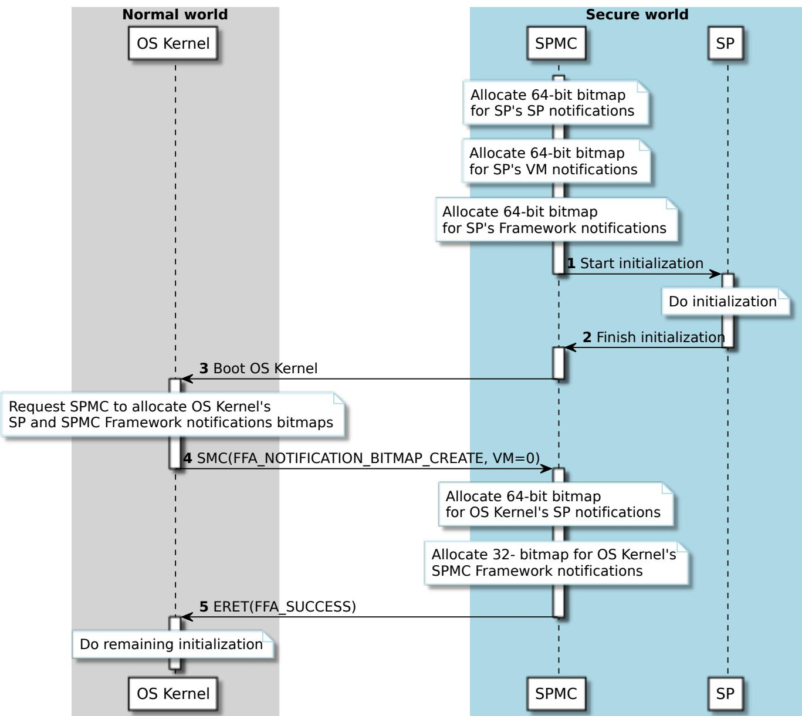  
Figure 10.14: Notification bitmap creation for an OS Kernel and SP

## 10.10 Notification support for a Hypervisor

The guidance in this chapter assumes that endpoints are Senders and Receivers of notifications. It is also possible for the SPMC to signal Framework notifications to a Hypervisor. This mechanism is enabled by the fact that the endpoint ID 0 is assigned to the Hypervisor (see 6.3 Partition manager identification).

The Hypervisor can invoke the FFA\_NOTIFICATION\_BITMAP\_CREATE interface with a VM ID of 0 to request the SPMC to allocate the SP and SPMC framework notification bitmaps. A Framework notification pended by the SPMC in the corresponding bitmap for VM ID 0 will be received by the Hypervisor.

It is IMPLEMENTATION DEFINED whether the Hypervisor allows an SP or VM to pend notifications via the endpoint notification bitmaps. For example, the Host operating system at EL1 in a Type-2 Hypervisor implements a subset of the Hypervisor functionality and fulfils the role of an endpoint. It can use the endpoint notification bitmaps to receive IMPLEMENTATION DEFINED notifications from any SP or VM just like any other endpoint.

# Chapter 11 Interface overview

The interfaces used by FF-A components for communication at an FF-A instance are described in the following sections.

• Interfaces for reporting status of execution of other interfaces are described in Chapter 12 Status reporting interfaces.

• Interfaces for partition setup and discovery using Framework messages are described in Chapter 13 Setup and discovery interfaces.

• Interfaces to manage CPU cycles allocated to an endpoint are described in Chapter 14 CPU cycle management interfaces.

• Interfaces to implement exchange of Direct and Indirect Partition messages between endpoints are described in Chapter 15 Messaging interfaces.

• Interfaces to notify a partition about an event with non-blocking semantics are described in Chapter 16 Notification interfaces.

• Interfaces to perform interrupt management are described in Chapter 17 Interrupt management interfaces.

• Additional interfaces for interfaces pertaining to power management are described in Chapter 18 Appendix.

The following common rules govern the definition and behavior of FF-A ABIs.

1. Each interface is invoked using one more conduits described in 4.4 Conduits.

2. Each interface relies on the SMC calling convention v1.2 described in [5]. The divergences from the calling convention are described in 11.1 Divergence from SMC calling convention.

3. Usage of only those architectural registers that are relevant to an interface is specified. The values of all other architectural registers must be ignored.

4. The following standard Secure service call identifier ranges have been reserved for FF-A interfaces in the SMCCC [5].

1. 0x84000060-0x840000FF: FF-A 32-bit calls.

• A caller in the AArch32 Execution state, uses the function identifiers for 32-bit calls.

2. 0xC4000060-0xC40000FF: FF-A 64-bit calls.

• A caller in the AArch64 Execution state, can use the function identifiers for 32-bit or 64-bit calls.

5. An FF-A ABI could support both the SMC32 and SMC64 conventions e.g. FFA\_RXTX\_MAP, FFA\_NOTIFICATION\_INFO\_GET. A callee that runs in the AArch64 execution state and implements such an ABI must implement both SMC32 and SMC64 conventions of the ABI.

6. An invocation of any interface is completed by invoking the FFA\_ERROR interface with the NOT\_SUPPORTED error code in the following scenarios.

• The interface was invoked at an FF-A instance where it cannot be invoked through any conduit.

• The interface was invoked through an invalid conduit at an FF-A instance where it can be invoked.

• The interface was invoked at an FF-A instance before a version was negotiated. See also:

– 13.2.2.1 Version negotiation.

An FF-A component at the lower EL at an FF-A instance uses the FFA\_FEATURES interface (see 13.3 FFA\_FEATURES) to discover if an FF-A ABI is implemented by the FF-A component at the higher EL.

## 11.1 Divergence from SMC calling convention

## 11.1.1 SMC Call Types

The SMC calling convention describes the concept of fast and yielding SMC calls. The type of call is specified in bit[31] of the Function ID parameter of an SMC. The function ID range for yielding calls is reserved for legacy SMC interfaces.

FF-A interfaces fall in both categories. Furthermore, the yielding nature of some FF-A ABIs depends entirely upon the protocol between a service and its clients.

For example, a Receiver endpoint that is allocated CPU cycles through the FFA\_MSG\_SEND\_DIRECT\_REQ ABI could be preempted by a Non-secure interrupt or perform a managed exit. In the latter case, the endpoint could complete the requested operation before relinquishing control to the Normal world.

From the scheduler’s perspective, the invocation of FFA\_MSG\_SEND\_DIRECT\_REQ completes with FFA\_INTERRUPT in the former case and FFA\_MSG\_SEND\_DIRECT\_RESP in the latter case. In the latter case, whether the requested operation is preempted or completed depends upon the service level protocol between the Receiver and Scheduler endpoints. This is not visible to the Framework. The call runs to completion from the Framework’s perspective.

On the other hand, hypcall interfaces can run to completion from the caller’s perspective.

It is not possible to consistently categorize FF-A ABIs as fast or yielding. Furthermore, function IDs for yielding calls cannot be allocated for FF-A ABIs as they lie in the reserved range. Hence, function IDs for FF-A ABIs are allocated from the fast call range. The interpretation of bit[31] of the Function ID parameter by the Framework depends upon the FF-A ABI. For example, hypcalls generally behave as fast calls. FF-A ABIs that allocate CPU cycles to a partition generally behave as yielding calls.

## 11.1.2 Parameter Register Preservation

I<sub>0178</sub> The SMC calling convention [5] states that registers x8–x17 must be preserved for an SMC32/HVC32 call made from the AArch64 execution state. An SMC instruction executed by the caller is always completed by an ERET instruction executed by the callee. Typically, the ERET instruction encodes results of the function identifier (FID) specified in the SMC instruction.

The Framework treats the ERET instruction as a separate conduit along with the SMC, HVC and SVC conduits (see 4.4 Conduits). This implies that the ERET instruction can encode an FID that is unrelated to the function ID specified in the previous SMC instruction. In this case, the ERET instruction is used to invoke a function instead of returning the results of the function ID specified in the SMC instruction that it completes.

A hypcall interface follows the typical usage model. The function runs to completion, and the ERET instruction encodes results of the function ID specified in the SMC instruction.

• For example, a caller invokes the FFA\_ID\_GET ABI which completes with the FFA\_SUCCESS FID and the results of the ABI invocation.

A successful invocation of a CPU cycle management ABI (see Chapter 14 CPU cycle management interfaces) via an SMC, HVC or SVC instruction is completed by an ERET instruction that encodes a function ID unrelated to the function ID of the CPU cycle management ABI.

An implication of this usage model is that an ABI invoked via an SMC32 FID can be completed by an ERET instruction that encodes an SMC64 FID. In this case, registers x8–x17 of the caller could be corrupted by the parameter registers x8-x17 of the SMC64 FID. From the caller’s perspective, this behaviour is not compliant with the SMCCC. From a callee’s perspective, it is not possible to maintain compliance with the SMCCC. This is because it is not possible to use x8-x17 with the ERET instruction to simultaneously preserve the caller’s registers as well as provide results of the requested FF-A operation.

This non-compliance can manifest in the following scenarios:

1. A caller enters the Waiting state with an SMC32 FID, then enters the Running state via an ERET that encodes an SMC64 FID.

• For example a caller invokes the SMC32 FFA\_MSG\_WAIT ABI (0x84000070) which completes with the SMC64 FFA\_MSG\_SEND\_DIRECT\_REQ FID (0xC400006F) (see Figure 11.1).

2. A caller enters the Blocked state with an SMC32 FID, then enters the Running state via an ERET that encodes an SMC64 FID.

• For example a caller invokes the SMC32 FFA\_RUN ABI (0x8400006D) which completes with the SMC64 FFA\_MSG\_SEND\_DIRECT\_RESP FID (0xC4000070) call (see Figure 11.2).

11.1. Divergence from SMC calling convention  
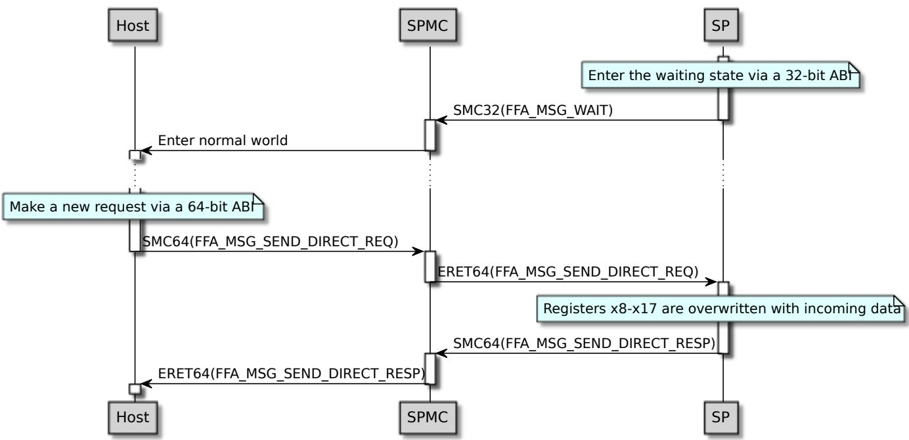  
Figure 11.1: Example of x8-x17 register corruption in scenario 1

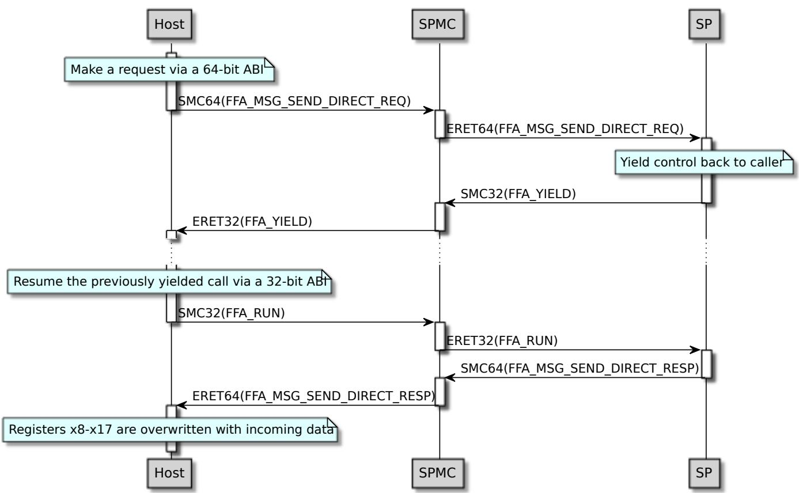  
Figure 11.2: Example of x8-x17 register corruption in scenario 2

The rest of this section describes how an implementation of the Framework can mitigate against this non-compliance with the SMCCC.

This version of the Framework describes the following mitigations:

1. The caller does not rely on x8-x17 being preserved. This allows the callee to remain non-compliant with the SMCCC and not preserve these registers with FF-A.

2. The caller uses SMC64 FIDs where applicable to prevent the callee from being non-compliant with the SMCCC by not preserving these registers with FF-A.

A caller can deploy the first mitigation for both scenarios via the following code sequence:

```asm
/*
 * An FF-A SMC32 could complete with an SMC64 FID overwriting x8-x17.
 * Reserve enough space to preserve these registers instead of relying
 * on the callee.
 */
.equ REGS_X8_X17_SIZE, (8 * 10) /* 80 bytes */

/*
 * Reserve space to preserve results struct pointer in x1 and x19 for
 * a scratch register as these will be overwritten.
 */
.equ FRAME_SIZE, ((8 * 2) + REGS_X8_X17_SIZE)

.macro invoke_smc_1_2

    /* Reserve enough space for x1, x19 and x8-x17 */
    sub    sp, sp, #FRAME_SIZE

    /* Save x1 and x19 */
    stp    x1, x19, [sp, #REGS_X8_X17_SIZE]

    /* Save caller's x8-x17 (may be clobbered by SMC64 ABI) */
    stp    x8, x9, [sp, #REGS_X8_X9_OFFS]
    stp    x10, x11, [sp, #REGS_X10_X11_OFFS]
    stp    x12, x13, [sp, #REGS_X12_X13_OFFS]
    stp    x14, x15, [sp, #REGS_X14_X15_OFFS]
    stp    x16, x17, [sp, #REGS_X16_X17_OFFS]

    /* Relocate input args base to x19 before loading register contents *
    mov    x19, x0

    /* Load input registers x0-x17 from input args struct */
    ldp    x0, x1, [x19, #ARGS_X0_OFFS]
    ldp    x2, x3, [x19, #ARGS_X2_OFFS]
    ldp    x4, x5, [x19, #ARGS_X4_OFFS]
    ldp    x6, x7, [x19, #ARGS_X6_OFFS]
    ldp    x8, x9, [x19, #ARGS_X8_OFFS]
    ldp    x10, x11, [x19, #ARGS_X10_OFFS]
    ldp    x12, x13, [x19, #ARGS_X12_OFFS]
    ldp    x14, x15, [x19, #ARGS_X14_OFFS]
    ldp    x16, x17, [x19, #ARGS_X16_OFFS]

    /* Perform the SMC call. */
    smc #0

    /* Retrieve results struct */
    ldr    x19, [sp, #REGS_X8_X17_SIZE]

    /* Store results content from x0-x17 into result struct */
    stp    x0, x1, [x19, #ARGS_X0_OFFS]
    stp    x2, x3, [x19, #ARGS_X2_OFFS]
```

Chapter 11. Interface overview 11.1. Divergence from SMC calling convention  
```asm
stp x4, x5, [x19, #ARGS_X4_OFFS]
stp x6, x7, [x19, #ARGS_X6_OFFS]
stp x8, x9, [x19, #ARGS_X8_OFFS]
stp x10, x11, [x19, #ARGS_X10_OFFS]
stp x12, x13, [x19, #ARGS_X12_OFFS]
stp x14, x15, [x19, #ARGS_X14_OFFS]
stp x16, x17, [x19, #ARGS_X16_OFFS]

/* Restore potentially clobbered x8-x17 */
ldp x8, x9, [sp, #REGS_X8_X9_OFFS]
ldp x10, x11, [sp, #REGS_X10_X11_OFFS]
ldp x12, x13, [sp, #REGS_X12_X13_OFFS]
ldp x14, x15, [sp, #REGS_X14_X15_OFFS]
ldp x16, x17, [sp, #REGS_X16_X17_OFFS]

/* Restore original x19 register and unwind sp */
ldp xzr, x19, [sp, #REGS_X8_X17_SIZE]
add sp, sp, #FRAME_SIZE

ret
.endm
```

The first mitigation can be applied by an FF-A component without a dependency on other FF-A components to do the same.

The second mitigation can be applied only if there is IMPLEMENTATION DEFINED coordination between an endpoint and its client that only SMC64 FIDs are used for all FF-A based communication. The FF-A components must avoid a situation where an SMC64 FID is used by the caller but not supported by the callee.

I<sub>0184</sub> Version 1.3 of the Framework facilitates implementation of this mitigation by adding SMC64 FIDs for all applicable FF-A CPU cycle management ABIs as listed below (see Chapter 14 CPU cycle management interfaces):

• FFA\_MSG\_WAIT

• FFA\_YIELD

• FFA\_RUN

• FFA\_INTERRUPT

• FFA\_NORMAL\_WORLD\_RESUME

Support for SMC64 FIDs of these ABIs is discovered as follows:

• An endpoint uses the FFA\_FEATURES ABI to discover if the SMC64 FID of an ABI is implemented by its partition manager.

• The Hypervisor uses the FFA\_FEATURES ABI to discover if the SMC64 FID of an ABI is implemented by the SPM.

• The SPMC uses the FFA\_FEATURES ABI to discover if the SMC64 FID of an ABI is implemented by the SPMD.

• The SPMD uses an IMPLEMENTATION DEFINED mechanism to discover if the SMC64 FID of an ABI is implemented by the SPMC, Hypervisor or the OS kernel (if the Hypervisor is not present).

• The SPMC uses the partition manifest to discover if the SMC64 FID of an ABI is implemented by an SP (see Table 5.1).

• The SPMC uses an IMPLEMENTATION DEFINED mechanism to discover if the SMC64 FID of an ABI is implemented by the Hypervisor or the OS kernel (if the Hypervisor is not present) and a VM.

• An endpoint discovers whether another endpoint implements SMC64 FIDs of applicable ABIs via the FFA\_PARTITION\_INFO\_GET ABI.

• The Hypervisor uses an IMPLEMENTATION DEFINED mechanism to discover if the SMC64 FID of an ABI is implemented by a VM.

Figure 11.3 illustrates an example where a VM discovers support the 64-bit FIDs in an SP. The VM requests the SP use the 64-bit FIDs for further communication.

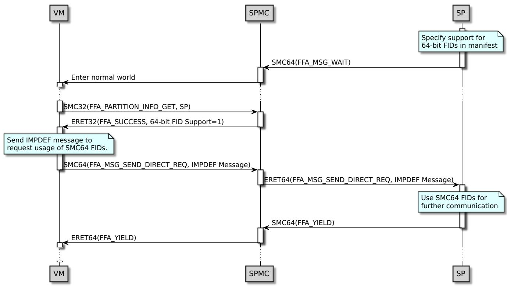  
Figure 11.3: Example discovery of SMC64 FID support

I<sub>0186</sub> The second mitigation can be applied to scenario 1 by the SPMC when execution of the Normal world is preempted by an interrupt, and the SPMC and SPMD are implemented in different exception levels.

The SPMD uses ERET64(FFA\_INTERRUPT) to run the SPMC. The SPMC invokes the SMC64(FFA\_NORMAL\_WORLD\_RESUME) to resume the Normal world after handling the interrupt (see Figure 11.4).

Chapter 11. Interface overview 11.1. Divergence from SMC calling convention  
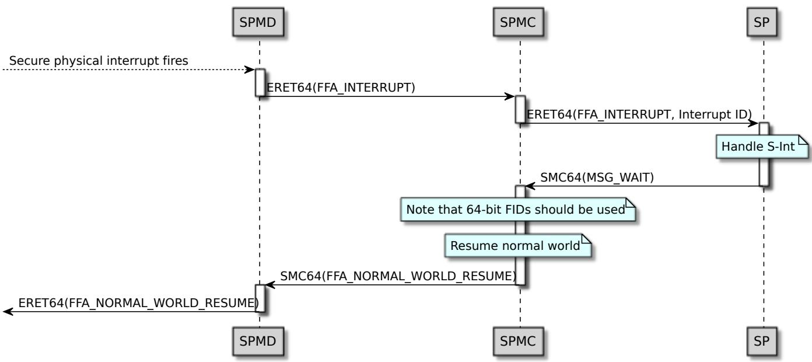  
Figure 11.4: SMC64 usage during Normal world preemption

I<sub>0187</sub> The second mitigation can be applied to scenario 1 by the SPMC when execution of an SP is preempted by an interrupt.

When execution of an SP is preempted by an interrupt, and the SPMC and SPMD are implemented in different exception levels, the SPMC ensures that the invocation of the FFA\_INTERRUPT ABI to return control back to the scheduler uses an SMC64 FID (see Figure 11.5).

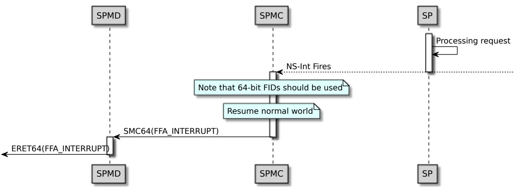  
Figure 11.5: SMC64 usage during Secure world preemption

S<sub>0188</sub> The second mitigation can be applied by an FF-A component for scenario 2 as follows:

• If a Sender sends a Direct request message by using an SMC64 FID, it ensures that any subsequent invocation of the FFA\_RUN ABI to resume the progress of this request also uses the SMC64 FID. This constraint is met until a Direct response is received for the request (see Figure 11.6).

• If a scheduler allocates cycles to an endpoint via the FFA\_RUN ABI by using the SMC64 FID, it ensures that any subsequent invocation of the FFA\_RUN ABI to resume the progress of this request also uses the SMC64 FID. This constraint is met until the endpoint enters the waiting state via the FFA\_MSG\_WAIT ABI.

Chapter 11. Interface overview 11.1. Divergence from SMC calling convention  
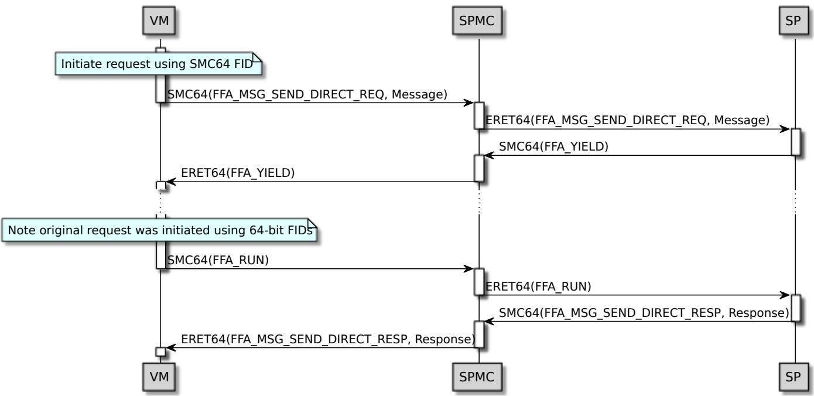  
Figure 11.6: SMC64 usage with Direct Request completion

U<sub>0189</sub> An FF-A component can implement one or more mitigations.

I<sub>0190</sub> FF-A components that implement < v1.3 of the specification are also affected by scenarios 1 and 2. The above mitigations can be backported to the applicable FF-A components.

## 11.2 Reserved parameter convention

The SMCCC refers to the documentation of each SMC or HVC call to determine if parameter registers in that call are used or preserved. Unused parameter registers in FF-A ABIs are reserved for future use by the Framework.

In an invocation of an ABI via the SMC, HVC or SVC conduit, the callee treats the unused parameter registers as Reserved (SBZ). The caller is expected to write zeroes to these registers. The callee ignores the values in these registers.

The ERET conduit is used in the following scenarios:

• To complete the invocation of a hypcall. The parameter registers contain return results. E.g. FFA\_ID\_GET is invoked via the SMC conduit at the Non-secure physical FF-A instance. The invocation completes via the ERET conduit.

• To invoke a new ABI that is independent of the ABI that was previously invoked via the SMC, HVC or SVC conduits. The parameter registers contain input arguments of the new ABI. E.g. An SP invokes FFA\_MSG\_WAIT to enter the waiting state. The SPMC invokes FFA\_MSG\_SEND\_DIRECT\_REQ with the ERET conduit to transition the SP to the running state.

In both scenarios, the caller of the ERET instruction treats all unused parameter registers as Reserved (MBZ). This has the following implications:

• Information from a higher Exception level never leaks to a lower Exception level in ABI invocations.

• Values specified by a lower Exception level in the last invocation of the SMC, HVC or SVC conduits are not preserved.

Chapter 12

Status reporting interfaces

## 12.1 Overview

Interfaces described in this section are used to report the status of a previous FF-A ABI invocation. The status indicates successful or unsuccessful completion of the ABI invocation. This ABI must be one that is listed in the following sections.

• Interfaces for partition setup and discovery<sup>1</sup> in Chapter 13 Setup and discovery interfaces.

• Interfaces to implement memory management transactions in the FF-A memory management protocol [1].

• Interfaces to manage CPU cycles in Chapter 14 CPU cycle management interfaces.

• Interfaces to implement messaging between endpoints in Chapter 15 Messaging interfaces.

• Interfaces to implement the notification mechanism in Chapter 16 Notification interfaces.

• Interfaces to perform interrupt management in Chapter 17 Interrupt management interfaces.

## 12.2 FFA\_ERROR

## Description

• Returns error code in response to a previous invocation of an FF-A function.

• Table 12.2 defines the values for status codes used with FF-A functions. All values are considered to be 32-bit signed integers.

• Valid FF-A instances and conduits are listed in Table 12.3.

• Syntax of this function is described in Table 12.4.

• Figure 12.1 illustrates example usage of this function with the following assumptions.

– Component A makes an invalid request to Component B through an FF-A function described in this specification.

– Component B uses the FFA\_ERROR function to return the error code to Component A.

– The FF-A function used by component A can be invoked through the SMC and ERET conduits.

– Both components could be interacting at any FF-A instance support by the FF-A function. The two possible scenarios have been considered.

<sub>\*</sub> Component A is at a lower EL than component B at the FF-A instance.

Component A is at a higher EL than component B at the FF-A instance.

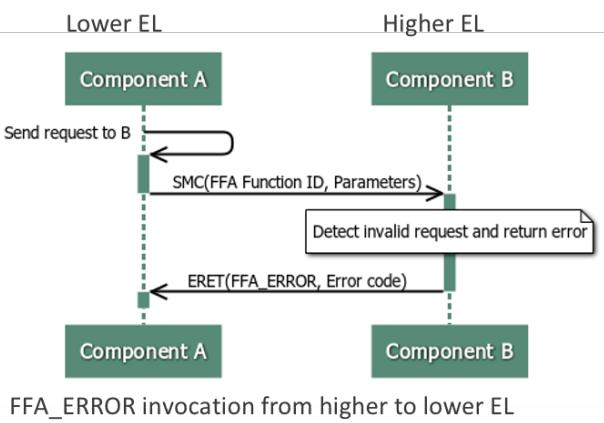

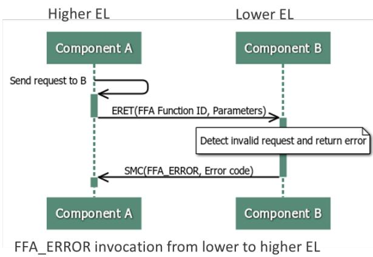  
Figure 12.1: Example usage of FFA\_ERROR

Table 12.2: Error status codes

<table><tr><td>Status code</td><td>Description</td></tr><tr><td>-1</td><td>NOT_SUPPORTED</td></tr><tr><td>-2</td><td>INVALID_PARAMETERS</td></tr><tr><td>-3</td><td>NO_MEMORY</td></tr><tr><td>-4</td><td>BUSY</td></tr><tr><td>-5</td><td>INTERRUPTED</td></tr><tr><td>-6</td><td>DENIED</td></tr><tr><td>-7</td><td>RETRY</td></tr><tr><td>-8</td><td>ABORTED</td></tr><tr><td>-9</td><td>NO_DATA</td></tr><tr><td>-10</td><td>NOT_READY</td></tr></table>

Table 12.3: FFA\_ERROR instances and conduits

<table><tr><td>Config No.</td><td>FF-A instance</td><td>Valid conduits</td></tr><tr><td>1</td><td>Secure and Non-secure physical</td><td>SMC, ERET</td></tr><tr><td>2</td><td>Non-secure virtual</td><td>SMC, HVC, ERET</td></tr><tr><td>3</td><td>Secure virtual</td><td>SMC, ERET</td></tr></table>

Table 12.4: FFA\_ERROR function syntax

<table><tr><td>Parameter</td><td>Register</td><td>Value</td></tr><tr><td>uint32 Function ID</td><td>w0</td><td>0x84000060.0xC4000060.- This function ID is used by callers that only implement SMC64 FIDs as described in 11.1.2 Parameter Register Preservation.</td></tr><tr><td>uint32 Target information</td><td>w1</td><td>Information to identify target SP/VM.- Valid only when SMC conduit is used at the Non-secure virtual FF-A instance. MBZ otherwise.- Bits[31:16]: ID of SP/VM.- Bits[15:0]: ID of vCPU of SP/VM to deliver error to.</td></tr><tr><td>int32 Error code</td><td>w2</td><td>FF-A function specific error code. See function definition for applicable error codes.</td></tr><tr><td>Other Parameter registers</td><td>w3-w7</td><td>Reserved (SBZ).</td></tr></table>

## 12.3 FFA\_SUCCESS

## Description

• Returns results on successful completion of a previous invocation of an FF-A function.

• Valid FF-A instances and conduits are listed in Table 12.6.

• Syntax of this function is described in Table 12.7.

• Figure 12.2 illustrates example usage of this function with the following assumptions.

– Component A makes an valid request to Component B through an FF-A function described in this specification.

– Component B uses the FFA\_SUCCESS function to return the results to Component A.

– The FF-A function used by component A can be invoked through the SMC and ERET conduits.

– Both components could be interacting at any FF-A instance support by the FF-A function. The two possible scenarios have been considered.

<sub>\*</sub> Component A is at a lower EL than component B at the FF-A instance.

<sub>\*</sub> Component A is at a higher EL than component B at the FF-A instance.

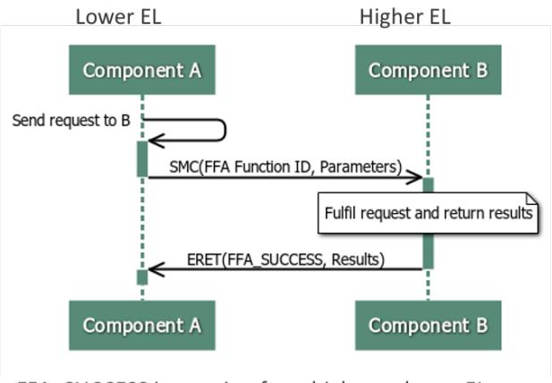  
FFA SUCCESS invocation from higher to lower EL

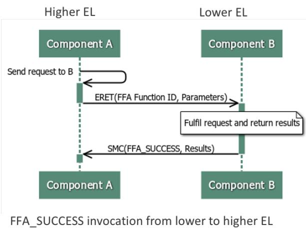  
Figure 12.2: Example usage of FFA\_SUCCESS

Table 12.6: FFA\_SUCCESS instances and conduits

<table><tr><td>Config No.</td><td>FF-A instance</td><td>Valid conduits</td></tr><tr><td>1</td><td>Secure and Non-secure physical</td><td>SMC, ERET</td></tr><tr><td>2</td><td>Non-secure virtual FF-A</td><td>SMC, HVC, ERET</td></tr><tr><td>3</td><td>Secure virtual FF-A</td><td>SMC, ERET</td></tr></table>

Table 12.7: FFA\_SUCCESS function syntax

<table><tr><td>Parameter</td><td>Register</td><td>Value</td></tr><tr><td>uint32 Function ID</td><td>w0</td><td>0x84000061.0xC4000061.- This function ID, also denoted as FFA_SUCCESS64, is used only if:* Any result register encodes a 64-bit parameter*A caller only implements SMC64 FIDs as described in 11.1.2 Parameter Register Preservation.</td></tr><tr><td>uint32 Target information</td><td>w1</td><td>Information to identify target SP/VM.- Valid only when SMC conduit is used at the Non-secure virtual FF-A instance. MBZ otherwise.- Bits[31:16]: ID of SP/VM.- Bits[15:0]: ID of vCPU of SP/VM to deliver results to.</td></tr><tr><td>uint32/uint64 Result registers</td><td>w2-w7x2-x17</td><td>FF-A function specific return results. See function definition for result encoding. Reserved (SBZ) if not explicitly specified.</td></tr></table>

Chapter 13

Setup and discovery interfaces

## 13.1 Compliance requirements

Table 13.1 lists the discovery and setup interfaces that must be implemented at a given FF-A instance with a specific conduit.

1. Combinations of interface and conduit that are not listed in the table but listed in the corresponding interface description are optional.

2. Combinations of interface and conduit that are neither listed in Table 13.1 nor in the corresponding interface description are not supported.

Table 13.1: Mandatory discovery and setup interfaces

<table><tr><td>Interface</td><td>Conduit</td><td>Mandatory FF-A Instance</td><td>Notes</td></tr><tr><td>FFA_VERSION</td><td>SMC, HVC, SVC</td><td>All</td><td></td></tr><tr><td>FFA_FEATURES</td><td>SMC, HVC, SVC</td><td>All</td><td></td></tr><tr><td>FFA_FEATURES</td><td>ERET</td><td>Secure physical instance</td><td>Mandatory at this instance between the SPMD and a S-EL2 or S-EL1 SPMC.</td></tr><tr><td>FFA_RX_RELEASE</td><td>SMC, HVC, SVC</td><td>All</td><td></td></tr><tr><td>FFA_RX_RELEASE</td><td>ERET</td><td>Secure physical instance</td><td>Mandatory at this instance between the SPMD and a S-EL2 or S-EL1 SPMC.</td></tr><tr><td>FFA_RXTX_MAP</td><td>SMC, HVC, SVC</td><td>All except Secure physical instance</td><td>Optional at this instance between the SPMD and a S-EL2 or S-EL1 SPMC.</td></tr><tr><td>FFA_RXTX_MAP</td><td>ERET</td><td>Secure physical instance</td><td>Mandatory at this instance between the SPMD and a S-EL2 or S-EL1 SPMC.</td></tr><tr><td>FFA_RXTX_UNMAP</td><td>SMC, HVC, SVC</td><td>All except Secure physical instance</td><td>Optional at this instance between the SPMD and a S-EL2 or S-EL1 SPMC.</td></tr><tr><td>FFA_PARTITION_INFO_GET</td><td>SMC, HVC, SVC</td><td>All except Secure physical instance</td><td>Optional at this instance between the SPMD and a S-EL2 or S-EL1 SPMC.</td></tr></table>

Chapter 13. Setup and discovery interfaces 13.1. Compliance requirements

<table><tr><td>Interface</td><td>Conduit</td><td>Mandatory FF-A Instance</td><td>Notes</td></tr><tr><td>FFA_PARTITION_INFO_GET</td><td>ERET</td><td>·Secure physical instance</td><td>·Mandatory at this instance between the SPMD and a S-EL2 or S-EL1 SPMC.</td></tr><tr><td>FFA_PARTITION_INFO_GET_REGS</td><td>SMC</td><td>·Secure physical instance</td><td>·Mandatory at this instance between the SPMD and a S-EL2 or S-EL1 SPMC only if LSPs that are co-resident with the SPMD are implemented and an IMPLEMENTATION DEFINED discovery mechanism is not used.</td></tr><tr><td>FFA_PARTITION_INFO_GET_REGS</td><td>ERET</td><td>·Secure physical instance</td><td>·Mandatory at this instance between the SPMD and a S-EL2 or S-EL1 SPMC only if LSPs that are co-resident with the SPMD are implemented and an IMPLEMENTATION DEFINED discovery mechanism is not used.</td></tr><tr><td>FFA_ID_GET</td><td>SMC, HVC, SVC</td><td>·All</td><td></td></tr><tr><td>FFA_SPM_ID_GET</td><td>SMC, HVC, SVC</td><td>·All</td><td></td></tr></table>

## 13.2 FFA\_VERSION

## Description

• Returns version of the Firmware Framework implementation at an FF-A instance as described in 13.2.1 Overview.

• Valid FF-A instances and conduits are listed in Table 13.3.

• Syntax of this function is described in Table 13.4.

• Encoding of a version number in return parameters is described in Table 13.5.

• Encoding of error codes in return parameters is described in Table 13.6.

Table 13.3: FFA\_VERSION instances and conduits

<table><tr><td>Config No.</td><td>FF-A instance</td><td>Valid conduits</td></tr><tr><td>1</td><td>Secure and Non-secure physical</td><td>SMC</td></tr><tr><td>2</td><td>Secure and Non-secure virtual</td><td>SMC, HVC, SVC</td></tr></table>

Table 13.4: FFA\_VERSION function syntax

<table><tr><td>Parameter</td><td>Register</td><td>Value</td></tr><tr><td>uint32 Function ID</td><td>w0</td><td>0x84000063.</td></tr><tr><td>uint32 Input version number</td><td>w1</td><td>Version number specified by the caller as follows.- Bit[31]: Must be 0.- Bits[30:16] Major Version number.- Bits[15:0] Minor Version number.- This field is Reserved (SBZ) when the Version query type is b&#x27;10.</td></tr><tr><td>uint32 Input flags</td><td>w2</td><td>Bits[32:2]: Reserved (SBZ).Bits[1:0]: Version query type.- b&#x27;00: Request to negotiate version specified in Input version number.* Also see 13.2.2.1 Version negotiation.- b&#x27;01: Request to query whether the callee implements a version that is compatible with the version specified in the Input version number by the caller.* Also see 13.2.2.2 Version discovery.- b&#x27;10: Request to query the negotiated version for the caller.* Also see 13.2.2.2 Version discovery.- All other values are reserved for future use.</td></tr><tr><td>Other Parameter registers</td><td>w3-w7</td><td>Reserved (SBZ).</td></tr></table>

Table 13.5: Encoding of a version number

<table><tr><td>Parameter</td><td>Register</td><td>Value</td></tr><tr><td>int32 Output version number</td><td>w0</td><td>Supported version number (see 13.2.2 Usage). - Bit[31]: Must be 0. - Bits[30:16]: Major Version number. - Bits[15:0]: Minor Version number.</td></tr><tr><td>Other Result registers</td><td>w1-w7</td><td>Reserved (MBZ).</td></tr></table>

Table 13.6: Encoding of error codes

<table><tr><td>Parameter</td><td>Register</td><td>Value</td></tr><tr><td>int32 Error code</td><td>w0</td><td>Error code as defined in the SMCCC [5].- -1: NOT_SUPPORTED:* A Firmware Framework implementation of the requested version does not exist at this FF-A instance.- -3: INVALID_PARAMETER:* Bit[31] in the Input version number input parameter is not 0.* Version query type field in the Input flags input parameter is incorrectly encoded.</td></tr></table>

## 13.2.1 Overview

The version number of a Firmware Framework implementation is a 31-bit unsigned integer, with the upper 15 bits denoting the major revision, and the lower 16 bits denoting the minor revision.

I<sub>0192</sub> If an invocation of the FFA\_VERSION ABI returns a valid version number, the FFA\_FEATURES ABI can be used to discover which functions that are described in this specification are available to the caller. A partition manager can make a subset of functions available to an endpoint it manages. See also:

• 13.3 FFA\_FEATURES.

R<sub>0193</sub> The following rules apply to the version numbering.

• Different major revision values indicate possibly incompatible functions.

• For two revisions, A and B, for which the major revision values are identical, if the minor revision value of revision B is greater than the minor revision value of revision A, then every function in revision A must work in a compatible way with revision B. However, it is possible for revision B to have a higher function count than revision A

In an invocation of this function, the compatibility of the version number $( x . y )$ of the caller with the version number (a.b) of the callee can also be as follows.

1. If x $! = a ,$ then the versions are incompatible.

• The caller cannot inter-operate with the callee.

2. If x == a and $y > b ,$ then the versions are incompatible.

• The caller can inter-operate with the callee only if it downgrades its minor revision such that $y < = b$

3. If $x = = a$ and $y < = b ,$ , then the versions are compatible.

A version number (x.y) is less than a version number (a.b) if one of the following conditions is true.

• x < a.

• y < b if x == a.

R<sub>0194</sub> In this revision of the Firmware Framework, the major version is 1 and the minor version is 3.

## 13.2.2 Usage

R<sub>0195</sub> The FFA\_VERSION ABI is implemented at every FF-A instance that implements the Firmware Framework.

I<sub>0196</sub> The FFA\_VERSION ABI enables a caller to determine if the callee implements the Firmware Framework. If the Firmware Framework is implemented, it enables the caller to perform the following actions related to version management:

• Determine whether the callee implements a version of the Firmware Framework that is compatible with a version implemented by the caller.

• Negotiate a version of the Firmware Framework with the callee.

• Determine the version of the Firmware Framework previously negotiated with the callee.

See also:

• 13.2.2.1 Version negotiation.

• 13.2.2.2 Version discovery.

I<sub>0197</sub> An invocation of the FFA\_VERSION ABI completes with the SMCCC NOT\_SUPPORTED error code, if no version of the Firmware Framework is implemented by the callee.

R<sub>0198</sub> An invocation of the FFA\_VERSION ABI completes with the SMCCC INVALID\_PARAMETER error code, if a reserved value of the Version query type field in the Input flags input parameter is used.

## 13.2.2.1 Version negotiation

Between the caller and the callee at an FF-A instance, the negotiated version is a version of the Firmware Framework that has all of the following properties:

• The caller implements this version.

• The callee either implements this version or a higher version that is compatible with this version.

• The version is mutually accepted i.e. the callee is aware that the caller is using this version, and vice-versa.

An invocation of the FFA\_VERSION ABI with a Version query type = 0 is a request to negotiate the specified Input version number with the callee.

D<sub>0201</sub> A major version value of 0, and the minor version value of 0, is called the Null version.

R<sub>0202</sub> If no version is negotiated between a caller and the callee, the negotiated version is the Null version.

I<sub>0203</sub> The callee can discover an FF-A version implemented by the caller via an IMPLEMENTATION DEFINED mechanism before the caller starts execution. For example:

• The FF-A version implemented by a VM is specified at the time of its creation to the Hypervisor.

• An SP specifies an FF-A version in its manifest to the SPMC. See also:

– 5.2.1 Partition manifest.

• In SPM configurations where the SPMD and SPMC reside in separate Exception levels, the SPMD discovers the FF-A version of the SPMC via an IMPLEMENTATION DEFINED mechanism e.g. through the SPMC manifest. See also:

– Table 4.1.

– 5.2.2 SPMC manifest.

If the FF-A version of a caller at an FF-A instance is discovered by the callee before the caller starts execution, and this version is compatible with an FF-A version implemented by the callee, this is the negotiated version of the caller when it starts executing. If this version is not compatible, the callee does not start execution of the caller.

If the FF-A version implemented by an SP is discovered by the SPMC before the SP enters the starting state, and this version is compatible with an FF-A version implemented by the SPMC, this is the negotiated version of the SP when it enters the starting state. If this version is not compatible, the SPMC does not start the SP. See also:

## • 7.2.5 Starting state.

I<sub>0206</sub> If the FF-A version implemented by the SPMC is discovered by the SPMD before the SPMC starts execution, and this version is compatible with an FF-A version implemented by the SPMD, this is the negotiated version of the SPMC when it starts execution. If this version is not compatible, the SPMD does not start the SPMC.

R<sub>0207</sub> The negotiated version between the SPMC and the SPMD is the highest FF-A version that is used by any LSP that is co-resident with either component.

X<sub>0208</sub> In SPM configurations where the SPMD and SPMC reside in separate Exception levels, the system integrator ensures the following:

• Compatibility is maintained between any LSPs that are co-resident with the SPMD, the SPMC, and all partitions managed by the SPMC.

• LSPs co-resident with the SPMD do not advertise an FF-A version number that is higher than the version used by the SPMC.

R<sub>0209</sub> An invocation of any FF-A ABI apart from FFA\_VERSION completes via the FFA\_ERROR interface with the NOT\_SUPPORTED error code, if the negotiated version of the caller is the Null version.

X<sub>0210</sub> A caller negotiates the FF-A version before it invokes any FF-A ABI apart from FFA\_VERSION. In the absence of a negotiated version, the callee does not know how to handle an invocation of an FF-A ABI from the caller. See also:

• Chapter 11 Interface overview.

I<sub>0211</sub> If the negotiated version of a caller is not the Null version, it is IMPLEMENTATION DEFINED whether the callee allows a downgrade of the negotiated version.

D<sub>0212</sub> The Firmware Framework is not in use by a partition if all of the following are true:

• The RX/TX buffers of the partition are unmapped.

• Neither VM nor SP notifications of the partition are bound.

• No Framework notifications of the partition are pending.

• All memory regions shared or lent by the partition are reclaimed.

• All memory regions shared with, or lent to the partition are relinquished and reclaimed by the partitions that had shared or lent them.

• Apart from a single outstanding invocation of the FFA\_VERSION ABI, there are no outstanding invocations of any other FF-A ABI on any PE from the partition.

Otherwise the Firmware Framework is in use by the partition.

The Firmware Framework is not in use by a Hypervisor if all of the following are true:

• The RX/TX buffers of the Hypervisor are unmapped.

• Apart from a single outstanding invocation of the FFA\_VERSION ABI, there are no outstanding invocations of any other FF-A ABI on any PE from the Hypervisor.

• The RX/TX buffers of each VM are unmapped from the SPMC’s translation regime.

• No SP notifications of any VM are bound.

• No VM notifications of any SP are bound.

• No SPMC Framework notifications of any VM are pending.

• All memory regions shared or lent by any VM are reclaimed.

Otherwise the Firmware Framework is in use by the Hypervisor.

If the Hypervisor is absent, the Firmware Framework is not in use by the OS kernel if all of the following are true:

• The RX/TX buffers of the OS kernel are unmapped

• No SP notifications of the OS kernel are bound.

• No SPMC Framework notifications of the OS kernel are pending.

• All memory regions shared or lent by the OS kernel are reclaimed.

• All memory regions shared with, or lent to the OS kernel are relinquished and reclaimed by the SPs that had shared or lent them.

• Apart from a single outstanding invocation of the FFA\_VERSION ABI, there are no outstanding invocations of any other FF-A ABI on any PE from the OS kernel.

Otherwise the Firmware Framework is in use by the OS kernel.

If the negotiated version of an FF-A component is the Null version, the Firmware Framework is not in use by that FF-A component.

A request to negotiate a version from a partition or the Hypervisor completes successfully with an Output version number that is compatible with, and greater than or equal to the Input version number, if none of the following are true:

• The callee does not implement any version of the Firmware Framework.

– In this case, the request completes with the SMCCC NOT\_SUPPORTED error code.

• Bit[31] in the Input version number input parameter is not 0.

– In this case, the request completes with the SMCCC INVALID\_PARAMETER error code.

• The callee only implements one or more versions of the Firmware Framework that are incompatible with, and lower than the Input version number.

– In this case, the request completes with the highest incompatible version number implemented by the callee.

• The callee only implements one or more versions of the Firmware Framework that are incompatible with, and higher than the Input version number.

– In this case, it is strongly recommended that the request completes with the lowest incompatible version number implemented by the callee. The request is also allowed to complete with the SMCCC NOT\_SUPPORTED error code. See also:

\* 18.5 Changes to FF-A v1.0 data structures for forward compatibility.

<sub>\*</sub> 18.5.3 Compatibility requirements for FF-A v1.0 data structures.

• The callee only implements multiple versions of the Firmware Framework that are incompatible with, and are both higher and lower than the Input version number.

– In this case, the request completes with the highest incompatible version number implemented by the callee.

• The callee is aware that the Firmware Framework is in use by the caller.

– In this case, the request completes with the Null version.

• The Input version number is less than the negotiated version and the callee does not permit the negotiated version to be downgraded by the caller.

– In this case, the request completes with the Null version.

If a request to negotiate a version from a partition or the Hypervisor completes successfully, the Input version number is the negotiated version. Otherwise, the value of the negotiated version is unchanged.

If the Framework is in use by a caller when there is a pending request to negotiate a version from the same caller, the results of Framework usage are CONSTRAINED UNPREDICTABLE with a choice of the following:

• The FF-A operation completes as per the behaviour specified in the version of the Framework that was previously negotiated between the caller and the callee.

• The FF-A operation completes as per the behaviour specified in the version of the Framework that is being currently negotiated between the caller and the callee.

• The FF-A operation completes as per behaviour that is neither specified in the version of the Framework that was previously negotiated, nor is it specified in the version of the Framework that is being currently negotiated between the caller and the callee.

A callee is not expected to implement mutual exclusion between use of the Framework by a caller, and a request to negotiate a version by the same caller. The caller is expected to implement this mutual exclusion instead.

The callee can check whether the Framework is in use by the caller at any point of time during the request to negotiate a version. The callee is not expected to prevent use of the Framework by the caller during the request to negotiate a version.

The caller should expect the CONSTRAINED UNPREDICTABLE behaviour described above if it uses the Framework and negotiates the version simultaneously.

The following table shows the outcome of a version negotiation request when the caller and the callee implement different FF-A versions. The following assumptions are made:

• The Firmware Framework is not in use by the caller.

• The callee does not support downgrade of the negotiated version.

<table><tr><td>No.</td><td>Versions supported by callee</td><td>Version re-quested by caller</td><td>Negotiated version before</td><td>Outcome as per callee</td><td>Output version number in w0</td><td>Negotiated version after</td></tr><tr><td>1</td><td>(1, 3)</td><td>(1, 3)</td><td>Null version</td><td>Success</td><td>(1, 3)</td><td>(1, 3)</td></tr><tr><td>2</td><td>(1, 3)</td><td>(1, 3)</td><td>(1, 3)</td><td>Success</td><td>(1, 3)</td><td>(1, 3)</td></tr><tr><td>3</td><td>(1, 6)</td><td>(1, 3)</td><td>Null version</td><td>Success</td><td>(1, 6)</td><td>(1, 3)</td></tr><tr><td>4</td><td>(1, 6)</td><td>(1, 3)</td><td>(1, 3)</td><td>Success</td><td>(1, 6)</td><td>(1, 3)</td></tr><tr><td>5</td><td>(1, 6)</td><td>(1, 4)</td><td>(1, 3)</td><td>Success</td><td>(1, 6)</td><td>(1, 4)</td></tr><tr><td>6</td><td>(1, 6)</td><td>(1, 5)</td><td>(1, 4)</td><td>Success</td><td>(1, 6)</td><td>(1, 5)</td></tr><tr><td>7</td><td>(1, 3)</td><td>(1, 6)</td><td>Not applicable</td><td>Failure</td><td>(1, 3)</td><td>Same as before</td></tr><tr><td>8</td><td>(1, 6)</td><td>(2, 0)</td><td>Not applicable</td><td>Failure</td><td>(1, 6)</td><td>Same as before</td></tr><tr><td>9</td><td>(3, 0)</td><td>(2, 0)</td><td>Not applicable</td><td>Failure</td><td>(3, 0)</td><td>Same as before</td></tr><tr><td>10</td><td>(1, 6), (3, 0)</td><td>(2, 0)</td><td>Not applicable</td><td>Failure</td><td>(1, 6)</td><td>Same as before</td></tr></table>

When the SPMD and the SPMC reside in separate Exception levels, a request to negotiate a version from the SPMC completes successfully with an Output version number that is equal to the negotiated version when the SPMC started execution, if none of the following are true:

• The callee does not implement any version of the Firmware Framework.

– In this case, the request completes with the SMCCC NOT\_SUPPORTED error code.

• Bit[31] in the Input version number input parameter is not 0.

– In this case, the request completes with the SMCCC INVALID\_PARAMETER error code.

The request to negotiate a version from the SPMC is a nop.

If a request to negotiate a version does not complete with the SMCCC NOT\_SUPPORTED error code, the caller uses the compatibility rules in 13.2.1 Overview to determine if it can inter-operate with the Output version number returned by the callee

R<sub>0222</sub> A request to negotiate a version from a partition or the Hypervisor is forwarded by the SPMD to the SPMC through one of the following mechanisms:

• The message described in Table 13.8 if the SPMC is implemented in S-EL2 or S-EL1.

• An IMPLEMENTATION DEFINED mechanism if the SPMC is implemented in EL3.

If the SPMC is implemented in S-EL1 or S-EL2, it needs to know the version presented by the Hypervisor or OS Kernel to determine which version it should use to maintain compatibility with the SPMD as well as the Hypervisor or OS kernel.

The forwarded message from the SPMD enables the SPMC to make this choice and either return a compatible version or return the NOT\_SUPPORTED error code to the Normal world as per the callee specific guidelines described in 13.2.2.1 Version negotiation.

The negotiated FF-A version of the SPMD and the Hypervisor or OS is used by the SPMC at runtime to determine the applicable FF-A ABI behavior for a given caller, including version dependent semantics.

R<sub>0224</sub> The SPMC returns the response to the forwarded message through one of the following mechanisms:

• The message described in Table 13.9 if the SPMC is implemented in S-EL2 or S-EL1.

• An IMPLEMENTATION DEFINED mechanism if the SPMC is implemented in EL3.

S<sub>0225</sub> Figure 13.1 illustrates how the SPMD forwards,

• An FFA\_VERSION call from the Normal world to an SPMC in S-EL2 or EL3.

• The response from the SPMC back to the Normal world.

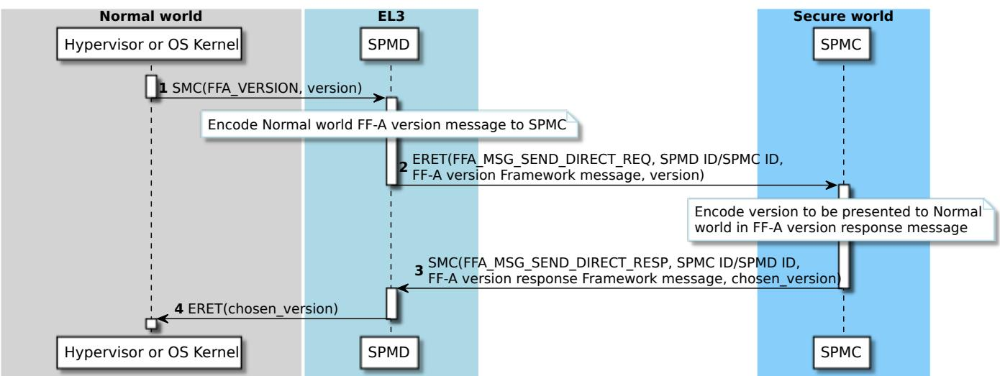  
Figure 13.1: Forwarding of FFA\_VERSION call from SPMD to SPMC at lower EL

Table 13.8: Normal world FF-A version message

<table><tr><td>Register</td><td>Parameter</td></tr><tr><td>w0</td><td>FFA_MSG_SEND_DIRECT_REQ Function ID (0x8400006F or 0xC400006F).</td></tr><tr><td>w1</td><td>Sender and Receiver endpoint IDs.- Bit[31:16]:* SPMD ID.- Bit[15:0]:* SPMC ID.</td></tr><tr><td>w2</td><td>Message flags.- Bit[31] = b&#x27;1: Framework message.- Bit[30:8]: Reserved (SBZ).- Bit[7:0] = b&#x27;00001000: Message for forwarding FFA_VERSION call from Normal world to the SPMC.</td></tr></table>

Chapter 13. Setup and discovery interfaces 13.2. FFA\_VERSION

<table><tr><td>Register</td><td>Parameter</td></tr><tr><td>w3</td><td>• Input version number parameter from Normal world.</td></tr><tr><td>w4</td><td>• Input flags parameter from Normal world.</td></tr><tr><td>w5-w7</td><td>Reserved (SBZ).</td></tr></table>

Table 13.9: Response to Normal world FF-A version message

<table><tr><td>Register</td><td>Parameter</td></tr><tr><td>w0</td><td>FFA_MSG_SEND_DIRECT_RESP Function ID (0x84000070 or 0xC4000070).</td></tr><tr><td>w1</td><td>Sender and Receiver endpoint IDs.- Bit[31:16]:* SPMC ID.- Bit[15:0]:* SPMD ID.</td></tr><tr><td>w2</td><td>Message flags.- Bit[31] = b&#x27;1: Framework message.- Bit[30:8]: Reserved (SBZ).- Bit[7:0] = b&#x27;00001001: Response message to forwarded FFA_VERSION call from the Normal world.</td></tr><tr><td>w3</td><td>Encoding of w0 in Table 13.5 if a version is returned by the SPMC.Encoding of w0 in Table 13.6 if a version is not returned by the SPMC.</td></tr><tr><td>w4-w7</td><td>Reserved (SBZ).</td></tr></table>

## 13.2.2.2 Version discovery

An invocation of the FFA\_VERSION ABI with a Version query type = 1 is a request to query a version implemented by the callee that is compatible with the specified Input version number.

A request to query a compatible version completes successfully with a Output version number that is compatible with, and greater than or equal to the Input version number, if none of the following are true:

• The callee does not implement any version of the Firmware Framework.

– In this case, the request completes with the SMCCC NOT\_SUPPORTED error code.

• Bit[31] in the Input version number input parameter is not 0.

– In this case, the request completes with the SMCCC INVALID\_PARAMETER error code.

• The callee only implements one or more versions of the Firmware Framework that are incompatible with, and lower than the Input version number.

– In this case, the request completes with the highest incompatible version number implemented by the callee.

• The callee only implements one or more versions of the Firmware Framework that are incompatible with, and higher than the Input version number.

– In this case, the request completes with the lowest incompatible version number implemented by the callee.

• The callee only implements multiple versions of the Firmware Framework that are incompatible with, and are both higher and lower than the Input version number.

– In this case, the request completes with the highest incompatible version number implemented by the callee.

An invocation of the FFA\_VERSION ABI with Version query type = 2, is a request to query the negotiated version from the callee.

R<sub>0229</sub> A request to query the negotiated version completes successfully with the negotiated version as the Output version number, if none of the following are true:

• The callee does not implement any version of the Firmware Framework.

– In this case, the request completes with the SMCCC NOT\_SUPPORTED error code.

• Bit[31] in the Input version number input parameter is not 0.

– In this case, the request completes with the SMCCC INVALID\_PARAMETER error code.

A callee returns the Null version if no version is negotiated with the caller.

## 13.2.2.3 Software usage

S<sub>0231</sub> The following pseudocode illustrates an implementation of the FFA\_VERSION ABI in a partition manager, for negotiating a version with a partition it manages, as per the above guidance.

```c
#define NULL_VERSION "MAJOR_VER(0) | MINOR_VER(0)"
// Array of different versions supported by the callee.
// Each entry represents the maximum version supported
// in that major version range e.g. if an entry == x.y
// then all versions from x.0 to x.y are supported.
uint32 supported_versions[NUM_VERSIONS];

// Return the version supported by the callee that is
// closest to and incompatible with the input_version.
uint32 closest_incompatible_version(uint32 input_version);

// Return a version compatible with the input version
uint32 compatible_version(uint32 input_version);

// By default, the negotiated version for a partition is
// either the Null version i.e. there is no negotiated
// version or an IMPDEF version e.g. obtained from the
// partition manifest.
uint32 negotiated_version = impdef_version ? impdef_version; NULL_VERSION;

// Whether FF-A is in use or not depends upon the
// negotiated version.
// If negotiated_version is == NULL_VERSION, FF-A is not in use.
// If negotiated_version is != NULL_VERSION, FF-A may or may
// not be in use.
bool is_version_negotiable(uint32 negotiated_version, bool ffa_in_use)
{
    // This scenario should not be allowed by the callee.
    if ((negotiated_version == NULL_VERSION) && ffa_in_use) {
    panic();
    }

    if ((negotiated_version != NULL_VERSION) && ffa_in_use) {
    return false;
    }

    return true;
}

// Return true if the input version is compatible with a supported version
bool are_versionsCompatible(uint32 supported_version, uint32 input_version)
{
```

```c
if (MAJOR_VER(input_version) != MAJOR_VER(supported_version)) {
    return false;
}

if (MINOR_VER(input_version) > MINOR_VER(supported_version)) {
    return false;
}

return true;
}

// Return true if input version is supported otherwise false
bool is_version_supported(uint32 input_version, uint32 start_version, uint32
→end_version)
{
    uint32 ver;

    for (ver = start_version; ver < end_version; ver++)
    {
    if (are_versions_compatible(supported_versions[ver], input_version)) {
    return true;
    }

    return false;
}

// It is assumed that the implementation allows the negotiated
// version to be downgraded.
ffa_version(uint32 input_version, uint32 flags, uint32 negotiated_version, bool
→ffa_in_use)
{
    switch (flags) {
    case REQUEST_NEGOTIATED_VER:
    return negotiated_version;

    case REQUEST_COMPAT_VER:
    return compatible_version(input_version);

    case REQUEST_NEGOTIATE_VER:
    // If the input_version is not supported, return the closest
    // incompatible version.
    if (!is_version_supported(input_version, 0, NUM_VERSIONS))
    return closest_incompatible_version(input_version);

    // Input version is supported but check whether it can be
    // accepted as the negotiated version.
    if (is_version_negotiable(negotiated_version, ffa_in_use)) {

    // Either FF-A is not in use or no version has been negotiated
    // so far. Set the negotiated_version to the input_version
    // and return the highest version that is compatible with the
    // input_version.
    negotiated_version = input_version;
    return compatible_version(input_version);
    }

    // Return the Null version to indicate version could not be
    // negotiated. The negotiated version remains unchanged.
    return NULL_VERSION;
}
```