```c
if (MAJOR_VER(input_version) != MAJOR_VER(supported_version)) {
    return false;
}

if (MINOR_VER(input_version) > MINOR_VER(supported_version)) {
    return false;
}

return true;
}

// Return true if input version is supported otherwise false
bool is_version_supported(uint32 input_version, uint32 start_version, uint32
→end_version)
{
    uint32 ver;

    for (ver = start_version; ver < end_version; ver++)
    {
    if (are_versions_compatible(supported_versions[ver], input_version)) {
    return true;
    }

    return false;
}

// It is assumed that the implementation allows the negotiated
// version to be downgraded.
ffa_version(uint32 input_version, uint32 flags, uint32 negotiated_version, bool
→ffa_in_use)
{
    switch (flags) {
    case REQUEST_NEGOTIATED_VER:
    return negotiated_version;

    case REQUEST_COMPAT_VER:
    return compatible_version(input_version);

    case REQUEST_NEGOTIATE_VER:
    // If the input_version is not supported, return the closest
    // incompatible version.
    if (!is_version_supported(input_version, 0, NUM_VERSIONS))
    return closest_incompatible_version(input_version);

    // Input version is supported but check whether it can be
    // accepted as the negotiated version.
    if (is_version_negotiable(negotiated_version, ffa_in_use)) {

    // Either FF-A is not in use or no version has been negotiated
    // so far. Set the negotiated_version to the input_version
    // and return the highest version that is compatible with the
    // input_version.
    negotiated_version = input_version;
    return compatible_version(input_version);
    }

    // Return the Null version to indicate version could not be
    // negotiated. The negotiated version remains unchanged.
    return NULL_VERSION;
}
```

A common usage model of the Firmware Framework is when it is first used by the bootloader followed by the OS in the same partition. Until version 1.2 of the Firmware Framework, the FF-A version is negotiated once during the lifetime of a partition. This implies that the OS is constrained to use the FF-A version negotiated by the bootloader.

The OS relies on an IMPLEMENTATION DEFINED mechanism to determine the FF-A version negotiated by the bootloader. In the absence of this mechanism, if the bootloader negotiates version (x.y), and the OS tries to negotiate version (x.z) via the FFA\_VERSION ABI, then the following outcomes are possible:

• If y < z, the callee returns version (x.y) as it is the highest version number that it implements, and is incompatible with version (x.z).

The caller uses the compatibility rules in 13.2.1 Overview to determine that it cannot inter-operate with the version already negotiated by bootloader.

• If y >= z, the callee returns version (x.y) as it is the version number that it implements, and is compatible with version (x.z).

The caller uses the compatibility rules in 13.2.1 Overview to determine that it can inter-operate with the version already negotiated by bootloader.

However, if y > z, the callee uses version (x.y), and assumes that the caller is using the same version, while the caller assumes that version (x.z) is in use. This mismatch could prevent the callee from maintaining backwards compatibility in the usage of the Firmware Framework by the caller.

It is not possible for a caller to only query the versions of the Firmware Framework supported by the callee without simultaneously negotiating a compatible version.

From version v1.3 of the Firmware Framework, the FFA\_VERSION ABI is extended as follows:

• Both the bootloader and the OS can use the request to query a compatible version multiple times, to discover all versions implemented by the callee.

• The OS can use the request to query the negotiated version to determine the version negotiated by the bootloader instead of relying on an IMPLEMENTATION DEFINED mechanism.

• If the bootloader negotiates version (x.y), and the OS tries to negotiate version (x.z) via the FFA\_VERSION ABI, then the following outcomes are possible in an order of precedence:

– If the Firmware Framework is in use by the caller, the callee returns the Null version.

The caller uses the compatibility rules in 13.2.1 Overview to determine that it cannot inter-operate with the Null version returned by the callee.

– If the Firmware Framework is not in use by the caller, but the caller is attempting to downgrade the negotiated version i.e. y > z, and the callee does not allow the negotiated version to be downgraded, it returns the Null version.

The caller uses the compatibility rules in 13.2.1 Overview to determine that it cannot inter-operate with the Null version returned by the callee.

– If the Firmware Framework is not in use by the caller, and the callee implements a version that is compatible with, and greater than or equal to version (x.z), it returns that version.

The caller uses the compatibility rules in 13.2.1 Overview to determine that it can inter-operate with the version returned by the callee.

Effectively, the OS can override the negotiated version if the bootloader ensures that the Firmware Framework is not in use when it finishes execution. Also, in contrast to version 1.2 of the Firmware Framework, if the negotiated version is not the Null version, the callee does not consider it as the only version that it supports.

## 13.3 FFA\_FEATURES

<table><tr><td colspan="2">Description</td></tr><tr><td>1</td><td>2</td></tr><tr><td>2</td><td>3</td></tr><tr><td>3</td><td>4</td></tr><tr><td>4</td><td>5</td></tr><tr><td>5</td><td>6</td></tr><tr><td>6</td><td>7</td></tr><tr><td>7</td><td>8</td></tr><tr><td>8</td><td>9</td></tr><tr><td>9</td><td>10</td></tr><tr><td>10</td><td>11</td></tr><tr><td>11</td><td>12</td></tr><tr><td>12</td><td>13</td></tr><tr><td>13</td><td>14</td></tr><tr><td>14</td><td>15</td></tr><tr><td>15</td><td>16</td></tr><tr><td>16</td><td>17</td></tr><tr><td>17</td><td>18</td></tr><tr><td>18</td><td>19</td></tr><tr><td>19</td><td>20</td></tr><tr><td>20</td><td>21</td></tr><tr><td>21</td><td>22</td></tr><tr><td>22</td><td>23</td></tr><tr><td>23</td><td>24</td></tr><tr><td>24</td><td>25</td></tr><tr><td>25</td><td>26</td></tr><tr><td>26</td><td>27</td></tr><tr><td>27</td><td>28</td></tr><tr><td>28</td><td>29</td></tr><tr><td>29</td><td>30</td></tr><tr><td>30</td><td>31</td></tr><tr><td>31</td><td>32</td></tr><tr><td>32</td><td>33</td></tr><tr><td>33</td><td>34</td></tr><tr><td>34</td><td>35</td></tr><tr><td>35</td><td>36</td></tr><tr><td>36</td><td>37</td></tr><tr><td>37</td><td>38</td></tr><tr><td>38</td><td>39</td></tr><tr><td>39</td><td>40</td></tr><tr><td>40</td><td>41</td></tr><tr><td>41</td><td>42</td></tr><tr><td>42</td><td>43</td></tr><tr><td>43</td><td>44</td></tr><tr><td>44</td><td>45</td></tr><tr><td>45</td><td>46</td></tr><tr><td>46</td><td>47</td></tr><tr><td>47</td><td>48</td></tr><tr><td>48</td><td>49</td></tr><tr><td>49</td><td>50</td></tr><tr><td>50</td><td>51</td></tr><tr><td>51</td><td>52</td></tr><tr><td>52</td><td>53</td></tr><tr><td>53</td><td>54</td></tr><tr><td>54</td><td>55</td></tr><tr><td>55</td><td>56</td></tr><tr><td>56</td><td>57</td></tr><tr><td>57</td><td>58</td></tr><tr><td>58</td><td>59</td></tr><tr><td>59</td><td>60</td></tr><tr><td>60</td><td>61</td></tr><tr><td>61</td><td>62</td></tr><tr><td>62</td><td>63</td></tr><tr><td>63</td><td>64</td></tr><tr><td>64</td><td>65</td></tr><tr><td>65</td><td>66</td></tr><tr><td>66</td><td>67</td></tr><tr><td>67</td><td>68</td></tr><tr><td>68</td><td>69</td></tr><tr><td>69</td><td>70</td></tr><tr><td>70</td><td>71</td></tr><tr><td>71</td><td>72</td></tr><tr><td>72</td><td>73</td></tr><tr><td>73</td><td>74</td></tr><tr><td>74</td><td>75</td></tr><tr><td>75</td><td>76</td></tr><tr><td>76</td><td>77</td></tr><tr><td>77</td><td>78</td></tr><tr><td>78</td><td>79</td></tr><tr><td>79</td><td>80</td></tr><tr><td>80</td><td>81</td></tr><tr><td>81</td><td>82</td></tr><tr><td>82</td><td>83</td></tr><tr><td>83</td><td>84</td></tr><tr><td>84</td><td>85</td></tr><tr><td>85</td><td>86</td></tr><tr><td>86</td><td>87</td></tr><tr><td>87</td><td>88</td></tr><tr><td>88</td><td>89</td></tr><tr><td>89</td><td>90</td></tr><tr><td>90</td><td>91</td></tr><tr><td>91</td><td>92</td></tr><tr><td>92</td><td>93</td></tr><tr><td>93</td><td>94</td></tr><tr><td>94</td><td>95</td></tr><tr><td>95</td><td>96</td></tr><tr><td>96</td><td>97</td></tr><tr><td>97</td><td>98</td></tr><tr><td>98</td><td>99</td></tr><tr><td>99</td><td>100</td></tr></table>

• This interface is used by an FF-A component at the lower EL at an FF-A instance to query:

– The presence, properties and implementation of optional features of an FF-A interface.

– The presence and properties of a feature supported by the Framework and not specific to an FF-A interface.

• This interface can be invoked at the FF-A instances through the conduits listed in Table 13.11.

• Syntax of this function is described in Table 13.12.

• If the FF-A interface or feature that was queried is implemented, the callee completes this call with an invocation of the FFA\_SUCCESS interface as described in Table 13.13.

• If the FF-A interface or feature that was queried is not implemented or invalid, the callee completes this call with an invocation of the FFA\_ERROR interface with the NOT\_SUPPORTED error code.

Table 13.11: FFA\_FEATURES instances and conduits

<table><tr><td>Config No.</td><td>FF-A instance</td><td>Valid conduits</td></tr><tr><td>1</td><td>Non-secure physical</td><td>SMC</td></tr><tr><td>2</td><td>Secure physical</td><td>ERET, SMC</td></tr><tr><td>3</td><td>Secure and Non-secure virtual</td><td>SMC, HVC, SVC</td></tr></table>

Table 13.12: FFA\_FEATURES function syntax

<table><tr><td>Parameter</td><td>Register</td><td>Value</td></tr><tr><td>uint32 Function ID</td><td>w0</td><td>0x84000064.</td></tr><tr><td>uint32 FF-A function ID or Feature ID</td><td>w1</td><td>Bit[31]: w1 contains an FF-A Function ID or Feature ID.- b&#x27;1: w1 must be interpreted as the Function ID of the FF-A interface whose implementation is being queried. Effectively, bit[31] of the SMCCC Function ID i.e. the Fastcall bit is used to distinguish between an FF-A feature and function ID.* If an interface defines both SMC32 and SMC64 FIDs, then either FID could be used.(Also see common rules that govern definition and behavior of FF-A ABIs in Chapter 11 Interface overview).- b&#x27;0: w1 must be interpreted as the ID of a feature supported by the Framework at this FF-A instance. IDs of supported features are listed in Table 13.14.* Bit[30:8]: Reserved (MBZ).* Bit[7:0]: Feature ID.</td></tr></table>

Chapter 13. Setup and discovery interfaces 13.3. FFA\_FEATURES

<table><tr><td>Parameter</td><td>Register</td><td>Value</td></tr><tr><td>uint32 Input properties</td><td>w2</td><td>A list of properties expected by the caller corresponding to the Function ID specified in w1.This parameter is Reserved (MBZ) if a Feature ID is specified in w1.</td></tr><tr><td>Other Parameter registers</td><td>w3-w7</td><td>Reserved (SBZ).</td></tr></table>

Table 13.13: FFA\_SUCCESS encoding

<table><tr><td>Parameter</td><td>Register</td><td>Value</td></tr><tr><td>uint32 Interface properties</td><td>w2-w3</td><td>Used to encode any optional features implemented or any properties exported by the queried interface or feature.FF-A interfaces that use these parameters and the encodings of their properties are listed in Table 13.15.Feature IDs and encodings of their properties are listed in Table 13.14.MBZ if no optional features are implemented or no implementation details are exported by the queried interface.</td></tr><tr><td>Other Result registers</td><td>w4-w7</td><td>Reserved (MBZ).</td></tr></table>

Table 13.14: Feature IDs and properties table

<table><tr><td>FF-A Feature Name</td><td>FF-AFeature ID</td><td>Input properties (w2)</td><td>Encoding of feature in return parameters</td></tr><tr><td>Notification pending interrupt</td><td>0x1</td><td>Reserved (SBZ).</td><td>w2: Interrupt ID.</td></tr><tr><td>Schedule Receiver interrupt</td><td>0x2</td><td>Reserved (SBZ).</td><td>w2: Interrupt ID.</td></tr><tr><td>Managed exit interrupt</td><td>0x3</td><td>Reserved (SBZ).</td><td>w2: Interrupt ID.</td></tr></table>

Chapter 13. Setup and discovery interfaces 13.3. FFA\_FEATURES

<table><tr><td>FF-A Feature Name</td><td>FF-AFeature ID</td><td>Input properties (w2)</td><td>Encoding of feature in return parameters</td></tr><tr><td>Notification features</td><td>0x4</td><td>• Reserved (SBZ).</td><td>• w2: Notification features.- Bit[0]:* b&#x27;0: Per-vCPU notifications supported for VM notifications.* b&#x27;1: Per-vCPU notifications not supported for VM notifications.- Bit[1]:* b&#x27;0: Per-vCPU notifications supported for SP notifications.* b&#x27;1: Per-vCPU notifications not supported for SP notifications.- Bits[10:2]: Number of VM notifications i supported where,* Total notification count = i + 64.* 0 &lt;= i &lt;= 320.* Reserved (MBZ) at the non-secure physical interface.- Bits[19:11]: Number of SP notifications i supported where,* Total notification count = i + 64.* 0 &lt;= i &lt;= 320.- Bit[31:20]: Reserved (MBZ).</td></tr></table>

## Table 13.15: Encoding of interface properties parameters

<table><tr><td>FF-A Function ID (w1)</td><td>Input properties (w2)</td><td>Return parameters (w2-w3)</td></tr><tr><td>FFA_RXTX_MAP</td><td>Reserved (SBZ).</td><td>w2: Buffer sizes.- Bits[1:0]: Minimum buffer size and alignment boundary (see 4.10 RX/TX buffers).* b’00: 4K.* b’01: 64K.* b’10: 16K.* b’11: Reserved.- Bits[15:2]: Reserved (MBZ).Bits[31:16]: Maximum buffer size expressed as a count of 4K pages (see 4.10 RX/TX buffers).* Size must be greater or equal to the minimum buffer size, else MBZ if there is no size limit.w3/x3: Reserved (MBZ).</td></tr></table>

## 13.4 FFA\_RX\_ACQUIRE

## Description

• Acquire ownership of a RX buffer before writing a message to it (see 4.10 RX/TX buffers).

• Valid FF-A instances and conduits are listed in Table 13.17.

• Syntax of this function is described in Table 13.18.

• Returns FFA\_SUCCESS without any further parameters on successful completion.

• Encoding of error code in the FFA\_ERROR function is described in Table 13.19.

Table 13.17: FFA\_RX\_ACQUIRE instances and conduits

<table><tr><td>Config No.</td><td>FF-A instance</td><td>Valid conduits</td></tr><tr><td>1</td><td>Non-secure Physical</td><td>SMC</td></tr><tr><td>2</td><td>Secure Physical</td><td>ERET</td></tr></table>

Table 13.18: FFA\_RX\_ACQUIRE function syntax

<table><tr><td>Parameter</td><td>Register</td><td>Value</td></tr><tr><td>uint32 Function ID</td><td>w0</td><td>0x84000084.</td></tr><tr><td>uint32 VM ID</td><td>w1</td><td>ID of VM ownership of whose RX buffer should be acquired.- Bit[31:16]: Reserved (SBZ).- Bit[15:0]: VM ID.</td></tr><tr><td>Other Parameter registers</td><td>w2-w7</td><td>Reserved (SBZ).</td></tr></table>

## Table 13.19: FFA\_ERROR encoding

<table><tr><td>Parameter</td><td>Register</td><td>Value</td></tr><tr><td>int32 Error code</td><td>w2</td><td>DENIED: Callee cannot relinquish ownership of the RX buffer.INVALID_PARAMETERS: There is no buffer pair registered on behalf of the VM.NOT_SUPPORTED: This function is not implemented at this FF-A instance.</td></tr></table>

## 13.5 FFA\_RX\_RELEASE

## Description

• Relinquish ownership of a RX buffer after reading a message from it (see 4.10 RX/TX buffers).

• Valid FF-A instances and conduits are listed in Table 13.21.

• Syntax of this function is described in Table 13.22.

• Returns FFA\_SUCCESS without any further parameters on successful completion.

• Encoding of error code in the FFA\_ERROR function is described in Table 13.23.

Table 13.21: FFA\_RX\_RELEASE instances and conduits

<table><tr><td>Config No.</td><td>FF-A instance</td><td>Valid conduits</td></tr><tr><td>1</td><td>Non-secure Physical</td><td>SMC</td></tr><tr><td>2</td><td>Secure Physical</td><td>ERET</td></tr><tr><td>3</td><td>Secure virtual</td><td>SMC, HVC, SVC</td></tr><tr><td>4</td><td>Non-secure virtual</td><td>SMC, HVC, SVC, ERET</td></tr></table>

Table 13.22: FFA\_RX\_RELEASE function syntax

<table><tr><td>Parameter</td><td>Register</td><td>Value</td></tr><tr><td>uint32 Function ID</td><td>w0</td><td>0x84000065.</td></tr><tr><td>uint32 VM ID</td><td>w1</td><td>ID of VM ownership of whose RX buffer should be released. Only valid at the Non-secure physical FF-A instance. MBZ otherwise.- Bit[31:16]: Reserved (SBZ).- Bit[15:0]: VM ID.</td></tr><tr><td>Other Parameter registers</td><td>w2-w7</td><td>Reserved (SBZ).</td></tr></table>

## Table 13.23: FFA\_ERROR encoding

<table><tr><td>Parameter</td><td>Register</td><td>Value</td></tr><tr><td>int32 Error code</td><td>w2</td><td>DENIED: Caller did not have ownership of the RX buffer.INVALID_PARAMETERS: There is no buffer pair registered by the Hypervisor on behalf of the VM.NOT_SUPPORTED: This function is not implemented at this FF-A instance.</td></tr></table>

## 13.6 FFA\_RXTX\_MAP

## Description

• Maps the RX/TX buffer pair in the translation regime of the callee on behalf of an endpoint or Hypervisor. – A SP describes the VA or IPA contiguous pages allocated for each buffer in the pair to the SPM.

– A VM describes the VA or IPA contiguous pages allocated for each buffer in the pair to the Hypervisor.

– Hypervisor or OS Kernel describe the physically contiguous pages allocated for each buffer in the pair to the SPM.

– Hypervisor forwards the description of pages allocated for each buffer in the pair by a VM to the SPM. <sub>\*</sub> Description of buffer pair is populated in the TX buffer of the Hypervisor as described in Table 13.28.

– Both Hypervisor and SPM must ensure the caller has exclusive access and ownership of the RX/TX buffer memory regions.

• Valid FF-A instances and conduits are listed in Table 13.25.

• Syntax of this function is described in Table 13.26.

• Returns FFA\_SUCCESS without any further parameters on successful completion.

• Encoding of error code in the FFA\_ERROR function is described in Table 13.27.

Table 13.25: FFA\_RXTX\_MAP instances and conduits

<table><tr><td>Config No.</td><td>FF-A instance</td><td>Valid conduits</td></tr><tr><td>1</td><td>Non-secure physical</td><td>SMC</td></tr><tr><td>2</td><td>Secure physical</td><td>ERET</td></tr><tr><td>3</td><td>Virtual</td><td>SMC, HVC, SVC</td></tr></table>

## Table 13.26: FFA\_RXTX\_MAP function syntax

<table><tr><td>Parameter</td><td>Register</td><td>Value</td></tr><tr><td>uint32 Function ID</td><td>w0/x0</td><td>0x84000066.0xC4000066.</td></tr><tr><td>uint32/uint64 TX address</td><td>w1/x1</td><td>Base address of the TX buffer if invoked by an endpoint or Hypervisor to register its buffer pair.- Address is a IPA or VA at the virtual FF-A instance.- Address is a PA at the physical FF-A instance.MBZ if Hypervisor is forwarding this call on behalf of an endpoint.- Description of RX/TX buffer and identity of endpoint is specified in the TX buffer of the Hypervisor.</td></tr></table>

Chapter 13. Setup and discovery interfaces 13.6. FFA\_RXTX\_MAP

<table><tr><td>Parameter</td><td>Register</td><td>Value</td></tr><tr><td>uint32/uint64 RX address</td><td>w2/x2</td><td>Base address of the RX buffer.Address is a IPA or VA at the virtual FF-A instance.Address is a PA at the physical FF-A instance.MBZ if Hypervisor is forwarding this call on behalf of an endpoint.- Description of RX/TX buffer and identity of endpoint is specified in the TX buffer of the Hypervisor.</td></tr><tr><td>uint32 RX/TX page count</td><td>w3/x3</td><td>Bit[31:6]: Reserved (SBZ).Bit[5:0]: Number of contiguous 4K pages allocated for each buffer.- MBZ if Hypervisor is forwarding this call on behalf of an endpoint.* Description of RX/TX buffer and identity of endpoint is specified in the TX buffer of the Hypervisor.</td></tr><tr><td>Other Parameter registers</td><td>w4-w7x4-x17</td><td>Reserved (SBZ).</td></tr></table>

## Table 13.27: FFA\_ERROR encoding

<table><tr><td>Parameter</td><td>Register</td><td>Value</td></tr><tr><td>int32 Error code</td><td>w2</td><td>• INVALID_PARAMETERS: - TX or RX buffer address is not properly aligned (see Table 13.15). - Invalid number of pages specified (see 13.3 FFA_FEATURES). - TX or RX buffer address is not mapped to a valid memory region in the caller&#x27;s translation regime. - Invalid endpoint ID encoded in the Endpoint RX/TX descriptor. - Invalid encoding of the Composite memory region descriptor in the Endpoint RX/TX descriptor. • NO_MEMORY: - Not enough memory to map the buffers in the translation regime of the callee. - Not enough memory in TX buffer of Hypervisor to describe caller buffer pair to SPM. • DENIED: - Buffer pair already registered for the FF-A component with specified ID. - A VM&#x27;s buffer pair cannot be registered by the SPMC since no SP sends or receives Indirect messages. • NOT_SUPPORTED: This function is not implemented at this FF-A instance.</td></tr></table>

Chapter 13. Setup and discovery interfaces 13.6. FFA\_RXTX\_MAP  
Table 13.28: Endpoint RX/TX descriptor<sup>1</sup>

<table><tr><td>Field</td><td>Byte length</td><td>Byte offset</td><td>Description</td></tr><tr><td>Endpoint ID</td><td>2</td><td>0</td><td>• ID of endpoint that allocated the RX/TX buffer.</td></tr><tr><td>Reserved</td><td>2</td><td>2</td><td>• Reserved (SBZ).</td></tr><tr><td>RX buffer memory region description offset</td><td>4</td><td>4</td><td>• 8-byte aligned offset from the base address of this descriptor to the Composite memory region descriptor that describes the RX buffer memory region. (See [1] for more information).</td></tr><tr><td>TX buffer memory region description offset</td><td>4</td><td>8</td><td>• 8-byte aligned offset from the base address of this descriptor to the Composite memory region descriptor that describes the TX buffer memory region. (See [1] for more information).</td></tr></table>

<table><tr><td colspan="2">Description</td></tr><tr><td>1</td><td>2017</td></tr><tr><td>2</td><td>2018</td></tr><tr><td>3</td><td>2019</td></tr><tr><td>4</td><td>2020</td></tr><tr><td>5</td><td>2021</td></tr><tr><td>6</td><td>2022</td></tr><tr><td>7</td><td>2023</td></tr><tr><td>8</td><td>2024</td></tr><tr><td>9</td><td>2025</td></tr><tr><td>10</td><td>2026</td></tr><tr><td>11</td><td>2027</td></tr><tr><td>12</td><td>2028</td></tr><tr><td>13</td><td>2029</td></tr><tr><td>14</td><td>2030</td></tr><tr><td>15</td><td>2031</td></tr><tr><td>16</td><td>2032</td></tr><tr><td>17</td><td>2033</td></tr><tr><td>18</td><td>2034</td></tr><tr><td>19</td><td>2035</td></tr><tr><td>20</td><td>2036</td></tr><tr><td>21</td><td>2037</td></tr><tr><td>22</td><td>2038</td></tr><tr><td>23</td><td>2039</td></tr><tr><td>24</td><td>2040</td></tr><tr><td>25</td><td>2041</td></tr><tr><td>26</td><td>2042</td></tr><tr><td>27</td><td>2043</td></tr><tr><td>28</td><td>2044</td></tr><tr><td>29</td><td>2045</td></tr><tr><td>30</td><td>2046</td></tr><tr><td>31</td><td>2047</td></tr><tr><td>32</td><td>2048</td></tr><tr><td>33</td><td>2049</td></tr><tr><td>34</td><td>2050</td></tr><tr><td>35</td><td>2051</td></tr><tr><td>36</td><td>2052</td></tr><tr><td>37</td><td>2053</td></tr><tr><td>38</td><td>2054</td></tr><tr><td>39</td><td>2055</td></tr><tr><td>40</td><td>2056</td></tr><tr><td>41</td><td>2057</td></tr><tr><td>42</td><td>2058</td></tr><tr><td>43</td><td>2059</td></tr><tr><td>44</td><td>2060</td></tr><tr><td>45</td><td>2061</td></tr><tr><td>46</td><td>2062</td></tr><tr><td>47</td><td>2063</td></tr><tr><td>48</td><td>2064</td></tr><tr><td>49</td><td>2065</td></tr><tr><td>50</td><td>2066</td></tr><tr><td>51</td><td>2067</td></tr><tr><td>52</td><td>2068</td></tr><tr><td>53</td><td>2069</td></tr><tr><td>54</td><td>2070</td></tr><tr><td>55</td><td>2071</td></tr><tr><td>56</td><td>2072</td></tr><tr><td>57</td><td>2073</td></tr><tr><td>58</td><td>2074</td></tr><tr><td>59</td><td>2075</td></tr><tr><td>60</td><td>2076</td></tr><tr><td>61</td><td>2077</td></tr><tr><td>62</td><td>2078</td></tr><tr><td>63</td><td>2079</td></tr><tr><td>64</td><td>2080</td></tr><tr><td>65</td><td>2081</td></tr><tr><td>66</td><td>2082</td></tr><tr><td>67</td><td>2083</td></tr><tr><td>68</td><td>2084</td></tr><tr><td>69</td><td>2085</td></tr><tr><td>70</td><td>2086</td></tr><tr><td>71</td><td>2087</td></tr><tr><td>72</td><td>2088</td></tr><tr><td>73</td><td>2089</td></tr><tr><td>74</td><td>2090</td></tr><tr><td>75</td><td>2091</td></tr><tr><td>76</td><td>2092</td></tr><tr><td>77</td><td>2093</td></tr><tr><td>78</td><td>2094</td></tr><tr><td>79</td><td>2095</td></tr><tr><td>80</td><td>2096</td></tr><tr><td>81</td><td>2097</td></tr><tr><td>82</td><td>2098</td></tr><tr><td>83</td><td>2099</td></tr><tr><td>84</td><td>2100</td></tr></table>

## 13.7 FFA\_RXTX\_UNMAP

• Unmaps the RX/TX buffer pair of an endpoint or Hypervisor from the translation regime of the callee.

– A SP invokes this interface to unmap its buffer pair from the translation regime of the SPM.

– A VM invokes this interface to unmap its buffer pair from the translation regime of the Hypervisor.

– Hypervisor or OS Kernel invoke this interface to unmap their buffer pair from the translation regime of the SPM.

– Hypervisor forwards an invocation of this interface by a VM to the SPM.

<sub>\*</sub> Identity of VM is specified in w1.

• Valid FF-A instances and conduits are listed in Table 13.30.

• Syntax of this function is described in Table 13.31.

• Returns FFA\_SUCCESS without any further parameters on successful completion.

• Encoding of error code in the FFA\_ERROR function is described in Table 13.32.

Table 13.30: FFA\_RXTX\_UNMAP instances and conduits

<table><tr><td>Config No.</td><td>FF-A instance</td><td>Valid conduits</td></tr><tr><td>1</td><td>Non-secure physical</td><td>SMC</td></tr><tr><td>2</td><td>Secure physical</td><td>ERET</td></tr><tr><td>3</td><td>Virtual</td><td>SMC, HVC, SVC</td></tr></table>

Table 13.31: FFA\_RXTX\_UNMAP function syntax

<table><tr><td>Parameter</td><td>Register</td><td>Value</td></tr><tr><td>uint32 Function ID</td><td>w0/x0</td><td>0x84000067.</td></tr><tr><td>uint32 ID</td><td>w1</td><td>ID of VM that allocated the RX/TX buffer. Only valid at the Non-secure physical FF-A instance. MBZ otherwise.- Bit[31:16]: ID.- Bit[15:0]: Reserved (SBZ).</td></tr><tr><td>Other Parameter registers</td><td>w2-w7</td><td>Reserved (SBZ).</td></tr></table>

## Table 13.32: FFA\_ERROR encoding

<table><tr><td>Parameter</td><td>Register</td><td>Value</td></tr><tr><td>int32 Error code</td><td>w2</td><td>• INVALID_PARAMETERS: There is no buffer pair registered on behalf of the caller.• NOT_SUPPORTED: This function is not implemented at this FF-A instance.</td></tr></table>

## 13.8 FFA\_PARTITION\_INFO\_GET

<table><tr><td>Description</td></tr></table>

• Returns information about FF-A components implemented in the system as described in 13.8.1 Overview.

• Valid FF-A instances and conduits are listed in Table 13.34.

• Syntax of this function is described in Table 13.35.

• Encoding of result parameters in the FFA\_SUCCESS function is described in Table 13.36.

• Encoding of error code in the FFA\_ERROR function is described in Table 13.37.

Table 13.34: FFA\_PARTITION\_INFO\_GET instances and conduits

<table><tr><td>Config No.</td><td>FF-A instance</td><td>Valid conduits</td></tr><tr><td>1</td><td>Non-secure physical</td><td>SMC</td></tr><tr><td>2</td><td>Secure physical</td><td>SMC, ERET</td></tr><tr><td>3</td><td>Non-secure virtual</td><td>SMC, HVC</td></tr><tr><td>4</td><td>Secure virtual</td><td>SMC, HVC, SVC</td></tr></table>

Table 13.35: FFA\_PARTITION\_INFO\_GET function syntax

<table><tr><td>Parameter</td><td>Register</td><td>Value</td></tr><tr><td>uint32 Function ID</td><td>w0</td><td>0x84000068.</td></tr><tr><td>uint128 UUID</td><td>w1-w4</td><td>Specified as described in Section 5.3 of [5].</td></tr><tr><td>uint32 Flags</td><td>w5</td><td>Bit[0]: Return information type flag.- b&#x27;1: Return the count of partitions deployed in the system corresponding to the specified UUID in w2 as specified in Table 13.36.- b&#x27;0: Return partition information descriptors corresponding to the specified UUID in the RX buffer of the caller (see Table 6.1).</td></tr><tr><td>Other Parameter registers</td><td>w6-w7</td><td>Bit[31:1]: Reserved (SBZ).Reserved (SBZ).</td></tr></table>

Table 13.36: FFA\_SUCCESS encoding

<table><tr><td>Parameter</td><td>Register</td><td>Value</td></tr><tr><td>uint32 Count</td><td>w2</td><td>If  $Bit[0] = b'0$  in the Flags input parameter, this field contains the count of partition information descriptors corresponding to the specified UUID in w1-w4. The descriptors are populated in the RX buffer of the caller.If  $Bit[0] = b'1$  in the Flags input parameter, this field contains the count of partitions deployed in the system corresponding to the specified UUID in w1-w4.Count must be &gt;= 1.</td></tr><tr><td>uint32 Size</td><td>w3</td><td>If  $Bit[0] = b'0$  in the Flags input parameter, this field contains the size of each partition information descriptor populated in the RX buffer of the caller.If  $Bit[0] = b'1$  in the Flags input parameter, this field MBZ.</td></tr><tr><td>Other Result registers</td><td>w4-w7</td><td>Reserved (SBZ).</td></tr></table>

## Table 13.37: FFA\_ERROR encoding

<table><tr><td>Parameter</td><td>Register</td><td>Value</td></tr><tr><td>int32 Error code</td><td>w2</td><td>BUSY: RX buffer of the caller is required to return partition information but is either not free or not mapped.INVALID_PARAMETERS: Invalid UUID.NO_MEMORY: Results cannot fit in RX buffer of the caller.DENIED: Callee is not in a state to handle this request.NOT_SUPPORTED: This function is not implemented at this FF-A instance.NOT_READY: Callee is not ready to handle this request.</td></tr></table>

## 13.8.1 Overview

FFA\_PARTITION\_INFO\_GET is used by FF-A components for the following purposes.

• To discover the ID (see Chapter 6 Identification and Discovery) and other properties of partitions. This information is,

– Requested by specifying a UUID as an input parameter as described in Table 13.35.

<sub>\*</sub> The Return information type flag is set to b’0 to indicate that partition properties are being requested.

– Encoded in a partition information descriptor as described in Table 6.1.

– Returned in the RX buffer of the caller as an array of one or more partition information descriptors. The count of descriptors is returned in w2 (see Table 13.36).

• To discover the count of partitions of a particular type. This information is,

– Requested by specifying a UUID as an input parameter as described in Table 13.35.

The Return information type flag is set to b’1 to indicate that a partition count is being requested.

– Returned in w2 (see Table 13.36).

## 13.8.2 Usage

The result of an invocation of this ABI depends upon the version of the Framework, specified UUID, Flags parameter and the FF-A instance where the ABI is invoked. This is described in 6.2.2 Partition discovery ABI usage.

If this ABI is invoked with the Return information type flag in Flags input parameter = b’0, the caller transfers ownership of the RX buffer back to the producer through a mechanism described in 4.10 RX/TX buffers.

## 13.9 FFA\_PARTITION\_INFO\_GET\_REGS

## Description

• Returns information about FF-A components implemented in the system as described in 13.9.1 Overview.

• Valid FF-A instances and conduits are listed in Table 13.39.

• Syntax of this function is described in Table 13.40.

• Encoding of result parameters in the FFA\_SUCCESS function is described in Table 13.41.

• Encoding of error code in the FFA\_ERROR function is described in Table 13.42.

Table 13.39: FFA\_PARTITION\_INFO\_GET\_REGS instances and conduits

<table><tr><td>Config</td><td>FF-A Instance</td><td>Valid Conduits</td></tr><tr><td>1</td><td>Non-secure Physical</td><td>SMC</td></tr><tr><td>2</td><td>Secure physical</td><td>SMC, ERET</td></tr><tr><td>3</td><td>Non-secure virtual</td><td>SMC, HVC</td></tr><tr><td>4</td><td>Secure virtual</td><td>SMC, HVC, SVC</td></tr></table>

Table 13.40: FFA\_PARTITION\_INFO\_GET\_REGS function syntax

<table><tr><td>Parameter</td><td>Register</td><td>Value</td></tr><tr><td>uint32 Function ID</td><td>w0</td><td>0xC400008B</td></tr><tr><td>uint64 UUID Lo</td><td>x1</td><td>Bytes[0...7] of UUID with byte 0 in the low-order bits. As specified in6.2.3.2 UUID encodings.</td></tr><tr><td>uint64 UUID Hi</td><td>x2</td><td>Bytes[8...15] of UUID with byte 8 in the low-order bits. As specified in6.2.3.2 UUID encodings.</td></tr><tr><td>uint32 Start index and tag</td><td>x3</td><td>Bits[15:0]: Start index.- Index into an array of partition information maintained by the callee from where information must be returned.* E.g. if there are 10 partitions corresponding to a UUID, this value could be any number in the range (0-9).Bits[31:16]: Information tag for the queried UUID.- MBZ if Start Index = 0.- Information tag known to the caller ifStart Index &gt;0.Bits[63:32]: Reserved (SBZ).</td></tr><tr><td>Other Parameter registers</td><td>x4-x17</td><td>Reserved (SBZ).</td></tr></table>

Table 13.41: FFA\_SUCCESS encoding

<table><tr><td>Parameter</td><td>Register</td><td>Value</td></tr><tr><td>uint32 Function ID</td><td>w0</td><td>FFA_SUCCESS64</td></tr><tr><td>uint64 Information metadata</td><td>x2</td><td>Bits[15:0]: Last indexMaximum index of array of partition information maintained by the callee relative to the Start index specified by the caller.E.g. if there are 10 partitions corresponding to a UUID, this value will be 9.Total number of entries =Last index + 1Bits[31:16]: Current Index.Maximum index of array of partition information returned by the callee relative to the Start index specified by the caller.E.g. If there are 10 partitions corresponding to a UUID, each invocation of this ABI returns 2 array entries and the caller specifies 0 as the start index, this value would be 1.Number of entries returned by the callee in this ABI invocation = (Current index - Start index) + 1Bits[47:32]:Information tag for the queried UUID known to the callee.Bits[63:48]:Size in bytes of each partition information entry descriptor.</td></tr></table>

Chapter 13. Setup and discovery interfaces 13.9. FFA\_PARTITION\_INFO\_GET\_REGS

<table><tr><td>Parameter</td><td>Register</td><td>Value</td></tr><tr><td>uint64 Partition information</td><td>x3-x17</td><td>Partition information descriptor. Size of each descriptor is 48 bytes as per the FF-A v1.3 spec. Each descriptor is encoded in 6 registers in little endian format as described below.Registers N=3,9-xN* Bits[15:0]: 16-bit ID of the partition, stream or auxiliary endpoint.* Bits[31:16]: Number of execution contexts implemented by this partition (also see 4.7 Execution context).* Bits[63:32]: Partition properties as encoded in Table 6.2-xN+1* MBZ if a non-Nil protocol UUID is specified as input.* If the Nil UUID is specified as input.* Bytes[0...7] of the protocol UUID with byte 0 in the low-order bits.- xN+2* MBZ if a non-Nil protocol UUID is specified as input.* If the Nil UUID is specified as input.* Bytes[8...15] of the protocol UUID with byte 0 in the low-order bits.- xN+3* Bytes[0...7] of the Image UUID with byte 0 in the low-order bits.* MBZ if the partition has not specified an image UUID.- xN+4* Bytes[0...7] of the Image UUID with byte 0 in the low-order bits.* MBZ if the partition has not specified an image UUID.- xN+5* Bits[63:31]: Reserved (MBZ).* Bits[30:16]: Partition FF-A Major version.* Bits[15:0]: Partition FF-A Minor version.Unused registers are Reserved (MBZ).</td></tr></table>

Table 13.42: Encoding of return codes

<table><tr><td>Parameter</td><td>Register</td><td>Value</td></tr><tr><td>uint32 Function ID</td><td>w0</td><td>FFA_ERROR</td></tr></table>

Chapter 13. Setup and discovery interfaces 13.9. FFA\_PARTITION\_INFO\_GET\_REGS

<table><tr><td>Parameter</td><td>Register</td><td>Value</td></tr><tr><td>int32 Error code</td><td>w2</td><td>• INVALID_PARAMETERS: - Invalid UUID. - Invalid start index. • NOT_SUPPORTED: This function is not implemented at this FF-A instance. • DENIED: Callee is not in a state to handle this request. • RETRY: The provided tag is not valid. • NOT_READY: Callee is not ready to handle this request.</td></tr></table>

## 13.9.1 Overview

FFA\_PARTITION\_INFO\_GET\_REGS can be used by FF-A components for the following purposes.

• To discover the ID (see Chapter 6 Identification and Discovery) and other properties of partitions. This information is,

– Requested by specifying a UUID as an input parameter as described in Table 13.40.

– Returned in registers as encoded in a partition information descriptor as described in Table 13.41.

## 13.9.2 Usage

I<sub>0234</sub> The result of an invocation of this ABI depends upon the version of the Framework, specified UUID, and the FF-A instance where the ABI is invoked. This is described in 6.2.2 Partition discovery ABI usage.

U<sub>0235</sub> At the Secure physical FF-A instance, an S-EL1 or S-EL2 SPMC is unable to distinguish whether an invocation of the FFA\_PARTITION\_INFO\_GET\_REGS ABI with the ERET conduit originates from the SPMD or the Normal world.

As a result, the SPMC treats all invocations of this ABI received at the Secure physical FF-A instance as originating from the SPMD (see also 13.2.2.1 Version negotiation).

If the FFA\_PARTITION\_INFO\_GET\_REGS ABI is invoked at the Non-secure physical FF-A instance with the SMC conduit, the SPMD is responsible for issuing the corresponding query to the SPMC on behalf of the caller and for forwarding the response back to the original requester.

This implies that whether information for LSPs co-resident with the SPMD is returned to the caller at the Non-secure physical FF-A instance depends upon the SPMD and SPMC implementations as follows:

• The SPMC discovers the LSPs co-resident with the SPMD via an invocation of the

FFA\_PARTITION\_INFO\_GET\_REGS ABI at the Secure physical instance via the SMC conduit. The SPMC includes this information in response to an invocation of the same ABI by the SPMD at the same instance via the ERET conduit. The caller at the Non-secure physical FF-A instance receives information for LSPs managed by the SPMD.

• The SPMC does not include information for LSPs co-resident with the SPMD in response to an invocation of the FFA\_PARTITION\_INFO\_GET\_REGS ABI by the SPMD at the Non-Secure physical instance via the ERET conduit and one of the following is true:

– The SPMD adds this information to the response from the SPMC. The caller at the Non-secure physical FF-A instance receives information for LSPs managed by the SPMD.

– The SPMD does not add this information to the response from the SPMC. The caller at the Non-secure physical FF-A instance does not receive information for LSPs managed by the SPMD.

To cater for the scenario where the full list of descriptors does not fit in a single invocation, the callee exports an abstraction to the caller in which the partition information corresponding to the queried UUID is organized in an array. If the array cannot be returned in a single response to the caller, the callee must encode an IMPLEMENTATION DEFINED tag as part of the response that is used to identify the version of the information being provided as part of the call. The mechanism is described as follows,

1. The caller starts retrieval of partition information by specifying the start index 0 of the array.

2. The callee returns the last index of the array to inform the caller about the number of entries in the array. Total number of entries = last index + 1.

3. The callee also returns the current index which identifies the last array entry that could fit in the returned partition information.

4. The number of entries returned in a single invocation = (current index - start index) + 1.

5. If all the partition information cannot fit into the available register space, current index < last index. The caller invokes the ABI again with start index = current index + 1.

6. All partition information entries in the array have been returned when last index == current index.

• last index >= start index.

• current index >= start index.

7. The ABI needs to be invoked only once if start\_index == 0 && last\_index == current\_index.

8. The callee returns the tag of the partition information in response to an invocation of this ABI with start\_index = 0.

9. The caller encodes this tag in every invocation of this ABI with start\_index > 0.

10. The callee must return the RETRY error if tag(callee) != tag(caller).

Figure 13.2 illustrates an example where an SP uses the above mechanism to discover the presence of 10 SPs by using the Nil UUID.

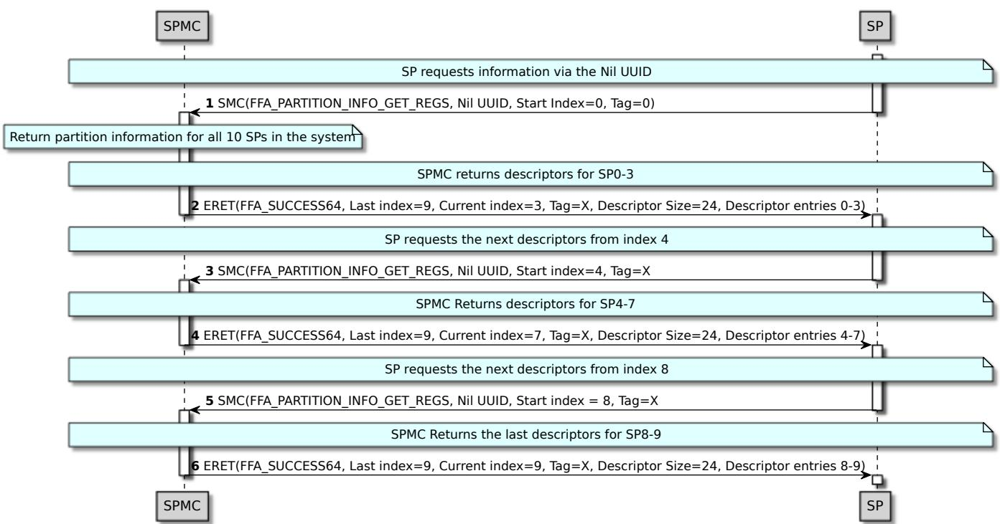  
Figure 13.2: Example usage of FFA\_PARTITION\_INFO\_GET\_REGS by an SP.

## 13.10 FFA\_ID\_GET

## Description

• Returns 16-bit ID of calling FF-A component.

– ID value 0 must be returned at the Non-secure physical FF-A instance (see Chapter 6 Identification and Discovery).

• Valid FF-A instances and conduits are listed in Table 13.44.

• Syntax of this function is described in Table 13.45.

• Encoding of result parameters in the FFA\_SUCCESS function is described in Table 13.46.

• Encoding of error code in the FFA\_ERROR function is described in Table 13.47.

Table 13.44: FFA\_ID\_GET instances and conduits

<table><tr><td>Config No.</td><td>FF-A instance</td><td>Valid conduits</td></tr><tr><td>1</td><td>Physical FF-A instance</td><td>SMC</td></tr><tr><td>2</td><td>Virtual FF-A instance</td><td>SMC, HVC, SVC</td></tr></table>

## Table 13.45: FFA\_ID\_GET function syntax

<table><tr><td>Parameter</td><td>Register</td><td>Value</td></tr><tr><td>uint32 Function ID</td><td>w0</td><td>• 0x84000069.</td></tr><tr><td>Other Parameter registers</td><td>w1-w7</td><td>• Reserved (SBZ).</td></tr></table>

Table 13.46: FFA\_SUCCESS encoding

<table><tr><td>Parameter</td><td>Register</td><td>Value</td></tr><tr><td>uint32 ID</td><td>w2</td><td>• ID of the caller. 
- Bit[31:16]: Reserved (MBZ). 
- Bit[15:0]: ID.</td></tr></table>

## Table 13.47: FFA\_ERROR encoding

<table><tr><td>Parameter</td><td>Register</td><td>Value</td></tr><tr><td>int32 Error code</td><td>w2</td><td>• NOT_SUPPORTED: This function is not implemented at this FF-A instance.</td></tr></table>

## 13.11 FFA\_SPM\_ID\_GET

## Description

• Returns the 16-bit ID of the SPMC or SPMD depending upon the FF-A instance where this function is invoked. See 13.11.1 Overview for details.

• Valid FF-A instances and conduits are listed in Table 13.49.

• Syntax of this function is described in Table 13.50.

• Encoding of result parameters in the FFA\_SUCCESS function is described in Table 13.51.

• Encoding of error code in the FFA\_ERROR function is described in Table 13.52.

Table 13.49: FFA\_SPM\_ID\_GET instances and conduits

<table><tr><td>Config No.</td><td>FF-A instance</td><td>Valid conduits</td></tr><tr><td>1</td><td>Non-secure physical</td><td>SMC</td></tr><tr><td>2</td><td>Secure physical</td><td>SMC, ERET</td></tr><tr><td>3</td><td>Non-secure virtual</td><td>SMC, HVC</td></tr><tr><td>4</td><td>Secure virtual</td><td>SMC, HVC, SVC</td></tr></table>

Table 13.50: FFA\_SPM\_ID\_GET function syntax

<table><tr><td>Parameter</td><td>Register</td><td>Value</td></tr><tr><td>uint32 Function ID</td><td>w0</td><td>• 0x84000085.</td></tr><tr><td>Other Parameter registers</td><td>w1-w7</td><td>• Reserved (SBZ).</td></tr></table>

Table 13.51: FFA\_SUCCESS encoding

<table><tr><td>Parameter</td><td>Register</td><td>Value</td></tr><tr><td>uint32 ID</td><td>w2</td><td>• ID of the SPMD or SPMC as described in 13.11.2 Usage.- Bit[31:16]: Reserved (MBZ).- Bit[15:0]: ID.</td></tr></table>

Table 13.52: FFA\_ERROR encoding

<table><tr><td>Parameter</td><td>Register</td><td>Value</td></tr><tr><td>int32 Error code</td><td>w2</td><td>• NOT_SUPPORTED: This function is not implemented at this FF-A instance.</td></tr></table>

## 13.11.1 Overview

v1.1 of the Framework mandates that the SPMC and SPMD components must be assigned unique IMPLEMENTA-TION DEFINED 16-bit IDs (see Chapter 6 Identification and Discovery).

The FFA\_SPM\_ID\_GET ABI enables,

• Endpoints and the Hypervisor to discover the ID of the SPMC.

• The SPMC to discover the ID of the SPMD.

The ID returned depends upon the FF-A instance where the ABI is invoked. This is described in 13.11.2 Usage.

The Framework assumes that no FF-A component apart from the SPMC needs to discover and use the SPMD ID.

## 13.11.2 Usage

• An invocation of this ABI at a Non-secure virtual or physical FF-A instance returns the ID of the SPMC.

– If the SPMC and SPMD are implemented at different exception levels (see 4.1 SPM architecture), the SPMD could either return the SPMC ID or forward the ABI invocation to the SPMC through the ERET conduit at the Secure physical FF-A instance. This is an IMPLEMENTATION DEFINED choice.

• An invocation of this ABI at a Secure virtual FF-A instance returns the ID of the SPMC. This is irrespective of whether the SPMC and SPMD are implemented in the same or separate exception levels.

• An invocation of this ABI at the Secure physical FF-A instance returns the ID of the SPMD if the SPMC is implemented at S-EL1 or S-EL2.

• An invocation of this ABI at the Secure physical FF-A instance returns the ID of the SPMC if the SPMC is implemented at EL3.

## 13.12 FFA\_CONSOLE\_LOG

## Description

• Allow an entity to provide debug logging to the console.

• Valid FF-A instances and conduits are listed in Table 13.54.

• Syntax of this function is described in Table 13.55.

• Returns FFA\_SUCCESS without any further parameters on successful completion.

– In this case, the characters are logged to the console in finite time.

• Encoding of error codes in the FFA\_ERROR function is described in Table 13.56.

Table 13.54: FFA\_CONSOLE\_LOG instances and conduits

<table><tr><td>Config No.</td><td>FF-A instance</td><td>Valid conduits</td></tr><tr><td>1</td><td>Secure physical</td><td>SMC</td></tr><tr><td>2</td><td>Secure virtual</td><td>SMC, HVC, SVC</td></tr></table>

## Table 13.55: FFA\_CONSOLE\_LOG function syntax

<table><tr><td>Parameter</td><td>Register</td><td>Value</td></tr><tr><td>uint32 Function ID</td><td>w0/x0</td><td>0x8400008A.0xC400008A.</td></tr><tr><td>uint32 Character Count</td><td>w1/x1</td><td>Count of characters i provided in w2/x2-w7/x7- Bit[31:8]: Reserved (SBZ).- Bit[7:0]: Count of characters.* 1 &lt;= i &lt;= 24 if the SMC32 convention is used.* 1 &lt;= i &lt;= 128 if the SMC64 convention is used.</td></tr><tr><td>uint32/uint64 Character lists</td><td>w2-w7x2-x17</td><td>Tightly packed list of characters- Character i = Bits[M:N]- M = ((8 x i) - 1)- N = (8 x (i - 1))</td></tr></table>

Table 13.56: Encoding of return codes

<table><tr><td>Parameter</td><td>Register</td><td>Value</td></tr><tr><td>int32 Error code</td><td>w2</td><td>• INVALID_PARAMETERS: - Count of characters is 0. - Count of characters is greater than 24 when the SMC32 convention is used. - Count of characters is greater than 128 when the SMC64 convention is used. • NOT_SUPPORTED: This function is not implemented at this FF-A instance. • RETRY: Some or all characters could not be logged.</td></tr><tr><td>uint32 Character Count</td><td>w3</td><td>• Number of characters that were successfully logged. Count starts from the first character. - Valid only with RETRY error code. MBZ otherwise.</td></tr></table>

## 13.13 FFA\_NS\_RES\_INFO\_GET

<table><tr><td>Description</td></tr></table>

• A caller uses this interface to retrieve information about accessibility of resources associated with the Non-secure Security state from S-Endpoints. See 13.13.1 Overview for the description of this interface.

• Valid FF-A instances and conduits are listed in Table 13.58.

• Syntax of this function is described in Table 13.59.

• Encoding of result parameters in the FFA\_SUCCESS function is described in Table 13.60.

– Resource accessibility information is returned in a Resource information descriptor Table 13.62 in the RX buffer of the caller.

• Encoding of error code in the FFA\_ERROR function is described in Table 13.61.

Table 13.58: FFA\_NS\_RES\_INFO\_GET instances and conduits

<table><tr><td>Config No.</td><td>FF-A instance</td><td>Valid conduits</td></tr><tr><td>1</td><td>Non-secure physical</td><td>SMC</td></tr><tr><td>2</td><td>Secure physical</td><td>ERET</td></tr></table>

## Table 13.59: FFA\_NS\_RES\_INFO\_GET function syntax

<table><tr><td>Parameter</td><td>Register</td><td>Value</td></tr><tr><td>uint32 Function ID</td><td>w0</td><td>0xC400008F.</td></tr><tr><td>uint64 Target ID</td><td>x1</td><td>Bits[63:16]: Reserved (SBZ).Bits[15:0]: Target S-Endpoint ID.- Information about accessibility of NS resources from this endpoint is returned.- Only valid if theTarget S-Endpoint IDvalidflag is b’1. It is Reserved (SBZ) otherwise.</td></tr></table>

Chapter 13. Setup and discovery interfaces 13.13. FFA\_NS\_RES\_INFO\_GET

<table><tr><td>Parameter</td><td>Register</td><td>Value</td></tr><tr><td>uint64 Flags</td><td>x2</td><td>Bits[63:5]: Reserved (SBZ).Bit[4]: Request type.- b’0: Request to start retrieval of the Resource information descriptor.- b’1: Request to continue retrieval of the Resource information descriptor.Bits[3:2]: NS resource type.- Type of NS resource whose access information is returned.* b’00: List of regions in the NS PAS that are accessible by a S-Endpoint.* All other values are reserved.Bit[1]: Reserved (SBZ).Bit[0]: Target S-Endpoint ID valid.- b’0: Resource access information is returned for all S-Endpoints.- b’1: Resource access information is returned only for the specified S-Endpoint.</td></tr><tr><td>Other Parameter registers</td><td>x3-x17</td><td>Reserved (SBZ)</td></tr></table>

Table 13.60: FFA\_SUCCESS encoding

<table><tr><td>Parameter</td><td>Register</td><td>Value</td></tr><tr><td>Resource information descriptor length information</td><td>x2</td><td>Bits[63:32]: Written size.- Length in bytes of the Resource information descriptor written in the RX buffer in this invocation of the ABI.Bits[31:0]: Remaining size.- Length in bytes of the Resource information descriptor that remains to be transmitted to the caller of this ABI.</td></tr><tr><td>Other Parameter Registers.</td><td>x3-x17</td><td>Reserved (MBZ).</td></tr></table>

Table 13.61: FFA\_ERROR encoding

<table><tr><td>Parameter</td><td>Register</td><td>Value</td></tr><tr><td>int32 Error code</td><td>w2</td><td>• INVALID_PARAMETERS:– Parameters are not correctly encoded.– An invalid endpoint ID is specified.• RETRY:– RX buffer of the caller is not mapped in the callee.– RX buffer of the caller is not owned by the callee.– Callee is busy and the caller must retry the operation.• NOT_SUPPORTED: This function is not implemented at this FF-A instance.• ABORTED: The callee could not continue retrieval of the Resource information descriptor due to an IMPLEMENTATION DEFINED reason.</td></tr></table>

Table 13.62: Resource information descriptor header

<table><tr><td>Field</td><td>Byte length</td><td>Byte offset</td><td>Description</td></tr><tr><td>Address map descriptor size</td><td>4</td><td>0</td><td>• Size in bytes of each address map descriptor in the array. See Table 13.63.</td></tr><tr><td>Address map descriptor count</td><td>4</td><td>4</td><td>• Count of address map descriptors.</td></tr><tr><td>Address map descriptor array offset</td><td>4</td><td>8</td><td>• 16-byte aligned offset from the base address of this descriptor to the first element of the Address map descriptor array.</td></tr><tr><td>Reserved</td><td>4</td><td>12</td><td>• Reserved (MBZ).</td></tr><tr><td>Address map descriptor array</td><td>-</td><td>-</td><td>• Each entry in the array must be encoded as specified in Table 13.63.</td></tr></table>

## 13.13.1 Overview

G<sub>0237</sub> The Framework specifies a mechanism that allows the Hypervisor or Host OS in the Non-secure Security state to discover regions in the NS PAS that are accessible by components in the Secure Security state.

X<sub>0238</sub> In use cases such as DRTM Dynamic launch, the Hypervisor relies on such a mechanism to discover regions in the Non-secure physical address space that are being accessed from the Secure world. This information is included in an attestation report to determine the security posture of the running system. See also [9].

D<sub>0239</sub> A region in the NS PAS is directly accessible from an S-Endpoint if any of the following are true:

• The S-Endpoint is a physical S-EL1 SP running under the S-EL2 SPMC and one of the following is true: – Stage 2 translations in the EL1&0 translation regime are disabled.

– Stage 2 translations in the EL1&0 translation regime are enabled, and the SP has at least one of the following permissions on the region:

<sub>\*</sub> Read.

<sub>\*</sub> Write.

<sub>\*</sub> Execute.

• The S-Endpoint is a physical S-EL0 SP running under any SPMC and one of the following is true:

– Stage 1 translations in the applicable translation regime are disabled.

– Stage 1 translations in the applicable translation regime are enabled, and the SP has at least one of the following permissions on the region:

<sub>\*</sub> Read.

<sub>\*</sub> Write.

Execute.

• The S-Endpoint is an LSP that is not co-resident with the EL3 SPMC.

• The S-Endpoint is an LSP co-resident with the SPMC and one of the following is true:

– Stage 1 translations in the SPMC’s translation regime are disabled.

– Stage 1 translations in the SPMC’s translation regime are enabled, and the SPMC has at least one of the following permissions on the region:

<sub>\*</sub> Read.

Write.

<sub>\*</sub> Execute.

The SPMC considers a region in the NS PAS as directly accessible from the SP if it does not control any stage of the translation regime used by the SP. This is applicable in the following scenarios:

• The S-Endpoint is a logical S-EL1 SP running under the EL3 SPMC.

• The S-Endpoint is a physical SP running under any SPMC, and the stage of translation under the control of the SPMC is disabled.

In the case of a S-EL1 SP, it is possible that the region in the NS PAS is not accessed via stage 1 of the EL1&0 translation regime. The mechanism to determine this is IMPLEMENTATION DEFINED and beyond the scope of the SPMC’s responsibilities.

D<sub>0241</sub> A region in the NS PAS is indirectly accessible from an S-Endpoint, if the SPMC can be requested to access the region in response to an FF-A ABI.

X<sub>0242</sub> The SPMC considers a region in the NS PAS as indirectly accessible from an SP if it is possible for the SPMC to access the region on behalf of an S-Endpoint.

In the case an SP supports indirect messaging, it is possible for the SP to indirectly access the RX/TX buffers of a VM in the NS PAS. For example, the SPMC can be requested to write into the RX buffer of a VM via the use of the FFA MSG SEND2 ABI

D<sub>0243</sub> The term accessible is used when it is not required to distinguish between regions that are directly or indirectly accessible.

D<sub>0244</sub> A region in the NS PAS is inaccessible if it is not accessible.

The Hypervisor or the Host OS use the FFA\_NS\_RES\_INFO\_GET interface to obtain information about regions in the NS PAS that are accessible from one or more S-Endpoints by specifying NS resource type as b’00 in the Flags input parameter.

I<sub>0246</sub> The Hypervisor or the Host OS use the FFA\_NS\_RES\_INFO\_GET interface to obtain information about regions in the NS PAS that are accessible from a single S-Endpoint as follows:

• The Target S-Endpoint ID valid flag in the Flags input parameter is set to 1.

• The Target S-Endpoint ID input parameter contains a valid ID.

I<sub>0247</sub> The Hypervisor or the Host OS use the FFA\_NS\_RES\_INFO\_GET interface to obtain information about regions in the NS PAS that are accessible from all S-Endpoints as follows:

• The Target S-Endpoint ID valid flag in the Flags input parameter is set to 0.

• The Target S-Endpoint ID input parameter is set to 0.

D<sub>0248</sub> A successful invocation of the FFA\_NS\_RES\_INFO\_GET interface returns information about a region in the NS PAS in an Address map descriptor (AMD) specified in Table 13.63.

Table 13.63: Address map descriptor

<table><tr><td>Field</td><td>Byte length</td><td>Byte offset</td><td>Description</td></tr><tr><td>Address</td><td>8</td><td>0</td><td>Base address of a region in the NS PAS as follows: - The address is aligned to 4K boundary. - Address is a PA at the Non-secure physical FF-A instance.</td></tr><tr><td>Page count</td><td>4</td><td>8</td><td>Number of 4K pages from the Base address to specify the size of the region.</td></tr><tr><td>Region access permissions</td><td>1</td><td>12</td><td>Access permissions for the region in the NS PAS. - Bits[7:4]: Privileged permissions. - Bits[3:0]: Unprivileged permissions. See also Table 13.64.</td></tr><tr><td>Component ID</td><td>2</td><td>13</td><td>The ID of the FF-A component whose access to a region in the NS PAS is described by this descriptor.</td></tr><tr><td>Flags</td><td>1</td><td>15</td><td>Bits[7:1]: Reserved (MBZ). Bit[0]: Access type. - b&#x27;0: Region is directly accessible. - b&#x27;1: Region is indirectly accessible.</td></tr></table>

Issue The AMD does not specify whether a region in the NS PAS that is accessible by an S-Endpoint is a device MMIO region or a conventional memory region. The Hypervisor is expected to understand the breakdown of the NS PAS among device MMIO regions and conventional memory regions. It can use the physical address of a region returned by the SPMC to determine its type. Arm requests feedback if this is a concern for Hypervisor implementations.

Issue The FFA\_NS\_RES\_INFO\_GET interface should specify whether a region was lent or donated via the FF-A memory management ABIs. This should allow the Hypervisor or Host OS to avoid access to regions that were originally in the NS PAS but might be currently in the Secure PAS. Arm requests feedback if this categorization must be done either in the input to the interface or in the output of this interface.

All AMDs are encapsulated in a Resource information descriptor. The Resource information descriptor is returned in the RX buffer of the caller. See also Table 13.62

R<sub>0250</sub> If the Target S-Endpoint ID valid flag in the Flags input parameter is 0, an AMD is populated in the Resource information descriptor, for each region in the NS PAS that is accessible by each S-Endpoint. Otherwise, an AMD is populated in the Resource information descriptor, for each region in the NS PAS that is accessible by the specified S-Endpoint.

If a region is indirectly accessible, the AMD is populated as follows:

• AMD.Flags.Access Type is 1.

• AMD.Component ID is the SPMC ID.

• AMD.RAP is the most permissive permission any SP can have on the region.

An AMD with the Component ID of the SPMC indicates that the region may be indirectly accessed by one or more SPs via the SPMC.

X<sub>0253</sub> This encoding of the AMD avoids the need to describe the same region for every SP that can indirectly access the memory region.

R<sub>0254</sub> The Resource information descriptor length information output parameter in the FFA\_SUCCESS function is 0 if all of the following are true:

• The NS resource type is b’00.

• One of the following is true:

– The Target S-Endpoint ID valid flag in the Flags input parameter is 1, and the entire NS PAS is inaccessible from the Target S-Endpoint.

– The Target S-Endpoint ID valid flag in the Flags input parameter is 0, and the entire NS PAS is inaccessible from all S-Endpoints.

The SPMC indicates inaccessibility of the NS PAS from one or more S-Endpoints by indicating that a Resource information descriptor is not present in the RX buffer of the caller. A zero total length and current length indicates the absence of the Resource information descriptor.

The Region access permissions (RAP) field in an AMD encodes the data access permissions and the instruction access permissions of the S-Endpoint for a region in the NS PAS as follows:

Table 13.64: Region access permission encodings

<table><tr><td>Field</td><td>Description</td></tr><tr><td>Bits[3:0]</td><td>Unprivileged permissions:- Bit[0] specifies the read permission as follows:* b&#x27;0: No read permission.* b&#x27;1: Read permission.- Bit[1] specifies the write permission as follows:* b&#x27;0: No write permission.* b&#x27;1: Write permission.- Bit[2] specifies the execute permission as follows:* b&#x27;0: No execute permission.* b&#x27;1: Execute permission.- Bit[3] is Reserved and MBZ.</td></tr><tr><td>Bits[7:4]</td><td>Privileged permissions:- Bit[4] specifies the read permission as follows:* b&#x27;0: No read permission.* b&#x27;1: Read permission.- Bit[5] specifies the write permission as follows:* b&#x27;0: No write permission.* b&#x27;1: Write permission.- Bit[6] specifies the execute permission as follows:* b&#x27;0: No execute permission.* b&#x27;1: Execute permission.- Bit[7] is Reserved and MBZ.</td></tr></table>

If a region in the NS PAS is inaccessible from an S-Endpoint, it is identified by one of the following methods:

• It is not described by an AMD.

• It is described by an AMD and the AMD.RAP field is 0.

The method used by the SPMC is IMPLEMENTATION DEFINED.

The Framework considers the entire NS PAS as accessible from an S-Endpoint with Privileged and Unprivileged Read, Write and Execute permissions if any of the following are true:

• The S-Endpoint is a logical S-EL1 SP running under the EL3 SPMC.

• The S-Endpoint is a physical SP running under any SPMC, and the stage of translation under the control of the SPMC is disabled.

R<sub>0259</sub> If the entire NS PAS is accessible from an S-Endpoint with Privileged and Unprivileged Read, Write and Execute permissions, the AMD is populated as follows:

• AMD.Address is 0xFFFFFFFFFFFFFFFF.

• AMD.Page count is 0.

• AMD.RAP is 0x77.

X<sub>0260</sub> This encoding of the AMD avoids the need to specify every individual region in the NS PAS that is accessible from an S-Endpoint with Privileged and Unprivileged Read, Write and Execute permissions.

D<sub>0261</sub> A region in the NS PAS that is shared or lent with one or more physical S-Endpoints, or donated to a single physical S-Endpoint, by the Hypervisor or an NS-Endpoint via the FF-A memory management protocol is called a Dynamic NS region (See also [1]). Otherwise the region is called a Static NS region.

I<sub>0262</sub> A region in the NS PAS can be shared with any S-Endpoint by describing it in the SP manifest. The region does not participate in the FF-A memory management protocol and is a Static NS region. See also Table 5.2 and Table 5.3.

R<sub>0263</sub> If the S-Endpoint is a physical S-EL1 SP running under a S-EL2 SPMC, the Stage 2 Base permissions in the EL1&0 translation regime for a Static NS region are specified in the AMD.RAP field. The mapping of Stage 2 permissions to the AMD.RAP field is specified in Table 13.65. See [6] for the description of Stage 2 Base permissions in the EL1&0 translation regime.

Table 13.65: Mapping of Stage 2 Base permissions to AMD permissions

<table><tr><td>Stage 2 Base permissions</td><td>AMD Unprivileged permissions</td><td>AMD Privileged permissions</td></tr><tr><td>No Access</td><td>0b0000</td><td>0b0000</td></tr><tr><td>RO</td><td>0b0001</td><td>0b0001</td></tr><tr><td>WO</td><td>0b0010</td><td>0b0010</td></tr><tr><td>RW</td><td>0b0011</td><td>0b0011</td></tr><tr><td>RO and uX</td><td>0b0101</td><td>0b0001</td></tr><tr><td>RO and pX</td><td>0b0001</td><td>0b0101</td></tr><tr><td>RO and puX</td><td>0b0101</td><td>0b0101</td></tr><tr><td>RW and uX</td><td>0b0111</td><td>0b0011</td></tr><tr><td>RW and pX</td><td>0b0011</td><td>0b0111</td></tr><tr><td>RW and puX</td><td>0b0111</td><td>0b0111</td></tr><tr><td>MRO any</td><td>0b0011</td><td>0b0011</td></tr></table>

If FEAT\_S2PIE is implemented and used by the S-EL2 SPMC, the Mostly Read Only (MRO) permission in stage 2 translations is used to protect EL1 translation tables from explicit write accesses from the EL1&0 translation regime. Memory regions associated with the NS PAS are not expected to be used by a physical S-EL1 SP for its EL1 translation tables. While such usage is extremely unlikely, it is not disallowed by the Arm architecture. For completeness, the Framework acknowledges this possibility but upgrades the MRO permission to RW for simplicity.

If the S-Endpoint is a physical S-EL0 SP running under any SPMC, the Unprivileged Stage 1 Base permissions in the EL1&0 translation regime, or the EL2&0 translation regime, for a Static NS region are specified in the AMD.RAP field. The mapping of Unprivileged Stage 1 permissions to the AMD.RAP field is specified in Table 13.66. See [6] for the description of Stage 2 Base permissions in the EL1&0 translation regime.

Table 13.66: Mapping of Unprivileged Stage 1 permissions to AMD permissions

<table><tr><td>Stage 1 Unprivileged permissions</td><td>AMD Unprivileged permissions</td><td>AMD Privileged permissions</td></tr><tr><td>No Access</td><td>0b0000</td><td>0b0000</td></tr><tr><td>Read</td><td>0b0001</td><td>0b0000</td></tr><tr><td>Read and Write</td><td>0b0011</td><td>0b0000</td></tr><tr><td>Read and Execute</td><td>0b0101</td><td>0b0000</td></tr><tr><td>Read, Write and Execute</td><td>0b0111</td><td>0b0000</td></tr><tr><td>Execute</td><td>0b0100</td><td>0b0000</td></tr></table>

If the S-Endpoint is an LSP co-resident with the SPMC, the Privileged Stage 1 Base permissions in the SPMC’s translation regime, for a region in the NS PAS are specified in the AMD.RAP field. The mapping of Privileged Stage 1 permissions to the AMD.RAP field is specified in Table 13.67. See [6] for the description of Stage 2 Base permissions in the EL1&0 translation regime.

Table 13.67: Mapping of Privileged Stage 1 permissions to AMD permissions

<table><tr><td>Stage 1 Privileged permissions</td><td>AMD Unprivileged permissions</td><td>AMD Privileged permissions</td></tr><tr><td>No Access</td><td>0b0000</td><td>0b0000</td></tr><tr><td>Read</td><td>0b0000</td><td>0b0001</td></tr><tr><td>Read and Write</td><td>0b0000</td><td>0b0011</td></tr><tr><td>Read and Execute</td><td>0b0000</td><td>0b0101</td></tr><tr><td>Read, Write and Execute</td><td>0b0000</td><td>0b0111</td></tr><tr><td>Execute</td><td>0b0000</td><td>0b0100</td></tr></table>

The Hypervisor or the NS-Endpoint can specify the most permissive data access permissions and instruction access permissions with which the physical S-Endpoint can access a Dynamic NS region.

For a Dynamic NS region, the permissions specified by the Hypervisor or the NS-Endpoint at the start of the memory management transaction are specified in the AMD.RAP field as follows:

• If the S-Endpoint is a physical S-EL1 SP running under a S-EL2 SPMC, the mapping of these permissions to the AMD.RAP field is specified in Table 13.68.

• If the S-Endpoint is a physical S-EL0 SP running under any SPMC, the mapping of these permissions to the AMD.RAP field is specified in Table 13.69.

See [1] for the description of permissions that can be specified in an FF-A memory management transaction.

Table 13.68: Mapping of memory management transaction permissions to AMD permissions for S-EL1 SPs

<table><tr><td>Memory management operation permissions</td><td>AMD Unprivileged permissions</td><td>AMD Privileged permissions</td></tr><tr><td>RO</td><td>0b0001</td><td>0b0001</td></tr><tr><td>RW</td><td>0b0011</td><td>0b0011</td></tr><tr><td>RO and X</td><td>0b0101</td><td>0b0101</td></tr><tr><td>RW and X</td><td>0b0111</td><td>0b0111</td></tr></table>

Table 13.69: Mapping of memory management transaction permissions to AMD permissions for S-EL0 SPs

<table><tr><td>Memory management operation permissions</td><td>AMD Unprivileged permissions</td><td>AMD Privileged permissions</td></tr><tr><td>RO</td><td>0b0001</td><td>0b0000</td></tr><tr><td>RW</td><td>0b0011</td><td>0b0000</td></tr><tr><td>RO and X</td><td>0b0101</td><td>0b0000</td></tr><tr><td>RW and X</td><td>0b0111</td><td>0b0000</td></tr></table>

For a Dynamic NS region that has been lent or donated to a physical S-Endpoint, the permissions can be determined by the SPMC by an IMPLEMENTATION DEFINED method, and not specified by the Hypervisor or the NS-Endpoint at the start of the memory management transaction. The SPMC specifies the most permissive permissions in the AMD.RAP field as follows:

• If the S-Endpoint is a physical S-EL1 SP running under a S-EL2 SPMC, the mapping of these permissions to the AMD.RAP field is specified in Table 13.68.

• If the S-Endpoint is a physical S-EL0 SP running under any SPMC, the mapping of these permissions to the AMD.RAP field is specified in Table 13.69.

The Hypervisor or an NS-Endpoint cannot govern when a physical S-Endpoint gains or relinquishes access to a Dynamic NS region via the FF-A memory management protocol interfaces. Furthermore, it is possible that the Dynamic NS region is mapped in the translation regime of a physical S-Endpoint with more restrictive permissions than the permissions specified by the Hypervisor, NS-Endpoint or the SPMC. To ensure that the Hypervisor or the Host OS obtains the most accurate information, the most permissive permissions take precedence over the permissions with which the Dynamic NS region is currently mapped in the S-Endpoint’s translation regime.

During an invocation of the FFA\_NS\_RES\_INFO\_GET interface, the effect of a concurrent change to the state of a Dynamic NS region is CONSTRAINED UNPREDICTABLE with a choice of:

• The change in state is reflected in the information returned by this interface.

• The change in state is not reflected in the information returned by this interface.

Chapter 13. Setup and discovery interfaces 13.13. FFA\_NS\_RES\_INFO\_GET

I<sub>0272</sub> An example of a state change is where access to a Dynamic NS region is revoked to a S-Endpoint via the FFA\_MEM\_RECLAIM interface. An active invocation of the FFA\_NS\_RES\_INFO\_GET interface when the state change takes place is not guaranteed to reflect the effect of the change in the returned information. The region is reported as accessible by the S-Endpoint if the effect of the change is not yet observed by the SPMC. Otherwise, the SPMC treats the region accessible by the S-Endpoint.

I<sub>0273</sub> It is possible that the size of the Resource information descriptor exceeds the size of the caller’s RX buffer. In this case, the FFA\_NS\_RES\_INFO\_GET ABI is invoked multiple times such that each invocation returns a chunk of the Resource information descriptor that can fit in the buffer. This process is repeated until the entire Resource information descriptor is returned in the RX buffer.

R<sub>0274</sub> The maximum number of pending retrievals of the Resource information descriptor via the FFA\_NS\_RES\_INFO\_GET ABI at a valid FF-A instance is 1.

I<sub>0275</sub> An invocation of the FFA\_NS\_RES\_INFO\_GET ABI with the Request type flag set to 0 is a request to start retrieval of the Resource information descriptor.

I<sub>0276</sub> An invocation of the FFA\_NS\_RES\_INFO\_GET ABI with the Request type flag set to 1 is a request to continue retrieval of the Resource information descriptor.

I<sub>0277</sub> An invocation of the FFA\_NS\_RES\_INFO\_GET ABI with the Request type flag set to 0 terminates an ongoing retrieval of the Resource information descriptor, and starts a new retrieval.

I<sub>0278</sub> A completion of the FFA\_NS\_RES\_INFO\_GET ABI with a non-zero written size and a zero remaining size is a response that completes retrieval of the Resource information descriptor.

I<sub>0279</sub> A completion of the FFA\_NS\_RES\_INFO\_GET ABI with a non-zero written size and a non-zero remaining size is a response that indicates partial retrieval of the Resource information descriptor.

I<sub>0280</sub> A completion of the FFA\_NS\_RES\_INFO\_GET ABI with a zero written size and a non-zero remaining size is a response that indicates no chunk of the Resource information descriptor was written to the RX buffer because of an IMPLEMENTATION DEFINED reason. The caller must invoke the FFA\_NS\_RES\_INFO\_GET ABI again to continue retrieval of the descriptor.

I<sub>0281</sub> A completion of a request to start retrieval of the Resource information descriptor with a zero written size and a zero remaining size is a response that indicates no Resource information is available for the specified input parameters.

I<sub>0282</sub> A completion of a request to continue retrieval of the Resource information descriptor with a zero written size and a zero remaining size is a response that indicates there is no outstanding retrieval of the Resource information descriptor in progress for the specified input parameters.

I<sub>0283</sub> Once a caller has initiated retrieval of the Resource information descriptor, a subsequent invocation of the FFA\_NS\_RES\_INFO\_GET ABI on any PE at the same FF-A instance either continues retrieval of this descriptor (if the Request type flag size is 1), or restarts retrieval of the descriptor (if the Request type flag is 0).

R<sub>0284</sub> Table 13.70 lists the valid combinations and description of the following parameters when an invocation of the FFA\_NS\_RES\_INFO\_GET ABI completes successfully.

• Request type flag input parameter.

• Written size output parameter.

• Remaining size output parameter.

Table 13.70: Description of parameters that govern progress of FFA\_NS\_RES\_INFO\_GET

<table><tr><td>Input Request type flag</td><td>Output written size</td><td>Output remaining size</td><td>Description</td></tr><tr><td>0</td><td>0</td><td>0</td><td>No resource information is available for the specified input parameters.</td></tr></table>

Chapter 13. Setup and discovery interfaces 13.13. FFA\_NS\_RES\_INFO\_GET

<table><tr><td>Input Request type flag</td><td>Output written size</td><td>Output remaining size</td><td>Description</td></tr><tr><td>0</td><td>0</td><td>Non-zero</td><td>No resource information was written to the RX buffer. The FFA_NS_RES_INFO_GET ABI must be invoked again to continue retrieval of the descriptor.</td></tr><tr><td>0</td><td>Non-zero</td><td>0</td><td>The complete Resource information descriptor has been written to the RX buffer.</td></tr><tr><td>0</td><td>Non-zero</td><td>Non-zero</td><td>A chunk of the Resource information descriptor has been written to the RX buffer. The FFA_NS_RES_INFO_GET ABI must be invoked again to retrieve the remaining descriptor.</td></tr><tr><td>1</td><td>0</td><td>0</td><td>There is no retrieval of the Resource information descriptor in progress.</td></tr><tr><td>1</td><td>0</td><td>Non-zero</td><td>No resource information was written to the RX buffer. The FFA_NS_RES_INFO_GET ABI must be invoked again to continue retrieval of the descriptor.</td></tr><tr><td>1</td><td>Non-zero</td><td>0</td><td>Retrieval of the Resource information descriptor is complete.</td></tr><tr><td>1</td><td>Non-zero</td><td>Non-zero</td><td>A chunk of the Resource information descriptor has been written to the RX buffer. The FFA_NS_RES_INFO_GET ABI must be invoked again to retrieve the remaining descriptor.</td></tr></table>

The mechanism functions as follows,

1. The caller starts retrieving the resource information descriptor by setting the Request type flag to 0.

2. The callee returns the length of the Resource information descriptor written to the RX buffer.

3. If the complete resource information descriptor cannot fit into the caller’s RX buffer, the callee returns the length of the remaining chunk of the Resource information descriptor. Otherwise, remaining length is 0.

4. If the remaining length is not 0, the caller invokes the FFA\_NS\_RES\_INFO\_GET ABI again with the Request type flag set to 1 and step 2 is repeated. Otherwise, retrieval of the Resource information descriptor completes.

Figure 13.3 illustrates an example resource information descriptor (see Table 13.62) describing three NS PAS memory regions.

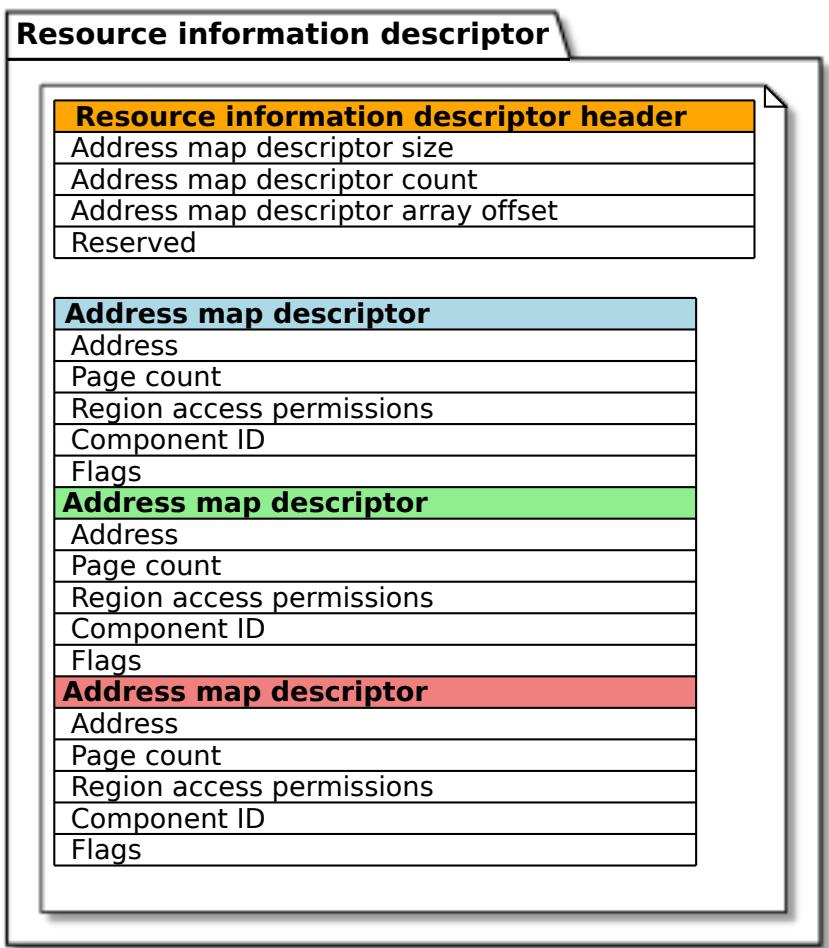  
Figure 13.3: Example resource information descriptor

The ownership of the RX buffer is transferred between the callee and the caller, at the Non-secure physical FF-A instance through a mechanism described in 4.10 RX/TX buffers.

## 13.14 FFA\_ABORT

## Description

• This ABI is invoked by a partition execution context to enter the aborted state upon encountering a fatal error. See also:

– Table 7.2.

• Valid FF-A instances and conduits are listed in Table 13.72.

• Syntax of this function is described in Table 13.73.

• An invocation of this ABI does not complete.

Table 13.72: FFA\_ABORT instances and conduits

<table><tr><td>Config No.</td><td>FF-A instance</td><td>Valid conduits</td></tr><tr><td>1</td><td>Secure physical</td><td>SMC</td></tr><tr><td>2</td><td>Secure virtual</td><td>SMC, HVC, SVC</td></tr></table>

Table 13.73: FFA\_ABORT function syntax

<table><tr><td>Parameter</td><td>Register</td><td>Value</td></tr><tr><td>uint32 Function ID</td><td>w0</td><td>0x84000090.0xC4000090.</td></tr><tr><td>First parameter register</td><td>w1/x1</td><td>Reserved (SBZ)</td></tr><tr><td>uint32/uint64 IMPLEMENTATION DEFINED</td><td>w2/x2</td><td>IMPLEMENTATION DEFINED value.</td></tr><tr><td>Other Parameter registers</td><td>w3-w7x3-x17</td><td>Reserved (SBZ)</td></tr></table>

Chapter 14

CPU cycle management interfaces

## 14.1 FFA\_MSG\_WAIT

## Description

• An invocation of this ABI at a virtual or Secure physical FF-A instance with a valid conduit does the following,

– Transitions the state of the calling execution context from running to waiting as described in 7.2.7 Waiting state.

– Optionally relinquishes ownership of the caller’s RX buffer (see 4.10 RX/TX buffers).

• An invocation of this ABI at a physical FF-A instance with a valid conduit is used to inform the scheduler of the calling execution context about this state transition

• An invocation of this ABI at the Non-secure virtual FF-A instance with the ERET conduit is used by the Hypervisor to inform the primary or a secondary scheduler about this state transition.

– An optional 64-bit timeout could be specified by the Hypervisor if the calling execution context is a VM vCPU.

– The scheduler runs the VM vCPU after the timeout expires.

– Syntax of this function in this scenario is described in Table 14.5.

• An invocation of this ABI at a virtual FF-A instance with the SMC, HVC or SVC conduits completes when the calling execution context is allocated CPU cycles as described in 7.2.7 Waiting state.

• An invocation of this ABI at the Secure physical FF-A instance completes with an invocation of any FF-A ABI.

• Valid FF-A instances and conduits are listed in Table 14.2.

• Syntax of this function is described in Table 14.3.

• Encoding of error codes in the FFA\_ERROR function is described in Table 14.4.

Table 14.2: FFA\_MSG\_WAIT instances and conduits

<table><tr><td>Config No.</td><td>FF-A instance</td><td>Valid conduits</td></tr><tr><td>1</td><td>Non-secure physical</td><td>ERET</td></tr><tr><td>2</td><td>Secure physical</td><td>SMC</td></tr><tr><td>3</td><td>Non-secure virtual</td><td>SMC, HVC, ERET</td></tr><tr><td>4</td><td>Secure virtual</td><td>SMC, HVC, SVC</td></tr></table>

Table 14.3: FFA\_MSG\_WAIT function syntax

<table><tr><td>Parameter</td><td>Register</td><td>Value</td></tr><tr><td>uint32 Function ID</td><td>w0</td><td>0x8400006B.0xC400006B (see 11.1.2 Parameter Register Preservation).</td></tr><tr><td>Reserved</td><td>w1/x1</td><td>Reserved (SBZ).</td></tr></table>

Chapter 14. CPU cycle management interfaces 14.1. FFA\_MSG\_WAIT

<table><tr><td>Parameter</td><td>Register</td><td>Value</td></tr><tr><td>uint32 Flags</td><td>w2</td><td>Flags.- Bit[0]: Retain RX Buffer Ownership flag.* This flag specifies if the caller relinquishes Ownership of its RX buffer.* It is ignored by a callee if the caller does not have ownership of its RX Buffer.* Only valid at the virtual or Secure physical FF-A instance. It is ignored by a callee at all other instances.* b’0: The caller relinquishes ownership of its RX buffer.* b’1: The caller does not relinquish ownership of its RX buffer.- Bits[31:1]: Reserved (SBZ).</td></tr><tr><td>Other Parameter registers</td><td>w3-w7x3-x17</td><td>Reserved (SBZ).</td></tr></table>

Table 14.4: FFA\_ERROR encoding

<table><tr><td>Parameter</td><td>Register</td><td>Value</td></tr><tr><td>int32 Error code</td><td>w2</td><td>• INVALID_PARAMETERS: Unrecognized endpoint or vCPU ID specified at Non-secure physical or virtual FF-A instance.• DENIED: Callee is not in a state to handle this request.• NOT_SUPPORTED: This function is not implemented at this FF-A instance.</td></tr></table>

Table 14.5: FFA\_MSG\_WAIT function syntax with the ERET conduit at NS virtual FF-A instance

<table><tr><td>Parameter</td><td>Register</td><td>Value</td></tr><tr><td>uint32 Function ID</td><td>w0</td><td>0x8400006B.</td></tr><tr><td>uint32 Endpoint/vCPU IDs</td><td>w1</td><td>Endpoint and vCPU IDs of the caller.- Bit[31:16]: Endpoint ID.- Bit[15:0]: vCPU ID.</td></tr><tr><td>uint32 TimeoutLo</td><td>w2</td><td>Bits[31:0] of an interval measured in nanoseconds after which vCPU of the endpoint specified in w1 must be run.This parameter MBZ if the caller does not specify a timeout.</td></tr><tr><td>uint32 TimeoutHi</td><td>w3</td><td>Bits[63:32] of an interval measured in nanoseconds after which vCPU of the endpoint specified in w1 must be run.This parameter MBZ if the caller does not specify a timeout.</td></tr></table>

Chapter 14. CPU cycle management interfaces 14.1. FFA\_MSG\_WAIT

<table><tr><td>Parameter</td><td>Register</td><td>Value</td></tr><tr><td rowspan="2">Other Parameter registers</td><td>w4-w7</td><td rowspan="2">• Reserved (MBZ).</td></tr><tr><td>x4-x17</td></tr></table>

## 14.2 FFA\_YIELD

## Description

• This ABI is invoked by an endpoint execution context to yield execution back to the FF-A component that scheduled it. E.g. SP0 yields execution back to VM0 instead of busy waiting for an IO operation to complete as illustrated in Figure 14.1.

– The endpoint execution context transitions from the running to the blocked state as described in 7.2.9 Blocked state.

– The endpoint execution context invokes this ABI with the combinations of FF-A instances and conduits listed in Table 14.7.

– An invocation of this ABI by an endpoint execution context is completed through the following transitions. The endpoint execution context transitions from the blocked to the running state. eret(FFA\_RUN). This transition is applicable to all endpoints listed in Table 14.7.

<sub>\*</sub> eret(FFA\_INTERRUPT). This transition is not applicable to S-EL0 endpoints (see Table 9.1).

– The endpoint execution context is scheduled by FF-A components as described below,

An SP or VM is scheduled by an S-Endpoint, NS-Endpoint or Hypervisor via the FFA\_RUN or Direct request ABIs.

<sub>\*</sub> An SP is scheduled by the SPMC in response to a Secure interrupt via the FFA\_INTERRUPT ABI.

• This ABI is invoked by an SPMC in response to a corresponding invocation by an S-Endpoint execution context. This is done to yield execution back to the S-Endpoint (via the ERET conduit), Hypervisor or NS-Endpoint execution context (via the SMC conduit) that originally scheduled the calling S-Endpoint. The valid combinations of SPMCs, FF-A instances and conduits are listed in Table 14.8.

• This ABI is invoked by the SPMD in response to a corresponding invocation by an SPMC on behalf of an S-Endpoint execution context. This is done to yield execution back to the Hypervisor or NS-Endpoint execution context (via the ERET conduit) that originally scheduled the calling S-Endpoint. The valid combinations of FF-A instances and conduits are listed in Table 14.8.

• This ABI is invoked by a Hypervisor in response to a corresponding invocation by a VM execution context or the SPMD on behalf of an S-Endpoint execution context. This is done to yield execution back to the VM (via the ERET conduit) that originally scheduled the calling endpoint. The valid combinations of FF-A instances and conduits are listed in Table 14.8.

– An optional 64-bit timeout could be specified by the Hypervisor if the calling execution context is a VM vCPU.

– The scheduler runs the VM vCPU after the timeout expires.

• Syntax of this function is described in Table 14.9.

• Encoding of error codes in the FFA\_ERROR function is described in Table 14.10.

Table 14.7: Valid combinations of endpoints, instances and conduits for invoking FFA\_YIELD

<table><tr><td>Instance/Conduit</td><td>SMC</td><td>HVC</td><td>SVC</td></tr><tr><td>Secure virtual</td><td>S-EL1 SP</td><td>S-EL1 SP</td><td>S-EL0 SP</td></tr><tr><td>Secure physical</td><td>S-EL1 SP</td><td>NA</td><td>NA</td></tr><tr><td>Non-secure virtual</td><td>EL1 SP</td><td>EL1 SP</td><td>NA</td></tr></table>

Table 14.8: Valid combinations of partition managers, instances and conduits for invoking FFA\_YIELD

<table><tr><td>Instance/Conduit</td><td>SMC</td><td>ERET</td></tr><tr><td>Secure virtual</td><td>NA</td><td>Any SPMC</td></tr><tr><td>Secure physical</td><td>S-EL1 SPMC, S-EL2 SPMC</td><td>NA</td></tr><tr><td>Non-secure virtual</td><td>NA</td><td>Hypervisor</td></tr><tr><td>Non-secure physical</td><td>NA</td><td>SPMD</td></tr></table>

## Table 14.9: FFA\_YIELD function syntax

<table><tr><td>Parameter</td><td>Register</td><td>Value</td></tr><tr><td>uint32 Function ID</td><td>w0</td><td>0x8400006C.0xC400006C (see 11.1.2 Parameter Register Preservation).</td></tr><tr><td>uint32 Endpoint/vCPU IDs</td><td>w1</td><td>Endpoint and vCPU IDs of the caller endpoint.- Bit[31:16]: Endpoint ID.- Bit[15:0]: vCPU ID.This parameter is used by the Hypervisor, SPMC and SPMD at the following combinations of FF-A instances and conduits. It is Reserved (MBZ) in all other scenarios.- By an SPMC at the,* Secure physical FF-A instance with the SMC conduit.* Secure virtual FF-A instance with the ERET conduit.- By the SPMD at the Non-secure physical FF-A instance with the ERET conduit.- By the Hypervisor at the Non-secure virtual FF-A instance with the ERET conduit.</td></tr><tr><td>uint32 TimeoutLo</td><td>w2</td><td>Bits[31:0] of an interval measured in nanoseconds after which vCPU of the endpoint specified in w1 must be run.This parameter MBZ if the caller does not specify a timeout.This parameter is used by the Hypervisor at the following combinations of FF-A instances and conduits. It is Reserved (MBZ) at in all other scenarios.- Non-secure virtual FF-A instance with the ERET conduit.</td></tr></table>

Chapter 14. CPU cycle management interfaces 14.2. FFA\_YIELD

<table><tr><td>Parameter</td><td>Register</td><td>Value</td></tr><tr><td>uint32 TimeoutHi</td><td>w3</td><td>Bits[63:32] of an interval measured in nanoseconds after which vCPU of the endpoint specified in w1 must be run.This parameter MBZ if the caller does not specify a timeout.This parameter is used by the Hypervisor at the following combinations of FF-A instances and conduits. It is Reserved (MBZ) at in all other scenarios.- Non-secure virtual FF-A instance with the ERET conduit.</td></tr><tr><td>Other Parameter registers</td><td>w4-w7x4-x17</td><td>Reserved (SBZ).</td></tr></table>

Table 14.10: FFA\_ERROR encoding

<table><tr><td>Parameter</td><td>Register</td><td>Value</td></tr><tr><td>int32 Status</td><td>w2</td><td>• INVALID_PARAMETERS: Unrecognized endpoint or vCPU ID. Only valid with the ERET conduit.• DENIED: Callee is not in a state to handle this request.• NOT_SUPPORTED: This function is not implemented at this FF-A instance.</td></tr></table>

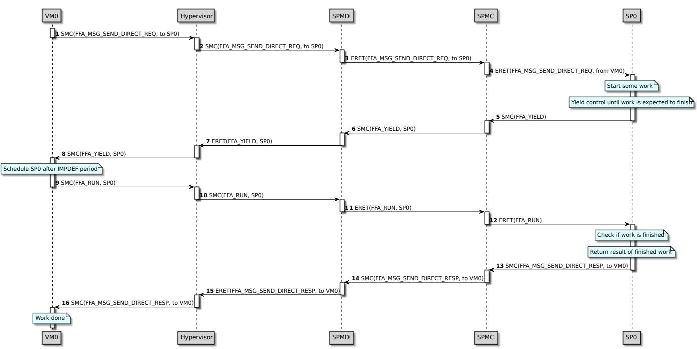  
Figure 14.1: SP0 yields execution back to VM0

## 14.3 FFA\_RUN

## Description

• This ABI is used by a scheduler (see 4.9 Primary scheduler) to allocate CPU cycles to a target endpoint execution context specified in the Target information parameter.

• An invocation of this ABI at a virtual FF-A instance with the SMC, HVC or SVC conduits transitions the state of the calling execution context from running to blocked.

• An invocation of this ABI at a virtual FF-A instance with the ERET conduit results in a state transition of the target endpoint execution context as described below.

– If the endpoint execution context is in the waiting state, it transitions to the running state.

– If the endpoint execution context is in the blocked state, it transitions to the running state.

• If the target endpoint execution context is in the preempted state, it transitions to running state in response to an invocation of this ABI. The partition manager of the execution context changes the state through the eret() transition.

• An invocation of this ABI at a physical FF-A instance with a valid conduit, is used to request the partition manager of the target execution context, to perform the applicable state transition listed above. See also: – 7.2.7 Waiting state.

– 7.2.9 Blocked state.

– 7.2.8 Preempted state.

• An invocation of this ABI at a virtual FF-A instance with the SMC, HVC and SVC conduits and, at the Non-secure physical FF-A instance with the SMC conduit, completes and transitions the state of calling execution context from blocked to running through the following transitions.

– eret(FFA\_INTERRUPT).

– eret(FFA\_MSG\_WAIT).

– eret(FFA\_YIELD).

– eret(FFA\_MSG\_SEND\_DIRECT\_RESP).

• An invocation of this ABI at the Secure physical FF-A instance with the ERET conduit completes with invocations of the following ABIs.

– smc(FFA\_INTERRUPT).

– smc(FFA\_MSG\_WAIT).

– smc(FFA\_YIELD).

– smc(FFA\_MSG\_SEND\_DIRECT\_RESP).

• Valid FF-A instances and conduits are listed in Table 14.12.

• Syntax of this function is described in Table 14.13.

• Encoding of error code in the FFA\_ERROR function is described in Table 14.14.

Table 14.12: FFA\_RUN instances and conduits

<table><tr><td>Config No.</td><td>FF-A instance</td><td>Valid conduits</td></tr><tr><td>1</td><td>Non-secure physical</td><td>SMC</td></tr><tr><td>2</td><td>Secure physical</td><td>ERET</td></tr><tr><td>3</td><td>Non-secure virtual</td><td>SMC, HVC, ERET</td></tr><tr><td>4</td><td>Secure virtual</td><td>SMC, HVC, SVC, ERET</td></tr></table>

Table 14.13: FFA\_RUN function syntax

<table><tr><td>Parameter</td><td>Register</td><td>Value</td></tr><tr><td>uint32 Function ID</td><td>w0</td><td>0x8400006D.0xC400006D (see 11.1.2 Parameter Register Preservation).</td></tr><tr><td>uint32 Target information</td><td>w1</td><td>Information to identify target SP/VM.-Bits[31:16]: ID of SP/VM.-Bits[15:0]: ID of vCPU of SP/VM to run.</td></tr><tr><td>Other Parameter registers</td><td>w2-w7x2-x17</td><td>Reserved (SBZ).</td></tr></table>

## Table 14.14: FFA\_ERROR encoding

<table><tr><td>Parameter</td><td>Register</td><td>Value</td></tr><tr><td>int32 Error code</td><td>w2</td><td>• INVALID_PARAMETERS: - Unrecognized endpoint or vCPU ID. - Target vCPU is pinned to a different PE. • NOT_SUPPORTED: This function is not implemented at this FF-A instance. • DENIED: - Callee is not in a state to handle this request. - Caller is not allowed to invoke this ABI (see 9.2.3 CPU cycle allocation modes). • BUSY: vCPU is busy and caller must retry later. • ABORTED: vCPU or VM ran into an unexpected error and has aborted. • NOT_READY: Receiver endpoint is not ready to handle this request.</td></tr></table>

## 14.4 FFA\_INTERRUPT

## Description

• Returns control from the caller to the callee in response to an interrupt. See 14.4.1 Usage for details.

• Valid FF-A instances and conduits are listed in Table 14.16.

• Syntax of this function is described in Table 14.17.

Table 14.16: FFA\_INTERRUPT instances and conduits

<table><tr><td>Config No.</td><td>FF-A instance</td><td>Valid conduits</td></tr><tr><td>1</td><td>Non-secure physical</td><td>ERET</td></tr><tr><td>2</td><td>Secure and Non-secure virtual</td><td>ERET</td></tr><tr><td>3</td><td>Secure physical</td><td>SMC, ERET</td></tr></table>

## Table 14.17: FFA\_INTERRUPT function syntax

<table><tr><td>Parameter</td><td>Register</td><td>Value</td></tr><tr><td>uint32 Function ID</td><td>w0</td><td>0x84000062.0xC4000062 (see 11.1.2 Parameter Register Preservation).</td></tr><tr><td>uint32 Endpoint/vCPU IDs</td><td>w1</td><td>Endpoint and vCPU IDs of the caller in a valid usage scenario described in 14.4.1 Usage. MBZ otherwise.- Bits[31:16]: Endpoint ID.- Bits[15:0]: vCPU ID.</td></tr><tr><td>uint32 Interrupt ID</td><td>w2</td><td>Interrupt ID in a valid usage scenario described in 14.4.1 Usage. MBZ otherwise.</td></tr><tr><td>Other Parameter registers</td><td>w3-w7x3-x17</td><td>Reserved (SBZ).</td></tr></table>

## 14.4.1 Usage

1. FFA\_INTERRUPT is used with the SMC conduit at the Secure physical FF-A instance only by the S-EL1 or S-EL2 SPMC to inform the SPMD that a Non-secure interrupt has preempted execution of an SP and the NS-Endpoint on this physical PE must be resumed so that the interrupt can be handled.

1. The SPMC returns the ID of the SP and its execution context that was doing work on behalf of the NS-Endpoint. The NS-Endpoint is expected to resume execution of the SP execution context once the interrupt is handled.

2. The interrupt ID field is invalid and MBZ. It must be ignored by the SPMD.

3. An example of this usage is illustrated in Figure 9.3.

2. FFA\_INTERRUPT is used with the ERET conduit by the Hypervisor, SPMC or the SPMD to inform a callee in the blocked runtime state that its request was preempted by an interrupt.

1. The callee had entered the blocked runtime state after requesting a partition to do work on its behalf e.g through an invocation of a Direct request interface.

2. The partition manager returns the ID of the partition and its vCPU or execution context that was doing work on behalf of the callee. The callee is expected to resume execution of the partition vCPU or execution context once the interrupt is handled. This is applicable only if the callee runs in a privileged exception level i.e. not in S-EL0. Also see 9.2.1 Secure interrupt signaling mechanisms.

3. The interrupt ID field is invalid and MBZ. It must be ignored by the callee.

4. Valid caller and callee combinations at specific FF-A instances are listed below.

1. SPMD and an NS-Endpoint at the Non-secure physical FF-A instance.

2. Hypervisor and a VM at the Non-secure virtual FF-A instance.

3. SPMC and an SP at the Secure virtual FF-A instance.

5. An example of this usage is illustrated in Figure 9.3.

3. FFA\_INTERRUPT is used with the ERET conduit by the Hypervisor, SPMC or the SPMD to delegate interrupt handling to a callee in the waiting runtime state.

1. The callee had entered the waiting runtime state after finishing work requested by another partition e.g through an invocation of FFA\_MSG\_SEND\_DIRECT\_RESP.

2. The partition manager returns the ID of the pending interrupt to the callee. This is applicable only if the callee is a partition that runs in a privileged exception level i.e. not in S-EL0. It is also not applicable if the callee is an SPMC and the caller is the SPMD. This is because the SPMD is not expected to determine the identity of the pending interrupt by querying the GIC. Also see 9.2.1 Secure interrupt signaling mechanisms.

3. The endpoint and vCPU ID fields are invalid and MBZ. They must be ignored by the callee.

4. Valid caller and callee combinations at specific FF-A instances are listed below.

1. SPMD and the S-EL1 or S-EL2 SPMC at the Secure physical FF-A instance.

2. EL3 SPMC and a logical S-EL1 SP at the Secure physical FF-A instance.

3. Hypervisor and a VM at the Non-secure virtual FF-A instance.

4. SPMC and an SP at the Secure virtual FF-A instance.

## 14.5 FFA\_NORMAL\_WORLD\_RESUME

<table><tr><td>Description</td></tr></table>

• Request SPMD to resume execution of Normal world on current PE after the exception that originally preempted the Normal world has been handled. See 14.5.1 Overview for details.

• Valid FF-A instances and conduits are listed in Table 14.19.

• Syntax of this function is described in Table 14.20.

• Successful completion of this function is indicated through the invocation of any FF-A function.

• Encoding of error code in the FFA\_ERROR function is described in Table 14.21.

Table 14.19: FFA\_NORMAL\_WORLD\_RESUME instances and conduits

<table><tr><td>Config No.</td><td>FF-A instance</td><td>Valid conduits</td></tr><tr><td>1</td><td>Secure physical</td><td>SMC</td></tr></table>

## Table 14.20: FFA\_NORMAL\_WORLD\_RESUME function syntax

<table><tr><td>Parameter</td><td>Register</td><td>Value</td></tr><tr><td>uint32 Function ID</td><td>w0</td><td>0x8400007C.0xC400007C (see 11.1.2 Parameter Register Preservation).</td></tr><tr><td>Other Parameter registers</td><td>w1-w7x1-x17</td><td>Reserved (SBZ).</td></tr></table>

Table 14.21: FFA\_ERROR encoding

<table><tr><td>Parameter</td><td>Register</td><td>Value</td></tr><tr><td>int32 Error code</td><td>w2</td><td>DENIED: Callee is not in a state to handle this request.NOT_SUPPORTED: This function is not implemented at this FF-A instance.</td></tr></table>

## 14.5.1 Overview

Execution in Normal world could be preempted in response to an exception for example, a Secure physical interrupt. As per the Arm A-profile architecture, the exception will be delivered to EL3 in the AArch64 Execution state or Monitor mode in the AArch32 Execution state. The exception could be handled in the Secure state at a lower Exception level than EL3 or Monitor mode.

This function must be used by the SPMC in S-EL2 (see 4.1.1 Secure EL2 SPM core component) and S-EL1 (see 4.1.2 S-EL1 SPM core component) to request the SPMD to resume Normal world execution once the exception has been handled

The SPMD must ensure that the Normal world execution is resumed with exactly the same PE state that was saved when it was preempted.

The SPMD must return DENIED if this function is invoked at the Secure physical FF-A instance and the Normal world execution was not preempted.

The partition manager must return NOT\_SUPPORTED if this function is invoked at any other FF-A instance.

An invocation of this function at the Secure physical FF-A instance could be completed through a valid invocation of any FF-A function through the ERET conduit.

Chapter 15

Messaging interfaces

## 15.1 FFA\_MSG\_SEND2

## Overview

• This ABI is invoked at a virtual FF-A instance with the SMC, HVC or SVC conduits to,

– Transmit a partition message from the TX buffer of the caller endpoint to the RX buffer of the Receiver endpoint as described in 8.2 Indirect messaging.

– Notify the Receiver’s scheduler that the Receiver endpoint must be run to process the partition message as described in 10.8.1 RX buffer full notification.

• An invocation of this ABI at a physical FF-A instance with a valid conduit is used to request the SPMC to transmit the message to a SP.

• A partition message is encoded as described in Table 8.1.

• Valid FF-A instances and conduits are listed in Table 15.2.

• Syntax of this function is described in Table 15.3.

• Returns FFA\_SUCCESS without any further parameters on successful completion.

• Encoding of error code in the FFA\_ERROR function is described in Table 15.4.

Table 15.2: FFA\_MSG\_SEND2 instances and conduits

<table><tr><td>Config No.</td><td>FF-A instance</td><td>Valid conduits</td></tr><tr><td>1</td><td>Non-secure physical</td><td>SMC</td></tr><tr><td>2</td><td>Secure physical</td><td>ERET</td></tr><tr><td>3</td><td>Non-secure virtual</td><td>SMC, HVC</td></tr><tr><td>4</td><td>Secure virtual</td><td>SMC, HVC, SVC</td></tr></table>

Table 15.3: FFA\_MSG\_SEND2 function syntax

<table><tr><td>Parameter</td><td>Register</td><td>Value</td></tr><tr><td>uint32 Function ID</td><td>w0</td><td>0x84000086.</td></tr><tr><td>uint32 Sender VM ID</td><td>w1</td><td>Sender VM ID from whose TX buffer the message must be copied into the RX buffer of the target SP.- Bit[31:16]: Sender VM ID at the Non-secure physical instance. MBZ otherwise.- Bit[15:0]: Reserved (SBZ).</td></tr><tr><td>uint32 Flags</td><td>w2</td><td>Message flags.- Must be ignored by callee when SVC conduit is used.- Bit[0]: Reserved (SBZ).- Bit[1]: Delay Schedule Receiver interrupt flag. Guidance in. 16.5.1 Delay Schedule Receiver interrupt flag applies to the FFA_MSG_SEND2 ABI.- Bit[31:2]: Reserved (SBZ).</td></tr><tr><td>Other Parameter registers</td><td>w3-w7</td><td>Reserved (SBZ).</td></tr></table>

Table 15.4: FFA\_ERROR encoding

<table><tr><td>Parameter</td><td>Register</td><td>Value</td></tr><tr><td>int32 Error code</td><td>w2</td><td>• INVALID_PARAMETERS: - w1 is not 0 at a virtual FF-A or a Secure physical FF-A instance. - w1 contains an invalid Sender VM ID when called at a Non-secure physical instance. - Invalid Sender or Receiver ID in the partition message header. - Offset in the partition message header is smaller than the header size. - Message payload does not fit in the TX buffer of caller. - Unrecognized UUID specified in the partition message header. • BUSY: Receiver RX buffer is not free. • DENIED: - Callee is not in a state to handle this request. - Caller is not allowed to invoke this ABI. - Receiver endpoint does not support receipt of partition messages through Indirect messaging. • NO_MEMORY: - Insufficient space in the Receiver&#x27;s RX buffer to receive the Sender&#x27;s message. • NOT_SUPPORTED: This function is not implemented at this FF-A instance.</td></tr></table>

## 15.2 FFA\_MSG\_SEND\_DIRECT\_REQ

<table><tr><td colspan="2">Description</td></tr></table>

• Send a Partition or Framework message in parameter registers as a request to a Receiver endpoint, run the endpoint and block until a response is available. Also see 8.3 Direct messaging.

• Valid FF-A instances and conduits are listed in Table 15.6.

• Syntax of this function is described in Table 15.7.

• Successful completion of this function is indicated through an invocation of the following interfaces by the callee:

– FFA\_MSG\_SEND\_DIRECT\_RESP to provide a response to the Direct request.

– FFA\_INTERRUPT to indicate that the Direct request was interrupted and must be resumed through the FFA\_RUN interface.

– FFA\_YIELD to indicate that the Receiver endpoint has transitioned to the blocked runtime state and must be resumed through the FFA\_RUN interface.

– FFA\_SUCCESS to indicate completion of the Direct request without a corresponding Direct response. All other parameter registers MBZ.

• Encoding of error code in the FFA\_ERROR function is described in Table 15.8.

Table 15.6: FFA\_MSG\_SEND\_DIRECT\_REQ instances and conduits

<table><tr><td>Config No.</td><td>FF-A instance</td><td>Valid conduits</td></tr><tr><td>1</td><td>Non-secure physical</td><td>SMC</td></tr><tr><td>2</td><td>Secure physical</td><td>SMC, ERET</td></tr><tr><td>3</td><td>Non-secure virtual</td><td>SMC, HVC, ERET</td></tr><tr><td>4</td><td>Secure virtual</td><td>SMC, HVC, SVC, ERET</td></tr></table>

Table 15.7: FFA\_MSG\_SEND\_DIRECT\_REQ function syntax

<table><tr><td>Parameter</td><td>Register</td><td>Value</td></tr><tr><td>uint32 Function ID</td><td>w0</td><td>0x8400006F.0xC400006F.</td></tr><tr><td>uint32 Sender/Receiver IDs</td><td>w1</td><td>Sender and Receiver endpoint IDs.- Bit[31:16]: Sender endpoint ID.- Bit[15:0]: Receiver endpoint ID.</td></tr></table>

Chapter 15. Messaging interfaces 15.2. FFA\_MSG\_SEND\_DIRECT\_REQ

<table><tr><td>Parameter</td><td>Register</td><td>Value</td></tr><tr><td>uint32 Flags</td><td>w2</td><td>Message flags. - Bit[31]: Message type. * b&#x27;0: Message encoded in parameter registers is a partition message. * b&#x27;1: Message encoded in parameter registers is a framework message. - Bit[30:8]: Reserved (SBZ). - Bit[7:0]: * Reserved (MBZ) if bit[31] = b&#x27;0. * Framework message type if bit[31] = b&#x27;1. See Table 18.6 &amp; Table 18.7 in 18.2.4 Power Management messages.</td></tr><tr><td>IMPLEMENTATION DEFINED values</td><td>w3-w7 x3-x17</td><td>IMPLEMENTATION DEFINED values.</td></tr><tr><td>Other Parameter registers when using the SMC64, HVC64 or SVC64 convention.</td><td>x8-x17</td><td>IMPLEMENTATION DEFINED values.</td></tr></table>

Table 15.8: FFA\_ERROR encoding

<table><tr><td>Parameter</td><td>Register</td><td>Value</td></tr><tr><td>int32 Error code</td><td>w2</td><td>• INVALID_PARAMETERS: Invalid endpoint ID or message flags.• DENIED: - Callee is not in a state to handle this request. - Receiver endpoint does not support receipt of Direct request messages.• NOT_SUPPORTED: This function is not implemented at this FF-A instance.• BUSY: Receiver endpoint is in a running, blocked or preempted state.• ABORTED: Receiver endpoint ran into an unexpected error and has aborted.• NOT_READY: Receiver endpoint is not ready to handle this request.</td></tr></table>

## 15.3 FFA\_MSG\_SEND\_DIRECT\_RESP

<table><tr><td colspan="2">Description</td></tr><tr><td>1</td><td>2017</td></tr><tr><td>2</td><td>2018</td></tr><tr><td>3</td><td>2019</td></tr><tr><td>4</td><td>2020</td></tr><tr><td>5</td><td>2021</td></tr><tr><td>6</td><td>2022</td></tr><tr><td>7</td><td>2023</td></tr><tr><td>8</td><td>2024</td></tr><tr><td>9</td><td>2025</td></tr><tr><td>10</td><td>2026</td></tr><tr><td>11</td><td>2027</td></tr><tr><td>12</td><td>2028</td></tr><tr><td>13</td><td>2029</td></tr><tr><td>14</td><td>2030</td></tr></table>

• Send a Partition or Framework message in parameter registers as a response to a target endpoint, run the endpoint and wait until a new message is available. Also see 8.3 Direct messaging.

• Valid FF-A instances and conduits are listed in Table 15.10.

• Syntax of this function is described in Table 15.11.

• Successful completion of this function is indicated in the same manner as that of the FFA\_MSG\_WAIT function (also see 14.1 FFA\_MSG\_WAIT)

• Encoding of error code in the FFA\_ERROR function is described in Table 15.12.

Table 15.10: FFA\_MSG\_SEND\_DIRECT\_RESP instances and conduits

<table><tr><td>Config No.</td><td>FF-A instance</td><td>Valid conduits</td></tr><tr><td>1</td><td>Non-secure physical</td><td>ERET</td></tr><tr><td>2</td><td>Secure physical</td><td>SMC, ERET</td></tr><tr><td>3</td><td>Non-secure virtual</td><td>SMC, HVC, ERET</td></tr><tr><td>4</td><td>Secure virtual</td><td>SMC, HVC, SVC, ERET</td></tr></table>

Table 15.11: FFA\_MSG\_SEND\_DIRECT\_RESP function syntax

<table><tr><td>Parameter</td><td>Register</td><td>Value</td></tr><tr><td>uint32 Function ID</td><td>w0</td><td>0x84000070.- This function ID can be used to complete the SMC32 or SMC64 variant of the FFA_MSG_SEND_DIRECT_REQ ABI.0xC4000070.- This function ID can be used to complete the SMC64 variant of the FFA_MSG_SEND_DIRECT_REQ ABI.</td></tr><tr><td>uint32 Source/Destination IDs</td><td>w1</td><td>Source and destination endpoint IDs.- Bit[31:16]: Source endpoint ID.- Bit[15:0]: Destination endpoint ID.</td></tr><tr><td>uint32 Flags</td><td>w2</td><td>Message flags.- Bit[31]: Message type.* b’0: Message encoded in parameter registers is a partition message.* b’1: Message encoded in parameter registers is a framework message.- Bit[30:8]: Reserved (SBZ).- Bit[7:0]:* Reserved (MBZ) if Bit[31] = b’0.* Framework message type if bit[31] = b’1.· See Table 18.8 in 18.2.4 Power Management messages.</td></tr></table>

Chapter 15. Messaging interfaces 15.3. FFA\_MSG\_SEND\_DIRECT\_RESP

<table><tr><td>Parameter</td><td>Register</td><td>Value</td></tr><tr><td>IMPLEMENTATION DEFINED values</td><td>w3-w7x3-x7</td><td>• IMPLEMENTATION DEFINED values.</td></tr><tr><td>Other Parameter registers when using the SMC64, HVC64 or SVC64 convention.</td><td>x8-x17</td><td>• IMPLEMENTATION DEFINED values.</td></tr></table>

Table 15.12: FFA\_ERROR encoding

<table><tr><td>Parameter</td><td>Register</td><td>Value</td></tr><tr><td>int32 Error code</td><td>w2</td><td>• INVALID_PARAMETERS: Invalid endpoint ID or message flags.• DENIED:– Callee is not in a state to handle this request.– Caller is not allowed to invoke this ABI.– Receiver endpoint does not support receipt of Direct response messages.• NOT_SUPPORTED: This function is not implemented at this FF-A instance.• ABORTED: Receiver endpoint ran into an unexpected error and has aborted.</td></tr></table>

## 15.4 FFA\_MSG\_SEND\_DIRECT\_REQ2

<table><tr><td>Description</td></tr></table>

• Send a Partition message in parameter registers as a request to a Receiver endpoint, run the endpoint and block until a response is available. The UUID parameter is used as described in 6.2.3 Protocol UUID usage.

• Valid FF-A instances and conduits are listed in Table 15.14.

• Syntax of this function is described in Table 15.15.

• Successful completion of this function is indicated through an invocation of the following interfaces by the callee:

– FFA\_MSG\_SEND\_DIRECT\_RESP2 to provide a response to the Direct request.

– FFA\_INTERRUPT to indicate that the Direct request was interrupted and must be resumed through the FFA\_RUN interface.

– FFA\_YIELD to indicate that the Receiver endpoint has transitioned to the blocked runtime state and must be resumed through the FFA\_RUN interface.

– FFA\_SUCCESS to indicate completion of the Direct request without a corresponding Direct response. All other parameter registers MBZ.

• Encoding of error code in the FFA\_ERROR function is described in Table 15.16.

Table 15.14: FFA\_MSG\_SEND\_DIRECT\_REQ2 instances and conduits

<table><tr><td>Config No.</td><td>FF-A instance</td><td>Valid conduits</td></tr><tr><td>1</td><td>Non-secure physical</td><td>SMC</td></tr><tr><td>2</td><td>Secure physical</td><td>SMC, ERET</td></tr><tr><td>3</td><td>Non-secure virtual</td><td>SMC, HVC, ERET</td></tr><tr><td>4</td><td>Secure virtual</td><td>SMC, HVC, SVC, ERET</td></tr></table>

Table 15.15: FFA\_MSG\_SEND\_DIRECT\_REQ2 function syntax

<table><tr><td>Parameter</td><td>Register</td><td>Value</td></tr><tr><td>uint32 Function ID</td><td>w0</td><td>0xC400008D.</td></tr><tr><td>uint32 Sender/Receiver IDs</td><td>w1</td><td>Sender and Receiver endpoint IDs.-Bits[31:16]: Sender endpoint ID.-Bits[15:0]: Receiver endpoint ID.</td></tr><tr><td>uint64 UUID Lo</td><td>x2</td><td>Bytes[0...7] of UUID with byte 0 in the low-order bits. As specified in6.2.3.2 UUID encodings.</td></tr><tr><td>uint64 UUID Hi</td><td>x3</td><td>Bytes[8...15] of UUID with byte 8 in the low-order bits. As specified in6.2.3.2 UUID encodings.</td></tr><tr><td>Other Parameter registers</td><td>x4-x17</td><td>IMPLEMENTATION DEFINED values.</td></tr></table>

Table 15.16: FFA\_ERROR encoding

<table><tr><td>Parameter</td><td>Register</td><td>Value</td></tr><tr><td>int32 Error code</td><td>w2</td><td>• INVALID_PARAMETERS: - Invalid endpoint ID or message flags. - Unrecognized UUID. • DENIED: - Callee is not in a state to handle this request. - Caller is not allowed to invoke this ABI. - Receiver endpoint does not support receipt of Direct request messages. • NOT_SUPPORTED: This function is not implemented at this FF-A instance. • BUSY: Receiver endpoint is in a running, blocked or preempted state. • ABORTED: Receiver endpoint ran into an unexpected error and has aborted. • NOT_READY: Receiver endpoint is not ready to handle this request.</td></tr></table>

## 15.5 FFA\_MSG\_SEND\_DIRECT\_RESP2

## Description

• Send a Partition message in parameter registers as a response to a target endpoint, run the endpoint and wait until a new message is available. Also see 8.3 Direct messaging.

• Valid FF-A instances and conduits are listed in Table 15.18.

• Syntax of this function is described in Table 15.19.

• Successful completion of this function is indicated in the same manner as that of the FFA\_MSG\_WAIT function (also see 14.1 FFA\_MSG\_WAIT)

• Encoding of error code in the FFA\_ERROR function is described in Table 15.20.

Table 15.18: FFA\_MSG\_SEND\_DIRECT\_RESP2 instances and conduits

<table><tr><td>Config No.</td><td>FF-A instance</td><td>Valid conduits</td></tr><tr><td>1</td><td>Non-secure physical</td><td>ERET</td></tr><tr><td>2</td><td>Secure physical</td><td>SMC, ERET</td></tr><tr><td>3</td><td>Non-secure virtual</td><td>SMC, HVC, ERET</td></tr><tr><td>4</td><td>Secure virtual</td><td>SMC, HVC, SVC, ERET</td></tr></table>

Table 15.19: FFA\_MSG\_SEND\_DIRECT\_RESP2 function syntax

<table><tr><td>Parameter</td><td>Register</td><td>Value</td></tr><tr><td>uint32 Function ID</td><td>w0</td><td>0xC400008E.</td></tr><tr><td>uint32 Source/Destination IDs</td><td>w1</td><td>Source and destination endpoint IDs.- Bit[31:16]: Source endpoint ID.- Bit[15:0]: Destination endpoint ID.</td></tr><tr><td>uint64 Reserved</td><td>x2</td><td>Reserved (SBZ).</td></tr><tr><td>uint64 Reserved</td><td>x3</td><td>Reserved (SBZ).</td></tr><tr><td>Other Parameter registers</td><td>x4-x17</td><td>IMPLEMENTATION DEFINED values.</td></tr></table>

Table 15.20: FFA\_ERROR encoding

<table><tr><td>Parameter</td><td>Register</td><td>Value</td></tr><tr><td>int32 Error code</td><td>w2</td><td>• INVALID_PARAMETERS: Invalid endpoint ID or message flags.• DENIED:– Callee is not in a state to handle this request.– Caller does not support sending of Direct response messages.– Receiver endpoint does not support receipt of Direct response messages.• NOT_SUPPORTED: This function is not implemented at this FF-A instance.• ABORTED: Receiver endpoint ran into an unexpected error and has aborted.</td></tr></table>

Chapter 16

Notification interfaces

## 16.1 FFA\_NOTIFICATION\_BITMAP\_CREATE

<table><tr><td colspan="2">Description</td></tr></table>

• This ABI is invoked by the Hypervisor at the Non-secure physical FF-A instance with the SMC conduit to request the SPMC to create the SP and SPM framework notifications bitmap for the VM specified in the VM ID input parameter. Also see 10.3 Notification bitmap setup.

• Valid FF-A instances and conduits are listed in Table 16.2.

• Syntax of this function is described in Table 16.3.

• Encoding of result parameters in the FFA\_SUCCESS function is described in Table 16.4.

• Encoding of error codes in the FFA\_ERROR function is described in Table 16.5.

Table 16.2: FFA\_NOTIFICATION\_BITMAP\_CREATE instances and conduits

<table><tr><td>Config No.</td><td>FF-A instance</td><td>Valid conduits</td></tr><tr><td>1</td><td>Non-secure physical</td><td>SMC</td></tr><tr><td>2</td><td>Secure physical</td><td>ERET</td></tr></table>

Table 16.3: FFA\_NOTIFICATION\_BITMAP\_CREATE function syntax

<table><tr><td>Parameter</td><td>Register</td><td>Value</td></tr><tr><td>uint32 Function ID</td><td>w0</td><td>0x8400007D.</td></tr><tr><td>uint32 VM ID</td><td>w1</td><td>ID of VM for which a bitmap must be created in the Secure world to enable SPs to send notifications to this VM.-Bits[31:16]: Reserved (MBZ).-Bits[15:0]: VM ID.</td></tr><tr><td>uint32 vCPU count</td><td>w2</td><td>Number of vCPUs implemented by the VM.</td></tr><tr><td>uint32 Notification Count</td><td>w3</td><td>Bits[32:9]: Reserved (SBZ).Bits[8:0]: Number of SP notifications i requested for the VM where,-Total notification count = i + 64.</td></tr><tr><td>Other Parameter registers</td><td>w4-w7</td><td>Reserved (SBZ).</td></tr></table>

Table 16.4: FFA\_SUCCESS encoding

<table><tr><td>Parameter</td><td>Register</td><td>Value</td></tr><tr><td>uint32 Notification Count</td><td>w2</td><td>Bits[32:9]: Reserved (SBZ).Bits[8:0]: Number of SP notifications i allocated for the VM where,- Total notification count = i + 64.</td></tr></table>

Table 16.5: Encoding of return codes

<table><tr><td>Parameter</td><td>Register</td><td>Value</td></tr><tr><td>int32 Error code</td><td>w2</td><td>• INVALID_PARAMETERS: Unrecognized VM ID.• NOT_SUPPORTED: This function is not implemented at this FF-A instance.• DENIED: Notification bitmap is already created.• NO_MEMORY: There is not enough memory to allocate notification bitmap.</td></tr></table>

## 16.2 FFA\_NOTIFICATION\_BITMAP\_DESTROY

<table><tr><td colspan="2">Description</td></tr></table>

• This ABI is invoked by the Hypervisor at the Non-secure physical FF-A instance with the SMC conduit to request the SPMC to destroy the SP and SPM framework notifications bitmap for the VM specified in the VM ID input parameter. Also see 10.3 Notification bitmap setup.

• Valid FF-A instances and conduits are listed in Table 16.7.

• Syntax of this function is described in Table 16.8.

• Returns FFA\_SUCCESS without any further parameters on successful completion.

• Encoding of error codes in the FFA\_ERROR function is described in Table 16.9.

Table 16.7: FFA\_NOTIFICATION\_BITMAP\_DESTROY instances and conduits

<table><tr><td>Config No.</td><td>FF-A instance</td><td>Valid conduits</td></tr><tr><td>1</td><td>Non-secure physical</td><td>SMC</td></tr><tr><td>2</td><td>Secure physical</td><td>ERET</td></tr></table>

Table 16.8: FFA\_NOTIFICATION\_BITMAP\_DESTROY function syntax

<table><tr><td>Parameter</td><td>Register</td><td>Value</td></tr><tr><td>uint32 Function ID</td><td>w0</td><td>0x8400007E.</td></tr><tr><td>uint32 VM ID</td><td>w1</td><td>ID of VM whose notification bitmap in the Secure world must be destroyed to prevent SPs to send notifications to this VM.- Bit[31:16]: Reserved (SBZ).- Bit[15:0]: VM ID.</td></tr><tr><td>Other Parameter registers</td><td>w2-w7</td><td>Reserved (SBZ).</td></tr></table>

Table 16.9: Encoding of return codes

<table><tr><td>Parameter</td><td>Register</td><td>Value</td></tr><tr><td>int32 Error code</td><td>w2</td><td>• INVALID_PARAMETERS: Unrecognized partition ID.• NOT_SUPPORTED: This function is not implemented at this FF-A instance.• DENIED: Notification bitmap is not registered or is registered but not in a masked and non-pending state.</td></tr></table>

## 16.3 FFA\_NOTIFICATION\_BIND

<table><tr><td colspan="2">Description</td></tr><tr><td>1</td><td>2017</td></tr><tr><td>2</td><td>2018</td></tr><tr><td>3</td><td>2019</td></tr><tr><td>4</td><td>2020</td></tr><tr><td>5</td><td>2021</td></tr><tr><td>6</td><td>2022</td></tr><tr><td>7</td><td>2023</td></tr><tr><td>8</td><td>2024</td></tr><tr><td>9</td><td>2025</td></tr><tr><td>10</td><td>2026</td></tr><tr><td>11</td><td>2027</td></tr><tr><td>12</td><td>2028</td></tr><tr><td>13</td><td>2029</td></tr><tr><td>14</td><td>2030</td></tr></table>

• This ABI is invoked by an endpoint at a virtual FF-A instance with the SMC, HVC or SVC conduits to request the partition manager to bind notifications specified in the Notification bitmap parameter to the Sender endpoint. Also see 10.4.2 Notification binding.

• This ABI is invoked by the Hypervisor at the Non-secure physical FF-A instance with the SMC conduit to request the SPMC to bind SP notifications specified in the Notification bitmap parameter to the SP specified in the Sender endpoint ID parameter.

• Valid FF-A instances and conduits are listed in Table 16.11.

• Syntax of this function is described in Table 16.12.

• Returns FFA\_SUCCESS without any further parameters on successful completion.

• Encoding of error codes in the FFA\_ERROR function is described in Table 16.13.

Table 16.11: FFA\_NOTIFICATION\_BIND instances and conduits

<table><tr><td>Config No.</td><td>FF-A instance</td><td>Valid conduits</td></tr><tr><td>1</td><td>Non-secure virtual</td><td>SMC, HVC</td></tr><tr><td>2</td><td>Secure virtual</td><td>SMC, HVC, SVC</td></tr><tr><td>3</td><td>Non-secure physical</td><td>SMC</td></tr><tr><td>4</td><td>Secure physical</td><td>ERET</td></tr></table>

## Table 16.12: FFA\_NOTIFICATION\_BIND function syntax

<table><tr><td>Parameter</td><td>Register</td><td>Value</td></tr><tr><td>uint32 Function ID</td><td>w0</td><td>0x8400007F.</td></tr><tr><td>uint32 Sender/Receiver IDs</td><td>w1</td><td>Sender and Receiver endpoint IDs.- Bit[31:16]: Sender endpoint ID.- Bit[15:0]: Receiver endpoint ID.</td></tr><tr><td>uint32 Flags</td><td>w2</td><td>Notification flags (see 13.3 FFA_FEATURES).- Bit[0]: Per-vCPU notification flag (see 10.4.2 Notification binding).* b&#x27;1: All notifications in the bitmap are per-vCPU notifications (only if per-vCPU notifications are supported).* b&#x27;0: All notifications in the bitmap are global notifications.- Bit[31:1]: Reserved (SBZ).</td></tr></table>

Chapter 16. Notification interfaces 16.3. FFA\_NOTIFICATION\_BIND

<table><tr><td>Parameter</td><td>Register</td><td>Value</td></tr><tr><td>uint32 Notification bitmap</td><td>w3</td><td>Bits[31:0] of a bitmap with one or more set bits to identify the notifications which the Sender endpoint is allowed to signal.For each bit in the bitmap, if the value is:- b&#x27;1: The Sender endpoint can signal this notification.- b&#x27;0: Has no effect.</td></tr><tr><td>uint32 Notification bitmap</td><td>w4</td><td>Bits[63:32] of a bitmap with one or more set bits to identify the notifications which the Sender endpoint is allowed to signal.For each bit in the bitmap, if the value is:- b&#x27;1: The Sender endpoint can signal this notification.- b&#x27;0: Has no effect.</td></tr><tr><td>Other Parameter registers</td><td>w5-w7</td><td>Reserved (SBZ).</td></tr></table>

## Table 16.13: Encoding of return codes

<table><tr><td>Parameter</td><td>Register</td><td>Value</td></tr><tr><td>int32 Error code</td><td>w2</td><td>• INVALID_PARAMETERS: - Invalid sender or receiver endpoint ID. - Per-vCPU flag bit set when Per-vCPU notifications are not supported (see 13.3 FFA_FEATURES). • NOT_SUPPORTED: This function is not implemented at this FF-A instance. • DENIED: - At least one notification is bound to another Sender or is currently pending. - Caller is not allowed to invoke this ABI. • ABORTED: Sender partition ran into an unexpected error and has aborted.</td></tr></table>

## 16.4 FFA\_NOTIFICATION\_UNBIND

<table><tr><td colspan="2">Description</td></tr></table>

• This ABI is invoked by an endpoint at a virtual FF-A instance with the SMC, HVC or SVC conduits to request the partition manager to unbind notifications specified in the Notification bitmap parameter from the Sender endpoint. Also see 10.4.2 Notification binding.

• This ABI is invoked by the Hypervisor at the Non-secure physical FF-A instance with the SMC conduit to request the SPMC to unbind SP notifications specified in the Notification bitmap parameter from the SP specified in the Sender endpoint ID parameter.

• Valid FF-A instances and conduits are listed in Table 16.15.

• Syntax of this function is described in Table 16.16.

• Returns FFA\_SUCCESS without any further parameters on successful completion.

• Encoding of error codes in the FFA\_ERROR function is described in Table 16.17.

Table 16.15: FFA\_NOTIFICATION\_UNBIND instances and conduits

<table><tr><td>Config No.</td><td>FF-A instance</td><td>Valid conduits</td></tr><tr><td>1</td><td>Non-secure virtual</td><td>SMC, HVC</td></tr><tr><td>2</td><td>Secure virtual</td><td>SMC, HVC, SVC</td></tr><tr><td>3</td><td>Non-secure physical</td><td>SMC</td></tr><tr><td>4</td><td>Secure physical</td><td>ERET</td></tr></table>

## Table 16.16: FFA\_NOTIFICATION\_UNBIND function syntax

<table><tr><td>Parameter</td><td>Register</td><td>Value</td></tr><tr><td>uint32 Function ID</td><td>w0</td><td>0x84000080.</td></tr><tr><td>uint32 Sender/Receiver IDs</td><td>w1</td><td>Sender and Receiver endpoint IDs.- Bit[31:16]: Sender endpoint ID.- Bit[15:0]: Receiver endpoint ID.</td></tr><tr><td>uint32/uint64 Reserved</td><td>w2/x2</td><td>Reserved (SBZ).</td></tr><tr><td>uint32 Notification bitmap Lo</td><td>w3</td><td>Bits[31:0] of a bitmap with one or more set bits to identify the notifications which the Sender endpoint is not allowed to signal.For each bit in the bitmap, if the value is:- b'1: The Sender endpoint cannot signal this notification.- b'0: Has no effect.</td></tr><tr><td>uint32 Notification bitmap Hi</td><td>w4</td><td>Bits[63:32] of a bitmap with one or more set bits to identify the notifications which the Sender endpoint is not allowed to signal.For each bit in the bitmap, if the value is:- b'1: The Sender endpoint cannot signal this notification.- b'0: Has no effect.</td></tr><tr><td>Other Parameter registers</td><td>w5-w7</td><td>• Reserved (SBZ).</td></tr></table>

Table 16.17: Encoding of return codes

<table><tr><td>Parameter</td><td>Register</td><td>Value</td></tr><tr><td>int32 Error code</td><td>w2</td><td>• INVALID_PARAMETERS: Unrecognized partition ID or invalid bitmap.• NOT_SUPPORTED: This function is not implemented at this FF-A instance.• DENIED:- At least one notification is bound to another Sender or is currently pending.- Caller is not allowed to invoke this ABI.• ABORTED: Sender partition ran into an unexpected error and has aborted.</td></tr></table>

## 16.5 FFA\_NOTIFICATION\_SET

<table><tr><td>Description</td></tr></table>

• This ABI is invoked by an endpoint at a virtual FF-A instance with the SMC, HVC or SVC conduits to request the partition manager to signal notifications specified in the Notification bitmap parameter to the Receiver endpoint. Also see 10.5 Notification signaling.

• This ABI is invoked by the Hypervisor at the Non-secure physical FF-A instance with the SMC conduit to request the SPMC to signal VM notifications specified in the Notification bitmap parameter to the SP specified in the Receiver endpoint ID parameter on behalf of the VM specified in the Sender endpoint ID parameter. .Valid.FE-A conduits are listed in. Table 16.19

• Valid FF-A instances and conduits are listed in Table 16.19.

• Syntax of this function is described in Table 16.20.

• Returns FFA\_SUCCESS without any further parameters on successful completion.

• Encoding of error codes in the FFA\_ERROR function is described in Table 16.21.

Table 16.19: FFA\_NOTIFICATION\_SET instances and conduits

<table><tr><td>Config No.</td><td>FF-A instance</td><td>Valid conduits</td></tr><tr><td>1</td><td>Non-secure virtual</td><td>SMC, HVC</td></tr><tr><td>2</td><td>Secure virtual</td><td>SMC, HVC, SVC</td></tr><tr><td>3</td><td>Non-secure physical</td><td>SMC</td></tr><tr><td>4</td><td>Secure physical</td><td>ERET</td></tr></table>

## Table 16.20: FFA\_NOTIFICATION\_SET function syntax

<table><tr><td>Parameter</td><td>Register</td><td>Value</td></tr><tr><td>uint32 Function ID</td><td>w0</td><td>0x84000081.</td></tr><tr><td>uint32 Sender/Receiver IDs</td><td>w1</td><td>Sender and Receiver endpoint IDs.- Bit[31:16]: Sender endpoint ID.- Bit[15:0]: Receiver endpoint ID.</td></tr></table>

Chapter 16. Notification interfaces 16.5. FFA\_NOTIFICATION\_SET

<table><tr><td>Parameter</td><td>Register</td><td>Value</td></tr><tr><td>uint32 Flags</td><td>w2</td><td>Flags.- Bit[0]: Per-vCPU notification flag (see 10.4.2 Notification binding):* b&#x27;1: All notifications in the bitmap are per-vCPU notifications (only if per-vCPU notifications are supported).Each notification must be signaled to the vCPU specified in the Receiver vCPU ID field.* b&#x27;0: All notifications in the bitmap are global notifications.The Receiver vCPU ID field MBZ.- Bit[1]: Delay Schedule Receiver interrupt flag.See 16.5.1 Delay Schedule Receiver interrupt flag.- Bit[15:2]: Reserved (MBZ).- Bit[31:16]: Receiver vCPU ID when Bit[0] is 1.</td></tr><tr><td>uint32 Notification bitmap</td><td>w3</td><td>Bits[31:0] of a bitmap with one or more set bits to identify the notifications which must be signaled to the Receiver endpoint.For each bit in the bitmap, if the value is:- b&#x27;1: The notification corresponding to this bit position must be signaled to the Receiver.- b&#x27;0: The notification corresponding to this bit position must not be signaled to the Receiver.</td></tr><tr><td>uint32 Notification bitmap</td><td>w4</td><td>Bits[63:32] of a bitmap with one or more set bits to identify the notifications which must be signaled to the Receiver endpoint.For each bit in the bitmap, if the value is:- b&#x27;1: The notification corresponding to this bit position must be signaled to the Receiver.- b&#x27;0: The notification corresponding to this bit position must not be signaled to the Receiver.</td></tr><tr><td>Other Parameter registers</td><td>w5-w7</td><td>Reserved (SBZ).</td></tr></table>

Table 16.21: Encoding of return codes

<table><tr><td>Parameter</td><td>Register</td><td>Value</td></tr><tr><td>int32 Error code</td><td>w2</td><td>• INVALID_PARAMETERS: - Unrecognized partition ID or invalid flags. - Per-vCPU notification flag = b&#x27;0 and Receiver vCPU ID != 0. - Per-vCPU notification flag = b&#x27;0 and a per-vCPU notification is specified in the Notification bitmap. - Per-vCPU notification flag = b&#x27;1 and a global notification is specified in the Notification bitmap. - Per-vCPU notification flag = b&#x27;1 and Per-vCPU notifications are not supported. • NOT_SUPPORTED: This function is not implemented at this FF-A instance. • DENIED: - Sender is not permitted to signal at least one notification to the Receiver. - Receiver does not support receipt of notifications. • ABORTED: Receiver partition ran into an unexpected error and has aborted.</td></tr></table>

## 16.5.1 Delay Schedule Receiver interrupt flag

The partition manager uses an IMPLEMENTATION DEFINED policy to determine when the Schedule Receiver interrupt must be asserted in response an invocation of the FFA\_NOTIFICATION\_SET or FFA\_NOTIFICATION\_SET2 interfaces. The interrupt could be asserted before or after an invocation of this interface completes.

The SPMC could choose to assert this interrupt before completion of an FFA\_NOTIFICATION\_SET or FFA\_NOTIFICATION\_SET2 interfaces invocation by an SP. The interrupt would either preempt or trigger a managed exit of the caller SP execution context immediately upon the completion of the interface invocation. This might be undesirable for the SP in some scenarios. The non-secure Schedule Receiver interrupt could trigger a switch to the Normal world when the SP is about to request the same switch itself. For example, an SP sends notifications while handling a Direct request from the Normal world. It could switch back to the Normal world through a Direct response immediately after sending the notifications thereby avoiding the need to pend the Schedule Receiver interrupt until switch takes place.

The Delay Schedule Receiver interrupt flag is a hint from the SP execution context to the SPMC it does not have to assert this interrupt upon completion of the FFA\_NOTIFICATION\_SET or FFA\_NOTIFICATION\_SET2 interfaces invocation. The use of this flag by the SP could help the SPMC optimize the policy it uses for asserting this interrupt. This flag is only used at the Secure virtual FF-A instance. It MBZ at all other FF-A instances.

The above guidance for this flag applies to the FFA\_MSG\_SEND2 ABI described in 15.1 FFA\_MSG\_SEND2 as well.

## 16.6 FFA\_NOTIFICATION\_GET

• This ABI is invoked by an endpoint at a virtual FF-A instance with the SMC, HVC or SVC conduits to request the partition manager to retrieve notifications pending in notification bitmaps specified in the Flags parameter. Also see 10.5 Notification signaling.

• This ABI is invoked by the Hypervisor at the Non-secure physical FF-A instance with the SMC conduit to request the SPMC to return pending SP or SPM Framework notifications as specified in the Flags parameter for the VM specified in the Receiver endpoint ID parameter. The Receiver vCPU ID parameter is used to return any pending per-vCPU notifications.

• Valid FF-A instances and conduits are listed in Table 16.23.

• Syntax of this function is described in Table 16.24.

• Encoding of result parameters in the FFA\_SUCCESS function is described in Table 16.25.

• Encoding of error codes in the FFA\_ERROR function is described in Table 16.26.

Table 16.23: FFA\_NOTIFICATION\_GET instances and conduits

<table><tr><td>Config No.</td><td>FF-A instance</td><td>Valid conduits</td></tr><tr><td>1</td><td>Non-secure virtual</td><td>SMC, HVC</td></tr><tr><td>2</td><td>Secure virtual</td><td>SMC, HVC, SVC</td></tr><tr><td>3</td><td>Non-secure physical</td><td>SMC</td></tr><tr><td>4</td><td>Secure physical</td><td>ERET</td></tr></table>

Table 16.24: FFA\_NOTIFICATION\_GET function syntax

<table><tr><td>Parameter</td><td>Register</td><td>Value</td></tr><tr><td>uint32 Function ID</td><td>w0</td><td>0x84000082.</td></tr><tr><td>uint32 Receiver ID</td><td>w1</td><td>Receiver endpoint and vCPU ID.- Bit[31:16]: Receiver vCPU ID.- Bit[15:0]: Receiver endpoint ID.</td></tr></table>

Chapter 16. Notification interfaces 16.6. FFA\_NOTIFICATION\_GET

<table><tr><td>Parameter</td><td>Register</td><td>Value</td></tr><tr><td>uint32 Flags</td><td>w2</td><td>Bit[0]: Receiver&#x27;s SP notifications bitmap identifier. - b&#x27;1: Return bitmap for notifications pended by SPs. - b&#x27;0: Do not return bitmap for notifications pended by SPs. Bit[1]: Receiver&#x27;s VM notifications bitmap identifier. This bit SBZ at the Non-secure physical FF-A instance. - b&#x27;1: Return bitmap for notifications pended by VMs. - b&#x27;0: Do not return bitmap for notifications pended by VMs. Bit[2]: Receiver&#x27;s SPM Framework notification bitmap identifier. - b&#x27;1: Return bitmap for notifications pended by the SPM. - b&#x27;0: Do not return bitmap for notifications pended by the SPM. Bit[3]: Receiver&#x27;s Hypervisor Framework notifications bitmap identifier. This bit SBZ at the Non-secure physical FF-A instance. - b&#x27;1: Return bitmap for notifications pended by the Hypervisor. - b&#x27;0: Do not return bitmap for notifications pended by the Hypervisor. Bit[31:4]: Reserved (SBZ).</td></tr><tr><td>Other Parameter registers</td><td>w3-w7</td><td>Reserved (SBZ).</td></tr></table>

Table 16.25: FFA\_SUCCESS encoding

<table><tr><td>Parameter</td><td>Register</td><td>Value</td></tr><tr><td>uint32 SP Notifications bitmap</td><td>w2</td><td>Bits[31:0] of the SP notifications bitmap with one or more set bits to identify the notifications which are pending for the Receiver endpoint.For each bit in the bitmap, if the value is:- b'1: The notification corresponding to this bit position is pending for the Receiver-b'0: The notification corresponding to this bit position is not pending for the Receiver.Caller must ignore this field if Bit[0] in the Flags field was not set.</td></tr><tr><td>uint32 SP Notifications bitmap</td><td>w3</td><td>Bits[63:32] of the SP notifications bitmap with one or more set bits to identify the notifications which are pending for the Receiver endpoint.For each bit in the bitmap, if the value is:- b'1: The notification corresponding to this bit position is pending for the Receiver-b'0: The notification corresponding to this bit position is not pending for the Receiver.Caller must ignore this field if Bit[0] in the Flags field was not set.</td></tr><tr><td>uint32 VM Notifications bitmap</td><td>w4</td><td>Bits[31:0] of the VM notifications bitmap with one or more set bits to identify the notifications which are pending for the Receiver endpoint.For each bit in the bitmap, if the value is:- b'1: The notification corresponding to this bit position is pending for the Receiver-b'0: The notification corresponding to this bit position is not pending for the Receiver.Caller must ignore this field if Bit[1] in the Flags field was not set.</td></tr><tr><td>uint32 VM Notifications bitmap</td><td>w5</td><td>Bits[63:32] of the VM notifications bitmap with one or more set bits to identify the notifications which are pending for the Receiver endpoint.For each bit in the bitmap, if the value is:- b'1: The notification corresponding to this bit position is pending for the Receiver-b'0: The notification corresponding to this bit position is not pending for the Receiver.Caller must ignore this field if Bit[1] in the Flags field was not set.</td></tr><tr><td>uint32 SPM Framework Notifications bitmap</td><td>w6</td><td>Bits[31:0] of the SPM Framework notifications bitmap with one or more set bits to identify the notifications which are pending for the Receiver endpoint as sent by the SPM.These 32 bits will be set by the SPM and reflect notifications regarding events in the secure world.Caller must ignore this field if Bit[2] in the Flags field was not set.</td></tr><tr><td>uint32 Hypervisor Framework Notifications bitmap</td><td>w7</td><td>Bits[31:0] of the Hypervisor Framework notifications bitmap with one or more set bits to identify the notifications which are pending for the Receiver endpoint as sent by the Hypervisor.These 32 bits will be set by the Hypervisor and reflect notifications regarding events in the normal world.Caller must ignore this field if Bit[3] in the Flags field was not set.</td></tr></table>

Table 16.26: FFA\_ERROR encoding

<table><tr><td>Parameter</td><td>Register</td><td>Value</td></tr><tr><td>int32 Error code</td><td>w2</td><td>• INVALID_PARAMETERS: Unrecognized partition ID or incorrectly encoded Flags parameter.• DENIED: Caller is not allowed to invoke this ABI.• NOT_SUPPORTED: This function is not implemented at this FF-A instance.</td></tr></table>

## 16.7 FFA\_NOTIFICATION\_BIND2

• This ABI is used by an FF-A component if it supports Extended notifications (see Chapter 10 Notifications).

• This ABI is invoked by an endpoint at a virtual FF-A instance with the SMC, HVC or SVC conduits to request the partition manager to bind notifications specified in the Notification bitmap parameter to the Sender endpoint. Also see 10.4.2 Notification binding.

• This ABI is invoked by the Hypervisor at the Non-secure physical FF-A instance with the SMC conduit to request the SPMC to bind SP notifications specified in the Notification bitmap parameter to the SP specified in the Sender endpoint ID parameter.

• Valid FF-A instances and conduits are listed in Table 16.28.

• Syntax of this function is described in Table 16.29.

• Returns FFA\_SUCCESS without any further parameters on successful completion.

• Encoding of error codes in the FFA\_ERROR function is described in Table 16.30.

Table 16.28: FFA\_NOTIFICATION\_BIND2 instances and conduits

<table><tr><td>Config No.</td><td>FF-A instance</td><td>Valid conduits</td></tr><tr><td>1</td><td>Non-secure virtual</td><td>SMC, HVC</td></tr><tr><td>2</td><td>Secure virtual</td><td>SMC, HVC, SVC</td></tr><tr><td>3</td><td>Non-secure physical</td><td>SMC</td></tr><tr><td>4</td><td>Secure physical</td><td>ERET</td></tr></table>

## Table 16.29: FFA\_NOTIFICATION\_BIND2 function syntax

<table><tr><td>Parameter</td><td>Register</td><td>Value</td></tr><tr><td>uint32 Function ID</td><td>w0</td><td>0xC4000094.</td></tr><tr><td>uint32 Sender/Receiver IDs</td><td>w1</td><td>Sender and Receiver endpoint IDs.- Bit[31:16]: Sender endpoint ID.- Bit[15:0]: Receiver endpoint ID.</td></tr><tr><td>uint64 Flags</td><td>x2</td><td>Notification flags.- Bit[0]: Per-vCPU notification flag (see 10.4.2 Notification binding).* b’1: All notifications in the bitmap are per-vCPU notifications (only if per-vCPU notifications are supported).* b’0: All notifications in the bitmap are global notifications.- Bit[63:1]: Reserved (SBZ).</td></tr></table>

Chapter 16. Notification interfaces 16.7. FFA\_NOTIFICATION\_BIND2

<table><tr><td>Parameter</td><td>Register</td><td>Value</td></tr><tr><td>uint64 Notification bitmap</td><td>x3-x8</td><td>Bits[b:0] of a bitmap with one or more set bits to identify the notifications which the Sender endpoint is allowed to signal. $-b$  is the number of supported notifications - 1 (see Table 13.14).Bits corresponding to unimplemented notification IDs MBZ.For each bit  $i$  in the bitmap, if the value is: $-b'1$ : The Sender endpoint can signal this notification. $-b'0$ : Has no effect.Bit position  $i = Bit[N]$  in  $xM$ . $-M = i/64 + 3$ . $-N = i \% 64$ .</td></tr><tr><td>Other Parameter registers</td><td>x9-x17</td><td>Reserved (SBZ).</td></tr></table>

## Table 16.30: Encoding of return codes

<table><tr><td>Parameter</td><td>Register</td><td>Value</td></tr><tr><td>int32 Error code</td><td>w2</td><td>• INVALID_PARAMETERS: - Invalid sender or receiver endpoint ID. - Per-vCPU flag bit set when Per-vCPU notifications are not supported (see 13.3 FFA_FEATURES). - Notification set that exceeds the supported number of notifications. - Empty notification bitmap specified. • NOT_SUPPORTED: This function is not implemented at this FF-A instance. • DENIED: - At least one notification is bound to another Sender or is currently pending. - Caller is not allowed to invoke this ABI. • ABORTED: Sender partition ran into an unexpected error and has aborted.</td></tr></table>

## 16.8 FFA\_NOTIFICATION\_UNBIND2

• This ABI is used by an FF-A component if it supports Extended notifications (see Chapter 10 Notifications).

• This ABI is invoked by an endpoint at a virtual FF-A instance with the SMC, HVC or SVC conduits to request the partition manager to unbind notifications specified in the Notification bitmap parameter to the Sender endpoint. Also see 10.4.2 Notification binding.

• This ABI is invoked by the Hypervisor at the Non-secure physical FF-A instance with the SMC conduit to request the SPMC to unbind SP notifications specified in the Notification bitmap parameter to the SP specified in the Sender endpoint ID parameter.

• Valid FF-A instances and conduits are listed in Table 16.32.

• Syntax of this function is described in Table 16.33.

• Returns FFA\_SUCCESS without any further parameters on successful completion.

• Encoding of error codes in the FFA\_ERROR function is described in Table 16.34.

Table 16.32: FFA\_NOTIFICATION\_UNBIND2 instances and conduits

<table><tr><td>Config No.</td><td>FF-A instance</td><td>Valid conduits</td></tr><tr><td>1</td><td>Non-secure virtual</td><td>SMC, HVC</td></tr><tr><td>2</td><td>Secure virtual</td><td>SMC, HVC, SVC</td></tr><tr><td>3</td><td>Non-secure physical</td><td>SMC</td></tr><tr><td>4</td><td>Secure physical</td><td>ERET</td></tr></table>

## Table 16.33: FFA\_NOTIFICATION\_UNBIND2 function syntax

<table><tr><td>Parameter</td><td>Register</td><td>Value</td></tr><tr><td>uint32 Function ID</td><td>w0</td><td>0xC4000095.</td></tr><tr><td>uint32 Sender/Receiver IDs</td><td>w1</td><td>Sender and Receiver endpoint IDs.- Bit[31:16]: Sender endpoint ID.- Bit[15:0]: Receiver endpoint ID.</td></tr><tr><td>uint64 Reserved</td><td>x2</td><td>Reserved (SBZ).</td></tr></table>

Chapter 16. Notification interfaces 16.8. FFA\_NOTIFICATION\_UNBIND2

<table><tr><td>Parameter</td><td>Register</td><td>Value</td></tr><tr><td>uint64 Notification bitmap</td><td>x3-x8</td><td>Bits[b:0] of a bitmap with one or more set bits to identify the notifications which the Sender endpoint is not allowed to signal. $-b$  is the number of supported notifications - 1 (see Table 13.14). $-63 <= b <= 383$ .Bits corresponding to unimplemented notification IDs MBZ.For each bit  $i$  in the bitmap, if the value is: $-b'1$ : The Sender endpoint cannot signal this notification. $-b'0$ : Has no effect.Bit position  $i = Bit[N]$  in  $xM$ . $-M = (i/64) + 3$ . $-N = i \% 64$ .</td></tr><tr><td>Other Parameter registers</td><td>x9-x17</td><td>Reserved (SBZ).</td></tr></table>

## Table 16.34: Encoding of return codes

<table><tr><td>Parameter</td><td>Register</td><td>Value</td></tr><tr><td>int32 Error code</td><td>w2</td><td>• INVALID_PARAMETERS: - Unrecognized partition ID or invalid bitmap. - Notification set that exceeds the supported number of notifications. - Empty notification bitmap specified. • NOT_SUPPORTED: This function is not implemented at this FF-A instance. • DENIED: - At least one notification is bound to another Sender or is currently pending. - Caller is not allowed to invoke this ABI. • ABORTED: Sender partition ran into an unexpected error and has aborted.</td></tr></table>

## 16.9 FFA\_NOTIFICATION\_SET2

• This ABI is used by an FF-A component if it supports Extended notifications (see Chapter 10 Notifications). • This ABI is invoked by an endpoint at a virtual FF-A instance with the SMC, HVC or SVC conduits to request the partition manager to signal notifications specified in the Notification bitmap parameter to the Receiver endpoint. Also see 10.5 Notification signaling.

• This ABI is invoked by the Hypervisor at the Non-secure physical FF-A instance with the SMC conduit to request the SPMC to signal VM notifications specified in the Notification bitmap parameter to the SP specified in the Receiver endpoint ID parameter on behalf of the VM specified in the Sender endpoint ID parameter.

• Valid FF-A instances and conduits are listed in Table 16.36.

• Syntax of this function is described in Table 16.37.

• Returns FFA\_SUCCESS without any further parameters on successful completion.

• Encoding of error codes in the FFA\_ERROR function is described in Table 16.38.

Table 16.36: FFA\_NOTIFICATION\_SET2 instances and conduits

<table><tr><td>Config No.</td><td>FF-A instance</td><td>Valid conduits</td></tr><tr><td>1</td><td>Non-secure virtual</td><td>SMC, HVC</td></tr><tr><td>2</td><td>Secure virtual</td><td>SMC, HVC, SVC</td></tr><tr><td>3</td><td>Non-secure physical</td><td>SMC</td></tr><tr><td>4</td><td>Secure physical</td><td>ERET</td></tr></table>

Table 16.37: FFA\_NOTIFICATION\_SET2 function syntax

<table><tr><td>Parameter</td><td>Register</td><td>Value</td></tr><tr><td>uint32 Function ID</td><td>w0</td><td>0xC4000096.</td></tr><tr><td>uint32 Sender/Receiver IDs</td><td>w1</td><td>Sender and Receiver endpoint IDs.- Bit[31:16]: Sender endpoint ID.- Bit[15:0]: Receiver endpoint ID.</td></tr><tr><td>uint64 Flags</td><td>x2</td><td>Bit[0]: Per-vCPU notification flag (see 10.4.2 Notification binding):b’1: All notifications in the bitmap are per-vCPU notifications (only if per-vCPU notifications are supported).- Each notification must be signaled to the vCPU specified in the Receiver vCPU ID field.b’0: All notifications in the bitmap are global notifications.- The Receiver vCPU ID field MBZ.Bit[1]: Delay Schedule Receiver interrupt flag. See 16.5.1 Delay Schedule Receiver interrupt flag.Bit[15:2]: Reserved (MBZ).Bit[63:16]: Receiver vCPU ID when Bit[0] is 1.</td></tr></table>

Chapter 16. Notification interfaces 16.9. FFA\_NOTIFICATION\_SET2

<table><tr><td>Parameter</td><td>Register</td><td>Value</td></tr><tr><td>uint64 Notification bitmap</td><td>x3-x8</td><td>Bits[b:0] of a bitmap with one or more set bits to identify the notifications which must be signaled to the Receiver endpoint. $-b$  is the number of supported notifications - 1 (see Table 13.14). $-63 <= b <= 383$ .Bits corresponding to unimplemented notification IDs MBZ.For each bit  $i$  in the bitmap, if the value is: $-b'1$ : The notification corresponding to this bit position must be signaled to the Receiver. $-b'0$ : The notification corresponding to this bit position must not be signaled to the Receiver.Bit position  $i = Bit[N]$  in  $xM$ . $-M = (i/64) + 3$ . $-N = i \% 64$ .</td></tr><tr><td>Other Parameter registers</td><td>x9-x17</td><td>Reserved (SBZ).</td></tr></table>

## Table 16.38: Encoding of return codes

<table><tr><td>Parameter</td><td>Register</td><td>Value</td></tr><tr><td>int32 Error code</td><td>w2</td><td>• INVALID_PARAMETERS:– Unrecognized partition ID or invalid flags.– Per-vCPU notification flag = b’0 and Receiver vCPU ID != 0.– Per-vCPU notification flag = b’0 and a per-vCPU notification is specified in the Notification bitmap.– Per-vCPU notification flag = b’1 and a global notification is specified in the Notification bitmap.– Per-vCPU notification flag = b’1 and per-vCPU notifications are not supported.– Notification set that exceeds the supported number of notifications.– Empty notification bitmap specified.• NOT_SUPPORTED: This function is not implemented at this FF-A instance.• DENIED:– Sender is not permitted to signal at least one notification to the Receiver.– Receiver does not support receipt of notifications.• ABORTED: Receiver partition ran into an unexpected error and has aborted.</td></tr></table>

## 16.10 FFA\_NOTIFICATION\_GET2

## Description

• This ABI is used by an FF-A component if it supports Extended notifications (see Chapter 10 Notifications).

• This ABI is invoked by an endpoint at a virtual FF-A instance with the SMC, HVC or SVC conduits to request the partition manager to retrieve notifications pending in notification bitmaps specified in the Flags parameter. Also see 10.5 Notification signaling.

• This ABI is invoked by the Hypervisor at the Non-secure physical FF-A instance with the SMC conduit to request the SPMC to return pending SP or SPM Framework notifications as specified in the Flags parameter for the VM specified in the Receiver endpoint ID parameter. The Receiver vCPU ID parameter is used to return any pending per-vCPU notifications.

• For each notification bitmap specified in the Flags parameter, a caller may set one or more bits in the corresponding bitmap to indicate that the notification is not retrieved and remain in their current state.

• For each notification bitmap specified in the Flags parameter, a caller may specify a bitmask to not retrieve the state of one or more notifications.

• Valid FF-A instances and conduits are listed in Table 16.40.

• Syntax of this function is described in Table 16.41.

• Encoding of result parameters in the FFA\_SUCCESS64 function is described in Table 16.42.

• Encoding of error codes in the FFA\_ERROR function is described in Table 16.43.

Table 16.40: FFA\_NOTIFICATION\_GET2 instances and conduits

<table><tr><td>Config No.</td><td>FF-A instance</td><td>Valid conduits</td></tr><tr><td>1</td><td>Non-secure virtual</td><td>SMC, HVC</td></tr><tr><td>2</td><td>Secure virtual</td><td>SMC, HVC, SVC</td></tr><tr><td>3</td><td>Non-secure physical</td><td>SMC</td></tr><tr><td>4</td><td>Secure physical</td><td>ERET</td></tr></table>

Table 16.41: FFA\_NOTIFICATION\_GET2 function syntax

<table><tr><td>Parameter</td><td>Register</td><td>Value</td></tr><tr><td>uint32 Function ID</td><td>w0</td><td>0xC4000097.</td></tr><tr><td>uint32 Receiver ID</td><td>w1</td><td>Receiver endpoint and vCPU ID.- Bit[31:16]: Receiver vCPU ID.- Bit[15:0]: Receiver endpoint ID.</td></tr></table>

Chapter 16. Notification interfaces 16.10. FFA\_NOTIFICATION\_GET2

<table><tr><td>Parameter</td><td>Register</td><td>Value</td></tr><tr><td>uint64 Flags</td><td>x2</td><td>Bit[0]: Receiver&#x27;s SP notifications bitmap identifier. - b&#x27;1: Return bitmap for notifications pended by SPs. - b&#x27;0: Do not return bitmap for notifications pended by SPs.Bit[1]: Receiver&#x27;s VM notifications bitmap identifier. This bit SBZ at the Non-secure physical FF-A instance. - b&#x27;1: Return bitmap for notifications pended by VMs. - b&#x27;0: Do not return bitmap for notifications pended by VMs.Bit[2]: Receiver&#x27;s SPM Framework notification bitmap identifier. - b&#x27;1: Return bitmap for notifications pended by the SPM. - b&#x27;0: Do not return bitmap for notifications pended by the SPM.Bit[3]: Receiver&#x27;s Hypervisor Framework notifications bitmap identifier. This bit SBZ at the Non-secure physical FF-A instance. - b&#x27;1: Return bitmap for notifications pended by the Hypervisor. - b&#x27;0: Do not return bitmap for notifications pended by the Hypervisor.Bit[63:4]: Reserved (SBZ).</td></tr><tr><td>uint64 SP Notification bitmask</td><td>x3-x8</td><td>Bits[b:0] of a bitmask with one or more set bits to identify the notifications which are not to be retrieved from the SP notification bitmap. - b is the number of supported notifications - 1 (see Table 13.14). - 63 &lt;= b &lt;= 383. - Bits corresponding to unimplemented notification IDs MBZ.For each bit i in the bitmask, if the value is: - b&#x27;1: The notification corresponding to this bit position must not be retrieved. - b&#x27;0: The notification corresponding to this bit position must be retrieved.Bit position i = Bit[N] in xM. - M = (i / 64) + 3. - N = i % 64.Reserved (SBZ) if Bit[0] in the Flags field was not set.</td></tr></table>

Chapter 16. Notification interfaces 16.10. FFA\_NOTIFICATION\_GET2

<table><tr><td>Parameter</td><td>Register</td><td>Value</td></tr><tr><td>uint64 VM Notification bitmask</td><td>x9-x14</td><td>Bits[b:0] of a bitmask with one or more set bits to identify the notifications which are not to be retrieved from the VM notification bitmap. $-b$  is the number of supported notifications - 1 (see Table 13.14). $-63 <= b <= 383$ .Bits corresponding to unimplemented notification IDs MBZ.For each bit  $i$  in the bitmask, if the value is: $-b'1$ : The notification corresponding to this bit position must not be retrieved. $-b'0$ : The notification corresponding to this bit position must be retrieved.Bit position  $i = Bit[N]$  in xM. $-M = (i/64) + 9$ . $-N = i \% 64$ .Reserved (SBZ) if  $Bit[1]$  in the Flags field was not set.</td></tr><tr><td>uint64 SPMC Framework Notification bitmask</td><td>x15</td><td>Bits[63:0] of a bitmask with one or more set bits to identify the notifications which are not to be retrieved from the SPMC Framework notification bitmap.For each bit in the bitmask, if the value is: $-b'1$ : The notification corresponding to this bit position must not be retrieved. $-b'0$ : The notification corresponding to this bit position must be retrieved.Reserved (SBZ) if  $Bit[2]$  in the Flags field was not set.</td></tr><tr><td>uint64 Hypervisor Framework Notification bitmask</td><td>x16</td><td>Bits[63:0] of a bitmask with one or more set bits to identify the notifications which are not to be retrieved from the Hypervisor Framework notification bitmap.For each bit in the bitmask, if the value is: $-b'1$ : The notification corresponding to this bit position must not be retrieved. $-b'0$ : The notification corresponding to this bit position must be retrieved.Reserved (SBZ) if  $Bit[3]$  in the Flags field was not set.</td></tr><tr><td>Other Parameter registers</td><td>x17</td><td>Reserved (SBZ).</td></tr></table>

Table 16.42: FFA\_SUCCESS64 encoding

<table><tr><td>Parameter</td><td>Register</td><td>Value</td></tr><tr><td>uint64 Reserved</td><td>x2</td><td>• Reserved (MBZ).</td></tr></table>

Chapter 16. Notification interfaces 16.10. FFA\_NOTIFICATION\_GET2

<table><tr><td>Parameter</td><td>Register</td><td>Value</td></tr><tr><td>uint64 SP Notification bitmap</td><td>x3-x8</td><td>Bits[b:0] of the SP notifications bitmap with one or more set bits to identify the notifications which are pending for the Receiver endpoint. $-b$  is the number of supported notifications - 1 (see Table 13.14). $-63 <= b <= 383$ .Bits corresponding to unimplemented notification IDs MBZ.For each bit  $i$  in the bitmap, if the value is: $-b'1$ : The notification corresponding to this bit position is pending for the Receiver. $-b'0$ : The notification corresponding to this bit position is not pending for the Receiver.Bit position  $i = Bit[N]$  in  $xM$ . $-M = (i/64) + 3$ . $-N = i \% 64$ .Caller must ignore this field if  $Bit[0]$  in the Flags field was not set.</td></tr><tr><td>uint64 VM Notification bitmap</td><td>x9-x14</td><td>Bits[b:0] of the VM notifications bitmap with one or more set bits to identify the notifications which are pending for the Receiver endpoint. $-b$  is the number of supported notifications - 1 (see Table 13.14). $-63 <= b <= 383$ .Bits corresponding to unimplemented notification IDs MBZ.For each bit  $i$  in the bitmap, if the value is: $-b'1$ : The notification corresponding to this bit position is pending forthe Receiver. $-b'0$ : The notification corresponding to this bit position is not pending for the Receiver.Bit position  $i = Bit[N]$  in  $xM$ . $-M = (i/64) + 9$ . $-N = i \% 64$ .Caller must ignore this field if  $Bit[1]$  in the Flags field was not set.</td></tr><tr><td>uint64 SPMC Notification bitmap</td><td>x15</td><td>Bits[63:0] of the Framework notifications bitmap with one or more set bits to identify the notifications which are pending for the Receiver endpoint as sent by the SPM.These 64 bits will be set by the SPM and reflect notifications regarding events in the secure world.For each bit  $i$  in the bitmap, if the value is: $-b'1$ : The notification corresponding to this bit position is pending for the Receiver. $-b'0$ : The notification corresponding to this bit position is not pending for the Receiver.Caller must ignore this field if  $Bit[2]$  in the Flags field was not set.</td></tr></table>

Chapter 16. Notification interfaces 16.10. FFA\_NOTIFICATION\_GET2

<table><tr><td>Parameter</td><td>Register</td><td>Value</td></tr><tr><td>uint64 Hypervisor Notification bitmap</td><td>x16</td><td>Bits[63:0] of the Framework notifications bitmap with one or more set bits to identify the notifications which are pending for the Receiver endpoint as sent by the Hypervisor.These 64 bits will be set by the Hypervisor and reflect notifications regarding events in the normal world.For each bit i in the bitmap, if the value is:- b&#x27;1: The notification corresponding to this bit position is pending for the Receiver.- b&#x27;0: The notification corresponding to this bit position is not pending for the Receiver.</td></tr><tr><td>Other Parameter registers</td><td>x17</td><td>Caller must ignore this field if Bit[3] in the Flags field was not set.Reserved (SBZ).</td></tr></table>

## Table 16.43: FFA\_ERROR encoding

<table><tr><td>Parameter</td><td>Register</td><td>Value</td></tr><tr><td>int32 Error code</td><td>w2</td><td>• INVALID_PARAMETERS: - Unrecognized partition ID. - Incorrectly encoded Flags parameter. - Notification set that exceeds the supported number of notifications. - Empty notification bitmap specified. • DENIED: Caller is not allowed to invoke this ABI. • NOT_SUPPORTED: This function is not implemented at this FF-A instance.</td></tr></table>

<table><tr><td colspan="2">Description</td></tr></table>

## 16.11 FFA\_NOTIFICATION\_INFO\_GET

• This ABI returns lists of endpoints that have pending notifications and must be run to handle their notifications. This is described in 16.11.1 Usage.

• Valid FF-A instances and conduits are listed in Table 16.45.

• Syntax of this function is described in Table 16.46.

• Encoding of result parameters in the FFA\_SUCCESS function is described in Table 16.47.

• Encoding of error codes in the FFA\_ERROR function is described in Table 16.48.

Table 16.45: FFA\_NOTIFICATION\_INFO\_GET instances and conduits

<table><tr><td>Config No.</td><td>FF-A instance</td><td>Valid conduits</td></tr><tr><td>1</td><td>Non-secure physical</td><td>SMC</td></tr><tr><td>2</td><td>Secure physical</td><td>ERET</td></tr><tr><td>3</td><td>Non-secure virtual</td><td>SMC, HVC</td></tr></table>

## Table 16.46: FFA\_NOTIFICATION\_INFO\_GET function syntax

<table><tr><td>Parameter</td><td>Register</td><td>Value</td></tr><tr><td>uint32 Function ID</td><td>w0</td><td>0x84000083.0xC4000083.</td></tr><tr><td>Other Parameter registers</td><td>w1-w7x1-x17</td><td>Reserved (SBZ).</td></tr></table>

Table 16.47: FFA\_SUCCESS encoding

<table><tr><td>Parameter</td><td>Register</td><td>Value</td></tr><tr><td>uint32/uint64 Pending notification flags</td><td>w2/x2</td><td>• See 16.11.1 Usage.</td></tr><tr><td>uint32/uint64 ID lists</td><td>w3-w7x3-x7</td><td>• See 16.11.1 Usage.</td></tr><tr><td>int32 Error code</td><td>w2</td><td>NO_DATA: There is no pending notification information available.NOT_SUPPORTED: This function is not implemented at this FF-A instance.</td></tr></table>

## 16.11.1 Usage

This ABI is used by an NS-Endpoint or the Hypervisor to retrieve a list of endpoints that have pending notifications as described below. Also see 10.5 Notification signaling.

• This ABI is invoked by a VM at the Non-secure virtual FF-A instance with the SMC or HVC conduits to request the Hypervisor to return the list of SPs and VMs that have pending notifications. The Hypervisor returns the list of those endpoints whose schedulers are implemented in the calling VM.

• This ABI is invoked by the Hypervisor or the OS Kernel at a Non-secure physical FF-A instance with the SMC conduit to request the SPMC to return the list of SPs and VMs that have pending notifications. The ABI invocation is forwarded by the SPMD to the SPMC as described below,

– Through the ERET conduit if they do not reside in the same exception level. Also see 4.1.1 Secure EL2 SPM core component and 4.1.2 S-EL1 SPM core component.

– Through an IMPLEMENTATION DEFINED mechanism if they reside in the same exception level. Also see 4.1.3 EL3 SPM core component.

The Hypervisor is responsible for signaling the Notification pending interrupt to any VM that has a pending notification. It uses the list of VMs returned by the SPMC to discover the VMs that have pending notifications signaled by SPs.

The lists of endpoints with pending notifications is returned in w2/x2-w7/x7 registers as described below.

1. One or more lists of 16-bit IDs are returned in the ID lists registers w3/x3-w7/x7. This is subject to the following rules.

1. An ID is of one of the following types.

1. An endpoint ID.

2. A vCPU ID.

2. If an endpoint has only one or more pending global notifications, its ID is returned in a list of size 1.

3. If an endpoint has one or more pending per-vCPU notifications, its ID is the first element in the list followed by the IDs of vCPUs that have pending notifications. The size of the list is > 1 in this case.

4. Each list has a minimum size of 1 and a maximum size of 4. If an endpoint has pending per-vCPU notifications for more than 3 vCPUs, it creates more than 1 list to encode all the vCPU IDs.

5. The ID lists are tightly packed in the registers as follows.

1. The first ID of the first list is encoded as follows,

1. In Bit[15:0] in w3 if the SMC32 convention is used.

2. In Bit[15:0] in x3 if the SMC64 convention is used.

2. The bit position of the first ID of the next list is calculated by using the number of IDs in the previous list. Subsequent lists follow in the same or a higher numbered register.

6. With the SMC32 calling convention, the ID lists registers can accommodate 10 IDs.

7. With the SMC64 calling convention, the ID lists registers can accommodate 20 IDs.

2. The number of lists and the number of IDs (endpoint and vCPU) in each list is specified in the Pending notification flags parameter in w2/x2 as described in Table 16.49.

3. All information about endpoints with pending notifications may not fit in one invocation of this ABI. The partition manager sets the More pending notifications flag in w2/x2 in this case. This ABI is invoked until the flag is unset by the partition manager to retrieve all the information.

Information about pending notifications is returned by the partition manager only once i.e. an ID list retrieved in one invocation of this interface cannot be retrieved again in a subsequent invocation.

4. 16.11.1.1 Example usage describes an example encoding of pending notification information as described above.

Table 16.49: Pending notifications flags encoding

<table><tr><td>Field</td><td>Description</td></tr><tr><td>Bit[0]</td><td>More pending notifications flag. $-b'0:Caller has retrieved all ID lists of Receiver endpoints with pending notifications.\( -b'1:Caller has not retrieved all ID lists of Receiver endpoints with pending notifications.It must invoke this interface again to retrieve the remaining lists.</td></tr><tr><td>Bit[6:1]</td><td>Reserved (MBZ).</td></tr><tr><td>Bit[11:7]</td><td>Count of lists returned in ID lists registers.\( -Bit[11] Reserved (MBZ) if the SMC32 convention is used.</td></tr><tr><td>Bit[M:N]</td><td>Count of IDs in list \( i$  where, $-Count = Bit[M:N] + 1.$  $-M = ((2 x i) - 1) + off.$  $-N = (2 x (i - 1)) + off.$  $-off is the starting bit offset = 12.$  $-1 <= i <= 10 if the SMC32 convention is used.$ \( -1 &lt;= i &lt;= 20 if the SMC64 convention is used.</td></tr><tr><td>Bit[63:52]</td><td>Value of Bit[M:N] in unused lists is ignored.Reserved (MBZ) if the SMC64 convention is used.</td></tr></table>

## 16.11.1.1 Example usage

Table 16.50 considers an example scenario where partitions listed in the first column have pending notifications of the type specified in the second column. If a per-vCPU notification is pending, the IDs of the vCPUs are listed in the third column.

Table 16.50: Example encoding of notification information

<table><tr><td>Partition ID</td><td>Notification type</td><td>vCPU IDs</td></tr><tr><td>0</td><td>• Per vCPU</td><td>0, 2, 3, 4, 6</td></tr><tr><td>2</td><td>• Global Notification</td><td>NA</td></tr><tr><td>3</td><td>• Per vCPU</td><td>1</td></tr></table>

This information is encoded by the partition manager of the partition that invokes the SMC32 variant of the FFA\_NOTIFICATION\_INFO\_GET ABI as illustrated in Figure 16.1. The encoding in response to an invocation of the SMC64 variant of the FFA\_NOTIFICATION\_INFO\_GET ABI is illustrated in Figure 16.2.

W4


Partition ID

vCPU ID

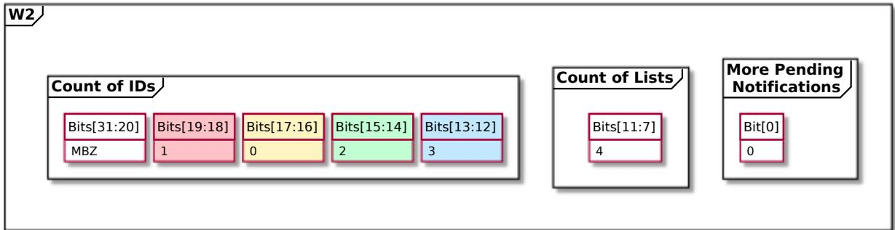

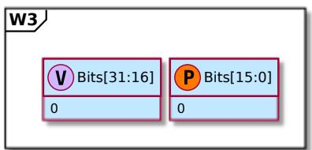

Bits[31:16]

Bits[31:16]

Bits[15:0]

W5

Bits[31:16]

Bits[15:0]

W6

Bits[31:16]

Bits[15:0]

W7

Bits[31:16]

Bits[15:0]

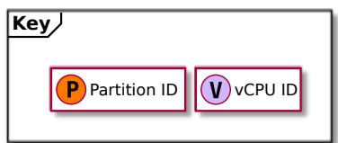

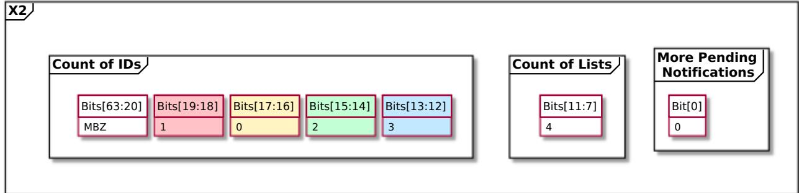

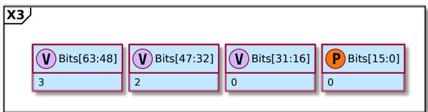

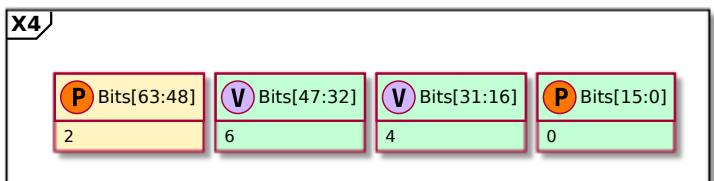

X5  
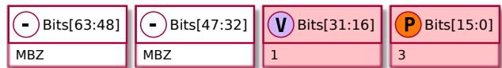

X6  
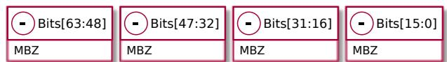

X7  
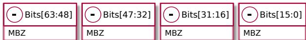

Chapter 17

Interrupt management interfaces

## 17.1 FFA\_EL3\_INTR\_HANDLE

## Description

• Request EL3 firmware to handle a pending interrupt.

• Valid FF-A instances and conduits are listed in Table 17.2.

• Syntax of this function is described in Table 17.3.

• Returns FFA\_SUCCESS without any further parameters on successful completion.

• Encoding of error code in the FFA\_ERROR function is described in Table 17.4.

Table 17.2: FFA\_EL3\_INTR\_HANDLE instances and conduits

<table><tr><td>Config No.</td><td>FF-A instance</td><td>Valid conduits</td></tr><tr><td>1</td><td>Secure physical FF-A</td><td>SMC</td></tr></table>

Table 17.3: FFA\_EL3\_INTR\_HANDLE function syntax

<table><tr><td>Parameter</td><td>Register</td><td>Value</td></tr><tr><td>uint32 Function ID</td><td>w0</td><td>• 0x8400008C.</td></tr><tr><td>Other Parameter registers</td><td>w1-w7</td><td>• Reserved (SBZ).</td></tr></table>

Table 17.4: FFA\_ERROR encoding

<table><tr><td>Parameter</td><td>Register</td><td>Value</td></tr><tr><td>int32 Error code</td><td>w2</td><td>• NOT_SUPPORTED: This function is not implemented at this FF-A instance.</td></tr></table>

## 17.1.1 Overview

This ABI is used by a S-EL2 or S-EL1 SPMC to delegate handling of an EL3 interrupt to EL3 firmware. On a GICv3 system, when SCR\_EL3.FIQ=0, the SPMC at S-EL2 or S-EL1 uses this ABI to request EL3 firmware to handle a pending Group 0 interrupt that cannot be handled at the same or lower Exception level than the SPMC.

The following rules govern the behaviour of this ABI.

• An invocation of this ABI returns the NOT\_SUPPORTED error code in the following scenarios:

– The ABI is invoked at an unsupported FF-A instance.

– The ABI is invoked at S-EL1 or S-EL2 and SCR\_EL3.FIQ=1.

• EL3 firmware does not perform a switch to another security state as a part of handling an invocation of this ABI.

This rule ensures that an invocation of this ABI is handled entirely in EL3 firmware before returning to the calling Exception level in the Secure state. This helps preserve the FF-A programming model where an exit to another Security state is always explicitly requested by software in the Secure state in S-EL1 or S-EL2.

Figure 17.1 illustrates how a Group 0 interrupt can be handled by TF-A at EL3 in coordination with an SPMC at S-EL1 or S-EL2 via the use of this ABI when SCR\_EL3.FIQ=0 in the Secure state.  
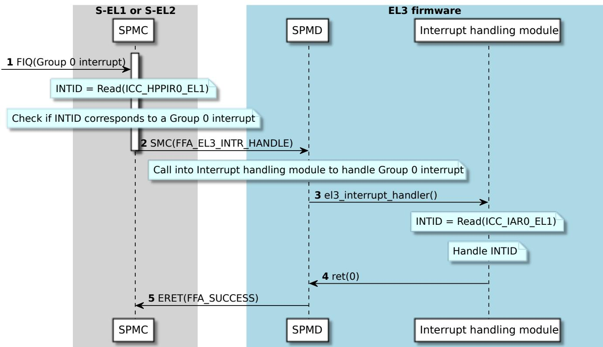  
Figure 17.1: Example usage of FFA\_EL3\_INTR\_HANDLE

Chapter 18 Appendix

## 18.1 S-EL0 partitions

S-EL0 partitions in either execution state are used to achieve isolation among Secure services on Arm A-profile systems where it is either not possible or not desirable to deploy a S-EL1 physical partition. They could host one or more device drivers to control hardware or security services that are accessed by the Normal world through the message passing interfaces described in this specification. An example use case of S-EL0 partitions is described in 18.1.1 UEFI PI Standalone Management Mode partitions.

## 18.1.1 UEFI PI Standalone Management Mode partitions

Standalone management mode (STMM) is described in [10] as a processor architecture agnostic, sandboxed secure execution environment. It is meant to be used for device drivers that cannot be implemented in the OS kernel but are required during run-time.

On Arm A-profile systems, STMM is implemented in a S-EL0 partition to constraint its visibility of the system address map and physical interrupts. This isolation enables a more robust Secure firmware implementation. This design is better from a security perspective than a design where STMM drivers are implemented in EL3.

Furthermore, execution in EL3 always runs to completion. Isolation of STMM drivers in an SP enables Secure firmware to transparently preempt them in response to OS Kernel interrupts and resume them once the interrupt has been handled. For some use cases, this prevents an adverse impact on OS responsiveness that could happen with a run to completion model.

## 18.1.1.1 FF-A usage to access STMM services

This section provides guidance around how services that would be typically implemented in EL3, can be implemented in multiple STMM S-EL0 partitions and accessed through FF-A interfaces. This guidance is based on certain assumptions about the Standalone management mode as follows.

• A STMM driver is neither re-entrant nor thread safe but its single execution context can run on any PE in the system. Hence, a STMM S-EL0 partition is considered to be a UP migrate capable partition.

• STMM services are accessed from the UEFI runtime environment in the Normal world through Direct Partition messages (see 8.3 Direct messaging). A component called the MM communication driver is used for this purpose.

• STMM services can be accessed in response to an interrupt targeted to EL3 apart from the UEFI runtime environment.

• There are no dependencies between STMM partitions. One partition does not access services of another partition.

• A STMM partition processes one request at a time and is incapable of having multiple outstanding requests at any point of time.

The MM interface specification [11] specifies the MM\_COMMUNICATE interface that enables the Normal world to access driver services implemented in a single STMM S-EL0 partition.

The Framework enables deployment of multiple STMM S-EL0 SPs through the use of,

1. An appropriate run-time model and CPU cycle allocation mode are described in 7.4.2 Runtime model of an SP execution context and 9.4 Support for legacy run-time models respectively.

2. Interfaces to manage the instruction and data access permissions of memory regions accessible by a STMM S-EL0 SP. This management is typically required during partition initialization (also see [12]). The FFA\_MEM\_PERM\_GET and FFA\_MEM\_PERM\_SET interfaces are described in the FF-A memory management protocol [1].

3. A canonical protocol UUID to discover the presence of STMM SPs.

STMM Protocol UUID: 378daedc-f06b-4446-8314-40ab933c87a3

Some example flows to illustrate common aspects of interaction with a STMM SP based on the preceding concepts are as follows.

• Figure 18.1 describes how the MM communication driver can discover the presence of STMM SPs and their properties. It is assumed that:

– All STMM SPs share the STMM protocol UUID. The Framework allows a 1:N mapping between the UUID and partitions (also see 6.2.3 Protocol UUID usage). Each STMM SP specifies this UUID, its run-time model, memory regions, devices etc. in its partition manifest.

– The STMM protocol UUID is used by MM communication driver to discover the partition IDs and properties of all the STMM SPs through a FF-A partition discovery mechanism.

– The MM communication buffer for each STMM SP is allocated by the EFI MM communication driver.

• Figure 18.2 describes how the MM communication driver and a STMM SP can communicate using Direct Partition messages and the communication buffer shared between them.

• Figure 18.3 describes how the STMM SP can be invoked in response to an interrupt.

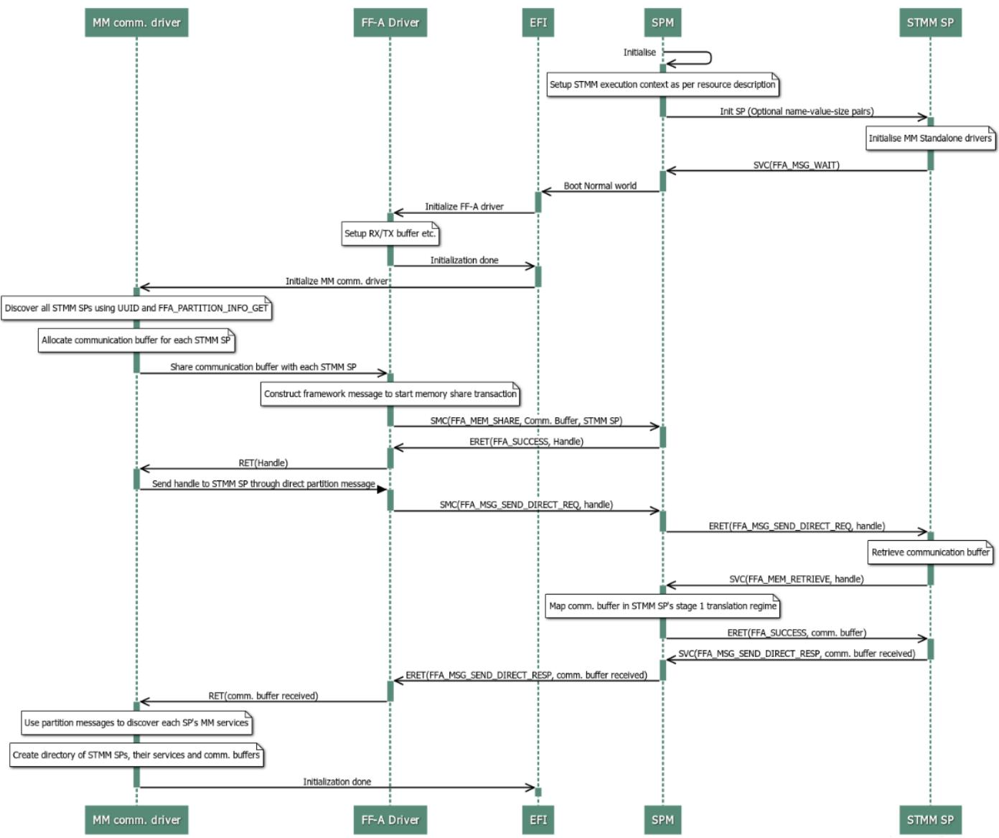  
Figure 18.1: MM communication driver initialization

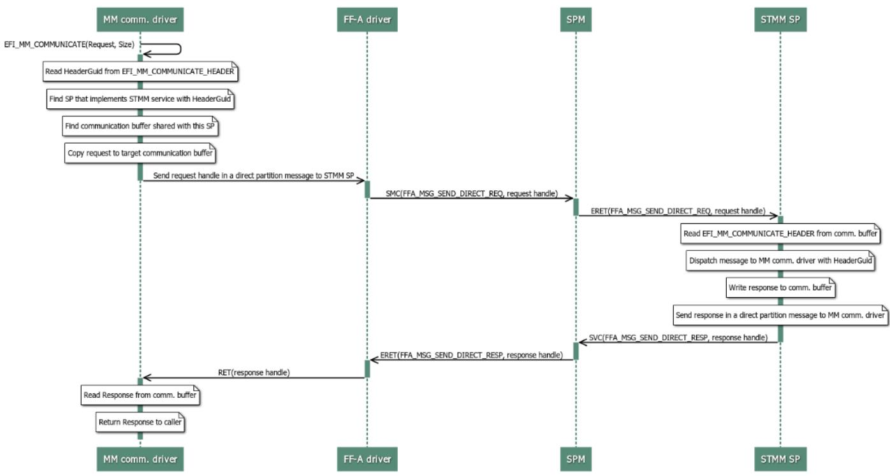  
Figure 18.2: Message exchange between a STMM SP and MM communication driver

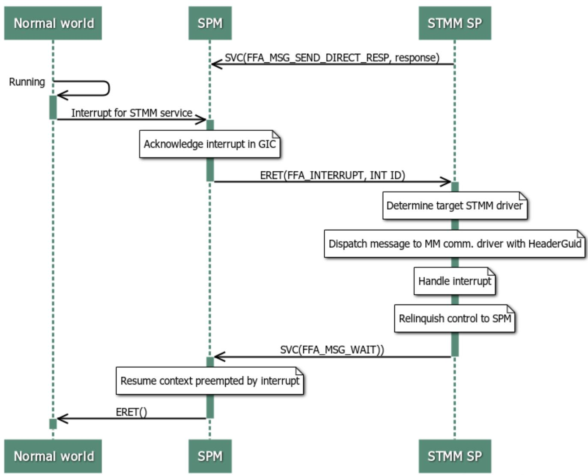  
Figure 18.3: Invocation of a STMM SP in response to an interrupt

## 18.2 Power Management

## 18.2.1 Overview

A PE could be released from reset from different low power or power down states. The states range from the system being fully switched off to only the PE being power-gated. Entry into and exit from these states is governed by OSPM policy implemented in NS-Endpoints and the Hypervisor. The policy is exercised through OSPM operations such as,

• Core idle management.

• Dynamic addition and removal of cores, and secondary core boot.

• System shutdown and reset.

The PSCI specification [13] describes these states and OSPM operations. It also defines a standard interface that these FF-A components can use to initiate OSPM operations at the Non-secure physical and virtual FF-A instances. The impact of OSPM operations on the Secure world are twofold.

1. When a PE is released from reset, execution contexts of the SPMC and SPs are initialized on the PE. The protocol to do this depends upon whether the PE is responsible for,

1. Initializing the system (see Section 4.4 in [13]) after a system reset/shutdown through PSCI SYSTEM\_OFF, SYSTEM\_OFF2, SYSTEM\_RESET, SYSTEM\_RESET2 functions or a hardware power-cycle sequence. The PE is called the primary PE and performs a cold boot (see [13]). The protocol for initializing an execution context of both UP and MP SPs, and the SPMC during a cold boot on the primary PE is described in Chapter 5 Setup.

2. Initializing the PE after exiting a power down state in response to an invocation of the PSCI CPU\_ON function. The PE is called the secondary PE and performs a cold boot. The protocol for initializing an execution context of an MP SP and the SPMC during a cold boot on a secondary PE is described in 18.2.2 Secondary boot protocol.

3. Restoring the system state after exiting the Suspend to RAM state in response to a wakeup event. The PE entered this state through an invocation of the PSCI SYSTEM\_SUSPEND function.

Restoring the PE state after exiting another low power state in response to a wakeup event. The PE entered this state through an invocation of the PSCI CPU\_SUSPEND function.

The PE performs a warm boot. The protocol for restoring an execution context of any SP and the SPMC and informing them about an exit from a low power state during a warm boot, is described in 18.2.3 Warm boot protocol.

2. FF-A components in the Secure world do not perform power management independently from the Normal world. Instead, the SPMD, SPMC and SPs are informed about OSPM operations initiated by the Normal world through PSCI functions. This allows them to take some action in response to a PSCI function invocation at EL3. For example, if CPU0 is being dynamically removed, the SPMC would re-target any physical interrupts targeted to CPU0 to another CPU.

The Framework describes a mechanism to inform FF-A components in the Secure world about OSPM operations in 18.2.4 Power Management messages.

## 18.2.2 Secondary boot protocol

In order to initialize an execution context of a MP SP or SPMC during a cold boot on a secondary PE, the SPMD and SPMC must know the entry point address of the execution context. The Framework describes two mechanisms to determine the entry point.

1. The entry point specified in the manifest and used for initializing the execution context during a primary cold boot is reused (see Chapter 5 Setup). The distinction between a primary and secondary cold boot is made by encoding a value in a general-purpose register when the entry point is invoked in each boot phase. Also see,

• Table 5.1.

• Table 5.4.

2. The FFA\_SECONDARY\_EP\_REGISTER function (see 18.2.2.1 FFA\_SECONDARY\_EP\_REGISTER) enables a SP or SPMC to register this entry point with the SPMC and the SPMD respectively.

If both mechanisms are implemented and FFA\_SECONDARY\_EP\_REGISTER is used by the SP or SPMC, then the registered entry point takes precedence over the one specified in the manifest.

The SPMC uses the guidance in 7.4.1 Starting an SP execution context to initialize the SP execution context.

## 18.2.2.1 FFA\_SECONDARY\_EP\_REGISTER

## Description

• Enables an MP SP or SPMC to register the entry point of their execution contexts for initialization during a secondary cold boot. Also see 18.2.2.1.1 Usage.

• Valid FF-A instances and conduits are listed in Table 18.3.

• Syntax of this function is described in Table 18.4.

• Returns FFA\_SUCCESS without any further parameters on successful completion.

• Encoding of error code in the FFA\_ERROR function is described in Table 18.5.

Table 18.3: FFA\_SECONDARY\_EP\_REGISTER instances and conduits

<table><tr><td>Config No.</td><td>FF-A instance</td><td>Valid conduits</td></tr><tr><td>1</td><td>Secure physical</td><td>SMC</td></tr><tr><td>2</td><td>Secure virtual</td><td>SMC, HVC</td></tr></table>

Table 18.4: FFA\_SECONDARY\_EP\_REGISTER function syntax

<table><tr><td>Parameter</td><td>Register</td><td>Value</td></tr><tr><td>uint32 Function ID</td><td>w0</td><td>0x84000087.0xC4000087.</td></tr><tr><td>uint32/uint64 Entry point address</td><td>w1/x1</td><td>Entry point address of a secondary execution context.- Address is a IPA at the Secure virtual FF-A instance with a S-EL2 SPMC.- Address is a PA at the Secure physical FF-A instance with a EL3 SPMC and a S-EL1 SP.- Address is a PA at the Secure physical FF-A instance with a EL3 SPMD and S-EL1 SPMC.- Address is a PA at the Secure physical FF-A instance with a EL3 SPMD and S-EL2 SPMC.</td></tr><tr><td>Other Parameter registers</td><td>w2-w7x2-x17</td><td>Reserved (SBZ).</td></tr></table>

Table 18.5: FFA\_ERROR encoding

<table><tr><td>Parameter</td><td>Register</td><td>Value</td></tr><tr><td>int32 Error code</td><td>w2</td><td>NOT_SUPPORTED: This function is not implemented at this FF-A instance.INVALID_PARAMETERS: An invalid entry point address was specified by the caller.DENIED:- This function was invoked by a S-EL0 SP which only has a single execution context.- This function was invoked when the caller is not in the starting state. See also 7.2.5 Starting state.</td></tr></table>

## 18.2.2.1.1 Usage

This function is invoked by a SP or the SPMC during the initialization of their execution context during a primary cold boot (see 18.2 Power Management). The callee returns DENIED if this function is invoked post-initialization on the primary PE or at any time on a secondary PE.

The callee must return NOT\_SUPPORTED if this function is invoked by a caller that implements version v1.0 of the Framework.

The entry point address must be in secure memory and accessible from the caller. The callee must return INVALID\_PARAMETERS otherwise.

If this function is invoked multiple times, then the entry point address specified in the last valid invocation must be used by the callee.

The Framework does not provide an interface to unregister the entry point address. Once registered, the entry point is used by,

• The SPMD until the system is reset or shutdown

• The SPMC until,

– The system is reset or shutdown or

– The execution of the SP is terminated e.g., due to a fatal error.

For each SP and the SPMC, the Framework assumes that the same entry point address is used for initializing any execution context during a secondary cold boot.

At the time of invoking the entry point address, the general-purpose and system registers should be programmed as specified in 5.3 Register state.

## 18.2.3 Warm boot protocol

The key difference between a warm and cold boot is that in the former case, main memory contents are preserved. Hence, it is possible to resume software from the state it was in, prior to entry into the low power state. In the Secure world, this is contingent upon the following, before the PE enters, and after it exits the low power state.

• The SPMD saves and restores the execution context of the SPMC.

• The SPMC saves and restores the execution context of each SP.

The Framework assumes that both the SPMD and SPMC fulfill these responsibilities. Additionally, the Framework defines a power management message that can be used by,

• The SPMD to inform the SPMC about the warm boot.

• The SPMC to inform an SP about the warm boot.

The message is described in 18.2.4 Power Management messages.

## 18.2.4 Power Management messages

The Framework defines a set of framework messages that describe power management operations invoked at EL3. Two types of operations are considered in this specification.

1. Operations that result in a PE entering a low power or a power down state. These operations are requested through an invocation of the following PSCI functions.

• CPU\_OFF.

• CPU\_SUSPEND.

• SYSTEM\_OFF.

• SYSTEM\_OFF2.

• SYSTEM\_RESET.

• SYSTEM\_RESET2.

• SYSTEM\_SUSPEND.

2. Warm boot of any PE as described in 18.2 Power Management and 18.2.3 Warm boot protocol.

These messages are used in the Secure world as follows.

• If the SPMD and SPMC are implemented in separate exception levels, the SPMD at EL3 uses these messages at the Secure physical FF-A instance, to inform the SPMC at S-EL1 or S-EL2 about the power management operation that was invoked.

• The SPMC at EL3 uses these messages at the Secure virtual FF-A instance, to inform one or more physical SPs at S-EL0 about the power management operation that was invoked.

• The SPMC at EL3 uses these messages at the Secure physical FF-A instance, to inform one or more LSPs at S-EL1 about the power management operation that was invoked.

• The SPMC at S-EL2 uses these messages at the Secure virtual FF-A instance, to inform one or more SPs at S-EL1 or S-EL0 about the power management operation that was invoked

• The SPMC at S-EL1 uses these messages at the Secure virtual FF-A instance, to inform one or more SPs at S-EL0 about the power management operation that was invoked.

The Framework mandates that the SPMD must inform the SPMC about the invocation of every operation listed above.

The Framework enables an SP to specify to the SPMC, the power management operations it must be informed about. This interest is registered through the SP manifest. See Table 5.1 and Table 5.4.

• Operations that are requested by a PSCI function invocation are specified through their PSCI function IDs.

• The warm boot operation is specified in an IMPLEMENTATION DEFINED manner.

An SP could choose to not register for a message in response to a power management operation that powers down the PE it is invoked on. It is possible that an execution context of this SP is running on a PE on which the operation is invoked. Since the SPMC cannot notify the SP’s execution context about the operation, this scenario must be handled in one of the following ways.

• If the execution context is not pinned to the PE, the SPMC must migrate it to another PE.

• It is possible that the execution context is pinned to the PE or the PE is the last one in the system to be powered off. In this case, the SP must be robust enough to cope with the power down of the PE.

Direct messaging is used to exchange these framework messages as described below (also see 8.3 Direct messaging).

• The Sender uses the FFA\_MSG\_SEND\_DIRECT\_REQ interface to send a request message to the Receiver.

• The Receiver uses the FFA\_MSG\_SEND\_DIRECT\_RESP interface to send the response message to the Sender.

The IDs of the SPMC and SPMD are used in the Sender and Receiver fields of these ABIs (also see 13.11 FFA\_SPM\_ID\_GET).

Messages sent by the SPMD to the SPMC and the SPMC to an SP through the FFA\_MSG\_SEND\_DIRECT\_REQ interface are encoded as described in Table 18.6 and Table 18.7.

Table 18.6: Power management request message encoding for PSCI functions

<table><tr><td>Register</td><td>Parameter</td></tr><tr><td>w0</td><td>FFA_MSG_SEND_DIRECT_REQ Function ID (0x8400006F or 0xC400006F).</td></tr><tr><td>w1</td><td>Sender and Receiver endpoint IDs.- Bit[31:16]:* SPMD ID in a message to the SPMC.* SPMC ID in a message to a SP.- Bit[15:0]:* SPMC ID in a message from the SPMD.* SP ID in a message from the SPMC.</td></tr><tr><td>w2</td><td>Message flags.- Bit[31] = b&#x27;1: Framework message.- Bit[30:8] = 0: Reserved (SBZ).- Bit[7:0] = b&#x27;00000000: Message for a power management operation initiated by a PSCI function.</td></tr><tr><td>w3</td><td>PSCI Function ID</td></tr><tr><td>w4/x4</td><td>Input parameter in w1/x1 in PSCI function invocation at EL3.</td></tr><tr><td>w5/x5</td><td>Input parameter in w2/x2 in PSCI function invocation at EL3.</td></tr><tr><td>w6/x6</td><td>Input parameter in w3/x3 in PSCI function invocation at EL3.</td></tr><tr><td>w7/x7</td><td>Reserved (SBZ).</td></tr></table>

Table 18.7: Power management request message encoding for a warm boot

<table><tr><td>Register</td><td>Parameter</td></tr><tr><td>w0</td><td>FFA_MSG_SEND_DIRECT_REQ Function ID (0x8400006F or 0xC400006F).</td></tr><tr><td>w1</td><td>Sender and Receiver endpoint IDs.- Bit[31:16]:* SPMD ID in a message to the SPMC.* SPMC ID in a message to a SP.- Bit[15:0]:* SPMC ID in a message from the SPMD.* SP ID in a message from the SPMC.</td></tr><tr><td>w2</td><td>Message flags.- Bit[31] = b'1: Framework message.- Bit[30:8] = 0: Reserved (SBZ).- Bit[7:0] = b'00000001: Message for a warm boot.</td></tr><tr><td>w3</td><td>Bit[30:1]: Reserved (MBZ).Bit[0]: Warm boot type.- b'0: Exit from a suspend to RAM state.- b'1: Exit from a low power state shallower than the suspend to RAM state.</td></tr><tr><td>w4-w7</td><td>Reserved (SBZ).</td></tr><tr><td>x4-x17</td><td></td></tr></table>

Messages sent by the SPMC to the SPMD and an SP to the SPMC through the FFA\_MSG\_SEND\_DIRECT\_RESP interface are encoded in w3-w7 registers as described in Table 18.8.

Table 18.8: Power management response message encoding

<table><tr><td>Register</td><td>Parameter</td></tr><tr><td>w0</td><td>FFA_MSG_SEND_DIRECT_RESP Function ID (0x84000070 or 0xC4000070).</td></tr><tr><td>w1</td><td>Sender and Receiver endpoint IDs.- Bit[31:16]:* SPMC ID in a message to the SPMD.* SP ID in a message to the SPMC.- Bit[15:0]:* SPMD ID in a message from the SPMC.* SPMC ID in a message from a SP.</td></tr><tr><td>w2</td><td>Message flags.- Bit[31] = b&#x27;1: Framework message.- Bit[30:8] = 0: Reserved (SBZ).- Bit[7:0] = b&#x27;00000010: Response message to indicate return status of the last power management request message.</td></tr><tr><td>w3</td><td>Return error code SUCCESS or DENIED as defined in [13].</td></tr><tr><td>w4-w7</td><td>Reserved (SBZ).</td></tr></table>

An SP or the SPMC must use the SUCCESS return error code to indicate successful processing of the request message.

An SP or the SPMC must use the DENIED return error code to indicate unsuccessful processing of the request message.

The SPMC must return DENIED to the SPMD even if a single SP returns this error code to the SPMC.

If the SPMC returns SUCCESS, the SPMD must facilitate completion of the power management operation.

If the SPMC returns DENIED, the action taken by the SPMD is IMPLEMENTATION DEFINED.

A power management message must be delivered to an SP or the SPMC execution context only if the message target is in the waiting state.

The following requirements must be fulfilled while processing a power management message.

• It must be processed on the same PE where it is delivered.

• The SPMC denies a request from an SP to switch to the Normal world during message processing.

• An SP is run in the SPMC scheduled mode during message processing (see 9.2.3 CPU cycle allocation modes).

• The SPMC places the following additional restrictions on the runtime model of the SP execution context during message processing (see 7.4.2 Runtime model of an SP execution context).

– An SP does not use the smc(FFA\_RUN) transition to allocate CPU cycles to any other component.

– An SP does not use the smc(FFA\_YIELD) transition to relinquish control back to the SPMC.

– An SP does not use the Direct request interfaces to send a message and allocate CPU cycles to any other component.

The SPMC denies any such request by invoking the FFA\_ERROR interface with the DENIED error code.

• The SPMD denies a request from the SPMC to switch to the Normal world during message processing.

Figure 18.4 illustrates an example power management message exchange between the SPMD in EL3, SPMC in S-EL2 and a single SP in S-EL1, in response to a PSCI function invocation at EL3.

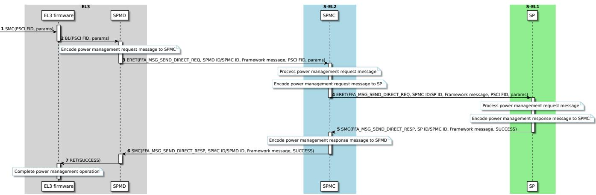  
Figure 18.4: Example power management message usage

## 18.3 VM availability signaling

## 18.3.1 Overview

An SP could provide services to VMs in the Normal world. A VM could be created by the Hypervisor at runtime, access an SP’s services and be destroyed by the Hypervisor when its work is complete. Alternatively, a VM could crash and its resources reclaimed by the Hypervisor. An SP could allocate resources when a VM is created and de-allocate them when the VM is destroyed. Alternatively, it could perform some IMPLEMENTATION DEFINED actions in response to one or both events. In either case, the SP needs to know when a VM is created or destroyed. To cater for this use case, the Framework specifies a mechanism that enables the Hypervisor to inform an SP when it creates or destroys a VM. This mechanism consists of,

1. Framework messages to signal and acknowledge VM creation and destruction. These messages are defined in 18.3.2 VM availability messages.

2. A discovery mechanism that enables an SP to subscribe to receipt of VM creation and destruction messages. This mechanism is described in 18.3.3 Discovery and setup

## 18.3.2 VM availability messages

The Framework defines the following messages to enable the Hypervisor inform an SP about VM availability.

1. A pair of Framework messages to signal and acknowledge VM creation. These messages are defined in 18.3.2.4 VM creation message.

2. A pair of Framework messages to signal and acknowledge VM destruction. These messages are defined in 18.3.2.5 VM destruction message.

## 18.3.2.1 SPMC responsibilities

The SPMC is responsible for ensuring that these messages are,

1. Validated as per the responsibilities associated with all Direct messages listed in 8.3 Direct messaging.

2. Exchanged only between a valid combination of a sender and recipient as follows:

1. Between SPs.

2. Between an SP and a VM.

3. Between the Hypervisor and SPMC.

4. Between the Hypervisor and an SP if the SP has not subscribed for receipt of VM creation and destruction messages (also see 18.3.3 Discovery and setup).

The SPMC returns INVALID\_PARAMETERS if a message exchange is attempted for an invalid combination of sender and recipient.

## 18.3.2.2 Hypervisor responsibilities

The Hypervisor is responsible for ensuring that these messages are,

1. Sent to each SP that has subscribed to them.

2. Validated as per the responsibilities associated with all Direct messages listed in 8.3 Direct messaging.

3. Exchanged only between a valid combination of a sender and recipient as follows:

1. Between VMs.

2. Between a VM and an SP.

The Hypervisor returns INVALID\_PARAMETERS if a message exchange is attempted for an invalid combination of sender and recipient.

## 18.3.2.3 VM availability state machine

An SP maintains a state machine to track availability of each VM. State transitions are effected through the receipt of VM creation and destruction messages. The states are described below. The state machine is described in Table 18.9.

1. VM available.

1. The SP is aware of the presence of the VM and ready to communicate with it. The SP has discarded any state associated with a previous instance of this VM.

2. VM unavailable.

1. The SP is aware that the VM has been either destroyed or has not yet been created. In the former case, it might not have freed all resources associated with the VM.

3. Error.

1. The Hypervisor has requested an invalid state transition or sent an invalid message to the SP. The SP has returned an error response to the Hypervisor.

Table 18.9: VM availability state transition diagram

<table><tr><td>State/Transition</td><td>VM creation message</td><td>VM destruction message</td></tr><tr><td>VM available</td><td>Error</td><td>VM unavailable</td></tr><tr><td>VM unavailable</td><td>VM available</td><td>Error</td></tr><tr><td>Error</td><td>Error</td><td>Error</td></tr></table>

## 18.3.2.4 VM creation message

Table 18.10: Message to signal VM creation

<table><tr><td>Register</td><td>Parameter</td></tr><tr><td>w0</td><td>FFA_MSG_SEND_DIRECT_REQ Function ID (0x8400006F or 0xC400006F).</td></tr><tr><td>w1</td><td>Sender and Receiver endpoint IDs.- Bit[31:16]:* Hypervisor ID.- Bit[15:0]:* SP ID.</td></tr><tr><td>w2</td><td>Message flags.- Bit[31] = b&#x27;1: Framework message.- Bit[30:8] = 0: Reserved (SBZ).- Bit[7:0] = b&#x27;00000100: Message to signal creation of a VM .</td></tr><tr><td>w3/w4</td><td>Globally unique Handle to identify a memory region that contains IMPLEMENTATION DEFINED information associated with the created VM.The invalid memory region handle must be specified by the Hypervisor if this field is not used.</td></tr><tr><td>w5</td><td>Bit[31:16]: Reserved (SBZ).Bit[15:0]: ID of VM that has been created.</td></tr><tr><td>w6</td><td>Reserved (SBZ).</td></tr><tr><td>w7</td><td>Reserved (SBZ).</td></tr></table>

Table 18.11: Message to acknowledge VM creation

<table><tr><td>Register</td><td>Parameter</td></tr><tr><td>w0</td><td>FFA_MSG_SEND_DIRECT_RESP Function ID (0x84000070 or 0xC4000070).</td></tr><tr><td>w1</td><td>Sender and Receiver endpoint IDs.- Bit[31:16]:* SP ID.- Bit[15:0]:* Hypervisor ID.</td></tr><tr><td>w2</td><td>Message flags.- Bit[31] = b&#x27;1: Framework message.- Bit[30:8] = 0: Reserved (SBZ).- Bit[7:0] = b&#x27;00000101: Message to acknowledge creation of a VM.</td></tr><tr><td>w3</td><td>SP return status code.- 0: SUCCESS.* The SP acknowledges successful receipt of VM creation message by transitioning to the VM available state.- -2: INVALID_PARAMETERS.* One or more parameters were incorrectly encoded.* One or more parameters contain invalid values.* The SP transitions to the Error state.- -5: INTERRUPTED.* The SP was interrupted by a Non-secure interrupt. It performed a managed exit before handling the message. The Hypervisor should resend the message to resume SP execution. This enables the SP to finish handling the VM creation message.* The SP remains in the VM unavailable state.- -6: DENIED.* The SP cannot acknowledge successful receipt of VM creation message due to an IMPLEMENTATION DEFINED reason.* The SP remains in its current state.- -7: RETRY.* The SP is in an IMPLEMENTATION DEFINED state that prevents it from acknowledging the VM creation message. The Hypervisor should resend the VM creation message.* The SP remains in the VM unavailable state.</td></tr><tr><td>w4</td><td>Reserved (SBZ).</td></tr><tr><td>w5</td><td>Reserved (SBZ).</td></tr><tr><td>w6</td><td>Reserved (SBZ).</td></tr><tr><td>w7</td><td>Reserved (SBZ).</td></tr></table>

## 18.3.2.5 VM destruction message

Table 18.12: Message to signal VM destruction

<table><tr><td>Register</td><td>Parameter</td></tr><tr><td>w0</td><td>FFA_MSG_SEND_DIRECT_REQ Function ID (0x8400006F or 0xC400006F).</td></tr></table>

Chapter 18. Appendix 18.3. VM availability signaling

<table><tr><td>Register</td><td>Parameter</td></tr><tr><td>w1</td><td>Sender and Receiver endpoint IDs.- Bit[31:16]:* Hypervisor ID.- Bit[15:0]:* SP ID.</td></tr><tr><td>w2</td><td>Message flags.- Bit[31] = b&#x27;1: Framework message.- Bit[30:8] = 0: Reserved (SBZ).- Bit[7:0] = b&#x27;00000110: Message to signal destruction of a VM.</td></tr><tr><td>w3/w4</td><td>Globally unique Handle to identify a memory region that contains IMPLEMENTATION DEFINED information associated with the destroyed VM.The invalid memory region handle must be specified by the Hypervisor if this field is not used.</td></tr><tr><td>w5</td><td>Bit[31:16]: Reserved (SBZ).Bit[15:0]: ID of VM that has been destroyed.</td></tr><tr><td>w6</td><td>Reserved (SBZ).</td></tr><tr><td>w7</td><td>Reserved (SBZ).</td></tr></table>

Table 18.13: Message to acknowledge VM destruction

<table><tr><td>Register</td><td>Parameter</td></tr><tr><td>w0</td><td>FFA_MSG_SEND_DIRECT_RESP Function ID (0x84000070 or 0xC4000070).</td></tr><tr><td>w1</td><td>Sender and Receiver endpoint IDs.- Bit[31:16]:* SP ID.- Bit[15:0]:* Hypervisor ID.</td></tr><tr><td>w2</td><td>Message flags.- Bit[31] = b'1: Framework message.- Bit[30:8] = 0: Reserved (SBZ).- Bit[7:0] = b'00000111: Message to acknowledge destruction of a VM.</td></tr><tr><td>w3</td><td>• SP return status code. - 0: SUCCESS. * The SP acknowledges successful receipt of VM destruction message by transitioning to the “VM unavailable” state. - -2: INVALID_PARAMETERS. * One or more parameters were incorrectly encoded. * One or more parameters contain invalid values. * The SP transitions to the Error state. - -5: INTERRUPTED. * The SP was interrupted by a Non-secure interrupt. It performed a managed exit before handling the message. The Hypervisor should resend the message to resume SP execution. This enables the SP to finish handling the VM destruction message. * The SP remains in the VM available state. - -6: DENIED. * The SP cannot acknowledge successful receipt of VM destruction message due to an IMPLEMENTATION DEFINED reason. * The SP remains in its current state. - -7: RETRY. * The SP is in an IMPLEMENTATION DEFINED state that prevents it from acknowledging the VM destruction message. The Hypervisor should resend the VM destruction message. * The SP remains in the VM available state.</td></tr><tr><td>w4</td><td>• Reserved (SBZ).</td></tr><tr><td>w5</td><td>• Reserved (SBZ).</td></tr><tr><td>w6</td><td>• Reserved (SBZ).</td></tr><tr><td>w7</td><td>• Reserved (SBZ).</td></tr></table>

## 18.3.3 Discovery and setup

An SP informs the SPMC that it wants to receive VM creation and/or destruction messages through its manifest (see Table 5.1).

The Hypervisor discovers that an SP wants to receive VM creation and/or destruction messages by retrieving the SP properties through the FFA\_PARTITION\_INFO\_GET ABI (see Table 6.1).

## 18.4 Legacy Indirect messaging usage

In version 1.0 of the Framework, guidance on Indirect messaging differs from the guidance in the current version of the Framework in the following ways.

1. Only VMs can exchange partition messages using Indirect messaging. It is now possible to exchange partition messages between any pair of endpoints.

2. The identities of the Sender and Receiver endpoints and the length of a partition message are encoded in input parameter registers in an FFA\_MSG\_SEND ABI invocation. As a result, the Receiver endpoint could have to invoke the FFA\_MSG\_POLL ABI to determine this information. It is now available in the RX buffer.

In this version of the framework, this information is encoded along with the partition message payload in the RX and TX buffers as described in Table 8.1. As a result, there is no need for the Receiver endpoint to call FFA\_MSG\_POLL.

3. Only the primary scheduler runs the Receiver VM. In this version of the framework, a Receiver endpoint can be run by a primary or a secondary scheduler. Also, the notification mechanism is used to inform the scheduler.

The guidance on Indirect messaging in v1.0 of the Framework is deprecated. The FFA\_MSG\_SEND and FFA\_MSG\_POLL interfaces are described to maintain compatibility between v1.0 and the current version of the Framework. These interfaces could be removed in a future version of the framework.

## 18.4.1 FFA\_MSG\_SEND

<table><tr><td>Overview</td></tr><tr><td>Send a Partition message to a VM through the RX/TX buffers by using Indirect messaging. Message is copied by Hypervisor from the TX buffer of Sender NS-Endpoint to the RX buffer of Receiver NS-endpoint.The scheduler is informed about the pending message in the RX buffer of the Receiver.Message will be read when the Receiver endpoint is scheduled to run.See 18.4.1.2 Component responsibilities for FFA_MSG_SEND for caller and callee roles and responsibilities.Must not be invoked when the caller is processing a Direct request. Valid FF-A instances and conduits are listed in Table 18.15.Is used with the ERET conduit in the following scenarios.Inform an endpoint that a message is available in its RX buffer.Inform the primary scheduler that the Receiver has a pending message in its RX buffer. Syntax of this function is described in Table 18.16.Successful completion of this function call is indicated as follows.w0 contains FFA_SUCCESS function ID.w1/x1-w7/x7 are Reserved (MBZ).Successful completion of this function does not imply that the message has been read by the Receiver endpoint.Encoding of error code in the FFA_ERROR function is described in Table 18.17.- See 18.4.1.1 Target availability notification for behavior when BUSY is returned and caller must be notified about availability of TX buffer.</td></tr></table>

Table 18.15: FFA\_MSG\_SEND instances and conduits

<table><tr><td>Config No.</td><td>FF-A instance</td><td>Valid conduits</td></tr><tr><td>1</td><td>Non-secure virtual</td><td>SMC, HVC, ERET</td></tr></table>

Table 18.16: FFA\_MSG\_SEND function syntax

<table><tr><td>Parameter</td><td>Register</td><td>Value</td></tr><tr><td>uint32 Function ID</td><td>w0</td><td>0x8400006E.</td></tr><tr><td>uint32 Sender/Receiver IDs</td><td>w1</td><td>Sender and Receiver endpoint IDs.- Bit[31:16]: Sender endpoint ID.- Bit[15:0]: Receiver endpoint ID.</td></tr><tr><td>uint32/uint64 Reserved</td><td>w2/x2</td><td>Reserved for future use (MBZ).</td></tr><tr><td>uint32 Message size</td><td>w3</td><td>Length of message payload in the RX buffer.This is an optional field when used with theERT conduit at the Non-secure virtual FF-A instance and the callee is not the Receiver of the message. It MBZ in this case.</td></tr></table>

Chapter 18. Appendix 18.4. Legacy Indirect messaging usage

<table><tr><td>Parameter</td><td>Register</td><td>Value</td></tr><tr><td>uint32 Flags</td><td>w4</td><td>Message flags. Must be ignored by callee when SVC conduit is used. - Bit[0]: Blocking behavior. * b&#x27;0: Return BUSY if message cannot be delivered to Receiver. * b&#x27;1: Return BUSY if message cannot be delivered to Receiver and notify when delivery is possible. - Bit[31:1]: Reserved (MBZ).</td></tr><tr><td>uint32 Sender vCPU ID</td><td>w5</td><td>Information to identify execution context or vCPU of Sender endpoint. Only valid when ERET conduit is used. MBZ and ignored by callee otherwise. Bits[31:16]: Reserved (MBZ). Bits[15:0]: vCPU ID of Sender endpoint.</td></tr><tr><td>Other Parameter registers</td><td>w6-w7 x6-x7</td><td>Reserved (MBZ).</td></tr></table>

Table 18.17: FFA\_ERROR encoding

<table><tr><td>Parameter</td><td>Register</td><td>Value</td></tr><tr><td>int32 Error code</td><td>w2</td><td>• INVALID_PARAMETERS: A field in input parameters is incorrectly encoded.• BUSY: Receiver RX buffer is not free.• DENIED: Callee is not in a state to handle this request.• NO_MEMORY: Insufficient memory to handle this request.• NOT_SUPPORTED: This function is not implemented at this FF-A instance.</td></tr></table>

## 18.4.1.1 Target availability notification

When this interface is invoked, it is possible that the callee determines that the RX buffer of the Receiver VM cannot be written to. This can happen if either another instance of a Producer is writing to the RX buffer or the Receiver VM is reading from it as a Consumer (see 4.10 RX/TX buffers). The callee must complete the interface invocation with a BUSY error code in this case.

A VM running in EL1 can request to be notified when the RX buffer becomes available again by setting bit[0] = 1 in the Flags parameter. In this case, the Hypervisor must:

1. Determine when the RX buffer is available as per the ownership rules described in 4.10 RX/TX buffers.

2. Notify each caller about the RX buffer availability.

The Hypervisor must describe the interrupt to indicate availability of the Receiver VM RX buffer to each VM respectively through an IMPLEMENTATION DEFINED mechanism. This could be done through a platform discovery mechanism like ACPI or Device tree.

A Consumer that is, OS kernel or VM must indicate the availability of its RX buffer by using a mechanism listed in 4.10 RX/TX buffers for example, through the FFA\_RX\_RELEASE interface.

## 18.4.1.2 Component responsibilities for FFA\_MSG\_SEND

This section describes the common responsibilities that the participating FF-A components must fulfill during transmission of Partition messages between VMs through the FFA\_MSG\_SEND interface. This interface is used in the scenarios listed in 8.2 Indirect messaging.

## 18.4.1.2.1 Sender VM responsibilities

1. Must acquire ownership of empty TX buffer (see 4.10 RX/TX buffers).

2. Must write Partition message payload to TX buffer.

3. Must specify length of Partition message payload.

4. Must specify blocking behavior in Flags parameter.

5. Must specify Sender and Receiver VM IDs.

6. Must implement support for handling all error status codes that can be returned on completion of these interfaces.

7. See 18.4.1.2.2 Hypervisor responsibilities for Hypervisor responsibilities in this message transmission.

## 18.4.1.2.2 Hypervisor responsibilities

1. Must validate Sender and Receiver VM IDs and return INVALID PARAMETER if either is invalid.

2. Must check that reserved bits are 0 in Flags parameter. Return INVALID PARAMETER if this check fails

3. Must check that reserved and unused parameter registers are 0. Return INVALID PARAMETER if this check fails.

4. Must check that the size of the Receiver RX buffer is large enough to accommodate the message. Must return NO\_MEMORY if this is not true.

5. Must lock TX buffer of Sender from concurrent accesses before copying the message.

6. Must determine availability of RX buffer of Receiver.

1. Return BUSY if RX buffer is not available.

1. Save Sender ID if it wants the target availability interrupt when the RX buffer becomes free.

2. Arrange for target availability interrupt to be delivered to Sender.

2. Mark RX buffer as unavailable if it is available.

7. Must protect RX buffer of Receiver from concurrent accesses.

8. Must copy message from Sender TX buffer to Receiver RX buffer.

9. Must unlock TX buffer of Sender after copying the message.

10. Must unlock RX buffer of Receiver after copying the message.

11. Must inform primary scheduler that Receiver has a pending message as described in 18.4.1.3 Legacy mechanism for scheduler notification.

12. Must return SUCCESS to Sender if message is successfully transmitted.

13. Must mark the RX buffer as available when the Receiver releases it.

## 18.4.1.2.3 Receiver VM responsibilities

1. Copy message from RX buffer.

2. Transfer ownership of the RX buffer by invoking the FFA\_RX\_RELEASE interface.

## 18.4.1.3 Legacy mechanism for scheduler notification

This section describes how the primary scheduler must be notified depending on its location relative to the message Sender.

1. A VM is the Sender. The primary scheduler and Hypervisor are co-resident. The Hypervisor must use an IMPLEMENTATION DEFINED mechanism to notify the primary scheduler in response to the FFA\_MSG\_SEND call.

## 2. A VM is the Sender.

1. The primary scheduler is resident in another VM.

1. The Hypervisor must forward the FFA\_MSG\_SEND call to the primary scheduler using the ERET conduit on the PE where the call is made.

2. Primary scheduler must respond to the forwarded FFA\_MSG\_SEND call with either a FFA\_SUCCESS or FFA\_ERROR invocation through the SMC conduit.

Chapter 18. Appendix

18.4. Legacy Indirect messaging usage

3. The primary scheduler and Sender VM are co-resident. The Sender VM must use an IMPLEMENTATION DEFINED mechanism to notify the scheduler.

## 18.4.2 FFA\_MSG\_POLL

<table><tr><td colspan="2">Description</td></tr></table>

• Poll if a message is available in the RX buffer of the caller. Execution is returned to the caller if no message is available.

– Must not be invoked when the caller is processing a Direct request.

• Valid FF-A instances and conduits are listed in Table 18.19.

• Syntax of this function is described in Table 18.20.

• Successful completion of this function is indicated through the invocation of the FFA\_MSG\_SEND interface (see 18.4.1 FFA\_MSG\_SEND).

• Encoding of error code in the FFA\_ERROR function is described in Table 18.21.

Table 18.19: FFA\_MSG\_POLL instances and conduits

<table><tr><td>Config No.</td><td>FF-A instance</td><td>Valid conduits</td></tr><tr><td>1</td><td>Non-secure virtual</td><td>SMC, HVC</td></tr></table>

## Table 18.20: FFA\_MSG\_POLL function syntax

<table><tr><td>Parameter</td><td>Register</td><td>Value</td></tr><tr><td>uint32 Function ID</td><td>w0</td><td>• 0x8400006A.</td></tr><tr><td rowspan="2">Other Parameter registers</td><td>w1-w7</td><td rowspan="2">• Reserved (MBZ).</td></tr><tr><td>x1-x7</td></tr></table>

Table 18.21: FFA\_ERROR encoding

<table><tr><td>Parameter</td><td>Register</td><td>Value</td></tr><tr><td>int32 Error code</td><td>w2</td><td>RETRY: Message is not available in the caller&#x27;s RX buffer.DENIED: Callee is not in a state to handle this request.NOT_SUPPORTED: This function is not implemented at this FF-A instance.</td></tr></table>

## 18.5 Changes to FF-A v1.0 data structures for forward compatibility

Version 1.1 of the Framework specifies changes to make the following data structures defined in version 1.0 of the Framework forwards compatible.

1. Memory transaction descriptor (see [1] for more information).

2. Endpoint memory access descriptor (see [1] for more information).

3. Endpoint RX/TX descriptor in Table 13.28.

4. Partition information descriptor in Table 6.1.

These changes enable forward compatibility as described below.

1. A new field is always added at the end these data structures.

2. A producer of this data structure specifies its size corresponding to the FF-A version it implements to a consumer.

3. A consumer of this data structure uses this size to correctly read the version of the data structure implemented by the producer.

4. A consumer of this data structure uses the size corresponding to the Framework version it implements to consume only fields defined in its version. Additional fields in the producer’s version of this data structure are safely ignored enabling forward compatibility.

## 18.5.1 Changes to Partition information descriptor

The Partition information descriptor (see Table 6.1) has undergone the following changes based upon partner feedback.

1. The Protocol UUID field has been added at the 8-byte offset. This enables the caller of FFA\_PARTITION\_INFO\_GET with the Nil UUID to determine the protocol UUIDs of all the endpoints deployed in the system.

2. New flags corresponding to properties of a partition have been added in Bits[8:4] of the Partition properties field of the FF-A v1.0 descriptor (see Table 18.22).

To ensure that changes to this data structure in future versions of the Framework can be introduced in a forward compatible manner, the Size parameter has been added to the return parameters of FFA\_PARTITION\_INFO\_GET as described in Table 13.36. This enables a consumer of Table 6.1 to determine the size of the version of this data structure used by the producer as described above.

Table 18.22: FF-A v1.0 Partition information descriptor

<table><tr><td>Field</td><td>Byte length</td><td>Byte offset</td><td>Description</td></tr><tr><td>Partition ID</td><td>2</td><td>0</td><td>• 16-bit ID of the partition.</td></tr><tr><td>Execution context count</td><td>2</td><td>2</td><td>• Number of execution contexts implemented by this partition (also see 4.7 Execution context).</td></tr></table>

18.5. Changes to FF-A v1.0 data structures for forward compatibility

<table><tr><td>Field</td><td>Byte length</td><td>Byte offset</td><td>Description</td></tr><tr><td>Partition properties</td><td>4</td><td>4</td><td>Flags to determine partition properties. - Bit[0] has the following encoding: * b&#x27;0: Does not support receipt of Direct requests * b&#x27;1: Supports receipt of Direct requests. Count of execution contexts must be either 1 or equal to the number of PEs in the system (also see8.3 Direct messaging). - bit[1] has the following encoding: * b&#x27;0: Cannot send Direct requests. * b&#x27;1: Can send Direct requests. - bit[2] has the following encoding: * b&#x27;0: Cannot send and receive Indirect messages. MBZ for an SP. * b&#x27;1: Can send and receive Indirect messages. - bit[31:3]: Reserved (MBZ).</td></tr></table>

## 18.5.2 Changes to Endpoint RX/TX descriptor

The changes for the Endpoint RX/TX descriptor (see Table 13.28) are listed below.

1. All fields in FF-A v1.0 descriptor (see Table 18.23) except for the Endpoint ID field at the 0-byte offset and the Reserved field at the 2-byte offset have been replaced by the following fields.

1. RX buffer memory region description offset at the 4-byte offset.

2. TX buffer memory region description offset at the 8-byte offset.

These changes enable new fields to be added to this data structure in future in a forward compatible manner. They also enable reuse of the composite memory region descriptor (see [1] instead of duplicating the same functionality.

Table 18.23: FF-A v1.0 Endpoint RX/TX descriptor

<table><tr><td>Field</td><td>Byte length</td><td>Byte offset</td><td>Description</td></tr><tr><td>Endpoint ID</td><td>2</td><td>0</td><td>• ID of endpoint that allocated the RX/TX buffer.</td></tr><tr><td>Reserved</td><td>2</td><td>2</td><td>• MBZ.</td></tr><tr><td>RX address range count</td><td>4</td><td>4</td><td>• Count of address ranges specified using constituent memory descriptors for the RX buffer.</td></tr><tr><td>TX address range count</td><td>4</td><td>8</td><td>• Count of address ranges specified using constituent memory descriptors for the TX buffer.</td></tr><tr><td>RX address range array</td><td>-</td><td>12</td><td>• Array of address ranges allocated for the RX buffer that the callee must map in its translation regime. See the constituent memory region descriptor in [1] for how the address ranges are encoded.</td></tr><tr><td>TX address range array</td><td>-</td><td>-</td><td>• Array of address ranges allocated for the TX buffer that the callee must map in its translation regime. See the constituent memory region descriptor in [1] for how the address ranges are encoded.</td></tr></table>

## 18.5.3 Compatibility requirements for FF-A v1.0 data structures

A partition manager that implements major version 1 and a higher minor version (>= 1) of the Framework implements the v1.0 version of the data structures described in 18.5 Changes to FF-A v1.0 data structures for forward compatibility to maintain backward compatibility with a client that implements version 1.0 of the Framework. Each client specifies its version of the Framework in an invocation of FFA\_VERSION (see 13.2 FFA\_VERSION). For each client, the partition manager ensures it only uses that version of the data structure that is implemented by the client.

A partition manager that implements major version 1 and a higher minor version (>=1) of the Framework and cannot maintain backwards compatibility returns the NOT\_SUPPORTED error code in response to an FFA\_VERSION invocation with v1.0 as the input version. Such a partition manager implementation is not compliant with the specification as it violates the requirement to maintain backward compatibility with a client that implements the same major version.

## 18.6 Example notification and Indirect messaging flows

## Provisional

The flows described in this section are to facilitate the understanding of the notification and Indirect messaging mechanisms. The format of these diagrams are not yet finalized and will be updated in a subsequent revision of the specification.

## 18.6.1 Example notification flows

These flow diagrams illustrate how a notification is signaled between the following combinations of endpoints with the Hypervisor acting as the primary scheduler.

• A VM sets up and sends a notification to another VM (see 18.6.1.1 VM to VM notification).

• An SP sets up and sends a notification to a VM (see 18.6.1.2 SP to VM notification).

• A VM sets up and sends a notification to an SP (see 18.6.1.3 VM to SP notification).

The bind procedure is not represented in the flows but the FFA\_NOTIFICATION\_BIND ABI must be called by the receiver of a notification to allow the sender to raise it (see 16.3 FFA\_NOTIFICATION\_BIND and 10.4.2 Notification binding

The sequences are simplified and the details in each flow are provided earlier (see 10.5 Notification signaling).

## 18.6.1.1 VM to VM notification

Figure 18.5 illustrates an example sequence where VM1 sends a notification to VM0.

1. VM1 uses the FFA\_NOTIFICATION\_SET interface to send notification 10 to VM0.

2. Hypervisor injects the virtual notification pending interrupt into VM0.

3. VM0 handles the notification pending interrupt and uses the FFA\_NOTIFICATION\_GET interface to retrieve its pending notifications including notification 10.

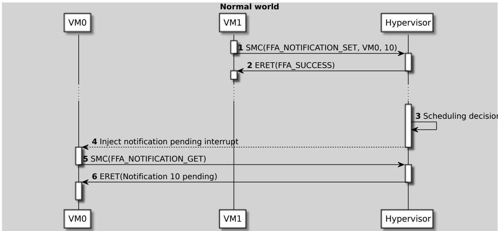  
Figure 18.5: VM to VM notification flow

## 18.6.1.2 SP to VM notification

Figure 18.6 illustrates an example sequence where SP0 sends a notification to VM0 as follows.

1. SP0 uses the FFA\_NOTIFICATION\_SET interface to send notification 5 to VM0.

2. SPMC pends the schedule receiver interrupt for the Hypervisor.

3. Hypervisor uses the FFA\_NOTIFICATION\_INFO\_GET to retrieve the list of endpoints with currently pending notifications.

4. Hypervisor injects the virtual notification pending interrupt into VM0.

5. VM0 handles the notification pending interrupt and uses the FFA\_NOTIFICATION\_GET interface to retrieve its pending notifications including notification 5.

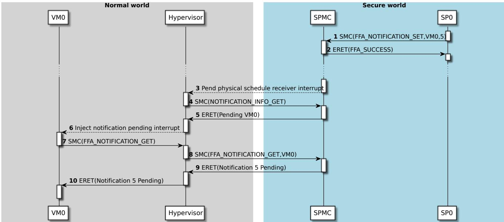  
Figure 18.6: SP to VM notification flow

## 18.6.1.3 VM to SP notification

Figure 18.7 illustrates an example sequence where VM0 sends a notification to SP0 in S-EL1 where VM1 is responsible for scheduling SP0 i.e. it implements SP0’s secondary scheduler.

1. VM0 uses the FFA\_NOTIFICATION\_SET interface to send notification 8 to SP0.

2. SPMC pends the physical schedule receiver interrupt for the Hypervisor to inform it of pending notifications.

3. Hypervisor uses the FFA\_NOTIFICATION\_INFO\_GET interface to retrieve the list of endpoints with pending notifications from the SPMC including SP0.

4. Hypervisor injects the virtual schedule receiver interrupt into VM1.

5. VM1 uses the FFA\_NOTIFICATION\_INFO\_GET interface to retrieve the list of endpoints with pending notifications including SP0.

6. VM1 uses the FFA\_MSG\_SEND\_DIRECT\_REQ interface with an IMPLEMENTATION DEFINED message to SP0 to provide it CPU cycles and inform it that it has a notification to handle.

7. SP0 receives the direct message and uses the FFA\_NOTIFICATION\_GET interface to retrieve the bitmap of pending VM notifications including notification 8.

8. SP0 does the IMPLEMENTATION DEFINED work related to notification 8 and uses the

FFA\_MSG\_SEND\_DIRECT\_RESP interface with an IMPLEMENTATION DEFINED content to inform VM1 that it has handled its notifications

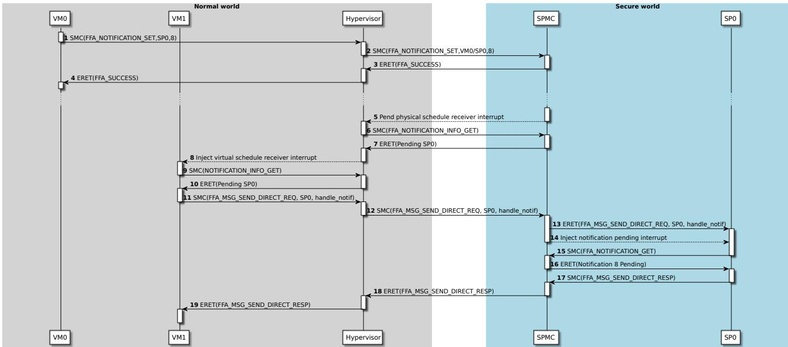  
Figure 18.7: VM to SP notification flow

## 18.6.2 Example Indirect messaging flows

The following flow diagrams illustrate how an Indirect message is transmitted between the following combinations of endpoints with the Hypervisor acting as the primary scheduler.

• A VM sends an Indirect message to another VM (see 18.6.2.1 VM to VM Indirect message flow).

• A VM sends an Indirect message to an SP (see 18.6.2.2 VM to SP Indirect message flow).

• An SP sends an Indirect message to a VM (see 18.6.2.3 SP to VM Indirect message flow).

The sequences are simplified and the details in each flow are provided in earlier sections (see 8.2 Indirect messaging).

## 18.6.2.1 VM to VM Indirect message flow

Figure 18.8 illustrates an example sequence VM1 sends an Indirect message to VM0 as follows.

1. VM1 populates a message in its TX buffer and uses the FFA\_MSG\_SEND2 interface to send an Indirect message to VM0.

2. If a system supports sending Indirect messages from an SP to a VM the Hypervisor uses the FFA\_RX\_ACQUIRE interface to obtain the ownership of the RX buffer of VM0 from the SPMC (see 4.10 RX/TX buffers).

3. Hypervisor copies the message from the TX buffer of VM1 to the RX buffer of VM0.

4. Hypervisor injects a notification pending interrupt in VM0.

5. VM0 handles the notification pending interrupt and uses the FFA\_NOTIFICATION\_GET interface to retrieve its pending notifications.

6. Hypervisor returns the bitmap of notifications that are pending for VM0 including the RX buffer full notification.

7. VM0 copies the data from its RX buffer and releases ownership to the Hypervisor (see 4.10 RX/TX buffers).

8. If the Hypervisor obtained ownership of the RX buffer of VM, it uses the FFA\_RX\_RELEASE interface to release ownership back to the SPMC.

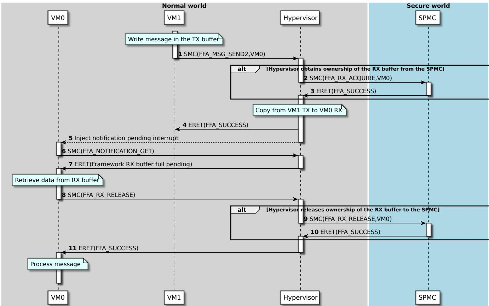  
Figure 18.8: VM to VM Indirect message flow

## 18.6.2.2 VM to SP Indirect message flow

Figure 18.9 illustrates an example sequence where VM0 sends an Indirect message to SP0 in S-EL1 where VM1 is responsible for scheduling SP0 i.e. it implements SP0’s secondary scheduler.

1. VM0 writes a message in its TX buffer and uses the FFA\_MSG\_SEND2 interface to send an Indirect message to SP0.

2. SPMC copies the message from the TX buffer of VM0 to the RX buffer of SP0 and returns success to the Hypervisor

3. SPMC pends the physical schedule receiver interrupt for the Hypervisor to inform it of pending notifications.

4. Hypervisor handles the schedule receiver interrupt and uses the FFA\_NOTIFICATION\_INFO\_GET interface to retrieve the list of endpoints with pending notifications from the SPMC including SP0.

5. Hypervisor injects the virtual schedule receiver interrupt into VM1.

6. VM1 handles the scheduler receiver interrupt and uses the FFA\_NOTIFICATION\_INFO\_GET interface to retrieve the list of endpoints with pending notifications including SP0.

7. VM1 uses the FFA\_MSG\_SEND\_DIRECT\_REQ interface with an IMPLEMENTATION DEFINED content to provide CPU cycles to SP0 and inform it that is has notifications to handle.

8. SP0 use the FFA\_NOTIFICATION\_GET interface to retrieve the list of pending notifications including the RX buffer full notification.

9. SP0 processes the data from its RX buffer and uses the FFA\_RX\_RELEASE interface to return ownership of its RX buffer to the SPMC.

10. SP0 uses the FFA\_MSG\_SEND\_DIRECT\_RESP interface to inform VM1 it has finished processing its notifications.

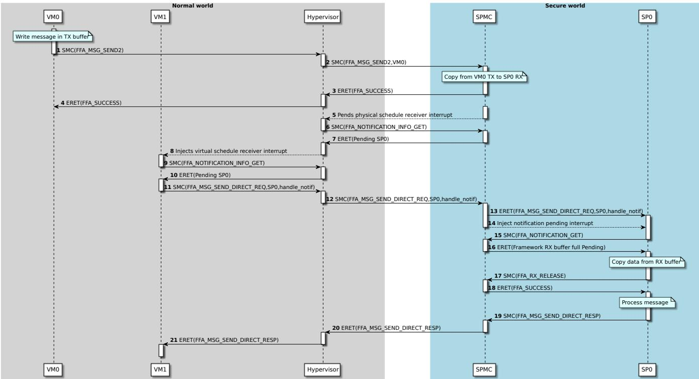  
Figure 18.9: VM to SP Indirect message flow

## 18.6.2.3 SP to VM Indirect message flow

Figure 18.10 illustrates an example sequence where SP0 sends an Indirect message to a VM0 as follows.

1. SP0 writes a message in its TX buffer and uses the FFA\_MSG\_SEND2 interface to send an Indirect message to VM0.

2. SPMC copies the message from the RX buffer of SP0 to the TX buffer of VM0.

3. SPMC pends the physical schedule receiver interrupt for the Hypervisor.

4. Hypervisor handles the schedule receiver interrupt and uses the FFA\_NOTIFICATION\_INFO\_GET interface to retrieve the list of endpoints with pending notifications from the SPMC including VM0.

5. Hypervisor injects the notification pending interrupt in VM0.

6. VM0 uses the FFA\_NOTIFICATION\_GET interface to retrieve the list of pending notifications.

7. Hypervisor uses the FFA\_NOTIFICATION\_GET interface to retrieve the list of pending notifications for VM0 from the SPMC including the RX buffer full notification.

8. Hypervisor returns the bitmaps of notifications that are pending for VM0 including the RX buffer full notification.

9. VM0 copies the data from its RX buffer and releases ownership to the Hypervisor (see 4.10 RX/TX buffers).

10. Hypervisor uses the FFA\_RX\_RELEASE interface to return the ownership of the RX buffer of VM0 to the SPMC.

Chapter 18. Appendix 18.6. Example notification and Indirect messaging flows  
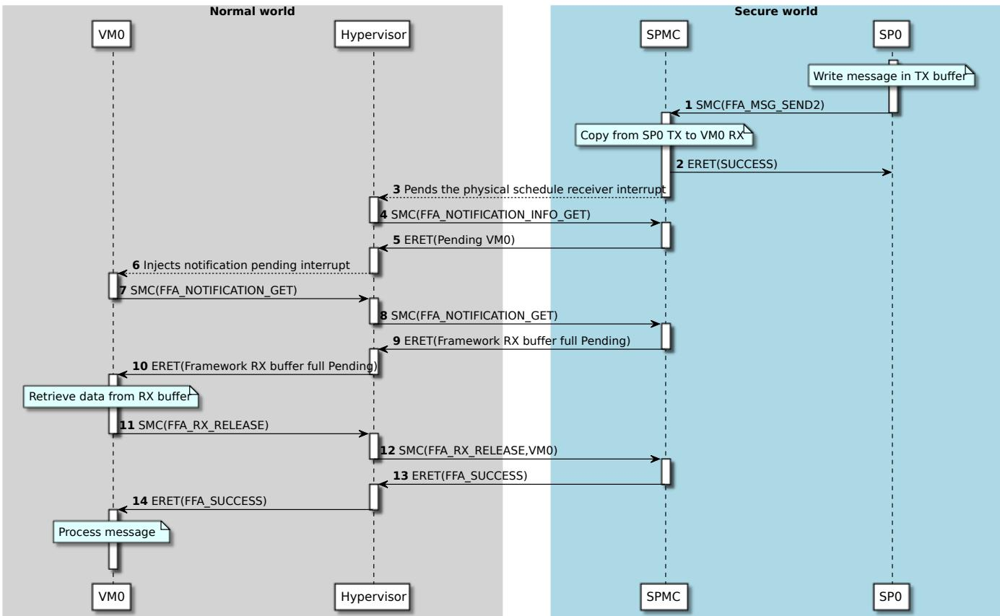  
Figure 18.10: SP to VM Indirect message flow

## 18.7 Inter-partition setup protocol

D<sub>0288</sub> The Framework specifies the Inter-partition setup protocol which defines a set of partition messages to enable setup of notifications between a pair of partitions.

D<sub>0289</sub> A canonical UUID is used to identify the Inter-partition setup protocol.

Inter-partition setup protocol service UUID: e474d87e-5731-4044-a727-cb3e8cf3c8df

R<sub>0290</sub> The following ABIs are used to transmit messages of the Inter-partition setup protocol.

• FFA\_MSG\_SEND\_DIRECT\_REQ2.

• FFA\_MSG\_SEND\_DIRECT\_RESP2.

I<sub>0291</sub> For each message a request and response encoding is specified.

I<sub>0292</sub> A receiver of a request message uses the Return status code field in the response message to inform the sender the status of the messaging processing.

R<sub>0293</sub> If a protocol message is not supported by a service in an endpoint, it returns the NOT\_SUPPORTED error code in the return status code field.

Issue Additional partition messages will be added to the Inter-partition setup protocol in a future version of the specification. These messages include the abilities to perform version negotiation of the supported protocol messages and for a caller to request a callee to map and unmap memory.

## 18.7.1 Notification registration for a service in an endpoint

I<sub>0294</sub> A Sender uses the notification registration message to inform a Receiver about one or more notifications IDs and associated cookies that have been bound to the Receiver.

X<sub>0295</sub> A Sender can use this message to inform a Receiver of notifications that are available for it to signal. A Receiver uses an IMPLEMENTATION DEFINED cookie value to map a notification ID to a specific purpose.

D<sub>0296</sub> Table 18.25 describes the message payload encoding of a direct message.

Table 18.25: Direct message for notification registration

<table><tr><td>Register</td><td>Parameter</td></tr><tr><td>w0</td><td>· FFA_MSG_SEND_DIRECT_REQ2 (0xC400008D).</td></tr><tr><td>w1</td><td>· Sender and Receiver endpoint IDs. - Bits[31:16]: Sender endpoint ID. - Bits[15:0]: Receiver endpoint ID.</td></tr><tr><td>x2</td><td>· Bytes[0. . . 7] of Inter-partition setup protocol UUID with byte 0 in the low-order bits.</td></tr><tr><td>x3</td><td>· Bytes[8. . . 15] of Inter-partition setup protocol UUID with byte 8 in the low-order bits.</td></tr><tr><td>x4</td><td>· Reserved (SBZ).</td></tr><tr><td>x5</td><td>· Bytes[0. . . 7] of Sender service UUID with byte 0 in the low-order bits.</td></tr><tr><td>x6</td><td>· Bytes[8. . . 15] of Sender service UUID with byte 8 in the low-order bits.</td></tr><tr><td>x7</td><td>· Bytes[0. . . 7] of Receiver service UUID with byte 0 in the low-order bits.</td></tr><tr><td>x8</td><td>· Bytes[8. . . 15] of Receiver service UUID with byte 8 in the low-order bits.</td></tr></table>

Chapter 18. Appendix 18.7. Inter-partition setup protocol

<table><tr><td>Register</td><td>Parameter</td></tr><tr><td>x9</td><td>Message information.- Bits[63:9]: Reserved (MBZ).- Bit[8]: Message direction.* b’0: Request message.- Bits[7:3]: Reserved (MBZ).- Bits[2:0]: Message ID.* b’010: Notification registration for a service in Receiver identified by the Receiver service UUID.</td></tr><tr><td>x10</td><td>Bits[63:9]: Reserved (MBZ).Bits[8:0]: Count oftuples encoded in this request.- 1 &lt;= Count &lt;= 7.</td></tr><tr><td>x11-x17</td><td>tuples. Encoding of each 64-bit tuple is as follows.- Bits[63:32]: Cookie value.- Bit[31:23]: Notification ID associated with the cookie value.- Bits[22:1]: Reserved (MBZ).- Bit[0]: Per-vcpu notification flag.* b’0: Notification is a global notification.* b’1: Notification is a per-vcpu notification.If count &lt; 7, remaining registers contents are Reserved (SBZ).</td></tr></table>

The Receiver sends a notification registration response message to acknowledge receipt of a notification registration request.

The Receiver uses the Return Status Code field in x10 to indicate whether it successfully processed the request message.

0299 If a Receiver fails to process a notification contained in the request message, the Receiver takes the following actions.

• The Receiver does not attempt to register any other notifications contained within the request message.

• The Receiver performs an unregistration for any notification previously registered as part of the request message.

• The Receiver sets the return status code field to the appropriate error code.

The return status code is only set to Success if all notification IDs contained in the request are successfully registered.

S<sub>0301</sub> In case of failure, the Sender could take one of the following actions.

• Abort the notification registration process and unbind all notifications contained within the request message.

• Attempt to resend a notification registration request with a reduced number of notifications.

Table 18.26 describes the message payload encoding of a direct message.

Table 18.26: Direct message response for notification registration

<table><tr><td>Register</td><td>Parameter</td></tr><tr><td>w0</td><td>· FFA_MSG_SEND_DIRECT_RESP2 (0xC400008E).</td></tr><tr><td>w1</td><td>· Source and Destination endpoint IDs. - Bits[31:16]: Source endpoint ID. - Bits[15:0]: Destination endpoint ID.</td></tr><tr><td>x2</td><td>Reserved (SBZ).</td></tr><tr><td>x3</td><td>Reserved (SBZ).</td></tr><tr><td>x4</td><td>Reserved (SBZ).</td></tr><tr><td>x5</td><td>Bytes[0. . . 7] of Source service UUID with byte 0 in the low-order bits.</td></tr><tr><td>x6</td><td>Bytes[8. . . 15] of Source service UUID with byte 8 in the low-order bits.</td></tr><tr><td>x7</td><td>Bytes[0. . . 7] of Destination service UUID with byte 0 in the low-order bits.</td></tr><tr><td>x8</td><td>Bytes[8. . . 15] of Destination service UUID with byte 8 in the low-order bits.</td></tr><tr><td>x9</td><td>Message information.- Bits[63:9]: Reserved (MBZ).- Bit[8]: Message direction.* b'1: Response message.- Bits[7:3]: Reserved (MBZ).- Bits[2:0]: Message ID.* b'010: Notification registration for a service in Source identified by the Source service UUID.</td></tr><tr><td>x10</td><td>Bits[63:8]: Reserved (MBZ).Bits[7:0]: Return status code.- 0: SUCCESS.* Notification registration was successful.- -1: NOT_SUPPORTED.* Service in Source does not support FF-A notifications.- -2: INVALID_PARAMETERS.* Unrecognized service UUID.* Count of cookies is invalid.* Notification ID or cookie is invalid.* Notification ID is already in use.- -3: NO_MEMORY.* Not enough resources to process request.</td></tr><tr><td>x11-x17</td><td>Reserved (SBZ).</td></tr></table>

## 18.7.2 Notification unregistration for a service in an endpoint

I<sub>0303</sub> A Sender uses the notification unregistration message to inform a Receiver that one or more notifications IDs and associated cookies have been unbound from the Receiver.

A Sender can use this message to inform a Receiver of notifications that are no longer available for it to signal.

D<sub>0305</sub> Table 18.27 describes the message payload encoding of a direct message.

Table 18.27: Direct message for notification unregistration

<table><tr><td>Register</td><td>Parameter</td></tr><tr><td>w0</td><td>· FFA_MSG_SEND_DIRECT_REQ2 (0xC400008D).</td></tr><tr><td>w1</td><td>· Sender and Receiver endpoint IDs. - Bits[31:16]: Sender endpoint ID. - Bits[15:0]: Receiver endpoint ID.</td></tr></table>

Chapter 18. Appendix 18.7. Inter-partition setup protocol

<table><tr><td>Register</td><td>Parameter</td></tr><tr><td>x2</td><td>Bytes[0. . . 7] of Inter-partition setup protocol UUID with byte 0 in the low-order bits.</td></tr><tr><td>x3</td><td>Bytes[8. . . 15] of Inter-partition setup protocol UUID with byte 8 in the low-order bits.</td></tr><tr><td>x4</td><td>Reserved (SBZ).</td></tr><tr><td>x5</td><td>Bytes[0. . . 7] of Sender service UUID with byte 0 in the low-order bits.</td></tr><tr><td>x6</td><td>Bytes[8. . . 15] of Sender service UUID with byte 8 in the low-order bits.</td></tr><tr><td>x7</td><td>Bytes[0. . . 7] of Receiver service UUID with byte 0 in the low-order bits.</td></tr><tr><td>x8</td><td>Bytes[8. . . 15] of Receiver service UUID with byte 8 in the low-order bits.</td></tr><tr><td>x9</td><td>Message information.- Bits[63:9]: Reserved (MBZ).- Bit[8]: Message direction.* b’0: Request message.- Bits[7:3]: Reserved (MBZ).- Bits[2:0]: Message ID.* b’011: Notification unregistration for a service in Receiver identified by the Receiver service UUID.</td></tr><tr><td>x10</td><td>Bits[63:9]: Reserved (MBZ).Bits[8:0]: Count oftuples encoded in this request.- 1 &lt;= Count &lt;= 7.</td></tr><tr><td>x11-x17</td><td>tuples. Encoding of each 64-bit tuple is as follows.- Bits[63:32]: Cookie value.- Bits[31:9]: Reserved (MBZ).- Bits[8:0]: Notification ID associated with the cookie value.If count &lt; 7, remaining registers contents are Reserved (SBZ).</td></tr></table>

The Receiver sends a notification unregistration response message to acknowledge the unavailability of one for more notifications.

I<sub>0307</sub> The Receiver uses the Return Status Code field in x10 to indicate whether it successfully processed the request message and unregistered all notification contained within the message.

The Receiver ensures that either all notifications contained with the request message are unregistered or none are.

Table 18.28 describes the message payload encoding of a direct message.

Table 18.28: Direct message response for notification unregistration

<table><tr><td>Register</td><td>Parameter</td></tr><tr><td>w0</td><td>· FFA_MSG_SEND_DIRECT_RESP2 (0xC400008E).</td></tr><tr><td>w1</td><td>· Source and Destination endpoint IDs. - Bits[31:16]: Source endpoint ID. - Bits[15:0]: Destination endpoint ID.</td></tr><tr><td>x2</td><td>· Reserved (SBZ).</td></tr><tr><td>x3</td><td>· Reserved (SBZ).</td></tr><tr><td>x4</td><td>· Reserved (SBZ).</td></tr></table>

Chapter 18. Appendix 18.7. Inter-partition setup protocol

<table><tr><td>Register</td><td>Parameter</td></tr><tr><td>x5</td><td>Bytes[0. . . 7] of Source service UUID with byte 0 in the low-order bits.</td></tr><tr><td>x6</td><td>Bytes[8. . . 15] of Source service UUID with byte 8 in the low-order bits.</td></tr><tr><td>x7</td><td>Bytes[0. . . 7] of Destination service UUID with byte 0 in the low-order bits.</td></tr><tr><td>x8</td><td>Bytes[8. . . 15] of Destination service UUID with byte 8 in the low-order bits.</td></tr><tr><td>x9</td><td>Message information.- Bits[63:9]: Reserved (MBZ).- Bit[8]: Message direction.* b&#x27;1: Response message.- Bits[7:3]: Reserved (MBZ).- Bits[2:0]: Message ID.* b&#x27;011: Notification unregistration for a service in Source identified by the Source service UUID.</td></tr><tr><td>x10</td><td>Bits[63:8]: Reserved (MBZ).Bits[7:0]: Return status code for receipt of the unregistration message.- 0: SUCCESS.* Notification unregistration was successful.- -1: NOT_SUPPORTED.* Service in Source does not support FF-A notifications.- -2: INVALID_PARAMETERS.* Unrecognized service UUID.* Count of notification IDs is invalid.* Notification ID or cookie is invalid.- -3: NO_MEMORY.* Not enough resources to process request.</td></tr><tr><td>x11-x17</td><td>Reserved (SBZ).</td></tr></table>

## 18.8 ACPI usage of FF-A

ACPI-based implementations can leverage FF-A protocols to request platform services from secure partitions. This is enabled by the FF-A ACPI device and it supports the following operations.

• ACPI platform firmware can register for FF-A notifications using FF-A Device Properties (see 18.8.1 FF-A ACPI Device.

• Operating Systems can signal errors and FF-A notifications to ACPI platform firmware using the FF-A Device Specific Method (DSM).

I<sub>0311</sub> The Arm Functional Fixed Hardware (FFH) specification [14] specifies FFH Operation Regions to invoke FF-A calls from ACPI platform firmware. FFH can be used even when an FF-A Device is not present.

## 18.8.1 FF-A ACPI Device

D<sub>0312</sub> The FF-A ACPI Device uses HID ARML0002.

R<sub>0313</sub> The ACPI FF-A Device must be implemented if ACPI platform firmware needs to register for FF-A notifications.

R<sub>0314</sub> A platform can implement only a single FF-A device.

R<sub>0315</sub> The FF-A device must be declared under the system bus (\_SB) scope.

## 18.8.2 FF-A Device Properties

I<sub>0316</sub> FF-A Device properties are represented using the FF-A Device Properties UUID in a Device Specific Data (\_DSD) ACPI configuration object as specified in [15]. The UUID is defined as:

FF-A Device Properties UUID: c08c3233-b316-4723-a9d7-e21b7ac0fb6a

## 18.8.2.1 FF-A Notifications Property

D<sub>0317</sub> FF-A Notification Property is represented using the Key arm-arml0002-ffa-ntf-bind.

The Value corresponding to the FF-A Notification Property is a variable length Package containing the following elements.

Listing 18.1: FF-A Notification Property definition  
```txt
Package {
Revision, // Integer (DWORD)
Count, // Integer (DWORD)
NTF_Package[1], // Package
...
NTF_Package[N] // Package
}
```

Table 18.30: FF-A Notification Property Package encoding

<table><tr><td>Element</td><td>Object Type</td><td>Description</td></tr><tr><td>Revision</td><td>Integer (DWORD)</td><td>The revision number of the package.Revision is a 32-bit unsigned integer, where the upper 16 bits are the major revision, and the lower 16 bits are the minor revision.The following rules apply to the version numbering:- Higher numbers denote newer versions.- Different major revision values indicate possibly incompatible changes. For two versions, A and B, which differ in major revision, and where B is higher than A, the following might be true:* B can remove elements or fields that were present in A.* B can add new elements or fields that were not present A.* B can modify the behavior or elements or fields that are also present in A.- Minor revisions allow extensions but must retain compatibility. For two versions, A and B, that differ only in the minor revision, and where B is higher than A, the following must hold:* Every element or field in A must also be present in B, and work with compatible effect.</td></tr><tr><td>Count</td><td>Integer (DWORD)</td><td>Current revision is 0x00010000, which corresponds to v1.0.</td></tr><tr><td>NTF_Package[i]</td><td>Package</td><td>Count of following NTF Packages.A variable length package containing the cookies for which notifications are required from a specified Service UUID as defined in Listing 18.2.</td></tr></table>

D<sub>0319</sub> Each NTF\_Package contains the following elements.

<table><tr><td></td><td>Listing 18.2: NTF_Package definition</td></tr><tr><td>Package {</td><td></td></tr><tr><td>Service_UUID, // Buffer</td><td></td></tr><tr><td>Cookie_Package // Package</td><td></td></tr><tr><td>}</td><td></td></tr></table>

Table 18.31: FF-A NTF\_Package encoding

<table><tr><td>Element</td><td>Object Type</td><td>Description</td></tr><tr><td>Service_UUID</td><td>Buffer</td><td>Buffer containing the Service UUID of the Secure Partition Service which asserts FF-A notifications.The UUID must be specified using the ToUUID ASL operator.</td></tr><tr><td>Cookie_Package</td><td>Package</td><td>A variable length Package which represents abstract functionalities notified by the Service UUID as defined in Listing 18.3.</td></tr></table>

D<sub>0320</sub> Each Cookie\_Package is a variable length package containing the following elements.

## Listing 18.3: Cookie\_Package definition

```go
Package {
    Cookie[1], // Integer (DWORD)
    ...
    Cookie[N] // Integer (DWORD)
}
```

Table 18.32: FF-A Cookie\_Package encoding

<table><tr><td>Element</td><td>Object Type</td><td>Description</td></tr><tr><td>Cookie[i]</td><td>Integer (DWORD)</td><td>• A unique integer value which represents a functionality indicated by a notification from the Service UUID.</td></tr></table>

I<sub>0321</sub> The number of cookies and Service UUIDs implemented by a platform is IMPLEMENTATION DEFINED.

I<sub>0322</sub> The functionality represented by a cookie is an IMPLEMENTATION DEFINED contract between ACPI platform firmware and the Secure Partition.

I<sub>0323</sub> An empty Cookie\_Package indicates that no notification is required from the Service UUID.

R<sub>0324</sub> Service\_UUIDs must be globally unique.

R<sub>0325</sub> Cookie values must be unique within the same Service UUID.

I<sub>0326</sub> The mapping of a cookie to an FF-A Notification ID, and its subsequent binding and enablement is the responsibility of the Operating System (see 18.8.4 FF-A Driver Responsibilities).

R<sub>0327</sub> A cookie must be mapped to a single FF-A Notification ID.

R<sub>0328</sub> An FF-A Notification ID must not be mapped to more than one cookie.

I<sub>0329</sub> An example FF-A Notification Property definition is illustrated below:

Listing 18.4: FF-A Notification Property definition  
```groovy
Name (_DSD, Package() {
    ToUUID("c08c3233-b316-4723-a9d7-e21b7ac0fb6a"), // FF-A Device Properties UUID
    Package() {
    Package(2) {
    "arm-arm10002-ffa-ntf-bind", // Key
    Package() { // Value
    0x00010000, // Revision
    2, // Count of following packages
    Package () {
    ToUUID("17b862a4-1806-4faf-86b3-089a58353861"), // Service_UUID
    Package () {
    0x00, // Cookie1 (UINT32)
    0x01, // Cookie2
    0x2014, // Cookie3
    0x3033 // Cookie4
    }
    }
    Package () {
    ToUUID("b510b3a3-59f6-4054-ba7a-ff2eb1eac765"), // Service_UUID
    Package () {
    0x00, // Cookie1
    }
    }
    }
}
```

<table><tr><td>}</td></tr><tr><td>}) // _DSD()</td></tr></table>

## 18.8.3 FF-A Device Specific Method (\_DSM)

D<sub>0330</sub> The FF-A ACPI DSM allows the Operating System to signal errors and notifications to ACPI platform firmware. The \_DSM function list is specified below.

Table 18.33: \_DSM Function Table

<table><tr><td>Function Index</td><td>Description</td></tr><tr><td>0</td><td>Query implemented functions</td></tr><tr><td>1</td><td>FF-A Notify</td></tr><tr><td>2</td><td>Cookie-specific Notification Binding Error</td></tr><tr><td>3</td><td>FF-A Generic Notification Binding Error</td></tr></table>

D<sub>0331</sub> The \_DSM UUID used in this version of the specification is 7681541e-8827-4239-8d9d-36be7fe12542.

## 18.8.3.1 Query Implemented Functions

I<sub>0332</sub> Returns the functions which are implemented by the \_DSM.

Table 18.34: \_DSM implemented functions query encoding

<table><tr><td>Arguments</td><td>Description</td></tr><tr><td>Arg0</td><td>A buffer containing the UUID 7681541e-8827-4239-8d9d-36be7fe12542, represented in the same byte order as that generated by the ToUUID ASL operator.</td></tr><tr><td>Arg1</td><td>An Integer containing the Revision ID (=1).</td></tr><tr><td>Arg2</td><td>An integer containing the Function Index (=0).</td></tr><tr><td>Arg3</td><td>Reserved (SBZ).</td></tr></table>

D<sub>0334</sub> Return Value: A buffer containing the function index bitfield as specified in ACPI [16].

## 18.8.3.2 FF-A Notify

I<sub>0335</sub> Signals an FF-A notification to ACPI platform firmware.

Table 18.35: \_DSM FF-A notify encoding

<table><tr><td>Arguments</td><td>Description</td></tr><tr><td>Arg0</td><td>A buffer containing the UUID7681541e-8827-4239-8d9d-36be7fe12542, represented in the same byte order as that generated by the ToUUID ASL operator.</td></tr><tr><td>Arg1</td><td>An Integer containing the Revision ID (=1).</td></tr><tr><td>Arg2</td><td>• An integer containing the Function Index (=1).</td></tr><tr><td>Arg3</td><td>• Notification Package as defined in Listing 18.5.</td></tr></table>

<table><tr><td></td><td>Listing 18.5: Notification Package definition</td></tr><tr><td colspan="2">Package(2) {</td></tr><tr><td colspan="2">ServiceUUID, // Buffer</td></tr><tr><td colspan="2">Cookie // Integer (DWORD)</td></tr><tr><td colspan="2">}</td></tr></table>

Table 18.36: \_DSM Notification package encoding

<table><tr><td>Element</td><td>Object Type</td><td>Description</td></tr><tr><td>Service_UUID</td><td>Buffer</td><td>Buffer containing the Service UUID of the Secure Partition Service which asserts FF-A notifications.The UUID should be represented in the buffer in same byte order as that generated by the ToUUID ASL operator.</td></tr><tr><td>Cookie</td><td>Integer (DWORD)</td><td>The cookie for which the notification was asserted by the Service_UUID.</td></tr></table>

D<sub>0337</sub> Return Value: None

## 18.8.3.3 Cookie-specific Notification Binding Error

I<sub>0338</sub> Signals the failure to bind an FF-A notification for the cookie and Service UUID specified. Platform Firmware should not depend on FF-A notification for the indicated functionality.

Table 18.37: \_DSM Cookie-specific Notification Binding Error encoding

<table><tr><td>Arguments</td><td>Description</td></tr><tr><td>Arg0</td><td>A buffer containing the UUID 7681541e-8827-4239-8d9d-36be7fe12542, represented in the same byte order as that generated by the ToUUID ASL operator.</td></tr><tr><td>Arg1</td><td>An Integer containing the Revision ID (=1).</td></tr><tr><td>Arg2</td><td>An integer containing the Function Index (=2).</td></tr><tr><td>Arg3</td><td>Binding Error Package as defined in Listing 18.6.</td></tr></table>

Listing 18.6: Notification Package definition

<table><tr><td colspan="2">Package(2) {</td></tr><tr><td>ServiceUUID,</td><td>// Buffer</td></tr><tr><td>Cookie</td><td>// Integer (DWORD)</td></tr><tr><td>}</td><td></td></tr></table>

Table 18.38: \_DSM Binding Error package encoding

<table><tr><td>Element</td><td>Object Type</td><td>Description</td></tr><tr><td>Service_UUID</td><td>Buffer</td><td>Buffer containing the Service UUID of the Secure Partition Service which asserts FF-A notifications.The UUID should be represented in the buffer in same byte order as that generated by the ToUUID ASL operator.</td></tr><tr><td>Cookie</td><td>Integer (DWORD)</td><td>The cookie corresponding to the Service_UUID for which notification binding failed.</td></tr></table>

D<sub>0340</sub> Return Value: None

## 18.8.3.4 FF-A Generic Notification Binding Error

I<sub>0341</sub> Signals generic FF-A notification binding failure which results in complete loss of all FF-A notification functionality. The ACPI platform firmware should not depend on FF-A notifications.

Table 18.39: \_DSM FF-A Generic Notification Binding Error encoding

<table><tr><td>Arguments</td><td>Description</td></tr><tr><td>Arg0</td><td>A buffer containing the UUID 7681541e-8827-4239-8d9d-36be7fe12542, represented in the same byte order as that generated by the ToUUID ASL operator.</td></tr><tr><td>Arg1</td><td>An Integer containing the Revision ID (=1).</td></tr><tr><td>Arg2</td><td>An integer containing the Function Index (=3).</td></tr><tr><td>Arg3</td><td>Unused.</td></tr></table>

D<sub>0343</sub> Return Value: None

## 18.8.4 FF-A Driver Responsibilities

I<sub>0344</sub> The FF-A driver queries the DSD object to retrieve the list of notification packages.

R<sub>0345</sub> If the system does not support FF-A notifications, the FF-A driver invokes the FF-A Generic Notification Binding Error function (see 18.8.3.4 FF-A Generic Notification Binding Error).

R<sub>0346</sub> Before invoking any FF-A ABI, the FF-A driver converts the UUID provided by ASL into the UUID format defined in [8].

I<sub>0347</sub> The FF-A driver uses an FF-A discovery mechanism (see Chapter 6 Identification and Discovery) to retrieve the endpoint ID that is identified by the UUID.

R<sub>0348</sub> If the UUID does not identify a unique endpoint, the FF-A driver invokes the Cookie-specific Notification Binding Error function (see 18.8.3.3 Cookie-specific Notification Binding Error) to signal failure for the associated cookies.

R<sub>0349</sub> For each cookie in a Cookie\_Package, the FF-A driver performs the following steps:

• Allocate and bind an IMPLEMENTATION DEFINED notification ID to the endpoint ID identified by the Service UUID in the Cookie\_Package, using the FFA\_NOTIFICATION\_BIND or FFA\_NOTIFICATION\_BIND2 interfaces.

• Maintain a mapping between the allocated FF-A notification ID and the cookie to enable retrieval of the cookie ID when a notification is signalled.

• Use an FF-A notification registration inter-partition setup message to inform the receiving endpoint of the bound notification ID and associated cookie (see 18.7.1 Notification registration for a service in an endpoint).

• Parse the response message to determine the status of the registration request and take the appropriate actions.

S<sub>0350</sub> The FF-A driver may use a single notification registration message to inform the receiver about multiple bound notification IDs for the same receiver.

R<sub>0351</sub> For each notification that the receiver fails to successfully acknowledge, the FF-A driver unbinds the corresponding notification and invokes the Cookie-specific Notification Binding Error function (see 18.8.3.3 Cookie-specific Notification Binding Error).

An example of the notification registration is illustrated in Figure 18.11.

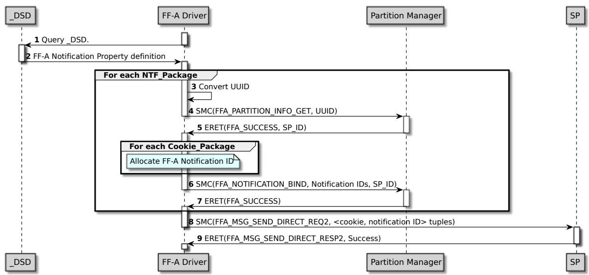  
Figure 18.11: Example ACPI FF-A notification registration

R<sub>0353</sub> When the system signals an FF-A notification that the FF-A driver has previously bound on behalf of ASL, the driver performs the following steps:

• Determine the cookie value associated with the signalled notification ID.

• Invoke the FF-A notify function (see 18.8.3.2 FF-A Notify).

An example of the notification signalling flow is illustrated in Figure 18.12.

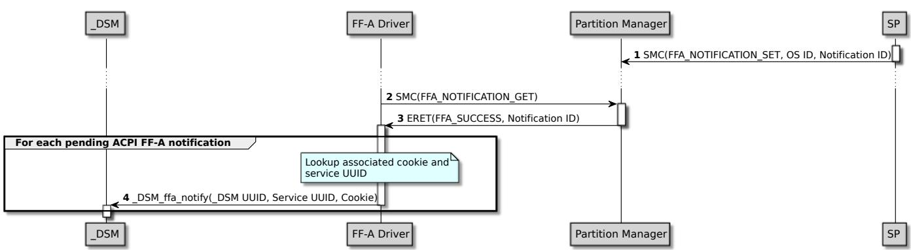  
Figure 18.12: Example ACPI FF-A notification signalling

## 18.9 Partition lifecycle messages

The Framework defines the following framework messages to support the lifecycle of a partition:

• A framework message to stop a partition execution context. See also 18.9.1 Partition stop request.

• A framework message to respond to a request to stop a partition execution context. See also 18.9.2 Partition stop response.

## 18.9.1 Partition stop request

D<sub>0356</sub> The partition stop request is a framework message that is used to request an SP execution context to enter the stopped state. See also:

• 7.2.6 Stopping state.

• 7.2.3 Stopped state.

R<sub>0357</sub> The sender of a partition stop request message is the SPMC.

R<sub>0358</sub> The receiver of a partition stop request message is an SP.

D<sub>0359</sub> The partition stop request message is a request to stop without live activation if the partition will be either deleted or restarted. Otherwise, the partition stop request message is a request to stop for live activation and the partition is undergoing live activation. See also:

• 18.10 Live firmware activation.

I<sub>0360</sub> Stop request reason is b’0 in a partition stop request to stop without live activation.

I<sub>0361</sub> Stop request reason is b’1 in a partition stop request to stop for live activation.

Table 18.40: Partition stop request message encoding

<table><tr><td>Register</td><td>Parameter</td></tr><tr><td>w0</td><td>· FFA_MSG_SEND_DIRECT_REQ Function ID (0xC400006F).</td></tr><tr><td>w1</td><td>· Sender and Receiver endpoint IDs. - Bit[31:16]: SPMC ID. - Bit[15:0]: SP ID.</td></tr><tr><td>w2</td><td>· Message flags. - Bit[31] = b&#x27;1: Framework message. - Bit[30:8] = 0: Reserved (MBZ). - Bit[7:0] = b&#x27;00001010: Message to request an SP execution context to stop.</td></tr><tr><td>x3</td><td>· Stop request flags. - Bit[63:1]: Reserved (MBZ). - Bit[0]: Stop request reason. * b&#x27;0: Request to stop without live activation. * b&#x27;1: Request to stop for live activation.</td></tr><tr><td>x4-x7</td><td>· Reserved (MBZ).</td></tr></table>

## 18.9.2 Partition stop response

D<sub>0362</sub> The partition stop response message is a framework message to respond to a request to stop an SP execution context. See also:

• 18.9.1 Partition stop request.

The sender of a partition stop response message is the SP execution context that was requested to stop.

The receiver of a partition stop response message is the SPMC.

R<sub>0365</sub> An SP execution context enters the waiting state if it sends a partition stop response message with a response status code to signal an error condition.

An SP execution context receives the partition stop request message if it is in the waiting state. If it cannot stop because of a non-fatal error, it sends the partition stop response message with an appropriate response status code, and re-enters the waiting state.

R<sub>0367</sub> An SP execution context enters the aborted state if it sends a partition stop response message and all of the following are true:

• The SP execution context was requested to stop for live activation.

• The response status code in the partition stop response message is SUCCESS.

• At least one of the following is true:

– The base address of the SP live state buffer is invalid.

– The size of the SP live state buffer is invalid.

I<sub>0368</sub> If an SP specifies an invalid SP live state buffer in the partition stop response message, the SPMC treats this as the SP encountering a fatal error condition.

I<sub>0369</sub> An SP execution context invokes the FFA\_ABORT interface to signal a fatal error condition while handling a partition stop request.

## Table 18.41: Partition stop response message encoding

<table><tr><td>Register</td><td>Parameter</td></tr><tr><td>w0</td><td>· FFA_MSG_SEND_DIRECT_RESP Function ID (0xC4000070).</td></tr><tr><td>w1</td><td>· Sender and Receiver endpoint IDs. - Bit[31:16]: SP ID. - Bit[15:0]: SPMC ID.</td></tr><tr><td>w2</td><td>· Message flags. - Bit[31] = b&#x27;1: Framework message. - Bit[30:8] = 0: Reserved (MBZ). - Bit[7:0] = b&#x27;00001011: Response message for a partition stop request.</td></tr><tr><td>x3</td><td>· Partition stop response flags. - Bit[63:8]: Reserved (MBZ). - Bit[7:0]: Response status code. * SUCCESS. · The SP acknowledges the successful handling of the partition stop request. * NOT_SUPPORTED. · The SP does not support the requested operation. * INVALID_PARAMETERS. · One or more parameters contain invalid values. * DENIED. · The SP cannot acknowledge the successful handling of the request due to an IMPLEMENTATION DEFINED reason. * RETRY. · The SP is in a state that prevents it from handling the request. The requester should resend the message.</td></tr><tr><td>x4</td><td>· Base address of the SP live state buffer. MBZ if no state exists. See also 18.10 Live firmware activation. · This field is Reserved (SBZ) if any of the following are true: - The partition stop response status code is != SUCCESS. - The partition stop request was without live activation.</td></tr></table>

Chapter 18. Appendix 18.9. Partition lifecycle messages

<table><tr><td>Register</td><td>Parameter</td></tr><tr><td>x5</td><td>Size of the SP live state buffer. MBZ if no state exists. See also 18.10 Live firmware activation.This field is Reserved (SBZ) if any of the following are true:The partition stop response status code is != SUCCESS.The partition stop request was without live activation.</td></tr><tr><td>x6-x7</td><td>Reserved (SBZ).</td></tr></table>

## 18.10 Live firmware activation

## 18.10.1 Overview

Live Firmware Activation [7] allows an update to a platform firmware component to be activated without rebooting the system. This includes FF-A components in the Secure world.

R<sub>0371</sub> In this version of the Framework, an FF-A component can undergo live activation if all of the following are true:

• The component is a S-EL0 SP, or a S-EL1 SP with a single execution context.

• The SP specifies that it can undergo live activation in its manifest. See also Table 5.1.

Otherwise, the FF-A component cannot undergo live activation.

A partition specifies if it requires CPU rendezvous to undergo live activation in its manifest. The Activation client uses a partition discovery mechanism with the partition image UUID to determine if a partition can undergo live activation with or without CPU rendezvous. See also:

• Table 5.1.

• Table 6.2.

• Chapter 6 Identification and Discovery.

R<sub>0373</sub> An SP with a single execution context does not require CPU rendezvous to undergo live activation.

R<sub>0374</sub> The SPMC does not start an SP if the SP supports live activation but the SPMC does not.

D<sub>0375</sub> When an SP undergoes live activation, the SPMC stops the SP and then starts another image of the same SP, without rebooting the system. The former image is called the current SP image. The latter image is called the target SP image.

I<sub>0376</sub> A simplified example of a live activation of an SP is illustrated in Figure 18.13.

The code, read-only data, and read-write data sections of the current SP image binary are overwrriten by the corresponding sections of the target SP image binary. Other regions of the current SP image are preserved.

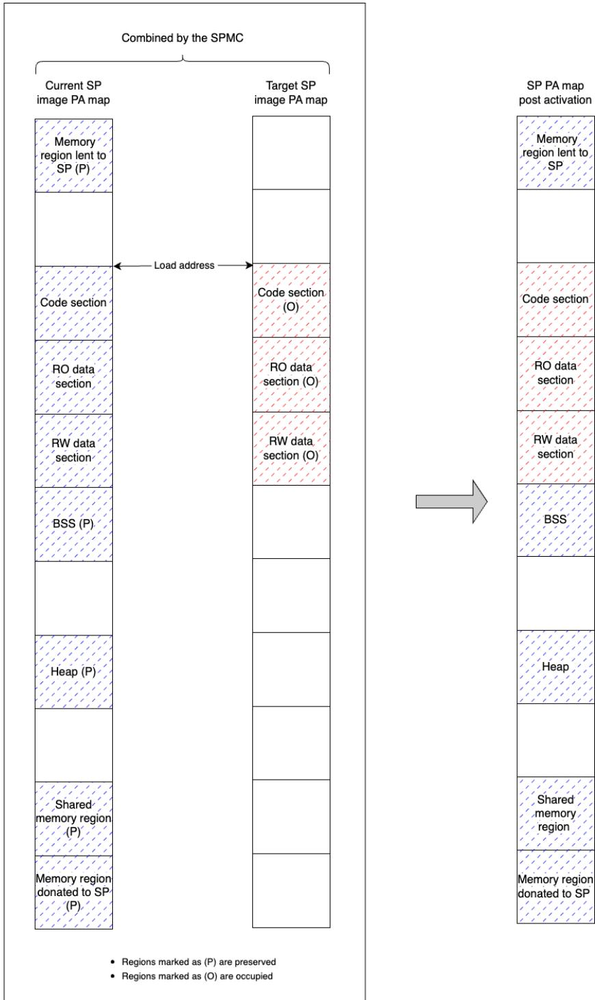  
Figure 18.13: Example in-place SP live activation

I<sub>0377</sub> Live activation of an SP takes place in two phases.

• The SPMC starts the live activation of an SP when it receives a partition live activation start request message from an EL3 LSP managed by the SPMD. In this phase, the SP is stopped and the target SP image is prepared for replacing the current SP image.

• The SPMC finishes the live activation of an SP when it receives a partition live activation finish request message from an EL3 LSP managed by the SPMD. In this phase, the target SP image is started so that it can provide the SP services in lieu of the current SP image.

See also:

• 18.10.2 Start of live activation.

• 18.10.2.1 Partition live activation start request.

• 18.10.3 Completion of live activation.

• 18.10.3.1 Partition live activation finish request.

• 18.10.4 Software flow of live activation.

## 18.10.2 Start of live activation

R<sub>0378</sub> The firmware component GUID and the partition image UUID of an SP are equal.

The LFA Agent at EL3 uses an EL3 LSP to translate LFA SMC invocations for an SP to FF-A messages. The EL3 LSP is managed by the SPMD. The EL3 LSP can discover the presence of an SP that can undergo live activation via the SPMD. The LFA agent uses an IMPLEMENTATION DEFINED mechanism to specify the firmware component GUID of the SP to the SPMD via the EL3 LSP. The SPMD uses the firmware component GUID as the input to the FFA\_PARTITION\_INFO\_GET\_REGS interface. The SPMD informs the LFA Agent about the presence or absence of an SP depending upon the results. If the SP is present, the LFA Agent sends the partition live activation start request message for that SP via the EL3 LSP to the SPMC.

R<sub>0380</sub> Upon receiving a partition live activation start request message, the SPMC does not request an SP to stop via a partition stop request message for live activation, if any of the following are true:

• Any input parameter in the partition live activation start request message is invalid.

– The SPMC sends partition live activation start response message to the EL3 LSP with the INVALID\_PARAMETERS response status code.

• The Entry point offset field or the Load address field in the partition manifest of the target SP image is invalid. – The SPMC sends partition live activation start response message to the EL3 LSP with the INVALID\_PARAMETERS response status code.

• One of the current SP image, or the target SP image does not support live activation.

– The SPMC sends partition live activation start response message to the EL3 LSP with the NOT\_SUPPORTED response status code.

• The SPMC does not support live activation.

– The SPMC sends partition live activation start response message to the EL3 LSP with the NOT\_SUPPORTED response status code.

• The SPMC cannot undertake SP live activation due to a transient IMPLEMENTATION DEFINED reason. • The SPMC cannot undertake SP live activation due to a transient IMPLEMENTATION DEFINED reason.

– The SPMC sends partition live activation start response message to the EL3 LSP with the RETRY response status code.

• All SP execution contexts are available but one or more execution contexts are not in the waiting state. – The SPMC sends partition live activation start response message to the EL3 LSP with the RETRY response status code.

• All SP execution contexts are unavailable because all execution contexts are in the NULL state.

– The SPMC sends partition live activation start response message to the EL3 LSP with the INVALID\_PARAMETERS response status code.

• All SP execution contexts are unavailable because one or more execution contexts are in the aborted state. – The SPMC sends partition live activation start response message to the EL3 LSP with the ABORTED response status code.

• One or more SP execution contexts are unavailable because of a reason not covered by any of the conditions above.

– The SPMC sends partition live activation start response message to the EL3 LSP with the DENIED response status code.

Otherwise, the SPMC sends a partition stop request message for live activation to each execution context of the SP. See also:

• 18.9.1 Partition stop request.

All properties in the partition manifest of the target SP image that are described in Table 5.1 are ignored by the SPMC except for the following properties:

• Load address.

• Entry point offset.

• Live activation supported.

Issue This version of the Framework assumes that the partition properties of the target SP image and the current SP image are the same as the primary aim of live activation is to update the code section of the SP image with minimal disruption to the services it provides. Hence, the compatibility requirements for each partition property are not specified separately. Instead, the SPMC checks and validates only those properties that have a direct effect on its ability to live activate the SP. Arm requests feedback if this is an acceptable assumption.

D<sub>0382</sub> The current SP image can transfer IMPLEMENTATION DEFINED state to the target SP image in a memory region called the SP live state buffer. see also:

• 18.9.2 Partition stop response.

I<sub>0383</sub> For a S-EL0 SP, the base address of the SP live state buffer is a VA. For a S-EL1 SP, the base address of the SP live state buffer is an IPA.

R<sub>0384</sub> The size of the SP live state buffer is expressed as a count of contiguous pages from the base address. The size of each page is equal to the translation granule size used in the translation regime of the SP.

R<sub>0385</sub> The base address of the SP live state buffer is aligned to the translation granule size used by the SP.

R<sub>0386</sub> The size of the SP live state buffer is a multiple of the translation granule size used by the SP.

Issue The Framework assumes that the SPMC does not map the SP live state buffer in its translation regime. It is possible that the translation granule size used by the SPMC is greater than the translation granule size used by an SP. This might prevent the SPMC from mapping the SP live state buffer. Arm requests feedback if this is an acceptable assumption.

R<sub>0387</sub> The SPMC preserves the Framework state of an SP undergoing live activation, from when the last execution context of an SP enters the stopped state, and until the first execution context of the SP enters the starting state as follows:

• The contents of the following regions are preserved:

– RX/TX buffers of the SP (if mapped).

– Each memory region shared between the current SP image and another endpoint.

– Each memory region that was lent to the current SP image by another endpoint via FFA\_MEM\_LEND.

– Each device MMIO region that is mapped in the translation regime of the current SP image. See also Table 5.3.

• If the RX/TX buffers of the SP are mapped, the ownership state of each buffer is preserved as follows: • If the RX/TX buffers of the SP are mapped, the ownership state of each buffer is preserved as follows:

– If the current SP image is its owner, the target SP image acquires its ownership when it begins execution. – If the SPMC is its owner, the SPMC cannot transfer its ownership to the target SP image through any mechanism until the latter begins execution.

• The bindings of all VM and SP notifications are preserved.

• The pending state of all VM, SP and Framework notifications is preserved.

• For each memory region in the memory map of the current SP image that was shared via FFA\_MEM\_SHARE, or lent via FFA\_MEM\_LEND, irrespective of whether the SP is the Borrower or the Lender of the memory region, the metadata associated with the memory region e.g. memory handle, identity of borrowers and lenders etc, is preserved by the SPMC so that the target SP image can perform the same memory management operations on the memory region as the current SP image.

• The pending state of all Self S-Ints of the SP is preserved.

The SPMC compares the physical address (PA) map of the current SP image and the target SP image to determine if they are compatible for live activation.

The physical address (PA) map of the current SP image is called the current PA map.

The physical address (PA) map of the target SP image is called the target PA map.

R<sub>0391</sub> For each region in a PA map, all of the following are true:

• The physical base address of the region is aligned to the translation granule size of the current SP image.

• The size of the region is equal to the translation granule size of the current SP image in KB.

I<sub>0392</sub> The SPMC visualises the PA maps of both the images as equal size regions so that a direct comparison can be made.

I<sub>0393</sub> The current PA map comprises of the following:

• Regions that are mapped in the translation regime of the SP that is controlled by the SPMC.

• Regions that are not mapped in the translation regime of the SP that is controlled by the SPMC because they have been lent by the SP to other borrower endpoints (see also [1]).

## The target PA map comprises of the following:

• Regions that comprise the contents of the target SP image binary.

• Regions that are described in the manifest of the target SP image.

The Framework assumes that the system integrator provisions a manifest with the target SP image. The system integrator has a choice of reusing the manifest of the current SP image, or creating a new manifest that only describes regions that are to be updated or added during the live activation of the SP.

I<sub>0396</sub> After receipt of a partition live activation start request message, the SPMC determines where the target SP image will be loaded in physical memory. The SPMC can choose to overwrite some or all of the current SP image, or allocate memory for the target SP image that does not overlap at all with the current SP image.

The SPMC parses the manifest of the target SP image to determine which memory regions and device regions must be mapped into the translation regime of the target SP image.

The SPMC uses this information to construct the target PA map so that it can be compared for compatibility with the current PA map.

## See also Table 18.42.

A region in the current PA map is equivalent to a region in the target PA map if all of the following are true:

• The region is present in both PA maps.

• The base physical addresses of both regions are equal.

A region could be present in either the current PA map or the target PA map.

## For example:

• If a memory region is shared with, lent or donated to the current SP image at runtime, it is absent in the target PA map.

• If a memory region is donated by the current SP image at runtime, it is absent in the current PA map but present in the target PA map.

A region could be present in both PA maps.

For example:

• When an SP is initialised, the SPMC could allocate memory for the RX/TX buffers, code section, and data sections based on their description in the SP manifest. The manifest of the target SP image can have the same description of these regions.

• When an SP is initialised, the SPMC maps device MMIO regions in the translation regime of the SP based on their description in the SP manifest. The manifest of the target SP image can have the same description of the device MMIO regions.

## See also Table 18.42.

A region in the current PA map is marked for preservation if it must be preserved during the live activation of the SP.

R<sub>0400</sub> A region in the current PA map is marked for preservation via one of the following mechanisms:

• The region lies entirely in the SP live state buffer.

• The region is part of the Framework state of the SP.

• The region is marked for preservation in the manifest of the current SP image. – See also Table 5.1.

R<sub>0401</sub> If a region in the current PA map is not marked for preservation, it is not mapped in the translation regime of the target SP image.

X<sub>0402</sub> The Framework assumes that some sections in the current SP image will not be marked for preservation since these sections will either be provisioned, or re-initialised via the target SP image during live activation. For example, the code section of the current SP image will not be preserved if the purpose of live activation is to patch the code of the current SP image. If a section is not preserved, it is not mapped in the translation regime of the target SP image.

D<sub>0403</sub> A region in the target PA map is occupied if it is populated with the contents of the target SP image binary. Otherwise, the region is unoccupied.

I<sub>0404</sub> Regions in the target PA map that correspond to the code, read-only data, and read-write data sections in the target SP image binary are occupied.

R<sub>0405</sub> A region that is marked for preservation is preserved if it is unoccupied by its equivalent region.

X<sub>0406</sub> The contents of a region that is marked for preservation will be overwritten if its equivalent region is occupied. Hence, a region cannot be simultaneously preserved and have its contents overwritten by the contents of the target SP image binary. See also Table 18.42.

R<sub>0407</sub> A region in the target PA map can be mapped in the translation regime of the target SP image if all of the following are true:

• It is not equivalent to a region in the current PA map that is marked for preservation.

• No other SP managed by the SPMC is the owner of the region.

Otherwise, the region cannot be mapped in the translation regime of the target SP image, and is ignored by the SPMC.

See also:

• Table 5.2.

• Table 5.3.

• Chapter 5 Setup.

The SPMC can map a region in the target PA map only if does not overlap with a region that is marked for preservation in the current PA map. The region in the target PA map is ignored by the SPMC if this criteria is not met. The region could be occupied or unoccupied.

For example, the current SP image could have lent a memory region that it owns. The memory region would be mapped in the translation regime of one or more other SPs. If the memory region is described in the manifest of the target SP image, it cannot be mapped in its translation regime. The SPMC preserves a lent memory region as a part of Framework state. Its description in the manifest of the target SP image\* is ignored by the SPMC.

## See also Table 18.42.

The current SP image could have donated a memory region that it owned. The memory region would be owned by another SP. If the memory region is described in the manifest of the target SP image, it cannot be mapped in its translation regime\*. The region is ignored by the SPMC. See also Table 18.42.

The valid scenarios where the SPMC checks for compatibility between the current PA map and the target PA map are listed in Table 18.42.

Table 18.42: Scenarios for testing compatibility of PA maps

<table><tr><td>Present in current PA map</td><td>Marked for preservation</td><td>Present in target PA map</td><td>Region is occupied</td><td>Description</td></tr><tr><td>No</td><td>NA</td><td>Yes</td><td>No</td><td>If this is a new region that has been added in the manifest, it is mapped in the translation regime of the target SP image.If the memory region was donated to another SP, live activation will be aborted as the target PA map will conflict with the PA map of the SP that is the current owner of the memory region.</td></tr><tr><td>No</td><td>NA</td><td>Yes</td><td>Yes</td><td>Same as above.</td></tr><tr><td>Yes</td><td>No</td><td>No</td><td>NA</td><td>Region is neither preserved nor mapped in the translation regime of the target SP image.</td></tr><tr><td>Yes</td><td>No</td><td>Yes</td><td>No</td><td>Region is mapped in the translation regime of the target SP image as per its description in its manifest.</td></tr><tr><td>Yes</td><td>No</td><td>Yes</td><td>Yes</td><td>Contents of the equivalent region in the current PA map are updated, and the region is mapped in the translation regime of the target SP image as per its description in its manifest.</td></tr><tr><td>Yes</td><td>Yes</td><td>No</td><td>NA</td><td>Region contents are preserved, and it is mapped in the translation regime of the target SP image using its existing attributes from the current SP image.</td></tr><tr><td>Yes</td><td>Yes</td><td>Yes</td><td>No</td><td>Region contents are preserved, and it is mapped in the translation regime of the target SP image using its existing attributes from the current SP image.The description of the region in the manifest of the target SP image is ignored.</td></tr><tr><td>Yes</td><td>Yes</td><td>Yes</td><td>Yes</td><td>Region cannot be preserved because it is occupied.The description of the region in the manifest of the target SP image is ignored.</td></tr></table>

R<sub>0411</sub> An SP can be live activated if all of the following are true:  
• All regions in the current PA map that are marked for preservation, can be preserved.

• All regions in the target PA map that are not equivalent to a region in the current PA map that is marked for preservation, can be mapped.

• All Framework state of the current SP image can be preserved.

Otherwise, the SP cannot be live activated.

If the SP cannot be live activated, the SPMC sends partition live activation start response message to the EL3 LSP with the ABORTED response status code. The SP enters the aborted state.

S<sub>0413</sub> The SPMC ensures that no part of the target PA map overlaps with the Framework state, or regions in the current PA map that are marked for preservation. Otherwise, the live activation process is terminated.

R<sub>0414</sub> If an SP can be live activated, and if a region in the current PA map is preserved, then all of the following are true:

• The SPMC preserves the contents of the region from when the last execution context of the current SP image enters the stopped state, and until the first execution context of the target SP image enters the starting state.

• If the region was not lent by the current SP image, the SPMC maps the region in the translation regime of the target SP image as follows:

– The base VA or IPA of the region in the current SP image is equal to the base VA or IPA of the region in the target SP image.

– The base PA of the region in the current SP image is equal to the base PA of the region in the target SP image.

– The size of the region in the current SP image is equal to the size of the region in the target SP image.

– The memory region attributes of the region in the current SP image are the same as the memory region attributes of the region in the target SP image.

• If the region is lent by the current SP image, the SPMC maps the region in the translation regime of the target SP image as described above when it is reclaimed.

R<sub>0415</sub> If an SP can be live activated, and if a region in the target PA map is to be mapped, the SPMC maps the region in the translation regime of the target SP image as per its description in the target SP image manifest.

0416 If an SP can be live activated, the SPMC preserves the properties of the regions in the current PA map that are preserved, and it obtains the properties of the regions in the target PA map that must be mapped, from the target SP image manifest.

Upon a successful live activation, the following regions are mapped in the translation regime of the target SP image:

• Regions from the current PA map that were marked for preservation.

• Regions from the target PA map that could be mapped.

An example of an SP live activation is illustrated in Figure 18.14 which has the following characteristics:

• The code section in the target SP image binary is extended by the system integrator.

• The SPMC chooses to load the target SP image binary at a different load address than the current SP image binary.

• The read-write data section in the target SP image binary is extended by the system integrator.

• The data sections of the target SP image binary overwrite the code, read-only data, and read-write data sections of the current SP image binary.

• The heap section in the target SP image is extended by the system integrator such that it is an extension of the existing heap section in the current SP image.

– The heap section is unoccupied since it is only described as a memory region in the target SP image manifest that must be allocated by the SPMC.

See also:

• Figure 18.13.

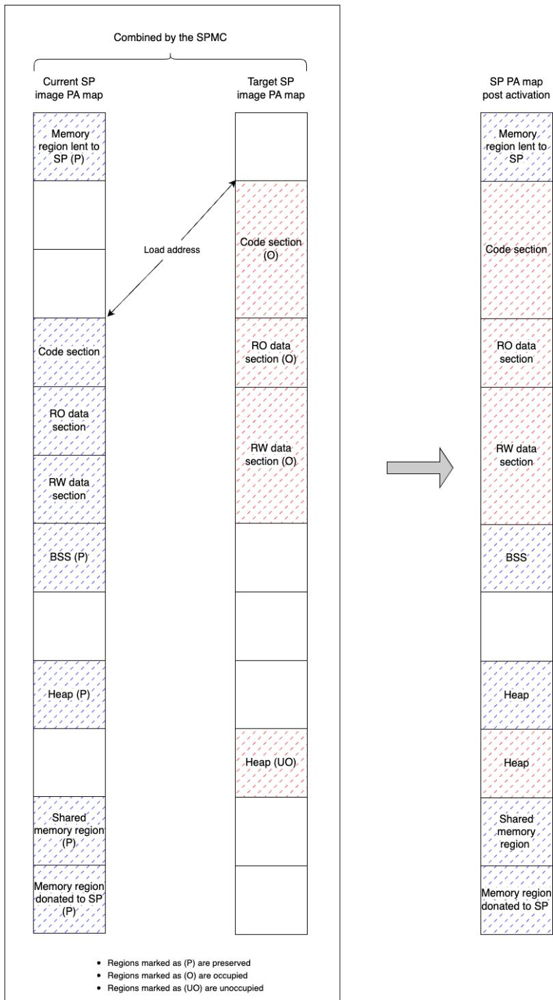  
Figure 18.14: Example SP live activation

R<sub>0419</sub> The SPMC transitions the SP to the created state if all of the following are true:

• The SP is in the stopped state.

• The SP can be live activated.

• The SPMC has performed any additional IMPLEMENTATION DEFINED actions required to transition the SP to the created state.

The SPMC sends the partition live activation start response message with the SUCCESS response status code to

inform the EL3 LSP that live activation of the SP was successfully started.

I<sub>0420</sub> The SPMC sends the partition live activation start response message to inform the LFA agent via the EL3 LSP, that the target SP image is ready to complete live activation. The LFA agent extends the measurement of the target SP image and sends the partition live activation finish request message to instruct the SPMC to complete live activation of the SP. See also:

• 18.10.3.1 Partition live activation finish request.

## 18.10.2.1 Partition live activation start request

D<sub>0421</sub> The partition live activation start request message is a framework message to start live activation of an SP.

R<sub>0422</sub> The sender of a partition live activation start request message is an EL3 LSP managed by the SPMD.

R<sub>0423</sub> The receiver of a partition live activation start request message is the SPMC.

I<sub>0424</sub> The physical base address of the manifest of the target SP image and its size are optional fields. This does not imply that it is possible to live activate an SP without the manifest of the target SP image. It is possible that the manifest is packaged in the target SP image along with the image binary. If this is not the case, this parameter allows the system integrator to package the image binary and the image manifest separately.

R<sub>0425</sub> The physical base addresses of the target SP image and its manifest (if specified) are aligned to the translation granule size used by the SPMC.

R<sub>0426</sub> The sizes of the target SP image and its manifest (if specified) are a multiple of the translation granule size used by the SPMC.

Issue The Framework assumes that the EL3 LSP knows the translation granule size of the SPMC via an TION DEFINED mechanism. Arm requests feedback if this is an acceptable assumption.

Table 18.43: Partition live activation start request message encoding

<table><tr><td>Register</td><td>Parameter</td></tr><tr><td>w0</td><td>· FFA_MSG_SEND_DIRECT_REQ Function ID (0xC400006F).</td></tr><tr><td>w1</td><td>· Sender and Receiver endpoint IDs. - Bit[31:16]: EL3 LSP ID. - Bit[15:0]: SPMC ID.</td></tr><tr><td>w2</td><td>· Message flags. - Bit[31] = b&#x27;1: Framework message. - Bit[30:8] = 0: Reserved (MBZ). - Bit[7:0] = b&#x27;00001100: Request message to start live activation of an SP.</td></tr><tr><td>x3</td><td>· Bit[15:0]: ID of the SP to be live activated. · Bit[63:16]: Reserved (MBZ).</td></tr><tr><td>x4</td><td>· Physical base address of the target SP image.</td></tr><tr><td>x5</td><td>· Count of physically contiguous pages allocated to the target SP image.</td></tr><tr><td>x6</td><td>· Physical base address of the manifest of target SP image. · MBZ if not specified.</td></tr><tr><td>x7</td><td>· Count of physically contiguous pages allocated to the manifest of target SP image. · MBZ if not specified.</td></tr></table>

## 18.10.2.2 Partition live activation start response

D<sub>0427</sub> The partition live activation start response message is a framework message to respond to a request to start live activation of an SP.

R<sub>0428</sub> The sender of a partition live activation start response message is the SPMC.

R<sub>0429</sub> The receiver of a partition live activation start response message is the EL3 LSP managed by the SPMD that started live activation of the SP.

R<sub>0430</sub> If the EL3 LSP receives the partition live activation start response message with SUCCESS as the response status code, then all of the following are true:

• The SP is in the created state.

• The SPMC will inform the SP that it is undergoing a live activation when the SP enters the starting state.

If the EL3 LSP receives the partition live activation start response message with ABORTED as the response status code, then the SP is in the aborted state.

Otherwise, if the SP ID in the partition live activation start request message was valid, the SP is in the same state as it was when the SPMC received the request message.

I<sub>0431</sub> A successful response to a partition live activation start request message implies that the SPMC can transition the target SP image to the starting state upon receipt of a partition live activation finish request message. See also:

• 18.10.3.1 Partition live activation finish request.

Table 18.44: Partition live activation start response message encoding

<table><tr><td>Register</td><td>Parameter</td></tr><tr><td>w0</td><td>· FFA_MSG_SEND_DIRECT_RESP Function ID (0xC4000070).</td></tr><tr><td>w1</td><td>· Sender and Receiver endpoint IDs. - Bit[31:16]: SPMC ID. - Bit[15:0]: EL3 LSP ID.</td></tr><tr><td>w2</td><td>· Message flags. - Bit[31] = b'1: Framework message. - Bit[30:8] = 0: Reserved (MBZ). - Bit[7:0] = b'00001101: Response message for a start live activation request.</td></tr><tr><td>x3</td><td>Live activation start response flags.Bit[63:8]: Reserved (MBZ).- Bit[7:0]: Response status code.* SUCCESS.The SPMC acknowledges successful handling of the partition live activation start request.* NOT_SUPPORTED.The SP or the SPMC does not support the requested operation.* INVALID_PARAMETERS.One or more parameters contain invalid values.* DENIED.The SP or SPMC cannot acknowledge successful handling of the start request due to an IMPLEMENTATION DEFINED reason.The SP cannot be live activated because it is in one of created, stopped, or stopping states.* RETRY.The SPMC is in a transient state that prevents it from handling the live activation start request.The SP cannot be live activated because it is in one of stopped or stopping states.The SP cannot be live activated because at least one of its execution contexts is in one of running, preempted, or blocked states.In all of the above scenarios, the requester can resend the message to retry the operation.* ABORTED.The SP is in the aborted state.</td></tr><tr><td>x4-x7</td><td>Reserved (SBZ).</td></tr></table>

## 18.10.3 Completion of live activation

Upon receiving a partition live activation finish request message, the SPMC does not transition the SP to the starting state if any of the following are true:

• Any input parameter in the partition live activation finish request message is invalid.

– The SPMC sends partition live activation finish response message to the EL3 LSP with the INVALID\_PARAMETERS response status code.

• The SPMC does not support live activation.

– The SPMC sends partition live activation finish response message to the EL3 LSP with the NOT\_SUPPORTED response status code.

• The SP is neither in the created state nor is it undergoing a live activation.

– The SPMC sends partition live activation finish response message to the EL3 LSP with the DENIED response status code.

• The SPMC cannot undertake SP live activation due to a transient IMPLEMENTATION DEFINED reason.

– The SPMC sends partition live activation finish response message to the EL3 LSP with the RETRY response status code.

• All SP execution contexts are unavailable because one or more execution contexts are in the aborted state.

– The SPMC sends partition live activation finish response message to the EL3 LSP with the ABORTED response status code.

Otherwise, the SPMC transitions one or more SP execution contexts to the starting state and informs the first execution context that enters the starting state, that the SP is undergoing live activation by setting the live activation status field to 1 in the live activation information register. See also:

• 18.10.3.2 Partition live activation finish response.

• Table 5.1.

Issue The SPMC does not provide the base address and size of the SP live state buffer to the target SP image. It assumes that this information is known to the SP via an IMPLEMENTATION DEFINED mechanism e.g. internal global variables since the SPMC guarantees that the buffer is mapped in the target SP image in exactly the same manner as it was mapped in the current SP image. Arm requests feedback if this is an acceptable assumption.

R<sub>0433</sub> The SPMC sends the partition live activation finish response message with the SUCCESS response status code to inform the EL3 LSP that live activation of the SP was successfully completed, when the first execution context of the SP enters the waiting state.

Otherwise, the SP enters the aborted state and the SPMC sends the partition live activation finish response message to the EL3 LSP with the ABORTED response status code.

I<sub>0434</sub> Once the first SP execution context transitions to the starting state, the SPMC treats any event apart from entry into the waiting state as a fatal error condition. The SP enters the aborted state and the EL3 LSP is informed about this event.

## 18.10.3.1 Partition live activation finish request

D<sub>0435</sub> The partition live activation finish request message is a framework message to finish live activation of an SP.

R<sub>0436</sub> The sender of a partition live activation finish request message is an EL3 LSP managed by SPMD.

R<sub>0437</sub> The receiver of a partition live activation finish request message is the SPMC.

I<sub>0438</sub> The SP ID field identifies the SP whose live activation should be completed.

## Table 18.45: Partition live activation finish request message encoding

<table><tr><td>Register</td><td>Parameter</td></tr><tr><td>w0</td><td>· FFA_MSG_SEND_DIRECT_REQ Function ID (0xC400006F).</td></tr><tr><td>w1</td><td>· Sender and Receiver endpoint IDs. - Bit[31:16]: EL3 LSP ID. - Bit[15:0]: SPMC ID.</td></tr><tr><td>w2</td><td>· Message flags. - Bit[31] = b&#x27;1: Framework message. - Bit[30:8] = 0: Reserved (MBZ). - Bit[7:0] = b&#x27;00001110: Request message to finish live activation of an SP.</td></tr><tr><td>x3</td><td>· Bit[15:0]: ID of the SP to be live activated. · Bit[63:16]: Reserved (MBZ).</td></tr><tr><td>x4-x7</td><td>· Reserved (SBZ).</td></tr></table>

## 18.10.3.2 Partition live activation finish response

D<sub>0439</sub> The partition live activation finish response message is a framework message to respond to a request to finish live activation of an SP.

R<sub>0440</sub> The sender of a partition live activation finish response message is the SPMC.

R<sub>0441</sub> The receiver of a partition live activation finish response message is the EL3 LSP managed by the SPMD that started live activation of the SP.

If the EL3 LSP receives the partition live activation finish response message with SUCCESS as the response status code, at least one execution of the SP has transitioned from the starting state to the waiting state.

If the EL3 LSP receives the partition live activation start response message with ABORTED as the response status code, then the SP is in the aborted state.

Otherwise, if the SP ID in the partition live activation finish request message was valid, the SP is in the same state as it was when the SPMC received the request message.

I<sub>0443</sub> A successful response to a partition live activation finish request message implies that live activation of the SP was successfully completed. See also:

• 18.10.3.1 Partition live activation finish request.

Table 18.46: Partition live activation finish response message encoding

<table><tr><td>Register</td><td>Parameter</td></tr><tr><td>w0</td><td>· FFA_MSG_SEND_DIRECT_RESP Function ID (0xC4000070).</td></tr><tr><td>w1</td><td>· Sender and Receiver endpoint IDs. - Bit[31:16]: SPMC ID. - Bit[15:0]: EL3 LSP ID.</td></tr><tr><td>w2</td><td>· Message flags. - Bit[31] = b&#x27;1: Framework message. - Bit[30:8] = 0: Reserved (MBZ). - Bit[7:0] = b&#x27;00001111: Response message for a finish live activation request.</td></tr><tr><td>x3</td><td>· Live activation finish response flags. - Bit[63:8]: Reserved (MBZ). - Bit[7:0]: Response status code. * SUCCESS. · The SPMC acknowledges successful handling of the partition live activation finish request. * NOT_SUPPORTED. · The SP or the SPMC does not support the requested operation. * INVALID_PARAMETERS. · One or more parameters contain invalid values. * DENIED. · The SP cannot be live activated because it is not in the created state. * RETRY. · The SPMC is in a transient state that prevents it from handling the live activation finish request. · The requester can resend the message to retry the operation. * ABORTED. · The SP is in the aborted state.</td></tr><tr><td>x4-x7</td><td>· Reserved (SBZ).</td></tr></table>

## 18.10.4 Software flow of live activation

I<sub>0444</sub> Figure 18.15 provides an overview of the flow where an SP undergoes live activation.

Chapter 18. Appendix 18.10. Live firmware activation  
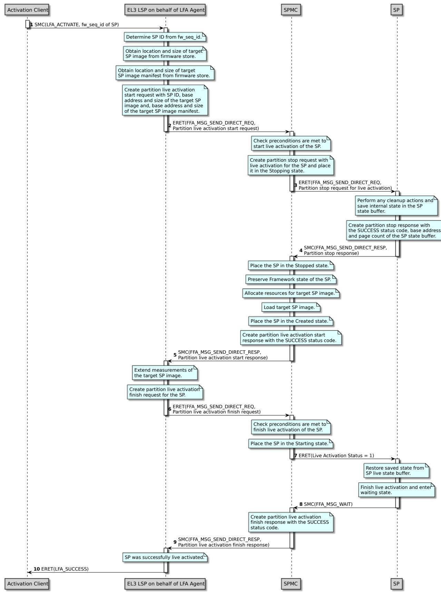  
Figure 18.15: Example SP live activation flow

Terms and abbreviations

<table><tr><td colspan="2">ABI</td></tr><tr><td></td><td>Application Binary Interface</td></tr><tr><td colspan="2">DMA</td></tr><tr><td></td><td>Direct Memory Access</td></tr><tr><td colspan="2">DSP</td></tr><tr><td></td><td>Digital Signal Processor</td></tr><tr><td colspan="2">FF-A</td></tr><tr><td></td><td>Firmware Framework for A-profile</td></tr><tr><td colspan="2">GIC</td></tr><tr><td></td><td>Generic Interrupt Controller</td></tr><tr><td colspan="2">HVC</td></tr><tr><td></td><td>Hypervisor Call</td></tr><tr><td colspan="2">MBP</td></tr><tr><td></td><td>Must be preserved</td></tr><tr><td colspan="2">MBZ</td></tr><tr><td></td><td>Must be zero</td></tr><tr><td colspan="2">ME</td></tr><tr><td></td><td>Managed exit</td></tr><tr><td colspan="2">MM</td></tr><tr><td></td><td>Management Mode</td></tr><tr><td colspan="2">MMIO</td></tr><tr><td></td><td>Memory Mapped Input Output</td></tr><tr><td colspan="2">MP</td></tr><tr><td></td><td>Multi-processing</td></tr><tr><td colspan="2">NS PAS</td></tr><tr><td></td><td>Non-secure Physical Address Space</td></tr><tr><td colspan="2">OS</td></tr><tr><td></td><td>Operating System</td></tr><tr><td colspan="2">OSPM</td></tr><tr><td></td><td>Operating System Power Management</td></tr><tr><td colspan="2">PE</td></tr><tr><td></td><td>Processing Element</td></tr><tr><td colspan="2">PPI</td></tr><tr><td></td><td>Private Peripheral Interrupt</td></tr><tr><td colspan="2">PSA</td></tr><tr><td></td><td>Platform Security Architecture</td></tr><tr><td>SBZ</td><td></td></tr><tr><td></td><td>Should be zero</td></tr><tr><td>SGI</td><td></td></tr><tr><td></td><td>Software Generated Interrupt</td></tr><tr><td>SMC</td><td></td></tr><tr><td></td><td>Secure Monitor Call</td></tr><tr><td>SMCCC</td><td></td></tr><tr><td></td><td>SMC Calling Convention</td></tr><tr><td>SMMU</td><td></td></tr><tr><td></td><td>System Memory Management Unit</td></tr><tr><td>SP</td><td></td></tr><tr><td></td><td>Secure Partition</td></tr><tr><td>SPCI</td><td></td></tr><tr><td></td><td>Secure Partition Client Interface</td></tr><tr><td>SPI</td><td></td></tr><tr><td></td><td>Shared Peripheral Interrupt</td></tr><tr><td>SPM</td><td></td></tr><tr><td></td><td>Secure Partition Manager</td></tr><tr><td>SPRT</td><td></td></tr><tr><td></td><td>Secure Partition Run Time</td></tr><tr><td>STMM</td><td></td></tr><tr><td></td><td>Standalone Management Mode</td></tr><tr><td>SVC</td><td></td></tr><tr><td></td><td>Supervisor Call</td></tr><tr><td>TCB</td><td></td></tr><tr><td></td><td>Trusted Computing Base</td></tr><tr><td>TEE</td><td></td></tr><tr><td></td><td>Trusted Execution Environment</td></tr><tr><td>UUID</td><td></td></tr><tr><td></td><td>Unique Universal Identifier</td></tr><tr><td>VCPU</td><td></td></tr><tr><td></td><td>Virtual CPU</td></tr><tr><td>VHE</td><td></td></tr><tr><td></td><td>Virtualization Host Extensions</td></tr><tr><td>VM</td><td></td></tr><tr><td></td><td>Virtual Machine</td></tr></table>

Chapter 18. Appendix

Terms and abbreviations

VMSA

Virtual Memory System Architecture