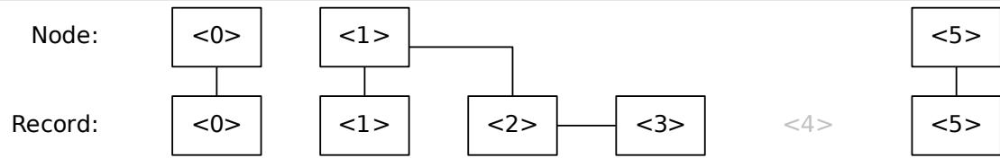
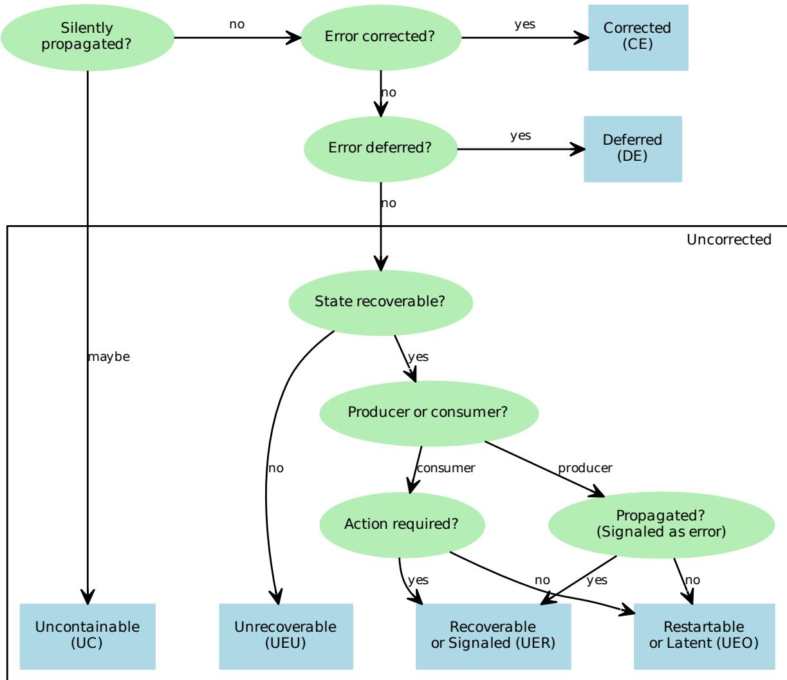
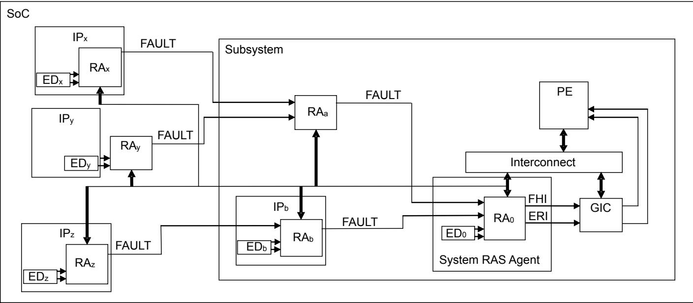
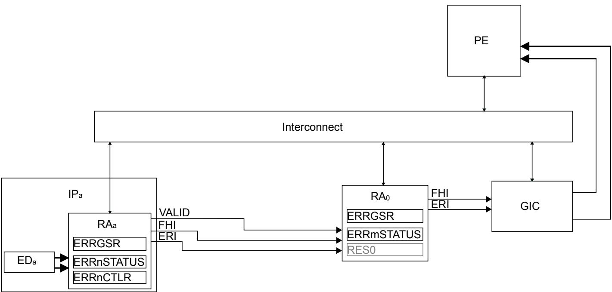
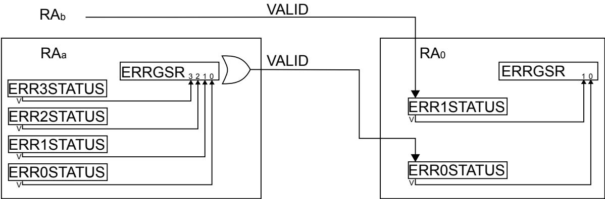
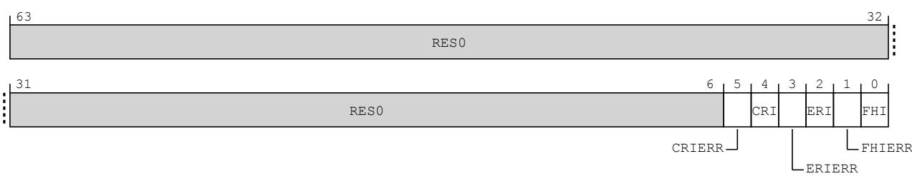
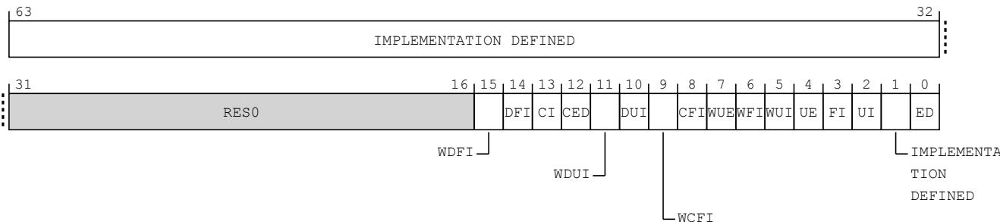

# Arm® Reliability, Availability, and Serviceability (RAS) System Architecture for A-profile architecture

Document number IHI0100

Document quality EAC

Document version A.c

Document confidentiality Non-Confidential

## Release information

The following releases of this document have been made.

<table><tr><td>Date</td><td>Version</td><td>Changes</td></tr><tr><td>06/Apr/2026</td><td>A.c</td><td>• Updated Non-Confidential EAC release of RAS System Architecture</td></tr><tr><td>30/Nov/2025</td><td>A.b</td><td>• Updated Non-Confidential EAC release of RAS System Architecture</td></tr><tr><td>16/Jan/2025</td><td>A.a</td><td>• Initial Non-Confidential EAC release of the RAS System Architecture standalone document</td></tr></table>

## Arm Non-Confidential Document License (“License”)

This License is a legal agreement between you and Arm Limited (“Arm”) for the use of Arm’s intellectual property (including, without limitation, any copyright) embodied in the document accompanying this License (“Document”). Arm licenses its intellectual property in the Document to you on condition that you agree to the terms of this License. By using or copying the Document you indicate that you agree to be bound by the terms of this License.

“Subsidiary” means any company the majority of whose voting shares is now or hereafter owned or controlled, directly or indirectly, by you. A company shall be a Subsidiary only for the period during which such control exists.

This Document is NON-CONFIDENTIAL and any use by you and your Subsidiaries (“Licensee”) is subject to the terms of this License between you and Arm.

Subject to the terms and conditions of this License, Arm hereby grants to Licensee under the intellectual property in the Document owned or controlled by Arm, a non-exclusive, non-transferable, non-sub-licensable, royalty-free, worldwide License to:

(i) use and copy the Document for the purpose of designing and having designed products that comply with the Document;

(ii) manufacture and have manufactured products which have been created under the License granted in (i) above; and

(iii) sell, supply and distribute products which have been created under the License granted in (i) above.

Licensee hereby agrees that the Licenses granted above shall not extend to any portion or function of a product that is not itself compliant with part of the Document.

Except as expressly licensed above, Licensee acquires no right, title or interest in any Arm technology or any intellectua property embodied therein.

The content of this document is informational only. Any solutions presented herein are subject to changing conditions, information, scope, and data. This document was produced using reasonable efforts based on information available as of the date of issue of this document. The scope of information in this document may exceed that which Arm is required to provide, and such additional information is merely intended to further assist the recipient and does not represent Arm’s view of the scope of its obligations. You acknowledge and agree that you possess the necessary expertise in system security and functional safety and that you shall be solely responsible for compliance with all legal, regulatory, safety and security related requirements concerning your products, notwithstanding any information or support that may be provided by Arm herein. In addition, you are responsible for any applications which are used in conjunction with any Arm technology described in this document, and to minimize risks, adequate design and operating safeguards should be provided for by you.

Reference by Arm to any third party’s products or services within this document is not an express or implied approval or endorsement of the use thereof.

THE DOCUMENT IS PROVIDED “AS IS”. ARM PROVIDES NO REPRESENTATIONS AND NO WARRANTIES, EXPRESS, IMPLIED OR STATUTORY, INCLUDING, WITHOUT LIMITATION, THE IMPLIED WARRANTIES OF MERCHANTABILITY, SATISFACTORY QUALITY, NON-INFRINGEMENT OR FITNESS FOR A PARTICULAR PURPOSE WITH RESPECT TO THE DOCUMENT. Arm may make changes to the Document at any time and without notice. For the avoidance of doubt, Arm makes no representation with respect to, and has undertaken no analysis to identify or understand the scope and content of, third party patents, copyrights, trade secrets, or other rights.

NOTWITHSTANDING ANYTHING TO THE CONTRARY CONTAINED IN THIS LICENSE, TO THE FULLEST EXTENT PERMITTED BY LAW, IN NO EVENT WILL ARM BE LIABLE FOR ANY DAMAGES, IN CONTRACT, TORT OR OTHERWISE, IN CONNECTION WITH THE SUBJECT MATTER OF THIS LICENSE (INCLUDING WITHOUT LIMITATION) (I) LICENSEE’S USE OF THE DOCUMENT; AND (II) THE IMPLEMENTATION OF THE DOCUMENT IN ANY PRODUCT CREATED BY LICENSEE UNDER THIS LICENSE). THE EXISTENCE OF MORE THAN ONE CLAIM OR SUIT WILL NOT ENLARGE OR EXTEND THE LIMIT. LICENSEE RELEASES ARM FROM ALL OBLIGATIONS, LIABILITY, CLAIMS OR DEMANDS IN EXCESS OF THIS LIMITATION.

This License shall remain in force until terminated by Licensee or by Arm. Without prejudice to any of its other rights, if Licensee is in breach of any of the terms and conditions of this License then Arm may terminate this License immediately upon giving written notice to Licensee. Licensee may terminate this License at any time. Upon termination of this License by Licensee or by Arm, Licensee shall stop using the Document and destroy all copies of the Document in its possession. Upon termination of this License, all terms shall survive except for the License grants.

Any breach of this License by a Subsidiary shall entitle Arm to terminate this License as if you were the party in breach. Any termination of this License shall be effective in respect of all Subsidiaries. Any rights granted to any Subsidiary

hereunder shall automatically terminate upon such Subsidiary ceasing to be a Subsidiary.

The Document consists solely of commercial items. Licensee shall be responsible for ensuring that any use, duplication or disclosure of the Document complies fully with any relevant export laws and regulations to assure that the Document or any portion thereof is not exported, directly or indirectly, in violation of such export laws.

This License may be translated into other languages for convenience, and Licensee agrees that if there is any conflict between the English version of this License and any translation, the terms of the English version of this License shall prevail.

The Arm corporate logo and words marked with ® or ™ are registered trademarks or trademarks of Arm Limited (or its subsidiaries) in the US and/or elsewhere. All rights reserved. Other brands and names mentioned in this document may be the trademarks of their respective owners. No license, express, implied or otherwise, is granted to Licensee under this License, to use the Arm trade marks in connection with the Document or any products based thereon. Visit Arm’ website at http://www.arm.com/company/policies/trademarks for more information about Arm’s trademarks

The validity, construction and performance of this License shall be governed by English Law.

Copyright © 2017-2026 Arm Limited (or its affiliates). All rights reserved.

Arm Limited. Company 02557590 registered in England.

110 Fulbourn Road, Cambridge, England CB1 9NJ.

Arm document reference: PRE-21585

version 5.0, March 2024

## Confidentiality Status

This document is Non-Confidential. The right to use, copy and disclose this document may be subject to license restrictions in accordance with the terms of the agreement entered into by Arm and the party that Arm delivered this document to.

## Product Status

The information in this document is final, that is for a developed product.

The information in this supplement is at EAC quality, which means that all features of the specification are described in the supplement.

## Web Address

https://www.arm.com

Arm® Reliability, Availability, and Serviceability (RAS) System Architecture, for A-profile architecture

## Preface

About this Document.... 7
Using this Document.... 8
Conventions.... 9
Additional reading.... 12
Feedback.... 13
Chapter 1 Introduction to RAS
1.1 Introduction.... 15
1.2 Faults, errors, and failures.... 16
1.3 General taxonomy of errors.... 17
1.4 Techniques for improving reliability, availability, and serviceability.... 19
Chapter 2 RAS System Architecture
2.1 About the RAS System Architecture.... 22
2.2 Nodes.... 23
2.3 Detecting and consuming errors.... 26
2.4 Standard error record.... 29
2.5 RAS interrupts.... 43
2.6 In-band error response signaling.... 48
2.7 Error record reset.... 49
2.8 Extensions.... 52
2.9 Accessing RAS registers.... 61
Chapter 3 RAS Memory-mapped Register Descriptions
3.1 RAS registers summary.... 65
3.2 RAS register descriptions.... 72

## Preface

This preface introduces the RAS System Architecture, for A-profile architecture. It contains the following sections:

About this Document.

Using this Document.

Conventions.

Additional reading.

Feedback.

## About this Document

This Document describes the Arm® RAS System Architecture and is intended to be read together with the Arm® Architecture Reference Manual for A-profile architecture (ARM DDI 0487), revision M.b.

For a monthly updated list of known issues in this release, see the Arm® Architecture Reference Manual for A-profile architecture, Known Issues.

For release notes corresponding to the most recent Register and Instruction XML release, see: https://developer.arm.com/Architectures/A-Profile%20Architecture#Downloads.

This document is only available in a PDF version. Download from: https://developer.arm.com/documentation/ihi0100/ac.

This Document is organized into chapters:

## Chapter 1, Introduction to RAS

Provides an introduction to the RAS System Architecture. Defines terminology used regarding the RAS System Architecture.

## Chapter 2, RAS System Architecture

Describes the RAS System Architecture. It includes details of nodes, the standard Error record, Error recovery interrupts, Fault handling interrupts, and Critical error interrupts. It also describes extensions of the RAS System Architecture, some of which are optional.

## Chapter 3, RAS Memory-mapped Register Descriptions

Describes the RAS System Architecture registers.

## Using this Document

This Document is intended to be read in conjunction with the Arm® Architecture Reference Manual, for A-profile architecture.

## Conventions

The following sections describe conventions that this book can use:

Typographic conventions.

Rules-based writing.

Signals.

Numbers.

Pseudocode descriptions.

## Typographic conventions

The typographical conventions are:

italic Introduces special terminology, and denotes citations.

bold Denotes signal names, and is used for terms in descriptive lists, where appropriate.

monospace Used for assembler syntax descriptions, pseudocode, and source code examples.

Also used in the main text for instruction mnemonics and for references to other items appearing in assembler syntax descriptions, pseudocode, and source code examples.

## SMALL CAPITALS

Used in body text for a few terms that have specific technical meanings, and are defined in the Glossary.

Colored text Indicates a link. This can be:

A URL, for example https://developer.arm.com.

A link, to a chapter or appendix, or to a glossary entry, or to the section of the Document that defines the colored term, for example Software fault or ERRIIDR.

{ and } Braces, { and }, have two distinct uses:

Optional items

In syntax descriptions braces enclose optional items. In the following example they indicate that the <shift>parameter is optional:

ADD <Wd|WSP>, <Wn|WSP>, #<imm>{, <shift>}

Similarly, they can be used in generalized field descriptions, for example ERRACR.{N}SRA refers to a field in the ERRACR register that is called either NSRA or SRA.

Sets of items

Braces can be used to enclose sets. For example, ERR<n>STATUS.{RV, RV2} refers to a set of two register fields, ERR<n>STATUS.RV and ERR<n>STATUS.RV2.

## Notes

Notes are formatted as:

Note

This is a Note.

In this Document, Notes are used only to provide additional information, usually to help understanding of the text. While a Note might repeat architectural information given elsewhere in the Document, a Note never provides any part of the definition of the architecture.

## Rules-based writing

Some sections of this Document use rules-based writing. Rules-based writing consists of a set of individual content items. A content item is classified as one of the following:

Rule.

Information.

Software usage.

Declaration.

Rules are normative statements. An implementation that is compliant with this specification must conform to all Rules in this Document that apply to that implementation.

Rules must not be read in isolation. Where a particular feature is specified by multiple Rules, these are generally grouped into sections and subsections that provide context. Where appropriate, these sections begin with a short introduction.

Arm strongly recommends that implementers read all chapters and sections of this Document to ensure that an implementation is compliant.

Content items other than Rules are informative statements. These are provided as an aid to understanding this Document.

## Content item identifiers

A content item may have an associated identifier which is unique among content items in this Document. After content reaches beta status, a given content item has the same identifier across subsequent versions of this Document.

## Content item rendering

In this Document, a content item is rendered with a token of the following format in the left margin: L . L is a label that indicates the content class of the content item. iiiii is the identifier of the content item.

## Content item classes

Each of the content item classes has a different function in this Document.

## Rule

A Rule is a statement that describes the behavior of a compliant implementation.

A Rule explains what happens in a particular situation

A Rule does not define concepts or terminology.

A Rule is rendered with the label R.

## Information

An Information statement provides information and guidance as an aid to understanding the Document.

An Information statement is rendered with the label I.

## Software usage

A Software usage statement provides guidance on how software can make use of the features defined by the specification.

A Software usage statement is rendered with the label S.

## Declaration

A Declaration statement introduces concepts or terminology.

A Declaration does not describe behavior.

A Declaration is rendered with the label D.

## Signals

In general this specification does not define hardware signals, but it does include some signal examples and recommendations. The signal conventions are:

Signal level The level of an asserted signal depends on whether the signal is active-HIGH or active-LOW. Asserted means:

HIGH for active-HIGH signals.

LOW for active-LOW signals.

Lowercase n At the start or end of a signal name denotes an active-LOW signal.

## Numbers

Numbers are normally written in decimal. Binary numbers are preceded by 0b, and hexadecimal numbers by 0x. In both cases, the prefix and the associated value are written in a monospace font, for example 0xFFFF0000. To improve readability, long numbers can be written with an underscore separator between every four characters, for example 0xFFFF\_0000\_0000\_0000. Ignore any underscores when interpreting the value of a number.

## Pseudocode descriptions

This Document uses a form of pseudocode to provide precise descriptions of the specified functionality. This pseudocode is written in monospace font.

## Additional reading

This section lists relevant publications from Arm.

See Arm Developer, https://developer.arm.com, for access to Arm documentation.

## Arm publications

Arm® Architecture Reference Manual for A-profile architecture (ARM DDI 0487).

## Feedback

Arm welcomes feedback on its documentation.

## Feedback on this Document

If you have any comments or queries about this Document, create a ticket at https://support.developer.arm.com.

As part of the ticket, include:

The title, Arm® Reliability, Availability, and Serviceability (RAS) System Architecture, for A-profile architecture.

The number, IHI0100 A.c.

The section name to which your comments refer.

The page number(s) to which your comments refer.

The rule identifier(s) to which your comments refer, if applicable.

A concise explanation of your comments.

Arm also welcomes general suggestions for additions and improvements.

## Note

Arm tests PDFs only in Adobe Acrobat and Acrobat Reader, and cannot guarantee the appearance or behavior of any document when viewed with any other PDF reader. Search performance may be significantly improved by increasing the Fast Find Maximum Cache Size under Search in Preferences.

## Inclusive terminology commitment

Arm values inclusive communities. Arm recognizes that we and our industry have used terms that can be offensive. Arm strives to lead the industry and create change.

We believe that this document contains no offensive terms. If you find offensive terms in this document, please contact terms@arm.com.

# Chapter 1 Introduction to RAS

This chapter introduces the RAS System Architecture. It contains the following sections:

Introduction.

Faults, errors, and failures.

General taxonomy of errors.

Techniques for improving reliability, availability, and serviceability.

## 1.1 Introduction

RAS are three aspects of the dependability of a system:

Reliability, that is, the continuity of correct service.

Availability, that is, the readiness for correct service.

Serviceability, that is, the ability to undergo modifications and repairs.

RAS techniques reduce unplanned outages because:

Transient errors can be detected and corrected before they cause application or system failure.

Failing components can be identified and replaced.

Failure can be predicted ahead-of-time to allow replacement during planned maintenance.

This Document describes the RAS System Architecture. For information on RAS PE architecture, see the chapter RAS PE architecture in Arm® Architecture Reference Manual, for A-profile architecture.

## 1.2 Faults, errors, and failures

## RNVNNC

Correct service is delivered when the service implements the system function.

## IQWSVK

## Correct service might include:

Producing correct results.

Producing results within the time allotted to the task.

Not divulging secret or secure information.

## RKRTSC

For the purpose of describing the RAS System Architecture, deviation from correct service is defined using the following terms:

A failure is the event of deviation from correct service. This includes data corruption, data loss, and service loss.

An error is the deviation from correct service. An incorrect value that has an error is corrupt.

A fault is the cause of the error.

## RJNBDX

Errors that are present but not detected are latent errors or undetected errors.

## ITNQPK

In a system with no error detection, all errors are latent errors and are silently propagated by components until they are either masked or cause failure.

## IGRYKV

The severity of a failure can range from minor to catastrophic:

The harmful consequences of a minor failure are of a similar cost to the benefits provided by correct service delivery.

The harmful consequences of a catastrophic failure are orders of magnitude, or even incommensurably, higher than the benefit provided by correct service delivery.

## INMGPQ

There are many sources of faults in a system, including both software and hardware faults:

Hardware faults originate in, or affect, hardware.

Software faults affect software, that is programs or data.

The RAS System Architecture primarily addresses errors produced from hardware faults. These fall into two main areas:

Transient faults.

Non-transient or persistent faults.

## 1.3 General taxonomy of errors

## 1.3.1 Error detection

RFHXWP When a component accesses memory or other state, an error might be detected in that memory or state.

The error might be corrected or deferred by the component, or signaled to another component as either a deferred error or a detected error.

## 1.3.2 Error propagation

RLRZDN A transaction occurs when a producer of the transaction passes a value or other signal to a consumer of the transaction.

IVYCCX Transactions are part of the service provided by the producer for the consumer.

IRHGDL In many protocols and service interface definitions, a high-level transaction consists of a sequence of operations, for instance between a Requester and a Completer.

For the purposes of this manual, the most basic form of a unidirectional transfer between a producer and consumer is considered as a transaction.

That is, each one of the sequence of operations is considered a separate transaction. For some operations, such as a request, the Requester is producer and the Completer is the consumer. For other operations, such as a response, the Completer is producer and the Requester is the consumer.

RSKZZG An error is propagated by the producer of a transaction when the service interface is incorrect because of the error. The error is propagated to the consumer.

RCHCCV An error is propagated by deviations from correct service, including when any of the following occurs that would not have been permitted to occur had the fault not been activated:

A corrupt value is passed from producer to consumer.

A transaction or other operation occurs that should not have occurred.

A transaction or other operation that should have occurred does not occur.

A loss of uniprocessor semantics or any other loss of coherency in a multiprocessor coherent system is observed.

Changing the timing and/or order of transactions or other operations such that the timing and/or order of those transactions or operations is incorrect. In this case, the service interface defines acceptable timings and/or orders for transactions and other operations.

The service interface for a transaction might include means to signal that the transaction is propagating either of the following:

A detected error.

A deferred error.

An error is silently propagated by the producer of a transaction if the consumer of the transaction cannot detect the error and consumes an undetected error because of the transaction. This might be because of one of the following:

The error is present on the transaction, but was not detected by the producer. The error is silently propagated by the producer.

The error is present on the transaction, but was not signaled to the consumer as an error. For example, a corrupt value was passed in the transaction with no indication that it was corrupt. The error is silently propagated by the producer.

A latent, possibly detectable, error is silently propagated by the consumer of an otherwise correct transaction if the transaction causes the error to become undetectable

A partial write to a protection granule removes poison, leaving the unchanged portion of the location corrupt. To implement a partial write, the consumer logically reads the current value of the location, modifies the value, and then writes the modified value back. These are internal transactions in the consumer that silently propagate the error. In this example there was no error at the producer nor on the transaction.

Example 1-1

Errors might be propagated by components in a system until one of the following occurs:

They are masked and do not affect the outcome of the system

The error might be masked because a corrupt value is discarded or overwritten, or the error is detected and removed.

They affect the service interface of the system and possibly cause failure. If the error has been silently propagated to the service interface, then:

This is a Silent Data Corruption, SDC.

The rate of such failures, measured as the number of failures per billion device-hours of operation, is called the Silent Data Corruption Failure-in-Time rate, SDC FIT rate.

Alternatively, the error might have been detected, causing the system to invoke error handling and recovery. See Error handling and recovery.

## 1.3.3 Infected and poisoned

The state of a component becomes infected when the component consumes an uncorrected error that updates the state.

A value is poisoned in the state of a component if it is marked as being in error, such that a subsequent access of the state will detect the value is so marked and is treated as a detected error.

IYBMFK Poison is used to defer an error.

## 1.3.4 Containable and uncontainable

RDXQRD An undetected error is uncontained at the component that failed to detect it.

RRJYRQ A silently propagated error is uncontained at the component that silently propagated it.

A Detected Uncorrected Error is uncontainable at the component if it might be uncontained at the component. A Detected Uncorrected Error is containable at the component if it is not uncontainable at the component. If the component cannot determine whether a Detected Uncorrected Error is uncontainable at the component or containable at the component, then the component treats the Detected Uncorrected Error as uncontainable at the component.

IMRDMR An error that is uncontainable at the component might be containable at the system level.

INWZGB Reporting an error as containable allows software to contain the error. This does not mean that hardware has contained the error.

## 1.4 Techniques for improving reliability, availability, and serviceability

Each device sets its own targets for reliability, availability, and serviceability using various techniques to achieve these targets, including:

Fault prevention and fault removal.

Error handling and recovery.

Fault handling.

The level of reliability, availability, and serviceability in any implementation, and which parts of the system include RAS, are IMPLEMENTATION DEFINED. The RAS Extension and RAS System Architecture do not prescribe the level of reliability, availability, and serviceability in any implementation, or which parts of the system include RAS.

## 1.4.1 Fault prevention and fault removal

RYLVTS Fault prevention and fault removal are two techniques for handling faults. Fault prevention and fault removal mechanisms are IMPLEMENTATION DEFINED.

IWZTKF Fault prevention techniques are outside the scope of the architecture.

IJVLNC Some errors can be corrected. A corrected error might be recorded and notified to software, for example by a Fault handling interrupt, but it is not propagated. This means that it is not consumed and does not cause service failure. A corrected error might be used to remove the original fault, for example by writing the corrected value back to the fault location, or the fault might remain in place after the corrected value is returned to the requester.

IWSPBC A common technique to detect and correct errors is the use of an Error Detection and Correction Code (EDAC), more commonly referred to as simply an Error Correction Code (ECC). ECC schemes use mathematical codes to detect and correct an error in a value in memory. The size of the value is the protection granule for the ECC scheme.

IPBJLC The RAS Extension and RAS System Architecture do not require implementation of any fault removal schemes, including ECC.

## 1.4.2 Error handling and recovery

RXPLVT An error that is not corrected is an uncorrected error.

ILYWFS Error recovery methods include all of the following:

Deferring an error from a fault. An error is deferred by hardware if hardware can make forward progress without consuming the error.

The fault might become masked later (fault removal). For example, because the corrupt value is overwritten before it is consumed.

If the deferred error is later consumed, then the error is reported at the point of consumption. For example, if the deferred error is consumed by a PE then the consumer PE generates an Error exception. This can give better results in terms of error recovery in the case where the original producer of the data is not known when the error was deferred. For example because a latent error was detected.

A common technique to defer an error is to replace the corrupt value with a poisoned value, for example in memory or in a transaction

Preventing further propagation of the error, that is containing the error. In particular, preventing silent propagation of the error.

Reducing the severity of a failure by invoking a service failure mode:

This is a Detected Uncorrected Error (DUE).

The rate of such failures gives the DUE FIT rate.

The type of service failure mode depends on what is acceptable to the service.

A software error recovery agent is typically invoked when hardware detects an error it cannot correct, defer, or remove.

## Introduction to RAS

## 1.4 Techniques for improving reliability, availability, and serviceability

IPGXFK An error recovery agent also provides information to the operator through error logs to improve serviceability, fo example to help with the identification of a Field Replaceable Unit, FRU.

IMFPRY The RAS Extension and RAS System Architecture provide optional common programmers’ models to record information about an error in an Error record.

ICVFFN The RAS Extension describes the behavior of a PE when an error is signaled to it by the system, including invoking a service failure mode by taking an Error exception, and optional mechanisms to limit propagation of an error.

ITLDCY The RAS Extension and RAS System Architecture do not require systems to implement error recovery mechanisms, including poison, and do not require systems to limit the silent propagation of errors.

## 1.4.3 Fault handling

ISWFLQ Fault handling by software is the process by which software diagnoses and responds to faults to improve availability.

IGGCDN Fault handling methods include Predictive Failure Analysis (PFA), using information recorded by hardware to trigger preemptive action.

IWNHJF The RAS Extension and RAS System Architecture provide optional mechanisms to allow the reporting of errors and warnings to a fault handling agent, and to record information about the fault in an Error record. It is the responsibility of the Error recovery and fault handling processes to collate the Error record data and write it to an error log.

IFQRSQ The detailed nature of the fault handling agent is outside the scope of this architecture. Fault handling and Error recovery might be independent agents.

IDQBCJ See also Standard error record.

# Chapter 2 RAS System Architecture

This chapter describes the RAS System Architecture. It contains the following sections:

About the RAS System Architecture.

Nodes.

Detecting and consuming errors.

Standard error record.

RAS interrupts.

In-band error response signaling

Error record reset.

Extensions.

Accessing RAS registers.

## 2.1 About the RAS System Architecture

IXKHGG The RAS System Architecture provides a framework for building RAS features in a system. It provides a reusable component architecture for components that can detect and record errors, and signal them to a PE.

RDKJPB A node is a RAS System Architecture element that records errors detected or consumed by one or more system components.

INTRXQ A RAS System Architecture implementation includes one or more nodes. The RAS System Architecture does not require that all components in a system implement the RAS System Architecture or appear as a node

IFPMKF The RAS System Architecture does not prescribe the level of reliability, availability, and serviceability in the system The RAS features that the system includes, for example to detect, correct, contain, or defer errors, are IMPLEMENTATION DEFINED.

ILJWMZ The RAS features and behavior of components that do not implement the RAS System Architecture are IMPLEMENTATION DEFINED.

IQTZCK Arm recommends that all errors are reported to a RAS System Architecture node to enable error recovery and fault handling.

IHTDRT This section describes the behavior of RAS System Architecture nodes, and other required behaviors of components tha implement the RAS System Architecture.

DTGKPM In this chapter, OPTIONAL from or permitted from refers to the earliest version of the RAS System Architecture in which the feature is permitted to be implemented. A system must be FEAT\_RASSAv1p1 compliant to include a feature permitted from FEAT\_RASSAv1p1, and must be FEAT\_RASSAv2 compliant to include a feature permitted from FEAT\_RASSAv2. If no version is indicated, this means the feature is OPTIONAL from or permitted from FEAT\_RASSAv1.

RBBJHD Unless otherwise specified, all required features in FEAT\_RASSAv1 compliant implementations are required in FEAT\_RASSAv1p1 compliant implementations, and all required features in FEAT\_RASSAv1p1 compliant implementations are required in FEAT\_RASSAv2 compliant implementations

RZPMBK Except where restricted by DTGKPM, FEAT\_RASSAv1 compliant implementations can implement any subset of features from FEAT\_RASSAv1p1, and FEAT\_RASSAv1p1 compliant implementations can implement any subset of features from FEAT\_RASSAv2.

## 2.2 Nodes

<table><tr><td>A component might implement one or more nodes, or a node might be implemented outside of a component.See also RWPDN and RGCDCL.</td></tr><tr><td>The RAS System Architecture defines the following features for nodes:</td></tr><tr><td>Error detection and correction</td></tr><tr><td>The level of error correction and detection implemented at a component is IMPLEMENTATION DEFINED.A node might include the control to disable error reporting and recording of detected errors, for example while software initializes the component.It is IMPLEMENTATION DEFINED whether error detection and correction is fully disabled at the component when reporting and recording are disabled at the node.See Detecting and consuming errors.</td></tr><tr><td>Records</td></tr><tr><td>A node implements one or more standard Error records. When an error is detected or consumed, syndrome about the error is written to an Error record.See Standard error record.</td></tr><tr><td>Fault handling interrupt</td></tr><tr><td>Asynchronous (out-of-band) reporting of all or some recorded errors by an interrupt. The fault handling interrupt can report corrected errors, deferred errors, and uncorrected errors. It is IMPLEMENTATION DEFINED whether a node provides a single control for all errors, or separate controls for each type of error.See Fault handling interrupt.</td></tr><tr><td>Error recovery interrupt</td></tr><tr><td>Asynchronous (out-of-band) reporting of recorded uncorrected errors by an interrupt. The interrupt can be used for error recovery, fault handling, or both. Corrected errors are not reported by this means. It is IMPLEMENTATION DEFINED whether the node provides the control to enable deferred errors to be reported in this way. If the control is not provided, then deferred errors are not reported by this means.See Error recovery interrupt.</td></tr><tr><td>Critical Error interrupt</td></tr><tr><td>Critical error interrupts provide a mechanism for a node to report a critical error condition to a system controller for error recovery.See Critical error interrupt.</td></tr><tr><td>In-band error response (External abort)</td></tr><tr><td>In-band signaling of a detected uncorrected error to the Requester of the transaction. This is also referred to as an External abort.Corrected errors and errors deferred to the Requester are not reported by such means.See In-band error response signaling.</td></tr><tr><td>Timestamps</td></tr><tr><td>It is IMPLEMENTATION DEFINED whether a node records a timestamp in each Error record.See The RAS Timestamp Extension.</td></tr><tr><td>Corrected error counter</td></tr><tr><td>It is IMPLEMENTATION DEFINED whether a node implements a counter for counting errors. Software can poll the error counter or initialize the counter with a threshold value and receive an interrupt when the counter overflows. A counter overflows when incrementing the counter results in unsigned integer overflow.It is IMPLEMENTATION DEFINED which corrected errors are counted.It is IMPLEMENTATION DEFINED and might be UNPREDICTABLE whether deferred errors and uncorrected errors are counted by the Corrected error counter.See Standard format Corrected error counter.</td></tr><tr><td>Proxies</td></tr><tr><td>A node can be a proxy for another component implementing multiple other nodes. In this case, there is a proxy error record.See System RAS Agents.</td></tr><tr><td>A node might implement some or all of these features.</td></tr></table>

The first standard Error record for a node contains:

An identification register, ERR<n>FR, that describes the implemented features of the node.

The ERR<n>CTLR register to enable or disable the features.

RJMRML A node has a single ERR<n>FR and a single ERR<n>CTLR register.

## RCWWXN

If the node implements multiple Error records, then each Error record has the same features and all Error records share the controls.

Note

If a component requires multiple sets of controls, then the component implements multiple nodes

RGSGNZ For each node, it is IMPLEMENTATION DEFINED whether the fault and error reporting mechanisms apply to both reads and writes, or whether the mechanisms can be individually controlled for reads and writes.

## 2.2.1 Multiple error records per node

Each node contains at least one Error record.

A node might implement multiple Error records for one or more of the following purposes:

To record different types of error in different Error records.

To record errors from different components, or different FRUs accessed by a component, in different Error records.

To record multiple errors.

## RPZCQV

If a single node implements multiple Error records, then all of the following are true:

The Error records are indexed sequentially within an Error record group starting from the first Error record for the node.

For each Error record other than the first Error record for the node, the following are true:

The ERR<n>FR.ED field is 0b00.

If FEAT\_RASSA\_ERT is not implemented, ERR<n>FR[63:2] are RES0.

The ERR<n>CTLR register is RES0.

## DHFVSH

When FEAT\_RASSAv2 is implemented, each node implements support for FEAT\_RASSA\_ERT. FEAT\_RASSA\_ERT is permitted from FEAT\_RASSAv2.

ICCZLX FEAT\_RASSA\_ERT enables software to discover differences between error records owned by the same error node, and allows continuation records, which enable an error node to record additional IMPLEMENTATION DEFINED syndrome information.

IKVCGG In a continuation record, error record <n> is a continuation of error record <n-1>. Error record <n−1> might also be a continuation of error record <n−2>, and so on.

DDJPDM When FEAT\_RASSA\_ERT is implemented, if ERR<n>FR.ED is 0b00, then ERR<n>FR.ERT defines the error record type.

RBRDWX Continuation records are only permitted in an Error record group. Within the Error record group, error record 0 is not permitted to be a continuation record.

RRFPVW An Error record group consists of the Error records of one or more nodes.

RDBPFH An Error record group might be sparsely populated. Locations relating to unimplemented Error records are RAZ/WI meaning that they have an ERR<n>FR register that reads as zero. See Nodes.

An Error record group contains five error records owned by three nodes, arranged as shown below:

Node <0> owns a single Error record: <0>. ERR0FR describes the features for this node, and ERR0CTLR contains the controls for this node. ERR0STATUS, ERR0ADDR, and ERR0MISC<m> record syndrome for this Error record.

Node <1> owns three Error records: <1>, <2>, and <3>.

Error record <1> is the first error record of the node. ERR1FR.ED is 0b01 or 0b10. ERR1FR describes the features for this node, and ERR1CTLR contains the controls for this node. ERR1STATUS, ERR1ADDR, and ERR1MISC<m> record syndrome for this Error record.

ERR2FR.{ED, ERT} is {0b00, 0b00} and ERR2CTLR is RES0. ERR2STATUS, ERR2ADDR, and ERR2MISC<m> record syndrome for this Error record.

Error record <3> is a continuation of Error record <2>. ERR3FR.{ED, ERT} is {0b00, 0b01}, ERR3CTLR is RES0, ERR3STATUS.{V, AV, MV, IERR} are defined and all other values in ERR3STATUS are RES0, and ERR3ADDR and ERR3MISC<m> are IMPLEMENTATION DEFINED, recording additional syndrome for the error recorded by Error record <2>.

Error record <4> is not implemented. ERR4FR.{ED, ERT} is {0b00, 0b00}, and ERR4CTLR, ERR4STATUS, ERR4ADDR, and ERR4MISC<m> are RAZ/WI.

Node <5> owns a single error record: <5>. ERR5FR describes the features for this node, and ERR5CTLR contains the controls for this node. ERR5STATUS, ERR5ADDR, and ERR5MISC<m> record syndrome for this Error record.

• If the Error record group is accessed using a memory-mapped view then ERRDEVID.NUM is 6.

If the Error record group is accessed using System registers then ERRIDR\_EL1.NUM is 6.

## 2.3 Detecting and consuming errors

A component detects an error when it detects that a deviation from correct service has occurred or will occur. For example, including but not limited to when any of the following occurs that would not be permitted to occur had the faul not been activated:

A corrupt value has been or will be passed to a consumer.

A transaction or other operation occurs or will occur that should not occur.

A transaction or other operation that should occur does not occur or will not occur.

A loss of uniprocessor semantics or any other loss of coherency in a multiprocessor coherent system is or will be observed. See ISVZKY.

The timing and/or order of transactions or other operations has been or will be changed.

A latent error has become or will become undetectable. See IQXPLK.

Examples of a loss of uniprocessor semantics or other loss of coherency that might occur because of an error include:

A cache loses data that it holds in a modified state.

A cache writes back unmodified data to memory.

An example that should not occur is when a partial write to the protection granule of a cache location holding poison occurs, and the cache later invalidates the line without writing back the poison value.

Example 2-2 Maintaining poisoned cache locations

A cache fetches data from memory and receives poison, and subsequently, a partial write to that location is insufficient to clean the location of the poison and the location remains poisoned.

The cache should treat the location as modified, even though it appears that the write did not modify the location.

That is, the cache should take ownership of the location and write-back poison when the location is evicted from the cache. Otherwise if the original error was transient and later disappears from memory, the location reverts to the unmodified value, silently propagating the error.

## IQXPLK

An example of a latent error becoming undetectable includes when a poison value indicating a deferred error is lost at the interface between domains. For example, because a poison value is passed to a component that does not support poisoning.

An example of a latent error becoming undetectable that should not occur is when a poison value is lost by a partial write to the protection granule. In this case, the partial write should leave the protection granule containing poison.

A component consumes an error that is signaled to the component in response to a memory access, cache maintenance operation, or other transaction initiated by the component as one of:

An In-band error response.

A deferred error.

## RWXPDN

When an error is detected or consumed by a component, the error is reported to one or more nodes.

It is IMPLEMENTATION DEFINED whether a Requester that consumes a signaled detected error reports the consumed error.

## RLRQSG

It is IMPLEMENTATION DEFINED whether errors are reported when a detected error is propagated between components.

## RWDJGD

It is IMPLEMENTATION DEFINED whether all corrected errors are reported.

## RGVPMK

It is IMPLEMENTATION DEFINED whether errors detected on hardware speculation are reported.

## RGCDCL

It is IMPLEMENTATION DEFINED whether the node or nodes that an error is reported to are one or more of the following:

The same component that detected the error.

The consumer of the transaction that consumes a detected error signaled by the producer of the transaction which detected the error. Syndrome information might be passed with the signaled detected error to the consumer.

Another component that neither detected nor consumed the error. For example, a node whose purpose is to record errors for other components. Such a node might comprise one record for each component for which it is recording an error, or a number of shared records, where each record identifies the originating component, or some other arrangement.

When an error is detected or consumed by a component, if the error can be corrected:

The error is corrected.

Optionally, the detected error is reported to a node, the node records the component error state as Corrected, and if implemented and enabled, a Fault handling interrupt is raised.

If the error is detected on a read access by a Requester, corrected data is returned to the Requester.

When an error is detected or consumed by a component, if the error cannot be corrected and can be deferred:

The error is deferred. For example, the location being accessed is poisoned or poisoned data is returned to the Requester.

The error is reported to a node and the node records the component error state as Deferred.

If the error is detected on an access by a Requester, the error is not deferred to the Requester, and if implemented and enabled, it is IMPLEMENTATION DEFINED whether an In-band error response is returned to the Requester.

If the error is detected on a read access by a Requester, the error is not deferred to the Requester, and an In-band error response is not returned to the Requester, the data returned to the Requester is IMPLEMENTATION DEFINED and might be UNKNOWN.

If implemented and enabled, a Fault handling interrupt is raised.

If implemented and enabled, an Error recovery interrupt is raised.

## Note

An error cannot be deferred to a component that does not accept deferred errors.

When an error is detected or consumed by a component, if the error cannot be corrected and cannot be deferred:

The error is reported to a node and the node records the component error state as Uncorrected.

If implemented and enabled, a Fault handling interrupt is raised.

If implemented and enabled, an Error recovery interrupt is raised.

If the error is detected on an access by a Requester, and if implemented and enabled, an In-band error response is returned to the Requester.

If the error is detected on a read access by a Requester, and an In-band error response is not returned to the Requester, the data returned to the Requester is IMPLEMENTATION DEFINED and might be UNKNOWN.

If the component is unable to continue operation, it might enter a service failure mode.

The criteria by which a component determines when it can correct or defer an error are IMPLEMENTATION DEFINED. For example, if the error is detected in response to an access by a Requester that is not capable of receiving a deferred error response, then it is not possible to defer the error to the Requester.

RLMCVC permits a component to both defer an error and return an In-band error response to the Requester. For instance if it is not possible to defer the error to the Requester.

Example 2-3 Treating poisoned PE caches

A PE executes a load instruction which misses in the PE cache and the subsequent cache refill receives poison in the cache line for the location being accessed. The cache line is allocated into the cache, but the cache cannot return poison to PE and signals an In-band error response to the PE. It is IMPLEMENTATION DEFINED whether the cache records this with a component error state of Deferred or Uncorrected

RLKCNC and RLMCVC permit a component to return a fixed known value to a Requester when an uncorrected error is detected on a read access, not deferred to the Requester, and either support for an In-band error response is not implemented or the In-band error response is disabled. For example, zero or an all-ones value.

When an error is reported to a node, the node records syndrome information for the error in a standard Error record

## ISNNZR

Arm recommends that hardware records sufficient information to:

Determine whether error recovery is possible, if the error was not corrected by hardware.

Allow fault analysis to find trends in the faults. This information is IMPLEMENTATION DEFINED but might include the location of the data.

Allow identification of a FRU.

## IJNMFY

The node registers might also contain control registers for error detection, correction and reporting at the component.

## IWMVTN

Corrected errors can be recorded by counting each corrected error. Counting might be done by either software or hardware. The fault handling process compares the corrected error count or rate with a threshold value to determine whether to take action.

## IQGNHF

Standard format Corrected error counter and Corrected error counter describe an optional standard hardware mechanism for counting errors.

## IGGQSR

## The details of any service failure mode are IMPLEMENTATION DEFINED. For example:

A component that fetches data from memory and processes that data might halt processing and await servicing by an application processor when it receives an In-band error response. This is a form of service failure mode

When a PE takes an Error exception and executes an error handler, this is also a form of service failure mode The component might implement multiple functions, some of which can be in a service failure mode while others continue to operate, or the service failure mode might affect multiple or all functions of the component.

## IZZKRS

## See also:

Standard error record.

Fault handling interrupt.

Error recovery interrupt.

In-band error response signaling.

Standard format Corrected error counter.

## 2.4 Standard error record

## RGTCQJ

The RAS System Architecture defines a standard Error record and a mechanism to access Error records as System registers or as a memory-mapped component.

The format of the Error record registers is the same for both access mechanisms.

The standard Error record contains:

A status register, ERR<n>STATUS, for common status fields, such as the type and coarse characterization of the error.

An optional address register, ERR<n>ADDR.

IMPLEMENTATION DEFINED status registers, referred to as ERR<n>MISC<m>. Arm recommends these are used for:

Identifying a FRU.

Locating the error within the FRU.

— Optionally, a Corrected error counter or counters for software to poll the rate of corrected errors.

Optionally, a timestamp value for when the error was recorded.

## RMQPFL

When FEAT\_RASSAv1 is implemented, there are two ERR<n>MISC<m> registers for each Error record:

ERR<n>MISC0.

ERR<n>MISC1.

## RQCKVG

When FEAT\_RASSAv1p1 is implemented, there are four ERR<n>MISC<m> registers for each Error record:

ERR<n>MISC0.

ERR<n>MISC1.

ERR<n>MISC2.

ERR<n>MISC3.

## IPSZMK

The RAS System Architecture permits the implementation of ERR<n>MISC2 and ERR<n>MISC3 in implementations of the FEAT\_RASSAv1.

## RDXZPX

An Error record might include additional IMPLEMENTATION DEFINED controls and identification registers.

Accessing RAS registers defines reusable formats for a memory-mapped views of Error records. Use of reusable formats by any component in the system is OPTIONAL.

RWDSFZ Error records are preserved over an Error Recovery reset. This allows for a diagnosis after system failure.

## 2.4.1 Additional Error record types

RKWYKP An Error record might be a proxy error record. See System RAS Agents.

RPGPVB An Error record might be a continuation record. See Multiple error records per node.

## 2.4.2 Component error states

When a node records an error, the component error state is recorded in the Error record.

The component error state recorded in the Error record describes the error state of the component only. For example, the component error state might be Unrecoverable state but the system is recoverable by resetting the component.

## RLBBPN

For a standard Error record, the component error state types that can be recorded are:

Corrected (CE).

Deferred (DE).

Uncorrected.

If and only if all of the following are true, then on recording an error, the component error state is recorded as Corrected (CE):

The error was corrected.

The error has not been silently propagated.

The component has not entered a service failure mode and continues to operate.

The implementation has not elected to record the component error state as Deferred or Uncorrected.

In normal circumstances, the error no longer infects the state of the component. However, in the case of a persistent correctable fault, or other rare IMPLEMENTATION DEFINED circumstances, the error might remain latent in the component.

If and only if all of the following are true, then on recording an error, the component error state is recorded as Deferred (DE):

At least one of the following are true:

The error was not corrected, and was deferred.

The error was corrected, and the implementation elected to record the component error state as Deferred

The error has not been silently propagated.

The error might be latent in the system.

It is IMPLEMENTATION DEFINED whether the error continues to infect the state of the component or whether it has been deferred to a consumer.

The component has not entered a service failure mode and continues to operate.

The implementation has not elected to record the component as Uncorrected.

The component error state might be recorded as Deferred for an error that cannot be corrected. However, for the purposes of the component error state taxonomy, Deferred is classified separately from Uncorrected.

If and only if all of the following are true, then on recording an error, the component error state is recorded as Uncorrected:

At least one of the following are true:

The error was not corrected and not deferred.

The error might have been silently propagated.

The component has entered as service failure mode and does not continue to operate the function that consumed the error.

The error was either corrected or deferred, and the implementation elected to record the component error state as Uncorrected.

The error is latent in the system.

When the component error state is recorded as Uncorrected, the node also records a sub-type in the Error record. Th sub-types that can be recorded are:

Uncontainable (UC).

Unrecoverable state (UEU).

Recoverable state or Signaled error (UER).

Restartable state or Latent error (UEO).

If any of the following are true, then on recording the component error state as Uncorrected, the sub-type is recorded as Uncontainable (UC):

The error might have been silently propagated by the component.

The implementation has elected to record the component error state as Uncontainable.

If the error cannot be isolated, then the system must be shut down to avoid catastrophic failure.

## RCTYHC

If and only if all of the following are true, then on recording the component error state as Uncorrected, the sub-type is recorded as Unrecoverable state (UEU):

The error has not been silently propagated by the component.

Either of the following are true:

The component has halted operation (entered a service failure mode) of the function that consumed the error. The component determines that software will not be able to recover operation of the function.

The implementation has elected to record the component error state as Unrecoverable state.

The implementation has not elected to record the component error state as Uncontainable.

As described by R , for an uncorrected error, the Error record records the component error state as one of UC, UEU, UER, or UEO. UER and UEO have two possible interpretations:

Recoverable state and Restartable state, respectively.

Signaled error and Latent error, respectively.

For each Error record, it is IMPLEMENTATION DEFINED which pair of meanings is assigned to UER and UEO. Thi might depend on the type of component:

Signaled error and Latent error are more applicable to a producer or Completer component. For example, one that stores or transports data, such as memory or a cache.

Recoverable state and Restartable state are more applicable to a consumer or Requester component. For example, one that might consume data and performs some operation on it.

When UER means a Signaled error, if and only if all of the following are true, then on recording the component error state as Uncorrected, the sub-type is recorded as Signaled error (UER):

The error was produced at the component.

The error has not been silently propagated by the component.

The error has been or might have been consumed, and the component error state was not recorded as a Deferred

The implementation has not elected to record the component error state as Unrecoverable state or Uncontainable

When UEO means a Latent error, if and only if all of the following are true, then on recording the component error state as Uncorrected, the sub-type is recorded as Latent error (UEO):

The error was produced at the component.

The error has not been propagated by the component, silently or otherwise.

The implementation has not elected to record the component error state as Deferred, Unrecoverable state, or Uncontainable.

That is, the error was detected but not consumed, and the component error state was not recorded as Deferred

The producer is usually unable to determine whether a consumer has architecturally consumed the error. An error might be recorded as Latent error if it has definitely not been propagated to any consumer, and as Signaled error otherwise.

When UER means a Recoverable error, if and only if all of the following are true, then on recording the component error state as Uncorrected, the sub-type is recorded as Recoverable state (UER):

The error has not been silently propagated by the component.

The component has halted operation (entered a service failure mode) of the function that consumed the error.

Either of the following is true:

The component is reliant on consuming the corrupted data to continue operation of the function that consumed the error. The component determines that software will be able to recover operation of the function if it locates and repairs the error.

The implementation has elected to record the component error state as Recoverable state.

The implementation has not elected to record the component error state as Deferred, Unrecoverable state, or Uncontainable.

When UEO means a Restartable error, if and only if all of the following are true, then on recording the component error state as Uncorrected, the component error state is recorded as Restartable state (UEO):

The error has not been silently propagated by the component.

The component has halted operation (entered a service failure mode) of the function that consumed the error.

The component determines that it does not rely on the corrupted data, and so can recover operation even if software does not locate and repair the error.

The implementation has not elected to record the the component error state as Deferred, Unrecoverable state, or Uncontainable.

The component error state types are summarized by Figure 2-1. Figure 2-1 assumes the component supports the resulting component error state and the implementation never elects to record an error as a different component error state when permitted.

  
Figure 2-1 Component error state types

## 2.4.3 Writing the error record

When a new error is recorded, the node:

Does one of the following:

Overwrites the Error record with the syndrome for the new error.

Keeps the syndrome for the previous error.

The previous component error state and the new component error state determine which. See:

Prioritizing errors, FEAT\_RASSAv1.

Prioritizing errors, FEAT\_RASSAv1p1.

Modifies ERR<n>STATUS.{CE, DE, UE} to indicate the component error state. See Component error states and priorities.

Counts the error, if a Corrected error counter is implemented and the error is of a type that the counter counts.

If the Error record is corrupt or the previous component error state is otherwise not known, the node overwrites the Error record with the new error syndrome and sets ERR<n>STATUS.OF to 0b1.

If counting a deferred error or uncorrected error causes the counter to overflow, then ERR<n>STATUS.OF is set as it would be for a corrected error that causes Corrected error counter overflow. However, if the RAS System Architecture requires that recording the deferred error or uncorrected error sets the ERR<n>STATUS.OF flag to 0b1, then this flag is also set to 0b1 even if the error is counted and the Corrected error counter does not overflow.

## 2.4.3.1 Component error states and priorities

The highest priority recorded component error state type is recorded in the ERR<n>STATUS.{V, CE, DE, UE, UET} fields, as shown in Table 2-1.

In Table 2-1, V, CE, DE, UE, UET refer to fields in ERR<n>STATUS.

Table 2-1 Encoding the highest priority component error state

<table><tr><td colspan="5">ERRSTATUS</td><td>Highest priority component error state type</td><td>Mnemonic</td></tr><tr><td>V</td><td>CE</td><td>DE</td><td>UE</td><td>UET</td><td></td><td></td></tr><tr><td>0b0</td><td>UNKNOWN</td><td>UNKNOWN</td><td>UNKNOWN</td><td>UNKNOWN</td><td>None (not valid)</td><td>-</td></tr><tr><td>0b1</td><td>0b00</td><td>0b0</td><td>0b0</td><td>UNKNOWN</td><td>None</td><td>-</td></tr><tr><td>0b1</td><td>!= 0b00</td><td>0b0</td><td>0b0</td><td>UNKNOWN</td><td>Corrected</td><td>CE</td></tr><tr><td>0b1</td><td>X</td><td>0b1</td><td>0b0</td><td>UNKNOWN</td><td>Deferred</td><td>DE</td></tr><tr><td>0b1</td><td>X</td><td>X</td><td>0b1</td><td>0b10</td><td>Uncorrected: Latent error or Restartable state</td><td>UEO</td></tr><tr><td>0b1</td><td>X</td><td>X</td><td>0b1</td><td>0b11</td><td>Uncorrected: Signaled error or Recoverable state</td><td>UER</td></tr><tr><td>0b1</td><td>X</td><td>X</td><td>0b1</td><td>0b01</td><td>Uncorrected: Unrecoverable state</td><td>UEU</td></tr><tr><td>0b1</td><td>X</td><td>X</td><td>0b1</td><td>0b00</td><td>Uncorrected: Uncontainable</td><td>UC</td></tr></table>

The component error state types implemented at a node are IMPLEMENTATION DEFINED. An implementation might only include a simplified subset of these component error state types.

A node can always elect to record:

UEO as any of UER, UEU, or UC.

UER as either UEU or UC.

UEU as UC.

## 2.4.3.2 Prioritizing errors, FEAT\_RASSAv1

When FEAT\_RASSAv1p1 is not implemented, overwriting depends on the component error state type of the previous highest priority error and on the component error state type of the newly recorded error, as shown in Table 2-2. In Table 2-2:

Each row corresponds to the highest priority previous component error state type recorded in the Error record.

Each column corresponds to the component error state type of the new detected error.

The row and column headings use the mnemonics from Table 2-1, and the following additional abbreviations are used:

## K

Keep. Keep the previous error syndrome. It is IMPLEMENTATION DEFINED whether ERR<n>STATUS.OF is set to 0b1 or unchanged.

Overflow. Keep the previous error syndrome and set ERR<n>STATUS.OF to 0b1.

Overwrite. Overwrite with the new error syndrome. It is IMPLEMENTATION DEFINED whether ERR<n>STATUS.OF is set to 0b0 or unchanged.

Count and keep. Count the error if a Corrected error counter is implemented, and keep the previous error syndrome. If the counter overflows, or if no Corrected error counter is implemented, then it is IMPLEMENTATION DEFINED whether ERR<n>STATUS.OF is set to 0b1 or unchanged.

## CWK

Count and overwrite or keep. The behavior is IMPLEMENTATION DEFINED and described by the value of ERR<q>FR.CEO, where <q> is the index of the first Error record owned by the node:

0b00: Count the error if a Corrected error counter is implemented. Keep the previous error syndrome.

0b01: Count the error. If ERR<n>STATUS.OF is 0b1 before the error is counted, then keep the previous syndrome. Otherwise, overwrite with the new error syndrome.

If counting the error causes unsigned overflow of the counter, or if no Corrected error counter is implemented, then ERR<n>STATUS.OF is set to 0b1.

Count and overwrite. Count the error if a Corrected error counter is implemented, and overwrite with the new error syndrome. If a Corrected error counter is implemented and counting the error causes unsigned overflow of the counter, then ERR<n>STATUS.OF is set to an UNKNOWN value. Otherwise, it is IMPLEMENTATION DEFINED whether ERR<n>STATUS.OF is set to 0b0 or unchanged.

Overwrite and overflow. Overwrite with the new error syndrome. ERR<n>STATUS.OF is set to 0b1.

Table 2-2 FEAT\_RASSAv1 rules for overwriting error records

<table><tr><td rowspan="2">Previous error type</td><td colspan="6">New detected error type</td></tr><tr><td>CE</td><td>DE</td><td>UEO</td><td>UER</td><td>UEU</td><td>UC</td></tr><tr><td>-</td><td>CW</td><td>W</td><td>W</td><td>W</td><td>W</td><td>W</td></tr><tr><td>CE</td><td>CWK</td><td>W</td><td>W</td><td>W</td><td>W</td><td>W</td></tr><tr><td>DE</td><td>CK</td><td>O</td><td>W</td><td>W</td><td>W</td><td>W</td></tr><tr><td>UEO</td><td>CK</td><td>K</td><td>O</td><td>WO</td><td>WO</td><td>WO</td></tr><tr><td>UER</td><td>CK</td><td>K</td><td>O</td><td>O</td><td>WO</td><td>WO</td></tr><tr><td>UEU</td><td>CK</td><td>K</td><td>O</td><td>O</td><td>O</td><td>WO</td></tr><tr><td>UC</td><td>CK</td><td>K</td><td>O</td><td>O</td><td>O</td><td>O</td></tr></table>

## 2.4.3.3 Prioritizing errors, FEAT\_RASSAv1p1

When FEAT\_RASSAv1p1 is implemented, overwriting depends on the component error state type of the previous highest priority error and on the component error state type of the newly recorded error, as shown in Table 2-3. In Table 2-3:

Each row corresponds to the highest priority previous component error state type recorded in the Error record.

Each column corresponds to the component error state type of the new detected error.

The row and column headings use the mnemonics from Table 2-1, and the following additional abbreviations are used: W

Overwrite. Overwrite with the new error syndrome. ERR<n>STATUS.OF is unchanged.

WO

Overwrite and overflow. Overwrite with the new error syndrome. ERR<n>STATUS.OF is set to 0b1.

O

Overflow. Keep the previous error syndrome and set ERR<n>STATUS.OF to 0b1.

If no Corrected error counter is implemented, then all of the following apply:

CW

Behaves the same as W.

CWO and CO

Behave the same as O.

Otherwise, a Corrected error counter is implemented, and all of the following apply:

CW

Count and overwrite. Overwrite with the new error syndrome, and count the error. If counting the error causes unsigned overflow of the counter, then ERR<n>STATUS.OF is set to 0b1.

CWO

Count, overwrite or keep, and overflow. The behavior is IMPLEMENTATION DEFINED and described by the value of ERR<q>FR.CEO, where <q> is the index of the first Error record owned by the node:

0b00: The behavior is the same as CO.

0b01: Count the error. If ERR<n>STATUS.OF is 0b1 before the error is counted, then the behavior is the same as CO. Otherwise, the behavior is the same as CW.

CO

Count and overflow. Keep the previous error syndrome, and count the error. If counting the error causes unsigned overflow of the counter, then ERR<n>STATUS.OF is set to 0b1.

Table 2-3 FEAT\_RASSAv1p1 rules for overwriting error records

<table><tr><td rowspan="2">Previous error type</td><td colspan="6">New detected error type</td></tr><tr><td>CE</td><td>DE</td><td>UEO</td><td>UER</td><td>UEU</td><td>UC</td></tr><tr><td>-</td><td>CW</td><td>W</td><td>W</td><td>W</td><td>W</td><td>W</td></tr><tr><td>CE</td><td>CWO</td><td>WO</td><td>WO</td><td>WO</td><td>WO</td><td>WO</td></tr><tr><td>DE</td><td>CO</td><td>O</td><td>WO</td><td>WO</td><td>WO</td><td>WO</td></tr><tr><td>UEO</td><td>CO</td><td>O</td><td>O</td><td>WO</td><td>WO</td><td>WO</td></tr><tr><td>UER</td><td>CO</td><td>O</td><td>O</td><td>O</td><td>WO</td><td>WO</td></tr><tr><td>UEU</td><td>CO</td><td>O</td><td>O</td><td>O</td><td>O</td><td>WO</td></tr><tr><td>UC</td><td>CO</td><td>O</td><td>O</td><td>O</td><td>O</td><td>O</td></tr></table>

## 2.4.3.4 Overwriting the error syndrome

When the node records an error in an Error record and either the previous syndrome is overwritten with the new error syndrome, or the Error record was previously not valid:

Modifies ERR<n>STATUS.{V, CE, DE, UE} to indicate the new component error state, as described by Table 2-1:

Fields shown as X in Table 2-1 are unchanged.

Other ERR<n>STATUS.{V, CE, DE, UE} fields are set to the value given in Table 2-1.

If the new component error state is Corrected, then the nonzero value written to ERR<n>STATUS.CE is IMPLEMENTATION DEFINED and depends on the properties of the corrected error recorded.

If the new component error state is Uncorrected, then ERR<n>STATUS.UET is set to indicate the component error state sub-type. See Component error states and priorities

The ERR<n>STATUS.{ER, PN, IERR, SERR} syndrome fields are written with the syndrome for the new error.

If there is an address syndrome for the new error, then ERR<n>STATUS.AV is set to 0b1 and the address is written to ERR<n>ADDR. Otherwise ERR<n>STATUS.AV is set to 0b0 and ERR<n>ADDR becomes UNKNOWN.

If the RAS Timestamp Extension is implemented, then a timestamp is recorded in ERR<n>MISC3 and ERR<n>STATUS.MV is set to 0b1.

If there is other miscellaneous syndrome for the new error, then the syndrome is written to the ERR<n>MISC<m> registers and ERR<n>STATUS.MV is set to 0b1.

If there is no additional miscellaneous syndrome for the new error written to the ERR<n>MISC<m> registers, then it is IMPLEMENTATION DEFINED whether ERR<n>STATUS.MV is set to 0b0 or unchanged.

If software can determine from the ERR<n>MISC<m> contents that the syndrome is not related to the highest priority error, then the ERR<n>STATUS.MV bit is unchanged.

Otherwise the ERR<n>STATUS.MV bit is cleared to zero.

ERR<n>STATUS.V is set to 0b1.

After reading an ERR<n>STATUS register, software has to write to the register to clear the valid bits to 0 in the register to allow new errors to be recorded. During this period, a new error might overwrite the syndrome for the previously read error. To prevent this, the write, or part of the write, is ignored by hardware if fields appear to have been updated. For more information see ERR<n>STATUS.

## 2.4.3.5 Keeping the previous error syndrome

When the previous Error record is kept:

Sets the applicable one of ERR<n>STATUS.{CE, DE, UE} to indicate the new component error state:

If Uncorrected, then ERR<n>STATUS.UE is set to 0b1.

If Deferred, then ERR<n>STATUS.DE is set to 0b1.

If Corrected, then the nonzero value written to ERR<n>STATUS.CE is IMPLEMENTATION DEFINED and depends on the properties of the corrected error recorded.

The remaining ERR<n>STATUS.{UE, DE, CE} fields are unchanged.

ERR<n>STATUS.UET is unchanged, even if the new component error state is Uncorrected.

ERR<n>STATUS.{ER, PN, IERR, SERR}, ERR<n>ADDR, and ERR<n>STATUS.AV are unchanged.

If the RAS Timestamp Extension is implemented, then the timestamp is not recorded.

It is IMPLEMENTATION DEFINED whether any of ERR<n>MISC<m> are updated. The contents of ERR<n>MISC<m> are IMPLEMENTATION DEFINED. Therefore, it is possible that some of the information about an otherwise discarded error is recorded in these registers. If data is written to any of ERR<n>MISC<m>, then ERR<n>STATUS.MV is set to 0b1.

## 2.4.3.6 Detecting multiple errors

If multiple errors are simultaneously reported to a node, then it is IMPLEMENTATION DEFINED whether the node behaves:

As if all errors were recorded, in any order. In this case, the prioritization rules mean that the highest priorit error is recorded in the syndrome registers. However, the final value of the syndrome registers might depend on the logical order in which the errors were recorded

As if the highest priority error was recorded and one or more of the lower priority errors were not recorded. This includes any error reported by a fault injection mechanism. If one of the multiple errors is due to a fault injection mechanism, then it is IMPLEMENTATION SPECIFIC whether the behavior described by RXLJMM applies.

If a Corrected error counter is implemented, and multiple countable errors are detected simultaneously, then:

If at least one of the errors is countable, then at least one of the errors is counted.

Otherwise, it is IMPLEMENTATION DEFINED and might be UNPREDICTABLE whether any other of the errors are counted.

If a pair of error counters that count repeat and other errors are implemented, and the multiple countable errors comprise at least one repeat error and at least one other error, then Arm recommends that at least one repeat error and at least one other error are counted. RXYFVB and IFYBWQ describe such an implementation.

See also Standard format Corrected error counter.

## 2.4.4 Error syndrome

This section provides additional information for some of the error syndrome fields defined in the standard Error record.

## 2.4.4.1 Corrected error field

When a syndrome with a component error state of Corrected is recorded, the node also records one of the following in the ERR<n>STATUS.CE error type field:

The component or node has determined that the error is transient, or likely to be so.

The component or node has determined that the error is persistent, or likely to be so.

The component or node does not support making such a determination or is unable to.

The mechanism by which a component or node determines whether a corrected error is transient or persistent is IMPLEMENTATION DEFINED.

## 2.4.4.2 Poison indicator

If supported by a node, then when a syndrome with a component error state of Deferred or Uncorrected is recorded, the ERR<n>STATUS.PN syndrome field is set to indicate that a poisoned value was detected

When the node records an error and overwrites the previous error syndrome, if all of the following are true the ERR<n>STATUS.PN syndrome field is set to 0b1, and is set to 0b0 otherwise:

The component checks a value for an error and detects the value indicates a previously deferred error. For example, the value is a poisoned value

The node does one of the following:

Records the component error state as Uncorrected. For example, because the component does one or more of:

Enters a service failure mode.

Propagates the value to a component that does not support poison. That is, the error has been silently propagated.

If the component has deferred the error again, records the component error state as Deferred. See also Bridges to other architectures.

## IJBDPT

When a component checks a value and detects an uncorrectable error, and defers the error by generating a poisoned value, the node records the component error state as Deferred with ERR<n>STATUS.PN set to 0b0.

Therefore when software examines the Error records, an ERR<n>STATUS.PN value of 0b1 indicates that the component was propagating a previously deferred error, and so the fault did not originate in that component. An ERR<n>STATUS.PN value of 0b0 indicates that the fault originated at the component.

In some Error Detection Code (EDC) schemes, a poisoned value is encoded as a reserved value, one that would not be generated by a detectable corruption of valid data.

Example 2-4 Encoding poisoned values

In a SECDED error detection scheme, a value with a Hamming distance greater than 2 bits from all valid values is chosen to represent a poisoned value.

For such a scheme, it is IMPLEMENTATION DEFINED whether the component can distinguish a corrupt data value from the poison value. The component might accept and store a poisoned value when an error is deferred to it, but treat it as any other uncorrectable error when it is accessed, meaning ERR<n>STATUS.PN is set to 0b0.

## 2.4.5 Security and Virtualization

## 2.4.5.1 Confidential data

## In a system with FEAT\_RME:

In normal operation, when a Security state cannot access data because that data is from a different Security state, that data is confidential data. For example:

Non-secure state cannot access data from any other Security state. When executing in Non-secure state, data from all other Security states is confidential.

When accessed from a PE executing in:

Realm state, data from Secure and Root states is confidential.

Secure state, data from Realm and Root states is confidential.

Root state, there is no confidential data.

Confidential data comprises all of:

Confidential data in memory locations, including locations that the Granule Protection Table (GPT) prohibits access to.

Confidential data in registers: SIMD&FP, SVE, SME, System, Special-purpose, and general-purpose registers.

All the following are considered to be always non-confidential data:

Addresses at which errors are detected, captured in ERR<n>ADDR registers.

Note

There are exceptions in the case of error injection. See The Common Fault Injection Model Extension.

Identities of FRUs, captured in ERR<n>STATUS and/or ERR<n>MISC<m> registers.

Information about the severity of an error, such as:

Error record status information captured in ERR<n>STATUS registers.

— Error counters.

Information used to ascertain the priorities of an error node, identification, and affinity.

## IXLTYW

## In a system without FEAT\_RME:

Which data is categorized as confidential data is IMPLEMENTATION SPECIFIC and depends on how the information encoded in the data relates to the threat model for the system.

Example 2-5 Categorizing confidential data

Data from Secure state might be called Secure data. Non-secure state cannot access Secure data, therefore when executing in Non-secure state, Secure data is categorized as confidential data.

Confidential data comprises all of:

• Confidential data in memory locations.

Confidential data in registers: SIMD&FP, SVE, SME, System, Special-purpose, and general-purpose registers.

## ITLCJT

## The highest Security state is:

Root state if FEAT\_RME is implemented.

Secure state otherwise.

## RSXKNQ

Error detection and correction for accesses to memory assigned to the:

Secure physical address space, cannot be disabled by either:

Controls accessible in the Non-secure or Realm physical address spaces.

A PE executing in Non-secure or Realm state.

Realm physical address space, cannot be disabled by either:

Controls accessible in the Non-secure or Secure physical address spaces.

A PE executing in Non-secure or Secure state.

Root physical address space, cannot be disabled by any of:

Controls accessible in the Non-secure, Secure, or Realm physical address spaces.

A PE executing in Non-secure, Secure, or Realm state.

## IPWXNT

## Arm strongly recommends that all the following apply:

Error detection and correction for accesses to shared resources, and for memory that can be assigned to any physical address space, cannot be disabled by controls accessible to all Security states.

Any configuration that can control error detection and correction is writable in the highest Security state only, or firmware can block write access to the configuration by using a control that is writable in the highest Security state only.

## RDDQTB

In a system with FEAT\_RME, error signaling and recording controls for error records that might contain confidential data are accessible to a PE executing in Root state only.

## IVKZNJ

In a system without FEAT\_RME, Arm recommends that error signaling and recording controls for error records that might contain confidential data are accessible to a PE executing in Secure state only.

## IFMRZD

Memory contents that are encrypted without freshness are considered as confidential as their corresponding plaintext.

Scrubbers and DMAs must report faults or errors back to an agent that can attribute the error back to the owner.

## 2.4.5.2 Security of error records

For memory-mapped components, accesses to error records from:

Non-secure state do not expose Secure, Realm, or Root data.

Secure state do not expose Realm or Root data.

Realm state do not expose Secure or Root data.

This might be guaranteed by the implementation, or by software executing at the highest Security state, or both.

To achieve RVGSMG, a number of implementation options are possible, for example:

Error records contain always non-confidential data only.

The Security state accessing the error record defines the data that the error record exposes. For example, for an access from Secure state:

Data from Realm and Root states is confidential. The error record cannot expose this.

Data from Secure and Non-secure states is non-confidential. The error record can expose this.

Error records that might contain confidential data are accessible to the highest Security state only:

For memory-mapped components, they are accessible in the physical address space corresponding to the highest Security state only.

If a PE implements System register access to error records, software can use PE Trap exception controls to ensure that error records that might contain confidential data are accessible to the highest Security state only.

FEAT\_RASSA\_ACR might be implemented.

If a memory-mapped component processes Non-confidential data only, it is IMPLEMENTATION DEFINED whether:

Error records are accessible to all Security states.

Error records are accessible to the highest Security state only.

The ERRACR register is implemented.

For each Security state, it can be configurable whether error records are accessible.

Arm strongly recommends against making all error records accessible to the highest Security state only.

IFCRRD See also:

Confidential data.

## FEAT\_RASSA\_ACR is an OPTIONAL Error record group feature from FEAT\_RASSAv1p1.

When FEAT\_RASSA\_ACR is implemented, a trusted agent is able to restrict control over error detection, correction, and signaling for data owned by a Security state to at least the owner of the data or the trusted agent, and prevent untrusted agents from being able to modify error records that might be used by trusted agents

When FEAT\_RASSA\_ACR is implemented by an Error record group, the group includes the Access Control Register, ERRACR.

## FEAT\_RASSA\_ACR is identified to software by ERRACR.IMPL.

When FEAT\_RASSA\_ACR is implemented and FEAT\_RME is not implemented, all of the following apply:

Each Error record group has views in the Secure and Non-secure physical address spaces (PASs).

The Secure PAS view includes ERRACR.

ERRACR controls Non-secure access to the error records.

ERRACR is RAZ/WI in the Non-secure PAS view.

When FEAT\_RASSA\_ACR is implemented and FEAT\_RME is implemented, all of the following apply:

Each Error record group has views in the Root, Secure, Realm, and Non-secure physical address spaces (PASs).

The Root PAS view includes ERRACR.

ERRACR controls Secure, Realm, and Non-secure access to the error records. ERRACR controls Secure, Realm, and Non-secure access to the error records.

It is IMPLEMENTATION DEFINED whether ERRACR includes one control that applies to all PASs other than Root, or one control per other PAS.

ERRACR is RAZ/WI in the Secure, Realm, and Non-secure PAS views.

Providing controls per PAS allows system firmware that trusts Secure state software to handle RAS configuration, but not Realm or Non-secure states.

The access control levels provided for a PAS in ERRACR are:

Access is disabled. All registers are RAZ/WI.

Read-only access is enabled. All error record and interrupt configuration registers ignore writes. The effect on accesses to IMPLEMENTATION DEFINED registers is IMPLEMENTATION DEFINED.

Read/write access is enabled.

Access to error records from reset is IMPLEMENTATION DEFINED, and depends on the security policy of the component implementing this register.

IKFNCK The read-only access level applies to all error record registers (ERR<n>\*, including, if implemented, the fault injection registers ERR<n>PFG\*), and interrupt configuration registers (ERR<irq>CR<m> and, if implemented, ERRIRQSR) in the Error record group.

When FEAT\_RASSA\_ACR is implemented and ERRACR allows Non-secure or Realm writes to an ERR<irq>CR<m> register, ERR<irq>CR2.NSMSI is ignored and writes for that message signaled interrupt are always to the Non-secure PAS.

ERRACR is intended for use by system firmware. An implementation might include IMPLEMENTATION DEFINED equivalent controls in a different location, for example, outside of the Error record group page.

An implementation might extend the ERRACR to control other aspects of the Error record group.

For example, by default the access PAS also determines what confidential information is visible in other views, when FEAT\_RME is implemented. However, an implementation might include confidential information observability controls for different PAS accesses.

For example, fine-grained write access controls might be defined for the ERR<n>CTLR and ERR<irq>CR<m> registers:

Per-interrupt write access controls for control fields relating to each of the FHI, ERI, and CRI interrupts.

Write access control for the in-band error response control, ERR<n>CTLR.UE.

Write access control for the error detection enable control, ERR<n>CTLR.ED.

Common Fault Injection Model Extension registers can be placed in a separate fault injection group page, with ERR<n>PFGCTL for node n located at 0x000+64 n.

## 2.4.5.3 IMPLEMENTATION DEFINED fault or error injection models

If FEAT\_RME is implemented:

IMPLEMENTATION DEFINED error injection mechanisms must not corrupt any data.

IMPLEMENTATION DEFINED error injection models that support signaling an error on a PE accessing a specific physical address must not be implemented when all the following are true:

The address can be set by PEs not in Root state.

The error injection controls are accessible to PEs not in Root state.

If FEAT\_RME is not implemented, Arm recommends:

IMPLEMENTATION DEFINED error injection mechanisms do not corrupt any data.

Not to allow all of the following if the error injection models that support signaling an error on a PE accessing a specific physical address:

The address can be set by PEs not in Secure state.

The error injection controls are accessible to PEs not in Secure state.

## 2.4.6 Synchronization and error record accesses

When a component reports an error to a node, the node updates the Error record registers and might generate one or more of the following:

A Fault handling interrupt.

An Error recovery interrupt.

A Critical Error interrupt.

An In-band error response.

Each of these might generate an exception at a PE.

If the PE reads the Error record registers at the node, after taking an exception generated by such a signal from a node, then the read returns the updated values. This applies for both:

Error records accessed through memory-mapped registers, only if the memory-mapped registers are mapped as a Device type that does not permit read speculation.

Error records accessed through System registers, only if either the exception is a Context synchronization event or a Context synchronization event occurs in program order after taking the exception and before reading the System registers

When a component reports an error to node, the node updates the Error record registers in finite time, and the update is globally observed for all observers in the system in finite time.

## 2.4.7 Bridges to other architectures

A bridge is a component that passes transactions between two domains. For example, a bridge between an SoC domain and a Peripheral Component Interconnect Express (PCIe) domain.

As described in Error propagation, a high-level transaction might consist of a sequence of operations passed between the domains by the bridge. For the purposes of this manual, the most basic form of a unidirectional transfer between a producer and consumer is considered as a transaction. That is, each one of the sequence of operations is a transaction.

Other standards might define mechanisms for RAS error recording and handling in particular domains.

## IYQMVB

In the case of PCIe, the PCIe domain might implement one or more of:

Simple error recording. Errors are recorded in the PCIe device status register.

PCIe advanced error reporting (AER). Errors are recorded in the AER logs.

Vendor-specific error recording. Errors are recorded in Designated-Vendor-Specific Extended Capability (DVSEC) logs.

In each case, errors detected in the PCIe domain are recorded in the PCIe domain and not in the SoC domain.

For the purposes of tracking the origins of a detected error or a deferred error that has propagated between domains, it may be useful to record when a transaction propagates a detected error or a deferred error to a different domain.

Arm recommends that a bridge between domains, where the domains implement different error recording mechanisms, uses a node to record when a transaction that is signaled as propagating either a detected error or a deferred error crosses between the domains, recording the source and direction of the transaction in the IMPLEMENTATION DEFINED syndrome for the Error record. The direction is either inbound or outbound.

## 2.4.8 Software faults

Examples of software faults include:

Access to memory or peripheral register that is not present. This includes cases where physical address spaces are physically aliased.

Access to a peripheral that is not permitted at the completer. For example, a Non-secure access to a Secure register.

Access to a peripheral that is in an inaccessible state or other illegal access. For example, the peripheral is powered down, or the value written is not supported.

## IBYWQQ

Software fault handling is outside the scope of the RAS System Architecture. Arm makes the following recommendations for accesses that constitute a software fault:

Accesses to a memory location that is not present can return an In-band error response when all of the following are true:

## INXCDR

The location is not present due to a configuration of the physical address map that is either static or controlled by trusted software. For example, a configuration choice made by the designer, set during initial system configuration, or reconfigured by trusted software.

It is not because a peripheral has been unexpectedly removed or the address map has been otherwise reconfigured. For example, when a user unplugs a peripheral, or using software controls intended to be available to untrusted software. The split between trusted and untrusted is IMPLEMENTATION

SPECIFIC, but, for example untrusted would typically include unprivileged software and, in systems tha supports virtualization, guest operating systems. Untrusted might or might not include Non-secure hypervisors.

Within the aligned page that contains the not-present location, all other locations are also not present and have the same behavior. The size of this page is the largest supported translation granule size of all PEs in the system.

That is, there is never any legitimate reason for software to access the page containing the location, and trusted software should set up the translation tables to prevent accesses from occurring.

Where another standard defines a rule or sets a convention, that should be followed. For example:

For a PCIe device, certain illegal accesses are RAO/WI or can have their behavior configured by software.

The Arm architecture requires that reserved accesses to a component behave as RAZ/WI. This includes reads and writes of unallocated or unimplemented registers and writes to read-only registers.

The Arm architecture requires that under certain conditions accesses to certain debug registers return an error response.

For other cases, the access should do one of the following:

Return zeros to the requester for a read and ignore writes. This is the recommended behavior for reads and writes of unallocated or unimplemented registers, reads of write-only registers, and writes of read-only registers.

Return all-ones to the requester for a read and ignore writes.

Return an IMPLEMENTATION DEFINED value to the requester for a read and ignore writes.

In some implementations, this is done by the completer of the access.

In other implementations, this might be done by a bridge wrapper for a component or components that do not natively support recording a software fault. The wrapper detects and suppresses an In-band error response from the completer and responds to the requester appropriately. Such a wrapper might be configurable and might also record the software fault, as described by INXCDR.

If the system does not support any means to record the software fault, then an In-band error response should not be returned to the requester.

The system might implement a RAS System Architecture node or nodes and Error records to record software faults, for improved debuggability of the faults.

When a node and Error records for recording software faults is implemented, software faults can be recorded as an error, and reported with an In-band error response and/or a Fault handling interrupt, referred to as a software fault interrupt. 1

example, if an Error exception might cause an unrecoverable software state.

When the feature is disabled, accesses should behave as recommended above.

The following ERR<n>STATUS.SERR values can be used to record software faults.

<table><tr><td>SERR</td><td>Description</td></tr><tr><td>0x0D</td><td>Illegal address (software fault). For example, access to unpopulated memory.</td></tr><tr><td>0x0E</td><td>Illegal access (software fault). For example, byte write to word register.</td></tr><tr><td>0x0F</td><td>Illegal state (software fault). For example, device not ready.</td></tr><tr><td>0x19</td><td>Error recorded by PCIe error logs. Indicates that the node has recorded an error in a PCIe error log. This might be the PCIe device status register, AER, DVSEC, or other mechanisms defined by PCIe.</td></tr></table>

## 2.4.9 Other sources of error and warnings

Other sources of error and warning are possible in a system. Within the RAS System Architecture, these are signaled to a PE using an Error recovery interrupt or Fault handling interrupt.

## 2.5 RAS interrupts

## 2.5.1 Overview

IBHBCB Error recovery, Fault handling, and Critical Error interrupt requests are normally routed to a PE using an interrupt controller.

IQTQBJ For an Arm Generic Interrupt Controller (GIC), if the Error records of the node that generates the interrupt requests are only accessible via the System registers of one or more PEs, Arm strongly recommends that the interrupt is a Private Peripheral Interrupt (PPI) targeting that PE or one of those PEs.

RVKLWD It is IMPLEMENTATION DEFINED whether each Error record has independent interrupt request signals for Error recovery, Fault handling, and Critical Error interrupt requests, or whether it shares any of these interrupt requests with other Error records and/or other nodes.

RWMQZP It is IMPLEMENTATION DEFINED whether interrupt requests are edge-triggered or level-sensitive.

RBRKDL It is IMPLEMENTATION DEFINED whether interrupt requests are implemented as a direct connection (wire) to an interrupt controller or controllers, as an Message Signaled Interrupt (MSI), or both.

The Fault handling condition for an Error record <n> is true if and only if any of the following apply:

Fault handling interrupts on all uncorrected errors are enabled, ERR<n>STATUS.V is 0b1, and ERR<n>STATUS.UE is 0b1.

Fault handling interrupts on all deferred errors are enabled, ERR<n>STATUS.V is 0b1, and ERR<n>STATUS.DE is 0b1.

Fault handling interrupts on corrected errors are enabled and either:

The Error record implements a Corrected error counter, ERR<n>STATUS.V is 0b1, and any of the following apply:

The counter overflow flag is 0b1, and either FEAT\_RASSA\_CED is not implemented or ERR<n>CTLR.CED is 0b0.

FEAT\_RASSA\_CED is implemented, ERR<n>CTLR.CED is 0b1, and ERR<n>STATUS.CE is nonzero.

The Error record does not implement a Corrected error counter, ERR<n>STATUS.V is 0b1, and ERR<n>STATUS.CE is nonzero.

## RMJYYL

If the Fault handling interrupt for one or more Error records is level-sensitive, then:

The Fault handling interrupt is asserted if the Fault handling condition is true for any of the Error records.

The Fault handling interrupt is deasserted if the Fault handling condition is false for all of the Error records.

The Error recovery condition for an Error record <n> is true if and only if any of the following apply:

Error recovery interrupts on uncorrected errors are enabled, ERR<n>STATUS.V is 0b1, and ERR<n>STATUS.UE is 0b1.

Error recovery interrupts on deferred errors are enabled, ERR<n>STATUS.V is 0b1, and ERR<n>STATUS.DE is 0b1.

If the Error recovery interrupt for one or more Error records is level-sensitive, then:

The Error recovery interrupt is asserted if the Error recovery condition is true for any of the Error records.

The Error recovery interrupt is deasserted if the Error recovery condition is false for all of the Error records.

The Critical Error condition for an Error record <n> is true if and only if Critical Error interrupts are enabled, ERR<n>STATUS.V is 0b1, and ERR<n>STATUS.CI is 0b1.

If the Critical Error interrupt for one or more Error records is level-sensitive, then:

The Critical Error interrupt is asserted if the Critical Error condition is true for any of the Error records.

The Critical Error interrupt is deasserted if the Critical Error condition is false for all of the Error records.

If the Fault handling interrupt is edge-triggered, then the interrupt request is generated by the node for an Error record when any of the following occur:

Fault handling interrupts on all deferred and uncorrected errors are enabled, and an error is recorded in the Error record with a component error state of either Deferred or Uncorrected.

Fault handling interrupts on corrected errors are enabled and a Corrected error event occurs for the Error record.

If the Error recovery interrupt is edge-triggered, then the interrupt request is generated by the node for an Error record when any of the following occur:

Error recovery interrupts on uncorrected errors are enabled, and an error is recorded in the Error record with a component error state of Uncorrected.

Error recovery interrupts on deferred errors are enabled, and an error is recorded in the Error record with a component error state of Deferred.

## RFLPKB

If the Critical Error interrupt is edge-triggered, then the interrupt request is generated by the node for an Error record <n> when Critical Error interrupts are enabled, and the node records an error setting ERR<n>STATUS.CI to 0b1.

The Critical Error interrupt request is generated even if ERR<n>STATUS.CI was already 0b1.

An enabled edge-triggered interrupt request is generated even if the error syndrome is discarded because the Error record already records a higher priority error.

## RXWMLB

It is IMPLEMENTATION DEFINED whether an edge-triggered interrupt request is generated by a write to a register that enables an interrupt or otherwise creates the conditions for the interrupt request in the other syndrome registers, as defined for a level-sensitive interrupt request.

## DJWTHK

FEAT\_RASSA\_IRQCR\_SIMPLE is an OPTIONAL Error record group feature from FEAT\_RASSAv1

FEAT\_RASSA\_IRQCR\_MSI is an OPTIONAL Error record group feature from FEAT\_RASSAv1.

## FEAT\_RASSA\_IRQCR\_SIMPLE and FEAT\_RASSA\_IRQCR\_MSI are identified to software by ERRDEVID.IRQCR from FEAT\_RASSAv2.

The following are identified to software by ERRDEVID.IRQCR:

Whether interrupt configuration registers are implemented.

If interrupt configuration registers are implemented, whether the registers use the recommended format or are IMPLEMENTATION DEFINED.

If the interrupt configuration registers use the recommended format, which of the following controls are implemented:

Simple interrupt controls, FEAT\_RASSA\_IRQCR\_SIMPLE.

Message-signaled interrupt controls, FEAT\_RASSA\_IRQCR\_MSI.

The standard Error record reserves a set of register locations for configuring Message Signaled Interrupts (MSIs),

ERRIRQCR<m>. Two recommended layouts for these registers are described by FEAT\_RASSA\_IRQCR\_SIMPLE and FEAT\_RASSA\_IRQCR\_MSI, as follows:

If FEAT\_RASSA\_IRQCR\_SIMPLE is implemented, an interrupt enable control for each of the Error recovery, Fault handling, and Critical Error interrupt requests is implemented. These are ERRERICR2.IRQEN, ERRFRICR2.IRQEN, and ERRCRICR2.IRQEN respectively. The reset value for these controls is IMPLEMENTATION DEFINED.

If FEAT\_RASSA\_IRQCR\_MSI is implemented, the Interrupt Status Register, ERRIRQSR, is implemented, and for each of the Error recovery, Fault handling, and Critical Error interrupt requests, three configuration registers are implemented:

Interrupt Configuration Register 0 holds the address to which the node writes to request the interrupt. These are ERRERICR0, ERRFHICR0, and ERRCRICR0 respectively.

Interrupt Configuration Register 1 holds the 32-bit data value that the node writes to the address. These are ERRERICR1, ERRFHICR1, and ERRCRICR1 respectively.

Interrupt Configuration Register 2 configures all the following:

Whether the message signaled interrupt is enabled or disabled.

The Shareability domain and memory type attributes for the address.

The physical address space for the address. This is either the Non-secure physical address space or the Secure physical address space.

These controls and attributes are optional. These registers are ERRERICR2, ERRFHICR2, and ERRCRICR2 respectively.

If the recommended layouts are not used, then the ERRIRQCR<m> registers are IMPLEMENTATION DEFINED.

RRZDWL When an error is recorded, or an interrupt becomes enabled, the state of the interrupt requests is updated in finite time.

## 2.5.2 Fault handling interrupt

IDZTCG If a Fault handling interrupt is implemented by a node, then the set of controls for enabling Fault handling interrupts is IMPLEMENTATION DEFINED. Software uses ERR<n>FR to determine what controls are implemented.

DTSXMY For a node <n>, ERR<n>CTLR.FI is the OPTIONAL control for generating the Fault handling interrupt.

DZTFFN FEAT\_RASSA\_DFI is an OPTIONAL node feature from FEAT\_RASSAv1p1.

DDHJGJ For a node <n>, ERR<n>CTLR.DFI is the OPTIONAL control for generating the Fault handling interrupt on deferred errors.

RNQWKT For a node <n>, if FEAT\_RASSA\_DFI is implemented, then the ERR<n>CTLR.DFI control is implemented.

RQLBNC For a node <n>, if FEAT\_RASSA\_DFI is implemented, then the ERR<n>CTLR.FI control is implemented.

DWHXMB ERR<n>CTLR.CFI is the OPTIONAL control for generating the Fault handling interrupt on Corrected error events.

RTSPRZ For a node <n>, if the ERR<n>CTLR.CFI control is implemented, then the ERR<n>CTLR.FI control is implemented.

RZVPHD For a node <n>, if the ERR<n>CTLR.FI control is implemented, then the Fault handling interrupt is enabled for uncorrected errors when ERR<n>CTLR.FI is 0b1, and disabled for uncorrected errors when ERR<n>CTLR.FI is 0b0.

RHSGLQ For a node <n>, if FEAT\_RASSA\_DFI is implemented, then the Fault handling interrupt is enabled for deferred errors when ERR<n>CTLR.DFI is not equal to ERR<n>CTLR.FI, and disabled for deferred errors when ERR<n>CTLR.DFI is equal to ERR<n>CTLR.FI.

RJSKSW For a node <n>, if the ERR<n>CTLR.FI control is implemented and FEAT\_RASSA\_DFI is not implemented, then the Fault handling interrupt is enabled for deferred errors when ERR<n>CTLR.FI is 0b1, and disabled for deferred errors when ERR<n>CTLR.FI is 0b0.

RQWFKB For a node <n>, if the ERR<n>CTLR.CFI control is implemented, then the Fault handling interrupt is enabled for Corrected error events when ERR<n>CTLR.CFI is 0b1 and disabled for Corrected error events when ERR<n>CTLR.CFI is 0b0.

RBSXNL For a node <n>, if the ERR<n>FR.CFI control is not implemented, then the Fault handling interrupt is enabled for Corrected error events when the Fault handling interrupt for deferred errors is enabled, and disabled otherwise.

RMLJNK For a node <n>, if the ERR<n>CTLR.FI control is not implemented, then the Fault handling interrupt is always enabled for all Corrected error events, deferred errors, and uncorrected errors.

RWFNLG For a node <n>, if a Fault handling interrupt is not implemented, then the ERR<n>CTLR.{CFI,DFI,FI} controls are not implemented.

IXFWMB When a node implements separate ERR<n>CTLR.{CFI,DFI,FI} controls, the node generates Fault handling interrupts as follows:

Table 2-5 Fault handling interrupt generation when FEAT\_RASSA\_DFI is implemented

<table><tr><td colspan="3">ERRCTLR</td><td colspan="3">Fault handling interrupt generated by:</td></tr><tr><td>CFI</td><td>DFI</td><td>FI</td><td>CE Event</td><td>DE</td><td>UE</td></tr><tr><td>0b0</td><td>0b0</td><td>0b0</td><td>No</td><td>No</td><td>No</td></tr><tr><td>0b0</td><td>0b0</td><td>0b1</td><td>No</td><td>Yes</td><td>Yes</td></tr><tr><td>0b0</td><td>0b1</td><td>0b0</td><td>No</td><td>Yes</td><td>No</td></tr><tr><td>0b0</td><td>0b1</td><td>0b1</td><td>No</td><td>No</td><td>Yes</td></tr><tr><td>0b1</td><td>0b0</td><td>0b0</td><td>Yes</td><td>No</td><td>No</td></tr><tr><td>0b1</td><td>0b0</td><td>0b1</td><td>Yes</td><td>Yes</td><td>Yes</td></tr><tr><td>0b1</td><td>0b1</td><td>0b0</td><td>Yes</td><td>Yes</td><td>No</td></tr><tr><td>0b1</td><td>0b1</td><td>0b1</td><td>Yes</td><td>No</td><td>Yes</td></tr></table>

DNDSNV FEAT\_RASSA\_CED is an OPTIONAL node feature from FEAT\_RASSAv1p1.

IWBBGW FEAT\_RASSA\_CED allows software to switch to a mode where each corrected error generates a fault handling interrupt, without having to reset the error counter after each interrupt.

SFHBJT FEAT\_RASSA\_CED is identified to software by ERR<n>FR.CED.

RCPLTL When FEAT\_RASSA\_CED is implemented by a node, each error record <n> owned by the node that includes an error counter includes the corrected error event from error counter disable control, ERR<n>CTLR.CED.

RCGZMD If the node implements a Corrected error counter, and either FEAT\_RASSA\_CED is not implemented or ERR<n>CTLR.CED is 0b0, then all of the following are true:

A Corrected error event occurs when a counter overflows and sets a counter overflow flag to 0b1.

It is UNPREDICTABLE whether a Corrected error event occurs when a software write sets the counter overflow flag to 0b1.

It is UNPREDICTABLE whether a Corrected error event occurs when a counter overflows and the overflow flag was previously set to 0b1.

Otherwise, a Corrected error event occurs when the node records an error with a component error state of Corrected

If FEAT\_RASSA\_DFI is implemented and an error counter or counters are implemented, then the error counter counts deferred errors and corrected errors. It is IMPLEMENTATION DEFINED whether the counter counts uncorrected errors. This means that a deferred error might also cause a Corrected error event and, if the ERR<n>CTLR.CFI control is implemented, might generate a Fault handling interrupt when the Fault handling interrupt for deferred errors is disabled because the Fault handling interrupt for Corrected error events is enabled.

RYZDHM For each implemented control, it is IMPLEMENTATION DEFINED whether there is a single control or separate control for reads and writes.

RDQWYH The Fault handling interrupt is generated when the node records an error, even if the error syndrome is discarded because the Error record already records a higher priority error.

## 2.5.3 Error recovery interrupt

IJXHYH If an Error recovery interrupt is implemented by a node, then the set of controls for enabling Error recovery interrupts is IMPLEMENTATION DEFINED. Software uses ERR<n>FR to determine what controls are implemented.

RVYFND For a node <n>, if an Error recovery interrupt is implemented, then a control for enabling the Error recovery interrupt on deferred errors, ERR<n>CTLR.DUI, might be implemented.

RXGBJV For a node <n>, if the ERR<n>CTLR.DUI control is implemented, then the Error recovery interrupt is enabled fo deferred errors when ERR<n>CTLR.DUI is 0b1, and disabled for deferred errors when ERR<n>CTLR.DUI is 0b0.

<table><tr><td> $R_{KRDFZ}$ </td><td>For a node, if the ERR&lt; n&gt;CTLR.DUI control is not implemented, then the Error recovery interrupt is always disabled for deferred errors.</td></tr><tr><td> $R_{QSYLK}$ </td><td>For a node, if an Error recovery interrupt is implemented, then a control for enabling the Error recovery interrupt on uncorrected errors, ERR&lt; n&gt;CTLR.UI, might be implemented.</td></tr><tr><td> $R_{CBVJB}$ </td><td>For a node, if the ERR&lt; n&gt;CTLR.UI control is implemented, then the Error recovery interrupt is enabled for uncorrected errors when ERR&lt; n&gt;CTLR.UI is 0b1 and disabled for uncorrected errors when ERR&lt; n&gt;CTLR.UI is 0b0.</td></tr><tr><td> $R_{ZLXWQ}$ </td><td>For a node, if the ERR&lt; n&gt;CTLR.UI control is not implemented, then the Error recovery interrupt is always enabled for uncorrected errors.</td></tr><tr><td> $R_{BLVMZ}$ </td><td>For a node, if an Error recovery interrupt is not implemented, then the ERR&lt; n&gt;CTLR.{DUI,UI} controls are not implemented.</td></tr><tr><td> $I_{HYYYWP}$ </td><td>For a node, if an error can both signal an in-band error response and be recorded with an component error state of Deferred, and the ERR&lt; n&gt;CTLR.UI control is implemented, then it is recommended that the ERR&lt; n&gt;CTLR.DUI control is also implemented.</td></tr><tr><td> $R_{XWHZR}$ </td><td>For each implemented control, it is further IMPLEMENTATION DEFINED whether there is a single control or separate controls for reads and writes.</td></tr><tr><td> $R_{LMFJX}$ </td><td>The Error recovery interrupt is generated when the node records an error, even if the error syndrome is discarded because the Error record already records a higher priority error.</td></tr><tr><td colspan="2">2.5.4 Critical error interrupt</td></tr><tr><td> $R_{QHJMS}$ </td><td>Support for critical error conditions and Critical Error interrupts at a node is IMPLEMENTATION DEFINED. Software uses ERR&lt; n&gt;FR to determine what support is implemented.</td></tr><tr><td> $R_{LWHDB}$ </td><td>Critical Error interrupts provide a mechanism for a node to report a critical error condition to a system controller for error recovery.</td></tr><tr><td> $I_{WPFSF}$ </td><td>An example of a critical error is one where the node has entered a service failure mode which means that the primary error recovery mechanisms cannot be used.</td></tr><tr><td></td><td>Example 2-6 Example of a critical errorA memory controller enters a failure mode and stops servicing memory requests from application processors, and application processors host the primary error recovery software. The error is signaled to a secondary error controller that has its own private resources in order to log the error.</td></tr><tr><td> $R_{YQLPR}$ </td><td>For a node, if the Critical Error interrupt is implemented, then the Error recovery interrupt is implemented.</td></tr><tr><td> $R_{LZVMK}$ </td><td>For a node, if the Critical Error interrupt is implemented, then the Critical Error interrupt is enabled when ERR&lt; n&gt;CTLR.CI is 0b1 and disabled when ERR&lt; n&gt;CTLR.CI is 0b0.</td></tr><tr><td> $R_{JSVFW}$ </td><td>For a node, if the Critical Error interrupt is implemented, then when a critical error condition is recorded the node sets ERR&lt; n&gt;STATUS.CI to 0b1, regardless of whether the Critical Error interrupt is enabled or disabled. ERR&lt; n&gt;STATUS.CI is set to 0b1 in addition to the other syndrome information for the error, which is handled in the normal way.</td></tr><tr><td> $R_{YMGQG}$ </td><td>For a node, if the Critical Error interrupt is implemented and disabled, then when a critical error condition is detected, the node records the component error state as Uncontainable.</td></tr><tr><td> $I_{BNDZW}$ </td><td>Recording the component error state as Uncontainable on a critical error condition when the Critical Error interrupt is disabled has the effect of causing the node to generate an Error recovery interrupt.</td></tr><tr><td> $I_{VSKSB}$ </td><td>For a node, if the Critical Error interrupt is implemented and enabled, then it is IMPLEMENTATION DEFINED how the error is classified at the node.</td></tr></table>

## 2.6 In-band error response signaling

RQTNMH For a node <n>, if support for In-band error response signaling, also referred to as External aborts, is implemented by the node, then the control for enabling In-band error response signaling, ERR<n>CTLR.UE, might be implemented. Software uses ERR<n>FR to determine what controls are implemented.

RBBFMC For a node <n>, if the ERR<n>CTLR.UE control is implemented, then In-band error response signaling is enabled when ERR<n>CTLR.UE is 0b1, and In-band error response signaling is disabled when ERR<n>CTLR.UE is 0b0.

RXDXWP For a node <n>, if the ERR<n>CTLR.UE control is not implemented and support for In-band error response signaling is implemented, then In-band error response signaling is always enabled.

RDMTCY For a node <n>, if support for In-band error response signaling is not implemented, then the ERR<n>CTLR.UE control is not implemented.

RNKMDL For the ERR<n>CTLR.UE control, it is further IMPLEMENTATION DEFINED whether there is a single control or separate ERR<n>CTLR.{RUE, WUE} controls for reads and writes.

RJRYXD When the node signals an In-band error response, it sets ERR<n>STATUS.ER to 0b1.

## 2.7 Error record reset

IFQDBT A system comprises multiple power and logical domains, each of which might implement one or more reset signals.

RLVDPS The RAS System Architecture defines two classes of reset:

Cold reset.

Error Recovery reset.

RDKKYC A Cold reset resets all of the logic in a component, including RAS functionality, to a known initial state.

RWXRXD An Error Recovery reset resets some of the logic in the component to a known state.

However, some state is purposefully unchanged by an Error Recovery reset. Unlike a Cold reset, any recorded error syndrome information is preserved by an Error Recovery reset.

RDXBFS All logic of the component that is reset by an Error Recovery reset is also reset by a Cold reset.

RLPJWX How these resets map to other resets is IMPLEMENTATION DEFINED.

RZLZDR Mechanisms for asserting resets are IMPLEMENTATION DEFINED.

IWFGQQ R means it is IMPLEMENTATION DEFINED whether it is possible to independently assert an Error Recovery reset and a Cold reset. Arm recommends that an Error Recovery reset can be asserted independently of a Cold reset, and:

A Cold reset is asserted to a component when it transitions from a powered off state to a powered on state. No state is preserved from the previous powered off state.

An Error Recovery reset can be asserted at other times, for example when a system fatal error is detected. Error recovery software executed after reset can recover the recorded error syndrome information.

For example, an Error Recovery reset might be implemented by a Warm reset, such as the architectural Warm reset defined for a PE by the Arm architecture. In such an implementation, when Warm reset is asserted, the error records of the component are preserved.

For each message-signaled fault handling, error recovery, and critical error interrupt, the implementation must ensure that assertion of the interrupt is disabled at reset, to prevent a spurious write to a location.

For each fault handling, error recovery, and critical error interrupt that is not message-signaled, it is IMPLEMENTATION DEFINED whether the assertion of the interrupt is disabled at Cold and/or Error Recovery resets.

Assertion of an interrupt at reset can be disabled by one of the following:

Implementing the interrupt configuration registers using a recommended layout, and setting the interrupt enable controls, ERR<irq>CR2.IRQEN, to 0b0 at reset. See also RGZQWV.

Implementing interrupt configuration registers using an IMPLEMENTATION DEFINED layout with an equivalent interrupt enable control that is disabled at reset.

Defining that each architecturally UNKNOWN reset value for an interrupt enable control in each error record control register ERR<n>CTLR is 0b0.

Using the interrupt configuration registers in this way is only possible when the error record registers and interrupt configuration registers are reset by the same reset signals.

For many systems, it is recommended that assertion of interrupts is disabled at Cold and Error Recovery resets However, for some systems this is not necessary or not recommended. For example:

The interrupts are simple wired interrupts and will be ignored following a reset until software enables the interrupt at the interrupt controller. Software can disable the interrupt at the node before enabling the interrupt at the interrupt controller.

The system has a requirement that the system must not rely on boot software correctly re-enabling interrupts after a system reset. For example, where a complete system failure must trigger a fail-safe mode of operation.

## 2.7.1 Error record reset flag

DCPRWG FEAT\_RASSA\_RV is an OPTIONAL node feature from FEAT\_RASSAv1p1.

IRNJWF FEAT\_RASSA\_RV allow software to determine, during boot, whether an error recorded by the error record occurred before or after an Error Recovery reset.

RSMQPN When FEAT\_RASSA\_RV is implemented by a node, each Error record <n> owned by the node includes the reset valid flags, ERR<n>STATUS.{RV, RV2}.

SSKYFL FEAT\_RASSA\_RV is identified to software for node <n> by ERR<n>FR.RV.

RGGTCT ERR<n>STATUS.{RV, RV2} are R/W1C fields.

## 2.7.2 Reset values

When the node records an error in an Error record, depending on the type of error being recorded, it is IMPLEMENTATION DEFINED whether some fields are set to a zero or unchanged.

In most cases, for each of these fields, it is IMPLEMENTATION DEFINED which of the following applies:

The node sets the field to zero on Cold reset, meaning the value is not required to be changed when the first error is recorded.

The node sets the field to zero on recording the first error after Cold reset.

To allow for either implementation, software must clear these fields to zero after logging a recorded error and performing a software reset of the Error record

For more information, see Accessing ERR<n>STATUS in ERR<n>STATUS.

The reset values of ERR<n>STATUS.{AV,V,MV}, ERR<FirstRecordOfNode(n)>CTLR.ED, and

ERR<n>PFGCTL.CDNEN depend on whether FEAT\_RASSA\_SRV is implemented.

FEAT\_RASSA\_SRV is an OPTIONAL node feature from FEAT\_RASSAv1p1.

FEAT\_RASSA\_SRV is identified to software for node <n> by ERR<n>FR.SRV.

When FEAT\_RASSA\_SRV is not implemented by a node <n>, all of the following apply:

ERR<n>STATUS.{AV, V, MV} are set to {0b0, 0b0, 0b0} on a Cold reset and preserved on an Error Recovery reset.

ERR<FirstRecordOfNode(n)>CTLR.ED is set to an IMPLEMENTATION DEFINED value, 0b0 or 0b1, on a Cold reset and preserved on an Error Recovery reset.

If the Common Fault Injection Model Extension is implemented, ERR<n>PFGCTL.CDNEN is set to 0b0 on a Cold reset and preserved by an Error Recovery reset.

When FEAT\_RASSA\_RV is implemented, ERR<n>STATUS.{RV, RV2} are set to {0b1, 0b1} on both Cold reset and Error Recovery reset.

This means that:

If FEAT\_RASSA\_RV is implemented, there are two reset signals for the node.

Otherwise, there is effectively a single reset signal for the node.

When FEAT\_RASSA\_SRV is implemented by a node <n>, all of the following apply:

ERR<n>STATUS.{AV, V, MV} are set to architecturally UNKNOWN values on a Cold reset and preserved on an Error Recovery reset.

ERR<FirstRecordOfNode(n)>CTLR.ED is set to 0b0 on both Cold resets and Error Recovery resets.

If the Common Fault Injection Model Extension is implemented, ERR<n>PFGCTL.CDNEN is set to 0b0 on both Cold resets and Error Recovery resets.

When FEAT\_RASSA\_RV is implemented, ERR<n>STATUS.{RV, RV2} are set to {0b1, 0b1} on both Cold reset and Error Recovery reset.

This means there is effectively a single reset signal for the node.

If ERR<n>STATUS.V is reset to an architecturally UNKNOWN value then power-on reset software must initialize ERR<n>STATUS before enabling error detection and recording by the node. If error detection and recording is enabled when ERR<n>STATUS.V is still architecturally UNKNOWN, then any detected error might be discarded because of the error record overwriting rules described in the sections Prioritizing errors, FEAT\_RASSAv1 and Prioritizing errors, FEAT\_RASSAv1p1.

## 2.8 Extensions

## 2.8.1 The RAS Timestamp Extension

RBWYMJ The RAS Timestamp Extension is an optional part of FEAT\_RASSAv1p1.

IPZVXP The RAS Timestamp Extension provides a standard mechanism for timestamping Error records.

RTRHJP For a given Error record <n>, if the RAS Timestamp Extension is implemented, the timestamp value is recorded in ERR<n>MISC3.

SFZJMJ Software uses ERR<n>FR.TS to determine whether the RAS Timestamp Extension is implemented by node <n>.

RMHTSQ The timestamp value uses either the system Generic Timer counter or an IMPLEMENTATION DEFINED timebase.

SHLDRQ Software uses ERR<n>FR.TS to determine which timebase is used by node <n>.

RXKBJS Other than when IMPLEMENTATION DEFINED conditions apply, the following are true:

The timebase is encoded as a plain binary number.

The timebase is monotonically increasing at a fixed rate compared to wallclock time.

IPQCNK The IMPLEMENTATION DEFINED conditions are to allow for the timebase to violate these conditions during initial system configuration.

## 2.8.2 The Common Fault Injection Model Extension

RCVLDN The Common Fault Injection Model Extension is an optional part of FEAT\_RASSAv1p1.

ITSWKX Other forms of error or fault injection are permitted. For example, if the Common Fault Injection Model Extension is not implemented, the ERRIMPDEF<m> registers might be used for an IMPLEMENTATION DEFINED fault injection mechanism.

RYBSBX The Common Fault Injection Model Extension can only be implemented for Error records accessed through a memory-mapped group of Error records if ERRDEVARCH.REVISION >= 0b0001.

IPTGZW The Common Fault Injection Model Extension fakes the detection of an error at a component.

ICPYFQ A faked error detection results in the node signaling the appropriate ones of the Fault handling interrupt, Error recovery interrupt, and In-band error response, according to the type of injected error and the control settings of the node.

RXGXNW If FEAT\_RME is implemented:

When all the following are true, it must not be possible to determine which address a PE is accessing from an address captured in ERR<n>ADDR as a result of error injection:

The ERR<n>ADDR is accessible to PEs not in Root state.

The error injection controls are accessible to PEs not in Root state.

If FEAT\_RME is not implemented, Arm recommends:

When all the following are true, it must not be possible to determine which address a PE is accessing from an address captured in ERR<n>ADDR as a result of error injection:

The ERR<n>ADDR is accessible to PEs not in Secure state.

The error injection controls are accessible to PEs not in Secure state.

IFRCGL To achieve R , it is permitted for an implementation to, for example:

Not provide a valid address.

Not update the ERR<n>ADDR as a result of error injection.

The Common Fault Injection Model Extension supports generating a subset of the component error state types supported by the node.

IYSQHB Arm recommends that the Common Fault Injection Model Extension supports all the component error state types supported by the node.

SQVLPN The Common Fault Injection Model Extension is identified to software for node <n> by ERR<n>FR.INJ,

SZBZHW Software uses ERR<n>PFGF to determine the Common Fault Injection Model Extension capabilities for node <n> that implements the Common Fault Injection Model Extension.

IZDPWF If a node is not capable of recording a component error state type, then it does not support injecting that component error state type.

IYMWNF The Common Fault Injection Model Extension registers are:

ERR<n>PFGF.

ERR<n>PFGCTL.

ERR<n>PFGCDN.

The Common Fault Injection Model Extension registers are not accessible from AArch32 state. However, when accessed via ERXFR, AArch32 state can access the ERR<n>FR.INJ field described in this section.

IJFHGG The Common Fault Injection Model Extension registers can be implemented directly, or as a Fault Injection Group. See Fault injection groups.

IQFYWD Additional constraints might apply if fault injection can affect the operation of Secure and/or Root states.

ITQVQW See also Security and Virtualization.

## 2.8.2.1 Operation of the Common Fault Injection Model Extension

The behaviors in this section apply for a given node <n> if node <n> implements the Common Fault Injection Model Extension.

RVDZSG When software writes 0b1 to ERR<n>PFGCTL.CDNEN:

The internal Error Generation Counter is set to ERR<n>PFGCDN.CDN if all of the following apply:

Error reporting and logging at the node is enabled.

ERR<n>PFGCTL.CDNEN was previously 0b0.

ERR<n>PFGCDN.CDN is nonzero.

The component is not in the fault injection state.

Otherwise, all of the following apply:

It is UNPREDICTABLE whether the Error Generation Counter is unchanged or is set to ERR<n>PFGCDN.CDN, which might be zero.

If the component is in the fault injection state, the component might leave the fault injection state.

If the component is not in the fault injection state, the component might enter the fault injection state.

IXDWGY The current value of the Error Generation Counter is not visible to software.

RPLZMT If error reporting and logging at the node is enabled, then while ERR<n>PFGCTL.CDNEN is 0b1 and the Error Generation Counter is nonzero, the Error Generation Counter decrements by 1 for each cycle at an IMPLEMENTATION DEFINED clock rate.

RPQTKT If error reporting and logging at the node is disabled, then while ERR<n>PFGCTL.CDNEN is 0b1 and the Error Generation Counter is nonzero, it is IMPLEMENTATION DEFINED whether:

The Error Generation Counter decrements by 1 for each cycle at an IMPLEMENTATION DEFINED clock rate.

The Error Generation Counter remains unchanged.

IDMNZX The rate at which the component decrements the counter is defined by the component. For example, it might be the native clock rate for the component, and this might not be the same as the PE clock rate. Software typically discovers this rate from firmware.

RDDPMH When the Error Generation Counter decrements to or past zero, the component enters a fault injection state.

When the component is in the fault injection state, the component does all of the following:

Fakes detection of the component error state type(s) described by ERR<n>PFGCTL.

Reports the injected error to the node.

If error reporting and logging at the node is enabled in ERR<n>CTLR.ED, then the node recorded the injected error.

If error reporting and logging at the node is disabled in ERR<n>CTLR.ED, then it is UNPREDICTABLE whether or not the node records the injected error.

It is IMPLEMENTATION DEFINED whether this occurs only on the next access to the component in the fault injection state, or occurs spontaneously in the fault injection state. ERR<n>PFGF.NA describes which.

The component then leaves fault injection state.

IDNMXX For components that support the concept of an access to the component, Arm recommends that RYXXWT applies on the next access to the component.

RYFBLN If ERR<n>PFGCTL.CDNEN is cleared to 0b0 when the component is in the fault injection state, it is UNPREDICTABLE whether the component leaves the fault injection state or remains in the fault injection state.

RXMZBB When an injected error is recorded, the node signals the appropriate ones of the Fault handling interrupt, Error recovery interrupt, and In-band error response, according to the type of injected error and the control settings of the node.

RGJXGL When an injected error is recorded, the node writes the ERR<n>STATUS.{V, UE, CE, DE, UET} fields according to the component error state type described by ERR<n>PFGCTL.

RTSXMT If ERR<n>PFGCTL defines multiple component error state types, or none, then the behavior is UNPREDICTABLE and is one of the following:

No error is injected.

An error is injected with an UNPREDICTABLE choice of component error state.

<table><tr><td> $R_{XLJMM}$ </td><td>It is IMPLEMENTATION DEFINED how the node updates the ERR&lt; n&gt;STATUS. {AV, ER, OF, MV, PN, CI, IERR, SERR}, ERR&lt; n&gt;ADDR, and ERR&lt; n&gt;MISC&lt; m&gt; when recording an injected error. ERR&lt; n&gt;PFGF describes the IMPLEMENTATION DEFINED options and the controls available in ERR&lt; n&gt;PFGCTL.</td></tr></table>

ICSSDM For many fields, the implementation has the choice to either set the syndrome register or field according to the access that triggers the injected error, or provide finer-grained control over the field, either by a control bit in ERR<n>PFGCTL or by not updating the register or field when the injected error is recorded meaning software can write the injected syndrome to the register or field ahead of injecting the error.

RWMDWR For each of the ERR<n>STATUS.{CI, ER, PN} bits, the behavior is UNPREDICTABLE if all of the following are true:

ERR<n>PFGF defines that the value injected is controlled by the corresponding ERR<n>PFGCTL bit.

The corresponding ERR<n>PFGCTL bit is 0b1.

For the ER and PN bits, the definition of the ERR<n>STATUS field defines that the bit is not valid for the component error state requested by ERR<n>PFGCTL. For the CI bit, the component error state requested by ERR<n>PFGCTL is not one of an IMPLEMENTATION DEFINED set of permitted values for critical error conditions.

The UNPREDICTABLE behavior is one of:

No error is injected.

An error is injected, but the component error state and syndrome bits do not match the requested error type.

The error is injected as requested, including setting the invalid bit or bits to the requested values.

## This means that:

It is IMPLEMENTATION DEFINED which component error states the CI value can be injected with.

The PN value can be injected with a component error state of Uncorrected or Deferred and cannot be injected with a component error state of Corrected.

The ER value can be injected with a component error state of Uncorrected and cannot be injected with a component error state of Corrected.

It is IMPLEMENTATION DEFINED whether the ER value can be injected with a component error state of Deferred.

RGGFSF If a single node has multiple Error records, then only the first Error record has fault injection registers.

RRBYRG If a single node has multiple Error records and any of ERR<n>PFGF.{SYN, AV, MV} for the first Error record of the node are nonzero, meaning the fault injection mechanism does not update all or some of the ERR<n>MISC<m> or fields when the injected error is recorded, then the injected fault is recorded in the first Error record. Otherwise, the injected error might be recorded in any of the multiple Error records.

If a single node has multiple Error records and any of ERR<n>PFGF.{SYN, AV, MV} for the first Error record of the node are zero then a node might define which Error record is updated or implement an IMPLEMENTATION DEFINED control to allow this to be specified.

## IBDDZZ

If the node implements Fault handling interrupt, Error recovery interrupt, and Critical Error interrupt as edge-triggered interrupts, then recording an injected error has the same behavior as recording a detected error, for generating the edge-triggered interrupt. That is, the interrupt is generated if the interrupt is enabled for the type of error being injected.

## ITVRDH

If the node implements Fault handling interrupt, Error recovery interrupt, and Critical Error interrupt as level-sensitive interrupts, then the level of the interrupt request is a function of the values of the control and status register fields. The behavior of the interrupt request does not depend on whether the control and status registers were written by the node when detecting an error, or written by error injection.

## RCFTGZ

If the Error Generation Counter is zero and ERR<n>PFGCTL.R is 1, then:

If ERR<n>PFGCDN.CDN is nonzero, then the internal Error Generation Counter is set to ERR<n>PFGCDN.CDN.

If ERR<n>PFGCDN.CDN is zero, the behavior is UNPREDICTABLE and is one of:

— The Error Generation Counter is unchanged.

— The Error Generation Counter is set to zero.

The Error Generation Counter is set to zero and the component reenters the fault injection state.

## 2.8.3 Standard format Corrected error counter

IFQLPT The RAS System Architecture defines standard formats for a Corrected error counter. Software uses ERR<n>FR to determine whether any standard format Corrected error counter is implemented by a node.

RXYFVB If a standard format Corrected error counter is implemented by a node, then it is IMPLEMENTATION DEFINED whether a single counter or a pair of counters is implemented by Error records owned by the node.

RSLPQW For an Error record <n>, if a standard format Corrected error counter is implemented by the node and the error record can record countable errors, then the counter or counters are recorded in ERR<n>MISC0.

RBYDBW It is IMPLEMENTATION DEFINED whether an Error record can record countable errors.

## IFYBWQ

If a pair of standard format Corrected error counters are implemented by a node, then the node provides all of the following:

A first (repeat) error counter to count the first error and any subsequent error detected at the same location.

A second (other) error counter to count errors detected in other locations.

RGYPDJ If a pair of standard format Corrected error counters are implemented by a node, then an Error record <n> records a counted-fault location for the error, in one or more of:

The ERR<n>ADDR register.

The ERR<n>STATUS.IERR field.

The ERR<n>STATUS.SERR field.

The ERR<n>MISC<m> registers.

It is IMPLEMENTATION DEFINED which of these or parts thereof describe the counted-fault location.

Note: These registers might contain additional IMPLEMENTATION DEFINED fault location information that is not considered part of the counted-fault location

<table><tr><td>RJMTCG</td><td>The counted-fault location recorded in Error recordis either valid or invalid.</td></tr><tr><td>RJCNNX</td><td>If the counted-fault location or part of the counted-fault location is held in the ERRADDR register, then all of the following apply:This part is valid when ERRSTATUS.{V, AV} is {0b1, 0b1}.It is IMPLEMENTATION DEFINED whether this part of the counted-fault location is treated as valid or invalid when ERRSTATUS.{V, AV} is {0b1, 0b0}.This part is invalid when ERRSTATUS.V is 0b0.</td></tr><tr><td>RJMVKQ</td><td>If the counted-fault location or part of the counted-fault location is held in the ERRSTATUS.IERR field, then this part is valid when ERRSTATUS.V is 0b1 and invalid otherwise.</td></tr><tr><td>RLTFXM</td><td>If the counted-fault location or part of the counted-fault location is held in the ERRSTATUS.SERR field, then this part is valid when ERRSTATUS.V is 0b1 and invalid otherwise.</td></tr><tr><td>RSLYKF</td><td>If the counted-fault location or part of the counted-fault location is held in the ERRMISCm registers, then:This part is valid when ERRSTATUS.{V, MV} is {0b1, 0b1} and IMPLEMENTATION DEFINED parts of the syndrome data indicate the registers contain a valid counted-fault location.It is IMPLEMENTATION DEFINED whether this part of the counted-fault location is treated as valid or invalid when ERRSTATUS.{V, MV} is {0b1, 0b0}.This part is invalid when ERRSTATUS.V is 0b0.</td></tr><tr><td>RLSTYJ</td><td>If the counted-fault location is held across multiple of these registers, then the counted-fault location is valid only if all parts are valid and invalid otherwise.</td></tr><tr><td>IQDPMP</td><td>The counted-fault location is always invalid if ERRSTATUS.V is 0b0, that is, if no error has been recorded by the Error record since ERRSTATUS.V was last cleared to 0b0.</td></tr><tr><td>IGGWGP</td><td>The content of IMPLEMENTATION DEFINED syndrome is IMPLEMENTATION DEFINED. This permits, but does not require, for example, the ERRMISCm registers to contain additional valid flags for other parts of the syndrome, or for some parts of ERRMISCto be valid only for some values of ERRSTATUS.{IERR, SERR}.</td></tr><tr><td>IWRGPQ</td><td>For some implementations, ERRm is always written when an error is recorded, meaning the hardware never sets ERRmSTATUS.{V, AV} to {0b1, 0b0} when recording an error. Similarly, for some implementations, the hardware never sets ERRmSTATUS.{V, MV} to {0b1, 0b0} when recording an error. For these cases, the implementation might ignore the applicable one or ones of the AV and MV bits when determining whether the counted-fault location is valid.</td></tr><tr><td>RJQZZT</td><td>If a pair of standard format Corrected error counters are implemented by a node, then when a countable error is recorded by Error record:The first (repeat) error counter counts an error if either of the following are true:The counted-fault location recorded in error recordis invalid.The error being counted is at the same location as the valid counted-fault location recorded in error record. The second (other) counter counts the error otherwise.</td></tr><tr><td>IBYGGW</td><td>When the counted-fault location recorded in error recordis invalid, because this typically means that ERRmStatus.V is 0b0, the node typically overwrites the syndrome, meaning it captures the new counted-fault location. Otherwise, because ERRmStatus.V is 0b1 the node keeps the syndrome, meaning the counted-fault location is unchanged.</td></tr><tr><td>RFYCFY</td><td>If a standard format Corrected error counter is implemented by a node, then if counting an error causes unsigned overflow of the Corrected error counter:The counter overflow flag is set to 0b1.A Corrected error event occurs.</td></tr><tr><td>IQZJFY</td><td>IMPLEMENTATION DEFINED forms of counters, including other sizes, other overflow models, and other miscellaneous syndrome register locations, might be implemented.</td></tr></table>

IYTTKW

See also:

Writing the error record.

Fault handling interrupt.

## 2.8.4 System RAS Agents

A RAS agent implements an Error record group and provides RAS error control and reporting for other components. RAS agents can be hierarchical. That is, a first RAS agent reports errors to a second RAS agent. In this case, the first RAS agent (called the downstream RAS agent) records the error, but signals the second RAS agent (called the upstream RAS agent) that it has a valid RAS record. This then repeats to create a hierarchy.

The RAS agent at the top of such a tree is called a System RAS agent. The System RAS agent is connected to the interrupt controller.

Figure 2-2 shows an example system:

Containing multiple components, IPn.

Where each IPn contains error detection logic, EDn.

Where the error detection logic reports errors to the RAS agent, RAn.

The RAS agents report the error hierarchically to the System RAS agent, RA , using the interfaces between RAS agents, shown as FAULT.

  
Figure 2-2 Example RAS Agents

Figure 2-3 shows an example system where FAULT is comprised of the following signals:

VALID is asserted when the downstream RAS agent contains at least one valid error record. That is:

If the downstream RAS agent implements a single error record, VALID is asserted when ERR0STATUS.V is 1.

If the downstream RAS agent implements an Error record group, VALID is asserted when ERRGSR is not zero. Figure 2-4 shows this.

FHI is the Fault handling condition status from the downstream RAS agent.

ERI is the Error recovery condition status from the downstream RAS agent.

CRI is the Critical Error condition status from the downstream RAS agent.

FHI, ERI, and CRI are optional signals. A signal is not implemented if the downstream RAS agent does not implement its corresponding condition. For example, in Figure 2-3 the Critical Error condition is not implemented.

  
Figure 2-3 FAULT connection between RAS agents

Figure 2-3 shows that $\mathrm { R A } _ { 0 }$ implements a proxy error record for $\mathrm { R A } _ { \mathrm { a } } .$ , ERRmSTATUS. $\mathrm { R A } _ { 0 }$ has no other error records in Figure 2-3, however $\mathrm { R A } _ { 0 }$ is permitted to contain a mix of proxy error records and error records for other components, as shown in Figure $2 { - } 2 .$

$\mathrm { R A } _ { 0 }$ is connected to the GIC for generating interrupts. The connection to a GIC is either directly wired, or by generating MSIs. There might be connections to other interrupt controllers for out-of-band reporting.

  
Figure 2-4 VALID signal between RAS agents

Figure 2-4 shows that the VALID signal for $\mathrm { R A } _ { \mathrm { a } }$ is derived from the value of ERRGSR in $\mathrm { R A } _ { \mathrm { a } } ,$ , and that the proxy error record 0 in $\mathrm { \sf { A } } _ { 0 }$ therefore shows the status for the whole of $\mathrm { R A } _ { \mathrm { a } } .$ . In this figure, $\mathrm { R A } _ { \mathrm { a } }$ has four error records, 0 to 3.

A second VALID signal for $\mathrm { R A } _ { \mathrm { b } }$ is similarly derived from the value of ERRGSR in ${ \mathrm { R A } } _ { \mathrm { b } } ,$ , and proxy error record 1 in $\mathrm { R A } _ { 0 }$ shows the status for the whole of $\mathrm { R A } _ { \mathrm { b } }$ . The details of $\mathrm { R A } _ { \mathrm { b } }$ are not shown, but it might also have multiple error records.

Therefore in ${ \mathrm { R A } } _ { 0 } .$ , ERRGSR[0] shows the status for the whole of RAa and ERRGSR[1] shows the status for the whole of $\mathrm { R A } _ { \mathrm { b } }$

Only these two error records are shown for ${ \mathrm { R A } } _ { 0 } .$ although in practice $\mathtt { R A } _ { 0 }$ would contain multiple proxy error records, and can contain a mix of proxy and other error records.

Figure 2-4 does not show the interrupt signals.

RAS agents reduce the cost of finding an active error record to a log(n) search. Each layer indicates the status of up-to 64 lower levels through a single 64-bit ERRGSR<m> status register.

Per-node error detection and interrupt controls (ERR<n>CTLR.{DFI, CFI, FI, DUI, UI}) and error records are implemented by the downstream RAS agent connected to the component that detects the error.

The downstream RAS agent might implement FEAT\_RASSA\_IRQCR\_SIMPLE to control signaling error statuses on the interface to the upstream RAS agent. Any interrupt configuration registers that control signaling interrupts to the interrupt controller are implemented by the System RAS agent.

This allows software the same fine-grain control of which nodes generate interrupts, and provides an additional level of control and merging of interrupt sources at the upstream RAS agent.

The downstream RAS agent might include Common Fault Injection Model Extension registers, as permitted by FEAT\_RASv1p1, or might implement a complementary fault injection group.

The downstream RAS agent might include ERRIMPDEF<m> IMPLEMENTATION DEFINED registers, as permitted by FEAT\_RASv1p1.

A downstream RAS agent appears in the programmers’ model of the upstream RAS agent as occupying a proxy error record. For the proxy error record <n> in the upstream RAS agent:

ERR<n>FR.{ED, ERT} indicates that the record is a proxy for a downstream RAS agent.

ERR<n>STATUS.{V, ERI, FHI, CRI} are read-only flags which report the downstream RAS agent error record error status:

ERR<n>STATUS.V reads as 1 if, for any error record 
 in the downstream RAS agent, ERR
STATUS.V is 1, and ERR<n>STATUS.V reads as 0 otherwise.

ERR<n>STATUS.ERI reads as 1 if the Error recovery condition is true for any error record 
 in the downstream RAS agent, and ERR<n>STATUS.ERI reads as 0 otherwise.

ERR<n>STATUS.FHI reads as 1 if the Fault handling condition is true for any error record 
 in the downstream RAS agent, and ERR<n>STATUS.FHI reads as 0 otherwise.

ERR<n>STATUS.CRI reads as 1 if the Critical Error condition is true for any error record 
 in the downstream RAS agent, and ERR<n>STATUS.CRI reads as 0 otherwise

Reset of the proxy error record does not affect ERR<n>STATUS.{V, ERI, FHI, CRI}.

ERR<n>CTLR, ERR<n>ADDR, ERR<n>MISC<m>, and the remaining fields in ERR<n>STATUS are RES0. For the upstream RAS agent, ERRGSR<n DIV 64>[n MOD 64] is an alias for ERR<n>STATUS.V.

## The upstream RAS agent implements FEAT\_RASSA\_PARENT\_GRP.

A RAS agent that does not implement FEAT\_RASSA\_PARENT\_GRP does not include proxy error records.

When FEAT\_RASSA\_PARENT\_GRP is implemented by a RAS agent, FEAT\_RASSA\_ERT is implemented by each node <n> in the RAS agent, and, if ERR<n>FR.ED is 0b11, then ERR<n>FR.ERT defines the error record type.

Because the downstream RAS agent and upstream RAS agent are separate peripherals in the system, the architecture does not guarantee the order in which accesses are completed. This includes two accesses from the same PE to Device-nGnRnE memory, and the indirect writes of a reset.

In addition, the link between the downstream and upstream RAS agents is a separate path from the paths used by a PE to access the RAS agent registers.

For more information, see Ordering relations in Arm® Architecture Reference Manual, for A-profile architecture.

Example 2-7 Example showing uncertain ordering of downstream RAS agent and upstream RAS agent accesses

Considering the following sequence:

1. PE A performs a sequence of writes W1, consisting of a write to each ERR<n>STATUS register in a downstream RAS agent B that clears ERR<n>STATUS.V to 0b0.

2. PE A executes an instruction or sequence of instructions ${ \mathrm { R } } _ { 2 }$ to ensure that $\mathrm { W } _ { 1 }$ is complete. For example, one of the following:

${ \mathrm { R } } _ { 2 }$ is a sequence of reads of ERR<n>STATUS in B, each in program order after the corresponding write in $\mathrm { W } _ { 1 }$

$\mathrm { R } _ { 2 }$ is a read of ERRGSR in B, that is ordered after $\mathrm { W } _ { 1 }$ and observes that ERRGSR[n] is 0b0.

3. PE A performs a read R3 of ERR<m>STATUS in the proxy error record <m> for B in an upstream RAS agent C, such that $\mathrm { R } _ { 2 }$ is Ordered-before $\mathrm { R } _ { 3 }$

Even if no other fault is recorded by B after W , I means that $\mathrm { R } _ { 3 }$ might not return ERR<m>STATUS.V in C equal to 0b0 as expected. This is similar to the issue of deasserting an interrupt request at a peripheral and that interrupt still being observed as asserted at an interrupt controller.

SCFTWB

The topology that maps error record <n> in the upstream RAS agent to a downstream RAS agent is described to software through firmware tables. There is no description of this mapping nor hardware support for topology detection in the architecture.

## 2.9 Accessing RAS registers

IMQDMJ RAS registers summary defines the registers for memory-mapped Error records.

IPVYZG Error record System register view in Arm® Architecture Reference Manual, for A-profile architecture defines System registers for accessing a group of Error records

RHQQNS It is IMPLEMENTATION DEFINED which components in the system, if any, implement memory-mapped Error records.

RWWDBV A memory-mapped component might implement several Error records in an Error record group, relating to one or more nodes.

DXPBLL The RAS System Architecture defines the reusable formats described in this section for memory-mapped Error records.

The Table 3-4 might be repeated in the control registers for a memory-mapped component that implements a small number of Error records. Each error record has its own IMPLEMENTATION DEFINED base within the control registers of the component.

## RPCXRD

The Error records in a memory-mapped component might be accessible only through that component, or might be shared and accessible through any of:

System registers by one or more PEs.

Other memory-mapped components in the same physical address space, including aliases with the same Error record group.

Other memory-mapped components in other address spaces. For example, in both Non-secure and Secure physical address spaces.

Arm recommends that each memory-mapped Error record is accessible at most once in any given physical address space.

## 2.9.1 Error record groups

When FEAT\_RASSAv2 is implemented, each Error record group and, if applicable, its corresponding fault injection group, implements one of:

FEAT\_RASSA\_4KB\_GRP, meaning it supports the 4KB Error record group format. FEAT\_RASSA\_4KB\_GRP is permitted from FEAT\_RASSAv1.

FEAT\_RASSA\_16KB\_GRP, meaning it supports the 16KB Error record group format. FEAT\_RASSA\_16KB\_GRP is permitted from FEAT\_RASSAv2.

FEAT\_RASSA\_64KB\_GRP, meaning it supports the 64KB Error record group format FEAT\_RASSA\_64KB\_GRP is permitted from FEAT\_RASSAv2.

When FEAT\_RASSAv2 is not implemented, an Error record group implements FEAT\_RASSA\_4KB\_GRP.

The first register in an Error record group, ERR0FR, is aligned to a multiple of:

4KB, when FEAT\_RASSA\_4KB\_GRP is implemented.

16KB, when FEAT\_RASSA\_16KB\_GRP is implemented.

64KB, when FEAT\_RASSA\_64KB\_GRP is implemented.

## SNVRSW

When FEAT\_RASSAv2 is implemented, for each Error record group and each fault injection group, implementation of one of FEAT\_RASSA\_4KB\_GRP, FEAT\_RASSA\_16KB\_GRP, or FEAT\_RASSA\_64KB\_GRP is identified to software by ERRPIDR4.SIZE.

If ERRPIDR4 is not implemented, software identifies the group format by IMPLEMENTATION DEFINED means.

## SNBFYF

In an Error record group, the group is described to software by the following registers:

The following registers provide a unique combination of a part number identifier, revision, and designer of the group:

IGFLXS

<table><tr><td> $I_{TJYGF}$ </td><td>The Common Fault Injection Model Extension is not supported in the Table 3-4 format.</td></tr><tr><td>IHI0100</td><td>Copyright © 2017-2026 Arm Limited or its affiliates. All rights reserved.</td></tr><tr><td>A.c</td><td>Non-Confidential</td></tr></table>

The implementation identification register, ERRIIDR. This register is optional.

The peripheral identification registers ERRPIDR0, ERRPIDR1, ERRPIDR2, ERRPIDR3, and ERRPIDR4. These registers are optional.

Arm recommends that at least one of these identification mechanisms is implemented.

The ERRDEVARCH register defines that the group implements the RAS System Architecture and the version implemented.

The optional ERRDEVAFF register describes when the group records errors for components that have an affinity with a single PE, or a group of PEs in the system.

Each PE has a unique value that identifies it in the system. MPIDR\_EL1 in the PE and ERRDEVAFF in the Error record group contain this value. ERRDEVAFF might contain a value that matches a group of PEs. Arm deprecates use of ERRDEVAFF by software.

ERRDEVID identifies the highest numbered index of the Error records that can be accessed, and what features are implemented by the Error record group.

The maximum number of Error records that can be accessed depends on which of FEAT\_RASSA\_4KB\_GRP, FEAT\_RASSA\_16KB\_GRP, or FEAT\_RASSA\_64KB\_GRP is implemented. If the Common Fault Injection Mode Extension is implemented and fault injection groups are not implemented, fewer Error records will be accessible.

<table><tr><td>Common Fault Injection Model Extension implemented and Fault Injection Groups not implemented</td><td>Feature Implemented</td><td>Number of accessible Error records</td></tr><tr><td>No</td><td>FEAT_RASSA_4KB_GRP</td><td>≤56</td></tr><tr><td>No</td><td>FEAT_RASSA_16KB_GRP</td><td>≤224</td></tr><tr><td>No</td><td>FEAT_RASSA_64KB_GRP</td><td>≤896</td></tr><tr><td>Yes</td><td>FEAT_RASSA_4KB_GRP</td><td>≤24</td></tr><tr><td>Yes</td><td>FEAT_RASSA_16KB_GRP</td><td>≤96</td></tr><tr><td>Yes</td><td>FEAT_RASSA_64KB_GRP</td><td>≤384</td></tr></table>

RYGWDK In an Error record group, each Error record occupies a set of locations at offsets from an Error record base. This Error record base is offset from the group base at a multiple of 64 times the index of the Error record.

RYFCNK When FEAT\_RASSA\_4KB\_GRP is implemented, the Error record group includes a group status register, ERRGSR. When FEAT\_RASSA\_16KB\_GRP or FEAT\_RASSA\_64KB\_GRP is implemented, the Error record group includes multiple group status registers, ERRGSR<m>, where ERRGSR<m> defines the group status for error records [(64 m)..(64 m+63)].

RCKXQC When FEAT\_RASSAv2 is not implemented, it is IMPLEMENTATION DEFINED whether the status of each error record <n> supports being read through the group status register. When FEAT\_RASSAv2 is implemented, a group status register bit ERRGSR<n DIV 64>[n MOD 64] is implemented for each error record <n> in the Error record group.

IWLXTV A read from ERRGSR<m> requires the component to collect all ERR<n>STATUS.V values for Error records [(64 m)..(64 m+63)] into a single return value. This allows software to check the status of up to 64 error records in a single read.

When the component aggregates error records for multiple other components into a single view, this might involve many accesses into those other components. When multiple ERRGSR<m> registers are implemented, because a read of ERRGSR<m> only accesses ERR<n>STATUS.V values for error records [(64 m)..(64 m+63)], one implementation choice might be to assign error record indices so as to reduce the number of remote accesses that need to be made. However, the advantage to software of using ERRGSR<m> scales with the number of status bits returned with each read. For example, if a single record is mapped to the ERRGSR<m> register, then there is no advantage for software over reading the ERR<n>STATUS register directly.

## 2.9.2 Fault injection groups

<table><tr><td> $D_{FQHBV}$ </td><td>FEAT_RASSA_PFG_GRP is an OPTIONAL Error record group feature from FEAT_RASSAv1p1.</td></tr><tr><td> $I_{CCQHP}$ </td><td>FEAT_RASSA_PFG_GRP allows for fault injection controls to be separated from error records, so that software with access to the latter does not necessarily have access to the former.</td></tr><tr><td> $R_{RGWJK}$ </td><td>When FEAT_RASSA_PFG_GRP is implemented by an Error record group, the Common Fault Injection Model Extension registers for any node that is part of an Error record group implementing the Common Fault Injection Model Extension are accessed through a fault injection group.</td></tr><tr><td> $S_{XMPMK}$ </td><td>FEAT_RASSA_PFG_GRP is identified to software by ERRDEVID.PFG.</td></tr><tr><td> $D_{XCNYR}$ </td><td>A fault injection group is a component comprising the Common Fault Injection Model Extension registers for a corresponding Error record group.</td></tr><tr><td> $S_{FSZQF}$ </td><td>A fault injection group is identified to software by ERRDEVARCH.</td></tr><tr><td> $S_{JVCXF}$ </td><td>If the ERRDEVAFF register is implemented, then it has the same value for both the Error record group and the fault injection group.</td></tr><tr><td> $I_{FKNGJ}$ </td><td>If FEAT_RASSA_PFG_GRP is not implemented, the Common Fault Injection Model Extension registers might be implemented directly. See The Common Fault Injection Model Extension.</td></tr></table>

## 2.9.3 Access requirements for memory-mapped views of RAS error records

DDRNNK The requirements for a memory-mapped view of RAS Error records are described in Requirements for Memory-mapped Components in Arm® Architecture Reference Manual, for A-profile architecture.

# Chapter 3 RAS Memory-mapped Register Descriptions

This chapter describes the RAS memory-mapped registers. It contains the following sections:

RAS registers summary.

RAS register descriptions.

## 3.1 RAS registers summary

This section describes the memory-mapped interface to the RAS registers. The descriptions in this section apply whether the error records is accessed:

Through the indirection mechanism, as described in Error record System register view in Arm® Architecture Reference Manual, for A-profile architecture.

As memory-mapped registers, as described in RAS memory-mapped register views.

## 3.1.1 RAS memory-mapped register views

The following tables show the memory-mapped view of the RAS registers:

Table 3-1 for the error record group memory-mapped registers when FEAT\_RASSA\_4KB\_GRP is implemented.

Table 3-2 for the error record group memory-mapped registers when FEAT\_RASSA\_16KB\_GRP is implemented.

Table 3-3 for the error record group memory-mapped registers when FEAT\_RASSA\_64KB\_GRP is implemented.

Table 3-4 for the single error record memory-mapped registers.

Table 3-5 for the fault injection group memory-mapped registers when FEAT\_RASSA\_4KB\_GRP is implemented.

Table 3-6 for the fault injection group memory-mapped registers when FEAT\_RASSA\_16KB\_GRP is implemented.

Table 3-7 for the fault injection group memory-mapped registers when FEAT\_RASSA\_64KB\_GRP is implemented.

Each entry in the Name column links to the register description in RAS register descriptions.

The number of ERRGSR<m> registers is the ceiling of (N÷64). This means that:

When FEAT\_RASSA\_4KB\_GRP is implemented, there is a single ERRGSR register.

When FEAT\_RASSA\_16KB\_GRP is implemented, the ERRGSR<m> registers are ERRGSR0 to ERRGSR3.

When FEAT\_RASSA\_64KB\_GRP is implemented, the ERRGSR<m> registers are ERRGSR0 to ERRGSR13.

Table 3-1 Standard memory-mapped view of group of error records, 4KB page

<table><tr><td>Name</td><td>Type</td><td>Size</td><td>Description</td><td>Offset</td></tr><tr><td>ERRFR</td><td>RO</td><td>64</td><td>Error Record Feature Register</td><td>0x000+64×n</td></tr><tr><td>ERRCTLR</td><td>RW</td><td>64</td><td>Error Record Control Register</td><td>0x008+64×n</td></tr><tr><td>ERRSTATUS</td><td>RW</td><td>64</td><td>Error Record Primary Status Register</td><td>0x010+64×n</td></tr><tr><td>ERRADDR</td><td>RW</td><td>64</td><td>Error Record Address Register</td><td>0x018+64×n</td></tr><tr><td>ERRMISC0</td><td>RW</td><td>64</td><td>Error Record Miscellaneous Register 0</td><td>0x020+64×n</td></tr><tr><td>ERRMISC1</td><td>RW</td><td>64</td><td>Error Record Miscellaneous Register 1</td><td>0x028+64×n</td></tr><tr><td>ERRMISC2</td><td>RW</td><td>64</td><td>Error Record Miscellaneous Register 2</td><td>0x030+64×n</td></tr><tr><td>ERRMISC3</td><td>RW</td><td>64</td><td>Error Record Miscellaneous Register 3</td><td>0x038+64×n</td></tr><tr><td>ERRIMPDEF</td><td>RW</td><td>64</td><td>IMPLEMENTATION DEFINED Register</td><td>0x800+8×m</td></tr><tr><td>ERRPFGF</td><td>RO</td><td>64</td><td>Error Record Pseudo-fault Generation Feature Register</td><td>0x800+64×n</td></tr><tr><td>ERRPFGCTL</td><td>RW</td><td>64</td><td>Error Record Pseudo-fault Generation Control Register</td><td>0x808+64×n</td></tr><tr><td>ERR&lt;PFGCDN</td><td>RW</td><td>64</td><td>Error Record Pseudo-fault Generation Countdown Register</td><td>0x810+64×n</td></tr><tr><td>ERRGSR</td><td>RO</td><td>64</td><td>Error Group Status Register</td><td>0xE00</td></tr><tr><td>ERRIIDR</td><td>RO</td><td>32</td><td>Error Group Implementation Identification Register</td><td>0xE10</td></tr><tr><td>ERRACR</td><td>RW</td><td>64</td><td>Access Configuration Register</td><td>0xE40</td></tr><tr><td>ERRIRQCR</td><td>RW</td><td>64</td><td>Generic Error Interrupt Configuration Register</td><td>0xE80+8×m</td></tr><tr><td>ERRFHICR0</td><td>RW</td><td>64</td><td>Fault Handling Interrupt Configuration Register 0</td><td>0xE80</td></tr><tr><td>ERRFHICR1</td><td>RW</td><td>32</td><td>Fault Handling Interrupt Configuration Register 1</td><td>0xE88</td></tr><tr><td>ERRFHICR2</td><td>RW</td><td>32</td><td>Fault Handling Interrupt Configuration Register 2</td><td>0xE8C</td></tr><tr><td>ERRERICR0</td><td>RW</td><td>64</td><td>Error Recovery Interrupt Configuration Register 0</td><td>0xE90</td></tr><tr><td>ERRERICR1</td><td>RW</td><td>32</td><td>Error Recovery Interrupt Configuration Register 1</td><td>0xE98</td></tr><tr><td>ERRERICR2</td><td>RW</td><td>32</td><td>Error Recovery Interrupt Configuration Register 2</td><td>0xE9C</td></tr><tr><td>ERRCRICR0</td><td>RW</td><td>64</td><td>Critical Error Interrupt Configuration Register 0</td><td>0xEA0</td></tr><tr><td>ERRCRICR1</td><td>RW</td><td>32</td><td>Critical Error Interrupt Configuration Register 1</td><td>0xEA8</td></tr><tr><td>ERRCRICR2</td><td>RW</td><td>32</td><td>Critical Error Interrupt Configuration Register 2</td><td>0xEAC</td></tr><tr><td>ERRIRQSR</td><td>RW</td><td>64</td><td>Error Interrupt Status Register</td><td>0xEF8</td></tr><tr><td>ERRDEVAFF</td><td>RO</td><td>64</td><td>Device Affinity Register</td><td>0xFA8</td></tr><tr><td>ERRDEVARCH</td><td>RO</td><td>32</td><td>Device Architecture Register</td><td>0xFBC</td></tr><tr><td>ERRDEVID</td><td>RO</td><td>32</td><td>Device Configuration Register</td><td>0xFC8</td></tr><tr><td>ERRPIDR4</td><td>RO</td><td>32</td><td>Peripheral Identification Register 4</td><td>0xFD0</td></tr><tr><td>ERRPIDR0</td><td>RO</td><td>32</td><td>Peripheral Identification Register 0</td><td>0xFE0</td></tr><tr><td>ERRPIDR1</td><td>RO</td><td>32</td><td>Peripheral Identification Register 1</td><td>0xFE4</td></tr><tr><td>ERRPIDR2</td><td>RO</td><td>32</td><td>Peripheral Identification Register 2</td><td>0xFE8</td></tr><tr><td>ERRPIDR3</td><td>RO</td><td>32</td><td>Peripheral Identification Register 3</td><td>0xFEC</td></tr><tr><td>ERRCIDR0</td><td>RO</td><td>32</td><td>Component Identification Register 0</td><td>0xFF0</td></tr><tr><td>ERRCIDR1</td><td>RO</td><td>32</td><td>Component Identification Register 1</td><td>0xFF4</td></tr><tr><td>ERRCIDR2</td><td>RO</td><td>32</td><td>Component Identification Register 2</td><td>0xFF8</td></tr><tr><td>ERRCIDR3</td><td>RO</td><td>32</td><td>Component Identification Register 3</td><td>0xFFC</td></tr></table>

Table 3-2 Standard memory-mapped view of group of error records, 16KB page

<table><tr><td>Name</td><td>Type</td><td>Size</td><td>Description</td><td>Offset</td></tr><tr><td>ERRFR</td><td>RO</td><td>64</td><td>Error Record Feature Register</td><td>0x0000+64×n</td></tr><tr><td>ERRCTLR</td><td>RW</td><td>64</td><td>Error Record Control Register</td><td>0x0008+64×n</td></tr><tr><td>ERRSTATUS</td><td>RW</td><td>64</td><td>Error Record Primary Status Register</td><td>0x0010+64×n</td></tr><tr><td>ERRADDR</td><td>RW</td><td>64</td><td>Error Record Address Register</td><td>0x0018+64×n</td></tr><tr><td>ERRMISC0</td><td>RW</td><td>64</td><td>Error Record Miscellaneous Register 0</td><td>0x0020+64×n</td></tr><tr><td>ERRMISC1</td><td>RW</td><td>64</td><td>Error Record Miscellaneous Register 1</td><td>0x0028+64×n</td></tr><tr><td>ERRMISC2</td><td>RW</td><td>64</td><td>Error Record Miscellaneous Register 2</td><td>0x0030+64×n</td></tr><tr><td>ERRMISC3</td><td>RW</td><td>64</td><td>Error Record Miscellaneous Register 3</td><td>0x0038+64×n</td></tr><tr><td>ERRIMPDEF</td><td>RW</td><td>64</td><td>IMPLEMENTATION DEFINED Register</td><td>0x2000+8×m</td></tr><tr><td>ERRPFGF</td><td>RO</td><td>64</td><td>Error Record Pseudo-fault Generation Feature Register</td><td>0x2000+64×n</td></tr><tr><td>ERRPFGCTL</td><td>RW</td><td>64</td><td>Error Record Pseudo-fault Generation Control Register</td><td>0x2008+64×n</td></tr><tr><td>ERRPFGCDN</td><td>RW</td><td>64</td><td>Error Record Pseudo-fault Generation Countdown Register</td><td>0x2010+64×n</td></tr><tr><td>ERRGSR</td><td>RO</td><td>64</td><td>Error Group Status Register</td><td>0x3800+8×m</td></tr><tr><td>ERRIIDR</td><td>RO</td><td>32</td><td>Error Group Implementation Identification Register</td><td>0x3E10</td></tr><tr><td>ERRACR</td><td>RW</td><td>64</td><td>Access Configuration Register</td><td>0x3E40</td></tr><tr><td>ERRIRQCR</td><td>RW</td><td>64</td><td>Generic Error Interrupt Configuration Register</td><td>0x3E80+8×m</td></tr><tr><td>ERRFHICR0</td><td>RW</td><td>64</td><td>Fault Handling Interrupt Configuration Register 0</td><td>0x3E80</td></tr><tr><td>ERRFHICR1</td><td>RW</td><td>32</td><td>Fault Handling Interrupt Configuration Register 1</td><td>0x3E88</td></tr><tr><td>ERRFHICR2</td><td>RW</td><td>32</td><td>Fault Handling Interrupt Configuration Register 2</td><td>0x3E8C</td></tr><tr><td>ERRERICR0</td><td>RW</td><td>64</td><td>Error Recovery Interrupt Configuration Register 0</td><td>0x3E90</td></tr><tr><td>ERRERICR1</td><td>RW</td><td>32</td><td>Error Recovery Interrupt Configuration Register 1</td><td>0x3E98</td></tr><tr><td>ERRERICR2</td><td>RW</td><td>32</td><td>Error Recovery Interrupt Configuration Register 2</td><td>0x3E9C</td></tr><tr><td>ERRCRICR0</td><td>RW</td><td>64</td><td>Critical Error Interrupt Configuration Register 0</td><td>0x3EA0</td></tr><tr><td>ERRCRICR1</td><td>RW</td><td>32</td><td>Critical Error Interrupt Configuration Register 1</td><td>0x3EA8</td></tr><tr><td>ERRCRICR2</td><td>RW</td><td>32</td><td>Critical Error Interrupt Configuration Register 2</td><td>0x3EAC</td></tr><tr><td>ERRIRQSR</td><td>RW</td><td>64</td><td>Error Interrupt Status Register</td><td>0x3EF8</td></tr><tr><td>ERRDEVAFF</td><td>RO</td><td>64</td><td>Device Affinity Register</td><td>0x3FA8</td></tr><tr><td>ERRDEVARCH</td><td>RO</td><td>32</td><td>Device Architecture Register</td><td>0x3FBC</td></tr><tr><td>ERRDEVID</td><td>RO</td><td>32</td><td>Device Configuration Register</td><td>0x3FC8</td></tr><tr><td>ERRPIDR4</td><td>RO</td><td>32</td><td>Peripheral Identification Register 4</td><td>0x3FD0</td></tr><tr><td>ERRPIDR0</td><td>RO</td><td>32</td><td>Peripheral Identification Register 0</td><td>0x3FE0</td></tr><tr><td>ERRPIDR1</td><td>RO</td><td>32</td><td>Peripheral Identification Register 1</td><td>0x3FE4</td></tr><tr><td>ERRPIDR2</td><td>RO</td><td>32</td><td>Peripheral Identification Register 2</td><td>0x3FE8</td></tr><tr><td>ERRPIDR3</td><td>RO</td><td>32</td><td>Peripheral Identification Register 3</td><td>0x3FEC</td></tr><tr><td>ERRCIDR0</td><td>RO</td><td>32</td><td>Component Identification Register 0</td><td>0x3FF0</td></tr><tr><td>ERRCIDR1</td><td>RO</td><td>32</td><td>Component Identification Register 1</td><td>0x3FF4</td></tr><tr><td>ERRCIDR2</td><td>RO</td><td>32</td><td>Component Identification Register 2</td><td>0x3FF8</td></tr><tr><td>ERRCIDR3</td><td>RO</td><td>32</td><td>Component Identification Register 3</td><td>0x3FFC</td></tr></table>

Table 3-3 Standard memory-mapped view of group of error records, 64KB page

<table><tr><td>Name</td><td>Type</td><td>Size</td><td>Description</td><td>Offset</td></tr><tr><td>ERRFR</td><td>RO</td><td>64</td><td>Error Record Feature Register</td><td>0x0000+64×n</td></tr><tr><td>ERRCTLR</td><td>RW</td><td>64</td><td>Error Record Control Register</td><td>0x0008+64×n</td></tr><tr><td>ERRSTATUS</td><td>RW</td><td>64</td><td>Error Record Primary Status Register</td><td>0x0010+64×n</td></tr><tr><td>ERRADDR</td><td>RW</td><td>64</td><td>Error Record Address Register</td><td>0x0018+64×n</td></tr><tr><td>ERRMISC0</td><td>RW</td><td>64</td><td>Error Record Miscellaneous Register 0</td><td>0x0020+64×n</td></tr><tr><td>ERRMISC1</td><td>RW</td><td>64</td><td>Error Record Miscellaneous Register 1</td><td>0x0028+64×n</td></tr><tr><td>ERRMISC2</td><td>RW</td><td>64</td><td>Error Record Miscellaneous Register 2</td><td>0x0030+64×n</td></tr><tr><td>ERRMISC3</td><td>RW</td><td>64</td><td>Error Record Miscellaneous Register 3</td><td>0x0038+64×n</td></tr><tr><td>ERRIMPDEF</td><td>RW</td><td>64</td><td>IMPLEMENTATION DEFINED Register</td><td>0x8000+8×m</td></tr><tr><td>ERRPFGF</td><td>RO</td><td>64</td><td>Error Record Pseudo-fault Generation Feature Register</td><td>0x8000+64×n</td></tr><tr><td>ERRPFGCTL</td><td>RW</td><td>64</td><td>Error Record Pseudo-fault Generation Control Register</td><td>0x8008+64×n</td></tr><tr><td>ERRPFGCDN</td><td>RW</td><td>64</td><td>Error Record Pseudo-fault Generation Countdown Register</td><td>0x8010+64×n</td></tr><tr><td>ERRGSR</td><td>RO</td><td>64</td><td>Error Group Status Register</td><td>0xE000+8×m</td></tr><tr><td>ERRIIDR</td><td>RO</td><td>32</td><td>Error Group Implementation Identification Register</td><td>0xFE10</td></tr><tr><td>ERRACR</td><td>RW</td><td>64</td><td>Access Configuration Register</td><td>0xFE40</td></tr><tr><td>ERRIRQCR</td><td>RW</td><td>64</td><td>Generic Error Interrupt Configuration Register</td><td>0xFE80+8×m</td></tr><tr><td>ERRFHICR0</td><td>RW</td><td>64</td><td>Fault Handling Interrupt Configuration Register 0</td><td>0xFE80</td></tr><tr><td>ERRFHICR1</td><td>RW</td><td>32</td><td>Fault Handling Interrupt Configuration Register 1</td><td>0xFE88</td></tr><tr><td>ERRFHICR2</td><td>RW</td><td>32</td><td>Fault Handling Interrupt Configuration Register 2</td><td>0xFE8C</td></tr><tr><td>ERRERICR0</td><td>RW</td><td>64</td><td>Error Recovery Interrupt Configuration Register 0</td><td>0xFE90</td></tr><tr><td>ERRERICR1</td><td>RW</td><td>32</td><td>Error Recovery Interrupt Configuration Register 1</td><td>0xFE98</td></tr><tr><td>ERRERICR2</td><td>RW</td><td>32</td><td>Error Recovery Interrupt Configuration Register 2</td><td>0xFE9C</td></tr><tr><td>ERRCRICR0</td><td>RW</td><td>64</td><td>Critical Error Interrupt Configuration Register 0</td><td>0xFEA0</td></tr><tr><td>ERRCRICR1</td><td>RW</td><td>32</td><td>Critical Error Interrupt Configuration Register 1</td><td>0xFEA8</td></tr><tr><td>ERRCRICR2</td><td>RW</td><td>32</td><td>Critical Error Interrupt Configuration Register 2</td><td>0xFEAC</td></tr><tr><td>ERRIRQSR</td><td>RW</td><td>64</td><td>Error Interrupt Status Register</td><td>0xFEF8</td></tr><tr><td>ERRDEVAFF</td><td>RO</td><td>64</td><td>Device Affinity Register</td><td>0xFFA8</td></tr><tr><td>ERRDEVARCH</td><td>RO</td><td>32</td><td>Device Architecture Register</td><td>0xFFBC</td></tr><tr><td>ERRDEVID</td><td>RO</td><td>32</td><td>Device Configuration Register</td><td>0xFFC8</td></tr><tr><td>ERRPIDR4</td><td>RO</td><td>32</td><td>Peripheral Identification Register 4</td><td>0xFFD0</td></tr><tr><td>ERRPIDR0</td><td>RO</td><td>32</td><td>Peripheral Identification Register 0</td><td>0xFFE0</td></tr><tr><td>ERRPIDR1</td><td>RO</td><td>32</td><td>Peripheral Identification Register 1</td><td>0xFFE4</td></tr><tr><td>ERRPIDR2</td><td>RO</td><td>32</td><td>Peripheral Identification Register 2</td><td>0xFFE8</td></tr><tr><td>ERRPIDR3</td><td>RO</td><td>32</td><td>Peripheral Identification Register 3</td><td>0xFFEC</td></tr><tr><td>ERRCIDR0</td><td>RO</td><td>32</td><td>Component Identification Register 0</td><td>0xFFF0</td></tr><tr><td>ERRCIDR1</td><td>RO</td><td>32</td><td>Component Identification Register 1</td><td>0xFFF4</td></tr><tr><td>ERRCIDR2</td><td>RO</td><td>32</td><td>Component Identification Register 2</td><td>0xFFF8</td></tr><tr><td>ERRCIDR3</td><td>RO</td><td>32</td><td>Component Identification Register 3</td><td>0xFFFC</td></tr></table>

Table 3-4 RAS, single error record, memory-mapped register map

<table><tr><td>Name</td><td>Type</td><td>Size</td><td>Description</td><td>Offset</td></tr><tr><td>ERRFR</td><td>RO</td><td>64</td><td>Error Record Feature Register</td><td>0x000</td></tr><tr><td>ERRCTLR</td><td>RW</td><td>64</td><td>Error Record Control Register</td><td>0x008</td></tr><tr><td>ERRSTATUS</td><td>RW</td><td>64</td><td>Error Record Primary Status Register</td><td>0x010</td></tr><tr><td>ERRADDR</td><td>RW</td><td>64</td><td>Error Record Address Register</td><td>0x018</td></tr><tr><td>ERRMISC0</td><td>RW</td><td>64</td><td>Error Record Miscellaneous Register 0</td><td>0x020</td></tr><tr><td>ERRMISC1</td><td>RW</td><td>64</td><td>Error Record Miscellaneous Register 1</td><td>0x028</td></tr><tr><td>ERRMISC2</td><td>RW</td><td>64</td><td>Error Record Miscellaneous Register 2</td><td>0x030</td></tr><tr><td>ERRMISC3</td><td>RW</td><td>64</td><td>Error Record Miscellaneous Register 3</td><td>0x038</td></tr></table>

Table 3-5 RAS, fault injection group, memory-mapped register map, 4KB page

<table><tr><td>Name</td><td>Type</td><td>Size</td><td>Description</td><td>Offset</td></tr><tr><td>ERR&lt;PFGF</td><td>RO</td><td>64</td><td>Error Record Pseudo-fault Generation Feature Register</td><td>0x000+64×n</td></tr><tr><td>ERR&lt;PFGCTL</td><td>RW</td><td>64</td><td>Error Record Pseudo-fault Generation Control Register</td><td>0x008+64×n</td></tr><tr><td>ERR&lt;PFGCDN</td><td>RW</td><td>64</td><td>Error Record Pseudo-fault Generation Countdown Register</td><td>0x010+64×n</td></tr><tr><td>ERRIIDR</td><td>RO</td><td>32</td><td>Implementation Identification Register</td><td>0xE10</td></tr><tr><td>ERRACR</td><td>RW</td><td>64</td><td>Access Configuration Register</td><td>0xE40</td></tr><tr><td>ERRDEVAFF</td><td>RO</td><td>64</td><td>Device Affinity Register</td><td>0xFA8</td></tr><tr><td>ERRDEVARCH</td><td>RO</td><td>32</td><td>Device Architecture Register</td><td>0xFBC</td></tr><tr><td>ERRDEVID</td><td>RO</td><td>32</td><td>Device Configuration Register</td><td>0xFC8</td></tr><tr><td>ERRPIDR4</td><td>RO</td><td>32</td><td>Peripheral Identification Register 4</td><td>0xFD0</td></tr><tr><td>ERRPIDR0</td><td>RO</td><td>32</td><td>Peripheral Identification Register 0</td><td>0xFE0</td></tr><tr><td>ERRPIDR1</td><td>RO</td><td>32</td><td>Peripheral Identification Register 1</td><td>0xFE4</td></tr><tr><td>ERRPIDR2</td><td>RO</td><td>32</td><td>Peripheral Identification Register 2</td><td>0xFE8</td></tr><tr><td>ERRPIDR3</td><td>RO</td><td>32</td><td>Peripheral Identification Register 3</td><td>0xFEC</td></tr><tr><td>ERRCIDR0</td><td>RO</td><td>32</td><td>Component Identification Register 0</td><td>0xFF0</td></tr><tr><td>ERRCIDR1</td><td>RO</td><td>32</td><td>Component Identification Register 1</td><td>0xFF4</td></tr><tr><td>ERRCIDR2</td><td>RO</td><td>32</td><td>Component Identification Register 2</td><td>0xFF8</td></tr><tr><td>ERRCIDR3</td><td>RO</td><td>32</td><td>Component Identification Register 3</td><td>0xFFC</td></tr></table>

Table 3-6 RAS, fault injection group, memory-mapped register map, 16KB page

<table><tr><td>Name</td><td>Type</td><td>Size</td><td>Description</td><td>Offset</td></tr><tr><td>ERR&lt;PFGF</td><td>RO</td><td>64</td><td>Error Record Pseudo-fault Generation Feature Register</td><td>0x0000+64×n</td></tr><tr><td>ERR&lt;PFGCTL</td><td>RW</td><td>64</td><td>Error Record Pseudo-fault Generation Control Register</td><td>0x0008+64×n</td></tr><tr><td>ERR&lt;PFGCDN</td><td>RW</td><td>64</td><td>Error Record Pseudo-fault Generation Countdown Register</td><td>0x0010+64×n</td></tr><tr><td>ERRIIDR</td><td>RO</td><td>32</td><td>Implementation Identification Register</td><td>0x3E10</td></tr><tr><td>ERRACR</td><td>RW</td><td>64</td><td>Access Configuration Register</td><td>0x3E40</td></tr><tr><td>ERRDEVAFF</td><td>RO</td><td>64</td><td>Device Affinity Register</td><td>0x3FA8</td></tr><tr><td>ERRDEVARCH</td><td>RO</td><td>32</td><td>Device Architecture Register</td><td>0x3FBC</td></tr><tr><td>ERRDEVID</td><td>RO</td><td>32</td><td>Device Configuration Register</td><td>0x3FC8</td></tr><tr><td>ERRPIDR4</td><td>RO</td><td>32</td><td>Peripheral Identification Register 4</td><td>0x3FD0</td></tr><tr><td>ERRPIDR0</td><td>RO</td><td>32</td><td>Peripheral Identification Register 0</td><td>0x3FE0</td></tr><tr><td>ERRPIDR1</td><td>RO</td><td>32</td><td>Peripheral Identification Register 1</td><td>0x3FE4</td></tr><tr><td>ERRPIDR2</td><td>RO</td><td>32</td><td>Peripheral Identification Register 2</td><td>0x3FE8</td></tr><tr><td>ERRPIDR3</td><td>RO</td><td>32</td><td>Peripheral Identification Register 3</td><td>0x3FEC</td></tr><tr><td>ERRCIDR0</td><td>RO</td><td>32</td><td>Component Identification Register 0</td><td>0x3FF0</td></tr><tr><td>ERRCIDR1</td><td>RO</td><td>32</td><td>Component Identification Register 1</td><td>0x3FF4</td></tr><tr><td>ERRCIDR2</td><td>RO</td><td>32</td><td>Component Identification Register 2</td><td>0x3FF8</td></tr><tr><td>ERRCIDR3</td><td>RO</td><td>32</td><td>Component Identification Register 3</td><td>0x3FFC</td></tr></table>

Table 3-7 RAS, fault injection group, memory-mapped register map, 64KB page

<table><tr><td>Name</td><td>Type</td><td>Size</td><td>Description</td><td>Offset</td></tr><tr><td>ERR&lt;PFGF</td><td>RO</td><td>64</td><td>Error Record Pseudo-fault Generation Feature Register</td><td>0x0000+64×n</td></tr><tr><td>ERR&lt;PFGCTL</td><td>RW</td><td>64</td><td>Error Record Pseudo-fault Generation Control Register</td><td>0x0008+64×n</td></tr><tr><td>ERR&lt;PFGCDN</td><td>RW</td><td>64</td><td>Error Record Pseudo-fault Generation Countdown Register</td><td>0x0010+64×n</td></tr><tr><td>ERRIIDR</td><td>RO</td><td>32</td><td>Implementation Identification Register</td><td>0xFE10</td></tr><tr><td>ERRACR</td><td>RW</td><td>64</td><td>Access Configuration Register</td><td>0xFE40</td></tr><tr><td>ERRDEVAFF</td><td>RO</td><td>64</td><td>Device Affinity Register</td><td>0xFFA8</td></tr><tr><td>ERRDEVARCH</td><td>RO</td><td>32</td><td>Device Architecture Register</td><td>0xFFBC</td></tr><tr><td>ERRDEVID</td><td>RO</td><td>32</td><td>Device Configuration Register</td><td>0xFFC8</td></tr><tr><td>ERRPIDR4</td><td>RO</td><td>32</td><td>Peripheral Identification Register 4</td><td>0xFFD0</td></tr><tr><td>ERRPIDR0</td><td>RO</td><td>32</td><td>Peripheral Identification Register 0</td><td>0xFFE0</td></tr><tr><td>ERRPIDR1</td><td>RO</td><td>32</td><td>Peripheral Identification Register 1</td><td>0xFFE4</td></tr><tr><td>ERRPIDR2</td><td>RO</td><td>32</td><td>Peripheral Identification Register 2</td><td>0xFFE8</td></tr><tr><td>ERRPIDR3</td><td>RO</td><td>32</td><td>Peripheral Identification Register 3</td><td>0xFFEC</td></tr><tr><td>ERRCIDR0</td><td>RO</td><td>32</td><td>Component Identification Register 0</td><td>0xFFFF0</td></tr><tr><td>ERRCIDR1</td><td>RO</td><td>32</td><td>Component Identification Register 1</td><td>0xFFFF4</td></tr><tr><td>ERRCIDR2</td><td>RO</td><td>32</td><td>Component Identification Register 2</td><td>0xFFFF8</td></tr><tr><td>ERRCIDR3</td><td>RO</td><td>32</td><td>Component Identification Register 3</td><td>0xFFFFC</td></tr></table>

## 3.2 RAS register descriptions

This section describes the RAS registers.

## 3.2.1 ERRACR, Access Configuration Register

The ERRACR characteristics are:

Purpose

Controls visibility of error records.

Configuration

This register is present only when (FEAT\_RME is implemented or HaveSecureState()) and FEAT\_RASSA\_ACR is implemented. Otherwise, direct accesses to ERRACR are RES0.

Attributes

ERRACR is a 64-bit register.

Field descriptions

<table><tr><td colspan="2">63</td><td colspan="4">32</td></tr><tr><td colspan="6">IMPLEMENTATION DEFINED</td></tr><tr><td>31</td><td>30</td><td>6</td><td>5</td><td>4</td><td>3</td></tr><tr><td></td><td>RES0</td><td>RLRA</td><td>SRA</td><td colspan="2">NSRA</td></tr></table>

## IMPLEMENTATION DEFINED, bits [63:32]

IMPLEMENTATION DEFINED observation controls. Additional IMPLEMENTATION DEFINED access control bits.

IMPL, bit [31]

<table><tr><td>IMPL</td><td>Meaning</td></tr><tr><td>0b1</td><td>Indicates ERRACR is present.</td></tr></table>

Access to this field is RAO/WI.

Bits [30:6]

Reserved, RES0.

RLRA, bits [5:4]

When FEAT\_RME is implemented and the error record group allows configuration of Secure and Realm register accesses:

Realm Restricted Access. Controls Realm access to error records and interrupt configuration registers in the error record group.

<table><tr><td>RLRA</td><td>Meaning</td></tr><tr><td>0b00</td><td>Realm access is disabled. All error record, ERR&lt;irq&gt;CR&lt;m&gt;, and ERRIRQSR registers are RAZ/WI to Realm accesses.</td></tr><tr><td>0b01</td><td>Realm read access is enabled. Realm writes are ignored.</td></tr><tr><td>0b11</td><td>Realm read/write access is allowed. If the error record group supports MSIs, generated MSIs are always Non-secure.</td></tr></table>

## All other values are reserved.

This control applies to all error record registers (ERR<n>\*, including fault injection registers ERR<n>PFG\* if implemented), and interrupt configuration registers (ERR<irq>CR<m> and ERRIRQSR, if implemented) in the error record group. The effect on any IMPLEMENTATION DEFINED registers is IMPLEMENTATION DEFINED.

When Realm access to error records is disabled, a Realm read of ERRGSR<m> will return the error record status for the error records that cannot be accessed.

When Realm access is fully or partially disabled, the effect on Realm accesses to IMPLEMENTATION DEFINED registers is IMPLEMENTATION DEFINED.

The reset domain and value of this field is IMPLEMENTATION DEFINED, and depends on the security policy of the component implementing this register.

The reset behavior of this field is:

• On a Error recovery reset, this field resets to an IMPLEMENTATION DEFINED value.

• On a Cold reset, this field resets to an IMPLEMENTATION DEFINED value.

## Otherwise:

Reserved, RAZ/WI.

## SRA, bits [3:2]

When HaveSecureState(), FEAT\_RME is implemented, and the error record group allows configuration of Secure and Realm register accesses:

Secure Restricted Access. Controls Secure access to error records and interrupt configuration registers in the error record group.

<table><tr><td>SRA</td><td>Meaning</td></tr><tr><td>0b00</td><td>Secure access is disabled. All error record, ERR&lt;irq&gt;CR&lt;m&gt;, and ERRIRQSR registers are RAZ/WI to Secure accesses.</td></tr><tr><td>0b01</td><td>Secure read access is enabled. Secure writes are ignored.</td></tr><tr><td>0b11</td><td>Secure read/write access is allowed.</td></tr></table>

All other values are reserved.

This control applies to all error record registers (ERR<n>\*, including fault injection registers ERR<n>PFG\* if implemented), and interrupt configuration registers (ERR<irq>CR<m> and ERRIRQSR, if implemented) in the error record group. The effect on any IMPLEMENTATION DEFINED registers is IMPLEMENTATION DEFINED.

When Secure access to error records is disabled, a Secure read of ERRGSR<m> will return the error record status for the error records that cannot be accessed.

When Secure access is fully or partially disabled, the effect on Secure accesses to IMPLEMENTATION DEFINED registers is IMPLEMENTATION DEFINED.

The reset domain and value of this field is IMPLEMENTATION DEFINED, and depends on the security policy of the component implementing this register.

The reset behavior of this field is:

• On a Error recovery reset, this field resets to an IMPLEMENTATION DEFINED value.

• On a Cold reset, this field resets to an IMPLEMENTATION DEFINED value.

Otherwise:

Reserved, RAZ/WI.

NSRA, bits [1:0]

Non-secure Restricted Access. Controls Non-secure access to error records and interrupt configuration registers in the error record group.

<table><tr><td>NSRA</td><td>Meaning</td></tr><tr><td>0b00</td><td>Non-secure access is disabled. All error record, ERR&lt;irq&gt;CR&lt;m&gt;, and ERRIRQSR registers are RAZ/WI to Non-secure accesses.</td></tr><tr><td>0b01</td><td>Non-secure read access is enabled. Non-secure writes are ignored.</td></tr><tr><td>0b11</td><td>Non-secure read/write access is allowed. If the error record group supports MSIs, generated MSIs are always Non-secure.</td></tr></table>

All other values are reserved.

This control applies to all error record registers (ERR<n>\*, including fault injection registers ERR<n>PFG\* if implemented), and interrupt configuration registers (ERR<irq>CR<m> and ERRIRQSR, if implemented) in the error record group. The effect on any IMPLEMENTATION DEFINED registers is IMPLEMENTATION DEFINED.

When Non-secure access to error records is disabled, a Non-secure read of ERRGSR<m> will return the error record status for the error records that cannot be accessed.

When Non-secure access is fully or partially disabled, the effect on Non-secure accesses to IMPLEMENTATION DEFINED registers is IMPLEMENTATION DEFINED.

If FEAT\_RME is implemented and ERRACR.{RLRA, SRA} are not implemented, then ERRACR.NSRA applies to all Security states other than Root.

The reset domain and value of this field is IMPLEMENTATION DEFINED, and depends on the security policy of the component implementing this register.

The reset behavior of this field is:

• On a Error recovery reset, this field resets to an IMPLEMENTATION DEFINED value.

• On a Cold reset, this field resets to an IMPLEMENTATION DEFINED value.

## Accessing ERRACR

This section shows the offset of ERRACR when FEAT\_RASSA\_4KB\_GRP is implemented. If FEAT\_RASSA\_16KB\_GRP or FEAT\_RASSA\_64KB\_GRP is implemented, see ‘RAS memory-mapped register views for the offset of ERRACR.

ERRACR can be accessed through the memory-mapped interface:

<table><tr><td>Component</td><td>Offset</td><td>Instance</td></tr><tr><td>RAS</td><td>0xE40</td><td>ERRACR</td></tr></table>

Accessible as follows:

• When (FEAT\_RME is implemented and an access is not Root) or an access is Non-secure, accesses to this register are RAZ/WI.

• Otherwise, accesses to this register are RW.

## 3.2.2 ERRCIDR0, Component Identification Register 0

The ERRCIDR0 characteristics are:

Purpose

Provides discovery information about the component.

Configuration

ERRCIDR0 is implemented only as part of a memory-mapped group of error records.

Implementation of this register is OPTIONAL.

Attributes

ERRCIDR0 is a 32-bit register.

Field descriptions

<table><tr><td>31</td><td>8</td><td colspan="7">7</td><td>0</td></tr><tr><td colspan="2">RES0</td><td>0</td><td>0</td><td>0</td><td>0</td><td>1</td><td>1</td><td>0</td><td>1</td></tr></table>

## Bits [31:8]

Reserved, RES0.

PRMBL\_0, bits [7:0]

Component identification preamble, segment 0.

Reads as 0x0D

Access to this field is RO.

## Accessing ERRCIDR0

This section shows the offset of ERRCIDR0 when FEAT\_RASSA\_4KB\_GRP is implemented. If FEAT\_RASSA\_16KB\_GRP or FEAT\_RASSA\_64KB\_GRP is implemented, see ‘RAS memory-mapped register views for the offset of ERRCIDR0.

ERRCIDR0 can be accessed through the memory-mapped interface:

<table><tr><td>Component</td><td>Offset</td><td>Instance</td></tr><tr><td>RAS</td><td>0xFF0</td><td>ERRCIDR0</td></tr></table>

Accesses to this register are RO.

## 3.2.3 ERRCIDR1, Component Identification Register 1

The ERRCIDR1 characteristics are:

Purpose

Provides discovery information about the component.

Configuration

ERRCIDR1 is implemented only as part of a memory-mapped group of error records.

Implementation of this register is OPTIONAL.

Attributes

ERRCIDR1 is a 32-bit register.

Field descriptions

<table><tr><td rowspan="2">31</td><td rowspan="2">RES0</td><td>8</td><td colspan="3">7</td><td>4</td><td colspan="3">3</td><td>0</td></tr><tr><td></td><td>1</td><td>1</td><td>1</td><td>1</td><td>0</td><td>0</td><td>0</td><td>0</td></tr><tr><td></td><td></td><td colspan="6">CLASS</td><td colspan="3">PRMBL</td></tr></table>

Bits [31:8]

Reserved, RES0.

CLASS, bits [7:4]

Component class.

<table><tr><td>CLASS</td><td>Meaning</td></tr><tr><td>0b1111</td><td>Generic peripheral with IMPLEMENTATION DEFINED register layout.</td></tr></table>

Other values are defined by the CoreSight Architecture.

This field reads as 0xF.

Access to this field is RO.

## PRMBL\_1, bits [3:0]

Component identification preamble, segment 1.

Reads as 0b0000

Access to this field is RO.

## Accessing ERRCIDR1

This section shows the offset of ERRCIDR1 when FEAT\_RASSA\_4KB\_GRP is implemented. If FEAT\_RASSA\_16KB\_GRP or FEAT\_RASSA\_64KB\_GRP is implemented, see ‘RAS memory-mapped register views’ for the offset of ERRCIDR1.

ERRCIDR1 can be accessed through the memory-mapped interface:

<table><tr><td>Component</td><td>Offset</td><td>Instance</td></tr><tr><td>RAS</td><td>0xFF4</td><td>ERRCIDR1</td></tr></table>

Accesses to this register are RO.

## 3.2.4 ERRCIDR2, Component Identification Register 2

The ERRCIDR2 characteristics are:

Purpose

Provides discovery information about the component.

Configuration

ERRCIDR2 is implemented only as part of a memory-mapped group of error records.

Implementation of this register is OPTIONAL.

Attributes

ERRCIDR2 is a 32-bit register.

Field descriptions

<table><tr><td>31</td><td>8</td><td colspan="7">7</td><td>0</td></tr><tr><td colspan="2">RES0</td><td>0</td><td>0</td><td>0</td><td>0</td><td>0</td><td>1</td><td>0</td><td>1</td></tr></table>

## Bits [31:8]

Reserved, RES0.

PRMBL\_2, bits [7:0]

Component identification preamble, segment 2.

Reads as 0x05

Access to this field is RO.

## Accessing ERRCIDR2

This section shows the offset of ERRCIDR2 when FEAT\_RASSA\_4KB\_GRP is implemented. If FEAT\_RASSA\_16KB\_GRP or FEAT\_RASSA\_64KB\_GRP is implemented, see ‘RAS memory-mapped register views for the offset of ERRCIDR2.

ERRCIDR2 can be accessed through the memory-mapped interface:

<table><tr><td>Component</td><td>Offset</td><td>Instance</td></tr><tr><td>RAS</td><td>0xFF8</td><td>ERRCIDR2</td></tr></table>

Accesses to this register are RO.

## 3.2.5 ERRCIDR3, Component Identification Register 3

The ERRCIDR3 characteristics are:

Purpose

Provides discovery information about the component.

Configuration

ERRCIDR3 is implemented only as part of a memory-mapped group of error records.

Implementation of this register is OPTIONAL.

Attributes

ERRCIDR3 is a 32-bit register.

Field descriptions

<table><tr><td>31</td><td>8</td><td colspan="7">7</td><td>0</td></tr><tr><td colspan="2">RES0</td><td>1</td><td>0</td><td>1</td><td>1</td><td>0</td><td>0</td><td>0</td><td>1</td></tr></table>

## Bits [31:8]

Reserved, RES0.

PRMBL\_3, bits [7:0]

Component identification preamble, segment 3.

Reads as 0xB1

Access to this field is RO.

## Accessing ERRCIDR3

This section shows the offset of ERRCIDR3 when FEAT\_RASSA\_4KB\_GRP is implemented. If FEAT\_RASSA\_16KB\_GRP or FEAT\_RASSA\_64KB\_GRP is implemented, see ‘RAS memory-mapped register views for the offset of ERRCIDR3.

ERRCIDR3 can be accessed through the memory-mapped interface:

<table><tr><td>Component</td><td>Offset</td><td>Instance</td></tr><tr><td>RAS</td><td>0xFFC</td><td>ERRCIDR3</td></tr></table>

Accesses to this register are RO.

## 3.2.6 ERRCRICR0, Critical Error Interrupt Configuration Register 0

The ERRCRICR0 characteristics are:

## Purpose

Critical Error Interrupt configuration register.

## Configuration

ERRCRICR0 is implemented only as part of a memory-mapped group of error records.

This register is present only when (the Critical Error Interrupt is implemented or the implementation does not use the recommended layout for the ERRIRQCR registers) and interrupt configuration registers are implemented. Otherwise, direct accesses to ERRCRICR0 are RES0.

## Attributes

ERRCRICR0 is a 64-bit register.

## Field descriptions

When the Critical Error Interrupt is implemented, the implementation uses the recommended layout for the ERRIRQCR registers, and the implementation uses simple interrupts:

<table><tr><td>63</td><td>RES0</td><td>32</td></tr><tr><td>31</td><td>RES0</td><td>0</td></tr></table>

## Bits [63:0]

Reserved, RES0.

When the implementation uses message-signaled interrupts, the Critical Error Interrupt is implemented, and the implementation uses the recommended layout for the ERRIRQCR registers:

<table><tr><td>63</td><td>56</td><td>55</td><td>32</td></tr><tr><td colspan="2">RES0</td><td colspan="2">ADDR</td></tr><tr><td>31</td><td colspan="2">ADDR</td><td>2 1 0</td></tr></table>

## Bits [63:56]

Reserved, RES0.

## ADDR, bits [55:2]

Message Signaled Interrupt address. (ERRCRICR0.ADDR « 2) is the address that the component writes to when signaling the Critical Error Interrupt. Bits [1:0] of the address are always zero.

The physical address size supported by the component is IMPLEMENTATION DEFINED. Unimplemented high-order physical address bits are RES0.

The reset behavior of this field is:

• On a Error recovery reset, this field resets to an architecturally UNKNOWN value.

Bits [1:0]

Reserved, RES0.

When the implementation does not use the recommended layout for the ERRIRQCR registers:

<table><tr><td>63</td><td>32</td></tr><tr><td colspan="2">IMPLEMENTATION DEFINED</td></tr><tr><td>31</td><td>0</td></tr><tr><td colspan="2">IMPLEMENTATION DEFINED</td></tr></table>

## IMPLEMENTATION DEFINED, bits [63:0]

IMPLEMENTATION DEFINED.

## Accessing ERRCRICR0

If the implementation does not use the recommended layout for the ERRIRQCR registers then accesses to ERRCRICR0 are IMPLEMENTATION DEFINED.

This section shows the offset of ERRCRICR0 when FEAT\_RASSA\_4KB\_GRP is implemented. If FEAT\_RASSA\_16KB\_GRP or FEAT\_RASSA\_64KB\_GRP is implemented, see ‘RAS memory-mapped register views for the offset of ERRCRICR0

ERRCRICR0 can be accessed through the memory-mapped interface:

<table><tr><td>Component</td><td>Offset</td><td>Instance</td></tr><tr><td>RAS</td><td>0xEA0</td><td>ERRCRICR0</td></tr></table>

## Accessible as follows:

• When ((the implementation uses message-signaled interrupts && (IsAccessNonSecure(addrdesc) || IsAccessRealm(addrdesc))) && the implementation uses the recommended layout for the ERRIRQCR registers) && ERRCRICR2.NSMSI configures the physical address space for message-signaled interrupts as Secure, accesses to this register are RO

• Otherwise, accesses to this register are RW.

## 3.2.7 ERRCRICR1, Critical Error Interrupt Configuration Register 1

The ERRCRICR1 characteristics are:

## Purpose

Critical Error Interrupt configuration register.

## Configuration

ERRCRICR1 is implemented only as part of a memory-mapped group of error records.

This register is present only when (the Critical Error Interrupt is implemented or the implementation does not use the recommended layout for the ERRIRQCR registers) and interrupt configuration registers are implemented. Otherwise, direct accesses to ERRCRICR1 are RES0.

## Attributes

ERRCRICR1 is a 32-bit register.

## Field descriptions

When the Critical Error Interrupt is implemented, the implementation uses the recommended layout for the ERRIRQCR registers, and the implementation uses simple interrupts:

Bits [31:0]

Reserved, RES0.

When the implementation uses message-signaled interrupts, the Critical Error Interrupt is implemented, and the implementation uses the recommended layout for the ERRIRQCR registers:

DATA

DATA, bits [31:0]

Payload for the message signaled interrupt.

The reset behavior of this field is:

• On a Error recovery reset, this field resets to an architecturally UNKNOWN value.

When the implementation does not use the recommended layout for the ERRIRQCR registers:

IMPLEMENTATION DEFINED

## IMPLEMENTATION DEFINED, bits [31:0]

## IMPLEMENTATION DEFINED.

## Accessing ERRCRICR1

If the implementation does not use the recommended layout for the ERRIRQCR registers then accesses to ERRCRICR1 are IMPLEMENTATION DEFINED.

This section shows the offset of ERRCRICR1 when FEAT\_RASSA\_4KB\_GRP is implemented. If FEAT\_RASSA\_16KB\_GRP or FEAT\_RASSA\_64KB\_GRP is implemented, see ‘RAS memory-mapped register views for the offset of ERRCRICR1.

ERRCRICR1 can be accessed through the memory-mapped interface:

<table><tr><td>Component</td><td>Offset</td><td>Instance</td></tr><tr><td>RAS</td><td>0xEA8</td><td>ERRCRICR1</td></tr></table>

Accessible as follows:

• When ((the implementation uses message-signaled interrupts && (IsAccessNonSecure(addrdesc) || IsAccessRealm(addrdesc))) && the implementation uses the recommended layout for the ERRIRQCR registers) && ERRCRICR2.NSMSI configures the physical address space for message-signaled interrupts as Secure, accesses to this register are RO

• Otherwise, accesses to this register are RW.

## 3.2.8 ERRCRICR2, Critical Error Interrupt Configuration Register 2

The ERRCRICR2 characteristics are:

## Purpose

Critical Error Interrupt control and configuration register.

## Configuration

ERRCRICR2 is implemented only as part of a memory-mapped group of error records.

This register is present only when (the Critical Error Interrupt is implemented or the implementation does not use the recommended layout for the ERRIRQCR registers) and interrupt configuration registers are implemented. Otherwise, direct accesses to ERRCRICR2 are RES0.

## Attributes

ERRCRICR2 is a 32-bit register.

## Field descriptions

When the Critical Error Interrupt is implemented, the implementation uses the recommended layout for the ERRIRQCR registers, and the implementation uses simple interrupts:

<table><tr><td>31</td><td>RES0</td><td>8</td><td>7</td><td>6</td><td>0</td></tr><tr><td></td><td></td><td></td><td colspan="3">RES0</td></tr><tr><td></td><td></td><td colspan="4">IRQEN</td></tr></table>

## Bits [31:8]

Reserved, RES0.

## IRQEN, bit [7]

Interrupts enable. Enables generation of interrupts.

<table><tr><td>IRQEN</td><td>Meaning</td></tr><tr><td>0b0</td><td>Disabled.</td></tr><tr><td>0b1</td><td>Enabled.</td></tr></table>

The reset behavior of this field is:

• On a Error recovery reset, this field resets to an IMPLEMENTATION DEFINED value.

Bits [6:0]

Reserved, RES0.

When the implementation uses message-signaled interrupts, the Critical Error Interrupt is implemented, and the implementation uses the recommended layout for the ERRIRQCR registers:

<table><tr><td>31</td><td>RESO</td><td>8</td><td>7</td><td>6</td><td>5</td><td>4</td><td>3</td><td>0</td></tr><tr><td></td><td></td><td></td><td></td><td></td><td>SH</td><td></td><td>MemAttr</td><td></td></tr><tr><td></td><td></td><td colspan="2">IRQEN</td><td colspan="5">NSMSI</td></tr></table>

## Bits [31:8]

Reserved, RES0.

## IRQEN, bit [7]

When the component supports disabling message signaled interrupts:

Message signaled interrupt enable. Enables generation of message signaled interrupts.

<table><tr><td>IRQEN</td><td>Meaning</td></tr><tr><td>0b0</td><td>Disabled.</td></tr><tr><td>0b1</td><td>Enabled.</td></tr></table>

The reset behavior of this field is:

• On a Error recovery reset, this field resets to '0'.

## Otherwise:

Reserved, RES0.

Message signaled interrupts are always enabled.

## NSMSI, bit [6]

When the component supports configuring the physical address space for message signaled interrupts:

Non-secure message signaled interrupt. Defines the physical address space for message signaled interrupts.

<table><tr><td>NSMSI</td><td>Meaning</td></tr><tr><td>0b0</td><td>Secure physical address space.</td></tr><tr><td>0b1</td><td>Non-secure physical address space.</td></tr></table>

The reset behavior of this field is:

• On a Error recovery reset, this field resets to an IMPLEMENTATION DEFINED value.

Accessing this field has the following behavior:

• When an access is Non-secure, access to this field is RO.

• When an access is Realm, access to this field is RO.

• Otherwise, access to this field is RW.

## Otherwise:

Reserved, RES0.

The physical address space for message signaled interrupts is IMPLEMENTATION DEFINED.

SH, bits [5:4]

When the component supports configuring the Shareability domain for message signaled interrupts: Shareability. Defines the Shareability domain for message signaled interrupts.

<table><tr><td>SH</td><td>Meaning</td></tr><tr><td>0b00</td><td>Not shared.</td></tr><tr><td>0b10</td><td>Outer Shareable.</td></tr><tr><td>0b11</td><td>Inner Shareable.</td></tr></table>

All other values are reserved.

This field is ignored when ERRCRICR2.MemAttr specifies any of the following memory types:

• Any Device memory type.

• Normal memory, Inner Non-cacheable, Outer Non-cacheable.

All Device and Normal Inner Non-cacheable Outer Non-cacheable memory regions are always treated as Outer Shareable.

The reset behavior of this field is:

• On a Error recovery reset, this field resets to an architecturally UNKNOWN value.

## Otherwise:

Reserved, RES0.

The Shareability domain for message signaled interrupts is IMPLEMENTATION DEFINED.

## MemAttr, bits [3:0]

When the component supports configuring the memory type for message signaled interrupts: Memory type. Defines the memory type and attributes for message signaled interrupts.

<table><tr><td>MemAttr</td><td>Meaning</td></tr><tr><td>0b0000</td><td>Device-nGnRnE memory.</td></tr><tr><td>0b0001</td><td>Device-nGnRE memory.</td></tr><tr><td>0b0010</td><td>Device-nGRE memory.</td></tr><tr><td>0b0011</td><td>Device-GRE memory.</td></tr><tr><td>0b0101</td><td>Normal memory, Inner Non-cacheable, Outer Non-cacheable.</td></tr><tr><td>0b0110</td><td>Normal memory, Inner Write-Through, Outer Non-cacheable.</td></tr><tr><td>0b0111</td><td>Normal memory, Inner Write-Back, Outer Non-cacheable.</td></tr><tr><td>0b1001</td><td>Normal memory, Inner Non-cacheable, Outer Write-Through.</td></tr><tr><td>0b1010</td><td>Normal memory, Inner Write-Through, Outer Write-Through.</td></tr><tr><td>0b1011</td><td>Normal memory, Inner Write-Back, Outer Write-Through.</td></tr><tr><td>0b1101</td><td>Normal memory, Inner Non-cacheable, Outer Write-Back.</td></tr><tr><td>0b1110</td><td>Normal memory, Inner Write-Through, Outer Write-Back.</td></tr><tr><td>0b1111</td><td>Normal memory, Inner Write-Back, Outer Write-Back.</td></tr></table>

All other values are reserved.

This is the same format as the VMSAv8-64 stage 2 memory region attributes.

The reset behavior of this field is:

• On a Error recovery reset, this field resets to an architecturally UNKNOWN value.

## Otherwise:

Reserved, RES0.

The memory type used for message signaled interrupts is IMPLEMENTATION DEFINED.

When the implementation does not use the recommended layout for the ERRIRQCR registers:

IMPLEMENTATION DEFINED

## IMPLEMENTATION DEFINED, bits [31:0]

IMPLEMENTATION DEFINED.

## Accessing ERRCRICR2

If the implementation does not use the recommended layout for the ERRIRQCR registers then accesses to ERRCRICR2 are IMPLEMENTATION DEFINED.

This section shows the offset of ERRCRICR2 when FEAT\_RASSA\_4KB\_GRP is implemented. If FEAT\_RASSA\_16KB\_GRP or FEAT\_RASSA\_64KB\_GRP is implemented, see ‘RAS memory-mapped register views’ for the offset of ERRCRICR2.

ERRCRICR2 can be accessed through the memory-mapped interface:

<table><tr><td>Component</td><td>Offset</td><td>Instance</td></tr><tr><td>RAS</td><td>0xEAC</td><td>ERRCRICR2</td></tr></table>

Accessible as follows:

• When ((the implementation uses message-signaled interrupts && (IsAccessNonSecure(addrdesc) || IsAccessRealm(addrdesc))) && the implementation uses the recommended layout for the ERRIRQCR registers) && ERRCRICR2.NSMSI configures the physical address space for message-signaled interrupts as Secure, accesses to this register are RO.

• Otherwise, accesses to this register are RW.

## 3.2.9 ERRDEVAFF, Device Affinity Register

The ERRDEVAFF characteristics are:

## Purpose

For a group of error records that has affinity with a single PE or a group of PEs, ERRDEVAFF is a copy of MPIDR\_EL1 or part of MPIDR\_EL1:

• If the group of error records has affinity with a single PE, the affinity level is 0, then ERRDEVAFF reads the same value as MPIDR\_EL1, and ERRDEVAFF.F0V reads-as-one to indicate affinity level 0.

• If the group of error records has affinity with a group of PEs, the affinity level is 1, 2, or 3, then parts of ERRDEVAFF reads the same value as parts of MPIDR\_EL1, and the rest of ERRDEVAFF indicates the level.

For example, if the group of PEs is a subset of the PEs at affinity level 1, then all of the following are true:

• All the PEs in the group have the same values in MPIDR\_EL1.{Aff3,Aff2}, and these values are equal to ERRDEVAFF.{Aff3,Aff2}.

• ERRDEVAFF.Aff1 is nonzero and not 0x80, and ERRDEVAFF.{Aff0,F0V} read-as-zero, to indicate at least affinity level 1. The subset of PEs at level 1 that the group of error records has affinity with is indicated by the least-significant set bit in ERRDEVAFF.Aff1. In this example, if ERRDEVAFF.Aff1[2:0] is 0b100, then the group of error records has affinity with the up-to 8 PEs that have MPIDR\_EL1.Aff1[7:3] == ERRDEVAFF.Aff1[7:3].

Depending on the IMPLEMENTATION DEFINED nature of the system, it might be possible that ERRDEVAFF is read before system firmware has configured the group of error records or the PE or group of PEs that the group of error records has affinity with. When this is the case, ERRDEVAFF reads as zero.

If RAS System Architecture v1.1 is not implemented, then ERRDEVAFF can only describe a group of error records that is affine with a single PE or all the PEs at an affinity level.

## Configuration

ERRDEVAFF is implemented only as part of a memory-mapped group of error records.

Arm deprecates use of this register by software

This register is present only when the group of error records has affinity with a PE or cluster of PEs and an implementation implements ERRDEVAFF. Otherwise, direct accesses to ERRDEVAFF are RES0.

## Attributes

ERRDEVAFF is a 64-bit register.

## Field descriptions

<table><tr><td colspan="10">63 RES0 40 39 32</td></tr><tr><td></td><td></td><td></td><td></td><td></td><td></td><td></td><td></td><td></td><td></td></tr><tr><td>31</td><td>30</td><td>29</td><td>25</td><td>24</td><td>23</td><td>16</td><td>15</td><td>8</td><td>7</td></tr><tr><td>FOV</td><td>U</td><td colspan="2">RESO</td><td>MT</td><td colspan="2">Aff2</td><td colspan="2">Aff1</td><td>Aff0</td></tr></table>

Bits [63:40]

Reserved, RES0.

Aff3, bits [39:32]

PE affinity level 3. The MPIDR\_EL1.Aff3 field, viewed from the highest Exception level of the associated PE or PEs.

This field has an IMPLEMENTATION DEFINED value.

Access to this field is RO.

F0V, bit [31]

Indicates that the ERRDEVAFF.Aff0 field is valid.

The value of this field is an IMPLEMENTATION DEFINED choice of:

<table><tr><td>F0V</td><td>Meaning</td></tr><tr><td>0b0</td><td>ERRDEVAFF.Aff0 is not valid, and the PE affinity is above level 0 or a subset of level 0.</td></tr><tr><td>0b1</td><td>ERRDEVAFF.Aff0 is valid, and the PE affinity is at level 0.</td></tr></table>

Access to this field is RO.

## U, bit [30]

When ERRDEVAFF.F0V == '1':

Uniprocessor. The MPIDR\_EL1.U field, viewed from the highest Exception level of the associated PE.

Otherwise: Reserved, UNKNOWN.

Bits [29:25]

Reserved, RES0.

MT, bit [24]

When ERRDEVAFF.F0V == '1':

Multithreaded. The MPIDR\_EL1.MT field, viewed from the highest Exception level of the associated PE.

Otherwise: Reserved, UNKNOWN.

## Aff2, bits [23:16]

## When !IsZero([ERRDEVAFF.Aff1, ERRDEVAFF.Aff0, ERRDEVAFF.F0V]):

PE affinity level 2. The MPIDR\_EL1.Aff2 field, viewed from the highest Exception level of the associated PE or PEs.

This field has an IMPLEMENTATION DEFINED value.

Access to this field is RO.

## Otherwise:

PE affinity level 2. Defines part of the MPIDR\_EL1.Aff2 field, viewed from the highest Exception level of the associated PEs.

The value of this field is an IMPLEMENTATION DEFINED choice of:

<table><tr><td>Aff2</td><td>Meaning</td></tr><tr><td>0bxxxxxxx1</td><td>PE affinity is the subset of level 2 where ERRDEVAFF.Aff2[7:1] is the value of MPIDR_EL1.Aff2[7:1], viewed from the highest Exception level of the associated PEs.</td></tr><tr><td>0bxxxxxx10</td><td>PE affinity is the subset of level 2 where ERRDEVAFF.Aff2[7:2] is the value of MPIDR_EL1.Aff2[7:2], viewed from the highest Exception level of the associated PEs.</td></tr><tr><td>0bxxxxx100</td><td>PE affinity is the subset of level 2 where ERRDEVAFF.Aff2[7:3] is the value of MPIDR_EL1.Aff2[7:3], viewed from the highest Exception level of the associated PEs.</td></tr><tr><td>0bxxxx1000</td><td>PE affinity is the subset of level 2 where ERRDEVAFF.Aff2[7:4] is the value of MPIDR_EL1.Aff2[7:4], viewed from the highest Exception level of the associated PEs.</td></tr><tr><td>0bxxx10000</td><td>PE affinity is the subset of level 2 where ERRDEVAFF.Aff2[7:5] is the value of MPIDR_EL1.Aff2[7:5], viewed from the highest Exception level of the associated PEs.</td></tr><tr><td>0bxx100000</td><td>PE affinity is the subset of level 2 where ERRDEVAFF.Aff2[7:6] is the value of MPIDR_EL1.Aff2[7:6], viewed from the highest Exception level of the associated PEs.</td></tr><tr><td>0bx1000000</td><td>PE affinity is the subset of level 2 where ERRDEVAFF.Aff2[7] is the value of MPIDR_EL1.Aff2[7], viewed from the highest Exception level of the associated PEs.</td></tr><tr><td>0x80</td><td>PE affinity is at level 3.</td></tr></table>

Access to this field is RO.

## Aff1, bits [15:8]

When !IsZero([ERRDEVAFF.Aff0, ERRDEVAFF.F0V]):

PE affinity level 1. The MPIDR\_EL1.Aff1 field, viewed from the highest Exception level of the associated PE or PEs.

This field has an IMPLEMENTATION DEFINED value.

Access to this field is RO.

Otherwise:

PE affinity level 1. Defines part of the MPIDR\_EL1.Aff1 field, viewed from the highest Exception level of the associated PEs.

The value of this field is an IMPLEMENTATION DEFINED choice of:

<table><tr><td>Aff1</td><td>Meaning</td></tr><tr><td>0x00</td><td>PE affinity is above level 2 or a subset of level 2.</td></tr><tr><td>0bxxxxxxxxx1</td><td>PE affinity is the subset of level 1 where ERRDEVAFF.Aff1[7:1] is the value of MPIDR_EL1.Aff1[7:1], viewed from the highest Exception level of the associated PEs.</td></tr><tr><td>0bxxxxxx10</td><td>PE affinity is the subset of level 1 where ERRDEVAFF.Aff1[7:2] is the value of MPIDR_EL1.Aff1[7:2], viewed from the highest Exception level of the associated PEs.</td></tr><tr><td>0bxxxxx100</td><td>PE affinity is the subset of level 1 where ERRDEVAFF.Aff1[7:3] is the value of MPIDR_EL1.Aff1[7:3], viewed from the highest Exception level of the associated PEs.</td></tr><tr><td>0bxxxx1000</td><td>PE affinity is the subset of level 1 where ERRDEVAFF.Aff1[7:4] is the value of MPIDR_EL1.Aff1[7:4], viewed from the highest Exception level of the associated PEs.</td></tr><tr><td>0bxxx10000</td><td>PE affinity is the subset of level 1 where ERRDEVAFF.Aff1[7:5] is the value of MPIDR_EL1.Aff1[7:5], viewed from the highest Exception level of the associated PEs.</td></tr><tr><td>0bxx100000</td><td>PE affinity is the subset of level 1 where ERRDEVAFF.Aff1[7:6] is the value of MPIDR_EL1.Aff1[7:6], viewed from the highest Exception level of the associated PEs.</td></tr><tr><td>0bx1000000</td><td>PE affinity is the subset of level 1 where ERRDEVAFF.Aff1[7] is the value of MPIDR_EL1.Aff1[7], viewed from the highest Exception level of the associated PEs.</td></tr><tr><td>0x80</td><td>PE affinity is at level 2.</td></tr></table>

Access to this field is RO.

Aff0, bits [7:0]

When ERRDEVAFF.F0V == '1':

PE affinity level 0. The MPIDR\_EL1.Aff0 field, viewed from the highest Exception level of the associated PE.

This field has an IMPLEMENTATION DEFINED value.

Access to this field is RO.

## Otherwise:

PE affinity level 0. Defines part of the MPIDR\_EL1.Aff0 field, viewed from the highest Exception level of the associated PEs

The value of this field is an IMPLEMENTATION DEFINED choice of:

<table><tr><td>Aff0</td><td>Meaning</td></tr><tr><td>0x00</td><td>PE affinity is above level 1 or a subset of level 1.</td></tr><tr><td>0bxxxxxxx1</td><td>PE affinity is the subset of level 0 where ERRDEVAFF.Aff0[7:1] is the value of MPIDR_EL1.Aff0[7:1], viewed from the highest Exception level of the associated PEs.</td></tr><tr><td>0bxxxxxx10</td><td>PE affinity is the subset of level 0 where ERRDEVAFF.Aff0[7:2] is the value of MPIDR_EL1.Aff0[7:2], viewed from the highest Exception level of the associated PEs.</td></tr><tr><td>0bxxxxx100</td><td>PE affinity is the subset of level 0 where ERRDEVAFF.Aff0[7:3] is the value of MPIDR_EL1.Aff0[7:3], viewed from the highest Exception level of the associated PEs.</td></tr><tr><td>0bxxxx1000</td><td>PE affinity is the subset of level 0 where ERRDEVAFF.Aff0[7:4] is the value of MPIDR_EL1.Aff0[7:4], viewed from the highest Exception level of the associated PEs.</td></tr><tr><td>0bxxx10000</td><td>PE affinity is the subset of level 0 where ERRDEVAFF.Aff0[7:5] is the value of MPIDR_EL1.Aff0[7:5], viewed from the highest Exception level of the associated PEs.</td></tr><tr><td>0bxx100000</td><td>PE affinity is the subset of level 0 where ERRDEVAFF.Aff0[7:6] is the value of MPIDR_EL1.Aff0[7:6], viewed from the highest Exception level of the associated PEs.</td></tr><tr><td>0bx1000000</td><td>PE affinity is the subset of level 0 where ERRDEVAFF.Aff0[7] is the value of MPIDR_EL1.Aff0[7], viewed from the highest Exception level of the associated PEs.</td></tr><tr><td>0x80</td><td>PE affinity is at level 1.</td></tr></table>

Access to this field is RO.

## Accessing ERRDEVAFF

This section shows the offset of ERRDEVAFF when FEAT\_RASSA\_4KB\_GRP is implemented. If FEAT\_RASSA\_16KB\_GRP or FEAT\_RASSA\_64KB\_GRP is implemented, see ‘RAS memory-mapped register views for the offset of ERRDEVAFF.

ERRDEVAFF can be accessed through the memory-mapped interface:

<table><tr><td>Component</td><td>Offset</td><td>Instance</td></tr><tr><td>RAS</td><td>0xFA8</td><td>ERRDEVAFF</td></tr></table>

Accesses to this register are RO.

## 3.2.10 ERRDEVARCH, Device Architecture Register

The ERRDEVARCH characteristics are:

Purpose

Provides discovery information for the component.

Configuration

ERRDEVARCH is implemented only as part of a memory-mapped group of error records.

Attributes

ERRDEVARCH is a 32-bit register.

Field descriptions

<table><tr><td colspan="10">31</td><td>21</td><td>20</td><td>19</td><td>16</td><td>15</td><td>12</td><td>11</td><td>0</td></tr><tr><td>0</td><td>1</td><td>0</td><td>0</td><td>0</td><td>1</td><td>1</td><td>1</td><td>0</td><td>1</td><td>1</td><td>1</td><td colspan="2">Revision</td><td colspan="2">ARCHVER</td><td colspan="2">ARCHPART</td></tr><tr><td colspan="10">ARCHITECT</td><td colspan="8">PRESENT</td></tr></table>

## ARCHITECT, bits [31:21]

Defines the architect of the component. For RAS, this is Arm Limited.

Bits [31:28] are the JEP106 continuation code, 0b0100.

Bits [27:21] are the JEP106 identification code, 0b0111011.

Reads as 0b01000111011

Access to this field is RO.

## PRESENT, bit [20]

DEVARCH present. Indicates that the ERRDEVARCH register is present.

Reads as 0b1

Access to this field is RO.

REVISION, bits [19:16]

When UInt(ERRDEVARCH.ARCHPART) == 0xA00 and ERRDEVARCH.ARCHVER == '0000':

Revision. Defines the architecture revision of the component.

The value of this field is an IMPLEMENTATION DEFINED choice of:

<table><tr><td>REVISION</td><td>Meaning</td></tr><tr><td>0b0000</td><td>RAS System Architecture, error record group v1.0.</td></tr><tr><td>0b0001</td><td>RAS System Architecture, error record group v1.1. As 0b0000 and also:Simplifies ERRSTATUS.Adds support for additional ERRMISCregisters.Adds support for the optional RAS Timestamp Extension.Adds support for the optional Common Fault Injection Model Extension.</td></tr></table>

All other values are reserved.

Access to this field is RO.

When UInt(ERRDEVARCH.ARCHPART) == 0xA00 and ERRDEVARCH.ARCHVER == '0001':

Revision. Defines the architecture revision of the component.

<table><tr><td>REVISION</td><td>Meaning</td></tr><tr><td>0b0000</td><td>RAS System Architecture, error record group v2.0.</td></tr></table>

All other values are reserved.

Access to this field is RO.

When UInt(ERRDEVARCH.ARCHPART) == 0xA08 and ERRDEVARCH.ARCHVER == '0000':

Revision. Defines the architecture revision of the component.

<table><tr><td>REVISION</td><td>Meaning</td></tr><tr><td>0b0000</td><td>RAS System Architecture, fault injection group v1.0.</td></tr></table>

All other values are reserved.

Access to this field is RO.

Otherwise:

Reserved, RES0.

ARCHVER, bits [15:12]

When UInt(ERRDEVARCH.ARCHPART) == 0xA00:

Architecture Version. Defines the architecture version of the component.

The value of this field is an IMPLEMENTATION DEFINED choice of:

<table><tr><td>ARCHVER</td><td>Meaning</td></tr><tr><td>0b0000</td><td>RAS System Architecture, error record group v1.</td></tr><tr><td>0b0001</td><td>RAS System Architecture, error record group v2. As 0b0000 and also:Adds an optional access control register, ERRACR.Adds an optional control for disabling error counters.Adds optional fault handling interrupt controls for Deferred errors.Adds support for continuation and proxy error records.Adds support for implementing Common Fault Injection Mechanism registers in a separate page from the error record registers.Adds support for simple interrupt configuration registers.Defines fields in ERRDEVID that describe these properties.</td></tr></table>

All other values are reserved.

ERRDEVARCH.ARCHVER and ERRDEVARCH.ARCHPART are also defined as a single field, ERRDEVARCH.ARCHID, so that ERRDEVARCH.ARCHVER is ERRDEVARCH.ARCHID[15:12].

Access to this field is RO.

When UInt(ERRDEVARCH.ARCHPART) == 0xA08:

Architecture Version. Defines the architecture version of the component.

<table><tr><td>ARCHVER</td><td>Meaning</td></tr><tr><td>0b0000</td><td>RAS System Architecture, fault injection group v1.</td></tr></table>

All other values are reserved.

ERRDEVARCH.ARCHVER and ERRDEVARCH.ARCHPART are also defined as a single field, ERRDEVARCH.ARCHID, so that ERRDEVARCH.ARCHVER is ERRDEVARCH.ARCHID[15:12].

Access to this field is RO.

Otherwise:

Reserved, RES0.

ARCHPART, bits [11:0]

Architecture Part. Defines the architecture of the component.

The value of this field is an IMPLEMENTATION DEFINED choice of:

<table><tr><td>ARCHPART</td><td>Meaning</td></tr><tr><td>0xA00</td><td>RAS System Architecture, error record group.</td></tr><tr><td>0xA08</td><td>RAS System Architecture, fault injection group.</td></tr></table>

ERRDEVARCH.ARCHVER and ERRDEVARCH.ARCHPART are also defined as a single field, ERRDEVARCH.ARCHID, so that ERRDEVARCH.ARCHPART is ERRDEVARCH.ARCHID[11:0].

Access to this field is RO.

## Accessing ERRDEVARCH

This section shows the offset of ERRDEVARCH when FEAT\_RASSA\_4KB\_GRP is implemented. If FEAT\_RASSA\_16KB\_GRP or FEAT\_RASSA\_64KB\_GRP is implemented, see ‘RAS memory-mapped register views for the offset of ERRDEVARCH.

ERRDEVARCH can be accessed through the memory-mapped interface:

<table><tr><td>Component</td><td>Offset</td><td>Instance</td></tr><tr><td>RAS</td><td>0xFBC</td><td>ERRDEVARCH</td></tr></table>

Accesses to this register are RO.

## 3.2.11 ERRDEVID, Device Configuration Register

The ERRDEVID characteristics are:

Purpose

Provides discovery information for the component.

Configuration

ERRDEVID is implemented only as part of a memory-mapped group of error records.

Attributes

ERRDEVID is a 32-bit register.

Field descriptions

<table><tr><td>31</td><td>22</td><td>21</td><td>20</td><td>19</td><td>16</td><td>15</td><td>0</td></tr><tr><td colspan="2">RES0</td><td>PFG</td><td></td><td colspan="2">IRQCR</td><td colspan="2">NUM</td></tr></table>

Bits [31:22]

Reserved, RES0.

PFG, bit [21]

When RAS System Architecture v2 is implemented:

Common Fault Injection Mechanism. Describes whether any Common Fault Injection Mechanism registers are implemented in the same page as this register.

The value of this field is an IMPLEMENTATION DEFINED choice of:

<table><tr><td>PFG</td><td>Meaning</td></tr><tr><td>0b0</td><td>Any Common Fault Injection Mechanism registers are implemented in the same page as this register.</td></tr><tr><td>0b1</td><td>Any Common Fault Injection Mechanism registers are implemented in a separate fault injection group page.</td></tr></table>

The value of this field does not indicate that any Common Fault Injection Mechanism registers are implemented by the nodes in this error record group. Software must use ERR<n>FR to discover whether each node implements Common Fault Injection Mechanism registers.

Accessing this field has the following behavior:

• When ERRDEVID is part of a fault injection group, access to this field is RAZ/WI.

• Otherwise, access to this field is RO.

Otherwise:

Reserved, RAZ.

Bit [20]

Reserved, RES0.

IRQCR, bits [19:16]

Interrupt configuration registers. Describes whether the interrupt configuration registers are implemented.

The value of this field is an IMPLEMENTATION DEFINED choice of:

<table><tr><td>IRQCR</td><td>Meaning</td></tr><tr><td>0b0000</td><td>It is IMPLEMENTATION DEFINED whether any interrupt configuration registers are implemented.</td></tr><tr><td>0b0001</td><td>An IMPLEMENTATION DEFINED form of interrupt configuration registers are implemented.</td></tr><tr><td>0b0010</td><td>The recommended layout form of interrupt configuration registers are implemented, for simple interrupts.</td></tr><tr><td>0b0011</td><td>The recommended layout form of interrupt configuration registers are implemented, for message-signaled interrupts.</td></tr><tr><td>0b1111</td><td>Interrupt configuration registers are not implemented.</td></tr></table>

All other values are reserved.

Accessing this field has the following behavior:

• When ERRDEVID is part of a fault injection group, access to this field is RAZ/WI.

• Otherwise, access to this field is RO.

## NUM, bits [15:0]

Highest numbered index of the error records in this group, plus one. Each implemented record is owned by a node. A node might own multiple records.

This field has an IMPLEMENTATION DEFINED value.

This manual describes a group of error records accessed via a standard 4KB memory-mapped peripheral. For a 4KB peripheral, up to 24 error records can be accessed if the Common Fault Injection Model is implemented, and up to 56 otherwise.

Access to this field is RO.

## Accessing ERRDEVID

This section shows the offset of ERRDEVID when FEAT\_RASSA\_4KB\_GRP is implemented. If FEAT\_RASSA\_16KB\_GRP or FEAT\_RASSA\_64KB\_GRP is implemented, see ‘RAS memory-mapped register views for the offset of ERRDEVID.

ERRDEVID can be accessed through the memory-mapped interface:

<table><tr><td>Component</td><td>Offset</td><td>Instance</td></tr><tr><td>RAS</td><td>0 $\times$ FC8</td><td>ERRDEVID</td></tr></table>

Accesses to this register are RO.

## 3.2.12 ERRERICR0, Error Recovery Interrupt Configuration Register 0

The ERRERICR0 characteristics are:

## Purpose

Error Recovery Interrupt configuration register.

## Configuration

ERRERICR0 is implemented only as part of a memory-mapped group of error records.

This register is present only when (the Error Recovery Interrupt is implemented or the implementation does not use the recommended layout for the ERRIRQCR registers) and interrupt configuration registers are implemented. Otherwise, direct accesses to ERRERICR0 are RES0.

## Attributes

ERRERICR0 is a 64-bit register.

## Field descriptions

When the Error Recovery Interrupt is implemented, the implementation uses the recommended layout for the ERRIRQCR registers, and the implementation uses simple interrupts:

<table><tr><td>63</td><td>RES0</td><td>32</td></tr><tr><td>31</td><td>RES0</td><td>0</td></tr></table>

## Bits [63:0]

Reserved, RES0.

When the implementation uses message-signaled interrupts, the Error Recovery Interrupt is implemented, and the implementation uses the recommended layout for the ERRIRQCR registers:

<table><tr><td>63</td><td>56</td><td>55</td><td>32</td></tr><tr><td colspan="2">RES0</td><td colspan="2">ADDR</td></tr><tr><td>31</td><td colspan="2">ADDR</td><td>2 1 0</td></tr></table>

## Bits [63:56]

Reserved, RES0.

## ADDR, bits [55:2]

Message Signaled Interrupt address. (ERRERICR0.ADDR « 2) is the address that the component writes to when signaling the Error Recovery Interrupt. Bits [1:0] of the address are always zero.

The physical address size supported by the component is IMPLEMENTATION DEFINED. Unimplemented high-order physical address bits are RES0.

The reset behavior of this field is:

• On a Error recovery reset, this field resets to an architecturally UNKNOWN value.

Bits [1:0]

Reserved, RES0.

When the implementation does not use the recommended layout for the ERRIRQCR registers:

<table><tr><td>63</td><td>32</td></tr><tr><td colspan="2">IMPLEMENTATION DEFINED</td></tr><tr><td>31</td><td>0</td></tr><tr><td colspan="2">IMPLEMENTATION DEFINED</td></tr></table>

## IMPLEMENTATION DEFINED, bits [63:0]

IMPLEMENTATION DEFINED.

## Accessing ERRERICR0

If the implementation does not use the recommended layout for the ERRIRQCR registers then accesses to ERRERICR0 are IMPLEMENTATION DEFINED.

This section shows the offset of ERRERICR0 when FEAT\_RASSA\_4KB\_GRP is implemented. If FEAT\_RASSA\_16KB\_GRP or FEAT\_RASSA\_64KB\_GRP is implemented, see ‘RAS memory-mapped register views’ for the offset of ERRERICR0.

ERRERICR0 can be accessed through the memory-mapped interface:

<table><tr><td>Component</td><td>Offset</td><td>Instance</td></tr><tr><td>RAS</td><td>0xE90</td><td>ERRERICR0</td></tr></table>

## Accessible as follows:

• When ((the implementation uses message-signaled interrupts && (IsAccessNonSecure(addrdesc) || IsAccessRealm(addrdesc))) && the implementation uses the recommended layout for the ERRIRQCR registers) && ERRERICR2.NSMSI configures the physical address space for message-signaled interrupts as Secure, accesses to this register are RO

• Otherwise, accesses to this register are RW.

## 3.2.13 ERRERICR1, Error Recovery Interrupt Configuration Register 1

The ERRERICR1 characteristics are:

## Purpose

Error Recovery Interrupt configuration register.

## Configuration

ERRERICR1 is implemented only as part of a memory-mapped group of error records.

This register is present only when (the Error Recovery Interrupt is implemented or the implementation does not use the recommended layout for the ERRIRQCR registers) and interrupt configuration registers are implemented. Otherwise, direct accesses to ERRERICR1 are RES0.

## Attributes

ERRERICR1 is a 32-bit register.

## Field descriptions

When the Error Recovery Interrupt is implemented, the implementation uses the recommended layout for the ERRIRQCR registers, and the implementation uses simple interrupts:

Bits [31:0]

Reserved, RES0.

When the implementation uses message-signaled interrupts, the Error Recovery Interrupt is implemented, and the implementation uses the recommended layout for the ERRIRQCR registers:

DATA

DATA, bits [31:0]

Payload for the message signaled interrupt.

The reset behavior of this field is:

• On a Error recovery reset, this field resets to an architecturally UNKNOWN value.

When the implementation does not use the recommended layout for the ERRIRQCR registers:

IMPLEMENTATION DEFINED

## IMPLEMENTATION DEFINED, bits [31:0]

## IMPLEMENTATION DEFINED.

## Accessing ERRERICR1

If the implementation does not use the recommended layout for the ERRIRQCR registers then accesses to ERRERICR1 are IMPLEMENTATION DEFINED.

This section shows the offset of ERRERICR1 when FEAT\_RASSA\_4KB\_GRP is implemented. If FEAT\_RASSA\_16KB\_GRP or FEAT\_RASSA\_64KB\_GRP is implemented, see ‘RAS memory-mapped register views for the offset of ERRERICR1.

ERRERICR1 can be accessed through the memory-mapped interface:

<table><tr><td>Component</td><td>Offset</td><td>Instance</td></tr><tr><td>RAS</td><td>0xE98</td><td>ERRERICR1</td></tr></table>

Accessible as follows:

• When ((the implementation uses message-signaled interrupts && (IsAccessNonSecure(addrdesc) || IsAccessRealm(addrdesc))) && the implementation uses the recommended layout for the ERRIRQCR registers) && ERRERICR2.NSMSI configures the physical address space for message-signaled interrupts as Secure, accesses to this register are RO

• Otherwise, accesses to this register are RW.

## 3.2.14 ERRERICR2, Error Recovery Interrupt Configuration Register 2

The ERRERICR2 characteristics are:

## Purpose

Error Recovery Interrupt control and configuration register.

## Configuration

ERRERICR2 is implemented only as part of a memory-mapped group of error records.

This register is present only when (the Error Recovery Interrupt is implemented or the implementation does not use the recommended layout for the ERRIRQCR registers) and interrupt configuration registers are implemented Otherwise, direct accesses to ERRERICR2 are RES0

## Attributes

ERRERICR2 is a 32-bit register.

## Field descriptions

When the Error Recovery Interrupt is implemented, the implementation uses the recommended layout for the ERRIRQCR registers, and the implementation uses simple interrupts:

<table><tr><td>31</td><td>RES0</td><td>8</td><td>7</td><td>6</td><td>0</td></tr><tr><td></td><td></td><td></td><td colspan="3">RES0</td></tr><tr><td></td><td></td><td colspan="4">IRQEN</td></tr></table>

## Bits [31:8]

Reserved, RES0.

## IRQEN, bit [7]

Interrupts enable. Enables generation of interrupts.

<table><tr><td>IRQEN</td><td>Meaning</td></tr><tr><td>0b0</td><td>Disabled.</td></tr><tr><td>0b1</td><td>Enabled.</td></tr></table>

The reset behavior of this field is:

• On a Error recovery reset, this field resets to an IMPLEMENTATION DEFINED value.

Bits [6:0]

Reserved, RES0.

When the implementation uses message-signaled interrupts, the Error Recovery Interrupt is implemented, and the implementation uses the recommended layout for the ERRIRQCR registers:

<table><tr><td>31</td><td>RESO</td><td>8</td><td>7</td><td>6</td><td>5</td><td>4</td><td>3</td><td>0</td></tr><tr><td></td><td></td><td></td><td></td><td></td><td>SH</td><td></td><td>MemAttr</td><td></td></tr><tr><td></td><td></td><td colspan="2">IRQEN</td><td colspan="5">NSMSI</td></tr></table>

## Bits [31:8]

Reserved, RES0.

## IRQEN, bit [7]

When the component supports disabling message signaled interrupts:

Message signaled interrupt enable. Enables generation of message signaled interrupts.

<table><tr><td>IRQEN</td><td>Meaning</td></tr><tr><td>0b0</td><td>Disabled.</td></tr><tr><td>0b1</td><td>Enabled.</td></tr></table>

The reset behavior of this field is:

• On a Error recovery reset, this field resets to '0'.

## Otherwise:

Reserved, RES0.

Message signaled interrupts are always enabled.

## NSMSI, bit [6]

When the component supports configuring the physical address space for message signaled interrupts:

Non-secure message signaled interrupt. Defines the physical address space for message signaled interrupts.

<table><tr><td>NSMSI</td><td>Meaning</td></tr><tr><td>0b0</td><td>Secure physical address space.</td></tr><tr><td>0b1</td><td>Non-secure physical address space.</td></tr></table>

The reset behavior of this field is:

• On a Error recovery reset, this field resets to an IMPLEMENTATION DEFINED value.

Accessing this field has the following behavior:

• When an access is Non-secure, access to this field is RO.

• When an access is Realm, access to this field is RO.

• Otherwise, access to this field is RW.

## Otherwise:

Reserved, RES0.

The physical address space for message signaled interrupts is IMPLEMENTATION DEFINED.

SH, bits [5:4]

When the component supports configuring the Shareability domain for message signaled interrupts: Shareability. Defines the Shareability domain for message signaled interrupts.

<table><tr><td>SH</td><td>Meaning</td></tr><tr><td>0b00</td><td>Not shared.</td></tr><tr><td>0b10</td><td>Outer Shareable.</td></tr><tr><td>0b11</td><td>Inner Shareable.</td></tr></table>

All other values are reserved.

This field is ignored when ERRERICR2.MemAttr specifies any of the following memory types:

• Any Device memory type.

• Normal memory, Inner Non-cacheable, Outer Non-cacheable.

All Device and Normal Inner Non-cacheable Outer Non-cacheable memory regions are always treated as Outer Shareable.

The reset behavior of this field is:

• On a Error recovery reset, this field resets to an architecturally UNKNOWN value.

## Otherwise:

Reserved, RES0.

The Shareability domain for message signaled interrupts is IMPLEMENTATION DEFINED.

## MemAttr, bits [3:0]

When the component supports configuring the memory type for message signaled interrupts: Memory type. Defines the memory type and attributes for message signaled interrupts.

<table><tr><td>MemAttr</td><td>Meaning</td></tr><tr><td>0b0000</td><td>Device-nGnRnE memory.</td></tr><tr><td>0b0001</td><td>Device-nGnRE memory.</td></tr><tr><td>0b0010</td><td>Device-nGRE memory.</td></tr><tr><td>0b0011</td><td>Device-GRE memory.</td></tr><tr><td>0b0101</td><td>Normal memory, Inner Non-cacheable, Outer Non-cacheable.</td></tr><tr><td>0b0110</td><td>Normal memory, Inner Write-Through, Outer Non-cacheable.</td></tr><tr><td>0b0111</td><td>Normal memory, Inner Write-Back, Outer Non-cacheable.</td></tr><tr><td>0b1001</td><td>Normal memory, Inner Non-cacheable, Outer Write-Through.</td></tr><tr><td>0b1010</td><td>Normal memory, Inner Write-Through, Outer Write-Through.</td></tr><tr><td>0b1011</td><td>Normal memory, Inner Write-Back, Outer Write-Through.</td></tr><tr><td>0b1101</td><td>Normal memory, Inner Non-cacheable, Outer Write-Back.</td></tr><tr><td>0b1110</td><td>Normal memory, Inner Write-Through, Outer Write-Back.</td></tr><tr><td>0b1111</td><td>Normal memory, Inner Write-Back, Outer Write-Back.</td></tr></table>

All other values are reserved.

This is the same format as the VMSAv8-64 stage 2 memory region attributes.

The reset behavior of this field is:

• On a Error recovery reset, this field resets to an architecturally UNKNOWN value.

## Otherwise:

Reserved, RES0.

The memory type used for message signaled interrupts is IMPLEMENTATION DEFINED.

When the implementation does not use the recommended layout for the ERRIRQCR registers:

IMPLEMENTATION DEFINED

## IMPLEMENTATION DEFINED, bits [31:0]

IMPLEMENTATION DEFINED.

## Accessing ERRERICR2

If the implementation does not use the recommended layout for the ERRIRQCR registers then accesses to ERRERICR2 are IMPLEMENTATION DEFINED.

This section shows the offset of ERRERICR2 when FEAT\_RASSA\_4KB\_GRP is implemented. If FEAT\_RASSA\_16KB\_GRP or FEAT\_RASSA\_64KB\_GRP is implemented, see ‘RAS memory-mapped register views’ for the offset of ERRERICR2.

ERRERICR2 can be accessed through the memory-mapped interface:

<table><tr><td>Component</td><td>Offset</td><td>Instance</td></tr><tr><td>RAS</td><td>0xE9C</td><td>ERRERICR2</td></tr></table>

Accessible as follows:

• When ((the implementation uses message-signaled interrupts && (IsAccessNonSecure(addrdesc) || IsAccessRealm(addrdesc))) && the implementation uses the recommended layout for the ERRIRQCR registers) && ERRERICR2.NSMSI configures the physical address space for message-signaled interrupts as Secure, accesses to this register are RO.

• Otherwise, accesses to this register are RW.

## 3.2.15 ERRFHICR0, Fault Handling Interrupt Configuration Register 0

The ERRFHICR0 characteristics are:

## Purpose

Fault Handling Interrupt configuration register.

## Configuration

ERRFHICR0 is implemented only as part of a memory-mapped group of error records.

This register is present only when (the Fault Handling Interrupt is implemented or the implementation does not use the recommended layout for the ERRIRQCR registers) and interrupt configuration registers are implemented. Otherwise, direct accesses to ERRFHICR0 are RES0

## Attributes

ERRFHICR0 is a 64-bit register.

## Field descriptions

When the Fault Handling Interrupt is implemented, the implementation uses the recommended layout for the ERRIRQCR registers, and the implementation uses simple interrupts:

<table><tr><td>63</td><td>RES0</td><td>32</td></tr><tr><td>31</td><td>RES0</td><td>0</td></tr></table>

## Bits [63:0]

Reserved, RES0.

When the implementation uses message-signaled interrupts, the Fault Handling Interrupt is implemented, and the implementation uses the recommended layout for the ERRIRQCR registers:

<table><tr><td>63</td><td>56</td><td>55</td><td>32</td></tr><tr><td colspan="2">RES0</td><td colspan="2">ADDR</td></tr><tr><td>31</td><td colspan="2">ADDR</td><td>2 1 0</td></tr></table>

## Bits [63:56]

Reserved, RES0.

ADDR, bits [55:2]

Message Signaled Interrupt address. (ERRFHICR0.ADDR « 2) is the address that the component writes to when signaling the Fault Handling Interrupt. Bits [1:0] of the address are always zero

The physical address size supported by the component is IMPLEMENTATION DEFINED. Unimplemented high-order physical address bits are RES0.

The reset behavior of this field is:

• On a Error recovery reset, this field resets to an architecturally UNKNOWN value.

Bits [1:0]

Reserved, RES0.

When the implementation does not use the recommended layout for the ERRIRQCR registers:

<table><tr><td>63</td><td>32</td></tr><tr><td colspan="2">IMPLEMENTATION DEFINED</td></tr><tr><td>31</td><td>0</td></tr><tr><td colspan="2">IMPLEMENTATION DEFINED</td></tr></table>

## IMPLEMENTATION DEFINED, bits [63:0]

IMPLEMENTATION DEFINED.

## Accessing ERRFHICR0

If the implementation does not use the recommended layout for the ERRIRQCR registers then accesses to ERRFHICR0 are IMPLEMENTATION DEFINED.

This section shows the offset of ERRFHICR0 when FEAT\_RASSA\_4KB\_GRP is implemented. If FEAT\_RASSA\_16KB\_GRP or FEAT\_RASSA\_64KB\_GRP is implemented, see ‘RAS memory-mapped register views’ for the offset of ERRFHICR0.

ERRFHICR0 can be accessed through the memory-mapped interface:

<table><tr><td>Component</td><td>Offset</td><td>Instance</td></tr><tr><td>RAS</td><td>0xE80</td><td>ERRFHICR0</td></tr></table>

## Accessible as follows:

• When ((the implementation uses message-signaled interrupts && (IsAccessNonSecure(addrdesc) || IsAccessRealm(addrdesc))) && the implementation uses the recommended layout for the ERRIRQCR registers) && ERRFHICR2.NSMSI configures the physical address space for message-signaled interrupts as Secure, accesses to this register are RO

• Otherwise, accesses to this register are RW.

## 3.2.16 ERRFHICR1, Fault Handling Interrupt Configuration Register 1

The ERRFHICR1 characteristics are:

## Purpose

Fault Handling Interrupt configuration register.

## Configuration

ERRFHICR1 is implemented only as part of a memory-mapped group of error records.

This register is present only when (the Fault Handling Interrupt is implemented or the implementation does not use the recommended layout for the ERRIRQCR registers) and interrupt configuration registers are implemented. Otherwise, direct accesses to ERRFHICR1 are RES0.

## Attributes

ERRFHICR1 is a 32-bit register.

## Field descriptions

When the Fault Handling Interrupt is implemented, the implementation uses the recommended layout for the ERRIRQCR registers, and the implementation uses simple interrupts:

Bits [31:0]

Reserved, RES0.

When the implementation uses message-signaled interrupts, the Fault Handling Interrupt is implemented, and the implementation uses the recommended layout for the ERRIRQCR registers:

DATA

## DATA, bits [31:0]

Payload for the message signaled interrupt.

The reset behavior of this field is:

• On a Error recovery reset, this field resets to an architecturally UNKNOWN value.

When the implementation does not use the recommended layout for the ERRIRQCR registers:

IMPLEMENTATION DEFINED

## IMPLEMENTATION DEFINED, bits [31:0]

## IMPLEMENTATION DEFINED.

## Accessing ERRFHICR1

If the implementation does not use the recommended layout for the ERRIRQCR registers then accesses to ERRFHICR1 are IMPLEMENTATION DEFINED.

This section shows the offset of ERRFHICR1 when FEAT\_RASSA\_4KB\_GRP is implemented. If FEAT\_RASSA\_16KB\_GRP or FEAT\_RASSA\_64KB\_GRP is implemented, see ‘RAS memory-mapped register views for the offset of ERRFHICR1.

ERRFHICR1 can be accessed through the memory-mapped interface:

<table><tr><td>Component</td><td>Offset</td><td>Instance</td></tr><tr><td>RAS</td><td>0xE88</td><td>ERRFHICR1</td></tr></table>

Accessible as follows:

• When ((the implementation uses message-signaled interrupts && (IsAccessNonSecure(addrdesc) || IsAccessRealm(addrdesc))) && the implementation uses the recommended layout for the ERRIRQCR registers) && ERRFHICR2.NSMSI configures the physical address space for message-signaled interrupts as Secure, accesses to this register are RO

• Otherwise, accesses to this register are RW.

## 3.2.17 ERRFHICR2, Fault Handling Interrupt Configuration Register 2

The ERRFHICR2 characteristics are:

## Purpose

Fault Handling Interrupt control and configuration register.

## Configuration

ERRFHICR2 is implemented only as part of a memory-mapped group of error records.

This register is present only when (the Fault Handling Interrupt is implemented or the implementation does not use the recommended layout for the ERRIRQCR registers) and interrupt configuration registers are implemented. Otherwise, direct accesses to ERRFHICR2 are RES0

## Attributes

ERRFHICR2 is a 32-bit register.

Field descriptions

When the Fault Handling Interrupt is implemented, the implementation uses the recommended layout for the ERRIRQCR registers, and the implementation uses simple interrupts:

<table><tr><td>31</td><td>RES0</td><td>8</td><td>7</td><td>6</td><td>0</td></tr><tr><td></td><td></td><td></td><td colspan="3">RES0</td></tr><tr><td></td><td></td><td colspan="4">IRQEN</td></tr></table>

## Bits [31:8]

Reserved, RES0.

## IRQEN, bit [7]

Interrupts enable. Enables generation of interrupts.

<table><tr><td>IRQEN</td><td>Meaning</td></tr><tr><td>0b0</td><td>Disabled.</td></tr><tr><td>0b1</td><td>Enabled.</td></tr></table>

The reset behavior of this field is:

• On a Error recovery reset, this field resets to an IMPLEMENTATION DEFINED value.

## Bits [6:0]

Reserved, RES0.

When the implementation uses message-signaled interrupts, the Fault Handling Interrupt is implemented, and the implementation uses the recommended layout for the ERRIRQCR registers:

<table><tr><td>31</td><td>RESO</td><td>8</td><td>7</td><td>6</td><td>5</td><td>4</td><td>3</td><td>0</td></tr><tr><td></td><td></td><td></td><td></td><td></td><td>SH</td><td></td><td>MemAttr</td><td></td></tr><tr><td></td><td></td><td colspan="2">IRQEN</td><td colspan="5">NSMSI</td></tr></table>

## Bits [31:8]

Reserved, RES0.

## IRQEN, bit [7]

When the component supports disabling message signaled interrupts:

Message signaled interrupt enable. Enables generation of message signaled interrupts.

<table><tr><td>IRQEN</td><td>Meaning</td></tr><tr><td>0b0</td><td>Disabled.</td></tr><tr><td>0b1</td><td>Enabled.</td></tr></table>

The reset behavior of this field is:

• On a Error recovery reset, this field resets to '0'.

## Otherwise:

Reserved, RES0.

Message signaled interrupts are always enabled.

## NSMSI, bit [6]

When the component supports configuring the physical address space for message signaled interrupts:

Non-secure message signaled interrupt. Defines the physical address space for message signaled interrupts.

<table><tr><td>NSMSI</td><td>Meaning</td></tr><tr><td>0b0</td><td>Secure physical address space.</td></tr><tr><td>0b1</td><td>Non-secure physical address space.</td></tr></table>

The reset behavior of this field is:

• On a Error recovery reset, this field resets to an IMPLEMENTATION DEFINED value.

Accessing this field has the following behavior:

• When an access is Non-secure, access to this field is RO.

• When an access is Realm, access to this field is RO.

• Otherwise, access to this field is RW.

## Otherwise:

Reserved, RES0.

The physical address space for message signaled interrupts is IMPLEMENTATION DEFINED.

SH, bits [5:4]

When the component supports configuring the Shareability domain for message signaled interrupts: Shareability. Defines the Shareability domain for message signaled interrupts.

<table><tr><td>SH</td><td>Meaning</td></tr><tr><td>0b00</td><td>Not shared.</td></tr><tr><td>0b10</td><td>Outer Shareable.</td></tr><tr><td>0b11</td><td>Inner Shareable.</td></tr></table>

All other values are reserved.

This field is ignored when ERRFHICR2.MemAttr specifies any of the following memory types:

• Any Device memory type.

• Normal memory, Inner Non-cacheable, Outer Non-cacheable.

All Device and Normal Inner Non-cacheable Outer Non-cacheable memory regions are always treated as Outer Shareable.

The reset behavior of this field is:

• On a Error recovery reset, this field resets to an architecturally UNKNOWN value.

## Otherwise:

Reserved, RES0.

The Shareability domain for message signaled interrupts is IMPLEMENTATION DEFINED.

## MemAttr, bits [3:0]

When the component supports configuring the memory type for message signaled interrupts: Memory type. Defines the memory type and attributes for message signaled interrupts.

<table><tr><td>MemAttr</td><td>Meaning</td></tr><tr><td>0b0000</td><td>Device-nGnRnE memory.</td></tr><tr><td>0b0001</td><td>Device-nGnRE memory.</td></tr><tr><td>0b0010</td><td>Device-nGRE memory.</td></tr><tr><td>0b0011</td><td>Device-GRE memory.</td></tr><tr><td>0b0101</td><td>Normal memory, Inner Non-cacheable, Outer Non-cacheable.</td></tr><tr><td>0b0110</td><td>Normal memory, Inner Write-Through, Outer Non-cacheable.</td></tr><tr><td>0b0111</td><td>Normal memory, Inner Write-Back, Outer Non-cacheable.</td></tr><tr><td>0b1001</td><td>Normal memory, Inner Non-cacheable, Outer Write-Through.</td></tr><tr><td>0b1010</td><td>Normal memory, Inner Write-Through, Outer Write-Through.</td></tr><tr><td>0b1011</td><td>Normal memory, Inner Write-Back, Outer Write-Through.</td></tr><tr><td>0b1101</td><td>Normal memory, Inner Non-cacheable, Outer Write-Back.</td></tr><tr><td>0b1110</td><td>Normal memory, Inner Write-Through, Outer Write-Back.</td></tr><tr><td>0b1111</td><td>Normal memory, Inner Write-Back, Outer Write-Back.</td></tr></table>

All other values are reserved.

This is the same format as the VMSAv8-64 stage 2 memory region attributes.

The reset behavior of this field is:

• On a Error recovery reset, this field resets to an architecturally UNKNOWN value.

## Otherwise:

Reserved, RES0.

The memory type used for message signaled interrupts is IMPLEMENTATION DEFINED.

When the implementation does not use the recommended layout for the ERRIRQCR registers:

IMPLEMENTATION DEFINED

## IMPLEMENTATION DEFINED, bits [31:0]

IMPLEMENTATION DEFINED.

## Accessing ERRFHICR2

If the implementation does not use the recommended layout for the ERRIRQCR registers then accesses to ERRFHICR2 are IMPLEMENTATION DEFINED.

This section shows the offset of ERRFHICR2 when FEAT\_RASSA\_4KB\_GRP is implemented. If FEAT\_RASSA\_16KB\_GRP or FEAT\_RASSA\_64KB\_GRP is implemented, see ‘RAS memory-mapped register views’ for the offset of ERRFHICR2.

ERRFHICR2 can be accessed through the memory-mapped interface:

<table><tr><td>Component</td><td>Offset</td><td>Instance</td></tr><tr><td>RAS</td><td>0xE8C</td><td>ERRFHICR2</td></tr></table>

Accessible as follows:

• When ((the implementation uses message-signaled interrupts && (IsAccessNonSecure(addrdesc) || IsAccessRealm(addrdesc))) && the implementation uses the recommended layout for the ERRIRQCR registers) && ERRFHICR2.NSMSI configures the physical address space for message-signaled interrupts as Secure, accesses to this register are RO

• Otherwise, accesses to this register are RW.

## 3.2.18 ERRGSR<m>, Error Group <m> Status Register, m = 0 - 13

The ERRGSR<m> characteristics are:

## Purpose

Shows the status for the records in the group.

## Configuration

ERRGSR is implemented only as part of a memory-mapped group of error records.

If FEAT\_RASSA\_4KB\_GRP is implemented, then a single ERRGSR register is implemented.

This register is present only when FEAT\_RASSAv1 is implemented. Otherwise, direct accesses to ERRGSR<m> are RES0.

Attributes

ERRGSR<m> is a 64-bit register.

## Field descriptions

63 62 61 60 59 58 57 56 55 54 53 52 51 50 49 48 47 46 45 44 43 42 41 40 39 38 37 36 35 34 33 32 S63S62S61S60S59S58S57S56S55S54S53S52S51S50S49S48S47S46S45S44S43S42S41S40S39S38S37S36S35S34S33S32

31 30 29 28 27 26 25 24 23 22 21 20 19 18 17 16 15 14 13 12 11 10 9 1 8 7 6 5 4 1 3 2 1 1 0 S31S30S29S28S27S26S25S24S23S22S21S20S19S18S17S16S15S14S13S12S11S10 S9 S8 S7 S6 S5 S4 S3 S2 S1 S0

## S<n> , bits [n], for n = 63 to 0

If FEAT\_RASSA\_4KB\_GRP is implemented, the status for error record <n>. A read-only copy of ERR<n>STATUS.V.

If FEAT\_RASSA\_16KB\_GRP is implemented or FEAT\_RASSA\_64KB\_GRP is implemented, the status for error record <m×64+n>. A read-only copy of ERR<m×64+n>STATUS.V.

<table><tr><td>S</td><td>Meaning</td></tr><tr><td>0b0</td><td>No error.</td></tr><tr><td>0b1</td><td>One or more errors.</td></tr></table>

Accessing this field has the following behavior:

• Access to this field is RES0 if all of the following are true:

• FEAT\_RASSA\_4KB\_GRP is implemented

• n >= 56

• Access to this field is RES0 if all of the following are true:

• FEAT\_RASSA\_4KB\_GRP is implemented

• the Common Fault Injection Model is implemented by any error record in the group

• n >= 24

• Access to this field is RAZ/WI if all of the following are true:

• FEAT\_RASSA\_4KB\_GRP is implemented

• error record n is not implemented

• Access to this field is RAZ/WI if all of the following are true:

• Any of the following are true:

— FEAT\_RASSA\_16KB\_GRP is implemented

— FEAT\_RASSA\_64KB\_GRP is implemented

• error record (m \* 64) + n is not implemented

• Access to this field is RAZ/WI if all of the following are true:

• RAS System Architecture v2 is not implemented

• error record n does not support this type of reporting

• Otherwise, access to this field is RO.

## Accessing ERRGSR<m>

This section shows the offset of ERRGSR when FEAT\_RASSA\_4KB\_GRP is implemented. If

FEAT\_RASSA\_16KB\_GRP or FEAT\_RASSA\_64KB\_GRP is implemented, see ‘RAS memory-mapped register views’ for the offset of ERRGSR<n>.

ERRGSR<m> can be accessed through the memory-mapped interface:

<table><tr><td>Component</td><td>Offset</td><td>Instance</td></tr><tr><td>RAS</td><td>0xE00 + (64 * m)</td><td>ERRGSR</td></tr></table>

Accesses to this register are RO.

## 3.2.19 ERRIIDR, Implementation Identification Register

The ERRIIDR characteristics are:

Purpose

Defines the implementer of the component.

Configuration

This register is present only when RAS System Architecture v1p1 is implemented. Otherwise, direct accesses to ERRIIDR are RES0.

Attributes

ERRIIDR is a 32-bit register.

Field descriptions

<table><tr><td>31</td><td>20</td><td>19</td><td>16</td><td>15</td><td>12</td><td>11</td><td>0</td></tr><tr><td colspan="2">ProductID</td><td colspan="2">Variant</td><td colspan="2">Revision</td><td colspan="2">Implementer</td></tr></table>

## ProductID, bits [31:20]

Part number, bits [11:0]. The part number is selected by the designer of the component.

This field has an IMPLEMENTATION DEFINED value.

If ERRPIDR0 and ERRPIDR1 are implemented, ERRPIDR0.PART\_0 matches bits [7:0] of ERRIIDR.ProductID and ERRPIDR1.PART\_1 matches bits [11:8] of ERRIIDR.ProductID

Access to this field is RO.

## Variant, bits [19:16]

Component major revision.

This field distinguishes product variants or major revisions of the product

This field has an IMPLEMENTATION DEFINED value.

If ERRPIDR2 is implemented, ERRPIDR2.REVISION matches ERRIIDR.Variant.

Access to this field is RO.

## Revision, bits [15:12]

Component minor revision.

This field distinguishes minor revisions of the product.

This field has an IMPLEMENTATION DEFINED value.

If ERRPIDR3 is implemented, ERRPIDR3.REVAND matches ERRIIDR.Revision.

Access to this field is RO.

## Implementer, bits [11:0]

Contains the JEP106 manufacturer’s identification code of the designer of the RAS component.

The code identifies the designer of the component, which might not be the same as the implementer of the device containing the component.

Zero is not a valid JEP106 identification code, meaning a value of zero for ERRIIDR indicates this register is not implemented.

For an implementation designed by Arm, this field reads as 0x43B.

This field has an IMPLEMENTATION DEFINED value.

Bits [11:8] contain the JEP106 bank identifier of the designer minus 1.

Bit 7 is RES0.

Bits [6:0] contain bits [6:0] of the JEP106 manufacturer’s identification code of the designer.

If ERRPIDR4 is implemented, ERRPIDR4.DES\_2 matches bits [11:8] of this field.

If ERRPIDR2 is implemented, ERRPIDR2.DES\_1 matches bits [6:4] of this field.

If ERRPIDR1 is implemented, ERRPIDR1.DES\_0 matches bits [3:0] of this field.

Access to this field is RO.

## Accessing ERRIIDR

This section shows the offset of ERRIIDR when FEAT\_RASSA\_4KB\_GRP is implemented. If FEAT\_RASSA\_16KB\_GRP or FEAT\_RASSA\_64KB\_GRP is implemented, see ‘RAS memory-mapped register views for the offset of ERRIIDR.

ERRIIDR can be accessed through the memory-mapped interface:

<table><tr><td>Component</td><td>Offset</td><td>Instance</td></tr><tr><td>RAS</td><td>0xE10</td><td>ERRIIDR</td></tr></table>

Accesses to this register are RO.

## 3.2.20 ERRIMPDEF<m>, IMPLEMENTATION DEFINED Register <m>, m = 0 - 191

The ERRIMPDEF<m> characteristics are:

## Purpose

IMPLEMENTATION DEFINED RAS extensions.

## Configuration

This register is present only when ((the Common Fault Injection Model Extension is not implemented && (!IsFeatureImplemented(FEAT\_RASSA\_PFG\_GRP))) && (((IsFeatureImplemented(FEAT\_RASSA\_4KB\_GRP) && (UInt(ERRDEVID.NUM) <= 32)) || (IsFeatureImplemented(FEAT\_RASSA\_16KB\_GRP) && (UInt(ERRDEVID.NUM) <= 128))) || (IsFeatureImplemented(FEAT\_RASSA\_64KB\_GRP) && (UInt(ERRDEVID.NUM) <= 512)))) && ImpDefBool(“IMPLEMENTED\_ERRIMPDEF<m>”). Otherwise, direct accesses to ERRIMPDEF<m> are RES0.

## Attributes

ERRIMPDEF<m> is a 64-bit register.

## Field descriptions

<table><tr><td>63</td><td>32</td></tr><tr><td colspan="2">IMPLEMENTATION DEFINED</td></tr><tr><td>31</td><td>0</td></tr><tr><td colspan="2">IMPLEMENTATION DEFINED</td></tr></table>

## IMPLEMENTATION DEFINED, bits [63:0]

IMPLEMENTATION DEFINED.

## Accessing ERRIMPDEF<m>

This section shows the offset of ERRIMPDEF<m> when FEAT\_RASSA\_4KB\_GRP is implemented. If FEAT\_RASSA\_16KB\_GRP or FEAT\_RASSA\_64KB\_GRP is implemented, see ‘RAS memory-mapped register views for the offset of ERRIMPDEF≤m>

ERRIMPDEF<m> can be accessed through the memory-mapped interface:

<table><tr><td>Component</td><td>Offset</td><td>Instance</td></tr><tr><td>RAS</td><td>0x800 + (8 * m)</td><td>ERRIMPDEF</td></tr></table>

Accesses to this register are RW.

## 3.2.21 ERRIRQCR<m>, Generic Error Interrupt Configuration Register <m>, m = 0 - 15

The ERRIRQCR<m> characteristics are:

## Purpose

The ERRIRQCR<m> registers are reserved for IMPLEMENTATION DEFINED interrupt configuration registers.

The architecture provides a recommended layout for the ERRIRQCR<m> registers. These registers are named:

• ERRFHICR0, ERRFHICR1, and ERRFHICR2 for the fault handling interrupt controls.

• ERRERICR0, ERRERICR1, and ERRERICR2 for the error recovery interrupt controls.

• ERRCRICR0, ERRCRICR1, and ERRCRICR2 for the critical error interrupt controls.

• ERRIRQSR for the status register.

This section describes the generic, IMPLEMENTATION DEFINED, format.

## Configuration

ERRIRQCR<m> is implemented only as part of a memory-mapped group of error records.

This register is present only when the interrupt configuration registers are implemented. Otherwise, direct accesses to ERRIRQCR<m> are RES0

## Attributes

ERRIRQCR<m> is a 64-bit register.

Field descriptions

<table><tr><td>63</td><td>32</td></tr><tr><td colspan="2">IMPLEMENTATION DEFINED</td></tr><tr><td>31</td><td>0</td></tr><tr><td colspan="2">IMPLEMENTATION DEFINED</td></tr></table>

## IMPLEMENTATION DEFINED, bits [63:0]

IMPLEMENTATION DEFINED controls. The content of these registers is IMPLEMENTATION DEFINED.

## Accessing ERRIRQCR<m>

This section shows the offset of ERRIRQCR<m> when FEAT\_RASSA\_4KB\_GRP is implemented. If FEAT\_RASSA\_16KB\_GRP or FEAT\_RASSA\_64KB\_GRP is implemented, see ‘RAS memory-mapped register views’ for the offset of ERRIRQCR<m>.

ERRIRQCR<m> can be accessed through the memory-mapped interface:

<table><tr><td>Component</td><td>Offset</td><td>Instance</td></tr><tr><td>RAS</td><td>0xE80 + (8 * m)</td><td>ERRIRQCR</td></tr></table>

Accesses to this register are RW.

## 3.2.22 ERRIRQSR, Error Interrupt Status Register

The ERRIRQSR characteristics are:

Purpose

Interrupt status register.

Configuration

ERRIRQSR is implemented only as part of a memory-mapped group of error records.

This register is present only when interrupt configuration registers are implemented. Otherwise, direct accesses to ERRIRQSR are RES0.

Attributes

ERRIRQSR is a 64-bit register.

Field descriptions

When the implementation uses the recommended layout for the ERRIRQCR registers and the implementation uses simple interrupts:

<table><tr><td>63</td><td>RES0</td><td>32</td></tr><tr><td>31</td><td>RES0</td><td>0</td></tr></table>

Bits [63:0]

Reserved, RES0.

To determine whether an interrupt is active, software must examine the individual ERR<n>STATUS registers.

When the implementation uses message-signaled interrupts and the implementation uses the recommended layout for the ERRIRQCR registers:

Bits [63:6]

Reserved, RES0.

CRIERR, bit [5]

When the Critical Error Interrupt is implemented:

Critical Error Interrupt Error.

<table><tr><td>CRIERR</td><td>Meaning</td></tr><tr><td>0b0</td><td>Critical Error Interrupt write has not returned an error since this field was last cleared to zero.</td></tr><tr><td>0b1</td><td>Critical Error Interrupt write has returned an error since this field was last cleared to zero.</td></tr></table>

The reset behavior of this field is:

• On a Error recovery reset, this field resets to an architecturally UNKNOWN value.

Access to this field is W1C.

Otherwise:

Reserved, RES0.

CRI, bit [4]

When the Critical Error Interrupt is implemented:

Critical Error Interrupt write in progress.

<table><tr><td>CRI</td><td>Meaning</td></tr><tr><td>0b0</td><td>Critical Error Interrupt write not in progress.</td></tr><tr><td>0b1</td><td>Critical Error Interrupt write in progress.</td></tr></table>

Software must not disable an interrupt whilst the write is in progress.

This field does not indicate whether an interrupt is active, but rather whether a write triggered by the interrupt is in progress.

To determine whether an interrupt is active, software must examine the individual ERR<n>STATUS registers.

Access to this field is RO.

Otherwise:

Reserved, RES0.

ERIERR, bit [3]

When the Error Recovery Interrupt is implemented:

Error Recovery Interrupt Error.

<table><tr><td>ERIERR</td><td>Meaning</td></tr><tr><td>0b0</td><td>Error Recovery Interrupt write has not returned an error since this field was last cleared to zero.</td></tr><tr><td>0b1</td><td>Error Recovery Interrupt write has returned an error since this field was last cleared to zero.</td></tr></table>

The reset behavior of this field is:

• On a Error recovery reset, this field resets to an architecturally UNKNOWN value.

Access to this field is W1C.

Otherwise:

Reserved, RES0.

ERI, bit [2]

When the Error Recovery Interrupt is implemented:

Error Recovery Interrupt write in progress.

<table><tr><td>ERI</td><td>Meaning</td></tr><tr><td>0b0</td><td>Error Recovery Interrupt write not in progress.</td></tr><tr><td>0b1</td><td>Error Recovery Interrupt write in progress.</td></tr></table>

Software must not disable an interrupt whilst the write is in progress.

This field does not indicate whether an interrupt is active, but rather whether a write triggered by the interrupt is in progress.

To determine whether an interrupt is active, software must examine the individual ERR<n>STATUS registers.

Access to this field is RO.

Otherwise:

Reserved, RES0.

FHIERR, bit [1]

When the Fault Handling Interrupt is implemented:

Fault Handling Interrupt Error.

<table><tr><td>FHIERR</td><td>Meaning</td></tr><tr><td>0b0</td><td>Fault Handling Interrupt write has not returned an error since this field was last cleared to zero.</td></tr><tr><td>0b1</td><td>Fault Handling Interrupt write has returned an error since this field was last cleared to zero.</td></tr></table>

The reset behavior of this field is:

• On a Error recovery reset, this field resets to an architecturally UNKNOWN value.

Access to this field is W1C.

Otherwise:

Reserved, RES0.

## FHI, bit [0]

When the Fault Handling Interrupt is implemented:

Fault Handling Interrupt write in progress.

<table><tr><td>FHI</td><td>Meaning</td></tr><tr><td>0b0</td><td>Fault Handling Interrupt write not in progress.</td></tr><tr><td>0b1</td><td>Fault Handling Interrupt write in progress.</td></tr></table>

Software must not disable an interrupt whilst the write is in progress.

This field does not indicate whether an interrupt is active, but rather whether a write triggered by the interrupt is in progress.

To determine whether an interrupt is active, software must examine the individual ERR<n>STATUS registers.

Access to this field is RO.

Otherwise:

Reserved, RES0.

When the implementation does not use the recommended layout for the ERRIRQCR registers:

<table><tr><td>63</td><td>32</td></tr><tr><td colspan="2">IMPLEMENTATION DEFINED</td></tr><tr><td>31</td><td>0</td></tr><tr><td colspan="2">IMPLEMENTATION DEFINED</td></tr></table>

## IMPLEMENTATION DEFINED, bits [63:0]

IMPLEMENTATION DEFINED.

## Accessing ERRIRQSR

If the implementation does not use the recommended layout for the ERRIRQCR registers then accesses to ERRIRQSR are IMPLEMENTATION DEFINED.

This section shows the offset of ERRIRQSR when FEAT\_RASSA\_4KB\_GRP is implemented. If

FEAT\_RASSA\_16KB\_GRP or FEAT\_RASSA\_64KB\_GRP is implemented, see ‘RAS memory-mapped register views for the offset of ERRIRQSR

ERRIRQSR can be accessed through the memory-mapped interface:

<table><tr><td>Component</td><td>Offset</td><td>Instance</td></tr><tr><td>RAS</td><td>0xEF8</td><td>ERRIRQSR</td></tr></table>

Accessible as follows:

• When ((the implementation uses message-signaled interrupts && (IsAccessNonSecure(addrdesc) || IsAccessRealm(addrdesc))) && the implementation uses the recommended layout for the ERRIRQCR registers) && ERRIRQSR.NSMSI configures the physical address space for message-signaled interrupts as Secure, accesses to this register are RO.

• Otherwise, accesses to this register are RW.

## 3.2.23 ERR<n>ADDR, Error Record <n> Address Register, n = 0 - 65534

The ERR<n>ADDR characteristics are:

## Purpose

If an address is associated with a detected error, then it is written to ERR<n>ADDR when the error is recorded. It is IMPLEMENTATION DEFINED how the recorded address maps to the software-visible physical address. Software might have to reconstruct the actual physical addresses using the identity of the node and knowledge of the system.

## Configuration

ERRFR[FirstRecordOfNode(n)] describes the features implemented by the node that owns error record <n>. FirstRecordOfNode(n) is the index of the first error record owned by the same node as error record <n>. If the node owns a single record then FirstRecordOfNode(n) = n.

This register is present only when error record n is implemented and error record n includes an address associated with an error. Otherwise, direct accesses to ERR<n>ADDR are RES0.

## Attributes

ERR<n>ADDR is a 64-bit register.

## Field descriptions

<table><tr><td>63</td><td>62</td><td>61</td><td>60</td><td>59</td><td>58</td><td>56</td><td>55</td><td>32</td></tr><tr><td>NS</td><td>SI</td><td>AI</td><td>VA</td><td>NSE</td><td colspan="2">RESO</td><td colspan="2">PADDR</td></tr><tr><td colspan="8">31</td><td>0</td></tr><tr><td colspan="9">PADDR</td></tr></table>

## NS, bit [63]

When FEAT\_RME is implemented:

Non-secure attribute. With ERR<n>ADDR.NSE, indicates the physical address space of the recorded location.

<table><tr><td>NS</td><td>Meaning</td></tr><tr><td>0b0</td><td>When ERRADDR.NSE == 0: ERRADDR.PADDR is a Secure address.When ERRADDR.NSE == 1: ERRADDR.PADDR is a Root address.</td></tr><tr><td>0b1</td><td>When ERRADDR.NSE == 0: ERRADDR.PADDR is a Non-secure address.When ERRADDR.NSE == 1: ERRADDR.PADDR is a Realm address.</td></tr></table>

The reset behavior of this field is:

• On a Cold reset, this field resets to an architecturally UNKNOWN value.

## Otherwise:

Non-secure attribute.

<table><tr><td>NS</td><td>Meaning</td></tr><tr><td>0b0</td><td>ERRADDR.PADDR is a Secure address.</td></tr><tr><td>0b1</td><td>ERRADDR.PADDR is a Non-secure address.</td></tr></table>

The reset behavior of this field is:

• On a Cold reset, this field resets to an architecturally UNKNOWN value.

SI, bit [62]

When FEAT\_RME is implemented:

Secure Incorrect. Indicates whether ERR<n>ADDR.{NS, NSE} are valid.

<table><tr><td>SI</td><td>Meaning</td></tr><tr><td>0b0</td><td>ERRADDR. {NS, NSE} are correct. That is, they match the software&#x27;s view of the physical address space for the recorded location.</td></tr><tr><td>0b1</td><td>ERRADDR. {NS, NSE} might not be correct, and might not match the software&#x27;s view of the physical address space for the recorded location.</td></tr></table>

It is IMPLEMENTATION DEFINED whether this field is read-only or read/write.

The reset behavior of this field is:

• On a Cold reset, this field resets to an architecturally UNKNOWN value.

Otherwise:

Secure Incorrect. Indicates whether ERR<n>ADDR.NS is valid.

<table><tr><td>SI</td><td>Meaning</td></tr><tr><td>0b0</td><td>ERRADDR.NS is correct. That is, it matches the software&#x27;s view of the Non-secure attribute for the recorded location.</td></tr><tr><td>0b1</td><td>ERRADDR.NS might not be correct, and might not match the software&#x27;s view of the Non-secure attribute for the recorded location.</td></tr></table>

It is IMPLEMENTATION DEFINED whether this field is read-only or read/write.

The reset behavior of this field is:

• On a Cold reset, this field resets to an architecturally UNKNOWN value.

AI, bit [61]

Address Incorrect. Indicates whether ERR<n>ADDR.PADDR is a valid physical address that is known to match the software’s view of the physical address for the recorded location.

<table><tr><td>AI</td><td>Meaning</td></tr><tr><td>0b0</td><td>ERRADDR.PADDR is a valid physical address. That is, it matches the software&#x27;s view of the physical address for the recorded location.</td></tr><tr><td>0b1</td><td>ERRADDR.PADDR might not be a valid physical address, and might not match the software&#x27;s view of the physical address for the recorded location.</td></tr></table>

It is IMPLEMENTATION DEFINED whether this field is read-only or read/write.

The reset behavior of this field is:

• On a Cold reset, this field resets to an architecturally UNKNOWN value.

## VA, bit [60]

Virtual Address. Indicates whether ERR<n>ADDR.PADDR field is a virtual address.

<table><tr><td>VA</td><td>Meaning</td></tr><tr><td>0b0</td><td>ERRADDR.PADDR is not a virtual address.</td></tr><tr><td>0b1</td><td>ERRADDR.PADDR is a virtual address.</td></tr></table>

No context information is provided for the virtual address. When ERR<n>ADDR.VA is recorded as 1, ERR<n>ADDR.{NS, SI, AI} are recorded as {0, 1, 1} and, if FEAT\_RME is implemented, ERR<n>ADDR.NSE is recorded as 0.

Support for this field is optional. If this field is not implemented and ERR<n>ADDR.PADDR field is a virtual address, then ERR<n>ADDR.{NS, SI, AI} read as {0, 1, 1} and, if FEAT\_RME is implemented, ERR<n>ADDR.NSE reads as 0.

It is IMPLEMENTATION DEFINED whether this field is read-only or read/write.

The reset behavior of this field is:

• On a Cold reset, this field resets to an architecturally UNKNOWN value.

## NSE, bit [59]

## When FEAT\_RME is implemented:

Physical Address Space. Together with ERR<n>ADDR.NS, indicates the address space for ERR<n>ADDR.PADDR.

The reset behavior of this field is:

• On a Cold reset, this field resets to an architecturally UNKNOWN value.

Otherwise:

Reserved, RES0.

Bits [58:56]

Reserved, RES0.

PADDR, bits [55:0]

Physical Address. Address of the recorded location. If the physical address size implemented by this component is smaller than the size of this field, then high-order bits are unimplemented and either RES0 or have a fixed read-only IMPLEMENTATION DEFINED value. Low-order address bits might also be unimplemented and RES0, for example, if the physical address is always aligned to the size of a protection granule.

The reset behavior of this field is:

• On a Cold reset, this field resets to an architecturally UNKNOWN value.

## Accessing ERR<n>ADDR

ERR<n>ADDR can be accessed through the memory-mapped interface:

<table><tr><td>Component</td><td>Offset</td><td>Instance</td></tr><tr><td>RAS</td><td>0x018 + (64 * n)</td><td>ERRADDR</td></tr></table>

Accessible as follows:

• When ERR<n>STATUS. $\mathbf { A V } = { } ^ { \circ } 0 { } ^ { \circ }$ , the node that owns error record n implements the Common Fault Injection Model Extension, and ERRPFGF[FirstRecordOfNode(n)] $. \mathrm { A V } = = \cdot 1 $ ’, accesses to this register are RW.

• When ${ \mathrm { E R R } } { < } { \mathrm { n } } { > } \mathrm { S T A T U S } { \mathrm { . } } { \mathrm { A V } } { = } { ^ { \circ } } { 0 } { ^ { \circ } }$ ’, accesses to this register are UNKNOWN/WI.

• Otherwise, accesses to this register are IMPLEMENTATION DEFINED.

## 3.2.24 ERR<n>CTLR, Error Record <n> Control Register, n = 0 - 65534

The ERR<n>CTLR characteristics are:

## Purpose

The error control register contains enable bits for the node that writes to this record:

• Enabling error detection and correction.

• Enabling the critical error, error recovery, and fault handling interrupts.

• Enabling in-band error response for uncorrected errors.

For each bit, if the node does not support the feature, then the bit is RES0. The definition of each record is IMPLEMENTATION DEFINED.

## Configuration

ERR<n>FR contains additional information about the node.

This register is present only when error record n is implemented and error record n is the first error record in the node. Otherwise, direct accesses to ERR<n>CTLR are RES0.

## Attributes

ERR<n>CTLR is a 64-bit register.

Field descriptions  

## IMPLEMENTATION DEFINED, bits [63:32]

Reserved for IMPLEMENTATION DEFINED controls. Must permit SBZP write policy for software.

Bits [31:16]

Reserved, RES0.

## WDFI, bit [15]

When RAS System Architecture v2 is implemented and ERR<n>FR.DFI == '11':

Fault handling interrupt for Deferred errors on writes enable, with ERR<n>CTLR.WFI.

When enabled by ERR<n>CTLR.{WDFI, WFI}:

• The fault handling interrupt is generated for errors recorded as Deferred error on writes.

• If the corresponding fault handling interrupt control for corrected error events, ERR<n>CTLR.WCFI, is not implemented, then the fault handling interrupt is generated for corrected error events on writes.

<table><tr><td>WDFI</td><td>Meaning</td></tr><tr><td>0b0</td><td>When ERRCTLR.WFI == 0, Fault handling interrupt not generated for Deferred errors on writes.When ERRCTLR.WFI == 1, Fault handling interrupt generated for Deferred errors on writes.</td></tr><tr><td>0b1</td><td>When ERRCTLR.WFI == 0, Fault handling interrupt generated for Deferred errors on writes.When ERRCTLR.WFI == 1, Fault handling interrupt not generated for Deferred errors on writes.</td></tr></table>

See ERR<n>CTLR.CFI for more information on corrected error events.

The interrupt is generated even if the error syndrome is discarded because the error record already records a higher priority error.

The reset behavior of this field is:

• On a Cold reset, this field resets to an architecturally UNKNOWN value.

## Otherwise:

Reserved, RES0.

## Bit [14]

When RAS System Architecture v2 is implemented and ERR<n>FR.DFI == '10':

## DFI, bit [14]

Fault handling interrupt for Deferred errors enable, with ERR<n>CTLR.FI.

When ERR<n>FR.DFI == 0b10, this control applies to errors on both reads and writes.

When enabled by ERR<n>CTLR.{DFI, FI}:

• The fault handling interrupt is generated for all errors recorded as Deferred error.

• If the fault handling interrupt control for corrected error events, ERR<n>CTLR.CFI, is not implemented, then the fault handling interrupt is generated for all corrected error events.

<table><tr><td>DFI</td><td>Meaning</td></tr><tr><td>0b0</td><td>When ERR&lt; n&gt;CTLR.FI == 0, Fault handling interrupt not generated for Deferred errors. When ERR&lt; n&gt;CTLR.FI == 1, Fault handling interrupt generated for Deferred errors.</td></tr><tr><td>0b1</td><td>When ERR&lt; n&gt;CTLR.FI == 0, Fault handling interrupt generated for Deferred errors. When ERR&lt; n&gt;CTLR.FI == 1, Fault handling interrupt not generated for Deferred errors.</td></tr></table>

See ERR<n>CTLR.CFI for more information on corrected error events.

The interrupt is generated even if the error syndrome is discarded because the error record already records a higher priority error.

The reset behavior of this field is:

• On a Cold reset, this field resets to an architecturally UNKNOWN value.

When RAS System Architecture v2 is implemented and ERR<n>FR.DFI == '11':

## RDFI, bit [14]

Fault handling interrupt for Deferred errors on reads enable, with ERR<n>CTLR.RFI.

When enabled by ERR<n>CTLR.{RDFI, RFI}:

• The fault handling interrupt is generated for errors recorded as Deferred error on reads.

• If the corresponding fault handling interrupt control for corrected error events, ERR<n>CTLR.RCFI, is not implemented, then the fault handling interrupt is generated for corrected error events on reads.

<table><tr><td>RDFI</td><td>Meaning</td></tr><tr><td>0b0</td><td>When ERRCTLR.RFI == 0, Fault handling interrupt not generated for Deferred errors on reads. When ERRCTLR.RFI == 1, Fault handling interrupt generated for Deferred errors on reads.</td></tr><tr><td>0b1</td><td>When ERRCTLR.RFI == 0, Fault handling interrupt generated for Deferred errors on reads. When ERRCTLR.RFI == 1, Fault handling interrupt not generated for Deferred errors on reads.</td></tr></table>

See ERR<n>CTLR.CFI for more information on corrected error events.

The interrupt is generated even if the error syndrome is discarded because the error record already records a higher priority error.

The reset behavior of this field is:

• On a Cold reset, this field resets to an architecturally UNKNOWN value.

Otherwise:

Reserved, RES0.

CI, bit [13]

When ERR<n>FR.CI == '10':

Critical error interrupt enable. When enabled, the critical error interrupt is generated for a critical error condition.

<table><tr><td>CI</td><td>Meaning</td></tr><tr><td>0b0</td><td>Critical error interrupt not generated for critical errors. Critical errors are treated as Uncontained errors.</td></tr><tr><td>0b1</td><td>Critical error interrupt generated for critical errors.</td></tr></table>

The reset behavior of this field is:

• On a Cold reset, this field resets to an architecturally UNKNOWN value.

Otherwise:

Reserved, RES0.

CED, bit [12]

When RAS System Architecture v2 is implemented, ERR<n>FR.CEC != '000', and ERR<n>FR.CED == '1': Disable generation of corrected error events from error counters.

<table><tr><td>CED</td><td>Meaning</td></tr><tr><td>0b0</td><td>Corrected error events are generated by the error counter or counters.</td></tr><tr><td>0b1</td><td>Corrected error events are generated when a Corrected error is recorded.</td></tr></table>

See ERR<n>CTLR.CFI for more information on corrected error events.

The reset behavior of this field is:

• On a Cold reset, this field resets to an architecturally UNKNOWN value.

Otherwise:

Reserved, RES0.

WDUI, bit [11]

When ERR<n>FR.DUI == '11':

Error recovery interrupt for Deferred errors on writes enable.

When enabled, the error recovery interrupt is generated for errors recorded as Deferred error on writes.

<table><tr><td>WDUI</td><td>Meaning</td></tr><tr><td>0b0</td><td>Error recovery interrupt not generated for Deferred errors on writes.</td></tr><tr><td>0b1</td><td>Error recovery interrupt generated for Deferred errors on writes.</td></tr></table>

The interrupt is generated even if the error syndrome is discarded because the error record already records a higher priority error.

The reset behavior of this field is:

• On a Cold reset, this field resets to an architecturally UNKNOWN value.

Otherwise:

Reserved, RES0.

Bit [10]

When ERR<n>FR.DUI == '10':

DUI, bit [10]

Error recovery interrupt for Deferred errors enable.

When ERR<n>FR.DUI == 0b10, this control applies to errors arising from both reads and writes.

When enabled, the error recovery interrupt is generated for all errors recorded as Deferred error.

<table><tr><td>DUI</td><td>Meaning</td></tr><tr><td>0b0</td><td>Error recovery interrupt not generated for Deferred errors.</td></tr><tr><td>0b1</td><td>Error recovery interrupt generated for Deferred errors.</td></tr></table>

The interrupt is generated even if the error syndrome is discarded because the error record already records a higher priority error.

The reset behavior of this field is:

• On a Cold reset, this field resets to an architecturally UNKNOWN value.

When ERR<n>FR.DUI == '11':

RDUI, bit [10]

Error recovery interrupt for Deferred errors on reads enable.

When enabled, the error recovery interrupt is generated for errors recorded as Deferred error on reads.

<table><tr><td>RDUI</td><td>Meaning</td></tr><tr><td>0b0</td><td>Error recovery interrupt not generated for Deferred errors on reads.</td></tr><tr><td>0b1</td><td>Error recovery interrupt generated for Deferred errors on reads.</td></tr></table>

The interrupt is generated even if the error syndrome is discarded because the error record already records a higher priority error.

The reset behavior of this field is:

• On a Cold reset, this field resets to an architecturally UNKNOWN value.

Otherwise:

Reserved, RES0.

WCFI, bit [9]

When ERR<n>FR.CFI == '11':

Fault handling interrupt for corrected error events on writes enable.

When enabled, the fault handling interrupt is generated for corrected error events on writes.

<table><tr><td>WCFI</td><td>Meaning</td></tr><tr><td>0b0</td><td>Fault handling interrupt not generated for corrected error events on writes.</td></tr><tr><td>0b1</td><td>Fault handling interrupt generated for corrected error events on writes.</td></tr></table>

See ERR<n>CTLR.CFI for more information on corrected error events.

The interrupt is generated even if the error syndrome is discarded because the error record already records a higher priority error.

The reset behavior of this field is:

• On a Cold reset, this field resets to an architecturally UNKNOWN value.

Otherwise:

Reserved, RES0.

Bit [8]

When ERR<n>FR.CFI == '10':

CFI, bit [8]

Fault handling interrupt for corrected error events enable.

When ERR<n>FR.CFI == 0b10, this control applies to errors on both reads and writes.

When enabled, the fault handling interrupt is generated for all corrected error events.

<table><tr><td>CFI</td><td>Meaning</td></tr><tr><td>0b0</td><td>Fault handling interrupt not generated for corrected error events.</td></tr><tr><td>0b1</td><td>Fault handling interrupt generated for corrected error events.</td></tr></table>

If the node implements a corrected error counter or counters, and either ERR<n>CTLR.CED is not implemented or ERR<n>CTLR.CED is 0, then a corrected error event is defined as follows:

• A corrected error event occurs when a counter overflows and sets a counter overflow flag to 1.

• It is UNPREDICTABLE whether a corrected error event occurs when a software write sets a counter overflow flag to 1.

• It is UNPREDICTABLE whether a corrected error event occurs when a counter overflows and the overflow flag was previously set to 1.

Otherwise, a corrected error event occurs when the error record records an error as a Corrected error.

The interrupt is generated even if the error syndrome is discarded because the error record already records a higher priority error.

The reset behavior of this field is:

• On a Cold reset, this field resets to an architecturally UNKNOWN value.

When ERR<n>FR.CFI == '11':

RCFI, bit [8]

Fault handling interrupt for corrected error events on reads enable.

When enabled, the fault handling interrupt is generated for corrected error events on reads.

<table><tr><td>RCFI</td><td>Meaning</td></tr><tr><td>0b0</td><td>Fault handling interrupt not generated for corrected error events on reads.</td></tr><tr><td>0b1</td><td>Fault handling interrupt generated for corrected error events on reads.</td></tr></table>

If the node implements a corrected error counter or counters, and either ERR<n>CTLR.CED is not implemented or ERR<n>CTLR.CED is 0, then a corrected error event is defined as follows:

• A corrected error event occurs when a counter overflows and sets a counter overflow flag to 1.

• It is UNPREDICTABLE whether a corrected error event occurs when a software write sets a counter overflow flag to 1.

• It is UNPREDICTABLE whether a corrected error event occurs when a counter overflows and the overflow flag was previously set to 1.

Otherwise, a corrected error event occurs when the error record records an error as a Corrected error.

The interrupt is generated even if the error syndrome is discarded because the error record already records a higher priority error.

The reset behavior of this field is:

• On a Cold reset, this field resets to an architecturally UNKNOWN value.

Otherwise:

Reserved, RES0.

WUE, bit [7]

When ERR<n>FR.UE == '11':

In-band error response on writes enable.

When enabled, responses to writes that detect an error that is not corrected and is not deferred are signaled with an in-band error response (External abort).

It is IMPLEMENTATION DEFINED whether an uncorrected error that is deferred and recorded as Deferred error, but is not deferred to the Requester, will signal an in-band error response to the Requester.

<table><tr><td>WUE</td><td>Meaning</td></tr><tr><td>0b0</td><td>In-band error response for uncorrected errors on writes disabled.</td></tr><tr><td>0b1</td><td>In-band error response for uncorrected errors on writes enabled.</td></tr></table>

The reset behavior of this field is:

• On a Cold reset, this field resets to an architecturally UNKNOWN value.

Otherwise:

Reserved, RES0.

## WFI, bit [6]

When ERR<n>FR.FI == '11':

Fault handling interrupt on writes enable.

When enabled:

• The fault handling interrupt is generated for errors recorded as Uncorrected error on writes.

• If the corresponding fault handling interrupt control for Deferred errors, ERR<n>CTLR.WDFI, is not implemented, then the fault handling interrupt is generated for errors recorded as Deferred error on writes.

• If the corresponding fault handling interrupt controls for Deferred errors and corrected error events, ERR<n>CTLR.{WDFI, WCFI}, are not implemented, then the fault handling interrupt is generated for corrected error events on writes.

<table><tr><td>WFI</td><td>Meaning</td></tr><tr><td>0b0</td><td>Fault handling interrupt on writes disabled.</td></tr><tr><td>0b1</td><td>Fault handling interrupt on writes enabled.</td></tr></table>

See ERR<n>CTLR.CFI for more information on corrected error events.

The interrupt is generated even if the error syndrome is discarded because the error record already records a higher priority error.

The reset behavior of this field is:

• On a Cold reset, this field resets to an architecturally UNKNOWN value.

Otherwise:

Reserved, RES0.

## WUI, bit [5]

When ERR<n>FR.UI == '11':

Uncorrected error recovery interrupt on writes enable.

When enabled, the error recovery interrupt is generated for errors recorded as Uncorrected error on writes.

<table><tr><td>WUI</td><td>Meaning</td></tr><tr><td>0b0</td><td>Error recovery interrupt on writes disabled.</td></tr><tr><td>0b1</td><td>Error recovery interrupt on writes enabled.</td></tr></table>

The interrupt is generated even if the error syndrome is discarded because the error record already records a higher priority error.

The reset behavior of this field is:

• On a Cold reset, this field resets to an architecturally UNKNOWN value.

Otherwise:

Reserved, RES0.

## Bit [4]

When ERR<n>FR.UE == '10':

UE, bit [4]

In-band error response enable.

When ERR<n>FR.UE == 0b10, this control applies to errors arising from both reads and writes.

When enabled, responses to transactions that detect an error that is not corrected and is not deferred are signaled with an in-band error response (External abort).

It is IMPLEMENTATION DEFINED whether an uncorrected error that is deferred and recorded as Deferred error, but is not deferred to the Requester, will signal an in-band error response to the Requester.

<table><tr><td>UE</td><td>Meaning</td></tr><tr><td>0b0</td><td>In-band error response for uncorrected errors disabled.</td></tr><tr><td>0b1</td><td>In-band error response for uncorrected errors enabled.</td></tr></table>

The reset behavior of this field is:

• On a Cold reset, this field resets to an architecturally UNKNOWN value.

When ERR<n>FR.UE == '11':

RUE, bit [4]

In-band error response on reads enable.

When enabled, responses to reads that detect an error that is not corrected and is not deferred are signaled with an in-band error response (External abort).

It is IMPLEMENTATION DEFINED whether an uncorrected error that is deferred and recorded as Deferred error, but is not deferred to the Requester, will signal an in-band error response to the Requester

<table><tr><td>RUE</td><td>Meaning</td></tr><tr><td>0b0</td><td>In-band error response for uncorrected errors on reads disabled.</td></tr><tr><td>0b1</td><td>In-band error response for uncorrected errors on reads enabled.</td></tr></table>

The reset behavior of this field is:

• On a Cold reset, this field resets to an architecturally UNKNOWN value.

Otherwise:

Reserved, RES0.

## Bit [3]

When ERR<n>FR.FI == '10':

FI, bit [3]

Fault handling interrupt enable.

When ERR<n>FR.FI == 0b10, this control applies to errors on both reads and writes.

When enabled:

• The fault handling interrupt is generated for all errors recorded as Uncorrected error.

• If the fault handling interrupt control for Deferred errors, ERR<n>CTLR.DFI, is not implemented, then the fault handling interrupt is generated for all errors recorded as Deferred error.

• If the fault handling interrupt controls for Deferred errors and corrected error events, ERR<n>CTLR.{DFI, CFI}, are not implemented, then the fault handling interrupt is generated for all corrected error events.

<table><tr><td>FI</td><td>Meaning</td></tr><tr><td>0b0</td><td>Fault handling interrupt disabled.</td></tr><tr><td>0b1</td><td>Fault handling interrupt enabled.</td></tr></table>

See ERR<n>CTLR.CFI for more information on corrected error events.

The interrupt is generated even if the error syndrome is discarded because the error record already records a higher priority error.

The reset behavior of this field is:

• On a Cold reset, this field resets to an architecturally UNKNOWN value.

When ERR<n>FR.FI == '11':

## RFI, bit [3]

Fault handling interrupt on reads enable.

When enabled:

• The fault handling interrupt is generated for errors recorded as Uncorrected error on reads.

• If the corresponding fault handling interrupt control for Deferred errors, ERR<n>CTLR.RDFI, is not implemented, then the fault handling interrupt is generated for errors recorded as Deferred error on reads.

• If the corresponding fault handling interrupt controls for Deferred errors and corrected error events, ERR<n>CTLR.{RDFI, RCFI}, are not implemented, then the fault handling interrupt is generated for corrected error events on reads.

<table><tr><td>RFI</td><td>Meaning</td></tr><tr><td>0b0</td><td>Fault handling interrupt on reads disabled.</td></tr><tr><td>0b1</td><td>Fault handling interrupt on reads enabled.</td></tr></table>

See ERR<n>CTLR.CFI for more information on corrected error events.

The interrupt is generated even if the error syndrome is discarded because the error record already records a higher priority error.

The reset behavior of this field is:

• On a Cold reset, this field resets to an architecturally UNKNOWN value.

## Otherwise:

Reserved, RES0.

## Bit [2]

When ERR<n>FR.UI == '10':

UI, bit [2]

Uncorrected error recovery interrupt enable.

When ERR<n>FR.UI == 0b10, this control applies to errors arising from both reads and writes.

When enabled, the error recovery interrupt is generated for all errors recorded as Uncorrected error.

<table><tr><td>UI</td><td>Meaning</td></tr><tr><td>0b0</td><td>Error recovery interrupt disabled.</td></tr><tr><td>0b1</td><td>Error recovery interrupt enabled.</td></tr></table>

The interrupt is generated even if the error syndrome is discarded because the error record already records a higher priority error.

The reset behavior of this field is:

• On a Cold reset, this field resets to an architecturally UNKNOWN value.

When ERR<n>FR.UI == '11':

## RUI, bit [2]

Uncorrected error recovery interrupt on reads enable.

When enabled, the error recovery interrupt is generated for errors recorded as Uncorrected error on reads.

<table><tr><td>RUI</td><td>Meaning</td></tr><tr><td>0b0</td><td>Error recovery interrupt on reads disabled.</td></tr><tr><td>0b1</td><td>Error recovery interrupt on reads enabled.</td></tr></table>

The interrupt is generated even if the error syndrome is discarded because the error record already records a higher priority error.

The reset behavior of this field is:

• On a Cold reset, this field resets to an architecturally UNKNOWN value.

Otherwise:

Reserved, RES0.

## IMPLEMENTATION DEFINED, bit [1]

Reserved for IMPLEMENTATION DEFINED controls. Must permit SBZP write policy for software.

## ED, bit [0]

When ERR<n>FR.ED == '10':

Error reporting and logging enable. When disabled, the node behaves as if error detection and correction are disabled, and no errors are recorded or signaled by the node. Arm recommends that, when disabled, correct error detection and correction codes are written for writes, unless disabled by an IMPLEMENTATION DEFINED control for error injection.

<table><tr><td>ED</td><td>Meaning</td></tr><tr><td>0b0</td><td>Error reporting disabled.</td></tr><tr><td>0b1</td><td>Error reporting enabled.</td></tr></table>

It is IMPLEMENTATION DEFINED whether the node fully disables error detection and correction when reporting is disabled. That is, even with error reporting disabled, the node might continue to silently correct errors. Uncorrected errors might result in corrupt data being silently propagated by the node.

## Note

If this node requires initialization after Cold reset to prevent signaling false errors, then Arm recommends this field is set to 0 on Cold reset, meaning errors are not reported from Cold reset. This allows boot software to initialize a node without signaling errors. Software can enable error reporting after the node is initialized. Otherwise, the Cold reset value is IMPLEMENTATION DEFINED. If the Cold reset value is 1, the reset values of other controls in this register are also IMPLEMENTATION DEFINED and should not be UNKNOWN.

The reset behavior of this field is:

• On a Error recovery reset:

• When RAS System Architecture v2 is implemented and ERR<n>FR.SRV == ‘1’, this field resets to '0'.

• On a Cold reset:

• When RAS System Architecture v2 is implemented and ERR<n>FR.SRV == ‘1’, this field resets to '0'.

• Otherwise, this field resets to an IMPLEMENTATION DEFINED value.

Otherwise:

Reserved, RES0.

Accessing ERR<n>CTLR

ERR<n>CTLR can be accessed through the memory-mapped interface:

<table><tr><td>Component</td><td>Offset</td><td>Instance</td></tr><tr><td>RAS</td><td>0x008 + (64 * n)</td><td>ERR&lt; n&gt;CTLR</td></tr></table>

Accesses to this register are RW.

## 3.2.25 ERR<n>FR, Error Record <n> Feature Register, n = 0 - 65534

The ERR<n>FR characteristics are:

## Purpose

Defines whether error record <n> is the first record owned by a node:

• If error record <n> is the first error record owned by a node, then ERR<n>FR.ED is not 0b00.

• If error record <n> is not the first error record owned by a node, then ERR<n>FR.ED is 0b00.

If error record <n> is the first record owned by the node, defines which of the common architecturally-defined features are implemented by the node and, of the implemented features, which are software programmable.

## Configuration

There are no configuration notes.

Attributes

ERR<n>FR is a 64-bit register.

## Field descriptions

When error record n is not implemented or error record n is not the first error record in the node:

<table><tr><td>63 RES0</td><td>56 NCE</td><td>55 CE</td><td>54 DE</td><td>53 UEO</td><td>52 UER</td><td>51 UEU</td><td>50 UC</td><td>49 48</td><td>47</td><td>32 RES0</td></tr><tr><td colspan="11">31 30</td></tr><tr><td>FRX</td><td colspan="9">RES0</td><td>4 ERT 0 0</td></tr></table>

Bits [63:56]

Reserved, RES0.

NCE, bit [55]

When ERR<n>FR.FRX == '1' and ERRFR[FirstRecordOfNode(n)].CEC != '000':

No countable errors. Describes whether this error record supports recording countable errors.

The value of this field is an IMPLEMENTATION DEFINED choice of:

<table><tr><td>NCE</td><td>Meaning</td></tr><tr><td>0b0</td><td>Records countable errors.</td></tr><tr><td>0b1</td><td>Does not record countable errors.</td></tr></table>

When ERRFR[FirstRecordOfNode(n)].CEC != 0b000, at least one error record owned by the node records countable errors.

Access to this field is RO.

## Otherwise:

Reserved, RES0.

CE, bits [54:53]

When ERR<n>FR.FRX == '1':

Corrected Error recording. Describes the types of Corrected errors the error record can record, if any.

The value of this field is an IMPLEMENTATION DEFINED choice of:

<table><tr><td>CE</td><td>Meaning</td></tr><tr><td>0b00</td><td>Does not record Corrected errors.</td></tr><tr><td>0b01</td><td>Records only transient or persistent Corrected errors. That is, Corrected errors recorded by setting ERRSTATUS.CE to either 0b01 or 0b11.</td></tr><tr><td>0b10</td><td>Records only non-specific Corrected errors. That is, Corrected errors recorded by setting ERRSTATUS.CE to 0b10.</td></tr><tr><td>0b11</td><td>Records all types of Corrected error.</td></tr></table>

Access to this field is RO.

Otherwise:

Reserved, RES0.

DE, bit [52]

When ERR<n>FR.FRX == '1':

Deferred Error recording. Describes whether the error record supports recording Deferred errors

The value of this field is an IMPLEMENTATION DEFINED choice of:

<table><tr><td>DE</td><td>Meaning</td></tr><tr><td>0b0</td><td>Does not record Deferred errors.</td></tr><tr><td>0b1</td><td>Records Deferred errors.</td></tr></table>

Access to this field is RO.

Otherwise:

Reserved, RES0.

UEO, bit [51]

When ERR<n>FR.FRX == '1':

Latent or Restartable Error recording. Describes whether the error record supports recording Latent or Restartable errors.

The value of this field is an IMPLEMENTATION DEFINED choice of:

<table><tr><td>UEO</td><td>Meaning</td></tr><tr><td>0b0</td><td>Does not record Latent or Restartable errors.</td></tr><tr><td>0b1</td><td>Records Latent or Restartable errors.</td></tr></table>

Access to this field is RO.

Otherwise:

Reserved, RES0.

UER, bit [50]

When ERR<n>FR.FRX == '1':

Signaled or Recoverable Error recording. Describes whether the error record supports recording Signaled or Recoverable errors.

The value of this field is an IMPLEMENTATION DEFINED choice of:

<table><tr><td>UER</td><td>Meaning</td></tr><tr><td>0b0</td><td>Does not record Signaled or Recoverable errors.</td></tr><tr><td>0b1</td><td>Records Signaled or Recoverable errors.</td></tr></table>

Access to this field is RO.

Otherwise:

Reserved, RES0.

UEU, bit [49]

When ERR<n>FR.FRX == '1':

Unrecoverable Error recording. Describes whether the error record supports recording Unrecoverable errors.

The value of this field is an IMPLEMENTATION DEFINED choice of:

<table><tr><td>UEU</td><td>Meaning</td></tr><tr><td>0b0</td><td>Does not record Unrecoverable errors.</td></tr><tr><td>0b1</td><td>Records Unrecoverable errors.</td></tr></table>

Access to this field is RO.

Otherwise:

Reserved, RES0.

UC, bit [48]

When ERR<n>FR.FRX == '1':

Uncontainable Error recording. Describes whether the error record supports recording Uncontainable errors.

The value of this field is an IMPLEMENTATION DEFINED choice of:

<table><tr><td>UC</td><td>Meaning</td></tr><tr><td>0b0</td><td>Does not record Uncontainable errors.</td></tr><tr><td>0b1</td><td>Records Uncontainable errors.</td></tr></table>

Access to this field is RO.

Otherwise:

Reserved, RES0.

Bits [47:32]

Reserved, RES0.

FRX, bit [31]

When error record n is implemented, RAS System Architecture v2 is implemented, and ERR<n>FR.ERT == '00':

Feature Register extension. Defines whether ERR<n>FR[63:48] describe architecturally-defined properties of this error record, including the supported error types.

The value of this field is an IMPLEMENTATION DEFINED choice of:

<table><tr><td>FRX</td><td>Meaning</td></tr><tr><td>0b0</td><td>ERR&lt; n&gt;FR[63:48] are RES0.</td></tr><tr><td>0b1</td><td>ERR&lt; n&gt;FR[63:48] are defined by the architecture.</td></tr></table>

If ERR<n>FR.FRX is 0, error record <n> is implemented, and ERRFR[FirstRecordOfNode(n)].FRX is 1, then ERRFR[FirstRecordOfNode(n)][63:48] describe the architecturally-defined properties of all error records owned by the node.

Access to this field is RO.

Otherwise:

Reserved, RES0.

Bits [30:4]

Reserved, RES0.

ERT, bits [3:2]

When RAS System Architecture v2 is implemented:

Error Record Type. Defines the type of error record.

The value of this field is an IMPLEMENTATION DEFINED choice of:

<table><tr><td>ERT</td><td>Meaning</td></tr><tr><td>0b00</td><td>Error record &lt;n&gt; not implemented or is a normal record that is not the first error record of the node.</td></tr><tr><td>0b01</td><td>Error record &lt;n&gt; is a continuation record of the previous error record, &lt;n-1&gt;.</td></tr></table>

All other values are reserved.

Access to this field is RO.

Otherwise:

Reserved, RES0.

ED, bits [1:0]

Error reporting and logging. Indicates error record <n> is not the first error record owned the node.

<table><tr><td>ED</td><td>Meaning</td></tr><tr><td>0b00</td><td>Error record &lt;n&gt; is not implemented or is not the first error record owned by the node.</td></tr></table>

Access to this field is RO.

## When error record n is the first error record in the node:

<table><tr><td colspan="6">63</td><td>56</td><td>55</td><td>54</td><td>53</td><td>52</td><td>51</td><td>50</td><td>49</td><td>48</td><td>47</td><td colspan="10"></td><td>32</td><td></td><td></td><td></td><td></td></tr><tr><td colspan="6">RESO</td><td>NCE</td><td>CE</td><td>DE</td><td>UEO</td><td>UER</td><td>UEU</td><td>UC</td><td colspan="14">IMPLEMENTATION DEFINED</td><td></td><td></td><td></td><td></td></tr><tr><td>31</td><td>30</td><td>29</td><td>28</td><td>27</td><td>26</td><td>25</td><td>24</td><td>23</td><td>22</td><td>21</td><td>20</td><td>19</td><td>18</td><td>17</td><td>16</td><td>15</td><td>14</td><td>12</td><td>11</td><td>10</td><td>9</td><td>8</td><td>7</td><td>6</td><td>5</td><td>4</td><td>3</td><td>2</td><td>1</td><td>0</td></tr><tr><td>FRXCED</td><td>SRV</td><td>RV</td><td>DFI</td><td>TS</td><td>CI</td><td>INJ</td><td>CEO</td><td>DUI</td><td>RP</td><td>CEC</td><td>CFI</td><td>UE</td><td>FI</td><td>UI</td><td colspan="12"></td><td>ED</td><td></td><td></td><td></td></tr></table>

Bits [63:56]

When ERR<n>FR.FRX == '1':

Bits [63:56]

Reserved, RES0.

Otherwise:

Bits [63:56]

Reserved for identifying IMPLEMENTATION DEFINED controls.

NCE, bit [55]

When RAS System Architecture v2 is implemented, ERR<n>FR.FRX == '1', and ERR<n>FR.CEC != '000':

No countable errors. Describes whether this error record supports recording countable errors.

The value of this field is an IMPLEMENTATION DEFINED choice of:

<table><tr><td>NCE</td><td>Meaning</td></tr><tr><td>0b0</td><td>Records countable errors.</td></tr><tr><td>0b1</td><td>Does not record countable errors.</td></tr></table>

When ERR<n>FR.CEC != 0b000, at least one error record owned by the node records countable errors.

Access to this field is RO.

When ERR<n>FR.FRX == '1':

Reserved, RES0.

Otherwise:

Reserved for identifying IMPLEMENTATION DEFINED controls.

CE, bits [54:53]

When ERR<n>FR.FRX == '1':

Corrected Error recording. Describes the types of Corrected errors the node can record, if any.

The value of this field is an IMPLEMENTATION DEFINED choice of:

<table><tr><td>CE</td><td>Meaning</td></tr><tr><td>0b00</td><td>Does not record Corrected errors.</td></tr><tr><td>0b01</td><td>Records only transient or persistent Corrected errors. That is, Corrected errors recorded by setting ERRSTATUS.CE to either 0b01 or 0b11.</td></tr><tr><td>0b10</td><td>Records only non-specific Corrected errors. That is, Corrected errors recorded by setting ERRSTATUS.CE to 0b10.</td></tr><tr><td>0b11</td><td>Records all types of Corrected error.</td></tr></table>

Access to this field is RO.

Otherwise:

Reserved for identifying IMPLEMENTATION DEFINED controls.

DE, bit [52]

When ERR<n>FR.FRX == '1':

Deferred Error recording. Describes whether the node supports recording Deferred errors.

The value of this field is an IMPLEMENTATION DEFINED choice of:

<table><tr><td>DE</td><td>Meaning</td></tr><tr><td>0b0</td><td>Does not record Deferred errors.</td></tr><tr><td>0b1</td><td>Records Deferred errors.</td></tr></table>

Access to this field is RO.

## Otherwise:

Reserved for identifying IMPLEMENTATION DEFINED controls.

## UEO, bit [51]

## When ERR<n>FR.FRX == '1':

Latent or Restartable Error recording. Describes whether the node supports recording Latent or Restartable errors.

The value of this field is an IMPLEMENTATION DEFINED choice of:

<table><tr><td>UEO</td><td>Meaning</td></tr><tr><td>0b0</td><td>Does not record Latent or Restartable errors.</td></tr><tr><td>0b1</td><td>Records Latent or Restartable errors.</td></tr></table>

Access to this field is RO.

## Otherwise:

Reserved for identifying IMPLEMENTATION DEFINED controls.

## UER, bit [50]

## When ERR<n>FR.FRX == '1':

Signaled or Recoverable Error recording. Describes whether the node supports recording Signaled or Recoverable errors.

The value of this field is an IMPLEMENTATION DEFINED choice of:

<table><tr><td>UER</td><td>Meaning</td></tr><tr><td>0b0</td><td>Does not record Signaled or Recoverable errors.</td></tr><tr><td>0b1</td><td>Records Signaled or Recoverable errors.</td></tr></table>

Access to this field is RO.

## Otherwise:

Reserved for identifying IMPLEMENTATION DEFINED controls.

## UEU, bit [49]

When ERR<n>FR.FRX == '1':

Unrecoverable Error recording. Describes whether the node supports recording Unrecoverable errors.

The value of this field is an IMPLEMENTATION DEFINED choice of:

<table><tr><td>UEU</td><td>Meaning</td></tr><tr><td>0b0</td><td>Does not record Unrecoverable errors.</td></tr><tr><td>0b1</td><td>Records Unrecoverable errors.</td></tr></table>

Access to this field is RO.

Otherwise:

Reserved for identifying IMPLEMENTATION DEFINED controls.

## UC, bit [48]

When ERR<n>FR.FRX == '1':

Uncontainable Error recording. Describes whether the node supports recording Uncontainable errors.

The value of this field is an IMPLEMENTATION DEFINED choice of:

<table><tr><td>UC</td><td>Meaning</td></tr><tr><td>0b0</td><td>Does not record Uncontainable errors.</td></tr><tr><td>0b1</td><td>Records Uncontainable errors.</td></tr></table>

Access to this field is RO.

Otherwise:

Reserved for identifying IMPLEMENTATION DEFINED controls.

IMPLEMENTATION DEFINED, bits [47:32]

Reserved for identifying IMPLEMENTATION DEFINED controls.

## FRX, bit [31]

When RAS System Architecture v1p1 is implemented:

Feature Register extension.

Defines whether ERR<n>FR[63:48] describe architecturally-defined properties of this error record or node, including the supported error types, or describe IMPLEMENTATION DEFINED properties.

The value of this field is an IMPLEMENTATION DEFINED choice of:

<table><tr><td>FRX</td><td>Meaning</td></tr><tr><td>0b0</td><td>ERRFR[63:48] are IMPLEMENTATION DEFINED.</td></tr><tr><td>0b1</td><td>ERRFR[63:48] are defined by the architecture.</td></tr></table>

When ERR<n>FR.FRX is 1:

• If RAS System Architecture v2 is implemented and ERR<m>FR.FRX is 1 for other error records <m> owned by the same node, then ERR<n>FR[63:48] describe the architecturally-defined properties of error record <n> only, and ERR<m>FR[63:48] describe the properties for error record <m>.

• Otherwise, ERR<n>FR[63:48] describe the architecturally-defined properties of all error records owned by the node.

Access to this field is RO.

Otherwise:

Reserved, RES0.

CED, bit [30]

When RAS System Architecture v1p1 is implemented and ERR<n>FR.CEC != '000':

Error counter disable. Indicates whether the node implements a control to disable any implemented Corrected error counters.

The value of this field is an IMPLEMENTATION DEFINED choice of:

<table><tr><td>CED</td><td>Meaning</td></tr><tr><td>0b0</td><td>Error counter disable control is not implemented and the error counter(s) are always enabled. ERRCTLR.CED is RES0.</td></tr><tr><td>0b1</td><td>Enabling and disabling of error counter(s) is supported and controlled by ERRCTLR.CED.</td></tr></table>

Access to this field is RO.

Otherwise:

Reserved, RES0.

SRV, bit [29]

When RAS System Architecture v2 is implemented:

Status Reset Value. Indicates how node <n> and each error record <m> owned by node <n> is reset.

The value of this field is an IMPLEMENTATION DEFINED choice of:

<table><tr><td>SRV</td><td>Meaning</td></tr><tr><td>0b0</td><td>Nodeand each error recordowned by nodeare reset as follows:ERRSTATUS.{AV, V, MV} are set to {0, 0, 0} on a Cold reset and preserved on Error Recovery reset.ERRCTLR.ED is set to an IMPLEMENTATION DEFINED value on a Cold reset and preserved on Error Recovery reset.</td></tr><tr><td>0b1</td><td>Nodeand each error recordowned by nodeare reset as follows:ERRSTATUS.{AV, V, MV} are set to architecturally UNKNOWN values on a Cold reset and preserved on Error Recovery reset.ERRCTLR.ED is set to 0 on both Cold reset and Error Recovery reset.</td></tr></table>

All other values are reserved.

Access to this field is RO.

Otherwise:

Reserved, RES0.

RV, bit [28]

When RAS System Architecture v1p1 is implemented:

Reset Valid. Indicates whether each error record <m> implemented by the node includes the Reset Valid flags, ERR<m>STATUS.{RV, RV2}.

The value of this field is an IMPLEMENTATION DEFINED choice of:

<table><tr><td>RV</td><td>Meaning</td></tr><tr><td>0b0</td><td>ERRSTATUS. {RV, RV2} are RES0.</td></tr><tr><td>0b1</td><td>ERRSTATUS. {RV, RV2} are R/W1C bits. See ERRSTATUS. {RV, RV2} for more information.</td></tr></table>

All other values are reserved.

Access to this field is RO.

Otherwise:

Reserved, RES0.

DFI, bits [27:26]

When RAS System Architecture v1p1 is implemented and !(ERR<n>FR.FI IN {'0x'}):

Fault handling interrupt for deferred errors control. Indicates whether the enabling and disabling of fault handling interrupts on deferred errors is supported by the node.

The value of this field is an IMPLEMENTATION DEFINED choice of:

<table><tr><td>DFI</td><td>Meaning</td></tr><tr><td>0b00</td><td>Does not support the enabling and disabling of fault handling interrupts on deferred errors. ERRCTLR.DFI is RES0.</td></tr><tr><td>0b10</td><td>Enabling and disabling of fault handling interrupts on deferred errors is supported and controllable using ERRCTLR.DFI.</td></tr><tr><td>0b11</td><td>Enabling and disabling of fault handling interrupts on deferred errors is supported, and controllable using ERRCTLR.WDFI for writes and ERRCTLR.RDFI for reads.</td></tr></table>

All other values are reserved.

Access to this field is RO.

Otherwise:

Reserved, RES0.

TS, bits [25:24]

Timestamp Extension. Indicates whether, for each error record <m> owned by this node, ERR<m>MISC3 is used as the timestamp register, and, if it is, the timebase used by the timestamp.

The value of this field is an IMPLEMENTATION DEFINED choice of:

<table><tr><td>TS</td><td>Meaning</td></tr><tr><td>0b00</td><td>Does not support a timestamp register.</td></tr><tr><td rowspan="2">0b01</td><td>Implements a timestamp register in  $\text{ERR} < n > \text{MISC3}$  for each error record  $< m >$  owned by the node. The timestamp uses the same timebase as the system Generic Timer.</td></tr><tr><td>— Note —For an error record that has an affinity to a PE, this is the same timer that is visible through CNTPCT_EL0 at the highest Exception level on that PE.</td></tr><tr><td>0b10</td><td>Implements a timestamp register in  $\text{ERR} < m > \text{MISC3}$  for each error record  $< m >$  owned by the node. The timestamp uses an IMPLEMENTATION DEFINED timebase.</td></tr></table>

All other values are reserved.

Access to this field is RO.

CI, bits [23:22]

Critical error interrupt. Indicates whether the critical error interrupt and associated controls are implemented by the node.

The value of this field is an IMPLEMENTATION DEFINED choice of:

<table><tr><td>CI</td><td>Meaning</td></tr><tr><td>0b00</td><td>Does not support the critical error interrupt. ERRCTLR.CI is RES0.</td></tr><tr><td>0b01</td><td>Critical error interrupt is supported and always enabled. ERRCTLR.CI is RES0.</td></tr><tr><td>0b10</td><td>Critical error interrupt is supported and controllable using ERRCTLR.CI.</td></tr></table>

All other values are reserved.

Access to this field is RO.

INJ, bits [21:20]

Fault Injection Extension. Indicates whether the Common Fault Injection Model Extension is implemented by the node.

The value of this field is an IMPLEMENTATION DEFINED choice of:

<table><tr><td>INJ</td><td>Meaning</td></tr><tr><td>0b00</td><td>Does not support the Common Fault Injection Model Extension.</td></tr><tr><td>0b01</td><td>Supports the Common Fault Injection Model Extension. See ERR&lt;PFGF for more information.</td></tr></table>

All other values are reserved.

Access to this field is RO.

CEO, bits [19:18]

When ERR<n>FR.CEC != '000':

Corrected Error overwrite. Indicates the behavior of the node when a second or subsequent Corrected error i recorded and a first Corrected error has previously been recorded by an error record <m> owned by the node.

# The value of this field is an IMPLEMENTATION DEFINED choice of:

<table><tr><td>CEO</td><td>Meaning</td></tr><tr><td>0b00</td><td>Keeps the previous error syndrome.</td></tr><tr><td>0b01</td><td>If ERRSTATUS.OF is 1 before the Corrected error is counted, then the error record keeps the previous syndrome. Otherwise the previous syndrome is overwritten.</td></tr></table>

All other values are reserved.

The second or subsequent Corrected error is counted by the Corrected error counter, regardless of the value of this field. If counting the error causes unsigned overflow of the counter, then ERR<m>STATUS.OF is set to 1.

This means that, if no other error is subsequently recorded that overwrites the syndrome:

• If ERR<n>FR.CEO is 0b00, the error record holds the syndrome for the first recorded Corrected error.

• If ERR<n>FR.CEO is 0b01, the error record holds the syndrome for the most recently recorded Corrected error before the counter overflows.

Access to this field is RO.

Otherwise:

Reserved, RES0.

DUI, bits [17:16]

When ERR<n>FR.UI != '00':

Error recovery interrupt for deferred errors control. Indicates whether the enabling and disabling of error recovery interrupts on deferred errors is supported by the node.

The value of this field is an IMPLEMENTATION DEFINED choice of:

<table><tr><td>DUI</td><td>Meaning</td></tr><tr><td>0b00</td><td>Does not support the enabling and disabling of error recovery interrupts on deferred errors. ERRCTLR.DUI is RES0.</td></tr><tr><td>0b10</td><td>Enabling and disabling of error recovery interrupts on deferred errors is supported and controllable using ERRCTLR.DUI.</td></tr><tr><td>0b11</td><td>Enabling and disabling of error recovery interrupts on deferred errors is supported, and controllable using ERRCTLR.WDUI for writes and ERRCTLR.RDUI for reads.</td></tr></table>

All other values are reserved.

Access to this field is RO.

Otherwise:

Reserved, RES0.

RP, bit [15]

When ERR<n>FR.CEC != '000':

Repeat counter. Indicates whether the node implements a second Corrected error counter in ERR<m>MISC0 for each error record <m> owned by the node that can record countable errors.

The value of this field is an IMPLEMENTATION DEFINED choice of:

<table><tr><td>RP</td><td>Meaning</td></tr><tr><td>0b0</td><td>Implements a single Corrected error counter in ERR&gt;MISC0 for each error recordowned by the node that can record countable errors.</td></tr><tr><td>0b1</td><td>Implements a first (repeat) counter and a second (other) counter in ERR&gt;MISC0 for each error recordowned by the node that can record countable errors. The repeat counter is the same size as the primary error counter.</td></tr></table>

Access to this field is RO.

Otherwise:

Reserved, RES0.

CEC, bits [14:12]

Corrected Error Counter. Indicates whether the node implements the standard format Corrected error counter mechanisms in ERR<m>MISC0 for each error record <m> owned by the node that can record countable errors

The value of this field is an IMPLEMENTATION DEFINED choice of:

<table><tr><td>CEC</td><td>Meaning</td></tr><tr><td>0b000</td><td>Does not implement the standard format Corrected error counter model.</td></tr><tr><td>0b010</td><td>Implements an 8-bit Corrected error counter in  $\text{ERR} < \text{m} > \text{MISC0}[39:32]$  for each error record  $< \text{m} >$  owned by the node that can record countable errors.</td></tr><tr><td>0b100</td><td>Implements a 16-bit Corrected error counter in  $\text{ERR} < \text{m} > \text{MISC0}[47:32]$  for each error record  $< \text{m} >$  owned by the node that can record countable errors.</td></tr></table>

All other values are reserved.

Implementations might include other error counter models, or might include the standard format model and not indicate this in ERR<n>FR.

Access to this field is RO.

CFI, bits [11:10]

When !(ERR<n>FR.FI IN {'0x'}):

Fault handling interrupt for corrected errors control. Indicates whether the enabling and disabling of fault handling interrupts on corrected errors is supported by the node.

The value of this field is an IMPLEMENTATION DEFINED choice of:

<table><tr><td>CFI</td><td>Meaning</td></tr><tr><td>0b00</td><td>Does not support the enabling and disabling of fault handling interrupts on corrected errors. ERRCTLR.CFI is RES0.</td></tr><tr><td>0b10</td><td>Enabling and disabling of fault handling interrupts on corrected errors is supported and controllable using ERRCTLR.CFI.</td></tr><tr><td>0b11</td><td>Enabling and disabling of fault handling interrupts on corrected errors is supported, and controllable using ERRCTLR.WCFI for writes and ERRCTLR.RCFI for reads.</td></tr></table>

All other values are reserved.

Access to this field is RO.

Otherwise:

Reserved, RES0.

UE, bits [9:8]

In-band error response (External abort). Indicates whether the in-band error response and associated controls are implemented by the node.

The value of this field is an IMPLEMENTATION DEFINED choice of:

<table><tr><td>UE</td><td>Meaning</td></tr><tr><td>0b00</td><td>Does not support the in-band error response. ERRCTLR.UE is RES0.</td></tr><tr><td>0b01</td><td>In-band error response is supported and always enabled. ERRCTLR.UE is RES0.</td></tr><tr><td>0b10</td><td>In-band error response is supported and controllable using ERRCTLR.UE.</td></tr><tr><td>0b11</td><td>In-band error response is supported, and controllable using ERRCTLR.WUE for writes and ERRCTLR.RUE for reads.</td></tr></table>

It is IMPLEMENTATION DEFINED whether an uncorrected error that is deferred and recorded as Deferred error, but is not deferred to the Requester, will signal an in-band error response to the Requester

Access to this field is RO.

FI, bits [7:6]

Fault handling interrupt. Indicates whether the fault handling interrupt and associated controls are implemented by the node.

The value of this field is an IMPLEMENTATION DEFINED choice of:

<table><tr><td>FI</td><td>Meaning</td></tr><tr><td>0b00</td><td>Does not support the fault handling interrupt. ERRCTLR.FI is RES0.</td></tr><tr><td>0b01</td><td>Fault handling interrupt is supported and always enabled. ERRCTLR.FI is RES0.</td></tr><tr><td>0b10</td><td>Fault handling interrupt is supported and controllable using ERRCTLR.FI.</td></tr><tr><td>0b11</td><td>Fault handling interrupt is supported, and controllable using ERRCTLR.WFI for writes and ERRCTLR.RFI for reads.</td></tr></table>

Access to this field is RO.

UI, bits [5:4]

Error recovery interrupt for uncorrected errors. Indicates whether the error handling interrupt and associated controls are implemented by the node.

The value of this field is an IMPLEMENTATION DEFINED choice of:

<table><tr><td>UI</td><td>Meaning</td></tr><tr><td>0b00</td><td>Does not support the error handling interrupt. ERRCTLR.UI is RES0.</td></tr><tr><td>0b01</td><td>Error handling interrupt is supported and always enabled. ERRCTLR.UI is RES0.</td></tr><tr><td>0b10</td><td>Error handling interrupt is supported and controllable using ERRCTLR.UI.</td></tr><tr><td>0b11</td><td>Error handling interrupt is supported, and controllable using ERRCTLR.WUI for writes and ERRCTLR.RUI for reads.</td></tr></table>

Access to this field is RO.

## IMPLEMENTATION DEFINED, bits [3:2]

IMPLEMENTATION DEFINED.

ED, bits [1:0]

Error reporting and logging. Indicates error record <n> is a normal record and the first record owned the node, and whether the node implements the controls for enabling and disabling error reporting and logging

The value of this field is an IMPLEMENTATION DEFINED choice of:

<table><tr><td>ED</td><td>Meaning</td></tr><tr><td>0b01</td><td>Error reporting and logging always enabled. ERRCTLR.ED is RES0.</td></tr><tr><td>0b10</td><td>Error reporting and logging is controllable using ERRCTLR.ED.</td></tr></table>

All other values are reserved.

Access to this field is RO.

When RAS System Architecture v2 is implemented and error record <n> is a proxy for a RAS agent:

<table><tr><td colspan="6">63 RES0</td><td></td></tr><tr><td colspan="6">32</td><td></td></tr><tr><td colspan="6">31 RES0</td><td></td></tr><tr><td rowspan="2" colspan="2"></td><td>4</td><td>3</td><td>2</td><td>1</td><td>0</td></tr><tr><td></td><td>0</td><td>1</td><td>1</td><td>1</td></tr></table>

Bits [63:4]

Reserved, RES0.

## ERT, bits [3:2]

Error Record Type. Defines the type of error record.

<table><tr><td>ERT</td><td>Meaning</td></tr><tr><td>0b01</td><td>Error record is a proxy for a RAS agent.</td></tr></table>

All other values are reserved.

Access to this field is RO.

## ED, bits [1:0]

Error reporting and logging. Indicates error record <n> is not a true error record.

<table><tr><td>ED</td><td>Meaning</td></tr><tr><td>0b11</td><td>Error recordis not an error record.</td></tr></table>

Access to this field is RO.

## Accessing ERR<n>FR

ERR<n>FR can be accessed through the memory-mapped interface:

<table><tr><td>Component</td><td>Offset</td><td>Instance</td></tr><tr><td>RAS</td><td>0x000 + (64 * n)</td><td>ERRFR</td></tr></table>

Accesses to this register are RO.

## 3.2.26 ERR<n>MISC0, Error Record <n> Miscellaneous Register 0, n = 0 - 65534

The ERR<n>MISC0 characteristics are:

## Purpose

IMPLEMENTATION DEFINED error syndrome register. The miscellaneous syndrome registers might contain:

• Information to locate where the error was detected.

• If the error was detected within a FRU, the identity of the FRU.

• A Corrected error counter or counters.

• Other state information not present in the corresponding status and address registers.

If the node that owns error record <n> implements a standard format Corrected error counter or counters (ERRFR[FirstRecordOfNode(n)].CEC != 0b000), then it is IMPLEMENTATION DEFINED whether error record <n> can record countable errors, and:

• If error record <n> records countable errors, then ERR<n>MISC0 implements the standard format Corrected error counter or counters for error record <n>.

• If error record <n> does not record countable errors, then it is recommended that the fields in ERR<n>MISC0 defined for the standard format counter or counters are RES0. That is, the fields behave like counters that never count.

## Configuration

ERRFR[FirstRecordOfNode(n)] describes the features implemented by the node that owns error record <n>. FirstRecordOfNode(n) is the index of the first error record owned by the same node as error record <n>. If the node owns a single record then FirstRecordOfNode(n) = n.

For IMPLEMENTATION DEFINED fields in ERR<n>MISC0, writing zero returns the error record to an initial quiescent state.

In particular, if any IMPLEMENTATION DEFINED syndrome fields might generate a Fault Handling or Error Recovery Interrupt request, writing zero is sufficient to deactivate the Interrupt request.

Fields that are read-only, nonzero, and ignore writes are compliant with this requirement.

Arm recommends that any IMPLEMENTATION DEFINED syndrome field that can generate a Fault Handling, Error Recovery, Critical, or IMPLEMENTATION DEFINED, interrupt request is disabled at Cold reset and is enabled by software writing an IMPLEMENTATION DEFINED nonzero value to an IMPLEMENTATION DEFINED field in ERRCTLR[FirstRecordOfNode(n)].

This register is present only when error record n is implemented. Otherwise, direct accesses to ERR<n>MISC0 are RES0.

## Attributes

ERR<n>MISC0 is a 64-bit register.

## Field descriptions

When ERRFR[FirstRecordOfNode(n)].CEC == '000' or error record n does not record countable errors:

<table><tr><td>63</td><td>32</td></tr><tr><td colspan="2">IMPLEMENTATION DEFINED</td></tr><tr><td>31</td><td>0</td></tr><tr><td colspan="2">IMPLEMENTATION DEFINED</td></tr></table>

# IMPLEMENTATION DEFINED, bits [63:0]

IMPLEMENTATION DEFINED syndrome.

When ERRFR[FirstRecordOfNode(n)].CEC == '100', ERRFR[FirstRecordOfNode(n)].RP == '0', and error record n records countable errors:

<table><tr><td>63</td><td>48</td><td>47</td><td>46</td><td>32</td></tr><tr><td colspan="2">IMPLEMENTATION DEFINED</td><td>OF</td><td colspan="2">CEC</td></tr><tr><td>31</td><td></td><td></td><td></td><td>0</td></tr><tr><td colspan="5">IMPLEMENTATION DEFINED</td></tr></table>

## IMPLEMENTATION DEFINED, bits [63:48]

IMPLEMENTATION DEFINED syndrome.

OF, bit [47]

Sticky overflow bit. Set to 1 when ERR<n>MISC0.CEC is incremented and wraps through zero.

<table><tr><td>OF</td><td>Meaning</td></tr><tr><td>0b0</td><td>Counter has not overflowed.</td></tr><tr><td>0b1</td><td>Counter has overflowed.</td></tr></table>

A direct write that modifies this field might indirectly set ERR<n>STATUS.OF to an UNKNOWN value and a direct write to ERR<n>STATUS.OF that clears it to zero might indirectly set this field to an UNKNOWN value.

The reset behavior of this field is:

• On a Cold reset, this field resets to an architecturally UNKNOWN value.

CEC, bits [46:32]

Corrected error count. Incremented for each Corrected error. It is IMPLEMENTATION DEFINED and might be UNPREDICTABLE whether Deferred and Uncorrected errors are counted.

The reset behavior of this field is:

• On a Cold reset, this field resets to an architecturally UNKNOWN value.

## IMPLEMENTATION DEFINED, bits [31:0]

IMPLEMENTATION DEFINED syndrome.

When ERRFR[FirstRecordOfNode(n)].CEC == '010', ERRFR[FirstRecordOfNode(n)].RP == '0', and error record n records countable errors:

<table><tr><td>63</td><td>40</td><td>39</td><td>38</td><td>32</td></tr><tr><td colspan="2">IMPLEMENTATION DEFINED</td><td>OF</td><td colspan="2">CEC</td></tr><tr><td>31</td><td colspan="3"></td><td>0</td></tr><tr><td colspan="5">IMPLEMENTATION DEFINED</td></tr></table>

## IMPLEMENTATION DEFINED, bits [63:40]

## IMPLEMENTATION DEFINED syndrome.

## OF, bit [39]

Sticky overflow bit. Set to 1 when ERR<n>MISC0.CEC is incremented and wraps through zero.

<table><tr><td>OF</td><td>Meaning</td></tr><tr><td>0b0</td><td>Counter has not overflowed.</td></tr><tr><td>0b1</td><td>Counter has overflowed.</td></tr></table>

A direct write that modifies this field might indirectly set ERR<n>STATUS.OF to an UNKNOWN value and a direct write to ERR<n>STATUS.OF that clears it to zero might indirectly set this field to an UNKNOWN value.

The reset behavior of this field is:

• On a Cold reset, this field resets to an architecturally UNKNOWN value.

## CEC, bits [38:32]

Corrected error count. Incremented for each Corrected error. It is IMPLEMENTATION DEFINED and might be UNPREDICTABLE whether Deferred and Uncorrected errors are counted.

The reset behavior of this field is:

• On a Cold reset, this field resets to an architecturally UNKNOWN value.

IMPLEMENTATION DEFINED, bits [31:0]

IMPLEMENTATION DEFINED syndrome.

When ERRFR[FirstRecordOfNode(n)].CEC == '100', ERRFR[FirstRecordOfNode(n)].RP == '1', and error record n records countable errors:

<table><tr><td>63</td><td>62</td><td>48</td><td>47</td><td>46</td><td>32</td></tr><tr><td>OFO</td><td colspan="2">CECO</td><td>OFR</td><td colspan="2">CECR</td></tr><tr><td>31</td><td colspan="4"></td><td>0</td></tr><tr><td colspan="6">IMPLEMENTATION DEFINED</td></tr></table>

## OFO, bit [63]

Sticky overflow bit, other. Set to 1 when ERR<n>MISC0.CECO is incremented and wraps through zero.

<table><tr><td>OFO</td><td>Meaning</td></tr><tr><td>0b0</td><td>Other counter has not overflowed.</td></tr><tr><td>0b1</td><td>Other counter has overflowed.</td></tr></table>

A direct write that modifies this field might indirectly set ERR<n>STATUS.OF to an UNKNOWN value and a direct write to ERR<n>STATUS.OF that clears it to zero might indirectly set this field to an UNKNOWN value.

The reset behavior of this field is:

• On a Cold reset, this field resets to an architecturally UNKNOWN value.

## CECO, bits [62:48]

Corrected error count, other. Incremented for each countable error that is not accounted for by incrementing ERR<n>MISC0.CECR

The reset behavior of this field is:

• On a Cold reset, this field resets to an architecturally UNKNOWN value.

## OFR, bit [47]

Sticky overflow bit, repeat. Set to 1 when ERR<n>MISC0.CECR is incremented and wraps through zero.

<table><tr><td>OFR</td><td>Meaning</td></tr><tr><td>0b0</td><td>Repeat counter has not overflowed.</td></tr><tr><td>0b1</td><td>Repeat counter has overflowed.</td></tr></table>

A direct write that modifies this field might indirectly set ERR<n>STATUS.OF to an UNKNOWN value and a direct write to ERR<n>STATUS.OF that clears it to zero might indirectly set this field to an UNKNOWN value.

The reset behavior of this field is:

• On a Cold reset, this field resets to an architecturally UNKNOWN value.

## CECR, bits [46:32]

Corrected error count, repeat. Incremented for the first countable error, which also records other syndrome for the error, and subsequently for each countable error that matches the recorded other syndrome. Corrected errors are countable errors. It is IMPLEMENTATION DEFINED and might be UNPREDICTABLE whether Deferred and Uncorrected errors are countable errors.

## Note

For example, the other syndrome might include the set and way information for an error detected in a cache. This might be recorded in the IMPLEMENTATION DEFINED ERR<n>MISC<m> fields on a first Corrected error. ERR<n>MISC0.CECR is then incremented for each subsequent Corrected Error in the same set and way.

The reset behavior of this field is:

• On a Cold reset, this field resets to an architecturally UNKNOWN value.

## IMPLEMENTATION DEFINED, bits [31:0]

IMPLEMENTATION DEFINED syndrome.

When ERRFR[FirstRecordOfNode(n)].CEC == '010', ERRFR[FirstRecordOfNode(n)].RP == '1', and error record n records countable errors:

<table><tr><td>63</td><td>48</td><td>47</td><td>46</td><td>40</td><td>39</td><td>38</td><td>32</td></tr><tr><td colspan="2">IMPLEMENTATION DEFINED</td><td>OFO</td><td>CECO</td><td>OFR</td><td colspan="3">CECR</td></tr><tr><td>31</td><td colspan="6"></td><td>0</td></tr><tr><td colspan="8">IMPLEMENTATION DEFINED</td></tr></table>

## IMPLEMENTATION DEFINED, bits [63:48]

IMPLEMENTATION DEFINED syndrome.

## OFO, bit [47]

Sticky overflow bit, other. Set to 1 when ERR<n>MISC0.CECO is incremented and wraps through zero.

<table><tr><td>OFO</td><td>Meaning</td></tr><tr><td>0b0</td><td>Other counter has not overflowed.</td></tr><tr><td>0b1</td><td>Other counter has overflowed.</td></tr></table>

A direct write that modifies this field might indirectly set ERR<n>STATUS.OF to an UNKNOWN value and a direct write to ERR<n>STATUS.OF that clears it to zero might indirectly set this field to an UNKNOWN value.

The reset behavior of this field is:

• On a Cold reset, this field resets to an architecturally UNKNOWN value.

## CECO, bits [46:40]

Corrected error count, other. Incremented for each countable error that is not accounted for by incrementing ERR<n>MISC0.CECR

The reset behavior of this field is:

• On a Cold reset, this field resets to an architecturally UNKNOWN value.

## OFR, bit [39]

Sticky overflow bit, repeat. Set to 1 when ERR<n>MISC0.CECR is incremented and wraps through zero.

<table><tr><td>OFR</td><td>Meaning</td></tr><tr><td>0b0</td><td>Repeat counter has not overflowed.</td></tr><tr><td>0b1</td><td>Repeat counter has overflowed.</td></tr></table>

A direct write that modifies this field might indirectly set ERR<n>STATUS.OF to an UNKNOWN value and a direct write to ERR<n>STATUS.OF that clears it to zero might indirectly set this field to an UNKNOWN value.

The reset behavior of this field is:

• On a Cold reset, this field resets to an architecturally UNKNOWN value.

## CECR, bits [38:32]

Corrected error count, repeat. Incremented for the first countable error, which also records other syndrome for the error, and subsequently for each countable error that matches the recorded other syndrome. Corrected errors are countable errors. It is IMPLEMENTATION DEFINED and might be UNPREDICTABLE whether Deferred and Uncorrected errors are countable errors.

## Note

For example, the other syndrome might include the set and way information for an error detected in a cache. This might be recorded in the IMPLEMENTATION DEFINED ERR<n>MISC<m> fields on a first Corrected error. ERR<n>MISC0.CECR is then incremented for each subsequent Corrected Error in the same set and way.

The reset behavior of this field is:

• On a Cold reset, this field resets to an architecturally UNKNOWN value.

## IMPLEMENTATION DEFINED, bits [31:0]

IMPLEMENTATION DEFINED syndrome.

## Accessing ERR<n>MISC0

Reads from ERR<n>MISC0 return an IMPLEMENTATION DEFINED value and writes have IMPLEMENTATION DEFINED behavior.

When the node that owns error record n implements the Common Fault Injection Mechanism,

ERRPFGF[FirstRecordOfNode(n)].MV is 1, and ERR<n>STATUS.MV is 0, then syndrome fields in this register that are not updated by the node when an injected error is reported are RW. See ERR<n>PFGF.MV for more information.

Otherwise, and for other fields in this register, Arm recommends that:

• Syndrome fields for multiple errors, such as a corrected error counter, are RW.

• Other syndrome fields specific to the most recently recorded error are accessible as follows:

• If ERR<n>STATUS.MV == 0, accesses to these fields are UNKNOWN/WI.

• If ERR<n>STATUS.MV == 1, accesses to these fields are RO.

## Note

These recommendations allow a counter to be reset in the presence of a persistent error, while preventing specific information, such as that identifying a FRU, from being lost if an error is detected while the previous error is being logged.

ERR<n>MISC0 can be accessed through the memory-mapped interface:

<table><tr><td>Component</td><td>Offset</td><td>Instance</td></tr><tr><td>RAS</td><td>0x020 + (64 * n)</td><td>ERR&gt;MISC0</td></tr></table>

Accesses to this register are RW.

## 3.2.27 ERR<n>MISC1, Error Record <n> Miscellaneous Register 1, n = 0 - 65534

The ERR<n>MISC1 characteristics are:

## Purpose

IMPLEMENTATION DEFINED error syndrome register. The miscellaneous syndrome registers might contain:

• Information to locate where the error was detected.

• If the error was detected within a FRU, the identity of the FRU.

• A Corrected error counter or counters.

• Other state information not present in the corresponding status and address registers.

## Configuration

ERRFR[FirstRecordOfNode(n)] describes the features implemented by the node that owns error record <n>. FirstRecordOfNode(n) is the index of the first error record owned by the same node as error record <n>. If the node owns a single record then FirstRecordOfNode(n) = n.

For IMPLEMENTATION DEFINED fields in ERR<n>MISC1, writing zero returns the error record to an initial quiescent state.

In particular, if any IMPLEMENTATION DEFINED syndrome fields might generate a Fault Handling or Erro Recovery Interrupt request, writing zero is sufficient to deactivate the Interrupt request.

Fields that are read-only, nonzero, and ignore writes are compliant with this requirement.

Arm recommends that any IMPLEMENTATION DEFINED syndrome field that can generate a Fault Handling, Error Recovery, Critical, or IMPLEMENTATION DEFINED, interrupt request is disabled at Cold reset and is enabled by software writing an IMPLEMENTATION DEFINED nonzero value to an IMPLEMENTATION DEFINED field in ERRCTLR[FirstRecordOfNode(n)].

This register is present only when error record n is implemented. Otherwise, direct accesses to ERR<n>MISC1 are RES0.

## Attributes

ERR<n>MISC1 is a 64-bit register.

Field descriptions

<table><tr><td>63</td><td>32</td></tr><tr><td colspan="2">IMPLEMENTATION DEFINED</td></tr><tr><td>31</td><td>0</td></tr><tr><td colspan="2">IMPLEMENTATION DEFINED</td></tr></table>

## IMPLEMENTATION DEFINED, bits [63:0]

IMPLEMENTATION DEFINED syndrome.

## Accessing ERR<n>MISC1

Reads from ERR<n>MISC1 return an IMPLEMENTATION DEFINED value and writes have IMPLEMENTATION DEFINED behavior.

When the node that owns error record n implements the Common Fault Injection Mechanism,

ERRPFGF[FirstRecordOfNode(n)].MV is 1, and ERR<n>STATUS.MV is 0, then syndrome fields in this register that are not updated by the node when an injected error is reported are RW. See ERR<n>PFGF.MV for more information.

Otherwise, and for other fields in this register, Arm recommends that:

• Syndrome fields for multiple errors, such as a corrected error counter, are RW.

• Other syndrome fields specific to the most recently recorded error are accessible as follows:

• If ERR<n>STATUS.MV == 0, accesses to these fields are UNKNOWN/WI.

• If ERR<n>STATUS.MV == 1, accesses to these fields are RO.

## Note

These recommendations allow a counter to be reset in the presence of a persistent error, while preventing specific information, such as that identifying a FRU, from being lost if an error is detected while the previous error is being logged.

ERR<n>MISC1 can be accessed through the memory-mapped interface:

<table><tr><td>Component</td><td>Offset</td><td>Instance</td></tr><tr><td>RAS</td><td>0x028 + (64 * n)</td><td>ERR&gt;MISC1</td></tr></table>

Accesses to this register are RW.

## 3.2.28 ERR<n>MISC2, Error Record <n> Miscellaneous Register 2, n = 0 - 65534

The ERR<n>MISC2 characteristics are:

## Purpose

IMPLEMENTATION DEFINED error syndrome register. The miscellaneous syndrome registers might contain:

• Information to locate where the error was detected.

• If the error was detected within a FRU, the identity of the FRU.

• A Corrected error counter or counters.

• Other state information not present in the corresponding status and address registers.

## Configuration

ERRFR[FirstRecordOfNode(n)] describes the features implemented by the node that owns error record <n>. FirstRecordOfNode(n) is the index of the first error record owned by the same node as error record <n>. If the node owns a single record, then FirstRecordOfNode(n) = n.

For IMPLEMENTATION DEFINED fields in ERR<n>MISC2, writing zero returns the error record to an initial quiescent state.

In particular, if any IMPLEMENTATION DEFINED syndrome fields might generate a Fault Handling or Erro Recovery Interrupt request, writing zero is sufficient to deactivate the Interrupt request.

Fields that are read-only, nonzero, and ignore writes are compliant with this requirement.

Arm recommends that if RAS System Architecture v1.1 is not implemented, then ERR<n>MISC2 does not require zeroing to return the record to a quiescent state.

Arm recommends that any IMPLEMENTATION DEFINED syndrome field that can generate a Fault Handling, Error Recovery, Critical, or IMPLEMENTATION DEFINED, interrupt request is disabled at Cold reset and is enabled by software writing an IMPLEMENTATION DEFINED nonzero value to an IMPLEMENTATION DEFINED field in ERRCTLR[FirstRecordOfNode(n)].

This register is present only when (an implementation implements ERR<n>MISC2 or RAS System Architecture v1p1 is implemented) and error record n is implemented. Otherwise, direct accesses to ERR<n>MISC2 are RES0.

## Attributes

ERR<n>MISC2 is a 64-bit register.

## Field descriptions

<table><tr><td>63</td><td>32</td></tr><tr><td colspan="2">IMPLEMENTATION DEFINED</td></tr><tr><td>31</td><td>0</td></tr><tr><td colspan="2">IMPLEMENTATION DEFINED</td></tr></table>

## IMPLEMENTATION DEFINED, bits [63:0]

IMPLEMENTATION DEFINED syndrome.

## Accessing ERR<n>MISC2

Reads from ERR<n>MISC2 return an IMPLEMENTATION DEFINED value and writes have IMPLEMENTATION DEFINED behavior.

When the node that owns error record n implements the Common Fault Injection Mechanism,

ERRPFGF[FirstRecordOfNode(n)].MV is 1, and ERR<n>STATUS.MV is 0, then syndrome fields in this register that are not updated by the node when an injected error is recorded are RW. See ERR<n>PFGF.MV for more information.

Otherwise, and for other fields in this register, Arm recommends that:

• Syndrome fields for multiple errors, such as a corrected error counter, are RW.

• Other syndrome fields specific to the most recently recorded error are accessible as follows:

• If ERR<n>STATUS $\mathbf { . M V } = 0$ , accesses to these fields are UNKNOWN/WI.

• If ERR<n>STATUS.MV == 1, accesses to these fields are RO.

These recommendations allow a counter to be reset in the presence of a persistent error, while preventing specific information, such as that identifying a FRU, from being lost if an error is detected while the previous error is being logged.

ERR<n>MISC2 can be accessed through the memory-mapped interface:

<table><tr><td>Component</td><td>Offset</td><td>Instance</td></tr><tr><td>RAS</td><td>0x030 + (64 * n)</td><td>ERR&gt;MISC2</td></tr></table>

Accesses to this register are RW.

## 3.2.29 ERR<n>MISC3, Error Record <n> Miscellaneous Register 3, n = 0 - 65534

The ERR<n>MISC3 characteristics are:

## Purpose

IMPLEMENTATION DEFINED error syndrome register. The miscellaneous syndrome registers might contain:

• Information to locate where the error was detected.

• If the error was detected within a FRU, the identity of the FRU.

• A Corrected error counter or counters.

• Other state information not present in the corresponding status and address registers.

If the node that owns error record n supports the RAS Timestamp Extension (ERRFR[FirstRecordOfNode(n)].TS != 0b00), then ERR<n>MISC3 contains the timestamp value for error record n when the error was detected. Otherwise the contents of ERR<n>MISC3 are IMPLEMENTATION DEFINED.

## Configuration

ERRFR[FirstRecordOfNode(n)] describes the features implemented by the node that owns error record <n>. FirstRecordOfNode(n) is the index of the first error record owned by the same node as error record <n>. If the node owns a single record, then FirstRecordOfNode(n) = n.

For IMPLEMENTATION DEFINED fields in ERR<n>MISC3, writing zero returns the error record to an initial quiescent state.

In particular, if any IMPLEMENTATION DEFINED syndrome fields might generate a Fault Handling or Error Recovery Interrupt request, writing zero is sufficient to deactivate the Interrupt request.

Fields that are read-only, nonzero, and ignore writes are compliant with this requirement.

Arm recommends that if RAS System Architecture v1.1 is not implemented, then ERR<n>MISC3 does not require zeroing to return the record to a quiescent state.

Arm recommends that any IMPLEMENTATION DEFINED syndrome field that can generate a Fault Handling, Error Recovery, Critical, or IMPLEMENTATION DEFINED, interrupt request is disabled at Cold reset and is enabled by software writing an IMPLEMENTATION DEFINED nonzero value to an IMPLEMENTATION DEFINED field in ERRCTLR[FirstRecordOfNode(n)].

This register is present only when (an implementation implements ERR<n>MISC3 or RAS System Architecture v1p1 is implemented) and error record n is implemented. Otherwise, direct accesses to ERR<n>MISC3 are RES0.

## Attributes

ERR<n>MISC3 is a 64-bit register.

Field descriptions

When ERRFR[FirstRecordOfNode(n)].TS != '00':

<table><tr><td>63</td><td>TS</td><td>32</td></tr><tr><td>31</td><td>TS</td><td>0</td></tr></table>

## TS, bits [63:0]

Timestamp. Timestamp value recorded when the error was detected. Valid only if ERR<n>STATUS.V == 1.

The reset behavior of this field is:

• On a Cold reset, this field resets to an architecturally UNKNOWN value.

Access to this field is RO or RW.

When ERRFR[FirstRecordOfNode(n)].TS == '00':

<table><tr><td>63</td><td>32</td></tr><tr><td colspan="2">IMPLEMENTATION DEFINED</td></tr><tr><td>31</td><td>0</td></tr><tr><td colspan="2">IMPLEMENTATION DEFINED</td></tr></table>

## IMPLEMENTATION DEFINED, bits [63:0]

IMPLEMENTATION DEFINED syndrome.

## Accessing ERR<n>MISC3

Reads from ERR<n>MISC3 return an IMPLEMENTATION DEFINED value and writes have IMPLEMENTATION DEFINED behavior.

When the node that owns error record n implements the Common Fault Injection Mechanism,

ERRPFGF[FirstRecordOfNode(n)].MV is 1, and ERR<n>STATUS.MV is 0, then syndrome fields in this register that are not updated by the node when an injected error is reported are RW. See ERR<n>PFGF.MV for more information.

Otherwise, and for other fields in this register, Arm recommends that:

• Syndrome fields for multiple errors, such as a corrected error counter, are RW.

• Other syndrome fields specific to the most recently recorded error are accessible as follows:

• If ERR<n>STATUS.MV == 0, accesses to these fields are UNKNOWN/WI.

• If ERR<n>STATUS.MV == 1, accesses to these fields are RO.

## Note

These recommendations allow a counter to be reset in the presence of a persistent error, while preventing specific information, such as that identifying a FRU, from being lost if an error is detected while the previous error is being logged.

ERR<n>MISC3 can be accessed through the memory-mapped interface:

<table><tr><td>Component</td><td>Offset</td><td>Instance</td></tr><tr><td>RAS</td><td>0x038 + (64 * n)</td><td>ERR&gt;MISC3</td></tr></table>

Accesses to this register are RW.

## 3.2.30 ERR<n>PFGCDN, Error Record <n> Pseudo-fault Generation Countdown Register, n = 0 - 65534

The ERR<n>PFGCDN characteristics are:

## Purpose

Generates one of the errors enabled in the corresponding ERR<n>PFGCTL register.

## Configuration

ERR<n>FR describes the features implemented by the node.

This register is present only when error record n is implemented, the node that owns error record n implements the Common Fault Injection Model Extension, and error record n is the first error record in the node. Otherwise, direct accesses to ERR<n>PFGCDN are RES0.

## Attributes

ERR<n>PFGCDN is a 64-bit register.

Field descriptions

<table><tr><td>63</td><td>RES0</td><td>32</td></tr><tr><td>31</td><td>CDN</td><td>0</td></tr></table>

## Bits [63:32]

Reserved, RES0.

CDN, bits [31:0]

Countdown value.

This field is copied to Error Generation Counter when either:

• Software writes 1 to ERR<n>PFGCTL.CDNEN.

• The Error Generation Counter decrements to zero and ERR<n>PFGCTL.R is 1.

While ERR<n>PFGCTL.CDNEN is 1 and the Error Generation Counter is nonzero, the counter decrements by 1 for each cycle at an IMPLEMENTATION DEFINED clock rate. When the counter reaches zero, one of the errors enabled in the ERR<n>PFGCTL register is generated.

Note

The current Error Generation Counter value is not visible to software.

The reset behavior of this field is:

• On a Cold reset, this field resets to an architecturally UNKNOWN value.

## Accessing ERR<n>PFGCDN

This section shows the offset of ERR<n>PFGCDN in an error record group when FEAT\_RASSA\_4KB\_GRP is implemented. If FEAT\_RASSA\_16KB\_GRP or FEAT\_RASSA\_64KB\_GRP is implemented, or ERR<n>PFGCDN is accessed in a fault injection group, see ‘RAS memory-mapped register views’ for the offset of ERR<n>PFGCDN.

ERR<n>PFGCDN can be accessed through the memory-mapped interface:

<table><tr><td>Component</td><td>Offset</td><td>Instance</td></tr><tr><td>RAS</td><td>0x810 + (64 * n)</td><td>ERR&lt;PFGCDN</td></tr></table>

Accesses to this register are RW.

## 3.2.31 ERR<n>PFGCTL, Error Record <n> Pseudo-fault Generation Control Register, n = 0 - 65534

The ERR<n>PFGCTL characteristics are:

Purpose

Enables controlled fault generation.

Configuration

ERR<n>PFGF describes the Common Fault Injection features implemented by the node.

ERR<n>FR describes the features implemented by the node.

This register is present only when error record n is implemented, the node that owns error record n implements the Common Fault Injection Model Extension, and error record n is the first error record in the node. Otherwise, direct accesses to ERR<n>PFGCTL are RES0.

Attributes

ERR<n>PFGCTL is a 64-bit register.

Field descriptions

<table><tr><td colspan="18">63 RES0 32</td></tr><tr><td>31</td><td>30</td><td>29</td><td></td><td>13</td><td>12</td><td>11</td><td>10</td><td>9</td><td>8</td><td>7</td><td>6</td><td>5</td><td>4</td><td>3</td><td>2</td><td>1</td><td>0</td></tr><tr><td></td><td>R</td><td></td><td colspan="2">RES0</td><td>MV</td><td>AV</td><td>PN</td><td>ER</td><td>CI</td><td colspan="2">CE</td><td>DE</td><td>UEO</td><td>UER</td><td>UEU</td><td>UC</td><td>OF</td></tr></table>

Bits [63:32]

Reserved, RES0.

CDNEN, bit [31]

Countdown Enable. Controls transfers of the value held in ERR<n>PFGCDN to the Error Generation Counter and enables this counter.

<table><tr><td>CDNEN</td><td>Meaning</td></tr><tr><td>0b0</td><td>The Error Generation Counter is disabled.</td></tr><tr><td>0b1</td><td>The Error Generation Counter is enabled. On a write of 1 to this field, the Error Generation Counter is set to ERR&lt;PFGCDN.CDN.</td></tr></table>

The reset behavior of this field is:

• On a Cold reset, this field resets to '0'.

R, bit [30]

When ERR<n>PFGF.R == '1':

Restart. Controls whether the Error Generation Counter restarts or stops counting on reaching zero.

<table><tr><td>R</td><td>Meaning</td></tr><tr><td>0b0</td><td>On reaching zero, the Error Generation Counter will stop counting.</td></tr><tr><td>0b1</td><td>On reaching zero, the Error Generation Counter is set to ERR&lt;PFGCDN.CDN.</td></tr></table>

The reset behavior of this field is:

• On a Cold reset, this field resets to an architecturally UNKNOWN value.

Otherwise:

Reserved, RES0.

Bits [29:13]

Reserved, RES0.

MV, bit [12]

When ERR<n>PFGF.MV == '1':

Miscellaneous syndrome. The value written to ERR<n>STATUS.MV when an injected error is recorded.

<table><tr><td>MV</td><td>Meaning</td></tr><tr><td>0b0</td><td>ERRSTATUS.MV is set to 0 when an injected error is recorded.</td></tr><tr><td>0b1</td><td>ERRSTATUS.MV is set to 1 when an injected error is recorded.</td></tr></table>

The reset behavior of this field is:

• On a Error recovery reset, this field resets to an architecturally UNKNOWN value.

When the node always sets ERR<n>STATUS.MV to 1 when an injected error is recorded, access to this field is RAO/WI.

When the node always sets ERR<n>STATUS.MV to 1 when an injected error is recorded and this field is RAO/WI:

Reserved, RAO/WI.

Otherwise:

Reserved, RES0.

AV, bit [11]

When ERR<n>PFGF.AV == '1':

Address syndrome. The value written to ERR<n>STATUS.AV when an injected error is recorded.

<table><tr><td>AV</td><td>Meaning</td></tr><tr><td>0b0</td><td>ERRSTATUS.AV is set to 0 when an injected error is recorded.</td></tr><tr><td>0b1</td><td>ERRSTATUS.AV is set to 1 when an injected error is recorded.</td></tr></table>

The reset behavior of this field is:

• On a Error recovery reset, this field resets to an architecturally UNKNOWN value.

When the node always sets ERR<n>STATUS.AV to 1 when an injected error is recorded, access to this field is RAO/WI.

When the node always sets ERR<n>STATUS.AV to 1 when an injected error is recorded and this field is RAO/WI:

Reserved, RAO/WI.

Otherwise:

Reserved, RES0.

PN, bit [10]

When ERR<n>PFGF.PN == '1':

Poison flag. The value written to ERR<n>STATUS.PN when an injected error is recorded.

<table><tr><td>PN</td><td>Meaning</td></tr><tr><td>0b0</td><td>ERRSTATUS.PN is set to 0 when an injected error is recorded.</td></tr><tr><td>0b1</td><td>ERRSTATUS.PN is set to 1 when an injected error is recorded.</td></tr></table>

The reset behavior of this field is:

• On a Cold reset, this field resets to an architecturally UNKNOWN value.

Otherwise:

Reserved, RES0.

ER, bit [9]

When ERR<n>PFGF.ER == '1':

Error Reported flag. The value written to ERR<n>STATUS.ER when an injected error is recorded.

<table><tr><td>ER</td><td>Meaning</td></tr><tr><td>0b0</td><td>ERRSTATUS.ER is set to 0 when an injected error is recorded.</td></tr><tr><td>0b1</td><td>ERRSTATUS.ER is set to 1 when an injected error is recorded.</td></tr></table>

The reset behavior of this field is:

• On a Cold reset, this field resets to an architecturally UNKNOWN value.

## Otherwise:

Reserved, RES0.

CI, bit [8]

When ERR<n>PFGF.CI == '1':

Critical Error flag. The value written to ERR<n>STATUS.CI when an injected error is recorded.

<table><tr><td>CI</td><td>Meaning</td></tr><tr><td>0b0</td><td>ERRSTATUS.CI is set to 0 when an injected error is recorded.</td></tr><tr><td>0b1</td><td>ERRSTATUS.CI is set to 1 when an injected error is recorded.</td></tr></table>

The reset behavior of this field is:

• On a Cold reset, this field resets to an architecturally UNKNOWN value.

Otherwise:

Reserved, RES0.

CE, bits [7:6]

When ERR<n>PFGF.CE != '00':

Corrected Error generation enable. Controls the type of injected Corrected error generated by the fault injection feature of the node.

<table><tr><td>CE</td><td>Meaning</td><td>Applies when</td></tr><tr><td>0b00</td><td>An injected Corrected error will not be generated by the fault injection feature of the node.</td><td></td></tr><tr><td>0b01</td><td>An injected non-specific Corrected error is generated in the fault injection state. ERRSTATUS.CE is set to 0b10 when the injected error is recorded.</td><td>ERRPFGF.CE == ‘01’</td></tr><tr><td>0b10</td><td>An injected transient Corrected error is generated in the fault injection state. ERRSTATUS.CE is set to 0b01 when the injected error is recorded.</td><td>ERRPFGF.CE == ‘11’</td></tr><tr><td>0b11</td><td>An injected persistent Corrected error is generated in the fault injection state. ERRSTATUS.CE is set to 0b11 when the injected error is recorded.</td><td>ERRPFGF.CE == ‘11’</td></tr></table>

The set of permitted values for this field is defined by ERR<n>PFGF.CE.

The node enters the fault injection state when the Error Generation Counter decrements to zero. It is IMPLEMENTATION DEFINED whether the injected error is generated when the error is generated on an access to the component in the fault injection state and the data is not consumed.

The reset behavior of this field is:

• On a Cold reset, this field resets to an architecturally UNKNOWN value.

Otherwise:

Reserved, RES0.

DE, bit [5]

## When ERR<n>PFGF.DE == '1':

Deferred Error generation enable. Controls whether an injected Deferred error is generated by the fault injection feature of the node.

<table><tr><td>DE</td><td>Meaning</td></tr><tr><td>0b0</td><td>An injected Deferred error will not be generated by the fault generation feature of the node.</td></tr><tr><td>0b1</td><td>An injected Deferred error is generated in the fault injection state.</td></tr></table>

The node enters the fault injection state when the Error Generation Counter decrements to zero. It is IMPLEMENTATION DEFINED whether the injected error is generated when the error is generated on an access to the component in the fault injection state and the data is not consumed.

The reset behavior of this field is:

• On a Cold reset, this field resets to an architecturally UNKNOWN value.

Otherwise:

Reserved, RES0.

UEO, bit [4]

When ERR<n>PFGF.UEO == '1':

Latent or Restartable Error generation enable. Controls whether an injected Latent or Restartable error is generated by the fault injection feature of the node.

<table><tr><td>UEO</td><td>Meaning</td></tr><tr><td>0b0</td><td>An injected Latent or Restartable error will not be generated by the fault generation feature of the node.</td></tr><tr><td>0b1</td><td>An injected Latent or Restartable error is generated in the fault injection state.</td></tr></table>

The node enters the fault injection state when the Error Generation Counter decrements to zero. It is IMPLEMENTATION DEFINED whether the injected error is generated when the error is generated on an access to the component in the fault injection state and the data is not consumed.

The reset behavior of this field is:

• On a Cold reset, this field resets to an architecturally UNKNOWN value.

Otherwise:

Reserved, RES0.

UER, bit [3]

When ERR<n>PFGF.UER == '1':

Signaled or Recoverable Error generation enable. Controls whether an injected Signaled or Recoverable erro is generated by the fault injection feature of the node.

<table><tr><td>UER</td><td>Meaning</td></tr><tr><td>0b0</td><td>An injected Signaled or Recoverable error will not be generated by the fault generation feature of the node.</td></tr><tr><td>0b1</td><td>An injected Signaled or Recoverable error is generated in the fault injection state.</td></tr></table>

The node enters the fault injection state when the Error Generation Counter decrements to zero. It is IMPLEMENTATION DEFINED whether the injected error is generated when the error is generated on an access to the component in the fault injection state and the data is not consumed.

The reset behavior of this field is:

• On a Cold reset, this field resets to an architecturally UNKNOWN value.

Otherwise:

Reserved, RES0.

UEU, bit [2]

When ERR<n>PFGF.UEU == '1':

Unrecoverable Error generation enable. Controls whether an injected Unrecoverable error is generated by the fault injection feature of the node.

<table><tr><td>UEU</td><td>Meaning</td></tr><tr><td>0b0</td><td>An injected Unrecoverable error will not be generated by the fault generation feature of the node.</td></tr><tr><td>0b1</td><td>An injected Unrecoverable error is generated in the fault injection state.</td></tr></table>

The node enters the fault injection state when the Error Generation Counter decrements to zero. It is IMPLEMENTATION DEFINED whether the injected error is generated when the error is generated on an access to the component in the fault injection state and the data is not consumed.

The reset behavior of this field is:

• On a Cold reset, this field resets to an architecturally UNKNOWN value.

Otherwise:

Reserved, RES0.

UC, bit [1]

When ERR<n>PFGF.UC == '1':

Uncontainable Error generation enable. Controls whether an injected Uncontainable error is generated by the fault injection feature of the node.

<table><tr><td>UC</td><td>Meaning</td></tr><tr><td>0b0</td><td>An injected Uncontainable error will not be generated by the fault generation feature of the node.</td></tr><tr><td>0b1</td><td>An injected Uncontainable error is generated in the fault injection state.</td></tr></table>

The node enters the fault injection state when the Error Generation Counter decrements to zero. It is IMPLEMENTATION DEFINED whether the injected error is generated when the error is generated on an access to the component in the fault injection state and the data is not consumed.

The reset behavior of this field is:

• On a Cold reset, this field resets to an architecturally UNKNOWN value.

Otherwise:

Reserved, RES0.

OF, bit [0]

When ERR<n>PFGF.OF == '1':

Overflow flag. The value written to ERR<n>STATUS.OF when an injected error is recorded.

<table><tr><td>OF</td><td>Meaning</td></tr><tr><td>0b0</td><td>ERRSTATUS.OF is set to 0 when an injected error is recorded.</td></tr><tr><td>0b1</td><td>ERRSTATUS.OF is set to 1 when an injected error is recorded.</td></tr></table>

The reset behavior of this field is:

• On a Cold reset, this field resets to an architecturally UNKNOWN value.

Otherwise:

Reserved, RES0.

## Accessing ERR<n>PFGCTL

This section shows the offset of ERR<n>PFGCTL in an error record group when FEAT\_RASSA\_4KB\_GRP is implemented. If FEAT\_RASSA\_16KB\_GRP or FEAT\_RASSA\_64KB\_GRP is implemented, or ERR<n>PFGCTL is accessed in a fault injection group, see ‘RAS memory-mapped register views’ for the offset of ERR<n>PFGCTL.

ERR<n>PFGCTL can be accessed through the memory-mapped interface:

<table><tr><td>Component</td><td>Offset</td><td>Instance</td></tr><tr><td>RAS</td><td>0x808 + (64 * n)</td><td>ERR&lt;PFGCTL</td></tr></table>

Accesses to this register are RW.

## 3.2.32 ERR<n>PFGF, Error Record <n> Pseudo-fault Generation Feature Register, n = 0 - 65534

The ERR<n>PFGF characteristics are:

Purpose

Defines which common architecturally-defined fault generation features are implemented.

Configuration

ERR<n>FR describes the features implemented by the node.

This register is present only when error record n is implemented, the node that owns error record n implements the Common Fault Injection Model Extension, and error record n is the first error record in the node. Otherwise, direct accesses to ERR<n>PFGF are RES0.

## Attributes

ERR<n>PFGF is a 64-bit register.

Field descriptions

<table><tr><td colspan="21">63 RES0 32</td></tr><tr><td>31</td><td>30</td><td>29</td><td>28</td><td>27</td><td></td><td>13</td><td>12</td><td>11</td><td>10</td><td>9</td><td>8</td><td>7</td><td>6</td><td>5</td><td>4</td><td>3</td><td>2</td><td>1</td><td>0</td><td></td></tr><tr><td></td><td>R</td><td>SYN</td><td>NA</td><td colspan="3">RES0</td><td>MV</td><td>AV</td><td>PN</td><td>ER</td><td>CI</td><td colspan="2">CE</td><td>DE</td><td>UEO</td><td>UER</td><td>UEU</td><td>UC</td><td>OF</td><td></td></tr></table>

## Bits [63:31]

Reserved, RES0.

R, bit [30]

Restartable. Support for Error Generation Counter restart mode.

The value of this field is an IMPLEMENTATION DEFINED choice of:

<table><tr><td>R</td><td>Meaning</td></tr><tr><td>0b0</td><td>The node does not support this feature. ERR&lt;PFGCTL.R is RES0.</td></tr><tr><td>0b1</td><td>Error Generation Counter restart mode is implemented and is controlled by ERR&lt;PFGCTL.R. ERR&lt;PFGCTL.R is a read/write field.</td></tr></table>

Access to this field is RO.

## SYN, bit [29]

Syndrome. Fault syndrome injection.

The value of this field is an IMPLEMENTATION DEFINED choice of:

<table><tr><td>SYN</td><td>Meaning</td></tr><tr><td>0b0</td><td>When an injected error is recorded, the node sets  $ERR^{STATUS.}$  {IERR, SERR} to IMPLEMENTATION DEFINED values. $ERR^{STATUS.}$  {IERR, SERR} are UNKNOWN when  $ERR^{STATUS.V}$  is 0.</td></tr><tr><td>0b1</td><td>When an injected error is recorded, the node does not update the  $ERR^{STATUS.}$  {IERR, SERR} fields. $ERR^{STATUS.}$  {IERR, SERR} are writable when  $ERR^{STATUS.V}$  is 0.</td></tr></table>

Note

If ERR<n>PFGF.SYN is 1 then software can write specific values into the ERR<n>STATUS.{IERR, SERR} fields when setting up a fault injection event. The sets of values that can be written to these fields is IMPLEMENTATION DEFINED.

Access to this field is RO.

NA, bit [28]

No access required. Defines whether this component fakes detection of the error on an access to the component or spontaneously in the fault injection state.

The value of this field is an IMPLEMENTATION DEFINED choice of:

<table><tr><td>NA</td><td>Meaning</td></tr><tr><td>0b0</td><td>The component fakes detection of the error on an access to the component.</td></tr><tr><td>0b1</td><td>The component fakes detection of the error spontaneously in the fault injection state.</td></tr></table>

Access to this field is RO.

Bits [27:13]

Reserved, RES0.

MV, bit [12]

Miscellaneous syndrome.

Defines whether software can control all or part of the syndrome recorded in the ERR<n>MISC<m> registers when an injected error is recorded.

It is IMPLEMENTATION DEFINED which ERR<n>MISC<m> syndrome fields, if any, are updated by the node when an injected error is recorded. Some syndrome fields might always be updated by the node when an error, including an injected error, is recorded. For example, a corrected error counter might always be updated when any countable error, including a injected countable error, is recorded.

The value of this field is an IMPLEMENTATION DEFINED choice of:

<table><tr><td>MV</td><td>Meaning</td></tr><tr><td>0b0</td><td>When an injected error is recorded, the node might update the ERR=MISCregisters:If any syndrome is recorded by the node in the ERRMISCregisters, then ERRSTATUS.MV is set to 1.Otherwise,ERRSTATUS.MV is unchanged.If the node always sets ERRSTATUS.MV to 1 when recording an injected error then ERRPFGCTL.MV might be RAO/WI. Otherwise ERRPFGCTL.MV is RES0.</td></tr><tr><td>0b1</td><td>When an injected error is recorded, the node might update some, but not all ERRMISCsyndrome fields:If any syndrome is recorded by the node in the ERRMISCregisters, then ERRSTATUS.MV is set to 1.Otherwise,ERRSTATUS.MV is set to ERRPFGCTL.MV.ERRMISCsyndrome fields that are not updated by the node are writable when ERRSTATUS.MV is 0.If the node always sets ERRSTATUS.MV to 1 when recording an injected error then ERRPFGCTL.MV is RAO/WI. Otherwise ERRPFGCTL.MV is a read/write field.</td></tr></table>

If ERR<n>PFGF.MV is 1, software can write specific additional syndrome values into the ERR<n>MISC<m> registers when setting up a fault injection event. The permitted values that can be written to these registers are IMPLEMENTATION DEFINED.

Access to this field is RO.

## AV, bit [11]

Address syndrome. Defines whether software can control the address recorded in ERR<n>ADDR when an injected error is recorded.

The value of this field is an IMPLEMENTATION DEFINED choice of:

<table><tr><td>AV</td><td>Meaning</td></tr><tr><td>0b0</td><td>When an injected error is recorded, the node might record an address in  $\text{ERR}$ ADDR. If an address is recorded in  $\text{ERR}$ ADDR, then  $\text{ERR}$ STATUS.AV is set to 1. Otherwise,  $\text{ERR}$ ADDR and  $\text{ERR}$ STATUS.AV are unchanged.If the node always records an address and sets  $\text{ERR}$ STATUS.AV to 1 when recording an injected error then  $\text{ERR}$ PFGCTL.AV might be RAO/WI. Otherwise  $\text{ERR}$ PFGCTL.AV is RES0.</td></tr><tr><td>0b1</td><td>When an injected error is recorded, the node does not update  $\text{ERR}$ ADDR and does one of:Sets  $\text{ERR}$ STATUS.AV to  $\text{ERR}$ PFGCTL.AV.  $\text{ERR}$ PFGCTL.AV is a read/write field.Sets  $\text{ERR}$ STATUS.AV to 1.  $\text{ERR}$ PFGCTL.AV is RAO/WI. $\text{ERR}$ ADDR is writable when  $\text{ERR}$ STATUS.AV is 0.</td></tr></table>

If ERR<n>PFGF.AV is 1 then software can write a specific address value into ERR<n>ADDR when setting up a fault injection event.

Access to this field is RO.

PN, bit [10]

When the node supports this flag:

Poison flag. Describes how the fault generation feature of the node sets the ERR<n>STATUS.PN status flag.

The value of this field is an IMPLEMENTATION DEFINED choice of:

<table><tr><td>PN</td><td>Meaning</td></tr><tr><td>0b0</td><td>When an injected error is recorded, it is IMPLEMENTATION DEFINED whether the node sets ERRSTATUS.PN to 1. ERRPFGCTL.PN is RES0.</td></tr><tr><td>0b1</td><td>When an injected error is recorded, ERRSTATUS.PN is set to ERRPFGCTL.PN. ERRPFGCTL.PN is a read/write field.</td></tr></table>

This behavior replaces the architecture-defined rules for setting the ERR<n>STATUS.PN bit.

Access to this field is RO.

Otherwise:

Reserved, RAZ.

ER, bit [9]

When the node supports this flag:

Error Reported flag. Describes how the fault generation feature of the node sets the ERR<n>STATUS.ER status flag.

The value of this field is an IMPLEMENTATION DEFINED choice of:

<table><tr><td>ER</td><td>Meaning</td></tr><tr><td>0b0</td><td>When an injected error is recorded, the node sets ERRSTATUS.ER according to the architecture-defined rules for setting the ER field. ERRPFGCTL.ER is RES0.</td></tr><tr><td>0b1</td><td>When an injected error is recorded, ERRSTATUS.ER is set to ERRPFGCTL.ER. This behavior replaces the architecture-defined rules for setting the ER bit. ERRPFGCTL.ER is a read/write field.</td></tr></table>

Access to this field is RO.

Otherwise:

Reserved, RAZ.

CI, bit [8]

When the node supports this flag:

Critical Error flag. Describes how the fault generation feature of the node sets the ERR<n>STATUS.CI status flag.

The value of this field is an IMPLEMENTATION DEFINED choice of:

<table><tr><td>CI</td><td>Meaning</td></tr><tr><td>0b0</td><td>When an injected error is recorded, it is IMPLEMENTATION DEFINED whether the node sets ERRSTATUS.CI to 1. ERRPFGCTL.CI is RES0.</td></tr><tr><td>0b1</td><td>When an injected error is recorded, ERRSTATUS.CI is set to ERRPFGCTL.CI. ERRPFGCTL.CI is a read/write field.</td></tr></table>

This behavior replaces the architecture-defined rules for setting the ERR<n>STATUS.CI bit.

Access to this field is RO.

Otherwise:

Reserved, RAZ.

CE, bits [7:6]

When the node supports this type of error:

Corrected Error generation. Describes the types of Corrected error that the fault generation feature of the node can generate.

The value of this field is an IMPLEMENTATION DEFINED choice of:

<table><tr><td>CE</td><td>Meaning</td></tr><tr><td>0b00</td><td>The fault generation feature of the node does not generate Corrected errors. ERR&lt;PFGCTL.CE is RES0.</td></tr><tr><td>0b01</td><td>The fault generation feature of the node allows generation of a non-specific Corrected error, that is, a Corrected error that is recorded by setting ERR&lt; n&gt;STATUS.CE to 0b10. ERR&lt; n&gt;PFGCTL.CE is a read/write field. The values 0b10 and 0b11 in ERR&lt;PFGCTL.CE are reserved.</td></tr><tr><td>0b11</td><td>The fault generation feature of the node allows generation of transient or persistent Corrected errors, that is, Corrected errors that are recorded by setting ERR&lt; n&gt;STATUS.CE to 0b01 or 0b11 respectively. ERR&lt; n&gt;PFGCTL.CE is a read/write field. The value 0b01 in ERR&lt;PFGCTL.CE is reserved.</td></tr></table>

All other values are reserved.

If ERR<n>FR.FRX is 1 then ERR<n>FR.CE indicates whether the node supports this type of error.

Access to this field is RO.

Otherwise:

Reserved, RAZ.

DE, bit [5]

When the node supports this type of error:

Deferred Error generation. Describes whether the fault generation feature of the node can generate Deferred errors.

The value of this field is an IMPLEMENTATION DEFINED choice of:

<table><tr><td>DE</td><td>Meaning</td></tr><tr><td>0b0</td><td>The fault generation feature of the node does not generate Deferred errors. ERR&lt;PFGCTL.DE is RES0.</td></tr><tr><td>0b1</td><td>The fault generation feature of the node allows generation of Deferred errors. ERR&lt;PFGCTL.DE is a read/write field.</td></tr></table>

If ERR<n>FR.FRX is 1 then ERR<n>FR.DE indicates whether the node supports this type of error.

Access to this field is RO.

Otherwise:

Reserved, RAZ.

UEO, bit [4]

When the node supports this type of error:

Latent or Restartable Error generation. Describes whether the fault generation feature of the node can generate Latent or Restartable errors.

The value of this field is an IMPLEMENTATION DEFINED choice of:

<table><tr><td>UEO</td><td>Meaning</td></tr><tr><td>0b0</td><td>The fault generation feature of the node does not generate Latent or Restartable errors. ERR&lt;PFGCTL.UEO is RES0.</td></tr><tr><td>0b1</td><td>The fault generation feature of the node allows generation of Latent or Restartable errors. ERR&lt;PFGCTL.UEO is a read/write field.</td></tr></table>

If ERR<n>FR.FRX is 1 then ERR<n>FR.UEO indicates whether the node supports this type of error.

Access to this field is RO.

Otherwise:

Reserved, RAZ.

UER, bit [3]

When the node supports this type of error:

Signaled or Recoverable Error generation. Describes whether the fault generation feature of the node can generate Signaled or Recoverable errors.

The value of this field is an IMPLEMENTATION DEFINED choice of:

<table><tr><td>UER</td><td>Meaning</td></tr><tr><td>0b0</td><td>The fault generation feature of the node does not generate Signaled or Recoverable errors. ERR&lt;PFGCTL.UER is RES0.</td></tr><tr><td>0b1</td><td>The fault generation feature of the node allows generation of Signaled or Recoverable errors. ERR&lt;PFGCTL.UER is a read/write field.</td></tr></table>

If ERR<n>FR.FRX is 1 then ERR<n>FR.UER indicates whether the node supports this type of error.

Access to this field is RO.

Otherwise:

Reserved, RAZ.

UEU, bit [2]

When the node supports this type of error:

Unrecoverable Error generation. Describes whether the fault generation feature of the node can generate Unrecoverable errors.

The value of this field is an IMPLEMENTATION DEFINED choice of:

<table><tr><td>UEU</td><td>Meaning</td></tr><tr><td>0b0</td><td>The fault generation feature of the node does not generate Unrecoverable errors. ERR&lt;PFGCTL.UEU is RES0.</td></tr><tr><td>0b1</td><td>The fault generation feature of the node allows generation of Unrecoverable errors. ERR&lt;PFGCTL.UEU is a read/write field.</td></tr></table>

If ERR<n>FR.FRX is 1 then ERR<n>FR.UEU indicates whether the node supports this type of error.

Access to this field is RO.

Otherwise:

Reserved, RAZ.

UC, bit [1]

When the node supports this type of error:

Uncontainable Error generation. Describes whether the fault generation feature of the node can generate Uncontainable errors.

The value of this field is an IMPLEMENTATION DEFINED choice of:

<table><tr><td>UC</td><td>Meaning</td></tr><tr><td>0b0</td><td>The fault generation feature of the node does not generate Uncontainable errors. ERR&lt;PFGCTL.UC is RES0.</td></tr><tr><td>0b1</td><td>The fault generation feature of the node allows generation of Uncontainable errors. ERR&lt;PFGCTL.UC is a read/write field.</td></tr></table>

If ERR<n>FR.FRX is 1 then ERR<n>FR.UC indicates whether the node supports this type of error.

Access to this field is RO.

Otherwise:

Reserved, RAZ.

OF, bit [0]

When the node supports this flag:

Overflow flag. Describes how the fault generation feature of the node sets the ERR<n>STATUS.OF status flag.

The value of this field is an IMPLEMENTATION DEFINED choice of:

<table><tr><td>OF</td><td>Meaning</td></tr><tr><td>0b0</td><td>When an injected error is recorded, the node sets ERRSTATUS.OF according to the architecture-defined rules for setting the OF field. ERRPFGCTL.OF is RES0.</td></tr><tr><td>0b1</td><td>When an injected error is recorded, ERRSTATUS.OF is set to ERRPFGCTL.OF. This behavior replaces the architecture-defined rules for setting the OF bit. ERRPFGCTL.OF is a read/write field.</td></tr></table>

Access to this field is RO.

## Otherwise:

Reserved, RAZ.

## Accessing ERR<n>PFGF

This section shows the offset of ERR<n>PFGF in an error record group when FEAT\_RASSA\_4KB\_GRP is implemented. If FEAT\_RASSA\_16KB\_GRP or FEAT\_RASSA\_64KB\_GRP is implemented, or ERR<n>PFGF is accessed in a fault injection group, see ‘RAS memory-mapped register views’ for the offset of ERR<n>PFGF.

ERR<n>PFGF can be accessed through the memory-mapped interface:

<table><tr><td>Component</td><td>Offset</td><td>Instance</td></tr><tr><td>RAS</td><td>0x800 + (64 * n)</td><td>ERR&lt;PFGF</td></tr></table>

Accesses to this register are RO.

## 3.2.33 ERR<n>STATUS, Error Record <n> Primary Status Register, n = 0 - 65534

The ERR<n>STATUS characteristics are:

## Purpose

When RAS System Architecture v2 is implemented, error record <n> might be one of the following:

• A continuation record containing more information about the error recorded in error record <n-1>. In this case, ERR<n>STATUS contains a subset of the values of a normal error record status register.

• A proxy for a different RAS agent. In this case, ERR<n>STATUS reports the status of the RAS agent.

Otherwise, ERR<n>STATUS contains status information for error record <n>, including:

• Whether any error has been detected (valid).

• Whether any detected error was not corrected, and returned to a Requester.

• Whether any detected error was not corrected and deferred.

• Whether an error record has been discarded because additional errors have been detected before the first error was handled by software (overflow)

• Whether any error has been reported.

• Whether the other error record registers contain valid information.

• Whether the error was reported because poison data was detected or because a corrupt value was detected by an error detection code.

• A primary error code.

• An IMPLEMENTATION DEFINED extended error code.

## Within this register:

• ERR<n>STATUS.{AV, V, MV} are valid bits that define whether error record <n> registers are valid.

• ERR<n>STATUS.{UE, OF, CE, DE, UET} encode the types of error or errors recorded.

• ERR<n>STATUS.{CI, ER, PN, IERR, SERR} are syndrome fields.

## Configuration

ERRFRPFGF[FirstRecordOfNode(n)] describes the features implemented by the node that owns error record <n>. FirstRecordOfNode(n) is the index of the first error record owned by the same node as error record <n>. If the node owns a single record then FirstRecordOfNode(n) = n.

For IMPLEMENTATION DEFINED fields in ERR<n>STATUS, writing zero returns the error record to an initial quiescent state.

In particular, if any IMPLEMENTATION DEFINED syndrome fields might generate a Fault Handling or Error Recovery Interrupt request, writing zero is sufficient to deactivate the Interrupt request.

Fields that are read-only, nonzero, and ignore writes are compliant with this requirement.

## Note

Arm recommends that any IMPLEMENTATION DEFINED syndrome field that can generate a Fault Handling, Error Recovery, Critical, or IMPLEMENTATION DEFINED, interrupt request is disabled at Cold reset and is enabled by software writing an IMPLEMENTATION DEFINED nonzero value to an IMPLEMENTATION DEFINED field in ERRCTLR[FirstRecordOfNode(n)].

This register is present only when error record n is implemented. Otherwise, direct accesses to ERR<n>STATUS are RES0.

## Attributes

ERR<n>STATUS is a 64-bit register.

## Field descriptions

When RAS System Architecture v2 is implemented, ERR<n>FR.ED == '00', and ERR<n>FR.ERT == '01':

<table><tr><td colspan="14">63 RES0 32</td></tr><tr><td>31</td><td>30</td><td>29</td><td>28</td><td>27</td><td>26</td><td>25</td><td>23</td><td>22</td><td>20</td><td>19</td><td>18</td><td>16</td><td>15</td></tr><tr><td>AV</td><td>V</td><td>RAZ</td><td colspan="2">RES0</td><td>MV</td><td colspan="2">RAZ</td><td colspan="2">RES0</td><td>RAZ</td><td colspan="2">RES0</td><td>IERR RES0</td></tr></table>

Continuation record.

Bits [63:32]

Reserved, RES0.

AV, bit [31]

When error record n includes an address associated with an error:

Address Valid.

<table><tr><td>AV</td><td>Meaning</td></tr><tr><td>0b0</td><td>ERRADDR not valid.</td></tr><tr><td>0b1</td><td>ERRADDR contains an additional address associated with the highest priority error recorded by this record.</td></tr></table>

The reset behavior of this field is:

• On a Cold reset:

• When RAS System Architecture v2 is implemented and ERRFR[FirstRecordOfNode(n)].SRV == ‘1’, this field resets to an architecturally UNKNOWN value.

• Otherwise, this field resets to '0'.

Access to this field is W1C.

Otherwise:

Reserved, RES0.

V, bit [30]

Status Register Valid.

<table><tr><td>V</td><td>Meaning</td></tr><tr><td>0b0</td><td>ERRSTATUS not valid.</td></tr><tr><td>0b1</td><td>ERRSTATUS valid. Additional syndrome has been recorded.</td></tr></table>

The reset behavior of this field is:

• On a Cold reset:

• When RAS System Architecture v2 is implemented and ERRFR[FirstRecordOfNode(n)].SRV == ‘1’, this field resets to an architecturally UNKNOWN value.

• Otherwise, this field resets to '0'.

Access to this field is W1C.

Bit [29]

Reserved, RAZ.

Bits [28:27]

Reserved, RES0.

MV, bit [26]

When error record <n> includes additional information for an error: Miscellaneous Registers Valid.

<table><tr><td>MV</td><td>Meaning</td></tr><tr><td>0b0</td><td>ERR&gt;MISC not valid.</td></tr><tr><td>0b1</td><td>The contents of the ERR&gt;MISC registers contain additional information for an error recorded by this record.</td></tr></table>

## Note

If the ERR<n>MISC<m> registers can contain additional information for a previously recorded error, then the contents must be self-describing to software or a user. For example, certain fields might relate only to Corrected errors, and other fields only to the most recent error that was not discarded.

The reset behavior of this field is:

• On a Cold reset:

• When RAS System Architecture v2 is implemented and ERRFR[FirstRecordOfNode(n)].SRV == ‘1’, this field resets to an architecturally UNKNOWN value.

• Otherwise, this field resets to '0'.

Access to this field is W1C.

Otherwise:

Reserved, RES0.

Bits [25:23] Reserved, RAZ.

Bits [22:20] Reserved, RES0.

Bit [19] Reserved, RAZ.

Bits [18:16] Reserved, RES0.

IERR, bits [15:8]

IMPLEMENTATION DEFINED additional error code. Used with any primary error code ERR<n>STATUS.SERR value. Further IMPLEMENTATION DEFINED information can be placed in the ERR<n>MISC<m> registers.

The implemented set of valid values that this field can take is IMPLEMENTATION DEFINED. If any value not in this set is written to this register, then the value read back from this field is UNKNOWN.

## Note

This means that one or more bits of this field might be implemented as fixed read-as-zero or read-as-one values.

The reset behavior of this field is:

• On a Cold reset, this field resets to an architecturally UNKNOWN value.

Accessing this field has the following behavior:

• Access to this field is UNKNOWN/WI if all of the following are true:

• ERR<n>STATUS.V == ‘0’

• the node that owns error record n does not implement the Common Fault Injection Model Extension

• Access to this field is UNKNOWN/WI if all of the following are true:

• ERR<n>STATUS.V == ‘0’

• ERRPFGF[FirstRecordOfNode(n)].SYN == ‘0

• Otherwise, access to this field is RW.

Bits [7:0]

Reserved, RES0.

When RAS System Architecture v2 is implemented, ERR<n>FR.ED == '11', and ERR<n>FR.ERT == '01':

<table><tr><td colspan="10">63 RES0 32</td></tr><tr><td>31</td><td>30</td><td>29</td><td>28</td><td>25</td><td>24</td><td>23</td><td>20</td><td>19</td><td>18</td></tr><tr><td></td><td>V</td><td>ERI</td><td>RES0</td><td>FHI</td><td colspan="2">RES0</td><td>CRI</td><td colspan="2">RES0</td></tr></table>

RES0

Proxy for a RAS agent.

Bits [63:31]

Reserved, RES0.

V, bit [30]

RAS agent error status.

<table><tr><td>V</td><td>Meaning</td></tr><tr><td>0b0</td><td>RAS agent error status is not asserted.</td></tr><tr><td>0b1</td><td>RAS agent error status is asserted.</td></tr></table>

Access to this field is RO.

ERI, bit [29]

RAS agent Error Recovery condition.

<table><tr><td>ERI</td><td>Meaning</td></tr><tr><td>0b0</td><td>RAS agent error recovery condition is false.</td></tr><tr><td>0b1</td><td>RAS agent error recovery condition is true.</td></tr></table>

Access to this field is RO.

Bits [28:25]

Reserved, RES0.

FHI, bit [24]

RAS agent Fault Handling condition.

<table><tr><td>FHI</td><td>Meaning</td></tr><tr><td>0b0</td><td>RAS agent fault handling condition is false.</td></tr><tr><td>0b1</td><td>RAS agent fault handling condition is true.</td></tr></table>

Access to this field is RO.

Bits [23:20]

Reserved, RES0.

CRI, bit [19]

RAS agent criticial error condition.

<table><tr><td>CRI</td><td>Meaning</td></tr><tr><td>0b0</td><td>RAS agent critical error condition is false.</td></tr><tr><td>0b1</td><td>RAS agent critical error condition is true.</td></tr></table>

Access to this field is RO.

Bits [18:0]

Reserved, RES0.

When RAS System Architecture v1p1 is implemented:

<table><tr><td colspan="19">63 RES0 32</td><td></td></tr><tr><td>31</td><td>30</td><td>29</td><td>28</td><td>27</td><td>26</td><td>25</td><td>24</td><td>23</td><td>22</td><td>21</td><td>20</td><td>19</td><td>18</td><td>17</td><td>16</td><td>15</td><td>8</td><td>7</td><td>0</td></tr><tr><td>AV</td><td>V</td><td>UE</td><td>ER</td><td>OF</td><td>MV</td><td>CE</td><td>DE</td><td>PN</td><td>UET</td><td>CI</td><td>RV</td><td>RV2</td><td></td><td></td><td></td><td>IERR</td><td></td><td>SERR</td><td></td></tr></table>

Normal record, from FEAT\_RASSAv1p1.

Bits [63:32]

Reserved, RES0.

AV, bit [31]

When error record n includes an address associated with an error:

Address Valid.

<table><tr><td>AV</td><td>Meaning</td></tr><tr><td>0b0</td><td>ERRADDR not valid.</td></tr><tr><td>0b1</td><td>ERRADDR contains an address associated with the highest priority error recorded by this record.</td></tr></table>

The reset behavior of this field is:

• On a Cold reset:

• When RAS System Architecture v2 is implemented and ERRFR[FirstRecordOfNode(n)].SRV == ‘1’, this field resets to an architecturally UNKNOWN value.

• Otherwise, this field resets to '0'.

Access to this field is W1C.

Otherwise:

Reserved, RES0.

V, bit [30]

Status Register Valid.

<table><tr><td>V</td><td>Meaning</td></tr><tr><td>0b0</td><td>ERRSTATUS not valid.</td></tr><tr><td>0b1</td><td>ERRSTATUS valid. At least one error has been recorded.</td></tr></table>

The reset behavior of this field is:

• On a Cold reset:

• When RAS System Architecture v2 is implemented and ERRFR[FirstRecordOfNode(n)].SRV == ‘1’, this field resets to an architecturally UNKNOWN value.

• Otherwise, this field resets to '0'.

Access to this field is W1C.

UE, bit [29]

Uncorrected Error.

<table><tr><td>UE</td><td>Meaning</td></tr><tr><td>0b0</td><td>No errors have been detected, or all detected errors have been either corrected or deferred.</td></tr><tr><td>0b1</td><td>At least one detected error was not corrected and not deferred.</td></tr></table>

When clearing ERR<n>STATUS.V to 0, if this field is nonzero, then Arm recommends that software write 1 to this field to clear this field to zero.

The reset behavior of this field is:

• On a Cold reset, this field resets to an architecturally UNKNOWN value.

Accessing this field has the following behavior:

• When ERR<n>STATUS.V == ‘0’, access to this field is UNKNOWN/WI.

• Otherwise, access to this field is W1C.

ER, bit [28]

When in-band error responses can be returned for a Deferred error:

Error Reported.

<table><tr><td>ER</td><td>Meaning</td></tr><tr><td>0b0</td><td>No in-band error response (External abort) signaled to the Requester making the access or other transaction.</td></tr><tr><td>0b1</td><td>An in-band error response was signaled by the component to the Requester making the access or other transaction. This can be because any of the following are true:TheERRCTLR[FirstRecordOfNode(n)].UE field, or applicable one of theERRCTLR[FirstRecordOfNode(n)].{WUE, RUE} fields, is implemented and was 1 when an error was detected and not corrected.TheERRCTLR[FirstRecordOfNode(n)].{WUE, RUE, UE} fields are not implemented and the component always reports errors.</td></tr><tr><td></td><td>NoteAn in-band error response signaled by the component might be masked and not generate any exception.</td></tr></table>

It is IMPLEMENTATION DEFINED whether an uncorrected error that is deferred and recorded as a Deferred error, but is not deferred to the Requester, can signal an in-band error response to the Requester, causing this field to be set to 1.

The reset behavior of this field is:

• On a Cold reset, this field resets to an architecturally UNKNOWN value.

Accessing this field has the following behavior:

• Access to this field is UNKNOWN/WI if any of the following are true:

• ERR<n>STATUS.V == ‘0’

• [ERR<n>STATUS.DE, ERR<n>STATUS.UE] == ‘00

• Otherwise, access to this field is W1C.

## When in-band error responses are never returned for a Deferred error:

Error Reported.

<table><tr><td>ER</td><td>Meaning</td></tr><tr><td>0b0</td><td>No in-band error response (External abort) signaled to the Requester making the access or other transaction.</td></tr><tr><td>0b1</td><td>An in-band error response was signaled by the component to the Requester making the access or other transaction. This can be because any of the following are true:The ERRCTLR[FirstRecordOfNode(n)].UE field, or applicable one of the ERRCTLR[FirstRecordOfNode(n)].{WUE, RUE} fields, is implemented and was 1 when an error was detected and not corrected.The ERRCTLR[FirstRecordOfNode(n)].{WUE, RUE, UE} fields are not implemented and the component always reports errors.</td></tr></table>

An in-band error response signaled by the component might be masked and not generate any exception.

It is IMPLEMENTATION DEFINED whether an uncorrected error that is deferred and recorded as a Deferred error, but is not deferred to the Requester, can signal an in-band error response to the Requester, causing this field to be set to 1.

The reset behavior of this field is:

• On a Cold reset, this field resets to an architecturally UNKNOWN value.

Accessing this field has the following behavior:

• Access to this field is UNKNOWN/WI if any of the following are true:

• ERR<n>STATUS.V == ‘0’

• ERR<n>STATUS.UE == ‘0’

• Otherwise, access to this field is W1C.

Otherwise:

Reserved, RES0.

OF, bit [27]

Overflow.

Indicates that multiple errors have been detected. This field is set to 1 when one of the following occurs:

• A Corrected error counter is implemented, an error is counted, and the counter overflows.

• ERR<n>STATUS.V was previously 1, a Corrected error counter is not implemented, and a Corrected error is recorded.

• ERR<n>STATUS.V was previously 1, and a type of error other than a Corrected error is recorded.

Otherwise, this field is unchanged when an error is recorded.

If a Corrected error counter is implemented, then:

• A direct write that modifies the counter overflow flag indirectly might set this field to an UNKNOWN value.

• A direct write to this field that clears this field to zero might indirectly set the counter overflow flag to an UNKNOWN value

<table><tr><td>OF</td><td>Meaning</td></tr><tr><td>0b0</td><td>Since this field was last cleared to zero, no error syndrome has been discarded and, if a Corrected error counter is implemented, it has not overflowed.</td></tr><tr><td>0b1</td><td>Since this field was last cleared to zero, at least one error syndrome has been discarded or, if a Corrected error counter is implemented, it might have overflowed.</td></tr></table>

When clearing ERR<n>STATUS.V to 0, if this field is nonzero, then Arm recommends that software write 1 to this field to clear this field to zero.

The reset behavior of this field is:

• On a Cold reset, this field resets to an architecturally UNKNOWN value.

Accessing this field has the following behavior:

• When ERR<n>STATUS.V == ‘0’, access to this field is UNKNOWN/WI.

• Otherwise, access to this field is W1C.

MV, bit [26]

When error record <n> includes additional information for an error:

Miscellaneous Registers Valid.

<table><tr><td>MV</td><td>Meaning</td></tr><tr><td>0b0</td><td>ERR&gt;MISC not valid.</td></tr><tr><td>0b1</td><td>The contents of the ERR&gt;MISC registers contain additional information for an error recorded by this record.</td></tr></table>

If the ERR<n>MISC<m> registers can contain additional information for a previously recorded error, then the contents must be self-describing to software or a user. For example, certain fields might relate only to Corrected errors, and other fields only to the most recent error that was not discarded.

The reset behavior of this field is:

• On a Cold reset:

• When RAS System Architecture v2 is implemented and ERRFR[FirstRecordOfNode(n)].SRV == ‘1’, this field resets to an architecturally UNKNOWN value.

• Otherwise, this field resets to '0'.

Access to this field is W1C.

Otherwise:

Reserved, RES0.

CE, bits [25:24]

Corrected Error.

<table><tr><td>CE</td><td>Meaning</td></tr><tr><td>0b00</td><td>No errors were corrected.</td></tr><tr><td>0b01</td><td>At least one transient error was corrected.</td></tr><tr><td>0b10</td><td>At least one error was corrected.</td></tr><tr><td>0b11</td><td>At least one persistent error was corrected.</td></tr></table>

The mechanism by which a component or node detects whether a Corrected error is transient or persistent is IMPLEMENTATION DEFINED. If no such mechanism is implemented, then the node sets this field to 0b10 when a corrected error is recorded.

When clearing ERR<n>STATUS.V to 0, if this field is nonzero, then Arm recommends that software write ones to this field to clear this field to zero.

The reset behavior of this field is:

• On a Cold reset, this field resets to an architecturally UNKNOWN value.

Accessing this field has the following behavior:

$\mathrm { W h e n ~ E R R { < n > } S T A T U S . V = ^ { \circ } 0 ^ { \circ } , }$ , access to this field is UNKNOWN/WI.

• Otherwise, access to this field is W1C.

## DE, bit [23]

Deferred Error.

<table><tr><td>DE</td><td>Meaning</td></tr><tr><td>0b0</td><td>No errors were deferred.</td></tr><tr><td>0b1</td><td>At least one error was not corrected and deferred.</td></tr></table>

Support for deferring errors is IMPLEMENTATION DEFINED.

When clearing ERR<n>STATUS.V to 0, if this field is nonzero, then Arm recommends that software write 1 to this field to clear this field to zero.

The reset behavior of this field is:

• On a Cold reset, this field resets to an architecturally UNKNOWN value.

Accessing this field has the following behavior:

• When ERR<n>STATUS.V == ‘0’, access to this field is UNKNOWN/WI.

• Otherwise, access to this field is W1C.

PN, bit [22]

Poison.

<table><tr><td>PN</td><td>Meaning</td></tr><tr><td>0b0</td><td>Uncorrected error or Deferred error recorded because a corrupt value was detected, for example, by an error detection code (EDC), or Corrected error recorded.</td></tr><tr><td>0b1</td><td>Uncorrected error or Deferred error recorded because a poison value was detected.</td></tr></table>

When clearing ERR<n>STATUS.V to 0, if this field is nonzero, then Arm recommends that software write 1 to this field to clear this field to zero.

The reset behavior of this field is:

• On a Cold reset, this field resets to an architecturally UNKNOWN value.

Accessing this field has the following behavior:

• Access to this field is UNKNOWN/WI if any of the following are true:

• ERR<n>STATUS.V == ‘0’

• [ERR<n>STATUS.DE, ERR<n>STATUS.UE] == ‘00

• Otherwise, access to this field is W1C.

## UET, bits [21:20]

Uncorrected Error Type. Describes the state of the component after detecting or consuming an Uncorrected error.

<table><tr><td>UET</td><td>Meaning</td></tr><tr><td>0b00</td><td>Uncorrected error, Uncontainable error (UC).</td></tr><tr><td>0b01</td><td>Uncorrected error, Unrecoverable error (UEU).</td></tr><tr><td>0b10</td><td>Uncorrected error, Latent or Restartable error (UEO).</td></tr><tr><td>0b11</td><td>Uncorrected error, Signaled or Recoverable error (UER).</td></tr></table>

UER can mean either Signaled or Recoverable error, and UEO can mean either Latent or Restartable error.

When clearing ERR<n>STATUS.V to 0, if this field is nonzero, then Arm recommends that software write ones to this field to clear this field to zero.

The reset behavior of this field is:

• On a Cold reset, this field resets to an architecturally UNKNOWN value.

Accessing this field has the following behavior:

• Access to this field is UNKNOWN/WI if any of the following are true:

• ERR<n>STATUS.V == ‘0’

• ERR<n>STATUS.UE == ‘0’

• Otherwise, access to this field is W1C.

## CI, bit [19]

Critical Error. Indicates whether a critical error condition has been recorded.

<table><tr><td>CI</td><td>Meaning</td></tr><tr><td>0b0</td><td>No critical error condition.</td></tr><tr><td>0b1</td><td>Critical error condition.</td></tr></table>

When clearing ERR<n>STATUS.V to 0, if this field is nonzero, then Arm recommends that software write 1 to this field to clear this field to zero.

The reset behavior of this field is:

• On a Cold reset, this field resets to an architecturally UNKNOWN value.

Accessing this field has the following behavior:

• When ERR<n>STATUS.V == ‘0’, access to this field is UNKNOWN/WI.

• Otherwise, access to this field is W1C.

RV, bit [18]

When RAS System Architecture v2 is implemented:

Reset Valid. When ERR<n>STATUS.V is 1, indicating the error record is valid, this field indicates whether the error was recorded before or after the most recent Error Recovery reset.

<table><tr><td>RV</td><td>Meaning</td></tr><tr><td>0b0</td><td>If the error record is valid then one or more errors have been recorded after the last Error Recovery reset. This error or errors might have overwritten lower priority errors recorded before the last Error Recovery reset.</td></tr><tr><td>0b1</td><td>If the error record is valid then one or more errors were recorded before the last Error Recovery reset.</td></tr></table>

This field is set to 0 when an error is recorded and either the fault overwrites the error syndrome, or the error record was previously not valid.

The reset behavior of this field is:

• On a Error recovery reset, this field resets to '1'.

Access to this field is W1C.

Otherwise:

Reserved, RES0.

RV2, bit [17]

When RAS System Architecture v2 is implemented:

Reset Valid 2. When ERR<n>STATUS.{V, RV} is {1, 1}, indicating the error record is valid and one or more errors were recorded before the last Error Recovery reset, this field indicates whether any lower severity errors have been recorded after the Error Recovery reset that did not overwrite the syndrome.

<table><tr><td>RV2</td><td>Meaning</td></tr><tr><td>0b0</td><td>If the error record is valid then one or more errors were recorded after the last Error Recovery reset that did not overwrite the error syndrome. This includes errors that did not overwrite a previously recorded error syndrome.</td></tr></table>