# Unified Extensible Firmware Interface (UEFI) Specification

Release 2.11

UEFI Forum, Inc.

Nov 21, 2024

## CONTENTS

1 Introduction
1.1 Principle of Inclusive Terminology ..... 1
1.2 UEFI Driver Model Extensions ..... 2
1.3 Organization ..... 2
1.4 Goals ..... 5
1.5 Target Audience ..... 7
1.6 UEFI Design Overview ..... 7
1.7 UEFI Driver Model ..... 8
1.7.1 UEFI Driver Model Goals ..... 8
1.7.2 Legacy Option ROM Issues ..... 9
1.8 Migration Requirements ..... 9
1.8.1 Legacy Operating System Support ..... 10
1.8.2 Supporting the UEFI Specification on a Legacy Platform ..... 10
1.9 Conventions Used in this Document ..... 10
1.9.1 Data Structure Descriptions ..... 10
1.9.2 Protocol Descriptions ..... 10
1.9.3 Procedure Descriptions ..... 11
1.9.4 Instruction Descriptions ..... 11
1.9.5 Pseudo-Code Conventions ..... 11
1.9.6 Typographic Conventions ..... 12
1.9.7 Number formats ..... 12
1.9.7.1 Hexadecimal ..... 13
1.9.7.2 Decimal ..... 13
1.9.8 SI & Binary prefixes ..... 13
1.9.9 Revision Numbers ..... 14
2 Overview
2.1 Boot Manager ..... 16
2.1.1 UEFI Images ..... 16
2.1.2 UEFI Applications ..... 17
2.1.3 UEFI OS Loaders ..... 18
2.1.4 UEFI Drivers ..... 18
2.2 Firmware Core ..... 19
2.2.1 UEFI Services ..... 19
2.2.2 Runtime Services ..... 19
2.3 Calling Conventions ..... 21
2.3.1 Data Types ..... 21
2.3.2 IA-32 Platforms ..... 23
2.3.2.1 Handoff State ..... 25
2.3.2.2 Calling Convention ..... 25

2.3.3 Intel®Itanium®-Based Platforms 25  
2.3.3.1 Handoff State 27  
2.3.3.2 Calling Convention 28  
2.3.4 x64 Platforms 28  
2.3.4.1 Handoff State 30  
2.3.4.2 Detailed Calling Conventions 30  
2.3.4.3 Enabling Paging or Alternate Translations in an Application 31  
2.3.5 AArch32 Platforms 31  
2.3.5.1 Handoff State 33  
2.3.5.2 Enabling Paging or Alternate Translations in an Application 34  
2.3.5.3 Detailed Calling Convention 34  
2.3.6 AArch64 Platforms 35  
2.3.6.1 Memory types 38  
2.3.6.2 Handoff State 39  
2.3.6.3 Enabling Paging or Alternate Translations in an Application 39  
2.3.6.4 Detailed Calling Convention 40  
2.3.7 RISC-V Platforms 40  
2.3.7.1 Handoff State 42  
2.3.7.2 Enabling Paging or Alternate Translations in an Application 42  
2.3.7.3 Detailed Calling Convention 43  
2.3.8 LoongArch Platforms 43  
2.3.8.1 Handoff Statue 45  
2.3.8.2 Detailed Calling Convention 46  
2.4 Protocols 46  
2.5 UEFI Driver Model 50  
2.5.1 Legacy Option ROM Issues 52  
2.5.1.1 32-bit/16-Bit Real Mode Binaries 52  
2.5.1.2 Fixed Resources for Working with Option ROMs 52  
2.5.1.3 Matching Option ROMs to their Devices 53  
2.5.1.4 Ties to PC-AT System Design 53  
2.5.1.5 Ambiguities in Specification and WorkaroundsBorn of Experience 53  
2.5.2 Driver Initialization 54  
2.5.3 Host Bus Controllers 54  
2.5.4 Device Drivers 56  
2.5.5 Bus Drivers 57  
2.5.6 Platform Components 58  
2.5.7 Hot-Plug Events 59  
2.5.8 EFI Services Binding 59  
2.6 Requirements 60  
2.6.1 Required Elements 61  
2.6.2 Platform-Specific Elements 61  
2.6.3 Driver-Specific Elements 64  
2.6.4 Extensions to this Specification Published Elsewhere 66  
2.6.5 Cryptographic Algorithm Requirement 67  

Boot Manager 68  
3.1 Firmware Boot Manager 68  
3.1.1 Boot Manager Programming 69  
3.1.2 Load Option Processing 70  
3.1.3 Load Options 71  
3.1.4 Boot Manager Capabilities 73  
3.1.5 Launching Boot##Applications 73  
3.1.6 Launching Boot###Load Options Using Hot Keys 73  
3.1.7 Required System Preparation Applications 75

3.2 Boot Manager Policy Protocol 75
3.2.1 EFI\_BOOT\_MANAGER\_POLICY\_PROTOCOL 75
3.2.2 EFI\_BOOT\_MANAGER\_POLICY\_PROTOCOL.ConnectDevicePath() 76
3.2.3 EFI\_BOOT\_MANAGER\_POLICY\_PROTOCOL.ConnectDeviceClass() 77
3.3 Globally Defined Variables 78
3.4 Boot Option Recovery 83
3.4.1 OS-Defined Boot Option Recovery 83
3.4.2 Platform-Defined Boot Option Recovery 83
3.4.3 Boot Option Variables Default Boot Behavior 84
3.5 Boot Mechanisms 84
3.5.1 Boot via the Simple File Protocol 84
3.5.1.1 Removable Media Boot Behavior 85
3.5.2 Boot via the Load File Protocol 85
3.5.2.1 Network Booting 86
3.5.2.2 Future Boot Media 86
EFI System Table 87
4.1 UEFI Image Entry Point 87
4.1.1 EFI\_IMAGE\_ENTRY\_POINT 87
4.2 EFI Table Header 89
4.2.1 EFI\_TABLE\_HEADER 89
4.3 EFI System Table 90
4.3.1 EFI\_SYSTEM\_TABLE 90
4.4 EFI Boot Services Table 92
4.4.1 EFI\_BOOT\_SERVICES 92
4.5 EFI Runtime Services Table 96
4.5.1 EFI\_RUNTIME\_SERVICES 96
4.6 EFI Configuration Table & Properties Table 98
4.6.1 EFI\_CONFIGURATION\_TABLE 98
4.6.1.1 Industry Standard Configuration Tables 99
4.6.1.2 JSON Configuration Tables 100
4.6.1.3 Devicetree Tables 100
4.6.2 EFI\_RT\_PROPERTIES\_TABLE 101
4.6.3 EFI\_MEMORY\_ATTRIBUTES\_TABLE 102
4.6.4 EFI\_CONFORMANCE\_PROFILE\_TABLE 103
4.6.5 Other Configuration Tables 104
4.7 Image Entry Point Examples 104
4.7.1 Image Entry Point Examples 104
4.7.2 UEFI Driver Model Example 106
4.7.3 UEFI Driver Model Example (Unloadable) 107
4.7.4 EFI Driver Model Example (Multiple Instances) 109
GUID Partition Table (GPT) Disk Layout 111
5.1 GPT and MBR disk layout comparison 111
5.2 LBA 0 Format 111
5.2.1 Legacy Master Boot Record (MBR) 111
5.2.2 OS Types 113
5.2.3 Protective MBR 114
5.2.4 Partition Information 115
5.3 GUID Partition Table (GPT) Disk Layout 115
5.3.1 GPT overview 115
5.3.2 GPT Header 117
5.3.3 GPT Partition Entry Array 119

6.1 Block Translation Table (BTT) Background 121
6.2 Block Translation Table (BTT) Data Structures 123
6.2.1 BTT Info Block 123
6.2.2 BTT Map Entry 125
6.2.3 BTT Flog 126
6.2.4 BTT Data Area 127
6.2.5 NVDIMM Label Protocol Address Abstraction Guid 127
6.3 BTT Theory of Operation 127
6.3.1 BTT Arenas 128
6.3.2 Atomicity of Data Blocks in an Arena 129
6.3.3 Atomicity of BTT Data Structures 129
6.3.4 Writing the Initial BTT layout 130
6.3.5 Validating BTT Arenas at start-up 130
6.3.6 Validating the Flog entries at start-up 131
6.3.7 Read Path 132
6.3.8 Write Path 132

7 Services — Boot Services 135
7.1 Event, Timer, and Task Priority Services 136
7.1.1 EFI\_BOOT\_SERVICES.CreateEvent() 139
7.1.2 EFI\_BOOT\_SERVICES.CreateEventEx() 142
7.1.3 EFI\_BOOT\_SERVICES.CloseEvent() 145
7.1.4 EFI\_BOOT\_SERVICES.SignalEvent() 146
7.1.5 EFI\_BOOT\_SERVICES.WaitForEvent() 147
7.1.6 EFI\_BOOT\_SERVICES.CheckEvent() 148
7.1.7 EFI\_BOOT\_SERVICES.SetTimer() 148
7.1.8 EFI\_BOOT\_SERVICES.RaiseTPL() 149
7.1.9 EFI\_BOOT\_SERVICES.RestoreTPL() 151
7.2 Memory Allocation Services 151
7.2.1 EFI\_BOOT\_SERVICES.AllocatePages() 154
7.2.2 EFI\_BOOT\_SERVICES.FreePages() 156
7.2.3 EFI\_BOOT\_SERVICES.GetMemoryMap() 156
7.2.4 EFI\_BOOT\_SERVICES.AllocatePool() 160
7.2.5 EFI\_BOOT\_SERVICES.FreePool() 161
7.3 Protocol Handler Services 162
7.3.1 Driver Model Boot Services 164
7.3.2 EFI\_BOOT\_SERVICES.InstallProtocolInterface() 166
7.3.3 EFI\_BOOT\_SERVICES.UninstallProtocolInterface() 167
7.3.4 EFI\_BOOT\_SERVICES.ReinstallProtocolInterface() 169
7.3.5 EFI\_BOOT\_SERVICES.RegisterProtocolNotify() 170
7.3.6 EFI\_BOOT\_SERVICES.LocateHandle() 171
7.3.7 EFI\_BOOT\_SERVICES.HandleProtocol() 172
7.3.8 EFI\_BOOT\_SERVICES.LocateDevicePath() 174
7.3.9 EFI\_BOOT\_SERVICES.OpenProtocol() 175
7.3.10 EFI\_BOOT\_SERVICES.CloseProtocol() 180
7.3.11 EFI\_BOOT\_SERVICES.OpenProtocolInformation() 182
7.3.12 EFI\_BOOT\_SERVICES.ConnectController() 183
7.3.13 EFI\_BOOT\_SERVICES.DisconnectController() 187
7.3.14 EFI\_BOOT\_SERVICES.ProtocolsPerHandle() 189
7.3.15 EFI\_BOOT\_SERVICES.LocateHandleBuffer() 190
7.3.16 EFI\_BOOT\_SERVICES.LocateProtocol() 193
7.3.17 EFI\_BOOT\_SERVICES.InstallMultipleProtocolInterfaces() 194
7.3.18 EFI\_BOOT\_SERVICES.UninstallMultipleProtocolInterfaces() 195

7.4 Image Services 196
7.4.1 EFI\_BOOT\_SERVICES.LoadImage() 197
7.4.2 EFI\_BOOT\_SERVICES.StartImage() 199
7.4.3 EFI\_BOOT\_SERVICES.UnloadImage() 200
7.4.4 EFI\_IMAGE\_ENTRY\_POINT 201
7.4.5 EFI\_BOOT\_SERVICES.Exit() 202
7.4.6 EFI\_BOOT\_SERVICES.ExitBootServices() 203
7.5 Miscellaneous Boot Services 204
7.5.1 EFI\_BOOT\_SERVICES.SetWatchdogTimer() 205
7.5.2 EFI\_BOOT\_SERVICES.Stall() 206
7.5.3 EFI\_BOOT\_SERVICES.CopyMem() 206
7.5.4 EFI\_BOOT\_SERVICES.SetMem() 207
7.5.5 EFI\_BOOT\_SERVICES.GetNextMonotonicCount() 208
7.5.6 EFI\_BOOT\_SERVICES.InstallConfigurationTable() 208
7.5.7 EFI\_BOOT\_SERVICES.CalculateCrc32() 209

Services — Runtime Services 211
8.1 Runtime Services Rules and Restrictions 212
8.1.1 Exception for Machine Check, INIT, and NMI 213
8.2 Variable Services 213
8.2.1 GetVariable() 214
8.2.2 GetNextVariableName() 216
8.2.3 SetVariable() 218
8.2.4 QueryVariableInfo() 223
8.2.5 Using the EFI\_VARIABLE\_AUTHENTICATION\_3 descriptor 224
8.2.6 Using the EFI\_VARIABLE\_AUTHENTICATION\_2 descriptor 227
8.2.7 Hardware Error Record Persistence 229
8.2.7.1 Hardware Error Record Non-Volatile Store 229
8.2.7.2 Hardware Error Record Variables 229
8.2.7.3 Common Platform Error Record Format 230
8.3 Time Services 230
8.3.1 GetTime() 230
8.3.2 SetTime() 233
8.3.3 GetWakeupTime() 234
8.3.4 SetWakeupTime() 235
8.4 Virtual Memory Services 236
8.4.1 SetVirtualAddressMap() 236
8.4.2 ConvertPointer() 237
8.5 Miscellaneous Runtime Services 239
8.5.1 Reset System 239
8.5.1.1 ResetSystem() 239
8.5.2 Get Next High Monotonic Count 240
8.5.2.1 GetNextHighMonotonicCount() 240
8.5.3 Update Capsule 241
8.5.3.1 UpdateCapsule() 242
8.5.3.2 Capsule Definition 245
8.5.3.3 EFI\_MEMORY\_RANGE\_CAPSULE\_GUID 246
8.5.3.4 QueryCapsuleCapabilities() 248
8.5.4 Exchanging information between the OS and Firmware 249
8.5.5 Delivery of Capsules via file on Mass Storage Device 250
8.5.6 UEFI variable reporting on the Success or any Errors encountered in processing of capsules after restart 251
8.5.6.1 EFI\_CAPSULE\_REPORT\_GUID 252

9 Protocols - EFI Loaded Image 255
9.1 EFI Loaded Image Protocol 255
9.1.1 EFI\_LOADED\_IMAGE\_PROTOCOL 255
9.1.2 EFI\_LOADED\_IMAGE\_PROTOCOL.Unload() 257
9.2 EFI Loaded Image Device Path Protocol 257
9.2.1 EFI\_LOADED\_IMAGE\_DEVICE\_PATH\_PROTOCOL 257

10 Protocols – Device Path Protocol 259
10.1 Device Path Overview 259
10.2 EFI Device Path Protocol 259
10.3 Device Path Nodes 260
10.3.1 Generic Device Path Structures 261
10.3.2 Hardware Device Path 262
10.3.2.1 PCI Device Path 262
10.3.2.2 PCCARD Device Path 262
10.3.2.3 Memory Mapped Device Path 263
10.3.2.4 Vendor Device Path 263
10.3.2.5 Controller Device Path 263
10.3.2.6 BMC Device Path 264
10.3.3 ACPI Device Path 264
10.3.3.1 ACPI\_ADR Device Path 266
10.3.3.2 NVDIMM Device Path 266
10.3.4 Messaging Device Path 267
10.3.4.1 ATAPI Device Path 267
10.3.4.2 SCSI Device Path 267
10.3.4.3 Fibre Channel Device Path 267
10.3.4.4 1394 Device Path 269
10.3.4.5 USB Device Paths 270
10.3.4.6 SATA Device Path 271
10.3.4.7 USB Device Paths (WWID) 272
10.3.4.8 Device Logical Unit 272
10.3.4.9 I₂O Device Path 273
10.3.4.10 MAC Address Device Path 273
10.3.4.11 IPv4 Device Path 274
10.3.4.12 IPv6 Device Path 274
10.3.4.13 2.VLAN device path node 275
10.3.4.14 InfiniBand Device Path 275
10.3.4.15 UART Device Path 275
10.3.4.16 Vendor-Defined Messaging Device Path 276
10.3.4.17 UART Flow Control Messaging Path 277
10.3.4.18 Serial Attached SCSI (SAS) Device Path 277
10.3.4.19 Serial Attached SCSI (SAS) Extended Device Path 279
10.3.4.20 iSCSI Device Path 280
10.3.4.21 NVM Express namespace messaging device path node 288
10.3.4.22 Uniform Resource Identifiers (URI) Device Path 289
10.3.4.23 UFS (Universal Flash Storage) device messaging devicepath node 289
10.3.4.24 SD (Secure Digital) Device Path 289
10.3.4.25 EFI Bluetooth Device Path 290
10.3.4.26 Wireless Device Path 290
10.3.4.27 eMMC (Embedded Multi-Media Card) Device Path 290
10.3.4.28 EFI BluetoothLE Device Path 290
10.3.4.29 DNS Device Path 291
10.3.4.30 NVDIMM Namespace path 291
10.3.4.31 REST Service Device Path 291

10.3.4.32 NVMe over Fabric (NVMe-oF) Namespace Device Path 292
10.3.4.33 NVMe over Fabric (NVMe-oF) Namespace Device Path Example 293
10.3.5 Media Device Path 295
10.3.5.1 Hard Drive 295
10.3.5.2 CD-ROM Media Device Path 296
10.3.5.3 Vendor-Defined Media Device Path 296
10.3.5.4 File Path Media Device Path 296
10.3.5.5 Media Protocol Device Path 297
10.3.5.6 PIWG Firmware File 297
10.3.5.7 PIWG Firmware Volume 298
10.3.5.8 Relative Offset Range 298
10.3.5.9 RAM Disk 298
10.3.6 BIOS Boot Specification Device Path 299
10.4 Device Path Generation Rules 300
10.4.1 Housekeeping Rules 300
10.4.2 Rules with ACPI\_HID and\_UID 300
10.4.3 Rules with ACPI\_ADR 301
10.4.4 Hardware vs. Messaging Device Path Rules 301
10.4.5 Media Device Path Rules 302
10.4.6 Other Rules 302
10.5 Device Path Utilities Protocol 302
10.5.1 EFI\_DEVICE\_PATH\_UTILITIES\_PROTOCOL 302
10.5.2 EFI\_DEVICE\_PATH\_UTILITIES\_PROTOCOL.GetDevicePathSize() 303
10.5.3 EFI\_DEVICE\_PATH\_UTILITIES\_PROTOCOL.DuplicateDevicePath() 304
10.5.4 EFI\_DEVICE\_PATH\_UTILITIES\_PROTOCOL.AppendDevicePath() 304
10.5.5 EFI\_DEVICE\_PATH\_UTILITIES\_PROTOCOL.AppendDeviceNode() 305
10.5.6 EFI\_DEVICE\_PATH\_UTILITIES\_PROTOCOL.AppendDevicePathInstance() 306
10.5.7 EFI\_DEVICE\_PATH\_UTILITIES\_PROTOCOL.GetNextDevicePathInstance() 306
10.5.8 EFI\_DEVICE\_PATH\_UTILITIES\_PROTOCOL.CreateDeviceNode() 307
10.5.9 EFI\_DEVICE\_PATH\_UTILITIES\_PROTOCOL.IsDevicePathMultiInstance() 308
10.6 EFI Device Path Display Format Overview 308
10.6.1 Design Discussion 309
10.6.1.1 Standardized Display Format 309
10.6.1.2 Readability 309
10.6.1.3 Round-Trip Conversion 309
10.6.1.4 Command-Line Parsing 310
10.6.1.5 Text Representation Basics 310
10.6.1.6 Text Device Node Reference 311
10.6.2 Device Path to Text Protocol 330
10.6.2.1 EFI\_DEVICE\_PATH\_TO\_TEXT\_PROTOCOL 330
10.6.3 EFI\_DEVICE\_PATH\_TO\_TEXT\_PROTOCOL.ConvertDeviceNodeToText() 331
10.6.4 EFI\_DEVICE\_PATH\_TO\_TEXT\_PROTOCOL.ConvertDevicePathToText() 332
10.6.5 Device Path from Text Protocol 333
10.6.5.1 EFI\_DEVICE\_PATH\_FROM\_TEXT\_PROTOCOL 333
10.6.5.2 EFI\_DEVICE\_PATH\_FROM\_TEXT\_PROTOCOL.ConvertTextToDeviceNode() 333
10.6.5.3 EFI\_DEVICE\_PATH\_FROM\_TEXT\_PROTOCOL.ConvertTextToDevicePath( ) 334

11 Protocols — UEFI Driver Model 335
11.1 EFI Driver Binding Protocol 335
11.1.1 EFI\_DRIVER\_BINDING\_PROTOCOL 335
11.1.2 EFI\_DRIVER\_BINDING\_PROTOCOL.Supported() 337
11.1.3 EFI\_DRIVER\_BINDING\_PROTOCOL.Start() 341
11.1.4 EFI\_DRIVER\_BINDING\_PROTOCOL.Stop() 350
11.2 EFI Platform Driver Override Protocol 354

11.2.1 EFI\_PLATFORM\_DRIVER\_OVERRIDE\_PROTOCOL.GetDriver() 355
11.2.2 EFI\_PLATFORM\_DRIVER\_OVERRIDE\_PROTOCOL.GetDriverPath() 356
11.2.3 EFI\_PLATFORM\_DRIVER\_OVERRIDE\_PROTOCOL.DriverLoaded() 357
11.3 EFI Bus Specific Driver Override Protocol 358
11.3.1 EFI\_BUS\_SPECIFIC\_DRIVER\_OVERRIDE\_PROTOCOL 358
11.3.2 EFI\_BUS\_SPECIFIC\_DRIVER\_OVERRIDE\_PROTOCOL.GetDriver() 359
11.4 EFI Driver Diagnostics Protocol 360
11.4.1 EFI\_DRIVER\_DIAGNOSTICS2\_PROTOCOL 360
11.4.2 EFI\_DRIVER\_DIAGNOSTICS2\_PROTOCOL.RunDiagnostics() 361
11.5 EFI Component Name Protocol 363
11.5.1 EFI\_COMPONENT\_NAME2\_PROTOCOL 363
11.5.2 EFI\_COMPONENT\_NAME2\_PROTOCOL.GetDriverName() 364
11.5.3 EFI\_COMPONENT\_NAME2\_PROTOCOL.GetControllerName() 365
11.6 EFI Service Binding Protocol 366
11.6.1 EFI\_SERVICE\_BINDING\_PROTOCOL 366
11.6.2 EFI\_SERVICE\_BINDING\_PROTOCOL.CreateChild() 367
11.6.3 EFI\_SERVICE\_BINDING\_PROTOCOL.DestroyChild() 370
11.7 EFI Platform to Driver Configuration Protocol 374
11.7.1 EFI\_PLATFORM\_TO\_DRIVER\_CONFIGURATION\_PROTOCOL 374
11.7.2 EFI\_PLATFORM\_TO\_DRIVER\_CONFIGURATION\_PROTOCOL.Query() 375
11.7.3 EFI\_PLATFORM\_TO\_DRIVER\_CONFIGURATION\_PROTOCOL.Response() 376
11.7.4 DMTF SM CLP ParameterTypeGuid 378
11.8 EFI Driver Supported EFI Version Protocol 379
11.8.1 EFI\_DRIVER\_SUPPORTED\_EFI\_VERSION\_PROTOCOL 379
11.9 EFI Driver Family Override Protocol 380
11.9.1 Overview 380
11.9.1.1 EFI\_DRIVER\_FAMILY\_OVERRIDE\_PROTOCOL 381
11.9.1.2 EFI\_DRIVER\_FAMILY\_OVERRIDE\_PROTOCOL.GetVersion() 382
11.10 EFI Driver Health Protocol 382
11.10.1 EFI\_DRIVER\_HEALTH\_PROTOCOL 382
11.10.2 EFI\_DRIVER\_HEALTH\_PROTOCOL.GetHealthStatus() 384
11.10.3 EFI\_DRIVER\_HEALTH\_PROTOCOL.Repair() 387
11.10.4 UEFI Boot Manager Algorithms 389
11.10.4.1 All Controllers Healthy 389
11.10.4.2 Process a Controller Until Terminal StateReached 390
11.10.4.3 Repair Notification Function 391
11.10.4.4 Process Message List 391
11.10.4.5 Process HII Form 392
11.10.5 UEFI Driver Algorithms 392
11.10.5.1 Driver Entry Point Updates 392
11.10.5.2 Add global variable 392
11.10.5.3 Update private context structure 392
11.10.5.4 Implement GetHealthStatus() service 393
11.10.5.5 Implement Repair() service 393
11.11 EFI Adapter Information Protocol 393
11.11.1 EFI\_ADAPTER\_INFORMATION\_PROTOCOL 393
11.11.2 EFI\_ADAPTER\_INFORMATION\_PROTOCOL.EFI\_ADAPTER\_GET\_INFO() 394
11.11.3 EFI\_ADAPTER\_INFORMATION\_PROTOCOL.EFI\_ADAPTER\_INFO\_SET\_INFO() 395
11.11.4 EFI\_ADAPTER\_INFORMATION\_PROTOCOL.EFI\_ADAPTER\_INFO\_GET\_SUPPORTED\_TYPE
11.12 EFI Adapter Information Protocol Information Types 397
11.12.1 Network Media State 397
11.12.2 Network Boot 397
11.12.3 SAN MAC Address 398
11.12.4 IPV6 Support from UNDI 399

11.12.5 Network Media Type . . . . . . . . . . . . . . . . . . . . . . . . . . . . . . . . . . . . . . . . . . . . . . . . 399
11.12.6 Coherent Device Attribute Table (CDAT) Type . . . . . . . . . . . . . . . . . . . . . . . . . . . . 400

2 Protocols — Console Support 401
12.1 Console I/O Protocol . . .
12.1.1 Overview . . .
12.1.2 ConsoleIn Definition . . .
12.2 Simple Text Input Ex Protocol . . .
12.2.1 EFI\_SIMPLE\_TEXT\_INPUT\_EX\_PROTOCOL . . .
12.2.2 EFI\_SIMPLE\_TEXT\_INPUT\_EX\_PROTOCOL.Reset() . . .
12.2.3 EFI\_SIMPLE\_TEXT\_INPUT\_EX\_PROTOCOL.ReadKeyStrokeEx() . . .
12.2.4 EFI\_SIMPLE\_TEXT\_INPUT\_EX\_PROTOCOL.SetState() . . .
12.2.5 EFI\_SIMPLE\_TEXT\_INPUT\_EX\_PROTOCOL.RegisterKeyNotify() . . .
12.2.6 EFI\_SIMPLE\_TEXT\_INPUT\_EX\_PROTOCOL.UnregisterKeyNotify() . . .
12.3 Simple Text Input Protocol . . .
12.3.1 EFI\_SIMPLE\_TEXT\_INPUT\_PROTOCOL . . .
12.3.2 EFI\_SIMPLE\_TEXT\_INPUT\_PROTOCOL.Reset() . . .
12.3.3 EFI\_SIMPLE\_TEXT\_INPUT\_PROTOCOL.ReadKeyStroke() . . .
12.3.4 ConsoleOut or StandardError . . .
12.4 Simple Text Output Protocol . . .
12.4.1 EFI\_SIMPLE\_TEXT\_OUTPUT\_PROTOCOL . . .
12.4.2 EFI\_SIMPLE\_TEXT\_OUTPUT\_PROTOCOL.Reset() . . .
12.4.3 EFI\_SIMPLE\_TEXT\_OUTPUT\_PROTOCOL.OutputString() . . .
12.4.4 EFI\_SIMPLE\_TEXT\_OUTPUT\_PROTOCOL.TestString() . . .
12.4.5 EFI\_SIMPLE\_TEXT\_OUTPUT\_PROTOCOL.QueryMode() . . .
12.4.6 EFI\_SIMPLE\_TEXT\_OUTPUT\_PROTOCOL.SetMode() . . .
12.4.7 EFI\_SIMPLE\_TEXT\_OUTPUT\_PROTOCOL.SetAttribute() . . .
12.4.8 EFI\_SIMPLE\_TEXT\_OUTPUT\_PROTOCOL.ClearScreen() . . .
12.4.9 EFI\_SIMPLE\_TEXT\_OUTPUT\_PROTOCOL.SetCursorPosition() . . .
12.4.10 EFI\_SIMPLE\_TEXT\_OUTPUT\_PROTOCOL.EnableCursor() . . .
12.5 Simple Pointer Protocol 423
12.5.1 EFI\_SIMPLE\_POINTER\_PROTOCOL 423
12.5.2 EFI\_SIMPLE\_POINTER\_PROTOCOL.Reset() 424
12.5.3 EFI\_SIMPLE\_POINTER\_PROTOCOL.GetState() 425
12.6 EFI Simple Pointer Device Paths 426
12.7 Absolute Pointer Protocol 429
12.7.1 EFI\_ABSOLUTE\_POINTER\_PROTOCOL 429
12.7.2 EFI\_ABSOLUTE\_POINTER\_PROTOCOL.Reset() 431
12.7.3 EFI\_ABSOLUTE\_POINTER\_PROTOCOL.GetState() 432
12.8 Serial I/O Protocol 433
12.8.1 EFI\_SERIAL\_IO\_PROTOCOL 433
12.8.2 Serial Device Identification 436
12.8.3 Serial Device Type GUIDs 436
    12.8.3.1 EFI\_SERIAL\_IO\_PROTOCOL.Reset() 437
    12.8.3.2 EFI\_SERIAL\_IO\_PROTOCOL.SetAttributes() 438
    12.8.3.3 EFI\_SERIAL\_IO\_PROTOCOL.SetControl() 439
    12.8.3.4 EFI\_SERIAL\_IO\_PROTOCOL.GetControl() 440
    12.8.3.5 EFI\_SERIAL\_IO\_PROTOCOL.Write() 441
    12.8.3.6 EFI\_SERIAL\_IO\_PROTOCOL.Read() 442
12.9 Graphics Output Protocol 443
12.9.1 Blt Buffer 443
12.9.2 EFI\_GRAPHICS\_OUTPUT\_PROTOCOL 445
    12.9.2.1 EFI\_GRAPHICS\_OUTPUT\_PROTOCOL.QueryMode() 449
    12.9.2.2 EFI\_GRAPHICS\_OUTPUT\_PROTOCOL.SetMode() 450

12.9.2.3 EFI\_GRAPHICS\_OUTPUT\_PROTOCOL.Blt() 450
12.9.2.4 EFI\_EDID\_DISCOVERED\_PROTOCOL 452
12.9.2.5 EFI\_EDID\_ACTIVE\_PROTOCOL 453
12.9.2.6 EFI\_EDID\_OVERRIDE\_PROTOCOL 454
12.9.2.7 EFI\_EDID\_OVERRIDE\_PROTOCOL.GetEdid() 454
12.10 Rules for PCI/AGP Devices 456

8 Protocols – Media Access 458
13.1 Load File Protocol 458
13.1.1 EFI\_LOAD\_FILE\_PROTOCOL 458
13.1.2 EFI\_LOAD\_FILE\_PROTOCOL.LoadFile() 459
13.2 Load File 2 Protocol 460
13.2.1 EFI\_LOAD\_FILE2\_PROTOCOL 460
13.2.2 EFI\_LOAD\_FILE2\_PROTOCOL.LoadFile() 461
13.3 File System Format 462
13.3.1 System Partition 462
13.3.1.1 File System Format 462
13.3.1.2 File Names 463
13.3.1.3 Directory Structure 463
13.3.2 Partition Discovery 464
13.3.2.1 ISO-9660 and El Torito 465
13.3.3 Number and Location of System Partitions 466
13.3.4 Media Formats 466
13.3.4.1 Removable Media 466
13.3.4.2 Diskette 466
13.3.4.3 Hard Drive 467
13.3.4.4 CD-ROM and DVD-ROM 467
13.3.4.5 Network 467
13.4 Simple File System Protocol 467
13.4.1 EFI\_SIMPLE\_FILE\_SYSTEM\_PROTOCOL 467
13.4.2 EFI\_SIMPLE\_FILE\_SYSTEM\_PROTOCOL.OpenVolume() 468
13.5 File Protocol 469
13.5.1 EFI\_FILE\_PROTOCOL 469
13.5.2 EFI\_FILE\_PROTOCOL.Open() 471
13.5.3 EFI\_FILE\_PROTOCOL.Close() 473
13.5.4 EFI\_FILE\_PROTOCOL.Delete() 473
13.5.5 EFI\_FILE\_PROTOCOL.Read() 474
13.5.6 EFI\_FILE\_PROTOCOL.Write() 475
13.5.7 EFI\_FILE\_PROTOCOL.OpenEx() 476
13.5.8 EFI\_FILE\_PROTOCOL.ReadEx() 478
13.5.9 EFI\_FILE\_PROTOCOL.WriteEx() 479
13.5.10 EFI\_FILE\_PROTOCOL.FlushEx() 480
13.5.11 EFI\_FILE\_PROTOCOL.SetPosition() 481
13.5.12 EFI\_FILE\_PROTOCOL.GetPosition() 482
13.5.13 EFI\_FILE\_PROTOCOL.GetInfo() 483
13.5.14 EFI\_FILE\_PROTOCOL.SetInfo() 484
13.5.15 EFI\_FILE\_PROTOCOL.Flush() 485
13.5.16 EFI\_FILE\_INFO 485
13.5.17 EFI\_FILE\_SYSTEM\_INFO 487
13.5.18 EFI\_FILE\_SYSTEM\_VOLUME\_LABEL 488
13.6 Tape Boot Support 488
13.6.1 Tape I/O Support 488
13.6.2 Tape I/O Protocol 488
13.6.2.1 EFI\_TAPE\_IO\_PROTOCOL 489

13.6.2.2 EFI\_TAPE\_IO\_PROTOCOL.TapeRead() 490
13.6.2.3 EFI\_TAPE\_IO\_PROTOCOL.TapeWrite() 491
13.6.2.4 EFI\_TAPE\_IO\_PROTOCOL.TapeRewind() 492
13.6.2.5 EFI\_TAPE\_IO\_PROTOCOL.TapeSpace() 493
13.6.2.6 EFI\_TAPE\_IO\_PROTOCOL.TapeWriteFM() 494
13.6.2.7 EFI\_TAPE\_IO\_PROTOCOL.TapeReset() 495
13.6.3 Tape Header Format 496
13.7 Disk I/O Protocol 497
13.7.1 EFI\_DISK\_IO\_PROTOCOL 497
13.7.2 EFI\_DISK\_IO\_PROTOCOL.ReadDisk() 498
13.7.3 EFI\_DISK\_IO\_PROTOCOL.WriteDisk() 499
13.8 Disk I/O 2 Protocol 500
13.8.1 EFI\_DISK\_IO2\_PROTOCOL 500
13.8.2 EFI\_DISK\_IO2\_PROTOCOL.Cancel() 501
13.8.3 EFI\_DISK\_IO2\_PROTOCOL.ReadDiskEx() 502
13.8.4 EFI\_DISK\_IO2\_PROTOCOL.WriteDiskEx() 503
13.8.5 EFI\_DISK\_IO2\_PROTOCOL.FlushDiskEx() 504
13.9 Block I/O Protocol 506
13.9.1 EFI\_BLOCK\_IO\_PROTOCOL 506
13.9.2 EFI\_BLOCK\_IO\_PROTOCOL.Reset() 508
13.9.3 EFI\_BLOCK\_IO\_PROTOCOL.ReadBlocks() 509
13.9.4 EFI\_BLOCK\_IO\_PROTOCOL.WriteBlocks() 510
13.9.5 EFI\_BLOCK\_IO\_PROTOCOL.FlushBlocks() 511
13.10 Block I/O 2 Protocol 512
13.10.1 EFI\_BLOCK\_IO2\_PROTOCOL 512
13.10.2 EFI\_BLOCK\_IO2\_PROTOCOL.Reset() 513
13.10.3 EFI\_BLOCK\_IO2\_PROTOCOL.ReadBlocksEx() 513
13.10.4 EFI\_BLOCK\_IO2\_PROTOCOL.WriteBlocksEx() 515
13.10.5 EFI\_BLOCK\_IO2\_PROTOCOL.FlushBlocksEx() 516
13.11 Inline Cryptographic Interface Protocol 517
13.11.1 EFI\_BLOCK\_IO\_CRYPTO\_PROTOCOL 517
13.11.2 EFI\_BLOCK\_IO\_CRYPTO\_PROTOCOL.Reset() 521
13.11.3 EFI\_BLOCK\_IO\_CRYPTO\_PROTOCOL.GetCapabilities() 522
13.11.4 EFI\_BLOCK\_IO\_CRYPTO\_PROTOCOL.SetConfiguration() 523
13.11.5 EFI\_BLOCK\_IO\_CRYPTO\_PROTOCOL.GetConfiguration() 524
13.11.6 EFI\_BLOCK\_IO\_CRYPTO\_PROTOCOL.ReadExtended() 525
13.11.7 EFI\_BLOCK\_IO\_CRYPTO\_PROTOCOL.WriteExtended() 527
13.11.8 EFI\_BLOCK\_IO\_CRYPTO\_PROTOCOL.FlushBlocks() 528
13.12 Erase Block Protocol 529
13.12.1 EFI\_ERASE\_BLOCK\_PROTOCOL 529
13.12.2 EFI\_ERASE\_BLOCK\_PROTOCOL.EraseBlocks() 530
13.13 ATA Pass Thru Protocol 531
13.13.1 EFI\_ATA\_PASS\_THRU\_PROTOCOL 531
13.13.2 EFI\_ATA\_PASS\_THRU\_PROTOCOL.PassThru() 534
13.13.3 EFI\_ATA\_PASS\_THRU\_PROTOCOL.GetNextPort() 539
13.13.4 EFI\_ATA\_PASS\_THRU\_PROTOCOL.GetNextDevice() 540
13.13.5 EFI\_ATA\_PASS\_THRU\_PROTOCOL.BuildDevicePath() 541
13.13.6 EFI\_ATA\_PASS\_THRU\_PROTOCOL.GetDevice() 542
13.13.7 EFI\_ATA\_PASS\_THRU\_PROTOCOL.ResetPort() 543
13.13.8 EFI\_ATA\_PASS\_THRU\_PROTOCOL.ResetDevice() 544
13.14 Storage Security Command Protocol 545
13.14.1 EFI\_STORAGE\_SECURITY\_COMMAND\_PROTOCOL 545
13.14.2 EFI\_STORAGE\_SECURITY\_COMMAND\_PROTOCOL.ReceiveData() 546
13.14.3 EFI\_STORAGE\_SECURITY\_COMMAND\_PROTOCOL.SendData() 547

13.15 NVM Express Pass Through Protocol . . . . . . . . . . . . . . . . . . . . . . . . . . . . . . . . . . . . . . . . . . . . . . . . 549
13.15.1 EFI\_NVM\_EXPRESS\_PASS\_THRU\_PROTOCOL . . . . . . . . . . . . . . . . . . . . . . . . . . . . . . . . . 549
13.15.2 EFI\_NVM\_EXPRESS\_PASS\_THRU\_PROTOCOL.PassThru() . . . . . . . . . . . . . . . . . . 551
13.15.3 EFI\_NVM\_EXPRESS\_PASS\_THRU\_PROTOCOL.GetNextNamespace() . . . 555
13.15.4 EFI\_NVM\_EXPRESS\_PASS\_THRU\_PROTOCOL.BuildDevicePath() . 556
13.15.5 EFI\_NVM\_EXPRESS\_PASS\_THRU\_PROTOCOL.GetNamespace() 557
13.16 SD MMC Pass Thru Protocol 558
13.16.1 EFI\_SD\_MMC\_PASS\_THRU\_PROTOCOL 558
13.16.2 EFI\_SD\_MMC\_PASS\_THRU\_PROTOCOL.PassThru() 559
13.16.3 EFI\_SD\_MMC\_PASS\_THRU\_PROTOCOL.GetNextSlot() 561
13.16.4 EFI\_SD\_MMC\_PASS\_THRU\_PROTOCOL.BuildDevicePath() 562
13.16.5 EFI\_SD\_MMC\_PASS\_THRU\_PROTOCOL.GetSlotNumber() 563
13.16.6 EFI\_SD\_MMC\_PASS\_THRU\_PROTOCOL.ResetDevice() 564
13.17 RAM Disk Protocol 564
13.17.1 EFI\_RAM\_DISK\_PROTOCOL 564
13.17.2 EFI\_RAM\_DISK\_PROTOCOL.Register() 565
13.17.3 EFI\_RAM\_DISK\_PROTOCOL.Unregister() 566
13.18 Partition Information Protocol 567
13.19 NVDIMM Label Protocol 568
13.19.1 EFI\_NVDIMM\_LABEL\_PROTOCOL 568
13.19.2 EFI\_NVDIMM\_LABEL\_PROTOCOL.LabelStorageInformation() 569
13.19.3 EFI\_NVDIMM\_LABEL\_PROTOCOL.LabelStorageRead() 570
13.19.4 EFI\_NVDIMM\_LABEL\_PROTOCOL.LabelStorageWrite() 571
13.19.5 Label Storage Area Description 577
13.19.5.1 Updating the Name of a Namespace Description 582
13.20 EFI UFS Device Config Protocol 583
13.20.1 EFI\_UFS\_DEVICE\_CONFIG\_PROTOCOL 583
13.20.2 EFI\_UFS\_DEVICE\_CONFIG\_PROTOCOL.RwUfsDescriptor() 583
13.20.3 EFI\_UFS\_DEVICE\_CONFIG\_PROTOCOL.RwUfsFlag() 584
13.20.4 EFI\_UFS\_DEVICE\_CONFIG\_PROTOCOL.RwUfsAttribute() 585
Protocols — PCI Bus Support 587
14.1 PCI Root Bridge I/O Support 587
14.1.1 PCI Root Bridge I/O Overview 587
14.1.2 Sample PCI Architectures 589
14.2 PCI Root Bridge I/O Protocol 591
14.2.1 EFI\_PCI\_ROOT\_BRIDGE\_IO\_PROTOCOL 591
14.2.2 EFI\_PCI\_ROOT\_BRIDGE\_IO\_PROTOCOL.PollMem() 598
14.2.3 EFI\_PCI\_ROOT\_BRIDGE\_IO\_PROTOCOL.PollIo() 599
14.2.4 EFI\_PCI\_ROOT\_BRIDGE\_IO\_PROTOCOL.Mem.Read() 600
14.2.5 EFI\_PCI\_ROOT\_BRIDGE\_IO\_PROTOCOL.Mem.Write() 600
14.2.6 EFI\_PCI\_ROOT\_BRIDGE\_IO\_PROTOCOL.Io.Read() 602
14.2.7 EFI\_PCI\_ROOT\_BRIDGE\_IO\_PROTOCOL.Io.Write() 602
14.2.8 EFI\_PCI\_ROOT\_BRIDGE\_IO\_PROTOCOL.Pci.Read() 603
14.2.9 EFI\_PCI\_ROOT\_BRIDGE\_IO\_PROTOCOL.Pci.Write() 603
14.2.10 EFI\_PCI\_ROOT\_BRIDGE\_IO\_PROTOCOL.CopyMem() 604
14.2.11 EFI\_PCI\_ROOT\_BRIDGE\_IO\_PROTOCOL.Map() 606
14.2.12 EFI\_PCI\_ROOT\_BRIDGE\_IO\_PROTOCOL.Unmap() 607
14.2.13 EFI\_PCI\_ROOT\_BRIDGE\_IO\_PROTOCOL.AllocateBuffer() 608
14.2.14 EFI\_PCI\_ROOT\_BRIDGE\_IO\_PROTOCOL.FreeBuffer() 609
14.2.15 EFI\_PCI\_ROOT\_BRIDGE\_IO\_PROTOCOL.Flush() 610
14.2.16 EFI\_PCI\_ROOT\_BRIDGE\_IO\_PROTOCOL.GetAttributes() 611
14.2.17 EFI\_PCI\_ROOT\_BRIDGE\_IO\_PROTOCOL.SetAttributes() 612
14.2.18 EFI\_PCI\_ROOT\_BRIDGE\_IO\_PROTOCOL.Configuration() 613

14.2.19 PCI Root Bridge Device Paths 615
14.3 PCI Driver Model 617
14.3.1 PCI Driver Initialization 618
14.3.2 Driver Diagnostics Protocol 619
14.3.3 Component Name Protocol 619
14.3.4 Driver Family Override Protocol 619
14.3.5 PCI Bus Drivers 619
14.3.6 Driver Binding Protocol for PCI Bus Drivers 620
14.3.7 PCI Enumeration 623
14.3.8 PCI Device Drivers 623
14.3.9 Driver Binding Protocol for PCI Device Drivers 623
14.4 EFI PCI I/O Protocol 623
14.4.1 EFI\_PCI\_IO\_PROTOCOL 625
14.4.2 EFI\_PCI\_IO\_PROTOCOL.PollMem() 632
14.4.3 EFI\_PCI\_IO\_PROTOCOL.PollIo() 633
14.4.4 EFI\_PCI\_IO\_PROTOCOL.Mem.Read() 635
14.4.5 EFI\_PCI\_IO\_PROTOCOL.Mem.Write() 635
14.4.6 EFI\_PCI\_IO\_PROTOCOL.Io.Read() 636
14.4.7 EFI\_PCI\_IO\_PROTOCOL.Io.Write() 636
14.4.8 EFI\_PCI\_IO\_PROTOCOL.Pci.Read() 638
14.4.9 EFI\_PCI\_IO\_PROTOCOL.Pci.Write() 638
14.4.10 EFI\_PCI\_IO\_PROTOCOL.CopyMem() 639
14.4.11 EFI\_PCI\_IO\_PROTOCOL.Map() 641
14.4.12 EFI\_PCI\_IO-PROTOCOL-Unmap() 642
14.4.13 EFI\_PCI\_IO\_PROTOCOL.AlignateBuffer() 643
14.4.14 EFI\_PCI\_IO\_PROTOCOL.FreeBuffer() 644
14.4.15 EFI\_PCI\_IO\_PROTOCOL.Flush() 645
14.4.16 EFI\_PCI\_IO\_PROTOCOL.GetLocation() 646
14.4.17 EFI\_PCI\_IO\_PROTOCOL.Attributes() 647
14.4.18 EFI\_PCI\_IO\_PROTOCOL.GetBarAttributes() 649
14.4.19 EFI\_PCI\_IO\_PROTOCOL.SetBarAttributes() 651
14.4.20 PCI Device Paths 652
14.4.21 PCI Option ROMs 653
14.4.22 PCI Bus Driver Responsibilities 656
14.4.23 PCI Device Driver Responsibilities 657
14.4.24 Nonvolatile Storage 659
14.4.25 PCI Hot-Plug Events 659

5 Protocols — SCSI Driver Models and Bus Support 663
15.1 SCSI Driver Model Overview 663
15.2 SCSI Bus Drivers 664
15.2.1 Driver Binding Protocol for SCSI Bus Drivers 664
15.2.2 SCSI Enumeration 665
15.3 SCSI Device Drivers 665
15.3.1 Driver Binding Protocol for SCSI Device Drivers 665
15.4 EFI SCSI I/O Protocol 666
15.4.1 EFI\_SCSI\_IO\_PROTOCOL 666
15.4.2 EFI\_SCSI\_IO\_PROTOCOL.GetDeviceType() 667
15.4.3 EFI\_SCSI\_IO\_PROTOCOL.GetDeviceLocation() 668
15.4.4 EFI\_SCSI\_IO\_PROTOCOL.ResetBus() 669
15.4.5 EFI\_SCSI\_IO\_PROTOCOL.ResetDevice() 670
15.4.6 EFI\_SCSI\_IO\_PROTOCOL.ExecuteScsiCommand() 670
15.5 SCSI Device Paths 674
15.5.1 SCSI Device Path Example 674

15.5.2 ATAPI Device Path Example . . . . . . . . . . . . . . . . . . . . . . . . . . . . . . . . . . . . . . . . . . . . . . . . . . . . . . . . . . . . 675
15.5.3 Fibre Channel Device Path Example . . . . . . . . . . . . . . . . . . . . . . . . . . . . . . . . . . . . . . . . . . . . . . . . 676
15.5.4 InfiniBand Device Path Example . . . . . . . . . . . . . . . . . . . . . . . . . 676
15.6 SCSI Pass Thru Device Paths .. .. .. .. .. .. .. .. .. .. .. .. .. .. .. .. .. .. .. .. .. .. .. .. .. 677
15.7 Extended SCSI Pass Thru Protocol .. .. .. .. .. .. .. .. .. .. .. .. .. .. .. .. .. .. .. .. .. .. .. .. .. 680
15.7.1 EFI\_EXT\_SCSI\_PASS\_THRU\_PROTOCOL ..... 680
15.7.2 EFI\_EXT\_SCSI\_PASS\_THRU\_PROTOCOL.PassThru() ..... 682
15.7.3 EFI\_EXT\_SCSI\_PASS\_THRU\_PROTOCOL.GetNextTargetLun() ..... 687
15.7.4 EFI\_EXT\_SCSI\_PASS\_THRU\_PROTOCOL.BuildDevicePath() ..... 688
15.7.5 EFI\_EXT\_SCSI\_PASS\_THRU\_PROTOCOL.GetTargetLun() ..... 689
15.7.6 EFI\_EXT\_SCSI\_PASS\_THRU\_PROTOCOL.ResetChannel() ..... 690
15.7.7 EFI\_EXT\_SCSI\_PASS\_THRU\_PROTOCOL.ResetTargetLun() ..... 690
15.7.8 EFI\_EXT\_SCSI\_PASS\_THRU\_PROTOCOL.GetNextTarget() ..... 691
6 Protocols — iSCSI Boot 693
16.1 Overview ..... 693
16.1.1 iSCSI UEFI Driver Layering ..... 693
16.2 EFI iSCSI Initiator Name Protocol ..... 693
16.2.1 EFI\_ISCSI\_INITIATOR\_NAME\_PROTOCOL ..... 694
16.2.2 EFI\_ISCSI\_INITIATOR\_NAME\_PROTOCOL.Get() ..... 694
16.2.3 EFI\_ISCSI\_INITIATOR\_NAME\_PROTOCOL.Set() ..... 695
7 Protocols — USB Support 697
17.1 USB2 Host Controller Protocol ..... 697
17.1.1 USB Host Controller Protocol Overview ..... 697
17.1.2 EFI\_USB2\_HC\_PROTOCOL ..... 697
17.1.3 EFI\_USB2\_HC\_PROTOCOL.GetCapability() ..... 699
17.1.4 EFI\_USB2\_HC\_PROTOCOL.Reset() ..... 700
17.1.5 EFI\_USB2\_HC\_PROTOCOL.GetState() ..... 702
17.1.6 EFI\_USB2\_HC\_PROTOCOL.SetState() ..... 703
17.1.7 EFI\_USB2\_HC\_PROTOCOL.ControlTransfer() ..... 704
17.1.8 EFI\_USB2\_HC\_PROTOCOL.BulkTransfer() ..... 706
17.1.9 EFI\_USB2\_HC\_PROTOCOL.AsyncInterruptTransfer() ..... 708
17.1.10 EFI\_USB2\_HC\_PROTOCOL.SyncInterruptTransfer() ..... 710
17.1.11 EFI\_USB2\_HC\_PROTOCOL.IsochronousTransfer() ..... 712
17.1.12 EFI\_USB2\_HC\_PROTOCOL.AsyncIsochronousTransfer() ..... 714
17.1.13 EFI\_USB2\_HC\_PROTOCOL.GetRootHubPortStatus() ..... 716
17.1.14 EFI\_USB2\_HC\_PROTOCOL.SetRootHubPortFeature() ..... 720
17.1.15 EFI\_USB2\_HC\_PROTOCOL.ClearRootHubPortFeature() ..... 722
17.2 USB Driver Model ..... 723
17.2.1 Scope ..... 723
17.2.2 USB Bus Driver ..... 723
17.2.2.1 USB Bus Driver Entry Point ..... 724
17.2.2.2 Driver Binding Protocol for USB Bus Drivers ..... 724
17.2.2.3 USB Hot-Plug Event ..... 724
17.2.2.4 USB Bus Enumeration ..... 724
17.2.3 USB Device Driver ..... 725
17.2.3.1 USB Device Driver Entry Point ..... 725
17.2.3.2 Driver Binding Protocol for USB DeviceDrivers ..... 725
17.2.4 USB I/O Protocol ..... 726
17.2.5 EFI\_USB\_IO\_PROTOCOL ..... 726
17.2.6 EFI\_USB\_IO\_PROTOCOL.usbControlTransfer() ..... 728
17.2.7 EFI\_USB\_IO\_PROTOCOL.usbBulkTransfer() ..... 730
17.2.8 EFI\_USB\_IO\_PROTOCOL.usbAsyncInterruptTransfer() ..... 731

17.2.9 EFI\_USB\_IO\_PROTOCOL.UsbSyncInterruptTransfer() 734
17.2.10 EFI\_USB\_IO\_PROTOCOL.UsbIsochronousTransfer() 735
17.2.11 EFI\_USB\_IO\_PROTOCOL.UsbAsyncIsochronousTransfer() 736
17.2.12 EFI\_USB\_IO\_PROTOCOL.UsbGetDeviceDescriptor() 737
17.2.13 EFI\_USB\_IO\_PROTOCOL.UsbGetConfigDescriptor() 738
17.2.14 EFI\_USB\_IO\_PROTOCOL.UsbGetInterfaceDescriptor() 739
17.2.15 EFI\_USB\_IO\_PROTOCOL.UsbGetEndpointDescriptor() 740
17.2.16 EFI\_USB\_IO\_PROTOCOL.UsbGetStringDescriptor() 742
17.2.17 EFI\_USB\_IO\_PROTOCOL.UsbGetSupportedLanguages() 743
17.2.18 EFI\_USB\_IO\_PROTOCOL.UsbPortReset() 743
17.3 USB Function Protocol 744
17.3.1 EFI\_USBFN\_IO\_PROTOCOL 744
17.3.2 EFI\_USBFN\_IO\_PROTOCOL.DetectPort() 746
17.3.3 EFI\_USBFN\_IO\_PROTOCOL.ConfigureEnableEndpoints() 748
17.3.4 EFI\_USBFN\_IO\_PROTOCOL.GetEndpointMaxPacketSize() 749
17.3.5 EFI\_USBFN\_IO\_PROTOCOL.GetDeviceInfo() 750
17.3.6 EFI\_USBFN\_IO\_PROTOCOL.GetVendorIdProductId() 751
17.3.7 EFI\_USBFN\_IO\_PROTOCOL.AbortTransfer() 752
17.3.8 EFI\_USBFN\_IO\_PROTOCOL.GetEndpointStallState() 753
17.3.9 EFI\_USBFN\_IO\_PROTOCOL.SetEndpointStallState() 753
17.3.10 EFI\_USBFN\_IO\_PROTOCOL.EventHandler() 754
17.3.11 EFI\_USBFN\_IO\_PROTOCOL.Transfer() 758
17.3.12 EFI\_USBFN\_IO\_PROTOCOL.GetMaxTransferSize() 759
17.3.13 EFI\_USBFN\_IO\_PROTOCOL.AllocateTransferBuffer() 760
17.3.14 EFI\_USBFN\_IO\_PROTOCOL.FreeTransferBuffer() 761
17.3.15 EFI\_USBFN\_IO\_PROTOCOL.StartController() 761
17.3.16 EFI\_USBFN\_IO\_PROTOCOL.StopController() 762
17.3.16.1 Description 762
17.3.17 EFI\_USBFN\_IO\_PROTOCOL.SetEndpointPolicy() 762
17.3.18 EFI\_USBFN\_IO\_PROTOCOL.GetEndpointPolicy() 765
17.3.19 USB Function Sequence Diagram 766

8 Protocols — Debugger Support 768
18.1 Overview 768
18.2 EFI Debug Support Protocol 769
18.2.1 EFI Debug Support Protocol Overview 769
18.2.2 EFI\_DEBUG\_SUPPORT\_PROTOCOL 769
18.2.3 EFI\_DEBUG\_SUPPORT\_PROTOCOL.GetMaximumProcessorIndex() 771
18.2.4 EFI\_DEBUG\_SUPPORT\_PROTOCOL.RegisterPeriodicCallback() 771
18.2.5 EFI\_DEBUG\_SUPPORT\_PROTOCOL.RegisterExceptionCallback() 780
18.2.6 EFI\_DEBUG\_SUPPORT\_PROTOCOL.InvalidateInstructionCache() 785
18.3 EFI Debugport Protocol 786
18.3.1 EFI Debugport Overview 786
18.3.2 EFI\_DEBUGPORT\_PROTOCOL 786
18.3.3 EFI\_DEBUGPORT\_PROTOCOL.Reset() 787
18.3.4 EFI\_DEBUGPORT\_PROTOCOL.Write() 788
18.3.5 EFI\_DEBUGPORT\_PROTOCOL.Read() 788
18.3.6 EFI\_DEBUGPORT\_PROTOCOL.Poll() 789
18.3.7 Debugport Device Path 790
18.3.8 EFI Debugport Variable 790
18.4 EFI Debug Support Table 791
18.4.1 Overview 791
18.4.2 EFI System Table Location 792
18.4.3 EFI Image Info 793

19 Protocols — Compression Algorithm Specification 795
19.1 Algorithm Overview . . . . . . . . . . . . . . . . . . . . . . . . . . . . . . . . . . . . . . . . . . . . . . . . . . . . . . . . . . . . . . . . . . . . . . . . . . . . . . . . . . .
19.2 Data Format .. 796
19.2.1 Bit Order .. 796
19.2.2 Overall Structure .. 797
19.2.3 Block Structure .. 797
19.2.3.1 Block Header .. 798
19.2.3.2 Block Body .. 803
19.3 Compressor Design .. 803
19.3.1 Overall Process .. 803
19.3.2 String Info Log .. 805
19.3.2.1 Data Structures .. 805
19.3.2.2 Searching the Tree .. 805
19.3.2.3 Adding String Info .. 806
19.3.2.4 Deleting String Info .. 806
19.3.3 Huffman Code Generation .. 808
19.3.3.1 Huffman Tree Generation .. 808
19.3.3.2 Code Length Adjustment .. 808
19.3.3.3 Code Generation .. 809
19.4 Decompressor Design .. 809
19.5 Decompress Protocol .. 810
19.5.1 EFI\_DECOMPRESS\_PROTOCOL .. 810
19.5.2 EFI\_DECOMPRESS\_PROTOCOL.GetInfo() .. 810
19.5.3 EFI\_DECOMPRESS\_PROTOCOL.Decompress() .. 812
20 Protocols — ACPI Protocols 814
20.1 EFI ACPI\_TABLE\_PROTOCOL .. 814
20.2 EFI ACPI\_TABLE\_PROTOCOL.InstallAcpiTable() .. 814
20.3 EFI ACPI\_TABLE\_PROTOCOL.UninstallAcpiTable() .. 816
21 Protocols — String Services 817
21.1 Unicode Collation Protocol .. 817
21.1.1 EFI\_UNICODE\_COLLATION\_PROTOCOL .. 817
21.1.2 EFI\_UNICODE\_COLLATION\_PROTOCOL.StriColl() .. 818
21.1.3 EFI\_UNICODE\_COLLATION\_PROTOCOL.MetaiMatch() .. 819
21.1.4 EFI\_UNICODE\_COLLATION\_PROTOCOL.StrLwr() .. 820
21.1.5 EFI\_UNICODE\_COLLATION\_PROTOCOL.StrUpr() .. 821
21.1.6 EFI\_UNICODE\_COLLATION\_PROTOCOL.FatToStr() .. 821
21.1.7 EFI\_UNICODE\_COLLATION\_PROTOCOL.StrToFat() .. 822
21.2 Regular Expression Protocol .. 823
21.2.1 EFI\_REGULAR\_EXPRESSION\_PROTOCOL .. 823
21.2.2 EFI\_REGULAR\_EXPRESSION\_PROTOCOL.MatchString() .. 823
21.2.3 EFI\_REGULAR\_EXPRESSION\_PROTOCOL.GetInfo() .. 825
21.2.4 EFI Regular Expression Syntax Type Definitions .. 826
22 EFI Byte Code Virtual Machine 827
22.1 Overview .. 827
22.1.1 Processor Architecture Independence .. 827
22.1.2 OS Independent .. 828
22.1.3 EFI Compliant .. 828
22.1.4 Coexistence of Legacy Option ROMs .. 828
22.1.5 Relocatable Image .. 828
22.1.6 Size Restrictions Based on Memory Available .. 829
22.2 Memory Ordering .. 829

22.3 Virtual Machine Registers 829
22.4 Natural Indexing 830
22.4.1 Sign Bit 831
22.4.2 Bits Assigned to Natural Units 831
22.4.3 Constant 831
22.4.4 Natural Units 831
22.5 EBC Instruction Operands 832
22.5.1 Direct Operands 832
22.5.2 Indirect Operands 832
22.5.3 Indirect with Index Operands 832
22.5.4 Immediate Operands 833
22.6 EBC Instruction Syntax 833
22.7 Instruction Encoding 834
22.7.1 Instruction Opcode Byte Encoding 834
22.7.2 Instruction Operands Byte Encoding 834
22.7.3 Index/Immediate Data Encoding 835
22.8 EBC Instruction Set 835
22.8.1 ADD 835
22.8.2 AND 836
22.8.3 ASHR 837
22.8.4 BREAK 838
22.8.5 CALL 840
22.8.6 CMP 842
22.8.7 CMPI 843
22.8.8 DIV 844
22.8.9 DIVU 845
22.8.10 EXTNDB 846
22.8.11 EXTNDD 847
22.8.12 EXTNDW 848
22.8.13 JMP 849
22.8.14 JMP8 851
22.8.15 LOADSP 852
22.8.16 MOD 852
22.8.17 MODU 853
22.8.18 MOV 854
22.8.19 MOVI 856
22.8.20 MOVIn 857
22.8.21 MOVn 858
22.8.22 MOVREL 859
22.8.23 MOVsn 860
22.8.24 MUL 862
22.8.25 MULU 863
22.8.26 NEG 864
22.8.27 NOT 865
22.8.28 OR 866
22.8.29 POP 867
22.8.30 POPn 868
22.8.31 PUSH 869
22.8.32 PUSHn 870
22.8.33 RET 870
22.8.34 SHL 871
22.8.35 SHR 872
22.8.36 STORESP 873
22.8.37 SUB 874

22.8.38 XOR . . . . . . . . . . . . . . . . . . . . . . . . . . . . . . . . . . . . . . . . . . . . . . . . . . . . . . 875   
22.9 Runtime and Software Conventions 876   
22.9.1 Calling Outside VM 876   
22.9.2 Calling Inside VM 876   
22.9.3 Parameter Passing 876   
22.9.4 Return Values 876   
22.9.5 Binary Format 876   
22.10 Architectural Requirements 876   
22.10.1 EBC Image Requirements 877   
22.10.2 EBC Execution Interfacing Requirements 877   
22.10.3 Interfacing Function Parameters Requirements 877   
22.10.4 Function Return Requirements 877   
22.10.5 Function Return Values Requirements 877   
22.11 EBC Interpreter Protocol 878   
22.11.1 EFI\_EBC\_PROTOCOL 878   
22.11.2 EFI\_EBC\_PROTOCOL.CreateThunk() 879   
22.11.3 EFI\_EBC\_PROTOCOL.UnloadImage() 879   
22.11.4 EFI\_EBC\_PROTOCOL.RegisterICacheFlush() 880   
22.11.5 EFI\_EBC\_PROTOCOL.GetVersion() 881   
22.12 EBC Tools 882   
22.12.1 EBC C Compiler 882   
22.12.2 C Coding Convention 882   
22.12.3 EBC Interface Assembly Instructions 882   
22.12.4 Stack Maintenance and Argument Passing 882   
22.12.5 Native to EBC Arguments Calling Convention 883   
22.12.6 EBC to Native Arguments Calling Convention 883   
22.12.7 EBC to EBC Arguments Calling Convention 883   
22.12.8 Function Returns 883   
22.12.9 Function Return Values 883   
22.12.10Thunking 884   
22.12.10.IThunking EBC to Native Code 884   
22.12.10.2Thunking Native Code to EBC 884   
22.12.10.3Thunking EBC to EBC 885   
22.12.11EBC Linker 885   
22.12.12Image Loader 886   
22.12.13Debug Support 886   
22.13 VM Exception Handling 886   
22.13.1 Divide By 0 Exception 887   
22.13.2 Debug Break Exception 887   
22.13.3 Invalid Opcode Exception 887   
22.13.4 Stack Fault Exception 887   
22.13.5 Alignment Exception 887   
22.13.6 Instruction Encoding Exception 887   
22.13.7 Bad Break Exception 887   
22.13.8 Undefined Exception 887   
22.14 Option ROM Formats 888   
22.14.1 EFI Drivers for PCI Add-in Cards 888   
22.14.2 Non-PCI Bus Support 888   
Firmware Update and Reporting 889   
23.1 Firmware Management Protocol 889   
23.1.1 EFI\_FIRMWARE\_MANAGEMENT\_PROTOCOL 889   
23.1.2 EFI\_FIRMWARE\_MANAGEMENT\_PROTOCOL.GetValueInfo() 890   
23.1.3 EFI\_FIRMWARE\_MANAGEMENT\_PROTOCOL.GetValue() 896

23.1.4 EFI\_FIRMWARE\_MANAGEMENT\_PROTOCOL.SetImage() 897
23.1.5 EFI\_FIRMWARE\_MANAGEMENT\_PROTOCOL.CheckImage() 899
23.1.6 EFI\_FIRMWARE\_MANAGEMENT\_PROTOCOL.GetPackageInfo() 900
23.1.7 EFI\_FIRMWARE\_MANAGEMENT\_PROTOCOL.SetPackageInfo() 902
23.2 Dependency Expression Instruction Set 903
23.2.1 PUSH\_GUID 904
23.2.2 PUSH\_VERSION 904
23.2.3 DECLARE\_VERSION\_NAME 905
23.2.4 AND 905
23.2.5 OR 906
23.2.6 NOT 906
23.2.7 TRUE 907
23.2.8 FALSE 907
23.2.9 EQ 908
23.2.10 GT 908
23.2.11 GTE 909
23.2.12 LT 909
23.2.13 LTE 910
23.2.14 END 910
23.2.15 DECLARE\_LENGTH 911
23.3 Delivering Capsules Containing Updates to Firmware Management Protocol 911
23.3.1 EFI\_FIRMWARE\_MANAGEMENT\_CAPSULE\_ID\_GUID 911
23.3.2 DEFINED FIRMWARE MANAGEMENT PROTOCOL DATA CAPSULE STRUCTURE 912
23.3.3 Firmware Processing of the Capsule Identified by EFI\_FIRMWARE\_MANAGEMENT\_CAPSULE\_ID\_GUID
23.4 EFI System Resource Table 917
23.4.1 EFI\_SYSTEM\_RESOURCE\_TABLE 917
23.4.2 Adding and Removing Devices from the ESRT 919
23.4.3 ESRT and Firmware Management Protocol 919
23.4.4 Mapping Firmware Management Protocol Descriptors to ESRT Entries 919
23.5 Delivering Capsule Containing JSON payload 920
23.5.1 EFI\_JSON\_CAPSULE\_ID\_GUID 920
23.5.2 Defined JSON Capsule Data Structure 921
23.5.3 Firmware Processing of the Capsule Identified by EFI\_JSON\_CAPSULE\_ID\_GUID 922
Network Protocols — SNP, PXE, BIS and HTTP Boot 924
24.1 Simple Network Protocol 924
24.1.1 EFI\_SIMPLE\_NETWORK\_PROTOCOL 924
24.1.2 EFI\_SIMPLE\_NETWORK.Start() 928
24.1.3 EFI\_SIMPLE\_NETWORK.Stop() 929
24.1.4 EFI\_SIMPLE\_NETWORK.Initialize() 929
24.1.5 EFI\_SIMPLE\_NETWORK.Reset() 930
24.1.6 EFI\_SIMPLE\_NETWORK.Shutdown() 931
24.1.7 EFI\_SIMPLE\_NETWORK.ReceiveFilters() 932
24.1.8 EFI\_SIMPLE\_NETWORK.StationAddress() 934
24.1.9 EFI\_SIMPLE\_NETWORK.Statistics() 935
24.1.10 EFI\_SIMPLE\_NETWORK.MCastIPtoMAC() 938
24.1.11 EFI\_SIMPLE\_NETWORK.NvData() 939
24.1.12 EFI\_SIMPLE\_NETWORK.GetStatus() 940
24.1.13 EFI\_SIMPLE\_NETWORK.Transmit() 941
24.1.14 EFI\_SIMPLE\_NETWORK.Receive() 943
24.2 Network Interface Identifier Protocol 944
24.2.1 EFI\_NETWORK\_INTERFACE\_IDENTIFIER\_PROTOCOL 944
24.3 PXE Base Code Protocol 946
24.3.1 EFI\_PXE\_BASE\_CODE\_PROTOCOL 947

24.3.2 DHCP Packet Data Types . . . . . . . . . . . . . . . . . . . . . . . . . . . . . . . . . . . . . . . . . . 952
24.3.3 IP Receive Filter Settings . . . . . . . . . . . . . . . . . . . . . . . . . . . . . . . . . . . . . . . . 954
24.3.4 ARP Cache Entries . . . . . . . . . . . . . . . . . . . . . . . . . . . . . . 954
24.3.5 Filter Operations for UDP Read/Write Functions 955
24.3.6 EFI\_PXE\_BASE\_CODE\_PROTOCOL.Start() 957
24.3.7 EFI\_PXE\_BASE\_CODE\_PROTOCOL.Stop() 958
24.3.8 EFI\_PXE\_BASE\_CODE\_PROTOCOL.Dhcp() 959
24.3.9 EFI\_PXE\_BASE\_CODE\_PROTOCOL.Discover() 960
24.3.10 EFI\_PXE\_BASE\_CODE\_PROTOCOL.Mtftp() 963
24.3.11 EFI\_PXE\_BASE\_CODE\_PROTOCOL.UdpWrite() 966
24.3.12 EFI\_PXE\_BASE\_CODE\_PROTOCOL.UdpRead() 968
24.3.13 EFI\_PXE\_BASE\_CODE\_PROTOCOL.SetIpFilter() 970
24.3.14 EFI\_PXE\_BASE\_CODE\_PROTOCOL.Arp() 971
24.3.15 EFI\_PXE\_BASE\_CODE\_PROTOCOL.SetParameters() 972
24.3.16 EFI\_PXE\_BASE\_CODE\_PROTOCOL.SetStationIp() 974
24.3.17 EFI\_PXE\_BASE\_CODE\_PROTOCOL.SetPackets() 975
24.3.18 Netboot6 976
24.3.18.1 DHCP6 options for PXE 977
24.3.18.2 IPv6-based PXE boot 978
24.3.18.3 Proxy DHCP6 980
24.4 PXE Base Code Callback Protocol 980
24.4.1 EFI\_PXE\_BASE\_CODE\_CALLBACK\_PROTOCOL 980
24.4.2 EFI\_PXE\_BASE\_CODE\_CALLBACK.Callback() 983
24.5 Boot Integrity Services Protocol 984
24.5.1 EFI\_BIS\_PROTOCOL 985
24.5.2 EFI\_BIS\_PROTOCOL.Initialize() 986
24.5.3 EFI\_BIS\_PROTOCOL.Shutdown() 989
24.5.4 EFI\_BIS\_PROTOCOL.Free() 990
24.5.5 EFI\_BIS\_PROTOCOL.GetBootObjectAuthorizationCertificate() 991
24.5.6 EFI\_BIS\_PROTOCOL.GetBootObjectAuthorizationCheckFlag() 991
24.5.7 EFI\_BIS\_PROTOCOL.GetBootObjectAuthorizationUpdateToken() 992
24.5.8 EFI\_BIS\_PROTOCOL.GetSignatureInfo() 993
24.5.9 EFI\_BIS\_PROTOCOL.UpdateBootObjectAuthorization() 996
24.5.10 EFI\_BIS\_PROTOCOL.VerifyBootObject() 1003
24.5.11 EFI\_BIS\_PROTOCOL.VerifyObjectWithCredential() 1009
24.6 DHCP options for ISCSI on IPV6 1014
24.7 HTTP Boot 1014
24.7.1 Boot from URL 1014
24.7.2 Concept configuration for a typical HTTP Bootscenario 1015
24.7.2.1 Use in Corporate environment 1015
24.7.2.2 Use case in Home environment 1016
24.7.3 Protocol Layout for UEFI HTTP Boot Clientconcept configuration for a typical HTTP Boot scenario 1017
24.7.3.1 Device Path 1018
24.7.4 Concept of Message Exchange in a typical HTTPBoot scenario (IPv4 in Corporate Environment) 1019
24.7.4.1 Message exchange between EFI Client and DHCPserver using DHCP Client Extensions 1020
24.7.5 Priority1 1021
24.7.6 Priority2 1021
24.7.7 Priority3 1022
24.7.8 Priority4 1022
24.7.8.1 Message exchange between UEFI Client and DHCP server not using DHCP Client Extensions 1022
24.7.8.2 Message in DNS Query/Reply 1023
24.7.8.3 Message in HTTP Download 1023

24.7.9 Concept of Message Exchange in HTTP Boot scenario (IPv6) 1023
24.7.9.1 Message exchange between EFI Client and DHCPv6 server with DHCP Client extensions 1023
24.7.9.2 Message exchange between UEFI Client and DHCPv6 server not using DHCP Client Extensions 1024
24.7.9.3 Message exchange between UEFI Client and DNS6 server 1024
24.7.9.4 Message in HTTP Download 1024
24.7.10 Concept of Message Exchange in HTTP Boot scenario (with Proxy Host) 1024
24.7.11 EFI HTTP Boot Callback Protocol 1025
24.7.12 EFI\_HTTP\_BOOT\_CALLBACK\_PROTOCOL 1025
24.7.13 EFI\_HTTP\_BOOT\_CALLBACK\_PROTOCOL.Callback() 1026

25 Network Protocols - Managed Network 1028
25.1 EFI Managed Network Protocol 1028
25.1.1 EFI\_MANAGED\_NETWORK\_SERVICE\_BINDING\_PROTOCOL 1028
25.1.2 EFI\_MANAGED\_NETWORK\_PROTOCOL 1029
25.1.3 EFI\_MANAGED\_NETWORK\_PROTOCOL.GetModeData() 1030
25.1.4 EFI\_MANAGED\_NETWORK\_PROTOCOL.Configure() 1032
25.1.5 EFI\_MANAGED\_NETWORK\_PROTOCOL.McastIpToMac() 1033
25.1.6 EFI\_MANAGED\_NETWORK\_PROTOCOL.Groups() 1034
25.1.7 EFI\_MANAGED\_NETWORK\_PROTOCOL.Transmit() 1035
25.1.8 EFI\_MANAGED\_NETWORK\_PROTOCOL.Receive() 1040
25.1.9 EFI\_MANAGED\_NETWORK\_PROTOCOL.Cancel() 1041
25.1.10 EFI\_MANAGED\_NETWORK\_PROTOCOL.Poll() 1042

26 Network Protocols — Bluetooth 1043
26.1 EFI Bluetooth Host Controller Protocol 1043
26.1.1 EFI\_BLUETOOTH\_HC\_PROTOCOL 1043
26.1.2 BLUETOOTH\_HC\_PROTOCOL.SendCommand() 1044
26.1.3 BLUETOOTH\_HC\_PROTOCOL.ReceiveEvent() 1045
26.1.4 BLUETOOTH\_HC\_PROTOCOL.AsyncReceiveEvent() 1046
26.1.5 BLUETOOTH\_HC\_PROTOCOL.SendACLData() 1047
26.1.6 BLUETOOTH\_HC\_PROTOCOL.ReceiveACLData() 1048
26.1.7 BLUETOOTH\_HC\_PROTOCOL.AsyncReceiveACLData() 1049
26.1.8 BLUETOOTH\_HC\_PROTOCOL.SendSCOData() 1050
26.1.9 BLUETOOTH\_HC\_PROTOCOL.ReceiveSCOData() 1051
26.1.10 BLUETOOTH\_HC\_PROTOCOL.AsyncReceiveSCOData() 1052
26.2 EFI Bluetooth Bus Protocol 1053
26.2.1 EFI\_BLUETOOTH\_IO\_SERVICE\_BINDING\_PROTOCOL 1053
26.2.2 EFI\_BLUETOOTH\_IO\_PROTOCOL 1053
26.2.3 BLUETOOTH\_IO\_PROTOCOL.GetDeviceInfo 1055
26.2.4 BLUETOOTH\_IO\_PROTOCOL.GetSdpInfo 1056
26.2.5 BLUETOOTH\_IO\_PROTOCOL.L2CapRawSend 1057
26.2.6 BLUETOOTH\_IO\_PROTOCOL.L2CapRawReceive 1058
26.2.7 BLUETOOTH\_IO\_PROTOCOL.L2CapRawAsyncReceive 1059
26.2.8 BLUETOOTH\_IO\_PROTOCOL.L2CapSend 1060
26.2.9 BLUETOOTH\_IO\_PROTOCOL.L2CapReceive 1061
26.2.10 BLUETOOTH\_IO\_PROTOCOL.L2CapAsyncReceive 1062
26.2.11 BLUETOOTH\_IO\_PROTOCOL.L2CapConnect 1063
26.2.12 BLUETOOTH\_IO\_PROTOCOL.L2CapDisconnect 1064
26.2.13 BLUETOOTH\_IO\_PROTOCOL.L2CapRegisterService 1065
26.3 EFI Bluetooth Configuration Protocol 1066
26.3.1 EFI\_BLUETOOTH\_CONFIG\_PROTOCOL 1066
26.3.2 BLUETOOTH\_CONFIG\_PROTOCOL.Init 1067

26.3.3 BLUETOOTH\_CONFIG\_PROTOCOL.Scan 1068
26.3.4 BLUETOOTH\_CONFIG\_PROTOCOL.Connect 1069
26.3.5 BLUETOOTH\_CONFIG\_PROTOCOL.Disconnect 1070
26.3.6 BLUETOOTH\_CONFIG\_PROTOCOL Iceland 1070
26.3.7 BLUETOOTH\_CONFIG\_PROTOCOL.SetData 1072
26.3.8 BLUETOOTH\_CONFIG\_PROTOCOL.GetRemoteData 1073
26.3.9 BLUETOOTH\_CONFIG\_PROTOCOL.RegisterPinCallback 1074
26.3.10 BLUETOOTH\_CONFIG\_PROTOCOL.RegisterGetLinkKeyCallback 1076
26.3.11 BLUETOOTH\_CONFIG\_PROTOCOL.RegisterSetLinkKeyCallback 1077
26.3.12 BLUETOOTH\_CONFIG\_PROTOCOL.RegisterLinkConnectCompleteCallback 1078
26.4 EFI Bluetooth Attribute Protocol 1080
26.4.1 EFI\_BLUETOOTH\_ATTRIBUTE\_PROTOCOL 1080
26.4.2 BLUETOOTH\_ATTRIBUTE\_PROTOCOL.SendRequest 1081
26.4.3 BLUETOOTH\_ATTRIBUTE\_PROTOCOL.RegisterForServerNotification 1082
26.4.4 BLUETOOTH\_ATTRIBUTE\_PROTOCOL.GetServiceInfo 1084
26.4.5 BLUETOOTH\_ATTRIBUTE\_PROTOCOL.GetDeviceInfo 1087
26.4.6 EFI\_BLUETOOTH\_ATTRIBUTE\_SERVICE\_BINDING\_PROTOCOL 1088
26.5 EFI Bluetooth LE Configuration Protocol 1089
26.5.1 EFI\_BLUETOOTH\_LE\_CONFIG\_PROTOCOL 1089
26.5.2 BLUETOOTH\_LE\_CONFIG\_PROTOCOL.Init 1090
26.5.3 BLUETOOTH\_LE\_CONFIG\_PROTOCOL.Scan 1091
26.5.4 BLUETOOTH\_LE\_CONFIG\_PROTOCOL.Connect 1093
26.5.5 BLUETOOTH\_LE\_CONFIG\_PROTOCOL.Disconnect 1094
26.5.6 BLUETOOTH\_LE\_CONFIG\_PROTOCOL Iceland 1095
26.5.7 BLUETOOTH\_LE\_CONFIG\_PROTOCOL.SetData 1096
26.5.8 BLUETOOTH\_LE\_CONFIG\_PROTOCOL.GetRemoteData 1097
26.5.9 BLUETOOTH\_LE\_CONFIG\_PROTOCOL.RegisterSmpAuthCallback 1098
26.5.10 BLUETOOTH\_LE\_CONFIG\_PROTOCOL.SendSmpAuthData 1100
26.5.11 BLUETOOTH\_LE\_CONFIG\_PROTOCOL.RegisterSmpGetDataCallback 1100
26.5.12 BLUETOOTH\_LE\_CONFIG\_PROTOCOL.RegisterSmpSetDataCallback 1104
26.5.13 BLUETOOTH\_LE\_CONFIG\_PROTOCOL.RegisterLinkConnectCompleteCallback 1105

7 Network Protocols — VLAN, EAP, Wi-Fi and Supplicant 1107
27.1 VLAN Configuration Protocol 1107
27.1.1 EFI\_VLAN\_CONFIG\_PROTOCOL 1107
27.1.2 EFI\_VLAN\_CONFIG\_PROTOCOL.Set() 1108
27.1.3 EFI\_VLAN\_CONFIG\_PROTOCOL.Find() 1109
27.1.4 EFI\_VLAN\_CONFIG\_PROTOCOL.Remove() 1110
27.2 EAP Protocol 1111
27.2.1 EFI\_EAP\_PROTOCOL 1111
27.2.2 EFI\_EAP.SetDesiredAuthMethod() 1112
27.2.3 EFI\_EAP.RegisterAuthMethod() 1112
27.2.4 EAPManagement Protocol 1114
27.2.5 EFI\_EAP\_MANAGEMENT\_PROTOCOL 1114
27.2.6 EFI\_EAP\_MANAGEMENT.GetSystemConfiguration() 1115
27.2.7 EFI\_EAP\_MANAGEMENT.SetSystemConfiguration() 1116
27.2.8 EFI\_EAP\_MANAGEMENT.InitializePort() 1117
27.2.9 EFI\_EAP\_MANAGEMENT.UserLogon() 1117
27.2.10 EFI\_EAP\_MANAGEMENT.UserLogoff() 1118
27.2.11 EFI\_EAP\_MANAGEMENT.GetSupplicantStatus() 1118
27.2.12 EFI\_EAP\_MANAGEMENT.SetSupplicantConfiguration() 1120
27.2.13 EFI\_EAP\_MANAGEMENT.GetSupplicantStatistics() 1121
27.2.14 EFI\_EAP\_ManagementTypeProtocol 1122
27.2.14.1 EFI\_EAP\_MANAGEMENTTypeProtocol 1122

27.2.15 EFI\_EAP\_MANAGEMENT2\_PROTOCOL.GetValue() 1123
27.2.16 EFI EAP Configuration Protocol 1124
27.2.16.1 EFI\_EAP\_CONFIGURATION\_PROTOCOL 1124
27.2.17 EFI\_EAP\_CONFIGURATION\_PROTOCOL.SetData() 1125
27.2.18 EFI\_EAP\_CONFIGURATION\_PROTOCOL.GetData() 1126
27.3 EFI Wireless MAC Connection Protocol 1127
27.3.1 EFI\_WIRELESS\_MAC\_CONNECTION\_PROTOCOL 1127
27.3.2 EFI\_WIRELESS\_MAC\_CONNECTION\_PROTOCOL.Scan() 1128
27.3.3 EFI\_WIRELESS\_MAC\_CONNECTION\_PROTOCOL.Associate() 1139
27.3.4 EFI\_WIRELESS\_MAC\_CONNECTION\_PROTOCOL.Disassociate() 1143
27.3.5 EFI\_WIRELESS\_MAC\_CONNECTION\_PROTOCOL.Authenticate() 1145
27.3.6 EFI\_WIRELESS\_MAC\_CONNECTION\_PROTOCOL.Deauthenticate() 1148
27.4 EFI Wireless MAC Connection II Protocol 1150
27.4.1 EFI\_WIRELESS\_MAC\_CONNECTION\_II\_PROTOCOL 1150
27.4.2 EFI\_WIRELESS\_MAC\_CONNECTION\_II\_PROTOCOL.GetNetworks() 1151
27.4.3 EFI\_WIRELESS\_MAC\_CONNECTION\_II\_PROTOCOL.ConnectNetwork() 1155
27.4.4 EFI\_WIRELESS\_MAC\_CONNECTION\_II\_PROTOCOL.DisconnectNetwork() 1157
27.5 EFI Supplicant Protocol 1158
27.5.1 Supplicant Service Binding Protocol 1159
27.5.2 EFI\_SUPPLICANT\_SERVICE\_BINDING\_PROTOCOL 1159
27.5.3 Supplicant Protocol 1159
27.5.4 EFI\_SUPPLICANT\_PROTOCOL 1159
27.5.5 EFI\_SUPPLICANT\_PROTOCOL.BuildResponsePacket() 1160
27.5.6 EFI\_SUPPLICANT\_PROTOCOL.ProcessPacket() 1161
27.5.7 EFI\_SUPPLICANT\_PROTOCOL.SetData() 1162
27.5.8 EFI\_SUPPLICANT\_PROTOCOLDATA() 1167
3 Network Protocols — TCP, IP, IPsec, FTP, TLS and Configurations 1169
28.1 EFI TCPv4 Protocol 1169
28.1.1 TCP4 Service Binding Protocol 1169
28.1.2 EFI\_TCP4\_SERVICE\_BINDING\_PROTOCOL 1169
28.1.3 TCP4 Protocol 1170
28.1.4 EFI\_TCP4\_PROTOCOL 1170
28.1.5 EFI\_TCP4\_PROTOCOL.GetModeData() 1171
28.1.6 EFI\_TCP4\_PROTOCOL.Configure() 1175
28.1.7 EFI\_TCP4\_PROTOCOL.Pages() 1176
28.1.8 EFI\_TCP4\_PROTOCOL.Connect() 1178
28.1.9 EFI\_TCP4\_PROTOCOL.Accept() 1180
28.1.10 EFI\_TCP4\_PROTOCOL.Transmit() 1182
28.1.10.1 EFI\_TCP4\_PROTOCOL.Receive() 1186
28.1.11 EFI\_TCP4\_PROTOCOL.Close() 1187
28.1.12 EFI\_TCP4\_PROTOCOL.Cancel() 1189
28.1.13 EFI\_TCP4\_PROTOCOL.Poll() 1190
28.2 EFI TCPv6 Protocol 1190
28.2.1 TCPv6 Service Binding Protocol 1190
28.2.2 EFI\_TCP6\_SERVICE\_BINDING\_PROTOCOL 1190
28.2.3 TCPv6 Protocol 1191
28.2.4 EFI\_TCP6\_PROTOCOL 1191
28.2.5 EFI\_TCP6\_PROTOCOL.GetModeData() 1192
28.2.6 EFI\_TCP6\_PROTOCOL.Configure() 1196
28.2.7 EFI\_TCP6\_PROTOCOL.Connect() 1197
28.2.8 EFI\_TCP6\_PROTOCOL.Accept() 1199
28.2.9 EFI\_TCP6\_PROTOCOL.Transmit() 1201
28.2.10 EFI\_TCP6\_PROTOCOL.Receive() 1205

28.2.11 EFI\_TCP6\_PROTOCOL.Close() 1206
28.2.12 EFI\_TCP6\_PROTOCOL.Cancel() 1207
28.2.13 EFI\_TCP6\_PROTOCOL.Poll() 1208
28.3 EFI IPv4 Protocol 1209
28.3.1 IP4 Service Binding Protocol 1209
28.3.2 EFI\_IP4\_SERVICE\_BINDING\_PROTOCOL 1209
28.3.3 IP4 Protocol 1210
28.3.4 EFI\_IP4\_PROTOCOL 1210
28.3.5 EFI\_IP4\_PROTOCOL.GetModeData() 1211
28.3.6 EFI\_IP4\_PROTOCOL.Configure() 1215
28.3.7 EFI\_IP4\_PROTOCOL.Groups() 1216
28.3.8 EFI\_IP4\_PROTOCOLšeives() 1217
28.3.9 EFI\_IP4\_PROTOCOL.Transmit() 1219
28.3.10 EFI\_IP4\_PROTOCOL.Receive() 1224
28.3.11 EFI\_IP4\_PROTOCOL.Cancel() 1225
28.3.12 EFI\_IP4\_PROTOCOL.Poll() 1226
28.4 EFI IPv4 Configuration II Protocol 1226
28.4.1 EFI\_IP4\_CONFIG2\_PROTOCOL 1226
28.4.2 EFI\_IP4\_CONFIG2\_PROTOCOL.SetData() 1227
28.4.3 EFI\_IP4\_CONFIG2\_PROTOCOL.GetData() 1231
28.4.4 EFI\_IP4\_CONFIG2\_PROTOCOL.RegisterDataNotify() 1232
28.4.5 EFI\_IP4\_CONFIG2\_PROTOCOL.UnregisterDataNotify() 1233
28.5 EFI IPv6 Protocol 1234
28.5.1 IPv6 Service Binding Protocol 1234
28.5.2 EFI\_IP6\_SERVICE\_BINDING\_PROTOCOL 1234
28.5.3 IPv6 Protocol 1235
28.5.4 EFI\_IP6\_PROTOCOL 1235
28.5.5 EFI\_IP6\_PROTOCOL.GetModeData() 1236
28.5.6 EFI\_IP6\_PROTOCOL.Configure() 1242
28.5.7 EFI\_IP6\_PROTOCOL.Groups() 1243
28.5.8 EFI\_IP6\_PROTOCOL.Routes() 1244
28.5.9 EFI\_IP6\_PROTOCOL.Neighbors() 1246
28.5.10 EFI\_IP6\_PROTOCOL.Transmit() 1247
28.5.11 EFI\_IP6\_PROTOCOL.Receive() 1252
28.5.12 EFI\_IP6\_PROTOCOL.Cancel() 1253
28.5.13 EFI\_IP6\_PROTOCOL.Poll() 1254
28.6 EFI IPv6 Configuration Protocol 1255
28.6.1 EFI\_IP6\_CONFIG\_PROTOCOL 1255
28.6.2 EFI\_IP6\_CONFIG\_PROTOCOL.SetData() 1256
28.6.3 EFI\_IP6\_CONFIG\_PROTOCOL.GetData() 1260
28.6.4 EFI\_IP6\_CONFIG\_PROTOCOL.RegisterDataNotify() 1261
28.6.5 EFI\_IP6\_CONFIG\_PROTOCOL.UnregisterDataNotify() 1262
28.7 IPsec 1263
28.7.1 IPsec Overview 1263
28.7.2 EFI IPsec Configuration Protocol 1263
28.7.3 EFI\_IPSEC\_CONFIG\_PROTOCOL 1263
28.7.4 EFI\_IPSEC\_CONFIG\_PROTOCOL.SetData() 1264
28.7.5 EFI\_IPSEC\_CONFIG\_PROTOCOL.GetData() 1275
28.7.6 EFI\_IPSEC\_CONFIG\_PROTOCOL.GetNextSelector() 1276
28.7.7 EFI\_IPSEC\_CONFIG\_PROTOCOL.RegisterDataNotify() 1277
28.7.8 EFI\_IPSEC\_CONFIG\_PROTOCOL.UnregisterDataNotify() 1278
28.7.9 EFI IPsec Protocol 1279
28.7.10 EFI\_IPSEC\_PROTOCOL 1279
28.7.11 EFI\_IPSEC\_PROTOCOL.Process() 1280

28.7.12 EFI IPsec2 Protocol 1281
28.7.13 EFI\_IPSEC2\_PROTOCOL 1281
28.7.14 EFI\_IPSEC2\_PROTOCOL.ProcessExt() 1282
28.8 Network Protocol - EFI FTP Protocol 1284
28.8.1 EFI\_FTP4\_SERVICE\_BINDING\_PROTOCOL Summary 1284
28.8.2 EFI\_FTP4\_PROTOCOL 1284
28.8.3 EFI\_FTP4\_PROTOCOL.GetModeData() 1285
28.8.4 EFI\_FTP4\_PROTOCOL.Connect() 1286
28.8.5 EFI\_FTP4\_PROTOCOL.Close() 1288
28.8.6 EFI\_FTP4\_PROTOCOL.Configure() 1289
28.8.7 EFI\_FTP4\_PROTOCOL.ReadFile() 1291
28.8.8 EFI\_FTP4\_PROTOCOL.WriteFile() 1293
28.8.9 EFI\_FTP4\_PROTOCOL.ReadDirectory() 1295
28.8.10 EFI\_FTP4\_PROTOCOL.Poll() 1296
28.9 EFI TLS Protocols 1296
28.9.1 EFI TLS Service Binding Protocol 1296
28.9.1.1 EFI\_TLS\_SERVICE\_BINDING\_PROTOCOL 1296
28.9.2 EFI TLS Protocol 1297
28.9.2.1 EFI\_TLS\_PROTOCOL 1297
28.9.3 EFI\_TLS\_PROTOCOL.SetSessionData() 1298
28.9.4 EFI\_TLS\_PROTOCOL.GetSessionData() 1303
28.9.5 EFI\_TLS\_PROTOCOL.BuildResponsePacket() 1304
28.9.6 EFI\_TLS\_PROTOCOL.ProcessPacket() 1305
28.9.7 EFI TLS Configuration Protocol 1307
28.9.7.1 EFI\_TLS\_CONFIGURATION\_PROTOCOL 1307
28.9.8 EFI\_TLS\_CONFIGURATION\_PROTOCOL.SetData() 1307
28.9.9 EFI\_TLS\_CONFIGURATION\_PROTOCOL.GetData() 1309

Network Protocols — ARP, DHCP, DNS, HTTP and REST 1310
29.1 ARP Protocol 1310
29.1.1 EFI\_ARP\_SERVICE\_BINDING\_PROTOCOL 1310
29.1.2 EFI\_ARP\_PROTOCOL 1311
29.1.3 EFI\_ARP\_PROTOCOL.Configure() 1312
29.1.4 EFI\_ARP\_PROTOCOL.Add() 1313
29.1.5 EFI\_ARP\_PROTOCOL.Find() 1315
29.1.6 EFI\_ARP\_PROTOCOL.Delete() 1317
29.1.7 EFI\_ARP\_PROTOCOL.Flush() 1318
29.1.8 EFI\_ARP\_PROTOCOL.Request() 1318
29.1.9 EFI\_ARP\_PROTOCOL.Cancel() 1319
29.2 EFI DHCPv4 Protocol 1320
29.2.1 EFI\_DHCP4\_SERVICE\_BINDING\_PROTOCOL 1320
29.2.2 EFI\_DHCP4\_PROTOCOL 1321
29.2.3 EFI\_DHCP4\_PROTOCOL.GetModeData() 1322
29.2.4 EFI\_DHCP4\_PROTOCOL.Configure() 1325
29.2.5 EFI\_DHCP4\_PROTOCOL.Start() 1331
29.2.6 EFI\_DHCP4\_PROTOCOL.RenewRebind() 1332
29.2.7 EFI\_DHCP4\_PROTOCOL.Release() 1333
29.2.8 EFI\_DHCP4\_PROTOCOL.Stop() 1334
29.2.9 EFI\_DHCP4\_PROTOCOL.Build() 1334
29.2.10 EFI\_DHCP4\_PROTOCOL.TransmitReceive() 1336
29.2.11 EFI\_DHCP4\_PROTOCOL.Parse() 1338
29.3 EFI DHCP6 Protocol 1339
29.3.1 DHCP6 Service Binding Protocol 1339
29.3.2 EFI\_DHCP6\_SERVICE\_BINDING\_PROTOCOL 1339

29.3.3 DHCP6 Protocol 1340
29.3.4 EFI\_DHCP6\_PROTOCOL 1340
29.3.5 EFI\_DHCP6\_PROTOCOL.GetModeData() 1341
29.3.6 EFI\_DHCP6\_PROTOCOL.Configure() 1345
29.3.7 EFI\_DHCP6\_PROTOCOL.Start() 1350
29.3.8 EFI\_DHCP6\_PROTOCOL.InfoRequest() 1351
29.3.9 EFI\_DHCP6\_PROTOCOL.RenewRebind() 1353
29.3.10 EFI\_DHCP6\_PROTOCOL.Decline() 1354
29.3.11 EFI\_DHCP6\_PROTOCOL.Release() 1355
29.3.12 EFI\_DHCP6\_PROTOCOL.Stop() 1356
29.3.13 EFI\_DHCP6\_PROTOCOL.Parse() 1357
29.4 EFI DNSv4 Protocol 1358
29.4.1 EFI\_DNS4\_SERVICE\_BINDING\_PROTOCOL 1358
29.4.2 EFI\_DNS4\_PROTOCOL 1359
29.4.3 EFI\_DNS4\_PROTOCOL.GetModeData() 1360
29.4.4 EFI\_DNS4\_PROTOCOL.Configure() 1362
29.4.5 EFI\_DNS4\_PROTOCOL.HostNameToIp() 1363
29.4.6 EFI\_DNS4\_PROTOCOL.IpToHostName() 1366
29.4.7 EFI\_DNS4\_PROTOCOL.GeneralLookUp() 1367
29.4.8 EFI\_DNS4\_PROTOCOL.UpdateDnsCache() 1368
29.4.9 EFI\_DNS4\_PROTOCOL.Poll() 1369
29.4.10 EFI\_DNS4\_PROTOCOL.Cancel() 1370
29.5 EFI DNSv6 Protocol 1371
29.5.1 DNS6 Service Binding Protocol 1371
29.5.2 EFI\_DNS6\_SERVICE\_BINDING\_PROTOCOL 1371
29.5.3 DNS6 Protocol 1371
29.5.4 EFI\_DNS6\_PROTOCOL 1371
29.5.5 EFI\_DNS6\_PROTOCOL.GetModeData() 1372
29.5.6 EFI\_DNS6\_PROTOCOL.Configure() 1375
29.5.7 EFI\_DNS6\_PROTOCOL.HostNameToIp() 1376
29.5.8 EFI\_DNS6\_PROTOCOL.IpToHostName() 1379
29.5.9 EFI\_DNS6\_PROTOCOL.GeneralLookUp() 1380
29.5.10 EFI\_DNS6\_PROTOCOL.UpdateDnsCache() 1381
29.5.11 EFI\_DNS6\_PROTOCOL.POLL() 1382
29.5.12 EFI\_DNS6\_PROTOCOL.Cancel() 1383
29.6 EFI HTTP Protocols 1384
29.6.1 HTTP Service Binding Protocol 1384
29.6.1.1 EFI\_HTTP\_SERVICE\_BINDING\_PROTOCOL 1384
29.6.2 EFI\_HTTP Protocol Specific Definitions 1384
29.6.3 EFI\_HTTP\_PROTOCOL 1384
29.6.4 EFI\_HTTP\_PROTOCOL.GetModeData() 1385
29.6.5 EFI\_HTTP\_PROTOCOL.Configure() 1388
29.6.6 EFI\_HTTP\_PROTOCOL.Request() 1389
29.6.7 EFI\_HTTP\_PROTOCOL.Cancel() 1393
29.6.8 EFI\_HTTP\_PROTOCOL.Response() 1394
29.6.9 EFI\_HTTP\_PROTOCOL.Poll() 1395
29.6.9.1 Usage Examples 1396
29.6.10 HTTP Utilities Protocol 1402
29.6.11 EFI\_HTTP\_UTILITIES\_PROTOCOL 1402
29.6.12 EFI\_HTTP\_UTILITIES\_PROTOCOL.Build() 1402
29.6.13 EFI\_HTTP\_UTILITIES\_PROTOCOL.Parse() 1403
29.7 EFI REST Support Overview 1404
29.7.1 EFI REST Support Scenario 1 (PlatformManagement) 1405
29.7.2 EFI REST Support Scenario 2 (PlatformManagement) 1408

29.7.3 EFI REST Protocol 1409
29.7.3.1 EFI REST Protocol Definitions 1409
29.7.4 EFI\_REST\_PROTOCOL 1409
29.7.5 EFI\_REST\_PROTOCOL.SendReceive() 1410
29.7.6 EFI\_REST\_PROTOCOL SierraTime() 1411
29.7.7 EFI REST EX Protocol 1411
29.7.7.1 REST EX Service Binding Protocol 1411
29.7.8 EFI\_REST\_EX\_SERVICE\_BINDING\_PROTOCOL 1411
29.7.8.1 REST EX Protocol Specific Definitions 1412
29.7.9 EFI\_REST\_EX\_PROTOCOL 1412
29.7.10 EFI\_REST\_EX\_PROTOCOL.SendReceive() 1413
29.7.11 EFI\_REST\_EX\_PROTOCOL SierraTime() 1414
29.7.12 EFI\_REST\_EX\_PROTOCOL.GetModeData() 1418
29.7.13 EFI\_REST\_EX\_PROTOCOL.Configure() 1419
29.7.14 EFI\_REST\_EX\_PROTOCOLAsyncSendReceive() 1420
29.7.15 EFI\_REST\_EX\_PROTOCOL.EventService() 1422
29.7.15.1 Usage Example (HTTP-aware REST EX Protocol DriverInstance) 1424
29.7.16 EFI\_REST\_EX\_PROTOCOL.EventService() 1428
29.7.17 EFI REST JSON Resource to C Structure Converter 1431
29.7.17.1 Overview 1431
29.7.17.2 EFI REST JSON Structure Protocol 1431
29.7.18 EFI\_REST\_JSON\_STRUCTURE.Register() 1432
29.7.19 EFI\_REST\_JSON\_STRUCTURE.ToStructure() 1434
29.7.20 EFI\_REST\_JSON\_STRUCTURE.ToJson() 1436
29.7.21 EFI\_REST\_JSON\_STRUCTURE.DestroyStructure() 1437
29.7.21.1 EFI Redfish JSON Structure Converter 1438

0 Network Protocols — UDP and MTFTP 1439
30.1 EFI UDP Protocol 1439
30.1.1 UDP4 Service Binding Protocol 1439
30.1.1.1 EFI\_UDP4\_SERVICE\_BINDING\_PROTOCOL 1439
30.1.2 UDP4 Protocol 1440
30.1.2.1 EFI\_UDP4\_PROTOCOL 1440
30.1.2.2 EFI\_UDP4\_PROTOCOL.GetModeData() 1441
30.1.2.3 EFI\_UDP4\_PROTOCOL.Configure() 1443
30.1.2.4 EFI\_UDP4\_PROTOCOL.Groups() 1444
30.1.2.5 EFI\_UDP4\_PROTOCOL.Routes() 1445
30.1.2.6 EFI\_UDP4\_PROTOCOL.Transmit() 1447
30.1.2.7 EFI\_UDP4\_PROTOCOL.Receive() 1451
30.1.2.8 EFI\_UDP4\_PROTOCOL.Cancel() 1452
30.1.2.9 EFI\_UDP4\_PROTOCOL.Poll() 1453
30.2 EFI UDPv6 Protocol 1454
30.2.1 UDP6 Service Binding Protocol 1454
30.2.1.1 EFI\_UDP6\_SERVICE\_BINDING\_PROTOCOL 1454
30.2.2 EFI UDP6 Protocol 1454
30.2.2.1 EFI\_UDP6\_PROTOCOL 1454
30.2.2.2 EFI\_UDP6\_PROTOCOL.GetModeData() 1456
30.2.2.3 EFI\_UDP6\_PROTOCOL.Configure() 1458
30.2.2.4 EFI\_UDP6\_PROTOCOL.Groups() 1459
30.2.2.5 EFI\_UDP6\_PROTOCOL.Transmit() 1460
30.2.2.6 EFI\_UDP6\_PROTOCOL.Receive() 1464
30.2.2.7 EFI\_UDP6\_PROTOCOL.Cancel() 1465
30.2.2.8 EFI\_UDP6\_PROTOCOL.Poll() 1466
30.3 EFI MTFTPv4 Protocol 1467

30.3.1 EFI\_MTFTP4\_SERVICE\_BINDING\_PROTOCOL.... 1467
30.3.2 EFI\_MTFTP4\_PROTOCOL.... 1467
30.3.3 EFI\_MTFTP4\_PROTOCOL.GetModeData().... 1468
30.3.4 EFI\_MTFTP4\_PROTOCOL.Configure().... 1470
30.3.5 EFI\_MTFTP4\_PROTOCOL.GetInfo().... 1471
30.3.6 EFI\_MTFTP4\_PROTOCOL.ParseOptions().... 1479
30.3.7 EFI\_MTFTP4\_PROTOCOL.ReadFile().... 1481
30.3.8 EFI\_MTFTP4\_PROTOCOL.WriteFile().... 1485
30.3.9 EFI\_MTFTP4\_PROTOCOL.ReadDirectory().... 1487
30.3.10 EFI\_MTFTP4\_PROTOCOL.POLL().... 1488
30.4 EFI MTFTPv6 Protocol.... 1489
30.4.1 MTFTP6 Service Binding Protocol.... 1489
30.4.1.1 EFI\_MTFTP6\_SERVICE\_BINDING\_PROTOCOL.... 1489
30.4.2 MTFTP6 Protocol.... 1490
30.4.2.1 EFI\_MTFTP6\_PROTOCOL.... 1490
30.4.2.2 EFI\_MTFTP6\_PROTOCOL.GetModeData().... 1491
30.4.2.3 EFI\_MTFTP6\_PROTOCOL.Configure().... 1492
30.4.2.4 EFI\_MTFTP6\_PROTOCOL.GetInfo().... 1493
30.4.2.5 EFI\_MTFTP6\_PROTOCOL.ParseOptions().... 1500
30.4.2.6 EFI\_MTFTP6\_PROTOCOL.ReadFile().... 1501
30.4.2.7 EFI\_MTFTP6\_PROTOCOL.WriteFile().... 1506
30.4.2.8 EFI\_MTFTP6\_PROTOCOL.ReadDirectory().... 1507
30.4.2.9 EFI\_MTFTP6\_PROTOCOL.Poll().... 1509

31 EFI Redfish Service Support 1510
31.1 EFI Redfish Discover Protocol.... 1510
31.1.1 Overview.... 1510
31.1.2 EFI Redfish Discover Driver.... 1511
31.1.3 EFI Redfish Discover Client.... 1511
31.1.4 EFI Redfish Discover Protocol.... 1513
31.1.4.1 EFI\_REDFISH\_DISCOVER\_PROTOCOL.GetNetworkInterfaceList().... 1514
31.1.4.2 EFI\_REDFISH\_DISCOVER\_PROTOCOL.AcquireRedfishService().... 1515
31.1.4.3 EFI\_REDFISH\_DISCOVER\_PROTOCOL.AbortAcquireRedfishService().... 1520
31.1.4.4 EFI\_REDFISH\_DISCOVER\_PROTOCOL.ReleaseRedfishService().... 1521
31.1.5 Implementation Examples.... 1522
31.1.5.1 Processes to Discover Redfish Services.... 1522
31.1.5.2 Network Interface Configuration.... 1522
31.2 EFI Redfish JSON Structure Converter.... 1523
31.2.1 The Guidance of Writing EFI Redfish JSONStructure Converter.... 1523
31.2.2 The Guidance of Using EFI Redfish JSON Structure Converter.... 1525

32 Secure Boot and Driver Signing 1526
32.1 Secure Boot .... 1526
32.1.1 EFI\_AUTHENTICATION\_INFO\_PROTOCOL.... 1526
32.1.2 EFI\_AUTHENTICATION\_INFO\_PROTOCOL.Get().... 1527
32.1.3 EFI\_AUTHENTICATION\_INFO\_PROTOCOL.Set().... 1527
32.1.4 Authentication Nodes.... 1528
32.1.5 Generic Authentication Node Structures.... 1528
32.1.6 CHAP (using RADIUS) Authentication Node.... 1529
32.2 UEFI Driver Signing Overview.... 1531
32.2.1 Digital Signatures.... 1531
32.2.2 Embedded Signatures.... 1532
32.2.3 Creating Image Digests from Images.... 1533
32.2.4 Code Definitions.... 1533

32.2.4.1 WIN\_CERTIFICATE 1533
32.2.4.2 WIN\_CERTIFICATE\_EFI\_PKCS1\_15 1535
32.2.4.3 WIN\_CERTIFICATE\_UEFI\_GUID 1536

32.3 Firmware/OS Key Exchange: Creating Trust Relationships 1537
32.3.1 Enrolling The Platform Key 1538
32.3.2 Clearing The Platform Key 1540
32.3.3 Transitioning to Audit Mode 1540
32.3.4 Transitioning to Deployed Mode 1540
32.3.5 Enrolling Key Exchange Keys 1540
32.3.6 Platform Firmware Key Storage Requirements 1541
32.4 Firmware/OS Key Exchange: Passing Public Keys 1541
32.4.1 Signature Database 1541
32.4.1.1 EFI\_SIGNATURE\_DATA 1541
32.4.2 Image Execution Information Table 1546
32.5 UEFI Image Validation 1549
32.5.1 Overview 1549
32.5.2 Authorized User 1550
32.5.3 Signature Database Update 1550
32.5.3.1 Using The Image Execution Information Table 1551
32.5.3.2 Firmware Policy 1551
32.5.3.3 Authorization Process 1551
32.6 Device Authentication 1554
32.6.1 Overview 1554
32.6.2 Authorized User 1556
32.6.3 Device Signature Database Update 1556
32.7 Code Definitions 1556
32.7.1 UEFI Image Variable GUID & Variable Name 1556
32.7.2 UEFI Device Signature Variable GUID and Variable Name 1557

B Human Interface Infrastructure Overview 1558
33.1 Goals 1558
33.2 Design Discussion 1559
33.2.1 Drivers And Applications 1560
33.2.1.1 Platform and Driver Configuration 1560
33.2.1.2 Pre-O/S applications 1560
33.2.1.3 Description of User Interface Components 1560
33.2.1.4 Forms 1560
33.2.1.5 Strings 1564
33.2.1.6 Images/Fonts 1564
33.2.1.7 Consumers of the user interface data 1564
33.2.1.8 Connected forms browser/processor 1564
33.2.1.9 Disconnected Forms Browser/Processor 1564
33.2.1.10 O/S-Present Forms Browser/Processor 1565
33.2.1.11 Where are the Results Stored 1565
33.2.2 Localization 1565
33.2.3 User Input 1566
33.2.4 Keyboard Layout 1568
33.2.4.1 Keyboard Mapping 1568
33.2.4.2 Modifier Keys 1569
33.2.4.3 Non-Spacing Keys 1569
33.2.5 Forms 1570
33.2.5.1 Form Sets 1571
33.2.5.2 Forms 1572
33.2.5.3 Statements 1574

33.2.5.4 Questions 1576
33.2.5.5 Options 1584
33.2.5.6 Storage 1585
33.2.5.7 Expressions 1587
33.2.5.8 Defaults 1589
33.2.5.9 Validation 1591
33.2.5.10 Forms Processing 1591
33.2.5.11 Forms Editing 1592
33.2.5.12 Forms Processing & Security Privileges 1593
33.2.6 Strings 1594
33.2.6.1 Configuration Language Paradigm 1595
33.2.6.2 Unicode Usage 1595
33.2.7 Fonts 1598
33.2.7.1 Font Attributes 1598
33.2.7.2 Limiting Glyphs 1598
33.2.7.3 Fixed Font Description 1599
33.2.7.4 Proportional Fonts Description 1602
33.2.8 Images 1603
33.2.8.1 Converting to a 32-bit Display 1603
33.2.8.2 Non-TrueColor Displays 1604
33.2.9 HII Database 1604
33.2.10 Forms Browser 1604
33.2.10.1 User Interaction 1605
33.2.11 Configuration Settings 1608
33.2.11.1 OS Runtime Utilization 1609
33.2.11.2 Working with a UEFI Configuration Language 1610
33.2.12 Form Callback Logic 1610
33.2.13 Driver Model Interaction 1611
33.2.14 Human Interface Component Interactions 1611
33.2.15 Standards Map Forms 1611
33.2.15.1 Create A Question's Value By Combing MultipleConfiguration Settings 1617
33.2.15.2 Changing Multiple Configuration Settings From One Question's Value 1618
33.2.15.3 Value Shifting 1618
33.2.15.4 Prompts 1619
3 Code Definitions 1619
33.3.1 Package Lists and Package Headers 1619
33.3.1.1 EFI\_HII\_PACKAGE\_HEADER 1619
33.3.1.2 EFI\_HII\_PACKAGE\_LIST\_HEADER 1620
33.3.2 Simplified Font Package 1621
33.3.2.1 EFI\_HII\_SIMPLE\_FONT\_PACKAGE\_HDR 1621
33.3.2.2 EFI\_NARROW\_GLYPH 1622
33.3.2.3 EFI\_WIDE\_GLYPH 1623
33.3.3 Font Package 1623
33.3.3.1 Fixed Header 1623
33.3.3.2 Glyph Information 1624
33.3.4 Device Path Package 1634
33.3.5 GUID Package 1635
33.3.6 String Package 1635
33.3.6.1 Fixed Header 1635
33.3.6.2 String Information 1636
33.3.6.3 String Encoding 1648
33.3.7 Image Package 1648
33.3.7.1 Fixed Header 1649
33.3.7.2 Image Information 1649

33.3.7.3 Palette Information 1661
33.3.8 Forms Package 1664
33.3.8.1 Binary Encoding 1664
33.3.8.2 Standard Headers 1665
33.3.8.3 Opcode Reference 1667
33.3.9 Keyboard Package 1734
33.3.10 Animations Package 1735
33.3.10.1 Animated Images Package 1735
33.3.10.2 Animation Information 1735

HII Protocols 1746
34.1 Font Protocol 1746
34.1.1 EFI\_HII\_FONT\_PROTOCOL 1746
34.1.2 EFI\_HII\_FONT\_PROTOCOL.StringToImage() 1747
34.1.3 EFI\_HII\_FONT\_PROTOCOL.StringIdToImage() 1749
34.1.4 EFI\_HII\_FONT\_PROTOCOL.GetGlyph() 1751
34.1.5 EFI\_HII\_FONT\_PROTOCOL.GetFontInfo() 1752
34.2 EFI HII Font Ex Protocol 1753
34.2.1 EFI\_HII\_FONT\_EX\_PROTOCOL 1753
34.2.2 EFI\_HII\_FONT\_EX\_PROTOCOL.StringToImageEx() 1754
34.2.3 EFI\_HII\_FONT\_EX\_PROTOCOL.StringIdToImageEx() 1754
34.2.4 EFI\_HII\_FONT\_EX\_PROTOCOL.GetGlyphEx() 1755
34.2.5 EFI\_HII\_FONT\_EX\_PROTOCOL.GetFontInfoEx() 1756
34.2.6 EFI\_HII\_FONT\_EX\_PROTOCOL.GetGlyphInfo() 1756
34.2.7 Code Definitions 1757
34.2.7.1 EFI\_FONT\_DISPLAY\_INFO 1757
34.2.7.2 EFI\_IMAGE\_OUTPUT 1759
34.3 String Protocol 1759
34.3.1 EFI\_HII\_STRING\_PROTOCOL 1759
34.3.2 EFI\_HII\_STRING\_PROTOCOL.NewString() 1760
34.3.3 EFI\_HII\_STRING\_PROTOCOL.GetString() 1761
34.3.4 EFI\_HII\_STRING\_PROTOCOL.SetString() 1763
34.3.5 EFI\_HII\_STRING\_PROTOCOL.GetLanguages() 1764
34.3.6 EFI\_HII\_STRING\_PROTOCOL.GetSecondaryLanguages() 1764
34.4 Image Protocol 1766
34.4.1 EFI\_HII\_IMAGE\_PROTOCOL 1766
34.4.2 EFI\_HII\_IMAGE\_PROTOCOL.NewImage() 1766
34.4.3 EFI\_HII\_IMAGE\_PROTOCOL.GetValue() 1767
34.4.4 EFI\_HII\_IMAGE\_PROTOCOL.SetImage() 1768
34.4.5 EFI\_HII\_IMAGE\_PROTOCOL.DrawImage() 1769
34.4.6 EFI\_HII\_IMAGE\_PROTOCOL.DrawImageId() 1770
34.5 EFI HII Image Ex Protocol 1772
34.5.1 EFI\_HII\_IMAGE\_EX\_PROTOCOL 1772
34.5.2 EFI\_HII\_IMAGE\_EX\_PROTOCOL.NewImageEx() 1773
34.5.3 EFI\_HII\_IMAGE\_EX\_PROTOCOL.GetValueEx() 1773
34.5.4 EFI\_HII\_IMAGE\_EX\_PROTOCOL.SetImageEx() 1774
34.5.5 EFI\_HII\_IMAGE\_EX\_PROTOCOL.DrawImageEx() 1774
34.5.6 EFI\_HII\_IMAGE\_EX\_PROTOCOL.DrawImageIdEx() 1775
34.5.7 EFI\_HII\_IMAGE\_EX\_PROTOCOL.GetValueInfo() 1775
34.6 EFI HII Image Decoder Protocol 1776
34.6.1 EFI\_HII\_IMAGE\_DECODER\_PROTOCOLaviaDecodeImage() 1778
34.6.2 EFI\_HII\_IMAGE\_DECODER\_PROTOCOL temporaryDecoderName() 1778
34.6.3 EFI\_HII\_IMAGE\_DECODER\_PROTOCOL temporaryInfo() 1779
34.6.4 EFI\_HII\_IMAGE\_DECODER\_PROTOCOL.Decode() 1782

34.7 Font Glyph Generator Protocol 1783
34.7.1 EFI\_HII\_FONT\_GLYPH\_GENERATOR\_PROTOCOL 1783
34.7.2 EFI\_HII\_FONT\_GLYPH\_GENERATOR\_PROTOCOL.GenerateGlyph() 1783
34.7.3 EFI\_HII\_FONT\_GLYPH\_GENERATOR\_PROTOCOL.GenerateGlyphImage() 1784
34.8 Database Protocol 1786
34.8.1 EFI\_HII\_DATABASE\_PROTOCOL 1786
34.8.2 EFI\_HII\_DATABASE\_PROTOCOL.NewPackageList() 1787
34.8.3 EFI\_HII\_DATABASE\_PROTOCOL.RemovePackageList() 1788
34.8.4 EFI\_HII\_DATABASE\_PROTOCOL.UpdatePackageList() 1788
34.8.5 EFI\_HII\_DATABASE\_PROTOCOL.ListPackageLists() 1789
34.8.6 EFI\_HII\_DATABASE\_PROTOCOL.ExportPackageLists() 1790
34.8.7 EFI\_HII\_DATABASE\_PROTOCOL.RegisterPackageNotify() 1791
34.8.8 EFI\_HII\_DATABASE\_PROTOCOL.UnregisterPackageNotify() 1792
34.8.9 EFI\_HII\_DATABASE\_PROTOCOL.FindKeyboardLayouts() 1793
34.8.10 EFI\_HII\_DATABASE\_PROTOCOL.GetKeyboardLayout() 1794
34.8.11 EFI\_HII\_DATABASE\_PROTOCOL.SetKeyboardLayout() 1798
34.8.12 EFI\_HII\_DATABASE\_PROTOCOL.GetPackageListHandle() 1799
34.8.13 Database Structures 1800
34.8.13.1 EFI\_HII\_DATABASE\_NOTIFY 1800
34.8.14 EFI\_HII\_DATABASE\_NOTIFY\_TYPE 1801

HII Configuration Processing and Browser Protocol 1802
35.1 Introduction 1802
35.1.1 Common Configuration Data Format 1802
35.1.2 Data Flow 1802
35.2 Configuration Strings 1802
35.2.1 String Syntax 1803
35.2.1.1 Basic forms 1803
35.2.1.2 Types 1803
35.2.1.3 Routing elements 1803
35.2.1.4 Body elements 1804
35.2.1.5 Configuration strings 1804
35.2.1.6 Keyword strings 1805
35.2.2 String Types 1808
35.3 EFI Configuration Keyword Handler Protocol 1808
35.3.1 EFI\_CONFIG\_KEYWORD\_HANDLER\_PROTOCOL 1809
35.3.2 EFI\_KEYWORD\_HANDLER\_PROTOCOL.SetData() 1809
35.3.3 EFI\_KEYWORD\_HANDLER\_PROTOCOL.GetData() 1811
35.4 EFI HII Configuration Routing Protocol 1812
35.4.1 EFI\_HII\_CONFIG\_ROUTING\_PROTOCOL 1812
35.4.2 EFI\_HII\_CONFIG\_ROUTING\_PROTOCOL.ExtractConfig() 1813
35.4.3 EFI\_HII\_CONFIG\_ROUTING\_PROTOCOL.ExportConfig() 1815
35.4.4 EFI\_HII\_CONFIG\_ROUTING\_PROTOCOL.RouteConfig() 1815
35.4.5 EFI\_HII\_CONFIG\_ROUTING\_PROTOCOL.BlockToConfig() 1816
35.4.6 EFI\_HII\_CONFIG\_ROUTING\_PROTOCOL.ConfigToBlock() 1817
35.4.7 EFI\_HII\_CONFIG\_ROUTING\_PROTOCOL.GetAltCfg() 1819
35.5 EFI HII Configuration Access Protocol 1820
35.5.1 EFI\_HII\_CONFIG\_ACCESS\_PROTOCOL 1820
35.5.2 EFI\_HII\_CONFIG\_ACCESS\_PROTOCOL.ExtractConfig() 1821
35.5.3 EFI\_HII\_CONFIG\_ACCESS\_PROTOCOL.RouteConfig() 1823
35.5.4 EFI\_HII\_CONFIG\_ACCESS\_PROTOCOL.CallBack() 1824
35.6 Form Browser Protocol 1828
35.6.1 EFI\_FORM\_BROWSER2\_PROTOCOL 1828
35.6.2 EFI\_FORM\_BROWSER2\_PROTOCOL.SendForm() 1829

35.6.3 EFI\_FORM\_BROWSER2\_PROTOCOL.BrowserCallback() 1831
35.7 HII Popup Protocol . . . . . . . . . . . . . . . . . . . . . . . . . . . . . . . . . . . . . . . . . . . . . . . . . . . . . . . . . . . . . . . . . . . . . . . . . . . . . . . . . . . . . 35.7.1 EFI\_HII\_POPUP\_PROTOCOL . . . . . . . . . . . . . . . . . . . . . . . . . . . . . . . . . . . . . . . . . . . . . 35.7.2 EFI\_HII\_POPUP\_PROTOCOL.CreatePopup() 1833

5 User Identification 1835
36.1 User Identification Overview 1835
36.1.1 User Identify 1836
36.1.2 User Profiles 1837
36.1.2.1 User Profile Database 1837
36.1.2.2 User Identification Policy 1838
36.1.3 Credential Providers 1838
36.1.4 Security Considerations 1839
36.1.5 Deferred Execution 1840
36.2 User Identification Process 1840
36.2.1 User Identification Process 1840
36.2.2 Changing The Current User Profile 1841
36.2.3 Ready To Boot 1841
36.3 Code Definitions 1842
36.3.1 User Manager Protocol 1842
36.3.1.1 EFI\_USER\_MANAGER\_PROTOCOL 1842
36.3.1.2 EFI\_USER\_MANAGER\_PROTOCOL.Create() 1843
36.3.1.3 EFI\_USER\_MANAGER\_PROTOCOL.Delete() 1844
36.3.1.4 EFI\_USER\_MANAGER\_PROTOCOL.GetNext() 1844
36.3.1.5 EFI\_USER\_MANAGER\_PROTOCOL.Current() 1845
36.3.1.6 EFI\_USER\_MANAGER\_PROTOCOL.Identify() 1846
36.3.1.7 EFI\_USER\_MANAGER\_PROTOCOL.Find() 1846
36.3.1.8 EFI\_USER\_MANAGER\_PROTOCOL.Notify() 1848
36.3.1.9 EFI\_USER\_MANAGER\_PROTOCOL.GetInfo() 1848
36.3.1.10 EFI\_USER\_MANAGER\_PROTOCOL.SetInfo() 1850
36.3.1.11 EFI\_USER\_MANAGER\_PROTOCOL.DeleteInfo() 1851
36.3.1.12 EFI\_USER\_MANAGER\_PROTOCOL.GetNextInfo() 1852
36.3.2 Credential Provider Protocols 1853
36.3.2.1 EFI\_USER\_CREDENTIAL2\_PROTOCOL 1853
36.3.2.2 EFI\_USER\_CREDENTIAL2\_PROTOCOL.Enroll() 1855
36.3.2.3 EFI\_USER\_CREDENTIAL2\_PROTOCOL.Form() 1856
36.3.2.4 EFI\_USER\_CREDENTIAL2\_PROTOCOL.Tile() 1857
36.3.2.5 EFI\_USER\_CREDENTIAL2\_PROTOCOL.Title() 1858
36.3.2.6 EFI\_USER\_CREDENTIAL2\_PROTOCOL.User() 1858
36.3.2.7 EFI\_USER\_CREDENTIAL2\_PROTOCOL.Select() 1859
36.3.2.8 EFI\_USER\_CREDENTIAL2\_PROTOCOL.Deselect() 1860
36.3.2.9 EFI\_USER\_CREDENTIAL2\_PROTOCOL.Default() 1861
36.3.2.10 EFI\_USER\_CREDENTIAL2\_PROTOCOL.GetInfo() 1861
36.3.2.11 EFI\_USER\_CREDENTIAL2\_PROTOCOL.GetNextInfo() 1862
36.3.2.12 EFI\_USER\_CREDENTIAL2\_PROTOCOL.Delete() 1863
36.3.3 Deferred Image Load Protocol 1863
36.3.3.1 EFI\_DEFERRED\_IMAGE\_LOAD\_PROTOCOL 1863
36.3.3.2 EFI\_DEFERRED\_IMAGE\_LOAD\_PROTOCOL GuineaInfo() 1864
36.4 User Information 1865
36.4.1 EFI\_USER\_INFO\_ACCESS\_POLICY\_RECORD 1866
36.4.1.1 EFI\_USER\_INFO\_ACCESS\_FORBID\_LOAD 1866
36.4.1.2 EFI\_USER\_INFO\_ACCESS\_PERMIT\_LOAD 1867
36.4.1.3 EFI\_USER\_INFO\_ACCESS\_ENROLL\_SELF 1867
36.4.1.4 EFI\_USER\_INFO\_ACCESS\_ENROLL\_OTHERS 1867

36.4.1.5 EFI\_USER\_INFO\_ACCESS\_MANAGE 1868
36.4.1.6 EFI\_USER\_INFO\_ACCESS\_SETUP 1868
36.4.1.7 EFI\_USER\_INFO\_ACCESS\_FORBID\_CONNECT 1869
36.4.1.8 EFI\_USER\_INFO\_ACCESS\_PERMIT\_CONNECT 1869
36.4.1.9 EFI\_USER\_INFO\_ACCESS\_BOOT\_ORDER 1869
36.4.2 EFI\_USER\_INFO\_CBEFF\_RECORD 1870
36.4.3 EFI\_USER\_INFO\_CREATE\_DATE\_RECORD 1870
36.4.4 EFI\_USER\_INFO\_CREDENTIAL\_PROVIDER\_RECORD 1870
36.4.5 EFI\_USER\_INFO\_CREDENTIAL\_PROVIDER\_NAME\_RECORD 1871
36.4.6 EFI\_USER\_INFO\_CREDENTIAL\_TYPE\_RECORD 1871
36.4.7 EFI\_USER\_INFO\_CREDENTIAL\_TYPE\_NAME\_RECORD 1871
36.4.8 EFI\_USER\_INFO\_GUID\_RECORD 1872
36.4.9 EFI\_USER\_INFO\_FAR\_RECORD 1872
36.4.10 EFI\_USER\_INFO\_IDENTIFIER\_RECORD 1872
36.4.11 EFI\_USER\_INFO\_IDENTITY\_POLICY\_RECORD 1873
36.4.12 EFI\_USER\_INFO\_NAME\_RECORD 1874
36.4.13 EFI\_USER\_INFO\_PKCS11\_RECORD 1874
36.4.14 EFI\_USER\_INFO\_RETRY\_RECORD 1875
36.4.15 EFI\_USER\_INFO\_USAGE\_DATE\_RECORD 1875
36.4.16 EFI\_USER\_INFO\_USAGE\_COUNT\_RECORD 1875
36.5 User Information Table 1876

7 Secure Technologies 1877
37.1 Hash Overview 1877
37.1.1 Hash References 1877
37.1.1.1 EFI\_HASH\_SERVICE\_BINDING\_PROTOCOL 1877
37.1.1.2 EFI\_HASH\_PROTOCOL 1878
37.1.1.3 EFI\_HASH\_PROTOCOL.GetHashSize() 1879
37.1.1.4 EFI\_HASH\_PROTOCOL.Hash() 1879
37.1.2 Other Code Definitions 1881
37.1.2.1 EFI\_SHA1\_HASH, EFI\_SHA224\_HASH, EFI\_SHA256\_HASH,EFI\_SHA384\_HASH,
EFI\_SHA512HASH, EFI\_MD5\_HASH 1881
37.1.2.2 EFI Hash Algorithms 1881
37.2 Hash2 Protocols 1882
37.2.1 EFI Hash2 Service Binding Protocol 1882
37.2.1.1 EFI\_HASH2\_SERVICE\_BINDING\_PROTOCOL 1882
37.2.2 EFI Hash2 Protocol 1883
37.2.2.1 EFI\_HASH2\_PROTOCOL 1883
37.2.2.2 EFI\_HASH2\_PROTOCOL.GetHashSize() 1884
37.2.2.3 EFI\_HASH2\_PROTOCOL.Hash() 1885
37.2.2.4 EFI\_HASH2\_PROTOCOL.HashInit() 1886
37.2.2.5 EFI\_HASH2\_PROTOCOL.HashUpdate() 1887
37.2.2.6 EFI\_HASH2\_PROTOCOL.HashFinal() 1888
37.2.3 Other Code Definitions 1889
37.2.3.1 EFI\_HASH2\_OUTPUT 1889
37.3 Key Management Service 1890
37.3.1 EFI\_KEY\_MANAGEMENT\_SERVICE\_PROTOCOL 1890
37.3.2 EFI\_KMS\_PROTOCOL.GetServiceStatus() 1900
37.3.2.1 EFI\_KMS\_PROTOCOL.RegisterClient() 1901
37.3.2.2 EFI\_KMS\_PROTOCOL.CreateKey() 1902
37.3.2.3 EFI\_KMS\_PROTOCOL.GetValueKey() 1904
37.3.2.4 EFI\_KMS\_PROTOCOL.AddKey() 1906
37.3.2.5 EFI\_KMS\_PROTOCOL.DeleteKey() 1908
37.3.2.6 EFI\_KMS\_PROTOCOL.getKeyAttributes() 1909

37.3.2.7 EFI\_KMS\_PROTOCOL.AddKeyAttributes() 1911
37.3.2.8 EFI\_KMS\_PROTOCOL.DeleteKeyAttributes() 1913
37.3.2.9 EFI\_KMS\_PROTOCOL.GetValueByAttributes() 1915

37.4 PKCS7 Verify Protocol 1917
37.4.1 EFI\_PKCS7\_VERIFY\_PROTOCOL 1917
37.4.2 EFI\_PKCS7\_VERIFY\_PROTOCOL.VerifyBuffer() 1919
37.4.2.1 EFI\_PKCS7\_VERIFY\_PROTOCOL.VerifySignature() 1921

37.5 Random Number Generator Protocol 1924
37.5.1 EFI\_RNG\_PROTOCOL 1924
37.5.2 EFI\_RNG\_PROTOCOL.GetInfo 1925
37.5.3 EFI\_RNG\_PROTOCOL.GetRNG 1926
37.5.4 EFI RNG Algorithm Definitions 1927
37.5.5 RNG References 1927

37.6 Smart Card Reader and Smart Card Edge Protocol 1928
37.6.1 Smart Card Reader Protocol 1928
37.6.1.1 EFI\_SMART\_CARD\_READER\_PROTOCOL Summary 1928
37.6.2 EFI\_SMART\_CARD\_READER\_PROTOCOL.SCardConnect() 1929
37.6.3 EFI\_SMART\_CARD\_READER\_PROTOCOL.SCardDisconnect() 1931
37.6.4 EFI\_SMART\_CARD\_READER\_PROTOCOL.SCardStatus() 1931
37.6.5 EFI\_SMART\_CARD\_READER\_PROTOCOL.SCardTransmit() 1933
37.6.6 EFI\_SMART\_CARD\_READER\_PROTOCOL.SCardControl() 1934
37.6.7 EFI\_SMART\_CARD\_READER\_PROTOCOL.SCardGetAttrib() 1935
37.6.8 Smart Card Edge Protocol 1936
37.6.8.1 EFI\_SMART\_CARD\_EDGE\_PROTOCOL 1936
37.6.8.2 EFI\_SMART\_CARD\_EDGE\_PROTOCOL-periodContext() 1938
37.6.8.3 EFI\_SMART\_CARD\_EDGE\_PROTOCOL.Connect() 1940
37.6.8.4 EFI\_SMART\_CARD\_EDGE\_PROTOCOL.Disconnect() 1941
37.6.8.5 EFI\_SMART\_CARD\_EDGE\_PROTOCOL.GetCsn 1941
37.6.8.6 EFI\_SMART\_CARD\_EDGE\_PROTOCOL.GetReaderName 1942
37.6.8.7 EFI\_SMART\_CARD\_EDGE\_PROTOCOL.VerifyPin() 1943
37.6.8.8 EFI\_SMART\_CARD\_EDGE\_PROTOCOL.GetPinRemaining() 1944
37.6.8.9 EFI\_SMART\_CARD\_EDGE\_PROTOCOL IcelandData() 1945
37.6.8.10 EFI\_SMART\_CARD\_EDGE\_PROTOCOL.GetCredentials() 1946
37.6.8.11 EFI\_SMART\_CARD\_EDGE\_PROTOCOL.SignData() 1948
37.6.8.12 EFI\_SMART\_CARD\_EDGE\_PROTOCOL.DecryptData() 1950
37.6.8.13 EFI\_SMART\_CARD\_EDGE\_PROTOCOL.BuildDHAgreement() 1952

37.7 Memory Protection 1953
37.7.1 EFI\_MEMORY\_ATTRIBUTE PROTOCOL 1953
37.7.1.1 EFI\_MEMORY\_ATTRIBUTE\_PROTOCOL.GetMemoryAttributes 1954
37.7.1.2 EFI\_MEMORY\_ATTRIBUTE\_PROTOCOL.SetMemoryAttributes 1954
37.7.1.3 EFI\_MEMORY\_ATTRIBUTE\_PROTOCOL.ClearMemoryAttributes 1955

Confidential Computing 1957

38.1 Virtual Platform CC Event Log 1957
38.2 EFI\_CC\_MEASUREMENT\_PROTOCOL 1957
38.2.1 EFI\_CC\_MEASUREMENT\_PROTOCOL 1957
38.2.2 EFI\_CC\_MEASUREMENT\_PROTOCOL.GetCapability 1958
38.2.3 EFI\_CC\_MEASUREMENT\_PROTOCOL.GetEventLog 1960
38.2.4 EFI\_CC\_MEASUREMENT\_PROTOCOL.HashLogExtendEvent 1961
38.2.5 EFI\_CC\_MEASUREMENT\_PROTOCOL.MapPcrToMrIndex 1963

38.3 EFI CC Final Events Table 1964
38.4 Vendor Specific Information 1965
38.4.1 Intel Trust Domain Extension 1965
38.4.2 RISC-V AP-TEE 1965

39 Miscellaneous Protocols 1966
39.1 EFI Timestamp Protocol . . . . . . . . . . . . . . . . . . . . . . . . . . . . . . . . . . . . . . . . . . . . . . . . . . . . . . . . . . . . . . . . . . . . . . . . . . . . . . . . . . . . . . 1966
39.1.1 EFI\_TIMESTAMP\_PROTOCOL . . . . . . . . . . . . . . . . . . . . . . . . . . . . . . . . . . . . . . . . . . . . . . . . . . . 1966
39.1.2 EFI\_TIMESTAMP\_PROTOCOL.GetTimestamp() . 1966
39.1.3 EFI\_TIMESTAMP\_PROTOCOL.GetProperties() 1967
39.2 Reset Notification Protocol 1968
39.2.1 EFI\_RESET\_NOTIFICATION\_PROTOCOL 1968
39.2.2 EFI\_RESET\_NOTIFICATION\_PROTOCOL.RegisterResetNotify() 1968
39.2.3 EFI\_RESET\_NOTIFICATION\_PROTOCOL.UnregisterResetNotify() 1969
A GUID and Time Formats 1970
B Console 1972
B.1 EFI\_SIMPLE\_TEXT\_INPUT\_PROTOCOL and EFI\_SIMPLE\_TEXT\_INPUT\_EX\_PROTOCOL 1972
B.2 EFI\_SIMPLE\_TEXT\_OUTPUT\_PROTOCOL for PC ANSI or ANSI X3.64 terminals 1974
C Device Path Examples 1978
C.1 Example Computer System 1978
C.2 Legacy Floppy 1979
C.3 IDE Disk 1980
C.4 Secondary Root PCI Bus with PCI to PCI Bridge 1981
C.5 ACPI Terms 1982
C.6 EFI Device Path as a Name Space 1983
D Status Codes 1984
E Universal Network Driver Interfaces 1987
E.1 Introduction 1987
E.1.1 Definitions 1987
E.1.2 Referenced Specifications 1989
E.1.3 OS Network Stacks 1992
E.2 Overview 1993
E.2.1 32/64-bit UNDI Interface 1994
E.2.1.1 Issuing UNDI Commands 1998
E.2.2 UNDI Command Format 1998
E.3 UNDI C Definitions 2000
E.3.1 Portability Macros 2002
E.3.1.1 PXE\_INTEL\_ORDER or PXE\_NETWORK\_ORDER 2002
E.3.1.2 PXE\_UINT64\_SUPPORT or PXE\_NO\_UINT64\_SUPPORT 2002
E.3.1.3 PXE\_BUSTYPE 2002
E.3.1.4 PXE\_SWAP\_UINT16 2003
E.3.1.5 PXE\_SWAP\_UINT32 2003
E.3.1.6 PXE\_SWAP\_UINT64 2003
E.3.2 Miscellaneous Macros 2004
E.3.2.1 Miscellaneous 2004
E.3.3 Portability Types 2004
E.3.3.1 PXE\_CONST 2005
E.3.3.2 PXE\_VOLATILE 2005
E.3.3.3 PXE\_VOID 2005
E.3.3.4 PXE\_UINT8 2005
E.3.3.5 PXE\_UINT16 2005
E.3.3.6 PXE\_UINT32 2005
E.3.3.7 PXE\_UINT64 2006
E.3.3.8 PXE\_UINTN 2006
E.3.4 Simple Types 2006

E.3.4.1 PXE\_BOOL 2006
E.3.4.2 PXE\_OPCODE 2006
E.3.4.3 PXE\_OPFLAGS 2008
E.3.4.4 PXE\_STATFLAGS 2012
E.3.4.5 PXE\_STATCODE 2015
E.3.4.6 PXE\_IFNUM 2016
E.3.4.7 PXE\_CONTROL 2016
E.3.4.8 PXE\_FRAME\_TYPE 2017
E.3.4.9 PXE\_IPV4 2017
E.3.4.10 PXE\_IPV6 2017
E.3.4.11 PXE\_MAC\_ADDR 2017
E.3.4.12 PXE\_IFTYPE 2018
E.3.4.13 PXE\_MEDIA\_PROTOCOL 2018
E.3.5 Compound Types 2019
E.3.5.1 PXE\_HW\_UNDI 2019
E.3.5.2 PXE\_SW\_UNDI 2020
E.3.5.3 PXE\_UNDI 2021
E.3.5.4 PXE\_CDB 2022
E.3.5.5 PXE\_IP\_ADDR 2022
E.3.5.6 PXE\_DEVICE 2023
E.4 UNDI Commands 2023
E.4.1 Command Linking and Queuing 2025
E.4.2 Get State 2027
E.4.2.1 Issuing the Command 2027
E.4.2.2 Waiting for the Command to Execute 2027
E.4.2.3 Checking Command Execution Results 2028
E.4.3 Start 2028
E.4.3.1 Issuing the Command 2028
E.4.3.2 Preparing the CPB 2029
E.4.3.3 Waiting for the Command to Execute 2034
E.4.3.4 Checking Command Execution Results 2034
E.4.4 Stop 2034
E.4.4.1 Issuing the Command 2034
E.4.4.2 Waiting for the Command to Execute 2035
E.4.4.3 Checking Command Execution Results 2035
E.4.5 Get Init Info 2035
E.4.5.1 Issuing the Command 2035
E.4.5.2 Waiting for the Command to Execute 2036
E.4.5.3 Checking Command Execution Results 2036
E.4.5.4 StatFlags 2036
E.4.5.5 DB 2036
E.4.6 Get Config Info 2038
E.4.6.1 Issuing the Command 2038
E.4.6.2 Waiting for the Command to Execute 2039
E.4.6.3 Checking Command Execution Results 2039
E.4.6.4 DB 2039
E.4.7 Initialize 2040
E.4.7.1 Issuing the Command 2041
E.4.7.2 OpFlags 2041
E.4.7.3 Preparing the CPB 2041
E.4.7.4 Waiting for the Command to Execute 2042
E.4.7.5 Checking Command Execution Results 2043
E.4.7.6 StatFlags 2043
E.4.7.7 Before Using the DB 2043

E.4.8 Reset 2044
E.4.8.1 Issuing the Command 2044
E.4.8.2 OpFlags 2044
E.4.8.3 Waiting for the Command to Execute 2044
E.4.8.4 Checking Command Execution Results 2045
E.4.8.5 StatFlags 2045
E.4.9 Shutdown 2045
E.4.9.1 Issuing the Command 2045
E.4.9.2 Waiting for the Command to Execute 2046
E.4.9.3 Checking Command Execution Results 2046
E.4.10 Interrupt Enables 2046
E.4.10.1 Issuing the Command 2046
E.4.10.2 OpFlags 2047
E.4.10.3 Waiting for the Command to Execute 2047
E.4.10.4 Checking Command Execution Results 2047
E.4.10.5 StatFlags 2048
E.4.11 Receive Filters 2048
E.4.11.1 Issuing the Command 2048
E.4.11.2 OpFlags 2048
E.4.11.3 Preparing the CPB 2049
E.4.11.4 Waiting for the Command to Execute 2049
E.4.11.5 Checking Command Execution Results 2049
E.4.11.6 StatFlags 2050
E.4.11.7 DB 2050
E.4.12 Station Address 2050
E.4.12.1 Issuing the Command 2050
E.4.12.2 OpFlags 2051
E.4.12.3 Preparing the CPB 2051
E.4.12.4 Waiting for the Command to Execute 2051
E.4.12.5 Checking Command Execution Results 2051
E.4.12.6 Before Using the DB 2052
E.4.13 Statistics 2052
E.4.13.1 Issuing the Command 2052
E.4.13.2 OpFlags 2053
E.4.13.3 Waiting for the Command to Execute 2053
E.4.13.4 Checking Command Execution Results 2053
E.4.13.5 DB 2053
E.4.14 MCast IP To MAC 2055
E.4.14.1 Issuing the Command 2055
E.4.14.2 OpFlags 2056
E.4.14.3 Preparing the CPB 2056
E.4.14.4 Waiting for the Command to Execute 2056
E.4.14.5 Checking Command Execution Results 2056
E.4.14.6 Before Using the DB 2057
E.4.15 NvData 2057
E.4.15.1 Issuing the Command 2057
E.4.15.2 Preparing the CPB 2057
E.4.15.3 Waiting for the Command to Execute 2058
E.4.15.4 Checking Command Execution Results 2059
E.4.16 Get Status 2059
E.4.16.1 Issuing the Command 2060
E.4.16.2 Waiting for the Command to Execute 2060
E.4.16.3 Checking Command Execution Results 2060
E.4.16.4 StatFlags 2061

E.4.16.5 Using the DB 2061
E.4.17 Fill Header 2062
E.4.17.1 Issuing the Command 2062
E.4.17.2 OpFlags 2062
E.4.17.3 Preparing the CPB 2062
E.4.17.4 Nonfragmented Frame 2062
E.4.17.5 Fragmented Frame 2063
E.4.17.6 Waiting for the Command to Execute 2064
E.4.17.7 Checking Command Execution Results 2064
E.4.18 Transmit 2065
E.4.18.1 Issuing the Command 2065
E.4.18.2 OpFlags 2065
E.4.18.3 Preparing the CPB 2066
E.4.18.4 Nonfragmented Frame 2066
E.4.18.5 Fragmented Frame 2066
E.4.18.6 Waiting for the Command to Execute 2067
E.4.18.7 Checking Command Execution Results 2067
E.4.19 Receive 2067
E.4.19.1 Issuing the Command 2068
E.4.19.2 Preparing the CPB 2068
E.4.19.3 Waiting for the Command to Execute 2069
E.4.19.4 Checking Command Execution Results 2069
E.4.19.5 Using the DB 2069
E.4.20 PXE 2.1 specification wire protocol clarifications 2070
E.4.20.1 Issue #1-time-outs 2070
E.4.20.2 Issue #2 - siaddr/option 54 precedence 2070
E.4.20.3 Issue #3 - PXE Vendor Options Existence 2070

F Using the Simple Pointer Protocol 2073
G Using the EFI Extended SCSI Pass Thru Protocol 2074
H Compression Source Code 2077
I Decompression Source Code 2108
J EFI Byte Code Virtual Machine Opcode List 2126
K Alphabetic Function Lists 2128
L EFI 1.10 Protocol Changes 2129
L.1 Protocol and GUID Name Changes from EFI 1.10 2129
M Formats — Language Codes and Language Code Arrays 2131
M.1 Specifying individual language codes 2131
M.1.1 Specifying language code arrays: 2131
N Common Platform Error Record (CPER) 2132
N.1 Introduction 2132
N.2 Format 2132
N.2.1 Record Header 2133
N.2.1.1 Notification Type 2136
N.2.1.2 Error Status 2138
N.2.2 Section Descriptor 2139
N.2.3 Non-standard Section Body 2142

N.2.4 Processor Error Sections 2142
N.2.4.1 Generic Processor Error Section 2142
N.2.4.2 IA32/X64 Processor Error Section 2145
N.2.4.3 IA64 Processor Error Section 2155
N.2.4.4 ARM Processor Error Section 2155
N.2.5 Memory Error Section 2168
N.2.6 Memory Error Section 2 2171
N.2.7 PCI Express Error Section 2174
N.2.8 PCI/PCI-X Bus Error Section 2176
N.2.9 PCI/PCI-X Component Error Section 2177
N.2.10 Firmware Error Record Reference 2178
N.2.11 DMAr Error Sections 2179
N.2.11.1 DMAr Generic Error Section 2179
N.2.11.2 Intel® VT for Directed I/O specific DMAr Error Section 2180
N.2.11.3 IOMMU Specific DMAr Error Section 2182
N.2.12 CCIX PER Log Error Section 2182
N.2.13 Compute Express Link (CXL) Protocol Error Section 2183
N.2.14 CXL Component Events Section 2186
N.2.15 FRU Memory Poison Section 2187

O UEFI ACPI Data Table 2190
O.1 Invocation method 2190

P Hardware Error Record Persistence Usage 2192
P.1 Determining space 2192
P.2 Saving Hardware error records 2192
P.3 Clearing error record variables 2193

Q References 2194
Q.1 Related Information 2194
Q.2 Prerequisite Specifications 2199
Q.2.1 ACPI Specification 2199
Q.2.2 Additional Considerations for Itanium-BasedPlatforms 2200

R Glossary 2201

## Acknowledgments

The material contained herein is not a license, either expressly or impliedly, to any intellectual property owned or controlled by any of the authors or developers of this material or to any contribution thereto. The material contained herein is provided on an “AS IS” basis and, to the maximum extent permitted by applicable law, this information is provided AS IS AND WITH ALL FAULTS, and the authors and developers of this material hereby disclaim all other warranties and conditions, either express, implied or statutory, including, but not limited to, any (if any) implied warranties, duties or conditions of merchantability, of fitness for a particular purpose, of accuracy or completeness of responses, of results, of workmanlike effort, of lack of viruses and of lack of negligence, all with regard to this material and any contribution thereto. Designers must not rely on the absence or characteristics of any features or instructions marked “reserved” or “undefined.” The Unified EFI Forum, Inc. reserves any features or instructions so marked for future definition and shall have no responsibility whatsoever for conflicts or incompatibilities arising from future changes to them. ALSO, THERE IS NO WARRANTY OR CONDITION OF TITLE, QUIET ENJOYMENT, QUIET POSSESSION, CORRESPONDENCE TO DESCRIPTION OR NON-INFRINGEMENT WITH REGARD TO THE SPECIFICATION AND ANY CONTRIBUTION THERETO.

IN NO EVENT WILL ANY AUTHOR OR DEVELOPER OF THIS MATERIAL OR ANY CONTRIBUTION THERETO BE LIABLE TO ANY OTHER PARTY FOR THE COST OF PROCURING SUBSTITUTE GOODS OR SERVICES, LOST PROFITS, LOSS OF USE, LOSS OF DATA, OR ANY INCIDENTAL, CONSEQUENTIAL, DIRECT, INDIRECT, OR SPECIAL DAMAGES WHETHER UNDER CONTRACT, TORT, WARRANTY, OR OTHERWISE, ARISING IN ANY WAY OUT OF THIS OR ANY OTHER AGREEMENT RELATING TO THIS DOCUMENT, WHETHER OR NOT SUCH PARTY HAD ADVANCE NOTICE OF THE POSSIBILITY OF SUCH DAMAGES.

Copyright © 2024, Unified Extensible Firmware Interface (UEFI) Forum, Inc. All Rights Reserved. The UEFI Forum is the owner of all rights and title in and to this work, including all copyright rights that may exist, and all rights to use and reproduce this work. Further to such rights, permission is hereby granted to any person implementing this specification to maintain an electronic version of this work accessible by its internal personnel, and to print a copy of this specification in hard copy form, in whole or in part, in each case solely for use by that person in connection with the implementation of this Specification, provided no modification is made to the Specification.

## List of Tables

## Chapter 1

• Table 1.2 SI Prefixes

• Table 1.3 Binary Prefixes

## Chapter 2

• Table 2.1 UEFI Image Memory Types

• Table 2.2 UEFI Runtime Services

• Table 2.3 Common UEFI Data Types

• Table 2.4 Modifiers for Common UEFI Data Types

• Table 2.5 Map EFI Cacheability Attributes to AArch64 Memory Types

• Table 2.6 Map UEFI Permission Attributes to ARM Paging Attributes

• Table 2.7 UEFI Protocols

• Table 2.8 Required UEFI Implementation Elements

## Chapter 3

• Table 3.3 Global Variables

• Table 3.4 UEFI Image Types

## Chapter 4

• Table 4.1 Usage of Memory Attribute Definitions

## Chapter 5

• Table 5.1 Legacy MBR

• Table 5.2 Legacy MBR Partition Record

• Table 5.3 Protective MBR

\- Table 5.4 Protective MBR Partition Record protecting the entire disk\*

• Table 5.6 GPT Partition Entry

• Table 5.7 Defined GPT Partition Entry — Partition Type GUIDs

• Table 5.8 Defined GPT Partition Entry - Attributes

## Chapter 6

## Chapter 7

• Table 7.1 Event, Timer, and Task Priority Functions

• Table 7.2 TPL Usage

• Table 7.3 TPL Restrictions

• Table 7.8 Memory Allocation Functions

• Table 7.9 Memory Type Usage before ExitBootServices()

• Table 7.10 Memory Type Usage after ExitBootServices()

• Table 7.14 Protocol Interface Functions

• Table 7.30 Image Type Differences Summary

• Table 7.31 Image Functions

• Table 7.37 Miscellaneous Boot Services Functions

## Chapter 8

• Table 8.1 Rules for Reentry Into Runtime Services

• Table 8.1 Rules for Reentry Into Runtime Services

• Table 8.2 Functions that may be called after Machine Check, INIT and NMI

• Table 8.3 Variable Services Functions

• Table 8.8 Hardware Error Record Persistence Variables

• Table 8.9 Time Services Functions

• Table 8.14 Virtual Memory Services

• Table 8.17 Miscellaneous Runtime Services

• Table 8.19 Flag Firmware Behavior

• Table 8.22 Variables Using EFI\_CAPSULE\_REPORT\_GUID

## Chapter 9

## Chapter 10

• Table 10.1 Generic Device Path Node Structure

• Table 10.2 Device Path End Structure

• Table 10.3 PCI Device Path

• Table 10.4 PCCARD Device Path

• Table 10.5 Memory Mapped Device Path

• Table 10.6 Vendor-Defined Device Path

• Table 10.7 Controller Device Path

• Table 10.8 BMC Device Path

• Table 10.9 ACPI Device Path

• Table 10.10 Expanded ACPI Device Path

• Table 10.11 ACPI\_ADR Device Path

• Table 10.12 NVDIMM Device Path

• Table 10.13 ATAPI Device Path

• Table 10.14 SCSI Device Path

• Table 10.15 Fibre Channel Device Path

• Table 10.16 Fibre Channel Ex Device Path

• Table 10.17 Fibre Channel Ex Device Path Example

• Table 10.18 1394 Device Path

• Table 10.19 USB Device Paths

• Table 10.20 USB Device Path Examples

• Table 10.21 Another USB Device Path Example

• Table 10.22 SATA Device Path

• Table 10.23 USB WWID Device Path

• Table 10.24 Device Logical Unit

• Table 10.25 USB Class Device Path

• Table 10.26 I 2 O Device Path

• Table 10.27 MAC Address Device Path

• Table 10.28 IPv4 Device Path

• Table 10.29 IPv6 Device Path

• Table 10.31 InfiniBand Device Path

• Table 10.32 UART Device Path

• Table 10.33 Vendor-Defined Messaging Device Path

• Table 10.34 UART Flow Control Messaging Device Path

• Table 10.35 SAS Messaging Device Path Structure

• Table 10.36 SAS Extended Messaging Device Path Structure

• Table 10.37 iSCSI Device Path Node (Base Information)

• Table 10.38 IPv4 configuration

• Table 10.39 IPv6 configuration

• Table 10.40 NVM Express Namespace Device Path

• Table 10.41 URI Device Path

• Table 10.42 UFS Device Path

• Table 10.43 SD Device Path

• Table 10.44 EFI Bluetooth Device Path

• Table 10.45 Wi-Fi Device Path

• Table 10.46 eMMC Device Path

• Table 10.47 EFI BluetoothLE Device Path

• Table 10.48 DNS Device Path

• Table 10.49 NVDIMM Namespace Device Path

• Table 10.54 Hard Drive Media Device Path

• Table 10.55 CD-ROM Media Device Path

• Table 10.56 Vendor-Defined Media Device Path

• Table 10.57 File Path Media Device Path

• Table 10.58 Media Protocol Media Device Path

• Table 10.59 PIWG Firmware File Device Path

• Table 10.60 PIWG Firmware Volume Device Path

• Table 10.61 Relative Offset Range

• Table 10.62 RAM Disk Device Path

• Table 10.63 BIOS Boot Specification Device Path

• Table 10.64 ACPI\_CRS to EFI Device Path Mapping

• Table 10.66 EFI Device Path Option Parameter Values

• Table 10.67 Device Node Table

## Chapter 11

## Chapter 12

• Table 12.1 Supported Unicode Control Characters

\- Table B.1 EFI Scan Codes for EFI\_SIMPLE\_TEXT\_INPUT\_PROTOCOL

\- Table B.2 EFI Scan Codes for EFI\_SIMPLE\_TEXT\_INPUT\_EX\_PROTOCOL

• Table 12.10 EFI Cursor Location/Advance Rules

• Table 12.20 PS/2 Mouse Device Path

• Table 12.21 Serial Mouse Device Path

• Table 12.22 USB Mouse Device Path

• Table 12.32 Blt Operation Table

• Table 12.34 Attributes Definition Table

## Chapter 13

• Table 13.24 Tape Header Formats

• Table 13.45 PATA device mapping to ports and portmultiplier ports

• Table 13.46 Special Programming Considerations

## Chapter 14

• Table 14.5 PCI Configuration Address

• Table 14.15 QWORD Address Space Descriptor

• Table 14.16 End Tag

• Table 14.18 PCI Root Bridge Device Path for a Desktop System

• Table 14.19 PCI Root Bridge Device Path for Bridge #0 in a Server System

• Table 14.20 PCI Root Bridge Device Path for Bridge #1 in aServer System

• Table 14.21 PCI Root Bridge Device Path for Bridge #2 in aServer System

• Table 14.22 PCI Root Bridge Device Path for Bridge #3 in a Server System

• Table 14.37 QWORD Address Space Descriptor

• Table 14.38 End Tag

• Table 14.41 PCI Device 7, Function 0 on PCI Root Bridge 0

• Table 14.42 PCI Device 7, Function 0 behind PCI to PCI bridge

• Table 14.43 Standard PCI Expansion ROM Header (Example from PCI Firmware Specification 3.0)

• Table 14.44 PCI Expansion ROM Code Types (Example from PCI Firmware Specification 3.0)

• Table 14.45 EFI PCI Expansion ROM Header

• Table 14.46 Device Path for an EFI Driver loaded from PCIO pton ROM

• Table 14.47 Recommended PCI Device Driver Layout

## Chapter 15

• Table 15.4 SCSI Device Path Examples

• Table 15.5 ATAPI Device Path Examples

• Table 15.6 Fibre Channel Device Path Examples

• Table 15.7 InfiniBand Device Path Examples

• Table 15.9 Single Channel PCI SCSI Controller Behind a PCI Bridge

• Table 15.10 Channel #3 of a PCI SCSI Controller behind a PCIBridge

## Chapter 16

## Chapter 17

• Table 17.10 USB Hub Port Status Bitmap

• Table 17.11 Hub Port Change Status Bitmap

• Table 17.12 USB Port Features

• Table 17.33 Payload Associated Messages and Descriptions

## Chapter 18

• Table 18.1 Debugport Messaging Device Path

## Chapter 19

• Table 19.1 Block Header Fields

## Chapter 20

## Chapter 21

## Chapter 22

• Table 22.1 General Purpose VM Registers

• Table 22.2 Dedicated VM Registers

• Table 22.3 VM Flags Register

• Table 22.4 Index Encoding

• Table 22.5 Index Size in Index Encoding

• Table 22.6 Opcode Byte Encoding

• Table 22.7 Operand Byte Encoding

• Table 22.8 ADD Instruction Encoding

• Table 22.9 AND Instruction Encoding

• Table 22.10 ASHR Instruction Encoding

• Table 22.11 VM Version Format

• Table 22.12 BREAK Instruction Encoding

• Table 22.13 CALL Instruction Encoding

• Table 22.14 CMP Instruction Encoding

• Table 22.15 CMPI Instruction Encoding

• Table 22.16 DIV Instruction Encoding

• Table 22.17 DIVU Instruction Encoding

• Table 22.18 EXTNDB Instruction Encoding

• Table 22.19 EXTNDD Instruction Encoding

• Table 22.19 EXTNDD Instruction Encoding

• Table 22.20 EXTNDW Instruction Encoding

• Table 22.21 JMP Instruction Encoding

• Table 22.22 JMP8 Instruction Encoding

• Table 22.23 LOADSP Instruction Encoding

• Table 22.24 MOD Instruction Encoding

• Table 22.25 MODU Instruction Encoding

• Table 22.26 MOV Instruction Encoding

• Table 22.27 MOVI Instruction Encoding

• Table 22.28 MOVIn Instruction Encoding

• Table 22.29 MOVn Instruction Encoding

• Table 22.30 MOVREL Instruction Encoding

• Table 22.31 MOVsn Instruction Encoding

• Table 22.32 MUL Instruction Encoding

• Table 22.33 MULU Instruction Encoding

• Table 22.34 NEG Instruction Encoding

• Table 22.35 NOT Instruction Encoding

• Table 22.36 OR Instruction Encoding

• Table 22.37 POP Instruction Encoding

• Table 22.38 POPn Instruction Encoding

• Table 22.39 PUSH Instruction Encoding

• Table 22.40 PUSHn Instruction Encoding

• Table 22.41 RET Instruction Encoding

• Table 22.42 SHL Instruction Encoding

• Table 22.43 SHR Instruction Encoding

• Table 22.44 STORESP Instruction Encoding

• Table 22.45 SUB Instruction Encoding

• Table 22.46 XOR Instruction Encoding

## Chapter 23

\- Table 23.5 PUSH\_GUID Instruction Encoding

\- Table 23.6 PUSH\_VERSION Instruction Encoding

\- Table 23.7 DECLARE\_VERSION\_NAME Instruction Encoding

• Table 23.8 AND Instruction Encoding

• Table 23.9 OR Instruction Encoding

• Table 23.10 NOT Instruction Encoding

• Table 23.11 TRUE Instruction Encoding

• Table 23.12 FALSE Instruction Encoding

• Table 23.13 EQ Instruction Encoding

• Table 23.14 GT Instruction Encoding

• Table 23.15 GTE Instruction Encoding

• Table 23.16 LT Instruction Encoding

• Table 23.17 LTE Instruction Encoding

• Table 23.18 END Instruction Encoding

• Table 23.19 DECLARE\_LENGTH Instruction Encoding

• Table 23.20 ESRT and FMP Fields

## Chapter 24

• Table 24.13 PXE Tag Definitions for EFI

• Table 24.20 Destination IP Filter Operation

• Table 24.21 Destination UDP Port Filter Operation

• Table 24.22 Source IP Filter Operation

• Table 24.23 Source UDP Port Filter Operation

## Chapter 25

Chapter 26

Chapter 27

Chapter 28

## Chapter 29

• Table 29.8 DHCP4 Enumerations

• Table 29.19 Field Descriptions

• Table 29.21 Callback Return Values

## Chapter 30

• Table 30.18 Descriptions of Parameters in MTFTPv4 PacketStructures

• Table 30.30 Descriptions of Parameters in MTFTPv6 PacketStructures

• Table 30.31 MTFTP Packet OpCode Descriptions

• Table 30.32 MTFTP ERROR Packet ErrorCode Descriptions

## Chapter 31

## Chapter 32

• Table 32.2 Generic Authentication Node Structure

• Table 32.3 CHAP Authentication Node Structure using RADIUS

• Table 32.4 CHAP Authentication Node Structure using Local Database

• Table 32.5 PE/COFF Certificates Types and UEFI Signature Database Certificate Types

• Table 32.6 Authentication Attempt Status Codes

## Chapter 33

• Table 33.1 Localization Issues

• Table 33.2 Information for Types of Storage

• Table 33.3 Common Control Codes for Font Display Information

• Table 33.11 Guidelines for UEFI System Fonts

\- Table 33.12 Truth Table: Mapping A Single Question To Three Configuration Settings

• Table 33.13 Multiple Configuration Settings Example #2

\- Table 33.14 Values

• Table 33.15 Package Types

• Table 33.18 Block Types

• Table 33.20 IFR Opcodes

• Table 33.21 VarStoreType Descriptions

• Table 33.22 Animation Block Types

## Chapter 34

## Chapter 35

• Table 35.11 Callback Behavior

## Callback 36

• Table 36.15 Record Values and Descriptions

• Table 36.16 Standard Values for Access to Configure the Platform

## Chapter 37

• Table 37.1 EFI Hash Algorithms

• Table 37.2 Identical Hash Results

\- Table 37.8 Algorithms that may be used with EFI\_HASH2\_PROTOCOL

• Table 37.9 Encryption Algorithm Properties

• Table 37.22 Details of Supported Signature Format

## Appendix A

• Table A.1 EFI GUID Format

• Table A.2 Text representation relationships

## Appendix B

\- Table B.1 EFI Scan Codes for EFI\_SIMPLE\_TEXT\_INPUT\_PROTOCOL

\- Table B.2 EFI Scan Codes for EFI\_SIMPLE\_TEXT\_INPUT\_EX\_PROTOCOL

\- Table B.3 Control Sequences to Implement EFI\_SIMPLE\_TEXT\_INPUT\_PROTOCOL

## Appendix C

• Table C.1 Legacy Floppy Device Path

• Table C.2 IDE Disk Device Path

• Table C.3 Secondary Root PCI Bus with PCI to PCI Bridge Device Path

## Appendix D

• Table D.1 EFI\_STATUS Code Ranges

\- Table D.2 EFI\_STATUS Success Codes (High Bit Clear)

\- Table D.3 EFI\_STATUS Error Codes (High Bit Set)

• Table D.4 EFI\_STATUS Warning Codes (High Bit Clear)

## Appendix E

• Table E.1 Definitions

• Table E.2 Referenced Specifications

• Table E.3 Driver Types: Pros and Cons

• Table E.4 !PXE Structure Field Definitions

• Table E.5 UNDI CDB Field Definitions

## Appendix F

## Appendix G

## Appendix H

## Appendix I

## Appendix J

• Table J.1 EBC Virtual Machine Opcode Summary

## Appendix K

## Appendix L

• Table L.1 Protocol Name changes

• Table L.2 Revision Identifier Name Changes

## Appendix M

• Table M.1 Alias Codes Supported in Addition to RFC 4646

## Appendix N

• Table N.1 Error record header

• Table N.2 Error Record Header Flags

• Table N.3 Error Status Fields

• Table N.4 Error Types

• Table N.5 Section Descriptor

• Table N.6 Processor Generic Error Section

• Table N.7 Processor Error Record

• Table N.8 IA32/X64 Processor Error Information Structure

• Table N.9 IA32/X64 Cache Check Structure

• Table N.10 IA32/X64 TLB Check Structure

• Table N.11 IA32/X64 Bus Check Structure

• Table N.12 IA32/X64 MS Check Field Description

• Table N.13 IA32/X64 Processor Context Information

• Table N.14 IA32 Register State

• Table N.15 X64 Register State

• Table N.16 ARM Processor Error Section

• Table N.17 ARM Processor Error Information Structure

• Table N.19 ARM TLB Error Structure

• Table N.20 ARM Bus Error Structure

\- Table N.21 ARM Processor Error Context Information HeaderStructure

• Table N.22 ARMv8 AArch32 GPRs (Type 0)

• Table N.23 ARM AArch32 EL1 Context System Registers (Type 1)

• Table N.24 ARM AArch32 EL2 Context System Registers (Type 2)

• Table N.25 ARM AArch32 secure Context System Registers (Type3)

• Table N.26 ARMv8 AArch64 GPRs (Type 4)

• Table N.27 ARM AArch64 EL1 Context System Registers (Type 5)

• Table N.28 ARM AArch64 EL2 Context System Registers (Type 6)

• Table N.29 ARM AArch64 EL3 Context System Registers (Type 7)

\- Table N.30 ARM Misc. Context System Register (Type 8) - SingleRegister Entry

• Table N.32 Memory Error Record

• Table N.33 Memory Error Record 2

• Table N.34 PCI Express Error Record

• Table N.35 PCI/PCI-X Bus Error Section

• Table N.36 PCI/PCI-X Component Error Table

• Table N.37 Firmware Error Record Reference

• Table N.38 DMAr Generic Errors

\- Table N.39 Intel® VT for Directed I/O specific DMAr Errors

• Table N.40 IOMMU-specific DMAr Errors

• Table N.41 CCIX PER Log Error Record

• Table N.42 CXL Protocol Error Section

• Table N.43 CXL Component Event Log Record

## Appendix O

• Table O.1 UEFI Table Structure

Appendix P
Appendix Q
Appendix R

## List of Figures

## Chapter 1

Fig. 1.1 UEFI Conceptual Overview

## Chapter 2

Fig. 2.1 Booting Sequence

Fig. 2.2 Stack After AddressOfEntryPoint Called, IA-32

Fig. 2.3 Stack after AddressOfEntryPoint Called, Itanium-based Systems

Fig. 2.4 Construction of a Protocol

Fig. 2.5 Desktop System

Fig. 2.6 Server System

Fig. 2.7 Image Handle

Fig. 2.8 Driver Image Handle

Fig. 2.9 Host Bus Controllers

Fig. 2.10 PCI Root Bridge Device Handle

Fig. 2.11 Connecting Device Drivers

Fig. 2.12 Connecting Bus Drivers

Fig. 2.13 Child Device Handle with a Bus Specific Override

Fig. 2.14 Software Service Relationships

## Chapter 5

Fig. 5.1 MBRDisk Layout with legacy MBR example

Fig. 5.2 GPT disk layout with protective MBR

Fig. 5.3 GPT disk layout with protective MBR on a diskwith capacity > LBA 0xFFFFFFF

Fig. 5.4 GUID Partition Table (GPT) example

## Chapter 6

Fig. 6.1 The BTT Layout in a BTT Arena

Fig. 6.2 A BTT With Multiple Arenas in a Large Namespace

Fig. 6.3 Cyclic Sequence Numbers for Flog Entries

Fig. 6.4 BTT Read Path Overview

Fig. 6.5 BTT Write Path Overview

## Chapter 7

Fig. 7.1 Device Handle to Protocol Handler Mapping

Fig. 7.2 Handle Database

## Chapter 8

Fig. 8.1 Scatter-Gather List of EFI\_CAPSULE\_BLOCK\_DESCRIPTION Structures

## Chapter 9

Chapter 10

## Chapter 11

Fig. 11.1 Driver Health Status States

## Chapter 12

Fig. 12.1 Serial Device Identification Driver Relationships

Fig. 12.2 Software BLT Buffer

## Chapter 13

Fig. 13.1 Nesting of Legacy MBR Partition Records

Fig. 13.2 Cyclic Sequence Numbers in Label Index Block

Fig. 13.3 Organization of the Label Storage Area

## Chapter 14

Fig. 14.1 Host Bus Controllers

Fig. 14.2 Device Handle for a PCI Root Bridge Controller

Fig. 14.3 Desktop System with One PCI Root Bridge

Fig. 14.4 Server System with Four PCI Root Bridges

Fig. 14.5 Server System with Two PCI Segments

Fig. 14.6 Server System with Two PCI Host Buses

Fig. 14.7 Image Handle

Fig. 14.8 PCI Driver Image Handle

Fig. 14.9 PCI Host Bus Controller

Fig. 14.10 Device Handle for a PCI Host Bus Controller

Fig. 14.11 Physical PCI Bus Structure

Fig. 14.12 Connecting a PCI Bus Driver

Fig. 14.13 Child Handle Created by a PCI Bus Driver

Fig. 14.14 Connecting a PCI Device Driver

Fig. 14.15 Unsigned PCI Driver Image Layout

Fig. 14.16 Signed and Compressed PCI Driver Image Flow

Fig. 14.17 Signed and Compressed PCI Driver Image Layout

Fig. 14.18 Signed but not Compressed PCI Driver Image Flow

Fig. 14.19 Signed and Uncompressed PCI Driver Image Layout

## Chapter 15

Fig. 15.1 Device Handle for a SCSI Bus Controller

Fig. 15.2 Child Handle Created by a SCSI Bus Driver

## Chapter 16

## Chapter 17

Fig. 17.1 Software Triggered State Transitions of a USB Host Controller

Fig. 17.2 USB Bus Controller Handle

## Fig. 17.3 Sequence of Operations with Endpoint Policy Changes

## Chapter 18

Fig. 18.1 Debug Support Table Indirection and Pointer Usage

## Chapter 19

Fig. 19.1 Bit Sequence of Compressed Data

Fig. 19.2 Compressed Data Structure

Fig. 19.3 Block Structure

Fig. 19.4 Block Body

Fig. 19.5 String Info Log Search Tree

Fig. 19.6 Node Split

Chapter 20

Chapter 21

Chapter 22

## Chapter 23

Fig. 23.1 Firmware Image with no Authentication Support

Fig. 23.2 Firmware Image with Authentication Support

Fig. 23.3 Firmware Image with Dependency/AuthenticationSupport

Fig. 23.4 Optional Scatter-Gather Construction of Capsule Submitted to Update Capsule()

Fig. 23.5 Capsule Header and Firmware Management Capsule Header

Fig. 23.6 Firmware Management and Firmware Image Management headers

## Chapter 24

Fig. 24.1 IPv6-based PXE Boot

Fig. 24.2 Netboot6 (DHCP6 and ProxyDHCP6 reside on the same server)

Fig. 24.3 IPv6-based PXE boot (DHCP6 and ProxyDHCP6reside on the different server)

Fig. 24.4 HTTP Boot Network Topology Concept - Corporate Environment

Fig. 24.5 HTTP Boot Network Topology with Proxy Concept - Corporate Environment

Fig. 24.6 HTTP Boot Network Topology Concept2 — Homeenvironments

Fig. 24.7 UEFI HTTP Boot Protocol Layout

Fig. 24.8 HTTP Boot Overall Flow

Chapter 25

Chapter 26

Chapter 27

Chapter 28

Chapter 29

Fig. 29.1 EFI REST Support, Single Protocol

Fig. 29.2 EFI REST Support, Multiple Protocols

Fig. 29.3 EFI REST Support, BMC on Board

Fig. 29.4 EFI REST Support, Redfish Service

Fig. 29.5 EFI REST Support, Protocol Usages

## Chapter 30

## Chapter 31

## Chapter 32

Fig. 32.1 Creating A Digital Signature

Fig. 32.2 Veriying a Digital Signature

Fig. 32.3 Embedded Digital Certificates

Fig. 32.4 Secure Boot Modes

Fig. 32.5 Signature Lists

Fig. 32.6 Process for Adding a New Signature by the OS

Fig. 32.7 Authorization Process Flow

## Chapter 33

Fig. 33.1 Platform Configuration Overview

Fig. 33.2 HII Resources In Drivers & Applications

Fig. 33.3 Creating UI Resources With Resource Files

Fig. 33.4 Creating UI Resources With Intermediate Source Representation

Fig. 33.5 The Platform and Standard User Interactions

Fig. 33.6 User and Platform Component Interaction

Fig. 33.7 User Interface Components

Fig. 33.8 Connected Forms Browser/Processor

Fig. 33.9 Disconnected Forms Browser/Processor

Fig. 33.10 O/S-Present Forms Browser/Processor

Fig. 33.11 Platform Data Storage

Fig. 33.12 Keyboard Layout

Fig. 33.13 Forms-based Interface Example

Fig. 33.14 Platform Configuration Overview

Fig. 33.15 Question Value Retrieval Process

Fig. 33.16 Question Value Change Process

Fig. 33.17 String Identifiers

Fig. 33.18 Fonts

Fig. 33.19 Font Description Terms

Fig. 33.20 16 x 19 Font Parameters

Fig. 33.21 Font Structure Layout

Fig. 33.22 Proportional Font Parameters and Byte Padding

Fig. 33.23 Aligning Glyphs

Fig. 33.24 HII Database

Fig. 33.25 Setup Browser

Fig. 33.26 Storing Configuration Settings

Fig. 33.27 OS Runtime Utilization

Fig. 33.28 Standard Application Obtaining Setting Example

Fig. 33.29 Typical Forms Processor Decisions Necessitating a Callback (1)

Fig. 33.30 Typical Forms Processor Decisions Necessitating a Callback (2)

Fig. 33.31 Typical Forms Processor Decisions Necessitating a Callback (3)

Fig. 33.32 Driver Model Interactions

Fig. 33.33 Managing Human Interface Components

Fig. 33.34 EFI IFR Form Set configuration

Fig. 33.35 EFI IFR Form Set Question Changes

Fig. 33.36 Glyph Information Encoded in Blocks

Fig. 33.37 Glyph Block Processing

Fig. 33.38 EFI\_HII\_GIBT\_GLYPH\_VARIABILITY Glyph Drawing Processing

Fig. 33.39 String Information Encoded in Blocks

Fig. 33.40 String Block Processing: Base Processing

Fig. 33.41 String Block Processing: SCSU Processing

Fig. 33.42 String Block Processing: UTF Processing

Fig. 33.43 Image Information Encoded in Blocks

Fig. 33.44 Palette Structure of a Black & White, One-BitImage

Fig. 33.45 Palette Structure of a Four-Bit Image

Fig. 33.46 Palette Structure of a Four-Bit, Six-ColorImage

Fig. 33.47 Simple Binary Object

Fig. 33.48 Password Flowchart (part one)

Fig. 33.49 Password Flowchart (part two)

Fig. 33.50 Animation Information Encoded in Blocks

## Chapter 34

Fig. 34.1 Glyph Example

Fig. 34.2 How EFI\_HII\_IMAGE\_EX\_PROTOCOL uses EFI\_HII\_IMAGE\_DECODER\_PROTOCOL

Fig. 34.3 Keyboard Layout

## Chapter 35

## Chapter 36

Fig. 36.1 User Identity

Fig. 36.2 User Identity Manager

## Chapter 37

Fig. 37.1 Hash workflow

Chapter 38

Chapter 39

Appendix A

Appendix B

Appendix C

Fig. C.1 Example Computer System

Fig. C.2 Partial ACPI Name Space for Example System

Fig. C.3 EFI Device Path Displayed As a Name Space

## Appendix D

## Appendix E

Fig. E.1 Network Stacks with Three Classes of Drivers

Fig. E.2 !PXE Structures for H/W and S/W UNDI

Fig. E.3 Issuing UNDI Commands

Fig. E.4 UNDI Command Descriptor Block (CDB)

Fig. E.5 Storage Types

Fig. E.6 UNDI States, Transitions & Valid Commands

Fig. E.7 Linked CDBs

Fig. E.8 Queued CDBs

Appendix F

Appendix G

Appendix H

Appendix I

Appendix J

Appendix K

Appendix L

Appendix M

Appendix N

Fig. N.1 Error Record Format

Appendix O

Appendix P

Appendix Q

Appendix R

## Revision History

Many people have contributed to the contents of this specification, including the following:

\* UEFI Specification Working Group (USWG)

\* Tianocore Community Members

\* Others noted in the Revision History below

## Changes in this release

<table><tr><td>Revision</td><td>Issue # - Description</td><td>Modified/Added Content</td></tr><tr><td>2.11</td><td>2365 - New Memory Attribute for hot plug</td><td>Section 7.2.3</td></tr><tr><td>2.11</td><td>2371 - Correct the description of EFI_KMS_PROTOCOL.DeleteKey(), KeyDescriptors</td><td>Section 37.3.1, Section 37.3.2.5</td></tr><tr><td>2.11</td><td>2384 - Mandate the UEFI Arm implementation to allocate pages from the 48-bit address range first</td><td>Section 2.3.6</td></tr><tr><td>2.11</td><td>2386 - EFI_RNG_PROTOCOL Describe the DRBG algorithm used in the Arm RNDR instruction</td><td>Section 37.5.4</td></tr><tr><td>2.11</td><td>2388 - Add support for Proxy Host URI in HTTP Boot</td><td>Section 24.7.2.1, Section 24.7.3.1, Section 24.7.10, Section 29.6.6</td></tr><tr><td>2.11</td><td>2393 - Arm CPER processor error section, support FEAT_D128</td><td>Table N.31</td></tr><tr><td>2.11</td><td>2431 - CodeFirst: Adjust LoongArch exception and interrupt types</td><td>Section 18.2.5</td></tr><tr><td>2.11</td><td>2437 - CodeFirst: Add new HTTP Boot Callback Type</td><td>Section 24.7.13</td></tr><tr><td>2.11</td><td>2440 - CPER definition for FRU memory poison</td><td>Section N.2.15</td></tr><tr><td>2.11</td><td>2443 - Add Storage Device Class for EFI_BOOT_MANAGER_POLICY_CONNECT_DEVICE_CLASS</td><td>Section 3.2.3</td></tr><tr><td>2.11</td><td>2448 - update UEFI spec version to 2.11</td><td>Title page</td></tr><tr><td>2.11</td><td>2449 - RISC-V AP-TEE Confidential Computing Extension for UEFI</td><td>Section 38.4.2</td></tr><tr><td>2.11</td><td>2453 - Add SM2, SM3 crypto algorithm</td><td>Table 32.5, Section 32.4.1</td></tr><tr><td>2.11</td><td>2457- Code-First: Changes to CPER definition for PCIe</td><td>Table N.34, Table N.42</td></tr><tr><td>2.11</td><td>2462 - Fix the Type mnemonic description in the ARM Processor Error Information Structure</td><td>Section N.2.4.4.1</td></tr><tr><td>2.11</td><td>2468 - Elaborate on EFI_LOADED_IMAGE_PROTOCOL.Unload() usage</td><td>Section 9.1, Section 9.1.2, Section 9.2</td></tr><tr><td>2.11</td><td>2475 - Typo in the EFI_TABLE_HEADER “HeaderSize” field description</td><td>Section 4.2</td></tr><tr><td>2.11</td><td>2476 - Correct the section header for EFI_CC_MEASUREMENT_PROTOCOL.GetEventLog</td><td>Section 38.2.3</td></tr><tr><td>2.11</td><td>2480 - Deprecate CryptoIndications variables</td><td>Modified Section 3.3, and removed Section 32.5 Firmware/OS Crypto Algorithm Exchange</td></tr><tr><td>2.11</td><td>2483 - Collection of Non-Functional Fixes</td><td>Various content and references in spec</td></tr></table>

## Changes in previous releases

<table><tr><td>Revision</td><td>Issue # - Description</td><td>Modified/Added Content</td></tr></table>

Table 2 – continued from previous page

<table><tr><td>2.10A</td><td>2016 - Compression/decompression clean up</td><td>Section I</td></tr><tr><td>2.10A</td><td>2359 - Update the PASS_THRU_PROTOCOL to Enhance the logic for AtaPassThruGetNextPort()/AtaPassThruGetNext</td><td>Section 13.13.4</td></tr><tr><td>2.10A</td><td>2360 - Clarify that EFI_MEMORY_WB and _WT share ability attributes on AArch64</td><td>Table 2.5</td></tr><tr><td>2.10A</td><td>2367 - EFI_FILE_PROTOCOL.Open() suggests that a file may be opened relative to a regular file</td><td>Section 13.5.1, Section 13.5.2, Section 13.5.3</td></tr><tr><td>2.10A</td><td>2368 - mixed up error codes for EFI_FILE_PROTOCOL.OpenEx()</td><td>Section 13.5.9</td></tr><tr><td>2.10A</td><td>2369 - EFI_TABLE_HEADER Revision field cannot represent version 2.10</td><td>Section 1.9.9, Section 4.2</td></tr><tr><td>2.10A</td><td>2373 - Typo in spec EFIBOOTBOOT and EFIBOOT-BOOT{machine type short-name}.EFI type</td><td>Section 3.5.1.1</td></tr><tr><td>2.10A</td><td>2376 - Update the RISC-V Platforms section for more concise language</td><td>Section 2.3.7, Section 2.3.7.1, Section 2.3.7.2, Section 2.3.7.3, Section 2.3.8</td></tr><tr><td>2.10A</td><td>2408 - Recommended PCI Device Driver Layout missing RV and LoongArch</td><td>Table 14.47, Section 14.4.25</td></tr><tr><td>2.10A</td><td>2411 - Fix incorrect references in the Platform-Specific Elements section.</td><td>Section 2.6.2</td></tr><tr><td>2.10A</td><td>2412 - Update references and remove extraneous text.</td><td>Section 14.4.21</td></tr><tr><td>2.10A</td><td>2415 - Update reference links in chapters 8 and 32.</td><td>Section 8, Section 32.3.2, Section 32.5.3, Section 32.6.3, Section 32.7.1</td></tr><tr><td>2.10A</td><td>2417 - Remove old text from the VendorTable definition for the EFI_CONFIGURATION_TABLE</td><td>Section 4.6.1</td></tr><tr><td>2.10A</td><td>2421 - Update DEFAULT_TTL to IANA&#x27;s default value of 64.</td><td>Section 24.3.5</td></tr><tr><td>2.10A</td><td>2428 - Update Status Codes Returned for EFI_FIRMWARE_MANAGEMENT_PROTOCOL.GetImageInfo()</td><td>Section 23.1.2</td></tr><tr><td>2.10A</td><td>2438 - Wrong Text Device Node for NVDIMM Namespace path</td><td>Table 10.67</td></tr><tr><td>2.10A</td><td>2439 - Include ACPI Device Path Subtype 4 for NVDIMM Device</td><td>Table 10.67</td></tr><tr><td>2.10A</td><td>2445 - Fix typos and other cleanup</td><td>Section 3.5.1.1, Section 8.5.5, Section 18.2.2, Section 29.3.13</td></tr><tr><td>2.10A</td><td>2447 - Undefined behavior of SetVariable(EFI_VARIABLE_APPEND_WRITE) for non-existent variable</td><td>Section 8.2.3</td></tr><tr><td>2.10A</td><td>2455 - Precedence of return codes for QueryVariableInfo</td><td>Section 8.2.4</td></tr><tr><td>2.10A</td><td>2456 - Remove deprecated content</td><td>various content and references in spec</td></tr><tr><td>2.10A</td><td>2462 - Arm CPER Processor Error Type values defined incorrectly</td><td>Table N.17</td></tr><tr><td>2.10</td><td>2205 - Enabling SHA-384/SHA-512 signing scheme for Authentiated Variables</td><td>Section 8.2.6</td></tr><tr><td>2.10</td><td>2207 - EFI_SECURITY_VIOLATION can&#x27;t be returned by EFI_FIRMWARE_MANAGEMENT_PROTOCOL Guinea()</td><td>Section 23.1.3</td></tr><tr><td>2.10</td><td>2217 - Device Authentication Signature Database</td><td>Section 3.3, Section 32.4.1, Section 32.6, Section 32.7.2</td></tr><tr><td>2.10</td><td>2229 - Support ISA-specific memory attributes in descriptors</td><td>Section 2.3.6.1, Section 7.2.3</td></tr><tr><td>2.10</td><td>2247 - Support crypto agile</td><td>Section 2.6.5, Section 8.2.5, Section 8.2.6, Section 27.2, Section 28.9, Section 32.3, Section 32.5.3.3, Section 37.4</td></tr><tr><td>2.10</td><td>2262 - Add Memory Protection proposal - UEFI_MEMORY_ATTRIBUTE protocol</td><td>Section 37.7.1</td></tr></table>

continues on next page

Table 2 – continued from previous page

<table><tr><td>2.10</td><td>2266 - Code First - Image Execution Table - revocations of hashes (Samer El-Haj-Mahmoud)</td><td>Section 32.4.2</td></tr><tr><td>2.10</td><td>2271 - Introduce UEFI Conformance Profiles</td><td>Section 2.6, Section 4.6.4</td></tr><tr><td>2.10</td><td>2277 - Code first - Uart() UEFI DevicePath binary/text confusion issue (Samer El-Haj-Mahmoud)</td><td>Section 10.6.1.6</td></tr><tr><td>2.10</td><td>2278 - AARCH64 binding requirement for an OS calling RT services on platforms with SME</td><td>Section 2.3.6, Section 2.3.6.4</td></tr><tr><td>2.10</td><td>2291 - Support crypto agile - Address crypto agile compatibility</td><td>[deprecated in UEFI 2.11]</td></tr><tr><td>2.10</td><td>2292 - Forward Control Flow Guard Instruction runtime indicator</td><td>Section 4.6.3</td></tr><tr><td>2.10</td><td>2313 - Add LoongArch architecture support to UEFI specification</td><td>Section 2.3.8</td></tr><tr><td>2.10</td><td>2315 - Add NVM Express over Fabrics messaging device path AND NVMe Trademark updates</td><td>Section 6.1, Table 10.52, Section 10.3.4.32, Section 10.3.4.33, Table 10.67, Section 13.15.2</td></tr><tr><td>2.10</td><td>2317 - Add confidential computing extension for UEFI</td><td>Section 38</td></tr><tr><td>2.10</td><td>2318 - Update boot requirement for RISC-V platform</td><td>Section 2.3.7.1</td></tr><tr><td>2.10</td><td>2320 - Remove EBBR Conformance profile</td><td>Section 4.6.4</td></tr><tr><td>2.10</td><td>2329 - Update the UEFI to Version 2.10</td><td>Section 4.3</td></tr><tr><td>2.10</td><td>2336 - Feedback on UEFI 2.10 draft</td><td>sections throughout</td></tr><tr><td>2.10</td><td>2337 - Code First -Add LoongArch to section UEFI Images Boot Manager PCI Option ROMs and Debugger Support sections (Li Chao)</td><td>sections throughout</td></tr><tr><td>2.10</td><td>2339 - Re-add RSA 4k support for UEFI 2.10 crypto agility</td><td>[deprecated in UEFI 2.11]</td></tr><tr><td>2.10</td><td>2342 - GetHealthStatus: Make the statement and table consistent for EFI_UNSUPPORTED for Controller Handle Null case</td><td>Section 11.10.2</td></tr><tr><td>2.9A</td><td>2225 - Clarify the specification requirements around processing Boot#### variable</td><td>Section 3.1.7, Table 3.3, Section 7.1.2</td></tr><tr><td>2.9A</td><td>2227 - Clarify NVMe device path EUI-64 byte order</td><td>Section 10.3.4.21</td></tr><tr><td>2.9A</td><td>2235 - Clarify EFI_LOAD_OPTION.FilePathList[] device path definition</td><td>Section 3.1.3</td></tr><tr><td>2.9A</td><td>2243 - Removing old references to Wired for Management (WfM)</td><td>Section 3.5.2.1, Section 7.3.1, Table 24.13, Referenced Specifications, Glossary</td></tr><tr><td>2.9A</td><td>2249 - Cleanup of the SI &amp; Binary Prefixes section</td><td>Section 1.9.8</td></tr><tr><td>2.9A</td><td>2251 - Clarification of DevicePath examples using 0xFF for End of HW DP</td><td>Section 10.3.4.4, Table 12.20, Table 14.18, Table 15.4, Legacy Floppy</td></tr><tr><td>2.9A</td><td>2252 - Clarify OS dependency on UEFI vs PI interfaces</td><td>Section 1.4</td></tr><tr><td>2.9A</td><td>2263 - CXL CPER updates</td><td>Table N.42</td></tr><tr><td>2.9A</td><td>2270 - Add “CPER” acronym to Appendix N</td><td>Common Platform Error Record (CPER)</td></tr><tr><td>2.9A</td><td>2286 - Section header for CHAP (using RADIUS) Authentication Node</td><td>Section 32.1.6</td></tr><tr><td>2.9A</td><td>2306 - Define Arm CPER Processor Error Types</td><td>ARM Processor Error Information Structure</td></tr><tr><td>2.9A</td><td>2311 - Define the DevicePath argument from LoadImage as optional</td><td>Section 7.4.1</td></tr><tr><td>2.9A</td><td>2327 - Correcting subtype value for REST Service Device Path</td><td>Section 10.3.4.31</td></tr><tr><td>2.9A</td><td>2330 - Principle of Inclusive Terminology statement</td><td>Section 1.1</td></tr><tr><td>Revision</td><td>Issue # - Description</td><td>Release Date</td></tr><tr><td>2.9</td><td>1866 GetInfo() of Adapter Information Protocol should have a provision for IHV to return no data</td><td>March 2021</td></tr><tr><td>2.9</td><td>1982 Clarify the PKCS#7 SignedData structure of EFI_VARIABLE_AUTHENTICATION</td><td>March 2021</td></tr><tr><td>2.9</td><td>1986 Need a mechanism using which browser to exit out of IHV formset silently without any popup</td><td>March 2021</td></tr><tr><td>2.9</td><td>1989 NVDIMM SPA Location Cookie</td><td>March 2021</td></tr><tr><td>2.9</td><td>2024 CXL CPER Records</td><td>March 2021</td></tr><tr><td>2.9</td><td>2042 New Event Group EFI_EVENT_GROUP_AFTER_READY_TO_BOOT</td><td>March 2021</td></tr><tr><td>2.9</td><td>2043 New Event Group EFI_EVENT_GROUP_BEFORE_EXIT_BOOT_SERVICES</td><td>March 2021</td></tr><tr><td>2.9</td><td>2046 Add support for Key 14 &amp; 56 for Japanese keyboard layout</td><td>March 2021</td></tr><tr><td>2.9</td><td>2053 Figure/Table Numbers are Duplicated in Appendices</td><td>March 2021</td></tr><tr><td>2.9</td><td>2062 Table numbering to restart for each chapter</td><td>March 2021</td></tr><tr><td>2.9</td><td>2065 CXL proposal for CDAT table extraction from devices</td><td>March 2021</td></tr><tr><td>2.9</td><td>2093 UpdateCapsule ScatterGatherList cache maintenance</td><td>March 2021</td></tr><tr><td>2.9</td><td>2129 Add DTB Configuration Table standard GUID</td><td>March 2021</td></tr><tr><td>2.9</td><td>2131 Clarify Console requirements</td><td>March 2021</td></tr><tr><td>2.9</td><td>2134 Introduce unaccepted memory type</td><td>March 2021</td></tr><tr><td>2.9</td><td>2155 Typo in Arm Processor CPER Error Section</td><td>March 2021</td></tr><tr><td>2.9</td><td>2167 CPER for CXL Component Events</td><td>March 2021</td></tr><tr><td>2.9</td><td>2185 Declaration for UEFI 2.9 specification in the System Table</td><td>March 2021</td></tr><tr><td>2.9</td><td>2190 Misc. spec review feedback</td><td>March 2021</td></tr><tr><td>2.9</td><td>2199 EFI_IMAGE_EXECUTION_INFO_TABLE references</td><td>March 2021</td></tr><tr><td>2.9</td><td>2200 Config tables references from section 4.6</td><td>March 2021</td></tr><tr><td>2.9</td><td>2204 Typo in GUID definition for EFI_MANAGED_NETWORK_SERVICE_BINDING_PROTOCOL</td><td>March 2021</td></tr><tr><td>2.9</td><td>2212 Incorrect cross reference to User Information Table</td><td>March 2021</td></tr><tr><td>2.8 C</td><td>2117 - E FI_BROWSER_ACTION_REQUEST_RECONNECT - perform the action when user exits out of formset</td><td>Jan. 2021</td></tr><tr><td>2.8 C</td><td>2139 Update RISC-V UEFI corresponding spec to align with latest RISC-V spec</td><td>Jan. 2021</td></tr><tr><td>2.8 C</td><td>2155 Typo in Arm Processor CPER Error Section</td><td>Jan. 2021</td></tr><tr><td>2.8 C</td><td>2158 EFI_DRIVE R_HEALTH_PROTOCOL.GetHealthStatus(-Driver not managing any controller)</td><td>Jan. 2021</td></tr><tr><td>2.8 C</td><td>2172 Revise EFI_REDFISH_DICOVER_PROTOCOL definitions to match the implementation.</td><td>Jan. 2021</td></tr><tr><td>2.8 C</td><td>2173 Question on EFI_CAPSULE_HEADER Flags definition</td><td>Jan. 2021</td></tr><tr><td>2.8 C</td><td>2184 FI_BOOT_MANAGER_POLICY_PROTOCOL typos</td><td>Jan. 2021</td></tr><tr><td>2.8 C</td><td>2190 EFI_SUCCESS misspelled in five places</td><td>Jan. 2021</td></tr><tr><td>2.8 B</td><td>1926 update: corrected EFI_SYSTEM_TABLE entries from 2_8 to 2_80</td><td>May 2020</td></tr><tr><td>2.8 B</td><td>1935 update: removed a space from several references to the EFI_JSON_CAPSULE_ID_GUID</td><td>May 2020</td></tr><tr><td>2.8 B</td><td>2073 Modify definition of “DPA” for use with CXL based devices</td><td>May 2020</td></tr><tr><td>2.8 B</td><td>2074 Memory Range typo</td><td>May 2020</td></tr><tr><td>2.8 B</td><td>2080 Typo in N.2.2 Section Descriptor Table 56</td><td>May 2020</td></tr><tr><td>2.8 B</td><td>2083 Typo in guid definition of CCIX PER Log Error Section</td><td>May 2020</td></tr></table>

continues on next page

Table 3 – continued from previous page

<table><tr><td>2.8 B</td><td>2088 Clarifications on caller-freed buffers</td><td>May 2020</td></tr><tr><td>2.8 B</td><td>2091 Inconsistency in description of EFI_FIRMWARE_MANAGEMENT_CAPSULE_IMAGE_HEADER struc-ture</td><td>May 2020</td></tr><tr><td>2.8 B</td><td>2092 Typo in definition of PEI Notification type in Table 269. Error record header</td><td>May 2020</td></tr><tr><td>2.8 B</td><td>2095 PCI I/O attribute typos in section 14.4 “EFI PCI I/O Protoc- col”</td><td>May 2020</td></tr><tr><td>2.8 B</td><td>UEFI Runtime Service Table correction</td><td>May 2020</td></tr><tr><td>2.8 B</td><td>2096 Typo in definition of EFI_JSON_CONFIG_DATA_ITEM</td><td>May 2020</td></tr><tr><td>2.8 A</td><td>1970 Security Command Protocol change for OPAL RAID de- vices</td><td>February 2020</td></tr><tr><td>2.8 A</td><td>1998 Update RISC-V related spec</td><td>February 2020</td></tr><tr><td>2.8 A</td><td>2000 JSON Capsule clarification</td><td>February 2020</td></tr><tr><td>2.8 A</td><td>2002 Memory allocations between ExitBootServices calls</td><td>February 2020</td></tr><tr><td>2.8 A</td><td>2009 DMTF references in UEFI spec</td><td>February 2020</td></tr><tr><td>2.8 A</td><td>2013 Correct EFI _BOOT_SERVICES.DisconnectController contradicting info in Description</td><td>February 2020</td></tr><tr><td>2.8 A</td><td>2018 EFI_EDID_OVERRIDE_PROTOCOL_GET_EDID should take an EFI_HANDLE as ChildHandle</td><td>February 2020</td></tr><tr><td>2.8 A</td><td>2020 EF I_LOADED_IMAGE_PROTOCOL.LoadOptions does not mention it is related to Load Options.</td><td>February 2020</td></tr><tr><td>2.8 A</td><td>2025 Capsule Depex Length Declaration</td><td>February 2020</td></tr><tr><td>2.8 A</td><td>2026 FMP Capsule Image Header extension</td><td>February 2020</td></tr><tr><td>2.8 A</td><td>2029 Add missing GUIDs in Appendix N</td><td>February 2020</td></tr><tr><td>2.8 A</td><td>2030 Fix spec index to show the Appendix chapters</td><td>February 2020</td></tr><tr><td>2.8 A</td><td>2034 Depex added description</td><td>February 2020</td></tr><tr><td>2.8 A</td><td>2035 Fix OUT parameters marked as IN OUT</td><td>February 2020</td></tr><tr><td>2.8 A</td><td>2036 SetVariable errata: clarify that in-place variable update is supported</td><td>February 2020</td></tr><tr><td>2.8 A</td><td>2038 Configuration Tables Errata</td><td>February 2020</td></tr><tr><td>2.8 A</td><td>2041 EFI_EVENT_GROUP_EXIT_BOOT_SERVICES Errata</td><td>February 2020</td></tr><tr><td>2.8 A</td><td>2050 Incomplete list of EFI_SERVICE_BINDING_PROTOCOL protocols</td><td>February 2020</td></tr><tr><td>2.8 A</td><td>2049 RuntimeServicesSupported EFI variable should be a config table</td><td>February 2020</td></tr><tr><td>2.8 A</td><td>2051 Typo in Table - CPER IA32/X64 Bus Check Structure</td><td>February 2020</td></tr><tr><td>2.8 A</td><td>2053 Figure/Table Numbers are Duplicated in Appendices</td><td>February 2020</td></tr><tr><td>2.8</td><td>1832 Extend SERIAL_IO with DeviceTypeGuid</td><td>March 2019</td></tr><tr><td>2.8</td><td>1834 UEFI REST EX Protocol</td><td>March 2019</td></tr><tr><td>2.8</td><td>1853 Adding support for a REST style formset</td><td>March 2019</td></tr><tr><td>2.8</td><td>1858 New Device Path for bootable NVDIMM namespaces</td><td>March 2019</td></tr><tr><td>2.8</td><td>1861 New EFI_MEMORY_RANGE_CAPSULE Descriptor</td><td>March 2019</td></tr><tr><td>2.8</td><td>1866 GetInfo() of Adapter Information Protocol should have a pro-vision for IHV to return no data</td><td>March 2019</td></tr><tr><td>2.8</td><td>1872 Peripheral-attached Memory</td><td>March 2019</td></tr><tr><td>2.8</td><td>1876 Remove the EBC support requirement</td><td>March 2019</td></tr><tr><td>2.8</td><td>1879 Clarification of REST (EX) protocol</td><td>March 2019</td></tr><tr><td>2.8</td><td>1908 Update of uncommitted data in the FOROM_OPEN callback</td><td>March 2019</td></tr><tr><td>2.8</td><td>1919 Memory Cryptography Attribute</td><td>March 2019</td></tr><tr><td>2.8</td><td>1920 Redfish Discover Protocol</td><td>March 2019</td></tr><tr><td>2.8</td><td>1921 HTTPS hostname validation</td><td>March 2019</td></tr></table>

continues on next page

Table 3 – continued from previous page

<table><tr><td>2.8</td><td>1924 Update to EFI_REST_EX_PROTOCOL.AsyncSendReceive</td><td>March 2019</td></tr><tr><td>2.8</td><td>1925 Clarify requirement of REST related protocols</td><td>March 2019</td></tr><tr><td>2.8</td><td>1926 New UEFI Spec Revision -&gt; 2.8</td><td>March 2019</td></tr><tr><td>2.8</td><td>1935 UEFI JSON Capsule Support</td><td>March 2019</td></tr><tr><td>2.8</td><td>1936 ResetSystem - support ResetData for all status scenarios.</td><td>March 2019</td></tr><tr><td>2.8</td><td>1937 Behavior of default values</td><td>March 2019</td></tr><tr><td>2.8</td><td>1941 New EFI REST JSON Structure Protocol</td><td>March 2019</td></tr><tr><td>2.8</td><td>1942 Adding dependency expression capability into FMP type capsules</td><td>March 2019</td></tr><tr><td>2.8</td><td>1947 Keyword strings of Configuration Keyword Handler Protocol Enhancements</td><td>March 2019</td></tr><tr><td>2.8</td><td>1953 Add document version# conventions</td><td>March 2019</td></tr><tr><td>2.8</td><td>1954 set (*Attributes) when GetVariable() returns EFI_BUFFER_TOO_SMALL and Attributes is non-NULL</td><td>March 2019</td></tr><tr><td>2.8</td><td>1956 Platform to honor ActionRequest for Action changing</td><td>March 2019</td></tr><tr><td>2.8</td><td>1961 Add EFI_UNSUPPORTED to EFI_RUNTIME_SERVICES calls</td><td>March 2019</td></tr><tr><td>2.8</td><td>1966 Add new capsule processing error codes</td><td>March 2019</td></tr><tr><td>2.8</td><td>1974 Add new CCIX PER Log Error Section to appendix</td><td>March 2019</td></tr><tr><td>2.8</td><td>1996 Firmware Processing of the Capsule Identified by EFI_JSON_CAPSULE_ID_GUID</td><td>March 2019</td></tr><tr><td>2.7B</td><td>1773 Clarify The EFI System Table entry for capsule image</td><td>March 2019</td></tr><tr><td>2.7B</td><td>1801 ExtractConfig() format may change when called multiple times</td><td>March 2019</td></tr><tr><td>2.7B</td><td>1835 Misleading / unclear statement about EFI-bootability of UDF media</td><td>March 2019</td></tr><tr><td>2.7B</td><td>1838 RGB/BGR Contradiction in 2.7 GOP</td><td>March 2019</td></tr><tr><td>2.7B</td><td>1841 BluetoothLE ECR - support autoreconnect</td><td>March 2019</td></tr><tr><td>2.7B</td><td>1842 BluetoothLE ECR - Add missing ConnectionCompleteCallback</td><td>March 2019</td></tr><tr><td>2.7B</td><td>1843 HTTP Example Code Update</td><td>March 2019</td></tr><tr><td>2.7B</td><td>1844 Replace obsoleted RFC number with new number for TCP</td><td>March 2019</td></tr><tr><td>2.7B</td><td>1845 Clarification on AIP types “Network boot” and “SAN MAC Address”</td><td>March 2019</td></tr><tr><td>2.7B</td><td>1846 EFI_LOAD_FILE2 requirement</td><td>March 2019</td></tr><tr><td>2.7B</td><td>1865 Adding clarification in EFI_NOT_READY for Read-KeyStrokeEx()</td><td>March 2019</td></tr><tr><td>2.7B</td><td>1869 Clarify FMP buffer too small behavior</td><td>March 2019</td></tr><tr><td>2.7B</td><td>1874 Add RFC3021 to reference in uefi.org</td><td>March 2019</td></tr><tr><td>2.7B</td><td>1875 Clarify platform specific elements in chapter 2.6.2</td><td>March 2019</td></tr><tr><td>2.7B</td><td>1878 Errata - Make DHCP server optional for HTTP boot</td><td>March 2019</td></tr><tr><td>2.7B</td><td>1880 Arm binding EL2 register state clarification</td><td>March 2019</td></tr><tr><td>2.7B</td><td>1890 EfiMemoryMappedIO Usage Clarification</td><td>March 2019</td></tr><tr><td>2.7B</td><td>1897 Clarification on mapping of UEFI memory attributes to ARM memory types and paging attributes</td><td>March 2019</td></tr><tr><td>2.7B</td><td>1899 Errata: Clarify EFI_INVALID_PARAMETER for FMP-&gt;GetImageInfo()</td><td>March 2019</td></tr><tr><td>2.7B</td><td>1901 GPT Protective MBR description</td><td>March 2019</td></tr><tr><td>2.7B</td><td>1902 CapsuleImageSize Clarification</td><td>March 2019</td></tr><tr><td>2.7B</td><td>1903 Root Directory File Name</td><td>March 2019</td></tr><tr><td>2.7B</td><td>1906 ACPI Table Pointer Installation</td><td>March 2019</td></tr><tr><td>2.7B</td><td>1908 Update of uncommitted data in the FOROM_OPEN callback</td><td>March 2019</td></tr></table>

continues on next page

Table 3 – continued from previous page

<table><tr><td>2.7B</td><td>1923 Syntax error in EFI iSCSI Initiator Name Protocol</td><td>March 2019</td></tr><tr><td>2.7B</td><td>1957 Request to add status code EFI_DEVICE_ERROR for ExtractConfig</td><td>March 2019</td></tr><tr><td>2.7B</td><td>1964 Print disclaimer for all future UEFI specs</td><td>March 2019</td></tr><tr><td>2.7B</td><td>1987 incorrect VLAN_CONFIG_SET function definition</td><td>March 2019</td></tr><tr><td>2.7A</td><td>1830 Label Protocol - EFI_NVDIMM_LABEL_FLAGS_LOCAL definition needs to be updated</td><td>August 2017</td></tr><tr><td>2.7A</td><td>1829 Label Protocol Section - Missing define for EFI_NVDIMM_LABEL_FLAGS_UPDATING</td><td>August 2017</td></tr><tr><td>2.7A</td><td>1823 Modifications to the examples of the PCI Option ROM image combinations</td><td>August 2017</td></tr><tr><td>2.7A</td><td>1822 UEFI 2.7 Organization chapter duplicated</td><td>August 2017</td></tr><tr><td>2.7A</td><td>1821 Modify the requirement to enable PCI Bus Mastering</td><td>August 2017</td></tr><tr><td>2.7A</td><td>1817 NVDIMM Label Protocol - SetCookie SerialNumber needs to be UINT32 NOT UINT64</td><td>August 2017</td></tr><tr><td>2.7A</td><td>1816 Clarification of Using HttpConfigData in HTTP protocol</td><td>August 2017</td></tr><tr><td>2.7A</td><td>1815 OpenProtocol() / EFI_ALREADY_STARTED should output existent Interface</td><td>August 2017</td></tr><tr><td>2.7A</td><td>1808 Clarification of using option 43 in PXE v2.1</td><td>August 2017</td></tr><tr><td>2.7</td><td>1779 Adjusting UEFI version to UEFI 2.7</td><td>April 2017</td></tr><tr><td>2.7</td><td>1771BluetoothLE minor fix</td><td>April 2017</td></tr><tr><td>2.7</td><td>1762 UEFI UFS DEVICECONFIG Protocol</td><td>April 2017</td></tr><tr><td>2.7</td><td>1751 Update DNS Device Path</td><td>April 2017</td></tr><tr><td>2.7</td><td>1750 Add new data type to EFI Supplicant Protocol</td><td>April 2017</td></tr><tr><td>2.7</td><td>1745 NVDIMM Label Protocol</td><td>April 2017</td></tr><tr><td>2.7</td><td>1744 NVDIMMBlock Translation Table (BTT) Protocol {NewChapter}</td><td>April 2017</td></tr><tr><td>2.7</td><td>1730 HII Popup Protocol</td><td>April 2017</td></tr><tr><td>2.7</td><td>1726 Host and I/O defense</td><td>April 2017</td></tr><tr><td>2.7</td><td>1720 Have Partition driver publish addition information for MBR/GPT partition types.</td><td>April 2017</td></tr><tr><td>2.7</td><td>1719 Add EFI HTTP Boot Callback Protocol</td><td>April 2017</td></tr><tr><td>2.7</td><td>1718 Allow SendData to clear configuration in Ip4Config2/Ip6Config Protocol</td><td>April 2017</td></tr><tr><td>2.7</td><td>1716 Add BluetoothLE ECR</td><td>April 2017</td></tr><tr><td>2.7</td><td>1711 Firmware Error Record Update</td><td>April 2017</td></tr><tr><td>2.7</td><td>1707 Clarification of Private Authenticated Variables</td><td>April 2017</td></tr><tr><td>2.7</td><td>1701 Add wildcard support to RegisterKeyNotify</td><td>April 2017</td></tr><tr><td>2.7</td><td>1690 Reset Notification Protocol Update</td><td>April 2017</td></tr><tr><td>2.7</td><td>1689 Secure Boot with Externally Managed Configuration</td><td>April 2017</td></tr><tr><td>2.7</td><td>1685 Key Management Services (KMS) Protocol Enhancement</td><td>April 2017</td></tr><tr><td>2.7</td><td>1672 UEFI Variable Enhancements</td><td>April 2017</td></tr><tr><td>2.7</td><td>1654 New AIP Information block for wireless NIC</td><td>April 2017</td></tr><tr><td>2.7</td><td>1652 Add DNS device path node</td><td>April 2017</td></tr><tr><td>2.7</td><td>1647 UEFI binding for RISC-V</td><td>April 2017</td></tr><tr><td>2.7</td><td>1641 Simplify SecureBoot Revocation and Usage of VerifySignature</td><td>April 2017</td></tr><tr><td>2.7</td><td>1641 Simplify Secure Boot Revocation and Usage of VerifySignature</td><td>April 2017</td></tr><tr><td>2.7</td><td>1627 Support ASCII RegEx Patterns in EFI_REGULAR_EXPRESSION_PROTOCOL</td><td>April 2017</td></tr><tr><td>2.7</td><td>1627 EFI regular expression syntax type definitions</td><td>April 2017</td></tr></table>

continues on next page

Table 3 – continued from previous page

<table><tr><td>2.7</td><td>1623 New EFI_HTTP_STATUS_CODE enum for 308 Permanent Redirect</td><td>April 2017</td></tr><tr><td>2.7</td><td>1623 New EFI_HTTP_STATUS_CODE enum for 308 Permanent Redirect</td><td>April 2017</td></tr><tr><td>2.6B</td><td>1772 Clarify EFI_NOT_READY in Media State of AIP</td><td>April 2017</td></tr><tr><td>2.6B</td><td>1767 Incorrect structure definition for EFI_IFR_RESET_BUTTON_OP</td><td>April 2017</td></tr><tr><td>2.6B</td><td>1742 Clairfy PK enrolling in user mode</td><td>April 2017</td></tr><tr><td>2.6B</td><td>1741 The memory map returnedByBS-&gt;GetMemoryMap() may-Contain impossible values.</td><td>April 2017</td></tr><tr><td>2.6B</td><td>1739 typos -Broken references link.</td><td>April 2017</td></tr><tr><td>2.6B</td><td>1729Cleanup of ACPI 2.0 references in UEFI spec</td><td>April 2017</td></tr><tr><td>2.6B</td><td>1708 Typos in Image Decode and Image Ex Protocols</td><td>April 2017</td></tr><tr><td>2.6B</td><td>1700 Align ACPI descriptor definitions in PCI I/O and PCI Root-Bridge I/O</td><td>April 2017</td></tr><tr><td>2.6B</td><td>1698 Update to Mantis 1613 - GetNextVariable</td><td>April 2017</td></tr><tr><td>2.6B</td><td>1691 Remove/Deprecate SMM Communication ACPI Table</td><td>April 2017</td></tr><tr><td>2.6B</td><td>1682 HII Protocol StatusCodes</td><td>April 2017</td></tr><tr><td>2.6B</td><td>1678 Simplify the ACPI Table GUID declarations</td><td>April 2017</td></tr><tr><td>2.6B</td><td>1675 section 30.5.1 typo</td><td>April 2017</td></tr><tr><td>2.6B</td><td>1668 Duplicate GUID issue - mustChange the Image Decoder Protocol GUID</td><td>April 2017</td></tr><tr><td>2.6B</td><td>1655 HTTP errata inConfigure()</td><td>April 2017</td></tr><tr><td>2.6B</td><td>1653 Incorrect errorCode value in MTFTP6</td><td>April 2017</td></tr><tr><td>2.6B</td><td>1634 Update to the EFI_SIMPLE_TEXT_INPUT_PROTOCOL TPL restriction</td><td>April 2017</td></tr><tr><td>2.6B</td><td>1629 Errata in GetVariable description</td><td>April 2017</td></tr><tr><td>2.6B</td><td>1625 Clarification of HTTPBoot wire protocol “HTTPClient” VendorClass Option</td><td>April 2017</td></tr><tr><td>2.6B</td><td>1624 Fix spelling typo in EFI_HTTP_STATUS_CODE</td><td>April 2017</td></tr><tr><td>2.6B</td><td>1613 GetNextVariableName Errata</td><td>April 2017</td></tr><tr><td>2.6B</td><td>1612 ResetSystem Errata</td><td>April 2017</td></tr><tr><td>2.6B</td><td>1609 UEFI Errata - Address Security problems in the Pkcs7Verify Protocol</td><td>April 2017</td></tr><tr><td>2.6B</td><td>1608 Enhance EFI_IFR_NUMERIC (Step)</td><td>April 2017</td></tr><tr><td>2.6B</td><td>1586 Errors in appendix N for ARM ProcessorContext Information</td><td>April 2017</td></tr><tr><td>2.6B</td><td>1584 WIFI errata</td><td>April 2017</td></tr><tr><td>2.6B</td><td>1580 Correct some typos</td><td>April 2017</td></tr><tr><td>2.6B</td><td>1559 Clarify return value for NULL pointer in LocateProtocol() API</td><td>April 2017</td></tr><tr><td>2.6B</td><td>1557 secureBoot and auth variable errata</td><td>April 2017</td></tr><tr><td>2.6B</td><td>1556 HTTPv6Boot DHCP Options Errata</td><td>April 2017</td></tr><tr><td>2.6B</td><td>1555 USB Function port protocol errata</td><td>April 2017</td></tr><tr><td>2.6B</td><td>1554 fix to ecr 1539</td><td>April 2017</td></tr><tr><td>2.6B</td><td>1553 os recoveryBoot option errata</td><td>April 2017</td></tr><tr><td>2.6B</td><td>1551 EFIBluetoothConfiguration Protocol Errata</td><td>April 2017</td></tr><tr><td>2.6B</td><td>1550 Replace FTP4 dataCallback pointer-to-function-pointer with regular function pointer</td><td>April 2017</td></tr><tr><td>2.6A</td><td>SameContent as version 2.6,But with the Adobe “accessibility” feature activated so text-to-speech will work.</td><td>December 2016</td></tr><tr><td>2.6</td><td>1548ClarifyBoot procedure when file name is absent2.</td><td>January, 2016</td></tr></table>

continues on next page

Table 3 – continued from previous page

<table><tr><td>2.6</td><td>1547Clarify requirements for setting the PK variable.</td><td>January, 2016</td></tr><tr><td>2.6</td><td>1544 DNS lookup API spelling</td><td>January, 2016</td></tr><tr><td>2.6</td><td>1543 ip4/6Config policy errata/2.6 update</td><td>January, 2016</td></tr><tr><td>2.6</td><td>1542 UEFI 2.6 supplicant errata</td><td>January, 2016</td></tr><tr><td>2.6</td><td>1539 New EFI_HTTP_ERROR StatusCode</td><td>December, 2015</td></tr><tr><td>2.6</td><td>1538 UEFI TLS errata</td><td>December, 2015</td></tr><tr><td>2.6</td><td>1536 UEFI 2.6 Errata : IMAGE EX Protocol and EFI HII Image Decoder protocol Errata</td><td>December, 2015</td></tr><tr><td>2.6</td><td>1534 EditorialComments against 2.6 Final Draft</td><td>December, 2015</td></tr><tr><td>2.6</td><td>1533Bugs in the HTTP usage example</td><td>December, 2015</td></tr><tr><td>2.6</td><td>1523Comments against 2.6 Draft</td><td>December, 2015</td></tr><tr><td>2.6</td><td>1522 AArch64Bindings AlignmentBit errata</td><td>December, 2015</td></tr><tr><td>2.6</td><td>1521Comment against UEFI.next draft - M1479</td><td>December, 2015</td></tr><tr><td>2.6</td><td>1519 Version for the next UEFI spec is...</td><td>December, 2015</td></tr><tr><td>2.6</td><td>1518Comments against 2.6 Draft</td><td>December, 2015</td></tr><tr><td>2.6</td><td>1516 EditorialComments against 2.6 Draft</td><td>December, 2015</td></tr><tr><td>2.6</td><td>1509 EFI_PLATFO RM_TO_DRIVER_CONFIGURATION_PROTOCOL Response to unsupported ParameterTypeGuid</td><td>December, 2015</td></tr><tr><td>2.6</td><td>1508 Lack of flexibility and realism in exception levelChoice whenCalling runtime services</td><td>December, 2015</td></tr><tr><td>2.6</td><td>1507 Insufficient qualification of page attributes for AArch64</td><td>December, 2015</td></tr><tr><td>2.6</td><td>1502 PCI IO Define how to use the Address Translation Offset for systems that are not mapped 1:1</td><td>November, 2015</td></tr><tr><td>2.6</td><td>1501 Define the usage of the “Address Space Granularity” field is defined in the PCI Root IO</td><td>November, 2015</td></tr><tr><td>2.6</td><td>1496Bad table reference in 13.2 EFI_PCI_ROOT_BRIDGE_IO_PROTOCOL.Configuration()</td><td>November, 2015</td></tr><tr><td>2.6</td><td>1494 Errata against UEFI 2.5 Properties Table</td><td>November, 2015</td></tr><tr><td>2.6</td><td>1493 Updates to the SD_MMC_PASS_THRU interface</td><td>November, 2015</td></tr><tr><td>2.6</td><td>1492 wireless macConnection protocol II errata</td><td>November, 2015</td></tr><tr><td>2.6</td><td>1491 supplicant errata</td><td>November, 2015</td></tr><tr><td>2.6</td><td>1480 Refine Progress description in EFI_KEYWORD_HANDLER_PROTOCOL</td><td>November, 2015</td></tr><tr><td>2.6</td><td>1479 UEFI Properties TableClarification</td><td>November, 2015</td></tr><tr><td>2.6</td><td>1471 SD/eMMC PassThru Protocol update (follow up to mantis 1376)</td><td>November, 2015</td></tr><tr><td>2.6</td><td>1467 New API - EFI_ WIRE-LESS_MAC_CONNECTION_II_PROTOCOL</td><td>November, 2015</td></tr><tr><td>2.6</td><td>1466 UEFI Ram disk protocol</td><td>November, 2015</td></tr><tr><td>2.6</td><td>1452 Minor edits to 0001409</td><td>November, 2015</td></tr><tr><td>2.6</td><td>1414 Generalisation ofCommunication method in Appendix O</td><td>November, 2015</td></tr><tr><td>2.6</td><td>1409 EFI HII ImageEX protocol and EFI HII Image Decoder protocols</td><td>November, 2015</td></tr><tr><td>2.6</td><td>1408 EFI HII Font EX protocol and EFI HII Font Glyph Generator protocols</td><td>November, 2015</td></tr><tr><td>2.6</td><td>1402 Add EFI_BROWSER_ACTION_SUBMITTED</td><td>November, 2015</td></tr><tr><td>2.6</td><td>1383 Adding an EraseBlocks() function to a new protocol</td><td>November, 2015</td></tr><tr><td>2.6</td><td>1376 SD/eMMC PassThru Protocol</td><td>November, 2015</td></tr><tr><td>2.6</td><td>1357 ARMCER extensions</td><td>November, 2015</td></tr><tr><td>2.5A</td><td>1481 new networkConfig2 protocol data structure has a magic number</td><td>October 2015</td></tr></table>

continues on next page

Table 3 – continued from previous page

<table><tr><td>2.5A</td><td>1477 AllowCloseEvent toBeCalled within the Notification Function</td><td>October 2015</td></tr><tr><td>2.5A</td><td>1476 Update to Indicate thatCloseEvent UnregistersCorresponding Protocol Notification Registrations</td><td>October 2015</td></tr><tr><td>2.5A</td><td>1472 ATA Pass Thru Errata</td><td>October 2015</td></tr><tr><td>2.5A</td><td>1469 UNDI Errata - add more statistics</td><td>October 2015</td></tr><tr><td>2.5A</td><td>1468 Errata on UEFI Supplicant protocol</td><td>October 2015</td></tr><tr><td>2.5A</td><td>1451 Memory MapConsistency</td><td>October 2015</td></tr><tr><td>2.5A</td><td>1441 UEFI2.5A – UNDI ProtocolClarification</td><td>October 2015</td></tr><tr><td>2.5A</td><td>1426 UEFI 2.5 typo</td><td>October 2015</td></tr><tr><td>2.5A</td><td>1424 Incorrect link in Section 22.1 FMP GetImageInfo()</td><td>October 2015</td></tr><tr><td>2.5A</td><td>1421 Misc HTTP API typos</td><td>October 2015</td></tr><tr><td>2.5A</td><td>1420 Get NextHighMonotonicCountClarification</td><td>October 2015</td></tr><tr><td>2.5A</td><td>1419 Supplicant protocol using same GUID as TLS protocol</td><td>October 2015</td></tr><tr><td>2.5A</td><td>1418 Inconsistent issues in DNS</td><td>October 2015</td></tr><tr><td>2.5A</td><td>1417 Add HttpMethodMax to EFI_HTTP_METHOD enum</td><td>October 2015</td></tr><tr><td>2.5A</td><td>1410Clarifications in appendix O</td><td>October 2015</td></tr><tr><td>2.5A</td><td>1407 Networking errata - EFI_HTTP_STATUS typos</td><td>October 2015</td></tr><tr><td>2.5A</td><td>1405 Errata in table 271 in Appendix O</td><td>October 2015</td></tr><tr><td>2.5A</td><td>1399 Clarification for EFI_BROWSER_ACTION_REQUEST_RECONNECT</td><td>October 2015</td></tr><tr><td>2.5A</td><td>1398 Errata update to the runtime GetVariable operation documentation</td><td>October 2015</td></tr><tr><td>2.5A</td><td>1388 Missed memory type fixes</td><td>October 2015</td></tr><tr><td>2.5A</td><td>1381 Remove informativeContent in 12.6.1</td><td>October 2015</td></tr><tr><td>2.5A</td><td>1365 7.4 Virtual Memory Services lists Section 2.3.2 through Section 2.3.4. incorrectly</td><td>October 2015</td></tr><tr><td>2.5A</td><td>1363 Short form URI device path</td><td>October 2015</td></tr><tr><td>2.5A</td><td>1209 UEFI networking APIChapter 2.6 requirements errors</td><td>October 2015</td></tr><tr><td>2.5A</td><td></td><td>October 2015</td></tr><tr><td>2.5</td><td>1364 Extend supplicant data type for EAP</td><td>April, 2015</td></tr><tr><td>2.5</td><td>1362 HTTPBoot typos/bugs</td><td>April, 2015</td></tr><tr><td>2.5</td><td>1360 Vendor Range for UEFI memory Types</td><td>April, 2015</td></tr><tr><td>2.5</td><td>1358 v2.5 amendment and v2.4 errata (missed implementation of Mantis 1089)</td><td>April, 2015</td></tr><tr><td>2.5</td><td>1353 SATA Device Path Node Errata</td><td>April, 2015</td></tr><tr><td>2.5</td><td>1352 Errata for 1263 and 1227</td><td></td></tr><tr><td>2.5</td><td>1350 Keyword Strings Errata</td><td>April, 2015</td></tr><tr><td>2.5</td><td>1348 ERRATA - Section 10.12 EFI_ADAPTER_INFORMATION_PROTOCOLCustom Types</td><td>April, 2015</td></tr><tr><td>2.5</td><td>1347Boot Manager Policy Errata</td><td>April, 2015</td></tr><tr><td>2.5</td><td>1346 Mantis 1288 Errata</td><td>April, 2015</td></tr><tr><td>2.5</td><td>1345 EFI_USB2_HC_PROTOCOL Errata</td><td>April, 2015</td></tr><tr><td>2.5</td><td>1342 DNS6 - friendly amendment for reviewBy USWG</td><td>April, 2015</td></tr><tr><td>2.5</td><td>1341 DNS4 - friendly amendment toBe reviewedBy USWG</td><td>April, 2015</td></tr><tr><td>2.5</td><td>1339 Errata in section 7.2.3.2 Hardware Error Record Variables</td><td>April, 2015</td></tr><tr><td>2.5</td><td>1309 Disallow EFI_VARIABLE_AUTHENTICATION from SecureBoot Policy Variables</td><td>April, 2015</td></tr><tr><td>2.5</td><td>1308 Fix typo&#x27;s found in the final/published UEFI 2.4 ErrataB spec</td><td>February, 2015</td></tr><tr><td>2.5</td><td>1304 Add IMA GE_UPDATABLE_VALID_WITH_VENDOR_CODE to FMPCheck image</td><td>February, 2015</td></tr><tr><td>2.5</td><td>1303 Update the UEFI version to reflect new revision</td><td>February, 2015</td></tr></table>

continues on next page

Table 3 – continued from previous page

<table><tr><td>2.5</td><td>1288 The Macro definitionConflict in EFI_SIMPLE_TEXT_OUTPUT_PROTOCOL.SetAttribute() in UEFI 2.4B</td><td>February, 2015</td></tr><tr><td>2.5</td><td>1287 Errata: EFI Driver Supported EFI Version not matching the spec revision</td><td>February, 2015</td></tr><tr><td>2.5</td><td>1269Configuration Routing Protocol andConfiguration String Updates</td><td>February, 2015</td></tr><tr><td>2.5</td><td>1268 RAM Disk UEFI Device Path Node</td><td>February, 2015</td></tr><tr><td>2.5</td><td>1266 UEFI.Next Feature - IP_CONFIG2 Protocol</td><td>February, 2015</td></tr><tr><td>2.5</td><td>1263Customized Deployment of SecureBoot</td><td>February, 2015</td></tr><tr><td>2.5</td><td>1257Correct the typedef definitions for EFI_BOOT_SERVICES/EFI_RUNTIME_SERVICES-Reiterate</td><td>February, 2015</td></tr><tr><td>2.5</td><td>1255 UFS Device Path Node Length</td><td>February, 2015</td></tr><tr><td>2.5</td><td>1254 SD Device Path</td><td>February, 2015</td></tr><tr><td>2.5</td><td>1251 EFI_REGULAR_EXPRESSION_PROTOCOL and EFI_IFR_MATCH2 HII op-code</td><td>February, 2015</td></tr><tr><td>2.5</td><td>1244 sections of the spec mis-arranged</td><td>February, 2015</td></tr><tr><td>2.5</td><td>1234 UEFI.Next feature - SmartCard edge protocol</td><td>February, 2015</td></tr><tr><td>2.5</td><td>1227 UEFI.Next feature - Platform recovery</td><td>February, 2015</td></tr><tr><td>2.5</td><td>1224 UEFI.Next - Adding support for No executable data areas</td><td>February, 2015</td></tr><tr><td>2.5</td><td>1223 UEFI.Next networking features -Chapter 2.6 requirements</td><td>February, 2015</td></tr><tr><td>2.5</td><td>1222 UEFI.Next feature -BMC/Service Processor Device Path</td><td>February, 2015</td></tr><tr><td>2.5</td><td>1221 UEFI.Next feature - REST Protocol</td><td>February, 2015</td></tr><tr><td>2.5</td><td>1220 UEFI.Next feature -Bluetooth</td><td>February, 2015</td></tr><tr><td>2.5</td><td>1219 UEFI.Next Feature - UEFI TLS API</td><td>February, 2015</td></tr><tr><td>2.5</td><td>1218 UEFI.Next feature - EAP2 Protocol</td><td>February, 2015</td></tr><tr><td>2.5</td><td>1217 UEFI.Next feature - WIFI support</td><td>February, 2015</td></tr><tr><td>2.5</td><td>1216 UEFI.next feature - DNS version 6</td><td>February, 2015</td></tr><tr><td>2.5</td><td>1215 UEFI.Next feature - DNS version 4</td><td>February, 2015</td></tr><tr><td>2.5</td><td>1214 UEFI.Next feature - HTTPBoot</td><td>February, 2015</td></tr><tr><td>2.5</td><td>1213 UEFI.Next feature - HTTP helper API</td><td>February, 2015</td></tr><tr><td>2.5</td><td>1212 UEFI.Next feature - HTTP API</td><td>February, 2015</td></tr><tr><td>2.5</td><td>1204 new UEFI USB Function I/O Protocol addition to the UEFI spec</td><td>February, 2015</td></tr><tr><td>2.5</td><td>1201 Exposing Memory Redundancy to OSPM</td><td>February, 2015</td></tr><tr><td>2.5</td><td>1199 Add NVM Express Pass Thru Protocol</td><td>February, 2015</td></tr><tr><td>2.5</td><td>1191 Add new SMBIOS3_TABLE_GUID in EFI_CONFIGURATION_TABLE</td><td>February, 2015</td></tr><tr><td>2.5</td><td>1186 AArch64BindingClarifications and errata</td><td>February, 2015</td></tr><tr><td>2.5</td><td>1183 New Protocol with 2 Function for PKCS7 Signature Verification Services</td><td>February, 2015</td></tr><tr><td>2.5</td><td>1174 errata - Error in EFI_IFR_PASSWORD logic flowchart</td><td>February, 2015</td></tr><tr><td>2.5</td><td>1167 Persistent Memory Type support</td><td>February, 2015</td></tr><tr><td>2.5</td><td>1166 hash 2 protocol errata</td><td>February, 2015</td></tr><tr><td>2.5</td><td>1163 InlineCryptographic Interface Protocol proposal</td><td>February, 2015</td></tr><tr><td>2.5</td><td>1159 Proposal for System Prep Applications</td><td>February, 2015</td></tr><tr><td>2.5</td><td>1158 errata -Boot managerClarification</td><td>February, 2015</td></tr><tr><td>2.5</td><td>1147-REDACT</td><td>February, 2015</td></tr><tr><td>2.5</td><td>1121 IPV6 support from UNDI</td><td>February, 2015</td></tr><tr><td>2.5</td><td>1109 SmartCard Reader</td><td>February, 2015</td></tr><tr><td>2.5</td><td>1103 Longer term NewCPER Memory Section</td><td>February, 2015</td></tr><tr><td>2.5</td><td>1091Clarification of handle to host FMP</td><td>February, 2015</td></tr></table>

continues on next page

Table 3 – continued from previous page

<table><tr><td>2.5</td><td>1090 ESRT: EFI System Resource Table andComponent firmware updates</td><td>February, 2015</td></tr><tr><td>2.5</td><td>1071 New EFI_HASH2_PROTOCOL</td><td>February, 2015</td></tr><tr><td>2.4C</td><td>1308 Fix typo&#x27;s found in the final/published UEFI 2.4 ErrataB spec</td><td>January 2015</td></tr><tr><td>2.4C</td><td>1287 Errata: EFI Driver Supported EFI Version not matching the spec revision</td><td>January 2015</td></tr><tr><td>2.4C</td><td>1257Correct the typedef definitions for EFI_BOOT_SERVICES/EFI_RUNTIME_SERVICES</td><td>January 2015</td></tr><tr><td>2.4C</td><td>1244 sections of the spec misarranged</td><td>January 2015</td></tr><tr><td>2.4C</td><td>1211 EFI_LOAD_OPTION Definition</td><td>January 2015</td></tr><tr><td>2.4C</td><td>1209 Errata - UEFI networking APIChapter 2.6 requirements</td><td>January 2015</td></tr><tr><td>2.4C</td><td>1205 Errata for Hii Set item</td><td>January 2015</td></tr><tr><td>2.4C</td><td>1200 Universal Flash Storage (UFS) Device Path</td><td>January 2015</td></tr><tr><td>2.4C</td><td>1198 EFI_ATA_PASS_THRU_PROTOCOLClarification</td><td>January 2015</td></tr><tr><td>2.4C</td><td>1194 Add EFI_IFR_FLAG_RECONNECT_REQUIRED</td><td>January 2015</td></tr><tr><td>2.4C</td><td>1192Cleanup GUID formatting issues</td><td>January 2015</td></tr><tr><td>2.4C</td><td>1186 AArch64BindingClarifications and errata</td><td>January 2015</td></tr><tr><td>2.4C</td><td>1185 errata - tcp api</td><td>January 2015</td></tr><tr><td>2.4C</td><td>1184 errata - snp modeClarification</td><td>January 2015</td></tr><tr><td>2.4C</td><td>1182 Errata - UEFI URI Device path issue</td><td>January 2015</td></tr><tr><td>2.4C</td><td>1174 errata - Error in EFI_IFR_PASSWORD logic flowchart</td><td>January 2015</td></tr><tr><td>2.4C</td><td>1173 EFI_IFR_NUMERIC Errata</td><td>July 11, 2014</td></tr><tr><td>2.4C</td><td>1172 EfiACPIMemoryNVS definition missing S4</td><td>July 11, 2014</td></tr><tr><td>2.4C</td><td>1170 Errata pxeBc apiClarification</td><td>July 11, 2014</td></tr><tr><td>2.4C</td><td>1169 Errata - volatile networking variableCleanup</td><td>July 11, 2014</td></tr><tr><td>2.4C</td><td>1168 MTFTP Errata</td><td>July 11, 2014</td></tr><tr><td>2.4C</td><td>1165 Option rom layout errata</td><td>July 11, 2014</td></tr><tr><td>2.4C</td><td>1162 Typo in ReinstallProtocolInterface() EFI 1.10 Extension section</td><td>July 11, 2014</td></tr><tr><td>2.4C</td><td>1150 Missing LineBreakCharacter (HII Errata)</td><td>July 11, 2014</td></tr><tr><td>2.4C</td><td>1147 EFI_USB2_H C_PROTOCOL.AsyncInterruptTransfer() Errata</td><td>July 11, 2014</td></tr><tr><td>2.4C</td><td>1141 UEFI errata - ia32/x64 vector register management</td><td>July 11, 2014</td></tr><tr><td>2.4C</td><td>1140UEFI Errata - image execution info table</td><td>July 11, 2014</td></tr><tr><td>2.4C</td><td>1139 UEFI Errata on the storage securityCommand protocol</td><td>July 11, 2014</td></tr><tr><td>2.4C</td><td>1066 Errata-reference to missing table (90) removed</td><td>July 11, 2014</td></tr><tr><td>2.4C</td><td>1043 Ability to refresh the entire form [newContent]</td><td>July 11, 2014</td></tr><tr><td>2.4C</td><td>1042 AddBrowser Action Request “reconnect”</td><td>July 11, 2014</td></tr><tr><td>2.4B</td><td>1146 Typos andBroken links</td><td>April 17, 2014</td></tr><tr><td>2.4B</td><td>1137 Typographic errors in the 2.4 ErrataB draft</td><td>April 16, 2014</td></tr><tr><td>2.4B</td><td>1128 URI device path node redux-supersedes (defunct) 1119</td><td>April 4, 2014</td></tr><tr><td>2.4B</td><td>1127 USB Errata - unnecessary restriction on UEFI interrupt transfer types</td><td>March 27, 2014</td></tr><tr><td>2.4B</td><td>1124 Adding text description for NVMe device node</td><td>March 27, 2014</td></tr><tr><td>2.4B</td><td>1122Correct misleading language in the UEFI 2.4a specification about the EFI_ADAPTER_INFORMATION_PROTOCOL.EFI_ADAPTER_INFO_GET_SUPPORTED_TYPES function</td><td>March 27, 2014</td></tr><tr><td>2.4B</td><td>1120 Make time stamp handlingConsistent around all of the networking API’s</td><td>March 27, 2014</td></tr><tr><td>2.4B</td><td>1118 Network Performance EnhancementsConcerning Volatile Variables</td><td>March 27, 2014</td></tr></table>

continues on next page

Table 3 – continued from previous page

<table><tr><td>2.4B</td><td>1115Clarification on the usage of XMM/FPU instructions from within a UEFI Runtime Service on an x64 processor</td><td>March 27, 2014</td></tr><tr><td>2.4B</td><td>1111 Errors in DisconnectController() returnCode descriptions</td><td>March 27, 2014</td></tr><tr><td>2.4B</td><td>1101 Errata - ReinstallProtocolInterface</td><td>March 27, 2014</td></tr><tr><td>2.4B</td><td>1092Clarification to PCI Option ROM Driver Loading Description</td><td>March 27, 2014</td></tr><tr><td>2.4B</td><td>1085 Error-added in missing text approved for 2.4A</td><td>April 17, 2014</td></tr><tr><td>2.4B</td><td>1014 HIConfig Access Protocol Errata</td><td>April 3, 2014</td></tr><tr><td>2.4 A</td><td>1089 Short-termCPER Memory Section errata</td><td>Nov. 14, 2013</td></tr><tr><td>2.4 A</td><td>1088 Add revision #define to EFI_FILE_PROTOCOL</td><td>Nov. 6, 2013</td></tr><tr><td>2.4 A</td><td>1085 Issues with Interactive password</td><td>Nov.14, 2013</td></tr><tr><td>2.4 A</td><td>1082 Mistake in 2.3.5.1 / 2.3.6.2 Handoff State</td><td>Nov. 6, 2013</td></tr><tr><td>2.4 A</td><td>1081 Update Install Table protocol to deal with duplicate tables</td><td>Nov. 6, 2013</td></tr><tr><td>2.4 A</td><td>1079 UEFI 2.4: Remove repetitive “the” (typo)</td><td>Nov. 6, 2013</td></tr><tr><td>2.4 A</td><td>1078 Adjust some text for handling EFI_BROWSER_ACTION_CHANGING</td><td>Nov. 6, 2013</td></tr><tr><td>2.4 A</td><td>1077 Fix wording in EVT_SIGNAL_EXIT_BOOT_SERVICES</td><td>Nov. 6, 2013</td></tr><tr><td>2.4 A</td><td>1076 typo in UEFI v2.3.1d and v2.4</td><td>Nov. 6, 2013</td></tr><tr><td>2.4 A</td><td>1075Clarifications to Table 88. Device Node Table (Device Node to TextConversion)</td><td>Nov. 6, 2013</td></tr><tr><td>2.4 A</td><td>1074 AddClarifications on DMA requirements for PCI_IO</td><td>Nov. 6, 2013</td></tr><tr><td>2.4 A</td><td>1073 Add requirement for EFI_USB_IO_PROTOCOL</td><td>Nov. 6, 2013</td></tr><tr><td>2.4 A</td><td>1066 Errata - ISCSI IPV6 Root PathClarification</td><td>Nov. 6, 2013</td></tr><tr><td>2.4 A</td><td>1064 AIP Errata</td><td>Nov. 6, 2013</td></tr><tr><td>2.4 A</td><td>1063Correction to GPT expression for SizeofPartitionEntry</td><td>Nov. 6, 2013</td></tr><tr><td>2.4 A</td><td>1062 EFI_CERT_X509_GUID does not specify theCertificate encoding</td><td>Nov. 6, 2013</td></tr><tr><td>2.4 A</td><td>1061 UEFI 2.4 section 2.6.2 and 2.6.3 don’t use protocol hyperlinksConsistently</td><td>Nov. 6, 2013</td></tr><tr><td>2.4 A</td><td>1060 SlightClarification to FMP Authentication Requirements</td><td>Nov. 6, 2013</td></tr><tr><td>2.4 A</td><td>1059Clarification of a return statusCode of HASH protocol</td><td>Nov. 6, 2013</td></tr><tr><td>2.4 A</td><td>1058Correct mistake in the system table revision</td><td>Nov. 6, 2013</td></tr><tr><td>2.4 A</td><td>1056 text modification to definition of EF I_FIRMWARE_IMAGE_DESCRIPTION 2</td><td>Nov. 6, 2013</td></tr><tr><td>2.4 A</td><td>1055 Disk IO 2 errata</td><td>Nov. 6, 2013</td></tr><tr><td>2.4 A</td><td>1054 Deprecate 6 Hash Algorithms with inconsistent usage</td><td>Nov. 6, 2013</td></tr><tr><td>2.4 A</td><td>1053 Reduce Name space ofCapsule Result variable to increase performance</td><td>Nov. 6, 2013</td></tr><tr><td>2.4 A</td><td>1035 PCI Option ROM Errata (five figures)</td><td>Nov. 6, 2013</td></tr><tr><td>2.4</td><td>997 Driver Health Protocol errorCodes</td><td>April 25, 2013</td></tr><tr><td>2.4</td><td>993 (original ticket-supersededBy 1026)</td><td></td></tr><tr><td>2.4</td><td>992 Adapter Information Protocol (AIP)</td><td>April 25, 2013</td></tr><tr><td>2.4</td><td>991 Greater than 256 NICs support on UNDI</td><td>April 25, 2013</td></tr><tr><td>2.4</td><td>968 HII Forms op-code for displaying a warning message</td><td>April 25, 2013</td></tr><tr><td>2.4</td><td>966 Spec typos</td><td>April 25, 2013</td></tr><tr><td>2.4</td><td>964 Disk IO 2 Protocol to support Async IO</td><td>April 25, 2013</td></tr><tr><td>2.4</td><td>963 Add new device path node NVM Express devices</td><td>April 25, 2013</td></tr><tr><td>2.4</td><td>956 Require network drivers to return EFI_NO_MEDIA</td><td>April 25, 2013</td></tr><tr><td>2.4</td><td>946 ForbidCreation of non-spec variables in EFI_GLOBAL_VARIABLE namespace</td><td>April 25, 2013</td></tr><tr><td>2.4</td><td>920 Add a variable for indicating out ofBand key modification</td><td>April 25, 2013</td></tr></table>

continues on next page

Table 3 – continued from previous page

<table><tr><td>2.4</td><td>905 Need more granularity in EFI_RESET_TYPE to support platform specific resets</td><td>April 25, 2013</td></tr><tr><td>2.4</td><td>1052 UEFI 2.4 Draft April 25th -Corrections to ARM sections</td><td>May 16, 2013</td></tr><tr><td>2.4</td><td>1050 2.4 Draft April 25 has missing text for ECR 1009</td><td>May 16, 2013</td></tr><tr><td>2.4</td><td>1049 2.4 Draft April 25 has missing text for ECR 1008</td><td>May 16, 2013</td></tr><tr><td>2.4</td><td>1048Comment against UEFI 2.4 - NVMe related</td><td>May 16, 2013</td></tr><tr><td>2.4</td><td>1047Comment on Feb 25th draft - fix alignment issue</td><td>May 16, 2013</td></tr><tr><td>2.4</td><td>1045 PCI OpROM Device ListChanges to section 14.2</td><td>June 28, 2013</td></tr><tr><td>2.4</td><td>1044Corrections to Mantis 1015, Interruptible driver diagnostics</td><td>May 16, 2013</td></tr><tr><td>2.4</td><td>1037 Add 2.4 to the system table version</td><td>May 16, 2013</td></tr><tr><td>2.4</td><td>1036Comments on April 25 Draft</td><td>May 16, 2013</td></tr><tr><td>2.4</td><td>1033 HiiConfigAccess-&gt;ExtractConfig StatusCodes Errata</td><td>May 16, 2013</td></tr><tr><td>2.4</td><td>1032 HiiConfigRouting-&gt;ExtractConfig StatusCodes Errata</td><td>May 16, 2013</td></tr><tr><td>2.4</td><td>1031 NVMe subtypeConflict errata</td><td>April 25, 2013</td></tr><tr><td>2.4</td><td>1029 Method for delivery ofCapsule on disk; Method for reportingCapsule processing status</td><td>April 25, 2013</td></tr><tr><td>2.4</td><td>1026 (supersedes 993) Update to the AArch64 proposedBindingChange</td><td>April 25, 2013</td></tr><tr><td>2.4</td><td>1024Clarification to the NVMe Device Path text descriptions</td><td>April 25, 2013</td></tr><tr><td>2.4</td><td>1023 Definition ofCapsule format to deliver update image to firmware management protocol</td><td>April 25, 2013</td></tr><tr><td>2.4</td><td>1022 adapter information protocol for NIC iSCSI and FCoEBoot-Capabilities andCurrentBooot Mode.</td><td>April 25, 2013</td></tr><tr><td>2.4</td><td>1017 AIP Instance - FCOE SAN MAC Address</td><td>April 25, 2013</td></tr><tr><td>2.4</td><td>1016 AIP Instance - Image Update</td><td>April 25, 2013</td></tr><tr><td>2.4</td><td>1015 Interruptible driver diagnostics</td><td>April 25, 2013</td></tr><tr><td>2.4</td><td>1009 Enable hashes ofCertificates toBe used for revocation, and timestamp support</td><td>April 25, 2013</td></tr><tr><td>2.4</td><td>1008 New Random Number Generator / Entropy Protocol</td><td>April 25, 2013</td></tr><tr><td>2.4</td><td>1007Create a new Security Technologies section to avoidBlurring with SecureBoot</td><td>April 25, 2013</td></tr><tr><td>2.4</td><td>1002 Timestamp Protocol</td><td>April 25, 2013</td></tr><tr><td>2.3.1D</td><td>996 UEFI 2.0 version number still in the 2.3.1C spec</td><td>April 3, 2013</td></tr><tr><td>2.3.1D</td><td>995CSA linkChange</td><td>April 3, 2013</td></tr><tr><td>2.3.1D</td><td>994 Spec typos</td><td>April 3, 2013</td></tr><tr><td>2.3.1D</td><td>990 EFI_ATA_PASS_THRU need oneClarification if it supports ATAPI device</td><td>April 3, 2013</td></tr><tr><td>2.3.1D</td><td>989Clarify hot-remove responsibility of aBus Driver</td><td>April 3, 2013</td></tr><tr><td>2.3.1D</td><td>988 EFI_BLOCK_IO2_PROTOCOLBlocksChild from stopping while doing non-blocking I/O</td><td>April 3, 2013</td></tr><tr><td>2.3.1D</td><td>987 EFI_BLOCK_IO2_PROTOCOL has aCopy pasteBug describing the Token Parameter</td><td>April 3, 2013</td></tr><tr><td>2.3.1D</td><td>980 Errata on SNP Media detect</td><td>April 3, 2013</td></tr><tr><td>2.3.1D</td><td>978 Error Retun IndicatesCapsule requiresBoot Services</td><td>April 3, 2013</td></tr><tr><td>2.3.1D</td><td>977 missing statement</td><td>April 3, 2013</td></tr><tr><td>2.3.1D</td><td>976BrowserCallback text update to description</td><td>April 3, 2013</td></tr><tr><td>2.3.1D</td><td>975 UNDI errata to add missing memory type definitions</td><td>April 3, 2013</td></tr><tr><td>2.3.1D</td><td>974 UNDI IncorrectCPB function names ECR</td><td>April 3, 2013</td></tr><tr><td>2.3.1D</td><td>973 UNDI Mem_Map()Clarification</td><td>April 3, 2013</td></tr><tr><td>2.3.1D</td><td>972 ISCSI DHCP6Boot</td><td>April 3, 2013</td></tr><tr><td>2.3.1D</td><td>971 typo</td><td>April 3, 2013</td></tr><tr><td>2.3.1D</td><td>970 Typo section 28.3.8.3.41 EFI_IFR_MODAL_TAG</td><td>April 3, 2013</td></tr></table>

continues on next page

Table 3 – continued from previous page

<table><tr><td>2.3.1D</td><td>965 File IO Async extension</td><td>April 3, 2013</td></tr><tr><td>2.3.1D</td><td>962 Remove 2.3 table revision number</td><td>April 3, 2013</td></tr><tr><td>2.3.1D</td><td>960 Typo in netboot6 description</td><td>April 3, 2013</td></tr><tr><td>2.3.1D</td><td>959 InstallAcpiTable() does not say what to do when an attempt is made to install a duplicate table</td><td>April 3, 2013</td></tr><tr><td>2.3.1D</td><td>955Clearing The Platform Key Errata</td><td>April 3, 2013</td></tr><tr><td>2.3.1D</td><td>954 LoadImage Errata</td><td>April 3, 2013</td></tr><tr><td>2.3.1D</td><td>953 Need text definitions for Device Path Media Type Subtype 6/7</td><td>April 3, 2013</td></tr><tr><td>2.3.1D</td><td>952Clarification of requirements to update timestamp associated with authenticated variable</td><td>April 3, 2013</td></tr><tr><td>2.3.1D</td><td>950 IndeterminateBehavior for attribute modifications mayCause security issues</td><td>April 3, 2013</td></tr><tr><td>2.3.1D</td><td>949 PCI IO.GetBarAttributes needs adjustment - - Address Space Granularity field</td><td>April 3, 2013</td></tr><tr><td>2.3.1D</td><td>944 Errata - Replace RFC reference</td><td>April 3, 2013</td></tr><tr><td>2.3.1D</td><td>943 Errata - Proposed updates to required interfaces inChapter 2.6</td><td>April 3, 2013</td></tr><tr><td>2.3.1D</td><td>942 ExportConfig() description does not make sense</td><td>April 3, 2013</td></tr><tr><td>2.3.1D</td><td>941 Add OEM StatusCode ranges to EFI StatusCode Ranges Table</td><td>April 3, 2013</td></tr><tr><td>2.3.1D</td><td>938 InstallMultipleProtocolInterface() is missing StatusCode Re-turned values</td><td>April 3, 2013</td></tr><tr><td>2.3.1D</td><td>935ClarifyChaining requirements with regards to the Platform Key</td><td>April 3, 2013</td></tr><tr><td>2.3.1D</td><td>934 Missing Figures and typos</td><td>April 3, 2013</td></tr><tr><td>2.3.1D</td><td>930Clarify usage of EFI Variable Varstores in HII</td><td>April 3, 2013</td></tr><tr><td>2.3.1D</td><td>928Best Matching Language algorithm</td><td>April 3, 2013</td></tr><tr><td>2.3.1D</td><td>926 UEFI Image VerificationClarification</td><td>April 3, 2013</td></tr><tr><td>2.3.1D</td><td>924 New ErrorCode to handle reporting of IPV4 duplicate address detection</td><td>April 3, 2013</td></tr><tr><td>2.3.1D</td><td>1021 ATA_PASS_THRU on ATAPI device handle.</td><td>April 3, 2013</td></tr><tr><td>2.3.1D</td><td>1020Clarify HII variable store definitions.</td><td>April 3, 2013</td></tr><tr><td>2.3.1D</td><td>1019 Alignment RequirementsClarification</td><td>April 3, 2013</td></tr><tr><td>2.3.1D</td><td>1018 HII Font Errata</td><td>April 3, 2013</td></tr><tr><td>2.3.1D</td><td>1013 HII Errata</td><td>April 3, 2013</td></tr><tr><td>2.3.1D</td><td>1012 Touchup to text of GPT</td><td>April 3, 2013</td></tr><tr><td>2.3.1D</td><td>1011 Typo regarding Debug Port in UEFI Spec</td><td>April 3, 2013</td></tr><tr><td>2.3.1D</td><td>1003 Missing “(” in section 11.7</td><td>April 3, 2013</td></tr><tr><td>2.3.1D</td><td>1000Clarification to the IFR_REF4 opcode</td><td>April 3, 2013</td></tr><tr><td>2.3.1C</td><td>921 Length of IPv6 Device Path is incorrect</td><td>June 13, 2012</td></tr><tr><td>2.3.1C</td><td>917 UNDI drive does not need toBe initialized as runtime driver</td><td>June 13, 2012</td></tr><tr><td>2.3.1C</td><td>915 For x64,Change Floating Point DefaultConfiguration to Double-Extended Precision</td><td>June 13, 2012</td></tr><tr><td>2.3.1C</td><td>914 Error Descriptor Reset FlagClarification</td><td>June 13, 2012</td></tr><tr><td>2.3.1C</td><td>913 Enum definition does not match what ourCurrentCompilers implement.</td><td>June 13, 2012</td></tr><tr><td>2.3.1C</td><td>912 UEFI 2.3.1 Type</td><td>June 13, 2012</td></tr><tr><td>2.3.1C</td><td>909 Update to returnCodes for AllocatePool / AllocatePages</td><td>June 13, 2012</td></tr><tr><td>2.3.1C</td><td>907 iSCSI Device Path error</td><td>June 13, 2012</td></tr><tr><td>2.3.1C</td><td>882 Indications Variable - OS/FW feature &amp;CapabilityCommuni-cation</td><td>June 13, 2012</td></tr><tr><td>2.3.1C</td><td>882 Indications Variable - OS/FW feature &amp;CapabilityCommuni-cation</td><td>June 13, 2012</td></tr><tr><td>2.3.1C</td><td>874 Provide a mechanism for providing keys in setup mode</td><td>June 13, 2012</td></tr></table>

continues on next page

Table 3 – continued from previous page

<table><tr><td>2.3.1C</td><td>831 PXEBootCSA Type definitionCleanup</td><td>June 13, 2012</td></tr><tr><td>2.3.1B</td><td>896 StartImage andConnectController returnCodes</td><td>April 10, 2012</td></tr><tr><td>2.3.1B</td><td>893 SMMCommunication ACPI Table Update</td><td>April 10, 2012</td></tr><tr><td>2.3.1B</td><td>891Component Name Protocol References</td><td>April 10, 2012</td></tr><tr><td>2.3.1B</td><td>890 DriveConfiguration Protocol Phantom.</td><td>April 10, 2012</td></tr><tr><td>2.3.1B</td><td>888 typo in EFI_USB_HC Protocol</td><td>April 10, 2012</td></tr><tr><td>2.3.1B</td><td>887 union is declared twice in same section</td><td>April 10, 2012</td></tr><tr><td>2.3.1B</td><td>885 Errata in the GPT Table structureComment</td><td>April 10, 2012</td></tr><tr><td>2.3.1B</td><td>884 EFI_BOOT_KEY_DATA relies on implementation-definedBehavior</td><td>April 10, 2012</td></tr><tr><td>2.3.1B</td><td>881 netboot6 - multicast versus unicast</td><td>April 10, 2012</td></tr><tr><td>2.3.1B</td><td>880 netboot6Clarification/errata</td><td>April 10, 2012</td></tr><tr><td>2.3.1B</td><td>879 Reference to unsupported specification in SCSIChapter (14.1)</td><td>April 10, 2012</td></tr><tr><td>2.3.1B</td><td>878 Updated HII “Selected Form”Behaviors to Reflect NewCall-back Results</td><td>April 10, 2012</td></tr><tr><td>2.3.1B</td><td>877 TableChecksum updateBy the A CPI_TABLE_PROTOCOL.InstallAcpiTable</td><td>April 10, 2012</td></tr><tr><td>2.3.1B</td><td>876 ToClarify EDID_OVERRIDE attribute definitions and expected operations</td><td>April 10, 2012</td></tr><tr><td>2.3.1B</td><td>873 Section 9.3.7 incorrectly assumes that all uses ofBBS device paths are non-UEFI</td><td>April 10, 2012</td></tr><tr><td>2.3.1B</td><td>872Change to SIMPLE_TEXT_INPUT_EX_PROTOCOL.RegisterKeyNotify/UnregisterKeyNotify</td><td>April 10, 2012</td></tr><tr><td>2.3.1B</td><td>871 Typo in InstallMultipleProtocolInterfaces</td><td>April 10, 2012</td></tr><tr><td>2.3.1B</td><td>870Clarify FrameBufferSize definition under EFI_GRAPHICS_OUTPUT_PROTOCOL_MODE struct</td><td>April 10, 2012</td></tr><tr><td>2.3.1B</td><td>869 Reference to FIPS 180 inChapter 27.3 is obsolete and incorrect</td><td>April 10, 2012</td></tr><tr><td>2.3.1B</td><td>867Clarify requirement for use of EFI_HASH_SERVICE_BINDING_PROTOCOL</td><td>April 10, 2012</td></tr><tr><td>2.3.1B</td><td>866 PK, KEK, db, dbx relationsClarification</td><td>April 10, 2012</td></tr><tr><td>2.3.1B</td><td>865 Modify Protective MBRBootIndicator definition</td><td>April 10, 2012</td></tr><tr><td>2.3.1B</td><td>864 Typo in Question-Level Validation section</td><td>April 10, 2012</td></tr><tr><td>2.3.1B</td><td>863 Attributes of the Globally Defined Variables</td><td>April 10, 2012</td></tr><tr><td>2.3.1B</td><td>862 User identity typo</td><td>April 10, 2012</td></tr><tr><td>2.3.1B</td><td>861 Globally Defined Variables Errata</td><td>April 10, 2012</td></tr><tr><td>2.3.1B</td><td>858 Superfluous and incorrect image hash description</td><td>April 10, 2012</td></tr><tr><td>2.3.1B</td><td>857 Absolute pointer typo</td><td>April 10, 2012</td></tr><tr><td>2.3.1B</td><td>855Clarification of UEFI driver signing/Code definitions</td><td>April 10, 2012</td></tr><tr><td>2.3.1B</td><td>853 The EFI_HASH_PROTOCOL.Hash() description needsClarification on padding responsibilities</td><td>April 10, 2012</td></tr><tr><td>2.3.1B</td><td>852 Various EFI_IFR_REFRESH_ID errata.</td><td>April 10, 2012</td></tr><tr><td>2.3.1B</td><td>851 For EFI_IFR_REFRESH opcode,Clarify RefreshInterval = 0 means no auto-refresh.</td><td>April 10, 2012</td></tr><tr><td>2.3.1B</td><td>850Clarification of responsibility for array allocation in EFI_HASH_PROTOCOL</td><td>April 10, 2012</td></tr><tr><td>2.3.1B</td><td>849 IFR EFI_IFR_MODAL_TAG_OP is also valid under EFI_IFR_FORM_MAP_OP</td><td>April 10, 2012</td></tr><tr><td>2.3.1B</td><td>848Clarification of semantics of SecureBoot variable</td><td>April 10, 2012</td></tr><tr><td>2.3.1B</td><td>847 When enrolling a PK, the platform shall not require a reboot to leave SetupMode</td><td>April 10, 2012</td></tr><tr><td>2.3.1B</td><td>845 EFI_SCSI_PASS_THRU_PROTOCOL replacement</td><td>April 10, 2012</td></tr></table>

continues on next page

Table 3 – continued from previous page

<table><tr><td>2.3.1B</td><td>842 Text to explain how the UEFI revision is referred</td><td>April 10, 2012</td></tr><tr><td>2.3.1B</td><td>836 StructureComment for EFI_IFR_TYPE_VALUE references unknown value type.</td><td>April 10, 2012</td></tr><tr><td>2.3.1B</td><td>828 Network Driver Options</td><td>April 10, 2012</td></tr><tr><td>2.3.1B</td><td>826Comments against Mantis 790</td><td>April 10, 2012</td></tr><tr><td>2.3.1B</td><td>825 DMTF SMCLP errata</td><td>April 10, 2012</td></tr><tr><td>2.3.1B</td><td>819 Mantis 715 was not fully implemented</td><td>April 10, 2012</td></tr><tr><td>2.3.1B</td><td>812 Errata – DUID-UUID usage</td><td>April 10, 2012</td></tr><tr><td>2.3.1B</td><td>809 Errata – Messaging Device PathClarification</td><td>April 10, 2012</td></tr><tr><td>2.3.1B</td><td>808 Errata –Boot File URL</td><td>April 10, 2012</td></tr><tr><td>2.3.1B</td><td>807 Give specific TPL rules to Stall()Boot services</td><td>April 10, 2012</td></tr><tr><td>2.3.1B</td><td>771 SHA1 and MD5 references</td><td>April 10, 2012</td></tr><tr><td>2.3.1A</td><td>MinorCorrections in toes to tickets 772, 785, 794, 804, also formattingCorrection for _WIN_CERTIFICATE_UEFI_GUID type-def&#x27;s parameters</td><td>September 7, 2011</td></tr><tr><td>2.3.1A</td><td>820 Driver Health Needs to have Mantis 0000169 implemented</td><td>August 17, 2011</td></tr><tr><td>2.3.1A</td><td>819 ECR715 was not fully implemented</td><td>August 17, 2011</td></tr><tr><td>2.3.1A</td><td>806 Text update to Driver Health Description -Clarify role of user interaction</td><td>August 17, 2011</td></tr><tr><td>2.3.1A</td><td>805Correct Wrong Palette Information in 28.3.7.2.3 example</td><td>August 17, 2011</td></tr><tr><td>2.3.1A</td><td>804ClarifyContraints and alternatives when enrolling PK, KeK, db or dbx keys</td><td>August 17, 2011</td></tr><tr><td>2.3.1A</td><td>803 Fix AcpiExp device node text description.</td><td>August 17, 2011</td></tr><tr><td>2.3.1A</td><td>801ClarifyIFR Opcode Summary and Description #4</td><td>August 17, 2011</td></tr><tr><td>2.3.1A</td><td>800Clarify IFR Opcode Summary and Description #3</td><td>August 17, 2011</td></tr><tr><td>2.3.1A</td><td>797Clarify IFR Opcode Summary and Description #2</td><td>August 17, 2011</td></tr><tr><td>2.3.1A</td><td>796Clarify IFR Opcode Summary and Description #1</td><td>August 17, 2011</td></tr><tr><td>2.3.1A</td><td>795 Typo in ReadKeyStrokeEx()</td><td>August 17, 2011</td></tr><tr><td>2.3.1A</td><td>794 Incomplete text describingClearing of Platform Key</td><td>August 17, 2011</td></tr><tr><td>2.3.1A</td><td>793 Inconsistent wording about RemainingDevicePath</td><td>August 17, 2011</td></tr><tr><td>2.3.1A</td><td>790 Add warning to ReadKeyStrokeEx for partial key press</td><td>August 17, 2011</td></tr><tr><td>2.3.1A</td><td>789Clarify HII opcode definition</td><td>August 17, 2011</td></tr><tr><td>2.3.1A</td><td>788 SasEx entry in Table 86-Device Node TableContains optional Reserved entry that does not exist in device path</td><td>August 17, 2011</td></tr><tr><td>2.3.1A</td><td>786 PCI I/O Dual AddressCycle attributeClarification</td><td>August 17, 2011</td></tr><tr><td>2.3.1A</td><td>785 Allowing more general use of UEFI 2.3.1 Variable time-based authentication</td><td>August 17, 2011</td></tr><tr><td>2.3.1A</td><td>780 Errata in returnCode descriptions</td><td>August 17, 2011</td></tr><tr><td>2.3.1A</td><td>778 EFI_HI I_CONFIG_ACCESS_PROTOCOL.CallBack() Errata</td><td>August 17, 2011</td></tr><tr><td>2.3.1A</td><td>777 Specified signature sizes incorrect in Section 27.6.1</td><td>August 17, 2011</td></tr><tr><td>2.3.1A</td><td>776 Clarifycomputation of EFI_VARIABLE_AUTHENTICATION_2 hash value</td><td>August 17, 2011</td></tr><tr><td>2.3.1A</td><td>774 Define EFI_BLOCK_IO_PROTOCOL_REVISION3</td><td>August 17, 2011</td></tr><tr><td>2.3.1A</td><td>773Clarify the value for opcode EFI_IFR_REFRESH_ID_OP</td><td>August 17, 2011</td></tr><tr><td>2.3.1A</td><td>772 Definition of EFI_IMAGE_SECURITY_DATABASEE_GUID incorrect</td><td>August 17, 2011</td></tr><tr><td>2.3.1A</td><td>770 Remove references to UEFI 2.1 spec</td><td>August 17, 2011</td></tr><tr><td>2.3.1A</td><td>767 The ReadBlocks function forBlockIO andBlockIO2 need synchronization</td><td>August 17, 2011</td></tr><tr><td>2.3.1A</td><td>212 (revisit) final sentence section 28.2.15 missing final words.</td><td>April 21, 2011</td></tr></table>

continues on next page

Table 3 – continued from previous page

<table><tr><td>2.3.1</td><td>765 ECR to limit the hash and encryption algorithms used with PKCSCertificates</td><td>April 5, 2011</td></tr><tr><td>2.3.1</td><td>762 DevicePath in the Image Execution Information Table.</td><td>April 5, 2011</td></tr><tr><td>2.3.1</td><td>761 Table 195. Information for Types of Storage</td><td>April 5, 2011</td></tr><tr><td>2.3.1</td><td>760 SuggestedChanges to 2.3.1 final draft spec</td><td>April 5, 2011</td></tr><tr><td>2.3.1</td><td>759 UEFI Errata - wincerts for rest of hash algorithms</td><td>April 5, 2011</td></tr><tr><td>2.3.1</td><td>755 Errata in Legacy MBR table and Legacy MBR GUID</td><td>April 5, 2011</td></tr><tr><td>2.3.1</td><td>754 USB timeout parameter mismatch.</td><td>April 5, 2011</td></tr><tr><td>2.3.1</td><td>751 Fix USB HC2 erroneous references to IsSlowDevice</td><td>March 11, 2011</td></tr><tr><td>2.3.1</td><td>750 Fix section 27.2.5 “related definitions” re: RSA public key exponent</td><td>March 11, 2011</td></tr><tr><td>2.3.1</td><td>749 Fix Table 10 (Global Variables) WithCorrect Attributes</td><td>March 11, 2011</td></tr><tr><td>2.3.1</td><td>748Clarify Standard GUID Text Representation</td><td>March 11, 2011</td></tr><tr><td>2.3.1</td><td>744 ProcessorContext information structure definition notClear</td><td>March 11, 2011</td></tr><tr><td>2.3.1</td><td>741 Errata:Corrected text for section 7.2.1.4 step 7</td><td>March 11, 2011</td></tr><tr><td>2.3.1</td><td>740 Errata: signatureheadersize inconsistencyCorrections</td><td>April 6, 2011</td></tr><tr><td>2.3.1</td><td>736 Insert SMMCommunication ACPI Table and related data structures to the UEFI Specification</td><td>April 5, 2011</td></tr><tr><td>2.3.1</td><td>735Clarification on Tape Header Format</td><td>March 11, 2011</td></tr><tr><td>2.3.1</td><td>734 SecureBoot variable</td><td>April 5, 2011</td></tr><tr><td>2.3.1</td><td>733 Errata: 27.6.1 signatureheadersize definition</td><td>March 11, 2011</td></tr><tr><td>2.3.1</td><td>732 Amendment to Mantis 711: section 7.2.1.6</td><td>March 11, 2011</td></tr><tr><td>2.3.1</td><td>729 Errata:Clarification of Microsoft references in appendix Q</td><td>March 11, 2011</td></tr><tr><td>2.3.1</td><td>728 Netboot 6 errata - DUID-UUID</td><td>March 11, 2011</td></tr><tr><td>2.3.1</td><td>727 Errata on returnCode for User Info Identity policy record</td><td>March 11, 2011</td></tr><tr><td>2.3.1</td><td>726 Errata/clean-up of EFI_DHCP4_TRANSMIT_RECEIVE_TOKEN definition</td><td>March 11, 2011</td></tr><tr><td>2.3.1</td><td>724 SetVariable Update 2</td><td>March 11, 2011</td></tr><tr><td>2.3.1</td><td>723 User Identification (UID) Errata - EFI User Manager Notify &amp; EnrollClarification</td><td>April 5, 2011</td></tr><tr><td>2.3.1</td><td>722 User Identification (UID) Errata -Credential Provider En-rollClarification</td><td>April 5, 2011</td></tr><tr><td>2.3.1</td><td>721 User Identification (UID) Errata - SetInfoClarification</td><td>March 11, 2011</td></tr><tr><td>2.3.1</td><td>720 User Identification (UID) Errata -Credential Provider En-rollClarification</td><td>March 11, 2011</td></tr><tr><td>2.3.1</td><td>716 EFI_EXT_SCSI_PASS_THRU PROTOCOL.GetNextTarget() IN OUT parameter Target input value shallBe 0xFFs</td><td>March 11, 2011</td></tr><tr><td>2.3.1</td><td>715CPER Record and section fieldClarification</td><td>March 11, 2011</td></tr><tr><td>2.3.1</td><td>713 Remove the errata revision from the EFI_IFR_VERSION format.</td><td>March 11, 2011</td></tr><tr><td>2.3.1</td><td>711 SetVariable Update</td><td>March 11, 2011</td></tr><tr><td>2.3.1</td><td>709 NewCallback() Action Requests Related To Individual Forms.</td><td>Feb. 3, 2011</td></tr><tr><td>2.3.1</td><td>708 Errata (non-blockingBLOCK IO)</td><td>April 5, 2011</td></tr><tr><td>2.3.1</td><td>707 Errata revision in the EFI_IFR_VERSION format</td><td>Feb. 3, 2011</td></tr><tr><td>2.3.1</td><td>705 REPC signature definition stillConfusing</td><td>Feb. 3, 2011</td></tr><tr><td>2.3.1</td><td>704 Unload() definition is wrong</td><td>Feb. 3, 2011</td></tr><tr><td>2.3.1</td><td>702Clarifications on Variable Storage for Questions</td><td>Feb. 3, 2011</td></tr><tr><td>2.3.1</td><td>696 Update System Table with this new #define for EFI_SYSTEM_TABLE_REVISION</td><td>Feb. 3, 2011</td></tr><tr><td>2.3.1</td><td>695 Add Port Ownership probing</td><td>Feb. 3, 2011</td></tr><tr><td>2.3.1</td><td>687 Update System Table with this new #define for 2.3.1</td><td>Jan. 17, 2011</td></tr></table>

continues on next page

Table 3 – continued from previous page

<table><tr><td>2.3.1</td><td>686 HII -Clarify FormsBrowser ‘standard’ user interfactions.</td><td>Feb. 3, 2011</td></tr><tr><td>2.3.1</td><td>685 HII - New op-code to enable event initiated refresh of Browser-Context data</td><td>Feb. 3, 2011</td></tr><tr><td>2.3.1</td><td>682 [UCST] Modal Form</td><td>Feb. 3, 2011</td></tr><tr><td>2.3.1</td><td>681 Typo: Pg. 56</td><td>Jan. 17, 2011</td></tr><tr><td>2.3.1</td><td>680 Netboot6 handleClarification</td><td>Jan. 17, 2011</td></tr><tr><td>2.3.1</td><td>679 UEFI Authenticated Variable &amp; Signature Database Updates</td><td>Jan. 17, 2011</td></tr><tr><td>2.3.1</td><td>678 Section 27.6.2: Imagehash reference needs toBe removed</td><td>Jan. 17, 2011</td></tr><tr><td>2.3.1</td><td>677 Section 27.2.5 &amp; 27.6.1: Typo in X509 Signature Type</td><td>Jan. 17, 2011</td></tr><tr><td>2.3.1</td><td>674 Section 3.2: Missing variable type for SetupMode variable</td><td>Jan. 17, 2011</td></tr><tr><td>2.3.1</td><td>671 Errata: USB device path example is incorrect</td><td>Jan. 17, 2011</td></tr><tr><td>2.3.1</td><td>668 LUN implementations are notConsistent</td><td>Feb. 3, 2011</td></tr><tr><td>2.3.1</td><td>661 USB 3.0 Updates</td><td>Oct. 29, 2010</td></tr><tr><td>2.3.1</td><td>645 Non-blocking interface forBLOCK oriented devices (BLOCK_IO_EX transition toBLOCK_IO_2)</td><td>Oct. 29, 2010</td></tr><tr><td>2.3.1</td><td>634 FormsBrowser DefaultBehavior</td><td>Jan. 17, 2011</td></tr><tr><td>2.3.1</td><td>634 FormsBrowser DefaultBehavior</td><td>Oct. 29, 2010</td></tr><tr><td>2.3.1</td><td>616 Security ProtocolCommand to support encrypted HDD</td><td>Jan. 17, 2011</td></tr><tr><td>2.3.1</td><td>616 Security ProtocolCommand to support encrypted HDD</td><td>Oct. 29, 2010</td></tr><tr><td>2.3.1</td><td>612 UEFI system Partition FAT32 data Region Alignment</td><td>Oct. 29, 2010</td></tr><tr><td>2.3.1</td><td>484 Key Management Service Protocol</td><td>Oct. 28, 2010</td></tr><tr><td>2.3.1</td><td>484 Key Management Service (KMS) Protocol</td><td>Oct. 29, 2010</td></tr><tr><td>2.3.1</td><td>478 (REVISIT) Update to ALTCFG references</td><td>March 11, 2011</td></tr><tr><td>2.3 D</td><td>667Clarification to the UEFIConfiguration Table definition</td><td>Oct. 28, 2010</td></tr><tr><td>2.3 D</td><td>664 Appendix update for IPV6 networkBoot</td><td>Oct. 28, 2010</td></tr><tr><td>2.3 D</td><td>663 Update ARM PlatformBinding to allow OS loader to assume unaligned access support is enabled</td><td>Nov. 10, 2010</td></tr><tr><td>2.3 D</td><td>662 ARM ABI errata</td><td>Oct. 28, 2010</td></tr><tr><td>2.3 D</td><td>659Clarify section length definition in the error record</td><td>Oct. 28, 2010</td></tr><tr><td>2.3 D</td><td>653 Errata to the Appendix N (Common Platform Error Record)</td><td>Oct. 28, 2010</td></tr><tr><td>2.3 D</td><td>652Clarification to the TimeZone value usage</td><td>Oct. 28, 2010</td></tr><tr><td>2.3 D</td><td>651 update to IPSec for tunnel mode support</td><td>Oct. 28, 2010</td></tr><tr><td>2.3 D</td><td>650 networking support errata</td><td>Oct. 28, 2010</td></tr><tr><td>2.3 D</td><td>638 Add facility for dynamic IFR dynamicCross-references</td><td>Oct. 28, 2010</td></tr><tr><td>2.3 D</td><td>538 IPV6 PXE</td><td>Oct. 28, 2010</td></tr><tr><td>2.3C</td><td>640 String ReferenceCleanup</td><td>July 14, 2010</td></tr><tr><td>2.3C</td><td>639Callback() does not describe FORM_OPEN/FORM_CLOSEBehavior</td><td>July 14, 2010</td></tr><tr><td>2.3C</td><td>637Clarification for Date/Time Question usage in IFR expressions.</td><td>July 14, 2010</td></tr><tr><td>2.3C</td><td>636 Mistaken Reference to “Date” inside ofBoolean question description</td><td>July 14, 2010</td></tr><tr><td>2.3C</td><td>635 Missing GUID label forConfig Access protocol</td><td>July 14, 2010</td></tr><tr><td>2.3C</td><td>633 Explicitly Specify ACPI Table Signature Format</td><td>July 14, 2010</td></tr><tr><td>2.3C</td><td>632ClarifyBlock IO ReadBlocks and WriteBlocks functions handling of media stateChange events</td><td>July 14, 2010</td></tr><tr><td>2.3C</td><td>625 Minor typo in surrogateCharacter description section</td><td>July 14, 2010</td></tr><tr><td>2.3C</td><td>622 Identify() function errata</td><td>July 14, 2010</td></tr><tr><td>2.3C</td><td>621 Typos in an EFI_HII_CONFIG_ACCESS_PROTOCOLCallback() member</td><td>July 14, 2010</td></tr><tr><td>2.3C</td><td>620Carification of need for Path MTU support for IPV4 and IPV6</td><td>July 14, 2010</td></tr><tr><td>2.3C</td><td>613 PAUSE Key</td><td>July 14, 2010</td></tr></table>

continues on next page

Table 3 – continued from previous page

<table><tr><td>2.3C</td><td>611 LanguageCorrection requested for InstallProtocolInterface() and InstallConfigurationTable(), Ref# 583</td><td>July 14, 2010</td></tr><tr><td>2.3C</td><td>610 RSA data structureClarification</td><td>July 14, 2010</td></tr><tr><td>2.3C</td><td>609 StartImage returnCode update</td><td>July 14, 2010</td></tr><tr><td>2.3C</td><td>583 How do we know an EFI_HANDLE is Valid/Invalid</td><td>July 14, 2010</td></tr><tr><td>2.3C</td><td>508 Update networking references, incl ipv6</td><td>July 14, 2010</td></tr><tr><td>2.3B</td><td>608 more media detectClean-up</td><td>Feb. 24, 2010</td></tr><tr><td>2.3B</td><td>605Clarify user identity Find API</td><td>Feb. 24, 2010</td></tr><tr><td>2.3B</td><td>601 UNDI update as part of media detectChanges</td><td>Feb. 24, 2010</td></tr><tr><td>2.3B</td><td>600 Update toConfigAccess/ConfigRouting</td><td>Feb. 24, 2010</td></tr><tr><td>2.3B</td><td>598 ARP is only an IPV4Concept.</td><td>Feb. 24, 2010</td></tr><tr><td>2.3B</td><td>590 Media detectClean-up</td><td>Feb. 24, 2010</td></tr><tr><td>2.3B</td><td>589 Device path representation of IPv4/v6 text</td><td>Feb. 24, 2010</td></tr><tr><td>2.3B</td><td>588 UEFI User Identity - ReturnCodes</td><td>Feb. 24, 2010</td></tr><tr><td>2.3B</td><td>587 UEFI User Identity - NamingConsistency</td><td>Feb. 24, 2010</td></tr><tr><td>2.3B</td><td>586Clarification of PXE2.1 specification for IPV4 interoperability issues</td><td>Feb. 24, 2010</td></tr><tr><td>2.3B</td><td>585 Errata to EFI_IFR_SET op-code</td><td>Feb. 24, 2010</td></tr><tr><td>2.3B</td><td>584 EFI_PXE_BASE_CODE_DHCPV6_PACKET missing forpxeBc protocol</td><td>Feb. 24, 2010</td></tr><tr><td>2.3B</td><td>583 How do we know an EFI_HANDLE is Valid/Invalid</td><td>Feb. 24, 2010</td></tr><tr><td>2.3B</td><td>580 ACPI_SUPPORT_PROTOCOLClarifications related to FADT and the DSDT/FACS</td><td>Dec. 15, 2009</td></tr><tr><td>2.3B</td><td>578 ATA Passthrough updates / questions</td><td>Dec. 15, 2009</td></tr><tr><td>2.3B</td><td>577Clarifications on the user identity protocol</td><td>Dec. 15, 2009</td></tr><tr><td>2.3B</td><td>576Clarifications in the Routing Protocol</td><td>Dec. 15, 2009</td></tr><tr><td>2.3B</td><td>575 Machine hand-off/MP state modification</td><td>Feb. 24, 2010</td></tr><tr><td>2.3B</td><td>574 Add an “OPTIONAL” tag to a parameter in NewPackageList</td><td>Dec. 15, 2009</td></tr><tr><td>2.3B</td><td>573 EFI_DESCRIPTION_STRING and EFI_DESCRIPTION_BUNDLE adjustments</td><td>Feb. 24, 2010</td></tr><tr><td>2.3B</td><td>572 EFI_IFR_SECURITY shouldBe EFI_IFR_SECURITY_OP in Table 194</td><td>Dec. 15, 2009</td></tr><tr><td>2.3B</td><td>568 ATA_STATUS_BLOCK name errata</td><td>Dec. 15, 2009</td></tr><tr><td>2.3B</td><td>567 Various miscellaneous typos/updates</td><td>Feb. 24, 2010</td></tr><tr><td>2.3B</td><td>566 Minor update to HII-&gt;NewString function description</td><td>Dec. 15, 2009</td></tr><tr><td>2.3B</td><td>560Correct erroneous example in ExtractConfig()</td><td>Dec. 15, 2009</td></tr><tr><td>2.3B</td><td>559 Extraneous “default” tag in EFI_IFR_SECURITY grammar</td><td>Dec. 15, 2009</td></tr><tr><td>2.3B</td><td>558Clarify VLANConfig publication requirements</td><td>Dec. 15, 2009</td></tr><tr><td>2.3B</td><td>557Corrected Image Execution Information omission &amp; ambiguity</td><td>Dec. 15, 2009</td></tr><tr><td>2.3B</td><td>556 additional IPSec errata/issues</td><td>Dec. 15, 2009</td></tr><tr><td>2.3B</td><td>549Binary prefixChange</td><td>Dec. 15, 2009</td></tr><tr><td>2.3B</td><td>547Clean-Up In HII Sections</td><td>Dec. 15, 2009</td></tr><tr><td>2.3B</td><td>546 typo in GOP definiton</td><td>Dec. 15, 2009</td></tr><tr><td>2.3B</td><td>545 Action parameter of the EFI_HI I_CONFIG_ACCESS_PROTOCOL.CallBack()</td><td>Dec. 15, 2009</td></tr><tr><td>2.3B</td><td>542 Device Path DescriptionChanges</td><td>Dec. 15, 2009</td></tr><tr><td>2.3B</td><td>540 Register name usage</td><td>Dec. 15, 2009</td></tr><tr><td>2.3B</td><td>539CHAP node fix for iSCSI</td><td>Dec. 15, 2009</td></tr><tr><td>2.3B</td><td>537 Add missing ACPI ADR Device Path Representation</td><td>Dec. 15, 2009</td></tr><tr><td>2.3B</td><td>536 IPSec errata</td><td>Dec. 15, 2009</td></tr><tr><td>2.3B</td><td>534 Size of Partition Entry restriction</td><td>Dec. 15, 2009</td></tr></table>

continues on next page

Table 3 – continued from previous page

<table><tr><td>2.3B</td><td>533 GPT editorialCleanup</td><td>Dec. 15, 2009</td></tr><tr><td>2.3B</td><td>532 “LegacyBIOSBootable” GPT attribute</td><td>Dec. 15, 2009</td></tr><tr><td>2.3B</td><td>531Clarify HII Variable Storage</td><td>Dec. 15, 2009</td></tr><tr><td>2.3B</td><td>519 AddConsole table (chapt 11) for EFI_SIMPLE_TEXST_INPUT_EX_PROTOCOL</td><td>Dec. 15, 2009</td></tr><tr><td>2.3B</td><td>518 Typos in the UEFI2.3 specification</td><td>Feb. 24, 2010</td></tr><tr><td>2.3B</td><td>515 Authenticated VariablesClarification</td><td>Feb. 24, 2010</td></tr><tr><td>2.3B</td><td>514 HIICfiguration String SyntaxClarification</td><td>Feb. 24, 2010</td></tr><tr><td>2.3B</td><td>507Clarify ACPI Protocol&#x27;s position onChecksums</td><td>Dec. 15, 2009</td></tr><tr><td>2.3B</td><td>479 TPM guideline added to section 2.6.2</td><td>Dec. 15, 2009</td></tr><tr><td>2.3B</td><td>476 Text adjustment toConfigAccess &amp;ConfigRouting</td><td>Dec. 15, 2009</td></tr><tr><td>2.3B</td><td>460 Section 2.6 languageChange</td><td>Dec. 15, 2009</td></tr><tr><td>2.3B</td><td>454 Dynamic support of media detection - network stack</td><td>Dec. 15, 2009</td></tr><tr><td>2.3B</td><td>431 UEFI 2.3 Feb Draft: Section 30.4</td><td>Feb. 24, 2010</td></tr><tr><td>2.3B</td><td>301 Errata to the Authentication Protocol</td><td>Dec. 15, 2009</td></tr><tr><td>2.3B</td><td>215 previously added to Device Driver (wrong), nowBusDriver (correct)</td><td>Dec. 15, 2009</td></tr><tr><td>2.3A</td><td>522Bugs in EFI_CERT_BLOCK_RSA_2048_SHA256, ISCSI device path,CHAP device path</td><td>Sept 15, 2009</td></tr><tr><td>2.3A</td><td>518 typos</td><td>Sept 15, 2009</td></tr><tr><td>2.3A</td><td>517 IP stack related protocol update</td><td>Sept 15, 2009</td></tr><tr><td>2.3A</td><td>516 User Identity ProtocolBugs</td><td>Sept 15, 2009</td></tr><tr><td>2.3A</td><td>513 add support for gateways in ipv4 &amp; ipv6 device path nodes</td><td>Sept 15, 2009</td></tr><tr><td>2.3A</td><td>506 TCP6/MTFTP6 StatusCode Definition</td><td>Sept 15, 2009</td></tr><tr><td>2.3A</td><td>505 TCP4/MTFTP4 statusCodes</td><td>Sept 15, 2009</td></tr><tr><td>2.3A</td><td>490Correction 28.2.5.6, Table 185. Information for Types of Storage</td><td>Sept 15, 2009</td></tr><tr><td>2.3A</td><td>478 Update to ALTCFG references</td><td>Sept 15, 2009</td></tr><tr><td>2.3A</td><td>477 Text adjustment toConfigAccess/ConfigRouting</td><td>Sept 15, 2009</td></tr><tr><td>2.3</td><td>463 Update EFI_IP6_PROTOCOL.Neighbors() API</td><td>May 7, 2009</td></tr><tr><td>2.3</td><td>462 ExitBootServices timers deavtivation</td><td>May 7, 2009</td></tr><tr><td>2.3</td><td>461IP4 Mode Data definition update</td><td>May 7, 2009</td></tr><tr><td>2.3</td><td>460Chapter 2.6 language update</td><td>May 7, 2009</td></tr><tr><td>2.3</td><td>457Change KeyData.PackedValue to 0x40000200, page 63.</td><td>May 7, 2009</td></tr><tr><td>2.3</td><td>456 How to handle PXEBoot w/o NII Section 21.3</td><td>May 7, 2009</td></tr><tr><td>2.3</td><td>454 Dynamic support of media detection - network stack</td><td>May 7, 2009</td></tr><tr><td>2.3</td><td>453 Errata to support dynamic media detection - UNDI</td><td>May 7, 2009</td></tr><tr><td>2.3</td><td>452 Support to dynamically detect media errata - SNP</td><td>May 7, 2009</td></tr><tr><td>2.3</td><td>450 Missing opcode headers and formatting, section 28.3.8.3.x.</td><td>May 7, 2009</td></tr><tr><td>2.3</td><td>449 Add missing EFI_IFR_GET, EFI_IFR_SET and EFI_IFR_MAP to the syntax.Section 28.2.5.7.</td><td>May 7, 2009</td></tr><tr><td>2.3</td><td>448 Section 28.2.5.4 Questions, Syntax, Update question-option-tag; Add EFI_IFR_READ and EFI_IFR_WRITE in the question syntax.</td><td>May 7, 2009</td></tr><tr><td>2.3</td><td>447Section 28.2.5.11.2 Moving Forms, Update line that starts with EFI_IFR_FORM to: EFI_IFR_FORM or EFI_IFR_FORM_MAP (and all references in EFI_IFR_REF)</td><td>May 7, 2009</td></tr><tr><td>2.3</td><td>446 Section 28.2.5.2 Forms, Syntax,Change 3rd line to: form := EFI_IFR_FORM form-tag-list | EFI_IFR_FORM_MAP form-tag-list</td><td>May 7, 2009</td></tr><tr><td>2.3</td><td>445 Table 194: EFI_IFR_FORM_MAP_OP, 2ndColumn shouldBe 0x5d (not 05xd)</td><td>May 7, 2009</td></tr></table>

continues on next page

Table 3 – continued from previous page

<table><tr><td>2.3</td><td>444 Form Set Syntax: Section 28.2.5.1.1, section shouldBe sub-heading, not heading level 5; Section 28.2.5.1, Syntax, line 3, text after := is not aligned with other text on line 2, 4</td><td>May 7, 2009</td></tr><tr><td>2.3</td><td>443 Section 28.3.8.3.38, EFI_IFR_MAP, Prototype, line 4, out-dent 2 spaces.</td><td>May 7, 2009</td></tr><tr><td>2.3</td><td>442 Section 28.3.8.3.64, EFI_IFR_SET, Prototype, lines 3-8, in-dentBy 2 spaces</td><td>May 7, 2009</td></tr><tr><td>2.3</td><td>440Change the defined type of EFI_STATUs from INTN to UINTN</td><td>May 7, 2009</td></tr><tr><td>2.3</td><td>439 Incorrect definitions of UEFI_CONFIG_LANG and UEFI_CONFIG_LANG_2 in UEFI 2.3 Feb18 draft</td><td>Feb 25, 2009</td></tr><tr><td>2.3</td><td>438 UEFI 2.3 Feb 13 Draft:Chapter 28 Formatting Issues</td><td>Feb 18, 2009</td></tr><tr><td>2.3</td><td>437 Errata to 2.3 draft material from UEFI Spec 2_3_Draft_Jan29</td><td>Feb 18, 2009</td></tr><tr><td>2.3</td><td>436 UEFI 2.3 split Figure 88 into 3 figures</td><td>Feb. 12, 2009</td></tr><tr><td>2.3</td><td>435 Partition SignatureClarification</td><td>Feb. 12, 2009</td></tr><tr><td>2.3</td><td>434 UEFI 2.3 Feb Draft: 28.3.8.3.58</td><td>Feb. 12, 2009</td></tr><tr><td>2.3</td><td>432 UEFI 2.3 Feb Draft: Appendix M.</td><td>Feb. 12, 2009</td></tr><tr><td>2.3</td><td>431 UEFI 2.3 Feb Draft: Section 30.4</td><td>Feb. 12, 2009</td></tr><tr><td>2.3</td><td>418Change Appendix O from “UEFI ACPI Table” to “UEFI ACPI Data</td><td>Feb 18, 2009</td></tr><tr><td>2.3</td><td>413Correct the definition of UEFI_CONFIG_LANG</td><td>Feb 18, 2009</td></tr><tr><td>2.3</td><td>410 UNDIBuffer usage</td><td>Feb 18, 2009</td></tr><tr><td>2.3</td><td>408 ARMBindingCorrections</td><td>Feb. 12, 2009</td></tr><tr><td>2.3</td><td>406 Missing EFI System Table Revision In UEFI 2.3 Draft</td><td>Feb. 12, 2009</td></tr><tr><td>2.3</td><td>395 New “Non-removable MediaBootBehavior” section</td><td>Feb. 12, 2009</td></tr><tr><td>2.3</td><td>394 Omission in EFI_USB2_HC_PROTOCOL</td><td>Feb. 12, 2009</td></tr><tr><td>2.3</td><td>388 Add HIICallback types (FORM_OPEN, FORM_CLOSE) when a form is opened orClosed.</td><td>Feb. 12, 2009</td></tr><tr><td>2.3</td><td>376 Add ARM processorBinding to UEFI</td><td>Jan. 12, 2009</td></tr><tr><td>2.3</td><td>326 Add Firmware Management Protocol</td><td>Feb. 12, 2009</td></tr><tr><td>2.2A</td><td>429 EFI_HASH_SERVICE_BINDING_PROTOCOL GUID define misses _GUID</td><td>Feb. 12, 2009</td></tr><tr><td>2.2A</td><td>404 RemoveConstraint form EFI_TIME.YearComment</td><td>Feb. 12, 2009</td></tr><tr><td>2.2A</td><td>400 FreePool() description error</td><td>Feb. 12, 2009</td></tr><tr><td>2.2A</td><td>393 UEFI 2.1/2.2Boot ManagerBehaviorClarification</td><td>Feb. 12, 2009</td></tr><tr><td>2.2A</td><td>392 MBR errata in UEFI 2.2</td><td>Feb. 12, 2009</td></tr><tr><td>2.2A</td><td>391 Polarity of INCONSISTENT_IF and NO_SUBMIT_IF IFR opcodes wrong</td><td>Feb. 12, 2009</td></tr><tr><td>2.2A</td><td>390 UEFI 2.2 Miscellaneous HII-related errata</td><td>Feb. 12, 2009</td></tr><tr><td>2.2A</td><td>389 UEFI 2.2 HII-Related Formatting Issues</td><td>Feb. 12, 2009</td></tr><tr><td>2.2A</td><td>387 UEFI 2.1/UEFI 2.2A (ch. 12)</td><td>Feb. 12, 2009</td></tr><tr><td>2.2A</td><td>384 Fix HII package description omission.</td><td>Feb. 12, 2009</td></tr><tr><td>2.2A</td><td>379 UEFI 2.1/UEFI 2.2 HII-Related Errata</td><td>Feb. 12, 2009</td></tr><tr><td>2.2A</td><td>378 UEFI 2.1 &amp; UEFI 2.2 HIICallbackClarifications</td><td>Feb. 12, 2009</td></tr><tr><td>2.2A</td><td>377 MissingBLTBuffer figure.</td><td>Feb. 12, 2009</td></tr><tr><td>2.2A</td><td>375 Extra periods errata in UEFI 2.2</td><td>Feb. 12, 2009</td></tr><tr><td>2.2A</td><td>374 UEFI 2.1 &amp; UEFI 2.2A (10.7-10.10)</td><td>Feb. 12, 2009</td></tr><tr><td>2.2A</td><td>373 UEFI 2.2,Chs. 9.5 &amp; 9.6.2 &amp; 9.6.3 (Device Path) Errata</td><td>Feb. 12, 2009</td></tr><tr><td>2.2A</td><td>372 UEFI 2.2 remove “Draft for Review”</td><td>Feb. 12, 2009</td></tr><tr><td>2.2A</td><td>371 UEFI 2.1 &amp; UEFI 2.2 Typos (ch. 10)</td><td>Feb. 12, 2009</td></tr><tr><td>2.2A</td><td>370 EFI_SYSTEM_TABLE Errata (UEFI 2.1/UEFI 2.2)</td><td>Feb. 12, 2009</td></tr><tr><td>2.2A</td><td>368 EFI_FONT_DISPLAY_INFO.FontInfo description incorrect</td><td>Feb. 12, 2009</td></tr></table>

continues on next page

Table 3 – continued from previous page

<table><tr><td>2.2A</td><td>366 UEFI 2.x: Erroneous references to EFI_BOOT_SERVICES_TABLE, EFI_RUNTIME_SERVICES_TABLE</td><td>Feb. 12, 2009</td></tr><tr><td>2.2A</td><td>364 UEFI 2.2 Typos &amp; Formatting Issues (ch. 9)</td><td>Feb. 12, 2009</td></tr><tr><td>2.2A</td><td>362 UEFI 2.2 Typos (Next)</td><td>Feb. 12, 2009</td></tr><tr><td>2.2A</td><td>361 UEFI 2.2 Typos &amp; Formatting Issues</td><td>Feb. 12, 2009</td></tr><tr><td>2.2A</td><td>359 TPL Table</td><td>Feb. 12, 2009</td></tr><tr><td>2.2A</td><td>358 Missing signature for UEFI 2.2.</td><td>Feb. 12, 2009</td></tr><tr><td>2.2</td><td>398 Update to M348 to fix small typo</td><td>Jan. 11, 2009</td></tr><tr><td>2.2</td><td>397 PCICopyMem() misspelling</td><td>Jan. 11, 2009</td></tr><tr><td>2.2</td><td>394 Omission in EFI_USB2_HC_PROTOCOL</td><td>Jan. 11, 2009</td></tr><tr><td>2.2</td><td>357Clarify EFI_IFR_DISABLE_IFBehavior with regard to dynamic values</td><td>Jan. 11, 2009</td></tr><tr><td>2.2</td><td>351 Fix an unaligned field in a device path</td><td>Jan. 11, 2009</td></tr><tr><td>2.2</td><td>350 EFI_HII_STRING_PROTOCOL Typos</td><td>Jan. 11, 2009</td></tr><tr><td>2.2</td><td>348 EFI_IFR_RESET_BUTTON is incorrectly listed as a question</td><td>Jan. 11, 2009</td></tr><tr><td>2.2</td><td>347 Replace first paragraph of the “Description” section for the ExitBootServices()</td><td>Sept. 25, 2008</td></tr><tr><td>2.2</td><td>346 Nest, Sections 10.11 &amp; 10.12 Under 10.10</td><td>Sept. 25, 2008</td></tr><tr><td>2.2</td><td>344Correct missing statusCodes returned section for Form() in EFI_USER_CREDENTIAL_PROTOCOL.</td><td>Sept. 25, 2008</td></tr><tr><td>2.2</td><td>343Correct missing parameter for User() function in EFI_USER_CREDENTIAL_PROTOCOL</td><td>Sept. 25, 2008</td></tr><tr><td>2.2</td><td>340 UEFI 2.2 Editorial / Formatting Issues</td><td>Sept. 25, 2008</td></tr><tr><td>2.2</td><td>339 Update missing TPL restrictions</td><td>Sept. 25, 2008</td></tr><tr><td>2.2</td><td>337 Replace the EFI_CRYPTO_HANDLE reference (in the IPSsec API)with a self-contained, independent definition.</td><td>Sept. 25, 2008</td></tr><tr><td>2.2</td><td>335 User Authentication errata</td><td>Sept. 25, 2008</td></tr><tr><td>2.2</td><td>334 Standardized “Unicode” References</td><td>Jan. 11, 2009</td></tr><tr><td>2.2</td><td>333Correct the incorrect ‘;’ at the end of EFI_GUID #defines</td><td>Sept. 25, 2008</td></tr><tr><td>2.2</td><td>332Correct SendForm description Type, PackageGuid and Form-setGuid parameters</td><td>Sept. 25, 2008</td></tr><tr><td>2.2</td><td>331 Definition for EFI_BROWSER_ACTION and the related #defines were not present-Insert.</td><td>Sept. 25, 2008</td></tr><tr><td>2.2</td><td>330 EFI_IFR_REF:ChangeCross reference to a question</td><td>Sept. 25, 2008</td></tr><tr><td>2.2</td><td>327Clarify the support in DHCP4 protocol for “Inform” (DHCPINFORM) messages.</td><td>Sept. 25, 2008</td></tr><tr><td>2.2</td><td>325 MinorCorrection 28.3.8.3.20</td><td>July 25, 2008</td></tr><tr><td>2.2</td><td>324 ATA Pass-Thru ECR Update</td><td>July 25, 2008</td></tr><tr><td>2.2</td><td>323 VLAN modificationBecause of IPV6</td><td>July 25, 2008</td></tr><tr><td>2.2</td><td>322Chapter 2 updates for IP6 net stack</td><td>July 25, 2008</td></tr><tr><td>2.2</td><td>321Enable PCIe 2.0 andBeyond support in the UEFI error records</td><td>July 25, 2008</td></tr><tr><td>2.2</td><td>320Clarification for WIN_CERTIFICATE types &amp; relationship with signature database types</td><td>July 25, 2008</td></tr><tr><td>2.2</td><td>319 UEFI IPSec protocol</td><td>July 25, 2008</td></tr><tr><td>2.2</td><td>315 EFI TCP6 Protocol</td><td>July 25, 2008</td></tr><tr><td>2.2</td><td>314 EFI MTFTP6 Protocol</td><td>July 25, 2008</td></tr><tr><td>2.2</td><td>313 EFI IPv6Configuration Protocol</td><td>July 25, 2008</td></tr><tr><td>2.2</td><td>312 EFI IPv6 Protocol</td><td>July 25, 2008</td></tr><tr><td>2.2</td><td>311EFI DHCPv6 Protocol</td><td>July 25, 2008</td></tr><tr><td>2.2</td><td>310 EFI UDPv6 Protocol</td><td>July 25, 2008</td></tr></table>

continues on next page

Table 3 – continued from previous page

<table><tr><td>2.2</td><td>309 IPv6 Address display formatClarification</td><td>July 25, 2008</td></tr><tr><td>2.2</td><td>306 Some errata to the animation support</td><td>July 25, 2008</td></tr><tr><td>2.2</td><td>304 Errata to UpdateCapsule()</td><td>July 25, 2008</td></tr><tr><td>2.2</td><td>303 Add ability to have aCapsule that initiates a reset &amp; doesn&#x27;t return to theCaller</td><td>July 25, 2008</td></tr><tr><td>2.2</td><td>301 Errata to the Authentication Protocol</td><td>July 25, 2008</td></tr><tr><td>2.2</td><td>300 MTFTP errata</td><td>July 25, 2008</td></tr><tr><td>2.2</td><td>299 PIWG Firmware File/Firmware Volume Typo Errata</td><td>July 25, 2008</td></tr><tr><td>2.2</td><td>294 LocateDevicePath with multi-instance device path</td><td>July 25, 2008</td></tr><tr><td>2.2</td><td>291 HII Errata / Update</td><td>July 25, 2008</td></tr><tr><td>2.2</td><td>288 Additional wording fixes for GPT Entry AttributeBit 1</td><td>July 25, 2008</td></tr><tr><td>2.2</td><td>282 Updated Requirements Section For ATA Pass Through (M242)</td><td>July 25, 2008</td></tr><tr><td>2.2</td><td>279 Firmware/OS Trusted Key Exchange and Image Validation</td><td>July 25, 2008</td></tr><tr><td>2.2</td><td>242 UEFI ATA Pass-Through Protocol</td><td>July 25, 2008</td></tr><tr><td>2.2</td><td>237 UEFI User Identification Proposal (from USST)</td><td>July 25, 2008</td></tr><tr><td>2.2</td><td>215 new Start() RemainingDevicePath Syntax</td><td>July 25, 2008</td></tr><tr><td>2.2</td><td>212 UEFI HII Standards Mapping</td><td>July 25, 2008</td></tr><tr><td>2.2</td><td>211UEFI Setup Question / Form Access Update</td><td>July 25, 2008</td></tr><tr><td>2.2</td><td>210 UEFI HII Animation addition</td><td>July 25, 2008</td></tr><tr><td>2.2</td><td>202 EAP Management</td><td>July 25, 2008</td></tr><tr><td>2.2</td><td>201EAP</td><td>July 25, 2008</td></tr><tr><td>2.2</td><td>200 VLAN</td><td>July 25, 2008</td></tr><tr><td>2.2</td><td>199 FTP API</td><td>July 25, 2008</td></tr><tr><td>2.2</td><td>198 GUID Partition Entry AttributesClarification and Definition</td><td>July 25, 2008</td></tr><tr><td>2.2</td><td>169 EFI Driver Health Protocol</td><td>July 25, 2008</td></tr><tr><td>2.2</td><td>157 Floating-Point ABICHanges For X86, X64 &amp; Itanium</td><td>July 25, 2008</td></tr><tr><td>2.1C</td><td>Re-format Revision History fromBulleted lists to one row per Mantis ticket/ EngineeringChange Request</td><td>June 5, 2008</td></tr><tr><td>2.1C</td><td>60 iSCSI Device Path Update</td><td>June 5, 2008</td></tr><tr><td>2.1C</td><td>59 Add returnCode to Diagnostics Protocol</td><td>June 5, 2008</td></tr><tr><td>2.1C</td><td>58 Language update for EfiReservedMemory type usage</td><td>June 5, 2008</td></tr><tr><td>2.1C</td><td>57Clarify text for Extended SCSI Pass Thru Protoc- col.GetNextTargetLun()</td><td>June 5, 2008</td></tr><tr><td>2.1C</td><td>56Clarification on ResetSystem</td><td>June 5, 2008</td></tr><tr><td>2.1C</td><td>55Clarification on UpdateCapsule</td><td>June 5, 2008</td></tr><tr><td>2.1C</td><td>54 ACPI Table Protocol GUID Update</td><td>June 5, 2008</td></tr><tr><td>2.1C</td><td>52 New GUID for Driver Diagnostics and DriverConfiguration Protocols with new GUID</td><td>June 5, 2008</td></tr><tr><td>2.1C</td><td>283 Minor update toClarify a typedef/returnCode in HII</td><td>June 5, 2008</td></tr><tr><td>2.1C</td><td>281 Runtime memory allocation</td><td>June 5, 2008</td></tr><tr><td>2.1C</td><td>280 Some minor errata to keyboard related topics</td><td>June 5, 2008</td></tr><tr><td>2.1C</td><td>278Change references to EFI_SIMPLE_INPUT_PROTOCOL into EFI_SIMPLE_TEXT_INPUT_PROTOCOL</td><td>June 5, 2008</td></tr><tr><td>2.1C</td><td>266 PKCS11.5 structure does notCorrectly specify the portion of theCited RFC that pertains to theCertificate struct/algorithm</td><td>June 5, 2008</td></tr><tr><td>2.1C</td><td>249 Latest update to UCST Errata list</td><td>June 5, 2008</td></tr><tr><td>2.1C</td><td>248Correction to text inChapter 8.2 of UEFI 2.1B</td><td>June 5, 2008</td></tr><tr><td>2.1C</td><td>246 New returnCode</td><td>June 5, 2008</td></tr><tr><td>2.1C</td><td>245 Remove extraneous text inChapter 29</td><td>June 5, 2008</td></tr><tr><td>2.1C</td><td>244 Replace references to EFI_FIRMWARE_VOLUME_INFO_ PPI with EFI_PEI_FIRMWARE_VOLUME_INFO_PPI</td><td>June 5, 2008</td></tr></table>

continues on next page

Table 3 – continued from previous page

<table><tr><td>2.1C</td><td>221ImageBlock Structure name typos in 27.3.7.2</td><td>June 5, 2008</td></tr><tr><td>2.1C</td><td>220 Replace references to RFC 3066 to RFC 4646</td><td>June 5, 2008</td></tr><tr><td>2.1C</td><td>219 IA-32 and x64 stack need toBe 16-byte aligned</td><td>June 5, 2008</td></tr><tr><td>2.1C</td><td>218 SATA update to section 9.3.5.6</td><td>June 5, 2008</td></tr><tr><td>2.1C</td><td>217 EFI_PLATFORM_TO_DRIVER_CONFIGURATION_PROTOCOL.Query() Update</td><td>June 5, 2008</td></tr><tr><td>2.1C</td><td>216 UEFI 2.1 textCorrections</td><td>June 5, 2008</td></tr><tr><td>2.1C</td><td>214 Device_IO + typos</td><td>June 5, 2008</td></tr><tr><td>2.1C</td><td>213 UEFI HII Errata</td><td>June 5, 2008</td></tr><tr><td>2.1C</td><td>209 ESP number/locationClarifications</td><td>June 5, 2008</td></tr><tr><td>2.1C</td><td>208 Driver Protocol Names and GUIDs</td><td>June 5, 2008</td></tr><tr><td>2.1C</td><td>207 Updated Wording for the File Path</td><td>June 5, 2008</td></tr><tr><td>2.1C</td><td>206Clarify return values for extended scsi passthru protocol</td><td>June 5, 2008</td></tr><tr><td>2.1C</td><td>203 Platform Error Record - x64 register state errata</td><td>June 5, 2008</td></tr><tr><td>2.1C</td><td>193 Loaded Image device paths for EFI Drivers loaded from PCI Option ROMs</td><td>June 5, 2008</td></tr><tr><td>2.1C</td><td>189 Graphics Output ProtocolClarification</td><td>June 5, 2008</td></tr><tr><td>2.1B</td><td>51 Long physicalBlocks updates</td><td>December 11, 2007</td></tr><tr><td>2.1B</td><td>205Change LoadImage() parameter name fromFilePath to DevicePath; endsConfusion with EFI_LOADED_IMAGE_PROTOCOL</td><td>December 11, 2007</td></tr><tr><td>2.1B</td><td>197 EFI Loaded Image Device Path Protocol</td><td>December 11, 2007</td></tr><tr><td>2.1B</td><td>190 Extensive errata form UCST including OPCodesChanges ro resolveConflicts.</td><td>December 11, 2007</td></tr><tr><td>2.1B</td><td>187Clarify input protocols.</td><td>December 11, 2007</td></tr><tr><td>2.1B</td><td>186Change PCIR struct to match PCI FW Spec 3.0</td><td>December 11, 2007</td></tr><tr><td>2.1B</td><td>185Change EFI term to UEFI forConsistency</td><td>December 11, 2007</td></tr><tr><td>2.1B</td><td>184 SNIA/DDF Wording Update</td><td>December 11, 2007</td></tr><tr><td>2.1B</td><td>182Clarify EFI_MTFTP4_TOKEN</td><td>December 11, 2007</td></tr><tr><td>2.1B</td><td>181Correct MNP GUIDCollision</td><td>December 11, 2007</td></tr><tr><td>2.1B</td><td>177 remove ending paragraph (editing text) in section 9.6</td><td>December 11, 2007</td></tr><tr><td>2.1B</td><td>175 Update to SendForm API</td><td>December 11, 2007</td></tr><tr><td>2.1B</td><td>174 Error record addition for dma remapping units</td><td>December 11, 2007</td></tr><tr><td>2.1B</td><td>173 MinorChanges to the description of two of the fields in theCommon Platform Error Record, in Appendix N</td><td>December 11, 2007</td></tr><tr><td>2.1B</td><td>172 Typo for ResetSystem()</td><td>December 11, 2007</td></tr><tr><td>2.1B</td><td>170 (Addition of) Driver Family Override Protocol</td><td>December 11, 2007</td></tr><tr><td>2.1B</td><td>168 Remove LOAD_OPTION_GRAPHICS</td><td>December 11, 2007</td></tr><tr><td>2.1B</td><td>165 Fix EFI_GRAPHICS_OUTPUT_PIXEL</td><td>December 11, 2007</td></tr><tr><td>2.1B</td><td>164 Update to USB2_HC_PROTOCOL Table</td><td>December 11, 2007</td></tr><tr><td>2.1B</td><td>162 UEFI PIWG Device Path Errata</td><td>December 11, 2007</td></tr><tr><td>2.1B</td><td>160Clean up references to PCIR</td><td>December 11, 2007</td></tr><tr><td>2.1B</td><td>158 Errata to the UEFI 2.1Configuration sections</td><td>December 11, 2007</td></tr><tr><td>2.1B</td><td>156 SendForm API Errata</td><td>December 11, 2007</td></tr><tr><td>2.1B</td><td>159 Adjust some of the #define names in the Simple Text Input Ex protocol</td><td>December 11, 2007</td></tr><tr><td>2.1A</td><td>UEFI 2.1 incorporating Errata through 4-27-07</td><td>April 27, 2007</td></tr><tr><td>2.1</td><td>Second release</td><td>January 23, 2007</td></tr><tr><td>2.0</td><td>First release of specification.</td><td>January 31, 2006</td></tr></table>

## INTRODUCTION

This Unified Extensible Firmware Interface (UEFI) Specification describes an interface between the operating system (OS) and the platform firmware. UEFI was preceded by the Extensible Firmware Interface Specification 1.10 (EFI). As a result, some code and certain protocol names retain the EFI designation. Unless otherwise noted, EFI designations in this specification may be assumed to be part of UEFI.

The interface is in the form of data tables that contain platform-related information, and boot and runtime service calls that are available to the OS loader and the OS. Together, these provide a standard environment for booting an OS. This specification is designed as a pure interface specification. As such, the specification defines the set of interfaces and structures that platform firmware must implement. Similarly, the specification defines the set of interfaces and structures that the OS may use in booting. How either the firmware developer chooses to implement the required elements or the OS developer chooses to make use of those interfaces and structures is an implementation decision left for the developer.

The intent of this specification is to define a way for the OS and platform firmware to communicate only information necessary to support the OS boot process. This is accomplished through a formal and complete abstract specification of the software-visible interface presented to the OS by the platform and firmware.

Using this formal definition, a shrink-wrap OS intended to run on platforms compatible with supported processor specifications will be able to boot on a variety of system designs without further platform or OS customization. The definition will also allow for platform innovation to introduce new features and functionality that enhance platform capability without requiring new code to be written in the OS boot sequence.

Furthermore, an abstract specification opens a route to replace legacy devices and firmware code over time. New device types and associated code can provide equivalent functionality through the same defined abstract interface, again without impact on the OS boot support code.

The specification is applicable to a full range of hardware platforms from mobile systems to servers. The specification provides a core set of services along with a selection of protocol interfaces. The selection of protocol interfaces can evolve over time to be optimized for various platform market segments. At the same time, the specification allows maximum extensibility and customization abilities for OEMs to allow differentiation. In this, the purpose of UEFI is to define an evolutionary path from the traditional “PC-AT”-style boot world into a legacy-API free environment.

## 1.1 Principle of Inclusive Terminology

The UEFI Forum follows a Principle of Inclusive Terminology in building and maintaining content for specifications. This means that efforts are made to ensure that all wording is perceived or likely to be perceived as welcoming by everyone regardless of personal characteristics. In some cases, the Forum acknowledges that wording derived from earlier work, for example references to legacy specifications not controlled by the Forum, may not follow this principle. In order to preserve compatibility for code that reads on legacy specifications, particularly where that specification is no longer under maintenance or development, language in this specification may appear out of sync with the Principle. The Forum is resolved to work with other standards development bodies to eliminate such examples over time. In the meanwhile, by acknowledging and calling attention to this issue the hope is to promote discussion and action towards more complete use of Inclusive Language reflective of the diverse and innovative population of the technical community that works on standards.

## 1.2 UEFI Driver Model Extensions

Access to boot devices is provided through a set of protocol interfaces. One purpose of the UEFI Driver Model is to provide a replacement for “PC-AT”-style option ROMs. It is important to point out that drivers written to the UEFI Driver Model are designed to access boot devices in the preboot environment. They are not designed to replace the high-performance, OS-specific drivers.

The UEFI Driver Model is designed to support the execution of modular pieces of code, also known as drivers, that run in the preboot environment. These drivers may manage or control hardware buses and devices on the platform, or they may provide some software-derived, platform-specific service.

The UEFI Driver Model also contains information required by UEFI driver writers to design and implement any combination of bus drivers and device drivers that a platform might need to boot a UEFI-compliant OS.

The UEFI Driver Model is designed to be generic and can be adapted to any type of bus or device. The UEFI Specification describes how to write PCI bus drivers, PCI device drivers, USB bus drivers, USB device drivers, and SCSI drivers. Additional details are provided that allow UEFI drivers to be stored in PCI option ROMs, while maintaining compatibility with legacy option ROM images.

One of the design goals in the UEFI Specification is keeping the driver images as small as possible. However, if a driver is required to support multiple processor architectures, a driver object file would also be required to be shipped for each supported processor architecture. To address this space issue, this specification also defines the EFI Byte Code Virtual Machine. A UEFI driver can be compiled into a single EFI Byte Code object file. UEFI Specification-complaint firmware must contain an EFI Byte Code interpreter. This allows a single EFI Byte Code object file that supports multiple processor architectures to be shipped. Another space saving technique is the use of compression. This specification defines compression and decompression algorithms that may be used to reduce the size of UEFI Drivers, and thus reduce the overhead when UEFI Drivers are stored in ROM devices.

The information contained in the UEFI Specification can be used by OSVs, IHVs, OEMs, and firmware vendors to design and implement firmware conforming to this specification, drivers that produce standard protocol interfaces, and operating system loaders that can be used to boot UEFI-compliant operating systems.

## 1.3 Organization

The high-level organization of this specification is as follows:

Table 1.1: Organization of this specification

<table><tr><td>Section(s)</td><td>Description</td></tr><tr><td>Introduction / Overview</td><td>Introduces the UEFI Specification, and describes the major components of UEFI.</td></tr><tr><td>Boot Manager</td><td>Manager used to load drivers and applications written to this specification.</td></tr><tr><td>EFI System Table and Partitions</td><td>Describes an EFI System Table that is passed to every compliant driver and application, and defines a GUID-based partitioning scheme.</td></tr><tr><td>Block Transition Table</td><td>A layout and set of rules for doing block I/O that provide power fail write atomicity of a single block.</td></tr><tr><td>Boot Services</td><td>Contains the definitions of the fundamental services that are present in a UEFI-compliant system before an OS is booted.</td></tr><tr><td>Runtime Services</td><td>Contains definitions for the fundamental services that are present in a compliant system before and after an OS is booted.</td></tr></table>

continues on next page

Table 1.1 – continued from previous page

<table><tr><td>Protocols</td><td></td></tr><tr><td></td><td>The EFI Loaded Image Protocol describes a UEFI Image that has been loaded into memory.The Device Path Protocol provides the information needed to construct and manage device paths in the UEFI environment.The UEFI Driver Model describes a set of services and protocols that apply to every bus and device type.The Console Support Protocol defines I/O protocols that handle input and output of text-based information intended for the system user while executing in the boot services environment.The Media Access Protocol defines the Load File protocol, file system format and media formats for handling removable media.PCI Bus Support Protocols define PCI Bus Drivers, PCI Device Drivers, and PCI Option ROM layouts. The protocols described include the PCI Root Bridge I/O Protocol and the PCI I/O Protocol.SCSI Driver Models and Bus support defines the SCSI I/O Protocol and the Extended SCSI Pass Thru Protocol that is used to abstract access to a SCSI channel that is produced by a SCSI host controller.The iSCSI protocol defines a transport for SCSI data over TCP/IP.The USB Support Protocol defines USB Bus Drivers and USB Device Drivers.Debugger Support Protocols describe an optional set of protocols that provide the services required to implement a source-level debugger for the UEFI environment.The Compression Algorithm Specification describes the compression/decompression algorithm in detail, plus a standard EFI decompression interface for use at boot time.ACPI Protocols may be used to install or remove an ACPI table from a platform.String Services: the Unicode Collation protocol allows code running in the boot services environment to perform lexical comparison functions on Unicode strings for given languages; the Regular Expression Protocol is used to match Unicode strings against Regular Expression patterns.</td></tr><tr><td>EFI Byte Code Virtual Machine</td><td>Defines the EFI Byte Code virtual processor and its instruction set. It also defines how EBC object files are loaded into memory, and the mechanism fo transitioning from native code to EBC code and back to native code.</td></tr><tr><td>Firmware Update and Reporting</td><td>Provides an abstraction for devices to provide firmware management support.</td></tr></table>

Table 1.1 – continued from previous page

<table><tr><td rowspan="2">Network Protocols</td><td></td></tr><tr><td>• SNP, PXE, BIS, and HTTP Boot protocols define the protocols that provide access to network devices while executing in the UEFI boot services environment.• Managed Network protocols define the EFI Managed Network Protocol, which provides raw (unformatted) asynchronous network packet I/O services and Managed Network Service Binding Protocol, used to locate communication devices that are supported by an MNP driver.• VLAN, EAP, Wi-Fi and Supplicant protocols define a protocol that is to provide a manageability interface for VLAN configurations.• Bluetooth protocol definitions.• TCP, IP, PIPsec, FTP, GTLS, and Configurations protocols define the EFI TCPv4 (Transmission Control Protocol version 4) Protocol and the EFI IPv4 (Internet Protocol version 4) Protocol.• ARP, DHCP, DNS, HTTP, and REST protocols define the EFI Address Resolution Protocol (ARP) Protocol interface and the EFI DHCPv4 Protocol.• UDP and MTFTP protocols define the EFI UDPv4 (User Datagram Protocol version 4) Protocol that interfaces over the EFI IPv4 Protocol and defines the EFI MTFTPv4 Protocol interface that is built on the EFI UDPv4 Protocol.</td></tr><tr><td>Secure Boot and Driver Signing</td><td>Describes Secure Boot and a means of generating a digital signature for UEFI.</td></tr><tr><td rowspan="2">Human Interface Infrastructure</td><td></td></tr><tr><td>• Defines the core code and (HII) services that are required for an implementation of the Human Interface Infrastructure (HII), including basic mechanisms for managing user input and code definitions for related protocols.• Describes the data and APIs used to manage the system&#x27;s configuration: the actual data that describes the knobs and settings.</td></tr><tr><td>Section(s)</td><td>Description</td></tr><tr><td>User Identification</td><td>Describes services that describe the current user of the platform.</td></tr><tr><td>Secure Technologies</td><td>Describes the protocols for utilizing security technologies, including cryptographic hashing and key management.</td></tr><tr><td>Miscellaneous Protocols</td><td>The Timestamp protocol provides a platform independent interface for retrieving a high resolution timestamp counter. The Reset Notification Protocol provides services to register for a notification when ResetSystem is called.</td></tr></table>

continues on next page

Table 1.1 – continued from previous page

<table><tr><td>Appendices</td><td></td></tr><tr><td></td><td>GUID and Time Formats.Console requirements for a basic text-based console required by EFI-conformant systems to provide communication capabilities.Device Path examples of use of the data structures that define various hardware devices to the boot services.Status Codes lists success, error, and warning codes returned by UEFI interfaces.Universal Network Driver Interfaces defines the 32/64-bit hardware and software Universal Network Driver Interfaces (UNDIs).Using the Simple Pointer Protocol.Using the EFI Extended SCISI Pass-thru Protocol.Compression Source Code for an implementation of the Compression Algorithm.Decompression Source Code for an implementation of the EFI Decompression Algorithm.The EFI Byte Code Virtual Machine Opcode List provides a summary of the corresponding instruction set.Alphabetic Function Lists identify all UEFI interface functions alphabetically.EFI 1.10 Protocol Changes identifies the Protocol, GUID, and revision identifier name changes compared to the EFI Specification 1.10Formats: Language Codes and Language Code Arrays list the formats for language codes and language code arrays.The Common Platform Error Record describes the common platform error record format for representing platform hardware errors.The UEFI ACPI Data Table defines the UEFI ACPI table format.Hardware Error Record Persistence Usage.ReferencesGlossary</td></tr><tr><td>Index</td><td>Provides an index to the key terms and concepts in the specification.</td></tr></table>

## 1.4 Goals

The “PC-AT” boot environment presents significant challenges to innovation within the industry. Each new platform capability or hardware innovation requires firmware developers to craft increasingly complex solutions, and often requires OS developers to make changes to their boot code before customers can benefit from the innovation. This can be a time-consuming process requiring a significant investment of resources.

The primary goal of the UEFI specification is to define an alternative boot environment that can alleviate some of these considerations. In this goal, the specification is similar to other existing boot specifications. The main properties of this specification can be summarized by these attributes:

\- Coherent, scalable platform environment. The specification defines a complete solution for the firmware to describe all platform features and surface platform capabilities to the OS during the boot process. The definitions are rich enough to cover a range of contemporary processor designs.

\- Abstraction of the OS from the firmware. The specification defines interfaces to platform capabilities. Through the use of abstract interfaces, the specification allows the OS loader to be constructed with far less knowledge of the platform and firmware that underlie those interfaces. The interfaces represent a well-defined and stable boundary between the underlying platform and firmware implementation and the OS loader. Such a boundary allows the underlying firmware and the OS loader to change provided both limit their interactions to the defined interfaces. The standard interfaces defined in this specification may be complemented by companion OS/firmware interfaces such as those defined by the ACPI specification. On the other hand, firmware-internal interfaces, such as those defined by the PI Specification, are produced and consumed by firmware only, and are not considered interfaces that a UEFI aware OS can connect to, interact with, or depend on.

\- Reasonable device abstraction free of legacy interfaces. “PC-AT” BIOS interfaces require the OS loader to have specific knowledge of the workings of certain hardware devices. This specification provides OS loader developers with something different: abstract interfaces that make it possible to build code that works on a range of underlying hardware devices without having explicit knowledge of the specifics for each device in the range.

\- Abstraction of Option ROMs from the firmware. This specification defines interfaces to platform capabilities including standard bus types such as PCI, USB, and SCSI. The list of supported bus types may grow over time, so a mechanism to extend to future bus types is included. These defined interfaces, and the ability to extend to future bus types, are components of the UEFI Driver Model. One purpose of the UEFI Driver Model is to solve a wide range of issues that are present in existing “PC-AT” option ROMs. Like OS loaders, drivers use the abstract interfaces so device drivers and bus drivers can be constructed with far less knowledge of the platform and firmware that underlie those interfaces.

\- Architecturally shareable system partition. Initiatives to expand platform capabilities and add new devices often require software support. In many cases, when these platform innovations are activated before the OS takes control of the platform, they must be supported by code that is specific to the platform rather than to the customer's choice of OS. The traditional approach to this problem has been to embed code in the platform during manufacturing (for example, in flash memory devices). Demand for such persistent storage is increasing at a rapid rate. This specification defines persistent store on large mass storage media types for use by platform support code extensions to supplement the traditional approach. The definition of how this works is made clear in the specification to ensure that firmware developers, OEMs, operating system vendors, and perhaps even third parties can share the space safely while adding to platform capability.

Defining a boot environment that delivers these attributes could be accomplished in many ways. Indeed, several alternatives, perhaps viable from an academic point of view, already existed at the time this specification was written. These alternatives, however, typically presented high barriers to entry given the current infrastructure capabilities surrounding supported processor platforms. This specification is intended to deliver the attributes listed above, while also recognizing the unique needs of an industry that has considerable investment in compatibility and a large installed base of systems that cannot be abandoned summarily. These needs drive the requirements for the additional attributes embodied in this specification:

\- Evolutionary, not revolutionary. The interfaces and structures in the specification are designed to reduce the burden of an initial implementation as much as possible. While care has been taken to ensure that appropriate abstractions are maintained in the interfaces themselves, the design also ensures that reuse of BIOS code to implement the interfaces is possible with a minimum of additional coding effort. In other words, on PC-AT platforms the specification can be implemented initially as a thin interface layer over an underlying implementation based on existing code. At the same time, introduction of the abstract interfaces provides for migration away from legacy code in the future. Once the abstraction is established as the means for the firmware and OS loader to interact during boot, developers are free to replace legacy code underneath the abstract interfaces at leisure. A similar migration for hardware legacy is also possible. Since the abstractions hide the specifics of devices, it is possible to remove underlying hardware, and replace it with new hardware that provides improved functionality, reduced cost, or both. Clearly this requires that new platform firmware be written to support the device and present it to the OS loader via the abstract interfaces. However, without the interface abstraction, removal of the legacy device might not be possible at all.

\- Compatibility by design. The design of the system partition structures also preserves all the structures that are currently used in the “PC-AT” boot environment. Thus, it is a simple matter to construct a single system that is capable of booting a legacy OS or an EFI-aware OS from the same disk.

\- Simplifies addition of OS-neutral platform value-add. The specification defines an open, extensible interface that lends itself to the creation of platform “drivers.” These may be analogous to OS drivers, providing support for new device types during the boot process, or they may be used to implement enhanced platform capabilities, such as fault tolerance or security. Furthermore, this ability to extend platform capability is designed into the specification from the outset. This is intended to help developers avoid many of the frustrations inherent in trying to squeeze new code into the traditional BIOS environment. As a result of the inclusion of interfaces to add new protocols, OEMs or firmware developers have an infrastructure to add capability to the platform in a modular way. Such drivers may potentially be implemented using high-level coding languages because of the calling conventions and environment defined in the specification. This in turn may help to reduce the difficulty and cost of innovation. The option of a system partition provides an alternative to nonvolatile memory storage for such extensions.

\- Built on existing investment. Where possible, the specification avoids redefining interfaces and structures in areas where existing industry specifications provide adequate coverage. For example, the ACPI specification provides the OS with all the information necessary to discover and configure platform resources. Again, this philosophical choice for the design of the specification is intended to keep barriers to its adoption as low as possible.

## 1.5 Target Audience

This document is intended for the following readers:

\- IHVs and OEMs who will be implementing UEFI drivers.

\- OEMs who will be creating supported processor platforms intended to boot shrink-wrap operating systems.

\- BIOS developers, either those who create general-purpose BIOS and other firmware products or those who modify these products for use in supported processor-based products.

\- Operating system developers who will be adapting their shrink-wrap operating system products to run on supported processor-based platforms.

## 1.6 UEFI Design Overview

The design of UEFI is based on the following fundamental elements:

\- Reuse of existing table-based interfaces. In order to preserve investment in existing infrastructure support code, both in the OS and firmware, a number of existing specifications that are commonly implemented on platforms compatible with supported processor specifications must be implemented on platforms wishing to comply with the UEFI specification. (For additional information, see References.)

\- System partition. The System partition defines a partition and file system that are designed to allow safe sharing between multiple vendors, and for different purposes. The ability to include a separate, sharable system partition presents an opportunity to increase platform value-add without significantly growing the need for nonvolatile platform memory.

\- Boot services. Boot services provide interfaces for devices and system functionality that can be used during boot time. Device access is abstracted through “handles” and “protocols.” This facilitates reuse of investment in existing BIOS code by keeping underlying implementation requirements out of the specification without burdening the consumer accessing the device.

\- Runtime services. A minimal set of runtime services is presented to ensure appropriate abstraction of base platform hardware resources that may be needed by the OS during its normal operations.

The Figure below shows the principal components of UEFI and their relationship to platform hardware and OS software.

This Figure illustrates the interactions of the various components of an UEFI specification-compliant system that are used to accomplish platform and OS boot.

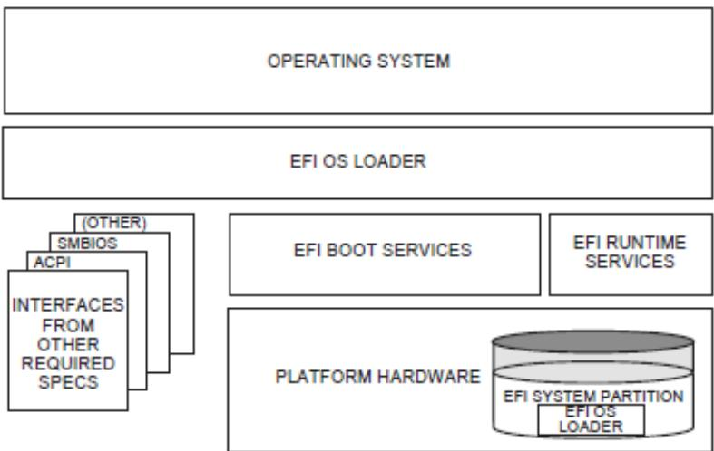  
Fig. 1.1: UEFI Conceptual Overview

The platform firmware is able to retrieve the OS loader image from the System Partition. The specification provides for a variety of mass storage device types including disk, CD-ROM, and DVD as well as remote boot via a network. Through the extensible protocol interfaces, it is possible to add other boot media types, although these may require OS loader modifications if they require use of protocols other than those defined in this document.

Once started, the OS loader continues to boot the complete operating system. To do so, it may use the EFI boot services and interfaces defined by this or other required specifications to survey, comprehend, and initialize the various platform components and the OS software that manages them. EFI runtime services are also available to the OS loader during the boot phase.

## 1.7 UEFI Driver Model

This section describes the goals of a driver model for firmware conforming to this specification. The goal is for this driver model to provide a mechanism for implementing bus drivers and device drivers for all types of buses and devices. At the time of writing, supported bus types include PCI, USB, and so on.

As hardware architectures continue to evolve, the number and types of buses present in platforms are increasing. This trend is especially true in high-end servers. However, a more diverse set of bus types is being designed into desktop and mobile systems and even some embedded systems. This increasing complexity means that a simple method for describing and managing all the buses and devices in a platform is required in the preboot environment. The UEFI Driver Model provides this simple method in the form of protocols services and boot services.

## 1.7.1 UEFI Driver Model Goals

The UEFI Driver Model has the following goals:

\- Compatible — Drivers conforming to this specification must maintain compatibility with the EFI 1.10 Specification and the UEFI Specification. This means that the UEFI Driver Model takes advantage of the extensibility mechanisms in the UEFI 2.0 Specification to add the required functionality.

\- Simple — Drivers that conform to this specification must be simple to implement and simple to maintain. The UEFI Driver Model must allow a driver writer to concentrate on the specific device for which the driver is being developed. A driver should not be concerned with platform policy or platform management issues. These considerations should be left to the system firmware.

\- Scalable — The UEFI Driver Model must be able to adapt to all types of platforms. These platforms include embedded systems, mobile, and desktop systems, as well as workstations and servers.

\- Flexible — The UEFI Driver Model must support the ability to enumerate all the devices, or to enumerate only those devices required to boot the required OS. The minimum device enumeration provides support for more rapid boot capability, and the full device enumeration provides the ability to perform OS installations, system maintenance, or system diagnostics on any boot device present in the system.

\- Extensible — The UEFI Driver Model must be able to extend to future bus types as they are defined.

\- Portable — Drivers written to the UEFI Driver Model processor architectures.

\- Interoperable — Drivers must coexist with other drivers and system firmware and must do so without generating resource conflicts.

\- Describe complex bus hierarchies — The UEFI Driver Model must be able to describe a variety of bus topologies from very simple single bus platforms to very complex platforms containing many buses of various types.

\- Small driver footprint — The size of executables produced by the UEFI Driver Model must be minimized to reduce the overall platform cost. While flexibility and extensibility are goals, the additional overhead required to support these must be kept to a minimum to prevent the size of firmware components from becoming unmanageable.

\- Address legacy option rom issues — The UEFI Driver Model must directly address and solve the constraints and limitations of legacy option ROMs. Specifically, it must be possible to build add-in cards that support both UEFI drivers and legacy option ROMs, where such cards can execute in both legacy BIOS systems and UEFI-conforming platforms, without modifications to the code carried on the card. The solution must provide an evolutionary path to migrate from legacy option ROMs driver to UEFI drivers.

## 1.7.2 Legacy Option ROM Issues

This idea of supporting a driver model came from feedback on the UEFI Specification that provided a clear, market-driven requirement for an alternative to the legacy option ROM (sometimes also referred to as an expansion ROM). The perception is that the advent of the UEFI Specification represents a chance to escape the limitations implicit in the construction and operation of legacy option ROM images by replacing them with an alternative mechanism that works within the framework of the UEFI Specification.

## 1.8 Migration Requirements

Migration requirements cover the transition period from initial implementation of this specification to a future time when all platforms and operating systems implement to this specification. During this period, two major compatibility considerations are important:

\- The ability to continue booting legacy operating systems;

\- The ability to implement UEFI on existing platforms by reusing as much existing firmware code to keep development resource and time requirements to a minimum.

## 1.8.1 Legacy Operating System Support

The UEFI specification represents the preferred means for a shrink-wrap OS and firmware to communicate during the boot process. However, choosing to make a platform that complies with this specification in no way precludes a platform from also supporting existing legacy OS binaries that have no knowledge of the UEFI specification.

The UEFI specification does not restrict a platform designer who chooses to support both the UEFI specification and a more traditional “PC-AT” boot infrastructure. If such a legacy infrastructure is to be implemented, it should be developed in accordance with existing industry practice that is defined outside the scope of this specification. The choice of legacy operating systems that are supported on any given platform is left to the manufacturer of that platform.

## 1.8.2 Supporting the UEFI Specification on a Legacy Platform

The UEFI specification has been carefully designed to allow for existing systems to be extended to support it with a minimum of development effort. In particular, the abstract structures and services defined in the UEFI specification can all be supported on legacy platforms.

For example, to accomplish such support on an existing and supported 32-bit-based platform that uses traditional BIOS to support operating system boot, an additional layer of firmware code would need to be provided. This extra code would be required to translate existing interfaces for services and devices into support for the abstractions defined in this specification.

## 1.9 Conventions Used in this Document

This document uses typographic and illustrative conventions described below.

## 1.9.1 Data Structure Descriptions

Supported processors are “little endian” machines. This distinction means that the low-order byte of a multibyte data item in memory is at the lowest address, while the high-order byte is at the highest address. Some supported 64-bit processors may be configured for both “little endian” and “big endian” operation. All implementations designed to conform to this specification use “little endian” operation.

In some memory layout descriptions, certain fields are marked reserved. Software must initialize such fields to zero and ignore them when read. On an update operation, software must preserve any reserved field.

## 1.9.2 Protocol Descriptions

A protocol description generally has the following format:

Protocol Name: The formal name of the protocol interface.

Summary: A brief description of the protocol interface.

GUID: The 128-bit Globally Unique Identifier (GUID) for the protocol interface.

Protocol Interface Structure: A “C-style” data structure definition containing the procedures and data fields produced by this protocol interface.

Parameters: A brief description of each field in the protocol interface structure.

Description: A description of the functionality provided by the interface, including any limitations and caveats of which the caller should be aware.

Related Definitions: The type declarations and constants that are used in the protocol interface structure or any of its procedures.

## 1.9.3 Procedure Descriptions

A procedure description generally has the following format:

ProcedureName(): The formal name of the procedure.

Summary: A brief description of the procedure.

Prototype: A “C-style” procedure header defining the calling sequence.

Parameters: A brief description of each field in the procedure prototype.

Description: A description of the functionality provided by the interface, including any limitations and caveats of which the caller should be aware.

Related Definitions: The type declarations and constants that are used only by this procedure.

Status Codes Returned: A description of any codes returned by the interface. The procedure is required to implement any status codes listed in this table. Additional error codes may be returned, but they will not be tested by standard compliance tests, and any software that uses the procedure cannot depend on any of the extended error codes that an implementation may provide.

## 1.9.4 Instruction Descriptions

An instruction description for EBC instructions generally has the following format:

InstructionName: The formal name of the instruction.

Syntax: A brief description of the instruction.

Description: A description of the functionality provided by the instruction accompanied by a table that details the instruction encoding.

Operation: Details the operations performed on operands.

Behaviors and Restrictions: An item-by-item description of the behavior of each operand involved in the instruction and any restrictions that apply to the operands or the instruction.

## 1.9.5 Pseudo-Code Conventions

Pseudo code is presented to describe algorithms in a more concise form. None of the algorithms in this document are intended to be compiled directly. The code is presented at a level corresponding to the surrounding text.

In describing variables, a list is an unordered collection of homogeneous objects. A queue is an ordered list of homogeneous objects. Unless otherwise noted, the ordering is assumed to be FIFO.

Pseudo code is presented in a C-like format, using C conventions where appropriate. The coding style, particularly the indentation style, is used for readability and does not necessarily comply with an implementation of the UEFI Specification.

## 1.9.6 Typographic Conventions

This document uses the typographic and illustrative conventions described below:

## Plain text

The normal text typeface is used for the vast majority of the descriptive text in a specification.

## Plain text (blue)

Any plain text that is underlined and in blue indicates an active link to the cross-reference. Click on the word to follow the hyperlink.

## Bold

In text, a Bold typeface identifies a processor register name. In other instances, a Bold typeface can be used as a running head within a paragraph.

## Italic

In text, an Italic typeface can be used as emphasis to introduce a new term or to indicate a manual or specification name.

## BOLD Monospace

Computer code, example code segments, and all prototype code segments use a BOLD Monospace typeface with a dark red color. These code listings normally appear in one or more separate paragraphs, though words or segments can also be embedded in a normal text paragraph.

## Bold Monospace (Blue, underlined)

Words in a Bold Monospace typeface that is underlined and in blue indicate an active hyperlink to the code definition for that function or type definition. Click on the word to follow the hyperlink.

Note: Due to management and file size considerations, only the first occurrence of the reference on each page is an active link. Subsequent references on the same page will not be actively linked to the definition and will use the standard, nonunderlined BOLD Monospace typeface. Find the first instance of the name (in the underlined BOLD Monospace typeface) on the page and click on the word to jump to the function or type definition.

## Italic Monospace

In code or in text, words in Italic Monospace indicate placeholder names for variable information that must be supplied (i.e., arguments).

## 1.9.7 Number formats

A binary number is represented in this standard by any sequence of digits consisting of only the Western-Arabic numerals 0 and 1 immediately followed by a lower-case b (e.g., 0101b).

Underscores or spaces may be included between characters in binary number representations to increase readability or delineate field boundaries (e.g., 0 0101 1010b or 0\_0101\_1010b).

## 1.9.7.1 Hexadecimal

A hexadecimal number is represented in this standard by 0x preceding any sequence of digits consisting of only the Western-Arabic numerals 0 through 9 and/or the upper-case English letters A through F (e.g., 0xFA23).

Underscores or spaces may be included between characters in hexadecimal number representations to increase readability or delineate field boundaries (e.g., 0xB FD8C FA23 or 0xB\_FD8C\_FA23).

## 1.9.7.2 Decimal

A decimal number is represented in this standard by any sequence of digits consisting of only the Arabic numerals 0 through 9 not immediately followed by a lower-case b or lower-case h (e.g., 25).

This standard uses the following conventions for representing decimal numbers:

\- the decimal separator (i.e., separating the integer and fractional portions of the number) is a period;

\- the thousands separator (i.e., separating groups of three digits in a portion of the number) is a comma;

\- the thousands separator is used in the integer portion and is not used in the fraction portion of a number.

## 1.9.8 SI & Binary prefixes

This standard uses the prefixes defined in the International System of Units (SI) for values that are powers of ten. See “Links to UEFI-Related Documents” (http://uefi.org/uefi) under the heading “SI Binary Prefixes”.

## SI prefixes

Table 1.2: SI Prefixes

<table><tr><td> $10^{3}$ </td><td>1,000</td><td>kilo</td><td>K</td></tr><tr><td> $10^{6}$ </td><td>1,000,000</td><td>mega</td><td>M</td></tr><tr><td> $10^{9}$ </td><td>1,000,000,000</td><td>giga</td><td>G</td></tr></table>

This standard uses the binary prefixes defined in ISO/IEC 80000-13 Quantities and units – Part 13: Information science and technology and IEEE 1514 Standard for Prefixes for Binary Multiples for values that are powers of two.

## Binary prefixes

Table 1.3: Binary Prefixes

<table><tr><td>Factor</td><td>Factor</td><td>Name</td><td>Symbol</td></tr><tr><td> $2^{10}$ </td><td>1,024</td><td>kibi</td><td>Ki</td></tr><tr><td> $2^{20}$ </td><td>1,048,576</td><td>mebi</td><td>Mi</td></tr><tr><td> $2^{30}$ </td><td>1,073,741,824</td><td>gibi</td><td>Gi</td></tr></table>

For example, 4 KB means 4,000 bytes and 4 KiB means 4,096 bytes.

## 1.9.9 Revision Numbers

Updates to the UEFI specification are considered either new revisions or errata as described below:

\- A new revision is produced when there is substantive new content or changes that may modify existing behavior. New revisions are designated by a major.minor version number (e.g. xx.yy). In cases where the changes are exceptionally minor, we may have a major.minor.minor naming convention (e.g. xx.yy.z).

\- Errata versions are produced when approved updates to the specification do not include any significant new material or modify existing behavior. Errata are designated by adding an upper-case letter at the end of the version number, such as xx.yy errata A.

## OVERVIEW

UEFI allows the extension of platform firmware by loading UEFI driver and UEFI application images. When UEFI drivers and UEFI applications are loaded they have access to all UEFI-defined runtime and boot services. See the Booting Sequence figure below.

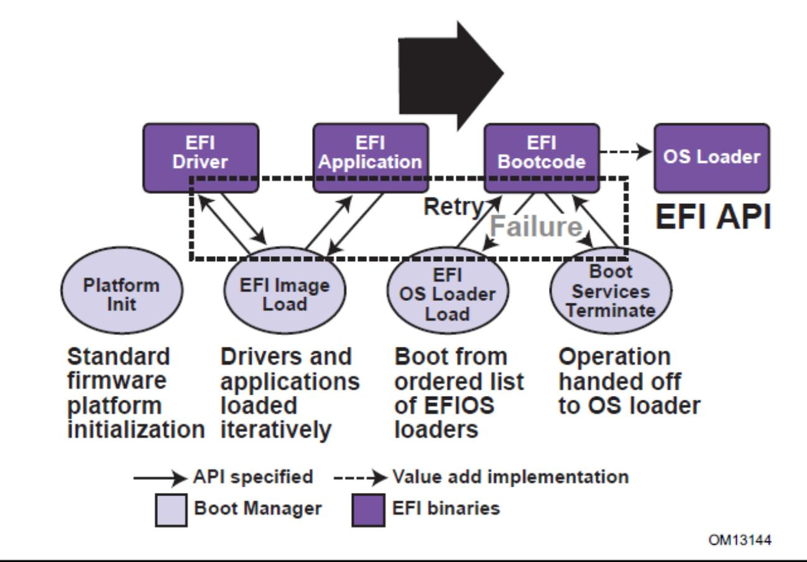  
Fig. 2.1: Booting Sequence

UEFI allows the consolidation of boot menus from the OS loader and platform firmware into a single platform firmware menu. These platform firmware menus will allow the selection of any UEFI OS loader from any partition on any boot medium that is supported by UEFI boot services. An UEFI OS loader can support multiple options that can appear on the user interface. It is also possible to include legacy boot options, such as booting from the A: or C: drive in the platform firmware boot menus.

UEFI supports booting from media that contain an UEFI OS loader or an UEFI-defined System Partition. An UEFI-defined System Partition is required by UEFI to boot from a block device. UEFI does not require any change to the first sector of a partition, so it is possible to build media that will boot on both legacy architectures and UEFI platforms.

## 2.1 Boot Manager

UEFI contains a boot manager that allows the loading of applications written to this specification (including OS first stage loader) or UEFI drivers from any file on an UEFI-defined file system or through the use of an UEFI-defined image loading service. UEFI defines NVRAM variables that are used to point to the file to be loaded. These variables also contain application-specific data that are passed directly to the UEFI application. The variables also contain a human readable string that can be displayed in a menu to the user.

The variables defined by UEFI allow the system firmware to contain a boot menu that can point to all of the operating systems, and even multiple versions of the same operating systems. The design goal of UEFI was to have one set of boot menus that could live in platform firmware. UEFI specifies only the NVRAM variables used in selecting boot options. UEFI leaves the implementation of the menu system as value added implementation space.

UEFI greatly extends the boot flexibility of a system over the current state of the art in the PC-AT-class system. The PC-AT-class systems today are restricted to boot from the first floppy, hard drive, CD-ROM, USB keys, or network card attached to the system. Booting from a common hard drive can cause many interoperability problems between operating systems, and different versions of operating systems from the same vendor.

## 2.1.1 UEFI Images

UEFI Images are a class of files defined by UEFI that contain executable code. The most distinguishing feature of UEFI Images is that the first set of bytes in the UEFI Image file contains an image header that defines the encoding of the executable image.

UEFI uses a subset of the PE32+ image format with a modified header signature. The modification to the signature value in the PE32+ image is done to distinguish UEFI images from normal PE32 executables. The “+” addition to PE32 provides the 64-bit relocation fix-up extensions to standard PE32 format.

For images with the UEFI image signature, the Subsystem values in the PE image header are defined below. The major differences between image types are the memory type that the firmware will load the image into, and the action taken when the image's entry point exits or returns. A UEFI application image is always unloaded when control is returned from the image's entry point. A UEFI driver image is only unloaded if control is passed back with a UEFI error code.

```c
// PE32+ Subsystem type for EFI images
#define EFI_IMAGE_SUBSYSTEM_EFI_APPLICATION 10
#define EFI_IMAGE_SUBSYSTEM_EFI_BOOT_SERVICE_DRIVER 11
#define EFI_IMAGE_SUBSYSTEM_EFI_RUNTIME_DRIVER 12

// PE32+ Machine type for EFI images
#define EFI_IMAGE_MACHINE_IA32 0x014c
#define EFI_IMAGE_MACHINE_IA64 0x0200
#define EFI_IMAGE_MACHINE_EBC 0x0EBC
#define EFI_IMAGE_MACHINE_x64 0x8664
#define EFI_IMAGE_MACHINE_ARMTHUMB_MIXED 0x01C2
#define EFI_IMAGE_MACHINE_AARCH64 0xAA64
#define EFI_IMAGE_MACHINE_RISCV32 0x5032
#define EFI_IMAGE_MACHINE_RISCV64 0x5064
#define EFI_IMAGE_MACHINE_RISCV128 0x5128
```  
(continues on next page)

<table><tr><td></td><td></td><td>(continued from previous page)</td></tr><tr><td>#define EFI_IMAGE_MACHINE_LOONGARCH32</td><td>0x6232</td><td></td></tr><tr><td>#define EFI_IMAGE_MACHINE_LOONGARCH64</td><td>0x6264</td><td></td></tr></table>

## Note

This image type is chosen to enable UEFI images to contain Thumb and Thumb2 instructions while defining the EFI interfaces themselves to be in ARM mode.

Table 2.1: UEFI Image Memory Types

<table><tr><td>Subsystem Type</td><td>Code Memory Type</td><td>Data Memory Type</td></tr><tr><td>EFI_IMAGE_SUSBS</td><td>EfiLoaderCode</td><td>EfiLoaderData</td></tr><tr><td>YTEM_EFI_APPLICATION</td><td></td><td></td></tr><tr><td>EFI _IMAGE_SUBSYSTEM_EFI_BOOT_SERVICE_DRIVER</td><td>EfiBootServicesCode</td><td>EfiBootServicesData</td></tr><tr><td>EFI_IMAGE_SUBSYSTEM_EFI_RUNTIME_DRIVER</td><td>Ef iRuntimeServicesCode</td><td>Ef iRuntimeServicesData</td></tr></table>

The Machine value that is found in the PE image file header is used to indicate the machine code type of the image. The machine code types for images with the UEFI image signature are defined below. A given platform must implement the image type native to that platform and the image type for EFI Byte Code (EBC). Support for other machine code types is optional to the platform.

A UEFI image is loaded into memory through the EFI\_BOOT\_SERVICES.LoadImage() Boot Service. This service loads an image with a PE32+ format into memory. This PE32+ loader is required to load all sections of the PE32+ image into memory. Once the image is loaded into memory, and the appropriate fix-ups have been performed, control is transferred to a loaded image at the AddressOfEntryPoint reference according to the normal indirect calling conventions of applications based on supported 32-bit, 64-bit, or 128-bit processors. All other linkage to and from an UEFI image is done programmatically.

## 2.1.2 UEFI Applications

Applications written to this specification are loaded by the Boot Manager or by other UEFI applications. To load a UEFI application the firmware allocates enough memory to hold the image, copies the sections within the UEFI application image to the allocated memory, and applies the relocation fix-ups needed. Once done, the allocated memory is set to be the proper type for code and data for the image. Control is then transferred to the UEFI application's entry point. When the application returns from its entry point, or when it calls the Boot Service EFI\_BOOT\_SERVICES.LoadImage(), the UEFI application is unloaded from memory and control is returned to the UEFI component that loaded the UEFI application.

When the Boot Manager loads a UEFI application, the image handle may be used to locate the “load options” for the UEFI application. The load options are stored in nonvolatile storage and are associated with the UEFI application being loaded and executed by the Boot Manager.

## 2.1.3 UEFI OS Loaders

A UEFI OS loader is a special type of UEFI application that normally takes over control of the system from firmware conforming to this specification. When loaded, the UEFI OS loader behaves like any other UEFI application in that it must only use memory it has allocated from the firmware and can only use UEFI services and protocols to access the devices that the firmware exposes. If the UEFI OS loader includes any boot service style driver functions, it must use the proper UEFI interfaces to obtain access to the bus specific-resources. That is, I/O and memory-mapped device registers must be accessed through the proper bus specific I/O calls like those that a UEFI driver would perform.

If the UEFI OS loader experiences a problem and cannot load its operating system correctly, it can release all allocated resources and return control back to the firmware via the Boot Service Exit() call. The Exit() call allows both an error code and ExitData to be returned. The ExitData contains both a string and OS loader-specific data to be returned. If the UEFI OS loader successfully loads its operating system, it can take control of the system by using the Boot Service EFI\_BOOT\_SERVICES.ExitBootServices(). After successfully calling ExitBootServices(), all boot services in the system are terminated, including memory management, and the UEFI OS loader is responsible for the continued operation of the system.

## 2.1.4 UEFI Drivers

UEFI drivers are loaded by the Boot Manager, firmware conforming to this specification, or by other UEFI applications. To load a UEFI driver the firmware allocates enough memory to hold the image, copies the sections within the UEFI driver image to the allocated memory and applies the relocation fix-ups needed. Once done, the allocated memory is set to be the proper type for code and data for the image. Control is then transferred to the UEFI driver's entry point. When the UEFI driver returns from its entry point, or when it calls the Boot Service EFI\_BOOT\_SERVICES.ExitBootServices() , the UEFI driver is optionally unloaded from memory and control is returned to the component that loaded the UEFI driver. A UEFI driver is not unloaded from memory if it returns a status code of EFI\_SUCCESS . If the UEFI driver's return code is an error status code, then the driver is unloaded from memory.

There are two types of UEFI drivers: boot service drivers and runtime drivers. The only difference between these two driver types is that UEFI runtime drivers are available after a UEFI OS loader has taken control of the platform with the Boot Service EFI\_BOOT\_SERVICES.ExitBootServices().

UEFI boot service drivers are terminated when ExitBootServices() is called, and all the memory resources consumed by the UEFI boot service drivers are released for use in the operating system environment.

A runtime driver of type EFI\_IMAGE\_SUBSYSTEM\_EFI\_RUNTIME\_DRIVER gets fixed up with virtual mappings when the OS calls SetVirtualAddressMap().

## 2.2 Firmware Core

This section provides an overview of the services defined by UEFI. These include boot services and runtime services.

## 2.2.1 UEFI Services

The purpose of the UEFI interfaces is to define a common boot environment abstraction for use by loaded UEFI images, which include UEFI drivers, UEFI applications, and UEFI OS loaders. The calls are defined with a full 64-bit interface, so that there is headroom for future growth. The goal of this set of abstracted platform calls is to allow the platform and OS to evolve and innovate independently of one another. Also, a standard set of primitive runtime services may be used by operating systems.

Platform interfaces defined in this section allow the use of standard Plug and Play Option ROMs as the underlying implementation methodology for the boot services. The interfaces have been designed in such as way as to map back into legacy interfaces. These interfaces have in no way been burdened with any restrictions inherent to legacy Option ROMs.

The UEFI platform interfaces are intended to provide an abstraction between the platform and the OS that is to boot on the platform. The UEFI specification also provides abstraction between diagnostics or utility programs and the platform; however, it does not attempt to implement a full diagnostic OS environment. It is envisioned that a small diagnostic OS-like environment can be easily built on top of an UEFI system. Such a diagnostic environment is not described by this specification. Interfaces added by this specification are divided into the following categories and are detailed later in this document:

\* Runtime services

\* Boot services interfaces, with the following subcategories:

\- Global boot service interfaces

– Device handle-based boot service interfaces

\- Device protocols

\- Protocol services

## 2.2.2 Runtime Services

This section describes UEFI runtime service functions. The primary purpose of the runtime services is to abstract minor parts of the hardware implementation of the platform from the OS. Runtime service functions are available during the boot process and also at runtime provided the OS switches into flat physical addressing mode to make the runtime call. However, if the OS loader or OS uses the Runtime Service SetVirtualAddressMap() service, the OS will only be able to call runtime services in a virtual addressing mode. All runtime interfaces are non-blocking interfaces and can be called with interrupts disabled if desired. To ensure maximum compatibility with existing platforms it is recommended that all UEFI modules that comprise the Runtime Services be represented in the MemoryMap as a single EFI\_MEMORY\_DESCRIPTION of Type EfiRuntimeServicesCode.

In all cases memory used by the runtime services must be reserved and not used by the OS. runtime services memory is always available to an UEFI function and will never be directly manipulated by the OS or its components. UEFI is responsible for defining the hardware resources used by runtime services, so the OS can synchronize with those resources when runtime service calls are made, or guarantee that the OS never uses those resources. See the table below for lists of the Runtime Services functions.

Table 2.2: UEFI Runtime Services

<table><tr><td>Name</td><td>Description</td></tr><tr><td>GetTime()</td><td>Returns the current time, time context, and time keeping capabilities.</td></tr><tr><td>SetTime()</td><td>Sets the current time and time context.</td></tr><tr><td>GetWakeupTime()</td><td>Returns the current wakeup alarm settings.</td></tr><tr><td>SetWakeupTime()</td><td>Sets the current wakeup alarm settings.</td></tr><tr><td>GetVariable()</td><td>Returns the value of a named variable.</td></tr><tr><td>GetNextVariableName()</td><td>Enumerates variable names.</td></tr><tr><td>SetVariable()</td><td>Sets, and if needed creates, a variable.</td></tr><tr><td>SetVirtualAddressMap()</td><td>Switches all runtime functions from physical to virtual addressing.</td></tr><tr><td>ConvertPointer()</td><td>Used to convert a pointer from physical to virtual addressing.</td></tr><tr><td>Get Next High Monotonic Count</td><td>Subsumes the platform&#x27;s monotonic counter functionality.</td></tr><tr><td>ResetSystem()</td><td>Resets all processors and devices and reboots the system.</td></tr><tr><td>Update Capsule</td><td>Passes capsules to the firmware with both virtual and physical mapping.</td></tr><tr><td>QueryCapsuleCapabilities()</td><td>Returns if the capsule can be supported via UpdateCapsule().</td></tr><tr><td>QueryVariableInfo()</td><td>Returns information about the EFI variable store.</td></tr></table>

## 2.3 Calling Conventions

Unless otherwise stated, all functions defined in the UEFI specification are called through pointers in common, architecturally defined, calling conventions found in C compilers. Pointers to the various global UEFI functions are found in the EFI\_RUNTIME\_SERVICES and EFI\_BOOT\_SERVICES tables that are located via the system table. Pointers to other functions defined in this specification are located dynamically through device handles. In all cases, all pointers to UEFI functions are cast with the word EFIAPI. This allows the compiler for each architecture to supply the proper compiler keywords to achieve the needed calling conventions. When passing pointer arguments to Boot Services, Runtime Services, and Protocol Interfaces, the caller has the following responsibilities:

\- It is the caller's responsibility to pass pointer parameters that reference physical memory locations. If a pointer is passed that does not point to a physical memory location (i.e., a memory mapped I/O region), the results are unpredictable and the system may halt.

\- It is the caller's responsibility to pass pointer parameters with correct alignment. If an unaligned pointer is passed to a function, the results are unpredictable and the system may halt.

\- It is the caller's responsibility to not pass in a NULL parameter to a function unless it is explicitly allowed. If a NULL pointer is passed to a function, the results are unpredictable and the system may hang.

\- Unless otherwise stated, a caller should not make any assumptions regarding the state of pointer parameters if the function returns with an error.

\- A caller may not pass structures that are larger than native size by value and these structures must be passed by reference (via a pointer) by the caller. Passing a structure larger than native width (4 bytes on supported 32-bit processors; 8 bytes on supported 64-bit processor instructions) on the stack will produce undefined results.

Calling conventions for supported 32-bit and supported 64-bit applications are described in more detail below. Any function or protocol may return any valid return code.

All public interfaces of a UEFI module must follow the UEFI calling convention. Public interfaces include the image entry point, UEFI event handlers, and protocol member functions. The type EFIAPI is used to indicate conformance to the calling conventions defined in this section. Non public interfaces, such as private functions and static library calls, are not required to follow the UEFI calling conventions and may be optimized by the compiler.

## 2.3.1 Data Types

See the table below which lists the common data types that are used in the interface definitions, and the following table, Modifiers for Common UEFI Data Types, lists their modifiers. Unless otherwise specified all data types are naturally aligned. Structures are aligned on boundaries equal to the largest internal datum of the structure and internal data are implicitly padded to achieve natural alignment.

The values of the pointers passed into or returned by the UEFI interfaces must provide natural alignment for the underlying types.

## Common UEFI Data Types

Table 2.3: Common UEFI Data Types

<table><tr><td>Mnemonic</td><td>Description</td></tr><tr><td>BOOLEAN</td><td>Logical Boolean. 1-byte value containing a 0 for FALSE or a 1 for TRUE. Other values are undefined.</td></tr><tr><td>INTN</td><td>Signed value of native width. (4 bytes on supported 32-bit processor instructions, 8 bytes on supported 64-bit processor instructions, 16 bytes on supported 128-bit processor instructions)</td></tr></table>

continues on next page

Table 2.3 – continued from previous page

<table><tr><td>UINTN</td><td>Unsigned value of native width. (4 bytes on supported 32-bit processor instructions, 8 bytes on supported 64-bit processor instructions, 16 bytes on supported 128-bit processor instructions)</td></tr><tr><td>INT8</td><td>1-byte signed value.</td></tr><tr><td>UINT8</td><td>1-byte unsigned value.</td></tr><tr><td>INT16</td><td>2-byte signed value.</td></tr><tr><td>UINT16</td><td>2-byte unsigned value.</td></tr><tr><td>INT32</td><td>4-byte signed value.</td></tr><tr><td>UINT32</td><td>4-byte unsigned value.</td></tr><tr><td>INT64</td><td>8-byte signed value.</td></tr><tr><td>UINT64</td><td>8-byte unsigned value.</td></tr><tr><td>INT128</td><td>16-byte signed value.</td></tr><tr><td>UINT128</td><td>16-byte unsigned value.</td></tr><tr><td>CHAR8</td><td>1-byte character. Unless otherwise specified, all 1-byte or ASCII characters and strings are stored in 8-bit ASCII encoding format, using the ISO-Latin-1 character set.</td></tr><tr><td>CHAR16</td><td>2-byte Character. Unless otherwise specified all characters and strings are stored in the UCS-2 encoding format as defined by Unicode 2.1 and ISO/IEC 10646 standards.</td></tr><tr><td>VOID</td><td>Undeclared type.</td></tr><tr><td>EFI_GUID</td><td>128-bit buffer containing a unique identifier value. Unless otherwise specified, aligned on a 64-bit boundary.</td></tr><tr><td>EFI_STATUS</td><td>Status code. Type UINTN.</td></tr><tr><td>EFI_HANDLE</td><td>A collection of related interfaces. Type VOID *.</td></tr><tr><td>EFI_EVENT</td><td>Handle to an event structure. Type VOID *.</td></tr><tr><td>EFI_LBA</td><td>Logical block address. Type UINT64.</td></tr><tr><td>EFI_TPL</td><td>Task priority level. Type UINTN.</td></tr><tr><td>EFI_MAC_ADDRESS</td><td>32-byte buffer containing a network Media Access Control address.</td></tr><tr><td>EFI_IPv4_ADDRESS</td><td>4-byte buffer. An IPv4 internet protocol address.</td></tr><tr><td>EFI_IPv6_ADDRESS</td><td>16-byte buffer. An IPv6 internet protocol address.</td></tr><tr><td>EFI_IP_ADDRESS</td><td>16-byte buffer aligned on a 4-byte boundary. An IPv4 or IPv6 internet protocol address.</td></tr><tr><td></td><td>Element of a standard ANSI C enum type declaration. Type INT32.or UINT32. ANSI C does not define the size of sign of an enum so they should never be used in structures. ANSI C integer promotion rules make INT32 or UINT32 interchangeable when passed as an argument to a function.</td></tr><tr><td>sizeof (VOID *)</td><td>4 bytes on supported 32-bit processor instructions. 8 bytes on supported 64-bit processor instructions. 16 bytes on supported 128-bit processor.</td></tr><tr><td>Bitfields</td><td>Bitfields are ordered such that bit 0 is the least significant bit.</td></tr></table>

Table 2.4: Modifiers for Common UEFI Data Types

<table><tr><td>Mnemonic</td><td>Description</td></tr><tr><td>IN</td><td>Datum is passed to the function.</td></tr><tr><td>OUT</td><td>Datum is returned from the function.</td></tr><tr><td>OPTIONAL</td><td>Passing the datum to the function is optional, and a NULL may be passed if the value is not supplied.</td></tr><tr><td>CONST</td><td>Datum is read-only.</td></tr><tr><td>EFIAPI</td><td>Defines the calling convention for UEFI interfaces.</td></tr></table>

## 2.3.2 IA-32 Platforms

All functions are called with the C language calling convention. The general-purpose registers that are volatile across function calls are eax, ecx, and edx. All other general-purpose registers are nonvolatile and are preserved by the target function. In addition, unless otherwise specified by the function definition, all other registers are preserved.

Firmware boot ‘services and runtime services run in the following processor execution mode prior to the OS calling ExitBootServices():

\* Uniprocessor, as described in chapter 8.4 of:

\- Intel 64 and IA-32 Architectures Software Developer's Manual

\- Volume 3, System Programming Guide, Part 1

\- Order Number: 253668-033US, December 2009

\- See “Links to UEFI-Related Documents” (http://uefi.org/uefi) under the heading “Intel Processor Manuals.”

\* Protected mode

\* Paging mode may be enabled. If paging mode is enabled, PAE (Physical Address Extensions) mode is recommended. If paging mode is enabled, any memory space defined by the UEFI memory map is identity mapped (virtual address equals physical address). The mappings to other regions are undefined and may vary from implementation to implementation.

\* Selectors are set to be flat and are otherwise not used.

\* Interrupts are enabled-though no interrupt services are supported other than the UEFI boot services timer functions (All loaded device drivers are serviced synchronously by “polling.”)

\* Direction flag in EFLAGs is clear.

\* Other general purpose flag registers are undefined.

\* 128 KiB, or more, of available stack space.

\* The stack must be 16-byte aligned. Stack may be marked as non-executable in identity mapped page tables.

\* Floating-point control word must be initialized to 0x027F (all exceptions masked, double-precision, round-to-nearest).

\* Multimedia-extensions control word (if supported) must be initialized to 0x1F80 (all exceptions masked, round-to-nearest, flush to zero for masked underflow).

\* CR0.EM must be zero.

\* CR0.TS must be zero.

An application written to this specification may alter the processor execution mode, but the UEFI image must ensure firmware boot services and runtime services are executed with the prescribed execution environment.

After an Operating System calls ExitBootServices(), firmware boot services are no longer available and it is illegal to call any boot service. After ExitBootServices, firmware runtime services are still available and may be called with paging enabled and virtual address pointers if SetVirtualAddressMap() has been called describing all virtual address ranges used by the firmware runtime service. For an operating system to use any UEFI runtime services, it must:

\* Preserve all memory in the memory map marked as runtime code and runtime data

\* Call the runtime service functions, with the following conditions:

\- In protected mode

\- Paging may or may not be enabled, however if paging is enabled and SetVirtualAddressMap() has not been called, any memory space defined by the UEFI memory map is identity mapped (virtual address equals physical address), although the attributes of certain regions may not have all read, write, and execute attributes or be unmarked for purposes of platform protection. The mappings to other regions are undefined and may vary from implementation to implementation. See description of SetVirtualAddressMap() for details of memory map after this function has been called.

\- Direction flag in EFLAGs clear

\- 4 KiB, or more, of available stack space

\- The stack must be 16-byte aligned

\- Floating-point control word must be initialized to 0x027F (all exceptions masked, double-precision, round-to-nearest)

\- Multimedia-extensions control word (if supported) must be initialized to 0x1F80 (all exceptions masked, round-to-nearest, flush to zero for masked underflow)

\- CR0.EM must be zero

\- CR0.TS must be zero

\- Interrupts disabled or enabled at the discretion of the caller

\* ACPI Tables loaded at boot time can be contained in memory of type EfiACPIReclaimMemory (recommended) or EfiACPIMemoryNVS. ACPI FACS must be contained in memory of type EfiACPIMemoryNVS.

\* The system firmware must not request a virtual mapping for any memory descriptor of type EfiACPIRe-claimMemory or EfiACPIMemoryNVS.

\* EFI memory descriptors of type EfiACPIReclaimMemory and EfiACPIMemoryNVS must be aligned on a 4 KiB boundary and must be a multiple of 4 KiB in size.

\* Any UEFI memory descriptor that requests a virtual mapping via the EFI\_MEMORY\_DESCRIPTION having the EFI\_MEMORY\_RUNTIME bit set must be aligned on a 4 KiB boundary and must be a multiple of 4 KiB in size.

\* An ACPI Memory Op-region must inherit cacheability attributes from the UEFI memory map. If the system memory map does not contain cacheability attributes, the ACPI Memory Op-region must inherit its cacheability attributes from the ACPI name space. If no cacheability attributes exist in the system memory map or the ACPI name space, then the region must be assumed to be non-cacheable.

\* ACPI tables loaded at runtime must be contained in memory of type EfiACPIMemoryNVS. The cacheability attributes for ACPI tables loaded at runtime should be defined in the UEFI memory map. If no information about the table location exists in the UEFI memory map, cacheability attributes may be obtained from ACPI memory descriptors. If no information about the table location exists in the UEFI memory map or ACPI memory descriptors, the table is assumed to be non-cached.

\* In general, UEFI Configuration Tables loaded at boot time (e.g., SMBIOS table) can be contained in memory of type EfiRuntimeServicesData (recommended), EfiBootServicesData, EfiACPIReclaimMemory or EfiACPIMemoryNVS. Tables loaded at runtime must be contained in memory of type EfiRuntimeServicesData (recommended) or EfiACPIMemoryNVS.

## Note

Previous EFI specifications allowed ACPI tables loaded at runtime to be in the EfiReservedMemoryType and there was no guidance provided for other EFI Configuration Tables. EfiReservedMemoryType is not intended to be used for the storage of any EFI Configuration Tables. Also, only OSes conforming to the UEFI Specification are guaranteed to handle SMBIOS table in memory of type EfiBootServicesData.

## 2.3.2.1 Handoff State

When a 32-bit UEFI OS is loaded, the system firmware hands off control to the OS in flat 32-bit mode. All descriptors are set to their 4GiB limits so that all of memory is accessible from all segments.

The Figure below (Stack After AddressOfEntryPoint Called, IA-32) shows the stack after AddressOfEntryPoint in the image's PE32+ header has been called on supported 32-bit systems. All UEFI image entry points take two parameters. These are the image handle of the UEFI image, and a pointer to the EFI System Table.

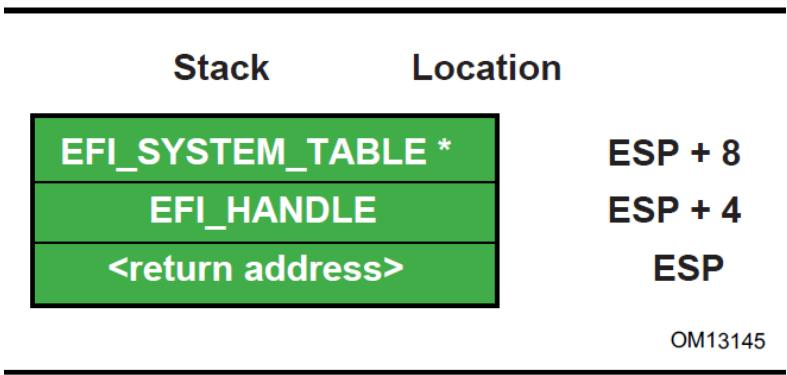  
Fig. 2.2: Stack After AddressOfEntryPoint Called, IA-32

## 2.3.2.2 Calling Convention

All functions are called with the C language calling convention. The general-purpose registers that are volatile across function calls are eax, ecx, and edx. All other general-purpose registers are nonvolatile and are preserved by the target function.

In addition, unless otherwise specified by the function definition, all other CPU registers (including MMX and XMM) are preserved.

The floating point status register is not preserved by the target function. The floating point control register and MMX control register are saved by the target function.

If the return value is a float or a double, the value is returned in ST(0).

## 2.3.3 Intel $^{®}$ Itanium $^{®}$ -Based Platforms

UEFI executes as an extension to the SAL execution environment with the same rules as laid out by the SAL specification.

During boot services time the processor is in the following execution mode:

\* Uniprocessor, as detailed in chapter 13.1.2 of:

\- Intel Itanium Architecture Software Developer's Manual

\- Volume 2: System Architecture

\- Revision 2.2

\- January 2006

\- See “Links to UEFI-Related Documents” (http://uefi.org/uefi) under the heading “Intel Itanium Documentation”.

\- Document Number: 245318-005

\* Physical mode

\* 128 KiB, or more, of available stack space

\* 16 KiB, or more, of available backing store space
- FPSR.traps: Set to all 1's (all exceptions disabled)
- FPSR.sf0:

\*.pc: Precision Control - 11b (extended precision)

\*.rc: Rounding Control - 0 (round to nearest)

\*.wre: Widest Range Exponent - 0 (IEEE mode)

\*.ftz: Flush-To-Zero mode - 0 (off)
- FPSR.sf1:

\*.td: Traps Disable = 1 (traps disabled)

\*.pc: Precision Control - 11b (extended precision)

\*.rc: Rounding Control - 0 (round to nearest)

\* wreWidest Range Exponent - 1 (full register exponent range)

\* ftz Flush-To-Zero mode - 0 (off)
- FPSR.sf2,3:

\*.td Traps Disable = 1 (traps disabled)

\* pc: Precision Control - 11b (extended precision)

\*.rc: Rounding Control - 0 (round to nearest)

\*.wre: Widest Range Exponent - 0 (IEEE mode)

\*.ftz: Flush-To-Zero mode - 0 (off)

An application written to this specification may alter the processor execution mode, but the UEFI image must ensure firmware boot services and runtime services are executed with the prescribed execution environment.

After an Operating System calls ExitBootServices(), firmware boot services are no longer available and it is illegal to call any boot service. After ExitBootServices, firmware runtime services are still available When calling runtime services, paging may or may not be enabled, however if paging is enabled and SetVirtualAddressMap() has not been called, any memory space defined by the UEFI memory map is identity mapped (virtual address equals physical address). The mappings to other regions are undefined and may vary from implementation to implementation. See description of SetVirtualAddressMap() for details of memory map after this function has been called. After ExitBootServices(), runtime service functions may be called with interrupts disabled or enabled at the discretion of the caller.

\* ACPI Tables loaded at boot time can be contained in memory of type EfiACPIReclaimMemory (recommended) or EfiACPIMemoryNVS. CPI FACS must be contained in memory of type EfiACPIMemoryNVS.

\* The system firmware must not request a virtual mapping for any memory descriptor of type EfiACPIRe-claimMemory or EfiACPIMemoryNVS.

\* EFI memory descriptors of type EfiACPIReclaimMemory and EfiACPIMemoryNVS. must be aligned on an 8 KiB boundary and must be a multiple of 8 KiB in size.

\* Any UEFI memory descriptor that requests a virtual mapping via the EFI\_MEMORY\_DESCRIPTION having the EFI\_MEMORY\_RUNTIME bit set must be aligned on an 8 KiB boundary and must be a multiple of 8 KiB in size.

\* An ACPI Memory Op-region must inherit cacheability attributes from the UEFI memory map. If the system memory map does not contain cacheability attributes the ACPI Memory Op-region must inherit its cacheability attributes from the ACPI name space. If no cacheability attributes exist in the system memory map or the ACPI name space, then the region must be assumed to be non-cacheable.

\* ACPI tables loaded at runtime must be contained in memory of type EfiACPIMemoryNVS. The cacheability attributes for ACPI tables loaded at runtime should be defined in the UEFI memory map. If no information about the table location exists in the UEFI memory map, cacheability attributes may be obtained from ACPI memory descriptors. If no information about the table location exists in the UEFI memory map or ACPI memory descriptors, the table is assumed to be non-cached.

\* In general, Configuration Tables loaded at boot time (e.g., SMBIOS table) can be contained in memory of type EfiRuntimeServicesData (recommended), EfiBootServicesData, EfiACPIReclaimMemory or EfiACPIMemoryNVS. Tables loaded at runtime must be contained in memory of type EfiRuntimeServicesData (recommended) or EfiACPIMemoryNVS.

## Note

Previous EFI specifications allowed ACPI tables loaded at runtime to be in the EfiReservedMemoryType and there was no guidance provided for other EFI Configuration Tables. EfiReservedMemoryType is not intended to be used by firmware. Also, only OSes conforming to the UEFI Specification are guaranteed to handle SMBIOS table in memory of type EfiBootServicesData.

Refer to the IA-64 System Abstraction Layer Specification (References) for details.

UEFI procedures are invoked using the P64 C calling conventions defined for Intel® Itanium®-based applications. Refer to the document 64 Bit Runtime Architecture and Software Conventions for IA-64 (References) for more information.

## 2.3.3.1 Handoff State

UEFI uses the standard P64 C calling conventions that are defined for Itanium-based operating systems. The Figure below shows the stack after ImageEntryPoint has been called on Itanium-based systems. The arguments are also stored in registers: out0 contains EFI\_HANDLE and out1 contains the address of the EFI\_SYSTEM\_TABLE. The gp for the UEFI Image will have been loaded from the plabel pointed to by the AddressOfEntryPoint in the image's PE32+ header. All UEFI image entry points take two parameters. These are the image handle of the image, and a pointer to the System Table.

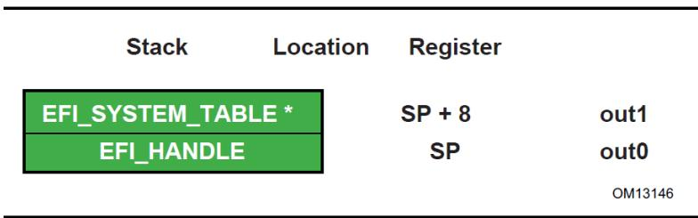  
Fig. 2.3: Stack after AddressOfEntryPoint Called, Itanium-based Systems

The SAL specification (References) defines the state of the system registers at boot handoff. The SAL specification also defines which system registers can only be used after UEFI boot services have been properly terminated.

## 2.3. Calling Conventions

## 2.3.3.2 Calling Convention

UEFI executes as an extension to the SAL execution environment with the same rules as laid out by the SAL specification. UEFI procedures are invoked using the P64 C calling conventions defined for Intel $^{®}$ Itanium $^{®}$ -based applications. Refer to the document 64 Bit Runtime Architecture and Software Conventions for IA-64 (see the index appendix for more information).

For floating point, functions may only use the lower 32 floating point registers Return values appear in f8-f15 registers. Single, double, and extended values are all returned using the appropriate format. Registers f6-f7 are local registers and are not preserved for the caller. All other floating point registers are preserved. Note that, when compiling UEFI programs, a special switch will likely need to be specified to guarantee that the compiler does not use f32-f127, which are not normally preserved in the regular calling convention for Itanium. A procedure using one of the preserved floating point registers must save and restore the caller's original contents without generating a NaT consumption fault.

Floating point arguments are passed in f8-f15 registers when possible. Parameters beyond the registers appear in memory, as explained in Section 8.5 of the Itanium Software Conventions and Runtime Architecture Guide. Within the called function, these are local registers and are not preserved for the caller. Registers f6-f7 are local registers and are not preserved for the caller. All other floating point registers are preserved. Note that, when compiling UEFI programs, a special switch will likely need to be specified to guarantee that the compiler does not use f32-f127, which are not normally preserved in the regular calling convention for Itanium. A procedure using one of the preserved floating point registers must save and restore the caller's original contents without generating a NaT consumption fault.

The floating point status register must be preserved across calls to a target function. Flags fields in SF1,2,3 are not preserved for the caller. Flags fields in SF0 upon return will reflect the value passed in, and with bits set to 1 corresponding to any IEEE exceptions detected on non-speculative floating-point operations executed as part of the callee.

Floating-point operations executed by the callee may require software emulation. The caller must be prepared to handle FP Software Assist (FPSWA) interruptions. Callees should not raise IEEE traps by changing FPSR.traps bits to 0 and then executing floating-point operations that raise such traps.

## 2.3.4 x64 Platforms

All functions are called with the C language calling convention. Detailed Calling Conventions for more detail.

During boot services time the processor is in the following execution mode:

\* Uniprocessor, as described in chapter 8.4 of:

\- Intel 64 and IA-32 Architectures Software Developer's Manual, Volume 3, System Programming Guide, Part 1, Order Number: 253668-033US, December 2009

-See “Links to UEFI-Related Documents” (http://uefi.org/uefi) under the heading “Intel Processor Manuals”.

\* Long mode, in 64-bit mode

\* Paging mode is enabled and any memory space defined by the UEFI memory map is identity mapped (virtual address equals physical address), although the attributes of certain regions may not have all read, write, and execute attributes or be unmarked for purposes of platform protection. The mappings to other regions, such as those for unaccepted memory, are undefined and may vary from implementation to implementation.

\* Selectors are set to be flat and are otherwise not used.

\* Interrupts are enabled-though no interrupt services are supported other than the UEFI boot services timer functions (All loaded device drivers are serviced synchronously by “polling.”)

\* Direction flag in EFLAGs is clear

\* Other general purpose flag registers are undefined

\* 128 KiB, or more, of available stack space

\* The stack must be 16-byte aligned. Stack may be marked as non-executable in identity mapped page tables.

\* Floating-point control word must be initialized to 0x037F (all exceptions masked, double-extended-precision, round-to-nearest)

\* Multimedia-extensions control word (if supported) must be initialized to 0x1F80 (all exceptions masked, round-to-nearest, flush to zero for masked underflow).

\* CR0.EM must be zero

\* CR0.TS must be zero

For an operating system to use any UEFI runtime services, it must:

\* Preserve all memory in the memory map marked as runtime code and runtime data

\* Call the runtime service functions, with the following conditions:

\* In long mode, in 64-bit mode

\* Paging enabled

\* All selectors set to be flat with virtual = physical address. If the UEFI OS loader or OS used SetVirtualAddressMap() to relocate the runtime services in a virtual address space, then this condition does not have to be met. See description SetVirtualAddressMap() for details of memory map after this function has been called.

\* Direction flag in EFLAGs clear

\* 4 KiB, or more, of available stack space

\* The stack must be 16-byte aligned

\* Floating-point control word must be initialized to 0x037F (all exceptions masked, double-extended-precision, round-to-nearest)

\* Multimedia-extensions control word (if supported) must be initialized to 0x1F80 (all exceptions masked, round-to-nearest, flush to zero for masked underflow)

\* CR0.EM must be zero

\* CR0.TS must be zero

\* Interrupts may be disabled or enabled at the discretion of the caller.

\* ACPI Tables loaded at boot time can be contained in memory of type EfiACPIReclaimMemory (recommended) or EfiACPIMemoryNVS. ACPI FACS must be contained in memory of type EfiACPIMemoryNVS.

\* The system firmware must not request a virtual mapping for any memory descriptor of type EfiACPIRe-claimMemory or EfiACPIMemoryNVS.

\* EFI memory descriptors of type EfiACPIReclaimMemory and EfiACPIMemoryNVS must be aligned on a 4 KiB boundary and must be a multiple of 4 KiB in size.

\* Any UEFI memory descriptor that requests a virtual mapping via the EFI\_MEMORY\_DESCRIPTION having the EFI\_MEMORY\_RUNTIME bit set must be aligned on a 4 KiB boundary and must be a multiple of 4 KiB in size.

\* An ACPI Memory Op-region must inherit cacheability attributes from the UEFI memory map. If the system memory map does not contain cacheability attributes, the ACPI Memory Op-region must inherit its cacheability attributes from the ACPI name space. If no cacheability attributes exist in the system memory map or the ACPI name space, then the region must be assumed to be non-cacheable.

\* ACPI tables loaded at runtime must be contained in memory of type EfiACPIMemoryNVS. The cacheability attributes for ACPI tables loaded at runtime should be defined in the UEFI memory map. If no information about the table location exists in the UEFI memory map, cacheability attributes may be obtained from ACPI memory descriptors. If no information about the table location exists in the UEFI memory map or ACPI memory descriptors, the table is assumed to be non-cached.

\* In general, UEFI Configuration Tables loaded at boot time (e.g., SMBIOS table) can be contained in memory of type EfiRuntimeServicesData (recommended), EfiBootServicesData, EfiACPIReclaimMemory or EfiACPIMemoryNVS. Tables loaded at runtime must be contained in memory of type EfiRuntimeServicesData (recommended) or EfiACPIMemoryNVS.

## Note

Previous EFI specifications allowed ACPI tables loaded at runtime to be in the EfiReservedMemoryType and there was no guidance provided for other EFI Configuration Tables. EfiReservedMemoryType is not intended to be used by firmware. Also, only OSes conforming to the UEFI Specification are guaranteed to handle SMBIOS table in memory of type EfiBootServicesData.

## 2.3.4.1 Handoff State

Rcx - EFI\_HANDLE

Rdx - EFI\_SYSTEM\_TABLE\*

RSP - <return address>

## 2.3.4.2 Detailed Calling Conventions

The caller passes the first four integer arguments in registers. The integer values are passed from left to right in Rcx, Rdx, R8, and R9 registers. The caller passes arguments five and above onto the stack. All arguments must be right-justified in the register in which they are passed. This ensures the callee can process only the bits in the register that are required.

The caller passes arrays and strings via a pointer to memory allocated by the caller. The caller passes structures and unions of size 8, 16, 32, or 64 bits as if they were integers of the same size. The caller is not allowed to pass structures and unions of other than these sizes and must pass these unions and structures via a pointer.

The callee must dump the register parameters into their shadow space if required. The most common requirement is to take the address of an argument.

If the parameters are passed through varargs then essentially the typical parameter passing applies, including spilling the fifth and subsequent arguments onto the stack. The callee must dump the arguments that have their address taken.

Return values that fix into 64-bits are returned in the Rax register. If the return value does not fit within 64-bits, then the caller must allocate and pass a pointer for the return value as the first argument, Rcx. Subsequent arguments are then shifted one argument to the right, so for example argument one would be passed in Rdx. User-defined types to be returned must be 1,2,4,8,16,32, or 64 bits in length.

The registers Rax, Rcx Rdx R8, R9, R10, R11, and XMM0-XMM5 are volatile and are, therefore, destroyed on function calls.

The registers RBX, RBP, RDI, RSI, R12, R13, R14, R15, and XMM6-XMM15 are considered nonvolatile and must be saved and restored by a function that uses them.

Function pointers are pointers to the label of the respective function and don't require special treatment.

A caller must always call with the stack 16-byte aligned.

For MMX, XMM and floating-point values, return values that can fit into 64-bits are returned through RAX (including MMX types). However, XMM 128-bit types, floats, and doubles are returned in XMM0. The floating point status register is not saved by the target function. Floating-point and double-precision arguments are passed in XMM0 - XMM3 (up to 4) with the integer slot (RCX, RDX, R8, and R9) that would normally be used for that cardinal slot being ignored (see example) and vice versa. XMM types are never passed by immediate value but rather a pointer will be passed to memory allocated by the caller. MMX types will be passed as if they were integers of the same size. Callees must not unmask exceptions without providing correct exception handlers.

In addition, unless otherwise specified by the function definition, all other CPU registers (including MMX and XMM) are preserved.

## 2.3.4.3 Enabling Paging or Alternate Translations in an Application

Boot Services define an execution environment where paging is not enabled (supported 32-bit) or where translations are enabled but mapped virtual equal physical (x64) and this section will describe how to write an application with alternate translations or with paging enabled. Some Operating Systems require the OS Loader to be able to enable OS required translations at Boot Services time.

If a UEFI application uses its own page tables, GDT or IDT, the application must ensure that the firmware executes with each supplanted data structure. There are two ways that firmware conforming to this specification can execute when the application has paging enabled.

\* Explicit firmware call

\* Firmware preemption of application via timer event

An application with translations enabled can restore firmware required mapping before each UEFI call. However the possibility of preemption may require the translation enabled application to disable interrupts while alternate translations are enabled. It's legal for the translation enabled application to enable interrupts if the application catches the interrupt and restores the EFI firmware environment prior to calling the UEFI interrupt ISR. After the UEFI ISR context is executed it will return to the translation enabled application context and restore any mappings required by the application.

## 2.3.5 AArch32 Platforms

All functions are called with the C language calling convention specified in Detailed Calling Convention. In addition, the invoking OSs can assume that unaligned access support is enabled if it is present in the processor.

During boot services time the processor is in the following execution mode:

\* Unaligned access should be enabled if supported; Alignment faults are enabled otherwise.

\* Uniprocessor.

\* A privileged mode.

\* The MMU is enabled (CP15 c1 System Control Register (SCTLR) SCTLR.M=1) and any RAM defined by the UEFI memory map is identity mapped (virtual address equals physical address). The mappings to other regions are undefined and may vary from implementation to implementation

\* The core will be configured as follows (common across all processor architecture revisions):

\- MMU enabled

\- Instruction and Data caches enabled

\- Access flag disabled

\- Translation remap disabled

\- Little endian mode

\- Domain access control mechanism (if supported) will be configured to check access permission bits in the page descriptor

\- Fast Context Switch Extension (FCSE) must be disabled

This will be achieved by:

\- Configuring the CP15 c1 System Control Register (SCTLR) as follows: I=1, C=1, B=0, TRE=0, AFE=0, M=1

\- Configuring the CP15 c3 Domain Access Control Register (DACR) to 0x33333333.

\- Configuring the CP15 c1 System Control Register (SCTLR), A=1 on ARMv4 and ARMv5, A=0, U=1 on ARMv6 and ARMv7.

The state of other system control register bits is not dictated by this specification.

\* Implementations of boot services will enable architecturally manageable caches and TLBs i.e., those that can be managed directly using CP15 operations using mechanisms and procedures defined in the ARM Architecture Reference Manual. They should not enable caches requiring platform information to manage or invoke non-architectural cache/TLB lockdown mechanisms

\* MMU configuration — Implementations must use only 4k pages and a single translation base register. On devices supporting multiple translation base registers, TTBR0 must be used solely. The binding does not mandate whether page tables are cached or un-cached.

\- On processors implementing the ARMv4 through ARMv6K architecture definitions, the core is additionally configured to disable extended page tables support, if present. This will be achieved by configuring the CP15 c1 System Control Register (SCTLR) as follows: XP=0

\- On processors implementing the ARMv7 and later architecture definitions, the core will be configured to enable the extended page table format and disable the TEX remap mechanism. This will be achieved by configuring the CP15 c1 System Control Register (SCTLR) as follows: XP=1, TRE=0

\* Interrupts are enabled-though no interrupt services are supported other than the UEFI boot services timer functions (All loaded device drivers are serviced synchronously by “polling.”)

\* 128 KiB or more of available stack space

For an operating system to use any runtime services, it must:

\* Preserve all memory in the memory map marked as runtime code and runtime data

\* Call the runtime service functions, with the following conditions:

\- In a privileged mode.

\- The system address regions described by all the entries in the EFI memory map that have the EFI\_MEMORY\_RUNTIME bit set must be identity mapped as they were for the EFI boot environment. If the OS Loader or OS used SetVirtualAddressMap() to relocate the runtime services in a virtual address space, then this condition does not have to be met. See description of SetVirtualAddressMap() for details of memory map after this function has been called.

\- The processor must be in a mode in which it has access to the system address regions specified in the EFI memory map with the EFI\_MEMORY\_RUNTIME bit set.

\- 4 KiB, or more, of available stack space

\- Interrupts may be disabled or enabled at the discretion of the caller

An application written to this specification may alter the processor execution mode, but the invoking OS must ensure firmware boot services and runtime services are executed with the prescribed execution environment.

## If ACPI is supported:

\* ACPI Tables loaded at boot time can be contained in memory of type EfiACPIReclaimMemory (recommended) or EfiACPIMemoryNVS. ACPI FACS must be contained in memory of type EfiACPIMemoryNVS

\* The system firmware must not request a virtual mapping for any memory descriptor of type EfiACPIRe-claimMemory or EfiACPIMemoryNVS.

\* EFI memory descriptors of type EfiACPIReclaimMemory and EfiACPIMemoryNVS must be aligned on a 4 KiB boundary and must be a multiple of 4 KiB in size.

\* Any UEFI memory descriptor that requests a virtual mapping via the EFI\_MEMORY\_DESCRIPTION having the EFI\_MEMORY\_RUNTIME bit set must be aligned on a 4 KiB boundary and must be a multiple of 4 KiB in size.

\* An ACPI Memory Op-region must inherit cacheability attributes from the UEFI memory map. If the system memory map does not contain cacheability attributes, the ACPI Memory Op-region must inherit its cacheability attributes from the ACPI name space. If no cacheability attributes exist in the system memory map or the ACPI name space, then the region must be assumed to be non-cacheable.

\* ACPI tables loaded at runtime must be contained in memory of type EfiACPIMemoryNVS. The cacheability attributes for ACPI tables loaded at runtime should be defined in the UEFI memory map. If no information about the table location exists in the UEFI memory map, cacheability attributes may be obtained from ACPI memory descriptors. If no information about the table location exists in the UEFI memory map or ACPI memory descriptors, the table is assumed to be non-cached.

\* In general, UEFI Configuration Tables loaded at boot time (e.g., SMBIOS table) can be contained in memory of type EfiRuntimeServicesData (recommended), EfiBootServicesData, EfiACPIReclaimMemory or EfiACPIMemoryNVS. Tables loaded at runtime must be contained in memory of type EfiRuntimeServicesData (recommended) or EfiACPIMemoryNVS.

## Note

Previous EFI specifications allowed ACPI tables loaded at runtime to be in the EfiReservedMemoryType and there was no guidance provided for other EFI Configuration Tables. EfiReservedMemoryType is not intended to be used by firmware. Also, only OSes conforming to the UEFI Specification are guaranteed to handle SMBIOS table in memory of type EfiBootServicesData\*.

## 2.3.5.1 Handoff State

R0 - EFI\_HANDLE

R1 - EFI\_SYSTEM\_TABLE\*

R14 - Return Address

## 2.3.5.2 Enabling Paging or Alternate Translations in an Application

Boot Services define a specific execution environment. This section will describe how to write an application that creates an alternative execution environment. Some Operating Systems require the OS Loader to be able to enable OS required translations at Boot Services time, and make other changes to the UEFI defined execution environment.

If a UEFI application uses its own page tables, or other processor state, the application must ensure that the firmware executes with each supplanted functionality. There are two ways that firmware conforming to this specification can execute in this alternate execution environment:

\* Explicit firmware call

\* Firmware preemption of application via timer event

An application with an alternate execution environment can restore the firmware environment before each UEFI call. However the possibility of preemption may require the alternate execution-enabled application to disable interrupts while the alternate execution environment is active. It's legal for the alternate execution environment enabled application to enable interrupts if the application catches the interrupt and restores the EFI firmware environment prior to calling the UEFI interrupt ISR. After the UEFI ISR context is executed it will return to the alternate execution environment enabled application context.

An alternate execution environment created by a UEFI application must not change the semantics or behavior of the MMU configuration created by the UEFI firmware prior to invoking ExitBootServices(), including the bit layout of the page table entries.

After an OS loader calls ExitBootServices() it should immediately configure the exception vector to point to appropriate code.

## 2.3.5.3 Detailed Calling Convention

The base calling convention for the ARM binding is defined here:

Procedure Call Standard for the ARM Architecture V2.06 (or later)

See “Links to UEFI-Related Documents” (http://uefi.org/uefi) under the heading “Arm Architecture Base Calling Convention”.

This binding further constrains the calling convention in these ways:

\* Calls to UEFI defined interfaces must be done assuming that the target code requires the ARM instruction set state. Images are free to use other instruction set states except when invoking UEFI interfaces.

\* Floating point, SIMD, vector operations and other instruction set extensions must not be used.

\* Only little endian operation is supported.

\* The stack will maintain 8 byte alignment as described in the AAPCS for public interfaces.

\* Use of coprocessor registers for passing call arguments must not be used

\* Structures (or other types larger than 64-bits) must be passed by reference and not by value

\* The EFI ARM platform binding defines register r9 as an additional callee-saved variable register.

## 2.3.6 AArch64 Platforms

AArch64 UEFI will only execute 64-bit ARM code, as the ARMv8 architecture does not allow for the mixing of 32-bit and 64-bit code at the same privilege level.

All functions are called with the C language calling convention specified in Detailed calling Convention section below. During boot services only a single processor is used for execution. All secondary processors must be either powered off or held in a quiescent state.

The primary processor is in the following execution mode:

\* Unaligned access must be enabled.

\* Use the highest 64 bit non secure privilege level available; Non-secure EL2 (Hyp) or Non-secure EL1 (Kernel).

\* The MMU is enabled and any RAM defined by the UEFI memory map is identity mapped (virtual address equals physical address). The mappings to other regions are undefined and may vary from implementation to implementation

\* The core will be configured as follows:

\- MMU enabled - Instruction and Data caches enabled - Little endian mode - Stack Alignment Enforced - NOT Top Byte Ignored - Valid Physical Address Space - 4K Translation Granule

This will be achieved by:

1. Configuring the System Control Register SCTLR\_EL2 or SCTLR\_EL1:

\* EE=0, I=1, SA=1, C=1, A=0, M=1

2. Configuring the appropriate Translation Control Register:

\* TCR\_EL2

\- TBI=0 - PS must contain the valid Physical Address Space Size. - TG0=00

\* TCR\_EL1

\- TBI0=0 - IPS must contain the valid Intermediate Physical Address Space Size. - TG0=00

Note: The state of other system control register bits is not dictated by this specification.

\* All floating point traps and exceptions will be disabled at the relevant exception levels (FPCR=0, CPACR\_EL1.FPEN=11, CPTR\_EL2.TFP=0). This implies that the FP unit will be enabled by default.

\* Implementations of boot services will enable architecturally manageable caches and TLBs i.e., those that can be managed directly using implementation independent registers using mechanisms and procedures defined in the ARM Architecture Reference Manual. They should not enable caches requiring platform information to manage or invoke non-architectural cache/TLB lockdown mechanisms.

\* MMU configuration: Implementations must use only 4k pages and a single translation base register. On devices supporting multiple translation base registers, TTBR0 must be used solely. The binding does not mandate whether page tables are cached or un-cached.

\* Interrupts are enabled, though no interrupt services are supported other than the UEFI boot services timer functions (All loaded device drivers are serviced synchronously by “polling”). All UEFI interrupts must be routed to the IRQ vector only.

\* The architecture generic timer must be initialized and enabled. The Counter Frequency register (CNT-FRQ) must be programmed with the timer frequency. Timer access must be provided to non-secure EL1 and EL0 by setting bits EL1PCTEN and EL1PCEN in register CNTHCTL\_EL2.

\* The system firmware is not expected to initialize EL2 registers that do not have an architectural reset value, except in cases where firmware itself is running at EL2 and needs to do so.

\* 128 KiB or more of available stack space

\* The ARM architecture allows mapping pages at a variety of granularities, including 4KiB and 64KiB. If a 64KiB physical page contains any 4KiB page with any of the following types listed below, then all 4KiB pages in the 64KiB page must use identical ARM Memory Page Attributes (as described in Table 2.5):

\- EfiRuntimeServicesCode

\- EfiRuntimeServicesData

\- EfiReserved

\- EfiACPIMemoryNVS

Mixed attribute mappings within a larger page are not allowed.

## Note

This constraint allows a 64K paged based Operating System to safely map runtime services memory.

Platform firmware must not return allocations outside of the 48-bit addressable range of memory unless:

1. that range is completely exhausted, or

2. that was explicitly requested via the AllocateAddress allocation type.

If either of the above conditions occurs, an OS that lacks support for addresses wider than 48-bit may malfunction.

## Note

Platform firmware may need to allocate memory at a specific address in order to satisfy a platform-specific requirement. That behaviour is allowed by the constraints above.

## Note

The exception 1) above accommodates systems that have less memory, in the 48-bit addressable range, than what is required for proper system operation. The exception allows firmware to remain compliant when only memory above the 48-bit addressable range is available for allocation.

## Note

Systems that support FEAT\_LPA/FEAT\_LVA, but not FEAT\_LPA2, are unable to map memory outside the 48-bit addressable range when using 4K pages. Thus, the platform firmware cannot map memory outside the 48-bit addressable range while remaining UEFI compliant. On those systems, any allocation outside the 48-bit addressable range is forbidden, even in the two scenarios listed above.

For an operating system to use any runtime services, Runtime services must:

\* Support calls from either the EL1 or the EL2 exception levels.

\* Once called, simultaneous or nested calls from EL1 and EL2 are not permitted.

## Note

Sequential, non-overlapping calls from EL1 and EL2 are permitted.

Runtime services are permitted to make synchronous SMC and HVC calls into higher exception levels.

## Note

These rules allow Boot Services to start at EL2, and Runtime services to be assigned to an EL1 Operating System. In this case a call to SetVirtualAddressMap() is expected to provide an EL1 appropriate set of mappings.

For an operating system to use any runtime services, it must:

\* Enable unaligned access support.

\* Preserve all memory in the memory map marked as runtime code and runtime data

\* Call the runtime service functions, with the following conditions:

\- From either EL1 or EL2 exception levels.

\- Consistently call runtime services from the same exception level. Sharing of runtime services between different exception levels is not permitted.

\- Runtime services must only be assigned to a single operating system or hypervisor. They must not be shared between multiple guest operating systems.

\- The system address regions described by all the entries in the EFI memory map that have the EFI\_MEMORY\_RUNTIME bit set must be identity mapped as they were for the EFI boot environment. If the OS Loader or OS used SetVirtualAddressMap() to relocate the runtime services in a virtual address space, then this condition does not have to be met. See description of SetVirtualAddressMap() for details of memory map after this function has been called.

\- The processor must be in a mode in which it has access to the system address regions specified in the EFI memory map with the EFI\_MEMORY\_RUNTIME bit set.

\- 8 KiB, or more, of available stack space.

\- The stack must be 16-byte aligned (128-bit).

\- Interrupts may be disabled or enabled at the discretion of the caller.

\- If the core implements the Scalable Matrix Extension, the OS must ensure that the per-core Streaming SVE mode is disabled before the core calls a runtime service.

An application written to this specification may alter the processor execution mode, but the invoking OS must ensure firmware boot services and runtime services are executed with the prescribed execution environment.

## If ACPI is supported:

\* ACPI Tables loaded at boot time can be contained in memory of type EfiACPIReclaimMemory (recommended) or EfiACPIMemoryNVS.

\* ACPI FACS must be contained in memory of type EfiACPIMemoryNVS. The system firmware must not request a virtual mapping for any memory descriptor of type EfiACPIReclaimMemory or EfiACPIMemoryNVS.

\* EFI memory descriptors of type EfiACPIReclaimMemory and EfiACPIMemoryNVS must be aligned on a 4 KiB boundary and must be a multiple of 4 KiB in size.

\* Any UEFI memory descriptor that requests a virtual mapping via the EFI\_MEMORY\_DESCRIPTION having the EFI\_MEMORY\_RUNTIME bit set must be aligned on a 4 KiB boundary and must be a multiple of 4 KiB in size.

\* An ACPI Memory Op-region must inherit cacheability attributes from the UEFI memory map. If the system memory map does not contain cacheability attributes, the ACPI Memory Op-region must inherit its cacheability attributes from the ACPI name space. If no cacheability attributes exist in the system memory map or the ACPI name space, then the region must be assumed to be non-cacheable.

\* ACPI tables loaded at runtime must be contained in memory of type EfiACPIMemoryNVS. The cacheability attributes for ACPI tables loaded at runtime should be defined in the UEFI memory map. If no information about the table location exists in the UEFI memory map, cacheability attributes may be obtained from ACPI memory descriptors. If no information about the table location exists in the UEFI memory map or ACPI memory descriptors, the table is assumed to be non-cached.

\* In general, UEFI Configuration Tables loaded at boot time (e.g., SMBIOS table) can be contained in memory of type EfiRuntimeServicesData (recommended), EfiBootServicesdata, EfiACPIReclaimMemory or EfiACPIMemoryNVS. Tables loaded at runtime must be contained in memory of type EfiRuntimeServicesData (recommended) or EfiACPIMemoryNVS.

## Note

Previous EFI specifications allowed ACPI tables loaded at runtime to be in the\* EfiReservedMemoryType and there was no guidance provided for other EFI Configuration Tables. EfiReservedMemoryType is not intended to be used by firmware. UEFI 2.0 clarified the situation moving forward. Also, only OSes conforming to UEFI Specification are guaranteed to handle SMBIOS table in memory of type EfiBootServiceData.

## 2.3.6.1 Memory types

Table 2.5: Map EFI Cacheability Attributes to AArch64 Memory Types

<table><tr><td>EFI Memory Type</td><td>ARM Memory Type: MAIR attribute encoding Attr[n&gt; [7:4] [3:0]</td><td>ARM Memory Share- ability Attribute SH [1:0]</td><td>ARM Memory Type: Meaning</td></tr><tr><td>EFI_MEMORY_UC (Not cacheable)</td><td>0000 0000</td><td>Not applica- ble</td><td>Device-nGnRnE (Device non-Gathering, non-Reordering, no Early Write Acknowledgement)</td></tr><tr><td>EFI_MEMORY_WC (Write combine)</td><td>0100 0100</td><td>Not applica- ble</td><td>Normal Memory Outer non-cacheable Inner non-cacheable</td></tr><tr><td>EFI_MEMORY_WT (Write through)</td><td>1011 1011</td><td>11</td><td>Normal Memory Outer Write-through non- transient Inner Write-through non-transient, inner-shareable</td></tr><tr><td>EFI_MEMORY_WB (Write back)</td><td>1111 1111</td><td>11</td><td>Normal Memory Outer Write-back non- transient Inner Write-back non-transient, inner-shareable</td></tr><tr><td>EFI_MEMORY_UCE</td><td></td><td>Not applica- ble</td><td>Not used or defined</td></tr></table>

continues on next page

Table 2.5 – continued from previous page

<table><tr><td>EFI_MEMORY_ISA_MASK</td><td>Direct copy of the values of MAIR Attr[n&gt; [7:4][3:0]</td><td>Not used or defined</td><td>As defined in the ARM Architecture Reference Manual.</td></tr></table>

Table 2.6: Map UEFI Permission Attributes to ARM Paging Attributes

<table><tr><td>EFI Memory Type</td><td>ARM Paging Attributes</td></tr><tr><td rowspan="2">EFI_MEMORY_XP</td><td>EL2 translation regime:XN Execute never</td></tr><tr><td>EL1/0 translation regime:UXN Unprivileged execute neverPXN Privileged execute never</td></tr><tr><td>EFI_MEMORY_RO</td><td>Read only access AP[2]=1</td></tr><tr><td>EFI_MEMORY_RP, EFI_MEMORY_WP</td><td>Not used or defined</td></tr></table>

## 2.3.6.2 Handoff State

X0 - EFI\_HANDLE

X1 - EFI\_SYSTEM\_TABLE

X30 - Return Address

## 2.3.6.3 Enabling Paging or Alternate Translations in an Application

Boot Services define a specific execution environment. This section will describe how to write an application that creates an alternative execution environment. Some Operating Systems require the OS Loader to be able to enable OS required translations at Boot Services time, and make other changes to the UEFI defined execution environment.

If a UEFI application uses its own page tables, or other processor state, the application must ensure that the firmware executes with each supplanted functionality. There are two ways that firmware conforming to this specification can execute in this alternate execution environment:

\* Explicit firmware call

\* Firmware preemption of application via timer event

An application with an alternate execution environment can restore the firmware environment before each UEFI call. However the possibility of preemption may require the alternate execution-enabled application to disable interrupts while the alternate execution environment is active. It's legal for the alternate execution environment enabled application to enable interrupts if the application catches the interrupt and restores the EFI firmware environment prior to calling the UEFI interrupt ISR. After the UEFI ISR context is executed it will return to the alternate execution environment enabled application context.

An alternate execution environment created by a UEFI application must not change the semantics or behavior of the MMU configuration created by the UEFI firmware prior to invoking ExitBootServices(), including the bit layout of the page table entries.

After an OS loader calls ExitBootServices() it should immediately configure the exception vector to point to appropriate code.

## 2.3.6.4 Detailed Calling Convention

The base calling convention for the AArch64 binding is defined in the document Procedure Call Standard for the ARM 64-bit Architecture Version A-0.06 (or later):

See “Links to UEFI-Related Documents” (http://uefi.org/uefi) under the heading “ARM 64-bit Base Calling Convention”

This binding further constrains the calling convention in these ways:

\* The AArch64 execution state must not be modified by the callee.

\* All code exits, normal and exceptional, must be from the A64 instruction set.

\* Floating point and SIMD instructions may be used.

\* Optional vector and matrix operations and other instruction set extensions may only be used:

\- After dynamically checking for their existence.

\- Saving and then later restoring any additional execution state context.

\- Additional feature enablement or control, such as power, must be explicitly managed.

\* Only little endian operation is supported.

\* The stack will maintain 16 byte alignment.

\* Structures (or other types larger than 64-bits) must be passed by reference and not by value.

\* The EFI AArch64 platform binding defines the platform register (r18) as “do not use.” Avoiding use of r18 in firmware makes the code compatible with both a fixed role for r18 defined by the OS platform ABI and the use of r18 by the OS and its applications as a temporary register.

## 2.3.7 RISC-V Platforms

UEFI implementations may target RV32 (32-bit), RV64 (64-bit) and RV128 (128-bit) processors, supporting code execution in native bitness mode only (e.g. an RV64 UEFI implementation will not support RV32 UEFI images).

All functions are called with the C language calling convention. See Detailed Calling Convention for more detail. During boot services only a single processor is used for execution. All secondary processors are either powered off or held in a quiescent state.

The processor is in the following execution mode during boot service time:

\* The processor must be in little-endian Supervisor mode and running with native (XLEN) bitness. If the processor implements the hypervisor extension and the UEFI implementation is not running in a virtual machine environment, the processor must be in HS mode.

\* The processor must support the following extensions:

\- Atomic extension (A)

\- Compressed extension (C)

\- Base (integer) ISA (I)

\- Integer multiplication and division extension (M)

\- Standard privileged architecture (Zicsr, Zifencei)

\* Implementations of boot services will enable architecturally manageable caches and TLBs i.e., those that can be managed directly using implementation independent registers using mechanisms and procedures defined in the RISC-V Volume 2, Privileged Spec and ratified extension specifications. They should not enable caches requiring platform information to manage or invoke non-architectural cache/TLB lockdown mechanisms.

\* Address translation may be enabled. If enabled, any memory space defined by the UEFI memory map is identity mapped (virtual address equals physical address), although the attributes of certain regions may not have all read, write and execute attributes or be unmarked for purposes of platform protection. The mappings to other regions are undefined and may vary from implementation to implementation.

\* Interrupts are enabled, though no interrupt services are supported other than the UEFI boot services timer functions (All loaded device drivers are serviced synchronously by “polling”).

\* A timer is enabled and configured for Supervisor interrupt delivery, e.g. machine timer or supervisor timer if the Sstc extension is present.

\* 128 KiB or more of available stack space.

Runtime services are permitted to make ECALLs into higher privilege modes.

For an operating system to use any runtime services, it must:

\* Preserve all memory in the memory map marked as runtime code and runtime data.

\* Call the runtime service functions, with the following conditions:

\- Call runtime services consistently from the same privilege mode (either HS/S or VS mode).

\- Runtime services must only be assigned to a single operating system or hypervisor. They must not be shared between multiple guest operating systems.

\- The system address regions described by all the entries in the EFI memory map that have the EFI\_MEMORY\_RUNTIME bit set must be identity mapped as they were for the EFI boot environment. If the OS Loader or OS used SetVirtualAddressMap() to relocate the runtime services in a virtual address space, then this condition does not have to be met. See description of SetVirtualAddressMap() for details of memory map after this function has been called.

\- The processor must be in a mode in which it has access to the system memory map with the EFI\_MEMORY\_RUNTIME bit set.

\- 8 KiB, or more, of available stack space.

\- The stack must be 16-byte aligned (128-bit).

\- Interrupts may be disabled or enabled at the discretion of the caller.

An application written to this specification may alter the processor execution mode, but the UEFI image must ensure firmware boot services and runtime services are executed with the prescribed execution environment.

## If ACPI is supported:

\* ACPI Tables loaded at boot time can be contained in memory of type EfiACPIReclaimMemory (recommended) or EfiACPIMemoryNVS. ACPI FACS must be contained in memory of type EfiACPIMemoryNVS

\* The system firmware must not request a virtual mapping for any memory descriptor of type EfiACPIRe-claimMemory or EfiACPIMemoryNVS.

\* EFI memory descriptors of type EfiACPIReclaimMemory and EfiACPIMemoryNVS must be aligned on a 4 KiB boundary and must be a multiple of 4 KiB in size.

\* Any UEFI memory descriptor that requests a virtual mapping via the EFI\_MEMORY\_DESCRIPTION having the EFI\_MEMORY\_RUNTIME bit set must be aligned on a 4 KiB boundary and must be a multiple of 4 KiB in size.

\* An ACPI Memory Op-region must inherit cacheability attributes from the UEFI memory map. If the system memory map does not contain cacheability attributes, the ACPI Memory Op-region must inherit its cacheability attributes from the ACPI name space. If no cacheability attributes exist in the system memory map or the ACPI name space, then the region must be assumed to be non-cacheable.

\* ACPI tables loaded at runtime must be contained in memory of type EfiACPIMemoryNVS.

The cacheability attributes for ACPI tables loaded at runtime should be defined in the UEFI memory map. If no information about the table location exists in the UEFI memory map, cacheability attributes may be obtained from ACPI memory descriptors. If no information about the table location exists in the UEFI memory map or ACPI memory descriptors, the table is assumed to be non-cached.

\- In general, UEFI Configuration Tables loaded at boot time (e.g., SMBIOS table) can be contained in memory of type EfiRuntimeServicesData (recommended), EfiBootServicesData, EfiACPIReclaimMemory or EfiACPIMemoryNVS. Tables loaded at runtime must be contained in memory of type EfiRuntimeServicesData (recommended) or EfiACPIMemoryNVS.

## Note

Previous EFI specifications allowed ACPI tables loaded at runtime to be in the EfiReservedMemoryType and there was no guidance provided for other EFI Configuration Tables. EfiReservedMemoryType is not intended to be used by firmware. The UEFI Specification intends to clarify the situation moving forward. Also, only OSes conforming to the UEFI Specification are guaranteed to handle SMBIOS table in memory of type EfiBootServicesData.

## 2.3.7.1 Handoff State

All UEFI images takes two parameters: the UEFI image handle and the pointer to EFI System Table. According to the RISC-V calling convention, EFI\_HANDLE is passed through the a0 register and EFI\_SYSTEM\_TABLE is passed through the a1 register.

\* x10 - EFI\_HANDLE (ABI name: a0)

\* x11 - EFI\_SYSTEM\_TABLE (ABI name: a1)

\* x1 - Return Address (ABI name: ra)

## 2.3.7.2 Enabling Paging or Alternate Translations in an Application

Boot Services define a specific execution environment. This section will describe how to write an application that creates an alternative execution environment. Some Operating Systems require the OS Loader to be able to enable OS required translations at Boot Services time, and make other changes to the UEFI defined execution environment.

If a UEFI application uses its own page tables, or other processor state, the application must ensure that the firmware executes with each supplanted functionality. There are two ways that firmware conforming to this specification can execute in this alternate execution environment:

\* Explicit firmware call.

\* Firmware preemption of application via timer event.

An application with an alternate execution environment can restore the firmware environment before each UEFI call. However the possibility of preemption may require the alternate execution-enabled application to disable interrupts while the alternate execution environment is active. It's legal for the alternate execution environment enabled application to enable interrupts if the application catches the interrupt and restores the EFI firmware environment prior to calling the UEFI interrupt ISR. After the UEFI ISR context is executed it will return to the alternate execution environment enabled application context.

An alternate execution environment created by a UEFI application must not change the semantics or behavior of the MMU configuration created by the UEFI firmware prior to invoking ExitBootServices(), including the bit layout of the page table entries.

After an OS loader calls ExitBootServices() it should immediately configure the exception vector to point to appropriate code.

## 2.3.7.3 Detailed Calling Convention

The base calling convention is defined in the RISC-V ELF psABI Specification. See Links to UEFI Specification-Related Documents (https://uefi.org/uefi) under the heading “RISC-V ELF psABI Specification”, and the RISC-V assembly programmer’s handbook section in the RISC-V Unprivileged ISA specification.

This binding further constrains the calling convention (EFIAPI) between UEFI-compliant images and firmware in the following manner:

\* Datatypes must be aligned at its natural size when stored in memory (code shall make no assumptions on support for unaligned memory accesses).

\* Calls will conform to LP64 ABI (make no use of floating point registers).

\* Code may use RVC (compressed instructions).

\* Optional floating point, vector and other extensions may be only used:

\- After dynamically checking for their existence.

\- Saving and then later restoring any additional execution state, hiding use of the additional functionality from other components (incl. OS for EFI Runtime Service calls).

\* Only little-endian operation is supported.

\* The stack will maintain 16 byte alignment.

\* UEFI firmware must neither trust the values of x3 (ABI name: gp) and x4 (ABI name: tp) nor make an assumption of owning the write access to these registers in any circumstances.

\- This includes UEFI boot services, UEFI runtime services, Management Mode service and any UEFI firmware interfaces which may invoked by the drivers, OS or external firmware payload.

\- Preserve the values in x3 and x4 registers if UEFI firmware needs to change them, and never touch them after ExitBootServices(). Whether and how to preserve x3 and x4 in the UEFI firmware environment is implementation-specific.

## 2.3.8 LoongArch Platforms

All functions are called with the C language calling convention specified in the Detailed Calling Conventions section in 2.3.8.2.

LoongArch processor cores are divided into four privilege levels (PLV0 to PLV3). Usually, the PLV3 are recommended for the user mode.

LoongArch UEFI will only be executed in PLV0 mode. PLV0 is the privilege level with the highest privilege and is the only privilege level that can use privileged instructions and access all privileged resources. The three privilege levels, PLV1 to PLV3, cannot execute privileged instructions to access privileged resources.

The processor is in the following execution mode during boot service:

\* Total 32 general-purpose integer registers, r0-r31.

\* FP unit can be used(CSR.EUEN.FPE to enable), calling convention refer to 2.3.8.2. If the FP unit is used, it is recommended to save and restore floating-point registers in exception context to improve security.

\* Instruction and Data caches enabled.

\* MMU enabled.

\* Address space is uniform addressing.

\* The processor reset vactor has been fixed and the address is 0x1c00,0000.

\* Enable unaligned access support.

\* Control and Status Resgers(CSRs) are support.

\* I/O access is through memory map I/O.

\* The memory is in physical addressing mode. LoongArch architecture defines two memory access modes, namely direct address translation mode and mapped address translation mode. In driect address translation mode, the address load/store consistent cacheable type determined by CSR.DATM, and in the mapped address translation mode, the consistent cacheable type determined by TLB consistent cacheable type.

\* 128 KiB or more available stack space.

\* The stack must be 16-byte aligned.

\* Stable counter enabled.

\* Timer Interrupt enabled.

An application written to this specification may alter the processor execution mode, but the UEFI image must ensure firmware boot services and runtime services are executed with the prescribed execution environment.

After an Operating System calls ExitBootServices(), firmware boot services are no longer available and it is illegal to call any boot service. After ExitBootServices, firmware runtime services are still available and may be called with paging enabled and virtual address pointers if SetVirtualAddressMap() has been called describing all virtual address ranges used by the firmware runtime service.

For an operating system to use any UEFI runtime services, it must:

\* Preserve all memory in the memory map marked as runtime code and runtime data.

\* Call the runtime service functions, with the following conditions:

\- In PLV0 mode.

\- The system address regions described by all the entries in the EFI memory map that have the EFI\_MEMORY\_RUNTIME bit set must be identity mapped as they were for the EFI boot environment. If the OS Loader or OS used SetVirtualAddressMap() to relocate the runtime services in a virtual address space, then this condition does not have to be met. See description of SetVirtualAddressMap() for details of memory map after this function has been called.

\- 16 KiB, or more, of available stack space.

\- The stack must be 16-byte aligned (128-bit).

## If ACPI is supported:

\* ACPI Tables loaded at boot time can be contained in memory of type EfiACPIReclaimMemory (recommended) or EfiACPIMemoryNVS.

\* ACPI FACS must be contained in memory of type EfiACPIMemoryNVS. The system firmware must not request a virtual mapping for any memory descriptor of type EfiACPIReclaimMemory or EfiACPIMemoryNVS.

\* EFI memory descriptors of type EfiACPIReclaimMemory and EfiACPIMemoryNVS must be aligned on a 64 KiB boundary and must be a multiple of 64 KiB in size.

\* Any UEFI memory descriptor that requests a virtual mapping via the EFI\_MEMORY\_DESCRIPTION having the EFI\_MEMORY\_RUNTIME bit set must be aligned on a 64 KiB boundary and must be a multiple of 64 KiB in size.

\* An ACPI Memory Op-region must inherit cacheability attributes from the UEFI memory map. If the system memory map does not contain cacheability attributes, the ACPI Memory Op-region must inherit its cacheability attributes from the ACPI name space. If no cacheability attributes exist in the system memory map or the ACPI name space, then the region must be assumed to be non-cacheable.

\* ACPI tables loaded at runtime must be contained in memory of type EfiACPIMemoryNVS. The cacheability attributes for ACPI tables loaded at runtime should be defined in the UEFI memory map. If no information about the table location exists in the UEFI memory map, cacheability attributes may be obtained from ACPI memory descriptors. If no information about the table location exists in the UEFI memory map or ACPI memory descriptors, the table is assumed to be non-cached.

\* In general, UEFI Configuration Tables loaded at boot time (e.g., SMBIOS table) can be contained in memory of type EfiRuntimeServicesData (recommended), EfiBootServicesdata, EfiACPIReclaimMemory or EfiACPIMemoryNVS. Tables loaded at runtime must be contained in memory of type EfiRuntimeServicesData (recommended) or EfiACPIMemoryNVS.

## Note

Previous EFI specifications allowed ACPI tables loaded at runtime to be in the EfiReservedMemoryType and there was no guidance provided for other EFI Configuration Tables. EfiReservedMemoryType is not intended to be used by firmware. UEFI 2.0 clarified the situation moving forward. Also, only OSes conforming to UEFI Specification are guaranteed to handle SMBIOS table in memory of type EfiBootServiceData.

## 2.3.8.1 Handoff Statue

All UEFI image takes two parameters, these are UEFI image handle and the pointer to EFI System. According to the LoongArch calling convention, two registers are used to pass them. EFI\_HANDLE is passed by a0, and EFI\_SYSTEM\_TABLE \* is passed by a1.

\* r4 - EFI\_HANDLE(ABI name: a0)

\* r5 - EFI\_SYSTEM\_TABLE\*(ABI name: a1)

\* r1 - Return Address(ABI name: ra)

## 2.3.8.2 Detailed Calling Convention

LoongArch architecture defines 32 general-purpose registers, and the ABI refer to https://loongson.github.io/LoongArch-Documentation/LoongArch-ELF-ABI-EN.html. The basic principle of the LoongArch procedure calling convention is to pass arguments in registers as much as possible (i.e. floating-point arguments are passed in floating-point registers and non floating-point arguments are passed in general-purpose registers, as much as possible); arguments are passed on the stack only when no appropriate register is available.

Eight general-purpose register r4-r11(general-purpose argument registers, ABI name: a0-a7) used for pass integer arguments, with a0-a1 reused to return values. Eight floating-point registers f0-f7(floating-point argument registers, ABI name: fa0-fa7) used for pass floating-point arguments, and fa0-fa1 are also used to return values. Generally, the general-purpose argument registers are used to pass fixed-point arguments, and floating-point arguments when no floating-point argument register is available. Bit fields are stored in little endian. In addition, subroutines should ensure that the values of general-purpose registers r22-r31(ABI name: s0-s9) and floating-point registers f24-f31(ABI name: fs0-fs7) are preserved across procedure calls.

## 2.4 Protocols

The protocols that a device handle supports are discovered through the EFI\_BOOT\_SERVICES.HandleProtocol() Boot Service or EFI\_BOOT\_SERVICES.OpenProtocol() Boot Service. Each protocol has a specification that includes the following:

\* The protocol's globally unique ID (GUID)

\* The Protocol Interface structure

\* The Protocol Services

Unless otherwise specified a protocol's interface structure is not allocated from runtime memory and the protocol member functions should not be called at runtime. If not explicitly specified a protocol member function can be called at a TPL level of less than or equal to TPL\_NOTIFY ( Event, Timer, and Task Priority Services ). Unless otherwise specified a protocol's member function is not reentrant or MP safe.

Any status codes defined by the protocol member function definition are required to be implemented, Additional error codes may be returned, but they will not be tested by standard compliance tests, and any software that uses the procedure cannot depend on any of the extended error codes that an implementation may provide.

To determine if the handle supports any given protocol, the protocol's GUID is passed to HandleProtocol() or OpenProtocol(). If the device supports the requested protocol, a pointer to the defined Protocol Interface structure is returned. The Protocol Interface structure links the caller to the protocol-specific services to use for this device.

The Figue below shows the construction of a protocol. The UEFI driver contains functions specific to one or more protocol implementations, and registers them with the Boot Service, see EFI\_BOOT\_SERVICES.InstallProtocolInterface(). The firmware returns the Protocol Interface for the protocol that is then used to invoke the protocol specific services. The UEFI driver keeps private, device-specific context with protocol interfaces.

The following C code fragment illustrates the use of protocols:

```txt
// There is a global "EffectsDevice" structure. This
// structure contains information to the device.

// Connect to the ILLUSTRATION_PROTOCOL on the EffectsDevice,
// by calling HandleProtocol with the device's EFI device handle
// and the ILLUSTRATION_PROTOCOL GUID.

EffectsDevice.Handle = DeviceHandle;
```

(continues on next page)

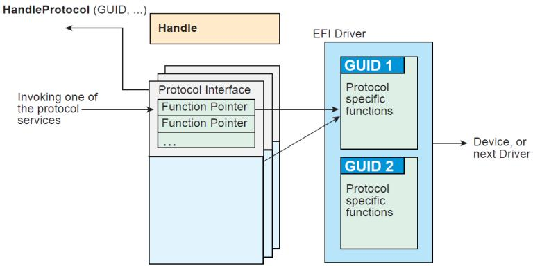  
Fig. 2.4: Construction of a Protocol

```txt
Status = HandleProtocol (
    EffectsDevice.EFIHandle,
    &IllustrationProtocolGuid,
    &EffectsDevice.IllustrationProtocol
);

// Use the EffectsDevice illustration protocol's "MakeEffects"
// service to make flashy and noisy effects.

Status = EffectsDevice.IllustrationProtocol->MakeEffects (
    EffectsDevice.IllustrationProtocol,
    TheFlashyAndNoisyEffect
);
```  
The Table below, UEFI Protocols, lists the UEFI protocols defined by this specification.

Table 2.7: UEFI Protocols

<table><tr><td>Protocol</td><td>Description</td></tr><tr><td>EFI Loaded Image Protocol</td><td>Provides information on the image.</td></tr><tr><td>EFI Loaded Image Device Path Protocol</td><td>Specifies the device path that was used when a PE/COFF image was loaded through the EFI Boot Service Load-Image().</td></tr><tr><td>EFI Device Path Protocol</td><td>Provides the location of the device.</td></tr><tr><td>EFI Driver Binding Protocol</td><td>Provides services to determine if an UEFI driver supports a given controller, and services to start and stop a given controller.</td></tr><tr><td>EFI_DRIVER_FAMILY_OVERRIDE_PROTOCOL</td><td>Provides a the Driver Family Override mechanism for selecting the best driver for a given controller.</td></tr><tr><td>EFI Platform Driver Override Protocol</td><td>Provide a platform specific override mechanism for the selection of the best driver for a given controller.</td></tr><tr><td>EFI_BUS_SPECIFIC_DRIVER_OVERRIDE_PROTOCOL</td><td>Provides a bus specific override mechanism for the selection of the best driver for a given controller.</td></tr><tr><td>EFI_DRIVER_DIAGNOSTICS2_PROTOCOL</td><td>Provides diagnostics services for the controllers that UEFI drivers are managing.</td></tr><tr><td>EFI_COMPONENT_NAME2_PROTOCOL</td><td>Provides human readable names for UEFI Drivers and the controllers that the drivers are managing.</td></tr></table>

continues on next page

Table 2.7 – continued from previous page

<table><tr><td>EFI_SIMPLE_TEXT_INPUT_PROTOCOL</td><td>Protocol interfaces for devices that support simple console style text input.</td></tr><tr><td>EFI_SIMPLE_TEXT_OUTPUT_PROTOCOL</td><td>Protocol interfaces for devices that support console style text displaying.</td></tr><tr><td>EFI_SIMPLE_POINTER_PROTOCOL</td><td>Protocol interfaces for devices such as mice and track-balls.</td></tr><tr><td>EFI_SERIAL_IO_PROTOCOL</td><td>Protocol interfaces for devices that support serial character transfer.</td></tr><tr><td>EFI_LOAD_FILE_PROTOCOL</td><td>Protocol interface for reading a file from an arbitrary device.</td></tr><tr><td>EFI_LOAD_FILE2_PROTOCOL</td><td>Protocol interface for reading a non-boot option file from an arbitrary device</td></tr><tr><td>EFI_SIMPLE_FILE_SYSTEM_PROTOCOL</td><td>Protocol interfaces for opening disk volume containing a UEFI file system.</td></tr><tr><td>EFI_FILE_PROTOCOL</td><td>Provides access to supported file systems.</td></tr><tr><td>EFI_DISK_IO_PROTOCOL</td><td>A protocol interface that layers onto any BLOCK_IO or BLOCK_IO_EX interface.</td></tr><tr><td>EFI_BLOCK_IO_PROTOCOL</td><td>Protocol interfaces for devices that support block I/O style accesses.</td></tr><tr><td>EFI_BLOCK_IO2_PROTOCOL</td><td>Protocol interfaces for devices that support block I/O style accesses. This interface is capable of non-blocking transactions.</td></tr><tr><td>EFI_UNICODE_COLLATION_PROTOCOL</td><td>Protocol interfaces for string comparison operations.</td></tr><tr><td>EFI_PCI_ROOT_BRIDGE_IO_PROTOCOL</td><td>Protocol interfaces to abstract memory, I/O, PCI configuration, and DMA accesses to a PCI root bridge controller.</td></tr><tr><td>EFI PCI I/O Protocol</td><td>Protocol interfaces to abstract memory, I/O, PCI configuration, and DMA accesses to a PCI controller on a PCI bus.</td></tr><tr><td>EFI_USB_IO_PROTOCOL</td><td>Protocol interfaces to abstract access to a USB controller.</td></tr><tr><td>EFI_SIMPLE_NETWORK_PROTOCOL</td><td>Provides interface for devices that support packet based transfers.</td></tr><tr><td>EFI_PXE_BASE_CODE_PROTOCOL</td><td>Protocol interfaces for devices that support network booting.</td></tr><tr><td>EFI_BIS_PROTOCOL</td><td>Protocol interfaces to validate boot images before they are loaded and invoked.</td></tr><tr><td>EFI Debug Support Protocol</td><td>Protocol interfaces to save and restore processor context and hook processor exceptions.</td></tr><tr><td>EFI Debugport Protocol</td><td>Protocol interface that abstracts a byte stream connection between a debug host and a debug target system.</td></tr><tr><td>EFI_DECOMPRESS_PROTOCOL</td><td>Protocol interfaces to decompress an image that was compressed using the EFI Compression Algorithm.</td></tr><tr><td>EFI_EBC_PROTOCOL</td><td>Protocols interfaces required to support an EFI Byte Code interpreter.</td></tr><tr><td>EFI_GRAPHICS_OUTPUT_PROTOCOL</td><td>Protocol interfaces for devices that support graphical output.</td></tr><tr><td>EFI_NVM_EXPRESS_PASS_THRU_PROTOCOL</td><td>Protocol interfaces that allow NVM Express commands to be issued to an NVM Express controller.</td></tr><tr><td>EFI_EXT_SCSI_PASS_THRU_PROTOCOL</td><td>Protocol interfaces for a SCSI channel that allows SCSI Request Packets to be sent to SCSI devices.</td></tr></table>

continues on next page

Table 2.7 – continued from previous page

<table><tr><td>EFI_USB2_HC_PROTOCOL</td><td>Protocol interfaces to abstract access to a USB Host Controller.</td></tr><tr><td>EFI_AUTHENTICATION_INFO_PROTOCOL</td><td>Provides access for generic authentication information associated with specific device paths</td></tr><tr><td>EFI_DEVICE_PATH_UTILITIES_PROTOCOL</td><td>Aids in creating and manipulating device paths.</td></tr><tr><td>EFI_DEVICE_PATH_TO_TEXT_PROTOCOL</td><td>Converts device nodes and paths to text.</td></tr><tr><td>EFI_DEVICE_PATH_FROM_TEXT_PROTOCOL</td><td>Converts text to device paths and device nodes.</td></tr><tr><td>EFI_EDID_DISCOVERED_PROTOCOL</td><td>Contains the EDID information retrieved from a video output device.</td></tr><tr><td>EFI_EDID_ACTIVE_PROTOCOL</td><td>Contains the EDID information for an active video output device.</td></tr><tr><td>EFI_EDID_OVERRIDE_PROTOCOL</td><td>Produced by the platform to allow the platform to provide EDID information to the producer of the Graphics Output protocol</td></tr><tr><td>EFI iSCSI Initiator Name Protocol</td><td>Sets and obtains the iSCSI Initiator Name.</td></tr><tr><td>EFI_TAPE_IO_PROTOCOL</td><td>Provides services to control and access a tape drive.</td></tr><tr><td>EFI Managed Network Protocol</td><td>Used to locate communication devices that are supported by an MNP driver and create and destroy instances of the MNP child protocol driver that can use the underlying communications devices.</td></tr><tr><td>EFI_ARP_SERVICE_BINDING_PROTOCOL</td><td>Used to locate communications devices that are supported by an ARP driver and to create and destroy instances of the ARP child protocol driver.</td></tr><tr><td>EFI_ARP_PROTOCOL</td><td>Used to resolve local network protocol addresses into network hardware addresses.</td></tr><tr><td>EFI_DHCP4_SERVICE_BINDING_PROTOCOL</td><td>Used to locate communication devices that are supported by an EFI DHCPv4 Protocol driver and to create and destroy EFI DHCPv4 Protocol child driver instances that can use the underlying communications devices.</td></tr><tr><td>EFI_DHCP4_PROTOCOL</td><td>Used to collect configuration information for the EFI IPv4 Protocol drivers and to provide DHCPv4 server and PXE boot server discovery services.</td></tr><tr><td>EFI_TCP4_SERVICE_BINDING_PROTOCOL</td><td>Used to locate EFI TCPv4Protocol drivers to create and destroy child of the driver to communicate with other host using TCP protocol.</td></tr><tr><td>EFI_TCP4_PROTOCOL</td><td>Provides services to send and receive data stream.</td></tr><tr><td>EFI_IP4_SERVICE_BINDING_PROTOCOL</td><td>Used to locate communication devices that are supported by an EFI IPv4 Protocol Driver and to create and destroy instances of the EFI IPv4 Protocol child protocol driver that can use the underlying communication device.</td></tr><tr><td>EFI_IP4_PROTOCOL</td><td>Provides basic network IPv4 packet I/O services.</td></tr><tr><td>EFI_IP4_CONFIG2_PROTOCOL</td><td>The EFI IPv4 Config Protocol driver performs platform- and policy-dependent configuration of the EFI IPv4 Protocol driver.</td></tr><tr><td>EFI_IP4_CONFIG2_PROTOCOL</td><td>The EFI IPv4 Configuration II Protocol driver performs platform- and policy-dependent configuration of the EFI IPv4 Protocol driver.</td></tr><tr><td>EFI_UDP4_SERVICE_BINDING_PROTOCOL</td><td>Used to locate communication devices that are supported by an EFI UDPv4 Protocol driver and to create and destroy instances of the EFI UDPv4 Protocol child protocol driver that can use the underlying communication device.</td></tr></table>

continues on next page

Table 2.7 – continued from previous page

<table><tr><td>EFI_UDP4_PROTOCOL</td><td>Provides simple packet-oriented services to transmit and receive UDP packets.</td></tr><tr><td>EFI_MTFTP4_SERVICE_BINDING_PROTOCOL</td><td>Used to locate communication devices that are supported by an EFI MTFTPv4 Protocol driver and to create and destroy instances of the EFI MTFTPv4 Protocol child protocol driver that can use the underlying communication device.</td></tr><tr><td>EFI_MTFTP4_PROTOCOL</td><td>Provides basic services for client-side unicast or multicast TFTP operations.</td></tr><tr><td>EFI_HASH_PROTOCOL</td><td>Allows creating a hash of an arbitrary message digest using one or more hash algorithms.</td></tr><tr><td>EFI_HASH_SERVICE_BINDING_PROTOCOL</td><td>Used to locate hashing services support provided by a driver and create and destroy instances of the EFI Hash Protocol so that a multiple drivers can use the underlying hashing services.</td></tr><tr><td>EFI_SD_MMC_PASS_THRU_PROTOCOL</td><td>Protocol interface that allows SD/eMMC commands to be sent to an SD/eMMC controller.</td></tr></table>

## 2.5 UEFI Driver Model

The UEFI Driver Model is intended to simplify the design and implementation of device drivers, and produce small executable image sizes. As a result, some complexity has been moved into bus drivers and in a larger part into common firmware services.

A device driver is required to produce a Driver Binding Protocol on the same image handle on which the driver was loaded. It then waits for the system firmware to connect the driver to a controller. When that occurs, the device driver is responsible for producing a protocol on the controller's device handle that abstracts the I/O operations that the controller supports. A bus driver performs these exact same tasks. In addition, a bus driver is also responsible for discovering any child controllers on the bus, and creating a device handle for each child controller found.

One assumption is that the architecture of a system can be viewed as a set of one or more processors connected to one or more core chipsets. The core chipsets are responsible for producing one or more I/O buses. The UEFI Driver Model does not attempt to describe the processors or the core chipsets. Instead, the UEFI Driver Model describes the set of I/O buses produced by the core chipsets, and any children of these I/O buses. These children can either be devices or additional I/O buses. This can be viewed as a tree of buses and devices with the core chipsets at the root of that tree.

The leaf nodes in this tree structure are peripherals that perform some type of I/O. This could include keyboards, displays, disks, network, etc. The nonleaf nodes are the buses that move data between devices and buses, or between different bus types. Desktop System shows a sample desktop system with four buses and six devices.

Server System is an example of a more complex server system. The idea is to make the UEFI Driver Model simple and extensible so more complex systems like the one below can be described and managed in the preboot environment. This system contains six buses and eight devices.

The combination of firmware services, bus drivers, and device drivers in any given platform is likely to be produced by a wide variety of vendors including OEMs, IBVs, and IHVs. These different components from different vendors are required to work together to produce a protocol for an I/O device than can be used to boot a UEFI compliant operating system. As a result, the UEFI Driver Model is described in great detail in order to increase the interoperability of these components

This remainder of this section is a brief overview of the UEFI Driver Model. It describes the legacy option ROM issues that the UEFI Driver Model is designed to address, the entry point of a driver, host bus controllers, properties of device drivers, properties of bus drivers, and how the UEFI Driver Model can accommodate hot-plug events.

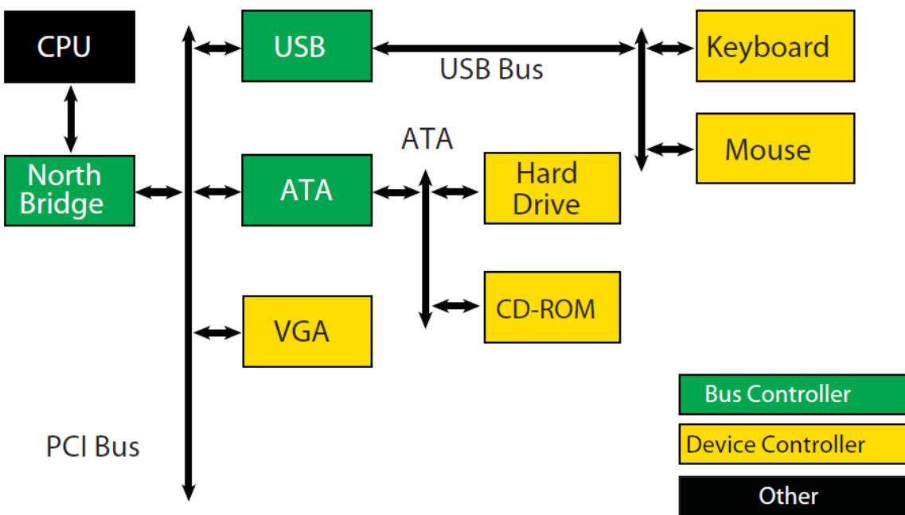  
Fig. 2.5: Desktop System

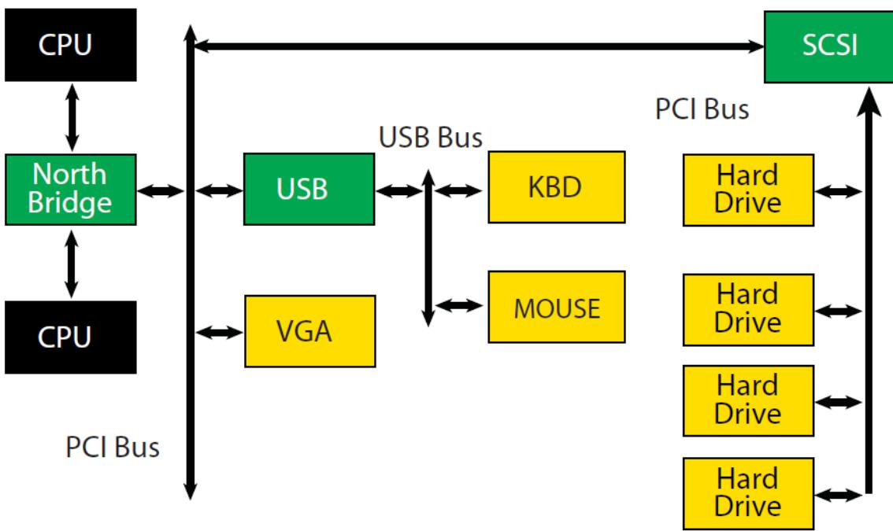  
Fig. 2.6: Server System

## 2.5.1 Legacy Option ROM Issues

Legacy option ROMs have a number of constraints and limitations that restrict innovation on the part of platform designers and adapter vendors. At the time of writing, both ISA and PCI adapters use legacy option ROMs. For the purposes of this discussion, only PCI option ROMs will be considered; legacy ISA option ROMs are not supported as part of the UEFI Specification.

The following is a list of the major constraints and limitations of legacy option ROMs. For each issue, the design considerations that went into the design of the UEFI Driver Model are also listed. Thus, the design of the UEFI Driver Model directly addresses the requirements for a solution to overcome the limitations implicit to PC-AT-style legacy option ROMs.

## 2.5.1.1 32-bit/16-Bit Real Mode Binaries

Legacy option ROMs typically contain 16-bit real mode code for an IA-32 processor. This means that the legacy option ROM on a PCI card cannot be used in platforms that do not support the execution of IA-32 real mode binaries. Also, 16-bit real mode only allows the driver to access directly the lower 1 MiB of system memory. It is possible for the driver to switch the processor into modes other than real mode in order to access resources above 1 MiB, but this requires a lot of additional code, and causes interoperability issues with other option ROMs and the system BIOS. Also, option ROMs that switch the processor into to alternate execution modes are not compatible with Itanium Processors.

UEFI Driver Model design considerations:

\* Drivers need flat memory mode with full access to system components.

\* Drivers need to be written in C so they are portable between processor architectures.

\* Drivers may be compiled into a virtual machine executable, allowing a single binary driver to work on machines using different processor architectures.

## 2.5.1.2 Fixed Resources for Working with Option ROMs

Since legacy option ROMs can only directly address the lower 1 MiB of system memory, this means that the code from the legacy option ROM must exist below 1 MiB. In a PC-AT platform, memory from 0x00000-0x9FFFF is system memory. Memory from 0xA0000-0xBFFFF is VGA memory, and memory from 0xF0000-0xFFFF is reserved for the system BIOS. Also, since system BIOS has become more complex over the years, many platforms also use 0xE0000-0xEFFFF for system BIOS. This leaves 128 KiB of memory from 0xC0000-0xDFFF for legacy option ROMs. This limits how many legacy option ROMs can be run during BIOS POST.

Also, it is not easy for legacy option ROMs to allocate system memory. Their choices are to allocate memory from Extended BIOS Data Area (EBDA), allocate memory through a Post Memory Manager (PMM), or search for free memory based on a heuristic. Of these, only EBDA is standard, and the others are not used consistently between adapters, or between BIOS vendors, which adds complexity and the potential for conflicts.

UEFI Driver Model design considerations:

\* Drivers need flat memory mode with full access to system components.

\* Drivers need to be capable of being relocated so that they can be loaded anywhere in memory (PE/COFF Images)

\* Drivers should allocate memory through the boot services. These are well-specified interfaces, and can be guaranteed to function as expected across a wide variety of platform implementations.

## 2.5.1.3 Matching Option ROMs to their Devices

It is not clear which controller may be managed by a particular legacy option ROM. Some legacy option ROMs search the entire system for controllers to manage. This can be a lengthy process depending on the size and complexity of the platform. Also, due to limitation in BIOS design, all the legacy option ROMs must be executed, and they must scan for all the peripheral devices before an operating system can be booted. This can also be a lengthy process, especially if SCSI buses must be scanned for SCSI devices. This means that legacy option ROMs are making policy decision about how the platform is being initialized, and which controllers are managed by which legacy option ROMs. This makes it very difficult for a system designer to predict how legacy option ROMs will interact with each other. This can also cause issues with on-board controllers, because a legacy option ROM may incorrectly choose to manage the on-board controller.

UEFI Driver Model design considerations:

\* Driver to controller matching must be deterministic

\* Give OEMs more control through Platform Driver Override Protocol and Driver Configuration Protocol

\* It must be possible to start only the drivers and controllers required to boot an operating system.

## 2.5.1.4 Ties to PC-AT System Design

Legacy option ROMs assume a PC-AT-like system architecture. Many of them include code that directly touches hardware registers. This can make them incompatible on legacy-free and headless platforms. Legacy option ROMs may also contain setup programs that assume a PC-AT-like system architecture to interact with a keyboard or video display. This makes the setup application incompatible on legacy-free and headless platforms.

UEFI Driver Model design considerations:

\* Drivers should use well-defined protocols to interact with system hardware, system input devices, and system output devices.

## 2.5.1.5 Ambiguities in Specification and WorkaroundsBorn of Experience

Many legacy option ROMs and BIOS code contain workarounds because of incompatibilities between legacy option ROMs and system BIOS. These incompatibilities exist in part because there are no clear specifications on how to write a legacy option ROM or write a system BIOS.

Also, interrupt chaining and boot device selection is very complex in legacy option ROMs. It is not always clear which device will be the boot device for the OS.

## UEFI Driver Model design considerations:

\* Drivers and firmware are written to follow this specification. Since both components have a clearly defined specification, compliance tests can be developed to prove that drivers and system firmware are compliant. This should eliminate the need to build workarounds into either drivers or system firmware (other than those that might be required to address specific hardware issues).

\* Give OEMs more control through Platform Driver Override Protocol and Driver Configuration Protocol and other OEM value-add components to manage the boot device selection process.

## 2.5.2 Driver Initialization

The file for a driver image must be loaded from some type of media. This could include ROM, FLASH, hard drives, floppy drives, CD-ROM, or even a network connection. Once a driver image has been found, it can be loaded into system memory with the boot service EFI\_BOOT\_SERVICES.LoadImage(). LoadImage() loads a PE/COFF formatted image into system memory. A handle is created for the driver, and a Loaded Image Protocol instance is placed on that handle. A handle that contains a Loaded Image Protocol instance is called an Image Handle. At this point, the driver has not been started. It is just sitting in memory waiting to be started. The figure below shows the state of an image handle for a driver after LoadImage() has been called.

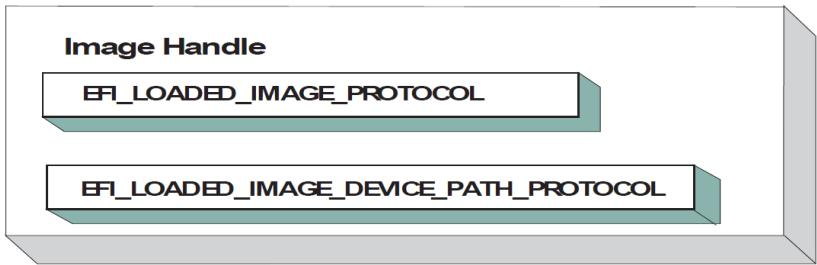  
Fig. 2.7: Image Handle

After a driver has been loaded with the boot service LoadImage(), it must be started with the boot service EFI\_BOOT\_SERVICES.StartImage(). This is true of all types of UEFI Applications and UEFI Drivers that can be loaded and started on an UEFI-compliant system. The entry point for a driver that follows the UEFI Driver Model must follow some strict rules. First, it is not allowed to touch any hardware. Instead, the driver is only allowed to install protocol instances onto its own Image Handle. A driver that follows the UEFI Driver Model is required to install an instance of the Driver Binding Protocol onto its own Image Handle. It may optionally install the Driver Configuration Protocol, the Driver Diagnostics Protocol, or the Component Name Protocol. In addition, if a driver wishes to be unloadable it may optionally update the Loaded Image Protocol (EFI Loaded Image Protocol) to provide its own Unload() EFI\_LOADED\_IMAGE\_PROTOCOL.Unload() function. Finally, if a driver needs to perform any special operations when the boot service EFI\_BOOT\_SERVICES.ExitBootServices() is called, it may optionally create an event with a notification function that is triggered when the boot service ExitBootServices() is called. An Image Handle that contains a Driver Binding Protocol instance is known as a Driver Image Handle. Driver Image Handle shows a possible configuration for the Image Handle from Fig. 2.7 after the boot service StartImage() has been called.

## 2.5.3 Host Bus Controllers

Drivers are not allowed to touch any hardware in the driver's entry point. As a result, drivers will be loaded and started, but they will all be waiting to be told to manage one or more controllers in the system. A platform component, like the Boot Manager, is responsible for managing the connection of drivers to controllers. However, before even the first connection can be made, there has to be some initial collection of controllers for the drivers to manage. This initial collection of controllers is known as the Host Bus Controllers. The I/O abstractions that the Host Bus Controllers provide are produced by firmware components that are outside the scope of the UEFI Driver Model. The device handles for the Host Bus Controllers and the I/O abstraction for each one must be produced by the core firmware on the platform, or a driver that may not follow the UEFI Driver Model. See the PCI Root Bridge I/O Protocol Specification for an example of an I/O abstraction for PCI buses.

A platform can be viewed as a set of processors and a set of core chipset components that may produce one or more host buses. The following figure shows a platform with n processors (CPUs), and a set of core chipset components that produce m host bridges.

Each host bridge is represented in UEFI as a device handle that contains a Device Path Protocol instance, and a protocol instance that abstracts the I/O operations that the host bus can perform. For example, a PCI Host Bus Controller supports one or more PCI Root Bridges that are abstracted by the PCI Root Bridge I/O Protocol. The following figure shows an example device handle for a PCI Root Bridge.

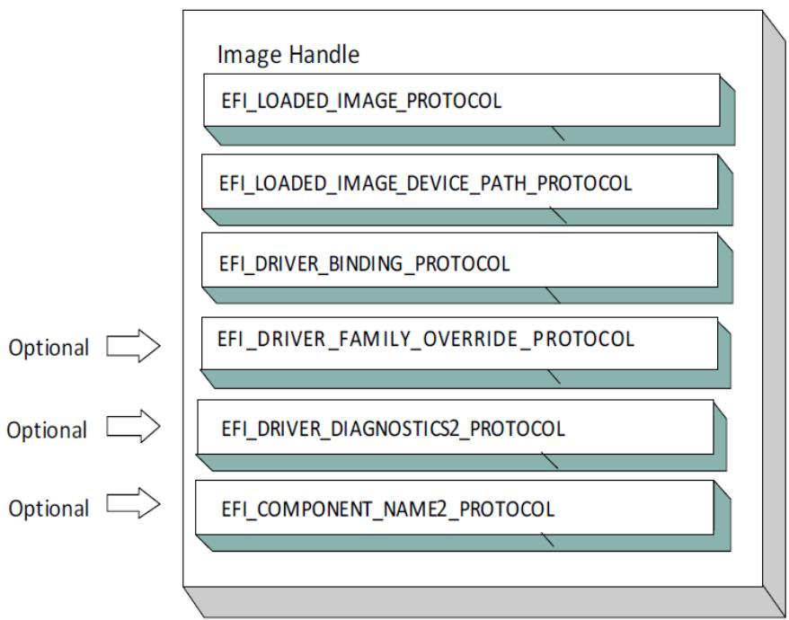  
Fig. 2.8: Driver Image Handle

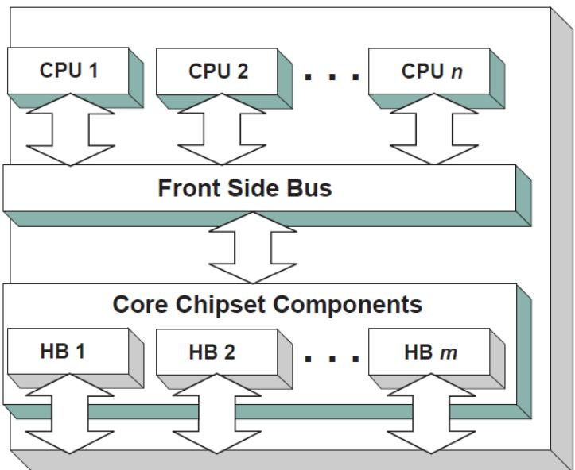  
Fig. 2.9: Host Bus Controllers

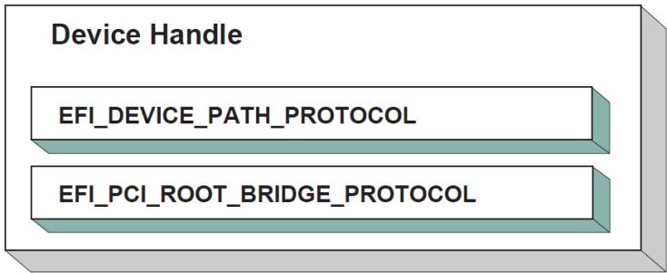  
Fig. 2.10: PCI Root Bridge Device Handle

A PCI Bus Driver could connect to this PCI Root Bridge, and create child handles for each of the PCI devices in the system. PCI Device Drivers should then be connected to these child handles, and produce I/O abstractions that may be used to boot a UEFI compliant OS. The following section describes the different types of drivers that can be implemented within the UEFI Driver Model. The UEFI Driver Model is very flexible, so all the possible types of drivers will not be discussed here. Instead, the major types will be covered that can be used as a starting point for designing and implementing additional driver types.

## 2.5.4 Device Drivers

A device driver is not allowed to create any new device handles. Instead, it installs additional protocol interfaces on an existing device handle. The most common type of device driver will attach an I/O abstraction to a device handle that was created by a bus driver. This I/O abstraction may be used to boot a UEFI compliant OS. Some example I/O abstractions would include Simple Text Output, Simple Input, Block I/O, and Simple Network Protocol. Fig. 2.11 shows a device handle before and after a device driver is connected to it. In this example, the device handle is a child of the XYZ Bus, so it contains an XYZ I/O Protocol for the I/O services that the XYZ bus supports. It also contains a Device Path Protocol that was placed there by the XYZ Bus Driver. The Device Path Protocol is not required for all device handles. It is only required for device handles that represent physical devices in the system. Handles for virtual devices will not contain a Device Path Protocol.

The device driver that connects to the device handle in the above Figure must have installed a Driver Binding Protocol on its own image handle. The Driver Binding Protocol contains three functions called Supported() (EFI\_DRIVER\_BINDING\_PROTOCOL.Supported()); Start() (EFI\_DRIVER\_BINDING\_PROTOCOL.Start(), and Stop() (EFI\_DRIVER\_BINDING\_PROTOCOL.Stop()). The Supported() function tests to see if the driver supports a given controller. In this example, the driver will check to see if the device handle supports the Device Path Protocol and the XYZ I/O Protocol. If a driver's Supported() function passes, then the driver can be connected to the controller by calling the driver's Start() function. The Start() function is what actually adds the additional I/O protocols to a device handle. In this example, the Block I/O Protocol is being installed. To provide symmetry, the Driver Binding Protocol also has a Stop() function that forces the driver to stop managing a device handle. This will cause the device driver to uninstall any protocol interfaces that were installed in Start().

The Supported(), Start(), and Stop() functions of the EFI Driver Binding Protocol are required to make use of the boot service EFI\_BOOT\_SERVICES.OpenProtocol() to get a protocol interface and the boot service EFI\_BOOT\_SERVICES.CloseProtocol() to release a protocol interface. OpenProtocol() and CloseProtocol() update the handle database maintained by the system firmware to track which drivers are consuming protocol interfaces. The information in the handle database can be used to retrieve information about both drivers and controllers. The new boot service EFI\_BOOT\_SERVICES.OpenProtocolInformation() can be used to get the list of components that are currently consuming a specific protocol interface.

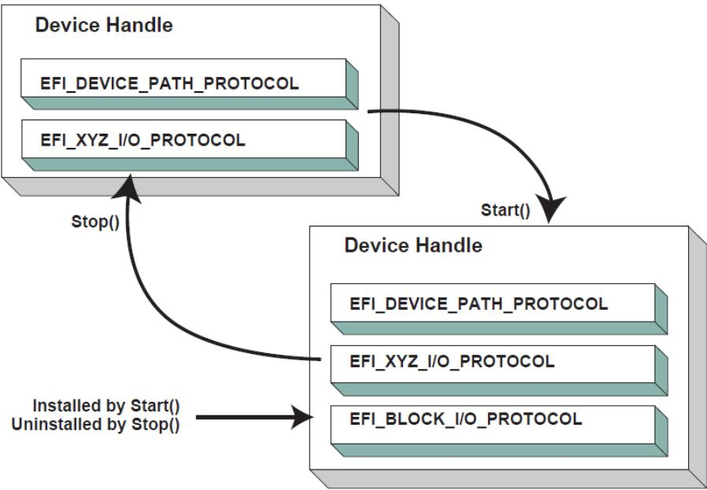  
Fig. 2.11: Connecting Device Drivers

## 2.5.5 Bus Drivers

Bus drivers and device drivers are virtually identical from the UEFI Driver Model's point of view. The only difference is that a bus driver creates new device handles for the child controllers that the bus driver discovers on its bus. As a result, bus drivers are slightly more complex than device drivers, but this in turn simplifies the design and implementation of device drivers. There are two major types of bus drivers. The first creates handles for all child controllers on the first call to Start() . The other type allows the handles for the child controllers to be created across multiple calls to Start() . This second type of bus driver is very useful in supporting a rapid boot capability. It allows a few child handles or even one child handle to be created. On buses that take a long time to enumerate all of their children (e.g. SCSI), this can lead to a very large timesaving in booting a platform. Connecting Bus Drivers shows the tree structure of a bus controller before and after Start() is called. The dashed line coming into the bus controller node represents a link to the bus controller's parent controller. If the bus controller is a Host Bus Controller , then it will not have a parent controller. Nodes A, B, C ,D, and E represent the child controllers of the bus controller.

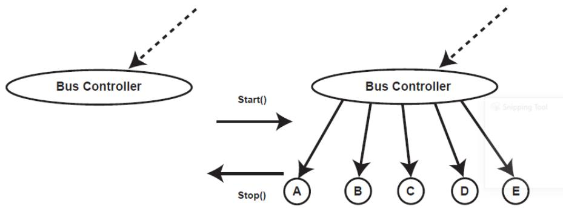  
Fig. 2.12: Connecting Bus Drivers

A bus driver that supports creating one child on each call to Start() might choose to create child C first, and then child E, and then the remaining children A, B, and D. The Supported(), Start(), and Stop() functions of the Driver Binding Protocol are flexible enough to allow this type of behavior.

A bus driver must install protocol interfaces onto every child handle that is creates. At a minimum, it must install a protocol interface that provides an I/O abstraction of the bus's services to the child controllers. If the bus driver creates a child handle that represents a physical device, then the bus driver must also install a Device Path Protocol instance onto the child handle. A bus driver may optionally install a Bus Specific Driver Override Protocol onto each child handle. This protocol is used when drivers are connected to the child controllers. The boot service EFI\_BOOT\_SERVICES.ConnectController() uses architecturally defined precedence rules to choose the best set of drivers for a given controller. The Bus Specific Driver Override Protocol has higher precedence than a general driver search algorithm, and lower precedence than platform overrides. An example of a bus specific driver selection occurs with PCI. A PCI Bus Driver gives a driver stored in a PCI controller's option ROM a higher precedence than drivers stored elsewhere in the platform. Child Device Handle with a Bus Specific Override shows an example child device handle that was created by the XYZ Bus Driver that supports a bus specific driver override mechanism.

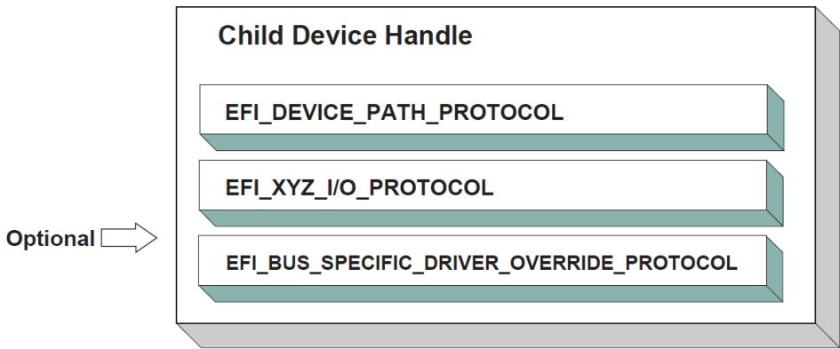  
Fig. 2.13: Child Device Handle with a Bus Specific Override

## 2.5.6 Platform Components

Under the UEFI Driver Model, the act of connecting and disconnecting drivers from controllers in a platform is under the platform firmware's control. This will typically be implemented as part of the UEFI Boot Manager, but other implementations are possible. The boot services EFI\_BOOT\_SERVICES.ConnectController() and EFI\_BOOT\_SERVICES.DisconnectController() can be used by the platform firmware to determine which controllers get started and which ones do not. If the platform wishes to perform system diagnostics or install an operating system, then it may choose to connect drivers to all possible boot devices. If a platform wishes to boot a preinstalled operating system, it may choose to only connect drivers to the devices that are required to boot the selected operating system. The UEFI Driver Model supports both these modes of operation through the boot services ConnectController() and DisconnectController(). In addition, since the platform component that is in charge of booting the platform has to work with device paths for console devices and boot options, all of the services and protocols involved in the UEFI Driver Model are optimized with device paths in mind.

Since the platform firmware may choose to only connect the devices required to produce consoles and gain access to a boot device, the OS present device drivers cannot assume that a UEFI driver for a device has been executed. The presence of a UEFI driver in the system firmware or in an option ROM does not guarantee that the UEFI driver will be loaded, executed, or allowed to manage any devices in a platform. All OS present device drivers must be able to handle devices that have been managed by a UEFI driver and devices that have not been managed by an UEFI driver.

The platform may also choose to produce a protocol named the Platform Driver Override Protocol. This is similar to the Bus Specific Driver Override Protocol, but it has higher priority. This gives the platform firmware the highest priority when deciding which drivers are connected to which controllers. The Platform Driver Override Protocol is attached to a handle in the system. The boot service ConnectController() will make use of this protocol if it is present in the system.

## 2.5.7 Hot-Plug Events

In the past, system firmware has not had to deal with hot-plug events in the preboot environment. However, with the advent of buses like USB, where the end user can add and remove devices at any time, it is important to make sure that it is possible to describe these types of buses in the UEFI Driver Model. It is up to the bus driver of a bus that supports the hot adding and removing of devices to provide support for such events. For these types of buses, some of the platform management is going to have to move into the bus drivers. For example, when a keyboard is hot added to a USB bus on a platform, the end user would expect the keyboard to be active. A USB Bus driver could detect the hot-add event and create a child handle for the keyboard device. However, because drivers are not connected to controllers unless EFI\_BOOT\_SERVICES.ConnectController() is called, the keyboard would not become an active input device. Making the keyboard driver active requires the USB Bus driver to call ConnectController() when a hot-add event occurs. In addition, the USB Bus Driver would have to call EFI\_BOOT\_SERVICES.DisconnectController() when a hot-remove event occurs. If EFI\_BOOT\_SERVICES.DisconnectController() returns an error the USB Bus Driver needs to retry EFI\_BOOT\_SERVICES.DisconnectController() from a timer event until it succeeds.

Device drivers are also affected by these hot-plug events. In the case of USB, a device can be removed without any notice. This means that the Stop() functions of USB device drivers will have to deal with shutting down a driver for a device that is no longer present in the system. As a result, any outstanding I/O requests will have to be flushed without actually being able to touch the device hardware.

In general, adding support for hot-plug events greatly increases the complexity of both bus drivers and device drivers. Adding this support is up to the driver writer, so the extra complexity and size of the driver will need to be weighed against the need for the feature in the preboot environment.

## 2.5.8 EFI Services Binding

The UEFI Driver Model maps well onto hardware devices, hardware bus controllers, and simple combinations of software services that layer on top of hardware devices. However, the UEFI driver Model does not map well onto complex combinations of software services. As a result, an additional set of complementary protocols are required for more complex combinations of software services.

Figure below, Software Service Relationships, contains three examples showing the different ways that software services relate to each other. In the first two cases, each service consumes one or more other services, and at most one other service consumes all of the services. Case #3 differs because two different services consume service A. The EFI\_DRIVER\_BINDING\_PROTOCOL can be used to model cases #1 and #2, but it cannot be used to model case #3 because of the way that the UEFI Boot Service OpenProtocol() behaves. When used with the BY\_DRIVER open mode, OpenProtocol() allows each protocol to have only at most one consumer. This feature is very useful and prevents multiple drivers from attempting to manage the same controller. However, it makes it difficult to produce sets of software services that look like case #3.

Software Service Relationships The EFI\_SERVICE\_BINDING\_PROTOCOL provides the mechanism that allows protocols to have more than one consumer. The EFI\_SERVICE\_BINDING\_PROTOCOL is used with the EFI\_DRIVER\_BINDING\_PROTOCOL. A UEFI driver that produces protocols that need to be available to more than one consumer at the same time will produce both the EFI\_DRIVER\_BINDING\_PROTOCOL and the EFI\_SERVICE\_BINDING\_PROTOCOL. This type of driver is a hybrid driver that will produce the EFI\_DRIVER\_BINDING\_PROTOCOL in its driver entry point.

When the driver receives a request to start managing a controller, it will produce the EFI\_SERVICE\_BINDING\_PROTOCOL on the handle of the controller that is being started. The EFI\_SERVICE\_BINDING\_PROTOCOL\*L is slightly different from other protocols defined in the UEFI Specification. It does not have a GUID associated with it. Instead, this protocol instance structure actually represents a family of protocols. Each software service driver that requires an \*EFI\_SERVICE\_BINDING\_PROTOCOL instance will be required to generate a new GUID for its own type of EFI\_SERVICE\_BINDING\_PROTOCOL. This requirement is why the various network protocols in this specification contain two GUIDs. One is the EFI\_SERVICE\_BINDING\_PROTOCOL GUID for that network protocol, and the other GUID is for the protocol that contains the specific member services produced by the network driver. The mechanism defined here is not limited to network protocol drivers. It can be applied to any set of protocols that the EFI\_DRIVER\_BINDING\_PROTOCOL cannot directly map because the protocols contain one or more relationships like case #3 in Software Service Relationships.

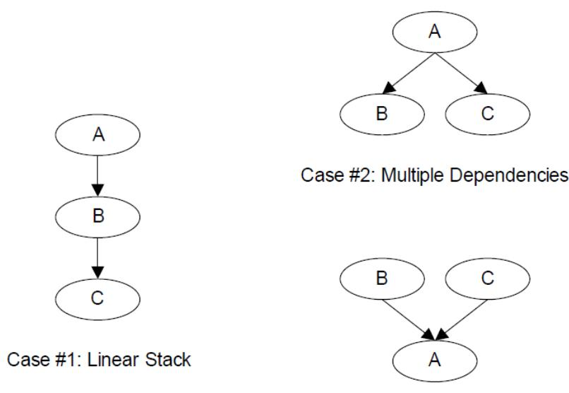  
Fig. 2.14: Software Service Relationships

Neither the EFI\_DRIVER\_BINDING\_PROTOCOL nor the combination of the EFI\_DRIVER\_BINDING\_PROTOCOL and the EFI\_SERVICE\_BINDING\_PROTOCOL can handle circular dependencies. There are methods to allow circular references, but they require that the circular link be present for short periods of time. When the protocols across the circular link are used, these methods also require that the protocol must be opened with an open mode of EXCLUSIVE, so that any attempts to deconstruct the set of protocols with a call to DisconnectController() will fail. As soon as the driver is finished with the protocol across the circular link, the protocol should be closed.

## 2.6 Requirements

This document is an architectural specification. As such, care has been taken to specify architecture in ways that allow maximum flexibility in implementation. However, there are certain requirements on which elements of this specification must be implemented to ensure that operating system loaders and other code designed to run with UEFI boot services can rely upon a consistent environment.

For the purposes of describing these requirements, the specification is broken up into required and optional elements. In general, an optional element is completely defined in the section that matches the element name. For required elements however, the definition may in a few cases not be entirely self contained in the section that is named for the particular element. In implementing required elements, care should be taken to cover all the semantics defined in this specification that relate to the particular element.

A system vendor may choose not to implement all the required elements, for example on specialized system configurations that do not support all the services and functionality implied by the required elements. However, since most applications, drivers and operating system loaders are written assuming all the required elements are present on a system that implements the UEFI specification; any such code is likely to require explicit customization to run on a less than complete implementation of the required elements in this specification. On such systems, the implementation may choose to advertise the profile which it conforms to using EFI\_CONFORMANCE\_PROFILES\_TABLE (see Section 4.6).

## 2.6.1 Required Elements

Required UEFI Implementation Elements lists the required elements. Any system that is designed to conform to this specification must provide a complete implementation of all these elements. This means that all the required service functions and protocols must be present and the implementation must deliver the full semantics defined in the specification for all combinations of calls and parameters. Implementers of applications, drivers or operating system loaders that are designed to run on a broad range of systems conforming to the UEFI specification may assume that all such systems implement all the required elements.

Table 2.8: Required UEFI Implementation Elements

<table><tr><td>Element</td><td>Description</td></tr><tr><td>EFI System Table</td><td>Provides access to UEFI Boot Services, UEFI Runtime Services, consoles, firmware vendor information, and the system configuration tables.</td></tr><tr><td>EFI_BOOT_SERVICES</td><td>All functions defined as boot services.</td></tr><tr><td>EFI_RUNTIME_SERVICES</td><td>All functions defined as runtime services.</td></tr><tr><td>EFI Loaded Image Protocol</td><td>Provides information on the image.</td></tr><tr><td>EFI Loaded Image Device Path Protocol</td><td>Specifies the device path that was used when a PE/COFF image was loaded through the EFI Boot Service Load-Image().</td></tr><tr><td>EFI Device Path Protocol</td><td>Provides the location of the device.</td></tr><tr><td>EFI_DECOMPRESS_PROTOCOL</td><td>Protocol interfaces to decompress an image that was compressed using the EFI Compression Algorithm.</td></tr><tr><td>EFI_DEVICE_PATH_UTILITIES_PROTOCOL</td><td>Protocol interfaces to create and manipulate UEFI device paths and UEFI device path nodes.</td></tr></table>

## 2.6.2 Platform-Specific Elements

There are a number of elements that can be added or removed depending on the specific features that a platform requires. Platform firmware developers are required to implement UEFI elements based upon the features included. The following is a list of potential platform features and the elements that are required for each feature type:

1. If a platform includes console devices, the EFI\_SIMPLE\_TEXT\_INPUT\_PROTOCOL, EFI\_SIMPLE\_TEXT\_INPUT\_EX\_PROTOCOL, and EFI\_SIMPLE\_TEXT\_OUTPUT\_PROTOCOL must be implemented.

2. If a platform includes a configuration infrastructure, then EFI\_HII\_DATABASE\_PROTOCOL, EFI\_HII\_STRING\_PROTOCOL, EFI HII Configuration Routing Protocol, and EFI\_HII\_CONFIG\_ACCESS\_PROTOCOL are required. If you support bitmapped fonts, you must support EFI\_HII\_FONT\_PROTOCOL.

3. If a platform includes graphical console devices, then EFI\_GRAPHICS\_OUTPUT\_PROTOCOL, EFI\_EDID\_DISCOVERED\_PROTOCOL, and EFI\_EDID\_ACTIVE\_PROTOCOL must be implemented. In order to support the EFI\_GRAPHICS\_OUTPUT\_PROTOCOL; a platform must contain a driver to consume EFI\_GRAPHICS\_OUTPUT\_PROTOCOL and produce EFI\_SIMPLE\_TEXT\_OUTPUT\_PROTOCOL even if the EFI\_GRAPHICS\_OUTPUT\_PROTOCOL is produced by an external driver.

4. If a platform includes a pointer device as part of its console support, EFI\_SIMPLE\_POINTER\_PROTOCOL must be implemented.

5. If a platform includes the ability to boot from a disk device, then EFI\_BLOCK\_IO\_PROTOCOL, EFI\_DISK\_IO\_PROTOCOL, EFI\_SIMPLE\_FILE\_SYSTEM\_PROTOCOL, and EFI\_UNICODE\_COLLATION\_PROTOCOL are required. In addition, partition support for MBR, GPT, and El Torito must be implemented. For disk devices supporting the security commands of the SPC-4 or ATA8-ACS command set EFI\_STORAGE\_SECURITY\_COMMAND\_PROTOCOL is also required. An external driver may produce the Block I/O Protocol and the EFI\_STORAGE\_SECURITY\_COMMAND\_PROTOCOL. All other protocols required to boot from a disk device must be carried as part of the platform.

6. If a platform includes the ability to perform a TFTP-based boot from a network device, then EFI\_PXE\_BASE\_CODE\_PROTOCOL is required. The platform must be prepared to produce this protocol on any of EFI\_NETWORK\_INTERFACE\_IDENTIFIER\_PROTOCOL (UNDI), EFI\_SIMPLE\_NETWORK\_PROTOCOL, or EFI Managed Network Protocol. If a platform includes the ability to validate a boot image received through a network device, it is also required that image verification be supported, including SetupMode equal zero and the boot image hash or a verification certificate corresponding to the image exist in the 'db' variable and not in the 'dbx' variable. An external driver may produce the UNDI interface. All other protocols required to boot from a network device must be carried by the platform.

7. If a platform supports UEFI general purpose network applications, then the EFI Managed Network Protocol, EFI\_MANAGED\_NETWORK\_SERVICE\_BINDING\_PROTOCOL, EFI\_ARP\_PROTOCOL, EFI\_ARP\_SERVICE\_BINDING\_PROTOCOL, EFI\_DHCP4\_PROTOCOL, EFI\_DHCP4\_SERVICE\_BINDING\_PROTOCOL, EFI\_TCP4\_PROTOCOL, EFI\_TCP4\_SERVICE\_BINDING\_PROTOCOL, EFI\_IP4\_CONFIG2\_PROTOCOL, EFI\_IP4\_SERVICE\_BINDING\_PROTOCOL, EFI\_IP4\_CONFIG2\_PROTOCOL, EFI\_UDP4\_PROTOCOL, and EFI\_UDP4\_SERVICE\_BINDING\_PROTOCOL are required. If additional IPv6 support is needed for the platform, then EFI DHCP6 Protocol, EFI\_DHCP6\_SERVICE\_BINDING\_PROTOCOL, EFI\_TCP6\_PROTOCOL, EFI\_TCP6\_SERVICE\_BINDING\_PROTOCOL, EFI\_IP6\_PROTOCOL, EFI\_IP6\_SERVICE\_BINDING\_PROTOCOL, EFI\_IP6\_CONFIG\_PROTOCOL EFI\_UDP6\_PROTOCOL . EFI\_UDP6\_SERVICE\_BINDING\_PROTOCOL are additionally required. If the network application requires DNS capability, EFI\_DNS4\_SERVICE\_BINDING\_PROTOCOL and EFI\_DNS4\_PROTOCOL are required for the IPv4 stack. EFI\_DNS6\_SERVICE\_BINDING\_PROTOCOL and EFI\_DNS6\_PROTOCOL are required for the IPv6 stack. If the network environment requires TLS feature, EFI TLS Service Binding Protocol, EFI TLS Protocol . EFI TLS Configuration Protocol are required. If the network environment requires IPSEC feature, EFI\_IPSEC\_CONFIG\_PROTOCOL and EFI IPsec2 Protocol are required. If the network environment requires VLAN features, EFI\_VLAN\_CONFIG\_PROTOCOL is required.

8. If a platform includes a byte-stream device such as a UART, then the EFI\_SERIAL\_IO\_PROTOCOL must be implemented.

9. If a platform includes PCI bus support, then the EFI\_PCI\_ROOT\_BRIDGE\_IO\_PROTOCOL, the EFI PCI I/O Protocol, must be implemented.

10. If a platform includes USB bus support, then EFI\_USB2\_HC\_PROTOCOL and EFI\_USB\_IO\_PROTOCOL must be implemented. An external device can support USB by producing a USB Host Controller Protocol.

11. If a platform includes an NVM Express controller, then EFI\_NVM\_EXPRESS\_PASS\_THRU\_PROTOCOL must be implemented.

12. If a platform supports booting from a block-oriented NVM Express controller, then EFI\_BLOCK\_IO\_PROTOCOL must be implemented. An external driver may produce the EFI\_NVM\_EXPRESS\_PASS\_THRU\_PROTOCOL. All other protocols required to boot from an NVM Express subsystem must be carried by the platform.

13. If a platform includes an I/O subsystem that utilizes SCSI command packets, then EFI\_EXT\_SCSI\_PASS\_THRU\_PROTOCOL must be implemented.

14. If a platform supports booting from a block oriented SCSI peripheral, then EFI SCSI I/O Protocol and EFI\_BLOCK\_IO\_PROTOCOL must be implemented. An external driver may produce the EFI\_EXT\_SCSI\_PASS\_THRU\_PROTOCOL. All other protocols required to boot from a SCSI I/O subsystem

must be carried by the platform.

15. If a platform supports booting from an iSCSI peripheral, then the EFI iSCSI Initiator Name Protocol and EFI\_AUTHENTICATION\_INFO\_PROTOCOL must be implemented.

16. If a platform includes debugging capabilities, then EFI Debug Support Protocol, the EFI Debugport Protocol, and the EFI Image Info Table must be implemented.

17. If a platform includes the ability to override the default driver to the controller matching algorithm provided by the UEFI Driver Model, then EFI Platform Driver Override Protocol must be implemented.

18. If a platform includes an I/O subsystem that utilizes ATA command packets, then the EFI\_ATA\_PASS\_THRU\_PROTOCOL must be implemented.

19. If a platform supports option ROMs from devices not permanently attached to the platform and it supports the ability to authenticate those option ROMs, then it must support the option ROM validation methods described in Network Protocols — UDP and MTFTP and the authenticated EFI variables described in Exception for Machine Check, INIT, and NMI.

20. If a platform includes the ability to authenticate UEFI images and the platform potentially supports more than one OS loader, it must support the methods described in Secure Boot and Driver Signing and the authenticated UEFI variables described in Variable Services.

21. EBC support is no longer required as of UEFI Specification version 2.8. If an EBC interpreter is implemented, then it must produce the EFI\_EBC\_PROTOCOL interface.

22. If a platform includes the ability to perform a HTTP-based boot from a network device, then the EFI\_HTTP\_SERVICE\_BINDING\_PROTOCOL, EFI\_HTTP\_PROTOCOL and EFI\_HTTP\_UTILITIES\_PROTOCOL are required. If it includes the ability to perform a HTTPS-based boot from network device, besides above protocols EFI TLS Service Binding Protocol, EFI TLS Protocol and EFI TLS Configuration Protocol are also required. If it includes the ability to perform a HTTP(S)-based boot with DNS feature, then EFI\_DNS4\_SERVICE\_BINDING\_PROTOCOL, EFI\_DNS4\_PROTOCOL are required for the IPv4 stack; EFI\_DNS6\_SERVICE\_BINDING\_PROTOCOL and EFI\_DNS6\_PROTOCOL are required for the IPv6 stack.

23. If a platform includes the ability to perform a wireless boot from a network device with EAP feature, and if this platform provides a standalone wireless EAP driver, then EFI\_EAP\_PROTOCOL, EFI EAP Configuration Protocol, and EFI EAP Management2 Protocol are required; if the platform provides a standalone wireless supplicant, then EFI Supplicant Protocol and EFI EAP Configuration Protocol are required. If it includes the ability to perform a wireless boot with TLS feature, then EFI TLS Service Binding Protocol, EFI TLS Protocol and EFI TLS Configuration Protocol are required.

24. If a platform supports classic Bluetooth, then EFI\_BLUETOOTH\_HC\_PROTOCOL, EFI\_BLUETOOTH\_IO\_PROTOCOL, and EFI\_BLUETOOTH\_CONFIG\_PROTOCOL must be implemented, and EFI Bluetooth Attribute Protocol may be implemented. If a platform supports Bluetooth Smart (Bluetooth Low Energy), then EFI\_BLUETOOTH\_HC\_PROTOCOL, EFI Bluetooth Attribute Protocol and EFI\_BLUETOOTH\_LE\_CONFIG\_PROTOCOL must be implemented. If a platform supports both Bluetooth classic and BluetoothLE, then both above requirements should be satisfied.

25. If a platform supports RESTful communication over HTTP or over an in-band path to a BMC, then the EFI REST Protocol or EFI\_REST\_EX\_PROTOCOL must be implemented. If EFI\_REST\_EX\_PROTOCOL is implemented, EFI\_REST\_EX\_SERVICE\_BINDING\_PROTOCOL must be implemented as well. If a platform supports Redfish communication over HTTP or over an in-band path to a BMC, the EFI\_REDFISH\_DISCOVER\_PROTOCOL and EFI REST JSON Structure Protocol may be implemented.

26. If a platform includes the ability to use a hardware feature to create high quality random numbers, this capability should be exposed by instance of EFI\_RNG\_PROTOCOL with at least one EFI RNG Algorithm supported.

27. If a platform permits the installation of Load Option Variables, (Boot#####, or Driver#####, or SysPrep#####), the platform must support and recognize all defined values for Attributes within the variable and report these capabilities in BootOptionSupport. If a platform supports installation of Load Option Variables of type Driver#####, all installed Driver##### variables must be processed and the indicated driver loaded and initialized during every boot. And all installed SysPrep##### options must be processed prior to processing Boot##### options.

28. If the platform supports UEFI secure boot as described in Secure Boot and Driver Signing, the platform must provide the PKCS verification functions described in PKCS7 Verify Protocol.

29. If a platform includes an I/O subsystem that utilizes SD or eMMC command packets, then the EFI\_SD\_MMC\_PASS\_THRU\_PROTOCOL must be implemented.

30. If a platform includes the ability to create/destroy a specified RAM disk, the EFI\_RAM\_DISK\_PROTOCOL must be implemented and only one instance of this protocol exists.

31. If a platform includes a mass storage device which supports hardware-based erase on a specified range, then EFI\_ERASE\_BLOCK\_PROTOCOL must be implemented.

32. If a platform includes the ability to register for notifications when a call to ResetSystem is called, then the EFI\_RESET\_NOTIFICATION\_PROTOCOL must be implemented.

33. If a platform includes UFS devices, the EFI UFS Device Config Protocol must be implemented.

34. If a platform cannot support calls defined in EFI\_RUNTIME\_SERVICES after ExitBootServices() is called, that platform is permitted to provide implementations of those runtime services that return EFI\_UNSUPPORTED when invoked at runtime. On such systems, an EFI\_RT\_PROPERTIES\_TABLE configuration table should be published describing which runtime services are supported at runtime.

35. If a platform includes support for CXL devices with coherent memory, then the platform must support extracting the Coherent Device Attribute Table (CDAT) from the device, using either the CXL Data Object Exchange services (as defined in the CXL 2.0 Specification) or the EFI\_ADAPTER\_INFORMATION\_PROTOCOL instance (with EFI\_ADAPTER\_INFO\_CDAT\_TYPE\_GUID type) installed on that device.

36. RISC-V platform firmware must implement the RISCV\_EFI\_BOOT\_PROTOCOL. OS loaders should use the RISCV\_EFI\_BOOT\_PROTOCOL.GetBootHartId() to obtain the boot hart ID. The boot hart ID information provided by either SMBIOS or Device Tree is to be ignored by OS loaders. See “Links to UEFI Specification-Related Document” on https://uefi.org/uefi under the heading “RISC-V EFI Boot Protocol.”

## Note

Some of the required protocol instances are created by the corresponding Service Binding Protocol. For example, EFI\_IP4\_PROTOCOL is created by EFI\_IP4\_SERVICE\_BINDING\_PROTOCOL. Please refer to the corresponding sections of Service Binding Protocol for the details.

## 2.6.3 Driver-Specific Elements

There are a number of UEFI elements that can be added or removed depending on the features that a specific driver requires. Drivers can be implemented by platform firmware developers to support buses and devices in a specific platform. Drivers can also be implemented by add-in card vendors for devices that might be integrated into the platform hardware or added to a platform through an expansion slot.

The following list includes possible driver features, and the UEFI elements that are required for each feature type:

1. If a driver follows the driver model of this specification, the EFI Driver Binding Protocol must be implemented. It is strongly recommended that all drivers that follow the driver model of this specification also implement the EFI\_COMPONENT\_NAME2\_PROTOCOL.

2. If a driver requires configuration information, the driver must use the EFI\_HII\_DATABASE\_PROTOCOL . A driver should not otherwise display information to the user or request information from the user.

3. If a driver requires diagnostics, the EFI\_DRIVER\_DIAGNOSTICS2\_PROTOCOL must be implemented. In order to support low boot times, limit diagnostics during normal boots. Time consuming diagnostics should be deferred until the EFI\_DRIVER\_DIAGNOSTICS2\_PROTOCOL is invoked.

4. If a bus supports devices that are able to provide containers for drivers (e.g. option ROMs), then the bus driver for that bus type must implement the EFI\_BUS\_SPECIFIC\_DRIVER\_OVERRIDE\_PROTOCOL.

5. If a driver is written for a console output device, then the EFI\_SIMPLE\_TEXT\_OUTPUT\_PROTOCOL must be implemented.

6. If a driver is written for a graphical console output device, then the EFI\_GRAPHICS\_OUTPUT\_PROTOCOL, EFI\_EDID\_DISCOVERED\_PROTOCOL and EFI\_EDID\_ACTIVE\_PROTOCOL must be implemented.

7. If a driver is written for a console input device, then the EFI\_SIMPLE\_TEXT\_INPUT\_PROTOCOL and EFI\_SIMPLE\_TEXT\_INPUT\_EX\_PROTOCOL must be implemented.

8. If a driver is written for a pointer device, then the EFI\_SIMPLE\_POINTER\_PROTOCOL must be implemented.

9. If a driver is written for a network device, then the EFI\_NETWORK\_INTERFACE\_IDENTIFIER\_PROTOCOL, EFI\_SIMPLE\_NETWORK\_PROTOCOL or EFI Managed Network Protocol must be implemented. If VLAN is supported in hardware, then driver for the network device may implement the EFI\_VLAN\_CONFIG\_PROTOCOL. If a network device chooses to only produce the EFI Managed Network Protocol, then the driver for the network device must implement the EFI\_VLAN\_CONFIG\_PROTOCOL. If a driver is written for a network device to supply wireless feature, besides above protocols, EFI\_ADAPTER\_INFORMATION\_PROTOCOL must be implemented. If the wireless driver does not provide user configuration capability, EFI Wireless MAC Connection II Protocol must be implemented. If the wireless driver is written for a platform which provides a standalone wireless EAP driver, EFI\_EAP\_PROTOCOL must be implemented.

10. If a driver is written for a disk device, then the EFI\_BLOCK\_IO\_PROTOCOL and the EFI\_BLOCK\_IO2\_PROTOCOL must be implemented. In addition, the EFI\_STORAGE\_SECURITY\_COMMAND\_PROTOCOL must be implemented for disk devices supporting the security commands of the SPC-4 or ATA8-ACS command set. In addition, for devices that support incline encryption in the host storage controller, the EFI\_BLOCK\_IO\_CRYPTO\_PROTOCOL must be supported.

11. If a driver is written for a disk device, then the EFI\_BLOCK\_IO\_PROTOCOL and the EFI\_BLOCK\_IO2\_PROTOCOL must be implemented. In addition, the EFI\_STORAGE\_SECURITY\_COMMAND\_PROTOCOL must be implemented for disk devices supporting the security commands of the SPC-4 or ATA8-ACS command set.

12. If a driver is written for a device that is not a block oriented device but one that can provide a file system-like interface, then the EFI\_SIMPLE\_FILE\_SYSTEM\_PROTOCOL must be implemented.

13. If a driver is written for a PCI root bridge, then the EFI\_PCI\_ROOT\_BRIDGE\_IO\_PROTOCOL and the EFI PCI I/O Protocol must be implemented.

14. If a driver is written for an NVM Express controller, then the EFI\_NVM\_EXPRESS\_PASS\_THRU\_PROTOCOL must be implemented.

15. If a driver is written for a USB host controller, then the EFI\_USB2\_HC\_PROTOCOL and the EFI\_USB\_IO\_PROTOCOL must be implemented.

16. If a driver is written for a SCSI controller, then the EFI\_EXT\_SCSI\_PASS\_THRU\_PROTOCOL must be implemented.

17. If a driver is digitally signed, it must embed the digital signature in the PE/COFF image as described in Embedded Signatures.

18. If a driver is written for a boot device that is not a block-oriented device, a file system-based device, or a console device, then the EFI\_LOAD\_FILE2\_PROTOCOL must be implemented.

19. If a driver follows the driver model of this specification, and the driver wants to produce warning or error messages for the user, then the EFI Driver Health Protocol must be used to produce those messages. The Boot Manager may optionally display the messages to the user.

20. If a driver follows the driver model of this specification, and the driver needs to perform a repair operation that is not part of the normal initialization sequence, and that repair operation requires an extended period of time, then the EFI Driver Health Protocol must be used to provide the repair feature. If the Boot Manager detects a boot device that requires a repair operation, then the Boot Manager must use the EFI Driver Health Protocol to perform the repair operation. The Boot Manager can optionally display progress indicators as the repair operation is performed by the driver.

21. If a driver follows the driver model of this specification, and the driver requires the user to make software and/or hardware configuration changes before the boot devices that the driver manages can be used, then the EFI Driver Health Protocol must be produced. If the Boot Manager detects a boot device that requires software and/or hardware configuration changes to make the boot device usable, then the Boot Manager may optionally allow the user to make those configuration changes.

22. If a driver is written for an ATA controller, then the EFI\_ATA\_PASS\_THRU\_PROTOCOL must be implemented.

23. If a driver follows the driver model of this specification, and the driver wants to be used with higher priority than the Bus Specific Driver Override Protocol when selecting the best driver for controller, then the EFI\_DRIVER\_FAMILY\_OVERRIDE\_PROTOCOL must be produced on the same handle as the EFI Driver Binding Protocol.

24. If a driver supports firmware management by an external agent or application, then the EFI\_FIRMWARE\_MANAGEMENT\_PROTOCOL must be used to support firmware management.

25. If a driver follows the driver model of this specification and a driver is a device driver as defined in UEFI Driver Model, it must perform bus transactions via the bus abstraction protocol produced by a parent bus driver. Thus a driver for a device that conforms to the PCI specification must use EFI PCI I/O Protocol for all PCI memory space, PCI I/O, PCI configuration space, and DMA operations.

26. If a driver is written for a classic Bluetooth controller, then EFI\_BLUETOOTH\_HC\_PROTOCOL, EFI\_BLUETOOTH\_IO\_PROTOCOL and EFI\_BLUETOOTH\_CONFIG\_PROTOCOL must be implemented, and EFI Bluetooth Attribute Protocol may be implemented. If a driver written for a Bluetooth Smart (Bluetooth Low Energy) controller, then EFI\_BLUETOOTH\_HC\_PROTOCOL, EFI Bluetooth Attribute Protocol and EFI\_BLUETOOTH\_LE\_CONFIG\_PROTOCOL must be implemented. If a driver supports both Bluetooth classic and BluetoothLE, then both above requirements should be satisfied.

27. If a driver is written for an SD controller or eMMC controller, then the EFI\_SD\_MMC\_PASS\_THRU\_PROTOCOL must be implemented.

28. If a driver is written for a UFS device, then EFI\_UFS\_DEVICE\_CONFIG\_PROTOCOL must be implemented.

## 2.6.4 Extensions to this Specification Published Elsewhere

This specification has been extended over time to include support for new devices and technologies. As the name of the specification implies, the original intent in its definition was to create a baseline for firmware interfaces that is extensible without the need to include extensions in the main body of this specification.

Readers of this specification may find that a feature or type of device is not treated by the specification. This does not necessarily mean that there is no agreed “standard” way to support the feature or device in implementations that claim conformance to this Specification. On occasion, it may be more appropriate for other standards organizations to publish their own extensions that are designed to be used in concert with the definitions presented here. This may for example allow support for new features in a more timely fashion than would be accomplished by waiting for a revision to this specification or perhaps that such support is defined by a group with a specific expertise in the subject area. Readers looking for means to access features or devices that are not treated in this document are therefore recommended to inquire of appropriate standards groups to ascertain if appropriate extension publications already exist before creating their own extensions.

By way of examples, at the time of writing the UEFI Forum is aware of a number of extension publications that are compatible with and designed for use with this specification. Such extensions include:

\- Developers Interface Guide for Itanium® Architecture Based Servers: published and hosted by the DIG64 group (See “Links to UEFI-Related Documents” (http://uefi.org/uefi) under the heading “Developers Interface Guide for Itanium® Architecture Based Servers”). This document is a set of technical guidelines that define hardware, firmware, and operating system compatibility for Itanium™-based servers;

\- TCG EFI Platform Specification: published and hosted by the Trusted Computing Group (See “Links to UEFI-Related Documents” (http://uefi.org/uefi) under the heading “TCG EFI Platform Specification”). This document is about the processes that boot an EFI platform and boot an OS on that platform. Specifically, this specification contains the requirements for measuring boot events into TPM PCRs and adding boot event entries into the Event Log.

\- TCG EFI Protocol Specification: published and hosted by the Trusted Computing Group (See “Links to UEFI-Related Documents” (http://uefi.org/uefi) under the heading “TCG EFI Protocol Specification”). This document defines a standard interface to the TPM on an EFI platform.

Other extension documents may exist outside the view of the UEFI Forum or may have been created since the last revision of this document.

## 2.6.5 Cryptographic Algorithm Requirement

## 1. UEFI variable authentication

\- For EFI\_VARIABLE\_AUTHENTICATION\_3 or EFI\_VARIABLE\_AUTHENTICATION\_2 descriptor, SignedData.digestAlgorithms shall support SHA-256 (oid: 2.16.840.1.101.3.4.2.1), SignerInfo.digestEncryptionAlgorithm be support digest encryption algorithm of RSA with PKCS #1 v1.5 padding (RSASSA\_PKCS1v1\_5) (oid: sha256WithRSAEncryption: 1.2.840.113549.1.1.11).

## 2. EAP protocol

\- The cryptographic strength of EFI\_EAP\_TYPE\_TLS shall be at least of hash strength SHA-256 and RSA key length of at least 2048 bits.

## 3. TLS protocol

\- The recommended TLS version is 1.2 or 1.3.

## 4. Secure Boot

\- The platform key (PK) format shall be at least RSA-2048. The hash of the UEFI image binary in the dbx shall be at least SHA-256.

## 5. Hash Protocol and Hash2 Protocol

\- SHA-1 and MD5 shall only be used for backwards compatibility. For example, SHA-1 shall only be used to support TPM1.2. MD5 shall only be used for iSCSI CHAP.

## 6. PKCS7 Verify Protocol.

\- Digest (Hash) Algorithm shall support SHA-256 (oid: 2.16.840.1.101.3.4.2.1). Digest Encryption shall support sha256WithRSAEncryption (oid: 1.2.840.113549.1.1.11).

## BOOT MANAGER

The UEFI boot manager is a firmware policy engine that can be configured by modifying architecturally defined global NVRAM variables. The boot manager will attempt to load UEFI drivers and UEFI applications (including UEFI OS boot loaders) in an order defined by the global NVRAM variables. The platform firmware must use the boot order specified in the global NVRAM variables for normal boot. The platform firmware may add extra boot options or remove invalid boot options from the boot order list.

The platform firmware may also implement value added features in the boot manager if an exceptional condition is discovered in the firmware boot process. One example of a value added feature would be not loading a UEFI driver if booting failed the first time the driver was loaded. Another example would be booting to an OEM-defined diagnostic environment if a critical error was discovered in the boot process.

The boot sequence for UEFI consists of the following:

\- The boot order list is read from a globally defined NVRAM variable. Modifications to this variable are only guaranteed to take effect after the next platform reset. The boot order list defines a list of NVRAM variables that contain information about what is to be booted. Each NVRAM variable defines a name for the boot option that can be displayed to a user.

\- The variable also contains a pointer to the hardware device and to a file on that hardware device that contains the UEFI image to be loaded.

\- The variable might also contain paths to the OS partition and directory along with other configuration specific directories.

The NVRAM can also contain load options that are passed directly to the UEFI image. The platform firmware has no knowledge of what is contained in the load options. The load options are set by higher level software when it writes to a global NVRAM variable to set the platform firmware boot policy. This information could be used to define the location of the OS kernel if it was different than the location of the UEFI OS loader.

## 3.1 Firmware Boot Manager

The boot manager is a component in firmware conforming to this specification that determines which drivers and applications should be explicitly loaded and when. Once compliant firmware is initialized, it passes control to the boot manager. The boot manager is then responsible for determining what to load and any interactions with the user that may be required to make such a decision.

The actions taken by the boot manager depend upon the system type and the policies set by the system designer. For systems that allow the installation of new Boot Variables (See Boot Option Recovery), the Boot Manager must automatically or upon the request of the loaded item, initialize at least one system console, as well as perform all required initialization of the device indicated within the primary boot target. For such systems, the Boot Manager is also required to honor the priorities set in BootOrder variable.

In particular, likely implementation options might include any console interface concerning boot, integrated platform management of boot selections, and possible knowledge of other internal applications or recovery drivers that may be integrated into the system through the boot manager.

## 3.1.1 Boot Manager Programming

Programmatic interaction with the boot manager is accomplished through globally defined variables. On initialization the boot manager reads the values which comprise all of the published load options among the UEFI environment variables. By using the SetVariable() function the data that contain these environment variables can be modified. Such modifications are guaranteed to take effect after the next system boot commences. However, boot manager implementations may choose to improve on this guarantee and have changes take immediate effect for all subsequent accesses to the variables that affect boot manager behavior without requiring any form of system reset.

Each load option entry resides in a Boot####, Driver####, SysPrep####, OsRecovery#### or PlatformRecovery#### variable where #### is replaced by a unique option number in printable hexadecimal representation using the digits 0-9, and the upper case versions of the characters A-F (0000-FFFF).

The #### must always be four digits, so small numbers must use leading zeros. The load options are then logically ordered by an array of option numbers listed in the desired order. There are two such option ordering lists when booting normally. The first is DriverOrder that orders the Driver#### load option variables into their load order. The second is BootOrder that orders the Boot#### load options variables into their load order.

For example, to add a new boot option, a new Boot#### variable would be added. Then the option number of the new Boot#### variable would be added to the BootOrder ordered list and the BootOrder variable would be rewritten. To change boot option on an existing Boot####, only the Boot#### variable would need to be rewritten. A similar operation would be done to add, remove, or modify the driver load list.

If the boot via Boot#### returns with a status of EFI\_SUCCESS, platform firmware supports boot manager menu, and if firmware is configured to boot in an interactive mode, the boot manager will stop processing the BootOrder variable and present a boot manager menu to the user. If any of the above-mentioned conditions is not satisfied, the next Boot#### in the BootOrder variable will be tried until all possibilities are exhausted. In this case, boot option recovery must be performed (See Boot Option Recovery).

The boot manager may perform automatic maintenance of the database variables. For example, it may remove unreferenced load option variables or any load option variables that cannot be parsed, and it may rewrite any ordered list to remove any load options that do not have corresponding load option variables. The boot manager can also, at its own discretion, provide an administrator with the ability to invoke manual maintenance operations as well. Examples include choosing the order of any or all load options, activating or deactivating load options, initiating OS-defined or platform-defined recovery, etc. In addition, if a platform intends to create PlatformRecovery####, before attempting to load and execute any DriverOrder or BootOrder entries, the firmware must create any and all PlatformRecovery#### variables (See Platform-Defined Boot Option Recovery). The firmware should not, under normal operation, automatically remove any correctly formed Boot#### variable currently referenced by the BootOrder or BootNext variables. Such removal should be limited to scenarios where the firmware is guided by direct user interaction.

The contents of PlatformRecovery#### represent the final recovery options the firmware would have attempted had recovery been initiated during the current boot, and need not include entries to reflect contingencies such as significant hardware reconfiguration, or entries corresponding to specific hardware that the firmware is not yet aware of.

The behavior of the UEFI Boot Manager is impacted when Secure Boot is enabled, Firmware/OS Key Exchange: Passing Public Keys.

## 3.1.2 Load Option Processing

The boot manager is required to process the Driver load option entries before the Boot load option entries. If the EFI\_OS\_INDICATIONS\_START\_OS\_RECOVERY bit has been set in OsIndications, the firmware shall attempt OS-defined recovery (See OS-Defined Boot Option Recovery) rather than normal boot processing. If the EFI\_OS\_INDICATIONS\_START\_PLATFORM\_RECOVERY bit has been set in OsIndications, the firmware shall attempt platform-defined recovery (See Platform-Defined Boot Option Recovery) rather than normal boot processing or handling of the EFI\_OS\_INDICATIONS\_START\_OS\_RECOVERY bit. In either case, both bits should be cleared.

Otherwise, the boot manager is also required to initiate a boot of the boot option specified by the BootNext variable as the first boot option on the next boot, and only on the next boot. The boot manager removes the BootNext variable before transferring control to the BootNext boot option. After the BootNext boot option is tried, the normal BootOrder list is used. To prevent loops, the boot manager deletes BootNext before transferring control to the preselected boot option.

If all entries of BootNext and BootOrder have been exhausted without success, or if the firmware has been instructed to attempt boot order recovery, the firmware must attempt boot option recovery ( See Boot Option Recovery ).

The boot manager must call EFI\_BOOT\_SERVICES.LoadImage() which supports at least EFI\_SIMPLE\_FILE\_SYSTEM\_PROTOCOL and EFI\_LOAD\_FILE\_PROTOCOL for resolving load options. If LoadImage() succeeds, the boot manager must enable the watchdog timer for 5 minutes by using the EFI\_BOOT\_SERVICES.SetWatchdogTimer() boot service prior to calling EFI\_BOOT\_SERVICES.StartImage(). If a boot option returns control to the boot manager, the boot manager must disable the watchdog timer with an additional call to the SetWatchdogTimer() boot service.

If the boot image is not loaded via EFI\_BOOT\_SERVICES.LoadImage() the boot manager is required to check for a default application to boot. Searching for a default application to boot happens on both removable and fixed media types. This search occurs when the device path of the boot image listed in any boot option points directly to an EFI\_SIMPLE\_FILE\_SYSTEM\_PROTOCOL device and does not specify the exact file to load. The file discovery method is explained in Boot Option Recovery. The default media boot case of a protocol other than EFI\_SIMPLE\_FILE\_SYSTEM\_PROTOCOL is handled by the EFI\_LOAD\_FILE\_PROTOCOL for the target device path and does not need to be handled by the boot manager.

The UEFI boot manager must support booting from a short-form device path that starts with the first element being a USB WWID (USB WWID Device Path) or a USB Class (USB Class Device Path) device path. For USB WWID, the boot manager must use the device vendor ID, device product id, and serial number, and must match any USB device in the system that contains this information. If more than one device matches the USB WWID device path, the boot manager will pick one arbitrarily. For USB Class, the boot manager must use the vendor ID, Product ID, Device Class, Device Subclass, and Device Protocol, and must match any USB device in the system that contains this information. If any of the ID, Product ID, Device Class, Device Subclass, or Device Protocol contain all F's (0xFFFF or 0xFF), this element is skipped for the purpose of matching. If more than one device matches the USB Class device path, the boot manager will pick one arbitrarily.

The boot manager must also support booting from a short-form device path that starts with the first element being a hard drive media device path (Hard Drive Media Device Path). The boot manager must use the GUID or signature and partition number in the hard drive device path to match it to a device in the system. If the drive supports the GPT partitioning scheme the GUID in the hard drive media device path is compared with the UniquePartitionGuid field of the GUID Partition Entry (GPT Partition Entry). If the drive supports the PC-AT MBR scheme the signature in the hard drive media device path is compared with the UniqueMBRSignature in the Legacy Master Boot Record (Legacy MBR). If a signature match is made, then the partition number must also be matched. The hard drive device path can be appended to the matching hardware device path and normal boot behavior can then be used. If more than one device matches the hard drive device path, the boot manager will pick one arbitrarily. Thus the operating system must ensure the uniqueness of the signatures on hard drives to guarantee deterministic boot behavior.

The boot manager must also support booting from a short-form device path that starts with the first element being a File Path Media Device Path (File Path Media Device Path). When the boot manager attempts to boot a short-form File Path Media Device Path, it will enumerate all removable media devices, followed by all fixed media devices, creating boot options for each device. The boot option FilePathList[0] is constructed by appending short-form File Path Media Device Path to the device path of a media. The order within each group is undefined. These new boot options must not be saved to non volatile storage, and may not be added to BootOrder. The boot manager will then attempt to boot from each boot option. If a device does not support the EFI\_SIMPLE\_FILE\_SYSTEM\_PROTOCOL, but supports the EFI\_BLOCK\_IO\_PROTOCOL protocol, then the EFI Boot Service ConnectController must be called for this device with DriverImageHandle and RemainingDevicePath set to NULL and the Recursive flag is set to TRUE. The firmware will then attempt to boot from any child handles produced using the algorithms outlined above.

The boot manager must also support booting from a short-form device path that starts with the first element being a URI Device Path ( URI Device Path ). When the boot manager attempts to boot a short-form URI Device Path, it could attempt to connect any device which will produce a device path protocol including a URI device path node until it matches a device, or fail to match any device. The boot manager will enumerate all LoadFile protocol instances, and invoke LoadFile protocol with FilePath set to the short-form device path during the matching process.

## 3.1.3 Load Options

Each load option variable contains an EFI\_LOAD\_OPTION descriptor that is a byte packed buffer of variable length fields.

<table><tr><td colspan="2">typedef struct _EFI_LOAD_OPTION {</td></tr><tr><td>UINT32</td><td>Attributes;</td></tr><tr><td>UINT16</td><td>FilePathListLength;</td></tr><tr><td>// CHAR16</td><td>Description[];</td></tr><tr><td>// EFI_DEVICE_PATH_PROTOCOL</td><td>FilePathList[];</td></tr><tr><td>// UINT8</td><td>OptionalData[];</td></tr><tr><td colspan="2">} EFI_LOAD_OPTION;</td></tr></table>

## Parameters

## Attributes

The attributes for this load option entry. All unused bits must be zero and are reserved by the UEFI specification for future growth. See “Related Definitions.”

## FilePathListLength

Length in bytes of the FilePathList. OptionalData starts at offset sizeof(UINT32) + sizeof(UINT16) + StrSize(Description) + FilePathListLength of the EFI\_LOAD\_OPTION descriptor.

## Description

The user readable description for the load option. This field ends with a Null character.

## FilePathList

A packed array of UEFI device paths. The first element of the array is a device path that describes the device and location of the Image for this load option. The FilePathList[0] is specific to the device type. Other device paths may optionally exist in the FilePathList, but their usage is OSV specific. Each element in the array is variable length, and ends at the device path end structure. Because the size of Description is arbitrary, this data structure is not guaranteed to be aligned on a natural boundary. This data structure may have to be copied to an aligned natural boundary before it is used.

## OptionalData

The remaining bytes in the load option descriptor are a binary data buffer that is passed to the loaded image. If the field is zero bytes long, a NULL pointer is passed to the loaded image. The number of bytes in OptionalData can be computed by subtracting the starting offset of OptionalData from total size in bytes of the EFI\_LOAD\_OPTION.

## Note

Each device path in the FilePathList can be a single instance or a multi-instance device path.

## Related Definitions

```c
//**********************************************************************
// Attributes
//**********************************************************************
#define LOAD_OPTION_ACTIVE 0x00000001
#define LOAD_OPTION_FORCE_RECONNECT 0x00000002
#define LOAD_OPTION_HIDDEN 0x00000008
#define LOAD_OPTION_CATEGORY 0x00001F00
#define LOAD_OPTION_CATEGORY_BOOT 0x00000000
#define LOAD_OPTION_CATEGORY_APP 0x00000100
// All values 0x00000200-0x00001F00 are reserved
```

## Description

Calling SetVariable() creates a load option. The size of the load option is the same as the size of the DataSize argument to the SetVariable() call that created the variable. When creating a new load option, all undefined attribute bits must be written as zero. When updating a load option, all undefined attribute bits must be preserved.

If a load option is marked as LOAD\_OPTION\_ACTIVE, the boot manager will attempt to boot automatically using the device path information in the load option. This provides an easy way to disable or enable load options without needing to delete and re-add them.

If any Driver#### load option is marked as LOAD\_OPTION\_FORCE\_RECONNECT, then all of the UEFI drivers in the system will be disconnected and reconnected after the last Driver#### load option is processed. This allows a UEFI driver loaded with a Driver#### load option to override a UEFI driver that was loaded prior to the execution of the UEFI Boot Manager.

The executable indicated by FilePathList[0] in Driver##### load option must be of type EFI\_IMAGE\_SUBSYSTEM\_EFI\_BOOT\_SERVICE\_DRIVER or EFI\_IMAGE\_SUBSYSTEM\_EFI\_RUNTIME\_DRIVER otherwise the indicated executable will not be entered for initialization.

The executable indicated by FilePathList[0] in SysPrep###, Boot####, or OsRecovery#### load option must be of type EFI\_IMAGE\_SUBSYSTEM\_EFI\_APPLICATION, otherwise the indicated executable will not be entered.

The LOAD\_OPTION\_CATEGORY is a sub-field of Attributes that provides details to the boot manager to describe how it should group the Boot#### load options. This field is ignored for variables of the form Driver####, SysPrep####, or OsRecovery####.

Boot#### load options with LOAD\_OPTION\_CATEGORY set to LOAD\_OPTION\_CATEGORY\_BOOT are meant to be part of the normal boot processing.

Boot##### load options with LOAD\_OPTION\_CATEGORY set to LOAD\_OPTION\_CATEGORY\_APP are executables which are not part of the normal boot processing but can be optionally chosen for execution if boot menu is provided, or via Hot Keys. See See Launching Boot##### Load Options Using Hot Keys for details.

Boot options with reserved category values, will be ignored by the boot manager.

If any Boot#### load option is marked as LOAD\_OPTION\_HIDDEN, then the load option will not appear in the menu (if any) provided by the boot manager for load option selection.

## 3.1.4 Boot Manager Capabilities

The boot manager can report its capabilities through the global variable BootOptionSupport. If the global variable is not present, then an installer or application must act as if a value of 0 was returned.

<table><tr><td>#define EFI_BOOT_OPTION_SUPPORT_KEY</td><td>0x00000001</td></tr><tr><td>#define EFI_BOOT_OPTION_SUPPORT_APP</td><td>0x00000002</td></tr><tr><td>#define EFI_BOOT_OPTION_SUPPORT_SYSPREP</td><td>0x00000010</td></tr><tr><td>#define EFI_BOOT_OPTION_SUPPORT_COUNT</td><td>0x00000300</td></tr></table>

If EFI\_BOOT\_OPTION\_SUPPORT\_KEY is set then the boot manager supports launching of Boot#### load options using key presses. If EFI\_BOOT\_OPTION\_SUPPORT\_APP is set then the boot manager supports boot options with LOAD\_OPTION\_CATEGORY\_APP. If EFI\_BOOT\_OPTION\_SUPPORT\_SYSPREP is set then the boot manager supports boot options of form SysPrep####.

The value specified in EFI\_BOOT\_OPTION\_SUPPORT\_COUNT describes the maximum number of key presses which the boot manager supports in the EFI\_KEY\_OPTION.KeyData.InputKeyCount. This value is only valid if EFI\_BOOT\_OPTION\_SUPPORT\_KEY is set. Key sequences with more keys specified are ignored.

## 3.1.5 Launching Boot#### Applications

The boot manager may support a separate category of Boot#### load option for applications. The boot manager indicates that it supports this separate category by setting the EFI\_BOOT\_OPTION\_SUPPORT\_APP in the BootOptionSupport global variable.

When an application's Boot#### option is being added to the BootOrder, the installer should clear LOAD\_OPTION\_ACTIVE so that the boot manager does not attempt to automatically "boot" the application. If the boot manager indicates that it supports a separate application category, as described above, the installer should set LOAD\_OPTION\_CATEGORY\_APP. If not, it should set LOAD\_OPTION\_CATEGORY\_BOOT.

## 3.1.6 Launching Boot#### Load Options Using Hot Keys

The boot manager may support launching a Boot#### load option using a special key press. If so, the boot manager reports this capability by setting EFI\_BOOT\_OPTION\_SUPPORT\_KEY in the BootOptionSupport global variable.

A boot manager which supports key press launch reads the current key information from the console. Then, if there was a key press, it compares the key returned against zero or more Key#### global variables. If it finds a match, it verifies that the Boot#### load option specified is valid and, if so, attempts to launch it immediately. The #### in the Key#### is a printable hexadecimal number ('0'-'9', 'A'-'F') with leading zeroes. The order which the Key#### variables are checked is implementation-specific.

The boot manager may ignore Key#### variables where the hot keys specified overlap with those used for internal boot manager functions. It is recommended that the boot manager delete these keys.

The Key#### variables have the following format:

## Prototype

```txt
typedef struct _EFI_KEY_OPTION {
    EFI_BOOT_KEY_DATA KeyData;
    UINT32 BootOptionCrc;
    UINT16 BootOption;
    // EFI_INPUT_KEY Keys[];
} EFI_KEY_OPTION;
```

## Parameters

## 3.1. Firmware Boot Manager

## KeyData

Specifies options about how the key will be processed. Type EFI\_BOOT\_KEY\_DATA is defined in “Related Definitions” below.

## BootOptionCrc

The CRC-32 which should match the CRC-32 of the entire EFI\_LOAD\_OPTION to which BootOption refers. If the CRC-32s do not match this value, then this key option is ignored.

## BootOption

The Boot#### option which will be invoked if this key is pressed and the boot option is active (LOAD\_OPTION\_ACTIVE is set).

## Keys

The key codes to compare against those returned by the EFI\_SIMPLE\_TEXT\_INPUT and EFI\_SIMPLE\_TEXT\_INPUT\_EX protocols. The number of key codes (0-3) is specified by the EFI\_KEY\_CODE\_COUNT field in KeyOptions.

## Related Definitions

```txt
typedef union {
    struct {
    UINT32 Revision : 8;
    UINT32 ShiftPressed : 1;
    UINT32 ControlPressed : 1;
    UINT32 AltPressed : 1;
    UINT32 LogoPressed : 1;
    UINT32 MenuPressed : 1;
    UINT32 SysReqPressed : 1;
    UINT32 Reserved : 16;
    UINT32 InputKeyCount : 2;
    } Options;
    UINT32 PackedValue;
} EFI_BOOT_KEY_DATA;
```

## Revision

Indicates the revision of the EFI\_KEY\_OPTION structure. This revision level should be 0.

## ShiftPressed

Either the left or right Shift keys must be pressed (1) or must not be pressed (0).

## ControlPressed

Either the left or right Control keys must be pressed (1) or must not be pressed (0).

## AltPressed

Either the left or right Alt keys must be pressed (1) or must not be pressed (0).

## LogoPressed

Either the left or right Logo keys must be pressed (1) or must not be pressed (0).

## MenuPressed

The Menu key must be pressed (1) or must not be pressed (0).

## SysReqPressed

The SysReq key must be pressed (1) or must not be pressed (0).

## InputKeyCount

Specifies the actual number of entries in EFI\_KEY\_OPTION. Keys, from 0-3. If zero, then only the shift state is considered. If more than one, then the boot option will only be launched if all of the specified keys are pressed with the same shift state.

Example #1: ALT is the hot key. KeyData.PackedValue = 0x00000400.

Example #2: CTRL-ALT-P-R. KeyData.PackedValue = 0x80000600.

Example #3: CTRL-F1. KeyData.PackedValue = 0x40000200.

## 3.1.7 Required System Preparation Applications

A load option of the form SysPrep#### is intended to designate a UEFI application that is required to execute in order to complete system preparation prior to processing of any Boot#### variables. The execution order of SysPrep#### applications is determined by the contents of the variable SysPrepOrder in a way directly analogous to the ordering of Boot#### options by BootOrder.

The platform is required to examine all SysPrep#### variables referenced in SysPrepOrder. If Attributes bit LOAD\_OPTION\_ACTIVE is set, and the application referenced by FilePathList[0] is present, the UEFI Applications thus identified must be loaded and launched in the order they appear in SysPrepOrder and prior to the launch of any load options of type Boot####.

When launched, the platform is required to provide the application loaded by S ysPrep####, with the same services such as console and network as are normally provided at launch to applications referenced by a Boot#### variable. SysPrep#### application must exit and may not call ExitBootServices(). Processing of any Error Code returned at exit is according to system policy and does not necessarily change processing of following boot options. Any driver portion of the feature supported by SysPrep#### boot option that is required to remain resident should be loaded by use of Driver#### variable.

The Attributes option LOAD\_OPTION\_FORCE\_RECONNECT is ignored for SysPrep#### variables, and in the event that an application so launched performs some action that adds to the available hardware or drivers, the system preparation application shall itself utilize appropriate calls to ConnectController() or DisconnectController() to revise connections between drivers and hardware

After all SysPrep#### variables have been launched and exited, the platform shall notify EFI\_EVENT\_GROUP\_READY\_TO\_BOOT and EFI\_EVENT\_GROUP\_AFTER\_READY\_TO\_BOOT event groups. This should happen when the Boot Manager is about to load and execute Boot#### variables with Attributes set to LOAD\_OPTION\_CATEGORY\_BOOT according to the order defined by BootOrder.

## 3.2 Boot Manager Policy Protocol

## 3.2.1 EFI\_BOOT\_MANAGER\_POLICY\_PROTOCOL

Summary

This protocol is used by EFI Applications to request the UEFI Boot Manager to connect devices using platform policy.

GUID

```c
#define EFI_BOOT_MANAGER_POLICY_PROTOCOL_GUID \
{ 0xFEDF8E0C, 0xE147, 0x11E3, \
{ 0x99, 0x03, 0xB8, 0xE8, 0x56, 0x2C, 0xBA, 0xFA } }
```

Protocol Interface Structure

```c
typedef struct _EFI_BOOT_MANAGER_POLICY_PROTOCOL
    EFI_BOOT_MANAGER_POLICY_PROTOCOL;
struct \_EFI_BOOT_MANAGER_POLICY_PROTOCOL {
    UINT64 Revision;
    EFI_BOOT_MANAGER_POLICY_CONNECT_DEVICE_PATH ConnectDevicePath;
    EFI_BOOT_MANAGER_POLICY_CONNECT_DEVICE_CLASS ConnectDeviceClass;
};
```

## ConnectDevicePath

Connect a Device Path following the platforms EFI Boot Manager policy.

## ConnectDeviceClass

Connect a class of devices, named by EFI\_GUID, following the platforms UEFI Boot Manager policy.

## Description

The EFI\_BOOT\_MANAGER\_POLICY\_PROTOCOL is produced by the platform firmware to expose Boot Manager policy and platform specific EFI\_BOOT\_SERVICES.ConnectController() EFI\_BOOT\_SERVICES.ConnectController() behavior.

## Related Definitions

#define EFI\_BOOT\_MANAGER\_POLICY\_PROTOCOL\_REVISION 0x00010000

## 3.2.2 EFI\_BOOT\_MANAGER\_POLICY\_PROTOCOL.ConnectDevicePath()

## Summary

Connect a device path following the platform's EFI Boot Manager policy.

```sql
Prototype
typedef
EFI_STATUS
(EFIAPI *EFI_BOOT_MANAGER_POLICY_CONNECT_DEVICE_PATH)
    IN EFI_BOOT_MANAGER_POLICY_PROTOCOL    *This,
    IN EFI_DEVICE_PATH    *DevicePath,
    IN BOOLEAN    Recursive
);
```

## Parameters

## This

## DevicePath

Points to the start of the EFI device path to connect. If DevicePath is NULL then all the controllers in the system will be connected using the platform's EFI Boot Manager policy.

## Recursive

If TRUE, then ConnectController() is called recursively until the entire tree of controllers below the controller specified by DevicePath have been created. If FALSE, then the tree of controllers is only expanded one level. If DevicePath is NULL then Recursive is ignored.

## Description

<table><tr><td>A pointer to the EFI_BOOT_MANAGER_POLICY_PROTOCOL instance. Type EFI_BOOT_MANAGER_POLICY_PROTOCOL is defined above.</td></tr></table>

The ConnectDevicePath() function allows the caller to connect a DevicePath using the same policy as the EFI Boot Manager.

If Recursive is TRUE, then ConnectController() is called recursively until the entire tree of controllers below the controller specified by DevicePath have been created. If Recursive is FALSE, then the tree of controllers is only expanded one level. If DevicePath is NULL then Recursive is ignored.

## Status Codes Returned

<table><tr><td>EFI_SUCCESS</td><td>The DevicePath was connected</td></tr><tr><td>EFI_NOT_FOUND</td><td>The DevicePath was not found</td></tr><tr><td>EFI_NOT_FOUND</td><td>No driver was connected to DevicePath.</td></tr><tr><td>EFI_SECURITY_VIOLATION</td><td>The user has no permission to start UEFI device drivers</td></tr><tr><td>EFI_UNSUPPORTED</td><td>The current TPL is not TPL_APPLICATION.</td></tr></table>

## 3.2.3 EFI\_BOOT\_MANAGER\_POLICY\_PROTOCOL.ConnectDeviceClass()

## Summary

Connect a class of devices using the platform Boot Manager policy.

## Prototype

```txt
typedef
EFI_STATUS
(EFIAPI *EFI_BOOT_MANAGER_POLICY_CONNECT_DEVICE_CLASS)
    IN EFI_BOOT_MANAGER_POLICY_PROTOCOL    *This,
    IN EFI_GUID    *Class
);
```

## Parameters

## This

## Class

A pointer to an $EFI\_GUID$ that represents a class of devices that will be connected using the Boot Manager's platform policy.

## Description

The ConnectDeviceClass() function allows the caller to request that the Boot Manager connect a class of devices.

If Class is EFI\_BOOT\_MANAGER\_POLICY\_CONSOLE\_GUID then the Boot Manager will use platform policy to connect consoles. Some platforms may restrict the number of consoles connected as they attempt to fast boot, and calling ConnectDeviceClass() with a Class value of EFI\_BOOT\_MANAGER\_POLICY\_CONSOLE\_GUID must connect the set of consoles that follow the Boot Manager platform policy, and the EFI\_SIMPLE\_TEXT\_INPUT\_PROTOCOL, EFI\_SIMPLE\_TEXT\_INPUT\_EX\_PROTOCOL, and the EFI\_SIMPLE\_TEXT\_OUTPUT\_PROTOCOL are produced on the connected handles. The Boot Manager may restrict which consoles get connect due to platform policy, for example a security policy may require that a given console is not connected.

If Class is EFI\_BOOT\_MANAGER\_POLICY\_NETWORK\_GUID then the Boot Manager will connect the protocols the platform supports for UEFI general purpose network applications on one or more handles. The protocols associated with UEFI general purpose network applications are defined in Platform-Specific Elements, list item number 7. If more than one network controller is available a platform will connect, one, many, or all of the networks based on platform policy. Connecting UEFI networking protocols, like EFI\_DHCP4\_PROTOCOL, does not establish connections on the network. The UEFI general purpose network application that called ConnectDeviceClass() may need to use the published protocols to establish the network connection. The Boot Manager can optionally have a policy to establish a network connection.

If Class is EFI\_BOOT\_MANAGER\_POLICY\_STORAGE\_GUID then the Boot Manager will connect the protocols associated with the discoverable storage devices. These protocols may include EFI\_BLOCK\_IO\_PROTOCOL, EFI\_SIMPLE\_FILE\_SYSTEM\_PROTOCOL, or other storage protocols relevant to the device. The platform may choose to restrict the connected devices based on its policy. For example, the platform may exclude external peripherals or only include specific, well-known devices.

If Class is EFI\_BOOT\_MANAGER\_POLICY\_CONNECT\_ALL\_GUID then the Boot Manager will connect all UEFI drivers using the UEFI Boot Service EFI\_BOOT\_SERVICES.ConnectController(). If the Boot Manager has policy associated with connect all UEFI drivers this policy will be used.

A platform can also define platform specific Class values as a properly generated EFI\_GUID would never conflict with this specification.

## Related Definitions

```c
#define EFI_BOOT_MANAGER_POLICY_CONSOLE_GUID \
{ 0xCAB0E94C, 0xE15F, 0x11E3, \
{ 0x91, 0x8D, 0xB8, 0xE8, 0x56, 0x2C, 0xBA, 0xFA } }
#define EFI_BOOT_MANAGER_POLICY_NETWORK_GUID \
{ 0xD04159DC, 0xE15F, 0x11E3, \
{ 0xB2, 0x61, 0xB8, 0xE8, 0x56, 0x2C, 0xBA, 0xFA } }
#define EFI_BOOT_MANAGER_POLICY_STORAGE_GUID \
{ 0xCD68FE79, 0xD3CB, 0x436E, \
{ 0xA8, 0x50, 0xF4, 0x43, 0xC8, 0x8C, 0xFB, 0x49 } }
#define EFI_BOOT_MANAGER_POLICY_CONNECT_ALL_GUID \
{ 0x113B2126, 0xFC8A, 0x11E3, \
{ 0xBD, 0x6C, 0xB8, 0xE8, 0x56, 0x2C, 0xBA, 0xFA } }
```

## Status Codes Returned

<table><tr><td>EFI_SUCCESS</td><td>At least one devices of the Class was connected.</td></tr><tr><td>EFI_DE_ERROR</td><td>Devices were not connected due to an error.</td></tr><tr><td>EFI_NOT_FOUND</td><td>The Class is not supported by the platform.</td></tr><tr><td>EFI_UNSUPPORTED</td><td>The current TPL is not TPL_APPLICATION.</td></tr></table>

## 3.3 Globally Defined Variables

This section defines a set of variables that have architecturally defined meanings. In addition to the defined data content, each such variable has an architecturally defined attribute that indicates when the data variable may be accessed. The variables with an attribute of NV are nonvolatile. This means that their values are persistent across resets and power cycles. The value of any environment variable that does not have this attribute will be lost when power is removed from the system and the state of firmware reserved memory is not otherwise preserved. The variables with an attribute of BS are only available before EFI\_BOOT\_SERVICES.ExitBootServices() is called. This means that these environment variables can only be retrieved or modified in the preboot environment. They are not visible to an operating system. Environment variables with an attribute of RT are available before and after ExitBootServices() is called. Environment variables of this type can be retrieved and modified in the preboot environment, and from an operating system. The variables with an attribute of AT are variables with a time-based authenticated write access defined in Using the EFI\_VARIABLE\_AUTHENTICATION\_3 descriptor. All architecturally defined variables use the EFI\_GLOBAL\_VARIABLE VendorGuid.

```c
#define EFI_GLOBAL_VARIABLE \
{0x8BE4DF61, 0x93CA, 0x11d2, \
{0xAA, 0x0D, 0x00, 0xE0, 0x98, 0x03, 0x2B, 0x8C}}
```

To prevent name collisions with possible future globally defined variables, other internal firmware data variables that are not defined here must be saved with a unique VendorGuid other than EFI\_GLOBAL\_VARIABLE or any other GUID defined by the UEFI Specification. Implementations must only permit the creation of variables with a UEFI Specification-defined VendorGuid when these variables are documented in the UEFI Specification.

Table 3.3: Global Variables

<table><tr><td>Variable Name</td><td>Attribute</td><td>Description</td></tr><tr><td>AuditMode</td><td>BS, RT</td><td>Whether the system is operating in Audit Mode (1) or not (0). All other values are reserved. Should be treated as read-only except when DeployedMode is 0. Always becomes read-only after Exit-BootServices() is called.</td></tr><tr><td>Boot####</td><td>NV, BS, RT</td><td>A boot load option. #### is a printed hex value. No 0x or h is included in the hex value.</td></tr><tr><td>BootCurrent</td><td>BS, RT</td><td>The boot option that was selected for the current boot.</td></tr><tr><td>BootNext</td><td>NV, BS, RT</td><td>The boot option for the next boot only.</td></tr><tr><td>BootOrder</td><td>NV, BS, RT</td><td>The ordered boot option load list.</td></tr><tr><td>BootOptionSupport</td><td>BS,RT,</td><td>The types of boot options supported by the boot manager. Should be treated as read-only.</td></tr><tr><td>ConIn</td><td>NV, BS, RT</td><td>The device path of the default input console.</td></tr><tr><td>ConInDev</td><td>BS, RT</td><td>The device path of all possible console input devices.</td></tr><tr><td>ConOut</td><td>NV, BS, RT</td><td>The device path of the default output console.</td></tr><tr><td>ConOutDev</td><td>BS, RT</td><td>The device path of all possible console output devices.</td></tr><tr><td>dbDefault</td><td>BS, RT</td><td>The OEM&#x27;s default secure boot signature store. Should be treated as read-only.</td></tr><tr><td>dbrDefault</td><td>BS, RT</td><td>The OEM&#x27;s default OS Recovery signature store. Should be treated as read-only.</td></tr><tr><td>dbtDefault</td><td>BS, RT</td><td>The OEM&#x27;s default secure boot timestamp signature store. Should be treated as read-only.</td></tr><tr><td>dbxDefault</td><td>BS, RT</td><td>The OEM&#x27;s default secure boot blacklist signature store. Should be treated as read-only.</td></tr><tr><td>DeployedMode</td><td>BS, RT</td><td>Whether the system is operating in Deployed Mode (1) or not (0). All other values are reserved. Should be treated as read-only when its value is 1. Always becomes read-only after ExitBootServices() is called.</td></tr><tr><td>devAuthBoot</td><td>BS, RT</td><td>Whether the platform firmware is operating in device authentication boot mode (1) or not (0). All other values are reserved. Should be treated as read-only.</td></tr><tr><td>devdbDefault</td><td>BS, RT</td><td>The OEM&#x27;s default device authentication signature store. Should be treated as read-only.</td></tr><tr><td>Driver####</td><td>NV, BS, RT</td><td>A driver load option. #### is a printed hex value.</td></tr><tr><td>DriverOrder</td><td>NV, BS, RT</td><td>The ordered driver load option list.</td></tr><tr><td>ErrOut</td><td>NV, BS, RT</td><td>The device path of the default error output device.</td></tr><tr><td>ErrOutDev</td><td>BS, RT</td><td>The device path of all possible error output devices.</td></tr><tr><td>HwErrRecSupport</td><td>NV, BS, RT</td><td>Identifies the level of hardware error record persistence support implemented by the platform. This variable is only modified by firmware and is read-only to the OS.</td></tr><tr><td>KEK</td><td>NV, BS, RT,AT</td><td>The Key Exchange Key Signature Database.</td></tr></table>

continues on next page

Table 3.3 – continued from previous page

<table><tr><td>KEKDefault</td><td>BS, RT</td><td>The OEM&#x27;s default Key Exchange Key Signature Database. Should be treated as read-only.</td></tr><tr><td>Key####</td><td>NV, BS, RT</td><td>Describes hot key relationship with a Boot#### load option.</td></tr><tr><td>OsIndications</td><td>NV, BS, RT</td><td>Allows the OS to request the firmware to enable certain features and to take certain actions.</td></tr><tr><td>OsIndicationsSupported</td><td>BS, RT</td><td>Allows the firmware to indicate supported features and actions to the OS.</td></tr><tr><td>OsRecoveryOrder</td><td>BS,RT,NV,AT</td><td>OS-specified recovery options.</td></tr><tr><td>PK</td><td>NV, BS, RT,AT</td><td>The public Platform Key.</td></tr><tr><td>PKDefault</td><td>BS, RT</td><td>The OEM&#x27;s default public Platform Key. Should be treated as read-only.</td></tr><tr><td>PlatformLangCodes</td><td>BS, RT</td><td>The language codes that the firmware supports.</td></tr><tr><td>PlatformLang</td><td>NV, BS, RT</td><td>The language code that the system is configured for.</td></tr><tr><td>PlatformRecovery####</td><td>BS, RT</td><td>Platform-specified recovery options. These variables are only modified by firmware and are read-only to the OS.</td></tr><tr><td>SignatureSupport</td><td>BS, RT</td><td>Array of GUIDs representing the type of signatures supported by the platform firmware. Should be treated as read-only.</td></tr><tr><td>SecureBoot</td><td>BS, RT</td><td>Whether the platform firmware is operating in Secure boot mode (1) or not (0). All other values are reserved. Should be treated as read-only.</td></tr><tr><td>SetupMode</td><td>BS, RT</td><td>Whether the system should require authentication on SetVariable() requests to Secure Boot policy variables (0) or not (1). Should be treated as read-only. The system is in “Setup Mode” when SetupMode==1, AuditMode==0, and DeployedMode==0.</td></tr><tr><td>SysPrep####</td><td>NV, BS, RT</td><td>A System Prep application load option containing an EFI_LOAD_OPTION descriptor. #### is a printed hex value.</td></tr><tr><td>SysPrepOrder</td><td>NV, BS, RT</td><td>The ordered System Prep Application load option list.</td></tr><tr><td>Timeout</td><td>NV, BS, RT</td><td>The firmware&#x27;s boot managers timeout, in seconds, before initiating the default boot selection.</td></tr><tr><td>VendorKeys</td><td>BS, RT</td><td>Whether the system is configured to use only vendor-provided keys or not. Should be treated as read-only.</td></tr></table>

The PlatformLangCodes variable contains a null-terminated ASCII string representing the language codes that the firmware can support. At initialization time the firmware computes the supported languages and creates this data variable. Since the firmware creates this value on each initialization, its contents are not stored in nonvolatile memory. This value is considered read-only. PlatformLangCodes is specified in Native RFC 4646 format. See Formats — Language Codes and Language Code Arrays.

The PlatformLang variable contains a null-terminated ASCII string language code that the machine has been configured for. This value may be changed to any value supported by PlatformLangCodes. If this change is made in the preboot environment, then the change will take effect immediately. If this change is made at OS runtime, then the change does not take effect until the next boot. If the language code is set to an unsupported value, the firmware will choose a supported default at initialization and set PlatformLang to a supported value. PlatformLang is specified in Native RFC 4646 array format. See Formats — Language Codes and Language Code Arrays.

The Timeout variable contains a binary UINT16 that supplies the number of seconds that the firmware will wait before initiating the original default boot selection. A value of 0 indicates that the default boot selection is to be initiated immediately on boot. If the value is not present, or contains the value of 0xFFFF then firmware will wait for user input before booting. This means the default boot selection is not automatically started by the firmware.

The ConIn, ConOut, and ErrOut variables each contain an EFI Device Path Protocol descriptor that defines the default device to use on boot. Changes to these values made in the preboot environment take effect immediately. Changes to these values at OS runtime do not take effect until the next boot. If the firmware cannot resolve the device path, it is allowed to automatically replace the values, as needed, to provide a console for the system. If the device path starts with a USB Class device path (USB Class Device Path), then any input or output device that matches the device path must be used as a console if it is supported by the firmware.

The ConInDev, ConOutDev, and ErrOutDev variables each contain an EFI\_DEVICE\_PATH\_PROTOCOL descriptor that defines all the possible default devices to use on boot. These variables are volatile, and are set dynamically on every boot. ConIn, ConOut, and ErrOut are always proper subsets of ConInDev, ConOutDev, and ErrOutDev.

Each Boot#### variable contains an EFI\_LOAD\_OPTION. Each Boot#### variable is the name “Boot” appended with a unique four digit hexadecimal number. For example, Boot0001, Boot0002, Boot0A02, etc.

The OsRecoveryOrder variable contains an array of EFI\_GUID structures. Each EFI\_GUID structure specifies a namespace for variables containing OS-defined recovery entries (See OS-Defined Boot Option Recovery). Write access to this variable is controlled by the security key database dbr (Using the EFI\_VARIABLE\_AUTHENTICATION\_3 descriptor).

PlatformRecovery#### variables share the same structure as Boot#### variables. These variables are processed when the system is performing recovery of boot options.

The BootOrder variable contains an array of UINT16's that make up an ordered list of the Boot#### options. The first element in the array is the value for the first logical boot option, the second element is the value for the second logical boot option, etc. The BootOrder order list is used by the firmware's boot manager as the default boot order.

The BootNext variable is a single UINT16 that defines the Boot#### option that is to be tried first on the next boot. After the BootNext boot option is tried the normal BootOrder list is used. To prevent loops, the boot manager deletes this variable before transferring control to the preselected boot option.

The BootCurrent variable is a single UINT16 that defines the Boot#### option that was selected on the current boot. The platform sets this variable before signaling EFI\_EVENT\_GROUP\_READY\_TO\_BOOT. This variable is not set when attempting to launch OsRecovery### or PlatformRecovery### options.

The BootOptionSupport variable is a UINT32 that defines the types of boot options supported by the boot manager.

Each Driver#### variable contains an EFI\_LOAD\_OPTION. Each load option variable is appended with a unique number, for example Driver0001, Driver0002, etc.

The DriverOrder variable contains an array of UINT16's that make up an ordered list of the Driver##### variable. The first element in the array is the value for the first logical driver load option, the second element is the value for the second logical driver load option, etc. The DriverOrder list is used by the firmware's boot manager as the default load order for UEFI drivers that it should explicitly load.

The Key#### variable associates a key press with a single boot option. Each Key#### variable is the name “Key” appended with a unique four digit hexadecimal number. For example, Key0001, Key0002, Key00A0, etc.

The HwErrRecSupport variable contains a binary UINT16 that supplies the level of support for Hardware Error Record Persistence (Hardware Error Record Persistence) that is implemented by the platform. If the value is not present, then the platform implements no support for Hardware Error Record Persistence. A value of zero indicates that the platform implements no support for Hardware Error Record Persistence. A value of 1 indicates that the platform implements Hardware Error Record Persistence as defined in Hardware Error Record Persistence. Firmware initializes this variable. All other values are reserved for future use.

The SetupMode variable is an 8-bit unsigned integer that defines whether the system is should require authentication (0) or not (1) on SetVariable() requests to Secure Boot Policy Variables. Secure Boot Policy Variables include:

\- The global variables $PK$ , $KEK$ , and OsRecoveryOrder

\- All variables named OsRecovery#### under all VendorGuids

\- All variables with the VendorGuid EFI\_IMAGE\_SECURITY\_DATABASE\_GUID.

Secure Boot Policy Variables must be created using the EFI\_VARIABLE\_AUTHENTICATION\_2 structure.

The AuditMode variable is an 8-bit unsigned integer that defines whether the system is currently operating in Audit Mode.

The DeployedMode variable is an 8-bit unsigned integer that defines whether the system is currently operating in Deployed Mode.

The KEK variable contains the current Key Exchange Key database.

The PK variable contains the current Platform Key.

The VendorKeys variable is an 8-bit unsigned integer that defines whether the Security Boot Policy Variables have been modified by anyone other than the platform vendor or a holder of the vendor-provided keys. A value of 0 indicates that someone other than the platform vendor or a holder of the vendor-provided keys has modified the Secure Boot Policy Variables Otherwise, the value will be 1.

The KEKDefault variable, if present, contains the platform-defined Key Exchange Key database. This is not used at runtime but is provided in order to allow the OS to recover the OEM's default key setup. The contents of this variable do not include an EFI\_VARIABLE\_AUTHENTICATION or EFI\_VARIABLE\_AUTHENTICATION2 structure.

The $PKDefault$ variable, if present, contains the platform-defined Platform Key. This is not used at runtime but is provided in order to allow the OS to recover the OEM's default key setup. The contents of this variable do not include an $EFI\_VARIABLE\_AUTHENTICATION2$ structure.

The dbDefault variable, if present, contains the platform-defined secure boot signature database. This is not used at runtime but is provided in order to allow the OS to recover the OEM's default key setup. The contents of this variable do not include an EFI\_VARIABLE\_AUTHENTICATION2 structure.

The dbrDefault variable, if present, contains the platform-defined secure boot authorized recovery signature database. This is not used at runtime but is provided in order to allow the OS to recover the OEM's default key setup. The contents of this variable do not include an EFI\_VARIABLE\_AUTHENTICATION2 structure.

The dbtDefault variable, if present, contains the platform-defined secure boot timestamp signature database. This is not used at runtime but is provided in order to allow the OS to recover the OEM's default key setup. The contents of this variable do not include an EFI\_VARIABLE\_AUTHENTICATION2 structure.

The dbxDefault variable, if present, contains the platform-defined secure boot blacklist signature database. This is not used at runtime but is provided in order to allow the OS to recover the OEM's default key setup. The contents of this variable do not include an EFI\_VARIABLE\_AUTHENTICATION2 structure.

The SignatureSupport variable returns an array of GUIDs, with each GUID representing a type of signature which the platform firmware supports for images and other data. The different signature types are described in “Signature Database”.

The SecureBoot variable is an 8-bit unsigned integer that defines whether the platform firmware is operating with Secure Boot enabled. A value of 1 indicates that platform firmware performs driver and boot application signature verification as specified in UEFI Image Validation during the current boot. A value of 0 indicates that driver and boot application signature verification is not active during the current boot. The SecureBoot variable is initialized prior to Secure Boot image authentication and thereafter should be treated as read-only and immutable. Its initialization value is determined by platform policy but must be 0 if the platform is in Setup Mode or Audit Mode during its initialization.

The OsIndicationsSupported variable indicates which of the OS indication features and actions that the firmware supports. This variable is recreated by firmware every boot, and cannot be modified by the OS (see SetVariable() Attributes usage rules once ExitBootServices() is performed).

The OsIndications variable is used to indicate which features the OS wants firmware to enable or which actions the OS wants the firmware to take. The OS will supply this data with a SetVariable() call. Exchanging information between the OS and Firmware for the variable definition.

The devAuthBoot variable is an 8-bit unsigned integer that defines whether the platform firmware is operating with device authentication boot enabled. A value of 1 indicates that platform firmware performs device authentication as specified in Device Authentication during the current boot. A value of 0 indicates that device authentication is not active during the current boot. The devAuthBoot variable is initialized prior to device authentication and thereafter should be treated as read-only and immutable. Its initialization value is determined by platform policy.

The devdbDefault variable, if present, contains the platform-defined device authentication signature database. This is not used at runtime but is provided in order to allow the OS to recover the OEM's default key setup. The contents of this variable do not include an EFI\_VARIABLE\_AUTHENTICATION2 structure.

## 3.4 Boot Option Recovery

Boot option recovery consists of two independent parts, operating system-defined recovery and platform-defined recovery. OS-defined recovery is an attempt to allow installed operating systems to recover any needed boot options, or to launch full operating system recovery. Platform-defined recovery includes any remedial actions performed by the platform as a last resort when no operating system is found, such as the Default Boot Behavior (Boot Option Variables Default Boot Behavior). This could include behaviors such as warranty service reconfiguration or diagnostic options.

In the event that boot option recovery must be performed, the boot manager must first attempt OS-defined recovery, re-attempt normal booting via Boot#### and BootOrder variables, and finally attempt platform-defined recovery if no options have succeeded.

## 3.4.1 OS-Defined Boot Option Recovery

If the EFI\_OS\_INDICATIONS\_START\_OS\_RECOVERY bit is set in OsIndications, or if processing of BootOrder does not result in success, the platform must process OS-defined recovery options. In the case where OS-defined recovery is entered due to OsIndications, SysPrepOrder and SysPrep#### variables should not be processed. Note that in order to avoid ambiguity in intent, this bit is ignored in OsIndications if EFI\_OS\_INDICATIONS\_START\_PLATFORM\_RECOVERY is set.

OS-defined recovery uses the OsRecoveryOrder variable, as well as variables created with vendor specific VendorGuid values and a name following the pattern OsRecovery####. Each of these variables must be an authenticated variable with the EFI\_VARIABLE\_TIME\_BASED\_AUTHENTICATED\_WRITE\_ACCESS attribute set.

To process these variables, the boot manager iterates over the array of EFI\_GUID structures in the OsRecoveryOrder variable, and each GUID specified is treated as a VendorGuid associated with a series of variable names. For each GUID, the firmware attempts to load and execute, in hexadecimal sort order, every variable with that GUID and a name following the pattern OsRecovery####. These variables have the same format as Boot#### variables, and the boot manager must verify that each variable it attempts to load was created with a public key that is associated with a certificate chaining to one listed in the authorized recovery signature database dbr and not in the forbidden signature database, or is created by a key in the Key Exchange Key database KEK or the current Platform Key PK.

If the boot manager finishes processing OsRecovery#### options without EFI\_BOOT\_SERVICES.ExitBootServices() or ResetSystem() having been called, it must attempt to process BootOrder a second time. If booting does not succeed during that process, OS-defined recovery has failed, and the boot manager must attempt platform-based recovery.

If, while processing OsRecovery#### variables, the boot manager encounters an entry which cannot be loaded or executed due to a security policy violation, it must ignore that variable.

## 3.4.2 Platform-Defined Boot Option Recovery

If the EFI\_OS\_INDICATIONS\_START\_PLATFORM\_RECOVERY bit is set in OsIndications, or if OS-defined recovery has failed, the system firmware must commence with platform-specific recovery by iterating its PlatformRecovery##### variables in the same manner as OsRecovery#####, but must stop processing if any entry is successful. In the case where platform-specific recovery is entered due to OsIndications, SysPrepOrder and SysPrep##### variables should not be processed.

## 3.4.3 Boot Option Variables Default Boot Behavior

The default state of globally-defined variables is firmware vendor specific. However the boot options require a standard default behavior in the exceptional case that valid boot options are not present on a platform. The default behavior must be invoked any time the BootOrder variable does not exist or only points to nonexistent boot options, or if no entry in BootOrder can successfully be executed.

If system firmware supports boot option recovery as described in Boot Option Recovery, system firmware must include a PlatformRecovery#### variable specifying a short-form File Path Media Device Path (Load Option Processing) containing the platform default file path for removable media (UEFI Image Types). It is recommended for maximal compatibility with prior versions of this specification that this entry be the first such variable, though it may be at any position within the list.

It is expected that this default boot will load an operating system or a maintenance utility. If this is an operating system setup program it is then responsible for setting the requisite environment variables for subsequent boots. The platform firmware may also decide to recover or set to a known set of boot options.

## 3.5 Boot Mechanisms

EFI can boot from a device using the EFI\_SIMPLE\_FILE\_SYSTEM\_PROTOCOL or the EFI\_LOAD\_FILE\_PROTOCOL. A device that supports the EFI\_SIMPLE\_FILE\_SYSTEM\_PROTOCOL must materialize a file system protocol for that device to be bootable. If a device does not wish to support a complete file system it may produce an EFI\_LOAD\_FILE\_PROTOCOL which allows it to materialize an image directly. The Boot Manager will attempt to boot using the EFI\_SIMPLE\_FILE\_SYSTEM\_PROTOCOL first. If that fails, then the EFI\_LOAD\_FILE\_PROTOCOL will be used.

## 3.5.1 Boot via the Simple File Protocol

When booting via the EFI\_SIMPLE\_FILE\_SYSTEM\_PROTOCOL, the FilePath will start with a device path that points to the device that implements the EFI\_SIMPLE\_FILE\_SYSTEM\_PROTOCOL or the EFI\_BLOCK\_IO\_PROTOCOL. The next part of the FilePath may point to the file name, including subdirectories, which contain the bootable image. If the file name is a null device path, the file name must be generated from the rules defined below.

If the FilePathList[0] device does not support the EFI\_SIMPLE\_FILE\_SYSTEM\_PROTOCOL, but supports the EFI\_BLOCK\_IO\_PROTOCOL protocol, then the EFI Boot Service EFI\_BOOT\_SERVICES.ConnectController() must be called for FilePathList[0] with DriverImageHandle and RemainingDevicePath set to NULL and the Recursive flag is set to TRUE. The firmware will then attempt to boot from any child handles produced using the algorithms outlined below.

The format of the file system specified is contained in File System Format. While the firmware must produce an EFI\_SIMPLE\_FILE\_SYSTEM\_PROTOCOL that understands the UEFI file system, any file system can be abstracted with the EFI\_SIMPLE\_FILE\_SYSTEM\_PROTOCOL interface.

## 3.5.1.1 Removable Media Boot Behavior

To generate a file name when none is present in the FilePath, the firmware must append a default file name in the form \EFI\BOOT\BOOT{machine type short-name}.EFI where machine type short-name defines a PE32+ image format architecture. Each file only contains one UEFI image type, and a system may support booting from one or more images types. See Table 3.4 for a list of the UEFI image types.

Table 3.4: UEFI Image Types

<table><tr><td></td><td>File Name Convention</td><td>PE Executable Machine Type *</td></tr><tr><td>32-bit</td><td>BOOTIA32.EFI</td><td>0x14c</td></tr><tr><td>x64</td><td>BOOTx64.EFI</td><td>0x8664</td></tr><tr><td>Itanium architecture</td><td>BOOTIA64.EFI</td><td>0x200</td></tr><tr><td>AArch32 architecture</td><td>BOOTARM.EFI</td><td>0x01c2</td></tr><tr><td>AArch64 architecture</td><td>BOOTAA64.EFI</td><td>0xAA64</td></tr><tr><td>RISC-V 32-bit architecture</td><td>BOOTRISCV32.EFI</td><td>0x5032</td></tr><tr><td>RISC-V 64-bit architecture</td><td>BOOTRISCV64.EFI</td><td>0x5064</td></tr><tr><td>RISC-V 128-bit architecture</td><td>BOOTRISCV128.EFI</td><td>0x5128</td></tr><tr><td>LoongArch32 architecture</td><td>BOOTLOONGARCH32.EFI</td><td>0x6232</td></tr><tr><td>LoongArch64 architecture</td><td>BOOTLOONGARCH64.EFI</td><td>0x6264</td></tr></table>

## Note

The PE Executable machine type is contained in the machine field of the COFF file header as defined in the Microsoft Portable Executable and Common Object File Format Specification, Revision 6.0\*

Media may support multiple architectures by simply having a file \EFI\BOOT\BOOT{machine type short-name}. EFI for each possible machine type.

## 3.5.2 Boot via the Load File Protocol

When booting via the EFI\_LOAD\_FILE\_PROTOCOL protocol, the FilePath is a device path that points to a device that “speaks” the EFI\_LOAD\_FILE\_PROTOCOL. The image is loaded directly from the device that supports the EFI\_LOAD\_FILE\_PROTOCOL. The remainder of the FilePath will contain information that is specific to the device. Firmware passes this device-specific data to the loaded image, but does not use it to load the image. If the remainder of the FilePath is a null device path it is the loaded image’s responsibility to implement a policy to find the correct boot device.

The EFI\_LOAD\_FILE\_PROTOCOL is used for devices that do not directly support file systems. Network devices commonly boot in this model where the image is materialized without the need of a file system.

## 3.5.2.1 Network Booting

Network booting is described by the Preboot eXecution Environment (PXE) BIOS Support Specification. PXE specifies UDP, DHCP, and TFTP network protocols that a booting platform can use to interact with an intelligent system load server. UEFI defines special interfaces that are used to implement PXE. These interfaces are contained in the EFI\_PXE\_BASE\_CODE\_PROTOCOL.

## 3.5.2.2 Future Boot Media

Since UEFI defines an abstraction between the platform and the OS and its loader it should be possible to add new types of boot media as technology evolves. The OS loader will not necessarily have to change to support new types of boot. The implementation of the UEFI platform services may change, but the interface will remain constant. The OS will require a driver to support the new type of boot media so that it can make the transition from UEFI boot services to OS control of the boot media.

## EFI SYSTEM TABLE

This section describes the entry point to a UEFI image and the parameters that are passed to that entry point. There are three types of UEFI images that can be loaded and executed by firmware conforming to this specification. These are UEFI applications (UEFI Applications), UEFI boot service drivers (UEFI Drivers), and UEFI runtime drivers (UEFI Drivers). UEFI applications include UEFI OS loaders (UEFI OS Loaders). There are no differences in the entry point for these three image types.

## 4.1 UEFI Image Entry Point

The most significant parameter that is passed to an image is a pointer to the System Table (see definition immediately below), the main entry point for a UEFI Image. The System Table contains pointers to the active console devices, a pointer to the Boot Services Table, a pointer to the Runtime Services Table, and a pointer to the list of system configuration tables such as ACPI, SMBIOS, and the SAL System Table. This section describes the System Table in detail.

## 4.1.1 EFI\_IMAGE\_ENTRY\_POINT

## Summary

This is the main entry point for a UEFI Image. This entry point is the same for UEFI applications and UEFI drivers.

## Prototype

```txt
typedef
EFI_STATUS
(EFIAPI *EFI_IMAGE_ENTRY_POINT) (
    IN EFI_HANDLE ImageHandle,
    IN EFI_SYSTEM_TABLE *SystemTable
);
```

## Parameters

## ImageHandle

The firmware allocated handle for the UEFI image.

## SystemTable

A pointer to the EFI System Table.

## Description

This function is the entry point to an EFI image. An EFI image is loaded and relocated in system memory by the EFI Boot Service EFI\_BOOT\_SERVICES.LoadImage(). An EFI image is invoked through the EFI Boot Service EFI\_BOOT\_SERVICES.StartImage().

The first argument is the image's image handle. The second argument is a pointer to the image's system table. The system table contains the standard output and input handles, plus pointers to the EFI\_BOOT\_SERVICES and EFI\_RUNTIME\_SERVICES tables. The service tables contain the entry points in the firmware for accessing the core EFI system functionality. The handles in the system table are used to obtain basic access to the console. In addition, the System Table contains pointers to other standard tables that a loaded image may use if the associated pointers are initialized to nonzero values. Examples of such tables are ACPI, SMBIOS, SAL System Table, etc.

The ImageHandle is a firmware-allocated handle that is used to identify the image on various functions. The handle also supports one or more protocols that the image can use. All images support the EFI\_LOADED\_IMAGE\_PROTOCOL and the EFI\_LOADED\_IMAGE\_DEVICE\_PATH\_PROTOCOL that returns the source location of the image, the memory location of the image, the load options for the image, etc. The exact EFI\_LOADED\_IMAGE\_PROTOCOL and EFI\_LOADED\_IMAGE\_DEVICE\_PATH\_PROTOCOL structures are defined in EFI\_LOADED\_IMAGE\_PROTOCOL.Unload().

If the UEFI image is a UEFI application that is not a UEFI OS loader, then the application executes and either returns or calls the EFI Boot Services EFI\_BOOT\_SERVICES.Exit() . A UEFI application is always unloaded from memory when it exits, and its return status is returned to the component that started the UEFI application.

If the UEFI image is a UEFI OS Loader, then the UEFI OS Loader executes and either returns, calls the EFI Boot Service Exit(), or calls the EFI Boot Service EFI\_BOOT\_SERVICES.ExitBootServices(). If the EFI OS Loader returns or calls Exit(), then the load of the OS has failed, and the EFI OS Loader is unloaded from memory and control is returned to the component that attempted to boot the UEFI OS Loader. If ExitBootServices() is called, then the UEFI OS Loader has taken control of the platform, and EFI will not regain control of the system until the platform is reset. One method of resetting the platform is through the EFI Runtime Service ResetSystem().

If the UEFI image is a UEFI Driver, then the UEFI driver executes and either returns or calls the Boot Service Exit() . If the UEFI driver returns an error, then the driver is unloaded from memory. If the UEFI driver returns EFI\_SUCCESS , then it stays resident in memory. If the UEFI driver does not follow the UEFI Driver Model, then it performs any required initialization and installs its protocol services before returning. If the driver does follow the UEFI Driver Model, then the entry point is not allowed to touch any device hardware. Instead, the entry point is required to create and install the EFI Driver Binding Protocol ( EFI Driver Binding Protocol ) on the ImageHandle of the UEFI driver. If this process is completed, then EFI\_SUCCESS is returned. If the resources are not available to complete the UEFI driver initialization, then EFI\_OUT\_OF\_RESOURCES is returned.

## Status Codes Returned

<table><tr><td>EFI_SUCCESS</td><td>The driver was initialized.</td></tr><tr><td>EFI_OUT_OF_RESOURCES</td><td>The request could not be completed due to a lack of resources.</td></tr></table>

## 4.2 EFI Table Header

The data type EFI\_TABLE\_HEADER is the data structure that precedes all of the standard EFI table types. It includes a signature that is unique for each table type, a revision of the table that may be updated as extensions are added to the EFI table types, and a 32-bit CRC so a consumer of an EFI table type can validate the contents of the EFI table.

## 4.2.1 EFI\_TABLE\_HEADER

## Summary

Data structure that precedes all of the standard EFI table types.

## Related Definitions

```c
typedef struct {
    UINT64 Signature;
    UINT32 Revision;
    UINT32 HeaderSize;
    UINT32 CRC32;
    UINT32 Reserved;
} EFI_TABLE_HEADER;
```

## Parameters

## Signature

A 64-bit signature that identifies the type of table that follows. Unique signatures have been generated for the EFI System Table, the EFI Boot Services Table, and the EFI Runtime Services Table.

## Revision

The revision of the EFI Specification to which this table conforms. The upper 16 bits of this field contain the major revision value, and the lower 16 bits contain the minor revision value. The minor revision value is a decimal value split into two parts, the “upper decimal” and the “lower decimal”. The upper decimal is calculated dividing the minor revision value by 10 using integer division. The lower decimal is calculated by taking the minor revision value modulo 10.

When printed or displayed UEFI spec revision is referred as (Major revision).(Minor revision upper digits).(Minor revision lowest digit) or (Major revision).(Minor revision upper digits) in case Minor revision lowest digit is set to 0. For example:

\- Specification revision value ((2<<16) | (10)) would be referred to as 2.1;

\- Specification revision value ((2<<16) | (30)) would be referred to as 2.3;

\- Specification revision value ((2<<16) | (31)) would be referred to as 2.3.1;

\- Specification revision value ((2<<16) | (100)) would be referred to as 2.10;

\- Specification revision value ((2<<16) | (101)) would be referred to as 2.10.1;

Note that EFI 1.10 did not follow this convention and was referred to as 1.10, not 1.1.

## HeaderSize

The size, in bytes, of the entire table including the EFI\_TABLE\_HEADER.

## CRC32

The 32-bit CRC for the entire table. This value is computed by setting this field to 0, and computing the 32-bit CRC for HeaderSize bytes.

## Reserved

Reserved field that must be set to 0.

NOTE: The capabilities found in the EFI system table, runtime table and boot services table may change over time. The first field in each of these tables is an EFI\_TABLE\_HEADER. This header's Revision field is incremented when new capabilities and functions are added to the functions in the table. When checking for capabilities, code should verify that Revision is greater than or equal to the revision level of the table at the point when the capabilities were added to the UEFI specification.

NOTE: Unless otherwise specified, UEFI uses a standard CCITT32 CRC algorithm with a seed polynomial value of 0x04c11db7 for its CRC calculations.

NOTE: The size of the system table, runtime services table, and boot services table may increase over time. It is very important to always use the HeaderSize field of the EFI\_TABLE\_HEADER to determine the size of these tables.

## 4.3 EFI System Table

UEFI uses the EFI System Table, which contains pointers to the runtime and boot services tables. The definition for this table is shown in the following code fragments. Except for the table header, all elements in the service tables are pointers to functions as defined in Services — Boot Services and Services — Runtime Services. Prior to a call to EFI\_BOOT\_SERVICES.ExitBootServices(), all of the fields of the EFI System Table are valid. After an operating system has taken control of the platform with a call to ExitBootServices(), only the Hdr, FirmwareVendor, FirmwareRevision, RuntimeServices, NumberOfTableEntries, and ConfigurationTable fields are valid.

## 4.3.1 EFI\_SYSTEM\_TABLE

## Summary

Contains pointers to the runtime and boot services tables.

## Related Definitions

<table><tr><td colspan="2">#define EFI_SYSTEM_TABLE_SIGNATURE 0x5453595320494249</td></tr><tr><td colspan="2">#define EFI_2_100_SYSTEM_TABLE_REVISION ((2&lt;&lt;16) | (100))</td></tr><tr><td colspan="2">#define EFI_2_90_SYSTEM_TABLE_REVISION ((2&lt;&lt;16) | (90))</td></tr><tr><td colspan="2">#define EFI_2_80_SYSTEM_TABLE_REVISION ((2&lt;&lt;16) | (80))</td></tr><tr><td colspan="2">#define EFI_2_70_SYSTEM_TABLE_REVISION ((2&lt;&lt;16) | (70))</td></tr><tr><td colspan="2">#define EFI_2_60_SYSTEM_TABLE_REVISION ((2&lt;&lt;16) | (60))</td></tr><tr><td colspan="2">#define EFI_2_50_SYSTEM_TABLE_REVISION ((2&lt;&lt;16) | (50))</td></tr><tr><td colspan="2">#define EFI_2_40_SYSTEM_TABLE_REVISION ((2&lt;&lt;16) | (40))</td></tr><tr><td colspan="2">#define EFI_2_31_SYSTEM_TABLE_REVISION ((2&lt;&lt;16) | (31))</td></tr><tr><td colspan="2">#define EFI_2_30_SYSTEM_TABLE_REVISION ((2&lt;&lt;16) | (30))</td></tr><tr><td colspan="2">#define EFI_2_20_SYSTEM_TABLE_REVISION ((2&lt;&lt;16) | (20))</td></tr><tr><td colspan="2">#define EFI_2_10_SYSTEM_TABLE_REVISION ((2&lt;&lt;16) | (10))</td></tr><tr><td colspan="2">#define EFI_2_00_SYSTEM_TABLE_REVISION ((2&lt;&lt;16) | (00))</td></tr><tr><td colspan="2">#define EFI_1_10_SYSTEM_TABLE_REVISION ((1&lt;&lt;16) | (10))</td></tr><tr><td colspan="2">#define EFI_1_02_SYSTEM_TABLE_REVISION ((1&lt;&lt;16) | (02))</td></tr><tr><td colspan="2">#define EFI_SPECIFICATION_VERSION EFI_SYSTEM_TABLE_REVISION</td></tr><tr><td colspan="2">#define EFI_SYSTEM_TABLE_REVISION EFI_2_100_SYSTEM_TABLE_REVISION</td></tr><tr><td colspan="2">typedef struct {</td></tr><tr><td>EFI_TABLE_HEADER</td><td>Hdr;</td></tr><tr><td>CHAR16</td><td>*FirmwareVendor;</td></tr><tr><td>UINT32</td><td>FirmwareRevision;</td></tr><tr><td>EFI_HANDLE</td><td>ConsoleInHandle;</td></tr><tr><td>EFI_SIMPLE_TEXT_INPUT_PROTOCOL</td><td>*ConIn;</td></tr></table>

(continues on next page)

(continued from previous page)

<table><tr><td>EFI_HANDLE</td><td>ConsoleOutHandle;</td></tr><tr><td>EFI_SIMPLE_TEXT_OUTPUT_PROTOCOL</td><td>*ConOut;</td></tr><tr><td>EFI_HANDLE</td><td>StandardErrorHandle;</td></tr><tr><td>EFI_SIMPLE_TEXT_OUTPUT_PROTOCOL</td><td>*StdErr;</td></tr><tr><td>EFI_RUNTIME_SERVICES</td><td>*RuntimeServices;</td></tr><tr><td>EFI_BOOT_SERVICES</td><td>*BootServices;</td></tr><tr><td>UINTN</td><td>NumberOfTableEntries;</td></tr><tr><td>EFI_CONFIGURATION_TABLE</td><td>*ConfigurationTable;</td></tr><tr><td>} EFI_SYSTEM_TABLE;</td><td></td></tr></table>

## Parameters

## Hdr

The table header for the EFI System Table. This header contains the EFI\_SYSTEM\_TABLE\_SIGNATURE and EFI\_SYSTEM\_TABLE\_REVISION values along with the size of the EFI\_SYSTEM\_TABLE structure and a 32-bit CRC to verify that the contents of the EFI System Table are valid.

## FirmwareVendor

A pointer to a null terminated string that identifies the vendor that produces the system firmware for the platform.

## FirmwareRevision

A firmware vendor specific value that identifies the revision of the system firmware for the platform.

## ConsoleInHandle

The handle for the active console input device. This handle must support EFI\_SIMPLE\_TEXT\_INPUT\_PROTOCOL and EFI\_SIMPLE\_TEXT\_INPUT\_EX\_PROTOCOL. If there is no active console, these protocols must still be present.

## ConIn

A pointer to the EFI\_SIMPLE\_TEXT\_INPUT\_PROTOCOL interface that is associated with ConsoleInHandle.

## ConsoleOutHandle

The handle for the active console output device. This handle must support the EFI\_SIMPLE\_TEXT\_OUTPUT\_PROTOCOL.

If there is no active console, this protocol must still be present.

## ConOut

A pointer to the EFI\_SIMPLE\_TEXT\_OUTPUT\_PROTOCOL interface that is associated with Console-OutHandle.

## StandardErrorHandle

The handle for the active standard error console device. This handle must support the EFI\_SIMPLE\_TEXT\_OUTPUT\_PROTOCOL. If there is no active console, this protocol must still be present.

## StdErr

A pointer to the EFI\_SIMPLE\_TEXT\_OUTPUT\_PROTOCOL interface that is associated with StandardErrorHandle.

## RuntimeServices

A pointer to the EFI Runtime Services Table.

## BootServices

A pointer to the EFI Boot Services Table. See ref:efi-boot-services-table\_efi\_system\_table.

## NumberOfTableEntries

The number of system configuration tables in the buffer ConfigurationTable.

(continues on next page)

## ConfigurationTable

A pointer to the system configuration tables. The number of entries in the table is NumberOfTableEntries.

## 4.4 EFI Boot Services Table

UEFI uses the EFI Boot Services Table, which contains a table header and pointers to all of the boot services. The definition for this table is shown in the following code fragments. Except for the table header, all elements in the EFI Boot Services Tables are prototypes of function pointers to functions as defined in Services — Boot Services. The function pointers in this table are not valid after the operating system has taken control of the platform with a call to EFI\_BOOT\_SERVICES.ExitBootServices().

## 4.4.1 EFI\_BOOT\_SERVICES

## Summary

Contains a table header and pointers to all of the boot services.

## Related Definitions

```c
#define EFI_BOOT_SERVICES_SIGNATURE 0x56524553544f4f42
#define EFI_BOOT_SERVICES_REVISION EFI_SPECIFICATION_VERSION

typedef struct {
    EFI_TABLE_HEADER    Hdr;

    //
    // Task Priority Services
    //
    EFI_RAISE_TPL    RaiseTPL;    // EFI 1.0+
    EFI_RESTORE_TPL    RestoreTPL;    // EFI 1.0+
    //
    // Memory Services
    //
    EFI_ALLOCATE_PAGES    AllocatePages;    // EFI 1.0+
    EFI_FREE_PAGES    FreePages;    // EFI 1.0+
    EFI_GET_MEMORY_MAP    GetMemoryMap;    // EFI 1.0+
    EFI_ALLOCATE_POOL    AllocatePool;    // EFI 1.0+
    EFI_FREE_POOL    FreePool;    // EFI 1.0+
    //
    // Event & Timer Services
    //
    EFI_CREATE_EVENT    CreateEvent;    // EFI 1.0+
    EFI_SET_TIMER    SetTimer;    // EFI 1.0+
    EFI_WAIT_FOR_EVENT    WaitForEvent;    // EFI 1.0+
    EFI_SIGNAL_EVENT    SignalEvent;    // EFI 1.0+
    EFI_CLOSE_EVENT    CloseEvent;    // EFI 1.0+
    EFI_CHECK_EVENT    CheckEvent;    // EFI 1.0+
    //
    // Protocol Handler Services
```

<table><tr><td colspan="3">//</td></tr><tr><td>EFI_INSTALL_PROTOCOL_INTERFACE</td><td>InstallProtocolInterface;</td><td>// EFI 1.0+</td></tr><tr><td>EFI_REINSTALL_PROTOCOL_INTERFACE</td><td>ReinstallProtocolInterface;</td><td>// EFI 1.0+</td></tr><tr><td>EFI_UNINSTALL_PROTOCOL_INTERFACE</td><td>UninstallProtocolInterface;</td><td>// EFI 1.0+</td></tr><tr><td>EFI_HANDLE_PROTOCOL</td><td>HandleProtocol;</td><td>// EFI 1.0+</td></tr><tr><td colspan="3">VOID* Reserved; // EFI 1.0+</td></tr><tr><td>EFI_REGISTER_PROTOCOL_NOTIFY</td><td>RegisterProtocolNotify;</td><td>// EFI 1.0+</td></tr><tr><td>EFI_LOCATE_HANDLE</td><td>LocateHandle;</td><td>// EFI 1.0+</td></tr><tr><td>EFI_LOCATE_DEVICE_PATH</td><td>LocateDevicePath;</td><td>// EFI 1.0+</td></tr><tr><td>EFI_INSTALL_CONFIGURATION_TABLE</td><td>InstallConfigurationTable;</td><td>// EFI 1.0+</td></tr><tr><td colspan="3">//</td></tr><tr><td colspan="3">// Image Services</td></tr><tr><td colspan="3">//</td></tr><tr><td>EFI_IMAGE_UNLOAD</td><td>LoadImage; // EFI 1.0+</td><td></td></tr><tr><td>EFI_IMAGE_START</td><td>StartImage; // EFI 1.0+</td><td></td></tr><tr><td>EFI_EXIT</td><td>Exit; // EFI 1.0+</td><td></td></tr><tr><td>EFI_IMAGE_UNLOAD</td><td>UnloadImage; // EFI 1.0+</td><td></td></tr><tr><td>EFI_EXIT_BOOT_SERVICES</td><td>ExitBootServices; // EFI 1.0+</td><td></td></tr><tr><td colspan="3">//</td></tr><tr><td colspan="3">// Miscellaneous Services</td></tr><tr><td colspan="3">//</td></tr><tr><td>EFI_GET_NEXT_MONOTONIC_COUNT</td><td>GetNextMonotonicCount; // EFI 1.0+</td><td></td></tr><tr><td>EFI_STALL</td><td>Stall; // EFI 1.0+</td><td></td></tr><tr><td>EFI_SET_WATCHDOG_TIMER</td><td>SetWatchdogTimer; // EFI 1.0+</td><td></td></tr><tr><td colspan="3">//</td></tr><tr><td colspan="3">// DriverSupport Services</td></tr><tr><td colspan="3">//</td></tr><tr><td>EFI_CONNECT_CONTROLLER</td><td>ConnectController; // EFI 1.1</td><td></td></tr><tr><td>EFI_DISCONNECT_CONTROLLER</td><td>DisconnectController; // EFI 1.1+</td><td></td></tr><tr><td colspan="3">//</td></tr><tr><td colspan="3">// Open and Close Protocol Services</td></tr><tr><td colspan="3">//</td></tr><tr><td>EFI_OPEN_PROTOCOL</td><td>OpenProtocol; // EFI 1.1+</td><td></td></tr><tr><td>EFI_CLOSE_PROTOCOL</td><td>CloseProtocol; // EFI 1.1+</td><td></td></tr><tr><td>EFI_OPEN_PROTOCOL_INFORMATION</td><td>OpenProtocolInformation; // EFI 1.1+</td><td></td></tr><tr><td colspan="3">//</td></tr><tr><td colspan="3">// Library Services</td></tr><tr><td colspan="3">//</td></tr><tr><td>EFI_PROTOCOLS_PER_HANDLE</td><td>ProtocolsPerHandle; // EFI 1.1+</td><td></td></tr><tr><td>EFI_LOCATE_HANDLE_BUFFER</td><td>LocateHandleBuffer; // EFI 1.1+</td><td></td></tr><tr><td>EFI_LOCATE_PROTOCOL</td><td>LocateProtocol; // EFI 1.1+</td><td></td></tr><tr><td colspan="3">EFI_UNINSTALL_MULTIPLE_PROTOCOL_INTERFACES InstallMultipleProtocolInterfaces; //EFI 1.1+</td></tr><tr><td colspan="3">EFI_UNINSTALL_MULTIPLE_PROTOCOL_INTERFACES UninstallMultipleProtocolInterfaces; //EFI 1.1+*</td></tr><tr><td colspan="3">//</td></tr></table>

(continues on next page)

(continued from previous page)

```txt
// 32-bit CRC Services
//
EFI_CALCULATE_CRC32 CalculateCrc32; // EFI 1.1+
//
// Miscellaneous Services
//
EFI_COPY_MEM CopyMem; // EFI 1.1+
EFI_SET_MEM SetMem; // EFI 1.1+
EFI_CREATE_EVENT_EX CreateEventEx; // UEFI 2.0+
} EFI_BOOT_SERVICES;
```

## Parameters

## Hdr

The table header for the EFI Boot Services Table. This header contains the EFI\_BOOT\_SERVICES\_SIGNATURE and EFI\_BOOT\_SERVICES\_REVISION values along with the size of the EFI\_BOOT\_SERVICES structure and a 32-bit CRC to verify that the contents of the EFI Boot Services Table are valid.

RaiseTPL
Raises the task priority level.

RestoreTPL
Restores/lowers the task priority level.

AllocatePages
Allocates pages of a particular type.

FreePages
Frees allocated pages.

GetMemoryMap
Returns the current boot services memory map and memory map key.

AllocatePool
Allocates a pool of a particular type.

FreePool
Frees allocated pool.

CreateEvent
Creates a general-purpose event structure.

SetTimer Sets an event to be signaled at a particular time.

WaitForEvent
Stops execution until an event is signaled.

SignalEvent
Signals an event.

CloseEvent
Closes and frees an event structure.

CheckEvent
Checks whether an event is in the signaled state.

InstallProtocolInterface
Installs a protocol interface on a device handle.

ReinstallProtocolInterface
Reinstalls a protocol interface on a device handle.

UninstallProtocolInterface
Removes a protocol interface from a device handle.

HandleProtocol
Queries a handle to determine if it supports a specified protocol.

Reserved
Reserved. Must be NULL.

RegisterProtocolNotify
Registers an event that is to be signaled whenever an interface is installed for a specified protocol.

LocateHandle Returns an array of handles that support a specified protocol.

LocateDevicePath
Locates all devices on a device path that support a specified protocol and returns the handle to the device that is closest to the path.

InstallConfigurationTable
Adds, updates, or removes a configuration table from the EFI System Table.

LoadImag
Loads an EFI image into memory.

StartImage Transfers control to a loaded image's entry point.

Exit Exits the image's entry point.

UnloadImage
Unloads an image.

ExitBootServices
Terminates boot services.

GetNextMonotonicCount Returns a monotonically increasing count for the platform.

Stall
Stalls the processor.

SetWatchdogTimer
    Resets and sets a watchdog timer used during boot services time.

ConnectController
Uses a set of precedence rules to find the best set of drivers to manage a controller.

DisconnectController Informs a set of drivers to stop managing a controller.

OpenProtocol
Adds elements to the list of agents consuming a protocol interface.

CloseProtocol Removes elements from the list of agents consuming a protocol interface.

## OpenProtocolInformation

Retrieve the list of agents that are currently consuming a protocol interface.

## ProtocolsPerHandle

Retrieves the list of protocols installed on a handle. The return buffer is automatically allocated.

## LocateHandleBuffer

Retrieves the list of handles from the handle database that meet the search criteria. The return buffer is automatically allocated.

## LocateProtocol

Finds the first handle in the handle database the supports the requested protocol.

## InstallMultipleProtocolInterfaces

Installs one or more protocol interfaces onto a handle.

## UninstallMultipleProtocolInterfaces

Uninstalls one or more protocol interfaces from a handle.

## CalculateCrc32

Computes and returns a 32-bit CRC for a data buffer.

## CopyMem

Copies the contents of one buffer to another buffer.

## SetMem

Fills a buffer with a specified value.

## CreateEventEx

Creates an event structure as part of an event group.

## 4.5 EFI Runtime Services Table

UEFI uses the EFI Runtime Services Table, which contains a table header and pointers to all of the runtime services. The definition for this table is shown in the following code fragments. Except for the table header, all elements in the EFI Runtime Services Tables are prototypes of function pointers to functions as defined in Services — Runtime Services. Unlike the EFI Boot Services Table, this table, and the function pointers it contains are valid after the UEFI OS loader and OS have taken control of the platform with a call to EFI\_BOOT\_SERVICES.ExitBootServices(). If a call to SetVirtualAddressMap() is made by the OS, then the function pointers in this table are fixed up to point to the new virtually mapped entry points.

## 4.5.1 EFI\_RUNTIME\_SERVICES

## Summary

Contains a table header and pointers to all of the runtime services.

## Related Definitions

```c
#define EFI_RUNTIME_SERVICES_SIGNATURE 0x56524553544e5552
#define EFI_RUNTIME_SERVICES_REVISION EFI_SPECIFICATION_VERSION
typedef struct {
    EFI_TABLE_HEADER    Hdr;
    //
    // Time Services
```

(continues on next page)

```c
// EFI_GET_TIME GetTime; EFI_SET_TIME SetTime; EFI_GET_WAKEUP_TIME GetWakeupTime; EFI_SET_WAKEUP_TIME SetWakeupTime;

// Virtual Memory Services
// EFI_SET_VIRTUAL_ADDRESS_MAP SetVirtualAddressMap; EFI_CONVERT_POINTER ConvertPointer;

// Variable Services
// EFI_GET_VARIABLE GetVariable; EFI_GET_NEXT_VARIABLE_NAME GetNextVariableName; EFI_SET_VARIABLE SetVariable;

// Miscellaneous Services
// EFI_GET_NEXT_HIGH_MONO_COUNT GetNextHighMonotonicCount; EFI_RESET_SYSTEM ResetSystem;

// UEFI 2.0 Capsule Services
// EFI_UPDATE_CAPSULE UpdateCapsule; EFI_QUERY_CAPSULE_CAPABILITIES QueryCapsuleCapabilities;

// Miscellaneous UEFI 2.0 Service
// EFI_QUERY_VARIABLE_INFO QueryVariableInfo; } EFI_RUNTIME_SERVICES;
```

(continued from previous page)

## Parameters

## Hdr

<table><tr><td>The table header for the EFI Runtime Services Table. This header contains the EFI_RUNTIME_SERVICES_SIGNATURE and EFI_RUNTIME_SERVICES_REVISION values along with the size of the EFI_RUNTIME_SERVICES structure and a 32-bit CRC to verify that the contents of the EFI Runtime Services Table are valid.</td></tr><tr><td>GetTimeReturns the current time and date, and the time-keeping capabilities of the platform.</td></tr><tr><td>SetTimeSets the current local time and date information.</td></tr><tr><td>GetWakeupTimeReturns the current wakeup alarm clock setting.</td></tr></table>

## Set Wakeup Time

Sets the system wakeup alarm clock time.

## SetVirtualAddressMap

Used by a UEFI OS loader to convert from physical addressing to virtual addressing.

## ConvertPointer

Used by EFI components to convert internal pointers when switching to virtual addressing.

## GetVariable

Returns the value of a variable.

## GetNextVariableName

Enumerates the current variable names.

## SetVariable

Sets the value of a variable.

## GetNextHighMonotonicCount

Returns the next high 32 bits of the platform's monotonic counter.

## ResetSyste

Resets the entire platform.

## UpdateCapsule

Passes capsules to the firmware with both virtual and physical mapping.

## QueryCapsuleCapabilities

nReturns if the capsule can be supported via UpdateCapsule().

## QueryVariableInfo

Returns information about the EFI variable store.

## 4.6 EFI Configuration Table & Properties Table

The EFI Configuration Table is the ConfigurationTable field in the EFI System Table. This table contains a set of GUID/pointer pairs. Each element of this table is described by the EFI\_CONFIGURATION\_TABLE structure below. The number of types of configuration tables is expected to grow over time. This is why a GUID is used to identify the configuration table type. The EFI Configuration Table may contain at most once instance of each table type.

## 4.6.1 EFI\_CONFIGURATION\_TABLE

## Summary

Contains a set of GUID/pointer pairs comprised of ConfigurationTable field in the EFI System Table.

## Related Definitions

```txt
typedef struct{
    EFI_GUID    VendorGuid;
    VOID    *VendorTable;
} EFI_CONFIGURATION_TABLE;
```

## Parameters

## VendorGuid

The 128-bit GUID value that uniquely identifies the system configuration table.

## VendorTable

A pointer to the table associated with VendorGuid. Type of the memory that is used to store the table as well as whether this pointer is a physical address or a virtual address during runtime (whether or not a particular address reported in the table gets fixed up when a call to SetVirtualAddressMap() is made) is determined by the VendorGuid. Unless otherwise specified, memory type of the table buffer is defined by the guidelines set forth in the Calling Conventions section in Chapter 2. It is the responsibility of the specification defining the VendorTable to specify additional memory type requirements (if any) and whether to convert the addresses reported in the table. Any required address conversion is a responsibility of the driver that publishes corresponding configuration table.

## 4.6.1.1 Industry Standard Configuration Tables

The following list shows the GUIDs for tables defined in some of the industry standards. These industry standards define tables accessed as UEFI Configuration Tables on UEFI-based systems. All the addresses reported in these table entries will be referenced as physical and will not be fixed up when transition from preboot to runtime phase. This list is not exhaustive and does not show GUIDs for all possible UEFI Configuration tables.

```c
#define EFI ACPI_20_TABLE_GUID \
{0x8868e871,0xe4f1,0x11d3,\
{0xbc,0x22,0x00,0x80,0xc7,0x3c,0x88,0x81}}
#define ACPI_TABLE_GUID \
{0xeb9d2d30,0x2d88,0x11d3,\
{0x9a,0x16,0x00,0x90,0x27,0x3f,0xc1,0x4d}}
#define SAL_SYSTEM_TABLE_GUID \
{0xeb9d2d32,0x2d88,0x11d3,\
{0x9a,0x16,0x00,0x90,0x27,0x3f,0xc1,0x4d}}
#define SMBIOS_TABLE_GUID \
{0xeb9d2d31,0x2d88,0x11d3,\
{0x9a,0x16,0x00,0x90,0x27,0x3f,0xc1,0x4d}}
#define SMBIOS3_TABLE_GUID \
{0xf2fd1544, 0x9794, 0x4a2c,\
{0x99,0x2e,0xe5,0xbb,0xcf,0x20,0xe3,0x94})
#define MPS_TABLE_GUID \
{0xeb9d2d2f,0x2d88,0x11d3,\
{0x9a,0x16,0x00,0x90,0x27,0x3f,0xc1,0x4d}} //
// ACPI 2.0 or newer tables should use EFI ACPI_TABLE_GUID //
#define EFI ACPI_TABLE_GUID \
{0x8868e871,0xe4f1,0x11d3,\
{0xbc,0x22,0x00,0x80,0xc7,0x3c,0x88,0x81}}
#define EFI ACPI_20_TABLE_GUID EFI ACPI_TABLE_GUID

#define ACPI_TABLE_GUID \
{0xeb9d2d30,0x2d88,0x11d3,\
{0x9a,0x16,0x00,0x90,0x27,0x3f,0xc1,0x4d}}
```

(continues on next page)

```c
#define ACPI_10_TABLE_GUID ACPI_TABLE_GUID*
```

(continued from previous page)

## 4.6.1.2 JSON Configuration Tables

The following list shows the GUIDs for tables defined for reporting firmware configuration data to EFI Configuration Tables and also for processing JSON payload capsule as defined in Section 23.5. The address reported in the table entry identified by EFI\_JSON\_CAPSULE\_DATA\_TABLE\_GUID will be referenced as physical and will not be fixed up when transition from preboot to runtime phase. The addresses reported in these table entries identified by EFI\_JSON\_CONFIG\_DATA\_TABLE\_GUID and EFI\_JSON\_CAPSULE\_RESULT\_TABLE\_GUID will be referenced as virtual and will be fixed up when transition from preboot to runtime phase.

```c
#define EFI_JSON_CONFIG_DATA_TABLE_GUID \
{0x87367f87, 0x1119, 0x41ce, \
{0xaa, 0xec, 0x8b, 0xe0, 0x11, 0x1f, 0x55, 0x8a }}

#define EFI_JSON_CAPSULE_DATA_TABLE_GUID \
{0x35e7a725, 0x8dd2, 0x4cac, \
{ 0x80, 0x11, 0x33, 0xcd, 0xa8, 0x10, 0x90, 0x56 }}

#define EFI_JSON_CAPSULE_RESULT_TABLE_GUID \
{0xdbc461c3, 0xb3de, 0x422a, \
{0xb9, 0xb4, 0x98, 0x86, 0xfd, 0x49, 0xa1, 0xe5 }}
```

## 4.6.1.3 Devicetree Tables

The following list shows the GUIDs for the Devicetree table (DTB). For more information, see “Links to UEFI-Related Documents” (http://uefi.org/uefi) under the headings “Devicetree Specification”. The DTB must be contained in memory of type EfiACPIReclaimMemory. The address reported in this table entry will be referenced as physical and will not be fixed up when transition from preboot to runtime phase. Firmware must have the DTB resident in memory and installed in the EFI system table before executing any UEFI applications or drivers that are not part of the system firmware image. Once the DTB is installed as a configuration table, the system firmware must not make any modification to it or reference any data contained within the DTB.

UEFI applications are permitted to modify or replace the loaded DTB. System firmware must not depend on any data contained within the DTB. If system firmware makes use of a DTB for its own configuration, it should use a separate private copy that is not installed in the EFI System Table or otherwise be exposed to EFI applications.

```c
//
// Devicetree table, in Flattened Devicetree Blob (DTB) format
//
#define EFI_DTB_TABLE_GUID \
{0xb1b621d5, 0xf19c, 0x41a5, \
{0x83, 0x0b, 0xd9, 0x15, 0x2c, 0x69, 0xaa, 0xe0}}
```

```c
#define EFI_RT_SUPPORTED_GET_TIME 0x0001
#define EFI_RT_SUPPORTED_SET_TIME 0x0002
#define EFI_RT_SUPPORTED_GET_WAKEUP_TIME 0x0004
#define EFI_RT_SUPPORTED_SET_WAKEUP_TIME 0x0008
#define EFI_RT_SUPPORTED_GET_VARIABLE 0x0010
#define EFI_RT_SUPPORTED_GET_NEXT_VARIABLE_NAME 0x0020
#define EFI_RT_SUPPORTED_SET_VARIABLE 0x0040
#define EFI_RT_SUPPORTED_SET_VIRTUAL_ADDRESS_MAP 0x0080
#define EFI_RT_SUPPORTED_CONVERT_POINTER 0x0100
#define EFI_RT_SUPPORTED_GET_NEXT_HIGH_MONOTONIC_COUNT 0x0200
#define EFI_RT_SUPPORTED_RESET_SYSTEM 0x0400
#define EFI_RT_SUPPORTED_UPDATE_CAPSULE 0x0800
#define EFI_RT_SUPPORTED_QUERY_CAPSULE_CAPABILITIES 0x1000
#define EFI_RT_SUPPORTED_QUERY_VARIABLE_INFO 0x2000
```

## 4.6.2 EFI\_RT\_PROPERTIES\_TABLE

This table should be published by a platform if it no longer supports all EFI runtime services once ExitBootServices() has been called by the OS. Note that this is merely a hint to the OS, which it is free to ignore, and so the platform is still required to provide callable implementations of unsupported runtime services that simply return EFI\_UNSUPPORTED.

```c
#define EFI_RT_PROPERTIES_TABLE_GUID \\
{ 0xeb66918a, 0x7eef, 0x402a, \\
{ 0x84, 0x2e, 0x93, 0x1d, 0x21, 0xc3, 0x8a, 0xe9 }}
typedef struct {
    UINT16 Version;
    UINT16 Length;
    UINT32 RuntimeServicesSupported;
} EFI_RT_PROPERTIES_TABLE;
```

## Version

Version of the table, must be 0x1

```c
#define EFI_RT_PROPERTIES_TABLE_VERSION 0x1
```

## Length

Size in bytes of the entire EFI\_RT\_PROPERTIES\_TABLE, must be 8.

## RuntimeServicesSupported

Bitmask of which calls are or are not supported, where a bit set to 1 indicates that the call is supported, and 0 indicates that it is not.

The address reported in the EFI configuration table entry of this type will be referenced as physical and will not be fixed up when transitioning from preboot to runtime phase.

## 4.6.3 EFI\_MEMORY\_ATTRIBUTES\_TABLE

## Summary

When published by the system firmware, the EFI\_MEMORY\_ATTRIBUTES\_TABLE provides additional information about regions within the run-time memory blocks defined in the EFI\_MEMORY\_DESCRIPTION entries returned from EFI\_BOOT\_SERVICES. GetMemoryMap() function. The Memory Attributes Table is currently used to describe memory protections that may be applied to the EFI Runtime code and data by an operating system or hypervisor. Consumers of this table must currently ignore entries containing any values for Type except for EfiRuntimeServicesData and EfiRuntimeServicesCode to ensure compatibility with future uses of this table. The Memory Attributes Table may define multiple entries to describe sub-regions that comprise a single entry returned by GetMemoryMap() however the sub-regions must total to completely describe the larger region and may not cross boundaries between entries reported by GetMemoryMap(). If a run-time region returned in GetMemoryMap() entry is not described within the Memory Attributes Table, this region is assumed to not be compatible with any memory protections.

Only entire EFI\_MEMORY\_DESCRIPTION entries as returned by GetMemoryMap() may be passed to SetVirtualAddressMap().

The address reported in the EFI configuration table entry of this type will be referenced as physical and will not be fixed up when transition from preboot to runtime phase.

## Prototype

```c
#define EFI_MEMORY_ATTRIBUTES_TABLE_GUID \
{0xdcfa911d, 0x26eb, 0x469f, \
{0xa2, 0x20, 0x38, 0xb7, 0xdc, 0x46, 0x12, 0x20}}
```

With the following data structure:

```c
/******************************************************************************************
/* EFI_MEMORY_ATTRIBUTES_TABLE
/******************************************************************************************
typedef struct {
    UINT32 Version ;
    UINT32 NumberOfEntries ;
    UINT32 DescriptorSize ;
    UINT32 Flags ;
    // EFI_MEMORY_DESCRIPTION Entry [1] ;
} EFI_MEMORY_ATTRIBUTES_TABLE;
```

## Version

The version of this table. Present version is 0x00000002

## NumberOfEntries

Count of EFI\_MEMORY\_DESCRIPTION entries provided. This is typically the total number of PE/COFF sections within all UEFI modules that comprise the UEFI Runtime and all UEFI Data regions (e.g. runtime heap).

## Entry

Array of Entries of type EFI\_MEMORY\_DESCRIPTION.

## DescriptorSize

Size of the memory descriptor.

## Flags

Flags to provide more information for the memory attributes

```c
#define EFI_MEMORY_ATTRIBUTES_FLAGS_RT_FORWARD_CONTROL_FLOW_GUARD 0x1
// BIT0 implies that Runtime code includes the forward control flow guard
// instruction, such as X86 CET-IBT or ARM BTI.
```

## Description

For each array entry, the EFI\_MEMORY\_DESCRIPTION . Attribute field can inform a runtime agency, such as operating system or hypervisor, as to what class of protection settings can be made in the memory management unit for the memory defined by this entry. The only valid bits for Attribute field currently are EFI\_MEMORY\_RO , EFI\_MEMORY\_XP , plus EFI\_MEMORY\_RUNTIME . Irrespective of the memory protections implied by Attribute , the EFI\_MEMORY\_DESCRIPTION . Type field should match the type of the memory in enclosing SetMemoryMap() entry. PhysicalStart must be aligned as specified in Calling Conventions . The list must be sorted by physical start address in ascending order. VirtualStart field must be zero and ignored by the OS since it has no purpose for this table. NumPages must cover the entire memory region for the protection mapping. Each Descriptor in the EFI\_MEMORY\_ATTRIBUTES\_TABLE with attribute EFI\_MEMORY\_RUNTIME must not overlap any other Descriptor in the EFI\_MEMORY\_ATTRIBUTES\_TABLE with attribute EFI\_MEMORY\_RUNTIME . Additionally, every memory region described by a Descriptor in EFI\_MEMORY\_ATTRIBUTES\_TABLE must be a sub-region of, or equal to, a descriptor in the table produced by GetMemoryMap().

Table 4.1: Usage of Memory Attribute Definitions

<table><tr><td></td><td>EFI_MEMORY_RO</td><td>EFI_MEMORY_XP</td><td>EFI _MEMORY_RUNTIME</td></tr><tr><td>No memory access protection is possible for Entry</td><td>0</td><td>0</td><td>1</td></tr><tr><td>Write-protected Code</td><td>1</td><td>0</td><td>1</td></tr><tr><td>Read/Write Data</td><td>0</td><td>1</td><td>1</td></tr><tr><td>Read-only Data</td><td>1</td><td>1</td><td>1</td></tr></table>

## 4.6.4 EFI\_CONFORMANCE\_PROFILE\_TABLE

## Summary

This table allows the platform to advertise its UEFI specification conformance in the form of pre-defined profiles. Each profile is identified by a GUID, with known profiles listed in the Description section below.

The absence of this table shall indicate that the platform implementation is conformant with the UEFI specification requirements, as defined in Section 2.6. This is equivalent to publishing this configuration table with the EFI\_CONFORMANCE\_PROFILES\_UEFI\_SPEC\_GUID conformance profile.

## Prototype

```c
#define EFI_CONFORMANCE_PROFILES_TABLE_GUID \
{ 0x36122546, 0xf7e7, 0x4c8f, \
{ 0xbd, 0x9b, 0xeb, 0x85, 0x25, 0xb5, 0x0c, 0x0b }}

typedef struct {
UINT16    Version;
UINT16    NumberOfProfiles;
//EFI_GUID ConformanceProfiles[];
} EFI_CONFORMANCE_PROFILES_TABLE;
```

Version

Version of the table, must be 0x1:

```c
#define EFI_CONFORMANCE_PROFILES_TABLE_VERSION 0x1
```

## NumberOfProfiles

The number of conformance profiles GUIDs present in ConformanceProfiles.

ConformanceProfiles

An array of conformance profile GUIDs that are supported by this system.

The address reported in the EFI configuration table entry of this type will be referenced as physical and will not be fixed up when transition from preboot to runtime phase.

## Description

The following list shows the GUIDs of known conformance profiles. This list is not exhaustive and does not show GUIDs for all possible profiles. Additional profiles can be defined and published in other specifications:

```c
#define EFI_CONFORMANCE_PROFILES_UEFI_SPEC_GUID \
{ 0x523c91af, 0xa195, 0x4382, \
{ 0x81, 0x8d, 0x29, 0x5f, 0xe4, 0x00, 0x64, 0x65 }}
```

Conformance profile defined by this specification, as defined in Section 2.6.

## 4.6.5 Other Configuration Tables

The following list shows additional configuration tables defined in this specification:

\- EFI\_MEMORY\_RANGE\_CAPSULE\_GUID (Section 8.5.3.3)

\- EFI\_DEBUG\_IMAGE\_INFO\_TABLE (Section 18.4.3)

\- EFI\_SYSTEM\_RESOURCE\_TABLE (Section 23.4)

\- EFI\_IMAGE\_EXECUTION\_INFO\_TABLE (Section 32.5.3.1)

\- User Information Table (Section 36.5)

• HII Database export buffer (Section 33.2.11.1)

## 4.7 Image Entry Point Examples

The examples in the following sections show how the various table examples are presented in the UEFI environment.

## 4.7.1 Image Entry Point Examples

The following example shows the image entry point for a UEFI Application. This application makes use of the EFI System Table, the EFI Boot Services Table, and the EFI Runtime Services Table.

```txt
EFI_SYSTEM_TABLE
EFI_BOOT_SERVICES
EFI_RUNTIME_SERVICES
```

```txt
*gST;
*gBS;
*gRT;
```

```txt
EfiApplicationEntryPoint(
IN EFI_HANDLE
IN EFI_SYSTEM_TABLE
```

```txt
ImageHandle, *SystemTable
```

(continues on next page)

(continued from previous page)

```txt
(continued from previous page)

{
    EFI_STATUS Status;
    EFI_TIME *Time;

    gST = SystemTable;
    gBS = gST->BootServices;
    gRT = gST->RuntimeServices;

    //
    // Use EFI System Table to print "Hello World" to the active console output
    // device.
    //
    Status = gST->ConOut->OutputStream (gST->ConOut, L"Hello world\n\r"); if (EFI_ERROR_(Status)) {
    return Status;
    }

    //
    // Use EFI Boot Services Table to allocate a buffer to store the current time
    // and date.
    //
    Status = gBS->AllocatePool (
    EfiBootServicesData,
    sizeof (EFI_TIME),
    (VOID \**)&Time
    );
    if (EFI_ERROR (Status)) {
    return Status;
    }

    //
    // Use the EFI Runtime Services Table to get the current time and date.
    //
    Status = gRT->GetTime (Time, NULL)
    if (EFI_ERROR (Status)) {
    return Status;
    }

    return Status;
}
```

The following example shows the UEFI image entry point for a driver that does not follow the UEFI Driver Model. Since this driver returns EFI\_SUCCESS, it will stay resident in memory after it exits.

```c
EFI_SYSTEM_TABLE    *gST;
EFI_BOOT_SERVICES    *gBS;
EFI_RUNTIME_SERVICES    *gRT;

EfiDriverEntryPoint(
    IN EFI_HANDLE    ImageHandle,
```

```lisp
(continued from previous page)
IN EFI_SYSTEM_TABLE *SystemTable
)
{
    gST = SystemTable;
    gBS = gST->BootServices;
    gRT = gST->RuntimeServices;

    //
    // Implement driver initialization here.
    //
    return EFI_SUCCESS;
}
```

(continued from previous page)

The following example shows the UEFI image entry point for a driver that also does not follow the UEFI Driver Model. Since this driver returns EFI\_DEVICE\_ERROR, it will not stay resident in memory after it exits.

```c
EFI_SYSTEM_TABLE    *gST;
EFI_BOOT_SERVICES    *gBS;
EFI_RUNTIME_SERVICES    *gRT;

EfiDriverEntryPoint(
    IN EFI_HANDLE    ImageHandle,
    IN EFI_SYSTEM_TABLE    *SystemTable
)
{
    gST = SystemTable;
    gBS = gST->BootServices;
    gRT = gST->RuntimeServices;

    //
    // Implement driver initialization here.
    //
    return EFI_DEVICE_ERROR;
}
```

## 4.7.2 UEFI Driver Model Example

The following is an UEFI Driver Model example that shows the driver initialization routine for the ABC device controller that is on the XYZ bus. The EFI\_DRIVER\_BINDING\_PROTOCOL and the function prototypes for AbcSupported(), AbcStart(), and AbcStop() are defined in EFI Driver Binding Protocol This function saves the driver's image handle and a pointer to the EFI boot services table in global variables, so the other functions in the same driver can have access to these values. It then creates an instance of the EFI\_DRIVER\_BINDING\_PROTOCOL and installs it onto the driver's image handle.

```c
extern EFI_GUID gEfiLoadedImageProtocolGuid;
extern EFI_GUID gEfiDriverBindingProtocolGuid;
EFI_BOOT_SERVICES *gBS;
```

(continues on next page)

(continued from previous page)

```c
static EFI_DRIVER_BINDING_PROTOCOL mAbcDriverBinding = {
    AbcSupported,
    AbcStart,
    AbcStop,
    1,
    NULL,
    NULL
};

AbcEntryPoint(
    IN EFI_HANDLE ImageHandle,
    IN EFI_SYSTEM_TABLE *SystemTable
)
{
    EFI_STATUS Status;

    gBS = SystemTable->BootServices;

    mAbcDriverBinding->ImageHandle = ImageHandle;
    mAbcDriverBinding->DriverBindingHandle = ImageHandle;

    Status = gBS->InstallMultipleProtocolInterfaces(
    &mAbcDriverBinding->DriverBindingHandle,
    &gEfiDriverBindingProtocolGuid, &mAbcDriverBinding,
    NULL
    );
    return Status;
}
```

## 4.7.3 UEFI Driver Model Example (Unloadable)

The following is the same UEFI Driver Model example as above, except it also includes the code required to allow the driver to be unloaded through the boot service Unload() EFI\_LOADED\_IMAGE\_PROTOCOL.Unload(). Any protocols installed or memory allocated in AbcEntryPoint() must be uninstalled or freed in the AbcUnload().

```c
extern EFI_GUID gEfiLoadedImageProtocolGuid;
extern EFI_GUID gEfiDriverBindingProtocolGuid;
EFI_BOOT_SERVICES *gBS;
static EFI_DRIVER_BINDING_PROTOCOL mAbcDriverBinding = {
    AbcSupported,
    AbcStart,
    AbcStop,
    1,
    NULL,
    NULL
};
EFI_STATUS
AbcUnload (
    IN EFI_HANDLE ImageHandle
```

(continues on next page)

(continued from previous page)

```c
);
AbcEntryPoint(
    IN EFI_HANDLE ImageHandle,
    IN EFI_SYSTEM_TABLE *SystemTable
)
{
    EFI_STATUS Status;
    EFI_LOADED_IMAGE_PROTOCOL *LoadedImage;

    gBS = SystemTable->BootServices;

    Status = gBS->OpenProtocol (ImageHandle, &gEfiLoadedImageProtocolGuid, &LoadedImage, ImageHandle, NULL, EFI_OPEN_PROTOCOL_GET_PROTOCOL);
    if (EFI_ERROR (Status)) {
    return Status;
}
LoadedImage->Unload = AbcUnload;

mAbcDriverBinding->ImageHandle = ImageHandle;
mAbcDriverBinding->DriverBindingHandle = ImageHandle;

Status = gBS->InstallMultipleProtocolInterfaces(&mAbcDriverBinding->DriverBindingHandle, &gEfiDriverBindingProtocolGuid, &mAbcDriverBinding, NULL);

return Status;
}

EFI_STATUS Status
AbcUnload (IN EFI_HANDLE ImageHandle)
{
    EFI_STATUS Status;

Status = gBS->UninstallMultipleProtocolInterfaces (ImageHandle, &gEfiDriverBindingProtocolGuid, &mAbcDriverBinding, NULL);
    return Status;
}
```

## 4.7.4 EFI Driver Model Example (Multiple Instances)

The following is the same as the first UEFI Driver Model example, except it produces three EFI Driver Binding Protocol instances. The first one is installed onto the driver's image handle. The other two are installed onto newly created handles.

```c
extern EFI_GUID gEfiDriverBindingProtocolGuid;
EFI_BOOT_SERVICES *gBS;

static EFI_DRIVER_BINDING_PROTOCOL mAbcDriverBindingA = {
    AbcSupportedA,
    AbcStartA,
    AbcStopA,
    1,
    NULL,
    NULL
};

static EFI_DRIVER_BINDING_PROTOCOL mAbcDriverBindingB = {
    AbcSupportedB,
    AbcStartB,
    AbcStopB,
    1,
    NULL,
    NULL
};

static EFI_DRIVER_BINDING_PROTOCOL mAbcDriverBindingC = {
    AbcSupportedC,
    AbcStartC,
    AbcStopC,
    1,
    NULL,
    NULL
};

AbcEntryPoint(
    IN EFI_HANDLE ImageHandle,
    IN EFI_SYSTEM_TABLE *SystemTable
)
{
    EFI_STATUS Status;

    gBS = SystemTable->BootServices;

    //
    // Install mAbcDriverBindingA onto ImageHandle
    //
    mAbcDriverBindingA->ImageHandle = ImageHandle;
    mAbcDriverBindingA->DriverBindingHandle = ImageHandle;

Status = gBS->InstallMultipleProtocolInterfaces(
```

(continued from previous page)

```c
&mAbcDriverBindingA->DriverBindingHandle,
&gEfiDriverBindingProtocolGuid, &mAbcDriverBindingA,
NULL
);
if (EFI_ERROR (Status)) {
    return Status;
}

// Install mAbcDriverBindingB onto a newly created handle
// mAbcDriverBindingB->ImageHandle = ImageHandle;
mAbcDriverBindingB->DriverBindingHandle = NULL;

Status = gBS->InstallMultipleProtocolInterfaces(
    &mAbcDriverBindingB->DriverBindingHandle,
    &gEfiDriverBindingProtocolGuid, &mAbcDriverBindingB,
    NULL
);
if (EFI_ERROR (Status)) {
    return Status;
}

// Install mAbcDriverBindingC onto a newly created handle
// mAbcDriverBindingC->ImageHandle = ImageHandle;
mAbcDriverBindingC->DriverBindingHandle = NULL;

Status = gBS->InstallMultipleProtocolInterfaces(
    &mAbcDriverBindingC->DriverBindingHandle,
    &gEfiDriverBindingProtocolGuid, &mAbcDriverBindingC,
    NULL
);

return Status;
}
```

# GUID PARTITION TABLE (GPT) DISK LAYOUT

## 5.1 GPT and MBR disk layout comparison

This specification defines the GUID Partition table (GPT) disk layout (i.e., partitioning scheme). The following list outlines the advantages of using the GPT disk layout over the legacy Master Boot Record (MBR) disk layout:

\- Logical Block Addresses (LBAs) are 64 bits (rather than 32 bits).

\- Supports many partitions (rather than just four primary partitions).

\- Provides both a primary and backup partition table for redundancy.

\- Uses version number and size fields for future expansion.

\- Uses CRC32 fields for improved data integrity.

\- Defines a GUID for uniquely identifying each partition.

\- Uses a GUID and attributes to define partition content type.

• Each partition contains a 36 character human readable name.

## 5.2 LBA 0 Format

LBA 0 (i.e., the first logical block) of the hard disk contains either

\- a legacy Master Boot Record (MBR) (See Legacy Master Boot Record (MBR))

• or a protective MBR (See Protective MBR).

## 5.2.1 Legacy Master Boot Record (MBR)

A legacy MBR may be located at LBA 0 (i.e., the first logical block) of the disk if it is not using the GPT disk layout (i.e., if it is using the MBR disk layout). The boot code on the MBR is not executed by UEFI firmware.

Table 5.1: Legacy MBR

<table><tr><td>Mnemonic</td><td>Byte Offset</td><td>Byte Length</td><td>Description</td></tr><tr><td>BootCode</td><td>0</td><td>424</td><td>x86 code used on a non-UEFI system to select an MBR partition record and load the first logical block of that partition. This code shall not be executed on UEFI systems.</td></tr></table>

continues on next page

Table 5.1 – continued from previous page

<table><tr><td>UniqueMB RDiskSignature</td><td>440</td><td>4</td><td>Unique Disk Signature This may be used by the OS to identify the disk from other disks in the system. This value is always written by the OS and is never written by EFI firmware.</td></tr><tr><td>Unknown</td><td>444</td><td>2</td><td>Unknown. This field shall not be used by UEFI firmware.</td></tr><tr><td>PartitionRecord</td><td>446</td><td>16*4</td><td>Array of four legacy MBR partition records ( See Legacy MBR Partition Record ).</td></tr><tr><td>Signature</td><td>510</td><td>2</td><td>Set to 0xAA55 (i.e., byte 510 contains 0x55 and byte 5 11 contains 0xAA).</td></tr><tr><td>Reserved</td><td>512</td><td>Logical BlockSize - 512</td><td>The rest of the logical block, if any, is reserved.</td></tr></table>

The MBR contains four partition records (see Table 11) that each define the beginning and ending LBAs that a partition consumes on a disk.

Table 5.2: Legacy MBR Partition Record

<table><tr><td>Mnemonic</td><td>Byte Offset</td><td>Byte Length</td><td>Description</td></tr><tr><td>BootIndicator</td><td>0</td><td>1</td><td>0x80 indicates that this is the bootable legacy partition. Other values indicate that this is not a bootable legacy partition. This field shall not be used by UEFI firmware.</td></tr><tr><td>StartingCHS</td><td>1</td><td>3</td><td>Start of partition in CHS address format. This field shall not be used by UEFI firmware.</td></tr><tr><td>OSType</td><td>4</td><td>1</td><td>Type of partition. See See OS Types .</td></tr><tr><td>EndingCHS</td><td>5</td><td>3</td><td>End of partition in CHS address format. This field shall not be used by UEFI firmware.</td></tr><tr><td>StartingLBA</td><td>8</td><td>4</td><td>Starting LBA of the partition on the disk. This field is used by UEFI firmware to determine the start of the partition.</td></tr><tr><td>SizeInLBA</td><td>12</td><td>4</td><td>Size of the partition in LBA units of logical blocks. This field is used by UEFI firmware to determine the size of the partition.</td></tr></table>

If an MBR partition has an OSType field of 0xEF (i.e., UEFI System Partition), then the firmware must add the UEFI System Partition GUID to the handle for the MBR partition using InstallProtocolInterface(). This allows drivers and applications, including OS loaders, to easily search for handles that represent UEFI System Partitions.

The following test must be performed to determine if a legacy MBR is valid:

• The Signature must be 0xaa55

\- A Partition Record that contains an OSType value of zero or a SizeInLBA value of zero may be ignored.

Otherwise:

\- The partition defined by each MBR Partition Record must physically reside on the disk (i.e., not exceed the capacity of the disk).

• Each partition must not overlap with other partitions.

Figure 5.1 (below) shows an example of an MBR disk layout with four partitions.

Related Definitions

<table><tr><td>#pragma pack(1)///</td><td>(continues on next page)</td></tr></table>

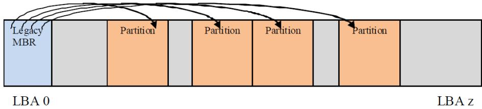  
Fig. 5.1: MBRDisk Layout with legacy MBR example

```txt
/// MBR Partition Entry
/// typedef struct {
    UINT8 BootIndicator;
    UINT8 StartHead;
    UINT8 StartSector;
    UINT8 StartTrack;
    UINT8 OSIndicator;
    UINT8 EndHead;
    UINT8 EndSector;
    UINT8 EndTrack;
    UINT8 StartingLBA[4];
    UINT8 SizeInLBA[4];
} MBR_PARTITION_RECORD;

/// MBR Partition Table
/// typedef struct {
    UINT8 BootStrapCode[440];
    UINT8 UniqueMbrSignature[4];
    UINT8 Unknown[2];
    MBR_PARTITION_RECORD Partition[4];
    UINT16 Signature;
} MASTER_BOOT_RECORD;

#pragma pack()
```

## 5.2.2 OS Types

Unique types defined by this specification (other values are not defined by this specification):

\- 0xEF (i.e., UEFI System Partition) defines a UEFI system partition.

\- 0xEE (i.e., GPT Protective) is used by a protective MBR (see 5.2.2) to define a fake partition covering the entire disk.

Other values are used by legacy operating systems, and are allocated independently of the UEFI specification.

NOTE: “Partition types” by Andries Brouwer: See “Links to UEFI-Related Documents” (http://uefi.org/uefi) under the heading “OS Type values used in the MBR disk layout”.

## 5.2.3 Protective MBR

For a bootable disk, a Protective MBR must be located at LBA 0 (i.e., the first logical block) of the disk if it is using the GPT disk layout. The Protective MBR precedes the GUID Partition Table Header to maintain compatibility with existing tools that do not understand GPT partition structures.

Table 5.3: Protective MBR

<table><tr><td>Mnemonic</td><td>Byte Offset</td><td>Byte Length</td><td>Contents</td></tr><tr><td>Boot Code</td><td>0</td><td>440</td><td>Unused by UEFI systems.</td></tr><tr><td>Unique MBR Disk Signature</td><td>440</td><td>4</td><td>Unused. Set to zero.</td></tr><tr><td>Unknown</td><td>444</td><td>2</td><td>Unused. Set to zero.</td></tr><tr><td>Partition Record</td><td>446</td><td>16*4</td><td></td></tr><tr><td></td><td></td><td></td><td>Array of four MBR partition records. Contains:• one partition record as defined See Table (below); and• three partition records each set to zero.</td></tr><tr><td>Signature</td><td>510</td><td>2</td><td>Set to 0xAA55 (i.e., byte 510 contains 0x55 and byte 511 contains 0xAA).</td></tr><tr><td>Reserved</td><td>512</td><td>Logical Block Size - 512</td><td>The rest of the logical block, if any, is reserved. Set to zero.</td></tr></table>

One of the Partition Records shall be as defined in table 12, reserving the entire space on the disk after the Protective MBR itself for the GPT disk layout.

Table 5.4: Protective MBR Partition Record protecting the entire disk\*

<table><tr><td>Mnemonic</td><td>Byte Offset</td><td>Byte Length</td><td>Description</td></tr><tr><td>BootIndicator</td><td>0</td><td>1</td><td>Set to 0x00 to indicate a non-bootable partition. If set to any value other than 0x00 the behavior of this flag on non-UEFI systems is undefined. Must be ignored by UEFI implementations.</td></tr><tr><td>StartingCHS</td><td>1</td><td>3</td><td>Set to 0x000200, corresponding to the Starting LBA field.</td></tr><tr><td>OSType</td><td>4</td><td>1</td><td>Set to 0xEE (i.e., GPT Protective)</td></tr><tr><td>EndingCHS</td><td>5</td><td>3</td><td>Set to the CHS address of the last logical block on the disk. Set to 0xFFFFF if it is not possible to represent the value in this field.</td></tr><tr><td>StartingLBA</td><td>8</td><td>4</td><td>Set to 0x00000001 (i.e., the LBA of the GPT Partition Header).</td></tr><tr><td>SizeInLBA</td><td>12</td><td>4</td><td>Set to the size of the disk minus one. Set to 0xFFFFFFFF if the size of the disk is too large to be represented in this field.</td></tr></table>

The remaining Partition Records shall each be set to zeros.

Figure 5.2 (below) shows an example of a GPT disk layout with four partitions with a protective MBR.

Figure 5.3 (below) shows an example of a GPT disk layout with four partitions with a protective MBR, where the disk capacity exceeds LBA 0xFFFFFFFF.

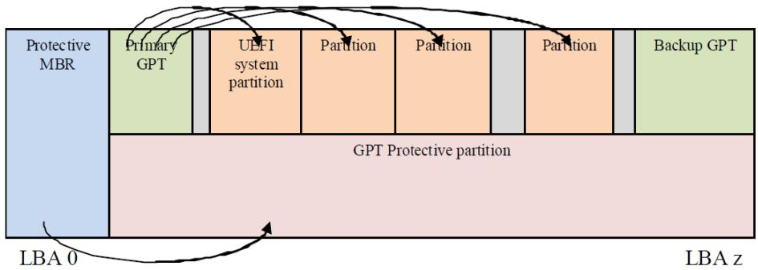  
Fig. 5.2: GPT disk layout with protective MBR

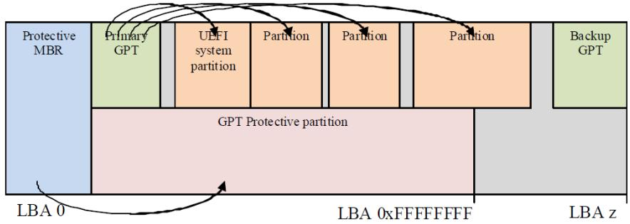  
Fig. 5.3: GPT disk layout with protective MBR on a diskwith capacity > LBA 0xFFFFFFF

## 5.2.4 Partition Information

Install an EFI\_PARTITION\_INFO protocol on each of the device handles that logical EFI\_BLOCK\_IO\_PROTOTOLs are installed.

## 5.3 GUID Partition Table (GPT) Disk Layout

## 5.3.1 GPT overview

The GPT partitioning scheme is depicted in the Figure GUID Partition Table (GPT) example. The GPT Header (GPT Header) includes a signature and a revision number that specifies the format of the data bytes in the partition header. The GUID Partition Table Header contains a header size field that is used in calculating the CRC32 that confirms the integrity of the GPT Header. While the GPT Header's size may increase in the future it cannot span more than one logical block on the device.

LBA 0 (i.e., the first logical block) contains a protective MBR (See Protective MBR).

Two GPT Header structures are stored on the device: the primary and the backup. The primary GPT Header must be located in LBA 1 (i.e., the second logical block), and the backup GPT Header must be located in the last LBA of the device. Within the GPT Header the My LBA field contains the LBA of the GPT Header itself, and the Alternate LBA field contains the LBA of the other GPT Header. For example, the primary GPT Header's My LBA value would be 1 and its Alternate LBA would be the value for the last LBA of the device. The backup GPT Header's fields would be reversed.

The GPT Header defines the range of LBAs that are usable by GPT Partition Entries. This range is defined to be inclusive of First Usable LBA through Last Usable LBA on the logical device. All data stored on the volume must be stored between the First Usable LBA through Last Usable LBA, and only the data structures defined by UEFI to manage partitions may reside outside of the usable space. The value of Disk GUID is a GUID that uniquely identifies the entire GPT Header and all its associated storage. This value can be used to uniquely identify the disk. The start of the GPT Partition Entry Array is located at the LBA indicated by the Partition Entry LBA field. The size of a GUID Partition Entry element is defined in the Size Of Partition Entry field. There is a 32-bit CRC of the GPT Partition Entry Array that is stored in the GPT Header in Partition Entry Array CRC32 field. The size of the GPT Partition Entry Array is Size Of Partition Entry multiplied by Number Of Partition Entries. If the size of the GUID Partition Entry Array is not an even multiple of the logical block size, then any space left over in the last logical block is Reserved and not covered by the Partition Entry Array CRC32 field. When a GUID Partition Entry is updated, the Partition Entry Array CRC32 must be updated. When the Partition Entry Array CRC32 is updated, the GPT Header CRC must also be updated, since the Partition Entry Array CRC32 is stored in the GPT Header.

  
Fig. 5.4: GUID Partition Table (GPT) example

The primary GPT Partition Entry Array must be located after the primary GPT Header and end before the First Usable LBA. The backup GPT Partition Entry Array must be located after the Last Usable LBA and end before the backup GPT Header.

Therefore the primary and backup GPT Partition EntryArrays are stored in separate locations on the disk. Each GPT Partition Entry defines a partition that is contained in a range that is within the usable space declared by the GPT Header. Zero or more GPT Partition Entries may be in use in the GPT Partition Entry Array. Each defined partition must not overlap with any other defined partition. If all the fields of a GUID Partition Entry are zero, the entry is not in use. A minimum of 16,384 bytes of space must be reserved for the GPT Partition Entry Array.

If the block size is 512, the First Usable LBA must be greater than or equal to 34 (allowing 1 block for the Protective MBR, 1 block for the Partition Table Header, and 32 blocks for the GPT Partition Entry Array); if the logical block size is 4096, the First Useable LBA must be greater than or equal to 6 (allowing 1 block for the Protective MBR, 1 block for the GPT Header, and 4 blocks for the GPT Partition Entry Array).

The device may present a logical block size that is not 512 bytes long. In ATA, this is called the Long Logical Sector feature set; an ATA device reports support for this feature set in IDENTIFY DEVICE data word 106 bit 12 and reports the number of words (i.e., 2 bytes) per logical sector in IDENTIFY DEVICE data words 117-118 (see ATA8-ACS). A SCSI device reports its logical block size in the READ CAPACITY parameter data Block Length In Bytes field (see SBC-3).

The device may present a logical block size that is smaller than the physical block size (e.g., present a logical block size of 512 bytes but implement a physical block size of 4,096 bytes). In ATA, this is called the Long Physical Sector feature set; an ATA device reports support for this feature set in IDENTIFY DEVICE data word 106 bit 13 and reports the Physical Sector Size/Logical Sector Size exponential ratio in IDENTIFY DEVICE data word 106 bits 3-0 (See