# NETWORK PROTOCOLS — ARP, DHCP, DNS, HTTP AND REST

## 29.1 ARP Protocol

This section defines the EFI Address Resolution Protocol (ARP) Protocol interface. It is split into the following two main sections:

• ARP Service Binding Protocol (ARPSBP)

• ARP Protocol (ARP)

ARP provides a generic implementation of the Address Resolution Protocol that is described in RFCs 826 and 1122. For RFCs can be found see “Links to UEFI-Related Documents” (uefi.org/uefi) under the heading “IETF” (RFCs 826 and 1122) for details for code of ICMP message.

## 29.1.1 EFI\_ARP\_SERVICE\_BINDING\_PROTOCOL

## Summary

The ARPSBP is used to locate communication devices that are supported by an ARP driver and to create and destroy instances of the ARP child protocol driver.

The EFI Service Binding Protocol in EFI Services Binding defines the generic Service Binding Protocol functions. This section discusses the details that are specific to the ARP.

## GUID

#define EFI\_ARP\_SERVICE\_BINDING\_PROTOCOL\_GUID {0xf44c00ee,0x1f2c,0x4a00,\ {0xaa,0x09,0x1c,0x9f,0x3e,0x08,0x00,0xa3}}

## Description

A network application (or driver) that requires network address resolution can use one of the protocol handler services, such as BS->LocateHandleBufer(), to search for devices that publish a ARPSBP GUID. Each device with a published ARPSBP GUID supports ARP and may be available for use.

After a successful call to the EFI\_ARP \_SERVICE\_BINDING\_PROTOCOL.CreateChild() function, the child ARP driver instance is in an unconfigured state; it is not ready to resolve addresses.

All child ARP driver instances that are created by one EFI\_ARP \_SERVICE\_BINDING\_PROTOCOL instance will share an ARP cache to improve eficiency.

Before a network application terminates execution, every successful call to the

EFI\_ARP \_SERVICE\_BINDING\_PROTOCOL.CreateChild() function must be matched with a call to the EFI\_ARP \_SERVICE\_BINDING\_PROTOCOL.DestroyChild() function.

NOTE: All the network addresses that are described in EFI\_ARP\_PROTOCOL are stored in network byte order. Both incoming and outgoing ARP packets are also in network byte order. All other parameters that are defined in functions or data structures are stored in host byte order.

## 29.1.2 EFI\_ARP\_PROTOCOL

## Summary

ARP is used to resolve local network protocol addresses into network hardware addresses.

GUID

```c
#define EFI_ARP_PROTOCOL_GUID \
{0xf4b427bb, 0xba21, 0x4f16, \
{0xbc, 0x4e, 0x43, 0xe4, 0x16, 0xab, 0x61, 0x9c}}
```

## Protocol Interface Structure

```txt
typedef struct _EFI_ARP_PROTOCOL {
    EFI_ARP_CONFIGURE Configure;
    EFI_ARP_ADD Add;
    EFI_ARP_FIND Find;
    EFI_ARP_DELETE Delete;
    EFI_ARP_FLUSH Flush;
    EFI_ARP_REQUEST Request;
    EFI_ARP_CANCEL Cancel;
} EFI_ARP_PROTOCOL;
```

## Parameters

## Configure

Adds a new station address (protocol type and network address) to the ARP cache. See the Configure() function description.

## Add

Manually inserts an entry to the ARP cache for administrative purpose. See the Add() function description.

## Find

Locates one or more entries in the ARP cache. See the Find() function description.

Delete Removes an entry from the ARP cache. See the Delete() function description.

Flush Removes all dynamic ARP cache entries of a specified protocol type. See the Flush() function description.

Request Starts an ARP request session. See the Request() function description.

## Cancel

Abort previous ARP request session. See the Cancel() function description.

## Description

The EFI\_ARP \_PROTOCOL defines a set of generic ARP services that can be used by any network protocol driver to resolve subnet local network addresses into hardware addresses. Normally, a periodic timer event internally sends and receives packets for ARP. But in some systems where the periodic timer is not supported, drivers and applications that are experiencing packet loss should try calling the Poll() function of the EFI Managed Network Protocol frequently.

NOTE: Add() and Delete() are typically used for administrative purposes, such as denying trafic to and from a specific remote machine, preventing ARP requests from coming too fast, and providing static address pairs to save time. Find() is also used to update an existing ARP cache entry.

## 29.1.3 EFI\_ARP\_PROTOCOL.Configure()

## Summary

Assigns a station address (protocol type and network address) to this instance of the ARP cache.

## Prototype

```txt
typedef
EFI_STATUS
(EFIAPI *EFI_ARP_CONFIGURE) (
    IN EFI_ARP_PROTOCOL    *This,
    IN EFI_ARP_CONFIG_DATA    *ConfigData OPTIONAL
);
```

## Parameters

## This

A pointer to the EFI\_ARP \_PROTOCOL instance.

## ConfigData

A pointer to the EFI\_ARP \_CONFIG\_DATA structure. Type EFI\_ARP \_CONFIG\_DATA is defined in “Related Definitions” below.

## Description

The Configure() function is used to assign a station address to the ARP cache for this instance of the ARP driver. Each ARP instance has one station address. The EFI\_ARP \_PROTOCOL driver will respond to ARP requests that match this registered station address. A call to Configure() with the ConfigData field set to NULL will reset this ARP instance.

Once a protocol type and station address have been assigned to this ARP instance, all the following ARP functions will use this information. Attempting to change the protocol type or station address to a configured ARP instance will result in errors.

## Related Definitions

```c
//******************************************************************
// EFI_ARP_CONFIG_DATA
//******************************************************************
typedef struct {
    UINT16    SwAddressType;
    UINT8    SwAddressLength;
    VOID    *StationAddress;
    UINT32    EntryTimeOut;
    UINT32    RetryCount;
    UINT32    RetryTimeOut;
} EFI_ARP_CONFIG_DATA;
```

## SwAddressType

16-bit protocol type number in host byte order. For more information see “Links to UEFI-Related Documents” (uefi.org/uefi) under the heading “16-bit protocol type numbers”.

## SwAddressLength

Length in bytes of the station’s protocol address to register.

## StationAddress

Pointer to the first byte of the protocol address to register. For example, if SwAddressType is 0x0800 (IP), then StationAddress points to the first byte of this station’s IP address stored in network byte order.

## EntryTimeOut

The timeout value in 100-ns units that is associated with each new dynamic ARP cache entry. If it is set to zero, the value is implementation-specific.

## RetryCount

The number of retries before a MAC address is resolved. If it is set to zero, the value is implementation-specific.

## RetryTimeOut

The timeout value in 100-ns units that is used to wait for the ARP reply packet or the timeout value between two retries. Set to zero to use implementation-specific value.

## Status Codes Returned

<table><tr><td>EFI_SUCCESS</td><td>The new station address was successfully registered.</td></tr><tr><td>EFI_INVALID_PARAMETER</td><td></td></tr><tr><td></td><td>One or more of the following conditions is TRUE:This is NULL.SwAddressLength is zero when ConfigData is not NULL.StationAddress is NULL when ConfigData is not NULL.</td></tr><tr><td>EFI_ACCESS_DENIED</td><td>The SwAddressType, SwAddressLength, or StationAddress is different from the one that is already registered.</td></tr><tr><td>EFI_OUT_OF_RESOURCES</td><td>Storage for the new StationAddress could not be allocated.</td></tr></table>

## 29.1.4 EFI\_ARP\_PROTOCOL.Add()

## Summary

Inserts an entry to the ARP cache.

## Prototype

```txt
typedef
EFI_STATUS
(EFIAPI *EFI_ARP_ADD) (
    IN EFI_ARP_PROTOCOL    *This,
    IN BOOLEAN    DenyFlag,
    IN VOID    *TargetSwAddress OPTIONAL,
    IN VOID    *TargetHwAddress OPTIONAL,
    IN UINT32    TimeoutValue,
    IN BOOLEAN    Overwrite
);
```

## Parameters

## This

A pointer to the EFI\_ARP \_PROTOCOL instance..

## DenyFlag

Set to TRUE if this entry is a “deny” entry.

Set to FALSE if this entry is a “normal” entry.

## TargetSwAddress

Pointer to a protocol address to add (or deny). May be set to NULL if DenyFlag is TRUE.

## TargetHwAddress

Pointer to a hardware address to add (or deny). May be set to NULL if DenyFlag is \*TRUE.\*

## TimeoutValue

Time in 100-ns units that this entry will remain in the ARP cache. A value of zero means that the entry is permanent. A nonzero value will override the one given by Configure() if the entry to be added is dynamic entry.

## Overwrite

If TRUE, the matching cache entry will be overwritten with the supplied parameters.

If FALSE, EFI\_ACCESS\_DENIED is returned if the corresponding cache entry already exists.

## Description

The Add() function is used to insert entries into the ARP cache.

ARP cache entries are typically inserted and updated by network protocol drivers as network trafic is processed. Most ARP cache entries will time out and be deleted if the network trafic stops. ARP cache entries that were inserted by the Add() function may be static (will not time out) or dynamic (will time out).

Default ARP cache timeout values are not covered in most network protocol specifications (although RFC 1122 comes pretty close) and will only be discussed in general in this specification. The timeout values that are used in the EFI Sample Implementation should be used only as a guideline. Final product implementations of the EFI network stack should be tuned for their expected network environments.

The Add() function can insert the following two types of entries into the ARP cache:

• “Normal” entries

• “Deny” entries

“Normal” entries must have both a TargetSwAddress and TargetHwAddress and are used to resolve network protocol addresses into network hardware addresses. Entries are keyed by TargetSwAddress. Each TargetSwAddress can have only one TargetHwAddress. A TargetHwAddress may be referenced by multiple TargetSwAddress entries.

“Deny” entries may have a TargetSwAddress or a TargetHwAddress, but not both. These entries tell the ARP driver to ignore any trafic to and from (and to) these addresses. If a request comes in from an address that is being denied, then the request is ignored.

If a normal entry to be added matches a deny entry of this driver, Overwrite decides whether to remove the matching deny entry. On the other hand, an existing normal entry can be removed based on the value of Overwrite if a deny entry to be added matches the existing normal entry. Two entries are matched only when they have the same addresses or when one of the normal entry addresses is the same as the address of a deny entry.

## Status Codes Returned

<table><tr><td>EFI_SUCCESS</td><td>The entry has been added or updated.</td><td></td></tr><tr><td></td><td></td><td>continues on next page</td></tr></table>

Table 29.2 – continued from previous page

<table><tr><td>EFI_INVALID_PARAMETER</td><td></td></tr><tr><td></td><td>One or more of the following conditions is TRUE:This is NULL.DenyFlag is FALSE and TargetHwAddress is NULL.DenyFlag is FALSE and TargetSwAddress is NULL.TargetHwAddress is NULL and TargetSwAddress is NULLBoth TargetSwAddress and TargetHwAddress are not NULL when DenyFlag is TRUE.</td></tr><tr><td>EFI_OUT_OF_RESOURCES</td><td>The new ARP cache entry could not be allocated.</td></tr><tr><td>EFI_ACCESS_DENIED</td><td>The ARP cache entry already exists and Overwrite is not TRUE.</td></tr><tr><td>EFI_NOT_STARTED</td><td>The ARP driver instance has not been configured.</td></tr></table>

## 29.1.5 EFI\_ARP\_PROTOCOL.Find()

## Summary

Locates one or more entries in the ARP cache.

## Prototype

```txt
typedef
EFI_STATUS
(EFIAPI *EFI_ARP_FIND) (
    IN EFI_ARP_PROTOCOL    *This,
    IN BOOLEAN    BySwAddress,
    IN VOID    *AddressBuffer OPTIONAL,
    OUT UINT32    *EntryLength OPTIONAL,
    OUT UINT32    *EntryCount OPTIONAL,
    OUT EFI_ARP_FIND_DATA    **Entries OPTIONAL,
    IN BOOLEAN Refresh
);
```

## Parameters

## This

A pointer to the EFI\_ARP \_PROTOCOL instance.

## BySwAddress

Set to TRUE to look for matching software protocol addresses.

Set to FALSE to look for matching hardware protocol addresses.

## AddressBufer

Pointer to address bufer. Set to NULL to match all addresses.

## EntryLength

The size of an entry in the entries bufer. To keep the EFI\_ARP \_FIND\_DATA structure properly aligned, this field may be longer than sizeof(EFI\_ARP \_FIND\_DATA) plus the length of the software and hardware addresses.

## EntryCount

The number of ARP cache entries that are found by the specified criteria.

## Entries

Pointer to the bufer that will receive the ARP cache entries. Type EFI\_ARP \_FIND\_DATA is defined in “Related Definitions” below.

## Refresh

Set to TRUE to refresh the timeout value of the matching ARP cache entry.

## Description

The Find() function searches the ARP cache for matching entries and allocates a bufer into which those entries are copied. The first part of the allocated bufer is EFI\_ARP \_FIND\_DATA, following which are protocol address pairs and hardware address pairs.

When finding a specific protocol address ( BySwAddress is TRUE and AddressBufer is not NULL ), the ARP cache timeout for the found entry is reset if Refresh is set to TRUE. If the found ARP cache entry is a permanent entry, it is not afected by Refresh.

## Related Definitions

```c
//**********************************************************************
// EFI_ARP_FIND_DATA
//**********************************************************************
typedef struct {
    UINT32 Size;
    BOOLEAN DenyFlag;
    BOOLEAN StaticFlag;
    UINT16 HwAddressType;
    UINT16 SwAddressType;
    UINT8 HwAddressLength;
    UINT8 SwAddressLength;
} EFI_ARP_FIND_DATA;
```

## Size

Length in bytes of this entry.

## DenyFlag

Set to TRUE if this entry is a “deny” entry.

Set to FALSE if this entry is a “normal” entry.

## StaticFlag

Set to TRUE if this entry will not time out. Set to FALSE if this entry will time out.

HwAddressType 16-bit ARP hardware identifier number.

SwAddressType 16-bit protocol type number.

HwAddressLength Length of the hardware address.

SwAddressLength Length of the protocol address.

Status Codes Returned

<table><tr><td>EFI_SUCCESS</td><td>The requested ARP cache entries were copied into the buffer.</td></tr><tr><td>EFI_INVALID_PARAMETER</td><td></td></tr><tr><td></td><td>One or more of the following conditions is TRUE:This is NULL.Both EntryCount and EntryLength are NULL, when Refresh is FALSE.</td></tr><tr><td>EFI_NOT_FOUND</td><td>No matching entries were found.</td></tr><tr><td>EFI_NOT_STARTED</td><td>The ARP driver instance has not been configured.</td></tr></table>

## 29.1.6 EFI\_ARP\_PROTOCOL.Delete()

## Summary

Removes entries from the ARP cache.

## Prototype

```txt
typedef
EFI_STATUS
(EFIAPI *EFI_ARP_DELETE) (
    IN EFI_ARP_PROTOCOL    *This,
    IN BOOLEAN    BySwAddress,
    IN VOID    *AddressBuffer OPTIONAL
);
```

## Parameters

## This

A pointer to the EFI\_ARP \_PROTOCOL instance.

## BySwAddress

Set to TRUE to delete matching protocol addresses.

Set to FALSE to delete matching hardware addresses.

## AddressBufer

Pointer to the address bufer that is used as a key to look for the cache entry. Set to NULL to delete all entries.

## Description

The Delete() function removes specified ARP cache entries.

## Status Codes Returned

<table><tr><td>EFI_SUCCESS</td><td>The entry was removed from the ARP cache.</td></tr><tr><td>EFI_INVALID_PARAMETER</td><td>This is NULL.</td></tr><tr><td>EFI_NOT_FOUND</td><td>The specified deletion key was not found.</td></tr><tr><td>EFI_NOT_STARTED</td><td>The ARP driver instance has not been configured.</td></tr></table>

## 29.1.7 EFI\_ARP\_PROTOCOL.Flush()

## Summary

Removes all dynamic ARP cache entries that were added by this interface.

## Prototype

```txt
typedef
EFI_STATUS
(EFIAPI *EFI_ARP_FLUSH) (
    IN EFI_ARP_PROTOCOL    *This
);
```

## Parameters

## This

A pointer to the EFI\_ARP \_PROTOCOL instance.

## Description

The Flush() function deletes all dynamic entries from the ARP cache that match the specified software protocol type.

## Status Codes Returned

<table><tr><td>EFI_SUCCESS</td><td>The cache has been flushed.</td></tr><tr><td>EFI_INVALID_PARAMETER</td><td>This is NULL.</td></tr><tr><td>EFI_NOT_FOUND</td><td>There are no matching dynamic cache entries.</td></tr><tr><td>EFI_NOT_STARTED</td><td>The ARP driver instance has not been configured.</td></tr></table>

## 29.1.8 EFI\_ARP\_PROTOCOL.Request()

## Summary

Starts an ARP request session.

Prototype

```sql
typedef
EFI_STATUS
(EFIAPI *EFI_ARP_REQUEST) (
    IN EFI_ARP_PROTOCOL    *This,
    IN VOID    *TargetSwAddress OPTIONAL,
    IN EFI_EVENT    ResolvedEvent OPTIONAL,
    OUT VOID    *TargetHwAddress
);
```

## Parameters

This

A pointer to the EFI\_ARP \_PROTOCOL instance..

## TargetSwAddress

Pointer to the protocol address to resolve.

## ResolvedEvent

Pointer to the event that will be signaled when the address is resolved or some error occurs.

## TargetHwAddress

Pointer to the bufer for the resolved hardware address in network byte order. The bufer must be large enough to hold the resulting hardware address. TargetHwAddress must not be NULL.

## Description

The Request() function tries to resolve the TargetSwAddress and optionally returns a TargetHwAddress if it already exists in the ARP cache.

If the registered SwAddressType (see EFI\_ARP \_PROTOCOL.Add() ) is IPv4 or IPv6 and the TargetSwAddress is a multicast address, then the TargetSwAddress is resolved using the underlying EFI\_MANAGED\_NETWORK\_PROTOCOL.McastIpToMac() function.

If the TargetSwAddress is NULL, then the network interface hardware broadcast address is returned immediately in TargetHwAddress.

If the ResolvedEvent is not NULL and the address to be resolved is not in the ARP cache, then the event will be signaled when the address request completes and the requested hardware address is returned in the TargetHwAddress. If the timeout expires and the retry count is exceeded or an unexpected error occurs, the event will be signaled to notify the caller, which should check the TargetHwAddress to see if the requested hardware address is available. If it is not available, the TargetHwAddress is filled by zero.

If the address to be resolved is already in the ARP cache and resolved, then the event will be signaled immediately if it is not NULL, and the requested hardware address is also returned in TargetHwAddress.

## Status Codes Returned

<table><tr><td>EFI_SUCCESS</td><td>The data was copied from the ARP cache into the TargetHwAddress buffer.</td></tr><tr><td>EFI_INVALID_PARAMETER</td><td></td></tr><tr><td></td><td>One or more of the following conditions is TRUE:This is NULLTargetHwAddress is NULL</td></tr><tr><td>EFI_ACCESS_DENIED</td><td>The requested address is not present in the normal ARP cache but is present in the deny address list. Outgoing traffic to that address is forbidden.</td></tr><tr><td>EFI_NOT_STARTED</td><td>The ARP driver instance has not been configured.</td></tr><tr><td>EFI_NOT_READY</td><td>The request has been started and is not finished.</td></tr><tr><td>EFI_UNSUPPORTED</td><td>The requested conversion is not supported in this implementation or configuration.</td></tr></table>

## 29.1.9 EFI\_ARP\_PROTOCOL.Cancel()

Summary

Cancels an ARP request session.

Prototype

```c
typedef
EFI_STATUS
(EFIAPI *EFI_ARP_CANCEL) (
    IN EFI_ARP_PROTOCOL    *This,
    IN VOID    *TargetSwAddress OPTIONAL,
```

(continues on next page)

<table><tr><td></td><td>(continued from previous page)</td></tr><tr><td>IN EFI_EVENT</td><td>ResolvedEvent OPTIONAL</td></tr><tr><td>);</td><td></td></tr></table>

## Parameters

## This

A pointer to the EFI\_ARP \_PROTOCOL instance.

## TargetSwAddress

Pointer to the protocol address in previous request session.

## ResolvedEvent

Pointer to the event that is used as the notification event in previous request session.

## Description

The Cancel() function aborts the previous ARP request (identified by This, TargetSwAddress and ResolvedEvent ) that is issued by EFI\_ARP \_PROTOCOL.Request(). If the request is in the internal ARP request queue, the request is aborted immediately and its ResolvedEvent is signaled. Only an asynchronous address request needs to be canceled. If TargeSwAddress and ResolveEvent are both NULL, all the pending asynchronous requests that have been issued by This instance will be cancelled and their corresponding events will be signaled.

## Status Codes Returned

<table><tr><td>EFI_SUCCESS</td><td>The pending request session(s) is/are aborted and corresponding event(s) is/are signaled.</td></tr><tr><td>EFI_INVALID_PARAMETER</td><td>One or more of the following conditions is TRUE:This is NULL.TargetSwAddress is not NULL and ResolvedEvent is NULLTargetSwAddress is NULL and ResolvedEvent is not NULL</td></tr><tr><td>EFI_NOT_STARTED</td><td>The ARP driver instance has not been configured.</td></tr><tr><td>EFI_NOT_FOUND</td><td>The request is not issued by EFI_ARP _PROTOCOL.Request().</td></tr></table>

## 29.2 EFI DHCPv4 Protocol

This section provides a detailed description of the EFI\_DHCP4\_PROTOCOL and the EFI\_DHCP4\_SERVICE\_BINDING\_PROTOCOL. The EFI DHCPv4 Protocol is used to collect configuration information for the EFI IPv4 Protocol drivers and to provide DHCPv4 server and PXE boot server discovery services.

## 29.2.1 EFI\_DHCP4\_SERVICE\_BINDING\_PROTOCOL

## Summary

The EFI DHCPv4 Service Binding Protocol is used to locate communication devices that are supported by an EFI DHCPv4 Protocol driver and to create and destroy EFI DHCPv4 Protocol child driver instances that can use the underlying communications device.

## GUID

```txt
#define EFI_DHCP4_SERVICE_BINDING_PROTOCOL_GUID \
{0x9d9a39d8,0xbd42,0x4a73,\
{0xa4,0xd5,0x8e,0xe9,0x4b,0xe1,0x13,0x80}}
```

## Description

A network application or driver that requires basic DHCPv4 services can use one of the protocol handler services, such as BS->LocateHandleBufer(), to search for devices that publish an EFI DHCPv4 Service Binding Protocol GUID. Each device with a published EFI DHCPv4 Service Binding Protocol GUID supports the EFI DHCPv4 Protocol and may be available for use.

After a successful call to the EFI\_DHCP4\_SERVICE\_BINDING\_PROTOCOL .CreateChild() function, the newly created EFI DHCPv4 Protocol child driver instance is ready to be used by a network application or driver.

Before a network application or driver terminates execution, every successful call to the EFI\_DHCP4\_SERVICE\_BINDING\_PROTOCOL .CreateChild() function must be matched with a call to the EFI\_DHCP4\_SERVICE\_BINDING\_PROTOCOL.DestroyChild() function.

## 29.2.2 EFI\_DHCP4\_PROTOCOL

## Summary

This protocol is used to collect configuration information for the EFI IPv4 Protocol drivers and to provide DHCPv4 server and PXE boot server discovery services.

## GUID

```txt
#define EFI_DHCP4_PROTOCOL_GUID \
{0x8a219718,0x4ef5,0x4761,\
{0x91,0xc8,0xc0,0xf0,0x4b,0xda,0x9e,0x56}}
```

## Protocol Interface Structure

```txt
typedef struct _EFI_DHCP4_PROTOCOL {
    EFI_DHCP4_GET_MODE_DATA GetModeData;
    EFI_DHCP4_CONFIGURE Configure;
    EFI_DHCP4_START Start;
    EFI_DHCP4_RENEW_REBIND RenewRebind;
    EFI_DHCP4_RELEASE Release;
    EFI_DHCP4_STOP Stop;
    EFI_DHCP4_BUILD Build;
    EFI_DHCP4_TRANSMIT_RECEIVE TransmitReceive;
    EFI_DHCP4_PARSE Parse;
} EFI_DHCP4_PROTOCOL;
```

## Parameters

## GetModeData

Gets the EFI DHCPv4 Protocol driver status and operational data. See the GetModeData() function description.

## Configure

Initializes, changes, or resets operational settings for the EFI DHCPv4 Protocol driver. See the Configure() function description.

## Start

Starts the DHCP configuration process. See the Start() function description.

## RenewRebind

Tries to manually extend the lease time by sending a request packet. See the RenewRebind() function description.

## Release

Releases the current configuration and returns the EFI DHCPv4 Protocol driver to the initial state. See the Release() function description.

## Stop

Stops the DHCP configuration process no matter what state the driver is in. After being stopped, this driver will not automatically communicate with the DHCP server. See the Stop() function description.

## Build

Puts together a DHCP or PXE packet. See the Build() function description.

## TransmitReceive

Transmits a DHCP or PXE packet and waits for response packets. See the TransmitReceive() function description.

## Parse

Parses the packed DHCP or PXE option data. See the Parse() function description.

## Description

The EFI\_DHCP4\_PROTOCOL is used to collect configuration information for the EFI IPv4 Protocol driver and provide DHCP server and PXE boot server discovery services.

## Byte Order Note

All the IPv4 addresses that are described in EFI\_DHCP4\_PROTOCOL are stored in network byte order. Both incoming and outgoing DHCP packets are also in network byte order. All other parameters that are defined in functions or data structures are stored in host byte order

## 29.2.3 EFI\_DHCP4\_PROTOCOL.GetModeData()

## Summary

Returns the current operating mode and cached data packet for the EFI DHCPv4 Protocol driver.

## Prototype

```txt
typedef
EFI_STATUS
(EFIAPI *EFI_DHCP4_GET_MODE_DATA)(
    IN EFI_DHCP4_PROTOCOL    *This,
    OUT EFI_DHCP4_MODE_DATA    *Dhcp4ModeData
);
```

## Parameters

## This

Pointer to the EFI\_DHCP4\_PROTOCOL instance.

## Dhcp4ModeData

Pointer to storage for the EFI\_DHCP4\_MODE\_DATA structure. Type EFI\_DHCP4\_MODE\_DATA is defined in “Related Definitions” below.

## Description

The GetModeData() function returns the current operating mode and cached data packet for the EFI DHCPv4 Protocol driver.

## Related Definitions

```c
//**********************************************************************
// EFI_DHCP4_MODE_DATA
//**********************************************************************
typedef struct {
    EFI_DHCP4_STATE State;
    EFI_DHCP4_CONFIG_DATA ConfigData;
    EFI_IPv4_ADDRESS ClientAddress;
    EFI_MAC_ADDRESS ClientMacAddress;
    EFI_IPv4_ADDRESS ServerAddress;
    EFI_IPv4_ADDRESS RouterAddress;
    EFI_IPv4_ADDRESS SubnetMask;
    UINT32 LeaseTime;
    EFI_DHCP4_PACKET *ReplyPacket;
} EFI_DHCP4_MODE_DATA;
```

## State

The EFI DHCPv4 Protocol driver operating state. Type EFI\_DHCP4\_STATE is defined below.

## ConfigData

The configuration data of the current EFI DHCPv4 Protocol driver instance. Type EFI\_DHCP4\_CONFIG\_DATA is defined in EFI\_DHCP4\_PROTOCOL .Configure().

## ClientAddress

The client IP address that was acquired from the DHCP server. If it is zero, the DHCP acquisition has not completed yet and the following fields in this structure are undefined.

## ClientMacAddress

The local hardware address.

## ServerAddress

The server IP address that is providing the DHCP service to this client.

## RouterAddress

The router IP address that was acquired from the DHCP server. May be zero if the server does not ofer this address.

## SubnetMask

The subnet mask of the connected network that was acquired from the DHCP server.

## LeaseTime

The lease time (in 1-second units) of the configured IP address. The value 0xFFFFFFFF means that the lease time is infinite. A default lease of 7 days is used if the DHCP server does not provide a value.

## ReplyPacket

The cached latest DHCPACK or DHCPNAK or BOOTP REPLY packet. May be NULL if no packet is cached.

The EFI\_DHCP4\_MODE\_DATA structure describes the operational data of the current DHCP procedure.

```c
//******************************************************************
// EFI_DHCP4_STATE
//******************************************************************
typedef enum {
    Dhcp4Stopped = 0x0,
    Dhcp4Init = 0x1,
    Dhcp4Selecting = 0x2,
    Dhcp4Requesting = 0x3,
    Dhcp4Bound = 0x4
```

(continues on next page)

```c
//**********************************************************************
// EFI_DHCP4_PACKET
//**********************************************************************
#pragma pack(1)
typedef struct {
```

```txt
(continued from previous page)
Dhcp4Renewing = 0x5,
Dhcp4Rebinding = 0x6,
Dhcp4InitReboot = 0x7,
Dhcp4Rebooting = 0x8
} EFI_DHCP4_STATE;
```

Table 29.8: DHCP4 Enumerations

<table><tr><td>Field</td><td>Description</td></tr><tr><td>Dhcp4Stopped</td><td>The EFI DHCPv4 Protocol driver is stopped and EFI_DHCP4_PROTOCOL.Configure() needs to be called. The rest of the EFI_DHCP4_MODE_DATA structure is undefined in this state.</td></tr><tr><td>Dhcp4Init</td><td>The EFI DHCPv4 Protocol driver is inactive and EFI_DHCP4_PROTOCOL.Start() needs to be called. The rest of the EFI_DHCP4_MODE_DATA structure is undefined in this state.</td></tr><tr><td>Dhcp4Selecting</td><td>The EFI DHCPv4 Protocol driver is collecting DHCP offer packets from DHCP servers. The rest of the EFI_DHCP4_MODE_DATA structure is undefined in this state.</td></tr><tr><td>Dhcp4Requesting</td><td>The EFI DHCPv4 Protocol driver has sent the request to the DHCP server and is waiting for a response. The rest of the EFI_DHCP4_MODE_DATA structure is undefined in this state.</td></tr><tr><td>Dhcp4Bound</td><td>The DHCP configuration has completed. All of the fields in the EFI_DHCP4_MODE_DATA structure are defined.</td></tr><tr><td>Dhcp4Renewing</td><td>The DHCP configuration is being renewed and another request has been sent out, but it has not received a response from the server yet. All of the fields in the EFI_DHCP4_MODE_DATA structure are available but may change soon.</td></tr><tr><td>Dhcp4Rebinding</td><td>The DHCP configuration has timed out and the EFI DHCPv4 Protocol driver is trying to extend the lease time. The rest of the EFI_DHCP4_MODE structure is undefined in this state.</td></tr><tr><td>Dhcp4InitReboot</td><td>The EFI DHCPv4 Protocol driver is initialized with a previously allocated or known IP address. EFI_DHCP4_PROTOCOL.Start() needs to be called to start the configuration process. The rest of the EFI_DHCP4_MODE_DATA structure is undefined in this state.</td></tr><tr><td>Dhcp4Rebooting</td><td>The EFI DHCPv4 Protocol driver is seeking to reuse the previously allocated IP address by sending a request to the DHCP server. The rest of the EFI_DHCP4_MODE_DATA structure is undefined in this state.</td></tr></table>

EFI\_DHCP4\_STATE defines the DHCP operational states that are described in RFC 2131, which can be obtained at “Links to UEFI-Related Documents” ( http://uefi.org/uefi) under the heading “RFC 2131”.

A variable number of EFI DHCPv4 Protocol driver instances can coexist but they share the same state machine. More precisely, each communication device has a separate DHCP state machine if there are multiple communication devices. Each EFI DHCPv4 Protocol driver instance that is created by the same EFI DHCPv4 Service Binding Protocol driver instance shares the same state machine. In this document, when we refer to the state of EFI DHCPv4 Protocol driver, we actually refer to the state of the communication device from which the current EFI DHCPv4 Protocol Driver instance is created.

(continues on next page)

(continued from previous page)

```c
(continued from previous page)
UINT32 Size;
UINT32 Length;
struct{
    EFI_DHCP4_HEADER Header;
    UINT32 Magik;
    UINT8 Option[1];
} Dhcp4;
} FI_DHCP4_PACKET;
#pragma pack()
```

## Size

Size of the EFI\_DHCP4\_PACKET bufer.

## Length

Length of the EFI\_DHCP4\_PACKET from the first byte of the Header field to the last byte of the Option[] field.

Header DHCP packet header.

Magik DHCP magik cookie in network byte order.

## Option

Start of the DHCP packed option data. EFI\_DHCP4\_PACKET defines the format of DHCPv4 packets. See RFC 2131 for more information.

## Status Codes Returned

<table><tr><td>EFI_SUCCESS</td><td>The mode data was returned.</td></tr><tr><td>EFI_INVALID_PARAMETER</td><td>This is NULL.</td></tr></table>

## 29.2.4 EFI\_DHCP4\_PROTOCOL.Configure()

## Summary

Initializes, changes, or resets the operational settings for the EFI DHCPv4 Protocol driver.

## Prototype

```txt
typedef
EFI_STATUS
(EFIAPI *EFI_DHCP4_CONFIGURE) (
    IN EFI_DHCP4_PROTOCOL    *This,
    IN EFI_DHCP4_CONFIG_DATA    *Dhcp4CfgData OPTIONAL
);
```

## Parameters

## This

Pointer to the EFI\_DHCP4\_PROTOCOL instance.

## Dhcp4CfgData

Pointer to the EFI\_DHCP4\_CONFIG\_DATA. Type EFI\_DHCP4\_CONFIG\_DATA is defined in “Related Definitions” below.

## Description

The Configure() function is used to initialize, change, or reset the operational settings of the EFI DHCPv4 Protocol driver for the communication device on which the EFI DHCPv4 Service Binding Protocol is installed. This function can be successfully called only if both of the following are true:

• This instance of the EFI DHCPv4 Protocol driver is in the Dhcp4Stopped, Dhcp4Init, Dhcp4InitReboot, or Dhcp4Bound states.

• No other EFI DHCPv4 Protocol driver instance that is controlled by this EFI DHCPv4 Service Binding Protocol driver instance has configured this EFI DHCPv4 Protocol driver.

When this driver is in the Dhcp4Stopped state, it can transfer into one of the following two possible initial states:

• Dhcp4Init

• Dhcp4InitReboot

The driver can transfer into these states by calling Configure() with a non- NULL Dhcp4CfgData. The driver will transfer into the appropriate state based on the supplied client network address in the ClientAddress parameter and DHCP options in the OptionList parameter as described in RFC 2131.

When Configure() is called successfully while Dhcp4CfgData is set to NULL, the default configuring data will be reset in the EFI DHCPv4 Protocol driver and the state of the EFI DHCPv4 Protocol driver will not be changed. If one instance wants to make it possible for another instance to configure the EFI DHCPv4 Protocol driver, it must call this function with Dhcp4CfgData set to NULL.

## Related Definitions

```c
//**********************************************************************
// EFI_DHCP4_CONFIG_DATA
//**********************************************************************
typedef struct {
    UINT32 DiscoverTryCount;
    UINT32 *DiscoverTimeout;
    UINT32 RequestTryCount;
    UINT32 *RequestTimeout;
    EFI_IPv4_ADDRESS ClientAddress;
    EFI_DHCP4_CALLBACK Dhcp4Callback;
    VOID *CallbackContext;
    UINT32 OptionCount;
    EFI_DHCP4_PACKET_OPTION **OptionList;
} EFI_DHCP4_CONFIG_DATA;
```

## DiscoverTryCount

Number of times to try sending a packet during the Dhcp4SendDiscover event and waiting for a response during the Dhcp4RcvdOfer event. (This value is also the number of entries in the DiscoverTimeout array.) Set to zero to use the default try counts and timeout values.

## DiscoverTimeout

Maximum amount of time (in seconds) to wait for returned packets in each of the retries. Timeout values of zero will default to a timeout value of one second. Set to NULL to use default timeout values.

## RequestTryCount

Number of times to try sending a packet during the Dhcp4SendReques t event and waiting for a response during the Dhcp4RcvdAck event before accepting failure. (This value is also the number of entries in the RequestTimeout array.) Set to zero to use the default try counts and timeout values.

## RequestTimeout

Maximum amount of time (in seconds) to wait for return packets in each of the retries. Timeout values of zero

will default to a timeout value of one second. Set to NULL to use default timeout values.

## ClientAddress

For a DHCPDISCOVER, setting this parameter to the previously allocated IP address will cause the EFI DHCPv4 Protocol driver to enter the Dhcp4InitReboot state. Also, set this field to 0.0.0.0 to enter the Dhcp4Init state. For a DHCPINFORM this parameter should be set to the client network address which was assigned to the client during a DHCPDISCOVER.

## Dhcp4Callback

The callback function to intercept various events that occurred in the DHCP configuration process. Set to NULL to ignore all those events. Type EFI\_DHCP4\_CALLBACK is defined below.

## CallbackContext

Pointer to the context that will be passed to Dhcp4Callback when it is called.

## OptionCount

Number of DHCP options in the OptionList.

## OptionList

List of DHCP options to be included in every packet that is sent during the Dhcp4SendDiscover event. Pad options are appended automatically by DHCP driver in outgoing DHCP packets. If OptionList itself contains pad option, they are ignored by the driver. OptionList can be freed after EFI\_DHCP4\_PROTOCOL .Configure() returns. Ignored if OptionCount is zero. Type EFI\_DHCP4\_PACKET\_OPTION is defined below.

```cpp
//******************************************************************
// EFI_DHCP4_CALLBACK
//******************************************************************
typedef EFI_STATUS (*EFI_DHCP4_CALLBACK)(
    IN EFI_DHCP4_PROTOCOL *This,
    IN VOID *Context,
    IN EFI_DHCP4_STATE CurrentState,
    IN EFI_DHCP4_EVENT Dhcp4Event,
    IN EFI_DHCP4_PACKET *Packet, OPTIONAL
    OUT EFI_DHCP4_PACKET **NewPacket OPTIONAL
);
```

## This

Pointer to the EFI DHCPv4 Protocol instance that is used to configure this callback function.

## Context

Pointer to the context that is initialized by EFI\_DHCP4\_PROTOCOL .Configure()

## CurrentState

The current operational state of the EFI DHCPv4 Protocol driver. Type EFI\_DHCP4\_STATE is defined in EFI\_DHCP4\_PROTOCOL .GetModeData()

## Dhcp4Event

The event that occurs in the current state, which usually means a state transition. Type EFI\_DHCP4\_EVENT is defined below.

## Packet

The DHCP packet that is going to be sent or already received. May be NULL if the event has no associated packet. Do not cache this packet except for copying it. Type EFI\_DHCP4\_PACKET is defined in EFI\_DHCP4\_PROTOCOL .GetModeData().

## NewPacket

The packet that is used to replace the above Packet. Do not set this pointer exactly to the above Packet or a modified Packet. NewPacket can be NULL if the EFI DHCPv4 Protocol driver does not expect a new packet to be returned. The user may set NewPacket to NULL if no replacement occurs.

EFI\_DHCP4\_CALLBACK is provided by the consumer of the EFI DHCPv4 Protocol driver to intercept events that occurred in the configuration process. This structure provides advanced control of each state transition of the DHCP process. The returned status code determines the behavior of the EFI DHCPv4 Protocol driver. There are three possible returned values, which are described in the following table.

## Status Codes Returned

<table><tr><td>EFI_SUCCESS</td><td>Tells the EFI DHCPv4 Protocol driver to continue the DHCP process. When it is in the Dhcp4Selecting state, it tells the EFI DHCPv4 Protocol driver to stop collecting additional packets. The driver will exit the Dhcp4Selecting state and enter the Dhcp4Requesting state.</td></tr><tr><td>EFI_NOT_READY</td><td>Only used in the Dhcp4Selecting state. The EFI DHCPv4 Protocol driver will continue to wait for more packets until the retry timeout expires.</td></tr><tr><td>EFI_ABORTED</td><td>Tells the EFI DHCPv4 Protocol driver to abort the current process and return to the Dhcp4Init or Dhcp4InitReboot state.</td></tr></table>

```c
//**********************************************************************
// EFI_DHCP4_EVENT
//**********************************************************************
typedef enum {
    Dhcp4SendDiscover = 0x01,
    Dhcp4RcvdOffer = 0x02,
    Dhcp4SelectOffer = 0x03,
    Dhcp4SendRequest = 0x04,
    Dhcp4RcvdAck = 0x05,
    Dhcp4RcvdNak = 0x06,
    Dhcp4SendDecline = 0x07,
    Dhcp4BoundCompleted = 0x08,
    Dhcp4EnterRenewing = 0x09,
    Dhcp4EnterRebinding = 0x0a,
    Dhcp4AddressLost = 0x0b,
    Dhcp4Fail = 0x0c
} EFI_DHCP4_EVENT;
```  
Following is a description of the fields in the above enumeration.

## Dhcp4SendDiscover

The packet to start the configuration sequence is about to be sent. The packet is passed to Dhcp4Callback and can be modified or replaced in Dhcp4Callback.

## Dhcp4RcvdOfer

A reply packet was just received. This packet is passed to Dhcp4Callback, which may copy this packet and cache it for selecting a task later. If the callback returns EFI\_SUCCESS, this driver will finish the selecting state. If EFI\_NOT\_READY is returned, this driver will continue to wait for additional reply packets until the timer expires. In either case, Dhcp4SelectOfer will occur for the user to select an ofer.

## Dhcp4SelectOfer

It is time for Dhcp4Callback to select an ofer. This driver passes the latest received DHCPOFFER packet to the callback. The Dhcp4Callback may store one packet in the NewPacket parameter of the function that was selected from previously received DHCPOFFER packets. If the latest packet is the selected one or if the user does not care about it, no extra overhead is needed. Simply skipping this event is enough.

## Dhcp4SendRequest A

request packet is about to be sent. The user can modify or replace this packet.

## Dhcp4RcvdAck

A DHCPACK packet was received and will be passed to Dhcp4Callback. The callback may decline this DHC-PACK packet by returning EFI\_ABORTED. In this case, the EFI DHCPv4 Protocol driver will proceed to the Dhcp4SendDecline event.

## Dhcp4RcvdNak

A DHCPNAK packet was received and will be passed to Dhcp4Callback. The EFI DHCPv4 Protocol driver will then return to the Dhcp4Init state no matter what status code is returned from the callback function.

## Dhcp4SendDecline

A decline packet is about to be sent. Dhcp4Callback can modify or replace this packet. The EFI DHCPv4 Protocol driver will then be set to the Dhcp4Init state.

## Dhcp4BoundCompleted

The DHCP configuration process has completed. No packet is associated with this event.

## Dhcp4EnterRenewing

It is time to enter the Dhcp4Renewing state and to contact the server that originally issued the network address. No packet is associated with this event.

## Dhcp4EnterRebinding

It is time to enter the Dhcp4Rebinding state and to contact any server. No packet is associated with this event.

## Dhcp4AddressLost

The configured IP address was lost either because the lease has expired, the user released the configuration, or a DHCPNAK packet was received in the Dhcp4Renewing or Dhcp4Rebinding state. No packet is associated with this event.

## Dhcp4Fail

The DHCP process failed because a DHCPNAK packet was received or the user aborted the DHCP process at a time when the configuration was not available yet. No packet is associated with this event.

```c
//**********************************************************************
// EFI_DHCP4_HEADER
//**********************************************************************
#pragma pack(1)
typedef struct{
    UINT8    OpCode;
    UINT8    HwType;
    UINT8    HwAddrLen;
    UINT8    Hops;
    UINT32    Xid;
    UINT16    Seconds;
    UINT16    Reserved;
    EFI_IPv4_ADDRESS ClientAddr;
    EFI_IPv4_ADDRESS YourAddr;
    EFI_IPv4_ADDRESS ServerAddr;
    EFI_IPv4_ADDRESS GatewayAddr;
    UINT8    ClientHwAddr[16];
    CHAR8    ServerName[64];
    CHAR8    BootFileName[128];
} EFI_DHCP4_HEADER;
#pragma pack()
```

## OpCode

Message type. 1 = BOOTREQUEST, 2 = BOOTREPLY.

HwType Hardware address type.

HwAddrLen Hardware address length.

Hops Maximum number of hops (routers, gateways, or relay agents) that this DHCP packet can go through before it is dropped.

Xid DHCP transaction ID.

Seconds Number of seconds that have elapsed since the client began address acquisition or the renewal process.

Reserved Reserved for future use.

ClientAddr Client IP address from the client.

YourAddr Client IP address from the server.

ServerAddr IP address of the next server in bootstrap.

GatewayAddr Relay agent IP address.

ClientHwAddr Client hardware address.

ServerName Optional server host name.

BootFileName Boot file name.

EFI\_DHCP4\_HEADER describes the semantics of the DHCP packet header. This packet header is in network byte order.

```c
//**********************************************************************
// EFI_DHCP4_PACKET_OPTION
//**********************************************************************
#pragma pack(1)
typedef struct {
    UINT8    OpCode;
    UINT8    Length;
    UINT8    Data[1];
} EFI_DHCP4_PACKET_OPTION;
#pragma pack()
```

## OpCode

DHCP option code.

## Length

Length of the DHCP option data. Not present if OpCode is 0 or 255.

## Data

Start of the DHCP option data. Not present if OpCode is 0 or 255 or if Length is zero.

The DHCP packet option data structure is used to reference option data that is packed in the DHCP packets. Use caution when accessing multibyte fields because the information in the DHCP packet may not be properly aligned for the machine architecture.

## Status Codes Returned

<table><tr><td>EFI_SUCCESS</td><td>The EFI DHCPv4 Protocol driver is now in the Dhcp4Init or Dhcp4InitReboot state, if the original state of this driver was Dhcp4Stopped, Dhcp4Init, Dhcp4InitReboot, or Dhcp4Bound and the value of Dhcp4CfgData was not NULL. Otherwise, the state was left unchanged.</td></tr><tr><td>EFI_ACCESS_DENIED</td><td>This instance of the EFI DHCPv4 Protocol driver was not in the Dhcp4Stopped, Dhcp4Init, Dhcp4InitReboot, or Dhcp4Bound state.</td></tr><tr><td>EFI_ACCESS_DENIED</td><td>Another instance of this EFI DHCPv4 Protocol driver is already in a valid configured state.</td></tr><tr><td>EFI_INVALID_PARAMETER</td><td>One or more following conditions are TRUE:This is NULL.DiscoverTryCount &gt;0 and DiscoverTimeout is NULL.RequestTryCount &gt;0 and RequestTimeout is NULL.OptionCount &gt;0 and OptionList is NULL.ClientAddress is not a valid unicast address.</td></tr><tr><td>EFI_OUT_OF_RESOURCES</td><td>Required system resources could not be allocated.</td></tr><tr><td>EFI_DEVICE_ERROR</td><td>An unexpected system or network error occurred.</td></tr></table>

## 29.2.5 EFI\_DHCP4\_PROTOCOL.Start()

## Summary

Starts the DHCP configuration process.

Prototype

```txt
typedef
EFI_STATUS
(EFIAPI *EFI_DHCP4_START) (
    IN EFI_DHCP4_PROTOCOL    *This,
    IN EFI_EVENT    CompletionEvent OPTIONAL
);
```

## Parameters

## This

Pointer to the EFI\_DHCP4\_PROTOCOL instance.

## CompletionEvent

If not NULL, indicates the event that will be signaled when the EFI DHCPv4 Protocol driver is transferred into the Dhcp4Bound state or when the DHCP process is aborted. EFI\_DHCP4\_PROTOCOL .GetModeData() can be called to check the completion status. If NULL, EFI\_DHCP4\_PROTOCOL.Start() will wait until the driver is transferred into the Dhcp4Bound state or the process fails

## Description

The Start() function starts the DHCP configuration process. This function can be called only when the EFI DHCPv4 Protocol driver is in the Dhcp4Init or Dhcp4InitReboot state.

If the DHCP process completes successfully, the state of the EFI DHCPv4 Protocol driver will be transferred through Dhcp4Selecting and Dhcp4Requesting to the Dhcp4Bound state. The CompletionEvent will then be signaled if it is not NULL.

If the process aborts, either by the user or by some unexpected network error, the state is restored to the Dhcp4Init state. The Start() function can be called again to restart the process.

Refer to RFC 2131 for precise state transitions during this process. At the time when each event occurs in this process, the callback function that was set by EFI\_DHCP4\_PROTOCOL .Configure() will be called and the user can take this opportunity to control the process.

## Status Codes Returned

<table><tr><td>EFI_SUCCESS</td><td>The DHCP configuration process has started, or it has completed when CompletionEvent is NULL.</td></tr><tr><td>EFI_NOT_STARTED</td><td>The EFI DHCPv4 Protocol driver is in the Dhcp4Stopped state. EFI_DHCP4_PROTOCOL .Configure() needs to be called.</td></tr><tr><td>EFI_INVALID_PARAMETER</td><td>This is NULL.</td></tr><tr><td>EFI_OUT_OF_RESOURCES</td><td>Required system resources could not be allocated.</td></tr><tr><td>EFI_TIMEOUT</td><td>The DHCP configuration process failed because no response was received from the server within the specified timeout value.</td></tr><tr><td>EFI_ABORTED</td><td>The user aborted the DHCP process.</td></tr><tr><td>EFI_ALREADY_STARTED</td><td>Some other EFI DHCPv4 Protocol instance already started the DHCP process.</td></tr><tr><td>EFI_DEVICE_ERROR</td><td>An unexpected network or system error occurred.</td></tr><tr><td>EFI_NO_MEDIA</td><td>There was a media error.</td></tr></table>

## 29.2.6 EFI\_DHCP4\_PROTOCOL.RenewRebind()

## Summary

Extends the lease time by sending a request packet.

## Prototype

```sql
typedef
EFI_STATUS
(EFIAPI *EFI_DHCP4_RENEW_REBIND) (
    IN EFI_DHCP4_PROTOCOL    *This,
    IN BOOLEAN    RebindRequest,
    IN EFI_EVENT    CompletionEvent OPTIONAL
);
```

## Parameters

## This

Pointer to the EFI\_DHCP4\_PROTOCOL instance.

## RebindRequest

If TRUE, this function broadcasts the request packets and enters the Dhcp4Rebinding state. Otherwise, it sends a unicast request packet and enters the Dhcp4Renewing state.

## CompletionEvent

If not NULL, this event is signaled when the renew/rebind phase completes or some error occurs.

EFI\_DHCP4\_PROTOCOL .GetModeData() can be called to check the completion status. If NULL, EFI\_DHCP4\_PROTOCOL.RenewRebind() will busy-wait until the DHCP process finishes.

## Description

The RenewRebind() function is used to manually extend the lease time when the EFI DHCPv4 Protocol driver is in the Dhcp4Bound state and the lease time has not expired yet. This function will send a request packet to the previously found server (or to any server when RebindRequest is TRUE ) and transfer the state into the Dhcp4Renewing state (or Dhcp4Rebinding when RebindingRequest is TRUE ). When a response is received, the state is returned to Dhcp4Bound.

If no response is received before the try count is exceeded (the RequestTryCount field that is specified in EFI\_DHCP4\_CONFIG\_DATA ) but before the lease time that was issued by the previous server expires, the driver will return to the Dhcp4Bound state and the previous configuration is restored. The outgoing and incoming packets can be captured by the EFI\_DHCP4\_CALLBACK function.

## Status Codes Returned

<table><tr><td>EFI_SUCCESS</td><td>The EFI DHCPv4 Protocol driver is now in the Dhcp4Renewing state or is back to the Dhcp4Bound state.</td></tr><tr><td>EFI_NOT_STARTED</td><td>The EFI DHCPv4 Protocol driver is in the Dhcp4Stopped state.EFI_DHCP4_PROTOCOL .Configure() needs to be called.</td></tr><tr><td>EFI_INVALID_PARAMETER</td><td>This is NULL.</td></tr><tr><td>EFI_TIMEOUT</td><td>There was no response from the server when the try count was exceeded.</td></tr><tr><td>EFI_ACCESS_DENIED</td><td>The driver is not in the Dhcp4Bound state.</td></tr><tr><td>EFI_DEVICE_ERROR</td><td>An unexpected network or system error occurred.</td></tr></table>

## 29.2.7 EFI\_DHCP4\_PROTOCOL.Release()

## Summary

Releases the current address configuration.

Prototype

```c
typedef
EFI_STATUS
(EFIAPI *EFI_DHCP4_RELEASE) (
    IN EFI_DHCP4_PROTOCOL *This
);
```

## Parameters

## This

Pointer to the EFI\_DHCP4\_PROTOCOL instance.

## Description

The Release() function releases the current configured IP address by doing either of the following:

• Sending a DHCPRELEASE packet when the EFI DHCPv4 Protocol driver is in the Dhcp4Bound state

• Setting the previously assigned IP address that was provided with the EFI\_DHCP4\_PROTOCOL .Configure() function to 0.0.0.0 when the driver is in Dhcp4InitReboot state

After a successful call to this function, the EFI DHCPv4 Protocol driver returns to the Dhcp4Init state and any subsequent incoming packets will be discarded silently.

Status Codes Returned

<table><tr><td>EFI_SUCCESS</td><td>The EFI DHCPv4 Protocol driver is now in the Dhcp4Init phase.</td></tr><tr><td>EFI_INVALID_PARAMETER</td><td>This is NULL.</td></tr><tr><td>EFI_ACCESS_DENIED</td><td>The EFI DHCPv4 Protocol driver is not in the Dhcp4Bound or Dhcp4InitReboot state.</td></tr><tr><td>EFI_DEVICE_ERROR</td><td>An unexpected network or system error occurred.</td></tr></table>

## 29.2.8 EFI\_DHCP4\_PROTOCOL.Stop()

## Summary

Stops the DHCP configuration process.

Prototype

```txt
typedef
EFI_STATUS
(EFIAPI *EFI_DHCP4_STOP) (
    IN EFI_DHCP4_PROTOCOL    *This
);
```

## Parameters

## This

Pointer to the EFI\_DHCP4\_PROTOCOL instance.

## Description

The Stop() function is used to stop the DHCP configuration process. After this function is called successfully, the EFI DHCPv4 Protocol driver is transferred into the Dhcp4Stopped state. EFI\_DHCP4\_PROTOCOL .Configure() needs to be called before DHCP configuration process can be started again. This function can be called when the EFI DHCPv4 Protocol driver is in any state.

## Status Codes Returned

<table><tr><td>EFI_SUCCESS</td><td>The EFI DHCPv4 Protocol driver is now in the Dhcp4Stopped state.</td></tr><tr><td>EFI_INVALID_PARAMETER</td><td>This is NULL.</td></tr><tr><td>EFI_NO_MEDIA</td><td>There was a media error.</td></tr></table>

## 29.2.9 EFI\_DHCP4\_PROTOCOL.Build()

## Summary

Builds a DHCP packet, given the options to be appended or deleted or replaced.

## Prototype

```c
typedef
EFI_STATUS
(EFIAPI *EFI_DHCP4_BUILD) (
    IN EFI_DHCP4_PROTOCOL    *This,
    IN EFI_DHCP4_PACKET    *SeedPacket,
    IN UINT32    DeleteCount,
    IN UINT8    *DeleteList OPTIONAL,
```

(continues on next page)

(continued from previous page)

<table><tr><td>IN UINT32</td><td>AppendCount,</td></tr><tr><td>IN EFI_DHCP4_PACKET_OPTION</td><td>*AppendList[] OPTIONAL,</td></tr><tr><td>OUT EFI_DHCP4_PACKET</td><td>**NewPacket</td></tr><tr><td>);</td><td></td></tr></table>

## Parameters

## This

Pointer to the EFI\_DHCP4\_PROTOCOL instance.

## SeedPacket

Initial packet to be used as a base for building new packet. Type EFI\_DHCP4\_PACKET is defined in EFI\_DHCP4\_PROTOCOL .GetModeData().

## DeleteCount

Number of opcodes in the DeleteList.

## DeleteList

List of opcodes to be deleted from the seed packet. Ignored if DeleteCount is zero.

## AppendCount

Number of entries in the OptionList.

## AppendList

Pointer to a DHCP option list to be appended to SeedPacket. If SeedPacket also contains options in this list, they are replaced by new options (except pad option). Ignored if AppendCount is zero. Type EFI\_DHCP4\_PACKET\_OPTION is defined in EFI\_DHCP4\_PROTOCOL .Configure().

## NewPacket

Pointer to storage for the pointer to the new allocated packet. Use the EFI Boot Service FreePool() on the resulting pointer when done with the packet.

## Description

The Build() function is used to assemble a new packet from the original packet by replacing or deleting existing options or appending new options. This function does not change any state of the EFI DHCPv4 Protocol driver and can be used at any time.

## Status Codes Returned

<table><tr><td>EFI_SUCCESS</td><td>The new packet was built.</td></tr><tr><td>EFI_OUT_OF_RESOURCES</td><td>Storage for the new packet could not be allocated.</td></tr><tr><td>EFI_INVALID_PARAMETER</td><td></td></tr><tr><td></td><td>One or more of the following conditions is TRUE:This is NULL.SeedPacket is NULL.SeedPacket is not a well-formed DHCP packet.AppendCount is not zero and AppendList is NULL.DeleteCount is not zero and DeleteList is NULL.NewPacket is NULLBoth DeleteCount and AppendCount are zero and NewPacket is not NULL.</td></tr></table>

## 29.2.10 EFI\_DHCP4\_PROTOCOL.TransmitReceive()

## Summary

Transmits a DHCP formatted packet and optionally waits for responses.

## Prototype

```txt
typedef
EFI_STATUS
(EFIAPI *EFI_DHCP4_TRANSMIT_RECEIVE) (
    IN EFI_DHCP4_PROTOCOL    *This,
    IN EFI_DHCP4_TRANSMIT_RECEIVE_TOKEN    *Token
);
```

## Parameters

## This

Pointer to the EFI\_DHCP4\_PROTOCOL instance.

## Token

```txt
Pointer to the EFI_DHCP4_TRANSMIT_RECEIVE_TOKEN structure. Type EFI_DHCP4_TRANSMIT_RECEIVE_TOKEN is defined in “Related Definitions” below.
```

## Description

The TransmitReceive() function is used to transmit a DHCP packet and optionally wait for the response from servers. This function does not change the state of the EFI DHCPv4 Protocol driver and thus can be used at any time.

## Related Definitions

```c
//**********************************************************************
// EFI_DHCP4_TRANSMIT_RECEIVE_TOKEN
//**********************************************************************
typedef struct {
    EFI_STATUS Status;
    EFI_EVENT CompletionEvent;
    EFI_IPv4_ADDRESS RemoteAddress;
    UINT16 RemotePort;
    EFI_IPv4_ADDRESS GatewayAddress;
    UINT32 ListenPointCount;
    EFI_DHCP4_LISTEN_POINT *ListenPoints;
    UINT32 TimeoutValue;
    EFI_DHCP4_PACKET *Packet;
    UINT32 ResponseCount;
    EFI_DHCP4_PACKET *ResponseList;
} EFI_DHCP4_TRANSMIT_RECEIVE_TOKEN;
```

## Status

The completion status of transmitting and receiving. Possible values are described in the “Status Codes Returned” table below. When CompletionEvent is NULL, this status is the same as the one returned by the TransmitReceive() function.

## CompletionEvent

If not NULL, the event that will be signaled when the collection process completes. If NULL, this function will busy-wait until the collection process competes.

## RemoteAddress

Pointer to the server IP address. This address may be a unicast, multicast, or broadcast address.

## RemotePort

Server listening port number. If zero, the default server listening port number (67) will be used.

## GatewayAddress

Pointer to the gateway address to override the existing setting.

## ListenPointCount

The number of entries in ListenPoints. If zero, the default station address and port number 68 are used.

## ListenPoints

An array of station address and port number pairs that are used as receiving filters. The first entry is also used as the source address and source port of the outgoing packet. Type EFI\_DHCP4\_LISTEN\_POINT is defined below.

## TimeoutValue

Number of seconds to collect responses. Zero is invalid.

## Packet

Pointer to the packet to be transmitted. Type EFI\_DHCP4\_PACKET is defined in EFI\_DHCP4\_PROTOCOL .GetModeData().

## ResponseCount

Number of received packets.

## ResponseList

Pointer to the allocated list of received packets. The caller must use the EFI Boot Service FreePool() when done using the received packets.

```c
//**********************************************************************
// EFI_DHCP4_LISTEN_POINT
//**********************************************************************
typedef struct {
    EFI_IPv4_ADDRESS    ListenAddress;
    EFI_IPv4_ADDRESS    SubnetMask;
    UINT16    ListenPort;
} EFI_DHCP4_LISTEN_POINT;
```

## ListenAddress

Alternate listening address. It can be a unicast, multicast, or broadcast address. The TransmitReceive() function will collect only those packets that are destined to this address.

## SubnetMask

The subnet mask of above listening unicast/broadcast IP address. Ignored if ListenAddress is a multicast address. If it is 0.0.0.0, the subnet mask is automatically computed from unicast ListenAddress. Cannot be 0.0.0.0 if ListenAddress is direct broadcast address on subnet.

## ListenPort

Alternate station source (or listening) port number. If zero, then the default station port number (68) will be used.

## Status Codes Returned

<table><tr><td>EFI_SUCCESS</td><td>The packet was successfully queued for transmission.</td></tr></table>

continues on next page

Table 29.17 – continued from previous page

<table><tr><td>EFI_INVALID_PARAMETER</td><td></td></tr><tr><td></td><td>One or more of the following conditions is TRUE:This is NULL.Token.RemoteAddress is zero.Token.Packet is NULL.Token.Packet is not a well-formed DHCP packet.The transaction ID in Token.Packet is in use by another DHCP process.</td></tr><tr><td>EFI_NOT_READY</td><td>The previous call to this function has not finished yet. Try to call this function after collection process completes.</td></tr><tr><td>EFI_NO_MAPPING</td><td>The default station address is not available yet.</td></tr><tr><td>EFI_OUT_OF_RESOURCES</td><td>Required system resources could not be allocated.</td></tr><tr><td>EFI_UNSUPPORTED</td><td>The implementation doesn’t support this function</td></tr><tr><td>EFI_NO_MEDIA</td><td>There was a media error.</td></tr><tr><td>Others</td><td>Some other unexpected error occurred.</td></tr></table>

## 29.2.11 EFI\_DHCP4\_PROTOCOL.Parse()

## Summary

Parses the packed DHCP option data.

Prototype

```txt
typedef
EFI_STATUS
(EFIAPI *EFI_DHCP4_PARSE) (
    IN EFI_DHCP4_PROTOCOL    *This,
    IN EFI_DHCP4_PACKET    *Packet
    IN OUT UINT32    *OptionCount,
    IN OUT EFI_DHCP4_PACKET_OPTION    *PacketOptionList[] OPTIONAL
);
```

## Parameters

## This

Pointer to the EFI\_DHCP4\_PROTOCOL instance.

## Packet

Pointer to packet to be parsed. Type EFI\_DHCP4\_PACKET is defined in EFI\_DHCP4\_PROTOCOL .GetMode-Data().

## OptionCount

On input, the number of entries in the PacketOptionList. On output, the number of entries that were written into the PacketOptionList.

## PacketOptionList

List of packet option entries to be filled in. End option or pad options are not included. Type EFI\_DHCP4\_PACKET\_OPTION is defined in EFI\_DHCP4\_PROTOCOL .Configure().

## Description

The Parse() function is used to retrieve the option list from a DHCP packet. If \*OptionCount isn’t zero, and there is enough space for all the DHCP options in the Packet, each element of PacketOptionList is set to point to somewhere in the Packet->Dhcp4.Option where a new DHCP option begins. If RFC3396 is supported, the caller should reassemble the parsed DHCP options to get the finial result. If \*OptionCount is zero or there isn’t enough space for all of them, the number of DHCP options in the Packet is returned in OptionCount.

## Status Codes Returned

<table><tr><td>EFI_SUCCESS</td><td>The packet was successfully parsed.</td></tr><tr><td>EFI_INVALID_PARAMETER</td><td></td></tr><tr><td></td><td>One or more of the following conditions is TRUE:This is NULL.Packet is NULL.Packet is not a well-formed DHCP packet.OptionCount is NULL.</td></tr><tr><td>EFI_BUFFER_TOO_SMALL</td><td></td></tr><tr><td></td><td>One or more of the following conditions is TRUE:*OptionCount is smaller than the number of options that were found in the Packet.PacketOptionList is NULL.</td></tr><tr><td>EFI_OUT_OF_RESOURCE</td><td>The packet is failed to parse because of resource shortage.</td></tr></table>

## 29.3 EFI DHCP6 Protocol

This section provides a detailed description of the EFI\_DHCP6\_PROTOCOL and the EFI\_DHCP6\_SERVICE\_BINDING\_PROTOCOL.

## 29.3.1 DHCP6 Service Binding Protocol

## 29.3.2 EFI\_DHCP6\_SERVICE\_BINDING\_PROTOCOL

## Summary

The EFI DHCPv6 Service Binding Protocol is used to locate communication devices that are supported by an EFI DHCPv6 Protocol driver and to create and destroy EFI DHCPv6 Protocol child instances that can use the underlying communications device.

GUID

```c
#define EFI_DHCP6_SERVICE_BINDING_PROTOCOL _GUID \
{0x9fb9a8a1,0x2f4a,0x43a6,\
{0x88,0x9c,0xd0,0xf7,0xb6,0xc4,0x7a,0xd5}}
```

## Description

A network application or driver that requires basic DHCPv6 services can use one of the protocol handler services, such as BS->LocateHandleBufer(), to search for devices that publish an EFI DHCPv6 Service Binding Protocol GUID. Each device with a published EFI DHCPv6 Service Binding Protocol GUID supports the EFI DHCPv6 Protocol and may be available for use.

After a successful call to the EFI\_DHCP6\_SERVICE\_BINDING\_PROTOCOL.CreateChild() function, the newly created EFI DHCPv6 Protocol child instance is ready to be used by a network application or driver.

Before a network application or driver terminates execution, every successful call to the EFI\_DHCP6\_SERVICE\_BINDING\_PROTOCOL.CreateChild() function must be matched with a call to the EFI\_DHCP6\_SERVICE\_BINDING\_PROTOCOL.DestroyChild() function.

## 29.3.3 DHCP6 Protocol

## 29.3.4 EFI\_DHCP6\_PROTOCOL

## Summary

The EFI DHCPv6 Protocol is used to get IPv6 addresses and other configuration parameters from DHCPv6 servers.

## GUID

```c
#define EFI_DHCP6_PROTOCOL_GUID \
{0x87c8bad7,0x595,0x4053,\
{0x82,0x97,0xde,0xde,0x39,0x5f,0x5d,0x5b}}
```

## Protocol Interface Structure

```txt
typedef struct _EFI_DHCP6_PROTOCOL {
    EFI_DHCP6_GET_MODE_DATA GetModeData;
    EFI_DHCP6_CONFIGURE Configure;
    EFI_DHCP6_START Start;
    EFI_DHCP6_INFO_REQUEST InfoRequest;
    EFI_DHCP6_RENEW_REBIND RenewRebind;
    EFI_DHCP6_DECLINE Decline;
    EFI_DHCP6_RELEASE Release;
    EFI_DHCP6_STOP Stop;
    EFI_DHCP6_PARSE Parse;
} EFI_DHCP6_PROTOCOL;
```

## Parameters

## GetModeData

Get the current operating mode data and configuration data for the EFI DHCPv6 Protocol instance. See the GetModeData() function description.

## Configure

Initialize or clean up the configuration data for the EFI DHCPv6 Protocol instance. See the Configure() function description.

## Start

Start the DHCPv6 S.A.R.R process. See the Start() function description.

## InfoRequest

Request configuration parameters without the assignment of any IPv6 addresses to the client. See the InfoRequest() function description.

## RenewRebind

Tries to manually extend the valid and preferred lifetimes for the IPv6 addresses of the configured IA by sending Renew or Rebind packet. See the RenewRebind() function description.

## Decline

Inform that one or more addresses assigned by a DHCPv6 server are already in use by another node. See the Decline() function description

## Release

Release one or more addresses associated with the configured IA. See the Release() function description.

## Stop

Stop the DHCPv6 S.A.R.R process. See the Stop() f unction description.

## Parse

Parses the option data in the DHCPv6 packet. See the Parse() function description.

## Description

The EFI DHCPv6 Protocol is used to get IPv6 addresses and other configuration parameters from DHCPv6 servers.

NOTE: Byte Order: All the IPv6 addresses that are described in EFI\_DHCP6\_PROTOCOL are stored in network byte order. Both incoming and outgoing DHCPv6 packets are also in network byte order. All other parameters that are defined in functions or data structures are stored in host byte order

## 29.3.5 EFI\_DHCP6\_PROTOCOL.GetModeData ()

## Summary

Retrieve the current operating mode data and configuration data for the EFI DHCPv6 Protocol instance.

## Prototype

```txt
typedef
EFI_STATUS
(EFIAPI *EFI_DHCP6_GET_MODE_DATA)
IN EFI_DHCP6_PROTOCOL *This,
OUT EFI_DHCP6_MODE_DATA *Dhcp6ModeData* OPTIONAL,
OUT EFI_DHCP6_CONFIG_DATA *Dhcp6ConfigData* OPTIONAL
);
```

## Parameters

## This

Pointer to the EFI\_DHCP6\_PROTOCOL instance.

## Dhcp6ModeData

Pointer to the DHCPv6 mode data structure. The caller is responsible for freeing this structure and each reference bufer. Type EFI\_DHCP6\_MODE\_DATA is defined in “Related Definitions” below.

## Dhcp6ConfigData

Pointer to the DHCPv6 configuration data structure. The caller is responsible for freeing this structure and each reference bufer. Type EFI\_DHCP6\_CONFIG\_DATA is defined in EFI\_DHCP6\_PROTOCOL.Configure().

## Description

Retrieve the current operating mode data and configuration data for the EFI DHCPv6 Protocol instance.

## Related Definitions

```c
//**********************************************************************
// EFI_DHCP6_MODE_DATA
//**********************************************************************
typedef struct {
```

(continues on next page)

```cpp
EFI_DHCP6_DUID *ClientId;
EFI_DHCP6_IA *Ia;
} EFI_DHCP6_MODE_DATA;
```

(continued from previous page)

## ClientId

Pointer to the DHCPv6 unique identifier. The caller is responsible for freeing this bufer. Type EFI\_DHCP6\_DUID is defined below.

## Ia

Pointer to the configured IA of current instance. The caller can free this bufer after using it. Type EFI\_DHCP6\_IA is defined below.

```c
//**********************************************************************
// EFI_DHCP6_DUID
//**********************************************************************
typedef struct {
    UINT16 Length;
    UINT8 Duid[1];
} EFI_DHCP6_DUID;
```

## Length

Length of DUID in octets.

## Duid

Array of DUID octets.

The EFI\_DHCP6\_DUID structure is to specify DHCPv6 unique identifier for either DHCPv6 client or DHCPv6 server. The DUID-UUID shall be used for all transactions.

```c
//******************************************************************
// EFI_DHCP6_IA
//******************************************************************
typedef struct {
    EFI_DHCP6_IA_DESCRIPTION Descriptor;
    EFI_DHCP6_STATE State;
    EFI_DHCP6_PACKACT *ReplyPacket;
    UINT32 IaAddressCount;
    EFI_DHCP6_IA_ADDRESS IaAddress[1];
} EFI_DHCP6_IA;
```

## Descriptor

The descriptor for IA. Type EFI\_DHCP6\_IA\_DESCRIPTOR is defined below.

## State

The state of the configured IA. Type EFI\_DHCP6\_STATE is defined below.

## ReplyPacket

Pointer to the cached latest Reply packet. May be NULL if no packet is cached.

## IaAddressCount

Number of IPv6 addresses of the configured IA.

## IaAddress

List of the IPv6 addresses of the configured IA. When the state of the configured IA is in Dhcp6Bound, Dhcp6Renewing and Dhcp6Rebinding, the IPv6 addresses are usable. Type EFI\_DHCP6\_IA\_ADDRESS is defined below.

```c
//**********************************************************************
// EFI_DHCP6_IA_DESCRIPTION
//**********************************************************************
typedef struct {
    UINT16 Type;
    UINT32 IaId;
} EFI_DHCP6_IA_DESCRIPTION;
```

## Type

Type for an IA.

## IaId

The identifier for an IA.

```c
#define EFI_DHCP6_IA_TYPE_NA 3
#define EFI_DHCP6_IA_TYPE_TA 4
```

## EFI\_DHCP6\_IA\_TYPE\_NA

An IA which carries assigned not temporary address.

EFI\_DHCP6\_IA\_TYPE\_TA An IA which carries assigned temporary address.

```c
//**********************************************************************
// EFI_DHCP6_STATE
//**********************************************************************
typedef enum {
    Dhcp6Init = 0x0,
    Dhcp6Selecting = 0x1,
    Dhcp6Requesting = 0x2,
    Dhcp6Declining = 0x3,
    Dhcp6Confirming = 0x4,
    Dhcp6Releasing = 0x5,
    Dhcp6Bound = 0x6,
    Dhcp6Renewing = 0x7,
    Dhcp6Rebinding = 0x8
} EFI_DHCP6_STATE;
```

The following Field Descriptions table defines the fields in the above enumeration.

Table 29.19: Field Descriptions

<table><tr><td>Dhcp6Init</td><td>The EFI DHCPv6 Protocol instance is configured, and start() needs to be called</td></tr><tr><td>Dhcp6Selecting</td><td>A Solicit packet is sent out to discover DHCPv6 server, and the EFI DHCPv6 Protocol instance is collecting Advertise packets.</td></tr><tr><td>Dhcp6Requesting</td><td>A Request is sent out to the DHCPv6 server, and the EFI DHCPv6 Protocol instance is waiting for Reply packet.</td></tr><tr><td>Dhcp6Declining</td><td>A Decline packet is sent out to indicate one or more addresses of the configured IA are in use by another node, and the EFI DHCPv6 Protocol instance is waiting for Reply packet.</td></tr><tr><td>Dhcp6Confirming</td><td>A Confirm packet is sent out to confirm the IPv6 addresses of the configured IA, and the EFI DHCPv6 Protocol instance is waiting for Reply packet</td></tr><tr><td>Dhcp6Releasing</td><td>A Release packet is sent out to release one or more IPv6 addresses of the configured IA, and the EFI DHCPv6 Protocol instance is waiting for Reply packet.</td></tr><tr><td>Dhcp6Bound</td><td>The DHCPv6 S.A.R.R process is completed for the configured IA.</td></tr></table>

continues on next page

```txt
Header
The DHCPv6 packet header.
```

Table 29.19 – continued from previous page

<table><tr><td>Dhcp6Renewing</td><td>A Renew packet is sent out to extend lifetime for the IPv6 addresses of the configured IA, and the EFI DHCPv6 Protocol instance is waiting for Reply packet.</td></tr><tr><td>Dhcp6Rebinding</td><td>A Rebind packet is sent out to extend lifetime for the IPv6 addresses of the configured IA, and the EFI DHCPv6 Protocol instance is waiting for Reply packet.</td></tr></table>

```c
//******************************************************************
// EFI_DHCP6_IA_ADDRESS
//******************************************************************
typedef struct {
    EFI_IPv6_ADDRESS    IpAddress;
    UINT32    PreferredLifetime;
    UINT32    ValidLifetime;
} EFI_DHCP6_IA_ADDRESS;
```

## IpAddress

The IPv6 address.

## PreferredLifetime

The preferred lifetime in unit of seconds for the IPv6 address.

## ValidLifetime

The valid lifetime in unit of seconds for the IPv6 address.

The EFI\_DHCP6\_IA\_ADDRESS structure is specify IPv6 address associated with an IA.

```c
//**********************************************************************
// EFI_DHCP6_PACKET
//**********************************************************************
#pragma pack(1)
typedef struct {
    UINT32 Size;
    UINT32 Length;
    struct{
    EFI_DHCP6_HEADER Header;
    UINT8 Option[1];
} Dhcp6;
} EFI_DHCP6_PACKET;
#pragma pack()
```

## Size

Size of the EFI\_DHCP6\_PACKET bufer.

## Length

Length of the EFI\_DHCP6\_PACKET from the first byte of the Header field to the last byte of the Option[] field.

## Option

Start of the DHCPv6 packed option data.

EFI\_DHCP6\_PACKET defines the format of the DHCPv6 packet. See RFC 3315 for more information.

```txt
//**********************************************************************
// EFI_DHCP6_HEADER
```

(continues on next page)

```c
(continued from previous page)
//******************************************************************************************
#pragma pack(1)
typedef struct{
    UINT32 TransactionId:24;
    UINT32 MessageType:8;
} EFI_DHCP6_HEADER;
#pragma pack()
```

## TransactionId

The DHCPv6 transaction ID.

## MessageType

The DHCPv6 message type.

EFI\_DHCP6\_HEADER defines the format of the DHCPv6 header. See RFC 3315 for more information.

## Status Codes Returned

<table><tr><td>EFI_SUCCESS</td><td>The mode data was returned.</td></tr><tr><td>EFI_ACCESS_DENIED</td><td>The EFI DHCPv6 Protocol instance has not been configured when Dhcp6ConfigData is not NULL.</td></tr><tr><td>EFI_INVALID_PARAMETER</td><td>One or more following conditions are TRUE:This is NULL.Both Dhcp6ConfigData and Dhcp6ModeData are NULL.</td></tr></table>

## 29.3.6 EFI\_DHCP6\_PROTOCOL.Configure ()

## Summary

Initialize or clean up the configuration data for the EFI DHCPv6 Protocol instance.

## Prototype

```txt
typedef
EFI_STATUS
(EFIAPI *EFI_DHCP6_CONFIGURE) (
    IN EFI_DHCP6_PROTOCOL    *This,
    IN EFI_DHCP6_CONFIG_DATA    *Dhcp6CfgData OPTIONAL
);
```

## Parameters

## This

Pointer to the EFI\_DHCP6\_PROTOCOL instance.

## Dhcp6CfgData

Pointer to the DHCPv6 configuration data structure. Type EFI\_DHCP6\_CONFIG\_DATA is defined in “Related Definitions” below.

## Description

The Configure() function is used to initialize or clean up the configuration data of the EFI DHCPv6 Protocol instance • When Dhcp6CfgData is not NULL and Configure() is called successfully, the configuration data will be initialized in the EFI DHCPv6 Protocol instance and the state of the configured IA will be transferred into Dhcp6Init.

• When Dhcp6CfgData is NULL and Configure() is called successfully, the configuration data will be cleaned up and no IA will be associated with the EFI DHCPv6 Protocol instance.

To update the configuration data for an EFI DCHPv6 Protocol instance, the original data must be cleaned up before setting the new configuration data.

Related Definitions

```c
//******************************************************************
// EFI_DHCP6_CONFIG_DATA
//******************************************************************
typedef struct {
    EFI_DHCP6_CALLBACK Dhcp6Callback;
    VOID *CallbackContext;
    UINT32 OptionCount;
    EFI_DHCP6_PACKET_OPTION **OptionList;
    EFI_DHCP6_IA_DESCRIPTION IaDescriptor;
    EFI_EVENT IaInfoEvent;
    BOOLEAN ReconfigureAccept;
    BOOLEAN RapidCommit;
    EFI_DHCP6_RETRANSMISSION *SolicitRetransmission;
} EFI_DHCP6_CONFIG_DATA;
```

## Dhcp6Callback

The callback function is to intercept various events that occur in the DHCPv6 S.A.R.R process. Set to NULL to ignore all those events. Type EFI\_DHCP6\_CALLBACK is defined below.

## CallbackContext

Pointer to the context that will be passed to Dhcp6Callback.

## OptionCount

Number of the DHCPv6 options in the OptionList.

## OptionList

The bufer can be freed after EFI\_DHCP6\_PROTOCOL. Configure() returns. Ignored if OptionCount is zero. OptionList should not contain Client Identifier option and any IA option, which will be appended by EFI DHCPv6 Protocol instance automatically. Type EFI\_DHCP6\_PACKET\_OPTION is defined below.

## IaDescriptor

The descriptor for the IA of the EFI DHCPv6 Protocol instance. Type EFI\_DHCP6\_IA\_DESCRIPTOR is defined below.

## IaInfoEvent

If not NULL, the event will be signaled when any IPv6 address information of the configured IA is updated, including IPv6 address, preferred lifetime and valid lifetime, or the DHCPv6 S.A.R.R process fails. Otherwise, Start(), renewrebind(), decline(), release() and s top() will be blocking operations, and they will wait for the exchange process completion or failure.

## ReconfigureAccept

If TRUE, the EFI DHCPv6 Protocol instance is willing to accept Reconfigure packet. Otherwise, it will ignore it. Reconfigure Accept option can not be specified through OptionList parameter.

## RapidCommit

If TRUE, the EFI DHCPv6 Protocol instance will send Solicit packet with Rapid Commit option. Otherwise, Rapid Commit option will not be included in Solicit packet. Rapid Commit option can not be specified through OptionList parameter.

## SolicitRetransmission

Parameter to control Solicit packet retransmission behavior. Type EFI\_DHCP6\_RETRANSMISSION is defined in “Related Definition” below. The bufer can be freed after EFI\_DHCP6\_PROTOCOL. Configure() returns.

```c
//******************************************************************
// EFI_DHCP6_CALLBACK
//******************************************************************
typedef EFI_STATUS (EFIAPI *EFI_DHCP6_CALLBACK)(
    IN EFI_DHCP6_PROTOCOL    *This,
    IN VOID    *Context,
    IN EFI_DHCP6_STATE    CurrentState,
    IN EFI_DHCP6_EVENT    Dhcp6Event,
    IN EFI_DHCP6_PACKET    *Packet,
    OUT EFI_DHCP6_PACKET    **NewPacket OPTIONAL
);
```

Pointer to the EFI\_DHCP6\_PROTOCOL instance that is used to configure this callback function.

Pointer to the context that is initialized by EFI\_DHCP6\_PROTOCOL.Configure().

The current state of the configured IA. Type EFI\_DHCP6\_STATE is defined in EFI\_DHCP6\_PROTOCOL.GetModeData().

The event that occurs in the current state, which usually means a state transition. Type EFI\_DHCP6\_EVENT is defined below.

Pointer to the DHCPv6 packet that is about to be sent or has been received. The EFI DHCPv6 Protocol instance is responsible for freeing the bufer. Type EFI\_DHCP6\_PACKET is defined in EFI\_DHCP6\_PROTOCOL.GetModeData().

NewPacket

Pointer to the new DHCPv6 packet to overwrite the Packet. NewPacket can not share the bufer with Packet. If \* NewPacket is not NULL, the EFI DHCPv6 Protocol instance is responsible for freeing the bufer.

EFI\_DHCP6\_CALLBACK is provided by the consumer of the EFI DHCPv6 Protocol instance to intercept events that occurs in the DHCPv6 S.A.R.R process. There are two possible returned values, which are described in the following table.

Table 29.21: Callback Return Values

<table><tr><td>EFI_SUCCESS</td><td>Tell the EFI DHCPv6 Protocol instance to continue the DHCPv6 S.A.R.R process.</td></tr><tr><td>EFI_ABORTED</td><td>Tell the EFI DHCPv6 Protocol instance to abort the DHCPv6 S.A.R.R process, and the state of the configured IA will be transferred to Dhcp6Init.</td></tr></table>

```c
//**********************************************************************
// EFI_DHCP6_PACKET_OPTION
//**********************************************************************
#pragma pack(1)
typedef struct {
    UINT16    OpCode;
    UINT16    OpLen;
```

(continues on next page)

```txt
UINT8 Data[1];
} EFI_DHCP6_PACKET_OPTION;
#pragma pack()
```

(continued from previous page)

## OpCode

The DHCPv6 option code, stored in network order.

## OpLen

Length of the DHCPv6 option data, stored in network order. From the first byte to the last byte of the Data field.

## Data

The data for the DHCPv6 option.

EFI\_DHCP6\_PACKET\_OPTION defines the format of the DHCPv6 option, stored in network order. See RFC 3315 for more information. This data structure is used to reference option data that is packed in the DHCPv6 packet.

```c
//******************************************************************
// EFI_DHCP6_EVENT
//******************************************************************
typedef enum {
    Dhcp6SendSolicit = 0x0,
    Dhcp6RcvdAdvertise = 0x1,
    Dhcp6SelectAdvertise = 0x2,
    Dhcp6SendRequest = 0x3,
    Dhcp6RcvdReply = 0x4,
    Dhcp6RcvdReconfigure = 0x5,
    Dhcp6SendDecline = 0x6,
    Dhcp6SendConfirm = 0x7,
    Dhcp6SendRelease = 0x8,
    Dhcp6SendRenew = 0x9,
    Dhcp6SendRebind = 0xa
} EFI_DHCP6_EVENT;
```

## Dhcp6SendSolicit

A Solicit packet is about to be sent. The packet is passed to Dhcp6Callback and can be modified or replaced in Dhcp6Callback.

## Dhcp6RcvdAdvertise

An Advertise packet is received and will be passed to Dhcp6Callback.

## Dhcp6SelectAdvertise

It is time for Dhcp6Callback to determine whether select the default Advertise packet by RFC 3315 policy, or overwrite it by specific user policy.

## Dhcp6SendRequest

A Request packet is about to be sent. The packet is passed to Dhcp6Callback and can be modified or replaced in Dhcp6Callback.

## Dhcp6RcvdReply

A Reply packet is received and will be passed to Dhcp6Callback.

## Dhcp6RcvdReconfigure

A Reconfigure packet is received and will be passed to Dhcp6Callback.

## Dhcp6SendDecline

A Decline packet is about to be sent. The packet is passed to Dhcp6Callback and can be modified or replaced in Dhcp6Callback.

## Dhcp6SendConfirm

A Confirm packet is about to be sent. The packet is passed to Dhcp6Callback and can be modified or replaced in Dhcp6Callback.

## Dhcp6SendRelease

A Release packet is about to be sent. The packet is passed to Dhcp6Callback and can be modified or replaced in Dhcp6Callback.

## Dhcp6SendRenew

A Renew packet is about to be sent. The packet is passed to Dhcp6Callback and can be modified or replaced in Dhcp6Callback.

## Dhcp6SendRebind

A Rebind packet is about to be sent. The packet is passed to Dhcp6Callback and can be modified or replaced in Dhcp6Callback.

```c
//**********************************************************************
// EFI_DHCP6_RETRANSMISSION
//**********************************************************************
typedef struct {
    UINT32 Irt;
    UINT32 Mrc;
    UINT32 Mrt;
    UINT32 Mrd;
} EFI_DHCP6_RETRANSMISSION;
```

## Irt

Initial retransmission timeout.

## Mrc

Maximum retransmission count for one packet. If Mrc is zero, there’s no upper limit for retransmission count.

## Mrt

Maximum retransmission timeout for each retry. It’s the upper bound of the number of retransmission timeout. If Mrt is zero, there is no upper limit for retransmission timeout.

## Mrd

Maximum retransmission duration for one packet. It’s the upper bound of the numbers the client may retransmit a message. If Mrd is zero, there’s no upper limit for retransmission duration.

## Status Codes Returned

<table><tr><td>EFI_SUCCESS</td><td>The mode data was returned.</td></tr><tr><td>EFI_INVALID_PARAMETER</td><td></td></tr><tr><td></td><td>One or more following conditions are TRUEThis is NULL.OptionCount &gt; 0 and OptionList is NULL.OptionList is not NULL, and Client Id option, Reconfigure Accept option, Rapid Commit option or any IA option is specified in the OptionList.IaDescriptor. Type is neither EFI_DHCP6_IA_TYPE_NA nor EFI_DHCP6_IA_TYPE_NA.IaDescriptor is not unique.Both IaInfoEvent and SolicitRetransmission are NULL.SolicitRetransmission is not NULL, and both SolicitRetransmission-&gt;Mrc and SolicitRetransmission-&gt;Mrd are zero.</td></tr><tr><td>EEFI_ACCESS_DENIED</td><td></td></tr><tr><td></td><td>The EFI DHCPv6 Protocol instance has been already configured when Dhcp6CfgData is not NULL.The EFI DHCPv6 Protocol instance has already started the DHCPv6 S.A.R.R when Dhcp6CfgData is NULL.</td></tr><tr><td>EFI_OUT_OF_RESOURCES</td><td>Required system resources could not be allocated.</td></tr><tr><td>EFI_DEVICE_ERROR</td><td>An unexpected system or network error occurred.</td></tr></table>

## 29.3.7 EFI\_DHCP6\_PROTOCOL.Start ()

## Summary

Start the DHCPv6 S.A.R.R process.

Prototype

```txt
typedef
EFI_STATUS
(EFIAPI *EFI_DHCP6_START) (
    IN EFI_DHCP6_PROTOCOL *This
);
```

## Parameters

## This

Pointer to the EFI\_DHCP6\_PROTOCOL instance.

## Description

The Start() function starts the DHCPv6 S.A.R.R process. This function can be called only when the state of the configured IA is in the Dhcp6Init state. If the DHCPv6 S.A.R.R process completes successfully, the state of the configured IA will be transferred through Dhcp6Selecting and Dhcp6Requesting to Dhcp6Bound state. The update of the IPv6 addresses will be notified through EFI\_DHCP6\_CONFIG\_DATA.IaInfoEvent. At the time when each event occurs in this process, the callback function set by EFI\_DHCP6\_PROTOCOL.Configure() will be called and the user can take this opportunity to control the process. If EFI\_DHCP6\_CONFIG\_DATA.IaInfoEvent is NULL, the Start() function call is a blocking operation. It will return after the DHCPv6 S.A.R.R process completes or aborted by users. If the process is aborted by system or network error, the state of the configured IA will be transferred to Dhcp6Init. The Start() function can be called again to restart the process.

## Status Codes Returned

<table><tr><td>EFI_SUCCESS</td><td>The DHCPv6 S.A.R.R process is completed and at least one IPv6 address has been bound to the configured IA when E FI_DHCP6_CONFIG_DATA.IaInfoEvent is NULL. The DHCPv6 S.A.R.R process is started when E FI_DHCP6_CONFIG_DATA.IaInfoEvent is not NULL.</td></tr><tr><td>EFI_ACCESS_DENIED</td><td>The EFI DHCPv6 Child instance hasn&#x27;t been configured.</td></tr><tr><td>EFI_INVALID_PARAMETER</td><td>This is NULL.</td></tr><tr><td>EFI_OUT_OF_RESOURCES</td><td>Required system resources could not be allocated.</td></tr><tr><td>EFI_ALREADY_STARTED</td><td>The DHCPv6 S.A.R.R process has already started.</td></tr><tr><td>EFI_DEVICE_ERROR</td><td>An unexpected network or system error occurred.</td></tr><tr><td>EFI_NO_RESPONSE</td><td>The DHCPv6 S.A.R.R process failed because of no response.</td></tr><tr><td>EFI_NO_MAPPING</td><td>No IPv6 address has been bound to the configured IA after the DHCPv6 S.A.R.R process.</td></tr><tr><td>EFI_ABORTED</td><td>The DHCPv6 S.A.R.R process aborted by user.</td></tr><tr><td>EFI_NO_MEDIA</td><td>There was a media error.</td></tr></table>

## 29.3.8 EFI\_DHCP6\_PROTOCOL.InfoRequest ()

## Summary

Request configuration information without the assignment of any IA addresses of the client.

Prototype

```sql
Typedef
EFI_STATUS
(EFIAPI *EFI_DHCP6_INFO_REQUEST) (
    IN EFI_DHCP6_PROTOCOL    *This,
    IN BOOLEAN    SendClientId,
    IN EFI_DHCP6_PACKET_OPTION    *OptionRequest,
    IN UINT32    OptionCount,
    IN EFI_DHCP6_PACKET_OPTION    *OptionList[] OPTIONAL,
    IN EFI_DHCP6_RETRANSMISSION    *Retransmission,
    IN EFI_EVENT    TimeoutEvent OPTIONAL,
    IN EFI_DHCP6_INFO_CALLBACK    ReplyCallback,
    IN VOID    *CallbackContext OPTIONAL
);
```

## Parameters

## This

Pointer to the EFI\_DHCP6\_PROTOCOL instance.

## SendClientId

If TRUE, the EFI DHCPv6 Protocol instance will build Client Identifier option and include it into Information Request packet. If FALSE, Client Identifier option will not be included. Client Identifier option can not be specified through OptionList parameter.

## OptionRequest

Pointer to the Option Request option in the Information Request packet. Option Request option can not be specified through OptionList parameter.

## OptionCount

Number of options in OptionList.

## OptionList

List of other DHCPv6 options. These options will be appended to the Option Request option. The caller is responsible for freeing this bufer. Type is defined in EFI\_DHCP6\_PROTOCOL.GetModeData().

## Retransmission

Parameter to control Information Request packet retransmission behavior. Type EFI\_DHCP6\_RETRANSMISSION is defined in “Related Definition” below. The bufer can be freed after EFI\_DHCP6\_PROTOCOL.InfoRequest() returns.

## TimeoutEvent

If not NULL, this event is signaled when the information request exchange aborted because of no response. If NULL, the function call is a blocking operation; and it will return after the information-request exchange process finish or aborted by users.

## ReplyCallback

The callback function is to intercept various events that occur in the Information Request exchange process. It should not be set to NULL. Type EFI\_DHCP6\_INFO\_CALLBACK is defined below.

## CallbackContext

Pointer to the context that will be passed to ReplyCallback.

## Description

The InfoRequest() function is used to request configuration information without the assignment of any IPv6 address of the client. Client sends out Information Request packet to obtain the required configuration information, and DHCPv6 server responds with Reply packet containing the information for the client. The received Reply packet will be passed to the user by ReplyCallback function. If user returns EFI\_NOT\_READY from ReplyCallback, the EFI DHCPv6 Protocol instance will continue to receive other Reply packets unless timeout according to the Retransmission parameter. Otherwise, the Information Request exchange process will be finished successfully if user returns EFI\_SUCCESS from ReplyCallback .

## Related Definitions

```c
//******************************************************************
// EFI_DHCP6_CALLBACK
//******************************************************************
typedef EFI_STATUS (EFIAPI *EFI_DHCP6_INFO_CALLBACK)(
    IN EFI_DHCP6_PROTOCOL *This,
    IN VOID *Context,
    IN EFI_DHCP6_PACKET *Packet,
);
```

## This

Pointer to the EFI\_DHCP6\_PROTOCOL instance that is used to configure this callback function.

## Context

Pointer to the context that is initialized in the EFI\_DHCP6\_PROTOCOL.InfoRequest ().

## Packet

Pointer to Reply packet that has been received. The EFI DHCPv6 Protocol instance is responsible for freeing the bufer. Type EFI\_DHCP6\_PACKET is defined in EFI\_DHCP6\_PROTOCOL.GetModeData().

EFI\_DHCP6\_INFO\_CALLBACK is provided by the consumer of the EFI DHCPv6 Protocol instance to intercept events that occurs in the DHCPv6 Information Request exchange process. There are three possible returned values, which are described in the following table.

<table><tr><td>EFI_SUCCESS</td><td>Tell the EFI DHCPv6 Protocol instance to finish Information Request exchange process.</td></tr><tr><td>EFI_NOT_READY</td><td>Tell the EFI DHCPv6 Protocol instance to continue Information Request exchange process.</td></tr><tr><td>EFI_ABORTED</td><td>Tell the EFI DHCPv6 Protocol instance to abort the Information Request exchange process</td></tr></table>

## Status Codes Returned

<table><tr><td>EFI_SUCCESS</td><td>The DHCPv6 information request exchange process completed whenTimeoutEventis NULL.Information Request packet has been sent to DHCPv6 server whenTimeoutEventis notNULL.</td></tr><tr><td>EFI_INVALID_PARAMETER</td><td>One or more following conditions areTRUE:This is NULL.OptionRequestis NULLorOptionRequest-&gt;OpCodeis invalid.OptionCount&gt;0andOptionListis NULL.OptionListis not NULL, and Client Identify option or Option Request option is specified in theOptionList.Retransmissionis NULL.BothRetransmission-&gt;MrcandRetransmission-&gt;Mrdaere zero.ReplyCallbackis NULL.</td></tr><tr><td>EFI_DEVICE_ERROR</td><td>An unexpected network or system error occurred.</td></tr><tr><td>EFI_NO_RESPONSE</td><td>The DHCPv6 information request exchange process failed because of no response, or not all requested-options are responded by DHCPv6 servers when Timeout happened.</td></tr><tr><td>EFI_ABORTED</td><td>The DHCPv6 information request exchange process aborted by user.</td></tr></table>

## 29.3.9 EFI\_DHCP6\_PROTOCOL.RenewRebind ()

## Summary

Manually extend the valid and preferred lifetimes for the IPv6 addresses of the configured IA and update other configuration parameters by sending Renew or Rebind packet.

## Prototype

```txt
typedef
EFI_STATUS
(EFIAPI *EFI_DHCP6_RENEW_REBIND) (
    IN EFI_DHCP6_PROTOCOL    *This,
    IN BOOLEAN    RebindRequest
);
```

## Parameters

## This

Pointer to the EFI\_DHCP6\_PROTOCOL instance.

## RebindRequest

If TRUE, it will send Rebind packet and enter the Dhcp6Rebinding state. Otherwise, it will send Renew packet and enter the Dhcp6Renewing state.

## Description

The RenewRebind () function is used to manually extend the valid and preferred lifetimes for the IPv6 addresses of the configured IA and update other configuration parameters by sending Renew or Rebind packet.

• When RebindRequest is FALSE and the state of the configured IA is Dhcp6Bound, it will send Renew packet to the previously DHCPv6 server and transfer the state of the configured IA to Dhcp6Renewing. If valid Reply packet received, the state transfers to Dhcp6Bound and the valid and preferred timer restarts. If fails, the state transfers to Dhcp6Bound but the timer continues.

• When RebindRequest is TRUE and the state of the configured IA is Dhcp6Bound, it will send Rebind packet. If valid Reply packet received, the state transfers to Dhcp6Bound and the valid and preferred timer restarts. If fails, the state transfers to Dhcp6Init and the IA can’t be used.

Status Codes Returned

<table><tr><td>EFI_SUCCESS</td><td></td></tr><tr><td></td><td>The DHCPv6 renew/rebind exchange process has completed and at least one IPv6 address of the configured IA has been bound again when EFI_DHCP6_CONFIG_DATA.IaInfoEvent is NULL.</td></tr><tr><td></td><td>The EFI DHCPv6 Protocol instance has sent Renew or Rebind packet when EFI_DHCP6_CONFIG_DATA.IaInfoEvent is not NULL.</td></tr><tr><td>EFI_ACCESS_DENIED</td><td>The EFI DHCPv6 Child instance hasn’t been configured, or the state of the configured IA is not in Dhcp6Bound.</td></tr><tr><td>EFI_ALREADY_STARTED</td><td></td></tr><tr><td></td><td>The state of the configured IA has already entered Dhcp6Renewing when RebindRequest is FALSE.</td></tr><tr><td></td><td>The state of the configured IA has already entered Dhcp6Rebinding when RebindRequest is TRUE.</td></tr><tr><td>EFI_INVALID_PARAMETER</td><td>This is NULL.</td></tr><tr><td>EFI_DEVICE_ERROR</td><td>An unexpected network or system error occurred.</td></tr><tr><td>EFI_NO_RESPONSE</td><td>The DHCPv6 renew/rebind exchange process failed because of no response.</td></tr><tr><td>EFI_NO_MAPPING</td><td>No IPv6 address has been bound to the configured IA after the DHCPv6 renew/rebind exchange process.</td></tr><tr><td>EFI_ABORTED</td><td>The DHCPv6 renew/rebind exchange process aborted by user.</td></tr></table>

## 29.3.10 EFI\_DHCP6\_PROTOCOL.Decline ()

## Summary

Inform that one or more IPv6 addresses assigned by a server are already in use by another node.

Prototype

<table><tr><td colspan="2">typedef</td></tr><tr><td colspan="2">EFI_STATUS(EFIAPI *EFI_DHCP6_DECLINE) (IN EFI_DHCP6_PROTOCOL *This,</td></tr></table>

(continues on next page)

<table><tr><td></td><td>(continued from previous page)</td></tr><tr><td>IN UINT32</td><td>AddressCount,</td></tr><tr><td>IN EFI_IPv6_ADDRESS</td><td>*Addresses</td></tr><tr><td>);</td><td></td></tr></table>

## Parameters

## This

Pointer to the EFI\_DHCP6\_PROTOCOL instance.

## AddressCount

Number of declining IPv6 addresses.

## Addresses

Pointer to the bufer stored all the declining IPv6 addresses.

## Description

The Decline () function is used to manually decline the assignment of IPv6 addresses, which have been already used by another node. If all IPv6 addresses of the configured IA are declined through this function, the state of the IA will switch through Dhcp6Declining to Dhcp6Init, otherwise, the state of the IA will restore to Dhcp6Bound after the declining process. The Decline () can only be called when the IA is in Dhcp6Bound state. If the EFI\_DHCP6\_CONFIG\_DATA.IaInfoEvent is NULL, this function is a blocking operation. It will return after the declining process finishes, or aborted by user

## Status Codes Returned

<table><tr><td>EFI_SUCCESS</td><td>The DHCPv6 decline exchange process has completed when E FI_DHCP6_CONFIG_DATA.IaInfoEvent is NULL. The EFI DHCPv6 Protocol instance has sent Decline packet when E FI_DHCP6_CONFIG_DATA.IaInfoEvent is not NULL.</td></tr><tr><td>EFI_INVALID_PARAMETER</td><td>One or more following conditions are TRUEThis is NULL.AddressCount is zero or Addresses is NULL.</td></tr><tr><td>EFI_NOT_FOUND</td><td>Any specified IPv6 address is not correlated with the configured IA for this instance.</td></tr><tr><td>EFI_ACCESS_DENIED</td><td>The EFI DHCPv6 Child instance hasn’t been configured, or the state of the configured IA is not in Dhcp6Bound.</td></tr><tr><td>EFI_DEVICE_ERROR</td><td>An unexpected network or system error occurred.</td></tr><tr><td>EFI_ABORTED</td><td>The DHCPv6 decline exchange process aborted by user.</td></tr></table>

## 29.3.11 EFI\_DHCP6\_PROTOCOL.Release ()

## Summary

Release one or more IPv6 addresses associated with the configured IA for current instance.

## Prototype

<table><tr><td>typedefEFI_STATUS(EFIAPI *EFI_DHCP6_RELEASE) (</td></tr></table>

<table><tr><td>IN EFI_DHCP6_PROTOCOL</td><td>*This,</td></tr><tr><td>IN UINT32</td><td>AddressCount,</td></tr><tr><td>IN EFI_IPv6_ADDRESS</td><td>*Addresses</td></tr><tr><td>);</td><td></td></tr></table>

## Parameters

## This

Pointer to the EFI\_DHCP6\_PROTOCOL instance.

## AddressCount

Number of releasing IPv6 addresses.

## Addresses

Pointer to the bufer stored all the releasing IPv6 addresses. Ignored if AddressCount is zero.

## Description

The Release () function is used to manually release the one or more IPv6 address. If AddressCount is zero, it will release all IPv6 addresses of the configured IA. If all IPv6 addresses of the IA are released through this function, the state of the IA will switch through Dhcp6Releasing to Dhcp6Init, otherwise, the state of the IA will restore to Dhcp6Bound after the releasing process. The Release () can only be called when the IA is in Dhcp6Bound state. If the EFI\_DHCP6\_CONFIG\_DATA.IaInfoEvent is NULL, the function is a blocking operation. It will return after the releasing process finishes, or aborted by user.

## Status Codes Returned

<table><tr><td>EFI_SUCCESS</td><td>The DHCPv6 release exchange process has completed when E FI_DHCP6_CONFIG_DATA.IaInfoEvent is NULL. The EFI DHCPv6 Protocol instance has sent Release packet when E FI_DHCP6_CONFIG_DATA.IaInfoEvent is not NULL.</td></tr><tr><td>EFI_INVALID_PARAMETER</td><td>One or more following conditions are TRUEThis is NULL.AddressCount is not zero and Addresses is NULL.</td></tr><tr><td>EFI_NOT_FOUND</td><td>Any specified IPv6 address is not correlated with the configured IA for this instance.</td></tr><tr><td>EFI_ACCESS_DENIED</td><td>The EFI DHCPv6 Child instance hasn’t been configured, or the state of the configured IA is not in Dhcp6Bound.</td></tr><tr><td>EFI_DEVICE_ERROR</td><td>An unexpected network or system error occurred.</td></tr><tr><td>EFI_ABORTED</td><td>The DHCPv6 release exchange process aborted by user.</td></tr></table>

## 29.3.12 EFI\_DHCP6\_PROTOCOL.Stop ()

## Summary

Stop the DHCPv6 S.A.R.R process.

Prototype

<table><tr><td>typedefEFI_STATUS</td></tr></table>

```txt
(EFIAPI *EFI_DHCP6_STOP) ( IN EFI_DHCP6_PROTOCOL *This );
```

(continued from previous page)

## Parameters

## This

Pointer to the EFI\_DHCP6\_PROTOCOL instance.

## Description

The Stop() function is used to stop the DHCPv6 S.A.R.R. process. If this function is called successfully, all the IPv6 addresses of the configured IA will be released and the state of the configured IA will be transferred to Dhcp6Init.

## Status Codes Returned

<table><tr><td>EFI_SUCCESS</td><td>The DHCPv6 S.A.R.R process has been stopped when E FI_DHCP6_CONFIG_DATA.IaInfoEvent is NULL. The EFI DHCPv6 Protocol instance has sent Release packet if need release or has been stopped if needn&#x27;t, when E FI_DHCP6_CONFIG_DATA.IaInfoEvent is not NULL.</td></tr><tr><td>EFI_INVALID_PARAMETER</td><td>This is NULL.</td></tr><tr><td>EFI_NO_MEDIA</td><td>There was a media error.</td></tr></table>

## 29.3.13 EFI\_DHCP6\_PROTOCOL.Parse ()

## Summary

Parse the option data in the DHCPv6 packet.

Prototype

```txt
typedef
EFI_STATUS
(EFIAPI *EFI_DHCP6_PARSE) (
    IN EFI_DHCP6_PROTOCOL    *This,
    IN EFI_DHCP6_PACKET    *Packet,
    IN OUT UINT32    *OptionCount,
    IN EFI_DHCP6_PACKET_OPTION    *PacketOptionList[] OPTIONAL
);
```

## Parameters

## This

Pointer to the EFI\_DHCP6\_PROTOCOL instance.

## Packet

Pointer to packet to be parsed. Type EFI\_DHCP6\_PACKET is defined in EFI\_DHCP6\_PROTOCOL. GetModeData().

## OptionCount

On input, the number of entries in the PacketOptionList. On output, the number of DHCPv6 options in the Packet.

## PacketOptionList

List of pointers to the DHCPv6 options in the Packet. Type EFI\_DHCP6\_PACKET\_OPTION is defined in

EFI\_DHCP6\_PROTOCOL.Configure(). The OpCode and OpLen in EFI\_DHCP6\_PACKET\_OPTION are both stored in network byte order.

## Description

The Parse() function is used to retrieve the option list in the DHCPv6 packet.

Status Codes Returned

<table><tr><td>EFI_SUCCESS</td><td>The packet was successfully parsed.</td></tr><tr><td>EFI_INVALID_PARAMETER</td><td></td></tr><tr><td></td><td>One or more following conditions are TRUEThis is NULL.Packet is NULL.Packet is not a well-formed DHCPv6 packet.OptionCount is NULL.*OptionCount is not zero and PacketOptionList is NULL.</td></tr><tr><td>EFI_BUFFER_TOO_SMALL</td><td>*OptionCount is smaller than the number of options that were found in the Packet.</td></tr></table>

## 29.4 EFI DNSv4 Protocol

This section defines the EFI Domain Name Service Binding Protocol interface. It is split into the following two main sections.

• DNSv4 Service Binding Protocol (DNSv4SB)

• DNSv4 Protocol (DNSv4)

## 29.4.1 EFI\_DNS4\_SERVICE\_BINDING\_PROTOCOL

## Summary

The DNSv4SB is used to locate communication devices that are supported by a DNS driver and to create and destroy instances of the DNS child protocol driver.

The EFI Service Binding Protocol in EFI Services Binding defines the generic Service Binding Protocol functions. This section discusses the details that are specific to the DNSv4.

## GUID

```c
#define EFI_DNS4_SERVICE_BINDING_PROTOCOL_GUID \
{ 0xb625b186, 0xe063, 0x44f7, \
{ 0x89, 0x5, 0x6a, 0x74, 0xdc, 0x6f, 0x52, 0xb4}}
```

## Description

A network application (or driver) that requires network address resolution can use one of the protocol handler services, such as BS->LocateHandleBufer(), to search for devices that publish a DNSV4SB GUID. Each device with a published DNSV4SB GUID supports DNS and may be available for use.

After a successful call to the EFI\_DNS4\_SERVICE\_BINDING\_PROTOCOL.CreateChild() function, the child DNS driver instance is in an unconfigured state; it is not ready to resolve addresses.

Before a network application terminates execution, every successful call to the EFI\_DNS4\_SERVICE\_BINDING\_PROTOCOL.CreateChi ld() function must be matched with a call to the EFI\_DNS4\_SERVICE\_BINDING\_PROTOCOL.DestroyChild() function.

NOTE: All the network addresses that are described in EFI\_DNS4\_PROTOCOL are stored in network byte order. Both incoming and outgoing DNS packets are also in network byte order. All other parameters that are defined in functions or data structures are stored in host byte order.

## 29.4.2 EFI\_DNS4\_PROTOCOL

## Summary

This protocol provides the function to get the host name and address mapping, also provides pass through interface to retrieve arbitrary information from DNS.

The EFI\_DNS4\_Protocol is primarily intended to retrieve host addresses using the standard DNS protocol (RFC1035), and support for this protocol is required. Implementations may optionally also support local network name resolution methods such as LLMNR (RFC4795) however DNS queries shall always take precedence, and any use of local network name protocols would be restricted to cases where resolution using DNS protocol fails.

As stated above, all instances of EFI\_DNS4\_Protocol will utilize a common DNS cache containing the successful results of previous queries on any interface. However, it should be noted that every instance of EFI\_DNS4\_Protocol is associated with a specific network device or interface, and that all network actions initiated using a specific instance of the DNS protocol will occur only via use of the associated network interface. This means, in a system with multiple network interfaces, that a specific DNS server will often only be reachable using a specific network instance, and therefore the protocol user will need to take steps to ensure the DNS instance associated with the proper network interface is used. Or alternatively, the caller may perform DNS functions against all interfaces until successful result is achieved.

## GUID

```c
#define EFI_DNS4_PROTOCOL_GUID \
{ 0xae3d28cc, 0xe05b, 0x4fa1, \
{0xa0, 0x11, 0x7e, 0xb5, 0x5a, 0x3f, 0x14, 0x1 }}
```

## Protocol Interface Structure

```c
typedef struct _EFI_DNS4_PROTOCOL {
    EFI_DNS4_GET_MODE_DATA GetModeData;
    EFI_DNS4_CONFIGURE Configure;
    EFI_DNS4_HOST_NAME_TO_IP HostNameToIp;
    EFI_DNS4_IP_TO_HOST_NAME IpToHostName;
    EFI_DNS4_GENERAL_LOOKUP GeneralLookUp;
    EFI_DNS4_UPDATE_DNS_CACHE UpdateDnsCache;
    EFI_DNS4_POLL Poll;
    EFI_DNS4_CANCEL Cancel;
} EFI_DNS4_PROTOCOL;
```

## 29.4.3 EFI\_DNS4\_PROTOCOL.GetModeData()

## Summary

Retrieve the current mode data of this DNS instance.

## Prototype

```txt
typedef
EFI_STATUS
(EFIAPI *EFI_DNS4_GET_MODE_DATA)(
    IN EFI_DNS4_PROTOCOL    *This,
    OUT EFI_DNS4_MODE_DATA    *DnsModeData
);
```

## Description

This function is used to retrieve DNS mode data for this DNS instance.

## Parameter

## This

```txt
Pointer to EFI_DNS4_PROTOCOL instance.
```

## DnsModeData

Pointer to the caller-allocated storage for the EFI\_DNS4\_MODE\_DATA structure.

## Related Definitions

```c
//**********************************************************************
// EFI_DNS4_MODE_DATA
//**********************************************************************
typedef struct {
    EFI_DNS4_CONFIG_DATA DnsConfigData;
    UINT32 DnsServerCount;
    EFI_IPv4_ADDRESS *DnsServerList;
    UINT32 DnsCacheCount;
    EFI_DNS4_CACHE_ENTRY *DnsCacheList;
} EFI_DNS4_MODE_DATA;
```

## DnsConfigData

The current configuration data of this instance. Type EFI\_DNS4\_CONFIG\_DATA is defined below.

## DnsServerCount

Number of configured DNS servers.

## DnsServerList

Pointer to common list of addresses of all configured DNS server used by EFI\_DNS4\_PROTOCOL instances. List will include DNS servers configured by this or any other EFI\_DNS4\_PROTOCOL instance. The storage for this list is allocated by the driver publishing this protocol, and must be freed by the caller.

## DnsCacheCount

Number of DNS Cache entries. The DNS Cache is shared among all DNS instances.

## DnsCacheList

Pointer to a bufer containing DnsCacheCount DNS Cache entry structures. The storage for this list is allocated by the driver publishing this protocol and must be freed by caller.

```c
//**********************************************************************
// EFI_DNS4_CONFIG_DATA
//**********************************************************************
typedef struct {
    UINTN    DnsServerListCount;
    EFI_IPv4_ADDRESS *DnsServerList;
    BOOLEAN    UseDefaultSetting;
    BOOLEAN    EnableDnsCache;
    UINT8    Protocol;
    EFI_IPv4_ADDRESS StationIp;
    EFI_IPv4_ADDRESS SubnetMask;
    UINT16    LocalPort;
    UINT32    RetryCount;
    UINT32    RetryInterval;
} EFI_DNS4_CONFIG_DATA;
```

## DnsServerListCount

Count of the DNS servers. When used with GetModeData(), this field is the count of originally configured servers when Configure() was called for this instance. When used with Configure() this is the count of caller-supplied servers. If the DnsServerListCount is zero, the DNS server configuration will be retrieved from DHCP server automatically.

## DnsServerList

Pointer to DNS server list containing DnsServerListCount entries or NULL if DnsServerListCount is 0. For Configure(), this will be NULL when there are no caller-supplied server addresses, and, the DNS instance will retrieve DNS server from DHCP Server. The provided DNS server list is recommended to be filled up in the sequence of preference. When used with GetModeData(), the bufer containing the list will be allocated by the driver implementing this protocol and must be freed by the caller. When used with Configure(), the bufer containing the list will be allocated and released by the caller.

## UseDefaultSetting

Set to TRUE to use the default IP address/subnet mask and default routing table. <http://www.iana.org/assignments/protocol-numbers>\_\_

## EnableDnsCache

If TRUE, enable DNS cache function for this DNS instance. If FALSE, all DNS query will not lookup local DNS cache.

## Protocol

Use the protocol number defined in “Links to UEFI-Related Documents” ( http://uefi.org/uefi) under the heading “ IANA Protocol Numbers”. Only TCP or UDP are supported, and other protocol values are invalid. An implementation can choose to support only UDP, or both TCP and UDP.

## StationIp

If UseDefaultSetting is FALSE indicates the station address to use.

## SubnetMask

If UseDefaultSetting is FALSE indicates the subnet mask to use.

## LocalPort

Local port number. Set to zero to use the automatically assigned port number.

## RetryCount

Retry number if no response received after RetryInterval.

## RetryInterval

Minimum interval of retry is 2 second. If the retry interval is less than 2 second, then use the 2 second.

```c
//**********************************************************************
// EFI_DNS4_CACHE_ENTRY
//**********************************************************************
typedef struct {
    CHAR16    *HostName;
    EFI_IPv4_ADDRESS    *IpAddress;
    UINT32    Timeout;
} EFI_DNS4_CACHE_ENTRY;
```

```txt
HostName
Host name.
```

## IpAddress

IP address of this host.

## Timeout

Time in second unit that this entry will remain in DNS cache. A value of zero means that this entry is permanent. A nonzero value will override the existing one if this entry to be added is dynamic entry. Implementations may set its default timeout value for the dynamically created DNS cache entry after one DNS resolve succeeds.

## Status Codes Returned

<table><tr><td>EFI_SUCCESS</td><td>The operation completed successfully.</td></tr><tr><td>EFI_NOT_STARTED</td><td>When DnsConfigData is queried, no configuration data is available because this instance has not been configured.</td></tr><tr><td>EFI_INVALID_PARAMETER</td><td>This is NULL or DnsModeData is NULL.</td></tr><tr><td>EFI_OUT_OF_RESOURCES</td><td>Failed to allocate needed resources.</td></tr></table>

## 29.4.4 EFI\_DNS4\_PROTOCOL.Configure()

## Summary

Configures this DNS instance.

## Prototype

```c
typedef
EFI_STATUS
(EFIAPI *EFI_DNS4_CONFIGURE) (
    IN EFI_DNS4_PROTOCOL    *This,
    IN EFI_DNS4_CONFIG_DATA    *DnsConfigData
);
```

## Description

This function is used to configure DNS mode data for this DNS instance.

## Parameters

## This

Pointer to EFI\_DNS4\_PROTOCOL instance.

## DnsConfigData

Pointer to caller-allocated bufer containing EFI\_DNS4\_CONFIG\_DATA structure containing the desired Configuration data. If NULL, the driver will reinitialize the protocol instance to the unconfigured state.

## Status Codes Returned

<table><tr><td>EFI_SUCCESS</td><td>The operation completed successfully.</td></tr><tr><td>EFI_UNSUPPORTED</td><td>The designated protocol is not supported.</td></tr><tr><td>EFI_INVALID_PARAMETER</td><td>This is NULL.The StationIp address provided in DnsConfigData is not a valid unicast.DnsServerList is NULL while DnsServerListCount is not ZERO.DnsServerListCount is ZERO while DnsServerList is not NULL.</td></tr><tr><td>EFI_OUT_OF_RESOURCES</td><td>The DNS instance data or required space could not be allocated.</td></tr><tr><td>EFI_DEVICE_ERROR</td><td>An unexpected system or network error occurred. The EFI DNSv4 Protocol instance is not configured.</td></tr><tr><td>EFI_ALREADY_STARTED</td><td>Second call to Configure() with DnsConfigData. To reconfigure the instance the caller must call Configure() with NULL first to return driver to unconfigured state.</td></tr></table>

## 29.4.5 EFI\_DNS4\_PROTOCOL.HostNameToIp()

## Summary

Host name to host address translation.

Prototype

```txt
typedef
EFI_STATUS
(EFIAPI *EFI_DNS4_HOST_NAME_TO_IP) (
    IN EFI_DNS4_PROTOCOL    *This,
    IN CHAR16    *HostName,
    IN EFI_DNS4_COMPLETION_TOKEN    *Token
);
```

## Parameter

## This

Pointer to EFI\_DNS4\_PROTOCOL instance.

## Hostname

Pointer to bufer containing fully-qualified Domain Name including Hostname. To resolve successfully, characters within the FQDN string must be chosen according to the format and from within the set of ASCII characters authorized by DNS specifications. Any translation required for reference to domains or hostnames defined as containing Unicode characters, for example use of Punycode, must be performed by caller.

## Token

Pointer to the caller-allocated completion token to return at the completion of the process to translate host name to host address. Type EFI\_DNS4\_COMPLETION\_TOKEN is defined in “Related Definitions” below.

Related Definitions

```c
//**********************************************************************
// EFI_DNS4_COMPLETION_TOKEN
//**********************************************************************
typedef struct {
```

(continues on next page)

(continued from previous page)

```c
EFI_EVENT Event;
EFI_STATUS Status;
UINT32 RetryCount;
UINT32 RetryInterval;
union {
DNS_HOST_TO_ADDR_DATA *H2AData;
DNS_ADDR_TO_HOST_DATA *A2HData;
DNS_GENERAL_LOOKUP_DATA *GLookupData;
} RspData;
} EFI_DNS4_COMPLETION_TOKEN;
```

## Event

This Event will be signaled after the Status field is updated by the EFI DNS protocol driver. The type of Event must be EFI\_NOTIFY\_SIGNAL

## Status

Will be set to one of the following values.

EFI\_SUCCESS : The host name to address translation completed successfully.

EFI\_NOT\_FOUND : No matching Resource Record (RR) is found.

EFI\_TIMEOUT : No DNS server reachable, or RetryCount was exhausted without response from all specified DNS servers.

EFI\_DEVICE\_ERROR : An unexpected system or network error occurred.

EFI\_NO\_MEDIA : There was a media error.

## RetryCount

Retry number if no response received after RetryInterval. If zero, use the parameter configured through Dns.Configure() interface.

## RetryInterval

Minimum interval of retry is 2 second. If the retry interval is less than 2 second, then use the 2 second. If zero, use the parameter configured through Dns.Configure() interface.

## H2AData

When the Token is used for host name to address translation, H2AData is a pointer to the DNS\_HOST\_TO\_ADDR\_DATA. Type DNS\_HOST\_TO\_ADDR\_DATA is defined below.

## A2HData

When the Token is used for host address to host name translation, A2HData is a pointer to the DNS\_ADDR\_TO\_HOST\_DATA. Type DNS\_ADDR\_TO\_HOST\_DATA is defined below.

## GLookupDATA

When the Token is used for a general lookup function, GLookupDATA is a pointer to the DNS\_GENERAL\_LOOKUP\_DATA. Type DNS\_GENERAL\_LOOKUP\_DATA is defined below.

EFI\_DNS4\_COMPLETION\_TOKEN structures are used for host name to address translation, host address to name translation and general lookup operation, the Event, RetryCount and RetryInterval fields filed must be filled by the EFI DNS4 Protocol Client. After the operation completes, the EFI DNS4 protocol driver fill in the RspData and Status field and the Event is signaled.

```txt
//******************************************************************************************
// DNS_HOST_TO_ADDR_DATA
//******************************************************************************************
```

(continues on next page)

```c
typedef struct {
    UINT32    IpCount;
    EFI_IPv4_Address *IpList;
} DNS_HOST_TO_ADDR_DATA;
```

## IpCount

Number of the returned IP addresses.

## IpList

Pointer to the all the returned IP addresses.

```c
//**********************************************************************
// DNS_ADDR_TO_HOST_DATA
//**********************************************************************
typedef struct {
    CHAR16    *HostName;
} DNS_ADDR_TO_HOST_DATA;
```

(continued from previous page)

## HostName

Pointer to the primary name for this host address. It’s the caller’s responsibility to free the response memory.

```c
//**********************************************************************
// DNS_GENERAL_LOOKUP_DATA
//**********************************************************************
typedef struct {
    UINTN RRCount;
    DNS_RESOURCE_RECORD *RRList;
} DNS_GENERAL_LOOKUP_DATA;
```

## RRCount

Number of returned matching RRs.

## RRList

Pointer to the all the returned matching RRs. It’s caller responsibility to free the allocated memory to hold the returned RRs.

```c
//**********************************************************************
// DNS_RESOURCE_RECORD
//**********************************************************************
typedef struct {
    CHAR8    *QName;
    UINT16    QType;
    UINT16    QClass;
    UINT32    TTL;
    UINT16    DataLength;
    CHAR8    *RData;
} DNS_RESOURCE_RECORD;
```

```txt
QName
The Owner name.
```

```txt
QType
The Type Code of this RR.
```

## QClass

## The CLASS code of this RR.

## TTL

32 bit integer which specify the time interval that the resource record may be cached before the source of the information should again be consulted. Zero means this RR cannot be cached.

## DataLength

16 big integer which specify the length of RData.

## RData

A string of octets that describe the resource, the format of this information varies according to QType and QClass\* diference.

## Description

The HostNameToIp () function is used to translate the host name to host IP address. A type A query is used to get the one or more IP addresses for this host.

## Status Codes Returned

<table><tr><td>EFI_SUCCESS</td><td>The operation was queued successfully.</td></tr><tr><td>EFI_INVALID_PARAMETER</td><td></td></tr><tr><td></td><td>One or more of the following conditions is TRUEThis is NULL.Token is NULL.Token. Event is. NULLHostName is NULL. HostName string is unsupported format.</td></tr><tr><td>EFI_NO_MAPPING</td><td>There&#x27;s no source address is available for use.</td></tr><tr><td>EFI_NOT_STARTED</td><td>This instance has not been started.</td></tr></table>

## 29.4.6 EFI\_DNS4\_PROTOCOL.IpToHostName()

## Summary

IPv4 address to host name translation also known as Reverse DNS lookup.

## Prototype

```txt
typedef
EFI_STATUS
(EFIAPI *EFI_DNS4_IP_TO_HOST_NAME) (
    IN EFI_DNS4_PROTOCOL    *This,
    IN EFI_IPv4_ADDRESS    IpAddress,
    IN EFI_DNS4_COMPLETION_TOKEN    *Token
);
```

## Parameter

## This

Pointer to EFI\_DNS4\_PROTOCOL instance.

## IpAddress

IP address.

## Token

Pointer to the caller-allocated completion used token to translate host address to host name. Type EFI\_DNS4\_COMPLETION\_TOKEN is defined in “Related Definitions” of above HostNameToIp().

## Description

The IpToHostName () function is used to translate the host address to host name. A type PTR query is used to get the primary name of the host. Support of this function is optional.

## Status Codes Returned

<table><tr><td>EFI_SUCCESS</td><td>The operation was queued successfully.</td></tr><tr><td>EFI_UNSUPPORTED</td><td>This function is not supported</td></tr><tr><td>EFI_INVALID_PARAMETER</td><td></td></tr><tr><td></td><td>One or more of the following conditions is TRUEThis is NULL.Token is NULL.Token. Event is. NULLIpAddress is not valid IP address.</td></tr><tr><td>EFI_NO_MAPPING</td><td>There&#x27;s no source address is available for use.</td></tr><tr><td>EFI_ALREADY_STARTED</td><td>This Token is being used in another DNS session.</td></tr><tr><td>EFI_OUT_OF_RESOURCES</td><td>Failed to allocate needed resources.</td></tr></table>

## 29.4.7 EFI\_DNS4\_PROTOCOL.GeneralLookUp()

## Summary

Retrieve arbitrary information from the DNS server.

## Prototype

<table><tr><td colspan="2">typedef</td></tr><tr><td colspan="2">EFI_STATUS</td></tr><tr><td colspan="2">(EFIAPI *EFI_DNS4_GENERAL_LOOKUP) (</td></tr><tr><td>IN EFI_DNS4_PROTOCOL</td><td>*This,</td></tr><tr><td>IN CHAR8</td><td>*QName,</td></tr><tr><td>IN UINT16</td><td>QType,</td></tr><tr><td>IN UINT16</td><td>QClass,</td></tr><tr><td>IN EFI_DNS4_COMPLETION_TOKEN</td><td>*Token</td></tr><tr><td>);</td><td></td></tr></table>

## Description

This GeneralLookUp() function retrieves arbitrary information from the DNS. The caller supplies a QNAME, QTYPE, and QCLASS, and all of the matching RRs are returned. All RR content (e.g., TTL) was returned. The caller need parse the returned RR to get required information. This function is optional.

## Parameters

## This

Pointer to EFI\_DNS4\_PROTOCOL instance.

## QName

Pointer to Query Name.

```txt
QType
Query Type.

QClass
Query Name.

Token
Point to the caller-allocated completion token to retrieve arbitrary information. Type EFI_DNS4_COMPLETION_TOKEN is defined in “Related Definitions” of above HostNameToIp ().
```

## Status Codes Returned

<table><tr><td>EFI_SUCCESS</td><td>The operation was queued successfully.</td></tr><tr><td>EFI_UNSUPPORTED</td><td>This function is not supported. Or the requested QType is not supported</td></tr><tr><td>EFI_INVALID_PARAMETER</td><td></td></tr><tr><td></td><td>One or more of the following conditions is TRUEThis is NULL.Token is NULL.Token. Event is. NULLQName is NULL.</td></tr><tr><td>EFI_NO_MAPPING</td><td>There&#x27;s no source address is available for use.</td></tr><tr><td>EFI_ALREADY_STARTED</td><td>This Token is being used in another DNS session.</td></tr><tr><td>EFI_OUT_OF_RESOURCES</td><td>Failed to allocate needed resources.</td></tr></table>

## 29.4.8 EFI\_DNS4\_PROTOCOL.UpdateDnsCache()

## Summary

This function is used to update the DNS Cache.

## Prototype

```txt
typedef
EFI_STATUS
(EFIAPI *EFI_DNS4_UPDATE_DNS_CACHE) (
    IN EFI_DNS4_PROTOCOL    *This,
    IN BOOLEAN    DeleteFlag,
    IN BOOLEAN    Override,
    IN EFI_DNS4_CACHE_ENTRY    DnsCacheEntry
);
```

## Parameters

## This

Pointer to EFI\_DNS4\_PROTOCOL instance.

## DeleteFlag

If FALSE, this function is to add one entry to the DNS Cache. If TRUE, this function will delete matching DNS Cache entry.

## Override

If TRUE, the matching DNS cache entry will be overwritten with the supplied parameter. If FALSE, EFI\_ACCESS\_DENIED will be returned if the entry to be added is already exists.

## DnsCacheEntry

Pointer to DNS Cache entry.

## Description

The UpdateDnsCache() function is used to add/delete/modify DNS cache entry. DNS cache can be normally dynamically updated after the DNS resolve succeeds. This function provided capability to manually add/delete/modify the DNS cache.

## Status Codes Returned

<table><tr><td>EFI_SUCCESS</td><td>The operation completed successfully.</td></tr><tr><td>EFI_INVALID_PARAMETER</td><td></td></tr><tr><td></td><td>One or more of the following conditions is TRUE:This is NULL.DnsCacheEntry.HostName is NULL.DnsCacheEntry.IpAddress is NULL.DnsCacheEntry.Timeout is zero.</td></tr><tr><td>EFI_ACCESS_DENIED</td><td>The DNS cache entry already exists and Override is not TRUE.</td></tr></table>

## 29.4.9 EFI\_DNS4\_PROTOCOL.Poll()

## Summary

Polls for incoming data packets and processes outgoing data packets.

Prototype

<table><tr><td>typedefEFI_STATUS(EFIAPI *EFI_DNS4_POLL) (IN EFI_DNS4_PROTOCOL *This);</td></tr></table>

## Parameters

## This

Pointer to EFI\_DNS4\_PROTOCOL instance.

## Description

The Poll() function can be used by network drivers and applications to increase the rate that data packets are moved between the communications device and the transmit and receive queues.

In some systems, the periodic timer event in the managed network driver may not poll the underlying communications device fast enough to transmit and/or receive all data packets without missing incoming packets or dropping outgoing packets. Drivers and applications that are experiencing packet loss should try calling the Poll() function more often.

## Status Codes Returned

<table><tr><td>EFI_SUCCESS</td><td>Incoming or outgoing data was processed.</td></tr><tr><td>EFI_NOT_STARTED</td><td>This EFI DNS Protocol instance has not been started.</td></tr><tr><td>EFI_INVALID_PARAMETER</td><td>This is NULL.</td></tr></table>

continues on next page

Table 29.37 – continued from previous page

<table><tr><td>EFI_DEVICE_ERROR</td><td>An unexpected system or network error occurred.</td></tr><tr><td>EFI_TIMEOUT</td><td>Data was dropped out of the transmit and/or receive queue. Consider increasing the polling rate.</td></tr></table>

## 29.4.10 EFI\_DNS4\_PROTOCOL.Cancel()

## Summary

Abort an asynchronous DNS operation, including translation between IP and Host, and general look up behavior.

Prototype

EFI Protocol

```txt
typedef
EFI_STATUS
(EFIAPI *EFI_DNS4_CANCEL) (
    IN EFI_DNS4_PROTOCOL    *This,
    IN EFI_DNS4_COMPLETION_TOKEN    *Token
);
```

## Parameters

## This

Pointer to EFI\_DNS4\_PROTOCOL instance.

## Token

Pointer to a token that has been issued by

EFI\_DNS4\_PROTOCOL.HostNameToIp(),

EFI\_DNS4\_PROTOCOL.IpToHostName() or

EFI\_DNS4\_PROTOCOL.GeneralLookUp(). If NULL, all pending tokens are aborted.

## Description

The Cancel() function is used to abort a pending resolution request. After calling this function, Token.Status will be set to EFI\_ABORTED and then Token.Event will be signaled. If the token is not in one of the queues, which usually means that the asynchronous operation has completed, this function will not signal the token and EFI\_NOT\_FOUND is returned.

## Status Codes Returned

<table><tr><td>EFI_SUCCESS</td><td>The asynchronous DNS operation was aborted and Token-&gt;Event is signaled.</td></tr><tr><td>EFI_NOT_STARTED</td><td>This EFI DNS4 Protocol instance has not been started.</td></tr><tr><td>EFI_INVALID_PARAMETER</td><td>This is NULL.</td></tr><tr><td>EFI_NOT_FOUND</td><td>When Token is not NULL, and the asynchronous DNS operation was not found in the transmit queue. It was either completed or was not issued by HostNameToIp(), IpToHostName() or GeneralLookUp().</td></tr></table>

## 29.5 EFI DNSv6 Protocol

This section defines the EFI DNSv6 (Domain Name Service version 6) Protocol. It is split into the following two main sections.

• DNSv6 Service Binding Protocol (DNSv6SB)

• DNSv6 Protocol (DNSv6)

## 29.5.1 DNS6 Service Binding Protocol

## 29.5.2 EFI\_DNS6\_SERVICE\_BINDING\_PROTOCOL

## Summary

The DNSv6SB is used to locate communication devices that are supported by a DNS driver and to create and destroy instances of the DNS child protocol driver.

The EFI Service Binding Protocol in EFI Services Binding defines the generic Service Binding Protocol functions. This section discusses the details that are specific to the DNSv6.

## GUID

```c
#define EFI_DNS6_SERVICE_BINDING_PROTOCOL_GUID \
{ 0x7f1647c8, 0xb76e, 0x44b2, \
{ 0xa5, 0x65, 0xf7, 0xf, 0xf1, 0x9c, 0xd1, 0x9e}}
```

## Description

A network application (or driver) that requires network address resolution can use one of the protocol handler services, such as BS->LocateHandleBufer(), to search for devices that publish a DNSv6SB GUID. Each device with a published DNSv6SB GUID supports DNSv6 and may be available for use.

After a successful call to the EFI\_DNS6\_SERVICE\_BINDING\_PROTOCOL.CreateChild() function, the child DNS driver instance is in an un-configured state; it is not ready to resolve addresses.

Before a network application terminates execution, every successful call to the EFI\_DNS6\_SERVICE\_BINDING\_PROTOCOL.CreateChild() function must be matched with a call to the EFI\_DNS6\_SERVICE\_BINDING\_PROTOCOL.DestroyChild() function.

NOTE: All the network addresses that are described in EFI\_DNS6\_PROTOCOL are stored in network byte order. Both incoming and outgoing DNS packets are also in network byte order. All other parameters that are defined in functions or data structures are stored in host byte order.

## 29.5.3 DNS6 Protocol

## 29.5.4 EFI\_DNS6\_PROTOCOL

## Summary

This protocol provides the function to get the host name and address mapping, also provide pass through interface to retrieve arbitrary information from DNSv6.

The EFI\_DNS6\_Protocol is primarily intended to retrieve host addresses using the standard DNS protocol (RFC3596), and support for this protocol is required. Implementations may optionally also support local network name resolution methods such as LLMNR (RFC4795) however DNS queries shall always take precedence, and any use of local network name protocols would be restricted to cases where resolution using DNS protocol fails.

```txt
This
Pointer to EFI_DNS6_PROTOCOL instance.
```

As stated above, all instances of EFI\_DNS6\_Protocol will utilize a common DNS cache containing the successful results of previous queries on any interface. However, it should be noted that every instance of EFI\_DNS6\_Protocol is associated with a specific network device or interface, and that all network actions initiated using a specific instance of the DNS protocol will occur only via use of the associated network interface. This means, in a system with multiple network interfaces, that a specific DNS server will often only be reachable using a specific network instance, and therefore the protocol user will need to take steps to ensure the DNS instance associated with the proper network interface is used. Or alternatively, the caller may perform DNS functions against all interfaces until successful result is achieved.

## GUID

```asm
#define EFI_DNS6_PROTOCOL_GUID \
{ 0xca37bc1f, 0xa327, 0x4ae9, \
{ 0x82, 0x8a, 0x8c, 0x40, 0xd8, 0x50, 0x6a, 0x17 }}
```

## Protocol Interface Structure

```c
typedef struct _EFI_DNS6_PROTOCOL {
    EFI_DNS6_GET_MODE_DATA GetModeData;
    EFI_DNS6_CONFIGURE Configure;
    EFI_DNS6_HOST_NAME_TO_IP HostNameToIp;
    EFI_DNS6_IP_TO_HOST_NAME IpToHostName;
    EFI_DNS6_GENERAL_LOOKUP GeneralLookUp;
    EFI_DNS6_UPDATE_DNS_CACHE UpdateDnsCache;
    EFI_DNS6_POLL Poll;
    EFI_DNS6_CANCEL Cancel;
} EFI_DNS6_PROTOCOL;
```

## 29.5.5 EFI\_DNS6\_PROTOCOL.GetModeData()

## Summary

Retrieve mode data of this DNS instance.

## Prototype

```txt
typedef
EFI_STATUS
(EFIAPI *EFI_DNS6_GET_MODE_DATA)(
    IN EFI_DNS6_PROTOCOL    *This,
    OUT EFI_DNS6_MODE_DATA    *DnsModeData
);
```

## Description

This function is used to retrieve DNS mode data for this DNS instance.

## Parameter

## DnsModeData

Pointer to the caller-allocated storage for the EFI\_DNS6\_MODE\_DATA data.

## Related Definitions

```c
//**********************************************************************
// EFI_DNS6_MODE_DATA
//**********************************************************************
typedef struct {
    EFI_DNS6_CONFIG_DATA DnsConfigData;
    UINT32 DnsServerCount;
    EFI_IPv6_ADDRESS *DnsServerList;
    UINT32 DnsCacheCount;
    EFI_DNS6_CACHE_ENTRY *DnsCacheList;
} EFI_DNS6_MODE_DATA;
```

## DnsConfigData

The configuration data of this instance. Type EFI\_DNS6\_CONFIG\_DATA is defined below.

## DnsServerCount

Number of configured DNS6 servers.

## DnsServerList

Pointer to common list of addresses of all configured DNS server used by EFI\_DNS6\_PROTOCOL instances. List will include DNS servers configured by this or any other EFI\_DNS6\_PROTOCOL instance. The storage for this list is allocated by the driver publishing this protocol, and must be freed by the caller

## DnsCacheCount

Number of DNS Cache entries. The DNS Cache is shared among all DNS6 instances.

## DnsCacheList

Pointer to a bufer containing DnsCacheCount DNS Cache entry structures. The storage for this list is allocated by the driver publishing this protocol and must be freed by caller.

```c
//**********************************************************************
// EFI_DNS6_CONFIG_DATA
//**********************************************************************
typedef struct {
    BOOLEAN EnableDnsCache;
    UINT8 Protocol;
    EFI_IPv6_ADDRESS StationIp;
    UINT16 LocalPort;
    UINT32 DnsServerCount;
    EFI_IPv6_ADDRESS *DnsServerList;
    UINT32 RetryCount;
    UINT32 RetryInterval;
} EFI_DNS6_CONFIG_DATA;
```

## IsDnsServerAuto

If TRUE, the DNS server configuration will be retrieved from DHCP server. If FALSE, the DNS server configuration will be manually configured through call of DNSv6.Configure() <http://www.iana.org/assignments/protocolnumbers>\_\_ interface.

## EnableDnsCache

If TRUE, enable DNS cache function for this DNS instance. If FALSE, all DNS query will not lookup local DNS cache.

## Protocol

Use the protocol number defined in Links to UEFI-Related Documents” ( http://uefi.org/uefi) under the heading “IANA Protocol Numbers”. Only TCP or UDP are supported, and other protocol values are invalid. An implementation can choose to support only UDP, or both TCP and UDP.

## StationIp

The local IP address to use. Set to zero to let the underlying IPv6 driver choose a source address. If not zero it must be one of the configured IP addresses in the underlying IPv6 driver.

## DnsServerCount

Count of the DNS servers. When used with GetModeData(), this field is the count of originally configured servers when Configure() was called for this instance. When used with Configure() this is the count of caller-supplied servers. If the DnsServerListCount is zero, the DNS server configuration will be retrieved from DHCP server automatically.

## DnsServerList

Pointer to DNS server list containing DnsServerListCount entries or NULL if DnsServerListCount is 0. For Configure(), this will be NULL when there are no caller-supplied server addresses and the DNS instance will retrieve DNS server from DHCP Server. The provided DNS server list is recommended to be filled up in the sequence of preference. When used with GetModeData(), the bufer containing the list will be allocated by the driver implementing this protocol and must be freed by the caller. When used with Configure(), the bufer containing the list will be allocated and released by the caller.

## LocalPort

Local port number. Set to zero to use the automatically assigned port number.

## RetryCount

Retry number if no response received after RetryInterval.

## RetryInterval

Minimum interval of retry is 2 second. If the retry interval is less than 2 second, then use the 2 second.

```c
//**********************************************************************
// EFI_DNS6_CACHE_ENTRY
//**********************************************************************
typedef struct {
    CHAR16    *HostName;
    EFI_IPv6_ADDRESS    *IpAddress;
    UINT32    Timeout;
} EFI_DNS6_CACHE_ENTRY;
```

## HostName

Host name. This should be interpreted as Unicode characters.

## IpAddress

IP address of this host.

## Timeout

Time in second unit that this entry will remain in DNS cache. A value of zero means that this entry is permanent. A nonzero value will override the existing one if this entry to be added is dynamic entry. Implementations may set its default timeout value for the dynamically created DNS cache entry after one DNS resolve succeeds.

## Status Codes Returned

<table><tr><td>EFI_SUCCESS</td><td>The operation completed successfully.</td></tr><tr><td>EFI_NOT_STARTED</td><td>When DnsConfigData is queried, no configuration data is available because this instance has not been configured.</td></tr><tr><td>EFI_INVALID_PARAMETER</td><td>This is NULL or DnsModeData is NULL.</td></tr><tr><td>EFI_OUT_OF_RESOURCE</td><td>Failed to allocate needed resources.</td></tr></table>

## 29.5.6 EFI\_DNS6\_PROTOCOL.Configure()

Summary

Configure this DNS instance

Prototype

```txt
typedef
EFI_STATUS
(EFIAPI * EFI_DNS6_CONFIGURE) (
    IN EFI_DNS6_PROTOCOL    *This,
    IN EFI_DNS6_CONFIG_DATA    *DnsConfigData
);
```

## Description

The Configure() function is used to set and change the configuration data for this EFI DNSv6 Protocol driver instance. Reset the DNS instance if DnsConfigData is NULL.

## Parameters

This

Pointer to EFI\_DNS6\_PROTOCOL instance.

## DnsConfigData

Pointer to the configuration data structure. Type

EFI\_DNS6\_CONFIG\_DATA is defined in

EFI\_DNS6\_PROTOCOL.GetModeData(). All associated storage to be allocated and released by caller.

## Status Codes Returned

<table><tr><td>EFI_SUCCESS</td><td>The operation completed successfully.</td></tr><tr><td>EFI_INVALID_PARAMETER</td><td></td></tr><tr><td></td><td>This is NULL.The StationIp address provided in DnsConfigData is not zero and not a valid unicast.DnsServerList is NULL while DnsServerListCount is not ZERO.DnsServerListCount is ZERO while DnsServerList is not NULL.</td></tr><tr><td>EFI_OUT_OF_RESOURCES</td><td>The DNS instance data or required space could not be allocated.</td></tr><tr><td>EFI_DEVICE_ERROR</td><td>An unexpected system or network error occurred. The EFI DNSv6 Protocol instance is not configured.</td></tr><tr><td>EFI_UNSUPPORTED</td><td>The designated protocol is not supported.</td></tr><tr><td>EFI_ALREADY_STARTED</td><td>Second call to Configure() with DnsConfigData. To reconfigure the instance the caller must call Configure() with NULL first to return driver to unconfigured state.</td></tr></table>

## 29.5.7 EFI\_DNS6\_PROTOCOL.HostNameToIp()

## Summary

Host name to host address translation

## Prototype

```txt
typedef
EFI_STATUS
(EFIAPI *EFI_DNS6_HOST_NAME_TO_IP) (
    IN EFI_DNS6_PROTOCOL    *This,
    IN CHAR16    *HostName,
    IN EFI_DNS6_COMPLETION_TOKEN    *Token
);
```

## Parameter

## This

Pointer to EFI\_DNS6\_PROTOCOL instance.

## Hostname

Pointer to bufer containing fully-qualified Domain Name including Hostname. To resolve successfully, characters within the FQDN string must be chosen according to the format and from within the set of ASCII characters authorized by DNS specifications. Any translation required for reference to domains or hostnames defined as containing Unicode characters, for example use of Punycode, must be performed by caller.

## Token

Point to the completion token to translate host name to host address. Type EFI\_DNS6\_COMPLETION\_TOKEN is defined in “Related Definitions” below.

## Related Definitions

```c
//**********************************************************************
// EFI_DNS6_COMPLETION_TOKEN
//**********************************************************************
typedef struct {
    EFI_EVENT Event;
    EFI_STATUS Status;
    UINT32 RetryCount;
    UINT32 RetryInterval;
    union {
    DNS6_HOST_TO_ADDR_DATA *H2AData;
    DNS6_ADDR_TO_HOST_DATA *A2HData;
    DNS6_GENERAL_LOOKUP_DATA *GLookupData;
} RspData;
} EFI_DNS6_COMPLETION_TOKEN;
```

## Event

This Event will be signaled after the Status field is updated by the EFI DNSv6 protocol driver. The type of Event must be EFI\_NOTIFY\_SIGNAL

## Status

Will be set to one of the following values.

EFI\_SUCCESS : The host name to address translation completed successfully.

EFI\_NOT\_FOUND : No matching Resource Record (RR) is found.

EFI\_TIMEOUT : No DNS server reachable, or RetryCount was exhausted without response from all specified DNS servers.

EFI\_DEVICE\_ERROR : An unexpected system or network error occurred.

EFI\_NO\_MEDIA : There was a media error.

## RetryCount

The parameter configured through DNSv6.Configure() interface. Retry number if no response received after RetryInterval.

## RetryInterval

The parameter configured through DNSv6.Configure() interface. Minimum interval of retry is 2 second. If the retry interval is less than 2 second, then use the 2 second.

## H2AData

When the Token is used for host name to address translation, H2AData is a pointer to the DNS6\_HOST\_TO\_ADDR\_DATA. Type DNS6\_HOST\_TO\_ADDR\_DATA is defined below.

## A2HData

When the Token is used for host address to host name translation, A2HData is a pointer to the DNS6\_ADDR\_TO\_HOST\_DATA. Type DNS6\_ADDR\_TO\_HOST\_DATA is defined below.

## GLookupDATA

When the Token is used for a general lookup function, GLookupDATA is a pointer to the DNS6\_GENERAL\_LOOKUP\_DATA. Type DNS6\_GENERAL\_LOOKUP\_DATA is defined below.

EFI\_DNS6\_COMPLETION\_TOKEN structures are used for host name to address translation, host address to name translation and general lookup operation, the Event filed must be filled by the EFI DNSv6 Protocol Client. If the caller attempts to reuse Token before the completion event is triggered or canceled, EFI\_ALREADY\_STARTED will be returned. After the operation completes, the EFI DNSv6 protocol driver fill in the RspData and Status field and the Event is signaled.

```c
//**********************************************************************
// DNS6_HOST_TO_ADDR_DATA
//**********************************************************************
typedef struct {
    UINT32    IpCount;
    EFI_IPv6_ADDRESS *IpList;
} DNS6_HOST_TO_ADDR_DATA;
```

## IpCount

Number of the returned IP address

## IpList

Pointer to the all the returned IP address

```c
//******************************************************************
// DNS6_ADDR_TO_HOST_DATA
//******************************************************************
typedef struct {
    CHAR16    *HostName;
} DNS6_ADDR_TO_HOST_DATA;
```

## HostName

Pointer to the primary name for this host address. It’s the caller’s responsibility to free the response memory.

```c
//**********************************************************************
// DNS6_GENERAL_LOOKUP_DATA
//**********************************************************************
typedef struct {
    UINTN RRCount;
    DNS6_RESOURCE_RECORD *RRList;
} DNS6_GENERAL_LOOKUP_DATA;
```

## RRCount

Number of returned matching RRs.

## RRList

Pointer to the all the returned matching RRs. It’s caller responsibility to free the allocated memory to hold the returned RRs

```c
//**********************************************************************
// DNS6_RESOURCE_RECORD
//**********************************************************************
typedef struct {
    CHAR8    *QName;
    UINT16    QType;
    UINT16    QClass;
    UINT32    TTL;
    UINT16    DataLength;
    CHAR8    *RData;
} DNS6_RESOURCE_RECORD;
```

## QName

The Owner name.

QType The Type Code of this RR

## QClass

## TTL

32 bit integer which specify the time interval that the resource record may be cached before the source of the information should again be consulted. Zero means this RR cannot be cached.

## DataLength

16 big integer which specify the length of RData .

## RData

A string of octets that describe the resource, the format of this information varies according to QType and QClass diference.

## Description

The HostNameToIp () function is used to translate the host name to host IP address. A type AAAA record query is used to get the one or more IPv6 addresses for this host.

## Status Codes Returned

<table><tr><td>EFI_SUCCESS</td><td>The operation was queued successfully.</td></tr></table>

continues on next page

Table 29.41 – continued from previous page

<table><tr><td>EFI_INVALID_PARAMETER</td><td></td></tr><tr><td></td><td>One or more of the following conditions is TRUEThis is NULL.Token is NULL.Token. Event is NULL.HostName is NULL or buffer contained unsupported characters.</td></tr><tr><td>EFI_NO_MAPPING</td><td>There&#x27;s no source address is available for use.</td></tr><tr><td>EFI_ALREADY_STARTED</td><td>This Token is being used in another DNS session.</td></tr><tr><td>EFI_NOT_STARTED</td><td>This instance has not been started.</td></tr><tr><td>EFI_OUT_OF_RESOURCES</td><td>Failed to allocate needed resources.</td></tr></table>

## 29.5.8 EFI\_DNS6\_PROTOCOL.IpToHostName()

## Summary

Host address to host name translation

Prototype

```txt
typedef
EFI_STATUS
(EFIAPI *EFI_DNS6_IP_TO_HOST_NAME) (
    IN EFI_DNS6_PROTOCOL    *This,
    IN EFI_IPv6_ADDRESS    IpAddress,
    IN EFI_DNS6_COMPLETION_TOKEN    *Token
);
```

## Parameter

Pointer to EFI\_DNS6\_PROTOCOL instance.

IpAddress

IP address.

Point to the completion token to translate host address to host name. Type EFI\_DNS6\_COMPLETION\_TOKEN is defined in “Related Definitions” of above HostNameToIp ().

## Description

The IpToHostName () function is used to translate the host address to host name. A type PTR query is used to get the primary name of the host. Implementation can choose to support this function or not.

## Status Codes Returned

<table><tr><td>EFI_SUCCESS</td><td>The operation was queued successfully.</td></tr><tr><td>EFI_UNSUPPORTED</td><td>This function is not supported</td></tr></table>

continues on next page

```txt
typedef
EFI_STATUS
(EFIAPI *EFI_DNS6_GENERAL_LOOKUP) (
    IN EFI_DNS6_PROTOCOL    *This,
    IN CHAR8    *QName,
    IN UINT16    QType,
    IN UINT16    QClass,
    IN EFI_DNS6_COMPLETION_TOKEN  *Token
);
```

Table 29.42 – continued from previous page

<table><tr><td>EFI_INVALID_PARAMETER</td><td></td></tr><tr><td></td><td>One or more of the following conditions is TRUEThis is NULL.Token is NULL.Token .Event is. NULLIpAddress is not valid IP address .</td></tr><tr><td>EFI_NO_MAPPING</td><td>There&#x27;s no source address is available for use.</td></tr><tr><td>EFI_NOT_STARTED</td><td>This instance has not been started.</td></tr><tr><td>EFI_OUT_OF_RESOURCES</td><td>Failed to allocate needed resources.</td></tr></table>

## 29.5.9 EFI\_DNS6\_PROTOCOL.GeneralLookUp()

## Summary

This function provides capability to retrieve arbitrary information from the DNS server.

## Prototype

## Description

This GeneralLookUp() function retrieves arbitrary information from the DNS. The caller supplies a QNAME, QTYPE, and QCLASS, and all of the matching RRs are returned. All RR content (e.g., TTL) was returned. The caller need parse the returned RR to get required information. The function is optional. Implementation can choose to support it or not.

## Parameters

This Pointer to EFI\_DNS6\_PROTOCOL instance.

QType Query Type.

QClass Query Name.

Point to the completion token to retrieve arbitrary information. Type EFI\_DNS6\_COMPLETION\_TOKEN is defined in “Related Definitions” of above HostNameToIp ().

## Status Codes Returned

<table><tr><td>EFI_SUCCESS</td><td>The operation was queued successfully.</td></tr><tr><td>EFI_UNSUPPORTED</td><td>This function is not supported. Or the requested QType is not supported</td></tr><tr><td>EFI_INVALID_PARAMETER</td><td></td></tr><tr><td></td><td>One or more of the following conditions is TRUEThis is NULL.Token is NULL.Token. Event is. NULLQName is NULL.</td></tr><tr><td>EFI_NO_MAPPING</td><td>There&#x27;s no source address is available for use.</td></tr><tr><td>EFI_NOT_STARTED</td><td>This instance has not been started.</td></tr><tr><td>EFI_OUT_OF_RESOURCES</td><td>Failed to allocate needed resources.</td></tr></table>

## 29.5.10 EFI\_DNS6\_PROTOCOL.UpdateDnsCache()

## Summary

This function is to update the DNS Cache.

## Prototype

<table><tr><td colspan="2">typedef</td></tr><tr><td colspan="2">EFI_STATUS</td></tr><tr><td colspan="2">(EFIAPI *EFI_DNS6_UPDATE_DNS_CACHE) (</td></tr><tr><td>IN EFI_DNS6_PROTOCOL</td><td>*This,</td></tr><tr><td>IN BOOLEAN</td><td>DeleteFlag,</td></tr><tr><td>IN BOOLEAN</td><td>Override,</td></tr><tr><td>IN EFI_DNS6_CACHE_ENTRY</td><td>DnsCacheEntry</td></tr><tr><td>);</td><td></td></tr></table>

## Parameters

## This

Pointer to EFI\_DNS6\_PROTOCOL instance.

## DeleteFlag

If FALSE, this function is to add one entry to the DNS Cache. If TRUE, this function will delete matching DNS Cache entry.

## Override

If TRUE, the matching DNS cache entry will be overwritten with the supplied parameter. If FALSE, EFI\_ACCESS\_DENIED will be returned if the entry to be added is already existed.

## DnsCacheEntry

Pointer to DNS Cache entry.

## Description

The UpdateDnsCache() function is used to add/delete/modify DNS cache entry. DNS cache can be normally dynamically updated after the DNS resolve succeeds. This function provided capability to manually add/delete/modify the DNS cache.

## Status Codes Returned

<table><tr><td>EFI_SUCCESS</td><td>The operation completed successfully.</td></tr><tr><td>EFI_INVALID_PARAMETER</td><td></td></tr><tr><td></td><td>One or more of the following conditions is TRUE:This is NULL.DnsCacheEntry.HostName is NULL.DnsCacheEntry.IpAddress is NULL.DnsCacheEntry.Timeout is ZERO.</td></tr><tr><td>EFI_ACCESS_DENIED</td><td>The DNS cache entry already exists and Override is not TRUE.</td></tr><tr><td>EFI_OUT_OF_RESOURCE</td><td>Failed to allocate needed resources.</td></tr></table>

## 29.5.11 EFI\_DNS6\_PROTOCOL.POLL()

## Summary

Polls for incoming data packets and processes outgoing data packets.

## Prototype

```txt
typedef
EFI_STATUS
(EFIAPI *EFI_DNS6_POLL) (
    IN EFI_DNS6_PROTOCOL    *This
);
```

## Parameters

## This

Pointer to EFI\_DNS6\_PROTOCOL instance.

## Description

The Poll() function can be used by network drivers and applications to increase the rate that data packets are moved between the communications device and the transmit and receive queues.

In some systems, the periodic timer event in the managed network driver may not poll the underlying communications device fast enough to transmit and/or receive all data packets without missing incoming packets or dropping outgoing packets. Drivers and applications that are experiencing packet loss should try calling the Poll() function more often.

## Status Codes Returned

<table><tr><td>EFI_SUCCESS</td><td>Incoming or outgoing data was processed.</td></tr><tr><td>EFI_NOT_STARTED</td><td>This EFI DNS Protocol instance has not been started.</td></tr><tr><td>EFI_INVALID_PARAMETER</td><td>This is NULL.</td></tr><tr><td>EFI_NO_MAPPING</td><td>There&#x27;s no source address is available for use.</td></tr><tr><td>EFI_DEVICE_ERROR</td><td>An unexpected system or network error occurred.</td></tr><tr><td>EFI_TIMEOUT</td><td>Data was dropped out of the transmit and/or receive queue. Consider increasing the polling rate.</td></tr></table>

## 29.5.12 EFI\_DNS6\_PROTOCOL.Cancel()

Abort an asynchronous DNS operation, including translation between IP and Host, and general look up behavior.

## EFI Protocol

```txt
typedef
EFI_STATUS
(EFIAPI *EFI_DNS6_CANCEL) (
    IN EFI_DNS6_PROTOCOL    *This,
    IN EFI_DNS6_COMPLETION_TOKEN    *Token
);
```

## Parameters

## This

Pointer to EFI\_DNS6\_PROTOCOL instance.

## Token

Pointer to a token that has been issued by

EFI\_DNS6\_PROTOCOL.HostNameToIp (),

EFI\_DNS6\_PROTOCOL.IpToHostName() or

EFI\_DNS6\_PROTOCOL.GeneralLookUp(). If NULL, all pending tokens are aborted.

## Description

The Cancel() function is used to abort a pending resolution request. After calling this function, Token.Status will be set to EFI\_ABORTED and then Token.Event will be signaled. If the token is not in one of the queues, which usually means that the asynchronous operation has completed, this function will not signal the token and EFI\_NOT\_FOUND is returned.

## Status Codes Returned

<table><tr><td>EFI_SUCCESS</td><td>The asynchronous DNS operation was aborted and Token-&gt;Event is signaled.</td></tr><tr><td>EFI_NOT_STARTED</td><td>This EFI DNS6 Protocol instance has not been started.</td></tr><tr><td>EFI_INVALID_PARAMETER</td><td>This is NULL.</td></tr><tr><td>EFI_NO_MAPPING</td><td>There&#x27;s no source address is available for use.</td></tr><tr><td>EFI_NOT_FOUND</td><td>When Token is not NULL and the asynchronous DNS operation was not found in the transmit queue, It is either completed or was not issued by Host-NameToIp(), IpToHostName() or GeneralLookUp().</td></tr></table>

## 29.6 EFI HTTP Protocols

This section defines the EFI HTTP Protocol interface. It is split into the following two main sections.

• HTTP Service Binding Protocol (HTTPSB)

• HTTP Protocol (HTTP)

## 29.6.1 HTTP Service Binding Protocol

29.6.1.1 EFI\_HTTP\_SERVICE\_BINDING\_PROTOCOL

## Summary

The HTTPSB is used to locate communication devices that are supported by a HTTP driver and to create and destroy instances of the HTTP child protocol driver.

The EFI Service Binding Protocol in EFI Services Binding defines the generic Service Binding Protocol functions. This section discusses the details that are specific to the HTTP.

## GUID

```c
#define EFI_HTTP_SERVICE_BINDING_PROTOCOL_GUID \
{0xbdc8e6af, 0xd9bc, 0x4379, \
{0xa7, 0x2a, 0xe0, 0xc4, 0xe7, 0x5d, 0xae, 0x1c}}
```

## Description

A network application (or driver) that requires HTTP communication service can use one of the protocol handler services, such as BS->LocateHandleBufer(), to search for devices that publish a HTTPSB GUID. Each device with a published HTTP SB GUID supports HTTP Service Binding Protocol and may be available for use.

After a successful call to the EFI\_HTTP\_SERVICE\_BINDING\_PROTOCOL.CreateChild() function, the child HTTP driver instance is in an uninitialized state; it is not ready to initiate HTTP data transfer.

Before a network application terminates execution, every successful call to the EFI\_HTTP\_SERVICE\_BINDING\_PROTOCOL.CreateChild() function must be matched with a call to the E FI\_HTTP\_SERVICE\_BINDING\_PROTOCOL.DestroyChild() function.

## 29.6.2 EFI HTTP Protocol Specific Definitions

## 29.6.3 EFI\_HTTP\_PROTOCOL

## Protocol GUID

```c
#define EFI_HTTP_PROTOCOL_GUID \
{0x7A59B29B, 0x910B, 0x4171, \
{0x82, 0x42, 0xA8, 0x5A, 0x0D, 0xF2, 0x5B, 0x5B}}
```

## Protocol Interface Structure

```txt
typedef struct _EFI_HTTP_PROTOCOL {
    EFI_HTTP_GET_MODE_DATA GetModeData;
    EFI_HTTP_CONFIGURE Configure;
    EFI_HTTP_REQUEST Request;
    EFI_HTTP_CANCEL Cancel;
    EFI_HTTP_RESPONSE Response;
    EFI_HTTP_POLL Poll;
} EFI_HTTP_PROTOCOL;
```

## Parameters

## GetModeData

Gets the current operational status. See the GetModeData() function description.

## Configure

Initialize, change, or reset operational settings in the EFI HTTP protocol instance. See Configure() for function description.

## Request

Queue a request token into the transmit queue. This function is a non-blocking operation. See Request() for function description.

## Cancel

Abort a pending request or response operation. See Cancel() for function description.

## Response

Queue a response token into the receive queue. This function is a non-blocking operation. See Response() for function description.

## Poll

Poll to receive incoming HTTP response and transmit outgoing HTTP request. See Poll() for function description.

## Description

The EFI HTTP protocol is designed to be used by EFI drivers and applications to create and transmit HTTP Requests, as well as handle HTTP responses that are returned by a remote host. This EFI protocol uses and relies on an underlying EFI TCP protocol.

## 29.6.4 EFI\_HTTP\_PROTOCOL.GetModeData()

## Summary

Returns the operational parameters for the current HTTP child instance.

## EFI Protocol

```c
typedef
EFI_STATUS
(EFIAPI * EFI_HTTP_GET_MODE_DATA) (
    IN EFI_HTTP_PROTOCOL    *This,
    OUT EFI_HTTP_CONFIG_DATA    *HttpConfigData
);
```

## Parameters

## This

Pointer to EFI\_HTTP\_PROTOCOL instance.

## HttpConfigData

Pointer to the bufer for operational parameters of this HTTP instance. Type EFI\_HTTP\_CONFIG\_DATA is defined in “Related Definitions” below. It is the responsibility of the caller to allocate the memory for HttpConfigData and HttpConfigData->AccessPoint.IPv6Node/IPv4Node. In fact, it is recommended to allocate suficient memory to record IPv6Node since it is big enough for all possibilities.

## Description

The GetModeData() function is used to read the current mode data (operational parameters) for this HTTP protocol instance.

## Status Codes Returned

<table><tr><td>EFI_SUCCESS</td><td>Operation succeeded</td></tr><tr><td>EFI_INVALID_PARAMETER</td><td></td></tr><tr><td></td><td>This is NULL.</td></tr><tr><td></td><td>HttpConfigData is NULL.</td></tr><tr><td></td><td>Http ConfigData-&gt;AccessPoint.IPv4Node or</td></tr><tr><td></td><td>Http ConfigData-&gt;AccessPoint.IPv6Node is NULL</td></tr><tr><td>EFI_NOT_STARTED</td><td>This EFI HTTP Protocol instance has not been started.</td></tr></table>

```c
//**********************************************************************
// EFI_HTTP_CONFIG_DATA
//**********************************************************************
typedef struct {
    EFI_HTTP_VERSION HttpVersion;
    UINT32 TimeOutMillisec;
    BOOLEAN LocalAddressIsIPv6;
    union {
    EFI_HTTPv4_ACCESS_POINT *IPv4Node;
    EFI_HTTPv6_ACCESS_POINT *IPv6Node;
    } AccessPoint;
} EFI_HTTP_CONFIG_DATA;
```

## HttpVersion

HTTP version that this instance will support.

## TimeOutMillsec

Time out (in milliseconds) when blocking for requests.

## LocalAddressIsIPv6

Defines behavior of EFI DNS and TCP protocols consumed by this instance. If FALSE, this instance will use EFI\_DNS4\_PROTOCOL and EFI\_TCP4\_PROTOCOL. If TRUE, this instance will use EFI\_DNS6\_PROTOCOL and EFI\_TCP6\_PROTOCOL.

## IPv4Node

When LocalAddressIsIPv6 is FALSE, this points to the local address, subnet, and port used by the underlying TCP protocol.

## IPv6Node

When LocalAddressIsIPv6 is TRUE, this points to the local IPv6 address and port used by the underlying TCP protocol.

```c
//**********************************************************************
// EFI_HTTP_VERSION
//**********************************************************************
typedef enum {
    HttpVersion10,
    HttpVersion11,
    HttpVersionUnsupported
} EFI_HTTP_VERSION;

//**********************************************************************
// EFI_HTTPv4_ACCESS_POINT
//**********************************************************************
typedef struct {
    BOOLEAN UseDefaultAddress;
    EFI_IPv4_ADDRESS LocalAddress;
    EFI_IPv4_ADDRESS LocalSubnet;
    UINT16 LocalPort;
} EFI_HTTPv4_ACCESS_POINT;
```

## UseDefaultAddress

Set to TRUE to instruct the EFI HTTP instance to use the default address information in every TCP connection made by this instance. In addition, when set to TRUE, LocalAddress and LocalSubnet are ignored.

## LocalAddress

If UseDefaultAddress is set to FALSE, this defines the local IP address to be used in every TCP connection opened by this instance.

## LocalSubnet

If UseDefaultAddress is set to FALSE, this defines the local subnet to be used in every TCP connection opened by this instance.

## LocalPort

This defines the local port to be used in every TCP connection opened by this instance.

```c
//**********************************************************************
// EFI_HTTPv6_ACCESS_POINT
//**********************************************************************
typedef struct {
    EFI_IPv6_ADDRESS LocalAddress;
    UINT16 LocalPort;
} EFI_HTTPv6_ACCESS_POINT;
```

## LocalAddress

Local IP address to be used in every TCP connection opened by this instance.

## LocalPort

Local port to be used in every TCP connection opened by this instance.

## 29.6.5 EFI\_HTTP\_PROTOCOL.Configure()

## Summary

Initialize or brutally reset the operational parameters for this EFI HTTP instance.

## EFI Protocol

```sql
typedef
EFI_STATUS
(EFIAPI *EFI_HTTP_CONFIGURE)(
    IN EFI_HTTP_PROTOCOL    *This,
    IN EFI_HTTP_CONFIG_DATA    *HttpConfigData OPTIONAL
);
```

## Parameters

## This

Pointer to EFI\_HTTP\_PROTOCOL instance.

## HttpConfigData

Pointer to the configure data to configure the instance.

## Description

The Configure() function does the following:

• When HttpConfigData is not NULL Initialize this EFI HTTP instance by configuring timeout, local address, port, etc.

• When HttpConfigData is NULL, reset this EFI HTTP instance by closing all active connections with remote hosts, canceling all asynchronous tokens, and flush request and response bufers without informing the appropriate hosts.

No other EFI HTTP function can be executed by this instance until the Configure() function is executed and returns successfully.

## Status Codes Returned

<table><tr><td>EFI_SUCCESS</td><td>Operation succeeded.</td></tr><tr><td>EFI_INVALID_PARAMETER</td><td></td></tr><tr><td></td><td>One or more of the following conditions is TRUE:This is NULL.HttpConfigData-&gt;LocalAddressIsIPv6 is FALSE and HttpConfigData-&gt;AccessPoint.IPv4Node is NULL.HttpConfigData-&gt;LocalAddressIsIPv6 is TRUE and HttpConfigData-&gt;AccessPoint.IPv6Node is NULL.</td></tr><tr><td>EFI_ALREADY_STARTED</td><td>Reinitialize this HTTP instance without calling Configure() with NULL to reset it.</td></tr><tr><td>EFI_DEVICE_ERROR</td><td>An unexpected system or network error occurred.</td></tr><tr><td>EFI_OUT_OF_RESOURCES</td><td>Could not allocate enough system resources when executing Configure().</td></tr><tr><td>EFI_UNSUPPORTED</td><td>One or more options in ConfigData are not supported in the implementation.</td></tr></table>

## 29.6.6 EFI\_HTTP\_PROTOCOL.Request()

## Summary

The Request() function queues an HTTP request to this HTTP instance, similar to\* Transmit() function in the EFI TCP driver. When the HTTP request is sent successfully, or if there is an error, Status in token will be updated and\* Event will be signaled.

## EFI Protocol

```c
Typedef
EFI_STATUS
(EFIAPI *EFI_HTTP_REQUEST) (
    IN EFI_HTTP_PROTOCOL    *This,
    IN EFI_HTTP_TOKEN    *Token
);
```

## Parameters

## This

Pointer to EFI\_HTTP\_PROTOCOL instance.

## Token

Pointer to storage containing HTTP request token. Type EFI\_HTTP\_TOKEN is defined in “Related Definitions” below.

## Related Definitions

```c
//**********************************************************************
// EFI_HTTP_TOKEN
//**********************************************************************
typedef struct {
    EFI_EVENT Event;
    EFI_STATUS Status;
    EFI_HTTP_MESSAGE *Message;
} EFI_HTTP_TOKEN;
```

## Event

This Event will be signaled after the Status field is updated by the EFI HTTP Protocol driver. The type of Event must be EFI\_NOTIFY\_SIGNAL. The Task Priority Level (TPL) of Event must be lower than or equal to TPL\_CALLBACK.

## Status

Status will be set to one of the following value if the HTTP request is successfully sent or if an unexpected error occurs:

EFI\_SUCCESS : The HTTP request was successfully sent to the remote host.

EFI\_HTTP\_ERROR : The response message was successfully received but contains a HTTP error. The response status code is returned in Token.

EFI\_ABORTED : The HTTP request was canceled by the caller and removed from the transmit queue.

EFI\_TIMEOUT : The HTTP request timed out before reaching the remote host.

EFI\_DEVICE\_ERROR : An unexpected system or network error occurred.

## Message

Pointer to storage containing HTTP message data.

```c
//**********************************************************************
// EFI_HTTP_MESSAGE
//**********************************************************************
typedef struct {
    union {
    EFI_HTTP_REQUEST_DATA *Request;
    EFI_HTTP_RESPONSE_DATA *Response;
    } Data;
    UINTN HeaderCount;
    EFI_HTTP_HEADER *Headers;
    UINTN BodyLength;
    VOID *Body;
} EFI_HTTP_MESSAGE;
```

## Request

When the token is used to send a HTTP request, Request is a pointer to storage that contains such data as URL and HTTP method.

## Response

When used to await a response, Response points to storage containing HTTP response status code.

## HeaderCount

Number of HTTP header structures in Headers list. On request, this count is provided by the caller. On response, this count is provided by the HTTP driver.

## Headers

Array containing list of HTTP headers. On request, this array is populated by the caller. On response, this array is allocated and populated by the HTTP driver. It is the responsibility of the caller to free this memory on both request and response.

## BodyLength

Length in bytes of the HTTP body. This can be zero depending on the HttpMethod type. Body Body associated with the HTTP request or response. This can be NULL depending on the HttpMethod type.

The HTTP driver will prepare a request string from the information contained in and queue it to the underlying TCP instance to be sent to the remote host. Typically, all fields in the structure will contain content (except Body and BodyLength when HTTP method is not POST or PUT), but there is a special case when using PUT or POST to send large amounts of data. Depending on the size of the data, it may not be able to be stored in a contiguous block of memory, so the data will need to be provided in chunks. In this case, if Body is not NULL and BodyLength is non-zero and all other fields are NULL or 0, the HTTP driver will queue the data to be sent to the last remote host that a token was successfully sent. If no previous token was sent successfully, this function will return EFI\_INVALID\_PARAMETER.

The HTTP driver is expected to close existing (if any) underlying TCP instance and create new TCP instance if the host name in the request URL is diferent from previous calls to Request(). This is consistent with RFC 2616 recommendation that HTTP clients should attempt to maintain an open TCP connection between client and host.

```c
//**********************************************************************
// EFI_HTTP_REQUEST_DATA
//**********************************************************************
typedef struct {
    EFI_HTTP_METHOD Method;
    CHAR16 *Url;
} EFI_HTTP_REQUEST_DATA;
```

## Method

The HTTP method (e.g. GET, POST) for this HTTP Request.

## URI

The URI of a remote host. From the information in this field, the HTTP instance will be able to determine whether to use HTTP or HTTPS and will also be able to determine the port number to use. If no port number is specified, port 80 (HTTP) or 443 (HTTPS) is assumed. See RFC 3986 for more details on URI syntax.

In cases when the Method field in the Request structure is set to HttpMethodConnect, the HTTP driver expects that the supplied Request structure type is EFI\_HTTP\_CONNECT\_REQUEST\_DATA.

```c
//**********************************************************************
// EFI_HTTP_CONNECT_REQUEST_DATA
//**********************************************************************
typedef struct {
    EFI_HTTP_REQUEST_DATA Base;
    CHAR16 *ProxyUrl;
} EFI_HTTP_CONNECT_REQUEST_DATA;
```

The EFI\_HTTP\_CONNECT\_REQUEST\_DATA structure begins with the base EFI\_HTTP\_REQUEST\_DATA structure (Base) for backward compatibility. HTTP driver is expected to type-cast EFI\_HTTP\_MESSAGE Request field to EFI\_HTTP\_CONNECT\_REQUEST\_DATA in order to obtain additional fields required to establish a connection with a proxy server:

## ProxyURI

The URI of a Proxy Host, to be used only when using HttpMethodConnect in Base->Method. From the information in this field, the HTTP instance will be able to determine whether to use HTTP or HTTPS and will also be able to determine the port number to use. If no port number is specified, port 80 (HTTP) or 443 (HTTPS) is assumed. While ProxyUrl determines the HTTP/HTTPS protocol between the Client and Proxy Host, Base->Url determines the protocol between the Proxy Host and Endpoint Server. See RFC 3986 for more details on URI syntax.

```c
//**********************************************************************
// EFI_HTTP_METHOD
//**********************************************************************
typedef enum {
    HttpMethodGet,
    HttpMethodPost,
    HttpMethodPatch,
    HttpMethodOptions,
    HttpMethodConnect,
    HttpMethodHead,
    HttpMethodPut,
    HttpMethodDelete,
    HttpMethodTrace,
    HttpMethodMax
} EFI_HTTP_METHOD;

//**********************************************************************
// EFI_HTTP_RESPONSE_DATA
//**********************************************************************
typedef struct {
    EFI_HTTP_STATUS_CODE StatusCode;
} EFI_HTTP_RESPONSE_DATA;
```

## StatusCode

Response status code returned by the remote host.

```c
//**********************************************************************
// EFI_HTTP_HEADER
//**********************************************************************
typedef struct {
    CHAR8    *FieldName;
    CHAR8    *FieldValue;
} EFI_HTTP_HEADER;
```

## FieldName

NULL terminated string which describes a field name. See RFC 2616 Section 14 for detailed information about field names.

## FieldValue

NULL terminated string which describes the corresponding field value. See RFC 2616 Section 14 for detailed information about field values.

```csv
typedef enum {
HTTP_STATUS_UNSUPPORTED_STATUS = 0,
HTTP_STATUS_100_CONTINUE,
HTTP_STATUS_101_SWITCHING_PROTOCOLS,
HTTP_STATUS_200_OK,
HTTP_STATUS_201_CREATED,
HTTP_STATUS_202_ACCEPTED,
HTTP_STATUS_203_NON_AUTHORITATIVE_INFORMATION,
HTTP_STATUS_204_NO_CONTENT,
HTTP_STATUS_205_RESET_CONTENT,
HTTP_STATUS_206_PARTIAL_CONTENT,
HTTP_STATUS_300_MULTIPLE_CHOICES,
HTTP_STATUS_301_MOVED_PERMANENTLY,
HTTP_STATUS_302_FOUND,
HTTP_STATUS_303_SEE_OTHER,
HTTP_STATUS_304_NOT_MODIFIED,
HTTP_STATUS_305_USE_PROXY,
HTTP_STATUS_307_TEMPORARY_REDIRECT,
HTTP_STATUS_400_BAD_REQUEST,
HTTP_STATUS_401_UNAUTHORIZED,
HTTP_STATUS_402_PAYMENT_REQUIRED,
HTTP_STATUS_403_FORBIDDEN,
HTTP_STATUS_404_NOT_FOUND,
HTTP_STATUS_405_METHOD_NOT_ALLOWED,
HTTP_STATUS_406_NOT_ACCEPTABLE,
HTTP_STATUS_407_PROXY_AUTHENTICATION_REQUIRED,
HTTP_STATUS_408_REQUEST_TIME_OUT,
HTTP_STATUS_409_CONFLICT,
HTTP_STATUS_410_GONE,
HTTP_STATUS_411_LENGTH_REQUIRED,
HTTP_STATUS_412_PRECONDITION_FAILED,
HTTP_STATUS_413_REQUEST_ENTITY_TOO_LARGE,
HTTP_STATUS_414_REQUEST_URI_TOO_LARGE,
HTTP_STATUS_415_UNSUPPORTED_MEDIA_TYPE,
HTTP_STATUS_416_REQUESTED_RANGE_NOT_SATISFIED,
```  
(continues on next page)

(continued from previous page)

```c
(continued from previous page)

HTTP_STATUS_417 Expectation_FAILED,
HTTP_STATUS_500_INTERNAL_SERVER_ERROR,
HTTP_STATUS_501_NOT_IMPLEMENTED,
HTTP_STATUS_502_BAD_GATEWAY,
HTTP_STATUS_503_SERVICE_UNAVAILABLE,
HTTP_STATUS_504_GATEWAY_TIME_OUT,
HTTP_STATUS_505_HTTP_VERSION_NOT_SUPPORTED,
HTTP_STATUS_308_PERMANENT_REDIRECT
} EFI_HTTP_STATUS_CODE;
```

## Status Codes Returned

<table><tr><td>EFI_SUCCESS</td><td>Outgoing data was processed.</td></tr><tr><td>EFI_NOT_STARTED</td><td>This EFI HTTP Protocol instance has not been started.</td></tr><tr><td>EFI_DEVICE_ERROR</td><td>An unexpected system or network error occurred.</td></tr><tr><td>EFI_TIMEOUT</td><td>Data was dropped out of the transmit or receive queue.</td></tr><tr><td>EFI_INVALID_PARAMETER</td><td></td></tr><tr><td></td><td>One or more of the following conditions is TRUEThis is NULL.Token is NULL.Token-&gt;Message is NULL.Token-&gt;Message-&gt;Body is not NULL,Token-&gt;Message-&gt;BodyLength is non-zero, andToken-&gt;Message-&gt;Data is NULL, but a previous call to Request() has not been completed successfully.</td></tr><tr><td>EFI_OUT_OF_RESOURCES</td><td>Could not allocate enough system resources.</td></tr><tr><td>EFI_UNSUPPORTED</td><td>The HTTP method is not supported in current implementation.</td></tr></table>

## 29.6.7 EFI\_HTTP\_PROTOCOL.Cancel()

## Summary

Abort an asynchronous HTTP request or response token.

EFI Protocol

```c
typedef
EFI_STATUS
(EFIAPI * EFI_HTTP_CANCEL)(
    IN EFI_HTTP_PROTOCOL    *This,
    IN EFI_HTTP_TOKEN    *Token,
);
```

## Parameters

This

Pointer to EFI\_HTTP\_PROTOCOL instance.

## Token

Point to storage containing HTTP request or response token.

## Description

The Cancel() function aborts a pending HTTP request or response transaction. If Token is not NULL and the token is in transmit or receive queues when it is being cancelled, its Token->Status will be set to EFI\_ABORTED and then Token->Event will be signaled. If the token is not in one of the queues, which usually means that the asynchronous operation has completed, EFI\_NOT\_FOUND is returned. If Token is NULL, all asynchronous tokens issued by Request() or Response() will be aborted.

## Status Codes Returned

<table><tr><td>EFI_SUCCESS</td><td>Request and Response queues are successfully flushed.</td></tr><tr><td>EFI_INVALID_PARAMETER</td><td>This is NULL.</td></tr><tr><td>EFI_NOT_STARTED</td><td>This instance hasn’t been configured.</td></tr><tr><td>EFI_NOT_FOUND</td><td>The asynchronous request or response token is not found.</td></tr><tr><td>EFI_UNSUPPORTED</td><td>The implementation does not support this function.</td></tr></table>

## 29.6.8 EFI\_HTTP\_PROTOCOL.Response()

## Summary

The Response() function queues an HTTP response to this HTTP instance, similar to Receive() function in the EFI TCP driver. When the HTTP response is received successfully, or if there is an error, Status in token will be updated and Event will be signaled.

## EFI Protocol

```txt
typedef
EFI_STATUS
(EFIAPI *EFI_HTTP_RESPONSE) (
    IN EFI_HTTP_PROTOCOL    *This,
    IN EFI_HTTP_TOKEN    *Token
);
```

## Parameters

## This

Pointer to EFI\_HTTP\_PROTOCOL instance.

## Token

Pointer to storage containing HTTP response token. See Request() function for the definition of EFI\_HTTP\_TOKEN.

## Description

The HTTP driver will queue a receive token to the underlying TCP instance. When data is received in the underlying TCP instance, the data will be parsed and Token will be populated with the response data. If the data received from the remote host contains an incomplete or invalid HTTP header, the HTTP driver will continue waiting (asynchronously) for more data to be sent from the remote host before signaling Event in Token.

It is the responsibility of the caller to allocate a bufer for Body and specify the size in BodyLength. If the remote host provides a response that contains a content body, up to BodyLength bytes will be copied from the receive bufer into Body and BodyLength will be updated with the amount of bytes received and copied to Body. This allows the client to download a large file in chunks instead of into one contiguous block of memory. Similar to HTTP request, if Body is not NULL and BodyLength is non-zero and all other fields are NULL or 0, the HTTP driver will queue a receive token to underlying TCP instance. If data arrives in the receive bufer, up to BodyLength bytes of data will be copied to Body. The HTTP driver will then update BodyLength with the amount of bytes received and copied to Body.

If the HTTP driver does not have an open underlying TCP connection with the host specified in the response URL, Response() will return EFI\_ACCESS\_DENIED. This is consistent with RFC 2616 recommendation that HTTP clients should attempt to maintain an open TCP connection between client and host.

## Status Codes Returned

<table><tr><td>EFI_SUCCESS</td><td>Allocation succeeded</td></tr><tr><td>EFI_NOT_STARTED</td><td>This EFI HTTP Protocol instance has not been initialized.</td></tr><tr><td>EFI_INVALID_PARAMETER</td><td></td></tr><tr><td></td><td>One or more of the following conditions is TRUEThis is NULL.Token is NULL.Token-&gt;Message is NULL.Token-&gt;Message-&gt;Body is not NULL, Token-&gt;Message-&gt;BodyLength is non-zero, and Token-&gt;Message-&gt;Data is NULL, but a previous call to Response() has not been completed successfully</td></tr><tr><td>EFI_OUT_OF_RESOURCES</td><td>Could not allocate enough system resources.</td></tr><tr><td>EFI_ACCESS_DENIED</td><td>An open TCP connection is not present with the host specified by response URL.</td></tr></table>

## 29.6.9 EFI\_HTTP\_PROTOCOL.Poll()

Polls for incoming data packets and processes outgoing data packets.

```txt
typedef
EFI_STATUS
(EFIAPI *EFI_HTTP_POLL) (
    IN EFI_HTTP_PROTOCOL *This
);
```

## Parameters

## This

Pointer to EFI\_HTTP\_PROTOCOL instance.

## Description

The Poll() function can be used by network drivers and applications to increase the rate that data packets are moved between the communication devices and the transmit and receive queues. In some systems, the periodic timer event in the managed network driver may not poll the underlying communications device fast enough to transmit and/or receive all data packets without missing incoming packets or dropping outgoing packets. Drivers and applications that are experiencing packet loss should try calling the Poll() function more often.

## Status Codes Returned

<table><tr><td>EFI_SUCCESS</td><td>Incoming or outgoing data was processed.</td></tr><tr><td>EFI_INVALID_PARAMETER</td><td>This is NULL</td></tr><tr><td>EFI_DEVICE_ERROR</td><td>An unexpected system or network error occurred.</td></tr><tr><td>EFI_NOT_READY</td><td>No incoming or outgoing data is processed.</td></tr><tr><td>EFI_NOT_STARTED</td><td>This EFI HTTP Protocol instance has not been started.</td></tr></table>

## 29.6.9.1 Usage Examples

Here is an example of a client making a HTTP Request to download a driver bundle from Intel Driver Download Center. This example includes sample code for how to support a client that is behind a HTTP proxy server.

```c
#include <Uefi.h>
#include <HttpProtocol.h>

#define BUFFER_SIZE 0x100000

BOOLEAN gRequestCallbackComplete = FALSE;
BOOLEAN gResponseCallbackComplete = FALSE;

VOID
EFIAPI
RequestCallback(
    IN EFI_EVENT Event,
    IN VOID *Context)
{
    gRequestCallbackComplete = TRUE;
}

VOID
EFIAPI
ResponseCallback(
    IN EFI_EVENT Event,
    IN VOID *Context)
{
    gResponseCallbackComplete = TRUE;
}

EFI_STATUS
EFIAPI
HttpClientMain(
    IN EFI_HANDLE ImageHandle,
    IN EFI_SYSTEM_TABLE *SystemTable
)
{
    EFI_STATUS Status;
    EFI_SERVICE_BINDING_PROTOCOL *ServiceBinding;
    EFI_HANDLE *Handle;
    EFI_HTTP_PROTOCOL *HttpProtocol;
    EFI_HTTP_CONFIG_DATA ConfigData;
    EFI_HTTPv4_ACCESS_POINT IPv4Node;
    EFI_HTTP_REQUEST_DATA RequestData;
    EFI_HTTP_HEADER RequestHeader;
    EFI_HTTP_MESSAGE RequestMessage;
    EFI_HTTP_TOKEN RequestToken;
    EFI_HTTP_RESPONSE_DATA ResponseData;
    EFI_HTTP_MESSAGE ResponseMessage;
    EFI_HTTP_TOKEN ResponseToken;
```

```c
(continued from previous page)
UINT8 *Buffer;
EFI_TIME Baseline;
EFI_TIME Current;
UINTN Timer;
UINTN Index;
UINTN ContentDownloaded;
UINTN ContentLength;
```

```c
Status = gBS->AllocatePool (
    EfiBootServicesData,
    BUFFER_SIZE,
    (VOID **)&Buffer
);
// TODO: Handle error...

Status = gBS->LocateProtocol(
    &gEfiHttpServiceBindingProtocolGuid,
    NULL,
    &ServiceBinding
);
// TODO: Handle error...

Status = ServiceBinding->CreateChild(ServiceBinding, &Handle);
// TODO: Handle error...

Status = gBS->HandleProtocol(Handle, &gEfiHttpProtocolGuid, &HttpProtocol);
// TODO: Handle error...

ConfigData.HttpVersion = HttpVersion11;
ConfigData.TimeOutMillisec = 0; // Indicates default timeout period
ConfigData.LocalAddressIsIPv6 = FALSE;

ZeroMem(&IPv4Node, sizeof(IPv4Node));
IPv4Node.UseDefaultAddress = TRUE; // Obtain IP address from DHCP
ConfigData.AccessPoint.IPv4Node = &IPv4Node;

// The HTTP driver must first be configured before requests or responses can
// be processed. This is the same for other network protocols such as TCP.
Status = HttpProtocol->Configure(HttpProtocol, &ConfigData);

// This request message is initialized to request a sample driver bundle
// from Intel's driver download center. To download a file, we use HTTP GET.
RequestData.Method = HttpMethodGet;

// URI where the file is located that we want to download.
RequestData.Url = L"\\
http://downloadmirror.intel.com/23418/a08/ FYKH-Win8.1-64bit-Driver-Bundle-Sep2014.zip";

// This header tells the HTTP driver to relay the HTTP request
// via a proxy server. This header is just used to demonstrate
// how to relay through a proxy with this driver. The method
// for obtaining the proxy address is up to the client. The
```

```javascript
// HTTP driver does NOT resolve this on its own.
RequestHeader.FieldName = "Host";
RequestHeaderFieldValue = "my.proxyserver.com";
```

(continued from previous page)

```c
// Message format just contains a pointer to the request data
// and body info, if applicable. In the case of HTTP GET, body
// is not relevant.
RequestMessage.Data.Request = &RequestData;

// Just one header being provided in the HTTP message.
RequestMessage.HeaderCount = 1;
RequestMessage.Headers = &RequestHeader;
RequestMessage.BodyLength = 0;
RequestMessage.Body = NULL;

// Token format is similar to the token format in EFI TCP protocol
RequestToken.Event = NULL;
Status = gBS->CreateEvent(
    EVT_NOTIFY_SIGNAL,
    TPL_CALLBACK,
    RequestCallback,
    NULL,
    &RequestToken.Event
);
// TODO: Handle error...
RequestToken.Status = EFI_SUCCESS;
RequestToken.Message = &RequestMessage;

gRequestCallbackComplete = FALSE;
// Finally, make HTTP request.
Status = HttpProtocol->Request(HttpProtocol, &RequestToken);
// TODO: Handle error...

Status = gRT->GetTime(&Baseline, NULL);
// TODO: Handle error...
```

```cpp
// Optionally, wait for a certain amount of time before cancelling
// the request. In this case, we'll allow the network stack 10
// seconds to send the request successfully.
for (Timer = 0; !gRequestCallbackComplete && Timer < 10; ) {
// Give the HTTP driver some motivation...
HttpProtocol->Poll(HttpProtocol);
// In practice, a call to GetTime() only fails when the total
// elapsed time between the last call to to GetTime() is less
// than the resolution of one tick (e.g. 1 second, depending
// on capabilities of hardware). We only care to check the time
// when the call succeeds.
if (!EFI_ERROR(gRT->GetTime(&Current, NULL)) &&
    Current.Second != Baseline.Second)
```

(continues on next page)

```txt
{
    // One second has passed, so update Current time and
    // increment the counter.
    Baseline = Current;
    ++Timer;
}
// Cancel request if we did not get a notification from the HTTP
// driver in a timely manner.
if (!gRequestCallbackComplete) {
    Status = HttpProtocol->Cancel(HttpProtocol, &RequestToken);
    // TODO: Handle error and exit condition...
}
// Assuming we succeed in our request...

// This response message is different that request in that the
// HTTP driver is responsible for allocating the headers during
// a response instead of the caller.
ResponseData.StatusCode = HTTP_STATUS_UNSUPPORTED_STATUS;
ResponseMessage.Data.Response = &ResponseData;

// HeaderCount will be updated by the HTTP driver on response.
ResponseMessage.HeaderCount = 0;

// Headers will be populated by the driver on response.
ResponseMessage.Headers = NULL;

// BodyLength maximum limit is defined by the caller. On response,
// the HTTP driver will update BodyLength to the total number of
// bytes copied to Body. This number will never exceed the initial
// maximum provided by the caller.
ResponseMessage.BodyLength = BUFFER_SIZE;
ResponseMessage.Body = Buffer;

// Token format is similar to the token format in EFI TCP protocol.
ResponseToken.Event = NULL;
Status = gBS->CreateEvent(
    EVT_NOTIFY_SIGNAL,
    TPL_CALLBACK,
    NULL,
    &ResponseToken,
    &ResponseToken.Event
);

ResponseToken.Status = EFI_SUCCESS;
ResponseToken.Message = &ResponseMessage;
gResponseCallbackComplete = FALSE;

// Finally, make HTTP request.
Status = HttpProtocol->Response(HttpProtocol, &ResponseToken);
// TODO: Handle error...
```

(continued from previous page)

(continues on next page)

(continued from previous page)

```cs
Status = gRT->GetTime(&Baseline, NULL);
// TODO: Handle error...

// Optionally, wait for a certain amount of time before cancelling.
for (Timer = 0; !gResponseCallbackComplete && Timer < 10; ) {
    HttpProtocol->Poll(HttpProtocol);
    if (!EFI_ERROR(gRT->GetTime(&Current, NULL)) &&
    Current.Second != Baseline.Second)
    {
    // One second has passed, so update Current time and
    // increment the counter.
    Baseline = Current;
    ++Timer;
    }
}
```

```txt
// Remove response token from queue if we did not get a notification
// from the remote host in a timely manner.
if (!gResponseCallbackComplete) {
    Status = HttpProtocol->Cancel(HttpProtocol, &ResponseToken);
    // TODO: Handle error and exit condition...
}

// Assuming we successfully received a response...
for (Index = 0; Index < ResponseMessage.HeaderCount; ++Index) {
    // We can parse the length of the file from the ContentLength header.
    if (!AsciiStriCmp(ResponseMessage.Headers[Index].FieldName, "Content-Length")) {
    ContentLength =
    AsciiStrDecimalToUintn(ResponseMessage.Headers[Index].FieldValue);
    }
}

ContentDownloaded = ResponseMessage.BodyLength;
// TODO:
// Downloaded data exists in Buffer[0..ResponseMessage.BodyLength].
// At this point, depending on business use case, the content can
// be written to a file, stored on the heap, etc.

while (ContentDownloaded < ContentLength) {
    // If we make it here, we haven't yet downloaded the whole file and
    // need to keep going.
    ResponseMessage.Data.Response = NULL;
    if (ResponseMessage.Headers != NULL) {
    // No sense hanging onto this anymore.
    FreePool(ResponseMessage.Headers);
}
ResponseMessage.HeaderCount = 0;
ResponseMessage.BodyLength = BUFFER_SIZE;
ZeroMem(Buffer, BUFFER_SIZE);
// ResponseMessage.Body still points to Buffer.

gResponseCallbackComplete = FALSE;
```

(continues on next page)

```cpp
// The HTTP driver accepts a token where Data, Headers, and
// HeaderCount are all 0 or NULL. The driver will wait for a
// response from the last remote host which a transaction occurred
// and copy the response directly into Body, updating BodyLength
// with the total amount copied (downloaded).
Status = HttpProtocol->Response(HttpProtocol, &ResponseToken);
// TODO: Handle error...
```

(continued from previous page)

```c
Status = gRT->GetTime(&Baseline, NULL);
// TODO: Handle error...

// Optionally, wait for a certain amount of time before cancelling.
for (Timer = 0; !gResponseCallbackComplete && Timer < 10; ) {
    HttpProtocol->Poll(HttpProtocol);
    if (!EFI_ERROR(gRT->GetTime(&Current, NULL)) &&
    Current.Second != Baseline.Second)
    {
    // One second has passed, so update Current time and
    // increment the counter.
    Baseline = Current;
    ++Timer;
    }
}

// Remove response token from queue if we did not get a notification
// from the remote host in a timely manner.
if (!gResponseCallbackComplete) {
    Status = HttpProtocol->Cancel(HttpProtocol, &ResponseToken);
    // TODO: Handle error and exit condition...
}

// Assuming we successfully received a response...
ContentDownloaded += ResponseMessage.BodyLength;

// TODO:
// Downloaded data exists in Buffer[0..ResponseMessage.BodyLength].
// Append data to a file, heap memory, etc.
}

// Perform any necessary cleanup and handling of downloaded file
// assuming we succeeded at downloading the content. Depending on
// where the data was stored as per business need, that data can
// be consumed at this point. For example, if the data was stored
// to a file system, the file can be opened and consumed.
return EFI_SUCCESS;
}
```

## 29.6.10 HTTP Utilities Protocol

## Summary

This section defines the EFI HTTP Utilities Protocol interface.

## 29.6.11 EFI\_HTTP\_UTILITIES\_PROTOCOL

## Protocol GUID

```c
#define EFI_HTTP_UTILITIES_PROTOCOL_GUID \
{ 0x3E35C163, 0x4074, 0x45DD, \
{ 0x43, 0x1E, 0x23, 0x98, 0x9D, 0xD8, 0x6B, 0x32 }}
```

## Protocol Interface Structure

```c
typedef struct _EFI_HTTP_UTILITIES_PROTOCOL {
    EFI_HTTP_UTILS_BUILD Build;
    EFI_HTTP_UTILS_PARSE Parse;
} EFI_HTTP_UTILITIES_PROTOCOL;
```

## Parameters

## Build

Create HTTP header based on a combination of seed header, fields to delete, and fields to append.

## Parse

Parses HTTP header and produces an array of key/value pairs.

## Description

The EFI HTTP utility protocol is designed to be used by EFI drivers and applications to parse HTTP headers from a byte stream. This driver is neither dependent on network connectivity, nor the existence of an underlying network infrastructure.

## 29.6.12 EFI\_HTTP\_UTILITIES\_PROTOCOL.Build()

## Summary

Provides ability to add, remove, or replace HTTP headers in a raw HTTP message.

## EFI Protocol

```sql
typedef
EFI_STATUS
(EFIAPI *EFI_HTTP_UTILS_BUILD) (
    IN EFI_HTTP_UTILITIES_PROTOCOL    *This,
    IN UINTN    SeedMessageSize
    IN VOID    *SeedMessage, OPTIONAL
    IN UINTN    DeleteCount
    IN CHAR8    *DeleteList[], OPTIONAL
    IN UINTN    AppendCount
    IN EFI_HTTP_HEADER    *AppendList[], OPTIONAL
    OUT UINTN    *NewMessageSize,
    OUT VOID    **NewMessage,
);
```

```txt
typedef
EFI_STATUS
(EFIAPI *EFI_HTTP_UTILS_PARSE) (
    IN EFI_HTTP_PROTOCOL    *This,
    IN CHAR8    *HttpMessage,
```

## Parameters

## This

Pointer to EFI\_HTTP\_UTILITIES\_PROTOCOL instance.

## SeedMessageSize

Size of the initial HTTP header. This can be zero.

## SeedMessage

Initial HTTP header to be used as a base for building a new HTTP header. If NULL, SeedMessageSize is ignored.

## DeleteCount

Number of null-terminated HTTP header field names in DeleteList.

## DeleteList

List of null-terminated HTTP header field names to remove from SeedMessage. Only the field names are in this list because the field values are irrelevant to this operation.

## AppendCount

Number of header fields in AppendList.

## AppendList

List of HTTP headers to populate NewMessage with. If SeedMessage is not NULL, AppendList will be appended to the existing list from SeedMessage in NewMessage

## NewMessageSize

Pointer to number of header fields in NewMessage.

## NewMessage

Pointer to a new list of HTTP headers based on

## Description

The Build() function is used to manage the headers portion of an HTTP message by providing the ability to add, remove, or replace HTTP headers.

## Status Codes Returned

<table><tr><td>EFI_SUCCESS</td><td>Add, remove, and replace operations succeeded.</td></tr><tr><td>EFI_OUT_OF_RESOURCES</td><td>Could not allocate memory for NewMessage.</td></tr><tr><td>EFI_INVALID_PARAMETER</td><td></td></tr><tr><td></td><td>One or more of the following conditions is TRUEThis is NULL</td></tr></table>

## 29.6.13 EFI\_HTTP\_UTILITIES\_PROTOCOL.Parse()

## Summary

Parse HTTP header into array of key/value pairs.

## EFI Protocol

(continues on next page)

<table><tr><td></td><td>(continued from previous page)</td></tr><tr><td>IN UINTN</td><td>HttpMessageSize,</td></tr><tr><td>OUT EFI_HTTP_HEADER</td><td>**HeaderFields,</td></tr><tr><td>OUT UINTN</td><td>*FieldCount</td></tr><tr><td>);</td><td></td></tr></table>

## Parameters

## This

Pointer to EFI\_HTTP\_UTILITIES\_PROTOCOL instance.

## HttpMessage

Contains raw unformatted HTTP header string.

## HttpMessageSize

Size of HTTP header.

## HeaderFields

Array of key/value header pairs.

## FieldCount

Number of headers in HeaderFields.

## Description

The Parse() function is used to transform data stored in HttpHeader into a list of fields paired with their corresponding values.

## Status Codes Returned

<table><tr><td>EFI_SUCCESS</td><td>Allocation succeeded</td></tr><tr><td>EFI_NOT_STARTED</td><td>This EFI HTTP Protocol instance has not been initialized.</td></tr><tr><td>EFI_INVALID_PARAMETER</td><td></td></tr><tr><td></td><td>One or more of the following conditions is TRUEThis is NULLHttpMessage is NULLHeaderFields is NULLFieldCount is NULL</td></tr></table>

## 29.7 EFI REST Support Overview

EFI REST(EX) protocols are designed to support REST communication between EFI REST client applications/drivers and REST services. EFI REST client tool uses EFI REST(EX) protocols to send/receive resources to/from REST service to manage systems, configure systems or manipulate resources on REST service. Due to HTTP protocol is commonly used to communicate with REST service in practice, EFI REST(EX) protocols adopt HTTP as the message format to send and receive REST service resource.

EFI REST(EX) driver instance abstracts EFI REST client functionality and provides underlying interface to communicate with REST service. EFI REST(EX) driver instance knows how to communicate with REST service through certain interface after the corresponding configuration is initialized. EFI REST support provides two REST relevant protocols, one is EFI REST protocol which was introduced in UEFI spec 2.5 for providing light-weight EFI REST capability. An other one is EFI REST EX protocol, which is introduced in UEFI spec 2.8 for providing more interoperability between EFI REST client and REST service.

EFI REST and EFI REST EX protocols are not required to coexist on a platform, system integrator determines which EFI REST relevant protocol to be supported on system according to the platform demands. EFI REST support is to provide interoperability between EFI REST client and REST service. The authentication of accessing to REST service is not handled by EFI REST relevant protocols. Diferent REST service has its own authentication method. EFI REST client has to follow the specification defined by REST service for the authentication process.

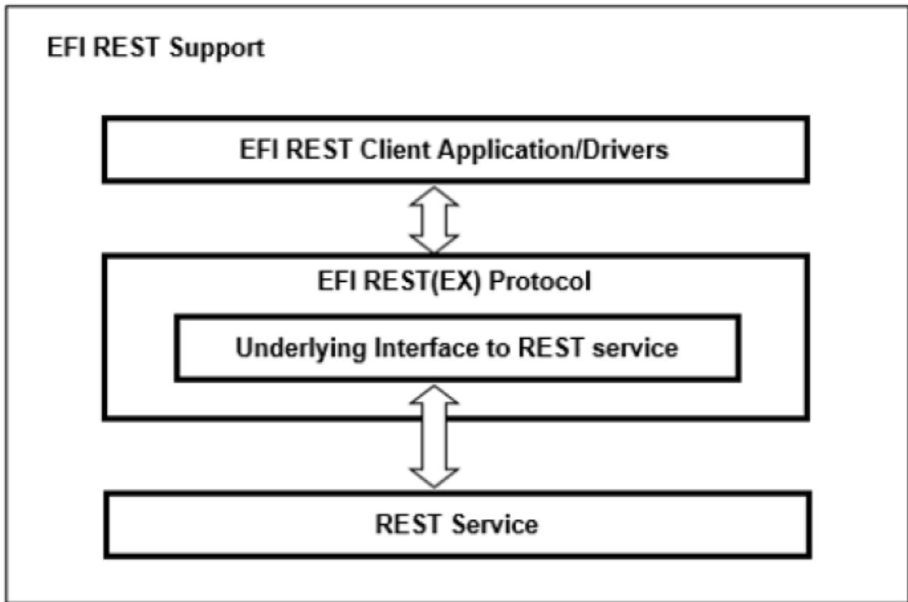  
Fig. 29.1: EFI REST Support, Single Protocol

Multiple EFI REST(EX) driver instances can be installed on a platform to communicate with diferent types of REST services or various underlying interfaces to REST services. REST service can be located on the platform locally, or of platform in the remote server. The system integrator can implement In-band EFI REST(EX) driver instance for the on-platform REST service communications or Out-of-band EFI REST(EX) driver instance for the of-platform REST service communications.

## 29.7.1 EFI REST Support Scenario 1 (PlatformManagement)

The following figure represents a platform which has BMC on board, with the REST service deployed like Redfish service. The In-band EFI REST(EX) protocol (right one) is used by EFI REST client to manage this platform. This platform can also be managed in out of band like from the remote OS REST client. The left one is Out of band EFI REST(EX) protocol which communicate with other REST services like Redfish service in which the resource is belong to other platforms.

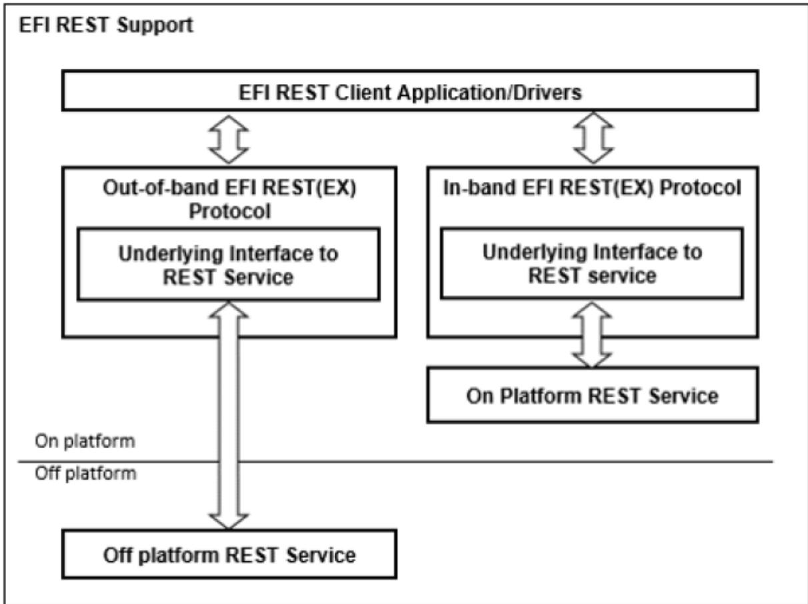  
Fig. 29.2: EFI REST Support, Multiple Protocols

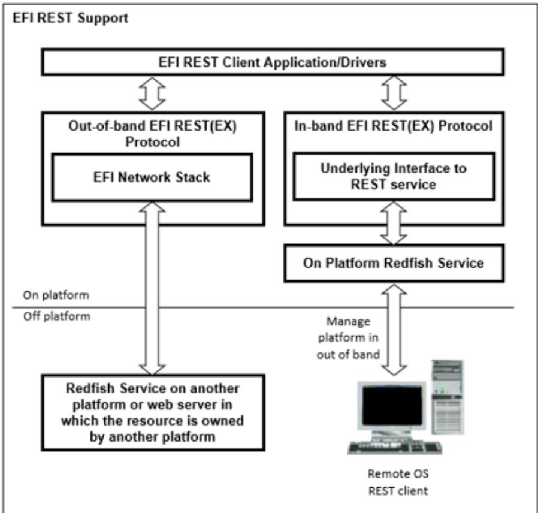  
Fig. 29.3: EFI REST Support, BMC on Board

## 29.7.2 EFI REST Support Scenario 2 (PlatformManagement)

The following figure represents a platform which uses remote Redfish service for the platform management. If treats the resource in remote Redfish service as a part of this platform, the In-band EFI REST(EX) protocol could be implemented to communicate with remote Redfish service. This platform can also be managed in out of band from the remote OS REST client.

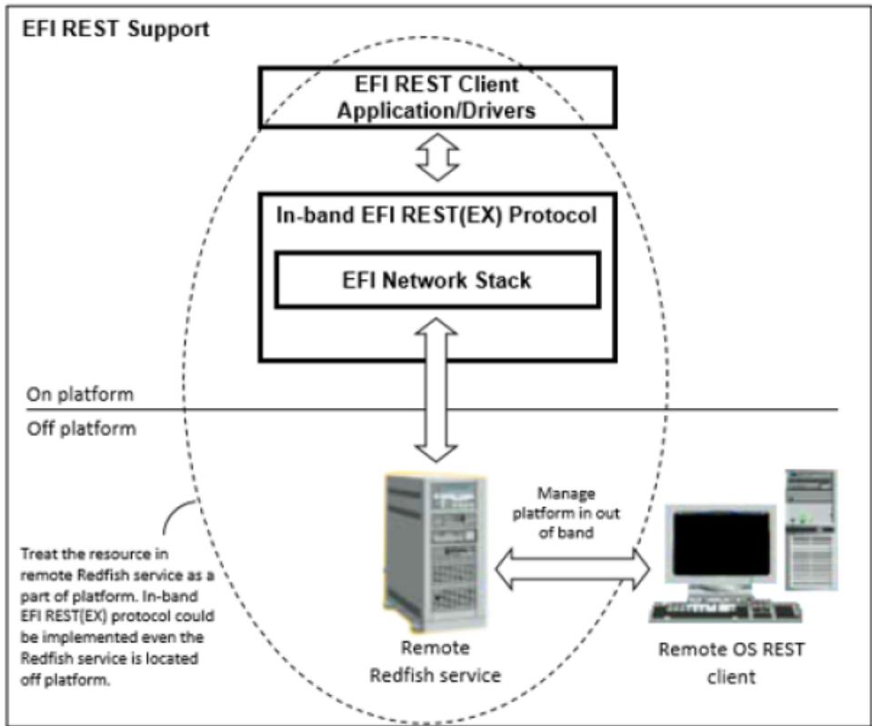  
Fig. 29.4: EFI REST Support, Redfish Service

A variety of possible EFI REST(EX) protocol usages are delineated as below. The EFI REST(EX) driver instance could communicate with REST service through underlying interface like EFI network stack, platform specific interface to BMC or others. The working model of EFI REST support depends on the implementation of EFI REST(EX) driver instance and the design of platform.

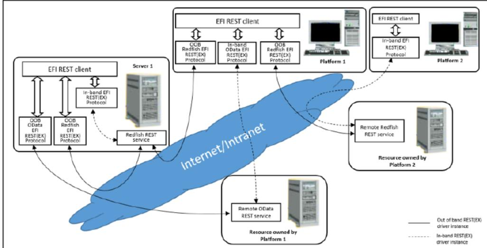  
Fig. 29.5: EFI REST Support, Protocol Usages

## 29.7.3 EFI REST Protocol

This section defines the EFI REST Protocol interface.

## 29.7.3.1 EFI REST Protocol Definitions

## 29.7.4 EFI\_REST\_PROTOCOL

## Protocol GUID

```c
#define EFI_REST_PROTOCOL_GUID \
{0x0DB48A36, 0x4E54, 0xEA9C, \
{ 0x9B, 0x09, 0x1E, 0xA5, 0xBE, 0x3A, 0x66, 0x0B }}
```

## Protocol Interface Structure

```c
typedef struct _EFI_REST_PROTOCOL {
    EFI_REST_SEND_RECEIVE SendReceive;
    EFI_REST_GET_TIME GetServiceTime;
} EFI_REST_PROTOCOL;
```

## Parameters

## RestSendReceive

Provides an HTTP-like interface to send and receive resources from a REST service.

## GetServiceTime

Returns the current time of the REST service.

## Description

The EFI REST protocol is designed to be used by EFI drivers and applications to send and receive resources from a RESTful service. This protocol abstracts REST (Representational State Transfer) client functionality. This EFI protocol could be implemented to use an underlying EFI HTTP protocol, or it could rely on other interfaces that abstract HTTP access to the resources.

## 29.7.5 EFI\_REST\_PROTOCOL.SendReceive()

## Summary

Provides a simple HTTP-like interface to send and receive resources from a REST service.

## EFI Protocol

```sql
typedef
EFI_STATUS
(EFIAPI *EFI_REST_SEND_RECEIVE)(
    IN EFI_REST_PROTOCOL    *This,
    IN EFI_HTTP_MESSAGE    *RequestMessage,
    OUT EFI_HTTP_MESSAGE    *ResponseMessage
);
```

## Parameters

## This

Pointer to EFI\_REST\_PROTOCOL instance for a particular REST service.

## RequestMessage

Pointer to the REST request data for this resource

## ResponseMessage

Pointer to the REST response data obtained for this requested.

## Description

The SendReceive() function sends a REST request to this REST service, and returns a REST response when the data is retrieved from the service. Both of the REST request and response messages are represented in format of EFI\_HTTP\_MESSAGE. RequestMessage contains the request to the REST resource identified by UrlRequestMessage->Data.Request->Url. The ResponseMessage is the returned response for that request, including the final HTTP status code, headers and teh REST resource represented in the message body.

The memory bufers pointed by ResponseMessage->Data.Response, ResponseMessage->Headers and R esponseMessage->Body are allocated by this function, and it is the caller’s responsibility to free the bufer when the caller no longer requires the bufer’s contents.

It’s the REST protocol’s responsibility to handle HTTP layer details and return the REST resource to the caller, when this function is implemented by using an underlying EFI HTTP protocol. For example, if an HTTP interim response (Informational 1xx in HTTP 1.1) is received from server, the REST protocol should deal with it and keep waiting for the final response, instead of return the interim response to the caller. Same principle should be observed if the REST protocol relies on other interfaces.

## Status Codes Returned

<table><tr><td>EFI_SUCCESS</td><td>operation succeeded</td></tr><tr><td>EFI_INVALID_PARAMETER</td><td>This, RequestMessage, or ResponseMessage are NULL.</td></tr><tr><td>EFI_DEVICE_ERROR</td><td>An unexpected system or network error occurred.</td></tr><tr><td>EFI_TIMEOUT</td><td>Receiving response message fail due to timeout.</td></tr></table>

## 29.7.6 EFI\_REST\_PROTOCOL.GetServiceTime()

```txt
typedef
EFI_STATUS
(EFIAPI *EFI_REST_GET_TIME)(
    IN EFI_REST_PROTOCOL    *This,
    OUT EFI_TIME    *Time
);
```

## Parameters

## This

Pointer to EFI\_REST\_PROTOCOL instance.

## Time

A pointer to storage to receive a snapshot of the current time of the REST service.

## Description

The GetServiceTime() function is an optional interface to obtain the current time from this REST service instance. If this REST service does not support retrieving the time, this function returns EFI\_UNSUPPORTED.

## Status Codes Returned

<table><tr><td>EFI_SUCCESS</td><td>operation succeeded</td></tr><tr><td>EFI_INVALID_PARAMETER</td><td>This or Time are NULL.</td></tr><tr><td>EFI_UNSUPPORTED</td><td>The RESTful service does not support returning the time</td></tr><tr><td>EFI_DEVICE_ERROR</td><td>An unexpected system or network error occurred.</td></tr></table>

## 29.7.7 EFI REST EX Protocol

This section defines the EFI REST EX Protocol interfaces. It is split into the following two main sections:

• REST EX Service Binding Protocol (RESTEXSB)

• REST EX Protocol (REST EX)

## 29.7.7.1 REST EX Service Binding Protocol

## 29.7.8 EFI\_REST\_EX\_SERVICE\_BINDING\_PROTOCOL

## Summary

The RESTEXSB is used to locate the REST services those are supported by a REST EX driver instances and to create and destroy instances of REST EX child protocol driver.

The EFI Service Binding Protocol in EFI Service Binding Protocol defines the generic Service Binding Protocol functions. This section discusses the details that are specific to the REST EX.

## GUID

```c
#define EFI_REST_EX_SERVICE_BINDING_PROTOCOL_GUID \
{0x456bbe01, 0x99d0, 0x45ea, \
{0xbb, 0x5f, 0x16, 0xd8, 0x4b, 0xed, 0xc5, 0x59}}
```

## Description

A REST service client application (or driver) that communicates to REST service can use one of protocol handler services, such as BS->LocateHandleBufer(), to search for devices that publish a RESTEXSB GUID. Each device with a published RESTEXSB GUID supports REST EX Service Binding Protocol and may be available for use.

After a successful call to the EFI\_REST\_EX\_SERVICE\_BINDING\_PROTOCOL.CreateChild() function, the child REST EX driver is in the unconfigured state. It is not ready to communicate with REST service at this moment. The child instance is ready to use to communicate with REST service after the successful Configure() is invoked. For EFI REST drivers which don’t require additional configuration process, Configure() is unnecessary to be invoked before using its child instance. This depends on EFI REST EX driver specific implementation.

Before a REST service client application terminates execution, every successful call to the EFI\_REST\_EX\_SERVICE\_BINDING\_PROTOCOL.CreateChild() function must be matched with a call to the EFI\_REST\_EX\_SERVICE\_BINDING\_PROTOCOL.DestroyChild() function.

## 29.7.8.1 REST EX Protocol Specific Definitions

## 29.7.9 EFI\_REST\_EX\_PROTOCOL

## Protocol GUID

```c
#define EFI_REST_EX_PROTOCOL_GUID \
{0x55648b91, 0xe7d, 0x40a3, \
{0xa9, 0xb3, 0xa8, 0x15, 0xd7, 0xea, 0xdf, 0x97}}
```

## Protocol Interface Structure

```c
typedef struct _EFI_REST_EX_PROTOCOL {
    EFI_REST_SEND_RECEIVE SendReceive;
    EFI_REST_GET_TIME GetServiceTime;
    EFI_REST_EX_GET_SERVICE GetService;
    EFI_REST_EX_GET_MODE_DATA GetModeData;
    EFI_REST_EX_CONFIGURE Configure;
    EFI_REST_EX_ASYNC_SEND_RECEIVE AyncSendReceive;
    EFI_REST_EX_EVENT_SERVICE EventService;
} EFI_REST_EX_PROTOCOL;
```

## Parameters

## SendReceive

Provides an HTTP-like interface to send and receive resources from a REST service. The functionality of this function is same as EFI\_REST\_PROTOCOL.SendReceive(). Refer to section EFI REST Protocol Definitions for more details.

## GetServiceTime

Returns the current time of the REST service. The functionality of this function is same as EFI\_REST\_PROTOCOL.GetServiceTime(). Refer to 29.7.1.1 for the details.

## GetService

This function returns the type and location of REST service.

## GetModeData

This function returns operational configuration of current EFI REST EX child instance.

## Configure

This function is used to configure EFI REST EX child instance.

## AyncSendReceive

Provides an HTTP-like interface to send and receive resources. The resource returned from REST service is sent to client in asynchronously.

## EventService

Provides an interface to subscribe event of specific resource changes on REST service.

## Description

The REST EX protocol is designed to use by REST service client applications or drivers to communicate with REST service. REST EX protocol enhances the REST protocol and provides comprehensive interfaces to REST service clients. Akin to REST protocol, REST EX driver instance uses HTTP message for the REST request and response. However, the underlying mechanism of REST EX is not necessary to be HTTP-aware. The underlying mechanism could be any protocols according to the REST service mechanism respectively. REST EX protocol could be used to communicate with In-band or Out-of-band REST service depends on the platform-specific implementation.

## 29.7.10 EFI\_REST\_EX\_PROTOCOL.SendReceive()

## Summary

Provides a simple HTTP-like interface to send and receive resources from a REST service.

## EFI Protocol

```sql
typedef
EFI_STATUS
(EFIAPI *EFI_REST_SEND_RECEIVE) (
    IN EFI_REST_EX_PROTOCOL    *This,
    IN EFI_HTTP_MESSAGE    *RequestMessage,
    OUT EFI_HTTP_MESSAGE    *ResponseMessage
);
```

## Parameters

Refer to EFI REST Protocol Definitions for the details.

## Description

Refer to EFI REST Protocol Definitions for the details.

## Status Codes Returned

<table><tr><td>EFI_SUCCESS</td><td>operation succeeded</td></tr><tr><td>EFI_INVALID_PARAMETER</td><td>This, RequestMessage, or ResponseMessage are NULL.</td></tr><tr><td>EFI_DEVICE_ERROT</td><td>An unexpected system or network error occurred.</td></tr><tr><td>EFI_NOT_READY</td><td>The configuration of this instance is not set yet. Configure() must be executed and returns successfully prior to invoke this function.</td></tr><tr><td>EFI_TIMEOUT</td><td>Receiving response message fail due to timeout.</td></tr></table>

## 29.7.11 EFI\_REST\_EX\_PROTOCOL.GetService()

## Summary

This function returns the information of REST service provided by this EFI REST EX driver instance.

## Protocol Interface

```txt
typedef
EFI_STATUS
(EFIAPI *EFI_REST_EX_GET_SERVICE)
    IN EFI_REST_EX_PROTOCOL    *This,
    OUT EFI_REST_EX_SERVICE_INFO    **RestExServiceInfo
);
```

## Parameters

## This

This is the EFI\_REST\_EX\_PROTOCOL instance.

## RestExServiceInfo

Pointer to receive a pointer to EFI\_REST\_EX\_SERVICE\_INFO structure. The format of EFI\_REST\_EX\_SERVICE\_INFO is version controlled for the future extension. The version of EFI\_REST\_EX\_SERVICE\_INFO structure is returned in the header within this structure. EFI REST client refers to the correct format of structure according to the version number. The pointer to EFI\_REST\_EX\_SERVICE\_INFO is a memory block allocated by EFI REST EX driver instance. That is caller’s responsibility to free this memory when this structure is no longer needed. Refer to Related Definitions below for the definitions of EFI\_REST\_EX\_SERVICE\_INFO structure.

## Description

This function returns the information of REST service provided by this REST EX driver instance. The information such as the type of REST service and the access mode of REST EX driver instance (In-band or Out-of-band) are described in EFI\_REST\_EX\_SERVICE\_INFO structure. For the vendor-specific REST service, vendor-specific REST service information is returned in VendorSpecifcData. Besides the REST service information provided by REST EX driver instance, EFI\_DEVICE\_PATH\_PROTOCOL of the REST service is also provided on the handle of REST EX driver instance.

EFI REST client can get the information of REST service from REST service EFI device path node in EFI\_DEVICE\_PATH\_PROTOCOL . EFI\_DEVICE\_PATH\_PROTOCOL which installed on REST EX driver instance indicates where the REST service is located, such as BMC Device Path, IPV4, IPV6 or others. Refer to REST Service Device Path for details of the REST service device path node, which is the sub-type (Sub-type = 32) of Messaging Device Path (type 3).

REST EX driver designer is well know what REST service this REST EX driver instance intends to communicate with. The designer also well know this driver instance is used to talk to BMC through specific platform mechanism or talk to REST server through UEFI HTTP protocol. REST EX driver is responsible to fill up the correct information in EFI\_REST\_EX\_SERVICE\_INFO. EFI\_REST\_EX\_SERVICE\_INFO is referred by EFI REST clients to pickup the proper EFI REST EX driver instance to get and set resource. GetService() is a basic and mandatory function which must be able to use even Configure() is not invoked in previously.

## Related Definitions

```c
//**********************************************************************
//EFI_REST_EX_SERVICE_INFO_HEADER
//**********************************************************************
typedef struct {
    UINT32    Length;
```

(continues on next page)

(continued from previous page)

```txt
EFI_REST_EX_SERVICE_INFO_VER    RestServiceInfoVer;
} EFI_REST_EX_SERVICE_INFO_HEADER;
```

## Length

The length of entire EFI\_REST\_EX\_SERVICE\_INFO structure. Header size is included.

## RestServiceInfoVer

```c
//**********************************************************************
// EFI_REST_EX_SERVICE_INFO_VER
//**********************************************************************
typedef struct {
    UINT8    Major;
    UINT8    Minor;
} EFI_REST_EX_SERVICE_INFO_VER;
```

## Major

The major version of EFI\_REST\_EX\_SERVICE\_INFO.

## Minor

The minor version of EFI\_REST\_EX\_SERVICE\_INFO.

```c
//**********************************************************************
// EFI_REST_EX_SERVICE_INFO
//**********************************************************************
```

EFI\_REST\_EX\_SERVICE\_INFO is version controlled for the future extensions. Any new information added to this structure requires version increased. EFI REST EX driver instance must provides the correct version of structure in EFI\_REST\_EX\_SERVICE\_INFO\_VER when it returns EFI\_REST\_EX\_SERVICE\_INFO to caller.

```c
//**********************************************************************
// EFI_REST_EX_SERVICE_INFO
//**********************************************************************
typedef union {
    EFI_REST_EX_SERVICE_INFO_HEADER EfiRestExServiceInfoHeader;
    EFI_REST_EX_SERVICE_INFO_V_1_0 EfiRestExServiceInfoV10;
} EFI_REST_EX_SERVICE_INFO;
```

```c
//**********************************************************************
//EFI_REST_EX_SERVICE_INFO v1.0
//**********************************************************************
typedef struct {
EFI_REST_EX_SERVICE_INFO_HEADER EfiRestExServiceInfoHeader;
EFI_REST_EX_SERVICE_TYPE RestExServiceType;
EFI_REST_EX_SERVICE_ACCESS_MODE RestServiceAccessMode;
EFI_GUID VendorRestServiceName;
UINT32 VendorSpecificDataLength;
UINT8 *VendorSpecificData;
EFI_REST_EX_CONFIG_TYPE RestExConfigType;
UINT8 RestExConfigDataLength;
} EFI_REST_EX_SERVICE_INFO_V_1_0;
```

```txt
EfiRestExServiceInfoHeader
The header of EFI_REST_EX_SERVICE_INFO.
```

RestExServiceType The REST service type. See below definition.

RestServiceAccessMode The access mode of REST service. See below definition.

## VendorRestServiceName

## VendorSpecificDataLength

The length of vendor-specific REST service information. This field is only valid if RestExServiceType is EFI\_REST\_EX\_SERVICE\_VENDOR\_SPECIFIC.

## VendorSpecifcData

A pointer to vendor-specific REST service information. This field is only valid if RestExServiceType is EFI\_REST\_EX\_SERVICE\_VENDOR\_SPECIFIC. The memory bufer pointed by VendorSpecifcData is allocated by EFI REST EX driver instance and must be freed by EFI REST client when it is no longer need.

## RestExConfigType

The type of configuration of REST EX driver instance. See GetModeData()and Configure() for the details.

## RestExConfigDataLength

The length of REST EX configuration data.

```c
//**********************************************************************
// EFI_REST_EX_SERVICE_TYPE
//**********************************************************************
typedef enum {
EFI_REST_EX_SERVICE_UNSPECIFIC = 1,
EFI_REST_EX_SERVICE_REDFISH,
EFI_REST_EX_SERVICE_ODATA,
EFI_REST_EX_SERVICE_VENDOR_SPECIFIC = 0xff,
EFI_REST_EX_SERVICE_TYPE_MAX
} EFI_REST_EX_SERVICE_TYPE;
```

EFI\_REST\_EX\_SERVICE\_UNSPECIFIC indicates this EFI REST EX driver instance is not used to communicate with any particular REST service. The EFI REST EX driver instance which reports this service type is REST service independent and only provides SendReceive()function to EFI REST client. EFI REST client uses this function to send and receive HTTP message to any target URI and handles the follow up actions by itself. The EFI REST EX driver instance in this type must return EFI\_UNSUPPORTED in below REST EX protocol interfaces, GetServiceTime(), AyncSendReceive() and EventService().

EFI\_REST\_EX\_SERVICE\_REDFISH indicates this EFI REST EX driver instance is used to communicate with Redfish REST service.

EFI\_REST\_EX\_SERVICE\_ODATA indicates this EFI REST EX driver instance is used to communicate with Odata REST service.

EFI\_REST\_EX\_SERVICE\_VENDOR\_SPECIFIC indicates this EFI REST EX driver instance is used to communicate with vendor-specific REST service.

```c
//**********************************************************************
// EFI_REST_EX_SERVICE_ACCESS_MODE
//**********************************************************************
typedef enum {
```

(continues on next page)

```c
EFI_REST_EX_SERVICE_IN_BAND_ACCESS = 1,
EFI_REST_EX_SERVICE_OUT_OF_BAND_ACCESS = 2,
EFI_REST_EX_SERVICE_ACCESS_MODE_MAX
} EFI_REST_EX_SERVICE_ACCESS_MODE;
```

(continued from previous page)

EFI\_REST\_EX\_SERVICE\_IN\_BAND\_ACCESS mode indicates the REST service is invoked in In-band mechanism in the scope of platform. In most of cases, the In-band mechanism is used to communicate with REST service on platform through some particular devices like BMC, Embedded Controller and other infrastructures built on the platform.

EFI\_REST\_EX\_SERVICE\_OUT\_OF\_BAND\_ACCESS mode indicates the REST service is invoked in Out-of-band mechanism. The REST service is located out of platform scope. In most of cases, the Out-of-band mechanism is used to communicate with REST service on other platforms through network or other protocols.

```c
//******************************************************************
// EFI_REST_EX_CONFIG_TYPE
//******************************************************************
typedef enum {
    EFI_REST_EX_CONFIG_TYPE_HTTP,
    EFI_REST_EX_CONFIG_TYPE_UNSPECIFIC,
    EFI_REST_EX_CONFIG_TYPE_MAX
} EFI_REST_EX_CONFIG_TYPE;
```

EFI\_REST\_EX\_CONFIG\_TYPE\_HTTP indicates the format of the REST EX configuration is EFI\_REST\_EX\_HTTP\_CONFIG\_DATA. RestExConfigDataLength of this type is the size of EFI\_REST\_EX\_HTTP\_CONFIG\_DATA. This configuration type is used for the HTTP-aware EFI REST EX driver instance.

```c
//**********************************************************************
// EFI_REST_EX_HTTP_CONFIG_DATA
//**********************************************************************
typedef struct {
    EFI_HTTP_CONFIG_DATA    HttpConfigData;
    UINT32    SendReceiveTimeout;
} EFI_REST_EX_HTTP_CONFIG_DATA;
```

## HttpConfigData

Parameters to configure the HTTP child instance.

## SendReceiveTimeout

Time out (in milliseconds) when blocking for response after send out request message in EFI\_REST\_EX\_PROTOCOL.SendReceive().

EFI\_REST\_EX\_CONFIG\_TYPE\_UNSPECIFIC indicates the format of REST EX configuration is unspecific. RestEx-ConfigDataLength of this type depends on the implementation of non HTTP-aware EFI REST EX driver instance such as BMC EFI REST EX driver instance. The format of configuration for this type refers to the system/platform spec which is out of UEFI scope.

## Status Codes Returned

<table><tr><td>EFI_SUCCESS</td><td>EFI_REST_EX_SERVICE_INFO is returned in RestExServiceInfo.</td></tr><tr><td>EFI_UNSUPPORTED</td><td>This function is not supported in this REST EX Protocol driver instance.</td></tr></table>

## 29.7.12 EFI\_REST\_EX\_PROTOCOL.GetModeData()

## Summary

This function returns operational configuration of current EFI REST EX child instance.

## Protocol Interface

```txt
typedef
EFI_STATUS
(EFIAPI *EFI_REST_EX_GET_MODE_DATA) (
    IN EFI_REST_EX_PROTOCOL    *This,
    OUT EFI_REST_EX_CONFIG_DATA    *RestExConfigData
);
```

## Parameters

## This

This is the EFI\_REST\_EX\_PROTOCOL instance.

## RestExConfigData

Pointer to receive a pointer to EFI\_REST\_EX\_CONFIG\_DATA. The memory allocated for configuration data should be freed by caller. See Related Definitions for the details

## Description

This function returns the current configuration of EFI REST EX child instance. The format of operational configuration depends on the implementation of EFI REST EX driver instance. For example, HTTP-aware EFI REST EX driver instance uses EFI HTTP protocol as the underlying protocol to communicate with the REST service. In this case, the type of configuration EFI\_REST\_EX\_CONFIG\_TYPE\_HTTP is returned from Get-Service(). EFI\_REST\_EX\_HTTP\_CONFIG\_DATA is used as EFI REST EX configuration format and returned to the EFI REST client. For those non HTTP-aware REST EX driver instances, the type of configuration EFI\_REST\_EX\_CONFIG\_TYPE\_UNSPECIFIC is returned from GetService(). In this case, the format of returning data could be non-standard. Instead, the format of configuration data is a system/platform specific definition such as a BMC mechanism used in EFI REST EX driver instance. EFI REST client and EFI REST EX driver instance have to refer to the specific system /platform spec which is out of UEFI scope.

## Related Definitions

```c
//**********************************************************************
// EFI_REST_EX_CONFIG_DATA
//**********************************************************************
typedef UINT8 *EFI_REST_EX_CONFIG_DATA;
```

## Status Codes Returned

<table><tr><td>EFI_SUCCESS</td><td>EFI_REST_EX_SERVICE_INFO is returned in RestExServiceInfo.</td></tr><tr><td>EFI_UNSUPPORTED</td><td>This function is not supported in this REST EX Protocol driver instance.</td></tr><tr><td>EFI_NOT_READY</td><td>The configuration of this instance is not set yet. Configure() must be executed and return successfully prior to invoke this function</td></tr></table>

## 29.7.13 EFI\_REST\_EX\_PROTOCOL.Configure()

## Summary

This function is used to configure EFI REST EX child instance.

## Protocol Interface

```txt
typedef
EFI_STATUS
(EFIAPI *EFI_REST_EX_CONFIGURE)(
    IN EFI_REST_EX_PROTOCOL    *This,
    IN EFI_REST_EX_CONFIG_DATA    RestExConfigData
);
```

## Parameters

## This

This is the EFI\_REST\_EX\_PROTOCOL instance.

## RestExConfigData

Pointer to EFI\_REST\_EX\_CONFIG\_DATA. See Related Definitions in GetModeData() protocol interface.

## Description

This function is used to configure the setting of underlying protocol of REST EX child instance. The type of configuration is according to the implementation of EFI REST EX driver instance. For example, HTTP-aware EFI REST EX driver instance uses EFI HTTP protocol as the undying protocol to communicate with REST service. The type of configuration is EFI\_REST\_EX\_CONFIG\_TYPE\_HTTP and RestExConfigData is in the format of EFI\_REST\_EX\_HTTP\_CONFIF\_DATA

Akin to HTTP configuration, REST EX child instance can be configure to use diferent HTTP local access point for the data transmission. Multiple REST clients may use diferent configuration of HTTP to distinguish themselves, such as to use the diferent TCP port. For those non HTTP-aware REST EX driver instance, the type of configuration is EFI\_REST\_EX\_CONFIG\_TYPE\_UNSPECIFIC. RestExConfigData refers to the non industrial standard. Instead, the format of configuration data is system/platform specific definition such as BMC. In this case, EFI REST client and EFI REST EX driver instance have to refer to the specific system/platform spec which is out of the UEFI scope. Besides GetService() function, no other EFI REST EX functions can be executed by this instance until Configure() is executed and returns successfully. All other functions must return EFI\_NOT\_READY if this instance is not configured yet. Set RestExConfigData to NULL means to put EFI REST EX child instance into the unconfigured state.

## Status Codes Returned

<table><tr><td>EFI_SUCCESS</td><td>EFI_REST_EX_CONFIG_DATA is set in successfully.</td></tr><tr><td>EFI_DEVICE_ERROR</td><td>Configuration for this REST EX child instance is failed with the given EFI_REST_EX_CONFIG_DATA</td></tr><tr><td>EFI_UNSUPPORTED</td><td>This function is not supported in this REST EX Protocol driver instance.</td></tr></table>

## Usage Example

Below illustrations show the usage cases of using diferent EFI REST EX child instances to communicate with REST service.

In the above case, EFI REST Client A and B use HTTP-aware EFI REST EX driver instance to get and send resource. These two EFI REST clients configure the child instance with specific TCP port. Therefore the data transmission through HTTP can delivered to the proper EFI REST clients.

In the above case, EFI REST Client A creates two EFI REST EX child instances and configures those child instances to connect to two BMCs respectively.

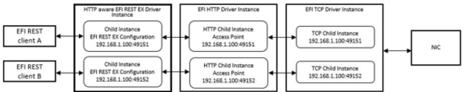

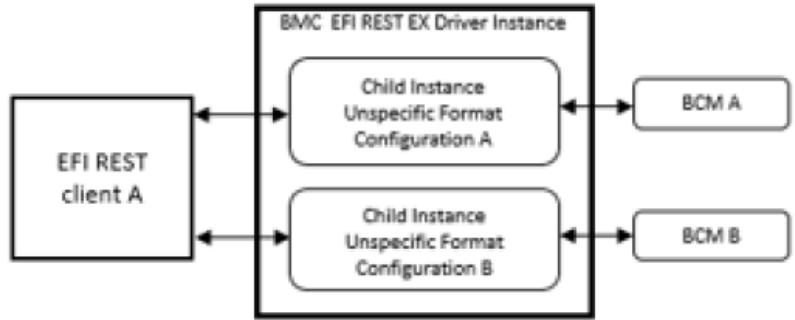

## 29.7.14 EFI\_REST\_EX\_PROTOCOL.AsyncSendReceive()

## Summary

This function sends REST request to REST service and signal caller’s event asynchronously when the final response is received by REST EX Protocol driver instance. The essential design of this function is to handle asynchronous send/receive implicitly according to REST service asynchronous request mechanism. Caller will get the notification once the final response is returned from the REST service

## Protocol Interface

```txt
typedef
EFI_STATUS
(EFIAPI *EFI_REST_EX_ASYNC_SEND_RECEIVE) (
    IN EFI_REST_EX_PROTOCOL    *This,
    IN EFI_HTTP_MESSAGE    *RequestMessage OPTIONAL,
    IN EFI_REST_EX_TOKEN    *RestExToken,
    IN UINTN    *TimeOutInMilliSeconds OPTIONAL
);
```

## Parameters

## This

This is the EFI\_REST\_EX\_PROTOCOL instance.

## RequestMessage

This is the REST request message sent to the REST service. Set RequestMessage to NULL to cancel the previous asynchronous request associated with the corresponding RestExToken. See descriptions for the details.

## RestExToken

REST EX token which REST EX Protocol instance uses to notify REST client the status of response of asynchronous REST request. See related definition of EFI\_REST\_EX\_TOKEN.

## TimeOutInMilliSeconds

The pointer to the timeout in milliseconds which REST EX Protocol driver instance refers as the duration to drop asynchronous REST request. NULL pointer means no timeout for this REST request. REST EX Protocol driver signals caller’s event with EFI\_STATUS set to EFI\_TIMEOUT in RestExToken if REST EX Protocol can’t get the response from REST service within TimeOutInMilliSeconds.

## Description

This function is used to send REST request with asynchronous REST service response within certain timeout declared. REST service sometime takes long time to create resource. Sometimes REST service returns response to REST client late because of the shortage of bandwidth or bad network quality. To prevent from unfriendly user experience due to system stuck while waiting for the response from REST service, EFI\_REST\_EX\_PROTOCOL.AsyncSendReceive() provides the capability to send asynchronous REST request. Caller sends the REST request and still can execute some other processes on background while waiting the event signaled by REST EX Protocol driver instance.

The implementation of underlying mechanism of asynchronous REST request depends on the mechanism of REST service. HTTP protocol, In-Band management protocol and other protocols has its own way to support asynchronous REST request. Similar to EFI\_REST\_EX\_PROTOCOL .SendReceive(), It’s the REST EX protocol’s responsibility to handle the implementation details and return only the REST resource to the caller. REST EX Protocol driver instance which doesn’t support asynchronous REST request can just return EFI\_UNSUPPORTED to caller. Also, this function must return EFI\_UNSUPPORTED if EFI\_REST\_EX\_SERVICE\_TYPE returned in EFI\_REST\_EX\_SERVICE\_INFO from GetService() is EFI\_REST\_EX\_SERVICE\_UNSPECIFIC.

REST clients do not have to know the preprocessors of asynchronous REST request between REST EX Protocol driver instance and REST service. The responsibility of REST EX Protocol driver instance is to monitor the status of resource readiness and to signal caller’s RestExToken when the status of returning resource is ready. REST EX Protocol driver instance sets Status field in RestExToken to EFI\_SUCCESS and sets ResponseMessage pointer to the final response from REST service. Then signal caller’s event to notify REST client the desired REST resource is received. REST EX Protocol driver instance also has to create an EFI timer to handle the timeout situation. REST EX Protocol driver must drops the asynchronous REST request once the timeout is expired. In this case, REST EX Protocol driver instance sets Status field in RestExToken to EFI\_TIMEOUT and signal caller’s event token.

REST EX Protocol driver instance must has capability to cancel the in process asynchronous REST request when caller asks to terminate specific asynchronous REST request. REST EX Protocol driver instance may not have capability to force REST service to cancel the specific request, however, REST EX Protocol driver instance at lease least can clean up its own internal resource of asynchronous REST request. Caller has to set RequestMessage to NULL with RestExToken set to EFI\_REST\_EX\_TOKEN which was successfully sent to this function previously. REST EX Protocol driver instance finds the given EFI\_REST\_EX\_TOKEN from its private database and clean up the associated resource if EFI\_REST\_EX\_TOKEN is an in-process asynchronous REST request. REST EX Protocol driver instance then sets Status field in RestExToken to EFI\_ABORT and signal caller’s event to indicate the asynchronous REST request has been canceled.

REST EX Protocol driver instance maintains the internal property, state machine, status of transfer of each asynchronous REST request. REST EX Protocol driver instance has to clean up the internal resource associated with each asynchronous REST request no matter the transfer is ended with success or fail.

There are two phases of asynchronous REST request. One is the preprocessor of establishing asynchronous REST request between REST EX Protocol driver instance and REST service. Another phase is to retrieve the final response from REST service and send to REST client.

## Related Definitions

```c
//******************************************************************
// EFI_REST_EX_TOKEN
//******************************************************************
typedef struct {
    EFI_EVENT Event;
    EFI_STATUS Status;
    EFI_HTTP_MESSAGE *ResponseMessage;
} EFI_REST_EX_TOKEN;
```

```c
typedef
EFI_STATUS
(EFIAPI *EFI_REST_EX_EVENT_SERVICE)
IN EFI_REST_EX_PROTOCOL    *This,
IN EFI_HTTP_MESSAGE    *RequestMessage OPTIONAL,
```

## Event

This event will be signaled after the Status field is updated by the EFI REST EX Protocol driver instance. The type of Event must be EFI\_NOTIFY\_SIGNAL. The Task Priority Level (TPL) of Event must be lower than or equal to TPL\_CALLBACK, which allows other events to be notified.

## Status

Status will be set to one of the following values if the REST EX Protocol driver instance gets the response from the REST service successfully, or if an unexpected error occurs:

EFI\_SUCCESS: The resource gets a response from REST service successfully. ResponseMessage points to the response in HTTP message structure.

EFI\_ABORTED: The asynchronous REST request was canceled by the caller.

EFI\_TIMEOUT: The asynchronous REST request timed out before receiving a response from the REST service.

EFI\_DEVICE\_ERROR: An unexpected error occurred.

## ResponseMessage

The REST response message pointed to by this pointer is only valid when Status is EFI\_SUCCESS. The memory bufers pointed to by ResponseMessage, ResponseMessage->Data.Response, ResponseMessage->Headers and ResponseMessage->Body are allocated by the EFI REST EX driver instance, and it is the caller’s responsibility to free the bufer when the caller no longer requires the bufer’s contents.

## Status Codes Returned

<table><tr><td>EFI_SUCCESS</td><td>Asynchronous REST request is established.</td></tr><tr><td>EFI_UNSUPPORTED</td><td>This REST EX Protocol driver instance doesn’t support asynchronous re-quest.</td></tr><tr><td>EFI_TIMEOUT</td><td>Asynchronous REST request is not established and timeout is expired.</td></tr><tr><td>EFI_ABORT</td><td>Previous asynchronous REST request has been canceled.</td></tr><tr><td>EFI_DEVICE_ERROR</td><td>Otherwise, returns EFI_DEVICE_ERROR for other errors according to HTTP Status Code.</td></tr><tr><td>EFI_NOT_READY</td><td>The configuration of this instance is not set yet. Configure() must be executed and returns successfully prior to invoke this function.</td></tr></table>

## 29.7.15 EFI\_REST\_EX\_PROTOCOL.EventService()

## Summary

This function sends REST request to a REST Event service and signals caller’s event token asynchronously when the URI resource change event is received by REST EX Protocol driver instance. The essential design of this function is to monitor event implicitly according to REST service event service mechanism. Caller will get the notification if certain resource is changed.

## EFI Protocol

(continues on next page)

<table><tr><td></td><td>(continued from previous page)</td></tr><tr><td>IN EFI_REST_EX_TOKEN</td><td>*RestExToken</td></tr><tr><td>);</td><td></td></tr></table>

## Parameters

## This

This is the EFI\_REST\_EX\_PROTOCOL instance.

## RequestMessage

This is the HTTP request message sent to REST service. Set RequestMessage to NULL to cancel the previous event service associated with the corresponding RestExToken. See descriptions for the details.

## RestExToken

REST EX token which REST EX Protocol driver instance uses to notify REST client the URI resource which monitored by REST client has been changed. See the related definition of EFI\_REST\_EX\_TOKEN in EFI\_REST\_EX\_PROTOCOL.AsyncSendReceive().

## Description

This function is used to subscribe an event through REST Event service if REST service supports event service. This function listens on resource change of specific REST URI resource. The type of URI resource change event is varied and REST service specific, such as URI resource updated, resource added, resource removed, alert, etc. The way to subscribe REST Event service is also REST service specific, usually described in HTTP body. With the implementation of EFI\_REST\_EX\_PROTOCOL.EventService(), REST client can register an REST EX token of particular URI resource change, usually of a time critical nature, until subscription is deleted from REST Event service.

The implementation of underlying mechanism of REST Event service depends on the interface of REST EX Protocol driver instance. HTTP protocol, In-Band management protocols or other protocols can have its own implementation to support REST Event Service request. REST EX Protocol driver instance has knowledge of how to handle the REST Event service. The REST client creates and submits an HTTP-like header/body content in RequestMessage which required by REST Event services. How does REST EX Protocol driver instance handle REST Event service and monitor event is REST service-specific. REST EX driver instance can just returns EFI\_UNSUPPORTED if REST service has no event capability. Also, this function must return EFI\_UNSUPPORTED if EFI\_REST\_EX\_SERVICE\_TYPE returned in EFI\_REST\_EX\_SERVICE\_INFO from GetService() is EFI\_REST\_EX\_SERVICE\_UNSPECIFIC.

The REST EX Protocol driver instance is responsible to monitor the resource change event pushed from REST service. REST EX Protocol driver instance signals caller’s RestExToken when the event of resource change is pushed to REST EX Protocol driver instance. The way how REST service pushes event to REST EX Protocol driver instance is implementation-specific and transparent to REST client. REST EX Protocol driver instance sets Status field in RestEx-Token to EFI\_SUCCESS and sets ResponseMessage pointer to the event resource returned from REST Event service. Then REST EX Protocol driver instance signals caller’s event to notify REST client a new REST event is received. REST EX Protocol driver instance also responsible to terminate event subscription and clear up the internal resource associated with REST Event service if the status of subscription resource is returned error.

REST EX Protocol driver instance must has capability to remove event subscription created by REST client. Caller has to set RequestMessage to NULL with RestExToken set to EFI\_REST\_EX\_TOKEN which was successfully sent to this function previously. REST EX Protocol driver instance finds the given EFI\_REST\_EX\_TOKEN from its private database and delete the associated event from REST service.

## Status Codes Returned

<table><tr><td>EFI_SUCCESS</td><td>Asynchronous REST request is established.</td></tr><tr><td>EFI_UNSUPPORTED</td><td>This REST EX Protocol driver instance doesn’t support asynchronous re-quest.</td></tr><tr><td>EFI_ABORT</td><td>Previous asynchronous REST request has been canceled or event subscription has been delete from service</td></tr></table>

Table 29.62 – continued from previous page

<table><tr><td>EFI_DEVICE_ERROR</td><td>Otherwise, returns EFI_DEVICE_ERROR for other errors according to HTTP Status Code.</td></tr><tr><td>EFI_NOT_READY</td><td>The configuration of this instance is not set yet. Configure() must be executed and returns successfully prior to invoke this function.</td></tr></table>

## 29.7.15.1 Usage Example (HTTP-aware REST EX Protocol DriverInstance)

The following code example shows how a consumer of REST EX driver would use EFI REST EX ServiceBinding Protocol and EFI REST EX Protocol to send and receive the resources from a REST service.

```c
EFI_HANDLE ImageHandle;
EFI_HANDLE *HandleBuffer;
UINTN HandleNum;
UINTN Index;
EFI_REST_EX_SERVICE_BINDING_PROTOCOL *RestExService;
EFI_HANDLE RestExChild;
EFI_REST_EX_PROTOCOL *RestEx;
EFI_REST_EX_SERVICE_INFO *RestExServiceInfo;
EFI_REST_EX_CONFIG_DATA RestExConfigData;
EFI_HTTP_MESSAGE RequestMessage;
EFI_HTTP_MESSAGE ResponseMessage;

//
// Locate all the handles with RESTEX ServiceBinding Protocol.
//
Status = gBS->LocateHandleBuffer (
ByProtocol,
&gEfiRestExServiceBindingProtocolGuid,
NULL,
&HandleNum,
&HandleBuffer
);
if (EFI_ERROR (Status) || (HandleNum == 0)) {
return EFI_ABORTED;
}
```

```c
for (Index = 0; Index < HandleNum; Index++) {
    //
    // Get the RESTEX ServiceBinding Protocol
    //
Status = gBS->OpenProtocol (
    HandleBuffer[Index],
    &gEfiRestExServiceBindingProtocolGuid,
    (VOID **) &RestExService,
    ImageHandle,
    NULL,
    EFI_OPEN_PROTOCOL_GET_PROTOCOL
    );
if (EFI_ERROR(Status)) {
    return Status;
}
```

```c
//
// Create the corresponding REST EX child
//
Status = RestExService->CreateChild (RestExService, &RestExChild);
if (EFI_ERROR (Status)) {
    return Status;
}

//
// Retrieve the REST EX Protocol from child handle
//
Status = gBS->OpenProtocol (
    RestExChild,
    &gEfiRestExProtocolGuid,
    (VOID **) &RestEx,
    ImageHandle,
    NULL,
    EFI_OPEN_PROTOCOL_GET_PROTOCOL
    );
if (EFI_ERROR (Status)) {
    goto ON_EXIT;
}

//
// Get the information of REST service provided by this EFI REST EX driver
//
Status = RestEx->GetService (
    RestEx,
    &RestExServiceInfo
    );
if (EFI_ERROR (Status)) {
    goto ON_EXIT;
}
```

```c
//
// Check whether this REST EX service is preferred by consumer:
// 1. RestServiceAccessMode is EFI_REST_EX_SERVICE_OUT_OF_BAND_ACCESS.
// 2. RestServiceType is EFI_REST_EX_SERVICE_REDFISH.
// 3. RestExConfigType is EFI_REST_EX_CONFIG_TYPE_HTTP.
//
if (RestExServiceInfo-> REfiRestExServiceInfoV10.estServiceAccessMode == EFI_REST_EX_SERVICE_OUT_OF_BAND_ACCESS &&
    RestExServiceInfo-> EfiRestExServiceInfoV10.RestServiceType == EFI_REST_EX_SERVICE_REDFISH &&
    RestExServiceInfo-> EfiRestExServiceInfoV10.RestExConfigType == EFI_REST_EX_CONFIG_TYPE_HTTP) {
    break;
}
```

```txt
//
// Make sure we have found the preferred REST EX driver.
```

(continues on next page)

(continued from previous page)

```cpp
// if (Index == HandleNum) {
    goto ON_EXIT;
}

// Configure the RESTEX instance.
// Status = RestEx->Configure (
    RestEx,
    RestExConfigData
);

if (EFI_ERROR (Status)) {
    goto ON_EXIT;
}

// Send and receive the resources from a REST service.
// Status = RestEx->SendReceive (
    RestEx,
    &RequestMessage,
    &ResponseMessage
);

if (EFI_ERROR (Status)) {
    goto ON_EXIT;
}

ON_EXIT:
RestExService->DestroyChild (RestExService, RestExChild);
return Status;
```

## 29.7.15.1.1 EFI\_REST\_EX\_PROTOCOL.AsyncSendReceive()

To those HTTP-aware underlying mechanisms of the REST EX Protocol driver instance and “respond-async” prefer header aware REST service, REST EX Protocol driver instance adds additional HTTP Prefer header field (Refer to IEFT RFC7240) which is set to “respond-async” in the RequestMessage. HTTP 202 Accepted Status Code is returned from REST service which indicates the REST request is accepted by REST service, however, the final result is left unknown. The way how REST service returns final response to REST EX Protocol driver instance is REST service implementation-specific and transparent to the REST client. Whether or not the REST service has a proper response to “respond-async” is REST service implementation-specific. AsyncSendReceive() must return EFI\_UNSUPPORTED if the REST service that the REST EX instance communicates with is incapable of asynchronous response.

REST EX Protocol driver instance must return EFI\_SUCCESS to caller once it gets HTTP 202 Accepted Status Code from REST service. The HTTP Location header field can be returned in HTTP 202 Accepted Status Code. REST EX Protocol driver instance may create an EFI timer to poll the status of URI returned in HTTP Location header field. The content of URI which pointed by HTTP Location header is REST service implementation-specific and not defined in REST EX Protocol specification. REST EX Protocol driver instance provider should have knowledge about how to poll the status of returning resource from given HTTP Location header.

The following flowchart describes the flow of establishing asynchronous REST request on HTTP-aware infrastructure:

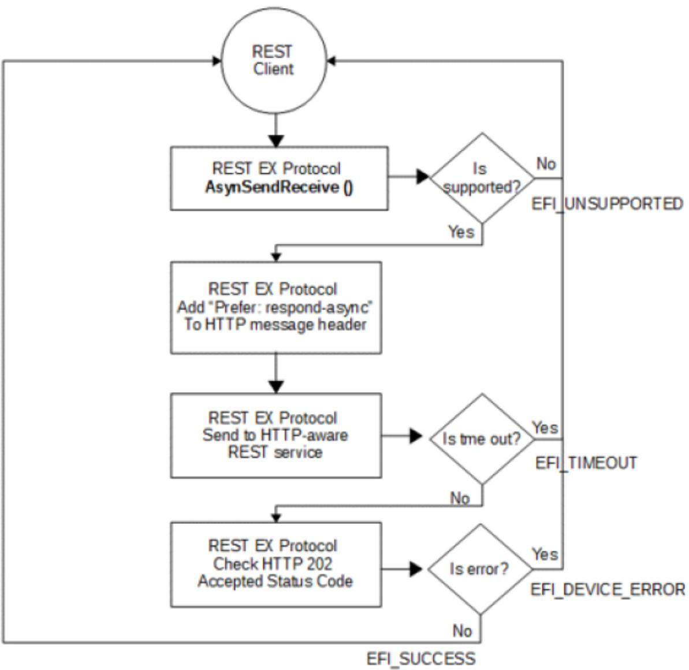

Once the asynchronous REST request is established, REST EX Protocol driver instance starts to poll the status of final response on the URI returned in HTTP Location header in HTTP 202 Accepted Status code.

## 29.7.15.1.2 EFI\_REST\_EX\_PROTOCOL.EventService()

The REST client creates and submits an HTTP-like header/body content in RequestMessage which are required by REST Event services. The REST Event Service will return an HTTP 201 (CREATED) and the Location header in the response shall contain a URI giving the location of newly created subscription resource.

The following flowchart describes the flow of subscribing to a REST Event service on HTTP-aware infrastructure:

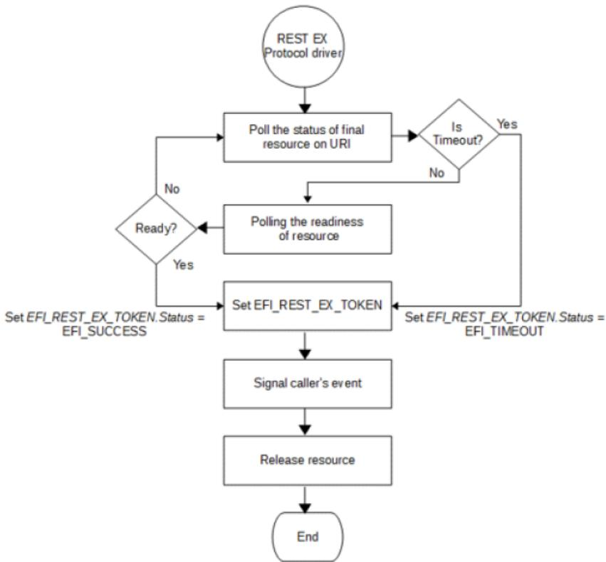

Once the REST request is submitted successfully and REST EX Protocol driver instance gets the HTTP 201, REST EX Protocol driver instance starts to monitor whether resource event change is pushed to REST EX Protocol driver instance from REST service.

## 29.7.16 EFI\_REST\_EX\_PROTOCOL.EventService()

The REST client creates and submits an HTTP-like header/body content in RequestMessage which are required by REST Event services. The REST Event Service will return an HTTP 201 (CREATED) and the Location header in the response shall contain a URI giving the location of newly created subscription resource.

The following flowchart describes the flow of subscribing to a REST Event service on HTTP-aware infrastructure:

Once the REST request is submitted successfully and REST EX Protocol driver instance gets the HTTP 201, REST EX Protocol driver instance starts to monitor whether resource event change is pushed to REST EX Protocol driver instance from REST service.

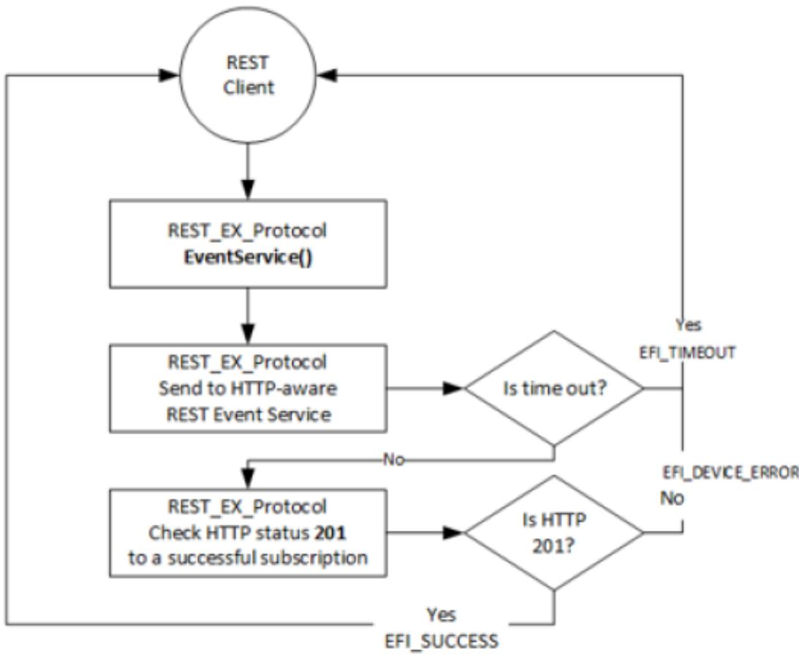

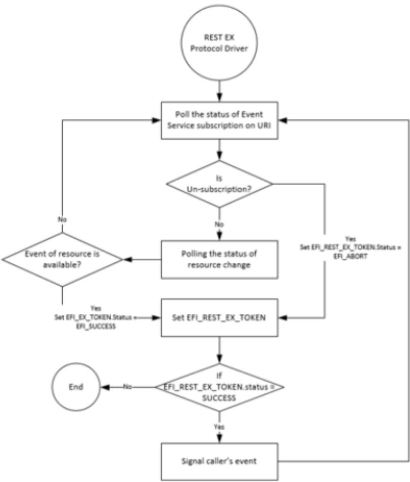

## 29.7.17 EFI REST JSON Resource to C Structure Converter

## 29.7.17.1 Overview

EFI REST JSON Structure Protocol is designed as the centralized REST JSON Resource IN-Structure OUT (JSON-IN Structure-OUT in short) and vice versa converter for EFI REST client drivers or EFI REST client applications. This protocol provides the registration function which is invoked by upper layer EFI driver to register converter as the plug-in converter for the well-known REST JSON resource. The EFI driver which provide REST JSON resource to structure converter is EFI REST JSON structure converter producer. In the other hand, EFI drivers or applications which utilize EFI REST JSON Structure protocol is the consumer of EFI REST JSON structure converter. The convert producer is required to register its converter functions with predefined REST JSON resource namespace and data type. EFI REST JSON Structure Protocol maintains the database of all plug-in converter and dispatches the consumer request to proper REST JSON resource structure converter. EFI REST JSON Structure Protocol doesn’t have knowledge about the exact structure for the particular REST JSON resource. It just dispatches JSON resource to the correct convert functions and returns the pointer of structure generated by convert producer. This protocol reduces the burdens of JSON resource parsing efort. This also provides the easier way to refer to specific REST JSON property using native C structure reference. Below figure delineates the software stack of EFI REST JSON resource to structure converter architecture.

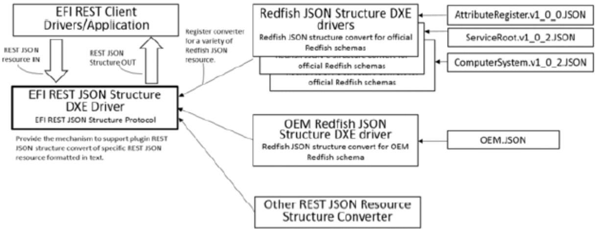

## 29.7.17.2 EFI REST JSON Structure Protocol

## Summary

EFI REST JSON Structure Protocol provides function to converter producer for the registration of REST JSON resource structure converter. This protocol also provides functions of JSON-IN Structure-OUT and vice versa to converter consumer.

## Protocol GUID

```c
#define EFI_REST_JSON_STRUCTURE_PROTOCOL_GUID \
{ 0xa9a048f6, 0x48a0, 0x4714, {0xb7, 0xda, 0xa9, 0xad,
    0x87, 0xd4, 0xda, 0xc9}}
```

## Protocol Interface Structure

```c
typedef struct _EFI_REST_JSON_STRUCTURE_PROTOCOL {
    EFI_REST_JSON_STRUCTURE_REGISTER Register;
    EFI_REST_JSON_STRUCTURE_TO_STRUCTURE ToStructure;
    EFI_REST_JSON_STRUCTURE_TO_JSON ToJson;
    EFI_REST_JSON_STRUCTURE_DESTORY_STRUCTURE DestoryStructure;
} EFI_REST_JSON_STRUCTURE_PROTOCOL;
```

## Parameters

## Register

Register REST JSON structure converter producer.

## ToStructure

JSON-IN Structure-OUT function.

## ToJson

Structure-IN JSON-OUT function.

## DestoryStructure

Destroy JSON structure returned from ToStructure function.

## Description

Each plug-in JSON resource to structure converter is required to register itself into EFI\_REST\_JSON\_STRUCTURE\_PROTOCOL. The plug-in JSON resource to structure converter has to provide corresponding functions for ToStructure(), ToJson() and DestoryStructure() for the specific REST JSON resource. EFI\_REST\_JSON\_STRUCTURE\_PROTOCOL maintains converter producer using the JSON resource type and version information when registration. The ToStructure(), ToJson() and DestoryStructure() provided by EFI\_REST\_JSON\_STRUCTURE\_PROTOCOL is published to converter consumer for JSON-IN Structure-OUT and vice versa conversion. EFI\_REST\_JSON\_STRUCTURE\_PROTOCOL is responsible for dispatching consumer request to the proper converter producer

## 29.7.18 EFI\_REST\_JSON\_STRUCTURE.Register ()

## Summary

This function provides REST JSON resource to structure converter registration.

Protocol Interface

```sql
typedef
EFI_STATUS
(EFIAPI *EFI_REST_JSON_STRUCTURE_REGISTER) (
    IN EFI_REST_JSON_STRUCTURE_PROTOCOL    *This,
    IN EFI_REST_JSON_STRUCTURE_SUPPORTED    *JsonStructureSupported,
    IN EFI_REST_JSON_STRUCTURE_TO_STRUCTURE    ToStructure,
    IN EFI_REST_JSON_STRUCTURE_TO_JSON    ToJson,
    IN EFI_REST_JSON_DESTORY_STRUCTURE    DestroyStructure
);
```

## Parameters

## This

This is the EFI\_REST\_JSON\_STRUCTURE\_PROTOCOL instance.

## JsonStructureSupported

The type and version of REST JSON resource which this converter supports.

## ToStructure

The function to convert REST JSON resource to structure.

## ToJson

The function to convert REST JSON structure to JSON in text format.

## DestroyStructure

Destroy REST JSON structure returned in ToStructure() function.

## Description

This function is invoked by REST JSON resource to structure converter to register JSON-IN Structure-OUT, Structure-IN JSON-OUT and destroy JSON structure functionalities. The converter producer has to correctly specify REST resource supporting information in EFI\_REST\_JSON\_STRUCTURE\_SUPPORTED. The information includes the type name, revision and data type of REST resource. Multiple REST JSON resource to structure converters may supported in one drive, refer to below related definition.

## Related Definitions

```c
typedef CHAR8 *EFI_REST_JSON_RESOURCE_TYPE_DATATYPE;
//**********************************************************************
// EFI_REST_JSON_RESOURCE_TYPE_NAMESPACE
//**********************************************************************
typedef struct _EFI_REST_JSON_RESOURCE_TYPE_NAMESPACE {
    CHAR8    *ResourceTypeName;
    CHAR8    *MajorVersion;
    CHAR8    *MinorVersion;
    CHAR8    *ErrataVersion;
} EFI_REST_JSON_RESOURCE_TYPE_NAMESPACE;
```

## Parameters

## ResourceTypeName

CHAR8 pointer to the name of this REST JSON Resource.

## MajorVersion

CHAR8 pointer to the string of REST JSON Resource major version.

## MinorVersion

CHAR8 pointer to the string of REST JSON Resource minor version.

## ErrataVersion

CHAR8 pointer to the string of REST JSON Resource errata version.

```c
//**********************************************************************
// EFI_REST_JSON_RESOURCE_TYPE_IDENTIFIER
//**********************************************************************
typedef struct _EFI_REST_JSON_RESOURCE_TYPE_IDENTIFIER {
    EFI_REST_JSON_RESOURCE_TYPE_NAMESPACE Namespace;
    EFI_REST_JSON_RESOURCE_TYPE_DATATYPE Datatype;
} EFI_REST_JSON_RESOURCE_TYPE_IDENTIFIER;
```

## Parameters

## Namespace

Name space of this REST JSON resource.

## Datatype

CHAR8 pointer to the string of data type, could be NULL if there is no data type for this REST JSON resource.

```c
//**********************************************************************
// EFI_REST_JSON_STRUCTURE_SUPPORTED
//**********************************************************************
typedef struct _EFI_REST_JSON_STRUCTURE_SUPPORTED{
EFI_REST_JSON_STRUCTURE_SUPPORTED *Next;
EFI_REST_JSON_RESOURCE_TYPE_IDENTIFIER JsonResourceType;
} EFI_REST_JSON_STRUCTURE_SUPPORTED;
```

## Parameters

## Next

Pointer to next EFI\_REST\_JSON\_STRUCTURE\_SUPPORTED.

## JsonResourceType

Information of REST JSON resource this converter supports.

## Status Codes Returned

<table><tr><td>EFI_SUCCESS</td><td>Converter is successfully registered</td></tr><tr><td>EFI_INVALID_PARAMETER</td><td></td></tr><tr><td></td><td>One or more of the following is TRUE:This is NULL.JsonStructureSupported is NULL.ResourceTypeName in JsonStructureSupported structure is a NULL string ToStructure is NULL.ToJason is NULL.DestroyStructure is NULL.</td></tr><tr><td>EFI_ALREADY_STARTED</td><td>If the JSON resource to structure converter is already registered for this type and revision of JSON resource.</td></tr><tr><td>EFI_OUT_OF_RESOURCE</td><td>Not enough resource for the converter registration</td></tr></table>

## 29.7.19 EFI\_REST\_JSON\_STRUCTURE.ToStructure ()

## Summary

JSON-IN Structure-OUT function. Convert the given REST JSON resource into structure.

## Protocol Interface

```txt
typedef
EFI_STATUS
(EFIAPI *EFI_REST_JSON_STRUCTURE_TO_STRUCTURE)(
    IN EFI_REST_JSON_STRUCTURE_PROTOCOL *This,
    IN EFI_REST_JSON_RESOURCE_TYPE_IDENTIFIER *JsonRsrcIdentifier
OPTIONAL,
    IN CHAR8 *ResourceJsonText,
    OUT EFI_REST_JSON_STRUCTURE_HEADER **JsonStructure
);
```

## Parameters

## This

This is the EFI\_REST\_JSON\_STRUCTURE\_PROTOCOL instance.

## JsonRsrcIdentifier

This indicates the resource type and version is given in ResourceJsonText. If JsonRsrcIdentifier is NULL, means the JSON resource type and version information of given ResourceJsonText is unsure. User would like to have EFI\_REST\_JSON\_STRUCTURE\_PROTOCOL to look for the proper JSON structure converter.

## ResourceJsonText

REST JSON resource in text format.

## JsonStructure

Pointer to receive the pointer to EFI\_REST\_JSON\_STRUCTURE\_HEADER, refer to related definition for the details.

## Description

This function converts the given JSON resource in text format into predefined structure. The definition of structure format is not the scope of EFI\_REST\_JSON\_STRUCTURE\_PROTOCOL. EFI\_REST\_JSON\_STRUCTURE\_PROTOCOL is a centralized JSON-IN Structure-OUT converter which maintain the registration of a variety of JSON resource to structure converters. The structure definition and the corresponding C header file are written and released by 3rd party, OEM, organization or any open source communities. The JSON resource to structure converter (convert producer) may be released in the source format or binary format. The convert producer registers itself to EFI\_REST\_JSON\_STRUCTURE\_PROTOCOL uses Register() and provides EFI JSON resource to structure and vice versa conversion. Consumer has to destroy JsonStructure using DestoryStructure() function. Resource allocated for JsonStructure will be released and cleaned up by converter producer.

When JsonRsrcIdentifier is a non NULL pointer, ResourceTypeName in EFI\_REST\_JSON\_RESOURCE\_TYPE\_NAMESPACE must be a non NULL string, however the revision in EFI\_REST\_JSON\_RESOURCE\_TYPE\_NAMESPACE and data type in EFI\_REST\_JSON\_RESOURCE\_TYPE could be NULL string if REST JSON resource is non version controlled or no data type is defined. If JsonRsrcIdentifier is a non NULL pointer, EFI\_REST\_JSON\_STRUCTURE\_PROTOCOL looks for the proper converter from its database. Invokes the ToStructure() provided by the converter to convert JSON resource to structure.

Another scenario is JsonRsrcIdentifier may passed in as NULL, this means the JSON resource type and version information of given ResourceJsonText is unsure. In this case, EFI\_REST\_JSON\_STRUCTURE\_PROTOCOL invokes and passes ResourceJsonText to ToStructure() of each registered converter with JsonRsrcIdentifier set to NULL. Converter producer may or may not automatically determine REST JSON resource type and version. Converter producer should return EFI\_UNSUPPORTED if it doesn’t support automatically recognition of REST JSON resource. Or converter producer can recognize the given REST JSON resource by parsing the certain properties. This depends on the implementation of JSON resource to structure converter. If one of the registered converter producers can recognize the given ResourceJsonText, the JsonRsrcIdentifier in EFI\_REST\_JSON\_STRUCTURE\_HEADER is filled up with the proper REST JSON resource type, version and data type. With the information provided in EFI\_REST\_JSON\_STRUCTURE\_HEADER, consumer has idea about what the exact type of REST JSON structure is.

## Related Definitions

```c
//**********************************************************************
// EFI_REST_JSON_STRUCTURE_HEADER
//**********************************************************************
typedef struct _EFI_REST_JSON_STRUCTURE_HEADER {
    EFI_REST_JSON_RESOURCE_TYPE_IDENTIFIER JsonRsrcIdentifier;
    //
    // Follow by a pointer points to JSON structure, the content in the
    // JSON structure is implementation-specific according to converter producer.
    //
```

(continues on next page)

<table><tr><td colspan="2">(continued from previous page)</td></tr><tr><td>VOID</td><td>*JsonStructurePointer;</td></tr><tr><td>} EFI_REST_JSON_STRUCTURE_HEADER;</td><td></td></tr></table>

## Parameters

## JsonRsrcIdentifier

Information of REST JSON structure returned from this converter.

## JsonStructurePointer

Pointers to JSON structure, the content in the JSON structure is implementation-specific according to the converter producer.

## Status Codes Returned

<table><tr><td>EFI_SUCCESS</td><td>Pointer to JSON structure is returned in JsonStructure</td></tr><tr><td>EFI_INVALID_PARAMETER</td><td></td></tr><tr><td></td><td>One or more of the following is TRUE:This is NULL.ResourceJsonText is NULL.JsonRsrcIdentifier is not NULL, but theResourceTypeName in JsonRsrcIdentifier is NULL.JsonStructure is NULL.</td></tr><tr><td>EFI_NOT_FOUND</td><td>No proper JSON resource to structure convert found.</td></tr></table>

## 29.7.20 EFI\_REST\_JSON\_STRUCTURE.ToJson ()

## Summary

Structure-IN JSON-OUT function. Convert the given REST JSON structure into JSON text. The definition of structure format is not the scope of EFI\_REST\_JSON\_STRUCTURE\_PROTOCOL. The structure definition and the corresponding C header file are written and released by 3rd party, OEM, organization or any open source communities. Consumer has to free the memory block allocated for ResourceJsonText if the JSON resource is no longer needed.

## Protocol Interface

typedef

EFI\_STATUS

(EFIAPI \*EFI\_REST\_JSON\_STRUCTURE\_TO\_JSON)(

IN EFI\_REST\_JSON\_STRUCTURE\_PROTOCOL

IN EFI\_REST\_JSON\_STRUCTURE\_HEADER

\*This,

OUT CHAR8

\*JsonStructureHeader,

\*\*ResourceJsonText

);

## Parameters

## This

This is the EFI\_REST\_JSON\_STRUCTURE\_PROTOCOL instance.

## JsonStructureHeader

The point to EFI\_REST\_JSON\_STRUCTURE\_HEADER structure. EFI\_REST\_JSON\_RESOURCE\_TYPE\_IDENTIFIER in EFI\_REST\_JSON\_STRUCTURE\_HEADER must exactly describes the JSON resource type and revision referred by this JSON structure. ResourceTypeName in JsonRsrcIdentifier must be non NULL pointer pointes

to string. Revision and data type in JsonRsrcIdentifier could be NULL if REST JSON resource is not version controlled and or data type definition.

## ResourceJsonText

Pointer to receive REST JSON resource in text format.

## Description

This functions converts the given REST JSON structure into REST JSON text format resource.

Status Codes Returned

<table><tr><td>EFI_SUCCESS</td><td>Pointer to JSON resource in text format is returned inResourceJsonText</td></tr><tr><td>EFI_INVALID_PARAMETER</td><td></td></tr><tr><td></td><td>One or more of the following isTRUE:This is NULL.JsonStructureHeaderis NULLResourceJsonTextis NULL.</td></tr><tr><td>EFI_NOT_FOUND</td><td>No proper JSON structure convert found to convert JSON structure to JSON text format.</td></tr></table>

## 29.7.21 EFI\_REST\_JSON\_STRUCTURE.DestroyStructure ()

## Summary

This function destroys the REST JSON structure.

Protocol Interface

```txt
typedef
EFI_STATUS
(EFIAPI *EFI_REST_JSON_STRUCTURE_DESTORY_STRUCTURE)(
    IN EFI_REST_JSON_STRUCTURE_PROTOCOL    *This,
    IN EFI_REST_JSON_STRUCTURE_HEADER    *JsonStructureHeader
);
```

## Description

This function destroys the JSON structure generated by ToStructure() function. REST JSON resource structure converter is responsible for freeing and cleaning up all resource associated with the give JSON structure.

## Status Codes Returned

<table><tr><td>EFI_SUCCESS</td><td>JSON structure is successfully destroyed.</td></tr><tr><td>EFI_INVALID_PARAMETER</td><td></td></tr><tr><td></td><td>One or more of the following is TRUE:This is null.JsonStructureHeader is NULL.</td></tr><tr><td>EFI_NOT_FOUND</td><td>No proper JSON structure converter found to destroy JSON structure.</td></tr></table>

## 29.7.21.1 EFI Redfish JSON Structure Converter

For writing and using an EFI Redfish JSON Structure Converter, see Section 31.2, using the EFI\_REST\_JSON\_STRUCTURE\_PROTOCOL protocol.

# NETWORK PROTOCOLS — UDP AND MTFTP

## 30.1 EFI UDP Protocol

This chapter defines the EFI UDP (User Datagram Protocol) Protocol that interfaces over the EFI IP Protocol, and the EFI MTFTP Protocol interface that is built upon the EFI UDP Protocol. Protocols for version 4 and version 6 of UDP and MTFTP are included.

## 30.1.1 UDP4 Service Binding Protocol

## 30.1.1.1 EFI\_UDP4\_SERVICE\_BINDING\_PROTOCOL

## Summary

The EFI UDPv4 Service Binding Protocol is used to locate communication devices that are supported by an EFI UDPv4 Protocol driver and to create and destroy instances of the EFI UDPv4 Protocol child protocol driver that can use the underlying communications device.

## GUID

#define EFI\_UDP4\_SERVICE\_BINDING\_PROTOCOL\_GUID {0x83f01464,0x99bd,0x45e5,\ {0xb3,0x83,0xaf,0x63,0x05,0xd8,0xe9,0xe6}}

## Description

A network application that requires basic UDPv4 I/O services can use one of the protocol handler services, such as BS->LocateHandleBufer(), to search for devices that publish a EFI UDPv4 Service Binding Protocol GUID. Each device with a published EFI UDPv4 Service Binding Protocol GUID supports the EFI UDPv4 Protocol and may be available for use.

After a successful call to the EFI\_UDP4\_SERVICE\_BINDING\_PROTOCOL .CreateChild() function, the newly created child EFI UDPv4 Protocol driver is in an unconfigured state; it is not ready to send and receive data packets.

Before a network application terminates execution every successful call to the EFI\_UDP4\_SERVICE\_BINDING\_PROTOCOL .CreateChild() function must be matched with a call to the EFI\_UDP4\_SERVICE\_BINDING\_PROTOCOL.DestroyChild() function.

## 30.1.2 UDP4 Protocol

## 30.1.2.1 EFI\_UDP4\_PROTOCOL

## Summary

The EFI UDPv4 Protocol provides simple packet-oriented services to transmit and receive UDP packets.

## GUID

```c
#define EFI_UDP4_PROTOCOL_GUID \
{0x3ad9df29,0x4501,0x478d, \
{0xb1,0xf8,0x7f,0x7f,0xe7,0x0e,0x50,0xf3}}
```

## Protocol Interface Structure

```c
typedef struct _EFI_UDP4_PROTOCOL {
    EFI_UDP4_GET_MODE_DATA GetModeData;
    EFI_UDP4_CONFIGURE Configure;
    EFI_UDP4_GROUPS Groups;
    EFI_UDP4_ROUTES Routes;
    EFI_UDP4_TRANSMIT Transmit;
    EFI_UDP4_RECEIVE Receive;
    EFI_UDP4_CANCEL Cancel;
    EFI_UDP4_POLL Poll;
} EFI_UDP4_PROTOCOL;
```

## Parameters

## GetModeData

Reads the current operational settings. See the GetModeData() function description.

## Configure

Initializes, changes, or resets operational settings for the EFI UDPv4 Protocol. See the Configure() function description.

## Groups

Joins and leaves multicast groups. See the Groups() function description.

## Routes

Add and deletes routing table entries. See the Routes() function description.

## Transmit

Queues outgoing data packets into the transmit queue. This function is a nonblocked operation. See the Transmit() function description.

## Receive

Places a receiving request token into the receiving queue. This function is a nonblocked operation. See the Receive() function description.

## Cancel

Aborts a pending transmit or receive request. See the Cancel() function description.

## Poll

Polls for incoming data packets and processes outgoing data packets. See the Poll() function description.

## Description

The EFI\_UDP4\_PROTOCOL defines an EFI UDPv4 Protocol session that can be used by any network drivers, applications, or daemons to transmit or receive UDP packets. This protocol instance can either be bound to a specified port as a service or connected to some remote peer as an active client. Each instance has its own settings, such as the routing table and group table, which are independent from each other.

NOTE: In this document, all IPv4 addresses and incoming/outgoing packets are stored in network byte order. All other parameters in the functions and data structures that are defined in this document are stored in host byte order.

## 30.1.2.2 EFI\_UDP4\_PROTOCOL.GetModeData()

## Summary

Reads the current operational settings.

Prototype

```sql
typedef
EFI_STATUS
(EFIAPI *EFI_UDP4_GET_MODE_DATA) (
    IN EFI_UDP4_PROTOCOL    *This,
    OUT EFI_UDP4_CONFIG_DATA    *Udp4ConfigData OPTIONAL,
    OUT EFI_IP4_MODE_DATA    *Ip4ModeData OPTIONAL,
    OUT EFI_MANAGED_NETWORK_CONFIG_DATA    *MnpConfigData OPTIONAL,
    OUT EFI_SIMPLE_NETWORK_MODE    *SnpModeData OPTIONAL
);
```

## Parameters

## This

Pointer to the EFI\_UDP4\_PROTOCOL instance.

## Udp4ConfigData

Pointer to the bufer to receive the current configuration data. Type EFI\_UDP4\_CONFIG\_DATA is defined in “Related Definitions” below.

## Ip4ModeData\*

Pointer to the EFI IPv4 Protocol mode data structure. Type EFI\_IP4\_MODE\_DATA is defined in EFI\_IP4\_PROTOCOL .GetModeData().

## MnpConfigData

Pointer to the managed network configuration data structure. Type EFI\_MANAGED\_NETWORK\_CONFIG\_DATA is defined in EFI\_MANAGED\_NETWORK\_PROTOCOL.GetModeData().

## SnpModeData

Pointer to the simple network mode data structure. Type EFI\_SIMPLE\_NETWORK\_MODE is defined in the EFI\_SIMPLE\_NETWORK\_PROTOCOL.

## Description

The GetModeData() function copies the current operational settings of this EFI UDPv4 Protocol instance into usersupplied bufers. This function is used optionally to retrieve the operational mode data of underlying networks or drivers.

## Related Definition

```c
//**********************************************************************
// EFI_UDP4_CONFIG_DATA
//**********************************************************************
typedef struct {
    //Receiving Filters
```

(continues on next page)

(continued from previous page)

<table><tr><td>BOOLEAN</td><td>AcceptBroadcast;</td></tr><tr><td>BOOLEAN</td><td>AcceptPromiscuous;</td></tr><tr><td>BOOLEAN</td><td>AcceptAnyPort;</td></tr><tr><td>BOOLEAN</td><td>AllowDuplicatePort;</td></tr><tr><td colspan="2">// I/O parameters</td></tr><tr><td>UINT8</td><td>TypeOfService;</td></tr><tr><td>UINT8</td><td>TimeToLive;</td></tr><tr><td>BOOLEAN</td><td>DoNotFragment;</td></tr><tr><td>UINT32</td><td>ReceiveTimeout;</td></tr><tr><td>UINT32</td><td>TransmitTimeout;</td></tr><tr><td colspan="2">// Access Point</td></tr><tr><td>BOOLEAN</td><td>UseDefaultAddress;</td></tr><tr><td>EFI_IPv4_ADDRESS</td><td>StationAddress;</td></tr><tr><td>EFI_IPv4_ADDRESS</td><td>SubnetMask;</td></tr><tr><td>UINT16</td><td>StationPort;</td></tr><tr><td>EFI_IPv4_ADDRESS</td><td>RemoteAddress;</td></tr><tr><td>UINT16</td><td>RemotePort;</td></tr><tr><td colspan="2">} EFI_UDP4_CONFIG_DATA;</td></tr></table>

## AcceptBroadcast

Set to TRUE to accept broadcast UDP packets.

## AcceptPromiscuous

Set to TRUE to accept UDP packets that are sent to any address.

## AcceptAnyPort

Set to TRUE to accept UDP packets that are sent to any port.

## AllowDuplicatePort

Set to TRUE to allow this EFI UDPv4 Protocol child instance to open a port number that is already being used by another EFI UDPv4 Protocol child instance.

## TypeOfService

TypeOfService field in transmitted IPv4 packets.

## TimeToLive

TimeToLive field in transmitted IPv4 packets.

## DoNotFragment

Set to TRUE to disable IP transmit fragmentation.

## ReceiveTimeout

The receive timeout value (number of microseconds) to be associated with each incoming packet. Zero means do not drop incoming packets.

## TransmitTimeout

The transmit timeout value (number of microseconds) to be associated with each outgoing packet. Zero means do not drop outgoing packets.

## UseDefaultAddress

Set to TRUE to use the default IP address and default routing table. If the default IP address is not available yet, then the underlying EFI IPv4 Protocol driver will use EFI\_IP4\_CONFIG2\_PROTOCOL to retrieve the IP address and subnet information. Ignored for incoming filtering if AcceptPromiscuous is set to TRUE.

## StationAddress

The station IP address that will be assigned to this EFI UDPv4 Protocol instance. The EFI UDPv4 and EFI IPv4 Protocol drivers will only deliver incoming packets whose destination matches this IP address exactly. Address 0.0.0.0 is also accepted as a special case in which incoming packets destined to any station IP address are always delivered. Not used when UseDefaultAddress is TRUE. Ignored for incoming filtering if AcceptPromiscuous is TRUE.

## SubnetMask

The subnet address mask that is associated with the station address. Not used when UseDefaultAddress is TRUE.

## StationPort

The port number to which this EFI UDPv4 Protocol instance is bound. If a client of the EFI UDPv4 Protocol does not care about the port number, set StationPort to zero. The EFI UDPv4 Protocol driver will assign a random port number to transmitted UDP packets. Ignored if AcceptAnyPort is set to TRUE.

## RemoteAddress

The IP address of remote host to which this EFI UDPv4 Protocol instance is connecting. If RemoteAddress is not 0.0.0.0, this EFI UDPv4 Protocol instance will be connected to RemoteAddress; i.e., outgoing packets of this EFI UDPv4 Protocol instance will be sent to this address by default and only incoming packets from this address will be delivered to client. Ignored for incoming filtering if AcceptPromiscuous is TRUE.

## RemotePort

The port number of the remote host to which this EFI UDPv4 Protocol instance is connecting. If it is not zero, outgoing packets of this EFI UDPv4 Protocol instance will be sent to this port number by default and only incoming packets from this port will be delivered to client. Ignored if RemoteAddress is 0.0.0.0 and ignored for incoming filtering if AcceptPromiscuous is TRUE.

## Status Codes Returned

<table><tr><td>EFI_SUCCESS</td><td>The mode data was read.</td></tr><tr><td>EFI_NOT_STARTED</td><td>When Udp4ConfigData is queried, no configuration data is available because this instance has not been started.</td></tr><tr><td>EFI_INVALID_PARAMETER</td><td>This is NULL.</td></tr></table>

## 30.1.2.3 EFI\_UDP4\_PROTOCOL.Configure()

## Summary

• Initializes, changes, or resets the operational parameters for this instance of the EFI UDPv4 Protocol.

## Prototype

```txt
typedef
EFI_STATUS
(EFIAPI *EFI_UDP4_CONFIGURE) (
    IN EFI_UDP4_PROTOCOL    *This,
    IN EFI_UDP4_CONFIG_DATA    *UdpConfigData OPTIONAL
);
```

## Parameters

## This

Pointer to the EFI\_UDP4\_PROTOCOL instance.

## UdpConfigData

Pointer to the bufer to receive the current mode data.

## Description

The Configure() function is used to do the following:

• Initialize and start this instance of the EFI UDPv4 Protocol.

• Change the filtering rules and operational parameters.

• Reset this instance of the EFI UDPv4 Protocol.

Until these parameters are initialized, no network trafic can be sent or received by this instance. This instance can be also reset by calling Configure() with UdpConfigData set to NULL. Once reset, the receiving queue and transmitting queue are flushed and no trafic is allowed through this instance.

With diferent parameters in UdpConfigData, Configure() can be used to bind this instance to specified port.

Status Codes Returned

<table><tr><td>EFI_SUCCESS</td><td>The configuration settings were set, changed, or reset successfully.</td></tr><tr><td>EFI_NO_MAPPING</td><td>When using a default address, configuration (DHCP, BOOTP, RARP, etc.) is not finished yet.</td></tr><tr><td>EFI_INVALID_PARAMETER</td><td>One or more following conditions are TRUE:This is NULL.UdpConfigData.StationAddressis not a valid unicast IPv4 address.UdpConfigData.SubnetMaskis not a valid IPv4 address mask. The subnet mask must be contiguous.UdpConfigData.RemoteAddressis not a valid unicast IPv4 address if it is not zero.</td></tr><tr><td>EFI_ALREADY_STARTED</td><td>The EFI UDPv4 Protocol instance is already started/configured and must be stopped/reset before it can be reconfigured. OnlyTypeOfService,TimeToLive,DoNotFragment,ReceiveTimeout,andTransmitTimeoutcan be reconfigured without stopping the current instance of the EFI UDPv4 Protocol.</td></tr><tr><td>EFI_ACCESS_DENIED</td><td>UdpConfigData.AllowDuplicatePortisFALSEandUdpConfigData.StationPortis already used by other instance.</td></tr><tr><td>EFI_OUT_OF_RESOURCES</td><td>The EFI UDPv4 Protocol driver cannot allocate memory for this EFI UDPv4 Protocol instance.</td></tr><tr><td>EFI_DEVICE_ERROR</td><td>An unexpected network or system error occurred and this instance was not opened.</td></tr></table>

## 30.1.2.4 EFI\_UDP4\_PROTOCOL.Groups()

## Summary

Joins and leaves multicast groups.

Prototype

```txt
typedef
EFI_STATUS
(EFIAPI *EFI_UDP4_GROUPS) (
    IN EFI_UDP4_PROTOCOL    *This,
    IN BOOLEAN    JoinFlag,
    IN EFI_IPv4_ADDRESS    *MulticastAddress OPTIONAL
);
```

## Parameters

## This

Pointer to the EFI\_UDP4\_PROTOCOL instance.

## JoinFlag

Set to TRUE to join a multicast group. Set to FALSE to leave one or all multicast groups.

## MulticastAddress

Pointer to multicast group address to join or leave.

## Description

The Groups() function is used to enable and disable the multicast group filtering.

If the JoinFlag is FALSE and the MulticastAddress is NULL, then all currently joined groups are left.

## Status Codes Returned

<table><tr><td>EFI_SUCCESS</td><td>The operation completed successfully.</td></tr><tr><td>EFI_NOT_STARTED</td><td>The EFI UDPv4 Protocol instance has not been started.</td></tr><tr><td>EFI_NO_MAPPING</td><td>When using a default address, configuration (DHCP, BOOTP, RARP, etc.) is not finished yet.</td></tr><tr><td>EFI_OUT_OF_RESOURCES</td><td>Could not allocate resources to join the group.</td></tr><tr><td>EFI_INVALID_PARAMETER</td><td></td></tr><tr><td></td><td>One or more of the following conditions is TRUE:This is NULL.JoinFlag is TRUE and MulticastAddress is NULL.JoinFlag is TRUE and *MulticastAddress is not a valid multicast address.</td></tr><tr><td>EFI_ALREADY_STARTED</td><td>The group address is already in the group table (when JoinFlag is TRUE).</td></tr><tr><td>EFI_NOT_FOUND</td><td>The group address is not in the group table (when JoinFlag is FALSE).</td></tr><tr><td>EFI_DEVICE_ERROR</td><td>An unexpected system or network error occurred.</td></tr></table>

## 30.1.2.5 EFI\_UDP4\_PROTOCOL.Routes()

## Summary

Adds and deletes routing table entries.

Prototype

<table><tr><td colspan="2">typedef</td></tr><tr><td colspan="2">EFI_STATUS(EFIAPI *EFI_UDP4_ROUTES) (</td></tr><tr><td>IN EFI_UDP4_PROTOCOL</td><td>*This,</td></tr><tr><td>IN BOOLEAN</td><td>DeleteRoute,</td></tr><tr><td>IN EFI_IPv4_ADDRESS</td><td>*SubnetAddress,</td></tr><tr><td>IN EFI_IPv4_ADDRESS</td><td>*SubnetMask,</td></tr><tr><td>IN EFI_IPv4_ADDRESS</td><td>*GatewayAddress</td></tr><tr><td>);</td><td></td></tr></table>

## Parameters

## This

Pointer to the EFI\_UDP4\_PROTOCOL instance.

## DeleteRoute

Set to TRUE to delete this route from the routing table. Set to FALSE to add this route to the routing table. DestinationAddress and SubnetMask are used as the key to each route entry.

## SubnetAddress

The destination network address that needs to be routed.

## SubnetMask

The subnet mask of SubnetAddress.

## GatewayAddress

The gateway IP address for this route.

## Description

The Routes() function adds a route to or deletes a route from the routing table.

Routes are determined by comparing the SubnetAddress with the destination IP address and arithmetically AND -ing it with the SubnetMask. The gateway address must be on the same subnet as the configured station address.

The default route is added with SubnetAddress and SubnetMask both set to 0.0.0.0. The default route matches all destination IP addresses that do not match any other routes.

A zero GatewayAddress is a nonroute. Packets are sent to the destination IP address if it can be found in the Address Resolution Protocol (ARP) cache or on the local subnet. One automatic nonroute entry will be inserted into the routing table for outgoing packets that are addressed to a local subnet (gateway address of 0.0.0.0).

Each instance of the EFI UDPv4 Protocol has its own independent routing table. Instances of the EFI UDPv4 Protocol that use the default IP address will also have copies of the routing table provided by the EFI\_IP4\_CONFIG2\_PROTOCOL. These copies will be updated automatically whenever the IP driver reconfigures its instances; as a result, the previous modification to these copies will be lost.

NOTE: There is no way to set up routes to other network interface cards (NICs) because each NIC has its own independent network stack that shares information only through EFI UDP4 Variable.

## Status Codes Returned

<table><tr><td>EFI_SUCCESS</td><td>The operation completed successfully.</td></tr><tr><td>EFI_NOT_STARTED</td><td>The EFI UDPv4 Protocol instance has not been started.</td></tr><tr><td>EFI_NO_MAPPING</td><td>When using a default address, configuration (DHCP, BOOTP, RARP, etc.) is not finished yet.</td></tr><tr><td>EFI_INVALID_PARAMETER</td><td>One or more of the following conditions is TRUE:This is NULL.SubnetAddress is NULL.SubnetMask is NULL.GatewayAddress is NULL.SubnetAddress is not a valid subnet address.SubnetMask is not a valid subnet mask.GatewayAddress is not a valid unicast IP address.</td></tr><tr><td>EFI_OUT_OF_RESOURCES</td><td>Could not add the entry to the routing table.</td></tr><tr><td>EFI_NOT_FOUND</td><td>This route is not in the routing table.</td></tr><tr><td>EFI_ACCESS_DENIED</td><td>The route is already defined in the routing table.</td></tr></table>

## 30.1.2.6 EFI\_UDP4\_PROTOCOL.Transmit()

## Summary

Queues outgoing data packets into the transmit queue.

## Prototype

```txt
typedef
EFI_STATUS
(EFIAPI *EFI_UDP4_TRANSMIT) (
    IN EFI_UDP4_PROTOCOL    *This,
    IN EFI_UDP4_COMPLETION_TOKEN    *Token
);
```

## Parameters

## This

Pointer to the EFI\_UDP4\_PROTOCOL instance.

## Token

Pointer to the completion token that will be placed into the transmit queue. Type EFI\_UDP4\_COMPLETION\_TOKEN is defined in “Related Definitions” below.

## Description

The Transmit() function places a sending request to this instance of the EFI UDPv4 Protocol, alongside the transmit data that was filled by the user. Whenever the packet in the token is sent out or some errors occur, the Token.Event will be signaled and Token.Status is updated. Providing a proper notification function and context for the event will enable the user to receive the notification and transmitting status.

## Related Definitions

```c
//**********************************************************************
// EFI_UDP4_COMPLETION_TOKEN
//**********************************************************************
typedef struct {
    EFI_EVENT Event;
    EFI_STATUS Status;
    union {
    EFI_UDP4_RECEIVE_DATA *RxData;
    EFI_UDP4_TRANSMIT_DATA *TxData;
    } Packet;
} EFI_UDP4_COMPLETION_TOKEN;
```

## Event

This Event will be signaled after the Status field is updated by the EFI UDPv4 Protocol driver. The type of Event must be EVT\_NOTIFY\_SIGNAL. The Task Priority Level (TPL) of Event must be lower than or equal to TPL\_CALLBACK .

## Status

Will be set to one of the following values:

EFI\_SUCCESS. The receive or transmit operation completed successfully.

EFI\_ABORTED. The receive or transmit was aborted.

EFI\_TIMEOUT. The transmit timeout expired.

EFI\_NETWORK\_UNREACHABLE. The destination network is unreachable. RxData is set to NULL in this situation.

EFI\_HOST\_UNREACHABLE. The destination host is unreachable. RxData is set to NULL in this situation.

EFI\_PROTOCOL\_UNREACHABLE. The UDP protocol is unsupported in the remote system. RxData is set to NULL in this situation.

EFI\_PORT\_UNREACHABLE. No service is listening on the remote port. RxData is set to NULL in this situation.

EFI\_ICMP\_ERROR. Some other Internet Control Message Protocol (ICMP) error report was received. For example, packets are being sent too fast for the destination to receive them and the destination sent an ICMP source quench report. RxData is set to NULL in this situation.

EFI\_DEVICE\_ERROR. An unexpected system or network error occurred.

EFI\_NO\_MEDIA. There was a media error.

## RxData

When this token is used for receiving, RxData is a pointer to EFI\_UDP4\_RECEIVE\_DATA. Type EFI\_UDP4\_RECEIVE\_DATA is defined below.

## TxData

When this token is used for transmitting, TxData is a pointer to EFI\_UDP4\_TRANSMIT\_DATA. Type EFI\_UDP4\_TRANSMIT\_DATA is defined below.

The EFI\_UDP4\_COMPLETION\_TOKEN structures are used for both transmit and receive operations.

When used for transmitting, the Event and TxData fields must be filled in by the EFI UDPv4 Protocol client. After the transmit operation completes, the Status field is updated by the EFI UDPv4 Protocol and the Event is signaled.

• When used for receiving, only the Event field must be filled in by the EFI UDPv4 Protocol client. After a packet is received, RxData and Status are filled in by the EFI UDPv4 Protocol and the Event is signaled.

• The ICMP related status codes filled in Status are defined as follows:

```c
//**********************************************************************
// UDP4 Token Status definition
//**********************************************************************
#define EFI_NETWORK_UNREACHABLE EFIERR(100)
#define EFI_HOST_UNREACHABLE EFIERR(101)
#define EFI_PROTOCOL_UNREACHABLE EFIERR(102)
#define EFI_PORT_UNREACHABLE EFIERR(103)

//**********************************************************************
// EFI_UDP4_RECEIVE_DATA
//**********************************************************************
typedef struct {
    EFI_TIME TimeStamp;
    EFI_EVENT RecycleSignal;
    EFI_UDP4_SESSION_DATA UdpSession;
    UINT32 DataLength;
    UINT32 FragmentCount;
    EFI_UDP4_FRAGMENT_DATA FragmentTable[1];
} EFI_UDP4_RECEIVE_DATA;
```

## TimeStamp

Time when the EFI UDPv4 Protocol accepted the packet. TimeStamp is zero filled if timestamps are disabled or unsupported

## RecycleSignal

Indicates the event to signal when the received data has been processed.

## UdpSession

The UDP session data including SourceAddress, SourcePort, DestinationAddress, and DestinationPort. Type EFI\_UDP4\_SESSION\_DATA is defined below.

## DataLength

The sum of the fragment data length.

## FragmentCount

Number of fragments. May be zero.

## FragmentTable

Array of fragment descriptors. IP and UDP headers are included in these bufers if ConfigData.RawData is TRUE. Otherwise they are stripped. May be zero. Type EFI\_UDP4\_FRAGMENT\_DATA is defined below.

EFI\_UDP4\_RECEIVE\_DATA is filled by the EFI UDPv4 Protocol driver when this EFI UDPv4 Protocol instance receives an incoming packet. If there is a waiting token for incoming packets, the CompletionToken.Packet.RxData field is updated to this incoming packet and the CompletionToken.Event is signaled. The EFI UDPv4 Protocol client must signal the RecycleSignal after processing the packet.

• FragmentTable could contain multiple bufers that are not in the continuous memory locations. The EFI UDPv4 Protocol client might need to combine two or more bufers in FragmentTable to form their own protocol header.

```c
//******************************************************************
// EFI_UDP4_SESSION_DATA
//******************************************************************
typedef struct {
    EFI_IPv4_ADDRESS SourceAddress;
    UINT16 SourcePort;
    EFI_IPv4_ADDRESS DestinationAddress;
    UINT16 DestinationPort;
} EFI_UDP4_SESSION_DATA;
```

## SourceAddress

Address from which this packet is sent. If this field is set to zero when sending packets, the address that is assigned in EFI\_UDP4\_PROTOCOL .Configure() is used.

## SourcePort

Port from which this packet is sent. It is in host byte order. If this field is set to zero when sending packets, the port that is assigned in EFI\_UDP4\_PROTOCOL .Configure() is used. If this field is set to zero and unbound, a call to EFI\_UDP4\_PROTOCOL.Transmit() will fail.

## DestinationAddress

Address to which this packet is sent.

## DestinationPort

Port to which this packet is sent. It is in host byte order. If this field is set to zero and unconnected, the call to EFI\_UDP4\_PROTOCOL .Transmit() will fail.

The EFI\_UDP4\_SESSION\_DATA is used to retrieve the settings when receiving packets or to override the existing settings of this EFI UDPv4 Protocol instance when sending packets.

```txt
//**********************************************************************
// EFI_UDP4_FRAGMENT_DATA
```

(continues on next page)

```c
(continued from previous page)
//*****
typedef struct {
    UINT32 FragmentLength;
    VOID *FragmentBuffer;
} EFI_UDP4_FRAGMENT_DATA;
```

## FragmentLength

Length of the fragment data bufer.

## FragmentBufer

Pointer to the fragment data bufer.

EFI\_UDP4\_FRAGMENT\_DATA allows multiple receive or transmit bufers to be specified. The purpose of this structure is to avoid copying the same packet multiple times.

```c
//**********************************************************************
// EFI_UDP4_TRANSMIT_DATA
//**********************************************************************
typedef struct {
    EFI_UDP4_SESSION_DATA *UdpSessionData;
    EFI_IPv4_ADDRESS *GatewayAddress;
    UINT32 DataLength;
    UINT32 FragmentCount;
    EFI_UDP4_FRAGMENT_DATA FragmentTable[1];
} EFI_UDP4_TRANSMIT_DATA;
```

## UdpSessionData

If not NULL, the data that is used to override the transmitting settings. Type EFI\_UDP4\_SESSION\_DATA is defined above.

## GatewayAddress

The next-hop address to override the setting from the routing table.

## DataLength

Sum of the fragment data length. Must not exceed the maximum UDP packet size.

## FragmentCount

Number of fragments.

## FragmentTable

Array of fragment descriptors. Type EFI\_UDP4\_FRAGMENT\_DATA is defined above.

The EFI UDPv4 Protocol client must fill this data structure before sending a packet. The packet may contain multiple bufers that may be not in a continuous memory location.

## Status Codes Returned

<table><tr><td>EFI_SUCCESS</td><td>The data has been queued for transmission.</td></tr><tr><td>EFI_NOT_STARTED</td><td>This EFI UDPv4 Protocol instance has not been started.</td></tr><tr><td>EFI_NO_MAPPING</td><td>When using a default address, configuration (DHCP, BOOTP, RARP, etc.) is not finished yet.</td></tr></table>

continues on next page

Table 30.5 – continued from previous page

<table><tr><td>EFI_INVALID_PARAMETER</td><td></td></tr><tr><td></td><td>One or more of the following are TRUE:This is NULL.Token is NULL.Token.Event is NULL.Token.Packet.TxData is NULL.Token.Packet.TxData.FragmentCount is zero.Token.Packet.TxData.DataLength is not equal to the sum of fragment lengths.One or more of the Token.Packet.TxData.FragmentTable[].FragmentLength fields is zero.One or more of the Token.Packet.TxData.FragmentTable[].FragmentBuffer fields is NULL.Token.Packet.TxData. GatewayAddress is not a unicast IPv4 address if it is not NULL.Token.Packet.TxData.UdpSessionData.SourceAddress is not a valid unicast IPv4 address or Token.Packet.TxData.UdpSessionData.DestinationAddress is zero if the UdpSessionData is not NULL.</td></tr><tr><td>EFI_ACCESS_DENIED</td><td>The transmit completion token with the same Token.Event was already in the transmit queue.</td></tr><tr><td>EFI_NOT_READY</td><td>The completion token could not be queued because the transmit queue is full.</td></tr><tr><td>EFI_OUT_OF_RESOURCES</td><td>Could not queue the transmit data.</td></tr><tr><td>EFI_NOT_FOUND</td><td>There is no route to the destination network or address.</td></tr><tr><td>EFI_BAD_BUFFER_SIZE</td><td>The data length is greater than the maximum UDP packet size. Or the length of the IP header + UDP header + data length is greater than MTU if DoNot-Fragment is TRUE.</td></tr><tr><td>EFI_NO_MEDIA</td><td>There was a media error.</td></tr></table>

## 30.1.2.7 EFI\_UDP4\_PROTOCOL.Receive()

## Summary

Places an asynchronous receive request into the receiving queue.

Prototype

```txt
typedef
EFI_STATUS
(EFIAPI *EFI_UDP4_RECEIVE) (
    IN EFI_UDP4_PROTOCOL    *This,
    IN EFI_UDP4_COMPLETION_TOKEN    *Token
);
```

## Parameters

## This

Pointer to the EFI\_UDP4\_PROTOCOL instance.

## Token

Pointer to a token that is associated with the receive data descriptor. Type EFI\_UDP4\_COMPLETION\_TOKEN is defined in EFI\_UDP4\_PROTOCOL .Transmit().

## Description

The Receive() function places a completion token into the receive packet queue. This function is always asynchronous.

The caller must fill in the Token.Event field in the completion token, and this field cannot be NULL. When the receive operation completes, the EFI UDPv4 Protocol driver updates the Token.Status and Token.Packet.RxData fields and the Token.Event is signaled. Providing a proper notification function and context for the event will enable the user to receive the notification and receiving status. That notification function is guaranteed to not be re-entered.

## Status Codes Returned

<table><tr><td>EFI_SUCCESS</td><td>The receive completion token was cached.</td></tr><tr><td>EFI_NOT_STARTED</td><td>This EFI UDPv4 Protocol instance has not been started.</td></tr><tr><td>EFI_NO_MAPPING</td><td>When using a default address, configuration (DHCP, BOOTP, RARP, etc.) is not finished yet.</td></tr><tr><td>EFI_INVALID_PARAMETER</td><td>One or more of the following conditions is TRUE:This is NULL.Token is NULL.Token.Event is NULL.</td></tr><tr><td>EFI_OUT_OF_RESOURCES</td><td>The receive completion token could not be queued due to a lack of system resources (usually memory).</td></tr><tr><td>EFI_DEVICE_ERROR</td><td>An unexpected system or network error occurred. The EFI UDPv4 Protocol instance has been reset to startup defaults.</td></tr><tr><td>EFI_ACCESS_DENIED</td><td>A receive completion token with the same Token.Event was already in the receive queue.</td></tr><tr><td>EFI_NOT_READY</td><td>The receive request could not be queued because the receive queue is full.</td></tr><tr><td>EFI_NO_MEDIA</td><td>There was a media error.</td></tr></table>

## 30.1.2.8 EFI\_UDP4\_PROTOCOL.Cancel()

## Summary

Aborts an asynchronous transmit or receive request.

Prototype

```c
typedef
EFI_STATUS
(EFIAPI *EFI_UDP4_CANCEL)(
    IN EFI_UDP4_PROTOCOL    *This,
    IN EFI_UDP4_COMPLETION_TOKEN    *Token OPTIONAL
);
```

## Parameters

## This

Pointer to the EFI\_UDP4\_PROTOCOL instance.

## Token

Pointer to a token that has been issued by EFI\_UDP4\_PROTOCOL .Transmit() or EFI\_UDP4\_PROTOCOL.Receive().If NULL, all pending tokens are aborted. Type EFI\_UDP4\_COMPLETION\_TOKEN is defined in EFI\_UDP4\_PROTOCOL.Transmit().

## Description

The Cancel() function is used to abort a pending transmit or receive request. If the token is in the transmit or receive request queues, after calling this function, Token.Status will be set to EFI\_ABORTED and then Token.Event will be signaled. If the token is not in one of the queues, which usually means that the asynchronous operation has completed, this function will not signal the token and EFI\_NOT\_FOUND is returned.

## Status Codes Returned

<table><tr><td>EFI_SUCCESS</td><td>The asynchronous I/O request was aborted and Token.Event was signaled. When Token is NULL, all pending requests are aborted and their events are signaled.</td></tr><tr><td>EFI_INVALID_PARAMETER</td><td>This is NULL.</td></tr><tr><td>EFI_NOT_STARTED</td><td>This instance has not been started.</td></tr><tr><td>EFI_NO_MAPPING</td><td>When using the default address, configuration (DHCP, BOOTP, RARP, etc.) is not finished yet.</td></tr><tr><td>EFI_NOT_FOUND</td><td>When Token is not NULL, the asynchronous I/O request was not found in the transmit or receive queue. It has either completed or was not issued by Transmit() and Receive().</td></tr></table>

## 30.1.2.9 EFI\_UDP4\_PROTOCOL.Poll()

## Summary

Polls for incoming data packets and processes outgoing data packets.

Prototype

```txt
typedef
EFI_STATUS
(EFIAPI *EFI_UDP4_POLL) (
    IN EFI_UDP4_PROTOCOL    *This
);
```

## Parameters

## This

Pointer to the EFI\_UDP4\_PROTOCOL instance.

## Description

The Poll() function can be used by network drivers and applications to increase the rate that data packets are moved between the communications device and the transmit and receive queues.

In some systems, the periodic timer event in the managed network driver may not poll the underlying communications device fast enough to transmit and/or receive all data packets without missing incoming packets or dropping outgoing packets. Drivers and applications that are experiencing packet loss should try calling the Poll() function more often.

## Status Codes Returned

<table><tr><td>EFI_SUCCESS</td><td>Incoming or outgoing data was processed.</td></tr></table>

continues on next page

Table 30.8 – continued from previous page

<table><tr><td>EFI_INVALID_PARAMETER</td><td>This is NULL.</td></tr><tr><td>EFI_DEVICE_ERROR</td><td>An unexpected system or network error occurred.</td></tr><tr><td>EFI_TIMEOUT</td><td>Data was dropped out of the transmit and/or receive queue. Consider increasing the polling rate.</td></tr></table>

## 30.2 EFI UDPv6 Protocol

This section defines the EFI UDPv6 (User Datagram Protocol version 6) Protocol that interfaces over the EFI IPv6 Protocol.

## 30.2.1 UDP6 Service Binding Protocol

## 30.2.1.1 EFI\_UDP6\_SERVICE\_BINDING\_PROTOCOL

## Summary

The EFI UDPv6 Service Binding Protocol is used to locate communication devices that are supported by an EFI UDPv6 Protocol driver and to create and destroy instances of the EFI UDPv6 Protocol child instance that uses the underlying communications device.

## GUID

```c
#define EFI_UDP6_SERVICE_BINDING_PROTOCOL_GUID \
{0x66ed4721, 0x3c98, 0x4d3e, \
{0x81, 0xe3, 0xd0, 0x3d, 0xd3, 0x9a, 0x72, 0x54}}
```

## Descriptopn

A network application that requires basic UDPv6 I/O services can use one of the protocol handler services, such as BS->LocateHandleBufer(), to search for devices that publish a EFI UDPv6 Service Binding Protocol GUID. Each device with a published EFI UDPv6 Service Binding Protocol GUID supports the EFI UDPv6 Protocol and may be available for use.

After a successful call to the EFI\_UDP6\_SERVICE\_BINDING\_PROTOCOL.CreateChild() function, the newly created child EFI UDPv6 Protocol driver is in an un-configured state; it is not ready to send and receive data packets.

Before a network application terminates execution, every successful call to the EFI\_UDP6\_SERVICE\_BINDING\_PROTOCOL.CreateChild() function must be matched with a call to the EFI\_UDP6\_SERVICE\_BINDING\_PROTOCOL.DestroyChild() function.

## 30.2.2 EFI UDP6 Protocol

## 30.2.2.1 EFI\_UDP6\_PROTOCOL

## Summary

The EFI UDPv6 Protocol provides simple packet-oriented services to transmit and receive UDP packets.

## GUID

```txt
typedef struct _EFI_UDP6_PROTOCOL {
    EFI_UDP6_GET_MODE_DATA GetModeData;
    EFI_UDP6_CONFIGURE Configure;
    EFI_UDP6_GROUPS Groups;
    EFI_UDP6_TRANSMIT Transmit;
    EFI_UDP6_RECEIVE Receive;
    EFI_UDP6_CANCEL Cancel;
    EFI_UDP6_POLL Poll;
} EFI_UDP6_PROTOCOL;
```

```c
#define EFI_UDP6_PROTOCOL_GUID \
{0x4f948815, 0xb4b9, 0x43cb, \
{0x8a, 0x33, 0x90, 0xe0, 0x60, 0xb3, 0x49, 0x55}}
```

## Protocol Interface Structure

## Parameters

## GetModeData

Reads the current operational settings. See the GetModeData() function description.

## Configure

Initializes, changes, or resets operational settings for the EFI UDPv6 Protocol. See the Configure() function description.

## Groups

Joins and leaves multicast groups. See the Groups() function description.

## Transmit

Queues outgoing data packets into the transmit queue. This function is a non-blocked operation. See the Transmit() function description.

## Receive

Places a receiving request token into the receiving queue. This function is a non-blocked operation. See the Receive() function description.

## Cancel

Aborts a pending transmit or receive request. See the Cancel() function description.

## Poll

Polls for incoming data packets and processes outgoing data packets. See the Poll() function description.

## Description

The EFI\_UDP6\_PROTOCOL defines an EFI UDPv6 Protocol session that can be used by any network drivers, applications, or daemons to transmit or receive UDP packets. This protocol instance can either be bound to a specified port as a service or connected to some remote peer as an active client. Each instance has its own settings, such as group table, that are independent from each other.

## <sup>ò</sup> Note

Byte Order: In this document, all IPv6 addresses and incoming/outgoing packets are stored in network byte order. All other parameters in the functions and data structures that are defined in this document are stored in host byte order.

## 30.2.2.2 EFI\_UDP6\_PROTOCOL.GetModeData()

## Summary

Read the current operational settings.

Prototype

```sql
typedef
EFI_STATUS
(EFIAPI *EFI_UDP6_GET_MODE_DATA) (
    IN EFI_UDP6_PROTOCOL    *This,
    OUT EFI_UDP6_CONFIG_DATA    *Udp6ConfigData OPTIONAL,
    OUT EFI_IP6_MODE_DATA    *Ip6ModeData OPTIONAL,
    OUT EFI_MANAGED_NETWORK_CONFIG_DATA    *MnpConfigData OPTIONAL,
    OUT EFI_SIMPLE_NETWORK_MODE    *SnpModeData OPTIONAL
);
```

## Parameters

## This

Pointer to the EFI\_UDP6\_PROTOCOL instance.

## Udp6ConfigData

The bufer in which the current UDP configuration data is returned. Type EFI\_UDP6\_CONFIG\_DATA is defined in “Related Definitions” below.

## Ip6ModeData

The bufer in which the current EFI IPv6 Protocol mode data is returned. Type EFI\_IP6\_MODE\_DATA is defined in EFI\_IP6\_PROTOCOL.GetModeData().

## MnpConfigData

The bufer in which the current managed network configuration data is returned. Type EFI\_MANAGED\_NETWORK\_CONFIG\_DATA is defined in EFI\_MANAGED\_NETWORK\_PROTOCOL.GetModeData().

## SnpModeData

The bufer in which the simple network mode data is returned. Type EFI\_SIMPLE\_NETWORK\_MODE is defined in the EFI\_SIMPLE\_NETWORK Protocol.

## Description

The GetModeData() function copies the current operational settings of this EFI UDPv6 Protocol instance into usersupplied bufers. This function is used optionally to retrieve the operational mode data of underlying networks or drivers.

## Related Definition

```txt
**********************************************************************
// EFI_UDP6_CONFIG_DATA
//
**********************************************************************
typedef struct {
    //Receiving Filters

    BOOLEAN    AcceptPromiscuous;
    BOOLEAN    AcceptAnyPort;
    BOOLEAN    AllowDuplicatePort;
```

(continues on next page)

(continued from previous page)

<table><tr><td colspan="2">//I/O parameters;</td></tr><tr><td>UINT8</td><td>TrafficClass;</td></tr><tr><td>UINT8</td><td>HopLimit;</td></tr><tr><td>;</td><td></td></tr><tr><td>UINT32</td><td>ReceiveTimeout;</td></tr><tr><td>UINT32</td><td>TransmitTimeout;</td></tr><tr><td colspan="2">//Access Point</td></tr><tr><td>EFI_IPv6_ADDRESS</td><td>StationAddress;</td></tr><tr><td>UINT16</td><td>StationPort;</td></tr><tr><td>EFI_IPv6_ADDRESS</td><td>RemoteAddress;</td></tr><tr><td>UINT16</td><td>RemotePort;</td></tr><tr><td colspan="2">} EFI_UDP6_CONFIG_DATA;</td></tr></table>

## AcceptPromiscuous

Set to TRUE to accept UDP packets that are sent to any address.

## AcceptAnyPort

Set to TRUE to accept UDP packets that are sent to any port.

## AllowDuplicatePort

Set to TRUE to allow this EFI UDPv6 Protocol child instance to open a port number that is already being used by another EFI UDPv6 Protocol child instance.

## TraficClass

TraficClass field in transmitted IPv6 packets.

## HopLimit

HopLimit field in transmitted IPv6 packets.

## ReceiveTimeout

The receive timeout value (number of microseconds) to be associated with each incoming packet. Zero means do not drop incoming packets.

## TransmitTimeout

The transmit timeout value (number of microseconds) to be associated with each outgoing packet. Zero means do not drop outgoing packets.

## StationAddress

The station IP address that will be assigned to this EFI UDPv6 Protocol instance. The EFI UDPv6 and EFI IPv6 Protocol drivers will only deliver incoming packets whose destination matches this IP address exactly. Address 0:/128 is also accepted as a special case. Under this situation, underlying IPv6 driver is responsible for binding a source address to this EFI IPv6 protocol instance according to source address selection algorithm. Only incoming packet from the selected source address is delivered. This field can be set and changed only when the EFI IPv6 driver is transitioning from the stopped to the started states. If no address is available for selecting, the EFI IPv6 Protocol driver will use EFI\_IP6\_CONFIG\_PROTOCOL to retrieve the IPv6 address.

## StationPort

The port number to which this EFI UDPv6 Protocol instance is bound. If a client of the EFI UDPv6 Protocol does not care about the port number, set StationPort to zero. The EFI UDPv6 Protocol driver will assign a random port number to transmitted UDP packets. Ignored it if AcceptAnyPort is TRUE.

## RemoteAddress

The IP address of remote host to which this EFI UDPv6 Protocol instance is connecting. If RemoteAddress is not 0:/128, this EFI UDPv6 Protocol instance will be connected to RemoteAddress; i.e., outgoing packets of this

```txt
typedef
EFI_STATUS
(EFIAPI *EFI_UDP6_CONFIGURE) (
    IN EFI_UDP6_PROTOCOL    *This,
    IN EFI_UDP6_CONFIG_DATA    *UdpConfigData OPTIONAL
);
```

EFI UDPv6 Protocol instance will be sent to this address by default and only incoming packets from this address will be delivered to client. Ignored for incoming filtering if AcceptPromiscuous is TRUE.

## RemotePort

The port number of the remote host to which this EFI UDPv6 Protocol instance is connecting. If it is not zero, outgoing packets of this EFI UDPv6 Protocol instance will be sent to this port number by default and only incoming packets from this port will be delivered to client. Ignored if RemoteAddress is 0:/128 and ignored for incoming filtering if AcceptPromiscuous is TRUE.

## Status Codes Returned

<table><tr><td>EFI_SUCCESS</td><td>The mode data was read.</td></tr><tr><td>EFI_NOT_STARTED</td><td>When Udp6ConfigData is queried, no configuration data is available because this instance has not been started.</td></tr><tr><td>EFI_INVALID_PARAMETER</td><td>This is NULL.</td></tr></table>

## 30.2.2.3 EFI\_UDP6\_PROTOCOL.Configure()

## Summary

Initializes, changes, or resets the operational parameters for this instance of the EFI UDPv6 Protocol.

## Prototype

## Parameters

## This

Pointer to the EFI\_UDP6\_PROTOCOL instance.

## UdpConfigData

Pointer to the bufer contained the configuration data.

## Description

The Configure() function is used to do the following:

• Initialize and start this instance of the EFI UDPv6 Protocol.

• Change the filtering rules and operational parameters.

• Reset this instance of the EFI UDPv6 Protocol.

Until these parameters are initialized, no network trafic can be sent or received by this instance. This instance can be also reset by calling Configure() with UdpConfigData set to NULL. Once reset, the receiving queue and transmitting queue are flushed and no trafic is allowed through this instance.

With diferent parameters in UdpConfigData, Configure() can be used to bind this instance to specified port.

## Status Codes Returned

<table><tr><td>EFI_SUCCESS</td><td>The configuration settings were set, changed, or reset successfully.</td></tr></table>

continues on next page

Table 30.10 – continued from previous page

<table><tr><td>EFI_NO_MAPPING</td><td>The underlying IPv6 driver was responsible for choosing a source address for this instance, but no source address was available for use.</td></tr><tr><td>EFI_INVALID_PARAMETER</td><td>One or more following conditions are TRUE:This is NULL.UdpConfigData.StationAddress neither zero nor one of the configured IP addresses in the underlying IPv6 driver.UdpConfigData.RemoteAddress is not a valid unicast IPv6 address if it is not zero.</td></tr><tr><td>EFI_ALREADY_STARTED</td><td>The EFI UDPv6 Protocol instance is already started/configured and must be stopped/reset before it can be reconfigured. Only TrafficClass, HopLimit,ReceiveTimeout, and TransmitTimeout can be reconfigured without stopping the current instance of the EFI UDPv6 Protocol.</td></tr><tr><td>EFI_ACCESS_DENIED</td><td>UdpConfigData.AllowDuplicatePort is FALSE and UdpConfig-Data.StationPort is already used by other instance.</td></tr><tr><td>EFI_OUT_OF_RESOURCES</td><td>The EFI UDPv6 Protocol driver cannot allocate memory for this EFI UDPv6 Protocol instance.</td></tr><tr><td>EFI_DEVICE_ERROR</td><td>An unexpected network or system error occurred and this instance was not opened.</td></tr></table>

## 30.2.2.4 EFI\_UDP6\_PROTOCOL.Groups()

## Summary

Joins and leaves multicast groups.

Prototype

```txt
typedef
EFI_STATUS
(EFIAPI *EFI_UDP6_GROUPS) (
    IN EFI_UDP6_PROTOCOL    *This,
    IN BOOLEAN    JoinFlag,
    IN EFI_IPv6_ADDRESS    *MulticastAddress OPTIONAL
);
```

## Parameters

## This

Pointer to the EFI\_UDP6\_PROTOCOL instance.

## JoinFlag

Set to TRUE to join a multicast group. Set to FALSE to leave one or all multicast groups.

## MulticastAddress

Pointer to multicast group address to join or leave.

## Description

The Groups () function is used to join or leave one or more multicast group.

If the JoinFlag is FALSE and the MulticastAddress is NULL, then all currently joined groups are left.

## Status Codes Returned

<table><tr><td>EFI_SUCCESS</td><td>The operation completed successfully.</td></tr><tr><td>EFI_NOT_STARTED</td><td>The EFI UDPv6 Protocol instance has not been started.</td></tr><tr><td>EFI_OUT_OF_RESOURCES</td><td>Could not allocate resources to join the group.</td></tr><tr><td>EFI_INVALID_PARAMETER</td><td></td></tr><tr><td></td><td>One or more of the following conditions is TRUE:This is NULL.JoinFlag is TRUE and MulticastAddress is *NULL*.JoinFlag is TRUE and **MulticastAddress* is not a valid multicast address.</td></tr><tr><td>EFI_ALREADY_STARTED</td><td>The group address is already in the group table (when JoinFlag is TRUE).</td></tr><tr><td>EFI_NOT_FOUND</td><td>The group address is not in the group table (when JoinFlag is FALSE).</td></tr><tr><td>EFI_DEVICE_ERROR</td><td>An unexpected system or network error occurred.</td></tr></table>

## 30.2.2.5 EFI\_UDP6\_PROTOCOL.Transmit()

## Summary

Queues outgoing data packets into the transmit queue.

## Prototype

```txt
typedef
EFI_STATUS
(EFIAPI *EFI_UDP6_TRANSMIT) (
    IN EFI_UDP6_PROTOCOL    *This,
    IN EFI_UDP6_COMPLETION_TOKEN    *Token
);
```

## Parameters

## This

Pointer to the EFI\_UDP6\_PROTOCOL instance.

## Token

Pointer to the completion token that will be placed into the transmit queue. Type EFI\_UDP6\_COMPLETION\_TOKEN is defined in “Related Definitions” below.

## Description

The Transmit() function places a sending request to this instance of the EFI UDPv6 Protocol, alongside the transmit data that was filled by the user. Whenever the packet in the token is sent out or some errors occur, the Token.Event will be signaled and Token.Status is updated. Providing a proper notification function and context for the event will enable the user to receive the notification and transmitting status.

## Related Definitions

```c
//**********************************************************************
// EFI_UDP6_COMPLETION_TOKEN
//**********************************************************************
typedef struct {
    EFI_EVENT Event;
    EFI_STATUS Status;
    union {
```

(continues on next page)

```c
(continued from previous page)
EFI_UDP6_RECEIVE_DATA *RxData;
EFI_UDP6_TRANSMIT_DATA *TxData;
} Packet;
} EFI_UDP6_COMPLETION_TOKEN;
```

## Event

This Event will be signaled after the Status field is updated by the EFI UDPv6 Protocol driver. The type of Event must be EVT\_NOTIFY\_SIGNAL.

## Status

Will be set to one of the following values:

EFI\_SUCCESS : The receive or transmit operation completed successfully.

EFI\_ABORTED : The receive or transmit was aborted.

EFI\_TIMEOUT : The transmit timeout expired.

EFI\_NETWORK\_UNREACHABLE : The destination network is unreachable. RxData is set to NULL in this situation.

EFI\_HOST\_UNREACHABLE : The destination host is unreachable. RxData is set to NULL in this situation. EFI\_PROTOCOL\_UNREACHABLE : The UDP protocol is unsupported in the remote system. RxData is set to NULL in this situation.

EFI\_PORT\_UNREACHABLE : No service is listening on the remote port. RxData is set to NULL in this situation.

EFI\_ICMP\_ERROR : Some other Internet Control Message Protocol (ICMP) error report was received. For example, packets are being sent too fast for the destination to receive them and the destination sent an ICMP source quench report. RxData is set to NULL in this situation.

EFI\_DEVICE\_ERROR : An unexpected system or network error occurred.

EFI\_SECURITY\_VIOLATION : The transmit or receive was failed because of IPsec policy check.

## RxData

When this token is used for receiving, RxData is a pointer to EFI\_UDP6\_RECEIVE\_DATA. Type EFI\_UDP6\_RECEIVE\_DATA is defined below.

## TxData

When this token is used for transmitting, TxData is a pointer to EFI\_UDP6\_TRANSMIT\_DATA. Type EFI\_UDP6\_TRANSMIT\_DATA is defined below.

The EFI\_UDP6\_COMPLETION\_TOKEN structures are used for both transmit and receive operations.

When used for transmitting, the Event and TxData fields must be filled in by the EFI UDPv6 Protocol client. After the transmit operation completes, the Status field is updated by the EFI UDPv6 Protocol and the Event is signaled.

When used for receiving, only the Event field must be filled in by the EFI UDPv6 Protocol client. After a packet is received, RxData and Status are filled in by the EFI UDPv6 Protocol and the Event is signaled.

```c
//**********************************************************************
// EFI_UDP6_RECEIVE_DATA
//**********************************************************************
typedef struct {
    EFI_TIME    TimeStamp;
    EFI_EVENT    RecycleSignal;
    EFI_UDP6_SESSION_DATA UdpSession;
```

(continues on next page)

(continued from previous page)

<table><tr><td>UINT32</td><td>DataLength;</td></tr><tr><td>UINT32</td><td>FragmentCount;</td></tr><tr><td>EFI_UDP6_FRAGMENT_DATA</td><td>FragmentTable [1];</td></tr><tr><td>} EFI_UDP6_RECEIVE_DATA;</td><td></td></tr></table>

## TimeStamp

Time when the EFI UDPv6 Protocol accepted the packet. TimeStamp is zero filled if timestamps are disabled or unsupported.

## RecycleSignal

Indicates the event to signal when the received data has been processed.

## UdpSession

The UDP session data including SourceAddress, SourcePort, DestinationAddress, and DestinationPort. Type EFI\_UDP6\_SESSION\_DATA is defined below.

## DataLength

The sum of the fragment data length.

## FragmentCount

Number of fragments. Maybe zero.

## FragmentTable

Array of fragment descriptors. Maybe zero. Type EFI\_UDP6\_FRAGMENT\_DATA is defined below.

EFI\_UDP6\_RECEIVE\_DATA is filled by the EFI UDPv6 Protocol driver when this EFI UDPv6 Protocol instance receives an incoming packet. If there is a waiting token for incoming packets, the CompletionToken.Packet.RxData field is updated to this incoming packet and the CompletionToken.Event is signaled. The EFI UDPv6 Protocol client must signal the RecycleSignal after processing the packet.

FragmentTable could contain multiple bufers that are not in the continuous memory locations. The EFI UDPv6 Protocol client might need to combine two or more bufers in FragmentTable to form their own protocol header.

```c
//**********************************************************************
// EFI_UDP6_SESSION_DATA
//**********************************************************************
typedef struct {
    EFI_IPv6_ADDRESS SourceAddress;
    UINT16 SourcePort;
    EFI_IPv6_ADDRESS DestinationAddress;
    UINT16 DestinationPort;
} EFI_UDP6_SESSION_DATA;
```

## SourceAddress

Address from which this packet is sent. This filed should not be used when sending packets.

## SourcePort

Port from which this packet is sent. It is in host byte order. This filed should not be used when sending packets.

## DestinationAddress

Address to which this packet is sent. When sending packet, it’ll be ignored if it is zero.

## DestinationPort

Port to which this packet is sent. When sending packet, it’ll be ignored if it is zero.

The EFI\_UDP6\_SESSION\_DATA is used to retrieve the settings when receiving packets or to override the existing settings (only DestinationAddress and DestinationPort can be overridden) of this EFI UDPv6 Protocol instance when sending packets.

```c
//******************************************************************
// EFI_UDP6_FRAGMENT_DATA
//******************************************************************
typedef struct {
    UINT32 FragmentLength;
    VOID *FragmentBuffer;
} EFI_UDP6_FRAGMENT_DATA;
```

## FragmentLength

Length of the fragment data bufer.

## FragmentBufer

Pointer to the fragment data bufer.

EFI\_UDP6\_FRAGMENT\_DATA allows multiple receive or transmit bufers to be specified. The purpose of this structure is to avoid copying the same packet multiple times.

```c
//**********************************************************************
// EFI_UDP6_TRANSMIT_DATA
//**********************************************************************
typedef struct {
    EFI_UDP6_SESSION_DATA *UdpSessionData;
    UINT32 DataLength;
    UINT32 FragmentCount;
    EFI_UDP6_FRAGMENT_DATA FragmentTable [1];
} EFI_UDP6_TRANSMIT_DATA;
```

UdpSessionData If not NULL, the data that is used to override the transmitting settings. Only the two filed UdpSessionData.DestinationAddress and UdpSessionData.DestionPort can be used as the transmitting setting filed. Type EFI\_UDP6\_SESSION\_DATA is defined above.

## DataLength

Sum of the fragment data length. Must not exceed the maximum UDP packet size.

## FragmentCount

Number of fragments.

## FragmentTable

Array of fragment descriptors. Type EFI\_UDP6\_FRAGMENT\_DATA is defined above.

The EFI UDPv6 Protocol client must fill this data structure before sending a packet. The packet may contain multiple bufers that may be not in a continuous memory location.

## Status Codes Returned

<table><tr><td>EFI_SUCCESS</td><td>The data has been queued for transmission.</td></tr><tr><td>EFI_NOT_STARTED</td><td>This EFI UDPv6 Protocol instance has not been started.</td></tr><tr><td>EFI_NO_MAPPING</td><td>The underlying IPv6 driver was responsible for choosing a source address for this instance, but no source address was available for use.</td></tr></table>

Table 30.12 – continued from previous page

<table><tr><td>EFI_INVALID_PARAMETER</td><td></td></tr><tr><td></td><td>One or more of the following are TRUE:This is NULL.Token is NULL.Token.Event is NULL.Token.Packet.TxData is NULL.Token.Packet.TxData.FragmentCount is zero.Token.Packet.TxData.DataLength is not equal to the sum of fragment lengths.One or more of the Token.Packet.TxData.FragmentTable[].FragmentLength fields is zero.One or more of the Token.Packet.TxData.FragmentTable[].FragmentBuffer fields is NULL.Token.Packet.TxData.UdpSessionData. DestinationAddress is not zero and is not valid unicast IPv6 address if UdpSessionData is not NULL.Token.Packet.TxData.UdpSessionData is NULL and this instance&#x27;s UdpConfigData. RemoteAddress is unspecified.</td></tr><tr><td></td><td>Token.Packet.TxData. UdpSessionData.DestinationAddress is non-zero when DestinationAddress is configured as non-zero when doing Configure() for this EFI Udp6 protocol instance.Token.Packet.TxData.UdpSessionData.DestinationAddress is zero when DestinationAddress is unspecified when doing Configure() for this EFI Udp6 protocol instance</td></tr><tr><td>EFI_ACCESS_DENIED</td><td>The transmit completion token with the same Token.Event was already in the transmit queue.</td></tr><tr><td>EFI_NOT_READY</td><td>The completion token could not be queued because the transmit queue is full.</td></tr><tr><td>EFI_OUT_OF_RESOURCESEFI_NOT_FOUND</td><td>Could not queue the transmit data.There is no route to the destination network or address.</td></tr><tr><td>EFI_BAD_BUFFER_SIZE</td><td>The data length is greater than the maximum UDP packet size.</td></tr><tr><td>EFI_NO_MEDIA</td><td>There was a media error.</td></tr></table>

## 30.2.2.6 EFI\_UDP6\_PROTOCOL.Receive()

## Summary

Places an asynchronous receive request into the receiving queue.

Prototype

```txt
typedef
EFI_STATUS
(EFIAPI *EFI_UDP6_RECEIVE) (
    IN EFI_UDP6_PROTOCOL    *This,
    IN EFI_UDP6_COMPLETION_TOKEN    *Token*
);
```

## Parameters

## This

Pointer to the EFI\_UDP6\_PROTOCOL instance.

## Token

Pointer to a token that is associated with the receive data descriptor. Type EFI\_UDP6\_COMPLETION\_TOKEN is defined in EFI\_UDP6\_PROTOCOL.Transmit().

## Description

The Receive() function places a completion token into the receive packet queue. This function is always asynchronous.

The caller must fill in the Token.Event field in the completion token, and this field cannot be NULL. When the receive operation completes, the EFI UDPv6 Protocol driver updates the Token.Status and Token.Packet.RxData fields and the Token.Event is signaled. Providing a proper notification function and context for the event will enable the user to receive the notification and receiving status. That notification function is guaranteed to not be re-entered.

## Status Codes Returned

<table><tr><td>EFI_SUCCESS</td><td>The receive completion token was cached.</td></tr><tr><td>EFI_NOT_STARTED</td><td>This EFI UDPv6 Protocol instance has not been started.</td></tr><tr><td>EFI_NO_MAPPING</td><td>The underlying IPv6 driver was responsible for choosing a source address for this instance, but no source address was available for use.</td></tr><tr><td>EFI_INVALID_PARAMETER</td><td>One or more of the following conditions is TRUE:This is NULL.Token is NULL.Token.Event is NULL.</td></tr><tr><td>EFI_OUT_OF_RESOURCES</td><td>The receive completion token could not be queued due to a lack of system resources (usually memory).</td></tr><tr><td>EFI_DEVICE_ERROR</td><td>An unexpected system or network error occurred. The EFI UDPv6 Protocol instance has been reset to startup defaults.</td></tr><tr><td>EFI_ACCESS_DENIED</td><td>A receive completion token with the same Token.Event was already in the receive queue.</td></tr><tr><td>EFI_NOT_READY</td><td>The receive request could not be queued because the receive queue is full.</td></tr><tr><td>EFI_NO_MEDIA</td><td>There was a media error.</td></tr></table>

## 30.2.2.7 EFI\_UDP6\_PROTOCOL.Cancel()

## Summary

Aborts an asynchronous transmit or receive request.

Prototype

```c
typedef
EFI_STATUS
(EFIAPI *EFI_UDP6_CANCEL)(
    IN EFI_UDP6_PROTOCOL    *This,
    IN EFI_UDP6_COMPLETION_TOKEN    *Token OPTIONAL
);
```

## Parameters

## This

Pointer to the EFI\_UDP6\_PROTOCOL instance.

## Token

Pointer to a token that has been issued by EFI\_UDP6\_PROTOCOL.Transmit() or EFI\_UDP6\_PROTOCOL.Receive() .If NULL, all pending tokens are aborted. Type EFI\_UDP6\_COMPLETION\_TOKEN is defined in EFI\_UDP6\_PROTOCOL.Transmit().

## Description

The Cancel() function is used to abort a pending transmit or receive request. If the token is in the transmit or receive request queues, after calling this function, Token.Status will be set to EFI\_ABORTED and then Token.Event will be signaled. If the token is not in one of the queues, which usually means that the asynchronous operation has completed, this function will not signal the token and EFI\_NOT\_FOUND is returned.

## Status Codes Returned

<table><tr><td>EFI_SUCCESS</td><td>The asynchronous I/O request was aborted and Token.Event was signaled. When Token is NULL, all pending requests are aborted and their events are signaled.</td></tr><tr><td>EFI_INVALID_PARAMETER</td><td>This is NULL.</td></tr><tr><td>EFI_NOT_STARTED</td><td>This instance has not been started.</td></tr><tr><td>EFI_NOT_FOUND</td><td>When Token is not NULL, the asynchronous I/O request was not found in the transmit or receive queue. It has either completed or was not issued by Transmit() and Receive().</td></tr></table>

## 30.2.2.8 EFI\_UDP6\_PROTOCOL.Poll()

## Summary

Polls for incoming data packets and processes outgoing data packets.

Prototype

```txt
typedef
EFI_STATUS
(EFIAPI *EFI_UDP6_POLL) (
    IN EFI_UDP6_PROTOCOL    *This
);
```

## Parameters

## This

Pointer to the EFI\_UDP6\_PROTOCOL instance.

## Description

The Poll() function can be used by network drivers and applications to increase the rate that data packets are moved between the communications device and the transmit and receive queues.

In some systems, the periodic timer event in the managed network driver may not poll the underlying communications device fast enough to transmit and/or receive all data packets without missing incoming packets or dropping outgoing packets. Drivers and applications that are experiencing packet loss should try calling the Poll() function more often.

Status Codes Returned

<table><tr><td>EFI_SUCCESS</td><td>Incoming or outgoing data was processed.</td></tr><tr><td>EFI_INVALID_PARAMETER</td><td>This is NULL.</td></tr><tr><td>EFI_DEVICE_ERROR</td><td>An unexpected system or network error occurred.</td></tr><tr><td>EFI_TIMEOUT</td><td>Data was dropped out of the transmit and/or receive queue. Consider increasing the polling rate.</td></tr></table>

## 30.3 EFI MTFTPv4 Protocol

The following sections defines the EFI MTFTPv4 Protocol interface that is built upon the EFI UDPv4 Protocol.

## 30.3.1 EFI\_MTFTP4\_SERVICE\_BINDING\_PROTOCOL

## Summary

The EFI MTFTPv4 Service Binding Protocol is used to locate communication devices that are supported by an EFI MTFTPv4 Protocol driver and to create and destroy instances of the EFI MTFTPv4 Protocol child protocol driver that can use the underlying communications device.

GUID

```c
#define EFI_MTFTP4_SERVICE_BINDING_PROTOCOL_GUID \
{0x2e800be,0x8f01,0x4aa6,\
{0x94,0x6b,0xd7,0x13,0x88,0xe1,0x83,0x3f}}
```

## Description

A network application or driver that requires MTFTPv4 I/O services can use one of the protocol handler services, such as BS->LocateHandleBufer(), to search for devices that publish an EFI MTFTPv4 Service Binding Protocol GUID. Each device with a published EFI MTFTPv4 Service Binding Protocol GUID supports the EFI MTFTPv4 Protocol service and may be available for use.

After a successful call to the EFI\_MTFTP4\_SERVICE\_BINDING\_PROTOCOL.CreateChild() function, the newly created child EFI MTFTPv4 Protocol driver instance is in an unconfigured state; it is not ready to transfer data.

Before a network application terminates execution, every successful call to the EFI\_MTFTP4\_SERVICE\_BINDING\_PROTOCOL.CreateChild() function must be matched with a call to the EFI\_MTFTP4\_SERVICE\_BINDING\_PROTOCOL.DestroyChild() function.

Each instance of the EFI MTFTPv4 Protocol driver can support one file transfer operation at a time. To download two files at the same time, two instances of the EFI MTFTPv4 Protocol driver will need to be created.

## 30.3.2 EFI\_MTFTP4\_PROTOCOL

Summary

The EFI MTFTPv4 Protocol provides basic services for client-side unicast and/or multicast TFTP operations.

GUID

```c
#define EFI_MTFTP4_PROTOCOL_GUID \
{0x78247c57, 0x63db, 0x4708, \
{0x99, 0xc2, 0xa8, 0xb4, 0xa9, 0xa6, 0x1f, 0x6b}}
```

Protocol Interface Structure

```c
typedef struct _EFI_MTFTP4_PROTOCOL {
    EFI_MTFTP4_GET_MODE_DATA GetModeData;
    EFI_MTFTP4_CONFIGURE Configure;
    EFI_MTFTP4_GET_INFO GetInfo;
    EFI_MTFTP4_PARSE_OPTIONS ParseOptions;
    EFI_MTFTP4_READ_FILE ReadFile;
    EFI_MTFTP4_WRITE_FILE WriteFile;
    EFI_MTFTP4_READ_DIRECTORY ReadDirectory;
    EFI_MTFTP4_POLL Poll;
} EFI_MTFTP4_PROTOCOL;
```

## Parameters

## GetModeData

Reads the current operational settings. See the GetModeData() function description.

## Configure

Initializes, changes, or resets the operational settings for this instance of the EFI MTFTPv4 Protocol driver. See the Configure() function description.

## GetInfo

Retrieves information about a file from an MTFTPv4 server. See the GetInfo() function description.

## ParseOptions

Parses the options in an MTFTPv4 OACK (options acknowledgement) packet. See the ParseOptions() function description.

## ReadFile

Downloads a file from an MTFTPv4 server. See the ReadFile() function description.

## WriteFile

Uploads a file to an MTFTPv4 server. This function may be unsupported in some EFI implementations. See the WriteFile() function description.

## ReadDirectory

Downloads a related file “directory” from an MTFTPv4 server. This function may be unsupported in some EFI implementations. See the ReadDirectory() function description.

## Poll

Polls for incoming data packets and processes outgoing data packets. See the Poll() function description.

## Description

The EFI\_MTFTP4\_PROTOCOL is designed to be used by UEFI drivers and applications to transmit and receive data files. The EFI MTFTPv4 Protocol driver uses the underlying EFI UDPv4 Protocol driver and EFI IPv4 Protocol driver.

## 30.3.3 EFI\_MTFTP4\_PROTOCOL.GetModeData()

## Summary

Reads the current operational settings.

Prototype

```c
typedef
EFI_STATUS
(EFIAPI *EFI_MTFTP4_GET_MODE_DATA)
IN EFI_MTFTP4_PROTOCOL *This,
```

(continues on next page)

```txt
(continued from previous page)
OUT EFI_MTFTP4_MODE_DATA    *ModeData
);
```

(continued from previous page)

## Parameters

## This

Pointer to the EFI\_MTFTP4\_PROTOCOL instance.

## ModeData

Pointer to storage for the EFI MTFTPv4 Protocol driver mode data. Type EFI\_MTFTP4\_MODE\_DATA is defined in “Related Definitions” below.

## Description

The GetModeData() function reads the current operational settings of this EFI MTFTPv4 Protocol driver instance.

Related Definitions

```c
//**********************************************************************
// EFI_MTFTP4_MODE_DATA
//**********************************************************************
typedef struct {
    EFI_MTFTP4_CONFIG_DATA ConfigData;
    UINT8 SupportedOptionCount;
    UINT8 **SupportedOptions;
    UINT8 UnsupportedOptionCount;
    UINT8 **UnsupportedOptions;
} EFI_MTFTP4_MODE_DATA;
```

## ConfigData

The configuration data of this instance. Type EFI\_MTFTP4\_CONFIG\_DATA is defined below.

## SupportedOptionCount

The number of option strings in the following SupportedOptions array.

## SupportedOptions

An array of pointers to null-terminated ASCII option strings that are recognized and supported by this EFI MTFTPv4 Protocol driver implementation.

## UnsupportedOptionCount

An array of pointers to null-terminated ASCII option strings that are recognized but not supported by this EFI MTFTPv4 Protocol driver implementation.

## UnsupportedOptions

An array of option strings that are recognized but are not supported by this EFI MTFTPv4 Protocol driver implementation.

The EFI\_MTFTP4\_MODE\_DATA structure describes the operational state of this instance.

```c
//**********************************************************************
// EFI_MTFTP4_CONFIG_DATA
//**********************************************************************
typedef struct {
    BOOLEAN    UseDefaultSetting;
    EFI_IPv4_ADDRESS    StationIp;
    EFI_IPv4_ADDRESS    SubnetMask;
    UINT16    LocalPort;
```

(continues on next page)

<table><tr><td colspan="2">(continued from previous page)</td></tr><tr><td>EFI_IPv4_ADDRESS</td><td>GatewayIp;</td></tr><tr><td>EFI_IPv4_ADDRESS</td><td>ServerIp;</td></tr><tr><td>UINT16</td><td>InitialServerPort;</td></tr><tr><td>UINT16</td><td>TryCount;</td></tr><tr><td>UINT16</td><td>TimeoutValue;</td></tr><tr><td colspan="2">} EFI_MTFTP4_CONFIG_DATA;</td></tr></table>

Set to TRUE to use the default station address/subnet mask and the default route table information.

InitialServerPort The initial MTFTPv4 server port number. Request packets are sent to this port. This number is almost always 69 and using zero defaults to 69.

The number of seconds to wait for a response after sending the MTFTPv4 request packet.

The EFI\_MTFTP4\_CONFIG\_DATA structure is used to report and change MTFTPv4 session parameters.

Status Codes Returned

<table><tr><td>EFI_SUCCESS</td><td>The configuration data was successfully returned.</td></tr><tr><td>EFI_OUT_OF_RESOURCES</td><td>The required mode data could not be allocated.</td></tr><tr><td>EFI_INVALID_PARAMETER</td><td>This is NULL or ModeData is NULL.</td></tr></table>

## 30.3.4 EFI\_MTFTP4\_PROTOCOL.Configure()

## Summary

Initializes, changes, or resets the default operational setting for this EFI MTFTPv4 Protocol driver instance.

Prototype

```txt
typedef
EFI_STATUS
(EFIAPI *EFI_MTFTP4_CONFIGURE)(
    IN EFI_MTFTP4_PROTOCOL    *This,
    IN EFI_MTFTP4_CONFIG_DATA    *MtftpConfigData OPTIONAL
);
```

## Parameters

## This

Pointer to the EFI\_MTFTP4\_PROTOCOL instance.

## MtftpConfigData

Pointer to the configuration data structure. Type EFI\_MTFTP4\_CONFIG\_DATA is defined in EFI\_MTFTP4\_PROTOCOL .GetModeData().

## Description

The Configure() function is used to set and change the configuration data for this EFI MTFTPv4 Protocol driver instance. The configuration data can be reset to startup defaults by calling Configure() with MtftpConfigData set to NULL. Whenever the instance is reset, any pending operation is aborted. By changing the EFI MTFTPv4 Protocol driver instance configuration data, the client can connect to diferent MTFTPv4 servers. The configuration parameters in MtftpConfigData are used as the default parameters in later MTFTPv4 operations and can be overridden in later operations.

## Status Codes Returned

<table><tr><td>EFI_SUCCESS</td><td>The EFI MTFTPv4 Protocol driver was configured successfully.</td></tr><tr><td>EFI_INVALID_PARAMETER</td><td></td></tr><tr><td></td><td>One or more following conditions are TRUE:This is NULL.MtftpConfigData.UseDefaultSetting is FALSE andMtftpConfigData.StationIp is not a valid IPv4 unicast address.MtftpConfigData.UseDefaultSetting is FALSE andMtftpConfigData.SubnetMask is invalid.MtftpConfigData.ServerIp is not a valid IPv4 unicast address.MtftpConfigData.UseDefaultSetting is FALSE andMtftpConfigData.GatewayIp is not a valid IPv4 unicast address or is not in the same subnet with station address.</td></tr><tr><td>EFI_ACCESS_DENIED</td><td>The EFI configuration could not be changed at this time because there is one MTFTP background operation in progress.</td></tr><tr><td>EFI_NO_MAPPING</td><td>When using a default address, configuration (DHCP, BOOTP, RARP, etc.) has not finished yet.</td></tr><tr><td>EFI_UNSUPPORTED</td><td>A configuration protocol (DHCP, BOOTP, RARP, etc.) could not be located when clients choose to use the default address settings.</td></tr><tr><td>EFI_OUT_OF_RESOURCES</td><td>The EFI MTFTPv4 Protocol driver instance data could not be allocated.</td></tr><tr><td>EFI_DEVICE_ERROR</td><td>An unexpected system or network error occurred. The EFI MTFTPv4 Protocol driver instance is not configured.</td></tr></table>

## 30.3.5 EFI\_MTFTP4\_PROTOCOL.GetInfo()

## Summary

Gets information about a file from an MTFTPv4 server.

Prototype

<table><tr><td>typedefEFI_STATUS(EFIAPI *EFI_MTFTP4_GET_INFO) (continues on next page)</td></tr></table>

(continues on next page)

```c
IN EFI_MTFTP4_PROTOCOL    *This,
IN EFI_MTFTP4_OVERRIDE_DATA    *OverrideData OPTIONAL,
IN UINT8    *Filename,
IN UINT8    *ModeStr OPTIONAL,
IN UINT8    OptionCount,
IN EFI_MTFTP4_OPTION    *OptionList OPTIONAL,
OUT UINT32    *PacketLength,
OUT EFI_MTFTP4_PACKET    **Packet OPTIONAL
);
```

(continued from previous page)

## Parameters

## This

Pointer to the EFI\_MTFTP4\_PROTOCOL instance.

## OverrideData

Data that is used to override the existing parameters. If NULL, the default parameters that were set in the EFI\_MTFTP4\_PROTOCOL .Configure() function are used. Type EFI\_MTFTP4\_OVERRIDE\_DATA is defined in “Related Definitions” below.

## Filename

Pointer to a null-terminated ASCII file name string.

## ModeStr

Pointer to a null-terminated ASCII mode string. If NULL, “octet” will be used.

## OptionCount

Number of option/value string pairs in OptionList.

## OptionList

Pointer to array of option/value string pairs. Ignored if OptionCount is zero. Type EFI\_MTFTP4\_OPTION is defined in “Related Definitions” below.

## PacketLength

The number of bytes in the returned packet.

## Packet

The pointer to the received packet. This bufer must be freed by the caller. Type EFI\_MTFTP4\_PACKET is defined in “Related Definitions” below.

## Description

The GetInfo() function assembles an MTFTPv4 request packet with options; sends it to the MTFTPv4 server; and may return an MTFTPv4 OACK, MTFTPv4 ERROR, or ICMP ERROR packet. Retries occur only if no response packets are received from the MTFTPv4 server before the timeout expires.

## Related Definitions

```c
//**********************************************************************
// EFI_MTFTP_OVERRIDE_DATA
//**********************************************************************
typedef struct {
    EFI_IPv4_ADDRESS GatewayIp;
    EFI_IPv4_ADDRESS ServerIp;
    UINT16 ServerPort;
    UINT16 TryCount;
    UINT16 TimeoutValue;
} EFI_MTFTP4_OVERRIDE_DATA;
```

## GatewayIp

IP address of the gateway. If set to 0.0.0.0, the default gateway address that was set by the EFI\_MTFTP4\_PROTOCOL .Configure() function will not be overridden.

## ServerIp

IP address of the MTFTPv4 server. If set to 0.0.0.0, it will use the value that was set by the EFI\_MTFTP4\_PROTOCOL .Configure() function.

## ServerPort

MTFTPv4 server port number. If set to zero, it will use the value that was set by the EFI\_MTFTP4\_PROTOCOL .Configure() function.

## TryCount

Number of times to transmit MTFTPv4 request packets and wait for a response. If set to zero, it will use the value that was set by the EFI\_MTFTP4\_PROTOCOL .Configure() function.

## TimeoutValue

Number of seconds to wait for a response after sending the MTFTPv4 request packet. If set to zero, it will use the value that was set by the EFI\_MTFTP4\_PROTOCOL .Configure() function.

The EFI\_MTFTP4\_OVERRIDE\_DATA structure is used to override the existing parameters that were set by the EFI\_MTFTP4\_PROTOCOL .Configure() function.

```c
//**********************************************************************
// EFI_MTFTP4_OPTION
//**********************************************************************
typedef struct {
    UINT8    *OptionStr;
    UINT8    *ValueStr;
} EFI_MTFTP4_OPTION;
```

## OptionStr

Pointer to the null-terminated ASCII MTFTPv4 option string.

## ValueStr

Pointer to the null-terminated ASCII MTFTPv4 value string.

```c
#pragma pack(1)
//**********************************************************************
// EFI_MTFTP4_PACKET
//**********************************************************************
typedef union {
    UINT16    OpCode;
    EFI_MTFTP4_REQ_HEADER    Rrq, Wrq;
    EFI_MTFTP4_OACK_HEADER    Oack;
    EFI_MTFTP4_DATA_HEADER    Data;
    EFI_MTFTP4_ACK_HEADER    Ack;
    // This field should be ignored and treated as reserved
    EFI_MTFTP4_DATA8_HEADER    Data8;
    // This field should be ignored and treated as reserved
    EFI_MTFTP4_ACK8_HEADER    Ack8;
    EFI_MTFTP4_ERROR_HEADER    Error;
} EFI_MTFTP4_PACKET;
```

```c
//**********************************************************************
// EFI_MTFTP4_DATA8_HEADER
// This field should be ignored and treated as reserved
//**********************************************************************
typedef struct {
    UINT16    OpCode;
    UINT64    Block;
    UINT8    Data[1];
} EFI_MTFTP4_DATA8_HEADER;
```

```c
//**********************************************************************
// EFI_MTFTP4_ACK8_HEADER
// This field should be ignored and treated as reserved
//**********************************************************************
typedef struct {
    UINT16    OpCode;
    UINT64    Block[1];
} EFI_MTFTP4_ACK8_HEADER;
```

(continues on next page)

(continued from previous page)

```c
//**********************************************************************
// EFI_MTFTP4_ERROR_HEADER
//**********************************************************************
typedef struct {
    UINT16    OpCode;
    UINT16    ErrorCode;
    UINT8    ErrorMessage[1];
} EFI_MTFTP4_ERROR_HEADER;

#pragma pack()
```

Table, below, Descriptions of Parameters in MTFTPv4 PacketStructures describes the parameters that are listed in the MTFTPv4 packet structure definitions above. All the above structures are byte packed. The pragmas may vary from compiler to compiler. The MTFTPv4 packet structures are also used by the following functions:

• EFI\_MTFTP4\_PROTOCOL .ReadFile()

• EFI\_MTFTP4\_PROTOCOL .WriteFile()

• EFI\_MTFTP4\_PROTOCOL .ReadDirectory()

• The EFI MTFTPv4 Protocol packet check callback functions

NOTE: Both incoming and outgoing MTFTPv4 packets are in network byte order. All other parameters defined in functions or data structures are stored in host byte order

Table 30.18: Descriptions of Parameters in MTFTPv4 PacketStructures

<table><tr><td>Data Structure</td><td>Parameter</td><td>Description</td></tr><tr><td>EFI_MTFTP4_PACKET</td><td>OpCode</td><td>Type of packets as defined by the MTFTPv4 packet op-codes. Opcode values are defined below.</td></tr><tr><td></td><td>Rrq, Wrq</td><td>Read request or write request packet header. See the description for EFI_MTFTP4_REQ_HEADER below in this table</td></tr><tr><td></td><td>Oack</td><td>Option acknowledge packet header. See the description for EFI_MTFTP4_OACK_HEADER below in this table.</td></tr><tr><td></td><td>Data</td><td>Data packet header. See the description for EFI_MTFTP4_DATA_HEADER below in this ta-ble.</td></tr><tr><td></td><td>Ack</td><td>Acknowledgement packet header. See the description for EFI_MTFTP4_ACK_HEADER below in this table.</td></tr><tr><td></td><td>Data8</td><td>This field should be ignored and treated as reserved.</td></tr><tr><td></td><td></td><td>Data packet header with big block number. See the description for EFI_MTFTP4_DATA8_HEADER below in this table.</td></tr></table>

Table 30.18 – continued from previous page

<table><tr><td rowspan="2"></td><td rowspan="2">Ack8</td><td>This field should be ignored and treated as reserved.</td></tr><tr><td>Acknowledgement header with big block number. See the description for EFI_MTFTP4_ACK8_HEADER below in this table.</td></tr><tr><td></td><td>Error</td><td>Error packet header. See the description for EFI_MTFTP4_ERROR_HEADER below in this table.</td></tr><tr><td>EFI_MTFTP4_REQ_HEADER</td><td>OpCode</td><td>For this packet type, OpCode = EFI_MTFTP4_OPCODE_RRQ for a read request or OpCode = EFI_MTFTP4_OPCODE_WRQ for a write request.</td></tr><tr><td></td><td>Filename</td><td>The file name to be downloaded or uploaded.</td></tr><tr><td>EFI_MTFTP4_OACK_HEADER</td><td>OpCode</td><td>For this packet type, OpCode = EFI_MTFTP4_OPCODE_OACK.</td></tr><tr><td></td><td>Data</td><td>The option strings in the option acknowledgement packet.</td></tr><tr><td>EFI_MTFTP4_DATA_HEADER</td><td>OpCode</td><td>For this packet type, OpCode = EFI_MTFTP4_OPCODE_DATA.</td></tr><tr><td></td><td>Block</td><td>Block number of this data packet.</td></tr><tr><td></td><td>Data</td><td>The content of this data packet.</td></tr><tr><td>EFI_MTFTP4_ACK_HEADER</td><td>OpCode</td><td>For this packet type, OpCode = EFI_MTFTP4_OPCODE_ACK.</td></tr><tr><td></td><td>Block</td><td>The block number of the data packet that is being acknowledged.</td></tr><tr><td>EFI_MTFTP4_DATA8_HEADER</td><td>OpCode</td><td>This field should be ignored and treated as reserved.</td></tr><tr><td></td><td></td><td>For this packet type, OpCode = EFI_MTFTP4_OPCODE_DATA8.</td></tr><tr><td></td><td>Block</td><td>This field should be ignored and treated as reserved.</td></tr><tr><td></td><td></td><td>The block number of data packet.</td></tr><tr><td></td><td>Data</td><td>This field should be ignored and treated as reserved.</td></tr><tr><td></td><td></td><td>The content of this data packet.</td></tr></table>

continues on next page

Table 30.18 – continued from previous page

<table><tr><td>EFI_MTFTP4_ACK8_HEADER</td><td>OpCode</td><td>This field should be ignored and treated as reserved.For this packet type, OpCode = EFI_MTFTP4_OPCODE_ACK8.</td></tr><tr><td></td><td>Block</td><td>This field should be ignored and treated as reserved.The block number of the data packet that is being acknowledged.</td></tr><tr><td>EFI_MTFTP4_ERROR_HEADER</td><td>OpCode</td><td>For this packet type, OpCode = EFI_MTFTP4_OPCODE_ERROR.</td></tr><tr><td></td><td>ErrorCode</td><td>The error number as defined by the MTFTPv4 packet error codes. Values for ErrorCode are defined below.</td></tr><tr><td></td><td>ErrorMessage</td><td>Error message string.</td></tr><tr><td colspan="3">//</td></tr><tr><td colspan="3">// MTFTP Packet OpCodes</td></tr><tr><td colspan="3">//</td></tr><tr><td>#define EFI_MTFTP4_OPCODE_RRQ</td><td>1</td><td></td></tr><tr><td>#define EFI_MTFTP4_OPCODE_WRQ</td><td>2</td><td></td></tr><tr><td>#define EFI_MTFTP4_OPCODE_DATA</td><td>3</td><td></td></tr><tr><td>#define EFI_MTFTP4_OPCODE_ACK</td><td>4</td><td></td></tr><tr><td>#define EFI_MTFTP4_OPCODE_ERROR</td><td>5</td><td></td></tr><tr><td>#define EFI_MTFTP4_OPCODE_OACK</td><td>6</td><td></td></tr><tr><td>#define EFI_MTFTP4_OPCODE_DIR</td><td>7</td><td></td></tr><tr><td>//This field should be ignored and treated as reserved.#define EFI_MTFTP4_OPCODE_DATA8</td><td>8</td><td></td></tr><tr><td>//This field should be ignored and treated as reserved.#define EFI_MTFTP4_OPCODE_ACK8</td><td>9</td><td></td></tr><tr><td colspan="3">Following is a description of the fields in the above definition.</td></tr><tr><td>EFI_MTFTP4_OPCODE_RRQ</td><td colspan="2">The MTFTPv4 packet is a read request.</td></tr><tr><td>EFI_MTFTP4_OPCODE_WRQ</td><td colspan="2">The MTFTPv4 packet is a write request.</td></tr><tr><td>EFI_MTFTP4_OPCODE_DATA</td><td colspan="2">The MTFTPv4 packet is a data packet.</td></tr><tr><td>EFI_MTFTP4_OPCODE_ACK</td><td colspan="2">The MTFTPv4 packet is an acknowledgement packet.</td></tr><tr><td>EFI_MTFTP4_OPCODE_ERROR</td><td colspan="2">The MTFTPv4 packet is an error packet.</td></tr><tr><td>EFI_MTFTP4_OPCODE_OACK</td><td colspan="2">The MTFTPv4 packet is an option acknowledgement packet.</td></tr><tr><td>EFI_MTFTP4_OPCODE_DIR</td><td colspan="2">The MTFTPv4 packet is a directory query packet.</td></tr><tr><td>EFI_MTFTP4_OPCODE_DATA8</td><td colspan="2">This field should be ignored and treated as reserved.</td></tr><tr><td></td><td colspan="2">The MTFTPv4 packet is a data packet with a big block number.</td></tr></table>

continues on next page

<table><tr><td colspan="3">//</td></tr><tr><td colspan="3">// MTFTP ERROR Packet ErrorCodes</td></tr><tr><td colspan="3">//</td></tr><tr><td>#define EFI_MTFTP4_ERRORCODE_NOT_DEFINED</td><td>0</td><td></td></tr><tr><td>#define EFI_MTFTP4_ERRORCODE_FILE_NOT_FOUND</td><td>1</td><td></td></tr><tr><td>#define EFI_MTFTP4_ERRORCODE_ACCESS_VIOLATION</td><td>2</td><td></td></tr><tr><td>#define EFI_MTFTP4_ERRORCODE_DISK_FULL</td><td>3</td><td></td></tr><tr><td>#define EFI_MTFTP4_ERRORCODE_ILLEGAL_OPERATION</td><td>4</td><td></td></tr><tr><td>#define EFI_MTFTP4_ERRORCODE_UNKNOWN_TRANSFER_ID</td><td>5</td><td></td></tr><tr><td>#define EFI_MTFTP4_ERRORCODE_FILE_ALREADY_EXISTS</td><td>6</td><td></td></tr><tr><td>#define EFI_MTFTP4_ERRORCODE_NO_SUCH_USER</td><td>7</td><td></td></tr><tr><td>#define EFI_MTFTP4_ERRORCODE_REQUEST_DENIED</td><td>8</td><td></td></tr></table>

Table 30.19 – continued from previous page

<table><tr><td colspan="2">EFI_MTFTP4_OPCODE_ACK8</td></tr><tr><td></td><td>This field should be ignored and treated as reserved.</td></tr><tr><td></td><td>The MTFTPv4 packet is an acknowledgement packet with a big block number.</td></tr></table>

<table><tr><td>EFI_MTFTP4_ERRORCODE_NOT_DEFINED</td><td>The error code is not defined. See the error message in the packet (if any) for details.</td></tr><tr><td>EFI_MTFTP4_ERRORCODE_FILE_NOT_FOUND</td><td>The file was not found.</td></tr><tr><td>EFI_MTFTP4_ERRORCODE_ACCESS_VIOLATION</td><td>There was an access violation.</td></tr><tr><td>EFI_MTFTP4_ERRORCODE_DISK_FULL</td><td>The disk was full or its allocation was exceeded.</td></tr><tr><td>EFI_MTFTP4_ERRORCODE_ILLEGAL_OPERATION</td><td>The MTFTPv4 operation was illegal.</td></tr><tr><td>EFI_MTFTP4_ERRORCODE_UNKNOWN_TRANSFER_ID</td><td>The transfer ID is unknown.</td></tr><tr><td>EFI_MTFTP4_ERRORCODE_FILE_ALREADY_EXISTS</td><td>The file already exists.</td></tr><tr><td>EFI_MTFTP4_ERRORCODE_NO_SUCH_USER</td><td>There is no such user.</td></tr><tr><td>EFI_MTFTP4_ERRORCODE_REQUEST_DENIED</td><td>The request has been denied due to option negotiation.</td></tr></table>

## Status Codes Returned

<table><tr><td>EFI_SUCCESS</td><td>An MTFTPv4 OACK packet was received and is in the Packet.</td></tr></table>

Table 30.21 – continued from previous page

<table><tr><td>EFI_INVALID_PARAMETER</td><td>One or more of the following conditions is TRUE:This is NULL.Filename is NULL.OptionCount is not zero and OptionList is NULL.One or more options in OptionList have wrong format.PacketLength is NULL.One or more IPv4 addresses in OverrideData are not valid unicast IPv4 addresses if OverrideData is not NULL and the addresses are not set to all zero.</td></tr><tr><td>EFI_UNSUPPORTED</td><td>One or more options in the OptionList are in the unsupported list of structure EFI_MTFTP4_MODE_DATA.</td></tr><tr><td>EFI_NOT_STARTED</td><td>The EFI MTFTPv4 Protocol driver has not been started.</td></tr><tr><td>EFI_NO_MAPPING</td><td>When using a default address, configuration (DHCP, BOOTP, RARP, etc.) has not finished yet.</td></tr><tr><td>EFI_ACCESS_DENIED</td><td>The previous operation has not completed yet.</td></tr><tr><td>EFI_OUT_OF_RESOURCES</td><td>Required system resources could not be allocated.</td></tr><tr><td>EFI_TFTP_ERROR</td><td>An MTFTPv4 ERROR packet was received and is in the Packet.</td></tr><tr><td>EFI_NETWORK_UNREACHABLE</td><td>An ICMP network unreachable error packet was received and the Packet is set to NULL.</td></tr><tr><td>EFI_HOST_UNREACHABLE</td><td>An ICMP host unreachable error packet was received and the Packet is set to NULL.</td></tr><tr><td>EFI_PROTOCOL_UNREACHABLE</td><td>An ICMP protocol unreachable error packet was received and the Packet is set to NULL.</td></tr><tr><td>EFI_PORT_UNREACHABLE</td><td>An ICMP port unreachable error packet was received and the Packet is set to NULL.</td></tr><tr><td>EFI_ICMP_ERROR</td><td>Some other ICMP ERROR packet was received and the Packet is set to NULL.</td></tr><tr><td>EFI_PROTOCOL_ERROR</td><td>An unexpected MTFTPv4 packet was received and is in the Packet.</td></tr><tr><td>EFI_TIMEOUT</td><td>No responses were received from the MTFTPv4 server.</td></tr><tr><td>EFI_DEVICE_ERROR</td><td>An unexpected network error or system error occurred.</td></tr><tr><td>EFI_NO_MEDIA</td><td>There was a media error.</td></tr></table>

## 30.3.6 EFI\_MTFTP4\_PROTOCOL.ParseOptions()

## Summary

Parses the options in an MTFTPv4 OACK packet.

Prototype

(continues on next page)

<table><tr><td>OUT UINT32</td><td>*OptionCount,</td></tr><tr><td>OUT EFI_MTFT4P_OPTION</td><td>**OptionList OPTIONAL</td></tr><tr><td>);</td><td></td></tr></table>

## Parameters

## This

Pointer to the EFI\_MTFTP4\_PROTOCOL instance.

## PacketLen

Length of the OACK packet to be parsed.

## Packet

Pointer to the OACK packet to be parsed. Type EFI\_MTFTP4\_PACKET is defined in EFI\_MTFTP4\_PROTOCOL .GetInfo().

## OptionCount

Pointer to the number of options in following OptionList.

## OptionList

Pointer to EFI\_MTFTP4\_OPTION storage. Call the EFI Boot Service FreePool() to release the Option-List if the options in this OptionList are not needed any more. Type EFI\_MTFTP4\_OPTION is defined in EFI\_MTFTP4\_PROTOCOL .GetInfo().

## Description

The ParseOptions() function parses the option fields in an MTFTPv4 OACK packet and returns the number of options that were found and optionally a list of pointers to the options in the packet.

If one or more of the option fields are not valid, then EFI\_PROTOCOL\_ERROR is returned and \*\*OptionCount\* and \*\*OptionList\* stop at the last valid option.

## Status Codes Returned

<table><tr><td>EFI_SUCCESS</td><td>The OACK packet was valid and the OptionCount and OptionList parameters have been updated.</td></tr><tr><td>EFI_INVALID_PARAMETER</td><td>One or more of the following conditions is TRUE:PacketLen is 0.Packetis NULL or Packetis not a valid MTFTPv4 packet.OptionCount is NULL.</td></tr><tr><td>EFI_NOT_FOUND</td><td>No options were found in the OACK packet.</td></tr><tr><td>EFI_OUT_OF_RESOURCES</td><td>Storage for the OptionList array cannot be allocated.</td></tr><tr><td>EFI_PROTOCOL_ERROR</td><td>One or more of the option fields is invalid.</td></tr></table>

## 30.3.7 EFI\_MTFTP4\_PROTOCOL.ReadFile()

## Summary

Downloads a file from an MTFTPv4 server.

## Prototype

```txt
typedef
EFI_STATUS
(EFIAPI *EFI_MTFTP4_READ_FILE)(
    IN EFI_MTFTP4_PROTOCOL    *This,
    IN EFI_MTFTP4_TOKEN    *Token
);
```

## Parameters

## This

Pointer to the EFI\_MTFTP4\_PROTOCOL instance.

## Token

Pointer to the token structure to provide the parameters that are used in this operation. Type EFI\_MTFTP4\_TOKEN is defined in “Related Definitions” below.

## Description

The ReadFile() function is used to initialize and start an MTFTPv4 download process and optionally wait for completion. When the download operation completes, whether successfully or not, the Token.Status field is updated by the EFI MTFTPv4 Protocol driver and then Token.Event is signaled (if it is not NULL).

Data can be downloaded from the MTFTPv4 server into either of the following locations:

• A fixed bufer that is pointed to by Token.Bufer

• A download service function that is pointed to by Token.CheckPacket

If both Token.Bufer and Token.CheckPacket are used, then Token.CheckPacket will be called first. If the call is successful, the packet will be stored in Token.Bufer.

Related Definitions

```c
//******************************************************************
// EFI_MTFTP4_TOKEN
//******************************************************************
typedef struct {
    EFI_STATUS Status;
    EFI_EVENT Event;
    EFI_MTFTP4_OVERRIDE_DATA *OverrideData;
    UINT8 *Filename;
    UINT8 *ModeStr;
    UINT32 OptionCount;
    EFI_MTFTP4_OPTION *OptionList;
    UINT64 BufferSize;
    VOID *Buffer;
    VOID *Context;
    EFI_MTFTP4_CHECK_PACKET CheckPacket;
    EFI_MTFTP4_TIMEOUT_CALLBACK TimeoutCallback;
    EFI_MTFTP4_PACKET_NEEDED PacketNeeded;
} EFI_MTFTP4_TOKEN;
```

## Status

The status that is returned to the caller at the end of the operation to indicate whether this operation completed successfully. Defined Status values are listed below.

## Event

The event that will be signaled when the operation completes. If set to NULL, the corresponding function will wait until the read or write operation finishes. The type of Event must be EVT\_NOTIFY\_SIGNAL. The Task Priority Level (TPL) of Event must be lower than or equal to TPL\_CALLBACK.

## OverrideData

If not NULL, the data that will be used to override the existing configure data. Type EFI\_MTFTP4\_OVERRIDE\_DATA is defined in EFI\_MTFTP4\_PROTOCOL .GetInfo().

## Filename

Pointer to the null-terminated ASCII file name string.

## ModeStr

Pointer to the null-terminated ASCII mode string. If NULL, “octet” is used.

## OptionCount

Number of option/value string pairs.

## OptionList

Pointer to an array of option/value string pairs. Ignored if OptionCount is zero. Both a remote server and this driver implementation should support these options. If one or more options are unrecognized by this implementation, it is sent to the remote server without being changed. Type EFI\_MTFTP4\_OPTION is defined in EFI\_MTFTP4\_PROTOCOL .GetInfo().

## BuferSize

On input, the size, in bytes, of Bufer. On output, the number of bytes transferred

## Bufer

Pointer to the data bufer. Data that is downloaded from the MTFTPv4 server is stored here. Data that is uploaded to the MTFTPv4 server is read from here. Ignored if BuferSize is zero.

## Context

Pointer to the context that will be used by CheckPacket, TimeoutCallback and PacketNeeded.

## CheckPacket

Pointer to the callback function to check the contents of the received packet. Type EFI\_MTFTP4\_CHECK\_PACKET is defined below.

## TimeoutCallback

Pointer to the function to be called when a timeout occurs. Type EFI\_MTFTP4\_TIMEOUT\_CALLBACK is defined below.

## PacketNeeded

Pointer to the function to provide the needed packet contents. Only used in WriteFile() operation. Type EFI\_MTFTP4\_PACKET\_NEEDED is defined below.

The EFI\_MTFTP4\_TOKEN structure is used for both the MTFTPv4 reading and writing operations. The caller uses this structure to pass parameters and indicate the operation context. After the reading or writing operation completes, the EFI MTFTPv4 Protocol driver updates the Status parameter and the Event is signaled if it is not NULL. The following table lists the status codes that are returned in the Status parameter.

## Status Codes Returned

<table><tr><td>EFI_SUCCESS</td><td>The data file has been transferred successfully.</td></tr><tr><td>EFI_OUT_OF_RESOURCES</td><td>Required system resources could not be allocated.</td></tr></table>

continues on next page

```c
//******************************************************************
// EFI_MTFTP4_CHECK_PACKET
//******************************************************************
typedef
EFI_STATUS
(EFIAPI *EFI_MTFTP4_CHECK_PACKET)
IN EFI_MTFTP4_PROTOCOL    *This,
IN EFI_MTFTP4_TOKEN    *Token,
IN UINT16    PacketLen,
IN EFI_MTFTP4_PACKET    *Packet
);
```

Table 30.23 – continued from previous page

<table><tr><td>EFI_BUFFER_TOO_SMALL</td><td>BufferSize is not large enough to hold the downloaded data in downloading process.</td></tr><tr><td>EFI_ABORTED</td><td>Current operation is aborted by user.</td></tr><tr><td>EFI_NETWORK_UNREACHABLE</td><td>An ICMP network unreachable error packet was received.</td></tr><tr><td>EFI_NETWORK_UNREACHABLE</td><td>AnICMP host unreachable error packet was received.</td></tr><tr><td>EFI_NETWORK_UNREACHABLE</td><td>An ICMP protocol unreachable error packet was received.</td></tr><tr><td>EFI_NETWORK_UNREACHABLE</td><td>An ICMP port unreachable error packet was received .</td></tr><tr><td>EFI_ICMP_ERROR</td><td>Some other ICMP ERROR packet was received.</td></tr><tr><td>EFI_TIMEOUT</td><td>No responses were received from the MTFTPv4 server.</td></tr><tr><td>EFI_TFTP_ERROR</td><td>An MTFTPv4 ERROR packet was received.</td></tr><tr><td>EFI_DEVICE_ERROR</td><td>An unexpected network error or system error occurred.</td></tr><tr><td>EFI_NO_MEDIA</td><td>There was a media error.</td></tr></table>

## This

Pointer to the EFI\_MTFTP4\_PROTOCOL instance.

## Token

The token that the caller provided in the EFI\_MTFTP4\_PROTOCOL .ReadFile(), WriteFile() or ReadDirectory() function. Type EFI\_MTFTP4\_TOKEN is defined in EFI\_MTFTP4\_PROTOCOL.ReadFile().

## PacketLen

Indicates the length of the packet.

## Packet

Pointer to an MTFTPv4 packet. Type EFI\_MTFTP4\_PACKET is defined in EFI\_MTFTP4\_PROTOCOL .Get-Info().

EFI\_MTFTP4\_CHECK\_PACKET is a callback function that is provided by the caller to intercept the EFI\_MTFTP4\_OPCODE\_DATA or EFI\_MTFTP4\_OPCODE\_DATA8 packets processed in the EFI\_MTFTP4\_PROTOCOL .ReadFile() function, and alternatively to intercept EFI\_MTFTP4\_OPCODE\_OACK or EFI\_MTFTP4\_OPCODE\_ERROR packets during a call to EFI\_MTFTP4\_PROTOCOL.ReadFile(), WriteFile() or ReadDirectory(). Whenever an MTFTPv4 packet with the type described above is received from a server, the EFI MTFTPv4 Protocol driver will call EFI\_MTFTP4\_CHECK\_PACKET function to let the caller have an opportunity to process this packet. Any status code other than EFI\_SUCCESS that is returned from this function will abort the transfer process.

EFI\_MTFTP4\_TIMEOUT\_CALLBACK

(continues on next page)

```c
//**********************************************************************
typedef
EFI_STATUS
(EFIAPI *EFI_MTFTP4_TIMEOUT_CALLBACK)(
    IN EFI_MTFTP4_PROTOCOL    *This,
    IN EFI_MTFTP4_TOKEN    *Token
);
```

## This

Pointer to the EFI\_MTFTP4\_PROTOCOL instance.

## Token

The token that is provided in the EFI\_MTFTP4\_PROTOCOL .ReadFile() or EFI\_MTFTP4\_PROTOCOL.WriteFile() or EFI\_MTFTP4\_PROTOCOL.ReadDirectory() functions by the caller. Type EFI\_MTFTP4\_TOKEN is defined in EFI\_MTFTP4\_PROTOCOL.ReadFile().

EFI\_MTFTP4\_TIMEOUT\_CALLBACK is a callback function that the caller provides to capture the timeout event in the EFI\_MTFTP4\_PROTOCOL .ReadFile(), EFI\_MTFTP4\_PROTOCOL.WriteFile() or EFI\_MTFTP4\_PROTOCOL.ReadDirectory() functions. Whenever a timeout occurs, the EFI MTFTPv4 Protocol driver will call the EFI\_MTFTP4\_TIMEOUT\_CALLBACK function to notify the caller of the timeout event. Any status code other than EFI\_SUCCESS that is returned from this function will abort the current download process.

```c
//******************************************************************
// EFI_MTFTP4_PACKET_NEEDED
//******************************************************************
typedef
EFI_STATUS
(EFIAPI *EFI_MTFTP4_PACKET_NEEDED)(
    IN EFI_MTFTP4_PROTOCOL    *This,
    IN EFI_MTFTP4_TOKEN    *Token,
    IN OUT UINT16    *Length,
    OUT VOID    **Buffer
);
```

## This

Pointer to the EFI\_MTFTP4\_PROTOCOL instance.

## Token

The token provided in the EFI\_MTFTP4\_PROTOCOL .WriteFile() by the caller.

## Length

Indicates the length of the raw data wanted on input, and the length the data available on output.

## Bufer

Pointer to the bufer where the data is stored.

EFI\_MTFTP4\_PACKET\_NEEDED is a callback function that the caller provides to feed data to the EFI\_MTFTP4\_PROTOCOL .WriteFile() function. EFI\_MTFTP4\_PACKET\_NEEDED provides another mechanism for the caller to provide data to upload other than a static bufer. The EFI MTFTP4 Protocol driver always calls EFI\_MTFTP4\_PACKET\_NEEDED to get packet data from the caller if no static bufer was given in the initial call to EFI\_MTFTP4\_PROTOCOL.WriteFile() function. Setting \*\*Length\* to zero signals the end of the session. Returning a status code other than EFI\_SUCCESS aborts the session.

## Status Codes Returned

<table><tr><td>EFI_SUCCESS</td><td>The data file is being downloaded.</td></tr><tr><td>EFI_INVALID_PARAMETER</td><td></td></tr><tr><td></td><td>One or more of the parameters is not valid.This is NULL.Token is NULL.Token.Filename is NULL.Token.OptionCount is not zero and Token.OptionList is NULL.One or more options in Token.OptionList have wrong format.Token.Buffer and Token.CheckPacket are both NULL.One or more IPv4 addresses in Token. OverrideData are not valid unicast IPv4 addresses if Token. OverrideData is not NULL and the addresses are not set to all zero.</td></tr><tr><td>EFI_UNSUPPORTED</td><td></td></tr><tr><td></td><td>One or more options in the Token.OptionList are in the unsupported list of structure EFI_MTFTP4_MODE_DATA.</td></tr><tr><td>EFI_NOT_STARTED</td><td>The EFI MTFTPv4 Protocol driver has not been started.</td></tr><tr><td>EFI_NO_MAPPING</td><td>When using a default address, configuration (DHCP, BOOTP, RARP, etc.) is not finished yet.</td></tr><tr><td>EFI_ALREADY_STARTED</td><td>This Token is being used in another MTFTPv4 session.</td></tr><tr><td>EFI_ACCESS_DENIED</td><td>The previous operation has not completed yet.</td></tr><tr><td>EFI_OUT_OF_RESOURCES</td><td>Required system resources could not be allocated.</td></tr><tr><td>EFI_DEVICE_ERROR</td><td>An unexpected network error or system error occurred.</td></tr><tr><td>EFI_NO_MEDIA</td><td>There was a media error.</td></tr></table>

## 30.3.8 EFI\_MTFTP4\_PROTOCOL.WriteFile()

## Summary

Sends a data file to an MTFTPv4 server. May be unsupported in some EFI implementations.

Prototype  
```txt
typedef
EFI_STATUS
(EFIAPI *EFI_MTFTP4_WRITE_FILE) (
    IN EFI_MTFTP4_PROTOCOL    *This,
    IN EFI_MTFTP4_TOKEN    *Token
);
```

## Parameters

## This

Pointer to the EFI\_MTFTP4\_PROTOCOL instance.

## Token

Pointer to the token structure to provide the parameters that are used in this function. Type EFI\_MTFTP4\_TOKEN is defined in EFI\_MTFTP4\_PROTOCOL .ReadFile().

## Description

The WriteFile() function is used to initialize an uploading operation with the given option list and optionally wait for completion. If one or more of the options is not supported by the server, the unsupported options are ignored and a standard TFTP process starts instead. When the upload process completes, whether successfully or not, Token.Event is signaled, and the EFI MTFTPv4 Protocol driver updates Token.Status.

The caller can supply the data to be uploaded in the following two modes:

• Through the user-provided bufer

• Through a callback function

With the user-provided bufer, the Token.BuferSize field indicates the length of the bufer, and the driver will upload the data in the bufer. With an EFI\_MTFTP4\_PACKET\_NEEDED callback function, the driver will call this callback function to get more data from the user to upload. See the definition of EFI\_MTFTP4\_PACKET\_NEEDED for more information. These two modes cannot be used at the same time. The callback function will be ignored if the user provides the bufer.

## Status Codes Returned

<table><tr><td>EFI_SUCCESS</td><td>The upload session has started.</td></tr><tr><td>EFI_UNSUPPORTED</td><td>The operation is not supported by this implementation.</td></tr><tr><td>EFI_INVALID_PARAMETER</td><td></td></tr><tr><td></td><td>One or more of the following conditions is TRUE:This is NULL.Token is NULL.Token.Filename is NULL.Token.OptionCount is not zero and Token.OptionList is NULL.One or more options in Token.OptionList have wrong format.Token.Buffer and Token.PacketNeeded are both NULL.One or more IPv4 addresses in Token.OverrideData are not valid unicast IPv4 addresses if Token.OverrideData is not NULL and the addresses are not set to all zero.</td></tr><tr><td>EFI_UNSUPPORTED</td><td></td></tr><tr><td></td><td>One or more options in the Token.OptionList are in the unsupported list of structure EFI_MTFTP4_MODE_DATA.</td></tr><tr><td>EFI_NOT_STARTED</td><td>The EFI MTFTPv4 Protocol driver has not been started.</td></tr><tr><td>EFI_NO_MAPPING</td><td>When using a default address, configuration (DHCP, BOOTP, RARP, etc.) is not finished yet.</td></tr><tr><td>EFI_ALREADY_STARTED</td><td>This Token is already being used in another MTFTPv4 session.</td></tr><tr><td>EFI_OUT_OF_RESOURCES</td><td>Required system resources could not be allocated.</td></tr><tr><td>EFI_ACCESS_DENIED</td><td>The previous operation has not completed yet.</td></tr><tr><td>EFI_DEVICE_ERROR</td><td>An unexpected network error or system error occurred.</td></tr><tr><td>EFI_NO_MEDIA</td><td>There was a media error.</td></tr></table>

## 30.3.9 EFI\_MTFTP4\_PROTOCOL.ReadDirectory()

## Summary

Downloads a data file “directory” from an MTFTPv4 server. May be unsupported in some EFI implementations.

## Prototype

```txt
typedef
EFI_STATUS
(EFIAPI *EFI_MTFTP4_READ_DIRECTORY) (
    IN EFI_MTFTP4_PROTOCOL    *This,
    IN EFI_MTFTP4_TOKEN    *Token
);
```

## Parameters

## This

Pointer to the EFI\_MTFTP4\_PROTOCOL instance.

## Token

Pointer to the token structure to provide the parameters that are used in this function. Type EFI\_MTFTP4\_TOKEN is defined in EFI\_MTFTP4\_PROTOCOL .ReadFile().

## Description

The ReadDirectory() function is used to return a list of files on the MTFTPv4 server that are logically (or operationally) related to Token.Filename. The directory request packet that is sent to the server is built with the option list that was provided by caller, if present.

The file information that the server returns is put into either of the following locations:

• A fixed bufer that is pointed to by Token.Bufer

• A download service function that is pointed to by Token.CheckPacket

If both Token.Bufer and Token.CheckPacket are used, then Token.CheckPacket will be called first. If the call is successful, the packet will be stored in Token.Bufer.

The returned directory listing in the Token.Bufer or EFI\_MTFTP4\_PACKET consists of a list of two or three variablelength ASCII strings, each terminated by a null character, for each file in the directory. If the multicast option is involved, the first field of each directory entry is the static multicast IP address and UDP port number that is associated with the file name. The format of the field is ip:ip:ip:ip:port. If the multicast option is not involved, this field and its terminating null character are not present.

The next field of each directory entry is the file name and the last field is the file information string. The information string contains the file size and the create/modify timestamp. The format of the information string is filesize yyyy-mm-dd hh:mm:ss:ff. The timestamp is Coordinated Universal Time (UTC; also known as Greenwich Mean Time [GMT]).

## Status Codes Returned

<table><tr><td>EFI_SUCCESS</td><td>The MTFTPv4 related file “directory” has been downloaded.</td></tr><tr><td>EFI_UNSUPPORTED</td><td>The EFI MTFTPv4 Protocol driver does not support this function.</td></tr></table>

Table 30.26 – continued from previous page

<table><tr><td>EFI_INVALID_PARAMETER</td><td></td></tr><tr><td></td><td>One or more of these conditions is TRUE:This is NULL.Token is NULL.Token.Filename is NULL.Token.OptionCount is not zero and Token.OptionList is NULL.One or more options in Token.OptionList have wrong format. Token.Buffer and Token.CheckPacket are both **NULL*.One or more IPv4 addresses in Token. OverrideData are not valid unicast IPv4 addresses if Token. OverrideData is not NULL and the addresses are not set to all zero.</td></tr><tr><td>EFI_UNSUPPORTED</td><td>One or more options in the Token.OptionList are in the unsupported list of structure EFI_MTFTP4_MODE_DATA.</td></tr><tr><td>EFI_NOT_STARTED</td><td>The EFI MTFTPv4 Protocol driver has not been started.</td></tr><tr><td>EFI_NO_MAPPING</td><td>When using a default address, configuration (DHCP, BOOTP, RARP, etc.) is not finished yet.</td></tr><tr><td>EFI_ALREADY_STARTED</td><td>This Token is already being used in another MTFTPv4 session.</td></tr><tr><td>EFI_OUT_OF_RESOURCES</td><td>Required system resources could not be allocated.</td></tr><tr><td>EFI_ACCESS_DENIED</td><td>The previous operation has not completed yet.</td></tr><tr><td>EFI_DEVICE_ERROR</td><td>An unexpected network error or system error occurred.</td></tr><tr><td>EFI_NO_MEDIA</td><td>There was a media error.</td></tr></table>

## 30.3.10 EFI\_MTFTP4\_PROTOCOL.POLL()

## Summary

Polls for incoming data packets and processes outgoing data packets.

Prototype  
```txt
typedef
EFI_STATUS
(EFIAPI *EFI_MTFTP4_POLL) (
    IN EFI_MTFTP4_PROTOCOL *This
);
```

## Parameters

## This

Pointer to the EFI\_MTFTP4\_PROTOCOL instance.

## Description

The Poll() function can be used by network drivers and applications to increase the rate that data packets are moved between the communications device and the transmit and receive queues.

In some systems, the periodic timer event in the managed network driver may not poll the underlying communications device fast enough to transmit and/or receive all data packets without missing incoming packets or dropping outgoing packets. Drivers and applications that are experiencing packet loss should try calling the Poll() function more often.

## Status Codes Returned

<table><tr><td>EFI_SUCCESS</td><td>Incoming or outgoing data was processed.</td></tr><tr><td>EFI_NOT_STARTED</td><td>This EFI MTFTPv4 Protocol instance has not been started.</td></tr><tr><td>EFI_NO_MAPPING</td><td>When using a default address, configuration (DHCP, BOOTP, RARP, etc.) is not finished yet.</td></tr><tr><td>EFI_INVALID_PARAMETER</td><td>This is NULL.</td></tr><tr><td>EFI_DEVICE_ERROR</td><td>An unexpected system or network error occurred.</td></tr><tr><td>EFI_TIMEOUT</td><td>Data was dropped out of the transmit and/or receive queue. Consider increasing the polling rate.</td></tr></table>

## 30.4 EFI MTFTPv6 Protocol

This section defines the EFI MTFTPv6 Protocol interface that is built upon the EFI UDPv6 Protocol.

## 30.4.1 MTFTP6 Service Binding Protocol

## 30.4.1.1 EFI\_MTFTP6\_SERVICE\_BINDING\_PROTOCOL

## Summary

The EFI MTFTPv6 Service Binding Protocol is used to locate communication devices that are supported by an EFI MTFTPv6 Protocol driver and to create and destroy instances of the EFI MTFTPv6 Protocol child instance that can use the underlying communications device.

GUID

```c
#define EFI_MTFTP6_SERVICE_BINDING_PROTOCOL_GUID \
{0xd9760ff3,0x3cca,0x4267,\
{0x80,0xf9,0x75,0x27,0xfa,0xfa,0x42,0x23}}
```

## Description

A network application or driver that requires MTFTPv6 I/O services can use one of the protocol handler services, such as BS->LocateHandleBufer(), to search for devices that publish an EFI MTFTPv6 Service Binding Protocol GUID. Each device with a published EFI MTFTPv6 Service Binding Protocol GUID supports the EFI MTFTPv6 Protocol service and may be available for use.

After a successful call to the EFI\_MTFTP6\_SERVICE\_BINDING\_PROTOCOL.CreateChild() function, the newly created child EFI MTFTPv6 Protocol driver instance is in the un-configured state; it is not ready to transfer data.

Before a network application terminates execution, every successful call to the EFI\_MTFTP6\_SERVICE\_BINDING\_PROTOCOL.CreateChild() function must be matched with a call to the EFI\_MTFTP6\_SERVICE\_BINDING\_PROTOCOL.DestroyChild() function.

Each instance of the EFI MTFTPv6 Protocol driver can support one file transfer operation at a time. To download two files at the same time, two instances of the EFI MTFTPv6 Protocol driver need to be created.

## 30.4.2 MTFTP6 Protocol

## 30.4.2.1 EFI\_MTFTP6\_PROTOCOL

## Summary

The EFI MTFTPv6 Protocol provides basic services for client-side unicast and/or multicast TFTP operations.

## GUID

```c
#define EFI_MTFTP6_PROTOCOL_GUID \
{0xbf0a78ba, 0xec29, 0x49cf, \
0xa1, 0xc9, 0x7a, 0xe5, 0x4e, 0xab, 0x6a, 0x51}}
```

## Protocol Interface Structure

```c
typedef struct _EFI_MTFTP6_PROTOCOL {
    EFI_MTFTP6_GET_MODE_DATA GetModeData;
    EFI_MTFTP6_CONFIGURE Configure;
    EFI_MTFTP6_GET_INFO GetInfo;
    EFI_MTFTP6_PARSE_OPTIONS ;
    EFI_MTFTP6_READ_FILE ReadFile;
    EFI_MTFTP6_WRITE_FILE WriteFile;
    EFI_MTFTP6_READ_DIRECTORY ReadDirectory;
    EFI_MTFTP6_POLL Poll;
} EFI_MTFTP6_PROTOCOL;
```

## Parameters

## GetModeData

Reads the current operational settings. See the GetModeData() function description.

## Configure

Initializes, changes, or resets the operational settings for this instance of the EFI MTFTPv6 Protocol driver. See the Configure() function description.

## GetInfo

Retrieves information about a file from an MTFTPv6 server. See the GetInfo() function description. Parses the options in an MTFTPv6 OACK (options acknowledgement) packet. See the () function description.

## ReadFile

Downloads a file from an MTFTPv6 server. See the ReadFile() function description.

## WriteFile

Uploads a file to an MTFTPv6 server. This function may be unsupported in some EFI implementations. See the WriteFile() function description.

## ReadDirectory

Downloads a related file directory from an MTFTPv6 server. This function may be unsupported in some EFI implementations. See the ReadDirectory() function description.

## Poll

Polls for incoming data packets and processes outgoing data packets. See the Poll() function description.

## Description

The EFI\_MTFTP6\_PROTOCOL is designed to be used by UEFI drivers and applications to transmit and receive data files. The EFI MTFTPv6 Protocol driver uses the underlying EFI UDPv6 Protocol driver and EFI IPv6 Protocol driver.

## 30.4.2.2 EFI\_MTFTP6\_PROTOCOL.GetModeData()

## Summary

Read the current operational settings.

## Prototype

```m4
typedef
EFI_STATUS
(EFIAPI *EFI_MTFTP6_GET_MODE_DATA)
IN EFI_MTFTP6_PROTOCOL *This,
OUT EFI_MTFTP6_MODE_DATA *ModeData
);
```

## Parameters

## This

Pointer to the EFI\_MTFTP6\_PROTOCOL instance.

## ModeData

The bufer in which the EFI MTFTPv6 Protocol driver mode data is returned. Type EFI\_MTFTP6\_MODE\_DATA is defined in “Related Definitions” below.

## Description

The GetModeData () function reads the current operational settings of this EFI MTFTPv6 Protocol driver instance.

## Related Definitions

```c
//******************************************************************
// EFI_MTFTP6_MODE_DATA
//******************************************************************
typedef struct {
    EFI_MTFTP6_CONFIG_DATA ConfigData;
    UINT8 SupportedOptionCount;
    UINT8 **SupportedOptions;
} EFI_MTFTP6_MODE_DATA;
```

## ConfigData

The configuration data of this instance. Type EFI\_MTFTP6\_CONFIG\_DATA is defined below.

## SupportedOptionCount

The number of option strings in the following SupportedOptions array.

## SupportedOptions

An array of null-terminated ASCII option strings that are recognized and supported by this EFI MTFTPv6 Protocol driver implementation. The bufer is read only to the caller and the caller should NOT free the bufer.

The EFI\_MTFTP6\_MODE\_DATA structure describes the operational state of this instance.

```c
//**********************************************************************
// EFI_MTFTP6_CONFIG_DATA
//**********************************************************************
typedef struct {
    EFI_IPv6_ADDRESS StationIp;
    UINT16 LocalPort;
    EFI_IPv6_ADDRESS ServerIp;
    UINT16 InitialServerPort;
```

(continues on next page)

<table><tr><td></td><td>(continued from previous page)</td></tr><tr><td>UINT16</td><td>TryCount;</td></tr><tr><td>UINT16</td><td>TimeoutValue;</td></tr><tr><td colspan="2">} EFI_MTFTP6_CONFIG_DATA;</td></tr></table>

## StationIp

The local IP address to use. Set to zero to let the underlying IPv6 driver choose a source address. If not zero it must be one of the configured IP addresses in the underlying IPv6 driver.

## LocalPort

Local port number. Set to zero to use the automatically assigned port number.

## ServerIp

The IP address of the MTFTPv6 server.

## InitialServerPort

The initial MTFTPv6 server port number. Request packets are sent to this port. This number is almost always 69 and using zero defaults to 69.

## TryCount

The number of times to transmit MTFTPv6 request packets and wait for a response.

## TimeoutValue

The number of seconds to wait for a response after sending the MTFTPv6 request packet.

The EFI\_MTFTP6\_CONFIG\_DATA structure is used to retrieve and change MTFTPv6 session parameters.

## Status Codes Returned

<table><tr><td>EFI_SUCCESS</td><td>The configuration data was successfully returned.</td></tr><tr><td>EFI_OUT_OF_RESOURCES</td><td>The required mode data could not be allocated.</td></tr><tr><td>EFI_INVALID_PARAMETER</td><td>This is NULL or ModeData is NULL.</td></tr></table>

## 30.4.2.3 EFI\_MTFTP6\_PROTOCOL.Configure()

## Summary

Initializes, changes, or resets the default operational setting for this EFI MTFTPv6 Protocol driver instance.

## Prototype

```txt
typedef
EFI_STATUS
(EFIAPI *EFI_MTFTP6_CONFIGURE) (
    IN EFI_MTFTP6_PROTOCOL    *This,
    IN EFI_MTFTP6_CONFIG_DATA    *MtftpConfigData OPTIONAL
);
```

## Parameters

## This

Pointer to the EFI\_MTFTP6\_PROTOCOL instance.

## MtftpConfigData

Pointer to the configuration data structure. Type EFI\_MTFTP6\_CONFIG\_DATA is defined in EFI\_MTFTP6\_PROTOCOL.GetModeData().

## Description

The Configure () function is used to set and change the configuration data for this EFI MTFTPv6 Protocol driver instance. The configuration data can be reset to startup defaults by calling Configure () with MtftpConfigData set to NULL. Whenever the instance is reset, any pending operation is aborted. By changing the EFI MTFTPv6 Protocol driver instance configuration data, the client can connect to diferent MTFTPv6 servers. The configuration parameters in MtftpConfigData are used as the default parameters in later MTFTPv6 operations and can be overridden in later operations.

## Status Codes Returned

<table><tr><td>EFI_SUCCESS</td><td>The EFI MTFTPv6 Protocol instance was configured successfully.</td></tr><tr><td>EFI_INVALID_PARAMETER</td><td></td></tr><tr><td></td><td>One or more following conditions are TRUE:This is NULL.MtftpConfigData.StationIp is neither zero nor one of the configured IP addresses in the underlying IPv6 driver.MtftpConfigData.ServerIp is not a valid IPv6 unicast address.</td></tr><tr><td>EFI_ACCESS_DENIED</td><td></td></tr><tr><td></td><td>The configuration could not be changed at this time because there is some MTFTP background operation in progress.MtftpConfigData.LocalPort is already in use.</td></tr><tr><td>EFI_NO_MAPPING</td><td>The underlying IPv6 driver was responsible for choosing a source address for this instance, but no source address was available for use.</td></tr><tr><td>EFI_OUT_OF_RESOURCES</td><td>The EFI MTFTPv6 Protocol driver instance data could not be allocated.</td></tr><tr><td>EFI_DEVICE_ERROR</td><td>An unexpected system or network error occurred. The EFI MTFTPv6 Protocol driver instance is not configured.</td></tr></table>

## 30.4.2.4 EFI\_MTFTP6\_PROTOCOL.GetInfo()

## Summary

Get information about a file from an MTFTPv6 server.

Prototype

## Parameters

## This

Pointer to the EFI\_MTFTP6\_PROTOCOL instance.

## OverrideData

Data that is used to override the existing parameters. If NULL, the default parameters that were set in the EFI\_MTFTP6\_PROTOCOL. Configure () function are used. Type EFI\_MTFTP6\_OVERRIDE\_DATA is defined in “Related Definitions” below.

## Filename

Pointer to an null-terminated ASCII file name string.

## ModeStr

Pointer to an null-terminated ASCII mode string. If NULL, octet will be used.

## OptionCount

Number of option/value string pairs in OptionList .

## OptionList

Pointer to array of option/value string pairs. Ignored if OptionCount is zero. Type EFI\_MTFTP6\_OPTION is defined in “Related Definitions” below.

## PacketLength

The number of bytes in the returned packet.

## Packet

The pointer to the received packet. This bufer must be freed by the caller. Type EFI\_MTFTP6\_PACKET is defined in “Related Definitions” below.

## Description

The GetInfo() function assembles an MTFTPv6 request packet with options, sends it to the MTFTPv6 server, and may return an MTFTPv6 OACK, MTFTPv6 ERROR, or ICMP ERROR packet. Retries occur only if no response packets are received from the MTFTPv6 server before the timeout expires.

## Related Definitions

```c
//**********************************************************************
// EFI_MTFTP_OVERRIDE_DATA
//**********************************************************************
typedef struct {
    EFI_IPv6_ADDRESS ServerIp;
    UINT16 ServerPort;
    UINT16 TryCount;
    UINT16 TimeoutValue;
} EFI_MTFTP6_OVERRIDE_DATA;
```

## ServerIp

IP address of the MTFTPv6 server. If set to all zero, the value that was set by the EFI\_MTFTP6\_PROTOCOL.Configure() function will be used.

## ServerPort

MTFTPv6 server port number. If set to zero, it will use the value that was set by the EFI\_MTFTP6\_PROTOCOL.Configure() function.

## TryCount

Number of times to transmit MTFTPv6 request packets and wait for a response. If set to zero, the value that was set by the EFI\_MTFTP6\_PROTOCOL.Configure() function will be used.

## TimeoutValue

Number of seconds to wait for a response after sending the MTFTPv6 request packet. If set to zero, the value that was set by the EFI\_MTFTP6\_PROTOCOL.Configure() function will be used.

```c
#pragma pack(1)

//**********************************************************************
// EFI_MTFTP6_PACKET
//**********************************************************************
typedef union {
    UINT16    OpCode;
    EFI_MTFTP6_REQ_HEADER    Rrq;
    EFI_MTFTP6_REQ_HEADER    Wrq;
    EFI_MTFTP6_OACK_HEADER    Oack;
    EFI_MTFTP6_DATA_HEADER    Data;
    EFI_MTFTP6_ACK_HEADER    Ack;
    // This field should be ignored and treated as reserved.
    EFI_MTFTP6_DATA8_HEADER    Data8;
    // This field should be ignored and treated as reserved.
    EFI_MTFTP6_ACK8_HEADER    Ack8;
    EFI_MTFTP6_ERROR_HEADER    Error;
} EFI_MTFTP6_PACKET;

//**********************************************************************
// EFI_MTFTP6_REQ_HEADER
//**********************************************************************
typedef struct {
    UINT16    OpCode;
    UINT8    Filename[1];
} EFI_MTFTP6_REQ_HEADER;
```

The EFI\_MTFTP6\_OVERRIDE\_DATA structure is used to override the existing parameters that were set by the EFI\_MTFTP6\_PROTOCOL.Configure() function.

```c
//**********************************************************************
// EFI_MTFTP6_OPTION
//**********************************************************************
typedef struct {
    UINT8    *OptionStr;
    UINT8    *ValueStr;
} EFI_MTFTP6_OPTION;
```

## OptionStr

Pointer to the null-terminated ASCII MTFTPv6 option string.

## ValueStr

Pointer to the null-terminated ASCII MTFTPv6 value string.

```c
//**********************************************************************
// EFI_MTFTP6_OACK_HEADER
//**********************************************************************
typedef struct {
    UINT16    OpCode;
    UINT8    Data[1];
} EFI_MTFTP6_OACK_HEADER;

//**********************************************************************
// EFI_MTFTP6_DATA_HEADER
```

(continues on next page)

(continued from previous page)

```c
//**********************************************************************
typedef struct {
    UINT16 OpCode;
    UINT16 Block;
    UINT8 Data[1];
} EFI_MTFTP6_DATA_HEADER;

//**********************************************************************
// EFI_MTFTP6_ACK_HEADER
//**********************************************************************
typedef struct {
    UINT16 OpCode;
    UINT16 Block[1];
} EFI_MTFTP6_ACK_HEADER;

//**********************************************************************
// EFI_MTFTP6_DATA8_HEADER
// This field should be ignored and treated as reserved.
//**********************************************************************
typedef struct {
    UINT16 OpCode;
    UINT64 Block;
    UINT8 Data[1];
} EFI_MTFTP6_DATA8_HEADER;
```

```c
//**********************************************************************
// EFI_MTFTP6_ACK8_HEADER
//**********************************************************************
typedef struct {
    UINT16    OpCode;
    UINT64    Block[1];
} EFI_MTFTP6_ACK8_HEADER;

//**********************************************************************
// EFI_MTFTP6_ERROR_HEADER
//**********************************************************************
typedef struct {
    UINT16    OpCode;
    UINT16    ErrorCode;
    UINT8    ErrorMessage[1];
} EFI_MTFTP6_ERROR_HEADER;

#pragma pack()
```

Table 1 below describes the parameters that are listed in the MTFTPv6 packet structure definitions above. All the above structures are byte packed. The pragmas may vary from compiler to compiler. The MTFTPv6 packet structures are also used by the following functions:

• EFI\_MTFTP6\_PROTOCOL.ReadFile()

• EFI\_MTFTP6\_PROTOCOL.WriteFile()

• EFI\_MTFTP6\_PROTOCOL.ReadDirectory()

## • The EFI MTFTPv6 Protocol packet check callback functions

NOTE: BYTE ORDER: Both incoming and outgoing MTFTPv6 packets are in network byte order. All other parameters defined in functions or data structures are stored in host byte order.

Table 30.30: Descriptions of Parameters in MTFTPv6 PacketStructures

<table><tr><td>Data Structure</td><td>Parameter</td><td>Description</td></tr><tr><td>EFI_MTFTP6_PACKET</td><td>OpCode</td><td>Type of packets as defined by the MTFTPv6 packet op-codes. Opcode values are defined below.</td></tr><tr><td></td><td>Rrq, Wrq</td><td>Read request or write request packet header. See the description for  $EFI_MTFTP6_REQ_HEADER$  below in this table.</td></tr><tr><td></td><td>Oack</td><td>Option acknowledge packet header. See the description for  $EFI_MTFTP6_OACK_HEADER$  below in this table.</td></tr><tr><td></td><td>Data</td><td>Data packet header. See the description for  $EFI_MTFTP6_DATA_HEADER$  below in this ta-ble.</td></tr><tr><td></td><td>Ack</td><td>Acknowledgement packet header. See the description for  $EFI_MTFTP6_ACK_HEADER$  below in this table.</td></tr><tr><td></td><td>Data8</td><td>This field should be ignored and treated as reserved. Data packet header with big block number. See the de-scription for  $EFI_MTFTP6_DATA8_HEADER$  below in this table.</td></tr><tr><td></td><td>Ack8</td><td>This field should be ignored and treated as reserved. Acknowledgement header with big block number. See the description for  $EFI_MTFTP6_ACK8_HEADER$  be-low in this table.</td></tr><tr><td></td><td>Error</td><td>Error packet header. See the description for  $EFI_MTFTP6_ERROR_HEADER$  below in this ta-ble.</td></tr><tr><td> $EFI_MTFTP6_REQ_HEADER$ </td><td>OpCode</td><td>For this packet type,  $OpCode = EFI_MTFTP6_OPCODE_RRQ$  for a read request or  $OpCode = EFI_MTFTP6_OPCODE_WRQ$  for a write request.</td></tr><tr><td></td><td>Filename</td><td>The file name to be downloaded or uploaded.</td></tr><tr><td> $EFI_MTFTP6_OACK_HEADER$ </td><td>OpCode</td><td>For this packet type  $OpCode = EFI_MTFTP6_OPCODE_OACK$ .</td></tr><tr><td></td><td>Data</td><td>The option strings in the option acknowledgement packet.</td></tr><tr><td> $EFI_MTFTP6_DATA_HEADER$ </td><td>OpCode</td><td>For this packet type  $OpCode = EFI_MTFTP6_OPCODE_DATA$ .</td></tr><tr><td></td><td>Block</td><td>Block number of this data packet.</td></tr><tr><td></td><td>Data</td><td>The content of this data packet.</td></tr><tr><td> $EFI_MTFTP6_ACK_HEADER$ </td><td>OpCode</td><td>For this packet type  $OpCode = EFI_MTFTP6_OPCODE_ACK$ .</td></tr><tr><td></td><td>Block</td><td>The block number of the data packet that is being ac-knowledged.</td></tr><tr><td> $EFI_MTFTP6_DATA8_HEADER$ </td><td>OpCode</td><td>This field should be ignored and treated as reserved. For this packet type,  $OpCode = EFI_MTFTP6_OPCODE_DATA8$ .</td></tr></table>

Table 30.30 – continued from previous page

<table><tr><td colspan="2">Block</td><td>This field should be ignored and treated as reserved.The block number of data packet.</td></tr><tr><td colspan="2">Data</td><td>This field should be ignored and treated as reserved.The content of this data packet.</td></tr><tr><td>EFI_MTFTP6_ACK8_HEADER</td><td>OpCode</td><td>For this packet type OpCode = EFI_MTFTP6_OPCODE_ACK8.</td></tr><tr><td rowspan="4">EFI_MTFTP6_ERROR_HEADER</td><td>Block</td><td>The block number of the data packet that is being</td></tr><tr><td>OpCode</td><td>For this packet type OpCode = EFI_MTFTP6_OPCODE_ERROR.</td></tr><tr><td>ErrorCode</td><td>The error number as defined by the MTFTPv6 packet error codes. Values for ErrorCode are defined below.</td></tr><tr><td>ErrorMessage</td><td>Error message string.</td></tr><tr><td colspan="3">//MTFTP Packet OpCodes//#define EFI_MTFTP6_OPCODE_RRQ 1#define EFI_MTFTP6_OPCODE_WRQ 2#define EFI_MTFTP6_OPCODE_DATA 3#define EFI_MTFTP6_OPCODE_ACK 6#define EFI_MTFTP6_OPCODE_ERROR 5#define EFI_MTFTP6_OPCODE_OACK 6#define EFI_MTFTP6_OPCODE_DIR 7//This field should be ignored and treated as reserved.#define EFI_MTFTP4_OPCODE_DATA8 8//This field should be ignored and treated as reserved.#define EFI_MTFTP4_OPCODE_ACK8 9</td></tr></table>

Following is a description of the fields in the above definition.

Table 30.31: MTFTP Packet OpCode Descriptions

<table><tr><td>MTFTP Packet OpCode</td><td>Description</td></tr><tr><td>EFI_MTFTP6_OPCODE_RRQ</td><td>The MTFTPv6 packet is a read request.</td></tr><tr><td>EFI_MTFTP6_OPCODE_WRQ</td><td>The MTFTPv6 packet is a write request.</td></tr><tr><td>EFI_MTFTP6_OPCODE_DATA</td><td>The MTFTPv6 packet is a data packet.</td></tr><tr><td>EFI_MTFTP6_OPCODE_ACK</td><td>The MTFTPv6 packet is an acknowledgement packet.</td></tr><tr><td>EFI_MTFTP6_OPCODE_ERROR</td><td>The MTFTPv6 packet is an error packet.</td></tr><tr><td>EFI_MTFTP6_OPCODE_OACK</td><td>The MTFTPv6 packet is an option acknowledgement packet.</td></tr><tr><td>EFI_MTFTP6_OPCODE_DIR</td><td>The MTFTPv6 packet is a directory query packet.</td></tr><tr><td>EFI_MTFTP6_OPCODE_DATA8</td><td></td></tr><tr><td></td><td>This field should be ignored and treated as reserved.</td></tr><tr><td></td><td>The MTFTPv6 packet is a data packet with a big block number.</td></tr></table>

continues on next page

Table 30.31 – continued from previous page

<table><tr><td colspan="2">EFI_MTFTP6_OPCODE_ACK8</td></tr><tr><td></td><td>This field should be ignored and treated as reserved.The MTFTPv6 packet is an acknowledgement packet with a big block number.</td></tr></table>

<table><tr><td colspan="3">//</td></tr><tr><td colspan="3">// MTFTP ERROR Packet ErrorCodes</td></tr><tr><td colspan="3">//</td></tr><tr><td>#define EFI_MTFTP6_ERRORCODE_NOT_DEFINED</td><td>0</td><td></td></tr><tr><td>#define EFI_MTFTP6_ERRORCODE_FILE_NOT_FOUND</td><td>1</td><td></td></tr><tr><td>#define EFI_MTFTP6_ERRORCODE_ACCESS_VIOLATION</td><td>2</td><td></td></tr><tr><td>#define EFI_MTFTP6_ERRORCODE_DISK_FULL</td><td>3</td><td></td></tr><tr><td>#define EFI_MTFTP6_ERRORCODE_ILLEGAL_OPERATION</td><td>4</td><td></td></tr><tr><td>#define EFI_MTFTP6_ERRORCODE_UNKNOWN_TRANSFER_ID</td><td>5</td><td></td></tr><tr><td>#define EFI_MTFTP6_ERRORCODE_FILE_ALREADY_EXISTS</td><td>6</td><td></td></tr><tr><td>#define EFI_MTFTP6_ERRORCODE_NO_SUCH_USER</td><td>7</td><td></td></tr><tr><td>#define EFI_MTFTP6_ERRORCODE_REQUEST_DENIED</td><td>8</td><td></td></tr></table>

Table 30.32: MTFTP ERROR Packet ErrorCode Descriptions

<table><tr><td colspan="2">MTFTP ERROR Packet ErrorCodes</td><td>Description</td></tr><tr><td colspan="2">E FI_MTFTP6_ERRORCODE_NOT_DEFINED</td><td>The error code is not defined. See the error message in the packet (if any) for details.</td></tr><tr><td colspan="2">EFI_MTFTP6_ERRORCODE_FILE_NOT_FOUND</td><td>The file was not found.</td></tr><tr><td colspan="2">EFI_MT FTP6_ERRORCODE_ACCESS_VIOLATION</td><td>There was an access violation.</td></tr><tr><td colspan="2">EFI_MTFTP6_ERRORCODE_DISK_FULL</td><td>The disk was full or its allocation was exceeded.</td></tr><tr><td colspan="2">EFI_MTFTP6_ERRORCODE_ILLEGAL_OPERATION</td><td>The MTFTPv6 operation was illegal.</td></tr><tr><td colspan="2">EFI_MTFTP 6_ERRORCODE_UNKNOWN_TRANSFER_ID</td><td>The transfer ID is unknown.</td></tr><tr><td colspan="2">EFI_MTFTP 6_ERRORCODE_FILE_ALREADY_EXISTS</td><td>The file already exists.</td></tr><tr><td colspan="2">EF I_MTFTP6_ERRORCODE_NO_SUCH_USER</td><td>There is no such user.</td></tr><tr><td colspan="2">EFI_MTFTP6_ERRORCODE_REQUEST_DENIED</td><td>The request has been denied due to option negotiation.</td></tr></table>

## Status Codes Returned

<table><tr><td>EFI_SUCCESS</td><td>An MTFTPv6 OACK packet was received and is in the Packet.</td></tr></table>

Table 30.33 – continued from previous page

<table><tr><td>EFI_INVALID_PARAMETER</td><td></td></tr><tr><td></td><td>One or more of the following conditions is TRUE:This is NULL.Filename is NULL.OptionCount is not zero and OptionList is NULL.One or more options in OptionList have wrong format.PacketLength is NULL.OverrideData.ServerIp is not a valid unicast IPv6 address and not set to all zero.</td></tr><tr><td>EFI_UNSUPPORTED</td><td>One or more options in the OptionList are unsupported by this implementation.</td></tr><tr><td>EFI_NOT_STARTED</td><td>The EFI MTFTPv6 Protocol driver has not been started.</td></tr><tr><td>EFI_NO_MAPPING</td><td>The underlying IPv6 driver was responsible for choosing a source address for this instance, but no source address was available for use.</td></tr><tr><td>EFI_ACCESS_DENIED</td><td>The previous operation has not completed yet.</td></tr><tr><td>EFI_OUT_OF_RESOURCES</td><td>Required system resources could not be allocated.</td></tr><tr><td>EFI_TFTP_ERROR</td><td>An MTFTPv6 ERROR packet was received and is in the Packet.</td></tr><tr><td>EFI_NETWORK_UNREACHABLE</td><td>An ICMP network unreachable error packet was received and the Packet is set to NULL.</td></tr><tr><td>EFI_NETWORK_UNREACHABLE</td><td>An ICMP host unreachable error packet was received and the Packet is set to NULL.</td></tr><tr><td>EFI_NETWORK_UNREACHABLE</td><td>An ICMP protocol unreachable error packet was received and the Packet is set to NULL.</td></tr><tr><td>EFI_NETWORK_UNREACHABLE</td><td>An ICMP port unreachable error packet was received and the Packet is set to NULL.</td></tr><tr><td>EFI_ICMP_ERROR</td><td>Some other ICMP ERROR packet was received and the Packet is set to NULL.</td></tr><tr><td>EFI_PROTOCOL_ERROR</td><td>An unexpected MTFTPv6 packet was received and is in the Packet.</td></tr><tr><td>EFI_TIMEOUT</td><td>No responses were received from the MTFTPv6 server.</td></tr><tr><td>EFI_DEVICE_ERROR</td><td>An unexpected network error or system error occurred.</td></tr></table>

## 30.4.2.5 EFI\_MTFTP6\_PROTOCOL.ParseOptions()

## Summary

Parse the options in an MTFTPv6 OACK packet.

Prototype

```sql
typedef
EFI_STATUS
(EFIAPI *EFI_MTFTP6_PARSE_OPTIONS)
IN EFI_MTFTP6_PROTOCOL    *This,
IN UINT32    PacketLen,
IN EFI_MTFTP6_PACKET    *Packet,
OUT UINT32    *OptionCount,
OUT EFI_MTFTP6_OPTION    **OptionList OPTIONAL
);
```

## Parameters

## This

Pointer to the EFI\_MTFTP6\_PROTOCOL instance.

## PacketLen

Length of the OACK packet to be parsed.

## Packet

Pointer to the OACK packet to be parsed. Type EFI\_MTFTP6\_PACKET is defined in EFI\_MTFTP6\_PROTOCOl.GetInfo() .

## OptionCount

Pointer to the number of options in the following OptionList.

## OptionList

Pointer to EFI\_MTFTP6\_OPTION storage. Each pointer in the OptionList points to the corresponding MTFTP option bufer in the Packet. Call the EFI Boot Service FreePool() to release the OptionList if the options in this OptionList are not needed any more. Type EFI\_MTFTP6\_OPTION is defined in EFI\_MTFTP6\_PROTOCOL.GetInfo().

## Description

The ParseOptions() function parses the option fields in an MTFTPv6 OACK packet and returns the number of options that were found and optionally a list of pointers to the options in the packet.

If one or more of the option fields are not valid, then EFI\_PROTOCOL\_ERROR is returned and \* OptionCount and \* OptionList stop at the last valid option.

## Status Codes Returned

<table><tr><td>EFI_SUCCESS</td><td>The OACK packet was valid and the OptionCount and OptionList parameters have been updated.</td></tr><tr><td>EFI_INVALID_PARAMETER</td><td>One or more of the following conditions is TRUE:PacketLen is 0.Packetis NULL or Packetis not a valid MTFTPv6 packet.OptionCount is NULL.</td></tr><tr><td>EFI_NOT_FOUND</td><td>No options were found in the OACK packet.</td></tr><tr><td>EFI_OUT_OF_RESOURCES</td><td>Storage for the OptionList array can not be allocated.</td></tr><tr><td>EFI_PROTOCOL_ERROR</td><td>One or more of the option fields is invalid.</td></tr></table>

## 30.4.2.6 EFI\_MTFTP6\_PROTOCOL.ReadFile()

## Summary

Download a file from an MTFTPv6 server.

## Prototype

```txt
typedef
EFI_STATUS
(EFIAPI *EFI_MTFTP6_READ_FILE)(
    IN EFI_MTFTP6_PROTOCOL    *This,
    IN EFI_MTFTP6_TOKEN    *Token
);
```

## Parameters

## This

Pointer to the EFI\_MTFTP6\_PROTOCOL instance.

## Token

Pointer to the token structure to provide the parameters that are used in this operation. Type EFI\_MTFTP6\_TOKEN is defined in “Related Definitions” below.

## Description

The ReadFile() function is used to initialize and start an MTFTPv6 download process and optionally wait for completion. When the download operation completes, whether successfully or not, the Token.Status field is updated by the EFI MTFTPv6 Protocol driver and then Token.Event is signaled if it is not NULL.

Data can be downloaded from the MTFTPv6 server into either of the following locations:

• A fixed bufer that is pointed to by Token.Bufer

• A download service function that is pointed to by Token.CheckPacket

If both Token.Bufer and Token.CheckPacket are used, then Token.CheckPacket will be called first. If the call is successful, the packet will be stored in Token.Bufer.

## Related Definitions

```c
//******************************************************************
// EFI_MTFTP6_TOKEN
//******************************************************************
typedef struct {
    EFI_STATUS Status;
    EFI_EVENT Event;
    EFI_MTFTP6_OVERRIDE_DATA OverrideData;
    UINT8 *Filename;
    UINT8 *ModeStr;
    UINT32 OptionCount;
    EFI_MTFTP6_OPTION OptionList;
    UINT64 BufferSize;
    VOID *Buffer;
    VOID *Context;
    EFI_MTFTP6_CHECK_PACKET CheckPacket;
    EFI_MTFTP6_TIMEOUT_CALLBACK TimeoutCallback;
    EFI_MTFTP6_PACKET_NEEDED PacketNeeded;
} EFI_MTFTP6_TOKEN;
```

## Status

The status that is returned to the caller at the end of the operation to indicate whether this operation completed successfully. Defined Status values are listed below.

## Event

The event that will be signaled when the operation completes. If set to NULL, the corresponding function will wait until the read or write operation finishes. The type of Event must be EVT\_NOTIFY\_SIGNAL.

## OverrideData

If not NULL, the data that will be used to override the existing configure data. Type EFI\_MTFTP6\_OVERRIDE\_DATA is defined in EFI\_MTFTP6\_PROTOCOL .GetInfo().

## Filename

Pointer to the null-terminated ASCII file name string.

## ModeStr

Pointer to the null-terminated ASCII mode string. If NULL, octet is used.

## OptionCount

Number of option/value string pairs.

## OptionList

Pointer to an array of option/value string pairs. Ignored if OptionCount is zero. Both a remote server and this driver implementation should support these options. If one or more options are unrecognized by this implementation, it is sent to the remote server without being changed. Type EFI\_MTFTP6\_OPTION is defined in EFI\_MTFTP6\_PROTOCOL.GetInfo().

## BuferSize

On input, the size, in bytes, of Bufer. On output, the number of bytes transferred.

## Bufer

Pointer to the data bufer. Data that is downloaded from the MTFTPv6 server is stored here. Data that is uploaded to the MTFTPv6 server is read from here. Ignored if BuferSize is zero.

## Context

Pointer to the context that will be used by CheckPacket, TimeoutCallback and PacketNeeded.

## CheckPacket

Pointer to the callback function to check the contents of the received packet. Type EFI\_MTFTP6\_CHECK\_PACKET is defined below.

## TimeoutCallback

Pointer to the function to be called when a timeout occurs. Type EFI\_MTFTP6\_TIMEOUT\_CALLBACK is defined below.

## PacketNeeded

Pointer to the function to provide the needed packet contents. Only used in WriteFile() operation. Type EFI\_MTFTP6\_PACKET\_NEEDED is defined below.

The EFI\_MTFTP6\_TOKEN structure is used for both the MTFTPv6 reading and writing operations.

The caller uses this structure to pass parameters and indicate the operation context. After the reading or writing operation completes, the EFI MTFTPv6 Protocol driver updates the Status parameter and the Event is signaled if it is not NULL. The following table lists the status codes that are returned in the Status parameter.

## Status Codes Returned in the Status Parameter

<table><tr><td>EFI_SUCCESS</td><td>The data file has been transferred successfully.</td></tr><tr><td>EFI_OUT_OF_RESOURCES</td><td>Required system resources could not be allocated.</td></tr><tr><td>EFI_BUFFER_TOO_SMALL</td><td>BufferSize is not zero but not large enough to hold the downloaded data in downloading process.</td></tr><tr><td>EFI_ABORTED</td><td>Current operation is aborted by user.</td></tr><tr><td>EFI_NETWORK_UNREACHABLE</td><td>An ICMP network unreachable error packet was received.</td></tr><tr><td>EFI_NETWORK_UNREACHABLE</td><td>An ICMP host unreachable error packet was received.</td></tr><tr><td>EFI_NETWORK_UNREACHABLE</td><td>An ICMP protocol unreachable error packet was received.</td></tr><tr><td>EFI_NETWORK_UNREACHABLE</td><td>An ICMP port unreachable error packet was received.</td></tr><tr><td>EFI_ICMP_ERROR</td><td>Some other ICMP ERROR packet was received.</td></tr><tr><td>EFI_TIMEOUT</td><td>No responses were received from the MTFTPv6 server.</td></tr><tr><td>EFI_TFTP_ERROR</td><td>An MTFTPv6 ERROR packet was received.</td></tr><tr><td>EFI_DEVICE_ERROR</td><td>An unexpected network error or system error occurred.</td></tr></table>

```c
//******************************************************************
// EFI_MTFTP6_CHECK_PACKET
//******************************************************************
typedef
EFI_STATUS
(EFIAPI *EFI_MTFTP6_CHECK_PACKET)
IN EFI_MTFTP6_PROTOCOL    *This,
IN EFI_MTFTP6_TOKEN    *Token,
IN UINT16    PacketLen,
IN EFI_MTFTP6_PACKET    *Packet
);
```

## This

Pointer to the EFI\_MTFTP6\_PROTOCOL instance.

## Token

The token that the caller provided in the EFI\_MTFTP6\_PROTOCOl.ReadFile(), WriteFile() or ReadDirectory() function. Type EFI\_MTFTP6\_TOKEN is defined in EFI\_MTFTP6\_PROTOCOL.ReadFile().

## PacketLen

Indicates the length of the packet.

## Packet

EFI\_MTFTP6\_PROTOCOL.ReadFile(), WriteFile() or ReadDirectory(). Whenever an MTFTPv6 packet with the type described above is received from a server, the EFI MTFTPv6 Protocol driver will call

EFI\_MTFTP6\_CHECK\_PACKET function to let the caller have an opportunity to process this packet. Any status code other than EFI\_SUCCESS that is returned from this function will abort the transfer process.

```c
//******************************************************************
// EFI_MTFTP6_TIMEOUT_CALLBACK
//******************************************************************
typedef
EFI_STATUS
(EFIAPI *EFI_MTFTP6_TIMEOUT_CALLBACK)(
    IN EFI_MTFTP6_PROTOCOL    *This,
    IN EFI_MTFTP6_TOKEN    *Token
);
```

## This

Pointer to the EFI\_MTFTP6\_PROTOCOL instance.

## Token

The token that is provided in the

EFI\_MTFTP6\_PROTOCOL.ReadFile() or

EFI\_MTFTP6\_PROTOCOL.ReadDirectory() functions by the caller. Type

EFI\_MTFTP6\_TOKEN is defined in

## EFI\_MTFTP6\_PROTOCOL.ReadFile().

EFI\_MTFTP6\_TIMEOUT\_CALLBACK is a callback function that the caller provides to capture the timeout event in the EFI\_MTFTP6\_PROTOCOL.ReadFile(), EFI\_MTFTP6\_PROTOCOL.WriteFile() or EFI\_MTFTP6\_PROTOCOL.ReadDirectory() functions. Whenever a timeout occurs, the EFI MTFTPv6 Protocol driver will call the EFI\_MTFTP6\_TIMEOUT\_CALLBACK function to notify the caller of the timeout event. Any status code other than EFI\_SUCCESS that is returned from this function will abort the current download process.

```c
//******************************************************************
// EFI_MTFTP6_PACKET_NEEDED
//******************************************************************
typedef
EFI_STATUS
(EFIAPI *EFI_MTFTP6_PACKET_NEEDED)(
    IN EFI_MTFTP6_PROTOCOL *This,
    IN EFI_MTFTP6_TOKEN Token,
    IN OUT UINT16 *Length,
    OUT VOID **Buffer
);
```

## This

Pointer to the EFI\_MTFTP6\_PROTOCOL instance.

## Token

The token provided in the EFI\_MTFTP6\_PROTOCOL.WriteFile() by the caller.

## Length

Indicates the length of the raw data wanted on input, and the length the data available on output.

## Bufer

Pointer to the bufer where the data is stored.

EFI\_MTFTP6\_PACKET\_NEEDED is a callback function that the caller provides to feed data to the EFI\_MTFTP6\_PROTOCOL.WriteFile() function. EFI\_MTFTP6\_PACKET\_NEEDED provides another mechanism for the caller to provide data to upload other than a static bufer. The EFI MTFTP6 Protocol driver always calls EFI\_MTFTP6\_PACKET\_NEEDED to get packet data from the caller if no static bufer was given in the initial call to EFI\_MTFTP6\_PROTOCOL.WriteFile() function. Setting \*\*Length\* to zero signals the end of the session. Returning a status code other than EFI\_SUCCESS aborts the session.

## Status Codes Returned

<table><tr><td>EFI_SUCCESS</td><td>The data file is being downloaded.</td></tr><tr><td>EFI_INVALID_PARAMETER</td><td></td></tr><tr><td></td><td>One or more of the parameters is not valid.This is NULL.Token is NULL.Token.Filename is NULL.Token.OptionCount is not zero and Token.OptionList is NULL.One or more options in Token.OptionList have wrong format.Token.Buffer and Token.CheckPacket are both NULL.Token.OverrideData.ServerIp is not a valid unicast IPv6 address and not set to all zero.</td></tr></table>

continues on next page

Table 30.36 – continued from previous page

<table><tr><td>EFI_UNSUPPORTED</td><td>One or more options in the Token.OptionList are not supported by this implementation.</td></tr><tr><td>EFI_NOT_STARTED</td><td>The EFI MTFTPv6 Protocol driver has not been started.</td></tr><tr><td>EFI_NO_MAPPING</td><td>The underlying IPv6 driver was responsible for choosing a source address for this instance, but no source address was available for use.</td></tr><tr><td>EFI_ALREADY_STARTED</td><td>This Token is being used in another MTFTPv6 session.</td></tr><tr><td>EFI_ACCESS_DENIED</td><td>The previous operation has not completed yet.</td></tr><tr><td>EFI_OUT_OF_RESOURCES</td><td>Required system resources could not be allocated.</td></tr><tr><td>EFI_DEVICE_ERROR</td><td>An unexpected network error or system error occurred.</td></tr><tr><td>EFI_NO_MEDIA</td><td>There was a media error.</td></tr></table>

## 30.4.2.7 EFI\_MTFTP6\_PROTOCOL.WriteFile()

## Summary

Send a file to an MTFTPv6 server. May be unsupported in some implementations.

## Prototype

```txt
typedef
EFI_STATUS
(EFIAPI *EFI_MTFTP6_WRITE_FILE) (
    IN EFI_MTFTP6_PROTOCOL    *This,
    IN EFI_MTFTP6_TOKEN    *Token
);
```

## Parameters

## This

Pointer to the EFI\_MTFTP6\_PROTOCOL instance.

## Token

Pointer to the token structure to provide the parameters that are used in this function. Type EFI\_MTFTP6\_TOKEN is defined in EFI\_MTFTP6\_PROTOCOL.ReadFile().

## Description

The WriteFile() function is used to initialize an uploading operation with the given option list and optionally wait for completion. If one or more of the options is not supported by the server, the unsupported options are ignored and a standard TFTP process starts instead. When the upload process completes, whether successfully or not, Token.Event is signaled, and the EFI MTFTPv6 Protocol driver updates Token.Status.

The caller can supply the data to be uploaded in the following two modes:

• Through the user-provided bufer

• Through a callback function

With the user-provided bufer, the Token.BuferSize field indicates the length of the bufer, and the driver will upload the data in the bufer. With an EFI\_MTFTP6\_PACKET\_NEEDED callback function, the driver will call this callback function to get more data from the user to upload. See the definition of EFI\_MTFTP6\_PACKET\_NEEDED for more information. These two modes cannot be used at the same time. The callback function will be ignored if the user provides the bufer.

Status Codes Returned

<table><tr><td>EFI_SUCCESS</td><td>The upload session has started.</td></tr><tr><td>EFI_UNSUPPORTED</td><td>The operation is not supported by this implementation.</td></tr><tr><td>EFI_INVALID_PARAMETER</td><td></td></tr><tr><td></td><td>One or more of the following conditions is TRUE:This is NULL.Token is NULL.Token.Filename is NULL.Token.OptionCount is not zero and Token.OptionList is NULL.One or more options in Token.OptionList have wrong format.Token.Buffer and Token.PacketNeeded are both NULL.Token-speedData.ServerIp is not a valid unicast IPv6 address and not set to all zero.</td></tr><tr><td>EFI_UNSUPPORTED</td><td>One or more options in the Token.OptionList are not supported by this implementation.</td></tr><tr><td>EFI_NOT_STARTED</td><td>The EFI MTFTPv6 Protocol driver has not been started.</td></tr><tr><td>EFI_NO_MAPPING</td><td>The underlying IPv6 driver was responsible for choosing a source address for this instance, but no source address was available for use.</td></tr><tr><td>EFI_ALREADY_STARTED</td><td>This Token is already being used in another MTFTPv6 session.</td></tr><tr><td>EFI_OUT_OF_RESOURCES</td><td>Required system resources could not be allocated.</td></tr><tr><td>EFI_ACCESS_DENIED</td><td>The previous operation has not completed yet.</td></tr><tr><td>EFI_DEVICE_ERROR</td><td>An unexpected network error or system error occurred.</td></tr><tr><td>EFI_NO_MEDIA</td><td>There was a media error.</td></tr></table>

## 30.4.2.8 EFI\_MTFTP6\_PROTOCOL.ReadDirectory()

## Summary

Download a data file directory from an MTFTPv6 server. May be unsupported in some implementations.

## Prototype

```txt
typedef
EFI_STATUS
(EFIAPI *EFI_MTFTP6_READ_DIRECTORY) (
    IN EFI_MTFTP6_PROTOCOL    *This,
    IN EFI_MTFTP6_TOKEN    *Token
);
```

## Parameters

## This

Pointer to the EFI\_MTFTP6\_PROTOCOL instance.

## Token

Pointer to the token structure to provide the parameters that are used in this function. Type EFI\_MTFTP6\_TOKEN is defined in EFI\_MTFTP6\_PROTOCOL.ReadFile().

## Description

The ReadDirectory() function is used to return a list of files on the MTFTPv6 server that are logically (or operationally) related to Token.Filename. The directory request packet that is sent to the server is built with the option list that was provided by caller, if present.

The file information that the server returns is put into either of the following locations:

• A fixed bufer that is pointed to by Token.Bufer

• A download service function that is pointed to by Token.CheckPacket

If both Token.Bufer and Token.CheckPacket are used, then Token.CheckPacket will be called first. If the call is successful, the packet will be stored in Token.Bufer.

The returned directory listing in the Token.Bufer or EFI\_MTFTP6\_PACKET consists of a list of two or three variablelength ASCII strings, each terminated by a null character, for each file in the directory. If the multicast option is involved, the first field of each directory entry is the static multicast IP address and UDP port number that is associated with the file name. The format of the field is ip:ip:ip:ip:port. If the multicast option is not involved, this field and its terminating null character are not present.

The next field of each directory entry is the file name and the last field is the file information string. The information string contains the file size and the create/modify timestamp. The format of the information string is filesize yyyy-mm-dd hh:mm:ss:ff. The timestamp is Coordinated Universal Time (UTC; also known as Greenwich Mean Time [GMT]).

## Status Codes Returned

<table><tr><td>EFI_SUCCESS</td><td>The MTFTPv6 related file “directory” has been downloaded.</td></tr><tr><td>EFI_UNSUPPORTED</td><td>The EFI MTFTPv6 Protocol driver does not support this function.</td></tr><tr><td>EFI_INVALID_PARAMETER</td><td></td></tr><tr><td></td><td>One or more of these conditions is TRUE:This is NULL.Token is NULL.Token.Filename is NULL.Token.OptionCount is not zero and Token.OptionList is NULL.One or more options in Token.OptionList have wrong format.Token.Buffer and Token.CheckPacket are both NULL.Token.OverrideData.ServerIp is not a valid unicast IPv6 address and not set to all zero.</td></tr><tr><td>EFI_UNSUPPORTED</td><td>One or more options in the Token.OptionList are not supported by this implementation.</td></tr><tr><td>EFI_NOT_STARTED</td><td>The EFI MTFTPv6 Protocol driver has not been started.</td></tr><tr><td>EFI_NO_MAPPING</td><td>The underlying IPv6 driver was responsible for choosing a source address for this instance, but no source address was available for use.</td></tr><tr><td>EFI_ALREADY_STARTED</td><td>This Token is already being used in another MTFTPv6 session.</td></tr><tr><td>EFI_OUT_OF_RESOURCES</td><td>Required system resources could not be allocated.</td></tr><tr><td>EFI_ACCESS_DENIED</td><td>The previous operation has not completed yet.</td></tr><tr><td>EFI_DEVICE_ERROR</td><td>An unexpected network error or system error occurred.</td></tr></table>

## 30.4.2.9 EFI\_MTFTP6\_PROTOCOL.Poll()

## Summary

Polls for incoming data packets and processes outgoing data packets.

## Prototype

```txt
typedef
EFI_STATUS
(EFIAPI *EFI_MTFTP6_POLL) (
    IN EFI_MTFTP6_PROTOCOL *This
);
```

## Parameters

## This

Pointer to the EFI\_MTFTP6\_PROTOCOL instance.

## Description

The Poll() function can be used by network drivers and applications to increase the rate that data packets are moved between the communications device and the transmit and receive queues.

In some systems, the periodic timer event in the managed network driver may not poll the underlying communications device fast enough to transmit and/or receive all data packets without missing incoming packets or dropping outgoing packets. Drivers and applications that are experiencing packet loss should try calling the Poll() function more often.

## Status Codes Returned

<table><tr><td>EFI_SUCCESS</td><td>Incoming or outgoing data was processed.</td></tr><tr><td>EFI_NOT_STARTED</td><td>This EFI MTFTPv6 Protocol instance has not been started.</td></tr><tr><td>EFI_INVALID_PARAMETER</td><td>This is NULL.</td></tr><tr><td>EFI_DEVICE_ERROR</td><td>An unexpected system or network error occurred.</td></tr><tr><td>EFI_TIMEOUT</td><td>Data was dropped out of the transmit and/or receive queue. Consider increasing the polling rate.</td></tr></table>