## 30.4.2.9 EFI\_MTFTP6\_PROTOCOL.Poll()

## Summary

Polls for incoming data packets and processes outgoing data packets.

## Prototype

```txt
typedef
EFI_STATUS
(EFIAPI *EFI_MTFTP6_POLL) (
    IN EFI_MTFTP6_PROTOCOL *This
);
```

## Parameters

## This

Pointer to the EFI\_MTFTP6\_PROTOCOL instance.

## Description

The Poll() function can be used by network drivers and applications to increase the rate that data packets are moved between the communications device and the transmit and receive queues.

In some systems, the periodic timer event in the managed network driver may not poll the underlying communications device fast enough to transmit and/or receive all data packets without missing incoming packets or dropping outgoing packets. Drivers and applications that are experiencing packet loss should try calling the Poll() function more often.

## Status Codes Returned

<table><tr><td>EFI_SUCCESS</td><td>Incoming or outgoing data was processed.</td></tr><tr><td>EFI_NOT_STARTED</td><td>This EFI MTFTPv6 Protocol instance has not been started.</td></tr><tr><td>EFI_INVALID_PARAMETER</td><td>This is NULL.</td></tr><tr><td>EFI_DEVICE_ERROR</td><td>An unexpected system or network error occurred.</td></tr><tr><td>EFI_TIMEOUT</td><td>Data was dropped out of the transmit and/or receive queue. Consider increasing the polling rate.</td></tr></table>

## EFI REDFISH SERVICE SUPPORT

## 31.1 EFI Redfish Discover Protocol

## 31.1.1 Overview

The purpose of the EFI Redfish Discover is to provide a mechanism for EFI Redfish clients to acquire the DMTF Redfish® services provided on the platform or network. See the Redfish Developer Hub at https://redfish.dmtf.org/ for oficial Redfish schema and specifications. Redfish services can be discovered according to Redfish Host Interface (SMBIOS type 42) reported on platform, or optionally using Simple Service Discovery Protocol (SSDP) message over UDP port 1900 to search Redfish services which were joined well-known multicast group addresses. EFI Redfish Discover driver discovers Redfish services and creates EFI REST EX protocol instance for each Redfish service it found. It also configures EFI REST EX protocol instance according to the Redfish service information described in Redfish Host Interface or the response of UPnP M-SEARCH request (defined in UPnP Device Architecture, which can be obtained at “Links to UEFI-Related Documents” http://uefi.org/uefi).

EFI Redfish Discover Protocol behaves as a middle protocol which abstracts the creation and configuration of EFI REST EX instance from EFI Redfish clients.

• EFI Redfish Discover Protocol uses EFI UDP protocol to send SSDP message to verify or discover Redfish services. For the Redfish service reported by SMBIOS type 42h, EFI Redfish Discover Protocol can optionally unicast M-SEARCH request to Redfish service in order to verify the existence of service.

• EFI Redfish Discover Protocol can optionally provide the functionality of discovering Redfish services through each network interface installed on platform. Prior to acquiring the list of ready-to-use EFI REST EX protocol instances, the consumer of this protocol can get the network interface list and decide which interface is used for the multicast transmission. EFI Redfish Discover Protocol multicasts M-SEARCH request to multicast group addresses then collects M-SEARCH responses from Redfish services in asynchronous or synchronous manner.

• EFI Redfish Discover Protocol provides the information of each network interface installed on platform through GetNetworkInterfaceList()function. The information such as MAC address, subnet ID, subset mask and VLAN ID of network interface could be utilized by upper-layer EFI application or driver to identify network interface used for Redfish service discovery. EFI Redfish Discover Protocol abstracts EFI network stack to user which means this protocol should not require user to configure UDP before utilizing services. Network configuration of network interface such as station IP address, subnet ID, subnet mask and other operational parameters should be configured through system firmware specific implementation (for example system utility). This protocol should simply use UDP default station properties.

Multicast across internetworks is handled by multicast router and is not in the scope of EFI Redfish Discover Protocol. The implementation of upper-layer user interface is system firmware design-specific.

• EFI Redfish Discovery Protocol is the helper driver to discover Redfish services on platform or network. The upper level EFI Redfish client could provide its own implementation of how to utilize information returned from this protocol. Such as network interface selection UI, create Redfish host interface (SMBIOS type 42h) according to Redfish services information, configure system BIOS setting using Redfish service or etc.

## 31.1.2 EFI Redfish Discover Driver

A Redfish Discover Driver installs the Redfish Discover Protocol and EFI Driver Binding Protocol in its driver entry point.

The Driver Binding Protocol contains three services. These are Supported(), Start(), and Stop(). Supported() tests to see if the Redfish Discover Driver can manage a device handle. A Redfish Discover Driver can manage device handle that contain the EFI REST EX Service Binding Protocol, EFI UDP4 Service Binding Protocol or EFI UDP6 Service Binding Protocol, so a Redfish Discover Driver must look for these three protocols on the device handle that is being tested, and return success if any of them is presented.

The Start() function tells the Redfish Discover Driver to start managing a device driver. The device handle should support at least one of the service binding protocols checked in Supported().The Redfish Discover Driver should create a child handle for each service binding protocol, and open these children with BY\_DRIVER attribute.

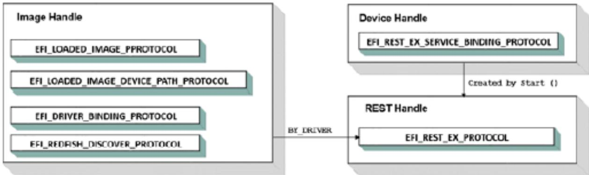

The Stop() function tells the Redfish Discover Driver to stop managing a device driver. The Stop() function can destroy one or more of the device handles (or its child handles) that being managed by Redfish Discover Driver. A Redfish Discover Driver should stop the in-process discovery and destroy corresponding child handle which was created in a previous call to Start(), or in AcquireRedfishService().

## 31.1.3 EFI Redfish Discover Client

An EFI Redfish client invokes EFI Redfish Discover Protocol to acquire the ready-to-use EFI REST EX protocol instance.

Below is the conceptual figure of mechanism of EFI Redfish Discover Protocol. The first scenario is unicast M-SEARCH to verify Redfish service reported in SMBIOS type 42h. ..

1. EFI Redfish client invokes EFI Redfish Discover Protocol to acquire ready-to-use EFI REST EX for communicating with Redfish services reported in Redfish Host Interface (SMBIOS type 42h)

2. EFI Redfish Discover Protocol optionally verifies the existence of Redfish service by unicasting M-SEARCH to Redfish service according to the Redfish service information provided in Redfish Host Interface.

3. 3EFI Redfish Discover Protocol creates and configures REST EX instance for Redfish service according to the Redfish service information provided in Redfish Host Interface.

4. EFI Redfish clients communicate with Redfish service using EFI REST EX instance returned from EFI Redfish Discover protocol.

EFI Redfish client passes EFI\_REDFISH\_DISCOVERED\_TOKEN and the discovery options to EFI Redfish Discover Protocol. EFI\_EVENT is created by EFI Redfish client for retrieving EFI\_REDFISH\_DISCOVERED\_LIST once EFI Redfish Discover Protocol optionally verifies Redfish service reported by Redfish Host Interface. EFI Redfish client can listen to the notification of verified Redfish service in asynchronous or synchronous according to the setting of options indicated in EFI\_REDFISH\_DISCOVER\_FLAG.

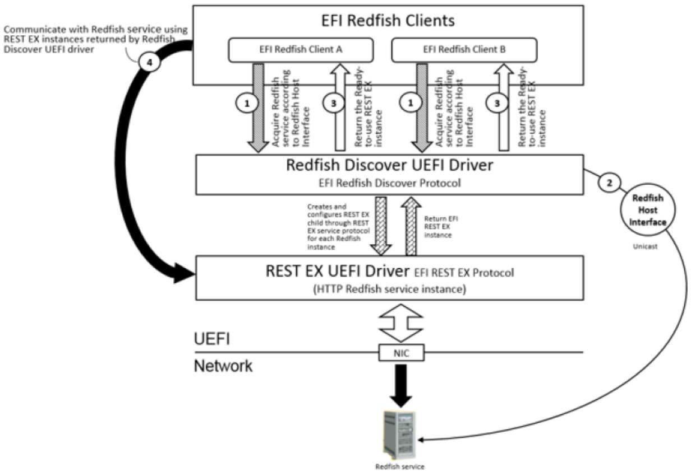

The second scenario is optionally provided by EFI Redfish Discover Protocol, which is multicast M-SEARCH to discover Redfish services.

1. EFI Redfish client gets the list of network interfaces if it would like to discover Redfish services on the certain network.

2. EFI Redfish client invokes EFI Redfish Discover Protocol to acquire ready-to-use EFI REST EX for communicating with Redfish services.

3. EFI Redfish Discover Protocol discovers Redfish services through SSDP over UDP.

4. EFI Redfish clients communicate with Redfish service using EFI REST EX instance returned from EFI Redfish Discover protocol.

EFI Redfish client passes EFI\_REDFISH\_DISCOVERED\_TOKEN and the discovery options to EFI Redfish Discover Protocol. EFI\_EVENT is created by EFI Redfish client for retrieving EFI\_REDFISH\_DISCOVERED\_LIST when any time EFI Redfish Discover Protocol discovers new Redfish service. EFI Redfish client can listen to the notification of new found Redfish service in asynchronous or synchronous according to the setting of options indicated in EFI\_REDFISH\_DISCOVER\_FLAG. Setting Timeout to zero in EFI\_REDFISH\_DISCOVERED\_TOKEN to waiting for the new discovered Redfish service in synchronously, otherwise asynchronous notification happens when new Redfish service is discovered by EFI Redfish Discover Protocol.


## 31.1.4 EFI Redfish Discover Protocol

## Summary

This protocol is utilized by EFI Redfish clients to acquire the list of Redfish services provided on platform or network.

Protocol GUID

```c
#define EFI_REDFISH_DISCOVER_PROTOCOL_GUID \
{0x5db12509, 0x4550, 0x4347,
{0x96, 0xb3, 0x73, 0xc0, 0xff, 0x6e, 0x86, 0x9f}}
```

## Protocol Interface Structure

<table><tr><td>typedef struct _EFI_REDFISH_DISCOVER_PROTOCOL { EFI_REDFISH_DISCOVER_NETWORK_LIST EFI_REDFISH_DISCOVER_ACQUIRE_SERVICE EFI_REDFISH_DISCOVER_ABORT_ACQUIRE EFI_REDFISH_DISCOVER_RELEASE_SERVICE} EFI_REDFISH_DISCOVER_PROTOCOL;</td></tr></table>

## Parameters

## GetNetworkInterfaceList

Get the list of network interfaces on which Redfish services could be discovered.

## AcquireRedfishService

Acquire the list of Redfish services.

## AbortAcquireRedfishService

Abort Redfish services acquire process.

## ReleaseRedfishService

Release Redfish services acquired from AcquireRedfishService().

## Description

EFI Redfish Discover Protocol provides a mechanism for EFI Redfish clients to acquire the Redfish services provided on the platform or network as described before.

## 31.1.4.1 EFI\_REDFISH\_DISCOVER\_PROTOCOL.GetNetworkInterfaceList()

## Summary

Get the currently available list of network interfaces on which Redfish services could be discovered.

## Protocol Interface

```txt
typedef
EFI_STATUS
(EFIAPI *EFI_REDFISH_DISCOVER_NETWORK_LIST)(
    IN EFI_REDFISH_DISCOVER_PROTOCOL    *This,
    IN EFI_HANDLE    ImageHandle,
    OUT UINTN    *NumberOfNetworkInterfaces,
    OUT EFI_REDFISH_DISCOVER_NETWORK_INTERFACE    **NetworkInterfaces
);
```

## Parameters

## This

This is the EFI\_REDFISH\_DISCOVER\_PROTOCOL instance.

## ImageHandle

EFI image to get network list. The image handle is caller’s image handle.

## NumberOfNetworkInterfaces

Number of network interfaces in NetworkInterfaces.

## NetworkInterfaces

It’s an array of instances. The number of entries in NetworkInterfaces is indicated by NumberOfNetworkInterfaces. Caller has to release the memory allocated by Redfish discover protocol with a call to EFI\_BOOT\_SERVICES.FreePool().

## Description

This function is used to get the list of network interfaces which can be used to send SSDP message over UDP protocol for the Redfish services discovery. The entry in NetworkInterfaces could be used as the parameter to EFI\_REDFISH\_DISCOVER\_PROTOCOL.AcquireRedfishService function for discovering Redfish service on specific network interface.

## Related Description

```c
//**********************************************************************
// EFI_REDFISH_DISCOVER_NETWORK_INTERFACE
//**********************************************************************
typedef struct {
    EFI_MAC_ADDRESS MacAddress;
    BOOLEAN IsIPv6;
```

(continues on next page)

(continued from previous page)

<table><tr><td>EFI_IP_ADDRESS</td><td>SubnetId;</td></tr><tr><td>UINT8</td><td>SubnetPrefixLength;</td></tr><tr><td>UINT16</td><td>VlanId;</td></tr><tr><td colspan="2">} EFI_REDFISH_DISCOVER_NETWORK_INTERFACE;</td></tr></table>

## Parameters

## MacAddress

MAC address of this network interface.

## IsIpv6

If TRUE, indicates the network interface is running IPv6. Otherwise the network interface is running IPv4.

## SubnetId

Subnet of this network.

## SubnetPrefixLength

Subnet prefix-length for IPv4 and IPv6.

VlanId

VLAN ID of this network interface.

Status Codes Returned

<table><tr><td>EFI_SUCCESS</td><td>Network interface is returned in NetworkInterfaces and the number of network interfaces is returned in NumbermOfNetworkInterfaces successfully.</td></tr><tr><td>EFI_INVALID_PARAMETER</td><td>One of below parameters is NULL. ImageHandle, NumberOfNetworkInterfaces, and NetworkInterfaces</td></tr><tr><td>EFI_UNSUPPORTED</td><td>Unable to return network interface list.</td></tr><tr><td>EFI_NOT_FOUND</td><td>No network interfaces are found.</td></tr><tr><td>EFI_OUT_OF_RESOURCE</td><td>Not enough resources to return network interfaces to caller.</td></tr></table>

## 31.1.4.2 EFI\_REDFISH\_DISCOVER\_PROTOCOL.AcquireRedfishService()

## Summary

This function acquires the list of discovered Redfish services.

Protocol Interface

```c
typedef
EFI_STATUS
(EFIAPI *EFI_REDFISH_DISCOVER_ACQUIRE_SERVICE)
    IN EFI_REDFISH_DISCOVER_PROTOCOL    *This,
    IN EFI_HANDLE    ImageHandle,
    IN EFI_REDFISH_DISCOVER_NETWORK_INTERFACE    *TargetNetworkInterface OPTIONAL,
    IN EFI_REDFISH_DISCOVER_FLAG    Flags,
    IN EFI_REDFISH_DISCOVERED_TOKEN    *Token
);
```

## Parameters

## This

This is the EFI\_REDFISH\_DISCOVER\_PROTOCOL instance.

## ImageHandle

EFI image acquires Redfish service discovery. The image handle is caller’s image handle.

## TargetNetworkInterface

The target Network Interface which is used to discover Redfish services. Set to NULL to discover Redfish services on all network interfaces.

Flags

Options of Redfish service discovery.

## Token

EFI\_REDFISH\_DISCOVERED\_TOKEN instance. The memory of

EFI\_REDFISH\_DISCOVERED\_LIST and the strings in

EFI\_REDFISH\_DISCOVERED\_INFORMATION are all allocated by

AcquireRedfishService() and must be freed when caller invokes

ReleaseRedfishService().

## Description

This function is used to acquire the list of Redfish services which are discovered according to Redfish Host Interface or through SSDP over UDP. Redfish services discovery through SSDP over UDP could be achieved via network interface specified in TargetNetworkInterface or via all network interfaces if TargetNetworkInterface is specified as NULL. EFI\_REDFISH\_DISCOVERED\_LIST is returned to EFI Redfish client by signaling the EFI event created by client. Each of EFI handle in EFI\_REDFISH\_DISCOVERED\_LIST has the corresponding EFI REST EX instance installed on it. Each REST EX instance is a child instance which is created through EFI REST EX service binding protocol and used by EFI Redfish client for communicating with specific Redfish service. In AcquireRedfishService(), UDP child is created and opened to do SSDP discovery. This UDP child will be destroyed right away after the discovery is done. AcquireRedfishService()also creates and opens REST EX child to configures REST EX instance according to Redfish service information retuned in M-SEARCH response or Redfish Host Interface. REST EX child must be closed after REST EX child is configured. EFI Redfish client must open REST EX instance from RedfishRestExHandle returned in EFI\_REDFISH\_DISCOVERED\_INFORMATION and close REST EX instance once EFI Redfish client is no longer communicating with Redfish service.

## Related Description

<table><tr><td colspan="2">//**********</td></tr><tr><td colspan="2">// EFI_REDFISH_DISCOVER_FLAG</td></tr><tr><td colspan="2">//**********</td></tr><tr><td>#define EFI_REDFISH_DISCOVER_HOST_INTERFACE</td><td>0x00000001</td></tr><tr><td>#define EFI_REDFISH_DISCOVER_SSDP</td><td>0x00000002</td></tr><tr><td>#define EFI_REDFISH_DISCOVER_SSDP_UDP6</td><td>0x00000004</td></tr><tr><td>#define EFI_REDFISH_DISCOVER_KEEP_ALIVE</td><td>0x00000008</td></tr><tr><td>#define EFI_REDFISH_DISCOVER_RENEW</td><td>0x00000010</td></tr><tr><td>#define EFI_REDFISH_DISCOVER_VALIDATION</td><td>0x80000000</td></tr><tr><td>#define EFI_REDFISH_DISCOVER_DURATION_MASK</td><td>0x0f000000</td></tr></table>

EFI\_REDFISH\_DISCOVER\_FLAG is used to indicate the options when EFI Redfish clients acquire Redfish discover list through this protocol. Redfish Discover Protocol discovers Redfish service according to Redfish Host Interface when EFI\_REDFISH\_DISCOVER\_HOST\_INTERFACE is set to TRUE. Redfish Discover Protocol also optionally discovers Redfish services using SSDP UPnP M-SEARCH request through UDP Port 1900. Redfish Discover Protocol returns EFI\_INVALID\_PARAMETER if none of EFI\_REDFISH\_DISCOVER\_HOST\_INTERFACE and EFI\_REDFISH\_DISCOVER\_SSDP is set to TRUE. Set EFI\_REDFISH\_DISCOVER\_SSDP\_UDP6 to indicate using IPv6 as internet protocol. For the Redfish service discovery according to Redfish Host Interface, Redfish service information like IP address is descripted in Redfish Host Interface. EFI Redfish client can set EFI\_REDFISH\_DISCOVER\_VALIDATION to TRUE to ask Redfish Discover Protocol to validate this Redfish service using IP address described in Redfish Host Interface. Redfish Discover Protocol unicasts UPnP M-SEARCH request to the target Redfish service and verify the response message to determine if the target Redfish service is existing or not. EFI\_REDFISH\_DISCOVER\_VALIDATION doesn’t afect the SSDP discovery. For Redfish SSDP discovery, the responses of the multicast UPnP M-SEARCH request imply the valid Redfish services are existing.

According to UPnP device architecture, the maximum waiting time of the response to UPnP M-SEARCH request is indicated in MX message header. The value is greater or equal to 1 to less than 5 inclusive in second. In order to give the chance to those Redfish services which do not respond to M-SEARCH in time, set EFI\_REDFISH\_DISCOVER\_KEEP\_ALIVE to TRUE to tell Redfish Discover Protocol keeps to sending multicast M-SEARCH request. The duration of periodical multicast request is declared in EFI\_REDFISH\_DISCOVER\_DURATION\_MASK. The value indicated in EFI\_REDFISH\_DISCOVER\_DURATION\_MASK means 2 to the power of duration. The valid value of duration is greater or equal to 3 and less or equal to 15. The corresponding duration is 8 to 2^15 seconds. Minimum duration is set to 8 seconds in order to keep the duration out of scope of MX value defined in UPnP device architecture. Duration is only valid when EFI\_REDFISH\_DISCOVER\_KEEP\_ALIVE is set to TRUE and EFI\_REDFISH\_DISCOVER\_SSDP is set to TRUE.

Redfish Discover Protocol maintains an internal database of Redfish services it found. It also maintains the EFI image which owns the EFI REST EX instance of discovered Redfish services. Redfish Discover Protocol only signals EFI Redfish client with new found of Redfish services instead of notifying EFI Redfish client the duplicate Redfish services found earlier, unless EFI\_REDFISH\_DISCOVER\_RENEW is set to TRUE. Set EFI\_REDFISH\_DISCOVER\_RENEW to TRUE forces Redfish Discover Protocol to notify EFI Redfish clients all found Redfish services, even the Redfish service which was already discovered and notified previously.

```c
//**********************************************************************
// EFI_REDFISH_DISCOVERED_TOKEN
//**********************************************************************
#define REDFISH_DISCOVER_TOKEN_SIGNATURE SIGNATURE 32 ('R', 'F', 'T', 'S')
typedef struct {
    UINT32    Signature
    EFI_REDFISH_DISCOVERED_LIST    DiscoveredList;
    EFI_EVENT    Event;
    UINTN    Timeout;
} EFI_REDFISH_DISCOVERED_TOKEN;
```

## Description

EFI\_REDFISH\_DISCOVERED\_TOKEN is created by EFI Redfish client and passed to AcquireRedfishService().

## Parameters

## Signature

The token signature should be the value of REDFISH\_DISCOVER\_TOKEN\_SIGNATURE defined above.

## DiscoveredList

Structure of EFI\_REDFISH\_DISCOVERED\_LIST to retrieve the discovered Redfish services.

## Event

EFI event at the TPL\_CALLBACK level created by EFI Redfish client, which is used to be notified when Redfish services are discovered or any errors occurred during discovery.

## Timeout

The timeout value declared in EFI\_REDFISH\_DISCOVERED\_TOKEN determines the seconds to drop discovery process. Basically, the nearby Redfish services must give the response in >=1 and <= 5 seconds. The valid timeout value used for the asynchronous discovery is >= 1 and <= 5 seconds. Set the timeout to zero means to discover Redfish service synchronously.

```c
//******************************************************************
// EFI_REDFISH_DISCOVERED_LIST
//******************************************************************
typedef struct {
    UINTN    NumberOfServiceFound;
    EFI_REDFISH_DISCOVERED_INSTANCE *RedfishInstances;
} EFI_REDFISH_DISCOVERED_LIST;
```

## Description

The content of EFI\_REDFISH\_DISCOVERED\_LIST is filled by AcquireRedfishService() before signaling Event. NumberOfServiceFound must be set to 0 and RedfishInstances must be NULL when client invokes AcquireRedfishService(). The memory block for RedfishInstances is allocated by the EFI Redfish Discover Protocol,and will be freed by the EFI Redfish Discover Protocol as well in ReleaseRedfishService().

## Parameters

NumberOfServiceFound Number of Redfish services are discovered.

## RedfishInstances

Pointer to EFI\_REDFISH\_DISCOVERED\_INSTANCE, number of Redfish services are discovered is indicated in NumberOfServiceFound.

```c
//**********************************************************************
// EFI_REDFISH_DISCOVERED_INSTANCE
//**********************************************************************
typedef struct {
    EFI_STATUS Status;
    EFI_REDFISH_DISCOVERED_INFORMATION Information;
} EFI_REDFISH_DISCOVERED_INSTANCE;
```

## Description

This structure describes the status and the information of discovered Redfish service.

## Parameters

## Status

EFI status code of Redfish service discovery.

## Information

The information of Redfish service discovered. The information is only valid when Status is EFI\_SUCCESS. Refer to below description of EFI\_REDFISH\_DISCOVERED\_INSTANCE.

```c
//******************************************************************
// EFI_REDFISH_DISCOVERED_INFORMATION
//******************************************************************
typedef struct {
    EFI_HANDLE RedfishRestExHandle;
    BOOLEAN IsIPv6;
    EFI_IP_ADDRESS RedfishHostIpAddress;
    UINT16 RedfishVersion;
    CHAR16 *Location;
    CHAR16 *Uuid;
    CHAR16 *Os;
    CHAR16 *OsVersion;
```

(continues on next page)

<table><tr><td colspan="2">(continued from previous page)</td></tr><tr><td>CHAR16</td><td>*Product;</td></tr><tr><td>CHAR16</td><td>*ProductVersion;</td></tr><tr><td>BOOLEAN</td><td>UseHttps;</td></tr><tr><td colspan="2">} EFI_REDFISH_DISCOVERED_INFORMATION;</td></tr></table>

## Description

This structure describes each Redfish service information. The corresponding EFI REST EX protocol instance is also created and configured by EFI Redfish Discover Protocol for EFI Redfish client. The memory allocated for the information in this structure will be freed by EFI Redfish Discover Protocol in ReleaseRedfishService().

## Parameters

## RedfishRestExHandle

EFI handle which has EFI REST EX protocol instance installed on it. The EFI REST EX protocol instance is already configured by EFI Redfish Discover Protocol through EFI\_REST\_EX\_PROTOCOL .Configure() according to the Redfish host information discovered through Redfish Host Interface or SSDP.

## IsIPv6

Indicates the Redfish service is reached via IPv6 protocol.

## RedfishHostIpAddress

Redfish service host IP address.

## RedfishVersion

Redfish service version. The high byte of RedfishVersion is the major Redfish service version, low byte is the minor Redfish version. For example 0x100 is Redfish service. Redfish service version is acquired from “ST” header in the response of M-SEARCH request.

## Location

Redfish service host location, this information is acquired from “Server” header returned in the response of M-SEARCH request.

## Uuid

The UUID of Redfish service, this information is acquired from “USN” header defined in UPnP Device Architecture specification.

## Os

The OS provides Redfish service, this information is acquired from “Server” header returned in the response of M-SEARCH request. Below is the response in “Server” header defined in UPnP Device Architecture specification. SERVER:OS/version UPnP/1.1 product/version OsVersion Redfish service OS version, this information is acquired from “Server” header returned in the response of M-SEARCH request. Below is the response in “Server” header defined in UPnP Device Architecture specification. SERVER:OS/version UPnP/1.1 product/version

## Product

Product name, this information is extracted from “Server” header returned in the response of M-SEARCH request. Below is the response in “Server” header defined in UPnP Architecture Device specification. SERVER:OS/version UPnP/1.1 product/version

## ProductVersion

Product version, this information is acquired from “Server” header returned in the response of M-SEARCH request. Below is the response in “Server” header defined in UPnP Device Architecture specification. | SERVER:OS/version UPnP/1.1 product/version UseHttps Indicates the Redfish service is reached via HTTPS protocol.

## Status Codes Returned

<table><tr><td>EFI_SUCCESS</td><td>Acquire for Redfish service list is successful.</td></tr><tr><td>EFI_INVALID_PARAMETER</td><td></td></tr><tr><td></td><td>One or more of the following is TRUE:This is NULL.ImageHandle is NULL.Flags is 0 or the improper bit combination of option is set in Flag.Token is NULL.Token-&gt;Timeout is greater than 5 seconds.Token-&gt;Event is NULL.On input,Token-&gt;DiscoveredList.NumberOfServiceFound is not 0, orToken-&gt;DiscoveredList-&gt;RedfishInstances is not NULL.</td></tr><tr><td>Others</td><td>Fail to acquire the list of Redfish service.</td></tr></table>

## 31.1.4.3 EFI\_REDFISH\_DISCOVER\_PROTOCOL.AbortAcquireRedfishService()

## Summary

This function aborts Redfish service discovery on the given network interface.

## Protocol Interface

```txt
typedef
EFI_STATUS
(EFIAPI *EFI_REDFISH_DISCOVER_ABORT_ACQUIRE)(
    IN EFI_REDFISH_DISCOVER_PROTOCOL    *This,
    IN *EFI_REDFISH_DISCOVER_NETWORK_INTERFACE    *TargetNetworkInterface OPTIONAL
);
```

## Parameters

## This

This is the EFI\_REDFISH\_DISCOVER\_PROTOCOL instance.

## TargetNetworkInterface

The target Network Interface on which Redfish services discovery is in process. NULL to abort Redfish service discovery on all network interfaces

## Description

In AbortAcquireRedfishService(), to abort the in-process Redfish service, discovery is required for preventing unexpected behaviors from happening. This function has to cancel in-process SSDP, the unicast over Udp4/Udp6, close Udp4/Udp6 protocol and destroy the Udp4/Udp6 child. Also closes REST EX opened for configuring REST EX child instance.

## Status Codes Returned

<table><tr><td>EFI_SUCCESS</td><td>Redfish service discovery is aborted.</td></tr><tr><td>EFI_INVALID_PARAMETER</td><td></td></tr><tr><td></td><td>One or more of the following is TRUE: - This is NULL.</td></tr></table>

## 31.1.4.4 EFI\_REDFISH\_DISCOVER\_PROTOCOL.ReleaseRedfishService()

## Summary

This function releases the list of Redfish services discovered previously.

## Protocol Interface

<table><tr><td colspan="3">typedef</td></tr><tr><td colspan="3">EFI_STATUS</td></tr><tr><td colspan="3">(EFIAPI *EFI_REDFISH_DISCOVER_RELEASE_SERVICE) (</td></tr><tr><td>IN</td><td>EFI_REDFISH_DISCOVER_PROTOCOL</td><td>*This,</td></tr><tr><td>IN</td><td>EFI_REDFISH_DISCOVERED_LIST</td><td>*List</td></tr><tr><td colspan="3">);</td></tr></table>

## Parameters

## This

This is the EFI\_REDFISH\_DISCOVER\_PROTOCOL instance.

## List

The pointer to EFI\_REDFISH\_DISCOVERED\_LIST which lists the Redfish services to release.

## Description

The Redfish services which listed in List will be released in ReleaseRedfishService(). All memory blocks which were allocated for Redfish service information will be freed in this function. EFI REST EX protocol instance which was created in AcquireRedfishService() will be also destroyed in ReleaseRedfishService(). The Redfish service listed in \*\*List\* is not required to be identical or in the same order with EFI\_REDFISH\_DISCOVERED\_LIST retuned from AcquireRedfishService(). List is flexible to list any Redfish services which were discovered by AcquireRedfishService() earlier. In ReleaseRedfishService(), free the resource allocated for the discovered Redfish service indicated in EFI\_REDFISH\_DISCOVERED\_LIST.

## Status Codes Returned

<table><tr><td>EFI_SUCCESS</td><td>The Redfish services listed in **List* are released successfully.</td></tr><tr><td>EFI_INVALID_PARAMETER</td><td></td></tr><tr><td></td><td>One or more of the following is TRUE: - This is NULL. - List is NULL. - Invalid settings in *List.</td></tr></table>

## 31.1.5 Implementation Examples

## 31.1.5.1 Processes to Discover Redfish Services

The following flowchart delineates the EFI Redfish client processes of utilizing EFI Discover Protocol to discover Redfish service, abort discovery and release discovered Redfish service instance.

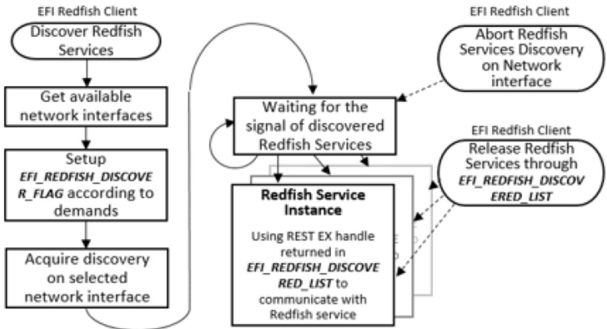

## 31.1.5.2 Network Interface Configuration

The EFI Redfish Discover Protocol provides a Redfish service discovery function to discover Redfish service through SMBIOS type 42 or optionally discover Redfish service on specific network interface. EFI Redfish Clients (EFI driver or EFI Application) can utilize the discover function to acquire Redfish service and manipulate Redfish properties to manage a system. For example, applying BIOS settings on the systems managed by Redfish Service. The system could be the one that runs EFI Redfish Client, or other systems on the network. If Redfish service is discovered according to SMBIOS type 42, then the platform developer has to create an SMBIOS type 42 entry with host (station) and Redfish Service information (Refer to DSP0270, Redfish Host Interface Specification). Besides discovering Redfish service using SMBIOS type 42, Redfish services can be also discovered by using SSDP over UDP. However, the network interface must be configured using either DHCP or static configuration prior to discovery of Redfish services. If the network interface is configured statically, then at least the IP address and Subnet mask must be configured for the station. The VLAN ID and new route entry may need to be configured depending on the networking environment if necessary.

Below is the implementation example for configuring network interface. Network interface could be configured in platform-implementation method. For example, platform developer can provide HII network options in BIOS setup utility. Network interface could be configured in statically or dynamically (DHCP) manner and the configuration could be stored in EFI variables or any platform non-volatile storage which may consumed by network stacks when each time system boot. This makes sure certain network interface is configured properly before EFI Redfish Clients utilizing EFI Redfish Discover Protocol.

The alternative of configuring network stack is system boots to EFI Shell and execute ifconfig shell command. This configures the settings of certain network interfaces. After this, network interface is ready to process Redfish service discovery by EFI Redfish Clients. However, this method requires user to configure network interface when each time system boot to EFI shell, unless other implementations of ifconfig EFI shell command is provided.

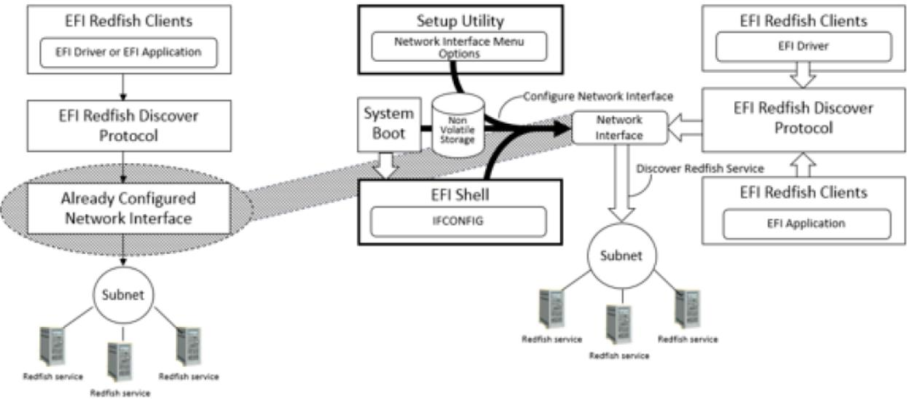

Once EFI Redfish Client is launched, it gets network interface information using EFI Redfish Discover protocol. EFI Redfish Client may provide selection UI of network interfaces for Redfish service discovery. EFI Redfish Client could manipulate Redfish properties such as BIOS Attributes on the discovered Redfish services for system management or deployment. EFI Redfish Client can also optionally maintain the information, location and other properties of discovered Redfish services in non-volatile storage for next system boots afterward.

## 31.2 EFI Redfish JSON Structure Converter

## 31.2.1 The Guidance of Writing EFI Redfish JSONStructure Converter

To provide interoperability between the Redfish service and the EFI environment, EFI Redfish JSON structure converters for each Redfish schema namespace should be implemented for EFI Redfish clients. This recommendation of writing EFI Redfish JSON structure converters is necessary to unify the implementation and capability of the converters.

• One converter supports one Redfish schema resource type; write the converter based on Redfish resource type. Using Redfish schema as an example:

— AccountService.v1\_0\_0.json: RedfishAccountService\_V1\_0\_0\_Dxe driver

— AttributeRegistry.v1\_2\_0.json: RedfishAttributeRegistry\_V1\_2\_0\_Dxe driver

— EthernetInterface.v1\_4\_0.json : EthernetInterface\_V1\_4\_0\_Dxe driver

• Redfish JSON structure converter can be delivered in source code package or binary (library or EFI driver) format.

• A C header file must be released with the Redfish JSON structure converter package. The package could be provisioned to conform to any EFI implementation, such as EFI EDKII open source.

• Provide documents which can describe the usage of structure members defined in REST JSON structure.

• The documentation can be published with a source code package, binary package, web site, online help, etc.

• Write the converter as an EFI DXE driver, and utilize EFI\_REST\_JSON\_STRUCTURE\_PROTOCOL to register the converter to provide the corresponding EFI\_REST\_JSON\_STRUCTURE\_PROTOCOL functions:

— ToStructure()

— ToJson()

— DestoryStructure()

## • FI\_REST\_JSON\_RESOURCE\_TYPE\_IDENTIFIER

## Namespace

ResourceTypeName:

String to Redfish schema resource type.

## MajorVersion:

String to Redfish schema major version, NULL string for non version controlled schema.

## MinorVersion:

String to Redfish schema minor version, NULL string for non version controlled schema.

ErrataVersion: String to Redfish schema errata version, NULL string for non version controlled schema. Datatype

## Datatype

String to data type defined in Redfish schema

## Examples

AccountService.v1\_0\_0.json

## Namespace

ResourceTypeName: “AccountService” MajorVersion:”1” MinorVersion:”0” ErrataVErsion:”0”

Datatype: “AccountService”

## Namespace

ResourceTypeName: “ComputerSystemCollection” MajorVersion:NULL MinorVersion:NULL ErrataVErsion:NULL

Datatype: “ComputerSystemCollection”

• Determine Redfish resource type according to the given JsonRsrcIdentifier. If the given JsonRsrcIdentifier is non-NULL, the Redfish resource structure converter must convert the JSON resource to the Redfish JSON structure according to the resource type and revision specified in JsonRsrcIdentifier. The converter should not refer to the resource type and revision according to Redfish namespace and datatype indicated in “odata.type” in JSON text resource. This prevents from the returned structure format is diferent with what consumer expects.

• Automatically determine the Redfish resource type. If the given JsonRsrcIdentifier is NULL, the EFI Redfish JSON structure converter should check the namespace and datatype indicated in “odata.type” in the JSON text resource. Parse this identifier property to retrieve the corresponding Redfish schema name space and data type, then decode the JSON text resource into the corresponding structure. EFI\_REST\_JSON\_RESOURCE\_TYPE\_IDENTIFIER in JsonStructure returned to consumer should be filled with the correct Redfish schema resource type information following the guidance mentioned above.

• All structure members for Redfish schema must be declared as C pointers. With this, the converter consumer can get the partial Redfish JSON properties from the converter. The consumer just initializes certain structure members, and the converter producer only converts non-NULL pointers in the given structure into corresponding Redfish JSON properties in text format.

## 31.2.2 The Guidance of Using EFI Redfish JSON Structure Converter

The consumer of EFI Redfish JSON structure converter utilizes EFI\_REST\_JSON\_STRUCTURE\_PROTOCOL for converting Redfish JSON resource to Redfish JSON structure and vice versa.

Refer to the converter document to include the C header file of the Redfish JSON structure converter into the build process. For example, include the converter’s EDKII package into an EFI module INF file for the C header file reference, or follow the build rule of other EFI implementations.

There are two ways for a consumer to convert JSON resources using the EFI\_REST\_JSON\_STRUCTURE\_PROTOCOL:

• Setup the crorect Redfish namespace and datatype in EFI\_REST\_JSON\_RESOURCE\_TYPE\_IDENTIFIER. This makes sure the EFI REST JSON Structure Protocol uses the exact converter that the consumer prefers for the conversion. In this case, the Redfish namespace and datatype indicated in “odata.type” in the EFI\_REST\_JSON\_RESOURCE\_TYPE\_IDENTIFIER is set to NULL. This means the converter may recognize the Redfish namespace and datatype indicated in “odata.type” in the JSON text resource, and converts it to the C structure it supports. In this case, the consumer has to be careful when using a C structure pointer to refer to the Redfish JSON structure.

• EFI\_REST\_JSON\_RESOURCE\_TYPE\_IDENTIFIER set to NULL means the returned structure format may not be in the same form as the consumer’s expectation. The consumer then has to check the EFI\_REST\_JSON\_RESOURCE\_TYPE\_IDENTIFIER for the Redfish namespace and datatype, and use the correct prototype for structure reference.

# SECURE BOOT AND DRIVER SIGNING

## 32.1 Secure Boot

This protocol is intended to provide access for generic authentication information associated with specific device paths. The authentication information is configurable using the defined interfaces. Successive configuration of the authentication information will overwrite the previously configured information. Once overwritten, the previous authentication information will not be retrievable.

## 32.1.1 EFI\_AUTHENTICATION\_INFO\_PROTOCOL

## Summary

This protocol is used on any device handle to obtain authentication information associated with the physical or logical device.

GUID

```c
#define EFI_AUTHENTICATION_INFO_PROTOCOL_GUID \
{0x7671d9d0, 0x53db, 0x4173, \
{0xaa, 0x69, 0x23, 0x27, 0xf2, 0x1f, 0x0b, 0xc7}}
```

## Protocol Interface Structure

```c
typedef struct _EFI_AUTHENTICATION_INFO_PROTOCOL {
    EFI_AUTHENTICATION_INFO_PROTOCOL_GET Get;
    EFI_AUTHENTICATION_INFO_PROTOCOL_SET Set;
} EFI_AUTHENTICATION_INFO_PROTOCOL;
```

## Parameters

Get()

Used to retrieve the Authentication Information associated with the controller handle

## Set()

Used to set the Authentication information associated with the controller handle

## Description

The EFI\_AUTHENTICATION\_INFO\_PROTOCOL provides the ability to get and set the authentication information associated with the controller handle.

## 32.1.2 EFI\_AUTHENTICATION\_INFO\_PROTOCOL.Get()

## Summary

Retrieves the Authentication information associated with a particular controller handle.

Prototype

```txt
typedef
EFI_STATUS
(EFIAPI *EFI_AUTHENTICATION_INFO_PROTOCOL_GET) (
    IN EFI_AUTHENTICATION_INFO_PROTOCOL *This,
    IN EFI_HANDLE ControllerHandle,
    OUT VOID **Buffer
);
```

## Parameters

## This

Pointer to the EFI\_AUTHENTICATION\_INFO\_PROTOCOL

## ControllerHandle

Handle to the Controller

## Bufer

Pointer to the authentication information. This function is responsible for allocating the bufer and it is the caller’s responsibility to free bufer when the caller is finished with bufer.

## Description

This function retrieves the Authentication Node for a given controller handle.

Status Codes Returned

<table><tr><td>EFI_SUCCESS</td><td>Successfully retrieved Authentication information for the given Controller-Handle</td></tr><tr><td>EFI_INVALID_PARAMETER</td><td>No matching Authentication information found for the given ControllerHandle</td></tr><tr><td>EFI_DEVICE_ERROR</td><td>The authentication information could not be retrieved due to a hardware error.</td></tr></table>

## 32.1.3 EFI\_AUTHENTICATION\_INFO\_PROTOCOL.Set()

## Summary

Set the Authentication information for a given controller handle.

Prototype

```txt
typedef
EFI_STATUS
(EFIAPI *EFI_AUTHENTICATION_INFO_PROTOCOL_SET) (
IN EFI_AUTHENTICATION_INFO_PROTOCOL **This,
IN EFI_HANDLE *ControllerHandle
IN VOID **Buffer
);
```

## Parameters

## This

Pointer to the EFI\_AUTHENTICATION\_INFO\_PROTOCOL

## ControllerHandle

Handle to the controller.

## Bufer

Pointer to the authentication information.

## Description

This function sets the authentication information for a given controller handle. If the authentication node exists corresponding to the given controller handle this function overwrites the previously present authentication information

Status Codes Returned

<table><tr><td>EFI_SUCCESS</td><td>Successfully set the Authentication node information for the given ControllerHandle.</td></tr><tr><td>EFI_UNSUPPORTED</td><td>If the platform policies do not allow setting of the Authentication information.</td></tr><tr><td>EFI_DEVICE_ERROR</td><td>The authentication node information could not be configured due to a hardware error.</td></tr><tr><td>EFI_OUT_OF_RESOURCES</td><td>Not enough storage is available to hold the data.</td></tr></table>

## 32.1.4 Authentication Nodes

The authentication node is associated with specific controller paths. There can be various types of authentication nodes, each describing a particular authentication method and associated properties.

## 32.1.5 Generic Authentication Node Structures

An authentication node is a variable length binary structure that is made up of variable length authentication information. The Table below defines the generic structure. The Authentication type GUID defines the corresponding authentication node.

Table 32.2: Generic Authentication Node Structure

<table><tr><td>Mnemonic</td><td>Byte Offset</td><td>Byte Length</td><td>Description</td></tr><tr><td>Type GUID</td><td>0</td><td>16</td><td>Authentication Type GUID</td></tr><tr><td>Length</td><td>16</td><td>2</td><td>Length of this structure in bytes.</td></tr><tr><td>Specific Authentication Data</td><td>18</td><td>n</td><td>Specific Authentication Data. Type defines the authentication method and associated type of data. Size of the data is included in the length.</td></tr></table>

All Authentication Nodes are byte-packed data structures that may appear on any byte boundary. All code references to Authentication Nodes must assume all fields are UNALIGNED. Since every Authentication Node contains a length field in a known place, it is possible to traverse Authentication Node of unknown type.

## 32.1.6 CHAP (using RADIUS) Authentication Node

This Authentication Node type defines the CHAP authentication using RADIUS information.

## GUID

```c
#define EFI_AUTHENTICATION_CHAP_RADIUS_GUID \
{0xd6062b50, 0x15ca, 0x11da, \
{0x92, 0x19, 0x00, 0x10, 0x83, 0xff, 0xca, 0x4d}}
```

## Node Definition

Table 32.3: CHAP Authentication Node Structure using RADIUS

<table><tr><td>Mnemonic</td><td>Byte Offset</td><td>Byte Length</td><td>Description</td></tr><tr><td>Type</td><td>0</td><td>16</td><td>EFI_A UTHENTICATION_C HAP_RADIUS_GUID</td></tr><tr><td>Length</td><td>16</td><td>2</td><td>Length of this structure in bytes. Total length is 58+P+Q+R+S+T</td></tr><tr><td>RADIUS IP Address</td><td>18</td><td>16</td><td>Radius IPv4 or IPv6 Address</td></tr><tr><td>Reserved</td><td>34</td><td>2</td><td>Reserved</td></tr><tr><td>NAS IP Address</td><td>36</td><td>16</td><td>NAS IPv4 or IPv6 Address</td></tr><tr><td>NAS Secret Length</td><td>52</td><td>2</td><td>NAS Secret LengthP</td></tr><tr><td>NAS Secret</td><td>54</td><td>p</td><td>NAS Secret</td></tr><tr><td>CHAP Secret Length</td><td>54+P</td><td>2</td><td>CHAP Secret Length Q</td></tr><tr><td>CHAP Secret</td><td>56+P</td><td>q</td><td>CHAP Secret</td></tr><tr><td>CHAP Name Length</td><td>56 +Q</td><td>2</td><td>CHAP Name Length R</td></tr><tr><td>CHAP Name</td><td>58+P+Q</td><td>r</td><td>CHAP Name String</td></tr><tr><td>Reverse CHAP Name Length</td><td>58+P+Q+R</td><td>2</td><td>Reverse CHAP Name length</td></tr><tr><td>Reverse CHAP Name</td><td>60+P+Q+R</td><td>S</td><td>Reverse CHAP Name</td></tr><tr><td>Reverse CHAP Secret Length</td><td>60+P+Q+R+S</td><td>2</td><td>Reverse CHAP Length</td></tr><tr><td>Reverse CHAP Secret</td><td>62+P+Q+R+S</td><td>T</td><td>Reverse CHAP Secret</td></tr></table>

## Summary

RADIUS IP Address. . . RADIUS Server IPv4 or IPv6 Address

NAS IP Address. . . Network Access Server IPv4 or IPv6 Address (OPTIONAL)

NAS Secret Length. . . Network Access Server Secret Length in bytes (OPTIONAL)

NAS Secret. . . Network Access Server secret (OPTIONAL)

CHAP Secret Length. . . CHAP Initiator Secret length in bytes

CHAP Secret. . . CHAP Initiator Secret

CHAP Name. . . Length CHAP Initiator Name Length in bytes

CHAP Name CHAP Initiator Name

Reverse CHAP name length Reverse CHAP name length

Reverse CHAP Name Reverse CHAP name

Reverse CHAP Secret Length Reverse CHAP secret length

Reverse CHAP Secret Reverse CHAP secret

## CHAP (using local database)Authentication Node

This Authentication Node type defines CHAP using local database information.

## GUID

```c
#define EFI_AUTHENTICATION_CHAP_LOCAL_GUID \
{0xc280c73e, 0x15ca, 0x11da, \
{0xb0, 0xca, 0x00, 0x10, 0x83, 0xff, 0xca, 0x4d}}
```

## Node Definition

Table 32.4: CHAP Authentication Node Structure using Local Database

<table><tr><td>Mnemonic</td><td>Byte Offset</td><td>Byte Length</td><td>Description</td></tr><tr><td>Type</td><td>0</td><td>16</td><td>EFI_AUTHENTICATION_CHAP_LOCAL_GUID</td></tr><tr><td>Length</td><td>16</td><td>2</td><td>Length of this structure in bytes. Total length is 58+P+Q+R+S+T</td></tr><tr><td>Reserved</td><td>18</td><td>2</td><td>Reserved for future use</td></tr><tr><td>User Secret Length</td><td>20</td><td>2</td><td>User Secret Length</td></tr><tr><td>User Secret</td><td>22</td><td>p</td><td>User Secret</td></tr><tr><td>User Name Length</td><td>22+p</td><td>2</td><td>User Name Length</td></tr><tr><td>User Name</td><td>24+p</td><td>q</td><td>User Name</td></tr><tr><td>CHAP Secret Length</td><td>24+p+q</td><td>2</td><td>CHAP Secret Length</td></tr><tr><td>CHAP Secret</td><td>26+p+q</td><td>r</td><td>CHAP Secret</td></tr><tr><td>CHAP Name Length</td><td>26+p+q+r</td><td>2</td><td>CHAP Name Length</td></tr><tr><td>CHAP Name</td><td>28+p+q+r</td><td>s</td><td>CHAP Name String</td></tr><tr><td>Reverse CHAP Name Length</td><td>58+P+Q+R</td><td>2</td><td>Reverse CHAP Name length</td></tr><tr><td>Reverse CHAP Name</td><td>60+P+Q+R</td><td>S</td><td>Reverse CHAP Name</td></tr><tr><td>Reverse CHAP Secret Length</td><td>60+P+Q+R+S</td><td>2</td><td>Reverse CHAP Length</td></tr><tr><td>Reverse CHAP Secret</td><td>62+P+Q+R+S</td><td>T</td><td>Reverse CHAP Secret</td></tr></table>

## Summary

User Secret Length. . . User Secret Length in bytes

User Secret. . . User Secret

User Name Length. . . User Name Length in bytes

User Name. . . User Name

CHAP Secret Length. . . CHAP Initiator Secret length in bytes

CHAP Secret. . . CHAP Initiator Secret

CHAP Name Length. . . CHAP Initiator Name Length in bytes

CHAP Name. . . CHAP Initiator Name

Reverse CHAP name length Reverse CHAP name length

Reverse CHAP Name Reverse CHAP name

Reverse CHAP Secret Length Reverse CHAP secret length Reverse CHAP Secret Reverse CHAP secret

## 32.2 UEFI Driver Signing Overview

This section describes a means of generating a digital signature for a UEFI executable, embedding that digital signature within the UEFI executable and verifying that the digital signature is from an authorized source. The UEFI specification provides a standard format for executables. These executables may be located on un-secured media (such as a hard drive or unprotected flash device) or may be delivered via a un-secured transport layer (such as a network) or originate from a un-secured port (such as ExpressCard device or USB device). In each of these cases, the system provider may decide to authenticate either the origin of the executable or its integrity (i.e., it has not been tampered with). This section describes a means of doing so.

## 32.2.1 Digital Signatures

As a rule, digital signatures require two pieces: the data (often referred to as the message) and a public/private key pair. In order to create a digital signature, the message is processed by a hashing algorithm to create a hash value. This hash value is, in turn, encrypted using a signature algorithm and the private key to create the digital signature.

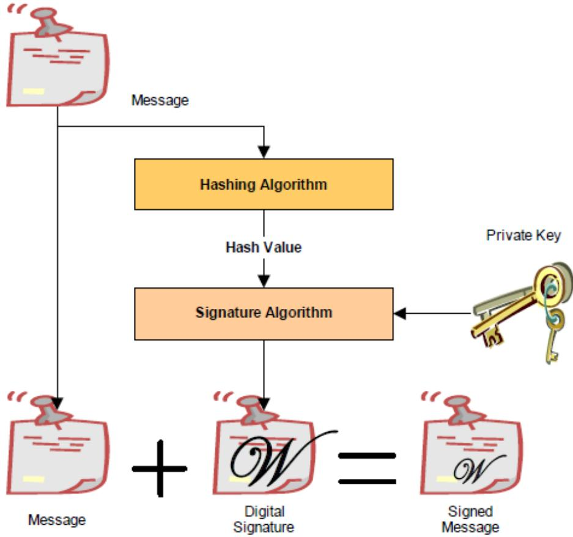  
Fig. 32.1: Creating A Digital Signature

In order to verify a signature, two pieces of data are required: the original message and the public key. First, the hash must be calculated exactly as it was calculated when the signature was created. Then the digital signature is decoded using the public key and the result is compared against the computed hash. If the two are identical, then you can be sure that message data is the one originally signed and it has not been tampered with.

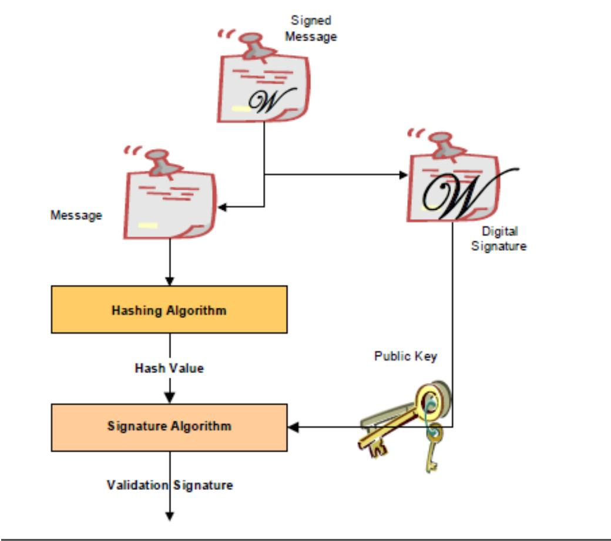  
Fig. 32.2: Veriying a Digital Signature

## 32.2.2 Embedded Signatures

The signatures used for digital signing of UEFI executables are embedded directly within the executable itself. Within the header is an array of directory entries. Each of these entries points to interesting places within the executable image. The fifth data directory entry contains a pointer to a list of certificates along with the length of the certificate areas. Each certificate may contain a digital signature used for validating the driver. The following diagram illustrates how certificates are embedded in the PE/COFF file:

Within the PE/COFF optional header is a data directory. The 5th entry, if filled, points to a list of certificates. Normally, these certificates are appended to the end of the file.

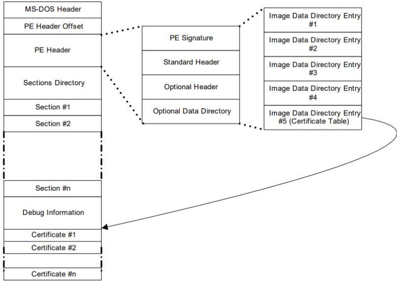  
Fig. 32.3: Embedded Digital Certificates

## 32.2.3 Creating Image Digests from Images

One of the pieces required for creating a digital signature is the image digest. For a detailed description on how to create image digests from PE/COFF images, refer to the “Creating the PE Image Hash” section of the Microsoft Authenticode Format specification (see References).

## 32.2.4 Code Definitions

This section describes data structures used for signing UEFI executables.

## 32.2.4.1 WIN\_CERTIFICATE

## Summary

The WIN\_CERTIFICATE structure is part of the PE/COFF specification.

## Prototype

```c
typedef struct _WIN_CERTIFICATE {
    UINT32 dwLength;
    UINT16 wRevision;
    UINT16 wCertificateType;
    //UINT8 bCertificate[ANYSIZE_ARRAY];
} WIN_CERTIFICATE;
```

## dwLength

The length of the entire certificate, including the length of the header, in bytes.

## wRevision

The revision level of the WIN\_CERTIFICATE structure. The current revision level is 0x0200.

## wCertificateType

The certificate type. See WIN\_CERT\_TYPE\_xxx for the UEFI certificate types. The UEFI specification reserves the range of certificate type values from 0x0EF0 to 0x0EFF.

## bCertificate

The actual certificate. The format of the certificate depends on wCertificateType. The format of the UEFI certificates is defined below.

## Related Definitions

<table><tr><td>#define WIN_CERT_TYPE_PKCS_SIGNED_DATA</td><td>0x0002</td></tr><tr><td>#define WIN_CERT_TYPE_EFI_PKCS115</td><td>0x0EF0</td></tr><tr><td>#define WIN_CERT_TYPE_EFI_GUID</td><td>0x0EF1</td></tr></table>

## Description

This structure is the certificate header. There may be zero or more certificates.

• If the wCertificateType field is set to WIN\_CERT\_TYPE\_EFI\_PKCS115, then the certificate follows the format described in WIN\_CERTIFICATE\_EFI\_PKCS1\_15.

• If the wCertificateType field is set to WIN\_CERT\_TYPE\_EFI\_GUID, then the certificate follows the format described in WIN\_CERTIFICATE\_UEFI\_GUID.

• If the wCertificateType field is set to WIN\_CERT\_TYPE\_PKCS\_SIGNED\_DATA then the certificate is formatted as described in the Authenticode specification.

These certificates can be validated using the contents of the signature database described in Signature Database . The following table illustrates the relationship between the certificates and the signature types in the database.

NOTE: In the case of a WIN\_CERT\_TYPE\_PKCS\_SIGNED\_DATA (or WIN\_CERT\_TYPE\_EFI\_GUID where Cert-Type = EFI\_CERT\_TYPE\_PKCS7\_GUID) certificate, a match can occur against an entry in the authorized signature database (or the forbidden signature database; UEFI Image Variable GUID & Variable Name ) at any level of the chain of X.509 certificates present in the certificate, and matches can occur against any of the applicable signature types defined in ( Firmware/OS Key Exchange: Passing Public Keys .

Table 32.5: PE/COFF Certificates Types and UEFI Signature Database Certificate Types

<table><tr><td>Image Certificate Type</td><td>Verified Using Signature Database Type</td></tr><tr><td></td><td>EFI_CERT_RSA2048_GUID (public key)</td></tr><tr><td>WIN_CERT_TYPE_EFI_PKCS115(Signature Size = 256 bytes)</td><td></td></tr><tr><td></td><td>EFI_CERT_RSA2048_GUID (public key)</td></tr><tr><td>WIN_CERT_TYPE_EFI_GUID(CertType = EFI_CERT_TYPE_RSA2048_SHA256_GUID)</td><td></td></tr></table>

continues on next page

Table 32.5 – continued from previous page

<table><tr><td>WIN_CERT_TYPE_EFI_GUID(CertType = EFI_CERT_TYPE_PKCS7_GUID)</td><td>EFI_CERT_X509_GUIDEFI_CERT_RSA2048_GUID (when applicable)EFI_CERT_X509_SHA256_GUID (when applicable)EFI_CERT_X509_SHA384_GUID (when applicable)EFI_CERT_X509_SHA512_GUID (when applicable) |EFI_CERT_X509_SM3_GUID (when applicable)</td></tr><tr><td>WIN_CERT_TYPE_PKCS_SIGNED_DATA</td><td>EFI_CERT_X509_GUIDEFI_CERT_RSA2048_GUID (when applicable)EFI_CERT_X509_SHA256_GUID (when applicable)EFI_CERT_X509_SHA384_GUID (when applicable)EFI_CERT_X509_SHA512_GUID (when applicable) |EFI_CERT_X509_SM3_GUID (when applicable)</td></tr><tr><td>(Always applicable regardless of whether a certificate is present or not)</td><td>EFI_CERT_SHA1_GUID,EFI_CERT_SHA224_GUID,EFI_CERT_SHA256_GUID,EFI_CERT_SHA384_GUID,EFI_CERT_SHA512_GUID, |EFI_CERT_SM3_GUIDIn this case, the database contains the hash of the image.</td></tr></table>

## 32.2.4.2 WIN\_CERTIFICATE\_EFI\_PKCS1\_15

Summary

Certificate which encapsulates the RSASSA\_PKCS1-v1\_5 digital signature.

Prototype

(continued from previous page)

```javascript
//UINT8 Signature[ANYSIZE_ARRAY];}WIN_CERTIFICATE_EFI_PKCS1_15;
```

## Hdr

This is the standard WIN\_CERTIFICATE header, where wCertificateType is set to WIN\_CERT\_TYPE\_EFI\_PKCS1\_15.

## HashAlgorithm

This is the hashing algorithm which was performed on the UEFI executable when creating the digital signature. It is one of the enumerated values pre-defined in EFI Hash Algorithms. See EFI\_HASH\_ALGORITHM\_x.

## Signature

This is the actual digital signature. The size of the signature is the same size as the key (2048-bit key is 256 bytes) and can be determined by subtracting the length of the other parts of this header from the total length of the certificate as found in Hdr.dwLength.

## Description

The WIN\_CERTIFICATE\_UEFI\_PKCS1\_15 structure is derived from WIN\_CERTIFICATE and encapsulates the information needed to implement the RSASSA-PKCS1-v1\_5 digital signature algorithm as specified in RFC2437, sections 8-9.

## 32.2.4.3 WIN\_CERTIFICATE\_UEFI\_GUID

## Summary

Certificate which encapsulates a GUID-specific digital signature.

Prototype

```txt
typedef struct _WIN_CERTIFICATE_UEFI_GUID {
    WIN_CERTIFICATE    Hdr;
    EFI_GUID    CertType;
    UINT8    CertData[ANYSIZE_ARRAY];
} WIN_CERTIFICATE_UEFI_GUID;
```

## Hdr

This is the standard WIN\_CERTIFICATE header, where wCertificateType is set to WIN\_CERT\_TYPE\_EFI\_GUID.

## CertType

This is the unique id which determines the format of the CertData.

## CertData

This is the certificate data. The format of the data is determined by the CertType.

## Related Definitions

```c
#define EFI_CERT_TYPE_RSA2048_SHA256_GUID
{0xa7717414, 0xc616, 0x4977, \
{0x94, 0x20, 0x84, 0x47, 0x12, 0xa7, 0x35, 0xbf}}
#define EFI_CERT_TYPE_PKCS7_GUID
{0x4aafd29d, 0x68df, 0x49ee, \
{0x8a, 0xa9, 0x34, 0x7d, 0x37, 0x56, 0x65, 0xa7}}
typedef struct _EFI_CERT_BLOCK_RSA_2048_SHA256 {
EFI_GUID HashType;
```

(continues on next page)

<table><tr><td></td><td>(continued from previous page)</td></tr><tr><td>UINT8</td><td>PublicKey[256];</td></tr><tr><td>UINT8</td><td>Signature[256];</td></tr><tr><td colspan="2">} EFI_CERT_BLOCK_RSA_2048_SHA256;</td></tr></table>

## PublicKey

The RSA exponent e for this structure is 0x10001.

## Signature

This signature block is PKCS 1 version 1.5 formatted.

## Description

The WIN\_CERTIFICATE\_UEFI\_GUID certificate type allows new types of certificates to be developed for driver authentication without requiring a new certificate type. The CertType defines the format of the CertData, which length is defined by the size of the certificate less the fixed size of the WIN\_CERTIFICATE\_UEFI\_GUID structure.

• If CertType is EFI\_CERT\_TYPE\_RSA2048\_SHA256\_GUID then the structure which follows has the format specified by EFI\_CERT\_BLOCK\_RSA\_2048\_SHA256.

• If CertType is EFI\_CERT\_TYPE\_PKCS7\_GUID then the CertData component shall contain a DER-encoded PKCS #7 version 1.5 [RFC2315] SignedData value.

## 32.3 Firmware/OS Key Exchange: Creating Trust Relationships

This section describes a means of creating a trust relationship between the platform owner, the platform firmware, and an operating system. This trust relationship enables the platform firmware and one or more operating systems to exchange information in a secure manner. The trust relationship uses two types of asymmetric key pairs:

## Platform Key (PK)

The platform key establishes a trust relationship between the platform owner and the platform firmware. The platform owner enrolls the public half of the key (PKpub) into the platform firmware. The platform owner can later use the private half of the key (PKpriv) to change platform ownership or to enroll a Key Exchange Key. See “Enrolling The Platform Key” and “Clearing The Platform Key” for more information.

## Key Exchange Key (KEK)

Key exchange keys establish a trust relationship between the operating system and the platform firmware. Each operating system (and potentially, each 3rd party application which need to communicate with platform firmware) enrolls a public key (KEKpub) into the platform firmware. See “Enrolling Key Exchange Keys” for more information.

While no Platform Key is enrolled, the SetupMode variable shall be equal to 1. While SetupMode == 1, the platform firmware shall not require authentication in order to modify the Platform Key, Key Enrollment Key, OsRecoveryOrder, OsRecovery####, and image security databases.

After the Platform Key is enrolled, the SetupMode variable shall be equal to 0. While SetupMode == 0, the platform firmware shall require authentication in order to modify the Platform Key, Key Enrollment Key, OsRecoveryOrder OsRecovery####, and image security databases.

While no Platform Key is enrolled, and while the variable AuditMode == 0, the platform is said to be operating in setup mode.

After the Platform Key is enrolled, and while the variable AuditMode == 0, the platform is operating in user mode. The platform will continue to operate in user mode until the Platform Key is cleared, or the system is transitioned to either Audit or Deployed Modes. See “Clearing The Platform Key,” “Transitioning to Audit Mode,” and “Transitioning to Deployed Mode” for more information.

Audit Mode enables programmatic discovery of signature list combinations that successfully authenticate installed EFI images without the risk of rendering a system unbootable. Chosen signature lists configurations can be tested to ensure the system will continue to boot after the system is transitioned out of Audit Mode. Details on how to transition to Audit Mode are detailed below in the section “Transitioning to Audit Mode.” After transitioning to Audit Mode, signature enforcement is disabled such that all images are initialized and enhanced Image Execution Information Table (IEIT) logging is performed including recursive validation for multi-signed images.

Deployed Mode is the most secure mode. For details on transitioning to Deployed Mode see the section “Transitioning to Deployed Mode” below. By design, both User Mode and Audit Mode support unauthenticated transitions to Deployed Mode. However, to move from Deployed Mode to any other mode requires a secure platform-specific method, or deleting the PK, which is authenticated.

Secure Boot Mode transitions to User Mode or Deployed Mode shall take efect immediately. Mode transitions to Setup Mode or Audit Mode may either take efect immediately (recommended) or after a reset. For implementations that require a reset, the mode transition shall be processed prior to the initialization of the SecureBoot variable, and the SetVariable() workflow shall be as follows:

1. If the variable has an authenticated attribute, it shall be authenticated as specified, and failure will result in immediate termination of this workflow by returning the appropriate error.

2. Check secure storage to determine if a Secure Boot Mode transition is already queued. If a transition is already queued, terminate this workflow by returning EFI\_ALREADY\_STARTED

3. Queue the request to secure storage

4. The Secure Boot Mode and Policy variables SHALL remain unchanged

5. Return EFI\_WARN\_RESET\_REQUIRED.

6. After reboot, if the transition is successful, Secure Boot Mode and Policy variables will change accordingly. If the transition to lower security modes is rejected or fail, the workflow is terminated and the Secure Boot Mode and Policy variables remain unchanged

## 32.3.1 Enrolling The Platform Key

The platform owner enrolls the public half of the Platform Key (PKpub) by calling the UEFI Boot Service SetVariable() as specified in Using the EFI\_VARIABLE\_AUTHENTICATION\_3 descriptor. If the platform is in setup mode, then the new PKpub may be signed with its PKpriv counterpart. If the platform is in user mode, then the new PKpub must be signed with the current PKpriv. When the platform is in setup mode, a successful enrollment of a Platform Key shall cause the platform to immediately transition to user mode.

The authenticated PK variable can always be read but can only be written if the platform is in setup mode, or if the platform is in user mode and the provided PKpub is signed with the current PKpriv.

The name and GUID of the Platform Key variable are specified in Globally Defined Variables “Globally Defined Variables” The variable has the format of a signature database as described in “Signature Database” below, with exactly one entry.

The platform vendor may provide a default PKpub in the PKDefault variable described in Globally Defined Variables. This variable is formatted identically to the Platform Key variable. If present, this key may optionally be used as the public half of the Platform Key when transitioning from setup mode to user mode. If so, it may be read, placed within an EFI\_VARIABLE\_AUTHENTICATION2 structure and copied to the Platform Key variable using the SetVariable() call.

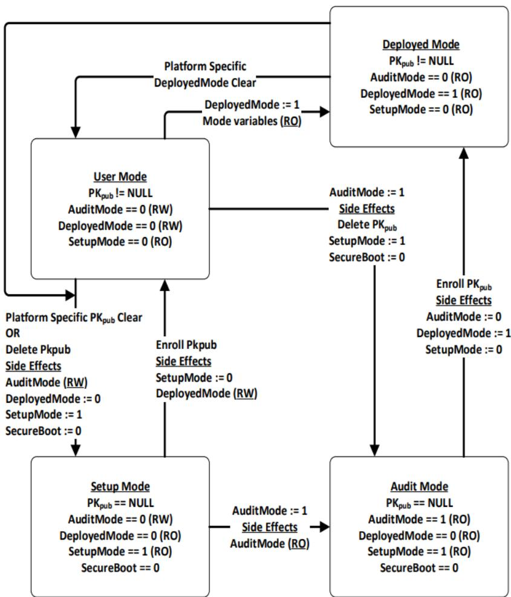  
Fig. 32.4: Secure Boot Modes

## 32.3.2 Clearing The Platform Key

The platform owner clears the public half of the Platform Key (PKpub) by deleting the Platform Key variable using UEFI Runtime Service SetVariable(). The data bufer submitted to the SetVariable() must be signed with the current PKpriv - see Variable Services for details. The name and GUID of the Platform Key variable are specified in Globally Defined Variables. The platform key may also be cleared using a secure platform-specific method. When the platform key is cleared, the global variable SetupMode must also be updated to 1.

## 32.3.3 Transitioning to Audit Mode

To enter Audit Mode, a new UEFI variable AuditMode is set to 1. Entering Audit Mode has the side efect of changing SetupMode == 1, PK is cleared, and the new DeployedMode == 0.

NOTE: The AuditMode variable is only writable before ExitBootServices() is called when the system is not in Deployed Mode. See Secure Boot Modes for more details.

## 32.3.4 Transitioning to Deployed Mode

To enter Deployed Mode from Audit Mode, set the variable PK. To enter Deployed Mode from User Mode, set the variable DeployedMode to 1. This transition takes efect immediately with no reset required. Entering Deployed Mode has the side efect of changing SetupMode == 0, AuditMode == 0 and is made read-only, and DeployedMode == 1 and is made read-only. See Secure Boot Modes for more details.

## 32.3.5 Enrolling Key Exchange Keys

Key exchange keys are stored in a signature database as described in “Signature Database” below. The signature database is stored as an authenticated UEFI variable.

The platform owner enrolls the key exchange keys by either calling SetVariable() as specified in Using the EFI\_VARIABLE\_AUTHENTICATION\_3 descriptor with the EFI\_VARIABLE\_APPEND\_WRITE attribute set and the Data parameter containing the new key(s), or by reading the database using GetVariable(), appending the new key exchange key to the existing keys and then writing the database using SetVariable() as specified in Using the EFI\_VARIABLE\_AUTHENTICATION\_3 descriptor without the EFI\_VARIABLE\_APPEND\_WRITE attribute set.

The authenticated UEFI variable that stores the key exchange keys (KEKs) can always be read but only be written if:

• The platform is in user mode, and the provided variable data is signed with the current $\mathrm { P K } _ { \mathrm { p r i v } } ;$ or if

• The platform is in setup mode, in which case the variable can be written without a signature validation, but the SetVariable() call needs to be formatted in accordance with the procedure for authenticated variables in Using the EFI\_VARIABLE\_AUTHENTICATION\_3 descriptor.

The name and GUID of the Key Exchange Key variable are specified in Globally Defined Variables, “Globally Defined Variables.” The platform vendor may provide a default set of Key Exchange Keys in the KEKDefault variable described in Globally Defined Variables. If present, these keys (or a subset) may optionally be used when performing the initial enrollment of Key Exchange Keys. If any are to be used, they may be parsed from the variable and enrolled as described above.

## 32.3.6 Platform Firmware Key Storage Requirements

This section describes the platform firmware storage requirements of the diferent types of keys.

## Platform Keys:

The public key must be stored in non-volatile storage which is tamper and delete resistant.

## Key Exchange Keys:

The public key must be stored in non-volatile storage which is tamper resistant. Careful consideration should be given to the security and configuration of any out-of-band management agent (e.g. hypervisor or service processor) such that the platform cannot exploit the management agent in order to circumvent Secure Boot.

## 32.4 Firmware/OS Key Exchange: Passing Public Keys

This section describes a means of passing public keys from the OS to the platform firmware so that these keys can be used to securely pass information between the OS and the platform firmware. Typically, the OS has been unable to communicate sensitive information or enforce any sort of policy because of the possibility of spoofing by a malicious software agent. That is, the platform firmware has been unable to trust the OS. By enrolling these public keys, authorized by the platform owner, the platform firmware can now check the signature of data passed by the operating system. Of course, if the malicious software agent is running as part of the OS, such as a rootkit, then any communication between the firmware and operating system still remains the subject of spoofing as the malicious code has access to the key exchange key.

## 32.4.1 Signature Database

## 32.4.1.1 EFI\_SIGNATURE\_DATA

## Summary

The format of a signature database.

## Prototype

```c
#pragma pack(1)
typedef struct _EFI_SIGNATURE_DATA {
    EFI_GUID SignatureOwner;
    UINT8 SignatureData [_];
} EFI_SIGNATURE_DATA;

typedef struct _EFI_SIGNATURE_LIST {
    EFI_GUID SignatureType;
    UINT32 SignatureListSize;
    UINT32 SignatureHeaderSize;
    UINT32 SignatureSize;
    // UINT8 SignatureHeader [SignatureHeaderSize];
    // EFI_SIGNATURE_DATA Signatures [_][SignatureSize];
} EFI_SIGNATURE_LIST;

#pragma pack()
```

## Members

## SignatureListSize

Total size of the signature list, including this header.

## SignatureType

Type of the signature. GUID signature types are defined in “Related Definitions” below.

## SignatureHeaderSize

Size of the signature header which precedes the array of signatures.

## SignatureSize

Size of each signature. Must be at least the size of EFI\_SIGNATURE\_DATA.

## SignatureHeader

Header before the array of signatures. The format of this header is specified by the SignatureType.

## Signatures

An array of signatures. Each signature is SignatureSize bytes in length. The format of the signature is defined by the SignatureType.

## SignatureOwner

An identifier which identifies the agent which added the signature to the list.

## Description

The signature database consists of zero or more signature lists. The size of the signature database can be determined by examining the size of the UEFI variable.

Each signature list is a list of signatures of one type, identified by SignatureType. The signature list contains a header and then an array of zero or more signatures in the format specified by the header. The size of each signature in the signature list is specified by SignatureSize.

Each signature has an owner SignatureOwner, which is a GUID identifying the agent which inserted the signature in the database. Agents might include the operating system or an OEM-supplied driver or application. Agents may examine this field to understand whether they should manage the signature or not.

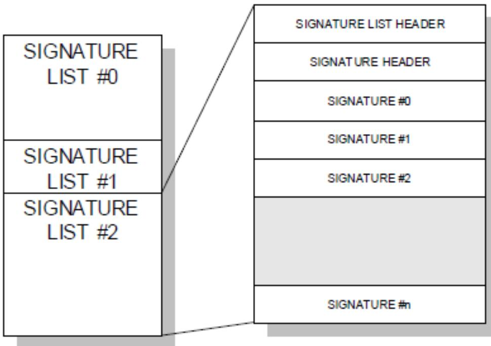  
Fig. 32.5: Signature Lists

## Related Definitions

```c
#define EFI_CERT_SHA256_GUID \
{ 0xc1c41626, 0x504c, 0x4092, \
{ 0xac, 0xa9, 0x41, 0xf9, 0x36, 0x93, 0x43, 0x28 } };
```

This identifies a signature containing a SHA-256 hash. The SignatureHeader size shall always be 0. The SignatureSize shall always be 16 (size of SignatureOwner component) + 32 bytes.

```c
#define EFI_CERT_RSA2048_GUID \
{ 0x3c5766e8, 0x269c, 0x4e34, \
{ 0xaa, 0x14, 0xed, 0x77, 0x6e, 0x85, 0xb3, 0xb6 } };
```

This identifies a signature containing an RSA-2048 key. The key (only the modulus since the public key exponent is known to be 0x10001) shall be stored in big-endian order.

The SignatureHeader size shall always be 0. The SignatureSize shall always be 16 (size of SignatureOwner component) + 256 bytes.

```c
#define EFI_CERT_RSA2048_SHA256_GUID \
{ 0xe2b36190, 0x879b, 0x4a3d, \
{ 0xad, 0x8d, 0xf2, 0xe7, 0xbb, 0xa3, 0x27, 0x84 } };
```

This identifies a signature containing a RSA-2048 signature of a SHA-256 hash. The SignatureHeader size shall always be 0. The SignatureSize shall always be 16 (size of SignatureOwner component) + 256 bytes.

```c
#define EFI_CERT_SHA1_GUID \
{ 0x826ca512, 0xcf10, 0x4ac9, \
{ 0xb1, 0x87, 0xbe, 0x01, 0x49, 0x66, 0x31, 0xbd } };
```

This identifies a signature containing a SHA-1 hash. The SignatureSize shall always be 16 (size of SignatureOwner component) + 20 bytes.

```c
#define EFI_CERT_RSA2048_SHA1_GUID \
{ 0x67f8444f, 0x8743, 0x48f1, \
{ 0xa3, 0x28, 0x1e, 0xaa, 0xb8, 0x73, 0x60, 0x80 } };
```

This identifies a signature containing a RSA-2048 signature of a SHA-1 hash. The SignatureHeader size shall always be 0. The SignatureSize shall always be 16 (size of SignatureOwner component) + 256 bytes.

```c
#define *EFI_CERT_X509_GUID* \
{ 0xa5c059a1, 0x94e4, 0x4aa7, \
{ 0x87, 0xb5, 0xab, 0x15, 0x5c, 0x2b, 0xf0, 0x72 } };
```

This identifies a signature based on a DER-encoded X.509 certificate. If the signature is an X.509 certificate then verification of the signature of an image should validate the public key certificate in the image using certificate path verification, up to this X.509 certificate as a trusted root. If the signature is in a device signature variable, this signature is one root certificate authority (CA) certificate or an intermediate certificate for the device. The SignatureHeader size shall always be 0. The SignatureSize may vary but shall always be 16 (size of the SignatureOwner component) + the size of the certificate itself.

NOTE: This means that each certificate will normally be in a separate EFI\_SIGNATURE\_LIST.

```c
#define EFI_CERT_SHA224_GUID \
{ 0xb6e5233, 0xa65c, 0x44c9, \
{0x94, 0x07, 0xd9, 0xab, 0x83, 0xbf, 0xc8, 0xbd} };
```

This identifies a signature containing a SHA-224 hash. The SignatureHeader size shall always be 0. The SignatureSize shall always be 16 (size of SignatureOwner component) + 28 bytes.

```c
#define EFI_CERT_SHA384_GUID \
{ 0xff3e5307, 0x9fd0, 0x48c9, \
{0x85, 0xf1, 0x8a, 0xd5, 0x6c, 0x70, 0x1e, 0x01}};
```

This identifies a signature containing a SHA-384 hash. The SignatureHeader size shall always be 0. The SignatureSize shall always be 16 (size of SignatureOwner component) + 48 bytes.

```c
#define EFI_CERT_SHA512_GUID \
{ 0x93e0fae, 0xa6c4, 0x4f50, \
{0x9f, 0x1b, 0xd4, 0x1e, 0x2b, 0x89, 0xc1, 0x9a}}
```

This identifies a signature containing a SHA-512 hash. The SignatureHeader size shall always be 0. The SignatureSize shall always be 16 (size of SignatureOwner component) + 64 bytes.

```c
#define EFI_CERT_X509_SHA256_GUID \
{ 0x3bd2a492, 0x96c0, 0x4079, \
{ 0xb4, 0x20, 0xfc, 0xf9, 0x8e, 0xf1, 0x03, 0xed } };
```

## Prototype

```c
#pragma pack(1)
typedef struct _EFI_CERT_X509_SHA256 {
    EFI_SHA256_HASH ToBeSignedHash;
    EFI_TIME TimeOfRevocation;
} EFI_CERT_X509_SHA256;
#pragma pack()
```

## Members

## ToBeSignedHash

The SHA256 hash of an X.509 certificate’s To-Be-Signed contents.

## TimeOfRevocation

The time that the certificate shall be considered to be revoked.

This identifies a signature containing the SHA256 hash of an X.509 certificate’s To-Be-Signed contents, and a time of revocation. If the signature is in a device signature variable, this signature is a SHA256 hash of a root certificate authority (CA) certificate or an intermediate certificate for the device. The SignatureHeader size shall always be 0. The SignatureSize shall always be 16 (size of the SignatureOwner component) + 48 bytes for an EFI\_CERT\_X509\_SHA256 structure. If the TimeOfRevocation is non-zero, the certificate should be considered to be revoked from that time and onwards, and otherwise the certificate shall be considered to always be revoked.

```c
#define EFI_CERT_X509_SHA384_GUID \
{ 0x7076876e, 0x80c2, 0x4ee6, \
{ 0xaa, 0xd2, 0x28, 0xb3, 0x49, 0xa6, 0x86, 0x5b } };
```

## Prototype

```c
#pragma pack(1)
typedef struct _EFI_CERT_X509_SHA384 {
    EFI_SHA384_HASH ToBeSignedHash;
    EFI_TIME TimeOfRevocation;
```

(continues on next page)

```cmake
} EFI_CERT_X509_SHA384; #pragma pack()
```

(continued from previous page)

## Members

## ToBeSignedHash

The SHA384 hash of an X.509 certificate’s To-Be-Signed contents.

## TimeOfRevocation

The time that the certificate shall be considered to be revoked.

This identifies a signature containing the SHA384 hash of an X.509 certificate’s To-Be-Signed contents, and a time of revocation. If the signature is in a device signature variable, this signature is a SHA384 hash of a root certificate authority (CA) certificate or an intermediate certificate for the device. The SignatureHeader size shall always be 0. The SignatureSize shall always be 16 (size of the SignatureOwner component) + 64 bytes for an EFI\_CERT\_X509\_SHA384 structure. If the TimeOfRevocation is non-zero, the certificate should be considered to be revoked from that time and onwards, and otherwise the certificate shall be considered to always be revoked.

```c
#define EFI_CERT_X509_SHA512_GUID \
{ 0x446dbf63, 0x2502, 0x4cda, \
{ 0xbc, 0xfa, 0x24, 0x65, 0xd2, 0xb0, 0xfe, 0x9d } };
```

## Prototype

```c
#pragma pack(1)
typedef struct _EFI_CERT_X509_SHA512 {
    EFI_SHA512_HASH ToBeSignedHash;
    EFI_TIME TimeOfRevocation;
} EFI_CERT_X509_SHA512;
#pragma pack()
```

## Members

## ToBeSignedHash

The SHA512 hash of an X.509 certificate’s To-Be-Signed contents.

## TimeOfRevocation

The time that the certificate shall be considered to be revoked.

This identifies a signature containing the SHA512 hash of an X.509 certificate’s To-Be-Signed contents, and a time of revocation. If the signature is in a device signature variable, this signature is a SHA512 hash of a root certificate authority (CA) certificate or an intermediate certificate for the device. The SignatureHeader size shall always be 0. The SignatureSize shall always be 16 (size of the SignatureOwner component) + 80 bytes for an EFI\_CERT\_X509\_SHA512 structure. If the TimeOfRevocation is non-zero, the certificate should be considered to be revoked from that time and onwards, and otherwise the certificate shall be considered to always be revoked.

```c
#define EFI_CERT_SM3_GUID \
{ 0x57347f87, 0x7a9b, 0x403a, \
{ 0xb9, 0x3c, 0xdc, 0x4a, 0xfb, 0x7a, 0xe, 0xbc } }
```

This identifies a signature containing a SM3 hash. The SignatureHeader size shall always be 0. The SignatureSize shall always be 16 (size of SignatureOwner component) + 32 bytes.

```c
#define EFI_CERT_X509_SM3_GUID \
{ 0x60d807e5, 0x10b4, 0x49a9, \
{0x93, 0x31, 0xe4, 0x4, 0x37, 0x88, 0x8d, 0x37 } }
```

## Prototype

```c
typedef UINT8 EFI_SM3_HASH[32];
#pragma pack(1)
typedef struct _EFI_CERT_X509_SM3 {
    EFI_SM3_HASH ToBeSignedHash;
    EFI_TIME TimeOfRevocation;
} EFI_CERT_X509_SM3;
#pragma pack()
```

## Members

## ToBeSignedHash

The SM3 hash of an X.509 certificate’s To-Be-Signed contents.

## TimeOfRevocation

The time that the certificate shall be considered to be revoked.

This identifies a signature containing the SM3 hash of an X.509 certificate’s To-Be-Signed contents, and a time of revocation. The SignatureHeader size shall always be 0. The SignatureSize shall always be 16 (size of the SignatureOwner component) + 32 bytes for an EFI\_CERT\_X509\_SM3 structure. If the TimeOfRevocation is non-zero, the certificate should be considered to be revoked from that time and onwards, and otherwise the certificate shall be considered to always be revoked.

```c
#define EFI_CERT_EXTERNAL_MANAGEMENT_GUID \
{ 0x452e8ced, 0xdfff, 0x4b8c, \
{ 0xae, 0x01, 0x51, 0x18, 0x86, 0x2e, 0x68, 0x2c } };
```

This SignatureType describes a pseudo-signature which will not facilitate authentication. It is only meaningful within a signature list used for authenticating writes through SetVariable(), and is only efective if it is the only signature present in that signature list. It allows a signature list to be populated without providing any means for SetVariable() to succeed. This signature type is intended for use on a platform with an external out-of-band management agent (e.g. hypervisor or service processor). When a platform is configured such that only signatures of this SignatureType are available for authenticating writes to a variable, that variable may only be modified by the external management agent using a platform-specific interface.

When a write may be authenticated using any signature from multiple signature lists, the presence of this signature in one of those signature lists does not inhibit the use of signatures present in the other signature lists. For example, if this signature is placed in PK, an attempt to write to db using SetVariable() will still succeed if it is signed by a valid KEKpriv, but a write to PK or KEK through SetVariable() cannot succeed because no PKpriv exists.

The SignatureHeader size shall always be 0. The SignatureSize shall always be 16 (size of SignatureOwner component) + 1 byte. The one byte of SignatureData exists only for compatibility reasons; It should be written as zero, and any value read should be ignored.

## 32.4.2 Image Execution Information Table

## Summary

When AuditMode==0, if the image’s signature is not found in the authorized database, or is found in the forbidden database, the image will not be started and instead, information about it will be placed in the EFI\_IMAGE\_EXECUTION\_INFO\_TABLE (see Image Execution Information Table).

When AuditMode==1, an EFI\_IMAGE\_EXECUTION\_INFO element is created in the EFI\_IMAGE\_EXECUTION\_INFO\_TABLE for every certificate found in the certificate table of every image that is validated.

Additionally for every image, an element will be created in the table for every EFI\_CERT\_SHAXXX that is supported by the platform. The contents of\* Action for each element are determined by comparing that specific element’s Signature (which will contain exactly 1 EFI\_SIGNATURE\_DATA ) to the currently-configured image security databases and policies, and shall be either EFI\_IMAGE\_EXECUTION\_AUTH\_SIG\_PASSED, EFI\_IMAGE\_EXECUTION\_AUTH\_SIG\_FAILED, EFI\_IMAGE\_EXECUTION\_AUTH\_SIG\_NOT\_FOUND, EFI\_IMAGE\_EXECUTION\_AUTH\_SIG\_FOUND, or EFI\_IMAGE\_EXECUTION\_POLICY\_FAILED.

Finally, because the system is in Audit Mode, all modules are initialized even if they fail to authenticate, and the EFI\_IMAGE\_EXECUTION\_INITIALIZED bit shall be set in Action for all elements

## Prototype

## Parameters

## Action

Describes the action taken by the firmware regarding this image. Type EFI\_IMAGE\_EXECUTION\_ACTION is described in “Related Definitions” below.

## InfoSize

Size of all of the entire structure.

## Name

If this image was a UEFI device driver (for option ROM, for example) this is the null-terminated, user-friendly name for the device. If the image was for an application, then this is the name of the application. If this cannot be determined, then a simple NULL character should be put in this position.

## DevicePath

Image device path. The image device path typically comes from the Loaded Image Device Path Protocol installed on the image handle. If image device path cannot be determined, a simple end-of-path device node should be put in this position.

## Signature

Zero or more image signatures. If the image contained no signatures, then this field is empty. The type WIN\_CERTIFICATE is defined in chapter 26.

## Prototype

```c
typedef struct {
    UINTN    NumberOfImages;
    EFI_IMAGE_EXECUTION_INFO    InformationInfo[_]
} EFI_IMAGE_EXECUTION_INFO_TABLE;
```

## NumberOfImages

Number of EFI\_IMAGE\_EXECUTION\_INFO structures.

## InformationInfo

NumberOfImages instances of EFI\_IMAGE\_EXECUTION\_INFO structures.

Related Definitions

<table><tr><td colspan="2">typedef UINT32 EFI_IMAGE_EXECUTION_ACTION;</td></tr><tr><td>#define EFI_IMAGE_EXECUTION_AUTHENTICATION</td><td>0x00000007</td></tr><tr><td>#define EFI_IMAGE_EXECUTION_AUTH_UNTESTED</td><td>0x00000000</td></tr><tr><td>#define EFI_IMAGE_EXECUTION_AUTH_SIG_FAILED</td><td>0x00000001</td></tr><tr><td>#define EFI_IMAGE_EXECUTION_AUTH_SIG_PASSED</td><td>0x00000002</td></tr><tr><td>#define EFI_IMAGE_EXECUTION_AUTH_SIG_NOT_FOUND</td><td>0x00000003</td></tr><tr><td>#define EFI_IMAGE_EXECUTION_AUTH_SIG_FOUND</td><td>0x00000004</td></tr><tr><td>#define EFI_IMAGE_EXECUTION_POLICY_FAILED</td><td>0x00000005</td></tr><tr><td>#define EFI_IMAGE_EXECUTION_INITIALIZED</td><td>0x00000008</td></tr></table>

## Description

This structure describes an image in the EFI System Configuration Table. It is only required in the case where image signatures are being checked and the image was not initialized because its signature failed, when AuditMode==1, or was not found in the signature database and an authorized user or the owner would not authorize its execution. It may be used in other cases as well.

In these cases, the information about the image is copied into the EFI System Configuration Table. Information about other images which were successfully initialized may also be included as well, but this is not required.

The Action field describes what action the firmware took with regard to the image and what other information it has about the image, including the device which it is related to.

First, this field describes the results of the firmware’s attempt to authenticate the image.

Table 32.6: Authentication Attempt Status Codes

<table><tr><td>Authentication attempt status</td><td>Condition met</td></tr><tr><td>EFI_IMAGE_EXECUTION_AUTH_UNTESTED</td><td>The image contained no certificates</td></tr><tr><td>EFI_IMAGE_EXECUTION_AUTH_SIG_FAILED</td><td>The image has at least one certificate, and either:An image certificate is in the forbidden database, orA digest of an image certificate is in the forbidden database, orThe image signature check failed.</td></tr><tr><td>EFI_IMAGE_EXECUTION_AUTH_SIG_PASSED</td><td>The image has at least one certificate, and either:An image certificate is in authorized database.The image digest is in the authorized database.</td></tr><tr><td>EFI_IMAGE_EXECUTION_AUTH_SIG_NOT_FOUND</td><td>The image has at least one certificate, and:the image certificate is not found in the authorized database, andthe image digest is not in the authorized database.</td></tr><tr><td>EFI_IMAGE_EXECUTION_AUTH_SIG_FOUND</td><td>The image has at least one certificate, and the image digest is in the forbidden database.</td></tr></table>

continues on next page

Table 32.6 – continued from previous page

<table><tr><td>Authentication attempt status</td><td>Condition met</td></tr><tr><td>EFI_IMAGE_EXECUTION_POLICY_FAILED</td><td>Authentication failed because of (unspecified) firmware security policy.</td></tr></table>

Second, this field describes whether the image was initialized or not.

This table can be used by an agent which executes later to audit which images were not loaded and perhaps query other sources to discover whether the image should be authorized. If so, the agent can use the method described in “Signature Database Update” to update the Signature Database with the image’s signature. Switching the system into Audit Mode generates a more verbose table which provides additional insights to this agent.

If an attempt to boot a legacy non-UEFI OS takes place when the system is in User Mode, the OS load shall fail and a corresponding EFI\_IMAGE\_EXECUTION\_INFO entry shall be created with Action set to EFI\_IMAGE\_EXECUTION\_AUTH\_UNTESTED, Name set to the NULL-terminated “Description String” from the BIOS Boot Specification Device Path and DevicePath set to the BIOS Boot Specification Device Path ( BIOS Boot Specification Device Path ).

## 32.5 UEFI Image Validation

## 32.5.1 Overview

This section describes a way to use the platform ownership model described in the previous section and the key exchange mechanism to allow the firmware to authenticate a UEFI image, such as an OS loader or an option ROM, using the digital signing mechanisms described here.

The hand-of between the platform firmware and the operating system is a critical part of ensuring secure boot. Since there are large numbers of operating systems and a large number of minor variations in the loaders for those operating systems, it is dificult to carry all possible keys or signatures within the firmware as it ships. This requires some sort of update mechanism, to identify the proper loader. But, as with any update mechanism, there is the risk of allowing malicious software to “authenticate” itself, posing as the real operating system.

Likewise, there are a large number of potential 3rd-party UEFI applications, drivers and option ROMs and it is dificult to carry all possible keys or signatures within the firmware as it ships.

The mechanism described here requires that the platform firmware maintain a signature database, with entries for each authorized UEFI image (the authorized UEFI signature database). The signature database is a single UEFI Variable.

It also requires that the platform firmware maintain a signature database with entries for each forbidden UEFI image. This signature database is also a single UEFI variable.

The signature database is checked when the UEFI Boot Manager is about to start a UEFI image. If the UEFI image’s signature is not found in the authorized database, or is found in the forbidden database, the UEFI image will be deferred and information placed in the Image Execution Information Table. In the case of OS Loaders, the next boot option will be selected. The signature databases may be updated by the firmware, by a pre-OS application or by an OS application or driver.

If a firmware supports the EFI\_CERT\_X509\_SHA\*\_GUID signature types, it should support the RFC3161 timestamp specification. Images whose signature matches one of these types in the forbidden signature database shall only be considered forbidden if the firmware either does not support timestamp verification, or the signature type has a time of revocation equal to zero, or the timestamp does not pass verification against the authorized timestamp and forbidden signature databases, or finally the signature type’s time of revocation is less than or equal to the time recorded in the image signature’s timestamp. If the timestamp’s signature is authorized by the authorized timestamp database and the time recorded in the timestamp is less than the time of revocation, the image shall not be considered forbidden provided it is not forbidden by any other entry in the forbidden signature database. Finally, this requires that firmware supporting timestamp verification must support the authorized timestamp database and have a suitable time stamping authority certificate in that database.

## 32.5.2 Authorized User

An authorized user (for the purposes of UEFI image security) is one who possesses a key exchange key (KEKpriv). This key is used to sign updates to the signature databases.

## 32.5.3 Signature Database Update

The Authorized, Forbidden, Timestamp, and Recovery signature databases are stored as UEFI authenticated variables (see Variable Services) for the GUID.

EFI\_IMAGE\_SECURITY\_DATABASE\_GUID and the names EFI\_IMAGE\_SECURITY\_DATABASE, EFI\_IMAGE\_SECURITY\_DATABASE1, EFI\_IMAGE\_SECURITY\_DATABASE2, and EFI\_IMAGE\_SECURITY\_DATABASE3, respectively.

These authenticated UEFI variables that store the signature databases (db, dbx, dbr, or dbt) can always be read but can only be written if:

• The platform is in user mode and the provided variable data is signed with the private half of a previously enrolled key exchange key (KEKpriv \*), or the platform private key (PK<sub>priv</sub>);

or if

• The platform is in setup mode (in this case the variables can be written without a signature validation, but the SetVariable() call needs to be formatted in accordance with the procedure for authenticated variables in Using the EFI\_VARIABLE\_AUTHENTICATION\_3 descriptor)

The signature databases are in the form of Signature Databases, as described in “Signature Database” above.

The platform vendor may provide a default set of entries for the Signature Database in the dbDefault, dbxDefault, dbtDefault, and dbrDefault variables described in Globally Defined Variables. If present, these keys (or a subset) may optionally be used when performing the initial enrollment of signature database entries. If any are to be used, they may be parsed from the variable and enrolled as described below.

If, when adding a signature to the signature database, SetVariable() returns EFI\_OUT\_OF\_RESOURCES, indicating there is no more room, the updater may discard the new signature or it may decide to discard one of the database entries. These authenticated UEFI variables that store the signature databases (db, or dbx, dbt, or dbr) can always be read but can only be written if:

The following diagram illustrates the process for adding a new signature by the OS or an application that has access to a previously enrolled key exchange key using SetVariable(). In the diagram, the EFI\_VARIABLE\_APPEND\_WRITE attribute is not used. If EFI\_VARIABLE\_APPEND\_WRITE had been used, then steps 2 and 3 could have been omitted and step 7 would have included setting the EFI\_VARIABLE\_APPEND\_WRITE attribute.

1. The procedure begins by generating a new signature, in the format described by the Signature Database.

2. Call GetVariable() using EFI\_IMAGE\_SECURITY\_DATABASE\_GUID for the\*VendorGuid\* parameter and EFI\_IMAGE\_SECURITY\_DATABASE for the VariableName parameter.

3. If the variable exists, go to step 5.

4. Create an empty authorized signature database.

5. Create a new bufer which contains the authorized signature database, along with the new signature appended to the end.

6. Sign the new signature database using the private half of the Key Exchange Key as described in SetVariable().

7. Update the authorized signature database using the UEFI Runtime Service SetVariable().

8. If there was no error, go to step 11.

9. If there was an error because of no more resources, determine whether the database can be shrunk any more. The algorithm by which an agent decides which signatures may be safely removed is agent-specific. In most cases, agents should not remove signatures where the SignatureOwner field is not the agent’s. If not, then go to step 11, discarding the new signature.

10. If the signature database could be shrunk further, then remove the entries and go to step 6.

11. Exit.

## 32.5.3.1 Using The Image Execution Information Table

During the process of loading UEFI images, the firmware must gather information about which UEFI images were not started. The firmware may additionally gather information about UEFI images which were started. The information is used to create the IEFI\_IMAGE\_EXECUTION\_INFO\_TABLE, which is added to the EFI System Configuration Table and assigned the GUID EFI\_IMAGE\_SECURITY\_DATABASE\_GUID.

For each UEFI image, the following information is collected:

• The image hash.

• The user-friendly name of the UEFI image (if known)

• The device path

• The action taken on the device (was it initialized or why was it rejected).

For more information, see the Image Execution Information Table definition above ( Image Execution Information Table).

## 32.5.3.2 Firmware Policy

The firmware may approve UEFI images for other reasons than those specified here. For example: whether the image is in the system flash, whether the device providing the UEFI image is secured (in a case, etc.) or whether the image contains another type of platform-supported digital signature.

## 32.5.3.3 Authorization Process

This section describes the process by which an unknown UEFI image might be authorized to run. Implementations are not required to support all portions of this. For example, an implementation might defer all UEFI image or none.

1. Reset. This is when the platform begins initialization during boot.

2. Key Store Initialization. During the firmware initialization and before any signed UEFI images are initialized, the platform firmware must validate the signature database.

3. UEFI Image Validation Succeeded? During initialization of an UEFI image, the UEFI Boot Manager decides whether or not the UEFI image should be initialized. By comparing the calculated UEFI image signature against that in one of the signature databases, the firmware can determine if there is a match.

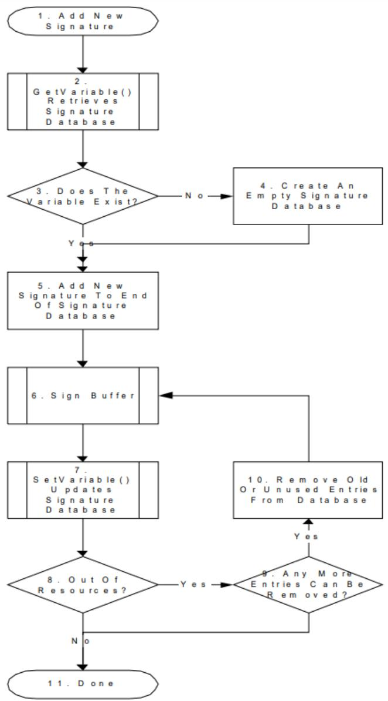  
Fig. 32.6: Process for Adding a New Signature by the OS

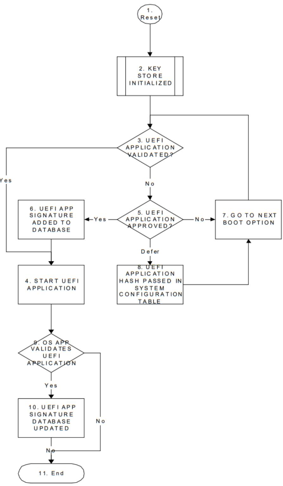  
Fig. 32.7: Authorization Process Flow

The security database db must either contain an entry with a hash value of the image (with a supported hash type), or it must contain an entry with a certificate against which an entry in the image’s certificate table can be verified. In either case verification must not succeed if the security database dbx contains any record with:

– A. Any entry with SignatureListType of EFI\_CERT\_SHA256\_GUID with any SignatureData containing the SHA-256 hash of the binary.

– B. Any entry with SignatureListType of EFI\_CERT\_X509\_SHA256, EFI\_CERT\_X509\_SHA384, or EFI\_CERT\_X509\_SHA512, with any SignatureData which reflects the To-Be-Signed hash included in any certificate in the signing chain of the signature being verified.

– C. Any entry with SignatureListType of EFI\_CERT\_X509\_GUID, with SignatureData which contains a certificate with the same Issuer, Serial Number, and To-Be-Signed hash included in any certificate in the signing chain of the signature being verified.

Multiple signatures are allowed to exist in the binary’s certificate table (as per the “Attribute Certificate Table” section of the Microsoft PE/COFF Specification). Only one hash or signature is required to be present in db in order to pass validation, so long as neither the hash of the binary nor any present signature is reflected in dbx.

Then, based on this match or its own policy, the firmware can decide whether or not to launch the UEFI image.

4. Start UEFI Image. If the UEFI Image is approved, then it is launched normally.

5. UEFI Image Not Approved. If the UEFI image was not approved the platform firmware may use other methods to discover if the UEFI image is authorized, such as consult a disk-based catalog or ask an authorized user. The result can be one of three responses: Yes, No or Defer.

6. UEFI Image Signature Added To Signature Database. If the user approves of the UEFI image, then the UEFI image’s signature is saved in the firmware’s signature database. If user approval is supported, then the firmware be able to update of the Signature Database. For more information, see Signature Database Update.

7. Go To Next Boot Option. If an UEFI image is rejected, then the next boot option is selected normally and go to step 3. This is in the case where the image is listed as a boot option.

8. UEFI Image Signature Passed In System Configuration Table. If user defers, then the UEFI image signature is copied into the Image Execution Information Table in the EFI System Configuration Table which is available to the operating system.

9. OS Application Validates UEFI Image. An OS application determines whether the image is valid.

10. UEFI Image Signature Added To Signature Database. For more information, see Signature Database Update.

11. End.

## 32.6 Device Authentication

## 32.6.1 Overview

This section describes a way to use the platform ownership model to authenticate a platform device during platform boot.

The platform firmware need maintain a device signature database (devdb), which includes a list of a root CA certificate or an intermediate certificate for the device. The root CA certificate or the intermediate certificate is used to authenticate the device. The device signature database is a single UEFI authenticated variable.

A device root CA certificate in the device signature database may be revoked. In this case, the platform firmware should update the device signature database to remove the old certificate and add a new certificate.

During the system boot, when a bus or device driver discovers a device, it follows below steps:

• The bus or device driver checks if the device authentication boot mode is enabled by reading L”devAuthBoot” variable. If the variable shows the device authentication boot mode is enabled, then the bus or device driver need perform following steps.

• The bus or device driver may consult a policy to see if it need authenticate this device. The policy is platform specific. It could be all external devices, all PCI devices, devices attached on certain ports, etc.

• The bus or device driver gets the device identity information, such as a device certificate or certificate chain. For example, the Secure Protocol and Data Model (SPDM) GET\_CERTIFICATE command.

• The bus or device driver verifies if the certificate chain is anchored by any root CA certificate or any intermediate certificate in the device signature database.

• The bus or device driver generates a nonce and uses a challenge/response protocol to verify if the device owns the private key associated with the device certificate. For example, the SPDM CHALLENGE or KEY\_EXCHANGE command.

• After the bus or device driver passes all verification for the device, the bus or device driver then enables the device on the UEFI firmware environment. For example, a PCI bus driver will assign bus number, allocate PCI IO/MMIO bar, and install EFI\_PCI\_IO\_PROTOCOL for the PCI device.

• If any verification fails, the bus or device driver ignores this device and notifies the platform. The platform firmware may take a platform specific action for the device or the platform. For example, a platform may ignore the device. A platform may disconnect or disable the PCI device. Or a platform may reboot the system or halt the system.

The device authentication flow only verifies the identity of the device and ensure it is a known device. But it does not verify if a device contains the latest certificate or if the device has the latest firmware.

• A device leaf certificate may be revoked. The device signature database does not need to be updated. This can be detected by the attestation. For example, if the platform enables trusted boot flow and the platform firmware extends the device certificate chain to the trust platform module (TPM) platform configuration register (PCR). A verifier can get the device certificate and check the known certificate revocation list (CRL) to see if it is revoked.

• A device may include an old version firmware. It is not related to the device signature database. This is also be detected by the attestation. For example, the platform firmware may extend the device firmware measurement to TPM PCR. A verifier can get the device firmware information and compare it with the known good device integrity measurement.

• In both above cases, a platform may define its own policy to perform more verification. For example, a platform may enroll a small set of known revoked certificate. Or a platform may enroll the minimal secure version number for some specific devices.

## 32.6.2 Authorized User

An authorized user (for the purposes of UEFI device authentication) is one who possesses a platform key (PKpriv). This key is used to sign updates to the device signature databases.

## 32.6.3 Device Signature Database Update

The Authorized device signature databases are stored as UEFI authenticated variables (see Variable Services) for the GUID EFI\_DEVICE\_SECURITY\_DATABASE\_GUID.

These authenticated UEFI variables that store the device signature databases (devdb) can always be read but can only be written if:

• The platform is in user mode and the provided variable data is signed with the private half of the platform private key (PKpriv); or if

• The platform is in setup mode (in this case the variables can be written without a signature validation, but the SetVariable() call needs to be formatted in accordance with the procedure for authenticated variables in the Using the EFI\_VARIABLE\_AUTHENTICATION\_3 descriptor section

The platform vendor may provide a default set of entries for the Signature Database in the devdbDefault variable described in the Globally Defined Variables section.

The flow to update the device signature database (devdb) is exactly same as the flow to update the image signature databases, which is described in the Signature Database Update section.

## 32.7 Code Definitions

## 32.7.1 UEFI Image Variable GUID & Variable Name

## Summary

Constants used for UEFI signature database variable access.

## Prototype

```c
#define EFI_IMAGE_SECURITY_DATABASE_GUID \
{ 0xd719b2cb, 0x3d3a, 0x4596, \
{ 0xa3, 0xbc, 0xda, 0xd0, 0x0e, 0x67, 0x65, 0x6f }}
#define EFI_IMAGE_SECURITY_DATABASE L"db"
#define EFI_IMAGE_SECURITY_DATABASE1 L"dbx"
#define EFI_IMAGE_SECURITY_DATABASE2 L"dbt"
#define EFI_IMAGE_SECURITY_DATABASE3 L"dbr"
```

## Description

• This GUID and name are used when calling the EFI Runtime Services GetVariable() and SetVariable().

• The EFI\_IMAGE\_SECURITY\_DATABASE\_GUID and EFI\_IMAGE\_SECURITY\_DATABASE are used to retrieve and change the authorized signature database.

• The EFI\_IMAGE\_SECURITY\_DATABASE\_GUID and EFI\_IMAGE\_SECURITY\_DATABASE1 are used to retrieve and change the forbidden signature database.

• The EFI\_IMAGE\_SECURITY\_DATABASE\_GUID and EFI\_IMAGE\_SECURITY\_DATABASE2 are used to retrieve and change the authorized timestamp signature database.

• The EFI\_IMAGE\_SECURITY\_DATABASE\_GUID and EFI\_IMAGE\_SECURITY\_DATABASE3 are used to retrieve and change the authorized recovery signature database.

• Firmware shall support the EFI\_VARIABLE\_APPEND\_WRITE flag (Variable Services) for the UEFI signature database variables.

• The signature database variables db, dbt, dbx, and dbr must be stored in tamper-resistant non-volatile storage.

## 32.7.2 UEFI Device Signature Variable GUID and Variable Name

## Summary

Constants used for UEFI device signature database variable access.

## Prototype

```c
#define EFI_DEVICE_SECURITY_DATABASE_GUID \
{0xb9c2b4f4, 0xbf5f, 0x462d, 0x8a, 0xdf, 0xc5, 0xc7, 0xa, 0xc3, 0x5d, 0xad}
v#define EFI_DEVICE_SECURITY_DATABASE L"devdb"
```

## Parameters

• This GUID and name are used when calling the EFI Runtime Services GetVariable() and SetVariable().

• The EFI\_DEVICE\_SECURITY\_DATABASE\_GUID and EFI\_DEVICE\_SECURITY\_DATABASE are used to retrieve and change the authorized device signature database.

• Firmware shall support the EFI\_VARIABLE\_APPEND\_WRITE flag (see Variable Services) for the UEFI device signature database variables.

• The device signature database variable dbdev must be stored in tamper-resistant nonvolatile storage.

# HUMAN INTERFACE INFRASTRUCTURE OVERVIEW

This section defines the core code and services that are required for an implementation of the Human Interface Infrastructure (HII). This specification does the following:

• Describes the basic mechanisms to manage user input

• Provides code definitions for the HII-related protocols, functions, and type definitions that are architecturally required by the UEFI Specification

## 33.1 Goals

This chapter describes the mechanisms by which UEFI-compliant systems manage user input. The major areas described include the following:

• String and font management.

• User input abstractions (for keyboards and mice)

• Internal representations of the forms (in the HTML sense) that are used for running a preboot setup.

• External representations (and derivations) of the forms that are used to pass configuration information to runtime applications, and the mechanisms to allow the results of those applications to be driven back into the firmware. General goals include:

• Simplified localization, the process by which the interface is adapted to a particular language.

• A “forms” representation mechanism that is rich enough to support the complex configuration issues encountered by platform developers, including stock keeping unit (SKU) management and interrelationships between questions in the forms.

• Definition of a mechanism to allow most or all the configuration of the system to be performed during boot, at runtime, and remotely. Where possible, the forms describing the configuration should be expressed using existing standards such as XML.

• Ability for the diferent drivers (including those from add-in cards) and applications to contribute forms, strings, and fonts in a uniform manner while still allowing innovation in the look and feel for Setup.

Support user-interface on a wide range of display devices:

• Local text display

• Local graphics display

• Remote text display

• Remote graphics display

• Web browser

• OS-present GUI

Support automated configuration without a display.

## 33.2 Design Discussion

This section describes the basic concepts behind the Human Interface Infrastructure. This is a set of protocols that allow a UEFI driver to provide the ability to register user interface and configuration content with the platform firmware. Unlike legacy option ROMs, the configuration of drivers and controllers is delayed until a platform management utility chooses to use the services of these protocols. UEFI drivers are not allowed to perform setup-like operations outside the context of these protocols. This means that a driver is not allowed to interact with the user outside the context of this protocol.

The following example shows a basic platform configuration or “setup” model. The drivers and applications install elements (such as fonts, strings, images and forms) into the HII Database, which acts as a central repository for the entire platform. The Forms Browser uses these elements to render the user interface on the display devices and receive information from the user via HID devices. When complete, the changes made by the user in the Forms Browser are saved, either to the UEFI global variable storage–( GetVariable() and SetVariable()– or to variable storage provided b the individual drivers.

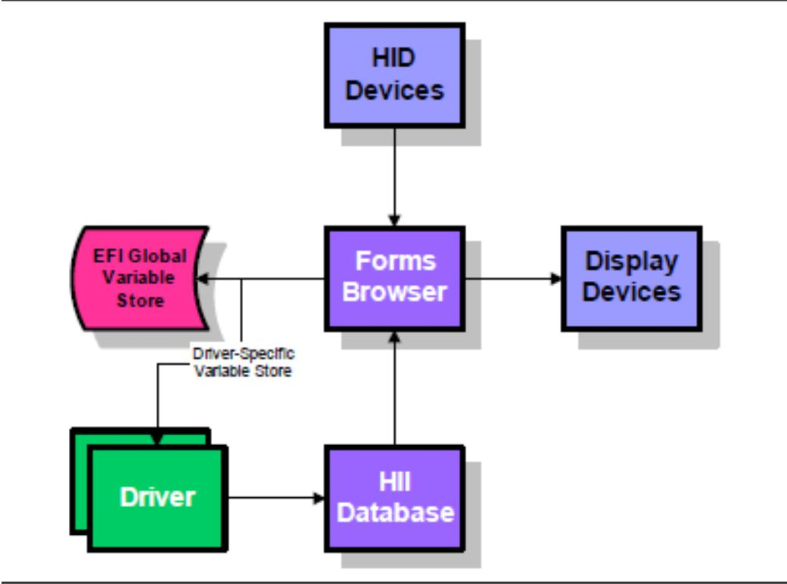  
Fig. 33.1: Platform Configuration Overview

## 33.2.1 Drivers And Applications

The user interface elements in the form of package lists are carried by the drivers and applications. Drivers and applications can create the package lists dynamically, or they can be pre-built and carried as resources in the driver/application image.

If they are stored as resources, then an editor can be used to modify the user interface elements without recompiling. For example, display elements can be modified or deleted, new languages added, and default values modified.

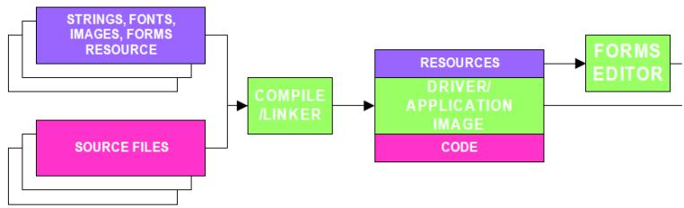  
Fig. 33.2: HII Resources In Drivers & Applications

The means by which the string, font, image and form resources are created is beyond the scope of this specification. The following diagram shows a few possible implementations. In both cases, the GUI design is an optional element and the user-interface elements are stored within a text-based resource file. Eventually, this source file is converted into a RES file (PE/COFF Resource Section) which can be linked with the main application.

## 33.2.1.1 Platform and Driver Configuration

The intent is for this specification to enable the configuration of various target components in the system. The normally arduous task of managing user interface and configuration can be greatly simplified for the consumers of such functionality by enabling the platform to comprehend some standard user interactions.

## 33.2.1.2 Pre-O/S applications

There are various scenarios where a platform component must interact in some fashion with the user. Examples of this are when presenting a user with several choices of information (e.g. boot menu) and sending information to the display (e.g. system status, logo, etc.)

## 33.2.1.3 Description of User Interface Components

Various components listed in this specification are described in greater detail in their own sections. The user interface is composed of several distinct components illustrated below.

## 33.2.1.4 Forms

This component describes what type of content needs to be displayed to the user by means of a binary encoding (i.e., Internal Forms Representation) and also has added context information such as how to validate certain input and further describes where to store such input if it is intended to be non-volatile. Applications such as a browser or script engine may use the information with the forms to validate configuration setting values with or without a user interface.

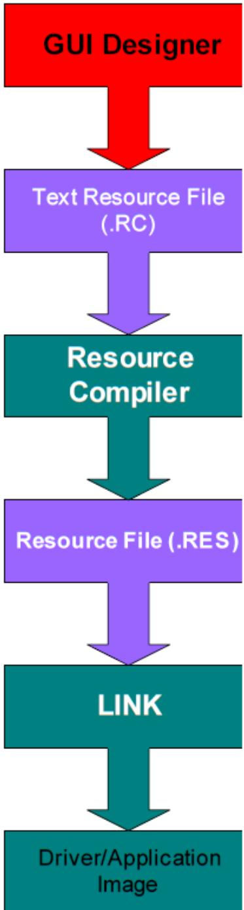  
Fig. 33.3: Creating UI Resources With Resource Files

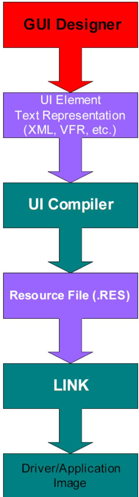  
Fig. 33.4: Creating UI Resources With Intermediate Source Representation

  
Fig. 33.5: The Platform and Standard User Interactions

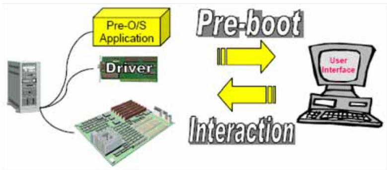  
Fig. 33.6: User and Platform Component Interaction

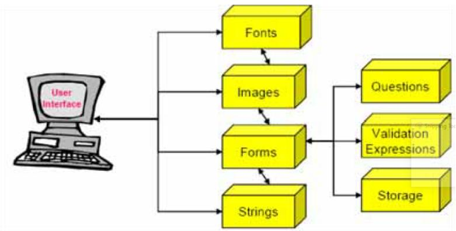  
Fig. 33.7: User Interface Components

## 33.2.1.5 Strings

The strings are the text-based (UCS-2 encoded) representations of the information typically being referenced by the forms. The intent of this infrastructure is also to seamlessly enable multiple language support. To that end the strings have the appropriate language designators to diferentiate one language from another.

## 33.2.1.6 Images/Fonts

Since most content is typically intended to have the ability to be rendered on the local system, the human interface infrastructure also supports the ability for images and fonts to be accepted and used by the underlying user interface components.

## 33.2.1.7 Consumers of the user interface data

The ultimate consumer of the user interface information will be some type of forms browser or forms processor. There are several usage scenarios which should be supported by this specification. These are illustrated below:

## 33.2.1.8 Connected forms browser/processor

The ability to have the forms processing engine render content when directly connected to the target platform should be apparent. From the forms processing engine perspective, this could be the local machine or a machine that is network attached. In either case, there is a constructed agent which feeds the material to the forms processor for purposes of rendering the user interface and interacting with the user. Note that a forms processor could simply act on the forms data without ever having to render the user interface and interact with the user. This situation is much more akin to script processing and should be a very supportable situation.

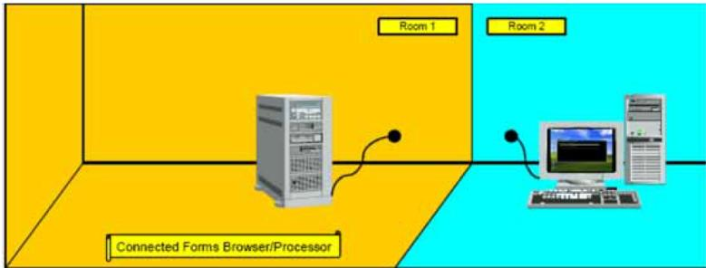  
Fig. 33.8: Connected Forms Browser/Processor

## 33.2.1.9 Disconnected Forms Browser/Processor

By enabling the ability to import and export a platform’s settings, this infrastructure can also enable the ability for ofline configuration. In this instance, a forms processor can interpret a given platform’s form data and enable (either through user interaction or through automated scripting) the changing of configuration settings. These settings can then be applied to the target platform when a connection is established.

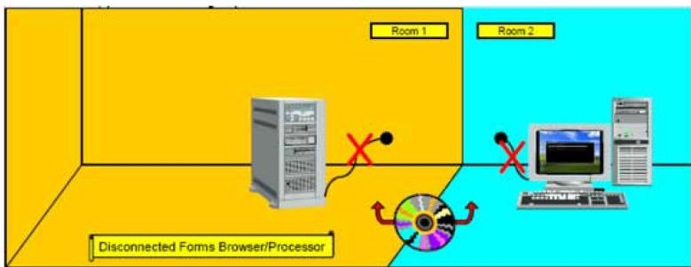  
Fig. 33.9: Disconnected Forms Browser/Processor

## 33.2.1.10 O/S-Present Forms Browser/Processor

When it is desired that the forms data be used in the presence of an O/S, this specification describes a means by which to support this capability. By being able to encapsulate the data and export it through standard means such that an O/S agent (e.g. forms browser/processor) can retrieve it, O/S-present usage models can be made available for further value-add implementations.

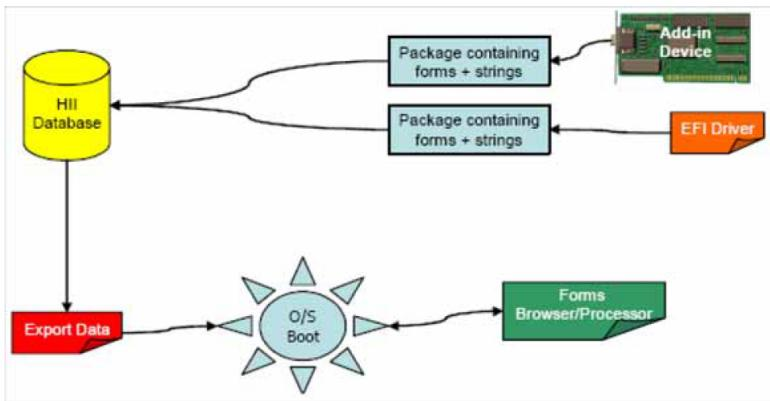  
Fig. 33.10: O/S-Present Forms Browser/Processor

## 33.2.1.11 Where are the Results Stored

The forms data encodes how to store the changes per configuration question. The ability to save data to the platform as well as to a proprietary on-board store is provided. The premise is that each of the target non-volatile store components (e.g. motherboard, add-in device, etc.) would advertise an interface as described in this specification so that the forms browser/processor can route changes to the appropriate target.

## 33.2.2 Localization

Localization is the process by which the interface is adapted to a particular language. The table below discusses issues with localization and provides possible solutions.

Table 33.1: Localization Issues

<table><tr><td>Issue</td><td>Example</td><td>Solution</td><td>Comment</td></tr></table>

Table 33.1 – continued from previous page

<table><tr><td>Directional display</td><td>Right to left printing for Hebrew.</td><td>Printing direction is a function of the language.</td><td>The display engine may or may not support all display techniques. If a language supports a display mechanism that the display engine does not, the language that uses the font must be selected.</td></tr><tr><td>Punctuation</td><td>Punctuation is directional. A comma in a right-to-left language is different from a comma in a left-to-right language.</td><td>Character choice is the choice of the author or translator.</td><td></td></tr><tr><td>Line breakage</td><td>Rules vary from language to language.</td><td>The UEFI pre-boot GUI performs little or no formatting.</td><td>The runtime display depends on the runtime browser and is not defined here.</td></tr><tr><td>Date and time</td><td>Most Europeans would write July 4, 1776, as 4/7/1776 while the United States would write it 7/4/1776 and others would write 1776/7/4. The separator characters between the parts of both date and time vary as well.</td><td>Generally left to the creator of the user interface.</td><td></td></tr><tr><td>Numbers</td><td>12,345.67 in one language is presented as 12.345,67 in another.</td><td>Print only integers and do not insert separator characters.</td><td>This solution is gaining acceptance around the world as more people use computers.</td></tr></table>

## 33.2.3 User Input

To limit the number of required glyphs, we must also limit the amount and type of user input.

User input generally comes from the following main types of devices:

• Keyboards

• Mouse-like pointing devices

Input from other devices, such as limited keys on a front panel, can be handled two ways:

• Treat the limited keys as special-purpose devices with completely unique interfaces.

• Programmatically make the limited keys mimic a keyboard or mouse-like pointing device.

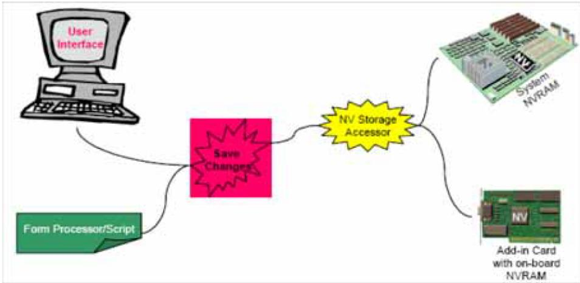  
Fig. 33.11: Platform Data Storage

Pointing devices require no localization. They are universally understood by the subset of the world population addressed in this specification. For example, if a person does not know how to use a mouse or other pointing device, it is probably not a good idea to allow that person to change a system’s configuration.

On the other hand, keyboards are localized at the keycaps but not in the electronics. In other words, a French keyboard and a German keyboard might have very diferent keys but the software inside the keyboard–let alone the software in the system at the other end of the wire–cannot know which set of keycaps are installed.

This specification proposes to solve this issue by using the keys that are common between keyboards and ignoring language-specific keys. Keys that are available on USB keyboards in preboot mode include the following:

• Function keys (F1 - F12)

• Number keys (0-9)

• “Upside down T” cursor keys (the arrows, home, end, page up, page down)

• Numeric keypad keys

• The Enter, Space, Tab, and Esc keys

• Modifier keys (shifts, alts, controls, Windows\*)

• Number lock

The scan codes for these keys do not vary from language to language. These keys are the standard keys used for browser navigation although most end-users are unaware of this fact. Help for form-entry-specific keys must be provided to enable a useful keys-only interface. The one case where other, language-specific keys may be used is to enter passwords. Because passwords are never displayed, there is no requirement to translate scan code to Unicode character codes (keyboard localization) or scan codes to font glyphs.

Additional data can be provided to enable a richer set of input characters. This input is necessary to support features such as arbitrary text input and passwords.

## 33.2.4 Keyboard Layout

## 33.2.4.1 Keyboard Mapping

UEFI’s keyboard mapping loosely based definitions on ISO 9995. It bases the naming mechanism on the figure below. The keys highlighted in brown are the keys that nearly all keyboard layouts use for customizations. However, customization does not necessarily mean that all the keys are diferent. In fact, most of the keys are likely to be the same. When modifying the mapping, one can normally reference the keys in brown as the likely candidates (for whom to create modifications).

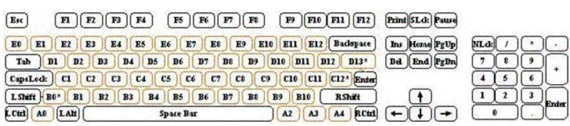  
Fig. 33.12: Keyboard Layout

Instead of referencing keys in hardware-specific ways such as scan codes, the HII specification defines an EFI\_KEY enumeration that allows for a simple method of referencing this hardware abstraction. Type EFI\_KEY is defined in EFI\_HII\_DATABASE\_PROTOCOL.GetKeyboardLayout(). It also provides a way to update the keyboard layout with a great deal of flexibility. Any of the keys can be mapped to any 16-bit Unicode character code or control code value.

When defining the values for a particular key, there are six elements that are pertinent to the key:

Key name — The EFI\_KEY enumeration defines the names of the above keys.

Unicode Character Code — Defines the Unicode Character Code (if any) of the named key.

Shifted UnicodeCharacter Code — Defines the Unicode Character Code (if any) of the named key while the shift modifier key is being pressed

Alt-GR Unicode Character Code — Defines the Unicode Character Code (if any) of the named key while the Alt-GR modifier key (if any) is being pressed.

Shifted Alt-GR UnicodeCharacter Code — Defines the Unicode Character Code (if any) of the named key while the Shift and Alt-GR modifier key (if any) is being pressed.

Modifier key value — Defines the nonprintable special function that this key has assigned to it.

• Under normal circumstances, a key that has any Unicode character code definitions generally has a modifier key value of EFI\_NULL\_MODIFIER. This value means the key has no special function other than the printing of a character. An exception to the rule is if any of the Unicode character codes have a value of 0xFFFF. Although rarely used, this value is the one case in which a key might have both a printable character and an active control key value.

An example of this exception would be the numeric keypad’s insert key. The definition for this key on a standard US keyboard is as follows:

```python
Key = EfiKeyZero
Unicode = 0x0030 (basically a '0')
ShiftedUnicode = 0xFFFF (the exception to the rule)
AltGrUnicode = 0x0000
ShiftedAltGrUnicode = 0x0000
Modifier = EFI_INSERT_MODIFIER
```

This key is one of the few keys that, under normal circumstances, prints something out but also has a special function. These special functions are generally limited to the numeric keypad; however, this general limitation does not prevent someone from having the flexibility of defining these types of variations.

## 33.2.4.2 Modifier Keys

The definitions of the modifier keys allow for special functionality that is not necessarily accomplished by a printable character. Many of these modifier keys are flags to toggle certain state bits on and of inside of a keyboard driver. An example is EFI\_CAPS\_LOCK\_MODIFIER. This state being active could alter what the typing of a particular key produces. Other control keys, such as EFI\_LEFT\_ARROW\_MODIFIER and EFI\_END\_MODIFIER, afect the position of the cursor. One modifier key is likely unfamiliar to most people who exclusively use US keyboards, and that key is the EFI\_ALT\_GR\_MODIFIER key. This key’s primary purpose is to activate a secondary type of shift modifier that exposes additional printable characters on certain keys. In some keyboard layouts, this key does not exist and is normally the EFI\_RIGHT\_ALT\_MODIFIER key. None of the other modifier key functions should be a mystery to someone familiar with the usage of a standard computer keyboard.

An example of a few descriptor entries would be as follows:

```hcl
Layout = {
EfiKeyLCtrl, 0, 0, 0, 0, *EFI_LEFT_CONTROL_MODIFIER, * // Left control
// key
EfiKeyA0, 0, 0, 0, 0, EFI_NULL_MODIFIER, // Not defined
// windows key
EfiKeySpaceBar, 0x0020, 0x0020, 0x0020, 0x0020, EFI_NULL_MODIFIER
//(Space Bar)
}
```

See “Related Definitions” in EFI\_HII\_DATABASE\_PROTOCOL.GetKeyboardLayout() for the defined modifier values.

## 33.2.4.3 Non-Spacing Keys

Non-spacing keys are a concept that provides the ability to OR together an accent key and another printable character. Non-spacing keys are defined as special types of modifier characters. They are typically accent keys that do not advance the cursor and in essence are a type of modifier key in that they maintain some level of state.

The way a person uses a non-spacing key is that the non-spacing key that maybe has the function of overlaying an umlaut (two dots) onto whatever the next character might be. The user presses the umlaut non-spacing key and follows it with a capital A, which yields an “Ä.”

An example of a few descriptor entries would be as follows:

```c
//
// If it's a dead key, we need to pass a list of physical key
// names, each with a unicode, shifted, altgr, shiftedaltgr
// character code. Each key name will have a Modifier value of
// EFI_NS_KEY_MODIFIER for the first entry, and then the list of
// EFI_NS_KEY_DEPENDENCY_MODIFIER physical key descriptions.
// This eventually will lead to the next normal non-modifier key
// definition.
//
// This requires defining an additional Modifier value of
// EFI_NS_KEY_DEPENDENCY_MODIFIER to signify
// EFI_NS_KEY_MODIFIER children definitions.
//
```

(continues on next page)

```c
// The keyboard driver (consumer of the layouts) will know that
// any key definitions with the EFI_NS_KEY_DEPENDENCY_MODIFIER
// modifier do not redefine the value of the specified EFI_KEY.
// They are simply used as a special case augmentation to the
// original EFI_NS_KEY_MODIFIER.
//
// It is an error condition to define a
// EFI_NS_KEY_MODIFIER without having all the
// EFI_NS_KEY_DEPENDENCY_MODIFIER keys defined serially.
//
Layout = {
EfiKeyE0, 0, 0, 0, 0, EFI_NS_KEY_MODIFIER,
EfiKeyC1, 0x00E2, 0x00C2, 0, 0, EFI_NS_KEY_DEPENDENCY_MODIFIER,
EfiKeyD3, 0x00EA, 0x00CA, 0, 0, EFI_NS_KEY_DEPENDENCY_MODIFIER,
EfiKeyD8, 0x00EC, 0x00CC, 0, 0, EFI_NS_KEY_DEPENDENCY_MODIFIER,
EfiKeyD9, 0x00F4, 0x00D4, 0, 0, EFI_NS_KEY_DEPENDENCY_MODIFIER,
EfiKeyD7, 0x00FB, 0x00CB, 0, 0, EFI_NS_KEY_DEPENDENCY_MODIFIER
}
```

In the above example, a key located at E0 is designated as a dead key. Using a common German keyboard layout as the example, a circumflex accent “^” is defined as a dead key at the E0 location. The A, E, I, O, and U characters are valid keys that can be pressed after the dead key and will produce a valid printable character. These characters are located at C1, D3, D8, D9, and D7 respectively.

The results of the Layout definition provided above would allow for the production of the following characters: âÂêÊîÎôÔûÛ.

## 33.2.5 Forms

This specification describes how a UEFI driver or application may present a forms (or dialogs) based interface. The forms-based interface assumes that each window or screen consists of some window dressing (title & buttons) and a list of questions. These questions represent individual configuration settings for the application or driver, although several GUI controls may be used for one question.

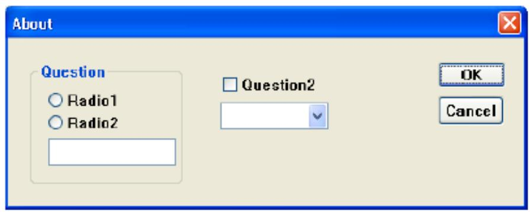  
Fig. 33.13: Forms-based Interface Example

The forms are stored in the HII database, along with the strings, fonts and images. The various attributes of the forms and questions are encoded in IFR (Internal Forms Representation)–with each object and attribute a byte stream.

Other applications (so-called “Forms Processors”) may use the information within the forms to validate configuration setting values without a user interface at all.

The Forms Browser provides a forms-based user interface which understands how to read the contents of the forms, interact with the user, and save the resulting values. The Forms Browser uses forms data installed by an application or driver during initialization in the HII database. The Forms Browser organizes the forms so that a user may navigate between the forms, select the individual questions and change the values using the HID and display devices. When the user has finished making modifications, the Forms Browser saves the values, either to the global EFI variable store or else to a private variable store provided by the driver or application.

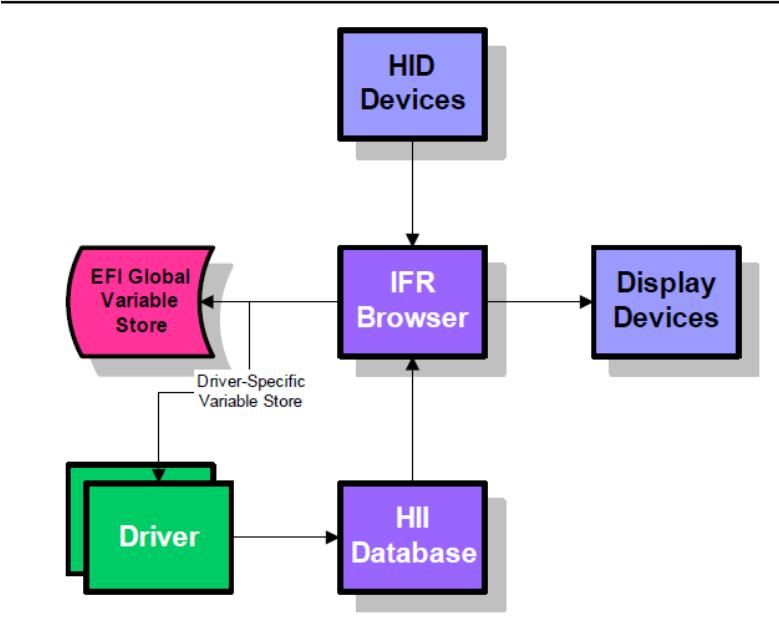  
Fig. 33.14: Platform Configuration Overview

## 33.2.5.1 Form Sets

Form sets are logically-related groups of forms.

## Attributes

Each forms set has the following attributes:

Form Set Identifier – Uniquely identifies the form set within a package list using a GUID. The Form Set Identifier, along with a device path, uniquely identifies a form set in a system.

Form Set Class Identifier – Optional array of up to three GUIDs which identify how the form set should be used or classified. The list of standard form set classes is found in the “Related Definitions” section of EFI\_FORM\_BROWSER2\_PROTOCOL.SendForm().

Title – Title text for the form set.

Help – Help text for the form set.

Image – Optional title image for the form set.

Animation – Optional title animation for the form set.

Description

Within a form set, there is one parent form and zero or more child forms. The parent form is the first enabled, visible form in the form set. The child forms are the second or later enabled, visible forms in the form set. In general, the Forms Browser will provide a means to navigate to the parent form. A Cross-Reference is used to navigate between forms within a form set or between forms in diferent form sets.

Variable stores are declared within a form set. Variable stores describe the means for retrieval and storage of configuration settings, and location information within that variable store. For more information, see Storage.

Default stores are declared within a form set. Default stores group together diferent types of default settings (normal, manufacturing, etc.) and give them a name. See Defaults for more information.

The form set can control whether or not to process an individual form by nesting it inside of an EFI\_IFR\_DISABLE\_IF expression. Enable/Disable-1 for more information. The form set can control whether or not to display an individual form by nesting it inside of an EFI\_IFR\_SUPPRESS\_IF expression.

## Syntax

The form set consists of an EFI\_IFR\_FORM\_SET object, where the body consists of

```makefile
form-set := EFI_IFR_FORM_SET form-set-list
form-set-list := form form-set-list |
EFI_IFR_IMAGE form-set-list |
EFI_IFR_ANIMATION form-set-list |
EFI_IFR_VARSTORE form-set-list |
EFI_IFR_VARSTORE_EFI form-set-list |
EFI_IFR_VARSTORE_NAME_VALUE form-set-list |
EFI_IFR_DEFAULTSTORE form-set-list |
EFI_IFR_DISABLE_IF expression form-set-list |
<empty>
EFI_IFR_SUPPRESS_IF expression form-set-list | <empty>
```

## 33.2.5.2 Forms

Forms are logically-related groups of statements (including questions) designed to be displayed together.

## Attributes

Each form has the following attributes:

Form Identifier — A 16-bit unsigned integer, which uniquely identifies the form within the form set. The Form Identifier, along with the device path and Form Set Identifier, uniquely identifies a form within a system.

Title — Title text for the form. The Forms Browser may use this text to describe the nature and purpose of the form in a window title.

Image — Optional title image for the form. The Forms Browser may use this image to display the nature and purpose of the form in a window title.

Animation — Optional title animation for the form set.

Modal — If a form is modal, then the on-form interaction must be completed prior to navigating to another form. See “User Interaction”, User Interaction.

The form can control whether or not to process a statement by nesting it inside of an EFI\_IFR\_DISABLE\_IF expression. See Enable/Disable-2 for more information.

The form can control whether a particular statement is selectable by nesting it inside of an EFI\_IFR\_GRAY\_OUT\_IF expression. Statements that cannot be selected are displayed by Form Browsers, but cannot be selected by a user. EFI\_IFR\_GRAY\_OUT\_IF causes statements to be displayed with some visual indication. See Evaluation Of Selectable Statements for more information.

The form can control whether to display a statement by nesting it inside of an EFI\_IFR\_SUPPRESS\_IF expression. See EFI\_IFR\_SUPPRESS\_IF for more information.

## Syntax

The form consists of an EFI\_IFR\_FORM object, where the body consists of:

```txt
form := EFI_IFR_FORM form-tag-list |
EFI_IFR_FORM_MAP form-tag-list
form-tag-list := form-tag form-tag-list |
<empty>
form-tag := EFI_IFR_IMAGE |
EFI_IFR_ANIMATION |
EFI_IFR_LOCKED |
EFI_IFR_RULE |
EFI_IFR_MODAL_TAG |
statement |
question |
cond-statement-list |
<empty>
statement-list := statement statement-list |
question statement-list |
cond-statement-list |
<empty>
cond-statement-list := EFI_IFR_DISABLE_IF expression statement-list |
EFI_IFR_SUPPRESS_IF expression statement-list |
EFI_IFR_GRAY_OUT_IF expression statement-list |
question-list := question question-list |
<empty>
```

Other unknown opcodes are permitted, but will be ignored.

## 33.2.5.2.1 Enable/Disable-1

Disabled forms will not be processed at all by a Forms Processor. Forms are enabled unless:

• The form nests inside an EFI\_IFR\_DISABLE\_IF expression which evaluated to FALSE.

• The disabling of forms is evaluated during Forms Processor initialization and is not re-evaluated.

## 33.2.5.2.2 Modifiability

Forms can be locked so that a Forms Editor will not change it. Forms are unlocked unless:

• The form has an EFI\_IFR\_LOCKED in its scope. The locking of statement is evaluated only during Forms Editor initialization.

## 33.2.5.2.3 Visibility

Suppressed forms will not be displayed. Forms are visible unless:

• The form is disabled ( Questions )

• The form is nested inside an EFI\_IFR\_SUPPRESS\_IF expression which evaluates to FALSE.

## 33.2.5.3 Statements

All displayable items within the body of a form are statements. Statements provide information or capabilities to the user. Questions ( Questions ) are a specialized form of statement with a value. Statements are used only by Forms Browsers and are ignored by other Forms Processors.

## Attributes

Statements have the following attributes:

Prompt — The text that will be displayed with the statement.

Help — The extended descriptive text that can be displayed with the statement.

Image — The optional image that will be displayed with the statement.

Animation — The optional animation that will be displayed with the statement.

Other than Questions, there are three types of statements:

• Static Text/Image

• Subtitle

• Cross-Reference

## Syntax

```txt
statement:= subtitle | static-text | reset button
statement-tag-list := statement-tag statement-tag-list |
<empty>
statement-tag := EFI_IFR_IMAGE |
EFI_IFR_LOCKED
EFI_IFR_ANIMATION
```

## 33.2.5.3.1 Display

Statement display depends on the Forms Browser. Statements do not describe how the statement must be displayed but rather provide resources (such as text and images) for use by the Forms Browser. The Forms Browser uses this information to create the necessary user interface.

The Forms Browser may use the visibility ( Visibility-1 ) or selectability ( Evaluation Of Selectable Statements ) of the statements to change the way the item is displayed. The EFI\_IFR\_GRAY\_OUT\_IF expression explicitly requires that nested statements have visual diferentiation from normal statements.

## 33.2.5.3.2 Enable/Disable-2

Statements which have been disabled will not be processed at all by a Forms Processor. Statements are enabled unless:

• The parent statement or question is disabled.

• The statement is nested inside an EFI\_IFR\_DISABLE\_IF expression which evaluated to FALSE.

• The disabling of statements is evaluated during Forms Browser initialization and is not re-evaluated.

## 33.2.5.3.3 Visibility-1

Suppressed statements will not be displayed. Statements are displayed unless:

• The parent statement or question is suppressed.

• The statement is disabled Enable/Disable-1

• The statement is nested inside an EFI\_IFR\_SUPPRESS\_IF expression which evaluates to FALSE.

The suppression of the statements is evaluated during Forms Browser initialization. Subsequently, the suppression of statements is reevaluated each time a value in any question on the selected form has changed.

## 33.2.5.3.4 Evaluation of Selectable Statements

A user in a Forms Browser can choose statements which are selectable. Statements are selectable unless:

• The parent statement or question is not selectable.

• The statement is suppressed Enable/Disable-2

• The statement is nested inside an EFI\_IFR\_GRAY\_OUT\_IF expression which evaluated to FALSE.

The evaluation of selectable statements takes place during Forms Browser initialization. Subsequently, selectable statements are reevaluated each time a value in any question on the selected form has changed.

## 33.2.5.3.5 Modifiability

A statement can be locked so that a Forms Editor will not change it. Statements are unlocked unless:

• The parent form or parent statement/question is locked.

• The statement has an EFI\_IFR\_LOCKED in its scope.

The locking of a statement is evaluated only during Forms Editor initialization.

## 33.2.5.3.6 Static Text/Image

The Forms Browser displays the specified prompt, the specified text and (optionally) the image, but has no user interaction.

## Syntax

```makefile
static-text:= EFI_IFR_TEXT statement-tag-list
```

## 33.2.5.3.7 Subtitle

The subtitle is a means of visually grouping questions by providing a separator, some optional separating text, and an optional image.

Syntax

subtitle:= EFI\_IFR\_SUBTITLE statement-tag-list

## 33.2.5.3.8 Reset Button

Attributes

Reset Buttons have the following attributes:

Default Id — Specifies the default set to use when restoring defaults to the current form.

## Syntax

reset button : = EFI\_IFR\_RESET\_BUTTON statement-tag-list

## 33.2.5.4 Questions

Questions are statements which have a value. The value corresponds to a configuration setting for the platform or for a device. The question uniquely identifies the configuration setting, describes the possible values, the way the value is stored, and how the question should be displayed.

## Attributes

Questions have the following attributes (in addition to those of statements):

Question Identifier — A 16-bit unsigned integer which uniquely identifies the question within the form set in which it appears. The Question Identifier, along with the device path and Form Set Identifier, uniquely identifies a question within a system.

Default Value — The value used when the user requests that defaults be loaded.

Manufacturing Value — The value used when the user requests that manufacturing defaults are loaded.

Value — Each question has a current value. See Values for more information.

Value Format — The format used to store a question’s value.

Value Storage — The means by which values are stored. See Storage Requirements for more information.

Refresh Identifiers — Zero or more GUIDs associated with an event group initialized by the Forms Browser when the form set containing the question is opened. If the event group associated with the GUID is signaled (see SignalEvent() ), then the question value will be updated from storage.

Refresh Interval — The minimum number of seconds that must pass before the Forms Browser will automatically update the current question value from storage. The default value is zero, indicating there will be no automatic refresh.

Validation — New values assigned to questions can be validated, using validation expressions, or, if connected, using a callback. See Validation for more information.

Callback — If set, the callback will be called when the question’s value is changed. In some cases, the presence of these callbacks prevents the question’s value from being edited while disconnected. The question can control whether a particular option can be displayed by nesting it inside of an EFI\_IFR\_SUPPRESS\_IF expression. Form Browsers do not display Suppressed Options, but Suppressed Options may still be examined by Form Processors.

```txt
question:= action-button | boolean | date | number | ordered-list | string | time |
cross-reference
question-tag-list:= question-tag question-tag-list |
<empty>
question-tag := statement-tag |
EFI_IFR_INCONSISTENT_IF expression |
EFI_IFR_NO_SUBMIT_IF expression |
EFI_IFR_WARNING_IF expression |
EFI_IFR_DISABLE_IF expression question-list |
EFI_IFR_REFRESH_ID RefreshEventGroupId |
EFI_IFR_REFRESH |
EFI_IFR_VARSTORE_DEVICE
question-option-tag := EFI_IFR_SUPPRESS_IF expression |
EFI_IFR_VALUE optional-expression |
EFI_IFR_READ expression |
EFI_IFR_WRITE expression |
default |
option
question-option-list := question-tag question-option-list |
question-option-tag question-option-list |
<empty>
```  
Other unknown opcodes are permitted but are ignored.

## 33.2.5.4.1 Values

Question values are a data type listed in Data Types. During initialization of the Forms Processor or Forms Browser, the values of all enabled questions are retrieved. If the value cannot be retrieved, then the question’s value is Undefined.

A question with the value of type Undefined will be suppressed. This suppression will be reevaluated based on Value Refresh or when any question value on the selected form is changed.

When the form is submitted, the modified values are written to Value Storage. When the form is reset, the question value is set to the default question value. If there is no default question value, the question value is unchanged.

When a question value is retrieved, the following process is used:

1. Set the this internal constant to have the same value as the one read from the question’s storage.\*\*

2. If present, change the current question value to the value returned by a question’s nested EFI\_IFR\_READ operator.

When a question value is changed, the following process is used:

1. Set the this internal constant to have the same value as the current question value.

2. If present, evaluate the question’s nested EFI\_IFR\_WRITE ( EFI\_IFR\_WRITE ) operator.

3. Write the value to the question’s storage

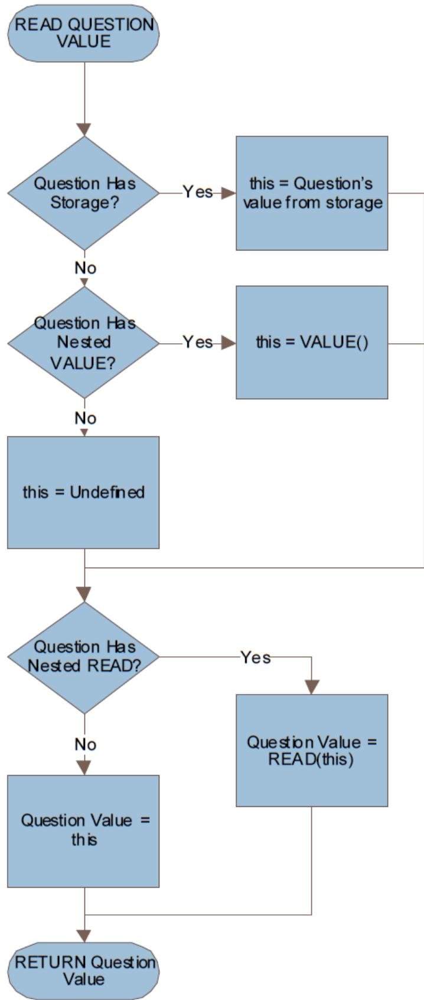  
Fig. 33.15: Question Value Retrieval Process

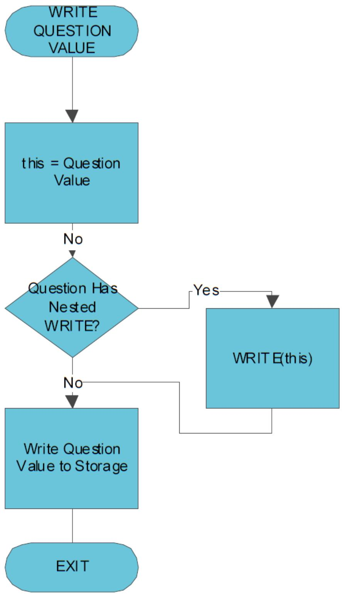  
Fig. 33.16: Question Value Change Process

## 33.2.5.4.2 Storage Requirements

Question storage requirements describe the type and size of storage for the value. These storage requirements describe whether the question’s value will be stored as an EFI global variable or using driver local storage. It also describes whether the value is packed together with other values in a bufer, or passed as a name-value pair. See Storage for more information.

## 33.2.5.4.3 Display

Question display depends on the Forms Browser. Questions do not describe how the question must be displayed. Instead, questions provide resources (such as text and images) and information about visibility and the ability to edit the question. The Forms Browser uses these to create the necessary user interface. Questions can have prompt text, help text and (optionally) an image. The prompt text usually describes the nature of the question. Help text is displayed either in a special display area or only at the request of the user. Questions can also have hints which describe how to visually organize the information

## 33.2.5.4.4 Action Button

Action buttons are buttons which cause a pre-defined configuration string to process immediately. There is no storage directly associated with the button.

## Attributes

Action buttons have no additional attributes other than the common question attributes).

Storage — There is no storage associated with the action button.

Results — There are no results associated with the action button. If used in an expression, the question value will always be Undefined.

## Syntax

action-button:= EFI\_IFR\_ACTION question-tag-list

## 33.2.5.4.5 Boolean

Boolean questions are those that allow a choice between TRUE and FALSE. The question’s value is Boolean. In general, construct questions so that the prompt text asks questions resulting in ‘yes/enabled/on’ is ‘true’ and ‘no/disabled/of’ is ‘false’.

Boolean questions may be displayed as a check box, two radio buttons, a selection list, a list box, or a drop list box.

## Attributes

Boolean questions have no additional attributes other than the common question attributes:

Storage — If the boolean question uses Bufer storage or EFI Variable (see Storage ), then the size is exactly one byte, with the FALSE condition is zero and the TRUE value is 1.

Results — The results are represented as either 0 ( FALSE ) or 1 ( TRUE ).

## Syntax

boolean := EFI\_IFR\_CHECKBOX question-option-list

## 33.2.5.4.6 Date

Date questions allow modification of part or all of a standard calendar date. The format of the date display depends on the Forms Browser and any localization.

## Attributes

Date questions have the following attributes:

Year Suppressed — The year will not be displayed or updated.

Month Suppressed — The month will not be displayed or updated.

Day Suppressed — The day will not be displayed or updated.

UEFI Storage — In addition to normal question Value Storage, Date questions can optionally be instructed to save the date to either the system time or system wake-up time using the UEFI runtime services SetTime() or SetWakeupTime() In this case, the date and time will be read first, the modifications made and changes will be written back.

Conversion to and from strings to a date depends on the system localization.

The date value is stored an EFI\_HII\_TIME structure. The TimeZone field is always set to EFI\_UNSPECIFIED\_TIMEZONE. The Daylight field is always set to zero. The contents of the other fields are undetermined.

Storage — If the date question uses Bufer storage or EFI Variable storage ( Storage ), then the stored result will occupy exactly the size of EFI\_HII\_DATE.

Results — Results for date questions are represented as a hex dump of the EFI\_HII\_DATE structure. If used in a question, the value will be a bufer containing the contents of the EFI\_HII\_DATE structure.

## Syntax

date := EFI\_IFR\_DATE question-option-list

## 33.2.5.4.7 Number

Number questions allow modification of an integer value up to 64-bits. Number questions can also specify pre-defined options.

## Attributes

Number questions have the following attributes:

Radix — Hint describes the output radix of numbers. The possible values are unsigned decimal, signed decimal or hexadecimal. Numbers displayed in hexadecimal will be prefixed by ‘0x’

Minimum Value — The minimum unsigned value which can be accepted for this question.

Maximum Value — The maximum unsigned value which can be accepted for this question.

Skip Value — Defines the minimum increment between values.

Storage — If the number question uses Bufer storage or EFI Variable storage ( Storage ), then the bufer size specified by must be 1, 2, 4 or 8. Also, the Forms Processor will do implicit error checking to make sure that the signed or unsigned value can be stored in the Bufer without lost of significant bits. For example, if the bufer size is 1 byte, then the largest unsigned integer value would be 255. Likewise, the largest signed integer value would be 127 and the smallest signed integer value would be -128. The Forms Processor will automatically detect this as an error and generate an appropriate error

Results — The results are represented as string versions of unsigned hexadecimal values.

## Syntax

number := EFI\_IFR\_NUMERIC question-option-list | EFI\_IFR\_ONE\_OF question-option-list

## 33.2.5.4.8 Set

Sets are questions where n containers can be filled with any of m pre-defined choices. This supports both lists where a given value can only appear in one of the slots or where the same choice can appear many times.

Each of the containers takes the form of an option which a name, a value and (optionally) an image.

## Attributes

Set questions have the following attributes:

Container Count — Specifies the number of available selectable options.

Unique — If set, then each choice may be used at most, once.

NoEmpty — All slots must be filled with a non-zero value.

Storage — The set questions are stored as a Bufer with one byte for each Container.

## Results

Each Container value is represented as two characters, one for each nibble. All hexadecimal characters (a-f) are in lower-case.

The results are represented as a series of Container values, starting with the lowest Container.

## Syntax

ordered-list := EFI\_IFR\_ORDERED\_LIST question-option-list

## Options

Set questions treat the values specified by nested EFI\_IFR\_ONE\_OF\_OPTION values as the value for a single Container, not the entire question storage. This is diferent from other question types.

## Defaults

Set questions treat the default values specified by nested EFI\_IFR\_DEFAULT or EFI\_IFR\_ONE\_OF\_OPTION opcodes as the default value for all Containers. The default values must be of type EFI\_IFR\_TYPE\_BUFFER, with each byte in the bufer corresponding to a single Container value, starting with the first container. If the bufer contains fewer bytes than MaxContainers, then the remaining Containers will be set to a value of 0.

Default values returned from the ALTCFG section when ExtractConfig() is called fill the storage starting with the first container.

## 33.2.5.4.9 String

String questions allow modification of a string.

## Attributes

String questions have the following attributes:

Minimum Length — Hint describes the minimum length of the string, in characters.

Maximum Length — Hint describes the maximum length of the string, in characters.

Multi-Line — Hint describes that the string might contain multiple lines.

Output Mask — If set, the text entered will not be displayed.

Storage — The string questions are stored as a NULL -terminated string. If the time question uses Bufer or EFI Variable storage ( Storage ), then the bufer size must exceed the size of the NULL-terminated string. If the string is shorter than the length of the bufer, the remainder of the bufer is filled with NULL characters.

Results — Results for string questions are represented as hex dump of the string, including the terminating NULL character.

## Syntax

string := EFI\_IFR\_STRING question-option-list | EFI\_IFR\_PASSWORD question-option-list

## 33.2.5.4.10 Cross-Reference

Cross-reference questions provide a selectable means by which users navigate to other forms and/or other questions. The form and question can be in the current form set, another form set or even in a form associated with a diferent device. If the specified form or question does not exist, the button is not selectable, is grayed-out, or is suppressed.

## Attributes

Cross references can have the following attributes:

Form Identifier — The identifier of the target form.

Form Set Identifier — Optionally specifies an alternate form-set which contains the target form. If specified, then the focus will be on form within the form set specified by Form Identifier. If the Form Identifier is not specified, then the first form in the Form Set is used.

Question Identifier — Optionally specifies the question identifier of the target question on the target form. If specified then focus will be placed on the question specified by this question identifier. Otherwise, the focus will be on the first question within the specified form.

Device Path — Optionally, the device path which contains the Form Identifier. Otherwise, the device path associated with the form set containing this cross-reference will be used.

Storage — Storage is optional for a cross-reference question. It is only present when the cross-reference question does not supply any target (i.e., REF5). If the question uses Bufer or EFI Variable storage ( Storage ), then the bufer size must be exactly the size of the EFI\_HII\_REF structure.

Results — Results for cross-reference questions are represented as a hex dump of the question identifier, form identifier, form set GUID and null-terminated device path text. If used in a question, the question value will be a bufer containing the EFI\_HII\_REF structure..

## Syntax

\*cross-reference\* := \*EFI\_IFR\_REF\* \*statement-tag-list\*

## 33.2.5.4.11 Time

Time questions allow modification of part or all of a time. The format of the time display depends on the Forms Browser and any localization.

## Attributes

Time questions have the following attributes:

Hour Suppressed — The hour will not be displayed or updated.

Minute Suppressed — The minute will not be displayed or updated.

Second Suppressed — The second will not be displayed or updated.

UEFI Storage — In addition to normal question Value Storage, time questions can be instructed to save the time to either the system time or system wake-up time using the UEFI runtime services SetTime or SetWakeupTime. In these instances, the date and time is read first, the modifications made and changes are then written back.

Conversion to and from strings to a time depends on the system localization.

The time value is stored as part of an EFI\_HII\_TIME structure. The contents of the other fields are undetermined.

Storage — If the time question uses Bufer or EFI Variable storage ( Storage ), then the bufer size must be exactly the size of the EFI\_HII\_TIME structure..

Results — Results for time questions are represented as a hex dump of the EFI\_HII\_TIME structure. If used in a question, the value will be a bufer containing the contents of the EFI\_HII\_TIME structure.

## Syntax

time := EFI\_IFR\_TIME question-option-list

## 33.2.5.5 Options

Use Options within questions to give text or graphic description of a particular question value. They may also describe the choices in the set data type.

## Attributes

Options have the following attributes:

Text — The text for the option.

Image — The optional image for the option.

Animation — The optional animation for the option.

Value — The value for the option.

Default — If set, this is the option selected when the user asks for the defaults. Only one visible option can have this bit set within a question’s scope.

Manufacturing Default — If set, this is the option selected when manufacturing defaults are set. Only one visible option can have this bit set within a question’s scope.

## Syntax

```makefile
option:= EFI_IFR_ONE_OF_OPTION option-tag-list
option-tag-list := option-tag option-tag-list |
<empty>
```

(continues on next page)

option-tag:= EFI\_IFR\_IMAGE EFI\_IFR\_ANIMATION

(continued from previous page)

## 33.2.5.5.1 Visibility

Options which have been suppressed will not be displayed. Options are displayed unless:

• The parent question is suppressed.

• The option is nested inside an EFI\_IFR\_SUPPRESS\_IF expression which evaluated to FALSE.

The suppression of the options is evaluated each time the option is displayed.

## 33.2.5.6 Storage

Question values are stored in Variable Stores, which are application, platform or device repositories for configuration settings. In many cases, this is non-volatile storage. In other cases, it holds only the current behavior of a driver or application.

Question values are retrieved from the variable store when the form is initialized. They are updated periodically based on question settings and stored back in the variable store when the form is submitted.

It is possible for a question to have no associated Variable Store. This happens when the VarStoreId associated with the question is set to zero and, for Date/Time questions, the UEFI Storage is disabled. For questions with no associated Variable Store, the question must either support the RETRIEVE and CHANGED callback actions ( EFI\_HII\_CONFIG\_ACCESS\_PROTOCOL.CallBack() ) or contain an embedded READ or WRITE opcode: EFI\_HII\_IFR\_READ\_OP and EFI\_IFR\_WRITE\_OP ( EFI\_IFR\_READ and EFI\_IFR\_WRITE ).

Because the value associated with a question contained in a Variable Store can be shared by multiple questions, the questions must all treat the shared information as compatible data types.There are four types of variable stores:

Bufer Storage — With bufer storage, the application, platform or driver provides the definition of a bufer which contains the values for one or more questions. The size of the entire bufer is defined in the EFI\_IFR\_VARSTORE definition. Each question defines a field in the bufer by providing an ofset within the bufer and the size of the required storage. These variable stores are exposed by the app/driver using the EFI\_HII\_CONFIG\_ACCESS\_PROTOCOL, which is installed on the same handle as the package list. Question values are retrieved via EFI\_HII\_CONFIG\_ACCESS\_PROTOCOL.ExtractConfig() and updated via EFI\_HII\_CONFIG\_ACCESS\_PROTOCOL.RouteConfig(). Rather than access the bufer as a whole, Bufer Storage Variable Stores access each field independently, via a list of one or more (field ofset, value) pairs encoded as variable length text strings as defined for the EFI\_HII\_CONFIG\_ACCESS\_PROTOCOL.

Name/Value Storage — With name/value storage, the application provides a string which contains the encoded values for a single question. These variable stores are exposed by the app/driver using the EFI\_HII\_CONFIG\_ACCESS\_PROTOCOL, which is installed on the same handle as the package list.

EFI Variable Storage — This is a specialized form of Bufer Storage, which uses the EFI runtime services GetVariable() and SetVariable() to access the entire bufer defined for the Variable Store as a single binary object.

EFI Date/Time Storage — For date and time-related questions, the question values can be retrieved using the EFI runtime services GetTime() and GetWakeupTime() and stored using the EFI runtime services SetTime() and SetWakeupTime().

The following table summarizes the types of information needed for each type of storage and where it is retrieved from.

Table 33.2: Information for Types of Storage

<table><tr><td>Storage Type</td><td>Information Type</td><td>Where It Comes From</td></tr><tr><td>None</td><td>Driver Handle</td><td>Handle specified with NewPackageList() or derived from EFI_IFR_VARSTORE_DEVICE.DevicePath</td></tr><tr><td>Buffer Storage</td><td>Driver Handle</td><td>Handle specified with NewPackageList() or derived from EFI_IFR_VARSTORE_DEVICE.DevicePath</td></tr><tr><td></td><td>Variable ID</td><td>Variable store specified byEFI_IFR_QUESTION_HEADER.VarStoreId.EFI_IFR_VARSTORE_DEVICE.DevicePath*</td></tr><tr><td></td><td>Variable Name</td><td>Variable store specified byEFI_IFR_QUESTION_HEADER.VarStoreId</td></tr><tr><td></td><td>Variable Store Off-set</td><td>Variable store offset specified byEFI_IFR_QUESTION_HEADER.VarOffset.</td></tr><tr><td>Name/Value Storage</td><td>Driver Handle</td><td>Handle specified with NewPackageList() or derived from EFI_IFR_VARSTORE_DEVICE.DevicePath</td></tr><tr><td></td><td>Variable ID</td><td>Variable store specified byEFI_IFR_QUESTION_HEADER.VarStoreId.</td></tr><tr><td></td><td>Variable Name</td><td>Variable name specified byEFI_IFR_QUESTION_HEADER.VarStoreInfo.VarName.</td></tr><tr><td>EFI Variable Stor-age</td><td>Driver Handle</td><td>None</td></tr><tr><td></td><td>Variable ID</td><td>Variable store specified byEFI_IFR_QUESTION_HEADER.VarStoreId.</td></tr><tr><td></td><td>EFI_Variable GUID (for Variable Services)</td><td>EFI variable GUID specified by EFI_IFR_VARSTORE_EFI.Guid.</td></tr><tr><td></td><td>EFI.Variable Name (for Variable Services)</td><td>EFI variable name specified by EFI_IFR_VARSTORE_EFI.Name.</td></tr><tr><td></td><td>Variable Name</td><td>Variable name specified byEFI_IFR_QUESTION_HEADER.VarStoreId.</td></tr><tr><td></td><td>Variable Store Off-set</td><td>Variable store offset specified byEFI_IFR_QUESTION_HEADER.VarStoreInfo.VarOffset.</td></tr><tr><td>EFI Date/Time Stor-age</td><td>Driver Handle</td><td>None</td></tr><tr><td></td><td>Variable ID</td><td>None</td></tr></table>

Table 33.2 – continued from previous page

<table><tr><td>Variable Name</td><td>None</td></tr></table>

## 33.2.5.7 Expressions

This section describes the expressions used in various expressions in IFR. The expressions are encoded using normal IFR opcodes, but in RPN (Reverse Polish Notation) where the operands occur before the operator.

The opcodes fall into these categories:

Unary operators. — Functions taking a single sub-expression.

Binary operators. — Functions taking two sub-expressions.

Ternary operators. — Functions taking three sub-expressions.

Built-in functions. — Operators taking zero or more sub-expressions.

Constants. — Numeric and string constants.

Question Values. — Specified by their question identifier.

All integer operations are performed at 64-bit precision.

## 33.2.5.7.1 Expression Encoding

Expressions are usually encoded within the scope of another binary object. If the expression consists of more than a single opcode, the first opcode should open a scope ( Header.Scope = 1) and use an EFI\_IFR\_END opcode to close the scope in order to make sure they can be skipped,

## 33.2.5.7.2 Expression Stack

When evaluating expressions, the Forms Processor uses a stack to hold intermediate values. Each operator either pushes a value on the stack, pops a value from the stack, or both. For example, the EFI\_IFR\_ONE operator pushes the integer value 1 on the expression stack. The EFI\_IFR\_ADD operator pops two integer values from the expression stack, adds them together, and pushes the result back on the stack.

After evaluating an expression, there should be only one value left on the expression stack.

## 33.2.5.7.3 Rules

Rules are pre-defined expressions attached to the form. These rules may be used in any expression within the form’s scope. Each rule is given a unique identifier (0-255) when it is created by EFI\_IFR\_RULE. This same identifier is used when the rule is referred to in an expression with EFI\_IFR\_RULE\_REF.

To save space, rules are intended to allow manual or automatic extraction of common sub-expressions from form expressions.

## 33.2.5.7.4 Data Types

The expressions use five basic data types:

Boolean — TRUE or FALSE.

Unsigned Integer — 64-bit unsigned integer.

String — Null-terminated string.

Bufer — Fixed size array of unsigned 8-bit integers.

Undefined — Undetermined value. Used when the value cannot be calculated or for run-time errors.

Data conversion is not implicit. Explicit data conversion can be performed using the EFI\_IFR\_TO\_STRING , EFI\_IFR\_TO\_UINT and EFI\_IFR\_TO\_BOOLEAN .

The Date and Time question values are converted to the Bufer data type filled with the EFI\_HII\_DATE and EFI\_HII\_TIME structure contents (respectively).

The Ref question values are converted to the Bufer data type and filled with the EFI\_HII\_REF and structure contents.

## Syntax

```txt
The expressions have the following syntax:
expression := built-in-function |
constant |
expression unary-op |
expression expression binary-op |
expression expression expression ternary-op
expression-pair-list
EFI_IFR_MAP
expression-pair-list := expression-pair-list expression expression |
<empty>

optional-expression := expression |
<empty>

built-in-function := EFI_IFR_DUP |
EFI_IFR_EQ_ID_VAL |
EFI_IFR_EQ_ID_ID |
EFI_IFR_EQ_ID_VAL_LIST |
EFI_IFR_GET |
EFI_IFR_QUESTION_REF1 |
EFI_IFR_QUESTION_REF3 |
EFI_IFR_RULE_REF |
EFI_IFR_STRING_REF1 |
EFI_IFR_THIS |
EFI_IFR_SECURITY

constant := EFI_IFR_FALSE |
EFI_IFR_ONE |
*EFI_IFR_ONES |
EFI_IFR_TRUE |
EFI_IFR_UINT8 |
EFI_IFR_UINT16 |
EFI_IFR_UINT32 |
```

(continues on next page)

(continued from previous page)

```txt
EFI_IFR_UINT64 |
EFI_IFR_UNDEFINED |
EFI_IFR_VERSION |
EFI_IFR_ZERO
binary-op := EFI_IFR_ADD |
EFI_IFR_AND |
EFI_IFR_BITWISE_AND |
EFI_IFR_BITWISE_OR |
EFI_IFR_CATENATE |
EFI_IFR_DIVIDE |
EFI_IFR_EQUAL |
EFI_IFR_GREATER_EQUAL |
EFI_IFR_GREATER_THAN |
EFI_IFR_LESS_EQUAL |
EFI_IFR_LESS_THAN |
EFI_IFR_MATCH |
EFI_IFR_MATCH2 |
EFI_IFR_MODULO |
EFI_IFR_MULTIPLY |
EFI_IFR_NOT_EQUAL |
EFI_IFR_OR |
EFI_IFR_SHIFT_LEFT |
EFI_IFR_SHIFT_RIGHT |
EFI_IFR_SUBTRACT |
unary-op := EFI_IFR_LENGTH |
EFI_IFR_NOT |
EFI_IFR_BITWISE_NOT |
EFI_IFR_QUESTION_REF2 |
EFI_IFR_SET |
EFI_IFR_STRING_REF2 |
EFI_IFR_TO_BOOLAN |
EFI_IFR_TO_STRING |
EFI_IFR_TO_UINT |
EFI_IFR_TO_UPPER |
EFI_IFR_TO_LOWER
ternary-op := EFI_IFR_CONDITIONAL |
EFI_IFR_FIND |
EFI_IFR_MID |
EFI_IFR_TOKEN |
EFI_IFR_SPAN
```

## 33.2.5.8 Defaults

To ensure consistent behavior when a platform attempts to restore settings to defaults, each question op-code must have an active default setting. Defaults are pre-defined question values. The question values may be changed to their defaults either through a Forms Processor-defined means or when the user selects an EFI\_IFR\_RESET\_BUTTON statement ( Reset Button ).

Each question may have zero or more default values, with each default value used for diferent purposes. For example, there might be a “standard” default value, a default value used for manufacturing and a “safe” default value. A group of default values used to configure a platform or device for a specific purpose is called default store.

## Default Stores

There are three standard default stores:

Standard Defaults — These are the defaults used to prepare the system/device for normal operation.

Manufacturing Defaults — These are the defaults used to prepare the system/device for manufacturing.

Safe Defaults — These are the defaults used to boot the system in a “safe” or low-risk mode.

Attributes — Default stores have the following attributes:

## Name

Each default store has a user-readable name

## Identifier

A 16-bit unsigned integer. The values between 0x0000 and 0x3ff are reserved for use by the UEFI specification. The values between 0x4000 and 0x7ff are reserved for platform providers. The values between 0x8000 and 0xbff are reserved for hardware vendors. The values between 0xc000 and 0xff are reserved for firmware vendors.

<table><tr><td>#define EFI_HII_DEFAULT_CLASS_STANDARD</td><td>0x0000</td></tr><tr><td>#define EFI_HII_DEFAULT_CLASS_MANUFACTURING</td><td>0x0001</td></tr><tr><td>#define EFI_HII_DEFAULT_CLASS_SAFE</td><td>0x0002</td></tr><tr><td>#define EFI_HII_DEFAULT_CLASS_PLATFORM_BEGIN</td><td>0x4000</td></tr><tr><td>#define EFI_HII_DEFAULT_CLASS_PLATFORM_END</td><td>0x7fff</td></tr><tr><td>#define EFI_HII_DEFAULT_CLASS_HARDWARE_BEGIN</td><td>0x8000</td></tr><tr><td>#define EFI_HII_DEFAULT_CLASS_HARDWARE_END</td><td>0xbfff</td></tr><tr><td>#define EFI_HII_DEFAULT_CLASS_FIRMWARE_BEGIN</td><td>0xc000</td></tr><tr><td>#define EFI_HII_DEFAULT_CLASS_FIRMWARE_END</td><td>0xffff</td></tr></table>

Users of these ranges are encouraged to use the specification defined ranges for maximum interoperability. Questions or platforms may support defaults for only a sub-set of the possible default stores. Support for default store 0 (“standard”) is recommended.

## Defaulting

When retrieving the default values for a question, the Forms Processor uses one of the following (listed from highest priority to lowest priority):

1. The value returned from the Callback() memberfunction of the Config Access protocol associated with the question when called with the Action set to one of the\*EFI\_BROWSER\_ACTION\_DEFAULT\_x\* values ( EFI HII Configuration Access Protocol ) . It is recommended that this form only be used for questions where the default value alters dynamically at runtime.\*\*

2. The value returned in the Response parameter of the ConfigAccess() member function (using the ALTCFG form). See String Syntax .

3. The value specified by an EFI\_IFR\_DEFAULT opcodes appear within the scope of a question. ( EFI\_IFR\_DEFAULT )

4. One of the Options ( Options ) has its Standard Default or Manufacturing Default attribute set.

5. For Boolean questions, the Standard Default or Manufacturing Default values in the Flags field. ( Boolean ).

## Syntax

```txt
Default := EFI_IFR_DEFAULT
default-tag := EFI_IFR_VALUE |
<empty>
```

## 33.2.5.9 Validation

Validation is the process of determining whether a value can be applied to a configuration setting. Validation takes place at three diferent points in the editing process: edit-level, question-level and form-level.

## 33.2.5.9.1 Edit-Level Validation

First, it takes place while the value is being edited with a Forms Browser. The Forms Browser may optionally reject values selected by the user which would fail Question-Level validation. For example, the Forms Browser may limit the length of strings entered so that they meet the Minimum and Maximum Length.

## 33.2.5.9.2 Question-Level Validation

Second, it takes place when the value has changed, normally when the user attempts to leave the control, navigate between the portions of the control or selects one of the option values. At this point, an error occurs if:

• For a String ( String ), if the string length is less than the Minimum Length, then the Forms Processor generates an error.

• For a String ( String ), if the string length is greater than the Maximum Length, then the Forms Processor generates an error.

• For a Number ( Number ), if the number cannot fit in the specified variable storage without loss of significant bits, then the Forms Processor generates an error.

• For all questions, if an EFI\_IFR\_INCONSISTENT\_IF evaluates to TRUE, then the Forms Processor will display the specified error text.

• For all questions, if an EFI\_IFR\_WARNING\_IF evaluates to TRUE, then the Forms Processor will display the specified warning text.

## 33.2.5.9.3 Form-Level Validation

Third, it takes place when exiting the form or when the values are submitted. The error occurs under two conditions:

• For all questions, if an EFI\_IFR\_NO\_SUBMIT\_IF evaluates to TRUE, then the Forms Processor will display the specified error text.

• If a Forms Processor such as a script processor performs Form-Level validation, where the concept of a form is not maintained, then the Form-Level validation must occur before processing question values from other forms or before completion of the configuration session.

## 33.2.5.10 Forms Processing

Forms Processors interpret the IFR in order to extract information about configuration settings. This section describes how the IFR should be interpreted and how errors should be handled.

## 33.2.5.10.1 Error Handling

The Forms Processor may encounter problems in interpreting the IFR. This section describes the standard ways of handling these issues:

Unknown Opcodes. — Unknown opcodes have a type which is not recognized by the Forms Processor. In general, the Forms Processor ignores the opcode, along with any nested opcodes.

Malformed Opcodes. — Malformed objects have a length which is less than the minimum length for that object type. In this case, the entire form is disabled.

Extended Opcodes. — Extended objects have a length longer than that expected by the Forms Processor. In this case, the Forms Processor interprets the object normally and ignores the extra data.

Malformed Forms Sets — Malformed forms sets occur when an object’s length would cause it extend beyond the end of the forms set, or when the end of the forms set occurs while a scope is still open. In this case, the entire forms set is ignored.

Reserved Bits Set. — The Forms Processor should ignore all set reserved bits.

## 33.2.5.11 Forms Editing

This section describes considerations for Forms Editors, which are a specialized Forms Processor which can create and manipulate form lists, forms and questions in their binary form.

## 33.2.5.11.1 Locking

Locking indicates that a question or statement,–along with its related options, prompts, help text or images–should not be moved or edited. A statement or question is locked when the IFR\_LOCKED opcode is found within its scope.

UEFI-compliant Forms Editors must allow statements or questions within an image to be locked, but should not allow them to be unlocked. UEFI-compliant Forms Editors must not allow modification of locked statements or questions or any of their associated data (including options, text or images).

NOTE: This mechanism cannot prevent unauthorized modification. However, it does clearly state the intent of the driver creator that they should not be modified.

## 33.2.5.11.2 Moving Forms

When forms are moved between form sets, the related data (such as forms, variable stores and default stores) need to have their references renumbered to avoid conflicts with identifiers in the new form set. For forms, these include:

• EFI\_IFR\_FORM or EFI\_IFR\_FORM\_MAP (and all references in EFI\_IFR\_REF )

• EFI\_IFR\_DEFAULTSTORE (and all references in EFI\_IFR\_DEFAULT )

• EFI\_IFR\_VARSTORE\_x (and all references within question headers)

## 33.2.5.11.3 Moving Questions

When questions are moved between form sets, the related data (such as images and strings) need to be moved and references to results-processing and storage may need to be revised. For example:

String and Images. — If the question is being moved to another form set, then all strings and images associated with the question must be moved to the package list containing the form set and removed from the current one.

Form Set. — If the question is moved to a package list installed by a diferent driver, then the EFI\_IFR\_VAR\_STORAGE\_DEVICE ( EFI\_IFR\_VARSTORE\_DEVICE ) should be nested in the scope of the question, describing the driver installation device path.

Question References. — If a question value in another form set is referred to in any expressions (such as EFI\_IFR\_INCONSISTENT\_IF or EFI\_IFR\_NO\_SUBMIT\_IF or EFI\_IFR\_WARNING\_IF ) using either EFI\_IFR\_QUESTION\_REF2 ( EFI\_IFR\_Question\_REF2) or EFI\_IFR\_QUESTION\_REF1 ( EFI\_IFR\_Question\_REF1) then these must be converted to a form of EFI\_IFR\_QUESTION\_REF3 (EFI\_IFR\_Question\_REF3) specifying the EFI\_GUID of the form set and/or the device path of the package list containing the form set wherein the question referred to is defined.

When questions are moved between forms, whether in the same form list or another form list, question behavior reliant on the current form may need revision. One example is the use of EFI\_IFR\_RULE\_REF in expressions. Here, rules are shortcuts for common expressions used in a form. If a question is moved to another form, the references to any rules in expressions must be replaced by the expression itself.

## 33.2.5.12 Forms Processing & Security Privileges

The IFR provides a way for a Forms Processor to identify which forms, statements, questions and even question values are available only to users with specific privilege levels and enforce those privilege levels.

Setup access security privileges are described in terms of GUIDs. The current user profile either has the specified privilege or it does not. The EFI\_IFR\_SECURITY opcode returns whether or not the current user profile has the specified setup access privilege. Combined with the expressions such as EFI\_IFR\_DISABLE\_IF, EFI\_IFR\_SUPPRESS\_IF, EFI\_IFR\_GRAY\_OUT\_IF, EFI\_IFR\_WARNING\_IF, EFI\_IFR\_INCONSISTENT\_IF and EFI\_IFR\_NOSUBMIT\_IF, the author of a form can control access to specific forms, statements and questions, or even control whether specific values are valid.

Forms Processors on systems with multiple setup-related user privilege levels must support report these correctly when processing the EFI\_IFR\_SECURITY opcode.

Forms Processors on systems which support the UEFI User Authentication proposal must correctly inquire from the current user profile whether or not it has security privileges on EFI\_USER\_INFO\_ACCESS\_SETUP and User Manager Protocol on EFI\_USER\_MANAGER\_PROTOCOL.GetInfo() ).

Forms Processors on systems which support re-identification during the platform configuration process must support reevaluation of the EFI\_IFR\_SUPPRESS\_IF and EFI\_IFR\_GRAY\_OUT\_IF upon receipt of notification that the current user profile has been changed by using the UEFI Boot Service CreateEventEx() and the EFI\_USER\_PROFILE\_CHANGED\_EVENT\_GUID.

## 33.2.6 Strings

Strings in the UEFI environment are defined using UCS-2, which is a 16-bit-per-character representation. For userinterface purposes, strings are one of the types of resources which can be installed into the HII Database ( HII Database ).

In order to facilitate localization, users reference strings by an identifier unique to the package list which the driver installed. Each identifier may have several translations associated with it, such as English, French, and Traditional Chinese. When displaying a string, the Forms Browser selects the actual text to display based on the current platform language setting.

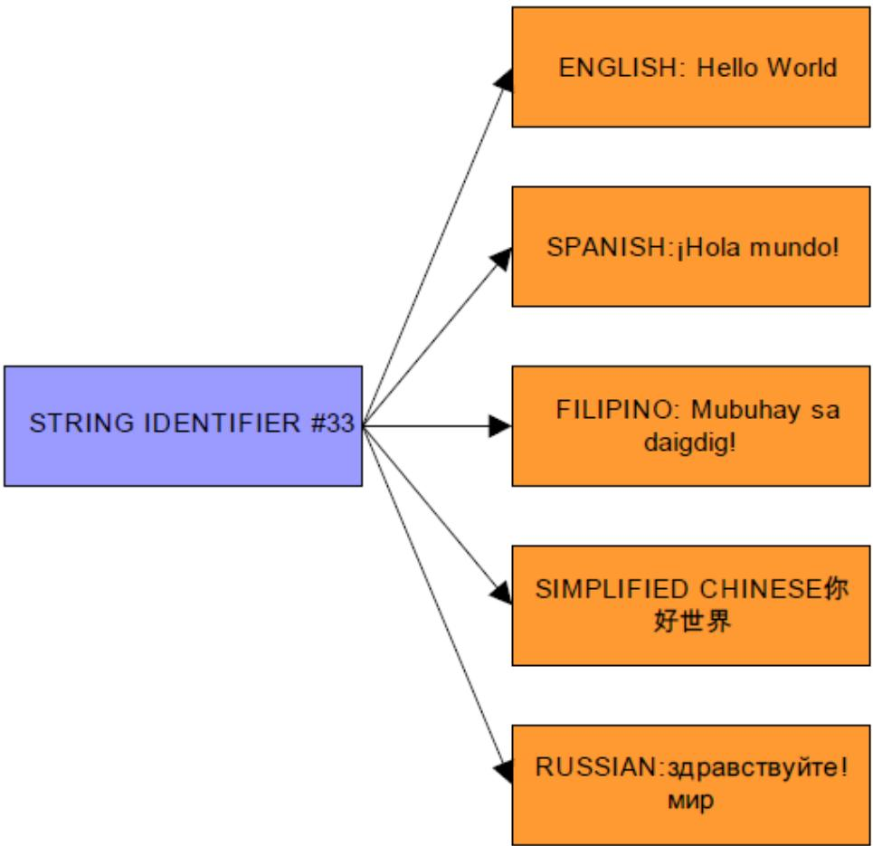  
Fig. 33.17: String Identifiers

The actual text for each language is stored separately (in a separate package), which makes it possible to add and remove language support just by including or excluding the appropriate package.

Each string may have font information, including the font family name, font size and font style, associated with it. Not all platforms or displays can support fonts and styles beyond the system default font ( Fonts ), so the font information associated with the string should be viewed as a set of hints.

## 33.2.6.1 Configuration Language Paradigm

This specification uses the RFC 4646 language naming scheme to identify the language that a given string is associated with. Since RFC 4646 allows for the same Primary language tags to contain a large variation of subtags (e.g. regions), a best matching language algorithm is defined in RFC 4647. Callers of interfaces that require RFC 4646 language codes to retrieve a Unicode string, must use the RFC 4647 algorithm to lookup the Unicode string with the closest matching RFC 4646 language code.

Since the majority of strings discussed in this specification are associated with generating a user interface, the languages that are typically associated with strings have commonly defined languages such as en-US, zh-Hant, and it-IT. The RFC 4646 standard also reserves for private use languages prefixed with a value of $\mathbf { \Delta } ^ { 6 6 } \mathbf { X } ^ { 7 }$

NOTE: This specification defines for its own purposes one of these private use areas as a special-purpose language that components can use for extracting information out of. Assume that any private-use languages encountered by a compliant implementation will likely consider those languages as configuration languages, and the associated behavior when referencing those languages will be platform specific. Working with a UEFI Configuration Language describes an example of such a use.

## 33.2.6.2 Unicode Usage

This section describes how diferent aspects of the Unicode specification related to the strings within this specification.

## 33.2.6.2.1 Private Use Area

Unicode defines a private use area of 6500 characters that may be defined for local uses. Suggested uses include Egyptian Hieroglyphics; see Developing International Software For Windows 95\* and Windows $N T ^ { * }$ for more information. UEFI prohibits use of this area in a UEFI environment. This is because a centralized font database accumulated from the various drivers (a valid implementation) would end up with collisions in the private use area, and, generally, an XML browser could not display these characters.

## 33.2.6.2.2 Surrogate Area

The Unicode specification has two 16-bit character representations: UCS-2 and UTF-16. The UEFI specification uses UCS-2. The primary diference is that UTF-16 defines surrogate areas (see page 56 in Professional XML ) that allow for expanded character representations of the 16-bit Unicode. These character representations are very similar to Double Byte Character Set (DBCS)–2048 Unicode values split into two groups (D800-DBFF and DC00-DFFF). They are defined as having 16 additional bits of value to make up the character, for a total of about one million extra characters. UEFI does not support surrogate characters.

## 33.2.6.2.3 Non-Spacing Characters

Unicode uses the concept of a nonspacing character. These glyphs are used to add accents, and so on, to other characters by what amounts to logically OR’ing the glyph over the previous glyph. There does not appear to be any predictable range in the Unicode encoding to determine nonspacing characters, yet these characters appear in many languages. Further, these characters enable spelling of several languages including many African languages and Vietnamese.

## 33.2.6.2.4 Common Control Codes

This specification allows the encoding of font display information within the strings using special control characters. These control codes are meant as display hints, and diferent platforms may ignore them, depending on display capabilities.

In single-byte encoding, these are in the form 0x7F 0xyy or 0x7F 0x0y 0xzz. Single-byte encoding is used only when coupled with the Standard Compression Scheme for Unicode, described in String Encoding.

In double-byte encoding, these are in the form 0xF6yy, 0xF7zz or 0xF8zz. When converted to UCS-2, all control codes should use the 0xFxyy form.

Table 33.3: Common Control Codes for Font Display Information

<table><tr><td>Value</td><td>Description</td><td>Single-Byte Encoding</td><td>Double-Byte coding</td><td>En-</td></tr><tr><td>0x00</td><td>Font Family Select. The subsequent text will be displayed in the font specified by the following byte.</td><td>0x7F 0x00 0xzz</td><td>0xF7zz</td><td></td></tr><tr><td>0x01</td><td>Font Size Select. The subsequent text will be displayed in the point size, in half points, specified by the following byte.</td><td>0x7F 0x01 0xzz</td><td>0xF8zz</td><td></td></tr><tr><td>0x20</td><td>Bold On.</td><td>0x7F 0x20</td><td>0xF620</td><td></td></tr><tr><td>0x21</td><td>Bold Off</td><td>0x7F 0x21</td><td>0xF621</td><td></td></tr><tr><td>0x22</td><td>Italic On</td><td>0x7F 0x22</td><td>0xF622</td><td></td></tr><tr><td>0x23</td><td>Italic Off</td><td>0x7F 0x23</td><td>0xF623</td><td></td></tr><tr><td>0x24</td><td>Underline On</td><td>0x7F 0x24</td><td>0xF624</td><td></td></tr><tr><td>0x25</td><td>Underline Off</td><td>0x7F 0x25</td><td>0xF625</td><td></td></tr><tr><td>0x26</td><td>Emboss ON</td><td>0x7F 0x26</td><td>0xF626</td><td></td></tr><tr><td>0x27</td><td>Emboss OFF</td><td>0x7F 0x27</td><td>0xF627</td><td></td></tr><tr><td>0x28</td><td>Shadow ON</td><td>0x7F 0x28</td><td>0xF628</td><td></td></tr><tr><td>0x29</td><td>Shadow OFF</td><td>0x7F 0x29</td><td>0xF629</td><td></td></tr><tr><td>0x2A</td><td>DblUnderline ON</td><td>0x7F 0x2A</td><td>0xF62A</td><td></td></tr><tr><td>0x2B</td><td>DblUnderline OFF</td><td>0x7F 0x2B</td><td>0xF62B</td><td></td></tr></table>

## 33.2.6.2.5 Line Breaks

This section describes the use of control characters to determine where break opportunities within strings. These guidelines are based on Unicode Technical Report #14, but are significantly simplified.

## Spaces

In general, any of the following space characters is a line-break opportunity:

<table><tr><td>0020</td><td>SPACE</td></tr><tr><td>1680</td><td>OGHAM SPACE MARK</td></tr><tr><td>2000</td><td>EN QUAD</td></tr><tr><td>2001</td><td>EM QUAD</td></tr><tr><td>2002</td><td>EN SPACE</td></tr><tr><td>2003</td><td>EM SPACE</td></tr><tr><td>2004</td><td>THREE-PER-EM SPACE</td></tr><tr><td>2005</td><td>FOUR-PER-EM SPACE</td></tr><tr><td>2006</td><td>SIX-PER-EM SPACE</td></tr><tr><td>2008</td><td>PUNCTUATION SPACE</td></tr></table>

continues on next page

Table 33.4 – continued from previous page

<table><tr><td>2009</td><td>THIN SPACE</td></tr><tr><td>200A</td><td>HAIR SPACE</td></tr><tr><td>205F</td><td>MEDIUM MATHEMATICAL SPACE</td></tr></table>

When a space is desired without a line-break opportunity, one of the following spaces should be used:

<table><tr><td>00A0</td><td>NO-BREAK SPACE (NBSP)</td></tr><tr><td>202F</td><td>NARROW NO-BREAK SPACE (NNBSP)</td></tr></table>

## In-Word Break Opportunities

In some cases, allowing line-breaks in a word is desirable. These line break opportunities should be explicitly described using one of the characters from the following list:

<table><tr><td>200B</td><td>ZERO WIDTH SPACE (ZWSP)</td></tr></table>

## Hyphens

The following characters are hyphens and other characters which describe line break opportunities after the character.

<table><tr><td>058A</td><td>ARMENIAN HYPHEN</td></tr><tr><td>2010</td><td>HYPHEN</td></tr><tr><td>2012</td><td>FIGURE DASH</td></tr><tr><td>2013</td><td>EN DASH</td></tr><tr><td>0F0B</td><td>TIBETAN MARK INTERSYLLABIC TSHEG</td></tr><tr><td>1361</td><td>ETHIOPIC WORDSPACE</td></tr><tr><td>17D5</td><td>KHMER SIGN BARIYOOSAN</td></tr></table>

The following characters describe line break opportunities before and after them, but not between a pair of them:

<table><tr><td>2014</td><td>EM DASH</td></tr></table>

The following characters describe a hyphen which is not a line-breaking opportunity:

<table><tr><td>2011</td><td>NON-BREAKING HYPHEN (NBHY)</td></tr></table>

The following characters force a line-break:

Table 33.10: Mandatory Breaks

<table><tr><td>000A</td><td>NEW LINE</td></tr><tr><td>000C</td><td>FORM FEED</td></tr><tr><td>000D</td><td>CARRIAGE RETURN</td></tr><tr><td>2028</td><td>LINE SEPARATOR</td></tr><tr><td>2029</td><td>PARAGRAPH SEPARATOR</td></tr></table>

## 33.2.7 Fonts

This section describes how fonts are used within the UEFI environment.

UEFI describes a standard font, which is required for all systems which support text display on bitmapped output devices. The standard font (named ‘system’) is a fixed pitch font, where all characters are either narrow (8x19) or wide (16x19). UEFI also allows for display of other fonts, both fixed-pitch and variable-pitch. Platform support for these fonts is optional.

UEFI fonts are described using either the Simplified Font Package ( Simplified Font Package ) or the normal Font Package ( Font Package ).

## 33.2.7.1 Font Attributes

Fonts have the following attributes:

Font Name — The font name describes, in broad terms, the visual style of the font. For example, “Arial” or “Times New Roman” The standard font always has the name “sysdefault”.

Font Size — The font size describes the maximum height of the character cell, in p\*\* — s. The standard font always has the font size of 19.

Font Style — The font style describes standard visual modifies to the base visual style of a font. Supported font styles include: bold, italic, underline, double-underline, embossed, outline and shadowed. Some font styles may also be simulated by the font rendering engine. The standard font always has no additional font styles.

## 33.2.7.2 Limiting Glyphs

Strings in the UEFI environment can be presented in environments with very diferent limitations. The most constrained environment is in the firmware phases prior to discovery of a boot device with a system partition. The main limitation in this environment is storage space. If unexpected strings could be displayed before system partition availability, the UEFI environment would have to store glyphs for all characters in a Unicode font. After system partition discovery, all glyphs could be made available.

Careful user interface design can limit to a manageable number, the quantity of unexpected characters that the system could be called on to display. Knowing what strings the firmware is going to display limits the number of glyphs it is required to carry.

In addition, carefully designed firmware can support a system where a limited number of strings are displayed before system partition availability. This may be done while enabling the input and display of large numbers of characters/glyphs using a full font file stored on the system partition. In such a situation, the designer must ensure that enough information can be displayed. The designer must also ensure that the configuration can be changed using only information from firmware-based non-volatile storage to obtain access to a satisfactory system partition.

UEFI requires platform support of a font containing the basic Latin character set.

While the system firmware will carry this standard font, there might be times when a UEFI application or driver requires the printing of a character not contained within the platform firmware. In this case, a UEFI driver or application can carry this font data and add it to the font already present in the HII Database. New font glyphs are accepted when there is no font glyph definition for the Unicode character already in the specified font.

In addition, the standard system font and fonts extended by UEFI applications or drivers, it is possible for drivers that implement the EFI HII Font Glyph Generator Protocol to render additional font glyphs with specific font name, style, and size information, and add the new font packages to the HII Database. That is when HII Font Ex searches the glyph block in the existing HII font packages, it will try to locate EFI\_HII\_FONT\_GLYPH\_GENERATOR\_PROTOCOL protocol for generating the corresponding glyph block and inserting the new glyph block into HII font package if the glyph block information is not exist in any HII font package. The HII font package which the new glyph block inserted can be an existing HII font package or a new HII font package created by HII Font Ex according to the EFI\_FONT\_DISPLAY\_INFO of character.

The figure below shows how fonts interact with the HII database and UEFI drivers, even if the font does not already exist in the database.

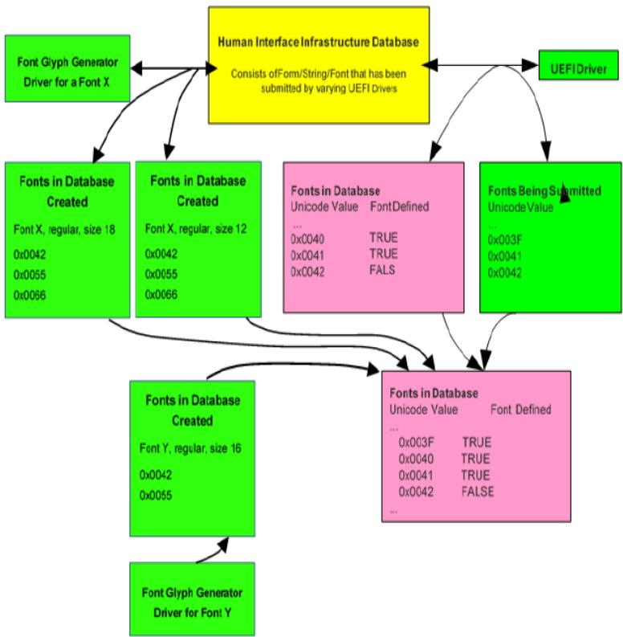  
Fig. 33.18: Fonts

## 33.2.7.3 Fixed Font Description

To allow a UEFI application or driver to extend the existing fonts with additional characters, the UEFI driver must be able to provide characters that fit aesthetically with the system font. For this reason, the capability to define attributes of diferent fonts and to suggest a reasonable default target for these parameters is important.

Fonts can vary in width, style, baseline, height, size, and so on. The fixed font definition includes white space and the glyph data, as well as the positioning of the glyph data. This prevents characters of diferent fixed fonts from being adjusted at runtime to fit aesthetically together. To provide UEFI drivers with a basic description of how to design fixed font characters, a subset of industry standard font terms are defined below:

baseline — The distance from upper left corner of cell to the base of the Caps (A, B, C,. . . )

cap\_height — The distance from the base of the Caps to the top of the Caps

x\_height — The distance from the baseline to the top of the lower case ‘x

descender — The distance some characters extended below the baseline (g, j, p, q, y)

ascender — The distance from the top of the lower case ‘x’ to the tall lower case characters (b, d, f, h, k, l)

The following figure illustrates the font description terms:

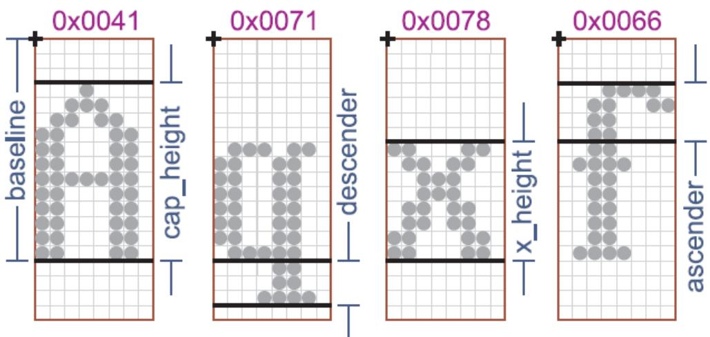  
Fig. 33.19: Font Description Terms

This 8x19 system font example (above), follows the original VGA 8x16 definition and creating double wide vertical lines, giving a bold look to the font (style = bold). Along with matching the 8x19 base system font, if a UEFI driver wants to extend the DBCS (Double Byte Character Set) font, it must be aware of the parameters that describe the 16x19 font, as shown below.

This 16x19 font example (above) has a style of plain (single width vertical lines) instead of bold like the 8x19 font, since there is not enough horizontal resolution to cleanly define the DBCS glyphs. The 16x19 ASCII characters have also been designed in a style matching the DBCS characters, allowing them to fit aesthetically together. Note that the default 16x19 fixed width characters are not stored like 1-bit images, one row after another; but instead stored with the left column (19 bytes) first, followed by the right column (19 bytes) of character data. The figure below shows how the characters of the previous figure would be laid out in the font structure.

## 33.2.7.3.1 System Fixed Font Design Guidelines

To allow a UEFI application or driver to extend the fixed font character set, the UEFI system fonts must adhere, at least roughly, to the design guidelines in the table below:

Table 33.11: Guidelines for UEFI System Fonts

<table><tr><td>Term</td><td>8 x 19 Font</td><td>16 x 19 Font</td></tr><tr><td>baseline</td><td>15 pixels</td><td>14 pixels</td></tr><tr><td>cap_height</td><td>12 pixels</td><td>11 pixels</td></tr><tr><td>x_height</td><td>8 pixels</td><td>7 pixels</td></tr><tr><td>descender</td><td>3 pixels</td><td>4 pixels</td></tr><tr><td>ascender</td><td>4 pixels</td><td>4 pixels</td></tr></table>

In the table above lists the terms in priority order. The most critical guideline to match is the baseline, followed by cap\_height and x\_height. The terms descender and ascender are not as critical to the aesthetic look of the font as are the other terms. These font design parameters are only guidelines. Failing to match them will not prevent reasonable operation of a UEFI driver that attempting to extend the system font.

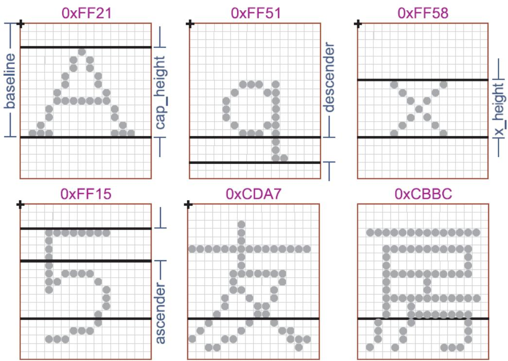  
Fig. 33.20: 16 x 19 Font Parameters

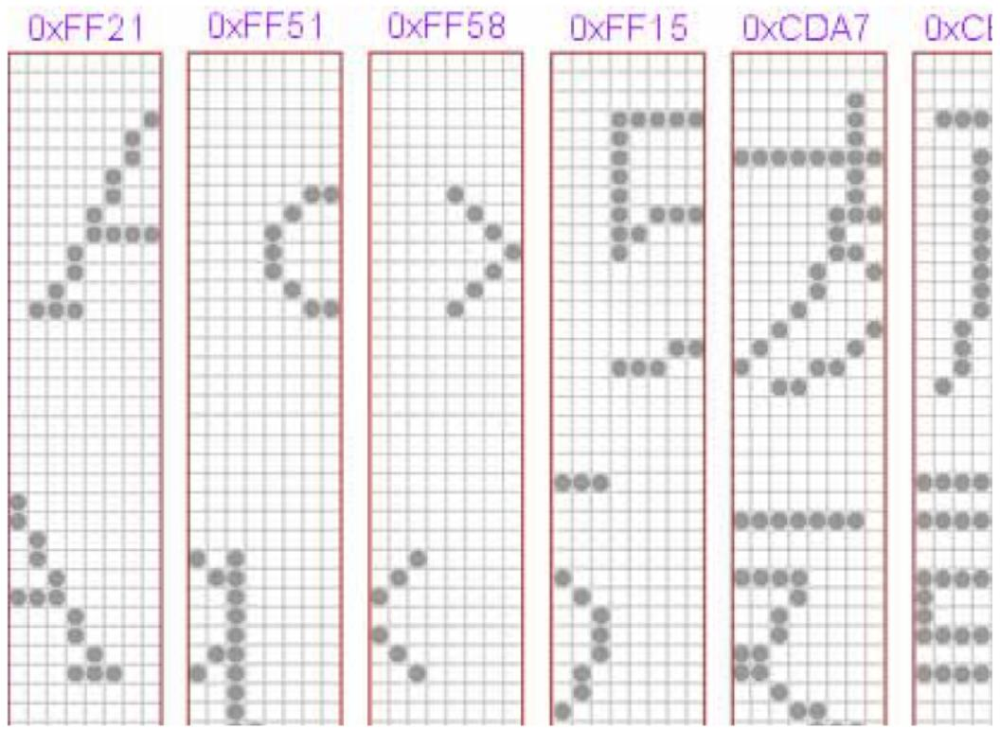  
Fig. 33.21: Font Structure Layout

## 33.2.7.4 Proportional Fonts Description

Unlike the fixed fonts, proportional fonts do not have a predefined character cell; instead the character cell is created based on the characters that are being displayed in the current line. In a proportional font only the glyph data is defined, no whitespace. Instead, the proportional font defines five parameters (Width, Height, Ofset\_X, Ofset\_Y, & Advance), which allow the glyph data to be position in the character cell and calculate the origin of the next character.

In the figure below, you can see these parameters (in ‘[. . . ]’) for the characters shown, in addition, you can see the actual byte storage (the padding to the nearest byte is shown shaded).

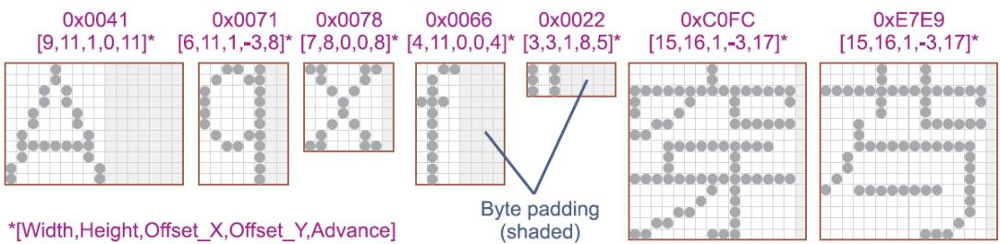  
Fig. 33.22: Proportional Font Parameters and Byte Padding

To determine font baseline, scan all font glyphs calculating sum of Height and Ofset\_Y for each glyph. The largest value of the sum defines location of the baseline.

The font line height is calculated by adding baseline with the largest by absolute value negative Ofset\_Y among all the font glyphs.

## 33.2.7.4.1 Aligning Glyphs to the Baseline

To display a line of proportional glyphs, baseline and line height have to be determined. If all the characters to be displayed are from the same font, the baseline and line height are the baseline and line height of the font.

If the characters being displayed are from diferent fonts, scan glyphs of the characters to be displayed calculating sum of Height and Ofset\_Y for each glyph. The largest value of the sum defines location of the baseline.

The line height is calculated by adding baseline with the largest by absolute value negative Ofset\_Y among all the characters to be displayed.

As shown in the following figure, once the baseline value is found it is added to the starting position of the line to calculate the Origin. From the Origin, each and every glyph can be generated based on the individual glyph parameters, including the calculation of the next glyph’s Origin.

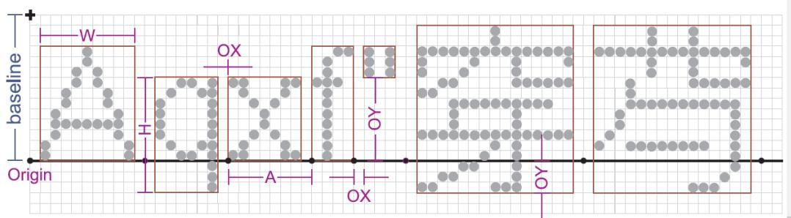  
Fig. 33.23: Aligning Glyphs

The starting position (upper left hand corner) of the glyph is defined by (Origin\_X + Ofset\_X), (Origin\_Y - (Ofset\_Y + Height)). The Origin of the next glyph is defined by (Origin\_X + Advance), (Origin\_Y).

In addition, to determining the line height and baseline values; the scan of the characters also calculates the line width by totaling up all of the advance values.

## 33.2.7.4.2 Proportional Font Design Guidelines

This method of aligning glyphs to a baseline allows one to place wildly diferent characters correctly position on a single line. However there still is a need for the system proportional fonts to roughly adhere to overall font height (19 pixels high character cells) and the placement of the baseline at the bottom of the Caps (if applicable or about 5 pixels up from the bottom of the character cell). These guidelines are not as critical as the fixed font guidelines, since the character cell height are defined at runtime, based on what else is displayed with that character.

## 33.2.8 Images

The format of the images to be stored in the Human Interface Infrastructure (HII) database have been created to conform to the industry standard 1-bit, 4-bit, 8-bit, and 24-bit video memory layouts. The 24-bit and 32-bit display systems have the exact same display capabilities and the exact same pixel definition. The diference is that the 32-bit pixels are DWORD aligned for improve CPU eficiency when accessing video memory. The extra byte that is inserted from the 24-bit and the 32-bit layout has no bearing on the actual screen.

Video memory is arranged left-to-right, and then top-to-bottom. In a 1-bit or monochrome display, the most significant bit of the first byte defines the screen’s upper left most pixel. In a 4-bit or 16 color, display the most significant nibble of the first byte defines the screen’s upper left most pixel. In a 8-bit or 256 color display, the first byte defines the screen’s upper left most pixel.

In both the 24-bit and 32-bit TrueColor displays, the first three bytes defines the screen’s upper left most pixel. The first byte is the pixel’s blue component value, the next byte is the pixel’s green component value, and the third byte is the pixel’s red component value (B,G,R). Each color component value can vary from 0x00 (color of) to 0xFF (color full on), allowing 16.8 million colors that can be specified. In the 32-bit TrueColor display modes, the fourth byte is a don’t care.

## 33.2.8.1 Converting to a 32-bit Display

The UEFI recommended video mode for computer-like devices uses a 32-bit Linear Frame Bufer video mode. All images stored in the HII database will need conversion to 32-bit before display.

To display a 24-bit image into 32-bit video memory, a pixel of the image is retrieved (read DWORD value advance pixel ofset by 3) and then written to the video memory (write DWORD value advance pixel ofset by 4).

To display any of the non-TrueColor images (1-bit, 4-bit, and 8-bit), there is an extra step of indirection through the palette definition to get the TrueColor pixel value. First retrieve the palette index value by isolating the corresponding bits, then index into the associated palette to retrieve the 24-bit (B,G,R) color entry (read DWORD value), then write it to the video memory (write DWORD value advance pixel ofset by 4). For this reason, the palette color entry definition is defined exactly the same as the image color pixel (B,G,R).

## 33.2.8.2 Non-TrueColor Displays

It is possible to display the HII database images on non-TrueColor video modes. You cannot however, display images beyond the bit depth of the target screen resolution. For example, you would be able to display 1-bit, 4-bit, and 8-bit images in a 256 color video mode. To do this you must create a global palette (256 entries), by merging all images color needs to a best fit palette and then programming the hardware palette with that data.

The hardware palette color definition (R,G,B) is backwards from the screen pixel definition (B,G,R), and will have to be swapped before programming. In addition, the hardware palette may only support 6-bit of magnitude per color component instead of the 8-bit defined in the palette information section; therefore, the values will have to be shifted before writing.

## 33.2.9 HII Database

The Human Interface Infrastructure (HII) database is the resource that serves as the repository of all the form, string, image and font data for the system. Drivers that contain information that is appropriate for the database will export this data to the HII database.

For example, one driver might contain all the motherboard-specific data (the traditional “Setup” for the system). Additionally, add-in cards may contain their own drivers, which, in turn, have their own Setup-related data. All of the drivers that contain Setup-related data would export their information to the HII database, as shown in the figure below.

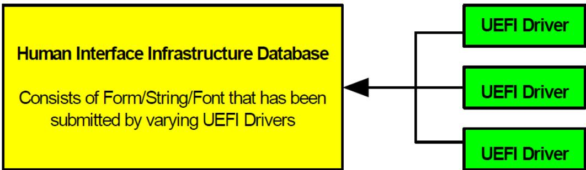  
Fig. 33.24: HII Database

## 33.2.10 Forms Browser

The UEFI Forms Browser is the service that reads the contents of the HII Database and interprets the forms data in order to present it to the user. For example, the Forms Browser can be used to gather all setup-related data and presents it to the user. This service also takes the user input and allows for changes to be saved into non-volatile storage.

The figure below shows the relationship between the HII database, UEFI drivers, and the UEFI Forms Browser.

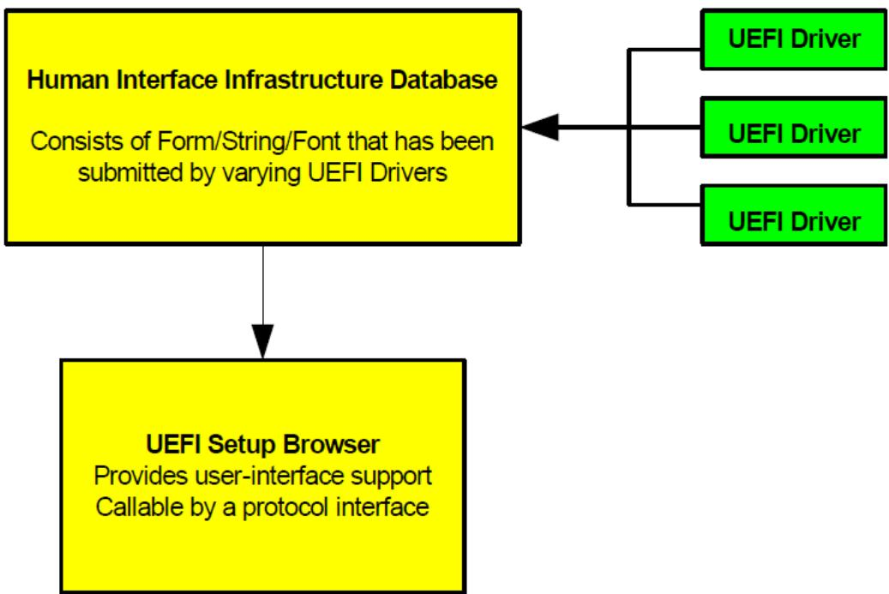  
Fig. 33.25: Setup Browser

## 33.2.10.1 User Interaction

The Forms Browser implementer has great flexibility as to the type of actual user interface provided. For example, while required to support some forms of navigation ( EFI\_FORM\_BROWSER2\_PROTOCOL.SendForm() or the crossreference question), it may optionally support additional navigation capabilities, such as a back button or a menu bar. This section describes the rules to which the Forms Browser user-interaction must conform.

## 33.2.10.1.1 Forms Browser Details

The forms browser maintains a collection of one or more forms. The forms browser is required to provide navigation for these forms if there is more than one ( EFI\_FORM\_BROWSER2\_PROTOCOL , “Form Browser Protocol”).

The forms browser maintains one or more active forms. An active form is any form where the forms browser is maintaining a set of question values. A form is considered active after all question values have been read from storage and the\* EFI\_BROWSER\_ACTION\_FORM\_OPEN action has been sent to all questions on the form which require callback. A form is considered inactive after all question values have been either discarded or written to storage and the EFI\_BROWSER\_ACTION\_FORM\_CLOSE action has been sent to all questions on the form which require callback.

The forms browser maintains a selected form. The selected form contains the selected question and indicates the primary area of user interaction.

The standards form navigation behaviors are:

Navigate Forms. — When the user chooses this required behavior, a new form is selected and, if any questions on the form are selectable ( Evaluation of Selectable Statements ), a question is selected. Forms browsers are required to provide navigation to (at least) the first form in all form sets when FormId is zero (Form Browser Protocol ). This behavior cannot be selected if the current form is modal (see Forms , “Forms”)

Exit Browser/Discard All. — When the user chooses this optional behavior, the question values for active forms are discarded, the active forms are deactivated and the forms browser exits with an action request of

EFI\_BROWSER\_ACTION\_REQUEST\_EXIT. This behavior cannot be selected if the current form is modal ( Forms ).

Exit Browser/Submit All. — When the user chooses optional behavior, the question values are written to storage, the active forms are deactivated and the forms browser exits with an action request of EFI\_BROWSER\_ACTION\_REQUEST\_SUBMIT or EFI\_BROWSER\_ACTION\_REQUEST\_RESET. This behavior cannot be selected if the current form is modal ( Forms , “Forms”).

Default. — When the user chooses this optional behavior, the current question values for the questions on the focus form are updated from one of the default stores and then the EFI\_IFR\_BROWSER\_ACTION\_REQUEST\_DEFAULT\_x action is sent for each of the questions with the Callback attribute. This behavior can be initiated by a Reset Button question ( Reset Button).

## 33.2.10.1.2 Selected Form

When a form is made active, the forms browser sends the EFI\_BROWSER\_ACTION\_FORM\_OPEN for all questions supporting callback, retrieves the current question values, saves those as the original question values and begins refreshing any questions that support it.

The forms browser maintains a current question value for each question on active forms. The current question value is the last value that the forms browser read from storage/callback (Values ) or the last value committed by the user. The form is considered modified if any of the current question values are modified (see Questions, below). The forms browser refreshes the current question values of at least questions on the selected with a non-zero refresh interval.

The forms browser maintains a selected question on the selected form. The selected question is the primary focus of the user’s interaction. When a form is selected, the forms browser must choose a selectable question ( Evaluation of Selectable Statements , “Evaluation of Selectable Statements”) as the selected question, if one is present on the form.

The standard active form behaviors are:

Exit Browser/Discard All. — When the user chooses this required behavior, the question values for active forms are discarded, the active forms are deactivated and the forms browser exits with an action request of EFI\_BROWSER\_ACTION\_REQUEST\_EXIT . This behavior can be initiated by the function associated with a question with the Callback attribute.

Exit Browser/ Submit All. — When the user chooses this required behavior, the current question values for active forms are validated (see nosubmitif, EFI\_IFR\_NOT\_EQUAL ) and, if successful, question values for active forms are written to storage, the active forms are deactivated and the forms browser exits with an action request of EFI\_BROWSER\_ACTION\_REQUEST\_SUBMIT. This behavior can be initiated by the function associated with a question with the Callback attribute.

Exit Browser/Discard All/Reset Platform. — When the user chooses this required behavior, the question values for active forms are discarded, the active forms are deactivated and the form browser exits with an action request of EFI\_BROWSER\_ACTION\_REQUEST\_RESET . This behavior can be initiated by the function associated with a question with the Callback attribute.

Exit Form/Submit Form. — Apply Form. When the user chooses this required behavior, the question values for the selected form are validated (see ->nosubmitif, BUGBUG<-) and, if successful, question values for the selected form are written to storage and the selected form is deselected. This behavior can be initiated by the function associated with a question with the Callback attribute.

Exit Form/Discard Form. — When the user chooses this required behavior, the question values for the selected form are discarded and the selected form is deselected. This behavior can be initiated by the function associated with a question with the Callback attribute.

Apply Form. — When the user chooses this required behavior, the question values for the selected form are validated (see nosubmitif, BUGBUG) and, if successful, question values for the selected form are written to storage. This behavior can be initiated by the function associated with a question with the Callback attribute.

Discard Form. — When the user chooses this required behavior, the question values for the selected form are discarded. This behavior can be initiated by the function associated with a question with the Callback attribute.

Default. — When the user chooses this required behavior, the current question values for the questions on the selected form are updated from a default store. This behavior can be initiated by a Reset Button question (see Reset Button ).

Navigate To Question. — When the user chooses this required behavior, the selected question is deselected and another question on the same form is selected. The types of navigation provided between questions on the same form are beyond the scope of this specification.

Navigate To Form. — When the user chooses this required behavior, the selected form is deselected and the form specified by the question is selected. This behavior can be initiated by a Cross-Reference question. Note that this behavior is distinct from the Navigate Forms behavior described in Forms Navigation.

From these basic behaviors, more complex behaviors can be constructed. For example, a forms browser might check whether the form is modified and, if so, prompt the user to select between the Exit Browser/Discard All and Exit Browser/Submit All behaviors.

## 33.2.10.1.3 Selected Question

When the user navigates to a question or the forms browser selects a form with a selectable question, the forms browser places the question in the static state. When the user is choosing another question values for the selected question (by typing or from a menu or other means), the forms browser places the question in the changing state. When the user finalizes selection of a question value the forms browser returns the question to the static state.

The forms browser refreshes all questions in at least the selected form with a non-zero refresh interval that are not modified. Typically, a forms browser will not update the displayed question value while the selected question is in the changing state, but will when the selected question is in the static state. A question is considered modified if there is storage associated with the question (i.e., a variable store was specified) and the current question value is diferent from the original question value.

## The standard active question behaviors are:

Change — When the user chooses this required behavior, the forms browser places the selected question in the changing state and allows the user to specify a new current question value for the active question. For example, selecting items in a drop box or beginning to type a new value in an edit box.

With some question types and user interface styles, this behavior is hidden from the user. For example, with check boxes or radio buttons as found in most windowed user-interfaces, the user changes and commits the value with one action. Likewise, with action buttons, selecting the action button implies both the question value and the commit action.

This behavior corresponds to the CHANGING browser action request for questions that support callback.

Commit — When the user chooses this required behavior, the forms browser validates the specified question value (see EFI\_IPF\_INCONSISTENT\_IF , EFI\_IFR\_INCONSISTENT\_IF ) and, if successful, places the selected question in the static state and updates the current question value to that specified while in the changing state. If the selected question’s current question value is diferent than the selected question’s original question value, the selected question is considered modified. The form browser must then re-evaluate the modifiability, selectability and visibility of other questions in the selected form.

This behavior corresponds to the CHANGED browser action request for questions that support callback.

Discard — When the user chooses this required behavior, the forms browser places the question in the changed state.

## 33.2.11 Configuration Settings

In order to save user changes to configuration settings after the system reset or power-of, there must be some form of non-volatile storage available. There are two types of non-volatile storage: system non-volatile storage or add-in card non-volatile storage. Both types are supported.

In general, settings are not saved to non-volatile storage until the user specifically directs the Forms Browser to do so. There are exceptions, such as when operating in a batch or script mode, setting a system password, and updating the system date and time. The underlying platform support dictates whether or not hardware configuration changes are committed immediately.

As shown in the figure below, when a system reset occurs, the firmware’s initialization routines will launch the UEFI drivers (e.g. option ROMs). Drivers enabled to take direction from a non-volatile setting read the updated settings during their initialization.

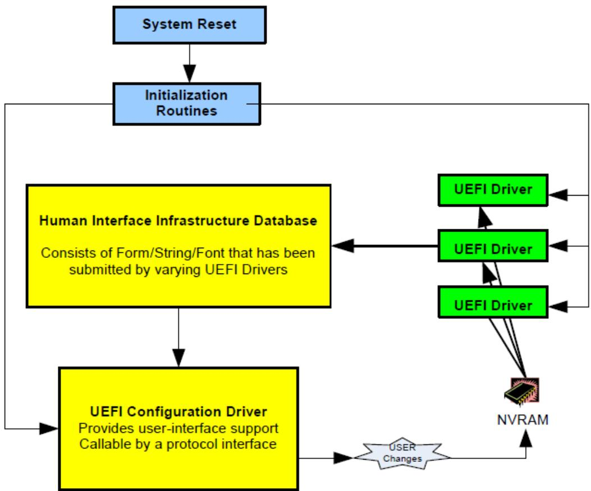  
Fig. 33.26: Storing Configuration Settings

## 33.2.11.1 OS Runtime Utilization

Due to the static nature of the data that is contained in the HII Database and the fact that certain classes of non-volatile storage can be updated during OS run-time, it is possible for an application running under an OS to read the HII information, make configuration changes and even make changes.

The figure below shows how an OS makes use of the HII database during runtime. In this case, the contents of the HII Database is exported to a bufer. The pointer to the bufer is placed in the EFI System Configuration Table, where it can be retrieved by an OS application.

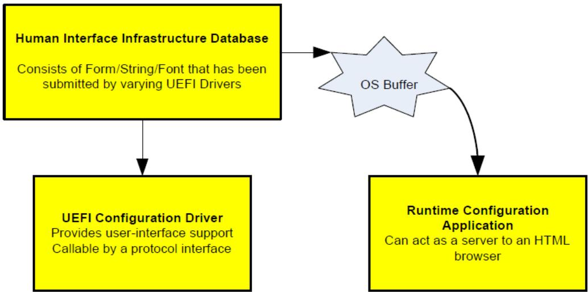  
Fig. 33.27: OS Runtime Utilization

The process used to allow an OS application to use this is as follows:

Drivers/applications in the system register user interface data into the HII Database

When the platform transitions from pre-boot to runtime phases of operation, the HII ExportPackageLists() is called to export the contents of the HII Database into a runtime bufer.

This runtime bufer is advertised in the UEFI Configuration Table using the HII Database Protocol’s GUID so that an OS application can find the data.

The HII ExportConfig() is called to export the current configuration into a runtime bufer.

This runtime bufer is advertised in the UEFI Configuration Table using the HII Configuration Routing Protocol’s GUID so that an OS application can find the data.

When an O/S application wants to display pre-boot configuration content, it searches the UEFI Configuration Table for the HII Database Protocol’s GUID entry and renders the contents from the runtime bufer which it points to.

If the OS application needs to update the system configuration, the configuration information can be updated.

For those configuration settings which are stored in UEFI variables (i.e., using GetVariable() and SetVariable() ), the application can update these using the abstraction provided by the operating system.

For those configuration settings which are not stored in UEFI variables, the OS application can use the UEFI Update-Capsule runtime service to change the configuration.

## 33.2.11.2 Working with a UEFI Configuration Language

By defining the concept of a language that may provide hints to a consumer that the string payload may contain predefined standard keyword content, the user of this solution can export their configuration data for evaluation. This evaluation enables the consumer to determine if a particular platform supports a given configuration language, and in-turn be able to adjust known settings that are stored in a platform-specific manner. An example of this is illustrated below which uses various component described in this and the other HII chapters of this specification. In the example, a fictional technology called XYZ exists, and this particular platform supports it. The question is, how does a standard application which is not privy to the platform’s construction know how this setting is stored? To-date, this is not a reasonably solvable problem, but in the illustration below, this example shows how one might go about solving this issue.

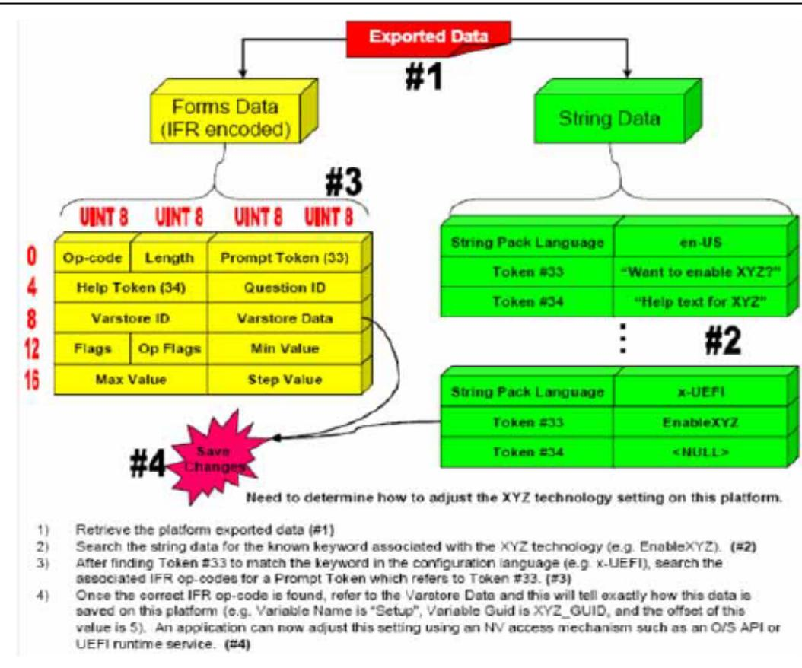  
Fig. 33.28: Standard Application Obtaining Setting Example

## 33.2.12 Form Callback Logic

Since it has been the design intent that the forms processor not need to understand the underlying hardware implementations or design paradigms of the platform, there were certain needs that could only be met by calling a more platform knowledgeable component. In this case, the component would typically be associated with some hardware device (e.g. motherboard, add-in card, etc.). To facilitate this interaction, some formal interfaces were declared for more platform-specific components to advertise and the forms processor could then call.

Note that the need for the forms processor to call into an alternate component driver should be limited as much as possible. The two primary reasons for this are the cases where of-line or O/S-present configuration is important.

The three flow charts which follow describe the typical decisions that a forms processor would make with regards to handling processes which necessitate a callback.

## 33.2.13 Driver Model Interaction

The ability for a UEFI driver to interact with a target controller is abstracted through the Configuration Access Protocol. If a particular piece of hardware managed by a controller needs configuration services, it is the responsibility of that controller to provide this configuration abstraction for the given device. Regardless of whether a device driver or bus driver is abstracting the hardware configuration, the interaction with a configured device is identical.

Note that the ability for a driver to provide these access protocols might be done fairly early in the initialization process. Depending on the hardware capabilities, one might be advantaged in providing configuration access very early so that being able to determine a given device’s current settings can be done without a full enumeration of certain bus devices. Also note that the same recommendations that are made in the DriverBinding sections should still be maintained. These cover the Supported, Started, and Stopped functions.

## 33.2.14 Human Interface Component Interactions

The figure below depicts the model used inside a common deployment of HII to manage human interface components.

## 33.2.15 Standards Map Forms

Configuration settings are configuration settings. But the way in which they are controlled is driven by diferent requirements. For example, the UEFI HII infrastructure focuses primarily on the way in which the configuration settings can be browsed and manipulated by a user. Other standards such as the DMTF Command-Line Protocol, focus on the way in which configuration settings can be manipulated via text commands.

Each configuration method tends to view the configuration settings a diferent way. In the end, they are changing the same configuration setting, but their means of exposing the control difers. The means by which a configuration method (HII, DMTF, WMI, SNMP, etc.) exposes an individual configuration setting is called a question.

In many cases, there is a one-to-one mapping between the questions exposed by these diferent configuration methods. That is, a question, as exposed by one configuration method matches the semantic meaning of the configuration setting exactly.

However, in other cases, there is not a one-to-one mapping. These cases break down into three broad categories:

1. Value Shift. In this case, the configuration setting has the same scope as the question exposed by a configuration method, but the values used to describe them are diferent. It may be as simple as 1=5, 2=6, 3=7, etc. or something more complicated, where “ON”=1 and “OFF”=0.\*\*

2. One-To-Many. In this case, the configuration setting maps to two or more questions exposed by a configuration method. For example, the configuration setting might have the following enumerated values:

a. 0 = Disable Serial Port

b. 1 = Enable Serial Port, I/O Port 0x3F8, IRQ 4

c. 2 = Enable Serial Port, I/O Port 0x2F8, IRQ 3

d. 3 = Enable Serial Port, I/O Port 0x3E8, IRQ 4

But in the configuration method, the serial port is controlled by three separate questions:

• Question #1: 0 = disable, 1 = enable

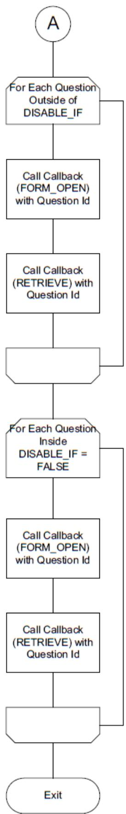

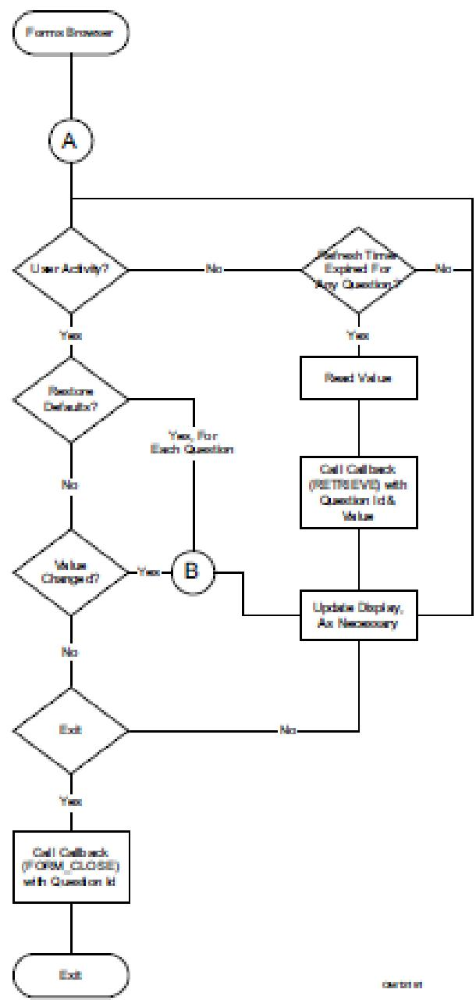  
Fig. 33.30: Typical Forms Processor Decisions Necessitating a Callback (2)

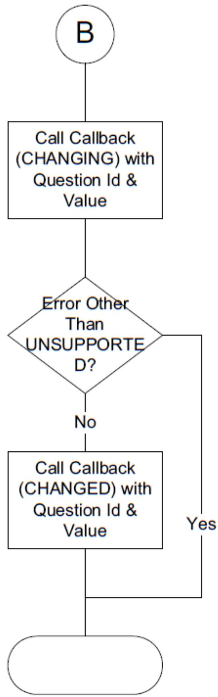

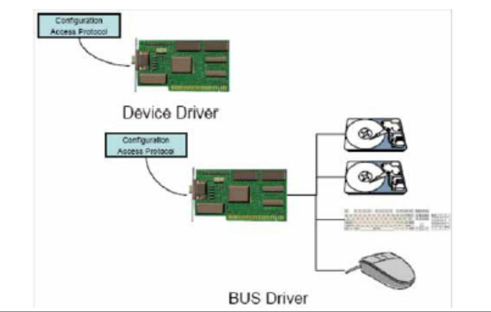  
Fig. 33.32: Driver Model Interactions

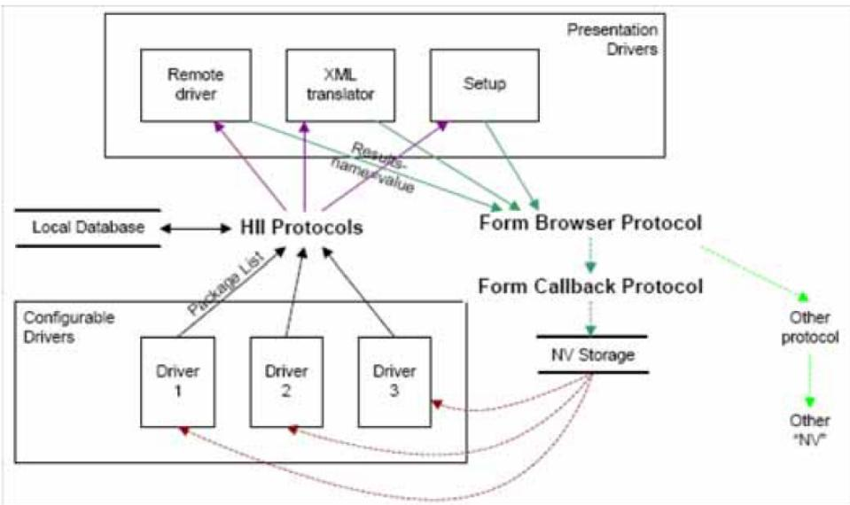  
Fig. 33.33: Managing Human Interface Components

• Question #2: I/O Port (disabled if Question #1 = 0)

• Question #3: IRQ (disabled if Question #1 = 0)

Changing the configuration method question #1 to a value of 0 requires that the configuration setting be set to 0. In this case, there is the possibly of data loss. After changing the configuration setting to 0, the information about the I/O port and IRQ are not preserved.

So, in order to change the configuration setting to the value of 1 would require three of the configuration method’s questions to change value: Question #1=1, Question #2=0x3F8, Question #3=IRQ 4.

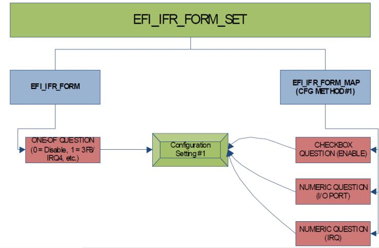  
Fig. 33.34: EFI IFR Form Set configuration

3. Many-To-One. In this case, the conditions are reversed from the example described in #2 above. Now there are three configuration settings which map to a single configuration method question.

For example, the configuration settings are described using three separate questions:

a. Question #1: 0 = disable, 1 = enable

b. Question #2: I/O Port (disabled if Question #1 = 0)

c. Question #3: IRQ (disabled if Question #1 = 0).

But in the configuration method, the serial port is controlled by a single question with the following enumerated values:

a. 0 = Disable Serial Port

b. 1 = Enable Serial Port, I/O Port 0x3F8, IRQ 4

c. 2 = Enable Serial Port, I/O Port 0x2F8, IRQ 3

d. 3 = Enable Serial Port, I/O Port 0x3E8, IRQ 4

e. 4 = Enable Serial Port, I/O Port 0x2E8, IRQ 3

So, in order to change the configuration method to the value of 1 would require three configuration settings to change value: Question #1=1, Question #2=0x3F8, Question #3=IRQ 4.

Some configuration settings may involve more than one of these mappings.

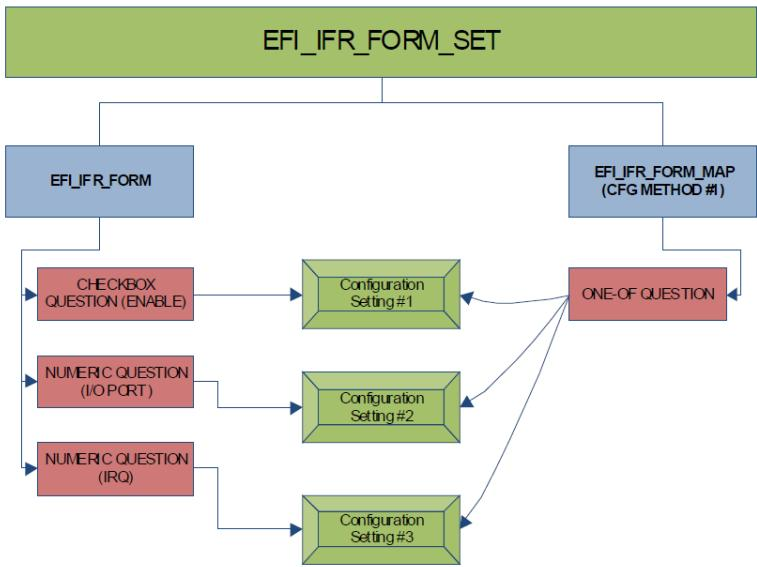  
Fig. 33.35: EFI IFR Form Set Question Changes

Standards map forms describe the questions exposed by these other configuration methods and how they map back to the configuration settings exposed by the UEFI drivers. Each standards map form describes the mapping for a single configuration method, along with that configuration method’s name and version.

The questions within standards map forms are encoded using IFR in the same fashion as those within other UEFI forms. The prompt strings for these questions are tied back to the names for those questions within the configuration method (e.g., DMTF CLP).

## 33.2.15.1 Create A Question’s Value By Combing MultipleConfiguration Settings

Rather than reading directly from storage, these standards map questions retrieve their value using the EFI\_IFR\_READ ( EFI\_IFR\_Read ) operator. This operator can aggregate a value from more than one configuration settings using EFI\_IFR\_GET ( EFI\_IFR\_Get ). This operator can also change the type (integer, string, Boolean) of the value so that, say, a configuration setting with a type of integer can be represented in a standards map form as a string.

For example, to map a single question to three configuration settings (CS1, CS2 and CS3) as described in scenario #3 in Strings , above would have the following truth table:

Table 33.12: Truth Table: Mapping A Single Question To Three Config-

<table><tr><td>CS1</td><td>CS2</td><td>CS3</td><td>Q</td></tr><tr><td>FALSE</td><td>X</td><td>X</td><td>0</td></tr><tr><td>TRUE</td><td>0x3F8</td><td>4</td><td>1</td></tr><tr><td>TRUE</td><td>0x2F8</td><td>3</td><td>2</td></tr><tr><td>TRUE</td><td>0x3E8</td><td>4</td><td>3</td></tr><tr><td>TRUE</td><td>0x2E8</td><td>3</td><td>4</td></tr><tr><td>TRUE</td><td>any other value</td><td>any other value</td><td>Undefined</td></tr></table>

These become the following equations:

```txt
x0: Get (CS1) ? x1 : 0
x1: ((Get(CS2) & 0xF00) >> 8) == Get(CS3) + 1 ? x2 : Undefined
x2: Map(Get(CS2), 0x3f8, 1, 0x2F8, 2, 0x3E8, 3, 0x2E8, 4)
```

## 33.2.15.2 Changing Multiple Configuration Settings From One Question’s Value

Rather than writing directly to storage, these standards map questions change their value using the EFI\_IFR\_WRITE ( EFI\_IFR\_Write ) operator. This operator can, in turn, use the EFI\_IFR\_SET ( EFI\_IFR\_Set ) operator to change one or more configuration settings. This operator can also change the type (integer, string, Boolean, etc.) of the value written so that, say, a configuration setting with a type of integer can be represented in a standards map form as a string question.

For example, in example #2 above, the following table applies:

Table 33.13: Multiple Configuration Settings Example #2

<table><tr><td>CS1</td><td>CS2</td><td>CS3</td><td>Q</td></tr><tr><td>FALSE</td><td>X</td><td>X</td><td>0</td></tr><tr><td>TRUE</td><td>0x3F8</td><td>4</td><td>1</td></tr><tr><td>TRUE</td><td>0x3E8</td><td>3</td><td>2</td></tr><tr><td>TRUE</td><td>0x2F8</td><td>4</td><td>3</td></tr><tr><td>TRUE</td><td>0x2E8</td><td>3</td><td>4</td></tr></table>

```csv
Set (CS1,Q != 0) &&  
Set (CS2,Map(this,1,0x3F8,2,0x3E8,3,0x2F8,4,0x2E8)) &&  
Set (CS3,Map(this,1,4,2,3,3,4,4,3)
```

## 33.2.15.3 Value Shifting

Value shifting is facilitated by the EFI\_IFR\_MAP ( EFI\_IFR\_Map ) operator. If this operator finds a value in a list, it replaces it with another value from the list, even if the other value is a diferent type.

For example, consider the following list of values

Table 33.14: Values

<table><tr><td>1</td><td>PEI Module</td></tr><tr><td>2</td><td>DXE Boot Service Driver</td></tr><tr><td>3</td><td>DXE Runtime Driver</td></tr><tr><td>10</td><td>UEFI Boot Service Driver</td></tr><tr><td>11</td><td>UEFI Runtime Driver</td></tr><tr><td>12</td><td>UEFI Application</td></tr></table>

If the integer value 10 were supplied, the value “UEFI Boot Service Driver” would be returned. If the integer value 20 were supplied, Undefined would be returned.

## 33.2.15.4 Prompts

In standards map forms, the prompts can be used as the key words for the configuration method. They should be specified in the language i-uefi unless there are multiple translations available. Other standards may use the question identifiers as the means of identifying the standard question.

## 33.3 Code Definitions

This section describes the binary encoding of the diferent package types:

• Font Package

• Simplified Font Package

• String Package

• Image Package

• Device Path Package

• Keyboard Layout Package

• GUID Package

• Forms Package

## 33.3.1 Package Lists and Package Headers

## 33.3.1.1 EFI\_HII\_PACKAGE\_HEADER

## Summary

The header found at the start of each package.

## Prototype

<table><tr><td colspan="2">typedef struct {UINT32 Length:24;UINT32 Type:8;UINT8 Data[...];} EFI_HII_PACKAGE_HEADER;</td></tr></table>

## Members

## Length

The size of the package in bytes.

## Type

The package type. See EFI\_HII\_PACKAGE\_TYPE\_x, below.

## Data

The package data, the format of which is determined by Type.

## Description

Each package starts with a header, as defined above, which indicates the size and type of the package. When added to a pointer pointing to the start of the header, Length points at the next package. The package lists form a package list when concatenated together and terminated with an EFI\_HII\_PACKAGE\_HEADER with a Type of EFI\_HII\_PACKAGE\_END.

The type EFI\_HII\_PACKAGE\_TYPE\_GUID is used for vendor-defined HII packages, whose contents are determined by the Guid.

The range of package types starting with EFI\_HII\_PACKAGE\_TYPE\_SYSTEM\_BEGIN through EFI\_HII\_PACKAGE\_TYPE\_SYSTEM\_END are reserved for system firmware implementers.

## Related Definitions

<table><tr><td>#define EFI_HII_PACKAGE_TYPE_ALL</td><td>0x00</td></tr><tr><td>#define EFI_HII_PACKAGE_TYPE_GUID</td><td>0x01</td></tr><tr><td>#define EFI_HII_PACKAGE_FORMS</td><td>0x02</td></tr><tr><td>#define EFI_HII_PACKAGE_STRINGS</td><td>0x04</td></tr><tr><td>#define EFI_HII_PACKAGE_FONTS</td><td>0x05</td></tr><tr><td>#define EFI_HII_PACKAGE IMAGES</td><td>0x06</td></tr><tr><td>#define EFI_HII_PACKAGE_SIMPLE_FONTS</td><td>0x07</td></tr><tr><td>#define EFI_HII_PACKAGE_DEVICE_PATH</td><td>0x08</td></tr><tr><td>#define EFI_HII_PACKAGE_KEYBOARD_LAYOUT</td><td>0x09</td></tr><tr><td>#define EFI_HII_PACKAGE_ANIMATIONS</td><td>0x0A</td></tr><tr><td>#define EFI_HII_PACKAGE_END</td><td>0xDF</td></tr><tr><td>#define EFI_HII_PACKAGE_TYPE_SYSTEM_BEGIN</td><td>0xE0</td></tr><tr><td colspan="2">#define EFI_HII_PACKAGE_TYPE_SYSTEM_END 0xFF</td></tr></table>

Table 33.15: Package Types

<table><tr><td>Package Type</td><td>Description</td></tr><tr><td>EFI_HII_PACKAGE_TYPE_ALL</td><td>Pseudo-package type used when exporting package lists. See ExportPackageList().</td></tr><tr><td>EFI_HII_PACKAGE_TYPE_GUID</td><td>Package type where the format of the data is specified using a GUID immediately following the package header.</td></tr><tr><td>EFI_HII_PACKAGE_FORMS</td><td>Forms package.</td></tr><tr><td>EFI_HII_PACKAGE_STRINGS</td><td>Strings package</td></tr><tr><td>EFI_HII_PACKAGE_FONTS</td><td>Fonts package.</td></tr><tr><td>EFI_HII_PACKAGE IMAGES</td><td>Images package.</td></tr><tr><td>EFI_HII_PACKAGE_SIMPLE_FONTS</td><td>Simplified (8x19, 16x19) Fonts package</td></tr><tr><td>EFI_HII_PACKAGE_DEVICE_PATH</td><td>Binary-encoded device path.</td></tr><tr><td>EFI_HII_PACKAGE_END</td><td>Used to mark the end of a package list.</td></tr><tr><td>EFI_HII_PACKAGE_ANIMATIONS</td><td>Animations package.</td></tr><tr><td></td><td>Package types reserved for use by platform firmware implementations.</td></tr><tr><td>EFI_HII_PACKAGE_TYPE_SYSTEM_BEGIN...</td><td></td></tr><tr><td>EFI_HII_PACKAGE_TYPE_SYSTEM_END</td><td></td></tr></table>

## 33.3.1.2 EFI\_HII\_PACKAGE\_LIST\_HEADER

## Summary

The header found at the start of each package list.

Prototype

<table><tr><td>typedef struct { EFI_GUID PackageListGuid;UINT32 PackagLength;} EFI_HII_PACKAGE_LIST_HEADER;</td></tr></table>

## Members

## PackageListGuid

The unique identifier applied to the list of packages which follows.

## PackageLength

The size of the package list (in bytes), including the header.

## Description

This header uniquely identifies the package list and is placed in front of a list of packages. Package lists with the same PackageListGuid value should contain the same data set. Updated versions should have updated GUIDs.

## 33.3.2 Simplified Font Package

The simplified font package describes the font glyphs for the standard 8x19 pixel (narrow) and 16x19 (wide) fonts. Other fonts should be described using the normal Font Package.

A simplified font package consists of a header and two types of glyph structures–standard-width (narrow) and wide glyphs.

## 33.3.2.1 EFI\_HII\_SIMPLE\_FONT\_PACKAGE\_HDR

## Summary

A simplified font package consists of a font header followed by a series of glyph structures.

Prototype

```c
typedef struct _EFI_HII_SIMPLE_FONT_PACKAGE_HDR {
    EFI_HII_PACKAGE_HEADER Header;
    UINT16 NumberOfNarrowGlyphs;
    UINT16 NumberOfWideGlyphs;
    EFI_NARROW_GLYPH NarrowGlyphs[];
    EFI_WIDE_GLYPH WideGlyphs[];
} EFI_HII_SIMPLE_FONT_PACKAGE_HDR;
```

## Members

## Header

The header contains a Length and Type field. In the case of a font package, the type will be EFI\_HII\_PACKAGE\_SIMPLE\_FONTS and the length will be the total size of the font package including the size of the narrow and wide glyphs. See EFI\_HII\_PACKAGE\_HEADER.

## NumberOfNarrowGlyphs

The number of NarrowGlyphs that are included in the font package.

## NumberOfWideGlyphs

The number of WideGlyphs that are included in the font package.

## NarrowGlyphs

An array of EFI\_NARROW\_GLYPH entries. The number of entries is specified by NumberOfNarrowGlyphs.

## WideGlyphs

An array of EFI\_WIDE\_GLYPH entries. The number of entries is specified by NumberOfWideGlyphs. To calculate the ofset of WideGlyphs, use the ofset of NarrowGlyphs and add the size of EFI\_NARROW\_GLYPH multiplied by the NumberOfNarrowGlyphs.

## Description

The glyphs must be sorted by Unicode character code.

It is up to developers who manage fonts to choose eficient mechanisms for accessing fonts. The contiguous presentation can easily be used because narrow and wide glyphs are not intermixed, so a binary search is possible (hence the requirement that the glyphs be sorted by weight).

## 33.3.2.2 EFI\_NARROW\_GLYPH

## Summary

The EFI\_NARROW\_GLYPH has a preferred dimension (w x h) of 8 x 19 pixels.

## Prototype

```txt
typedef struct {
    CHAR16 UnicodeWeight;
    UINT8 Attributes;
    UINT8 GlyphCol1[EFI_GLYPH_HEIGHT];
} EFI_NARROW_GLYPH;
```

## Members

## UnicodeWeight

The Unicode representation of the glyph. The term weight is the technical term for a character code.

## Attributes

The data element containing the glyph definitions; see “Related Definitions” below.

## GlyphCol1

The column major glyph representation of the character. Bits with values of one indicate that the corresponding pixel is to be on when normally displayed; those with zero are of.

## Description

Glyphs are represented by two structures, one each for the two sizes of glyphs. The narrow glyph ( EFI\_NARROW\_GLYPH ) is the normal glyph used for text display.

## Related Definitions

<table><tr><td colspan="2">// Contents of EFI_NARROW_GLYPH.Attributes</td></tr><tr><td>#define EFI_GLYPH_NON_SPACING</td><td>0x01</td></tr><tr><td>#define EFI_GLYPH_WIDE</td><td>0x02</td></tr><tr><td>#define EFI_GLYPH_HEIGHT</td><td>19</td></tr><tr><td>#define EFI_GLYPH_WIDTH</td><td>8</td></tr></table>

Following is a description of the fields in the above definition:

## EFI\_GLYPH\_NON\_SPACING

This symbol is to be printed “on top of” ( OR ’d with) the previous glyph beforedisplay.

## EFI\_GLYPH\_WIDE

This symbol uses 16x19 formats rather than 8x19.

## 33.3.2.3 EFI\_WIDE\_GLYPH

## Summary

The EFI\_WIDE\_GLYPH has a preferred dimension (w x h) of 16 x 19 pixels, which is large enough to accommodate logographic characters.

## Prototype

```objectivec
typedef struct {
    CHAR16 UnicodeWeight;
    UINT8 Attributes;
    UINT8 GlyphCol1[EFI_GLYPH_HEIGHT];
    UINT8 GlyphCol2[EFI_GLYPH_HEIGHT];
    UINT8 Pad[3];
} EFI_WIDE_GLYPH;
```

## Members

## UnicodeWeight

The Unicode representation of the glyph. The term weight is the technical term for a character code.

## Attributes

The data element containing the glyph definitions; see “Related Definitions” in EFI\_NARROW\_GLYPH for attribute values.

## GlyphCol1 and GlyphCol2

The column major glyph representation of the character. Bits with values of one indicate that the corresponding pixel is to be on when normally displayed; those with zero are of.

## Pad

Ensures that sizeof (EFI\_WIDE\_GLYPH) is twice the sizeof (EFI\_NARROW\_GLYPH). The contents of Pad must be zero.

## Description

Glyphs are represented via the two structures, one each for the two sizes of glyphs. The wide glyph ( EFI\_WIDE\_GLYPH ) is large enough to display logographic characters.

## 33.3.3 Font Package

The font package describes the glyphs for a single font with a single family, size and style. The package has two parts: a fixed header and the glyph blocks. All structures described here are byte packed.

## 33.3.3.1 Fixed Header

The fixed header consists of a standard record header and then the character values in this section, the flags (including the encoding method) and the ofsets of the glyph information, the glyph bitmaps and the character map.

```c
typedef struct _EFI_HII_FONT_PACKAGE_HDR {
    EFI_HII_PACKAGE_HEADER Header;
    UINT32    HDRSize;
    UINT32    GlyphBlockOffset;
    EFI_HII_GLYPH_INFO Cell;
    EFI_HII_FONT_STYLE FontStyle;
```

(continues on next page)

<table><tr><td colspan="2"></td><td>(continued from previous page)</td></tr><tr><td>CHAR16</td><td>FontFamily[];</td><td></td></tr><tr><td>} EFI_HII_FONT_PACKAGE_HDR;</td><td></td><td></td></tr></table>

## Header

The standard package header, where Header.Type = EFI\_HII\_PACKAGE\_FONTS.

## HdrSize

Size of this header.

## GlyphBlockOfset

The ofset, relative to the start of this header, of a series of variable-length glyph blocks, each describing information about the bitmap associated with a glyph.

## Cell

This contains the measurement of the widest and tallest characters in the font ( Cell.Width and Cell.Height ). It also contains the default ofset to the horizontal and vertical origin point of the character cell ( Cell.OfsetX and Cell.OfsetY ). Finally, it contains the default AdvanceX

## FontStyle

The design style of the font, 1 bit per style. See EFI\_HII\_FONT\_STYLE.

## FontFamily

The null-terminated string with the name of the font family to which the font belongs.

## Related Definitions

<table><tr><td colspan="2">typedef UINT32 EFI_HII_FONT_STYLE;</td></tr><tr><td>#define EFI_HII_FONT_STYLE_NORMAL</td><td>0x00000000</td></tr><tr><td>#define EFI_HII_FONT_STYLE_BOLD</td><td>0x00000001</td></tr><tr><td>#define EFI_HII_FONT_STYLE_ITALIC</td><td>0x00000002</td></tr><tr><td>#define EFI_HII_FONT_STYLE_EMBOSS</td><td>0x00010000</td></tr><tr><td>#define EFI_HII_FONT_STYLE_OUTLINE</td><td>0x00020000</td></tr><tr><td>#define EFI_HII_FONT_STYLE_SHADOW</td><td>0x00040000</td></tr><tr><td>#define EFI_HII_FONT_STYLE_UNDERLINE</td><td>0x00080000</td></tr><tr><td>#define EFI_HII_FONT_STYLE_DBL_UNDER</td><td>0x00100000</td></tr></table>

## 33.3.3.2 Glyph Information

For each Unicode character code, the glyph information gives the glyph bitmap, the character size and the position of the bitmap relative to the origin of the character cell. The glyph information is encoded as a series of blocks, each with a single byte header. The blocks must be processed in order.

Each block begins with a single byte, which contains the block type.

## Prototype

<table><tr><td>typedef struct _EFI_HII_GLYPH_BLOCK {UINT8 BlockType;UINT8 BlockBody[];} EFI_HII_GLYPH_BLOCK;</td></tr></table>

## Members

The following table describes the diferent block types:

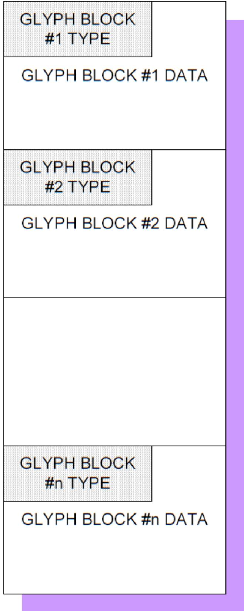  
Fig. 33.36: Glyph Information Encoded in Blocks

<table><tr><td>Name</td><td>Value</td><td>Description</td></tr><tr><td>EFI_HII_GIBT_END</td><td>0x00</td><td>The end of the glyph information.</td></tr><tr><td>EFI_HII_GIBT_GLYPH</td><td>0x10</td><td>Glyph information for a single character value, bit-packed.</td></tr><tr><td>EFI_HII_GIBT_GLYPHS</td><td>0x11</td><td>Glyph information for multiple character values.</td></tr><tr><td>EFI_HII_GIBT_GLYPH_DEFAULT</td><td>0x12</td><td></td></tr><tr><td></td><td></td><td>Glyph information for a single character value, using the default character cell information.</td></tr><tr><td>EFI_HII_GIBT_GLYPHS_DEFAULT</td><td>0x13</td><td></td></tr><tr><td></td><td></td><td>Glyph information for multiple character values, using the default character cell information.</td></tr><tr><td>EFI_HII_GIBT_GLYPH_VARIABILITY</td><td>0x14</td><td>Glyph information for the _GIBT_GLYPH_VARIABILITY variable glyph.</td></tr><tr><td>EFI_HII_GIBT_DUPLICATE</td><td>0x20</td><td></td></tr><tr><td></td><td></td><td>Create a duplicate of an existing glyph but with a new character value.</td></tr><tr><td>EFI_HII_GIBT_SKIP2</td><td>0x21</td><td>Skip a number (1-65535) character values.</td></tr><tr><td>EFI_HII_GIBT_SKIP1</td><td>0x22</td><td>Skip a number (1-255) character values.</td></tr><tr><td>EFI_HII_GIBT_DEFAULTS</td><td>0x23</td><td>Set default glyph information for subsequent glyph blocks.</td></tr><tr><td>EFI_HII_GIBT_EXT1</td><td>0x30</td><td>For future expansion (one byte length field)</td></tr><tr><td>EFI_HII_GIBT_EXT2</td><td>0x31</td><td>For future expansion (two byte length field)</td></tr><tr><td>EFI_HII_GIBT_EXT4</td><td>0x32</td><td>For future expansion (four byte length field)</td></tr></table>

## Description

In order to recreate all glyphs, start at the first block and process them all until a EFI\_HII\_GIBT\_END block is found. When processing the glyph blocks, each block refers to the current character value ( CharValueCurrent ), which is initially set to one (1).

Glyph blocks of an unknown type should be skipped. If they cannot be skipped, then processing halts.

Related Definitions

<table><tr><td colspan="2">typedef struct _EFI_HII_GLYPH_INFO {UINT16 Width;UINT16 Height;INT16 OffsetX;INT16 OffsetY;INT16 AdvanceX;} EFI_HII_GLYPH_INFO;</td></tr></table>

## Width

Width of the character or character cell, in pixels. For fixed-pitch fonts, this is the same as the advance.

## Height

Height of the character or character cell, in pixels.

## OfsetX

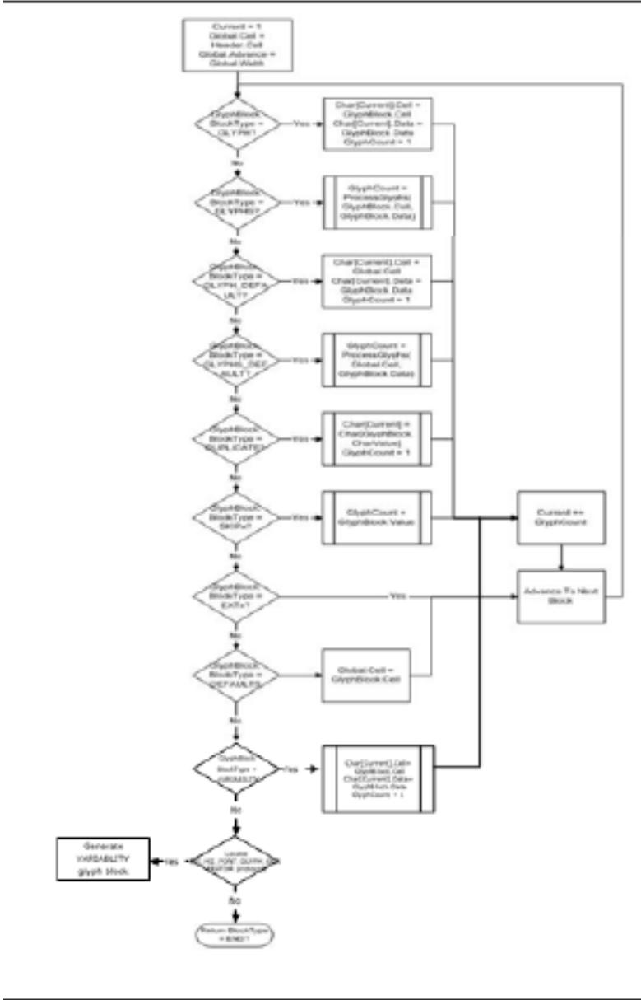  
Fig. 33.37: Glyph Block Processing

Ofset to the horizontal edge of the character cell.

## OfsetY

Ofset to the vertical edge of the character cell.

## AdvanceX

Number of pixels to advance to the right when moving from the origin of the current glyph to the origin of the next glyph.

## 33.3.3.2.1 EFI\_HII\_GIBT\_DEFAULTS

## Summary

Changes the default character cell information.

Prototype

```c
typedef struct _EFI_HII_GIBT_DEFAULTS_BLOCK {
    EFI_HII_GLYPH_BLOCK Header;
    EFI_HII_GLYPH_INFO Cell;
} EFI_HII_GIBT_DEFAULTS_BLOCK;
```

## Members

## Header

Standard glyph block header, where Header.BlockType = EFI\_HII\_GIBT\_DEFAULTS.

## Cell

The new default cell information which will be applied to all subsequent GLYPH\_DEFAULT and GLYPHS\_DEFAULT blocks.

## Description

Changes the default cell information used for subsequent EFI\_HII\_GIBT\_GLYPH\_DEFAULT and EFI\_HII\_GIBT\_GLYPHS\_DEFAULT glyph blocks. The cell information described by Cell remains in efect until the next EFI\_HII\_GIBT\_DEFAULTS is found. Prior to the first EFI\_HII\_GIBT\_DEFAULTS block, the cell information in the fixed header are used.

## 33.3.3.2.2 EFI\_HII\_GIBT\_DUPLICATE

## Summary

Assigns a new character value to a previously defined glyph.

## Prototype

```c
typedef struct _EFI_HII_GIBT_DUPLICATE_BLOCK {
    EFI_HII_GLYPH_BLOCK Header;
    CHAR16 CharValue;
} EFI_HII_GIBT_DUPLICATE_BLOCK;
```

## Members

## Header

Standard glyph block header, where Header.BlockType = EFI\_HII\_GIBT\_DUPLICATE.

## CharValue

The previously defined character value with the exact same glyph.

```c
typedef struct _EFI_HII_GIBT_EXT1_BLOCK {
    EFI_HII_GLYPH_BLOCK Header;
    UINT8 BlockType2;
    UINT8 Length;
} EFI_HII_GIBT_EXT1_BLOCK;

typedef struct _EFI_HII_GIBT_EXT2_BLOCK {
    EFI_HII_GLYPH_BLOCK Header;
    UINT8 BlockType2;
    UINT16 Length;
} EFI_HII_GIBT_EXT2_BLOCK;

typedef struct _EFI_HII_GIBT_EXT4_BLOCK {
    EFI_HII_GLYPH_BLOCK Header;
    UINT8 BlockType2;
    UINT32 Length;
} EFI_HII_GIBT_EXT4_BLOCK;
```

## Description

Indicates that the glyph with character value CharValueCurrent has the same glyph as a previously defined character value and increments CharValueCurrent by one.

## 33.3.3.2.3 EFI\_HII\_GIBT\_END

## Summary

Marks the end of the glyph information.

## Prototype

```c
typedef struct _EFI_GLYPH_GIBT_END_BLOCK {
    EFI_HII_GLYPH_BLOCK Header;
} EFI_GLYPH_GIBT_END_BLOCK;
```

## Members

## Header

Standard glyph block header, where Header.BlockType = EFI\_HII\_GIBT\_END.

## Description

Any glyphs with a character value greater than or equal to CharValueCurrent are empty.

## 33.3.3.2.4 EFI\_HII\_GIBT\_EXT1, EFI\_HII\_GIBT\_EXT2,EFI\_HII\_GIBT\_EXT4

## Summary

Future expansion block types which have a length byte.

## Prototype

## Members

## Header

Standard glyph block header, where Header.BlockType = EFI\_HII\_GIBT\_EXT1, EFI\_HII\_GIBT\_EXT2 or EFI\_HII\_GIBT\_EXT4.

## Length

Size of the glyph block, in bytes.

## BlockType2

Indicates the type of extended block. Currently all extended block types are reserved for future expansion.

## Description

These are reserved for future expansion, with length bytes included so that they can be easily skipped.

## 33.3.3.2.5 EFI\_HII\_GIBT\_GLYPH

## Summary

Provide the bitmap for a single glyph.

Prototype

```c
typedef struct _EFI_HII_GIBT_GLYPH_BLOCK {
    EFI_HII_GLYPH_BLOCK Header;
    EFI_HII_GLYPH_INFO Cell;
    UINT8 BitmapData[1];
} EFI_HII_GIBT_GLYPH_BLOCK;
```

## Members

## Header

Standard glyph block header, where Header.BlockType = EFI\_HII\_GIBT\_GLYPH.

## Cell

Contains the width and height of the encoded bitmap ( Cell.Width and Cell.Height ), the number of pixels (signed) right of the character cell origin where the left edge of the bitmap should be placed ( Cell.OfsetX ), the number of pixels above the character cell origin where the top edge of the bitmap should be placed ( Cell.OfsetY ) and the number of pixels (signed) to move right to find the origin for the next character cell ( Cell.AdvanceX ).

## GlyphCount

The number of glyph bitmaps.

## BitmapData

The bitmap data specifies a series of pixels, one bit per pixel, left-to-right, top-to-bottom. Each glyph bitmap only encodes the portion of the bitmap enclosed by its character-bounding box, but the entire glyph is padded out to the nearest byte. The number of bytes per bitmap can be calculated as: (( Cell.Width + 7)/8) \* Cell.Height.

## Description

This block provides the bitmap for the character with the value CharValueCurrent and increments CharValueCurrent by one. Each glyph contains a glyph width and height, a drawing ofset, number of pixels to advance after drawing and then the encoded bitmap.

## 33.3.3.2.6 EFI\_HII\_GIBT\_HII\_GLYPHS

## Summary

Provide the bitmaps for multiple glyphs with the same cell information

## Prototype

<table><tr><td colspan="2">typedef struct _EFI_HII_GIBT_GLYPHS_BLOCK {</td></tr><tr><td>EFI_HII_GLYPH_BLOCK</td><td>Header;</td></tr><tr><td>EFI_HII_GLYPH_INFO</td><td>Cell;</td></tr><tr><td>UINT16</td><td>Count</td></tr><tr><td>UINT8</td><td>BitmapData[1];</td></tr><tr><td colspan="2">} EFI_HII_GIBT_GLYPHS_BLOCK;</td></tr></table>

## Members

## Header

Standard glyph block header, where Header.BlockType = EFI\_HII\_GIBT\_GLYPHS.

## Cell

Contains the width and height of the encoded bitmap ( Cell.Width and Cell.Height ), the number of pixels (signed) right of the character cell origin where the left edge of the bitmap should be placed ( Cell.OfsetX ), the number of pixels above the character cell origin where the top edge of the bitmap should be placed ( Cell.OfsetY ) and the number of pixels (signed) to move right to find the origin for the next character cell ( Cell.AdvanceX ).

## BitmapData

The bitmap data specifies a series of pixels, one bit per pixel, left-to-right, top-to-bottom, for each glyph. Each glyph bitmap only encodes the portion of the bitmap enclosed by its character-bounding box. The number of bytes per bitmap can be calculated as: (( Cell.Width + 7)/8) \* Cell.Height.

## Description

Provides the bitmaps for the characters with the values CharValueCurrent through CharValueCurrent + Count -1 and increments CharValueCurrent by Count. These glyphs have identical cell information and the encoded bitmaps are exactly the same number of byes.

## 33.3.3.2.7 EFI\_HII\_GIBT\_GLYPH\_DEFAULT

## Summary

Provide the bitmap for a single glyph, using the default cell information.

Prototype

<table><tr><td>typedef struct _EFI_HII_GIBT_GLYPH_DEFAULT_BLOCK { EFI_HII_GLYPH_BLOCK Header; UINT8 BitmapData[];} EFI_HII_GIBT_GLYPH_DEFAULT_BLOCK;</td></tr></table>

## Members

## Header

Standard glyph block header, where Header.BlockType = EFI\_HII\_GIBT\_GLYPH\_DEFAULT.

## BitmapData

The bitmap data specifies a series of pixels, one bit per pixel, left-to-right, top-to-bottom. Each glyph bitmap only encodes the portion of the bitmap enclosed by its character-bounding box. The number of bytes per bitmap can be calculated as: (( Global.Cell.Width + 7)/8) \* Global.Cell.Height.

## Description

Provides the bitmap for the character with the value CharValueCurrent and increments CharValueCurrent by 1. This glyph uses the default cell information. The default cell information is found in the font header or the most recently processed EFI\_HII\_GIBT\_DEFAULTS.

## 33.3.3.2.8 EFI\_HII\_GIBT\_GLYPHS\_DEFAULT

## Summary

Provide the bitmaps for multiple glyphs with the default cell information

## Prototype

```c
typedef struct _EFI_HII_GIBT_GLYPHS_DEFAULT_BLOCK {
    EFI_HII_GLYPH_BLOCK Header;
    UINT16 Count;
    UINT8 BitmapData[];
} EFI_HII_GIBT_GLYPHS_DEFAULT_BLOCK;
```

```ignorefile
**Members**
```

## Header

Standard glyph block header, where Header.BlockType = EFI\_HII\_GIBT\_GLYPHS\_DEFAULT.

## Count

Number of glyphs in the glyph block.

## BitmapData

The bitmap data specifies a series of pixels, one bit per pixel, left-to-right, top-to-bottom, for each glyph. Each glyph bitmap only encodes the portion of the bitmap enclosed by its character-bounding box. The number of bytes per bitmap can be calculated as: (( Global.Cell.Width + 7)/8) \* Global.Cell.Height.

## Description

Provides the bitmaps for the characters with the values CharValueCurrent through CharValueCurrent + Count -1 and increments CharValueCurrent by Count. These glyphs use the default cell information and the encoded bitmaps have exactly the same number of byes.

## 33.3.3.2.9 EFI\_HII\_GIBT\_SKIPx

## Summary

Increments the current character value CharValueCurrent by the number specified.

## Prototype

```c
typedef struct _EFI_HII_GIBT_SKIP2_BLOCK {
    EFI_HII_GLYPH_BLOCK Header;
    UINT16 SkipCount;
} EFI_HII_GIBT_SKIP2_BLOCK;

typedef struct _EFI_HII_GIBT_SKIP1_BLOCK {
    EFI_HII_GLYPH_BLOCK Header;
```

(continues on next page)

```txt
(continued from previous page)
UINT8 SkipCount;
} EFI_HII_GIBT_SKIP1_BLOCK;
```

## Members

Header Standard glyph block header, where BlockType = EFI\_HII\_GIBT\_SKIP1 or EFI\_HII\_GIBT\_SKIP2

## SkipCount

The unsigned 8- or 16-bit value to add to CharValueCurrent.

## Description

Increments the current character value CharValueCurrent by the number specified.

## 33.3.3.2.10 EFI\_HII\_GIBT\_GLYPH\_VARIABILITY

## Related Definitions

```c
//**********************************************************************
// EFI_HII_GIBT_GLYPH_VARIABILITY (0x14)
//**********************************************************************
typedef struct _EFI_HII_GIBT_VARIABILITY_BLOCK {
    EFI_HII_GLYPH_BLOCK Header;
    EFI_HII_GLYPH_INFO Cell;
    UINT8 GlyphPackInBits;
    UINT8 BitmapData [1];
} EFI_HII_GIBT_VARIABILITY_BLOCK;
```

## Members

## Header

Standard glyph block header, where Blocktype = EFI\_HII\_GIBT\_GLYPH\_VARIABILITY.

## Cell

Contains the width and height of the encoded bitmap (Cell.Width and Cell.Height), the number of pixels (signed) right of the character cell origin where the left edge of the bitmap should be placed (Cell.OfsetX), the number of pixels above the character cell origin where the top edge of the bitmap should be placed (Cell.OfsetY) and the number of pixels (signed) to move right to find the origin for the next character cell (Cell.AdvanceX).

## GlyphPackInBits

This describes the bit length for each pixel in glyph. With this, the length of BitmapData can be determined according to GlyphPackInBits, cell.with and cell.height.

The valid value is GIBT\_VARIABILITY\_BLOCK\_1\_BIT,

GIBT\_VARIABILITY\_BLOCK\_2\_BIT,

GIBT\_VARIABILITY\_BLOCK\_4\_BIT,

GIBT\_VARIABILITY\_BLOCK\_8\_BIT,

GIBT\_VARIABILITY\_BLOCK\_16\_BIT,

GIBT\_VARIABILITY\_BLOCK\_24\_BIT,

GIBT\_VARIABILTY\_BLOCK\_32\_BIT

HII Font Ex protocol has no idea about how to decode the bitmap of glyph if the glyph is declared as EFI\_HII\_GIBT\_GLYPH\_VARIABLITY. The bitmap decoding is resolved in EFI\_HII\_FONT\_GLPHY\_GENERATOR\_PROTOCOL. This field is used to determine the length of entire glyph block.

## BitmapData

The raw data of the glyph pixels. The format of the glyph pixel depends on the glyph generator. Only EFI\_HII\_FONT\_GLYPH\_GENERATOR\_PROTOCOL knows how to draw the glyph.

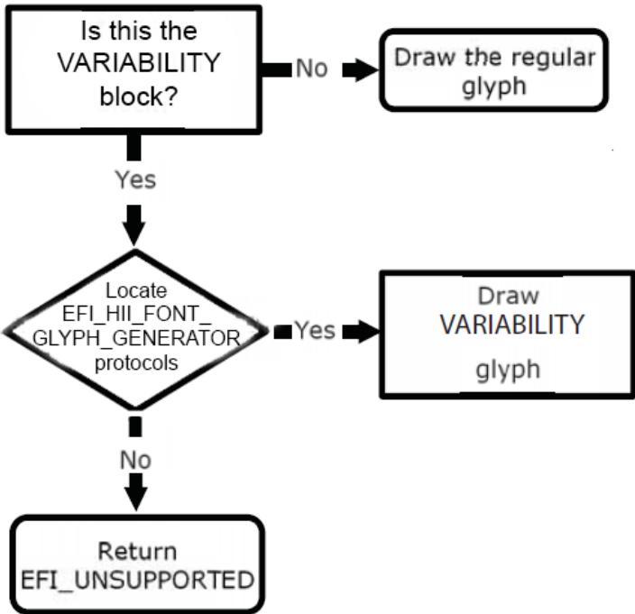  
Fig. 33.38: EFI\_HII\_GIBT\_GLYPH\_VARIABLITY Glyph Drawing Processing

## 33.3.4 Device Path Package

## Summary

The device path package is used to carry a device path associated with the package list.

Prototype

<table><tr><td>typedef struct _EFI_HII_DEVICE_PATH_PACKAGE { EFI_HII_PACKAGE_HEADER Header; //EFI_DEVICE_PATH_PROTOCOL DevicePath []; } EFI_HII_DEVICE_PATH_PACKAGE;</td></tr></table>

## Parameters

## Header

The standard package header, where Header.Type = EFI\_HII\_PACKAGE\_DEVICE\_PATH.

## DevicePath

The Device Path description associated with the driver handle that provided the content sent to the HII database.

## Description

```txt
typedef struct _EFI_HII_STRING_PACKAGE_HDR {
EFI_HII_PACKAGE_HEADER Header;
UINT32 HdrSize;
UINT32 StringInfoOffset;
CHAR16 LanguageWindow[16];
EFI_STRING_ID LanguageName;
CHAR8 Language [... ];
} EFI_HII_STRING_PACKAGE_HDR;
```

This package is created by NewPackageList() when the package list is first added to the HII database by locating the EFI\_DEVICE\_PATH\_PROTOCOL attached to the driver handle passed in to that function.

## 33.3.5 GUID Package

The GUID package is used to carry data where the format is defined by a GUID.

## Prototype

```c
typedef struct _EFI_HII_GUID_PACKAGE_HDR {
    EFI_HII_PACKAGE_HEADER Header;
    EFI_GUID Guid;

// Data per GUID definition may follow
} EFI_HII_GUID_PACKAGE_HDR;
```

## Members

## Header

The standard package header, where Header.Type = EFI\_HII\_PACKAGE\_TYPE\_GUID

## Guid

Identifier which describes the remaining data within the package.

## Description

This is a free-form package type designed to allow extensibility by allowing the format to be specified using Guid..

## 33.3.6 String Package

The Strings package record describes the mapping between string identifiers and the actual text of the strings themselves. The package consists of three parts: a fixed header, the string information and the font information.

## 33.3.6.1 Fixed Header

The fixed header consists of a standard record header and then the string identifiers contained in this section and the ofsets of the string and language information.

## Prototype

## Members

## Header

The standard package header, where Header.Type = EFI\_HII\_PACKAGE\_STRINGS.

## HdrSize

Size of this header.

## StringInfoOfset

Ofset, relative to the start of this header, of the string information.

## LanguageWindow

Specifies the default values placed in the static and dynamic windows before processing each SCSU-encoded string.

## LanguageName

String identifier within the current string package of the full name of the language specified by Language.

## Language

The null-terminated ASCII string that specifies the language of the strings in the package. The languages are described as specified by Formats — Language Codes and Language Code Arrays.

## Related Definition

```c
#define UEFI_CONFIG_LANG "x-UEFI"
#define UEFI_CONFIG_LANG_2 "x-i-UEFI"
```

## 33.3.6.2 String Information

For each string identifier, the string information gives the string’s text and font. The string information is encoded as a series of blocks, each with a single byte header. The blocks must be processed in order, using the current string identifier ( StringIdCurrent ), which is set initially to one (1). Processing continues until an EFI\_SIBT\_END block is found.

The types of blocks are: string blocks, duplicate blocks, font blocks, and skip blocks. String blocks specify the text and font for the current string identifier and increment to the next string identifier. Duplicate blocks copy the text of a previous string identifier and increment to the next string identifier. Skip bocks skip string identifiers, leaving them blank.

Each block begins with a single byte, which contains the block type.

```c
typedef struct {
    UINT8 BlockType;
    UINT8 BlockBody[];
} EFI_HII_STRING_BLOCK;
```

The following table describes the diferent block types:

<table><tr><td>Name</td><td>Value</td><td>Description</td></tr><tr><td>EFI_HII_SIBT_END</td><td>0x00</td><td>The end of the string information.</td></tr><tr><td>EFI_HII_SIBT_STRING_SCSU</td><td>0x10</td><td>Single string using default font information.</td></tr><tr><td>EFI_HII_SIBT_STRING_SCSU_FO1</td><td>0x11</td><td>Single string with font information.</td></tr><tr><td>EFI_HII_SIBT_STRINGS_SCSU</td><td>0x12</td><td>Multiple strings using default font information.</td></tr><tr><td>EFI_HII_SIBT_STRINGS_SCSU_FO</td><td>0x13</td><td>Multiple strings with font information.</td></tr><tr><td>EFI_HII_SIBT_STRING_UCS2</td><td>0x14</td><td>Single UCS-2 string using default font information.</td></tr><tr><td>EFI_HII_SIBT_STRING_UCS2_FO1</td><td>0x15</td><td>Single UCS-2 string with font information</td></tr><tr><td>EFI_HII_SIBT_STRINGS_UCS2</td><td>0x16</td><td>Multiple UCS-2 strings using default font information.</td></tr><tr><td>EFI_HII_SIBT_STRINGS_UCS2_FO</td><td>0x17</td><td>Multiple UCS-2 strings with font information.</td></tr><tr><td>EFI_HII_SIBT_DUPLICATE</td><td>0x20</td><td>Create a duplicate of an existing string.</td></tr><tr><td>EFI_HII_SIBT_SKIP2</td><td>0x21</td><td>Skip a certain number of string identifiers.</td></tr><tr><td>EFI_HII_SIBT_SKIP1</td><td>0x22</td><td>Skip a certain number of string identifiers.</td></tr><tr><td>EFI_HII_SIBT_EXT1</td><td>0x30</td><td>For future expansion (one byte length field)</td></tr><tr><td>EFI_HII_SIBT_EXT2</td><td>0x31</td><td>For future expansion (two byte length field)</td></tr></table>

continues on next page

Table 33.17 – continued from previous page

<table><tr><td>EFI_HII_SIBT_EXT4</td><td>0x32</td><td>For future expansion (four byte length field)</td></tr><tr><td>EFI_HII_SIBT_FONT</td><td>0x40</td><td>Font information.</td></tr></table>

When processing the string blocks, each block type refers and modifies the current string identifier ( StringIdCurrent ).

## 33.3.6.2.1 EFI\_HII\_SIBT\_DUPLICATE

## Summary

Creates a duplicate of a previously defined string.

## Prototype

```c
typedef struct _EFI_HII_SIBT_DUPLICATE_BLOCK {
    EFI_HII_STRING_BLOCK Header;
    EFI_STRING_ID StringId;
} EFI_HII_SIBT_DUPLICATE_BLOCK;
```

## Members

## Header

Standard string block header, where Header.BlockType = EFI\_HII\_SIBT\_DUPLICATE.

## StringId

The string identifier of a previously defined string with the exact same string text.

## Description

Indicates that the string with string identifier StringIdCurrent is the same as a previously defined string and increments StringIdCurrent by one.

## 33.3.6.2.2 EFI\_HII\_SIBT\_END

## Summary

Marks the end of the string information.

## Prototype

```c
typedef struct _EFI_HII_SIBT_END_BLOCK {
    EFI_HII_STRING_BLOCK Header;
} EFI_HII_SIBT_END_BLOCK;
```

## Members

## Header

Standard extended header, where Header.Header.BlockType = EFI\_HII\_SIBT\_EXT2 and Header.BlockType2 = EFI\_HII\_SIBT\_FONT.

## BlockType2

Indicates the type of extended block. See String Information for a list of all block types.

## Description

Any strings with a string identifier greater than or equal to StringIdCurrent are empty.

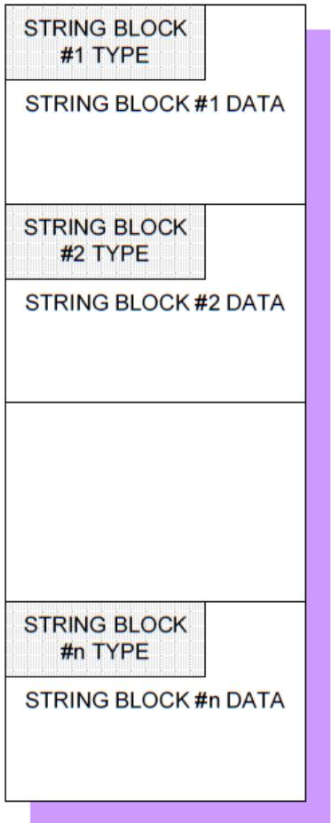  
Fig. 33.39: String Information Encoded in Blocks

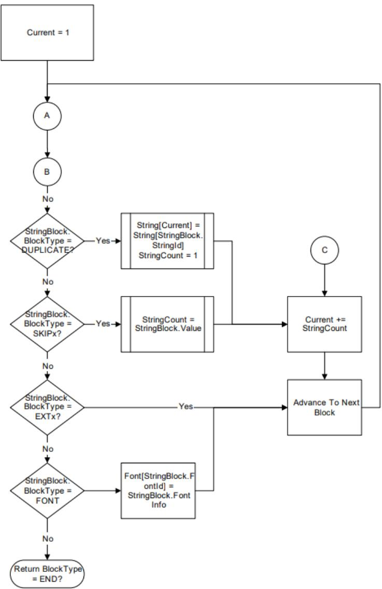  
Fig. 33.40: String Block Processing: Base Processing

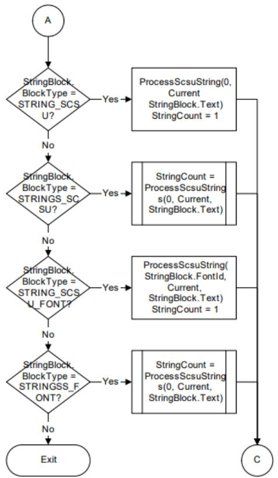  
Fig. 33.41: String Block Processing: SCSU Processing

## 33.3.6.2.3 EFI\_HII\_SIBT\_EXT1, EFI\_HII\_SIBT\_EXT2,EFI\_HII\_SIBT\_EXT4

## Summary

Future expansion block types which have a length byte.

Prototype

```c
typedef struct _EFI_HII_SIBT_EXT1_BLOCK {
    EFI_HII_STRING_BLOCK Header;
    UINT8 BlockType2;
    UINT8 Length;
} EFI_HII_SIBT_EXT1_BLOCK;

typedef struct _EFI_HII_SIBT_EXT2_BLOCK {
    EFI_HII_STRING_BLOCK Header;
    UINT8 BlockType2;
    UINT16 Length;
} EFI_HII_SIBT_EXT2_BLOCK;

typedef struct _EFI_HII_SIBT_EXT4_BLOCK {
    EFI_HII_STRING_BLOCK Header;
    UINT8 BlockType2;
    UINT32 Length;
} EFI_HII_SIBT_EXT4_BLOCK;
```

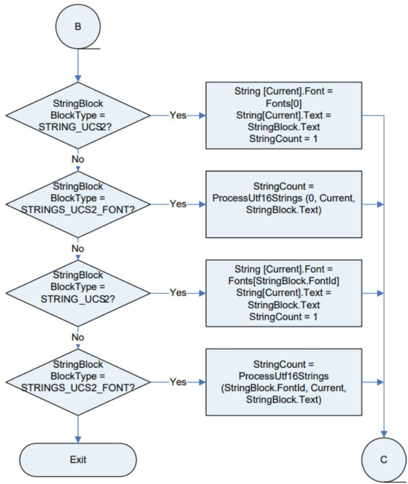  
Fig. 33.42: String Block Processing: UTF Processing

## Members

## Header

Standard string block header, where Header.BlockType = EFI\_HII\_SIBT\_EXT1, EFI\_HII\_SIBT\_EXT2 or EFI\_HII\_SIBT\_EXT4.

## Length

Size of the string block, in bytes.

## BlockType2

Indicates the type of extended block. See String Information for a list of all block types.

## Description

These are reserved for future expansion, with length bytes included so that they can be easily skipped.

## 33.3.6.2.4 EFI\_HII\_SIBT\_FONT

## Summary

Provide information about a single font.

## Prototype

<table><tr><td colspan="2">typedef struct _EFI_HII_SIBT_FONT_BLOCK {</td></tr><tr><td>EFI_HII_SIBT_EXT2_BLOCK</td><td>Header;</td></tr><tr><td>UINT8</td><td>FontId;</td></tr><tr><td>UINT16</td><td>FontSize;</td></tr><tr><td>EFI_HII_FONT_STYLE</td><td>FontStyle;</td></tr><tr><td>CHAR16</td><td>FontName[...];</td></tr><tr><td colspan="2">} EFI_HII_SIBT_FONT_BLOCK;</td></tr></table>

## Members

## Header

Standard extended header, where Header.BlockType2 = EFI\_HII\_SIBT\_FONT.

## FontId

Font identifier, which must be unique within the string package.

## FontSize

Character cell size, in pixels, of the font.

## FontStyle

Font style. Type EFI\_HII\_FONT\_STYLE is defined in “Related Definitions” in EFI\_HII\_FONT\_PACKAGE\_HDR.

## FontName

Null-terminated font family name.

## Description

Associates a font identifier FontId with a font name FontName, size FontSize and style FontStyle. This font identifier may be used with the string blocks. The font identifier 0 is the default font for those string blocks which do not specify a font identifier.

## 33.3.6.2.5 EFI\_HII\_SIBT\_SKIP1

## Summary

Skips string identifiers.

Prototype

```c
typedef struct _EFI_HII_SIBT_SKIP1_BLOCK {
    EFI_HII_STRING_BLOCK Header;
    UINT8 SkipCount;
} EFI_HII_SIBT_SKIP1_BLOCK;
```

## Members

## Header

Standard string block header, where Header.BlockType = EFI\_HII\_SIBT\_SKIP1.

## SkipCount

The unsigned 8-bit value to add to StringIdCurrent.

## Description

Increments the current string identifier StringIdCurrent by the number specified.

## 33.3.6.2.6 EFI\_HII\_SIBT\_SKIP2

Summary

Skips string ids.

Prototype

```c
typedef struct _EFI_HII_SIBT_SKIP2_BLOCK {
    EFI_HII_STRING_BLOCK Header;
    UINT16 SkipCount;
} EFI_HII_SIBT_SKIP2_BLOCK;
```

## Members

## Header

Standard string block header, where Header.BlockType = EFI\_HII\_SIBT\_SKIP2.

## SkipCount

The unsigned 16-bit value to add to StringIdCurrent.

## Description

Increments the current string identifier StringIdCurrent by the number specified.

## 33.3.6.2.7 EFI\_HII\_SIBT\_STRING\_SCSU

## Summary

Describe a string encoded using SCSU, in the default font.

## Prototype

```txt
typedef struct _EFI_HII_SIBT_STRING_SCSU_BLOCK {
    EFI_HII_STRING_BLOCK Header;
    UINT8 StringText[];
} EFI_HII_SIBT_STRING_SCSU_BLOCK;
```

## Members

## Header

Standard header where Header.BlockType = EFI\_HII\_SIBT\_STRING\_SCSU.

## StringText

The string text is a null-terminated string, which is assigned to the string identifier StringIdCurrent.

## Description

This string block provides the SCSU-encoded text for the string in the default font with string identifier StringIdCurrent and increments StringIdCurrent by one.

## 33.3.6.2.8 EFI\_HII\_SIBT\_STRING\_SCSU\_FONT

Summary

Describe a string in the specified font.

Prototype

```c
typedef struct _EFI_HII_SIBT_STRING_SCSU_FONT_BLOCK {
    EFI_HII_STRING_BLOCK Header;
    UINT8 FontIdentifier;
    UINT8 StringText[];
} EFI_HII_SIBT_STRING_SCSU_FONT_BLOCK;
```

## Members

## Header

Standard string block header, where Header.BlockType = EFI\_HII\_SIBT\_STRING\_SCSU\_FONT.

## FontIdentifier

The identifier of the font to be used as the starting font for the entire string. The identifier must either be 0 for the default font or an identifier previously specified by an EFI\_HII\_SIBT\_FONT block. Any string characters that deviate from this font family, size or style must provide an explicit control character. See Common Control Codes .

## StringText

The string text is a null-terminated encoded string, which is assigned to the string identifier StringIdCurrent.

## Description

This string block provides the SCSU-encoded text for the string in the font specified by FontIdentifier with string identifier StringIdCurrent and increments StringIdCurrent by one.

## 33.3.6.2.9 EFI\_HII\_SIBT\_STRINGS\_SCSU

## Summary

Describe strings in the default font.

## Prototype

```c
typedef struct _EFI_HII_SIBT_STRINGS_SCSU_BLOCK {
    EFI_HII_STRING_BLOCK Header;
    UINT16 StringCount;
    UINT8 StringText[];
} EFI_HII_SIBT_STRINGS_SCSU_BLOCK;
```

## Members

## Header

Standard header where Header.BlockType = EFI\_HII\_SIBT\_STRINGS\_SCSU

## StringCount

Number of strings in StringText.

## StringText

The strings, where each string is a null-terminated encoded string.

## Description

This string block provides the SCSU-encoded text for StringCount strings which have the default font and which have sequential string identifiers. The strings are assigned the identifiers, starting with StringIdCurrent and continuing through StringIdCurrent + StringCount - 1. StringIdCurrent is incremented by StringCount.

## 33.3.6.2.10 EFI\_HII\_SIBT\_STRINGS\_SCSU\_FONT

## Summary

Describe strings in the specified font.

## Prototype

```c
typedef struct _EFI_HII_SIBT_STRINGS_SCSU_FONT_BLOCK {
    EFI_HII_STRING_BLOCK Header;
    UINT8 FontIdentifier;
    UINT16 StringCount;
    UINT8 StringText[];
} EFI_HII_SIBT_STRINGS_SCSU_FONT_BLOCK;
```

## Members

## Header

Standard header where Header.BlockType = EFI\_HII\_SIBT\_STRINGS\_SCSU\_FONT.

## StringCount

Number of strings in StringText.

## FontIdentifier

The identifier of the font to be used as the starting font for the entire string. The identifier must either be 0 for the default font or an identifier previously specified by an EFI\_HII\_SIBT\_FONT block. Any string characters that deviate from this font family, size or style must provide an explicit control character. See Common Control Codes.

## StringText

The strings, where each string is a null-terminated encoded string.

## Description

This string block provides the SCSU-encoded text for StringCount strings which have the font specified by FontIdentifier and which have sequential string identifiers. The strings are assigned the identifiers, starting with StringIdCurrent and continuing through StringIdCurrent + StringCount - 1. StringIdCurrent is incremented by StringCount.

## 33.3.6.2.11 EFI\_HII\_SIBT\_STRING\_UCS2

## Summary

Describe a string in the default font.

## Prototype

```txt
typedef struct _EFI_HII_SIBT_STRING_UCS2_BLOCK {
    EFI_HII_STRING_BLOCK Header;
    CHAR16 StringText[];
} EFI_HII_SIBT_STRING_UCS2_BLOCK;
```

## Members

## Header

Standard header where Header.BlockType = EFI\_HII\_SIBT\_STRING\_UCS2.

## StringText

The string text is a null-terminated UCS-2 string, which is assigned to the string identifier StringIdCurrent.

## Description

This string block provides the UCS-2 encoded text for the string in the default font with string identifier StringIdCurrent and increments StringIdCurrent by one.

## 33.3.6.2.12 EFI\_HII\_SIBT\_STRING\_UCS2\_FONT

## Summary

Describe a string in the specified font.

Prototype

```txt
typedef struct _EFI_HII_SIBT_STRING_UCS2_FONT_BLOCK {
    EFI_HII_STRING_BLOCK Header;
    UINT8 FontIdentifier;
    CHAR16 StringText[];
} EFI_HII_SIBT_STRING_UCS2_FONT_BLOCK;
```

## Members

## Header

Standard header where Header.BlockType = EFI\_HII\_SIBT\_STRING\_UCS2\_FONT.

## FontIdentifier

The identifier of the font to be used as the starting font for the entire string. The identifier must either be 0 for the default font or an identifier previously specified by an EFI\_HII\_SIBT\_FONT block. Any string characters that deviate from this font family, size or style must provide an explicit control character. See Common Control Codes .

## StringText

The string text is a null-terminated UCS-2 string, which is assigned to the string identifier StringIdCurrent.

## Description

This string block provides the UCS-2 encoded text for the string in the font specified by FontIdentifier with string identifier StringIdCurrent and increments StringIdCurrent by one.

## 33.3.6.2.13 EFI\_HII\_SIBT\_STRINGS\_UCS2

## Summary

Describes strings in the default font.

Prototype

```c
typedef struct _EFI_HII_SIBT_STRINGS_UCS2_BLOCK {
    EFI_HII_STRING_BLOCK Header;
    UINT16 StringCount;
    CHAR16 StringText[];
} EFI_HII_SIBT_STRINGS_UCS2_BLOCK;
```

## Members

## Header

Standard header where Header.BlockType = EFI\_HII\_SIBT\_STRINGS\_UCS2.

## StringCount

Number of strings in StringText.

## StringText

The string text is a series of null-terminated UCS-2 strings, which are assigned to the string identifiers StringId-Current to StringIdCurrent + StringCount - 1.

## Description

This string block provides the UCS-2 encoded text for the strings in the default font with string identifiers StringIdCurrent to StringIdCurrent + StringCount - 1 and increments StringIdCurrent by StringCount.

## 33.3.6.2.14 EFI\_HII\_SIBT\_STRINGS\_UCS2\_FONT

## Summary

Describes strings in the specified font.

Prototype

```c
typedef struct _EFI_HII_SIBT_STRINGS_UCS2_FONT_BLOCK {
    EFI_HII_STRING_BLOCK Header;
    UINT8 FontIdentifier;
    UINT16 StringCount;
    CHAR16 StringText[];
} EFI_HII_SIBT_STRINGS_UCS2_FONT_BLOCK;
```

## Members

## Header

Standard header where Header.BlockType = EFI\_HII\_SIBT\_STRINGS\_UCS2\_FONT.

## FontIdentifier

The identifier of the font to be used as the starting font for the entire string. The identifier must either be 0 for the default font or an identifier previously specified by an EFI\_HII\_SIBT\_FONT block. Any string characters that deviates from this font family, size or style must provide an explicit control character. See Common Control Codes .

## StringCount

Number of strings in StringText.

## StringText

The string text is a series of null-terminated UCS-2 strings, which are assigned to the string identifiers StringId-Current through StringIdCurrent + StringCount - 1.

## Description

This string block provides the UCS-2 encoded text for the strings in the font specified by FontIdentifier with string identifiers StringIdCurrent to StringIdCurrent + StringCount - 1 and increments StringIdCurrent by StringCount.

## 33.3.6.3 String Encoding

Each of the following sections describes part of how string text is encoded.

## 33.3.6.3.1 Standard Compression Scheme for Unicode (SCSU)

The Unicode consortium provides a standard text compression algorithm, which minimizes the amount of storage required for multiple-language strings. For more information, see “Links to UEFI-Related Documents” ( http://uefi.org/uefi) under the heading “Unicode Compression Scheme”.

This specification extends the technique described in the following ways:

• The strings use the control code 0x7F to introduce the control codes described in Common Control Codes . The following byte is the control code. The character value 0x7F will be encoded as 0x01 (SQ0) 0x7F.

• The language information contains default static and dynamic code windows, whereas SCSU provides fixed values for these.

• Characters between 0xF000 and 0xFCFF should be rejected.

## 33.3.6.3.2 Unicode 2-Byte Encoding (UCS-2)

The Unicode consortium provides a standard encoding algorithm, which takes two bytes per character. For more information see “Links to UEFI-Related Documents” ( http://uefi.org/uefi) under the heading “Unicode Consortium”.

Characters between 0xF000 and 0xFCFF should be rejected.

## 33.3.7 Image Package

The Image package record describes the mapping between image identifiers and the pixels of the image themselves. The package consists of three parts: a fixed header, image information and the palette information.

## 33.3.7.1 Fixed Header

## Summary

The fixed header consists of a standard record header and the ofsets of the image and palette information.

## Prototype

<table><tr><td colspan="2">typedef struct _EFI_HII_IMAGE_PACKAGE_HDR {</td></tr><tr><td>EFI_HII_PACKAGE_HEADER</td><td>Header;</td></tr><tr><td>UINT32</td><td>ImageInfoOffset;</td></tr><tr><td>UINT32</td><td>PaletteInfoOffset;</td></tr><tr><td colspan="2">} EFI_HII_IMAGE_PACKAGE_HDR;</td></tr></table>

## Members

## Header

Standard package header, where Header.Type = EFI\_HII\_PACKAGE\_IMAGES.

## ImageInfoOfset

Ofset, relative to this header, of the image information. If this is zero, then there are no images in the package.

## PaletteInfoOfset

Ofset, relative to this header, of the palette information. If this is zero, then there are no palettes in the image package.

## 33.3.7.2 Image Information

For each image identifier, the image information gives the bitmap and the relevant palette. The image information is encoded as a series of blocks, each with a single byte header. The blocks must be processed in order. Each block begins with a single byte, which contains the block type.

## Prototype

<table><tr><td>typedef struct _EFI_HII_IMAGE_BLOCK {UINT8 BlockType;UINT8 BlockBody[];} EFI_HII_IMAGE_BLOCK;</td></tr></table>

The following table describes the diferent block types:

Table 33.18: Block Types

<table><tr><td>Name</td><td>Value</td><td>Description</td></tr><tr><td>EFI_HII_IIBT_END</td><td>0x00</td><td>The end of the image information.</td></tr><tr><td>EFI_HII_IIBT_IMAGE_1BIT</td><td>0x10</td><td>1-bit w/palette</td></tr><tr><td>EFI_HII_IIBT_IMAGE_1BIT_TRANS</td><td>0x11</td><td>1-bit w/palette &amp; transparency</td></tr><tr><td>EFI_HII_IIBT_IMAGE_4BIT</td><td>0x12</td><td>4-bit w/palette</td></tr><tr><td>EFI_HII_IIBT_IMAGE_4BIT_TRANS</td><td>0x13</td><td>4-bit w/palette &amp; transparency</td></tr><tr><td>EFI_HII_IIBT_IMAGE_8BIT</td><td>0x14</td><td>8-bit w/palette</td></tr><tr><td>EFI_HII_IIBT_IMAGE_8BIT_TRANS</td><td>0x15</td><td>8-bit w/palette &amp; transparency</td></tr><tr><td>EFI_HII_IIBT_IMAGE_24BIT</td><td>0x16</td><td>24-bit RGB</td></tr><tr><td>EFI_HII_IIBT_IMAGE_24BIT_TRANS</td><td>0x17</td><td>24-bit RGB w/transparency</td></tr><tr><td>EFI_HII_IIBT_IMAGE_JPEG</td><td>0x18</td><td>JPEG encoded image</td></tr><tr><td>EFI_HII_IIBT_IMAGE_PNG</td><td>0x19</td><td>PNG encoded image</td></tr><tr><td>EFI_HII_IIBT_DUPLICATE</td><td>0x20</td><td>Duplicate an existing image identifier</td></tr></table>

continues on next page

Table 33.18 – continued from previous page

<table><tr><td>EFI_HII_IIBT_SKIP2</td><td>0x21</td><td>Skip a certain number of image identifiers.</td></tr><tr><td>EFI_HII_IIBT_SKIP1</td><td>0x22</td><td>Skip a certain number of image identifiers.</td></tr><tr><td>EFI_HII_IIBT_EXT1</td><td>0x30</td><td>For future expansion (one byte length field)</td></tr><tr><td>EFI_HII_IIBT_EXT2</td><td>0x31</td><td>For future expansion (two byte length field)</td></tr><tr><td>EFI_HII_IIBT_EXT4</td><td>0x32</td><td>For future expansion (four byte length field)</td></tr></table>

In order to recreate all images, start at the first block and process them all until an EFI\_HII\_IIBT\_END\_BLOCK block is found. When processing the image blocks, each block refers to the current image identifier ( ImageIdCurrent ), which is initially set to one (1).

Image blocks of an unknown type should be skipped. If they cannot be skipped, then processing halts.

## 33.3.7.2.1 EFI\_HII\_IIBT\_END

## Summary

Marks the end of the image information.

## Prototype

```c
# define EFI_HII_IIBT_END 0x00
typedef struct _EFI_HII_IIBT_END_BLOCK {
    EFI_HII_IMAGE_BLOCK Header;
} EFI_HII_IIBT_END_BLOCK;
```

## Members

## Header

Standard image block header, where Header.BlockType = EFI\_HII\_IIBT\_END\_BLOCK.

## BlockType2

Indicates the type of extended block. See String Information for a list of all block types.

## Description

Any images with an image identifier greater than or equal to ImageIdCurrent are empty.

## 33.3.7.2.2 EFI\_HII\_IIBT\_EXT1, EFI\_HII\_IIBT\_EXT2,EFI\_HII\_IIBT\_EXT4

## Summary

Generic prefix for image information with a 1-byte length.

## Prototype

```c
#define EFI_HII_IIBT_EXT1 0x30
typedef struct _EFI_HII_IIBT_EXT1_BLOCK {
    EFI_HII_IMAGE_BLOCK Header;
    UINT8 BlockType2;
    UINT8 Length;
} EFI_HII_IIBT_EXT1_BLOCK;

#define EFI_HII_IIBT_EXT2 0x31
```

(continues on next page)

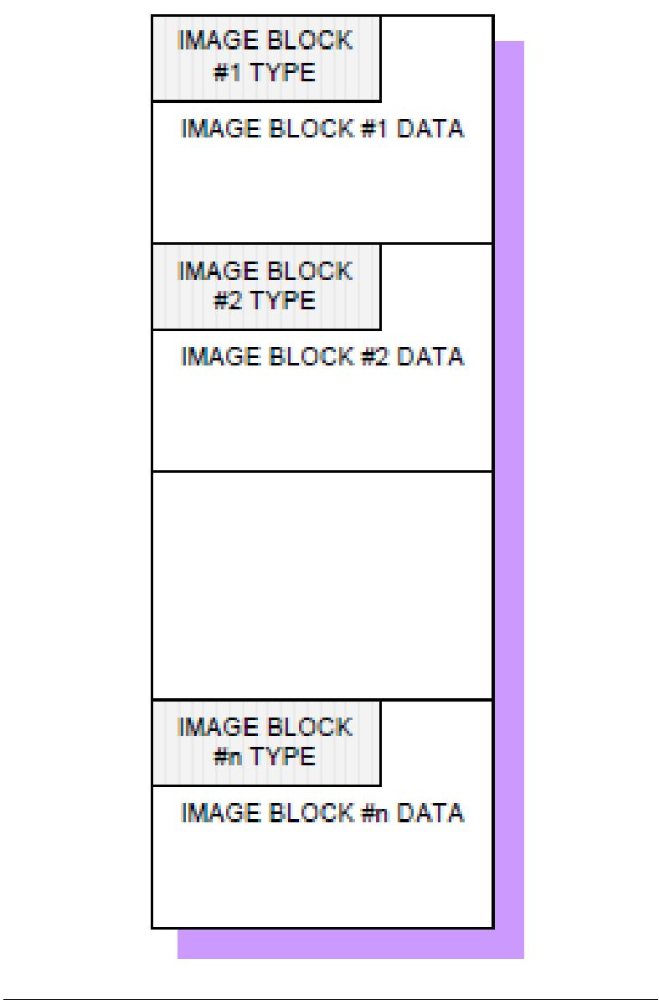  
Fig. 33.43: Image Information Encoded in Blocks

(continued from previous page)

```c
typedef struct _EFI_HII_IIBT_EXT2_BLOCK {
    EFI_HII_IMAGE_BLOCK Header;
    UINT8 BlockType2;
    UINT16 Length;
} EFI_HII_IIBT_EXT2_BLOCK;

#define EFI_HII_IIBT_EXT4 0x32

typedef struct _EFI_HII_IIBT_EXT4_BLOCK {
    EFI_HII_IMAGE_BLOCK Header;
    UINT8 BlockType2;
    UINT32 Length;
} EFI_HII_IIBT_EXT4_BLOCK;
```

## Members

## Header

```txt
Standard image block header, where Header.BlockType = EFI_HII_IIBT_EXT1_BLOCK, EFI_HII_IIBT_EXT2_BLOCK or EFI_HII_IIBT_EXT4_BLOCK.
```

## Length

Size of the image block, in bytes, including the image block header.

## BlockType2

Indicates the type of extended block. See Image Information for a list of all block types.

## Description

Future extensions for image records which need a length-byte length use this prefix.

## 33.3.7.2.3 EFI\_HII\_IIBT\_IMAGE\_1BIT

## Summary

One bit-per-pixel graphics image with palette information.

Prototype

```c
typedef struct _EFI_HII_IIBT_IMAGE_1BIT_BASE {
    UINT16 Width;
    UINT16 Height;
    UINT8 Data[...];
} EFI_HII_IIBT_IMAGE_1BIT_BASE;

#define EFI_HII_IIBT_IMAGE_1BIT 0x10

typedef struct _EFI_HII_IIBT_IMAGE_1BIT_BLOCK {
    EFI_HII_IMAGE_BLOCK Header;
    UINT8 PaletteIndex;
    EFI_HII_IIBT_IMAGE_1BIT_BASE Bitmap;
} EFI_HII_IIBT_IMAGE_1BIT_BLOCK;
```

## Members

## Header

Standard image header, where Header.BlockType = EFI\_HII\_IIBT\_IMAGE\_1BIT.

## Width

Width of the bitmap in pixels.

## Height

Height of the bitmap in pixels.

## Bitmap

The bitmap specifies a series of pixels, one bit per pixel, left-to-right, top-to-bottom, and is padded out to the nearest byte. The number of bytes per bitmap can be calculated as: (( Width + 7)/8) \* Height.

## PaletteIndex

Index of the palette in the palette information.

## Description

This record assigns the 1-bit-per-pixel bitmap data to the ImageIdCurrent identifier and increment ImageIdCurrent by one. The image’s upper left hand corner pixel is the most significant bit of the first bitmap byte. An example of a EFI\_HII\_IIBT\_IMAGE\_1BIT structure is shown below:

```csv
0x01 ; Palette Index
0x000B ; Width
0x0013 ; Height
10000000b, 00000000b ; Bitmap
11000000b, 00000000b
11100000b, 00000000b
11110000b, 00000000b
11111000b, 00000000b
11111100b, 00000000b
11111110b, 00000000b
11111111b, 00000000b
11111111b, 10000000b
11111111b, 11000000b
11111111b, 11100000b
11111111b, 00000000b
11101111b, 00000000b
11001111b, 00000000b
10000111b, 10000000b
00000111b, 10000000b
00000011b, 11000000b
00000011b, 11000000b
00000001b, 10000000b
```

## 33.3.7.2.4 EFI\_HII\_IIBT\_IMAGE\_1BIT\_TRANS

## Summary

One bit-per-pixel graphics image with palette information and transparency.

## Prototype

```c
#define EFI_HII_IIBT_IMAGE_1BIT_TRANS 0x11
typedef struct _EFI_HII_IIBT_IMAGE_1BIT_TRANS_BLOCK {
```

(continues on next page)

```txt
EFI_HII_IMAGE_BLOCK Header;
UINT8 PaletteIndex;
EFI_HII_IIBT_IMAGE_1BIT_BASE Bitmap;
} EFI_HII_IIBT_IMAGE_1BIT_TRANS_BLOCK;
```

(continued from previous page)

## Members

## Header

Standard image header, where Header.BlockType = EFI\_HII\_IIBT\_IMAGE\_1BIT\_TRANS.

## PaletteIndex

Index of the palette in the palette information.

## Bitmap

The bitmap specifies a series of pixels, one bit per pixel, left-to-right, top-to-bottom, and is padded out to the nearest byte. The number of bytes per bitmap can be calculated as: (( Width + 7)/8) \* Height.

## Description

This record assigns the 1-bit-per-pixel bitmap data to the ImageIdCurrent identifier and increment ImageId-Current by one. The data in the EFI\_HII\_IIBT\_IMAGE\_1BIT\_TRANS structure is exactly the same as the EFI\_HII\_IIBT\_IMAGE\_1BIT structure, the diference is how the data is treated.

The bitmap pixel value 0 is the ‘transparency’ value and will not be written to the screen. The bitmap pixel value 1 will be translated to the color specified by Palette.

## 33.3.7.2.5 EFI\_HII\_IIBT\_IMAGE\_24BIT

## Summary

A 24 bit-per-pixel graphics image.

Prototype

```c
#define EFI_HII_IIBT_IMAGE_24BIT 0x16
typedef struct _EFI_HII_IIBT_IMAGE_24BIT_BASE
    UINT16 Width;
    UINT16 Height;
    EFI_HII_RGB_PIXEL Bitmap[...];
} EFI_HII_IIBT_IMAGE_24BIT_BASE;

typedef struct _EFI_HII_IIBT_IMAGE_24BIT_BLOCK {
    EFI_HII_IMAGE_BLOCK Header;
    EFI_HII_IIBT_IMAGE_24BIT_BASE Bitmap;
} EFI_HII_IIBT_IMAGE_24BIT_BASE;
```

## Members

## Width

Width of the bitmap in pixels.

## Height

Height of the bitmap in pixels.

## Header

## Bitmap

The bitmap specifies a series of pixels, 24 bits per pixel, left-to-right, top-to-bottom. The number of bytes per bitmap can be calculated as: (Width \* 3) \* Height. Type EFI\_HII\_RGB\_PIXEL is defined in “Related Definitions” below.

## Description

This record assigns the 24-bit-per-pixel bitmap data to the ImageIdCurrent identifier and increment ImageIdCurrent by one. The image’s upper left hand corner pixel is composed of the first three bitmap bytes. The first byte is the pixel’s blue component value, the next byte is the pixel’s green component value, and the third byte is the pixel’s red component value (B,G,R). Each color component value can vary from 0x00 (color of) to 0xFF (color full on), allowing 16.8 million colors that can be specified.

## Related Definitions

```c
typedef struct _EFI_HII_RGB_PIXEL {
    UINT8 b;
    UINT8 g;
    UINT8 r;
} EFI_HII_RGB_PIXEL;
```

## b

The relative intensity of blue in the pixel’s color, from of (0x00) to full-on (0xFF).

g The relative intensity of green in the pixel’s color, from of (0x00) to full-on (0xFF).

r The relative intensity of red in the pixel’s color, from of (0x00) to full-on (0xFF).

## 33.3.7.2.6 EFI\_HII\_IIBT\_IMAGE\_24BIT\_TRANS

## Summary

A 24 bit-per-pixel graphics image with transparency.

## Prototype

```c
#define _EFI_HII_IIBT_IMAGE_24BIT_TRANS 0x17
typedef struct EFI_HII_IIBT_IMAGE_24BIT_TRANS_BLOCK {
    EFI_HII_IMAGE_BLOCK Header;
    EFI_HII_IIBT_IMAGE_24BIT_BASE Bitmap;
} EFI_HII_IIBT_IMAGE_24BIT_TRANS_BLOCK;
```

## Members

## Header

Standard image header, where Hea der.BlockType = EFI\_HII\_IIBT\_IMAGE\_24BIT\_TRANS.

## Bitmap

The bitmap specifies a series of pixels, 24 bits per pixel, left-to-right, top-to-bottom. The number of bytes per bitmap can be calculated as: (Width \* 3) \* Height.

## Width

Width of the bitmap in pixels.

## Height

Height of the bitmap in pixels.

## Description

This record assigns the 24-bit-per-pixel bitmap data to the ImageIdCurrent identifier and increment ImageIdCurrent by one. The data in the EFI\_HII\_IMAGE\_24BIT\_TRANS structure is exactly the same as the EFI\_HII\_IMAGE\_24BIT structure, the diference is how the data is treated.

The bitmap pixel value 0x00, 0x00, 0x00 is the ‘transparency’ value and will not be written to the screen. All other bitmap pixel values will be written as defined to the screen. Since the ‘transparency’ value replaces true black, for image to display black they should use the color 0x00, 0x00, 0x01 (very dark red)

## 33.3.7.2.7 EFI\_HII\_IIBT\_IMAGE\_4BIT

## Summary

Four bits-per-pixel graphics image with palette information.

## Prototype

```c
typedef struct _EFI_HII_IIBT_IMAGE_4BIT_BASE {
    UINT16 Width;
    UINT16 Height;
    UINT8 Data[...];
} EFI_HII_IIBT_IMAGE_4BIT_BASE;

#define EFI_HII_IIBT_IMAGE_4BIT 0x12

typedef struct _EFI_HII_IIBT_IMAGE_4BIT_BLOCK {
    EFI_HII_IMAGE_BLOCK Header;
    UINT8 PaletteIndex;
    EFI_HII_IIBT_IMAGE_4BIT_BASE Bitmap;
} EFI_HII_IIBT_IMAGE_4BIT_BLOCK;
```

## Members

## Width

Width of the bitmap in pixels.

## Height

Height of the bitmap in pixels.

## Header

Standard image header, where Header.BlockType = EFI\_HII\_IIBT\_IMAGE\_4BIT.

## PaletteIndex

Index of the palette in the palette information.

## Bitmap

The bitmap specifies a series of pixels, four bits per pixel, left-to-right, top-to-bottom, and is padded out to the nearest byte. The number of bytes per bitmap can be calculated as: (( Width + 1)/2) \* Height.

## Description

This record assigns the 4-bit-per-pixel bitmap data to the ImageIdCurrent identifier using the specified palette and increment ImageIdCurrent by one. The image’s upper left hand corner pixel is the most significant nibble of the first bitmap byte.

## 33.3.7.2.8 EFI\_HII\_IIBT\_IMAGE\_4BIT\_TRANS

## Summary

Four bits-per-pixel graphics image with palette information and transparency.

## Prototype

```c
#define EFI_HII_IIBT_IMAGE_4BIT_TRANS 0x13
typedef struct _EFI_HII_IIBT_IMAGE_4BIT_TRANS_BLOCK {
    EFI_HII_IMAGE_BLOCK Header;
    UINT8 PaletteIndex;
    EFI_HII_IIBT_IMAGE_4BIT_BASE Bitmap;
} EFI_HII_IIBT_IMAGE_4BIT_TRANS_BLOCK;
```

## Members

## Header

Standard image header, where Header.BlockType = EFI\_HII-IIBT\_IMAGE\_4BIT\_TRANS.

## PaletteIndex

Index of the palette in the palette information.

## Bitmap

The bitmap specifies a series of pixels, four bits per pixel, left-to-right, top-to-bottom, and is padded out to the nearest byte. The number of bytes per bitmap can be calculated as: (( Width + 1)/2) \* Height.

## Description

This record assigns the 4-bit-per-pixel bitmap data to the ImageIdCurrent identifier using the specified palette and increment ImageIdCurrent by one. The data in the EFI\_HII-IMAGE\_4BIT\_TRANS structure is exactly the same as the EFI\_HII-IMAGE\_4BIT structure, the diference is how the data is treated.

The bitmap pixel value 0 is the ‘transparency’ value and will not be written to the screen. All the other bitmap pixel values will be translated to the color specified by Palette.

## 33.3.7.2.9 EFI\_HII-IIBT\_IMAGE\_8BIT

## Summary

Eight bits-per-pixel graphics image with palette information.

## Prototype

```c
#define EFI_HII-IIBT_IMAGE_8BIT 0x14
typedef struct _EFI_HII-IIBT_IMAGE_8BIT_BASE {
    UINT16 Width;
    UINT16 Height;
    UINT8 Data[...];
} EFI_HII-IIBT_IMAGE_8BIT_BASE;

typedef struct _EFI_HII-IIBT_IMAGE_8BIT_BLOCK {
    EFI_HII-IMAGE_BLOCK Header;
    UINT8 PaletteIndex;
    EFI_HII-IIBT_IMAGE_8BIT_BASE Bitmap;
} EFI_HII-IIBT_IMAGE_8BIT_BLOCK;
```

## Members

## Width

Width of the bitmap in pixels.

## Height

Height of the bitmap in pixels.

## Header

Standard image header, where Header.BlockType = EFI\_HII\_IIBT\_IMAGE\_8BIT.

## PaletteIndex

Index of the palette in the palette information.

## Bitmap

The bitmap specifies a series of pixels, eight bits per pixel, left-to-right, top-to-bottom. The number of bytes per bitmap can be calculated as: Width \* Height.

## Description

This record assigns the 8-bit-per-pixel bitmap data to the ImageIdCurrent identifier using the specified palette and increment ImageIdCurrent by one. The image’s upper left hand corner pixel is the first bitmap byte.

## 33.3.7.2.10 EFI\_HII\_IIBT\_IMAGE\_8BIT\_TRANS

## Summary

Eight bits-per-pixel graphics image with palette information and transparency.

Prototype

```c
#define EFI_HII_IIBT_IMAGE_8BIT_TRANS 0x15
typedef struct _EFI_HII_IIBT_IMAGE_8BIT_TRANS_BLOCK {
    EFI_HII_IMAGE_BLOCK Header;
    UINT8 PaletteIndex;
    EFI_HII_IIBT_IMAGE_8BIT_BASE Bitmap;
} EFI_HII_IIBT_IMAGE_8BIT_TRANS_BLOCK;
```

## Members

## Header

Standard image header, where Header.BlockType = EFI\_HII\_IIBT\_IMAGE\_8BIT\_TRANS.

## PaletteIndex

Index of the palette in the palette information.

## Bitmap

The bitmap specifies a series of pixels, eight bits per pixel, left-to-right, top-to-bottom. The number of bytes per bitmap can be calculated as: Width \* Height.

## Description

This record assigns the 8-bit-per-pixel bitmap data to the ImageIdCurrent identifier using the specified palette and increment ImageIdCurrent by one. The data in the EFI\_HII\_IMAGE\_8BIT\_TRANS structure is exactly the same as the EFI\_HII\_IMAGE\_8BIT structure, the diference is how the data is treated.

The bitmap pixel value 0 is the ‘transparency’ value and will not be written to the screen. All the other bitmap pixel values will be translated to the color specified by Palette.

EFI\_HII\_IIBT\_DUPLICATE %%%%%%%%%%%%%%%%%%%%%%5

## Summary

Assigns a new character value to a previously defined image.

## Prototype

```c
#define EFI_HII_IIBT_DUPLICATE 0x20
typedef struct _EFI_HII_IIBT_DUPLICATE_BLOCK {
    EFI_HII_IMAGE_BLOCK Header;
    EFI_IMAGE_ID ImageId;
} EFI_HII_IIBT_DUPLICATE_BLOCK;
```

## Members

## Header

Standard image header, where Header.BlockType = EFI\_HII\_IIBT\_DUPLICATE.

## ImageId

The previously defined image ID with the exact same image.

## Description

Indicates that the image with image ID ImageValueCurrent has the same image as a previously defined image ID and increments ImageValueCurrent by one.

## 33.3.7.2.11 EFI\_HII\_IIBT\_IMAGE\_JPEG

## Summary

A true-color bitmap is encoded with JPEG image compression.

## Prototype

```c
#define EFI_HII_IIBT_IMAGE_JPEG 0x18
typedef struct _EFI_HII_IIBT_JPEG_BLOCK {
    EFI_HII_IMAGE_BLOCK Header;
    UINT32 Size;
    UINT8 Data[...];
} EFI_HII_IIBT_JPEG;
```

## Members

## Header

Standard image header, where Header.BlockType = EFI\_HII\_IIBT\_IMAGE\_JPEG.

## Size

Specifies the size of the JPEG encoded data.

## Data

JPEG encoded data with ‘JFIF’ signature at ofset 6 in the data block. The JPEG encoded data, specifies type of encoding and final size of true-color image.

## Description

This record assigns the JPEG image data to the ImageIdCurrent identifier and increment ImageIdCurrent by one. The JPEG decoder is only required to cover the basic JPEG encoding types, which are produced by standard available paint packages (for example: MSPaint under Windows from Microsoft). This would include JPEG encoding of high (1:1:1) and medium (4:1:1) quality with only three components (R,G,B) - no support for the special gray component encoding.

## 33.3.7.2.12 EFI\_HII\_IIBT\_SKIP1

## Summary

Skips image IDs.

Prototype

```c
#define EFI_HII_IIBT_SKIP1 0x22
typedef struct _EFI_HII_IIBT_SKIP1_BLOCK {
    EFI_HII_IMAGE_BLOCK Header;
    UINT8 SkipCount;
} EFI_HII_IIBT_SKIP1_BLOCK;
```

## Members

## Header

Standard image header, where Header.BlockType = EFI\_HII\_IIBT\_SKIP1.

## SkipCount

The unsigned 8-bit value to add to ImageIdCurrent.

## Description

Increments the current image ID ImageIdCurrent by the number specified.

## 33.3.7.2.13 EFI\_HII\_IIBT\_SKIP2

## Summary

Skips image IDs.

Prototype

```c
#define EFI_HII_IIBT_SKIP2 0x21
typedef struct _EFI_HII_IIBT_SKIP2_BLOCK {
    EFI_HII_IMAGE_BLOCK Header;
    UINT16 SkipCount;
} EFI_HII_IIBT_SKIP2_BLOCK;
```

## Members

## Header

Standard image header, where Header.BlockType = EFI\_HII\_IIBT\_SKIP2.

## SkipCount

The unsigned 16-bit value to add to ImageIdCurrent.

## Description

Increments the current image ID ImageIdCurrent by the number specified.

## 33.3.7.2.14 EFI\_HII\_IIBT\_PNG\_BLOCK

Add a new image block structure for EFI\_HII\_IIBT\_IMAGE\_PNG . This supports the PNG image format in EFI HII image database.

## Related Definitions

```c
//**********************************************************************
// EFI_HII_IIBT_IMAGE_PNG(0x19)
//**********************************************************************
typedef struct _EFI_HII_IIBT_PNG_BLOCK {
    EFI_HII_IMAGE_BLOCK Header;
    UINT32 Size;
    UINT8 Data[1];
} EFI_IIBT_PNG_BLOCK;
```

## Members

## Header

Standard image block header, where Header.locktype = EFI\_HII\_IIBT\_IMAGE\_PNG.

## Size

Size of the PNG image.

## Data

The raw data of the PNG image file.

## 33.3.7.3 Palette Information

## Summary

This section describes the palette information within an image package.

## Prototype

```c
typedef struct _EFI_HII_IMAGE_PALETTE_INFO_HEADER {
    UINT16 PaletteCount;
} EFI_HII_IMAGE_PALETTE_INFO_HEADER;
```

## Members

## PaletteCount

Number of palettes.

## Description

This fixed header is followed by zero or more variable-length palette information records. The structures are assigned a number 1 to n.

## 33.3.7.3.1 Palette Information Records

## Summary

A single palette

Prototype

```c
typedef struct _EFI_HII_IMAGE_PALETTE_INFO {
    UINT16 PaletteSize;
    EFI_HII_RGB_PIXEL PaletteValue[_];
} EFI_HII_IMAGE_PALETTE_INFO;
```

## Members

## PaletteSize

Size of the palette information.

## PaletteValue

Array of color values. Type EFI\_HII\_RGB\_PIXEL is described in “Related Definitions” in EFI\_HII\_IIBT\_IMAGE\_24BIT.

## Description

Each palette information record is an array of 24-bit color structures. The first entry ( PaletteValue[0] ) corresponds to color 0 in the source image; the second entry ( PaletteValue[1] ) corresponds to color 1, etc. Each palette entry is a three byte entry, with the first byte equal to the blue component of the color, followed by green, and finally red (B,G,R). Each color component value can vary from 0x00 (color of) to 0xFF (color full on), allowing 16.8 million colors that can be specified.

A black & white 1-bit image would have the following palette structure:

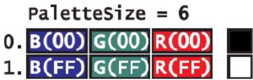  
Fig. 33.44: Palette Structure of a Black & White, One-BitImage

## A 4-bit image would have the following palette structure:

The image palette must only contain the palette entries specified in the bitmap. The bitmap should allocate each color index starting from 0x00, so the palette information can be as small as possible. The following is an example of a palette structure of a 4-bit image that only uses 6 colors:

Each palette entry specifies each unique color in the image. The above figure would be typical of light blue logo on a black background, with several shades of blue for anti-aliasing the blue logo on the black background.

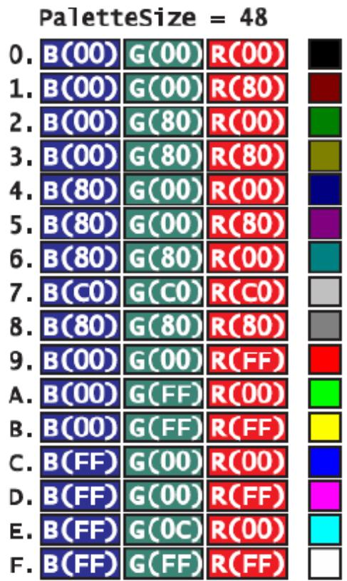  
Fig. 33.45: Palette Structure of a Four-Bit Image

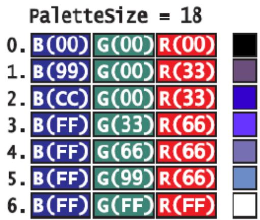  
Fig. 33.46: Palette Structure of a Four-Bit, Six-ColorImage

## 33.3.8 Forms Package

The Forms package is used to carry forms-based encoding data.

## Prototype

```c
typedef struct _EFI_HII_FORM_PACKAGE_HDR {
    EFI_HII_PACKAGE_HEADER *Header;
    //EFI_IFR_OP_HEADER *OpCodeHeader;
    //More op-codes follow
} EFI_HII_FORM_PACKAGE_HDR;
```

## Parameters

## Header

The standard package header, where Header.Type = EFI\_HII\_PACKAGE\_FORMS.

## OpCodeHeader

The header for the first of what will be a series of op-codes associated with the forms data described in this package. The syntax of the forms can be referenced in Forms .

## Description

This is a package type designed to represent Internal Forms Representation (IFR) objects as a collection of op-codes

## 33.3.8.1 Binary Encoding

The IFR is a binary encoding for HII-related objects. Every object has (at least) three attributes:

Opcode. The enumeration of all of the diferent HII-related objects.

Length. The length of the opcode itself (2-127 bytes).

Scope. If set, this opens up a new scope. Certain objects describe attributes or capabilities which only apply to the current scope rather than the entire form. The scope extends up to the special END opcode, which marks the end of the current scope.

The binary objects are encoded as byte stream. Every object begins with a standard header ( EFI\_IFR\_OP\_HEADER ), which describes the opcode type, length and scope.

The simple binary object consists of a standard header, which contains a single 8-bit opcode, a 7-bit length and a 1-bit nesting indicator. The length specifies the number of bytes in the opcode, including the header. The simple binary object may also have zero or more bytes of fixed, object-specific, data.

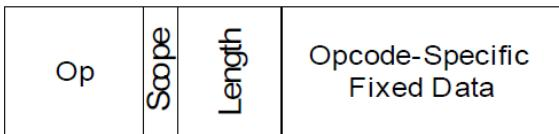  
Fig. 33.47: Simple Binary Object

When the Scope bit is set, it marks the beginning of a new scope which applies to all subsequent opcodes until the matching EFI\_IFR\_END opcode is found to close the scope. Those opcodes may, in turn, open new scopes as well, creating nested scopes.

## 33.3.8.2 Standard Headers

## 33.3.8.2.1 EFI\_IFR\_OP\_HEADER

## Summary

Standard opcode header

Prototype

```c
typedef struct _EFI_IFR_OP_HEADER {
    UINT8    OpCode;
    UINT8    Length: 7;
    UINT8    Scope: 1;
} EFI_IFR_OP_HEADER;
```

## Members

## OpCode

Defines which type of operation is being described by this header. See Opcode Reference for a list of IFR opcodes.

## Length

Defines the number of bytes in the opcode, including this header.

## Scope

If this bit is set, the opcode begins a new scope, which is ended by an EFI\_IFR\_END opcode.

## Description

Forms are represented in a binary format roughly similar to processor instructions.

Each header contains an opcode, a length and a scope indicator.

If Scope indicator is set, the scope exists until it reaches a corresponding EFI\_IFR\_END opcode. Scopes may be nested within other scopes.

## Related Definitions

```c
typedef UINT16 EFI_QUESTION_ID;
typedef UINT16 EFI_IMAGE_ID;
typedef UINT16 EFI_STRING_ID;
typedef UINT16 EFI_FORM_ID;
typedef UINT16 EFI_VARSTORE_ID;
typedef UINT16 EFI_ANIMATION_ID;
```

## 33.3.8.2.2 EFI\_IFR\_QUESTION\_HEADER

## Summary

Standard question header.

Prototype

```c
typedef struct _EFI_IFR_QUESTION_HEADER {
    EFI_IFR_STATEMENT_HEADER Header;
    EFI_QUESTION_ID QuestionId;
    EFI_VARSTORE_ID VarStoreId;
    union {
```

(continues on next page)

(continued from previous page)

<table><tr><td>EFI_STRING_ID</td><td>VarName;</td></tr><tr><td>UINT16</td><td>VarOffset;</td></tr><tr><td>}</td><td>VarStoreInfo;</td></tr><tr><td>UINT8</td><td>Flags;</td></tr><tr><td colspan="2">} EFI_IFR_QUESTION_HEADER;</td></tr></table>

## Members

## Header

The standard statement header.

## QuestionId

The unique value that identifies the particular question being defined by the opcode. The value of zero is reserved.

## Flags

A bit-mask that determines which unique settings are active for this question. See “Related Definitions” below for the meanings of the individual bits.

## VarStoreId

Specifies the identifier of a previously declared variable store to use when storing the question’s value. A value of zero indicates no associated variable store.

## VarStoreInfo

If VarStoreId refers to Bufer Storage ( EFI\_IFR\_VARSTORE or EFI\_IFR\_VARSTORE\_EFI ), then VarStoreInfo contains a 16-bit Bufer Storage ofset ( VarOfset ). If VarStoreId refers to Name/Value Storage ( EFI\_IFR\_VARSTORE\_NAME\_VALUE ), then VarStoreInfo contains the String ID of the name ( VarName ) for this name/value pair.

## Description

This is the standard header for questions.

## Related Definitions

```c
//******************************************************************
// Flags values
//******************************************************************
#define EFI_IFR_FLAG_READ_ONLY 0x01
#define EFI_IFR_FLAG_CALLBACK 0x04
#define EFI_IFR_FLAG_RESET_REQUIRED 0x10
#define EFI_IFR_FLAG_REST_STYLE 0x20
#define EFI_IFR_FLAG_RECONNECT_REQUIRED 0x40
#define EFI_IFR_FLAG_OPTIONS_ONLY 0x80
```

<table><tr><td>EFI_IFR_FLAG_READ_ONLY</td><td>The question is read-only</td></tr><tr><td>EFI_IFR_FLAG_CALLBACK</td><td>Designates if a particular opcode is to be treated as something that will initiate a callback to a registered driver.</td></tr><tr><td>EFI_IFR_FLAG_RESET_REQUIRED</td><td>If a particular choice is modified, designates that a return flag will be activated upon exiting of the browser, which indicates that the changes that the user requested require a reset to enact.</td></tr><tr><td>EFI_IFR_FLAG_REST_STYLE</td><td>Designates if a question supports REST architectural style operation. This flag can be omitted if the formset class guid already contains EFI_HII_REST_STYLE_FORMSET_GUID.</td></tr></table>

continues on next page

Table 33.19 – continued from previous page

<table><tr><td>EFI_IFR_FLAG_RECONNECT_REQUIRED</td><td>If a particular choice is modified, designates that a return flag will be activated upon exiting of the formset or the browser, which indicates that the changes that the user requested require a reconnect to enact.</td></tr><tr><td>EFI_IFR_FLAG_OPTIONS_ONLY</td><td>For questions with options, this indicates that only the options will be available for user choice.</td></tr></table>

## 33.3.8.2.3 EFI\_IFR\_STATEMENT\_HEADER

## Summary

Standard statement header.

## Prototype

```c
typedef struct _EFI_IFR_STATEMENT_HEADER {
    EFI_STRING_ID Prompt;
    EFI_STRING_ID Help;
} EFI_IFR_STATEMENT_HEADER;
```

## Members

## Prompt

The string identifier of the prompt string for this particular statement. The value 0 indicates no prompt string.

## Help

The string identifier of the help string for this particular statement. The value 0 indicates no help string.

## Description

This is the standard header for statements, including questions.

## 33.3.8.3 Opcode Reference

This section describes each of the IFR opcode encodings in detail. The table below lists the opcodes in numeric order while the reference section lists them in alphabetic order.

Table 33.20: IFR Opcodes

<table><tr><td>Opcode</td><td>Value</td><td>Description</td></tr><tr><td>EFI_IFR_FORM_OP</td><td>0x01</td><td>Form</td></tr><tr><td>EFI_IFR_SUBTITLE_OP</td><td>0x02</td><td>Subtitle statement</td></tr><tr><td>EFI_IFR_TEXT_OP</td><td>0x03</td><td>Static text/image statement</td></tr><tr><td>EFI_IFR_IMAGE_OP</td><td>0x04</td><td>Static image.</td></tr><tr><td>EFI_IFR_ONE_OF_OP</td><td>0x05</td><td>One-of question</td></tr><tr><td>EFI_IFR_CHECKBOX_OP</td><td>0x06</td><td>Boolean question</td></tr><tr><td>EFI_IFR_NUMERIC_OP</td><td>0x07</td><td>Numeric question</td></tr><tr><td>EFI_IFR_PASSWORD_OP</td><td>0x08</td><td>Password string question</td></tr><tr><td>EFI_IFR_ONE_OF_OPTION_OP</td><td>0x09</td><td>Option</td></tr><tr><td>EFI_IFR_SUPPRESS_IF_OP</td><td>0x0A</td><td>Suppress if conditional</td></tr><tr><td>EFI_IFR_LOCKED_OP</td><td>0x0B</td><td>Marks statement/question as locked</td></tr><tr><td>EFI_IFR_ACTION_OP</td><td>0x0C</td><td>Button question</td></tr><tr><td>EFI_IFR_RESET_BUTTON_OP</td><td>0x0D</td><td>Reset button statement</td></tr></table>

continues on next page

Table 33.20 – continued from previous page

<table><tr><td>EFI_IFR_FORM_SET_OP</td><td>0x0E</td><td>Form set</td></tr><tr><td>EFI_IFR_REF_OP</td><td>0x0F</td><td>Cross-reference statement</td></tr><tr><td>EFI_IFR_NO_SUBMIT_IF_OP</td><td>0x10</td><td>Error checking conditional</td></tr><tr><td>EFI_IF_R_INCONSISTENT_IF_OP</td><td>0x11</td><td>Error checking conditional</td></tr><tr><td>EFI_IFR_EQ_ID_VAL_OP</td><td>0x12</td><td>Return TRUE if question value equals UINT16</td></tr><tr><td>EFI_IFR_EQ_ID_ID_OP</td><td>0x13</td><td>Return TRUE if question value equals another question value</td></tr><tr><td>EFI_I_FR_EQ_ID_VAL_LIST_OP</td><td>0x14</td><td>Return TRUE if question value is found in list of UINT16s</td></tr><tr><td>EFI_IFR_AND_OP</td><td>0x15</td><td>Push TRUE if both sub-expressions returns TRUE.</td></tr><tr><td>EFI_IFR_OR_OP</td><td>0x16</td><td>Push TRUE if either sub-expressions returns TRUE.</td></tr><tr><td>EFI_IFR_NOT_OP</td><td>0x17</td><td>Push FALSE if sub-expression returns TRUE, otherwise return TRUE.</td></tr><tr><td>EFI_IFR_RULE_OP</td><td>0x18</td><td>Create rule in current form.</td></tr><tr><td>EFI_IFR_GRAY_OUT_IF_OP</td><td>0x19</td><td>Nested statements, questions or options will not be selectable if expression returns TRUE.</td></tr><tr><td>EFI_IFR_DATE_OP</td><td>0x1A</td><td>Date question.</td></tr><tr><td>EFI_IFR_TIME_OP</td><td>0x1B</td><td>Time question.</td></tr><tr><td>EFI_IFR_STRING_OP</td><td>0x1C</td><td>String question</td></tr><tr><td>EFI_IFR_REFRESH_OP</td><td>0x1D</td><td>Interval for refreshing a question</td></tr><tr><td>EFI_IFR_DISABLE_IF_OP</td><td>0x1E</td><td>Nested statements, questions or options will not be processed if expression returns TRUE.</td></tr><tr><td>EFI_IFR_ANIMATION_OP</td><td>0x1F</td><td>Animation associated with question statement, form or form set.</td></tr><tr><td>EFI_IFR_TO_LOWER_OP</td><td>0x20</td><td>Convert a string on the expression stack to lower case.</td></tr><tr><td>EFI_IFR_TO_UPPER_OP</td><td>0x21</td><td>Convert a string on the expression stack to upper case.</td></tr><tr><td>EFI_IFR_MAP_OP</td><td>0x22</td><td>Convert one value to another by selecting a match from a list.</td></tr><tr><td>EFI_IFR_ORDERED_LIST_OP</td><td>0x23</td><td>Set question</td></tr><tr><td>EFI_IFR_VARSTORE_OP</td><td>0x24</td><td>Define a buffer-style variable storage.</td></tr><tr><td>EFI_IFR_VA RSTORE_NAME_VALUE_OP</td><td>0x25</td><td>Define a name/value style variable storage.</td></tr><tr><td>EFI_IFR_VARSTORE_EFI_OP</td><td>0x26</td><td>Define a UEFI variable style variable storage.</td></tr><tr><td>EFI_IF_R_VARSTORE_DEVICE_OP</td><td>0x27</td><td>Specify the device path to use for variable storage.</td></tr><tr><td>EFI_IFR_VERSION_OP</td><td>0x28</td><td>Push the revision level of the UEFI Specification to which this Forms Processor is compliant.</td></tr><tr><td>EFI_IFR_END_OP</td><td>0x29</td><td>Marks end of scope.</td></tr><tr><td>EFI_IFR_MATCH_OP</td><td>0x2A</td><td>Push TRUE if string matches a pattern.</td></tr><tr><td>EFI_IFR_GET_OP</td><td>0x2B</td><td>Return a stored value.</td></tr><tr><td>EFI_IFR_SET_OP</td><td>0x2C</td><td>Change a stored value.</td></tr><tr><td>EFI_IFR_READ_OP</td><td>0x2D</td><td>Provides a value for the current question or default.</td></tr><tr><td>EFI_IFR_WRITE</td><td>0x2E</td><td>Change a value for the current question.</td></tr><tr><td>EFI_IFR_EQUAL_OP</td><td>0x2F</td><td>Push TRUE if two expressions are equal.</td></tr><tr><td>EFI_IFR_NOT_EQUAL_OP</td><td>0x30</td><td>Push TRUE if two expressions are not equal.</td></tr><tr><td>EFI_IFR_GREATER_THAN_OP</td><td>0x31</td><td>Push TRUE if one expression is greater than another expression.</td></tr></table>

continues on next page

Table 33.20 – continued from previous page

<table><tr><td>EFI_IFR_GREATER_EQUAL_OP</td><td>0x32</td><td>Push TRUE if one expression is greater than or equal to another expression.</td></tr><tr><td>EFI_IFR_LESS_THAN_OP</td><td>0x33</td><td>Push TRUE if one expression is less than another expression.</td></tr><tr><td>EFI_IFR_LESS_EQUAL_OP</td><td>0x34</td><td>Push TRUE if one expression is less than or equal to another expression.</td></tr><tr><td>EFI_IFR_BITWISE_AND_OP</td><td>0x35</td><td>Bitwise-AND two unsigned integers and push the result.</td></tr><tr><td>EFI_IFR_BITWISE_OR_OP</td><td>0x36</td><td>Bitwise-OR two unsigned integers and push the result.</td></tr><tr><td>EFI_IFR_BITWISE_NOT_OP</td><td>0x37</td><td>Bitwise-NOT an unsigned integer and push the result.</td></tr><tr><td>EFI_IFR_SHIFT_LEFT_OP</td><td>0x38</td><td>Shift an unsigned integer left by a number of bits and push the result.</td></tr><tr><td>EFI_IFR_SHIFT_RIGHT_OP</td><td>0x39</td><td>Shift an unsigned integer right by a number of bits and push the result.</td></tr><tr><td>EFI_IFR_ADD_OP</td><td>0x3A</td><td>Add two unsigned integers and push the result.</td></tr><tr><td>EFI_IFR_SUBTRACT_OP</td><td>0x3B</td><td>Subtract two unsigned integers and push the result.</td></tr><tr><td>EFI_IFR_MULTIPLY_OP</td><td>0x3C</td><td>Multiply two unsigned integers and push the result.</td></tr><tr><td>EFI_IFR_DIVIDE_OP</td><td>0x3D</td><td>Divide one unsigned integer by another and push the result.</td></tr><tr><td>EFI_IFR_MODULO_OP</td><td>0x3E</td><td>Divide one unsigned integer by another and push the remainder.</td></tr><tr><td>EFI_IFR_RULE_REF_OP</td><td>0x3F</td><td>Evaluate a rule</td></tr><tr><td>EFI_IFR_QUESTION_REF1_OP</td><td>0x40</td><td>Push a question&#x27;s value</td></tr><tr><td>EFI_IFR_QUESTION_REF2_OP</td><td>0x41</td><td>Push a question&#x27;s value</td></tr><tr><td>EFI_IFR_UINT8_OP</td><td>0x42</td><td>Push an 8-bit unsigned integer</td></tr><tr><td>EFI_IFR_UINT16_OP</td><td>0x43</td><td>Push a 16-bit unsigned integer.</td></tr><tr><td>EFI_IFR_UINT32_OP</td><td>0x44</td><td>Push a 32-bit unsigned integer</td></tr><tr><td>EFI_IFR_UINT64_OP</td><td>0x45</td><td>Push a 64-bit unsigned integer.</td></tr><tr><td>EFI_IFR_TRUE_OP</td><td>0x46</td><td>Push a boolean TRUE.</td></tr><tr><td>EFI_IFR_FALSE_OP</td><td>0x47</td><td>Push a boolean FALSE</td></tr><tr><td>EFI_IFR_TO_UINT_OP</td><td>0x48</td><td>Convert expression to an unsigned integer</td></tr><tr><td>EFI_IFR_TO_STRING_OP</td><td>0x49</td><td>Convert expression to a string</td></tr><tr><td>EFI_IFR_TO_BOOLAN_OP</td><td>0x4A</td><td>Convert expression to a boolean.</td></tr><tr><td>EFI_IFR_MID_OP</td><td>0x4B</td><td>Extract portion of string or buffer</td></tr><tr><td>EFI_IFR_FIND_OP</td><td>0x4C</td><td>Find a string in a string.</td></tr><tr><td>EFI_IFR_TOKEN_OP</td><td>0x4D</td><td>Extract a delimited byte or character string from buffer or string.</td></tr><tr><td>EFI_IFR_STRING_REF1_OP</td><td>0x4E</td><td>Push a string</td></tr><tr><td>EFI_IFR_STRING_REF2_OP</td><td>0x4F</td><td>Push a string</td></tr><tr><td>EFI_IFR_CONDITIONAL_OP</td><td>0x50</td><td>Duplicate one of two expressions depending on result of the first expression.</td></tr><tr><td>EFI_IFR_QUESTION_REF3_OP</td><td>0x51</td><td>Push a question&#x27;s value from a different form.</td></tr><tr><td>EFI_IFR_ZERO_OP</td><td>0x52</td><td>Push a zero</td></tr><tr><td>EFI_IFR_ONE_OP</td><td>0x53</td><td>Push a one</td></tr><tr><td>EFI_IFR_ONES_OP</td><td>0x54</td><td>Push a 0xFFFFFFFFFFFFFFFF.</td></tr><tr><td>EFI_IFR_UNDEFINED_OP</td><td>0x55</td><td>Push Undefined</td></tr><tr><td>EFI_IFR_LENGTH_OP</td><td>0x56</td><td>Push length of buffer or string.</td></tr><tr><td>EFI_IFR_DUP_OP</td><td>0x57</td><td>Duplicate top of expression stack</td></tr></table>

continues on next page

Table 33.20 – continued from previous page

<table><tr><td>EFI_IFR_THIS_OP</td><td>0x58</td><td>Push the current question&#x27;s value</td></tr><tr><td>EFI_IFR_SPAN_OP</td><td>0x59</td><td>Return first matching/non-matching character in a string</td></tr><tr><td>EFI_IFR_VALUE_OP</td><td>0x5A</td><td>Provide a value for a question</td></tr><tr><td>EFI_IFR_DEFAULT_OP</td><td>0x5B</td><td>Provide a default value for a question.</td></tr><tr><td>EFI_IFR_DEFAULTSTORE_OP</td><td>0x5C</td><td>Define a Default Type Declaration</td></tr><tr><td>EFI_IFR_FORM_MAP_OP</td><td>0x5D</td><td>Create a standards-map form.</td></tr><tr><td>EFI_IFR_CATENATE_OP</td><td>0x5E</td><td>Push concatenated buffers or strings.</td></tr><tr><td>EFI_IFR_GUID_OP</td><td>0x5F</td><td>An extensible GUIDed op-code</td></tr><tr><td>EFI_IFR_SECURITY_OP</td><td>0x60</td><td>Returns whether current user profile contains specified setup access privileges.</td></tr><tr><td>EFI_IFR_MODAL_TAG_OP</td><td>0x61</td><td>Specify current form is modal</td></tr><tr><td>EFI_IFR_REFRESH_ID_OP</td><td>0x62</td><td>Establish an event group for refreshing a forms-based element.</td></tr><tr><td>EFI_IFR_WARNING_IF</td><td>0x63</td><td>Warning conditional</td></tr><tr><td>EFI_IFR_MATCH2_OP</td><td>0x64</td><td>Push TRUE if string matches a Regular Expression pattern.</td></tr></table>

## Code Definitions

Each of the following sections gives a detailed description of the opcodes’ behavior.

## 33.3.8.3.1 EFI\_IFR\_ACTION

Summary

Create an action button.

Prototype

```c
#define EFI_IFR_ACTION_OP 0x0C
typedef struct _EFI_IFR_ACTION {
    EFI_IFR_OP_HEADER Header;
    EFI_IFR_QUESTION_HEADER Question;
    EFI_STRING_ID QuestionConfig;
} EFI_IFR_ACTION;

typedef struct _EFI_IFR_ACTION_1 {
    EFI_IFR_OP_HEADER Header;
    EFI_IFR_QUESTION_HEADER Question;
} _EFI_IFR_ACTION_1;
```

## Members

## Header

The standard opcode header, where Header.OpCode = EFI\_IFR\_ACTION\_OP.

## Question

The standard question header. See EFI\_IFR\_QUESTION\_HEADER ( EFI\_IFR\_QUESTION\_HEADER ) for more information.

## QuestionConfig

The results string which is in <ConfigResp> format will be processed when the button is selected by the user.

Description

Creates an action question. When the question is selected, the configuration string specified by QuestionConfig will be processed. If QuestionConfig is 0 or is not present, then no no configuration string will be processed. This is useful when using an action button only for the callback.

If the question is marked read-only (see EFI\_IFR\_QUESTION\_HEADER ) then the action question cannot be selected.

## 33.3.8.3.2 EFI\_IFR\_ANIMATION

## Summary

Creates an image for a statement or question.

## Prototype

```c
#define EFI_IFR_ANIMATION_OP 0x1F
typedef struct _EFI_IFR_ANIMATION {
    EFI_IFR_OP_HEADER Header;
    EFI_ANIMATION_ID Id;
} EFI_IFR_ANIMATION;
```

## Members

## Header

Standard opcode header, where Header.OpCode is EFI\_IFR\_ANIMATION\_OP

## Id

Animation identifier in the HII database.

## Description

Associates an animation from the HII database with the current question, statement or form. If the specified animation does not exist in the HII database.

## 33.3.8.3.3 EFI\_IFR\_ADD

## Summary

Pops two unsigned integers, adds them and pushes the result.

Prototype

```c
#define EFI_IFR_ADD_OP 0x3a
typedef struct _EFI_IFR_ADD {
    EFI_IFR_OP_HEADER Header;
} EFI_IFR_ADD;
```

## Members

## Header

Standard opcode header, where Header.OpCode = EFI\_IFR\_ADD\_OP.

## Description

This opcode performs the following actions:

1. Pop two values from the expression stack. The first popped is the right-hand value. The secondpopped is the left-hand value.

2. If the two values do not evaluate to unsigned integers, push Undefined.

3. Zero-extend the left-hand and right-hand values to 64-bits.

4. Add the left-hand value to right-hand value.

5. Push the lower 64-bits of the result. Overflow is ignored.

## 33.3.8.3.4 EFI\_IFR\_AND

## Summary

Pops two booleans, push TRUE if both are TRUE, otherwise push FALSE.

## Prototype

```c
#define EFI_IFR_AND_OP 0x15
typedef struct _EFI_IFR_AND {
    EFI_IFR_OP_HEADER Header;
} EFI_IFR_AND;
```

## Members

## Header

The standard opcode header, where Header.OpCode = EFI\_IFR\_AND\_OP.

## Description

This opcode performs the following actions:

1. Pop two expressions from the expressionstack.

2. If the two expressions cannot be evaluated as boolean, push Undefined.

3. If both expressions evaluate to TRUE, then push TRUE. Otherwise, push FALSE.

## 33.3.8.3.5 EFI\_IFR\_BITWISE\_AND

## Summary

Pops two unsigned integers, perform bitwise AND and push the result.

## Prototype

```c
#define EFI_IFR_BITWISE_AND_OP 0x35
typedef struct _EFI_IFR_BITWISE_AND {
    EFI_IFR_OP_HEADER Header;
} EFI_IFR_BITWISE_AND;
```

## Members

## Header

The standard opcode header, where Header.OpCode = EFI\_IFR\_BITWISE\_AND\_OP.

## Description

This opcode performs the following actions:

1. Pop two expressions from the expressionstack.

2. If the two expressions cannot be evaluated as unsigned integers, push Undefined.

3. Otherwise, zero-extend the unsigned integers to 64-bits.

4. Perform a bitwise-AND on the two values.

5. Push the result.

## 33.3.8.3.6 EFI\_IFR\_BITWISE\_NOT

## Summary

Pop an unsigned integer, perform a bitwise NOT and push the result.

## Prototype

```c
#define EFI_IFR_BITWISE_NOT_OP 0x37
typedef struct _EFI_IFR_BITWISE_NOT {
    EFI_IFR_OP_HEADER Header;
} EFI_IFR_BITWISE_NOT;
```

## Members

## Header

The standard opcode header, where Header.OpCode = EFI\_IFR\_BITWISE\_NOT\_OP.

## Description

This opcode performs the following actions:

1. Pop an expression from the expression stack.

2. If the expression cannot be evaluated as an unsigned integer, push Undefined.

3. Otherwise, zero-extend the unsigned integer to 64-bits.

4. Perform a bitwise-NOT on the value.

5. Push the result.

## 33.3.8.3.7 EFI\_IFR\_BITWISE\_OR

## Summary

Pops two unsigned integers, perform bitwise OR and push the result.

Prototype

```c
#define EFI_IFR_BITWISE_OR_OP 0x36
typedef struct _EFI_IFR_BITWISE_OR {
    EFI_IFR_OP_HEADER Header;
} EFI_IFR_BITWISE_OR;
```

## Members

## Header

Standard opcode header, where OpCode is EFI\_IFR\_BITWISE\_OR\_OP.

## Description

This opcode performs the following actions:

1. Pop two expressions from the expressionstack.

2. If the two expressions cannot be evaluated as unsigned integers, push Undefined.

3. Otherwise, zero-extend the unsigned integers to 64-bits.

4. Perform a bitwise-OR of the two values.

5. Push the result.

## 33.3.8.3.8 EFI\_IFR\_CATENATE

## Summary

Pops two bufers or strings, concatenates them and pushes the result.

Prototype

```c
#define EFI_IFR_CATENATE_OP 0x5e
typedef struct _EFI_IFR_CATENATE {
    EFI_IFR_OP_HEADER Header;
} EFI_IFR_CATENATE;
```

## Members

## Header

Standard opcode header, where OpCode is EFI\_IFR\_CATENATE\_OP.

## Description

This opcode performs the following actions:

1. Pop two expressions from the expressionstack. The first expression popped is the left value and the second value popped is the right value.

2. If the left or right values cannot be evaluated as a string or a bufer, push Undefined. If the left or right values are of diferent types, then push Undefined.

3. If the left and right values are strings, push a new string which contains the contents of the left string (without the NULL terminator) followed by the contents of the right string on to the expression stack.

4. If the left and right values are bufers, push a new bufer that contains the contents of the left bufer followed by the contents of the right bufer on to the expression stack.

## 33.3.8.3.9 EFI\_IFR\_CHECKBOX

## Summary

Creates a boolean checkbox.

## Prototype

```c
#define EFI_IFR_CHECKBOX_OP 0x06
typedef struct _EFI_IFR_CHECKBOX {
    EFI_IFR_OP_HEADER Header;
    EFI_IFR_QUESTION_HEADER Question;
    UINT8 Flags;
} EFI_IFR_CHECKBOX;
```

## Members

## Header

The standard question header, where Header.OpCode = EFI\_IFR\_CHECKBOX\_OP.

## Question

The standard question header. See EFI\_IFR\_QUESTION\_HEADER ( EFI\_IFR\_QUESTION\_HEADER ) for more information.

## Flags

Flags that describe the behavior of the question. All undefined bits should be zero. See EFI\_IFR\_CHECKBOX\_x in “Related Definitions” for more information.

## Description

Creates a Boolean checkbox question and adds it to the current form. The checkbox has two values: FALSE if the box is not checked and TRUE if it is.

There are three ways to specify defaults for this question: the Flags field (lowest priority), one or more nested EFI\_IFR\_ONE\_OF\_OPTION, or nested EFI\_IFR\_DEFAULT (highest priority).

An image may be associated with the question using a nested EFI\_IFR\_IMAGE. An animation may be associated with the option using a nested EFI\_IFR\_ANIMATION.

## Related Definitions

#define EFI\_IFR\_CHECKBOX\_DEFAULT 0x01 #define EFI\_IFR\_CHECKBOX\_DEFAULT\_MFG 0x02

## 33.3.8.3.10 EFI\_IFR\_CONDITIONAL

## Summary

Pops two values and a boolean, pushes one of the values depending on the boolean.

## Prototype

```c
#define EFI_IFR_CONDITIONAL_OP 0x50
typedef struct _EFI_IFR_CONDITIONAL {
    EFI_IFR_OP_HEADER Header;
} EFI_IFR_CONDITIONAL;
```

## Members

## Header

Standard opcode header, where OpCode is EFI\_IFR\_CONDITIONAL\_OP.

## Description

This opcode performs the following actions:

\# Pop three values from the expression stack.The first value popped is the right value. The second expression popped is the middle value. The last expression popped is the left value.

1. If the left value cannot be evaluated as a boolean, push Undefined.

2. If the left expression evaluates to TRUE, push the right value.

3. Otherwise, push the middle value.

## 33.3.8.3.11 EFI\_IFR\_DATE

## Summary

Create a date question.

Prototype

```c
#define EFI_IFR_DATE_OP 0x1A
typedef struct _EFI_IFR_DATE {
    EFI_IFR_OP_HEADER Header;
    EFI_IFR_QUESTION_HEADER Question;
    UINT8 Flags;
} EFI_IFR_DATE;
```

## Members

## Header

The sequence that defines the type of opcode as well as the length of the opcode being defined. Header.OpCode = EFI\_IFR\_DATE\_OP.

## Question

The standard question header. See EFI\_IFR\_QUESTION\_HEADER for more information.

## Flags

Flags that describe the behavior of the question. All undefined bits should be zero.

```c
#define EFI_QF_DATE_YEAR_SUPPRESS 0x01
#define EFI_QF_DATE_MONTH_SUPPRESS 0x02
#define EFI_QF_DATE_DAY_SUPPRESS 0x04
#define EFI_QF_DATE_STORAGE 0x30
```

For \*QF\_DATE\_STORAGE,\* there are currently three valid values:

```c
#define QF_DATE_STORAGE_NORMAL 0x00
#define QF_DATE_STORAGE_TIME 0x10
#define QF_DATE_STORAGE_WAKEUP 0x20
```

## Description

Create a Date question ( Date ) and add it to the current form.

There are two ways to specify defaults for this question: one or more nested EFI\_IFR\_ONE\_OF\_OPTION (lowest priority) or nested EFI\_IFR\_DEFAULT (highest priority). An image may be associated with the option using a nested EFI\_IFR\_IMAGE . An animation may be associated with the question using a nested EFI\_IFR\_ANIMATION.

## 33.3.8.3.12 EFI\_IFR\_DEFAULT

## Summary

Provides a default value for the current question

Prototype

```c
#define EFI_IFR_DEFAULT_OP 0x5b
typedef struct _EFI_IFR_DEFAULT {
    EFI_IFR_OP_HEADER Header;
```

(continues on next page)

(continued from previous page)

```c
UINT16 DefaultId;
UINT8 Type;
EFI_IFR_TYPE_VALUE Value;
} EFI_IFR_DEFAULT;

typedef struct _EFI_IFR_DEFAULT_2 {
    EFI_IFR_OP_HEADER Header;
    UINT16 DefaultId;
    UINT8 Type;
} EFI_IFR_DEFAULT_2;
```

## Members

## Header

The sequence that defines the type of opcode as well as the length of the opcode being defined. For this tag, Header.OpCode = EFI\_IFR\_DEFAULT\_OP.

## DefaultId

Identifies the default store for this value. The default store must have previously been created using EFI\_IFR\_DEFAULTSTORE.

## Type

The type of data in the Value field. See EFI\_IFR\_TYPE\_x in EFI\_IFR\_ONE\_OF\_OPTION.

## Value

The default value. The actual size of this field depends on Type. If Type is EFI\_IFR\_TYPE\_OTHER, then the default value is provided by a nested EFI\_IFR\_VALUE.

## Description

This opcode specifies a default value for the current question. There are two forms. The first ( EFI\_IFR\_DEFAULT ) assumes that the default value is a constant, embedded directly in the Value member. The second ( EFI\_IFR\_DEFAULT\_2 ) assumes that the default value is specified using a nested EFI\_IFR\_VALUE opcode.

## 33.3.8.3.13 EFI\_IFR\_DEFAULTSTORE

## Summary

Provides a declaration for the type of default values that a question can be associated with.

## Prototype

```c
#define EFI_IFR_DEFAULTSTORE_OP 0x5c
typedef struct _EFI_IFR_DEFAULTSTORE {
    EFI_IFR_OP_HEADER Header;
    EFI_STRING_ID DefaultName;
    UINT16 DefaultId;
} EFI_IFR_DEFAULTSTORE;
```

## Members

## Header

The sequence that defines the type of opcode as well as the length of the opcode being defined. For this tag, Header.OpCode = EFI\_IFR\_DEFAULTSTORE\_OP

## DefaultName

A string token reference for the human readable string associated with the type of default being declared.

## DefaultId

The default identifier, which is unique within the current form set. The default identifier creates a group of defaults. See Attributes, listed under xxxx Defaults for the default identifier ranges.

## Description

Declares a class of default which can then have question default values associated with.

An EFI\_IFR\_DEFAULTSTORE with a specified DefaultId must appear in the IFR before it can be referenced by an EFI\_IFR\_DEFAULT.

## 33.3.8.3.14 EFI\_IFR\_DISABLE\_IF

## Summary

Disable all nested questions and expressions if the expression evaluates to TRUE.

## Prototype

```c
#define EFI_IFR_DISABLE_IF_OP 0x1e
typedef struct _EFI_IFR_DISABLE_IF {
    EFI_IFR_OP_HEADER Header;
} EFI_IFR_DISABLE_IF;
```

## Members

## Header

The byte sequence that defines the type of opcode as well as the length of the opcode being defined. Header.OpCode = EFI\_IFR\_DISABLE\_IF\_OP.

## Description

All nested statements, questions, options or expressions will not be processed if the expression appearing as the first nested object evaluates to TRUE. If the expression consists of more than a single opcode, then the first opcode in the expression must have the Scope bit set and the expression must end with EFI\_IFR\_END.

When this opcode appears under a form set, the expression must only rely on constants. When this opcode appears under a form, the expression may rely on question values in the same form which are not inside of an EFI\_DISABLE\_IF expression.

## 33.3.8.3.15 EFI\_IFR\_DIVIDE

## Summary

Pops two unsigned integers, divide one by the other and pushes the result.

## Prototype

```c
#define EFI_IFR_DIVIDE_OP 0x3d
typedef struct _EFI_IFR_DIVIDE {
    EFI_IFR_OP_HEADER Header;
} EFI_IFR_DIVIDE;
```

## Members

## Header

Standard opcode header, where OpCode is EFI\_IFR\_DIVIDE.

## Description

1. Pop two expressions from the expressionstack. The first popped is the right-hand expression. The second popped is the left-hand expression.\*\*

2. If the two expressions do not evaluate to unsigned integers, push Undefined. If the right-hand expression is equal to zero, push Undefined.

3. Zero-extend the left-hand and right-hand expressions to 64-bits.

4. Divide the left-hand value to right-hand expression.

5. Push the result.

## 33.3.8.3.16 EFI\_IFR\_DUP

## Summary

Duplicate the top value on the expression stack.

## Prototype

```c
#define EFI_IFR_DUP_OP 0x57
typedef struct _EFI_IFR_DUP {
    EFI_IFR_OP_HEADER Header;
} EFI_IFR_DUP;
```

## Members

## Header

Standard opcode header, where OpCode is EFI\_IFR\_DUP \_OP.

## Description

Duplicate the top expression on the expression stack.

NOTE: This opcode is usually used as an optimization by the tools to help eliminate common sub-expression calculation and make smaller expressions

## 33.3.8.3.17 EFI\_IFR\_END

## Summary

End of the current scope.

Prototype

```c
#define EFI_IFR_END_OP 0x29
typedef struct _EFI_IFR_END {
    EFI_IFR_OP_HEADER Header;
} EFI_IFR_END;
```

## Members

## Header

Standard opcode header, where OpCode is EFI\_IFR\_END\_OP.

## Description

Marks the end of the current scope.

## 33.3.8.3.18 EFI\_IFR\_EQUAL

## Summary

Pop two values, compare and push TRUE if equal, FALSE if not.

## Prototype

```c
#define EFI_IFR_EQUAL_OP 0x2f
typedef struct _EFI_IFR_EQUAL {
    EFI_IFR_OP_HEADER Header;
} EFI_IFR_EQUAL;
```

## Members

## Header

Standard opcode header, where OpCode is EFI\_IFR\_EQUAL\_OP.

## Description

The opcode performs the following actions:

1. Pop two values from the expression stack.

2. If the two values are not strings, Booleans or unsigned integers, push Undefined.

3. If the two values are of diferent types, push Undefined.

4. Compare the two values. Strings are compared lexicographically.

5. If the two values are equal then push TRUE on the expression stack. If they are not equal, push FALSE .

## 33.3.8.3.19 EFI\_IFR\_EQ\_ID\_ID

## Summary

Push TRUE if the two questions have the same value or FALSE if they are not equal.

## Prototype

```c
#define EFI_IFR_EQ_ID_ID_OP 0x13
typedef struct _EFI_IFR_EQ_ID_ID {
    EFI_IFR_OP_HEADER Header;
    EFI_QUESTION_ID QuestionId1;
    EFI_QUESTION_ID QuestionId2;
} EFI_IFR_EQ_ID_ID;
```

## Members

## Header

Standard opcode header, where OpCode is EFI\_IFR\_EQ\_ID\_ID\_OP.

## QuestionId1,

QuestionId2 Specifies the identifier of the questions whose values will be compared.

## Description

Evaluate the values of the specified questions ( QuestionId1, QuestionId2 ). If the two values cannot be evaluated or cannot be converted to comparable types, then push Undefined. If they are equal, push TRUE. Otherwise push FALSE.

## 33.3.8.3.20 EFI\_IFR\_EQ\_ID\_VAL\_LIST

## Summary

Push TRUE if the question’s value appears in a list of unsigned integers.

## Prototype

```c
#define EFI_IFR_EQ_ID_VAL_LIST_OP 0x14
typedef struct _EFI_IFR_EQ_ID_VAL_LIST {
    EFI_IFR_OP_HEADER Header;
    EFI_QUESTION_ID QuestionId;
    UINT16 ListLength;
    UINT16 ValueList[1];
} EFI_IFR_EQ_ID_VAL_LIST;
```

## Members

## Header

Standard opcode header, where OpCode is EFI\_IFR\_EQ\_ID\_VAL\_LIST\_OP.

## QuestionId

Specifies the identifier of the question whose value will be compared.

## ListLength

Number of entries in ValueList.

## ValueList

Zero or more unsigned integer values to compare against.

## Description

Evaluate the value of the specified question ( QuestionId ). If the specified question cannot be evaluated as an unsigned integer, then push Undefined. If the value can be found in ValueList, then push TRUE. Otherwise push FALSE.

## 33.3.8.3.21 EFI\_IFR\_EQ\_ID\_VAL

## Summary

Push TRUE if a question’s value is equal to a 16-bit unsigned integer, otherwise FALSE.

## Prototype

```c
#define EFI_IFR_EQ_ID_VAL_OP 0x12
typedef struct _EFI_IFR_EQ_ID_VAL {
    EFI_IFR_OP_HEADER Header;
    EFI_QUESTION_ID QuestionId;
    UINT16 Value;
} EFI_IFR_EQ_ID_VAL;
```

## Members

## Header

Standard opcode header, where OpCode is EFI\_IFR\_EQ\_ID\_VAL\_OP.

## QuestionId

Specifies the identifier of the question whose value will be compared.

## Value

Unsigned integer value to compare against.

## 33.3. Code Definitions

## Description

Evaluate the value of the specified question ( QuestionId ). If the specified question cannot be evaluated as an unsigned integer, then push Undefined. If they are equal, push TRUE. Otherwise push FALSE.

## 33.3.8.3.22 EFI\_IFR\_FALSE

## Summary

Push a FALSE on to the expression stack.

## Prototype

```c
#define EFI_IFR_FALSE_OP 0x47
typedef struct _EFI_IFR_FALSE {
    EFI_IFR_OP_HEADER Header;
} EFI_IFR_FALSE;
```

## Members

## Header

The sequence that defines the type of opcode as well as the length of the opcode being defined. For this tag, Header.OpCode = EFI\_IFR\_FALSE\_OP

## Description

Push a FALSE on to the expression stack.

## 33.3.8.3.23 EFI\_IFR\_FIND

## Summary

Pop two strings and an unsigned integer, find one string in the other and the index where found.

## Prototype

```c
#define EFI_IFR_FIND_OP 0x4c
typedef struct _EFI_IFR_FIND {
    EFI_IFR_OP_HEADER Header;
    UINT8 Format;
} EFI_IFR_FIND;
```

## Members

## Header

Standard opcode header, where OpCode is EFI\_IFR\_FIND\_OP.

## Format

The following flags govern the matching criteria:

## Related Definitions

<table><tr><td>#define EFI_IFR_FF_CASE_SENSITIVE</td><td>0x00</td></tr><tr><td>#define EFI_IFR_FF_CASE_INSENSITIVE</td><td>0x01</td></tr></table>

## Description

This opcode performs the following actions:

1. Pop three expressions from the expressionstack. The first expression popped is the right-hand value and the second value popped is the middle value and the last value popped is the left-hand value.

2. If the left-hand or middle values cannot be evaluated as a string, push Undefined. If the third expression cannot be evaluated as an unsigned integer, push Undefined.

3. The left-hand value is the string to search. The middle value is the string to compare with. The right-hand expression is the zero-based index of the search. |

4. If the string is found, push the zero-based index of the found string.

5. Otherwise, if the string is not found or the right-hand value specifies a value which is greater-than or equal to the length of the left-hand value’s string, push 0xFFFFFFFFFFFFFFFF.

## 33.3.8.3.24 EFI\_IFR\_FORM

## Summary

Creates a form.

## Prototype

```c
#define EFI_IFR_FORM_OP 0x01
typedef struct _EFI_IFR_FORM {
    EFI_IFR_OP_HEADER Header;
    EFI_FORM_ID FormId;
    EFI_STRING_ID FormTitle;
} EFI_IFR_FORM;
```

## Members

## Header

The sequence that defines the type of opcode as well as the length of the opcode being defined. Header.OpCode = EFI\_IFR\_FORM\_OP.

## FormId

The form identifier, which uniquely identifies the form within the form set. The form identifier, along with the device path and form set GUID, uniquely identifies a form within a system.

## FormTitle

The string token reference to the title of this particular form.

## Description

A form is the encapsulation of what amounts to a browser page. The header defines a FormId, which is referenced by the form set, among others. It also defines a FormTitle, which is a string to be used as the title for the form.

## 33.3.8.3.25 EFI\_IFR\_FORM\_MAP

## Summary

Creates a standards map form.

Prototype

```c
#define EFI_IFR_FORM_MAP_OP 0x5D
typedef struct _EFI_IFR_FORM_MAP_METHOD {
    EFI_STRING_ID MethodTitle;
```

(continues on next page)

```c
EFI_GUID MethodIdentifier;
} EFI_IFR_FORM_MAP_METHOD;

typedef struct _EFI_IFR_FORM_MAP {
    EFI_IFR_OP_HEADER Header;
    EFI_FORM_ID FormId;
    //EFI_IFR_FORM_MAP_METHOD Methods[];
} EFI_IFR_FORM_MAP;
```

(continued from previous page)

## Parameters

## Header

The sequence that defines the type of opcode as well as the length of the opcode being defined. Header.OpCode = EFI\_IFR\_FORM\_MAP\_OP.

## FormId

The unique identifier for this particular form.

## Methods

One or more configuration method’s name and unique identifier.

## MethodTitle

The string identifier which provides the human-readable name of the configuration method for this standards map form.

## MethodIdentifier

Identifier which uniquely specifies the configuration methods associated with this standards map form. See “Related Definitions” for current identifiers.

## Description

A standards map form describes how the configuration settings are represented for a configuration method identified by MethodIdentifier. It also defines a FormTitle, which is a string to be used as the title for the form.

## Related Definitions

```c
#define EFI_HII_STANDARD_FORM_GUID \
{ 0x3bd2f4ec, 0xe524, 0x46e4, \
{ 0xa9, 0xd8, 0x51, 0x01, 0x17, 0x42, 0x55, 0x62 } }
```

An EFI\_IFR\_FORM\_MAP where the method identifier is EFI\_HII\_STANDARD\_FORM\_GUID is semantically identical to a normal EFI\_IFR\_FORM.

## 33.3.8.3.26 EFI\_IFR\_FORM\_SET

## Summary

The form set is a collection of forms that are intended to describe the pages that will be displayed to the user.

## Prototype

```c
#define EFI_IFR_FORM_SET_OP 0x0E
typedef struct _EFI_IFR_FORM_SET {
    EFI_IFR_OP_HEADER Header;
    EFI_GUID Guid;
```

(continues on next page)

```c
#define EFI_IFR_GET_OP 0x2B
typedef struct _EFI_IFR_GET {
    EFI_IFR_OP_HEADER Header;
    EFI_VARSTORE_ID VarStoreId;
    union {
    EFI_STRING_ID VarName;
    UINT16 VarOffset;
    } VarStoreInfo;
    UINT8 VarStoreType;
} EFI_IFR_GET;
```

(continued from previous page)

<table><tr><td>EFI_STRING_ID</td><td>FormSetTitle;</td></tr><tr><td>EFI_STRING_ID</td><td>Help;</td></tr><tr><td>UINT8</td><td>Flags;</td></tr><tr><td>//EFI_GUID</td><td>ClassGuid[_];</td></tr><tr><td colspan="2">} EFI_IFR_FORM_SET;</td></tr></table>

## Members

## Header

The sequence that defines the type of opcode as well as the length of the opcode being defined. Header.OpCode = EFI\_IFR\_FORM\_SET\_OP.

## Guid

The unique GUID value associated with this particular form set. Type EFI\_GUID is defined in InstallProtocol-Interface() in this specification.

## FormSetTitle

The string token reference to the title of this particular form set.

## Help

The string token reference to the help of this particular form set.

## Flags

Flags which describe additional features of the form set. Bits 0:1 = number of members in ClassGuid. Bits 2:7 = Reserved. Should be set to zero.

## ClassGuid

Zero to four class identifiers. The standard class identifiers are described in EFI\_HII\_FORM\_BROWSER2\_PROTOCOL.SendForm(). They do not need to be unique in the form set.

## Description

The form set consists of a header and zero or more forms.

## 33.3.8.3.27 EFI\_IFR\_GET

## Summary

Return a stored value.

## Prototype

## Parameters

## Header

The sequence that defines the type of opcode as well as the length of the opcode being defined. Header.OpCode = EFI\_IFR\_GET\_OP.

## VarStoreId

Specifies the identifier of a previously declared variable store to use when retrieving the value.

## VarStoreInfo

Depending on the type of variable store selected, this contains either a 16-bit Bufer Storage ofset ( VarOfset ) or a Name/Value or EFI Variable name ( VarName ).

## VarStoreType

Specifies the type used for storage. The storage types EFI\_IFR\_TYPE\_x are defined in EFI\_IFR\_ONE\_OF\_OPTION.

## Description

This operator takes the value from storage and pushes it on to the expression stack. If the value could not be retrieved from storage, then Undefined is pushed on to the expression stack.

The type of value retrieved from storage depends on the setting of VarStoreType, as described in the following table:

Table 33.21: VarStoreType Descriptions

<table><tr><td>VarStoreType</td><td>Storage Description</td></tr><tr><td>EFI_IFR_TYPE_NUM_SIZE_8</td><td>8-bit unsigned integer</td></tr><tr><td>EFI_IFR_TYPE_NUM_SIZE_16</td><td>16-bit unsigned integer</td></tr><tr><td>EFI_IFR_TYPE_NUM_SIZE_32</td><td>32-bit unsigned integer</td></tr><tr><td>EFI_IFR_TYPE_NUM_SIZE_64</td><td>64-bit unsigned integer</td></tr><tr><td>EFI_IFR_TYPE_BOOL</td><td>8-bit boolean (0 = FALSE, 1 = TRUE)</td></tr><tr><td>EFI_IFR_TYPE_TIME</td><td>EFI_HII_TIME</td></tr><tr><td>EFI_IFR_TYPE_DATE</td><td>EFI_HII_DATE</td></tr><tr><td>EFI_IFR_TYPE_STRING</td><td>Null-terminated string</td></tr><tr><td>EFI_IFR_TYPE_OTHER</td><td>Invalid</td></tr><tr><td>EFI_IFR_TYPE_ACTION</td><td>Null-Terminated string</td></tr><tr><td>EFI_IFR_TYPE_UNDEFINED</td><td>Invalid</td></tr><tr><td>EFI_IFR_TYPE_BUFFER</td><td>Buffer</td></tr><tr><td>EFI_IFR_TYPE_REF</td><td>EFI_HII_REF</td></tr></table>

## 33.3.8.3.28 EFI\_IFR\_GRAY\_OUT\_IF

## Summary

Creates a group of statements or questions which are conditionally grayed-out.

## Prototype

```c
#define EFI_IFR_GRAY_OUT_IF_OP 0x19
typedef struct _EFI_IFR_GRAY_OUT_IF {
    EFI_IFR_OP_HEADER Header;
} EFI_IFR_GRAY_OUT_IF;
```

## Members

## Header

The byte sequence that defines the type of opcode as well as the length of the opcode being defined. Header.OpCode = EFI\_IFR\_GRAY\_OUT\_IF\_OP.

## Description

All nested statements or questions will be grayed out (not selectable and visually distinct) if the expression appearing as the first nested object evaluates to TRUE. If the expression consists of more than a single opcode, then the first opcode in the expression must have the Scope bit set and the expression must end with EFI\_IFR\_END.

Diferent browsers may support this option to varying degrees. For example, HTML has no similar construct so it may not support this facility.

## 33.3.8.3.29 EFI\_IFR\_GREATER\_EQUAL

## Summary

Pop two values, compare, push TRUE if first is greater than or equal the second, otherwise push FALSE.

## Prototype

```c
#define EFI_IFR_GREATER_EQUAL_OP 0x32
typedef struct _EFI_IFR_GREATER_EQUAL {
    EFI_IFR_OP_HEADER Header;
} EFI_IFR_GREATER_EQUAL;
```

## Members

## Header

Standard opcode header, where OpCode is EFI\_IFR\_GREATER\_EQUAL \_OP.

## Description

This opcode performs the following actions:

1. Pop two values from the expression stack. The first value popped is the right-hand value and the second value popped is the left-hand value.

2. If the two values do not evaluate to string, boolean or unsigned integer, push Undefined.

3. If the two values do not evaluate to the same type, push Undefined.

4. Compare the two values. Strings are compared lexicographically.

5. If the left-hand value is greater than or equal to the right-hand value, push TRUE. Otherwise push FALSE .

## 33.3.8.3.30 EFI\_IFR\_GREATER\_THAN

## Summary

Pop two values, compare, push TRUE if first is greater than the second, otherwise push FALSE.

## Prototype

```c
#define EFI_IFR_GREATER_THAN_OP 0x31
typedef struct _EFI_IFR_GREATER_THAN {
    EFI_IFR_OP_HEADER *Header;
} EFI_IFR_GREATER_THAN;
```

## Members

## Header

Standard opcode header, where OpCode is EFI\_IFR\_GREATER\_THAN \_OP

## Description

This opcode performs the following actions:

1. Pop two values from the expression stack. The first value popped is the right-hand value and the second value popped is the left-hand value.

2. If the two values do not evaluate to string, boolean or unsigned integer, push Undefined.

3. If the two values do not evaluate to the same type, push Undefined.

4. Compare the two values. Strings are compared lexicographically.

5. If the left-hand value is greater than the right-hand value, push TRUE. Otherwise push FALSE.

## 33.3.8.3.31 EFI\_IFR\_GUID

## Summary

A GUIDed operation. This op-code serves as an extensible op-code which can be defined by the Guid value to have various functionality. It should be noted that IFR browsers or scripts which cannot interpret the meaning of this GUIDed op-code will skip it.

Prototype

```c
#define EFI_IFR_GUID_OP 0x5F
typedef struct _EFI_IFR_GUID {
    EFI_IFR_OP_HEADER Header;
    EFI_GUID Guid;
//Optional Data Follows
} EFI_IFR_GUID;
```

## Parameters

## Header

The sequence that defines the type of opcode as well as the length of the opcode being defined. For this tag, Header.OpCode = EFI\_IFR\_GUID\_OP

## Guid

The GUID value for this op-code. This field is intended to define a particular type of special-purpose function, and the format of the data which immediately follows the Guid field (if any) is defined by that particular GUID.

## 33.3.8.3.32 EFI\_IFR\_IMAGE

## Summary

Creates an image for a statement or question.

## Prototype

```c
#define EFI_IFR_IMAGE_OP 0x04
typedef struct _EFI_IFR_IMAGE {
    EFI_IMAGE_ID    Id;
} EFI_IFR_IMAGE;
```

## Members

## Id

Image identifier in the HII database.

## 33.3. Code Definitions

## Description

Specifies the image within the HII database.

## 33.3.8.3.33 EFI\_IFR\_INCONSISTENT\_IF

## Summary

Creates a validation expression and error message for a question.

## Prototype

```c
#define EFI_IFR_INCONSISTENT_IF_OP 0x011
typedef struct _EFI_IFR_INCONSISTENT_IF {
    EFI_IFR_OP_HEADER Header;
    EFI_STRING_ID Error;
} EFI_IFR_INCONSISTENT_IF;
```

## Members

## Header

The byte sequence that defines the type of opcode as well as the length of the opcode being defined. Header.OpCode = EFI\_IFR\_INCONSISTENT\_IF\_OP.

## Error

The string token reference to the string that will be used for the consistency check message.

## Description

This tag uses a Boolean expression to allow the IFR creator to check options in a richer manner than provided by the question tags themselves. For example, this tag might be used to validate that two options are not using the same address or that the numbers that were entered align to some pattern (such as leap years and February in a date input field). The tag provides a string to be used in a error display to alert the user to the issue. Inconsistency tags will be evaluated when the user traverses from tag to tag. The user should not be allowed to submit the results of a form inconsistency.

## 33.3.8.3.34 EFI\_IFR\_LENGTH

## Summary

Pop a string or bufer, push its length.

## Prototype

```c
#define EFI_IFR_LENGTH_OP 0x56
typedef struct _EFI_IFR_LENGTH {
    EFI_IFR_OP_HEADER Header;
} EFI_IFR_LENGTH;
```

## Members

Header Standard opcode header, where OpCode is EFI\_IFR\_LENGTH\_OP.

## Description

This opcode performs the following actions:

1. Pop a value from the expression stack.

2. If the value cannot be evaluated as a bufer or string, then push Undefined.

3. If the value can be evaluated as a bufer, push the length of the bufer, in bytes.

4. If the value can be evaluated as a string, push the length of the string, in characters.

## 33.3.8.3.35 EFI\_IFR\_LESS\_EQUAL

## Summary

Pop two values, compare, push TRUE if first is less than or equal to the second, otherwise push FALSE.

## Prototype

```c
#define EFI_IFR_LESS_EQUAL_OP 0x34
typedef struct _EFI_IFR_LESS_EQUAL {
    EFI_IFR_OP_HEADER Header;
} EFI_IFR_LESS_EQUAL;
```

## Members

## Header

Standard opcode header, where OpCode is EFI\_IFR\_LESS\_EQUAL \_OP.

## Description

This opcode performs the following actions:

1. Pop two values from the expression stack. The first value popped is the right-hand value and the second value popped is the left-hand value.

2. If the two values do not evaluate to string, boolean or unsigned integer, push Undefined.

3. If the two values do not evaluate to the same type, push Undefined.

4. Compare the two values. Strings are compared lexicographically.

5. If the left-hand value is less than or equal to the right-hand value, push TRUE. Otherwise push FALSE.

## 33.3.8.3.36 EFI\_IFR\_LESS\_THAN

## Summary

Pop two values, compare, push TRUE if the first is less than the second, otherwise push FALSE.

Prototype

```c
#define EFI_IFR_LESS_THAN_OP 0x33
typedef struct _EFI_IFR_LESS_THAN {
    EFI_IFR_OP_HEADER Header;
} EFI_IFR_LESS_THAN;
```

## Members

## Header

Standard opcode header, where OpCode is EFI\_IFR\_LESS\_THAN \_OP.

## Description

This opcode performs the following actions:

1. Pop two values from the expression stack. The first value popped is the right-hand value and the second value popped is the left-hand value.

2. If the two values do not evaluate to string, boolean or unsigned integer, push Undefined.

3. If the two values do not evaluate to the same type, push Undefined.

4. Compare the two values. Strings are compared lexicographically.

5. If the left-hand value is less than the right-hand value, push TRUE. Otherwise push FALSE.

## 33.3.8.3.37 EFI\_IFR\_LOCKED

## Summary

Specifies that the statement or question is locked.

## Prototype

```c
#define EFI_IFR_LOCKED_OP 0x0B
typedef struct _EFI_IFR_LOCKED {
    EFI_IFR_OP_HEADER Header;
} EFI_IFR_LOCKED;
```

## Parameters

## Header

Standard opcode header, where Header.Opcode is EFI\_IFR\_LOCKED\_OP.

## Members

None

## Description

The presence of EFI\_IFR\_LOCKED indicates that the statement or question should not be modified by a Forms Editor.

## 33.3.8.3.38 EFI\_IFR\_MAP

## Summary

Pops value, compares against an array of comparison values, pushes the corresponding result value.

## Prototype

```c
#define EFI_IFR_MAP_OP 0x22
typedef struct _EFI_IFR_MAP {
    EFI_IFR_OP_HEADER Header;
} EFI_IFR_MAP;
```

## Parameters

## Header

The sequence that defines the type of opcode as well as the length of the opcode being defined. For this tag, Header.OpCode = EFI\_IFR\_MAP\_OP

## Description

This operator contains zero or more expression pairs nested within its scope. Each expression pair contains a match expression and a return expression.

This opcode performs the following actions:

1. This operator pops a single value from the expression stack.

2. Compare this value against the evaluated result of each of the match expressions.

3. If there is a match, then the evaluated result of the corresponding return expression is pushed on to the expression stack.

4. If there is no match, then Undefined is pushed.

## 33.3.8.3.39 EFI\_IFR\_MATCH

## Summary

Pop a source string and a pattern string, push TRUE if the source string matches the pattern specified by the pattern string, otherwise push FALSE.

## Prototype

```c
#define EFI_IFR_MATCH_OP 0x2a
typedef struct _EFI_IFR_MATCH {
    EFI_IFR_OP_HEADER Header;
} EFI_IFR_MATCH;
```

## Members

## Header

Standard opcode header, where Header.Opcode is EFI\_IFR\_MATCH\_OP.

## Description

1. Pop two values from the expression stack. The first value popped is the string and the second value popped is the pattern.

2. If the string or the pattern cannot be evaluated as a string, then push Undefined.

3. Process the string and pattern using the MetaiMatch function of the EFI\_UNICODE\_COLLATION2\_PROTOCOL.

4. If the result is TRUE, then push TRUE.

5. If the result is FALSE, then push FALSE.

## 33.3.8.3.40 EFI\_IFR\_MID

## Summary

Pop a string or bufer and two unsigned integers, push an extracted portion of the string or bufer.

## Prototype

```c
#define EFI_IFR_MID_OP 0x4b
typedef struct _EFI_IFR_MID {
    EFI_IFR_OP_HEADER Header;
} EFI_IFR_MID;
```

## Members

## Header

Standard opcode header, where OpCode is EFI\_IFR\_MID\_OP.

## Description

1. Pop three values from the expression stack.The first value popped is the right value and the second value popped is the middle value and the last expression popped is the left value.\*\*

2. If the left value cannot be evaluated as a string or a bufer, push Undefined. If the middle or right value cannot be evaluated as unsigned integers, push Undefined.

3. If the left value is a string, then the middle value is the 0-based index of the first character in the string to extract and the right value is the length of the string to extract. If the right value is zero or the middle value is greater than or equal the string’s length, then push an Empty string. Push the extracted string on the expression stack. If the right value would cause extraction to extend beyond the end of the string, then only the characters up to and include the last character of the string are in the pushed result.

4. If the left value is a bufer, then the middle value is the 0-based index of the first byte in the bufer to extract and the right value is the length of the bufer to extract. If the right value is zero or the middle value is greater than the bufer’s length, then push an empty bufer. Push the extracted bufer on the expression stack. If the right value would cause extraction to extend beyond the end of the bufer, then only the bytes up to and include the last byte of the bufer are in the pushed result.

## 33.3.8.3.41 EFI\_IFR\_MODAL\_TAG

## Summary

Specify that the current form is a modal form.

Prototype

```c
#define EFI_IFR_MODAL_TAG_OP 0x61
typedef struct _EFI_IFR_MODAL_TAG {
    EFI_IFR_OP_HEADER *Header;
} EFI_IFR_MODAL_TAG;
```

## Members

## Header

Standard opcode header, where OpCode is EFI\_IFR\_MODAL\_TAG \_OP.

## Description

When this opcode is present within the scope of a form, the form is modal; if the opcode is not present, the form is not modal.

A “modal” form is one that requires specific user interaction before it is deactivated. Examples of modal forms include error messages or confirmation dialogs.

When a modal form is activated, it is also selected. A modal form is deactivated only when one of the following occurs:

• The user chooses a “Navigate To Form” behavior (defined in Selected Form , “Selected Form”). Note that this is distinct from the “Navigate Forms” behavior.

• A question in the form requires callback, and the callback returns one of the following ActionRequest values (defined in EFI\_HII\_CONFIG\_ACCESS\_PROTOCOL.CallBack() ):

— EFI\_BROWSER\_ACTION\_REQUEST\_RESET

— EFI\_BROWSER\_ACTION\_REQUEST\_SUBMIT

— EFI\_BROWSER\_ACTION\_REQUEST\_EXIT

— EFI\_BROWSER\_ACTION\_REQUEST\_FORM\_SUBMIT\_EXIT

— EFI\_BROWSER\_ACTION\_REQUEST\_FORM\_DISCARD\_EXIT

A modal form cannot be deactivated using other navigation behaviors, including:

• Navigate Forms

• Exit Browser/Discard All (except when initiated by a callback as indicated above)

• Exit Browser/Submit All (except when initiated by a callback as indicated above)

• Exit Browser/Discard All/Reset Platform (except when initiated by a callback as indicated above)

## 33.3.8.3.42 EFI\_IFR\_MODULO

## Summary

Pop two unsigned integers, divide one by the other and push the remainder.

## Prototype

```c
#define EFI_IFR_MODULO_OP 0x3e
typedef struct _EFI_IFR_MODULO {
    EFI_IFR_OP_HEADER *Header;
} EFI_IFR_MODULO;
```

## Members

## Header

Standard opcode header, where OpCode is EFI\_IFR\_MODULO \_OP.

## Description

This opcode performs the following actions:

1. Pop two values from the expression stack. The first value popped is the right-hand value and the second value popped is the left-hand value.

2. If the two values do not evaluate to unsigned integers, push Undefined. If the right-hand value to 0, push Undefined.

3. Zero-extend the values to 64-bits. Then, divide the left-hand value by the right-hand value.

4. Push the diference between the left-hand value and the product of the right-hand value and the calculated quotient.

## 33.3.8.3.43 EFI\_IFR\_MULTIPLY

## Summary

Multiply one unsigned integer by another and push the result.

Prototype

```c
#define EFI_IFR_MULTIPLY_OP 0x3c
typedef struct _EFI_IFR_MULTIPLY {
    EFI_IFR_OP_HEADER Header;
} EFI_IFR_MULTPLY;
```

## Members

## 33.3. Code Definitions

## Header

Standard opcode header, where OpCode is EFI\_IFR\_MULTIPLY\_OP.

## Description

This opcode performs the following actions:

1. Pop two values from the expression stack. The first value popped is the right-hand expression and the second value popped is the left-hand expression.

2. If the two values do not evaluate to unsigned integers, push Undefined.

3. Zero-extend the values to 64-bits. Then, multiply the right-hand value by the left-hand value. Push the lower 64-bits of the result.

## 33.3.8.3.44 EFI\_IFR\_NOT

## Summary

Pop a boolean and, if TRUE, push FALSE. If FALSE, push TRUE.

## Prototype

```c
#define EFI_IFR_NOT_OP 0x17
typedef struct _EFI_IFR_NOT {
    EFI_IFR_OP_HEADER Header;
} EFI_IFR_NOT;
```

## Members

## Header

The sequence that defines the type of opcode as well as the length of the opcode being defined. Header.OpCode = EFI\_IFR\_NOT\_OP.

## Description

This opcode performs the following actions:

1. Pop one value from the expression stack.

2. If the value cannot be evaluated as a Boolean, push Undefined.

3. If the value evaluates to TRUE, then push FALSE. Otherwise, push TRUE.

## 33.3.8.3.45 EFI\_IFR\_NOT\_EQUAL

## Summary

Pop two values, compare and push TRUE if not equal, otherwise push FALSE.

## Prototype

```c
#define EFI_IFR_NOT_EQUAL_OP 0x30
typedef struct _EFI_IFR_NOT_EQUAL {
    EFI_IFR_OP_HEADER Header;
} EFI_IFR_NOT_EQUAL;
```

## Members

Header\* Standard opcode header, where OpCode is EFI\_IFR\_NOT\_EQUAL\_OP.

## Description

This opcode performs the following actions:

1. Pop two values from the expression stack.

2. If the two values are not strings, Booleans or unsigned integers, push Undefined.

3. If the two values are of diferent types, push Undefined.

4. Compare the two values. Strings are compared lexicographically.

5. If the two values are not equal then push TRUE on the expression stack. If they are equal, push FALSE.

## 33.3.8.3.46 EFI\_IFR\_NO\_SUBMIT\_IF

## Summary

Creates a validation expression and error message for a question.

## Prototype

```c
#define EFI_IFR_NO_SUBMIT_IF_OP 0x10
typedef struct _EFI_IFR_NO_SUBMIT_IF {
    EFI_IFR_OP_HEADER Header;
    EFI_STRING_ID Error;
} EFI_IFR_NO_SUBMIT_IF;
```

## Members

## Header

The byte sequence that defines the type of opcode as well as the length of the opcode being defined. Header.OpCode = EFI\_IFR\_NO\_SUBMIT\_IF\_OP.

## Error

The string token reference to the string that will be used for the consistency check message.

## Description

Creates a conditional expression which will be evaluated when the form is submitted. If the conditional evaluates to TRUE, then the error message Error will be displayed to the user and the user will be prevented from submitting the form.

## 33.3.8.3.47 EFI\_IFR\_NUMERIC

Summary

Creates a number question.

## Prototype

```c
#define EFI_IFR_NUMERIC_OP 0x07
typedef struct _EFI_IFR_NUMERIC {
    EFI_IFR_OP_HEADER Header;
    EFI_IFR_QUESTION_HEADER Question;
    UINT8 Flags;

    union {
    struct {
```

(continues on next page)

(continued from previous page)

<table><tr><td>UINT8</td><td>MinValue;</td></tr><tr><td>UINT8</td><td>MaxValue;</td></tr><tr><td>UINT8</td><td>Step;</td></tr><tr><td>} u8;</td><td></td></tr><tr><td>struct {</td><td></td></tr><tr><td>UINT16</td><td>MinValue;</td></tr><tr><td>UINT16</td><td>MaxValue;</td></tr><tr><td>UINT16</td><td>Step;</td></tr><tr><td>} u16;</td><td></td></tr><tr><td>struct {</td><td></td></tr><tr><td>UINT32</td><td>MinValue;</td></tr><tr><td>UINT32</td><td>MaxValue;</td></tr><tr><td>UINT32</td><td>Step;</td></tr><tr><td>} u32;</td><td></td></tr><tr><td>struct {</td><td></td></tr><tr><td>UINT64</td><td>MinValue;</td></tr><tr><td>UINT64</td><td>MaxValue;</td></tr><tr><td>UINT64</td><td>Step;</td></tr><tr><td>} u64;</td><td></td></tr><tr><td>} data;</td><td></td></tr><tr><td>} EFI_IFR_NUMERIC;</td><td></td></tr></table>

## Members

## Header

The sequence that defines the type of opcode as well as the length of the opcode being defined. Header.OpCode = EFI\_IFR\_NUMERIC\_OP.

## Question

The standard question header. xxxx See EFI\_IFR\_QUESTION\_HEADER for more information.

## Flags

Specifies flags related to the numeric question. See “Related Definitions”

## MinValue

The minimum value to be accepted by the browser for this opcode. The size of the data field may vary from 8 to 64 bits.

## MaxValue

The maximum value to be accepted by the browser for this opcode. The size of the data field may vary from 8 to 64 bits.

## Step

Defines the amount to increment or decrement the value each time a user requests a value change. If the step value is 0, then the input mechanism for the numeric value is to be free-form and require the user to type in the actual value. The size of the data field may vary from 8 to 64 bits.

## Description

Creates a number question on the current form, with built-in error checking and default information. The storage size depends on the EFI\_IFR\_NUMERIC\_SIZE portion of the Flags field.

There are two ways to specify defaults for this question: one or more nested EFI\_IFR\_ONE\_OF\_OPTION (lowest priority) or nested EFI\_IFR\_DEFAULT (highest priority). An image may be associated with the option using a nested EFI\_IFR\_IMAGE . An animation may be associated with the question using a nested EFI\_IFR\_ANIMATION.

## Related Definitions

<table><tr><td>#define EFI_IFR_NUMERIC_SIZE</td><td>0x03</td></tr><tr><td>#define EFI_IFR_NUMERIC_SIZE_1</td><td>0x00</td></tr><tr><td>#define EFI_IFR_NUMERIC_SIZE_2</td><td>0x01</td></tr><tr><td>#define EFI_IFR_NUMERIC_SIZE_4</td><td>0x02</td></tr><tr><td>#define EFI_IFR_NUMERIC_SIZE_8</td><td>0x03</td></tr><tr><td>#define EFI_IFR_DISPLAY</td><td>0x30</td></tr><tr><td>#define EFI_IFR_DISPLAY_INT_DEC</td><td>0x00</td></tr><tr><td>#define EFI_IFR_DISPLAY_UINT_DEC</td><td>0x10</td></tr><tr><td>#define EFI_IFR_DISPLAY_UINT_HEX</td><td>0x20</td></tr></table>

EFI\_IFR\_NUMERIC\_SIZE — Specifies the size of the numeric value, the storage required and the size of the Min-Value, MaxValue and Step values in the opcode header.

EFI\_IFR\_DISPLAY — The value will be displayed in signed decimal, unsigned decimal or unsigned hexadecimal. Input is still allowed in any form.

NOTE: IFR expressions do not support signed types ( Data Types Data Types). The value of a numeric question is treated during expression evaluation as an unsigned integer even if EFI\_IFR\_DISPLAY\_INT\_DEC flag is specified. However, the EFI\_IFR\_DISPLAY\_INT\_DEC flag is taken into consideration while validating question’s current or default value against MinValue and MaxValue. When EFI\_IFR\_DISPLAY\_INT\_DEC flag is specified, forms processor must treat MinValue, MaxValue, current question value, and default question value as signed integers.

## 33.3.8.3.48 EFI\_IFR\_ONE

## Summary

Push a one on to the expression stack.

Prototype

```c
#define EFI_IFR_ONE_OP 0x53
typedef struct _EFI_IFR_ONE {
    EFI_IFR_OP_HEADER Header;
} EFI_IFR_ONE;
```

## Members

## Header

The sequence that defines the type of opcode as well as the length of the opcode being defined. For this tag, Header.OpCode = EFI\_IFR\_ONE\_OP

## Description

Push a one on to the expression stack.

## 33.3.8.3.49 EFI\_IFR\_ONES

## Summary

Push 0xFFFFFFFFFFFFFFFF on to the expression stack.

## Prototype

```c
#define EFI_IFR_ONES_OP 0x54
typedef struct _EFI_IFR_ONES {
    EFI_IFR_OP_HEADER Header;
} EFI_IFR_ONES;
```

## Members

## Header

The sequence that defines the type of opcode as well as the length of the opcode being defined. For this tag, Header.OpCode = EFI\_IFR\_ONES\_OP

## Description

Push 0xFFFFFFFFFFFFFFFF on to the expression stack.

## 33.3.8.3.50 EFI\_IFR\_ONE\_OF

## Summary

Creates a select-one-of question.

## Prototype

```c
#define EFI_IFR_ONE_OF_OP 0x05
typedef struct _EFI_IFR_ONE_OF {
    EFI_IFR_OP_HEADER Header;
    EFI_IFR_QUESTION_HEADER *Question;
    UINT8 Flags;

    union {
    struct {
    UINT8 MinValue;
    UINT8 MaxValue;
    UINT8 Step;
    } u8;
    struct {
    UINT16 MinValue;
    UINT16 MaxValue;
    UINT16 Step;
    } u16;
    struct {
    UINT32 MinValue;
    UINT32 MaxValue;
    UINT32 Step;
    } u32;
    struct {
```

(continues on next page)

(continued from previous page)

```c
(continued from previous page)
UINT64 MinValue;
UINT64 MaxValue;
UINT64 Step;
} u64;
} data;
} EFI_IFR_ONE_OF;
```

## Members

## Header

The sequence that defines the type of opcode as well as the length of the opcode being defined. Header.OpCode = EFI\_IFR\_ONE\_OF\_OP.

## Question

The standard question header. xxxx See EFI\_IFR\_QUESTION\_HEADER for more information.

## Flags

Specifies flags related to the numeric question. See “Related Definitions” in EFI\_IFR\_NUMERIC.

## MinValue

The minimum value to be accepted by the browser for this opcode. The size of the data field may vary from 8 to 64 bits, depending on the size specified in Flags

## MaxValue

The maximum value to be accepted by the browser for this opcode. The size of the data field may vary from 8 to 64 bits, depending on the size specified in Flags

## Step

Defines the amount to increment or decrement the value each time a user requests a value change. If the step value is 0, then the input mechanism for the numeric value is to be free-form and require the user to type in the actual value. The size of the data field may vary from 8 to 64 bits, depending on the size specified in Flags

## Description

This opcode creates a select-on-of object, where the user must select from one of the nested options. This is identical to EFI\_IFR\_NUMERIC.

There are two ways to specify defaults for this question: one or more nested EFI\_IFR\_ONE\_OF\_OPTION (lowest priority) or nested EFI\_IFR\_DEFAULT (highest priority). An image may be associated with the option using a nested EFI\_IFR\_IMAGE . An animation may be associated with the question using a nested EFI\_IFR\_ANIMATION.

## 33.3.8.3.51 EFI\_IFR\_ONE\_OF\_OPTION

## Summary

Creates a pre-defined option for a question.

## Prototype

```c
#define EFI_IFR_ONE_OF_OPTION_OP 0x09
typedef struct _EFI_IFR_ONE_OF_OPTION {
    EFI_IFR_OP_HEADER Header;
    EFI_STRING_ID Option;
    UINT8 Flags;
    UINT8 Type;
    EFI_IFR_TYPE_VALUE Value;
} EFI_IFR_ONE_OF_OPTION;
```

## Members

Header The sequence that defines the type of opcode as well as the length of the opcode being defined. Header.OpCode = EFI\_IFR\_ONE\_OF\_OPTION\_OP.

## Option

The string token reference to the option description string for this particular opcode.

## Flags

Specifies the flags associated with the current option. See EFI\_IFR\_OPTION\_x.

## Type

Specifies the type of the option’s value. See EFI\_IFR\_TYPE.

## Value

The union of all of the diferent possible values. The actual contents (and size) of the field depends on Type.

## Related Definitions

```c
typedef union {
    UINT8 u8; // EFI_IFR_TYPE_NUM_SIZE_8
    UINT16 u16; // EFI_IFR_TYPE_NUM_SIZE_16
    UINT32 u32; // EFI_IFR_TYPE_NUM_SIZE_32
    UINT64 u64; // EFI_IFR_TYPE_NUM_SIZE_64
    BOOLEAN b; // EFI_IFR_TYPE_BOOLEAN
    EFI_HII_TIME time; // EFI_IFR_TYPE_TIME
    EFI_HII_DATE date; // EFI_IFR_TYPE_DATE
    EFI_STRING_ID string; // EFI_IFR_TYPE_STRING, EFI_IFR_TYPE_ACTION
    EFI_HII_REF ref; // EFI_IFR_TYPE_REF
// UINT8 buffer[]; // EFI_IFR_TYPE_BUFFER
} EFI_IFR_TYPE_VALUE;

typedef struct {
    UINT8 Hour;
    UINT8 Minute;
    UINT8 Second;
} EFI_HII_TIME;

typedef struct {
    UINT16 Year;
    UINT8 Month;
    UINT8 Day; //
} EFI_HII_DATE;

typedef struct {
    EFI_QUESTION_ID QuestionId;
    EFI_FORM_ID FormId;
    EFI_GUID FormSetGuid;
    EFI_STRING_ID DevicePath;
} EFI_HII_REF;

#define EFI_IFR_TYPE_NUM_SIZE_8 0x00
#define EFI_IFR_TYPE_NUM_SIZE_16 0x01
#define EFI_IFR_TYPE_NUM_SIZE_32 0x02
```

(continues on next page)

(continued from previous page)

<table><tr><td>#define EFI_IFR_TYPE_NUM_SIZE_64</td><td>0x03</td></tr><tr><td>#define EFI_IFR_TYPE_BOOLAN</td><td>0x04</td></tr><tr><td>#define EFI_IFR_TYPE_TIME</td><td>0x05</td></tr><tr><td>#define EFI_IFR_TYPE_DATE</td><td>0x06</td></tr><tr><td>#define EFI_IFR_TYPE_STRING</td><td>0x07</td></tr><tr><td>#define EFI_IFR_TYPE_OTHER</td><td>0x08</td></tr><tr><td>#define EFI_IFR_TYPE_UNDEFINED</td><td>0x09</td></tr><tr><td>#define EFI_IFR_TYPE_ACTION</td><td>0x0A</td></tr><tr><td>#define EFI_IFR_TYPE_BUFFER</td><td>0x0B</td></tr><tr><td>#define EFI_IFR_TYPE_REF</td><td>0x0C</td></tr><tr><td>#define EFI_IFR_OPTION_DEFAULT</td><td>0x10</td></tr><tr><td>#define EFI_IFR_OPTION_DEFAULT_MFG</td><td>0x20</td></tr></table>

## Description

Create a selection for use in any of the questions.

The value is encoded within the opcode itself, unless EFI\_IFR\_TYPE\_OTHER is specified, in which case the value is determined by a nested EFI\_IFR\_VALUE.

An image may be associated with the option using a nested EFI\_IFR\_IMAGE. An animation may be associated with the question using a nested EFI\_IFR\_ANIMATION.

## 33.3.8.3.52 EFI\_IFR\_OR

## Summary

Pop two Booleans, push TRUE if either is TRUE. Otherwise push FALSE.

Prototype

```c
#define EFI_IFR_OR_OP 0x16
typedef struct _EFI_IFR_OR {
    EFI_IFR_OP_HEADER Header;
} EFI_IFR_OR;
```

## Members

## Header

The sequence that defines the type of opcode as well as the length of the opcode being defined. Header.OpCode = EFI\_IFR\_OR \_OP.

## Description

This opcode performs the following actions:

1. Pop two values from the expression stack.

2. If either value does not evaluate as a Boolean, then push Undefined.

3. If either value evaluates to TRUE, then push TRUE. Otherwise, push FALSE.

## 33.3.8.3.53 EFI\_IFR\_ORDERED\_LIST

## Summary

Creates a set question using an ordered list.

Prototype

```c
#define EFI_IFR_ORDERED_LIST_OP 0x23
typedef struct _EFI_IFR_ORDERED_LIST {
    EFI_IFR_OP_HEADER Header;
    EFI_IFR_QUESTION_HEADER Question;
    UINT8 MaxContainers;
    UINT8 Flags;
} EFI_IFR_ORDERED_LIST;
```

## Members

## Header

The byte sequence that defines the type of opcode as well as the length of the opcode being defined. Header.OpCode = EFI\_IFR\_ORDERED\_LIST\_OP.

## Question

The standard question header. See EFI\_IFR\_QUESTION\_HEADER for more information.

## MaxContainers

The maximum number of entries for which this tag will maintain an order. This value also identifies the size of the storage associated with this tag’s ordering array.

## Flags

A bit-mask that determines which unique settings are active for this opcode.

## Description

Create an ordered list question in the current form. One thing to note is that valid values for the options in ordered lists should never be a 0. The value of 0 is used to determine if a particular “slot” in the array is empty. Therefore, if in the previous example 3 was followed by a 4 and then followed by a 0, the valid options to be displayed would be 3 and 4 only.

An image may be associated with the option using a nested EFI\_IFR\_IMAGE. An animation may be associated with the question using a nested EFI\_IFR\_ANIMATION.

## Related Definitions

```c
#define EFI_IFR_UNIQUE_SET 0x01
#define EFI_IFR_NO_EMPTY_SET 0x02
```

These flags determine whether all entries in the list must be unique ( EFI\_IFR\_UNIQUE\_SET ) and whether there can be any empty items in the ordered list ( EFI\_IFR\_NO\_EMPTY\_SET ).

## 33.3.8.3.54 EFI\_IFR\_PASSWORD

## Summary

Creates a password question

## Prototype

```c
#define EFI_IFR_PASSWORD_OP 0x08
typedef struct _EFI_IFR_PASSWORD {
    EFI_IFR_OP_HEADER Header;
    EFI_IFR_QUESTION_HEADER Question;
    UINT16 MinSize;
    UINT16 MaxSize;
} EFI_IFR_PASSWORD;
```

## Members

## Header

The sequence that defines the type of opcode as well as the length of the opcode being defined. Header.OpCode = EFI\_IFR\_PASSWORD\_OP.

## Question

The standard question header. xxxx See EFI\_IFR\_QUESTION\_HEADER for more information.

## MinSize

The minimum number of characters that can be accepted for this opcode.

## MaxSize

The maximum number of characters that can be accepted for this opcode.

## Description

Creates a password question in the current form.

An image may be associated with the option using a nested EFI\_IFR\_IMAGE. An animation may be associated with the question using a nested EFI\_IFR\_ANIMATION.\*The password question has two modes of operation. The first is when the Header.Flags has the \*EFI\_IFR\_FLAG\_CALLBACK bit not set. If the bit isn’t set, the browser will handle all password operations itself, including string comparisons as needed. If the password question has the EFI\_IFR\_FLAG\_CALLBACK bit set, then there will be a formal handshake initiated between the browser and the registered driver that would accept the callback. See the flowchart represented in the Figures, below, for details.

(This flowchart is provided in two parts because of page formatting but should be viewed as a single continuous chart.)

## 33.3.8.3.55 EFI\_IFR\_QUESTION\_REF1

## Summary

Push a question’s value on the expression stack.

Prototype

```c
#define EFI_IFR_QUESTION_REF1_OP 0x40
typedef struct _EFI_IFR_QUESTION_REF1 {
    EFI_IFR_OP_HEADER Header;
    EFI_QUESTION_ID QuestionId;
} EFI_IFR_QUESTION_REF1;
```

## Members

## 33.3. Code Definitions

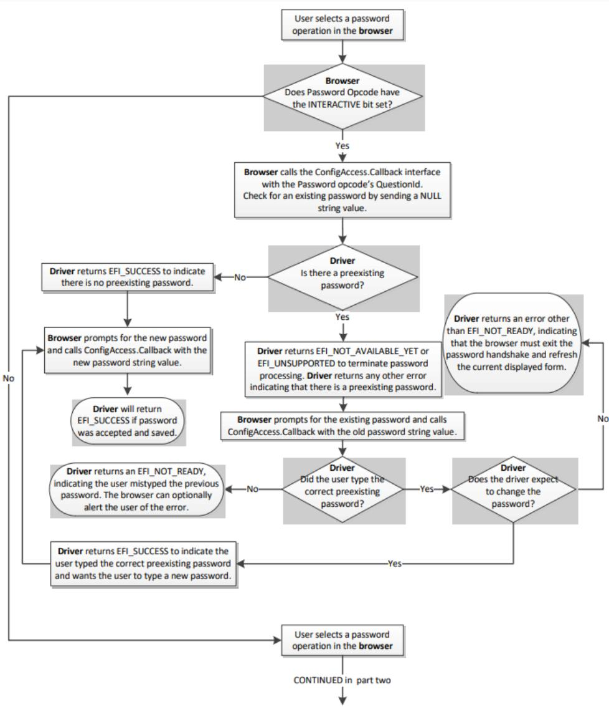  
Fig. 33.48: Password Flowchart (part one)

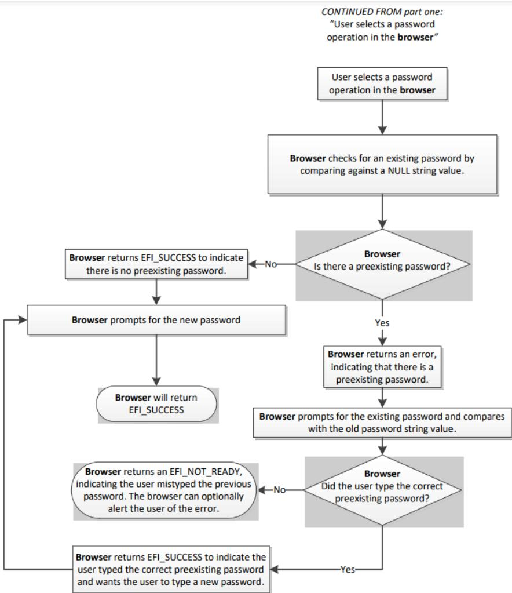  
Fig. 33.49: Password Flowchart (part two)

## Header

The byte sequence that defines the type of opcode as well as the length of the opcode being defined. Header.OpCode = EFI\_IFR\_QUESTION\_REF1\_OP.

## QuestionId

The question’s identifier, which must be unique within the form set.

## Description

Push the value of the question specified by QuestionId on to the expression stack. If the question’s value cannot be determined or the question does not exist, then push Undefined.

## 33.3.8.3.56 EFI\_IFR\_QUESTION\_REF2

## Summary

Pop an integer from the expression stack, convert it to a question id, and push the question value associated with that question id onto the expression stack.

## Prototype

```c
#define EFI_IFR_QUESTION_REF2_OP 0x41
typedef struct _EFI_IFR_QUESTION_REF2 {
    EFI_IFR_OP_HEADER Header;
} EFI_IFR_QUESTION_REF2;
```

## Members

## Header

The byte sequence that defines the type of opcode as well as the length of the opcode being defined. Header.OpCode = EFI\_IFR\_QUESTION\_REF2\_OP.

## Description

This opcode performs the following actions:

1. Pop an integer from the expression stack

2. Convert it to a question id

3. Push the question value associated with that question id onto the expression stack.

If the popped expression cannot be evaluated as an unsigned integer or the value of the unsigned integer is greater than 0xFFFF, then push Undefined onto the expression stack in step 3. If the value of the question specified by the unsigned integer, after converted to a question id, cannot be determined or the question does not exist, also push Undefined onto the expression stack in step 3.

## 33.3.8.3.57 EFI\_IFR\_QUESTION\_REF3

## Summary

Pop an integer from the expression stack, convert it to a question id, and push the question value associated with that question id onto the expression stack.

## Prototype

```c
#define EFI_IFR_QUESTION_REF3_OP 0x51
typedef struct _EFI_IFR_QUESTION_REF3 {
    EFI_IFR_OP_HEADER Header;
} EFI_IFR_QUESTION_REF3;

typedef struct _EFI_IFR_QUESTION_REF3_2 {
    EFI_IFR_OP_HEADER Header;
    EFI_STRING_ID DevicePath;
} EFI_IFR_QUESTION_REF3_2;

typedef struct _EFI_IFR_QUESTION_REF3_3 {
    EFI_IFR_OP_HEADER Header;
    EFI_STRING_ID DevicePath;
    EFI_GUID Guid;
} EFI_IFR_QUESTION_REF3_3;
```

## Members

## Header

The byte sequence that defines the type of opcode as well as the length of the opcode being defined. Header.OpCode = EFI\_IFR\_QUESTION\_REF3\_OP.

## DevicePath

Specifies the text representation of the device path containing the form set where the question is defined. If this is not present or the value is 0 then the device path installed on the EFI\_HANDLE which was registered with the form set containing the current question is used.

## Guid

Specifies the GUID of the form set where the question is defined. If the value is Nil or this field is not present, then the current form set is used (if DevicePath is 0) or the only form set attached to the device path specified by DevicePath is used. If the value is Nil and there is more than one form set on the specified device path, then the value Undefined will be pushed.

## Description

This opcode performs the following actions:

1. Pop an integer from the expression stack

2. Convert it to a question id

3. Push the question value associated with that question id onto the expression stack.

If the popped expression cannot be evaluated as an unsigned integer or the value of the unsigned integer is greater than 0xFFFF, then push Undefined onto the expression stack in step 3. If the value of the question specified by the unsigned integer, after converted to a question id, cannot be determined or the question does not exist, also push Undefined onto the expression stack in step 3.

This version allows question values from other forms to be referenced in expressions.